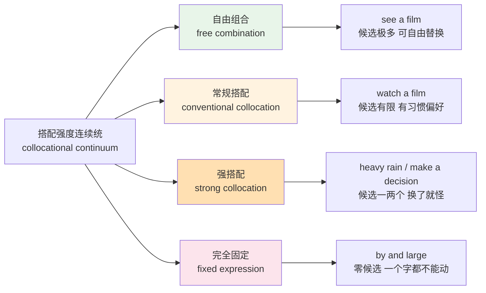
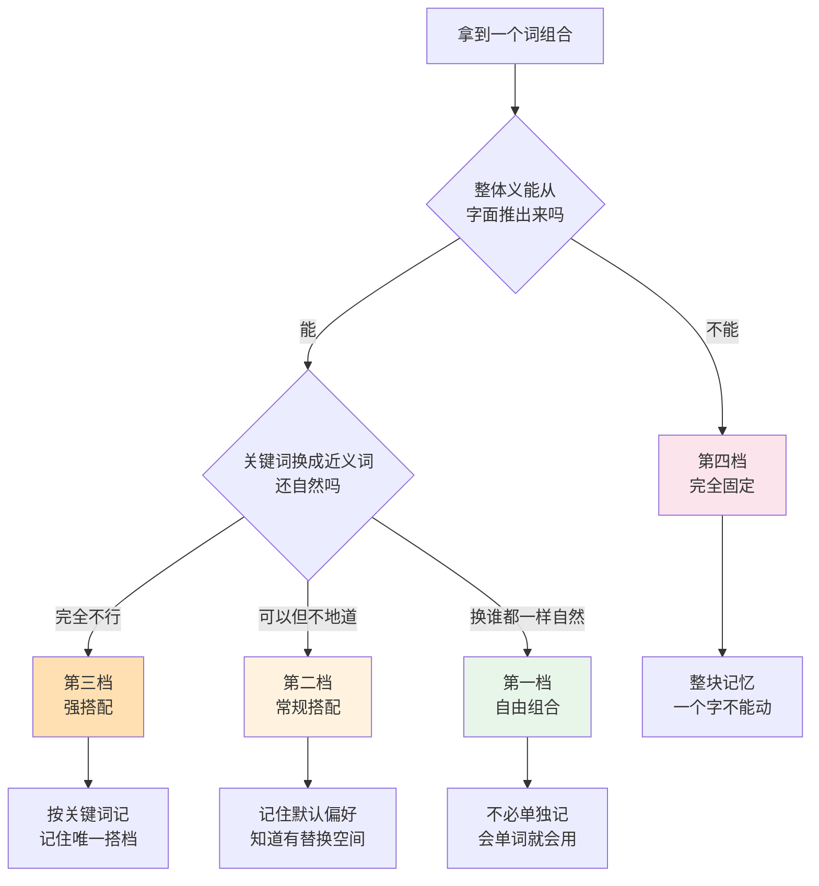
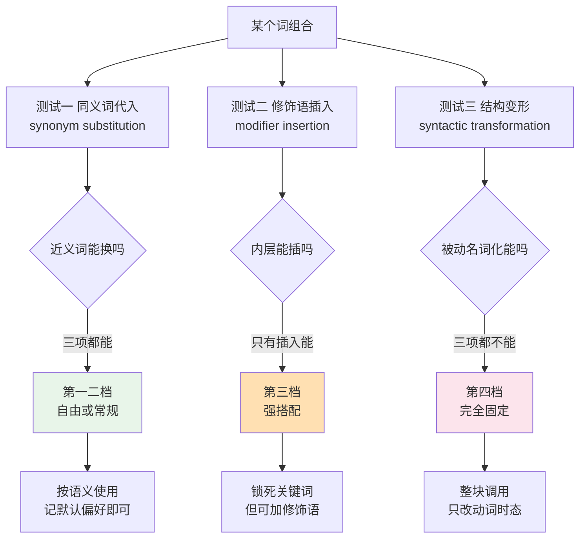
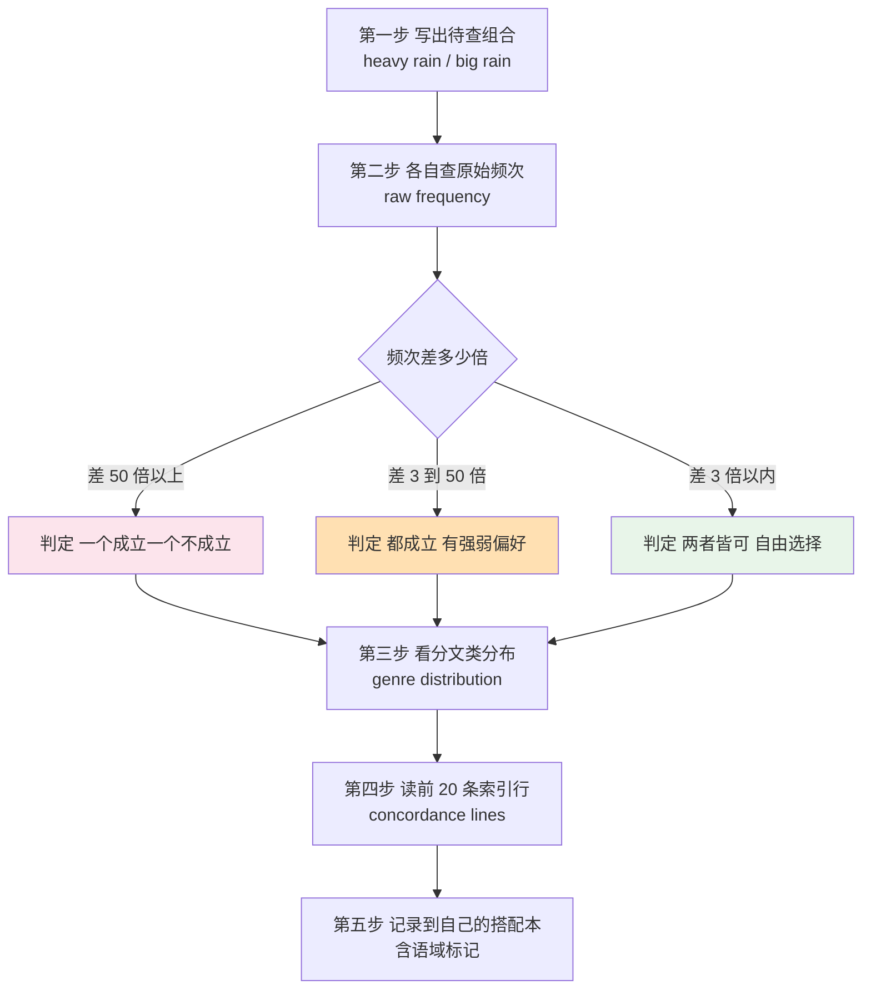
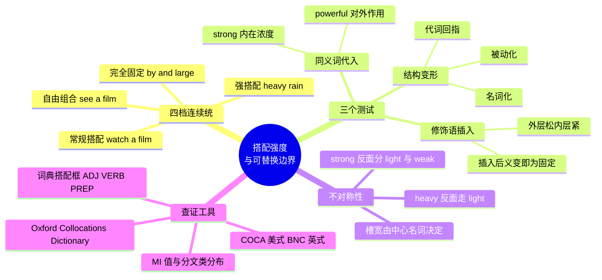

# 搭配强度分级与可替换边界

> [!info] 本篇定位
>
> 第十七章的开篇，也是整章的判据来源。后面五篇讲的是具体搭配（动词加名词、形容词加名词、动介搭配、半固定框架），这一篇讲的是判断标准本身。
>
> 读完你会拿到三样东西：一把量搭配强度的四档标尺，三个能在没有母语直觉时替你判断「这个词能不能换」的可操作测试，以及一套用词典搭配框与 COCA、BNC 频次自查的固定流程。
>
> 上一篇 [[16.词义辨析、搭配与短语动词/06.短语动词（下）on in over through back away\|短语动词（下）]] 处理的是动词加小品词的固化整体，本篇把「固化」这件事本身拆开量化。

---

## 1. 本篇导读：搭配不是背下来就完事

背搭配表的人很多，能判断边界的人很少。差别在下面这类场景里立刻暴露。

你在词表里记住了 `heavy rain`。写邮件时想说「昨晚下了一整夜的大雨」，于是写成 `There was heavy rain overnight`——没问题。再想说「昨夜那场大雨」，写成 `the heavy overnight rain`——也没问题。但如果你记住的是 `by and large`，想说「总体上在过去三年里」，写成 ~~by and quite large~~ 或 ~~by and larger~~，句子立刻崩。

同样是「记住的搭配」，一个能改，一个不能碰。**能不能改，取决于这个组合在连续统上的位置。** 不知道位置，只能靠一次次被母语者纠正来试探边界，成本极高。

中文母语者在这件事上有一个额外的坑：中文的形容词与名词结合非常自由，「大雨、大风、大问题、大人物、大手笔」共用一个「大」，而英语要在 `heavy`、`strong`、`major`、`big`、`bold` 之间切换。中文的自由度让人默认英语也自由，于是造出 `big rain`、`strong traffic`、`open the light` 这类组合——语法全对，母语者一听就知道不是英语。



上图是本篇的骨架。四档不是四个互相隔离的箱子，而是一条从左到右可替换性递减的连续带。左端的组合由语义决定，只要意思讲得通就成立；右端的组合由约定决定，跟语义讲不讲得通无关。绝大多数真实搭配落在中间两档，这也是最需要判据的区间。

第 2 节把四档逐档讲透，第 3 节说明强度这个量是怎么来的，第 4 到 6 节交付三个测试，第 7 节处理最反直觉的不对称现象，第 8 节收拢中文迁移错误，第 9、10 节给出查证工具与流程。

---

## 2. 四档连续统：从自由组合到完全固定

### 2.1 第一档：自由组合 free combination

自由组合指的是：两个词的结合完全由各自的字面义决定，只要语义相容就成立，换成任何同类词都同样自然。

`see a film` 属于这一档。`see` 的义项是「用眼睛感知」，凡是可以被看到的东西都能做它的宾语：`see a film`、`see a bird`、`see the sign`、`see your face`。这个候选池是开放的，大到无法穷举。

| 英文 | 英式音标 | 美式音标 | 词性 | 中文 | 搭配与说明 |
| --- | --- | --- | --- | --- | --- |
| **see** | /siː/ | /siː/ | v. | 看见 | 宾语池开放，凡可视之物皆可 |
| **buy** | /baɪ/ | /baɪ/ | v. | 买 | buy a book / a car / a house，宾语只受「可购买」限制 |
| **read** | /riːd/ | /riːd/ | v. | 读 | read a book / an email / the code，受「有文字」限制 |
| **want** | /wɒnt/ | /wɑːnt/ | v. | 想要 | 宾语几乎无限制 |
| **film** | /fɪlm/ | /fɪlm/ | n. | 电影 | 英式常用，美式多用 movie |
| **movie** | /ˈmuːvi/ | /ˈmuːvi/ | n. | 电影 | 美式常用 |
| **book** | /bʊk/ | /bʊk/ | n. | 书 | 与 read / write / buy / borrow 都自由结合 |
| **letter** | /ˈletə/ | /ˈletər/ | n. | 信；字母 | 两个义项共形，靠搭配区分 |

判定自由组合有一个简单标志：**你能一口气说出五个以上同样自然的替换词，而且这些替换词之间没有优劣。** `see a film / a play / a show / a match / an exhibition` 全部成立，没有哪个更「地道」。

自由组合是学习负担最低的一档。掌握了单词本身的义项，组合能力就自动获得，不需要额外记忆。

### 2.2 第二档：常规搭配 conventional collocation

常规搭配的候选池被收窄了，但没有窄到唯一。语义上讲得通的组合里，只有一部分被实际使用；剩下的虽然不算错，但明显不是母语者的默认选择。

`watch a film` 就在这一档。`see a film` 和 `watch a film` 都成立，但语感不同：`see a film` 偏向「去影院看了一场电影」这个事件，`watch a film` 偏向「盯着屏幕看片」这个持续过程。所以 `I saw that film last week`（上周去看了）和 `I was watching a film when you called`（你打来时我正在看片）各有各的默认选择。

| 英文 | 英式音标 | 美式音标 | 词性 | 中文 | 搭配与说明 |
| --- | --- | --- | --- | --- | --- |
| **watch** | /wɒtʃ/ | /wɑːtʃ/ | v. | 观看 | 强调持续注视，watch TV / a match / a film |
| **catch** | /kætʃ/ | /kætʃ/ | v. | 赶上；观看 | catch a film / a show 偏口语，含「赶场」意味 |
| **take** | /teɪk/ | /teɪk/ | v. | 参加；乘坐 | take an exam / a bus / a photo，槽位各自固定 |
| **sit** | /sɪt/ | /sɪt/ | v. | 参加（考试） | sit an exam 英式，美式说 take an exam |
| **attend** | /əˈtend/ | /əˈtend/ | v. | 出席 | attend a meeting / a lecture，比 go to 正式 |
| **hold** | /həʊld/ | /hoʊld/ | v. | 举行 | hold a meeting / an election / a party |
| **run** | /rʌn/ | /rʌn/ | v. | 经营；运行 | run a business / a test / a script |
| **lecture** | /ˈlektʃə/ | /ˈlektʃər/ | n. | 讲座 | give / attend / deliver a lecture |
| **election** | /ɪˈlekʃn/ | /ɪˈlekʃn/ | n. | 选举 | hold / win / lose / call an election |
| **exam** | /ɪɡˈzæm/ | /ɪɡˈzæm/ | n. | 考试 | take（美）/ sit（英）/ pass / fail / resit |

这一档的特征是：**替换后句子仍然可懂，只是听起来不是本地人说的。** 学习成本比第一档高，因为必须记住偏好，而偏好不能从字面义推出来。

> [!warning] 第二档最容易被忽略
>
> 很多人只肯背第三档的「强搭配」，觉得第二档「反正也不算错」。但真实文本里第二档的占比远高于第三档——一篇技术文档里 `run a test`、`raise an issue`、`hold a lock` 这类组合密度极高，而 `foregone conclusion` 这种强搭配可能一整篇都不出现一次。
>
> 判断标准应该是使用频率，不是「错不错」。

### 2.3 第三档：强搭配 strong collocation

强搭配的候选池收缩到一两个词。要表达某个特定意思时，母语者几乎只会用那一个词，换成语义上等价的近义词，句子就会变得别扭甚至不可解。

`heavy rain` 是最经典的例子。汉语的「大雨」直译成英语，`big rain` 是零候选；`strong rain` 也不行；只有 `heavy rain` 成立。同理，「作出决定」在英语里默认是 `make a decision`（英式书面语也说 `take a decision`），而 ~~do a decision~~、~~give a decision~~ 都不通。

| 英文 | 英式音标 | 美式音标 | 词性 | 中文 | 搭配与说明 |
| --- | --- | --- | --- | --- | --- |
| **heavy** | /ˈhevi/ | /ˈhevi/ | adj. | 重的；大量的 | heavy rain / traffic / smoker / accent / losses |
| **rain** | /reɪn/ | /reɪn/ | n./v. | 雨；下雨 | 修饰语固定为 heavy / light / torrential |
| **traffic** | /ˈtræfɪk/ | /ˈtræfɪk/ | n. | 交通流量 | heavy traffic 拥堵，不可数，无复数 |
| **accent** | /ˈæksent/ | /ˈæksent/ | n. | 口音 | strong / heavy / thick accent 三者皆可 |
| **decision** | /dɪˈsɪʒn/ | /dɪˈsɪʒn/ | n. | 决定 | make a decision；英式书面亦作 take a decision |
| **torrential** | /təˈrenʃl/ | /təˈrenʃl/ | adj. | 倾盆的 | 几乎只修饰 rain 与 downpour |
| **downpour** | /ˈdaʊnpɔː/ | /ˈdaʊnpɔːr/ | n. | 暴雨 | torrential / sudden / heavy downpour |
| **drizzle** | /ˈdrɪzl/ | /ˈdrɪzl/ | n./v. | 毛毛雨 | 本身已含「小」义，不说 light drizzle |
| **commit** | /kəˈmɪt/ | /kəˈmɪt/ | v. | 犯下；提交 | commit a crime / an offence / suicide；技术义 commit a change |
| **crime** | /kraɪm/ | /kraɪm/ | n. | 罪行 | commit a crime，不说 do / make a crime |
| **fierce** | /fɪəs/ | /fɪrs/ | adj. | 激烈的 | fierce competition / opposition / debate |
| **stiff** | /stɪf/ | /stɪf/ | adj. | 激烈的；严厉的 | stiff competition / penalty / resistance |
| **broad** | /brɔːd/ | /brɔːd/ | adj. | 宽的 | in broad daylight 光天化日，不可换 wide |
| **fatal** | /ˈfeɪtl/ | /ˈfeɪtl/ | adj. | 致命的 | fatal mistake / error / flaw / injury |

强搭配是词汇学习真正的难点。它们无法从单词义项推导，只能靠输入积累或查搭配词典获得。

### 2.4 第四档：完全固定 fixed expression

完全固定的组合没有候选池——每个位置都被锁死，改任何一个词都会毁掉整个表达。

`by and large` 意思是「总体上」。这三个词的字面义（凭借、和、大的）跟这个意思毫无关系，语法上也不成立（`and` 连接了一个介词和一个形容词）。它整体作为一个副词使用，内部结构已经石化。

| 英文 | 英式音标 | 美式音标 | 词性 | 中文 | 搭配与说明 |
| --- | --- | --- | --- | --- | --- |
| **by and large** | /ˌbaɪ ən ˈlɑːdʒ/ | /ˌbaɪ ən ˈlɑːrdʒ/ | adv. | 总体而言 | 句首或句中，不可改词不可插入 |
| **once and for all** | /ˌwʌns ən fər ˈɔːl/ | /ˌwʌns ən fər ˈɔːl/ | adv. | 一劳永逸地 | 常与 settle / resolve / decide 连用 |
| **all of a sudden** | /ˌɔːl əv ə ˈsʌdn/ | /ˌɔːl əv ə ˈsʌdn/ | adv. | 突然 | 等于 suddenly，冠词 a 不可去 |
| **in the long run** | /ɪn ðə ˌlɒŋ ˈrʌn/ | /ɪn ðə ˌlɔːŋ ˈrʌn/ | adv. | 从长远看 | 反面是 in the short run |
| **to and fro** | /ˌtuː ən ˈfrəʊ/ | /ˌtuː ən ˈfroʊ/ | adv. | 来回地 | fro 已不能单独使用 |
| **null and void** | /ˌnʌl ən ˈvɔɪd/ | /ˌnʌl ən ˈvɔɪd/ | adj. | 无效的 | 法律文书套语，两词同义叠用 |
| **cease and desist** | /ˌsiːs ən dɪˈzɪst/ | /ˌsiːs ən dɪˈsɪst/ | v. | 停止并不再实施 | 法律语，cease and desist letter 停止侵权函 |
| **part and parcel** | /ˌpɑːt ən ˈpɑːsl/ | /ˌpɑːrt ən ˈpɑːrsl/ | n. | 不可分割的部分 | 后接 of，part and parcel of the job |
| **safe and sound** | /ˌseɪf ən ˈsaʊnd/ | /ˌseɪf ən ˈsaʊnd/ | adj. | 平安无恙 | 作表语或补语，顺序不可颠倒 |
| **odds and ends** | /ˌɒdz ən ˈendz/ | /ˌɑːdz ən ˈendz/ | n. | 零碎东西 | 恒为复数 |
| **pros and cons** | /ˌprəʊz ən ˈkɒnz/ | /ˌproʊz ən ˈkɑːnz/ | n. | 利与弊 | weigh the pros and cons |
| **ups and downs** | /ˌʌps ən ˈdaʊnz/ | /ˌʌps ən ˈdaʊnz/ | n. | 起起落落 | 常接 of life / of the market |
| **rule of thumb** | /ˌruːl əv ˈθʌm/ | /ˌruːl əv ˈθʌm/ | n. | 经验法则 | as a rule of thumb 作插入语 |
| **red herring** | /ˌred ˈherɪŋ/ | /ˌred ˈherɪŋ/ | n. | 转移注意力的幌子 | 议论文与技术讨论里高频 |

这一档里还要区分两个子类。**二项式**（binomial）如 `safe and sound`、`pros and cons`，两个成分同类且用 `and` 连接，顺序被约定锁死，不能说 ~~sound and safe~~。**成语**（idiom）如 `spill the beans`、`bite the bullet`，整体义与字面义无关。

| 英文 | 英式音标 | 美式音标 | 词性 | 中文 | 搭配与说明 |
| --- | --- | --- | --- | --- | --- |
| **spill the beans** | /ˌspɪl ðə ˈbiːnz/ | /ˌspɪl ðə ˈbiːnz/ | v. | 泄露秘密 | 动词可变形 spilled，名词部分不可动 |
| **bite the bullet** | /ˌbaɪt ðə ˈbʊlɪt/ | /ˌbaɪt ðə ˈbʊlɪt/ | v. | 咬牙硬扛 | 技术团队讨论重构时高频 |
| **break the ice** | /ˌbreɪk ði ˈaɪs/ | /ˌbreɪk ði ˈaɪs/ | v. | 打破僵局 | 派生名词 icebreaker |
| **kick the bucket** | /ˌkɪk ðə ˈbʌkɪt/ | /ˌkɪk ðə ˈbʌkɪt/ | v. | 去世（俚） | 极不正式，正式场合绝不可用 |
| **foot the bill** | /ˌfʊt ðə ˈbɪl/ | /ˌfʊt ðə ˈbɪl/ | v. | 付账；买单 | foot 在此为动词，无其他用法 |
| **give and take** | /ˌɡɪv ən ˈteɪk/ | /ˌɡɪv ən ˈteɪk/ | n. | 互相让步 | 作不可数名词用 |

### 2.5 四档的判定流程



这张流程图是可以直接照做的操作步骤。两个判断点分别对应两种不同的固化机制：第一个判断点测的是**语义透明度**（能不能从字面推出整体义），第二个判断点测的是**替换容忍度**（换词后还成不成立）。两者独立——`heavy rain` 语义完全透明却几乎不可替换，`red herring` 语义完全不透明所以整体不可动。

四档定下来之后，记忆策略也就定下来了：第四档整块背，第三档按「关键词加唯一搭档」成对背，第二档记默认偏好，第一档不背。

---

## 3. 强度从哪来：候选数与可预测性

### 3.1 用候选池大小量强度

搭配强度不是感觉，可以被近似量化。最直观的口径是**候选池大小**：给定一个词，在某个语法槽位上能与它自然共现的词有多少个。

```text
see  + [宾语]  →  候选数量级：数千（几乎所有可视之物）
watch + [宾语] →  候选数量级：数百（film match TV screen game …）
heavy + [名词] →  候选数量级：数十（rain traffic smoker accent losses …）
rain  + [前置形容词] → 候选数量级：个位数（heavy light torrential steady …）
by and ___     →  候选数量级：1（large）
```

候选数量级从数千降到 1，就是从第一档滑到第四档的过程。这个数字不必精确，能分出量级就够用了。

反过来看，**可预测性**是候选池大小的倒数。听到 `by and`，母语者几乎百分之百能补出 `large`；听到 `heavy`，能猜出后面是 `rain` 或 `traffic` 之类，但不确定；听到 `see`，完全猜不出宾语。可预测性越高，搭配越强。

### 3.2 语料库怎么算：MI 与 t-score

语料语言学用两个统计量把这件事变成数字。

**MI 值**（mutual information，互信息）衡量的是两个词共现的次数超出随机预期多少倍。两个词各自都不常见、但总是一起出现，MI 值就高。Hunston 在 2002 年的 *Corpora in Applied Linguistics* 里提到，MI 值达到 3 通常被当作「搭配显著」的经验门槛。

**t-score** 衡量的是共现证据的可靠程度，它更受绝对频次影响。高频功能词参与的组合往往 t-score 高而 MI 低。

| 统计量 | 偏向什么 | 典型高分组合 | 用来干什么 |
| --- | --- | --- | --- |
| MI 值 | 独特性 | torrential rain、foregone conclusion | 找强搭配、找专属搭档 |
| t-score | 稳定性 | of the、in the、a lot of | 找高频常规组合 |
| 原始频次 | 绝对出现次数 | make a decision | 判断值不值得学 |

实际使用时两个都要看：MI 高但频次极低的组合可能只在某个专业领域出现，学了用不上；频次高但 MI 低的组合往往是自由组合，本来也不需要专门记。**MI 高且频次也不低的那一批，才是真正要背的强搭配。**

### 3.3 两条并行的组词原则

Sinclair 在 1991 年的 *Corpus, Concordance, Collocation* 里提出，语言产出同时受两条原则支配。

**开放选择原则**（open-choice principle）把语言看成一系列填空：每个位置都可以填入任何语法上合适的词，选择由语义决定。这条原则解释了第一档的自由组合。

**成语原则**（idiom principle）认为使用者调用的其实是大量预制的半成品短语，整块取用，而不是逐词组装。这条原则解释了第三、四档。

| 对比项 | 开放选择原则 | 成语原则 |
| --- | --- | --- |
| 产出方式 | 逐词组装 | 整块调用预制短语 |
| 约束来源 | 语义相容与语法合法 | 使用习惯与社群约定 |
| 对应档位 | 第一档自由组合 | 第三、四档强搭配与固定表达 |
| 学习负担 | 会单词就会用 | 必须逐条记忆 |
| 出错表现 | 几乎不出错 | 造出语法正确但没人这么说的组合 |

第二档正好卡在两条原则的交界处：它既不能靠语义推导（开放选择不够用），也没有强到能整块背下来（成语原则给不了明确的边界）。这一档只能靠大量输入把偏好磨出来，或者靠搭配词典逐条查。第 9、10 节给的工具主要就是为了对付这一档。

对学习者的直接推论是：**产出流利度来自成语原则那一侧的储备量。** 说话时如果每个词都要现场组装，速度必然跟不上；有一批预制块可以整块调用，才可能流畅。这也是背搭配比背单词更能提升口语的原因。

---

## 4. 可替换边界第一测：同义词代入

### 4.1 测试怎么做

同义词代入是三个测试里最基础的一个。步骤只有三步：

① 锁定组合里的**修饰成分**（形容词、副词、动词），保持**被修饰成分**（名词）不动。
② 从词典的同义词栏里取两到三个近义词，逐一代入。
③ 判断代入结果落在「同样自然」「可懂但生硬」「完全不通」三档中的哪一档。

关键在第一步：只换一侧。同时换两侧会导致结果无法解释——你不知道是哪一侧的替换导致了问题。

### 4.2 strong 与 powerful 的分工

`strong coffee`（浓咖啡）成立，`powerful coffee` 不成立。两个词的中文都能译成「强」，但英语里的分工是清晰的。

`strong` 指的是**内在浓度或强度**：物质的浓、结构的牢、感受的烈。`powerful` 指的是**对外施加的作用力**：能推动、能改变、能影响别的东西。

咖啡的「浓」是内在浓度，所以取 `strong`。发动机的「强劲」是对外输出，所以取 `powerful engine`。

| 英文 | 英式音标 | 美式音标 | 词性 | 中文 | 搭配与说明 |
| --- | --- | --- | --- | --- | --- |
| **strong** | /strɒŋ/ | /strɔːŋ/ | adj. | 浓的；强烈的 | 内在浓度或强度，coffee / tea / smell / accent |
| **powerful** | /ˈpaʊəfl/ | /ˈpaʊərfl/ | adj. | 有力的 | 对外作用力，engine / weapon / speech / argument |
| **coffee** | /ˈkɒfi/ | /ˈkɔːfi/ | n. | 咖啡 | strong / weak / black / instant coffee |
| **tea** | /tiː/ | /tiː/ | n. | 茶 | strong / weak tea，与 coffee 同一套修饰语 |
| **smell** | /smel/ | /smel/ | n./v. | 气味；闻 | strong / faint / pungent smell |
| **engine** | /ˈendʒɪn/ | /ˈendʒɪn/ | n. | 发动机；引擎 | powerful engine；技术义 search engine |
| **argument** | /ˈɑːɡjumənt/ | /ˈɑːrɡjumənt/ | n. | 论点；争论 | strong / weak / compelling argument |
| **evidence** | /ˈevɪdəns/ | /ˈevɪdəns/ | n. | 证据 | strong / compelling / circumstantial evidence，不可数 |
| **opposition** | /ˌɒpəˈzɪʃn/ | /ˌɑːpəˈzɪʃn/ | n. | 反对 | strong / fierce / stiff opposition |
| **wind** | /wɪnd/ | /wɪnd/ | n. | 风 | strong / light / gale-force wind，不说 weak wind |

`argument` 是一个有意思的边界例子：`strong argument` 和 `powerful argument` 都成立，因为论点既有内在的严密度（strong），也有对听者的说服力（powerful）。这类两可的情况说明代入测试的结果不总是二元的。

### 4.3 高频同义词组的代入对照

下面这组是中文母语者最常代入失败的几对。左列是成立的搭配，右列是语义上讲得通、实际不用的组合。

| 成立 | 不成立或极罕见 | 为什么 |
| --- | --- | --- |
| **heavy rain** | ~~strong rain~~ / ~~big rain~~ | 降水量用 heavy 计量，不用力度或体积 |
| **strong wind** | ~~heavy wind~~ / ~~big wind~~ | 风用 strong 计力度；heavy 只配可称量的东西 |
| **heavy traffic** | ~~crowded traffic~~ / ~~busy traffic~~（后者偶见） | traffic 是流量概念，用 heavy 计密度 |
| **fast food** | ~~quick food~~ | 已固化为专有类别名 |
| **quick decision** | ~~fast decision~~（可懂但少见） | 时间短用 quick，速度快用 fast |
| **high price** | ~~expensive price~~ | 贵的是商品不是价格，price 只能 high / low |
| **big mistake** | ~~large mistake~~ | 抽象事物的「大」默认 big / major，不用 large |
| **large amount** | ~~big amount~~（口语可，书面不宜） | amount / quantity 搭 large 是书面默认 |
| **deep sleep** | ~~heavy sleep~~（可懂但少见） | 睡眠深度用 deep；heavy sleeper 指人则成立 |
| **broad daylight** | ~~wide daylight~~ | 固化组合，只在这个短语里 broad 不可换 |

> [!tip] 代入测试的取材技巧
>
> 别自己凭空想同义词。打开词典的 SYNONYMS 栏或 THESAURUS 栏，词典给出的同义组是编者已经筛过的，代入测试的信噪比高得多。
>
> Longman（LDOCE）的 THESAURUS 框和 Oxford（OALD）的 SYNONYMS 框都会直接标注差异，很多时候不用做测试，看说明就够了。

### 4.4 副词槽是代入测试最难的一格

形容词加名词的搭配还能靠语义讲通一部分，副词加形容词、副词加动词的搭配几乎全靠约定，是代入测试失败率最高的一格。

中文的「非常、十分、很」在英语里被切成十几个各管一摊的副词，而且每个副词的搭档极少。`highly` 可以配 `likely`、`unlikely`、`successful`、`recommended`，但不能配 `tired`；`bitterly` 可以配 `cold`、`disappointed`，但不能配 `happy`。

| 英文 | 英式音标 | 美式音标 | 词性 | 中文 | 搭配与说明 |
| --- | --- | --- | --- | --- | --- |
| **highly** | /ˈhaɪli/ | /ˈhaɪli/ | adv. | 高度地 | highly likely / successful / recommended |
| **bitterly** | /ˈbɪtəli/ | /ˈbɪtərli/ | adv. | 极其（负面） | bitterly cold / disappointed；不配正面词 |
| **deeply** | /ˈdiːpli/ | /ˈdiːpli/ | adv. | 深深地 | deeply concerned / rooted / grateful |
| **acutely** | /əˈkjuːtli/ | /əˈkjuːtli/ | adv. | 敏锐地 | acutely aware，几乎只配 aware |
| **blissfully** | /ˈblɪsfəli/ | /ˈblɪsfəli/ | adv. | 全然地 | blissfully unaware，成对出现 |
| **painfully** | /ˈpeɪnfəli/ | /ˈpeɪnfəli/ | adv. | 令人难堪地 | painfully shy / slow / obvious |
| **narrowly** | /ˈnærəʊli/ | /ˈnæroʊli/ | adv. | 险些；勉强 | narrowly escape / avoid / defeat |
| **flatly** | /ˈflætli/ | /ˈflætli/ | adv. | 断然地 | flatly refuse / deny / contradict |
| **readily** | /ˈredɪli/ | /ˈredɪli/ | adv. | 容易地 | readily available / accessible |
| **severely** | /sɪˈvɪəli/ | /sɪˈvɪrli/ | adv. | 严重地 | severely damaged / restricted / criticised |
| **sorely** | /ˈsɔːli/ | /ˈsɔːrli/ | adv. | 极其（书面） | sorely missed / tempted / needed |
| **widely** | /ˈwaɪdli/ | /ˈwaɪdli/ | adv. | 广泛地 | widely regarded / used / accepted |

> [!warning] 副词搭配不能靠语义倒推
>
> `bitterly` 的字面义是「苦涩地」，但 `bitterly cold`（刺骨的冷）跟苦味毫无关系。这类副词的搭配范围是历史沉淀的结果，推不出来。
>
> - ❌ ~~bitterly happy~~ / ~~highly tired~~ / ~~deeply expensive~~
> - ✅ **deliriously happy** / **utterly exhausted** / **prohibitively expensive**
>
> 处理办法只有一个：查词典时把副词连同它的固定搭档整对抄下来，永远不单独记副词。

### 4.5 代入失败的三种表现

代入失败不是只有一种样子，区分清楚有助于判断问题出在哪一层。

**表现一：完全不可解。** `powerful coffee` 让人愣住，因为咖啡不施加作用力。这说明两个词的语义特征直接冲突。

**表现二：可解但改变意思。** `light rain` 和 `heavy rain` 都成立，但意思相反。这不是失败，是替换成功——只是替换后表达的是另一件事。做测试时要分清「不成立」和「成立但换了意思」。

**表现三：可解但语域跳档。** `commence a meeting` 语法与语义都对，但把日常会议说得像开庭。这类失败在第十八章语域篇里会展开，本篇只需要标记出来：代入测试要连语域一起看。

> [!example] 三种失败的对照
>
> - We had a **powerful** coffee before the meeting.
>   - 完全不可解——咖啡不发力。
> - We had **light** rain all afternoon.
>   - 替换成功，但说的是小雨，不是大雨。
> - Shall we **commence** the standup?
>   - 语法正确，但日常站会用 commence 显得滑稽，母语者说 start。

---

## 5. 可替换边界第二测：修饰语插入

### 5.1 插入测试的原理

同义词代入测的是**横向替换**能力，插入测试测的是**纵向扩展**能力：这个组合内部还容不容得下别的成分。

原理很简单：越固化的组合内部越紧，紧到插不进任何东西。松散的组合内部有空隙，可以塞进修饰语而不影响整体。

`heavy rain` 可以插入：`heavy overnight rain`（一夜的大雨）、`heavy persistent rain`（持续的大雨）、`heavy tropical rain`（热带暴雨）。插进去之后整个短语依然自然，说明 `heavy` 与 `rain` 之间还有句法空间。

`by and large` 插不进任何东西。~~by and very large~~、~~by and quite large~~ 都是废句。这证明它已经不是三个词，而是一个整体单位。

### 5.2 能插与不能插的对照

| 组合 | 插入后 | 结果 | 说明 |
| --- | --- | --- | --- |
| heavy rain | heavy **overnight** rain | ✅ 成立 | 名词短语内部有空隙 |
| heavy traffic | heavy **rush-hour** traffic | ✅ 成立 | 同上 |
| strong coffee | strong **black** coffee | ✅ 成立 | 两个形容词并列 |
| make a decision | make a **difficult** decision | ✅ 成立 | 动宾之间可插形容词 |
| make a decision | make a **quick final** decision | ✅ 成立 | 可插多层 |
| break the ice | ~~break the **thick** ice~~ | ❌ 失去成语义 | 插入后回落成字面义 |
| spill the beans | ~~spill the **cooked** beans~~ | ❌ 失去成语义 | 同上 |
| by and large | ~~by and **very** large~~ | ❌ 完全不通 | 整体单位不可切开 |
| in the long run | ~~in the **very** long run~~（罕见） | ⚠️ 边缘 | 偶见于经济学写作，一般不用 |
| rule of thumb | ~~rule of **left** thumb~~ | ❌ 完全不通 | 同上 |

上表里 `break the ice` 的失败方式值得单独说：插入 `thick` 之后句子并没有变得不合语法，而是**意思塌回字面**——变成了真的去砸冰块。这是成语被破坏时最典型的信号。第四档的组合被插入后往往不是「不通」，而是「通了，但通到别的意思上去了」。

| 英文 | 英式音标 | 美式音标 | 词性 | 中文 | 搭配与说明 |
| --- | --- | --- | --- | --- | --- |
| **overnight** | /ˌəʊvəˈnaɪt/ | /ˌoʊvərˈnaɪt/ | adj./adv. | 整夜的；一夜之间 | 作定语时重音前移 /ˈəʊvənaɪt/ |
| **persistent** | /pəˈsɪstənt/ | /pərˈsɪstənt/ | adj. | 持续的 | persistent rain / cough / problem |
| **steady** | /ˈstedi/ | /ˈstedi/ | adj. | 稳定的 | steady rain / growth / decline |
| **rush-hour** | /ˈrʌʃ aʊə/ | /ˈrʌʃ aʊər/ | adj. | 高峰期的 | rush-hour traffic，作定语时带连字符 |
| **tropical** | /ˈtrɒpɪkl/ | /ˈtrɑːpɪkl/ | adj. | 热带的 | tropical storm / rain / climate |
| **final** | /ˈfaɪnl/ | /ˈfaɪnl/ | adj. | 最终的 | final decision / version / draft |
| **difficult** | /ˈdɪfɪkəlt/ | /ˈdɪfɪkəlt/ | adj. | 困难的 | difficult decision / question / situation |
| **thick** | /θɪk/ | /θɪk/ | adj. | 厚的；浓的 | thick fog / accent / ice |

### 5.3 插入位置的三个槽

做插入测试时，试的位置不能随便选。名词短语里有三个槽，从外到内固化程度递增。

```text
[ 限定词 ]  [ 外层修饰 ]  [ 内层修饰 ]  [ 中心名词 ]
    the         heavy         overnight        rain
    a          difficult      final           decision
```

**外层槽**（离中心名词远）最松，几乎总能插。**内层槽**（紧贴中心名词）最紧，能不能插取决于组合强度。而在第四档的组合里，三个槽全部锁死。

实际操作时按这个顺序试：先试外层，成功不能说明什么；再试内层，内层能插才说明这个组合还留有句法自由度。

> [!warning] 插入测试的一个陷阱
>
> 有些组合内层插不进形容词，但能插进副词或整个从句，这不代表它是固定表达。`make a decision` 内层可插 `make a well-informed decision`，同时 `make, after long deliberation, a decision` 这种插入虽然生硬却不算错。
>
> 判断时以**形容词插入内层**为准，别被其他插入方式干扰。

---

## 6. 可替换边界第三测：结构变形

### 6.1 名词化测试

结构变形是三个测试里最锋利的一个。它测的是：这个组合里的成分还保不保有独立的语法身份。

**名词化**指把动宾结构改写成名词短语。`make a decision` → `decision-making`，成立；`decide` 与 `decision` 的关系依然在。再看 `take a photo` → `photo-taking`，也成立。

而 `kick the bucket`（去世）无法名词化成 ~~bucket-kicking~~ 表示「死亡」——就算写出来，读者只会理解成「踢桶这个动作」。

| 原组合 | 名词化 | 结果 | 说明 |
| --- | --- | --- | --- |
| make a decision | decision-making | ✅ | 复合名词已进入词典 |
| take a risk | risk-taking | ✅ | risk-taking behaviour 高频 |
| solve a problem | problem-solving | ✅ | problem-solving skills 高频 |
| break a record | record-breaking | ✅ | 派生出形容词用法 |
| meet a deadline | ~~deadline-meeting~~ | ❌ | 无此复合词，说 meeting deadlines |
| kick the bucket | ~~bucket-kicking~~ | ❌ | 成语不可名词化 |
| by and large | — | ❌ | 无动宾结构，测试不适用 |

名词化成功说明动词与宾语各自还是独立的语义单位，组合停在第二或第三档。名词化失败且整体义丢失，说明已经进入第四档。

### 6.2 被动化测试

**被动化**把宾语提到主语位置。`They made a decision` → `A decision was made`，成立且自然。

`He kicked the bucket`（他死了）→ ~~The bucket was kicked~~ 只能理解成字面的「桶被踢了」。成语义在被动化中丢失。

| 主动 | 被动 | 结果 |
| --- | --- | --- |
| They made a difficult decision. | A difficult decision **was made**. | ✅ 自然 |
| The court reached a verdict. | A verdict **was reached**. | ✅ 自然 |
| They committed a serious crime. | A serious crime **was committed**. | ✅ 自然 |
| She broke the ice. | ~~The ice was broken.~~ | ❌ 只剩字面义 |
| He spilled the beans. | ~~The beans were spilled.~~ | ❌ 只剩字面义 |
| They foot the bill. | The bill **was footed** by the company. | ⚠️ 边缘可用，略生硬 |

| 英文 | 英式音标 | 美式音标 | 词性 | 中文 | 搭配与说明 |
| --- | --- | --- | --- | --- | --- |
| **verdict** | /ˈvɜːdɪkt/ | /ˈvɜːrdɪkt/ | n. | 裁决 | reach / return / deliver a verdict |
| **deadline** | /ˈdedlaɪn/ | /ˈdedlaɪn/ | n. | 截止期限 | meet / miss / extend a deadline |
| **precedent** | /ˈpresɪdənt/ | /ˈpresɪdənt/ | n. | 先例 | set / establish a precedent |
| **concession** | /kənˈseʃn/ | /kənˈseʃn/ | n. | 让步 | make / offer / win a concession |
| **objection** | /əbˈdʒekʃn/ | /əbˈdʒekʃn/ | n. | 异议 | raise / lodge / overrule an objection |
| **complaint** | /kəmˈpleɪnt/ | /kəmˈpleɪnt/ | n. | 投诉 | lodge / file / handle a complaint |
| **tribute** | /ˈtrɪbjuːt/ | /ˈtrɪbjuːt/ | n. | 致敬 | pay tribute to sb |
| **grudge** | /ɡrʌdʒ/ | /ɡrʌdʒ/ | n. | 积怨 | bear / hold / nurse a grudge |
| **brunt** | /brʌnt/ | /brʌnt/ | n. | 冲击的主要部分 | bear the brunt of，几乎只出现在这个短语里 |
| **resemblance** | /rɪˈzembləns/ | /rɪˈzembləns/ | n. | 相似 | bear a striking resemblance to |

`brunt` 值得单独注意：它的候选池小到只剩一个短语 `bear the brunt of`。这类词被称为**孤立词**，它们除了那一个搭配之外几乎不出现。学这类词等于学那个短语本身。

### 6.3 关系从句与代词回指

第三种变形是把组合的名词成分提出来做关系从句的先行词，或者用代词回指它。

> [!example] 回指测试的对照
>
> - They made a decision. **It** was the right one.
>   - 他们做了个决定，那是正确的决定。（`it` 成功指回 `a decision`，组合可拆）
> - The decision **that they made** was widely criticised.
>   - 他们做的那个决定遭到广泛批评。（关系从句成立）
> - He kicked the bucket. ~~**It** was rusty.~~
>   - 回指失败——`it` 只能指真的桶，成语义断掉。
> - ~~The bucket **that he kicked** shocked everyone.~~
>   - 关系从句把成语拆散，整体义消失。

回指测试之所以有效，是因为代词回指要求先行词是一个**独立的所指实体**。第四档组合里的名词不再指任何实体，它只是短语内部的一个音节串，所以无法被指回。

### 6.4 三测的综合判据



三个测试的结果通常是一致的：越往右档，三项都越倾向于失败。但它们的**敏感度不同**——插入测试最迟钝（很多第三档组合仍可插入），结构变形最灵敏（第四档一测就露）。

实际操作里的效率顺序是：先做代入测试（最快，查词典同义栏就行），有疑问再做插入测试，仍然拿不准才做结构变形。三个都做完还判断不了的，直接进第 10 节查语料库。

---

## 7. 替换的不对称性

### 7.1 反义槽位不成对

最反直觉的一点：搭配的正反两面往往不共用同一套词。

`heavy rain` 的反面不是 ~~weak rain~~ 也不是 ~~small rain~~，而是 `light rain`。这一对是成立的：heavy / light 在「量」这个维度上互为反义。

但同一个 `heavy` 换个中心词，反义词就未必跟着走。

| 正面 | 反面 | 反面是否成立 |
| --- | --- | --- |
| heavy rain | light rain | ✅ 成对 |
| heavy traffic | light traffic | ✅ 成对 |
| heavy smoker | light smoker | ✅ 成对 |
| heavy drinker | light drinker | ✅ 成对 |
| heavy meal | light meal | ✅ 成对 |
| heavy accent | ~~light accent~~ | ❌ 说 slight accent 或 faint accent |
| heavy losses | ~~light losses~~ | ⚠️ 军事语境可用，一般说 minor losses |
| strong wind | light wind | ✅ 但不说 weak wind |
| strong coffee | weak coffee | ✅ 成对 |
| strong evidence | weak evidence | ✅ 成对 |
| strong argument | weak argument | ✅ 成对 |
| strong smell | faint smell | ✅ 但不说 weak smell |

上表暴露的规律是：**「强」的反面在英语里默认走 light 这条线，只有在「浓度可稀释」的语义域里才走 weak。** 咖啡、茶、溶液、论据、证据、信号都可以被「稀释」，所以有 weak；风、雨、交通流量、口味只有量的多少，所以走 light。

### 7.2 一个常被引错的例子

> [!warning] 「strong coffee 没有 weak coffee」这个说法不准确
>
> 很多搭配教材用「strong coffee 找不到对应的 weak coffee」来说明不对称性。这个例子选错了——`weak coffee`（淡咖啡）在真实语料里完全成立，不算低频，词典里也有收录。
>
> 真正的不对称在别处：
>
> - ❌ ~~weak wind~~ / ~~weak rain~~ / ~~weak traffic~~（应为 light wind / light rain / light traffic）
> - ❌ ~~heavy coffee~~ / ~~heavy tea~~ / ~~heavy evidence~~（应为 strong coffee / strong tea / strong evidence）
> - ✅ **strong coffee** ↔ **weak coffee**（这一对恰好成立）
>
> 结论是：不对称不在「某个词没有反面」，而在**每个词的反面各走各的槽位，不能交叉**。heavy 的反面是 light，strong 的反面视语义域在 light 与 weak 之间分工。

这条修正比原来的说法更有操作价值：遇到一个强搭配想表达相反的意思，不要从中文反义词出发去猜，要单独查这个中心名词的反向修饰语。查 `rain` 的时候顺手记下 heavy / light / torrential / steady 整组，比记住 heavy 一个再去猜反面靠谱得多。

### 7.3 单向可替换

还有一种不对称：A 能换成 B，但 B 不能换成 A。

`strong accent`、`heavy accent`、`thick accent` 三者互通。但 `strong tea` 不能换成 ~~heavy tea~~ 或 ~~thick tea~~。也就是说，`accent` 这个中心词的修饰语槽很宽，`tea` 的槽很窄。

| 中心名词 | 可用修饰语 | 不可用 | 槽宽 |
| --- | --- | --- | --- |
| **accent** 口音 | strong / heavy / thick / slight / faint / broad | — | 宽 |
| **tea** 茶 | strong / weak | ~~heavy~~ / ~~thick~~ | 窄 |
| **rain** 雨 | heavy / light / torrential / steady / driving | ~~strong~~ / ~~big~~ | 窄 |
| **fog** 雾 | thick / dense / heavy / patchy | ~~strong~~ | 中 |
| **competition** 竞争 | fierce / stiff / intense / cut-throat | ~~heavy~~ / ~~strong~~（后者边缘） | 中 |

槽宽由中心名词决定，不由修饰语决定。同一个 `strong` 在 accent 上通行、在 rain 上失效，差别不在 strong，而在两个名词各自能容纳多少修饰语。

这条规律指向一个实用做法：**做同义词代入测试时，要以中心名词为单位收集修饰语，而不是以修饰语为单位收集名词。** 记住「accent 可以配 strong / heavy / thick / slight / faint / broad」，比记住「heavy 可以配 rain / traffic / accent / smoker」更有产出价值——因为说话时是先想到要说「口音」，再去找修饰语。

搭配词典的编排方式也印证了这一点：Oxford Collocations Dictionary 按中心名词立条目，条目下再分修饰语、动词、介词等类别，正是这个逻辑。

---

## 8. 中文直译最容易造出的搭配错误

中文母语者的搭配错误高度集中，绝大多数来自一个动作：**把中文的搭配单位整块译成英语**。

| 中文 | 直译（错） | 英语实际说法 | 出错原因 |
| --- | --- | --- | --- |
| 开灯 | ~~open the light~~ | **turn on** the light | 中文「开」覆盖开关与打开两义 |
| 大雨 | ~~big rain~~ | **heavy** rain | 中文「大」是通用量级词 |
| 学习知识 | ~~learn knowledge~~ | **acquire** knowledge / **learn** things | knowledge 不与 learn 搭配 |
| 提高水平 | ~~improve the level~~ | **raise** the standard / **improve** your skills | level 不做 improve 的默认宾语 |
| 接电话 | ~~receive the phone~~ | **answer** the phone / **take** a call | 接听用 answer |
| 花时间 | ~~cost time~~ | **spend** time / **take** time | 主语是人用 spend，主语是事用 take |
| 犯错误 | ~~do a mistake~~ | **make** a mistake | 制造类动作用 make |
| 做作业 | ~~make homework~~ | **do** homework | 执行类动作用 do |
| 提意见 | ~~give opinion~~ | **offer** feedback / **make** a suggestion | 中文「提」在英语里分三个动词 |
| 打电话 | ~~hit a phone~~ | **make** a call / **call** sb | 中文「打」是万能动词 |
| 拍照 | ~~shoot a photo~~ | **take** a photo | 摄影用 take；shoot 只用于影片与专业摄影 |
| 遵守规定 | ~~obey the rule~~（偏军事） | **follow** / **comply with** the rules | 日常用 follow，正式用 comply with |
| 严重的问题 | ~~heavy problem~~ | **serious** / **major** problem | 抽象事物的严重度用 serious |
| 交通很挤 | ~~crowded traffic~~ | **heavy** traffic | 拥挤修饰的是地点不是流量 |
| 价格很贵 | ~~expensive price~~ | **high** price | 贵的是商品，价格只有高低 |

| 英文 | 英式音标 | 美式音标 | 词性 | 中文 | 搭配与说明 |
| --- | --- | --- | --- | --- | --- |
| **acquire** | /əˈkwaɪə/ | /əˈkwaɪər/ | v. | 获得；习得 | acquire knowledge / a skill / a habit |
| **knowledge** | /ˈnɒlɪdʒ/ | /ˈnɑːlɪdʒ/ | n. | 知识 | 不可数，to my knowledge 据我所知 |
| **standard** | /ˈstændəd/ | /ˈstændərd/ | n. | 水平；标准 | raise / lower / meet a standard |
| **comply** | /kəmˈplaɪ/ | /kəmˈplaɪ/ | v. | 遵守 | 固定接 with，comply with the rules |
| **suggestion** | /səˈdʒestʃən/ | /səˈdʒestʃən/ | n. | 建议 | make / offer / reject a suggestion |
| **feedback** | /ˈfiːdbæk/ | /ˈfiːdbæk/ | n. | 反馈 | give / receive / act on feedback，不可数 |
| **serious** | /ˈsɪəriəs/ | /ˈsɪriəs/ | adj. | 严重的 | serious problem / injury / concern |
| **major** | /ˈmeɪdʒə/ | /ˈmeɪdʒər/ | adj. | 重大的 | major change / issue / release |
| **mistake** | /mɪˈsteɪk/ | /mɪˈsteɪk/ | n. | 错误 | make a mistake，不用 do |
| **negligence** | /ˈneɡlɪdʒəns/ | /ˈneɡlɪdʒəns/ | n. | 疏忽 | gross negligence 重大过失，法律术语 |

> [!warning] 直译错误的共同结构
>
> 观察上表会发现一个规律：出错的位置几乎全在**中文的万能动词**上——「开、打、做、提、接、上」这几个字在中文里能带极多宾语，在英语里则分裂成一批各管一摊的动词。
>
> 对策不是逐条记错误，而是**反向记忆**：遇到这几个万能动词，一律不直译，先想清楚具体动作是什么，再去查英语用哪个动词。第十七章第二篇 [[17.固定搭配/02.动词+名词搭配（上）make、do、have、take\|动词加名词搭配]] 处理的正是这批动词的分工。

---

## 9. 词典里的搭配标注怎么读

### 9.1 四类标注方式

主流学习词典都标搭配，但呈现方式不同，读法也不同。

| 词典 | 标注形式 | 特点 | 适用场景 |
| --- | --- | --- | --- |
| OALD（牛津高阶） | COLLOCATIONS 蓝框 | 按主题成块给出，含例句 | 写作时找短语块 |
| LDOCE（朗文当代） | COLLOCATIONS 与 THESAURUS 框 | 搭配与近义辨析分开标 | 做同义词代入测试 |
| Collins COBUILD | 例句本身来自语料 | 无独立搭配框，靠例句体现 | 看真实用例 |
| Oxford Collocations Dictionary | 整本就是搭配词典 | 按中心名词立条，分 adj./verb+n./prep. | 系统查一个词的全部搭档 |

**Oxford Collocations Dictionary**（简称 OCD）是这一章最该常备的工具。它的条目结构固定：

```text
rain  noun
  ADJ.   heavy, torrential | light, slight | steady | driving
  VERB+  bring, produce
  RAIN+  fall, pour down, beat, lash
  PREP.  in the ~
  PHRASES a drop of rain, a spot of rain
```

`ADJ.` 行给出所有能修饰它的形容词，用 `|` 分组——同一组内语义接近，不同组之间语义分道。上例里 `heavy, torrential` 一组（大），`light, slight` 一组（小），一眼就能看出反义槽位怎么配。

`VERB+` 是「以它作宾语的动词」，`RAIN+` 是「以它作主语的动词」。这两行区分开之后，主动被动都不会用错。

### 9.2 频次标记与用法标记

学习词典还会给出频次与语域标记，读词表时要一起看。

| 标记 | 含义 | 出现位置 |
| --- | --- | --- |
| 红色词条 / 星号 | 高频词，优先掌握 | LDOCE 用红色，OALD 用 OPAL 标签 |
| BrE / AmE | 英美用法差异 | 词条或义项后 |
| formal / informal | 语域 | 义项前的方括号 |
| esp. spoken / written | 使用媒介偏好 | 义项前 |
| technical / law / medicine | 专业领域限定 | 义项前 |
| ~ | 代替中心词本身 | 搭配栏与例句里 |

> [!tip] 查搭配的固定动作
>
> 查一个新名词时，别只看释义就关掉。多花二十秒做完这三步：
>
> ① 看 ADJ. 行，抄下前三个形容词。
> ② 看 VERB+ 行，抄下前两个动词。
> ③ 看 PREP. 行，抄下它固定接哪个介词。
>
> 三行抄完，这个名词的可用度立刻从「认得」升到「能写进句子」。这个动作比多背两个新词的收益高得多。

### 9.3 免费在线工具

除了付费词典，几个免费站点在做搭配自查时很够用：

| 工具 | 数据来源 | 能做什么 |
| --- | --- | --- |
| **ozdic** | 基于 Oxford Collocations Dictionary 数据 | 按名词查完整搭配列表 |
| **Just The Word** | BNC 语料 | 输入组合，返回频次与更常用的替换建议 |
| **SkELL** | Sketch Engine 的免费入口 | 给出词汇速写与真实例句 |
| **Netspeak** | 网络语料 | 用通配符查「哪个词填这个空最常见」 |

Netspeak 的通配符查询对第二档尤其有用：输入 `make a ? decision`，返回按频次排序的填空候选，直接看出母语者最常插入哪个形容词。

---

## 10. COCA 与 BNC 频次自查五步法

### 10.1 两个语料库的基本情况

**COCA**（Corpus of Contemporary American English）由 Mark Davies 建设，收录当代美式英语，涵盖口语、小说、杂志、报纸、学术、网页、博客、影视字幕等多个文类，规模在十亿词量级，并持续更新。

**BNC**（British National Corpus）收录英式英语，规模一亿词，取材主要集中在二十世纪八十年代末到九十年代初，之后基本不再扩充。

两者的分工是清楚的：查美式当代用法用 COCA，查英式用法用 BNC；要判断一个搭配是不是「过时了」，对比两者的时间跨度会有帮助。

### 10.2 五步自查流程



上图把判断压缩成一个可执行的循环。倍数阈值不是精确科学，但足以分出档次：差五十倍以上基本可以判定其中一个是学习者造词；差三倍以内的两个组合，选哪个都不会被挑毛病。

**第三步的分文类分布**最容易被跳过，其实信息量最大。同一个搭配在 ACADEMIC 文类里高频、在 SPOKEN 里近乎为零，说明它是书面正式用法，写进口语会突兀。反过来在 TV/MOVIES 里高频而 ACADEMIC 为零的，是口语专用。

**第四步读索引行**指的是看关键词在真实句子里的上下文（concordance）。二十行足够看出三件事：主语通常是什么、时态倾向、常一起出现的第三个词。

### 10.3 一个完整走查示例

> [!example] 走查 `make a decision` 与 `take a decision`
>
> **第一步**：两个候选都写下来。
>
> **第二步**：在 COCA 里 `make a decision` 频次远高于 `take a decision`；在 BNC 里两者差距明显缩小。
>
> **第三步**：`take a decision` 在 BNC 的新闻与官方文书文类里集中出现，口语文类稀少。
>
> **第四步**：索引行显示 `take a decision` 的主语多为机构（the board, the committee, the government），`make a decision` 的主语人与机构都有。
>
> **第五步**：记入搭配本——
>
> - **make a decision**：通用，英美皆可，主语不限。
> - **take a decision**：英式书面偏正式，主语多为机构。写给美国同事的邮件优先用 make。

这个流程的价值在于它能处理词典给不了答案的情况。词典会告诉你两个都对，但不会告诉你在你的具体场合该用哪个。

> [!warning] 语料库频次不是唯一裁判
>
> 频次低不等于错。专业领域词汇（`gross negligence`、`foregone conclusion`）在通用语料里频次都不高，但在各自的领域文本里完全正常。
>
> 判断顺序应该是：先看**分文类分布**，再看总频次。总频次为零才是真的不成立。

---

## 11. 技术文档里的高频强搭配

读英文技术文档时遇到的强搭配自成一个子集，跟通用词表重叠不多。它们的固化程度普遍在第二到第三档，而且几乎全部是动词加名词。

| 英文 | 英式音标 | 美式音标 | 词性 | 中文 | 搭配与说明 |
| --- | --- | --- | --- | --- | --- |
| **throw** | /θrəʊ/ | /θroʊ/ | v. | 抛出 | throw an exception，Java / JS 用语 |
| **raise** | /reɪz/ | /reɪz/ | v. | 抛出；提出 | raise an exception（Python）/ raise an issue |
| **catch** | /kætʃ/ | /kætʃ/ | v. | 捕获 | catch an exception，与 throw 成对 |
| **exception** | /ɪkˈsepʃn/ | /ɪkˈsepʃn/ | n. | 异常 | throw / catch / handle / swallow an exception |
| **swallow** | /ˈswɒləʊ/ | /ˈswɑːloʊ/ | v. | 吞掉 | swallow an exception 指静默吞异常，贬义 |
| **merge** | /mɜːdʒ/ | /mɜːrdʒ/ | v. | 合并 | merge a branch / a pull request |
| **branch** | /brɑːntʃ/ | /bræntʃ/ | n. | 分支 | create / merge / delete / rebase a branch |
| **conflict** | /ˈkɒnflɪkt/ | /ˈkɑːnflɪkt/ | n. | 冲突 | resolve a conflict；名词重音在前 |
| **resolve** | /rɪˈzɒlv/ | /rɪˈzɑːlv/ | v. | 解决 | resolve a conflict / a dependency / a promise |
| **deploy** | /dɪˈplɔɪ/ | /dɪˈplɔɪ/ | v. | 部署 | deploy to production / to staging |
| **roll back** | /ˌrəʊl ˈbæk/ | /ˌroʊl ˈbæk/ | v. | 回滚 | roll back a change / a release；名词 rollback |
| **regression** | /rɪˈɡreʃn/ | /rɪˈɡreʃn/ | n. | 回归缺陷 | introduce / catch / fix a regression |
| **deprecate** | /ˈdeprəkeɪt/ | /ˈdeprəkeɪt/ | v. | 弃用 | deprecate an API；形容词 deprecated |
| **bottleneck** | /ˈbɒtlnek/ | /ˈbɑːtlnek/ | n. | 瓶颈 | identify / eliminate a bottleneck |
| **latency** | /ˈleɪtnsi/ | /ˈleɪtnsi/ | n. | 延迟 | reduce / measure latency；不可数 |
| **throughput** | /ˈθruːpʊt/ | /ˈθruːpʊt/ | n. | 吞吐量 | increase / measure throughput；不可数 |
| **overhead** | /ˈəʊvəhed/ | /ˈoʊvərhed/ | n. | 额外开销 | incur / reduce overhead；不可数 |
| **outage** | /ˈaʊtɪdʒ/ | /ˈaʊtɪdʒ/ | n. | 服务中断 | cause / cause an outage；a two-hour outage |
| **incident** | /ˈɪnsɪdənt/ | /ˈɪnsɪdənt/ | n. | 事故 | declare / escalate / close an incident |
| **mitigate** | /ˈmɪtɪɡeɪt/ | /ˈmɪtɪɡeɪt/ | v. | 缓解 | mitigate a risk / an incident；不说 mitigate a bug |
| **vulnerability** | /ˌvʌlnərəˈbɪləti/ | /ˌvʌlnərəˈbɪləti/ | n. | 漏洞 | disclose / patch / exploit a vulnerability |
| **breach** | /briːtʃ/ | /briːtʃ/ | n./v. | 泄露；违反 | a data breach；breach a contract |
| **schema** | /ˈskiːmə/ | /ˈskiːmə/ | n. | 模式；结构 | define / migrate a schema；复数 schemas 或 schemata |
| **dependency** | /dɪˈpendənsi/ | /dɪˈpendənsi/ | n. | 依赖 | pin / bump / resolve a dependency |

> [!example] 技术强搭配的几个易错点
>
> - We need to **fix** this bug, not ~~mitigate~~ it.
>   - bug 只能 fix，不能 mitigate；mitigate 的宾语是 risk 与 impact。
> - The library is **deprecated**, not ~~abandoned~~.
>   - deprecated 指官方标注不再推荐，abandoned 指无人维护，两者不同。
> - Please **bump** the dependency to 4.2, not ~~upgrade the dependency version number~~.
>   - bump 是社区固定说法，简短且明确。
> - The change **introduced** a regression.
>   - regression 的默认动词是 introduce（引入）与 catch（发现），不用 make。

技术搭配的一个共同特点：**它们的固化程度比通用词更高，但覆盖面更窄。** `swallow an exception`、`bump a dependency` 这类组合在通用语料里频次极低，在技术文本里却是默认说法。所以查证时不能只依赖通用语料库，要直接看目标领域的真实文档——官方 README、RFC、issue 讨论都是好素材。

---

## 12. 本篇小结



> [!success] 本篇核心要点回顾
>
> 1. 词与词的结合是一条**四档连续统**，不是二元的对错：自由组合、常规搭配、强搭配、完全固定，可替换性从左到右递减。
> 2. 判定档位靠两个独立维度：**语义透明度**（整体义能否从字面推出）和**替换容忍度**（换词后是否成立）。`heavy rain` 透明但不可换，`red herring` 不透明所以整块不可动。
> 3. **同义词代入**只换一侧，判断结果分「完全不通」「换了意思」「语域跳档」三种，别把后两种误判成失败。
> 4. **修饰语插入**要试内层槽（紧贴中心名词的位置）。第四档组合被插入后的典型症状不是不通，而是**意思塌回字面**。
> 5. **结构变形**是最灵敏的测试：名词化、被动化、代词回指三项全失，就是第四档。`bear the brunt of` 里的 `brunt` 是孤立词，除这一个短语外几乎不出现。
> 6. 不对称性的真相不是「某个词没有反面」，而是**每个词的反面各走各的槽位**：heavy 的反面是 light，strong 在可稀释语义域走 weak、在纯量级语义域走 light。`weak coffee` 是成立的。
> 7. 收集搭配要**以中心名词为单位**，不是以修饰语为单位——说话时先想到名词，再找修饰语。Oxford Collocations Dictionary 的编排方式就是这个逻辑。
> 8. 语料库自查看三样东西：**分文类分布**优先于总频次，MI 值找独特搭配，t-score 找稳定组合；频次低不等于错，专业搭配在通用语料里本来就稀少。

> [!success] 本篇练习清单
>
> - [ ] 把 `see a film`、`watch a film`、`heavy rain`、`by and large` 各自定位到四档中的一档，并说出判定依据
> - [ ] 对 `strong evidence` 做完整的三项测试，记录每一项的结果
> - [ ] 找出三个 `heavy` 的搭配，分别写出它们的反面，标出哪些走 light、哪些不走
> - [ ] 用词典的 ADJ. / VERB+ / PREP. 三行，把 `decision`、`risk`、`deadline` 三个名词的搭配各抄一遍
> - [ ] 在 Netspeak 或 Just The Word 里查 `make a ? decision`，记下频次最高的三个填空词
> - [ ] 把第 8 节的十五条中文直译错误盖住右列，自测能写出几条正确说法
> - [ ] 从你最近读的一份英文技术文档里挑出五个动宾组合，判断它们各在第几档
> - [ ] 对 `make a decision` 与 `take a decision` 走一遍第 10 节的五步流程，写出你自己的选用规则

### 12.1 下一篇预告

> [!info] 下一篇：四个万能动词的分工
>
> 本篇给的是判据，下一篇进入第一批具体搭配：`make`、`do`、`have`、`take` 这四个动词加名词的组合。
>
> [[17.固定搭配/02.动词+名词搭配（上）make、do、have、take\|动词+名词搭配（上）make、do、have、take]]
>
> 会覆盖 make 的「制造与产生」核心义（make a decision / a mistake / progress / an effort）、do 的「执行既有事项」核心义（do homework / the dishes / business / research）、have 的「经历与拥有」核心义（have a shower / a look / an argument）、take 的「取用与承担」核心义（take a photo / a risk / responsibility），以及英美差异最集中的 `have a shower` 与 `take a shower`、`make a decision` 与 `take a decision` 两组。
>
> 本篇的三个测试在下一篇会被反复调用——判断 `do a decision` 为什么不行，靠的就是同义词代入测试。
