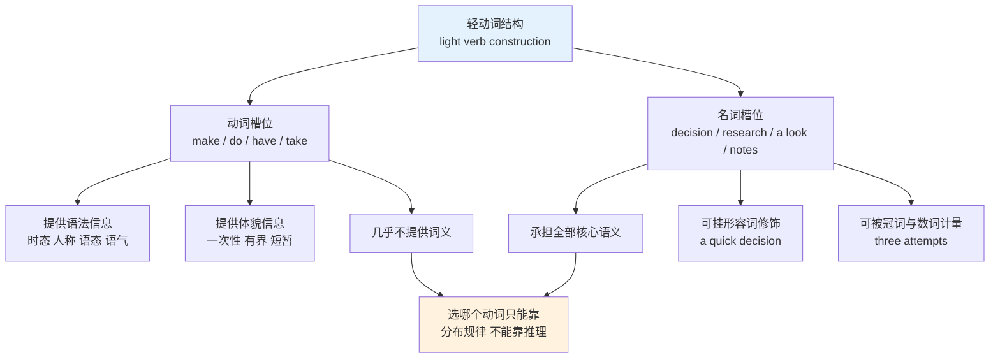
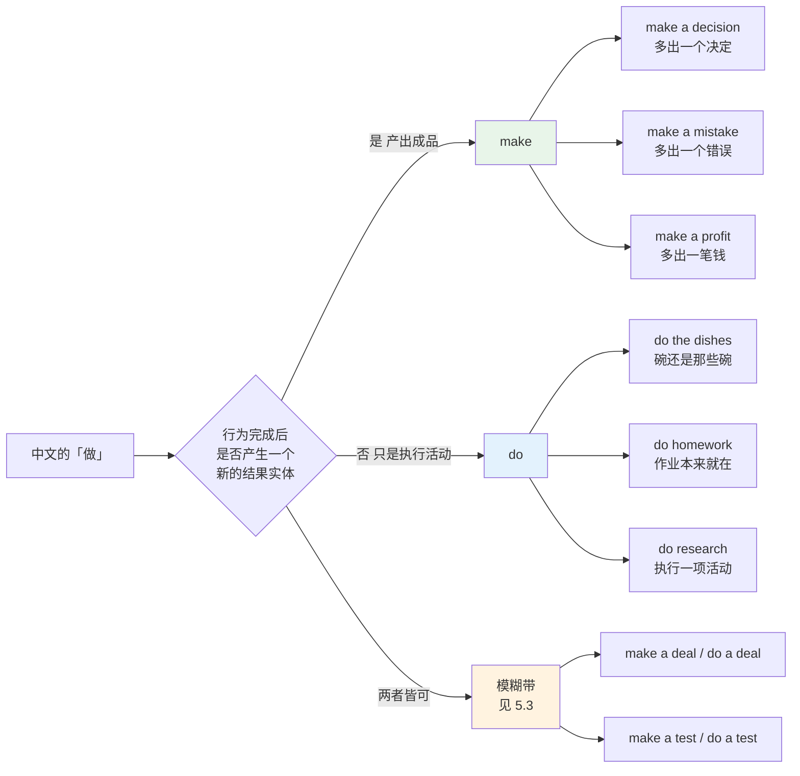
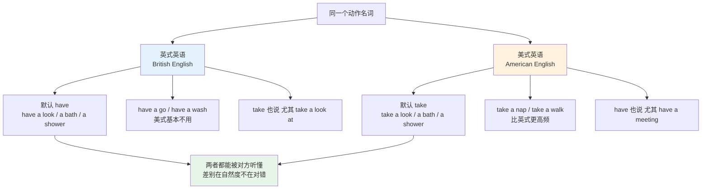
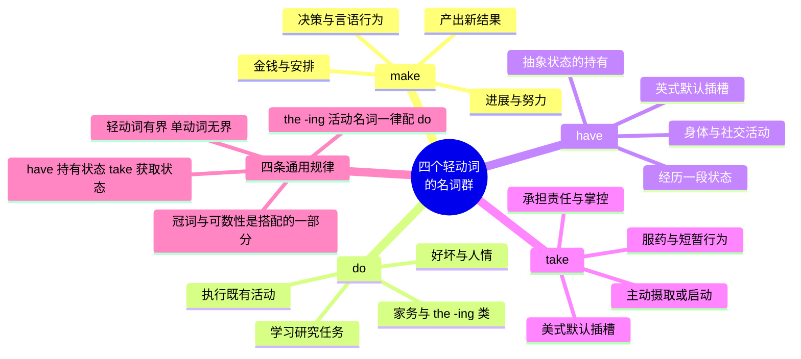

# 动词+名词搭配（上）make、do、have、take

> [!info] 本篇定位
>
> 上一篇 `17.固定搭配/01.搭配强度分级与可替换边界` 给出了判断「两个词能不能凑在一起」的框架。这一篇把框架落到英语里搭配最密集、也最容易出错的一块地方：四个轻动词各自吃哪些名词。
>
> 读完你会拿到四张名词清单（约 180 条搭配），一条区分 make 与 do 的操作性判据，一份模糊带清单，以及 `have a look` / `take a look` 这类英美分歧的处理办法。
>
> 这一篇不讲语法。`make sb do sth` 的使役结构、`have sth done` 的被动结构都属于句法范畴，在 `02.英语基础语法` 里；本篇只管「哪个动词配哪个名词」。

---

## 1. 本篇导读：动词退位，名词接管

中文母语者写英语时最高频的一类错误不是时态，是搭配。下面五句语法全对，母语者都不会这么说：

> - ❌ ~~I will **do** a decision tomorrow.~~
> - ✅ I will **make** a decision tomorrow.
> - ❌ ~~He **made** his homework.~~
> - ✅ He **did** his homework.
> - ❌ ~~Could you **make** me a favour?~~
> - ✅ Could you **do** me a favour?
> - ❌ ~~She **ate** her medicine after lunch.~~
> - ✅ She **took** her medicine after lunch.
> - ❌ ~~We **did** great progress this month.~~
> - ✅ We **made** great progress this month.

这五句的共同点是：动词本身几乎不携带语义。`make a decision` 的意思由 `decision` 决定，`make` 只提供时态、人称、语态这些语法信息。这类动词在语言学里叫**轻动词**（light verb）——这个术语出自 Otto Jespersen 的 *A Modern English Grammar on Historical Principles*，英国学习词典（例如 COBUILD 系列）更常用另一个叫法 **delexical verb**，字面意思是「被抽走词义的动词」。

轻动词最麻烦的地方在于：正因为它没有词义，就无法靠推理选中。`decision` 为什么配 `make` 而不配 `do`？没有可以推导的语义理由，只有可以归纳的分布规律。本篇要做的就是把这些规律整理成可查、可背、可自检的清单。

上图说明了这一篇的难点来源。在普通的动宾结构里（`eat an apple`、`write a letter`），动词和名词各自贡献一半语义，选词有理据可循。而在轻动词结构里，语义全部集中在名词一侧，动词退化成一个纯语法插槽——插槽填什么，是英语这门语言在几百年里固化下来的习惯，跟逻辑无关。中文的「做」在英语里裂成 make 和 do 两支，正是这种无理据分工的直接后果。

---

## 2. 轻动词结构：语法与语义的分工

### 2.1 四个动词的读音与弱读形式

四个动词在轻动词结构里通常不带重音，句子的重音落在后面的名词上。这一点对听力影响很大：`I'll have a look` 实际听到的往往是 `/aɪl həv ə ˈlʊk/`，`have` 弱化到几乎听不见。

| 英文 | 英式音标 | 美式音标 | 词性 | 中文 | 搭配与说明 |
| --- | --- | --- | --- | --- | --- |
| **make** | /meɪk/ | /meɪk/ | v. | 制造；做出 | 轻动词结构里不弱读，但不带句重音 |
| **do** | /duː/ | /duː/ | v. | 做 | 弱读式 /də/ /dʊ/，`do you` 常并成 /dʒə/ |
| **have** | /hæv/ | /hæv/ | v. | 有；进行 | 弱读式 /həv/ /əv/，`should have` 听成 /ˈʃʊdəv/ |
| **take** | /teɪk/ | /teɪk/ | v. | 拿；进行 | 后接 a 时常连读成 /ˈteɪkə/ |

### 2.2 后面词表的音标口径

从第 3 节起，词表的条目是**搭配整体**（例如 `make a decision`），而音标列标注的是**搭配中名词的读音**——动词的读音在上表已经给出，重复标注没有信息量。词性列标注该名词的可数性：

- `n.[C]` 可数名词，需要冠词或复数形式
- `n.[U]` 不可数名词，不加冠词也不加 -s
- `n.[C/U]` 两种用法都有，含义随之变化

可数性直接决定写出来对不对。`make progress` 里的 `progress` 不可数，写成 `make a progress` 是错的；而 `make a decision` 里的 `decision` 可数，光写 `make decision` 同样错。

> [!warning] 可数性是搭配的一部分
>
> 很多学习者把可数性当成语法问题单独学，结果是背了搭配却用不对。
>
> - ❌ ~~We made a great progress.~~
> - ✅ We made **great progress**.
> - ✅ We made **a great deal of progress**.
> - ❌ ~~He gave me some advices.~~
> - ✅ He gave me **some advice** / **a piece of advice**.
>
> 记搭配时把冠词一起记进去：记 `make a decision` 而不是 `make + decision`，记 `make progress` 而不是 `make + progress`。冠词的有无本身就是这条搭配的一部分。

---

## 3. make 的名词群

### 3.1 make 的语义核心：从无到有

`make` 的实义用法是「制造」——`make a cake`、`make furniture`，输入原料，输出一个此前不存在的东西。这个核心义在轻动词用法里被抽象化保留了下来：**make 后面的名词，多数指向一个经由人的行为新产生出来的结果**。

`decision`（决定）在做出之前不存在，`mistake`（错误）在犯下之前不存在，`noise`（噪音）在制造之前不存在，`profit`（利润）在赚取之前不存在。这条线索不能当成万能公式，但可以覆盖 make 名词群的大半。

### 3.2 决策、判断与言语行为

| 英文 | 英式音标 | 美式音标 | 词性 | 中文 | 搭配与说明 |
| --- | --- | --- | --- | --- | --- |
| **make a decision** | /dɪˈsɪʒn/ | /dɪˈsɪʒn/ | n.[C] | 做决定 | 英式正式语体也说 take a decision，见 10.2 |
| **make a choice** | /tʃɔɪs/ | /tʃɔɪs/ | n.[C] | 做选择 | 常搭 a difficult / an informed choice |
| **make a judgement** | /ˈdʒʌdʒmənt/ | /ˈdʒʌdʒmənt/ | n.[C] | 做出判断 | 美式拼作 judgment，法律语境固定去 e |
| **make an assumption** | /əˈsʌmpʃn/ | /əˈsʌmpʃn/ | n.[C] | 做出假设 | 学术写作高频，常搭 a reasonable assumption |
| **make a distinction** | /dɪˈstɪŋkʃn/ | /dɪˈstɪŋkʃn/ | n.[C] | 做出区分 | 后接 between A and B |
| **make a comparison** | /kəmˈpærɪsn/ | /kəmˈperɪsn/ | n.[C] | 做出比较 | 后接 between 或 with |
| **make a comment** | /ˈkɒment/ | /ˈkɑːment/ | n.[C] | 发表评论 | 名词重音在首，动词 comment 同 |
| **make a point** | /pɔɪnt/ | /pɔɪnt/ | n.[C] | 提出一个观点 | You have a point 是承认对方说得对 |
| **make a remark** | /rɪˈmɑːk/ | /rɪˈmɑːrk/ | n.[C] | 说一句评论 | 常带贬义，a rude remark |
| **make a statement** | /ˈsteɪtmənt/ | /ˈsteɪtmənt/ | n.[C] | 发表声明 | 正式，机构对外发言 |
| **make a speech** | /spiːtʃ/ | /spiːtʃ/ | n.[C] | 发表演讲 | give a speech 同样常见，见下一篇 |
| **make a suggestion** | /səˈdʒestʃən/ | /səˈdʒestʃən/ | n.[C] | 提建议 | 比 give advice 更轻，不含权威感 |
| **make a proposal** | /prəˈpəʊzl/ | /prəˈpoʊzl/ | n.[C] | 提出提案 | 商务与学术都用 |
| **make a request** | /rɪˈkwest/ | /rɪˈkwest/ | n.[C] | 提出请求 | 正式，口语用 ask for |
| **make a complaint** | /kəmˈpleɪnt/ | /kəmˈpleɪnt/ | n.[C] | 投诉 | 后接 about sth / against sb |
| **make an apology** | /əˈpɒlədʒi/ | /əˈpɑːlədʒi/ | n.[C] | 道歉 | 比 apologize 正式，书面常见 |
| **make an excuse** | /ɪkˈskjuːs/ | /ɪkˈskjuːs/ | n.[C] | 找借口 | 名词 /s/ 结尾，动词 excuse /ɪkˈskjuːz/ |
| **make a promise** | /ˈprɒmɪs/ | /ˈprɑːmɪs/ | n.[C] | 许下承诺 | keep / break a promise 配套记 |
| **make a claim** | /kleɪm/ | /kleɪm/ | n.[C] | 提出主张；索赔 | 学术指论断，保险指理赔 |
| **make an announcement** | /əˈnaʊnsmənt/ | /əˈnaʊnsmənt/ | n.[C] | 发布公告 | 机构对内对外都用 |
| **make a joke** | /dʒəʊk/ | /dʒoʊk/ | n.[C] | 开玩笑 | 讲笑话是 tell a joke，两者不同 |
| **make a call** | /kɔːl/ | /kɔːl/ | n.[C] | 打电话；做裁定 | 打电话也说 give sb a call |

### 3.3 努力、进展与结果

| 英文 | 英式音标 | 美式音标 | 词性 | 中文 | 搭配与说明 |
| --- | --- | --- | --- | --- | --- |
| **make an effort** | /ˈefət/ | /ˈefərt/ | n.[C/U] | 做出努力 | make an effort to do sth，不能接 -ing |
| **make progress** | /ˈprəʊɡres/ | /ˈprɑːɡres/ | n.[U] | 取得进展 | 不可数，绝不能写 a progress |
| **make an attempt** | /əˈtempt/ | /əˈtempt/ | n.[C] | 做出尝试 | make an attempt at sth / to do sth |
| **make a start** | /stɑːt/ | /stɑːrt/ | n.[C] | 着手开始 | make a start on the report |
| **make a difference** | /ˈdɪfrəns/ | /ˈdɪfrəns/ | n.[C] | 产生影响；起作用 | It makes no difference 是「无所谓」 |
| **make an impact** | /ˈɪmpækt/ | /ˈɪmpækt/ | n.[C] | 产生冲击 | 名词重音在首，动词 impact 重音在后 |
| **make an impression** | /ɪmˈpreʃn/ | /ɪmˈpreʃn/ | n.[C] | 留下印象 | make a good first impression |
| **make a contribution** | /ˌkɒntrɪˈbjuːʃn/ | /ˌkɑːntrɪˈbjuːʃn/ | n.[C] | 做出贡献 | make a contribution to sth |
| **make a discovery** | /dɪˈskʌvəri/ | /dɪˈskʌvəri/ | n.[C] | 做出发现 | 学术叙述常用 |
| **make a breakthrough** | /ˈbreɪkθruː/ | /ˈbreɪkθruː/ | n.[C] | 取得突破 | 科研与商务通用 |
| **make history** | /ˈhɪstri/ | /ˈhɪstri/ | n.[U] | 创造历史 | 不加冠词 |
| **make a name for oneself** | /neɪm/ | /neɪm/ | n.[C] | 闯出名气 | 固定搭配，for oneself 不可省 |
| **make a mistake** | /mɪˈsteɪk/ | /mɪˈsteɪk/ | n.[C] | 犯错误 | 中文说「犯」，英语用 make 不用 do |
| **make an error** | /ˈerə/ | /ˈerər/ | n.[C] | 出现差错 | 比 mistake 正式，技术文档常见 |
| **make a mess** | /mes/ | /mes/ | n.[C/U] | 弄得一团糟 | make a mess of sth 是「把某事搞砸」 |
| **make a fuss** | /fʌs/ | /fʌs/ | n.[U] | 大惊小怪 | make a fuss about / over sth |
| **make trouble** | /ˈtrʌbl/ | /ˈtrʌbl/ | n.[U] | 惹麻烦 | 遇到麻烦是 have trouble，方向相反 |

### 3.4 安排、金钱与人际

| 英文 | 英式音标 | 美式音标 | 词性 | 中文 | 搭配与说明 |
| --- | --- | --- | --- | --- | --- |
| **make a plan** | /plæn/ | /plæn/ | n.[C] | 制订计划 | 复数 make plans 更常见 |
| **make arrangements** | /əˈreɪndʒmənts/ | /əˈreɪndʒmənts/ | n.[C] | 做出安排 | 几乎总用复数 |
| **make an appointment** | /əˈpɔɪntmənt/ | /əˈpɔɪntmənt/ | n.[C] | 预约 | 看医生、见客户用它，不用 reserve |
| **make a reservation** | /ˌrezəˈveɪʃn/ | /ˌrezərˈveɪʃn/ | n.[C] | 预订 | 餐厅、酒店、机票用它 |
| **make a booking** | /ˈbʊkɪŋ/ | /ˈbʊkɪŋ/ | n.[C] | 预订 | 英式偏好，美式多用 reservation |
| **make a schedule** | /ˈʃedjuːl/ | /ˈskedʒuːl/ | n.[C] | 排出时间表 | 英美读音差异最大的常用词之一 |
| **make money** | /ˈmʌni/ | /ˈmʌni/ | n.[U] | 赚钱 | 不可数，不能写 a money |
| **make a profit** | /ˈprɒfɪt/ | /ˈprɑːfɪt/ | n.[C/U] | 盈利 | 反面是 make a loss（英式）或 take a loss |
| **make a fortune** | /ˈfɔːtʃən/ | /ˈfɔːrtʃən/ | n.[C] | 发大财 | make a fortune in / from sth |
| **make a living** | /ˈlɪvɪŋ/ | /ˈlɪvɪŋ/ | n.[C] | 谋生 | make a living as / by doing sth |
| **make a payment** | /ˈpeɪmənt/ | /ˈpeɪmənt/ | n.[C] | 付款 | 分期付款是 make monthly payments |
| **make an investment** | /ɪnˈvestmənt/ | /ɪnˈvestmənt/ | n.[C] | 进行投资 | make an investment in sth |
| **make an offer** | /ˈɒfə/ | /ˈɔːfər/ | n.[C] | 提出报价 | 求职、买房、并购都用 |
| **make a deal** | /diːl/ | /diːl/ | n.[C] | 达成交易 | 英式也说 do a deal，见第 5 节 |
| **make friends** | /frendz/ | /frendz/ | n.[C] | 交朋友 | 固定用复数，make friends with sb |
| **make an enemy** | /ˈenəmi/ | /ˈenəmi/ | n.[C] | 树敌 | make an enemy of sb |
| **make an exception** | /ɪkˈsepʃn/ | /ɪkˈsepʃn/ | n.[C] | 破例 | make an exception for sb |
| **make room** | /ruːm/ | /ruːm/ | n.[U] | 腾出空间 | 此处 room 不可数，指空间不指房间 |
| **make sense** | /sens/ | /sens/ | n.[U] | 讲得通 | make sense of sth 是「弄懂某事」 |
| **make the bed** | /bed/ | /bed/ | n.[C] | 整理床铺 | 与 do the dishes 同属家务，动词却不同 |
| **make a noise** | /nɔɪz/ | /nɔɪz/ | n.[C/U] | 发出声响 | make noise 不可数用法同样成立 |
| **make a phone call** | /kɔːl/ | /kɔːl/ | n.[C] | 打个电话 | 中文「打电话」不能译成 hit a phone |
| **make a list** | /lɪst/ | /lɪst/ | n.[C] | 列清单 | make a list of sth |
| **make a copy** | /ˈkɒpi/ | /ˈkɑːpi/ | n.[C] | 复制一份 | 技术语境也说 create a copy |
| **make a backup** | /ˈbækʌp/ | /ˈbækʌp/ | n.[C] | 做备份 | 技术文档也用 take a backup（英式偏好） |
| **make a commitment** | /kəˈmɪtmənt/ | /kəˈmɪtmənt/ | n.[C] | 做出承诺 | 比 promise 正式，含长期投入义 |
| **make sure** | /ʃʊə/ | /ʃʊr/ | — | 确保 | sure 是形容词，此条是固定短语非动名搭配 |

### 3.5 make 群的三个易错点

> [!warning] make 名词群的高频错误
>
> **第一，不可数名词误加冠词。** `progress`、`money`、`sense`、`room`、`trouble`、`history` 在这些搭配里全部不可数。
>
> - ❌ ~~make a progress~~ / ~~make a money~~ / ~~make a sense~~
> - ✅ make progress / make money / make sense
>
> **第二，复数固定形式被写成单数。**
>
> - ❌ ~~make a friend with him~~
> - ✅ **make friends with** him
> - ❌ ~~make arrangement for the trip~~
> - ✅ **make arrangements** for the trip
>
> **第三，与中文动词直译。** 中文说「犯错误」，`犯` 对应不到 make，很多人写成 `do a mistake`；中文说「打电话」，`打` 对应不到 make，写成 `hit a phone`。这两条只能靠固定搭配记忆，没有推导路径。

---

## 4. do 的名词群

### 4.1 do 的语义核心：执行既定的活动

`do` 的核心不是造出新东西，而是**执行一件已经存在、有名可称的活动**。洗碗、做作业、搞研究、打扫房间——这些活动在你去做之前，它们作为「事项」已经存在了，你只是把它执行掉。

这条线索解释了 do 名词群里最大的两块：家务劳动和职业任务。也解释了为什么 `-ing` 形式的活动名词几乎全部配 do：`the cooking`、`the cleaning`、`the shopping`、`the washing`、`the ironing`、`the gardening`。

### 4.2 家务与日常事项

| 英文 | 英式音标 | 美式音标 | 词性 | 中文 | 搭配与说明 |
| --- | --- | --- | --- | --- | --- |
| **do the dishes** | /ˈdɪʃɪz/ | /ˈdɪʃɪz/ | n.[C] | 洗碗 | 美式偏好；英式常说 do the washing-up |
| **do the washing-up** | /ˌwɒʃɪŋ ˈʌp/ | /ˌwɑːʃɪŋ ˈʌp/ | n.[U] | 洗碗 | 英式说法，美式基本不用 |
| **do the laundry** | /ˈlɔːndri/ | /ˈlɔːndri/ | n.[U] | 洗衣服 | 美式偏好；英式说 do the washing |
| **do the washing** | /ˈwɒʃɪŋ/ | /ˈwɑːʃɪŋ/ | n.[U] | 洗衣服 | 英式说法，注意与 washing-up 区分 |
| **do the ironing** | /ˈaɪənɪŋ/ | /ˈaɪərnɪŋ/ | n.[U] | 熨衣服 | iron 的 r 在英式不发音 |
| **do the cleaning** | /ˈkliːnɪŋ/ | /ˈkliːnɪŋ/ | n.[U] | 做清洁 | 也说 do the housework |
| **do the housework** | /ˈhaʊswɜːk/ | /ˈhaʊswɜːrk/ | n.[U] | 做家务 | 不可数，无复数形式 |
| **do the cooking** | /ˈkʊkɪŋ/ | /ˈkʊkɪŋ/ | n.[U] | 负责做饭 | 强调分工，具体做某道菜用 make |
| **do the shopping** | /ˈʃɒpɪŋ/ | /ˈʃɑːpɪŋ/ | n.[U] | 采买 | go shopping 指逛街，语义不同 |
| **do the gardening** | /ˈɡɑːdnɪŋ/ | /ˈɡɑːrdnɪŋ/ | n.[U] | 侍弄花园 | 英式生活高频 |
| **do the vacuuming** | /ˈvækjuːɪŋ/ | /ˈvækjuːɪŋ/ | n.[U] | 吸尘 | 英式也说 do the hoovering |
| **do the chores** | /tʃɔːz/ | /tʃɔːrz/ | n.[C] | 干杂活 | 几乎总用复数 |
| **do one's hair** | /heə/ | /her/ | n.[U] | 打理头发 | 也说 do one's makeup、do one's nails |
| **do the accounts** | /əˈkaʊnts/ | /əˈkaʊnts/ | n.[C] | 记账 | 英式用法，美式多说 do the books |

### 4.3 学习、研究与工作任务

| 英文 | 英式音标 | 美式音标 | 词性 | 中文 | 搭配与说明 |
| --- | --- | --- | --- | --- | --- |
| **do homework** | /ˈhəʊmwɜːk/ | /ˈhoʊmwɜːrk/ | n.[U] | 做作业 | 不可数，绝不能写 homeworks |
| **do an assignment** | /əˈsaɪnmənt/ | /əˈsaɪnmənt/ | n.[C] | 完成作业 | 也说 complete an assignment |
| **do an exercise** | /ˈeksəsaɪz/ | /ˈeksərsaɪz/ | n.[C] | 做一道练习 | do exercise 不加冠词指「锻炼身体」 |
| **do research** | /rɪˈsɜːtʃ/ | /ˈriːsɜːrtʃ/ | n.[U] | 做研究 | 名词重音英美不同；正式写作用 conduct |
| **do an experiment** | /ɪkˈsperɪmənt/ | /ɪkˈsperɪmənt/ | n.[C] | 做实验 | 正式语体用 conduct / perform |
| **do a survey** | /ˈsɜːveɪ/ | /ˈsɜːrveɪ/ | n.[C] | 做问卷调查 | 名词重音在首，动词 survey 重音在后 |
| **do an analysis** | /əˈnæləsɪs/ | /əˈnæləsɪs/ | n.[C] | 做分析 | 复数 analyses /əˈnæləsiːz/ |
| **do a test** | /test/ | /test/ | n.[C] | 做测试 | 学生考试英式用 do/sit，美式用 take |
| **do an exam** | /ɪɡˈzæm/ | /ɪɡˈzæm/ | n.[C] | 参加考试 | 英式说法，美式说 take an exam |
| **do a course** | /kɔːs/ | /kɔːrs/ | n.[C] | 上一门课 | 英式说法，美式说 take a course |
| **do a degree** | /dɪˈɡriː/ | /dɪˈɡriː/ | n.[C] | 读一个学位 | 英式；美式多说 get / pursue a degree |
| **do a project** | /ˈprɒdʒekt/ | /ˈprɑːdʒekt/ | n.[C] | 做项目 | 名词重音在首 |
| **do a job** | /dʒɒb/ | /dʒɑːb/ | n.[C] | 干一份活 | do a good job 是「干得漂亮」 |
| **do work** | /wɜːk/ | /wɜːrk/ | n.[U] | 做工作 | 不可数；一件工作是 a piece of work |
| **do a task** | /tɑːsk/ | /tæsk/ | n.[C] | 执行任务 | 也说 perform a task（正式） |
| **do a presentation** | /ˌprezənˈteɪʃn/ | /ˌpriːzenˈteɪʃn/ | n.[C] | 做演示 | 口语；正式场合用 give a presentation |
| **do a review** | /rɪˈvjuː/ | /rɪˈvjuː/ | n.[C] | 做一次审查 | 技术语境常见 code review |
| **do a search** | /sɜːtʃ/ | /sɜːrtʃ/ | n.[C] | 做一次搜索 | run a search 在技术文档里更常见 |
| **do business** | /ˈbɪznəs/ | /ˈbɪznəs/ | n.[U] | 做生意 | do business with sb，不可数 |
| **do the maths** | /mæθs/ | /mæθ/ | n.[U] | 算一算 | 英式 maths，美式 math，字面与引申都用 |
| **do one's duty** | /ˈdjuːti/ | /ˈduːti/ | n.[C/U] | 尽职责 | 英式 duty 有 /j/，美式无 |
| **do one's bit** | /bɪt/ | /bɪt/ | n.[C] | 尽自己一份力 | 英式口语，美式说 do one's part |

### 4.4 抽象结果：好、坏与人情

`do` 有一小组名词不表活动，而表「造成某种效果」。这组数量不多但极高频，且全部不可数。

| 英文 | 英式音标 | 美式音标 | 词性 | 中文 | 搭配与说明 |
| --- | --- | --- | --- | --- | --- |
| **do harm** | /hɑːm/ | /hɑːrm/ | n.[U] | 造成伤害 | do more harm than good 是固定表达 |
| **do damage** | /ˈdæmɪdʒ/ | /ˈdæmɪdʒ/ | n.[U] | 造成损害 | 也说 cause damage，语气更中性 |
| **do good** | /ɡʊd/ | /ɡʊd/ | n.[U] | 带来好处 | It will do you good 是「对你有好处」 |
| **do justice to** | /ˈdʒʌstɪs/ | /ˈdʒʌstɪs/ | n.[U] | 公正对待；充分展现 | 照片没拍出人的好看：doesn't do her justice |
| **do wonders** | /ˈwʌndəz/ | /ˈwʌndərz/ | n.[C] | 产生奇效 | 固定复数，do wonders for sth |
| **do the trick** | /trɪk/ | /trɪk/ | n.[C] | 奏效 | 口语，指某办法管用 |
| **do sb a favour** | /ˈfeɪvə/ | /ˈfeɪvər/ | n.[C] | 帮某人一个忙 | 美式拼 favor；双宾结构固定 |
| **do one's best** | /best/ | /best/ | n.[U] | 尽力 | 不能说 make one's best |
| **do one's worst** | /wɜːst/ | /wɜːrst/ | n.[U] | 使出最坏手段 | 常带挑衅口吻 |
| **do time** | /taɪm/ | /taɪm/ | n.[U] | 服刑 | 俚语，注意与 take time 完全不同 |

> [!warning] do 群最容易出错的三条
>
> **第一，`do sb a favour` 的语序固定。** 双宾结构里间接宾语在前。
>
> - ❌ ~~Could you make me a favour?~~
> - ❌ ~~Could you do a favour for me?~~（不算错但不自然）
> - ✅ Could you **do me a favour**?
>
> **第二，`homework` / `housework` / `research` / `business` 全部不可数。**
>
> - ❌ ~~I have three homeworks tonight.~~
> - ✅ I have three **assignments** tonight.
> - ✅ I have a lot of **homework** tonight.
>
> **第三，`do exercise` 与 `do an exercise` 不是一回事。** 前者不加冠词，指体育锻炼；后者加冠词，指做一道练习题。冠词一改，语义就变了。

---

## 5. make 与 do 的分界线：成品与活动

### 5.1 一条可操作的判据

前面两节各给了一条线索，合起来构成本篇最核心的判据：

- **make** 指向一个**新产生的结果**，行为结束后世界上多了一个此前不存在的东西——一个决定、一个错误、一笔利润、一个印象。
- **do** 指向一个**被执行的活动**，行为结束后不一定留下任何实体，只是一件事被办掉了——洗完了碗、做完了作业、跑完了研究。

上图把判据画成了一个二分决策。左右两支各举三例，说明这条线在典型情形下是清晰的：`decision`、`mistake`、`profit` 都是行为的产物，配 make；`the dishes`、`homework`、`research` 都是既有事项的执行，配 do。图右下角的模糊带说明这条线不是处处都锋利，第 5.3 节专门处理。

### 5.2 一组直接对照

把两组词并排放，判据的效力更容易看清。

| 配 make（产出成品） | 配 do（执行活动） | 对比说明 |
| --- | --- | --- |
| make a decision 做决定 | do the paperwork 处理文书 | 决定是新产物，文书是既有事项 |
| make a mistake 犯错 | do an exercise 做练习 | 错误是新产生的，练习题早已存在 |
| make a cake 做蛋糕 | do the cooking 负责做饭 | 具体成品用 make，整体活动用 do |
| make a plan 制订计划 | do the planning 承担规划工作 | 计划是产物，规划是职能 |
| make a payment 付一笔款 | do the accounts 记账 | 款项是新事件，账目是既有事务 |
| make a suggestion 提建议 | do a survey 做调查 | 建议是新出现的内容，调查是流程 |
| make a copy 复制一份 | do the filing 归档 | 副本是新实体，归档是既有活动 |
| make an effort 使一把劲 | do one's best 尽全力 | 罕见的对称例外，只能各自记住 |

> [!tip] 用 -ing 名词做快速判断
>
> 凡是 `the + 动词-ing` 形式的活动名词，几乎全部配 do，没有例外需要记：
>
> `do the cooking` / `do the cleaning` / `do the shopping` / `do the washing` / `do the ironing` / `do the gardening` / `do the filing` / `do the driving` / `do the talking`
>
> 这条规律很实用：拿不准时，如果那件事能说成 `the ...ing`，就用 do。
>
> 反过来，如果名词是一个抽象结果（decision、difference、impression、progress），优先试 make。

### 5.3 模糊带：两个都能用的情形

判据的边界上有一批词两边都能落，通常伴随语义或地域差别。这些必须单独记。

| 搭配 | 用 make 时的含义 | 用 do 时的含义 | 分布 |
| --- | --- | --- | --- |
| deal | make a deal 达成一笔交易，强调结果 | do a deal 谈成一笔买卖，强调过程 | make 通用，do a deal 偏英式 |
| test | make a test 罕用，几乎不说 | do a test 做测试；take a test 参加考试 | 优先 do 或 take |
| a course | 不说 make a course | do a course 英式；take a course 美式 | 英美分工清晰 |
| business | make business 错误 | do business 做生意 | 只有 do 成立 |
| the dishes | make the dishes 指做出这几道菜 | do the dishes 指洗碗 | 语义完全不同，不能互换 |
| an experiment | 现代英语基本不说 | do an experiment 中性；conduct 正式 | 优先 do |
| war | make war on sb 发动战争 | do battle with sb 交战（书面） | 各自固定，不通用 |
| an offer | make an offer 提出报价 | 不说 do an offer | 只有 make 成立 |
| a favour | 不说 make a favour | do sb a favour 帮忙 | 只有 do 成立 |
| a difference | make a difference 起作用 | 不说 do a difference | 只有 make 成立 |

> [!warning] make the dishes 与 do the dishes
>
> 这一对是判据最戏剧性的体现，两个搭配都成立，含义却毫无交集。
>
> - ✅ She **made** three **dishes** for the party. → 她为聚会做了三道菜。（dishes = 菜肴，是新产物）
> - ✅ She **did the dishes** after dinner. → 她饭后洗了碗。（dishes = 餐具，是既有物品）
>
> 判据在这里给出了正确预测：造出来的菜配 make，清洗既有的碗配 do。

---

## 6. have 的名词群

### 6.1 have 的语义核心：经历一段状态

`have` 在轻动词结构里表达的不是「拥有」，而是**经历、体验、进行一段有起止的过程**。`have a look` 不是「拥有一次看」，而是「进行一次看的动作」。

这个「经历」的核心义带来两个后果。其一，have 的名词群里大量是身体活动（洗澡、休息、睡觉、吃饭）和社交活动（聊天、开会、争吵、聚会）——都是可以「经历一段」的事。其二，have 兼容了很多本来属于「拥有」的抽象名词：`have an effect`、`have access`、`have an influence`、`have a right`，这些是状态而非动作，have 的实义与轻义在这里接近重合。

### 6.2 身体活动与日常生理

| 英文 | 英式音标 | 美式音标 | 词性 | 中文 | 搭配与说明 |
| --- | --- | --- | --- | --- | --- |
| **have a shower** | /ˈʃaʊə/ | /ˈʃaʊər/ | n.[C] | 洗淋浴 | 英式偏好；美式说 take a shower |
| **have a bath** | /bɑːθ/ | /bæθ/ | n.[C] | 泡澡 | 英美元音差异典型词 |
| **have a wash** | /wɒʃ/ | /wɑːʃ/ | n.[C] | 洗一下 | 英式说法，美式基本不用 |
| **have a rest** | /rest/ | /rest/ | n.[C] | 休息一会儿 | 也说 take a rest，见第 8 节 |
| **have a break** | /breɪk/ | /breɪk/ | n.[C] | 歇一下 | 工间休息，英式常见 |
| **have a nap** | /næp/ | /næp/ | n.[C] | 打个盹 | 也说 take a nap，美式偏好 take |
| **have a lie-down** | /ˈlaɪ daʊn/ | /ˈlaɪ daʊn/ | n.[C] | 躺一会儿 | 英式口语，美式不用 |
| **have a walk** | /wɔːk/ | /wɔːk/ | n.[C] | 散个步 | 也说 go for a walk / take a walk |
| **have a swim** | /swɪm/ | /swɪm/ | n.[C] | 游一会儿泳 | 英式偏好，美式多说 go swimming |
| **have a drink** | /drɪŋk/ | /drɪŋk/ | n.[C] | 喝一杯 | 常暗指含酒精饮料 |
| **have breakfast** | /ˈbrekfəst/ | /ˈbrekfəst/ | n.[U] | 吃早饭 | 三餐名前不加冠词 |
| **have lunch** | /lʌntʃ/ | /lʌntʃ/ | n.[U] | 吃午饭 | 加形容词时加冠词 have a quick lunch |
| **have dinner** | /ˈdɪnə/ | /ˈdɪnər/ | n.[U] | 吃正餐 | 英美所指时段不同 |
| **have a snack** | /snæk/ | /snæk/ | n.[C] | 吃点零食 | 可数，需要冠词 |
| **have a meal** | /miːl/ | /miːl/ | n.[C] | 吃一顿饭 | 泛指一餐 |
| **have a cigarette** | /ˌsɪɡəˈret/ | /ˌsɪɡəˈret/ | n.[C] | 抽根烟 | 也说 smoke a cigarette |

### 6.3 交流与社交

| 英文 | 英式音标 | 美式音标 | 词性 | 中文 | 搭配与说明 |
| --- | --- | --- | --- | --- | --- |
| **have a chat** | /tʃæt/ | /tʃæt/ | n.[C] | 聊两句 | 非正式，have a chat with sb |
| **have a talk** | /tɔːk/ | /tɔːk/ | n.[C] | 谈一次 | 比 chat 严肃，常指认真谈话 |
| **have a word with sb** | /wɜːd/ | /wɜːrd/ | n.[C] | 找某人说句话 | 固定单数，常暗示私下提醒 |
| **have a conversation** | /ˌkɒnvəˈseɪʃn/ | /ˌkɑːnvərˈseɪʃn/ | n.[C] | 进行一次对话 | 比 chat 正式 |
| **have a discussion** | /dɪˈskʌʃn/ | /dɪˈskʌʃn/ | n.[C] | 进行讨论 | have a discussion about / on sth |
| **have an argument** | /ˈɑːɡjumənt/ | /ˈɑːrɡjumənt/ | n.[C] | 吵一架 | have an argument with sb about sth |
| **have a fight** | /faɪt/ | /faɪt/ | n.[C] | 打一架；吵一架 | 美式口语也指口角 |
| **have a meeting** | /ˈmiːtɪŋ/ | /ˈmiːtɪŋ/ | n.[C] | 开会 | 正式主办用 hold a meeting |
| **have an interview** | /ˈɪntəvjuː/ | /ˈɪntərvjuː/ | n.[C] | 参加面试 | 应聘方视角；招聘方用 conduct |
| **have a party** | /ˈpɑːti/ | /ˈpɑːrti/ | n.[C] | 办派对 | 也说 throw a party（更热闹） |
| **have a date** | /deɪt/ | /deɪt/ | n.[C] | 约会一次 | go on a date 更常用 |
| **have a laugh** | /lɑːf/ | /læf/ | n.[C] | 乐一乐 | 英式口语，英美元音差异词 |
| **have fun** | /fʌn/ | /fʌn/ | n.[U] | 玩得开心 | 不可数，不能写 a fun |
| **have a good time** | /taɪm/ | /taɪm/ | n.[C] | 过得愉快 | 固定带形容词 |

### 6.4 抽象状态：影响、机会与权利

这一组是 have 名词群里最接近「拥有」本义的部分，也是学术与技术写作里出现最多的部分。

| 英文 | 英式音标 | 美式音标 | 词性 | 中文 | 搭配与说明 |
| --- | --- | --- | --- | --- | --- |
| **have an effect** | /ɪˈfekt/ | /ɪˈfekt/ | n.[C] | 产生效果 | have an effect on sth，介词固定 on |
| **have an impact** | /ˈɪmpækt/ | /ˈɪmpækt/ | n.[C] | 产生影响 | 比 effect 语气重，含冲击义 |
| **have an influence** | /ˈɪnfluəns/ | /ˈɪnfluəns/ | n.[C/U] | 有影响力 | have an influence on / over sb |
| **have access to** | /ˈækses/ | /ˈækses/ | n.[U] | 有权使用 | 不可数，介词 to 不可省 |
| **have an opportunity** | /ˌɒpəˈtjuːnəti/ | /ˌɑːpərˈtuːnəti/ | n.[C] | 有机会 | 英式带 /j/，美式无 |
| **have a chance** | /tʃɑːns/ | /tʃæns/ | n.[C] | 有机会；有可能 | 英美元音差异词 |
| **have a right** | /raɪt/ | /raɪt/ | n.[C] | 有权利 | have the right to do sth |
| **have a say** | /seɪ/ | /seɪ/ | n.[C] | 有发言权 | have a say in sth |
| **have a point** | /pɔɪnt/ | /pɔɪnt/ | n.[C] | 说得有道理 | You have a point there 是让步表达 |
| **have an idea** | /aɪˈdɪə/ | /aɪˈdiːə/ | n.[C] | 有个主意 | 英美重音后的元音明显不同 |
| **have a dream** | /driːm/ | /driːm/ | n.[C] | 做梦；有梦想 | 中文「做梦」不能用 do |
| **have a problem** | /ˈprɒbləm/ | /ˈprɑːbləm/ | n.[C] | 遇到问题 | have a problem with sth |
| **have trouble** | /ˈtrʌbl/ | /ˈtrʌbl/ | n.[U] | 有困难 | have trouble doing sth，接 -ing |
| **have difficulty** | /ˈdɪfɪkəlti/ | /ˈdɪfɪkəlti/ | n.[U] | 有困难 | 同样接 -ing，比 trouble 正式 |
| **have an experience** | /ɪkˈspɪəriəns/ | /ɪkˈspɪriəns/ | n.[C] | 有一段经历 | 可数指经历，不可数指经验 |
| **have doubts** | /daʊts/ | /daʊts/ | n.[C] | 有疑虑 | 常用复数，have doubts about sth |
| **have second thoughts** | /θɔːts/ | /θɔːts/ | n.[C] | 改变主意 | 固定复数与序数词 |
| **have a headache** | /ˈhedeɪk/ | /ˈhedeɪk/ | n.[C] | 头疼 | 病症多数配 have |
| **have a cold** | /kəʊld/ | /koʊld/ | n.[C] | 感冒 | 英美双元音差异词 |
| **have a fever** | /ˈfiːvə/ | /ˈfiːvər/ | n.[C] | 发烧 | 英式也说 have a temperature |
| **have an operation** | /ˌɒpəˈreɪʃn/ | /ˌɑːpəˈreɪʃn/ | n.[C] | 动手术 | 病人视角；医生视角用 perform |
| **have a look** | /lʊk/ | /lʊk/ | n.[C] | 看一眼 | 与 take a look 的分布见第 8 节 |
| **have a go** | /ɡəʊ/ | /ɡoʊ/ | n.[C] | 试一下 | 英式口语；美式说 give it a shot |
| **have a try** | /traɪ/ | /traɪ/ | n.[C] | 试一次 | 英式偏好 |

---

## 7. take 的名词群

### 7.1 take 的语义核心：主动摄取或启动

`take` 的实义是「拿取」——把某物从外部移入自己的控制范围。轻动词化之后，这个「主动摄取」的意象保留下来，分裂成三支：

- **摄入类**：把外物送进身体，`take medicine`、`take a pill`、`take a deep breath`。
- **主动启动类**：由自己发起一个行为，`take action`、`take a look`、`take a walk`、`take notes`。
- **承担类**：把某种责任或角色接到自己身上，`take responsibility`、`take control`、`take charge`、`take office`。

这三支之间的共同点是**方向性**：动作朝向施事者自己，或由施事者主动发出。与之对照，have 强调的是经历一段状态，方向性弱得多。

### 7.2 主动发起的短暂行为

| 英文 | 英式音标 | 美式音标 | 词性 | 中文 | 搭配与说明 |
| --- | --- | --- | --- | --- | --- |
| **take a look** | /lʊk/ | /lʊk/ | n.[C] | 看一眼 | take a look at sth，介词固定 at |
| **take a walk** | /wɔːk/ | /wɔːk/ | n.[C] | 散个步 | 美式偏好；英式多说 go for a walk |
| **take a shower** | /ˈʃaʊə/ | /ˈʃaʊər/ | n.[C] | 洗淋浴 | 美式偏好；英式说 have a shower |
| **take a bath** | /bɑːθ/ | /bæθ/ | n.[C] | 泡澡 | 同上分布 |
| **take a break** | /breɪk/ | /breɪk/ | n.[C] | 休息一下 | 英美通用，比 have a break 略偏美式 |
| **take a rest** | /rest/ | /rest/ | n.[C] | 歇一下 | 强调主动决定休息 |
| **take a nap** | /næp/ | /næp/ | n.[C] | 小睡一觉 | 美式高频 |
| **take a seat** | /siːt/ | /siːt/ | n.[C] | 请坐 | 比 sit down 客气，接待场景固定用语 |
| **take a photo** | /ˈfəʊtəʊ/ | /ˈfoʊtoʊ/ | n.[C] | 拍照 | 也说 take a picture；不能用 make |
| **take notes** | /nəʊts/ | /noʊts/ | n.[C] | 记笔记 | 固定复数；单数 take a note of 是「记下」 |
| **take a deep breath** | /breθ/ | /breθ/ | n.[C] | 深呼吸 | 名词 breath /breθ/，动词 breathe /briːð/ |
| **take a step** | /step/ | /step/ | n.[C] | 迈一步；采取一步措施 | 复数 take steps to do sth 指采取措施 |
| **take a guess** | /ɡes/ | /ɡes/ | n.[C] | 猜一下 | 也说 have a guess（英式） |
| **take a vote** | /vəʊt/ | /voʊt/ | n.[C] | 表决一次 | 正式会议用语 |
| **take a turn** | /tɜːn/ | /tɜːrn/ | n.[C] | 轮到；转向 | take turns doing sth 是「轮流做」 |
| **take a holiday** | /ˈhɒlədeɪ/ | /ˈhɑːlədeɪ/ | n.[C] | 休假 | 英式 holiday，美式多说 take a vacation |
| **take a day off** | /deɪ/ | /deɪ/ | n.[C] | 请一天假 | take time off 是不定量版本 |

### 7.3 摄入、服用与消耗

| 英文 | 英式音标 | 美式音标 | 词性 | 中文 | 搭配与说明 |
| --- | --- | --- | --- | --- | --- |
| **take medicine** | /ˈmedsn/ | /ˈmedɪsn/ | n.[U] | 吃药 | 英式两音节，美式三音节；不能用 eat |
| **take a pill** | /pɪl/ | /pɪl/ | n.[C] | 吃一片药 | 可数，一片一片地算 |
| **take a tablet** | /ˈtæblət/ | /ˈtæblət/ | n.[C] | 服一片药 | 英式偏好用 tablet |
| **take a dose** | /dəʊs/ | /doʊs/ | n.[C] | 服一剂 | 医嘱语言 |
| **take vitamins** | /ˈvɪtəmɪnz/ | /ˈvaɪtəmɪnz/ | n.[C] | 吃维生素 | 英美首元音差别显著 |
| **take a drink** | /drɪŋk/ | /drɪŋk/ | n.[C] | 喝一口 | 强调动作；have a drink 强调场合 |
| **take a bite** | /baɪt/ | /baɪt/ | n.[C] | 咬一口 | take a bite of sth |
| **take time** | /taɪm/ | /taɪm/ | n.[U] | 花时间 | It takes time 是「需要时间」 |
| **take effort** | /ˈefət/ | /ˈefərt/ | n.[U] | 需要费力 | 与 make an effort 方向相反，见 10.1 |
| **take up space** | /speɪs/ | /speɪs/ | n.[U] | 占空间 | 反面是 make room |

### 7.4 承担、掌控与制度性行为

| 英文 | 英式音标 | 美式音标 | 词性 | 中文 | 搭配与说明 |
| --- | --- | --- | --- | --- | --- |
| **take action** | /ˈækʃn/ | /ˈækʃn/ | n.[U] | 采取行动 | 不可数，绝不能写 an action（除非指单个举动） |
| **take measures** | /ˈmeʒəz/ | /ˈmeʒərz/ | n.[C] | 采取措施 | 固定复数，正式语体 |
| **take steps** | /steps/ | /steps/ | n.[C] | 采取步骤 | 比 measures 略口语 |
| **take the initiative** | /ɪˈnɪʃətɪv/ | /ɪˈnɪʃətɪv/ | n.[C] | 主动出手 | 固定带 the |
| **take responsibility** | /rɪˌspɒnsəˈbɪləti/ | /rɪˌspɑːnsəˈbɪləti/ | n.[U] | 承担责任 | take responsibility for sth |
| **take the blame** | /bleɪm/ | /bleɪm/ | n.[U] | 背锅 | 固定带 the |
| **take control** | /kənˈtrəʊl/ | /kənˈtroʊl/ | n.[U] | 取得控制 | take control of sth |
| **take charge** | /tʃɑːdʒ/ | /tʃɑːrdʒ/ | n.[U] | 负起主管之责 | take charge of sth，不加冠词 |
| **take command** | /kəˈmɑːnd/ | /kəˈmænd/ | n.[U] | 接管指挥 | 军事与危机管理语境 |
| **take office** | /ˈɒfɪs/ | /ˈɔːfɪs/ | n.[U] | 就职 | 政治语境固定，不加冠词 |
| **take part** | /pɑːt/ | /pɑːrt/ | n.[U] | 参与 | take part in sth，不加冠词 |
| **take place** | /pleɪs/ | /pleɪs/ | n.[U] | 发生；举行 | 无被动，不能说 be taken place |
| **take effect** | /ɪˈfekt/ | /ɪˈfekt/ | n.[U] | 生效 | 法规与药物都用，不加冠词 |
| **take shape** | /ʃeɪp/ | /ʃeɪp/ | n.[U] | 成形 | 不加冠词，指计划逐渐清晰 |
| **take a stand** | /stænd/ | /stænd/ | n.[C] | 表明立场 | take a stand on / against sth |
| **take sides** | /saɪdz/ | /saɪdz/ | n.[C] | 选边站 | 固定复数 |
| **take a risk** | /rɪsk/ | /rɪsk/ | n.[C] | 冒一次险 | 复数 take risks 指习惯性冒险 |
| **take a chance** | /tʃɑːns/ | /tʃæns/ | n.[C] | 碰碰运气 | 与 have a chance 语义不同，见 10.1 |
| **take advantage of** | /ədˈvɑːntɪdʒ/ | /ədˈvæntɪdʒ/ | n.[U] | 利用 | 中性指善用，对人则含剥削义 |
| **take care of** | /keə/ | /ker/ | n.[U] | 照料；处理 | 不加冠词 |
| **take advice** | /ədˈvaɪs/ | /ədˈvaɪs/ | n.[U] | 接受建议 | 不可数；一条建议是 a piece of advice |
| **take an interest** | /ˈɪntrəst/ | /ˈɪntrəst/ | n.[C] | 产生兴趣 | take an interest in sth |
| **take pride in** | /praɪd/ | /praɪd/ | n.[U] | 以…为荣 | 不可数，无冠词 |
| **take offence** | /əˈfens/ | /əˈfens/ | n.[U] | 觉得被冒犯 | 美式拼 offense；take offence at sth |
| **take an exam** | /ɪɡˈzæm/ | /ɪɡˈzæm/ | n.[C] | 参加考试 | 美式；英式说 sit / do an exam |
| **take a course** | /kɔːs/ | /kɔːrs/ | n.[C] | 选一门课 | 美式；英式说 do a course |
| **take a class** | /klɑːs/ | /klæs/ | n.[C] | 上一门课 | 美式高频，英美元音差异词 |
| **take a message** | /ˈmesɪdʒ/ | /ˈmesɪdʒ/ | n.[C] | 代为留言 | 接电话固定用语 |
| **take a taxi** | /ˈtæksi/ | /ˈtæksi/ | n.[C] | 打车 | 交通工具统一用 take |
| **take the bus** | /bʌs/ | /bʌs/ | n.[C] | 坐公交 | 惯常路线用 the |
| **take the train** | /treɪn/ | /treɪn/ | n.[C] | 坐火车 | 同上 |
| **take a decision** | /dɪˈsɪʒn/ | /dɪˈsɪʒn/ | n.[C] | 做出决定 | 英式正式语体，机构决策场景 |

> [!warning] take 群里最典型的中式错误
>
> 中文的动词在这一组里几乎全部对不上。
>
> - ❌ ~~eat medicine~~（中文「吃药」直译）
> - ✅ **take medicine**
> - ❌ ~~make a photo~~（受其他外语影响的常见错误）
> - ✅ **take a photo**
> - ❌ ~~write notes~~（中文「记笔记」直译，write notes 指写便条）
> - ✅ **take notes**
> - ❌ ~~The meeting will be taken place tomorrow.~~
> - ✅ The meeting will **take place** tomorrow.（take place 无被动）
> - ❌ ~~join the exam~~（中文「参加考试」直译）
> - ✅ **take an exam**（美式）/ **sit an exam**（英式）

---

## 8. have a look 与 take a look：英美差异与体貌

### 8.1 分布不是对错

`have a look` 和 `take a look` 都是标准英语，母语者都用。差别在于**使用频率的地域倾斜**，不在于哪个错。

上图把分布画成两条并行的默认路径。英式的默认插槽是 have，美式的默认插槽是 take，但两条路径都有对方的用法作为次选。图底部那句是实际写作时该记住的：写 `have a look` 的美国人和写 `take a look` 的英国人都不算错，只是不那么典型。对中文母语学习者来说，选一套用到底比来回混更重要。

### 8.2 具体分布清单

| 动作名词 | 英式默认 | 美式默认 | 备注 |
| --- | --- | --- | --- |
| look | have a look | take a look | take a look at 在英式也极常见 |
| bath | have a bath | take a bath | 英美元音 /ɑː/ 与 /æ/ 同时不同 |
| shower | have a shower | take a shower | 分布同 bath |
| break | have a break | take a break | take a break 在英式也已通用 |
| rest | have a rest | take a rest | 差异较小 |
| nap | have a nap | take a nap | 美式 take 优势明显 |
| walk | have a walk | take a walk | 英式更常说 go for a walk |
| holiday / vacation | have a holiday | take a vacation | 名词本身也不同 |
| go / shot | have a go | take a shot / give it a shot | have a go 是英式标志性说法 |
| decision | make / take a decision | make a decision | take a decision 是英式正式语体 |
| exam | sit / do an exam | take an exam | 英式 sit 是学校固定用语 |

> [!tip] 中文母语者的选择建议
>
> 不必两套都练到主动使用。挑一套作为产出标准，另一套只需读到时能认出。
>
> 判断依据是你的实际使用场景：读英文技术文档、跟美国同事协作、写面向国际的英文邮件，默认走美式（take a look、take a shower、take an exam）；准备雅思、读英国出版的书、跟英国团队合作，默认走英式（have a look、have a shower、sit an exam）。
>
> 唯一要避免的是同一段文字里混用两套，例如上一句写 `take a shower`、下一句写 `have a bath`——虽然两句单独看都对，但整体读起来会有拼凑感。

### 8.3 have 与 take 真正的语义差别

抛开地域分布，两个词在部分搭配里确实有语义差，这些差别对英美双方都成立。

| 搭配对 | have 版本的意思 | take 版本的意思 |
| --- | --- | --- |
| have / take a chance | have a chance 有机会、有可能性 | take a chance 冒险一试 |
| have / take an interest | have an interest in 已经对某事有兴趣 | take an interest in 开始产生兴趣 |
| have / take control | have control 处于控制状态 | take control 夺取控制权 |
| have / take office | have office 不成立 | take office 就职上任 |
| have / take responsibility | have responsibility for 负有责任（状态） | take responsibility for 主动承担（动作） |
| have / take effect | have an effect on 对某事有影响 | take effect 开始生效 |
| have / take a look | 中性，看一下 | 略带主动意味，常用于请对方查看 |

> [!example] 语义差的实际体现
>
> - We **have a chance** of winning the contract.
>   - 我们有拿下这个合同的机会。（描述可能性）
> - We decided to **take a chance** and bid low.
>   - 我们决定冒个险，报低价。（描述冒险决定）
> - She **has responsibility** for the whole region.
>   - 她负责整个区域。（描述现有职责）
> - She **took responsibility** for the outage.
>   - 她为这次故障承担了责任。（描述主动认领）
> - The new policy **takes effect** on 1 April.
>   - 新政策四月一日生效。（开始生效）
> - The new policy **has** a significant **effect** on small firms.
>   - 新政策对小公司影响显著。（持续产生影响）

这组对照揭示了一条规律：**have 描述状态的持有，take 描述状态的获取**。同一个名词接不同轻动词，对应的是这个状态的两个不同阶段。

---

## 9. 轻动词结构与单动词：语域与体貌的差别

### 9.1 一个句子的两种说法

多数轻动词搭配都有一个对应的单动词版本：

| 轻动词结构 | 单动词 | 两者关系 |
| --- | --- | --- |
| make a decision | decide | 语义相同，用法有别 |
| have a look at | look at | 同上 |
| take a walk | walk | 同上 |
| do research | research (v.) | 同上 |
| make an attempt | attempt (v.) | 同上 |
| have a discussion | discuss | 同上 |
| take a rest | rest (v.) | 同上 |
| make a comparison | compare | 同上 |

既然意思一样，为什么英语要保留两套？因为两套并不真的等价，差别集中在四个方面。

### 9.2 差别一：体貌——有界与无界

轻动词结构自带一个「一次、有始有终」的读解，单动词没有。

> [!example] 有界与无界的对照
>
> - He **walked** for three hours along the river.
>   - 他沿河走了三个小时。（持续，无内在终点）
> - He **took a walk** before dinner.
>   - 他饭前散了个步。（一次完整的短暂行为）
> - ❌ ~~He took a walk for three hours.~~
>   - 不自然：`take a walk` 自带短暂读解，与三小时冲突。
> - She **looked** at the screen the whole morning.
>   - 她整个上午都盯着屏幕。（持续）
> - She **had a look** at the screen.
>   - 她看了一眼屏幕。（一次、短暂）

这条差别在技术写作里有实际用处。描述一次性操作用轻动词结构，描述持续状态用单动词：`Take a look at the logs`（去看一眼日志，一次动作）对 `The service monitors the logs`（服务持续监控日志）。

### 9.3 差别二：可修饰性——形容词比副词灵活

轻动词结构把语义装进名词，名词可以挂形容词，而形容词的表达能力远大于对应的副词。

| 轻动词结构 | 单动词 | 说明 |
| --- | --- | --- |
| make a **quick** decision | decide **quickly** | 两者都成立 |
| make a **difficult** decision | ~~decide difficultly~~ | 副词形式不存在 |
| make an **informed** decision | ~~decide informedly~~ | 副词形式不存在 |
| make a **unanimous** decision | ~~decide unanimously~~ | 副词可用但更受限 |
| have a **long** discussion | ~~discuss longly~~ | 副词形式不存在 |
| have a **brief** look | look **briefly** | 两者都成立 |
| do **extensive** research | ~~research extensively~~ | 副词形式存在但搭配更窄 |

这就是学术写作偏爱轻动词结构的主要原因：`conduct a systematic review of the literature` 能挂 `systematic`，而单动词 `review the literature systematically` 虽然也对，但一旦要挂两三个修饰语，名词版本的可读性明显更好。

### 9.4 差别三：计量——名词可数，动词不可数

名词化之后，行为可以被数、被限定、被指代。

> [!example] 计量能力的差别
>
> - She made **three attempts** before the build passed.
>   - 她试了三次，构建才通过。
> - ❌ ~~She attempted three times before…~~ 也能说，但要额外借助 times。
> - We had **two long discussions** about the schema.
>   - 我们就这个表结构谈了两次，都谈了很久。
> - **The decision** he made last week has been reversed.
>   - 他上周做的那个决定被推翻了。（名词可以被关系从句展开、被后文回指）

最后一条尤其重要：轻动词结构产出了一个名词，这个名词可以在后续句子里被 `the decision`、`this attempt`、`such a change` 回指，把前后文缝起来。单动词做不到这件事，只能靠 `it` 或 `that`，指代精度低得多。

### 9.5 差别四：语域——三层可选

同一个概念往往有三个层次可选：轻动词口语版、单动词中性版、正式动词版。

| 概念 | 口语（轻动词） | 中性（单动词） | 正式（拉丁动词） |
| --- | --- | --- | --- |
| 研究 | do research | research | conduct research |
| 实验 | do an experiment | — | perform an experiment |
| 决定 | make a decision | decide | reach a determination |
| 讨论 | have a discussion | discuss | hold a discussion |
| 审查 | do a review | review | conduct a review |
| 尝试 | have a go | try | attempt |
| 开会 | have a meeting | meet | convene |
| 调查 | do a survey | survey | administer a survey |
| 演示 | do a presentation | present | deliver a presentation |

> [!tip] 三层怎么选
>
> 日常邮件、口语、团队沟通用左列；一般书面写作用中列；论文、法律文书、正式报告用右列。
>
> 中文母语者的典型偏差是在口语场合硬套右列——把「我们开个会」说成 `Let us convene a meeting`，把「我看一下」说成 `I shall conduct an examination`。判断标准不是词的难度，而是场合。
>
> 这一层选择的完整判据在 `18.语域、英美差异与习语俚语` 里展开，本篇只提示轻动词结构默认落在口语到中性区间。

---

## 10. 四动词交叉易混盘点

### 10.1 同名词配不同动词，语义分岔

有一批名词能同时接两个甚至三个轻动词，每接一个意思就变一次。这些是最需要单独记的条目。

| 名词 | make + | do + | have + | take + |
| --- | --- | --- | --- | --- |
| **effort** | make an effort 使出努力 | — | — | take effort 需要花费力气（主语是事） |
| **a chance** | — | — | have a chance 有机会 | take a chance 冒险 |
| **trouble** | make trouble 惹麻烦 | — | have trouble 遇到麻烦 | take the trouble to 特意费心 |
| **a look** | — | — | have a look 看一眼 | take a look 看一眼 |
| **a difference** | make a difference 起作用 | — | — | — |
| **an interest** | — | — | have an interest 有兴趣 | take an interest 产生兴趣 |
| **control** | — | — | have control 掌握着 | take control 夺取控制 |
| **an effect** | — | — | have an effect 有影响 | take effect 生效 |
| **the dishes** | make dishes 做菜 | do the dishes 洗碗 | have a dish 吃一道菜 | — |
| **a test** | — | do a test 执行测试 | — | take a test 参加考试 |
| **a call** | make a call 打电话 | — | have a call 接到通话 | take a call 接起电话 |
| **a decision** | make a decision 通用 | — | — | take a decision 英式正式 |
| **a note** | make a note of 记下要点 | — | — | take notes 记课堂笔记 |
| **a photo** | — | — | have a photo 有一张照片 | take a photo 拍照 |
| **a break** | — | — | have a break 休息 | take a break 休息 |
| **a bath** | — | — | have a bath 英式泡澡 | take a bath 美式泡澡 |
| **a party** | — | — | have a party 办派对 | — |
| **a course** | — | do a course 英式修课 | — | take a course 美式选课 |

> [!warning] make an effort 与 take effort 的主语不同
>
> 这一对经常被混用，关键在主语。
>
> - ✅ **He made an effort** to fix the bug.
>   - 他努力去修这个 bug。（主语是人）
> - ✅ **It takes effort** to keep the docs up to date.
>   - 保持文档更新需要花力气。（主语是事，效力方向相反）
> - ❌ ~~He took effort to fix the bug.~~
> - ❌ ~~It makes an effort to keep the docs up to date.~~
>
> 同样的方向差也出现在 `take time`：`It takes time`（事情需要时间）而不是人「拿走时间」。

### 10.2 中文一个动词，英语四个插槽

从中文出发反查是学习者最常走的路径，也是错误最集中的路径。下表按中文动词整理。

| 中文动词 | 英语对应 | 例子 |
| --- | --- | --- |
| 做（产出结果） | make | 做决定 make a decision、做计划 make a plan |
| 做（执行活动） | do | 做作业 do homework、做研究 do research |
| 做（经历过程） | have | 做梦 have a dream、做手术 have an operation |
| 打（打电话） | make | 打电话 make a phone call |
| 打（打车） | take | 打车 take a taxi |
| 打（打盹） | have / take | 打个盹 have a nap / take a nap |
| 犯（犯错） | make | 犯错误 make a mistake |
| 吃（吃药） | take | 吃药 take medicine |
| 吃（吃饭） | have | 吃早饭 have breakfast |
| 洗（洗澡） | have / take | 洗澡 have a shower / take a shower |
| 洗（洗碗） | do | 洗碗 do the dishes |
| 记（记笔记） | take | 记笔记 take notes |
| 记（记下要点） | make | 记一笔 make a note of |
| 采取（采取行动） | take | 采取行动 take action |
| 取得（取得进展） | make | 取得进展 make progress |
| 产生（产生影响） | have / make | 有影响 have an effect / make an impact |
| 参加（参加考试） | take / sit / do | 参加考试 take an exam（美）/ sit an exam（英） |
| 参加（参与活动） | take | 参加 take part in |
| 帮（帮个忙） | do | 帮个忙 do sb a favour |
| 承担（承担责任） | take | 承担责任 take responsibility |

这张表说明了中英之间不存在动词的一一对应。中文的「做」在英语里至少分裂成三个插槽，中文的「打」分裂到四个不同动词上。只背中文对应字必然出错，必须整条搭配一起记。

### 10.3 一段带全部四个动词的实战文本

> [!example] 四个轻动词在真实语境里的密度
>
> - We **had a meeting** on Monday and **made a decision** to postpone the release.
>   - 我们周一开了会，做出决定推迟发版。
> - The team **had already done extensive research** on the caching layer, so we **took action** immediately.
>   - 团队此前已经对缓存层做了大量研究，所以我们立刻采取了行动。
> - I **made a mistake** in the migration script, which **did real damage** to the staging database.
>   - 我在迁移脚本里犯了个错，对预发库造成了实质损害。
> - Could you **take a look** at the pull request and **make a few comments**?
>   - 你能看一下这个 PR，写几条评论吗？
> - **Take your time** — there is no rush, but please **make sure** the tests pass before merging.
>   - 慢慢来，不着急，但合并前请确保测试通过。
> - Rolling back would **take effort**, so we **had a long discussion** before **making the call**.
>   - 回滚要花不少力气，所以我们讨论了很久才做出这个决定。

这六句里出现了 `have a meeting`、`make a decision`、`do research`、`take action`、`make a mistake`、`do damage`、`take a look`、`make a comment`、`take one's time`、`make sure`、`take effort`、`have a discussion`、`make the call` 十三条搭配。密度之高说明了一件事：这四个动词不是可以绕开的知识点，它们是任何一段实际英语文本的骨架。

---

## 11. 本篇小结

> [!success] 本篇核心要点回顾
>
> 1. 轻动词结构里动词几乎不携带语义，`make` / `do` / `have` / `take` 只提供时态、人称、体貌等语法信息，全部核心义在名词一侧。选哪个动词只能靠分布规律，不能靠推理。
> 2. **make 指向新产出的结果**（decision、mistake、progress、profit），**do 指向被执行的既有活动**（the dishes、homework、research）。这条判据能覆盖两个名词群的大半。
> 3. 凡是 `the + 动词-ing` 形式的活动名词，一律配 do：do the cooking / cleaning / shopping / washing / ironing / gardening。这是本篇最可靠的一条快速规则。
> 4. **have 表经历一段状态**（have a look、have breakfast、have an effect），**take 表主动摄取或启动**（take medicine、take action、take control）。同一名词接两者时，have 描述状态持有，take 描述状态获取。
> 5. `have a look` / `take a look`、`have a bath` / `take a bath` 是英美默认插槽之差，两者都对。选一套用到底，不要在同一段文字里混用。
> 6. 冠词与可数性是搭配不可分割的一部分：`make progress` 不加冠词，`make a decision` 必须加，`make friends` 必须用复数。记搭配时把冠词一起记进去。
> 7. 轻动词结构相对单动词有四项实际优势：自带一次性有界读解、名词可挂形容词（a difficult decision）、行为可被计数与回指、语域落在口语到中性区间。
> 8. 中文动词与英语轻动词不存在一一对应。中文的「做」裂成 make / do / have 三支，「打」分散到 make a call、take a taxi、have a nap 等不同插槽，只背中文对应字必然出错。

> [!success] 本篇练习清单
>
> - [ ] 不看书写出 make 与 do 的分界判据，并各举三个自己领域里会用到的例子
> - [ ] 判断下列搭配填 make 还是 do：___ a mistake、___ the laundry、___ progress、___ a favour、___ an impression、___ business
> - [ ] 解释 `make the dishes` 与 `do the dishes` 的语义差别，并各造一个句子
> - [ ] 写出 `have a chance` 与 `take a chance`、`have control` 与 `take control`、`have an effect` 与 `take effect` 三对的含义差异
> - [ ] 确定你自己的英式或美式立场，把 look、bath、shower、exam、course 五组的默认说法固定下来写进自己的词表
> - [ ] 找出下面四句中的错误并改正：`I did a decision.` / `He ate his medicine.` / `She made her homework.` / `The meeting will be taken place at ten.`
> - [ ] 用 `make an effort` 和 `It takes effort` 各造一句，检查主语是否用对
> - [ ] 从你正在读的英文技术文档里找一段，圈出所有 make / do / have / take 的轻动词用法，统计哪个出现最多

### 11.1 下一篇预告

> [!info] 下一篇：give、pay、hold 与商务学术动名组
>
> 本篇处理的四个动词覆盖了日常与通用场景，但办公与学术语境里还有另一批高频动名搭配没有归位：`give a presentation`、`pay attention`、`hold a meeting`、`reach an agreement`、`conduct a survey`、`raise a concern`。
>
> [[17.固定搭配/03.动词+名词搭配（下）give、pay、hold 与商务学术动名组\|动词+名词搭配（下）give、pay、hold 与商务学术动名组]]
>
> 下一篇会把 give 的授予类名词群、pay 的注意力与代价类、hold 的主办与维持类分别列清，再补上正式语体专用的 conduct / perform / carry out / undertake 四个动词的分工，以及 `give a talk` 与 `make a speech`、`hold a meeting` 与 `have a meeting` 这类正式度阶梯。
>
> 两篇合起来才构成完整的动名搭配清单，本篇的成品与活动判据在下一篇继续沿用。
