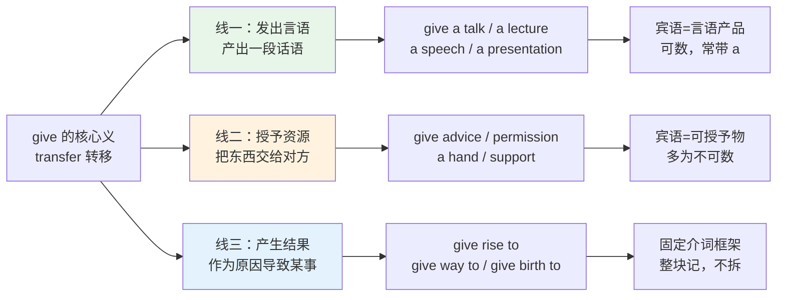
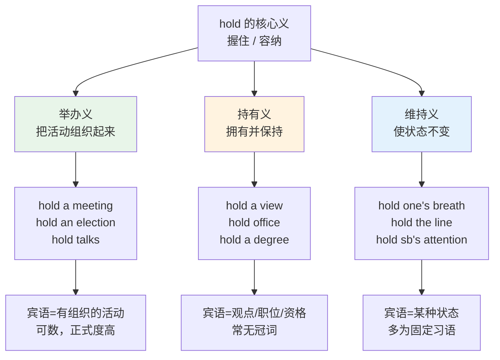
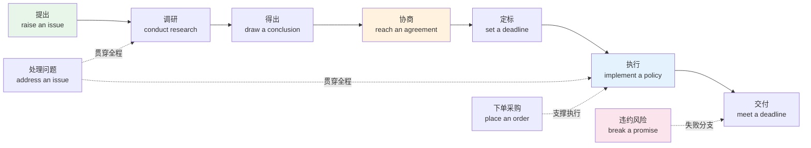
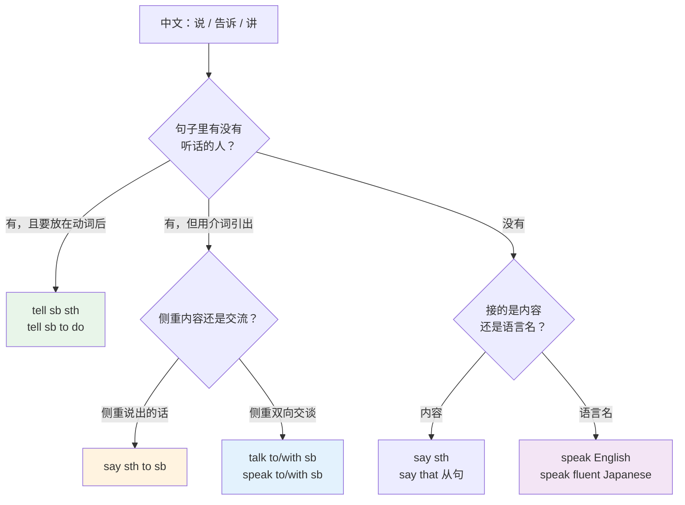
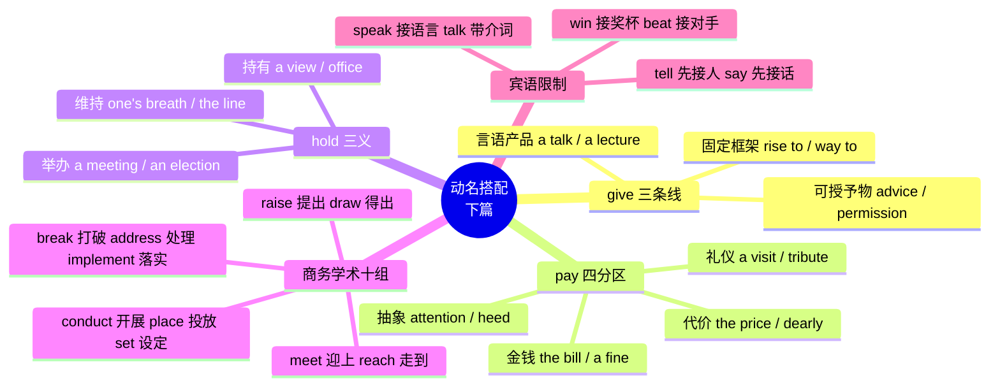

# 动词+名词搭配（下）give、pay、hold 与商务学术动名组

> [!info] 本篇定位
>
> `17.固定搭配` 章第三篇，与上一篇 `02.动词+名词搭配（上）make、do、have、take` 合起来构成动名搭配的完整版图。
>
> 上一篇的四个动词是纯粹的轻动词——`make a decision` 里 `make` 几乎不带语义，全部意思在名词上。本篇的 `give`、`pay`、`hold` 处在中间地带：它们既有实义用法（`give me the key`、`pay the bill`、`hold the door`），又大量参与轻动词结构（`give rise to`、`pay attention`、`hold a view`），两套用法互相干扰，是中文母语者出错最密集的区域。
>
> 后半篇转向商务与学术写作真正吃饭的十个动名组，最后用两张自查表处理 `say/tell/speak/talk` 和 `win/beat` 这两组只错在宾语上的动词。
>
> 读完你能做到：写邮件和技术文档时不再用 `do a meeting`、`say me`、`win him`，并且知道每个抽象名词该配哪个动词。

---

## 1. 本篇导读：轻动词用完之后

上一篇解决的是「这个名词该配 make 还是 do」。那四个词覆盖面极广，但覆盖不到一批高频表达：

- 「发表演讲」不是 `make a talk`，是 **give a talk**。
- 「引起争议」不是 `make controversy`，是 **give rise to controversy**。
- 「注意」不是 `take attention`，是 **pay attention**。
- 「开会」在正式语境不是 `do a meeting`，是 **hold a meeting**。
- 「得出结论」不是 `get a conclusion`，是 **draw a conclusion**。

这些错误有一个共同成因：中文的动词粒度比英语粗。中文用一个「进行」「作出」「开展」就能挂接几乎任何抽象名词，英语却把这些抽象名词分派给了不同的动词，而分派依据往往是历史约定而非逻辑。

`give`、`pay`、`hold` 和后半篇的十个动词，比 `make`/`do`/`have`/`take` 更难的地方在于**语义还没有完全漂白**。`make a decision` 里的 `make` 完全空转，你不必问「为什么是 make」；但 `pay attention` 里的 `pay` 还残留着「付出」的意象，`hold a view` 里的 `hold` 还残留着「握住」的意象。这个残留意象既是助记的抓手，也是过度类推的陷阱——`pay attention` 成立不等于 `pay effort` 成立。

动名搭配按动词的语义残留程度分成三层，每层的记忆策略不同：

| 层次 | 代表动词 | 动词的语义状态 | 记忆策略 |
| --- | --- | --- | --- |
| 纯轻动词层 | make、do、have、take | 几乎无语义，意思全在名词上 | 整块背，不问为什么 |
| 半实义层 | give、pay、hold | 保留残余意象，可助记但不可类推 | 抓意象串记，再逐条核对 |
| 专用实义层 | raise、draw、conduct、implement | 自带语义限制，宾语范围窄而清晰 | 按语义场归组，可推理 |

三种策略不能混用：对 `make` 组问「为什么」是浪费时间，对 `conduct` 组不问「为什么」则会漏掉它对宾语的正式度要求。上一篇覆盖第一层，本篇前半是第二层，后半是第三层。

### 1.1 本篇的四块内容

| 区块 | 覆盖动词 | 核心问题 | 对应小节 |
| --- | --- | --- | --- |
| give 组 | give | 「给出」的三条语义线怎么分 | 第 2、3 节 |
| pay 组 | pay | 付钱与付出的边界在哪 | 第 4 节 |
| hold 组 | hold | 举办、持有、维持三义如何辨认 | 第 5 节 |
| 商务学术组 | raise、draw、meet、reach、conduct、place、set、break、address、implement | 每个动词接哪一类抽象名词 | 第 6 至 9 节 |
| 宾语限制自查 | say、tell、speak、talk、win、beat | 动词对不对不是问题，宾语对不对才是 | 第 10、11 节 |

---

## 2. give：从「交出」到「发出」的三条语义线

### 2.1 三条语义线的分工

`give` 的基本义是「把东西从我这里转移到你那里」。抽象化之后分裂成三条线，每条线接的名词类型不同。

上图把 `give` 拆成三段。线一和线二仍然能看出「转移」的影子：一段演讲是从讲者转移到听众的，一条建议是从建议者转移到被建议者的。线三已经彻底抽象化，`give rise to` 里没有任何东西在移动，`give` 退化成了纯语法成分，所以它只能整块记忆。区分三条线的实际收益是：线一和线二的成员可以有限类推，线三不能。

### 2.2 线一：give + 言语产品

这一组的宾语全是「一次成型的言语输出」，几乎都可数，几乎都带不定冠词。

| 英文 | 英式音标 | 美式音标 | 词性 | 中文 | 搭配与说明 |
| --- | --- | --- | --- | --- | --- |
| **give a talk** | /ɡɪv ə ˈtɔːk/ | /ɡɪv ə ˈtɔːk/ | v.phr. | 做个讲座；作报告 | 最中性的一个，技术分享会首选 |
| **give a lecture** | /ɡɪv ə ˈlektʃə/ | /ɡɪv ə ˈlektʃər/ | v.phr. | 讲课；做学术讲座 | 比 talk 正式，含教学关系 |
| **give a speech** | /ɡɪv ə ˈspiːtʃ/ | /ɡɪv ə ˈspiːtʃ/ | v.phr. | 发表演讲 | 场合性讲话，有仪式感 |
| **give a presentation** | /ɡɪv ə ˌpreznˈteɪʃn/ | /ɡɪv ə ˌprezənˈteɪʃn/ | v.phr. | 做演示汇报 | 职场默认词，通常配幻灯片 |
| **give a briefing** | /ɡɪv ə ˈbriːfɪŋ/ | /ɡɪv ə ˈbriːfɪŋ/ | v.phr. | 做情况通报 | 简短、信息型，常用于会前 |
| **give a demo** | /ɡɪv ə ˈdeməʊ/ | /ɡɪv ə ˈdemoʊ/ | v.phr. | 做演示 | demo 是 demonstration 的缩略 |
| **give an account of** | /ɡɪv ən əˈkaʊnt əv/ | /ɡɪv ən əˈkaʊnt əv/ | v.phr. | 叙述；说明 | 后接事件，书面 |
| **give an example** | /ɡɪv ən ɪɡˈzɑːmpl/ | /ɡɪv ən ɪɡˈzæmpl/ | v.phr. | 举个例子 | 口笔语通用 |
| **give evidence** | /ɡɪv ˈevɪdəns/ | /ɡɪv ˈevɪdəns/ | v.phr. | 作证；提供证据 | 法庭语境，不可数，不加 a |
| **give feedback** | /ɡɪv ˈfiːdbæk/ | /ɡɪv ˈfiːdbæk/ | v.phr. | 给出反馈 | 不可数，不加 a |
| **give notice** | /ɡɪv ˈnəʊtɪs/ | /ɡɪv ˈnoʊtɪs/ | v.phr. | 通知；提出辞职 | 无冠词时特指提前告知期 |
| **give a warning** | /ɡɪv ə ˈwɔːnɪŋ/ | /ɡɪv ə ˈwɔːrnɪŋ/ | v.phr. | 发出警告 | 可数，有次数感 |
| **give a reason** | /ɡɪv ə ˈriːzn/ | /ɡɪv ə ˈriːzn/ | v.phr. | 给出理由 | 复数 give reasons 更常见 |
| **give a description** | /ɡɪv ə dɪˈskrɪpʃn/ | /ɡɪv ə dɪˈskrɪpʃn/ | v.phr. | 加以描述 | 学术写作常用 |
| **give an interview** | /ɡɪv ən ˈɪntəvjuː/ | /ɡɪv ən ˈɪntərvjuː/ | v.phr. | 接受采访 | 受访方用 give，采访方用 conduct |
| **give a verdict** | /ɡɪv ə ˈvɜːdɪkt/ | /ɡɪv ə ˈvɜːrdɪkt/ | v.phr. | 作出裁决 | 也可 return a verdict |
| **give a quote** | /ɡɪv ə kwəʊt/ | /ɡɪv ə kwoʊt/ | v.phr. | 给出报价 | 商务口语，正式写 provide a quotation |
| **give an estimate** | /ɡɪv ən ˈestɪmət/ | /ɡɪv ən ˈestɪmət/ | v.phr. | 给出估算 | 名词 estimate 重音在首，末尾读 /ət/ |

> [!warning] give an interview 的方向
>
> 这一对最容易搞反。
>
> - ❌ ~~The reporter gave an interview to the CEO.~~（意思变成记者接受了 CEO 的采访）
> - ✅ The CEO **gave an interview** to the reporter.（CEO 接受采访）
> - ✅ The reporter **conducted an interview** with the CEO.（记者进行采访）
>
> 记忆抓手：`give` 是「交出内容」，交出内容的是被采访的一方。求职场景同理，`I had an interview` 是求职者视角，`We conducted interviews` 是招聘方视角。

### 2.3 线二：give + 可授予物

这一组的宾语是能「给出去」的资源、态度或身体动作。多为不可数名词。

| 英文 | 英式音标 | 美式音标 | 词性 | 中文 | 搭配与说明 |
| --- | --- | --- | --- | --- | --- |
| **give advice** | /ɡɪv ədˈvaɪs/ | /ɡɪv ədˈvaɪs/ | v.phr. | 提建议 | 不可数，量词用 a piece of advice |
| **give permission** | /ɡɪv pəˈmɪʃn/ | /ɡɪv pərˈmɪʃn/ | v.phr. | 准许 | 后接 to do 或 for sth |
| **give consent** | /ɡɪv kənˈsent/ | /ɡɪv kənˈsent/ | v.phr. | 表示同意 | 法律与医疗文书用词 |
| **give approval** | /ɡɪv əˈpruːvl/ | /ɡɪv əˈpruːvl/ | v.phr. | 批准 | 比 consent 更偏行政流程 |
| **give support** | /ɡɪv səˈpɔːt/ | /ɡɪv səˈpɔːrt/ | v.phr. | 给予支持 | 不可数 |
| **give a hand** | /ɡɪv ə hænd/ | /ɡɪv ə hænd/ | v.phr. | 帮个忙；鼓掌 | give sb a hand 帮忙；give a big hand 鼓掌 |
| **give a lift** | /ɡɪv ə lɪft/ | /ɡɪv ə lɪft/ | v.phr. | 捎一程 | 英式说法，美式说 give a ride |
| **give a ride** | /ɡɪv ə raɪd/ | /ɡɪv ə raɪd/ | v.phr. | 捎一程 | 美式说法 |
| **give credit** | /ɡɪv ˈkredɪt/ | /ɡɪv ˈkredɪt/ | v.phr. | 归功于 | give credit to sb for sth |
| **give priority** | /ɡɪv praɪˈɒrəti/ | /ɡɪv praɪˈɔːrəti/ | v.phr. | 优先考虑 | 见 3.2 节详解 |
| **give attention** | /ɡɪv əˈtenʃn/ | /ɡɪv əˈtenʃn/ | v.phr. | 予以关注 | 书面，口语用 pay attention |
| **give thought to** | /ɡɪv ˈθɔːt tə/ | /ɡɪv ˈθɔːt tə/ | v.phr. | 考虑 | 常加 some、serious 修饰 |
| **give a discount** | /ɡɪv ə ˈdɪskaʊnt/ | /ɡɪv ə ˈdɪskaʊnt/ | v.phr. | 给折扣 | 商务，也说 offer a discount |
| **give a guarantee** | /ɡɪv ə ˌɡærənˈtiː/ | /ɡɪv ə ˌɡerənˈtiː/ | v.phr. | 提供保证 | 合同语境 |
| **give a refund** | /ɡɪv ə ˈriːfʌnd/ | /ɡɪv ə ˈriːfʌnd/ | v.phr. | 退款 | 名词重音在首，动词 refund 在后 |
| **give access to** | /ɡɪv ˈækses tə/ | /ɡɪv ˈækses tə/ | v.phr. | 授予访问权 | 技术文档高频 |
| **give one's word** | /ɡɪv wʌnz ˈwɜːd/ | /ɡɪv wʌnz ˈwɜːrd/ | v.phr. | 保证；许诺 | 与 break a promise 成对 |
| **give a compliment** | /ɡɪv ə ˈkɒmplɪmənt/ | /ɡɪv ə ˈkɑːmplɪmənt/ | v.phr. | 称赞 | 也说 pay a compliment，见 4.3 |
| **give the go-ahead** | /ɡɪv ðə ˈɡəʊəhed/ | /ɡɪv ðə ˈɡoʊəhed/ | v.phr. | 放行；批准启动 | 口语化的批准表达 |

> [!example] 线二在职场邮件里的实际句子
>
> - Could you **give me some feedback** on the draft by Friday?
>   - 你能周五前给我一些初稿反馈吗？
> - Legal has **given approval** for the new terms.
>   - 法务已经批准了新条款。
> - We can **give a 10% discount** if you order before the end of the month.
>   - 月底前下单可以给百分之十的折扣。
> - The new role **gives access to** the production database.
>   - 这个新角色开放了生产库的访问权限。

---

## 3. give 的固定框架：rise、way、birth、priority

### 3.1 give rise to

`give rise to` 的意思是「引起、导致」，主语是原因，宾语是结果。它是学术与技术写作里表达因果关系最常用的正式说法之一。

| 英文 | 英式音标 | 美式音标 | 词性 | 中文 | 搭配与说明 |
| --- | --- | --- | --- | --- | --- |
| **give rise to** | /ɡɪv ˈraɪz tə/ | /ɡɪv ˈraɪz tə/ | v.phr. | 引起；导致 | rise 前不加冠词，后必须接 to |
| **give rise to concerns** | /ɡɪv ˈraɪz tə kənˈsɜːnz/ | /ɡɪv ˈraɪz tə kənˈsɜːrnz/ | v.phr. | 引发担忧 | 高频组合 |
| **give rise to speculation** | /ɡɪv ˈraɪz tə ˌspekjuˈleɪʃn/ | /ɡɪv ˈraɪz tə ˌspekjəˈleɪʃn/ | v.phr. | 引发猜测 | 新闻用语 |
| **give rise to a dispute** | /ɡɪv ˈraɪz tə ə dɪˈspjuːt/ | /ɡɪv ˈraɪz tə ə dɪˈspjuːt/ | v.phr. | 引发争议 | 法律合同常见 |
| **give rise to liability** | /ɡɪv ˈraɪz tə ˌlaɪəˈbɪləti/ | /ɡɪv ˈraɪz tə ˌlaɪəˈbɪləti/ | v.phr. | 产生法律责任 | 合同条款措辞 |
| **give rise to a claim** | /ɡɪv ˈraɪz tə ə kleɪm/ | /ɡɪv ˈraɪz tə ə kleɪm/ | v.phr. | 引起索赔 | 保险与合同 |

> [!warning] give rise to 的三个高频错误
>
> - ❌ ~~give a rise to~~ → ✅ **give rise to**（rise 不带冠词）
> - ❌ ~~give rise for~~ → ✅ **give rise to**（介词固定是 to）
> - ❌ ~~The concerns gave rise to the policy change.~~ 若你想说的是「政策变动引发了担忧」，方向反了 → ✅ **The policy change gave rise to concerns.**
>
> 方向永远是「原因 give rise to 结果」。写完自查一句：主语在时间上是不是更早？

`give rise to` 的近义梯度值得单独排一排，因果表达的强度差别在学术写作里是有分寸的：

| 表达 | 英式音标 | 美式音标 | 因果强度 | 语域 |
| --- | --- | --- | --- | --- |
| **cause** | /kɔːz/ | /kɔːz/ | 最强，直接致因 | 中性 |
| **lead to** | /ˈliːd tə/ | /ˈliːd tə/ | 强，链条式导致 | 中性 |
| **result in** | /rɪˈzʌlt ɪn/ | /rɪˈzʌlt ɪn/ | 强，强调结果端 | 偏正式 |
| **give rise to** | /ɡɪv ˈraɪz tə/ | /ɡɪv ˈraɪz tə/ | 中，「催生出」 | 正式书面 |
| **bring about** | /brɪŋ əˈbaʊt/ | /brɪŋ əˈbaʊt/ | 中，多指主动促成 | 中性偏正式 |
| **contribute to** | /kənˈtrɪbjuːt tə/ | /kənˈtrɪbjuːt tə/ | 弱，只是原因之一 | 学术首选 |
| **be associated with** | /bi əˈsəʊʃieɪtɪd wɪð/ | /bi əˈsoʊʃieɪtɪd wɪð/ | 最弱，只说相关 | 学术，回避因果断言 |

论文里把 `contribute to` 写成 `cause` 是实质性的表述错误，因为后者宣称了单一充分因。技术文档里描述一个 bug 的成因，`gives rise to` 比 `causes` 更委婉，也更不容易被追究。

### 3.2 give priority to 与 give way to

| 英文 | 英式音标 | 美式音标 | 词性 | 中文 | 搭配与说明 |
| --- | --- | --- | --- | --- | --- |
| **give priority to** | /ɡɪv praɪˈɒrəti tə/ | /ɡɪv praɪˈɔːrəti tə/ | v.phr. | 优先考虑 | 也说 give sth priority |
| **give top priority to** | /ɡɪv ˌtɒp praɪˈɒrəti tə/ | /ɡɪv ˌtɑːp praɪˈɔːrəti tə/ | v.phr. | 最高优先 | top 是最常见的强化词 |
| **give way to** | /ɡɪv ˈweɪ tə/ | /ɡɪv ˈweɪ tə/ | v.phr. | 让路；被取代 | 交通义与演替义共用一形 |
| **give birth to** | /ɡɪv ˈbɜːθ tə/ | /ɡɪv ˈbɜːrθ tə/ | v.phr. | 生下；催生 | 字面生育，也可比喻催生事物 |
| **give effect to** | /ɡɪv ɪˈfekt tə/ | /ɡɪv ɪˈfekt tə/ | v.phr. | 使生效 | 法律文本，等于 implement |
| **give voice to** | /ɡɪv ˈvɔɪs tə/ | /ɡɪv ˈvɔɪs tə/ | v.phr. | 表达；替……发声 | 常接 concerns、frustration |
| **give consideration to** | /ɡɪv kənˌsɪdəˈreɪʃn tə/ | /ɡɪv kənˌsɪdəˈreɪʃn tə/ | v.phr. | 加以考虑 | 公文体，口语直接说 consider |
| **give notice of** | /ɡɪv ˈnəʊtɪs əv/ | /ɡɪv ˈnoʊtɪs əv/ | v.phr. | 就……发出通知 | 合同条款高频 |
| **give the impression that** | /ɡɪv ði ɪmˈpreʃn ðət/ | /ɡɪv ði ɪmˈpreʃn ðət/ | v.phr. | 给人……的印象 | 后接从句 |
| **give the benefit of the doubt** | /ɡɪv ðə ˈbenɪfɪt əv ðə daʊt/ | /ɡɪv ðə ˈbenɪfɪt əv ðə daʊt/ | v.phr. | 姑且相信 | 整块习语，不可改动 |

> [!example] give way to 的两个义项
>
> - Traffic from the right must **give way to** traffic on the roundabout.
>   - 右侧来车必须给环岛内车辆让行。（交通规则义，美式常说 yield to）
> - Manual deployment scripts have **given way to** CI pipelines.
>   - 手工部署脚本已被 CI 流水线取代。（演替义，主语是被取代的旧事物）
>
> 演替义的方向也容易搞反：`A gives way to B` 是 A 退场、B 上位。写成 `CI pipelines have given way to manual scripts` 意思就变成了 CI 被手工脚本取代。

### 3.3 give 组的整体自查

> [!tip] 三条线的快速判定
>
> 拿到一个「给出 X」的中文，先问 X 属于哪一类：
>
> - X 是一段说出来的内容（讲座、报告、理由、例子）→ 线一，`give a/an + 名词`
> - X 是能授予的资源或态度（建议、许可、支持、优先级）→ 线二，多数不加冠词
> - X 是「导致某结果」的因果关系 → 线三，只有 `give rise to`、`give way to`、`give birth to`、`give effect to` 这几个固定框架，其余一律不能自造

---

## 4. pay：从付钱到付出的连续统

### 4.1 pay 的语义分区

`pay` 的原义是金钱交付。抽象化的方向不像 `give` 那样发散，而是沿着「付出代价」这条单线延伸：注意力是要付出的、拜访是要花时间的、代价是要承担的。

| 分区 | 宾语类型 | 代表搭配 |
| --- | --- | --- |
| 金钱交付 | 具体款项 | pay the bill、pay a fee、pay rent |
| 抽象付出 | 注意力、努力的具象化 | pay attention、pay heed |
| 社交礼仪 | 带有「送达」意味的行为 | pay a visit、pay a compliment、pay tribute |
| 承担后果 | 负面代价 | pay the price、pay a penalty、pay dearly |

这个四分不是词典分类，而是记忆分组。真正需要死记的是第二和第三区——第一区可以从字面推出来，第四区的意象也很直白，只有「付出注意力」「付出一次拜访」这两类在中文里没有对应的付出感。

### 4.2 pay + 金钱类

| 英文 | 英式音标 | 美式音标 | 词性 | 中文 | 搭配与说明 |
| --- | --- | --- | --- | --- | --- |
| **pay the bill** | /peɪ ðə bɪl/ | /peɪ ðə bɪl/ | v.phr. | 付账单 | 美式餐馆账单也说 check |
| **pay a fee** | /peɪ ə fiː/ | /peɪ ə fiː/ | v.phr. | 支付费用 | 服务性收费 |
| **pay a fine** | /peɪ ə faɪn/ | /peɪ ə faɪn/ | v.phr. | 缴罚款 | fine 作名词是罚款 |
| **pay a deposit** | /peɪ ə dɪˈpɒzɪt/ | /peɪ ə dɪˈpɑːzɪt/ | v.phr. | 付押金；付定金 | 租房与订货通用 |
| **pay rent** | /peɪ rent/ | /peɪ rent/ | v.phr. | 付房租 | 不可数，无冠词 |
| **pay tax** | /peɪ tæks/ | /peɪ tæks/ | v.phr. | 纳税 | 也说 pay taxes |
| **pay interest** | /peɪ ˈɪntrəst/ | /peɪ ˈɪntrəst/ | v.phr. | 付利息 | 与 pay attention 的 interest 不同义 |
| **pay a dividend** | /peɪ ə ˈdɪvɪdend/ | /peɪ ə ˈdɪvɪdend/ | v.phr. | 派发股息 | 复数 pay dividends 也指「见成效」 |
| **pay wages** | /peɪ ˈweɪdʒɪz/ | /peɪ ˈweɪdʒɪz/ | v.phr. | 发工资 | wage 指计时工资 |
| **pay a salary** | /peɪ ə ˈsæləri/ | /peɪ ə ˈsæləri/ | v.phr. | 发薪 | salary 指年薪制固定薪 |
| **pay damages** | /peɪ ˈdæmɪdʒɪz/ | /peɪ ˈdæmɪdʒɪz/ | v.phr. | 赔偿损失 | 复数才是法律赔偿金 |
| **pay compensation** | /peɪ ˌkɒmpenˈseɪʃn/ | /peɪ ˌkɑːmpenˈseɪʃn/ | v.phr. | 支付赔偿 | 不可数 |
| **pay in advance** | /peɪ ɪn ədˈvɑːns/ | /peɪ ɪn ədˈvæns/ | v.phr. | 预付 | 合同付款条款 |
| **pay in instalments** | /peɪ ɪn ɪnˈstɔːlmənts/ | /peɪ ɪn ɪnˈstɔːlmənts/ | v.phr. | 分期付款 | 美式拼 installments |
| **pay off a debt** | /peɪ ˌɒf ə det/ | /peɪ ˌɔːf ə det/ | v.phr. | 还清债务 | debt 的 b 不发音 |
| **pay a ransom** | /peɪ ə ˈrænsəm/ | /peɪ ə ˈrænsəm/ | v.phr. | 付赎金 | 勒索软件报道高频 |

> [!warning] 三个和钱有关的搭配陷阱
>
> - ❌ ~~pay money to buy a laptop~~ → ✅ **buy a laptop** 或 **pay for a laptop**。`pay money` 是中文「花钱」的直译，英语里几乎不说，因为 `pay` 本身已含钱义。
> - ❌ ~~pay the price of the book~~（想说「书的价格」时）→ ✅ **the price of the book**。`pay the price` 是固定习语，意思是「付出代价」，不是「支付价格」。
> - ❌ ~~pay a damage~~ → ✅ **pay damages**。法律赔偿金只用复数；单数 `damage` 是「损害」这个不可数概念。

### 4.3 pay + 非金钱抽象

| 英文 | 英式音标 | 美式音标 | 词性 | 中文 | 搭配与说明 |
| --- | --- | --- | --- | --- | --- |
| **pay attention to** | /peɪ əˈtenʃn tə/ | /peɪ əˈtenʃn tə/ | v.phr. | 注意 | attention 不可数，不加 a |
| **pay close attention** | /peɪ ˌkləʊs əˈtenʃn/ | /peɪ ˌkloʊs əˈtenʃn/ | v.phr. | 密切注意 | close 此处形容词读 /kləʊs/ 清音 |
| **pay heed to** | /peɪ ˈhiːd tə/ | /peɪ ˈhiːd tə/ | v.phr. | 留意；听从 | 书面且偏旧，常用于否定 pay little heed |
| **pay a visit** | /peɪ ə ˈvɪzɪt/ | /peɪ ə ˈvɪzɪt/ | v.phr. | 拜访 | 比 visit 正式，含礼节性 |
| **pay a call on** | /peɪ ə ˈkɔːl ɒn/ | /peɪ ə ˈkɔːl ɑːn/ | v.phr. | 正式拜会 | 外交辞令 |
| **pay a compliment** | /peɪ ə ˈkɒmplɪmənt/ | /peɪ ə ˈkɑːmplɪmənt/ | v.phr. | 称赞 | 比 give a compliment 更书面 |
| **pay tribute to** | /peɪ ˈtrɪbjuːt tə/ | /peɪ ˈtrɪbjuːt tə/ | v.phr. | 致敬；悼念 | 追悼与颁奖场合 |
| **pay homage to** | /peɪ ˈhɒmɪdʒ tə/ | /peɪ ˈhɑːmɪdʒ tə/ | v.phr. | 致敬 | 更文学化，也说致意于前人作品 |
| **pay respect to** | /peɪ rɪˈspekt tə/ | /peɪ rɪˈspekt tə/ | v.phr. | 表示敬意 | 复数 pay one's respects 指吊唁 |
| **pay lip service to** | /peɪ ˌlɪp ˈsɜːvɪs tə/ | /peɪ ˌlɪp ˈsɜːrvɪs tə/ | v.phr. | 口惠而实不至 | 贬义，指只说不做 |
| **pay the price** | /peɪ ðə praɪs/ | /peɪ ðə praɪs/ | v.phr. | 付出代价 | 后接 for sth |
| **pay a penalty** | /peɪ ə ˈpenəlti/ | /peɪ ə ˈpenəlti/ | v.phr. | 受到惩罚 | 也可指金钱罚金 |
| **pay dearly** | /peɪ ˈdɪəli/ | /peɪ ˈdɪrli/ | v.phr. | 付出惨重代价 | dearly 此处不是「亲爱地」 |
| **pay one's dues** | /peɪ wʌnz djuːz/ | /peɪ wʌnz duːz/ | v.phr. | 熬资历；缴会费 | 双义，靠语境分 |
| **pay off** | /peɪ ˈɒf/ | /peɪ ˈɔːf/ | v.phr. | 见成效；还清 | 不及物时是「奏效」 |
| **pay it forward** | /ˌpeɪ ɪt ˈfɔːwəd/ | /ˌpeɪ ɪt ˈfɔːrwərd/ | v.phr. | 把善意传递下去 | 现代习语 |

> [!example] pay the price 的两种用法
>
> - Startups that skip testing **pay the price** later.
>   - 跳过测试的创业公司后面要付出代价。
> - He **paid the price for** cutting corners on security.
>   - 他为在安全上偷工减料付出了代价。
>
> 对照字面付款：
>
> - The buyer **paid the full price** of £2,400.
>   - 买方付了两千四百英镑的全价。
>
> 差别在于有没有 the：`pay the price`（定冠词、无修饰）几乎总是习语义；`pay the full price`、`pay a high price for the laptop` 这类带修饰或带具体商品的，才是字面义。

### 4.4 attention 的动词群

`attention` 是本章最值得单独展开的名词，因为它能配的动词有六个，各自意思不同。

| 英文 | 英式音标 | 美式音标 | 词性 | 中文 | 搭配与说明 |
| --- | --- | --- | --- | --- | --- |
| **pay attention to** | /peɪ əˈtenʃn tə/ | /peɪ əˈtenʃn tə/ | v.phr. | 注意 | 主语是注意者 |
| **draw attention to** | /drɔː əˈtenʃn tə/ | /drɔː əˈtenʃn tə/ | v.phr. | 使人注意到 | 主语是提请者或事物 |
| **attract attention** | /əˈtrækt əˈtenʃn/ | /əˈtrækt əˈtenʃn/ | v.phr. | 吸引注意 | 主语是引人注目的事物 |
| **call attention to** | /kɔːl əˈtenʃn tə/ | /kɔːl əˈtenʃn tə/ | v.phr. | 提请注意 | 与 draw 近义，稍口语 |
| **turn one's attention to** | /tɜːn wʌnz əˈtenʃn tə/ | /tɜːrn wʌnz əˈtenʃn tə/ | v.phr. | 转而关注 | 强调转移 |
| **hold sb's attention** | /həʊld ˈsʌmbədiz əˈtenʃn/ | /hoʊld ˈsʌmbədiz əˈtenʃn/ | v.phr. | 抓住某人注意力 | 持续义，见第 5 节 hold |
| **escape one's attention** | /ɪˈskeɪp wʌnz əˈtenʃn/ | /ɪˈskeɪp wʌnz əˈtenʃn/ | v.phr. | 未被某人注意到 | 常用于否定式婉转指责 |
| **bring sth to sb's attention** | /brɪŋ … tə … əˈtenʃn/ | /brɪŋ … tə … əˈtenʃn/ | v.phr. | 将某事告知某人 | 邮件正式说法 |

> [!tip] 六个动词的方向差
>
> `pay` 和 `turn` 的主语是**注意的人**；`draw`、`call`、`attract`、`bring` 的主语是**引起注意的一方**；`hold` 的主语是能维持注意力的事物；`escape` 的主语是被忽略的事物。
>
> 写论文引言时最常用的是 `draw attention to`：Recent work has **drawn attention to** the security implications of this design.

---

## 5. hold：容器义、维持义与举办义

### 5.1 三义的分化路径

上图把 `hold` 的三条线摆开。举办义是从「把人聚拢住」引申的，持有义是从「握在手里」引申的，维持义是从「不松手」引申的。三义共用一个动词却接完全不同类型的宾语，这也是判断某个搭配是否成立的抓手：如果宾语既不是活动、也不是可持有物、也不是可维持的状态，那大概率不该用 `hold`。

### 5.2 举办义：hold + 活动

| 英文 | 英式音标 | 美式音标 | 词性 | 中文 | 搭配与说明 |
| --- | --- | --- | --- | --- | --- |
| **hold a meeting** | /həʊld ə ˈmiːtɪŋ/ | /hoʊld ə ˈmiːtɪŋ/ | v.phr. | 召开会议 | 正式；口语常说 have a meeting |
| **hold a conference** | /həʊld ə ˈkɒnfərəns/ | /hoʊld ə ˈkɑːnfərəns/ | v.phr. | 举办大会 | 规模大于 meeting |
| **hold talks** | /həʊld ˈtɔːks/ | /hoʊld ˈtɔːks/ | v.phr. | 举行会谈 | 复数固定，外交与谈判用语 |
| **hold a press conference** | /həʊld ə ˈpres ˌkɒnfərəns/ | /hoʊld ə ˈpres ˌkɑːnfərəns/ | v.phr. | 开新闻发布会 | 也说 give a press conference |
| **hold an election** | /həʊld ən ɪˈlekʃn/ | /hoʊld ən ɪˈlekʃn/ | v.phr. | 举行选举 | 主语通常是政府或组织 |
| **hold a referendum** | /həʊld ə ˌrefəˈrendəm/ | /hoʊld ə ˌrefəˈrendəm/ | v.phr. | 举行公投 | 复数 referendums 或 referenda |
| **hold a vote** | /həʊld ə vəʊt/ | /hoʊld ə voʊt/ | v.phr. | 进行表决 | 小范围表决 |
| **hold a ceremony** | /həʊld ə ˈserəməni/ | /hoʊld ə ˈserəmoʊni/ | v.phr. | 举行典礼 | 美音第三音节读 /moʊ/ |
| **hold an exhibition** | /həʊld ən ˌeksɪˈbɪʃn/ | /hoʊld ən ˌeksɪˈbɪʃn/ | v.phr. | 举办展览 | h 不发音 |
| **hold a competition** | /həʊld ə ˌkɒmpəˈtɪʃn/ | /hoʊld ə ˌkɑːmpəˈtɪʃn/ | v.phr. | 举办比赛 | 也说 run a competition |
| **hold an inquiry** | /həʊld ən ɪnˈkwaɪəri/ | /hoʊld ən ˈɪnkwəri/ | v.phr. | 进行调查 | 英美重音不同 |
| **hold a hearing** | /həʊld ə ˈhɪərɪŋ/ | /hoʊld ə ˈhɪrɪŋ/ | v.phr. | 举行听证会 | 法律与立法程序 |
| **hold a trial** | /həʊld ə ˈtraɪəl/ | /hoʊld ə ˈtraɪəl/ | v.phr. | 开庭审判 | 医药试验用 conduct a trial |
| **hold a party** | /həʊld ə ˈpɑːti/ | /hoʊld ə ˈpɑːrti/ | v.phr. | 办派对 | 口语更常用 have / throw a party |
| **hold a workshop** | /həʊld ə ˈwɜːkʃɒp/ | /hoʊld ə ˈwɜːrkʃɑːp/ | v.phr. | 办工作坊 | 也说 run a workshop |
| **hold a retrospective** | /həʊld ə ˌretrəˈspektɪv/ | /hoʊld ə ˌretrəˈspektɪv/ | v.phr. | 开复盘会 | 敏捷开发术语 |

> [!warning] hold a meeting 和 have a meeting 的语域差
>
> 两个都对，但不通用：
>
> - ✅ The board **held a meeting** on 3 March to approve the budget.（正式记录、公告、纪要）
> - ✅ Let's **have a meeting** tomorrow morning.（口语、内部沟通）
> - ❌ ~~Let's hold a meeting tomorrow morning.~~ 语法没错，但听起来像在下达行政命令。
> - ❌ ~~do a meeting~~ / ~~open a meeting~~ 都不成立。`open the meeting` 只表示「宣布会议开始」这个瞬间动作，不能替代「开会」这个整体。

### 5.3 持有义与维持义

| 英文 | 英式音标 | 美式音标 | 词性 | 中文 | 搭配与说明 |
| --- | --- | --- | --- | --- | --- |
| **hold a view** | /həʊld ə vjuː/ | /hoʊld ə vjuː/ | v.phr. | 持有某种看法 | 常带 strong、opposing 修饰 |
| **hold an opinion** | /həʊld ən əˈpɪnjən/ | /hoʊld ən əˈpɪnjən/ | v.phr. | 持某观点 | 与 view 基本互换 |
| **hold a belief** | /həʊld ə bɪˈliːf/ | /hoʊld ə bɪˈliːf/ | v.phr. | 抱有某种信念 | 宗教与价值观语境 |
| **hold office** | /həʊld ˈɒfɪs/ | /hoʊld ˈɑːfɪs/ | v.phr. | 担任公职；在任 | 无冠词，加了 an 就变成「有间办公室」 |
| **hold a position** | /həʊld ə pəˈzɪʃn/ | /hoʊld ə pəˈzɪʃn/ | v.phr. | 担任职位 | 也可指持有某立场 |
| **hold a post** | /həʊld ə pəʊst/ | /hoʊld ə poʊst/ | v.phr. | 任职 | 英式偏多 |
| **hold a degree** | /həʊld ə dɪˈɡriː/ | /hoʊld ə dɪˈɡriː/ | v.phr. | 拥有学位 | 简历用语，比 have 正式 |
| **hold a licence** | /həʊld ə ˈlaɪsns/ | /hoʊld ə ˈlaɪsns/ | v.phr. | 持有执照 | 美式拼 license |
| **hold shares** | /həʊld ʃeəz/ | /hoʊld ʃerz/ | v.phr. | 持股 | 也说 hold a stake in |
| **hold a stake in** | /həʊld ə ˈsteɪk ɪn/ | /hoʊld ə ˈsteɪk ɪn/ | v.phr. | 持有……股份 | 金融新闻高频 |
| **hold a record** | /həʊld ə ˈrekɔːd/ | /hoʊld ə ˈrekərd/ | v.phr. | 保持纪录 | 名词 record 重音在首 |
| **hold a title** | /həʊld ə ˈtaɪtl/ | /hoʊld ə ˈtaɪtl/ | v.phr. | 保有头衔 | 体育与贵族头衔通用 |
| **hold one's breath** | /həʊld wʌnz breθ/ | /hoʊld wʌnz breθ/ | v.phr. | 屏住呼吸；焦急等待 | 比喻义常用否定 don't hold your breath |
| **hold the line** | /həʊld ðə laɪn/ | /hoʊld ðə laɪn/ | v.phr. | 别挂电话；坚守立场 | 双义 |
| **hold a grudge** | /həʊld ə ɡrʌdʒ/ | /hoʊld ə ɡrʌdʒ/ | v.phr. | 记仇 | against sb |
| **hold hostages** | /həʊld ˈhɒstɪdʒɪz/ | /hoʊld ˈhɑːstɪdʒɪz/ | v.phr. | 扣押人质 | 也比喻「拿……要挟」 |
| **hold responsibility for** | /həʊld rɪˌspɒnsəˈbɪləti fə/ | /hoʊld rɪˌspɑːnsəˈbɪləti fɔːr/ | v.phr. | 对……负责 | 更常说 take responsibility for |
| **hold sb accountable** | /həʊld ˈsʌmbədi əˈkaʊntəbl/ | /hoʊld ˈsʌmbədi əˈkaʊntəbl/ | v.phr. | 要某人担责 | 管理与治理文本高频 |
| **hold true** | /həʊld ˈtruː/ | /hoʊld ˈtruː/ | v.phr. | 依然成立 | 主语是结论或规律 |
| **hold water** | /həʊld ˈwɔːtə/ | /hoʊld ˈwɔːtər/ | v.phr. | 站得住脚 | 常用否定 doesn't hold water |

> [!warning] hold office 的冠词
>
> - ✅ She has **held office** since 2019.（她自 2019 年起在任）
> - ✅ She **holds the office of** treasurer.（她担任司库一职，加 the 并接具体职位名）
> - ❌ ~~She holds an office since 2019.~~ 加了 an 就变成「她有一间办公室」，而且时态也不对。
>
> 同类零冠词职位表达：`take office`（就职）、`leave office`（卸任）、`run for office`（竞选公职）。这一组的 `office` 全部是抽象的「公职」而非「办公室」。

---

## 6. raise 与 draw：提出与得出

### 6.1 两个动词的方向对立

`raise` 是往上抛出、把某物摆到台面上；`draw` 是往回拉、从已有材料里抽出某物。放在学术写作里，`raise` 用于论文的问题端，`draw` 用于结论端，一头一尾。

| 英文 | 英式音标 | 美式音标 | 词性 | 中文 | 搭配与说明 |
| --- | --- | --- | --- | --- | --- |
| **raise concerns** | /reɪz kənˈsɜːnz/ | /reɪz kənˈsɜːrnz/ | v.phr. | 引发担忧；提出关切 | 复数最常见 |
| **raise a question** | /reɪz ə ˈkwestʃən/ | /reɪz ə ˈkwestʃən/ | v.phr. | 提出问题 | 学术提问，非请人回答 |
| **raise an issue** | /reɪz ən ˈɪʃuː/ | /reɪz ən ˈɪʃuː/ | v.phr. | 提出议题 | 会议与工单语境 |
| **raise an objection** | /reɪz ən əbˈdʒekʃn/ | /reɪz ən əbˈdʒekʃn/ | v.phr. | 提出异议 | 正式流程用词 |
| **raise a point** | /reɪz ə pɔɪnt/ | /reɪz ə pɔɪnt/ | v.phr. | 提出一点看法 | 讨论中常用 |
| **raise awareness** | /reɪz əˈweənəs/ | /reɪz əˈwernəs/ | v.phr. | 提高认识 | 公益宣传高频，不可数 |
| **raise standards** | /reɪz ˈstændədz/ | /reɪz ˈstændərdz/ | v.phr. | 提高标准 | 复数 |
| **raise funds** | /reɪz fʌndz/ | /reɪz fʌndz/ | v.phr. | 筹款 | 名词化 fundraising |
| **raise capital** | /reɪz ˈkæpɪtl/ | /reɪz ˈkæpɪtl/ | v.phr. | 融资 | 创业与金融语境 |
| **raise prices** | /reɪz ˈpraɪsɪz/ | /reɪz ˈpraɪsɪz/ | v.phr. | 涨价 | 与 prices rise 主动被动之别 |
| **raise the alarm** | /reɪz ði əˈlɑːm/ | /reɪz ði əˈlɑːrm/ | v.phr. | 发出警报 | 也说 sound the alarm |
| **raise eyebrows** | /reɪz ˈaɪbraʊz/ | /reɪz ˈaɪbraʊz/ | v.phr. | 令人侧目 | 表示引起惊讶或不认同 |
| **raise expectations** | /reɪz ˌekspekˈteɪʃnz/ | /reɪz ˌekspekˈteɪʃnz/ | v.phr. | 抬高期望 | 复数 |
| **raise the bar** | /reɪz ðə bɑː/ | /reɪz ðə bɑːr/ | v.phr. | 提高门槛 | 源自跳高的横杆 |
| **raise doubts** | /reɪz daʊts/ | /reɪz daʊts/ | v.phr. | 引起怀疑 | 复数，about sth |
| **raise a family** | /reɪz ə ˈfæməli/ | /reɪz ə ˈfæməli/ | v.phr. | 养育子女 | 不是「组建家庭」 |
| **draw a conclusion** | /drɔː ə kənˈkluːʒn/ | /drɔː ə kənˈkluːʒn/ | v.phr. | 得出结论 | 复数 draw conclusions 更常见 |
| **draw an inference** | /drɔː ən ˈɪnfərəns/ | /drɔː ən ˈɪnfərəns/ | v.phr. | 作出推断 | 比 conclusion 更弱、更中间 |
| **draw a distinction** | /drɔː ə dɪˈstɪŋkʃn/ | /drɔː ə dɪˈstɪŋkʃn/ | v.phr. | 作出区分 | between A and B |
| **draw a parallel** | /drɔː ə ˈpærəlel/ | /drɔː ə ˈpærəlel/ | v.phr. | 作类比 | between A and B |
| **draw a comparison** | /drɔː ə kəmˈpærɪsn/ | /drɔː ə kəmˈperɪsn/ | v.phr. | 作比较 | 与 make a comparison 通用 |
| **draw attention to** | /drɔː əˈtenʃn tə/ | /drɔː əˈtenʃn tə/ | v.phr. | 引人注意 | 见 4.4 节 |
| **draw a line** | /drɔː ə laɪn/ | /drɔː ə laɪn/ | v.phr. | 划清界限 | draw the line at sth 表示底线 |
| **draw criticism** | /drɔː ˈkrɪtɪsɪzəm/ | /drɔː ˈkrɪtɪsɪzəm/ | v.phr. | 招致批评 | 主语是引发批评的事 |
| **draw support** | /drɔː səˈpɔːt/ | /drɔː səˈpɔːrt/ | v.phr. | 赢得支持 | 也说 draw on support 借助支持 |
| **draw on experience** | /drɔː ˌɒn ɪkˈspɪəriəns/ | /drɔː ˌɑːn ɪkˈspɪriəns/ | v.phr. | 借助经验 | 加 on 后意思变为「取用」 |

> [!warning] 得出结论不用 get
>
> - ❌ ~~We can get a conclusion that the cache is the bottleneck.~~
> - ✅ We can **draw the conclusion that** the cache is the bottleneck.
> - ✅ We **conclude that** the cache is the bottleneck.（更简洁，学术写作首选）
>
> 同理：`arrive at a conclusion`、`reach a conclusion` 都成立，唯独 `get a conclusion` 不成立。中文的「得出」在英语里对应 `draw`、`reach`、`arrive at` 三个词，不对应 `get`。

### 6.2 raise 与 rise 的老问题

这一对在搭配层面反复出错，值得再钉一次。

| 英文 | 英式音标 | 美式音标 | 词性 | 中文 | 搭配与说明 |
| --- | --- | --- | --- | --- | --- |
| **raise** | /reɪz/ | /reɪz/ | v.t. | 提高；提出 | 及物，规则变化 raised-raised |
| **rise** | /raɪz/ | /raɪz/ | v.i. | 上升 | 不及物，rise-rose-risen |
| **arise** | /əˈraɪz/ | /əˈraɪz/ | v.i. | （问题）出现 | arise-arose-arisen，主语多为抽象问题 |
| **arouse** | /əˈraʊz/ | /əˈraʊz/ | v.t. | 唤起（情绪） | 及物，宾语是 suspicion、curiosity |

> [!example] 四个词的对照句
>
> - The team **raised** the price by 5%.
>   - 团队把价格提高了百分之五。（及物，有施事）
> - Prices **rose** by 5% last quarter.
>   - 上季度价格上涨了百分之五。（不及物，无施事）
> - A problem **arose** during the migration.
>   - 迁移过程中出现了一个问题。（抽象事物自行出现）
> - The report **aroused** suspicion among reviewers.
>   - 这份报告引起了审稿人的怀疑。（唤起情绪）

---

## 7. meet 与 reach：达到与抵达

### 7.1 meet 的抽象宾语组

`meet` 的抽象义是「满足、达到」——把标准、期限、要求当作对面走来的对象去迎上它。

| 英文 | 英式音标 | 美式音标 | 词性 | 中文 | 搭配与说明 |
| --- | --- | --- | --- | --- | --- |
| **meet a deadline** | /miːt ə ˈdedlaɪn/ | /miːt ə ˈdedlaɪn/ | v.phr. | 赶上截止期限 | 反义 miss a deadline |
| **meet a requirement** | /miːt ə rɪˈkwaɪəmənt/ | /miːt ə rɪˈkwaɪərmənt/ | v.phr. | 满足要求 | 复数 meet requirements 更常见 |
| **meet a standard** | /miːt ə ˈstændəd/ | /miːt ə ˈstændərd/ | v.phr. | 达到标准 | 合规文本高频 |
| **meet the criteria** | /miːt ðə kraɪˈtɪəriə/ | /miːt ðə kraɪˈtɪriə/ | v.phr. | 符合标准 | criteria 是复数，单数 criterion |
| **meet expectations** | /miːt ˌekspekˈteɪʃnz/ | /miːt ˌekspekˈteɪʃnz/ | v.phr. | 达到预期 | 绩效评估用语 |
| **meet demand** | /miːt dɪˈmɑːnd/ | /miːt dɪˈmænd/ | v.phr. | 满足需求 | 经济语境不可数 |
| **meet the needs of** | /miːt ðə ˈniːdz əv/ | /miːt ðə ˈniːdz əv/ | v.phr. | 满足……的需要 | 产品文档常用 |
| **meet a target** | /miːt ə ˈtɑːɡɪt/ | /miːt ə ˈtɑːrɡɪt/ | v.phr. | 完成指标 | 也说 hit a target |
| **meet a quota** | /miːt ə ˈkwəʊtə/ | /miːt ə ˈkwoʊtə/ | v.phr. | 完成配额 | 销售语境 |
| **meet an obligation** | /miːt ən ˌɒblɪˈɡeɪʃn/ | /miːt ən ˌɑːblɪˈɡeɪʃn/ | v.phr. | 履行义务 | 合同用词 |
| **meet costs** | /miːt kɒsts/ | /miːt kɔːsts/ | v.phr. | 承担费用 | 也说 cover costs |
| **meet a challenge** | /miːt ə ˈtʃælɪndʒ/ | /miːt ə ˈtʃælɪndʒ/ | v.phr. | 应对挑战 | 也说 rise to a challenge |
| **meet resistance** | /miːt rɪˈzɪstəns/ | /miːt rɪˈzɪstəns/ | v.phr. | 遭遇阻力 | 主语是推行方 |
| **meet halfway** | /ˌmiːt ˌhɑːfˈweɪ/ | /ˌmiːt ˌhæfˈweɪ/ | v.phr. | 各让一步 | meet sb halfway |

### 7.2 reach 的抽象宾语组

`reach` 强调「经过一段过程终于抵达某个点」，因此它的宾语多是协商与积累的终点。

| 英文 | 英式音标 | 美式音标 | 词性 | 中文 | 搭配与说明 |
| --- | --- | --- | --- | --- | --- |
| **reach an agreement** | /riːtʃ ən əˈɡriːmənt/ | /riːtʃ ən əˈɡriːmənt/ | v.phr. | 达成协议 | 谈判语境最常用 |
| **reach a deal** | /riːtʃ ə diːl/ | /riːtʃ ə diːl/ | v.phr. | 达成交易 | 比 agreement 口语 |
| **reach a consensus** | /riːtʃ ə kənˈsensəs/ | /riːtʃ ə kənˈsensəs/ | v.phr. | 达成共识 | 也说 arrive at a consensus |
| **reach a compromise** | /riːtʃ ə ˈkɒmprəmaɪz/ | /riːtʃ ə ˈkɑːmprəmaɪz/ | v.phr. | 达成妥协 | 双方各退 |
| **reach a settlement** | /riːtʃ ə ˈsetlmənt/ | /riːtʃ ə ˈsetlmənt/ | v.phr. | 达成和解 | 法律语境 |
| **reach a decision** | /riːtʃ ə dɪˈsɪʒn/ | /riːtʃ ə dɪˈsɪʒn/ | v.phr. | 作出决定 | 强调经过审议 |
| **reach a verdict** | /riːtʃ ə ˈvɜːdɪkt/ | /riːtʃ ə ˈvɜːrdɪkt/ | v.phr. | 作出裁决 | 陪审团主语 |
| **reach a conclusion** | /riːtʃ ə kənˈkluːʒn/ | /riːtʃ ə kənˈkluːʒn/ | v.phr. | 得出结论 | 与 draw 通用 |
| **reach a milestone** | /riːtʃ ə ˈmaɪlstəʊn/ | /riːtʃ ə ˈmaɪlstoʊn/ | v.phr. | 达到里程碑 | 项目管理用语 |
| **reach a target** | /riːtʃ ə ˈtɑːɡɪt/ | /riːtʃ ə ˈtɑːrɡɪt/ | v.phr. | 达到目标 | 与 meet 通用 |
| **reach an impasse** | /riːtʃ ən ˈæmpɑːs/ | /riːtʃ ən ˈɪmpæs/ | v.phr. | 陷入僵局 | 英美读音差别大 |
| **reach a deadlock** | /riːtʃ ə ˈdedlɒk/ | /riːtʃ ə ˈdedlɑːk/ | v.phr. | 陷入僵局 | 计算机的死锁同词 |
| **reach capacity** | /riːtʃ kəˈpæsəti/ | /riːtʃ kəˈpæsəti/ | v.phr. | 达到容量上限 | 容量与运力 |
| **reach an audience** | /riːtʃ ən ˈɔːdiəns/ | /riːtʃ ən ˈɔːdiəns/ | v.phr. | 触达受众 | 传播与营销 |

> [!tip] meet 与 reach 怎么选
>
> 判据是宾语的性质：
>
> - 宾语是**外部给定的门槛**（deadline、standard、requirement、quota）→ 用 **meet**，因为你要迎上它。
> - 宾语是**过程产出的终点**（agreement、consensus、decision、conclusion）→ 用 **reach**，因为它是走到的。
>
> `target` 两个都能配，因为指标既是外部给定的门槛，也是需要走到的点。

---

## 8. conduct、place、set：正式动作动词组

### 8.1 conduct：有组织地开展

`conduct` 是 `do` 的正式替身，专门接「有方法、有流程的系统性活动」。宾语必须是能被设计和执行的过程，不能是随意的小事。

| 英文 | 英式音标 | 美式音标 | 词性 | 中文 | 搭配与说明 |
| --- | --- | --- | --- | --- | --- |
| **conduct research** | /kənˈdʌkt rɪˈsɜːtʃ/ | /kənˈdʌkt ˈriːsɜːrtʃ/ | v.phr. | 开展研究 | research 不可数，不加 a |
| **conduct a study** | /kənˈdʌkt ə ˈstʌdi/ | /kənˈdʌkt ə ˈstʌdi/ | v.phr. | 进行一项研究 | study 可数，指具体一项 |
| **conduct a survey** | /kənˈdʌkt ə ˈsɜːveɪ/ | /kənˈdʌkt ə ˈsɜːrveɪ/ | v.phr. | 做问卷调查 | 名词重音在首 |
| **conduct an experiment** | /kənˈdʌkt ən ɪkˈsperɪmənt/ | /kənˈdʌkt ən ɪkˈsperɪmənt/ | v.phr. | 做实验 | 也说 run an experiment |
| **conduct an interview** | /kənˈdʌkt ən ˈɪntəvjuː/ | /kənˈdʌkt ən ˈɪntərvjuː/ | v.phr. | 进行访谈 | 采访方视角 |
| **conduct an investigation** | /kənˈdʌkt ən ɪnˌvestɪˈɡeɪʃn/ | /kənˈdʌkt ən ɪnˌvestɪˈɡeɪʃn/ | v.phr. | 展开调查 | 执法与内审 |
| **conduct an audit** | /kənˈdʌkt ən ˈɔːdɪt/ | /kənˈdʌkt ən ˈɔːdɪt/ | v.phr. | 进行审计 | 财务与安全审计通用 |
| **conduct an analysis** | /kənˈdʌkt ən əˈnæləsɪs/ | /kənˈdʌkt ən əˈnæləsɪs/ | v.phr. | 做分析 | 复数 analyses /əˈnæləsiːz/ |
| **conduct a trial** | /kənˈdʌkt ə ˈtraɪəl/ | /kənˈdʌkt ə ˈtraɪəl/ | v.phr. | 开展试验 | 临床试验用此，庭审用 hold |
| **conduct a review** | /kənˈdʌkt ə rɪˈvjuː/ | /kənˈdʌkt ə rɪˈvjuː/ | v.phr. | 进行评审 | 代码评审口语说 do a review |
| **conduct a test** | /kənˈdʌkt ə test/ | /kənˈdʌkt ə test/ | v.phr. | 执行测试 | 口语常说 run a test |
| **conduct business** | /kənˈdʌkt ˈbɪznəs/ | /kənˈdʌkt ˈbɪznəs/ | v.phr. | 经营业务 | 不可数 |
| **conduct oneself** | /kənˈdʌkt wʌnˈself/ | /kənˈdʌkt wʌnˈself/ | v.phr. | 举止表现 | 反身用法，指行为举止 |

> [!warning] conduct 的重音与词性
>
> `conduct` 是典型的名动重音对立词：
>
> - 动词 **conduct** /kənˈdʌkt/ · /kənˈdʌkt/，重音在第二音节。
> - 名词 **conduct** /ˈkɒndʌkt/ · /ˈkɑːndʌkt/，重音在第一音节，意思是「行为、操守」。
>
> `a code of conduct`（行为准则）里是名词读法。读错重音在正式场合会明显暴露。同类词还有 `record`、`present`、`increase`、`permit`，完整清单在 `01.词汇入门与学习方法/03` 里。

### 8.2 place 与 set

| 英文 | 英式音标 | 美式音标 | 词性 | 中文 | 搭配与说明 |
| --- | --- | --- | --- | --- | --- |
| **place an order** | /pleɪs ən ˈɔːdə/ | /pleɪs ən ˈɔːrdər/ | v.phr. | 下订单 | 买方视角；卖方 receive an order |
| **place a bid** | /pleɪs ə bɪd/ | /pleɪs ə bɪd/ | v.phr. | 投标；出价 | 拍卖与招投标 |
| **place a bet** | /pleɪs ə bet/ | /pleɪs ə bet/ | v.phr. | 下注 | 也说 make a bet |
| **place emphasis on** | /pleɪs ˈemfəsɪs ɒn/ | /pleɪs ˈemfəsɪs ɑːn/ | v.phr. | 强调 | 学术写作，等于 emphasize |
| **place trust in** | /pleɪs trʌst ɪn/ | /pleɪs trʌst ɪn/ | v.phr. | 信任 | 书面 |
| **place restrictions on** | /pleɪs rɪˈstrɪkʃnz ɒn/ | /pleɪs rɪˈstrɪkʃnz ɑːn/ | v.phr. | 施加限制 | 法规文本 |
| **place a constraint on** | /pleɪs ə kənˈstreɪnt ɒn/ | /pleɪs ə kənˈstreɪnt ɑːn/ | v.phr. | 施加约束 | 技术文档高频 |
| **place value on** | /pleɪs ˈvæljuː ɒn/ | /pleɪs ˈvæljuː ɑːn/ | v.phr. | 重视 | place a high value on |
| **place blame on** | /pleɪs bleɪm ɒn/ | /pleɪs bleɪm ɑːn/ | v.phr. | 归咎于 | 也说 put the blame on |
| **set a precedent** | /set ə ˈpresɪdənt/ | /set ə ˈpresɪdənt/ | v.phr. | 开创先例 | 与 president 拼写发音都不同 |
| **set a goal** | /set ə ɡəʊl/ | /set ə ɡoʊl/ | v.phr. | 设定目标 | 也说 set a target |
| **set a deadline** | /set ə ˈdedlaɪn/ | /set ə ˈdedlaɪn/ | v.phr. | 定截止期 | 与 meet a deadline 成对 |
| **set a standard** | /set ə ˈstændəd/ | /set ə ˈstændərd/ | v.phr. | 制定标准 | 与 meet a standard 成对 |
| **set an agenda** | /set ən əˈdʒendə/ | /set ən əˈdʒendə/ | v.phr. | 拟定议程 | 会议与政治议程通用 |
| **set a limit** | /set ə ˈlɪmɪt/ | /set ə ˈlɪmɪt/ | v.phr. | 设定上限 | 也说 impose a limit |
| **set a benchmark** | /set ə ˈbentʃmɑːk/ | /set ə ˈbentʃmɑːrk/ | v.phr. | 树立基准 | 性能测试与行业基准 |
| **set a record** | /set ə ˈrekɔːd/ | /set ə ˈrekərd/ | v.phr. | 创纪录 | 与 hold a record 成对 |
| **set an example** | /set ən ɪɡˈzɑːmpl/ | /set ən ɪɡˈzæmpl/ | v.phr. | 树立榜样 | 与 give an example 义完全不同 |
| **set priorities** | /set praɪˈɒrətiz/ | /set praɪˈɔːrətiz/ | v.phr. | 排定优先级 | 复数 |
| **set the tone** | /set ðə təʊn/ | /set ðə toʊn/ | v.phr. | 定基调 | 会议开场与文章开头 |

> [!warning] set an example 与 give an example
>
> 这一对形近义远，是中文母语者的高频混淆点。
>
> - ✅ Let me **give an example**: the cache expires after 60 seconds.
>   - 举个例子：缓存 60 秒后过期。（举例说明）
> - ✅ Senior engineers should **set an example** by writing tests first.
>   - 资深工程师应当先写测试，做个表率。（树立榜样）
> - ❌ ~~Let me set an example: the cache expires after 60 seconds.~~ 意思变成「我来做个榜样」，逻辑不通。

### 8.3 三个动词按时间轴分工

判断某个搭配该用哪个动词，最快的办法是定位它在项目时间轴上的位置。

| 动词 | 时点 | 宾语类型 | 代表搭配 |
| --- | --- | --- | --- |
| **set** | 事情开始之前 | 可设定的尺度与标杆 | set a goal、set a deadline、set a standard、set an agenda |
| **conduct** | 执行阶段全程 | 有方法、有流程的活动 | conduct research、conduct a survey、conduct an audit |
| **place** | 一次性动作 | 能被「放出去」之物 | place an order、place a bid、place constraints、place trust |

`set` 立标尺，`conduct` 走流程，`place` 投放。三者不可互换：`conduct an order` 不成立，因为下单不是一个有流程的活动；`place research` 也不成立，因为研究不是一次性投放物。反过来，`set a benchmark` 与 `conduct a benchmark` 都成立但意思不同——前者是定下这个基准，后者是跑一次基准测试。

---

## 9. break、address、implement：打破、处理、落实

### 9.1 break：解除某种持续状态

`break` 接抽象名词时，宾语几乎总是「一种本应持续的状态」，动作是把它中断。

| 英文 | 英式音标 | 美式音标 | 词性 | 中文 | 搭配与说明 |
| --- | --- | --- | --- | --- | --- |
| **break a promise** | /breɪk ə ˈprɒmɪs/ | /breɪk ə ˈprɑːmɪs/ | v.phr. | 违背承诺 | 反义 keep a promise |
| **break a vow** | /breɪk ə vaʊ/ | /breɪk ə vaʊ/ | v.phr. | 违背誓言 | 婚誓与宗教誓言 |
| **break a contract** | /breɪk ə ˈkɒntrækt/ | /breɪk ə ˈkɑːntrækt/ | v.phr. | 违约 | 正式说 breach a contract |
| **break the law** | /breɪk ðə lɔː/ | /breɪk ðə lɔː/ | v.phr. | 犯法 | the 不能省 |
| **break a rule** | /breɪk ə ruːl/ | /breɪk ə ruːl/ | v.phr. | 违规 | 复数 break the rules |
| **break a record** | /breɪk ə ˈrekɔːd/ | /breɪk ə ˈrekərd/ | v.phr. | 破纪录 | 与 set / hold a record 成三 |
| **break the silence** | /breɪk ðə ˈsaɪləns/ | /breɪk ðə ˈsaɪləns/ | v.phr. | 打破沉默 | 舆论与会议场景 |
| **break the deadlock** | /breɪk ðə ˈdedlɒk/ | /breɪk ðə ˈdedlɑːk/ | v.phr. | 打破僵局 | 与 reach a deadlock 成对 |
| **break the ice** | /breɪk ði aɪs/ | /breɪk ði aɪs/ | v.phr. | 打破尴尬 | 社交习语 |
| **break a habit** | /breɪk ə ˈhæbɪt/ | /breɪk ə ˈhæbɪt/ | v.phr. | 戒掉习惯 | 也说 kick a habit |
| **break a strike** | /breɪk ə straɪk/ | /breɪk ə straɪk/ | v.phr. | 破坏罢工 | 劳资语境 |
| **break new ground** | /breɪk ˌnjuː ˈɡraʊnd/ | /breɪk ˌnuː ˈɡraʊnd/ | v.phr. | 开辟新局面 | 学术与工程创新 |
| **break the news** | /breɪk ðə njuːz/ | /breɪk ðə nuːz/ | v.phr. | 透露消息 | 多指坏消息，break it to sb |
| **break even** | /ˌbreɪk ˈiːvn/ | /ˌbreɪk ˈiːvn/ | v.phr. | 收支持平 | 名词 break-even point |

### 9.2 address 与 implement

`address` 作动词时是正式文体的核心词，意思是「正视并着手处理」，宾语只能是问题类抽象名词。`implement` 则是把已经定好的东西落到实处。

| 英文 | 英式音标 | 美式音标 | 词性 | 中文 | 搭配与说明 |
| --- | --- | --- | --- | --- | --- |
| **address an issue** | /əˈdres ən ˈɪʃuː/ | /əˈdres ən ˈɪʃuː/ | v.phr. | 处理问题 | 比 solve 弱，只说着手处理 |
| **address a problem** | /əˈdres ə ˈprɒbləm/ | /əˈdres ə ˈprɑːbləm/ | v.phr. | 应对问题 | 与 issue 基本互换 |
| **address a concern** | /əˈdres ə kənˈsɜːn/ | /əˈdres ə kənˈsɜːrn/ | v.phr. | 回应关切 | 与 raise concerns 成对 |
| **address a gap** | /əˈdres ə ɡæp/ | /əˈdres ə ɡæp/ | v.phr. | 弥补缺口 | 学术论文的研究缺口 |
| **address the root cause** | /əˈdres ðə ˈruːt kɔːz/ | /əˈdres ðə ˈruːt kɔːz/ | v.phr. | 解决根因 | 复盘报告用语 |
| **address a shortcoming** | /əˈdres ə ˈʃɔːtkʌmɪŋ/ | /əˈdres ə ˈʃɔːrtkʌmɪŋ/ | v.phr. | 弥补不足 | 评审反馈 |
| **address a grievance** | /əˈdres ə ˈɡriːvəns/ | /əˈdres ə ˈɡriːvəns/ | v.phr. | 处理申诉 | HR 与劳资语境 |
| **address an imbalance** | /əˈdres ən ɪmˈbæləns/ | /əˈdres ən ɪmˈbæləns/ | v.phr. | 纠正失衡 | 政策文本 |
| **address an audience** | /əˈdres ən ˈɔːdiəns/ | /əˈdres ən ˈɔːdiəns/ | v.phr. | 向听众讲话 | address 的另一义：致辞 |
| **implement a policy** | /ˈɪmplɪment ə ˈpɒləsi/ | /ˈɪmplɪment ə ˈpɑːləsi/ | v.phr. | 推行政策 | 政府与企业通用 |
| **implement a plan** | /ˈɪmplɪment ə plæn/ | /ˈɪmplɪment ə plæn/ | v.phr. | 实施计划 | 也说 carry out a plan |
| **implement a strategy** | /ˈɪmplɪment ə ˈstrætədʒi/ | /ˈɪmplɪment ə ˈstrætədʒi/ | v.phr. | 落实战略 | 管理文本 |
| **implement a system** | /ˈɪmplɪment ə ˈsɪstəm/ | /ˈɪmplɪment ə ˈsɪstəm/ | v.phr. | 上线系统 | IT 语境 |
| **implement a feature** | /ˈɪmplɪment ə ˈfiːtʃə/ | /ˈɪmplɪment ə ˈfiːtʃər/ | v.phr. | 实现功能 | 代码语境的常规说法 |
| **implement changes** | /ˈɪmplɪment ˈtʃeɪndʒɪz/ | /ˈɪmplɪment ˈtʃeɪndʒɪz/ | v.phr. | 落实变更 | 复数 |
| **implement reforms** | /ˈɪmplɪment rɪˈfɔːmz/ | /ˈɪmplɪment rɪˈfɔːrmz/ | v.phr. | 推行改革 | 复数，政策语境 |
| **implement measures** | /ˈɪmplɪment ˈmeʒəz/ | /ˈɪmplɪment ˈmeʒərz/ | v.phr. | 采取措施 | 也说 take measures |
| **implement a protocol** | /ˈɪmplɪment ə ˈprəʊtəkɒl/ | /ˈɪmplɪment ə ˈproʊtəkɔːl/ | v.phr. | 实现协议 | 技术文档高频 |
| **enforce a policy** | /ɪnˈfɔːs ə ˈpɒləsi/ | /ɪnˈfɔːrs ə ˈpɑːləsi/ | v.phr. | 强制执行政策 | 比 implement 多一层强制 |
| **roll out a feature** | /ˌrəʊl ˈaʊt ə ˈfiːtʃə/ | /ˌroʊl ˈaʊt ə ˈfiːtʃər/ | v.phr. | 灰度发布功能 | 强调分批推开 |

> [!warning] address 不等于 solve
>
> 中文的「解决」在英语里对应一个强度梯度，写周报和事故复盘时用错会失真：
>
> | 英文 | 强度 | 含义 |
> | --- | --- | --- |
> | **acknowledge** an issue | 最弱 | 承认存在，未行动 |
> | **address** an issue | 中 | 已着手处理，未必已解决 |
> | **mitigate** an issue | 中偏强 | 已降低影响，根因仍在 |
> | **resolve** an issue | 强 | 已解决，问题关闭 |
> | **eliminate** an issue | 最强 | 根除，不会复发 |
>
> - ❌ ~~We addressed the memory leak, so it will not happen again.~~ 前后矛盾：`address` 不承诺根除。
> - ✅ We **mitigated** the memory leak by restarting the worker hourly; the root cause is still open.

### 9.3 十个商务学术组的语义场排列

上图把十个动名组按一个真实项目的推进顺序串起来：有人提出问题，团队开展研究，得出结论，与相关方达成协议，设定期限，落实方案，最终按期交付。`address` 不占固定位置，因为它在调研阶段和执行阶段都出现；`place an order` 是执行阶段的采购支撑；`break a promise` 是交付失败时的负面分支。按这条链条记忆，比按字母顺序背词表更容易在写作时调出正确的动词。

---

## 10. say / tell / speak / talk 的宾语限制自查

### 10.1 四个动词的结构差别

这四个词的中文都能翻成「说」，但它们对宾语的要求完全不同，错误几乎全部出在宾语位置，而不是动词选择本身。

| 动词 | 英式音标 | 美式音标 | 能否直接接人 | 能否直接接内容 | 典型结构 |
| --- | --- | --- | --- | --- | --- |
| **say** | /seɪ/ | /seɪ/ | ❌ 不能 | ✅ 能 | say sth (to sb) |
| **tell** | /tel/ | /tel/ | ✅ 必须接人 | ✅ 能 | tell sb sth |
| **speak** | /spiːk/ | /spiːk/ | ❌ 需加 to | 只接语言名 | speak to sb；speak English |
| **talk** | /tɔːk/ | /tɔːk/ | ❌ 需加 to/with | ❌ 需加 about | talk to sb about sth |

> [!warning] 四个高频错句
>
> - ❌ ~~He said me the deadline.~~ → ✅ He **told me** the deadline. / He **said to me** that the deadline was Friday.
> - ❌ ~~She told that the build failed.~~ → ✅ She **said that** the build failed. / She **told us that** the build failed.（tell 后必须先出现听话人）
> - ❌ ~~Can I speak you for a minute?~~ → ✅ Can I **speak to you** for a minute?
> - ❌ ~~Let's talk the schedule.~~ → ✅ Let's **talk about** the schedule.

上图是一棵实际可用的决策树。先看句子里有没有听话人，再看它出现在动词后还是介词后，最后看宾语是内容还是语言名。走完三层就能唯一确定用哪个词。特别要留意 `speak` 那条支线：它是四个词里唯一能直接接语言名做宾语的，`speak English` 成立而 `talk English`、`say English` 都不成立。

### 10.2 四个动词的固定搭配

| 英文 | 英式音标 | 美式音标 | 词性 | 中文 | 搭配与说明 |
| --- | --- | --- | --- | --- | --- |
| **say a word** | /seɪ ə wɜːd/ | /seɪ ə wɜːrd/ | v.phr. | 说一句话 | 常用否定 didn't say a word |
| **say a prayer** | /seɪ ə preə/ | /seɪ ə prer/ | v.phr. | 做祷告 | 宗教场景 |
| **say hello** | /seɪ həˈləʊ/ | /seɪ həˈloʊ/ | v.phr. | 打招呼 | say hello to sb |
| **say goodbye** | /seɪ ˌɡʊdˈbaɪ/ | /seɪ ˌɡʊdˈbaɪ/ | v.phr. | 道别 | say goodbye to sb |
| **say sorry** | /seɪ ˈsɒri/ | /seɪ ˈsɑːri/ | v.phr. | 道歉 | 也说 apologize |
| **say grace** | /seɪ ɡreɪs/ | /seɪ ɡreɪs/ | v.phr. | 饭前祷告 | 英美家庭场景 |
| **say no to** | /seɪ ˈnəʊ tə/ | /seɪ ˈnoʊ tə/ | v.phr. | 拒绝 | 也说 turn down |
| **tell the truth** | /tel ðə truːθ/ | /tel ðə truːθ/ | v.phr. | 说实话 | 与 say the truth 相对，后者不成立 |
| **tell a lie** | /tel ə laɪ/ | /tel ə laɪ/ | v.phr. | 撒谎 | say a lie 不成立 |
| **tell a story** | /tel ə ˈstɔːri/ | /tel ə ˈstɔːri/ | v.phr. | 讲故事 | say a story 不成立 |
| **tell a joke** | /tel ə dʒəʊk/ | /tel ə dʒoʊk/ | v.phr. | 讲笑话 | say a joke 不成立 |
| **tell the difference** | /tel ðə ˈdɪfrəns/ | /tel ðə ˈdɪfrəns/ | v.phr. | 分辨出差别 | tell 此处是「辨别」义 |
| **tell the time** | /tel ðə taɪm/ | /tel ðə taɪm/ | v.phr. | 看钟表报时间 | 儿童学习用语 |
| **tell sb apart** | /tel ˈsʌmbədi əˈpɑːt/ | /tel ˈsʌmbədi əˈpɑːrt/ | v.phr. | 区分两人 | 辨别义的分离式 |
| **speak a language** | /spiːk ə ˈlæŋɡwɪdʒ/ | /spiːk ə ˈlæŋɡwɪdʒ/ | v.phr. | 会说某语言 | 唯一能直接接的宾语类 |
| **speak one's mind** | /spiːk wʌnz maɪnd/ | /spiːk wʌnz maɪnd/ | v.phr. | 直言不讳 | 固定习语 |
| **speak highly of** | /spiːk ˈhaɪli əv/ | /spiːk ˈhaɪli əv/ | v.phr. | 高度评价 | 反义 speak ill of |
| **speak up** | /ˌspiːk ˈʌp/ | /ˌspiːk ˈʌp/ | v.phr. | 大声说；表态 | 双义 |
| **speak volumes** | /spiːk ˈvɒljuːmz/ | /spiːk ˈvɑːljuːmz/ | v.phr. | 很说明问题 | 主语是事物 |
| **talk shop** | /tɔːk ʃɒp/ | /tɔːk ʃɑːp/ | v.phr. | 聊工作 | 社交场合的贬义调侃 |
| **talk sense** | /tɔːk sens/ | /tɔːk sens/ | v.phr. | 说得在理 | 反义 talk nonsense |
| **talk nonsense** | /tɔːk ˈnɒnsns/ | /tɔːk ˈnɑːnsens/ | v.phr. | 胡说 | 英美读音差别明显 |
| **talk sb into sth** | /tɔːk ˈsʌmbədi ˈɪntə/ | /tɔːk ˈsʌmbədi ˈɪntə/ | v.phr. | 说服某人做某事 | 反义 talk sb out of sth |
| **talk things over** | /tɔːk ˈθɪŋz ˈəʊvə/ | /tɔːk ˈθɪŋz ˈoʊvər/ | v.phr. | 好好商量 | 口语 |

> [!tip] 一条能覆盖大半情况的口诀
>
> **tell 后面先站人，say 后面先站话，speak 只接语言名，talk 必须带介词。**
>
> 四个例外记牢即可：`tell the truth`、`tell a lie`、`tell a story`、`tell a joke` 这四个 tell 后面没有人也成立，因为它们是历史固定搭配；对应的 `say the truth`、`say a lie`、`say a story`、`say a joke` 全部不成立。

---

## 11. win 与 beat 的宾语限制自查

### 11.1 核心区别只有一条

`win` 的宾语是**你赢到的东西**（比赛、奖项、席位）；`beat` 的宾语是**你打败的对手**（人、队伍、纪录）。中文的「赢了他」用 `win` 是最典型的中式英语。

| 动词 | 英式音标 | 美式音标 | 宾语必须是 | 宾语绝不能是 |
| --- | --- | --- | --- | --- |
| **win** | /wɪn/ | /wɪn/ | 比赛、奖项、席位、合同、争论 | 对手（人或队） |
| **beat** | /biːt/ | /biːt/ | 对手、纪录、期限、指标 | 比赛名、奖项名 |
| **defeat** | /dɪˈfiːt/ | /dɪˈfiːt/ | 对手（正式书面） | 比赛名、奖项名 |

> [!warning] 最典型的两个错句
>
> - ❌ ~~I won him at chess.~~ → ✅ I **beat him** at chess. / I **won the game**.
> - ❌ ~~Our team beat the championship.~~ → ✅ Our team **won the championship**. / Our team **beat Arsenal** in the final.
>
> 一句话记法：**win 后面是奖杯，beat 后面是对手。** 两个词在同一个句子里可以并存：We **beat** the defending champions and **won** the title.

### 11.2 两组宾语清单

| 英文 | 英式音标 | 美式音标 | 词性 | 中文 | 搭配与说明 |
| --- | --- | --- | --- | --- | --- |
| **win a match** | /wɪn ə mætʃ/ | /wɪn ə mætʃ/ | v.phr. | 赢下比赛 | 英式球类常用 match |
| **win a game** | /wɪn ə ɡeɪm/ | /wɪn ə ɡeɪm/ | v.phr. | 赢下一局 | 美式球类常用 game |
| **win a prize** | /wɪn ə praɪz/ | /wɪn ə praɪz/ | v.phr. | 获奖 | prize 侧重奖品 |
| **win an award** | /wɪn ən əˈwɔːd/ | /wɪn ən əˈwɔːrd/ | v.phr. | 获奖 | award 侧重评选授予 |
| **win a medal** | /wɪn ə ˈmedl/ | /wɪn ə ˈmedl/ | v.phr. | 拿奖牌 | 体育 |
| **win the championship** | /wɪn ðə ˈtʃæmpiənʃɪp/ | /wɪn ðə ˈtʃæmpiənʃɪp/ | v.phr. | 夺冠 | 也说 win the title |
| **win an election** | /wɪn ən ɪˈlekʃn/ | /wɪn ən ɪˈlekʃn/ | v.phr. | 赢得选举 | 与 hold an election 成对 |
| **win a seat** | /wɪn ə siːt/ | /wɪn ə siːt/ | v.phr. | 赢得议席 | 政治报道 |
| **win a majority** | /wɪn ə məˈdʒɒrəti/ | /wɪn ə məˈdʒɔːrəti/ | v.phr. | 取得多数 | 议会语境 |
| **win a contract** | /wɪn ə ˈkɒntrækt/ | /wɪn ə ˈkɑːntrækt/ | v.phr. | 中标 | 商务，也说 land a contract |
| **win a case** | /wɪn ə keɪs/ | /wɪn ə keɪs/ | v.phr. | 打赢官司 | 法律 |
| **win an argument** | /wɪn ən ˈɑːɡjumənt/ | /wɪn ən ˈɑːrɡjumənt/ | v.phr. | 争赢 | 也说 win a debate |
| **win support** | /wɪn səˈpɔːt/ | /wɪn səˈpɔːrt/ | v.phr. | 赢得支持 | 不可数 |
| **win trust** | /wɪn trʌst/ | /wɪn trʌst/ | v.phr. | 赢得信任 | 也说 earn trust |
| **beat an opponent** | /biːt ən əˈpəʊnənt/ | /biːt ən əˈpoʊnənt/ | v.phr. | 击败对手 | 中性 |
| **beat a rival** | /biːt ə ˈraɪvl/ | /biːt ə ˈraɪvl/ | v.phr. | 战胜劲敌 | 强调宿敌关系 |
| **beat the record** | /biːt ðə ˈrekɔːd/ | /biːt ðə ˈrekərd/ | v.phr. | 打破纪录 | 与 break a record 通用 |
| **beat the deadline** | /biːt ðə ˈdedlaɪn/ | /biːt ðə ˈdedlaɪn/ | v.phr. | 提前完成 | 比 meet a deadline 更强 |
| **beat expectations** | /biːt ˌekspekˈteɪʃnz/ | /biːt ˌekspekˈteɪʃnz/ | v.phr. | 超出预期 | 财报语境高频 |
| **beat the traffic** | /biːt ðə ˈtræfɪk/ | /biːt ðə ˈtræfɪk/ | v.phr. | 避开高峰 | 口语 |
| **defeat an opponent** | /dɪˈfiːt ən əˈpəʊnənt/ | /dɪˈfiːt ən əˈpoʊnənt/ | v.phr. | 击败对手 | 比 beat 正式，书面报道 |
| **defeat a proposal** | /dɪˈfiːt ə prəˈpəʊzl/ | /dɪˈfiːt ə prəˈpoʊzl/ | v.phr. | 否决提案 | 议会表决 |

> [!example] 同一场比赛的三种正确写法
>
> - Liverpool **beat** Chelsea 2–1.
>   - 利物浦二比一战胜切尔西。（宾语是对手）
> - Liverpool **won** the match 2–1.
>   - 利物浦二比一赢下比赛。（宾语是比赛）
> - Liverpool **won against** Chelsea.
>   - 利物浦战胜了切尔西。（加介词后才能接对手，但不如前两种自然）
>
> 第三种可用但不常见，写作时优先前两种。

---

## 12. 中式英语误配集中纠错

### 12.1 二十条高频误配

| 中文意思 | ❌ 常见错配 | ✅ 正确搭配 | 出错成因 |
| --- | --- | --- | --- |
| 开会 | do a meeting | **hold / have a meeting** | do 被当作万能动词 |
| 做演讲 | make a speech to my team about... 时误用 do | **give / make a speech** | give 组未建立 |
| 引起争议 | make controversy | **give rise to controversy** | 缺固定框架 |
| 注意安全 | notice safety | **pay attention to safety** | notice 是「注意到」，非「留心」 |
| 得出结论 | get a conclusion | **draw / reach a conclusion** | 中文「得」直译成 get |
| 提意见 | put forward opinion | **raise a point / give feedback** | 逐字对译 |
| 达成协议 | achieve an agreement | **reach an agreement** | achieve 接目标不接协议 |
| 赶上截止期 | catch the deadline | **meet the deadline** | catch 只用于交通与疾病 |
| 下订单 | make an order | **place an order** | make 泛化 |
| 开创先例 | create a precedent | **set a precedent** | create 可用但非常规搭配 |
| 违背承诺 | lose a promise | **break a promise** | lose 与 break 混淆 |
| 处理问题 | deal the problem | **deal with / address the problem** | deal 后漏介词 |
| 落实政策 | do a policy | **implement a policy** | 缺正式动词 |
| 做研究 | do a research | **conduct research / do research** | research 不可数不加 a |
| 告诉我时间 | say me the time | **tell me the time** | say 不能直接接人 |
| 讲个笑话 | say a joke | **tell a joke** | say 不能接故事类宾语 |
| 和你谈谈 | talk you | **talk to you** | talk 后必须带介词 |
| 赢了他 | win him | **beat him** | win 不接对手 |
| 拿了冠军 | beat the championship | **win the championship** | beat 不接奖项 |
| 提高意识 | improve awareness | **raise awareness** | improve 不与 awareness 常配 |

### 12.2 三条排错原则

**原则一：中文动词一对多时，先定名词再定动词。** 中文的「提」能对应 `raise`（提出问题）、`give`（提建议）、`mention`（提到）、`lift`（提起重物）。与其从中文动词出发猜，不如先锁定英文名词，再查这个名词习惯配哪个动词。词典查询时把名词当入口比把动词当入口命中率高得多。

**原则二：不可数抽象名词不加冠词。** `research`、`advice`、`feedback`、`evidence`、`information`、`attention`、`permission`、`support` 这一批全部不可数。`do a research`、`give an advice`、`pay an attention` 都是同一个错误的不同变体。要计量时用 `a piece of advice`、`two pieces of feedback`、`a body of research`。

**原则三：动词的语域要和文档类型对齐。** 同一件事在不同文档里用不同动词：

| 场合 | 开会 | 做研究 | 处理问题 |
| --- | --- | --- | --- |
| 口语与内部消息 | have a meeting | look into sth | fix / sort out |
| 工作邮件 | set up a meeting | do some research | handle / deal with |
| 正式报告与公文 | hold a meeting | conduct research | address / resolve |

三行都对，选错的后果不是语法错误而是语域错位——内部群里说 `We shall hold a meeting to address the aforementioned issue` 会显得滑稽，而事故复盘报告里写 `We fixed it` 又太单薄。语域的完整判据在 `18.语域、英美差异与习语俚语/02.语域分层与英语词汇的历史层次`。

---

## 13. 本篇小结

> [!success] 本篇核心要点回顾
>
> 1. `give`、`pay`、`hold` 属于**半实义层**：动词还保留残余意象，可以用意象串记，但不能靠意象类推——`pay attention` 成立不代表 `pay effort` 成立。
> 2. `give` 分三条线：接言语产品（`give a talk`）、接可授予物（`give advice`）、进入固定因果框架（`give rise to`）。第三条线只有 `rise to`、`way to`、`birth to`、`effect to` 几个成员，一律整块记。
> 3. `pay` 的抽象宾语只有注意力类（`attention`、`heed`）、礼仪类（`a visit`、`tribute`）、代价类（`the price`、`a penalty`）三小组。`pay money` 和 `pay a damage` 都不成立。
> 4. `hold` 三义看宾语类型判定：有组织的活动用举办义，观点职位资格用持有义，状态用维持义。`hold office` 零冠词，加 `an` 意思就变成「有间办公室」。
> 5. `raise` 在问题端，`draw` 在结论端；`meet` 迎上外部给定的门槛，`reach` 走到过程产出的终点。`get a conclusion` 不成立。
> 6. `address` 只承诺着手处理，不承诺解决。复盘报告里 `acknowledge` < `address` < `mitigate` < `resolve` < `eliminate` 是有强度梯度的，不能混用。
> 7. `tell` 后面先站人，`say` 后面先站话，`speak` 只直接接语言名，`talk` 必须带介词。四个例外是 `tell the truth / a lie / a story / a joke`。
> 8. `win` 接奖杯（比赛、奖项、席位、合同），`beat` 接对手（人、队伍、纪录、期限）。`win him`、`beat the championship` 都是典型中式英语。

> [!success] 本篇练习清单
>
> - [ ] 不看词表，写出 `give` 三条语义线各三个搭配，然后回查漏了哪些
> - [ ] 用 `give rise to`、`lead to`、`contribute to` 各造一句描述同一个技术故障，比较因果强度差别
> - [ ] 区分 `pay the price` 与 `pay the full price` 的用法，各造一句
> - [ ] 把「他担任这个职位三年了」写成英文，检查 `hold office` 有没有误加冠词
> - [ ] 用 `meet` 和 `reach` 各写三个搭配，说明你为什么把 `target` 归到两边都行
> - [ ] 拿你上周写的一段中文周报，把「解决了问题」按实际情况改写成 `address` / `mitigate` / `resolve` 中正确的那一个
> - [ ] 用 `say`、`tell`、`speak`、`talk` 各造两句，其中至少一句必须包含听话人
> - [ ] 把「我们三比一赢了他们，拿下了联赛冠军」写成一句英文，同时用上 `beat` 和 `win`

### 13.1 下一篇预告

> [!info] 下一篇：形容词+名词搭配
>
> 本篇和上一篇处理完了动词端。下一篇换一个词层：**哪个形容词该配哪个名词**。
>
> [[17.固定搭配/04.形容词+名词搭配：强度、规模与名词偏好\|形容词+名词搭配：强度、规模与名词偏好]]
>
> 会覆盖强度梯度（`heavy rain` / `strong wind` / `high risk` 为什么不能互换）、规模词的名词偏好（`large` 与 `big` 与 `great` 的分工）、以及 `deep concern`、`stark contrast`、`sheer volume` 这类只与少数名词共现的形容词。
>
> 中文母语者在这一层的典型错误是把「大雨」直译成 `big rain`——形容词的搭配限制比动词更隐蔽，因为它们语法上全都说得通。
