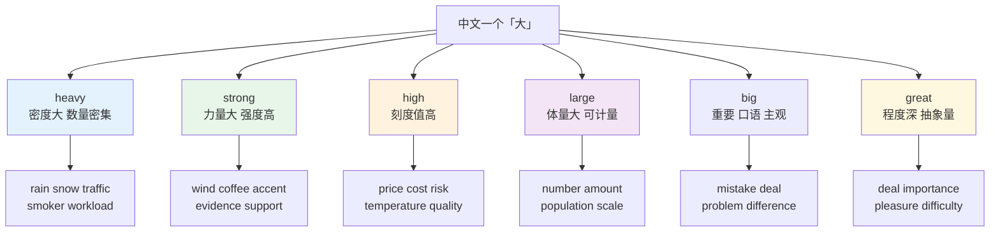
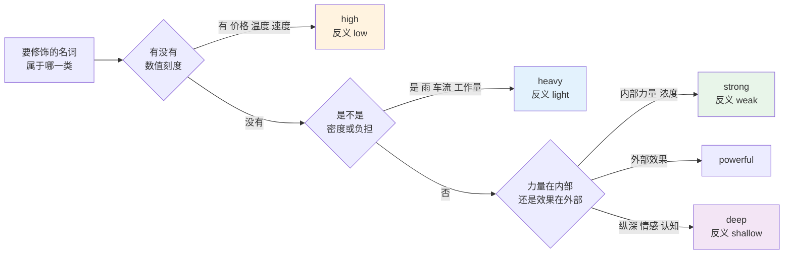
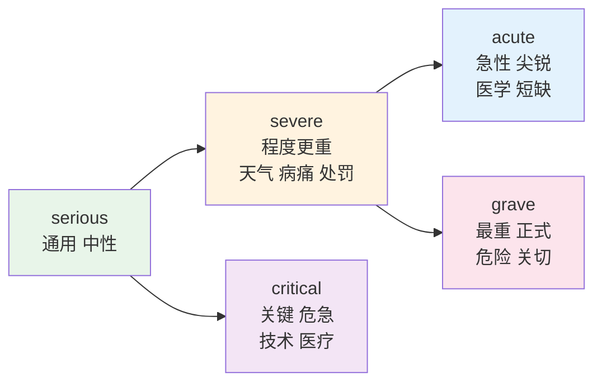
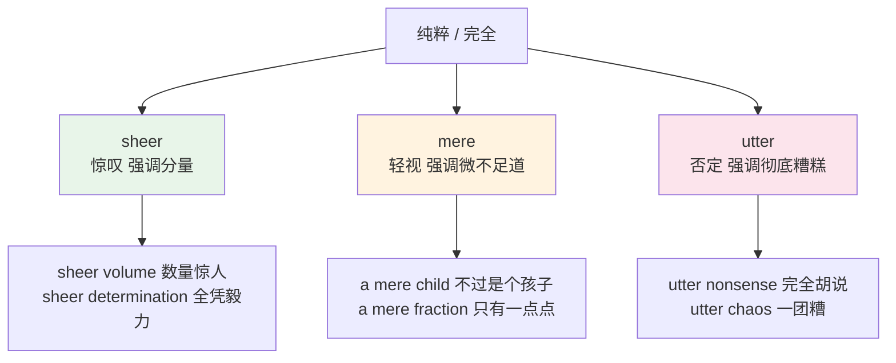
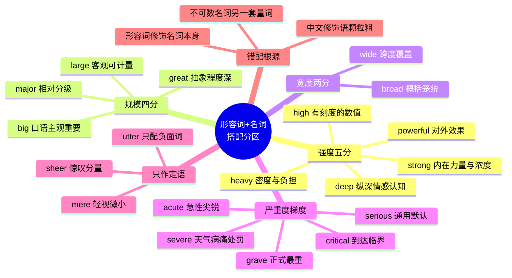

# 形容词+名词搭配：强度、规模与名词偏好

> [!info] 本篇定位
>
> 第 17 章的第四篇，把搭配的焦点从「动词+名词」转到「形容词+名词」。
>
> 前三篇处理的是动作与对象的配对（make a decision 而不是 do a decision），这一篇处理的是**修饰语与被修饰名词的配对**：同样表示「大」，rain 要 heavy，wind 要 strong，price 要 high，population 要 large，四个词不能互换。
>
> 读完你能拿到三样东西：五个强度形容词各自的名词群边界，四组高度重叠的近义形容词（规模、宽度、严重度、重要度）的可换与不可换清单，以及一张中式错配对照表——把「大雨」直译成 big rain 这类错误的来源和修法。
>
> 错配的成因分析（母语迁移的具体机制）在 [[16.词义辨析、搭配与短语动词/03.近形近音易混词与中式英语陷阱\|中式英语高频错配：直译陷阱与母语迁移]]，本篇只管修配对本身。

---

## 1. 本篇导读：形容词搭配错在哪里

动词搭配错了，母语者一般能听懂但觉得别扭；形容词搭配错了，很多时候直接指向错误的语义。`big rain` 不是「说得不地道」，是英语里根本不存在这个组合，母语者要停顿一下才能反推出你想说「大雨」。

问题的根源在于中文的修饰语系统比英语粗。中文一个「大」字覆盖了雨、风、价格、人口、错误、公司、差别、决心这八类名词，而英语在这八类上分别要用 heavy、strong、high、large、big、big、big、great——同一个中文形容词在英语里裂成了六个词，而且裂开的方式没有明显的语义理由，纯粹是历史沉淀下来的**名词偏好**（noun preference）。

上图是全篇的骨架：左边是中文的单一入口，右边是英语的六个出口，每个出口下面挂着一组固定的名词。学形容词搭配的实际操作不是「记住 heavy 的意思是重的」，而是**记住 heavy 后面能跟哪些名词**。方向是从形容词出发去记名词群，不是从中文出发去查词典。

这种「一对多」的分裂在四个语义区最密集：强度、规模、宽度、严重度。本篇按这四个区展开，最后加一类特殊的形容词——只能作定语、不能作表语的强化词（sheer、utter、mere），它们的限制不在语义而在位置。

> [!tip] 这一篇的用法
>
> 词表按形容词分组，不按名词分组。查询时的正确路径是：想表达「很大的雨」→ 先定位 rain 属于哪个形容词的名词群 → 找到 heavy → 写出 heavy rain。
>
> 反向查询（从名词找形容词）在第 8 节的错配对照表里，那张表按中文错误组织，适合改稿时逐条对照。

---

## 2. 强度形容词的五个山头

heavy、strong、powerful、deep、high 五个词的中文都可以译成「大、强、深、高」，但它们的名词群几乎不重叠。分界线可以用一句话概括：**heavy 管密度，strong 管力量，powerful 管作用效果，deep 管纵深，high 管刻度**。

### 2.1 heavy：密度大、数量密集、负担重

heavy 的核心不是「重量重」，而是「单位时间或单位面积内的量大」。雨点密、车流密、抽烟频率高，都是 heavy。理解了这一点，heavy 的名词群就不需要死记了。

| 英文 | 英式音标 | 美式音标 | 词性 | 中文 | 搭配与说明 |
| --- | --- | --- | --- | --- | --- |
| **heavy rain** | /ˈhevi reɪn/ | /ˈhevi reɪn/ | n. | 大雨 | 雨点密度大；不说 big rain / strong rain |
| **heavy snow** | /ˈhevi snəʊ/ | /ˈhevi snoʊ/ | n. | 大雪 | 同理；heavy snowfall 也常见 |
| **heavy fog** | /ˈhevi fɒɡ/ | /ˈhevi fɔːɡ/ | n. | 浓雾 | 也说 thick fog，两者可换 |
| **heavy traffic** | /ˈhevi ˈtræfɪk/ | /ˈhevi ˈtræfɪk/ | n. | 交通拥堵 | traffic 不可数；不说 crowded traffic |
| **heavy smoker** | /ˈhevi ˈsməʊkə/ | /ˈhevi ˈsmoʊkər/ | n. | 烟瘾大的人 | 不说 strong smoker |
| **heavy drinker** | /ˈhevi ˈdrɪŋkə/ | /ˈhevi ˈdrɪŋkər/ | n. | 酗酒者 | 同一模式；对应 light drinker |
| **heavy sleeper** | /ˈhevi ˈsliːpə/ | /ˈhevi ˈsliːpər/ | n. | 睡得沉的人 | 反义 light sleeper |
| **heavy user** | /ˈhevi ˈjuːzə/ | /ˈhevi ˈjuːzər/ | n. | 重度用户 | 产品分析里的固定说法 |
| **heavy meal** | /ˈhevi miːl/ | /ˈhevi miːl/ | n. | 油腻／分量大的一餐 | 反义 light meal |
| **heavy workload** | /ˈhevi ˈwɜːkləʊd/ | /ˈhevi ˈwɜːrkloʊd/ | n. | 繁重的工作量 | 不说 much workload |
| **heavy schedule** | /ˈhevi ˈʃedjuːl/ | /ˈhevi ˈskedʒuːl/ | n. | 排得很满的日程 | 也说 packed schedule |
| **heavy burden** | /ˈhevi ˈbɜːdn/ | /ˈhevi ˈbɜːrdn/ | n. | 沉重的负担 | 抽象负担也用 heavy |
| **heavy responsibility** | /ˈhevi rɪˌspɒnsəˈbɪləti/ | /ˈhevi rɪˌspɑːnsəˈbɪləti/ | n. | 重大责任 | 与 grave responsibility 近义 |
| **heavy losses** | /ˈhevi ˈlɒsɪz/ | /ˈhevi ˈlɔːsɪz/ | n. | 重大损失 | 军事与财务两用，常复数 |
| **heavy casualties** | /ˈhevi ˈkæʒuəltiz/ | /ˈhevi ˈkæʒuəltiz/ | n. | 大量伤亡 | 新闻固定搭配 |
| **heavy fine** | /ˈhevi faɪn/ | /ˈhevi faɪn/ | n. | 重罚金 | 也说 hefty fine；不说 expensive fine |
| **heavy criticism** | /ˈhevi ˈkrɪtɪsɪzəm/ | /ˈhevi ˈkrɪtɪsɪzəm/ | n. | 猛烈批评 | come under heavy criticism |
| **heavy industry** | /ˈhevi ˈɪndəstri/ | /ˈhevi ˈɪndəstri/ | n. | 重工业 | 复合词，重音落在 heavy 上 |
| **heavy machinery** | /ˈhevi məˈʃiːnəri/ | /ˈhevi məˈʃiːnəri/ | n. | 重型机械 | 也说 heavy equipment |
| **heavy load** | /ˈhevi ləʊd/ | /ˈhevi loʊd/ | n. | 高负载 | 服务器语境：under heavy load |
| **heavy accent** | /ˈhevi ˈæksent/ | /ˈhevi ˈæksent/ | n. | 很重的口音 | 与 strong accent 可换 |
| **heavy heart** | /ˈhevi hɑːt/ | /ˈhevi hɑːrt/ | n. | 沉重的心情 | with a heavy heart，固定短语 |

> [!warning] heavy 不能配的三个词
>
> - ❌ ~~heavy wind~~ → ✅ **strong wind**（单数）／ **high winds**（复数，气象播报）
> - ❌ ~~heavy tea~~ / ~~heavy coffee~~ → ✅ **strong tea** / **strong coffee**
> - ❌ ~~heavy price~~ → ✅ **high price**（金额高）／ **heavy price** 只在比喻义成立：`pay a heavy price for the mistake`（为错误付出沉重代价）
>
> 最后一条要分清：`a heavy price` 指抽象代价，`a high price` 指实际标价。`The laptop has a high price` 对，`The laptop has a heavy price` 错。

### 2.2 strong：力量大、浓度高、说服力足

strong 的名词群围绕「内在力量或浓度」。风有力量，咖啡有浓度，证据有说服力，三者共享同一个 strong。

| 英文 | 英式音标 | 美式音标 | 词性 | 中文 | 搭配与说明 |
| --- | --- | --- | --- | --- | --- |
| **strong wind** | /strɒŋ wɪnd/ | /strɔːŋ wɪnd/ | n. | 大风 | 单数常用 strong；复数常用 high winds |
| **strong current** | /strɒŋ ˈkʌrənt/ | /strɔːŋ ˈkɜːrənt/ | n. | 急流；强电流 | 水流与电流同词 |
| **strong coffee** | /strɒŋ ˈkɒfi/ | /strɔːŋ ˈkɔːfi/ | n. | 浓咖啡 | 反义 weak coffee，不是 light |
| **strong tea** | /strɒŋ tiː/ | /strɔːŋ tiː/ | n. | 浓茶 | 同上 |
| **strong smell** | /strɒŋ smel/ | /strɔːŋ smel/ | n. | 强烈的气味 | 中性词，褒贬看语境 |
| **strong accent** | /strɒŋ ˈæksent/ | /strɔːŋ ˈæksent/ | n. | 浓重的口音 | 与 heavy accent 可换 |
| **strong evidence** | /strɒŋ ˈevɪdəns/ | /strɔːŋ ˈevɪdəns/ | n. | 有力证据 | 学术写作高频；反义 weak evidence |
| **strong argument** | /strɒŋ ˈɑːɡjumənt/ | /strɔːŋ ˈɑːrɡjumənt/ | n. | 有力论证 | make a strong argument for |
| **strong case** | /strɒŋ keɪs/ | /strɔːŋ keɪs/ | n. | 充分的理由 | make a strong case for something |
| **strong support** | /strɒŋ səˈpɔːt/ | /strɔːŋ səˈpɔːrt/ | n. | 大力支持 | 也说 firm support |
| **strong opposition** | /strɒŋ ˌɒpəˈzɪʃn/ | /strɔːŋ ˌɑːpəˈzɪʃn/ | n. | 强烈反对 | face strong opposition |
| **strong opinion** | /strɒŋ əˈpɪnjən/ | /strɔːŋ əˈpɪnjən/ | n. | 鲜明的看法 | have strong opinions about |
| **strong feeling** | /strɒŋ ˈfiːlɪŋ/ | /strɔːŋ ˈfiːlɪŋ/ | n. | 强烈的感受 | 常复数 strong feelings |
| **strong influence** | /strɒŋ ˈɪnfluəns/ | /strɔːŋ ˈɪnfluəns/ | n. | 很大的影响 | 与 powerful influence 可换 |
| **strong candidate** | /strɒŋ ˈkændɪdət/ | /strɔːŋ ˈkændɪdeɪt/ | n. | 有竞争力的人选 | 求职与选举两用 |
| **strong point** | /strɒŋ pɔɪnt/ | /strɔːŋ pɔɪnt/ | n. | 长处 | 反义 weak point |
| **strong relationship** | /strɒŋ rɪˈleɪʃnʃɪp/ | /strɔːŋ rɪˈleɪʃnʃɪp/ | n. | 牢固的关系 | 统计学里指强相关 |
| **strong demand** | /strɒŋ dɪˈmɑːnd/ | /strɔːŋ dɪˈmænd/ | n. | 旺盛的需求 | 经济报道固定说法 |
| **strong possibility** | /strɒŋ ˌpɒsəˈbɪləti/ | /strɔːŋ ˌpɑːsəˈbɪləti/ | n. | 很大的可能 | 不说 big possibility |
| **strong password** | /strɒŋ ˈpɑːswɜːd/ | /strɔːŋ ˈpæswɜːrd/ | n. | 强密码 | 反义 weak password |
| **strong typing** | /strɒŋ ˈtaɪpɪŋ/ | /strɔːŋ ˈtaɪpɪŋ/ | n. | 强类型 | 编程术语；对应 weak typing |
| **strong reference** | /strɒŋ ˈrefrəns/ | /strɔːŋ ˈrefrəns/ | n. | 强引用 | 内存管理术语；对应 weak reference |
| **strong consistency** | /strɒŋ kənˈsɪstənsi/ | /strɔːŋ kənˈsɪstənsi/ | n. | 强一致性 | 分布式系统术语 |

strong 在技术语境里有一条稳定规律：凡是「强／弱」成对出现的技术概念，英语一律用 strong / weak，不用 powerful / hard。strong typing、strong reference、strong consistency 三个例子共享同一个模式，遇到新的「强 X」先试 strong。

### 2.3 powerful：能产生大作用的东西

powerful 与 strong 最容易混。分界是：**strong 描述事物自身的力量，powerful 描述它对外产生的效果**。发动机自身有力量也能推动车，两个词都行；证据自身没有力量，只有说服效果，所以更常说 strong evidence，但 powerful argument 也成立——论证既有内在结构又有外部效果。

| 英文 | 英式音标 | 美式音标 | 词性 | 中文 | 搭配与说明 |
| --- | --- | --- | --- | --- | --- |
| **powerful engine** | /ˈpaʊəfl ˈendʒɪn/ | /ˈpaʊərfl ˈendʒɪn/ | n. | 大马力发动机 | 与 strong engine 相比更自然 |
| **powerful weapon** | /ˈpaʊəfl ˈwepən/ | /ˈpaʊərfl ˈwepən/ | n. | 威力大的武器 | 也用于比喻：知识是武器 |
| **powerful tool** | /ˈpaʊəfl tuːl/ | /ˈpaʊərfl tuːl/ | n. | 好用的工具 | 技术文档高频；不说 strong tool |
| **powerful computer** | /ˈpaʊəfl kəmˈpjuːtə/ | /ˈpaʊərfl kəmˈpjuːtər/ | n. | 性能强的电脑 | 硬件性能一律 powerful |
| **powerful argument** | /ˈpaʊəfl ˈɑːɡjumənt/ | /ˈpaʊərfl ˈɑːrɡjumənt/ | n. | 有说服力的论证 | 与 strong argument 可换 |
| **powerful speech** | /ˈpaʊəfl spiːtʃ/ | /ˈpaʊərfl spiːtʃ/ | n. | 震撼人心的演讲 | 强调情绪效果 |
| **powerful message** | /ˈpaʊəfl ˈmesɪdʒ/ | /ˈpaʊərfl ˈmesɪdʒ/ | n. | 有冲击力的信息 | send a powerful message |
| **powerful image** | /ˈpaʊəfl ˈɪmɪdʒ/ | /ˈpaʊərfl ˈɪmɪdʒ/ | n. | 有感染力的画面 | 摄影与文学评论常用 |
| **powerful influence** | /ˈpaʊəfl ˈɪnfluəns/ | /ˈpaʊərfl ˈɪnfluəns/ | n. | 巨大影响 | 与 strong influence 可换 |
| **powerful lobby** | /ˈpaʊəfl ˈlɒbi/ | /ˈpaʊərfl ˈlɑːbi/ | n. | 有实力的游说集团 | 政治报道用词 |
| **powerful drug** | /ˈpaʊəfl drʌɡ/ | /ˈpaʊərfl drʌɡ/ | n. | 强效药 | 也说 potent drug |
| **powerful earthquake** | /ˈpaʊəfl ˈɜːθkweɪk/ | /ˈpaʊərfl ˈɜːrθkweɪk/ | n. | 强震 | 新闻标准说法；也说 major earthquake |
| **powerful ally** | /ˈpaʊəfl ˈælaɪ/ | /ˈpaʊərfl ˈælaɪ/ | n. | 有实力的盟友 | 政治与商业语境 |

> [!example] strong 与 powerful 的三对对照
>
> - She has a **strong** personality.
>   - 她个性很强。（内在特质，不能换 powerful）
> - The speech had a **powerful** effect on the audience.
>   - 这篇演讲对听众产生了巨大影响。（对外效果，不能换 strong）
> - Git is a **powerful** tool with a steep learning curve.
>   - Git 是个好用但上手陡峭的工具。（工具的效能，不说 strong tool）

### 2.4 deep：纵深、情感强度、抽象层次

deep 的物理义是「深度」，抽象义分两支：一支表示情感浓烈（deep concern、deep regret），一支表示认知层次（deep understanding、deep insight）。两支都不能用 strong 或 heavy 替代。

| 英文 | 英式音标 | 美式音标 | 词性 | 中文 | 搭配与说明 |
| --- | --- | --- | --- | --- | --- |
| **deep water** | /diːp ˈwɔːtə/ | /diːp ˈwɔːtər/ | n. | 深水 | 比喻义 in deep water 指陷入麻烦 |
| **deep breath** | /diːp breθ/ | /diːp breθ/ | n. | 深呼吸 | take a deep breath，固定搭配 |
| **deep sleep** | /diːp sliːp/ | /diːp sliːp/ | n. | 熟睡 | fall into a deep sleep |
| **deep voice** | /diːp vɔɪs/ | /diːp vɔɪs/ | n. | 低沉的嗓音 | 中文说「低」，英语说 deep，不说 low voice（那是「小声」） |
| **deep cut** | /diːp kʌt/ | /diːp kʌt/ | n. | 很深的伤口 | 也指大幅削减：deep cuts in spending |
| **deep silence** | /diːp ˈsaɪləns/ | /diːp ˈsaɪləns/ | n. | 一片寂静 | 文学语境；口语用 total silence |
| **deep concern** | /diːp kənˈsɜːn/ | /diːp kənˈsɜːrn/ | n. | 深切关注 | 外交辞令固定说法 |
| **deep sympathy** | /diːp ˈsɪmpəθi/ | /diːp ˈsɪmpəθi/ | n. | 深切同情 | 也说 deepest sympathies（吊唁） |
| **deep regret** | /diːp rɪˈɡret/ | /diːp rɪˈɡret/ | n. | 深深的遗憾 | with deep regret，正式书面 |
| **deep respect** | /diːp rɪˈspekt/ | /diːp rɪˈspekt/ | n. | 深深的敬意 | 也说 great respect |
| **deep gratitude** | /diːp ˈɡrætɪtjuːd/ | /diːp ˈɡrætɪtuːd/ | n. | 深切的感激 | 正式感谢信用语 |
| **deep understanding** | /diːp ˌʌndəˈstændɪŋ/ | /diːp ˌʌndərˈstændɪŋ/ | n. | 深入的理解 | 不说 strong understanding |
| **deep insight** | /diːp ˈɪnsaɪt/ | /diːp ˈɪnsaɪt/ | n. | 深刻的洞察 | 学术评价用词 |
| **deep knowledge** | /diːp ˈnɒlɪdʒ/ | /diːp ˈnɑːlɪdʒ/ | n. | 深厚的知识 | 简历常用；不说 much knowledge |
| **deep impression** | /diːp ɪmˈpreʃn/ | /diːp ɪmˈpreʃn/ | n. | 深刻的印象 | 更地道的是 strong / lasting impression |
| **deep roots** | /diːp ruːts/ | /diːp ruːts/ | n. | 深厚的根基 | have deep roots in |
| **deep recession** | /diːp rɪˈseʃn/ | /diːp rɪˈseʃn/ | n. | 严重的衰退 | 经济报道；不说 big recession |
| **deep depression** | /diːp dɪˈpreʃn/ | /diːp dɪˈpreʃn/ | n. | 重度抑郁；大萧条 | 医学与经济双义 |
| **deep trouble** | /diːp ˈtrʌbl/ | /diːp ˈtrʌbl/ | n. | 大麻烦 | in deep trouble |
| **deep learning** | /diːp ˈlɜːnɪŋ/ | /diːp ˈlɜːrnɪŋ/ | n. | 深度学习 | 技术术语，取网络层数深之义 |
| **deep copy** | /diːp ˈkɒpi/ | /diːp ˈkɑːpi/ | n. | 深拷贝 | 对应 shallow copy 浅拷贝 |

> [!warning] deep impression 的实情
>
> `leave a deep impression on me` 在语法上没错，母语者也听得懂，但英语更常说 `leave a strong impression` 或 `leave a lasting impression`。中国学习者用 deep impression 的频率远高于母语者，原因是「深刻印象」的直译。
>
> - 可用但偏中式：`The film left a deep impression on me.`
> - 更自然：`The film left a lasting impression on me.`
> - 口语最自然：`The film really stuck with me.`

### 2.5 high：有刻度的东西

high 的判据最清楚：**凡是能在一条数轴上取值的名词，用 high 修饰**。价格、温度、速度、质量、风险、概率都有刻度，所以都用 high。反义一律是 low，不是 small 也不是 cheap。

| 英文 | 英式音标 | 美式音标 | 词性 | 中文 | 搭配与说明 |
| --- | --- | --- | --- | --- | --- |
| **high price** | /haɪ praɪs/ | /haɪ praɪs/ | n. | 高价 | 反义 low price；不说 expensive price |
| **high cost** | /haɪ kɒst/ | /haɪ kɔːst/ | n. | 高成本 | the high cost of living |
| **high quality** | /haɪ ˈkwɒləti/ | /haɪ ˈkwɑːləti/ | n. | 高质量 | 作定语连字符：high-quality data |
| **high standard** | /haɪ ˈstændəd/ | /haɪ ˈstændərd/ | n. | 高标准 | 常复数 high standards |
| **high risk** | /haɪ rɪsk/ | /haɪ rɪsk/ | n. | 高风险 | 定语 high-risk patients |
| **high demand** | /haɪ dɪˈmɑːnd/ | /haɪ dɪˈmænd/ | n. | 需求量大 | in high demand |
| **high pressure** | /haɪ ˈpreʃə/ | /haɪ ˈpreʃər/ | n. | 高压 | 气象、医学、职场三用 |
| **high temperature** | /haɪ ˈtemprətʃə/ | /haɪ ˈtemprətʃər/ | n. | 高温 | 不说 big temperature |
| **high fever** | /haɪ ˈfiːvə/ | /haɪ ˈfiːvər/ | n. | 高烧 | run a high fever；不说 big fever |
| **high speed** | /haɪ spiːd/ | /haɪ spiːd/ | n. | 高速 | 定语 high-speed rail |
| **high salary** | /haɪ ˈsæləri/ | /haɪ ˈsæləri/ | n. | 高薪 | 口语可说 big salary，书面用 high |
| **high income** | /haɪ ˈɪnkʌm/ | /haɪ ˈɪnkʌm/ | n. | 高收入 | high-income households |
| **high level** | /haɪ ˈlevl/ | /haɪ ˈlevl/ | n. | 高水平 | a high level of accuracy |
| **high priority** | /haɪ praɪˈɒrəti/ | /haɪ praɪˈɔːrəti/ | n. | 高优先级 | 工单系统固定标签 |
| **high probability** | /haɪ ˌprɒbəˈbɪləti/ | /haɪ ˌprɑːbəˈbɪləti/ | n. | 高概率 | 不说 big probability |
| **high resolution** | /haɪ ˌrezəˈluːʃn/ | /haɪ ˌrezəˈluːʃn/ | n. | 高分辨率 | 缩写 hi-res |
| **high availability** | /haɪ əˌveɪləˈbɪləti/ | /haɪ əˌveɪləˈbɪləti/ | n. | 高可用 | 运维术语，缩写 HA |
| **high turnover** | /haɪ ˈtɜːnəʊvə/ | /haɪ ˈtɜːrnoʊvər/ | n. | 高流动率 | 人力资源用语 |
| **high stakes** | /haɪ steɪks/ | /haɪ steɪks/ | n. | 高风险高回报的局面 | 定语 high-stakes negotiation |
| **high hopes** | /haɪ həʊps/ | /haɪ hoʊps/ | n. | 很高的期望 | have high hopes for |
| **high winds** | /haɪ wɪndz/ | /haɪ wɪndz/ | n. | 大风 | 复数形式，气象播报专用 |
| **high tide** | /haɪ taɪd/ | /haɪ taɪd/ | n. | 涨潮 | 反义 low tide |

### 2.6 五个山头的分界速查

这张判定图给的是遇到新名词时的应急推导路径，不能替代记忆。真实语言里存在大量交叉：wind 单数配 strong、复数配 high；accent 既可以 heavy 也可以 strong；influence 既可以 strong 也可以 powerful。遇到交叉区不必纠结，任选一个不会错；真正要避开的是跨区错配——把 heavy 用到 wind 上，把 high 用到 rain 上。

| 名词 | 可配的形容词 | 不可配 | 说明 |
| --- | --- | --- | --- |
| rain | heavy, torrential | strong, big, high | 密度类 |
| wind | strong（单）, high（复）| heavy, big | 单复数分工 |
| traffic | heavy | crowded, busy（口语可） | busy traffic 边缘可接受 |
| coffee | strong | heavy, thick | 浓度类 |
| evidence | strong, hard, compelling | heavy, big | 说服力类 |
| price | high, low | expensive, cheap | 刻度类 |
| understanding | deep, thorough | strong, high | 认知纵深类 |
| influence | strong, powerful, major | heavy, high | 三选一皆可 |
| accent | strong, heavy, thick | big, deep | 三个都行 |

---

## 3. 规模形容词：big、large、great、major

这四个词的中文都可以译成「大」，但语域和名词偏好差别明显。一句话概括：**big 主观且口语，large 客观且可计量，great 抽象且程度深，major 相对且分级**。

### 3.1 big：口语、主观、强调重要性

big 修饰具体物体时指体积，修饰抽象名词时指「重要」而不是「量大」。`a big mistake` 是「严重的错误」不是「数量多的错误」。

| 英文 | 英式音标 | 美式音标 | 词性 | 中文 | 搭配与说明 |
| --- | --- | --- | --- | --- | --- |
| **big mistake** | /bɪɡ mɪˈsteɪk/ | /bɪɡ mɪˈsteɪk/ | n. | 大错 | 也说 serious mistake（更正式） |
| **big problem** | /bɪɡ ˈprɒbləm/ | /bɪɡ ˈprɑːbləm/ | n. | 大问题 | 书面用 serious / major problem |
| **big difference** | /bɪɡ ˈdɪfrəns/ | /bɪɡ ˈdɪfrəns/ | n. | 很大的差别 | make a big difference |
| **big decision** | /bɪɡ dɪˈsɪʒn/ | /bɪɡ dɪˈsɪʒn/ | n. | 重大决定 | 书面用 major decision |
| **big deal** | /bɪɡ diːl/ | /bɪɡ diːl/ | n. | 大事；了不起的事 | It's no big deal 没什么大不了 |
| **big picture** | /bɪɡ ˈpɪktʃə/ | /bɪɡ ˈpɪktʃər/ | n. | 全局 | see the big picture |
| **big fan** | /bɪɡ fæn/ | /bɪɡ fæn/ | n. | 铁杆粉丝 | I'm a big fan of… |
| **big surprise** | /bɪɡ səˈpraɪz/ | /bɪɡ sərˈpraɪz/ | n. | 大惊喜 | 口语；书面用 great surprise |
| **big company** | /bɪɡ ˈkʌmpəni/ | /bɪɡ ˈkʌmpəni/ | n. | 大公司 | 正式场合用 large company |
| **big city** | /bɪɡ ˈsɪti/ | /bɪɡ ˈsɪti/ | n. | 大城市 | 也说 major city（强调地位） |
| **big name** | /bɪɡ neɪm/ | /bɪɡ neɪm/ | n. | 大人物 | a big name in the industry |

### 3.2 large：客观、可计量、书面

large 几乎只跟可计量的名词。凡是后面能接 of 引出被计量对象的，一律用 large：a large number of、a large amount of、a large proportion of。这一组是学术写作的骨干搭配。

| 英文 | 英式音标 | 美式音标 | 词性 | 中文 | 搭配与说明 |
| --- | --- | --- | --- | --- | --- |
| **large number** | /lɑːdʒ ˈnʌmbə/ | /lɑːrdʒ ˈnʌmbər/ | n. | 大量（可数） | a large number of users + 复数动词 |
| **large amount** | /lɑːdʒ əˈmaʊnt/ | /lɑːrdʒ əˈmaʊnt/ | n. | 大量（不可数） | a large amount of data |
| **large quantity** | /lɑːdʒ ˈkwɒntəti/ | /lɑːrdʒ ˈkwɑːntəti/ | n. | 大批 | in large quantities |
| **large proportion** | /lɑːdʒ prəˈpɔːʃn/ | /lɑːrdʒ prəˈpɔːrʃn/ | n. | 很大比例 | a large proportion of respondents |
| **large majority** | /lɑːdʒ məˈdʒɒrəti/ | /lɑːrdʒ məˈdʒɔːrəti/ | n. | 绝大多数 | 也说 vast majority |
| **large population** | /lɑːdʒ ˌpɒpjuˈleɪʃn/ | /lɑːrdʒ ˌpɑːpjuˈleɪʃn/ | n. | 人口众多 | 不说 big / many population |
| **large scale** | /lɑːdʒ skeɪl/ | /lɑːrdʒ skeɪl/ | n. | 大规模 | on a large scale；定语 large-scale |
| **large volume** | /lɑːdʒ ˈvɒljuːm/ | /lɑːrdʒ ˈvɑːljuːm/ | n. | 大批量 | large volumes of traffic |
| **large dataset** | /lɑːdʒ ˈdeɪtəset/ | /lɑːrdʒ ˈdeɪtəset/ | n. | 大数据集 | 技术文档高频 |
| **large sum** | /lɑːdʒ sʌm/ | /lɑːrdʒ sʌm/ | n. | 巨款 | a large sum of money |
| **large audience** | /lɑːdʒ ˈɔːdiəns/ | /lɑːrdʒ ˈɔːdiəns/ | n. | 大量受众 | 也说 wide audience（覆盖面广） |
| **large area** | /lɑːdʒ ˈeəriə/ | /lɑːrdʒ ˈeriə/ | n. | 大片区域 | 面积义只用 large |

> [!warning] a large number of 与 a large amount of 不能混
>
> 这是学术写作最高频的错误之一，分界取决于后面名词可数与否。
>
> - ✅ a large **number** of **errors**（可数复数）
> - ✅ a large **amount** of **memory**（不可数）
> - ❌ ~~a large amount of errors~~
> - ❌ ~~a large number of memory~~
>
> 通用替代：a lot of 两种都能接，但语域偏口语，正式论文里少用。

### 3.3 great：抽象量与程度

great 修饰的是抽象名词的程度，不是具体物体的体积。`a great deal of` 是不可数名词的量词，`great importance` 是程度，`a great man` 则是评价（伟大），与体积无关。

| 英文 | 英式音标 | 美式音标 | 词性 | 中文 | 搭配与说明 |
| --- | --- | --- | --- | --- | --- |
| **great deal** | /ɡreɪt diːl/ | /ɡreɪt diːl/ | n. | 大量 | a great deal of + 不可数名词 |
| **great importance** | /ɡreɪt ɪmˈpɔːtns/ | /ɡreɪt ɪmˈpɔːrtns/ | n. | 极大的重要性 | attach great importance to |
| **great pleasure** | /ɡreɪt ˈpleʒə/ | /ɡreɪt ˈpleʒər/ | n. | 莫大的荣幸 | It gives me great pleasure to… |
| **great success** | /ɡreɪt səkˈses/ | /ɡreɪt səkˈses/ | n. | 巨大成功 | 不说 big success（口语边缘可） |
| **great interest** | /ɡreɪt ˈɪntrəst/ | /ɡreɪt ˈɪntrəst/ | n. | 浓厚兴趣 | with great interest；也说 keen interest |
| **great difficulty** | /ɡreɪt ˈdɪfɪkəlti/ | /ɡreɪt ˈdɪfɪkəlti/ | n. | 极大困难 | with great difficulty |
| **great care** | /ɡreɪt keə/ | /ɡreɪt ker/ | n. | 十分小心 | handle with great care |
| **great length** | /ɡreɪt leŋθ/ | /ɡreɪt leŋθ/ | n. | 很长篇幅 | at great length 详尽地 |
| **great achievement** | /ɡreɪt əˈtʃiːvmənt/ | /ɡreɪt əˈtʃiːvmənt/ | n. | 巨大成就 | 也说 major achievement |
| **great potential** | /ɡreɪt pəˈtenʃl/ | /ɡreɪt pəˈtenʃl/ | n. | 巨大潜力 | show great potential |
| **great concern** | /ɡreɪt kənˈsɜːn/ | /ɡreɪt kənˈsɜːrn/ | n. | 高度关切 | a matter of great concern |
| **great respect** | /ɡreɪt rɪˈspekt/ | /ɡreɪt rɪˈspekt/ | n. | 极大的尊敬 | 与 deep respect 可换 |

### 3.4 major：相对分级，隐含存在 minor

major 的语义里自带比较：说 a major issue 就暗示还有 minor issues。它不表示绝对的大，而表示在一组事物里排在前面。这一点决定了它不能用来修饰单纯的体积。

| 英文 | 英式音标 | 美式音标 | 词性 | 中文 | 搭配与说明 |
| --- | --- | --- | --- | --- | --- |
| **major issue** | /ˈmeɪdʒə ˈɪʃuː/ | /ˈmeɪdʒər ˈɪʃuː/ | n. | 主要问题 | 隐含还有 minor issues |
| **major change** | /ˈmeɪdʒə tʃeɪndʒ/ | /ˈmeɪdʒər tʃeɪndʒ/ | n. | 重大变更 | 也说 significant change |
| **major role** | /ˈmeɪdʒə rəʊl/ | /ˈmeɪdʒər roʊl/ | n. | 重要角色 | play a major role in |
| **major factor** | /ˈmeɪdʒə ˈfæktə/ | /ˈmeɪdʒər ˈfæktər/ | n. | 主要因素 | 与 key factor 可换 |
| **major concern** | /ˈmeɪdʒə kənˈsɜːn/ | /ˈmeɪdʒər kənˈsɜːrn/ | n. | 主要顾虑 | 会议纪要高频 |
| **major impact** | /ˈmeɪdʒə ˈɪmpækt/ | /ˈmeɪdʒər ˈɪmpækt/ | n. | 重大影响 | have a major impact on |
| **major cause** | /ˈmeɪdʒə kɔːz/ | /ˈmeɪdʒər kɔːz/ | n. | 主要原因 | 也说 leading cause |
| **major breakthrough** | /ˈmeɪdʒə ˈbreɪkθruː/ | /ˈmeɪdʒər ˈbreɪkθruː/ | n. | 重大突破 | 科技报道固定说法 |
| **major contribution** | /ˈmeɪdʒə ˌkɒntrɪˈbjuːʃn/ | /ˈmeɪdʒər ˌkɑːntrɪˈbjuːʃn/ | n. | 重要贡献 | make a major contribution to |
| **major release** | /ˈmeɪdʒə rɪˈliːs/ | /ˈmeɪdʒər rɪˈliːs/ | n. | 大版本发布 | 语义化版本里对应第一位数字 |
| **major city** | /ˈmeɪdʒə ˈsɪti/ | /ˈmeɪdʒər ˈsɪti/ | n. | 主要城市 | 强调地位而非面积 |

### 3.5 四个词的可换与不可换

| 名词 | big | large | great | major | 说明 |
| --- | --- | --- | --- | --- | --- |
| number | ✅ 口语 | ✅ 标准 | ✅ 书面 | ❌ | a great number of 偏正式 |
| amount | ❌ | ✅ | ✅ | ❌ | a great amount of 略少见 |
| population | ❌ | ✅ | ❌ | ❌ | 只有 large |
| mistake | ✅ | ❌ | ❌ | ❌ | 书面替换用 serious |
| deal | ✅ | ❌ | ✅ | ❌ | big deal 与 a great deal of 语义完全不同 |
| importance | ❌ | ❌ | ✅ | ❌ | 固定 great importance |
| difference | ✅ | ❌ | ✅ | ❌ | 也说 significant difference |
| role | ❌ | ❌ | ❌ | ✅ | 也说 key / crucial role |
| company | ✅ 口语 | ✅ 书面 | ❌ | ✅ 指行业头部 | great company 指「好公司」不是「大公司」 |
| scale | ❌ | ✅ | ❌ | ❌ | on a large scale 固定 |

> [!warning] a great company 是陷阱
>
> great 修饰机构、人、地方时，语义从「大」滑向「好、了不起」。
>
> - `Google is a **large** company.` → 谷歌是家大公司（规模）。
> - `Google is a **great** company.` → 谷歌是家很棒的公司（评价）。
> - `He is a **big** man.` → 他块头大（体型）。
> - `He is a **great** man.` → 他是个伟人（品格）。
>
> 中文「大公司」「大人物」两个词都不带评价色彩，直译成 great 会平白多出一层赞美。

---

## 4. broad 与 wide 的分工

这两个词的中文都是「宽、广」，物理义几乎完全可换（a wide road = a broad road），抽象义则各有偏好。分界线：**wide 强调覆盖范围的两端距离，broad 强调涵盖内容的概括性**。

| 英文 | 英式音标 | 美式音标 | 词性 | 中文 | 搭配与说明 |
| --- | --- | --- | --- | --- | --- |
| **wide range** | /waɪd reɪndʒ/ | /waɪd reɪndʒ/ | n. | 广泛的范围 | a wide range of options，最高频 |
| **wide variety** | /waɪd vəˈraɪəti/ | /waɪd vəˈraɪəti/ | n. | 多种多样 | a wide variety of + 复数 |
| **wide audience** | /waɪd ˈɔːdiəns/ | /waɪd ˈɔːdiəns/ | n. | 广泛的受众 | reach a wide audience |
| **wide coverage** | /waɪd ˈkʌvərɪdʒ/ | /waɪd ˈkʌvərɪdʒ/ | n. | 广泛的覆盖 | 媒体与网络两用 |
| **wide margin** | /waɪd ˈmɑːdʒɪn/ | /waɪd ˈmɑːrdʒɪn/ | n. | 很大的差距 | win by a wide margin |
| **wide gap** | /waɪd ɡæp/ | /waɪd ɡæp/ | n. | 巨大的差距 | a wide gap between rich and poor |
| **wide awake** | /waɪd əˈweɪk/ | /waɪd əˈweɪk/ | adj. | 完全清醒 | 固定短语，wide 在这里是副词化用法 |
| **wide open** | /waɪd ˈəʊpən/ | /waɪd ˈoʊpən/ | adj. | 敞开的 | leave the door wide open |
| **broad range** | /brɔːd reɪndʒ/ | /brɔːd reɪndʒ/ | n. | 广泛的范围 | 与 wide range 可换，频率略低 |
| **broad agreement** | /brɔːd əˈɡriːmənt/ | /brɔːd əˈɡriːmənt/ | n. | 大体一致 | 不说 wide agreement |
| **broad consensus** | /brɔːd kənˈsensəs/ | /brɔːd kənˈsensəs/ | n. | 广泛共识 | 政治与学术固定说法 |
| **broad outline** | /brɔːd ˈaʊtlaɪn/ | /brɔːd ˈaʊtlaɪn/ | n. | 大致轮廓 | in broad outline 概括地说 |
| **broad category** | /brɔːd ˈkætəɡəri/ | /brɔːd ˈkætəɡɔːri/ | n. | 大类 | 分类学与数据建模常用 |
| **broad terms** | /brɔːd tɜːmz/ | /brɔːd tɜːrmz/ | n. | 笼统的说法 | in broad terms 大体上 |
| **broad shoulders** | /brɔːd ˈʃəʊldəz/ | /brɔːd ˈʃoʊldərz/ | n. | 宽肩 | 身体部位固定用 broad |
| **broad smile** | /brɔːd smaɪl/ | /brɔːd smaɪl/ | n. | 灿烂的笑容 | 也说 big smile（口语） |
| **broad daylight** | /brɔːd ˈdeɪlaɪt/ | /brɔːd ˈdeɪlaɪt/ | n. | 光天化日 | in broad daylight，固定短语 |

> [!tip] 记 broad 的一条捷径
>
> broad 的抽象搭配几乎都跟「概括、笼统、不细分」有关：broad agreement 是「细节没谈但大方向一致」，broad outline 是「只给框架」，broad category 是「粗分类」，in broad terms 是「不抠细节地说」。
>
> wide 则跟「跨度」有关：wide range 是从这头到那头都覆盖，wide gap 是两端离得远，wide margin 是领先幅度大。
>
> 遇到不确定的抽象名词，先问是「概括」还是「跨度」。

---

## 5. 严重度形容词：severe、serious、acute、grave、critical

这五个词都译作「严重的」，在英语里构成一条从中性到极端的梯度，而且各自绑定了不同的名词领域。

这张图给的是相对位置，不是绝对刻度。serious 是通用默认值，任何场合用它都不会出错；severe 比 serious 重一档，偏向自然现象与身体感受；acute 有「急性、尖锐」的额外语义，医学里与 chronic（慢性）成对；grave 语域最正式，几乎只出现在书面与外交辞令；critical 走的是另一条线，它的核心不是「重」而是「到了转折点」。

| 英文 | 英式音标 | 美式音标 | 词性 | 中文 | 搭配与说明 |
| --- | --- | --- | --- | --- | --- |
| **serious problem** | /ˈsɪəriəs ˈprɒbləm/ | /ˈsɪriəs ˈprɑːbləm/ | n. | 严重问题 | 通用默认，任何场合可用 |
| **serious injury** | /ˈsɪəriəs ˈɪndʒəri/ | /ˈsɪriəs ˈɪndʒəri/ | n. | 重伤 | 也说 severe injury |
| **serious illness** | /ˈsɪəriəs ˈɪlnəs/ | /ˈsɪriəs ˈɪlnəs/ | n. | 重病 | 不说 big illness |
| **serious doubt** | /ˈsɪəriəs daʊt/ | /ˈsɪriəs daʊt/ | n. | 严重怀疑 | cast serious doubt on |
| **serious offence** | /ˈsɪəriəs əˈfens/ | /ˈsɪriəs əˈfens/ | n. | 重罪 | 美式拼 offense，读音相同 |
| **serious consequences** | /ˈsɪəriəs ˈkɒnsɪkwənsɪz/ | /ˈsɪriəs ˈkɑːnsəkwensɪz/ | n. | 严重后果 | 常复数；英美重音位置不同 |
| **severe weather** | /sɪˈvɪə ˈweðə/ | /sɪˈvɪr ˈweðər/ | n. | 恶劣天气 | 气象预警固定说法 |
| **severe winter** | /sɪˈvɪə ˈwɪntə/ | /sɪˈvɪr ˈwɪntər/ | n. | 严冬 | 也说 harsh winter |
| **severe drought** | /sɪˈvɪə draʊt/ | /sɪˈvɪr draʊt/ | n. | 严重旱情 | drought 读 /draʊt/，尾字母不发音 |
| **severe damage** | /sɪˈvɪə ˈdæmɪdʒ/ | /sɪˈvɪr ˈdæmɪdʒ/ | n. | 严重损坏 | damage 不可数；也说 extensive damage |
| **severe pain** | /sɪˈvɪə peɪn/ | /sɪˈvɪr peɪn/ | n. | 剧痛 | 医生问诊标准用词 |
| **severe shortage** | /sɪˈvɪə ˈʃɔːtɪdʒ/ | /sɪˈvɪr ˈʃɔːrtɪdʒ/ | n. | 严重短缺 | 与 acute shortage 可换 |
| **severe penalty** | /sɪˈvɪə ˈpenəlti/ | /sɪˈvɪr ˈpenəlti/ | n. | 严厉处罚 | 也说 harsh penalty |
| **severe criticism** | /sɪˈvɪə ˈkrɪtɪsɪzəm/ | /sɪˈvɪr ˈkrɪtɪsɪzəm/ | n. | 严厉批评 | 与 heavy criticism 可换 |
| **acute pain** | /əˈkjuːt peɪn/ | /əˈkjuːt peɪn/ | n. | 急性疼痛 | 对应 chronic pain 慢性疼痛 |
| **acute shortage** | /əˈkjuːt ˈʃɔːtɪdʒ/ | /əˈkjuːt ˈʃɔːrtɪdʒ/ | n. | 急剧短缺 | 强调突发而非持续 |
| **acute awareness** | /əˈkjuːt əˈweənəs/ | /əˈkjuːt əˈwernəs/ | n. | 敏锐的意识 | 这里 acute 取「尖锐」义，非负面 |
| **acute angle** | /əˈkjuːt ˈæŋɡl/ | /əˈkjuːt ˈæŋɡl/ | n. | 锐角 | 几何术语，对应 obtuse angle |
| **acute phase** | /əˈkjuːt feɪz/ | /əˈkjuːt feɪz/ | n. | 急性期 | 医学分期术语 |
| **grave concern** | /ɡreɪv kənˈsɜːn/ | /ɡreɪv kənˈsɜːrn/ | n. | 严重关切 | 外交辞令；比 deep concern 更重 |
| **grave danger** | /ɡreɪv ˈdeɪndʒə/ | /ɡreɪv ˈdeɪndʒər/ | n. | 极大危险 | in grave danger |
| **grave mistake** | /ɡreɪv mɪˈsteɪk/ | /ɡreɪv mɪˈsteɪk/ | n. | 严重错误 | 语域正式，口语用 big mistake |
| **grave doubts** | /ɡreɪv daʊts/ | /ɡreɪv daʊts/ | n. | 重大疑虑 | have grave doubts about |
| **critical bug** | /ˈkrɪtɪkl bʌɡ/ | /ˈkrɪtɪkl bʌɡ/ | n. | 严重缺陷 | 缺陷分级最高档，高于 major |
| **critical condition** | /ˈkrɪtɪkl kənˈdɪʃn/ | /ˈkrɪtɪkl kənˈdɪʃn/ | n. | 危重状态 | in critical condition，医院播报 |
| **critical path** | /ˈkrɪtɪkl pɑːθ/ | /ˈkrɪtɪkl pæθ/ | n. | 关键路径 | 项目管理术语 |
| **critical mass** | /ˈkrɪtɪkl mæs/ | /ˈkrɪtɪkl mæs/ | n. | 临界规模 | 物理与商业双用 |
| **critical error** | /ˈkrɪtɪkl ˈerə/ | /ˈkrɪtɪkl ˈerər/ | n. | 致命错误 | 系统日志固定级别 |

> [!warning] critical 的两个方向要分清
>
> critical 同时有「危急的」和「批评的」两条线，靠介词与名词区分。
>
> - `The patient is in a **critical** condition.` → 病情危重。
> - `He was **critical of** the plan.` → 他对这个方案持批评态度。
> - `a **critical** review` → 既可以是「关键的评审」，也可以是「批判性的评论」，看上下文。
>
> 技术文档里 critical 几乎总是「危急」义：critical section（临界区）、critical vulnerability（严重漏洞）、mission-critical system（关键业务系统）。

> [!example] 五个词在同一件事上的梯度
>
> - The company faces a **serious** problem with data loss.
>   - 公司面临数据丢失的严重问题。（中性陈述）
> - The storm caused **severe** damage to the coastline.
>   - 风暴对海岸线造成严重破坏。（自然灾害）
> - There is an **acute** shortage of qualified engineers.
>   - 合格工程师急剧短缺。（突发、紧迫）
> - The minister expressed **grave** concern over the incident.
>   - 部长对该事件表示严重关切。（正式外交措辞）
> - This is a **critical** bug that blocks the release.
>   - 这是个阻断发布的严重缺陷。（到了必须处理的临界点）

---

## 6. 重要度形容词：key、vital、crucial、essential

这一组的语义几乎重叠，母语者在多数句子里可以互换，但它们在两个维度上仍有分工：**语法行为**和**搭配惯例**。

### 6.1 语法行为的差别

key 是四个词里唯一基本只作定语的：`a key factor` 成立，`This factor is key.` 在口语里能听到，但正式书面里会改成 `This factor is crucial.`。essential、vital、crucial 三个都能作表语，还能接 that 从句或 to 短语。

| 形容词 | 作定语 | 作表语 | 常见后续结构 |
| --- | --- | --- | --- |
| key | ✅ 主用 | △ 口语可 | key to success |
| vital | ✅ | ✅ | vital to / for；vital that + 虚拟 |
| crucial | ✅ | ✅ | crucial to / for；crucial that |
| essential | ✅ | ✅ | essential to / for；essential that |
| fundamental | ✅ | ✅ | fundamental to |
| significant | ✅ | ✅ | 不接 to，语义偏「显著」而非「必需」 |

### 6.2 各自的名词群

| 英文 | 英式音标 | 美式音标 | 词性 | 中文 | 搭配与说明 |
| --- | --- | --- | --- | --- | --- |
| **key factor** | /kiː ˈfæktə/ | /kiː ˈfæktər/ | n. | 关键因素 | 与 major factor 可换 |
| **key role** | /kiː rəʊl/ | /kiː roʊl/ | n. | 关键作用 | play a key role in |
| **key issue** | /kiː ˈɪʃuː/ | /kiː ˈɪʃuː/ | n. | 关键议题 | 会议纪要高频 |
| **key point** | /kiː pɔɪnt/ | /kiː pɔɪnt/ | n. | 要点 | 也说 main point |
| **key player** | /kiː ˈpleɪə/ | /kiː ˈpleɪər/ | n. | 关键角色 | 商业报道指主要参与方 |
| **key finding** | /kiː ˈfaɪndɪŋ/ | /kiː ˈfaɪndɪŋ/ | n. | 主要发现 | 论文摘要固定说法 |
| **key difference** | /kiː ˈdɪfrəns/ | /kiː ˈdɪfrəns/ | n. | 主要区别 | 技术对比文档高频 |
| **key takeaway** | /kiː ˈteɪkəweɪ/ | /kiː ˈteɪkəweɪ/ | n. | 核心结论 | 演示与报告结尾用语 |
| **vital role** | /ˈvaɪtl rəʊl/ | /ˈvaɪtl roʊl/ | n. | 至关重要的作用 | 与 crucial role 可换 |
| **vital importance** | /ˈvaɪtl ɪmˈpɔːtns/ | /ˈvaɪtl ɪmˈpɔːrtns/ | n. | 极端重要性 | of vital importance |
| **vital organ** | /ˈvaɪtl ˈɔːɡən/ | /ˈvaɪtl ˈɔːrɡən/ | n. | 重要器官 | 医学固定说法 |
| **vital signs** | /ˈvaɪtl saɪnz/ | /ˈvaɪtl saɪnz/ | n. | 生命体征 | 只用复数 |
| **vital information** | /ˈvaɪtl ˌɪnfəˈmeɪʃn/ | /ˈvaɪtl ˌɪnfərˈmeɪʃn/ | n. | 关键信息 | information 不可数 |
| **crucial role** | /ˈkruːʃl rəʊl/ | /ˈkruːʃl roʊl/ | n. | 决定性作用 | 学术写作最常见 |
| **crucial moment** | /ˈkruːʃl ˈməʊmənt/ | /ˈkruːʃl ˈmoʊmənt/ | n. | 关键时刻 | 叙事与体育解说 |
| **crucial difference** | /ˈkruːʃl ˈdɪfrəns/ | /ˈkruːʃl ˈdɪfrəns/ | n. | 决定性差别 | 强调这个差别改变结论 |
| **crucial stage** | /ˈkruːʃl steɪdʒ/ | /ˈkruːʃl steɪdʒ/ | n. | 关键阶段 | 项目汇报用语 |
| **essential element** | /ɪˈsenʃl ˈelɪmənt/ | /ɪˈsenʃl ˈelɪmənt/ | n. | 必要要素 | 强调缺了就不成立 |
| **essential part** | /ɪˈsenʃl pɑːt/ | /ɪˈsenʃl pɑːrt/ | n. | 不可或缺的部分 | an essential part of the process |
| **essential reading** | /ɪˈsenʃl ˈriːdɪŋ/ | /ɪˈsenʃl ˈriːdɪŋ/ | n. | 必读材料 | 书评与课程大纲用语 |
| **essential skill** | /ɪˈsenʃl skɪl/ | /ɪˈsenʃl skɪl/ | n. | 必备技能 | 招聘启事固定说法 |
| **fundamental difference** | /ˌfʌndəˈmentl ˈdɪfrəns/ | /ˌfʌndəˈmentl ˈdɪfrəns/ | n. | 根本区别 | 强调本质层面 |
| **fundamental principle** | /ˌfʌndəˈmentl ˈprɪnsəpl/ | /ˌfʌndəˈmentl ˈprɪnsəpl/ | n. | 基本原则 | 也说 basic principle |
| **fundamental right** | /ˌfʌndəˈmentl raɪt/ | /ˌfʌndəˈmentl raɪt/ | n. | 基本权利 | 法律文本固定说法 |
| **significant impact** | /sɪɡˈnɪfɪkənt ˈɪmpækt/ | /sɪɡˈnɪfɪkənt ˈɪmpækt/ | n. | 显著影响 | 学术写作首选 |
| **significant difference** | /sɪɡˈnɪfɪkənt ˈdɪfrəns/ | /sɪɡˈnɪfɪkənt ˈdɪfrəns/ | n. | 显著差异 | 统计学术语，指达到显著性水平 |
| **significant increase** | /sɪɡˈnɪfɪkənt ˈɪŋkriːs/ | /sɪɡˈnɪfɪkənt ˈɪŋkriːs/ | n. | 大幅增长 | 名词 increase 重音在前 |

> [!warning] significant 在论文里不是「重要」
>
> 写实验报告时用 significant 要格外小心：在统计语境下 `a significant difference` 特指「差异达到统计显著性」，不是「差别很大」。
>
> - ❌ 想说「这是个重要的差别」却写成 `There is a significant difference between the two groups.` → 审稿人会问 p 值。
> - ✅ 想表达重要：`There is an important difference between the two groups.`
> - ✅ 想表达统计显著：`The difference was statistically significant (p < 0.05).`
>
> 非统计语境里 significant 表示「值得注意的、幅度可观的」，这时没有歧义。

### 6.3 可换与不可换清单

| 名词 | key | vital | crucial | essential | 说明 |
| --- | --- | --- | --- | --- | --- |
| role | ✅ | ✅ | ✅ | △ | essential role 略少见 |
| factor | ✅ | ✅ | ✅ | ❌ | essential factor 不地道 |
| signs | ❌ | ✅ | ❌ | ❌ | vital signs 是医学固定术语 |
| organ | ❌ | ✅ | ❌ | ❌ | vital organ 固定 |
| moment | ❌ | ❌ | ✅ | ❌ | crucial moment 固定 |
| reading | ❌ | ❌ | ❌ | ✅ | essential reading 固定 |
| takeaway | ✅ | ❌ | ❌ | ❌ | key takeaway 固定 |
| importance | ❌ | ✅ | ✅ | ❌ | of vital / crucial importance |

固定术语（vital signs、vital organ、key takeaway、essential reading）不能替换，其余位置四个词大体互通。写作时的实际建议是选一个用熟：学术写作首选 crucial 和 significant，技术文档首选 key 和 critical，日常邮件用 important 就够了。

---

## 7. 只作定语的强化形容词

英语里有一小批形容词只能放在名词前面，不能放在 be 动词后面。它们的功能不是描述属性，而是**放大后面名词的程度**，接近副词。这批词错用位置比错用搭配更常见。

### 7.1 位置限制的表现

- ✅ It was **sheer** luck.（定语位置）
- ❌ ~~The luck was sheer.~~（不能作表语）
- ✅ He talks **utter** nonsense.
- ❌ ~~His nonsense is utter.~~
- ✅ She was a **mere** child at the time.
- ❌ ~~The child was mere.~~

这三个词的共同点是它们修饰的不是名词的性质，而是「这个名词成立的纯度」。sheer luck 是「纯粹是运气，没有别的因素」，utter nonsense 是「彻头彻尾的胡说」，a mere child 是「不过是个孩子而已」。

### 7.2 名词群

| 英文 | 英式音标 | 美式音标 | 词性 | 中文 | 搭配与说明 |
| --- | --- | --- | --- | --- | --- |
| **sheer luck** | /ʃɪə lʌk/ | /ʃɪr lʌk/ | n. | 纯属运气 | by sheer luck 完全靠运气 |
| **sheer coincidence** | /ʃɪə kəʊˈɪnsɪdəns/ | /ʃɪr koʊˈɪnsɪdəns/ | n. | 纯属巧合 | 与 mere coincidence 语气不同 |
| **sheer volume** | /ʃɪə ˈvɒljuːm/ | /ʃɪr ˈvɑːljuːm/ | n. | 单是数量之大 | the sheer volume of data |
| **sheer size** | /ʃɪə saɪz/ | /ʃɪr saɪz/ | n. | 单是体量之大 | 强调「光是大就够呛」 |
| **sheer scale** | /ʃɪə skeɪl/ | /ʃɪr skeɪl/ | n. | 规模之巨 | the sheer scale of the problem |
| **sheer determination** | /ʃɪə dɪˌtɜːmɪˈneɪʃn/ | /ʃɪr dɪˌtɜːrmɪˈneɪʃn/ | n. | 全凭决心 | through sheer determination |
| **sheer nonsense** | /ʃɪə ˈnɒnsns/ | /ʃɪr ˈnɑːnsens/ | n. | 一派胡言 | 与 utter nonsense 可换 |
| **utter nonsense** | /ˈʌtə ˈnɒnsns/ | /ˈʌtər ˈnɑːnsens/ | n. | 彻头彻尾的胡话 | 最常见的 utter 搭配 |
| **utter chaos** | /ˈʌtə ˈkeɪɒs/ | /ˈʌtər ˈkeɪɑːs/ | n. | 一片混乱 | chaos 的 ch 读 /k/ |
| **utter failure** | /ˈʌtə ˈfeɪljə/ | /ˈʌtər ˈfeɪljər/ | n. | 彻底失败 | 也说 complete failure |
| **utter disaster** | /ˈʌtə dɪˈzɑːstə/ | /ˈʌtər dɪˈzæstər/ | n. | 彻底的灾难 | 英美元音差别明显 |
| **utter disbelief** | /ˈʌtə ˌdɪsbɪˈliːf/ | /ˈʌtər ˌdɪsbɪˈliːf/ | n. | 完全不敢相信 | in utter disbelief |
| **mere child** | /mɪə tʃaɪld/ | /mɪr tʃaɪld/ | n. | 不过是个孩子 | a mere child of six |
| **mere coincidence** | /mɪə kəʊˈɪnsɪdəns/ | /mɪr koʊˈɪnsɪdəns/ | n. | 只是巧合 | 语气是「不必大惊小怪」 |
| **mere formality** | /mɪə fɔːˈmæləti/ | /mɪr fɔːrˈmæləti/ | n. | 走个过场 | 常见于流程描述 |
| **mere fraction** | /mɪə ˈfrækʃn/ | /mɪr ˈfrækʃn/ | n. | 极小的一部分 | a mere fraction of the cost |
| **total stranger** | /ˈtəʊtl ˈstreɪndʒə/ | /ˈtoʊtl ˈstreɪndʒər/ | n. | 完全陌生的人 | 也说 complete stranger、perfect stranger |
| **complete waste** | /kəmˈpliːt weɪst/ | /kəmˈpliːt weɪst/ | n. | 完全的浪费 | a complete waste of time |
| **absolute nonsense** | /ˈæbsəluːt ˈnɒnsns/ | /ˈæbsəluːt ˈnɑːnsens/ | n. | 绝对的胡说 | 与 utter nonsense 可换 |
| **outright ban** | /ˈaʊtraɪt bæn/ | /ˈaʊtraɪt bæn/ | n. | 全面禁止 | 也可作副词：ban it outright |
| **outright victory** | /ˈaʊtraɪt ˈvɪktəri/ | /ˈaʊtraɪt ˈvɪktəri/ | n. | 完胜 | 选举报道用语 |
| **downright lie** | /ˈdaʊnraɪt laɪ/ | /ˈdaʊnraɪt laɪ/ | n. | 彻头彻尾的谎言 | downright 带强烈贬义 |
| **main reason** | /meɪn ˈriːzn/ | /meɪn ˈriːzn/ | n. | 主要原因 | main 只作定语 |
| **principal cause** | /ˈprɪnsəpl kɔːz/ | /ˈprɪnsəpl kɔːz/ | n. | 首要原因 | 与 principle（原则）同音不同义 |
| **chief executive** | /tʃiːf ɪɡˈzekjətɪv/ | /tʃiːf ɪɡˈzekjətɪv/ | n. | 首席执行官 | chief 只作定语 |
| **sole survivor** | /səʊl səˈvaɪvə/ | /soʊl sərˈvaɪvər/ | n. | 唯一幸存者 | sole 只作定语 |
| **former colleague** | /ˈfɔːmə ˈkɒliːɡ/ | /ˈfɔːrmər ˈkɑːliːɡ/ | n. | 前同事 | former 只作定语 |
| **utmost importance** | /ˈʌtməʊst ɪmˈpɔːtns/ | /ˈʌtmoʊst ɪmˈpɔːrtns/ | n. | 至关重要 | of the utmost importance |

### 7.3 sheer、mere、utter 的语气差别

三个词都表示「纯粹」，但说话人的态度完全不同。

图中三条线的关键差别在褒贬方向：sheer 通常带着「这么大／这么强，令人吃惊」的分量感，用在正面和中性语境都自然；mere 一定是往下压，说话人在贬低这件事的分量；utter 只跟负面名词走，nonsense、chaos、failure、disaster、disbelief 全是坏事，找不到 utter success 这样的搭配。

> [!example] 同一件事的三种态度
>
> - The **sheer** number of dependencies makes the build slow.
>   - 单是依赖数量之多就让构建变慢了。（惊叹于数量）
> - It took a **mere** two minutes to reproduce the bug.
>   - 复现这个 bug 只花了两分钟。（强调少得不值一提）
> - The migration was an **utter** disaster.
>   - 这次迁移是一场彻底的灾难。（全盘否定）

---

## 8. 中式错配对照与自查

### 8.1 高频错配对照表

下面这些错误的共同来源是中文修饰语的粗颗粒——一个中文形容词直译过去，落在了英语的错误分区。

| 中文 | 中式直译 | 正确说法 | 错在哪 |
| --- | --- | --- | --- |
| 大雨 | ❌ ~~big rain~~ | ✅ **heavy rain** | rain 属密度类，不属体积类 |
| 大雪 | ❌ ~~big snow~~ | ✅ **heavy snow** | 同上 |
| 大风 | ❌ ~~heavy wind~~ | ✅ **strong wind** / **high winds** | wind 属力量类 |
| 大雾 | ❌ ~~big fog~~ | ✅ **heavy fog** / **thick fog** | 密度类 |
| 交通拥堵 | ❌ ~~crowded traffic~~ | ✅ **heavy traffic** | traffic 用密度形容词 |
| 价格高 | ❌ ~~expensive price~~ | ✅ **high price** | expensive 修饰商品不修饰价格 |
| 价格低 | ❌ ~~cheap price~~ | ✅ **low price** | 同上 |
| 工资高 | ❌ ~~expensive salary~~ | ✅ **high salary** | salary 属刻度类 |
| 人口多 | ❌ ~~many population~~ | ✅ **large population** | population 是不可数集合名词 |
| 浓茶 | ❌ ~~heavy tea~~ | ✅ **strong tea** | 浓度类归 strong |
| 浓咖啡 | ❌ ~~thick coffee~~ | ✅ **strong coffee** | thick 只用于稠度 |
| 烟瘾大 | ❌ ~~strong smoker~~ | ✅ **heavy smoker** | 频率类归 heavy |
| 高烧 | ❌ ~~big fever~~ | ✅ **high fever** | 体温有刻度 |
| 重感冒 | ❌ ~~heavy cold~~ | ✅ **bad cold** / **heavy cold**（英式口语） | 美式只说 bad cold |
| 剧痛 | ❌ ~~big pain~~ | ✅ **severe pain** / **bad pain** | 严重度类 |
| 重病 | ❌ ~~big illness~~ | ✅ **serious illness** | 同上 |
| 严重损失 | ❌ ~~big damage~~ | ✅ **serious damage** / **extensive damage** | damage 不可数 |
| 大噪音 | ❌ ~~big noise~~ | ✅ **loud noise** | 声音用 loud |
| 高年龄 | ❌ ~~high age~~ | ✅ **old age** / **advanced age** | age 不用 high |
| 可能性大 | ❌ ~~big possibility~~ | ✅ **strong possibility** / **high probability** | 两条路都可以 |
| 兴趣浓 | ❌ ~~heavy interest~~ | ✅ **keen interest** / **strong interest** | 兴趣不用 heavy |
| 竞争激烈 | ❌ ~~strong competition~~ | ✅ **fierce competition** / **stiff competition** | 竞争有专属形容词 |
| 作业多 | ❌ ~~many homeworks~~ | ✅ **a lot of homework** / **a heavy workload** | homework 不可数无复数 |
| 影响深 | ❌ ~~deep influence~~ | ✅ **profound influence** / **strong influence** | influence 不配 deep |
| 大机会 | ❌ ~~big chance~~ | ✅ **good chance** / **strong chance** | 机会用 good |
| 大公司 | △ big company（口语） | ✅ **large company**（书面） | great company 会变成「好公司」 |

### 8.2 三条自查规则

**规则一：形容词修饰的是名词本身，不是名词代表的东西。** expensive 修饰「东西贵」，price 是「价格」这个数值，数值只能 high 或 low。同理 `The price is expensive` 错，`The product is expensive` 或 `The price is high` 对。这条规则还能解释 `heavy price`（抽象代价）与 `high price`（实际标价）的区别。

**规则二：不可数名词不能配「多」的可数形容词。** many、a number of 只能接可数复数；information、advice、equipment、furniture、homework、traffic、damage、progress、research 这一批常见不可数名词一律配 much、a large amount of、a great deal of。这一条与词表无关，属于名词属性，完整清单在第 2 章的名词可数性篇里。

**规则三：拿不准时查搭配词典，不查普通词典。** 普通英汉词典给的是中文对应，正好是错配的来源。要查的是「这个名词前面通常跟哪些形容词」，这类信息在搭配词典（collocation dictionary）和语料库检索工具里。操作方法在第 22 章的工具篇里给。

> [!tip] 一个可以立刻用的验证动作
>
> 把拿不准的组合放进引号，在搜索引擎里搜 `"heavy wind"` 和 `"strong wind"`，对比结果数量与来源质量。数量差一个数量级以上、且高频那个出现在新闻和正式网站上，基本可以定论。
>
> 这个方法对判断「存在与否」有效，对判断「细微语义差别」无效。语义差别还是要看例句。

### 8.3 补充：一批必须整体记住的固定伴侣

下面这些组合的形容词与前面几节的语义分区无关，属于纯粹的历史沉淀，只能整体记忆。

| 英文 | 英式音标 | 美式音标 | 词性 | 中文 | 搭配与说明 |
| --- | --- | --- | --- | --- | --- |
| **close attention** | /kləʊs əˈtenʃn/ | /kloʊs əˈtenʃn/ | n. | 密切注意 | pay close attention to；close 读 /s/ 不读 /z/ |
| **keen interest** | /kiːn ˈɪntrəst/ | /kiːn ˈɪntrəst/ | n. | 浓厚兴趣 | take a keen interest in |
| **loud noise** | /laʊd nɔɪz/ | /laʊd nɔɪz/ | n. | 巨大噪音 | 声音一律 loud 不用 big |
| **hard evidence** | /hɑːd ˈevɪdəns/ | /hɑːrd ˈevɪdəns/ | n. | 确凿证据 | 比 strong evidence 更强 |
| **fierce competition** | /fɪəs ˌkɒmpəˈtɪʃn/ | /fɪrs ˌkɑːmpəˈtɪʃn/ | n. | 激烈竞争 | 也说 stiff competition |
| **narrow escape** | /ˈnærəʊ ɪˈskeɪp/ | /ˈnæroʊ ɪˈskeɪp/ | n. | 死里逃生 | have a narrow escape |
| **narrow margin** | /ˈnærəʊ ˈmɑːdʒɪn/ | /ˈnæroʊ ˈmɑːrdʒɪn/ | n. | 微弱优势 | 反义 wide margin |
| **rough estimate** | /rʌf ˈestɪmət/ | /rʌf ˈestɪmət/ | n. | 粗略估计 | 名词 estimate 尾音 /ət/ |
| **vested interest** | /ˌvestɪd ˈɪntrəst/ | /ˌvestɪd ˈɪntrəst/ | n. | 既得利益 | 常复数 vested interests |
| **ulterior motive** | /ʌlˈtɪəriə ˈməʊtɪv/ | /ʌlˈtɪriər ˈmoʊtɪv/ | n. | 别有用心 | 固定搭配，几乎不换词 |
| **foregone conclusion** | /fɔːˈɡɒn kənˈkluːʒn/ | /fɔːrˈɡɔːn kənˈkluːʒn/ | n. | 已成定局的结果 | a foregone conclusion |
| **tall order** | /tɔːl ˈɔːdə/ | /tɔːl ˈɔːrdər/ | n. | 难办的要求 | That's a tall order. |
| **bad cold** | /bæd kəʊld/ | /bæd koʊld/ | n. | 重感冒 | 美式首选说法 |
| **old age** | /əʊld eɪdʒ/ | /oʊld eɪdʒ/ | n. | 老年 | in old age |
| **tight deadline** | /taɪt ˈdedlaɪn/ | /taɪt ˈdedlaɪn/ | n. | 紧迫的截止期 | 也说 strict deadline（强调不可延） |
| **steep learning curve** | /stiːp ˈlɜːnɪŋ kɜːv/ | /stiːp ˈlɜːrnɪŋ kɜːrv/ | n. | 陡峭的学习曲线 | 技术圈高频说法 |
| **breaking change** | /ˈbreɪkɪŋ tʃeɪndʒ/ | /ˈbreɪkɪŋ tʃeɪndʒ/ | n. | 破坏性变更 | 版本升级文档固定术语 |
| **root cause** | /ruːt kɔːz/ | /ruːt kɔːz/ | n. | 根本原因 | root cause analysis 根因分析 |
| **edge case** | /edʒ keɪs/ | /edʒ keɪs/ | n. | 边界情况 | 测试用语；也说 corner case |
| **legacy code** | /ˈleɡəsi kəʊd/ | /ˈleɡəsi koʊd/ | n. | 遗留代码 | legacy 在技术语境是中性偏贬 |

> [!tip] 技术圈搭配的记忆优势
>
> 最后六条对程序员读者有额外价值：breaking change、root cause、edge case、legacy code、steep learning curve、critical path 都是技术文档里的固定组合，出现频率极高，而且几乎不会被替换成同义词。
>
> 这类搭配的学习效率远高于普通词汇——它们在你每天读的材料里反复出现，记住一次终身受用。看技术文档时留意形容词+名词的固定组合，比背通用词表见效快。

---

## 9. 本篇小结

> [!success] 本篇核心要点回顾
>
> 1. 形容词搭配的学法是**从形容词出发记名词群**，不是从中文出发查词典。中文一个「大」在英语里裂成 heavy、strong、high、large、big、great 六个出口。
> 2. 强度五分的判据：**heavy 管密度**（rain、traffic、smoker、workload），**strong 管力量与浓度**（wind、coffee、evidence、password），**powerful 管对外效果**（engine、tool、speech），**deep 管纵深与情感**（breath、concern、understanding），**high 管有刻度的数值**（price、risk、temperature、quality）。
> 3. 规模四分的判据：**big 口语主观**、**large 客观可计量**、**great 抽象程度**、**major 相对分级**。a great company 是「好公司」不是「大公司」，这是最容易踩的语义滑移。
> 4. **wide 强调跨度**（range、gap、margin），**broad 强调概括**（agreement、consensus、outline、terms）。物理义两者可换，抽象义各有归属。
> 5. 严重度五个词构成梯度：serious 是通用默认值，severe 偏自然与身体，acute 含「急性」，grave 语域最正式，critical 的核心是「到了临界点」而非单纯的重。
> 6. key/vital/crucial/essential 大体可换，例外是固定术语：**vital signs、vital organ、key takeaway、essential reading、crucial moment** 不能替换。significant 在统计语境里特指「统计显著」，不能当「重要」用。
> 7. **sheer、utter、mere 只能作定语**，不能作表语。三者语气不同：sheer 惊叹分量，mere 轻视微小，utter 只跟负面名词（nonsense、chaos、failure、disaster）。
> 8. 中式错配的三条自查规则：形容词修饰的是名词本身（price 只能 high 不能 expensive）；不可数名词配 much 与 a large amount of 而不是 many；拿不准时查搭配词典而不是英汉词典。

> [!success] 本篇练习清单
>
> - [ ] 给 rain、wind、traffic、coffee、evidence、price 六个名词各写出正确的强度形容词，并说明理由
> - [ ] 用 heavy、strong、powerful、deep、high 各造两个句子，名词不重复
> - [ ] 判断下面四句哪句有问题并改正：`The price is very expensive.` / `We had a big rain yesterday.` / `China has a large population.` / `He is a heavy smoker.`
> - [ ] 说出 big / large / great / major 各自最典型的三个名词伴侣
> - [ ] 用 broad 和 wide 分别填空：a ___ range of options、a ___ consensus among experts、win by a ___ margin、in ___ terms
> - [ ] 把 serious、severe、acute、grave、critical 按语域从口语到正式排序，并给每个词配一个专属名词
> - [ ] 解释为什么 `The luck was sheer.` 不成立，再举两个只作定语的形容词
> - [ ] 从你最近写的一封英文邮件或一段技术文档里挑三个形容词+名词组合，用搜索引擎验证它们是不是真实存在的搭配

### 9.1 下一篇预告

> [!info] 下一篇：副词+形容词强化搭配
>
> 本篇处理的是形容词修饰名词，下一篇上移一层：**副词修饰形容词**。
>
> [[17.固定搭配/05.副词+形容词强化搭配：highly、deeply、bitterly 的固定伴侣\|副词+形容词强化搭配：highly、deeply、bitterly 的固定伴侣]]
>
> 会覆盖 highly、deeply、bitterly、utterly、fully、perfectly、absolutely 各自的固定伴侣（highly likely 而不是 highly possible，deeply concerned 而不是 highly concerned），very 与 absolutely 分别配哪一类形容词（very good / absolutely brilliant，不能对调），以及 quite 在英美两地相反的强度含义。
>
> 本篇里 strong / powerful 的分区逻辑在下一篇会重演一次：副词的名词偏好同样是历史沉淀，同样只能成组记忆。
