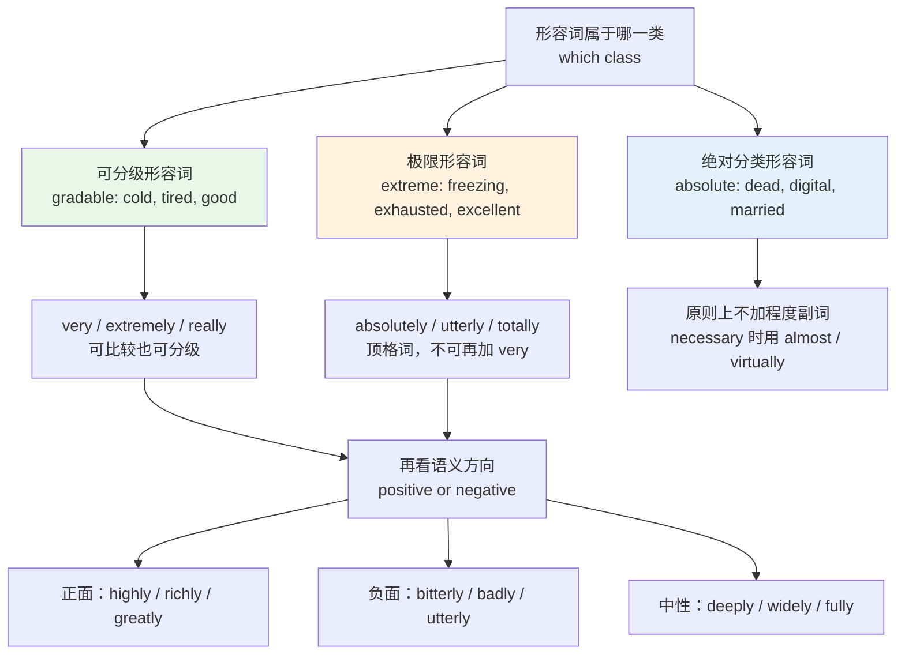
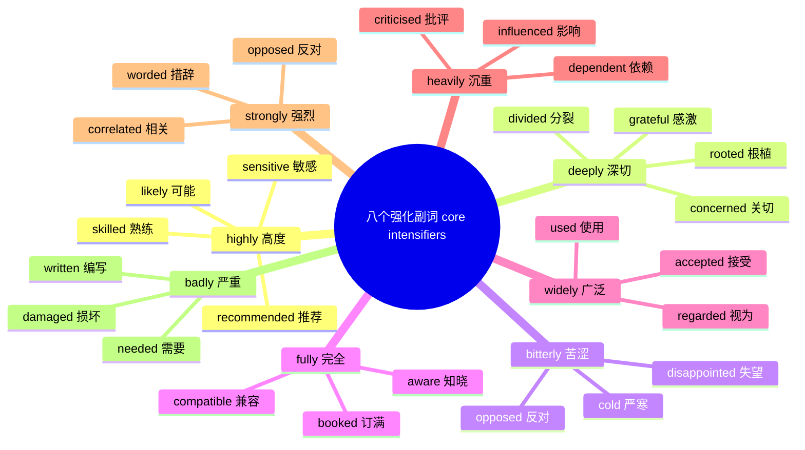
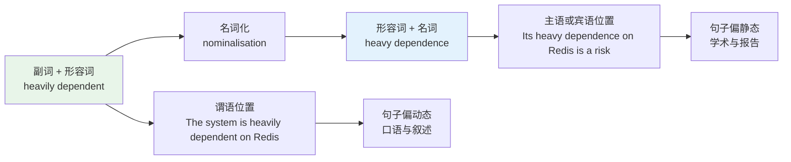
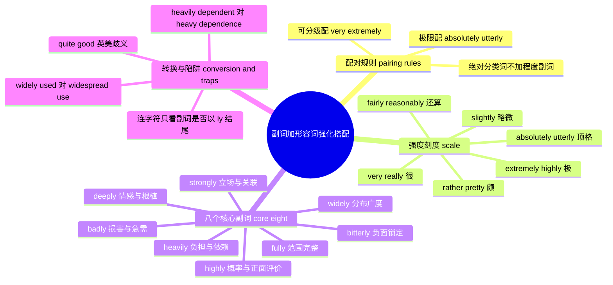

# 副词+形容词强化搭配：highly、deeply、bitterly 的固定伴侣

> [!info] 本篇定位
>
> 17 章的第五篇，处理四类词层搭配里的「副词 + 形容词」这一层。
>
> 上一篇 `04.形容词+名词搭配` 解决的是「用哪个形容词修饰这个名词」，本篇解决的是「用哪个副词加强这个形容词」。两篇合起来覆盖名词短语内部的全部修饰关系。
>
> 读完你会拿到三样东西：一套判断「这个形容词能不能配 very」的分级规则；八个高频强化副词各自的固定伴侣清单，加起来约 160 条搭配；以及把 `heavily dependent` 改写成 `heavy dependence` 的同源转换表——写正式书面语时这个转换用得极多。

---

## 1. 本篇导读：very 撑不起来的那部分

中文母语者的强化副词几乎只有一个：「非常」。非常高兴、非常严重、非常依赖、非常荒唐——一个词通吃。把这个习惯直译成英语，得到的就是满篇 `very`：

- ✗ very concerned about the schedule
- ✗ very disappointed with the result
- ✗ very dependent on this library
- ✗ very ridiculous

这四句语法全对，母语者也听得懂，但没有一句是自然的说法。真实的搭配是 `deeply concerned`、`bitterly disappointed`、`heavily dependent`、`utterly ridiculous`。四个形容词各自绑定了不同的副词，而绑定关系不是随机的——它由两条规则和一批历史沉淀共同决定。

两条规则先说清楚，本篇后面所有内容都建立在它们之上：

**规则一是量级匹配。** 形容词分「可分级」和「极限」两类。`cold` 可以更冷一点也可以没那么冷，属于可分级；`freezing` 本身就是冷的顶格，没有更冻的余地，属于极限。可分级形容词配 `very`、`extremely`、`really`；极限形容词配 `absolutely`、`utterly`、`completely`。搭错了就是 ✗ `very freezing` 或 ✗ `absolutely cold`。

**规则二是语义偏好。** 在量级匹配之外，很多副词还挑语义方向。`bitterly` 几乎只跟负面词走，`richly` 几乎只跟正面词走，`heavily` 偏好「负担、依赖、被施加」这类语义。这一层规则没有推导公式，只能按清单记。

上图是本篇的判断流程。拿到一个形容词先定它的分级属性，选出候选副词池；再看它的语义方向，从池子里挑那个方向匹配的。两步走完，剩下的就是清单记忆的部分——第 5 到第 8 节把这些清单一次给全。

本篇不讲副词的构成规则（`-ly` 后缀怎么加），那属于 `14.构词法：前缀与后缀`；也不讲副词在句中的位置（频度副词放哪儿），那属于语法教程。本篇只管一件事：哪个副词跟哪个形容词绑定。

---

## 2. 形容词的三种分级属性

### 2.1 可分级形容词：能比较，能加 very

可分级形容词（gradable adjective）描述的属性在一条连续刻度上，可以更多也可以更少。判据有两条：能不能加 `-er` / `more` 构成比较级，能不能加 `very`。两条通常同时成立。

| 英文 | 英式音标 | 美式音标 | 词性 | 中文 | 搭配与说明 |
| --- | --- | --- | --- | --- | --- |
| **big** | /bɪɡ/ | /bɪɡ/ | adj. | 大的 | very big；极限对应词 huge |
| **small** | /smɔːl/ | /smɔːl/ | adj. | 小的 | very small；极限对应词 tiny |
| **cold** | /kəʊld/ | /koʊld/ | adj. | 冷的 | very cold；极限对应词 freezing |
| **hot** | /hɒt/ | /hɑːt/ | adj. | 热的 | very hot；极限对应词 boiling |
| **tired** | /ˈtaɪəd/ | /ˈtaɪərd/ | adj. | 累的 | very tired；极限对应词 exhausted |
| **hungry** | /ˈhʌŋɡri/ | /ˈhʌŋɡri/ | adj. | 饿的 | very hungry；极限对应词 starving |
| **good** | /ɡʊd/ | /ɡʊd/ | adj. | 好的 | very good；极限对应词 excellent |
| **bad** | /bæd/ | /bæd/ | adj. | 坏的 | very bad；极限对应词 terrible |
| **angry** | /ˈæŋɡri/ | /ˈæŋɡri/ | adj. | 生气的 | very angry；极限对应词 furious |
| **surprised** | /səˈpraɪzd/ | /sərˈpraɪzd/ | adj. | 惊讶的 | very surprised；极限对应 astonished |
| **dirty** | /ˈdɜːti/ | /ˈdɜːrti/ | adj. | 脏的 | very dirty；极限对应词 filthy |
| **interesting** | /ˈɪntrəstɪŋ/ | /ˈɪntrəstɪŋ/ | adj. | 有趣的 | very interesting；极限对应 fascinating |

这十二个词构成了「可分级 → 极限」的对照骨架。左边这列是可以自由加 `very` 的安全区，右边那列在下一张表里。

### 2.2 极限形容词：本身已经顶格

极限形容词（extreme adjective，也叫 non-gradable 中的 strong adjective）本身就含有「极其」的意思，等于是「very + 可分级词」的打包版。`huge` = very big，`exhausted` = very tired。既然 very 已经打包进去了，再加一个 very 就是重复。

| 英文 | 英式音标 | 美式音标 | 词性 | 中文 | 搭配与说明 |
| --- | --- | --- | --- | --- | --- |
| **huge** | /hjuːdʒ/ | /hjuːdʒ/ | adj. | 巨大的 | absolutely huge；✗ very huge |
| **tiny** | /ˈtaɪni/ | /ˈtaɪni/ | adj. | 极小的 | absolutely tiny |
| **freezing** | /ˈfriːzɪŋ/ | /ˈfriːzɪŋ/ | adj. | 冻僵的 | absolutely freezing；口语 freezing cold |
| **boiling** | /ˈbɔɪlɪŋ/ | /ˈbɔɪlɪŋ/ | adj. | 滚烫的 | 口语 boiling hot 是固定叠加 |
| **exhausted** | /ɪɡˈzɔːstɪd/ | /ɪɡˈzɔːstɪd/ | adj. | 精疲力竭的 | absolutely exhausted；✗ very exhausted |
| **starving** | /ˈstɑːvɪŋ/ | /ˈstɑːrvɪŋ/ | adj. | 饿极的 | 口语夸张，正式语境指真正的饥饿 |
| **excellent** | /ˈeksələnt/ | /ˈeksələnt/ | adj. | 极好的 | absolutely excellent |
| **terrible** | /ˈterəbl/ | /ˈterəbl/ | adj. | 糟透的 | absolutely terrible |
| **furious** | /ˈfjʊəriəs/ | /ˈfjʊriəs/ | adj. | 暴怒的 | absolutely furious |
| **astonished** | /əˈstɒnɪʃt/ | /əˈstɑːnɪʃt/ | adj. | 极为震惊的 | utterly astonished |
| **filthy** | /ˈfɪlθi/ | /ˈfɪlθi/ | adj. | 极脏的 | absolutely filthy |
| **fascinating** | /ˈfæsɪneɪtɪŋ/ | /ˈfæsɪneɪtɪŋ/ | adj. | 极有意思的 | absolutely fascinating |
| **ridiculous** | /rɪˈdɪkjələs/ | /rɪˈdɪkjələs/ | adj. | 荒唐的 | utterly ridiculous；本篇标题词 |
| **impossible** | /ɪmˈpɒsəbl/ | /ɪmˈpɑːsəbl/ | adj. | 不可能的 | utterly impossible |

> [!warning] 极限形容词前面加 very 是典型中式错误
>
> - ❌ ~~very exhausted~~ / ~~very huge~~ / ~~very excellent~~
> - ✅ **absolutely exhausted** / **absolutely huge** / **absolutely excellent**
>
> 反向也一样，顶格副词不能配可分级词：
>
> - ❌ ~~absolutely tired~~ / ~~utterly cold~~ / ~~completely good~~
> - ✅ **very tired** / **very cold** / **very good**
>
> 唯一被广泛接受的例外是 `really`。它两边通吃：`really tired` 和 `really exhausted` 都自然，代价是语体偏口语，正式书面报告里少用。

### 2.3 绝对分类形容词：连程度都没有

第三类既不可分级，也不是「极限」，而是根本没有程度维度。它们回答的是「是不是」而非「多少」：`digital` 要么是数字的要么不是，`married` 要么已婚要么未婚。

| 英文 | 英式音标 | 美式音标 | 词性 | 中文 | 搭配与说明 |
| --- | --- | --- | --- | --- | --- |
| **dead** | /ded/ | /ded/ | adj. | 死的 | ✗ very dead；口语里 dead 自己可当强化副词 |
| **unique** | /juˈniːk/ | /juˈniːk/ | adj. | 独一无二的 | 规范用法不加 very；可说 truly unique |
| **digital** | /ˈdɪdʒɪtl/ | /ˈdɪdʒɪtl/ | adj. | 数字的 | 分类词，无程度 |
| **wooden** | /ˈwʊdn/ | /ˈwʊdn/ | adj. | 木制的 | 材质分类词 |
| **married** | /ˈmærid/ | /ˈmærid/ | adj. | 已婚的 | ✗ very married；可说 happily married |
| **nuclear** | /ˈnjuːkliə/ | /ˈnuːkliər/ | adj. | 核的 | 英美首音差别明显 |

这一类要加修饰只能换角度：不说程度，说方式或时间。`happily married`（幸福地已婚）、`recently married`（新婚）、`fully digital`（全面数字化的）都成立，因为 `happily`、`recently` 不是程度副词，而 `fully` 强调的是「覆盖范围完整」而不是「程度更深」。

> [!tip] 三类之间不是死界限
>
> `unique` 被 very 修饰在口语里天天发生，`dead` 在 `deader than a doornail` 这种固定说法里还有比较级。分级属性描述的是词的默认行为，不是禁止令。
>
> 实用做法：写正式文档时严格按三分法选副词，说话时按听到过的说法走。判断标准永远是「有没有听母语者这么说过」，不是「规则允不允许」。

---

## 3. very 系刻度：五个词的强度排序

### 3.1 从 slightly 到 absolutely 的连续刻度

英语的程度副词构成一条刻度线。中文母语者最需要补的是刻度中段——「有点」和「非常」之间那三四档，中文用得少，英语用得极多。

图上的分数不是任何研究给出的数值，只是帮助建立相对次序的记忆锚点。真正需要记牢的是顺序本身，以及三个断点：`fairly` 到 `rather` 之间跨过了「中等」，`very` 到 `extremely` 之间跨过了「书面正式度」，`extremely` 到 `absolutely` 之间跨过了分级属性的边界。

| 英文 | 英式音标 | 美式音标 | 词性 | 中文 | 搭配与说明 |
| --- | --- | --- | --- | --- | --- |
| **very** | /ˈveri/ | /ˈveri/ | adv. | 很 | 只配可分级词；不能修饰比较级，用 much |
| **really** | /ˈrɪəli/ | /ˈriːəli/ | adv. | 真的很 | 唯一两边通吃的词，语体偏口语 |
| **quite** | /kwaɪt/ | /kwaɪt/ | adv. | 相当；完全 | 英美含义分裂，见 3.3 |
| **rather** | /ˈrɑːðə/ | /ˈræðər/ | adv. | 颇 | 英式常带轻微负面或意外含义 |
| **fairly** | /ˈfeəli/ | /ˈferli/ | adv. | 还算 | 中低强度，多配正面词 |
| **pretty** | /ˈprɪti/ | /ˈprɪti/ | adv. | 挺 | 口语，正式邮件与报告里避免 |
| **reasonably** | /ˈriːznəbli/ | /ˈriːznəbli/ | adv. | 还比较 | 商务书面语里 fairly 的替换词 |
| **extremely** | /ɪkˈstriːmli/ | /ɪkˈstriːmli/ | adv. | 极其 | 书面强化的第一选择 |
| **incredibly** | /ɪnˈkredəbli/ | /ɪnˈkredəbli/ | adv. | 极为 | 口语色彩强，评论区高频 |
| **exceptionally** | /ɪkˈsepʃənəli/ | /ɪkˈsepʃənəli/ | adv. | 异常地 | 正式书面，含「超出常规」义 |
| **remarkably** | /rɪˈmɑːkəbli/ | /rɪˈmɑːrkəbli/ | adv. | 显著地 | 强调结果出乎意料 |
| **terribly** | /ˈterəbli/ | /ˈterəbli/ | adv. | 非常 | 英式口语 terribly sorry；本身不含贬义 |
| **awfully** | /ˈɔːfli/ | /ˈɔːfli/ | adv. | 非常 | 偏旧派口语，awfully kind of you |
| **particularly** | /pəˈtɪkjələli/ | /pərˈtɪkjələrli/ | adv. | 尤其 | 否定式 not particularly good 极常用 |

### 3.2 fairly、rather、pretty 的分工

三个词都落在刻度中段，但情感色彩完全不同，混用会传错态度。

- **fairly** 偏正面，说「达标了但不出彩」。`The code is fairly readable.` 意思是可读性过关，不算优秀。
- **rather** 偏负面或意外，说「比预期的多，而这不太妙」。`The code is rather complex.` 暗示复杂得超出必要。
- **pretty** 中性偏正面，纯口语。`The code is pretty solid.` 是夸奖，但不能写进技术评审文档。

> [!example] 同一个形容词换三个副词，态度完全不同
>
> - The migration was **fairly** straightforward.
>   - 迁移过程还算顺利。（合格，无惊喜）
> - The migration was **rather** straightforward.
>   - 迁移过程出乎意料地顺利。（本以为会麻烦）
> - The migration was **pretty** straightforward.
>   - 迁移挺顺的。（口语，同事之间说）

`rather` 还有一个中文母语者容易忽略的用法：接正面形容词时表示「比预想的好」，语气是惊喜而非贬低。`The film was rather good.` 是「这片子居然还不错」，不是「这片子一般般」。判断依据是听话人对该形容词的预期方向。

### 3.3 quite good 的英美歧义

`quite` 是这条刻度上唯一一个英美含义相反的词，也是本节最需要记牢的一条。

| 语境 | 英式理解 | 美式理解 | 中文差别 |
| --- | --- | --- | --- |
| quite + 可分级形容词（quite good） | 弱化：还行，不算好 | 强化：相当好 | 一个是及格，一个是优秀 |
| quite + 极限形容词（quite exhausted） | 强化：完全地 | 强化：完全地 | 两边一致 |
| quite + 绝对形容词（quite impossible） | 强化：完全地 | 强化：完全地 | 两边一致 |
| not quite（not quite ready） | 还差一点 | 还差一点 | 两边一致 |

歧义只发生在第一行，也就是 `quite` 配可分级形容词的时候。英国人说 `Your presentation was quite good.` 是「还行吧」，带保留；美国人说同一句话是明确的表扬。这个差别在跨国团队的绩效反馈里真实造成过误解。

> [!warning] 规避 quite 歧义的三个做法
>
> 1. 面向国际读者写作时，把 `quite good` 换成毫无歧义的词：想说「还行」用 `fairly good` 或 `reasonably good`，想说「相当好」用 `very good` 或 `really good`。
> 2. 读英式文本遇到 `quite` 配可分级词，默认按弱化理解，再结合上下文校正。
> 3. `quite` 配极限词时放心用强化义。`quite impossible`、`quite exhausted`、`quite right`、`quite different` 在两边都是「完全」，没有解读风险。

顺带记住 `quite a` 的固定用法：`quite a while`（相当长一段时间）、`quite a few`（相当多）、`quite a lot`。这三个短语在英美两边都是强化义，`quite a few bugs` 是「不少 bug」而不是「几个 bug」。

---

## 4. 顶格副词：absolutely 与 utterly 的分工

四个顶格副词 `absolutely`、`utterly`、`completely`、`totally` 常被当成同义词，实际分工清晰：`absolutely` 中性偏强调，`utterly` 几乎只配负面词，`completely` 中性且最书面，`totally` 口语。

| 英文 | 英式音标 | 美式音标 | 词性 | 中文 | 搭配与说明 |
| --- | --- | --- | --- | --- | --- |
| **absolutely** | /ˌæbsəˈluːtli/ | /ˌæbsəˈluːtli/ | adv. | 完全地 | 正负皆可；单说 Absolutely 表强烈同意 |
| **utterly** | /ˈʌtəli/ | /ˈʌtərli/ | adv. | 彻头彻尾地 | 强烈偏负面：ridiculous, useless, devastated |
| **completely** | /kəmˈpliːtli/ | /kəmˈpliːtli/ | adv. | 完全地 | 中性书面，覆盖面最广 |
| **totally** | /ˈtəʊtəli/ | /ˈtoʊtəli/ | adv. | 完全地 | 口语；美式年轻人用法尤多 |
| **entirely** | /ɪnˈtaɪəli/ | /ɪnˈtaɪərli/ | adv. | 全然 | 书面；entirely different 是高频组合 |
| **perfectly** | /ˈpɜːfɪktli/ | /ˈpɜːrfɪktli/ | adv. | 完全地 | perfectly clear, perfectly happy, perfectly valid |
| **thoroughly** | /ˈθʌrəli/ | /ˈθɜːroʊli/ | adv. | 彻底地 | 英美读音差别大；thoroughly tested |
| **wholly** | /ˈhəʊlli/ | /ˈhoʊlli/ | adv. | 全然 | 正式，法律与政策文本常见 |
| **virtually** | /ˈvɜːtʃuəli/ | /ˈvɜːrtʃuəli/ | adv. | 几乎完全 | 逼近顶格但留余地，虚拟化语境另有义项 |
| **simply** | /ˈsɪmpli/ | /ˈsɪmpli/ | adv. | 简直 | simply impossible, simply not true |
| **positively** | /ˈpɒzətɪvli/ | /ˈpɑːzətɪvli/ | adv. | 简直 | 带惊叹语气：positively dangerous |
| **downright** | /ˈdaʊnraɪt/ | /ˈdaʊnraɪt/ | adv. | 十足地 | 只配负面词：downright rude, downright wrong |

### 4.1 utterly 的负面锁定

`utterly` 是本篇最容易用错方向的词。它在语料里几乎清一色跟负面形容词组合，配正面词会产生刺耳的违和感。

| 英文 | 英式音标 | 美式音标 | 词性 | 中文 | 搭配与说明 |
| --- | --- | --- | --- | --- | --- |
| **utterly ridiculous** | /ˌʌtəli rɪˈdɪkjələs/ | /ˌʌtərli rɪˈdɪkjələs/ | adv.+adj. | 荒唐透顶 | 争论中表达强烈否定 |
| **utterly useless** | /ˌʌtəli ˈjuːsləs/ | /ˌʌtərli ˈjuːsləs/ | adv.+adj. | 毫无用处 | 评价工具或方案 |
| **utterly impossible** | /ˌʌtəli ɪmˈpɒsəbl/ | /ˌʌtərli ɪmˈpɑːsəbl/ | adv.+adj. | 完全不可能 | 比 completely impossible 语气重 |
| **utterly exhausted** | /ˌʌtəli ɪɡˈzɔːstɪd/ | /ˌʌtərli ɪɡˈzɔːstɪd/ | adv.+adj. | 累到虚脱 | 与 absolutely exhausted 通用 |
| **utterly devastated** | /ˌʌtəli ˈdevəsteɪtɪd/ | /ˌʌtərli ˈdevəsteɪtɪd/ | adv.+adj. | 悲痛欲绝 | 重大打击后的固定说法 |
| **utterly meaningless** | /ˌʌtəli ˈmiːnɪŋləs/ | /ˌʌtərli ˈmiːnɪŋləs/ | adv.+adj. | 毫无意义 | 批评数据或指标时用 |
| **utterly appalled** | /ˌʌtəli əˈpɔːld/ | /ˌʌtərli əˈpɔːld/ | adv.+adj. | 极度震惊 | appalled 本身即极限词 |
| **utterly convinced** | /ˌʌtəli kənˈvɪnst/ | /ˌʌtərli kənˈvɪnst/ | adv.+adj. | 深信不疑 | 少数中性偏正的组合 |

> [!warning] utterly 的方向不能反着用
>
> - ❌ ~~utterly wonderful~~ / ~~utterly delighted~~ / ~~utterly successful~~
> - ✅ **absolutely wonderful** / **absolutely delighted** / **highly successful**
>
> `utterly convinced` 和 `utterly charming` 是少数被接受的非负面组合，但把 `utterly` 当成通用顶格词用，产出的句子在母语者读来是别扭的。想要一个安全的通用顶格词，选 `absolutely` 或 `completely`。

### 4.2 absolutely 单独成句

`absolutely` 有一个 `completely` 没有的功能：单独作答，表示强烈赞同。这是口语高频用法。

> [!example] absolutely 的独立应答
>
> - "Should we roll it back before the weekend?" — "**Absolutely.**"
>   - 「周末前要不要回滚？」——「当然要。」
> - "You're saying the cache never invalidates?" — "**Absolutely not.** It expires after an hour."
>   - 「你是说缓存永不失效？」——「完全不是。一小时后就过期。」

`Absolutely not` 是强烈否认，比 `No` 重得多。`Definitely` 和 `Certainly` 可以做类似的独立应答，`Completely` 和 `Totally` 里只有 `Totally` 在美式口语中能单独用。

---

## 5. highly：与正面评价和概率绑定

`highly` 是学术与商务书面语里最高频的强化副词之一，配的形容词集中在三个语义区：概率判断、正面评价、专业属性。它几乎不配具体的物理属性——✗ `highly cold`、✗ `highly heavy` 都不成立。

| 英文 | 英式音标 | 美式音标 | 词性 | 中文 | 搭配与说明 |
| --- | --- | --- | --- | --- | --- |
| **highly likely** | /ˌhaɪli ˈlaɪkli/ | /ˌhaɪli ˈlaɪkli/ | adv.+adj. | 极可能 | 概率判断的书面首选，比 very likely 正式 |
| **highly unlikely** | /ˌhaɪli ʌnˈlaɪkli/ | /ˌhaɪli ʌnˈlaɪkli/ | adv.+adj. | 极不可能 | 否定方向同样自然 |
| **highly probable** | /ˌhaɪli ˈprɒbəbl/ | /ˌhaɪli ˈprɑːbəbl/ | adv.+adj. | 高度可能 | 比 likely 更正式，报告用语 |
| **highly recommended** | /ˌhaɪli ˌrekəˈmendɪd/ | /ˌhaɪli ˌrekəˈmendɪd/ | adv.+adj. | 强烈推荐 | 书评影评与文档里的固定说法 |
| **highly effective** | /ˌhaɪli ɪˈfektɪv/ | /ˌhaɪli ɪˈfektɪv/ | adv.+adj. | 非常有效 | 医学与政策文本高频 |
| **highly successful** | /ˌhaɪli səkˈsesfl/ | /ˌhaɪli səkˈsesfl/ | adv.+adj. | 非常成功 | 商业报道固定组合 |
| **highly skilled** | /ˌhaɪli ˈskɪld/ | /ˌhaɪli ˈskɪld/ | adv.+adj. | 技术娴熟的 | 招聘与移民文件用语 |
| **highly qualified** | /ˌhaɪli ˈkwɒlɪfaɪd/ | /ˌhaɪli ˈkwɑːlɪfaɪd/ | adv.+adj. | 资历过硬的 | 简历与推荐信高频 |
| **highly motivated** | /ˌhaɪli ˈməʊtɪveɪtɪd/ | /ˌhaɪli ˈmoʊtɪveɪtɪd/ | adv.+adj. | 积极主动的 | 招聘启事套语 |
| **highly competitive** | /ˌhaɪli kəmˈpetətɪv/ | /ˌhaɪli kəmˈpetətɪv/ | adv.+adj. | 竞争激烈的 | 既说市场也说个人性格 |
| **highly sensitive** | /ˌhaɪli ˈsensətɪv/ | /ˌhaɪli ˈsensətɪv/ | adv.+adj. | 高度敏感的 | 数据安全语境固定用法 |
| **highly confidential** | /ˌhaɪli ˌkɒnfɪˈdenʃl/ | /ˌhaɪli ˌkɑːnfɪˈdenʃl/ | adv.+adj. | 高度机密的 | 文件抬头常见 |
| **highly controversial** | /ˌhaɪli ˌkɒntrəˈvɜːʃl/ | /ˌhaɪli ˌkɑːntrəˈvɜːrʃl/ | adv.+adj. | 极具争议的 | 新闻语体 |
| **highly critical** | /ˌhaɪli ˈkrɪtɪkl/ | /ˌhaɪli ˈkrɪtɪkl/ | adv.+adj. | 严厉批评的 | 注意 critical 的两个义项 |
| **highly unusual** | /ˌhaɪli ʌnˈjuːʒuəl/ | /ˌhaɪli ʌnˈjuːʒuəl/ | adv.+adj. | 极不寻常的 | 事故报告与调查文本 |
| **highly available** | /ˌhaɪli əˈveɪləbl/ | /ˌhaɪli əˈveɪləbl/ | adv.+adj. | 高可用的 | 技术术语，缩写 HA |

`highly critical` 有一处歧义要留心。`critical` 有「批评的」和「关键的」两个义项，`highly critical of the proposal` 是严厉批评那份提案，而「极其关键」通常说 `absolutely critical` 或 `mission-critical`，不说 `highly critical`——后者会被默认读成批评义。

> [!example] highly 在书面语中的典型位置
>
> - It is **highly likely** that the regression was introduced in the last release.
>   - 这个回归问题极可能是上个版本引入的。
> - The report was **highly critical** of the vendor's response time.
>   - 报告对供应商的响应时间提出了严厉批评。
> - This endpoint returns **highly sensitive** user data and must be rate-limited.
>   - 这个接口返回高度敏感的用户数据，必须限流。

> [!tip] highly 与 very 的替换关系
>
> `highly` 和 `very` 在多数搭配里不能互换。`very likely` 成立且口语常用，`very skilled` 也成立，但 `very confidential`、`very controversial`、`very available` 都不自然。
>
> 记忆策略：`highly` 修饰的形容词多半是拉丁来源的多音节词（probable、effective、qualified、controversial、confidential），`very` 修饰的多是日耳曼来源的短词（big、cold、good、tired）。这个对应不是硬规则，但作为选词直觉命中率相当高，来源分层的背景见 [[01.词汇入门与学习方法/01.英语词汇的来源、分层与学习地图|英语词汇的来源、分层与学习地图]]。

---

## 6. deeply：情感深度与结构根植

`deeply` 从「深」的空间义引申而来，配的形容词分两大类：内心情感的强度，以及某种属性扎根之深。它是中性词，正面负面都能配，这一点跟 `bitterly` 形成对照。

| 英文 | 英式音标 | 美式音标 | 词性 | 中文 | 搭配与说明 |
| --- | --- | --- | --- | --- | --- |
| **deeply concerned** | /ˌdiːpli kənˈsɜːnd/ | /ˌdiːpli kənˈsɜːrnd/ | adv.+adj. | 深表关切 | 外交声明与正式信函的标准表达 |
| **deeply worried** | /ˌdiːpli ˈwʌrid/ | /ˌdiːpli ˈwɜːrid/ | adv.+adj. | 深感忧虑 | worried 英美元音差别明显 |
| **deeply grateful** | /ˌdiːpli ˈɡreɪtfl/ | /ˌdiːpli ˈɡreɪtfl/ | adv.+adj. | 深表感激 | 致谢辞固定说法 |
| **deeply moved** | /ˌdiːpli ˈmuːvd/ | /ˌdiːpli ˈmuːvd/ | adv.+adj. | 深受感动 | 比 very touched 正式 |
| **deeply hurt** | /ˌdiːpli ˈhɜːt/ | /ˌdiːpli ˈhɜːrt/ | adv.+adj. | 深受伤害 | 指情感伤害，不指身体 |
| **deeply offended** | /ˌdiːpli əˈfendɪd/ | /ˌdiːpli əˈfendɪd/ | adv.+adj. | 深感被冒犯 | 投诉与道歉语境 |
| **deeply ashamed** | /ˌdiːpli əˈʃeɪmd/ | /ˌdiːpli əˈʃeɪmd/ | adv.+adj. | 深感羞愧 | 公开道歉常用 |
| **deeply committed** | /ˌdiːpli kəˈmɪtɪd/ | /ˌdiːpli kəˈmɪtɪd/ | adv.+adj. | 坚定投入的 | 企业宣言语体 |
| **deeply rooted** | /ˌdiːpli ˈruːtɪd/ | /ˌdiːpli ˈruːtɪd/ | adv.+adj. | 根深蒂固的 | 描述文化、偏见、传统 |
| **deeply ingrained** | /ˌdiːpli ɪnˈɡreɪnd/ | /ˌdiːpli ɪnˈɡreɪnd/ | adv.+adj. | 深入骨髓的 | 比 rooted 更强调难以清除 |
| **deeply divided** | /ˌdiːpli dɪˈvaɪdɪd/ | /ˌdiːpli dɪˈvaɪdɪd/ | adv.+adj. | 严重分裂的 | 政治报道固定组合 |
| **deeply religious** | /ˌdiːpli rɪˈlɪdʒəs/ | /ˌdiːpli rɪˈlɪdʒəs/ | adv.+adj. | 笃信宗教的 | 人物描写 |
| **deeply suspicious** | /ˌdiːpli səˈspɪʃəs/ | /ˌdiːpli səˈspɪʃəs/ | adv.+adj. | 深度怀疑的 | 后接 of |
| **deeply flawed** | /ˌdiːpli ˈflɔːd/ | /ˌdiːpli ˈflɔːd/ | adv.+adj. | 存在根本缺陷的 | 评审报告用语 |
| **deeply unpopular** | /ˌdiːpli ʌnˈpɒpjələ/ | /ˌdiːpli ʌnˈpɑːpjələr/ | adv.+adj. | 极不受欢迎的 | 政策评价 |
| **deeply disturbing** | /ˌdiːpli dɪˈstɜːbɪŋ/ | /ˌdiːpli dɪˈstɜːrbɪŋ/ | adv.+adj. | 令人深感不安的 | 新闻描述 |

`deeply concerned` 值得单独说。它在外交与企业公关文本里是一个程式化表达，字面是「深切关注」，实际功能是「表达不满但不采取行动」。理解这层语用含义，读英文声明时才不会高估其分量。语气递进序列是 `concerned` → `deeply concerned` → `gravely concerned` → `alarmed`。

> [!example] deeply 的两类用法对照
>
> - We are **deeply concerned** about the number of unhandled exceptions in production.
>   - 我们对生产环境未处理异常的数量深感忧虑。（情感强度）
> - The assumption is **deeply rooted** in the original design and cannot be removed incrementally.
>   - 这个假设在原始设计里根深蒂固，无法增量移除。（扎根深度）

> [!tip] deeply 与 profoundly 的替换
>
> `profoundly` /prəˈfaʊndli/ 在多数 `deeply` 的搭配里可以替换，语体更正式、更学术：`profoundly affected`、`profoundly different`、`profoundly disturbing`。
>
> 两个词不完全等价的地方在于：`deeply` 能配情感反应（`deeply grateful`、`deeply moved`），`profoundly` 配这些略显生硬；反过来 `profoundly deaf`（重度失聪）是医学术语，不能换成 `deeply deaf`。

---

## 7. bitterly：负面情绪的专用强化

`bitterly` 的语义方向锁定得比 `utterly` 还紧。它来自 `bitter`（苦），保留了「苦涩、怨恨」的底色，能配的形容词是一个很短的封闭清单。

| 英文 | 英式音标 | 美式音标 | 词性 | 中文 | 搭配与说明 |
| --- | --- | --- | --- | --- | --- |
| **bitterly disappointed** | /ˌbɪtəli ˌdɪsəˈpɔɪntɪd/ | /ˌbɪtərli ˌdɪsəˈpɔɪntɪd/ | adv.+adj. | 极度失望 | 最高频组合，体育与政治报道标配 |
| **bitterly cold** | /ˌbɪtəli ˈkəʊld/ | /ˌbɪtərli ˈkoʊld/ | adv.+adj. | 刺骨地冷 | 唯一的非情感搭配，天气专用 |
| **bitterly opposed** | /ˌbɪtəli əˈpəʊzd/ | /ˌbɪtərli əˈpoʊzd/ | adv.+adj. | 强烈反对 | 比 strongly opposed 多一层敌意 |
| **bitterly divided** | /ˌbɪtəli dɪˈvaɪdɪd/ | /ˌbɪtərli dɪˈvaɪdɪd/ | adv.+adj. | 严重对立的 | 与 deeply divided 的差别是含敌意 |
| **bitterly critical** | /ˌbɪtəli ˈkrɪtɪkl/ | /ˌbɪtərli ˈkrɪtɪkl/ | adv.+adj. | 尖刻批评的 | 语气重于 highly critical |
| **bitterly resentful** | /ˌbɪtəli rɪˈzentfl/ | /ˌbɪtərli rɪˈzentfl/ | adv.+adj. | 满怀怨恨的 | 语义叠加，强调持久 |
| **bitterly contested** | /ˌbɪtəli kənˈtestɪd/ | /ˌbɪtərli kənˈtestɪd/ | adv.+adj. | 激烈争夺的 | 选举与诉讼语境 |
| **bitterly fought** | /ˌbɪtəli ˈfɔːt/ | /ˌbɪtərli ˈfɔːt/ | adv.+adj. | 苦战的 | a bitterly fought campaign |
| **bitterly unhappy** | /ˌbɪtəli ʌnˈhæpi/ | /ˌbɪtərli ʌnˈhæpi/ | adv.+adj. | 极度不快的 | 强调怨气而非单纯难过 |
| **bitterly ironic** | /ˌbɪtəli aɪˈrɒnɪk/ | /ˌbɪtərli aɪˈrɑːnɪk/ | adv.+adj. | 极具讽刺意味的 | 评论文体 |

`bitterly cold` 是这张表里的异类，它是唯一跟情绪无关的搭配。原因是「苦」和「刺骨的冷」在感官上共享「难以忍受」这个特征，这条引申路径在英语里固化下来，只保留了 `cold` 这一个词——不能说 ✗ `bitterly hot`。

> [!warning] bitterly 不能配正面词
>
> - ❌ ~~bitterly happy~~ / ~~bitterly successful~~ / ~~bitterly proud~~
> - ✅ **deeply happy**（或直接用 delighted）/ **highly successful** / **immensely proud**
>
> 也不能用它替代通用的「非常」：
>
> - ❌ ~~The test suite is bitterly slow.~~
> - ✅ **The test suite is painfully slow.**（painfully 才是这个语境的固定搭配）

`bitterly` 除了配形容词，还固定修饰两个动词：`bitterly regret`（追悔莫及）和 `bitterly complain`（激烈抱怨）。这两个组合出现频率甚至高于部分形容词搭配，一并记住。

> [!example] bitterly 的三种典型语境
>
> - The team was **bitterly disappointed** after losing the contract in the final round.
>   - 最后一轮丢掉合同后，团队极度失望。
> - It was **bitterly cold** on the platform, and the train was another forty minutes away.
>   - 站台上冷得刺骨，而火车还有四十分钟才到。
> - He **bitterly regrets** not backing up the database before the migration.
>   - 他追悔莫及，迁移前没有备份数据库。

---

## 8. 另外五个高频副词的搭配版图

这张图把八个副词的核心伴侣压缩成了一页速查。左侧四个（highly、deeply、bitterly、fully）偏主观判断与情感，右侧四个（widely、heavily、strongly、badly）偏客观描述与程度。写作时先按语义区定副词，再从该副词的清单里挑形容词，比反过来从形容词找副词快得多。

### 8.1 fully：完整覆盖，不是程度更深

`fully` 表达的是「范围上没有遗漏」，跟「程度上更深」不是一回事。它配的形容词多半本身就带有「可以部分实现」的含义——正因为可以部分实现，才需要强调「完全实现了」。

| 英文 | 英式音标 | 美式音标 | 词性 | 中文 | 搭配与说明 |
| --- | --- | --- | --- | --- | --- |
| **fully aware** | /ˌfʊli əˈweə/ | /ˌfʊli əˈwer/ | adv.+adj. | 完全清楚 | 后接 of 或 that 从句 |
| **fully qualified** | /ˌfʊli ˈkwɒlɪfaɪd/ | /ˌfʊli ˈkwɑːlɪfaɪd/ | adv.+adj. | 完全合格的 | 编程里另指全限定名 |
| **fully booked** | /ˌfʊli ˈbʊkt/ | /ˌfʊli ˈbʊkt/ | adv.+adj. | 订满的 | 酒店与餐厅固定用语 |
| **fully automated** | /ˌfʊli ˈɔːtəmeɪtɪd/ | /ˌfʊli ˈɔːtəmeɪtɪd/ | adv.+adj. | 全自动的 | 流程描述 |
| **fully compatible** | /ˌfʊli kəmˈpætəbl/ | /ˌfʊli kəmˈpætəbl/ | adv.+adj. | 完全兼容的 | 后接 with |
| **fully functional** | /ˌfʊli ˈfʌŋkʃənl/ | /ˌfʊli ˈfʌŋkʃənl/ | adv.+adj. | 功能完整的 | 对应 partially functional |
| **fully operational** | /ˌfʊli ˌɒpəˈreɪʃənl/ | /ˌfʊli ˌɑːpəˈreɪʃənl/ | adv.+adj. | 全面投入运行的 | 系统上线公告 |
| **fully committed** | /ˌfʊli kəˈmɪtɪd/ | /ˌfʊli kəˈmɪtɪd/ | adv.+adj. | 全力投入的 | 与 deeply committed 语气不同 |
| **fully equipped** | /ˌfʊli ɪˈkwɪpt/ | /ˌfʊli ɪˈkwɪpt/ | adv.+adj. | 设备齐全的 | 房源与场地描述 |
| **fully insured** | /ˌfʊli ɪnˈʃʊəd/ | /ˌfʊli ɪnˈʃʊrd/ | adv.+adj. | 全额投保的 | 合同文本 |
| **fully recovered** | /ˌfʊli rɪˈkʌvəd/ | /ˌfʊli rɪˈkʌvərd/ | adv.+adj. | 完全康复的 | 医疗与系统恢复两用 |
| **fully grown** | /ˌfʊli ˈɡrəʊn/ | /ˌfʊli ˈɡroʊn/ | adv.+adj. | 完全长成的 | 生物描述 |

`fully aware` 在正式沟通里有一个特定语用：它常出现在承认责任或撇清责任的句子里。`We are fully aware of the issue and are working on a fix.` 是标准的事故通告句式，功能是先承认知情，避免被指责失察。

### 8.2 widely：分布范围广

`widely` 强调「在很多地方、被很多人」，配的形容词几乎全是过去分词——因为它描述的是被动接受的广度。

| 英文 | 英式音标 | 美式音标 | 词性 | 中文 | 搭配与说明 |
| --- | --- | --- | --- | --- | --- |
| **widely used** | /ˌwaɪdli ˈjuːzd/ | /ˌwaɪdli ˈjuːzd/ | adv.+adj. | 广泛使用的 | 技术文档最高频组合之一 |
| **widely available** | /ˌwaɪdli əˈveɪləbl/ | /ˌwaɪdli əˈveɪləbl/ | adv.+adj. | 随处可得的 | 商品与服务描述 |
| **widely accepted** | /ˌwaɪdli əkˈseptɪd/ | /ˌwaɪdli əkˈseptɪd/ | adv.+adj. | 被广泛接受的 | 学术论文常见 |
| **widely known** | /ˌwaɪdli ˈnəʊn/ | /ˌwaɪdli ˈnoʊn/ | adv.+adj. | 广为人知的 | 与 well known 有细微差别 |
| **widely regarded** | /ˌwaɪdli rɪˈɡɑːdɪd/ | /ˌwaɪdli rɪˈɡɑːrdɪd/ | adv.+adj. | 被普遍视为 | 固定接 as |
| **widely reported** | /ˌwaɪdli rɪˈpɔːtɪd/ | /ˌwaɪdli rɪˈpɔːrtɪd/ | adv.+adj. | 被大量报道的 | 新闻语体 |
| **widely believed** | /ˌwaɪdli bɪˈliːvd/ | /ˌwaɪdli bɪˈliːvd/ | adv.+adj. | 被普遍相信的 | 常暗示可能不实 |
| **widely adopted** | /ˌwaɪdli əˈdɒptɪd/ | /ˌwaɪdli əˈdɑːptɪd/ | adv.+adj. | 被广泛采用的 | 标准与协议描述 |
| **widely recognised** | /ˌwaɪdli ˈrekəɡnaɪzd/ | /ˌwaɪdli ˈrekəɡnaɪzd/ | adv.+adj. | 被广泛认可的 | 美式拼 recognized |
| **widely criticised** | /ˌwaɪdli ˈkrɪtɪsaɪzd/ | /ˌwaɪdli ˈkrɪtɪsaɪzd/ | adv.+adj. | 遭到广泛批评的 | 美式拼 criticized |
| **widely read** | /ˌwaɪdli ˈred/ | /ˌwaɪdli ˈred/ | adv.+adj. | 读者众多的 | read 此处读 /red/ |
| **widely travelled** | /ˌwaɪdli ˈtrævld/ | /ˌwaɪdli ˈtrævld/ | adv.+adj. | 游历广泛的 | 美式拼 traveled |

`widely known` 和 `well known` 的差别值得单说：`well known` 强调知名度高（有名），`widely known` 强调知晓范围广（很多人知道这件事）。`a well-known bug` 是「著名的老 bug」，`it is widely known that...` 是「众人皆知某事」。前者作定语要连字符，后者一般作谓语不用。

### 8.3 heavily：负担、依赖与施加

`heavily` 从「重」引申而来，配的形容词与分词都带有「承受某种压力或影响」的意味。

| 英文 | 英式音标 | 美式音标 | 词性 | 中文 | 搭配与说明 |
| --- | --- | --- | --- | --- | --- |
| **heavily dependent** | /ˌhevɪli dɪˈpendənt/ | /ˌhevɪli dɪˈpendənt/ | adv.+adj. | 严重依赖的 | 固定接 on；本篇转换表主角 |
| **heavily reliant** | /ˌhevɪli rɪˈlaɪənt/ | /ˌhevɪli rɪˈlaɪənt/ | adv.+adj. | 高度依赖的 | 与 dependent 近义，语体更正式 |
| **heavily influenced** | /ˌhevɪli ˈɪnfluənst/ | /ˌhevɪli ˈɪnfluənst/ | adv.+adj. | 深受影响的 | 后接 by |
| **heavily armed** | /ˌhevɪli ˈɑːmd/ | /ˌhevɪli ˈɑːrmd/ | adv.+adj. | 全副武装的 | 新闻语体 |
| **heavily indebted** | /ˌhevɪli ɪnˈdetɪd/ | /ˌhevɪli ɪnˈdetɪd/ | adv.+adj. | 负债累累的 | 注意 b 不发音 |
| **heavily criticised** | /ˌhevɪli ˈkrɪtɪsaɪzd/ | /ˌhevɪli ˈkrɪtɪsaɪzd/ | adv.+adj. | 备受批评的 | 与 widely criticised 侧重不同 |
| **heavily involved** | /ˌhevɪli ɪnˈvɒlvd/ | /ˌhevɪli ɪnˈvɑːlvd/ | adv.+adj. | 深度参与的 | 后接 in |
| **heavily populated** | /ˌhevɪli ˈpɒpjuleɪtɪd/ | /ˌhevɪli ˈpɑːpjuleɪtɪd/ | adv.+adj. | 人口稠密的 | 地理描述，也说 densely populated |
| **heavily loaded** | /ˌhevɪli ˈləʊdɪd/ | /ˌhevɪli ˈloʊdɪd/ | adv.+adj. | 负载很重的 | 运输与服务器两用 |
| **heavily guarded** | /ˌhevɪli ˈɡɑːdɪd/ | /ˌhevɪli ˈɡɑːrdɪd/ | adv.+adj. | 戒备森严的 | 安保描述 |
| **heavily discounted** | /ˌhevɪli ˈdɪskaʊntɪd/ | /ˌhevɪli ˈdɪskaʊntɪd/ | adv.+adj. | 大幅打折的 | 零售语境 |
| **heavily subsidised** | /ˌhevɪli ˈsʌbsɪdaɪzd/ | /ˌhevɪli ˈsʌbsɪdaɪzd/ | adv.+adj. | 高额补贴的 | 美式拼 subsidized |

### 8.4 strongly：立场与关联强度

`strongly` 配的是立场表态和统计关联，情感色彩弱于 `bitterly`，正式度高于 `really`。

| 英文 | 英式音标 | 美式音标 | 词性 | 中文 | 搭配与说明 |
| --- | --- | --- | --- | --- | --- |
| **strongly opposed** | /ˌstrɒŋli əˈpəʊzd/ | /ˌstrɔːŋli əˈpoʊzd/ | adv.+adj. | 坚决反对的 | 后接 to，不是 against |
| **strongly worded** | /ˌstrɒŋli ˈwɜːdɪd/ | /ˌstrɔːŋli ˈwɜːrdɪd/ | adv.+adj. | 措辞强硬的 | a strongly worded letter |
| **strongly influenced** | /ˌstrɒŋli ˈɪnfluənst/ | /ˌstrɔːŋli ˈɪnfluənst/ | adv.+adj. | 深受影响的 | 与 heavily influenced 可换 |
| **strongly correlated** | /ˌstrɒŋli ˈkɒrəleɪtɪd/ | /ˌstrɔːŋli ˈkɔːrəleɪtɪd/ | adv.+adj. | 强相关的 | 数据分析术语，后接 with |
| **strongly linked** | /ˌstrɒŋli ˈlɪŋkt/ | /ˌstrɔːŋli ˈlɪŋkt/ | adv.+adj. | 密切关联的 | 后接 to |
| **strongly held** | /ˌstrɒŋli ˈheld/ | /ˌstrɔːŋli ˈheld/ | adv.+adj. | 坚定持有的 | strongly held views |
| **strongly biased** | /ˌstrɒŋli ˈbaɪəst/ | /ˌstrɔːŋli ˈbaɪəst/ | adv.+adj. | 严重偏向的 | 后接 towards 或 against |
| **strongly typed** | /ˌstrɒŋli ˈtaɪpt/ | /ˌstrɔːŋli ˈtaɪpt/ | adv.+adj. | 强类型的 | 编程术语，对 weakly typed |
| **strongly connected** | /ˌstrɒŋli kəˈnektɪd/ | /ˌstrɔːŋli kəˈnektɪd/ | adv.+adj. | 强连通的 | 图论术语 |
| **strongly flavoured** | /ˌstrɒŋli ˈfleɪvəd/ | /ˌstrɔːŋli ˈfleɪvərd/ | adv.+adj. | 味道浓郁的 | 美式拼 flavored |

`strongly` 还固定修饰一批动词，写正式邮件时用得极多：`strongly recommend`、`strongly advise`、`strongly suggest`、`strongly believe`、`strongly disagree`、`strongly encourage`。这六个组合的共同点是它们都在表达立场，用 `very` 修饰这些动词是不成立的——✗ `very recommend`。

> [!example] strongly 在职场书面语中的位置
>
> - We **strongly recommend** pinning the dependency version before the release.
>   - 我们强烈建议在发版前锁定依赖版本。
> - The board is **strongly opposed** to outsourcing the review process.
>   - 董事会坚决反对把评审流程外包。
> - Latency is **strongly correlated** with the number of concurrent connections.
>   - 延迟与并发连接数强相关。

### 8.5 badly：缺口与损害

`badly` 有两个不同的功能，中文母语者常只掌握第一个。

**功能一：表示损害程度。** `badly damaged`、`badly injured`——事情做坏了或东西被弄坏了，强调坏的程度。

**功能二：表示需求强度。** `badly needed`、`badly want`——这里的 `badly` 完全没有「坏」的意思，等于 `very much`。这个用法是纯搭配，无法从字面推导。

| 英文 | 英式音标 | 美式音标 | 词性 | 中文 | 搭配与说明 |
| --- | --- | --- | --- | --- | --- |
| **badly needed** | /ˌbædli ˈniːdɪd/ | /ˌbædli ˈniːdɪd/ | adv.+adj. | 急需的 | badly 此处等于 very much |
| **badly damaged** | /ˌbædli ˈdæmɪdʒd/ | /ˌbædli ˈdæmɪdʒd/ | adv.+adj. | 严重损坏的 | 物损专用 |
| **badly injured** | /ˌbædli ˈɪndʒəd/ | /ˌbædli ˈɪndʒərd/ | adv.+adj. | 重伤的 | 人身伤害专用 |
| **badly hurt** | /ˌbædli ˈhɜːt/ | /ˌbædli ˈhɜːrt/ | adv.+adj. | 受重伤的 | 比 injured 口语 |
| **badly affected** | /ˌbædli əˈfektɪd/ | /ˌbædli əˈfektɪd/ | adv.+adj. | 受严重影响的 | 灾情与业务影响报告 |
| **badly written** | /ˌbædli ˈrɪtn/ | /ˌbædli ˈrɪtn/ | adv.+adj. | 写得很糟的 | 代码与文章两用 |
| **badly designed** | /ˌbædli dɪˈzaɪnd/ | /ˌbædli dɪˈzaɪnd/ | adv.+adj. | 设计糟糕的 | 产品评价 |
| **badly organised** | /ˌbædli ˈɔːɡənaɪzd/ | /ˌbædli ˈɔːrɡənaɪzd/ | adv.+adj. | 组织混乱的 | 美式拼 organized |
| **badly behaved** | /ˌbædli bɪˈheɪvd/ | /ˌbædli bɪˈheɪvd/ | adv.+adj. | 行为恶劣的 | 多用于儿童或动物 |
| **badly paid** | /ˌbædli ˈpeɪd/ | /ˌbædli ˈpeɪd/ | adv.+adj. | 薪酬低的 | 也说 poorly paid |
| **badly lit** | /ˌbædli ˈlɪt/ | /ˌbædli ˈlɪt/ | adv.+adj. | 照明差的 | 场所描述 |
| **badly worn** | /ˌbædli ˈwɔːn/ | /ˌbædli ˈwɔːrn/ | adv.+adj. | 磨损严重的 | 零件与衣物 |

> [!warning] badly needed 与 much-needed 的连字符规则
>
> 作定语放在名词前面时，以 `-ly` 结尾的副词**不加连字符**，其他副词**要加**：
>
> - ✅ a **badly needed** upgrade（badly 以 -ly 结尾，不连字符）
> - ✅ a **much-needed** upgrade（much 不以 -ly 结尾，要连字符）
> - ✅ a **highly skilled** engineer / a **well-known** issue
> - ❌ ~~a badly-needed upgrade~~ / ~~a well known issue~~（作定语时）
>
> 这条规则覆盖本篇所有 `-ly` 副词：`highly skilled`、`deeply rooted`、`widely used`、`strongly worded` 作定语时一律不加连字符。判断依据只看副词末尾两个字母，不看意思。

---

## 9. 反方向：弱化与缓和

强化之外，把语气往下压的能力同样重要。技术沟通里 `This design is somewhat fragile` 比 `This design is fragile` 更容易被接受，因为它给对方留了辩解空间。

| 英文 | 英式音标 | 美式音标 | 词性 | 中文 | 搭配与说明 |
| --- | --- | --- | --- | --- | --- |
| **slightly** | /ˈslaɪtli/ | /ˈslaɪtli/ | adv. | 略微 | 最常用弱化词，slightly different |
| **somewhat** | /ˈsʌmwɒt/ | /ˈsʌmwʌt/ | adv. | 有些 | 书面；somewhat surprising |
| **marginally** | /ˈmɑːdʒɪnəli/ | /ˈmɑːrdʒɪnəli/ | adv. | 微幅地 | 数据报告：marginally higher |
| **mildly** | /ˈmaɪldli/ | /ˈmaɪldli/ | adv. | 轻度地 | mildly annoying；to put it mildly |
| **moderately** | /ˈmɒdərətli/ | /ˈmɑːdərətli/ | adv. | 中等地 | moderately successful |
| **relatively** | /ˈrelətɪvli/ | /ˈrelətɪvli/ | adv. | 相对地 | 需要有隐含比较基准 |
| **partially** | /ˈpɑːʃəli/ | /ˈpɑːrʃəli/ | adv. | 部分地 | partially correct；对 fully |
| **barely** | /ˈbeəli/ | /ˈberli/ | adv. | 勉强 | 含否定倾向，barely usable |
| **hardly** | /ˈhɑːdli/ | /ˈhɑːrdli/ | adv. | 几乎不 | 本身即否定，不再加 not |
| **scarcely** | /ˈskeəsli/ | /ˈskersli/ | adv. | 几乎不 | 比 hardly 正式书面 |
| **a bit** | /ə ˈbɪt/ | /ə ˈbɪt/ | adv. | 有点 | 口语，多配负面形容词 |
| **a little** | /ə ˈlɪtl/ | /ə ˈlɪtl/ | adv. | 有点 | 同上，略正式一点 |

`a bit` 和 `a little` 有一条隐含限制：搭配负面形容词自然，搭配正面形容词别扭。

- ✅ a bit tired / a bit slow / a bit expensive
- ✗ a bit happy / a bit fast / a bit cheap

想弱化正面形容词，用 `fairly`、`reasonably` 或 `quite`（美式）。这条限制的原因是 `a bit` 保留了「一点点、不够」的暗示，跟正面评价方向冲突。

> [!tip] to put it mildly 的用法
>
> `to put it mildly`（说得客气点）是一个插入语，功能是提示前面的说法已经大幅收敛。
>
> - The rollout did not go smoothly, **to put it mildly**.
>   - 上线过程不太顺利，这已经是很客气的说法了。
>
> 同类插入语还有 `to say the least`（往轻里说）、`if anything`（要说的话反倒是）。这三个都属于英语的低调陈述传统，中文里没有直接对应物，学会用能明显提升书面语的成熟度。

---

## 10. 同源转换：副词+形容词 ↔ 形容词+名词

同一个意思有两种打包方式：用副词加形容词做谓语，或者用形容词加名词做主语宾语。前者句子更活，后者更适合把一个概念当成对象继续讨论。学术论文与技术报告偏好后者，这个转换能力直接决定书面语的成熟度。

转换有一条形式规律：副词去掉 `-ly` 变形容词，形容词换成对应的名词。`heavily` → `heavy`，`dependent` → `dependence`。但有相当一部分不走这条规律，只能按对记。

| 副词 + 形容词 | 形容词 + 名词 | 中文 | 转换说明 |
| --- | --- | --- | --- |
| heavily dependent | heavy dependence | 严重依赖 | 规则转换，最典型的一对 |
| heavily reliant | heavy reliance | 高度依赖 | 同上 |
| deeply concerned | deep concern | 深切关注 | 规则转换 |
| deeply committed | deep commitment | 坚定投入 | 规则转换 |
| bitterly disappointed | bitter disappointment | 极度失望 | 规则转换 |
| strongly opposed | strong opposition | 坚决反对 | oppose 名词形是 opposition |
| widely used | widespread use | 广泛使用 | 不规则：widely 变 widespread |
| widely accepted | widespread acceptance | 普遍接受 | 同上 |
| fully aware | full awareness | 完全知情 | 规则转换 |
| highly probable | high probability | 高概率 | 形容词换名词 |
| highly likely | strong likelihood | 极大可能 | 不规则：highly 换成 strong |
| utterly ridiculous | utter nonsense | 荒唐透顶 | 不规则：换了名词 |
| badly needed | urgent need | 迫切需要 | 不规则：badly 换成 urgent |
| greatly improved | great improvement | 显著改善 | 规则转换 |
| sharply increased | sharp increase | 大幅上升 | 数据报告高频 |
| rapidly growing | rapid growth | 快速增长 | 规则转换 |
| fundamentally different | fundamental difference | 根本差异 | 规则转换 |
| closely related | close relationship | 密切关联 | 规则转换 |
| keenly interested | keen interest | 浓厚兴趣 | 规则转换 |
| acutely aware | acute awareness | 敏锐意识到 | 规则转换 |
| heavily criticised | heavy criticism | 大量批评 | 规则转换 |
| strongly correlated | strong correlation | 强相关 | 数据分析必备 |
| deeply divided | deep division | 严重分裂 | 规则转换 |
| entirely dependent | total dependence | 完全依赖 | 不规则：entirely 换成 total |

> [!example] 同一句话的两种打包方式
>
> - The service is **heavily dependent** on a single Redis instance, which makes failover impossible.
>   - 这个服务严重依赖单个 Redis 实例，导致无法做故障转移。
> - The service's **heavy dependence** on a single Redis instance rules out any failover strategy.
>   - 该服务对单个 Redis 实例的严重依赖，排除了任何故障转移方案。
>
> 第二句把「依赖」变成了主语，句子的讨论对象从「服务」转移到了「依赖关系」本身。写风险评估或架构文档时，这种转换让你能把一个问题当成实体反复指称。

> [!warning] 转换时最容易出错的三处
>
> **第一，widely 不转 wide。** 名词短语要用 `widespread use` 而不是 ✗ `wide use`。同理 `widespread acceptance`、`widespread adoption`。
>
> **第二，highly likely 不转 high likelihood。** 常见的说法是 `strong likelihood` 或 `high probability`，✗ `high likelihood` 虽然能听懂但不地道。
>
> **第三，dependence 与 dependency 不同。** `dependence` 是抽象的「依赖状态」，`dependency` 是可数的「被依赖的具体东西」。技术语境里 `npm dependencies` 是一个个的包，而 `heavy dependence on npm` 是依赖这件事本身。混用会让句子在技术读者眼里出现歧义。

---

## 11. 技术文档里的强化搭配

读英文技术文档时会反复撞见一批固定的副词加形容词组合。它们大多不是通用英语的高频搭配，而是技术写作圈子内部沉淀下来的术语。

| 英文 | 英式音标 | 美式音标 | 词性 | 中文 | 搭配与说明 |
| --- | --- | --- | --- | --- | --- |
| **strongly typed** | /ˌstrɒŋli ˈtaɪpt/ | /ˌstrɔːŋli ˈtaɪpt/ | adj. | 强类型的 | 对 weakly typed |
| **statically typed** | /ˌstætɪkli ˈtaɪpt/ | /ˌstætɪkli ˈtaɪpt/ | adj. | 静态类型的 | 对 dynamically typed |
| **loosely coupled** | /ˌluːsli ˈkʌpld/ | /ˌluːsli ˈkʌpld/ | adj. | 松耦合的 | 架构评审高频 |
| **tightly coupled** | /ˌtaɪtli ˈkʌpld/ | /ˌtaɪtli ˈkʌpld/ | adj. | 紧耦合的 | 通常带贬义 |
| **highly available** | /ˌhaɪli əˈveɪləbl/ | /ˌhaɪli əˈveɪləbl/ | adj. | 高可用的 | 缩写 HA，名词形 high availability |
| **deeply nested** | /ˌdiːpli ˈnestɪd/ | /ˌdiːpli ˈnestɪd/ | adj. | 深层嵌套的 | deeply nested conditionals |
| **widely supported** | /ˌwaɪdli səˈpɔːtɪd/ | /ˌwaɪdli səˈpɔːrtɪd/ | adj. | 广泛支持的 | 浏览器兼容性文档 |
| **fully backward compatible** | /ˌfʊli ˌbækwəd kəmˈpætəbl/ | /ˌfʊli ˌbækwərd kəmˈpætəbl/ | adj. | 完全向后兼容的 | 英式常写 backwards |
| **heavily optimised** | /ˌhevɪli ˈɒptɪmaɪzd/ | /ˌhevɪli ˈɑːptɪmaɪzd/ | adj. | 深度优化过的 | 美式拼 optimized |
| **thoroughly tested** | /ˌθʌrəli ˈtestɪd/ | /ˌθɜːroʊli ˈtestɪd/ | adj. | 充分测试过的 | thoroughly 英美读音差别大 |
| **poorly documented** | /ˌpɔːli ˈdɒkjumentɪd/ | /ˌpɔːrli ˈdɑːkjumentɪd/ | adj. | 文档很差的 | poorly 是 badly 的书面替换 |
| **badly formed** | /ˌbædli ˈfɔːmd/ | /ˌbædli ˈfɔːrmd/ | adj. | 格式错误的 | XML 语境更常用 malformed |
| **mutually exclusive** | /ˌmjuːtʃuəli ɪkˈskluːsɪv/ | /ˌmjuːtʃuəli ɪkˈskluːsɪv/ | adj. | 互斥的 | 参数校验文档高频 |
| **easily reproducible** | /ˌiːzɪli ˌriːprəˈdjuːsəbl/ | /ˌiːzɪli ˌriːprəˈduːsəbl/ | adj. | 易复现的 | bug 报告模板用语 |
| **massively parallel** | /ˌmæsɪvli ˈpærəlel/ | /ˌmæsɪvli ˈpærəlel/ | adj. | 大规模并行的 | 数据库与计算集群 |
| **freely available** | /ˌfriːli əˈveɪləbl/ | /ˌfriːli əˈveɪləbl/ | adj. | 免费可得的 | 开源项目说明 |
| **readily available** | /ˌredɪli əˈveɪləbl/ | /ˌredɪli əˈveɪləbl/ | adj. | 随时可用的 | 强调获取方便而非免费 |
| **largely undocumented** | /ˌlɑːdʒli ˌʌnˈdɒkjumentɪd/ | /ˌlɑːrdʒli ˌʌnˈdɑːkjumentɪd/ | adj. | 基本无文档的 | 吐槽第三方 SDK 常用 |

`freely available` 和 `readily available` 是最容易混的一对。前者强调没有使用限制或不收费，后者强调触手可及、不需要特殊申请。开源库是 `freely available`，公司内网的测试环境是 `readily available`。

> [!example] 技术文档里的原生句式
>
> - The parser rejects **badly formed** input instead of attempting recovery.
>   - 解析器直接拒绝格式错误的输入，而不尝试恢复。
> - These two flags are **mutually exclusive**; passing both raises a configuration error.
>   - 这两个开关互斥，同时传入会抛出配置错误。
> - The internal API is **largely undocumented**, so expect to read the source.
>   - 内部接口基本没有文档，做好读源码的准备。

---

## 12. 中文母语者的高频错误清单

### 12.1 五个最常见的搭配错误

> [!warning] 逐条对照修正
>
> **一、用 very 打天下**
>
> - ❌ ~~very concerned about the outage~~
> - ✅ **deeply concerned** about the outage
>
> **二、very 配极限形容词**
>
> - ❌ ~~very exhausted after the release~~
> - ✅ **absolutely exhausted** after the release
>
> **三、very 修饰比较级**
>
> - ❌ ~~This approach is very better.~~
> - ✅ This approach is **much better.**（比较级用 much、far、a lot 修饰）
>
> **四、副词方向搞反**
>
> - ❌ ~~bitterly proud of the team~~
> - ✅ **immensely proud** of the team
>
> **五、把 badly 一律理解成「坏」**
>
> - ❌ 把 We badly need more test coverage 理解成「我们糟糕地需要」
> - ✅ badly need = need very much，这里的 badly 与「坏」无关

### 12.2 很 与 非常 的直译陷阱

中文的「很」在很多语境里是虚的，起的是音节填充作用而非强调作用。「今天很冷」的「很」经常不表示程度，只是「今天冷」听起来太短。英语没有这个虚化用法，`very` 每次出现都在真实加码。

结果是中文直译过去会出现过度强调：`I'm very happy to meet you` 在寒暄场合语气偏重，母语者更常说 `Nice to meet you` 或 `Good to meet you`。这类过度强调在正式邮件里尤其明显——满篇 `very important`、`very urgent`、`very serious` 会让读者感到虚张声势。

替换策略是把强调分散到别处：换更精确的形容词（`crucial` 替代 `very important`），或者用名词短语（`a matter of urgency` 替代 `very urgent`）。

### 12.3 排序与叠加

多个副词修饰同一个形容词时，英语的容忍度很低。中文可以说「非常特别地重要」，英语的 ✗ `very particularly important` 不成立。

唯一被接受的叠加形式是「程度副词 + 方式副词 + 形容词」，且方式副词必须承担实际信息：`politically highly sensitive`（在政治上高度敏感）成立，因为 `politically` 限定的是领域而不是程度。

固定叠加只有很少几个，属于口语套语：`freezing cold`、`boiling hot`、`soaking wet`、`stone cold`、`bone dry`、`wide awake`、`fast asleep`。这七个是前面的词已经虚化成强调成分的化石组合，可以整体记住，但不能类推造新的。

| 英文 | 英式音标 | 美式音标 | 词性 | 中文 | 搭配与说明 |
| --- | --- | --- | --- | --- | --- |
| **freezing cold** | /ˌfriːzɪŋ ˈkəʊld/ | /ˌfriːzɪŋ ˈkoʊld/ | adj. | 冷得要命 | 固定叠加，不可类推 |
| **boiling hot** | /ˌbɔɪlɪŋ ˈhɒt/ | /ˌbɔɪlɪŋ ˈhɑːt/ | adj. | 热得发烫 | 同上 |
| **soaking wet** | /ˌsəʊkɪŋ ˈwet/ | /ˌsoʊkɪŋ ˈwet/ | adj. | 湿透的 | 也说 soaked through |
| **stone cold** | /ˌstəʊn ˈkəʊld/ | /ˌstoʊn ˈkoʊld/ | adj. | 冰凉的 | 多用于食物饮料 |
| **bone dry** | /ˌbəʊn ˈdraɪ/ | /ˌboʊn ˈdraɪ/ | adj. | 干透的 | 也说 bone-dry |
| **wide awake** | /ˌwaɪd əˈweɪk/ | /ˌwaɪd əˈweɪk/ | adj. | 完全清醒的 | 对 fast asleep |
| **fast asleep** | /ˌfɑːst əˈsliːp/ | /ˌfæst əˈsliːp/ | adj. | 熟睡的 | fast 此处义为「牢固」 |

---

## 13. 自测与巩固

### 13.1 选词填空

从括号里选出唯一自然的搭配：

1. The committee is (very / deeply) **concerned** about the audit findings.
2. It is (highly / very much) **unlikely** that we can ship before Friday.
3. The fans were (deeply / bitterly) **disappointed** by the last-minute cancellation.
4. This library is (widely / heavily) **used** in production across the industry.
5. The whole proposal is (very / utterly) **ridiculous**.
6. Our stack is (strongly / heavily) **dependent** on a single cloud provider.
7. I am (fully / widely) **aware** of the risks involved.
8. The board is (bitterly / strongly) **opposed** to the merger.
9. A rewrite is (badly / bitterly) **needed** before the next audit.
10. The team was (very / absolutely) **exhausted** after the migration.

### 13.2 改写为名词短语

把下列句子的划线部分改写成「形容词 + 名词」结构：

1. The service is heavily dependent on Redis. → Its ______ on Redis is a single point of failure.
2. Users were bitterly disappointed. → The launch caused ______ among users.
3. The framework is widely used. → The ______ of this framework makes hiring easier.
4. We are fully aware of the limitation. → We have ______ of the limitation.
5. Latency is strongly correlated with load. → There is a ______ between latency and load.

### 13.3 判断对错

1. The build is very perfect now.
2. She was absolutely furious about the leak.
3. This bug is a badly-needed reminder to add tests.
4. The two options are mutually exclusive.
5. He is utterly delighted with the outcome.

> [!success] 参考答案
>
> **13.1 选词填空**
>
> 1. deeply（deeply concerned 是固定组合，very concerned 语气不足且不地道）
> 2. highly（highly unlikely；very much 不修饰形容词）
> 3. bitterly（bitterly disappointed 是最高频组合）
> 4. widely（widely used 强调使用范围；heavily used 强调使用强度，此处语境是范围）
> 5. utterly（ridiculous 是极限形容词，不配 very）
> 6. heavily（heavily dependent 固定搭配；strongly dependent 不成立）
> 7. fully（fully aware 固定搭配）
> 8. strongly（strongly opposed 中性表态；bitterly opposed 也成立但含敌意，董事会语境用 strongly）
> 9. badly（badly needed = urgently needed）
> 10. absolutely（exhausted 是极限形容词）
>
> **13.2 改写为名词短语**
>
> 1. heavy dependence
> 2. bitter disappointment
> 3. widespread use（不是 wide use）
> 4. full awareness
> 5. strong correlation
>
> **13.3 判断对错**
>
> 1. ❌ perfect 是绝对形容词，不配 very。改为 The build is fine now 或 The build is now completely clean。
> 2. ✅ 正确。furious 是极限形容词，配 absolutely。
> 3. ❌ 连字符错误。badly 以 -ly 结尾，作定语不加连字符：a badly needed reminder。
> 4. ✅ 正确。mutually exclusive 是固定术语。
> 5. ❌ utterly 不配正面词。改为 absolutely delighted 或 thoroughly delighted。

---

## 14. 本篇小结

这张图把本篇压成四块：先按分级属性选副词池，再按刻度定强度，再从八个核心副词的清单里取固定伴侣，最后处理名词化转换与几个陷阱。四块之间是流程关系，写作时按顺序走一遍就能定下用词。

> [!success] 本篇核心要点回顾
>
> 1. 形容词分三类：可分级的配 `very` 和 `extremely`，极限的配 `absolutely` 和 `utterly`，绝对分类词原则上不加程度副词。搭错量级是中文母语者最高频的错误。
> 2. `really` 是唯一两边通吃的强化副词，代价是语体偏口语；正式书面语要在 `extremely`、`highly`、`completely` 之间选。
> 3. 强度刻度从低到高：`slightly` → `fairly` → `quite`（英式）→ `rather` / `pretty` → `very` / `really` → `extremely` / `highly` → `absolutely` / `utterly`。
> 4. `quite good` 在英式英语里是弱化（还行），在美式英语里是强化（相当好）；配极限形容词时两边都是「完全」，没有歧义。规避方法是换成 `fairly good` 或 `very good`。
> 5. 八个核心副词各有语义锁定：`highly` 配概率与正面评价，`deeply` 配情感与根植，`bitterly` 只配负面，`fully` 说范围完整，`widely` 说分布广度，`heavily` 说负担与依赖，`strongly` 说立场与关联，`badly` 说损害与急需。
> 6. `badly needed` 里的 `badly` 等于 `very much`，与「坏」无关；这个用法还延伸到动词 `badly want`、`badly miss`。
> 7. 副词加形容词可以名词化成形容词加名词：`heavily dependent` → `heavy dependence`。三个不规则转换要单独记：`widely used` → `widespread use`，`highly likely` → `strong likelihood`，`badly needed` → `urgent need`。
> 8. 作定语时，以 `-ly` 结尾的副词不加连字符（`a highly skilled engineer`），其他副词要加（`a much-needed upgrade`、`a well-known issue`）。

> [!success] 本篇练习清单
>
> - [ ] 把第 2 节的十二对「可分级 → 极限」形容词补全，做到看到左边能说出右边
> - [ ] 用 `fairly`、`rather`、`pretty` 各造三句，检查情感方向是否与本节描述一致
> - [ ] 找三段英式原文和三段美式原文，标出所有 `quite`，判断每处是弱化还是强化
> - [ ] 默写 `highly`、`deeply`、`bitterly` 三张表的搭配，每张至少写出八条
> - [ ] 把手头一份技术文档里的 `very` 全部找出来，逐个判断能否换成更精确的副词
> - [ ] 完成第 10 节转换表的反向练习：看名词短语说出对应的副词加形容词
> - [ ] 用 `heavily dependent` 和 `heavy dependence` 各写一段风险描述，体会主语位置的差别
> - [ ] 检查自己近三个月写过的英文邮件，统计 `-ly` 副词作定语时的连字符错误

### 14.1 下一篇预告

> [!info] 从形容词的伴侣转向动词的伴侣
>
> 本篇处理的是形容词前面挂什么副词，下一篇 [[17.固定搭配/06.动词+介词固定搭配：depend on、result in、consist of\|动词+介词固定搭配：depend on、result in、consist of]] 处理动词后面挂什么介词。
>
> 两篇有一处直接衔接：本篇的 `heavily dependent on` 里那个 `on` 就是下一篇的主题——为什么是 `depend on` 而不是 ✗ `depend from`，为什么 `result in`（导致）和 `result from`（源于）方向相反，以及 `consist of`、`comply with`、`account for` 这批动介组合该怎么成组记忆。
>
> 下一篇还会解决一个本篇没展开的问题：形容词后面也带固定介词（`aware of`、`opposed to`、`compatible with`），这批「形容词 + 介词」的搭配会和动介搭配放在一起处理。
