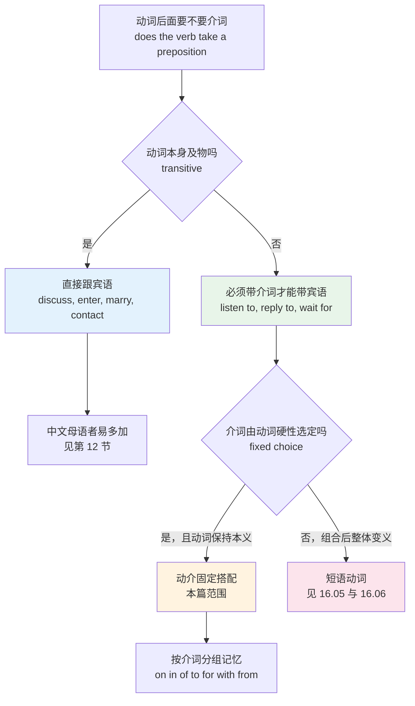
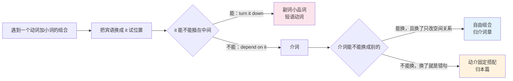
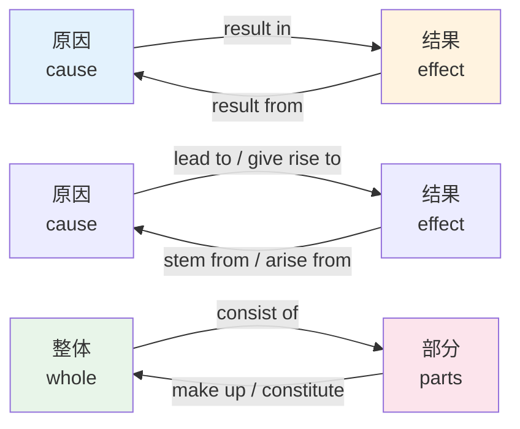
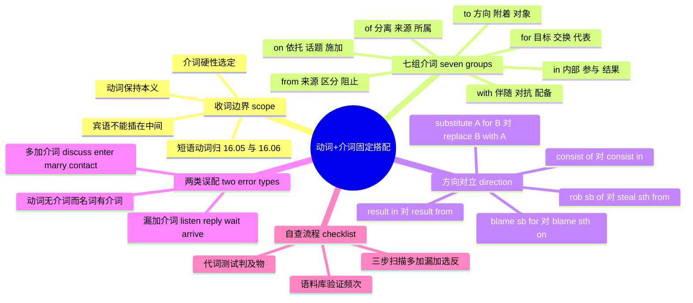

# 动词+介词固定搭配：depend on、result in、consist of

> [!info] 本篇定位
>
> 17 章的第六篇。前五篇处理的都是实义词之间的搭配——动词配名词、形容词配名词、副词配形容词，本篇转向实义词与功能词的绑定：一个动词后面跟哪个介词。
>
> 这层搭配的特点是「无理可讲但必须记准」。`depend` 后面只能跟 `on`，不能跟 `from`；`consist` 后面跟 `of` 是「由……组成」，跟 `in` 却变成「在于」。选错一个两三个字母的介词，句子读起来立刻不像母语者写的。
>
> 读完你会拿到三样东西：按七个介词分组的两百余条动介搭配清单；一套判断「这个动词到底带不带介词」的自查流程；以及本篇与 [[16.词义辨析、搭配与短语动词/05.短语动词（上）up out off down\|短语动词（上）up out off down]] 两篇的明确分界——那两篇讲的是动词加小品词后整体变义的组合，本篇只收动词保持本义、介词由动词硬性选定的组合。

---

## 1. 本篇导读：介词不是动词随便挑的

先看一组中文母语者写英文时的高频产出：

> - ❌ ~~It depends from the network latency.~~
> - ✅ It **depends on** the network latency.
> - ❌ ~~The bug resulted from a crash.~~（如果你想说的是「这个 bug 导致了崩溃」）
> - ✅ The bug **resulted in** a crash.
> - ❌ ~~Let's discuss about the schema.~~
> - ✅ Let's **discuss** the schema.
> - ❌ ~~Please contact with me if anything breaks.~~
> - ✅ Please **contact** me if anything breaks.

四句错误的成因各不相同。第一句是介词选错——`depend` 只认 `on`。第二句是介词选反——`in` 和 `from` 在这里指向相反的因果方向。第三句和第四句则是多加了介词——`discuss` 和 `contact` 本来就是及物动词，后面直接跟宾语。

三种错误对应三条不同的学习动作，本篇按这三条动作组织内容：

| 错误类型 | 症状 | 本篇对应章节 | 学习动作 |
| --- | --- | --- | --- |
| 介词选错 | `depend from`、`comply to` | 第 3 到 9 节，按介词分组 | 成组背，靠介词的核心语义串起来 |
| 介词选反 | `result in` 与 `result from` 混用 | 第 10 节 | 画方向箭头，标出主语与宾语哪边是因 |
| 多加介词 | `discuss about`、`enter into the room` | 第 12 节 | 记一份「及物动词禁介词」清单 |
| 漏加介词 | ❌ `listen the podcast`、❌ `reply me` | 第 13 节 | 记一份「不及物动词必带介词」清单 |



这张图是本篇的判定主干。从最上面的问题往下走，第一个分叉决定「要不要介词」，第二个分叉决定「这个组合归本篇还是归短语动词章」。真正需要死记的只有两处：左边那条「及物动词禁介词」的清单，和右边那条「动词硬性选定介词」的清单。中间的短语动词分支属于另外两篇的范围，本篇只在下一节把边界说清楚，不重复收录。

要先建立一个心理预期：动介搭配没有可靠的推导公式。`depend on` 的 `on` 讲得通（依托在某个支撑面上），但 `comply with` 的 `with`、`consist of` 的 `of` 就很难从介词本义反推出来。介词的核心语义只能提供一个**归类线索**，帮你把二三十个动词捆成一组一起记，不能替你做出选择。指望「理解了介词本义就不用背」是行不通的。

---

## 2. 边界划定：本篇收什么，不收什么

同一个「动词 + 介词/小品词」的外形，在这套教程里分给三个不同位置讲。分工规则如下：

| 组合类型 | 判定特征 | 例子 | 归属 |
| --- | --- | --- | --- |
| 动介固定搭配 | 动词保持本义，介词由动词选定且不可分离 | `depend on`、`consist of`、`comply with` | 本篇 |
| 短语动词 | 动词加小品词后整体产生新义，往往可分离 | `turn down`（拒绝）、`put off`（推迟） | 16.05 与 16.06 |
| 介词的语义网络 | 关注的是介词本身的义项辐射 | `in` 从「在里面」到「在某段时间内」 | 02.02 到 02.05 |

三条判定线索，逐条说清楚。

**线索一：能不能拆开。** 短语动词里的小品词是副词性质的，宾语是代词时必须插在中间：`turn it down`（✅）而不是 ❌ `turn down it`。动介搭配里的介词是介词性质的，永远紧贴动词，宾语只能放在介词后面：`depend on it`（✅）而不是 ❌ `depend it on`。这一条最好用，遇到不确定的组合，把宾语换成 `it` 试一次就知道。

**线索二：动词还是不是原来那个意思。** `look at the screen` 里的 `look` 还是「看」，`at` 只是指出对象——这是动介搭配。`look after the kids` 里的 `look` 已经不是「看」了，整体是「照料」——这是短语动词。判断标准就一句话：把介词短语盖住，动词单独还成不成立、意思变没变。

**线索三：介词有没有选择余地。** `walk to the office`、`walk into the office`、`walk past the office` 里的介词是可以自由替换的，替换后表达不同的空间关系——这是自由组合，归介词章。`comply with the regulation` 里的 `with` 换成任何别的介词都是错句——这是硬性选定，归本篇。



上图把三条线索压成两次判断。实际使用中，第一次判断（it 的位置）就能筛掉大部分短语动词，剩下的再看介词有没有替换余地。有一小批组合会同时具备两种身份，比如 `account for` 既可以理解成动介搭配（解释、说明）也带一定短语动词色彩，这类边缘案例本篇按「动词保持本义」的宽松标准收进来，同时在 16.05 里也会以另一个角度出现，两处不冲突。

> [!warning] 三词组合不在本篇
>
> `put up with`（忍受）、`get away with`（侥幸逃脱）、`look forward to`（期待）这类「动词 + 副词 + 介词」的三词短语动词，全部归 [[16.词义辨析、搭配与短语动词/06.短语动词（下）on in over through back away\|短语动词（下）on in over through back away]]。
>
> 唯一的例外是 `look forward to`：它的 `to` 是介词而不是不定式标记，后面必须接动名词（`looking forward to hearing from you`），这个判别方法在 [[02.功能词与封闭词类速查/03.of 与 to：属格网络与方向对象网络\|of 与 to：属格网络与方向对象网络]] 里有专节处理，本篇第 6 节的 to 后接形式警示框里会再提一次。

---

## 3. on 组：依托、话题与持续接触

`on` 的空间原型是「接触在一个面上」。三条引申方向都能追到这个原型：接触面提供支撑（依托、依赖），接触面是被谈论的对象（话题），接触持续不断（进行中的动作）。

### 3.1 依赖与依托

| 英文 | 英式音标 | 美式音标 | 词性 | 中文 | 搭配与说明 |
| --- | --- | --- | --- | --- | --- |
| **depend on** | /dɪˈpend ɒn/ | /dɪˈpend ɑːn/ | v. | 取决于；依靠 | 唯一介词，❌ depend from；口语可说 depend upon，更正式 |
| **rely on** | /rɪˈlaɪ ɒn/ | /rɪˈlaɪ ɑːn/ | v. | 依赖；信赖 | rely on sb to do sth；比 depend on 更强调信任 |
| **count on** | /kaʊnt ɒn/ | /kaʊnt ɑːn/ | v. | 指望 | 口语度高于 rely on；you can count on me |
| **hinge on** | /hɪndʒ ɒn/ | /hɪndʒ ɑːn/ | v. | 完全取决于 | 比 depend on 强，暗示唯一决定因素 |
| **rest on** | /rest ɒn/ | /rest ɑːn/ | v. | 以……为基础 | the argument rests on one assumption |
| **base on** | /beɪs ɒn/ | /beɪs ɑːn/ | v. | 以……为依据 | 高频被动 be based on；主动 base A on B |
| **draw on** | /drɔː ɒn/ | /drɔː ɑːn/ | v. | 利用；汲取 | draw on experience/resources |
| **feed on** | /fiːd ɒn/ | /fiːd ɑːn/ | v. | 以……为食 | 生物学语境；引申 feed on fear |
| **prey on** | /preɪ ɒn/ | /preɪ ɑːn/ | v. | 捕食；坑害 | prey on the elderly（诈骗语境） |
| **thrive on** | /θraɪv ɒn/ | /θraɪv ɑːn/ | v. | 靠……蓬勃发展 | thrive on pressure/challenge |
| **live on** | /lɪv ɒn/ | /lɪv ɑːn/ | v. | 靠……生活 | live on a tight budget |
| **survive on** | /səˈvaɪv ɒn/ | /sərˈvaɪv ɑːn/ | v. | 靠……维持 | survive on three hours of sleep |

`depend on` 的完整句型有三条，写作时按需要选：

> - The release date **depends on** the test results.
>   - 发布日期取决于测试结果。
> - Whether we ship **depends on** whether the audit passes.
>   - 我们发不发版取决于审计能不能过。
> - We **depend on** the vendor **to** fix the driver.
>   - 我们指望供应商修好这个驱动。

第三条要注意：`depend on sb to do sth` 里跟的是不定式，不是动名词。而 `depend on doing sth` 也存在，意思是「依靠做某事这件事」，两者不同：`We depend on him to review the PR`（指望他来评审）对比 `We depend on automating the checks`（依靠把检查自动化）。

### 3.2 话题与评论

| 英文 | 英式音标 | 美式音标 | 词性 | 中文 | 搭配与说明 |
| --- | --- | --- | --- | --- | --- |
| **comment on** | /ˈkɒment ɒn/ | /ˈkɑːment ɑːn/ | v. | 评论 | ❌ comment about；名词 a comment on |
| **elaborate on** | /ɪˈlæbəreɪt ɒn/ | /ɪˈlæbəreɪt ɑːn/ | v. | 详细阐述 | could you elaborate on that |
| **expand on** | /ɪkˈspænd ɒn/ | /ɪkˈspænd ɑːn/ | v. | 展开说 | 与 elaborate on 近义，语体略随意 |
| **touch on** | /tʌtʃ ɒn/ | /tʌtʃ ɑːn/ | v. | 略微提及 | 与 elaborate on 强度相反 |
| **dwell on** | /dwel ɒn/ | /dwel ɑːn/ | v. | 老是纠缠于 | 带负面色彩：don't dwell on the past |
| **reflect on** | /rɪˈflekt ɒn/ | /rɪˈflekt ɑːn/ | v. | 反思 | 另有 reflect on sb 表「使……显得（好/坏）」 |
| **focus on** | /ˈfəʊkəs ɒn/ | /ˈfoʊkəs ɑːn/ | v. | 聚焦于 | ❌ focus in；名词 a focus on |
| **concentrate on** | /ˈkɒnsntreɪt ɒn/ | /ˈkɑːnsntreɪt ɑːn/ | v. | 专注于 | 也可 concentrate upon，正式 |
| **insist on** | /ɪnˈsɪst ɒn/ | /ɪnˈsɪst ɑːn/ | v. | 坚持要求 | 后接名词或动名词，❌ insist to do |
| **agree on** | /əˈɡriː ɒn/ | /əˈɡriː ɑːn/ | v. | 就……达成一致 | 与 agree with/to 分工见第 11 节 |
| **decide on** | /dɪˈsaɪd ɒn/ | /dɪˈsaɪd ɑːn/ | v. | 选定 | 强调从多选项里挑一个 |
| **settle on** | /ˈsetl ɒn/ | /ˈsetl ɑːn/ | v. | 最终定下 | 与 decide on 近义，暗示经过反复 |
| **vote on** | /vəʊt ɒn/ | /voʊt ɑːn/ | v. | 就……表决 | vote on a proposal；vote for sb 是投票支持 |
| **advise on** | /ədˈvaɪz ɒn/ | /ədˈvaɪz ɑːn/ | v. | 就……提供建议 | advise sb on sth |
| **report on** | /rɪˈpɔːt ɒn/ | /rɪˈpɔːrt ɑːn/ | v. | 就……作报告 | 与 report to sb（向某人汇报）分工 |
| **congratulate on** | /kənˈɡrætʃuleɪt ɒn/ | /kənˈɡrætʃəleɪt ɑːn/ | v. | 祝贺 | congratulate sb on sth，❌ congratulate for |
| **compliment on** | /ˈkɒmplɪment ɒn/ | /ˈkɑːmplɪment ɑːn/ | v. | 称赞 | compliment sb on their work |
| **pride oneself on** | /praɪd ɒn/ | /praɪd ɑːn/ | v. | 以……自豪 | 必带反身代词：she prides herself on accuracy |
| **frown on** | /fraʊn ɒn/ | /fraʊn ɑːn/ | v. | 不赞成 | 常用被动 be frowned on；正式写 frown upon |

### 3.3 施加与运作

| 英文 | 英式音标 | 美式音标 | 词性 | 中文 | 搭配与说明 |
| --- | --- | --- | --- | --- | --- |
| **impose on** | /ɪmˈpəʊz ɒn/ | /ɪmˈpoʊz ɑːn/ | v. | 强加于 | impose a fee on users；impose on sb 另有「打扰」义 |
| **inflict on** | /ɪnˈflɪkt ɒn/ | /ɪnˈflɪkt ɑːn/ | v. | 使遭受 | inflict damage on the system |
| **operate on** | /ˈɒpəreɪt ɒn/ | /ˈɑːpəreɪt ɑːn/ | v. | 给……动手术；作用于 | 医学与技术两义都用 on |
| **act on** | /ækt ɒn/ | /ækt ɑːn/ | v. | 依……行动；作用于 | act on the advice；act on behalf of 是代表 |
| **work on** | /wɜːk ɒn/ | /wɜːrk ɑːn/ | v. | 从事；改进 | work on a feature；work at 偏「在某处上班」 |
| **spend on** | /spend ɒn/ | /spend ɑːn/ | v. | 花在……上 | spend money on sth；spend time doing sth |
| **experiment on** | /ɪkˈsperɪment ɒn/ | /ɪkˈsperɪment ɑːn/ | v. | 用……做实验 | experiment on animals；experiment with methods |
| **capitalize on** | /ˈkæpɪtəlaɪz ɒn/ | /ˈkæpɪtəlaɪz ɑːn/ | v. | 利用（时机） | 商务高频：capitalize on demand |
| **embark on** | /ɪmˈbɑːk ɒn/ | /ɪmˈbɑːrk ɑːn/ | v. | 着手（大事） | embark on a project，语体正式 |
| **border on** | /ˈbɔːdə ɒn/ | /ˈbɔːrdər ɑːn/ | v. | 与……接壤；近乎 | 引申义常见：borders on negligence |
| **encroach on** | /ɪnˈkrəʊtʃ ɒn/ | /ɪnˈkroʊtʃ ɑːn/ | v. | 侵占 | encroach on privacy |
| **infringe on** | /ɪnˈfrɪndʒ ɒn/ | /ɪnˈfrɪndʒ ɑːn/ | v. | 侵犯（权利） | 法律语境；也可 infringe sth 直接及物 |

> [!tip] on 与 upon 的选择
>
> 上表里绝大多数 `on` 都能换成 `upon`，语义不变，语体升一档。技术文档、法律文本、正式报告里 `upon` 出现频率明显更高，日常写作用 `on` 即可。
>
> 有三处要留心：`depend upon`、`rely upon` 合法但读着刻意，日常写作不必特意换；固定短语 `once upon a time` 方向相反，只能用 `upon`，写成 on 就不成话；`based upon` 在合同文本里常见，普通文档一律写 `based on`。

---

## 4. in 组：内部、参与与结果

`in` 的空间原型是「在容器内部」。动介搭配里主要走三条引申线：处在某个领域内部（专攻、参与）、事情的实质在内部（在于）、过程的终点落在内部（导致某结果）。

| 英文 | 英式音标 | 美式音标 | 词性 | 中文 | 搭配与说明 |
| --- | --- | --- | --- | --- | --- |
| **result in** | /rɪˈzʌlt ɪn/ | /rɪˈzʌlt ɪn/ | v. | 导致 | 主语是因，宾语是果；对比 result from |
| **believe in** | /bɪˈliːv ɪn/ | /bɪˈliːv ɪn/ | v. | 信奉；相信……存在 | 与 believe sb（相信某人的话）区分 |
| **participate in** | /pɑːˈtɪsɪpeɪt ɪn/ | /pɑːrˈtɪsɪpeɪt ɪn/ | v. | 参与 | ❌ participate to；口语常换 take part in |
| **engage in** | /ɪnˈɡeɪdʒ ɪn/ | /ɪnˈɡeɪdʒ ɪn/ | v. | 从事；参与 | engage in a debate；engage with 是「深入接触」 |
| **specialize in** | /ˈspeʃəlaɪz ɪn/ | /ˈspeʃəlaɪz ɪn/ | v. | 专攻 | ❌ specialize on；英式拼 specialise |
| **major in** | /ˈmeɪdʒə ɪn/ | /ˈmeɪdʒər ɪn/ | v. | 主修 | 美式用法；英式说 read/study |
| **excel in** | /ɪkˈsel ɪn/ | /ɪkˈsel ɪn/ | v. | 擅长 | excel in/at 都可，at 更常见于具体技能 |
| **succeed in** | /səkˈsiːd ɪn/ | /səkˈsiːd ɪn/ | v. | 成功做成 | 后接动名词：succeed in reducing latency |
| **persist in** | /pəˈsɪst ɪn/ | /pərˈsɪst ɪn/ | v. | 固执坚持 | 带负面色彩，对比中性的 insist on |
| **indulge in** | /ɪnˈdʌldʒ ɪn/ | /ɪnˈdʌldʒ ɪn/ | v. | 沉溺于 | indulge in speculation |
| **invest in** | /ɪnˈvest ɪn/ | /ɪnˈvest ɪn/ | v. | 投资于 | 抽象义高频：invest in training |
| **involve in** | /ɪnˈvɒlv ɪn/ | /ɪnˈvɑːlv ɪn/ | v. | 牵涉进 | 高频被动 be involved in |
| **consist in** | /kənˈsɪst ɪn/ | /kənˈsɪst ɪn/ | v. | 在于 | 正式，罕见；对比 consist of |
| **lie in** | /laɪ ɪn/ | /laɪ ɪn/ | v. | 在于 | consist in 的常用替代：the problem lies in |
| **culminate in** | /ˈkʌlmɪneɪt ɪn/ | /ˈkʌlmɪneɪt ɪn/ | v. | 以……告终 | 正式；culminate in a merger |
| **confide in** | /kənˈfaɪd ɪn/ | /kənˈfaɪd ɪn/ | v. | 向……吐露 | confide in a friend，宾语是人 |
| **intervene in** | /ˌɪntəˈviːn ɪn/ | /ˌɪntərˈviːn ɪn/ | v. | 干预 | intervene in a dispute |
| **interfere in** | /ˌɪntəˈfɪə ɪn/ | /ˌɪntərˈfɪr ɪn/ | v. | 插手（他人事务） | 与 interfere with 分工见第 11 节 |
| **assist in** | /əˈsɪst ɪn/ | /əˈsɪst ɪn/ | v. | 协助（做某事） | assist in doing；assist sb with sth |
| **abound in** | /əˈbaʊnd ɪn/ | /əˈbaʊnd ɪn/ | v. | 富含 | 正式；abound in/with 均可 |
| **enroll in** | /ɪnˈrəʊl ɪn/ | /ɪnˈroʊl ɪn/ | v. | 报名；注册 | 美式 enroll，英式拼 enrol 且常说 enrol on a course |
| **immerse in** | /ɪˈmɜːs ɪn/ | /ɪˈmɜːrs ɪn/ | v. | 沉浸于 | 高频被动 be immersed in |
| **implicate in** | /ˈɪmplɪkeɪt ɪn/ | /ˈɪmplɪkeɪt ɪn/ | v. | 牵连进 | be implicated in the breach，带负面色彩 |

> [!example] in 组的典型句
>
> - The migration **resulted in** four hours of downtime.
>   - 这次迁移导致了四小时的服务中断。
> - She **specializes in** distributed systems.
>   - 她专攻分布式系统。
> - We finally **succeeded in** reproducing the race condition.
>   - 我们终于成功复现了这个竞态条件。
> - The difficulty **lies in** keeping the two caches consistent.
>   - 难点在于保持两份缓存一致。
> - Three teams were **involved in** the incident review.
>   - 三个团队参与了这次事故复盘。

`succeed in` 有个句法细节值得单列：它后面只能跟动名词，不能跟不定式。❌ `succeed to reduce` 是错的，`succeed to` 另有含义（继承王位、继任职位），跟「成功」无关。同样的动名词限制也出现在 `persist in doing`、`assist in doing`、`result in doing`。

---

## 5. of 组：分离、来源与所属

`of` 与 `off` 同源，原型语义是「分离」。这条线索能解释 of 组里最反直觉的一批搭配：`rob sb of sth`（抢走某人的某物）、`deprive sb of sth`（剥夺）、`cure sb of sth`（治好某人的某病）——被分离掉的东西放在 `of` 后面。剩下的义项是分离视角反转后得到的「部分与所属」。这套语义网络的完整推演在 [[02.功能词与封闭词类速查/03.of 与 to：属格网络与方向对象网络\|of 与 to：属格网络与方向对象网络]]，本篇只列动词端的清单。

### 5.1 剥夺与清除（of 后面是被拿走的东西）

| 英文 | 英式音标 | 美式音标 | 词性 | 中文 | 搭配与说明 |
| --- | --- | --- | --- | --- | --- |
| **rob of** | /rɒb əv/ | /rɑːb əv/ | v. | 抢走 | rob sb of sth，被抢的人在前 |
| **deprive of** | /dɪˈpraɪv əv/ | /dɪˈpraɪv əv/ | v. | 剥夺 | deprive sb of rights；被动 be deprived of |
| **strip of** | /strɪp əv/ | /strɪp əv/ | v. | 剥夺（头衔、权力） | strip sb of their title |
| **cure of** | /kjʊə əv/ | /kjʊr əv/ | v. | 治愈（某病） | cure sb of an illness；cure 直接接病也可 |
| **relieve of** | /rɪˈliːv əv/ | /rɪˈliːv əv/ | v. | 解除（负担、职务） | relieve sb of duty，委婉的「免职」 |
| **rid of** | /rɪd əv/ | /rɪd əv/ | v. | 摆脱 | 高频形式 get rid of；rid A of B |
| **clear of** | /klɪə əv/ | /klɪr əv/ | v. | 洗清（嫌疑） | clear sb of blame |
| **acquit of** | /əˈkwɪt əv/ | /əˈkwɪt əv/ | v. | 宣判无罪 | 法律：be acquitted of all charges |
| **dispose of** | /dɪˈspəʊz əv/ | /dɪˈspoʊz əv/ | v. | 处理掉 | ❌ dispose sth；必须带 of |
| **empty of** | /ˈempti əv/ | /ˈempti əv/ | v./adj. | 使空无 | 多用形容词式 empty of meaning |

### 5.2 告知、指控与提醒

| 英文 | 英式音标 | 美式音标 | 词性 | 中文 | 搭配与说明 |
| --- | --- | --- | --- | --- | --- |
| **accuse of** | /əˈkjuːz əv/ | /əˈkjuːz əv/ | v. | 指控 | accuse sb of doing；对比 charge sb with |
| **convict of** | /kənˈvɪkt əv/ | /kənˈvɪkt əv/ | v. | 判……有罪 | be convicted of fraud |
| **suspect of** | /səˈspekt əv/ | /səˈspekt əv/ | v. | 怀疑 | suspect sb of doing sth |
| **convince of** | /kənˈvɪns əv/ | /kənˈvɪns əv/ | v. | 使信服 | convince sb of sth；convince sb to do 也可 |
| **remind of** | /rɪˈmaɪnd əv/ | /rɪˈmaɪnd əv/ | v. | 使想起；令人联想到 | remind sb of sth；remind sb about 是提醒别忘 |
| **inform of** | /ɪnˈfɔːm əv/ | /ɪnˈfɔːrm əv/ | v. | 通知 | inform sb of sth，正式；口语用 tell |
| **notify of** | /ˈnəʊtɪfaɪ əv/ | /ˈnoʊtɪfaɪ əv/ | v. | 告知 | notify users of the change |
| **assure of** | /əˈʃʊə əv/ | /əˈʃʊr əv/ | v. | 向……保证 | assure sb of sth |
| **warn of** | /wɔːn əv/ | /wɔːrn əv/ | v. | 警告有（危险） | warn of a risk；warn sb about sth 更具体 |
| **advise of** | /ədˈvaɪz əv/ | /ədˈvaɪz əv/ | v. | 正式告知 | 商务信函：please advise us of any change |
| **apprise of** | /əˈpraɪz əv/ | /əˈpraɪz əv/ | v. | 正式知会 | apprise sb of sth；勿与 appraise（评估）混形 |

### 5.3 感知、认知与所属

| 英文 | 英式音标 | 美式音标 | 词性 | 中文 | 搭配与说明 |
| --- | --- | --- | --- | --- | --- |
| **consist of** | /kənˈsɪst əv/ | /kənˈsɪst əv/ | v. | 由……组成 | 无被动、无进行时；对比 consist in |
| **comprise** | /kəmˈpraɪz/ | /kəmˈpraɪz/ | v. | 包含 | 及物，❌ comprise of（虽常见但被视为误用） |
| **think of** | /θɪŋk əv/ | /θɪŋk əv/ | v. | 想到；认为 | 与 think about 分工见第 11 节 |
| **conceive of** | /kənˈsiːv əv/ | /kənˈsiːv əv/ | v. | 设想 | 正式：hard to conceive of a worse case |
| **approve of** | /əˈpruːv əv/ | /əˈpruːv əv/ | v. | 赞成 | 与及物的 approve（批准）区分 |
| **disapprove of** | /ˌdɪsəˈpruːv əv/ | /ˌdɪsəˈpruːv əv/ | v. | 不赞成 | 必带 of |
| **hear of** | /hɪə əv/ | /hɪr əv/ | v. | 听说有 | 与 hear from、hear about 分工见第 11 节 |
| **learn of** | /lɜːn əv/ | /lɜːrn əv/ | v. | 获悉 | 正式；口语用 find out about |
| **dream of** | /driːm əv/ | /driːm əv/ | v. | 梦想 | dream of doing；dream about 偏「梦见」 |
| **boast of** | /bəʊst əv/ | /boʊst əv/ | v. | 夸耀 | boast of/about 均可，of 略正式 |
| **complain of** | /kəmˈpleɪn əv/ | /kəmˈpleɪn əv/ | v. | 诉说（自身所受的） | 最典型是陈述症状；日常抱怨外部事物用 complain about |
| **die of** | /daɪ əv/ | /daɪ əv/ | v. | 死于 | die of cancer 是默认说法；外部致因也说 die from injuries，两者界限并不严格 |
| **smell of** | /smel əv/ | /smel əv/ | v. | 闻起来有……味 | smell of smoke；smell like 是「像」 |
| **taste of** | /teɪst əv/ | /teɪst əv/ | v. | 尝起来有……味 | 同上，of 接味道来源 |
| **beware of** | /bɪˈweə əv/ | /bɪˈwer əv/ | v. | 提防 | 只有原形与祈使式：beware of the dog |
| **despair of** | /dɪˈspeə əv/ | /dɪˈsper əv/ | v. | 对……绝望 | 正式：despair of ever finishing |
| **speak of** | /spiːk əv/ | /spiːk əv/ | v. | 谈到 | 常见否定式 nothing to speak of |
| **partake of** | /pɑːˈteɪk əv/ | /pɑːrˈteɪk əv/ | v. | 分享；带有 | 书面语，日常不用 |

> [!warning] comprise 后面不加 of
>
> `The system comprises three modules.`（✅）
> `The system is comprised of three modules.`（✅，主流词典已收，但仍有编辑手册反对）
> ❌ ~~The system comprises of three modules.~~（主动式加 of 被绝大多数编辑视为错误）
>
> 想不出问题就用 `consist of` 或 `be made up of`，这两个的介词是固定的，不会踩坑。

---

## 6. to 组：方向、附着与对象

`to` 的原型是「朝向某个终点」。动介搭配里三条主线：动作指向某个对象（回应、指涉）、事物附着或归属于某处（属于、遵守）、因果链条通向某个结果（导致）。

| 英文 | 英式音标 | 美式音标 | 词性 | 中文 | 搭配与说明 |
| --- | --- | --- | --- | --- | --- |
| **belong to** | /bɪˈlɒŋ tuː/ | /bɪˈlɔːŋ tuː/ | v. | 属于 | 无被动、无进行时 |
| **refer to** | /rɪˈfɜː tuː/ | /rɪˈfɜːr tuː/ | v. | 指的是；参考 | refer to sth as X 是「称之为」 |
| **respond to** | /rɪˈspɒnd tuː/ | /rɪˈspɑːnd tuː/ | v. | 回应 | ❌ respond sth；名词 a response to |
| **reply to** | /rɪˈplaɪ tuː/ | /rɪˈplaɪ tuː/ | v. | 答复 | ❌ reply me；只能 reply to me |
| **react to** | /riˈækt tuː/ | /riˈækt tuː/ | v. | 反应 | 化学与心理两义都用 to |
| **listen to** | /ˈlɪsn tuː/ | /ˈlɪsn tuː/ | v. | 听 | ❌ listen the music；对比及物的 hear |
| **object to** | /əbˈdʒekt tuː/ | /əbˈdʒekt tuː/ | v. | 反对 | to 是介词，后接动名词：object to being asked |
| **adapt to** | /əˈdæpt tuː/ | /əˈdæpt tuː/ | v. | 适应 | adapt A to B 是「改造以适应」 |
| **adjust to** | /əˈdʒʌst tuː/ | /əˈdʒʌst tuː/ | v. | 适应；调整 | adjust to the new schema |
| **conform to** | /kənˈfɔːm tuː/ | /kənˈfɔːrm tuː/ | v. | 符合（标准） | conform to the spec；conform with 也可 |
| **adhere to** | /ədˈhɪə tuː/ | /ədˈhɪr tuː/ | v. | 遵守；黏附 | adhere to a policy，正式 |
| **subscribe to** | /səbˈskraɪb tuː/ | /səbˈskraɪb tuː/ | v. | 订阅；赞同 | subscribe to a view 是「认同某观点」 |
| **contribute to** | /kənˈtrɪbjuːt tuː/ | /kənˈtrɪbjuːt tuː/ | v. | 促成；投稿 | contribute to a problem 也可指「加剧」 |
| **attribute to** | /əˈtrɪbjuːt tuː/ | /əˈtrɪbjuːt tuː/ | v. | 归因于 | attribute A to B；名词重音在前 /ˈætrɪbjuːt/ |
| **ascribe to** | /əˈskraɪb tuː/ | /əˈskraɪb tuː/ | v. | 归因于 | attribute to 的正式同义 |
| **lead to** | /liːd tuː/ | /liːd tuː/ | v. | 导致 | 与 result in 近义，褒贬中性 |
| **amount to** | /əˈmaʊnt tuː/ | /əˈmaʊnt tuː/ | v. | 等同于；总计 | amounts to negligence |
| **resort to** | /rɪˈzɔːt tuː/ | /rɪˈzɔːrt tuː/ | v. | 诉诸 | 带无奈色彩：resort to force |
| **devote to** | /dɪˈvəʊt tuː/ | /dɪˈvoʊt tuː/ | v. | 投入 | devote time to doing，to 是介词 |
| **dedicate to** | /ˈdedɪkeɪt tuː/ | /ˈdedɪkeɪt tuː/ | v. | 献给；专用于 | be dedicated to serving users |
| **commit to** | /kəˈmɪt tuː/ | /kəˈmɪt tuː/ | v. | 承诺；投入 | commit to doing；技术义 commit to a branch |
| **apologize to** | /əˈpɒlədʒaɪz tuː/ | /əˈpɑːlədʒaɪz tuː/ | v. | 向……道歉 | apologize to sb for sth，两个介词都要 |
| **confess to** | /kənˈfes tuː/ | /kənˈfes tuː/ | v. | 承认（过错） | confess to doing；confess sth 也可 |
| **testify to** | /ˈtestɪfaɪ tuː/ | /ˈtestɪfaɪ tuː/ | v. | 证明 | 引申：the logs testify to the failure |
| **point to** | /pɔɪnt tuː/ | /pɔɪnt tuː/ | v. | 表明；指向 | evidence points to a memory leak |
| **cater to** | /ˈkeɪtə tuː/ | /ˈkeɪtər tuː/ | v. | 迎合 | 美式偏 cater to，英式偏 cater for |
| **appeal to** | /əˈpiːl tuː/ | /əˈpiːl tuː/ | v. | 吸引；呼吁 | appeal to sb for sth 是「向某人请求」 |
| **correspond to** | /ˌkɒrɪˈspɒnd tuː/ | /ˌkɔːrəˈspɑːnd tuː/ | v. | 对应于 | correspond with sb 是「与某人通信」 |
| **consent to** | /kənˈsent tuː/ | /kənˈsent tuː/ | v. | 同意 | 正式；consent to the terms |
| **succumb to** | /səˈkʌm tuː/ | /səˈkʌm tuː/ | v. | 屈服于 | succumb to pressure |
| **yield to** | /jiːld tuː/ | /jiːld tuː/ | v. | 让步于 | yield to demands |
| **revert to** | /rɪˈvɜːt tuː/ | /rɪˈvɜːrt tuː/ | v. | 恢复到 | revert to the previous version |
| **attend to** | /əˈtend tuː/ | /əˈtend tuː/ | v. | 处理；照料 | 与及物的 attend（出席）语义完全不同 |
| **see to** | /siː tuː/ | /siː tuː/ | v. | 负责办妥 | I'll see to it；see to it that 从句 |
| **stick to** | /stɪk tuː/ | /stɪk tuː/ | v. | 坚持；不偏离 | stick to the plan |
| **look forward to** | /lʊk ˈfɔːwəd tuː/ | /lʊk ˈfɔːrwərd tuː/ | v. | 期待 | to 是介词，后接动名词 |
| **resign oneself to** | /rɪˈzaɪn tuː/ | /rɪˈzaɪn tuː/ | v. | 听任；认命 | 必带反身代词，后接动名词 |

> [!warning] to 后面到底跟原形还是动名词
>
> 这批动词里的 `to` 全是介词，后面必须跟名词或动名词：
>
> - ✅ I **object to** being interrupted. ❌ ~~object to be interrupted~~
> - ✅ We **look forward to** hearing from you. ❌ ~~look forward to hear~~
> - ✅ She's **committed to** improving coverage. ❌ ~~committed to improve~~
> - ✅ He **confessed to** deleting the branch. ❌ ~~confessed to delete~~
>
> 判别方法：把 `to` 后面换成 `it`，句子还成立就是介词（`object to it` ✅），不成立就是不定式标记（❌ `want to it`）。

`attend` 是本篇里最容易出事的一个词，因为它带不带 `to` 是两个不同的动词：

> - Twelve people **attended** the review.
>   - 十二个人出席了评审。
> - I'll **attend to** the migration script this afternoon.
>   - 今天下午我来处理那个迁移脚本。

不带 `to` 是「出席」，及物；带 `to` 是「处理、照料」，不及物。写 ❌ `attend to the meeting` 会被理解成「照料这场会议」，语义偏得很远。

---

## 7. for 组：目标、交换与代表

`for` 的原型有两支：朝着某个目标（追求、申请、等待），和交换或代替（付款、补偿、代表）。动介搭配基本按这两支分布。

| 英文 | 英式音标 | 美式音标 | 词性 | 中文 | 搭配与说明 |
| --- | --- | --- | --- | --- | --- |
| **apply for** | /əˈplaɪ fɔː/ | /əˈplaɪ fɔːr/ | v. | 申请（职位、签证） | 对比 apply to（向某机构申请） |
| **ask for** | /ɑːsk fɔː/ | /æsk fɔːr/ | v. | 要求得到 | ask sb for sth；ask sb about sth 是询问 |
| **wait for** | /weɪt fɔː/ | /weɪt fɔːr/ | v. | 等待 | ❌ wait sb；await 才是及物的 |
| **search for** | /sɜːtʃ fɔː/ | /sɜːrtʃ fɔːr/ | v. | 搜寻（目标物） | search a room 是「搜查某处」，不加 for |
| **look for** | /lʊk fɔː/ | /lʊk fɔːr/ | v. | 寻找 | 强调过程；找到用 find |
| **long for** | /lɒŋ fɔː/ | /lɔːŋ fɔːr/ | v. | 渴望 | 书面语；long to do 也可 |
| **yearn for** | /jɜːn fɔː/ | /jɜːrn fɔːr/ | v. | 渴求 | 比 long for 更强烈、更文学 |
| **hope for** | /həʊp fɔː/ | /hoʊp fɔːr/ | v. | 期望 | hope for the best；hope to do 不加 for |
| **wish for** | /wɪʃ fɔː/ | /wɪʃ fɔːr/ | v. | 希求 | 常带「未必能得」意味 |
| **strive for** | /straɪv fɔː/ | /straɪv fɔːr/ | v. | 力求 | strive for accuracy；strive to do 也可 |
| **aim for** | /eɪm fɔː/ | /eɪm fɔːr/ | v. | 以……为目标 | aim for Friday；aim at 偏瞄准具体点 |
| **head for** | /hed fɔː/ | /hed fɔːr/ | v. | 前往；走向 | heading for trouble |
| **call for** | /kɔːl fɔː/ | /kɔːl fɔːr/ | v. | 要求；需要 | the situation calls for caution |
| **account for** | /əˈkaʊnt fɔː/ | /əˈkaʊnt fɔːr/ | v. | 解释；占比 | 两义都高频：accounts for 30% of traffic |
| **allow for** | /əˈlaʊ fɔː/ | /əˈlaʊ fɔːr/ | v. | 考虑到；留出余量 | allow for network jitter |
| **provide for** | /prəˈvaɪd fɔː/ | /prəˈvaɪd fɔːr/ | v. | 供养；规定 | 与 provide sb with sth 分工见第 11 节 |
| **pay for** | /peɪ fɔː/ | /peɪ fɔːr/ | v. | 为……付款 | pay the bill 直接及物，pay for the meal 带 for |
| **compensate for** | /ˈkɒmpenseɪt fɔː/ | /ˈkɑːmpenseɪt fɔːr/ | v. | 弥补 | compensate sb for sth |
| **make up for** | /meɪk ʌp fɔː/ | /meɪk ʌp fɔːr/ | v. | 补偿 | compensate for 的口语版 |
| **substitute for** | /ˈsʌbstɪtjuːt fɔː/ | /ˈsʌbstɪtuːt fɔːr/ | v. | 代替 | substitute A for B 是「用 A 换掉 B」，方向易错 |
| **stand for** | /stænd fɔː/ | /stænd fɔːr/ | v. | 代表；容忍 | API stands for…；否定式表容忍 |
| **vouch for** | /vaʊtʃ fɔː/ | /vaʊtʃ fɔːr/ | v. | 担保 | vouch for the data quality |
| **opt for** | /ɒpt fɔː/ | /ɑːpt fɔːr/ | v. | 选择 | opt for the cheaper plan；opt to do 也可 |
| **settle for** | /ˈsetl fɔː/ | /ˈsetl fɔːr/ | v. | 勉强接受 | 与 settle on（最终选定）不同 |
| **qualify for** | /ˈkwɒlɪfaɪ fɔː/ | /ˈkwɑːlɪfaɪ fɔːr/ | v. | 有资格获得 | qualify for a discount |
| **blame for** | /bleɪm fɔː/ | /bleɪm fɔːr/ | v. | 因……责怪 | blame sb for sth；blame sth on sb 方向相反 |
| **criticize for** | /ˈkrɪtɪsaɪz fɔː/ | /ˈkrɪtɪsaɪz fɔːr/ | v. | 因……批评 | criticize sb for doing |
| **praise for** | /preɪz fɔː/ | /preɪz fɔːr/ | v. | 因……表扬 | praise sb for sth |
| **punish for** | /ˈpʌnɪʃ fɔː/ | /ˈpʌnɪʃ fɔːr/ | v. | 因……惩罚 | punish sb for sth |
| **thank for** | /θæŋk fɔː/ | /θæŋk fɔːr/ | v. | 因……感谢 | thank sb for sth，❌ thank sb of |
| **forgive for** | /fəˈɡɪv fɔː/ | /fərˈɡɪv fɔːr/ | v. | 原谅 | forgive sb for doing |
| **apologize for** | /əˈpɒlədʒaɪz fɔː/ | /əˈpɑːlədʒaɪz fɔːr/ | v. | 为……道歉 | 与 apologize to sb 配套使用 |
| **charge for** | /tʃɑːdʒ fɔː/ | /tʃɑːrdʒ fɔːr/ | v. | 就……收费 | 与 charge sb with（指控）区分 |
| **mistake for** | /mɪˈsteɪk fɔː/ | /mɪˈsteɪk fɔːr/ | v. | 误当成 | mistake A for B |
| **prepare for** | /prɪˈpeə fɔː/ | /prɪˈper fɔːr/ | v. | 为……做准备 | prepare a report 直接及物 |
| **run for** | /rʌn fɔː/ | /rʌn fɔːr/ | v. | 竞选 | run for office |
| **fall for** | /fɔːl fɔː/ | /fɔːl fɔːr/ | v. | 上当；爱上 | 口语；边缘案例，也可归短语动词 |

`substitute for` 的方向是这组里最容易写反的：

> - We **substituted** Redis **for** Memcached.
>   - 我们用 Redis 换掉了 Memcached（留下的是 Redis）。
> - Redis was **substituted for** Memcached.
>   - Redis 取代了 Memcached。
> - We **replaced** Memcached **with** Redis.
>   - 我们把 Memcached 换成了 Redis（留下的是 Redis）。

`substitute A for B` 与 `replace B with A` 表达同一件事，但 A 和 B 的位置正好对调。写作时如果拿不准，一律用 `replace ... with ...`，这个结构不会歧义。

---

## 8. with 组：伴随、对抗与配备

`with` 的原型是「伴随」，但在古英语里它其实表「对抗」（`fight with` 保留了这层残迹）。动介搭配沿两条线展开：双方共同参与某事（合作、一致、冲突都算），以及用某物配备某人。

| 英文 | 英式音标 | 美式音标 | 词性 | 中文 | 搭配与说明 |
| --- | --- | --- | --- | --- | --- |
| **comply with** | /kəmˈplaɪ wɪð/ | /kəmˈplaɪ wɪð/ | v. | 遵守 | ❌ comply to；名词 compliance with |
| **cope with** | /kəʊp wɪð/ | /koʊp wɪð/ | v. | 应付 | ❌ cope sth；必带 with |
| **deal with** | /diːl wɪð/ | /diːl wɪð/ | v. | 处理；涉及 | deal in 是「经营某类商品」 |
| **interfere with** | /ˌɪntəˈfɪə wɪð/ | /ˌɪntərˈfɪr wɪð/ | v. | 干扰（运转） | 对比 interfere in（插手事务） |
| **tamper with** | /ˈtæmpə wɪð/ | /ˈtæmpər wɪð/ | v. | 擅自改动 | tamper with evidence/logs |
| **associate with** | /əˈsəʊʃieɪt wɪð/ | /əˈsoʊʃieɪt wɪð/ | v. | 联想；来往 | associate A with B |
| **correlate with** | /ˈkɒrəleɪt wɪð/ | /ˈkɔːrəleɪt wɪð/ | v. | 与……相关 | 统计语境高频；名词 correlation with |
| **coincide with** | /ˌkəʊɪnˈsaɪd wɪð/ | /ˌkoʊɪnˈsaɪd wɪð/ | v. | 同时发生；巧合 | the spike coincided with the deploy |
| **collide with** | /kəˈlaɪd wɪð/ | /kəˈlaɪd wɪð/ | v. | 碰撞；冲突 | 技术义：hash keys collide with each other |
| **conflict with** | /kənˈflɪkt wɪð/ | /kənˈflɪkt wɪð/ | v. | 与……冲突 | conflicts with the existing config |
| **clash with** | /klæʃ wɪð/ | /klæʃ wɪð/ | v. | 抵触；撞期 | 英式高频：the meeting clashes with lunch |
| **cooperate with** | /kəʊˈɒpəreɪt wɪð/ | /koʊˈɑːpəreɪt wɪð/ | v. | 与……合作 | cooperate with sb on sth |
| **collaborate with** | /kəˈlæbəreɪt wɪð/ | /kəˈlæbəreɪt wɪð/ | v. | 协作 | 比 cooperate with 更强调共同产出 |
| **compete with** | /kəmˈpiːt wɪð/ | /kəmˈpiːt wɪð/ | v. | 与……竞争 | compete with sb for sth；against 也可 |
| **argue with** | /ˈɑːɡjuː wɪð/ | /ˈɑːrɡjuː wɪð/ | v. | 与……争论 | argue with sb about sth；argue for 是主张 |
| **quarrel with** | /ˈkwɒrəl wɪð/ | /ˈkwɔːrəl wɪð/ | v. | 争吵；质疑 | quarrel with a conclusion 是「不认同」 |
| **struggle with** | /ˈstrʌɡl wɪð/ | /ˈstrʌɡl wɪð/ | v. | 苦苦应对 | struggle with the API docs |
| **sympathize with** | /ˈsɪmpəθaɪz wɪð/ | /ˈsɪmpəθaɪz wɪð/ | v. | 同情；理解 | sympathize with the users |
| **agree with** | /əˈɡriː wɪð/ | /əˈɡriː wɪð/ | v. | 同意（某人） | 与 agree to/on 分工见第 11 节 |
| **provide with** | /prəˈvaɪd wɪð/ | /prəˈvaɪd wɪð/ | v. | 向……提供 | provide sb with sth；provide sth for sb |
| **supply with** | /səˈplaɪ wɪð/ | /səˈplaɪ wɪð/ | v. | 供应 | supply sb with sth，同上结构 |
| **equip with** | /ɪˈkwɪp wɪð/ | /ɪˈkwɪp wɪð/ | v. | 装备 | be equipped with sensors |
| **entrust with** | /ɪnˈtrʌst wɪð/ | /ɪnˈtrʌst wɪð/ | v. | 委托 | entrust sb with sth；entrust sth to sb |
| **credit with** | /ˈkredɪt wɪð/ | /ˈkredɪt wɪð/ | v. | 认为……有（功劳） | credit sb with the fix |
| **charge with** | /tʃɑːdʒ wɪð/ | /tʃɑːrdʒ wɪð/ | v. | 指控；委以 | be charged with fraud；charged with maintaining |
| **confuse with** | /kənˈfjuːz wɪð/ | /kənˈfjuːz wɪð/ | v. | 与……混淆 | confuse A with B；不要写成 confuse A to B |
| **compare with** | /kəmˈpeə wɪð/ | /kəmˈper wɪð/ | v. | 与……比较 | 与 compare to 分工见第 11 节 |
| **contrast with** | /kənˈtrɑːst wɪð/ | /kənˈtræst wɪð/ | v. | 与……对照 | 名词重音在前 /ˈkɒntrɑːst/ |
| **reconcile with** | /ˈrekənsaɪl wɪð/ | /ˈrekənsaɪl wɪð/ | v. | 使调和；对账 | reconcile the ledger with the bank record |
| **part with** | /pɑːt wɪð/ | /pɑːrt wɪð/ | v. | 舍弃 | part with cash，带不情愿意味 |
| **dispense with** | /dɪˈspens wɪð/ | /dɪˈspens wɪð/ | v. | 免除；省去 | 正式：dispense with formalities |
| **acquaint with** | /əˈkweɪnt wɪð/ | /əˈkweɪnt wɪð/ | v. | 使熟悉 | 高频形容词式 be acquainted with |
| **align with** | /əˈlaɪn wɪð/ | /əˈlaɪn wɪð/ | v. | 与……一致 | 商务高频：align with the roadmap |

> [!example] with 组在技术写作里的密度
>
> - The client must **comply with** the rate limit.
>   - 客户端必须遵守速率限制。
> - Latency spikes **correlate with** cache misses.
>   - 延迟毛刺与缓存未命中相关。
> - This flag **conflicts with** `--dry-run`.
>   - 这个参数与 `--dry-run` 冲突。
> - Do not **tamper with** the audit log.
>   - 不要擅自改动审计日志。
> - The container is **equipped with** a health check.
>   - 该容器配有健康检查。

`with` 组的密度在技术与商务文档里明显高于其他六组，原因是这类文本大量描述「A 与 B 的关系」——遵守、冲突、相关、一致、对照，全都是双方关系，全都用 `with`。把这一组背熟，读规范文档的阻力会明显下降。

---

## 9. from 组：来源、区分与阻止

`from` 的原型是「起点」，动介搭配走两条线：正向的「来自某处」（源于、获益、毕业），和反向的「使离开某处」（阻止、区分、免除）。第二条线的句式高度统一：`V + sb/sth + from + doing`。

| 英文 | 英式音标 | 美式音标 | 词性 | 中文 | 搭配与说明 |
| --- | --- | --- | --- | --- | --- |
| **result from** | /rɪˈzʌlt frəm/ | /rɪˈzʌlt frəm/ | v. | 源于 | 主语是果，宾语是因；对比 result in |
| **stem from** | /stem frəm/ | /stem frəm/ | v. | 起源于 | 抽象原因高频：stems from a design flaw |
| **derive from** | /dɪˈraɪv frəm/ | /dɪˈraɪv frəm/ | v. | 源自；推导出 | be derived from；derive value from |
| **originate from** | /əˈrɪdʒɪneɪt frəm/ | /əˈrɪdʒɪneɪt frəm/ | v. | 起源于 | originate in 也可，in 强调地点 |
| **arise from** | /əˈraɪz frəm/ | /əˈraɪz frəm/ | v. | 由……引起 | 正式；issues arising from the audit |
| **emerge from** | /ɪˈmɜːdʒ frəm/ | /ɪˈmɜːrdʒ frəm/ | v. | 从……显现 | emerge from the data |
| **date from** | /deɪt frəm/ | /deɪt frəm/ | v. | 追溯到 | the codebase dates from 2014 |
| **hail from** | /heɪl frəm/ | /heɪl frəm/ | v. | 来自（某地） | 略带文学色彩 |
| **suffer from** | /ˈsʌfə frəm/ | /ˈsʌfər frəm/ | v. | 患有；受困于 | suffer from latency issues |
| **benefit from** | /ˈbenɪfɪt frəm/ | /ˈbenɪfɪt frəm/ | v. | 从……受益 | ❌ benefit of；名词才用 of |
| **profit from** | /ˈprɒfɪt frəm/ | /ˈprɑːfɪt frəm/ | v. | 从……获利 | profit from the arbitrage |
| **learn from** | /lɜːn frəm/ | /lɜːrn frəm/ | v. | 从……学到 | learn from mistakes |
| **borrow from** | /ˈbɒrəʊ frəm/ | /ˈbɑːroʊ frəm/ | v. | 从……借入 | 对比 lend to（借出） |
| **graduate from** | /ˈɡrædʒueɪt frəm/ | /ˈɡrædʒueɪt frəm/ | v. | 毕业于 | ❌ graduate in a school；in 只跟专业 |
| **recover from** | /rɪˈkʌvə frəm/ | /rɪˈkʌvər frəm/ | v. | 从……恢复 | recover from an outage |
| **differ from** | /ˈdɪfə frəm/ | /ˈdɪfər frəm/ | v. | 不同于 | differ from；❌ differ with sth（with 只接人表分歧） |
| **distinguish from** | /dɪˈstɪŋɡwɪʃ frəm/ | /dɪˈstɪŋɡwɪʃ frəm/ | v. | 区分 | distinguish A from B；distinguish between A and B |
| **separate from** | /ˈsepəreɪt frəm/ | /ˈsepəreɪt frəm/ | v. | 使分离 | separate concerns from each other |
| **deviate from** | /ˈdiːvieɪt frəm/ | /ˈdiːvieɪt frəm/ | v. | 偏离 | deviate from the standard |
| **prevent from** | /prɪˈvent frəm/ | /prɪˈvent frəm/ | v. | 阻止 | prevent sb from doing；英式书面语常省 from |
| **stop from** | /stɒp frəm/ | /stɑːp frəm/ | v. | 阻止 | stop sb from doing，from 可省 |
| **keep from** | /kiːp frəm/ | /kiːp frəm/ | v. | 使免于 | keep sb from doing，from 不可省 |
| **prohibit from** | /prəˈhɪbɪt frəm/ | /prəˈhɪbɪt frəm/ | v. | 禁止 | prohibit sb from doing，from 不可省 |
| **ban from** | /bæn frəm/ | /bæn frəm/ | v. | 禁止进入/参与 | be banned from the platform |
| **bar from** | /bɑː frəm/ | /bɑːr frəm/ | v. | 阻止；禁入 | barred from bidding |
| **deter from** | /dɪˈtɜː frəm/ | /dɪˈtɜːr frəm/ | v. | 威慑使不敢 | deter attackers from probing |
| **discourage from** | /dɪsˈkʌrɪdʒ frəm/ | /dɪsˈkɜːrɪdʒ frəm/ | v. | 劝阻 | discourage users from retrying |
| **refrain from** | /rɪˈfreɪn frəm/ | /rɪˈfreɪn frəm/ | v. | 克制不做 | 主语自己克制：refrain from commenting |
| **abstain from** | /əbˈsteɪn frəm/ | /əbˈsteɪn frəm/ | v. | 戒除；弃权 | abstain from voting |
| **exclude from** | /ɪkˈskluːd frəm/ | /ɪkˈskluːd frəm/ | v. | 排除在外 | exclude tests from the build |
| **exempt from** | /ɪɡˈzempt frəm/ | /ɪɡˈzempt frəm/ | v. | 免除 | be exempt from the fee |
| **protect from** | /prəˈtekt frəm/ | /prəˈtekt frəm/ | v. | 保护免受 | protect from/against 均可，against 偏预防 |
| **save from** | /seɪv frəm/ | /seɪv frəm/ | v. | 使免于 | save the team from a rollback |
| **escape from** | /ɪˈskeɪp frəm/ | /ɪˈskeɪp frəm/ | v. | 从……逃脱 | escape 也可及物：escape detection |

`prevent`、`stop`、`keep`、`prohibit`、`discourage` 这五个词共用同一个句式，但 `from` 的可省略程度不同，这是个细节陷阱：

| 动词 | 完整式 | from 能否省略 | 说明 |
| --- | --- | --- | --- |
| **prevent** | prevent sb from doing | 可省（英式更常省） | prevent sb doing 在英式书面语中成立；美式书面语一般带 from |
| **stop** | stop sb from doing | 可省 | stop sb doing 完全自然 |
| **keep** | keep sb from doing | 不可省 | ❌ keep sb doing 是另一个意思（让某人一直做） |
| **prohibit** | prohibit sb from doing | 不可省 | ❌ prohibit sb doing |
| **discourage** | discourage sb from doing | 不可省 | ❌ discourage sb doing |

拿不准就一律带上 `from`，五个词全都成立。省略是可选的，带上不会错。

---

## 10. 方向对立对：同一词根，介词反转方向

有一小批动词，换个介词就把因果方向掉了个头。这类词最危险，因为句子仍然完全合法，只是意思变成了相反的那个，审阅时也不容易被发现。



上图展示了三组方向关系。左边两组是因果轴：`result in`、`lead to`、`give rise to` 是「因 → 果」，主语放原因；`result from`、`stem from`、`arise from` 是「果 → 因」，主语放结果。右边一组是整体与部分轴：`consist of` 主语是整体，`make up` 和 `constitute` 主语是部分。写作时先确定主语站在哪一端，再选动词，就不会写反。

### 10.1 result in 与 result from

| 组合 | 主语位置 | 宾语位置 | 例句 |
| --- | --- | --- | --- |
| **result in** | 原因 | 结果 | The config error **resulted in** data loss. |
| **result from** | 结果 | 原因 | The data loss **resulted from** a config error. |

两句说的是同一件事，主语与宾语对调，介词跟着换。中文里「导致」和「源于」是两个不同的词，英语共用一个 `result`，这就是错误高发的根源。

> - Rounding errors **result in** a one-cent discrepancy.
>   - 舍入误差导致一分钱的差额。
> - The one-cent discrepancy **results from** rounding errors.
>   - 这一分钱的差额源于舍入误差。

自查方法：读完句子问一句「主语是先发生的那个还是后发生的那个」。先发生的用 `in`，后发生的用 `from`。

### 10.2 consist of 与 consist in

| 组合 | 中文 | 语域 | 例句 |
| --- | --- | --- | --- |
| **consist of** | 由……组成 | 中性，极高频 | The suite **consists of** 240 test cases. |
| **consist in** | 在于（本质是） | 正式，低频 | The difficulty **consists in** reproducing the state. |

`consist in` 在现代英语里已经相当罕见，日常写作用 `lie in` 替代更自然：`The difficulty lies in reproducing the state.` 但阅读旧一些的学术文献和法律文本时会遇到，认得出即可。

两个都不能用于被动语态，也不能用于进行时：❌ `is consisted of`、❌ `is consisting of`。这是 `consist` 最常被写错的地方。表达同一意思的被动式要换动词：`is made up of`、`is composed of`。

### 10.3 其余方向对立与视角对立

| 组合 A | 组合 B | 方向差别 |
| --- | --- | --- |
| **borrow from** | **lend to** | 借入 / 借出 |
| **buy from** | **sell to** | 买入 / 卖出 |
| **attribute A to B** | **B accounts for A** | 归因 / 解释 |
| **blame sb for sth** | **blame sth on sb** | 宾语是人 / 宾语是事 |
| **substitute A for B** | **replace B with A** | 留下 A，两式语序对调 |
| **provide sb with sth** | **provide sth for sb** | 宾语先人后物 / 先物后人 |
| **rob sb of sth** | **steal sth from sb** | 宾语是人 / 宾语是物 |
| **charge sb with sth** | **accuse sb of sth** | 正式指控 / 通用指责 |
| **remind sb of sth** | **remind sb about sth** | 使联想 / 提醒别忘 |
| **compare A to B** | **compare A with B** | 打比方 / 作对照 |

`rob` 与 `steal` 这一对值得单说，因为中文都译成「偷、抢」：

> - They **robbed** the bank **of** two million.
>   - 他们从这家银行抢走了两百万。
> - They **stole** two million **from** the bank.
>   - 他们从这家银行偷走了两百万。

`rob` 的直接宾语是**被抢的对象**（人或机构），`steal` 的直接宾语是**被偷的东西**。写 ❌ `rob two million from the bank` 或 ❌ `steal the bank` 都是错的。判断规则：`rob` 后面站人，`steal` 后面站物。

> [!warning] blame 的两种句式方向相反
>
> - ✅ Don't **blame** the intern **for** the outage.（宾语是人，for 后是事）
> - ✅ Don't **blame** the outage **on** the intern.（宾语是事，on 后是人）
> - ❌ ~~Don't blame the outage for the intern.~~（两式串了，语义完全颠倒）
>
> 同类结构还有 `impose`：`impose a fee on users`（宾语是费，on 后是人），不能写成 ❌ `impose users with a fee`。

---

## 11. 一词多介词：换介词就换义

上一节讲的是方向反转，这一节讲的是义项切换——同一个动词配不同介词，指向完全不同的语义。这批词的清单不长，但每一条都是高频考点。

### 11.1 agree 的三个介词

| 组合 | 中文 | 宾语类型 | 例句 |
| --- | --- | --- | --- |
| **agree with sb** | 同意某人（的看法） | 人、观点 | I **agree with** your reading of the spec. |
| **agree to sth** | 同意（某项提议） | 提议、条款 | They **agreed to** the revised terms. |
| **agree on sth** | 就某事达成一致 | 需协商的事项 | We **agreed on** a two-week freeze. |

三者的区别在于「一致是单方接受还是多方达成」。`with` 后面是你认同的对象，`to` 后面是你接受的方案，`on` 后面是双方共同敲定的结果。另外 `agree with` 还有一个日常义：「（食物、气候）适合某人」——`Seafood doesn't agree with me.`

### 11.2 apply、compare、think 等

| 动词 | 组合 | 中文 | 例句 |
| --- | --- | --- | --- |
| **apply** | apply for sth | 申请（职位、许可） | **apply for** a work visa |
| | apply to sb/sth | 向……提交申请；适用于 | The rule **applies to** all regions. |
| | apply sth to sth | 把……应用于 | **apply** the patch **to** production |
| **compare** | compare A to B | 把 A 比作 B | He **compared** the codebase **to** a swamp. |
| | compare A with B | 把 A 与 B 对照 | **compare** this quarter **with** last. |
| **think** | think of | 想到；对……有看法 | What do you **think of** the design? |
| | think about | 考虑；思索 | I'll **think about** the trade-offs. |
| | think over | 仔细斟酌 | **think** it **over** and reply tomorrow. |
| **hear** | hear of | 听说有（此人此事） | I've never **heard of** that library. |
| | hear from | 收到……的消息 | I haven't **heard from** them since. |
| | hear about | 听说关于……的情况 | Did you **hear about** the outage? |
| **care** | care about | 在乎；关心 | Users **care about** startup time. |
| | care for | 照料；喜欢（否定居多） | I don't **care for** that syntax. |
| **charge** | charge for | 就……收费 | They **charge for** overage. |
| | charge with | 指控；委以 | **charged with** maintaining the pipeline |
| **deal** | deal with | 处理；涉及 | **deal with** the backlog |
| | deal in | 经营（某类商品） | The firm **deals in** derivatives. |
| **interfere** | interfere in | 插手（他人事务） | Don't **interfere in** their process. |
| | interfere with | 干扰（运转） | Logging **interferes with** throughput. |
| **complain** | complain about | 抱怨 | **complain about** the latency |
| | complain of | 诉说（自身所受的） | The patient **complained of** chest pain. |
| **provide** | provide sb with sth | 向某人提供某物 | **provide** users **with** an export tool |
| | provide sth for sb | 为某人提供某物 | **provide** an export tool **for** users |
| | provide for sb | 供养；（条款）规定 | The clause **provides for** early exit. |
| **consult** | consult sb | 请教某人（及物） | **consult** the architect |
| | consult with sb | 与某人商议 | **consult with** legal before shipping |
| **wait** | wait for | 等待 | **wait for** the lock |
| | wait on | 伺候；等待（美式口语） | **wait on** the approval |
| **operate** | operate on | 给……动手术；作用于 | The filter **operates on** raw bytes. |
| | operate under | 在……条件下运行 | **operate under** heavy load |

`compare to` 与 `compare with` 的区分在实际使用中已经松动，很多母语者混用。严格用法是：`to` 用于打比方（强调相似），`with` 用于逐项对照（强调异同并列）。学术写作和数据分析场景请用 `with`，这是不会被挑毛病的选择。

> [!tip] 遇到多义动词时的检索顺序
>
> 查词典时不要只看动词条目的第一条释义。以 `apply` 为例，词典条目里 `apply for`、`apply to`、`apply sth to sth` 通常分列在不同的义项号下，每个义项配自己的介词。
>
> 正确的查法是：先确定你要表达的中文意思，再在词典里找对应义项，最后照抄那个义项标注的介词。反过来「先想好介词再去验证」，很容易被第一条释义误导。

---

## 12. 中文误加介词：这批动词本来就是及物的

中文里的「讨论关于」「进入到」「和……结婚」「跟……联系」，翻成英语时那个介词是多余的。这批动词在英语里是及物动词，后面直接跟宾语。

| 英文 | 英式音标 | 美式音标 | 词性 | 中文 | 搭配与说明 |
| --- | --- | --- | --- | --- | --- |
| **discuss** | /dɪˈskʌs/ | /dɪˈskʌs/ | vt. | 讨论 | ❌ discuss about；名词 a discussion about 才有介词 |
| **enter** | /ˈentə/ | /ˈentər/ | vt. | 进入 | ❌ enter into a room；enter into 只用于抽象（enter into a contract） |
| **marry** | /ˈmæri/ | /ˈmæri/ | vt. | 与……结婚 | ❌ marry with sb；被动 be married to sb 才带 to |
| **contact** | /ˈkɒntækt/ | /ˈkɑːntækt/ | vt. | 联系 | ❌ contact with sb；名词 contact with 才带 with |
| **approach** | /əˈprəʊtʃ/ | /əˈproʊtʃ/ | vt. | 接近；着手处理 | ❌ approach to sth（动词）；名词 an approach to 带 to |
| **emphasize** | /ˈemfəsaɪz/ | /ˈemfəsaɪz/ | vt. | 强调 | ❌ emphasize on；名词 emphasis on 才带 on |
| **stress** | /stres/ | /stres/ | vt. | 强调 | ❌ stress on；与 emphasize 同理 |
| **underline** | /ˌʌndəˈlaɪn/ | /ˌʌndərˈlaɪn/ | vt. | 凸显；强调 | 及物；underscore 同 |
| **answer** | /ˈɑːnsə/ | /ˈænsər/ | vt. | 回答 | ❌ answer to a question；answer to sb 是「对某人负责」 |
| **affect** | /əˈfekt/ | /əˈfekt/ | vt. | 影响 | ❌ affect on；名词才是 an effect on |
| **influence** | /ˈɪnfluəns/ | /ˈɪnfluəns/ | vt. | 影响 | ❌ influence on（动词）；名词 an influence on |
| **attend** | /əˈtend/ | /əˈtend/ | vt. | 出席 | ❌ attend to a meeting；attend to 是「处理」 |
| **join** | /dʒɔɪn/ | /dʒɔɪn/ | vt. | 加入 | ❌ join in a company；join in 只用于活动 |
| **reach** | /riːtʃ/ | /riːtʃ/ | vt. | 到达；联系上 | ❌ reach to the airport |
| **lack** | /læk/ | /læk/ | vt. | 缺少 | ❌ lack of（动词）；名词短语 a lack of 才有 of |
| **resemble** | /rɪˈzembl/ | /rɪˈzembl/ | vt. | 像 | ❌ resemble to/with；无被动 |
| **serve** | /sɜːv/ | /sɜːrv/ | vt. | 为……服务 | ❌ serve for sb；serve as 是「充当」 |
| **accompany** | /əˈkʌmpəni/ | /əˈkʌmpəni/ | vt. | 陪同；伴随 | ❌ accompany with；被动 be accompanied by |
| **mention** | /ˈmenʃn/ | /ˈmenʃn/ | vt. | 提及 | ❌ mention about |
| **obey** | /əˈbeɪ/ | /oʊˈbeɪ/ | vt. | 服从 | ❌ obey to；对比 comply with |
| **comprise** | /kəmˈpraɪz/ | /kəmˈpraɪz/ | vt. | 包含 | ❌ comprise of |
| **request** | /rɪˈkwest/ | /rɪˈkwest/ | vt. | 请求 | ❌ request for（动词）；名词 a request for |
| **await** | /əˈweɪt/ | /əˈweɪt/ | vt. | 等待 | 及物，正式；wait 才需要 for |
| **oppose** | /əˈpəʊz/ | /əˈpoʊz/ | vt. | 反对 | ❌ oppose to；be opposed to 才带 to |
| **survive** | /səˈvaɪv/ | /sərˈvaɪv/ | vt. | 从……中幸存 | ❌ survive from；survive on 是「靠……活」 |
| **address** | /əˈdres/ | /əˈdres/ | vt. | 处理；向……讲话 | ❌ address to an issue |
| **exceed** | /ɪkˈsiːd/ | /ɪkˈsiːd/ | vt. | 超过 | ❌ exceed over |
| **board** | /bɔːd/ | /bɔːrd/ | vt. | 登（车、船、机） | ❌ board on the plane |
| **inhabit** | /ɪnˈhæbɪt/ | /ɪnˈhæbɪt/ | vt. | 居住于 | ❌ inhabit in；live in 才带 in |
| **match** | /mætʃ/ | /mætʃ/ | vt. | 与……匹配 | ❌ match with（动词，非正式可接受） |
| **suit** | /suːt/ | /suːt/ | vt. | 适合 | ❌ suit to/for |
| **combat** | /ˈkɒmbæt/ | /ˈkɑːmbæt/ | vt. | 对抗 | ❌ combat against |
| **voice** | /vɔɪs/ | /vɔɪs/ | vt. | 表达（意见） | voice concerns，❌ voice out |
| **impact** | /ɪmˈpækt/ | /ɪmˈpækt/ | vt. | 影响 | 动词及物；名词 an impact on 才带 on |

> [!warning] 同一个词根，动词不带介词而名词带
>
> 这是本节最需要盯住的一条规律：动词及物，名词化之后反而要补介词。
>
> | 动词（不带介词） | 名词（带介词） |
> | --- | --- |
> | discuss the schema | a discussion **of/about** the schema |
> | emphasize the risk | emphasis **on** the risk |
> | affect performance | an effect **on** performance |
> | influence the outcome | an influence **on** the outcome |
> | lack resources | a lack **of** resources |
> | approach the problem | an approach **to** the problem |
> | contact the vendor | contact **with** the vendor |
> | request an extension | a request **for** an extension |
> | impact the schedule | an impact **on** the schedule |
> | oppose the merger | opposition **to** the merger |
>
> 中文母语者的典型错误就是把名词那一栏的介词搬到动词身上，写出 ❌ `emphasize on the risk`、❌ `affect on performance`。同源词的介词一致性问题在下一篇会系统处理。

`enter` 和 `enter into` 的分工要单独讲清楚，因为两个都存在，只是适用范围不同：

> - She **entered** the building at 9:02.
>   - 她九点零二分进入大楼。（物理空间，不带 into）
> - The two firms **entered into** a joint venture.
>   - 两家公司订立了合资协议。（抽象事务，必须带 into）

规则：物理进入用 `enter` 及物，抽象的「订立、展开」用 `enter into`。后者的常见宾语是 `an agreement`、`a contract`、`negotiations`、`a partnership`、`a discussion`。

---

## 13. 中文不需要介词，英语必须带

反方向的错误：中文说「听音乐」「回复我」「等他」，动词和宾语直接相连，英语里对应的动词却是不及物的，必须借介词才能带宾语。

| 英文 | 英式音标 | 美式音标 | 词性 | 中文 | 搭配与说明 |
| --- | --- | --- | --- | --- | --- |
| **listen to** | /ˈlɪsn tuː/ | /ˈlɪsn tuː/ | v. | 听 | ❌ listen the podcast；hear 才及物 |
| **reply to** | /rɪˈplaɪ tuː/ | /rɪˈplaɪ tuː/ | v. | 答复 | ❌ reply me；answer 才及物 |
| **respond to** | /rɪˈspɒnd tuː/ | /rɪˈspɑːnd tuː/ | v. | 回应 | ❌ respond the email |
| **wait for** | /weɪt fɔː/ | /weɪt fɔːr/ | v. | 等 | ❌ wait me；await 才及物 |
| **search for** | /sɜːtʃ fɔː/ | /sɜːrtʃ fɔːr/ | v. | 搜寻 | search the log（搜查日志）与 search for the entry（找条目）不同 |
| **apologize to** | /əˈpɒlədʒaɪz tuː/ | /əˈpɑːlədʒaɪz tuː/ | v. | 道歉 | ❌ apologize sb |
| **graduate from** | /ˈɡrædʒueɪt frəm/ | /ˈɡrædʒueɪt frəm/ | v. | 毕业 | ❌ graduate a university |
| **arrive at/in** | /əˈraɪv/ | /əˈraɪv/ | v. | 到达 | 小地点 at，大地点 in；❌ arrive to + 地点 |
| **depend on** | /dɪˈpend ɒn/ | /dɪˈpend ɑːn/ | v. | 取决于 | ❌ depend the result |
| **object to** | /əbˈdʒekt tuː/ | /əbˈdʒekt tuː/ | v. | 反对 | ❌ object the proposal；oppose 才及物 |
| **participate in** | /pɑːˈtɪsɪpeɪt ɪn/ | /pɑːrˈtɪsɪpeɪt ɪn/ | v. | 参与 | ❌ participate the meeting |
| **account for** | /əˈkaʊnt fɔː/ | /əˈkaʊnt fɔːr/ | v. | 解释；占比 | ❌ account the gap |
| **comment on** | /ˈkɒment ɒn/ | /ˈkɑːment ɑːn/ | v. | 评论 | ❌ comment the PR |
| **comply with** | /kəmˈplaɪ wɪð/ | /kəmˈplaɪ wɪð/ | v. | 遵守 | ❌ comply the rule；obey 才及物 |
| **cope with** | /kəʊp wɪð/ | /koʊp wɪð/ | v. | 应付 | ❌ cope the load |
| **belong to** | /bɪˈlɒŋ tuː/ | /bɪˈlɔːŋ tuː/ | v. | 属于 | ❌ belong the team |
| **refer to** | /rɪˈfɜː tuː/ | /rɪˈfɜːr tuː/ | v. | 指的是 | ❌ refer the doc |
| **look at** | /lʊk æt/ | /lʊk æt/ | v. | 看 | ❌ look the chart；see/watch 才及物 |
| **laugh at** | /lɑːf æt/ | /læf æt/ | v. | 嘲笑 | ❌ laugh sb |
| **knock at/on** | /nɒk/ | /nɑːk/ | v. | 敲（门） | ❌ knock the door（会理解成把门撞倒） |
| **glance at** | /ɡlɑːns æt/ | /ɡlæns æt/ | v. | 瞥一眼 | ❌ glance the screen |
| **hint at** | /hɪnt æt/ | /hɪnt æt/ | v. | 暗示 | ❌ hint the answer |
| **aim at** | /eɪm æt/ | /eɪm æt/ | v. | 瞄准；旨在 | be aimed at doing |
| **subscribe to** | /səbˈskraɪb tuː/ | /səbˈskraɪb tuː/ | v. | 订阅 | ❌ subscribe the channel（口语中已出现，正式写作仍带 to） |
| **prepare for** | /prɪˈpeə fɔː/ | /prɪˈper fɔːr/ | v. | 为……做准备 | prepare sth 是「准备某物」，两义不同 |
| **succeed in** | /səkˈsiːd ɪn/ | /səkˈsiːd ɪn/ | v. | 成功做成 | ❌ succeed the task |
| **insist on** | /ɪnˈsɪst ɒn/ | /ɪnˈsɪst ɑːn/ | v. | 坚持 | ❌ insist the plan |
| **consist of** | /kənˈsɪst əv/ | /kənˈsɪst əv/ | v. | 由……组成 | ❌ consist three parts |
| **dispose of** | /dɪˈspəʊz əv/ | /dɪˈspoʊz əv/ | v. | 处理掉 | ❌ dispose the waste |
| **approve of** | /əˈpruːv əv/ | /əˈpruːv əv/ | v. | 赞成 | approve sth（批准）是另一义 |

`arrive` 的介词选择是这批里最细的一条：

| 结构 | 适用对象 | 例句 |
| --- | --- | --- |
| **arrive at** | 小地点、具体点位 | **arrive at** the office / the airport / a conclusion |
| **arrive in** | 城市、国家等大区域 | **arrive in** Berlin / **arrive in** Japan |
| **arrive home** | home、here、there | **arrive home** late（零介词，因为这三个是副词） |

接目的地时 ❌ `arrive to` 一律不成立（`arrived to a standing ovation` 那种 `to` 后面接的是迎接场面而不是地点，属另一回事）。中文母语者写错的原因是「到达」在中文里带方向感，直觉上对应 `to`。记住 `arrive` 关注的是「到了以后处在哪里」，所以用表位置的 `at` 和 `in`，不用表方向的 `to`。

> [!tip] 用「代词测试」快速判断动词及不及物
>
> 拿不准某个动词要不要介词时，把宾语换成 `it`，读一遍：
>
> - `discuss it` 读着顺 → 及物，不加介词
> - ❌ `listen it` 读着别扭 → 不及物，要加 `to`
> - `contact him` 读着顺 → 及物
> - ❌ `reply him` 读着别扭 → 要加 `to`
>
> 这个测试对已经有一定语感的学习者很有效；语感还没建立时，就查词典的 `vt.` / `vi.` 标注——标 `vt.` 的直接跟宾语，标 `vi.` 的必须找介词。词典标注的判读方法在 [[01.词汇入门与学习方法/04.词性与词典标注体例：词条上的缩写怎么读\|词性与词典标注体例：词条上的缩写怎么读]] 里有完整说明。

---

## 14. 介词在被动、名词化与从句里的去留

动介搭配一旦进入被动语态、名词化结构或关系从句，介词的位置会移动，但**不会消失**。这是很多学习者写长句时丢介词的原因。

### 14.1 被动语态：介词留在动词后面

不及物动词加介词构成的组合，可以整体当及物动词用，变被动时介词跟着动词走，不能丢：

> - Someone has **tampered with** the log.
>   - 有人动过日志。
> - The log has been **tampered with**.
>   - 日志被人动过。（`with` 留在句尾，不能省）
>
> - They **dealt with** the complaint.
>   - 他们处理了这份投诉。
> - The complaint was **dealt with** promptly.
>   - 这份投诉被及时处理了。

同类高频被动：`be accounted for`（有着落、被解释）、`be looked into`（被调查）、`be relied on`（被依赖）、`be catered for`（被顾及）、`be objected to`（被反对）、`be commented on`（被评论）。句尾这个孤零零的介词看着别扭，但它是必须的。

### 14.2 名词化：介词可能换一个

动词转成名词时，介词有的保持不变，有的会变，这是下一篇的主题，本篇先列几组高频对照，建立警觉：

| 动词短语 | 名词短语 | 介词是否一致 |
| --- | --- | --- |
| depend **on** | dependence **on** | 一致 |
| rely **on** | reliance **on** | 一致 |
| comply **with** | compliance **with** | 一致 |
| focus **on** | a focus **on** | 一致 |
| insist **on** | insistence **on** | 一致 |
| believe **in** | belief **in** | 一致 |
| differ **from** | a difference **between** A and B | 不一致 |
| similar **to** | a similarity **between** A and B | 不一致 |
| discuss（及物） | a discussion **of/about** | 从无到有 |
| emphasize（及物） | emphasis **on** | 从无到有 |
| affect（及物） | an effect **on** | 从无到有 |

前六行可以放心类推，后五行必须单记。完整的名词端与形容词端清单在 [[17.固定搭配/07.名词与形容词+介词固定搭配：reason for、aware of、responsible for\|名词与形容词+介词固定搭配：reason for、aware of、responsible for]]。

### 14.3 关系从句与疑问句：介词前置还是后置

介词可以留在从句末尾（口语与中性书面语），也可以提到关系代词前面（正式书面语）：

> - This is the module **that** everything else **depends on**.
>   - 这就是其他一切都依赖的那个模块。（中性）
> - This is the module **on which** everything else **depends**.
>   - 同上。（正式）

疑问句同理：`What does it depend on?`（中性）对 `On what does it depend?`（正式，偏书面）。

前置式还带一条句法限制（关系代词只能用 `which` 或 `whom`），这条以及关系代词什么时候可以省略，属于定语从句的规则，在 `02.英语基础语法/09.从句体系/02.定语从句进阶.md` 里有完整交代，本篇不重复。

词汇层面要盯住的只有一件事：介词站在句尾还是提到关系代词前面都行，但它必须出现。写 ❌ `This is the module that everything else depends.` 就是把 `depend on` 写残了——`depend` 单独不能带宾语，也不能悬空收尾。同样的残缺在长句里最容易发生，因为动词和它的介词被从句主语隔开了十几个词，写到后面就忘了还欠一个 `on`。

技术文档里两种都能见到，规范类文本（RFC、法规、合同）倾向前置式，教程与博客倾向后置式。挑一种在同一篇里保持一致即可，不要混用。

---

## 15. 成组记忆与自查流程

动介搭配的量大且无规律，靠单条硬背效率很低。三条可操作的办法。

### 15.1 按介词横向捆绑，一次记一串

不要按字母序背，要按介词把动词捆成串。以 `from` 组的「阻止」子集为例，这八个词共用同一个句式，一起记的成本远低于分开记八次：

```text
V + sb + from + doing
    prevent / stop / keep / prohibit / ban / bar / deter / discourage
```

同理，`of` 组的「剥夺」子集共用 `V + sb + of + sth`：`rob / deprive / strip / cure / relieve / rid / clear / acquit`。`with` 组的「配备」子集共用 `V + sb + with + sth`：`provide / supply / equip / entrust / credit / charge`。

把这三个模板背下来，二十二条搭配就一起进来了。

### 15.2 按语义场纵向串联，覆盖同义替换

写作时经常需要在同义词之间换着用，避免重复。同一语义场里的动词介词往往不同，成组记住能省下反复查词典的时间：

| 语义 | 动词与介词 |
| --- | --- |
| 导致 | result **in**、lead **to**、give rise **to**、contribute **to**、bring **about**（及物） |
| 源于 | result **from**、stem **from**、arise **from**、derive **from**、originate **in/from** |
| 遵守 | comply **with**、conform **to**、adhere **to**、abide **by**、obey（及物） |
| 处理 | deal **with**、cope **with**、attend **to**、address（及物）、handle（及物） |
| 依赖 | depend **on**、rely **on**、count **on**、hinge **on**、rest **on** |
| 组成 | consist **of**、be composed **of**、be made up **of**、comprise（及物）、constitute（及物） |
| 阻止 | prevent **from**、stop **from**、deter **from**、bar **from**、preclude（及物） |
| 归因 | attribute **to**、ascribe **to**、put down **to**、blame **on**、account **for** |

每一行里都有一两个是及物的（不带介词），这个混排是故意的——写作时最容易在同义替换的瞬间把介词带错，比如把 `comply with` 的 `with` 带到 `obey` 上，写出 ❌ `obey with the rule`。

### 15.3 三步自查流程

写完一段英文，按这三步扫一遍动介搭配：

① **扫「多加」**：搜索 `discuss about`、`emphasize on`、`contact with`、`enter into a room`、`marry with`、`approach to`（动词位）、`affect on`、`influence on`（动词位），这几个是中文母语者的高频产出。

② **扫「漏加」**：找出所有直接跟宾语的动词，逐个用代词测试。特别检查 `listen`、`reply`、`wait`、`arrive`、`participate`、`object`、`comply`、`cope`、`belong`。

③ **扫「选反」**：找出所有 `result`、`consist`、`substitute`、`blame`、`rob`、`compare`、`provide`，确认主语和宾语站的位置与介词匹配。

这三步能拦掉绝大部分动介错误。剩下的疑难条目查词典时注意看例句而不只看释义——词典释义里往往不带介词，介词只在例句里出现。

> [!tip] 用语料库验证不确定的搭配
>
> 拿不准 `comply to` 到底行不行时，去 COCA 或 BNC 检索 `comply` 后面跟的介词分布，看真实文本里哪个占绝对多数。检索操作与频次判读方法在 [[17.固定搭配/01.搭配强度分级与可替换边界\|搭配强度分级与可替换边界]] 里有完整步骤。
>
> 判断口径：如果某个组合在语料库里几乎不出现，就当它不存在；如果两个组合都有一定量，看它们出现的文本类型是否不同（比如一个集中在美式媒体、一个集中在英式学术），那多半是变体差异而不是对错问题。

---

## 16. 本篇小结



这张图把本篇压成四块：先划边界确定哪些组合归本篇，再按七个介词分组记清单，然后单独处理会把语义搞反的方向对立对，最后用两类误配清单和三步自查流程收尾。四块之间是递进关系，前两块是输入，后两块是输出时的检查。

> [!success] 本篇核心要点回顾
>
> 1. 动介搭配与短语动词的分界有两条硬标准：宾语换成 `it` 后能不能插在中间（不能插的是介词），以及动词单独还是不是原来的意思（是的归本篇）。
> 2. 介词的核心语义只提供归类线索，不提供推导公式。`on` 的依托义解释得了 `depend on`，解释不了 `comply with` 的 `with`——这一层必须靠清单记。
> 3. `result in` 主语是原因，`result from` 主语是结果；`lead to`、`give rise to` 跟 `in` 同向，`stem from`、`arise from` 跟 `from` 同向。写之前先确定主语站在因果链的哪一端。
> 4. `consist of`（由……组成）与 `consist in`（在于）语义完全不同，且两者都不能用于被动和进行时。要被动就换成 `be made up of` 或 `be composed of`。
> 5. `of` 组的「剥夺」子集共用 `V + sb + of + sth`，被拿走的东西放在 `of` 后面：`rob sb of sth`、`deprive sb of sth`、`cure sb of sth`。这条源自 `of` 与 `off` 同源的分离本义。
> 6. `discuss`、`enter`、`marry`、`contact`、`approach`、`emphasize`、`affect`、`influence`、`lack`、`comprise` 都是及物动词，后面不加介词；它们对应的名词反而要带介词（`emphasis on`、`an effect on`、`a lack of`）。
> 7. `listen to`、`reply to`、`wait for`、`arrive at/in`、`participate in`、`object to`、`comply with`、`cope with`、`belong to` 是不及物的，必须靠介词带宾语。接目的地时 ❌ `arrive to` 一律不成立。
> 8. 组合进入被动语态后介词不消失，留在动词后面：`The log has been tampered with.` 句尾的孤立介词是必须的，不能省。

> [!success] 本篇练习清单
>
> - [ ] 把第 3 到 9 节的七张表各遮住「中文」列过一遍，做到看英文能说出义项和用法限制
> - [ ] 用 `result in` 和 `result from` 各写五句描述同一组因果，检查主语位置是否正确
> - [ ] 默写 `V + sb + from + doing` 和 `V + sb + of + sth` 两个模板下的全部动词，各至少八个
> - [ ] 用代词测试逐个检验第 12 节的三十四个及物动词，确认没有一个能加介词
> - [ ] 找一份英文技术规范，标出全部动介搭配，统计 `with` 组占多大比例
> - [ ] 把 `agree with/to/on`、`apply for/to`、`think of/about`、`hear of/from/about` 各造三句，句句语义不同
> - [ ] 改写十个含动介搭配的主动句为被动句，检查句尾介词有没有丢
> - [ ] 检查自己近三个月写的英文文档，专门搜 `discuss about`、`emphasize on`、`contact with` 三个错误组合

### 16.1 下一篇预告

> [!info] 从动词端转向名词端与形容词端
>
> 本篇处理的是动词后面挂什么介词，下一篇 [[17.固定搭配/07.名词与形容词+介词固定搭配：reason for、aware of、responsible for\|名词与形容词+介词固定搭配：reason for、aware of、responsible for]] 处理名词和形容词后面挂什么介词。
>
> 两篇有一条直接的接续线：本篇第 14.2 节列的那张「动词短语转名词短语，介词一致还是不一致」的对照表，下一篇会展开成完整清单，讲清 `dependent on` 对 `dependence on` 为什么一致、`similar to` 对 `a similarity between` 为什么不一致。
>
> 下一篇还会处理本篇没碰的一批高频陷阱：`good at`、`good for`、`good with` 三个介词对应三个不同义项；`familiar with` 和 `familiar to` 的主语位置正好对调；`concerned about`（担心）和 `concerned with`（涉及）在语法上都成立但意思无关。这批「一词多介词变义」在形容词端比在动词端更密集。
