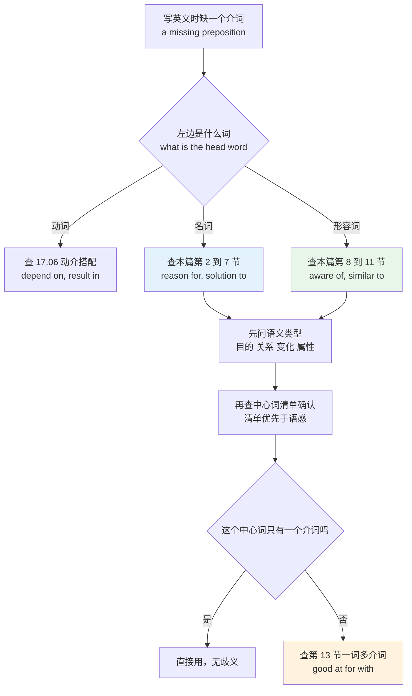
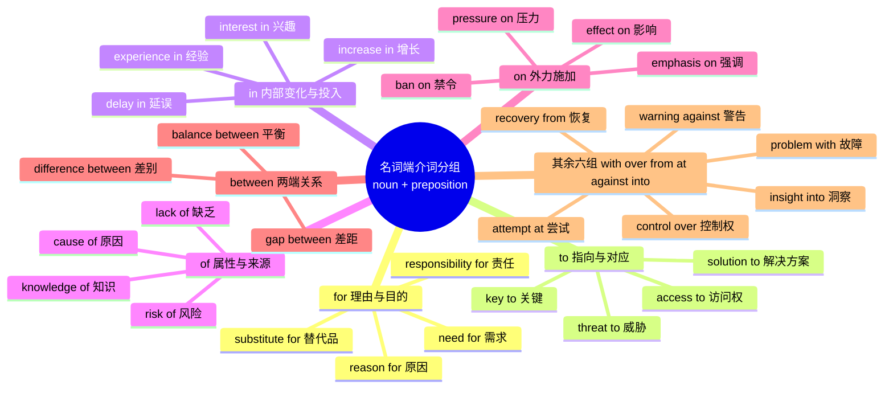
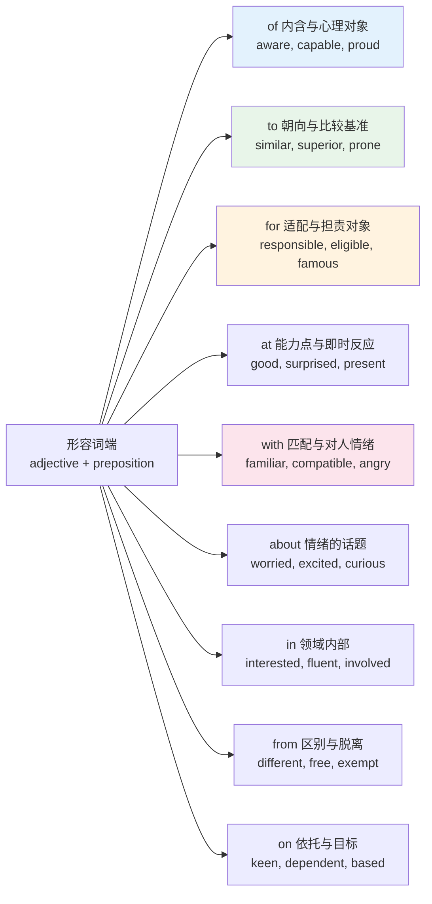
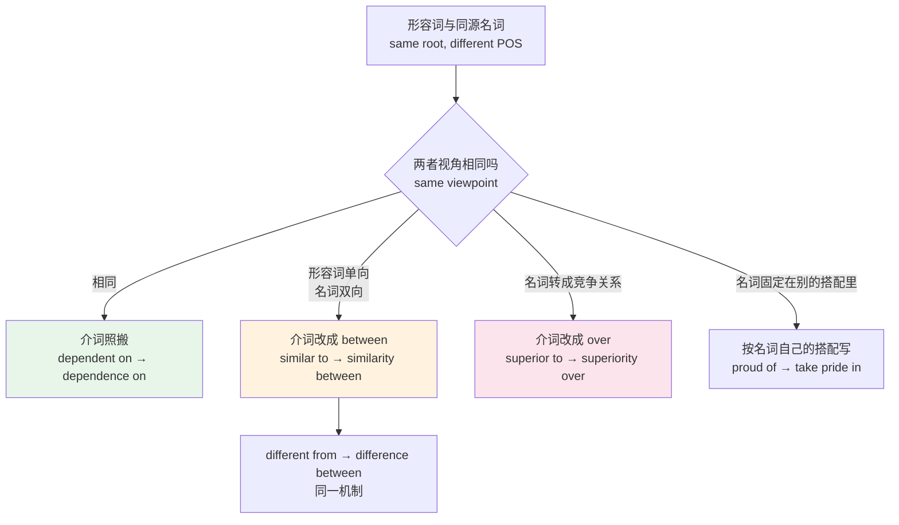
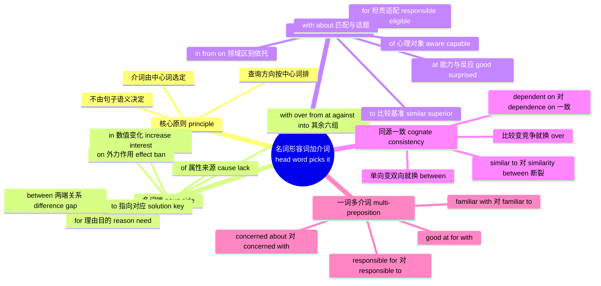

# 名词与形容词+介词固定搭配：reason for、aware of、responsible for

> [!info] 本篇定位
>
> 17 章的第七篇，把「中心词硬性选定介词」这件事从动词扩到名词和形容词。
>
> 上一篇 [[17.固定搭配/06.动词+介词固定搭配：depend on、result in、consist of\|动词+介词固定搭配：depend on、result in、consist of]] 处理的是动词后面挂哪个介词，本篇处理名词后面和形容词后面挂哪个介词。三类词层加起来，才把英语里「介词由左边的词决定」这个现象覆盖完整。
>
> 本篇的查询方向和语法教程附录 `02.英语基础语法/13.附录/03.介词搭配速查.md` 正好相反。那份附录按介词排，回答的是「`in` 后面能接什么」；本篇按中心词排，回答的是「`reason` 后面该跟哪个介词」。写英文时你手里先有的是名词或形容词，缺的是介词，所以本篇这个方向才是写作时真正用得上的方向。
>
> 读完你会拿到：名词端十二组、形容词端九组共三百三十余条搭配；一张判断「同源名词能否照搬形容词介词」的规则表；以及 `good at` / `good for` / `good with`、`familiar with` / `familiar to`、`concerned about` / `concerned with` 这类一词多介词的分岔清单。

---

## 1. 本篇导读：介词不是句子给的，是中心词给的

中文母语者写英文时，介词往往是「按意思猜」出来的。想说「对某事的原因」，脑子里先浮现「对」，于是写出 ✗ `the reason to the delay`；想说「关于这件事我很清楚」，浮现「关于」，于是写出 ✗ `aware about the risk`。

这套猜法从根上就走错了方向。英语里这类介词不表达独立的空间或逻辑意义，它是**中心词自带的语法尾巴**。`reason` 这个词在词典里的完整形态就是 `reason for`，`aware` 的完整形态就是 `aware of`，介词跟词根长在一起，跟你想表达什么关系不大。

> - ❌ ~~the reason to the delay~~
> - ✅ **the reason for** the delay（延误的原因）
> - ❌ ~~aware about the risk~~
> - ✅ **aware of** the risk（意识到风险）
> - ❌ ~~responsible of the outage~~
> - ✅ **responsible for** the outage（对这次宕机负责）

判断标准很简单：把中心词换掉，介词跟着变，说明介词是中心词选的。同样是「对延误的解释」，`reason` 配 `for`，`explanation` 配 `for`，但 `response` 配 `to`，`inquiry` 配 `into`。四个名词语义高度接近，介词却分成三种，这就证明介词不由语义决定。

这张图是本篇的使用流程。真正要强调的是最后那个分叉：大部分中心词只绑定一个介词，查到就能用；但有一小批中心词绑定两三个介词，换介词就换意思，这批词才是需要花力气记的。前者靠清单，后者靠理解，两种记忆方式不能混。

### 1.1 与相邻三篇的边界

| 内容 | 归属 | 本篇怎么处理 |
| --- | --- | --- |
| 动词后面的固定介词 | [[17.固定搭配/06.动词+介词固定搭配：depend on、result in、consist of\|17.06]] | 不重列，只在同源词一致性一节引用 |
| 介词本身的语义网络 | [[02.功能词与封闭词类速查/03.of 与 to：属格网络与方向对象网络\|02.03]]、[[02.功能词与封闭词类速查/04.with、by、for、from：伴随、施事、目的与来源\|02.04]] | 不讲介词义项，只讲哪个中心词选它 |
| 短语动词 | [[16.词义辨析、搭配与短语动词/05.短语动词（上）up out off down\|16.05]] | 本篇不收，中心词是名词形容词而非动词 |
| 搭配的强度分级 | [[17.固定搭配/01.搭配强度分级与可替换边界\|17.01]] | 本篇搭配全部属于「完全固定」档，不做分级 |
| 中式英语的成因分析 | [[16.词义辨析、搭配与短语动词/03.近形近音易混词与中式英语陷阱\|16.03]] | 只列误配清单，不重复成因 |

一句话划界：介词由左边的名词或形容词硬性选定，且这个介词不改变中心词本义的，收进本篇。

---

## 2. 名词 + for：目的、需求与对应的理由

`for` 在名词后面主要承担三层意思：这个东西是**为什么**存在（理由）、是**为了什么**（目的）、是**针对谁或什么**（对象）。中文里这三层常常都翻成「的」，所以最容易漏掉。

| 英文 | 英式音标 | 美式音标 | 词性 | 中文 | 搭配与说明 |
| --- | --- | --- | --- | --- | --- |
| **reason** | /ˈriːzn/ | /ˈriːzn/ | n. | 原因；理由 | reason for the delay；本篇的招牌搭配，绝不用 to |
| **need** | /niːd/ | /niːd/ | n. | 需要 | a need for stricter review；后接动词用 to do |
| **demand** | /dɪˈmɑːnd/ | /dɪˈmænd/ | n. | 需求 | strong demand for engineers；经济文本高频 |
| **market** | /ˈmɑːkɪt/ | /ˈmɑːrkɪt/ | n. | 市场 | a market for used phones |
| **respect** | /rɪˈspekt/ | /rɪˈspekt/ | n. | 尊重 | respect for the rules；注意 in respect of 是另一回事 |
| **responsibility** | /rɪˌspɒnsəˈbɪləti/ | /rɪˌspɑːnsəˈbɪləti/ | n. | 责任 | responsibility for the outage |
| **excuse** | /ɪkˈskjuːs/ | /ɪkˈskjuːs/ | n. | 借口 | no excuse for missing the deadline |
| **explanation** | /ˌekspləˈneɪʃn/ | /ˌekspləˈneɪʃn/ | n. | 解释 | an explanation for the discrepancy |
| **recipe** | /ˈresəpi/ | /ˈresəpi/ | n. | 食谱；秘诀 | a recipe for disaster 是习语，指必然出事 |
| **talent** | /ˈtælənt/ | /ˈtælənt/ | n. | 天赋 | a talent for spotting bugs |
| **appetite** | /ˈæpɪtaɪt/ | /ˈæpɪtaɪt/ | n. | 胃口；欲望 | little appetite for risk 金融文本常用 |
| **desire** | /dɪˈzaɪə/ | /dɪˈzaɪər/ | n. | 渴望 | a desire for recognition |
| **capacity** | /kəˈpæsəti/ | /kəˈpæsəti/ | n. | 能力；容量 | capacity for growth；对比 capacity of 指容量数值 |
| **basis** | /ˈbeɪsɪs/ | /ˈbeɪsɪs/ | n. | 基础 | the basis for the decision；也说 basis of |
| **candidate** | /ˈkændɪdət/ | /ˈkændɪdeɪt/ | n. | 候选人；备选 | a candidate for refactoring |
| **substitute** | /ˈsʌbstɪtjuːt/ | /ˈsʌbstɪtuːt/ | n. | 替代品 | no substitute for testing |
| **preparation** | /ˌprepəˈreɪʃn/ | /ˌprepəˈreɪʃn/ | n. | 准备 | preparation for the audit |
| **request** | /rɪˈkwest/ | /rɪˈkwest/ | n. | 请求 | a request for more headcount |
| **sympathy** | /ˈsɪmpəθi/ | /ˈsɪmpəθi/ | n. | 同情 | sympathy for the victims；对比 sympathy with 指立场认同 |
| **regard** | /rɪˈɡɑːd/ | /rɪˈɡɑːrd/ | n. | 顾及；敬重 | with no regard for safety |
| **remedy** | /ˈremədi/ | /ˈremədi/ | n. | 补救办法 | a remedy for the bottleneck |
| **penalty** | /ˈpenəlti/ | /ˈpenəlti/ | n. | 处罚 | the penalty for late filing |
| **passion** | /ˈpæʃn/ | /ˈpæʃn/ | n. | 热情 | a passion for open source |

> [!example] 名词加 for 的四个典型句
>
> - The **reason for** the rollback was a memory leak in the new parser.
>   - 回滚的原因是新解析器里的内存泄漏。
> - There is no **substitute for** reading the source code yourself.
>   - 没有什么能替代你自己去读源码。
> - The team showed little **appetite for** another migration this quarter.
>   - 团队对本季度再做一次迁移兴趣不大。
> - Skipping code review is a **recipe for** production incidents.
>   - 跳过代码评审是生产事故的温床。

`reason` 有个高频的连带问题值得单说。要接从句时不能写 ✗ `the reason for the build failed`，因为 `for` 后面只能跟名词性成分。正确写法有两种：`the reason for the build failure`（把从句改名词）或 `the reason why the build failed`（用 why 引导）。第三种口语写法 `the reason the build failed` 省略 why 也成立，但 ✗ `the reason because` 永远是错的。

---

## 3. 名词 + to：指向、对应与从属

`to` 在名词后面表示一种**指向关系**：A 指向 B，或 A 是针对 B 的那一份。中文常译成「对……的」「……的」，和 `for` 组的中文译法完全重叠，所以只能靠清单区分。

| 英文 | 英式音标 | 美式音标 | 词性 | 中文 | 搭配与说明 |
| --- | --- | --- | --- | --- | --- |
| **solution** | /səˈluːʃn/ | /səˈluːʃn/ | n. | 解决方案 | the solution to the problem；不用 of |
| **answer** | /ˈɑːnsə/ | /ˈænsər/ | n. | 答案 | the answer to your question |
| **key** | /kiː/ | /kiː/ | n. | 关键 | the key to performance |
| **approach** | /əˈprəʊtʃ/ | /əˈproʊtʃ/ | n. | 方法；路子 | a new approach to caching |
| **attitude** | /ˈætɪtjuːd/ | /ˈætɪtuːd/ | n. | 态度 | attitude to risk；英式也写 towards |
| **access** | /ˈækses/ | /ˈækses/ | n. | 访问权 | access to the database |
| **alternative** | /ɔːlˈtɜːnətɪv/ | /ɔːlˈtɜːrnətɪv/ | n. | 替代方案 | an alternative to Redis |
| **damage** | /ˈdæmɪdʒ/ | /ˈdæmɪdʒ/ | n. | 损害 | damage to the reputation |
| **exception** | /ɪkˈsepʃn/ | /ɪkˈsepʃn/ | n. | 例外 | an exception to the rule |
| **introduction** | /ˌɪntrəˈdʌkʃn/ | /ˌɪntrəˈdʌkʃn/ | n. | 引言；入门 | an introduction to statistics |
| **objection** | /əbˈdʒekʃn/ | /əbˈdʒekʃn/ | n. | 反对意见 | an objection to the proposal |
| **reaction** | /riˈækʃn/ | /riˈækʃn/ | n. | 反应 | the reaction to the release |
| **response** | /rɪˈspɒns/ | /rɪˈspɑːns/ | n. | 回应 | in response to your email |
| **resistance** | /rɪˈzɪstəns/ | /rɪˈzɪstəns/ | n. | 抵抗；阻力 | resistance to change |
| **threat** | /θret/ | /θret/ | n. | 威胁 | a threat to data integrity |
| **obstacle** | /ˈɒbstəkl/ | /ˈɑːbstəkl/ | n. | 障碍 | an obstacle to adoption |
| **barrier** | /ˈbæriə/ | /ˈbæriər/ | n. | 壁垒 | a barrier to entry |
| **contribution** | /ˌkɒntrɪˈbjuːʃn/ | /ˌkɑːntrəˈbjuːʃn/ | n. | 贡献 | a contribution to the project |
| **reference** | /ˈrefrəns/ | /ˈrefrəns/ | n. | 提及；引用 | a reference to the RFC |
| **witness** | /ˈwɪtnəs/ | /ˈwɪtnəs/ | n. | 目击者 | a witness to the accident |
| **invitation** | /ˌɪnvɪˈteɪʃn/ | /ˌɪnvɪˈteɪʃn/ | n. | 邀请 | an invitation to the review |
| **clue** | /kluː/ | /kluː/ | n. | 线索 | a clue to the root cause |
| **guide** | /ɡaɪd/ | /ɡaɪd/ | n. | 指南 | a guide to Kubernetes |
| **entrance** | /ˈentrəns/ | /ˈentrəns/ | n. | 入口 | the entrance to the building |

> [!warning] solution to 不是 solution of
>
> 中文「问题的解决方案」里那个「的」，让中文母语者本能地伸手去拿 `of`。这一条是本组错误率最高的：
>
> - ❌ ~~the solution of this problem~~
> - ✅ **the solution to** this problem
>
> 同一逻辑覆盖整组：`the answer to the question`、`the key to success`、`the approach to the task`。这四个词共享一个语义框架——「针对某个待处理对象给出的那一份东西」，而这个框架在英语里由 `to` 承担。
>
> 唯一的例外提示：数学语境里 `the solution of an equation`（方程的解）确实用 `of`，因为那是「属于方程的那个值」，不是「应对问题的办法」。

`attitude` 值得单拎出来。它接 `to` 和 `towards` 都成立，但地盘不同：`attitude to` 主要出现在英式英语里，美式英语几乎只写 `attitude toward`。注意英式惯用带 s 的 `towards`，美式惯用不带 s 的 `toward`，这个 s 的有无属于英美拼写习惯差异，不影响语法。

---

## 4. 名词 + in：内部的变化与投入

`in` 后面接的名词，共同点是**变化发生在某个量或某个领域的内部**。数值涨跌、方向转变、心理投入、专业领域，全归这一组。

| 英文 | 英式音标 | 美式音标 | 词性 | 中文 | 搭配与说明 |
| --- | --- | --- | --- | --- | --- |
| **increase** | /ˈɪŋkriːs/ | /ˈɪŋkriːs/ | n. | 增长 | a sharp increase in traffic；名词重音在前 |
| **decrease** | /ˈdiːkriːs/ | /ˈdiːkriːs/ | n. | 下降 | a decrease in latency |
| **rise** | /raɪz/ | /raɪz/ | n. | 上升 | a rise in costs |
| **fall** | /fɔːl/ | /fɔːl/ | n. | 下跌 | a fall in revenue |
| **drop** | /drɒp/ | /drɑːp/ | n. | 骤降 | a drop in conversion |
| **growth** | /ɡrəʊθ/ | /ɡroʊθ/ | n. | 增长 | growth in user numbers |
| **decline** | /dɪˈklaɪn/ | /dɪˈklaɪn/ | n. | 衰退 | a decline in quality |
| **reduction** | /rɪˈdʌkʃn/ | /rɪˈdʌkʃn/ | n. | 削减 | a reduction in headcount |
| **surge** | /sɜːdʒ/ | /sɜːrdʒ/ | n. | 激增 | a surge in requests |
| **change** | /tʃeɪndʒ/ | /tʃeɪndʒ/ | n. | 变化 | a change in policy；对比 change of address |
| **shift** | /ʃɪft/ | /ʃɪft/ | n. | 转变 | a shift in strategy |
| **variation** | /ˌveəriˈeɪʃn/ | /ˌveriˈeɪʃn/ | n. | 波动；差异 | variation in response time |
| **fluctuation** | /ˌflʌktʃuˈeɪʃn/ | /ˌflʌktʃuˈeɪʃn/ | n. | 起伏 | fluctuation in demand |
| **interest** | /ˈɪntrəst/ | /ˈɪntrəst/ | n. | 兴趣 | an interest in compilers |
| **confidence** | /ˈkɒnfɪdəns/ | /ˈkɑːnfɪdəns/ | n. | 信心 | confidence in the estimate |
| **belief** | /bɪˈliːf/ | /bɪˈliːf/ | n. | 信念 | belief in open standards |
| **faith** | /feɪθ/ | /feɪθ/ | n. | 信任 | faith in the process |
| **pride** | /praɪd/ | /praɪd/ | n. | 自豪 | take pride in your work |
| **experience** | /ɪkˈspɪəriəns/ | /ɪkˈspɪriəns/ | n. | 经验 | experience in distributed systems |
| **expertise** | /ˌekspɜːˈtiːz/ | /ˌekspərˈtiːz/ | n. | 专长 | expertise in security |
| **specialist** | /ˈspeʃəlɪst/ | /ˈspeʃəlɪst/ | n. | 专家 | a specialist in networking |
| **degree** | /dɪˈɡriː/ | /dɪˈɡriː/ | n. | 学位 | a degree in computer science |
| **delay** | /dɪˈleɪ/ | /dɪˈleɪ/ | n. | 延误 | a delay in shipping |
| **progress** | /ˈprəʊɡres/ | /ˈprɑːɡrəs/ | n. | 进展 | progress in the migration |
| **improvement** | /ɪmˈpruːvmənt/ | /ɪmˈpruːvmənt/ | n. | 改进 | an improvement in throughput |
| **involvement** | /ɪnˈvɒlvmənt/ | /ɪnˈvɑːlvmənt/ | n. | 参与 | involvement in the incident |
| **role** | /rəʊl/ | /roʊl/ | n. | 作用 | a key role in the outage |
| **say** | /seɪ/ | /seɪ/ | n. | 发言权 | a say in the decision |
| **stake** | /steɪk/ | /steɪk/ | n. | 利害关系；股份 | a stake in the company |

> [!example] 涨跌类名词的完整写法
>
> - There was a 30% **increase in** error rates after the deploy.
>   - 部署之后错误率上升了百分之三十。
> - The **drop in** conversion coincided with the checkout redesign.
>   - 转化率的下跌和结账页改版同时发生。
> - A gradual **shift in** team structure made the old on-call rota unworkable.
>   - 团队结构的逐步变化让旧的值班轮换排不下去了。

涨跌类名词有个必须固化的模板：**`a/an + 幅度形容词 + 涨跌名词 + in + 变化的量`**。四个位置各有讲究。幅度形容词常用 `sharp`、`steep`、`slight`、`marginal`、`gradual`、`dramatic`；变化的量必须是可度量的东西（价格、数量、比率、时长）；如果要说变化的绝对值，在后面再加 `of`：`a rise of 20% in prices`，`in` 管对象、`of` 管数值，两个介词短语同时出现时的默认顺序是数值那支在前、对象那支在后。

`change` 是本组唯一要区分两个介词的词。`a change in something` 指某个事物内部发生了变化（`a change in his attitude` 他态度变了）；`a change of something` 指整体换了一个（`a change of address` 换地址、`a change of clothes` 换洗衣物）。前者事物还是那个事物，后者事物被替换掉了。

---

## 5. 名词 + of：属性、部分与来源

`of` 是名词后面最高频的介词，也是最不需要专门记的一个——因为它对应的正是中文最默认的那个「的」。真正要记的是**哪些名词不能用 of**，那批词在上面三节。本节收的是把 `of` 当默认选项的那批名词，重点放在几个容易和别的介词打架的词上——它们换个介词就换个意思，说明列会逐条标出。

| 英文 | 英式音标 | 美式音标 | 词性 | 中文 | 搭配与说明 |
| --- | --- | --- | --- | --- | --- |
| **cause** | /kɔːz/ | /kɔːz/ | n. | 原因 | the cause of the crash；对比 reason for |
| **lack** | /læk/ | /læk/ | n. | 缺乏 | a lack of documentation |
| **shortage** | /ˈʃɔːtɪdʒ/ | /ˈʃɔːrtɪdʒ/ | n. | 短缺 | a shortage of skilled staff |
| **absence** | /ˈæbsəns/ | /ˈæbsəns/ | n. | 缺席；不存在 | in the absence of evidence |
| **advantage** | /ədˈvɑːntɪdʒ/ | /ədˈvæntɪdʒ/ | n. | 优势 | the advantage of caching；对比 advantage over 指对手 |
| **risk** | /rɪsk/ | /rɪsk/ | n. | 风险 | the risk of data loss |
| **danger** | /ˈdeɪndʒə/ | /ˈdeɪndʒər/ | n. | 危险 | the danger of over-engineering |
| **proof** | /pruːf/ | /pruːf/ | n. | 证明 | proof of concept |
| **evidence** | /ˈevɪdəns/ | /ˈevɪdəns/ | n. | 证据 | evidence of tampering |
| **example** | /ɪɡˈzɑːmpl/ | /ɪɡˈzæmpl/ | n. | 例子 | a classic example of premature optimization |
| **knowledge** | /ˈnɒlɪdʒ/ | /ˈnɑːlɪdʒ/ | n. | 知识 | working knowledge of SQL |
| **awareness** | /əˈweənəs/ | /əˈwernəs/ | n. | 意识 | awareness of the trade-offs |
| **understanding** | /ˌʌndəˈstændɪŋ/ | /ˌʌndərˈstændɪŋ/ | n. | 理解 | a deep understanding of the protocol |
| **possibility** | /ˌpɒsəˈbɪləti/ | /ˌpɑːsəˈbɪləti/ | n. | 可能性 | the possibility of a rollback |
| **probability** | /ˌprɒbəˈbɪləti/ | /ˌprɑːbəˈbɪləti/ | n. | 概率 | a high probability of failure |
| **fear** | /fɪə/ | /fɪr/ | n. | 恐惧 | fear of breaking production |
| **sign** | /saɪn/ | /saɪn/ | n. | 迹象 | a sign of memory pressure |
| **symptom** | /ˈsɪmptəm/ | /ˈsɪmptəm/ | n. | 症状 | a symptom of a deeper issue |
| **source** | /sɔːs/ | /sɔːrs/ | n. | 来源 | the source of the leak |
| **consequence** | /ˈkɒnsɪkwəns/ | /ˈkɑːnsəkwens/ | n. | 后果 | the consequences of skipping tests |
| **means** | /miːnz/ | /miːnz/ | n. | 手段 | a means of authentication；单复同形 |
| **standard** | /ˈstændəd/ | /ˈstændərd/ | n. | 标准 | a high standard of code quality |
| **sense** | /sens/ | /sens/ | n. | 感觉；意识 | a sense of ownership |
| **copy** | /ˈkɒpi/ | /ˈkɑːpi/ | n. | 副本 | a copy of the config |
| **purpose** | /ˈpɜːpəs/ | /ˈpɜːrpəs/ | n. | 目的 | the purpose of this flag |

> [!warning] cause of 与 reason for 的分工
>
> 两个词中文都译成「原因」，介词却一个 `of` 一个 `for`，而且不能互换。
>
> - `the cause of` 指**客观触发链条**上的那一环，可以被调查、被定位。`The cause of the outage was a misconfigured load balancer.`
> - `the reason for` 指**用来解释的说法**，带主观成分，可以被接受或不被接受。`The reason for the delay was that legal needed another week.`
>
> 判别办法：能说「查出原因」的用 `cause of`，能说「给个理由」的用 `reason for`。事故报告里两个词经常同段出现，写错介词会立刻暴露不是母语者。

`knowledge` 和 `awareness` 这一小组在简历和自我介绍里出现率极高，值得单独固化：`a working knowledge of Python`（能用的水平）、`a thorough knowledge of the codebase`（吃透了）、`an awareness of the trade-offs`（明白取舍在哪）。三个搭配里的介词都是 `of`，而对应的形容词 `aware` 同样配 `of`——这是第 12 节要讲的同源一致的正例。

---

## 6. 名词 + on：施加在表面的作用

`on` 后面接的名词，共同特征是**有一个力从外部施加到它身上**。影响、限制、攻击、压力、评论，都是外来力作用于承受方。这一层意象直接继承自 `on` 的空间原型：东西压在表面上。

| 英文 | 英式音标 | 美式音标 | 词性 | 中文 | 搭配与说明 |
| --- | --- | --- | --- | --- | --- |
| **effect** | /ɪˈfekt/ | /ɪˈfekt/ | n. | 影响 | the effect of X on Y；两个介词都要写 |
| **impact** | /ˈɪmpækt/ | /ˈɪmpækt/ | n. | 冲击 | a major impact on latency |
| **influence** | /ˈɪnfluəns/ | /ˈɪnfluəns/ | n. | 影响力 | influence on the design |
| **ban** | /bæn/ | /bæn/ | n. | 禁令 | a ban on third-party cookies |
| **tax** | /tæks/ | /tæks/ | n. | 税 | a tax on imports |
| **restriction** | /rɪˈstrɪkʃn/ | /rɪˈstrɪkʃn/ | n. | 限制 | restrictions on file size |
| **constraint** | /kənˈstreɪnt/ | /kənˈstreɪnt/ | n. | 约束 | constraints on memory |
| **limit** | /ˈlɪmɪt/ | /ˈlɪmɪt/ | n. | 上限 | a limit on concurrent requests |
| **cap** | /kæp/ | /kæp/ | n. | 封顶 | a cap on spending |
| **attack** | /əˈtæk/ | /əˈtæk/ | n. | 攻击 | an attack on the API gateway |
| **crackdown** | /ˈkrækdaʊn/ | /ˈkrækdaʊn/ | n. | 严打 | a crackdown on spam accounts |
| **pressure** | /ˈpreʃə/ | /ˈpreʃər/ | n. | 压力 | pressure on the team |
| **comment** | /ˈkɒment/ | /ˈkɑːment/ | n. | 评论 | a comment on the PR |
| **emphasis** | /ˈemfəsɪs/ | /ˈemfəsɪs/ | n. | 强调 | emphasis on readability |
| **focus** | /ˈfəʊkəs/ | /ˈfoʊkəs/ | n. | 焦点 | a focus on reliability |
| **report** | /rɪˈpɔːt/ | /rɪˈpɔːrt/ | n. | 报告 | a report on the incident |
| **update** | /ˈʌpdeɪt/ | /ˈʌpdeɪt/ | n. | 进展通报 | an update on the rollout |
| **view** | /vjuː/ | /vjuː/ | n. | 看法 | my view on the proposal |
| **opinion** | /əˈpɪnjən/ | /əˈpɪnjən/ | n. | 意见 | an opinion on the trade-off |
| **stance** | /stɑːns/ | /stæns/ | n. | 立场 | a firm stance on privacy |
| **perspective** | /pəˈspektɪv/ | /pərˈspektɪv/ | n. | 视角 | a fresh perspective on the problem |
| **authority** | /ɔːˈθɒrəti/ | /əˈθɔːrəti/ | n. | 权威；专家 | an authority on cryptography |
| **dependence** | /dɪˈpendəns/ | /dɪˈpendəns/ | n. | 依赖 | dependence on a single vendor |
| **reliance** | /rɪˈlaɪəns/ | /rɪˈlaɪəns/ | n. | 依靠 | over-reliance on manual testing |
| **research** | /rɪˈsɜːtʃ/ | /ˈriːsɜːrtʃ/ | n. | 研究 | research on sleep；也说 research into |

> [!example] effect 的双介词句式
>
> - Caching had a noticeable **effect on** response time.
>   - 缓存对响应时间有明显影响。
> - We measured the **effect of** batch size **on** throughput.
>   - 我们测量了批大小对吞吐量的影响。

第二句展示了 `effect` 的完整形态：`the effect of A on B`，`of` 后面挂施加方，`on` 后面挂承受方。这个模板在技术文档和实验报告里出现极密集，`impact` 和 `influence` 完全套用同一个模板：`the impact of the migration on latency`、`the influence of temperature on throughput`。写的时候一旦只写了一个介词，句子的信息就残缺了，读者不知道谁影响谁。

`view`、`opinion`、`perspective` 这三个词还接受 `about`。`on` 显得更正式、更像经过思考的立场，`about` 更随意。写文档、写周报选 `on`，聊天选 `about` 都可以。

---

## 7. 名词 + between、with、over、from、at、against、into

剩下七个介词各自绑定一小批名词，数量不多但辨识度高。放在一起对比，能看出每个介词各管一种关系形状。

### 7.1 between：两端之间的关系

| 英文 | 英式音标 | 美式音标 | 词性 | 中文 | 搭配与说明 |
| --- | --- | --- | --- | --- | --- |
| **difference** | /ˈdɪfrəns/ | /ˈdɪfrəns/ | n. | 差别 | the difference between A and B |
| **relationship** | /rɪˈleɪʃnʃɪp/ | /rɪˈleɪʃnʃɪp/ | n. | 关系 | the relationship between load and latency |
| **link** | /lɪŋk/ | /lɪŋk/ | n. | 关联 | a link between the two bugs |
| **connection** | /kəˈnekʃn/ | /kəˈnekʃn/ | n. | 联系 | no connection between them |
| **gap** | /ɡæp/ | /ɡæp/ | n. | 差距 | the gap between spec and code |
| **distinction** | /dɪˈstɪŋkʃn/ | /dɪˈstɪŋkʃn/ | n. | 区分 | the distinction between the two terms |
| **contrast** | /ˈkɒntrɑːst/ | /ˈkɑːntræst/ | n. | 对比 | a sharp contrast between them |
| **correlation** | /ˌkɒrəˈleɪʃn/ | /ˌkɔːrəˈleɪʃn/ | n. | 相关性 | a correlation between the two metrics |
| **balance** | /ˈbæləns/ | /ˈbæləns/ | n. | 平衡 | a balance between speed and safety |
| **trade-off** | /ˈtreɪd ɒf/ | /ˈtreɪd ɔːf/ | n. | 取舍 | the trade-off between memory and CPU |
| **similarity** | /ˌsɪməˈlærəti/ | /ˌsɪməˈlerəti/ | n. | 相似之处 | similarities between the designs |
| **conflict** | /ˈkɒnflɪkt/ | /ˈkɑːnflɪkt/ | n. | 冲突 | a conflict between the two rules |
| **choice** | /tʃɔɪs/ | /tʃɔɪs/ | n. | 选择 | a choice between two bad options |
| **cooperation** | /kəʊˌɒpəˈreɪʃn/ | /koʊˌɑːpəˈreɪʃn/ | n. | 合作 | cooperation between teams |

这一组的共同特征是**必须有两端**。`between` 后面要么跟 `A and B`，要么跟一个复数名词（`differences between the two approaches`、`the relationship between these variables`）。只有一端时整组搭配都不成立，写 ✗ `the difference between this` 是残句。

### 7.2 with：结伴、接触与摩擦

| 英文 | 英式音标 | 美式音标 | 词性 | 中文 | 搭配与说明 |
| --- | --- | --- | --- | --- | --- |
| **problem** | /ˈprɒbləm/ | /ˈprɑːbləm/ | n. | 问题 | a problem with the config |
| **trouble** | /ˈtrʌbl/ | /ˈtrʌbl/ | n. | 麻烦 | trouble with the build |
| **issue** | /ˈɪʃuː/ | /ˈɪʃuː/ | n. | 故障；争议点 | an issue with the migration |
| **contact** | /ˈkɒntækt/ | /ˈkɑːntækt/ | n. | 联系 | contact with the vendor |
| **familiarity** | /fəˌmɪliˈærəti/ | /fəˌmɪliˈerəti/ | n. | 熟悉程度 | familiarity with Git |
| **agreement** | /əˈɡriːmənt/ | /əˈɡriːmənt/ | n. | 一致；协议 | in agreement with the spec |
| **interview** | /ˈɪntəvjuː/ | /ˈɪntərvjuː/ | n. | 面谈 | an interview with the CTO |
| **appointment** | /əˈpɔɪntmənt/ | /əˈpɔɪntmənt/ | n. | 预约 | an appointment with the dentist |
| **argument** | /ˈɑːɡjumənt/ | /ˈɑːrɡjumənt/ | n. | 争吵 | an argument with a colleague |
| **obsession** | /əbˈseʃn/ | /əbˈseʃn/ | n. | 执念 | an obsession with micro-optimization |
| **satisfaction** | /ˌsætɪsˈfækʃn/ | /ˌsætɪsˈfækʃn/ | n. | 满意度 | satisfaction with the outcome |
| **compatibility** | /kəmˌpætəˈbɪləti/ | /kəmˌpætəˈbɪləti/ | n. | 兼容性 | compatibility with older clients |

`problem` 同时接 `with` 和 `of`，两者值得对照。`a problem with the parser` 是解析器坏了（故障方是它）；`the problem of technical debt` 是技术债这件事本身构成难题（`of` 后面是问题的内容）。前者可以修，后者只能应对。

### 7.3 over：控制权与争夺对象

| 英文 | 英式音标 | 美式音标 | 词性 | 中文 | 搭配与说明 |
| --- | --- | --- | --- | --- | --- |
| **control** | /kənˈtrəʊl/ | /kənˈtroʊl/ | n. | 控制权 | control over the release process |
| **power** | /ˈpaʊə/ | /ˈpaʊər/ | n. | 权力 | power over the budget |
| **jurisdiction** | /ˌdʒʊərɪsˈdɪkʃn/ | /ˌdʒʊrɪsˈdɪkʃn/ | n. | 管辖权 | jurisdiction over the dispute |
| **dispute** | /dɪˈspjuːt/ | /dɪˈspjuːt/ | n. | 争议 | a dispute over ownership |
| **debate** | /dɪˈbeɪt/ | /dɪˈbeɪt/ | n. | 辩论 | a debate over licensing |
| **disagreement** | /ˌdɪsəˈɡriːmənt/ | /ˌdɪsəˈɡriːmənt/ | n. | 分歧 | disagreement over scope |
| **concern** | /kənˈsɜːn/ | /kənˈsɜːrn/ | n. | 担忧 | concern over data retention |
| **victory** | /ˈvɪktəri/ | /ˈvɪktəri/ | n. | 胜利 | a victory over the incumbent |
| **advantage** | /ədˈvɑːntɪdʒ/ | /ədˈvæntɪdʒ/ | n. | 优势 | an advantage over competitors |
| **edge** | /edʒ/ | /edʒ/ | n. | 微弱优势 | a slight edge over the alternative |
| **priority** | /praɪˈɒrəti/ | /praɪˈɔːrəti/ | n. | 优先级 | priority over other tickets |

`over` 组的画面是**居高临下**：一方在上，另一方在下，要么被管住，要么被压过。`control over` 和第 6 节的 `dependence on` 恰好构成一对反向关系——一个在上面管，一个在下面靠。

`advantage` 是本篇少数配三个介词的名词：`the advantage of caching`（缓存这件事的好处）、`an advantage over competitors`（对竞争对手的优势）、`take advantage of an opportunity`（利用机会）。三个用法语义完全不同，靠介词分开。

### 7.4 from、at、against、into

| 英文 | 英式音标 | 美式音标 | 词性 | 中文 | 搭配与说明 |
| --- | --- | --- | --- | --- | --- |
| **escape** | /ɪˈskeɪp/ | /ɪˈskeɪp/ | n. | 逃离 | an escape from routine |
| **protection** | /prəˈtekʃn/ | /prəˈtekʃn/ | n. | 保护 | protection from UV；也说 against |
| **recovery** | /rɪˈkʌvəri/ | /rɪˈkʌvəri/ | n. | 恢复 | recovery from the outage |
| **relief** | /rɪˈliːf/ | /rɪˈliːf/ | n. | 缓解 | relief from the pressure |
| **freedom** | /ˈfriːdəm/ | /ˈfriːdəm/ | n. | 自由 | freedom from interference |
| **quotation** | /kwəʊˈteɪʃn/ | /kwoʊˈteɪʃn/ | n. | 引文 | a quotation from the RFC |
| **excerpt** | /ˈeksɜːpt/ | /ˈeksɜːrpt/ | n. | 摘录 | an excerpt from the log |
| **transition** | /trænˈzɪʃn/ | /trænˈzɪʃn/ | n. | 过渡 | the transition from v1 to v2 |
| **attempt** | /əˈtempt/ | /əˈtempt/ | n. | 尝试 | an attempt at a fix |
| **glance** | /ɡlɑːns/ | /ɡlæns/ | n. | 一瞥 | a glance at the dashboard |
| **surprise** | /səˈpraɪz/ | /sərˈpraɪz/ | n. | 惊讶 | her surprise at the result |
| **anger** | /ˈæŋɡə/ | /ˈæŋɡər/ | n. | 愤怒 | anger at the decision |
| **defence** | /dɪˈfens/ | /dɪˈfens/ | n. | 辩护；防御 | a defence against injection；美式拼 defense |
| **case** | /keɪs/ | /keɪs/ | n. | 论据 | the case against rewriting |
| **prejudice** | /ˈpredʒudɪs/ | /ˈpredʒudɪs/ | n. | 偏见 | prejudice against older tools |
| **warning** | /ˈwɔːnɪŋ/ | /ˈwɔːrnɪŋ/ | n. | 警告 | a warning against premature scaling |
| **investigation** | /ɪnˌvestɪˈɡeɪʃn/ | /ɪnˌvestɪˈɡeɪʃn/ | n. | 调查 | an investigation into the breach |
| **inquiry** | /ɪnˈkwaɪəri/ | /ˈɪnkwəri/ | n. | 查询；调查 | an inquiry into the incident |
| **insight** | /ˈɪnsaɪt/ | /ˈɪnsaɪt/ | n. | 洞察 | insight into user behaviour |

这张图把名词端全部分组压成一页。看图的正确方式不是从上往下背，而是**先记住每组的语义标签**：要说理由和目的想到 `for`，要说指向和对应想到 `to`，要说数值变化想到 `in`，要说外力作用想到 `on`，要说两端关系想到 `between`。标签记住之后，遇到清单外的新名词也能猜得八九不离十。

---

## 8. 形容词 + of：内含物与感受对象

形容词端从 `of` 开始，因为它数量最多。这一组的语义可以归成两支：一支说**里面装着什么**（`full of`、`devoid of`、`short of`），一支说**心里对着什么**（`aware of`、`afraid of`、`proud of`）。第二支占绝大多数，覆盖了几乎全部的心理状态形容词。

| 英文 | 英式音标 | 美式音标 | 词性 | 中文 | 搭配与说明 |
| --- | --- | --- | --- | --- | --- |
| **aware** | /əˈweə/ | /əˈwer/ | adj. | 意识到的 | fully aware of the risks；不用 about |
| **conscious** | /ˈkɒnʃəs/ | /ˈkɑːnʃəs/ | adj. | 察觉到的 | conscious of the cost |
| **capable** | /ˈkeɪpəbl/ | /ˈkeɪpəbl/ | adj. | 有能力的 | capable of handling 10k requests |
| **incapable** | /ɪnˈkeɪpəbl/ | /ɪnˈkeɪpəbl/ | adj. | 无能力的 | incapable of scaling |
| **afraid** | /əˈfreɪd/ | /əˈfreɪd/ | adj. | 害怕的 | afraid of breaking things |
| **scared** | /skeəd/ | /skerd/ | adj. | 受惊的 | scared of large refactors |
| **terrified** | /ˈterɪfaɪd/ | /ˈterɪfaɪd/ | adj. | 极度害怕的 | terrified of data loss |
| **fond** | /fɒnd/ | /fɑːnd/ | adj. | 喜爱的 | fond of terse code |
| **proud** | /praʊd/ | /praʊd/ | adj. | 自豪的 | proud of the team |
| **ashamed** | /əˈʃeɪmd/ | /əˈʃeɪmd/ | adj. | 羞愧的 | ashamed of the old codebase |
| **guilty** | /ˈɡɪlti/ | /ˈɡɪlti/ | adj. | 有罪的；内疚的 | guilty of negligence |
| **jealous** | /ˈdʒeləs/ | /ˈdʒeləs/ | adj. | 嫉妒的 | jealous of their tooling |
| **envious** | /ˈenviəs/ | /ˈenviəs/ | adj. | 羡慕的 | envious of their build times |
| **tired** | /ˈtaɪəd/ | /ˈtaɪərd/ | adj. | 厌倦的 | tired of manual deploys |
| **sick** | /sɪk/ | /sɪk/ | adj. | 受够了的 | sick of flaky tests |
| **typical** | /ˈtɪpɪkl/ | /ˈtɪpɪkl/ | adj. | 典型的 | typical of legacy systems |
| **characteristic** | /ˌkærəktəˈrɪstɪk/ | /ˌkerəktəˈrɪstɪk/ | adj. | 特有的 | characteristic of this pattern |
| **worthy** | /ˈwɜːði/ | /ˈwɜːrði/ | adj. | 值得的 | worthy of a second look |
| **short** | /ʃɔːt/ | /ʃɔːrt/ | adj. | 缺少的 | short of time |
| **full** | /fʊl/ | /fʊl/ | adj. | 充满的 | full of edge cases |
| **devoid** | /dɪˈvɔɪd/ | /dɪˈvɔɪd/ | adj. | 全无的 | devoid of comments；书面语 |
| **indicative** | /ɪnˈdɪkətɪv/ | /ɪnˈdɪkətɪv/ | adj. | 表明的 | indicative of a deeper problem |
| **reminiscent** | /ˌremɪˈnɪsnt/ | /ˌremɪˈnɪsnt/ | adj. | 令人想起的 | reminiscent of an older design |
| **suspicious** | /səˈspɪʃəs/ | /səˈspɪʃəs/ | adj. | 怀疑的 | suspicious of the metrics |
| **critical** | /ˈkrɪtɪkl/ | /ˈkrɪtɪkl/ | adj. | 批评的 | critical of the proposal |
| **tolerant** | /ˈtɒlərənt/ | /ˈtɑːlərənt/ | adj. | 容忍的 | tolerant of failures |
| **independent** | /ˌɪndɪˈpendənt/ | /ˌɪndɪˈpendənt/ | adj. | 独立于的 | independent of the framework |
| **ignorant** | /ˈɪɡnərənt/ | /ˈɪɡnərənt/ | adj. | 不知情的 | ignorant of the change |
| **representative** | /ˌreprɪˈzentətɪv/ | /ˌreprɪˈzentətɪv/ | adj. | 有代表性的 | representative of real traffic |
| **mindful** | /ˈmaɪndfl/ | /ˈmaɪndfl/ | adj. | 留意的 | mindful of the deadline |

> [!example] aware of 的三档写法
>
> - I am **aware of** the issue and a fix is in review.
>   - 我知道这个问题，修复正在评审中。
> - The team was not **fully aware of** the licensing constraints.
>   - 团队并没有完全了解许可方面的限制。
> - Be **mindful of** the retry budget when you tune the timeout.
>   - 调超时的时候留意一下重试预算。

`aware` 在工作沟通里的出现频率高到值得单独固化。三个常配的强化副词是 `fully aware`、`acutely aware`、`painfully aware`，强度依次递增，全部保持 `of`。强化副词的选择规则见 [[17.固定搭配/05.副词+形容词强化搭配：highly、deeply、bitterly 的固定伴侣\|17.05]]。

`capable of` 有个句法细节要记：后面接动作时必须用动名词 `-ing`，写 ✗ `capable to handle` 是错的。这一点和 `able` 正好相反——`able` 配 `to do`，`capable` 配 `of doing`。两个词中文都译「能」，句法却分道扬镳，属于本篇最容易出错的单点。

---

## 9. 形容词 + to：朝向、比较与从属

`to` 组的形容词有一个统一的画面：**主语朝着某个目标或某个基准站着**。相似、相等、从属、易受影响，都是拿主语跟另一个东西对齐或挂靠。

| 英文 | 英式音标 | 美式音标 | 词性 | 中文 | 搭配与说明 |
| --- | --- | --- | --- | --- | --- |
| **similar** | /ˈsɪmələ/ | /ˈsɪmələr/ | adj. | 相似的 | similar to the previous version |
| **identical** | /aɪˈdentɪkl/ | /aɪˈdentɪkl/ | adj. | 完全相同的 | identical to the reference build |
| **equal** | /ˈiːkwəl/ | /ˈiːkwəl/ | adj. | 相等的 | equal to the sum of the parts |
| **equivalent** | /ɪˈkwɪvələnt/ | /ɪˈkwɪvələnt/ | adj. | 等价的 | equivalent to a full rewrite |
| **comparable** | /ˈkɒmpərəbl/ | /ˈkɑːmpərəbl/ | adj. | 可比的 | comparable to last year |
| **analogous** | /əˈnæləɡəs/ | /əˈnæləɡəs/ | adj. | 类似的 | analogous to a message queue |
| **preferable** | /ˈprefrəbl/ | /ˈprefrəbl/ | adj. | 更可取的 | preferable to the alternative |
| **superior** | /suːˈpɪəriə/ | /suːˈpɪriər/ | adj. | 更优的 | superior to the old algorithm；不用 than |
| **inferior** | /ɪnˈfɪəriə/ | /ɪnˈfɪriər/ | adj. | 更差的 | inferior to the benchmark |
| **senior** | /ˈsiːniə/ | /ˈsiːniər/ | adj. | 资历更深的 | senior to me by two years |
| **opposed** | /əˈpəʊzd/ | /əˈpoʊzd/ | adj. | 反对的 | strongly opposed to the merger |
| **subject** | /ˈsʌbdʒɪkt/ | /ˈsʌbdʒɪkt/ | adj. | 受制于的 | subject to rate limiting |
| **prone** | /prəʊn/ | /proʊn/ | adj. | 易于（出问题）的 | prone to race conditions |
| **liable** | /ˈlaɪəbl/ | /ˈlaɪəbl/ | adj. | 易于；负有责任的 | liable to fail under load |
| **vulnerable** | /ˈvʌlnərəbl/ | /ˈvʌlnərəbl/ | adj. | 易受攻击的 | vulnerable to injection |
| **immune** | /ɪˈmjuːn/ | /ɪˈmjuːn/ | adj. | 免疫的 | immune to this class of bug |
| **resistant** | /rɪˈzɪstənt/ | /rɪˈzɪstənt/ | adj. | 抗……的 | resistant to change |
| **sensitive** | /ˈsensətɪv/ | /ˈsensətɪv/ | adj. | 敏感的 | sensitive to clock skew |
| **accustomed** | /əˈkʌstəmd/ | /əˈkʌstəmd/ | adj. | 习惯了的 | accustomed to the workflow |
| **loyal** | /ˈlɔɪəl/ | /ˈlɔɪəl/ | adj. | 忠诚的 | loyal to the brand |
| **relevant** | /ˈreləvənt/ | /ˈreləvənt/ | adj. | 相关的 | relevant to this discussion |
| **essential** | /ɪˈsenʃl/ | /ɪˈsenʃl/ | adj. | 必不可少的 | essential to the design |
| **crucial** | /ˈkruːʃl/ | /ˈkruːʃl/ | adj. | 关键的 | crucial to performance |
| **central** | /ˈsentrəl/ | /ˈsentrəl/ | adj. | 核心的 | central to the argument |
| **harmful** | /ˈhɑːmfl/ | /ˈhɑːrmfl/ | adj. | 有害的 | harmful to readability |
| **beneficial** | /ˌbenɪˈfɪʃl/ | /ˌbenɪˈfɪʃl/ | adj. | 有益的 | beneficial to the whole team |
| **detrimental** | /ˌdetrɪˈmentl/ | /ˌdetrɪˈmentl/ | adj. | 不利的 | detrimental to morale |
| **adjacent** | /əˈdʒeɪsnt/ | /əˈdʒeɪsnt/ | adj. | 相邻的 | adjacent to the main module |
| **related** | /rɪˈleɪtɪd/ | /rɪˈleɪtɪd/ | adj. | 相关的 | related to the earlier ticket |
| **addicted** | /əˈdɪktɪd/ | /əˈdɪktɪd/ | adj. | 上瘾的 | addicted to premature optimization |
| **allergic** | /əˈlɜːdʒɪk/ | /əˈlɜːrdʒɪk/ | adj. | 过敏的 | allergic to peanuts |
| **entitled** | /ɪnˈtaɪtld/ | /ɪnˈtaɪtld/ | adj. | 有权享有的 | entitled to a refund |
| **indifferent** | /ɪnˈdɪfrənt/ | /ɪnˈdɪfrənt/ | adj. | 漠不关心的 | indifferent to the outcome |

> [!warning] superior 和 inferior 不接 than
>
> 这两个词从拉丁语借来时自带比较义（词尾 -ior 本身就是拉丁语比较级），所以英语不再给它们加 `than`。
>
> - ❌ ~~This approach is superior than the old one.~~
> - ✅ This approach is **superior to** the old one.
> - ❌ ~~The output quality is inferior than expected.~~
> - ✅ The output quality is **inferior to** what we expected.
>
> 同一批从拉丁语比较级借来的形容词还有 `senior to`、`junior to`、`prior to`、`posterior to`，全部配 `to` 不配 `than`。识别办法只对这一小批带比较义的 `-ior` 词有效：`interior`、`exterior` 同样以 `-ior` 收尾却不表比较，不在其列。

`prone to` 和 `liable to` 的句法值得对照。`prone to` 后面既能跟名词（`prone to errors`）也能跟动词原形（`prone to fail`）；`liable to` 同样两可，但它多一层法律义——`liable for damages`（对损失负法律责任）这时候介词换成 `for`。写技术文档时用 `error-prone` 这个复合形容词最省事，直接当定语用：`an error-prone manual step`。

`subject to` 在合同和 API 文档里出现率极高，它的意思是「要受某个条件约束、随时可能被那个条件改变」：`Prices are subject to change without notice.`（价格可能随时变动，恕不另行通知。）注意这里 `subject` 是形容词不是名词，重音在前 /ˈsʌbdʒɪkt/；动词 `subject`（使遭受）重音在后 /səbˈdʒekt/，两者读音不同。

---

## 10. 形容词 + for 与 at：适配对象与能力领域

`for` 组回答「对谁合适、为谁负责」，`at` 组回答「在哪个点上表现如何」。两组数量不大但使用频率很高，尤其在自我介绍和绩效评价里。

### 10.1 形容词 + for

| 英文 | 英式音标 | 美式音标 | 词性 | 中文 | 搭配与说明 |
| --- | --- | --- | --- | --- | --- |
| **responsible** | /rɪˈspɒnsəbl/ | /rɪˈspɑːnsəbl/ | adj. | 负责的 | responsible for the payment service |
| **accountable** | /əˈkaʊntəbl/ | /əˈkaʊntəbl/ | adj. | 需担责的 | accountable for the outcome |
| **eligible** | /ˈelɪdʒəbl/ | /ˈelɪdʒəbl/ | adj. | 有资格的 | eligible for the discount |
| **suitable** | /ˈsuːtəbl/ | /ˈsuːtəbl/ | adj. | 合适的 | suitable for production |
| **fit** | /fɪt/ | /fɪt/ | adj. | 适合的 | fit for purpose |
| **qualified** | /ˈkwɒlɪfaɪd/ | /ˈkwɑːlɪfaɪd/ | adj. | 够格的 | qualified for the role |
| **ready** | /ˈredi/ | /ˈredi/ | adj. | 准备好的 | ready for the migration |
| **eager** | /ˈiːɡə/ | /ˈiːɡər/ | adj. | 渴望的 | eager for feedback |
| **desperate** | /ˈdespərət/ | /ˈdespərət/ | adj. | 急需的 | desperate for more capacity |
| **famous** | /ˈfeɪməs/ | /ˈfeɪməs/ | adj. | 出名的 | famous for its uptime |
| **notorious** | /nəʊˈtɔːriəs/ | /noʊˈtɔːriəs/ | adj. | 臭名昭著的 | notorious for flaky behaviour |
| **known** | /nəʊn/ | /noʊn/ | adj. | 因……知名 | known for clean APIs |
| **grateful** | /ˈɡreɪtfl/ | /ˈɡreɪtfl/ | adj. | 感激的 | grateful for the review |
| **sorry** | /ˈsɒri/ | /ˈsɔːri/ | adj. | 抱歉的 | sorry for the delay |
| **late** | /leɪt/ | /leɪt/ | adj. | 迟到的 | late for the standup |
| **necessary** | /ˈnesəsəri/ | /ˈnesəseri/ | adj. | 必要的 | necessary for correctness |
| **sufficient** | /səˈfɪʃnt/ | /səˈfɪʃnt/ | adj. | 足够的 | sufficient for the first release |
| **adequate** | /ˈædɪkwət/ | /ˈædɪkwət/ | adj. | 够用的 | adequate for current load |

> [!warning] responsible for 与 responsible to 都存在
>
> 这是本组唯一的双介词词条，两个用法都对但意思不同：
>
> - `responsible for` + **事情**：对某件事负责。`She is responsible for the billing module.`
> - `responsible to` + **人**：向某人汇报、对某人负责。`The team lead is responsible to the engineering manager.`
>
> 两者可以合并进一句：`He is responsible to the CTO for platform reliability.`（他就平台可靠性向 CTO 负责。）中文母语者几乎只用得上 `for` 那一支，但读英文岗位描述时会遇到 `to` 这一支，认得出即可。

`sorry` 用两个介词分出三种场合，混淆会造成语义偏差：`sorry for the delay`（为延误道歉，我有责任）、`sorry about your laptop`（对你的遭遇表示遗憾，不一定是我的错）、`sorry for him` 或 `feel sorry for him`（同情他）。写道歉邮件时用 `sorry for`，安慰同事时用 `sorry to hear about`。

### 10.2 形容词 + at

| 英文 | 英式音标 | 美式音标 | 词性 | 中文 | 搭配与说明 |
| --- | --- | --- | --- | --- | --- |
| **good** | /ɡʊd/ | /ɡʊd/ | adj. | 擅长的 | good at debugging |
| **bad** | /bæd/ | /bæd/ | adj. | 不擅长的 | bad at estimating |
| **adept** | /əˈdept/ | /əˈdept/ | adj. | 精通的 | adept at profiling |
| **hopeless** | /ˈhəʊpləs/ | /ˈhoʊpləs/ | adj. | 极差的 | hopeless at naming things |
| **brilliant** | /ˈbrɪliənt/ | /ˈbrɪliənt/ | adj. | 出色的 | brilliant at spotting patterns |
| **quick** | /kwɪk/ | /kwɪk/ | adj. | 快的 | quick at picking up new tools |
| **surprised** | /səˈpraɪzd/ | /sərˈpraɪzd/ | adj. | 惊讶的 | surprised at the result；也用 by |
| **amazed** | /əˈmeɪzd/ | /əˈmeɪzd/ | adj. | 惊叹的 | amazed at the speedup |
| **shocked** | /ʃɒkt/ | /ʃɑːkt/ | adj. | 震惊的 | shocked at the bill |
| **alarmed** | /əˈlɑːmd/ | /əˈlɑːrmd/ | adj. | 惊慌的 | alarmed at the error rate |
| **angry** | /ˈæŋɡri/ | /ˈæŋɡri/ | adj. | 生气的 | angry at the decision；对人用 with |
| **present** | /ˈpreznt/ | /ˈpreznt/ | adj. | 在场的 | present at the meeting |
| **delighted** | /dɪˈlaɪtɪd/ | /dɪˈlaɪtɪd/ | adj. | 高兴的 | delighted at the news |

`at` 组分两支：能力支（`good at`、`adept at`）和情绪反应支（`surprised at`、`shocked at`）。情绪反应这一支还接受 `by`，两者的差别很细：`at` 强调**看到某物时的即时反应**，`by` 强调**被某物触发**，偏被动。`I was surprised at how fast it ran.`（看到跑那么快，我很意外。）`I was surprised by the sudden alert.`（突然的告警让我吃了一惊。）日常写作两者基本可换，不必纠结。

---

## 11. 形容词 + with、about、in、from、on

剩下五个介词各带一支形容词，语义标签分别是：伴随与匹配（`with`）、话题（`about`）、领域内部（`in`）、区别与脱离（`from`）、依托（`on`）。

### 11.1 with：匹配、伴随与对人的情绪

| 英文 | 英式音标 | 美式音标 | 词性 | 中文 | 搭配与说明 |
| --- | --- | --- | --- | --- | --- |
| **familiar** | /fəˈmɪliə/ | /fəˈmɪliər/ | adj. | 熟悉的 | familiar with the codebase |
| **consistent** | /kənˈsɪstənt/ | /kənˈsɪstənt/ | adj. | 一致的 | consistent with the spec |
| **compatible** | /kəmˈpætəbl/ | /kəmˈpætəbl/ | adj. | 兼容的 | compatible with older clients |
| **incompatible** | /ˌɪnkəmˈpætəbl/ | /ˌɪnkəmˈpætəbl/ | adj. | 不兼容的 | incompatible with the new API |
| **synonymous** | /sɪˈnɒnɪməs/ | /sɪˈnɑːnɪməs/ | adj. | 等同于的 | synonymous with reliability |
| **associated** | /əˈsəʊsieɪtɪd/ | /əˈsoʊsieɪtɪd/ | adj. | 相关联的 | costs associated with the migration |
| **pleased** | /pliːzd/ | /pliːzd/ | adj. | 满意的 | pleased with the outcome |
| **satisfied** | /ˈsætɪsfaɪd/ | /ˈsætɪsfaɪd/ | adj. | 满足的 | satisfied with the numbers |
| **disappointed** | /ˌdɪsəˈpɔɪntɪd/ | /ˌdɪsəˈpɔɪntɪd/ | adj. | 失望的 | disappointed with the rollout |
| **bored** | /bɔːd/ | /bɔːrd/ | adj. | 厌烦的 | bored with the same tickets |
| **fed up** | /ˌfed ˈʌp/ | /ˌfed ˈʌp/ | adj. | 受够了的 | fed up with the flaky CI |
| **angry** | /ˈæŋɡri/ | /ˈæŋɡri/ | adj. | 生气的 | angry with the vendor；对人 |
| **patient** | /ˈpeɪʃnt/ | /ˈpeɪʃnt/ | adj. | 有耐心的 | patient with newcomers |
| **honest** | /ˈɒnɪst/ | /ˈɑːnɪst/ | adj. | 坦诚的 | honest with the stakeholders |
| **busy** | /ˈbɪzi/ | /ˈbɪzi/ | adj. | 忙于的 | busy with the release |
| **popular** | /ˈpɒpjələ/ | /ˈpɑːpjələr/ | adj. | 受欢迎的 | popular with junior devs |
| **obsessed** | /əbˈsest/ | /əbˈsest/ | adj. | 着迷的 | obsessed with benchmarks |
| **equipped** | /ɪˈkwɪpt/ | /ɪˈkwɪpt/ | adj. | 配备了的 | equipped with sensors |
| **faced** | /feɪst/ | /feɪst/ | adj. | 面临的 | faced with a hard deadline |

### 11.2 about：情绪的话题

| 英文 | 英式音标 | 美式音标 | 词性 | 中文 | 搭配与说明 |
| --- | --- | --- | --- | --- | --- |
| **worried** | /ˈwʌrid/ | /ˈwɜːrid/ | adj. | 担心的 | worried about the deadline |
| **anxious** | /ˈæŋkʃəs/ | /ˈæŋkʃəs/ | adj. | 焦虑的 | anxious about the review |
| **upset** | /ʌpˈset/ | /ʌpˈset/ | adj. | 心烦的 | upset about the reassignment |
| **excited** | /ɪkˈsaɪtɪd/ | /ɪkˈsaɪtɪd/ | adj. | 兴奋的 | excited about the new tooling |
| **enthusiastic** | /ɪnˌθjuːziˈæstɪk/ | /ɪnˌθuːziˈæstɪk/ | adj. | 热情的 | enthusiastic about the idea |
| **curious** | /ˈkjʊəriəs/ | /ˈkjʊriəs/ | adj. | 好奇的 | curious about the internals |
| **serious** | /ˈsɪəriəs/ | /ˈsɪriəs/ | adj. | 认真的 | serious about test coverage |
| **optimistic** | /ˌɒptɪˈmɪstɪk/ | /ˌɑːptɪˈmɪstɪk/ | adj. | 乐观的 | optimistic about the timeline |
| **sceptical** | /ˈskeptɪkl/ | /ˈskeptɪkl/ | adj. | 怀疑的 | sceptical about the claim；美式拼 skeptical |
| **specific** | /spəˈsɪfɪk/ | /spəˈsɪfɪk/ | adj. | 具体的 | be specific about the error |
| **clear** | /klɪə/ | /klɪr/ | adj. | 明确的 | clear about the requirements |
| **particular** | /pəˈtɪkjələ/ | /pərˈtɪkjələr/ | adj. | 讲究的 | particular about formatting |
| **passionate** | /ˈpæʃənət/ | /ˈpæʃənət/ | adj. | 有热忱的 | passionate about accessibility |
| **nervous** | /ˈnɜːvəs/ | /ˈnɜːrvəs/ | adj. | 紧张的 | nervous about the demo |

### 11.3 in、from、on

| 英文 | 英式音标 | 美式音标 | 词性 | 中文 | 搭配与说明 |
| --- | --- | --- | --- | --- | --- |
| **interested** | /ˈɪntrəstɪd/ | /ˈɪntrəstɪd/ | adj. | 感兴趣的 | interested in compilers |
| **involved** | /ɪnˈvɒlvd/ | /ɪnˈvɑːlvd/ | adj. | 参与其中的 | involved in the incident |
| **successful** | /səkˈsesfl/ | /səkˈsesfl/ | adj. | 成功的 | successful in reducing latency |
| **experienced** | /ɪkˈspɪəriənst/ | /ɪkˈspɪriənst/ | adj. | 有经验的 | experienced in distributed systems |
| **fluent** | /ˈfluːənt/ | /ˈfluːənt/ | adj. | 流利的 | fluent in Go |
| **proficient** | /prəˈfɪʃnt/ | /prəˈfɪʃnt/ | adj. | 熟练的 | proficient in SQL |
| **rich** | /rɪtʃ/ | /rɪtʃ/ | adj. | 富含的 | rich in detail |
| **deficient** | /dɪˈfɪʃnt/ | /dɪˈfɪʃnt/ | adj. | 缺乏的 | deficient in error handling |
| **instrumental** | /ˌɪnstrəˈmentl/ | /ˌɪnstrəˈmentl/ | adj. | 起关键作用的 | instrumental in the redesign |
| **absorbed** | /əbˈzɔːbd/ | /əbˈzɔːrbd/ | adj. | 全神贯注的 | absorbed in the trace |
| **different** | /ˈdɪfrənt/ | /ˈdɪfrənt/ | adj. | 不同的 | different from the original；英式也说 to |
| **distinct** | /dɪˈstɪŋkt/ | /dɪˈstɪŋkt/ | adj. | 有别于的 | distinct from the legacy path |
| **derived** | /dɪˈraɪvd/ | /dɪˈraɪvd/ | adj. | 派生自的 | derived from the base class |
| **absent** | /ˈæbsənt/ | /ˈæbsənt/ | adj. | 缺席的 | absent from the review |
| **free** | /friː/ | /friː/ | adj. | 免于的 | free from side effects |
| **safe** | /seɪf/ | /seɪf/ | adj. | 安全的 | safe from tampering |
| **exempt** | /ɪɡˈzempt/ | /ɪɡˈzempt/ | adj. | 豁免的 | exempt from the rate limit |
| **inseparable** | /ɪnˈseprəbl/ | /ɪnˈseprəbl/ | adj. | 不可分的 | inseparable from the runtime |
| **keen** | /kiːn/ | /kiːn/ | adj. | 热衷的 | keen on functional style；英式常用 |
| **dependent** | /dɪˈpendənt/ | /dɪˈpendənt/ | adj. | 依赖的 | dependent on external services |
| **reliant** | /rɪˈlaɪənt/ | /rɪˈlaɪənt/ | adj. | 依靠的 | over-reliant on caching |
| **based** | /beɪst/ | /beɪst/ | adj. | 基于的 | based on measured data |
| **intent** | /ɪnˈtent/ | /ɪnˈtent/ | adj. | 一心要的 | intent on shipping this week |
| **hard** | /hɑːd/ | /hɑːrd/ | adj. | 苛刻的 | hard on yourself |

这张图给出的是形容词端的九条主线。`of`、`to`、`for`、`with` 四条覆盖了大部分高频形容词，`at`、`about`、`in`、`from`、`on` 五条各管一小片。选介词时先判断语义方向：心里对着某物用 `of`，跟某物对齐或挂靠用 `to`，为某物负责或适合某物用 `for`，跟某物配得上用 `with`。方向定了，剩下的靠清单确认。

`different from` 值得一句补充。三种写法各有地盘：`different from` 英美通行；`different to` 主要见于英式英语；`different than` 主要见于美式英语，后面接从句时（`different than I expected`）连美式编辑文本也接受，接名词短语时不少风格指南仍建议改回 `from`。写技术文档一律用 `different from`，两边读者都不会觉得别扭。

---

## 12. 同源词的介词一致性：什么时候能照搬

写作时最省力的做法是：记住形容词的介词，遇到同源名词直接照搬。这个办法在多数情况下管用，但有一批词会翻车。区分规则很清晰。

### 12.1 照搬成立的一类

同源词共享介词的条件是：**两个词描述的是同一种关系，只是词性不同**。名词是那个关系的名称，形容词是那个关系的状态。

| 形容词 + 介词 | 同源名词 + 介词 | 是否一致 | 例证 |
| --- | --- | --- | --- |
| dependent **on** | dependence **on** | 一致 | heavily dependent on Redis / heavy dependence on Redis |
| reliant **on** | reliance **on** | 一致 | reliant on manual QA / reliance on manual QA |
| aware **of** | awareness **of** | 一致 | aware of the risk / awareness of the risk |
| ignorant **of** | ignorance **of** | 一致 | ignorant of the change / ignorance of the change |
| confident **in** | confidence **in** | 一致 | confident in the estimate / confidence in the estimate |
| interested **in** | interest **in** | 一致 | interested in compilers / an interest in compilers |
| proficient **in** | proficiency **in** | 一致 | proficient in SQL / proficiency in SQL |
| proud **of** | pride **in** | 不一致 | proud of the team / take pride in the team |
| responsible **for** | responsibility **for** | 一致 | responsible for billing / responsibility for billing |
| eager **for** | eagerness **for** | 一致 | eager for feedback / eagerness for feedback |
| enthusiastic **about** | enthusiasm **for** | 不一致 | enthusiastic about the idea / enthusiasm for the idea |
| familiar **with** | familiarity **with** | 一致 | familiar with Git / familiarity with Git |
| compatible **with** | compatibility **with** | 一致 | compatible with v1 / compatibility with v1 |
| addicted **to** | addiction **to** | 一致 | addicted to caffeine / an addiction to caffeine |
| hostile **to** | hostility **to** | 一致 | hostile to change / hostility to change |
| similar **to** | similarity **between** | 不一致 | similar to X / similarities between X and Y |
| different **from** | difference **between** | 不一致 | different from X / the difference between X and Y |
| superior **to** | superiority **over** | 不一致 | superior to the old one / superiority over rivals |
| anxious **about** | anxiety **about** | 一致 | anxious about the demo / anxiety about the demo |
| curious **about** | curiosity **about** | 一致 | curious about it / curiosity about it |

### 12.2 照搬失效的五处，及其四条成因

上表里有五处「不一致」，背后的机制只有四条——`similar` 和 `different` 那两处共用同一条，剩下三条各管一处。

这张图从最上面那个判断题往下分四条路。最左边一条是常态：形容词和同源名词看事情的角度一样，介词原封不动搬过去就行，本篇绝大多数同源词走的都是这条。另外三条是断裂路径，触发条件各不相同——视角从单向变双向的换 `between`，静态比较升级成竞争关系的换 `over`，名词本身已经被别的固定语块占用的按那个语块写。图右下角那个 `different from → difference between` 挂在 `between` 那条路下面，是为了标明它和 `similar` 走的是同一条机制，不是第五条新路。下面四小节按图上的顺序逐条拆开。

**第一条：单向变双向。** `similar to` 和 `different from` 都是形容词，句子结构是「A 相似于 B」，主语 A 是出发点，B 是参照点，视角单向。名词化之后变成 `the similarity` 和 `the difference`，这时候「相似之处」和「差别」不属于任何一方，它悬在两者中间。悬在中间的东西，英语用 `between`。

> - This design is **similar to** the one in the RFC.
>   - 这个设计和 RFC 里那个相似。
> - There are several **similarities between** this design and the one in the RFC.
>   - 这个设计和 RFC 里那个有若干相似之处。

注意第二句里 `A and B` 必须都出现。如果只想提一方，名词也可以配 `to`：`its similarity to the RFC design`——这时视角又变回单向，介词跟着变回 `to`。所以准确的说法是：`similarity` 双向时用 `between`，单向时用 `to`；`difference` 同理。

**第二条：比较变竞争。** `superior to` 是纯比较，`superiority over` 带压制义。`over` 在第 7.3 节的语义标签是「居高临下」，名词化把静态比较升级成了对抗关系，介词也跟着换成对抗组的 `over`。同样的机制：`advantage over`、`edge over`、`victory over`。

**第三条：名词被别的搭配占了。** `proud of` 完全规范，但名词 `pride` 在英语里几乎总是出现在 `take pride in` 这个固定语块里。不是 `pride` 这个词本身选了 `in`，而是 `take pride in` 作为整体已经凝固。写 `pride of the team` 语法不错但读起来很怪，母语者会写 `take pride in the team` 或 `a source of pride for the team`。

**第四条：名词的语义窄了一格。** `enthusiastic about something` 里 `about` 标记的是话题；名词 `enthusiasm` 更常配 `for`，因为它偏向「对某物的热情」这种带目标指向的意思。这一对差别很小，`enthusiasm about` 也能见到，只是频率低得多。

> [!tip] 同源词的记忆办法
>
> 不要把形容词和名词分开背。按「一对」记，写成 `dependent on / dependence on`、`similar to / similarity between` 这样的双栏形式，一次记两个词四条信息。
>
> 这个办法还能顺带解决 [[17.固定搭配/05.副词+形容词强化搭配：highly、deeply、bitterly 的固定伴侣\|17.05]] 的同源转换问题：`heavily dependent on` 转成名词短语就是 `heavy dependence on`，副词变形容词、形容词变名词、介词不变，一步到位。

### 12.3 与动词端的一致性

同源关系还可以再往动词那边延一格。多数情况下动词、形容词、名词三者共享一个介词。

| 动词 + 介词 | 形容词 + 介词 | 名词 + 介词 | 一致性 |
| --- | --- | --- | --- |
| depend **on** | dependent **on** | dependence **on** | 三者一致 |
| rely **on** | reliant **on** | reliance **on** | 三者一致 |
| insist **on** | insistent **on** | insistence **on** | 三者一致 |
| object **to** | — | objection **to** | 一致 |
| refer **to** | — | reference **to** | 一致 |
| comply **with** | compliant **with** | compliance **with** | 三者一致 |
| interfere **with** | — | interference **with** | 一致 |
| differ **from** | different **from** | difference **between** | 名词端断裂 |
| resist — | resistant **to** | resistance **to** | 动词及物，形名配 to |
| solve — | — | solution **to** | 动词及物，名词配 to |

最后两行是本表的重点：**动词及物、名词却要带介词**。`solve the problem` 不带介词，名词化成 `the solution to the problem` 就必须带 `to`。同类的还有 `answer the question` → `the answer to the question`、`access the database` → `access to the database`、`damage the reputation` → `damage to the reputation`。中文母语者写作时经常把动词的及物性直接搬到名词上，写出 ✗ `the solution the problem`，属于结构性漏洞而非记忆问题。动介搭配的完整清单见 [[17.固定搭配/06.动词+介词固定搭配：depend on、result in、consist of\|17.06]]。

---

## 13. 一词多介词：换介词就换意思

前面十一节假设每个中心词只绑定一个介词。有一批高频词不是这样——它们绑定两到三个介词，每个介词对应一个不同的意思。这批词必须理解，不能靠清单硬记。

### 13.1 good：at、for、with

| 搭配 | 含义 | 例句 | 中文 |
| --- | --- | --- | --- |
| good **at** | 擅长某项技能 | She is good at debugging concurrency issues. | 她擅长排查并发问题。 |
| good **for** | 对某人某物有益 | Rewriting this module is good for long-term maintenance. | 重写这个模块对长期维护有好处。 |
| good **with** | 会跟某类人或某类东西打交道 | He is good with junior engineers. | 他很会带新人。 |

三者的区别可以用一个句子测出来：`good at children` 是错的，`good with children` 才对——因为孩子不是一项技能，是打交道的对象。同理 `good with numbers`（数字感好）和 `good at maths`（数学学得好）不是一回事，前者是直觉，后者是能力。

### 13.2 familiar：with、to

这一对的差别在于**谁认识谁**，主语位置正好相反。

| 搭配 | 主语是谁 | 例句 | 中文 |
| --- | --- | --- | --- |
| A is familiar **with** B | A 是认识的一方 | I am familiar with this codebase. | 我熟悉这个代码库。 |
| B is familiar **to** A | B 是被认识的一方 | This codebase is familiar to me. | 这个代码库我看着眼熟。 |

两句信息量接近但侧重不同：`familiar with` 强调我掌握了它，`familiar to` 强调它对我来说不陌生。写简历用前者（我熟悉某技术），描述界面或概念用后者（这个概念读者应该不陌生）。写反了句子仍能读懂，但主语和宾语的角色颠倒，读起来别扭。

### 13.3 concerned：about、with、for、in

`concerned` 是本节最复杂的一个，四个介词对应四个意思，其中两个还带语域差别。

| 搭配 | 含义 | 例句 | 中文 |
| --- | --- | --- | --- |
| concerned **about** | 担忧 | We are concerned about the memory growth. | 我们担心内存增长。 |
| concerned **with** | 涉及、关注的主题是 | This chapter is concerned with error handling. | 本章讨论的是错误处理。 |
| concerned **for** | 为某人的安危担心 | She was concerned for his safety. | 她担心他的安全。 |
| concerned **in** | 牵涉进某事（偏法律） | Two contractors were concerned in the breach. | 两家承包商牵涉这次泄露。 |

`about` 和 `with` 这两支最容易混。判别办法：能换成 `worried` 的用 `about`，能换成 `deals with` 的用 `with`。学术写作里 `be concerned with` 出现率极高，是介绍论文范围的标准说法：`This paper is concerned with the trade-off between latency and consistency.`

### 13.4 其余高频多介词词

| 中心词 | 介词 A | 介词 B | 差别 |
| --- | --- | --- | --- |
| **anxious** | anxious **about**（焦虑） | anxious **for**（急切盼望） | about 是负面情绪，for 是正面期待 |
| **angry** | angry **with** sb（对人） | angry **at/about** sth（对事） | 对人几乎只用 with，对事两个都行 |
| **sorry** | sorry **for**（道歉或同情） | sorry **about**（表示遗憾） | for 时我有责任或我同情，about 只是遗憾 |
| **afraid** | afraid **of**（怕某物） | afraid **for**（为某人担心） | of 后是威胁源，for 后是被担心的人 |
| **free** | free **from**（免于伤害） | free **of**（不含某成分） | from 配负面事物，of 配具体成分 |
| **known** | known **for**（因某事出名） | known **to**（为某人所知） | for 后是名声来源，to 后是知情者 |
| **responsible** | responsible **for** sth | responsible **to** sb | for 管事，to 管汇报对象 |
| **agreement** | agreement **with**（跟谁一致） | agreement **on**（就某议题达成） | with 配对象，on 配议题 |
| **comparison** | comparison **with**（跟谁比） | comparison **between**（两者之间） | with 单向，between 双向 |
| **impact** | impact **on**（作用于） | impact **of**（谁产生的） | 完整句式 the impact of A on B |
| **expert** | expert **in/at**（擅长做） | expert **on**（研究某主题） | in 配领域技能，on 配研究对象 |
| **certain** | certain **of/about**（确信） | certain **that** 从句 | 接名词用 of 或 about，接句子用 that |
| **capable** | capable **of** doing | able **to** do | 同义不同句法，最高频的一对错配 |
| **worthy** | worthy **of** sth | worth doing | worthy 带介词，worth 直接接动名词 |

> [!warning] worth、worthy、worthwhile 三个词的句法不通用
>
> 这三个词同根，句法完全不同，混用是高频错误：
>
> - ✅ It is **worth** reading.（worth 直接接动名词，不带介词）
> - ✅ It is **worthy of** attention.（worthy 必须带 of 再接名词）
> - ✅ It is **worthwhile** to read it. / It is **worthwhile** reading it.（两种都行）
> - ❌ ~~It is worth of reading.~~
> - ❌ ~~It is worthy reading.~~
>
> `worth doing` 这个框架的完整讲解在下一篇 [[17.固定搭配/08.半固定框架与高频语块：It is worth doing 与 the more the more\|17.08]]。

---

## 14. 中文母语者的高频误配

前面十三节是正面清单，这一节是反面清单。以下错误全部来自中文语义的直接映射，改正的办法不是理解，而是把正确形式当整体记住。

### 14.1 被中文「对」带偏的一组

中文一个「对」字覆盖了英语的 `to`、`for`、`on`、`of`、`with` 五个介词，是误配的最大来源。

| 中文说法 | 常见错写 | 正确写法 | 说明 |
| --- | --- | --- | --- |
| 对问题的解决方案 | ✗ solution of the problem | ✅ solution **to** the problem | 应对型名词配 to |
| 对风险的意识 | ✗ aware about the risk | ✅ aware **of** the risk | 心理对象配 of |
| 对性能的影响 | ✗ influence to performance | ✅ influence **on** performance | 外力作用配 on |
| 对新人的耐心 | ✗ patient to newcomers | ✅ patient **with** newcomers | 对人相处配 with |
| 对结果负责 | ✗ responsible of the result | ✅ responsible **for** the result | 担责配 for |
| 对细节讲究 | ✗ particular of details | ✅ particular **about** details | 话题配 about |
| 对变化的抵触 | ✗ resistance against change | ✅ resistance **to** change | 名词端配 to |

### 14.2 被中文「的」带偏的一组

| 中文说法 | 常见错写 | 正确写法 | 说明 |
| --- | --- | --- | --- |
| 延误的原因 | ✗ the reason of the delay | ✅ the reason **for** the delay | reason 只配 for |
| 需求的增长 | ✗ the increase of demand | ✅ the increase **in** demand | 涨跌类配 in |
| 两个版本的差别 | ✗ the difference of two versions | ✅ the difference **between** the two versions | 双向关系配 between |
| 数据库的访问权限 | ✗ access of the database | ✅ access **to** the database | 通向型名词配 to |
| 相对于对手的优势 | ✗ the advantage of competitors | ✅ an advantage **over** competitors | 压制关系配 over |
| 这个问题的答案 | ✗ the answer of this question | ✅ the answer **to** this question | 应对型名词配 to |
| 我们跟供应商的合同 | ✗ the contract to the vendor | ✅ the contract **with** the vendor | 双方缔约配 with |

`the increase of demand` 这条需要一句补充：它并非绝对不成立，`the increase of X` 在极正式的学术文本里偶尔出现，指「X 这个量的增加」这个抽象概念。但在日常和技术写作里，`the increase in demand` 是压倒性的默认写法，不必去用那个边缘用法。

### 14.3 多加或漏掉介词的一组

| 中文说法 | 常见错写 | 正确写法 | 说明 |
| --- | --- | --- | --- |
| 比旧版更好 | ✗ superior than the old one | ✅ superior **to** the old one | -ior 词尾不接 than |
| 有能力处理 | ✗ capable to handle | ✅ capable **of** handling | capable 接动名词 |
| 值得一读 | ✗ worth of reading | ✅ **worth** reading | worth 不带介词 |
| 跟规范一致 | ✗ consistent to the spec | ✅ consistent **with** the spec | 匹配关系配 with |
| 强调可读性 | ✗ emphasize on readability | ✅ **emphasize** readability 或 place **emphasis on** readability | 动词及物，名词才带 on |
| 讨论这个问题 | ✗ discuss about this issue | ✅ **discuss** this issue | 动词及物，见 17.06 |
| 从错误中恢复 | ✗ recovery of the outage | ✅ recovery **from** the outage | 脱离关系配 from |

> [!tip] 消除误配的两个动作
>
> **动作一，查词典时连介词一起抄。** 词典里 `reason` 的词条会写 `reason for (doing) sth`，把括号外的介词一起抄进生词本，不要只抄单词和中文。生词本的正确形态是 `reason for` 而不是 `reason`。
>
> **动作二，用语料库反查。** 拿不准 `resistance to` 还是 `resistance against` 时，在 COCA 或 BNC 里用引号搜整个短语，比较两者的频次差。频次差一个数量级以上就说明低频那个虽然语法通但不是母语者的默认写法。语料库的具体查法在 [[17.固定搭配/01.搭配强度分级与可替换边界\|17.01]] 里给过操作步骤。

---

## 15. 按中心词反查：速查表与训练办法

本篇的组织方式是按介词分组，方便理解语义规律。但实际写作时你手里是中心词、缺的是介词，需要一张反向的表。下面把最高频的 132 个中心词按首字母排开，名词形容词各 66 个，写作时直接查。

### 15.1 名词反查表

| 中心词 | 介词 | 中心词 | 介词 | 中心词 | 介词 |
| --- | --- | --- | --- | --- | --- |
| access | to | advantage | of / over | agreement | with / on |
| alternative | to | answer | to | approach | to |
| attitude | to / towards | attempt | at | ban | on |
| basis | for / of | belief | in | cause | of |
| change | in / of | comment | on | confidence | in |
| connection | between / with | contribution | to | control | over |
| damage | to | delay | in | demand | for |
| dependence | on | difference | between | effect | on |
| emphasis | on | evidence | of / for | exception | to |
| experience | in / with | familiarity | with | fear | of |
| gap | between | impact | on | increase | in |
| influence | on | insight | into | interest | in |
| investigation | into | key | to | knowledge | of |
| lack | of | limit | on | need | for |
| objection | to | pressure | on | pride | in |
| problem | with / of | progress | in | proof | of |
| protection | from / against | reason | for | recovery | from |
| reference | to | relationship | between / with | reliance | on |
| resistance | to | respect | for | response | to |
| responsibility | for | risk | of | shortage | of |
| solution | to | source | of | threat | to |
| trend | towards | victory | over | witness | to |

### 15.2 形容词反查表

| 中心词 | 介词 | 中心词 | 介词 | 中心词 | 介词 |
| --- | --- | --- | --- | --- | --- |
| absent | from | accustomed | to | adept | at |
| afraid | of / for | angry | with / at | anxious | about / for |
| aware | of | based | on | capable | of |
| certain | of / about | compatible | with | concerned | about / with |
| conscious | of | consistent | with | crucial | to |
| dependent | on | different | from | disappointed | with |
| eager | for | eligible | for | equivalent | to |
| essential | to / for | excited | about | exempt | from |
| familiar | with / to | famous | for | fluent | in |
| fond | of | free | from / of | good | at / for / with |
| grateful | for | guilty | of | identical | to |
| immune | to | independent | of | inferior | to |
| interested | in | involved | in / with | keen | on |
| known | for / to | late | for | notorious | for |
| opposed | to | patient | with | pleased | with |
| prone | to | proud | of | relevant | to |
| reliant | on | responsible | for / to | satisfied | with |
| sceptical | about | sensitive | to | serious | about |
| short | of | similar | to | subject | to |
| suitable | for | superior | to | suspicious | of |
| sure | of / about | tired | of | typical | of |
| vulnerable | to | worried | about | worthy | of |

### 15.3 三个训练动作

清单本身不产生记忆，配套的训练动作才产生。下面三个按难度递增。

**动作一：遮介词填空。** 把 15.1 和 15.2 两张表的介词列遮住，从中心词说出介词。每次做 20 条，做错的画勾，第二天只做画勾的那些。这个动作解决的是识别层面的记忆，成本最低但覆盖面最广。

**动作二：反向造句。** 拿一个中心词造两句，一句用正确介词，一句故意用一个错误介词，然后说出错误那句为什么错。例如 `solution to` 造出 `the solution to the deadlock` 和 ✗ `the solution of the deadlock`，解释是「solution 属于应对型名词，配 to 不配 of」。能说出理由才算真掌握，说不出就是死记。

**动作三：改自己的旧文本。** 找出自己过去写的三段英文（提交信息、技术文档、邮件都行），把所有「名词 + 介词」和「形容词 + 介词」的位置标出来，逐条对照本篇的表检查。这个动作最痛苦也最有效，因为它命中的是你真实的错误分布，而不是通用错误清单。

> [!example] 一段改前改后的对照
>
> 改前：
>
> - ✗ The reason of the incident was our dependence to a single region, and we were not aware about the risk.
>
> 改后：
>
> - ✅ The **reason for** the incident was our **dependence on** a single region, and we were not **aware of** the risk.
>   - 这次事故的原因是我们只依赖一个可用区，而且当时没意识到这个风险。
>
> 一句话里三个介词错了三个，改完之后语法结构完全没动，只换了三个词。这就是本篇内容的实际价值：投入产出比高，且错了非常显眼。

---

## 16. 本篇小结

这张图把本篇压成四块。第一块是原则，它决定了后面三块的组织方式；第二三块是两张清单，靠语义标签分组记忆；第四块是两类需要理解而非死记的特殊情况——同源词的介词断裂，和一个词绑多个介词。写英文时的实际路径是：先按第二三块的语义标签定介词，再用第四块检查有没有踩到特殊情况。

> [!success] 本篇核心要点回顾
>
> 1. 名词和形容词后面的介词是中心词自带的语法尾巴，不由句子想表达的意思决定。换中心词介词就变，这一点可以用 `reason for` / `response to` / `inquiry into` 三个近义名词配三个介词来验证。
> 2. 名词端六个主组各有语义标签：`for` 管理由与目的，`to` 管指向与对应，`in` 管数值变化与心理投入，`of` 管属性与来源，`on` 管外力施加，`between` 管两端关系。剩下 `with`、`over`、`from`、`at`、`against`、`into` 各带一小批。
> 3. `solution to`、`answer to`、`key to`、`approach to` 是一个语义族——针对某个待处理对象给出的东西，全部配 `to`，中文的「的」在这里会把人骗到 `of` 上。
> 4. 涨跌类名词的完整模板是「幅度形容词 + 涨跌名词 + in + 变化的量」，要说绝对值再补一个 `of`：`a rise of 20% in prices`。
> 5. `effect`、`impact`、`influence` 的完整句式是 `the effect of A on B`，两个介词都要写，少一个信息就残缺。
> 6. 形容词端 `of` 管心理对象与内含物，`to` 管比较基准与从属，`for` 管担责与适配，`with` 管匹配与对人的情绪，`at` 管能力点与即时反应，`about` 管情绪的话题。
> 7. 词尾 `-ior` 的形容词（`superior`、`inferior`、`senior`、`junior`、`prior`）自带比较义，配 `to` 不配 `than`。
> 8. 同源词多数情况介词照搬（`dependent on` 对 `dependence on`），四类情况会断裂：单向变双向换成 `between`，比较变竞争换成 `over`，名词被别的固定语块占用（`take pride in`），名词语义收窄（`enthusiasm for`）。
> 9. `good at` 是技能、`good for` 是有益、`good with` 是会打交道；`familiar with` 是我认识它、`familiar to` 是它对我不陌生；`concerned about` 是担忧、`concerned with` 是涉及。
> 10. 动词及物不代表同源名词也及物：`solve the problem` 不带介词，`the solution to the problem` 必须带。这是结构性漏洞，不是记忆问题。

> [!success] 本篇练习清单
>
> - [ ] 把第 15.1 节名词反查表的介词列遮住，连续两天做到 66 条全对
> - [ ] 把第 15.2 节形容词反查表做同样的遮盖练习，重点盯双介词的那些条目
> - [ ] 用 `reason for`、`cause of`、`explanation for` 各写一句事故描述，检查三者语义是否用对
> - [ ] 用「幅度形容词 + 涨跌名词 + in」模板写五句数据变化，每句换一个幅度形容词
> - [ ] 默写第 12.1 节的同源词对照表，标出五处不一致并说出各自原因
> - [ ] 用 `good at`、`good for`、`good with` 各造两句，确认三种语义不互相串
> - [ ] 用 `concerned about` 和 `concerned with` 各写一段，前者写风险提示后者写文档范围说明
> - [ ] 找出自己写过的三段英文，标出全部名形加介词的位置逐条核对，统计错误率

### 16.1 下一篇预告

> [!info] 从两个词的绑定走向带槽位的框架
>
> 本篇和前六篇处理的都是「两个具体的词绑在一起」，无论是 `heavy rain`、`make a decision` 还是 `reason for`，两端都是实词，位置固定。下一篇 [[17.固定搭配/08.半固定框架与高频语块：It is worth doing 与 the more the more\|半固定框架与高频语块：It is worth doing 与 the more the more]] 换一个层次：框架固定，但里面留着可以自己填的槽位。
>
> `It is worth doing` 里 `It is worth` 是固定的、`doing` 是槽位；`the more … the more …` 里两个 `the more` 是固定的、后面接什么由你决定。这类结构的记忆单位比搭配大一级，一旦装进脑子，写作时是整块调用而不是逐词拼装，产出速度差别很明显。
>
> 下一篇还会回收本篇的一个遗留问题：`worth`、`worthy of`、`worthwhile` 三个同根词句法各不相同，本篇第 13.4 节只给了对错清单，下一篇会把 `worth doing` 这个框架的槽位限制讲透，包括为什么不能写 ✗ `worth to do`。
