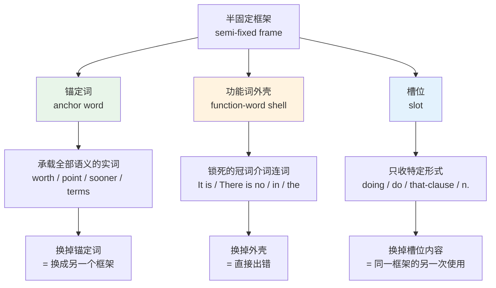
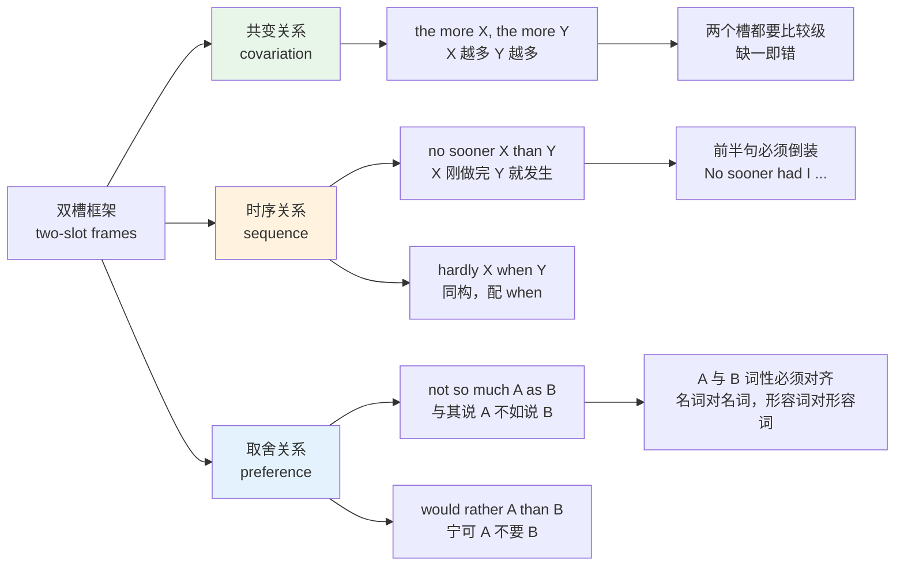
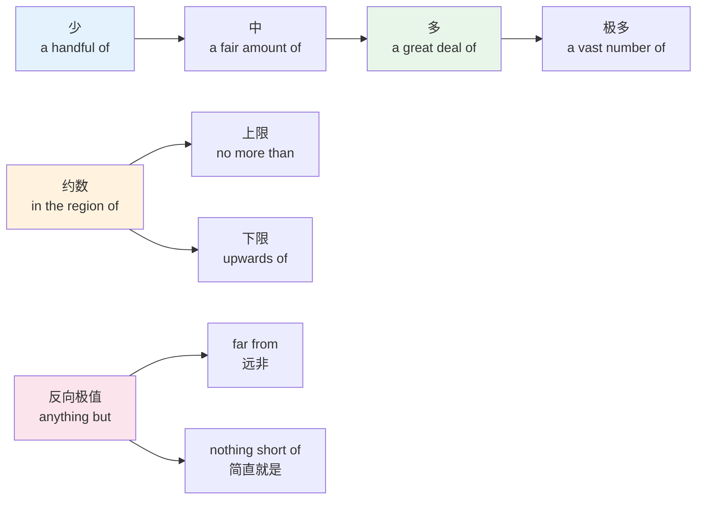
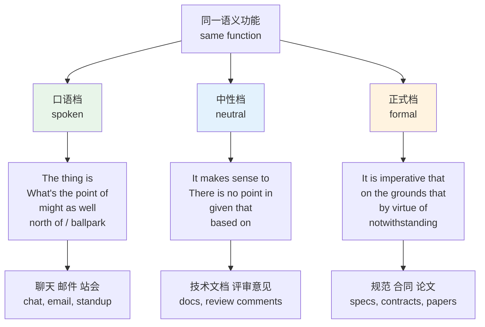
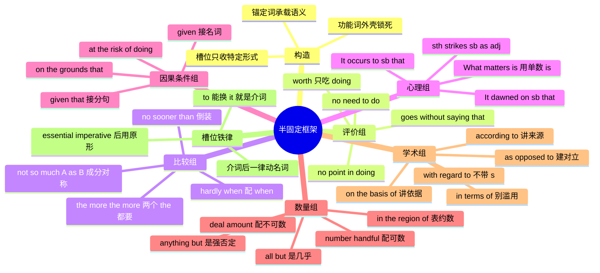

# 半固定框架与高频语块：It is worth doing 与 the more the more

> [!info] 本篇定位
>
> 17 章的收尾篇，也是全书唯一集中处理「带空槽的固定结构」的一篇。
>
> 前七篇讲的都是两个具体词的绑定：`heavy rain`、`make a decision`、`depend on`、`aware of`。本篇讲的是另一类东西——外壳固定、中间留空的结构。`It is worth ___` 的外壳一个字都不能动，中间那个空槽却能填进任何动名词；`the more ___, the more ___` 两个空槽可以随便填，但两个 `the` 和两个比较级一个都不能少。
>
> 这类结构在语法教程里按句法讲（`02.英语基础语法` 讲它的从句结构和倒装规则），在本教程里按词汇讲：把哪个词锁死在哪个位置、空槽只收哪种形式、换掉一个介词整个意思会不会崩。
>
> 读完你会拿到七组共约 150 条框架与锚定词，以及一张「哪个框架该配哪种语域」的分层表——写技术文档和写聊天消息不能用同一批框架。

---

## 1. 本篇导读：框架是词汇量的杠杆

先看一段中文母语者写出来的英文技术评审意见：

> The current design has problems. I think we should not use this library. The performance is bad. The team does not have experience with it. We need to consider other options.

五句话，语法零错误，词也都认识。问题在于它读起来像五张便签贴在一起——没有任何一句在结构上承担「让步」「权衡」「相对重要性」的功能。母语者写同样的意思，会长这样：

> Given that the team has no prior experience with this library, and at the risk of sounding conservative, I would argue that the performance gains are not so much a real advantage as a benchmark artefact. It is worth revisiting the alternatives before we commit.

第二段的生词其实更少（`artefact` 之外全是常见词），但读感差了一个量级。差距不在词汇量，在于第二段用了四个框架：`given that ___`、`at the risk of ___ing`、`not so much A as B`、`it is worth ___ing`。每个框架都是一个预制件，把「因为」「冒着被误解的风险」「与其说是 A 不如说是 B」「值得做」这四种关系一次性表达完。

这就是框架的杠杆效应。单词是零件，搭配是两个零件的焊点，框架是**已经焊好的半成品结构**——你只需要往留出的孔位里塞内容。

### 1.1 框架与前七篇的分工

| 类型 | 例子 | 可动的部分 | 主讲篇目 |
| --- | --- | --- | --- |
| 词与词的搭配 | heavy rain | 两个词都不可换 | [[17.固定搭配/04.形容词+名词搭配：强度、规模与名词偏好\|形容词+名词搭配]] |
| 动词选定的介词 | depend on | 介词不可换 | [[17.固定搭配/06.动词+介词固定搭配：depend on、result in、consist of\|动词+介词固定搭配]] |
| 名词形容词选定的介词 | reason for | 介词不可换 | [[17.固定搭配/07.名词与形容词+介词固定搭配：reason for、aware of、responsible for\|名词与形容词+介词固定搭配]] |
| 半固定框架 | It is worth ___ing | 外壳锁死，槽位自由 | 本篇 |
| 完全固定的习语 | by and large | 一个字都不能动 | [[18.语域、英美差异与习语俚语/03.习语与谚语\|习语与谚语]] |

按 [[17.固定搭配/01.搭配强度分级与可替换边界\|搭配强度分级与可替换边界]] 建立的四档连续统，半固定框架落在「强搭配」和「完全固定」之间：外壳部分的固定度等同于习语，槽位部分的自由度等同于自由组合。这种「一半死一半活」的性质，决定了它的学法既不能像单词那样背，也不能像语法规则那样推——只能整块记外壳，再单独记住槽位的填法限制。

### 1.2 本篇的七组框架

| 组别 | 功能 | 代表框架 | 本篇节次 |
| --- | --- | --- | --- |
| 评价 | 判断某事值不值得、有没有意义 | It is worth doing、There is no point in doing | 第 3 节 |
| 比较与时序 | 表达相关变化、先后紧接、程度取舍 | the more the more、no sooner than、not so much A as B | 第 4 节 |
| 心理视角 | 把认知过程本身放到主语位置 | It occurs to me that、What strikes me is | 第 5 节 |
| 因果与条件 | 给出前提、依据、代价 | given that、on the grounds that、at the risk of doing | 第 6 节 |
| 数量与近似 | 说不精确的量与反向极值 | a great deal of、in the region of、anything but | 第 7 节 |
| 学术语块 | 限定范围、指明依据、建立对照 | in terms of、on the basis of、as opposed to | 第 8 节 |
| 槽位限制 | 动名词、原形、that 从句三种填法 | worth doing、It is essential that sb do | 第 9 节 |

---

## 2. 半固定框架的构造：锚定词、槽位与可替换度

每个半固定框架都由三个部分组成，看懂这三部分就知道哪里能改哪里不能改。

图上三条出边说的是三种改动的后果，差别很大。改锚定词是合法的换框架操作：`It is worth doing` 换成 `It is no use doing`，两个框架结构相同、外壳相同，只有中心词从 `worth` 换成 `no use`，意思从「值得」变成「没用」。改外壳则是纯粹的错误：`There is no point in doing` 里的 `in` 换成 `of` 或者干脆删掉，句子立刻不成立。改槽位内容是框架的正常使用方式，也就是每次说话时真正在做的事。

### 2.1 三种槽位形式

槽位只有三种可能的填法，全书别的地方不会再展开讲：

| 槽位形式 | 记法 | 典型框架 | 填进去的例子 |
| --- | --- | --- | --- |
| 动名词 | ___ing | It is worth ___ing | reading the source |
| 动词原形 | ___ | It is essential that he ___ | be notified |
| that 从句 | that ___ | It goes without saying that ___ | the tests must pass |
| 名词短语 | n. | in terms of ___ | latency |
| 完整分句 | clause | given that ___ | the API is deprecated |

判断某个框架收哪一种，唯一可靠的办法是看锚定词后面紧跟的那个词。跟着介词（`in`、`of`、`at`、`to` 作介词）的一律收动名词或名词，因为介词后面只能接名词性成分；跟着 `that` 的收从句；`It is essential that` 这类形容词后置从句里的动词形式要单独判断，第 9 节专门处理。

### 2.2 本篇的核心锚定词

框架的语义几乎全部由锚定词承载，先把这批词的读音与词性钉死。

| 英文 | 英式音标 | 美式音标 | 词性 | 中文 | 搭配与说明 |
| --- | --- | --- | --- | --- | --- |
| **worth** | /wɜːθ/ | /wɜːrθ/ | prep./adj. | 值得；价值 | 后面只接名词或动名词，不接不定式 |
| **worthwhile** | /ˌwɜːθˈwaɪl/ | /ˌwɜːrθˈwaɪl/ | adj. | 值得做的 | 与 worth 不同，可接不定式：worthwhile to try |
| **worthy** | /ˈwɜːði/ | /ˈwɜːrði/ | adj. | 配得上的 | 固定搭配 worthy of，不能直接接动名词 |
| **point** | /pɔɪnt/ | /pɔɪnt/ | n. | 意义；用处 | no point in doing，介词锁死为 in |
| **use** | /juːs/ | /juːs/ | n. | 用处 | 名词读 /s/，动词读 /z/；It is no use doing |
| **sense** | /sens/ | /sens/ | n. | 道理 | It makes sense to do，此处收不定式 |
| **need** | /niːd/ | /niːd/ | n. | 必要 | There is no need to do，收不定式 |
| **sooner** | /ˈsuːnə/ | /ˈsuːnər/ | adv. | 更早 | no sooner ... than 固定配 than，不配 when |
| **scarcely** | /ˈskeəsli/ | /ˈskersli/ | adv. | 几乎不 | scarcely ... when，配 when 不配 than |
| **hardly** | /ˈhɑːdli/ | /ˈhɑːrdli/ | adv. | 几乎不 | hardly ... when，与 scarcely 同构 |
| **occur** | /əˈkɜː/ | /əˈkɜːr/ | v. | 被想到；发生 | 常用形式主语 It occurs to sb that；实义主语也成立：The idea occurred to me |
| **strike** | /straɪk/ | /straɪk/ | v. | 使觉得；打动 | What strikes me is ...；三态 strike-struck-struck |
| **dawn** | /dɔːn/ | /dɔːn/ | v. | 恍然明白 | it dawned on me that，比 occur 更强调迟来 |
| **given** | /ˈɡɪvn/ | /ˈɡɪvn/ | prep./conj. | 鉴于 | given the fact / given that，正式书面 |
| **ground** | /ɡraʊnd/ | /ɡraʊnd/ | n. | 依据 | 复数 grounds，on the grounds that |
| **risk** | /rɪsk/ | /rɪsk/ | n. | 风险 | at the risk of doing，介词 of 后收动名词 |
| **deal** | /diːl/ | /diːl/ | n. | 量 | a great deal of + 不可数名词 |
| **region** | /ˈriːdʒən/ | /ˈriːdʒən/ | n. | 范围 | in the region of + 数字，表约数 |
| **vicinity** | /vəˈsɪnəti/ | /vəˈsɪnəti/ | n. | 附近 | in the vicinity of，比 region 更正式 |
| **terms** | /tɜːmz/ | /tɜːrmz/ | n. | 方面 | 必须复数，in terms of |
| **basis** | /ˈbeɪsɪs/ | /ˈbeɪsɪs/ | n. | 基础 | 复数 bases /ˈbeɪsiːz/；on the basis of |
| **opposed** | /əˈpəʊzd/ | /əˈpoʊzd/ | adj. | 相对的 | as opposed to，不是 as opposite to |
| **virtue** | /ˈvɜːtʃuː/ | /ˈvɜːrtʃuː/ | n. | 优点；凭借 | by virtue of，法律与学术语域 |
| **accordance** | /əˈkɔːdns/ | /əˈkɔːrdns/ | n. | 一致 | in accordance with，仅正式文体 |
| **extent** | /ɪkˈstent/ | /ɪkˈstent/ | n. | 程度 | to the extent that；to some extent |
| **essential** | /ɪˈsenʃl/ | /ɪˈsenʃl/ | adj. | 必要的 | It is essential that + 虚拟式原形 |
| **imperative** | /ɪmˈperətɪv/ | /ɪmˈperətɪv/ | adj. | 势在必行的 | 同样触发虚拟式，语气比 essential 更硬 |
| **advisable** | /ədˈvaɪzəbl/ | /ədˈvaɪzəbl/ | adj. | 明智的 | It is advisable that，也触发虚拟式 |
| **lest** | /lest/ | /lest/ | conj. | 以免 | 后接原形，旧体正式词，见 18.05 |

这张表是本篇的字典层。往下每一节都是在讲这些词各自嵌在什么外壳里、槽位收什么形式。

---

## 3. 评价框架：worth、point、need、use 四个锚定词

评价框架回答同一个问题：这件事该不该做。四个锚定词分别覆盖「值得」「有意义」「有必要」「有用」四个侧面，外壳各不相同，混用即错。

### 3.1 worth 系：三个近义词三种句法

`worth`、`worthwhile`、`worthy` 中文都译成「值得」，句法却完全不同，是本篇最高频的错误来源。

| 框架 | 槽位形式 | 例子 | 判定 |
| --- | --- | --- | --- |
| It is worth ___ing | 动名词 | It is worth checking the logs. | 正确 |
| It is worth ___ | 名词 | It is worth a try. | 正确 |
| It is worth to ___ | 不定式 | It is worth to check | 错误 |
| It is worthwhile ___ing | 动名词 | It is worthwhile checking. | 正确 |
| It is worthwhile to ___ | 不定式 | It is worthwhile to check. | 正确 |
| ___ is worthy of ___ | of + 名词/动名词 | The proposal is worthy of consideration. | 正确 |
| ___ is worthy to ___ | 不定式 | The proposal is worthy to consider | 错误 |

`worth` 在词典里标的是介词（部分词典标形容词但同样要求名词性宾语），介词后面不能跟 `to do`，这是它拒绝不定式的根本原因。`worthwhile` 是实打实的形容词，两种形式都收。`worthy` 自带介词 `of`，把 `of` 丢掉就散架。

> [!warning] worth 三兄弟的三条硬规则
>
> - ❌ ~~It is worth to read this book.~~
> - ✅ **It is worth reading this book.**
> - ❌ ~~This book is worth of reading.~~（worth 不带 of）
> - ✅ **This book is worth reading.**
> - ❌ ~~This book is worthy reading.~~（worthy 必须带 of）
> - ✅ **This book is worthy of being read.**
>
> 还有一个母语者常用、学习者容易读不懂的结构：`The book is worth reading` 里的 `reading` 是主动形式表被动含义。书是被读的，但绝不能写成 `worth being read`（虽然语法可通，母语者几乎不这么说）。

### 3.2 worth 的扩展槽位

`worth` 后面除了动名词，还能填数量表达和几个固定名词，这一组在商务与技术语境里出现频率极高。

| 框架 | 中文 | 例句片段 |
| --- | --- | --- |
| be worth + 金额 | 值多少钱 | The domain is worth about 30,000 dollars. |
| be worth + one's while | 值得某人花时间 | It might be worth your while to attend. |
| be worth + a try / a shot / a look | 值得试一下 / 看一眼 | The workaround is worth a shot. |
| for what it's worth | 不管有没有用（插入语） | For what it's worth, I'd cache the result. |
| for all one is worth | 拼尽全力 | He argued for all he was worth. |

`for what it's worth` 是英文邮件里的高频缓冲语，缩写作 FWIW，用来把自己的意见降格成「仅供参考」，避免显得强势。它整块固定，`what` 不能换成 `whatever`，`it's` 不能拆成 `it is`。

它和只差一个词的 `for all one is worth` 毫无关系：后者里的代词要跟着主语走（`for all he was worth`、`for all I'm worth`），意思是「使出全部力气」，与「仅供参考」正好相反。两个短语外形相近、语义无关，是读英文时容易接错的一对。

### 3.3 point、need、use、sense：四个否定评价框架

这四个框架都在说「不必做」，但外壳的介词与槽位形式各不相同。

| 框架 | 槽位 | 中文 | 语域 |
| --- | --- | --- | --- |
| There is no point in ___ing | 动名词 | 做某事没意义 | 中性，最标准 |
| There is no point ___ing | 动名词（省略 in） | 同上 | 非正式场合可省 in |
| What's the point of ___ing | 动名词 | 做某事有什么意义 | 口语反问 |
| It is no use ___ing | 动名词 | 做某事没用 | 中性偏旧 |
| It is no good ___ing | 动名词 | 做某事不行 | 口语 |
| There is no need to ___ | 不定式 | 没必要做 | 中性 |
| There is no need for sb to ___ | 不定式 | 某人没必要做 | 中性 |
| It makes no sense to ___ | 不定式 | 做某事讲不通 | 中性 |
| It makes sense to ___ | 不定式 | 做某事有道理 | 中性，技术讨论高频 |
| It pays to ___ | 不定式 | 做某事划算 | 口语偏谚语 |

分界线很整齐：**跟着介词或直接跟着 `no use / no good / no point` 的收动名词，跟着 `need`、`sense`、`pays` 的收不定式**。原因还是介词那条老规矩——`in`、`of` 后面只能是名词性成分，而 `need to`、`sense to` 里的 `to` 是不定式标记不是介词。判别方法在 [[02.功能词与封闭词类速查/03.of 与 to：属格网络与方向对象网络\|of 与 to：属格网络与方向对象网络]] 讲过：把 `to` 后面换成 `it` 试试，能换的是介词，不能换的是不定式标记。`There is no need to it` 不成立，说明这个 `to` 是不定式标记。

> [!example] 四个否定评价框架的实际用法
>
> - There is **no point in** optimising a function that runs once a day.
>   - 优化一个每天只跑一次的函数没有意义。
> - It is **no use** blaming the framework when the query itself is quadratic.
>   - 查询本身是平方复杂度的时候，怪框架没有用。
> - There is **no need for** every service **to** maintain its own copy of the config.
>   - 没必要让每个服务都自己维护一份配置。
> - It **makes sense to** split the migration into two releases.
>   - 把迁移拆成两个版本发布是讲得通的。

### 3.4 肯定评价框架：goes without saying 与它的邻居

`It goes without saying that ___` 意思是「不言而喻」，用来把一个双方都认同的前提摆上台面。它是完全固化的：`goes` 不能变成 `is going`，`saying` 不能变成 `to say`，`that` 可省可不省。

同一功能位上还有几个框架，语气强度不同：

| 框架 | 语气 | 中文 | 使用场景 |
| --- | --- | --- | --- |
| It goes without saying that | 中性偏正式 | 不言而喻 | 铺垫共识后再转折 |
| Needless to say | 略随意 | 不用说 | 口语与邮件 |
| It stands to reason that | 正式 | 按理说 | 论证推理 |
| It is safe to say that | 中性 | 可以说 | 下有保留的结论 |
| It is fair to say that | 中性 | 平心而论 | 承认对方部分正确 |
| Suffice it to say that | 很正式偏旧 | 只需说 | 略去细节 |

`Suffice it to say that` 是本组唯一带虚拟式残留的：`suffice` 用原形而非 `suffices`，`it` 后置，整块不可拆。它在技术写作里罕见，但在英文原版书的序言与随笔里常出现，见到不要以为是印刷错误。

> [!tip] 评价框架的记忆抓手
>
> 五个最常错的点压成一句话：**worth 只吃 ing，need 只吃 to，point 前面必须有 in，use 前面是 no 不是 not，goes without saying 的 goes 永远第三人称单数。**
>
> 抄一遍这句话，比背五张表管用。

---

## 4. 比较与时序框架：the more the more、no sooner than、not so much A as B

这一组框架的共同点是**两个槽位互相牵制**：前一个槽填了什么，后一个槽的形式就被限死。

三类关系各带一条硬性形式要求，图右侧那一列就是本节要逐条落实的东西。共变关系要求两个槽都出现比较级形式；时序关系要求前半句倒装，因为 `no sooner`、`hardly` 是半否定词，置于句首触发部分倒装；取舍关系要求 A 与 B 的句法成分严格对称，这是学习者最容易破的一条。

### 4.1 the more the more：两个 the 都不能省

这个框架的完整形式是 `the + 比较级 + 分句, the + 比较级 + 分句`，两个 `the` 都是必需的。它们不是冠词，是古英语遗留的指示副词（意思接近「以此程度」），所以哪怕后面跟的是形容词也照写。

| 变体 | 例句 | 说明 |
| --- | --- | --- |
| the 比较级形容词 | The bigger the cache, the higher the hit rate. | 两边都可省略 be 动词 |
| the 比较级副词 | The more carefully you test, the fewer bugs ship. | more 修饰副词 |
| the more + 名词 | The more memory you allocate, the slower the GC pauses get. | more 作限定词 |
| the less / the fewer | The fewer dependencies you add, the easier the upgrade. | 反向共变 |
| the sooner the better | The sooner, the better. | 极度省略，整块固定 |
| all the more | That makes the argument all the more convincing. | all 强化，非双槽结构 |

> [!warning] the more the more 的四个高频错法
>
> - ❌ ~~More you practise, more you improve.~~（漏两个 the）
> - ✅ **The more you practise, the more you improve.**
> - ❌ ~~The more you read, the you understand more.~~（第二个比较级没有提前）
> - ✅ **The more you read, the more you understand.**
> - ❌ ~~The more the data is big, the more the query is slow.~~（该用比较级的地方用了原级）
> - ✅ **The bigger the data, the slower the query.**
> - ❌ ~~The more difficult the task, the more it is hard.~~（两边语义重复）
> - ✅ **The more difficult the task, the longer it takes.**

第二条错法值得单独说：比较级成分必须**整体提到分句最前面**，哪怕它在原句里是宾语或表语。`You understand more` 里的 `more` 是宾语，进框架后要提到 `the` 后面变成 `the more you understand`，主谓不倒装。这一点与下一小节的 `no sooner` 正好相反。

> [!example] 技术语境里的共变表达
>
> - **The more** services you split out, **the more** cross-service latency you pay for.
>   - 拆出的服务越多，付出的跨服务延迟就越多。
> - **The tighter** the coupling, **the harder** the refactor.
>   - 耦合越紧，重构越难。
> - **The fewer** moving parts a deployment has, **the less** there is to go wrong.
>   - 一次部署里可动的部件越少，能出错的地方就越少。

### 4.2 no sooner ... than：倒装与 than 的双重锁定

`no sooner ... than` 表示「一……就……」，两个部分各有一条锁：`no sooner` 置于句首必须倒装，后半句必须用 `than` 而非 `when`。

标准形式：`No sooner had + 主语 + 过去分词 + than + 主语 + 过去式`。前半句用过去完成时，后半句用一般过去时，时间顺序靠时态本身表达。

| 框架 | 后半句连词 | 前半句时态 | 倒装 |
| --- | --- | --- | --- |
| No sooner had S done ... | than | 过去完成 | 必须 |
| S had no sooner done ... | than | 过去完成 | 不倒装（no sooner 未置句首） |
| Hardly had S done ... | when | 过去完成 | 必须 |
| Scarcely had S done ... | when | 过去完成 | 必须 |
| Barely had S done ... | when | 过去完成 | 必须 |
| The moment S did ... | 无 | 一般过去 | 不倒装，口语首选 |
| As soon as S did ... | 无 | 一般过去 | 不倒装，中性 |

> [!warning] sooner 配 than，hardly 配 when
>
> - ❌ ~~No sooner had the build finished when the alerts started.~~
> - ✅ **No sooner had the build finished than the alerts started.**
> - ❌ ~~Hardly had he pushed the commit than CI went red.~~
> - ✅ **Hardly had he pushed the commit when CI went red.**
>
> 记忆锚点：`sooner` 是比较级形式，比较级配 `than`；`hardly` 不是比较级，只能配表时间点的 `when`。

这一组框架在书面叙事里常见，在口语里几乎不用——日常说「一……就……」用 `as soon as` 或 `the moment`。在英文小说里遇到 `No sooner had` 开头的句子不要卡住，它只是把「刚做完 A，B 就来了」写得文一点。相关的旧体叙事词汇见 [[18.语域、英美差异与习语俚语/05.叙事文本的词汇门槛：动作、描写、对话与旧体词\|叙事文本的词汇门槛]]。

### 4.3 not so much A as B：对称是硬要求

`not so much A as B` 的意思是「与其说是 A，不如说是 B」，用来纠正一个不够准确的判断。它的难点在于 A 和 B 必须是同类成分。

| A 与 B 的成分 | 例句 | 判定 |
| --- | --- | --- |
| 名词对名词 | It is not so much a bug as a design decision. | 正确 |
| 形容词对形容词 | He is not so much lazy as overloaded. | 正确 |
| 介词短语对介词短语 | The gain comes not so much from caching as from batching. | 正确 |
| 动词短语对动词短语 | She did not so much refuse as postpone. | 正确 |
| 名词对分句 | It is not so much a bug as it was designed this way | 错误，成分不对称 |

同一语义位上的替换品有三个，强度和语域略有差别：

| 框架 | 中文 | 语域 | 备注 |
| --- | --- | --- | --- |
| not so much A as B | 与其说 A 不如说 B | 正式书面 | 最标准 |
| less A than B | 与其说 A 不如说 B | 正式书面 | 更简洁，学术常用 |
| more B than A | 更像 B 而不是 A | 中性 | 顺序反过来，A 与 B 位置互换 |
| rather than | 而不是 | 中性 | 不带「重新定性」的意味，只做排除 |
| A rather than B | 是 A 不是 B | 中性 | 与 not so much 方向相反 |

`less A than B` 与 `not so much A as B` 完全同义但更短：`The problem is less technical than organisational.`（这个问题与其说是技术问题，不如说是组织问题。）学术写作里 `less ... than` 出现频率更高，值得优先掌握。

> [!example] 三种取舍框架的对照
>
> - The rewrite was **not so much** an improvement **as** a change of taste.
>   - 这次重写与其说是改进，不如说是口味变了。
> - The bottleneck is **less** the database **than** the serialisation layer.
>   - 瓶颈与其说在数据库，不如说在序列化那一层。
> - We chose Postgres **rather than** MySQL for the JSON support.
>   - 为了 JSON 支持，我们选了 Postgres 而不是 MySQL。

### 4.4 其余高频比较框架

| 框架 | 槽位 | 中文 | 说明 |
| --- | --- | --- | --- |
| would rather ___ than ___ | 原形对原形 | 宁可…也不… | rather 后不加 to |
| would rather sb ___ | 过去式表虚拟 | 宁愿某人… | I would rather you didn't. |
| prefer A to B | 名词对名词 | 更喜欢 A | to 是介词，收动名词 |
| prefer to do rather than do | 原形 | 宁可做 A 不做 B | 第二个动词不带 to |
| may as well ___ | 原形 | 不妨 | 隐含「反正也没更好的选择」 |
| might as well ___ | 原形 | 不妨 | 与 may as well 同义，更常用 |
| nothing compared to ___ | 名词 | 跟…比不算什么 | compared 不加 with 时更口语 |
| second only to ___ | 名词 | 仅次于 | 正式，常见于排名描述 |
| on a par with ___ | 名词 | 与…相当 | 美式常省冠词写作 on par with |

`might as well` 值得单独说一句：它表达的不是「最好」而是「反正闲着也是闲着」。`We might as well merge it now.` 的潜台词是「拖着也没什么好处」，语气比 `We should merge it now.` 消极得多。中文母语者常拿它当「不妨」用，会无意中泄露一种「随便吧」的态度。

---

## 5. 心理视角框架：It occurs to me that、What strikes me is

英文有一批框架专门把「想到」「注意到」「觉得奇怪」这类心理事件放到句子主语位置，而说话人本人退到宾语或介词宾语。中文没有对应结构，直译过去会变成一堆 `I think`。

### 5.1 occur、strike、dawn：三个「主客颠倒」的动词

| 英文 | 英式音标 | 美式音标 | 词性 | 中文 | 搭配与说明 |
| --- | --- | --- | --- | --- | --- |
| **occur** | /əˈkɜː/ | /əˈkɜːr/ | vi. | 被想到 | It occurs to sb that；双写 r：occurred |
| **strike** | /straɪk/ | /straɪk/ | vt. | 使某人觉得 | sth strikes sb as adj.；不用进行时 |
| **dawn** | /dɔːn/ | /dɔːn/ | vi. | 逐渐明白 | It dawned on sb that；强调迟来的领悟 |
| **cross** | /krɒs/ | /krɔːs/ | vt. | 掠过心头 | It crossed my mind that；常与 never 连用 |
| **hit** | /hɪt/ | /hɪt/ | vt. | 猛然想到 | It hit me that；口语，比 dawn 更突然 |
| **resonate** | /ˈrezəneɪt/ | /ˈrezəneɪt/ | vi. | 引起共鸣 | resonate with sb，正式偏文艺 |
| **appeal** | /əˈpiːl/ | /əˈpiːl/ | vi. | 吸引 | appeal to sb，不能说 appeal sb |
| **baffle** | /ˈbæfl/ | /ˈbæfl/ | vt. | 使困惑 | What baffles me is ...，比 puzzle 更强 |
| **puzzle** | /ˈpʌzl/ | /ˈpʌzl/ | vt. | 使不解 | 常用被动 be puzzled by |
| **intrigue** | /ɪnˈtriːɡ/ | /ɪnˈtriːɡ/ | vt. | 引起兴趣 | What intrigues me is ...，褒义 |

这批动词的共同句法特征是：**心理内容当主语，人当宾语或介词宾语**。`It occurs to me` 字面是「它发生到我身上」，人是被动接收方。中文母语者写成 ✗ `I occur that ...` 是最典型的错误，因为中文里「我想到」的「我」永远是主语。

| 框架 | 完整形式 | 中文 | 语气 |
| --- | --- | --- | --- |
| It occurs to sb that | It occurred to me that we never tested this path. | 我突然想到 | 中性 |
| It never occurred to sb that | It never occurred to me that the cache could go stale. | 我从没想到 | 承认疏忽 |
| It dawned on sb that | It slowly dawned on us that the metric was wrong. | 我们渐渐明白 | 迟来的领悟 |
| It crossed sb's mind that | It crossed my mind that we could just cache it. | 我曾闪过一个念头 | 弱，未采取行动 |
| It never crossed sb's mind that | It never crossed her mind that anyone would read the logs. | 她压根没想过 | 强调完全没考虑 |
| It hit sb that | Halfway through the demo it hit me that the config was stale. | 我猛地意识到 | 口语，突发 |
| sth strikes sb as adj. | The proposal strikes me as premature. | 我觉得…有点… | 委婉表达判断 |

> [!warning] 三个主客颠倒动词的错法
>
> - ❌ ~~I occurred that we forgot the migration.~~
> - ✅ **It occurred to me that we had forgotten the migration.**
> - ❌ ~~I dawned that the numbers were off.~~
> - ✅ **It dawned on me that the numbers were off.**
> - ❌ ~~I strike this design as fragile.~~
> - ✅ **This design strikes me as fragile.**
>
> 三个动词的介词也不同：`occur` 配 `to`，`dawn` 配 `on`，`cross` 直接跟 `sb's mind` 不带介词，`strike` 直接跟人再配 `as`。这四个介词位置错一个整句就崩。

### 5.2 What ___ is ___：把重点搬到句首

`What strikes me is ...` 属于分裂句（伪分裂句）家族。它的作用不是表达新意思，而是**把最想强调的成分挪到句尾的焦点位置**。

| 框架 | 强调什么 | 例句 |
| --- | --- | --- |
| What strikes me is ___ | 令人印象深刻的点 | What strikes me is how little the API changed. |
| What matters is ___ | 真正重要的东西 | What matters is whether the migration is reversible. |
| What bothers me is ___ | 让人不安的点 | What bothers me is the silent failure mode. |
| What surprises me is ___ | 意外的点 | What surprises me is that nobody noticed. |
| What I mean is ___ | 澄清 | What I mean is that we should benchmark first. |
| What we need is ___ | 需求 | What we need is a smaller blast radius. |
| All I'm saying is ___ | 收缩立场 | All I'm saying is that it's untested. |
| The thing is, ___ | 引出核心难点 | The thing is, the vendor won't support it. |
| The point is ___ | 归结 | The point is that the cost is unbounded. |
| The question is whether ___ | 提出待决问题 | The question is whether we can roll back. |

这一组框架有一条形式规律：`What ___` 引导的整个部分算单数，所以系动词用 `is` 而非 `are`，哪怕后面接的是复数。`What we need is more tests.` 里的 `is` 不能写成 `are`——这是母语者也偶尔写错的地方，正式写作要留意。

> [!example] 心理视角框架在评审意见里的实际效果
>
> - **What strikes me is** how much of this logic already exists in the shared module.
>   - 让我意外的是，这部分逻辑在公共模块里已经有了。
> - **It never occurred to me that** the retry loop would amplify the outage.
>   - 我从没想过重试循环会把故障放大。
> - The naming **strikes me as** inconsistent with the rest of the package.
>   - 我觉得这个命名和包里其他地方不太一致。
> - **The thing is,** we can't reproduce it outside production.
>   - 问题在于，我们在生产环境之外复现不出来。

第三句尤其值得学：`strikes me as` 把「我认为它不一致」软化成「在我看来它显得不一致」，把判断限定为个人观感，在跨文化协作里能显著降低对抗感。同类的软化手段还有 [[02.功能词与封闭词类速查/08.程度副词、频率副词与模糊限制词\|模糊限制词]]，以及 [[13.抽象概念、评价与高频动词/03.言语动词与转述动词群\|言语动词与转述动词群]] 里那条按立场强度排开的转述动词阶梯。

---

## 6. 因果与条件框架：given that、on the grounds that、at the risk of doing

这一组框架给论证提供支架：交代前提、说明依据、预先承认代价。三者都偏正式，是技术文档、设计评审与学术写作的骨架词。

### 6.1 given：一个词三种句法身份

`given` 由 `give` 的过去分词固化而来，在框架里有三种用法，收的成分不同。

| 形式 | 后面收什么 | 例子 | 中文 |
| --- | --- | --- | --- |
| given + 名词 | 名词短语 | Given the deadline, we cut scope. | 考虑到期限 |
| given that + 分句 | 完整分句 | Given that the API is deprecated, migrating is unavoidable. | 鉴于 API 已废弃 |
| given the fact that + 分句 | 完整分句 | Given the fact that nobody owns this service ... | 鉴于事实是 |
| taking ___ into account | 名词 | Taking latency into account, the design holds. | 把…考虑在内 |
| in view of | 名词 | In view of the incident, we froze deploys. | 鉴于 |
| in light of | 名词 | In light of the new data, the estimate changed. | 根据新情况 |

`given the fact that` 是三者里最啰嗦的一个，正式写作建议直接用 `given that`。`in light of` 和 `in view of` 只接名词短语，接分句就错——想接分句要写成 `in light of the fact that`。

### 6.2 on the grounds that：依据与借口的双重色彩

`ground` 单数是「地面」，复数 `grounds` 才是「理由、依据」，这个框架默认用复数形式。英美法律文本在只列出一条理由时也写 `on the ground that`，属于有据可查的少数派写法；技术与日常写作一律用 `grounds`，不必去分单复数。

| 框架 | 收什么 | 中文 | 色彩 |
| --- | --- | --- | --- |
| on the grounds that + 分句 | 分句 | 以…为理由 | 中性偏法律 |
| on the grounds of + 名词 | 名词 | 基于…的理由 | 中性偏法律 |
| on the basis that + 分句 | 分句 | 基于…的前提 | 中性 |
| on the basis of + 名词 | 名词 | 根据 | 学术高频 |
| on the assumption that | 分句 | 假定 | 中性 |
| on the premise that | 分句 | 以…为前提 | 正式 |
| on the pretext of ___ing | 动名词 | 以…为借口 | 贬义 |
| under the pretence of ___ing | 动名词 | 打着…的幌子 | 贬义，美式拼作 pretense |
| for the sake of ___ | 名词/动名词 | 为了 | 中性 |
| for fear that + 分句 | 分句 | 唯恐 | 正式偏旧 |
| for fear of ___ing | 动名词 | 生怕 | 中性 |

`on the grounds that` 与 `on the pretext of` 的差别是评价性的：前者中立地陈述依据，后者暗示这个依据是假的。写「他们以性能为由拒绝了这个方案」，用 `on the grounds of performance` 是客观陈述，用 `on the pretext of performance` 就等于说他们撒谎。这类褒贬差别的判定方法见 [[16.词义辨析、搭配与短语动词/01.同义词辨析方法与高频同义词组\|同义词辨析方法与高频同义词组]] 的第四把尺子。

### 6.3 at the risk of doing：预先认领代价

`at the risk of ___ing` 用来在说出可能被反驳的话之前，先承认这句话的风险。它是英语学术与职场写作里的标志性缓冲结构。

| 框架 | 中文 | 典型接续 |
| --- | --- | --- |
| at the risk of ___ing | 冒着…的风险 | at the risk of oversimplifying |
| at the expense of ___ | 以牺牲…为代价 | at the expense of readability |
| at the cost of ___ | 以…为代价 | at the cost of two weeks |
| at the price of ___ | 以…为代价 | at the price of vendor lock-in |
| for all ___ | 尽管有 | For all its flaws, it ships. |
| much as ___ | 尽管很 | Much as I like the idea, the budget says no. |
| albeit ___ | 虽然（后接短语） | a workable fix, albeit an ugly one |
| notwithstanding ___ | 尽管 | Notwithstanding the delay, the release held. |

`at the risk of` 后面固定收动名词，最常见的四个填法是 `oversimplifying`（过度简化）、`repeating myself`（重复自己）、`stating the obvious`（说废话）、`sounding negative`（听起来消极）。这四个填法本身就是语块，可以整块记。

> [!example] 因果条件框架组成的一段完整论证
>
> - **Given that** the traffic pattern is bursty, a fixed thread pool will either idle or thrash.
>   - 鉴于流量是突发型的，固定线程池要么闲置要么颠簸。
> - We rejected the queue-based design **on the grounds that** it adds an operational dependency nobody is on call for.
>   - 我们否决了基于队列的方案，理由是它引入了一个无人值班的运维依赖。
> - **At the risk of** oversimplifying, the trade-off is latency versus operational surface.
>   - 冒着过度简化的风险说一句，这个权衡就是延迟对运维面。
> - The autoscaler solves this, **albeit** at the expense of a slower cold start.
>   - 自动扩缩容能解决这个问题，代价是冷启动变慢。

### 6.4 条件框架的一整排

条件不止 `if` 一种说法，正式文体里下面这批出现得更多。

| 英文 | 英式音标 | 美式音标 | 词性 | 中文 | 搭配与说明 |
| --- | --- | --- | --- | --- | --- |
| **provided** | /prəˈvaɪdɪd/ | /prəˈvaɪdɪd/ | conj. | 只要 | provided that，条件比 if 更强调「前提满足」 |
| **providing** | /prəˈvaɪdɪŋ/ | /prəˈvaɪdɪŋ/ | conj. | 只要 | 与 provided 同义，略口语 |
| **assuming** | /əˈsjuːmɪŋ/ | /əˈsuːmɪŋ/ | conj. | 假设 | assuming that，可省 that |
| **supposing** | /səˈpəʊzɪŋ/ | /səˈpoʊzɪŋ/ | conj. | 假如 | 多用于提问：Supposing it fails? |
| **granted** | /ˈɡrɑːntɪd/ | /ˈɡræntɪd/ | conj. | 诚然 | granted that，先让步再转折 |
| **barring** | /ˈbɑːrɪŋ/ | /ˈbɑːrɪŋ/ | prep. | 除非出现 | barring surprises，只接名词 |
| **failing** | /ˈfeɪlɪŋ/ | /ˈfeɪlɪŋ/ | prep. | 若没有 | failing that，整块常用 |
| **insofar** | /ˌɪnsəʊˈfɑː/ | /ˌɪnsoʊˈfɑːr/ | adv. | 在…范围内 | insofar as，学术与法律 |
| **inasmuch** | /ˌɪnəzˈmʌtʃ/ | /ˌɪnəzˈmʌtʃ/ | adv. | 因为 | inasmuch as，很正式偏旧 |
| **lest** | /lest/ | /lest/ | conj. | 以免 | 后接原形或 should do，旧体 |
| **unless** | /ənˈles/ | /ənˈles/ | conj. | 除非 | 不与否定连用：不说 unless not |
| **whereas** | /weərˈæz/ | /werˈæz/ | conj. | 而 | 对比而非条件，法律文本高频 |
| **pending** | /ˈpendɪŋ/ | /ˈpendɪŋ/ | prep. | 在…之前 | pending approval，公文体 |
| **subject to** | /ˈsʌbdʒɪkt/ | /ˈsʌbdʒɪkt/ | adj. | 以…为条件 | subject to review，合同高频 |
| **contingent** | /kənˈtɪndʒənt/ | /kənˈtɪndʒənt/ | adj. | 取决于 | contingent on/upon，正式 |

`failing that` 是这批里最实用的一个日常语块，意思是「要是那个不行的话」，用来引出备选方案：`We'll patch the driver; failing that, we roll back.`（我们先给驱动打补丁；不行的话就回滚。）它整块固定，`failing` 不能换成别的分词。

---

## 7. 数量与近似框架：a great deal of、in the region of、anything but

技术写作里精确数字反而少，大量的量是「大约」「不到」「远不止」这种模糊表述。这一组框架专管模糊量。

图上分了三条线：第一条是量的多少梯度，第二条是约数与上下限，第三条是反向极值——`anything but` 和 `far from` 是否定，`nothing short of` 是极端肯定，三者外形相似语义方向不同，最容易读反。

### 7.1 量词框架与可数性限制

`a great deal of` 这类量词框架有严格的可数性限制，选错就是语法错误。判定名词可数与否的词典标注体例见 [[01.词汇入门与学习方法/04.词性与词典标注体例：词条上的缩写怎么读\|词性与词典标注体例]]。

| 框架 | 只配不可数 | 只配可数复数 | 两者皆可 |
| --- | --- | --- | --- |
| a great deal of | 是 | — | — |
| a good deal of | 是 | — | — |
| a large amount of | 是 | — | — |
| a fair amount of | 是 | — | — |
| a large quantity of | — | — | 是 |
| a great number of | — | 是 | — |
| a handful of | — | 是 | — |
| a couple of | — | 是 | — |
| dozens of | — | 是 | — |
| scores of | — | 是 | — |
| a myriad of | — | 是 | — |
| plenty of | — | — | 是 |
| a lot of | — | — | 是 |
| lots of | — | — | 是 |
| loads of | — | — | 是 |
| a wealth of | — | — | 是 |
| a wide range of | — | 是 | — |
| a swathe of | — | — | 是 |

> [!warning] deal 与 number 的可数性错法
>
> - ❌ ~~a great deal of bugs~~（bug 可数）
> - ✅ **a great number of bugs** / **a great deal of complexity**
> - ❌ ~~a large number of traffic~~（traffic 不可数）
> - ✅ **a large amount of traffic**
> - ❌ ~~a handful of evidence~~（evidence 不可数）
> - ✅ **a handful of examples** / **a good deal of evidence**
>
> 一句话记法：**deal 和 amount 跟不可数，number 和 handful 跟可数复数，quantity 和 plenty 两边通吃。**

上表管的是量词用法。`a handful of` 在字面义上（一只手抓得住的量）照样能配不可数名词，`a handful of sand`、`a handful of rice` 都成立；只有当它退化成「少数几个」这个量词义时，才锁定可数复数。判断看的是它还有没有「一把」这层实义。

`a myriad of` 有个历史争议：`myriad` 原本就是名词（一万），后来变成形容词用法 `myriad options`，现在两种写法词典都收，正式写作里 `a myriad of options` 与 `myriad options` 都算对。

### 7.2 约数与上下限

| 框架 | 中文 | 语域 | 例子 |
| --- | --- | --- | --- |
| in the region of | 大约 | 正式，英式偏多 | in the region of 40 ms |
| in the vicinity of | 接近 | 正式 | in the vicinity of ten million rows |
| on the order of | 数量级为 | 技术与学术，美式 | on the order of 10^6 requests |
| of the order of | 数量级为 | 英式学术 | of the order of a millisecond |
| in the ballpark of | 大致 | 口语，美式 | in the ballpark of two weeks |
| give or take | 上下浮动 | 口语 | three days, give or take |
| or so | 左右 | 口语 | twenty or so entries |
| odd（后置） | 出头 | 口语，非正式 | thirty-odd files |
| upwards of | 超过 | 中性 | upwards of 500 users |
| north of | 超过 | 口语，美式商务 | north of a million dollars |
| shy of | 差一点到 | 口语 | just shy of 100 ms |
| no fewer than | 不少于（可数） | 正式，带惊叹 | no fewer than twelve retries |
| no less than | 不少于（不可数或强调） | 正式，带惊叹 | no less than half the traffic |
| no more than | 不超过（带贬低） | 中性 | no more than a wrapper |
| at most / at least | 最多 / 至少 | 中性 | at least two replicas |

`no more than` 与 `not more than` 差一个字，语气差很远：`not more than three` 是纯粹的数量上限（不超过三个），`no more than three` 带评价色彩（才三个而已，嫌少）。同理 `no less than half` 是「足足有一半」，`not less than half` 只是「不低于一半」。这个差别在读技术规格书时要留意——规格里用 `not more than`，评论里用 `no more than`。

### 7.3 anything but 与它的反向亲戚

这三个框架长得像，方向完全不同，读错一个句子意思就反了。

| 框架 | 字面 | 实际意思 | 例子 |
| --- | --- | --- | --- |
| anything but | 除了…什么都是 | 绝不是，一点也不 | The rollout was anything but smooth. |
| nothing but | 除了…什么都不是 | 只不过是 | It is nothing but a config change. |
| far from | 离…很远 | 远非，根本不 | The design is far from final. |
| nothing short of | 不亚于 | 简直就是（强肯定） | The recovery was nothing short of remarkable. |
| all but | 差不多全是 | 几乎，差一点就 | The service was all but dead. |
| none other than | 不是别人正是 | 正是（强调身份） | The author was none other than the maintainer. |
| anything like | 像…那样 | （否定句中）远不如 | It isn't anything like as fast as claimed. |

`anything but smooth` 是「一点也不顺利」，`nothing but a config change` 是「只是改了个配置」。两个框架都以「but」结尾，一个是强否定一个是弱化，靠前面的 `anything` 与 `nothing` 区分——**anything 打头是否定，nothing 打头是限定**。

`all but` 最坑：它字面像「除了…都」，实际意思是「几乎」。`The migration is all but complete.` 是「迁移基本完成了」，不是「除了完成什么都是」。

> [!example] 反向极值框架在事故复盘里的用法
>
> - The failover was **anything but** automatic; someone had to flip the DNS by hand.
>   - 故障切换一点也不自动，得有人手动改 DNS。
> - The alert was **nothing but** noise for the first six months.
>   - 头六个月这条告警只是噪声。
> - We are **far from** confident that the fix covers every code path.
>   - 我们远不能确信这个修复覆盖了所有代码路径。
> - Getting the data back was **nothing short of** luck.
>   - 数据能找回来简直就是运气。

---

## 8. 学术语块：in terms of、on the basis of、as opposed to

学术语块是本篇最实用的一组——读英文规范、论文和 RFC 时它们几乎每页都出现，写作时用对了能立刻把文体拉到正式档。

### 8.1 限定范围类

| 框架 | 中文 | 后接 | 说明 |
| --- | --- | --- | --- |
| in terms of | 在…方面 | 名词/动名词 | terms 必须复数 |
| with regard to | 关于 | 名词 | regard 单数，不加 s |
| as regards | 关于 | 名词 | 这里 regards 才带 s，无 to |
| with respect to | 就…而言 | 名词 | 缩写 w.r.t.，数学与工程高频 |
| in respect of | 就…而言 | 名词 | 英式法律文体 |
| with reference to | 参照 | 名词 | 公文体 |
| in relation to | 相对于 | 名词 | 中性 |
| as far as ___ is concerned | 就…而言 | 名词 | 口语与写作皆可 |
| when it comes to | 说到 | 名词/动名词 | 口语偏多 |
| in the context of | 在…语境下 | 名词 | 学术高频 |
| to the extent that | 在…程度上 | 分句 | 学术，常见于限定条件 |
| insofar as | 就…而言 | 分句 | 很正式 |

> [!warning] regard 系三个框架的 s 陷阱
>
> - ❌ ~~with regards to the deadline~~（书面写作里不规范）
> - ✅ **with regard to the deadline**
> - ✅ **as regards the deadline**（这个才带 s）
> - ✅ **regarding the deadline**（最简洁，优先用这个）
>
> `with regards` 只在信末问候语 `Best regards` 里合法。写正文时如果拿不准，直接用 `regarding` 或 `about`，一个坑都不会踩。

`in terms of` 被过度使用是英文写作里公认的毛病：很多情况下它只是 `in`、`by`、`for` 的臃肿替代。`measured in terms of latency` 完全可以写成 `measured by latency`。判断标准是——如果去掉 `in terms of` 换一个介词句子仍然通顺，就该换掉。

### 8.2 指明依据类

| 框架 | 中文 | 后接 | 语域 |
| --- | --- | --- | --- |
| on the basis of | 基于 | 名词 | 学术标准 |
| based on | 基于 | 名词 | 中性，最常用 |
| by virtue of | 凭借 | 名词 | 正式偏法律 |
| in accordance with | 按照 | 名词 | 公文与合同 |
| in line with | 符合 | 名词 | 商务 |
| in keeping with | 与…一致 | 名词 | 正式 |
| consistent with | 与…相符 | 名词 | 学术与技术 |
| pursuant to | 依据 | 名词 | 纯法律 |
| according to | 根据 | 名词 | 中性，转述来源 |
| drawing on | 借助 | 名词 | 学术 |

`according to` 与 `on the basis of` 的分工要记清楚：前者转述**别人说的话或数据来源**（`according to the docs`），后者说明**推理所依据的事实**（`on the basis of the profiling data`）。用 `according to me` 表达「我认为」是典型错误，英语里不这么说——`according to` 天然排除说话人自己。

### 8.3 建立对照类

| 框架 | 中文 | 说明 |
| --- | --- | --- |
| as opposed to | 而不是 | 强调二选一的对立，不是 as opposite to |
| in contrast to | 与…相反 | 强调差异 |
| by contrast | 相比之下 | 独立使用，不带宾语 |
| in comparison with | 与…相比 | 中性 |
| compared with / compared to | 与…相比 | with 侧重量出差异，to 侧重打比方；今天两者大多可互换 |
| unlike | 不同于 | 介词，直接接名词 |
| whereas | 而 | 连词，接分句 |
| while | 而 | 连词，兼有对比义 |
| conversely | 反过来 | 副词，句首 |
| on the contrary | 恰恰相反 | 纠正前面的错误说法 |
| on the other hand | 另一方面 | 列出另一面，不含纠错义 |

> [!warning] on the contrary 与 on the other hand 不是一回事
>
> - ❌ ~~The API is fast. On the contrary, it lacks pagination.~~
> - ✅ **The API is fast. On the other hand, it lacks pagination.**
> - ✅ **The API isn't slow. On the contrary, it's the fastest we've benchmarked.**
>
> `on the contrary` 只能用来**推翻前面那句话**，前一句通常是否定或错误说法；`on the other hand` 用来补充另一个侧面，前后两句都成立。中文「相反」同时覆盖两种用法，导致这个错误极其普遍。

### 8.4 学术语块锚定词补表

| 英文 | 英式音标 | 美式音标 | 词性 | 中文 | 搭配与说明 |
| --- | --- | --- | --- | --- | --- |
| **regard** | /rɪˈɡɑːd/ | /rɪˈɡɑːrd/ | n./v. | 关于；看待 | with regard to 不带 s |
| **respect** | /rɪˈspekt/ | /rɪˈspekt/ | n. | 方面 | in this respect 在这方面 |
| **context** | /ˈkɒntekst/ | /ˈkɑːntekst/ | n. | 语境 | in the context of，out of context |
| **premise** | /ˈpremɪs/ | /ˈpremɪs/ | n. | 前提 | on the premise that；复数 premises 另指房产 |
| **pretext** | /ˈpriːtekst/ | /ˈpriːtekst/ | n. | 借口 | on the pretext of，贬义 |
| **expense** | /ɪkˈspens/ | /ɪkˈspens/ | n. | 代价 | at the expense of |
| **magnitude** | /ˈmæɡnɪtjuːd/ | /ˈmæɡnɪtuːd/ | n. | 量级 | an order of magnitude 一个数量级 |
| **sake** | /seɪk/ | /seɪk/ | n. | 缘故 | for the sake of；for clarity's sake |
| **behalf** | /bɪˈhɑːf/ | /bɪˈhæf/ | n. | 代表 | on behalf of，英美元音不同 |
| **lieu** | /ljuː/ | /luː/ | n. | 代替 | in lieu of，法语借词，很正式 |
| **conjunction** | /kənˈdʒʌŋkʃn/ | /kənˈdʒʌŋkʃn/ | n. | 结合 | in conjunction with 与…配合 |
| **outset** | /ˈaʊtset/ | /ˈaʊtset/ | n. | 开端 | from the outset 一开始就 |
| **onset** | /ˈɒnset/ | /ˈɑːnset/ | n. | 发作 | the onset of，多用于负面事件 |
| **verge** | /vɜːdʒ/ | /vɜːrdʒ/ | n. | 边缘 | on the verge of doing 濒临 |
| **brink** | /brɪŋk/ | /brɪŋk/ | n. | 边缘 | on the brink of，比 verge 更危险 |
| **akin** | /əˈkɪn/ | /əˈkɪn/ | adj. | 类似 | akin to，作表语或后置定语，不作前置定语 |
| **tantamount** | /ˈtæntəmaʊnt/ | /ˈtæntəmaʊnt/ | adj. | 等同于 | tantamount to，负面语境 |
| **thereby** | /ˌðeəˈbaɪ/ | /ˌðerˈbaɪ/ | adv. | 从而 | thereby + 动名词，学术 |
| **whereby** | /weəˈbaɪ/ | /werˈbaɪ/ | adv. | 借此 | a mechanism whereby ... |
| **hence** | /hens/ | /hens/ | adv. | 因此 | 后可直接接名词短语：hence the delay |
| **albeit** | /ɔːlˈbiːɪt/ | /ɔːlˈbiːɪt/ | conj. | 虽然 | 后接形容词或短语，不接完整分句 |
| **notwithstanding** | /ˌnɒtwɪθˈstændɪŋ/ | /ˌnɑːtwɪθˈstændɪŋ/ | prep. | 尽管 | 可前置可后置，法律文体 |

`hence the delay` 这种用法值得单独记：`hence` 后面可以直接跟名词短语，不需要动词，等于 `that is why there is a delay`。技术文档里 `hence the name`、`hence the workaround` 都是高频写法。

---

## 9. 槽位限制：动名词、原形、that 从句三种填法的硬规则

前面各节零散提到过槽位限制，这一节把它们集中成可查的规则。

### 9.1 规则一：介词后一律动名词

只要锚定词后面紧跟的是真介词，槽位必须是动名词或名词，绝不可能是不定式。

| 框架 | 介词 | 槽位 | 正确填法 |
| --- | --- | --- | --- |
| There is no point in ___ | in | 动名词 | in waiting |
| at the risk of ___ | of | 动名词 | of repeating myself |
| on the pretext of ___ | of | 动名词 | of security |
| for fear of ___ | of | 动名词 | of breaking the build |
| in favour of ___ | of | 名词/动名词 | of the simpler design |
| with a view to ___ | to（介词） | 动名词 | to reducing latency |
| look forward to ___ | to（介词） | 动名词 | to hearing from you |
| be committed to ___ | to（介词） | 动名词 | to maintaining it |
| be opposed to ___ | to（介词） | 动名词 | to rewriting it |
| be accustomed to ___ | to（介词） | 动名词 | to working remotely |
| resort to ___ | to（介词） | 动名词 | to polling |
| object to ___ | to（介词） | 动名词 | to merging early |

最后七行的 `to` 是全书最经典的陷阱：它长得跟不定式标记一模一样，实际是介词，所以后面必须接动名词。检验方法还是那条——能换成 `it` 的就是介词。`I look forward to it.` 成立，所以是介词，所以要写 `look forward to hearing`，不能写 ✗ `look forward to hear`。

> [!warning] to 后面到底填 do 还是 doing
>
> - ❌ ~~I look forward to hear from you.~~
> - ✅ **I look forward to hearing from you.**
> - ❌ ~~We are committed to maintain backward compatibility.~~
> - ✅ **We are committed to maintaining backward compatibility.**
> - ❌ ~~She objected to change the schema.~~
> - ✅ **She objected to changing the schema.**
>
> 反过来，下面这些 `to` 是不定式标记，必须接原形：
>
> - ✅ **There is no need to change the schema.**
> - ✅ **It makes sense to benchmark first.**
> - ✅ **We decided to postpone the release.**

### 9.2 规则二：mandative 触发原形

一批表示「必要、要求、建议、命令」的形容词与名词，后面的 that 从句里动词用原形，不随主语变位，也不随时态变化。这个原形形式在语法上叫 mandative subjunctive（要求虚拟式）。本教程只从词汇角度记「哪些词触发它」，规则本身归 `02.英语基础语法`。

| 触发词 | 框架 | 例子 |
| --- | --- | --- |
| essential | It is essential that sb (should) do | It is essential that every request be logged. |
| imperative | It is imperative that sb (should) do | It is imperative that the key be rotated. |
| vital | It is vital that sb (should) do | It is vital that the backup run nightly. |
| crucial | It is crucial that sb (should) do | It is crucial that nobody bypass review. |
| necessary | It is necessary that sb (should) do | It is necessary that he sign off first. |
| advisable | It is advisable that sb (should) do | It is advisable that the flag remain off. |
| desirable | It is desirable that sb (should) do | It is desirable that the API stay stable. |
| a requirement | It is a requirement that sb do | It is a requirement that the token expire. |
| recommendation | our recommendation is that sb do | Our recommendation is that the job be split. |
| insist | insist that sb do | They insisted that the build be reproducible. |
| demand | demand that sb do | The auditor demanded that logs be retained. |
| propose | propose that sb do | I propose that we defer the change. |
| require | require that sb do | The spec requires that clients retry. |

> [!warning] 虚拟式原形的三个观察点
>
> - ❌ ~~It is essential that every request is logged.~~（美式书面语判错；英式可接受）
> - ✅ **It is essential that every request be logged.**
> - ❌ ~~It is imperative that he rotates the key.~~
> - ✅ **It is imperative that he rotate the key.**（注意 rotate 不加 s）
> - ✅ **It is imperative that he should rotate the key.**（英式常插 should）
>
> 三条判定：**动词一律原形，第三人称不加 s，否定直接加 not 在原形前**（`It is essential that he not merge yet.`，不写 `does not merge`）。
>
> 英美差异明显：美式书面语严格用原形，英式常插 `should`，日常英式口语甚至直接用陈述式。写国际化的技术文档时用原形最安全。

### 9.3 规则三：that 从句用陈述式的框架

不是所有 `It is + 形容词 + that` 都触发虚拟式。表示「事实判断」的形容词后面用普通陈述式。

| 形容词类别 | 例词 | 从句形式 |
| --- | --- | --- |
| 要求与建议 | essential、imperative、vital、crucial、advisable | 原形（虚拟式） |
| 事实判断 | clear、obvious、evident、apparent、true | 陈述式 |
| 可能性 | likely、probable、possible、unlikely | 陈述式 |
| 情感反应 | surprising、odd、strange、a pity | 陈述式或 should |
| 重要性（歧义组） | important | 两可，视语义 |

`important` 是这批词里最典型的两可词：`It is important that he be there`（要求他在场）用虚拟式，`It is important that he was there`（他在场这件事很重要）用陈述式。前者说的是应然，后者说的是实然。

情感反应类的 `should` 是另一个意思——「竟然」：`It is odd that he should say that.`（他竟然那么说，真怪。）这个 `should` 不是虚拟式的 should，删掉它句子仍然成立但少了惊讶的味道。

### 9.4 完整槽位限制速查表

| 框架 | 槽位形式 | 常见错填 |
| --- | --- | --- |
| It is worth ___ | doing / n. | to do |
| It is worthwhile ___ | doing / to do | 无 |
| be worthy of ___ | n. / doing | to do |
| There is no point in ___ | doing | to do |
| It is no use ___ | doing | to do |
| There is no need to ___ | do | doing |
| It makes sense to ___ | do | doing |
| It pays to ___ | do | doing |
| It goes without saying that ___ | 陈述式分句 | to do |
| the more ___, the more ___ | 比较级 + 分句 | 原级 |
| No sooner had S done ___ than | 过去分词 | when |
| Hardly had S done ___ when | 过去分词 | than |
| not so much A as B | 同类成分 | 成分不对称 |
| It occurs to sb that ___ | 陈述式分句 | I occur that |
| sth strikes sb as ___ | 形容词/名词 | as to be |
| given that ___ | 分句 | given to do |
| given ___ | 名词 | 分句 |
| on the grounds that ___ | 分句 | on the grounds of + 分句（of 后只能接名词） |
| at the risk of ___ | doing | to do |
| a great deal of ___ | 不可数名词 | 可数复数 |
| a great number of ___ | 可数复数 | 不可数 |
| in the region of ___ | 数字 | 分句 |
| anything but ___ | 形容词/名词 | 从句 |
| in terms of ___ | n. / doing | to do |
| on the basis of ___ | n. | 分句 |
| on the basis that ___ | 分句 | 名词 |
| as opposed to ___ | n. / doing | to do |
| It is essential that S ___ | 原形 | 第三人称加 s |
| with a view to ___ | doing | to do |
| look forward to ___ | doing | to do |

这张表建议直接抄进生词本，写作时逐条核对。它覆盖了本篇全部框架的槽位形式，也是审校自己英文稿件时最高效的检查清单。

---

## 10. 框架的语域分层与同义替换

同一个意思在聊天窗口、技术文档、学术论文里要换不同的框架。用错档位不会被判错，但会显得别扭——技术评审里写 `Suffice it to say` 像在写十九世纪散文，学术论文里写 `The thing is` 像在写博客。

三档的分界不靠感觉，靠两个可观察的指标：**词源层次**和**结构长度**。拉丁法语来源的词（`imperative`、`virtue`、`notwithstanding`、`pursuant`）天然偏正式，日耳曼来源的短词（`thing`、`point`、`worth`）偏口语；结构越长越正式（`on the grounds that` 比 `because` 正式，`in the region of` 比 `about` 正式）。这两条规律的来源见 [[18.语域、英美差异与习语俚语/02.语域分层与英语词汇的历史层次\|语域分层与英语词汇的历史层次]]。

### 10.1 七组功能的三档替换表

| 功能 | 口语档 | 中性档 | 正式档 |
| --- | --- | --- | --- |
| 值得做 | worth a shot | it is worth doing | it merits consideration |
| 没意义 | what's the point | there is no point in doing | it serves no purpose |
| 不用说 | obviously | it goes without saying that | it need hardly be said that |
| 因为 | since / because | given that | on the grounds that / inasmuch as |
| 关于 | about | regarding | with respect to / in respect of |
| 根据 | going by | based on | on the basis of / pursuant to |
| 大约 | about / or so | approximately | in the region of / of the order of |
| 而不是 | not X, Y | rather than | as opposed to |
| 尽管 | even though | although | notwithstanding / albeit |
| 必须 | has to | must | it is imperative that |
| 我觉得 | I reckon / I feel | I think | it strikes me that |
| 突然想到 | it just hit me | it occurred to me | it came to my attention |
| 只不过 | it's just | it is merely | it is nothing more than |
| 差不多完了 | pretty much done | almost complete | all but complete |

用法建议：**先按功能定位，再按场合选档**。写英文邮件给同事，整篇维持中性档；写对外的技术规范，中性档为主、关键条款用正式档；写聊天消息，口语档，别端着。

### 10.2 一个正式度过高的反面例子

| 原句（过度正式） | 改写（合场合） |
| --- | --- |
| Notwithstanding the aforementioned constraints, it is imperative that the deployment be rescheduled. | Given the constraints, we should push the deploy. |
| It goes without saying that a thorough regression suite is desirable. | We obviously need better regression tests. |
| With respect to the caching layer, in the region of 40% of requests are served locally. | About 40% of requests hit the cache. |

左栏三句语法全对，用词也都准确，但放在站会纪要里会让人以为出了法律纠纷。正式度不是越高越好——它是一个匹配问题，匹配错了传达的信息就变了。

### 10.3 框架的密度控制

框架用多了会走向另一个极端：满篇 `in terms of`、`with respect to`、`on the basis of`，读起来像自动生成的。经验做法是**一段里最多一个正式框架**，其余用最短的说法。

> [!warning] 框架堆砌的典型症状
>
> - ❌ ~~In terms of performance, on the basis of the benchmark data, with respect to the caching layer, it is imperative that we act.~~
> - ✅ **The benchmark shows the cache is the bottleneck. We need to fix it.**
>
> 三个框架叠在一句话里，句子的信息量却只有一个：缓存是瓶颈。写完之后自查一遍，把每个框架去掉试试——如果句子仍然通顺且意思不变，那个框架就是纯装饰。

---

## 11. 从认识到会用：框架的产出训练

框架和单词的最大差别在于：单词可以只认识不会用，框架必须会用才有价值——它的全部作用就是给你现成的表达外壳。

### 11.1 三步训练法

**第一步：外壳听写。** 把框架的外壳部分单独抄下来，槽位留空，例如 `It is worth ___ing`、`no sooner ___ than ___`、`on the grounds that ___`。只记外壳，不记例句。反复默写到能一次写对介词、冠词和词形（`grounds` 的 s、`terms` 的 s、`regard` 没有 s）。

**第二步：定向填空。** 拿自己手头真实的内容填槽位——今天写的代码、看的文档、开的会。不要用教材例句，用真实内容填能立刻暴露你其实没搞懂槽位形式。

**第三步：整段改写。** 挑一段自己写过的英文（提交说明、评审意见、邮件），强制用三个框架重写一遍，再对比原文。这一步才是真正把框架从被动词汇变成主动词汇的地方，产出训练的原理见 [[01.词汇入门与学习方法/05.词汇学习方法总纲\|词汇学习方法总纲]]。

### 11.2 按场景打包的框架组合

框架单独记效率低，按场景成组记效率高。下面四组是程序员最常写的四类英文文本，每组给出四到六个框架。

| 场景 | 该带的框架 |
| --- | --- |
| 代码评审意见 | It strikes me as ___ / It is worth ___ing / There is no point in ___ing / not so much A as B / at the risk of ___ing |
| 技术设计文档 | given that ___ / on the basis of ___ / in terms of ___ / as opposed to ___ / the more ___ the more ___ |
| 事故复盘 | It never occurred to us that ___ / anything but ___ / far from ___ / all but ___ / on the grounds that ___ |
| 拒绝一个方案 | Much as I ___ / at the expense of ___ / It makes no sense to ___ / albeit ___ / failing that ___ |

> [!example] 同一条评审意见的三种写法
>
> - 直白版：This is slow. Use a map.
>   - 这慢。用 map。
> - 加框架版：**It is worth** replacing the linear scan with a map lookup here.
>   - 这里值得把线性扫描换成 map 查找。
> - 加缓冲版：**At the risk of** micro-optimising, **it strikes me as** worth replacing the linear scan; **given that** this runs per request, the constant factor matters.
>   - 冒着过度优化的风险说一句，我觉得这里值得把线性扫描换掉；考虑到这段每个请求都跑，常数因子是有影响的。
>
> 三个版本传达的技术内容完全相同，社交成本递减。第一版在陌生同事之间容易读成指责，第三版把同一个建议包装成可讨论的意见。框架的实际用途很大一部分就在这里。

### 11.3 自查清单

写完一段英文，按下面六条过一遍：

1. 所有 `worth` 后面是不是 `ing` 或名词，有没有混进 `to do`
2. `no point`、`no use` 后面是不是动名词，`no need`、`makes sense` 后面是不是不定式
3. `the more ... the more` 两个 `the` 有没有漏，两个比较级有没有都提前
4. `no sooner` 配的是不是 `than`，`hardly` 配的是不是 `when`
5. `It is essential that` 后面的动词有没有误加第三人称 s
6. `with regard to` 有没有误写成 `with regards to`

这六条覆盖了本篇框架的绝大多数实际错误。

---

## 12. 本篇小结

这张图把本篇折成八块：一块讲构造原理，六块按功能分组，最后一块是贯穿全篇的三条槽位铁律。复习时从「槽位铁律」那一支倒着看回去效率最高——绝大多数框架错误都是这三条里的某一条没落实。

> [!success] 本篇核心要点回顾
>
> 1. 半固定框架由锚定词、功能词外壳、槽位三部分构成。锚定词换掉等于换框架，外壳换掉直接出错，槽位换内容是正常使用。
> 2. `worth` 是介词性质，只收动名词和名词；`worthwhile` 是形容词，动名词和不定式都收；`worthy` 自带介词 `of`，丢了 `of` 就散架。
> 3. 否定评价框架分两派：跟着介词或 `no use`、`no point`、`no good` 的收动名词，跟着 `need`、`sense`、`pays` 的收不定式。判别办法是把 `to` 后面换成 `it` 试试。
> 4. `the more ... the more` 的两个 `the` 都不是冠词，一个都不能省；比较级成分必须整体提到分句最前面，但主谓不倒装。
> 5. `no sooner` 是比较级所以配 `than`，`hardly` 和 `scarcely` 不是比较级所以配 `when`；三者置于句首都触发倒装。
> 6. `occur`、`dawn`、`strike`、`cross` 这批心理动词把内容当主语、把人当宾语，中文母语者写成 ✗ `I occur that` 是最高频的结构性错误；四个词的介词分别是 `to`、`on`、无、`as`。
> 7. `anything but` 是强否定（一点也不），`nothing but` 是限定（只不过是），`all but` 是「几乎」，`nothing short of` 是强肯定。四个长得像的框架方向完全不同。
> 8. `essential`、`imperative`、`vital`、`crucial`、`insist`、`demand` 触发 that 从句里的动词原形，第三人称不加 s，否定直接在原形前加 `not`；美式书面语严格执行，英式常插 `should`。

> [!success] 本篇练习清单
>
> - [ ] 默写第 9.4 节的槽位限制速查表，重点核对 `worth`、`no point`、`no need`、`look forward to` 四行
> - [ ] 用 `the more ... the more` 就自己手上的项目写五句共变关系，每句两个槽位都填真实内容
> - [ ] 把 `no sooner ... than` 和 `hardly ... when` 各造三句，检查倒装是否正确、时态是否一前一后
> - [ ] 找一篇英文技术规范，标出所有 `in terms of`、`with respect to`、`on the basis of`，判断哪些可以换成更短的介词
> - [ ] 用 `It occurs to me that`、`It strikes me as`、`What matters is` 各写两条真实的代码评审意见
> - [ ] 把自己近期写过的三条英文提交说明或评审意见，各用第 11.2 节的框架组重写一遍
> - [ ] 完成第 11.3 节的六条自查，在自己一份旧的英文文档上逐条过一遍并记录命中次数
> - [ ] 整理一张个人常错框架卡片，只写外壳不写例句，每天默写一遍直到连续三天全对

### 12.1 下一篇预告

> [!info] 从「怎么组合」转向「在哪儿说、跟谁说」
>
> 17 章到本篇为止全部处理完毕：从搭配强度分级起步，走过动名、形名、副形三类词层搭配，再到动介与名形介的介词绑定，最后收在带槽位的半固定框架上。「词与词怎么结合」这个问题到这里结束。
>
> 下一章换一个维度：同样一个意思，在伦敦和纽约用不同的词，在合同里和在酒吧里用不同的词。[[18.语域、英美差异与习语俚语/01.英式与美式词汇差异\|英式与美式词汇差异]] 打头，处理最直观的一层——`lift` 与 `elevator`、`flat` 与 `apartment`、`queue` 与 `line` 这批日常物件的双套词，`-our` 与 `-or`、`-ise` 与 `-ize`、`-re` 与 `-er` 三组拼写体系，以及 `pants`、`chips`、`first floor` 这类同词异义的真实误解风险。
>
> 本篇留了三个接口给下一章。第 7.2 节的约数框架里，`of the order of` 与 `in the region of` 偏英式，`on the order of` 与 `in the ballpark of` 偏美式，同一个「大约」在两地各有一套写法；第 4.4 节的 `on a par with` 在美式里常把冠词省成 `on par with`；`have a look` 与 `take a look` 的地域倾斜则在 [[17.固定搭配/02.动词+名词搭配（上）make、do、have、take\|动词+名词搭配（上）]] 量过。这类「同一框架两地各有偏好」的现象，下一章会给出系统的对照，也会说清哪些差异真的存在、哪些只是以讹传讹。
