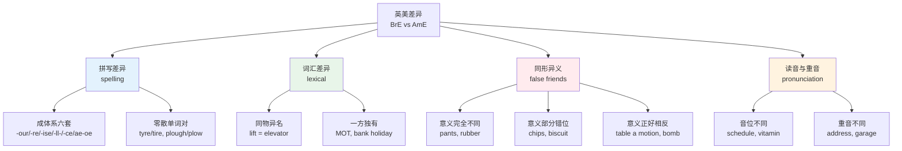
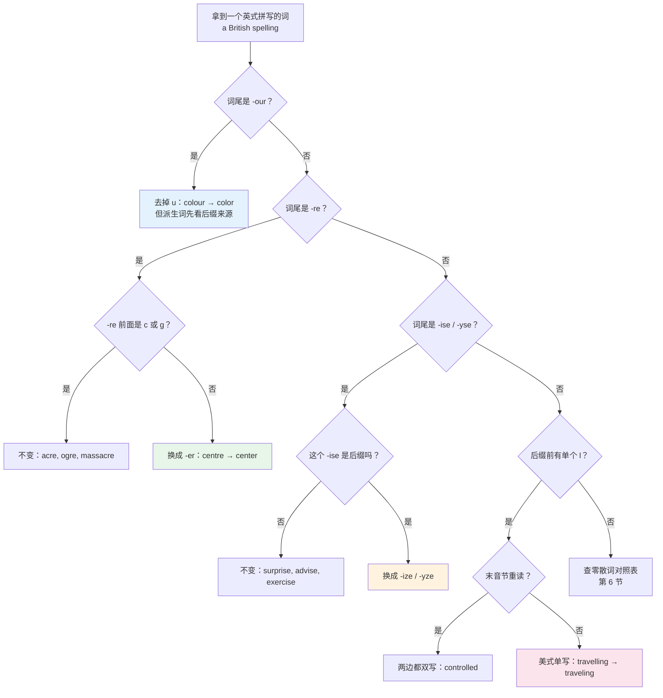
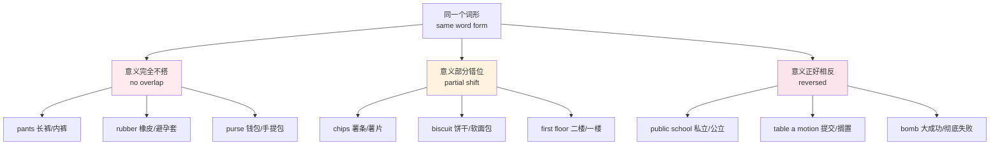
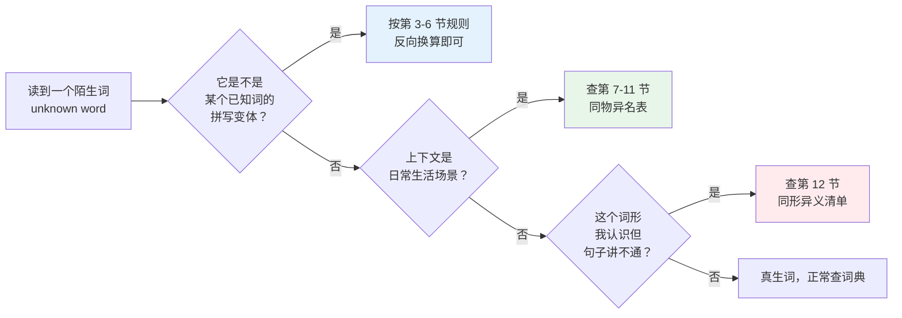
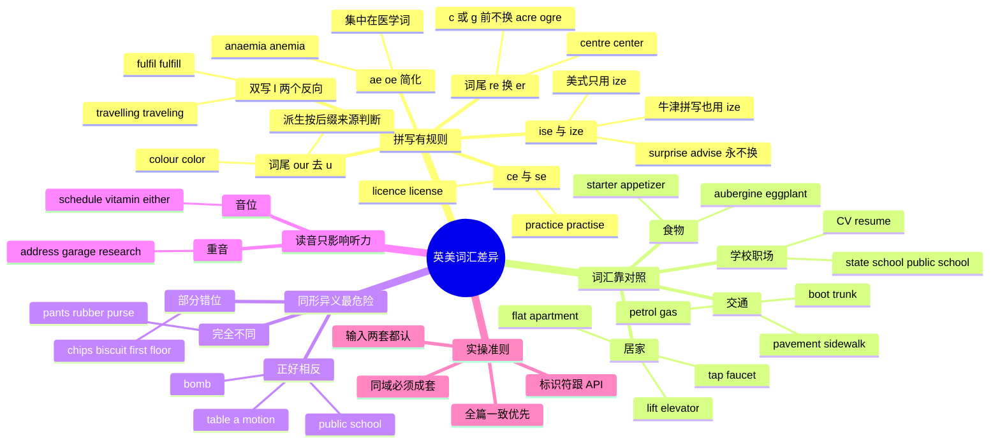

# 英式与美式词汇差异

> [!info] 本篇定位
>
> 18 章的第一篇，也是全书处理「同一个意思有几种说法」这个问题的起点。
>
> 前面十七章的词表默认给的是国际通用形式，凡遇到英美分歧只在「搭配与说明」列标一句。本篇把那些散落的标注收拢成体系：哪些差异有规则可循（拼写），哪些只能按对照表死记（物件名），哪些一旦搞错会闹出误会（同形异义）。
>
> 读完你会拿到四样东西：一张按语义域分组的同物异名对照表，约 200 组；六套可以推演的拼写换算规则，见到没学过的词也能自己换算；一份同形异义高危清单，含 `pants`、`chips`、`first floor`、`public school` 这类踩了就出事的词；以及一条在技术文档、代码标识符和产品文案里保持拼写一致的操作准则。
>
> 本篇不讲语法差异的规则本身（例如集合名词的主谓一致），只讲「这个位置该选哪个词、哪种拼写」。

---

## 1. 本篇导读：一门语言，两套词表

英式英语和美式英语的差别，绝大部分中国学习者的印象停留在「colour 多一个 u」和「电梯一个叫 lift 一个叫 elevator」。这个印象不算错，但漏掉了差异的真实结构——差异不是一个平面上的若干孤立词条，而是四层完全不同性质的东西叠在一起：

| 层 | 性质 | 例子 | 学习方式 | 搞错的代价 |
| --- | --- | --- | --- | --- |
| 拼写层 | 有规则，可推演 | colour / color、centre / center | 记六套换算规则 | 低，看得懂，只是不一致 |
| 词汇层 | 无规则，纯对照 | lift / elevator、flat / apartment | 按语义域记对照表 | 中，可能听不懂对方 |
| 同形异义层 | 同一个词形，两套意思 | pants、chips、first floor | 单独列高危清单 | 高，会理解反或说反 |
| 读音层 | 同一个词形，两套读音 | schedule、vitamin、advertisement | 听力侧认，产出侧选一套 | 中，听力上听不出是同一个词 |

四层的学习优先级不一样。拼写层最容易，一天就能过完，但它是产出侧的门面——一篇文档里 `colour` 和 `color` 混着出现，读者第一眼就看出来了。词汇层量最大，但可以按需补：你不去英国就不用主动产出 `lorry`，只要读到时认得。同形异义层量最小却最要紧，`first floor` 理解错是要走错楼层的。读音层只影响听力，产出侧挑一套坚持即可。

上图是本篇的全部内容地图。左侧四支各占若干节：拼写在第 3 到第 6 节，词汇在第 7 到第 11 节按语义域铺开，同形异义在第 12 节单列，读音在第 13 节。第 14 节收用法层面的选词差异，第 15 节加上澳新加印这类第三种说法，第 16 节讲怎么在自己的产出里保持一致。

有一件事要先说清楚：**两套英语的重合度远高于差异度**。日常高频词里真正分家的只是很小一部分，绝大多数词两边通用。差异之所以显眼，是因为它们集中在生活最日常的那一层——住的房子、坐的车、吃的东西、穿的衣服。这一层恰好是各自独立发展了两百多年、彼此接触最少的部分。而抽象词、学术词、技术词几乎不分家，因为它们大多是十九世纪以后共同吸收的拉丁层词汇，两边同时进入，没有分家的时间窗口。

> [!tip] 给程序员读者的一句话
>
> 如果你的目标是读英文技术文档，词汇层的差异对你影响很小——技术文档不谈 `courgette` 也不谈 `dungarees`。真正影响你的是拼写层（写 README、写注释、起标识符）和读音层（听技术会议录像）。可以把第 7 到第 11 节当查阅材料，把第 3 到第 6 节和第 13 节当必读。

---

## 2. 差异从哪来：Webster 的一次编辑决定

英美词汇分家有两个来源，性质完全不同。

**第一个来源是自然分化。** 1607 年英国人在弗吉尼亚建定居点，此后两百年间，大西洋两岸的日常生活各自往前走。北美出现了英国没有的事物（新的动植物、新的地形、新的社会安排），要么借词（`raccoon`、`moose`、`skunk` 来自原住民语言，`cookie`、`stoop`、`boss` 来自荷兰语），要么给旧词派新用途。同时英国本土也在造新词，这些新词很多没有及时传到北美。汽车出现时两地已经分开一个多世纪，于是同一个部件出现了两套名字——英国叫 `bonnet`（原义是软帽），美国叫 `hood`（原义是兜帽），两边都是从「盖在头上的东西」这个意象各自造的词，谁也不知道对方造了什么。

**第二个来源是人为改革。** 1806 年 Noah Webster 出版了第一部美国英语词典，1828 年出版篇幅更大的 *An American Dictionary of the English Language*。Webster 有明确的政治动机：他要让美国有一套区别于英国的书面标准。他的做法是在已有的拼写变体里系统地挑选更接近读音、更简短的那一个，写进词典。今天美式拼写的成体系部分——`-or` 而非 `-our`、`-er` 而非 `-re`、`-ize` 而非 `-ise`、单写 l 而非双写 l——绝大多数出自这次编辑决定。

这两个来源解释了本篇的结构：**拼写差异有规则，因为它出自一个人的一套系统决定；词汇差异没规则，因为它出自两百年的自然漂移。**

| 英文 | 英式音标 | 美式音标 | 词性 | 中文 | 搭配与说明 |
| --- | --- | --- | --- | --- | --- |
| **variety** | /vəˈraɪəti/ | /vəˈraɪəti/ | n. | 变体；语言变种 | a variety of English；语言学上不说 dialect 而说 variety，避免贬义 |
| **dialect** | /ˈdaɪəlekt/ | /ˈdaɪəlekt/ | n. | 方言 | 通常指地域性口语变体，带次级地位暗示 |
| **standard** | /ˈstændəd/ | /ˈstændərd/ | n./adj. | 标准（语） | Standard British English；与 nonstandard 对立 |
| **spelling reform** | /ˈspelɪŋ rɪˈfɔːm/ | /ˈspelɪŋ rɪˈfɔːrm/ | n. | 拼写改革 | Webster's spelling reform |
| **lexicographer** | /ˌleksɪˈkɒɡrəfə/ | /ˌleksɪˈkɑːɡrəfər/ | n. | 词典编纂者 | Webster 与 Johnson 分别是美英两边的奠基者 |
| **transatlantic** | /ˌtrænzətˈlæntɪk/ | /ˌtrænzətˈlæntɪk/ | adj. | 跨大西洋的 | transatlantic differences 是讨论英美差异的标准说法 |
| **loanword** | /ˈləʊnwɜːd/ | /ˈloʊnwɜːrd/ | n. | 借词 | raccoon、moose 是美式英语从原住民语言吸收的借词 |
| **coinage** | /ˈkɔɪnɪdʒ/ | /ˈkɔɪnɪdʒ/ | n. | 新造词 | a recent coinage |
| **usage** | /ˈjuːsɪdʒ/ | /ˈjuːsɪdʒ/ | n. | 用法惯例 | usage guide 指用法手册，不是语法书 |
| **convergence** | /kənˈvɜːdʒəns/ | /kənˈvɜːrdʒəns/ | n. | 趋同 | 影视与互联网使两套变体近年趋同 |

> [!warning] 一个常见的错误认知
>
> 「英式英语更正统，美式英语是简化版」这个说法不成立。有几批词是**美式保留、英式后改**的：`fall`（秋天）是十六七世纪英国的通行说法，后来英国改用来自法语的 `autumn`，美国保留了 `fall`；`gotten` 作为 `get` 的过去分词也是英国的旧形式，英国后来简化成 `got`，美国保留了旧形式；把 r 读出来的 `car` /kɑːr/ 同样是较古老的读法，英格兰南部后来丢了词尾 r，苏格兰、爱尔兰和北美保留了它。谁更「古老」要按词逐个看，没有整体高下。

---

## 3. 拼写差异（一）：-our / -or 与 -re / -er

### 3.1 -our 变 -or

英式的 `-our` 结尾在美式里一律去掉 u 写成 `-or`。这批词的来源是诺曼法语的 `-our`，Webster 把它们改回更接近拉丁原形的 `-or`。

| 英式 | 美式 | 英式音标 | 美式音标 | 中文 | 说明 |
| --- | --- | --- | --- | --- | --- |
| **colour** | color | /ˈkʌlə/ | /ˈkʌlər/ | 颜色 | 最高频的一对，CSS 属性名统一用 color |
| **favour** | favor | /ˈfeɪvə/ | /ˈfeɪvər/ | 恩惠；偏爱 | do sb a favour |
| **honour** | honor | /ˈɒnə/ | /ˈɑːnər/ | 荣誉 | 注意 h 不发音 |
| **labour** | labor | /ˈleɪbə/ | /ˈleɪbər/ | 劳动 | 英国政党 the Labour Party 专名不改 |
| **neighbour** | neighbor | /ˈneɪbə/ | /ˈneɪbər/ | 邻居 | neighbourhood / neighborhood |
| **behaviour** | behavior | /bɪˈheɪvjə/ | /bɪˈheɪvjər/ | 行为 | 技术文档高频，undefined behavior |
| **flavour** | flavor | /ˈfleɪvə/ | /ˈfleɪvər/ | 味道 | flavour text 在游戏文案里指氛围文字 |
| **harbour** | harbor | /ˈhɑːbə/ | /ˈhɑːrbər/ | 港口 | Pearl Harbor 专名用美式 |
| **humour** | humor | /ˈhjuːmə/ | /ˈhjuːmər/ | 幽默 | 派生 humorous 两边都无 u |
| **rumour** | rumor | /ˈruːmə/ | /ˈruːmər/ | 谣言 | rumour has it that |
| **vapour** | vapor | /ˈveɪpə/ | /ˈveɪpər/ | 蒸汽 | water vapour |
| **odour** | odor | /ˈəʊdə/ | /ˈoʊdər/ | 气味 | 偏负面，中性用 smell |
| **endeavour** | endeavor | /ɪnˈdevə/ | /ɪnˈdevər/ | 努力；尝试 | 正式语域 |
| **armour** | armor | /ˈɑːmə/ | /ˈɑːrmər/ | 盔甲 | armoured vehicle |
| **valour** | valor | /ˈvælə/ | /ˈvælər/ | 英勇 | 文学语域 |
| **splendour** | splendor | /ˈsplendə/ | /ˈsplendər/ | 壮丽 | — |
| **rigour** | rigor | /ˈrɪɡə/ | /ˈrɪɡər/ | 严谨 | 学术高频，mathematical rigour |
| **vigour** | vigor | /ˈvɪɡə/ | /ˈvɪɡər/ | 活力 | 派生 vigorous 两边都无 u |
| **candour** | candor | /ˈkændə/ | /ˈkændər/ | 坦率 | — |
| **clamour** | clamor | /ˈklæmə/ | /ˈklæmər/ | 喧嚷；强烈要求 | clamour for reform |
| **tumour** | tumor | /ˈtjuːmə/ | /ˈtuːmər/ | 肿瘤 | 注意读音也不同 |
| **saviour** | savior | /ˈseɪvjə/ | /ˈseɪvjər/ | 救星 | — |
| **parlour** | parlor | /ˈpɑːlə/ | /ˈpɑːrlər/ | 客厅；店堂 | ice cream parlor |
| **savour** | savor | /ˈseɪvə/ | /ˈseɪvər/ | 品味；细细享受 | savour the moment |

> [!warning] 派生词会把 u 丢掉，英式也一样
>
> `-our` 词加拉丁式后缀时，英式拼写也去 u。这不是美式渗透，是英式自己的规则：
>
> - humour → **humorous**，不是 ~~humourous~~
> - glamour → **glamorous**
> - labour → **laborious**、**laboratory**
> - honour → **honorary**、**honorific**
> - vigour → **vigorous**、**invigorate**
> - rigour → **rigorous**
> - odour → **odorous**、**deodorant**
>
> 保留 u 的是加英语本土后缀的情况：`colourful`、`neighbourhood`、`favourite`、`humourless`、`behaviourism`。判据是后缀的来源——拉丁式后缀（-ous、-ary、-ific、-ate）触发去 u，本土后缀（-ful、-less、-hood、-ite）不触发。

`glamour` 是这批里的特例：它不是法语来的，是苏格兰英语从 `grammar` 变出来的，美式两种拼写都用，`glamour` 甚至比 `glamor` 更常见。

### 3.2 -re 变 -er

| 英式 | 美式 | 英式音标 | 美式音标 | 中文 | 说明 |
| --- | --- | --- | --- | --- | --- |
| **centre** | center | /ˈsentə/ | /ˈsentər/ | 中心 | 派生 central 两边同形 |
| **metre** | meter | /ˈmiːtə/ | /ˈmiːtər/ | 米（长度单位） | 见下方警告框的义项分工 |
| **litre** | liter | /ˈliːtə/ | /ˈliːtər/ | 升 | — |
| **theatre** | theater | /ˈθɪətə/ | /ˈθiːətər/ | 剧院 | 美国剧院专名常保留 theatre |
| **fibre** | fiber | /ˈfaɪbə/ | /ˈfaɪbər/ | 纤维 | fibre optic cable |
| **calibre** | caliber | /ˈkælɪbə/ | /ˈkælɪbər/ | 口径；水准 | of a high calibre |
| **sombre** | somber | /ˈsɒmbə/ | /ˈsɑːmbər/ | 阴沉的 | 文学语域 |
| **spectre** | specter | /ˈspektə/ | /ˈspektər/ | 幽灵；阴影 | the spectre of inflation |
| **lustre** | luster | /ˈlʌstə/ | /ˈlʌstər/ | 光泽 | — |
| **meagre** | meager | /ˈmiːɡə/ | /ˈmiːɡər/ | 微薄的 | a meagre salary |
| **sceptre** | scepter | /ˈseptə/ | /ˈseptər/ | 权杖 | — |
| **manoeuvre** | maneuver | /məˈnuːvə/ | /məˈnuːvər/ | 机动；策略 | 同时涉及 oe 简化，双重差异 |
| **mitre** | miter | /ˈmaɪtə/ | /ˈmaɪtər/ | 斜接；主教冠 | 木工 mitre joint |
| **ochre** | ocher | /ˈəʊkə/ | /ˈoʊkər/ | 赭色 | 美式 ochre 也可 |

> [!warning] metre 与 meter：英式把它们分成两个词
>
> 英式拼写里这两个形式分工明确：
>
> - **metre** 只表示长度单位「米」：a hundred metres
> - **meter** 只表示测量仪表：a gas meter、a parking meter、a taxi meter
>
> 美式把两个义项都写成 **meter**，靠上下文区分。同样的分工还有诗歌韵律的 `metre`（英）/ `meter`（美）。
>
> 复合词跟着走：英式 `kilometre`、`centimetre`、`millimetre`，美式 `kilometer`、`centimeter`、`millimeter`。度量衡的完整词表见 [[03.数字与计量词汇/03.度量衡词表\|度量衡词表]]。

**不变的一批**：`acre`、`massacre`、`mediocre`、`ogre`、`lucre` 在两边都保留 `-re`。原因是机械的——这些词的 `-re` 前面是 c 或 g，改成 `-er` 会让 c 读成 /s/、g 读成 /dʒ/，破坏读音（`acer` 会读成 /ˈeɪsə/）。`centre` 没有这个问题，因为 `center` 里的 c 后面跟 e 本来就读 /s/。

---

## 4. 拼写差异（二）：-ise / -ize、-yse / -yze 与永远不变的那批词

### 4.1 -ise 与 -ize 的真实关系

这一组最容易被讲错。通行的说法是「英式 -ise，美式 -ize」，但准确的表述是：

- **美式：只用 `-ize`**，没有例外。
- **英式：`-ise` 和 `-ize` 都合法**，`-ise` 是当代英国报刊与大众出版物的主流，`-ize` 则是《牛津英语词典》和牛津大学出版社采用的形式，这一路数被称为 **Oxford spelling**（牛津拼写）。

牛津拼写的理据是词源：这批词的后缀来自希腊语 `-izein`，经拉丁语 `-izare` 进入英语，z 是原字母，s 是后来受法语影响换的。所以「英式=-ise」只是概率描述，不是规则。

| 词干 | 英式常见 | 牛津拼写 / 美式 | 中文 |
| --- | --- | --- | --- |
| organ- | organise | organize | 组织 |
| real- | realise | realize | 意识到；实现 |
| recogn- | recognise | recognize | 认出 |
| apolog- | apologise | apologize | 道歉 |
| critic- | criticise | criticize | 批评 |
| emphas- | emphasise | emphasize | 强调 |
| special- | specialise | specialize | 专门从事 |
| summar- | summarise | summarize | 概括 |
| minim- | minimise | minimize | 最小化 |
| maxim- | maximise | maximize | 最大化 |
| optim- | optimise | optimize | 优化 |
| initial- | initialise | initialize | 初始化 |
| serial- | serialise | serialize | 序列化 |
| normal- | normalise | normalize | 归一化 |
| author- | authorise | authorize | 授权 |
| central- | centralise | centralize | 集中化 |
| custom- | customise | customize | 定制 |
| synchron- | synchronise | synchronize | 同步 |
| standard- | standardise | standardize | 标准化 |
| categor- | categorise | categorize | 分类 |

派生名词跟着动词走：`organisation` / `organization`、`realisation` / `realization`、`optimisation` / `optimization`。

> [!tip] 写代码时这条规则基本失效
>
> 编程语言的标准库、框架 API 和配置项名称绝大多数定型于美国主导的技术生态，一律是 `-ize`：`serialize`、`initialize`、`normalize`、`optimize`、`sanitize`、`memoize`。哪怕你在英国团队写 `-ise` 的注释和文档，标识符也必须跟着 API 走。这不是选择题，写成 `initialise` 就调不到那个方法。

### 4.2 永远是 -ise 的那批词

有一批以 `-ise` 结尾的词**在两岸都不能写成 `-ize`**。它们的 `-ise` 不是那个希腊后缀，而是词干本身的末尾：`-visus`（看）落在 advise、revise、supervise、televise 里，古法语 `prise`（抓取）落在 surprise、comprise、enterprise 里，`-cisus`（切）落在 incise、excise 里，`arise` 干脆是日耳曼层的 a- 加 rise。既然不是后缀，就没有换成 z 的依据。这批必须整体记住：

| 英文 | 英式音标 | 美式音标 | 词性 | 中文 | 搭配与说明 |
| --- | --- | --- | --- | --- | --- |
| **advertise** | /ˈædvətaɪz/ | /ˈædvərtaɪz/ | v. | 做广告 | 名词 advertisement 英美重音不同，见 13 节 |
| **advise** | /ədˈvaɪz/ | /ədˈvaɪz/ | v. | 建议 | 名词 advice /ədˈvaɪs/ 词尾读 /s/ |
| **arise** | /əˈraɪz/ | /əˈraɪz/ | v. | 出现；产生 | a problem arose |
| **comprise** | /kəmˈpraɪz/ | /kəmˈpraɪz/ | v. | 由……构成 | be comprised of 有争议，直接写 comprise |
| **compromise** | /ˈkɒmprəmaɪz/ | /ˈkɑːmprəmaɪz/ | n./v. | 妥协；使受损 | 安全语境里 compromised 指被攻陷 |
| **despise** | /dɪˈspaɪz/ | /dɪˈspaɪz/ | v. | 鄙视 | — |
| **devise** | /dɪˈvaɪz/ | /dɪˈvaɪz/ | v. | 想出；设计 | 对应名词是 device |
| **disguise** | /dɪsˈɡaɪz/ | /dɪsˈɡaɪz/ | n./v. | 伪装 | in disguise |
| **enterprise** | /ˈentəpraɪz/ | /ˈentərpraɪz/ | n. | 企业；事业 | enterprise software |
| **exercise** | /ˈeksəsaɪz/ | /ˈeksərsaɪz/ | n./v. | 锻炼；行使 | exercise caution |
| **improvise** | /ˈɪmprəvaɪz/ | /ˈɪmprəvaɪz/ | v. | 即兴发挥 | — |
| **incise** | /ɪnˈsaɪz/ | /ɪnˈsaɪz/ | v. | 切开 | 对应名词 incision |
| **revise** | /rɪˈvaɪz/ | /rɪˈvaɪz/ | v. | 修订；（英）复习 | 英式「复习功课」义见 11 节 |
| **supervise** | /ˈsuːpəvaɪz/ | /ˈsuːpərvaɪz/ | v. | 监督 | — |
| **surmise** | /səˈmaɪz/ | /sərˈmaɪz/ | n./v. | 推测 | 正式语域 |
| **surprise** | /səˈpraɪz/ | /sərˈpraɪz/ | n./v. | 使惊讶 | 最容易写错的一个 |
| **televise** | /ˈtelɪvaɪz/ | /ˈtelɪvaɪz/ | v. | 电视播出 | — |
| **franchise** | /ˈfræntʃaɪz/ | /ˈfræntʃaɪz/ | n. | 特许经营权 | — |
| **merchandise** | /ˈmɜːtʃəndaɪz/ | /ˈmɜːrtʃəndaɪz/ | n. | 商品 | — |
| **chastise** | /tʃæsˈtaɪz/ | /tʃæsˈtaɪz/ | v. | 严厉责备 | — |
| **excise** | /ˈeksaɪz/ | /ˈeksaɪz/ | n. | 消费税 | 名词重音在前；动词「切除」读 /ɪkˈsaɪz/，重音在后 |
| **premise** | /ˈpremɪs/ | /ˈpremɪs/ | n. | 前提 | 词尾读 /s/ 不读 /z/，与上面各词不同 |

这批词的英美读音差别只有一处：美式把词里的 r 读出来（`surprise` /sərˈpraɪz/、`exercise` /ˈeksərsaɪz/），拼写完全一致。

反方向也有一个：**capsize**（倾覆）在两岸都只能是 `-ize`。它的词尾同样不是那个希腊后缀——这个词的来源至今没有定论，能确定的只是它不由词干加 `-ize` 构成，所以也没有换成 s 的余地。`prize`（奖品）、`size`、`seize` 同理，z 属于词干本身。

### 4.3 -yse 与 -yze

同源的第二组，规则更简单：英式 `-yse`，美式 `-yze`，没有第三种可能。

| 英式 | 美式 | 中文 |
| --- | --- | --- |
| **analyse** | analyze | 分析 |
| **paralyse** | paralyze | 使瘫痪 |
| **catalyse** | catalyze | 催化 |
| **hydrolyse** | hydrolyze | 水解 |
| **electrolyse** | electrolyze | 电解 |
| **dialyse** | dialyze | 透析 |

> [!warning] 牛津拼写在这里不跟着 -ize 走
>
> 采用 Oxford spelling 的出版物写 `organize` 但仍写 `analyse`。理由还是词源：`analyse` 来自法语 `analyser`，词干末尾的 `-lys-` 是希腊 `lysis`（分解）的一部分，不是那个 `-izein` 后缀。所以看到 `organize` 加 `analyse` 同时出现，不要以为是笔误，那是标准的牛津体例。
>
> 名词 **analysis** 两岸同形，复数 **analyses** /əˈnæləsiːz/ 也同形，只有动词分家。

---

## 5. 拼写差异（三）：双写 l 的两个反向、-ce / -se 与 ae / oe

### 5.1 词尾 l 的双写：英式加倍，美式不加

动词加 `-ed`、`-ing`、`-er` 等后缀时，英式在词尾单个 l 前一律双写，美式只在**最后一个音节重读**时双写。

| 原形 | 英式 | 美式 | 中文 |
| --- | --- | --- | --- |
| **travel** | travelled / travelling / traveller | traveled / traveling / traveler | 旅行 |
| **cancel** | cancelled / cancelling | canceled / canceling | 取消 |
| **model** | modelled / modelling | modeled / modeling | 建模 |
| **label** | labelled / labelling | labeled / labeling | 标注 |
| **signal** | signalled / signalling | signaled / signaling | 发信号 |
| **level** | levelled / levelling | leveled / leveling | 弄平 |
| **fuel** | fuelled / fuelling | fueled / fueling | 加燃料 |
| **quarrel** | quarrelled | quarreled | 争吵 |
| **counsel** | counsellor | counselor | 顾问 |
| **jewel** | jeweller / jewellery | jeweler / jewelry | 珠宝商 / 首饰 |
| **marvel** | marvellous | marvelous | 了不起的 |
| **tunnel** | tunnelling | tunneling | 打隧道 |
| **total** | totalled | totaled | 累计 |
| **wool** | woollen | woolen | 羊毛的 |
| **dial** | dialled / dialling | dialed / dialing | 拨号 |

重音落在末音节的词两边一致，都双写：`compel → compelled`、`control → controlled`、`patrol → patrolled`、`rebel → rebelled`、`expel → expelled`、`propel → propelled`。这也说明美式规则其实是英语通用的重音规则，英式是在 l 上额外开了一个例外。

### 5.2 反向：英式单写、美式双写

同一个字母 l，还有一批词方向恰好相反——英式一个 l，美式两个 l。这批词的 l 出现在**词尾**而不是后缀前。

| 英式 | 美式 | 中文 |
| --- | --- | --- |
| **fulfil** | fulfill | 履行；实现 |
| **fulfilment** | fulfillment | 履行 |
| **instil** | instill | 逐渐灌输 |
| **enrol** | enroll | 注册 |
| **enrolment** | enrollment | 注册 |
| **instalment** | installment | 分期付款；连载的一集 |
| **skilful** | skillful | 熟练的 |
| **wilful** | willful | 任性的；故意的 |
| **appal** | appall | 使震惊 |
| **distil** | distill | 蒸馏 |
| **enthral** | enthrall | 迷住 |

> [!warning] install 和 skill 本身不分家
>
> `install`、`skill`、`will`、`fill` 这些词在两岸都是双 l。分家的只是**由它们构成的派生词**：`instalment` / `installment`、`skilful` / `skillful`。`installation` 两岸也都是双 l。所以不要以为看到 l 就要换，要看是不是这批列出来的具体词。

### 5.3 -ce 与 -se：名词动词的形式分工

英式用 `-ce` 拼名词、`-se` 拼动词，美式把两者统一。

| 英式名词 | 英式动词 | 美式（不分） | 中文 |
| --- | --- | --- | --- |
| **licence** | license | license | 许可证 / 许可 |
| **practice** | practise | practice | 练习 / 练习 |
| **defence** | defend | defense | 防御 |
| **offence** | offend | offense | 冒犯；犯规 |
| **pretence** | pretend | pretense | 假装 |

前两对是真正的名动分工，后三个不是——`defence` / `defense` 只是名词的拼写差异，动词两岸都是 `defend`。

> [!tip] 英式 licence / license 的记忆法
>
> 用两个不分家的同类词做参照：`advice`（名词，读 /s/）和 `advise`（动词，读 /z/）在两岸都这么分。把 `licence` / `license` 和 `practice` / `practise` 挂在 `advice` / `advise` 上，c 是名词、s 是动词的对应关系就固定了：
>
> - I need a **licence** to drive.（名词，英式）
> - They **license** the software to enterprises.（动词，两岸同）
> - Football **practice** is on Tuesday.（名词，两岸同）
> - You should **practise** every day.（动词，英式）
>
> 美式全部写 `license` 和 `practice`，反而更省事。开源项目根目录的 `LICENSE` 文件名是美式，无论项目属地都不改。

### 5.4 ae 与 oe：美式砍掉前一个元音字母

希腊拉丁词里的双元音 `ae`、`oe`，美式一律简化成单个 `e`。这批词高度集中在医学领域。

| 英式 | 美式 | 中文 |
| --- | --- | --- |
| **encyclopaedia** | encyclopedia | 百科全书 |
| **anaemia** | anemia | 贫血 |
| **anaesthetic** | anesthetic | 麻醉剂 |
| **paediatric** | pediatric | 儿科的 |
| **orthopaedic** | orthopedic | 骨科的 |
| **gynaecology** | gynecology | 妇科学 |
| **leukaemia** | leukemia | 白血病 |
| **diarrhoea** | diarrhea | 腹泻 |
| **oestrogen** | estrogen | 雌激素 |
| **foetus** | fetus | 胎儿 |
| **oesophagus** | esophagus | 食道 |
| **haemoglobin** | hemoglobin | 血红蛋白 |
| **haemorrhage** | hemorrhage | 出血 |
| **palaeontology** | paleontology | 古生物学 |
| **archaeology** | archaeology / archeology | 考古学 |
| **manoeuvre** | maneuver | 机动 |
| **homoeopathy** | homeopathy | 顺势疗法 |

`medieval` 是这批里已经统一的：英式旧拼 `mediaeval` 现在基本不用，两岸都写 `medieval`。`archaeology` 相反，美式虽有 `archeology` 但主流仍是 `archaeology`。医学词表见 [[07.人体、健康与情绪/03.症状、疾病、就医科室与用药\|症状、疾病、就医科室与用药]]。

上图是把第 3 到第 5 节的规则串成的判定流程。从英式拼写换算美式时按这个顺序过一遍：先看词尾形态，再看有没有例外条件（`-re` 前是不是 c/g、`-ise` 是不是真后缀、末音节是不是重读），四道关口都不命中的词就是没有规则的零散对，只能查表。反方向（从美式推英式）风险更大，因为 `color → colour` 可推、`center → centre` 可推，但 `travel → travelled` 这种要求你知道美式那个 l 是不是省略过，推不出来。所以实践中永远以英式形式作为记忆基准，往美式换算。

---

## 6. 拼写差异（四）：不成体系的单词对照表

这批词的差异各有各的来历，没有规则可推，只能整体记。使用频率高的排在前面。

| 英式 | 美式 | 英式音标 | 美式音标 | 中文 | 说明 |
| --- | --- | --- | --- | --- | --- |
| **programme** | program | /ˈprəʊɡræm/ | /ˈproʊɡræm/ | 节目；方案 | 计算机程序两岸都写 program |
| **cheque** | check | /tʃek/ | /tʃek/ | 支票 | 英式 cheque 只表支票，其余义项写 check |
| **tyre** | tire | /ˈtaɪə/ | /ˈtaɪər/ | 轮胎 | 美式与「疲劳」的 tire 同形 |
| **grey** | gray | /ɡreɪ/ | /ɡreɪ/ | 灰色 | CSS 两种写法都合法，见 16 节 |
| **aluminium** | aluminum | /ˌæljəˈmɪniəm/ | /əˈluːmɪnəm/ | 铝 | 差一个音节，读音差别很大 |
| **jewellery** | jewelry | /ˈdʒuːəlri/ | /ˈdʒuːəlri/ | 首饰 | — |
| **storey** | story | /ˈstɔːri/ | /ˈstɔːri/ | 楼层 | 英式用 storey 区别于故事 story |
| **plough** | plow | /plaʊ/ | /plaʊ/ | 犁 | — |
| **draught** | draft | /drɑːft/ | /dræft/ | 穿堂风；生啤 | 「草稿」义两岸都写 draft |
| **kerb** | curb | /kɜːb/ | /kɜːrb/ | 路缘石 | 「抑制」义两岸都写 curb |
| **pyjamas** | pajamas | /pəˈdʒɑːməz/ | /pəˈdʒæməz/ | 睡衣 | 元音也不同 |
| **moustache** | mustache | /məˈstɑːʃ/ | /ˈmʌstæʃ/ | 八字胡 | 重音位置不同 |
| **catalogue** | catalog | /ˈkætəlɒɡ/ | /ˈkætəlɔːɡ/ | 目录 | 美式两种写法都有 |
| **dialogue** | dialog | /ˈdaɪəlɒɡ/ | /ˈdaɪəlɔːɡ/ | 对话 | UI 里的对话框统一写 dialog |
| **analogue** | analog | /ˈænəlɒɡ/ | /ˈænəlɔːɡ/ | 模拟的 | analog signal |
| **omelette** | omelet | /ˈɒmlət/ | /ˈɑːmlət/ | 煎蛋卷 | — |
| **sceptic** | skeptic | /ˈskeptɪk/ | /ˈskeptɪk/ | 怀疑者 | 拼写不同读音相同 |
| **mould** | mold | /məʊld/ | /moʊld/ | 霉；模具 | — |
| **smoulder** | smolder | /ˈsməʊldə/ | /ˈsmoʊldər/ | 闷烧 | — |
| **gaol** | jail | /dʒeɪl/ | /dʒeɪl/ | 监狱 | 英式 gaol 已过时，jail 通行 |
| **speciality** | specialty | /ˌspeʃiˈæləti/ | /ˈspeʃəlti/ | 特长；招牌菜 | 音节数不同 |
| **aeroplane** | airplane | /ˈeərəpleɪn/ | /ˈerpleɪn/ | 飞机 | 口语两岸都说 plane |
| **artefact** | artifact | /ˈɑːtɪfækt/ | /ˈɑːrtɪfækt/ | 人工制品；构建产物 | CI 里的构建产物写 artifact |
| **cosy** | cozy | /ˈkəʊzi/ | /ˈkoʊzi/ | 舒适温馨的 | — |
| **doughnut** | donut | /ˈdəʊnʌt/ | /ˈdoʊnʌt/ | 甜甜圈 | 英式 donut 也在用 |
| **disc** | disk | /dɪsk/ | /dɪsk/ | 盘 | compact disc 两岸同，hard disk 两岸同 |
| **sulphur** | sulfur | /ˈsʌlfə/ | /ˈsʌlfər/ | 硫 | 化学界国际标准已统一为 sulfur |
| **tonne** | ton | /tʌn/ | /tʌn/ | 吨 | tonne 是公吨，ton 是英美制吨，非纯拼写差 |
| **ageing** | aging | /ˈeɪdʒɪŋ/ | /ˈeɪdʒɪŋ/ | 老化 | 英式两种写法都有 |
| **judgement** | judgment | /ˈdʒʌdʒmənt/ | /ˈdʒʌdʒmənt/ | 判断 | 法律文本两岸都用 judgment |
| **acknowledgement** | acknowledgment | /əkˈnɒlɪdʒmənt/ | /əkˈnɑːlɪdʒmənt/ | 确认；致谢 | 网络协议的 ACK 全称用后者 |
| **annexe** | annex | /ˈæneks/ | /ˈæneks/ | 附属建筑 | 动词「吞并」两岸都写 annex |
| **vice** | vise | /vaɪs/ | /vaɪs/ | 台钳 | 「恶习」义两岸都写 vice |
| **axe** | ax | /æks/ | /æks/ | 斧 | 英式 axe 更常见，美式两可 |
| **whisky** | whiskey | /ˈwɪski/ | /ˈwɪski/ | 威士忌 | 按产地分：苏格兰 whisky，爱尔兰与美国 whiskey |

> [!warning] programme 与 program 不是简单的英美对应
>
> 英式拼写在这一对上做了义项切分：
>
> - **program** —— 计算机程序，英国人也这么写。`a Python program`、`programming language`
> - **programme** —— 电视节目、演出单、培训方案、议程。`a TV programme`、`a training programme`
>
> 美式两个义项都写 `program`。写英式文档时如果全篇把计算机程序写成 `programme`，那是过度矫正，反而露怯。`disc` / `disk`、`draught` / `draft`、`kerb` / `curb`、`storey` / `story` 都属于同一种「英式按义项分形」的情形。

---

## 7. 日常物件、居家与购物

从这一节起进入词汇层。词汇层没有规则，只有对照。分组按语义域，因为同域的词往往一起用——你要么整段说英式，要么整段说美式，跨域混用比域内混用更不容易被察觉。

### 7.1 房子与房间

| 英式 | 美式 | 英式音标 | 美式音标 | 中文 | 说明 |
| --- | --- | --- | --- | --- | --- |
| **flat** | apartment | /flæt/ | /əˈpɑːrtmənt/ | 公寓 | 英式 apartment 指高档公寓 |
| **block of flats** | apartment building | — | — | 公寓楼 | — |
| **ground floor** | first floor | — | — | 一楼（地面层） | 高危差异，见 12 节 |
| **lift** | elevator | /lɪft/ | /ˈeləveɪtər/ | 电梯 | 扶梯两岸都是 escalator |
| **terraced house** | row house / townhouse | — | — | 联排住宅 | — |
| **semi-detached house** | duplex | — | — | 半独立式住宅 | 两者结构不完全对应 |
| **garden** | yard | /ˈɡɑːdn/ | /jɑːrd/ | 院子 | 美式 garden 特指菜园花圃 |
| **wardrobe** | closet | /ˈwɔːdrəʊb/ | /ˈklɑːzət/ | 衣柜 / 壁橱 | 英式 closet 指小储藏间 |
| **cupboard** | cabinet | /ˈkʌbəd/ | /ˈkæbɪnət/ | 橱柜 | 注意 cupboard 的 p 不发音 |
| **curtains** | drapes | /ˈkɜːtnz/ | /dreɪps/ | 窗帘 | 美式 curtains 指薄纱帘 |
| **settee / sofa** | couch | /seˈtiː/ | /kaʊtʃ/ | 沙发 | sofa 两岸通用 |
| **sitting room / lounge** | living room | — | — | 客厅 | living room 两岸通用 |
| **tap** | faucet | /tæp/ | /ˈfɔːsɪt/ | 水龙头 | 美式 tap water 仍说 tap |
| **cooker** | stove | /ˈkʊkə/ | /stoʊv/ | 灶具 | 英式 stove 多指取暖炉 |
| **hob** | stovetop / cooktop | /hɒb/ | — | 灶面 | — |
| **grill** | broiler | /ɡrɪl/ | /ˈbrɔɪlər/ | 上火烤箱 | 见 12 节的动词 grill / broil |
| **extractor hood** | range hood | — | — | 抽油烟机 | — |
| **fridge** | refrigerator / fridge | /frɪdʒ/ | /rɪˈfrɪdʒəreɪtər/ | 冰箱 | — |
| **cot** | crib | /kɒt/ | /krɪb/ | 婴儿床 | 美式 cot 指行军折叠床 |
| **camp bed** | cot | — | — | 折叠床 | 与上一行交叉，容易搞混 |
| **loo / toilet** | bathroom / restroom | /luː/ | — | 厕所 | 美式 toilet 多指马桶本体 |
| **estate agent** | real estate agent | — | — | 房产中介 | — |

房型与家具的完整词表在 [[09.衣食住行/04.住房、房间结构、家具与家电\|住房、房间结构、家具与家电]]，本节只列分家的部分。

### 7.2 家务与日用品

| 英式 | 美式 | 英式音标 | 美式音标 | 中文 | 说明 |
| --- | --- | --- | --- | --- | --- |
| **rubbish** | garbage / trash | /ˈrʌbɪʃ/ | /ˈɡɑːrbɪdʒ/ | 垃圾 | rubbish 还作形容词表「差劲」 |
| **bin / dustbin** | trash can / garbage can | /bɪn/ | — | 垃圾桶 | 户外大桶英式 wheelie bin |
| **bin bag / bin liner** | trash bag | — | — | 垃圾袋 | — |
| **skip** | dumpster | /skɪp/ | /ˈdʌmpstər/ | 大型废料箱 | Dumpster 原为商标 |
| **hoover** | vacuum | /ˈhuːvə/ | /ˈvækjuːm/ | 吸尘（动词） | Hoover 是品牌转普通词 |
| **washing-up liquid** | dish soap | — | — | 洗洁精 | — |
| **washing powder** | laundry detergent | — | — | 洗衣粉 | — |
| **cling film** | plastic wrap | — | — | 保鲜膜 | — |
| **tin foil** | aluminum foil | — | — | 锡纸 | — |
| **cutlery** | silverware / flatware | /ˈkʌtləri/ | /ˈsɪlvərwer/ | 餐具 | 刀叉勺的统称 |
| **tin** | can | /tɪn/ | /kæn/ | 罐头 | tin opener / can opener |
| **torch** | flashlight | /tɔːtʃ/ | /ˈflæʃlaɪt/ | 手电筒 | 美式 torch 指火把 |
| **plug socket** | outlet | — | /ˈaʊtlet/ | 插座 | 英式也说 power point |
| **nappy** | diaper | /ˈnæpi/ | /ˈdaɪpər/ | 尿布 | — |
| **dummy** | pacifier | /ˈdʌmi/ | /ˈpæsɪfaɪər/ | 安抚奶嘴 | 英式 dummy 另有「假人」义 |
| **pram / pushchair** | stroller / baby carriage | /præm/ | /ˈstroʊlər/ | 婴儿车 | — |
| **spanner** | wrench | /ˈspænə/ | /rentʃ/ | 扳手 | throw a spanner in the works |
| **torch battery** | flashlight battery | — | — | 电池 | 电池本身两岸都是 battery |

### 7.3 买东西

| 英式 | 美式 | 英式音标 | 美式音标 | 中文 | 说明 |
| --- | --- | --- | --- | --- | --- |
| **shop** | store | /ʃɒp/ | /stɔːr/ | 商店 | 英式 store 指大型百货 |
| **shopping trolley** | shopping cart | /ˈtrɒli/ | /kɑːrt/ | 购物车 | 网购购物车两岸都是 cart |
| **till** | cash register / checkout | /tɪl/ | — | 收银台 | at the till |
| **queue** | line | /kjuː/ | /laɪn/ | 队伍 | 见下方例句 |
| **queue up** | line up / stand in line | — | — | 排队 | 纽约本地说 stand on line |
| **chemist's** | drugstore / pharmacy | /ˈkemɪsts/ | /ˈdrʌɡstɔːr/ | 药店 | pharmacy 两岸通用 |
| **off-licence** | liquor store | — | /ˈlɪkər/ | 烟酒店 | — |
| **high street** | main street | — | — | 商业主街 | high street bank 指零售银行 |
| **shoe shop** | shoe store | — | — | 鞋店 | 分家的是店名后半截：英式 shop，美式 store |
| **carrier bag** | shopping bag | — | — | 购物袋 | — |
| **receipt** | receipt | /rɪˈsiːt/ | /rɪˈsiːt/ | 小票 | 两岸同，p 不发音 |

> [!example] queue 与 line 的实际用法
>
> - There was a long **queue** outside the box office.
>   - 售票处外面排着长队。
> - There was a long **line** outside the box office.
>   - 同上，美式说法。
> - Please **queue up** here.
>   - 请在这里排队。（英式）
> - Please **get in line** here.
>   - 请在这里排队。（美式）
> - I've been **queuing** for twenty minutes.
>   - 我排了二十分钟队了。（英式，注意拼写也可写 queueing）
> - **Jump the queue** 与 **cut in line** 都指插队，各自成语块，不能交叉。

`queue` 的拼写是英语里连续元音字母最多的常用词，五个字母里四个是元音，去掉后面四个字母读音不变。这一条常被当作记忆抓手。

---

## 8. 交通、道路与出行

汽车相关词是英美分家最彻底的一块，因为汽车工业在两地几乎同时独立起步。整套车辆部件名几乎没有一个相同。

### 8.1 车辆与部件

| 英式 | 美式 | 英式音标 | 美式音标 | 中文 | 说明 |
| --- | --- | --- | --- | --- | --- |
| **boot** | trunk | /buːt/ | /trʌŋk/ | 后备箱 | 英式 boot 另有「靴子」义 |
| **bonnet** | hood | /ˈbɒnɪt/ | /hʊd/ | 引擎盖 | 英式 hood 指连衣帽 |
| **windscreen** | windshield | /ˈwɪndskriːn/ | /ˈwɪndʃiːld/ | 挡风玻璃 | windscreen wiper / windshield wiper |
| **wing** | fender | /wɪŋ/ | /ˈfendər/ | 翼子板 | 英式 wing mirror = 美式 side mirror |
| **indicator** | turn signal / blinker | — | — | 转向灯 | — |
| **gearbox** | transmission | /ˈɡɪəbɒks/ | /trænzˈmɪʃn/ | 变速箱 | — |
| **gear lever** | gearshift / stick shift | — | — | 换挡杆 | 手动挡美式说 stick shift |
| **number plate** | license plate | — | — | 车牌 | — |
| **silencer** | muffler | /ˈsaɪlənsə/ | /ˈmʌflər/ | 消音器 | 美式 muffler 另有围巾义 |
| **petrol** | gas / gasoline | /ˈpetrəl/ | /ɡæs/ | 汽油 | 英式 gas 只指气体 |
| **petrol station** | gas station | — | — | 加油站 | — |
| **lorry** | truck | /ˈlɒri/ | /trʌk/ | 卡车 | 英式 truck 指铁路货车 |
| **articulated lorry** | semi / tractor-trailer | — | /ˈsemaɪ/ | 挂车 | 美式 semi 读 /ˈsemaɪ/ |
| **estate car** | station wagon | — | — | 旅行车 | — |
| **saloon** | sedan | /səˈluːn/ | /sɪˈdæn/ | 三厢轿车 | 美式 saloon 指老式酒馆 |
| **people carrier** | minivan | — | — | 商务车 | — |
| **hire car** | rental car | — | — | 租的车 | 动词 hire / rent 见 11 节 |
| **caravan** | trailer / RV | /ˈkærəvæn/ | — | 拖挂房车 | — |
| **motorbike** | motorcycle | — | — | 摩托车 | 两岸都懂 |

### 8.2 道路与交通设施

| 英式 | 美式 | 英式音标 | 美式音标 | 中文 | 说明 |
| --- | --- | --- | --- | --- | --- |
| **pavement** | sidewalk | /ˈpeɪvmənt/ | /ˈsaɪdwɔːk/ | 人行道 | 高危差异，见 12 节 |
| **motorway** | freeway / highway / interstate | — | — | 高速公路 | 编号路 I-95 读 interstate ninety-five |
| **dual carriageway** | divided highway | — | — | 双向分隔道路 | — |
| **roundabout** | traffic circle / rotary | /ˈraʊndəbaʊt/ | — | 环岛 | 新英格兰地区说 rotary |
| **junction** | intersection | /ˈdʒʌŋkʃn/ | /ˌɪntərˈsekʃn/ | 路口 | 高速出口英式也说 junction 6 |
| **slip road** | ramp / on-ramp | — | /ræmp/ | 匝道 | — |
| **flyover** | overpass | /ˈflaɪəʊvə/ | /ˈoʊvərpæs/ | 高架桥 | 美式 flyover 指飞行表演编队 |
| **subway** | underpass | /ˈsʌbweɪ/ | /ˈʌndərpæs/ | 地下通道 | 高危差异，见 12 节 |
| **zebra crossing** | crosswalk | /ˈzebrə/ | /ˈkrɔːswɔːk/ | 斑马线 | 英式 zebra 读 /ˈzebrə/ |
| **level crossing** | grade crossing | — | — | 铁路道口 | — |
| **central reservation** | median | — | /ˈmiːdiən/ | 中央隔离带 | — |
| **give way** | yield | — | /jiːld/ | 让行 | 路牌用词 |
| **car park** | parking lot | — | — | 停车场 | 地下的英式 car park，美式 parking garage |
| **traffic lights** | traffic lights / stoplight | — | — | 红绿灯 | 南非说 robot，见 15 节 |
| **speed bump** | speed bump | — | — | 减速带 | 英式也说 sleeping policeman |
| **diversion** | detour | /daɪˈvɜːʃn/ | /ˈdiːtʊr/ | 绕行 | — |
| **driving licence** | driver's license | — | — | 驾照 | 拼写与措辞同时不同 |

### 8.3 公共交通

| 英式 | 美式 | 英式音标 | 美式音标 | 中文 | 说明 |
| --- | --- | --- | --- | --- | --- |
| **the Underground / the Tube** | the subway | — | /ˈsʌbweɪ/ | 地铁 | 伦敦专称 the Tube |
| **railway** | railroad | /ˈreɪlweɪ/ | /ˈreɪlroʊd/ | 铁路 | 车站两岸都是 station |
| **carriage** | car | /ˈkærɪdʒ/ | /kɑːr/ | 车厢 | 英式也说 coach |
| **single ticket** | one-way ticket | — | — | 单程票 | — |
| **return ticket** | round-trip ticket | — | — | 往返票 | — |
| **timetable** | schedule | /ˈtaɪmteɪbl/ | /ˈskedʒuːl/ | 时刻表 | schedule 的读音差异见 13 节 |
| **left luggage** | baggage check | — | — | 行李寄存 | — |
| **coach** | bus（长途） | /kəʊtʃ/ | /bʌs/ | 长途汽车 | 英式 bus 只指市内公交 |
| **taxi rank** | taxi stand | — | — | 出租车候车点 | — |
| **motorway services** | rest stop / service area | — | — | 服务区 | — |
| **aeroplane** | airplane | — | — | 飞机 | 见 6 节拼写表 |
| **holiday** | vacation | /ˈhɒlədeɪ/ | /veɪˈkeɪʃn/ | 假期 | 见 11 节 |

出行与行李的完整词表见 [[09.衣食住行/06.交通工具、道路出行与行李装备\|交通工具、道路出行与行李装备]]。

> [!warning] 一句话里混用两套会立刻暴露
>
> - ❌ I parked in the **car park** and opened the **hood** to check the **petrol**.
>
> 三个词分属两套系统：`car park`（英）+ `hood`（美）+ `petrol`（英）。母语者听到会明确察觉不对劲。正确的两种写法：
>
> - ✅ I parked in the **car park** and opened the **bonnet** to check the **petrol**.（全英式）
> - ✅ I parked in the **parking lot** and opened the **hood** to check the **gas**.（全美式）
>
> 这是本篇最实际的一条纪律：**同一语义域内必须成套用**。跨域偶尔串味问题不大，同域串味最刺耳。

---

## 9. 食物、餐饮与点单

食物词的差异有两个特点：一是同物异名多，二是同名异物多（第 12 节处理）。这里先处理前者。

### 9.1 食材

| 英式 | 美式 | 英式音标 | 美式音标 | 中文 | 说明 |
| --- | --- | --- | --- | --- | --- |
| **aubergine** | eggplant | /ˈəʊbəʒiːn/ | /ˈeɡplænt/ | 茄子 | 英式来自法语 |
| **courgette** | zucchini | /kɔːˈʒet/ | /zuˈkiːni/ | 西葫芦 | 美式来自意大利语 |
| **coriander** | cilantro | /ˌkɒriˈændə/ | /sɪˈlæntroʊ/ | 香菜 | 美式 coriander 特指干种子 |
| **rocket** | arugula | /ˈrɒkɪt/ | /əˈruːɡələ/ | 芝麻菜 | — |
| **spring onion** | scallion / green onion | — | /ˈskæljən/ | 葱 | — |
| **swede** | rutabaga | /swiːd/ | /ˌruːtəˈbeɪɡə/ | 芜菁甘蓝 | — |
| **beetroot** | beets | /ˈbiːtruːt/ | /biːts/ | 甜菜根 | — |
| **mangetout** | snow pea | /ˌmɒnʒˈtuː/ | — | 荷兰豆 | 英式来自法语 |
| **maize** | corn | /meɪz/ | /kɔːrn/ | 玉米 | 英式 corn 泛指谷物 |
| **sweetcorn** | corn | — | — | 甜玉米粒 | — |
| **prawn** | shrimp | /prɔːn/ | /ʃrɪmp/ | 虾 | 英式 shrimp 指更小的虾 |
| **mince** | ground beef | /mɪns/ | — | 肉末 | minced meat / ground meat |
| **rasher** | slice of bacon | /ˈræʃə/ | — | 一片培根 | — |
| **gammon** | ham | /ˈɡæmən/ | /hæm/ | 腌猪腿肉 | 不完全对应 |
| **icing sugar** | powdered sugar | — | — | 糖粉 | — |
| **plain flour** | all-purpose flour | — | — | 中筋面粉 | — |
| **double cream** | heavy cream | — | — | 高脂奶油 | — |
| **caster sugar** | superfine sugar | — | — | 细砂糖 | — |
| **porridge** | oatmeal | /ˈpɒrɪdʒ/ | /ˈoʊtmiːl/ | 燕麦粥 | — |

完整食材词表见 [[09.衣食住行/02.食材词表\|食材词表]]，本节只列分家部分。

### 9.2 现成食品与饮料

| 英式 | 美式 | 英式音标 | 美式音标 | 中文 | 说明 |
| --- | --- | --- | --- | --- | --- |
| **chips** | fries / French fries | /tʃɪps/ | /fraɪz/ | 薯条 | 高危，见 12 节 |
| **crisps** | chips / potato chips | /krɪsps/ | — | 薯片 | 与上一行交叉 |
| **biscuit** | cookie / cracker | /ˈbɪskɪt/ | /ˈkʊki/ | 饼干 | 高危，见 12 节 |
| **sweets** | candy | /swiːts/ | /ˈkændi/ | 糖果 | 不可数的 candy |
| **candy floss** | cotton candy | — | — | 棉花糖 | — |
| **ice lolly** | popsicle | /ˌaɪs ˈlɒli/ | /ˈpɑːpsɪkl/ | 冰棒 | Popsicle 原为商标 |
| **jelly** | Jell-O / gelatin dessert | /ˈdʒeli/ | — | 果冻 | 高危，见 12 节 |
| **jam** | jelly / jam | /dʒæm/ | — | 果酱 | 美式 jelly 指无果肉的 |
| **fizzy drink** | soda / pop | — | /ˈsoʊdə/ | 汽水 | 美国中西部说 pop，南部说 coke |
| **squash** | fruit drink concentrate | /skwɒʃ/ | — | 浓缩果汁饮料 | 美式 squash 指南瓜类 |
| **jacket potato** | baked potato | — | — | 烤土豆 | — |
| **courgette fritter** | zucchini fritter | — | — | 西葫芦饼 | 跟着食材走 |
| **takeaway** | takeout / to go | /ˈteɪkəweɪ/ | — | 外带 | 英式 a Chinese takeaway 指外卖餐食本身 |
| **starter** | appetizer | /ˈstɑːtə/ | /ˈæpɪtaɪzər/ | 前菜 | — |
| **main course** | entrée | — | /ˈɑːntreɪ/ | 主菜 | 高危，见下方警告 |
| **pudding / afters** | dessert | /ˈpʊdɪŋ/ | /dɪˈzɜːrt/ | 甜点 | 英式 pudding 泛指整个甜点环节 |
| **bill** | check | /bɪl/ | /tʃek/ | 账单 | 美式 bill 指纸币 |
| **serviette** | napkin | /ˌsɜːviˈet/ | /ˈnæpkɪn/ | 餐巾 | napkin 两岸通用 |

> [!warning] entrée 在美国指主菜，在法国和英国指前菜
>
> 这是餐厅点单最容易出事的一个词。法语 `entrée` 本义是「进入」，指正餐开场的那道菜，英国沿用这个理解，等于 `starter`。美国餐厅把它挪去指整餐的核心菜品，等于 `main course`。
>
> - 在美国菜单上看到 **Entrées** 一栏，那是主菜区，价格最高。
> - 在英国或法国看到 **Entrée**，那是开胃菜。
>
> 保险的做法是在美国点单只说 `main course` 或直接指菜名，不用 `entrée` 这个词。

### 9.3 餐饮场所与餐次

| 英式 | 美式 | 中文 | 说明 |
| --- | --- | --- | --- |
| **pub** | bar | 酒吧 | pub 已进入美式，指英式风格的酒吧 |
| **off-licence** | liquor store | 卖酒的店 | — |
| **café** | coffee shop / diner | 小餐馆 | 英式 café 可以卖正餐 |
| **canteen** | cafeteria | 食堂 | — |
| **tea**（餐次） | dinner / supper | 晚饭 | 英格兰北部把晚饭叫 tea |
| **dinner**（餐次） | lunch | 午饭 | 英式部分地区把午饭叫 dinner |
| **starter / main / pudding** | appetizer / entrée / dessert | 三道菜 | 整套错位 |
| **book a table** | make a reservation | 订位 | book 两岸都懂 |

---

## 10. 服装、身体与看病

### 10.1 衣物

| 英式 | 美式 | 英式音标 | 美式音标 | 中文 | 说明 |
| --- | --- | --- | --- | --- | --- |
| **trousers** | pants | /ˈtraʊzəz/ | /pænts/ | 长裤 | 高危，见 12 节 |
| **pants** | underwear / underpants | /pænts/ | — | 内裤（英式） | 与上一行交叉 |
| **knickers** | panties | /ˈnɪkəz/ | /ˈpæntiz/ | 女式内裤 | — |
| **jumper / pullover** | sweater | /ˈdʒʌmpə/ | /ˈswetər/ | 毛衣 | 高危，见 12 节 |
| **waistcoat** | vest | /ˈweskət/ | /vest/ | 马甲 | 英式读音不规则 |
| **vest** | undershirt / tank top | /vest/ | — | 背心内衣（英式） | 与上一行交叉 |
| **trainers** | sneakers | /ˈtreɪnəz/ | /ˈsniːkərz/ | 运动鞋 | 美式也说 tennis shoes |
| **wellies / wellington boots** | rain boots / rubber boots | /ˈweliz/ | — | 雨靴 | Wellington 是人名转普通词 |
| **dungarees** | overalls | /ˌdʌŋɡəˈriːz/ | /ˈoʊvərɔːlz/ | 背带工装裤 | 英式 overalls 指连体工作服 |
| **tights** | pantyhose | /taɪts/ | /ˈpæntihoʊz/ | 连裤袜 | 舞蹈紧身裤两岸都是 tights |
| **braces** | suspenders | /ˈbreɪsɪz/ | /səˈspendərz/ | 背带 | 高危：美式 braces 指牙套 |
| **dressing gown** | bathrobe | — | /ˈbæθroʊb/ | 睡袍 | — |
| **polo neck** | turtleneck | — | /ˈtɜːrtlnek/ | 高领 | — |
| **anorak** | parka | /ˈænəræk/ | /ˈpɑːrkə/ | 连帽厚外套 | 英式 anorak 另指沉迷冷门爱好的人 |
| **mac / mackintosh** | raincoat | /mæk/ | — | 雨衣 | Mackintosh 是人名转普通词 |
| **swimming costume** | swimsuit / bathing suit | — | — | 泳衣 | 英式也说 swimming trunks（男） |
| **handbag** | purse | /ˈhændbæɡ/ | /pɜːrs/ | 手提包 | 高危，见 12 节 |
| **purse** | wallet / change purse | /pɜːs/ | /ˈwɑːlət/ | 钱包（英式） | 与上一行交叉 |
| **zip** | zipper | /zɪp/ | /ˈzɪpər/ | 拉链 | — |
| **plimsolls** | canvas shoes | — | — | 帆布鞋 | — |

服装词的完整分类见 [[09.衣食住行/01.服装鞋帽配饰\|服装鞋帽配饰]]。

### 10.2 身体与看病

| 英式 | 美式 | 英式音标 | 美式音标 | 中文 | 说明 |
| --- | --- | --- | --- | --- | --- |
| **fringe** | bangs | /frɪndʒ/ | /bæŋz/ | 刘海 | 美式恒用复数 |
| **plait** | braid | /plæt/ | /breɪd/ | 辫子 | 英式读 /plæt/ 不读 /pleɪt/ |
| **nappy rash** | diaper rash | — | — | 尿布疹 | — |
| **plaster** | Band-Aid / bandage | /ˈplɑːstə/ | — | 创可贴 | Band-Aid 原为商标 |
| **chemist** | pharmacist | /ˈkemɪst/ | /ˈfɑːrməsɪst/ | 药剂师 | 英式 chemist 兼指化学家 |
| **paracetamol** | acetaminophen | /ˌpærəˈsiːtəmɒl/ | /əˌsiːtəˈmɪnəfən/ | 对乙酰氨基酚 | 同一种药两个通用名 |
| **A&E** | ER / emergency room | — | — | 急诊 | A&E 读 accident and emergency |
| **GP** | primary care physician | — | — | 全科医生 | GP 读 general practitioner |
| **surgery**（诊室） | doctor's office | /ˈsɜːdʒəri/ | — | 诊所 | 高危：美式 surgery 只指外科手术 |
| **jab** | shot | /dʒæb/ | /ʃɑːt/ | 打针 | flu jab / flu shot |
| **operation / op** | surgery | — | — | 手术 | 与上一行交叉 |
| **consultant** | attending physician | — | — | 主任医师 | 职级体系不同 |
| **theatre**（手术室） | operating room / OR | — | — | 手术室 | 英式 operating theatre |

> [!warning] surgery 的三重含义
>
> 这是医疗语境最容易出错的一个词：
>
> - 英式 **surgery** 可以指「医生的诊室、门诊时段」：`The surgery is open until six.`（诊所开到六点）
> - 英式 **surgery** 也可以指议员接待选民的时间：`an MP's constituency surgery`
> - 两岸的 **surgery** 都可以指外科手术：`He had surgery on his knee.`
>
> 美国人听到 `I'm going to the surgery` 会理解成「去做手术」，而英国人的意思只是「去看个门诊」。就医场景的完整词表见 [[07.人体、健康与情绪/03.症状、疾病、就医科室与用药\|症状、疾病、就医科室与用药]]。

---

## 11. 学校、职场与钱

### 11.1 学校

| 英式 | 美式 | 英式音标 | 美式音标 | 中文 | 说明 |
| --- | --- | --- | --- | --- | --- |
| **state school** | public school | — | — | 公立学校 | 高危交叉，见 12 节 |
| **public school** | private school | — | — | 私立学校（英格兰） | 苏格兰的 public school 指公立 |
| **head teacher / headmaster** | principal | — | /ˈprɪnsəpl/ | 校长 | — |
| **term** | semester / quarter | /tɜːm/ | /sɪˈmestər/ | 学期 | 英国一年三个 term |
| **maths** | math | /mæθs/ | /mæθ/ | 数学 | 英式保留 s |
| **revise / revision** | study / review | /rɪˈvaɪz/ | — | 复习 | 高危：美式 revise 只表「修订」 |
| **mark** | grade | /mɑːk/ | /ɡreɪd/ | 分数 | 动词 mark a paper / grade a paper |
| **timetable** | schedule | — | — | 课表 | — |
| **rubber** | eraser | /ˈrʌbə/ | /ɪˈreɪsər/ | 橡皮 | 高危，见 12 节 |
| **Year 7** | seventh grade | — | — | 七年级 | 起算点也不同 |
| **university / uni** | college / school | — | — | 大学 | 美式 school 泛指任何学校 |
| **at university** | in college | — | — | 在上大学 | 介词也不同 |
| **postgraduate** | graduate student / grad student | — | — | 研究生 | — |
| **undergraduate** | undergrad | — | — | 本科生 | 两岸通用 |
| **dissertation** | thesis | /ˌdɪsəˈteɪʃn/ | /ˈθiːsɪs/ | 学位论文 | 层级对应相反，见下方警告 |
| **invigilator** | proctor | /ɪnˈvɪdʒɪleɪtə/ | /ˈprɑːktər/ | 监考员 | — |
| **lecturer** | professor / instructor | — | — | 讲师 | 职称体系不同 |
| **holiday**（假期） | vacation / break | — | — | 假期 | 学期间隙英式 half term |
| **CV** | resume / résumé | /ˌsiːˈviː/ | /ˈrezəmeɪ/ | 简历 | 美式 CV 特指学术长简历 |

> [!warning] dissertation 与 thesis 的层级正好对调
>
> 两个词在两岸都存在，但绑定的学位层级相反：
>
> | 学位层级 | 英式叫法 | 美式叫法 |
> | --- | --- | --- |
> | 本科 / 硕士毕业论文 | dissertation | thesis |
> | 博士学位论文 | thesis | dissertation |
>
> 所以英国人说 `I'm writing my thesis` 通常意味着他在读博，美国人说同一句话通常意味着他在读硕。看到简历上的这两个词要按作者国别反推层级。

### 11.2 职场

| 英式 | 美式 | 英式音标 | 美式音标 | 中文 | 说明 |
| --- | --- | --- | --- | --- | --- |
| **holiday / annual leave** | vacation / PTO | — | — | 带薪假 | PTO 读 paid time off |
| **bank holiday** | federal holiday / public holiday | — | — | 法定假日 | 英国特有说法 |
| **redundancy** | layoff | /rɪˈdʌndənsi/ | /ˈleɪɔːf/ | 裁员 | be made redundant / be laid off |
| **notice period** | notice period | — | — | 通知期 | 两岸同 |
| **sick note** | doctor's note | — | — | 病假条 | — |
| **CV** | resume | — | — | 简历 | 见上表 |
| **managing director** | CEO | — | — | 总经理 | 头衔体系不同 |
| **shop floor** | production floor | — | — | 生产车间 | — |
| **rota** | rotation / schedule | /ˈrəʊtə/ | — | 轮值表 | 英国特有 |
| **fortnight** | two weeks | /ˈfɔːtnaɪt/ | — | 两周 | 美国人基本不用 fortnight |
| **flat rate** | flat rate | — | — | 统一价 | 两岸同 |
| **solicitor / barrister** | attorney / lawyer | /səˈlɪsɪtə/ | /əˈtɜːrni/ | 律师 | 英国分事务律师与出庭律师 |
| **chartered accountant** | CPA | — | — | 注册会计师 | 资格体系不同 |
| **hire**（雇人）/ **let**（出租） | hire / rent | — | — | 雇 / 租 | 英式 hire a car 是租车 |

### 11.3 钱与邮政

| 英式 | 美式 | 英式音标 | 美式音标 | 中文 | 说明 |
| --- | --- | --- | --- | --- | --- |
| **note** | bill | /nəʊt/ | /bɪl/ | 纸币 | a ten-pound note / a ten-dollar bill |
| **cheque** | check | — | — | 支票 | 拼写差异见 6 节 |
| **current account** | checking account | — | — | 活期账户 | — |
| **cash machine / cashpoint** | ATM | — | — | 取款机 | ATM 两岸都懂 |
| **VAT** | sales tax | /ˌviːeɪˈtiː/ | — | 增值税 / 销售税 | 制度不同，不是纯词汇差异 |
| **post** | mail | /pəʊst/ | /meɪl/ | 邮件 | 动词 post a letter / mail a letter |
| **postbox / pillar box** | mailbox | — | — | 邮筒 | 美式 mailbox 也指自家信箱 |
| **postcode** | zip code | /ˈpəʊstkəʊd/ | /zɪp/ | 邮编 | ZIP 是缩略语 |
| **postman** | mailman / mail carrier | — | — | 邮递员 | — |
| **mobile / mobile phone** | cell phone / cell | /ˈməʊbaɪl/ | /sel/ | 手机 | 英式 mobile 读 /ˈməʊbaɪl/ |
| **top up** | refill / add money | — | — | 充值 | — |
| **autumn** | fall / autumn | /ˈɔːtəm/ | /fɔːl/ | 秋天 | 美式两个都用 |
| **football** | soccer | /ˈfʊtbɔːl/ | /ˈsɑːkər/ | 足球 | 高危，见 12 节 |

金融账户与购物的完整词表见 [[11.学校、职场与城市社会/04.金钱银行、购物、网购与快递售后\|金钱银行、购物、网购与快递售后]]。

---

## 12. 同形异义：最危险的一类差异

前面几节的词至少还有个提示——你说 `lift`，美国人可能一愣，但会问你什么意思。同形异义词不给这个机会：**双方都以为听懂了，理解的却是两件事**。这一节按危险程度排序。

上图给出三种错位方式。完全不搭的那类反而最容易被发现，因为语境会立刻崩坏；部分错位最阴险，两边的理解都说得通，错误可能一直不被发现；意义相反的那类在会议记录、评审意见这类文本里代价最高。

### 12.1 意义完全不同

| 词 | 英式义 | 美式义 | 出事场景 |
| --- | --- | --- | --- |
| **pants** | 内裤 | 长裤 | 「你裤子上有块污渍」变成谈论内裤 |
| **rubber** | 橡皮 | 避孕套（俚语） | 课堂上向美国同学借橡皮 |
| **purse** | 小钱包 | 女式手提包 | 「包丢了」的严重程度理解不同 |
| **braces** | 裤子背带 | 牙套 | 「他戴 braces」理解成戴背带 |
| **suspenders** | 吊袜带 | 裤子背带 | 描述男士着装时出问题 |
| **vest** | 背心内衣 | 西装马甲 | 着装要求 |
| **jumper** | 毛衣 | 无袖连衣裙 | 「穿件 jumper」性别指向都变了 |
| **subway** | 地下人行通道 | 地铁 | 问路时走进人行地道找地铁 |
| **first floor** | 二楼 | 一楼（地面层） | 约在 first floor 见面，两人差一层 |
| **flyover** | 高架桥 | 飞行编队掠过 | — |
| **trainer** | 运动鞋 | 培训师 | — |
| **chemist** | 药店；化学家 | 化学家 | 「去 chemist」美国人不知道是去哪 |
| **surgery** | 诊室；门诊 | 外科手术 | 见 10.2 |
| **bill** | 账单 | 纸币；账单；法案 | 美式仍可表账单，但先想到纸币 |
| **fanny** | 粗俗指女性生殖器 | 屁股（较温和） | 说 fanny pack 在英国相当冒犯 |

> [!warning] fanny 与 fanny pack
>
> 美式 `fanny pack`（腰包）在英国听起来是相当粗俗的说法，英式叫 `bum bag`。这不是可以一笑了之的差异——`fanny` 在英式里属于强度较高的粗俗词。同类需要留意的还有 `pissed`：英式 `I was pissed last night` 是「我昨晚喝多了」，美式同一句是「我昨晚很生气」。禁忌语的强度分级见 [[18.语域、英美差异与习语俚语/04.俚语、网络流行语、委婉语与禁忌语\|俚语、网络流行语、委婉语与禁忌语]]。

### 12.2 意义部分错位

| 词 | 英式指 | 美式指 | 对应关系 |
| --- | --- | --- | --- |
| **chips** | 粗切薯条 | 薯片 | 英式薯片是 crisps |
| **biscuit** | 饼干（甜咸皆可） | 一种松软咸味小面包 | 美式饼干是 cookie / cracker |
| **jelly** | 果冻 | 无果肉果酱 | 英式果酱是 jam，美式果冻是 Jell-O |
| **pudding** | 甜点总称 | 特定的布丁类甜点 | 美式甜点总称是 dessert |
| **garden** | 任何带草坪的院子 | 菜园花圃 | 美式院子是 yard |
| **cot** | 婴儿床 | 行军折叠床 | 英式折叠床是 camp bed |
| **corn** | 谷物泛称 | 玉米 | 英式玉米是 maize / sweetcorn |
| **football** | 足球 | 美式橄榄球 | 美式足球是 soccer |
| **entrée** | 前菜 | 主菜 | 见 9.2 |
| **pavement** | 人行道 | 铺装路面 | 美式人行道是 sidewalk |
| **holiday** | 假期 | 节日 | 美式假期是 vacation |
| **school** | 中小学 | 各级学校含大学 | 美国人说 in school 可能在读大学 |
| **grill**（动词） | 用上火烤 | 用炭火烤 | 英式的 grill 对应美式 broil |
| **momentarily** | 短暂地 | 马上；一会儿 | 「飞机 momentarily 落地」理解不同 |
| **quite** | 相当（有削弱意味） | 非常（有加强意味） | 见 [[17.固定搭配/05.副词+形容词强化搭配：highly、deeply、bitterly 的固定伴侣\|副词+形容词强化搭配]] |

> [!example] quite good 的双向误读
>
> - 英国人说 **The presentation was quite good.**
>   - 意思接近「还行吧，不算差」。这是一句克制的评价。
> - 美国人听到同一句
>   - 理解成「讲得挺好」，是明确的表扬。
>
> 反过来，美国人说 `quite good` 表示夸奖，英国人听成了「不过尔尔」。这个词是英美之间最容易造成情绪误解的一个，正式评价里最好换掉：想表扬用 `very good` 或 `excellent`，想保留（保留意见）用 `reasonably good` 或 `decent`。

### 12.3 意义正好相反

| 词组 | 英式义 | 美式义 |
| --- | --- | --- |
| **table a motion / proposal** | 提交议案供讨论 | 把议案搁置、暂不讨论 |
| **to bomb**（演出、发布） | 大获成功（go down a bomb） | 彻底失败 |
| **public school** | 私立寄宿名校（英格兰） | 公立学校 |
| **homely** | 温馨舒适的（形容居所） | 相貌平平的（形容人，含贬义） |
| **to knock up** | 叫醒某人 | 使某人怀孕（俚语，粗俗） |
| **moot**（a moot point） | 有待讨论的、还没定论的 | 已无实际意义的、讨论也没用的 |
| **nervy** | 紧张不安的 | 大胆放肆的 |

> [!warning] table 的反向差异会真正误事
>
> 会议纪要里写 `The proposal was tabled.`：
>
> - 英国读者理解为「提案已提交，接下来会讨论」
> - 美国读者理解为「提案被搁置，不讨论了」
>
> 结论完全相反，而且句子本身毫无歧义痕迹，不会有人回来问一句。跨国团队的会议纪要里应当彻底避开这个词，改写成 `The proposal was put forward for discussion.` 或 `The proposal was postponed.`，把意思写死。
>
> 一词多义的引申机制见 [[16.词义辨析、搭配与短语动词/02.反义词体系、一词多义与词义引申\|反义词体系、一词多义与词义引申]]。

---

## 13. 同词异读与重音差异

这一节的词两边拼写完全相同，只有读音分家。它们不影响阅读，只影响听力——听到一个陌生读音时你可能认不出那是学过的词。产出侧挑一套坚持即可，没有对错。

### 13.1 音位不同

| 英文 | 英式音标 | 美式音标 | 词性 | 中文 | 搭配与说明 |
| --- | --- | --- | --- | --- | --- |
| **schedule** | /ˈʃedjuːl/ | /ˈskedʒuːl/ | n./v. | 日程；安排 | 英美读音差异最大的常用词之一 |
| **vitamin** | /ˈvɪtəmɪn/ | /ˈvaɪtəmɪn/ | n. | 维生素 | 第一个元音 /ɪ/ 对 /aɪ/ |
| **either** | /ˈaɪðə/ | /ˈiːðər/ | det./adv. | 两者之一 | 英式也有 /ˈiːðə/，个人偏好 |
| **neither** | /ˈnaɪðə/ | /ˈniːðər/ | det./adv. | 两者都不 | 同上 |
| **tomato** | /təˈmɑːtəʊ/ | /təˈmeɪtoʊ/ | n. | 番茄 | 「你说 tomato 我说 tomahto」成谚 |
| **privacy** | /ˈprɪvəsi/ | /ˈpraɪvəsi/ | n. | 隐私 | 技术文档高频 |
| **route** | /ruːt/ | /ruːt/ 或 /raʊt/ | n. | 路线 | 美式两读并存，网络 router 同理 |
| **router** | /ˈruːtə/ | /ˈraʊtər/ | n. | 路由器 | 美式木工工具的 router 读 /ˈraʊtər/ |
| **leisure** | /ˈleʒə/ | /ˈliːʒər/ | n. | 闲暇 | — |
| **herb** | /hɜːb/ | /ɜːrb/ | n. | 香草 | 美式 h 不发音 |
| **niche** | /niːʃ/ | /nɪtʃ/ 或 /niːʃ/ | n. | 小众领域 | 美式两读并存 |
| **lieutenant** | /lefˈtenənt/ | /luːˈtenənt/ | n. | 中尉 | 英式的 f 音来自中古时期把 lieu 的 u 读作 v |
| **z** | /zed/ | /ziː/ | n. | 字母 Z | 读代码里的变量名会遇到 |
| **missile** | /ˈmɪsaɪl/ | /ˈmɪsl/ | n. | 导弹 | 英式 -ile 读 /aɪl/ |
| **fertile** | /ˈfɜːtaɪl/ | /ˈfɜːrtl/ | adj. | 肥沃的 | 同上规律 |
| **mobile** | /ˈməʊbaɪl/ | /ˈmoʊbl/ | adj./n. | 移动的；手机 | 同上规律 |
| **futile** | /ˈfjuːtaɪl/ | /ˈfjuːtl/ | adj. | 徒劳的 | 同上规律 |
| **clerk** | /klɑːk/ | /klɜːrk/ | n. | 职员 | 英式元音是 /ɑː/ |
| **derby** | /ˈdɑːbi/ | /ˈdɜːrbi/ | n. | 德比战 | 同上 |
| **schizophrenia** | /ˌskɪtsəˈfriːniə/ | /ˌskɪtsəˈfriːniə/ | n. | 精神分裂症 | 两岸同，列作对照 |
| **data** | /ˈdeɪtə/ | /ˈdeɪtə/ 或 /ˈdætə/ | n. | 数据 | 美式两读并存 |
| **process** | /ˈprəʊses/ | /ˈprɑːses/ | n. | 过程；进程 | 元音不同 |
| **progress** | /ˈprəʊɡres/ | /ˈprɑːɡres/ | n. | 进展 | 同上 |
| **advertisement** | /ədˈvɜːtɪsmənt/ | /ˌædvərˈtaɪzmənt/ | n. | 广告 | 重音与元音同时不同 |

`-ile` 结尾那一组有规律可循：英式读 /aɪl/，美式读成弱化的 /l/ 或 /əl/。`missile`、`fertile`、`futile`、`hostile`、`agile`、`versatile`、`docile` 都走这条规则。例外是 `mobile` 在美式作名词（风铃、悬挂装饰）时读 /ˈmoʊbiːl/。

### 13.2 重音位置不同

| 英文 | 英式重音 | 美式重音 | 中文 | 说明 |
| --- | --- | --- | --- | --- |
| **address**（名词） | /əˈdres/ | /ˈædres/ | 地址 | 动词两岸都是 /əˈdres/ |
| **adult** | /ˈædʌlt/ | /əˈdʌlt/ | 成年人 | 英式也有后重读 |
| **ballet** | /ˈbæleɪ/ | /bæˈleɪ/ | 芭蕾 | 法语借词，美式保留法式后重读 |
| **brochure** | /ˈbrəʊʃə/ | /broʊˈʃʊr/ | 宣传册 | 同上 |
| **garage** | /ˈɡærɑːʒ/ | /ɡəˈrɑːʒ/ | 车库 | 英式还有 /ˈɡærɪdʒ/ 读法 |
| **cigarette** | /ˌsɪɡəˈret/ | /ˈsɪɡəret/ | 香烟 | 方向与 ballet 相反 |
| **magazine** | /ˌmæɡəˈziːn/ | /ˈmæɡəziːn/ | 杂志 | 同上 |
| **research** | /rɪˈsɜːtʃ/ | /ˈriːsɜːrtʃ/ | 研究 | 学术语境高频 |
| **detail** | /ˈdiːteɪl/ | /dɪˈteɪl/ | 细节 | 美式两读并存 |
| **weekend** | /ˌwiːkˈend/ | /ˈwiːkend/ | 周末 | — |
| **princess** | /prɪnˈses/ | /ˈprɪnses/ | 公主 | — |
| **harass** | /ˈhærəs/ | /həˈræs/ | 骚扰 | harassment 同理 |
| **debris** | /ˈdebriː/ | /dəˈbriː/ | 碎屑 | — |
| **frontier** | /ˈfrʌntɪə/ | /frʌnˈtɪr/ | 边疆 | — |
| **inquiry** | /ɪnˈkwaɪəri/ | /ˈɪnkwəri/ | 询问；调查 | 英式一般询问多拼 enquiry，正式调查用 inquiry；美式一律 inquiry |
| **laboratory** | /ləˈbɒrətri/ | /ˈlæbrətɔːri/ | 实验室 | 英式重音在第二音节，美式在第一音节 |
| **controversy** | /ˈkɒntrəvɜːsi/ | /ˈkɑːntrəvɜːrsi/ | 争议 | 英式也有 /kənˈtrɒvəsi/ |
| **contribute** | /kənˈtrɪbjuːt/ | /kənˈtrɪbjuːt/ | 贡献 | 英式部分说话人读 /ˈkɒntrɪbjuːt/ |
| **defence / defense** | /dɪˈfens/ | /dɪˈfens/ | 防御 | 体育语境美式读 /ˈdiːfens/ |

音标体例本身与重音标记的读法见 [[01.词汇入门与学习方法/03.音标、词重音与词典读音体例\|音标、词重音与词典读音体例]]。

> [!tip] 听力侧的处理办法
>
> 不要试图同时掌握两套读音的产出。可行的做法是**产出选一套，输入认两套**：挑定一套（多数中国学习者的教材基础是英式，工作场景接触的是美式，选哪套都行），产出时坚持它；同时把上面两张表里的词做成听辨清单，反复听两种读法，直到听到任一种都能立刻对上词形。这批词总共不到一百个，一周就能过完。

---

## 14. 用法层面的选词差异

这一节的差异不在「哪个词」而在「怎么搭」——同样的意思，两边挑不同的介词、不同的动词形式、不同的语序。规则本身归语法教程，这里只列选词结果。

| 场合 | 英式说法 | 美式说法 | 说明 |
| --- | --- | --- | --- |
| 周末 | at the weekend | on the weekend | 介词不同 |
| 在医院 | in hospital | in the hospital | 英式零冠词表「住院」 |
| 在大学 | at university | in college | 两处都不同 |
| 从周一到周五 | Monday to Friday | Monday through Friday | through 含尾端 |
| 与……不同 | different from / different to | different from / different than | to 是英式，than 是美式 |
| 给我写信 | write to me | write me | 美式可省 to |
| 数字 0 的读法 | oh / nought / nil | zero / oh / nothing | 球赛比分英式说 two nil，美式说 two nothing |
| get 的过去分词 | have got | have gotten | 英式过去分词只用 got，gotten 仅残留在 ill-gotten gains 这类固定表达里 |
| 拥有 | I've got a car | I have a car | 英式偏好 have got |
| 未来意愿 | Shall we go? | Should we go? | 英式保留 shall |
| 五点半 | half past five / half five | five thirty | 英式口语 half five 就是五点半 |
| 五点一刻 | a quarter past five | a quarter after five | past / after |
| 差一刻五点 | a quarter to five | a quarter of five | to / of |
| 日期口语 | the fifth of July | July fifth | 语序不同 |
| 日期书写 | 5 July 2026 / 05/07/2026 | July 5, 2026 / 07/05/2026 | 数字格式歧义见下方警告 |
| 101 的读法 | a hundred and one | a hundred one | 英式必带 and |
| 楼层 | ground floor, first floor, second floor | first floor, second floor, third floor | 整体错一层 |
| 十亿 | a billion | a billion | 英式旧制的 billion 是万亿，二十世纪后期已统一为十亿，读旧文献时留意 |
| 打电话给某人 | ring sb / phone sb | call sb | call 两岸通用 |
| 排队 | queue up | line up | 见 7.3 |
| 联系某人 | contact sb / get in touch | reach out to sb | reach out 是美式商务用语 |
| 填表 | fill in a form | fill out a form | — |
| 写下 | write down | write down | 两岸同 |
| 表示感谢 | Cheers. / Ta. | Thanks. | Cheers 在英式里是口语「谢了」 |
| 打招呼 | You all right? / All right? | How's it going? | 英式这句不是在问健康 |

> [!warning] 05/07/2026 在两岸是两个不同的日期
>
> 英式读法是「日/月/年」，`05/07/2026` = 2026 年 7 月 5 日。美式读法是「月/日/年」，同一串数字 = 2026 年 5 月 7 日。这个歧义只在日与月都不大于 12 时存在，而那正是一年里绝大多数日子。
>
> 工程与合同文本的解决办法是一律用 ISO 8601 的 `2026-07-05`，或者把月份写成词：`5 July 2026` / `July 5, 2026`。这两种写法都没有歧义。日期读法的完整规则见 [[04.时间与日历词汇/01.日历与钟点：星期、月份、四季与日期时刻读法\|日历与钟点：星期、月份、四季与日期时刻读法]]。

> [!example] 同一句话的两套写法
>
> - 英式：At the **weekend** I'll **ring** you about the **flat** — I'm **in hospital** until Friday, but I've **got** the **timetable** already.
>   - 周末我打电话跟你说公寓的事，我周五之前住院，不过时刻表我已经拿到了。
> - 美式：On the **weekend** I'll **call** you about the **apartment** — I'm **in the hospital** until Friday, but I've **gotten** the **schedule** already.
>   - 同一句意思。
>
> 两句话每一个不同点都是本节和前面几节列过的项。读到这种成套差异时，判断作者国别只需要两三个信号点。

---

## 15. 第三种说法：澳新加印与其他变体

把世界英语简化成英美两套是不够的。以英语为官方语言或通用语的地区还有各自的词汇层，其中一部分既不是英式也不是美式。

### 15.1 澳大利亚英语

澳大利亚拼写基本跟英式（`colour`、`centre`、`organise`），词汇则是英式底子加一大批本土词。澳式最显著的特征是**截短加 -o 或 -ie 后缀**的构词习惯。

| 澳式 | 通用对应 | 中文 | 说明 |
| --- | --- | --- | --- |
| **thongs** | flip-flops | 人字拖 | 美式 thong 指丁字裤，高危 |
| **ute** | pickup truck | 皮卡 | utility vehicle 的截短 |
| **servo** | gas station | 加油站 | service station 截短加 -o |
| **arvo** | afternoon | 下午 | this arvo |
| **esky** | cooler | 保温箱 | Esky 是商标转普通词 |
| **capsicum** | bell pepper | 甜椒 | 英式 pepper，美式 bell pepper |
| **chook** | chicken | 鸡 | — |
| **doona** | duvet / comforter | 羽绒被 | — |
| **bathers / togs / swimmers** | swimsuit | 泳衣 | 三个词按州分布不同 |
| **footpath** | sidewalk / pavement | 人行道 | 第三种说法 |
| **lolly** | candy / sweets | 糖 | — |
| **bottle shop / bottle-o** | liquor store | 酒铺 | — |
| **mozzie** | mosquito | 蚊子 | — |
| **sunnies** | sunglasses | 墨镜 | — |
| **tradie** | tradesperson | 技术工人 | — |
| **brekkie** | breakfast | 早饭 | — |
| **uni** | university / college | 大学 | 英式也说 uni |

### 15.2 新西兰英语

新西兰与澳大利亚重合度高，但有几个独有词，多数与毛利语接触或本土生活有关。

| 新西兰式 | 通用对应 | 中文 |
| --- | --- | --- |
| **jandals** | flip-flops | 人字拖 |
| **chilly bin** | cooler | 保温箱 |
| **dairy** | corner shop / convenience store | 便利店 |
| **togs** | swimsuit | 泳衣 |
| **tramping** | hiking | 徒步 |
| **bach** | holiday cottage | 度假小屋 |
| **kia ora** | hello | 你好（毛利语借词） |

### 15.3 加拿大英语

加拿大英语是英美两套的混合体，混法有规律：**拼写偏英式，词汇偏美式**。

| 维度 | 加拿大取向 | 例子 |
| --- | --- | --- |
| -our / -or | 英式 | colour、favour、neighbour |
| -re / -er | 英式 | centre、theatre、litre |
| -ise / -ize | 美式（-ize） | organize、realize |
| -ce / -se | 英式 | defence、licence（名词） |
| 双写 l | 英式 | travelled、cancelled |
| tyre / tire | 美式 | tire |
| aluminium | 美式 | aluminum |
| 词汇（车、路、日常） | 美式为主 | gas、truck、apartment、elevator |

加拿大独有词：

| 加拿大式 | 通用对应 | 中文 |
| --- | --- | --- |
| **washroom** | restroom / toilet | 洗手间 |
| **toque** | knit cap / beanie | 针织帽 |
| **runners** | sneakers / trainers | 运动鞋 |
| **pencil crayon** | colored pencil | 彩色铅笔 |
| **double-double** | — | 加两份糖两份奶的咖啡 |
| **hydro** | electricity bill | 电费 |
| **Grade 5** | fifth grade（美） | 五年级 |
| **serviette** | napkin | 餐巾 |
| **pop** | soda | 汽水 |

### 15.4 印度、爱尔兰与南非

| 变体 | 词 | 含义 | 说明 |
| --- | --- | --- | --- |
| 印度 | **lakh** | 十万 | 数字分节按 lakh / crore，不按 thousand / million |
| 印度 | **crore** | 一千万 | 财报里常见 |
| 印度 | **prepone** | 提前 | postpone 的反向类推造词 |
| 印度 | **do the needful** | 请照办 | 商务邮件高频，其他地区听来陈旧 |
| 印度 | **revert** | 回复 | 通用英语里 revert 是「恢复原状」 |
| 印度 | **out of station** | 不在本地 | — |
| 印度 | **cousin brother / sister** | 堂表兄弟 / 姐妹 | 补足 cousin 不分性别的缺口 |
| 爱尔兰 | **press** | 橱柜 | the hot press 指烘干柜 |
| 爱尔兰 | **messages** | 采买的日用品 | do the messages |
| 爱尔兰 | **give out** | 责骂 | — |
| 爱尔兰 | **yoke** | 那个东西 | 万能代称 |
| 南非 | **robot** | 红绿灯 | turn left at the robot |
| 南非 | **bakkie** | 皮卡 | — |
| 南非 | **braai** | 烧烤 | — |
| 南非 | **takkies** | 运动鞋 | — |
| 新加坡 | **hawker centre** | 熟食中心 | — |
| 新加坡 | **void deck** | 组屋底层架空层 | — |

> [!tip] 遇到第三种说法怎么办
>
> 不需要主动学澳新加印的词——你不太可能同时需要产出四套。真正需要的是**遇到时不慌**：看到 `lakh`、`ute`、`jandals` 这类词，先判断它是变体专有词而不是自己没学过的通用词，然后查一次即可。判断依据是语境地域：来自澳洲媒体、印度公司邮件、南非同事口中的陌生日常词，八成属于本地变体，不是你的词汇缺口。

---

## 16. 该学哪一套：一致性原则与技术文档实操

### 16.1 三条选择准则

**准则一：跟读者走，不跟自己走。** 面向英国客户的文档用英式，面向美国用户的产品文案用美式，投国际期刊按期刊的作者须知（多数英美各有分刊要求）。中国学习者常见的误区是「我教材是英式所以我一律写英式」，这个逻辑在实际工作里站不住。

**准则二：跟已有文本走。** 加入一个已有项目时，第一件事是看它现在用哪套。README 里出现 `behaviour` 就跟着写 `behaviour`，出现 `color` 就跟着写 `color`。一个仓库里两套拼写混用比统一用「错」的那套更糟。

**准则三：全篇一致比选对更重要。** 拼写差异不影响理解，混用才影响观感。定下一套之后，包括派生词、复合词、文件名、提交信息在内全部跟着走。

### 16.2 技术写作里的具体处理

| 场景 | 处理方式 | 说明 |
| --- | --- | --- |
| 代码标识符 | 一律跟 API，实际上就是美式 | `serialize`、`initialize`、`color`、`center`、`normalize` |
| CSS 颜色关键字 | `gray` 与 `grey` 都合法 | `darkgray` / `darkgrey` 同样两可，但属性名只有 `color` |
| 配置项与环境变量 | 跟框架文档，不自创 | 自定义项也用美式，避免同一份配置两套拼写 |
| 注释与文档字符串 | 跟项目现有风格 | 与标识符不必一致，标识符美式而注释英式是常见组合 |
| README 与用户文档 | 跟目标用户 | 面向全球开源社区的项目事实上以美式为主 |
| 提交信息 | 跟项目 | 同一仓库统一 |
| i18n 语言标识 | `en-US` / `en-GB` 分开维护 | 只差拼写也要拆两份，不要合并成 `en` |
| 拼写检查配置 | 显式声明词典语言 | 在项目配置里写死，不依赖各人编辑器默认值 |
| 术语表 | 单独维护一列「拼写变体」 | 让 `licence` / `license` 这类词有唯一裁决 |

> [!warning] LICENSE 文件名不是拼写选择
>
> 开源项目根目录的 `LICENSE`、`LICENSE.md`、`LICENSE-MIT` 是**约定俗成的文件名**，各类工具（包管理器、代码托管平台、许可证扫描器）按这个名字识别。英国团队也不要改成 `LICENCE`，否则自动识别会失效。同理，`CHANGELOG`、`CONTRIBUTING`、`AUTHORS` 都是固定名，不参与拼写讨论。
>
> 技术文档的规范文体与 API 措辞见 [[20.专业领域词汇/03.IT 深度英语（中）：设计文档、规范文体与 API 措辞\|IT 深度英语（中）]]，缩略语的口头读法见 [[20.专业领域词汇/04.IT 深度英语（下）：云原生运维、评审用语与缩略语读法\|IT 深度英语（下）]]。

### 16.3 输入侧：两套都要认

产出可以只选一套，输入必须两套全认。判定路径很短：

上图的关键是第三个判断：**「认识这个词但句子讲不通」是同形异义的典型信号**。读到 `He was pissed after the party` 而上下文全是庆祝气氛，或者读到 `The motion was tabled and we moved on`，此时不要怀疑自己记错了词义，先去查它有没有英美分歧。这条路径能挡掉相当一部分「明明每个词都认识却看不懂」的情况。

---

## 17. 本篇小结

上图把本篇压成五块，五块的处理方式完全不同。左上的拼写层是唯一可以「学完」的部分——六套规则加一张零散词表，过一遍就不再有盲区。词汇层没有终点，只能按语义域按需扩，而且真正要主动产出的只有你实际生活工作的那一套。同形异义那一块量最小、优先级最高，是唯一需要单独背的清单。读音层只服务听力，不进入产出。最下面的实操准则是把前四块落到日常写作里的四条动作，其中「同域成套」和「全篇一致」是每次写英文都要过一遍的自检。

> [!success] 本篇核心要点回顾
>
> 1. 英美差异分四层：拼写有规则可推，词汇只能查对照表，同形异义要单独设防，读音只影响听力。四层的学习优先级和处理方式完全不同。
> 2. 拼写差异成体系的有六套：`-our` / `-or`、`-re` / `-er`、`-ise` / `-ize`、词尾 l 的双写、`-ce` / `-se`、`ae` / `oe` 简化。掌握这六套加上第 6 节的零散词表，拼写层就没有盲区了。
> 3. `-ise` / `-ize` 的准确表述是「美式只用 -ize，英式两者都合法」，牛津拼写用 `-ize`；`surprise`、`advise`、`exercise` 这批的 `-ise` 不是后缀，两岸都不能换成 z。
> 4. 词尾 l 有两个相反方向：`travelling` / `traveling` 是英式双写，`fulfil` / `fulfill` 是美式双写。别记成一个方向。
> 5. 词汇层的纪律是**同一语义域内成套使用**。`car park` 配 `bonnet` 配 `petrol` 没问题，混进一个 `hood` 就立刻暴露。
> 6. 同形异义是唯一会造成实际后果的一类：`first floor` 差一层楼，`table a motion` 结论相反，`entrée` 点错菜，`quite good` 让表扬变成敷衍。这份清单要单独背。
> 7. 读音差异产出侧选一套坚持，输入侧两套都要能认。`-ile` 结尾（missile、fertile、futile）有规律，英式 /aɪl/ 对美式 /l/。
> 8. 加拿大英语是「拼写偏英式、词汇偏美式」的稳定混合；澳新加印各有本土词层，遇到时先判断是变体专有词再查，不要当成自己的词汇缺口。

> [!success] 本篇练习清单
>
> - [ ] 把第 3 到第 5 节的六套拼写规则各写三个例词，然后合上文档，给出 `neighbour`、`fibre`、`optimise`、`cancelled`、`defence`、`anaemia` 六个词的美式形式。
> - [ ] 挑一篇自己写过的英文文档，通篇检查拼写一致性，找出混用的位置并统一到一套。
> - [ ] 把第 12 节的同形异义表做成卡片，只写词形和一句语境，测自己能不能同时说出两个义项。
> - [ ] 用全英式和全美式各写一段五句话的描述：早上出门开车去商场买东西。检查有没有跨套混用。
> - [ ] 找一段英国播客和一段美国播客，各听三分钟，把听到的分家词记下来归类到本篇的四层里。
> - [ ] 打开自己在用的一个开源项目，检查它的 README 用哪套拼写，标识符用哪套，两者是否一致。
> - [ ] 把第 13.1 节的音位差异表做成听辨清单，找到两种读音的音频对照听，直到听任一种都能立刻反应。
> - [ ] 给团队写一份三行的英文拼写约定：选哪套、标识符怎么办、遇到 `licence` 这类词以哪个为准。

### 17.1 下一篇预告

> [!info] 下一篇：语域分层与英语词汇的历史层次
>
> 本篇处理的是「同一个意思，两个地方说法不同」。下一篇处理另一个维度的分岔：**同一个意思，同一个地方，不同场合说法不同**。
>
> `rise` / `mount` / `ascend` 三个词都表示「上升」，为什么口语说 `rise`、正式书面语才用 `ascend`？答案在英语的三重历史来源里——古英语的日耳曼层负责最日常的表达，诺曼法语层落在中等正式度，文艺复兴涌入的拉丁层负责最正式的书面语。同一概念在三个层各有一个词，构成了英语特有的三阶同义梯度。
>
> 下一篇讲清这个梯度怎么形成、怎么判断一个陌生词属于哪一层、法律与学术文体为什么密集使用拉丁层，以及需要降低正式度时该往哪个方向替换。
>
> [[18.语域、英美差异与习语俚语/02.语域分层与英语词汇的历史层次\|语域分层与英语词汇的历史层次]]
