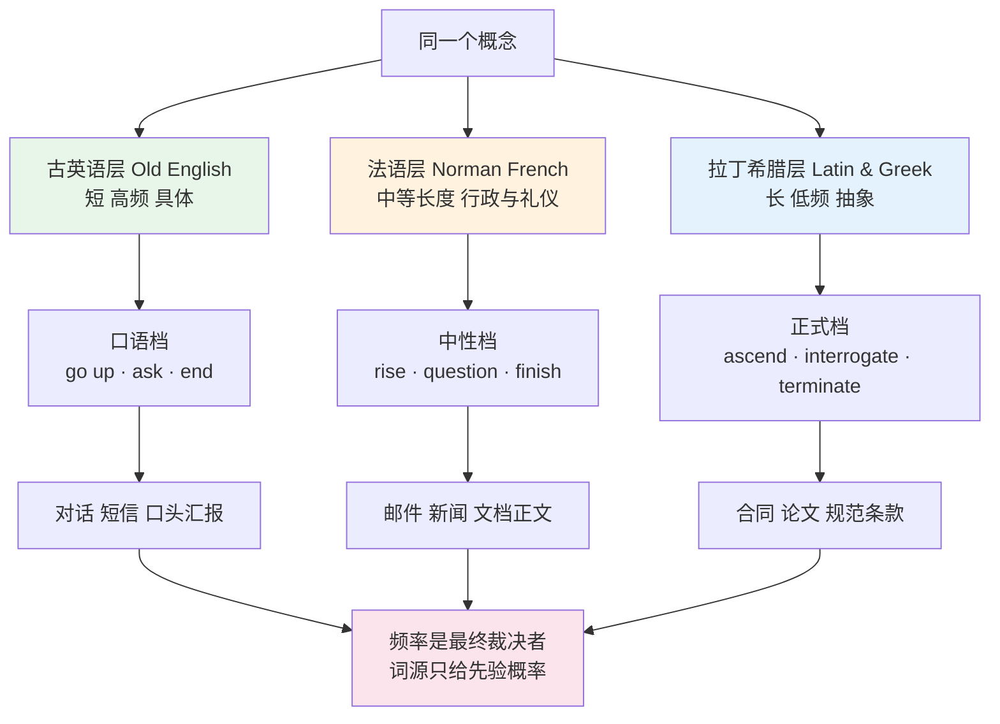
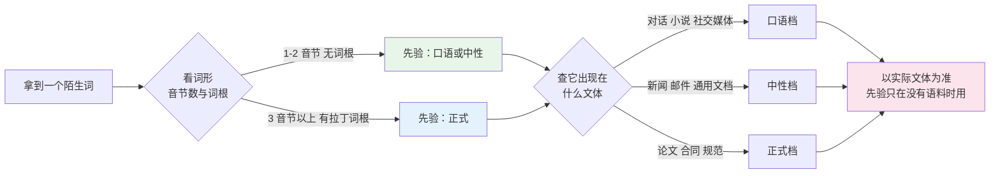
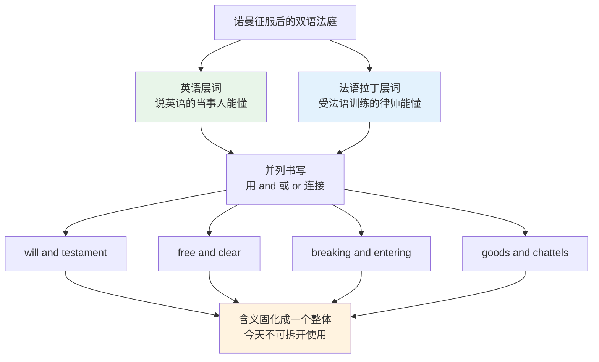
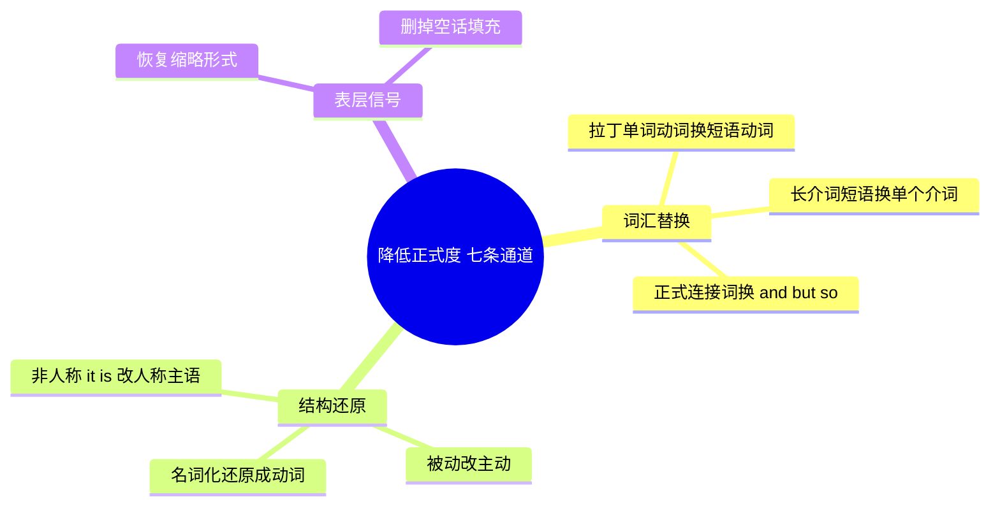
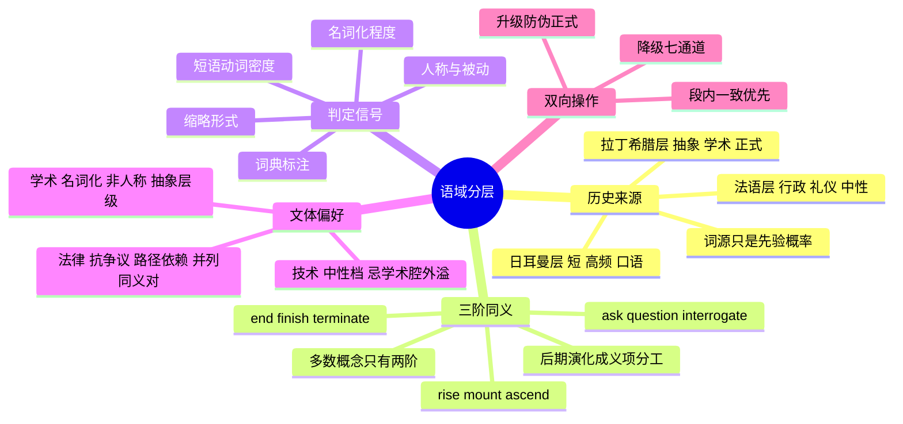

# 语域分层与英语词汇的历史层次

> [!info] 本篇定位
>
> 上一篇 [[18.语域、英美差异与习语俚语/01.英式与美式词汇差异\|英式与美式词汇差异]] 处理的是**地域轴**：同一个东西，英国叫 `lift`，美国叫 `elevator`。本篇处理的是**正式度轴**：同一件事，酒吧里说 `ask`，报告里写 `inquire`，法庭上写 `interrogate`。
>
> 三阶同义的成因在 [[01.词汇入门与学习方法/01.英语词汇的来源、分层与学习地图\|英语词汇的来源、分层与学习地图]] 已经给过历史框架，那一篇答的是「英语为什么有这么多同义词」。本篇答的是紧接着的下一个问题：**拿到三个词，当场怎么选**。
>
> [[16.词义辨析、搭配与短语动词/01.同义词辨析方法与高频同义词组\|同义词辨析方法与高频同义词组]] 把语域列为辨析的四把尺子之一，只占一节。本篇是全书唯一把这把尺子拆到底的地方：判定信号、词典标注、文体分布、升降级的双向操作清单，全部在这里。
>
> 读完能做三件事：看到一个陌生长词，不查词典也能估出它的正式度；写一封邮件或一份文档时，知道自己的用词在哪一档、离目标差多少；拿到一段过于正式的英文，能按固定通道把它改回人话。

---

## 1. 本篇导读：同一件事的三种说法

先看三句话，意思完全一样：

> - The price **went up**.
> - The price **rose**.
> - The price **escalated**.
>   - 价格上涨了。

三句都对，都不含语法错误，中文译文也无法区分。但把第三句放进跟朋友的短信里，对方会觉得你在开玩笑；把第一句放进财报的正文里，审计会觉得这份文件不严肃。差别不在意思，在**语域**（register）。

语域指的是「语言随使用场合变化的那一部分」。学界通常按三个维度描述它：语场（field，谈什么话题）、语旨（tenor，跟谁说、什么关系）、语式（mode，说还是写）。词汇层面最容易被中文母语者踩坑的是语旨与语式合起来的那个效果，也就是日常说的**正式度**。

中文母语者在这条轴上有一个系统性偏差：**默认写得过于正式**。原因很直接——中文的书面语和口语差别没有英语这么大，而且我们背单词的材料以考试词表为主，词表里塞满了 `commence`、`utilize`、`endeavour` 这类高正式度词，却没有标注它们的使用场合。结果是写出的英文句句「正确」，读起来却像一份十九世纪的公函。

上图是本篇的全部骨架。左边三列是历史来源，中间三档是今天的语域落点，右边是各档的典型文体。最下面那个粉色节点是全篇最重要的一句话：词源只是先验概率，某个词今天到底算正式还是口语，最终由它实际出现在什么文体里决定。第 9 节会用三类反例把这句话说透——`very` 是法语层却极口语，`deem` 是古英语层却极正式，`plus` 是拉丁层却随便到能进短信。

本篇的组织顺序是：第 2 节补齐三层叠加的机制；第 3 到 8 节按词类铺三阶同义的实际词表，这是本篇的主体，也是需要反复回查的部分；第 9 到 12 节给判定方法；第 13、14 节解释法律与学术文体的偏好从哪来；第 15 到 17 节是操作部分，讲怎么改。

---

## 2. 三层来源如何沉淀成三档语域

### 2.1 三次接触，三种进入方式

三个层次进入英语的方式完全不同，这个差别直接决定了它们今天的语域位置。

| 层次 | 进入时间 | 进入方式 | 使用者 | 今日语域倾向 |
| --- | --- | --- | --- | --- |
| 古英语（日耳曼） | 5—11 世纪 | 母语继承 | 全体人口 | 口语档，高频 |
| 古诺斯语 | 8—11 世纪 | 日常接触与通婚 | 英格兰东北部平民 | 口语档，高频 |
| 诺曼法语 | 1066 年后约三百年 | 统治阶层自上而下 | 宫廷、法庭、教会、厨房 | 中性档偏正式 |
| 拉丁与希腊 | 14—17 世纪 | 学者笔头引进 | 读书人，书面 | 正式档，书面 |

关键在第三列。古英语词是**说进来的**，从来没脱离过口语；法语词是**统治进来的**，跟着行政、司法、烹饪、礼仪这些具体领域一起来，所以有一批（`table`、`chair`、`city`）彻底日常化了，另一批（`judge`、`sovereign`、`homage`）留在了正式区；拉丁希腊词是**写进来的**，十六世纪那批学者直接从书上搬词造词，很多词从诞生第一天起就没进过日常对话。

一个词有没有经过「口语磨损」，是它今天语域位置的最强预测因子。经过磨损的词会变短、变不规则、义项发散；没经过磨损的词保持长音节、规则拼写、义项单一。

### 2.2 同义梯度的生成条件

不是每个概念都有三阶。三阶同义需要同时满足两个条件：

1. **这个概念在三个时期都需要被表达**。抽象概念（`hypothesis`、`algorithm`、`entropy`）在古英语时期根本不存在，就不会有日耳曼层的对应词。
2. **后来的词没有把先来的词挤死**。多数情况下新词只是补充，但也有例外：古英语的 `nim`（拿）被古诺斯语的 `take` 完全替换掉了，今天只剩痕迹。

所以实际分布是这样的：

| 分布类型 | 出现频率 | 例子 | 学习提示 |
| --- | --- | --- | --- |
| 三阶齐全 | 少数 | rise / mount / ascend | 最典型，但不常见，别以为遍地都是 |
| 两阶（日耳曼 + 拉丁） | 最常见 | help / assist、buy / purchase | 主力形态，选词判断主要发生在这里 |
| 两阶（日耳曼 + 法语） | 常见 | wish / desire、hearty / cordial | 差距通常比含拉丁层的那组小 |
| 只有拉丁层 | 抽象概念区 | hypothesis、correlation、entropy | 没有降级选项，只能整句改写 |
| 只有日耳曼层 | 身体与自然区 | tooth、milk、sun、house | 想升级只能换成整个短语 |

第四行和第五行常被忽略，但它们解释了写作中的一半困难。`Our hypothesis is that…` 没法降级成口语，因为 `hypothesis` 没有日耳曼层同义词，你只能整句重写成 `We think that…`。反过来，`sun` 也不存在正式版本，正式文本里遇到只能换 `solar` 这种形容词形式或者 `the sun` 照写。

### 2.3 日耳曼层里的古诺斯语支流

维京人带来的古诺斯语（Old Norse）跟古英语同属日耳曼语支，两边人能勉强互通，所以借词进得极深——深到进入了代词和最核心的动词。

| 英文 | 英式音标 | 美式音标 | 词性 | 中文 | 搭配与说明 |
| --- | --- | --- | --- | --- | --- |
| **they** | /ðeɪ/ | /ðeɪ/ | pron. | 他们 | 古诺斯语借词替换了古英语 hīe，借到代词层极罕见 |
| **take** | /teɪk/ | /teɪk/ | v. | 拿 | 挤掉了古英语 niman，今天是最高频动词之一 |
| **get** | /ɡet/ | /ɡet/ | v. | 得到 | 古诺斯语层，义项辐射见 13.01 |
| **want** | /wɒnt/ | /wɑːnt/ | v. | 想要 | 原义「缺少」，口语档；正式对应 wish、desire |
| **die** | /daɪ/ | /daɪ/ | v. | 死 | 古英语原用 steorfan，今天窄化成 starve 饿死 |
| **skill** | /skɪl/ | /skɪl/ | n. | 技能 | 中性档，简历里比 competency 自然 |
| **sky** | /skaɪ/ | /skaɪ/ | n. | 天空 | 古英语原词 heaven 被挤到宗教义 |
| **egg** | /eɡ/ | /eɡ/ | n. | 蛋 | 替换了古英语 ey |
| **window** | /ˈwɪndəʊ/ | /ˈwɪndoʊ/ | n. | 窗 | 字面「风眼」，替换了古英语 eagþyrl |
| **law** | /lɔː/ | /lɑː/ | n. | 法律 | 古诺斯语层，但法律文书里的术语几乎全是法语与拉丁层 |
| **call** | /kɔːl/ | /kɑːl/ | v. | 叫；打电话 | 口语档主力动词 |
| **knife** | /naɪf/ | /naɪf/ | n. | 刀 | k 不发音是拼读化石，见 01.02 |

判语域的时候不用把古诺斯语层单独拎出来，它跟古英语层的行为完全一致：短、高频、口语化、常不规则。本篇后面统称「日耳曼层」时包含这一支。

> [!warning] 一个容易被误推的方向
>
> 短词不等于粗俗，长词不等于高级。`die` 是短词，但在讣告和病历里照用不误；`utilize` 是长词，在英文写作指南里被反复点名为多余用词。长度只是语域的**相关指标**，不是价值判断。这一点第 16 节会展开。

---

## 3. 三阶同义（一）：位移、起止与存在

### 3.1 rise / mount / ascend：把三阶看透的样本

这一组是三阶同义最干净的样本，值得逐个拆。

| 英文 | 英式音标 | 美式音标 | 词性 | 中文 | 搭配与说明 |
| --- | --- | --- | --- | --- | --- |
| **rise** | /raɪz/ | /raɪz/ | v./n. | 上升；升起 | 日耳曼层，中性档；不及物，rise-rose-risen |
| **mount** | /maʊnt/ | /maʊnt/ | v. | 登上；增加 | 法语层；可及物 mount a horse，抽象义 pressure mounts |
| **ascend** | /əˈsend/ | /əˈsend/ | v. | 攀升；登上 | 拉丁层，正式；ascend the throne，日常口语几乎不用 |
| **go up** | /ɡəʊ ˈʌp/ | /ɡoʊ ˈʌp/ | phr.v. | 上去；涨 | 短语动词，口语档最低一级 |
| **climb** | /klaɪm/ | /klaɪm/ | v. | 爬升 | 日耳曼层，带费力义，b 不发音 |
| **soar** | /sɔː/ | /sɔːr/ | v. | 飙升 | 法语层，强度词，新闻与财经高频 |
| **escalate** | /ˈeskəleɪt/ | /ˈeskəleɪt/ | v. | 升级；急剧上升 | 拉丁层，正式；常带负面语义韵，costs escalate |

四个词摆在一条轴上：`go up`（口语）→ `rise`（中性）→ `mount`（偏正式）→ `ascend`（正式）。但它们不是可以随便互换的四个刻度，各自还带着自己的搭配限制：

> [!example] 同一件事的四档说法
>
> - Prices **have gone up** again this month.
>   - 这个月价格又涨了。（对话、短信）
> - Prices **rose** by 4% in the third quarter.
>   - 第三季度价格上涨了 4%。（新闻、报告正文）
> - Pressure is **mounting** on the committee to release the findings.
>   - 委员会公布结果的压力正在增大。（新闻评论，mount 用于抽象压力是固定搭配）
> - The aircraft **ascended** to its cruising altitude.
>   - 飞机爬升至巡航高度。（技术与正式描述）

注意第三条：`mount` 在现代英语里已经不太用于「物理上涨」，它的活跃义项集中在抽象累积（`mounting pressure`、`mounting debt`、`mounting evidence`）和「骑上、架设」（`mount a horse`、`mount a camera`）。这是三阶同义的一个通病——**三个词的语义并不完全重合**，它们只是在某一个义项上交叠。把 `ascend` 当成 `rise` 的正式版套用到 `The temperature ascended` 上就会出错，因为 `ascend` 要求一个可攀爬的路径义。

### 3.2 起止与位移的三阶总表

| 英文 | 英式音标 | 美式音标 | 词性 | 中文 | 搭配与说明 |
| --- | --- | --- | --- | --- | --- |
| **begin** | /bɪˈɡɪn/ | /bɪˈɡɪn/ | v. | 开始 | 日耳曼层，中性偏书面 |
| **start** | /stɑːt/ | /stɑːrt/ | v./n. | 开始 | 日耳曼层，口语档，机器启动只能用 start |
| **commence** | /kəˈmens/ | /kəˈmens/ | v. | 开始 | 法语层，高正式；典礼与法律文书 |
| **initiate** | /ɪˈnɪʃieɪt/ | /ɪˈnɪʃieɪt/ | v. | 启动；发起 | 拉丁层，正式；initiate proceedings |
| **end** | /end/ | /end/ | v./n. | 结束 | 日耳曼层，中性 |
| **finish** | /ˈfɪnɪʃ/ | /ˈfɪnɪʃ/ | v. | 完成 | 法语层，已完全日常化 |
| **conclude** | /kənˈkluːd/ | /kənˈkluːd/ | v. | 结束；得出结论 | 拉丁层，正式；双义项 |
| **terminate** | /ˈtɜːmɪneɪt/ | /ˈtɜːrmɪneɪt/ | v. | 终止 | 拉丁层，正式；带「强行中止」义，合同高频 |
| **cease** | /siːs/ | /siːs/ | v. | 停止 | 法语层，正式；cease and desist 是法律固定对 |
| **stop** | /stɒp/ | /stɑːp/ | v. | 停 | 日耳曼层，口语与中性通吃 |
| **go** | /ɡəʊ/ | /ɡoʊ/ | v. | 去 | 日耳曼层，最口语 |
| **leave** | /liːv/ | /liːv/ | v. | 离开 | 日耳曼层，中性 |
| **depart** | /dɪˈpɑːt/ | /dɪˈpɑːrt/ | v. | 出发；离开 | 法语层，正式；机场广播与时刻表 |
| **exit** | /ˈeksɪt/ | /ˈeksɪt/ | v./n. | 退出；出口 | 拉丁层，但已中性化，程序退出的标准词；另有 /ˈeɡzɪt/ 读法，英美都有 |
| **enter** | /ˈentə/ | /ˈentər/ | v. | 进入 | 法语层，中性；及物，不加 into |
| **come in** | /kʌm ˈɪn/ | /kʌm ˈɪn/ | phr.v. | 进来 | 口语档 |
| **fall** | /fɔːl/ | /fɑːl/ | v. | 下降 | 日耳曼层，中性 |
| **descend** | /dɪˈsend/ | /dɪˈsend/ | v. | 下降 | 拉丁层，正式；ascend 的对应词 |
| **decline** | /dɪˈklaɪn/ | /dɪˈklaɪn/ | v./n. | 下降；婉拒 | 拉丁层，正式；数据下降与婉拒双义 |
| **drop** | /drɒp/ | /drɑːp/ | v./n. | 掉；下跌 | 日耳曼层，口语档 |
| **stay** | /steɪ/ | /steɪ/ | v. | 待着 | 法语层，已完全口语化 |
| **remain** | /rɪˈmeɪn/ | /rɪˈmeɪn/ | v. | 保持；剩下 | 法语层，中性偏正式 |
| **reside** | /rɪˈzaɪd/ | /rɪˈzaɪd/ | v. | 居住 | 拉丁层，正式；表格与法律文件 |
| **live** | /lɪv/ | /lɪv/ | v. | 住；活 | 日耳曼层，口语与中性 |

> [!warning] terminate 不是 end 的高级版
>
> `terminate` 携带「由外力强行中止」的语义，中性的「结束了」用它会变味。
>
> - ❌ ~~The meeting was terminated at five.~~（听起来像会议被强行叫停）
> - ✅ **The meeting ended at five.**（会议五点结束）
> - ✅ **The contract was terminated for breach.**（合同因违约被终止，这里 terminate 才对）
>
> 同理 `commence` 用在日常事务上会显得夸张：`The meeting will commence at nine` 适合会议通告，`Let's commence lunch` 是笑话。

---

## 4. 三阶同义（二）：言语、认知与信息

言语类动词是三阶差距最大的一组，因为「怎么说话」本身就是语域的核心表现。

| 英文 | 英式音标 | 美式音标 | 词性 | 中文 | 搭配与说明 |
| --- | --- | --- | --- | --- | --- |
| **ask** | /ɑːsk/ | /æsk/ | v. | 问；请求 | 日耳曼层，口语与中性；双身份见 16.01 |
| **inquire** | /ɪnˈkwaɪə/ | /ɪnˈkwaɪər/ | v. | 询问 | 法语层，正式；英式常拼 enquire |
| **question** | /ˈkwestʃən/ | /ˈkwestʃən/ | v./n. | 质询；问题 | 法语层，动词偏正式且带质疑义 |
| **interrogate** | /ɪnˈterəɡeɪt/ | /ɪnˈterəɡeɪt/ | v. | 审问 | 拉丁层，正式；执法语境，也用于「查询数据库」 |
| **tell** | /tel/ | /tel/ | v. | 告诉 | 日耳曼层，口语与中性；tell sb sth，接人不加介词 |
| **inform** | /ɪnˈfɔːm/ | /ɪnˈfɔːrm/ | v. | 通知 | 法语层，正式；inform sb of sth |
| **notify** | /ˈnəʊtɪfaɪ/ | /ˈnoʊtɪfaɪ/ | v. | 告知 | 拉丁层，正式；系统通知与法律送达 |
| **advise** | /ədˈvaɪz/ | /ədˈvaɪz/ | v. | 建议；告知 | 法语层；商务信函里的「告知」义已显陈旧 |
| **say** | /seɪ/ | /seɪ/ | v. | 说 | 日耳曼层，全档通用 |
| **state** | /steɪt/ | /steɪt/ | v. | 陈述 | 拉丁层，正式；正式声明与证词 |
| **declare** | /dɪˈkleə/ | /dɪˈkler/ | v. | 宣布；申报 | 法语层，正式；海关申报固定用词 |
| **assert** | /əˈsɜːt/ | /əˈsɜːrt/ | v. | 断言 | 拉丁层，学术；带「未必有证据」的暗示 |
| **utter** | /ˈʌtə/ | /ˈʌtər/ | v. | 说出 | 日耳曼层但语域高，语言学与文学用 |
| **talk** | /tɔːk/ | /tɑːk/ | v. | 谈 | 日耳曼层，口语 |
| **discuss** | /dɪˈskʌs/ | /dɪˈskʌs/ | v. | 讨论 | 拉丁层，中性偏正式；及物，不加 about |
| **deliberate** | /dɪˈlɪbəreɪt/ | /dɪˈlɪbəreɪt/ | v. | 商议 | 拉丁层，高正式；陪审团与委员会 |
| **answer** | /ˈɑːnsə/ | /ˈænsər/ | v./n. | 回答 | 日耳曼层，中性 |
| **reply** | /rɪˈplaɪ/ | /rɪˈplaɪ/ | v./n. | 答复 | 法语层，中性偏正式 |
| **respond** | /rɪˈspɒnd/ | /rɪˈspɑːnd/ | v. | 回应 | 拉丁层，正式；也用于系统响应 |
| **think** | /θɪŋk/ | /θɪŋk/ | v. | 想 | 日耳曼层，口语与中性 |
| **consider** | /kənˈsɪdə/ | /kənˈsɪdər/ | v. | 认为；考虑 | 拉丁层，中性偏正式 |
| **deem** | /diːm/ | /diːm/ | v. | 认定 | 日耳曼层却高正式，法律文本高频，是词源规则的反例 |
| **contemplate** | /ˈkɒntempleɪt/ | /ˈkɑːntəmpleɪt/ | v. | 考虑；打算 | 拉丁层，高正式 |
| **see** | /siː/ | /siː/ | v. | 看见 | 日耳曼层 |
| **observe** | /əbˈzɜːv/ | /əbˈzɜːrv/ | v. | 观察；遵守 | 拉丁层，正式；双义项，学术与法律各占一个 |
| **perceive** | /pəˈsiːv/ | /pərˈsiːv/ | v. | 察觉 | 法语层，正式；学术写作高频 |
| **find out** | /faɪnd ˈaʊt/ | /faɪnd ˈaʊt/ | phr.v. | 查明 | 口语档 |
| **discover** | /dɪˈskʌvə/ | /dɪˈskʌvər/ | v. | 发现 | 法语层，中性 |
| **ascertain** | /ˌæsəˈteɪn/ | /ˌæsərˈteɪn/ | v. | 查明；确定 | 法语层，高正式；调查报告与法律 |
| **look into** | /lʊk ˈɪntuː/ | /lʊk ˈɪntuː/ | phr.v. | 调查 | 口语档 |
| **investigate** | /ɪnˈvestɪɡeɪt/ | /ɪnˈvestɪɡeɪt/ | v. | 调查 | 拉丁层，正式 |
| **examine** | /ɪɡˈzæmɪn/ | /ɪɡˈzæmɪn/ | v. | 检查 | 法语层，中性偏正式 |
| **scrutinize** | /ˈskruːtənaɪz/ | /ˈskruːtənaɪz/ | v. | 细查 | 拉丁层，高正式；英式常拼 scrutinise |

> [!example] 同一句通知的三档写法
>
> - I'll **let you know** when it's **done**.
>   - 弄好了我告诉你。（同事间口头或即时消息）
> - I will **tell** you once the change **is live**.
>   - 变更上线后我会告知。（团队邮件）
> - You **will be notified** upon **completion** of the migration.
>   - 迁移完成后将通知您。（对外公告或系统文案）

三句的差别不只是换了动词。第三句同时做了三件事：把动词换成拉丁层的 `notify`、把主动改成被动、把动词 `complete` 名词化成 `completion`。**语域升降从来不是单点替换，而是一组联动**，第 15 节会把这组联动拆成七条独立通道。

---

## 5. 三阶同义（三）：给予、获取与处置

| 英文 | 英式音标 | 美式音标 | 词性 | 中文 | 搭配与说明 |
| --- | --- | --- | --- | --- | --- |
| **give** | /ɡɪv/ | /ɡɪv/ | v. | 给 | 日耳曼层，全档通用 |
| **grant** | /ɡrɑːnt/ | /ɡrænt/ | v. | 授予 | 法语层，正式；权限与许可的标准词 |
| **provide** | /prəˈvaɪd/ | /prəˈvaɪd/ | v. | 提供 | 拉丁层，中性偏正式；provide sb with sth |
| **furnish** | /ˈfɜːnɪʃ/ | /ˈfɜːrnɪʃ/ | v. | 提供；配备 | 法语层，高正式；furnish evidence 显陈旧 |
| **get** | /ɡet/ | /ɡet/ | v. | 得到 | 日耳曼层，最口语 |
| **gain** | /ɡeɪn/ | /ɡeɪn/ | v. | 获得 | 法语层，中性；gain access、gain weight |
| **obtain** | /əbˈteɪn/ | /əbˈteɪn/ | v. | 取得 | 拉丁层，正式；文档与论文高频 |
| **acquire** | /əˈkwaɪə/ | /əˈkwaɪər/ | v. | 获取；收购 | 拉丁层，正式；语言习得与公司收购 |
| **procure** | /prəˈkjʊə/ | /proʊˈkjʊr/ | v. | 采购 | 拉丁层，高正式；采购流程专用 |
| **buy** | /baɪ/ | /baɪ/ | v. | 买 | 日耳曼层，口语与中性 |
| **purchase** | /ˈpɜːtʃəs/ | /ˈpɜːrtʃəs/ | v./n. | 购买 | 法语层，正式；单据与商务 |
| **keep** | /kiːp/ | /kiːp/ | v. | 保留 | 日耳曼层 |
| **retain** | /rɪˈteɪn/ | /rɪˈteɪn/ | v. | 保留 | 拉丁层，正式；数据留存与聘请律师 |
| **preserve** | /prɪˈzɜːv/ | /prɪˈzɜːrv/ | v. | 保存 | 拉丁层，正式 |
| **use** | /juːz/ | /juːz/ | v. | 使用 | 法语层，已完全中性 |
| **employ** | /ɪmˈplɔɪ/ | /ɪmˈplɔɪ/ | v. | 采用；雇用 | 法语层，正式；学术里的「采用方法」 |
| **utilize** | /ˈjuːtəlaɪz/ | /ˈjuːtəlaɪz/ | v. | 利用 | 拉丁层；英文写作指南里最常被点名的冗词 |
| **help** | /help/ | /help/ | v./n. | 帮助 | 日耳曼层 |
| **aid** | /eɪd/ | /eɪd/ | v./n. | 援助 | 法语层，正式；名词义在人道救援 |
| **assist** | /əˈsɪst/ | /əˈsɪst/ | v. | 协助 | 拉丁层，正式；客服与文档 |
| **give up** | /ɡɪv ˈʌp/ | /ɡɪv ˈʌp/ | phr.v. | 放弃 | 口语档 |
| **abandon** | /əˈbændən/ | /əˈbændən/ | v. | 放弃 | 法语层，正式 |
| **relinquish** | /rɪˈlɪŋkwɪʃ/ | /rɪˈlɪŋkwɪʃ/ | v. | 让渡；放弃 | 拉丁层，高正式；权利与职位 |
| **forgo** | /fɔːˈɡəʊ/ | /fɔːrˈɡoʊ/ | v. | 放弃享有 | 日耳曼层却高正式，另一个反例 |
| **throw away** | /θrəʊ əˈweɪ/ | /θroʊ əˈweɪ/ | phr.v. | 扔掉 | 口语档 |
| **discard** | /dɪˈskɑːd/ | /dɪˈskɑːrd/ | v. | 丢弃 | 法语层，正式；技术文档常用 |
| **dispose of** | /dɪˈspəʊz/ | /dɪˈspoʊz/ | phr.v. | 处置 | 拉丁层动词构成的正式短语动词 |
| **get rid of** | /ɡet ˈrɪd/ | /ɡet ˈrɪd/ | phr. | 摆脱 | 口语档 |
| **eliminate** | /ɪˈlɪmɪneɪt/ | /ɪˈlɪmɪneɪt/ | v. | 消除 | 拉丁层，正式 |
| **remove** | /rɪˈmuːv/ | /rɪˈmuːv/ | v. | 移除 | 法语层，中性；界面与文档标准词 |
| **need** | /niːd/ | /niːd/ | v./n. | 需要 | 日耳曼层 |
| **require** | /rɪˈkwaɪə/ | /rɪˈkwaɪər/ | v. | 要求；需要 | 法语层，正式；规范文体的核心词 |
| **necessitate** | /nəˈsesɪteɪt/ | /nəˈsesɪteɪt/ | v. | 使成为必需 | 拉丁层，高正式，多数场合可换 require |
| **let** | /let/ | /let/ | v. | 让 | 日耳曼层，口语 |
| **allow** | /əˈlaʊ/ | /əˈlaʊ/ | v. | 允许 | 法语层，中性 |
| **permit** | /pəˈmɪt/ | /pərˈmɪt/ | v. | 准许 | 拉丁层，正式；名词重音前移 /ˈpɜːmɪt/ |
| **authorize** | /ˈɔːθəraɪz/ | /ˈɔːθəraɪz/ | v. | 授权 | 希腊拉丁层，正式；权限系统与法律 |
| **try** | /traɪ/ | /traɪ/ | v. | 试 | 法语层，已完全口语化 |
| **attempt** | /əˈtempt/ | /əˈtempt/ | v./n. | 尝试 | 拉丁层，正式 |
| **endeavour** | /ɪnˈdevə/ | /ɪnˈdevər/ | v./n. | 努力 | 法语层，高正式；美式拼 endeavor |

> [!tip] 一个高效的记忆切口
>
> 上表里凡是**法语层与拉丁层挤在一起**的组（obtain / acquire / procure，abandon / relinquish / forgo），本质上是同一档的三个细分选项，差别在**具体领域**而非正式度：`procure` 属采购流程，`relinquish` 属权利让渡。
>
> 记这类词不要横向背同义词表，要纵向记「它固定出现在哪个文件里」。`procure` 出现在采购单，`retain` 出现在数据保留政策，`indemnify` 出现在合同。领域记住了，语域自然就对了。

---

## 6. 三阶同义（四）：名词的三阶

名词的分层比动词更容易被忽略，因为中文译名往往一模一样。

| 英文 | 英式音标 | 美式音标 | 词性 | 中文 | 搭配与说明 |
| --- | --- | --- | --- | --- | --- |
| **house** | /haʊs/ | /haʊs/ | n. | 房子 | 日耳曼层，具体建筑 |
| **home** | /həʊm/ | /hoʊm/ | n. | 家 | 日耳曼层，带情感义 |
| **residence** | /ˈrezɪdəns/ | /ˈrezɪdəns/ | n. | 住所 | 拉丁层，正式；表格与签证 |
| **dwelling** | /ˈdwelɪŋ/ | /ˈdwelɪŋ/ | n. | 住宅 | 日耳曼层却正式，出现在建筑法规 |
| **domicile** | /ˈdɒmɪsaɪl/ | /ˈdɑːməsaɪl/ | n. | 住所地 | 拉丁层，法律术语，涉及税务归属 |
| **abode** | /əˈbəʊd/ | /əˈboʊd/ | n. | 居所 | 由古英语 ābīdan（abide）派生，日耳曼层却陈旧正式；right of abode 是法律固定搭配 |
| **job** | /dʒɒb/ | /dʒɑːb/ | n. | 工作 | 来源不明的日耳曼式短词，口语档 |
| **work** | /wɜːk/ | /wɜːrk/ | n./v. | 工作 | 日耳曼层，中性；不可数 |
| **employment** | /ɪmˈplɔɪmənt/ | /ɪmˈplɔɪmənt/ | n. | 就业 | 法语层，正式；合同与统计 |
| **occupation** | /ˌɒkjuˈpeɪʃn/ | /ˌɑːkjəˈpeɪʃn/ | n. | 职业 | 拉丁层，正式；表格栏目名 |
| **pay** | /peɪ/ | /peɪ/ | n./v. | 工资；付 | 法语层，已完全口语化 |
| **wages** | /ˈweɪdʒɪz/ | /ˈweɪdʒɪz/ | n. | 计时工资 | 法语层，中性；蓝领语境 |
| **salary** | /ˈsæləri/ | /ˈsæləri/ | n. | 月薪年薪 | 法语层，中性；源自拉丁 salarium，词根 sal 即盐 |
| **compensation** | /ˌkɒmpenˈseɪʃn/ | /ˌkɑːmpənˈseɪʃn/ | n. | 薪酬；赔偿 | 拉丁层，正式；美式 HR 语境指整体薪酬 |
| **remuneration** | /rɪˌmjuːnəˈreɪʃn/ | /rɪˌmjuːnəˈreɪʃn/ | n. | 报酬 | 拉丁层，极正式；合同与年报 |
| **kid** | /kɪd/ | /kɪd/ | n. | 小孩 | 古诺斯语层，口语档；本义小山羊 |
| **child** | /tʃaɪld/ | /tʃaɪld/ | n. | 孩子 | 日耳曼层，中性 |
| **offspring** | /ˈɒfsprɪŋ/ | /ˈɔːfsprɪŋ/ | n. | 子女；后代 | 日耳曼层却正式，生物学与法律，单复同形 |
| **minor** | /ˈmaɪnə/ | /ˈmaɪnər/ | n. | 未成年人 | 拉丁层，法律术语 |
| **boss** | /bɒs/ | /bɔːs/ | n. | 老板 | 荷兰语借词，口语档 |
| **manager** | /ˈmænɪdʒə/ | /ˈmænɪdʒər/ | n. | 经理 | 法语层，中性 |
| **superior** | /suːˈpɪəriə/ | /suːˈpɪriər/ | n./adj. | 上级；更好的 | 拉丁层，正式；比较用 superior to 不用 than |
| **help** | /help/ | /help/ | n. | 帮助 | 日耳曼层，不可数 |
| **assistance** | /əˈsɪstəns/ | /əˈsɪstəns/ | n. | 协助 | 拉丁层，正式；客服话术标配 |
| **gap** | /ɡæp/ | /ɡæp/ | n. | 差距 | 古诺斯语层，中性 |
| **difference** | /ˈdɪfrəns/ | /ˈdɪfrəns/ | n. | 差别 | 法语层，中性 |
| **discrepancy** | /dɪsˈkrepənsi/ | /dɪsˈkrepənsi/ | n. | 不一致 | 拉丁层，正式；对账与数据核查 |
| **lack** | /læk/ | /læk/ | n./v. | 缺乏 | 日耳曼层，中性 |
| **shortage** | /ˈʃɔːtɪdʒ/ | /ˈʃɔːrtɪdʒ/ | n. | 短缺 | 日耳曼词根加法语后缀，中性 |
| **deficiency** | /dɪˈfɪʃnsi/ | /dɪˈfɪʃnsi/ | n. | 不足；缺陷 | 拉丁层，正式；医学与审计 |
| **paucity** | /ˈpɔːsəti/ | /ˈpɔːsəti/ | n. | 稀少 | 拉丁层，学术；a paucity of evidence |
| **fire** | /ˈfaɪə/ | /ˈfaɪər/ | n. | 火；火灾 | 日耳曼层 |
| **flame** | /fleɪm/ | /fleɪm/ | n. | 火焰 | 法语层，中性 |
| **conflagration** | /ˌkɒnfləˈɡreɪʃn/ | /ˌkɑːnfləˈɡreɪʃn/ | n. | 大火 | 拉丁层，极正式，多见于历史叙述 |
| **fear** | /fɪə/ | /fɪr/ | n. | 恐惧 | 日耳曼层 |
| **terror** | /ˈterə/ | /ˈterər/ | n. | 恐怖 | 法语层，强度更高 |
| **trepidation** | /ˌtrepɪˈdeɪʃn/ | /ˌtrepɪˈdeɪʃn/ | n. | 惶恐 | 拉丁层，文学与正式书面 |
| **death** | /deθ/ | /deθ/ | n. | 死亡 | 日耳曼层，中性 |
| **decease** | /dɪˈsiːs/ | /dɪˈsiːs/ | n./v. | 亡故 | 法语层，法律专用；形容词 deceased 更常见 |
| **demise** | /dɪˈmaɪz/ | /dɪˈmaɪz/ | n. | 消亡 | 法语层，正式；也用于机构与产品的终结 |

> [!warning] 中文译名相同不代表可以互换
>
> `job`、`work`、`employment`、`occupation` 中文都可以译成「工作」，但四者的分工是硬的：
>
> - ✅ **I got a new job.**（口语，可数，指一个具体岗位）
> - ❌ ~~I got a new work.~~（work 作「工作」义不可数）
> - ✅ **Occupation: software engineer**（表格栏目，只在这个位置用）
> - ✅ **terms of employment**（合同术语，不能换成 job）
>
> 名词的语域错配比动词更难被自己发现，因为它藏在中文译名后面。做法是记「这个词出现在什么位置」而不是记它的中文。

---

## 7. 名词留日耳曼，形容词换拉丁：英语最隐蔽的一处分层

英语有一批名词—形容词对，名词是日耳曼层的日常词，对应的形容词却是拉丁层的，两者拼写毫无关系。这是中文母语者读专业文本时最常卡住的地方之一：认识 `moon`，却不认识 `lunar`。

| 英文 | 英式音标 | 美式音标 | 词性 | 中文 | 搭配与说明 |
| --- | --- | --- | --- | --- | --- |
| **lunar** | /ˈluːnə/ | /ˈluːnər/ | adj. | 月球的 | 对应名词 moon；lunar calendar 农历 |
| **solar** | /ˈsəʊlə/ | /ˈsoʊlər/ | adj. | 太阳的 | 对应 sun；solar panel |
| **stellar** | /ˈstelə/ | /ˈstelər/ | adj. | 恒星的；出色的 | 对应 star；口语引申义 a stellar performance |
| **terrestrial** | /təˈrestriəl/ | /təˈrestriəl/ | adj. | 陆地的；地球的 | 对应 earth；extraterrestrial 即地外的 |
| **aquatic** | /əˈkwætɪk/ | /əˈkwætɪk/ | adj. | 水生的 | 对应 water |
| **marine** | /məˈriːn/ | /məˈriːn/ | adj. | 海洋的 | 对应 sea；marine biology |
| **canine** | /ˈkeɪnaɪn/ | /ˈkeɪnaɪn/ | adj./n. | 犬的；犬齿 | 对应 dog |
| **feline** | /ˈfiːlaɪn/ | /ˈfiːlaɪn/ | adj. | 猫科的 | 对应 cat |
| **equine** | /ˈekwaɪn/ | /ˈiːkwaɪn/ | adj. | 马的 | 对应 horse；英美重音一致，首音节元音不同 |
| **avian** | /ˈeɪviən/ | /ˈeɪviən/ | adj. | 鸟类的 | 对应 bird；avian flu 禽流感 |
| **bovine** | /ˈbəʊvaɪn/ | /ˈboʊvaɪn/ | adj. | 牛的 | 对应 cow；也形容人迟钝 |
| **manual** | /ˈmænjuəl/ | /ˈmænjuəl/ | adj./n. | 手工的；手册 | 对应 hand |
| **oral** | /ˈɔːrəl/ | /ˈɔːrəl/ | adj. | 口头的；口服的 | 对应 mouth；oral exam、oral medication |
| **dental** | /ˈdentl/ | /ˈdentl/ | adj. | 牙齿的 | 对应 tooth |
| **ocular** | /ˈɒkjələ/ | /ˈɑːkjələr/ | adj. | 眼的 | 对应 eye；日常更常见 optical、visual |
| **cardiac** | /ˈkɑːdiæk/ | /ˈkɑːrdiæk/ | adj. | 心脏的 | 对应 heart；希腊层 |
| **mental** | /ˈmentl/ | /ˈmentl/ | adj. | 心理的 | 对应 mind |
| **vital** | /ˈvaɪtl/ | /ˈvaɪtl/ | adj. | 生命的；至关重要的 | 对应 life；vital signs 生命体征 |
| **nocturnal** | /nɒkˈtɜːnl/ | /nɑːkˈtɜːrnl/ | adj. | 夜行的 | 对应 night |
| **temporal** | /ˈtempərəl/ | /ˈtempərəl/ | adj. | 时间的 | 对应 time；技术文档里的 temporal data |
| **verbal** | /ˈvɜːbl/ | /ˈvɜːrbl/ | adj. | 言语的；口头的 | 对应 word；verbal agreement 口头协议 |
| **urban** | /ˈɜːbən/ | /ˈɜːrbən/ | adj. | 城市的 | 对应 town / city |
| **rural** | /ˈrʊərəl/ | /ˈrʊrəl/ | adj. | 乡村的 | 对应 country |
| **domestic** | /dəˈmestɪk/ | /dəˈmestɪk/ | adj. | 家庭的；国内的 | 对应 home；双义项，航班与家务都用 |
| **paternal** | /pəˈtɜːnl/ | /pəˈtɜːrnl/ | adj. | 父亲的 | 对应 father；日耳曼形式 fatherly 语气更暖 |
| **maternal** | /məˈtɜːnl/ | /məˈtɜːrnl/ | adj. | 母亲的 | 对应 mother；产假固定说 maternity leave，不说 maternal leave |
| **fraternal** | /frəˈtɜːnl/ | /frəˈtɜːrnl/ | adj. | 兄弟的 | 对应 brother；fraternal twins 异卵双胞胎 |
| **cordial** | /ˈkɔːdiəl/ | /ˈkɔːrdʒəl/ | adj. | 热诚的 | 对应 heart，与日耳曼层 hearty 构成经典同义对 |

这张表揭示的规律是：**英语在需要构造抽象或专业形容词时，倾向于绕开日耳曼名词，直接调用拉丁词根**。原因在于日耳曼名词加 `-ly`、`-ish` 这类后缀造出来的形容词语气偏软偏日常（`fatherly`、`kingly`、`hearty`），撑不住学术与法律文本要的中立感。

对中文母语者来说这意味着一件事：**认识名词不等于能读懂它的形容词**。这批形容词大多要单独记，靠拆词根只能事后验证，不能事前推导。词根系统在 [[15.词根、合成与缩略/01.高频拉丁词根（上）\|高频拉丁词根（上）]] 展开。

---

## 8. 三阶同义（五）：形容词、副词与连接成分

### 8.1 形容词的三阶

| 英文 | 英式音标 | 美式音标 | 词性 | 中文 | 搭配与说明 |
| --- | --- | --- | --- | --- | --- |
| **big** | /bɪɡ/ | /bɪɡ/ | adj. | 大 | 来源不明的短词，口语档 |
| **large** | /lɑːdʒ/ | /lɑːrdʒ/ | adj. | 大 | 法语层，中性；量化语境优先 |
| **substantial** | /səbˈstænʃl/ | /səbˈstænʃl/ | adj. | 可观的 | 拉丁层，正式；a substantial increase |
| **considerable** | /kənˈsɪdərəbl/ | /kənˈsɪdərəbl/ | adj. | 相当大的 | 拉丁层，正式；学术写作高频 |
| **small** | /smɔːl/ | /smɔːl/ | adj. | 小 | 日耳曼层 |
| **minor** | /ˈmaɪnə/ | /ˈmaɪnər/ | adj. | 次要的 | 拉丁层，中性偏正式 |
| **negligible** | /ˈneɡlɪdʒəbl/ | /ˈneɡlɪdʒəbl/ | adj. | 可忽略的 | 拉丁层，正式；技术与学术 |
| **minuscule** | /ˈmɪnəskjuːl/ | /ˈmɪnəskjuːl/ | adj. | 极小的 | 拉丁层，正式；常被误拼成 miniscule |
| **enough** | /ɪˈnʌf/ | /ɪˈnʌf/ | adj./adv. | 足够 | 日耳曼层，后置修饰 good enough |
| **adequate** | /ˈædɪkwət/ | /ˈædɪkwət/ | adj. | 足够的 | 拉丁层，正式；隐含「刚够，不出色」 |
| **sufficient** | /səˈfɪʃnt/ | /səˈfɪʃnt/ | adj. | 充分的 | 拉丁层，正式；sufficient evidence |
| **fast** | /fɑːst/ | /fæst/ | adj. | 快 | 日耳曼层，口语与中性 |
| **quick** | /kwɪk/ | /kwɪk/ | adj. | 快 | 日耳曼层，原义「活的」 |
| **swift** | /swɪft/ | /swɪft/ | adj. | 迅速的 | 日耳曼层却偏正式书面 |
| **rapid** | /ˈræpɪd/ | /ˈræpɪd/ | adj. | 急速的 | 拉丁层，中性偏正式；rapid growth |
| **expeditious** | /ˌekspəˈdɪʃəs/ | /ˌekspəˈdɪʃəs/ | adj. | 迅速的 | 拉丁层，极正式，合同用语 |
| **deep** | /diːp/ | /diːp/ | adj. | 深 | 日耳曼层 |
| **profound** | /prəˈfaʊnd/ | /prəˈfaʊnd/ | adj. | 深刻的 | 拉丁层，正式；抽象义专用 |
| **old** | /əʊld/ | /oʊld/ | adj. | 老的 | 日耳曼层 |
| **ancient** | /ˈeɪnʃənt/ | /ˈeɪnʃənt/ | adj. | 古代的 | 法语层，中性 |
| **antiquated** | /ˈæntɪkweɪtɪd/ | /ˈæntɪkweɪtɪd/ | adj. | 过时的 | 拉丁层，正式且带贬义 |
| **weak** | /wiːk/ | /wiːk/ | adj. | 弱 | 古诺斯语层 |
| **feeble** | /ˈfiːbl/ | /ˈfiːbl/ | adj. | 虚弱的 | 法语层，带贬义 |
| **strong** | /strɒŋ/ | /strɔːŋ/ | adj. | 强 | 日耳曼层 |
| **potent** | /ˈpəʊtnt/ | /ˈpoʊtnt/ | adj. | 有效力的 | 拉丁层，正式；药理与论证 |
| **kingly** | /ˈkɪŋli/ | /ˈkɪŋli/ | adj. | 帝王般的 | 日耳曼层，文学腔 |
| **royal** | /ˈrɔɪəl/ | /ˈrɔɪəl/ | adj. | 王室的 | 法语层，中性，指实际身份 |
| **regal** | /ˈriːɡl/ | /ˈriːɡl/ | adj. | 有王者气派的 | 拉丁层，正式，形容气质 |
| **holy** | /ˈhəʊli/ | /ˈhoʊli/ | adj. | 神圣的 | 日耳曼层 |
| **sacred** | /ˈseɪkrɪd/ | /ˈseɪkrɪd/ | adj. | 神圣的 | 法语拉丁层，中性偏正式 |
| **consecrated** | /ˈkɒnsɪkreɪtɪd/ | /ˈkɑːnsəkreɪtɪd/ | adj. | 受祝圣的 | 拉丁层，宗教仪式专用 |
| **hearty** | /ˈhɑːti/ | /ˈhɑːrti/ | adj. | 热情的；丰盛的 | 日耳曼层，口语暖调 |
| **cordial** | /ˈkɔːdiəl/ | /ˈkɔːrdʒəl/ | adj. | 诚挚的 | 拉丁层，正式冷调 |

`kingly` / `royal` / `regal` 这一组值得单独看一眼：三个词的中文都能译成「王的」，但 `royal` 指真实身份（`the royal family`），`regal` 指气派（`a regal bearing`），`kingly` 今天只活在文学与仿古文体里。**三阶同义走到后期，往往从「正式度不同」演化成「义项分工」**，这也是背同义词表最容易翻车的地方。

### 8.2 连接成分的三阶

连接词与连接副词是语域信号最密集的一块，因为它们在每一段里都要出现。

| 英文 | 英式音标 | 美式音标 | 词性 | 中文 | 搭配与说明 |
| --- | --- | --- | --- | --- | --- |
| **but** | /bʌt/ | /bʌt/ | conj. | 但是 | 日耳曼层，全档通用 |
| **however** | /haʊˈevə/ | /haʊˈevər/ | adv. | 然而 | 中性偏正式；书面转折的默认词 |
| **nevertheless** | /ˌnevəðəˈles/ | /ˌnevərðəˈles/ | adv. | 尽管如此 | 正式；日耳曼元素拼出的高正式词 |
| **notwithstanding** | /ˌnɒtwɪθˈstændɪŋ/ | /ˌnɑːtwɪθˈstændɪŋ/ | prep./adv. | 尽管 | 极正式，法律文本；日耳曼元素仿造拉丁结构 |
| **so** | /səʊ/ | /soʊ/ | conj. | 所以 | 日耳曼层，口语档 |
| **therefore** | /ˈðeəfɔː/ | /ˈðerfɔːr/ | adv. | 因此 | 正式；日耳曼元素 |
| **hence** | /hens/ | /hens/ | adv. | 因此 | 正式，简省；日耳曼层 |
| **thus** | /ðʌs/ | /ðʌs/ | adv. | 因而 | 正式，学术高频 |
| **consequently** | /ˈkɒnsɪkwəntli/ | /ˈkɑːnsəkwentli/ | adv. | 结果是 | 拉丁层，正式 |
| **accordingly** | /əˈkɔːdɪŋli/ | /əˈkɔːrdɪŋli/ | adv. | 据此 | 正式，公文与法律 |
| **also** | /ˈɔːlsəʊ/ | /ˈɔːlsoʊ/ | adv. | 也 | 日耳曼层，中性 |
| **besides** | /bɪˈsaɪdz/ | /bɪˈsaɪdz/ | adv. | 再说 | 口语档，带补充理由的语气 |
| **moreover** | /mɔːrˈəʊvə/ | /mɔːrˈoʊvər/ | adv. | 此外 | 正式，学术与商务 |
| **furthermore** | /ˌfɜːðəˈmɔː/ | /ˌfɜːrðərˈmɔːr/ | adv. | 而且 | 正式，比 moreover 更书面 |
| **about** | /əˈbaʊt/ | /əˈbaʊt/ | prep. | 关于 | 日耳曼层，口语与中性 |
| **regarding** | /rɪˈɡɑːdɪŋ/ | /rɪˈɡɑːrdɪŋ/ | prep. | 关于 | 正式，邮件主题与公文 |
| **concerning** | /kənˈsɜːnɪŋ/ | /kənˈsɜːrnɪŋ/ | prep. | 关于 | 正式 |
| **before** | /bɪˈfɔː/ | /bɪˈfɔːr/ | prep. | 之前 | 日耳曼层 |
| **prior to** | /ˈpraɪə tuː/ | /ˈpraɪər tuː/ | prep. | 在……之前 | 拉丁层，正式；多数场合可直接换成 before |
| **after** | /ˈɑːftə/ | /ˈæftər/ | prep. | 之后 | 日耳曼层 |
| **subsequent to** | /ˈsʌbsɪkwənt/ | /ˈsʌbsɪkwənt/ | prep. | 在……之后 | 拉丁层，极正式，公文腔的典型标志 |
| **if** | /ɪf/ | /ɪf/ | conj. | 如果 | 日耳曼层 |
| **provided that** | /prəˈvaɪdɪd/ | /prəˈvaɪdɪd/ | conj. | 只要 | 正式，合同条款 |
| **in the event that** | — | — | conj. | 如果 | 极正式，法律文书 |
| **because** | /bɪˈkɒz/ | /bɪˈkɔːz/ | conj. | 因为 | 中性 |
| **since** | /sɪns/ | /sɪns/ | conj. | 既然 | 日耳曼层，中性 |
| **owing to** | /ˈəʊɪŋ/ | /ˈoʊɪŋ/ | prep. | 由于 | 正式 |
| **inasmuch as** | /ˌɪnəzˈmʌtʃ/ | /ˌɪnəzˈmʌtʃ/ | conj. | 鉴于 | 极正式，法律；日常写作不必掌握产出 |
| **whilst** | /waɪlst/ | /waɪlst/ | conj. | 当……时 | 英式书面，日耳曼层却正式；美式几乎不用 |
| **albeit** | /ɔːlˈbiːɪt/ | /ɔːlˈbiːɪt/ | conj. | 虽然 | 正式；由 although it be 缩合 |

> [!warning] 连接词是最容易暴露语域错配的位置
>
> 中文母语者写英文最典型的破绽，是在一段完全口语的句子里插一个 `Moreover`。
>
> - ❌ ~~The app crashed again. Moreover, it ate my draft.~~
> - ✅ **The app crashed again. And it ate my draft.**（口语档保持一致）
> - ✅ **The client reported a second crash. Moreover, unsaved drafts were lost.**（正式档保持一致）
>
> 语域的要求是**段内一致**，不是「越正式越好」。一句里混两档，比整段偏口语更刺眼。

---

## 9. 词源只给先验概率：三类反例

第 2 节到第 8 节都在用词源推语域，现在必须把这条规则的边界说清楚。词源给的是先验概率，实际语域由**这个词在真实文本里出现的场合**决定。三类反例必须知道。

### 9.1 反例一：日耳曼层的高正式词

| 英文 | 英式音标 | 美式音标 | 词性 | 中文 | 搭配与说明 |
| --- | --- | --- | --- | --- | --- |
| **deem** | /diːm/ | /diːm/ | v. | 认定 | 古英语 dēman；法律与正式文书专用 |
| **forgo** | /fɔːˈɡəʊ/ | /fɔːrˈɡoʊ/ | v. | 放弃 | 古英语 forgān；合同与正式书面 |
| **hereby** | /ˌhɪəˈbaɪ/ | /ˌhɪrˈbaɪ/ | adv. | 特此 | here + by，纯日耳曼元素，极正式 |
| **therein** | /ˌðeərˈɪn/ | /ˌðerˈɪn/ | adv. | 在其中 | there + in，法律文书 |
| **thereof** | /ˌðeərˈɒv/ | /ˌðerˈʌv/ | adv. | 其……的 | 法律文书，避免重复先行词 |
| **whereas** | /ˌweərˈæz/ | /ˌwerˈæz/ | conj. | 鉴于；然而 | 合同序言与学术对比 |
| **shall** | /ʃæl/ | /ʃæl/ | modal | 应当 | 古英语 sceal；规范文体表义务，见 20.03 |
| **utmost** | /ˈʌtməʊst/ | /ˈʌtmoʊst/ | adj. | 最大的 | 日耳曼最高级化石；of the utmost importance |
| **forthwith** | /ˌfɔːθˈwɪθ/ | /ˌfɔːrθˈwɪθ/ | adv. | 立即 | 法律文书；日常用 immediately |
| **henceforth** | /ˌhensˈfɔːθ/ | /ˌhensˈfɔːrθ/ | adv. | 此后 | 正式书面 |
| **behold** | /bɪˈhəʊld/ | /bɪˈhoʊld/ | v. | 看啊 | 古体，圣经与文学，见 18.05 |
| **dwelling** | /ˈdwelɪŋ/ | /ˈdwelɪŋ/ | n. | 住宅 | 建筑法规与保险条款 |

这批词说明一件事：**正式度可以由使用场合单方面塑造**。`hereby` 是三个日耳曼小词拼出来的，没有一个拉丁成分，但因为它三百年来只出现在法律文书里，今天没人会在对话中用它。

### 9.2 反例二：拉丁与法语层的口语词

| 英文 | 英式音标 | 美式音标 | 词性 | 中文 | 搭配与说明 |
| --- | --- | --- | --- | --- | --- |
| **plus** | /plʌs/ | /plʌs/ | conj./prep. | 加上；再说 | 拉丁层，口语档连接词 |
| **extra** | /ˈekstrə/ | /ˈekstrə/ | adj./n. | 额外的 | 拉丁前缀独立成词，完全口语化 |
| **bonus** | /ˈbəʊnəs/ | /ˈboʊnəs/ | n. | 奖金；额外好处 | 拉丁层，日常 |
| **item** | /ˈaɪtəm/ | /ˈaɪtəm/ | n. | 项目；一条 | 拉丁层，中性日常 |
| **video** | /ˈvɪdiəʊ/ | /ˈvɪdioʊ/ | n. | 视频 | 拉丁层，最口语化的现代词之一 |
| **exit** | /ˈeksɪt/ | /ˈeksɪt/ | v./n. | 退出；出口 | 拉丁层，标识牌与命令行都用；/ˈeɡzɪt/ 是并存的自由变体，不分英美 |
| **virus** | /ˈvaɪrəs/ | /ˈvaɪrəs/ | n. | 病毒 | 拉丁层，全民日常词 |
| **campus** | /ˈkæmpəs/ | /ˈkæmpəs/ | n. | 校园 | 拉丁层，中性 |
| **agenda** | /əˈdʒendə/ | /əˈdʒendə/ | n. | 议程 | 拉丁复数形式单数化，办公室日常 |
| **alibi** | /ˈæləbaɪ/ | /ˈæləbaɪ/ | n. | 不在场证明 | 拉丁层，因刑侦剧而口语化 |
| **very** | /ˈveri/ | /ˈveri/ | adv. | 很 | 法语层 verai「真」，今天是最口语的程度副词 |
| **face** | /feɪs/ | /feɪs/ | n. | 脸 | 法语层，完全替代了古英语 andwlita |
| **chair** | /tʃeə/ | /tʃer/ | n. | 椅子 | 法语层，日常核心词 |
| **city** | /ˈsɪti/ | /ˈsɪti/ | n. | 城市 | 法语层，日常核心词 |
| **money** | /ˈmʌni/ | /ˈmʌni/ | n. | 钱 | 法语层，日常核心词 |

这些词证明了「口语磨损」的效果：一个词只要进入高频日常使用，无论出身多高贵，几百年后都会被磨成日常词。`very` 是最极端的例子——它今天口语化到写作指南普遍建议在正式文本里删掉它。

### 9.3 反例三：同一个词，不同义项分属不同语域

| 英文 | 英式音标 | 美式音标 | 词性 | 中文 | 搭配与说明 |
| --- | --- | --- | --- | --- | --- |
| **party** | /ˈpɑːti/ | /ˈpɑːrti/ | n. | 聚会；当事方 | 聚会义口语，当事方义为法律术语 |
| **execute** | /ˈeksɪkjuːt/ | /ˈeksɪkjuːt/ | v. | 执行；签署 | 技术义中性，法律里指「签署使生效」 |
| **serve** | /sɜːv/ | /sɜːrv/ | v. | 服务；送达 | 送达法律文书义只在法律语域 |
| **provision** | /prəˈvɪʒn/ | /prəˈvɪʒn/ | n. | 条款；供应 | 条款义为法律语域，供应义中性 |
| **article** | /ˈɑːtɪkl/ | /ˈɑːrtɪkl/ | n. | 文章；条款；冠词 | 三个义项分属三个语域 |
| **address** | /əˈdres/ | /ˈædres/ | v./n. | 处理；地址 | 处理义偏正式书面，名词美式重音在前 |
| **subject** | /ˈsʌbdʒɪkt/ | /ˈsʌbdʒɪkt/ | n./v. | 主题；使遭受 | 动词 /səbˈdʒekt/ 正式，重音后移 |
| **school** | /skuːl/ | /skuːl/ | n. | 学校；学派 | 学派义只在学术语域 |
| **spawn** | /spɔːn/ | /spɑːn/ | v. | 产卵；派生进程 | 生物义中性，进程义为技术语域，见 20.02 |

这一类的处理办法只有一个：**记词条时连着记它出现的语域标签**。同一个 `party`，在婚礼请柬和在合同里是两个完全不同的词。这类熟词僻义的完整清单在 [[21.考试词汇专项/02.熟词僻义总表：从考研到 GRE\|熟词僻义总表：从考研到 GRE]]。

上图把词源与实际用法的关系画成了一条流程：词形只用来产生初步猜测，真正的判定必须落到「这个词出现在哪种文体里」。实操上这一步不需要真去查语料库——多数词典已经替你做完了，它们的语域标注就是语料统计的结论。第 11 节讲怎么读这些标注，真要自己查频次的方法在 [[22.速查附录与学习资源/01.语料库检索、查词交叉验证与原版材料爬升路径\|语料库检索、查词交叉验证与原版材料爬升路径]]。

---

## 10. 不看词源也能判语域：六个可观察信号

拿到一段英文，判断它的正式度不需要逐词查词源。六个表层信号就够了，而且它们互相印证。

| 信号 | 口语档表现 | 正式档表现 | 可靠度 |
| --- | --- | --- | --- |
| 缩略形式 | don't、it's、we'll、gonna | do not、it is、we will | 极高，几乎不出错 |
| 短语动词 | put up with、find out、go up | tolerate、ascertain、increase | 高 |
| 人称 | I、you、we 出现在主语位 | 被动或非人称 it is、the study | 高 |
| 名词化程度 | 用动词说事 we decided | 用名词说事 the decision was made | 高 |
| 词长与音节 | 单双音节为主 | 三音节以上比例明显上升 | 中 |
| 程度修饰 | really、a lot、super、pretty | considerably、substantially、markedly | 中 |

前四个信号的可靠度最高，因为它们是**结构性的**，不依赖具体词汇。同一句话可以这样一档档往上抬：

> [!example] 一句话的四档
>
> - **Can't** do it — the API **keeps blowing up**.
>   - 做不了，API 一直崩。（即时消息）
> - I **can't** finish it because the API **keeps failing**.
>   - 我做不完，因为 API 一直失败。（口头汇报）
> - I **am unable to** complete the task **as** the API **fails intermittently**.
>   - 由于 API 间歇性失败，我无法完成该任务。（团队邮件）
> - **Completion** of the task **is blocked by** intermittent **failures** of the API.
>   - 该任务因 API 的间歇性故障而受阻。（事故报告）

四句从上到下，缩略形式消失、短语动词换成单词动词、第一人称退出、动词逐步名词化。四个信号同步移动，这就是语域的真实工作方式：**它是一整套配置，不是一个开关**。

> [!tip] 自查一段英文的正式度
>
> 挑出你写的任意一段英文，做三个统计：数一数有几个缩略形式、几个短语动词、几个 `I` 或 `we` 开头的句子。
>
> - 三项都多 → 口语档，适合聊天与口头汇报，不适合正式邮件
> - 三项都接近零、且名词化严重 → 正式档，适合合同与论文，放进日常邮件会显得冷硬
> - 三项混杂 → 语域不一致，这是最需要改的状态
>
> 中文母语者的实际分布通常是第三种：句式来自教科书（正式），词汇来自美剧（口语），拼在一起。

---

## 11. 词典标注怎么读

英英词典的语域标注是语料统计的成品，比自己猜准得多。常见标签及其实际含义如下。

| 标注 | 全称与含义 | 实际操作建议 |
| --- | --- | --- |
| formal | 正式 | 只用于书面正式文体，口语用会显得端着 |
| informal | 非正式 | 对话与熟人之间可用，正式书面避免 |
| spoken | 口语 | 主要出现在说话中，写下来会不自然 |
| written | 书面 | 写可以，说出来别扭 |
| literary | 文学 | 小说与诗歌，见 18.05；日常产出不必掌握 |
| old-fashioned / dated | 陈旧 | 能听懂即可，主动使用会显得年纪很大 |
| humorous | 诙谐 | 带玩笑意味，正式场合误用会显得轻浮 |
| approving / disapproving | 褒义 / 贬义 | 褒贬色彩标注，见 16.01 第 6 节 |
| offensive | 冒犯 | 一律不主动使用，见 18.04 |
| technical / specialist | 专业 | 领域内中性，领域外会造成理解障碍 |
| law / medicine / computing | 学科标签 | 表示该义项只在此领域成立 |
| slang | 俚语 | 时效性强，见 18.04 |
| BrE / AmE | 地域 | 见 18.01 |

> [!warning] 三个高频误读
>
> **误读一：把 formal 当成「更好」。** `formal` 是使用范围限制，不是质量评级。给同事写「谢谢你的帮助」用 `I am obliged for your assistance` 只会让人不适。
>
> **误读二：把 no label 当成「随便用」。** 词典不打标注表示这个词跨语域通用（`get`、`make`、`thing`），但通用不等于任何位置都最佳。学术论文里 `thing` 虽然不是错的，却会被认为表达不精确。
>
> **误读三：忽略标注只作用于某一个义项。** 词典的标注挂在**义项**上，不是挂在词条上。`address` 的「地址」义无标注，「处理」义常标 formal。看到标注要确认它管的是哪一条。

学习型词典（Longman、Oxford Advanced、Cambridge、Collins COBUILD）的语域标注比面向母语者的词典（Merriam-Webster、American Heritage）密集得多，写作时优先查学习型词典。词典标注体例的完整判读方法在 [[01.词汇入门与学习方法/04.词性与词典标注体例：词条上的缩写怎么读\|词性与词典标注体例：词条上的缩写怎么读]]。

---

## 12. 短语动词与单词动词：语域最强的一根杠杆

英语有一个几乎对称的现象：**同一个意思，日耳曼动词加小品词构成的短语动词偏口语，对应的拉丁单词动词偏正式**。这是升降级操作里效率最高的一条通道，因为它一次替换就能改变整句的调性。

| 英文 | 英式音标 | 美式音标 | 词性 | 中文 | 搭配与说明 |
| --- | --- | --- | --- | --- | --- |
| **put up with** | — | — | phr.v. | 忍受 | 口语；正式对应 tolerate |
| **tolerate** | /ˈtɒləreɪt/ | /ˈtɑːləreɪt/ | v. | 容忍 | 拉丁层，正式 |
| **put off** | — | — | phr.v. | 推迟 | 口语；另有「使反感」义 |
| **postpone** | /pəʊstˈpəʊn/ | /poʊstˈpoʊn/ | v. | 推迟 | 拉丁层，中性偏正式 |
| **defer** | /dɪˈfɜː/ | /dɪˈfɜːr/ | v. | 延期；顺从 | 拉丁层，正式；技术上的延迟加载也用它 |
| **call off** | — | — | phr.v. | 取消 | 口语 |
| **cancel** | /ˈkænsl/ | /ˈkænsl/ | v. | 取消 | 拉丁层，中性 |
| **carry out** | — | — | phr.v. | 执行 | 中性偏口语 |
| **perform** | /pəˈfɔːm/ | /pərˈfɔːrm/ | v. | 执行 | 法语层，正式 |
| **execute** | /ˈeksɪkjuːt/ | /ˈeksɪkjuːt/ | v. | 执行 | 拉丁层，正式；技术语域中性 |
| **set up** | — | — | phr.v. | 建立；搭建 | 口语与技术通用 |
| **establish** | /ɪˈstæblɪʃ/ | /ɪˈstæblɪʃ/ | v. | 建立 | 法语层，正式 |
| **cut down** | — | — | phr.v. | 削减 | 口语 |
| **reduce** | /rɪˈdjuːs/ | /rɪˈduːs/ | v. | 减少 | 拉丁层，中性 |
| **curtail** | /kɜːˈteɪl/ | /kɜːrˈteɪl/ | v. | 缩减 | 法语层，正式 |
| **go against** | — | — | phr.v. | 违反 | 口语 |
| **contravene** | /ˌkɒntrəˈviːn/ | /ˌkɑːntrəˈviːn/ | v. | 违反 | 拉丁层，法律 |
| **back up** | — | — | phr.v. | 支持；备份 | 口语与技术 |
| **corroborate** | /kəˈrɒbəreɪt/ | /kəˈrɑːbəreɪt/ | v. | 佐证 | 拉丁层，学术与法律 |
| **leave out** | — | — | phr.v. | 略去 | 口语 |
| **omit** | /əˈmɪt/ | /əˈmɪt/ | v. | 省略 | 拉丁层，正式 |
| **make up** | — | — | phr.v. | 构成；编造 | 口语，两个常混义项 |
| **constitute** | /ˈkɒnstɪtjuːt/ | /ˈkɑːnstətuːt/ | v. | 构成 | 拉丁层，正式 |
| **comprise** | /kəmˈpraɪz/ | /kəmˈpraɪz/ | v. | 由……组成 | 法语层，正式；不用 comprise of |
| **point out** | — | — | phr.v. | 指出 | 中性 |
| **indicate** | /ˈɪndɪkeɪt/ | /ˈɪndɪkeɪt/ | v. | 表明 | 拉丁层，学术高频 |
| **come across** | — | — | phr.v. | 偶遇 | 口语 |
| **encounter** | /ɪnˈkaʊntə/ | /ɪnˈkaʊntər/ | v. | 遭遇 | 法语层，正式；报错文案的标准词 |
| **bring about** | — | — | phr.v. | 引起 | 中性 |
| **induce** | /ɪnˈdjuːs/ | /ɪnˈduːs/ | v. | 诱发 | 拉丁层，正式 |
| **look after** | — | — | phr.v. | 照看 | 口语 |
| **attend to** | — | — | phr. | 照料；处理 | 正式 |
| **give in** | — | — | phr.v. | 屈服 | 口语 |
| **yield** | /jiːld/ | /jiːld/ | v. | 让步；产出 | 日耳曼层但语域偏正式 |

> [!warning] 短语动词不能一律换掉
>
> 有一批短语动词没有单词对应项，或者对应项的意思已经跑偏，硬换会出错。
>
> - ❌ ~~We need to **investigate** the log to **discover** what happened.~~（勉强对，但对着同事说过于生硬）
> - ✅ **We need to look into the log and find out what happened.**（技术讨论的自然表达）
> - `run out of`、`get along with`、`take off`（飞机起飞）在正式文本里也照用，因为没有等价单词动词。
>
> 短语动词本身的义项体系在 [[16.词义辨析、搭配与短语动词/05.短语动词（上）up out off down\|短语动词（上）up out off down]] 与 [[16.词义辨析、搭配与短语动词/06.短语动词（下）on in over through back away\|短语动词（下）on in over through back away]] 展开，本篇只用它做语域杠杆。

---

## 13. 法律文体为什么偏拉丁层

### 13.1 三个真实原因

法律英语的正式度是全部文体里最高的，成因有三条，都不是「为了显得高级」。

**原因一：法庭语言的历史就是法语与拉丁语。** 诺曼征服后，英格兰法庭的书面语言长期是法语（所谓 Law French）与拉丁语，英语直到十八世纪才在法庭文书里全面取代它们。今天法律文本里的核心词几乎全是那段时期沉淀下来的：`plaintiff`、`defendant`、`tort`、`estoppel`、`voir dire`。

**原因二：需要精确到能被对抗性解读。** 法律文本要能承受对方律师逐字挑刺，所以偏好义项窄、歧义少的词。日常词义项太多——`give` 有几十个义项，`convey` 在物权语境里只有一个。

**原因三：先例的路径依赖。** 一个措辞一旦在判例中被解释过，它就带上了确定的含义，换成同义词等于放弃已有的解释积累。这是法律文本比其他任何文体都更抗拒「现代化用词」的根本原因。

### 13.2 并列同义对：两种语言并存的化石

法律英语有一个独特现象：把两个近义词用 `and` 或 `or` 并列，其中一个来自英语层，另一个来自法语或拉丁层。

上图是这类词对的形成路径：为了让说英语的当事人和受法语训练的律师都能理解，同一个概念用两种语言各写一遍，久而久之两个词绑成了一个不可拆分的固定单位。今天遗嘱文本的标题仍然写成 `last will and testament`，不是因为 `will` 一个词说不清，而是因为这整串已经凝固成术语，律师不会去动它。

| 英文 | 英式音标 | 美式音标 | 词性 | 中文 | 搭配与说明 |
| --- | --- | --- | --- | --- | --- |
| **will and testament** | — | — | phr. | 遗嘱 | will 日耳曼层，testament 拉丁层 |
| **free and clear** | — | — | phr. | 无负担的 | free 日耳曼层，clear 法语层 |
| **null and void** | /nʌl/ | /nʌl/ | phr. | 无效 | 两个都来自法语拉丁层，属强调型 |
| **cease and desist** | /siːs/ | /siːs/ | phr. | 停止并不得再犯 | 法律禁令的固定说法 |
| **aid and abet** | /əˈbet/ | /əˈbet/ | phr. | 教唆协助 | 刑法术语 |
| **terms and conditions** | — | — | phr. | 条款与条件 | 商业合同，常缩写 T&C |
| **goods and chattels** | /ˈtʃætlz/ | /ˈtʃætlz/ | phr. | 动产 | chattel 法语层，与 cattle 同源 |
| **breaking and entering** | — | — | phr. | 破门入侵 | 刑法罪名 |
| **fit and proper** | — | — | phr. | 适格的 | 监管资质用语 |
| **each and every** | — | — | phr. | 每一个 | 强调型并列，日常写作应删掉一个 |

> [!tip] 程序员会在哪里遇到这批词
>
> 开源协议与服务条款。`MIT License` 授权条款里 `use, copy, modify, merge, publish, distribute, sublicense` 这一串并列动词就是典型的穷举写法——不是啰嗦，是为了堵住「未列举即不许可」的解释空间。
>
> 协议条款词汇的完整处理在 [[20.专业领域词汇/05.法律与合同英语：条款、诉讼、知识产权与开源协议\|法律与合同英语：条款、诉讼、知识产权与开源协议]]，本篇只讲这批词为什么长这样。

### 13.3 plain English 运动指出的替换方向

英语世界从二十世纪七十年代起有一场持续至今的 plain English（简明英语）运动，目标是让政府与商业文件能被普通人读懂。它给出的替换清单，正好就是一份反向的语域降级表。

| 高正式度写法 | 简明写法 | 说明 |
| --- | --- | --- |
| prior to | before | 音节从 3 降到 2，义项完全相同 |
| subsequent to | after | 同上 |
| in the event that | if | 四个词换一个词 |
| at this point in time | now | 典型的空话填充 |
| with regard to / in respect of | about | 邮件里最常见的冗长介词短语 |
| in accordance with | under / following | 合同中的 under the agreement 完全够用 |
| commence | start / begin | 除典礼外无必要 |
| terminate | end | 除「强行中止」义外无必要 |
| utilize | use | 除「挪作他用」的特殊义外无必要 |
| endeavour | try | 同上 |
| purchase | buy | 单据以外的场合 |
| ascertain | find out / check | |
| render assistance | help | 名词化加正式动词的双重冗余 |
| is of the opinion that | thinks / believes | |
| in the majority of instances | usually / mostly | |

这份表不是要求你永远不用左列。左列在合同与法规里是正确的，因为那些文体确实需要那种精确度和距离感。要点是：**当你写的不是合同时，用左列就是纯损失**——读者读得更慢，你想表达的意思一点没多。

---

## 14. 学术文体为什么偏拉丁层

学术英语的正式度成因跟法律不同，法律要的是抗争议，学术要的是**可检验与去个人化**。

### 14.1 四个机制

**机制一：名词化。** 学术写作把过程写成对象，因为对象才能被度量、被比较、被当作句子的主语。

| 动词说法 | 名词化说法 | 效果 |
| --- | --- | --- |
| We analysed the data. | The analysis of the data… | 分析本身变成可讨论的对象 |
| The system failed twice. | Two failures occurred. | 事件可计数 |
| X causes Y. | the causal relationship between X and Y | 关系可被限定与量化 |
| We decided to stop. | The decision to terminate… | 决策脱离决策者 |

名词化的原料几乎全是拉丁层后缀：`-tion`、`-ment`、`-ance`、`-ity`、`-ence`。日耳曼词根很难名词化——`get` 没有对应的抽象名词，只能换成 `acquisition`。这就把整个学术词汇往拉丁层拉。后缀系统见 [[14.构词法：前缀与后缀/05.名词后缀家族\|名词后缀家族]]。

**机制二：非人称化。** 学术文本回避 `I` 与 `you`，改用被动或以研究对象为主语，让结论看起来独立于研究者。副作用是动词必须能进被动式，短语动词进被动式往往别扭（`was put up with` 读着就不对），于是又推向了单词动词。

**机制三：精确的抽象层级。** 学术要区分 `assume`（无证据地设定）、`assert`（宣称）、`argue`（论证）、`demonstrate`（证明）、`imply`（暗含）、`infer`（推出）这些细微差别。中文的「认为」一个词全包了，英语需要六个，而这六个全是拉丁层。言语与认知动词的细分在 [[13.抽象概念、评价与高频动词/03.言语动词与转述动词群\|言语动词与转述动词群]]。

**机制四：模糊限制。** 学术结论要留余地，`may`、`tend to`、`suggest`、`appear to` 这类 hedging 手段是必需的。hedging 的完整处理在 [[19.学术通用词汇/03.学术研究、统计术语与论文写作词汇\|学术研究、统计术语与论文写作词汇]]，本篇不重复。

### 14.2 学术高正式词与其日常对应

| 英文 | 英式音标 | 美式音标 | 词性 | 中文 | 搭配与说明 |
| --- | --- | --- | --- | --- | --- |
| **demonstrate** | /ˈdemənstreɪt/ | /ˈdemənstreɪt/ | v. | 证明；展示 | 日常对应 show |
| **illustrate** | /ˈɪləstreɪt/ | /ˈɪləstreɪt/ | v. | 说明 | 日常对应 show with an example |
| **yield** | /jiːld/ | /jiːld/ | v. | 产生 | 日常对应 give；实验结果的标准动词 |
| **exhibit** | /ɪɡˈzɪbɪt/ | /ɪɡˈzɪbɪt/ | v. | 表现出 | 日常对应 show；exhibit symptoms |
| **constitute** | /ˈkɒnstɪtjuːt/ | /ˈkɑːnstətuːt/ | v. | 构成 | 日常对应 make up |
| **comprise** | /kəmˈpraɪz/ | /kəmˈpraɪz/ | v. | 包含 | 日常对应 consist of |
| **derive** | /dɪˈraɪv/ | /dɪˈraɪv/ | v. | 得出；源自 | 日常对应 come from |
| **attribute to** | /əˈtrɪbjuːt/ | /əˈtrɪbjuːt/ | v. | 归因于 | 日常对应 blame on / say it's because of |
| **facilitate** | /fəˈsɪlɪteɪt/ | /fəˈsɪlɪteɪt/ | v. | 促进 | 日常对应 make easier / help |
| **mitigate** | /ˈmɪtɪɡeɪt/ | /ˈmɪtɪɡeɪt/ | v. | 缓解 | 日常对应 reduce；技术文档高频 |
| **undermine** | /ˌʌndəˈmaɪn/ | /ˌʌndərˈmaɪn/ | v. | 削弱 | 日常对应 weaken；字面「在下方挖掘」，引申为暗中削弱 |
| **elucidate** | /ɪˈluːsɪdeɪt/ | /ɪˈluːsɪdeɪt/ | v. | 阐明 | 高正式，多数场合可换 explain |
| **substantiate** | /səbˈstænʃieɪt/ | /səbˈstænʃieɪt/ | v. | 证实 | 日常对应 back up |
| **preclude** | /prɪˈkluːd/ | /prɪˈkluːd/ | v. | 排除；阻止 | 日常对应 prevent / rule out |
| **warrant** | /ˈwɒrənt/ | /ˈwɔːrənt/ | v./n. | 有理由；令状 | 学术义「值得」，法律义「令状」 |
| **posit** | /ˈpɒzɪt/ | /ˈpɑːzɪt/ | v. | 假定 | 高正式，日常对应 assume |
| **prevalent** | /ˈprevələnt/ | /ˈprevələnt/ | adj. | 普遍的 | 日常对应 common |
| **arbitrary** | /ˈɑːbɪtrəri/ | /ˈɑːrbɪtreri/ | adj. | 任意的 | 技术语境里指「随便取值也成立」 |
| **explicit** | /ɪkˈsplɪsɪt/ | /ɪkˈsplɪsɪt/ | adj. | 明确的 | 技术文档标准词，对应 implicit |
| **inherent** | /ɪnˈhɪərənt/ | /ɪnˈhɪrənt/ | adj. | 固有的 | 日常对应 built-in |

> [!warning] 学术腔外溢是技术写作的常见毛病
>
> 学术语域是给论文准备的，搬进设计文档会拖慢阅读。
>
> - ❌ ~~It is posited that the utilization of caching may facilitate a reduction in latency.~~
> - ✅ **Caching should reduce latency.**
>
> 第二句短了三分之二，信息量完全相同，而且给出了 `should` 这个明确的强度承诺。规范文体里 `MUST` / `SHOULD` / `MAY` 的强度阶梯见 [[20.专业领域词汇/03.IT 深度英语（中）：设计文档、规范文体与 API 措辞\|IT 深度英语（中）：设计文档、规范文体与 API 措辞]]。

---

## 15. 降低正式度：七条替换通道

这是本篇最实用的一节。把一段过于正式的英文改回人话，按下面七条通道逐条过一遍即可，不需要凭感觉。

上图的三组通道按改动成本从小到大排列：词汇替换只动单词，结构还原要重排句子，表层信号是最后的收尾。实际操作中先做结构还原效果最明显，因为名词化和被动是让句子变重的主因，词汇替换反而是次要的。

### 15.1 通道一：拉丁单词动词换成短语动词

参照第 12 节的对照表。这一步单独做完，句子的书面感会明显下降。

### 15.2 通道二：长介词短语换成单个介词

| 冗长写法 | 替换 |
| --- | --- |
| with regard to / in respect of / as regards | about、on |
| in accordance with | under、by、following |
| for the purpose of | to、for |
| in the event of | if |
| by means of | by、with |
| in relation to | about、to |
| on the part of | by |
| with the exception of | except |
| in the vicinity of | near |
| due to the fact that | because |

### 15.3 通道三：正式连接词换成基础连接词

`moreover` → `and`、`also`；`however` → `but`；`therefore` → `so`；`nevertheless` → `still`、`even so`；`furthermore` → `and`；`consequently` → `so`。

### 15.4 通道四：名词化还原成动词

这是效果最大的一条。做法是找到句子里带 `-tion`、`-ment`、`-ance`、`-ity` 的名词，问一句「这个动作的执行者是谁」，然后把它改回动词。

| 名词化 | 还原 |
| --- | --- |
| conduct an investigation into | investigate、look into |
| make a decision | decide |
| give consideration to | consider、think about |
| provide assistance to | help |
| perform an analysis of | analyse |
| reach a conclusion | conclude、decide |
| take into consideration | consider |
| effect a reduction in | reduce、cut |
| carry out an assessment | assess、check |
| there is a requirement for | needs、must |

这类「轻动词加名词」的结构本身不是错的，[[13.抽象概念、评价与高频动词/02.轻动词搭配 have give go come put set run\|轻动词搭配 have give go come put set run]] 讲的就是它们的正当用法。要改的是**为了显得正式而做的多余名词化**：`make a decision` 在口语里很自然，`effect a reduction in` 在任何地方都是负担。

### 15.5 通道五：被动改主动

`The issue was resolved by the team` → `The team fixed it`。被动本身不是问题，问题是被动加名词化加拉丁动词三件套叠在一起。技术文档里的被动往往是必要的（施事不重要或未知），日常邮件里的被动多半只是在躲避责任。

### 15.6 通道六：非人称结构改人称主语

| 非人称 | 人称 |
| --- | --- |
| It is recommended that you… | I'd recommend… / You should… |
| It has been observed that… | We noticed… |
| It is necessary to… | You need to… / We have to… |
| It should be noted that… | Note that… （或直接删掉） |
| It is believed that… | I think… / Many people think… |

`It should be noted that` 这类结构在多数情况下可以整个删掉，后面跟的内容本来就在句子里，不会因为少了这个前缀就被忽略。

### 15.7 通道七：恢复缩略形式，删掉填充语

`do not` → `don't`；`I am` → `I'm`；`cannot` → `can't`。同时删掉 `at this point in time`、`in order to`（多数时候 `to` 就够）、`the fact that`、`basically`、`actually` 这类不承载信息的部分。

> [!example] 七条通道走一遍
>
> 原句（正式档）：
>
> - **It is requested that consideration be given to the postponement of the deployment, in the event that the aforementioned issues have not been resolved prior to Friday.**
>   - 兹请求考虑推迟部署，如果上述问题在周五之前尚未解决。
>
> 走完七条通道（中性档）：
>
> - **Could we push the deployment back if these issues aren't fixed by Friday?**
>   - 如果这些问题周五前还没修好，我们能把部署往后推吗？
>
> 第二句的信息量完全相同，长度不到一半，而且明确了提出请求的是「我们」。

---

## 16. 提高正式度与伪正式：五类事故

反方向也需要，但风险高得多。降级几乎不会出错，升级很容易造出「伪正式」——看起来正式，实际是错的。

### 16.1 事故一：换成了义项不同的词

最典型的是 `utilize` 与 `use`。`utilize` 的准确含义是「把某物用于它本来不是为之设计的用途，或加以有效利用」，不是 `use` 的正式版。

- ❌ ~~Please utilize the form below.~~（表格就是给人填的，谈不上「加以利用」）
- ✅ **Please use the form below.**
- ✅ **The team utilized spare capacity from the batch cluster.**（把闲置资源挪作他用，utilize 才准确）

同类的还有 `terminate` 不等于 `end`（第 3 节）、`purchase` 不等于 `buy`（`purchase` 强调交易行为本身）、`assist` 不等于 `help`（`assist` 隐含「协助主责方」的从属关系）。

### 16.2 事故二：陈旧商务套语

| 陈旧写法 | 问题 | 替换 |
| --- | --- | --- |
| Please be advised that… | 纯填充，删掉不影响 | 直接说事 |
| As per your request | as per 是被写作指南反复点名的陈旧用法 | As you asked / Following your request |
| Kindly do the needful | 特定地区的商务英语，其他地区读者会困惑 | Please handle this / Could you take care of this |
| Enclosed please find | 十九世纪信件格式 | I've attached… |
| We are in receipt of your email | 冗长 | Thanks for your email / We got your email |
| Herewith I attach | 邮件里用法律文书的词 | Attached is… |
| Please revert to me | revert 在标准英语里是「恢复原状」不是「回复」 | Please get back to me / Please reply |

### 16.3 事故三：正式词配口语搭配

正式词有自己的搭配圈。把正式动词硬塞进口语搭配里，会产生一种说不清哪里怪的效果。

- ❌ ~~He ascended the stairs to grab a beer.~~（`ascend` 的庄重感和 `grab a beer` 冲突）
- ✅ **He went upstairs to grab a beer.**
- ❌ ~~I'm gonna commence my homework.~~（缩略形式与高正式动词并置）
- ✅ **I'm gonna start my homework.**

搭配层面的完整规则在 [[17.固定搭配/01.搭配强度分级与可替换边界\|搭配强度分级与可替换边界]]，副词与形容词的强度配对在 [[17.固定搭配/05.副词+形容词强化搭配：highly、deeply、bitterly 的固定伴侣\|副词+形容词强化搭配：highly、deeply、bitterly 的固定伴侣]]。

### 16.4 事故四：过度礼貌造成距离感

英语的礼貌不靠堆敬语，靠**间接程度**和**给对方留出拒绝空间**。中文母语者常把礼貌等同于正式，结果写出来的邮件读着冷。

| 过度正式 | 更自然 |
| --- | --- |
| I would be most grateful if you could kindly provide… | Could you send me…? |
| I humbly request your esteemed guidance | Could you take a look at this? |
| It would be highly appreciated should you respond at your earliest convenience | Let me know when you get a chance |

第二列不是不礼貌，`Could you…?` 本身就是礼貌形式。真正冒犯的是命令式加没有缓冲（`Send me the file.`），而不是用词不够长。

### 16.5 事故五：语域漂移

一封邮件开头用 `Dear Sir or Madam`，中间出现 `no worries`，结尾又回到 `Yours faithfully`。这种在同一篇文本里来回横跳的现象比整体偏口语更糟，因为它让读者无法判断这份文件的性质。

> [!tip] 一个成本极低的自检动作
>
> 写完后只做一件事：把全文快速扫一遍，**只看动词**。如果动词里既有 `commence`、`ascertain` 这样的正式词，又有 `check out`、`figure out` 这样的短语动词，说明语域漂移了，统一到其中一档即可。
>
> 只看动词而不是通读全文，是因为动词是语域信号最集中的词类，扫动词比通读快得多，命中率也高。

---

## 17. 文体落点：程序员每天写的六种英文

把前面的判据落到具体文体上。下表按正式度从低到高排列。

| 文体 | 语域档 | 缩略形式 | 短语动词 | 人称 | 典型动词 |
| --- | --- | --- | --- | --- | --- |
| 即时消息、聊天 | 口语 | 用 | 大量用 | I / you 直用 | check、ping、ship、break |
| commit message | 口语偏中性 | 一般不用 | 少量 | 无主语，祈使式 | fix、add、remove、bump、drop |
| code review 评论 | 口语偏中性 | 用 | 用 | 常用 we 软化 | nit、consider、maybe、could |
| README 与用户文档 | 中性 | 少用 | 少量 | you 指读者 | install、run、configure、set |
| 设计文档与事故报告 | 中性偏正式 | 不用 | 少量 | we 指团队 | propose、evaluate、mitigate、observe |
| 规范与合同 | 正式 | 不用 | 基本不用 | 无人称 | shall、must、constitute、terminate |

几条落地规则：

**commit message 用祈使式短动词。** `Fix null check in parser` 而不是 `Fixed the null check` 或 `This commit fixes…`。这个惯例的读法是「应用这个提交会 fix 掉某问题」，所以用动词原形。动词优先选日耳曼层短词：`fix`、`add`、`drop`、`move`、`rename`、`bump`。

**code review 评论用软化结构。** 直接说 `This is wrong` 会引发防御。惯例是用 `nit:` 标记琐碎意见，用 `Could we…?`、`What do you think about…?`、`I might be missing something, but…` 把断言变成提问。这些缩略与评审用语的清单在 [[20.专业领域词汇/04.IT 深度英语（下）：云原生运维、评审用语与缩略语读法\|IT 深度英语（下）：云原生运维、评审用语与缩略语读法]]。

**事故报告不写口语。** 事故报告会被长期存档、被不在场的人阅读、有时会被外部引用，所以要求中性偏正式：不用缩略形式，不用 `blew up`、`died` 这类形容故障的口语说法，用 `failed`、`became unavailable`、`returned 5xx`。但也不必上到法律语域，`It was ascertained that` 这种写法只会让报告更难读。

**英文简历避免两个方向的极端。** 一边是堆砌 `spearheaded`、`leveraged`、`orchestrated`、`synergized` 这类被用滥的动词，另一边是全程 `did`、`worked on`、`helped with`。可用的中间档是具体动词加具体结果：`Rebuilt the ingestion pipeline, cutting p99 latency from 1.2s to 300ms`。

> [!example] 同一件事的六种文体写法
>
> - 聊天：**heads up, the checkout API is flaky today**
>   - 提醒一下，今天结账接口不稳定。
> - commit：**Retry checkout API calls on 503**
>   - 结账接口 503 时重试。
> - 评审：**nit: could we make the retry count configurable?**
>   - 小建议：重试次数能做成可配置的吗？
> - 文档：**The client retries failed checkout requests up to three times.**
>   - 客户端最多重试三次失败的结账请求。
> - 事故报告：**Between 14:02 and 14:37 UTC, the checkout API returned 503 for approximately 8% of requests.**
>   - 协调世界时 14:02 至 14:37 期间，结账接口对约 8% 的请求返回 503。
> - 条款：**The Provider shall use commercially reasonable efforts to maintain availability of the Service.**
>   - 服务方应尽商业上合理的努力维持服务可用性。

六句描述的是同一件事，词汇从 `flaky` 一路走到 `shall use commercially reasonable efforts`。这就是语域轴的实际跨度——**同一个人在同一天里，可能要在这六档之间切换六次**。

---

## 18. 本篇小结

上图把本篇压成五块。左上是成因，中间是词表主体，右侧是判定与应用。真正需要长期记的只有两块：三阶同义的实际词表（第 3 到 8 节，需要反复回查），和降级七通道（第 15 节，需要变成写作时的固定动作）。判定信号那一块用两三次就会内化，不需要背。

> [!success] 本篇核心要点回顾
>
> 1. 语域是词的第四个坐标，跟词形、词义、搭配平级。中文母语者在这条轴上的系统性偏差是**默认写得过于正式**，因为词表里塞满了高正式度词却没标使用场合。
> 2. 三层来源的语域倾向来自它们的进入方式：日耳曼层是说进来的，法语层是统治进来的，拉丁希腊层是写进来的。**有没有经过口语磨损**是今日语域的最强预测因子。
> 3. 三阶齐全的组是少数，两阶（日耳曼加拉丁）才是主力形态。还有大量概念只有一阶——抽象概念只有拉丁层，身体与自然词只有日耳曼层，这时候升降级只能整句改写。
> 4. 词源只给先验概率。`deem`、`hereby`、`forgo` 是日耳曼层却极正式，`very`、`plus`、`video` 是拉丁法语层却极口语，最终裁决权在这个词实际出现的文体。
> 5. 不查词源也能判：缩略形式、短语动词密度、人称使用、名词化程度四个结构性信号最可靠，词长与程度修饰次之。**四个信号是同步移动的一整套配置，不是一个开关**。
> 6. 法律文体偏拉丁层有三个真实原因：法庭历史语言是法语拉丁语、需要抗对抗性解读、判例的路径依赖。并列同义对（will and testament）是双语法庭留下的化石。
> 7. 学术文体偏拉丁层靠四个机制：名词化、非人称化、精确的抽象层级、模糊限制。名词化的原料是拉丁后缀，这一条把整个学术词汇往拉丁层拉。
> 8. 降级有七条固定通道，其中名词化还原与被动改主动效果最大。升级风险远高于降级，`utilize`、`terminate`、`assist` 都不是对应日常词的「正式版」，义项本身不同。
> 9. 语域的硬要求是**段内一致**，不是越正式越好。一句里混两档比整段偏口语更刺眼；自检时只扫动词就能发现漂移。

> [!success] 本篇练习清单
>
> - [ ] 把第 3 到 8 节的三阶同义表通读一遍，标出你**只认识日耳曼层那一个**的组，这些是需要补的
> - [ ] 找出第 7 节名词—形容词对里你不认识形容词的那些（lunar、equine、nocturnal 之类），单独抄成一张卡片
> - [ ] 拿一封你最近写的英文邮件，数出缩略形式、短语动词、第一人称句的数量，判断它落在哪一档
> - [ ] 用第 15 节的七条通道把那封邮件降一档，对照改写前后的长度差
> - [ ] 找一份你在用的开源协议（MIT、Apache 2.0 均可），圈出所有并列同义对与 `hereby`、`herein` 类词
> - [ ] 用第 16 节的伪正式清单检查自己有没有在用 `As per`、`Please be advised`、`Kindly do the needful`
> - [ ] 挑一个技术概念，按第 17 节的六种文体各写一句，检查自己能不能主动控制语域
> - [ ] 查词典确认 `utilize`、`terminate`、`assist`、`purchase` 四个词的准确义项，写下它们与日常对应词的**语义差**而不是正式度差

### 18.1 下一篇预告

> [!info] 下一篇：习语与谚语
>
> 语域轴走完，接下来处理**整体不可拆**的那一类表达。`under the weather`（身体不适）拆开每个词都认识，合起来的意思跟天气毫无关系；`by and large`（总体而言）是航海术语的残留，字面根本讲不通。
>
> 下一篇按意象来源给习语分组——身体类、天气类、航海类、战争类、动物类，讲清一个习语的字面义怎么还原成它的引申义，谚语的固定形式为什么不能改字，以及习语误用的两种典型翻车方式：用错场合和自作主张地改词。
>
> [[18.语域、英美差异与习语俚语/03.习语与谚语\|习语与谚语]]
