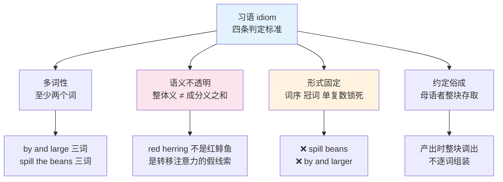
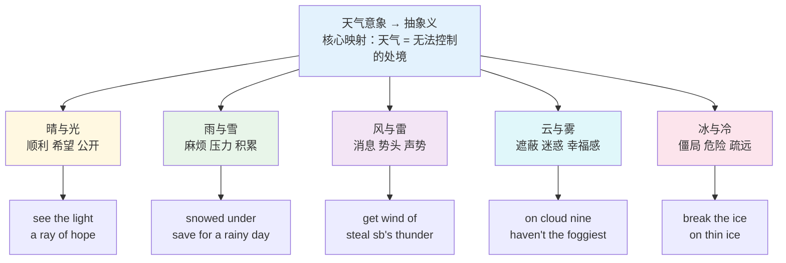
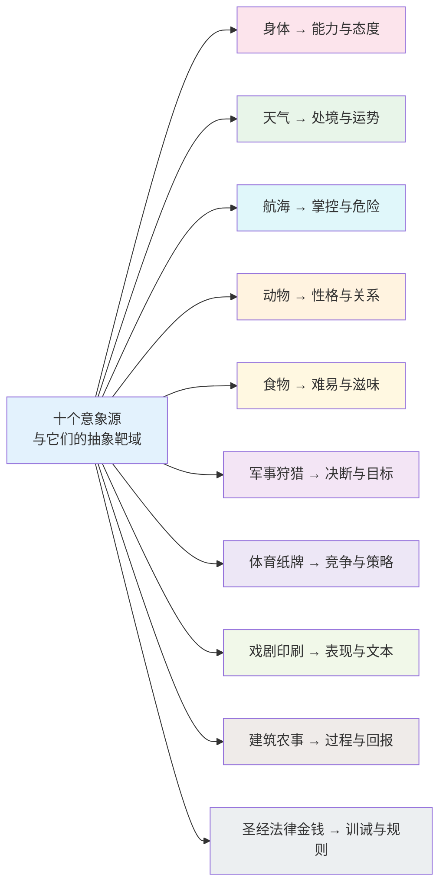
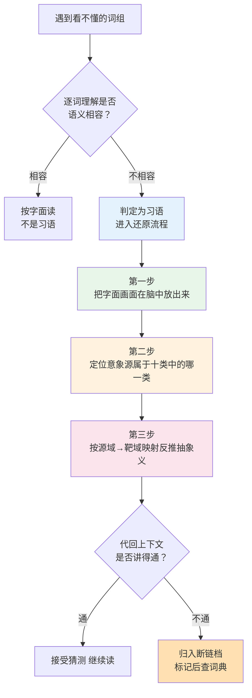
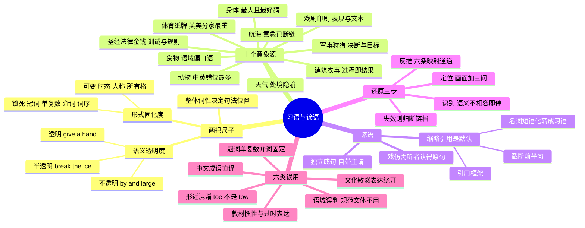

# 习语与谚语

> [!info] 本篇定位
>
> 第十八章的第三篇。前两篇处理的是「同一个意思换个说法」——[[18.语域、英美差异与习语俚语/01.英式与美式词汇差异\|英式与美式词汇差异]] 讲地域维度，[[18.语域、英美差异与习语俚语/02.语域分层与英语词汇的历史层次\|语域分层与英语词汇的历史层次]] 讲正式度维度。本篇处理的是另一类东西：**一组词捆在一起，整体义与字面义脱钩**。
>
> 读完你会拿到三样东西：一张按意象源分组的习语地图（身体、天气、航海是三大产地，另有七个次级产地），一套在没查词典时从字面画面反推抽象义的三步流程，以及一份六类误用风险清单——包括中文母语者最容易踩的形态固定性与语域误判。
>
> 本篇不收短语动词（`take off`、`put up with` 见 [[16.词义辨析、搭配与短语动词/05.短语动词（上）up out off down\|短语动词（上）]] 与 [[16.词义辨析、搭配与短语动词/06.短语动词（下）on in over through back away\|短语动词（下）]]），不收带槽位的句法框架（`It is worth doing` 见 [[17.固定搭配/08.半固定框架与高频语块：It is worth doing 与 the more the more\|半固定框架与高频语块]]），不收俚语与网络流行语（见 [[18.语域、英美差异与习语俚语/04.俚语、网络流行语、委婉语与禁忌语\|俚语、网络流行语、委婉语与禁忌语]]），不做典故词的词源考据（`odyssey`、`boycott` 见 [[19.学术通用词汇/04.典故、专名转普通词与词源背景\|典故、专名转普通词与词源背景]]）。

---

## 1. 本篇导读：习语是一个词，不是几个词

卡住阅读的往往不是生词，是全认识的词。下面这句里没有一个词超出四级范围：

> The migration went off without a hitch, but by and large we were flying blind—the rollback plan was the elephant in the room and nobody wanted to be the one to call it.

`without a hitch`、`by and large`、`flying blind`、`the elephant in the room`、`call it`，五个组合都由最常见的词构成，逐词翻译得到「没有搭扣地进行」「大体上和大」「盲飞」「房间里的大象」「叫它」，整句读不通。查词典查单词也没用——`large` 的任何义项都推不出「总体上」。

**这就是习语的定义性特征：它是一个多词形式的词汇单位，整体义无法从成分词的常规义项加起来得到，形式高度固定。** 记忆单位不是 `by`、`and`、`large` 三个词，而是 `by and large` 这一整块，跟记 `however` 一样是记一个词。



上图的四条标准要同时满足才算习语。只满足前两条的是比喻性说法，可以临时创造；只满足后两条的是普通固定搭配，比如 `heavy rain`——它形式固定，但意思完全透明，属于 [[17.固定搭配/01.搭配强度分级与可替换边界\|搭配强度分级]] 讲的第三档强搭配，不属于习语。习语是那条连续统的最右端：**零可替换性加上零语义透明度**。

### 1.1 为什么按意象源分组，而不按字母或主题

习语不是随机长出来的。英语里有几千条习语，但它们的**来源高度集中**：一批来自身体经验，一批来自天气，一批来自十七到十九世纪的航海生活，还有一批来自狩猎、纸牌、拳击、印刷、纺织这些当年人人都懂的行当。同一来源的习语共享一套意象逻辑，学会那套逻辑，一整批习语的意思就能连带猜出来。

按字母排列（`above board`、`ace up your sleeve`、`Achilles' heel`）会把三个毫不相干的意象放在一起，互相干扰；按抽象主题排列（表示「困难」的习语）会把不同意象源的东西混在一起，猜不出规律。**按意象源分组是唯一能让习语从「零散条目」塌缩成「几个体系」的分法。**

| 意象源 | 大致规模 | 透明度 | 本篇位置 |
| --- | --- | --- | --- |
| 身体与器官 | 最大 | 多数半透明，中英重合度高 | 第 3 节 |
| 天气与自然 | 大 | 半透明，处境隐喻居多 | 第 4 节 |
| 航海与船舶 | 大 | 多数完全不透明，意象已断链 | 第 5 节 |
| 动物 | 大 | 半透明，但中英意象常错位 | 6.1 |
| 食物与厨房 | 大 | 半透明 | 6.2 |
| 军事与狩猎 | 中 | 半透明 | 6.3 |
| 体育与纸牌 | 中 | 英美分家最严重的一组 | 6.4 |
| 戏剧、音乐与印刷 | 中 | 半透明 | 6.5 |
| 建筑、农事与纺织 | 中 | 半透明 | 6.6 |
| 圣经、法律与金钱 | 中 | 半透明，多数已归化 | 6.7 |

### 1.2 本篇的走法

第 2 节先把两把尺子交给你：语义透明度决定「能不能猜」，形式固化度决定「能不能改」。第 3 到 6 节按意象源铺词表，共约五百条。第 7 节转到谚语——它跟习语是两种东西，最要紧的是英美人**只说半句**的引用习惯。第 8 节给出还原流程，第 9 节给出误用清单，第 10 节说清楚哪些该学到会用、哪些学到认得就够。

---

## 2. 两把尺子：语义透明度与形式固化度

### 2.1 透明度三档：能不能从字面猜出来

透明度指的是「知道每个词的意思，能不能推出整体的意思」。三档的界限不是绝对的，但判断方法很实用：**把字面画面在脑子里放出来，看它离目标义有几步**。

- **透明**：画面直接就是目标义，零步。`give sb a hand` 的画面是伸出一只手，帮忙就是伸手，猜中率极高。
- **半透明**：画面到目标义之间有一步隐喻跳跃，知道意象源就能补上。`break the ice` 的画面是敲碎冰面，冰面对应初次见面的僵冷气氛，跳一步就到。
- **不透明**：画面与目标义之间的链条已经断了，必须靠词源知识或直接背。`by and large` 的画面在现代英语里根本立不起来，因为 `by` 和 `large` 的航海义项早就消失了。

> [!tip] 词表读法约定
>
> 习语条目的音标只标**固定成分**。`sb`（somebody）、`sth`（something）、`one's`、`your` 这类可替换槽位不进音标。多词习语的重音按短语重音标注，主重音用 `ˈ`，次重音用 `ˌ`。

| 英文 | 英式音标 | 美式音标 | 词性 | 中文 | 搭配与说明 |
| --- | --- | --- | --- | --- | --- |
| **give sb a hand** | /ˌɡɪv ə ˈhænd/ | /ˌɡɪv ə ˈhænd/ | v.phr. | 帮一把 | 透明档。也说 lend sb a hand |
| **break the news** | /ˌbreɪk ðə ˈnjuːz/ | /ˌbreɪk ðə ˈnuːz/ | v.phr. | （委婉地）告知坏消息 | 透明档。break to sb |
| **keep an eye on** | /ˌkiːp ən ˈaɪ ɒn/ | /ˌkiːp ən ˈaɪ ɑːn/ | v.phr. | 照看；留意 | 透明档。宾语可为人或物 |
| **an open door** | /ən ˌəʊpən ˈdɔː/ | /ən ˌoʊpən ˈdɔːr/ | n.phr. | 敞开的机会 | 透明档。an open-door policy |
| **break the ice** | /ˌbreɪk ði ˈaɪs/ | /ˌbreɪk ði ˈaɪs/ | v.phr. | 打破僵局 | 半透明。名词形 icebreaker |
| **under the weather** | /ˌʌndə ðə ˈweðə/ | /ˌʌndər ðə ˈweðər/ | adj.phr. | 身体不适 | 半透明。只作表语，不作定语 |
| **on thin ice** | /ɒn ˌθɪn ˈaɪs/ | /ɑːn ˌθɪn ˈaɪs/ | adv.phr. | 处境危险 | 半透明。be on / skate on |
| **the tip of the iceberg** | /ðə ˌtɪp əv ði ˈaɪsbɜːɡ/ | /ðə ˌtɪp əv ði ˈaɪsbɜːrɡ/ | n.phr. | 冰山一角 | 半透明。中英意象一致 |
| **by and large** | /ˌbaɪ ən ˈlɑːdʒ/ | /ˌbaɪ ən ˈlɑːrdʒ/ | adv.phr. | 总的来说 | 不透明。航海源，见 5.1 |
| **a red herring** | /ə ˌred ˈherɪŋ/ | /ə ˌred ˈherɪŋ/ | n.phr. | 转移注意力的假线索 | 不透明。狩猎源，见 6.3 |
| **cut the mustard** | /ˌkʌt ðə ˈmʌstəd/ | /ˌkʌt ðə ˈmʌstərd/ | v.phr. | 达到标准 | 不透明。多用否定 can't cut it |
| **kick the bucket** | /ˌkɪk ðə ˈbʌkɪt/ | /ˌkɪk ðə ˈbʌkɪt/ | v.phr. | 蹬腿（死）| 不透明且带戏谑，谈真人去世不能用 |
| **the whole nine yards** | /ðə ˌhəʊl naɪn ˈjɑːdz/ | /ðə ˌhoʊl naɪn ˈjɑːrdz/ | n.phr. | 全套；应有尽有 | 不透明，词源至今无定论 |
| **spick and span** | /ˌspɪk ən ˈspæn/ | /ˌspɪk ən ˈspæn/ | adj.phr. | 干净整洁 | 不透明。spick 与 span 已不单用 |
| **at loggerheads** | /ət ˈlɒɡəhedz/ | /ət ˈlɔːɡərhedz/ | adv.phr. | 严重对立 | 不透明。be at loggerheads with |
| **dressed to the nines** | /ˌdrest tə ðə ˈnaɪnz/ | /ˌdrest tə ðə ˈnaɪnz/ | adj.phr. | 盛装打扮 | 不透明。nines 的来源存疑 |

三档对应三种学法。透明档不用背，见一次就会。半透明档背意象源，一组一组记。不透明档只能整块硬记，但数量有限，全英语高频的不透明习语不超过两百条。

### 2.2 固化度：哪些位置能动，哪些不能

习语的形式固定不等于一个字都不能改。真正锁死的是**词汇成分**，语法成分照常变化。

| 可变项 | 说明 | 例 |
| --- | --- | --- |
| 时态与体 | 主动词照常变 | kick the bucket → kicked / has kicked the bucket |
| 人称与数（主语侧） | 主语跟着句子走 | they spill the beans / he spills the beans |
| 所有格槽位 | `one's` / `sb's` 按实际填 | pull **my** leg / pull **her** leg |
| 情态与否定 | 可加 can't、won't、never | can't cut the mustard |
| 部分习语的可分性 | 类似短语动词 | let the cat out of the bag ↔ let it out of the bag |

| 不可变项 | 说明 | 违反后果 |
| --- | --- | --- |
| 内部名词的数 | 复数就是复数 | ❌ ~~spill the bean~~ |
| 冠词 | the / a 锁死 | ❌ ~~in nutshell~~，应为 in a nutshell |
| 介词 | 不可换同义介词 | ❌ ~~kill two birds by one stone~~，应为 with |
| 词序 | 不可调 | ❌ ~~large and by~~ |
| 词汇成分 | 不可换同义词 | ❌ ~~a scarlet herring~~ |
| 比较级与最高级 | 内部形容词不参与比较 | ❌ ~~by and larger~~ |

判断一条习语能不能被动化，试一句就知道。`The beans were spilled by an intern` 成立，因为 `spill the beans` 内部还保留着动宾结构的可分析性；`The bucket was kicked by my uncle` 不成立，只会被读成字面义。**能被动化的习语，透明度通常也更高**——这两件事同源，都取决于母语者是否还把内部结构当结构看。

### 2.3 习语在句子里充当什么成分

习语进句子时要按它的**整体词性**摆位，这是中文母语者最容易忽略的一步。`under the weather` 是形容词性的，只能作表语，写成 `an under the weather colleague` 立刻出戏。

| 整体词性 | 在句中占的位置 | 形态特点 | 例 |
| --- | --- | --- | --- |
| 动词性 v.phr. | 谓语 | 主动词随时态人称变化 | kick the bucket、spill the beans |
| 名词性 n.phr. | 主语、宾语、表语 | 可带冠词，少数可加复数 | a red herring、the last straw |
| 形容词性 adj.phr. | 表语为主 | 多为介词短语，极少作前置定语 | over the moon、under the weather |
| 副词性 adv.phr. | 状语，句首句尾均可 | 句首时常带逗号 | by and large、out of the blue |

四类里最容易出错的是形容词性那一支。英语里由介词短语构成的形容词性习语（`under the weather`、`over the moon`、`out of sorts`、`under a cloud`、`in the red`）绝大多数**只能作表语**，因为介词短语作前置定语在英语里本来就不合法。要作定语必须改造：`a company in the red` 后置，或者用连字符复合词 `a cash-strapped company`。

> [!warning] 三个位置错误
>
> - ❌ ~~She is a under the weather person.~~
> - ✅ **She is under the weather.** / **She is feeling under the weather.**
> - ❌ ~~By and large is a good plan.~~（副词性习语不能作主语）
> - ✅ **By and large, it is a good plan.**
> - ❌ ~~That was a piece of cake question.~~
> - ✅ **That question was a piece of cake.**

---

## 3. 身体类习语：最大也最好猜的一组

身体是所有语言最早的隐喻源域，因为身体经验是唯一人人共享、不依赖文化背景的经验。中英在这一层重合度最高：中文说「插手」，英语说 `have a hand in`；中文说「眼高手低」，英语说 `bite off more than you can chew` 虽换了意象，但「用身体部位表能力与态度」的思路一致。

重合度高带来两个后果。好处是这组习语猜中率最高，是入门首选。坏处是**假朋友最密集**——看起来对应，实际不对应的组合都藏在这一节，逐条在词表的说明列里标出。

### 3.1 头、脸与五官

头对应理智与判断，眼对应注意与态度，耳对应倾听与容忍，鼻对应干预与代价，嘴与舌对应说话的分寸。这五条映射覆盖了本节九成条目。

| 英文 | 英式音标 | 美式音标 | 词性 | 中文 | 搭配与说明 |
| --- | --- | --- | --- | --- | --- |
| **keep your head** | /ˌkiːp jɔː ˈhed/ | /ˌkiːp jɔːr ˈhed/ | v.phr. | 保持冷静 | 反义 lose your head |
| **off the top of your head** | /ˌɒf ðə ˈtɒp/ | /ˌɔːf ðə ˈtɑːp/ | adv.phr. | 未经查证凭印象 | 会议里高频：off the top of my head, about 40% |
| **get your head around sth** | /ˌɡet jɔː ˈhed əraʊnd/ | /ˌɡet jɔːr ˈhed əraʊnd/ | v.phr. | 弄懂；想明白 | 英式更常见，常用 can't |
| **bury your head in the sand** | /ˌberi jɔː ˈhed/ | /ˌberi jɔːr ˈhed/ | v.phr. | 逃避现实 | 鸵鸟意象，中英一致 |
| **put our heads together** | /ˌpʊt aʊə ˈhedz təɡeðə/ | /ˌpʊt aʊər ˈhedz təɡeðər/ | v.phr. | 集思广益 | 只用复数 heads |
| **head in the clouds** | /ˌhed ɪn ðə ˈklaʊdz/ | /ˌhed ɪn ðə ˈklaʊdz/ | n.phr. | 不切实际 | have your head in the clouds |
| **head over heels** | /ˌhed əʊvə ˈhiːlz/ | /ˌhed oʊvər ˈhiːlz/ | adv.phr. | 神魂颠倒 | 几乎只配 in love |
| **hit the nail on the head** | /ˌhɪt ðə ˈneɪl ɒn ðə hed/ | /ˌhɪt ðə ˈneɪl ɑːn ðə hed/ | v.phr. | 说到点子上 | 木工意象，评论他人发言时用 |
| **bite sb's head off** | /ˌbaɪt ˈhed ɒf/ | /ˌbaɪt ˈhed ɔːf/ | v.phr. | 没好气地回怼 | 语气重，描述对方脾气 |
| **a head start** | /ə ˈhed stɑːt/ | /ə ˈhed stɑːrt/ | n.phr. | 先发优势 | 赛跑意象，give sb a head start |
| **face the music** | /ˌfeɪs ðə ˈmjuːzɪk/ | /ˌfeɪs ðə ˈmjuːzɪk/ | v.phr. | 承担后果 | 戏剧源，见 6.5 |
| **lose face / save face** | /ˌluːz ˈfeɪs/ | /ˌluːz ˈfeɪs/ | v.phr. | 丢面子／挽回面子 | lose face 借译自汉语「丢脸」，save face 是英语内部仿造 |
| **face value** | /ˈfeɪs væljuː/ | /ˈfeɪs væljuː/ | n.phr. | 表面价值 | take sth at face value 不深究 |
| **a long face** | /ə ˌlɒŋ ˈfeɪs/ | /ə ˌlɔːŋ ˈfeɪs/ | n.phr. | 拉长的脸 | pull a long face |
| **face to face** | /ˌfeɪs tə ˈfeɪs/ | /ˌfeɪs tə ˈfeɪs/ | adv.phr. | 面对面 | 作定语时连字符 face-to-face |
| **see eye to eye** | /ˌsiː aɪ tə ˈaɪ/ | /ˌsiː aɪ tə ˈaɪ/ | v.phr. | 看法一致 | 多用否定 don't see eye to eye on |
| **turn a blind eye** | /ˌtɜːn ə ˌblaɪnd ˈaɪ/ | /ˌtɜːrn ə ˌblaɪnd ˈaɪ/ | v.phr. | 睁一只眼闭一只眼 | turn a blind eye to sth |
| **catch sb's eye** | /ˌkætʃ ˈaɪ/ | /ˌkætʃ ˈaɪ/ | v.phr. | 引起注意 | 主语常为物 |
| **in the public eye** | /ɪn ðə ˌpʌblɪk ˈaɪ/ | /ɪn ðə ˌpʌblɪk ˈaɪ/ | adv.phr. | 处于公众关注下 | 中性偏被动 |
| **more than meets the eye** | /ˌmɔː ðən ˌmiːts ði ˈaɪ/ | /ˌmɔːr ðən ˌmiːts ði ˈaɪ/ | n.phr. | 别有内情 | There is more to it than meets the eye |
| **have your eye on sth** | /hæv jɔːr ˈaɪ ɒn/ | /hæv jɔːr ˈaɪ ɑːn/ | v.phr. | 看中；盯上 | 与 keep an eye on 意思不同，别混 |
| **an eye for an eye** | /ən ˌaɪ fər ən ˈaɪ/ | /ən ˌaɪ fər ən ˈaɪ/ | n.phr. | 以牙还牙 | 圣经源，见 6.7 |
| **an eye for detail** | /ən ˈaɪ fə ˌdiːteɪl/ | /ən ˈaɪ fər dɪˈteɪl/ | n.phr. | 对细节的眼力 | have an eye for，褒义 |
| **play it by ear** | /ˌpleɪ ɪt baɪ ˈɪə/ | /ˌpleɪ ɪt baɪ ˈɪr/ | v.phr. | 见机行事 | 音乐源：不看谱凭听觉弹 |
| **be all ears** | /biː ˌɔːl ˈɪəz/ | /biː ˌɔːl ˈɪrz/ | adj.phr. | 洗耳恭听 | 口语，回应对方开口时说 |
| **go in one ear and out the other** | /ˌwʌn ˈɪər ənd aʊt ði ˈʌðə/ | /ˌwʌn ˈɪr ənd aʊt ði ˈʌðər/ | v.phr. | 左耳进右耳出 | 中英意象完全一致 |
| **turn a deaf ear** | /ˌtɜːn ə ˌdef ˈɪə/ | /ˌtɜːrn ə ˌdef ˈɪr/ | v.phr. | 充耳不闻 | turn a deaf ear to |
| **be up to your ears in sth** | /ˌʌp tə jɔːr ˈɪəz/ | /ˌʌp tə jɔːr ˈɪrz/ | adj.phr. | 忙得不可开交 | 同义 up to your neck / eyeballs |
| **pay through the nose** | /ˌpeɪ θruː ðə ˈnəʊz/ | /ˌpeɪ θruː ðə ˈnoʊz/ | v.phr. | 花冤枉钱 | 不透明档，词源存疑 |
| **right under your nose** | /ˌʌndə jɔː ˈnəʊz/ | /ˌʌndər jɔːr ˈnoʊz/ | adv.phr. | 就在眼皮底下 | 强调「近在咫尺却没发现」 |
| **poke your nose into sth** | /ˌpəʊk jɔː ˈnəʊz/ | /ˌpoʊk jɔːr ˈnoʊz/ | v.phr. | 多管闲事 | 贬义，同义 stick your nose in |
| **turn your nose up at sth** | /ˌtɜːn jɔː ˈnəʊz ʌp/ | /ˌtɜːrn jɔːr ˈnoʊz ʌp/ | v.phr. | 嫌弃；瞧不上 | 贬义 |
| **keep your nose to the grindstone** | /ðə ˈɡraɪndstəʊn/ | /ðə ˈɡraɪndstoʊn/ | v.phr. | 埋头苦干 | 磨石意象，见 6.6 |
| **on the nose** | /ɒn ðə ˈnəʊz/ | /ɑːn ðə ˈnoʊz/ | adv.phr. | 分毫不差 | 美式更常用，多说时间与数字 |
| **put your foot in your mouth** | /ˌfʊt ɪn jɔː ˈmaʊθ/ | /ˌfʊt ɪn jɔːr ˈmaʊθ/ | v.phr. | 说错话惹尴尬 | 英式变体 put your foot in it |
| **a slip of the tongue** | /ə ˌslɪp əv ðə ˈtʌŋ/ | /ə ˌslɪp əv ðə ˈtʌŋ/ | n.phr. | 口误 | 对应 a slip of the pen 笔误 |
| **tongue in cheek** | /ˌtʌŋ ɪn ˈtʃiːk/ | /ˌtʌŋ ɪn ˈtʃiːk/ | adj./adv.phr. | 半开玩笑地 | 作定语写 tongue-in-cheek |
| **bite your tongue** | /ˌbaɪt jɔː ˈtʌŋ/ | /ˌbaɪt jɔːr ˈtʌŋ/ | v.phr. | 忍住不说 | 强调克制，非「咬到舌头」 |
| **hold your tongue** | /ˌhəʊld jɔː ˈtʌŋ/ | /ˌhoʊld jɔːr ˈtʌŋ/ | v.phr. | 闭嘴 | 语气比 bite your tongue 强硬 |
| **by the skin of your teeth** | /baɪ ðə ˌskɪn əv jɔː ˈtiːθ/ | /baɪ ðə ˌskɪn əv jɔːr ˈtiːθ/ | adv.phr. | 险些没成 | 圣经源，形容「勉强通过」 |
| **grit your teeth** | /ˌɡrɪt jɔː ˈtiːθ/ | /ˌɡrɪt jɔːr ˈtiːθ/ | v.phr. | 咬牙坚持 | 中英意象一致 |
| **sink your teeth into sth** | /ˌsɪŋk jɔː ˈtiːθ/ | /ˌsɪŋk jɔːr ˈtiːθ/ | v.phr. | 投入啃硬骨头 | 褒义，形容有挑战性的任务 |
| **a stiff upper lip** | /ə ˌstɪf ʌpə ˈlɪp/ | /ə ˌstɪf ʌpər ˈlɪp/ | n.phr. | 强作镇定 | 典型英式自嘲，keep a stiff upper lip |
| **pay lip service to sth** | /ˌlɪp ˈsɜːvɪs/ | /ˌlɪp ˈsɜːrvɪs/ | v.phr. | 口惠而实不至 | 贬义，公司语境高频 |
| **a pain in the neck** | /ə ˌpeɪn ɪn ðə ˈnek/ | /ə ˌpeɪn ɪn ðə ˈnek/ | n.phr. | 讨厌鬼；麻烦事 | 人与事皆可，粗俗变体避免使用 |
| **neck and neck** | /ˌnek ən ˈnek/ | /ˌnek ən ˈnek/ | adj.phr. | 不分上下 | 赛马源，见 6.4 |
| **stick your neck out** | /ˌstɪk jɔː ˈnek aʊt/ | /ˌstɪk jɔːr ˈnek aʊt/ | v.phr. | 冒险出头 | 中性偏褒 |
| **breathe down sb's neck** | /ˌbriːð daʊn ˈnek/ | /ˌbriːð daʊn ˈnek/ | v.phr. | 紧盯着不放 | 贬义，多指上级监视 |

> [!example] 五官类习语在真实语境里的样子
>
> - Off the top of my head, the p99 latency is around 300 ms—let me pull the exact number.
>   - 我凭印象记得 p99 延迟在 300 毫秒上下，具体数字我去查一下。
> - The proposal looks fine, but there is more to it than meets the eye.
>   - 提案表面上没问题，但里头另有文章。
> - We don't see eye to eye on the rollout schedule.
>   - 我们在上线排期上意见不一致。
> - I had to bite my tongue during the review—half the comments were nitpicks.
>   - 评审时我硬忍着没说话，一半的意见都是吹毛求疵。
> - Management pays lip service to code quality but never budgets time for it.
>   - 管理层嘴上重视代码质量，却从不给排时间。

### 3.2 手、臂、腿、脚

手对应参与和控制，脚对应立场与进退，手指对应指认与细微掌控。这一组是身体类里数量最大的一支。

| 英文 | 英式音标 | 美式音标 | 词性 | 中文 | 搭配与说明 |
| --- | --- | --- | --- | --- | --- |
| **lend sb a hand** | /ˌlend ə ˈhænd/ | /ˌlend ə ˈhænd/ | v.phr. | 搭把手 | 与 give sb a hand 完全同义 |
| **my hands are tied** | /ˌhændz ə ˈtaɪd/ | /ˌhændz ər ˈtaɪd/ | n.phr. | 我无能为力 | 强调受制度约束而非能力不足 |
| **get out of hand** | /ˌaʊt əv ˈhænd/ | /ˌaʊt əv ˈhænd/ | v.phr. | 失控 | 主语为事，things got out of hand |
| **have a hand in sth** | /ˌhæv ə ˈhænd ɪn/ | /ˌhæv ə ˈhænd ɪn/ | v.phr. | 参与其中 | 常含轻微负面暗示 |
| **hand in hand** | /ˌhænd ɪn ˈhænd/ | /ˌhænd ɪn ˈhænd/ | adv.phr. | 相伴而行 | go hand in hand with 密切相关 |
| **wash your hands of sth** | /ˌwɒʃ jɔː ˈhændz/ | /ˌwɑːʃ jɔːr ˈhændz/ | v.phr. | 撒手不管 | 圣经源（彼拉多洗手），含推卸义 |
| **bite the hand that feeds you** | /ˌbaɪt ðə ˈhænd/ | /ˌbaɪt ðə ˈhænd/ | v.phr. | 恩将仇报 | 也作谚语形式使用 |
| **at first hand** | /ət ˌfɜːst ˈhænd/ | /ət ˌfɜːrst ˈhænd/ | adv.phr. | 第一手地 | 派生 first-hand experience |
| **an old hand** | /ən ˌəʊld ˈhænd/ | /ən ˌoʊld ˈhænd/ | n.phr. | 老手 | an old hand at sth |
| **know sth like the back of your hand** | /ðə ˌbæk əv jɔː ˈhænd/ | /ðə ˌbæk əv jɔːr ˈhænd/ | v.phr. | 了如指掌 | 中英意象不同但功能对应 |
| **hands down** | /ˌhændz ˈdaʊn/ | /ˌhændz ˈdaʊn/ | adv.phr. | 轻而易举地；无可争议地 | 赛马源：无需扬鞭即赢 |
| **live from hand to mouth** | /ˌhænd tə ˈmaʊθ/ | /ˌhænd tə ˈmaʊθ/ | v.phr. | 勉强糊口 | 派生 hand-to-mouth existence |
| **keep your fingers crossed** | /ˌfɪŋɡəz ˈkrɒst/ | /ˌfɪŋɡərz ˈkrɔːst/ | v.phr. | 祈求好运 | 也说 fingers crossed 单用 |
| **point the finger at sb** | /ˌpɔɪnt ðə ˈfɪŋɡə/ | /ˌpɔɪnt ðə ˈfɪŋɡər/ | v.phr. | 指责；归咎 | 名词形 finger-pointing 互相甩锅 |
| **put your finger on sth** | /ˌpʊt jɔː ˈfɪŋɡər ɒn/ | /ˌpʊt jɔːr ˈfɪŋɡər ɑːn/ | v.phr. | 明确指出（症结）| 多用否定：I can't put my finger on it |
| **have a finger in every pie** | /ˌfɪŋɡər ɪn ˌevri ˈpaɪ/ | /ˌfɪŋɡər ɪn ˌevri ˈpaɪ/ | v.phr. | 事事插手 | 贬义 |
| **green fingers** | /ˌɡriːn ˈfɪŋɡəz/ | — | n.phr. | 园艺天赋 | 英式说法 |
| **a green thumb** | — | /ə ˌɡriːn ˈθʌm/ | n.phr. | 园艺天赋 | 美式说法，与上条对应 |
| **a rule of thumb** | /ə ˌruːl əv ˈθʌm/ | /ə ˌruːl əv ˈθʌm/ | n.phr. | 经验法则 | 技术文档高频；流传的词源说法无证据 |
| **be all thumbs** | /ˌɔːl ˈθʌmz/ | /ˌɔːl ˈθʌmz/ | adj.phr. | 笨手笨脚 | 英式也说 all fingers and thumbs |
| **twiddle your thumbs** | /ˌtwɪdl jɔː ˈθʌmz/ | /ˌtwɪdl jɔːr ˈθʌmz/ | v.phr. | 无所事事地干等 | 画面是两拇指互绕 |
| **under sb's thumb** | /ˌʌndə ˈθʌm/ | /ˌʌndər ˈθʌm/ | adv.phr. | 受某人摆布 | 贬义 |
| **cost an arm and a leg** | /ən ˌɑːm ənd ə ˈleɡ/ | /ən ˌɑːrm ənd ə ˈleɡ/ | v.phr. | 贵得离谱 | 口语，正式文体不用 |
| **twist sb's arm** | /ˌtwɪst ˈɑːm/ | /ˌtwɪst ˈɑːrm/ | v.phr. | 施压说服 | 常带戏谑，you twisted my arm 半推半就 |
| **at arm's length** | /ət ˌɑːmz ˈleŋθ/ | /ət ˌɑːrmz ˈleŋθ/ | adv.phr. | 保持距离 | keep sb at arm's length；财务里指公平交易 |
| **welcome sb with open arms** | /wɪð ˌəʊpən ˈɑːmz/ | /wɪð ˌoʊpən ˈɑːrmz/ | v.phr. | 热烈欢迎 | 中英意象一致 |
| **elbow room** | /ˈelbəʊ ruːm/ | /ˈelboʊ ruːm/ | n.phr. | 回旋余地 | 不可数 |
| **rub shoulders with sb** | /ˌrʌb ˈʃəʊldəz/ | /ˌrʌb ˈʃoʊldərz/ | v.phr. | 与…有往来 | 美式也说 rub elbows with |
| **give sb the cold shoulder** | /ðə ˌkəʊld ˈʃəʊldə/ | /ðə ˌkoʊld ˈʃoʊldər/ | v.phr. | 冷落某人 | 名词形 the cold shoulder |
| **a shoulder to cry on** | /ə ˈʃəʊldə tə kraɪ ɒn/ | /ə ˈʃoʊldər tə kraɪ ɑːn/ | n.phr. | 可倾诉的对象 | 温和褒义 |
| **shoulder the blame** | /ˌʃəʊldə ðə ˈbleɪm/ | /ˌʃoʊldər ðə ˈbleɪm/ | v.phr. | 承担责任 | shoulder 作动词，正式度偏高 |
| **pull sb's leg** | /ˌpʊl ˈleɡ/ | /ˌpʊl ˈleɡ/ | v.phr. | 开玩笑逗人 | 不是「拖后腿」，这是最经典的假朋友 |
| **not have a leg to stand on** | /ə ˈleɡ tə stænd ɒn/ | /ə ˈleɡ tə stænd ɑːn/ | v.phr. | 站不住脚 | 常用于论证与法律语境 |
| **break a leg** | /ˌbreɪk ə ˈleɡ/ | /ˌbreɪk ə ˈleɡ/ | v.phr. | 祝演出顺利 | 戏剧源，见 6.5；不能用于日常祝福 |
| **stretch your legs** | /ˌstretʃ jɔː ˈleɡz/ | /ˌstretʃ jɔːr ˈleɡz/ | v.phr. | 起来走动一下 | 久坐后使用 |
| **get your foot in the door** | /ˌfʊt ɪn ðə ˈdɔː/ | /ˌfʊt ɪn ðə ˈdɔːr/ | v.phr. | 取得入门机会 | 求职语境高频 |
| **put your foot down** | /ˌpʊt jɔː ˈfʊt daʊn/ | /ˌpʊt jɔːr ˈfʊt daʊn/ | v.phr. | 坚决表态制止 | 也可指踩油门，靠上下文分 |
| **stand on your own two feet** | /jɔːr ˌəʊn tuː ˈfiːt/ | /jɔːr ˌoʊn tuː ˈfiːt/ | v.phr. | 自立 | 中英意象一致 |
| **get cold feet** | /ˌɡet kəʊld ˈfiːt/ | /ˌɡet koʊld ˈfiːt/ | v.phr. | 临阵退缩 | 主语为人，多指婚礼与签约前 |
| **drag your feet** | /ˌdræɡ jɔː ˈfiːt/ | /ˌdræɡ jɔːr ˈfiːt/ | v.phr. | 故意拖延 | 贬义，暗指不情愿 |
| **step on sb's toes** | /ˌstep ɒn ˈtəʊz/ | /ˌstep ɑːn ˈtoʊz/ | v.phr. | 越权冒犯 | 职场语境高频 |
| **keep sb on their toes** | /ɒn ðeə ˈtəʊz/ | /ɑːn ðer ˈtoʊz/ | v.phr. | 让人保持警觉 | 褒义 |
| **an Achilles' heel** | /ən əˌkɪliːz ˈhiːl/ | /ən əˌkɪliːz ˈhiːl/ | n.phr. | 致命弱点 | 神话源，词源背景见 19.04 |
| **dig your heels in** | /ˌdɪɡ jɔː ˈhiːlz ɪn/ | /ˌdɪɡ jɔːr ˈhiːlz ɪn/ | v.phr. | 拒不让步 | 骡马拒行意象 |

> [!warning] `pull sb's leg` 与「拖后腿」
>
> 中文的「拖后腿」意思是拖累、妨碍进度，英语的 `pull sb's leg` 意思是**开玩笑骗人**，两者毫无关系。
>
> - ❌ ~~Don't pull my leg, I need to finish this sprint.~~（对方会理解为「别逗我了」）
> - ✅ **Don't hold me back / slow me down, I need to finish this sprint.**
> - ✅ **You're pulling my leg, right? The deploy actually succeeded?**（真正的用法：你在逗我吧）
>
> 同类假朋友还有 `have a big mouth`（嘴不严，不是「口气大」）、`a big head`（自负，不是「大人物」，那是 a big shot）、`long face`（愁眉苦脸，不是「长脸」）。

### 3.3 心、胃、骨、血、皮与神经

内部器官对应情感与本能：心是情感总部，胃与肠是直觉与承受力，骨是深层与核心，血是亲缘与激动，皮是耐受度，神经是耐心。

| 英文 | 英式音标 | 美式音标 | 词性 | 中文 | 搭配与说明 |
| --- | --- | --- | --- | --- | --- |
| **learn sth by heart** | /baɪ ˈhɑːt/ | /baɪ ˈhɑːrt/ | v.phr. | 背下来 | 也说 know sth by heart |
| **a heart of gold** | /ə ˌhɑːt əv ˈɡəʊld/ | /ə ˌhɑːrt əv ˈɡoʊld/ | n.phr. | 好心肠 | have a heart of gold |
| **a change of heart** | /ə ˌtʃeɪndʒ əv ˈhɑːt/ | /ə ˌtʃeɪndʒ əv ˈhɑːrt/ | n.phr. | 改变主意 | 中性，含「态度软化」暗示 |
| **take sth to heart** | /ˌteɪk tə ˈhɑːt/ | /ˌteɪk tə ˈhɑːrt/ | v.phr. | 往心里去 | 多指把批评看得太重 |
| **a heart-to-heart** | /ə ˌhɑːt tə ˈhɑːt/ | /ə ˌhɑːrt tə ˈhɑːrt/ | n.phr. | 交心谈话 | have a heart-to-heart with sb |
| **lose heart** | /ˌluːz ˈhɑːt/ | /ˌluːz ˈhɑːrt/ | v.phr. | 灰心 | 无冠词，与 lose your heart to sb（爱上）不同 |
| **wear your heart on your sleeve** | /ɒn jɔː ˈsliːv/ | /ɑːn jɔːr ˈsliːv/ | v.phr. | 感情外露 | 中性偏褒 |
| **your heart sinks** | /jɔː ˈhɑːt sɪŋks/ | /jɔːr ˈhɑːrt sɪŋks/ | v.phr. | 心一沉 | 叙事文体高频 |
| **at heart** | /ət ˈhɑːt/ | /ət ˈhɑːrt/ | adv.phr. | 本质上 | He's an engineer at heart |
| **to your heart's content** | /ˌhɑːts kənˈtent/ | /ˌhɑːrts kənˈtent/ | adv.phr. | 尽情地 | 句末使用 |
| **a gut feeling** | /ə ˈɡʌt fiːlɪŋ/ | /ə ˈɡʌt fiːlɪŋ/ | n.phr. | 直觉 | 同义 a hunch，技术讨论里常见 |
| **can't stomach sth** | /ˈstʌmək/ | /ˈstʌmək/ | v.phr. | 受不了 | stomach 作动词，多用否定 |
| **butterflies in your stomach** | /ˈbʌtəflaɪz/ | /ˈbʌtərflaɪz/ | n.phr. | 紧张得心里发慌 | 复数固定，have butterflies |
| **bad blood** | /ˌbæd ˈblʌd/ | /ˌbæd ˈblʌd/ | n.phr. | 积怨 | 不可数，there is bad blood between |
| **in cold blood** | /ɪn ˌkəʊld ˈblʌd/ | /ɪn ˌkoʊld ˈblʌd/ | adv.phr. | 冷血地 | 多与杀害类动词连用 |
| **make sb's blood boil** | /ˈblʌd bɔɪl/ | /ˈblʌd bɔɪl/ | v.phr. | 令人火冒三丈 | 主语为事 |
| **blood, sweat and tears** | /ˌblʌd ˌswet ən ˈtɪəz/ | /ˌblʌd ˌswet ən ˈtɪrz/ | n.phr. | 心血与汗水 | 三词顺序固定 |
| **a bone of contention** | /ə ˌbəʊn əv kənˈtenʃn/ | /ə ˌboʊn əv kənˈtenʃn/ | n.phr. | 争执焦点 | 正式度中等偏上 |
| **have a bone to pick with sb** | /ə ˈbəʊn tə pɪk/ | /ə ˈboʊn tə pɪk/ | v.phr. | 有账要算 | 半开玩笑语气 |
| **feel it in your bones** | /ɪn jɔː ˈbəʊnz/ | /ɪn jɔːr ˈboʊnz/ | v.phr. | 有强烈预感 | 口语 |
| **the bare bones** | /ðə ˌbeə ˈbəʊnz/ | /ðə ˌber ˈboʊnz/ | n.phr. | 最基本的骨架 | a bare-bones implementation 极简实现 |
| **bone up on sth** | /ˌbəʊn ˈʌp ɒn/ | /ˌboʊn ˈʌp ɑːn/ | v.phr. | 临时突击复习 | 口语 |
| **get under sb's skin** | /ˌʌndə ˈskɪn/ | /ˌʌndər ˈskɪn/ | v.phr. | 让人心烦；深入了解 | 两义并存，靠上下文分 |
| **save your own skin** | /jɔːr ˌəʊn ˈskɪn/ | /jɔːr ˌoʊn ˈskɪn/ | v.phr. | 只顾自保 | 贬义 |
| **thick-skinned** | /ˌθɪk ˈskɪnd/ | /ˌθɪk ˈskɪnd/ | adj. | 脸皮厚；抗批评 | 反义 thin-skinned |
| **skin in the game** | /ˌskɪn ɪn ðə ˈɡeɪm/ | /ˌskɪn ɪn ðə ˈɡeɪm/ | n.phr. | 切身利害关系 | 商务语境高频，have skin in the game |
| **get on sb's nerves** | /ɒn ˈnɜːvz/ | /ɑːn ˈnɜːrvz/ | v.phr. | 惹人烦 | 主语可为人或物 |
| **lose your nerve** | /ˌluːz jɔː ˈnɜːv/ | /ˌluːz jɔːr ˈnɜːrv/ | v.phr. | 临阵胆怯 | 与 lose your nerves 不同，不加 s |
| **hit a nerve** | /ˌhɪt ə ˈnɜːv/ | /ˌhɪt ə ˈnɜːrv/ | v.phr. | 戳到痛处 | 也说 touch a nerve |
| **have the nerve to do sth** | /ðə ˈnɜːv/ | /ðə ˈnɜːrv/ | v.phr. | 竟然有脸做 | 贬义，与「勇气」义靠语气区分 |
| **a bundle of nerves** | /ə ˌbʌndl əv ˈnɜːvz/ | /ə ˌbʌndl əv ˈnɜːrvz/ | n.phr. | 紧张得要命的人 | 口语 |
| **send shivers down your spine** | /ˈʃɪvəz daʊn jɔː ˈspaɪn/ | /ˈʃɪvərz daʊn jɔːr ˈspaɪn/ | v.phr. | 令人不寒而栗 | 恐惧或震撼皆可 |
| **behind sb's back** | /bɪˌhaɪnd ˈbæk/ | /bɪˌhaɪnd ˈbæk/ | adv.phr. | 背着某人 | 贬义 |
| **stab sb in the back** | /ˌstæb ɪn ðə ˈbæk/ | /ˌstæb ɪn ðə ˈbæk/ | v.phr. | 背后捅刀 | 名词形 a backstabber |
| **turn your back on sb** | /ˌtɜːn jɔː ˈbæk ɒn/ | /ˌtɜːrn jɔːr ˈbæk ɑːn/ | v.phr. | 抛弃；不再理会 | 中性偏贬 |
| **back to back** | /ˌbæk tə ˈbæk/ | /ˌbæk tə ˈbæk/ | adv.phr. | 连续不断地 | 日程语境：back-to-back meetings |
| **a pat on the back** | /ə ˌpæt ɒn ðə ˈbæk/ | /ə ˌpæt ɑːn ðə ˈbæk/ | n.phr. | 表扬 | give sb a pat on the back |

> [!tip] 身体类习语的一条速判规则
>
> 遇到没见过的身体类习语，先按部位查这张映射表，猜中率相当高：
>
> | 部位 | 抽象域 | 验证例 |
> | --- | --- | --- |
> | head | 理智、判断、领先 | keep your head、a head start |
> | eye | 注意、态度、鉴别力 | keep an eye on、an eye for detail |
> | ear | 倾听、容忍 | be all ears、turn a deaf ear |
> | mouth / tongue | 说话的分寸 | bite your tongue、a big mouth |
> | hand | 参与、控制、援助 | have a hand in、hands are tied |
> | finger / thumb | 指认、精细掌控 | point the finger、under sb's thumb |
> | foot / leg | 立场、进退、起步 | put your foot down、get cold feet |
> | heart | 情感、真诚 | take sth to heart、at heart |
> | gut | 直觉、本能 | a gut feeling |
> | bone | 深层、核心 | feel it in your bones、the bare bones |
> | skin | 耐受度、切身性 | thick-skinned、skin in the game |
> | nerve | 耐心、胆量 | get on sb's nerves、lose your nerve |
> | back | 隐蔽、背叛、支撑 | behind sb's back、a pat on the back |

---

## 4. 天气类习语：把处境说成天气

天气是第二大意象源，理由很实际：天气是人人都要面对、谁也控制不了的外部力量，正好对应「处境」这个抽象概念。这条主映射之下有五条子映射。



上图有一个要注意的分叉：**云在英语里同时映射「遮蔽」和「极乐」**，`under a cloud`（蒙受嫌疑）与 `on cloud nine`（欣喜若狂）方向完全相反。区别在介词——人在云下是被遮，人在云上是登顶。凡是遇到同一意象两个相反义，先看介词与方位，这条规律在整个习语系统里都成立。

### 4.1 雨、雪、冰与水

| 英文 | 英式音标 | 美式音标 | 词性 | 中文 | 搭配与说明 |
| --- | --- | --- | --- | --- | --- |
| **under the weather** | /ˌʌndə ðə ˈweðə/ | /ˌʌndər ðə ˈweðər/ | adj.phr. | 身体不舒服 | 航海源：病号被送到甲板下避风浪 |
| **take a rain check** | /ə ˈreɪn tʃek/ | /ə ˈreɪn tʃek/ | v.phr. | 改天再约 | 美式棒球源，婉拒邀请的固定说法 |
| **come rain or shine** | /ˌreɪn ɔː ˈʃaɪn/ | /ˌreɪn ɔːr ˈʃaɪn/ | adv.phr. | 风雨无阻 | 也作 rain or shine |
| **right as rain** | /ˌraɪt əz ˈreɪn/ | /ˌraɪt əz ˈreɪn/ | adj.phr. | 完全康复；一切正常 | 英式更常见 |
| **save for a rainy day** | /ə ˌreɪni ˈdeɪ/ | /ə ˌreɪni ˈdeɪ/ | v.phr. | 未雨绸缪存钱 | 只用于存钱语境 |
| **rain on sb's parade** | /ˌreɪn ɒn pəˈreɪd/ | /ˌreɪn ɑːn pəˈreɪd/ | v.phr. | 泼冷水扫兴 | 常带道歉口吻：I hate to rain on your parade |
| **it never rains but it pours** | /ˌnevə ˈreɪnz/ | /ˌnevər ˈreɪnz/ | 谚语 | 祸不单行 | 英式；美式作 when it rains, it pours |
| **be snowed under** | /ˌsnəʊd ˈʌndə/ | /ˌsnoʊd ˈʌndər/ | adj.phr. | 忙得喘不过气 | snowed under with work |
| **snowball into sth** | /ˈsnəʊbɔːl/ | /ˈsnoʊbɔːl/ | v. | 像滚雪球般扩大 | 名词形 a snowball effect |
| **a snowball's chance in hell** | /ə ˈsnəʊbɔːlz tʃɑːns/ | /ə ˈsnoʊbɔːlz tʃæns/ | n.phr. | 毫无可能 | 口语，语气较冲 |
| **break the ice** | /ˌbreɪk ði ˈaɪs/ | /ˌbreɪk ði ˈaɪs/ | v.phr. | 打破僵局 | 名词 an icebreaker（破冰活动） |
| **skate on thin ice** | /ˌskeɪt ɒn θɪn ˈaɪs/ | /ˌskeɪt ɑːn θɪn ˈaɪs/ | v.phr. | 冒险行事 | 也作 be on thin ice |
| **the tip of the iceberg** | /ðə ˌtɪp əv ði ˈaɪsbɜːɡ/ | /ðə ˌtɪp əv ði ˈaɪsbɜːrɡ/ | n.phr. | 冰山一角 | 后接 of 短语 |
| **put sth on ice** | /ɒn ˈaɪs/ | /ɑːn ˈaɪs/ | v.phr. | 暂时搁置 | 项目语境高频，同义 put on the back burner |
| **a drop in the ocean** | /ə ˌdrɒp ɪn ði ˈəʊʃn/ | — | n.phr. | 杯水车薪 | 英式说法 |
| **a drop in the bucket** | — | /ə ˌdrɑːp ɪn ðə ˈbʌkɪt/ | n.phr. | 杯水车薪 | 美式说法，圣经源 |
| **water under the bridge** | /ˈwɔːtər ʌndə ðə brɪdʒ/ | /ˈwɔːtər ʌndər ðə brɪdʒ/ | n.phr. | 过去的事不必再提 | 不可数，无冠词 |
| **be in hot water** | /ɪn ˌhɒt ˈwɔːtə/ | /ɪn ˌhɑːt ˈwɔːtər/ | adj.phr. | 陷入麻烦 | 也说 get into hot water |
| **keep your head above water** | /əˌbʌv ˈwɔːtə/ | /əˌbʌv ˈwɔːtər/ | v.phr. | 勉强维持 | 财务与工作量语境皆可 |
| **test the waters** | /ˌtest ðə ˈwɔːtəz/ | /ˌtest ðə ˈwɔːtərz/ | v.phr. | 试探反应 | 复数 waters 固定 |
| **pour cold water on sth** | /ˌpɔː kəʊld ˈwɔːtə/ | /ˌpɔːr koʊld ˈwɔːtər/ | v.phr. | 泼冷水 | 中英意象一致 |
| **like water off a duck's back** | /ˌwɔːtər ɒf ə ˈdʌks bæk/ | /ˌwɔːtər ɔːf ə ˈdʌks bæk/ | adv.phr. | 毫不受影响 | 形容批评对某人无效 |
| **muddy the waters** | /ˌmʌdi ðə ˈwɔːtəz/ | /ˌmʌdi ðə ˈwɔːtərz/ | v.phr. | 把事情搅浑 | 贬义，讨论语境常见 |
| **be in deep water** | /ɪn ˌdiːp ˈwɔːtə/ | /ɪn ˌdiːp ˈwɔːtər/ | adj.phr. | 深陷困境 | 比 hot water 更严重 |

### 4.2 风、雷电、云与雾

| 英文 | 英式音标 | 美式音标 | 词性 | 中文 | 搭配与说明 |
| --- | --- | --- | --- | --- | --- |
| **get wind of sth** | /ˌɡet ˈwɪnd əv/ | /ˌɡet ˈwɪnd əv/ | v.phr. | 风闻；听到消息 | 狩猎源：猎物嗅到气味 |
| **see which way the wind blows** | /ðə ˈwɪnd bləʊz/ | /ðə ˈwɪnd bloʊz/ | v.phr. | 观望风向 | 也说 see how the wind blows |
| **take the wind out of sb's sails** | /ðə ˈwɪnd aʊt əv ˈseɪlz/ | /ðə ˈwɪnd aʊt əv ˈseɪlz/ | v.phr. | 挫某人锐气 | 航海源，见 5.1 |
| **throw caution to the wind** | /ˈkɔːʃn tə ðə wɪnd/ | /ˈkɔːʃn tə ðə wɪnd/ | v.phr. | 不顾一切 | 也作 to the winds |
| **a second wind** | /ə ˌsekənd ˈwɪnd/ | /ə ˌsekənd ˈwɪnd/ | n.phr. | 恢复的精力 | get / catch a second wind |
| **a windfall** | /ə ˈwɪndfɔːl/ | /ə ˈwɪndfɔːl/ | n. | 意外之财 | 原指风吹落的果子；windfall profits |
| **steal sb's thunder** | /ˌstiːl ˈθʌndə/ | /ˌstiːl ˈθʌndər/ | v.phr. | 抢风头 | 戏剧源：抢用别人发明的雷声装置 |
| **a bolt from the blue** | /ə ˌbəʊlt frəm ðə ˈbluː/ | /ə ˌboʊlt frəm ðə ˈbluː/ | n.phr. | 晴天霹雳 | 英式；美式多说 out of the blue |
| **out of the blue** | /ˌaʊt əv ðə ˈbluː/ | /ˌaʊt əv ðə ˈbluː/ | adv.phr. | 突如其来 | 中性，不必是坏消息 |
| **on cloud nine** | /ɒn ˌklaʊd ˈnaɪn/ | /ɑːn ˌklaʊd ˈnaɪn/ | adj.phr. | 欣喜若狂 | 数字锁死，不能改成 cloud eight |
| **under a cloud** | /ˌʌndər ə ˈklaʊd/ | /ˌʌndər ə ˈklaʊd/ | adj.phr. | 蒙受嫌疑 | 与 on cloud nine 方向相反 |
| **every cloud has a silver lining** | /ə ˌsɪlvə ˈlaɪnɪŋ/ | /ə ˌsɪlvər ˈlaɪnɪŋ/ | 谚语 | 塞翁失马 | 常缩略为 a silver lining |
| **cloud the issue** | /ˌklaʊd ði ˈɪʃuː/ | /ˌklaʊd ði ˈɪʃuː/ | v.phr. | 把问题弄复杂 | cloud 作动词 |
| **haven't the foggiest** | /ðə ˈfɒɡiɪst/ | /ðə ˈfɑːɡiɪst/ | v.phr. | 一无所知 | 英式口语，完整形 the foggiest idea |
| **a storm in a teacup** | /ə ˌstɔːm ɪn ə ˈtiːkʌp/ | — | n.phr. | 小题大做 | 英式说法 |
| **a tempest in a teapot** | — | /ə ˌtempɪst ɪn ə ˈtiːpɑːt/ | n.phr. | 小题大做 | 美式说法，与上条对应 |
| **weather the storm** | /ˌweðə ðə ˈstɔːm/ | /ˌweðər ðə ˈstɔːrm/ | v.phr. | 渡过难关 | weather 作动词，正式度中等 |
| **the calm before the storm** | /ðə ˌkɑːm bɪfɔː ðə ˈstɔːm/ | /ðə ˌkɑːm bɪfɔːr ðə ˈstɔːrm/ | n.phr. | 暴风雨前的平静 | 中英意象一致 |
| **a perfect storm** | /ə ˌpɜːfɪkt ˈstɔːm/ | /ə ˌpɜːrfɪkt ˈstɔːrm/ | n.phr. | 多重不利因素叠加 | 事故复盘语境高频 |
| **take sth by storm** | /baɪ ˈstɔːm/ | /baɪ ˈstɔːrm/ | v.phr. | 一举征服 | 军事源，主语常为作品或产品 |

### 4.3 太阳、光、阴影与季节

| 英文 | 英式音标 | 美式音标 | 词性 | 中文 | 搭配与说明 |
| --- | --- | --- | --- | --- | --- |
| **see the light** | /ˌsiː ðə ˈlaɪt/ | /ˌsiː ðə ˈlaɪt/ | v.phr. | 恍然大悟 | 另有 see the light of day（问世） |
| **a ray of hope** | /ə ˌreɪ əv ˈhəʊp/ | /ə ˌreɪ əv ˈhoʊp/ | n.phr. | 一线希望 | 同义 a glimmer of hope |
| **in the dark** | /ɪn ðə ˈdɑːk/ | /ɪn ðə ˈdɑːrk/ | adv.phr. | 被蒙在鼓里 | keep sb in the dark |
| **cast a shadow over sth** | /ˌkɑːst ə ˈʃædəʊ/ | /ˌkæst ə ˈʃædoʊ/ | v.phr. | 蒙上阴影 | 正式度中等偏上 |
| **a place in the sun** | /ə ˌpleɪs ɪn ðə ˈsʌn/ | /ə ˌpleɪs ɪn ðə ˈsʌn/ | n.phr. | 有利地位 | 略带文学色彩 |
| **everything under the sun** | /ˌʌndə ðə ˈsʌn/ | /ˌʌndər ðə ˈsʌn/ | n.phr. | 无所不包 | 也说 nothing new under the sun |
| **make hay while the sun shines** | /ˌmeɪk ˈheɪ/ | /ˌmeɪk ˈheɪ/ | 谚语 | 抓紧时机 | 常缩略为 make hay |
| **once in a blue moon** | /ˌwʌns ɪn ə bluː ˈmuːn/ | /ˌwʌns ɪn ə bluː ˈmuːn/ | adv.phr. | 极少发生 | 频率副词位，句末居多 |
| **over the moon** | /ˌəʊvə ðə ˈmuːn/ | /ˌoʊvər ðə ˈmuːn/ | adj.phr. | 高兴极了 | 英式为主，只作表语 |
| **in the dead of winter** | /ˌded əv ˈwɪntə/ | /ˌded əv ˈwɪntər/ | adv.phr. | 隆冬时节 | 平行结构 in the dead of night |
| **the dog days of summer** | /ðə ˈdɒɡ deɪz/ | /ðə ˈdɔːɡ deɪz/ | n.phr. | 三伏天 | 源自天狼星，非「狗」 |
| **spring to mind** | /ˌsprɪŋ tə ˈmaɪnd/ | /ˌsprɪŋ tə ˈmaɪnd/ | v.phr. | 立刻想到 | 主语为事物，正式度中等 |
| **freeze sb out** | /ˌfriːz ˈaʊt/ | /ˌfriːz ˈaʊt/ | v.phr. | 排挤在外 | 也说 give sb the freeze-out |

> [!warning] `an Indian summer` 这类表达要慎用
>
> `an Indian summer`（深秋回暖）在英美媒体中仍在使用，但已被相当一部分读者视为对北美原住民的刻板表述，正式写作与国际交流场合建议改用 `a late-season warm spell` 或直接描述 `unseasonably warm weather in October`。
>
> 同类需要留意的还有 `on the warpath`、`too many chiefs and not enough Indians`。第 9.6 节会给出完整的规避清单与处理原则。

---

## 5. 航海类习语：意象已断链的一整层

这是英语习语里最特殊的一组。前面两组的意象源今天还在——身体人人有，天气天天见——所以半透明。航海类的意象源在现代生活里**彻底消失**了：`sheet` 在船上指帆脚索，`aback` 指帆被顶到桅杆上，`berth` 指泊位，`by` 指贴风航行。这些义项在陆地英语里全部退场，只剩下抽象义孤零零留着，于是整批习语变成不透明档。

对学习者来说，这层的价值不在词源本身，而在**它解释了为什么某些习语怎么想都想不通**。碰到 `by and large`、`chock-a-block`、`three sheets to the wind` 这类完全推不动的组合，八成落在这一层，直接归档硬记，不要浪费时间猜。

### 5.1 索具、操帆与航向

`by and large` 的原义：`by the wind` 指船头贴近风向航行（现代术语 close-hauled），`sailing large` 指风从侧后方来的顺风航行。一条船如果 `by and large` 都开得稳，说明它在各种风向下都靠得住，抽象化成「总的来说、大体上」。

| 英文 | 英式音标 | 美式音标 | 词性 | 中文 | 搭配与说明 |
| --- | --- | --- | --- | --- | --- |
| **by and large** | /ˌbaɪ ən ˈlɑːdʒ/ | /ˌbaɪ ən ˈlɑːrdʒ/ | adv.phr. | 总的来说 | 句首居多，后接逗号；书面口语皆可 |
| **learn the ropes** | /ˌlɜːn ðə ˈrəʊps/ | /ˌlɜːrn ðə ˈroʊps/ | v.phr. | 摸清门道 | 索具全靠绳索，新水手先学绳 |
| **know the ropes** | /ˌnəʊ ðə ˈrəʊps/ | /ˌnoʊ ðə ˈroʊps/ | v.phr. | 熟门熟路 | 与上条为「学」与「会」的对子 |
| **show sb the ropes** | /ˌʃəʊ ðə ˈrəʊps/ | /ˌʃoʊ ðə ˈroʊps/ | v.phr. | 带新人上手 | 入职语境高频 |
| **be taken aback** | /ˌteɪkən əˈbæk/ | /ˌteɪkən əˈbæk/ | adj.phr. | 大吃一惊 | 帆被顶住船骤停；只用被动式 |
| **three sheets to the wind** | /ˌθriː ʃiːts tə ðə ˈwɪnd/ | /ˌθriː ʃiːts tə ðə ˈwɪnd/ | adj.phr. | 烂醉 | sheet 是帆脚索，索松了船就摇晃 |
| **plain sailing** | /ˌpleɪn ˈseɪlɪŋ/ | — | n.phr. | 一帆风顺 | 英式说法，多用于否定：not all plain sailing |
| **smooth sailing** | — | /ˌsmuːð ˈseɪlɪŋ/ | n.phr. | 一帆风顺 | 美式说法 |
| **on an even keel** | /ɒn ən ˌiːvn ˈkiːl/ | /ɑːn ən ˌiːvn ˈkiːl/ | adv.phr. | 平稳地 | keep sth on an even keel |
| **keel over** | /ˌkiːl ˈəʊvə/ | /ˌkiːl ˈoʊvər/ | v.phr. | 翻倒；晕倒 | 船翻则龙骨朝上 |
| **give sb a wide berth** | /ə ˌwaɪd ˈbɜːθ/ | /ə ˌwaɪd ˈbɜːrθ/ | v.phr. | 敬而远之 | berth 是泊位，留足间距免撞 |
| **sail close to the wind** | /ˌkləʊs tə ðə ˈwɪnd/ | /ˌkloʊs tə ðə ˈwɪnd/ | v.phr. | 打擦边球 | 贴风航行极易失速，故指冒险 |
| **trim your sails** | /ˌtrɪm jɔː ˈseɪlz/ | /ˌtrɪm jɔːr ˈseɪlz/ | v.phr. | 调整策略；缩减开支 | 中性 |
| **change tack** | /ˌtʃeɪndʒ ˈtæk/ | /ˌtʃeɪndʒ ˈtæk/ | v.phr. | 改换思路 | tack 指抢风调向；take a different tack |
| **take the wind out of sb's sails** | /ðə ˈwɪnd aʊt əv ˈseɪlz/ | /ðə ˈwɪnd aʊt əv ˈseɪlz/ | v.phr. | 挫锐气 | 抢上风位使对方失风 |
| **go overboard** | /ˌɡəʊ ˈəʊvəbɔːd/ | /ˌɡoʊ ˈoʊvərbɔːrd/ | v.phr. | 做过头 | go overboard on / with sth |
| **push the boat out** | /ˌpʊʃ ðə ˈbəʊt aʊt/ | — | v.phr. | 大手笔庆祝 | 英式口语 |
| **miss the boat** | /ˌmɪs ðə ˈbəʊt/ | /ˌmɪs ðə ˈboʊt/ | v.phr. | 错失良机 | 也说 miss the bus |
| **be in the same boat** | /ɪn ðə ˌseɪm ˈbəʊt/ | /ɪn ðə ˌseɪm ˈboʊt/ | adj.phr. | 处境相同 | 表示同病相怜 |
| **rock the boat** | /ˌrɒk ðə ˈbəʊt/ | /ˌrɑːk ðə ˈboʊt/ | v.phr. | 挑事；破坏现状 | 多用否定：don't rock the boat |
| **run a tight ship** | /ˌrʌn ə ˌtaɪt ˈʃɪp/ | /ˌrʌn ə ˌtaɪt ˈʃɪp/ | v.phr. | 管理严格有序 | 褒义，形容管理者 |
| **when your ship comes in** | /jɔː ˈʃɪp kʌmz ɪn/ | /jɔːr ˈʃɪp kʌmz ɪn/ | adv.phr. | 等发了财 | 常带调侃 |
| **jump ship** | /ˌdʒʌmp ˈʃɪp/ | /ˌdʒʌmp ˈʃɪp/ | v.phr. | 跳槽；中途退出 | 略带贬义 |
| **a shot across the bows** | /əˌkrɒs ðə ˈbaʊz/ | /əˌkrɔːs ðə ˈbaʊz/ | n.phr. | 警告性举动 | 英式；美式 a shot across the bow |
| **a loose cannon** | /ə ˌluːs ˈkænən/ | /ə ˌluːs ˈkænən/ | n.phr. | 不受控的人 | 甲板上松脱的火炮会乱撞 |
| **batten down the hatches** | /ˌbætn daʊn ðə ˈhætʃɪz/ | /ˌbætn daʊn ðə ˈhætʃɪz/ | v.phr. | 严阵以待 | 风暴前封舱口 |
| **all hands on deck** | /ˌɔːl hændz ɒn ˈdek/ | /ˌɔːl hændz ɑːn ˈdek/ | n.phr. | 全员上阵 | hands 指船员，非「手」 |
| **clear the decks** | /ˌklɪə ðə ˈdeks/ | /ˌklɪr ðə ˈdeks/ | v.phr. | 清空手头事务 | 战斗前清理甲板 |
| **the coast is clear** | /ðə ˌkəʊst ɪz ˈklɪə/ | /ðə ˌkoʊst ɪz ˈklɪr/ | n.phr. | 没人盯着，可以行动 | 走私与登陆的瞭望用语 |
| **shipshape** | /ˈʃɪpʃeɪp/ | /ˈʃɪpʃeɪp/ | adj. | 井井有条 | 英式全形 shipshape and Bristol fashion |
| **above board** | /əˌbʌv ˈbɔːd/ | /əˌbʌv ˈbɔːrd/ | adj.phr. | 光明正大 | 词源在牌桌与船板之间有争议 |

### 5.2 航行状态、危险与船上生活

| 英文 | 英式音标 | 美式音标 | 词性 | 中文 | 搭配与说明 |
| --- | --- | --- | --- | --- | --- |
| **in the doldrums** | /ɪn ðə ˈdɒldrəmz/ | /ɪn ðə ˈdoʊldrəmz/ | adv.phr. | 停滞；低迷 | doldrums 是赤道无风带 |
| **dead in the water** | /ˌded ɪn ðə ˈwɔːtə/ | /ˌded ɪn ðə ˈwɔːtər/ | adj.phr. | 完全停摆 | 项目与议案语境高频 |
| **high and dry** | /ˌhaɪ ən ˈdraɪ/ | /ˌhaɪ ən ˈdraɪ/ | adj.phr. | 被撂下不管 | 船搁浅在潮线之上；leave sb high and dry |
| **on the rocks** | /ɒn ðə ˈrɒks/ | /ɑːn ðə ˈrɑːks/ | adj.phr. | 濒临破裂 | 婚姻与公司皆可；另义「加冰」 |
| **touch and go** | /ˌtʌtʃ ən ˈɡəʊ/ | /ˌtʌtʃ ən ˈɡoʊ/ | adj.phr. | 悬而未决；危急 | 船底擦过浅滩又脱身 |
| **weather the storm** | /ˌweðə ðə ˈstɔːm/ | /ˌweðər ðə ˈstɔːrm/ | v.phr. | 挺过难关 | 与 4.2 同条，两组共有 |
| **bail out** | /ˌbeɪl ˈaʊt/ | /ˌbeɪl ˈaʊt/ | v.phr. | 舀水排险；紧急救助 | 金融义 a bailout 由此而来 |
| **make headway** | /ˌmeɪk ˈhedweɪ/ | /ˌmeɪk ˈhedweɪ/ | v.phr. | 取得进展 | headway 是船的前进速度 |
| **give sb leeway** | /ˈliːweɪ/ | /ˈliːweɪ/ | n. | 回旋余地 | leeway 是船被风吹偏的量 |
| **get your bearings** | /ˌɡet jɔː ˈbeərɪŋz/ | /ˌɡet jɔːr ˈberɪŋz/ | v.phr. | 弄清方位；进入状态 | 反义 lose your bearings |
| **be all at sea** | /ˌɔːl ət ˈsiː/ | /ˌɔːl ət ˈsiː/ | adj.phr. | 完全摸不着头脑 | 英式；美式多说 at sea |
| **can't fathom sth** | /ˈfæðəm/ | /ˈfæðəm/ | v. | 无法理解 | fathom 原是测深单位（约 1.83 米）|
| **a sea change** | /ə ˈsiː tʃeɪndʒ/ | /ə ˈsiː tʃeɪndʒ/ | n.phr. | 彻底转变 | 出自莎士比亚《暴风雨》，正式度偏高 |
| **hand over fist** | /ˌhænd əʊvə ˈfɪst/ | /ˌhænd oʊvər ˈfɪst/ | adv.phr. | 大把大把地 | 拉绳动作；几乎只配 make money |
| **chock-a-block** | /ˌtʃɒk ə ˈblɒk/ | /ˌtʃɑːk ə ˈblɑːk/ | adj. | 挤得满满当当 | 英式口语，滑轮拉到顶为 chock-a-block |
| **cut and run** | /ˌkʌt ən ˈrʌn/ | /ˌkʌt ən ˈrʌn/ | v.phr. | 溜之大吉 | 砍断锚缆立刻逃走 |
| **pipe down** | /ˌpaɪp ˈdaʊn/ | /ˌpaɪp ˈdaʊn/ | v.phr. | 安静点 | 水手长哨音信号；语气不客气 |
| **a slush fund** | /ə ˈslʌʃ fʌnd/ | /ə ˈslʌʃ fʌnd/ | n.phr. | 小金库 | 原指卖船上废油脂攒的钱，贬义 |
| **groggy** | /ˈɡrɒɡi/ | /ˈɡrɑːɡi/ | adj. | 昏昏沉沉 | 源自海军配给酒 grog |
| **scuttlebutt** | /ˈskʌtlbʌt/ | /ˈskʌtlbʌt/ | n. | 小道消息 | 美式；原指船上水桶旁的闲谈 |
| **a clean bill of health** | /ə ˌkliːn bɪl əv ˈhelθ/ | /ə ˌkliːn bɪl əv ˈhelθ/ | n.phr. | 检验合格证明 | 原是无疫情港口的通行文书 |
| **show your true colours** | /ˌtruː ˈkʌləz/ | /ˌtruː ˈkʌlərz/ | v.phr. | 露出真面目 | 军舰挂假旗接近敌船，交战前换回真旗 |
| **under false colours** | /ˌfɔːls ˈkʌləz/ | /ˌfɔːls ˈkʌlərz/ | adv.phr. | 打着幌子 | 与上条同源 |
| **nail your colours to the mast** | /ˈkʌləz tə ðə mɑːst/ | /ˈkʌlərz tə ðə mæst/ | v.phr. | 公开表明立场 | 旗钉死在桅上表示决不投降 |
| **the bitter end** | /ðə ˌbɪtər ˈend/ | /ðə ˌbɪtər ˈend/ | n.phr. | 最后关头 | bitt 是缆桩，缆放到头即 bitter end |
| **over a barrel** | /ˌəʊvər ə ˈbærəl/ | /ˌoʊvər ə ˈbærəl/ | adv.phr. | 任人摆布 | have sb over a barrel |
| **first rate** | /ˌfɜːst ˈreɪt/ | /ˌfɜːrst ˈreɪt/ | adj. | 一流的 | 皇家海军按炮数把军舰分成六等 |
| **copper-bottomed** | /ˌkɒpə ˈbɒtəmd/ | — | adj. | 万无一失的 | 英式；船底包铜防蛀，多修饰 guarantee |
| **swing the lead** | /ˌswɪŋ ðə ˈled/ | — | v.phr. | 装病偷懒 | 英式，测深工偷懒的动作 |

> [!warning] 词源故事只用来记，不用来讲
>
> 网上流传的习语词源里有大量伪考据。几个被反复引用却没有文献支持的例子：
>
> - `posh` 来自 `port out, starboard home`——**没有任何十九世纪船票或公司文件佐证**，最早的记录晚于这个说法本身。
> - `rule of thumb` 来自「打老婆的棍子不得粗过拇指」——**该法律条文不存在**，语言学界已多次澄清。
> - `the whole nine yards` 的各种解释（机枪弹链、水泥车容量、西装用料）**互相矛盾，均无实据**，词源至今未定。
>
> 处理办法很简单：词源画面用来**帮自己记住这个习语**，效果确实很好；但不要把它当成历史知识转述给别人，也不要在文章里当典故引用。`by and large`、`taken aback`、`show your true colours` 这几条航海源有充分的航海文献支持，可以放心当作助记，其余标着「词源存疑」的条目只记意思。

---

## 6. 其余七个高产意象源

前三组占了高频习语的一半左右，剩下的一半集中在这七个来源。每组给出映射逻辑加词表，用法与陷阱写在说明列里。

### 6.1 动物：中英意象错位最多的一组

动物类习语的猜测风险最高。原因是每种动物在两种文化里背的「人设」不同：英语的 `dragon` 是恶兽，中文的龙是祥瑞；英语的 `owl` 是智慧与夜行，中文的猫头鹰带不祥；英语的 `dog` 多数场合中性偏褒（`lucky dog`、`top dog`），中文的「狗」几乎全是贬义。**看到动物名先别按中文语感推。**

| 英文 | 英式音标 | 美式音标 | 词性 | 中文 | 搭配与说明 |
| --- | --- | --- | --- | --- | --- |
| **let the cat out of the bag** | /ðə ˈkæt aʊt əv ðə bæɡ/ | /ðə ˈkæt aʊt əv ðə bæɡ/ | v.phr. | 走漏消息 | 与 spill the beans 同义，可分：let it out |
| **a can of worms** | /ə ˌkæn əv ˈwɜːmz/ | /ə ˌkæn əv ˈwɜːrmz/ | n.phr. | 棘手的连锁麻烦 | open a can of worms |
| **the elephant in the room** | /ði ˈelɪfənt/ | /ði ˈelɪfənt/ | n.phr. | 众人回避的显然问题 | 会议与复盘语境极高频 |
| **a dark horse** | /ə ˌdɑːk ˈhɔːs/ | /ə ˌdɑːrk ˈhɔːrs/ | n.phr. | 黑马 | 赛马源，中文由英语借入 |
| **straight from the horse's mouth** | /ðə ˈhɔːsɪz maʊθ/ | /ðə ˈhɔːrsɪz maʊθ/ | adv.phr. | 直接从当事人处得知 | 相马看牙口 |
| **flog a dead horse** | /ˌflɒɡ ə ded ˈhɔːs/ | — | v.phr. | 白费力气 | 英式；美式 beat a dead horse |
| **hold your horses** | /ˌhəʊld jɔː ˈhɔːsɪz/ | /ˌhoʊld jɔːr ˈhɔːrsɪz/ | v.phr. | 别急，等等 | 祈使句为主 |
| **put the cart before the horse** | /ðə ˈkɑːt bɪfɔː ðə hɔːs/ | /ðə ˈkɑːrt bɪfɔːr ðə hɔːrs/ | v.phr. | 本末倒置 | 中英意象接近 |
| **eat like a horse** | /ˌiːt laɪk ə ˈhɔːs/ | /ˌiːt laɪk ə ˈhɔːrs/ | v.phr. | 饭量极大 | 反义 eat like a bird |
| **a fish out of water** | /ə ˌfɪʃ aʊt əv ˈwɔːtə/ | /ə ˌfɪʃ aʊt əv ˈwɔːtər/ | n.phr. | 格格不入的人 | feel like a fish out of water |
| **have bigger fish to fry** | /ˌbɪɡə ˈfɪʃ tə fraɪ/ | /ˌbɪɡər ˈfɪʃ tə fraɪ/ | v.phr. | 有更要紧的事 | 婉拒时用 |
| **a red herring** | /ə ˌred ˈherɪŋ/ | /ə ˌred ˈherɪŋ/ | n.phr. | 转移视线的假线索 | 传统说法是熏鲱鱼曾用于训练猎犬；推理与辩论高频 |
| **a wild goose chase** | /ə ˌwaɪld ˈɡuːs tʃeɪs/ | /ə ˌwaɪld ˈɡuːs tʃeɪs/ | n.phr. | 徒劳的追寻 | send sb on a wild goose chase |
| **kill two birds with one stone** | /wɪð ˌwʌn ˈstəʊn/ | /wɪð ˌwʌn ˈstoʊn/ | v.phr. | 一举两得 | 介词 with 锁死，不能用 by |
| **a bird's-eye view** | /ə ˌbɜːdz aɪ ˈvjuː/ | /ə ˌbɜːrdz aɪ ˈvjuː/ | n.phr. | 鸟瞰；全局视角 | 反义 a worm's-eye view |
| **birds of a feather** | /ˌbɜːdz əv ə ˈfeðə/ | /ˌbɜːrdz əv ə ˈfeðər/ | n.phr. | 一路货色 | 谚语缩略式，见 7.3 |
| **take the bull by the horns** | /ðə ˈbʊl baɪ ðə hɔːnz/ | /ðə ˈbʊl baɪ ðə hɔːrnz/ | v.phr. | 迎难而上 | 褒义 |
| **a bull in a china shop** | /ə ˌbʊl ɪn ə ˈtʃaɪnə ʃɒp/ | /ə ˌbʊl ɪn ə ˈtʃaɪnə ʃɑːp/ | n.phr. | 笨手笨脚闯祸的人 | china 指瓷器，小写 |
| **a cash cow** | /ə ˈkæʃ kaʊ/ | /ə ˈkæʃ kaʊ/ | n.phr. | 摇钱树业务 | 商务语境高频 |
| **till the cows come home** | /tɪl ðə ˈkaʊz kʌm həʊm/ | /tɪl ðə ˈkaʊz kʌm hoʊm/ | adv.phr. | 没完没了地 | 常带无奈语气 |
| **a black sheep** | /ə ˌblæk ˈʃiːp/ | /ə ˌblæk ˈʃiːp/ | n.phr. | 害群之马 | the black sheep of the family |
| **a wolf in sheep's clothing** | /ə ˌwʊlf ɪn ˈʃiːps kləʊðɪŋ/ | /ə ˌwʊlf ɪn ˈʃiːps kloʊðɪŋ/ | n.phr. | 披着羊皮的狼 | 圣经源，中英一致 |
| **cry wolf** | /ˌkraɪ ˈwʊlf/ | /ˌkraɪ ˈwʊlf/ | v.phr. | 谎报险情 | 伊索寓言源 |
| **a lone wolf** | /ə ˌləʊn ˈwʊlf/ | /ə ˌloʊn ˈwʊlf/ | n.phr. | 独来独往的人 | 中性 |
| **keep the wolf from the door** | /ðə ˈwʊlf frəm ðə dɔː/ | /ðə ˈwʊlf frəm ðə dɔːr/ | v.phr. | 勉强糊口 | 略旧但仍在用 |
| **dog eat dog** | /ˌdɒɡ iːt ˈdɒɡ/ | /ˌdɔːɡ iːt ˈdɔːɡ/ | adj.phr. | 弱肉强食的 | 作定语写 dog-eat-dog |
| **let sleeping dogs lie** | /ˌsliːpɪŋ ˈdɒɡz laɪ/ | /ˌsliːpɪŋ ˈdɔːɡz laɪ/ | v.phr. | 别去招惹麻烦 | 也作谚语单独使用 |
| **the tail wagging the dog** | /ðə ˈteɪl wæɡɪŋ ðə dɒɡ/ | /ðə ˈteɪl wæɡɪŋ ðə dɔːɡ/ | n.phr. | 主次颠倒 | 技术评审语境常见 |
| **bark up the wrong tree** | /ˌbɑːk ʌp ðə ˌrɒŋ ˈtriː/ | /ˌbɑːrk ʌp ðə ˌrɔːŋ ˈtriː/ | v.phr. | 找错方向 | 猎犬对着空树吠 |
| **in the doghouse** | /ɪn ðə ˈdɒɡhaʊs/ | /ɪn ðə ˈdɔːɡhaʊs/ | adv.phr. | 惹某人不快中 | 半开玩笑 |
| **a rat race** | /ə ˈræt reɪs/ | /ə ˈræt reɪs/ | n.phr. | 无意义的激烈竞争 | 贬义 |
| **smell a rat** | /ˌsmel ə ˈræt/ | /ˌsmel ə ˈræt/ | v.phr. | 察觉不对劲 | 口语 |
| **a guinea pig** | /ə ˈɡɪni pɪɡ/ | /ə ˈɡɪni pɪɡ/ | n.phr. | 试验对象 | 中性，可自称 |
| **monkey business** | /ˈmʌŋki bɪznəs/ | /ˈmʌŋki bɪznəs/ | n.phr. | 捣鬼；胡闹 | 不可数 |
| **the lion's share** | /ðə ˈlaɪənz ʃeə/ | /ðə ˈlaɪənz ʃer/ | n.phr. | 最大的一份 | 伊索寓言源 |
| **crocodile tears** | /ˈkrɒkədaɪl tɪəz/ | /ˈkrɑːkədaɪl tɪrz/ | n.phr. | 假慈悲 | 复数固定 |
| **a leopard can't change its spots** | /ə ˈlepəd/ | /ə ˈlepərd/ | 谚语 | 本性难移 | 圣经源 |
| **a sitting duck** | /ə ˌsɪtɪŋ ˈdʌk/ | /ə ˌsɪtɪŋ ˈdʌk/ | n.phr. | 活靶子 | 狩猎源 |
| **take to sth like a duck to water** | /laɪk ə ˈdʌk tə wɔːtə/ | /laɪk ə ˈdʌk tə wɔːtər/ | v.phr. | 一学就会 | 褒义 |
| **a snake in the grass** | /ə ˌsneɪk ɪn ðə ˈɡrɑːs/ | /ə ˌsneɪk ɪn ðə ˈɡræs/ | n.phr. | 阴险小人 | 贬义强 |
| **a fly on the wall** | /ə ˌflaɪ ɒn ðə ˈwɔːl/ | /ə ˌflaɪ ɑːn ðə ˈwɔːl/ | n.phr. | 隐身旁观者 | fly-on-the-wall documentary 纪实片 |
| **a bee in your bonnet** | /ə ˈbiː ɪn jɔː bɒnɪt/ | /ə ˈbiː ɪn jɔːr bɑːnɪt/ | n.phr. | 念念不忘的执念 | 英式为主 |
| **when pigs fly** | /wen ˌpɪɡz ˈflaɪ/ | /wen ˌpɪɡz ˈflaɪ/ | adv.phr. | 绝无可能 | 讽刺回应，等于中文「太阳打西边出来」 |
| **a night owl** | /ə ˈnaɪt aʊl/ | /ə ˈnaɪt aʊl/ | n.phr. | 夜猫子 | 中性；反义 an early bird |

### 6.2 食物与厨房：最贴近日常口语的一组

食物类习语的语域普遍偏口语，正式书面语里出现率低，但在对话、播客、影视里密度极高。映射逻辑简单：好吃的对应容易与愉快，难吃的对应难受，烹饪过程对应事情的处理阶段。

| 英文 | 英式音标 | 美式音标 | 词性 | 中文 | 搭配与说明 |
| --- | --- | --- | --- | --- | --- |
| **a piece of cake** | /ə ˌpiːs əv ˈkeɪk/ | /ə ˌpiːs əv ˈkeɪk/ | n.phr. | 小菜一碟 | 只作表语或宾语，不作定语 |
| **the icing on the cake** | /ði ˈaɪsɪŋ ɒn ðə keɪk/ | /ði ˈaɪsɪŋ ɑːn ðə keɪk/ | n.phr. | 锦上添花 | 英式 icing，美式也说 frosting |
| **sell like hot cakes** | /laɪk ˌhɒt ˈkeɪks/ | /laɪk ˌhɑːt ˈkeɪks/ | v.phr. | 卖得飞快 | 主语为商品 |
| **a tough cookie** | /ə ˌtʌf ˈkʊki/ | /ə ˌtʌf ˈkʊki/ | n.phr. | 意志坚强的人 | 美式为主，褒义 |
| **bread and butter** | /ˌbred ən ˈbʌtə/ | /ˌbred ən ˈbʌtər/ | n.phr. | 主要收入来源 | 作定语写 bread-and-butter |
| **the best thing since sliced bread** | /ˌslaɪst ˈbred/ | /ˌslaɪst ˈbred/ | n.phr. | 了不起的新事物 | 常带调侃，夸张语气 |
| **butter sb up** | /ˌbʌtər ˈʌp/ | /ˌbʌtər ˈʌp/ | v.phr. | 拍马屁 | 贬义，可分 |
| **in a nutshell** | /ɪn ə ˈnʌtʃel/ | /ɪn ə ˈnʌtʃel/ | adv.phr. | 简而言之 | 冠词 a 锁死，句首常见 |
| **a hard nut to crack** | /ə ˌhɑːd ˈnʌt tə kræk/ | /ə ˌhɑːrd ˈnʌt tə kræk/ | n.phr. | 难啃的骨头 | 人与问题皆可 |
| **the cream of the crop** | /ðə ˌkriːm əv ðə ˈkrɒp/ | /ðə ˌkriːm əv ðə ˈkrɑːp/ | n.phr. | 精英；最优部分 | 褒义 |
| **like two peas in a pod** | /ˌtuː ˈpiːz ɪn ə pɒd/ | /ˌtuː ˈpiːz ɪn ə pɑːd/ | adv.phr. | 一模一样 | 形容两人相像 |
| **spill the beans** | /ˌspɪl ðə ˈbiːnz/ | /ˌspɪl ðə ˈbiːnz/ | v.phr. | 说漏嘴 | 复数 beans 锁死 |
| **full of beans** | /ˌfʊl əv ˈbiːnz/ | /ˌfʊl əv ˈbiːnz/ | adj.phr. | 精力充沛 | 英式为主 |
| **cool as a cucumber** | /ˌkuːl əz ə ˈkjuːkʌmbə/ | /ˌkuːl əz ə ˈkjuːkʌmbər/ | adj.phr. | 镇定自若 | 头韵助记 |
| **in a pickle** | /ɪn ə ˈpɪkl/ | /ɪn ə ˈpɪkl/ | adj.phr. | 处境尴尬 | 略旧，仍常见于英式口语 |
| **a hot potato** | /ə ˌhɒt pəˈteɪtəʊ/ | /ə ˌhɑːt pəˈteɪtoʊ/ | n.phr. | 烫手山芋 | 政治与舆论议题常用 |
| **a couch potato** | /ə ˈkaʊtʃ pəteɪtəʊ/ | /ə ˈkaʊtʃ pəteɪtoʊ/ | n.phr. | 沙发土豆 | 略贬，可自嘲 |
| **small potatoes** | /ˌsmɔːl pəˈteɪtəʊz/ | /ˌsmɔːl pəˈteɪtoʊz/ | n.phr. | 小事一桩 | 美式为主，复数固定 |
| **the apple of your eye** | /ði ˌæpl əv jɔːr ˈaɪ/ | /ði ˌæpl əv jɔːr ˈaɪ/ | n.phr. | 心头肉 | 圣经源，多指子女 |
| **compare apples and oranges** | /ˌæplz ənd ˈɒrɪndʒɪz/ | /ˌæplz ənd ˈɔːrɪndʒɪz/ | v.phr. | 拿不可比的东西比 | 技术讨论里的高频反驳 |
| **upset the apple cart** | /ði ˈæpl kɑːt/ | /ði ˈæpl kɑːrt/ | v.phr. | 打乱计划 | 略旧但仍用 |
| **one bad apple** | /ˌwʌn bæd ˈæpl/ | /ˌwʌn bæd ˈæpl/ | n.phr. | 一颗老鼠屎 | 全式 one bad apple spoils the barrel |
| **the big cheese** | /ðə ˌbɪɡ ˈtʃiːz/ | /ðə ˌbɪɡ ˈtʃiːz/ | n.phr. | 大人物 | 半开玩笑，略旧 |
| **have egg on your face** | /ˌeɡ ɒn jɔː ˈfeɪs/ | /ˌeɡ ɑːn jɔːr ˈfeɪs/ | v.phr. | 出丑丢脸 | 多指公开预测失败 |
| **put all your eggs in one basket** | /ɪn ˌwʌn ˈbɑːskɪt/ | /ɪn ˌwʌn ˈbæskɪt/ | v.phr. | 孤注一掷 | 多用否定，投资语境高频 |
| **walk on eggshells** | /ɒn ˈeɡʃelz/ | /ɑːn ˈeɡʃelz/ | v.phr. | 小心翼翼 | 形容人际关系紧张 |
| **a bitter pill to swallow** | /ə ˌbɪtə ˈpɪl/ | /ə ˌbɪtər ˈpɪl/ | n.phr. | 难以接受的事实 | 正式度中等 |
| **take sth with a pinch of salt** | /ə ˌpɪntʃ əv ˈsɔːlt/ | — | v.phr. | 打点折扣看待 | 英式说法 |
| **take sth with a grain of salt** | — | /ə ˌɡreɪn əv ˈsɔːlt/ | v.phr. | 打点折扣看待 | 美式说法 |
| **rub salt in the wound** | /ˌsɔːlt ɪn ðə ˈwuːnd/ | /ˌsɔːlt ɪn ðə ˈwuːnd/ | v.phr. | 伤口撒盐 | 中英意象一致 |
| **worth your salt** | /ˌwɜːθ jɔː ˈsɔːlt/ | /ˌwɜːrθ jɔːr ˈsɔːlt/ | adj.phr. | 称职的 | 后置定语：any engineer worth their salt |
| **the salt of the earth** | /ðə ˌsɔːlt əv ði ˈɜːθ/ | /ðə ˌsɔːlt əv ði ˈɜːrθ/ | n.phr. | 老实本分的好人 | 圣经源，褒义 |
| **eat humble pie** | /ˌiːt hʌmbl ˈpaɪ/ | /ˌiːt hʌmbl ˈpaɪ/ | v.phr. | 认错服软 | 英式为主 |
| **pie in the sky** | /ˌpaɪ ɪn ðə ˈskaɪ/ | /ˌpaɪ ɪn ðə ˈskaɪ/ | n.phr. | 空中楼阁 | 贬义，作定语写 pie-in-the-sky |
| **cut the mustard** | /ˌkʌt ðə ˈmʌstəd/ | /ˌkʌt ðə ˈmʌstərd/ | v.phr. | 达到要求 | 多用否定，词源不明 |
| **chew the fat** | /ˌtʃuː ðə ˈfæt/ | /ˌtʃuː ðə ˈfæt/ | v.phr. | 闲聊 | 口语，略旧 |
| **out of the frying pan into the fire** | /ðə ˈfraɪɪŋ pæn/ | /ðə ˈfraɪɪŋ pæn/ | adv.phr. | 才出虎穴又入狼窝 | 常缩略为 out of the frying pan |
| **boil down to sth** | /ˌbɔɪl ˈdaʊn tə/ | /ˌbɔɪl ˈdaʊn tə/ | v.phr. | 归结为 | 论证语境高频，正式度中等 |
| **on the back burner** | /ɒn ðə ˌbæk ˈbɜːnə/ | /ɑːn ðə ˌbæk ˈbɜːrnər/ | adv.phr. | 暂缓处理 | 反义 on the front burner |
| **cook the books** | /ˌkʊk ðə ˈbʊks/ | /ˌkʊk ðə ˈbʊks/ | v.phr. | 做假账 | 贬义，财务语境 |
| **food for thought** | /ˌfuːd fə ˈθɔːt/ | /ˌfuːd fər ˈθɔːt/ | n.phr. | 值得思考的东西 | 不可数，中性偏褒 |
| **sour grapes** | /ˌsaʊə ˈɡreɪps/ | /ˌsaʊər ˈɡreɪps/ | n.phr. | 酸葡萄心理 | 伊索寓言源，复数固定 |
| **go bananas** | /ˌɡəʊ bəˈnɑːnəz/ | /ˌɡoʊ bəˈnænəz/ | v.phr. | 抓狂；乐疯 | 口语，褒贬皆可 |
| **bring home the bacon** | /ˌbrɪŋ həʊm ðə ˈbeɪkən/ | /ˌbrɪŋ hoʊm ðə ˈbeɪkən/ | v.phr. | 挣钱养家 | 口语，略旧但常见 |
| **a gravy train** | /ə ˈɡreɪvi treɪn/ | /ə ˈɡreɪvi treɪn/ | n.phr. | 不劳而获的美差 | 贬义 |

### 6.3 军事与狩猎：果断、对抗与目标

军事意象对应决断与冲突，狩猎意象对应追踪与识别线索。这组在商务与技术语境里出现率极高，`bite the bullet`、`call the shots`、`in the line of fire` 几乎是英文职场的基础词汇。

| 英文 | 英式音标 | 美式音标 | 词性 | 中文 | 搭配与说明 |
| --- | --- | --- | --- | --- | --- |
| **bite the bullet** | /ˌbaɪt ðə ˈbʊlɪt/ | /ˌbaɪt ðə ˈbʊlɪt/ | v.phr. | 硬着头皮扛 | 决定做一件痛苦但必要的事 |
| **dodge a bullet** | /ˌdɒdʒ ə ˈbʊlɪt/ | /ˌdɑːdʒ ə ˈbʊlɪt/ | v.phr. | 侥幸避开麻烦 | 事后庆幸时用 |
| **stick to your guns** | /ˌstɪk tə jɔː ˈɡʌnz/ | /ˌstɪk tə jɔːr ˈɡʌnz/ | v.phr. | 坚持立场 | 褒义 |
| **jump the gun** | /ˌdʒʌmp ðə ˈɡʌn/ | /ˌdʒʌmp ðə ˈɡʌn/ | v.phr. | 抢跑；操之过急 | 田径起跑源 |
| **be under fire** | /ˌʌndə ˈfaɪə/ | /ˌʌndər ˈfaɪər/ | adj.phr. | 遭受抨击 | 媒体语境高频 |
| **in the line of fire** | /ɪn ðə ˌlaɪn əv ˈfaɪə/ | /ɪn ðə ˌlaɪn əv ˈfaɪər/ | adv.phr. | 处在风口浪尖 | 中性 |
| **take flak** | /ˌteɪk ˈflæk/ | /ˌteɪk ˈflæk/ | v.phr. | 挨批 | flak 原指高射炮火，不可数 |
| **be up in arms** | /ˌʌp ɪn ˈɑːmz/ | /ˌʌp ɪn ˈɑːrmz/ | adj.phr. | 群情激愤 | be up in arms about / over |
| **bury the hatchet** | /ˌberi ðə ˈhætʃɪt/ | /ˌberi ðə ˈhætʃɪt/ | v.phr. | 握手言和 | 源自北美原住民和谈仪式 |
| **a shot in the dark** | /ə ˌʃɒt ɪn ðə ˈdɑːk/ | /ə ˌʃɑːt ɪn ðə ˈdɑːrk/ | n.phr. | 瞎猜 | 与 an educated guess 相对 |
| **call the shots** | /ˌkɔːl ðə ˈʃɒts/ | /ˌkɔːl ðə ˈʃɑːts/ | v.phr. | 说了算 | 组织语境高频 |
| **a long shot** | /ə ˌlɒŋ ˈʃɒt/ | /ə ˌlɔːŋ ˈʃɑːt/ | n.phr. | 成功率很低的尝试 | 也说 not by a long shot（远远不） |
| **a parting shot** | /ə ˌpɑːtɪŋ ˈʃɒt/ | /ə ˌpɑːrtɪŋ ˈʃɑːt/ | n.phr. | 临走撂下的话 | 略贬 |
| **fight a losing battle** | /ə ˌluːzɪŋ ˈbætl/ | /ə ˌluːzɪŋ ˈbætl/ | v.phr. | 打一场必败的仗 | 中性偏悲观 |
| **win the battle but lose the war** | /ðə ˈbætl/ | /ðə ˈbætl/ | v.phr. | 赢了局部输了全局 | 战略讨论常用 |
| **take no prisoners** | /ˌteɪk nəʊ ˈprɪznəz/ | /ˌteɪk noʊ ˈprɪznərz/ | v.phr. | 毫不留情 | 形容作风，常作定语 |
| **hold the fort** | /ˌhəʊld ðə ˈfɔːt/ | /ˌhoʊld ðə ˈfɔːrt/ | v.phr. | 暂时顶着 | 英式 fort，美式也说 hold down the fort |
| **be shell-shocked** | /ˌʃel ˈʃɒkt/ | /ˌʃel ˈʃɑːkt/ | adj. | 惊魂未定 | 源自一战创伤，日常用法已弱化 |
| **a flash in the pan** | /ə ˌflæʃ ɪn ðə ˈpæn/ | /ə ˌflæʃ ɪn ðə ˈpæn/ | n.phr. | 昙花一现 | 燧发枪引药池空烧 |
| **keep your powder dry** | /jɔː ˈpaʊdə draɪ/ | /jɔːr ˈpaʊdər draɪ/ | v.phr. | 保存实力待时机 | 火药受潮不能击发 |
| **go off half-cocked** | /ˌhɑːf ˈkɒkt/ | /ˌhæf ˈkɑːkt/ | v.phr. | 准备不足就行动 | 击锤半张时走火 |
| **point-blank** | /ˌpɔɪnt ˈblæŋk/ | /ˌpɔɪnt ˈblæŋk/ | adv./adj. | 直截了当地；近距离 | refuse point-blank |
| **set your sights on sth** | /jɔː ˈsaɪts ɒn/ | /jɔːr ˈsaɪts ɑːn/ | v.phr. | 瞄准目标 | sights 指准星，复数固定 |
| **beat around the bush** | /əˌraʊnd ðə ˈbʊʃ/ | /əˌraʊnd ðə ˈbʊʃ/ | v.phr. | 拐弯抹角 | 英式也说 beat about the bush |
| **put sb off the scent** | /ɒf ðə ˈsent/ | /ɔːf ðə ˈsent/ | v.phr. | 引开注意 | 猎犬追踪意象 |
| **run sth to ground** | /ˌrʌn tə ˈɡraʊnd/ | /ˌrʌn tə ˈɡraʊnd/ | v.phr. | 追查到底 | 英式偏多，正式度中等 |
| **fair game** | /ˌfeə ˈɡeɪm/ | /ˌfer ˈɡeɪm/ | n.phr. | 可以正当攻击的对象 | game 指猎物，不可数 |
| **gun-shy** | /ˈɡʌn ʃaɪ/ | /ˈɡʌn ʃaɪ/ | adj. | 一朝被蛇咬的 | 原指怕枪声的猎犬 |
| **ride shotgun** | /ˌraɪd ˈʃɒtɡʌn/ | /ˌraɪd ˈʃɑːtɡʌn/ | v.phr. | 坐副驾；旁边盯着 | 美式；驿马车护卫的画面出自二十世纪西部片 |

### 6.4 体育与纸牌：英美分家最严重的一组

这一组必须按英美分开学。美式习语大量来自棒球（`touch base`、`out of left field`、`step up to the plate`），英式习语大量来自板球（`a sticky wicket`、`knocked for six`、`off your own bat`）与足球（`move the goalposts`、`an own goal`）。**跨大西洋使用会直接失效**：对美国同事说 `that's not cricket`，多数人听不懂；对英国同事说 `let's touch base`，能懂但会觉得是典型美式办公室腔。

| 英文 | 英式音标 | 美式音标 | 词性 | 中文 | 搭配与说明 |
| --- | --- | --- | --- | --- | --- |
| **a level playing field** | /ə ˌlevl ˈpleɪɪŋ fiːld/ | /ə ˌlevl ˈpleɪɪŋ fiːld/ | n.phr. | 公平竞争环境 | 英美通用，商务与政策语境高频 |
| **move the goalposts** | /ˌmuːv ðə ˈɡəʊlpəʊsts/ | /ˌmuːv ðə ˈɡoʊlpoʊsts/ | v.phr. | 中途改标准 | 英式起源，现已通用，贬义 |
| **the ball is in your court** | /ðə ˈbɔːl ɪz ɪn jɔː kɔːt/ | /ðə ˈbɔːl ɪz ɪn jɔːr kɔːrt/ | n.phr. | 轮到你决定了 | 网球源，英美通用 |
| **drop the ball** | /ˌdrɒp ðə ˈbɔːl/ | /ˌdrɑːp ðə ˈbɔːl/ | v.phr. | 掉链子；办砸 | 美式起源，现广泛使用 |
| **keep your eye on the ball** | /jɔːr ˈaɪ ɒn ðə bɔːl/ | /jɔːr ˈaɪ ɑːn ðə bɔːl/ | v.phr. | 盯紧要点 | 英美通用 |
| **a whole new ball game** | /ə ˌhəʊl njuː ˈbɔːl ɡeɪm/ | /ə ˌhoʊl nuː ˈbɔːl ɡeɪm/ | n.phr. | 完全另一回事 | 美式为主 |
| **a ballpark figure** | — | /ə ˈbɔːlpɑːrk fɪɡjər/ | n.phr. | 大致估算 | 美式，技术与商务高频；也说 in the ballpark |
| **out of left field** | — | /ˌaʊt əv ˌleft ˈfiːld/ | adv.phr. | 突如其来且莫名其妙 | 美式棒球源 |
| **touch base with sb** | — | /ˌtʌtʃ ˈbeɪs/ | v.phr. | 碰个头同步一下 | 美式办公室高频 |
| **step up to the plate** | — | /ˌstep ʌp tə ðə ˈpleɪt/ | v.phr. | 挺身而出担责 | 美式棒球源 |
| **strike out** | — | /ˌstraɪk ˈaʊt/ | v.phr. | 失败告终 | 美式；英式听者可能误解 |
| **knock it out of the park** | — | /ˌnɑːk ɪt aʊt əv ðə ˈpɑːrk/ | v.phr. | 干得漂亮极了 | 美式，强褒义 |
| **par for the course** | /ˌpɑː fə ðə ˈkɔːs/ | /ˌpɑːr fər ðə ˈkɔːrs/ | n.phr. | 意料之中的常态 | 高尔夫源，常带无奈 |
| **below par** | /bɪˌləʊ ˈpɑː/ | /bɪˌloʊ ˈpɑːr/ | adj.phr. | 低于水准 | 也说 not up to par |
| **throw in the towel** | /ˌθrəʊ ɪn ðə ˈtaʊəl/ | /ˌθroʊ ɪn ðə ˈtaʊəl/ | v.phr. | 认输放弃 | 拳击源，英美通用 |
| **be on the ropes** | /ɒn ðə ˈrəʊps/ | /ɑːn ðə ˈroʊps/ | adj.phr. | 濒临垮掉 | 拳击源，与航海 ropes 无关 |
| **below the belt** | /bɪˌləʊ ðə ˈbelt/ | /bɪˌloʊ ðə ˈbelt/ | adj.phr. | 不正当；下作 | 拳击犯规源 |
| **roll with the punches** | /ˌrəʊl wɪð ðə ˈpʌntʃɪz/ | /ˌroʊl wɪð ðə ˈpʌntʃɪz/ | v.phr. | 随机应变扛过去 | 褒义 |
| **take it on the chin** | /ɒn ðə ˈtʃɪn/ | /ɑːn ðə ˈtʃɪn/ | v.phr. | 坦然承受打击 | 英式偏多 |
| **saved by the bell** | /ˌseɪvd baɪ ðə ˈbel/ | /ˌseɪvd baɪ ðə ˈbel/ | adj.phr. | 关键时刻得救 | 拳击回合钟声 |
| **the gloves are off** | /ðə ˈɡlʌvz ər ɒf/ | /ðə ˈɡlʌvz ər ɔːf/ | n.phr. | 撕破脸开打 | 常用于谈判与竞争 |
| **neck and neck** | /ˌnek ən ˈnek/ | /ˌnek ən ˈnek/ | adj.phr. | 势均力敌 | 赛马源 |
| **across the board** | /əˌkrɒs ðə ˈbɔːd/ | /əˌkrɔːs ðə ˈbɔːrd/ | adv.phr. | 全面地 | 赛马赌板源，正式度中等 |
| **the home stretch** | /ðə ˈhəʊm stretʃ/ | /ðə ˈhoʊm stretʃ/ | n.phr. | 最后冲刺阶段 | 美式为主；英式 the home straight |
| **a front-runner** | /ə ˈfrʌnt rʌnə/ | /ə ˈfrʌnt rʌnər/ | n. | 领跑者 | 选举与竞标语境 |
| **a sticky wicket** | /ə ˌstɪki ˈwɪkɪt/ | — | n.phr. | 棘手局面 | 英式板球源 |
| **be bowled over** | /ˌbəʊld ˈəʊvə/ | /ˌboʊld ˈoʊvər/ | adj.phr. | 大为震撼 | 板球源，英式为主 |
| **knocked for six** | /ˌnɒkt fə ˈsɪks/ | — | adj.phr. | 被打懵 | 英式板球源 |
| **off your own bat** | /ɒf jɔːr ˌəʊn ˈbæt/ | — | adv.phr. | 主动自发地 | 英式板球源；不是 off your own back |
| **an own goal** | /ən ˌəʊn ˈɡəʊl/ | — | n.phr. | 自摆乌龙 | 英式足球源 |
| **an ace up your sleeve** | /ən ˌeɪs ʌp jɔː ˈsliːv/ | /ən ˌeɪs ʌp jɔːr ˈsliːv/ | n.phr. | 留一手 | 纸牌源；美式也说 an ace in the hole |
| **play your cards right** | /jɔː ˈkɑːdz raɪt/ | /jɔːr ˈkɑːrdz raɪt/ | v.phr. | 处理得当 | 常用条件句：if you play your cards right |
| **show your hand** | /ˌʃəʊ jɔː ˈhænd/ | /ˌʃoʊ jɔːr ˈhænd/ | v.phr. | 亮底牌 | 美式也说 tip your hand |
| **a wild card** | /ə ˈwaɪld kɑːd/ | /ə ˈwaɪld kɑːrd/ | n.phr. | 不确定因素 | 技术语境另有通配符义 |
| **the luck of the draw** | /ðə ˌlʌk əv ðə ˈdrɔː/ | /ðə ˌlʌk əv ðə ˈdrɔː/ | n.phr. | 全凭运气 | 中性 |
| **follow suit** | /ˌfɒləʊ ˈsuːt/ | /ˌfɑːloʊ ˈsuːt/ | v.phr. | 跟着照做 | suit 指花色，正式度中等 |
| **a trump card** | /ə ˈtrʌmp kɑːd/ | /ə ˈtrʌmp kɑːrd/ | n.phr. | 王牌 | play your trump card |
| **hedge your bets** | /ˌhedʒ jɔː ˈbets/ | /ˌhedʒ jɔːr ˈbets/ | v.phr. | 两头下注留退路 | 金融 hedge 由此而来 |
| **up the ante** | /ˌʌp ði ˈænti/ | /ˌʌp ði ˈænti/ | v.phr. | 加码 | ante 是牌局底注 |
| **when the chips are down** | /wen ðə ˈtʃɪps ə daʊn/ | /wen ðə ˈtʃɪps ər daʊn/ | adv.phr. | 到了紧要关头 | chips 指筹码 |
| **a poker face** | /ə ˈpəʊkə feɪs/ | /ə ˈpoʊkər feɪs/ | n.phr. | 面无表情 | keep a poker face |
| **call sb's bluff** | /ˌkɔːl ˈblʌf/ | /ˌkɔːl ˈblʌf/ | v.phr. | 拆穿虚张声势 | 谈判语境高频 |
| **back the wrong horse** | /ˌbæk ðə ˌrɒŋ ˈhɔːs/ | /ˌbæk ðə ˌrɔːŋ ˈhɔːrs/ | v.phr. | 押错宝 | 赛马下注源 |

### 6.5 戏剧、音乐与印刷

舞台意象对应公开表现与角色分配，音乐意象对应协调与情绪共鸣，印刷意象对应文本与固化。这一组里有几条今天已经完全看不出来源的词，比如 `cliché` 和 `stereotype` 原本都是印刷厂的铅版术语。

| 英文 | 英式音标 | 美式音标 | 词性 | 中文 | 搭配与说明 |
| --- | --- | --- | --- | --- | --- |
| **steal the show** | /ˌstiːl ðə ˈʃəʊ/ | /ˌstiːl ðə ˈʃoʊ/ | v.phr. | 抢尽风头 | 中性偏褒 |
| **break a leg** | /ˌbreɪk ə ˈleɡ/ | /ˌbreɪk ə ˈleɡ/ | v.phr. | 祝演出成功 | 剧场禁忌语反说；只用于演出与面试 |
| **the show must go on** | /ðə ˈʃəʊ mʌst ɡəʊ ɒn/ | /ðə ˈʃoʊ mʌst ɡoʊ ɑːn/ | 谚语 | 无论如何都要继续 | 常作独立句 |
| **in the limelight** | /ɪn ðə ˈlaɪmlaɪt/ | /ɪn ðə ˈlaɪmlaɪt/ | adv.phr. | 受人瞩目 | 石灰灯照明源；同义 in the spotlight |
| **behind the scenes** | /bɪˌhaɪnd ðə ˈsiːnz/ | /bɪˌhaɪnd ðə ˈsiːnz/ | adv.phr. | 幕后 | 复数 scenes 固定 |
| **wait in the wings** | /ˌweɪt ɪn ðə ˈwɪŋz/ | /ˌweɪt ɪn ðə ˈwɪŋz/ | v.phr. | 待命候场 | wings 指侧幕 |
| **upstage sb** | /ˌʌpˈsteɪdʒ/ | /ˌʌpˈsteɪdʒ/ | v. | 抢戏；盖过风头 | 原指演员走到后区迫使同伴背对观众 |
| **play second fiddle** | /ˌsekənd ˈfɪdl/ | /ˌsekənd ˈfɪdl/ | v.phr. | 当配角 | play second fiddle to sb |
| **change your tune** | /ˌtʃeɪndʒ jɔː ˈtjuːn/ | /ˌtʃeɪndʒ jɔːr ˈtuːn/ | v.phr. | 改口 | 略贬 |
| **for a song** | /fər ə ˈsɒŋ/ | /fər ə ˈsɔːŋ/ | adv.phr. | 极便宜地 | buy / sell sth for a song |
| **blow your own trumpet** | /jɔːr ˌəʊn ˈtrʌmpɪt/ | — | v.phr. | 自吹自擂 | 英式；美式 blow / toot your own horn |
| **ring a bell** | /ˌrɪŋ ə ˈbel/ | /ˌrɪŋ ə ˈbel/ | v.phr. | 听着耳熟 | 主语为名称或说法 |
| **strike a chord** | /ˌstraɪk ə ˈkɔːd/ | /ˌstraɪk ə ˈkɔːrd/ | v.phr. | 引起共鸣 | strike a chord with sb |
| **drum up support** | /ˌdrʌm ʌp səˈpɔːt/ | /ˌdrʌm ʌp səˈpɔːrt/ | v.phr. | 鼓动争取支持 | 也说 drum up business |
| **be in tune with sth** | /ɪn ˈtjuːn wɪð/ | /ɪn ˈtuːn wɪð/ | adj.phr. | 与…合拍 | 反义 out of tune with |
| **a swan song** | /ə ˈswɒn sɒŋ/ | /ə ˈswɑːn sɔːŋ/ | n.phr. | 告别之作 | 传说天鹅临终而歌 |
| **a one-hit wonder** | /ə ˌwʌn hɪt ˈwʌndə/ | /ə ˌwʌn hɪt ˈwʌndər/ | n.phr. | 只红一次的人或作品 | 略贬 |
| **take centre stage** | /ˌsentə ˈsteɪdʒ/ | /ˌsentər ˈsteɪdʒ/ | v.phr. | 成为焦点 | 美式拼 center stage |
| **a hard act to follow** | /ə ˌhɑːd ˈækt/ | /ə ˌhɑːrd ˈækt/ | n.phr. | 难以超越的前任 | 褒义 |
| **off the cuff** | /ˌɒf ðə ˈkʌf/ | /ˌɔːf ðə ˈkʌf/ | adj./adv.phr. | 即兴地 | 演员把台词记在袖口 |
| **a cliché** | /ə ˈkliːʃeɪ/ | /ə kliːˈʃeɪ/ | n. | 陈词滥调 | 原是法语印刷术语「铅版」 |
| **a stereotype** | /ə ˈsteriətaɪp/ | /ə ˈsteriətaɪp/ | n. | 刻板印象 | 原指整版铅版，可反复印同一内容 |
| **mind your p's and q's** | /jɔː ˌpiːz ən ˈkjuːz/ | /jɔːr ˌpiːz ən ˈkjuːz/ | v.phr. | 注意言行分寸 | 词源有排字与酒馆记账两说，均不确定 |
| **read between the lines** | /bɪˌtwiːn ðə ˈlaɪnz/ | /bɪˌtwiːn ðə ˈlaɪnz/ | v.phr. | 读出言外之意 | 中英意象一致 |
| **turn over a new leaf** | /ə ˌnjuː ˈliːf/ | /ə ˌnuː ˈliːf/ | v.phr. | 改过自新 | leaf 指书页，不是树叶 |
| **take a leaf out of sb's book** | /ə ˈliːf aʊt əv/ | /ə ˈliːf aʊt əv/ | v.phr. | 效法某人 | 英式；美式也说 take a page from |
| **in black and white** | /ɪn ˌblæk ən ˈwaɪt/ | /ɪn ˌblæk ən ˈwaɪt/ | adv.phr. | 白纸黑字写明 | 也指「非黑即白地看问题」 |
| **on the same page** | /ɒn ðə ˌseɪm ˈpeɪdʒ/ | /ɑːn ðə ˌseɪm ˈpeɪdʒ/ | adj.phr. | 认识一致 | 会议语境极高频 |
| **coin a phrase** | /ˌkɔɪn ə ˈfreɪz/ | /ˌkɔɪn ə ˈfreɪz/ | v.phr. | 造一个说法 | 铸币源；也用于 coin a term |

### 6.6 建筑、工艺、农事与纺织

这一组的共同逻辑是「过程即结果」：建造对应筹备，耕种对应投入与回报，纺织对应连贯与整体。中英在农事意象上重合度较高（`reap what you sow` 对「种瓜得瓜」），在纺织意象上重合度低。

| 英文 | 英式音标 | 美式音标 | 词性 | 中文 | 搭配与说明 |
| --- | --- | --- | --- | --- | --- |
| **lay the groundwork** | /ˌleɪ ðə ˈɡraʊndwɜːk/ | /ˌleɪ ðə ˈɡraʊndwɜːrk/ | v.phr. | 打基础 | lay the groundwork for sth |
| **burn your bridges** | /ˌbɜːn jɔː ˈbrɪdʒɪz/ | /ˌbɜːrn jɔːr ˈbrɪdʒɪz/ | v.phr. | 断自己后路 | 反义 build bridges |
| **a nail in the coffin** | /ə ˈneɪl ɪn ðə kɒfɪn/ | /ə ˈneɪl ɪn ðə kɔːfɪn/ | n.phr. | 压垮的一击 | the final nail in the coffin |
| **hammer out a deal** | /ˌhæmər aʊt ə ˈdiːl/ | /ˌhæmər aʊt ə ˈdiːl/ | v.phr. | 敲定协议 | 强调经过反复磋商 |
| **have a screw loose** | /ə ˌskruː ˈluːs/ | /ə ˌskruː ˈluːs/ | v.phr. | 脑子不正常 | 口语，可能冒犯，慎用 |
| **the nuts and bolts** | /ðə ˌnʌts ən ˈbəʊlts/ | /ðə ˌnʌts ən ˈboʊlts/ | n.phr. | 具体细节 | the nuts and bolts of sth |
| **a spanner in the works** | /ə ˌspænər ɪn ðə ˈwɜːks/ | — | n.phr. | 搅局的意外 | 英式；美式 a monkey wrench |
| **grease the wheels** | /ˌɡriːs ðə ˈwiːlz/ | /ˌɡriːs ðə ˈwiːlz/ | v.phr. | 疏通打点 | 英式也说 oil the wheels |
| **on the same wavelength** | /ðə ˌseɪm ˈweɪvleŋθ/ | /ðə ˌseɪm ˈweɪvleŋθ/ | adj.phr. | 想法合拍 | 无线电源 |
| **back to the drawing board** | /ðə ˈdrɔːɪŋ bɔːd/ | /ðə ˈdrɔːɪŋ bɔːrd/ | adv.phr. | 推倒重来 | 设计与工程语境高频 |
| **set in stone** | /ˌset ɪn ˈstəʊn/ | /ˌset ɪn ˈstoʊn/ | adj.phr. | 板上钉钉不可改 | 多用否定：nothing is set in stone |
| **a stepping stone** | /ə ˈstepɪŋ stəʊn/ | /ə ˈstepɪŋ stoʊn/ | n.phr. | 跳板；过渡阶段 | a stepping stone to sth |
| **leave no stone unturned** | /nəʊ ˌstəʊn ʌnˈtɜːnd/ | /noʊ ˌstoʊn ʌnˈtɜːrnd/ | v.phr. | 想尽一切办法 | 正式度中等偏上 |
| **between a rock and a hard place** | /ə ˌhɑːd ˈpleɪs/ | /ə ˌhɑːrd ˈpleɪs/ | adv.phr. | 进退两难 | 美式起源，现通用 |
| **pave the way for sth** | /ˌpeɪv ðə ˈweɪ/ | /ˌpeɪv ðə ˈweɪ/ | v.phr. | 为…铺路 | 正式度中等偏上 |
| **reap what you sow** | /ˌriːp wɒt juː ˈsəʊ/ | /ˌriːp wʌt juː ˈsoʊ/ | v.phr. | 自食其果 | 圣经源，褒贬皆可 |
| **sow the seeds of sth** | /ˌsəʊ ðə ˈsiːdz/ | /ˌsoʊ ðə ˈsiːdz/ | v.phr. | 埋下…的种子 | 多接 doubt、discord |
| **separate the wheat from the chaff** | /ðə ˈwiːt frəm ðə tʃɑːf/ | /ðə ˈwiːt frəm ðə tʃæf/ | v.phr. | 区分精华与糟粕 | 圣经源，正式度偏高 |
| **low-hanging fruit** | /ˌləʊ hæŋɪŋ ˈfruːt/ | /ˌloʊ hæŋɪŋ ˈfruːt/ | n.phr. | 容易拿下的部分 | 不可数，产品与优化语境高频 |
| **bear fruit** | /ˌbeə ˈfruːt/ | /ˌber ˈfruːt/ | v.phr. | 见成效 | 主语为努力或计划 |
| **nip sth in the bud** | /ˌnɪp ɪn ðə ˈbʌd/ | /ˌnɪp ɪn ðə ˈbʌd/ | v.phr. | 防患于未然 | 掐掉花苞意象 |
| **branch out** | /ˌbrɑːntʃ ˈaʊt/ | /ˌbræntʃ ˈaʊt/ | v.phr. | 拓展新领域 | branch out into sth |
| **out of the woods** | /ˌaʊt əv ðə ˈwʊdz/ | /ˌaʊt əv ðə ˈwʊdz/ | adj.phr. | 脱离险境 | 多用否定：not out of the woods yet |
| **can't see the wood for the trees** | /ðə ˈwʊd fə ðə triːz/ | — | v.phr. | 见树不见林 | 英式；美式 the forest for the trees |
| **go against the grain** | /əˌɡenst ðə ˈɡreɪn/ | /əˌɡenst ðə ˈɡreɪn/ | v.phr. | 违背本性或惯例 | 木纹意象 |
| **a chip off the old block** | /ə ˌtʃɪp ɒf ði ˌəʊld ˈblɒk/ | /ə ˌtʃɪp ɔːf ði ˌoʊld ˈblɑːk/ | n.phr. | 和父母一个模子 | 褒义为主 |
| **the last straw** | /ðə ˌlɑːst ˈstrɔː/ | /ðə ˌlæst ˈstrɔː/ | n.phr. | 最后一根稻草 | 全式 the straw that broke the camel's back |
| **clutch at straws** | /ˌklʌtʃ ət ˈstrɔːz/ | /ˌklʌtʃ ət ˈstrɔːz/ | v.phr. | 抓救命稻草 | 美式也说 grasp at straws |
| **draw the short straw** | /ðə ˌʃɔːt ˈstrɔː/ | /ðə ˌʃɔːrt ˈstrɔː/ | v.phr. | 抽到最差的差事 | 抽签意象 |
| **spin a yarn** | /ˌspɪn ə ˈjɑːn/ | /ˌspɪn ə ˈjɑːrn/ | v.phr. | 编故事 | 纺纱与水手讲故事双关 |
| **lose the thread** | /ˌluːz ðə ˈθred/ | /ˌluːz ðə ˈθred/ | v.phr. | 跟丢思路 | 反义 pick up the thread |
| **hang by a thread** | /ˌhæŋ baɪ ə ˈθred/ | /ˌhæŋ baɪ ə ˈθred/ | v.phr. | 命悬一线 | 达摩克利斯之剑源 |
| **on tenterhooks** | /ɒn ˈtentəhʊks/ | /ɑːn ˈtentərhʊks/ | adv.phr. | 提心吊胆 | 英式为主；晾布架的钩子 |
| **cut from the same cloth** | /ðə ˌseɪm ˈklɒθ/ | /ðə ˌseɪm ˈklɔːθ/ | adj.phr. | 一路人 | 中性偏贬 |
| **dyed in the wool** | /ˌdaɪd ɪn ðə ˈwʊl/ | /ˌdaɪd ɪn ðə ˈwʊl/ | adj.phr. | 彻头彻尾的 | 作定语加连字符 |
| **have an axe to grind** | /ən ˈæks tə ɡraɪnd/ | /ən ˈæks tə ɡraɪnd/ | v.phr. | 别有用心 | 美式拼 ax |
| **a rough diamond** | /ə ˌrʌf ˈdaɪəmənd/ | — | n.phr. | 璞玉；粗中有细的人 | 英式；美式 a diamond in the rough |

### 6.7 圣经、法律与金钱

圣经典故进入日常英语的量非常大，很多母语者已经意识不到出处。法律与金钱两组则是职场英语的骨干。

| 英文 | 英式音标 | 美式音标 | 词性 | 中文 | 搭配与说明 |
| --- | --- | --- | --- | --- | --- |
| **the writing on the wall** | /ðə ˈraɪtɪŋ ɒn ðə wɔːl/ | /ðə ˈraɪtɪŋ ɑːn ðə wɔːl/ | n.phr. | 不祥的预兆 | see the writing on the wall |
| **a good Samaritan** | /ə ˌɡʊd səˈmærɪtən/ | /ə ˌɡʊd səˈmerɪtən/ | n.phr. | 见义勇为者 | 大写 S，法律上有同名条款 |
| **forbidden fruit** | /fəˌbɪdn ˈfruːt/ | /fərˌbɪdn ˈfruːt/ | n.phr. | 禁果 | 不可数 |
| **the eleventh hour** | /ði ɪˌlevnθ ˈaʊə/ | /ði ɪˌlevnθ ˈaʊər/ | n.phr. | 最后时刻 | at the eleventh hour |
| **a labour of love** | /ə ˌleɪbər əv ˈlʌv/ | /ə ˌleɪbər əv ˈlʌv/ | n.phr. | 出于热爱的无偿付出 | 美式拼 labor |
| **feet of clay** | /ˌfiːt əv ˈkleɪ/ | /ˌfiːt əv ˈkleɪ/ | n.phr. | 隐藏的致命缺陷 | 多用于形容偶像人物 |
| **go the extra mile** | /ði ˌekstrə ˈmaɪl/ | /ði ˌekstrə ˈmaɪl/ | v.phr. | 多做一步 | 褒义，绩效评语高频 |
| **turn the other cheek** | /ði ˌʌðə ˈtʃiːk/ | /ði ˌʌðər ˈtʃiːk/ | v.phr. | 以德报怨 | 圣经源 |
| **the powers that be** | /ðə ˌpaʊəz ðət ˈbiː/ | /ðə ˌpaʊərz ðət ˈbiː/ | n.phr. | 当权者 | 略带讽刺，语序古旧 |
| **the burden of proof** | /ðə ˌbɜːdn əv ˈpruːf/ | /ðə ˌbɜːrdn əv ˈpruːf/ | n.phr. | 举证责任 | 法律术语，辩论中常借用 |
| **a grey area** | /ə ˌɡreɪ ˈeəriə/ | /ə ˌɡreɪ ˈeriə/ | n.phr. | 灰色地带 | 美式拼 gray area |
| **the letter of the law** | /ðə ˌletər əv ðə ˈlɔː/ | /ðə ˌletər əv ðə ˈlɔː/ | n.phr. | 法律条文的字面 | 对立面 the spirit of the law |
| **a slap on the wrist** | /ə ˌslæp ɒn ðə ˈrɪst/ | /ə ˌslæp ɑːn ðə ˈrɪst/ | n.phr. | 不痛不痒的处罚 | 略贬 |
| **get off scot-free** | /ˌskɒt ˈfriː/ | /ˌskɑːt ˈfriː/ | adv.phr. | 完全不受惩罚 | scot 是旧税名，与苏格兰无关 |
| **the jury is still out** | /ðə ˈdʒʊəri ɪz stɪl aʊt/ | /ðə ˈdʒʊri ɪz stɪl aʊt/ | n.phr. | 尚无定论 | 技术选型讨论高频 |
| **an open-and-shut case** | /ˌəʊpən ən ˈʃʌt keɪs/ | /ˌoʊpən ən ˈʃʌt keɪs/ | n.phr. | 一目了然的案子 | 也用于非法律语境 |
| **on the money** | /ɒn ðə ˈmʌni/ | /ɑːn ðə ˈmʌni/ | adj.phr. | 完全正确 | 美式偏多 |
| **a blank cheque** | /ə ˌblæŋk ˈtʃek/ | — | n.phr. | 全权授权 | 英式拼 cheque；美式 a blank check |
| **foot the bill** | /ˌfʊt ðə ˈbɪl/ | /ˌfʊt ðə ˈbɪl/ | v.phr. | 买单付账 | foot 作动词 |
| **pick up the tab** | /ˌpɪk ʌp ðə ˈtæb/ | /ˌpɪk ʌp ðə ˈtæb/ | v.phr. | 结账请客 | 美式偏多 |
| **break the bank** | /ˌbreɪk ðə ˈbæŋk/ | /ˌbreɪk ðə ˈbæŋk/ | v.phr. | 花光钱 | 多用否定：it won't break the bank |
| **worth its weight in gold** | /ˌwɜːθ ɪts weɪt ɪn ˈɡəʊld/ | /ˌwɜːrθ ɪts weɪt ɪn ˈɡoʊld/ | adj.phr. | 极有价值 | 主语多为物或经验 |
| **bang for your buck** | /ˌbæŋ fə jɔː ˈbʌk/ | /ˌbæŋ fər jɔːr ˈbʌk/ | n.phr. | 性价比 | 美式为主，技术选型高频 |
| **tighten your belt** | /ˌtaɪtn jɔː ˈbelt/ | /ˌtaɪtn jɔːr ˈbelt/ | v.phr. | 勒紧裤腰带 | 中英意象一致 |
| **make ends meet** | /ˌmeɪk endz ˈmiːt/ | /ˌmeɪk endz ˈmiːt/ | v.phr. | 收支相抵 | 复数 ends 固定 |
| **a nest egg** | /ə ˈnest eɡ/ | /ə ˈnest eɡ/ | n.phr. | 积蓄；储备金 | 中性褒义 |



上图的用处是反向查找。遇到一个陌生习语，先看它用了哪个源域的词，再看那个源域对应哪个靶域，猜测范围立刻从「所有可能的意思」收缩到「一个语义区间」。例如看到 `keep your powder dry`，powder 属军事域，靶域是决断与目标，那么意思必然与「时机、准备、行动」相关，剩下的靠上下文补齐——这就是第 8 节还原法的雏形。

---

## 7. 谚语：固定形式与只说半句的引用惯例

### 7.1 谚语与习语是两种东西

学习者常把两者混在一起，但它们在句法、功能与使用方式上都不同。混淆的直接后果是把谚语当短语塞进句子，造出 `We should the early bird catches the worm` 这类结构。

| 维度 | 习语 idiom | 谚语 proverb |
| --- | --- | --- |
| 句法完整性 | 短语，必须嵌入句子作成分 | 独立完整句，自带主谓 |
| 表达内容 | 一个概念（快、贵、麻烦） | 一条建议、判断或经验总结 |
| 在句中的位置 | 占主语、谓语、表语、状语 | 单独成句，或作直接引语 |
| 引用方式 | 直接用，无需标记 | 常带引用框架 as they say / you know what they say |
| 缩略 | 一般不缩略 | 极常缩略，只说前半句 |
| 语域 | 从口语到半正式书面语 | 口语与评论文体，学术论文几乎不用 |
| 例 | the last straw、by and large | Better safe than sorry. |

判别方法很简单：**能不能单独成句并且不显得突兀**。`By and large.` 单说不成话，是习语；`Better late than never.` 单说完全成立，是谚语。

### 7.2 高频谚语与它们的缩略式

谚语条目是完整句子，不适合用词表的六列结构，改用下面四列。**「常见缩略式」这一列是本节的重点**——英美人日常几乎从不说全句，说全句反而像在教训人。生词的音标另在 7.4 单列。

| 英文谚语 | 常见缩略式 | 中文对应 | 用法说明 |
| --- | --- | --- | --- |
| A stitch in time saves nine. | a stitch in time | 及时处理省九倍力 | 劝人早修早补，技术债语境好用 |
| Don't count your chickens before they hatch. | don't count your chickens | 别高兴太早 | 项目未上线前的常用提醒 |
| When in Rome, do as the Romans do. | when in Rome | 入乡随俗 | 缩略式使用率远高于全句 |
| Speak of the devil (and he shall appear). | speak of the devil | 说曹操曹操到 | 当事人恰好出现时说，无贬义 |
| The early bird catches the worm. | the early bird | 早起的鸟儿有虫吃 | 也用于反讽：早不一定好 |
| Birds of a feather flock together. | birds of a feather | 物以类聚 | 缩略式多带贬义 |
| Too many cooks spoil the broth. | too many cooks | 人多手杂反坏事 | 与「三个臭皮匠」意思相反 |
| A rolling stone gathers no moss. | a rolling stone | 转石不生苔 | 英美释义有分歧：英式贬「漂泊无积累」，美式褒「不停步不生锈」 |
| People who live in glass houses shouldn't throw stones. | glass houses | 自身有短别攻击人 | 争论中的反击语 |
| Don't put all your eggs in one basket. | all your eggs in one basket | 别孤注一掷 | 投资与技术冗余语境 |
| Every cloud has a silver lining. | a silver lining | 塞翁失马 | 缩略式已独立成为名词短语 |
| Make hay while the sun shines. | make hay | 抓紧时机 | 也说 make hay of sth（趁机大做文章） |
| Actions speak louder than words. | — | 行胜于言 | 少缩略，常整句引用 |
| Better late than never. | — | 迟做总比不做好 | 短到不需要缩略 |
| Better safe than sorry. | — | 稳妥为上 | 技术决策语境高频 |
| The proof of the pudding is in the eating. | the proof of the pudding | 是骡子是马拉出来遛遛 | 英式，强调实测优于论证 |
| You can't have your cake and eat it (too). | have your cake and eat it | 鱼与熊掌不可兼得 | 缩略式极常见 |
| Don't judge a book by its cover. | judge a book by its cover | 别以貌取人 | 多用否定祈使 |
| Curiosity killed the cat. | curiosity killed the cat | 好奇害死猫 | 半开玩笑地制止追问 |
| Practice makes perfect. | — | 熟能生巧 | 教学语境高频 |
| Rome wasn't built in a day. | — | 罗马非一日建成 | 安慰进度缓慢时用 |
| When the cat's away, the mice will play. | when the cat's away | 山中无老虎 | 缩略式使用率高 |
| Beggars can't be choosers. | beggars can't be choosers | 饥不择食 | 自嘲居多 |
| Blood is thicker than water. | — | 血浓于水 | 中英意象完全一致 |
| A bird in the hand is worth two in the bush. | a bird in the hand | 一鸟在手胜过双鸟在林 | 风险决策语境 |
| Don't bite the hand that feeds you. | bite the hand that feeds you | 别恩将仇报 | 缩略式已是独立习语 |
| Don't look a gift horse in the mouth. | look a gift horse in the mouth | 别挑剔别人的好意 | 相马看牙口 |
| You can lead a horse to water, but you can't make it drink. | lead a horse to water | 强扭的瓜不甜 | 常缩略到 but you can't make it drink |
| Necessity is the mother of invention. | — | 需求催生发明 | 技术叙事高频 |
| The pen is mightier than the sword. | — | 笔胜于剑 | 正式度偏高 |
| Two wrongs don't make a right. | two wrongs | 以错纠错还是错 | 伦理争论常用 |
| There's no such thing as a free lunch. | no free lunch | 天下没有免费的午餐 | 经济学语境已成术语 |
| The grass is always greener on the other side. | the grass is always greener | 这山望着那山高 | 缩略式使用率极高 |
| Out of sight, out of mind. | — | 眼不见心不烦 | 与下一条常成对讨论 |
| Absence makes the heart grow fonder. | — | 小别胜新婚 | 与上一条意思相反，常并举 |
| Great minds think alike. | great minds | 英雄所见略同 | 多为玩笑，全式后半句 fools seldom differ |
| Familiarity breeds contempt. | — | 熟不拘礼易生轻慢 | 正式度偏高 |
| Honesty is the best policy. | — | 诚实为上策 | 略陈旧但仍常用 |
| If it ain't broke, don't fix it. | if it ain't broke | 没坏就别修 | 工程语境极高频，ain't 为固定形 |
| Don't throw the baby out with the bathwater. | throw the baby out with the bathwater | 别把好的一起扔了 | 重构讨论高频 |
| Give someone an inch and they'll take a mile. | give them an inch | 得寸进尺 | 英式旧式作 take an ell |
| Look before you leap. | look before you leap | 三思而后行 | 与 He who hesitates is lost 对立 |
| Haste makes waste. | — | 欲速则不达 | 美式偏多 |
| More haste, less speed. | — | 欲速则不达 | 英式对应说法 |
| Slow and steady wins the race. | slow and steady | 稳扎稳打者胜 | 龟兔赛跑源 |
| All that glitters is not gold. | all that glitters | 闪光的未必是金子 | 也写 glisters（莎剧原形） |
| Every dog has its day. | every dog has its day | 风水轮流转 | 中性 |
| You can't teach an old dog new tricks. | an old dog new tricks | 老狗学不了新把戏 | 谈论人时略带冒犯，慎用 |
| Where there's a will, there's a way. | where there's a will | 有志者事竟成 | 鼓励语 |
| There's no smoke without fire. | no smoke without fire | 无风不起浪 | 英式；美式 where there's smoke, there's fire |
| The road to hell is paved with good intentions. | paved with good intentions | 好心办坏事 | 正式度中等偏上 |
| A picture is worth a thousand words. | — | 一图胜千言 | 文档写作语境高频 |
| It's no use crying over spilt milk. | crying over spilt milk | 覆水难收 | 美式拼 spilled |
| He who pays the piper calls the tune. | pays the piper | 谁出钱谁做主 | 缩略式也说 call the tune |
| First come, first served. | — | 先到先得 | 已成技术术语 FCFS |
| Time and tide wait for no man. | time and tide | 时不我待 | tide 原义为「时机」 |
| A watched pot never boils. | a watched pot | 心急水不开 | 等待时的自嘲 |
| The squeaky wheel gets the grease. | the squeaky wheel | 会哭的孩子有奶吃 | 美式起源，英国也用；另有 gets the oil 的变体 |
| It takes two to tango. | it takes two | 一个巴掌拍不响 | 归责讨论常用 |
| Nothing ventured, nothing gained. | nothing ventured | 不入虎穴焉得虎子 | 鼓励冒险 |
| The devil is in the details. | the devil is in the details | 魔鬼藏在细节里 | 工程评审极高频 |
| An ounce of prevention is worth a pound of cure. | an ounce of prevention | 预防胜于治疗 | 美式；英式 Prevention is better than cure |
| Don't cross that bridge until you come to it. | cross that bridge when we come to it | 船到桥头自然直 | 会议里推迟讨论的固定说法 |

### 7.3 缩略引用为什么成为默认

谚语是共享知识。说话人一开口，听话人就知道后半句是什么，把整句说完等于假定对方不知道——**在英语语用里，这是一种居高临下的姿态**。所以母语者的默认做法是只给出足够的识别信息，让对方自己补完。

缩略有三种形态，分别对应三种句法处理：

| 形态 | 机制 | 例 |
| --- | --- | --- |
| ① 截断前半句 | 保留能唯一识别的开头，后面省略 | "Well, when in Rome." / "Speak of the devil." |
| ② 名词短语化 | 谚语里的意象名词短语脱离原句，独立成为习语 | a silver lining、the last straw、a bird in the hand |
| ③ 引用框架 | 加显式标记后再说全句或半句 | "You know what they say about too many cooks." |

第二种形态最值得注意，因为它是**谚语转化为习语的通道**。`the last straw` 今天在字典里是独立习语条目，可以直接作宾语用（`That was the last straw`），但它来自谚语 `It is the last straw that breaks the camel's back`。同类还有 `a silver lining`、`the writing on the wall`、`birds of a feather`、`sour grapes`。判断一条谚语碎片有没有完成这个转化，看它能不能带冠词、能不能作句子成分——能，就已经是习语。

> [!example] 缩略引用在真实对话里的样子
>
> - A: Should we add retries here? B: The last deploy failed twice. Better safe than sorry.
>   - A：这里要加重试吗？B：上次发版挂了两回，稳妥点好。
> - We rewrote the whole module and it still leaks—back to the drawing board, I guess. Rome wasn't built in a day.
>   - 整个模块重写了还是漏内存，看来得推倒重来。这事急不得。
> - Adding three more reviewers won't help. Too many cooks.
>   - 再加三个评审人没用，人多反而坏事。
> - "Let's cross that bridge when we come to it"—we don't even have a prototype yet.
>   - 「到时候再说吧」——我们连原型都还没有。
> - I know the config looks ugly, but if it ain't broke.
>   - 我知道这份配置难看，但反正没坏。

最后一例展示了缩略的极端形态：连从句的主句都省了，只剩 `if it ain't broke`，听话人自动补出 `don't fix it`。这种说法在英美工程师口语里非常常见。

### 7.4 谚语里的生词

谚语用词偏古朴，几个高频难词单列成表。

| 英文 | 英式音标 | 美式音标 | 词性 | 中文 | 搭配与说明 |
| --- | --- | --- | --- | --- | --- |
| **stitch** | /stɪtʃ/ | /stɪtʃ/ | n./v. | 一针；缝 | a stitch in time；医学义「缝针」 |
| **hatch** | /hætʃ/ | /hætʃ/ | v. | 孵化 | 另义「策划」hatch a plan |
| **broth** | /brɒθ/ | /brɔːθ/ | n.[U] | 清汤；肉汤 | too many cooks spoil the broth |
| **moss** | /mɒs/ | /mɔːs/ | n.[U] | 苔藓 | a rolling stone gathers no moss |
| **hay** | /heɪ/ | /heɪ/ | n.[U] | 干草 | make hay while the sun shines |
| **chaff** | /tʃɑːf/ | /tʃæf/ | n.[U] | 谷壳；糠 | separate the wheat from the chaff |
| **glitter** | /ˈɡlɪtə/ | /ˈɡlɪtər/ | v. | 闪闪发光 | all that glitters is not gold |
| **piper** | /ˈpaɪpə/ | /ˈpaɪpər/ | n. | 吹笛人 | he who pays the piper calls the tune |
| **haste** | /heɪst/ | /heɪst/ | n.[U] | 匆忙 | haste makes waste；in haste |
| **venture** | /ˈventʃə/ | /ˈventʃər/ | v./n. | 冒险；企业 | nothing ventured, nothing gained |
| **squeaky** | /ˈskwiːki/ | /ˈskwiːki/ | adj. | 吱吱作响的 | the squeaky wheel gets the grease |
| **contempt** | /kənˈtempt/ | /kənˈtempt/ | n.[U] | 轻蔑 | familiarity breeds contempt |
| **tide** | /taɪd/ | /taɪd/ | n. | 潮汐；（旧）时机 | time and tide wait for no man |
| **ounce** | /aʊns/ | /aʊns/ | n. | 盎司 | an ounce of prevention |
| **ain't** | /eɪnt/ | /eɪnt/ | 缩略 | 非标准的 is not / are not | 只在固定说法与方言里出现 |

### 7.5 谚语的戏仿与新造格言

母语者常把谚语改一两个词用来开玩笑，这叫 anti-proverb。`A picture is worth a thousand words` 在技术圈被改成 `A demo is worth a thousand slides`，`When in Rome, do as the Romans do` 被改成 `When in Rome, use the local time zone`——保留可识别的开头，只换掉后半句的落点。

技术行业还产出了一批自己的格言式句子，功能与谚语相同，只是来源是具名的：

| 英文 | 中文 | 出处与用法 |
| --- | --- | --- |
| Premature optimization is the root of all evil. | 过早优化是万恶之源 | Knuth，评审里常只说前半句 |
| There are only two hard things in computer science: cache invalidation and naming things. | 计算机科学只有两件难事：缓存失效和命名 | 归于 Phil Karlton，常被再改编 |
| Anything that can go wrong will go wrong. | 凡是可能出错的都会出错 | 墨菲定律，常直接说 Murphy's law |
| Given enough eyeballs, all bugs are shallow. | 众目睽睽之下，一切缺陷都浅显 | Linus's law，开源讨论常引 |
| Make it work, make it right, make it fast. | 先跑通，再改对，最后提速 | 顺序不可颠倒，重构语境高频 |

> [!warning] 戏仿要求听者认得原句
>
> 改写谚语的笑点全在「原句与改动之间的落差」。听者不知道原句，改写就是一句莫名其妙的话。中文母语者在这件事上的风险高于母语者：你可能只见过缩略式，没见过全句，改出来的版本落点是错的。
>
> 安全做法：**先做到能听懂别人的戏仿，再考虑自己产出**。产出阶段只改自己确认见过全句、并且见过至少一次别人改写的那几条。

---

## 8. 字面义还原法：没查词典时怎么猜

阅读中途遇到不认识的习语，停下来查词典会打断理解节奏。下面这套流程能在三到五秒内给出一个八成靠谱的猜测，猜错了上下文也会立刻纠正。



流程图里最容易被跳过的是第一步的判定环节。中文母语者读英文时习惯「不认识就查」，但习语的特点是**每个词都认识**，于是往往直接按字面读过去，读出一个荒谬但语法通顺的意思，还不觉得有问题。养成「语义不相容就停」的反射，比记住任何一条习语都重要。

### 8.1 第一步：识别这是习语的三个信号

| 信号 | 表现 | 例 |
| --- | --- | --- |
| 语义不相容 | 主语做不出这个动作，或宾语不能被这样处理 | The meeting **kicked off** at nine.（会议不会踢） |
| 冠词与数反常 | 出现无来由的定冠词、复数或单数 | in **the** black、test **the waters**、for **a** song |
| 场景不匹配 | 词汇所属的领域与上下文毫无关系 | 设计文档里出现 **bikeshedding**、**boil the ocean** |

第三个信号在技术阅读里最实用。一份讲数据库分片的设计文档突然出现 `we don't want to boil the ocean here`，海洋与分片无关，这就是习语（意为「一口气想解决所有问题」）。

### 8.2 第二步：把画面放出来，定位意象源

还原的核心动作是**把词组当成一句字面描述，在脑子里画出画面，然后问三个问题**：谁在做？用什么？会有什么后果？

| 习语 | 字面画面 | 三问的答案 | 反推的抽象义 |
| --- | --- | --- | --- |
| keep your head above water | 水已淹到下巴，人拼命抬头 | 人／没有工具／勉强不被淹死 | 勉强维持，谈不上宽裕 |
| move the goalposts | 球门在比赛中被挪走 | 主办方／球门／进球标准变了 | 中途更改评判标准 |
| batten down the hatches | 风暴前把舱口全部封死 | 船员／木条／防止进水 | 提前做防御准备 |
| a fly on the wall | 苍蝇停在墙上没人注意 | 苍蝇／无／能看到一切 | 隐身旁观者 |
| low-hanging fruit | 树上最容易够到的果子 | 摘果人／手／不用梯子 | 最容易拿下的部分 |
| let the cat out of the bag | 袋子里的猫跑了出来 | 不小心的人／袋子／收不回去 | 泄露秘密且无法挽回 |
| a bottleneck | 瓶子最窄的那一段 | 液体／瓶颈／流速受限 | 制约整体速度的环节 |

最后一条值得单说：`bottleneck` 已经完全归化成技术术语，多数人不再意识到它是个比喻。**大量技术词汇都是这样的死隐喻**——`bug`、`patch`、`kernel`、`daemon`、`pipeline`、`garbage collection`，它们的意象来源与运作机制见 [[20.专业领域词汇/02.计算机语境的熟词新义：日常词的技术义项地图\|计算机语境的熟词新义]]。

### 8.3 第三步：按源域到靶域的固定通道反推

意象到抽象义的映射不是随机的，走的是几条固定通道。知道通道，反推的准确率会显著上升。

| 通道 | 源域特征 | 靶域 | 例 |
| --- | --- | --- | --- |
| 处境映射 | 人处在某个物理位置或环境中 | 境遇的好坏 | in hot water、out of the woods、on thin ice |
| 动作映射 | 一个具体的身体或工具动作 | 一种做事方式 | drag your feet、hammer out、nip in the bud |
| 感官映射 | 看、听、闻、尝 | 认知与判断 | see the light、smell a rat、ring a bell |
| 容器映射 | 东西进入或离开容器 | 信息与情绪的公开与保留 | spill the beans、bottle up、let the cat out |
| 垂直映射 | 高低、上下 | 状态好坏、掌控与失控 | on cloud nine、hit rock bottom、under sb's thumb |
| 路径映射 | 前进、绕行、卡住 | 进度与阻碍 | make headway、beat around the bush、dead in the water |

这六条通道并非本篇独有的分析，而是词义引申的通用机制。同一套机制怎么把单个词的义项从具体推到抽象，见 [[16.词义辨析、搭配与短语动词/02.反义词体系、一词多义与词义引申\|反义词体系、一词多义与词义引申]]。习语只是把这个过程放大到了短语层面。

### 8.4 还原法失效的清单：直接查词典的那一批

意象已断链的习语，还原法必然失效。碰到下列这些不要浪费时间，标记后直接查。

| 英文 | 英式音标 | 美式音标 | 词性 | 中文 | 搭配与说明 |
| --- | --- | --- | --- | --- | --- |
| **by and large** | /ˌbaɪ ən ˈlɑːdʒ/ | /ˌbaɪ ən ˈlɑːrdʒ/ | adv.phr. | 总的来说 | 航海源已断链 |
| **the whole nine yards** | /ðə ˌhəʊl naɪn ˈjɑːdz/ | /ðə ˌhoʊl naɪn ˈjɑːrdz/ | n.phr. | 全套 | 词源无定论 |
| **cut the mustard** | /ˌkʌt ðə ˈmʌstəd/ | /ˌkʌt ðə ˈmʌstərd/ | v.phr. | 够格 | 词源无定论 |
| **chock-a-block** | /ˌtʃɒk ə ˈblɒk/ | /ˌtʃɑːk ə ˈblɑːk/ | adj. | 拥挤不堪 | 滑轮术语已消失 |
| **at loggerheads** | /ət ˈlɒɡəhedz/ | /ət ˈlɔːɡərhedz/ | adv.phr. | 争执不下 | loggerhead 义项已废 |
| **spick and span** | /ˌspɪk ən ˈspæn/ | /ˌspɪk ən ˈspæn/ | adj.phr. | 一尘不染 | 两词均不单用 |
| **go the whole hog** | /ˌɡəʊ ðə ˌhəʊl ˈhɒɡ/ | /ˌɡoʊ ðə ˌhoʊl ˈhɑːɡ/ | v.phr. | 一做到底 | 词源存疑 |
| **pay through the nose** | /ˌpeɪ θruː ðə ˈnəʊz/ | /ˌpeɪ θruː ðə ˈnoʊz/ | v.phr. | 花大价钱 | 词源存疑 |
| **brand spanking new** | /ˌbrænd spæŋkɪŋ ˈnjuː/ | /ˌbrænd spæŋkɪŋ ˈnuː/ | adj.phr. | 崭新的 | spanking 在此无常规义 |
| **beyond the pale** | /bɪˌjɒnd ðə ˈpeɪl/ | /bɪˌjɑːnd ðə ˈpeɪl/ | adj.phr. | 越过底线 | pale 此处为「界桩」，义项已废 |
| **give sb short shrift** | /ˌʃɔːt ˈʃrɪft/ | /ˌʃɔːrt ˈʃrɪft/ | v.phr. | 敷衍打发 | shrift 是「忏悔告解」，词已废 |
| **hoist by your own petard** | /ˌhɔɪst baɪ jɔːr ˌəʊn peˈtɑːd/ | /ˌhɔɪst baɪ jɔːr ˌoʊn peˈtɑːrd/ | v.phr. | 作茧自缚 | 莎剧源，petard 是爆破筒 |
| **the acid test** | /ði ˈæsɪd test/ | /ði ˈæsɪd test/ | n.phr. | 决定性检验 | 验金术源，仍在广泛使用 |
| **cost an arm and a leg** | /ən ˌɑːm ənd ə ˈleɡ/ | /ən ˌɑːrm ənd ə ˈleɡ/ | v.phr. | 贵得离谱 | 表面是身体类，实为夸张，无可推意象 |

> [!tip] 一条实用的分档办法
>
> 阅读时给遇到的习语打两个标记：能还原的记「意象＋抽象义」两行，不能还原的只记「整块＋中文」一行。前者用理解记，后者用重复记。分开处理比一律死记效率高很多。
>
> 判断标准只有一个：**你能不能用一句话把画面和意思之间的桥说出来**。说得出就是可还原档，说不出就归断链档，不要在断链档上耗时间。

---

## 9. 六类误用风险

习语的误用比生词的误用刺眼得多。生词用错，对方知道你在学；习语用错，对方会觉得这句话「哪里怪怪的」却说不上来，交流成本反而更高。

### 9.1 形近混淆：一个字之差的陷阱

英语母语者自己也会写错这批，网上到处是错版，容易被带偏。

| 正确形式 | 常见错版 | 说明 |
| --- | --- | --- |
| **toe the line**（服从规矩） | ~~tow the line~~ | toe 是「脚尖抵线」，不是「拖」 |
| **bated breath**（屏息） | ~~baited breath~~ | bate 是 abate 的截短，与鱼饵无关 |
| **for all intents and purposes** | ~~for all intensive purposes~~ | 典型的听觉误写 |
| **couldn't care less**（毫不在意） | ~~could care less~~ | 后者在美式口语中存在，但书面语视为错误 |
| **another think coming** | ~~another thing coming~~ | 全式 if you think… you've got another think coming |
| **nip it in the bud** | ~~nip it in the butt~~ | bud 是花苞 |
| **deep-seated**（根深蒂固） | ~~deep-seeded~~ | seated 是「坐落」，不是「播种」 |
| **home in on**（锁定） | ~~hone in on~~ | hone 是「磨」；美式已大量使用 hone in，英式仍视为错 |
| **free rein**（放手自主） | ~~free reign~~ | rein 是缰绳，不是统治 |
| **sleight of hand**（手法花招） | ~~slight of hand~~ | sleight 与 slight 同音异义 |
| **pore over**（细读） | ~~pour over~~ | pore 作动词是「专注钻研」 |
| **a shoo-in**（稳操胜券者） | ~~a shoe-in~~ | shoo 是「驱赶」，赛马放水的动作 |
| **champing at the bit**（急不可耐） | chomping at the bit | 后者已被词典收录为变体，非硬错 |
| **statute of limitations** | ~~statue of limitations~~ | statute 是成文法 |
| **a damp squib**（虎头蛇尾） | ~~a damp squid~~ | squib 是爆竹；英式说法 |

### 9.2 语域误判：绝大多数习语进不了正式文体

这是中文母语者最常犯的一类错误。教材里学到习语，觉得「地道」，于是往论文、简历、技术规范里塞——**方向恰好反了**。习语在学术与法律文体里的出现率极低，因为这些文体要求字面精确、可翻译、无歧义。

| 场景 | 习语可用度 | 说明 |
| --- | --- | --- |
| 日常对话、聊天 | 高 | 主要使用场合 |
| 播客、访谈、影视 | 高 | 输入的主要来源 |
| 邮件（同事之间） | 中 | 常见但不宜密集 |
| 职场口头汇报、站会 | 中高 | low-hanging fruit、on the same page 这类已成行话 |
| 面向国际团队的文档 | 低 | 非母语读者解码成本高 |
| 技术规范、API 文档 | 极低 | 规范文体要求字面义，见 20.03 |
| 学术论文 | 极低 | 只有 shed light on 这类已中性化的少数条目可用 |
| 法律合同 | 极低 | 歧义即风险 |

> [!warning] 写给国际读者的文档，习语是可读性杀手
>
> 一份英文设计文档如果写成 `We decided not to boil the ocean and just went after the low-hanging fruit before the sprint went belly up`，母语同事读着流畅，非英语母语的同事需要逐个查。IETF 与多数大厂的英文写作规范都要求技术文档使用字面表达。
>
> 改写方向很直接：
>
> - ❌ ~~We don't want to boil the ocean.~~
> - ✅ **We are limiting the scope to the ingestion path in this phase.**
> - ❌ ~~The migration went belly up.~~
> - ✅ **The migration failed and was rolled back.**
> - ❌ ~~Let's touch base next week.~~
> - ✅ **Let's sync next week.** / **Let's review progress next week.**
>
> 规范文体对措辞的完整要求见 [[20.专业领域词汇/03.IT 深度英语（中）：设计文档、规范文体与 API 措辞\|IT 深度英语（中）：设计文档、规范文体与 API 措辞]]。

### 9.3 中文成语直译

中文成语的意象与英语习语的意象各成体系，逐字翻译出来的组合在英语里没有任何约定，对方只能按字面理解。

| 中文 | 直译（不成立） | 地道说法 | 说明 |
| --- | --- | --- | --- |
| 一石二鸟 | ~~one stone two birds~~ | kill two birds with one stone | 词序与介词都不同 |
| 画蛇添足 | ~~draw a snake and add feet~~ | gild the lily | 英文强调「多此一举地美化」 |
| 井底之蛙 | ~~a frog in the well~~ | have a narrow / parochial outlook | 英语无对应习语 |
| 对牛弹琴 | ~~play the lute to a cow~~ | cast pearls before swine | 圣经源，语气偏重 |
| 骑虎难下 | ~~ride a tiger hard to get off~~ | have a tiger by the tail | 意象接近但形式完全不同 |
| 雪中送炭 | ~~send charcoal in snow~~ | timely help / a friend in need | 英语用直白说法 |
| 三个臭皮匠顶个诸葛亮 | ~~three cobblers equal…~~ | Two heads are better than one. | 不能用 too many cooks，那是反义 |
| 隔墙有耳 | — | Walls have ears. | 少数完全对应的一条 |
| 破釜沉舟 | — | burn your boats / burn your bridges | 完全对应 |
| 半斤八两 | ~~half a catty eight taels~~ | six of one and half a dozen of the other | 对应良好 |
| 事后诸葛亮 | — | hindsight is 20/20；Monday morning quarterback | 后者为美式，需要美式橄榄球背景 |
| 杯水车薪 | — | a drop in the ocean / bucket | 大致对应，英式美式分说法 |
| 塞翁失马 | — | a blessing in disguise | 只对应「坏事变好事」一半语义 |

> [!warning] 「三个臭皮匠」与 `too many cooks` 是反的
>
> 中文「三个臭皮匠，顶个诸葛亮」说的是人多智慧多，英语 `Too many cooks spoil the broth` 说的是人多反而坏事。两者不仅不对应，而且方向完全相反。
>
> - ❌ ~~Let's invite more reviewers—too many cooks, as they say.~~（对方会理解成你在反对加人）
> - ✅ **Let's invite more reviewers—two heads are better than one.**

### 9.4 形态、冠词与介词的固定性

第 2.2 节讲过原理，这里给出高发错误的成对清单。

| 错误 | 正确 | 出错点 |
| --- | --- | --- |
| ~~spill the bean~~ | spill the beans | 复数锁死 |
| ~~in nutshell~~ | in a nutshell | 冠词不可省 |
| ~~kill two birds by one stone~~ | kill two birds with one stone | 介词锁死 |
| ~~a piece of cakes~~ | a piece of cake | 单数锁死 |
| ~~test the water~~ | test the waters | 复数锁死（英式偶见单数） |
| ~~make ends met~~ | make ends meet | meet 为原形 |
| ~~lose your nerves~~ | lose your nerve | 单数为「胆量」，复数变「神经紧张」 |
| ~~on the cloud nine~~ | on cloud nine | 无冠词 |
| ~~under the weathers~~ | under the weather | 不可数 |
| ~~pull sb's legs~~ | pull sb's leg | 单数锁死 |
| ~~behind sb's backs~~ | behind sb's back | 单数锁死 |
| ~~by and larger~~ | by and large | 不参与比较级 |
| ~~get cold foot~~ | get cold feet | 复数锁死 |
| ~~a drop in ocean~~ | a drop in the ocean | 定冠词不可省 |
| ~~off the top of my mind~~ | off the top of my head | 名词不可换 |

### 9.5 过时与教材惯性

中文教材里高频出现、英美实际使用率却很低的一批习语，产出时要避开。用了不算错，但会立刻暴露「教材英语」的痕迹。

| 教材常见 | 实际情况 | 替代说法 |
| --- | --- | --- |
| It's raining cats and dogs. | 母语者极少说，多数人只当它是儿童读物用语 | It's pouring. / It's bucketing down.（英式） |
| as busy as a bee | 略显幼稚 | swamped、slammed、snowed under |
| kick the bucket | 带戏谑，谈真实去世不合适 | pass away（委婉）、die（中性） |
| every dog has its day | 使用率不高 | things will turn around |
| a piece of cake | 仍在用，但密度过高会显得像教科书 | straightforward、trivial |
| Long time no see. | 已完全归化，可放心用 | — |
| God helps those who help themselves. | 说教味重 | — |

### 9.6 冒犯性与文化敏感

有些习语的意象来自今天不再可接受的历史背景。词源本身不必然让表达变得冒犯，但相当一部分英语使用者会因此不适，正式场合与国际团队里建议直接绕开。

| 应避免 | 背景 | 替代 |
| --- | --- | --- |
| an Indian summer | 对北美原住民的刻板表述 | an unseasonably warm autumn |
| Indian giver | 明确的种族歧视表达 | 直接描述行为：took the gift back |
| too many chiefs and not enough Indians | 同上 | too many managers and not enough doers |
| sold down the river | 源自奴隶买卖 | betrayed、thrown under the bus |
| get gypped | 源自对罗姆人的蔑称 | get ripped off、get cheated |
| call a spade a spade | 词源与种族无关，但美式语境有联想 | be blunt、say it plainly |
| a basket case | 原指一战中失去四肢的伤兵 | a mess、in serious trouble |
| off the reservation | 源自原住民保留地政策 | out of line、going rogue |
| 用 schizophrenic 形容「自相矛盾」 | 借用精神疾病名 | inconsistent、self-contradictory |
| 用 OCD 形容「爱整洁」 | 同上 | meticulous、particular about |

处理原则：**不确定就换直白说法**。直白表达在任何场合都不会出错，而习语只在你确信语域与受众都合适时才有增益。

---

## 10. 学习与产出策略：认得优先，会用挑着来

### 10.1 把习语分成两个词汇层

习语是典型的「认得层远大于会用层」的词类。理由在第 9 节已经铺完：产出侧的风险（语域错、形态错、文化敏感）远高于其他词类，而收益仅仅是听起来更地道一点。

| 层级 | 规模建议 | 标准 | 训练方式 |
| --- | --- | --- | --- |
| 认得层 | 六百到八百条 | 读到听到能反应过来意思 | 大量输入，配意象源分组 |
| 会用层 | 三十到五十条 | 能在正确语域主动说出来 | 只收你亲眼见过母语者用过三次以上的 |

会用层要挑的是**语域宽、形态简单、英美通用**的那批：`on the same page`、`the elephant in the room`、`low-hanging fruit`、`a rule of thumb`、`back to the drawing board`、`out of the woods`、`the ball is in your court`、`bite the bullet`、`from scratch`、`across the board`。这十条在英美职场里都属于安全牌。`a ballpark figure` 好用但只在美式语境里通行，不进这份清单。

要主动避开的是三类：英美分家的（`touch base`、`sticky wicket`）、语域偏低的（`kick the bucket`、`go bananas`）、形态复杂容易出错的（`hoist by your own petard`、`the proof of the pudding is in the eating`）。

### 10.2 收集方式：按意象源建组，不按字母

生词本里给习语单开一块，按第 3 到 6 节的十个意象源分区。新遇到的条目直接扔进对应区，每区攒到二十条左右回头看一遍，会发现同区条目互相印证——`learn the ropes`、`show sb the ropes`、`know the ropes` 是一组，`on cloud nine` 与 `under a cloud` 是一对，`heavy` 系与 `light` 系各走各的槽位。

每条记三样东西就够：

```text
习语        take the wind out of sb's sails
意象        抢占上风位，让对方的帆失风
抽象义      挫对方锐气；使某人泄气
语域标记    口语与半正式书面语，英美通用
```

断链档的条目省掉「意象」一行，直接记整块与中文。

### 10.3 输入来源的选择

习语在书面语里的密度远低于口语，靠读技术文档几乎攒不到。密度最高的输入源依次是：情景喜剧与生活剧的对白、访谈类播客、体育与政治评论、通俗小说的对话部分。技术类播客（对话形式）比技术博客（书面形式）的习语密度高出一个量级。

叙事文本另有一套词汇门槛——姿态动词、描写词、省音拼写与旧体词，这些与习语一起构成读小说卡壳的主因，集中处理见 [[18.语域、英美差异与习语俚语/05.叙事文本的词汇门槛：动作、描写、对话与旧体词\|叙事文本的词汇门槛]]。

### 10.4 频次验证：别信教材，信语料库

拿不准一条习语今天还用不用、英式还是美式、书面还是口语，用语料库查最快。三个查法：

| 想知道 | 查法 | 判读 |
| --- | --- | --- |
| 还在不在用 | Google Ngram 看近三十年曲线 | 持续下滑且绝对频次低的，只作认得层 |
| 英式还是美式 | COCA 与 BNC 分别查同一条 | 两边频次差三倍以上即视为分家 |
| 什么语域 | COCA 的分文类分布 | 集中在 SPOK 与 FIC 的即口语档；ACAD 有量的才可进论文 |
| 常见变体是哪个 | 两种拼法都查，比频次 | 如 champing / chomping at the bit |

具体检索式与操作步骤见 [[22.速查附录与学习资源/01.语料库检索、查词交叉验证与原版材料爬升路径\|语料库检索、查词交叉验证与原版材料爬升路径]]。

### 10.5 反向工具：习语到直白说法的替换表

这张表有两个用途——理解时从左查到右，写作降噪时从右查到左。写面向国际读者的英文时，把左列换成右列，可读性立刻上升。

| 习语 | 直白替换 | 语域差异 |
| --- | --- | --- |
| boil the ocean | attempt too much at once | 口语行话 → 中性 |
| low-hanging fruit | the easiest improvements | 口语行话 → 中性 |
| move the goalposts | change the criteria mid-way | 口语 → 中性 |
| the elephant in the room | the obvious issue nobody raises | 口语 → 中性 |
| back to the drawing board | start the design over | 口语 → 中性 |
| on the same page | in agreement | 口语 → 中性 |
| a ballpark figure | a rough estimate | 美式口语 → 中性 |
| bite the bullet | accept the unavoidable cost | 口语 → 中性 |
| dead in the water | stalled with no progress | 口语 → 中性 |
| a rule of thumb | a rough guideline | 通用 → 略正式 |
| shed light on | clarify / explain | 已中性化，论文可用 |
| in a nutshell | in summary | 口语 → 正式 |
| by and large | generally | 通用 → 正式 |
| the jury is still out | the question remains open | 口语 → 正式 |
| a grey area | an unclear case | 通用 → 中性 |

注意最后几条的方向：`shed light on` 与 `by and large` 已经中性化到可以进学术写作，`in a nutshell` 在口头汇报里完全没问题但论文里要换成 `in summary`。**同一张表里的条目语域并不齐平**，逐条判断，不要整批处理。

---

## 11. 本篇小结



上面这张图是本篇的检索入口。真正要带走的判断顺序是：先问「这是习语吗」（语义相不相容），再问「猜得出吗」（透明度），最后问「我该用吗」（语域与受众）。三个问题的答案分别决定你是继续读、去查词典，还是把它留在认得层不主动使用。

> [!success] 本篇核心要点回顾
>
> 1. 习语是**一个词汇单位**，不是几个词的组合。记忆、查询、产出都以整块为单位，逐词分析只会得到荒谬的字面义。
> 2. 两把尺子分别管两件事：**语义透明度**决定能不能猜（透明／半透明／不透明三档），**形式固化度**决定能不能改（时态人称可变，冠词单复数介词词序锁死）。
> 3. 介词短语构成的形容词性习语（`under the weather`、`on cloud nine`、`in the red`）**只能作表语**，作定语必须后置或改写。
> 4. 习语按**意象源**成批产生，不是随机分布。身体、天气、航海是三大产地，动物、食物、军事狩猎、体育纸牌、戏剧印刷、建筑农事、圣经法律金钱是七个次级产地。按源分组学，一批一批塌缩。
> 5. 航海源那一层的意象在现代生活里已经**彻底断链**（sheet 是帆脚索、by 是贴风航行、berth 是泊位），所以完全猜不出来。碰到猜不动的先归这一档，直接查，不要死磕。
> 6. 谚语与习语是两种东西：谚语**自带主谓、独立成句**，且英美人默认**只说前半句**。缩略的第二种形态会把谚语碎片转成独立习语，`the last straw`、`a silver lining`、`sour grapes` 都是这么来的。
> 7. 还原流程三步：**识别**（语义不相容就停）、**定位**（把画面放出来问谁在做、用什么、什么后果）、**反推**（走处境、动作、感官、容器、垂直、路径六条通道），最后代回上下文验证。
> 8. 产出侧要克制。认得层可以铺到六百条以上，**会用层控制在三十到五十条**，只收语域宽、形态简单、英美通用的那批；技术规范与学术写作里把习语换成直白说法是加分不是减分。
> 9. 词源故事只用来**帮自己记住**，不要当历史知识转述。`posh`、`rule of thumb`、`the whole nine yards` 的流行解释都缺乏文献支持。
> 10. 中文成语与英语习语各成体系，直译一律不成立；`too many cooks` 与「三个臭皮匠」方向完全相反，是最容易出事的一对。

> [!success] 本篇练习清单
>
> - [ ] 从第 2.1 节的表里挑五条，各自判定透明度档位，并说出判定依据
> - [ ] 把 `under the weather`、`over the moon`、`in the red` 三条分别写进一个句子，检查它们是否都在表语位置
> - [ ] 按第 3.3 节的部位映射表，盖住右列自测：head、hand、gut、skin、nerve 各对应哪个抽象域
> - [ ] 找出第 5 节里五条航海源习语，写出它们的字面画面与抽象义之间的桥；写不出桥的标为断链档
> - [ ] 用第 8 节的三步流程处理三条你没见过的习语，记录猜测与词典释义的差距
> - [ ] 把第 7.2 节的谚语表遮住「常见缩略式」一列，自测能说出几条的缩略形态
> - [ ] 从第 9.1 节挑出五对形近混淆，用 COCA 或 Ngram 各查一次频次，确认哪个是主流形式
> - [ ] 挑一段你写过的英文文档，找出所有习语，按 10.5 的表换成直白说法，对比前后可读性
> - [ ] 建立十个意象源的生词本分区，把本篇的五百条按区归档，标出你已经会用的那几条

### 11.1 下一篇预告

> [!info] 下一篇：比习语更快过期的一层
>
> 本篇讲的是已经沉淀下来、几十年上百年不变的固定表达。下一篇处理的是另一端：**寿命以年甚至月计的那一层**。
>
> [[18.语域、英美差异与习语俚语/04.俚语、网络流行语、委婉语与禁忌语\|俚语、网络流行语、委婉语与禁忌语]]
>
> 会覆盖俚语的时效性与地域性（`legit`、`sus`、`ghost` 各自的生命周期与使用边界）、网络流行语的生成机制与半衰期、委婉语的三种造词路径（`pass away`、`let go`、`restructure`），以及禁忌语的强度分级与职场场合的规避策略。
>
> 本篇第 9.2 节的语域判断表和 9.6 节的敏感表达处理原则，在下一篇会被反复调用——俚语的语域比习语更窄，出错代价也更高。
