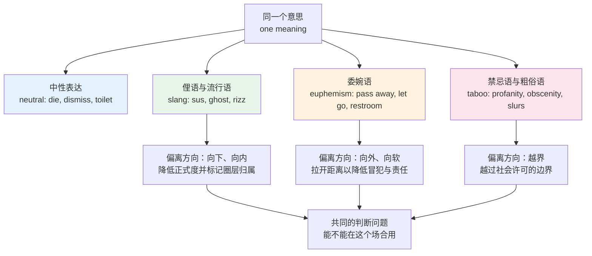
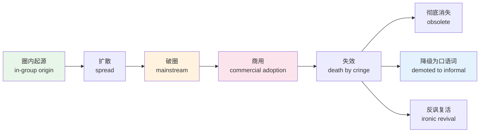
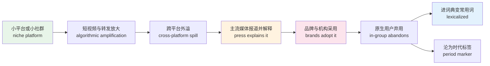
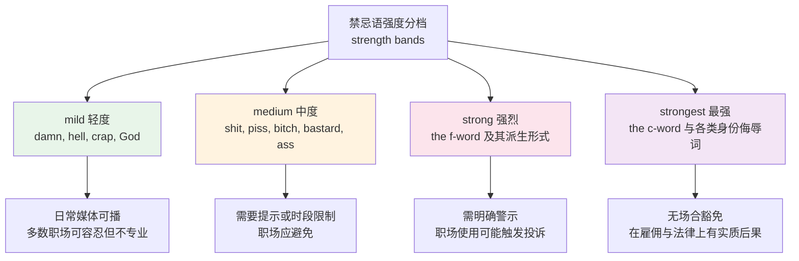
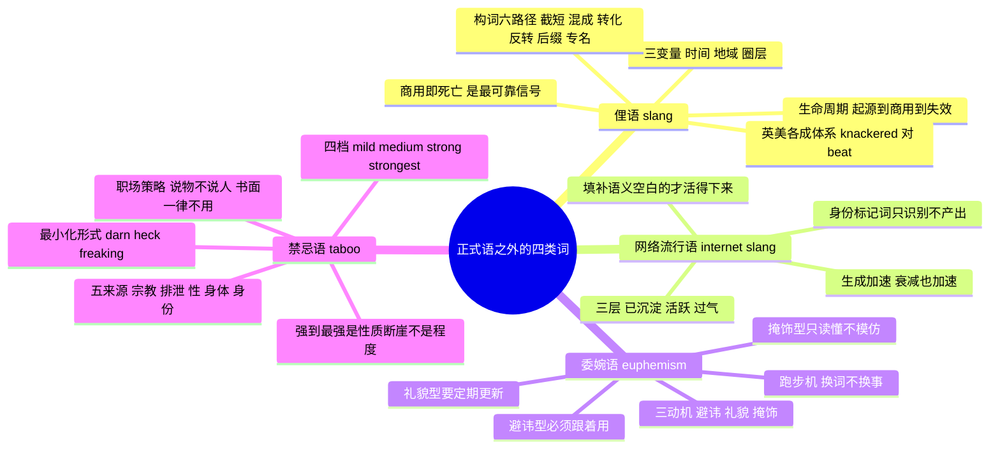

# 俚语、网络流行语、委婉语与禁忌语

> [!info] 本篇定位
>
> 18 章的第四篇，收本章前三篇刻意留下的那部分词：不适合写进正式文本，但读英文时躲不开的词。
>
> 前三篇的分工是这样的：`01` 讲同一个东西在英美两地的两个名字，`02` 讲同一个意思在正式、中性、口语三档的三种说法，`03` 讲字面意思推不出整体意思的固定表达。本篇处理的是第四个维度——**社会可接受度**。俚语是圈内标记，委婉语是把不能直说的东西包起来，禁忌语是被社会明令划出去的区域。三者共用一条轴。
>
> 读完你会拿到四样东西：一张判断某个俚语还活着没有的自查流程；四百余条按类别整理的俚语、网络词、委婉语与禁忌语词表；委婉语跑步机的运作机制与企业黑话的解码表；以及一套在英文工作环境里既能听懂又不踩雷的操作规则。
>
> 本篇不收带语气的社交缩写（`LOL`、`BTW`、`IMO`），那批词的主讲点在 [[12.科技、媒体与休闲/02.互联网、手机应用、社交媒体与网络缩写\|互联网、手机应用、社交媒体与网络缩写]]；截短、混成这些构词机制本身归 [[15.词根、合成与缩略/04.合成词、转化词、截短词与缩略语\|合成词、转化词、截短词与缩略语]]，本篇只用结论。

---

## 1. 本篇导读：正式语之外的四块地

英语学习者的词汇量常常长成一个奇怪的形状：学术词和技术词一大片，日常口语一小片，而俚语、委婉语、禁忌语这三块几乎是空白。后果很具体——看美剧一半的笑点接不住；收到一封写着 `we've decided to go in a different direction` 的邮件，不知道自己已经被拒了；在英文频道里看到同事打了一句带脏字的抱怨，判断不出这是熟人之间的正常吐槽还是真的翻脸了。

这三块空白不是同一种性质。俚语的问题是**时效**，你学的可能已经过期；委婉语的问题是**解码**，字面意思和实际意思相差很远；禁忌语的问题是**分级**，同样是骂人，`damn` 和最重的那一档之间隔着几个性质不同的档位，社会代价完全不在一个层面上。



上图把本篇的四块内容摆在同一个坐标里。中性表达是原点，另外三类都是从原点出发的偏离，只是方向不同：俚语向下偏（正式度更低）同时向内偏（表明你是圈内人）；委婉语向外偏（把话题推远，制造缓冲）；禁忌语则直接越过了社会画的那条线。判断「这个词能不能用」时，先确定它属于哪一类偏离，再看当前场合允许多大的偏离量。

本篇的编排顺序是先俚语、再网络流行语、再委婉语、最后禁忌语。前两类合在一起，因为网络流行语本质上是俚语在网络时代的加速版本，生成机制相同只是周转更快；后两类合在一起，因为委婉语存在的第一动机就是避开禁忌语，两者是同一枚硬币的两面。

---

## 2. 俚语的定义边界：跟口语词、习语、行话怎么分

「俚语」这个中译名太宽，很多人把所有不正式的英语都叫俚语，结果把 `kids`（口语词）、`spill the beans`（习语）、`refactor`（行话）全都塞进来。词典对这几个概念是分开标注的，分开记才不会误判语域。

| 英文 | 英式音标 | 美式音标 | 词性 | 中文 | 搭配与说明 |
| --- | --- | --- | --- | --- | --- |
| **slang** | /slæŋ/ | /slæŋ/ | n. | 俚语 | 不可数。词典标注写 `slang` 或 `sl.`，含义是「非正式且带社群标记」 |
| **colloquial** | /kəˈləʊkwiəl/ | /kəˈloʊkwiəl/ | adj. | 口语的 | 词典标 `informal` 或 `colloq.`，只是不正式，不带圈层标记 |
| **informal** | /ɪnˈfɔːml/ | /ɪnˈfɔːrml/ | adj. | 非正式的 | 现代词典多用这个标签替代 `colloquial` |
| **idiom** | /ˈɪdiəm/ | /ˈɪdiəm/ | n. | 习语 | 整体义推不出字面义，与正式度无关，见本章 `03` |
| **jargon** | /ˈdʒɑːɡən/ | /ˈdʒɑːrɡən/ | n. | 行话；术语 | 行业内部的精确术语，圈外人听不懂但圈内是正式用语 |
| **buzzword** | /ˈbʌzwɜːd/ | /ˈbʌzwɜːrd/ | n. | 时髦术语 | 贬义。听起来专业但语义被稀释的行业词 |
| **vernacular** | /vəˈnækjələ/ | /vərˈnækjələr/ | n. | 本地话；日常语 | `in the vernacular` 用大白话说 |
| **dialect** | /ˈdaɪəlekt/ | /ˈdaɪəlekt/ | n. | 方言 | 地域变体，有自己的语法与词汇 |
| **argot** | /ˈɑːɡəʊ/ | /ˈɑːrɡoʊ/ | n. | 隐语；黑话 | 法语借词，特指有意排外的行业或地下群体用语 |
| **cant** | /kænt/ | /kænt/ | n. | 切口 | 比 `argot` 更旧，多用于历史语境 |
| **neologism** | /niˈɒlədʒɪzəm/ | /niˈɑːlədʒɪzəm/ | n. | 新造词 | 中性学术词，不预设它会不会存活 |
| **coinage** | /ˈkɔɪnɪdʒ/ | /ˈkɔɪnɪdʒ/ | n. | 新词的创造 | `a recent coinage` 一个新造出来的说法 |
| **register** | /ˈredʒɪstə/ | /ˈredʒɪstər/ | n. | 语域 | 本章 `02` 的核心概念，本篇沿用 |

四条切分线值得单独说清楚。

**俚语与口语词的分线是「有没有圈层标记」。** `kids` 是口语词，任何人都能说，说了不表明你属于哪个群体；`squad`（指自己那帮朋友）是俚语，说出口就带上了年龄与文化归属的信息。俚语的社会功能一半在传递意思，一半在宣告「我是这个圈子的」，而这正是它容易过期的原因——圈子的边界一变，词就跟着废。

**俚语与习语的分线是「维度不同」。** `spill the beans`（泄密）是习语，但它已经进入了通用语，写进正式一点的杂志文章里也不违和；`no cap`（说真的）是俚语，但它字面推导得出来（`cap` 在这个圈层里等于「吹牛」）。一个词可以既是习语又是俚语，也可以只占一头。

**俚语与行话的分线是「圈内正式度」。** `deprecated` 在程序员之间是精确术语，写进 API 文档里完全正式，只是圈外人不懂；`janky`（做工粗糙、随时会散架）也在程序员之间流通，但它在圈内也是非正式的，不会出现在正式文档里。前者是行话，后者是行业俚语。

**俚语与方言的分线是「跟着人走还是跟着地走」。** 方言绑定地理，一个利物浦人无论多大年纪都说利物浦方言；俚语绑定群体，同一座城市里的十七岁和四十七岁说的是两套俚语。

> [!warning] 词典标注不能只看一个
>
> 同一个词在不同词典的标注可能不一致，尤其是正在从俚语向口语词过渡的那批。`ghost`（放人鸽子后彻底消失）的动词义是主流词典近十年才补上的新义项，各家给它的标签在 `slang` 与 `informal` 之间并不统一。判断方法是查两本以上词典再对照语料库频次，操作步骤见 [[22.速查附录与学习资源/01.语料库检索、查词交叉验证与原版材料爬升路径\|语料库检索、查词交叉验证与原版材料爬升路径]]。

---

## 3. 俚语的三个变量：时间、地域、圈层

一个俚语能不能用，取决于三个自变量同时成立：现在还在用吗，这个地方用吗，我属于这个圈子吗。三个里缺一个，说出来的效果就是尴尬而不是自然。

### 3.1 时间轴：俚语的生命周期

俚语不是匀速老化的，它有一条相当固定的曲线。



上图五个阶段里，第四阶段是判断的关键节点。**一个俚语被品牌广告、企业招聘文案或者政府宣传采用的那一刻，它在原生圈层里就已经死了。** 这条规律非常稳，因为俚语的核心价值是圈层标记，一旦被圈外的机构挪用，标记功能失效，圈内人就会主动放弃它另找新词。观察这个信号比查任何词表都准：看到一条地铁广告用了某个词，就不要再用了。

第五阶段的三个去向决定了这个词的最终状态。**彻底消失**的比例其实不高，多数词会走第二条路——**降级为普通口语词**，褪去圈层标记留下语义。`cool`、`OK`、`guy`、`fan`、`hip` 都走完了这条路，今天没人觉得它们是俚语。第三条路是**反讽复活**：过气词被下一代拿来当笑料用，`groovy`、`rad` 现在的用法基本都是这一类，说的人知道它过时，故意用来制造一点滑稽。

> [!tip] 判断一个俚语是否过期的四个信号
>
> 不需要查发布年份，看四个可观测的迹象就够了：
>
> 1. **广告用了没有**。品牌文案是最滞后的采用方，它一用就说明词已经烂大街。
> 2. **上一代人用了没有**。当父母辈开始用某个年轻人俚语，年轻人就会停止使用。
> 3. **有没有被打上时代标签**。如果这个词出现时总伴随着「二零一几年那阵子」的语境提示，它已经进历史了。
> 4. **有没有出现在解释它的文章里**。当一个词开始需要「这个词是什么意思」的科普文时，说明它要么太新要么太旧，都不是安全使用期。

### 3.2 地域轴与圈层轴

同一个词在大西洋两岸可能是两个意思，甚至是危险的两个意思。这一层与本章 `01` 的英美差异有交叠，但性质不同：`01` 讲的是两地各有一个名字指同一件东西（`lift` 对 `elevator`），本节讲的是同一个词形在两地各带一套隐含语气。

| 英文 | 英式音标 | 美式音标 | 词性 | 中文 | 搭配与说明 |
| --- | --- | --- | --- | --- | --- |
| **fanny** | /ˈfæni/ | /ˈfæni/ | n. | 美：屁股；英：女性外阴 | 两地强度差极大。美式的 `fanny pack` 在英国叫 `bum bag`，直接说会造成严重尴尬 |
| **pants** | /pænts/ | /pænts/ | n. | 美：长裤；英：内裤 | 英式另有形容词义「很烂」：`the film was pants` |
| **pissed** | /pɪst/ | /pɪst/ | adj. | 英：喝醉；美：生气 | 美式完整说法 `pissed off`（生气），英式 `pissed` 单用是醉了 |
| **bugger** | /ˈbʌɡə/ | /ˈbʌɡər/ | v./n./int. | 英：搞砸；讨厌鬼 | 英国日常轻度粗话，美国听感比英国重，非母语者别用 |
| **shag** | /ʃæɡ/ | /ʃæɡ/ | v./n. | 英：性行为（粗俗）；美：地毯绒毛 | 英式含义粗俗，看到美式 `shag carpet` 不要误解 |
| **rubber** | /ˈrʌbə/ | /ˈrʌbər/ | n. | 英：橡皮；美：避孕套 | 教室里向美国人要 `a rubber` 会很难收场，说 `an eraser` |
| **spunk** | /spʌŋk/ | /spʌŋk/ | n. | 美：勇气；英：粗俗义 | 美式 `she has spunk` 是褒义，英式听感完全不同 |
| **homely** | /ˈhəʊmli/ | /ˈhoʊmli/ | adj. | 英：舒适温馨；美：相貌平平 | 夸英国人的房子 `homely` 是好话，夸美国人的长相是侮辱 |
| **quite** | /kwaɪt/ | /kwaɪt/ | adv. | 英：还算；美：相当 | `quite good` 英式偏弱化，美式偏强化，详见 `17.05` |
| **table** | /ˈteɪbl/ | /ˈteɪbl/ | v. | 英：提交讨论；美：搁置 | 会议里方向完全相反，是真实会造成误会的一对 |

圈层轴比地域轴更难把握，因为它不写在词典里。一条实用的经验：**当代美式主流俚语里，相当大一部分源自非裔美国人英语（African American Vernacular English, AAVE）**，`cap`、`bet`、`salty`、`shade`、`woke`、`lit` 都是这条通道进入主流的。知道这个来源有两个用处：一是这批词的语法有自己的规则（`he be working` 表示习惯性动作，不是语法错误），二是非母语者大量使用别人的社群标记词，在英语环境里会被读作模仿甚至冒犯，识别为主、产出为辅是更稳的做法。

---

## 4. 当代通用俚语核心词表

本节收的是相对稳定的那一批：已经流通若干年、跨越了单个平台、母语者不分年龄大体都懂。极新的词放在第 8 节的活跃层。

### 4.1 评价与判断类

| 英文 | 英式音标 | 美式音标 | 词性 | 中文 | 搭配与说明 |
| --- | --- | --- | --- | --- | --- |
| **legit** | /lɪˈdʒɪt/ | /lɪˈdʒɪt/ | adj./adv. | 正经的；真的 | `legitimate` 的截短。作副词等于 `really`：`I legit forgot` |
| **sus** | /sʌs/ | /sʌs/ | adj. | 可疑的 | `suspicious` 的截短，英式旧有此用法，2020 年因一款游戏在美国爆发 |
| **sketchy** | /ˈsketʃi/ | /ˈsketʃi/ | adj. | 让人不放心的 | 美式高频。`a sketchy neighborhood` 治安不好的街区 |
| **shady** | /ˈʃeɪdi/ | /ˈʃeɪdi/ | adj. | 不正当的 | 比 `sketchy` 更指向道德而非安全 |
| **dodgy** | /ˈdɒdʒi/ | /ˈdɑːdʒi/ | adj. | 靠不住的；有问题的 | 英式对应 `sketchy`。`a dodgy connection` 时好时坏的网络 |
| **janky** | /ˈdʒæŋki/ | /ˈdʒæŋki/ | adj. | 粗糙易坏的 | 美式，技术圈高频：`a janky workaround` |
| **solid** | /ˈsɒlɪd/ | /ˈsɑːlɪd/ | adj. | 靠谱的；扎实的 | 已基本降级为口语词，工作场合可用：`a solid plan` |
| **legit good** | — | — | phr. | 是真的好 | `legit` 作强化词修饰形容词 |
| **mid** | /mɪd/ | /mɪd/ | adj. | 平庸的 | 贬义。位置在好与坏之间但偏向坏，`the sequel was mid` |
| **based** | /beɪst/ | /beɪst/ | adj. | 有种；不迎合 | 网络起源，褒义但带强烈政治色彩，工作场合避开 |
| **cringe** | /krɪndʒ/ | /krɪndʒ/ | adj./n./v. | 尴尬到脚趾抠地 | 由动词转形容词，`that's so cringe` |
| **cheesy** | /ˈtʃiːzi/ | /ˈtʃiːzi/ | adj. | 俗气肉麻的 | 多用于台词、礼物、广告 |
| **corny** | /ˈkɔːni/ | /ˈkɔːrni/ | adj. | 老套的 | 与 `cheesy` 近义，更偏「笑话不好笑」 |
| **lame** | /leɪm/ | /leɪm/ | adj. | 逊；没劲 | 原义「跛」，该原义现被视为冒犯，俚语义已脱钩 |
| **whack** | /wæk/ | /wæk/ | adj. | 离谱的；很差的 | 也拼作 `wack`。`that's whack` |
| **fire** | /ˈfaɪə/ | /ˈfaɪər/ | adj. | 极好的 | 作形容词无冠词：`this track is fire` |
| **dope** | /dəʊp/ | /doʊp/ | adj. | 很赞 | 与毒品义同形，语境区分 |
| **sick** | /sɪk/ | /sɪk/ | adj. | 帅炸的 | 反义褒用，与「生病」同形 |
| **slaps** | /slæps/ | /slæps/ | v. | （音乐）非常带劲 | 只用第三人称：`this song slaps` |
| **goated** | /ˈɡəʊtɪd/ | /ˈɡoʊtɪd/ | adj. | 顶级的 | 由缩写 GOAT（greatest of all time）派生 |
| **overrated** | /ˌəʊvəˈreɪtɪd/ | /ˌoʊvərˈreɪtɪd/ | adj. | 被高估的 | 标准词，但在评价语境里高频与俚语混用 |

### 4.2 人际与社交行为类

| 英文 | 英式音标 | 美式音标 | 词性 | 中文 | 搭配与说明 |
| --- | --- | --- | --- | --- | --- |
| **ghost** | /ɡəʊst/ | /ɡoʊst/ | v. | 突然失联；玩消失 | `he ghosted me` 起于约会语境，已扩展到求职与工作 |
| **ghosting** | /ˈɡəʊstɪŋ/ | /ˈɡoʊstɪŋ/ | n. | 玩消失的行为 | 招聘语境里 `candidate ghosting` 已进入 HR 正式文本 |
| **flake** | /fleɪk/ | /fleɪk/ | v./n. | 临时放鸽子；不靠谱的人 | `he flaked on us again`；形容词 `flaky` |
| **bail** | /beɪl/ | /beɪl/ | v. | 中途撤退 | `bail on sth`：`I bailed on the meeting` |
| **hit up** | /ˌhɪt ˈʌp/ | /ˌhɪt ˈʌp/ | v. | 联系一下 | `hit me up` 有事找我 |
| **link up** | /ˌlɪŋk ˈʌp/ | /ˌlɪŋk ˈʌp/ | v. | 碰头 | 英式年轻人高频 |
| **hang out** | /ˌhæŋ ˈaʊt/ | /ˌhæŋ ˈaʊt/ | v. | 一起待着 | 已降级为口语词，工作外社交安全可用 |
| **catch up** | /ˌkætʃ ˈʌp/ | /ˌkætʃ ˈʌp/ | v. | 叙旧；同步进展 | 工作场合完全正常：`let's catch up on Friday` |
| **flex** | /fleks/ | /fleks/ | v./n. | 炫耀 | `weird flex but OK` 是固定吐槽句式 |
| **humblebrag** | /ˈhʌmblbræɡ/ | /ˈhʌmblbræɡ/ | v./n. | 假谦虚式炫耀 | 复合词，`humble` + `brag` 直接相接，两词都没有截短 |
| **throw shade** | /ˌθrəʊ ˈʃeɪd/ | /ˌθroʊ ˈʃeɪd/ | v. | 阴阳怪气地贬低 | `shade` 单用作名词：`that's shade` |
| **clap back** | /ˌklæp ˈbæk/ | /ˌklæp ˈbæk/ | v. | 强硬回怼 | 公开场合的回击，多用于名人与社媒 |
| **call out** | /ˌkɔːl ˈaʊt/ | /ˌkɔːl ˈaʊt/ | v. | 公开指出问题 | 中性偏严肃，工作场合可用但语气重 |
| **shout out** | /ˌʃaʊt ˈaʊt/ | /ˌʃaʊt ˈaʊt/ | n./v. | 公开点名致谢 | `a shout-out to the infra team` 已进入职场常规用语 |
| **salty** | /ˈsɔːlti/ | /ˈsɔːlti/ | adj. | 输不起而闹脾气 | `don't be salty` 比 `angry` 多一层「小气」的贬义 |
| **petty** | /ˈpeti/ | /ˈpeti/ | adj. | 为小事计较 | 标准词的俚语化用法，语气重于字面 |
| **savage** | /ˈsævɪdʒ/ | /ˈsævɪdʒ/ | adj. | 毒舌到位 | 褒义用法：`that reply was savage` |
| **ratio** | /ˈreɪʃiəʊ/ | /ˈreɪʃioʊ/ | v./n. | 回复数碾压原帖 | 社交平台专属，衡量一条帖子被群嘲的程度 |
| **stan** | /stæn/ | /stæn/ | v./n. | 死忠粉；狂热支持 | 源自一首歌名，现已进主流词典 |
| **simp** | /sɪmp/ | /sɪmp/ | v./n. | 无底线讨好 | 贬义且带性别色彩，工作场合不用 |
| **gaslight** | /ˈɡæslaɪt/ | /ˈɡæslaɪt/ | v. | 让人怀疑自己的判断 | 源自剧名，现为心理学与日常通用词 |
| **spill the tea** | /ˌspɪl ðə ˈtiː/ | /ˌspɪl ðə ˈtiː/ | v. | 爆料 | `tea` 单用作名词等于「猛料」 |
| **receipts** | /rɪˈsiːts/ | /rɪˈsiːts/ | n. | 证据（截图、记录） | `show me the receipts` 拿证据来 |
| **vibe** | /vaɪb/ | /vaɪb/ | n./v. | 气场；合得来 | `we vibe`（合拍）；`bad vibes`（感觉不对） |
| **vibe check** | — | — | n. | 临时确认状态 | 半开玩笑地问「大家还好吗」 |

### 4.3 状态、情绪与身体感受类

| 英文 | 英式音标 | 美式音标 | 词性 | 中文 | 搭配与说明 |
| --- | --- | --- | --- | --- | --- |
| **swamped** | /swɒmpt/ | /swɑːmpt/ | adj. | 忙得不可开交 | 工作场合安全：`I'm swamped this week` |
| **slammed** | /slæmd/ | /slæmd/ | adj. | 忙爆了 | 比 `swamped` 更口语，美式高频 |
| **fried** | /fraɪd/ | /fraɪd/ | adj. | 脑子烧干了 | `my brain is fried` |
| **wiped** | /waɪpt/ | /waɪpt/ | adj. | 累瘫 | 完整说法 `wiped out` |
| **beat** | /biːt/ | /biːt/ | adj. | 累惨 | 美式，与「打」同形 |
| **knackered** | /ˈnækəd/ | /ˈnækərd/ | adj. | 累垮了 | 英式高频，美式基本不用 |
| **shattered** | /ˈʃætəd/ | /ˈʃætərd/ | adj. | 累到散架 | 英式，与「破碎」同形 |
| **burnt out** | /ˌbɜːnt ˈaʊt/ | /ˌbɜːrnt ˈaʊt/ | adj. | 职业倦怠 | 已进入医学与 HR 正式术语，名词 `burnout` |
| **stoked** | /stəʊkt/ | /stoʊkt/ | adj. | 兴奋期待 | 美式，`stoked about the launch` |
| **psyched** | /saɪkt/ | /saɪkt/ | adj. | 打了鸡血 | 与 `stoked` 近义 |
| **hyped** | /haɪpt/ | /haɪpt/ | adj. | 被炒热的；很兴奋 | 名词 `hype` 指过度宣传，带贬义 |
| **gutted** | /ˈɡʌtɪd/ | /ˈɡʌtɪd/ | adj. | 失望透顶 | 英式高频，强度远高于 `disappointed` |
| **chuffed** | /tʃʌft/ | /tʃʌft/ | adj. | 很得意很开心 | 英式，`chuffed to bits` 高兴坏了 |
| **buzzing** | /ˈbʌzɪŋ/ | /ˈbʌzɪŋ/ | adj. | 兴奋；微醺 | 英式两义并存，看语境 |
| **gobsmacked** | /ˈɡɒbsmækt/ | /ˈɡɑːbsmækt/ | adj. | 惊掉下巴 | 英式，`gob` 是嘴的俚语 |
| **shook** | /ʃʊk/ | /ʃʊk/ | adj. | 惊到了 | 由 `shaken` 变来的俚语形式 |
| **triggered** | /ˈtrɪɡəd/ | /ˈtrɪɡərd/ | adj. | 被戳到痛处 | 临床义与网络嘲讽义并存，网络用法带贬义 |
| **chill** | /tʃɪl/ | /tʃɪl/ | adj./v. | 放松的；随和 | `he's chill` 好相处；`chill out` 冷静点 |
| **lowkey** | /ˌləʊˈkiː/ | /ˌloʊˈkiː/ | adv. | 有点儿；私下里 | `I lowkey want to quit` 弱化断言的语气词 |
| **highkey** | /ˌhaɪˈkiː/ | /ˌhaɪˈkiː/ | adv. | 明摆着；非常 | `lowkey` 的反义类推产物 |
| **deadass** | /ˈdedæs/ | /ˈdedæs/ | adv. | 说真的 | 纽约起源，含轻度粗话成分 |
| **no cap** | /ˌnəʊ ˈkæp/ | /ˌnoʊ ˈkæp/ | phr. | 不吹牛 | `cap` 单用作动词等于「说谎」：`stop capping` |
| **bet** | /bet/ | /bet/ | int. | 好的；成交 | 应答词，等于 `deal` 或 `sure` |
| **facts** | /fækts/ | /fækts/ | int. | 说得对 | 单独成句表示强烈同意 |
| **word** | /wɜːd/ | /wɜːrd/ | int. | 是这样 | 更早一代的同类应答词 |

### 4.4 强化词与量级词

英语俚语里有一批专门用来加强程度的词，它们的共同点是原义与强化义完全脱钩。这批词的地域标记特别强，用错地方一听就是外来者。

| 英文 | 英式音标 | 美式音标 | 词性 | 中文 | 搭配与说明 |
| --- | --- | --- | --- | --- | --- |
| **hella** | /ˈhelə/ | /ˈhelə/ | adv. | 特别 | 起于北加州湾区，现为西海岸标记词，`hella good` |
| **mad** | /mæd/ | /mæd/ | adv. | 超级 | 美国东北部：`mad expensive` |
| **wicked** | /ˈwɪkɪd/ | /ˈwɪkɪd/ | adv. | 非常 | 新英格兰地区与英式都用：`wicked good` |
| **proper** | /ˈprɒpə/ | /ˈprɑːpər/ | adv. | 真正地 | 英式：`proper knackered` |
| **well** | /wel/ | /wel/ | adv. | 很 | 英式年轻人用法：`well good` |
| **dead** | /ded/ | /ded/ | adv. | 极其 | 英式：`dead easy` |
| **bare** | /beə/ | /ber/ | adv./det. | 大量；很 | 伦敦多元族群英语：`bare people` 好多人 |
| **super** | /ˈsuːpə/ | /ˈsuːpər/ | adv. | 非常 | 已完全降级为口语词，工作场合可用 |
| **totally** | /ˈtəʊtəli/ | /ˈtoʊtəli/ | adv. | 完全 | 同上，作应答词表示赞同 |
| **legitimately** | /lɪˈdʒɪtɪmətli/ | /lɪˈdʒɪtɪmətli/ | adv. | 真的是 | `legit` 的完整形式，正式度稍高 |
| **absolutely** | /ˌæbsəˈluːtli/ | /ˌæbsəˈluːtli/ | adv. | 绝对 | 标准强化词，配极限形容词，见 `17.05` |

> [!warning] 强化词是最容易暴露身份的一类
>
> 地域强化词的社会功能几乎全部是标记归属，语义贡献很小。一个非母语者说 `hella` 或 `well good`，母语者的第一反应不是「他英语好」而是「他从哪学的这个」。识别层面必须掌握（听不懂就漏信息），产出层面建议全部换成 `really`、`very`、`extremely` 这类中性词。

### 4.5 人物标签类

| 英文 | 英式音标 | 美式音标 | 词性 | 中文 | 搭配与说明 |
| --- | --- | --- | --- | --- | --- |
| **dude** | /djuːd/ | /duːd/ | n. | 哥们儿 | 美式，可指任何性别，也作感叹词 |
| **bro** | /brəʊ/ | /broʊ/ | n. | 兄弟 | 称呼语；作定语时带贬义：`bro culture` |
| **guy** | /ɡaɪ/ | /ɡaɪ/ | n. | 家伙 | 复数 `you guys` 已中性化，但正式场合建议 `everyone` |
| **folks** | /fəʊks/ | /foʊks/ | n. | 各位 | 美式中性称呼，会议开场安全用词 |
| **mate** | /meɪt/ | /meɪt/ | n. | 伙计 | 英澳，男性之间高频，美式听感陌生 |
| **bloke** | /bləʊk/ | /bloʊk/ | n. | 男的 | 英式，中性偏随意 |
| **lad** | /læd/ | /læd/ | n. | 小伙子 | 英式，复数 `the lads` 指哥们儿一伙 |
| **pal** | /pæl/ | /pæl/ | n. | 老兄 | 直接称呼时常带敌意：`listen, pal` |
| **buddy** | /ˈbʌdi/ | /ˈbʌdi/ | n. | 伙伴 | 美式，直接称呼陌生人时同样可能带火药味 |
| **squad** | /skwɒd/ | /skwɑːd/ | n. | 自己那帮朋友 | 已明显过时，慎用 |
| **rookie** | /ˈrʊki/ | /ˈrʊki/ | n. | 新手 | 体育起源，职场可用：`a rookie mistake` |
| **veteran** | /ˈvetərən/ | /ˈvetərən/ | n./adj. | 老手 | 正式词，与 `rookie` 成对 |
| **nerd** | /nɜːd/ | /nɜːrd/ | n. | 钻研某事的人 | 已中性化甚至褒义：`a data nerd` |
| **geek** | /ɡiːk/ | /ɡiːk/ | n. | 技术迷 | 技术行业内部为褒义，`geek out on sth` |
| **normie** | /ˈnɔːmi/ | /ˈnɔːrmi/ | n. | 圈外普通人 | 网络起源，带轻度贬义 |
| **boomer** | /ˈbuːmə/ | /ˈbuːmər/ | n. | 老一辈 | `OK boomer` 是嘲讽固定句，工作场合等同年龄歧视 |
| **Karen** | /ˈkærən/ | /ˈkærən/ | n. | 蛮不讲理的投诉者 | 专名转普通名，带性别与年龄刻板印象，工作场合禁用 |
| **influencer** | /ˈɪnfluənsə/ | /ˈɪnfluənsər/ | n. | 网红 | 已成商业正式词 |

---

## 5. 英式俚语专表

英式俚语更少通过影视输出到中文世界，是听力理解里最容易断片的一块。下表收仍在日常流通的那批，不收已经进博物馆的。

| 英文 | 英式音标 | 美式音标 | 词性 | 中文 | 搭配与说明 |
| --- | --- | --- | --- | --- | --- |
| **cheers** | /tʃɪəz/ | /tʃɪrz/ | int. | 谢了；再见 | 英式日常道谢的默认词，比 `thank you` 随意；也用于道别 |
| **ta** | /tɑː/ | /tɑː/ | int. | 谢啦 | 比 `cheers` 更随意，英格兰北部尤多 |
| **sorted** | /ˈsɔːtɪd/ | /ˈsɔːrtɪd/ | adj. | 搞定了 | `that's sorted` 事情办妥 |
| **sound** | /saʊnd/ | /saʊnd/ | adj. | 靠谱的；没问题 | `he's sound` 这人不错 |
| **mint** | /mɪnt/ | /mɪnt/ | adj. | 棒极了 | 英格兰北部高频 |
| **ace** | /eɪs/ | /eɪs/ | adj. | 一流的 | 也作动词：`ace an exam` 考得极好 |
| **naff** | /næf/ | /næf/ | adj. | 土；没品 | 略显过时但仍在用 |
| **rank** | /ræŋk/ | /ræŋk/ | adj. | 恶心 | 年轻人用语 |
| **minging** | /ˈmɪŋɪŋ/ | /ˈmɪŋɪŋ/ | adj. | 难看；难吃 | 强度高于 `rank` |
| **posh** | /pɒʃ/ | /pɑːʃ/ | adj. | 上流的；讲究的 | 可褒可贬，看语气 |
| **cheeky** | /ˈtʃiːki/ | /ˈtʃiːki/ | adj. | 放肆而讨喜的 | `a cheeky pint` 忙里偷闲喝一杯 |
| **dodgy** | /ˈdɒdʒi/ | /ˈdɑːdʒi/ | adj. | 靠不住的 | 见第 4.1 节 |
| **wonky** | /ˈwɒŋki/ | /ˈwɑːŋki/ | adj. | 歪的；不稳的 | `the table is wonky` |
| **faff** | /fæf/ | /fæf/ | v./n. | 瞎折腾 | `faff about` 磨磨蹭蹭；`a right faff` 麻烦事 |
| **kip** | /kɪp/ | /kɪp/ | n./v. | 小睡 | `have a kip` |
| **nick** | /nɪk/ | /nɪk/ | v./n. | 偷；警局 | `got nicked` 被抓了 |
| **skint** | /skɪnt/ | /skɪnt/ | adj. | 身无分文 | `I'm skint till payday` |
| **quid** | /kwɪd/ | /kwɪd/ | n. | 英镑 | 单复同形：`twenty quid` |
| **tenner** | /ˈtenə/ | /ˈtenər/ | n. | 十镑钞 | 同类 `fiver` 五镑 |
| **dosh** | /dɒʃ/ | /dɑːʃ/ | n. | 钱 | 略旧但仍懂 |
| **gaff** | /ɡæf/ | /ɡæf/ | n. | 住处 | `round my gaff` 到我家 |
| **bants** | /bænts/ | /bænts/ | n. | 互相调侃 | `banter` 的截短 |
| **take the mickey** | — | — | v. | 取笑 | 完整形式带粗话，此为洁本 |
| **chuffed** | /tʃʌft/ | /tʃʌft/ | adj. | 得意 | 见第 4.3 节 |
| **shambles** | /ˈʃæmblz/ | /ˈʃæmblz/ | n. | 一团糟 | `an absolute shambles`，词形带 s 但作单数 |
| **botch** | /bɒtʃ/ | /bɑːtʃ/ | v. | 搞砸 | `botch a job`；名词 `a botch job` |
| **knacker** | /ˈnækə/ | /ˈnækər/ | v. | 弄坏；累垮 | 过去分词 `knackered` 更常用 |
| **pop round** | — | — | v. | 顺路过去 | `pop` 系动词群：`pop out`、`pop in`、`pop over` |
| **innit** | /ˈɪnɪt/ | /ˈɪnɪt/ | int. | 是吧 | `isn't it` 的固化形式，用作万能反意疑问 |
| **gutted** | /ˈɡʌtɪd/ | /ˈɡʌtɪd/ | adj. | 失望透顶 | 见第 4.3 节 |

### 5.1 押韵俚语：一种正在退场但仍留痕的机制

伦敦东区的押韵俚语（Cockney rhyming slang）用一个与目标词押韵的短语代替它，再把押韵的那一半省掉，结果是外人完全无法反推。这套机制整体已经退场，但有几个词已经沉进普通英语，不知道来源就查不到意思。

| 英文 | 英式音标 | 美式音标 | 词性 | 中文 | 搭配与说明 |
| --- | --- | --- | --- | --- | --- |
| **have a butcher's** | — | — | v. | 看一眼 | 来自 `butcher's hook` 押 `look`，省掉 `hook` |
| **use your loaf** | — | — | v. | 动动脑子 | 来自 `loaf of bread` 押 `head` |
| **porkies** | /ˈpɔːkiz/ | /ˈpɔːrkiz/ | n. | 谎话 | 来自 `pork pies` 押 `lies` |
| **plates** | /pleɪts/ | /pleɪts/ | n. | 脚 | 来自 `plates of meat` 押 `feet` |
| **dog and bone** | — | — | n. | 电话 | 押 `phone`，通常不省略，作展示性用法 |
| **trouble and strife** | — | — | n. | 老婆 | 押 `wife`，现在多作玩笑引用 |
| **Barnet** | /ˈbɑːnɪt/ | /ˈbɑːrnɪt/ | n. | 头发 | 来自 `Barnet Fair` 押 `hair` |

这套机制之所以值得知道，不在于要用它，而在于它示范了俚语的极端形态：**语义完全不可推导，学习成本全部押在圈内共享的记忆上**。这也解释了为什么俚语的圈层标记功能这么强——能听懂就是入场券本身。

---

## 6. 俚语的构词机制

俚语不是随机产生的，它反复使用同几条路径。认得这几条路径，遇到没见过的新词多半能从构词方式反推出大致语义。

### 6.1 六条主路径

| 机制 | 英文名 | 例词 | 说明 |
| --- | --- | --- | --- |
| 截短 | clipping | `legit`、`sus`、`bants`、`fit`（outfit）、`rents`（parents） | 砍掉后半或前半，是产出最快的一条 |
| 混成 | blending | `hangry`、`bromance`、`chillax`、`frenemy` | 两词各截一段再拼接，与不截短的复合词有别 |
| 功能转化 | conversion | `ghost`（名转动）、`cringe`（动转形）、`adult`（名转动） | 不改词形只改词类，英语最活跃的造词法 |
| 语义反转 | semantic reversal | `sick`、`wicked`、`bad`、`filthy` | 贬义词褒用，反讽是俚语的常规操作 |
| 后缀派生 | suffixation | `janky`、`sketchy`、`goated`、`normie`、`cheugy` | `-y`、`-ie`、`-ed` 三个后缀承担绝大多数 |
| 专名普通化 | eponym | `Karen`、`stan`、`gaslight`、`google` | 由人名、角色名、品牌名转成普通词 |

这六条路径与 `15.04` 讲的通用构词机制是同一套，区别只在**俚语层的产出速度快一个量级，而且不受拼写规范约束**。`cheugy`（过时到有点土）这种词在正规构词里根本不会出现——它没有词源、拼写靠感觉、发音靠约定，纯粹是一次社群共识。

### 6.2 后缀 -y / -ie 的高产性

英语俚语里最多产的一个模式是给任意名词加 `-y` 变成形容词，语义大致是「带有那个东西的性质」，语气自动降到非正式。

> - The build is **janky** but it ships.
>   - 这版构建做工粗糙，但能发出去。
> - That whole street feels **sketchy** after dark.
>   - 天黑之后那条街整个让人不放心。
> - The wiring looks a bit **dodgy** to me.
>   - 我看那线路有点不对劲。
> - It's a **cheesy** line but it works.
>   - 这台词挺肉麻，但管用。

同一个后缀也造人称名词：`newbie`、`foodie`、`techie`、`freebie`、`selfie`。这批词里 `selfie` 已经完全进入正式语（它是 2013 年牛津年度词汇），`newbie` 与 `techie` 仍带明显非正式色彩，`foodie` 已经出现在餐饮业的商业文案里——按第 3.1 节的规律，这意味着它在原生圈层里已经死了。

---

## 7. 网络流行语：生成路径与半衰期

网络流行语与传统俚语是同一种东西，差别在于三个参数被改变了：传播速度更快、地理约束更弱、生命周期更短。

### 7.1 生成路径



上图与第 3.1 节的俚语曲线形状相同，但中间两步是网络时代特有的。**第四步「主流媒体报道并解释」是一个极强的死亡预警信号**：当一家报纸发出「年轻人现在说的某某词是什么意思」这类科普文章时，说明这个词的圈内寿命已经进入尾声。第五步的品牌采用只是补一刀。

至于「半衰期」到底多长，没有可靠的公开统计能给出一个数字，任何声称「网络流行语平均存活 N 个月」的说法都值得怀疑——语料库对新词的收录本身就滞后，衰减曲线无法在词发生的当时测量。可以确定的只有相对关系：**平台原生词衰减最快，从既有俚语借用并改造的词衰减较慢，语义填补了真实空白的词最容易活下来。** `ghosting` 活下来了，因为英语此前确实没有一个词精确表达「不说分手直接消失」；纯粹作为身份标记的那些词则几乎全数消失。

年度词汇评选是一个可用的观察点。牛津把 `goblin mode` 选为 2022 年年度词汇，把 `rizz` 选为 2023 年，把 `brain rot` 选为 2024 年——三个词今天的存活状态各不相同，正好可以自己去检验第 3.1 节那四个信号是否成立。

### 7.2 网络流行语的三层分类

判断一个网络词能不能用，先定它在哪一层。

| 层级 | 特征 | 处理方式 |
| --- | --- | --- |
| 已沉淀层 | 进了主流词典，媒体不再解释，跨年龄段通用 | 非正式场合可主动用，正式文本仍避开 |
| 活跃层 | 仍在原生圈层流通，圈外人需要解释 | 只做识别，不主动产出 |
| 过气层 | 已被品牌采用或被上一代接手 | 只在阅读旧材料时需要，产出等于自曝时代 |

| 英文 | 英式音标 | 美式音标 | 词性 | 中文 | 搭配与说明 |
| --- | --- | --- | --- | --- | --- |
| **meme** | /miːm/ | /miːm/ | n./v. | 梗；表情包 | 已沉淀层。学术起源，现全民通用 |
| **viral** | /ˈvaɪrəl/ | /ˈvaɪrəl/ | adj. | 病毒式传播的 | 已沉淀层。`go viral` 火了 |
| **troll** | /trəʊl/ | /troʊl/ | n./v. | 挑事者；故意激怒 | 已沉淀层。与神话生物同形 |
| **spam** | /spæm/ | /spæm/ | n./v. | 垃圾信息；刷屏 | 已沉淀层，技术文档正式用词 |
| **doomscroll** | /ˈduːmskrəʊl/ | /ˈduːmskroʊl/ | v. | 停不下来刷坏消息 | 已沉淀层，`doom` + `scroll` 复合而成 |
| **clickbait** | /ˈklɪkbeɪt/ | /ˈklɪkbeɪt/ | n. | 标题党 | 已沉淀层，媒体行业正式用词 |
| **unfollow** | /ˌʌnˈfɒləʊ/ | /ˌʌnˈfɑːloʊ/ | v. | 取关 | 已沉淀层，平台界面正式用词 |
| **screenshot** | /ˈskriːnʃɒt/ | /ˈskriːnʃɑːt/ | n./v. | 截图 | 已沉淀层，完全正式 |
| **binge-watch** | /ˈbɪndʒ wɒtʃ/ | /ˈbɪndʒ wɑːtʃ/ | v. | 刷剧 | 已沉淀层 |
| **glow-up** | /ˈɡləʊ ʌp/ | /ˈɡloʊ ʌp/ | n. | 蜕变变好看 | 已沉淀层偏活跃 |
| **red flag** | /ˌred ˈflæɡ/ | /ˌred ˈflæɡ/ | n. | 危险信号 | 已沉淀层，工作与情感语境通用 |
| **green flag** | /ˌɡriːn ˈflæɡ/ | /ˌɡriːn ˈflæɡ/ | n. | 加分项 | 活跃层，`red flag` 的类推产物 |
| **rizz** | /rɪz/ | /rɪz/ | n. | 撩人的魅力 | 活跃层，`charisma` 的中段截短 |
| **ick** | /ɪk/ | /ɪk/ | n. | 突然的生理性反感 | 活跃层，`get the ick` |
| **brain rot** | /ˈbreɪn rɒt/ | /ˈbreɪn rɑːt/ | n. | 刷废了的脑子 | 活跃层 |
| **delulu** | /dəˈluːluː/ | /dəˈluːluː/ | adj. | 妄想的 | 活跃层，`delusional` 的叠音截短 |
| **npc** | — | — | n. | 没有主见的人 | 活跃层，游戏术语外溢，带贬义 |
| **main character** | — | — | n. | 以自我为中心 | 活跃层，`main character energy` |
| **touch grass** | — | — | v. | 别上网了出去走走 | 活跃层，带攻击性 |
| **bussin** | /ˈbʌsɪn/ | /ˈbʌsɪn/ | adj. | （食物）绝了 | 活跃层偏过气 |
| **yeet** | /jiːt/ | /jiːt/ | v./int. | 猛地一扔 | 过气层，现多作反讽使用 |
| **cheugy** | /ˈtʃuːɡi/ | /ˈtʃuːɡi/ | adj. | 努力追潮流但已过时 | 过气层，本身已成自指笑话 |
| **on fleek** | /ɒn ˈfliːk/ | /ɑːn ˈfliːk/ | adj. | 完美到位 | 过气层，典型的被品牌用死的例子 |
| **YOLO** | /ˈjəʊləʊ/ | /ˈjoʊloʊ/ | int. | 人生只有一次 | 过气层，拼作四个字母但整体当一个词念；同类社交缩写见 `12.02` |
| **totes** | /təʊts/ | /toʊts/ | adv. | 完全 | 过气层，`totally` 的截短 |
| **adulting** | /ˈædʌltɪŋ/ | /əˈdʌltɪŋ/ | n. | 硬着头皮做成年人的事 | 已沉淀层偏过气。美式重音在第二音节，与名词 `adult` 一致 |
| **slay** | /sleɪ/ | /sleɪ/ | v. | 做得漂亮 | 活跃层，源自舞厅文化后被主流吸收 |
| **serve** | /sɜːv/ | /sɜːrv/ | v. | 表现惊艳 | 活跃层，与 `slay` 同源同圈 |
| **it's giving** | — | — | phr. | 有一种……的感觉 | 活跃层，后接名词：`it's giving corporate` |
| **understood the assignment** | — | — | phr. | 完全做到位了 | 活跃层，反讽式褒奖 |
| **living rent free** | — | — | phr. | 在脑子里挥之不去 | 活跃层，`that ad is living rent free in my head` |

> [!warning] 三类词坚决不要主动用
>
> 1. **带社群身份标记的词**。源自特定族裔或性少数社群的词，非成员大量使用会被读作挪用，`slay`、`serve`、`shade`、`tea` 都属于这一类，听懂即可。
> 2. **带政治站队含义的词**。`based`、`woke`、`red-pilled` 在英语世界已高度政治化，一个词就能给你贴上立场标签。
> 3. **带刻板印象的人称标签**。`Karen`、`boomer`、`simp` 这类词在职场使用可能直接构成年龄或性别歧视，风险与收益完全不成比例。

---

## 8. 委婉语的机制：避讳、礼貌、掩饰

委婉语（euphemism）用一个不那么刺激的说法替换一个直白的说法。三种动机产生的委婉语性质完全不同，混为一谈就没法判断该不该跟着用。

| 英文 | 英式音标 | 美式音标 | 词性 | 中文 | 搭配与说明 |
| --- | --- | --- | --- | --- | --- |
| **euphemism** | /ˈjuːfəmɪzəm/ | /ˈjuːfəmɪzəm/ | n. | 委婉语 | 形容词 `euphemistic`，副词 `euphemistically` |
| **dysphemism** | /ˈdɪsfəmɪzəm/ | /ˈdɪsfəmɪzəm/ | n. | 恶化语 | 委婉语的反向操作，故意用更难听的说法 |
| **doublespeak** | /ˈdʌblspiːk/ | /ˈdʌblspiːk/ | n. | 双重话语 | 有意掩饰真相的官方语言，明显贬义 |
| **spin** | /spɪn/ | /spɪn/ | n./v. | 舆论包装 | `put a positive spin on it` |
| **sugarcoat** | /ˈʃʊɡəkəʊt/ | /ˈʃʊɡərkoʊt/ | v. | 粉饰 | `I won't sugarcoat it` 我就直说了 |
| **understatement** | /ˌʌndəˈsteɪtmənt/ | /ˌʌndərˈsteɪtmənt/ | n. | 轻描淡写 | 英式修辞主力，`that's an understatement` |
| **hedging** | /ˈhedʒɪŋ/ | /ˈhedʒɪŋ/ | n. | 模糊限制 | 学术写作的降低断言强度手段，见 `19.03` |
| **mince words** | — | — | v. | 说话拐弯抹角 | 多用否定式：`not to mince words` 直说吧 |
| **beat around the bush** | — | — | v. | 绕圈子 | 习语，见本章 `03` |
| **couch sth in** | /kaʊtʃ/ | /kaʊtʃ/ | v. | 用某种措辞表述 | `couched in vague terms` |
| **tactful** | /ˈtæktfl/ | /ˈtæktfl/ | adj. | 得体的 | 名词 `tact`，反义 `tactless` |
| **candid** | /ˈkændɪd/ | /ˈkændɪd/ | adj. | 坦率的 | `to be candid` 说实话 |
| **blunt** | /blʌnt/ | /blʌnt/ | adj. | 直言不讳的 | 略带负面，暗示不顾对方感受 |

### 8.1 三类动机

**避讳型**处理的是文化上不能直说的事：死亡、疾病、排泄、性。这类委婉语在几乎所有语言里都存在，中文的「走了」「不方便」「洗手间」是同一回事。这类词是**必须跟着用**的——在英语环境里对着刚失去亲人的同事说 `when your father died`，即使语法完全正确，也会被视为缺乏教养。

**礼貌型**处理的是可能让对方难堪的事：外貌、年龄、能力、经济状况。这类的边界在移动，而且移动得很快，跟不上就容易踩雷。二十年前 `handicapped` 是中性词，现在它在正式文本里基本被 `person with a disability` 取代；`elderly` 也正在从中性滑向被回避。这类词**要定期更新**，不能靠十年前的教材。

**掩饰型**处理的是说话人想让听者少想一点的事：裁员、涨价、军事行动、政治失误。这类委婉语的功能是转移责任、稀释后果，跟前两类的性质完全不同。**要认得但不必跟着用**——你需要读懂 `we're streamlining our organization` 等于「要裁员了」，但没必要在自己的表达里复制这套语言。奥威尔在 1946 年的《政治与英语》里就专门批过这一类，判断标准很简单：这个委婉语让谁更好过？如果答案是说话人而不是听话人，它就是掩饰型。

### 8.2 委婉语跑步机

委婉语有个固定的失效模式：**替换词用久了会吸收被替换词的全部负面联想，于是需要再换一个，无穷往复。** 心理语言学家 Steven Pinker 把这个现象叫作「委婉语跑步机」（euphemism treadmill）。


上图说明的是一个自我维持的循环：**问题不在词上，在被指称的事情上。** 只要「被解雇」这件事本身让人难受，任何指称它的词最终都会变得难听。理解这一点有个直接的实用价值——不要指望背下一张「正确说法」表就一劳永逸，正确的做法是记住循环方向，看到某个词开始被回避就跟着换。

跑步机跑得最明显的三条链：

```text
厕所：  privy → water closet → lavatory → toilet → bathroom → restroom → washroom
残障：  crippled → handicapped → disabled → person with a disability
清洁工：garbage man → sanitation man → sanitation worker → sanitation engineer
```

第一条链上，`toilet` 在英式英语里仍是可接受的中性词，在美式英语里已经明显下滑（美国人多用 `bathroom` 或 `restroom`），这是同一条跑步机在两地跑到了不同位置。第二条链上，`person with a disability` 这种把人放在前面的写法叫 **person-first language**，是当代英语正式文本的默认体例；但同时也存在 **identity-first language** 的主张（`autistic person` 而非 `person with autism`），两派在不同社群里都有支持，写作时按对方社群的偏好来。

---

## 9. 委婉语词表（上）：死亡、疾病、身体与年龄

### 9.1 死亡与丧葬

这是英语委婉语最密集的一块，也是最不能出错的一块。

| 英文 | 英式音标 | 美式音标 | 词性 | 中文 | 搭配与说明 |
| --- | --- | --- | --- | --- | --- |
| **pass away** | /ˌpɑːs əˈweɪ/ | /ˌpæs əˈweɪ/ | v. | 去世 | 最通用的委婉说法，任何场合安全 |
| **pass** | /pɑːs/ | /pæs/ | v. | 走了 | 美式口语里 `pass away` 的省略：`she passed last year` |
| **pass on** | /ˌpɑːs ˈɒn/ | /ˌpæs ˈɔːn/ | v. | 过世 | 带轻微宗教色彩 |
| **lose sb** | /luːz/ | /luːz/ | v. | 失去某人 | 从家属视角说：`I lost my father in March` |
| **be no longer with us** | — | — | phr. | 已不在了 | 正式讣告与致辞常用 |
| **the late** | /leɪt/ | /leɪt/ | adj. | 已故的 | 只作前置定语：`the late Dr. Chen` |
| **the deceased** | /dɪˈsiːst/ | /dɪˈsiːst/ | n. | 死者 | 法律与医疗文书用词，单复同形 |
| **the departed** | /dɪˈpɑːtɪd/ | /dɪˈpɑːrtɪd/ | n. | 逝者 | 宗教仪式用语 |
| **expire** | /ɪkˈspaɪə/ | /ɪkˈspaɪər/ | v. | 死亡 | 医学与法律文书，日常说人 `expired` 很怪 |
| **demise** | /dɪˈmaɪz/ | /dɪˈmaɪz/ | n. | 逝世；消亡 | 正式；也用于机构：`the demise of the project` |
| **fatality** | /fəˈtæləti/ | /fəˈtæləti/ | n. | 死亡人数 | 事故与灾害报道的统计口径词 |
| **casualty** | /ˈkæʒuəlti/ | /ˈkæʒuəlti/ | n. | 伤亡者 | 含伤者，不等于死者，新闻里常被误读 |
| **remains** | /rɪˈmeɪnz/ | /rɪˈmeɪnz/ | n. | 遗体 | 只用复数形式 |
| **lay sb to rest** | — | — | v. | 安葬 | `he was laid to rest on Friday` |
| **resting place** | — | — | n. | 长眠之地 | `final resting place` |
| **celebration of life** | — | — | n. | 追思会 | 当代替代 `funeral` 的说法，基调不同 |
| **memorial service** | /məˈmɔːriəl/ | /məˈmɔːriəl/ | n. | 追悼会 | 无遗体的纪念仪式 |
| **bereaved** | /bɪˈriːvd/ | /bɪˈriːvd/ | adj./n. | 丧亲的；家属 | `the bereaved family`；名词 `bereavement` 也指丧假 |
| **condolences** | /kənˈdəʊlənsɪz/ | /kənˈdoʊlənsɪz/ | n. | 哀悼 | `my condolences`；动词搭配 `offer condolences` |
| **put down** | /ˌpʊt ˈdaʊn/ | /ˌpʊt ˈdaʊn/ | v. | （对动物）安乐死 | 只用于动物，`we had to put her down` |
| **put to sleep** | — | — | phr. | （对动物）让它安睡 | 比 `put down` 更委婉 |
| **euthanize** | /ˈjuːθənaɪz/ | /ˈjuːθənaɪz/ | v. | 实施安乐死 | 正式词，英式拼作 `euthanise` |
| **terminal** | /ˈtɜːmɪnl/ | /ˈtɜːrmɪnl/ | adj. | 绝症的 | `terminally ill`；医学正式用词 |
| **palliative care** | /ˈpæliətɪv/ | /ˈpæliətɪv/ | n. | 姑息治疗 | 不以治愈为目标的照护 |
| **hospice** | /ˈhɒspɪs/ | /ˈhɑːspɪs/ | n. | 临终关怀机构 | `in hospice care` |

> [!warning] 三个高频误用
>
> - ❌ ~~when your mother died~~（对刚丧亲的人直说）
> - ✅ **when you lost your mother** / **since your mother passed**（同样的信息，缓冲到位）
> - ❌ ~~my grandfather expired last week~~（`expire` 是文书用词，说人像说文件过期）
> - ✅ **my grandfather passed away last week**
> - ❌ ~~we put down our grandmother~~（`put down` 只用于动物，这句极其骇人）
> - ✅ 人的安乐死用 **assisted dying** 或 **medical aid in dying**

反向的一批是恶化语（dysphemism）——故意用粗俗说法谈死亡，多用于黑色幽默或表示对死者的不敬：`kick the bucket`、`bite the dust`、`croak`、`pop one's clogs`（英式）、`six feet under`。这批的字面还原与用法归本章 `03`，本篇只标注一条规则：**任何真实的丧事场合都不要用**。

### 9.2 疾病、残障与心理健康

| 英文 | 英式音标 | 美式音标 | 词性 | 中文 | 搭配与说明 |
| --- | --- | --- | --- | --- | --- |
| **person with a disability** | — | — | n. | 残障人士 | 当代正式体例，人在前障碍在后 |
| **disabled** | /dɪsˈeɪbld/ | /dɪsˈeɪbld/ | adj. | 残障的 | 仍是可接受的中性词，英国官方用语偏好它 |
| **accessible** | /əkˈsesəbl/ | /əkˈsesəbl/ | adj. | 无障碍的 | 用于设施：`an accessible entrance`，替代 `handicapped entrance` |
| **wheelchair user** | — | — | n. | 轮椅使用者 | 替代 `wheelchair-bound`（后者被视为消极） |
| **visually impaired** | /ˌvɪʒuəli ɪmˈpeəd/ | /ˌvɪʒuəli ɪmˈperd/ | adj. | 视障的 | `blind` 在多数语境仍中性，两者并用 |
| **hard of hearing** | — | — | adj. | 听力障碍的 | 聋人社群偏好 `Deaf`（大写）作身份词 |
| **neurodivergent** | /ˌnjʊərəʊdaɪˈvɜːdʒənt/ | /ˌnʊroʊdaɪˈvɜːrdʒənt/ | adj. | 神经多样的 | 当代术语，名词 `neurodiversity` |
| **on the spectrum** | — | — | phr. | 在谱系上 | 指自闭谱系，日常委婉说法 |
| **special needs** | — | — | n. | 特殊需求 | 教育体系正式用语，但社群内争议渐增 |
| **condition** | /kənˈdɪʃn/ | /kənˈdɪʃn/ | n. | 病症 | 比 `disease` 温和：`a heart condition` |
| **mental health** | — | — | n. | 心理健康 | 替代 `mental illness` 的正面框架说法 |
| **struggling with** | — | — | phr. | 正在应对 | `struggling with anxiety`，避免 `suffering from` 的被动感 |
| **in recovery** | /rɪˈkʌvəri/ | /rɪˈkʌvəri/ | phr. | 康复中 | 成瘾语境的固定说法 |
| **substance use disorder** | — | — | n. | 物质使用障碍 | 临床用语，替代 `addict` 这类人称标签 |
| **under the influence** | — | — | phr. | 受酒精或药物影响 | 法律用语，`DUI` = driving under the influence |
| **clear** | /klɪə/ | /klɪr/ | adj. | （检查）没查出问题 | `the scan came back clear` 是报好消息的固定说法 |
| **not feeling well** | — | — | phr. | 身体不适 | 请假邮件的标准说法，无需说明具体症状 |
| **under the weather** | — | — | phr. | 不太舒服 | 习语，比 `sick` 轻，见本章 `03` |
| **a bit off** | — | — | phr. | 状态不太对 | 英式，程度最轻 |
| **out sick** | — | — | phr. | 因病缺勤 | 美式职场标准表述 |
| **on leave** | /ɒn ˈliːv/ | /ɔːn ˈliːv/ | phr. | 休假中 | `on medical leave`、`on bereavement leave` |

已经明确被视为冒犯、只应知道不应使用的一批：`crippled`、`handicapped`（在美国正式文本已退场）、`retarded`（现已是严重侮辱词）、`insane` 与 `crazy` 在临床语境（日常口语里仍作强化词，但描述真人时避开）、`invalid`（作名词指病人）、`dumb`（作「哑」义）。医学与症状词的完整体系见 [[07.人体、健康与情绪/03.症状、疾病、就医科室与用药\|症状、疾病、就医科室与用药]]。

### 9.3 身体、如厕与年龄体型

| 英文 | 英式音标 | 美式音标 | 词性 | 中文 | 搭配与说明 |
| --- | --- | --- | --- | --- | --- |
| **restroom** | /ˈrestruːm/ | /ˈrestruːm/ | n. | 洗手间 | 美式公共场所标准词 |
| **bathroom** | /ˈbɑːθruːm/ | /ˈbæθruːm/ | n. | 卫生间 | 美式通用，即使没有浴缸也这么叫 |
| **washroom** | /ˈwɒʃruːm/ | /ˈwɑːʃruːm/ | n. | 洗手间 | 加拿大英语首选 |
| **the loo** | /luː/ | /luː/ | n. | 厕所 | 英式口语，随意但不粗俗 |
| **the toilet** | /ˈtɔɪlət/ | /ˈtɔɪlət/ | n. | 厕所 | 英式中性，美式听感偏直白 |
| **lavatory** | /ˈlævətri/ | /ˈlævətɔːri/ | n. | 盥洗室 | 英式正式，飞机上的标牌用词 |
| **the gents / the ladies** | — | — | n. | 男厕／女厕 | 英式场所标识 |
| **powder room** | — | — | n. | 化妆间 | 美式，指客用小卫生间，偏雅致 |
| **facilities** | /fəˈsɪlətiz/ | /fəˈsɪlətiz/ | n. | 卫生设施 | `use the facilities` 是最含蓄的说法 |
| **excuse oneself** | — | — | v. | 失陪一下 | 不说明去哪，最安全的会议中途离席说法 |
| **wash one's hands** | — | — | phr. | 去洗手 | 与中文「洗手间」同构的委婉逻辑 |
| **relieve oneself** | /rɪˈliːv/ | /rɪˈliːv/ | v. | 方便一下 | 书面偏正式，日常少用 |
| **number one / number two** | — | — | phr. | 小号／大号 | 儿童与医护语境 |
| **expecting** | /ɪkˈspektɪŋ/ | /ɪkˈspektɪŋ/ | adj. | 怀孕的 | `she's expecting`，比 `pregnant` 委婉 |
| **due** | /djuː/ | /duː/ | adj. | 预产 | `she's due in June` |
| **time of the month** | — | — | phr. | 生理期 | 委婉说法，正式场合用 `menstruation` |
| **plus-size** | /ˈplʌs saɪz/ | /ˈplʌs saɪz/ | adj. | 大码的 | 服装行业标准词 |
| **full-figured** | — | — | adj. | 丰满的 | 偏营销文案 |
| **heavyset** | /ˌheviˈset/ | /ˌheviˈset/ | adj. | 壮实的 | 中性描述，多用于男性 |
| **curvy** | /ˈkɜːvi/ | /ˈkɜːrvi/ | adj. | 有曲线的 | 褒义，仅用于女性 |
| **big-boned** | — | — | adj. | 骨架大的 | 半开玩笑的自嘲用语 |
| **senior** | /ˈsiːniə/ | /ˈsiːniər/ | n./adj. | 年长者 | `senior citizen`；美式商业场合标准词 |
| **older adult** | — | — | n. | 年长成人 | 医疗与政策文本当代首选 |
| **of a certain age** | — | — | phr. | 上了点年纪 | 含蓄且略带调侃 |
| **golden years** | — | — | n. | 晚年 | 营销与祝辞语境 |
| **assisted living** | — | — | n. | 协助生活机构 | 替代 `nursing home` 的当代说法 |
| **mature** | /məˈtʃʊə/ | /məˈtʃʊr/ | adj. | 成熟的；年长的 | `a mature student` 指成年后入学者 |
| **seasoned** | /ˈsiːznd/ | /ˈsiːznd/ | adj. | 资深的 | 只夸经验不提年龄，职场安全用词 |

`elderly` 是一个需要注意的词：它在英式媒体里仍常见，但在美式的招聘、医疗与政策文本里正被 `older adults` 取代，因为它带有「衰弱」的隐含义。年龄相关的表述在英语职场是高敏感区，涉及雇佣决定时任何年龄描述都可能构成法律风险，评价一个人时用 `experienced`、`seasoned`、`veteran` 描述能力，不描述年纪。

---

## 10. 委婉语词表（下）：解雇、金钱、商业与政治

这一节全部是掩饰型委婉语。学习目标只有一个：**读懂，不模仿**。

### 10.1 解雇与人事变动

英语职场把「让某人离开」这件事包了至少三层皮，每层的法律含义与情感强度都不一样。

| 英文 | 英式音标 | 美式音标 | 词性 | 中文 | 搭配与说明 |
| --- | --- | --- | --- | --- | --- |
| **let sb go** | — | — | v. | 请某人离开 | 面对面通知时最常用的说法：`we have to let you go` |
| **lay off** | /ˌleɪ ˈɒf/ | /ˌleɪ ˈɔːf/ | v. | 裁员 | 强调非个人过错，因业务原因；名词 `layoffs` |
| **make sb redundant** | /rɪˈdʌndənt/ | /rɪˈdʌndənt/ | v. | 使某人被裁 | 英式法律术语，名词 `redundancy`、`redundancy package` |
| **terminate** | /ˈtɜːmɪneɪt/ | /ˈtɜːrmɪneɪt/ | v. | 终止雇佣 | 合同与法律文本正式词，名词 `termination` |
| **dismiss** | /dɪsˈmɪs/ | /dɪsˈmɪs/ | v. | 解雇 | 英式正式，`unfair dismissal` 是劳动法术语 |
| **fire** | /ˈfaɪə/ | /ˈfaɪər/ | v. | 炒掉 | 直白，暗示因过错；口语 |
| **sack** | /sæk/ | /sæk/ | v./n. | 炒鱿鱼 | 英式口语，`get the sack` |
| **can** | /kæn/ | /kæn/ | v. | 开掉 | 美式俚语，`he got canned` |
| **axe** | /æks/ | /æks/ | v./n. | 砍掉 | 媒体报道高频：`500 jobs were axed` |
| **separate** | /ˈsepəreɪt/ | /ˈsepəreɪt/ | v. | 解除雇佣关系 | HR 术语，名词 `separation`、`separation agreement` |
| **offboard** | /ˌɒfˈbɔːd/ | /ˌɔːfˈbɔːrd/ | v. | 办理离职流程 | `onboard` 的反向类推，纯流程中性词 |
| **transition sb out** | — | — | v. | 让某人过渡出去 | 极度包装的说法 |
| **part ways** | — | — | v. | 分道扬镳 | `we've decided to part ways` 双方体面的表述 |
| **not the right fit** | — | — | phr. | 不太合适 | 拒信与解雇通知的万用理由 |
| **go in a different direction** | — | — | phr. | 换个方向 | 面试拒信标准句：`we've decided to go in a different direction` |
| **managed out** | — | — | phr. | 被逼走 | 内部说法，指通过施压让人主动辞职 |
| **PIP** | — | — | n. | 绩效改进计划 | `performance improvement plan`，多数语境下是解雇前奏 |
| **furlough** | /ˈfɜːləʊ/ | /ˈfɜːrloʊ/ | n./v. | 停薪留职 | 保留雇佣关系的暂时停工 |
| **garden leave** | — | — | n. | 花园假 | 英式，离职通知期内带薪不上班 |
| **notice period** | — | — | n. | 通知期 | 合同条款词，见 `11.03` |
| **severance** | /ˈsevərəns/ | /ˈsevərəns/ | n. | 遣散费 | `severance package`、`severance pay` |
| **outplacement** | /ˈaʊtpleɪsmənt/ | /ˈaʊtpleɪsmənt/ | n. | 再就业服务 | 公司为被裁者提供的求职支持 |
| **attrition** | /əˈtrɪʃn/ | /əˈtrɪʃn/ | n. | 自然减员 | `reduce headcount through attrition` 靠离职不补员来缩编 |
| **natural wastage** | — | — | n. | 自然流失 | 英式对应 `attrition` |
| **hiring freeze** | — | — | n. | 冻结招聘 | 常是裁员的前置信号 |
| **headcount reduction** | — | — | n. | 编制缩减 | 把人算成「人头数」的典型物化表述 |
| **RIF** | — | — | n./v. | 强制减员 | `reduction in force`，美式 HR 与法律术语 |

### 10.2 组织与业务层面的包装词

| 英文 | 英式音标 | 美式音标 | 词性 | 中文 | 搭配与说明 |
| --- | --- | --- | --- | --- | --- |
| **restructure** | /ˌriːˈstrʌktʃə/ | /ˌriːˈstrʌktʃər/ | v./n. | 重组 | 公告里出现基本意味着裁员：`a company-wide restructure` |
| **reorganization** | /ˌriːɔːɡənaɪˈzeɪʃn/ | /ˌriːɔːrɡənəˈzeɪʃn/ | n. | 组织调整 | 口语缩短为 `reorg` |
| **realign** | /ˌriːəˈlaɪn/ | /ˌriːəˈlaɪn/ | v. | 重新对齐 | `realign resources` 通常等于砍项目 |
| **streamline** | /ˈstriːmlaɪn/ | /ˈstriːmlaɪn/ | v. | 精简流程 | 中性词被高频用作裁员的包装 |
| **rightsize** | /ˈraɪtsaɪz/ | /ˈraɪtsaɪz/ | v. | 调整到合适规模 | 由 `downsize` 二次包装而来，讽刺意味明显 |
| **downsize** | /ˈdaʊnsaɪz/ | /ˈdaʊnsaɪz/ | v. | 缩编 | 已被识破，正在被 `rightsize` 取代 |
| **consolidate** | /kənˈsɒlɪdeɪt/ | /kənˈsɑːlɪdeɪt/ | v. | 合并整合 | `consolidate two teams` 通常伴随岗位减少 |
| **rationalize** | /ˈræʃnəlaɪz/ | /ˈræʃnəlaɪz/ | v. | 合理化 | 英式偏好，等于精简 |
| **optimize** | /ˈɒptɪmaɪz/ | /ˈɑːptɪmaɪz/ | v. | 优化 | 语义已被稀释到接近无信息量 |
| **synergy** | /ˈsɪnədʒi/ | /ˈsɪnərdʒi/ | n. | 协同效应 | 并购公告高频词，也是被嘲最多的商业词之一 |
| **wind down** | /ˌwaɪnd ˈdaʊn/ | /ˌwaɪnd ˈdaʊn/ | v. | 逐步关停 | `wind down the product line` |
| **sunset** | /ˈsʌnset/ | /ˈsʌnset/ | v./n. | 停止支持 | 技术产品公告的标准动词 |
| **deprecate** | /ˈdeprəkeɪt/ | /ˈdeprəkeɪt/ | v. | 弃用 | 技术正式术语，非委婉语，详见 `20.03` |
| **cease operations** | — | — | v. | 停止运营 | 关门的正式说法 |
| **negative growth** | — | — | n. | 负增长 | 「下滑」的经典包装 |
| **correction** | /kəˈrekʃn/ | /kəˈrekʃn/ | n. | 回调 | 金融语境指市场下跌 |
| **headwind** | /ˈhedwɪnd/ | /ˈhedwɪnd/ | n. | 逆风因素 | 财报电话会上「情况不好」的委婉说法 |
| **cost discipline** | — | — | n. | 成本纪律 | 削减开支的正面框架 |
| **price adjustment** | — | — | n. | 价格调整 | 涨价的中性说法 |
| **pre-owned** | /ˌpriːˈəʊnd/ | /ˌpriːˈoʊnd/ | adj. | 二手的 | 汽车行业标准词，`certified pre-owned` |
| **gently used** | — | — | adj. | 九成新 | 二手交易平台措辞 |
| **entry-level** | — | — | adj. | 入门级的 | 「便宜」的正面说法 |
| **value** | /ˈvæljuː/ | /ˈvæljuː/ | adj. | 实惠的 | `value range` 廉价产品线 |
| **affordable** | /əˈfɔːdəbl/ | /əˈfɔːrdəbl/ | adj. | 负担得起的 | `affordable housing` 是政策专名 |
| **low-income** | — | — | adj. | 低收入的 | 替代 `poor` 的政策标准词 |
| **underserved** | /ˌʌndəˈsɜːvd/ | /ˌʌndərˈsɜːrvd/ | adj. | 服务不足的 | 把责任放在供给方而非人群本身 |
| **food insecure** | — | — | adj. | 食物无保障的 | 替代 `hungry` 的政策术语 |
| **unhoused** | /ˌʌnˈhaʊzd/ | /ˌʌnˈhaʊzd/ | adj. | 无住房的 | 当代替代 `homeless`，也说 `experiencing homelessness` |
| **between jobs** | — | — | phr. | 空档期 | 替代 `unemployed` 的自述说法 |

### 10.3 政治与军事的掩饰语

这一类的存在本身就是一种信号：**当一段文字里这类词的密度升高，说明它在回避某件具体的事。** 读英文新闻与政策文件时，把它们当作提示词。

| 英文 | 英式音标 | 美式音标 | 词性 | 中文 | 搭配与说明 |
| --- | --- | --- | --- | --- | --- |
| **collateral damage** | /kəˈlætərəl/ | /kəˈlætərəl/ | n. | 附带损害 | 指平民伤亡，最广为人知的军事委婉语 |
| **friendly fire** | — | — | n. | 误伤己方 | 表面矛盾的搭配，是识别这类词的典型标志 |
| **neutralize** | /ˈnjuːtrəlaɪz/ | /ˈnuːtrəlaɪz/ | v. | 消灭 | 军事报告用词 |
| **engage** | /ɪnˈɡeɪdʒ/ | /ɪnˈɡeɪdʒ/ | v. | 交火 | `engage the target` |
| **boots on the ground** | — | — | n. | 地面部队 | 用装备指代人的转喻 |
| **kinetic action** | — | — | n. | 动能行动 | 指实弹作战，抽象化程度极高 |
| **enhanced interrogation** | — | — | n. | 强化审讯 | 指刑讯，是被公开批评最多的一个 |
| **detainee** | /ˌdiːteɪˈniː/ | /ˌdiːteɪˈniː/ | n. | 被羁押者 | 避开 `prisoner` 所带的法律地位含义 |
| **regime change** | — | — | n. | 政权更迭 | 避开「推翻政府」的直白表述 |
| **pacify** | /ˈpæsɪfaɪ/ | /ˈpæsɪfaɪ/ | v. | 绥靖；平定 | 历史文本高频 |
| **misspeak** | /ˌmɪsˈspiːk/ | /ˌmɪsˈspiːk/ | v. | 口误 | `I misspoke` 是政客承认说错的标准句 |
| **walk back** | /ˌwɔːk ˈbæk/ | /ˌwɔːk ˈbæk/ | v. | 收回先前说法 | 媒体报道用语 |
| **revenue enhancement** | — | — | n. | 收入增强 | 指加税 |
| **austerity** | /ɔːˈsterəti/ | /ɔːˈsterəti/ | n. | 紧缩 | 指削减公共开支 |
| **restructuring** | — | — | n. | 债务重组 | 主权债务语境里通常等于违约 |
| **undocumented** | /ˌʌnˈdɒkjumentɪd/ | /ˌʌnˈdɑːkjumentɪd/ | adj. | 无证件的 | 替代 `illegal` 修饰移民 |
| **plausible deniability** | — | — | n. | 合理推诿空间 | 指刻意不知情以便否认 |
| **learnings** | /ˈlɜːnɪŋz/ | /ˈlɜːrnɪŋz/ | n. | 经验教训 | 企业复盘用词，替代 `mistakes` |
| **opportunity** | /ˌɒpəˈtjuːnəti/ | /ˌɑːpərˈtuːnəti/ | n. | 改进机会 | `an opportunity for improvement` 等于问题 |
| **challenge** | /ˈtʃælɪndʒ/ | /ˈtʃælɪndʒ/ | n. | 挑战 | 替代 `problem` 的正面框架词 |

---

## 11. 职场邮件与评审里的软化措辞

英语职场有一套自成体系的软化语言，它不属于委婉语的经典定义，但机制相同：把一句可能引起冲突的话包起来。这套语言对中文母语者是双向陷阱——**读的时候会低估强度，写的时候会高估强度**。

### 11.1 邮件用语的实际强度

| 英文表述 | 字面 | 实际含义 | 强度 |
| --- | --- | --- | --- |
| `as discussed` | 如讨论过的 | 提醒对方这事已经定过 | 低 |
| `just checking in` | 只是问一下 | 你拖了，请回复 | 低 |
| `following up on this` | 跟进一下 | 第二次催 | 中 |
| `as per my last email` | 如我上封邮件所说 | 你没读我的邮件 | 高 |
| `circling back on this` | 再绕回来 | 第三次催，开始不耐烦 | 中高 |
| `I have some concerns` | 我有些顾虑 | 我不同意 | 中高 |
| `with all due respect` | 恕我直言 | 接下来是反驳 | 高 |
| `correct me if I'm wrong` | 如果我说错请指正 | 我确定我没错 | 中高 |
| `going forward` | 今后 | 以后别再这样了 | 中 |
| `for future reference` | 供以后参考 | 这次你做错了 | 中高 |
| `per company policy` | 按公司规定 | 这事没得商量 | 高 |
| `I'll let you two take this offline` | 你们私下聊 | 停止在这个会上争 | 中 |
| `noted` | 收到 | 我看到了但不打算照做 | 中高 |
| `interesting approach` | 有意思的做法 | 我觉得这么做不对 | 中 |
| `let's park this` | 先搁置 | 这事不会再提了 | 中 |
| `happy to discuss` | 乐意讨论 | 我不同意，来谈 | 中 |
| `at your earliest convenience` | 在您方便时 | 尽快 | 中 |
| `bandwidth` | 带宽 | 时间与精力，`I don't have the bandwidth` 等于拒绝 | 低 |

英式与美式在这套语言上的刻度不同。**英式的轻描淡写幅度更大**：`that's not quite what I had in mind` 在英式语境里可能表示「完全不对，重做」；`with the greatest respect` 在英式听感里几乎等同于宣战。美式相对直接，但也远比中文职场含蓄。判断时的经验规则是：**把对方话里的负面成分乘以二，再看结论**。

### 11.2 代码评审里的软化模板

技术评审是软化措辞密度最高的场景之一，因为评审对象是别人的劳动成果。评审用语的完整清单（`WIP`、`repro`、`flaky`、`backport`、`revert`）与缩略语的口头读法归 `20.04`，本节只收其中承担语气软化功能的那部分。

| 英文 | 英式音标 | 美式音标 | 词性 | 中文 | 搭配与说明 |
| --- | --- | --- | --- | --- | --- |
| **nit** | /nɪt/ | /nɪt/ | n. | 吹毛求疵的小意见 | 前缀写法 `nit:`，明确标注「可以不改」 |
| **nitpick** | /ˈnɪtpɪk/ | /ˈnɪtpɪk/ | v./n. | 挑小毛病 | `nit` 的来源 |
| **consider** | /kənˈsɪdə/ | /kənˈsɪdər/ | v. | 可以考虑 | `consider extracting this` 比祈使句软 |
| **might be worth** | — | — | phr. | 或许值得 | 最常用的建议模板：`might be worth adding a test` |
| **I'd probably** | — | — | phr. | 我大概会 | 把意见框成个人选择而非规定 |
| **could we** | — | — | phr. | 我们能不能 | 用第一人称复数分担责任 |
| **what do you think about** | — | — | phr. | 你觉得怎么样 | 把评论转成提问 |
| **I might be missing something** | — | — | phr. | 可能是我没看懂 | 提出质疑前的标准缓冲 |
| **out of scope** | — | — | phr. | 超出本次范围 | 礼貌拒绝额外要求 |
| **blocking** | /ˈblɒkɪŋ/ | /ˈblɑːkɪŋ/ | adj. | 阻塞合并的 | `non-blocking comment` 明确不拦合并 |
| **LGTM** | — | — | int. | 我看没问题 | `looks good to me`，读法见 `20.04` |
| **PTAL** | — | — | v. | 请再看一下 | `please take another look` |
| **bikeshedding** | /ˈbaɪkʃedɪŋ/ | /ˈbaɪkʃedɪŋ/ | n. | 纠缠琐碎细节 | 指在小事上耗掉全部讨论时间 |

> [!example] 同一条意见的三种强度
>
> 场景：某个函数没有处理空值。
>
> > - **Too soft**: Maybe at some point we could possibly look at null handling here, but no rush at all.
> >   - 太软。对方会读成「可以不改」。
> > - **Right**: This will throw when `items` is empty — could we add a guard? Happy to pair on it if useful.
> >   - 正好。事实陈述加具体请求加协助意向，没有评判人。
> > - **Too blunt**: This is broken. You forgot the null check.
> >   - 太硬。`you forgot` 把问题归到人身上，英语评审文化里明确回避这种句式。
>
> 这三档的差别不在词汇难度，而在两条规则：**说代码不说人**，以及**给出可执行的下一步**。掌握中间那一档，评审里的语气问题基本就没了。

---

## 12. 禁忌语：类别与四档强度

禁忌语（taboo language）是社会明令划出的区域。对非母语者而言这一块的学习目标非常明确：**百分之百的识别能力，接近零的产出**。识别能力必须有，因为不知道强度就无法判断对方的真实态度；产出能力不需要，因为非母语者说粗话的社会收益为零而风险很大。

### 12.1 五个来源类别

| 类别 | 英文 | 典型来源 | 当代强度趋势 |
| --- | --- | --- | --- |
| 宗教亵渎 | profanity / blasphemy | 神名、地狱、诅咒 | 持续下降，多数已成轻度 |
| 排泄与污秽 | scatological | 排泄物与身体废物 | 中等，稳定 |
| 性与生殖 | sexual | 性行为与生殖器 | 中到强，稳定 |
| 身体部位 | anatomical | 特定身体部位的粗俗名 | 视具体词跨度极大 |
| 身份侮辱 | slurs | 针对族裔、性取向、残障、性别的贬称 | 持续上升，现为最强档 |

**这五类的强度排序在过去一个世纪发生了彻底翻转。** 一百年前最不能说的是宗教类词，今天 `damn` 和 `hell` 在多数英语场合已经近乎无害；而针对族裔与身份的侮辱词在一百年前普遍见于出版物，今天则是最严重的一档，说出口在职场基本等同于当场结束职业生涯。理解这个翻转比背任何词表都重要：**禁忌语的强度跟随社会真正在意的东西移动。**



上图的四档划分不是随手切的。英国通信管理局（Ofcom）针对广播内容的攻击性语言研究长期使用 `mild` / `medium` / `strong` / `strongest` 这四个分档，并据此规定播出时段与提示要求；影视分级机构也用类似的分级。把它当成一个可查的外部标尺，比凭感觉判断可靠。

### 12.2 分档词表

下表的用途是**读到时判断对方处在什么情绪档位**，不是学着说。最强一档按照英语参考书的通行做法用 `the X-word` 指代，不拼出。

| 英文 | 英式音标 | 美式音标 | 档位 | 中文 | 搭配与说明 |
| --- | --- | --- | --- | --- | --- |
| **damn** | /dæm/ | /dæm/ | 轻 | 该死 | `damn it`、`I don't give a damn`；美式南部甚至作强化词 |
| **hell** | /hel/ | /hel/ | 轻 | 见鬼 | `what the hell`、`hell of a job`（可褒可贬） |
| **crap** | /kræp/ | /kræp/ | 轻 | 废话；糟糕 | `that's crap`；比同义的中度词轻一档 |
| **God** | /ɡɒd/ | /ɡɑːd/ | 轻 | 天哪 | `oh my God`；对宗教背景者仍可能冒犯 |
| **Jesus** | /ˈdʒiːzəs/ | /ˈdʒiːzəs/ | 轻 | 天哪 | 感叹用法，宗教家庭里敏感度高 |
| **bloody** | /ˈblʌdi/ | /ˈblʌdi/ | 轻 | 该死的 | 英式强化词，美式听感几乎无冒犯性只显异国 |
| **sod** | /sɒd/ | /sɑːd/ | 轻 | 该死 | 英式，`sod it`、`sod off` |
| **git** | /ɡɪt/ | /ɡɪt/ | 轻 | 讨厌鬼 | 英式。与版本控制工具同形不是巧合，Torvalds 命名时把这层俚语义列在了候选释义里 |
| **shit** | /ʃɪt/ | /ʃɪt/ | 中 | 屎；糟糕 | 用法极广：`no shit`、`shit happens`、`the shit`（反义褒用） |
| **piss** | /pɪs/ | /pɪs/ | 中 | 尿；惹恼 | `piss off`、`pissed off`、`take the piss`（英式：取笑） |
| **ass / arse** | /ɑːs/ | /æs/ | 中 | 屁股；蠢人 | 美式 `ass`，英式 `arse`；`kick ass` 在美式可作褒义 |
| **bitch** | /bɪtʃ/ | /bɪtʃ/ | 中 | 泼妇；抱怨 | 带性别歧视色彩，职场使用即为风险 |
| **bastard** | /ˈbɑːstəd/ | /ˈbæstərd/ | 中 | 混蛋 | 英式使用频率高于美式 |
| **bollocks** | /ˈbɒləks/ | /ˈbɑːləks/ | 中 | 胡扯 | 英式，`that's bollocks`；`the dog's bollocks` 反而是褒义 |
| **bugger** | /ˈbʌɡə/ | /ˈbʌɡər/ | 中 | 讨厌；搞砸 | 英式日常，美式听感更重 |
| **prick / dick** | /prɪk/ /dɪk/ | /prɪk/ /dɪk/ | 中 | 混球 | 骂人词，指人时冒犯性明确 |
| **twat** | /twæt/ | /twɑːt/ | 中强 | 蠢货 | 英式冒犯度显著高于美式 |
| **wanker** | /ˈwæŋkə/ | /ˈwæŋkər/ | 中强 | 蠢货 | 英式特有，冒犯性明确 |
| **the f-word** | — | — | 强 | 最常见的强烈粗话 | 可作动词、名词、形容词、中缀，语法适应性极强 |
| **the c-word** | — | — | 最强 | 英语中冒犯度最高的常用词 | 英式与澳式的使用情况与美式差异极大，但均属最强档 |
| **slur** | /slɜː/ | /slɜːr/ | 最强 | 身份侮辱词 | 针对族裔、性取向、残障、性别的贬称，无任何使用场合 |
| **the n-word** | — | — | 最强 | 针对黑人的侮辱词 | 英语世界用这个替代说法指称它本身，非成员任何情况下不使用 |
| **slut-shaming** | — | — | n. | 对女性的羞辱性指责 | 学术与媒体用词，讨论现象而非实施 |
| **hate speech** | — | — | n. | 仇恨言论 | 法律术语，多国有明确定义与后果 |

> [!warning] 强度不是线性的
>
> 从 `damn` 到最强一档中间不是一条平滑的斜坡，而是几个断崖。三个断崖值得单独记住：
>
> 1. **轻度到中度之间**是「场合」断崖：轻度词在多数日常场合无所谓，中度词一进办公室就要注意。
> 2. **强到最强之间**是「性质」断崖：前者是脏话（说话人在发泄），后者是侮辱（说话人在攻击一个群体）。后者不是「更脏一点的脏话」，而是完全不同类别的行为。
> 3. **身份侮辱词没有语气豁免**。开玩笑、引用、复述别人的话，在职场语境里都不构成免责理由。需要指称时用 `the n-word` 这类替代说法，这是英语世界的通行做法而不是过度谨慎。

### 12.3 最小化形式：把脏话洗干净

英语有一整套把禁忌语改写成无害形式的机制，叫 minced oath。它们保留了原词的节奏和首音，去掉了冒犯性，是母语者在正式场合表达同等情绪的默认选择。**这批词才是非母语者应该学着用的。**

| 英文 | 英式音标 | 美式音标 | 词性 | 中文 | 搭配与说明 |
| --- | --- | --- | --- | --- | --- |
| **darn** | /dɑːn/ | /dɑːrn/ | int./adj. | 讨厌 | 替代 `damn`，`darn it` |
| **dang** | /dæŋ/ | /dæŋ/ | int. | 哎呀 | 美式，同上 |
| **heck** | /hek/ | /hek/ | n. | 见鬼 | 替代 `hell`，`what the heck` |
| **gosh** | /ɡɒʃ/ | /ɡɑːʃ/ | int. | 天哪 | 替代 `God` |
| **golly** | /ˈɡɒli/ | /ˈɡɑːli/ | int. | 天呐 | 略显老派 |
| **jeez / geez** | /dʒiːz/ | /dʒiːz/ | int. | 我的天 | 替代 `Jesus` |
| **blimey** | /ˈblaɪmi/ | /ˈblaɪmi/ | int. | 我的老天 | 英式，源自一句诅咒的缩略 |
| **crikey** | /ˈkraɪki/ | /ˈkraɪki/ | int. | 天哪 | 英澳，略显古早 |
| **shoot** | /ʃuːt/ | /ʃuːt/ | int. | 糟了 | 替代中度词，美式高频 |
| **shucks** | /ʃʌks/ | /ʃʌks/ | int. | 哎呀 | 美式，带乡土气 |
| **sugar** | /ˈʃʊɡə/ | /ˈʃʊɡər/ | int. | 糟糕 | 同首音替代 |
| **fudge** | /fʌdʒ/ | /fʌdʒ/ | int. | 糟糕 | 同首音替代 |
| **frick / frig** | /frɪk/ /frɪɡ/ | /frɪk/ /frɪɡ/ | v./int. | 该死 | 派生 `fricking`、`frigging` |
| **freaking** | /ˈfriːkɪŋ/ | /ˈfriːkɪŋ/ | adj. | 该死的 | 美式最常用的强化词替代形式 |
| **flipping** | /ˈflɪpɪŋ/ | /ˈflɪpɪŋ/ | adj. | 该死的 | 英式对应 `freaking` |
| **blooming** | /ˈbluːmɪŋ/ | /ˈbluːmɪŋ/ | adj. | 该死的 | 英式，替代 `bloody` |
| **effing** | /ˈefɪŋ/ | /ˈefɪŋ/ | adj. | 那个啥的 | 用字母名 `eff` 替代强烈词 |
| **for crying out loud** | — | — | phr. | 我的天 | 完整的洁本感叹句 |
| **for Pete's sake** | — | — | phr. | 拜托 | 替代宗教感叹 |
| **son of a gun** | — | — | n. | 这家伙 | 替代中度骂人词 |
| **what on earth** | — | — | phr. | 究竟 | 最中性的强化疑问句 |

写作与出版层面还有一套遮蔽机制，读英文材料时会直接遇到：

| 英文 | 英式音标 | 美式音标 | 词性 | 中文 | 搭配与说明 |
| --- | --- | --- | --- | --- | --- |
| **bleep** | /bliːp/ | /bliːp/ | v./n. | 消音 | `bleeped out`；名词 `a bleep` 指那声哔 |
| **censor** | /ˈsensə/ | /ˈsensər/ | v./n. | 审查删改 | 名词 `censorship` |
| **redact** | /rɪˈdækt/ | /rɪˈdækt/ | v. | 涂黑删除 | 法律文件语境，名词 `redaction` |
| **asterisk out** | /ˈæstərɪsk/ | /ˈæstərɪsk/ | v. | 用星号遮住 | 符号名见 `22.02` |
| **grawlix** | /ˈɡrɔːlɪks/ | /ˈɡrɔːlɪks/ | n. | 漫画里的符号脏话 | 指 `@#$%&!` 这串东西 |
| **expletive** | /ɪkˈspliːtɪv/ | /ˈeksplətɪv/ | n. | 咒骂语 | 英美重音位置不同，是一对典型的读音差异词 |
| **expletive deleted** | — | — | phr. | 此处有脏话已删 | 官方文本里的标准标注 |
| **NSFW** | — | — | adj. | 不宜在工作场所打开 | `not safe for work`，读法见 `20.04` |
| **strong language** | — | — | n. | 含强烈用语 | 影视分级提示的标准措辞 |
| **PG-13 / 15 / R** | — | — | n. | 分级标识 | 美式与英式分级体系不同 |
| **trigger warning** | — | — | n. | 内容预警 | 缩写 `TW`，用于可能引起不适的内容 |
| **content warning** | — | — | n. | 内容提示 | 缩写 `CW`，比 `trigger warning` 更中性 |

---

## 13. 职场与技术场合的规避策略

前面十二节是知识，这一节是操作。规则按场景排，每条都可以直接执行。

### 13.1 读的时候

**先定档，再定情绪。** 看到一句带粗话的英文消息，第一步是判断它属于哪一档。中度词在英美技术社区的非正式频道里非常普遍，`this API is a piece of crap` 通常只是抱怨，不意味着对方在攻击谁；强度跳到最强档，才需要认真处理。

**注意「针对物」还是「针对人」。** 同一个词骂代码和骂人的性质完全不同。`this code is garbage` 是技术意见（虽然不礼貌），`you are an idiot` 是人身攻击。常见的开源行为准则（code of conduct）划的正是这条线，而不是词表本身。

**英国同事之间用轻中度词互相调侃是常态，不代表关系更差。** `take the piss`（互相取笑）本身就是一种亲近的表现。判断关系不要只看词。

### 13.2 写的时候

| 场景 | 规则 |
| --- | --- |
| 代码注释 | 任何档位的粗话都不要写。注释会被翻译、被搜索、被截图放进演示稿 |
| commit 消息 | 同上。`git log` 是永久记录，很多公司会做合规审计 |
| 变量与函数名 | 同上，另外要避开无意冒犯的词形（拼写检查器不会提示这类问题） |
| issue 与 PR 描述 | 可以表达强烈不满，但用事实句而不是评价句：写 `this fails on empty input` 而不是 `this is stupid` |
| 即时通讯 | 跟着团队的既有基线走，但不要做基线的上限那个人 |
| 邮件 | 一律不用。邮件会被转发，收件人不可控 |
| 面向客户的任何文本 | 一律不用，包括最小化形式 |
| 会议口头 | 跟随而非领先。别人说了不代表你说了同样安全——母语者说粗话是文化内部行为，非母语者说是外来者模仿 |

**一条自查规则**：写完之后设想这段文字被截图发到全公司的频道里，或者出现在一份法律取证材料中。如果那个画面让你不舒服，就改掉。

### 13.3 主动降级的替换表

想表达强烈情绪但不越界时，把粗话换成精确的评价词。**精确的批评比脏话有力得多**，这一点在英语职场尤其明显。

| 想说的 | 别写 | 改写成 |
| --- | --- | --- |
| 这东西很糟 | this is crap | this is unusable in its current state |
| 这完全说不通 | this makes no damn sense | I can't follow the reasoning here — can you walk me through it |
| 我很生气 | I'm pissed off | I'm frustrated with how this was handled |
| 又出问题了 | what the hell happened | can we get a timeline on what happened |
| 这个决定很蠢 | this decision is idiotic | I think this decision carries risks we haven't discussed |
| 别烦我 | leave me alone | I need a couple of hours of focus time — can this wait until 3 |
| 我不干了 | I'm done with this crap | I'd like to step back from this and discuss ownership |

右列每一句都比左列强度更高而不是更低，因为它们具体、可回应、把矛头指向问题而不是人。这是英语职场语言最反直觉的一点：**软化的是措辞，不是立场。**

### 13.4 跨文化的三个额外提醒

1. **幽默不跨语言。** 用禁忌语开玩笑要求对方完全掌握你的语气、意图与关系背景，非母语者几乎不可能同时控制这三样。
2. **引用也算说。** 复述别人说过的脏话，在很多英语职场的合规框架里不被视为豁免情形。转述时用 `he used a slur` 这种描述，不复读原词。
3. **书面记录没有语境。** 口头说出的话有语调和表情作为缓冲，写下来的没有。同一句话在语音会议上是玩笑，在文字频道里可能就是投诉材料。

---

## 14. 综合练习

> [!example] 练习一：判断语域与场合
>
> 下列句子分别适合哪个场合？在 A（正式书面）、B（同事日常口语）、C（朋友之间）、D（任何场合都不合适）里选一个。
>
> 1. The rollout has been deferred pending a further review.
> 2. The rollout got pushed again, no cap.
> 3. We're streamlining the organization.
> 4. Half the team's getting axed.
> 5. I'm swamped this week — can we push to Monday?
> 6. That design doc is legit good.
> 7. He ghosted the entire interview loop.
> 8. Sorry for your loss.

> [!example] 练习二：解码委婉语
>
> 把下列表述翻译成实际含义。
>
> 1. We've decided to go in a different direction.
> 2. Your role has been made redundant.
> 3. The company is undergoing a strategic realignment.
> 4. She's been put on a performance improvement plan.
> 5. We saw negative growth in the fourth quarter.
> 6. As per my last email, the deadline was Tuesday.
> 7. That's an interesting approach.
> 8. He's between jobs at the moment.

> [!example] 练习三：判断俚语是否过期
>
> 用第 3.1 节的四个信号判断下列词现在处于生命周期的哪一阶段，并说明依据。
>
> 1. `on fleek`
> 2. `ghosting`
> 3. `rizz`
> 4. `selfie`
> 5. `YOLO`

> [!example] 练习四：改写
>
> 把下列评审意见改写成第 11.2 节的中间强度。
>
> 1. This is broken. Did you even test it?
> 2. Why the hell is this hardcoded?
> 3. This whole approach is wrong.
> 4. You forgot the error handling again.

> [!success] 参考答案
>
> **练习一**
>
> 1. A。`defer`、`pending` 都是拉丁层正式词，见本章 `02`。
> 2. C。`got pushed` 是口语，`no cap` 是活跃层俚语，两个标记叠加。
> 3. A。掩饰型委婉语，公司公告体。
> 4. B 或 C。`axed` 是媒体与口语用词，不出现在公司正式公告里。
> 5. B。`swamped` 已降级为职场安全口语词。
> 6. C。`legit` 作强化副词是俚语用法，同事之间偏随意，看团队氛围。
> 7. B。`ghost` 在招聘语境已进入 HR 常规用语，可用于同事讨论。
> 8. A、B、C 均可。丧亲场合的通用套语，任何正式度下都得体。
>
> **练习二**
>
> 1. 你没被录用。这是拒信的标准句，不含任何具体原因。
> 2. 你被裁了。英式法律术语，强调是岗位被取消而非个人表现问题。
> 3. 组织要动，通常伴随裁员或项目砍停。
> 4. 她大概率会在几个月内离开。`PIP` 在多数公司是解雇流程的合规前置步骤。
> 5. 第四季度收入下滑了。
> 6. 你没看我上封邮件，我很不高兴。这是全套邮件用语里强度最高的几句之一。
> 7. 我认为这个做法不对。`interesting` 在评审语境里几乎从不是字面褒义。
> 8. 他现在失业。
>
> **练习三**
>
> 1. 过气层。曾被大量品牌广告采用，是「商用即死亡」的教科书案例。
> 2. 已沉淀层。填补了英语此前没有的语义空白，已进主流词典并扩展到求职与商务语境。
> 3. 活跃层偏后期。被选为 2023 年牛津年度词汇，评选本身就是主流媒体解释这一信号。
> 4. 已完全词汇化。2013 年牛津年度词汇，今天完全中性，无人视为俚语。
> 5. 过气层。带明显的年代标签，现在使用基本都是反讽。
>
> **练习四**（答案不唯一，符合「说代码不说人 + 给出下一步」即可）
>
> 1. This throws on empty input — did we have a test case for that? Happy to add one.
> 2. Is there a reason this value is hardcoded? If not, might be worth pulling it into config.
> 3. I might be missing context here, but I'm not sure this approach handles the retry case. Could we talk through the alternatives?
> 4. Looks like the error path isn't covered here — could we add handling for the timeout case?

---

## 15. 本篇小结



这张图把本篇压成四块，四块之间是一条递进的判断链：先认出这个词属于哪一类偏离，再定它的强度或时效，最后按场合决定「只识别」还是「可产出」。绝大多数使用错误都发生在第三步——把只该识别的词拿去产出。

> [!success] 本篇核心要点回顾
>
> 1. 俚语、委婉语、禁忌语是从中性表达出发的三个不同偏离方向：俚语向下向内（降低正式度并标记圈层），委婉语向外向软（拉开距离降低冒犯），禁忌语则越过了社会许可的边界。判断能否使用，先定方向再定幅度。
> 2. 俚语与口语词的分线是有没有圈层标记，与习语的分线是维度不同（一个词可以同时是两者），与行话的分线是圈内正不正式，与方言的分线是跟人走还是跟地走。
> 3. 判断一个俚语是否过期看四个信号：广告用了没有、上一代人用了没有、有没有被打上时代标签、有没有出现在解释它的科普文里。其中**品牌与机构采用就是死亡信号**，这条规律最稳。
> 4. 同一个词形在英美两地可能带完全不同的语气甚至含义，`fanny`、`pants`、`pissed`、`rubber`、`homely`、`table` 是最容易出事的几个。
> 5. 网络流行语与传统俚语是同一机制的加速版。没有任何可靠统计给出「半衰期」的具体数字，可确定的只有相对关系：填补了真实语义空白的词活得下来（`ghosting`），纯身份标记的词几乎全数消失。
> 6. 委婉语按动机分三类，处理方式完全不同：**避讳型必须跟着用**（死亡、疾病、如厕），**礼貌型要定期更新**（残障、年龄、体型的正确说法几年一变），**掩饰型只读懂不模仿**（裁员、涨价、军事行动）。
> 7. 委婉语跑步机的机制是替换词会吸收被替换词的全部负面联想，于是需要再换。问题在被指称的事情上而不在词上，所以背一张「正确说法」表不能一劳永逸。
> 8. 禁忌语的五个来源类别在过去一个世纪发生了强度翻转：宗教亵渎词大幅贬值，身份侮辱词升到最强档。强档与最强档之间是性质断崖——前者是发泄，后者是攻击群体，不存在语气豁免。
> 9. 非母语者对禁忌语的目标是百分之百识别、接近零产出。要表达强烈情绪时用 minced oath（`darn`、`heck`、`freaking`）或者换成精确的批评，后者在英语职场比脏话有力得多。
> 10. 英语职场的软化措辞是双向陷阱：读的时候会低估强度（`I have some concerns` 等于不同意，`as per my last email` 是高强度不满），写的时候会高估强度。经验规则是把对方话里的负面成分乘以二。

> [!success] 本篇练习清单
>
> - [ ] 把第 3.2 节那十个英美同形异义词做成卡片，正面写词形，反面写两地各自的含义与强度
> - [ ] 找一集英式情景喜剧和一集美式情景喜剧，各标出十个俚语，判断它们在第 7.2 节的三层里各属哪层
> - [ ] 用第 3.1 节的四个信号检验 `rizz`、`brain rot`、`slay` 三个词现在的状态，一年后回头再检一次
> - [ ] 把第 9.1 节的死亡委婉语按「对家属说 / 写讣告 / 医疗文书 / 法律文书」四个场合重新分组
> - [ ] 找三份英文公司裁员公告，把里面所有掩饰型委婉语标出来，逐个还原成直白说法
> - [ ] 默写第 11.1 节的邮件强度表，做到看到左列能说出实际含义与强度档
> - [ ] 把自己最近提过的十条代码评审意见按第 11.2 节的三档强度自评，过软和过硬的各改写一遍
> - [ ] 检查自己参与过的代码仓库：`git log --grep` 搜一遍轻中度粗话，看有没有留在永久记录里

### 15.1 下一篇预告

> [!info] 从「不能说的词」转向「读小说会卡住的词」
>
> 本篇处理的是社会可接受度这条轴，下一篇 [[18.语域、英美差异与习语俚语/05.叙事文本的词汇门槛：动作、描写、对话与旧体词\|叙事文本的词汇门槛：动作、描写、对话与旧体词]] 处理另一条完全不同的轴：文学性。
>
> 两篇有一处直接衔接。本篇第 12.3 节讲的省音与遮蔽写法（`effing`、`bleeped out`）只是对话拼写的一小块，下一篇会把整块补齐——`gonna`、`ain't`、`'em`、`walkin'`、`d'you` 这批省音拼写怎么解码，作者用它们标记的是口音、阶层还是当下的情绪。
>
> 下一篇还会解决读原版小说最大的两个卡点：一是走路和说话的姿态动词群，`walk` 在小说里几乎不出现，出现的是 `trudge`、`stride`、`amble`、`stagger`，`said` 也常被 `murmur`、`snap`、`drawl` 替换，每一个都携带情绪与音量信息；二是旧体词 `whilst`、`amid`、`lest`、`thence`、`bade`，它们在现代文本里已经退场，但在十九世纪小说与法律文本里满篇都是。
