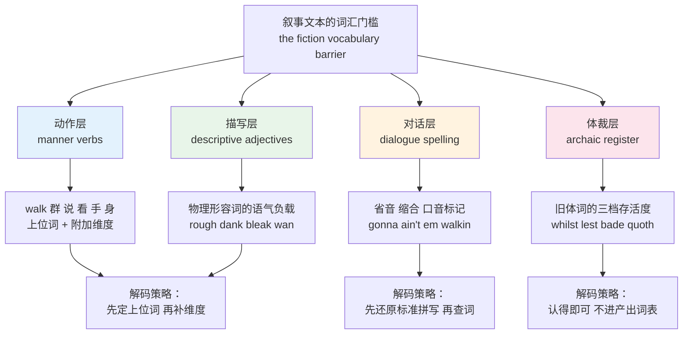
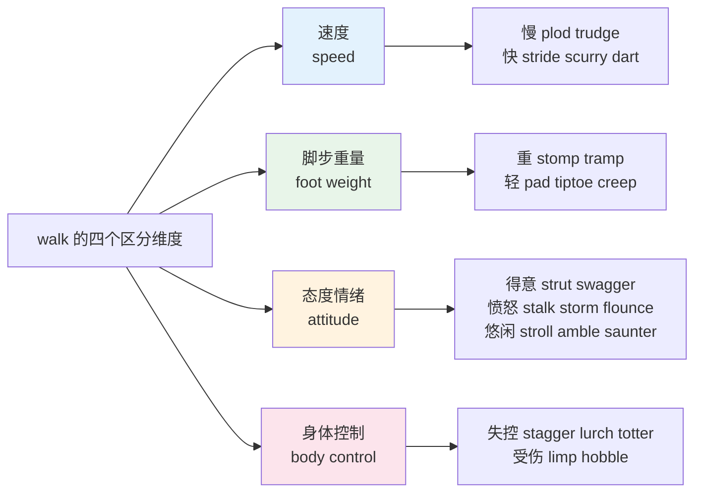
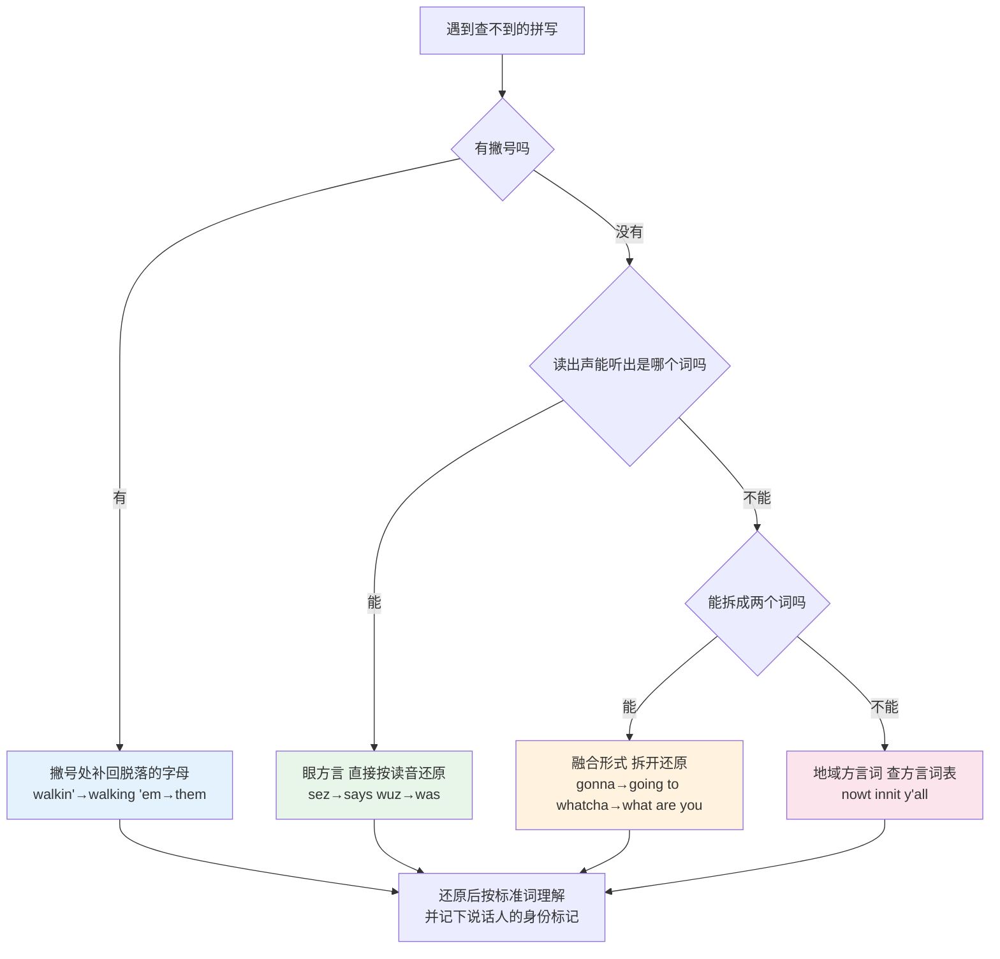
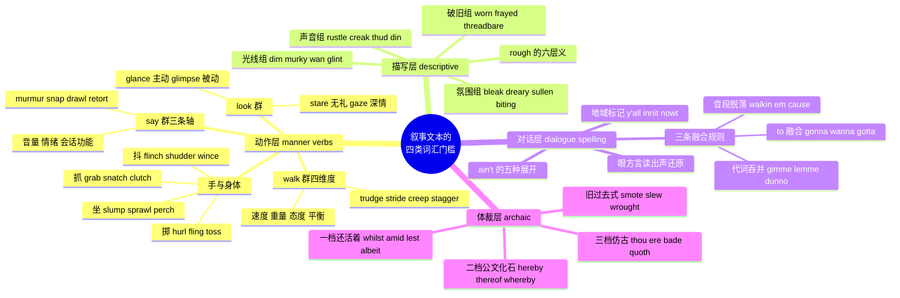

# 叙事文本的词汇门槛：动作、描写、对话与旧体词

> [!info] 本篇定位
>
> 第十八章的收尾篇，也是全书唯一处理「文学与叙事文本词汇」的地方。前四篇讲的是同一个意思在不同场合怎么说（英美、语域、习语、俚语），这一篇讲的是同一个动作在小说里怎么说——`walk` 底下挂着六十多个下位词，`said` 底下更多，而技术文档里几乎一个都用不上。
>
> 读完你会拿到四张解码表：姿态动词按「速度、重量、态度、隐蔽度」四维排开的替换网，`said` 类动词按「音量 + 情绪 + 会话功能」三轴排开的对照表，`gonna` `ain't` `walkin'` `'em` 这类省音拼写的还原规则，以及 `whilst` `lest` `amid` `bade` `thence` 这批旧体词的存活状态判定。
>
> 上一篇 [[18.语域、英美差异与习语俚语/04.俚语、网络流行语、委婉语与禁忌语\|俚语、网络流行语、委婉语与禁忌语]] 处理的是口语里的新词，本篇处理的是书面叙事里的旧词与细分词。两篇一起构成「课本英语之外的那两端」。
>
> 姿势动作与感官动词的日常层在 [[07.人体、健康与情绪/02.外貌体型、姿势动作与感官动词\|外貌体型、姿势动作与感官动词]]，声音气味光线的物理描述层在 [[10.动植物、颜色与感官属性/04.颜色、材质、质地与声音气味光线\|颜色、材质、质地与声音气味光线]]，本篇只加「文学用法」这一层；`glance`、`stroll`、`thud` 这类两边都会出现的词只当锚点，重心放在挂在它们下面的下位词上。

---

## 1. 本篇导读：卡住你的不是生词量

读技术文档顺利、读小说崩溃，这件事在自学者身上极其普遍，原因常常被误诊成「词汇量不够」。真实原因是词汇的**分布形状**不一样。

技术文档的词汇是一个窄而深的塔：`deploy`、`instance`、`throughput`、`deprecated` 这几百个词反复出现，认识就够用，出现频率高到看两遍就记住。叙事文本是一个宽而浅的滩：`walk` 这一件事被拆成 `trudge`、`stride`、`amble`、`shuffle`、`stagger`、`saunter`、`plod`、`traipse` 八个词，每个词在一本书里可能只出现两三次，你查完就忘，下一本换一批。

翻开任意一页英文小说，把不认识的词圈出来，它们几乎必然落在四个格子里：

| 类别 | 典型词 | 为什么课本不教 | 本篇位置 |
| --- | --- | --- | --- |
| 姿态动作动词 | trudge、drawl、squint、slump | 教学词表只收上位词 walk、say、look、sit | 第 2 到 5 节 |
| 描写形容词的文学义 | rough、bleak、wan、dank | 词典把文学义排在最后一个义项，教材不收 | 第 6 节 |
| 对话省音与口音拼写 | gonna、ain't、'em、walkin' | 被标为「非标准」，教材刻意回避 | 第 7 节 |
| 旧体与文学体词 | whilst、lest、amid、bade | 被标为 old-fashioned，教材直接删掉 | 第 8 节 |

四类词有一个共同点：**它们都不是新概念，而是已知概念的另一种说法。** `trudge` 不是一个你不懂的动作，它就是「走」，只是加了「累」「慢」「不情愿」三条信息。这意味着学习方式跟背技术术语完全不同——不是一个个记释义，而是把上位词当锚点，把下位词挂上去，靠维度差别区分。



上图把本篇拆成四层，并且给出三条不同的处理策略。动作层与描写层要真读懂，因为它们承载了作者刻意加进去的信息，漏掉就丢了语气；对话层只需要还原成标准拼写，还原完就是你早就认识的词；体裁层只要做到「见到不慌」，绝大多数旧体词永远不用主动使用。

分层处理是本篇的核心操作。把四百来个词条一视同仁地背，成本高到不可能坚持；分成「必须精读的两层 + 只需解码的一层 + 只需认脸的一层」，工作量立刻降到可执行的范围。

第 2 节到第 5 节铺姿态动词的四大群，第 6 节处理描写词，第 7 节处理对话拼写，第 8 节处理旧体词，第 9 节给出一套读小说时的实际操作流程。

---

## 2. 走路怎么写：walk 的下位词群

`walk` 是一个纯上位词，它只说「用腿位移」，不说速度、不说重量、不说心情。英语的叙事传统偏好用一个下位动词同时交代动作与状态，于是造出了一整片下位词。

判断这些词的差别，用四个维度就够了：



四条维度不是互斥的，一个词可以同时占好几条：`trudge` 是「慢 + 重 + 不情愿」，`scurry` 是「快 + 轻 + 慌张」。查生词时按这四条问一遍，比记中文释义牢得多——中文释义常常给出「艰难地走」「缓慢地走」这类互相重叠的说法，区分不出来。

### 2.1 慢而重：拖着走的一组

这一组共同的画面是脚抬不高、每一步都费劲，情绪一律偏负面：累、烦、不情愿。

| 英文 | 英式音标 | 美式音标 | 词性 | 中文 | 搭配与说明 |
| --- | --- | --- | --- | --- | --- |
| **trudge** | /trʌdʒ/ | /trʌdʒ/ | v./n. | 步履沉重地走 | 最典型的「累 + 不情愿」，trudge through the snow / home / uphill |
| **plod** | /plɒd/ | /plɑːd/ | v. | 沉重缓慢地走 | 比 trudge 更强调「单调重复」，plod along；引申义 plod through a report |
| **shuffle** | /ˈʃʌfl/ | /ˈʃʌfl/ | v./n. | 拖着脚走 | 脚底不离地，常写老人、病人、囚犯；也指洗牌 |
| **lumber** | /ˈlʌmbə/ | /ˈlʌmbər/ | v. | 笨重地移动 | 体型大的人或动物，a bear lumbered out of the trees |
| **traipse** | /treɪps/ | /treɪps/ | v. | 疲惫地到处走 | 带抱怨语气，traipse around town looking for a chemist |
| **trek** | /trek/ | /trek/ | v./n. | 长途跋涉 | 距离远是重点，口语里也戏称「跑一趟老远」 |
| **tramp** | /træmp/ | /træmp/ | v./n. | 重步行走；流浪汉 | 脚步声重且有节奏，tramp through the mud |
| **slog** | /slɒɡ/ | /slɑːɡ/ | v./n. | 艰难跋涉；苦干 | 英式常用，a long slog 指一段苦活 |
| **wade** | /weɪd/ | /weɪd/ | v. | 蹚水走 | 阻力来自介质；wade through paperwork 是高频引申 |
| **stagger** | /ˈstæɡə/ | /ˈstæɡər/ | v. | 踉跄；蹒跚 | 重心不稳，醉酒、受伤、疲惫三种成因 |

> [!example] 同一句话换四个动词
>
> - He **walked** back to the car.
>   - 他走回车边。（零信息，只交代位移）
> - He **trudged** back to the car.
>   - 他拖着步子走回车边。（累、不情愿）
> - He **staggered** back to the car.
>   - 他踉踉跄跄挪回车边。（受伤或喝多了）
> - He **stormed** back to the car.
>   - 他气冲冲地走回车边。（愤怒）

上面四句话的语法完全相同，信息量差了一大截。这就是叙事文本不用 `walk` 的原因：一个动词能省掉一整句心理描写。反过来，读的时候如果把 `trudged` 当成 `walked` 处理，你丢掉的不是一个词，是作者写这一段的用意。

### 2.2 慢而轻松：闲逛的一组

同样是慢，情绪反转成正面或中性，画面从「拖」变成「不赶时间」。

| 英文 | 英式音标 | 美式音标 | 词性 | 中文 | 搭配与说明 |
| --- | --- | --- | --- | --- | --- |
| **stroll** | /strəʊl/ | /stroʊl/ | v./n. | 散步；溜达 | 最中性的闲走，go for a stroll |
| **amble** | /ˈæmbl/ | /ˈæmbl/ | v./n. | 缓步而行 | 比 stroll 更慢更随意，无目的地 |
| **saunter** | /ˈsɔːntə/ | /ˈsɔːntər/ | v. | 悠然踱步 | 常带一点「毫不在乎」的姿态，saunter in twenty minutes late |
| **meander** | /miˈændə/ | /miˈændər/ | v. | 蜿蜒而行；漫谈 | 路径曲折是重点；说话跑题也用它 |
| **wander** | /ˈwɒndə/ | /ˈwɑːndər/ | v. | 漫无目的地走 | 强调没有目的地，wander off 走散 |
| **roam** | /rəʊm/ | /roʊm/ | v. | 漫游 | 范围大，roam the streets；手机漫游也是这个词 |
| **ramble** | /ˈræmbl/ | /ˈræmbl/ | v./n. | 漫步；漫无边际地说 | 英式指乡间徒步，a Sunday ramble |
| **mosey** | /ˈməʊzi/ | /ˈmoʊzi/ | v. | 慢悠悠地走 | 美式口语，常说 mosey along / on over |
| **potter** | /ˈpɒtə/ | /ˈpɑːtər/ | v. | 消磨时间地闲逛 | 英式，美式对应 putter；potter about the garden |
| **stride** | /straɪd/ | /straɪd/ | v./n. | 大步走 | 步幅大且有目的，自信或急切；过去式 strode |

> [!warning] stroll 和 stride 不能互换
>
> 两个词看着都很「正常」，方向却完全相反。`stroll` 是慢、无目的、放松；`stride` 是快、有目的、带气势。
>
> - ❌ ~~She strolled into the meeting room and slammed the file on the table.~~（闲庭信步地进来然后摔文件，语气打架）
> - ✅ She **strode** into the meeting room and slammed the file on the table.（大步进来摔文件，一致）

### 2.3 姿态带态度：走路的语气

这一组的核心信息不是怎么走，而是走路的人当时什么态度。翻译时经常需要把动词拆成「动词 + 状语」。

| 英文 | 英式音标 | 美式音标 | 词性 | 中文 | 搭配与说明 |
| --- | --- | --- | --- | --- | --- |
| **strut** | /strʌt/ | /strʌt/ | v. | 昂首阔步 | 自我感觉良好；strut one's stuff 显摆 |
| **swagger** | /ˈswæɡə/ | /ˈswæɡər/ | v./n. | 大摇大摆地走 | 比 strut 更有挑衅意味，名词指那股派头 |
| **stalk** | /stɔːk/ | /stɔːk/ | v. | 气冲冲地大步走；潜近 | 两个义项都有，靠上下文分：stalk out 怒而离场，stalk prey 潜近猎物 |
| **storm** | /stɔːm/ | /stɔːrm/ | v. | 怒气冲冲地走 | 几乎只跟 in / out / off 连用，storm out of the room |
| **flounce** | /flaʊns/ | /flaʊns/ | v. | 生气地甩身走开 | 带夸张的肢体动作，常含贬义 |
| **stomp** | /stɒmp/ | /stɑːmp/ | v. | 跺着脚走 | 美式常用，发泄不满；英式多用 stamp |
| **march** | /mɑːtʃ/ | /mɑːrtʃ/ | v. | 齐步走；气势汹汹地走 | march up to sb 直冲到某人面前 |
| **barge** | /bɑːdʒ/ | /bɑːrdʒ/ | v. | 冲撞着挤进 | barge in 不敲门就闯进来 |
| **slink** | /slɪŋk/ | /slɪŋk/ | v. | 溜走 | 羞愧或心虚，slink away；过去式 slunk |
| **waddle** | /ˈwɒdl/ | /ˈwɑːdl/ | v. | 摇摆着走 | 鸭子式左右晃，用于人时略带调侃 |
| **shamble** | /ˈʃæmbl/ | /ˈʃæmbl/ | v. | 拖沓地走 | 姿态松垮不协调，常写疲惫或落魄的人 |
| **strut** | /strʌt/ | /strʌt/ | n. | 支柱 | 同形异义，建筑与机械里指撑杆 |

`stalk` 值得单独说。这个词在小说里出现频率极高，两个义项的画面刚好相反：一个是「气到大步走开」，一个是「悄悄逼近」。判断依据是介词——带 `out`、`off`、`away` 的几乎必然是发怒离场，带宾语或 `towards` 的是潜近。`He stalked out` 是摔门走人，`He stalked the deer` 是跟踪鹿。

### 2.4 隐蔽与轻声：不想被听见的一组

| 英文 | 英式音标 | 美式音标 | 词性 | 中文 | 搭配与说明 |
| --- | --- | --- | --- | --- | --- |
| **creep** | /kriːp/ | /kriːp/ | v. | 蹑手蹑脚地走 | 过去式 crept；creep up on sb 悄悄靠近 |
| **sneak** | /sniːk/ | /sniːk/ | v. | 偷偷地走 | 目的性强，sneak out / in / past；过去式英式 sneaked，美式口语 snuck |
| **tiptoe** | /ˈtɪptəʊ/ | /ˈtɪptoʊ/ | v./n. | 踮脚走 | on tiptoe 是名词用法 |
| **pad** | /pæd/ | /pæd/ | v. | 轻声走 | 赤脚或穿袜，pad down the hall；猫的动作也用它 |
| **prowl** | /praʊl/ | /praʊl/ | v./n. | 潜行游荡 | 掠食姿态，on the prowl |
| **slip** | /slɪp/ | /slɪp/ | v. | 悄悄溜 | slip out 不惊动人地离开；本义是滑 |
| **steal** | /stiːl/ | /stiːl/ | v. | 悄悄移动 | 文学用法，steal into the room；与「偷」同形 |
| **skulk** | /skʌlk/ | /skʌlk/ | v. | 鬼鬼祟祟地躲藏移动 | 贬义重，skulk in the shadows |
| **edge** | /edʒ/ | /edʒ/ | v. | 侧身挪动 | 一点点挪，edge towards the door |
| **inch** | /ɪntʃ/ | /ɪntʃ/ | v. | 一寸寸挪 | 极慢且谨慎，inch forward |

> [!tip] 用介词反查动词方向
>
> 这一组词几乎从不单独出现，后面必跟一个方向小品词。反过来，方向小品词能帮你猜出动词意思：`creep/sneak/slip/steal + out` 一定是「不惊动别人地离开」，`+ up on` 一定是「悄悄接近到很近」，`+ past` 一定是「不被发现地经过」。
>
> 遇到不认识的姿态动词，先看它带什么介词，方向就定了一半，剩下的只是判断脚步轻重与心情。

### 2.5 失衡与受伤：走不稳的一组

| 英文 | 英式音标 | 美式音标 | 词性 | 中文 | 搭配与说明 |
| --- | --- | --- | --- | --- | --- |
| **limp** | /lɪmp/ | /lɪmp/ | v./n. | 跛行 | 一条腿使不上力；形容词义是「软塌塌的」 |
| **hobble** | /ˈhɒbl/ | /ˈhɑːbl/ | v. | 蹒跚而行 | 比 limp 更慢更费力，常拄拐 |
| **lurch** | /lɜːtʃ/ | /lɜːrtʃ/ | v./n. | 突然倾斜前冲 | 单次动作，船与车也会 lurch |
| **totter** | /ˈtɒtə/ | /ˈtɑːtər/ | v. | 摇摇晃晃地走 | 幼儿或极虚弱的人；引申指政权摇摇欲坠 |
| **stumble** | /ˈstʌmbl/ | /ˈstʌmbl/ | v. | 绊；跌跌撞撞 | stumble over a word 说话卡壳；stumble across 偶然发现 |
| **trip** | /trɪp/ | /trɪp/ | v. | 绊倒 | trip over sth 被绊；trip sb up 使人出错 |
| **reel** | /riːl/ | /riːl/ | v. | 踉跄后退；眩晕 | 受击打后的反应，also reel from the news |
| **falter** | /ˈfɔːltə/ | /ˈfɔːltər/ | v. | 步履迟疑；说话迟疑 | 动作与言语都用，核心义是「中断了一下」 |
| **flounder** | /ˈflaʊndə/ | /ˈflaʊndər/ | v. | 挣扎着移动 | 在泥水中挣扎；引申指答不上来 |
| **sway** | /sweɪ/ | /sweɪ/ | v. | 摇晃 | 站着晃动，不一定移动 |

### 2.6 快速位移：跑与逃

| 英文 | 英式音标 | 美式音标 | 词性 | 中文 | 搭配与说明 |
| --- | --- | --- | --- | --- | --- |
| **dash** | /dæʃ/ | /dæʃ/ | v./n. | 猛冲 | 短距离急行，dash for the bus；名词指短跑 |
| **dart** | /dɑːt/ | /dɑːrt/ | v. | 飞快窜动 | 方向多变，眼神也能 dart around |
| **bolt** | /bəʊlt/ | /boʊlt/ | v. | 突然狂奔 | 受惊后逃开，the horse bolted |
| **scurry** | /ˈskʌri/ | /ˈskɜːri/ | v. | 碎步疾走 | 小动物式，慌乱感强 |
| **scamper** | /ˈskæmpə/ | /ˈskæmpər/ | v. | 蹦跳着跑 | 轻快活泼，多写小孩与小动物 |
| **scuttle** | /ˈskʌtl/ | /ˈskʌtl/ | v. | 急匆匆小步跑 | 螃蟹式；另有「凿沉船」的义项 |
| **sprint** | /sprɪnt/ | /sprɪnt/ | v./n. | 全速短跑 | 竞技色彩最强 |
| **trot** | /trɒt/ | /trɑːt/ | v./n. | 小跑 | 速度介于走与跑，马术术语借来 |
| **lope** | /ləʊp/ | /loʊp/ | v. | 大步轻松地跑 | 步幅大而不费力，写狼与长腿的人 |
| **hurtle** | /ˈhɜːtl/ | /ˈhɜːrtl/ | v. | 飞速冲撞 | 失控地高速移动，多用于车与坠物 |
| **bound** | /baʊnd/ | /baʊnd/ | v. | 跳跃着前进 | 充满活力，bound up the stairs |
| **flee** | /fliː/ | /fliː/ | v. | 逃离 | 正式，过去式 fled；比 run away 书面 |

> [!warning] 这些词不要往技术写作里搬
>
> 姿态动词的信息密度是叙事文本的优点，在技术文档里是缺点。写 release note 时用 `the build crawled through the test suite` 只会造成困惑，标准写法就是 `the build took 40 minutes`。
>
> 本篇的四百来个词条绝大多数属于**接收词汇**（能读懂即可），只有极少数会进入你的产出词汇。判断标准很简单：这个词是否携带了你不打算表达的主观评价？携带了就别用。

### 2.7 姿态动词的四维速查表

把前六小节压成一张对照表，作为读小说时的临时查表：

| 维度组合 | 代表词 | 一句话画面 |
| --- | --- | --- |
| 慢 + 重 + 负面 | trudge、plod、slog | 每一步都不想迈 |
| 慢 + 轻 + 中性正面 | stroll、amble、saunter | 不赶时间 |
| 快 + 有目的 | stride、march、dash | 知道要去哪且急 |
| 快 + 慌乱 | scurry、scuttle、bolt | 被什么推着跑 |
| 重脚步 + 愤怒 | stomp、storm、stalk | 让别人听见我生气了 |
| 轻脚步 + 隐蔽 | creep、sneak、pad、tiptoe | 不想被发现 |
| 姿态外放 + 得意 | strut、swagger | 想被看见 |
| 失去平衡 | stagger、lurch、totter、reel | 身体不听使唤 |
| 单腿受限 | limp、hobble | 有伤 |

---

## 3. 说话怎么写：said 的替代词群

如果说 `walk` 的下位词是叙事文本的第一道门槛，`said` 的替代词就是第二道，而且更密——对话密集的小说里，每两三行就出现一个引述动词。

这些词同时编码三样东西：音量、情绪、以及这句话在对话流里的功能。三样可以分开看。

```mermaid
flowchart TB
    A["said 的三条编码轴"] --> B["音量轴 volume"]
    A --> C["情绪轴 emotion"]
    A --> D["会话功能轴 discourse function"]

    B --> B1["极低 whisper murmur mouth"]
    B --> B2["低 mutter mumble"]
    B --> B3["中 say remark observe"]
    B --> B4["高 call shout yell"]
    B --> B5["极高 scream shriek bellow roar"]

    C --> C1["愤怒 snap snarl growl bark hiss"]
    C --> C2["轻蔑 scoff sneer jeer snort"]
    C --> C3["痛苦 groan moan whimper wail"]
    C --> C4["愉快 chuckle giggle coo gush"]
    C --> C5["犹豫 falter stammer venture"]

    D --> D1["开启 begin offer venture"]
    D --> D2["接续 add put in chime in"]
    D --> D3["打断 cut in interject break in"]
    D --> D4["反驳 retort counter shoot back"]
    D --> D5["收束 conclude trail off"]

    style B fill:#e3f2fd
    style C fill:#fff3e0
    style D fill:#e8f5e9
```



三条轴互相独立：`snap` 是「中等音量 + 愤怒 + 反驳」，`whisper` 是「极低音量 + 情绪不定 + 功能不定」。一个词可能只锁定一条轴（`whisper` 只管音量），也可能三条全锁（`retort` 三条都定死了）。查生词时先问「这个词管哪条轴」，比背中文释义有效。

### 3.1 音量轴：从气声到吼

| 英文 | 英式音标 | 美式音标 | 词性 | 中文 | 搭配与说明 |
| --- | --- | --- | --- | --- | --- |
| **whisper** | /ˈwɪspə/ | /ˈwɪspər/ | v./n. | 低声耳语 | 声带不振动，whisper in sb's ear |
| **murmur** | /ˈmɜːmə/ | /ˈmɜːrmər/ | v./n. | 低语；轻声说 | 音低而柔和，可以是温柔也可以是不满的低声抱怨 |
| **mutter** | /ˈmʌtə/ | /ˈmʌtər/ | v. | 嘀咕 | 低声且不满，mutter under one's breath |
| **mumble** | /ˈmʌmbl/ | /ˈmʌmbl/ | v. | 含糊地说 | 重点是口齿不清，不一定小声 |
| **breathe** | /briːð/ | /briːð/ | v. | 轻声说出 | 文学用法，几乎只有气声，"Don't," she breathed. |
| **hiss** | /hɪs/ | /hɪs/ | v. | 低声急促地说 | 音量低但情绪激烈，压着火说话 |
| **say** | /seɪ/ | /seɪ/ | v. | 说 | 零标记基准词，过去式 said /sed/ |
| **remark** | /rɪˈmɑːk/ | /rɪˈmɑːrk/ | v./n. | 评说 | 中性偏正式，随口一评 |
| **observe** | /əbˈzɜːv/ | /əbˈzɜːrv/ | v. | 评论道 | 比 remark 更正式，含「观察后得出」 |
| **call** | /kɔːl/ | /kɔːl/ | v. | 喊 | 音量提高但不失控，call across the room |
| **shout** | /ʃaʊt/ | /ʃaʊt/ | v. | 喊叫 | 中性高音量，不必然愤怒 |
| **yell** | /jel/ | /jel/ | v. | 大声叫喊 | 比 shout 更粗野，美式更常用 |
| **bellow** | /ˈbeləʊ/ | /ˈbeloʊ/ | v. | 吼叫 | 低沉洪亮，公牛式 |
| **roar** | /rɔː/ | /rɔːr/ | v. | 咆哮 | 音量与力度都到顶 |
| **scream** | /skriːm/ | /skriːm/ | v. | 尖叫 | 高频高音量，恐惧或极怒 |
| **shriek** | /ʃriːk/ | /ʃriːk/ | v. | 尖厉地叫 | 比 scream 更刺耳短促 |
| **screech** | /skriːtʃ/ | /skriːtʃ/ | v. | 刺耳地叫 | 刹车声也用它，音质极难听 |
| **squeal** | /skwiːl/ | /skwiːl/ | v. | 尖声叫 | 常带兴奋或惊喜，也指告密 |

### 3.2 情绪轴之一：愤怒与敌意

| 英文 | 英式音标 | 美式音标 | 词性 | 中文 | 搭配与说明 |
| --- | --- | --- | --- | --- | --- |
| **snap** | /snæp/ | /snæp/ | v. | 厉声说 | 短促、不耐烦，最高频的怒气引述动词 |
| **bark** | /bɑːk/ | /bɑːrk/ | v. | 厉声命令 | 短句、命令式，bark an order |
| **growl** | /ɡraʊl/ | /ɡraʊl/ | v. | 低声怒吼 | 胸腔共鸣，压抑的怒 |
| **snarl** | /snɑːl/ | /snɑːrl/ | v. | 咆哮着说 | 龇牙式，比 growl 更外露 |
| **spit** | /spɪt/ | /spɪt/ | v. | 恶狠狠地吐出话 | spit the words out，极强的敌意 |
| **snap back** | — | — | phr. | 顶回去 | 短语形式，回击性质更明确 |
| **retort** | /rɪˈtɔːt/ | /rɪˈtɔːrt/ | v./n. | 反驳道 | 必须是回应上一句，且带机锋 |
| **shoot back** | — | — | phr. | 立刻回敬 | 口语化的 retort |
| **snort** | /snɔːt/ | /snɔːrt/ | v. | 哼着说 | 鼻音，表示不屑 |
| **scoff** | /skɒf/ | /skɑːf/ | v. | 嗤笑；嘲讽 | scoff at sth；英式还有「狼吞虎咽」义 |
| **sneer** | /snɪə/ | /snɪr/ | v./n. | 冷笑着说 | 表情与语气同时轻蔑 |
| **jeer** | /dʒɪə/ | /dʒɪr/ | v. | 嘲弄 | 多用于人群起哄 |
| **taunt** | /tɔːnt/ | /tɔːnt/ | v./n. | 挑衅地说 | 目的是激怒对方 |
| **hiss** | /hɪs/ | /hɪs/ | v. | 恶声低语 | 与音量轴重合，愤怒时压低嗓子 |
| **growl out** | — | — | phr. | 咕哝着说出 | 常带宾语从句 |

### 3.3 情绪轴之二：痛苦、疲惫与愉快

| 英文 | 英式音标 | 美式音标 | 词性 | 中文 | 搭配与说明 |
| --- | --- | --- | --- | --- | --- |
| **groan** | /ɡrəʊn/ | /ɡroʊn/ | v./n. | 呻吟；抱怨着说 | 低沉拖长，痛苦或极度不耐烦 |
| **moan** | /məʊn/ | /moʊn/ | v. | 哼哼；抱怨 | 英式口语里 moan 常指「唠叨抱怨」 |
| **whimper** | /ˈwɪmpə/ | /ˈwɪmpər/ | v. | 呜咽着说 | 微弱、示弱、带哭腔 |
| **whine** | /waɪn/ | /waɪn/ | v. | 哼唧；抱怨 | 音调高而拖，惹人烦的抱怨 |
| **wail** | /weɪl/ | /weɪl/ | v. | 哀号 | 音量大且拖长，悲痛或夸张地抱怨 |
| **sob** | /sɒb/ | /sɑːb/ | v. | 抽泣着说 | 说话被抽气打断 |
| **gasp** | /ɡɑːsp/ | /ɡæsp/ | v. | 倒吸气着说 | 震惊或缺氧，gasp for air |
| **pant** | /pænt/ | /pænt/ | v. | 喘着气说 | 剧烈运动后 |
| **croak** | /krəʊk/ | /kroʊk/ | v. | 用嘶哑的嗓音说 | 嗓子坏了或刚睡醒；青蛙叫也是它 |
| **rasp** | /rɑːsp/ | /ræsp/ | v. | 用粗粝的嗓音说 | 摩擦感，比 croak 更干 |
| **sigh** | /saɪ/ | /saɪ/ | v./n. | 叹着气说 | 无奈或释然 |
| **chuckle** | /ˈtʃʌkl/ | /ˈtʃʌkl/ | v./n. | 轻声笑着说 | 低沉、自得其乐 |
| **giggle** | /ˈɡɪɡl/ | /ˈɡɪɡl/ | v. | 咯咯笑着说 | 高频、孩子气或紧张 |
| **snigger** | /ˈsnɪɡə/ | — | v. | 窃笑 | 英式拼法，带不怀好意 |
| **snicker** | — | /ˈsnɪkər/ | v. | 窃笑 | 美式拼法，义同 snigger |
| **coo** | /kuː/ | /kuː/ | v. | 柔声细语 | 哄婴儿式的甜腻语调 |
| **purr** | /pɜː/ | /pɜːr/ | v. | 用低柔的嗓音说 | 猫的呼噜，形容满足或诱惑 |
| **gush** | /ɡʌʃ/ | /ɡʌʃ/ | v. | 滔滔不绝地称赞 | 略贬，热情过头 |

### 3.4 发音方式与言语流畅度

这一组不管情绪，只管「话是怎么被发出来的」，中文里往往找不到对应的单个动词。

| 英文 | 英式音标 | 美式音标 | 词性 | 中文 | 搭配与说明 |
| --- | --- | --- | --- | --- | --- |
| **drawl** | /drɔːl/ | /drɔːl/ | v./n. | 拖长腔调地说 | 元音拉长，标记美国南部口音或懒散姿态 |
| **slur** | /slɜː/ | /slɜːr/ | v. | 含混不清地说 | 音节黏在一起，醉酒或中风 |
| **stammer** | /ˈstæmə/ | /ˈstæmər/ | v. | 结结巴巴地说 | 英式更常用；紧张造成的重复 |
| **stutter** | /ˈstʌtə/ | /ˈstʌtər/ | v. | 口吃 | 美式更常用，与 stammer 基本同义 |
| **falter** | /ˈfɔːltə/ | /ˈfɔːltər/ | v. | 说话中断迟疑 | 中途停顿，底气不足 |
| **trail off** | — | — | phr. | 声音渐弱消失 | 句子没说完就停，写在破折号后 |
| **blurt** | /blɜːt/ | /blɜːrt/ | v. | 脱口而出 | blurt out，说了不该说的 |
| **babble** | /ˈbæbl/ | /ˈbæbl/ | v. | 叽里咕噜地说 | 快而无内容 |
| **prattle** | /ˈprætl/ | /ˈprætl/ | v. | 絮絮叨叨 | 贬义，内容琐碎 |
| **ramble** | /ˈræmbl/ | /ˈræmbl/ | v. | 漫无边际地说 | 跑题，与走路义共形 |
| **drone** | /drəʊn/ | /droʊn/ | v. | 单调地说 | drone on，听得人昏昏欲睡 |
| **intone** | /ɪnˈtəʊn/ | /ɪnˈtoʊn/ | v. | 用平缓的语调吟诵 | 宗教与仪式场合 |
| **enunciate** | /ɪˈnʌnsieɪt/ | /ɪˈnʌnsieɪt/ | v. | 字正腔圆地说 | 刻意清晰，常带不耐烦 |
| **mouth** | /maʊθ/ | /maʊð/ | v. | 只做口型不出声 | 动词读浊音结尾，与名词不同 |

> [!warning] mouth 的名动读音不同
>
> 名词 `mouth`（嘴）读 /maʊθ/，词尾清辅音；动词 `mouth`（做口型说）读 /maʊð/，词尾浊化。同类现象还有 `breath` /breθ/ 与 `breathe` /briːð/、`bath` /bɑːθ/ 与 `bathe` /beɪð/。
>
> 这类清浊交替在名动同形词里成组出现，详见 [[01.词汇入门与学习方法/03.音标、词重音与词典读音体例\|音标、词重音与词典读音体例]]。

### 3.5 会话功能轴：这句话在对话流里干什么

| 英文 | 英式音标 | 美式音标 | 词性 | 中文 | 搭配与说明 |
| --- | --- | --- | --- | --- | --- |
| **venture** | /ˈventʃə/ | /ˈventʃər/ | v. | 小心翼翼地提出 | 冒险开口，怕被驳回 |
| **offer** | /ˈɒfə/ | /ˈɔːfər/ | v. | 提出（看法） | 引述用法时不含「给予」义 |
| **muse** | /mjuːz/ | /mjuːz/ | v. | 若有所思地说 | 半自言自语 |
| **add** | /æd/ | /æd/ | v. | 补充道 | 最常用的接续动词 |
| **put in** | — | — | phr. | 插一句 | 短小的补充 |
| **chime in** | — | — | phr. | 附和着插话 | 表示赞同的插入 |
| **interject** | /ˌɪntəˈdʒekt/ | /ˌɪntərˈdʒekt/ | v. | 插话 | 正式，中性 |
| **cut in** | — | — | phr. | 打断 | 略带不礼貌 |
| **break in** | — | — | phr. | 突然插入 | 打断的另一说法 |
| **counter** | /ˈkaʊntə/ | /ˈkaʊntər/ | v. | 反驳道 | 比 retort 冷静，逻辑对抗 |
| **concede** | /kənˈsiːd/ | /kənˈsiːd/ | v. | 让步承认 | 承认对方有理 |
| **insist** | /ɪnˈsɪst/ | /ɪnˈsɪst/ | v. | 坚持说 | 重复己方立场 |
| **protest** | /prəˈtest/ | /prəˈtest/ | v. | 抗议道 | 动词重音在后；名词重音在前，英式 /ˈprəʊtest/、美式 /ˈproʊtest/ |
| **plead** | /pliːd/ | /pliːd/ | v. | 恳求道 | 弱势方的请求 |
| **implore** | /ɪmˈplɔː/ | /ɪmˈplɔːr/ | v. | 苦苦哀求 | 比 plead 更强更文学 |
| **urge** | /ɜːdʒ/ | /ɜːrdʒ/ | v. | 力劝 | 推动对方行动 |
| **conclude** | /kənˈkluːd/ | /kənˈkluːd/ | v. | 最后说道 | 标记发言结束 |
| **exclaim** | /ɪkˈskleɪm/ | /ɪkˈskleɪm/ | v. | 惊呼 | 后面通常跟感叹句 |

### 3.6 写作课说「只用 said」，读者却要全认

英语写作教学有一条流传很广的建议：引述一律用 `said`，不要换花样。这条建议对写作有效，对阅读完全无效，两者不冲突。

原因在于 `said` 的**视觉透明性**。读者的眼睛会跳过 `said`，注意力留在引号里的话上；换成 `expostulated`，眼睛就被动词绊住了。所以现代英语小说的主流做法是绝大多数引述都写 `said`，只把换词的机会留给真正需要标记语气的地方。

但换掉 `said` 的那少数几处正是信息密度最高的地方。作者放弃 `said` 而选 `snapped`，就是因为那句话必须被读成「厉声」，光看引号里的字看不出来。把这几处一并跳过，你读到的是一份被抹平语气的对话记录。

> [!example] 同一句话配四个引述动词
>
> - "You didn't tell me," he **said**.
>   - 「你没告诉我。」他说。（中性，看不出情绪）
> - "You didn't tell me," he **murmured**.
>   - 「你没告诉我。」他低声说。（受伤、失落）
> - "You didn't tell me," he **snapped**.
>   - 「你没告诉我。」他厉声说。（愤怒、指责）
> - "You didn't tell me," he **drawled**.
>   - 「你没告诉我。」他拖长了调子说。（懒散、带讥讽）

四句话的字面内容一字不差，人物关系与场面走向完全不同。所以本节的六十个词属于「必须精读」的那一层，不能当作可跳过的修饰。

> [!tip] 建立引述动词的三问检索
>
> 遇到不认识的引述动词，按顺序问三个问题，通常两问就能定位：
>
> 1. 音量比 `said` 高还是低？低音量词多含 m、mur、mut、whis 这类闭口音；高音量词的元音张口度大（roar /rɔː/、shout /ʃaʊt/、scream /skriːm/），读的时候嘴本身就得张开。
> 2. 情绪是正是负？sn- 开头的这一批几乎全是负面（snap、snarl、sneer、snort、snicker），因为 sn- 在英语里长期跟鼻子和轻蔑绑在一起。这类「声音提示语义」的字母组合叫语音象征（phonaestheme），同类的还有表光的 gl-（glint、gleam、glare）与带贬义的 sl-（slimy、sloppy、slack）。
> 3. 这句话是在开启、接续、打断还是回应？看它前后是谁在说，位置本身就是线索。

---

## 4. 视线的姿态：look 的下位词群

`look` 的下位词比 `walk` 少，但区分维度更细：时长、专注度、隐蔽性、情绪。小说里人物之间的关系常常靠一个眼神动词交代，不读懂就丢了大量潜台词。

| 英文 | 英式音标 | 美式音标 | 词性 | 中文 | 搭配与说明 |
| --- | --- | --- | --- | --- | --- |
| **glance** | /ɡlɑːns/ | /ɡlæns/ | v./n. | 瞥一眼 | 主动的短暂一看，glance at one's watch |
| **glimpse** | /ɡlɪmps/ | /ɡlɪmps/ | v./n. | 瞥见 | 被动看到，catch a glimpse of |
| **peek** | /piːk/ | /piːk/ | v./n. | 偷看一眼 | 快速且带好奇，peek at the answer |
| **peep** | /piːp/ | /piːp/ | v. | 窥视 | 从缝隙或遮挡后看，英式更常用 |
| **peer** | /pɪə/ | /pɪr/ | v. | 费力地看 | 看不清才 peer，peer into the darkness |
| **squint** | /skwɪnt/ | /skwɪnt/ | v. | 眯眼看 | 光太强或视力不好 |
| **stare** | /steə/ | /ster/ | v./n. | 盯着看 | 时间长、不礼貌，stare at sb |
| **gaze** | /ɡeɪz/ | /ɡeɪz/ | v./n. | 凝视 | 时间长但中性或深情，gaze at the sea |
| **gape** | /ɡeɪp/ | /ɡeɪp/ | v. | 目瞪口呆地看 | 嘴也张着，含震惊 |
| **gawk** | /ɡɔːk/ | /ɡɔːk/ | v. | 呆呆地看 | 贬义，笨拙的围观 |
| **ogle** | /ˈəʊɡl/ | /ˈoʊɡl/ | v. | 色眯眯地看 | 贬义明确 |
| **leer** | /lɪə/ | /lɪr/ | v./n. | 不怀好意地斜视 | 恶意或色欲 |
| **glare** | /ɡleə/ | /ɡler/ | v./n. | 怒视 | 也指刺眼的强光 |
| **glower** | /ˈɡlaʊə/ | /ˈɡlaʊər/ | v. | 沉着脸怒视 | 比 glare 更闷更持久 |
| **scowl** | /skaʊl/ | /skaʊl/ | v./n. | 皱眉怒视 | 重点在表情不在视线 |
| **scan** | /skæn/ | /skæn/ | v. | 快速扫视 | 找特定目标，scan the crowd |
| **survey** | /səˈveɪ/ | /sərˈveɪ/ | v. | 打量；审视 | 全面地看一遍，动词重音在后 |
| **scrutinize** | /ˈskruːtɪnaɪz/ | /ˈskruːtənaɪz/ | v. | 仔细检查 | 挑毛病式细看；英式也拼 scrutinise |
| **eye** | /aɪ/ | /aɪ/ | v. | 打量 | 名词转动词，eye sb suspiciously |
| **regard** | /rɪˈɡɑːd/ | /rɪˈɡɑːrd/ | v. | 注视 | 文学用法，冷静地看 |
| **behold** | /bɪˈhəʊld/ | /bɪˈhoʊld/ | v. | 看见 | 旧体，见第 8 节 |
| **discern** | /dɪˈsɜːn/ | /dɪˈsɜːrn/ | v. | 依稀辨认出 | 条件不佳时勉强看清 |
| **spot** | /spɒt/ | /spɑːt/ | v. | 发现；看见 | 从背景中认出来 |
| **avert** | /əˈvɜːt/ | /əˈvɜːrt/ | v. | 把目光移开 | avert one's eyes / gaze |
| **blink** | /blɪŋk/ | /blɪŋk/ | v. | 眨眼 | 反应动作，blink in surprise |
| **eavesdrop** | /ˈiːvzdrɒp/ | /ˈiːvzdrɑːp/ | v. | 偷听 | 听觉版的 peek，eavesdrop on |
| **strain** | /streɪn/ | /streɪn/ | v. | 竭力去听或看 | strain to hear / strain one's ears |

> [!warning] glance 与 glimpse 的主动被动分工
>
> 中文都能译成「瞥」，英语的施动性相反。
>
> - ✅ I **glanced at** the screen.（我主动扫了一眼屏幕）
> - ✅ I **glimpsed** her in the crowd.（我在人群里无意中瞥见了她）
> - ❌ ~~I glimpsed at the screen.~~（glimpse 是及物动词，不带 at）
> - ❌ ~~I glanced her in the crowd.~~（glance 是不及物的，必须带 at / over / around）
>
> 记法：`glance` 后面永远跟介词，`glimpse` 后面直接跟宾语；名词形式 `a glance` 是我给的，`a glimpse` 是我得到的（catch a glimpse of）。

`stare` 与 `gaze` 的差别是另一个常错点。两个词都是长时间看，`stare` 默认无礼或呆滞（陌生人盯着你看、发呆盯着墙），`gaze` 默认带感情或欣赏（看恋人、看风景）。中文的「凝视」两边都能覆盖，英语不行：`He stared at his wife lovingly` 读起来别扭，该用 `gazed`。

---

## 5. 手与身体：抓、掷、坐、抖

叙事文本对身体动作的切分密度远高于日常对话。同一个「拿」，英语要区分是快速抢过来、是紧紧攥住、还是摸索着拿。

### 5.1 抓与握

| 英文 | 英式音标 | 美式音标 | 词性 | 中文 | 搭配与说明 |
| --- | --- | --- | --- | --- | --- |
| **grab** | /ɡræb/ | /ɡræb/ | v. | 一把抓住 | 快而粗，最中性的「抓」 |
| **snatch** | /snætʃ/ | /snætʃ/ | v. | 夺走 | 从别人手里抢，含侵犯性 |
| **seize** | /siːz/ | /siːz/ | v. | 抓住；夺取 | 比 grab 正式，也用于抓住机会、查抄财物 |
| **clutch** | /klʌtʃ/ | /klʌtʃ/ | v. | 紧抓不放 | 出于恐惧或珍惜，clutch a bag to one's chest |
| **grip** | /ɡrɪp/ | /ɡrɪp/ | v./n. | 紧握 | 强调握力，a firm grip |
| **grasp** | /ɡrɑːsp/ | /ɡræsp/ | v./n. | 抓牢；理解 | 物理与抽象两义并存，grasp the concept |
| **clasp** | /klɑːsp/ | /klæsp/ | v. | 紧握；扣住 | 两手合拢或拥抱，也指搭扣 |
| **clench** | /klentʃ/ | /klentʃ/ | v. | 攥紧；咬紧 | clench one's fists / jaw，紧张或愤怒 |
| **fumble** | /ˈfʌmbl/ | /ˈfʌmbl/ | v. | 笨拙地摸索 | 手不听使唤，fumble with the keys |
| **grope** | /ɡrəʊp/ | /ɡroʊp/ | v. | 摸索 | 看不见时用手找，grope for the light switch |
| **paw** | /pɔː/ | /pɔː/ | v. | 用手胡乱摸 | 贬义，动作粗鲁 |
| **prise / pry** | /praɪz/ | /praɪ/ | v. | 撬开 | 英式 prise，美式 pry；pry sth open |

### 5.2 推、戳与掷

| 英文 | 英式音标 | 美式音标 | 词性 | 中文 | 搭配与说明 |
| --- | --- | --- | --- | --- | --- |
| **poke** | /pəʊk/ | /poʊk/ | v. | 戳 | 单指轻戳，poke sb in the ribs |
| **prod** | /prɒd/ | /prɑːd/ | v. | 捅；督促 | 比 poke 用力，引申义是催人做事 |
| **jab** | /dʒæb/ | /dʒæb/ | v./n. | 猛戳 | 快而尖锐，拳击术语；英式口语也指打针 |
| **nudge** | /nʌdʒ/ | /nʌdʒ/ | v./n. | 用肘轻推 | 提醒或暗示，动作很轻 |
| **shove** | /ʃʌv/ | /ʃʌv/ | v. | 猛推 | 粗暴，shove sb aside |
| **thrust** | /θrʌst/ | /θrʌst/ | v. | 猛力推进 | 单向发力，过去式同形 |
| **yank** | /jæŋk/ | /jæŋk/ | v. | 猛拉 | 突然发力，yank the door open |
| **tug** | /tʌɡ/ | /tʌɡ/ | v./n. | 用力拉扯 | 反复拉，tug at sb's sleeve |
| **wrench** | /rentʃ/ | /rentʃ/ | v. | 猛扭夺过 | 带扭转动作；名词是扳手（美式） |
| **hurl** | /hɜːl/ | /hɜːrl/ | v. | 猛掷 | 用尽全力，也用于 hurl abuse 破口大骂 |
| **fling** | /flɪŋ/ | /flɪŋ/ | v. | 用力扔 | 带情绪地扔，过去式 flung |
| **toss** | /tɒs/ | /tɔːs/ | v. | 随手抛 | 轻描淡写地扔，toss sb the keys |
| **lob** | /lɒb/ | /lɑːb/ | v. | 高抛 | 弧线，网球术语借来 |
| **chuck** | /tʃʌk/ | /tʃʌk/ | v. | 随便扔 | 英式口语，chuck it in the bin |
| **slam** | /slæm/ | /slæm/ | v. | 猛摔；砰地关上 | slam the door / slam sth down |
| **swat** | /swɒt/ | /swɑːt/ | v. | 挥手拍打 | 打苍蝇式的横向挥击 |

### 5.3 坐、靠与倒

| 英文 | 英式音标 | 美式音标 | 词性 | 中文 | 搭配与说明 |
| --- | --- | --- | --- | --- | --- |
| **slump** | /slʌmp/ | /slʌmp/ | v./n. | 瘫坐；重重坐下 | 泄气的姿态；名词指经济下滑 |
| **slouch** | /slaʊtʃ/ | /slaʊtʃ/ | v. | 没精打采地坐或站 | 背弓着，长期姿势 |
| **hunch** | /hʌntʃ/ | /hʌntʃ/ | v. | 弓起（背肩） | hunch over a desk；名词义是「直觉预感」 |
| **sprawl** | /sprɔːl/ | /sprɔːl/ | v. | 四肢摊开地躺坐 | 占地方，sprawl on the sofa |
| **perch** | /pɜːtʃ/ | /pɜːrtʃ/ | v. | 栖坐在高处或边沿 | 只坐一点点，随时会起身 |
| **crouch** | /kraʊtʃ/ | /kraʊtʃ/ | v. | 蹲伏 | 膝盖弯、身体前倾，准备行动 |
| **squat** | /skwɒt/ | /skwɑːt/ | v. | 蹲 | 完全蹲下；也指擅自占住空屋 |
| **kneel** | /niːl/ | /niːl/ | v. | 跪 | 过去式 knelt 或 kneeled |
| **lean** | /liːn/ | /liːn/ | v. | 倚靠；倾身 | lean against the wall / lean in |
| **recline** | /rɪˈklaɪn/ | /rɪˈklaɪn/ | v. | 斜倚 | 正式，座椅可 recline |
| **flop** | /flɒp/ | /flɑːp/ | v. | 一屁股坐下 | 毫无仪态地落座 |
| **collapse** | /kəˈlæps/ | /kəˈlæps/ | v. | 瘫倒 | 支撑不住，也指结构倒塌 |

### 5.4 身体的不自主反应

这一组词在小说里承担情绪外化的功能，比直接写「他很害怕」更常用。

| 英文 | 英式音标 | 美式音标 | 词性 | 中文 | 搭配与说明 |
| --- | --- | --- | --- | --- | --- |
| **flinch** | /flɪntʃ/ | /flɪntʃ/ | v. | 畏缩一下 | 瞬间的躲闪反射 |
| **recoil** | /rɪˈkɔɪl/ | /rɪˈkɔɪl/ | v. | 猛地退开 | 幅度比 flinch 大，含厌恶 |
| **wince** | /wɪns/ | /wɪns/ | v. | 疼得皱脸 | 主要是表情 |
| **shudder** | /ˈʃʌdə/ | /ˈʃʌdər/ | v./n. | 打冷战 | 一次性的全身颤抖，恐惧或厌恶 |
| **shiver** | /ˈʃɪvə/ | /ˈʃɪvər/ | v. | 发抖 | 持续的，多因寒冷 |
| **tremble** | /ˈtrembl/ | /ˈtrembl/ | v. | 颤抖 | 幅度小而持续，情绪或虚弱 |
| **quiver** | /ˈkwɪvə/ | /ˈkwɪvər/ | v. | 微颤 | 幅度最小，唇与声音常 quiver |
| **twitch** | /twɪtʃ/ | /twɪtʃ/ | v. | 抽动 | 局部肌肉，a muscle twitched in his jaw |
| **fidget** | /ˈfɪdʒɪt/ | /ˈfɪdʒɪt/ | v. | 坐立不安地动 | 手脚闲不住，无聊或紧张 |
| **squirm** | /skwɜːm/ | /skwɜːrm/ | v. | 扭动身子 | 不舒服或尴尬 |
| **writhe** | /raɪð/ | /raɪð/ | v. | 痛苦地扭动 | 剧痛，writhe in agony |
| **stiffen** | /ˈstɪfn/ | /ˈstɪfn/ | v. | 身体僵住 | 听到什么之后的瞬间反应 |
| **brace** | /breɪs/ | /breɪs/ | v. | 绷紧身体准备承受 | brace oneself for sth |
| **slacken** | /ˈslækən/ | /ˈslækən/ | v. | 放松；松弛 | 与 stiffen 相反 |

> [!tip] 情绪外化的读法
>
> 英语叙事有一条不成文的惯例：不写「他很紧张」，而写「他的手指在桌沿上敲个不停」。这批身体动词就是承担这个任务的。
>
> 读的时候可以做一个反向翻译练习：看到 `His jaw tightened`，在旁边写「压着火」；看到 `She shifted in her seat`，写「不自在」。练二三十次之后，这类描写会自动转成情绪信息，不再需要停下来想。

---

## 6. 描写词的文学用法：物理形容词的语气负载

第二类门槛比第一类隐蔽：词你都认识，意思却读偏了。原因是很多物理形容词在文学描写里带着一层固定的情绪色彩，而词典把这层色彩藏在最后一个义项里。

### 6.1 rough 的六层意思

`rough` 是这个现象最典型的样本。中文教材教的是「粗糙的」，实际用法有六层，每一层的语气都不同。

| 用法 | 例子 | 中文 | 语气 |
| --- | --- | --- | --- |
| 触感 | a rough surface | 表面粗糙 | 中性，物理描述 |
| 地形与路况 | rough terrain、a rough road | 崎岖 | 中性偏负面，暗示难走 |
| 天气与海况 | rough seas、a rough crossing | 风浪大 | 负面，含危险 |
| 治安与人 | a rough neighbourhood、a rough crowd | 混乱、不好惹 | 负面，含暴力暗示 |
| 身心状态 | I feel rough、a rough night | 难受、不好过 | 负面，口语 |
| 精度 | a rough estimate、roughly speaking | 大致的 | 中性，技术写作高频 |

同一个词，在技术文档里几乎只出现最后一层（`a rough estimate`），在小说里六层都可能出现。读到 `He'd had a rough year`，如果按「粗糙的一年」理解就完全错了，实际是「这一年他过得很难」。

> [!warning] 别用中文释义反推语气
>
> 中文的「粗糙」只覆盖 `rough` 的第一层，其余五层在中文里分别对应「崎岖」「风浪大」「治安差」「难受」「大致」。反过来，从「粗糙」出发去理解 `a rough neighbourhood`，得到的是「一个粗糙的街区」，语义不成立。
>
> 遇到熟词读不通的句子，第一反应应该是「这个词还有别的义项」，而不是「这句话语法怪」。词义引申的生成机制在 [[16.词义辨析、搭配与短语动词/02.反义词体系、一词多义与词义引申\|反义词体系、一词多义与词义引申]] 有系统交代。

### 6.2 触感与材质：破旧的一组

| 英文 | 英式音标 | 美式音标 | 词性 | 中文 | 搭配与说明 |
| --- | --- | --- | --- | --- | --- |
| **coarse** | /kɔːs/ | /kɔːrs/ | adj. | 粗的；粗俗的 | coarse cloth 粗布；coarse language 粗话 |
| **gritty** | /ˈɡrɪti/ | /ˈɡrɪti/ | adj. | 含沙砾的；写实残酷的 | a gritty crime drama 是高频的文艺评论用法 |
| **craggy** | /ˈkræɡi/ | /ˈkræɡi/ | adj. | 嶙峋的 | 写岩石，也写棱角分明的脸 |
| **jagged** | /ˈdʒæɡɪd/ | /ˈdʒæɡɪd/ | adj. | 锯齿状的 | 断口不平，注意 -ed 单独成音节 |
| **worn** | /wɔːn/ | /wɔːrn/ | adj. | 磨损的；疲惫的 | worn shoes / a worn face |
| **frayed** | /freɪd/ | /freɪd/ | adj. | 磨出毛边的 | frayed cuffs；frayed nerves 神经紧绷 |
| **tattered** | /ˈtætəd/ | /ˈtætərd/ | adj. | 破烂的 | 布料撕裂成条，也写声誉受损 |
| **threadbare** | /ˈθredbeə/ | /ˈθredber/ | adj. | 磨得露线的 | 极旧；也指借口陈腐 |
| **shabby** | /ˈʃæbi/ | /ˈʃæbi/ | adj. | 破旧寒酸的 | 整体印象，也指行为卑劣 |
| **grimy** | /ˈɡraɪmi/ | /ˈɡraɪmi/ | adj. | 积垢的 | 油污灰尘长期附着 |
| **squalid** | /ˈskwɒlɪd/ | /ˈskwɑːlɪd/ | adj. | 肮脏破败的 | 生活条件恶劣，语气很重 |
| **weathered** | /ˈweðəd/ | /ˈweðərd/ | adj. | 风化的；饱经风霜的 | 写木头、石头，也写人的脸 |

`gritty` 值得单独记。原义是「有沙粒感的」，在书评影评里固定成「不美化、写实到粗粝」的褒义评价——`a gritty portrayal of urban poverty` 是称赞，不是批评。这类从物理义固化成评价义的形容词在文艺语境里成片出现。

### 6.3 光线与视觉环境

| 英文 | 英式音标 | 美式音标 | 词性 | 中文 | 搭配与说明 |
| --- | --- | --- | --- | --- | --- |
| **dim** | /dɪm/ | /dɪm/ | adj./v. | 昏暗的；变暗 | 光弱；说人 dim 是「笨」 |
| **murky** | /ˈmɜːki/ | /ˈmɜːrki/ | adj. | 浑浊昏暗的 | 水与光都能 murky；引申指来路不明 |
| **gloom** | /ɡluːm/ | /ɡluːm/ | n. | 昏暗；忧郁 | 光与心情共用一个词 |
| **gloomy** | /ˈɡluːmi/ | /ˈɡluːmi/ | adj. | 昏暗的；阴郁的 | 环境与人都能用 |
| **wan** | /wɒn/ | /wɑːn/ | adj. | 苍白无力的 | 文学词，a wan smile 勉强的笑 |
| **pallid** | /ˈpælɪd/ | /ˈpælɪd/ | adj. | 灰白的 | 比 pale 更书面且更病态 |
| **sallow** | /ˈsæləʊ/ | /ˈsæloʊ/ | adj. | 蜡黄的 | 专指气色差的皮肤 |
| **glint** | /ɡlɪnt/ | /ɡlɪnt/ | v./n. | 闪出一点光 | 金属与眼神，a glint in his eye |
| **gleam** | /ɡliːm/ | /ɡliːm/ | v./n. | 微微发亮 | 面积比 glint 大，柔和 |
| **shimmer** | /ˈʃɪmə/ | /ˈʃɪmər/ | v./n. | 微微闪烁 | 水面与热气，光在动 |
| **flicker** | /ˈflɪkə/ | /ˈflɪkər/ | v./n. | 摇曳闪烁 | 烛火与屏幕；a flicker of hope |
| **dappled** | /ˈdæpld/ | /ˈdæpld/ | adj. | 斑驳的 | 树影下的光斑 |
| **stark** | /stɑːk/ | /stɑːrk/ | adj. | 光秃刺眼的；鲜明的 | stark contrast 是最高频搭配 |
| **hazy** | /ˈheɪzi/ | /ˈheɪzi/ | adj. | 朦胧的 | 空气与记忆都能 hazy |

### 6.4 声音的描写

| 英文 | 英式音标 | 美式音标 | 词性 | 中文 | 搭配与说明 |
| --- | --- | --- | --- | --- | --- |
| **rustle** | /ˈrʌsl/ | /ˈrʌsl/ | v./n. | 沙沙作响 | 树叶、纸张、衣料 |
| **creak** | /kriːk/ | /kriːk/ | v./n. | 吱呀作响 | 木地板、门轴、老楼梯 |
| **clatter** | /ˈklætə/ | /ˈklætər/ | v./n. | 哐当乱响 | 硬物连续碰撞，餐具、脚步 |
| **clang** | /klæŋ/ | /klæŋ/ | v./n. | 铿的一声 | 大块金属，有余音 |
| **clank** | /klæŋk/ | /klæŋk/ | v./n. | 咔啦声 | 金属碰撞但无余音，链条 |
| **thud** | /θʌd/ | /θʌd/ | v./n. | 闷响 | 重物落地，低沉无回声 |
| **thump** | /θʌmp/ | /θʌmp/ | v./n. | 咚的一声 | 比 thud 更有冲击感，心跳也 thump |
| **patter** | /ˈpætə/ | /ˈpætər/ | v./n. | 啪嗒作响 | 小雨与小脚步 |
| **hum** | /hʌm/ | /hʌm/ | v./n. | 嗡嗡声 | 机器与人的哼唱 |
| **din** | /dɪn/ | /dɪn/ | n. | 嘈杂喧闹 | 不可数，持续的噪声墙 |
| **hush** | /hʌʃ/ | /hʌʃ/ | n./v. | 静默；使安静 | a hush fell over the room |
| **muffled** | /ˈmʌfld/ | /ˈmʌfld/ | adj. | 被捂住的沉闷声 | 隔着门或布料听见 |
| **shrill** | /ʃrɪl/ | /ʃrɪl/ | adj. | 尖利刺耳的 | 声音属性，也评价言论偏激 |
| **raucous** | /ˈrɔːkəs/ | /ˈrɔːkəs/ | adj. | 沙哑喧闹的 | raucous laughter |

### 6.5 气味、空气与氛围

| 英文 | 英式音标 | 美式音标 | 词性 | 中文 | 搭配与说明 |
| --- | --- | --- | --- | --- | --- |
| **musty** | /ˈmʌsti/ | /ˈmʌsti/ | adj. | 有霉味的 | 久闭房间与旧书 |
| **dank** | /dæŋk/ | /dæŋk/ | adj. | 阴冷潮湿的 | 地窖、地牢，负面 |
| **clammy** | /ˈklæmi/ | /ˈklæmi/ | adj. | 湿冷黏腻的 | 常写皮肤与手心 |
| **stale** | /steɪl/ | /steɪl/ | adj. | 不新鲜的；污浊的 | stale bread / stale air |
| **rank** | /ræŋk/ | /ræŋk/ | adj. | 恶臭的 | 语气重；名词义是「等级」 |
| **acrid** | /ˈækrɪd/ | /ˈækrɪd/ | adj. | 呛人的 | 烟与化学品，刺激鼻喉 |
| **pungent** | /ˈpʌndʒənt/ | /ˈpʌndʒənt/ | adj. | 气味强烈的 | 中性偏负，也可形容评论尖锐 |
| **stifling** | /ˈstaɪflɪŋ/ | /ˈstaɪflɪŋ/ | adj. | 令人窒息的 | 空气闷，也形容压抑的环境 |
| **oppressive** | /əˈpresɪv/ | /əˈpresɪv/ | adj. | 沉闷压抑的 | 天气与气氛都用 |
| **bleak** | /bliːk/ | /bliːk/ | adj. | 荒凉的；黯淡的 | 景物、天气、前景三用 |
| **dreary** | /ˈdrɪəri/ | /ˈdrɪri/ | adj. | 沉闷乏味的 | 阴雨天与无聊的工作 |
| **sullen** | /ˈsʌlən/ | /ˈsʌlən/ | adj. | 阴沉的 | 人的脸色与天色共用 |
| **brisk** | /brɪsk/ | /brɪsk/ | adj. | 清爽的；轻快的 | a brisk wind / a brisk walk，正面 |
| **crisp** | /krɪsp/ | /krɪsp/ | adj. | 清冽的；干脆的 | crisp air / a crisp reply |
| **biting** | /ˈbaɪtɪŋ/ | /ˈbaɪtɪŋ/ | adj. | 刺骨的；尖刻的 | a biting wind / biting sarcasm |

> [!tip] 一个词同时描写环境与人物，通常是作者故意的
>
> `bleak`、`sullen`、`oppressive`、`biting` 都能同时用于天气与人。英语叙事传统里，天气描写往往是人物心境的外化，这个手法在英语文学批评里叫 pathetic fallacy。
>
> 读到一段与情节无关的长篇天气描写，先别跳过：它很可能在预告接下来的场面基调。看到 `The sky had turned a sullen grey`，下一段大概率不是好事。

---

## 7. 对话里的省音与口音拼写

第三类门槛的性质完全不同：这些不是新词，是老词的变形拼写。查词典查不到（或者查到一条「非正式，等于 going to」的空洞条目），但只要掌握还原规则，一分钟就能全部解决。

### 7.1 三条融合规则

绝大多数省音拼写来自三种融合，掌握规则比背单词表有效。

| 规则 | 机制 | 样本 |
| --- | --- | --- |
| 一：动词 + to 融合 | to 弱读成 /tə/ 后并入前一个词 | going to → gonna，want to → wanna，got to → gotta，have to → hafta，ought to → oughta，used to → useta |
| 二：动词 + 弱读代词融合 | 代词失去重音后被前一个词吞并 | give me → gimme，let me → lemme，don't know → dunno，what are you → whatcha，bet you → betcha，got you → gotcha |
| 三：音段脱落 | 词首或词尾的一个音消失，撇号补位 | walking → walkin'，them → 'em，him → 'im，of → o'，because → 'cause，and → an' |

三条规则覆盖了小说对话里绝大部分的非标准拼写。看到不认识的形式，按顺序试：先看是不是 `to` 融合，再看是不是代词吞并，最后看是不是掉了一个音。三条都不中，才需要考虑地域方言词。

第二条里的融合还伴随一个语音变化：`got you` 变成 `gotcha` 时，/t/ 与 /j/ 合成了 /tʃ/。这个现象叫腭化，同样发生在 `did you` → `didja`、`would you` → `wouldja` 上。知道这条规律，很多没见过的拼写也能直接读通。

### 7.2 融合形式对照表

| 英文 | 英式音标 | 美式音标 | 词性 | 中文 | 搭配与说明 |
| --- | --- | --- | --- | --- | --- |
| **gonna** | /ˈɡɒnə/ | /ˈɡʌnə/ | — | 将要 | = going to（表将来时才可缩；I'm going to London 不能缩） |
| **wanna** | /ˈwɒnə/ | /ˈwɑːnə/ | — | 想要 | = want to；want a 也读成同音 |
| **gotta** | /ˈɡɒtə/ | /ˈɡɑːtə/ | — | 必须 | = got to / have got to |
| **hafta** | /ˈhæftə/ | /ˈhæftə/ | — | 不得不 | = have to，书面出现频率低于 gotta |
| **oughta** | /ˈɔːtə/ | /ˈɔːtə/ | — | 应该 | = ought to |
| **useta** | /ˈjuːstə/ | /ˈjuːstə/ | — | 过去常常 | = used to |
| **gimme** | /ˈɡɪmi/ | /ˈɡɪmi/ | — | 给我 | = give me |
| **lemme** | /ˈlemi/ | /ˈlemi/ | — | 让我 | = let me |
| **dunno** | /dəˈnəʊ/ | /dəˈnoʊ/ | — | 不知道 | = don't know，重音在后 |
| **kinda** | /ˈkaɪndə/ | /ˈkaɪndə/ | — | 有点儿 | = kind of |
| **sorta** | /ˈsɔːtə/ | /ˈsɔːrtə/ | — | 有点儿 | = sort of |
| **outta** | /ˈaʊtə/ | /ˈaʊtə/ | — | 从…出来 | = out of，get outta here |
| **lotta** | /ˈlɒtə/ | /ˈlɑːtə/ | — | 很多 | = a lot of |
| **cuppa** | /ˈkʌpə/ | /ˈkʌpə/ | n. | 一杯茶 | = a cup of，英式已词汇化成名词 |
| **betcha** | /ˈbetʃə/ | /ˈbetʃə/ | — | 我打赌 | = bet you |
| **gotcha** | /ˈɡɒtʃə/ | /ˈɡɑːtʃə/ | — | 逮到你了；懂了 | = got you |
| **whatcha** | /ˈwɒtʃə/ | /ˈwʌtʃə/ | — | 你在干嘛 | = what are you / what do you |
| **c'mon** | /kəˈmɒn/ | /kəˈmɑːn/ | — | 快点；得了吧 | = come on |
| **s'pose** | /spəʊz/ | /spoʊz/ | — | 我想是吧 | = suppose，常写 I s'pose so |
| **prolly** | /ˈprɒli/ | /ˈprɑːli/ | — | 大概 | = probably，网络与短信高频 |

> [!warning] gonna 有一条硬性限制
>
> `going to` 只有在表将来时才能缩成 `gonna`；表示「去某地」时不能缩。
>
> - ✅ I'm **gonna** call her tonight.（= going to call，将来）
> - ❌ ~~I'm gonna the shop.~~（这里 going to 是「去商店」，不能缩）
>
> 同理 `want to` 缩成 `wanna` 时，后面必须接动词原形：`I wanna go` 成立，`I wanna a coffee` 不成立（虽然口语里 `want a` 恰好也读成 /ˈwɒnə/，但书面不这么拼）。

### 7.3 音段脱落与代词弱读

| 英文 | 英式音标 | 美式音标 | 词性 | 中文 | 搭配与说明 |
| --- | --- | --- | --- | --- | --- |
| **walkin'** | /ˈwɔːkɪn/ | /ˈwɔːkɪn/ | — | 走着 | -ing 的 /ŋ/ 变 /n/，撇号代表脱落的字母 g |
| **nothin'** | /ˈnʌθɪn/ | /ˈnʌθɪn/ | — | 什么也没有 | 同上规则 |
| **somethin'** | /ˈsʌmθɪn/ | /ˈsʌmθɪn/ | — | 某物 | 同上规则 |
| **'em** | /əm/ | /əm/ | pron. | 他们；它们 | = them；实际源自中古英语 hem，不是 them 的截短 |
| **'im** | /ɪm/ | /ɪm/ | pron. | 他 | = him，h 脱落 |
| **'er** | /ə/ | /ər/ | pron. | 她 | = her |
| **'cause** | /kəz/ | /kəz/ | conj. | 因为 | = because；也写 cos（英）、cuz（美） |
| **'bout** | /baʊt/ | /baʊt/ | prep. | 关于；大约 | = about |
| **o'** | /ə/ | /ə/ | prep. | 的 | = of，如 o'clock、man o' war |
| **an'** | /ən/ | /ən/ | conj. | 和 | = and |
| **ol'** | /əʊl/ | /oʊl/ | adj. | 老的 | = old，good ol' days |
| **li'l** | /lɪl/ | /lɪl/ | adj. | 小的 | = little |
| **ya** | /jə/ | /jə/ | pron. | 你 | = you 的弱读拼写 |
| **yer** | /jə/ | /jər/ | — | 你的；你是 | = your 或 you're，英式方言拼写 |
| **d'you** | /djuː/ | /dʒuː/ | — | 你…吗 | = do you |

> [!warning] 'em 不是 them 的缩写
>
> 直觉会以为 `'em` 是 `them` 掉了 th，但词源学上它来自中古英语的 `hem`（再往上追到古英语的 `heom`），是一个独立留存的旧形式，跟 `them`（北欧语借词）并不同源。撇号是后来的人按「缩写」类推加上去的。
>
> 这个冷知识有实际用处：`'em` 在口语里的使用频率远高于其他省音形式，连相当正式的口语场合也照用（`Tell 'em I'll be late`），它并不像 `ain't` 那样带阶层标记。

### 7.4 ain't 的五种展开

`ain't` 是英语里最著名的非标准形式，也是最容易误读的，因为它一个词对应五种标准形式。

| ain't 的位置 | 标准形式 | 例句 |
| --- | --- | --- |
| 主语 + ain't + 名词/形容词 | am not / is not / are not | I **ain't** ready. = I'm not ready. |
| 主语 + ain't + 现在分词 | am not / is not / are not | He **ain't** coming. = He isn't coming. |
| 主语 + ain't + 过去分词 | have not / has not | I **ain't** seen him. = I haven't seen him. |
| 主语 + ain't + got | have not got / has not got | She **ain't** got a clue. = She hasn't got a clue. |
| 固定短语 | — | It **ain't** over till it's over.（谚语，固定不改） |

判别方法只看 `ain't` 后面接什么：接名词或形容词是 be 动词的否定；接过去分词是完成时的否定；接 `got` 是 `haven't got`。

`ain't` 携带强烈的社会标记：它在小说里几乎必然出现在工人阶级、乡村、南方或儿童的口中，作者用它来标记说话人的身份。同一本书里的律师和农场工人说同一件事，一个说 `I haven't seen him`，一个说 `I ain't seen him`，这个对比是刻意的。

### 7.5 地域标记词

这一批词单独一个就能暴露说话人来自哪里，是小说塑造人物的常用手段。

| 英文 | 英式音标 | 美式音标 | 词性 | 中文 | 搭配与说明 |
| --- | --- | --- | --- | --- | --- |
| **y'all** | /jɔːl/ | /jɔːl/ | pron. | 你们 | 美国南部，= you all；复数强调说 all y'all |
| **howdy** | /ˈhaʊdi/ | /ˈhaʊdi/ | int. | 你好 | 美国西部与南部，= how do you do |
| **reckon** | /ˈrekən/ | /ˈrekən/ | v. | 认为；估计 | 英式与美国南部都常用，I reckon so |
| **fixin' to** | — | /ˈfɪksɪn tə/ | phr. | 正打算 | 美国南部，= about to |
| **nah** | /nɑː/ | /nɑː/ | int. | 不 | = no 的口语形式；拼作 naw 时读 /nɔː/ |
| **yep** | /jep/ | /jep/ | int. | 是 | = yes 的口语形式；变体 yup 英美都读 /jʌp/ |
| **nope** | /nəʊp/ | /noʊp/ | int. | 不 | = no，收尾带唇塞音 |
| **innit** | /ˈɪnɪt/ | — | — | 是吧 | 英式口语，伦敦一带尤其密集，万能反义疑问，= isn't it |
| **nowt** | /naʊt/ | — | pron. | 什么也没有 | 英格兰北部，= nothing |
| **owt** | /aʊt/ | — | pron. | 任何东西 | 英格兰北部，= anything |
| **summat** | /ˈsʌmət/ | — | pron. | 某物 | 英格兰北部，= something |
| **aye** | /aɪ/ | /aɪ/ | int. | 是 | 苏格兰与英格兰北部，= yes |
| **lass** | /læs/ | /læs/ | n. | 姑娘 | 苏格兰与北部 |
| **lad** | /læd/ | /læd/ | n. | 小伙子 | 英式广泛使用 |
| **bloke** | /bləʊk/ | /bloʊk/ | n. | 家伙 | 英式，= guy |
| **fella** | /ˈfelə/ | /ˈfelə/ | n. | 家伙 | = fellow，英美都用 |
| **guv / guvnor** | /ɡʌv/、/ˈɡʌvnə/ | — | n. | 老板；先生 | 伦敦口语，= governor |
| **wee** | /wiː/ | /wiː/ | adj. | 小的 | 苏格兰与爱尔兰，a wee bit |

### 7.6 眼方言：故意拼错来标记口音

有一类拼写更麻烦：它拼出来的读音跟标准拼写其实一样，作者改拼法只是为了让文字「看起来像方言」。这个手法在语言学里叫 eye dialect（眼方言）。

| 非标准拼写 | 标准词 | 说明 |
| --- | --- | --- |
| **wuz** | was | 读音与 was 完全相同 |
| **sez** | says | 读音与 says /sez/ 完全相同 |
| **wot** | what | 英式发音本来就接近 /wɒt/ |
| **git** | get | 略微改动元音，标记乡土口音 |
| **jus'** | just | 词尾 t 脱落，这个是真的省音 |
| **'nuff** | enough | 首音节脱落 |
| **dem / dat / dese** | them / that / these | 齿擦音 /ð/ 变 /d/，标记多种非标准变体 |
| **fer** | for | 弱读拼写 |
| **ter** | to | 英式方言的弱读拼写 |

> [!tip] 遇到眼方言别查词典
>
> 眼方言的处理办法只有一条：**大声读出来**。`sez` 读出来就是 `says`，`wuz` 读出来就是 `was`，`dem` 读出来就是 `them`。默读的时候大脑按拼写找词，找不到；读出声按语音找词，一秒就中。
>
> 这也是为什么读方言密集的段落（狄更斯、马克·吐温、艾米莉·勃朗特）时，出声念比默读快得多。

### 7.7 完整解码流程

把前六小节压成一个可执行的四步流程：



流程的最后一步容易被跳过但很重要：还原之后不要就此翻篇，要记下这个人说话带口音这件事。作者花力气改拼写，目的从来不是让你多认一个词，而是让你听出说话人是谁。整本书里谁说 `ain't`、谁说 `isn't`，构成了一张人物关系图。

---

## 8. 旧体词与文学体词汇

第四类门槛是时间造成的：这些词在两百年前是普通词，现在只在特定语域存活。麻烦在于它们的存活状态不一样——有的还在正常使用，有的只出现在法律文书里，有的只出现在仿古文本里。误判存活状态会导致两种错误：读的时候当成生僻词过度纠结，写的时候当成正常词误用。

按存活度分三档处理：

| 档位 | 存活状态 | 出现场合 | 代表词 | 该怎么办 |
| --- | --- | --- | --- | --- |
| 一档 | 仍在使用，只是偏正式或偏英式 | 正式邮件、学术论文、英式媒体 | whilst、amongst、amid、lest、albeit、notwithstanding | 可以用，注意正式度与英美偏好 |
| 二档 | 只在特定语域存活 | 法律合同、技术规范、公文 | hereby、herein、thereof、whereby、henceforth、hitherto | 读懂即可，非法务不必产出 |
| 三档 | 只在仿古文本里出现 | 圣经、莎剧、奇幻小说、反讽 | thou、thee、ere、bade、quoth、verily | 认脸即可，永远不要主动使用 |

三档对应三种投入。一档要真掌握，因为你会在正式邮件与英式媒体里天天见到；二档只要读懂，除非你做法律翻译；三档连读懂都可以放宽到「知道它是旧词、大意是什么」就够。

判断一个旧体词落在哪一档，有一个快捷办法：查词典看它的标注。标 `formal` 的是一档，标 `law` 或 `formal, in official documents` 的是二档，标 `old use`、`archaic`、`literary` 的是三档。词典标注体例的完整读法在 [[01.词汇入门与学习方法/04.词性与词典标注体例：词条上的缩写怎么读\|词性与词典标注体例：词条上的缩写怎么读]]。

### 8.1 一档：还活着的旧体词

| 英文 | 英式音标 | 美式音标 | 词性 | 中文 | 搭配与说明 |
| --- | --- | --- | --- | --- | --- |
| **whilst** | /waɪlst/ | /waɪlst/ | conj. | 当…的时候；然而 | 英式书面语常用，美式几乎不用，义同 while |
| **amongst** | /əˈmʌŋst/ | /əˈmʌŋst/ | prep. | 在…之中 | 义同 among，英式偏好，略正式 |
| **amid** | /əˈmɪd/ | /əˈmɪd/ | prep. | 在…之中；在…背景下 | 新闻高频：amid growing concerns |
| **amidst** | /əˈmɪdst/ | /əˈmɪdst/ | prep. | 在…之中 | amid 的加长形式，更文学 |
| **lest** | /lest/ | /lest/ | conj. | 以免；唯恐 | 后接虚拟式：lest it be forgotten |
| **albeit** | /ɔːlˈbiːɪt/ | /ɔːlˈbiːɪt/ | conj. | 虽然 | 学术写作高频，albeit briefly |
| **notwithstanding** | /ˌnɒtwɪθˈstændɪŋ/ | /ˌnɑːtwɪθˈstændɪŋ/ | prep./adv. | 尽管 | 可前可后置，正式度很高 |
| **hitherto** | /ˌhɪðəˈtuː/ | /ˌhɪðərˈtuː/ | adv. | 迄今为止 | 学术与新闻，hitherto unknown |
| **henceforth** | /ˌhensˈfɔːθ/ | /ˌhensˈfɔːrθ/ | adv. | 从此以后 | 宣告性语气，公文常见 |
| **thereby** | /ˌðeəˈbaɪ/ | /ˌðerˈbaɪ/ | adv. | 从而 | 学术写作高频，thereby reducing costs |
| **hence** | /hens/ | /hens/ | adv. | 因此；今后 | 两义都活着，three years hence 是时间义 |
| **oft-** | /ɒft/ | /ɔːft/ | adv. | 常常 | 只在复合词里存活：oft-cited、oft-quoted |
| **save** | /seɪv/ | /seɪv/ | prep. | 除…之外 | 文学与法律，all save one；义同 except |
| **sundry** | /ˈsʌndri/ | /ˈsʌndri/ | adj. | 各种各样的 | 主要存活在 all and sundry 与账目上的 sundries、sundry expenses |

> [!warning] lest 后面接什么
>
> `lest` 是少数几个强制虚拟式的连词，后面用动词原形，不加 `should` 也不变位。
>
> - ✅ He spoke quietly, **lest** anyone **overhear**.（不是 overhears）
> - ✅ **Lest** we **forget**.（战争纪念日的固定用语）
> - ✅ He wrote it down lest he **should** forget.（加 should 也成立，英式偏好）
> - ❌ ~~lest anyone overhears~~
>
> `lest` 在现代英语里几乎只出现在书面语与固定短语中，口语说 `in case` 或 `so that ... doesn't`。

`whilst` 值得单说，因为它是英美差异里最刺眼的一个。英国的报纸、学术论文、正式邮件里 `whilst` 与 `while` 并行使用，频率相当高；美国出版物里 `whilst` 的出现率接近于零，美国读者会觉得它做作。写作时的取舍很简单：面向美国读者一律用 `while`；面向英国读者两个都行，但 `while` 永远不会出错。

### 8.2 二档：法律与公文里的化石

这一批词的共同特征是「介词 + 指示副词」的合成结构，`here-` 指本文件，`there-` 指前文提到的事物，`where-` 引出关系从句。

| 英文 | 英式音标 | 美式音标 | 词性 | 中文 | 搭配与说明 |
| --- | --- | --- | --- | --- | --- |
| **hereby** | /ˌhɪəˈbaɪ/ | /ˌhɪrˈbaɪ/ | adv. | 特此 | 施为性动词的标记：I hereby declare |
| **herein** | /ˌhɪərˈɪn/ | /ˌhɪrˈɪn/ | adv. | 在此文件中 | = in this document |
| **hereto** | /ˌhɪəˈtuː/ | /ˌhɪrˈtuː/ | adv. | 至此文件 | attached hereto 随附于此 |
| **hereinafter** | /ˌhɪərɪnˈɑːftə/ | /ˌhɪrɪnˈæftər/ | adv. | 以下称 | 合同里定义简称用 |
| **thereof** | /ðeərˈɒv/ | /ðerˈʌv/ | adv. | 其；它的 | = of that / of it |
| **therein** | /ðeərˈɪn/ | /ðerˈɪn/ | adv. | 在其中 | = in that place |
| **thereto** | /ˌðeəˈtuː/ | /ˌðerˈtuː/ | adv. | 附于其上 | 合同附件用语 |
| **thereupon** | /ˌðeərəˈpɒn/ | /ˌðerəˈpɑːn/ | adv. | 于是随即 | 叙述性公文 |
| **wherein** | /weərˈɪn/ | /werˈɪn/ | adv. | 在其中；在哪方面 | 专利文书高频 |
| **whereby** | /weəˈbaɪ/ | /werˈbaɪ/ | adv. | 凭此；据此 | a system whereby... 学术也用 |
| **whereupon** | /ˌweərəˈpɒn/ | /ˌwerəˈpɑːn/ | adv. | 于是；紧接着 | 叙事与法律都用 |
| **whereas** | /weərˈæz/ | /werˈæz/ | conj. | 然而；鉴于 | 对比义还活着，合同开头的「鉴于」是法律义 |
| **forthwith** | /ˌfɔːθˈwɪð/ | /ˌfɔːrθˈwɪθ/ | adv. | 立即 | 法律指令语气 |
| **aforesaid** | /əˈfɔːsed/ | /əˈfɔːrsed/ | adj. | 前述的 | = mentioned before |
| **thence** | /ðens/ | /ðens/ | adv. | 从那里；因此 | 旧体，现代只在法律与地理描述里残留 |

> [!tip] 三个前缀的记法
>
> `here-` = this（这份文件）、`there-` = that（刚提到的那个东西）、`where-` = which（引出从句）。把后半截的介词按字面拼回去就是意思：
>
> - `thereof` = of that → 「其」
> - `herein` = in this → 「在本文件中」
> - `whereby` = by which → 「凭借该方式」
>
> 这三组词一共二十来个，全部按这个公式拆解，不需要单独记释义。技术规范（RFC、ISO 标准）里 `thereof`、`herein`、`whereby` 出现频率不低，值得认全。

### 8.3 三档：只在仿古文本里出现

| 英文 | 英式音标 | 美式音标 | 词性 | 中文 | 搭配与说明 |
| --- | --- | --- | --- | --- | --- |
| **thou** | /ðaʊ/ | /ðaʊ/ | pron. | 你（主格） | 古第二人称单数，对应 you |
| **thee** | /ðiː/ | /ðiː/ | pron. | 你（宾格） | thou 的宾格 |
| **thy** | /ðaɪ/ | /ðaɪ/ | det. | 你的 | 辅音前用 |
| **thine** | /ðaɪn/ | /ðaɪn/ | pron./det. | 你的 | 元音前用，或作名词性物主 |
| **ye** | /jiː/ | /jiː/ | pron. | 你们 | 古第二人称复数主格 |
| **ere** | /eə/ | /er/ | prep./conj. | 在…之前 | = before，诗歌高频 |
| **betwixt** | /bɪˈtwɪkst/ | /bɪˈtwɪkst/ | prep. | 在两者之间 | = between，存活在 betwixt and between |
| **hither** | /ˈhɪðə/ | /ˈhɪðər/ | adv. | 到这里 | = to here；hither and thither 到处 |
| **thither** | /ˈðɪðə/ | /ˈðɪðər/ | adv. | 到那里 | = to there |
| **whither** | /ˈwɪðə/ | /ˈwɪðər/ | adv. | 往何处 | = to where；报刊标题偶用 Whither Europe? |
| **whence** | /wens/ | /wens/ | adv. | 从何处 | = from where |
| **nay** | /neɪ/ | /neɪ/ | adv. | 不；不仅如此 | 否定义已死，「不仅如此」义在修辞里存活 |
| **yea** | /jeɪ/ | /jeɪ/ | adv. | 是 | 投票时 yea and nay 仍在用 |
| **alas** | /əˈlæs/ | /əˈlæs/ | int. | 唉 | 现代多带自嘲，Alas, no. |
| **hark** | /hɑːk/ | /hɑːrk/ | v. | 听 | 存活在 hark back to 追溯 |
| **behold** | /bɪˈhəʊld/ | /bɪˈhoʊld/ | v. | 看啊 | 存活在 lo and behold 短语里 |
| **beseech** | /bɪˈsiːtʃ/ | /bɪˈsiːtʃ/ | v. | 恳求 | 过去式 besought 或 beseeched |
| **nigh** | /naɪ/ | /naɪ/ | adv./adj. | 近乎；临近 | well-nigh impossible、the end is nigh |
| **perchance** | /pəˈtʃɑːns/ | /pərˈtʃæns/ | adv. | 或许 | 莎剧用语，现代仅作戏谑 |
| **verily** | /ˈverəli/ | /ˈverəli/ | adv. | 确实 | 圣经语体 |
| **forsooth** | /fəˈsuːθ/ | /fərˈsuːθ/ | adv. | 的确 | 现代只用于反讽 |
| **methinks** | /miˈθɪŋks/ | /miˈθɪŋks/ | v. | 我认为 | 现代只用于戏谑 |
| **fain** | /feɪn/ | /feɪn/ | adv. | 乐意地 | would fain do sth |
| **clad** | /klæd/ | /klæd/ | adj. | 穿着…的 | clothe 的旧分词，仍活在 ivy-clad、armour-clad |

### 8.4 旧过去式与旧分词

这一批最容易卡住，因为它们是熟词的陌生形式——你认识现在式，但认不出这个变形。

| 英文 | 英式音标 | 美式音标 | 词性 | 中文 | 搭配与说明 |
| --- | --- | --- | --- | --- | --- |
| **bade** | /bæd/ | /bæd/ | v. | bid 的过去式 | bade farewell 道别；也读 /beɪd/ |
| **bidden** | /ˈbɪdn/ | /ˈbɪdn/ | v. | bid 的过去分词 | 旧义「吩咐、邀请」时用这套变化 |
| **smote** | /sməʊt/ | /smoʊt/ | v. | smite 的过去式 | 击打；分词 smitten 转义为「迷恋的」 |
| **slew** | /sluː/ | /sluː/ | v. | slay 的过去式 | 杀；分词 slain，新闻标题仍用 |
| **wrought** | /rɔːt/ | /rɔːt/ | v./adj. | work 的旧过去式 | 造成；wrought iron 锻铁，wrought havoc 造成浩劫 |
| **clove / cleft** | /kləʊv/ | /kloʊv/ | v. | cleave 的过去式 | 劈开；cleft palate 腭裂 |
| **spake** | /speɪk/ | /speɪk/ | v. | speak 的旧过去式 | 仅见于圣经与仿古文本 |
| **quoth** | /kwəʊθ/ | /kwoʊθ/ | v. | 说道 | 只用于第一、三人称，且必须前置：quoth he |
| **durst** | /dɜːst/ | /dɜːrst/ | v. | dare 的旧过去式 | 现代用 dared |
| **shan't** | /ʃɑːnt/ | /ʃænt/ | v. | shall not | 英式仍在用，美式几乎绝迹 |
| **ought** | /ɔːt/ | /ɔːt/ | v. | 应该 | owe 的旧过去式演化而来，现代是独立情态动词 |
| **wont** | /wəʊnt/ | /wɔːnt/ | adj./n. | 习惯于 | as is his wont；英式与 won't 同音，美式多读 /wɔːnt/ 或 /wɑːnt/ 以示区别 |

> [!warning] wrought 不是 wreck 的过去式
>
> `wrought havoc`（造成浩劫）常被误解成跟 `wreck` 有关，其实 `wrought` 是 `work` 的古过去式，字面义是「做出、造出」。同源的还有 `wrought iron`（锻造的铁）、`overwrought`（过度紧张的，字面是「加工过度」）。
>
> 类似的形态陷阱还有 `smitten`：它是 `smite`（击打）的过去分词，现代义却是「被迷住的」——`He was smitten with her` 不是「他被她打了」。

### 8.5 读到旧体词该怎么处理

区分「作者用旧体词的三种动机」，比逐词查释义更有用。

| 动机 | 表现 | 读法 |
| --- | --- | --- |
| 时代设定 | 整段都是旧体，人物是古人 | 当作方言处理，抓大意即可 |
| 抬高文体 | 只在关键句用一两个旧词 | 注意，这句话是作者加了重量的 |
| 反讽 | 现代场景里突然冒出 forsooth、methinks | 这是玩笑，语气是揶揄不是庄重 |

第三种最容易误读。一个当代小说里的角色说 `Verily, the coffee machine is broken again`，他不是在庄严宣告，是在自嘲式地耍贫嘴。把旧体词的庄重感照单全收，就会把喜剧读成正剧。

---

## 9. 读一页小说的实操流程

四类词各有各的处理策略，合在一起需要一套统一的操作，否则查词会把阅读节奏彻底打断。

### 9.1 三色标记法

第一遍读的时候不查词典，只做三种标记：

| 标记 | 什么词 | 处理 |
| --- | --- | --- |
| 圈起来 | 影响情节理解的关键词 | 立刻查，不查读不下去 |
| 划横线 | 姿态动词与描写词 | 读完这一节再统一查，一次查一批 |
| 打点 | 省音拼写与旧体词 | 读出声还原，几乎不用查 |

关键在于第二类。姿态动词与描写词有一个共性：**漏掉一个不影响读懂情节，漏掉全部会让整本书变得平淡。** 所以既不能每个都停下来查（节奏全毁），也不能全部跳过（读了等于没读）。按节批量处理是折中办法——读完一节回头查五到八个，成本可控，收获明显。

### 9.2 按上位词归档

查完的词不要按字母顺序记，按上位词归档：

```text
walk
  慢重  trudge  plod  shuffle  slog
  慢轻  stroll  amble  saunter  meander
  快    stride  march  dash  dart  bolt
  隐蔽  creep  sneak  tiptoe  pad  slink
  失衡  stagger  lurch  totter  limp  hobble
  态度  strut  swagger  stalk  storm  flounce

say
  低音  whisper  murmur  mutter  mumble  breathe
  高音  call  shout  yell  bellow  roar  scream
  愤怒  snap  bark  growl  snarl  spit  hiss
  轻蔑  scoff  sneer  snort  jeer  taunt
  痛苦  groan  moan  whimper  wail  sob
  流畅  drawl  slur  stammer  falter  blurt
```

这样归档的好处是新词有地方放。下次读到 `lollop`（笨拙地蹦跳前进），你不需要为它单开一条记录，直接挂到 `walk` 的某个分支下，同时立刻知道它跟 `lope`、`bound` 是同一片区域的词。

上位词归档法与 [[16.词义辨析、搭配与短语动词/01.同义词辨析方法与高频同义词组\|同义词辨析方法与高频同义词组]] 讲的四把尺子是配套的：那一篇给的是区分标准，这一篇给的是收纳结构。

### 9.3 选书的顺序

叙事词汇的门槛高度跟作者、年代、题材强相关，选错书会造成不必要的挫败。按门槛从低到高：

| 门槛 | 类型 | 特征 |
| --- | --- | --- |
| 最低 | 当代类型小说（推理、科幻、惊悚） | 姿态动词少，对话标准拼写，几乎无旧体词 |
| 低 | 青少年文学 | 词汇受控，但对话已有省音拼写 |
| 中 | 当代文学小说 | 描写词密度高，姿态动词丰富 |
| 高 | 十九世纪英美小说 | 旧体词、长句、方言拼写三样齐全 |
| 最高 | 方言密集的作品与仿古奇幻 | 整段非标准拼写 |

从最低一档起步，把姿态动词与描写词的库存攒够，再往上走。跳过前两档直接读十九世纪原著，遇到的不只是生词，是四类门槛同时出现，查词频率高到无法维持阅读。

> [!tip] 一个可执行的起步方案
>
> 先挑一本当代类型小说，只做一件事：把所有引述动词（`said` 及其替代词）标出来，读完一整本。一本书里真正用到的引述动词其实是有限的一批，而且反复出现，读完一本就自然记住了。
>
> 引述动词是投入产出比最高的切口——它们出现在对话旁边，位置固定、极易识别，而且掌握之后立刻改变阅读体验。姿态动词与描写词可以放到第二本书再系统处理。

---

## 10. 本篇小结



这张图把本篇的四层压在一起。左半边（动作层、描写层）是需要真正掌握的接收词汇，右半边（对话层、体裁层）主要是解码技能——掌握规则比记住词条重要。四层的学习顺序也是从左到右：动作层收益最快，体裁层最可以放到最后。

> [!success] 本篇核心要点回顾
>
> 1. 小说读不下去通常不是词汇量问题，而是词汇分布形状问题：技术文档是窄而深的塔，叙事文本是宽而浅的滩，同一个「走」被拆成几十个下位词，每个词在一本书里可能只出现两三次。
> 2. `walk` 的下位词用四个维度就能区分：速度、脚步重量、态度情绪、身体控制。`trudge` 是慢加重加不情愿，`scurry` 是快加轻加慌张，查词时按四维提问比背中文释义牢。
> 3. `stalk` 的两个义项靠介词分：带 `out` / `off` / `away` 是怒而离场，带宾语或 `towards` 是潜近猎物。隐蔽类动词一律跟方向小品词，介词本身就是解码线索。
> 4. `said` 的替代词同时编码三样东西：音量、情绪、会话功能。写作课建议只用 `said` 是为了视觉透明，但作者放弃 `said` 的那少数几处正是信息密度最高处，阅读时不能漏。
> 5. `glance` 是主动短看且必带介词，`glimpse` 是被动瞥见且直接带宾语；`stare` 默认无礼或呆滞，`gaze` 默认带感情，两组都不能互换。
> 6. 物理形容词在描写里带固定语气：`rough` 有触感、地形、海况、治安、身心、精度六层，`gritty` 在影评里固化成褒义。熟词读不通时先想义项，别怀疑语法。
> 7. 省音拼写来自三条规则：`to` 融合（gonna、wanna、gotta）、代词吞并（gimme、lemme、dunno）、音段脱落（walkin'、'em、'cause）。`gonna` 只能替换表将来的 `going to`，表「去某地」时不能缩。
> 8. `ain't` 一个词对应五种标准形式，看后接成分判别：接名词形容词是 be 的否定，接过去分词是完成时否定，接 `got` 是 `haven't got`。它携带强烈的社会阶层标记，是作者刻意的人物标签。
> 9. 眼方言（wuz、sez、dem）的读音与标准词完全相同，处理办法只有一条：读出声。默读按拼写找词找不到，出声按语音找词一秒就中。
> 10. 旧体词按存活度分三档：`whilst`、`amid`、`lest`、`albeit` 仍在正式文体里活着要真掌握；`hereby`、`thereof`、`whereby` 只需读懂，按 here=this、there=that、where=which 的公式拆解；`thou`、`ere`、`quoth` 认脸即可，永远不要主动使用。

> [!success] 本篇练习清单
>
> - [ ] 把第 2 节的 `walk` 下位词按四维表重新排一遍，做到看到词能说出它占了哪几个维度
> - [ ] 找一段小说对话，把所有引述动词标出来，逐个判断它在音量、情绪、会话功能三条轴上的位置
> - [ ] 用 `walked` / `trudged` / `staggered` / `stormed` 各写三句同场景的句子，体会动词替换带来的信息差
> - [ ] 把 `glance`、`glimpse`、`stare`、`gaze`、`peer`、`squint` 六个词各造两句，重点检查介词与施动性
> - [ ] 查出 `rough` 在一本正在读的书里的全部出现处，逐处判断属于六层里的哪一层
> - [ ] 收集二十个省音拼写，按三条融合规则分类，还原成标准形式
> - [ ] 找一段方言密集的原文出声朗读，统计有多少「不认识的词」其实是读出声就能还原的眼方言
> - [ ] 把 `here-` / `there-` / `where-` 三组合成词各写出五个，按介词字面义拆解验证
> - [ ] 挑一本当代类型小说，只标记引述动词，读完全书后统计出现过多少个不同的词

### 10.1 下一篇预告

> [!info] 从最不学术的一章跳到最学术的一章
>
> 本篇处理的是小说里的词——姿态、情绪、口音、旧体，全部是主观色彩最重的一批。下一篇 [[19.学术通用词汇/01.学术通用词表 AWL（上）：论证与关系\|学术通用词表 AWL（上）：论证与关系]] 走到光谱的另一端：学术通用词表的前半部分，论证类的 `assert`、`postulate`、`refute`、`substantiate`，关系类的 `correspond`、`derive`、`constitute`、`underlie`。
>
> 两章的对比正好说明选词的本质。本篇的 `snapped` 之所以好用，是因为它携带主观评价；下一章的 `assert` 之所以好用，是因为它剥离主观评价、只标记「这是作者的主张而非事实」。同样是引述动词，一个负责传情绪，一个负责标立场。
>
> 下一篇的词表会按 AWL 子表编号排列，并加上考试标记列（CET6、考研、雅思、托福、GRE），第二十一章的考试专项不再重复这些词条。
