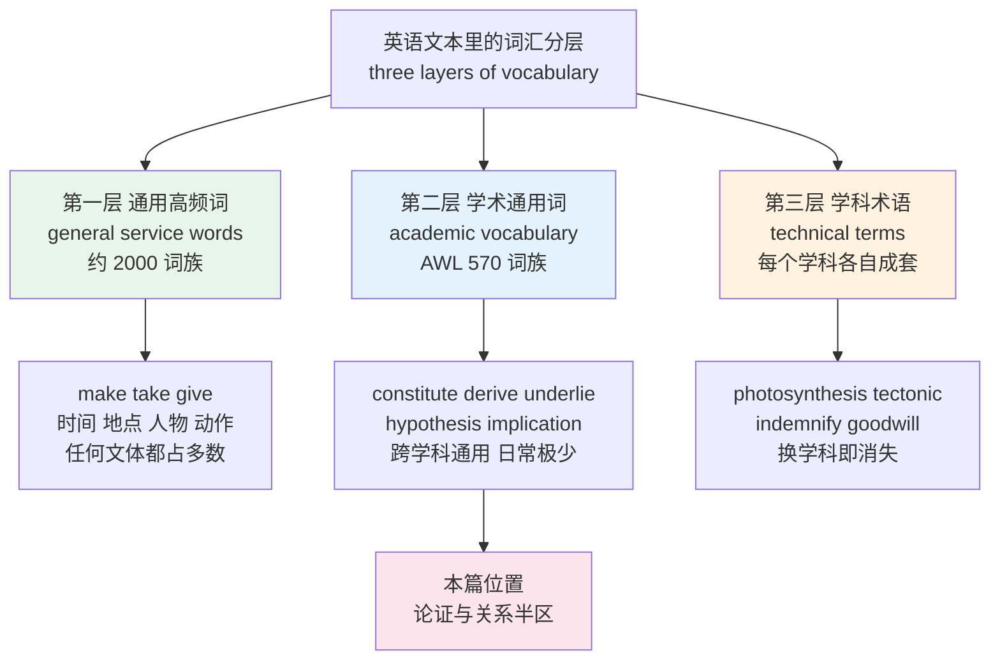
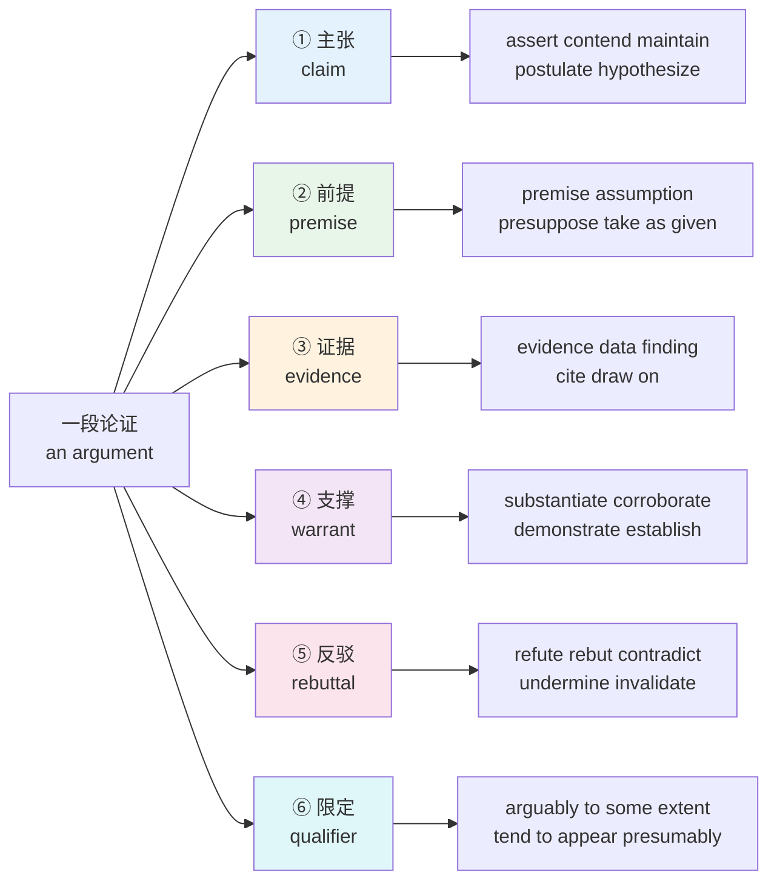
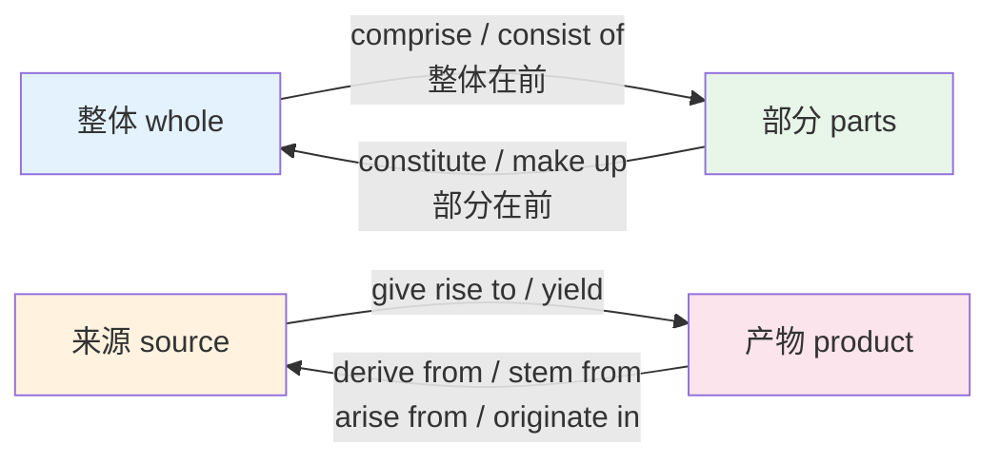
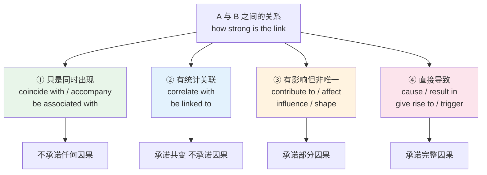
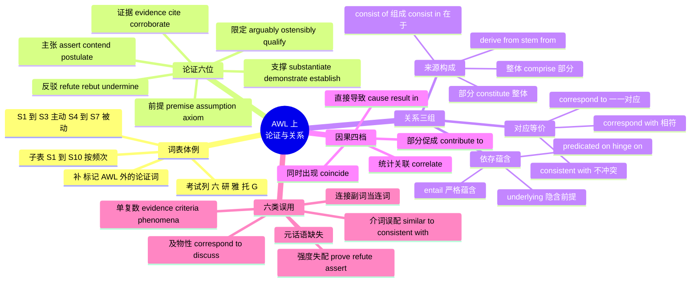

# 学术通用词表 AWL（上）：论证与关系

> [!info] 本篇定位
>
> 第十九章的开篇。前十八章处理的是「说得出、听得懂、用得得体」，从这一篇开始处理「读得进论文、写得出论证」。
>
> 本篇只切学术通用词表的前半区：**论证**（怎么提出主张、怎么支撑、怎么反驳）和**关系**（怎么说明两件事之间是对应、来源、构成还是蕴含）。后半区的过程词与评价词交给下一篇。
>
> 词表带两列本教程别处没有的信息：**子表编号**（这个词在学术语料里的频次档位）和**考试取向标记**（哪几类考试的词表稳定收它）。第二十一章的考试词汇专项不再复制这些词条，只做词表基准的映射。
>
> 转述动词的从句搭配与立场差别见 [[13.抽象概念、评价与高频动词/03.言语动词与转述动词群\|言语动词与转述动词群]]，高频抽象名词的通用义见 [[13.抽象概念、评价与高频动词/05.抽象名词库与评价形容词梯度\|抽象名词库与评价形容词梯度]]，本篇不重复它们，只补 AWL 层的频次定位、词族边界与论证功能。

---

## 1. 本篇导读：学术词是词汇的第三层

英语词汇按使用范围可以切三层，学术通用词卡在中间那一层，也是自学者最容易漏掉的一层。

第一层是通用高频词。West 在 1953 年整理的 General Service List 收了约 2000 个词族，`make`、`take`、`give`、`good`、`time` 都在里面。这一层在任何文体里都占绝对多数，前十三章处理的就是它。

第三层是学科术语。`photosynthesis`、`tectonic`、`indemnify`、`goodwill`，各自锁死在一个学科里，换一个学科就完全不出现。第二十章按领域分篇处理。

夹在中间的第二层，就是**学术通用词**：不属于日常闲聊，也不属于任何单一学科，但凡是学术性文本都在用。`constitute`、`derive`、`underlie`、`hypothesis`、`implication` 属于这一层。你读一篇经济学论文会碰到它们，读一篇分子生物学论文还是碰到它们，读 RFC 规范文档、读 Google 的设计文档、读 Rust 的 RFC 讨论帖，仍然是它们。



上图的三层不是难度递增，而是**分布范围**递减。第一层铺满所有文体，第二层只在学术与准学术文体里出现，第三层只在单一学科里出现。三层的学习策略完全不同：第一层靠反复接触自然获得，第三层等你真的进入那个领域再学，只有第二层需要专门集中攻——因为它出现得足够频繁，够不上「查一次就够」，但又不会在日常听说里自动喂给你。

### 1.1 AWL 是怎么来的

学术通用词表的通行版本是 Averil Coxhead 在 2000 年发表的 A New Academic Word List。做法是：先取一个约 350 万词的学术语料库，覆盖艺术、商科、法律、自然科学四个学部各七个学科；然后把 General Service List 的前 2000 词族整个扣掉；剩下的词里，挑出**在四个学部都出现、总频次够高、且分布不偏科**的，得到 570 个词族。

Coxhead 在同一篇文章里给出了这份表的覆盖率：这 570 个词族占她那份学术语料形符总量的 10.0%，而在同规模的小说语料里只占 1.4%。这个对比是 AWL 存在的全部理由——它精准地抓住了「学术文体有而日常文体没有」的那部分词。

570 个词族按频次被切成 10 个子表，每个子表 60 个词族（第 10 子表只有 30 个）。子表 1 频次最高，子表 10 最低。这个编号是本篇词表最右边那两列之一的来源。

> [!warning] 别把 AWL 当成完整的学术词清单
>
> AWL 有三个已知的边界，动手前先认清：
>
> - **它扣掉了 GSL 前 2000 词。** 所以 `show`、`find`、`cause`、`result` 这些在论文里极高频的词不在表里，不是因为它们不学术，而是因为它们同时也是日常词。
> - **它按词族计，不按词计。** `analyse` 这一个条目实际包含 `analysis`、`analyses`、`analyst`、`analytical`、`analytically`、`analyse`、`analysed`、`analysing`、`analyzes` 等十几个形式。570 个词族展开后是三千多个词形。
> - **它的取样口径把一批高频论证词挡在外面。** `assert`、`postulate`、`refute`、`substantiate`、`corroborate` 都不在 570 词族里，但任何一篇讲道理的英文文章都在用。本篇把这类词并进来，在子表列标 `补`。
>
> 2014 年 Gardner 与 Davies 在 COCA 的学术子库上做出的 Academic Vocabulary List 是这个方向的后继工作，收词口径改成按 lemma 计并且不扣 GSL，规模到了三千级。两份表的交集就是最该先攻的部分，本篇的词全部落在这个交集或它的紧邻区。

### 1.2 本篇与下一篇的分工

AWL 的 570 个词族按功能可以粗分两半。本篇取前半：

| 半区 | 功能 | 代表词 | 归属 |
| --- | --- | --- | --- |
| 论证 | 提出主张、给出前提、拿出证据、反驳对方 | assert / hypothesis / substantiate / refute | 本篇第 3 到 7 节 |
| 关系 | 说清两件事之间是什么关系 | correspond / derive / constitute / underlie | 本篇第 8 到 11 节 |
| 过程 | 一件事怎么启动、推进、维持、分配 | initiate / implement / sustain / allocate | 下一篇 |
| 评价 | 一个结论有多可靠、一个量有多大 | significant / adequate / valid / negligible | 下一篇 |

分界线是「这个词在论证里管什么」。管**立场与证据**的归本篇，管**动作与判断**的归下一篇。少数词两边都沾（`demonstrate` 既是证明也是展示），本篇按论证义收，下一篇不再重列。

---

## 2. 词表体例：两列新增信息怎么读

本篇往标准六列词表后面接了两列。前六列与全书一致（英文、英式音标、美式音标、词性、中文、搭配与说明），后两列是本章特有的。

### 2.1 子表列

`S1` 到 `S10` 是 Coxhead 十个子表的编号。数字越小，这个词族在学术语料里出现得越频繁。

- `S1` 到 `S3`：一百八十个词族，占 AWL 全部覆盖率的一大半。读任何学术文本都躲不开，必须做到看到就懂、写作时能主动用。
- `S4` 到 `S7`：中段。看到要懂，写作时能用最好，用不上不影响表达。
- `S8` 到 `S10`：低频段。以认读为目标，不必强求产出。
- `补`：不在 570 词族内，但论证功能不可替代，本篇补进来的词。

排列顺序上，每张表内部**先按功能分组，组内按子表编号从小到大排**。这样从上往下读，就是从「必须会」滑向「认得就行」。

### 2.2 考试列

用五个单字标记，只标不解释：

| 标记 | 含义 |
| --- | --- |
| 六 | CET6 通行词表稳定收录 |
| 研 | 考研英语大纲词表或历年真题高频 |
| 雅 | 雅思学术类阅读与写作高频 |
| 托 | 托福阅读与听力讲座高频 |
| G | GRE 填空与阅读常考 |

标记读作「这个词在该类考试的通行词表与真题语料里稳定出现」，是取向指示，不是任何一份官方名单的复刻。同一个词在不同出版社的词表里收录情况会有出入，标记按多份词表的交集给，边缘情况从宽。

不考试的读者可以整列忽略；备考的读者可以反过来用：只看带自己那个标记的行，先攻这一批。

下面这张小表演示体例，六个词是本篇最核心的锚点：

| 英文 | 英式音标 | 美式音标 | 词性 | 中文 | 搭配与说明 | 子表 | 考试 |
| --- | --- | --- | --- | --- | --- | --- | --- |
| **constitute** | /ˈkɒnstɪtjuːt/ | /ˈkɑːnstətuːt/ | vt. | 构成；被视为 | constitute a threat / a breach，主语是部分，宾语是整体 | S1 | 六研雅托 |
| **derive** | /dɪˈraɪv/ | /dɪˈraɪv/ | v. | 源自；推导出 | derive from（源自）/ derive sth from sth（从…得出） | S1 | 六研雅托G |
| **correspond** | /ˌkɒrɪˈspɒnd/ | /ˌkɔːrəˈspɑːnd/ | vi. | 对应；相符 | correspond to（对应于）/ correspond with（相符、通信） | S3 | 六研雅托 |
| **underlie** | /ˌʌndəˈlaɪ/ | /ˌʌndərˈlaɪ/ | vt. | 构成…的基础 | 过去式 underlay，过去分词 underlain，常用 underlying | S6 | 研雅托G |
| **postulate** | /ˈpɒstjuleɪt/ | /ˈpɑːstʃuleɪt/ | v./n. | 假定；公设 | postulate that 从句；名词读 /ˈpɒstjulət/ 重音不变而尾音弱化 | 补 | 托G |
| **substantiate** | /səbˈstænʃieɪt/ | /səbˈstænʃieɪt/ | vt. | 证实；提供证据支持 | substantiate a claim / an allegation，宾语必须是「说法」 | 补 | 研托G |

`postulate` 这一行示范了本篇会反复出现的一个现象：**同形异读的词性对立**。动词 `postulate` 尾音节读 /eɪt/，名词读 /ət/，重音位置不变。这类词在学术文本里成堆出现（`estimate`、`elaborate`、`deliberate`、`approximate`、`separate`），读音判断错了不影响理解，但朗读和听力里会卡。

---

## 3. 论证的六个功能位

学术论证不是把观点排成一串，而是六个位置各归各位。认清位置，选词就有了依据。



上图是本篇第 4 到 7 节的骨架。六个位置里，中文母语者最容易出问题的是 ①、⑤、⑥ 三个。①上的问题是强度失控——中文的「认为」既能表达随口一说也能表达郑重宣称，英文分成 `think`、`believe`、`hold`、`contend`、`assert`、`insist` 好几档，选错了要么显得心虚要么显得蛮横。⑤上的问题是动介搭配，`refute` 和 `object` 后面跟什么，中文毫无提示。⑥上的问题最隐蔽：中文学术写作习惯把话说满，直接译成英文就成了母语者眼里「没有学术训练」的表述。

先给六个位置各自的核心名词，这些词在下面每一节都会反复出现：

| 英文 | 英式音标 | 美式音标 | 词性 | 中文 | 搭配与说明 | 子表 | 考试 |
| --- | --- | --- | --- | --- | --- | --- | --- |
| **claim** | /kleɪm/ | /kleɪm/ | n./v. | 主张；断言 | make a claim / support a claim；论证里的中性默认词 | 补 | 六研雅托 |
| **argument** | /ˈɑːɡjumənt/ | /ˈɑːrɡjumənt/ | n. | 论证；论点 | 学术义是「论证过程」，不是「吵架」 | 补 | 六研雅托 |
| **premise** | /ˈpremɪs/ | /ˈpremɪs/ | n. | 前提 | on the premise that；复数 premises 另有「房产」义 | 补 | 研托G |
| **evidence** | /ˈevɪdəns/ | /ˈevɪdəns/ | n. | 证据 | 不可数，无复数；evidence for / of / that | S1 | 六研雅托 |
| **rebuttal** | /rɪˈbʌtl/ | /rɪˈbʌtl/ | n. | 反驳 | offer a rebuttal；比 refutation 更常用于辩论语境 | 补 | 托G |
| **qualifier** | /ˈkwɒlɪfaɪə/ | /ˈkwɑːləfaɪər/ | n. | 限定语 | 逻辑学与语言学共用，指削弱断言强度的成分 | 补 | G |
| **assumption** | /əˈsʌmpʃn/ | /əˈsʌmpʃn/ | n. | 假设；假定 | on the assumption that / challenge an assumption | S1 | 六研雅托G |
| **hypothesis** | /haɪˈpɒθəsɪs/ | /haɪˈpɑːθəsɪs/ | n. | 假说 | 复数 hypotheses /-siːz/；test / confirm / reject a hypothesis | S4 | 六研雅托G |
| **implication** | /ˌɪmplɪˈkeɪʃn/ | /ˌɪmplɪˈkeɪʃn/ | n. | 含意；影响 | 单数偏「言外之意」，复数偏「后续影响」 | S3 | 六研雅托G |
| **criterion** | /kraɪˈtɪəriən/ | /kraɪˈtɪriən/ | n. | 标准 | 复数 criteria；写作里最常见的单复数错误之一 | S3 | 六研雅托G |
| **rationale** | /ˌræʃəˈnɑːl/ | /ˌræʃəˈnæl/ | n. | 理据；依据 | the rationale for / behind；英美尾音差异明显 | 补 | 研托G |
| **thesis** | /ˈθiːsɪs/ | /ˈθiːsɪs/ | n. | 论题；学位论文 | 复数 theses /ˈθiːsiːz/；英美都可指硕博论文 | S7 | 六研雅托 |

`evidence` 这一条值得单拎出来。它在英文里彻底不可数，没有 `an evidence`，没有 `evidences`（法律语境的极个别用法除外）。要说「三条证据」得写 `three pieces of evidence`。中文的「证据」有量词可数，直接迁移过来就出错，而且这个错在写作里出现频率极高。

---

## 4. 主张类动词：从 think 到 assert 的强度阶梯

中文一个「认为」，英文分成一整条强度带。选错的后果不是语法错误，而是**语气错位**——同一句话，用 `I think` 显得没底气，用 `I assert` 显得咄咄逼人。

### 4.1 强度阶梯

按「说话人对自己主张的承诺程度」从低到高排：

```text
低承诺 ────────────────────────────────────────────► 高承诺

suggest   think    believe   argue    hold    contend   assert   insist
propose   feel     consider  claim    maintain          affirm   
                             posit    postulate
```

`suggest` 和 `propose` 在最左端：说话人把主张摆出来供人考虑，明确留出被否定的空间。`assert` 和 `insist` 在最右端：说话人把主张当既定事实端出来，留给对方的只有接受或正面反驳。中间那一大段是学术写作的主力区。

有一个反直觉的点：**学术写作偏爱中段偏左**。论文里 `suggest`、`indicate`、`argue` 出现的频次远高于 `assert`、`prove`。原因不是作者不自信，而是学术共同体的规范要求把结论的适用边界写清楚。把话说满在这个文体里不是自信，是不专业。

### 4.2 词表

| 英文 | 英式音标 | 美式音标 | 词性 | 中文 | 搭配与说明 | 子表 | 考试 |
| --- | --- | --- | --- | --- | --- | --- | --- |
| **assume** | /əˈsjuːm/ | /əˈsuːm/ | vt. | 假定；承担 | assume that / assume responsibility；两个义项都高频 | S1 | 六研雅托G |
| **indicate** | /ˈɪndɪkeɪt/ | /ˈɪndɪkeɪt/ | vt. | 表明；显示 | 主语常是数据或研究，不是人：the data indicate that | S1 | 六研雅托 |
| **interpret** | /ɪnˈtɜːprɪt/ | /ɪnˈtɜːrprət/ | vt. | 解读；口译 | interpret X as Y；学术里几乎只用「解读」义 | S1 | 六研雅托G |
| **perceive** | /pəˈsiːv/ | /pərˈsiːv/ | vt. | 认为；察觉 | perceive X as Y；强调「主观感知」而非客观事实 | S2 | 六研雅托G |
| **conclude** | /kənˈkluːd/ | /kənˈkluːd/ | v. | 得出结论；结束 | conclude that / conclude from；论文结尾的标准动词 | S2 | 六研雅托 |
| **imply** | /ɪmˈplaɪ/ | /ɪmˈplaɪ/ | vt. | 暗示；意味着 | 主语是话或事，不是人说话的行为；对应 infer | S3 | 六研雅托G |
| **deduce** | /dɪˈdjuːs/ | /dɪˈduːs/ | vt. | 演绎推出 | deduce X from Y；从一般到个别 | S3 | 研托G |
| **hypothesize** | /haɪˈpɒθəsaɪz/ | /haɪˈpɑːθəsaɪz/ | v. | 假设 | hypothesize that；英式也写 hypothesise | S4 | 托G |
| **predict** | /prɪˈdɪkt/ | /prɪˈdɪkt/ | vt. | 预测 | predict that / predict a rise；不含把握度承诺 | S4 | 六研雅托 |
| **presume** | /prɪˈzjuːm/ | /prɪˈzuːm/ | v. | 推定；擅自 | presume that；比 assume 多一层「未经证实即当真」 | S6 | 研托G |
| **infer** | /ɪnˈfɜː/ | /ɪnˈfɜːr/ | vt. | 推断 | infer X from Y；主语是读者或研究者，与 imply 方向相反 | S7 | 六研雅托G |
| **anticipate** | /ænˈtɪsɪpeɪt/ | /ænˈtɪsɪpeɪt/ | vt. | 预期；预料 | anticipate doing（不接不定式）；比 expect 更正式 | S9 | 六研雅托G |
| **conceive** | /kənˈsiːv/ | /kənˈsiːv/ | v. | 构想；设想 | conceive of X as Y；conceivably 是常用限定副词 | S10 | 研托G |
| **pose** | /pəʊz/ | /poʊz/ | vt. | 提出；构成 | pose a question / pose a threat；两个搭配都极高频 | S10 | 六研雅托 |
| **assert** | /əˈsɜːt/ | /əˈsɜːrt/ | vt. | 断言；主张 | assert that；不接 assert sb to do；强度高，带「未必给证据」的暗示 | 补 | 研托G |
| **contend** | /kənˈtend/ | /kənˈtend/ | v. | 主张；争辩 | contend that；另有 contend with（应付）义，两义无关 | 补 | 研托G |
| **maintain** | /meɪnˈteɪn/ | /meɪnˈteɪn/ | vt. | 坚称；维持 | maintain that；学术转述里表示「对方一直这么说」 | S2 | 六研雅托G |
| **postulate** | /ˈpɒstjuleɪt/ | /ˈpɑːstʃuleɪt/ | v./n. | 假定；公设 | postulate that；比 assume 更正式，常用于理论构建 | 补 | 托G |
| **posit** | /ˈpɒzɪt/ | /ˈpɑːzɪt/ | vt. | 设定；提出 | posit that / posit the existence of；哲学与理论文本高频 | 补 | G |
| **allege** | /əˈledʒ/ | /əˈledʒ/ | vt. | 指称；宣称 | 强烈暗示「说的人没给证据」，新闻与法律高频 | 补 | 研托G |
| **purport** | /pəˈpɔːt/ | /pərˈpɔːrt/ | v. | 声称是 | purport to be / to do；主语是物或文本，不是人 | 补 | G |
| **profess** | /prəˈfes/ | /prəˈfes/ | vt. | 自称；公开表示 | profess to be；带「未必属实」的暗示 | 补 | G |
| **affirm** | /əˈfɜːm/ | /əˈfɜːrm/ | vt. | 肯定；确认 | affirm that；正式度高于 confirm，法律与哲学常用 | 补 | 托G |
| **advocate** | /ˈædvəkeɪt/ | /ˈædvəkeɪt/ | v./n. | 主张；倡导者 | advocate doing（不接 advocate sb to do）；名词读 /ˈædvəkət/ | S7 | 六研雅托G |
| **propound** | /prəˈpaʊnd/ | /prəˈpaʊnd/ | vt. | 提出（理论） | propound a theory；书面度很高，阅读认得即可 | 补 | G |
| **surmise** | /səˈmaɪz/ | /sərˈmaɪz/ | v./n. | 猜测 | surmise that；承诺度低，接近 guess 的正式版 | 补 | G |

### 4.3 三对最容易混的

`imply` 与 `infer` 是方向相反的一对。**说的人 imply，听的人 infer。**

> [!example] imply 与 infer 的方向
>
> - The report **implies** that the current approach is unsustainable.
>   - 这份报告暗示当前做法难以为继。（信息从报告发出）
> - From the report we **infer** that the current approach is unsustainable.
>   - 从这份报告我们推断当前做法难以为继。（信息被读者接收）
> - ❌ ~~The report infers that the approach is unsustainable.~~
> - ✅ **The report implies that the approach is unsustainable.**

`assume` 与 `presume` 差在证据基础。`assume` 是「为了往下推，先当它成立」，中性；`presume` 是「有理由相信但没确证，就当它成立」，带一点擅作主张的味道。法律里的 `presumption of innocence`（无罪推定）用的正是后者——不是随便设定，而是在证据出来之前的默认立场。

`assert` 与 `argue` 差在有没有推理过程。`argue` 后面预期跟着理由，`assert` 后面可以什么都没有。所以在评论别人的论文时，写 `The author merely asserts that...` 是一句批评：光下结论，不给论证。

> [!warning] assert 不能接不定式
>
> `assert` 只接 that 从句或名词短语，不接「assert sb to do」。
>
> - ❌ ~~He asserted the method to be reliable.~~
> - ✅ **He asserted that the method was reliable.**
> - ✅ **He asserted the reliability of the method.**
>
> 同类限制的还有 `contend`、`maintain`、`postulate`、`insist`。能接不定式的是 `believe`、`consider`、`hold`、`deem`、`prove`（`prove the method to be reliable` 成立）。这条差别在考研与托福的语法辨析里反复出现。

---

## 5. 前提、假设与命题：论证的名词骨架

动词负责推进，名词负责搭骨架。学术写作里名词化程度高，一段论证的承重结构往往全是名词。

### 5.1 名词化为什么在学术文体里占优

同一件事有两种写法：

> [!example] 动词式与名词化式
>
> - The prices rose sharply, and this **caused** many small firms to fail.
>   - 价格急剧上涨，这导致许多小公司倒闭。
> - The sharp **rise** in prices **led to** the **failure** of many small firms.
>   - 价格的急剧上涨导致了许多小公司的倒闭。

第二种把「上涨」和「倒闭」都变成名词，好处有三：句子可以继续往上叠（`the failure of many small firms` 可以整块做新句子的主语）、可以直接被前面的 `this failure` 回指、可以塞进修饰语而不用另起从句。学术文本的信息密度就是靠这个撑起来的。

代价是可读性下降。所以判断标准不是「越名词化越学术」，而是**这个概念后面还要不要被继续讨论**。要被回指、要被修饰、要做下一句的主语，就名词化；只出现一次，就用动词。

### 5.2 词表

| 英文 | 英式音标 | 美式音标 | 词性 | 中文 | 搭配与说明 | 子表 | 考试 |
| --- | --- | --- | --- | --- | --- | --- | --- |
| **concept** | /ˈkɒnsept/ | /ˈkɑːnsept/ | n. | 概念 | the concept of；形容词 conceptual | S1 | 六研雅托G |
| **context** | /ˈkɒntekst/ | /ˈkɑːntekst/ | n. | 语境；背景 | in the context of；out of context（断章取义） | S1 | 六研雅托G |
| **factor** | /ˈfæktə/ | /ˈfæktər/ | n. | 因素 | a key / contributing / decisive factor | S1 | 六研雅托 |
| **principle** | /ˈprɪnsəpl/ | /ˈprɪnsəpl/ | n. | 原则；原理 | in principle（原则上）；与 principal 形近不同义 | S1 | 六研雅托G |
| **theory** | /ˈθɪəri/ | /ˈθiːəri/ | n. | 理论 | in theory；英美读音差异明显，英式两音节感更强 | S1 | 六研雅托G |
| **issue** | /ˈɪʃuː/ | /ˈɪʃuː/ | n./v. | 议题；发行 | address an issue；英式旧读 /ˈɪsjuː/ 现已少见 | S1 | 六研雅托 |
| **aspect** | /ˈæspekt/ | /ˈæspekt/ | n. | 方面 | in this aspect 少见，惯用 in this respect | S2 | 六研雅托 |
| **element** | /ˈelɪmənt/ | /ˈelɪmənt/ | n. | 要素 | a key element of / in | S2 | 六研雅托 |
| **feature** | /ˈfiːtʃə/ | /ˈfiːtʃər/ | n./v. | 特征；以…为特色 | a distinctive feature；动词义常被中文读者漏掉 | S2 | 六研雅托 |
| **instance** | /ˈɪnstəns/ | /ˈɪnstəns/ | n. | 实例 | for instance；in this instance（在本例中） | S3 | 六研雅托 |
| **framework** | /ˈfreɪmwɜːk/ | /ˈfreɪmwɜːrk/ | n. | 框架 | within the framework of；理论文本极高频 | S3 | 六研雅托G |
| **emphasis** | /ˈemfəsɪs/ | /ˈemfəsɪs/ | n. | 侧重；强调 | place emphasis on；复数 emphases | S3 | 六研雅托 |
| **criteria** | /kraɪˈtɪəriə/ | /kraɪˈtɪriə/ | n. | 标准（复数） | 单数 criterion；meet the criteria | S3 | 六研雅托G |
| **hypothesis** | /haɪˈpɒθəsɪs/ | /haɪˈpɑːθəsɪs/ | n. | 假说 | a working hypothesis；null hypothesis 见 19.03 | S4 | 六研雅托G |
| **dimension** | /daɪˈmenʃn/ | /daɪˈmenʃn/ | n. | 维度；方面 | a new dimension to；另有 /dɪˈmenʃn/ 一读，英美都通行 | S4 | 六研雅托G |
| **parameter** | /pəˈræmɪtə/ | /pəˈræmɪtər/ | n. | 参数；界限 | within the parameters of；日常义偏「限定范围」 | S4 | 研托G |
| **perspective** | /pəˈspektɪv/ | /pərˈspektɪv/ | n. | 视角 | from a … perspective；put sth in perspective | S5 | 六研雅托G |
| **notion** | /ˈnəʊʃn/ | /ˈnoʊʃn/ | n. | 观念；看法 | the notion that；比 concept 更松散、更口语 | S5 | 六研雅托G |
| **objective** | /əbˈdʒektɪv/ | /əbˈdʒektɪv/ | n./adj. | 目标；客观的 | 名形同形，学术里两义都高频 | S5 | 六研雅托G |
| **scope** | /skəʊp/ | /skoʊp/ | n. | 范围 | beyond the scope of this paper 是论文固定句式 | S6 | 六研雅托G |
| **domain** | /dəʊˈmeɪn/ | /doʊˈmeɪn/ | n. | 领域 | in the domain of；技术语境另有「域名」义 | S6 | 研托G |
| **paradigm** | /ˈpærədaɪm/ | /ˈpærədaɪm/ | n. | 范式 | a paradigm shift；g 不发音，是常见误读点 | S7 | 研托G |
| **phenomenon** | /fəˈnɒmɪnən/ | /fəˈnɑːmɪnɑːn/ | n. | 现象 | 复数 phenomena；单复数误用极常见 | S7 | 六研雅托G |
| **thesis** | /ˈθiːsɪs/ | /ˈθiːsɪs/ | n. | 论题；论文 | the central thesis of；复数 theses | S7 | 六研雅托 |
| **premise** | /ˈpremɪs/ | /ˈpremɪs/ | n. | 前提 | the premise that / on the premise that | 补 | 研托G |
| **proposition** | /ˌprɒpəˈzɪʃn/ | /ˌprɑːpəˈzɪʃn/ | n. | 命题；主张 | 逻辑学指可判真假的陈述；商业里指提议 | 补 | 托G |
| **axiom** | /ˈæksiəm/ | /ˈæksiəm/ | n. | 公理 | 不证自明的起点，比 premise 更强 | 补 | G |
| **corollary** | /kəˈrɒləri/ | /ˈkɔːrəleri/ | n. | 推论；必然结果 | a corollary of；英美重音位置不同，差异极大 | 补 | G |
| **tenet** | /ˈtenɪt/ | /ˈtenɪt/ | n. | 信条；原则 | a central tenet of；用于学派或理论体系 | 补 | G |
| **caveat** | /ˈkæviæt/ | /ˈkæviæt/ | n. | 附加说明；警告 | with the caveat that；论文讨论部分高频 | 补 | G |

### 5.3 复数形式集中处理

学术名词里有一批保留了拉丁或希腊复数，写作里出错率很高。集中列一次：

| 单数 | 复数 | 常见错误 | 说明 |
| --- | --- | --- | --- |
| criterion | criteria | ❌ ~~a criteria~~ | 单数 criterion 反而少见，容易被当成复数用 |
| phenomenon | phenomena | ❌ ~~a phenomena~~ | 与 criterion 同型 |
| hypothesis | hypotheses | ❌ ~~two hypothesis~~ | 读音由 /-sɪs/ 变 /-siːz/ |
| thesis | theses | ❌ ~~two thesis~~ | 同上 |
| analysis | analyses | ❌ ~~several analysis~~ | 同上，AWL 子表 1 词 |
| basis | bases | ❌ ~~on these basis~~ | 与 base 的复数同形，靠语境分 |
| datum | data | data 作单数或复数均可 | 科技写作中 data 越来越多被当单数 |
| medium | media | ❌ ~~a media~~ | 媒体义已固化为集合名词，但学术里仍分 |
| index | indices / indexes | 两式并存 | 数学与统计用 indices，书末索引用 indexes |
| appendix | appendices / appendixes | 两式并存 | 论文附录用 appendices |
| formula | formulae / formulas | 两式并存 | AWL 子表 1 词，美式偏 formulas |
| stimulus | stimuli | ❌ ~~two stimulus~~ | 心理学文献高频 |

`data` 那一行值得多说一句。传统规范认为 `data` 是 `datum` 的复数，配复数动词（`the data are conclusive`）；但当代科技写作里把它当不可数集合名词、配单数动词（`the data is conclusive`）已经完全站得住。两种写法都不算错，同一篇文档里保持一致即可。学术期刊的投稿指南通常会明确要求哪一种。

---

## 6. 支持与证明：substantiate 一族

提出主张之后要给支撑。这一族动词的差别在**支撑到了什么程度**，从「提供了一点证据」到「彻底证实」是一条清晰的梯度。

### 6.1 证明强度梯度

```text
弱支撑 ──────────────────────────────────────────► 强证明

suggest    support     substantiate    corroborate    confirm     prove
indicate   underpin    back up         validate       establish   demonstrate
```

`prove` 在最右端，也是中文母语者滥用最严重的一个。中文「证明」用得很松——「这证明他是对的」可以只是一条侧面证据。英文的 `prove` 是强承诺：数学里指严格推导，实证研究里指排除了所有替代解释。论文里说 `Our data prove that...` 会被审稿人当成过度声称，通行写法是 `Our data suggest / indicate / provide evidence that...`。

### 6.2 词表

| 英文 | 英式音标 | 美式音标 | 词性 | 中文 | 搭配与说明 | 子表 | 考试 |
| --- | --- | --- | --- | --- | --- | --- | --- |
| **establish** | /ɪˈstæblɪʃ/ | /ɪˈstæblɪʃ/ | vt. | 确立；证实 | establish that；比 prove 温和，学术里极高频 | S1 | 六研雅托G |
| **evident** | /ˈevɪdənt/ | /ˈevɪdənt/ | adj. | 明显的 | it is evident that；副词 evidently 带「看起来是」的弱化 | S1 | 六研雅托G |
| **identify** | /aɪˈdentɪfaɪ/ | /aɪˈdentɪfaɪ/ | vt. | 识别；确认 | identify X as Y；也可 identify with（认同） | S1 | 六研雅托 |
| **demonstrate** | /ˈdemənstreɪt/ | /ˈdemənstreɪt/ | vt. | 证明；演示 | demonstrate that；比 prove 常用，承诺度略低 | S3 | 六研雅托G |
| **justify** | /ˈdʒʌstɪfaɪ/ | /ˈdʒʌstɪfaɪ/ | vt. | 论证…正当 | justify doing；名词 justification | S3 | 六研雅托G |
| **illustrate** | /ˈɪləstreɪt/ | /ˈɪləstreɪt/ | vt. | 说明；举例 | 是「举例说明」不是「证明」，强度低 | S3 | 六研雅托 |
| **valid** | /ˈvælɪd/ | /ˈvælɪd/ | adj. | 有效的；站得住的 | a valid argument / a valid point | S3 | 六研雅托G |
| **verify** | /ˈverɪfaɪ/ | /ˈverɪfaɪ/ | vt. | 核实 | verify that；强调「查证是否属实」的动作 | 补 | 研托G |
| **confirm** | /kənˈfɜːm/ | /kənˈfɜːrm/ | vt. | 证实 | confirm that / confirm a finding | S7 | 六研雅托 |
| **reveal** | /rɪˈviːl/ | /rɪˈviːl/ | vt. | 揭示 | the study reveals that；主语常是研究或数据 | S6 | 六研雅托G |
| **cite** | /saɪt/ | /saɪt/ | vt. | 引用；举出 | cite a source / cite evidence；与 site、sight 同音 | S6 | 六研雅托G |
| **highlight** | /ˈhaɪlaɪt/ | /ˈhaɪlaɪt/ | vt./n. | 突出；强调 | highlight the need for；比 emphasize 更中性 | S8 | 六研雅托 |
| **reinforce** | /ˌriːɪnˈfɔːs/ | /ˌriːɪnˈfɔːrs/ | vt. | 强化；加强 | reinforce a view / a stereotype | S8 | 六研雅托G |
| **underpin** | /ˌʌndəˈpɪn/ | /ˌʌndərˈpɪn/ | vt. | 支撑；构成基础 | 与 underlie 近义，underpin 更强调主动支撑 | 补 | 雅托G |
| **substantiate** | /səbˈstænʃieɪt/ | /səbˈstænʃieɪt/ | vt. | 证实；提供依据 | substantiate a claim；宾语必须是「说法」而非「事实」 | 补 | 研托G |
| **corroborate** | /kəˈrɒbəreɪt/ | /kəˈrɑːbəreɪt/ | vt. | 佐证 | 用**另一个独立来源**印证既有说法，不是自证 | 补 | 托G |
| **validate** | /ˈvælɪdeɪt/ | /ˈvælɪdeɪt/ | vt. | 验证；确认有效 | validate a model / a hypothesis | S3 | 研托G |
| **attest** | /əˈtest/ | /əˈtest/ | v. | 证明；作证 | attest to sth（不及物用法更常见） | 补 | G |
| **testify** | /ˈtestɪfaɪ/ | /ˈtestɪfaɪ/ | v. | 证明；作证 | testify to sth；法律语境为主 | 补 | 托G |
| **vindicate** | /ˈvɪndɪkeɪt/ | /ˈvɪndɪkeɪt/ | vt. | 证明…正确 | 洗清质疑，宾语常是人或先前判断 | 补 | G |
| **bolster** | /ˈbəʊlstə/ | /ˈboʊlstər/ | vt. | 支撑；增强 | bolster an argument / confidence | 补 | G |
| **buttress** | /ˈbʌtrɪs/ | /ˈbʌtrɪs/ | vt./n. | 支撑；扶壁 | buttress a claim；建筑义引申而来 | 补 | G |
| **endorse** | /ɪnˈdɔːs/ | /ɪnˈdɔːrs/ | vt. | 赞同；背书 | endorse a view / a candidate | 补 | 研托G |
| **uphold** | /ʌpˈhəʊld/ | /ʌpˈhoʊld/ | vt. | 维护；支持（原判） | uphold a decision / a principle | 补 | 研托G |
| **empirical** | /ɪmˈpɪrɪkl/ | /ɪmˈpɪrɪkl/ | adj. | 实证的 | empirical evidence / study；对立面是 theoretical | S7 | 研托G |
| **plausible** | /ˈplɔːzəbl/ | /ˈplɔːzəbl/ | adj. | 说得通的 | a plausible explanation；只说「听起来合理」，不担保为真 | 补 | 研托G |

### 6.3 三个易混对

**substantiate 与 corroborate。** 前者是「你自己给出证据把主张撑起来」，后者是「另一个独立来源印证了你的主张」。审稿意见里写 `The claim is not substantiated` 是说你没给证据；写 `The finding is corroborated by Smith (2019)` 是说别人的研究也得到了同样结果。

**validate 与 verify。** `verify` 问的是「这是不是真的」，`validate` 问的是「这管不管用、算不算数」。软件工程里这对词被固定成一句话区分：verification 问 are we building the product right（做得对不对），validation 问 are we building the right product（做的是不是对的东西）。

**demonstrate 与 illustrate。** 强度差一整档。`demonstrate` 是证明，`illustrate` 是举例说明。中文都可以说「说明」，直接迁移会让论证强度被读者高估或低估。

> [!example] 三对词的实际落点
>
> - The audit failed to **substantiate** the allegations of misconduct.
>   - 审计未能为不当行为的指控提供依据。
> - Two independent laboratories **corroborated** the original measurement.
>   - 两家独立实验室佐证了最初的测量结果。
> - The model was **validated** against three years of historical data.
>   - 该模型用三年的历史数据做了验证。
> - Please **verify** that the checksum matches before deploying.
>   - 部署前请核实校验和是否一致。
> - Figure 3 **illustrates** the trade-off; it does not **demonstrate** causation.
>   - 图 3 说明了这一权衡，但并未证明因果关系。

最后一句是学术写作里的高频表述模式：先承认某个材料能说明什么，再明确它不能证明什么。这种「划边界」的句式是论证成熟度的标志，比一味加强语气有效得多。

---

## 7. 反驳、让步与限定：refute 一族

论证的另一半是处理反对意见。这一族分三组功能：正面反驳、承认对方部分有理、给自己的主张加边界。

### 7.1 反驳的三个层次

| 层次 | 功能 | 代表词 | 承诺了什么 |
| --- | --- | --- | --- |
| 一 | 表达不同意 | dispute / question / challenge / take issue with | 只表明立场，不承诺给出证据 |
| 二 | 指出错误 | contradict / rebut / counter / dispute | 给出相反的理由，但胜负未定 |
| 三 | 彻底推翻 | refute / disprove / invalidate / debunk | 拿出决定性证据，对方主张不再成立 |
| 侧面 | 抽掉支撑 | undermine / weaken / call into question / cast doubt on | 不正面交锋，削弱对方的立足点 |

三个层次的承诺度依次上升。`refute` 在最强的一档：说 `He refuted the argument` 意味着这个论证已经被推翻，不是「他试图反驳」。中文的「反驳」没有这层胜负含义，直接迁移会造成过度声称。想说「他提出了反驳」而不承诺成败，用 `He countered / challenged / took issue with`。

`undermine` 走的是侧面路线：不正面推翻，而是抽掉支撑。它的宾语常是 `credibility`、`confidence`、`the basis of`、`the case for`。这个词在英文论说文里的使用密度远高于中文的对应表达，值得专门练。

### 7.2 词表

| 英文 | 英式音标 | 美式音标 | 词性 | 中文 | 搭配与说明 | 子表 | 考试 |
| --- | --- | --- | --- | --- | --- | --- | --- |
| **restrict** | /rɪˈstrɪkt/ | /rɪˈstrɪkt/ | vt. | 限制 | restrict X to Y；名词 restriction | S2 | 六研雅托 |
| **constrain** | /kənˈstreɪn/ | /kənˈstreɪn/ | vt. | 约束 | be constrained by；名词 constraint 技术文本高频 | S3 | 研托G |
| **negate** | /nɪˈɡeɪt/ | /nɪˈɡeɪt/ | vt. | 否定；抵消 | negate the benefits of；逻辑学指取否 | S3 | 托G |
| **exclude** | /ɪkˈskluːd/ | /ɪkˈskluːd/ | vt. | 排除 | exclude X from Y；名词 exclusion | S3 | 六研雅托 |
| **contrary** | /ˈkɒntrəri/ | /ˈkɑːntreri/ | adj./n. | 相反的 | on the contrary / contrary to；英美尾音差异明显 | S7 | 六研雅托G |
| **deny** | /dɪˈnaɪ/ | /dɪˈnaɪ/ | vt. | 否认；拒绝给予 | deny doing（不接不定式）；deny sb sth | S7 | 六研雅托 |
| **contradict** | /ˌkɒntrəˈdɪkt/ | /ˌkɑːntrəˈdɪkt/ | vt. | 与…矛盾 | 主语可以是人也可以是证据；名词 contradiction | S8 | 六研雅托G |
| **inevitable** | /ɪnˈevɪtəbl/ | /ɪnˈevɪtəbl/ | adj. | 不可避免的 | it is inevitable that；让步论证的常用词 | S8 | 六研雅托G |
| **arbitrary** | /ˈɑːbɪtrəri/ | /ˈɑːrbətreri/ | adj. | 任意的；武断的 | an arbitrary cutoff；批评方法论时高频 | S8 | 研托G |
| **ambiguous** | /æmˈbɪɡjuəs/ | /æmˈbɪɡjuəs/ | adj. | 有歧义的 | ambiguous evidence；名词 ambiguity | S8 | 六研雅托G |
| **undermine** | /ˌʌndəˈmaɪn/ | /ˌʌndərˈmaɪn/ | vt. | 削弱 | undermine the case for / credibility；不正面反驳 | 补 | 六研雅托G |
| **refute** | /rɪˈfjuːt/ | /rɪˈfjuːt/ | vt. | 驳倒；反驳 | 强承诺，含「已经推翻」义 | 补 | 研托G |
| **rebut** | /rɪˈbʌt/ | /rɪˈbʌt/ | vt. | 反驳 | 比 refute 中性，不承诺成败；名词 rebuttal | 补 | 托G |
| **dispute** | /dɪˈspjuːt/ | /dɪˈspjuːt/ | v./n. | 质疑；争议 | dispute a claim；名词重音也可在首音节 | 补 | 六研雅托G |
| **invalidate** | /ɪnˈvælɪdeɪt/ | /ɪnˈvælɪdeɪt/ | vt. | 使无效 | invalidate a conclusion / a licence | S3 | 托G |
| **contravene** | /ˌkɒntrəˈviːn/ | /ˌkɑːntrəˈviːn/ | vt. | 违反；抵触 | contravene a regulation；法律与规范文本高频 | 补 | G |
| **concede** | /kənˈsiːd/ | /kənˈsiːd/ | v. | 承认（对己不利） | concede that；让步论证的标志动词 | 补 | 研托G |
| **acknowledge** | /əkˈnɒlɪdʒ/ | /əkˈnɑːlɪdʒ/ | vt. | 承认；致谢 | acknowledge that；比 concede 中性 | S6 | 六研雅托G |
| **qualify** | /ˈkwɒlɪfaɪ/ | /ˈkwɑːləfaɪ/ | v. | 限定；使有资格 | qualify a statement 是「给说法加限定」不是「取得资格」 | 补 | 研托G |
| **fallacy** | /ˈfæləsi/ | /ˈfæləsi/ | n. | 谬误 | a logical fallacy；形容词 fallacious | 补 | 托G |
| **flawed** | /flɔːd/ | /flɔːd/ | adj. | 有缺陷的 | a flawed methodology；名词 flaw | 补 | 六研雅托G |
| **spurious** | /ˈspjʊəriəs/ | /ˈspjʊriəs/ | adj. | 虚假的；伪的 | a spurious correlation 是统计学固定说法 | 补 | 托G |
| **dubious** | /ˈdjuːbiəs/ | /ˈduːbiəs/ | adj. | 可疑的 | dubious claims；英美首音节差异明显 | 补 | 研托G |
| **tenuous** | /ˈtenjuəs/ | /ˈtenjuəs/ | adj. | 站不住脚的；薄弱的 | a tenuous link / connection | 补 | G |
| **untenable** | /ʌnˈtenəbl/ | /ʌnˈtenəbl/ | adj. | 无法成立的 | an untenable position | 补 | G |
| **circular** | /ˈsɜːkjələ/ | /ˈsɜːrkjələr/ | adj. | 循环的 | circular reasoning 指用结论证明前提 | 补 | 托G |

### 7.3 让步是论证的一部分

中文议论文的默认写法是把自己的立场铺满，反对意见能不提就不提。英文学术写作反过来：**主动提出并处理反对意见是加分项**，不提反而会被认为考虑不周。

标准的让步结构有三步：

① 承认对方有理的部分（concede）
② 转折（however / nevertheless / that said）
③ 说明为什么自己的立场仍然成立（but the objection does not hold because…）

> [!example] 三步让步结构
>
> - **Admittedly**, the sample was drawn from a single institution, which **limits** the generalizability of the findings. **Nevertheless**, the effect size was large enough that sampling variation alone is unlikely to **account for** it.
>   - 诚然，样本取自单一机构，这限制了结论的普适性。但效应量足够大，单靠抽样波动不太可能解释这一结果。
> - The author **concedes** that the model performs poorly on sparse data, but **contends** that such cases fall outside the intended scope.
>   - 作者承认该模型在稀疏数据上表现不佳，但主张这类情形不在预期适用范围内。

第二句里 `concedes … but contends` 是一个完整的让步—反驳配对，两个动词的强度刻意做成一低一高。这种配对在论文的 Discussion 与 Limitations 部分成段出现。

> [!warning] refute 不等于「反驳」
>
> 中文的「他反驳了这个观点」不承诺反驳成功，英文的 `He refuted the view` 承诺了。
>
> - ❌ ~~He refuted the theory, but nobody was convinced.~~（自相矛盾）
> - ✅ **He challenged the theory, but nobody was convinced.**
> - ✅ **He sought to refute the theory, but nobody was convinced.**
>
> 同样需要注意承诺度的还有 `disprove`（推翻）、`debunk`（戳穿，带贬义）、`discredit`（使名誉扫地，针对人或来源而非论点本身）。

---

## 8. 关系词（一）：对应、等价与一致

从这一节开始转向本篇的另一半：怎么用词说清两件事之间的关系。中文这一层用得很粗——「对应」「相符」「一致」「相当于」经常混着用，英文分得细，而且各自锁死了介词。

### 8.1 correspond 的两个介词

`correspond` 是这一族的核心词，它的两个介词分工明确：

- `correspond to`：**一一对应**。A 在自己的体系里的位置，等于 B 在另一个体系里的位置。`Each key corresponds to a value.`
- `correspond with`：**相符、吻合**。两组信息比对下来不矛盾。`The witness's account corresponds with the physical evidence.`
- `correspond with sb`：**通信**。这是完全独立的第三个义项，与前两个无关。

中文母语者最常出的错是把 `correspond` 当及物动词用。它是不及物的，必须带介词。

### 8.2 词表

| 英文 | 英式音标 | 美式音标 | 词性 | 中文 | 搭配与说明 | 子表 | 考试 |
| --- | --- | --- | --- | --- | --- | --- | --- |
| **similar** | /ˈsɪmələ/ | /ˈsɪmələr/ | adj. | 相似的 | similar to（不是 similar with）；名词 similarity | S1 | 六研雅托 |
| **vary** | /ˈveəri/ | /ˈveri/ | vi. | 变化；有差异 | vary with / vary from X to Y；名词 variation | S1 | 六研雅托G |
| **equate** | /ɪˈkweɪt/ | /ɪˈkweɪt/ | v. | 等同 | equate X with Y；名词 equation、equivalent | S2 | 研托G |
| **distinct** | /dɪˈstɪŋkt/ | /dɪˈstɪŋkt/ | adj. | 截然不同的；清晰的 | distinct from；两个义项都高频 | S2 | 六研雅托G |
| **correspond** | /ˌkɒrɪˈspɒnd/ | /ˌkɔːrəˈspɑːnd/ | vi. | 对应；相符 | correspond to / with；不及物 | S3 | 六研雅托G |
| **proportion** | /prəˈpɔːʃn/ | /prəˈpɔːrʃn/ | n. | 比例；部分 | in proportion to；形容词 proportional | S3 | 六研雅托 |
| **contrast** | /ˈkɒntrɑːst/ | /ˈkɑːntræst/ | n. | 对比 | in contrast to / by contrast；动词重音后移读 /kənˈtrɑːst/ | S4 | 六研雅托G |
| **parallel** | /ˈpærəlel/ | /ˈpærəlel/ | n./adj./v. | 平行；类似之处 | draw a parallel between；三个词性同形 | S4 | 六研雅托G |
| **consistent** | /kənˈsɪstənt/ | /kənˈsɪstənt/ | adj. | 一致的；始终如一 | consistent with（相符）；两个义项靠介词分 | S1 | 六研雅托G |
| **differentiate** | /ˌdɪfəˈrenʃieɪt/ | /ˌdɪfəˈrenʃieɪt/ | v. | 区分 | differentiate between X and Y / X from Y | S7 | 六研雅托G |
| **identical** | /aɪˈdentɪkl/ | /aɪˈdentɪkl/ | adj. | 完全相同的 | identical to / with；比 same 更强 | S7 | 六研雅托 |
| **coincide** | /ˌkəʊɪnˈsaɪd/ | /ˌkoʊɪnˈsaɪd/ | vi. | 同时发生；重合 | coincide with；不含因果，只说时间或范围重叠 | S9 | 研托G |
| **analogy** | /əˈnælədʒi/ | /əˈnælədʒi/ | n. | 类比 | by analogy with；形容词 analogous /əˈnæləɡəs/ | S9 | 研托G |
| **overlap** | /ˌəʊvəˈlæp/ | /ˌoʊvərˈlæp/ | v./n. | 重叠 | overlap with；名词重音前移读 /ˈəʊvəlæp/ | S9 | 六研雅托 |
| **mutual** | /ˈmjuːtʃuəl/ | /ˈmjuːtʃuəl/ | adj. | 相互的 | mutual benefit / mutually exclusive | S9 | 六研雅托G |
| **converse** | /ˈkɒnvɜːs/ | /ˈkɑːnvɜːrs/ | n./adj. | 反面；相反的 | the converse is true；副词 conversely 高频 | S9 | 托G |
| **discrepancy** | /dɪsˈkrepənsi/ | /dɪsˈkrepənsi/ | n. | 不一致；差异 | a discrepancy between X and Y | 补 | 研托G |
| **disparity** | /dɪˈspærəti/ | /dɪˈspærəti/ | n. | 悬殊差异 | a disparity in income；强调不公平的差距 | 补 | 雅托G |
| **equivalent** | /ɪˈkwɪvələnt/ | /ɪˈkwɪvələnt/ | adj./n. | 等同的；对等物 | equivalent to；the equivalent of | S5 | 六研雅托G |
| **tantamount** | /ˈtæntəmaʊnt/ | /ˈtæntəmaʊnt/ | adj. | 无异于 | tantamount to（只作表语，只接 to） | 补 | G |
| **akin** | /əˈkɪn/ | /əˈkɪn/ | adj. | 类似的 | akin to（只作表语）；书面度高 | 补 | G |
| **disparate** | /ˈdɪspərət/ | /ˈdɪspərət/ | adj. | 迥然不同的 | disparate sources / disciplines | 补 | G |
| **juxtapose** | /ˌdʒʌkstəˈpəʊz/ | /ˌdʒʌkstəˈpoʊz/ | vt. | 并置对照 | juxtapose X with Y；名词 juxtaposition | 补 | G |
| **counterpart** | /ˈkaʊntəpɑːt/ | /ˈkaʊntərpɑːrt/ | n. | 对应的人或物 | its European counterpart | 补 | 研托G |

### 8.3 三条介词死规则

这一族里有三条介词搭配，错误率最高，值得单独背下来：

| 组合 | 正确 | 常见错误 | 说明 |
| --- | --- | --- | --- |
| similar | similar **to** | ❌ ~~similar with~~ | 受中文「与…相似」影响 |
| consistent | consistent **with** | ❌ ~~consistent to~~ | 与 similar 恰好相反 |
| different | different **from**（美式也用 than） | ❌ ~~different with~~ | 英式口语常见 different to，书面首选 from |

`consistent with` 还有一个学术专用义：说某个观察结果**不与**某个假说冲突，但也没证明它。`The results are consistent with the hypothesis` 的实际强度远低于中文「结果与假说一致」给人的印象——它只是说「没有反证」。读论文时看到这个短语要立刻降一档理解。

> [!tip] 用「换成中文能不能反推」自测介词
>
> 这一族的介词无法从中文反推，因为中文的「与」覆盖了 to、with、from 三个。可行的办法是把整个「形容词 + 介词」当成一个不可拆的语块背，而不是分开背形容词和介词。
>
> 具体到操作：在生词本上永远写 `similar to`，不写 `similar`；写 `consistent with`，不写 `consistent`。名词与形容词加介词的完整清单见 [[17.固定搭配/07.名词与形容词+介词固定搭配：reason for、aware of、responsible for\|名词与形容词+介词固定搭配]]，本节只处理学术论证里最高频的这一批。

---

## 9. 关系词（二）：来源、构成与包含

第二组关系词处理的是整体与部分、结果与来源。这一组的坑集中在**方向**上：谁是整体、谁是部分，中文常常靠语境判断，英文靠动词本身锁死。

### 9.1 方向图



上图的四条箭头对应四组动词，方向两两相反。`comprise` 与 `constitute` 是同一件事的两种说法，主语位置正好调换：

- `The committee **comprises** twelve members.`（整体 comprise 部分）
- `Twelve members **constitute** the committee.`（部分 constitute 整体）

同样的道理，`derive from` 的主语是产物，`give rise to` 的主语是来源。写作时先确定句子的主语是整体还是部分、是因还是果，再挑动词，方向就不会错。

### 9.2 词表

| 英文 | 英式音标 | 美式音标 | 词性 | 中文 | 搭配与说明 | 子表 | 考试 |
| --- | --- | --- | --- | --- | --- | --- | --- |
| **derive** | /dɪˈraɪv/ | /dɪˈraɪv/ | v. | 源自；推导 | derive from / derive X from Y；名词 derivation | S1 | 六研雅托G |
| **constitute** | /ˈkɒnstɪtjuːt/ | /ˈkɑːnstətuːt/ | vt. | 构成；等同于 | 部分作主语；constitute a breach（构成违约） | S1 | 六研雅托G |
| **consist** | /kənˈsɪst/ | /kənˈsɪst/ | vi. | 由…组成 | consist of（组成）/ consist in（在于），两义分开 | S1 | 六研雅托G |
| **involve** | /ɪnˈvɒlv/ | /ɪnˈvɑːlv/ | vt. | 涉及；需要 | involve doing（不接不定式） | S1 | 六研雅托 |
| **source** | /sɔːs/ | /sɔːrs/ | n./v. | 来源；采购 | the source of；动词义在供应链语境高频 | S1 | 六研雅托 |
| **component** | /kəmˈpəʊnənt/ | /kəmˈpoʊnənt/ | n. | 组成部分 | a key component of | S3 | 六研雅托 |
| **element** | /ˈelɪmənt/ | /ˈelɪmənt/ | n. | 要素 | 与 component 近义，element 更抽象 | S2 | 六研雅托 |
| **incorporate** | /ɪnˈkɔːpəreɪt/ | /ɪnˈkɔːrpəreɪt/ | vt. | 纳入；包含 | incorporate X into Y；另有「注册成公司」义 | S6 | 研雅托G |
| **integrate** | /ˈɪntɪɡreɪt/ | /ˈɪntɪɡreɪt/ | v. | 整合 | integrate X with / into Y；名词 integration | S4 | 六研雅托G |
| **comprise** | /kəmˈpraɪz/ | /kəmˈpraɪz/ | vt. | 由…组成；构成 | 整体作主语；be comprised of 被广泛使用但受规范批评 | S7 | 研托G |
| **extract** | /ɪkˈstrækt/ | /ɪkˈstrækt/ | vt./n. | 提取；摘录 | extract X from Y；名词重音前移读 /ˈekstrækt/ | S7 | 六研雅托 |
| **foundation** | /faʊnˈdeɪʃn/ | /faʊnˈdeɪʃn/ | n. | 基础；基金会 | lay the foundation for；两义都高频 | S7 | 六研雅托 |
| **aggregate** | /ˈæɡrɪɡət/ | /ˈæɡrɪɡət/ | n./adj. | 总和；总计的 | in the aggregate；动词读 /ˈæɡrɪɡeɪt/ | S6 | 托G |
| **portion** | /ˈpɔːʃn/ | /ˈpɔːrʃn/ | n. | 部分；份额 | a significant portion of | S9 | 六研雅托 |
| **bulk** | /bʌlk/ | /bʌlk/ | n. | 大部分；体积 | the bulk of；in bulk（批量） | S9 | 研雅托 |
| **integral** | /ˈɪntɪɡrəl/ | /ˈɪntɪɡrəl/ | adj. | 不可或缺的 | integral to；不是「完整的」 | S9 | 研托G |
| **assemble** | /əˈsembl/ | /əˈsembl/ | v. | 组装；聚集 | assemble a team / a device | S10 | 六研雅托 |
| **compile** | /kəmˈpaɪl/ | /kəmˈpaɪl/ | vt. | 汇编；编译 | compile a list；技术义见第二十章 | S10 | 六研雅托 |
| **stem** | /stem/ | /stem/ | vi. | 源于 | stem from；只用这一个搭配，几乎不单用 | 补 | 六研雅托G |
| **originate** | /əˈrɪdʒɪneɪt/ | /əˈrɪdʒɪneɪt/ | vi. | 起源 | originate in / from；名词 origin | 补 | 六研雅托 |
| **emanate** | /ˈeməneɪt/ | /ˈeməneɪt/ | vi. | 发出；源自 | emanate from；书面度高 | 补 | G |
| **encompass** | /ɪnˈkʌmpəs/ | /ɪnˈkʌmpəs/ | vt. | 涵盖 | encompass a wide range of | 补 | 雅托G |
| **subsume** | /səbˈsjuːm/ | /səbˈsuːm/ | vt. | 归入；包含 | subsume X under Y | 补 | G |
| **hierarchy** | /ˈhaɪərɑːki/ | /ˈhaɪərɑːrki/ | n. | 层级 | a hierarchy of；形容词 hierarchical | S7 | 研托G |
| **subordinate** | /səˈbɔːdɪnət/ | /səˈbɔːrdɪnət/ | adj./n. | 从属的；下级 | subordinate to；动词读 /-neɪt/ | S9 | 托G |
| **prerequisite** | /ˌpriːˈrekwəzɪt/ | /ˌpriːˈrekwəzɪt/ | n./adj. | 先决条件 | a prerequisite for / to | 补 | 研托G |

### 9.3 consist of 与 consist in

同一个动词换介词换义项，是这一族最尖锐的一个陷阱：

> [!example] consist 的两个介词
>
> - The course **consists of** twelve modules.
>   - 这门课由十二个模块组成。（组成部分）
> - The difficulty **consists in** reconciling the two requirements.
>   - 难点在于调和这两项要求。（本质所在）

`consist of` 是「由…组成」，后面跟部分清单；`consist in` 是「在于」，后面跟本质或关键点。两者不可互换，而且 `consist in` 在正式论说文里出现频率不低，读到时如果按 `consist of` 理解，整句意思会反过来。

方向对立的动介搭配还有 `result in`（导致）与 `result from`（源于），完整清单见 [[17.固定搭配/06.动词+介词固定搭配：depend on、result in、consist of\|动词+介词固定搭配]]。

> [!warning] comprise 的被动式争议
>
> `be comprised of` 在真实语料里极其常见，但规范语法书判它为误用，理由是 `comprise` 本身已含「由…组成」，不该再被动化。
>
> - ✅ **The system comprises three modules.**（规范首选）
> - ✅ **The system consists of three modules.**（永远安全）
> - ✅ **The system is composed of three modules.**（永远安全）
> - ❌ ~~The system is comprised of three modules.~~（真实语料里极常见，但正式写作里会被编辑改掉）
>
> 处理办法：读的时候四种都要认，写的时候用第二或第三种，绕开争议。学术期刊的编辑手册通常会明确禁止第四种。

---

## 10. 关系词（三）：底层依存与蕴含

第三组关系最抽象：不是并列对应，也不是整体部分，而是「A 是 B 底下那一层」或者「A 成立就必然 B 成立」。

### 10.1 underlie 的形态陷阱

`underlie` 是 `under` 加 `lie`，所以它的变位跟着不规则动词 `lie`（躺）走，不跟 `lie`（撒谎）走：

```text
underlie  →  underlay  →  underlain  →  underlying
（原形）      （过去式）    （过去分词）   （现在分词 / 形容词）
```

实际使用里，出现频率最高的是形容词化的 `underlying`：`the underlying cause`（根本原因）、`the underlying assumption`（隐含前提）、`the underlying data`（底层数据）。这个词在技术文档和论文里的密度都很高，而且中文没有一个词能稳定对应——「底层的」「潜在的」「根本的」「隐含的」都只覆盖一部分。

要小心的是 `underlay` 这个形式同时是名词（地毯衬垫），也是另一个动词 `underlay`（铺在下面）的原形。读到时靠句法位置判断。

### 10.2 词表

| 英文 | 英式音标 | 美式音标 | 词性 | 中文 | 搭配与说明 | 子表 | 考试 |
| --- | --- | --- | --- | --- | --- | --- | --- |
| **imply** | /ɪmˈplaɪ/ | /ɪmˈplaɪ/ | vt. | 蕴含；暗示 | 逻辑义是「A 真则 B 必真」；名词 implication | S3 | 六研雅托G |
| **rely** | /rɪˈlaɪ/ | /rɪˈlaɪ/ | vi. | 依赖 | rely on；形容词 reliant on，名词 reliance on | S3 | 六研雅托 |
| **link** | /lɪŋk/ | /lɪŋk/ | n./v. | 联系 | a link between；link X to / with Y | S3 | 六研雅托 |
| **implicit** | /ɪmˈplɪsɪt/ | /ɪmˈplɪsɪt/ | adj. | 隐含的 | implicit in；对立面是 explicit | S8 | 六研雅托G |
| **explicit** | /ɪkˈsplɪsɪt/ | /ɪkˈsplɪsɪt/ | adj. | 明确的 | make sth explicit；副词 explicitly | S6 | 六研雅托G |
| **underlie** | /ˌʌndəˈlaɪ/ | /ˌʌndərˈlaɪ/ | vt. | 构成…的基础 | 高频形式是 underlying | S6 | 研雅托G |
| **inherent** | /ɪnˈhɪərənt/ | /ɪnˈhɪrənt/ | adj. | 固有的 | inherent in（不是 inherent to） | S9 | 研托G |
| **intrinsic** | /ɪnˈtrɪnzɪk/ | /ɪnˈtrɪnzɪk/ | adj. | 内在的 | intrinsic to；对立面 extrinsic | S10 | 托G |
| **coherent** | /kəʊˈhɪərənt/ | /koʊˈhɪrənt/ | adj. | 连贯的；说得通的 | a coherent argument；名词 coherence | S9 | 六研雅托G |
| **contingent** | /kənˈtɪndʒənt/ | /kənˈtɪndʒənt/ | adj./n. | 取决于…的；小队 | contingent on；名词义完全不同 | 补 | 托G |
| **entail** | /ɪnˈteɪl/ | /ɪnˈteɪl/ | vt. | 必然涉及；蕴含 | entail doing；逻辑学指严格蕴含 | 补 | 研托G |
| **presuppose** | /ˌpriːsəˈpəʊz/ | /ˌpriːsəˈpoʊz/ | vt. | 以…为前提 | presuppose that；名词 presupposition | 补 | G |
| **predicate** | /ˈpredɪkeɪt/ | /ˈpredɪkeɪt/ | vt. | 以…为依据 | be predicated on；名词读 /ˈpredɪkət/ | 补 | G |
| **hinge** | /hɪndʒ/ | /hɪndʒ/ | vi. | 取决于 | hinge on；名词义是「铰链」 | 补 | G |
| **presume** | /prɪˈzjuːm/ | /prɪˈzuːm/ | v. | 推定 | 见第 4 节；此处指论证的隐含前提 | S6 | 研托G |
| **implicate** | /ˈɪmplɪkeɪt/ | /ˈɪmplɪkeɪt/ | vt. | 牵涉；表明与…有关 | be implicated in；与 imply 同源但义项分岔 | S4 | 托G |
| **subtle** | /ˈsʌtl/ | /ˈsʌtl/ | adj. | 微妙的；细微的 | a subtle distinction；b 不发音 | 补 | 研托G |
| **tacit** | /ˈtæsɪt/ | /ˈtæsɪt/ | adj. | 心照不宣的 | tacit agreement / tacit knowledge | 补 | G |
| **latent** | /ˈleɪtnt/ | /ˈleɪtnt/ | adj. | 潜在的；未显现的 | latent demand / latent variable | 补 | 托G |
| **manifest** | /ˈmænɪfest/ | /ˈmænɪfest/ | v./adj. | 显现；明显的 | manifest itself in；对立面是 latent | 补 | 托G |
| **premised** | /ˈpremɪst/ | /ˈpremɪst/ | adj. | 以…为前提的 | be premised on；由名词 premise 派生 | 补 | G |
| **conditional** | /kənˈdɪʃənl/ | /kənˈdɪʃənl/ | adj. | 有条件的 | conditional on；统计里的条件概率同源 | 补 | 六研雅托 |

### 10.3 imply 与 entail 在逻辑上的分工

日常英语里这两个词几乎可以互换，学术与技术文本里分工明确：

- `entail`：**严格蕴含**。A entails B 意思是 A 成立时 B 必然成立，没有例外。
- `imply`：**暗示**。在逻辑学里也指严格蕴含，但在一般学术散文里可以只是「强烈提示」。

所以规范文档里写 `Requirement A entails Requirement B` 是硬约束，写 `Requirement A implies Requirement B` 会被读者当成软提示。RFC 之类的规范文本对这类强度差异极为敏感，具体的规范文体用词见 [[20.专业领域词汇/03.IT 深度英语（中）：设计文档、规范文体与 API 措辞\|IT 深度英语（中）：设计文档、规范文体与 API 措辞]]。

> [!example] 三个「基础」的分工
>
> - The **underlying** assumption is that users behave rationally.
>   - 隐含的前提是用户会理性行事。（藏在下面，未被明说）
> - The argument is **predicated on** the availability of complete data.
>   - 这一论证以数据完整可得为前提。（明确作为依据）
> - The whole approach **hinges on** whether the two systems share a clock.
>   - 整套做法取决于两个系统是否共用一个时钟。（成败系于此）

三句的中文都可以译成「基于」，但英文的侧重完全不同：`underlying` 强调隐蔽性，`predicated on` 强调依据的正式性，`hinges on` 强调这一点决定成败。选词错了不会造成误解，但会让论证的重心偏掉。

---

## 11. 因果与推导链条

因果是论证里最容易被中文写作习惯拖累的一环。中文可以用「所以」「因此」「导致」一路串下去，英文对因果强度的分档要细得多。

### 11.1 因果强度的四档



四档从上到下承诺度递增。学术写作里的通行做法是**能用低档就不用高档**：观察到相关就写 `is associated with`，除非有实验设计支撑才写 `causes`。中文论文里「导致」用得比英文的 `cause` 松得多，直接对译会造成系统性的过度声称。

第 ② 档还藏着一个高频考点：`correlation does not imply causation`（相关不蕴含因果）。这句话里用的正是 `imply` 的逻辑蕴含义，统计术语的完整处理见 [[19.学术通用词汇/03.学术研究、统计术语与论文写作词汇\|学术研究、统计术语与论文写作词汇]]。

### 11.2 词表

| 英文 | 英式音标 | 美式音标 | 词性 | 中文 | 搭配与说明 | 子表 | 考试 |
| --- | --- | --- | --- | --- | --- | --- | --- |
| **occur** | /əˈkɜː/ | /əˈkɜːr/ | vi. | 发生 | occur to sb（想到）是独立义项 | S1 | 六研雅托 |
| **respond** | /rɪˈspɒnd/ | /rɪˈspɑːnd/ | vi. | 反应；回应 | respond to；名词 response | S1 | 六研雅托 |
| **affect** | /əˈfekt/ | /əˈfekt/ | vt. | 影响 | 动词是 affect，名词是 effect，最常混的一对 | S2 | 六研雅托G |
| **impact** | /ˈɪmpækt/ | /ˈɪmpækt/ | n./v. | 影响；冲击 | have an impact on；动词读 /ɪmˈpækt/ | S2 | 六研雅托 |
| **consequent** | /ˈkɒnsɪkwənt/ | /ˈkɑːnsəkwent/ | adj. | 随之而来的 | 副词 consequently 是高频连接词 | S2 | 六研雅托G |
| **contribute** | /kənˈtrɪbjuːt/ | /kənˈtrɪbjuːt/ | v. | 促成；贡献 | contribute to；承诺「部分原因」不是「全部原因」 | S3 | 六研雅托G |
| **outcome** | /ˈaʊtkʌm/ | /ˈaʊtkʌm/ | n. | 结果 | 比 result 更强调「过程产生的最终状态」 | S3 | 六研雅托 |
| **react** | /riˈækt/ | /riˈækt/ | vi. | 反应 | react to；名词 reaction | S3 | 六研雅托 |
| **hence** | /hens/ | /hens/ | adv. | 因此 | 后可直接接名词短语：hence the delay | S4 | 六研雅托G |
| **subsequent** | /ˈsʌbsɪkwənt/ | /ˈsʌbsɪkwənt/ | adj. | 随后的 | subsequent to；副词 subsequently | S4 | 六研雅托G |
| **mechanism** | /ˈmekənɪzəm/ | /ˈmekənɪzəm/ | n. | 机制 | the mechanism by which；解释因果的关键名词 | S4 | 六研雅托G |
| **generate** | /ˈdʒenəreɪt/ | /ˈdʒenəreɪt/ | vt. | 产生 | generate revenue / interest / data | S5 | 六研雅托 |
| **precede** | /prɪˈsiːd/ | /prɪˈsiːd/ | vt. | 先于 | 只说时间在先，不含因果；名词 precedent | S6 | 研托G |
| **induce** | /ɪnˈdjuːs/ | /ɪnˈduːs/ | vt. | 引发；诱导 | induce sb to do；医学与实验语境高频 | S8 | 托G |
| **offset** | /ˌɒfˈset/ | /ˌɔːfˈset/ | vt. | 抵消 | offset X against Y；名词读 /ˈɒfset/ | S8 | 研托G |
| **trigger** | /ˈtrɪɡə/ | /ˈtrɪɡər/ | vt./n. | 触发 | trigger a response；强调「一下子引发」 | S9 | 六研雅托 |
| **mediate** | /ˈmiːdieɪt/ | /ˈmiːdieɪt/ | v. | 调解；起中介作用 | a mediating variable 是研究设计术语 | S9 | 托G |
| **diminish** | /dɪˈmɪnɪʃ/ | /dɪˈmɪnɪʃ/ | v. | 减少；削弱 | diminishing returns（边际收益递减） | S9 | 研托G |
| **erode** | /ɪˈrəʊd/ | /ɪˈroʊd/ | v. | 侵蚀；逐步削弱 | erode confidence / trust；抽象义高频 | S9 | 托G |
| **persist** | /pəˈsɪst/ | /pərˈsɪst/ | vi. | 持续；坚持 | persist in doing；形容词 persistent | S10 | 六研雅托 |
| **undergo** | /ˌʌndəˈɡəʊ/ | /ˌʌndərˈɡoʊ/ | vt. | 经历 | undergo change / treatment；变位同 go | S10 | 六研雅托 |
| **attribute** | /əˈtrɪbjuːt/ | /əˈtrɪbjuːt/ | vt. | 归因于 | attribute X to Y；名词读 /ˈætrɪbjuːt/ | S4 | 六研雅托G |
| **ensue** | /ɪnˈsjuː/ | /ɪnˈsuː/ | vi. | 随之发生 | 不及物，主语是后果本身 | 补 | G |
| **precipitate** | /prɪˈsɪpɪteɪt/ | /prɪˈsɪpɪteɪt/ | vt. | 促成；加速发生 | precipitate a crisis；形容词读 /-tət/ | 补 | G |
| **confound** | /kənˈfaʊnd/ | /kənˈfaʊnd/ | vt. | 混淆；使困惑 | a confounding variable 是研究设计术语 | 补 | 托G |
| **ramification** | /ˌræmɪfɪˈkeɪʃn/ | /ˌræmɪfɪˈkeɪʃn/ | n. | 连带后果 | 常用复数；比 consequence 更强调「分支式扩散」 | 补 | G |
| **repercussion** | /ˌriːpəˈkʌʃn/ | /ˌriːpərˈkʌʃn/ | n. | 反响；恶果 | 常用复数，偏负面 | 补 | 托G |
| **causal** | /ˈkɔːzl/ | /ˈkɔːzl/ | adj. | 因果的 | a causal link；与 casual（随意的）形近易混 | 补 | 托G |

### 11.3 affect 与 effect

这一对是英文写作里最常见的错误来源，中文母语者和母语者都会错。规则本身很简单：

| 词 | 词性 | 义 | 例 |
| --- | --- | --- | --- |
| affect | 动词 | 影响 | The change **affects** all users. |
| effect | 名词 | 效果、影响 | The change had no **effect**. |
| effect | 动词（少见） | 实现、促成 | to **effect** a change（正式，等于 bring about） |
| affect | 名词（心理学） | 情绪表现 | flat **affect**，读音移到首音节 /ˈæfekt/ |

日常记忆只需前两行：**动词 a，名词 e**。后两行是读到时不至于卡住的备份知识。

> [!warning] 因果动词的过度声称
>
> 中文的「导致」「造成」在学术文本里用得很松，直译成 `cause` 会显得没有分寸。
>
> - ❌ ~~Our survey shows that remote work causes higher productivity.~~
> - ✅ **Our survey shows that remote work is associated with higher productivity.**
> - ✅ **Our survey suggests that remote work may contribute to higher productivity.**
>
> 一份问卷调查拿不到因果结论，只能说相关。审稿人对这类措辞极其敏感，改一个词就能让整段论证的可信度回到位。

---

## 12. 逻辑连接词与元话语

论证的最后一层是把各部分连起来。这一层的词本身没有实义，功能是给读者指路：接下来是补充、是转折、还是结论。

### 12.1 元话语是什么

元话语指的是**不承载命题内容、只标记文本结构与作者态度**的语言成分。`In this section, we argue that…` 里的 `In this section, we argue that` 全部是元话语，真正的命题在 that 后面。

学术英语的元话语密度远高于中文学术写作。中文靠段落顺序隐式表达逻辑，英文倾向显式标出来。这个差异导致中文母语者写的英文论文常被评为「读起来跳」——不是句子有问题，是缺少路标。

### 12.2 词表

| 英文 | 英式音标 | 美式音标 | 词性 | 中文 | 搭配与说明 | 子表 | 考试 |
| --- | --- | --- | --- | --- | --- | --- | --- |
| **however** | /haʊˈevə/ | /haʊˈevər/ | adv. | 然而 | 不能像 but 那样连接两个分句，需分号或句号 | 补 | 六研雅托 |
| **moreover** | /mɔːrˈəʊvə/ | /mɔːrˈoʊvər/ | adv. | 而且 | 递进，正式度高于 besides | 补 | 六研雅托 |
| **furthermore** | /ˌfɜːðəˈmɔː/ | /ˈfɜːrðərmɔːr/ | adv. | 此外 | 与 moreover 近义，英美重音习惯不同 | S6 | 六研雅托G |
| **nevertheless** | /ˌnevəðəˈles/ | /ˌnevərðəˈles/ | adv. | 尽管如此 | 让步转折；nonetheless 同义 | S6 | 六研雅托G |
| **nonetheless** | /ˌnʌnðəˈles/ | /ˌnʌnðəˈles/ | adv. | 尽管如此 | 与 nevertheless 完全同义，可互换 | S10 | 研托G |
| **whereas** | /weərˈæz/ | /werˈæz/ | conj. | 而；然而 | 连接两个对比分句，不能单独起句 | S5 | 六研雅托G |
| **thereby** | /ˌðeəˈbaɪ/ | /ˌðerˈbaɪ/ | adv. | 从而 | 后接现在分词：thereby reducing cost | S8 | 研雅托G |
| **whereby** | /weəˈbaɪ/ | /werˈbaɪ/ | adv. | 凭此；据此 | 引导定语从句：a mechanism whereby… | S10 | 研托G |
| **albeit** | /ɔːlˈbiːɪt/ | /ɔːlˈbiːɪt/ | conj. | 虽然 | 后接形容词或短语，不接完整分句 | S10 | 托G |
| **notwithstanding** | /ˌnɒtwɪθˈstændɪŋ/ | /ˌnɑːtwɪθˈstændɪŋ/ | prep./adv. | 尽管 | 可前置也可后置于名词；法律文本极高频 | S10 | 托G |
| **likewise** | /ˈlaɪkwaɪz/ | /ˈlaɪkwaɪz/ | adv. | 同样 | 引出平行论证 | S10 | 研托G |
| **conversely** | /ˈkɒnvɜːsli/ | /ˈkɑːnvɜːrsli/ | adv. | 反过来 | 引出逻辑上相反的情形 | S9 | 研托G |
| **accordingly** | /əˈkɔːdɪŋli/ | /əˈkɔːrdɪŋli/ | adv. | 因此；相应地 | 两个义项靠语境分 | 补 | 研托G |
| **consequently** | /ˈkɒnsɪkwəntli/ | /ˈkɑːnsəkwentli/ | adv. | 因此 | 因果连接的正式选项 | S2 | 六研雅托G |
| **hitherto** | /ˌhɪðəˈtuː/ | /ˌhɪðərˈtuː/ | adv. | 迄今为止 | 书面度极高，常配现在完成时 | 补 | G |
| **henceforth** | /ˌhensˈfɔːθ/ | /ˌhensˈfɔːrθ/ | adv. | 此后 | 规范与法律文本用于定义术语后 | 补 | G |
| **arguably** | /ˈɑːɡjuəbli/ | /ˈɑːrɡjuəbli/ | adv. | 可以说；大概 | 削弱断言强度的高频限定词 | 补 | 雅托G |
| **presumably** | /prɪˈzjuːməbli/ | /prɪˈzuːməbli/ | adv. | 想必 | 表示基于常理的推测 | S6 | 研托G |
| **ostensibly** | /ɒˈstensəbli/ | /ɑːˈstensəbli/ | adv. | 表面上 | 暗示实情可能不同 | 补 | G |
| **seemingly** | /ˈsiːmɪŋli/ | /ˈsiːmɪŋli/ | adv. | 看似 | 中性版的 ostensibly | 补 | 研托G |
| **conceivably** | /kənˈsiːvəbli/ | /kənˈsiːvəbli/ | adv. | 可以想见 | 承诺度最低的一档推测副词 | S10 | G |
| **notably** | /ˈnəʊtəbli/ | /ˈnoʊtəbli/ | adv. | 尤其；显著地 | 引出突出实例 | 补 | 研托G |
| **markedly** | /ˈmɑːkɪdli/ | /ˈmɑːrkɪdli/ | adv. | 显著地 | markedly different / higher | 补 | 托G |
| **predominantly** | /prɪˈdɒmɪnəntli/ | /prɪˈdɑːmɪnəntli/ | adv. | 主要地 | 比 mainly 正式 | S8 | 研托G |
| **essentially** | /ɪˈsenʃəli/ | /ɪˈsenʃəli/ | adv. | 本质上；基本上 | 两个义项都高频，靠语境分 | 补 | 六研雅托 |
| **respectively** | /rɪˈspektɪvli/ | /rɪˈspektɪvli/ | adv. | 分别地 | 句末位置，对应前面列举的顺序 | 补 | 六研雅托 |
| **namely** | /ˈneɪmli/ | /ˈneɪmli/ | adv. | 即 | 引出精确所指，不引出例子 | 补 | 六研雅托 |
| **insofar as** | /ˌɪnsəʊˈfɑː/ | /ˌɪnsoʊˈfɑːr/ | conj. | 就…而言 | 给论断划定适用范围 | 补 | G |

### 12.3 三条使用规则

**规则一：however 不是 but。** `however` 是副词，不能连接两个独立分句。

- ❌ ~~The method is fast, however it is inaccurate.~~
- ✅ **The method is fast; however, it is inaccurate.**
- ✅ **The method is fast. However, it is inaccurate.**
- ✅ **The method is fast but inaccurate.**

同类限制的还有 `therefore`、`nevertheless`、`moreover`、`consequently`、`thus` —— 全部是副词，全部不能用逗号直接连两句。这是中文母语者英文写作里最高频的标点错误。

**规则二：albeit 后面不接完整分句。**

- ❌ ~~The results were positive, albeit they were preliminary.~~
- ✅ **The results were positive, albeit preliminary.**
- ✅ **The results were positive, although they were preliminary.**

**规则三：thereby 后面接分词。**

- ❌ ~~The cache is warmed at startup, thereby it reduces first-request latency.~~
- ✅ **The cache is warmed at startup, thereby reducing first-request latency.**

`thereby` 与 `thus` 都可以后接分词，但 `thus` 也能接完整分句（`Thus, the latency drops.`），`thereby` 不能独立起句。

> [!tip] 连接词不要堆
>
> 中文写作里段首放个「首先」「其次」「最后」是常规操作，英文学术写作里连着三段都用 `Firstly / Secondly / Finally` 会显得机械。母语者的做法是让内容本身承担衔接：用上一段末句的关键词开启下一段，或者用 `This raises a further question:` 这类指向性句子。
>
> 连接副词该用就用，但每段最多一个，而且优先放在真正需要标记转折与因果的地方。

---

## 13. 名词化形式与词族边界

AWL 按词族计数，一个条目背后是十几个词形。攻词表时如果只记原形，读到派生形式仍然会卡。

### 13.1 论证词的名词化形式

学术文本里名词化形式的出现频率往往高于动词原形。下面这批是本篇动词的高频名词形，值得单独过一遍：

| 英文 | 英式音标 | 美式音标 | 词性 | 中文 | 搭配与说明 | 子表 | 考试 |
| --- | --- | --- | --- | --- | --- | --- | --- |
| **assertion** | /əˈsɜːʃn/ | /əˈsɜːrʃn/ | n. | 断言 | a bald assertion（毫无根据的断言） | 补 | 研托G |
| **contention** | /kənˈtenʃn/ | /kənˈtenʃn/ | n. | 论点；争论 | my contention is that；a point of contention | 补 | 托G |
| **refutation** | /ˌrefjuˈteɪʃn/ | /ˌrefjuˈteɪʃn/ | n. | 驳斥 | a refutation of；重音落在第三音节 | 补 | G |
| **derivation** | /ˌderɪˈveɪʃn/ | /ˌderɪˈveɪʃn/ | n. | 推导；派生 | the derivation of；数学与语言学共用 | S1 | 托G |
| **constituent** | /kənˈstɪtjuənt/ | /kənˈstɪtʃuənt/ | n./adj. | 组成部分；选民 | constituent parts；两个义项无关 | S1 | 研托G |
| **correlation** | /ˌkɒrəˈleɪʃn/ | /ˌkɔːrəˈleɪʃn/ | n. | 相关（性） | a correlation between；统计义见 19.03 | 补 | 六研雅托G |
| **implication** | /ˌɪmplɪˈkeɪʃn/ | /ˌɪmplɪˈkeɪʃn/ | n. | 含意；影响 | by implication（言外之意） | S3 | 六研雅托G |
| **inference** | /ˈɪnfərəns/ | /ˈɪnfərəns/ | n. | 推断 | draw an inference；重音前移，不读 /ɪnˈfɜː-/ | S7 | 研托G |
| **deduction** | /dɪˈdʌkʃn/ | /dɪˈdʌkʃn/ | n. | 演绎；扣除 | 两个义项无关，靠语境分 | S3 | 六研雅托G |
| **justification** | /ˌdʒʌstɪfɪˈkeɪʃn/ | /ˌdʒʌstɪfɪˈkeɪʃn/ | n. | 理据 | 最常见 justification for；of 后接被辩护的对象 | S3 | 六研雅托G |
| **presumption** | /prɪˈzʌmpʃn/ | /prɪˈzʌmpʃn/ | n. | 推定；冒昧 | the presumption of innocence | S6 | 托G |
| **discrepancy** | /dɪsˈkrepənsi/ | /dɪsˈkrepənsi/ | n. | 不符 | account for the discrepancy | 补 | 研托G |
| **coherence** | /kəʊˈhɪərəns/ | /koʊˈhɪrəns/ | n. | 连贯性 | lack coherence | S9 | 雅托G |
| **constraint** | /kənˈstreɪnt/ | /kənˈstreɪnt/ | n. | 约束 | under time constraints；技术文本高频 | S3 | 六研雅托G |
| **contradiction** | /ˌkɒntrəˈdɪkʃn/ | /ˌkɑːntrəˈdɪkʃn/ | n. | 矛盾 | a contradiction in terms（自相矛盾的说法） | S8 | 六研雅托G |
| **precedent** | /ˈpresɪdənt/ | /ˈpresɪdənt/ | n. | 先例 | set a precedent；注意与 president 形近 | S6 | 研托G |
| **premise** | /ˈpremɪs/ | /ˈpremɪs/ | n. | 前提 | 动词读 /prɪˈmaɪz/，义为「预先陈述」 | 补 | 研托G |
| **validity** | /vəˈlɪdəti/ | /vəˈlɪdəti/ | n. | 有效性 | the validity of；研究方法的核心概念 | S3 | 研托G |
| **ambiguity** | /ˌæmbɪˈɡjuːəti/ | /ˌæmbɪˈɡjuːəti/ | n. | 歧义 | resolve an ambiguity | S8 | 研托G |
| **assumption** | /əˈsʌmpʃn/ | /əˈsʌmpʃn/ | n. | 假设 | underlying assumptions | S1 | 六研雅托G |
| **objection** | /əbˈdʒekʃn/ | /əbˈdʒekʃn/ | n. | 反对意见 | raise an objection to | 补 | 六研雅托 |
| **caveat** | /ˈkæviæt/ | /ˈkæviæt/ | n. | 保留说明 | with one caveat | 补 | G |
| **corroboration** | /kəˌrɒbəˈreɪʃn/ | /kəˌrɑːbəˈreɪʃn/ | n. | 佐证 | independent corroboration | 补 | G |
| **entailment** | /ɪnˈteɪlmənt/ | /ɪnˈteɪlmənt/ | n. | 蕴含 | 语义学与逻辑学术语 | 补 | G |

### 13.2 重音移位的规律

上表里几个词的重音位置容易读错，规律值得单独提一次：

```text
动词                          名词                        重音变化
infer   /ɪnˈfɜː/          →  inference  /ˈɪnfərəns/     后 → 前
refer   /rɪˈfɜː/          →  reference  /ˈrefrəns/      后 → 前
prefer  /prɪˈfɜː/         →  preference /ˈprefrəns/     后 → 前
confer  /kənˈfɜː/         →  conference /ˈkɒnfərəns/    后 → 前

analyse /ˈænəlaɪz/        →  analysis  /əˈnæləsɪs/      前 → 后
```

`-fer` 结尾的一组高度规整：动词重音在后，加 `-ence` 变名词后重音跳到首音节，而且元音由 /ɜː/ 弱化成 /ə/。记住这一组，四个词的读音一起解决。

要小心 `refer` 一族里的双写规则：`referred`、`referring`、`referral` 双写 r，因为重音仍压在 `-fer` 上；`reference` 不双写，因为加 `-ence` 后重音前移到首音节，`-fer` 变成轻读。双写与否跟着重音走，这条规律的完整说明见 [[14.构词法：前缀与后缀/01.构词法总览与词族思维\|构词法总览与词族思维]]。

### 13.3 词族展开怎么做

拿到一个 AWL 条目，按四个词性把它撑开，是这套词表最高效的用法。以本篇的 `constitute` 为例：

| 词性 | 形式 | 音标（英/美） | 用法 |
| --- | --- | --- | --- |
| 动词 | constitute | /ˈkɒnstɪtjuːt/ ｜ /ˈkɑːnstətuːt/ | 部分作主语，构成整体 |
| 名词 | constitution | /ˌkɒnstɪˈtjuːʃn/ ｜ /ˌkɑːnstəˈtuːʃn/ | 宪法；体质；构成 |
| 名词 | constituent | /kənˈstɪtjuənt/ ｜ /kənˈstɪtʃuənt/ | 组成部分；选民 |
| 形容词 | constitutional | /ˌkɒnstɪˈtjuːʃənl/ ｜ /ˌkɑːnstəˈtuːʃənl/ | 宪法的；体质上的 |
| 副词 | constitutionally | /ˌkɒnstɪˈtjuːʃənəli/ ｜ /ˌkɑːnstəˈtuːʃənəli/ | 依宪法；本质上 |

一个条目撑出五个词，而且 `constitution` 与 `constituent` 的常用义已经跟动词原形拉开很远。这就是「按词族记而不是按词记」的实际收益。系统化的词族展开表在下一篇给出，本篇只演示方法。

---

## 14. 中文母语者的六类误用

把前面各节的坑集中收一次。这六类在中国学习者的英文写作里出现频率最高。

### 14.1 强度失配

中文的论证词强度带比英文窄，直译过去要么过强要么过弱。

| 中文原意 | 直译错误 | 正确说法 | 说明 |
| --- | --- | --- | --- |
| 数据证明了这一点 | ❌ The data prove this | ✅ The data indicate / suggest this | prove 是强承诺，实证研究里几乎不用 |
| 他反驳了这个观点 | ❌ He refuted the view（若未成功） | ✅ He challenged / took issue with the view | refute 含「已推翻」 |
| 我认为应该… | ❌ I assert that we should… | ✅ I would argue that we should… | assert 在第一人称里显得独断 |
| 这导致了效率提升 | ❌ This causes higher efficiency | ✅ This is associated with higher efficiency | 观察性数据不支持因果断言 |
| 显然，结论成立 | ❌ Obviously, the conclusion holds | ✅ The evidence suggests that the conclusion holds | obviously 在学术文体里被视为回避论证 |

### 14.2 介词误配

| 组合 | 正确 | 错误 |
| --- | --- | --- |
| 与…相似 | similar **to** | ❌ ~~similar with~~ |
| 与…一致 | consistent **with** | ❌ ~~consistent to~~ |
| 对应于 | correspond **to** | ❌ ~~correspond~~（缺介词） |
| 源于 | derive / stem **from** | ❌ ~~derive of~~ |
| 固有于 | inherent **in** | ❌ ~~inherent to~~ |
| 归因于 | attribute X **to** Y | ❌ ~~attribute X on Y~~ |
| 取决于 | contingent / hinge **on** | ❌ ~~contingent of~~ |
| 以…为前提 | predicated **on** | ❌ ~~predicated in~~ |

### 14.3 及物性误判

一批学术动词在中文里是及物的，英文里必须带介词，或者反过来。

- ❌ ~~The result corresponds the prediction.~~ ✅ **corresponds to the prediction**
- ❌ ~~He objected the proposal.~~ ✅ **objected to the proposal**
- ❌ ~~We discussed about the method.~~ ✅ **discussed the method**（discuss 及物）
- ❌ ~~The paper emphasizes on three points.~~ ✅ **emphasizes three points**（emphasize 及物）
- ❌ ~~This contributes the overall accuracy.~~ ✅ **contributes to the overall accuracy**

`discuss` 和 `emphasize` 是反方向的坑：中文说「讨论关于」「强调对于」，英文这两个词直接带宾语。完整的动介搭配清单见 [[17.固定搭配/06.动词+介词固定搭配：depend on、result in、consist of\|动词+介词固定搭配]]。

### 14.4 单复数误用

- ❌ ~~an evidence~~ / ~~two evidences~~ ✅ **a piece of evidence** / **two pieces of evidence**
- ❌ ~~a criteria~~ ✅ **a criterion**
- ❌ ~~this phenomena~~ ✅ **this phenomenon**
- ❌ ~~two hypothesis~~ ✅ **two hypotheses**
- ❌ ~~researches show~~ ✅ **research shows** / **studies show**

`research` 与 `evidence` 都是不可数名词，这两个词在中文学术写作里都能加数量词，迁移错误极顽固。

### 14.5 连接副词当连词用

前面第 12.3 节已经给了规则，这里补一份高频清单。以下词全部是副词，全部不能用逗号连接两个独立分句：

`however` / `therefore` / `thus` / `hence` / `moreover` / `furthermore` / `nevertheless` / `nonetheless` / `consequently` / `otherwise` / `instead` / `meanwhile` / `accordingly` / `likewise` / `conversely`

能这样连的是并列连词：`and` / `but` / `or` / `so` / `yet` / `for` / `nor`。

### 14.6 元话语缺失

中文学术写作靠段落顺序隐式表达逻辑，直接迁移会让英文读者失去方向。补救办法不是多加连接词，而是补三类路标：

| 路标类型 | 作用 | 例 |
| --- | --- | --- |
| 结构预告 | 告诉读者接下来讲什么 | This section examines three factors. |
| 立场标记 | 表明作者的承诺度 | We take the view that… / It seems likely that… |
| 范围限定 | 划出结论的适用边界 | These findings apply only to… / Within the scope of this study… |

第三类是中文写作最缺的一类。英文学术共同体默认「没有划边界的结论是过度声称」，主动写出限制条件反而提升可信度。论文里 Limitations 一节的存在正是这个逻辑的制度化。

---

## 15. 怎么把这份词表真正吃下去

词表本身不产生能力，用法才产生。给一套可执行的推进流程。

### 15.1 按子表分批，不按字母分批

AWL 的十个子表是按频次切的，从子表 1 开始按顺序推进，收益递减但一直为正。反过来按字母顺序推进，第一天就会撞上 `arbitrary`、`albeit` 这类低频词，性价比极低。

推荐节奏：

| 阶段 | 覆盖 | 目标 | 判定标准 |
| --- | --- | --- | --- |
| 第一批 | 子表 1 到 3 | 主动词汇 | 能在自己写的句子里用出来 |
| 第二批 | 子表 4 到 7 | 被动词汇 | 阅读时不查词典能读懂 |
| 第三批 | 子表 8 到 10 | 认读词汇 | 见到能反应出大概意思 |
| 补充批 | 本篇标 `补` 的词 | 认读为主 | 读论文与评论时不卡 |

三批的时间投入不该均分。子表 1 到 3 值得花掉一半以上的时间，因为它们在真实文本里的复现率最高，投入产出比最好。

### 15.2 每个词收集三样东西

只记「英文—中文」这一对，读得懂但写不出。学术词至少要记三样：

① **一个搭配**：`substantiate a claim`，不是孤零零的 `substantiate`
② **一个介词**：`inherent in`，介词跟词一起进生词本
③ **一个语域信号**：这个词是论文里用还是口语里也能用

第三项容易被忽略。`postulate`、`hitherto`、`notwithstanding` 属于书面专用，在口语讨论里说出来会显得别扭；而 `suggest`、`show`、`link` 在书面口语都通行。混淆语域比用错词更容易暴露非母语背景。

### 15.3 用改写做产出训练

被动认识转主动使用的最有效办法，是拿一段自己写的普通英文，用 AWL 词改写一遍，然后对比。

> [!example] 同一段话的两个版本
>
> 原版（日常词）：
>
> - We looked at the data and found that people who work from home get more done. But we are not sure if working from home is the reason.
>   - 我们看了数据，发现在家办公的人完成得更多。但我们不确定在家办公是不是原因。
>
> 改写版（学术词）：
>
> - **Analysis** of the data **indicates** that remote workers exhibit higher output. The **evidence**, however, is **correlational**; it does not **establish** that remote work **constitutes** the **causal** factor.
>   - 数据分析表明远程工作者产出更高。但这些证据只是相关性的，并不能确立远程工作构成因果因素。

改写版并不是「更高级」，而是**信息更精确**：它明确说出了证据的类型（correlational）和推断的限度（does not establish causation）。原版说「不确定」，改写版说清了不确定在哪一层。这才是学术词汇真正的功能——它们不是把话说得更花哨，是把话说得更准。

### 15.4 三个查证工具

| 工具 | 查什么 | 怎么用 |
| --- | --- | --- |
| Oxford Collocations Dictionary | 这个词跟谁搭 | 查名词条目下的 ADJ. / VERB + / PREP. 三行 |
| COCA 学术子库 | 这个词在学术文体里的真实频次 | 按 section 筛 ACADEMIC，对比 SPOKEN 的频次差 |
| Academic Phrasebank | 这个功能位该用什么句式 | 按 Describing methods / Being critical 等功能分类查 |

第二项的用法值得展开一句：把一个词在 ACADEMIC 与 SPOKEN 两个子库的频次拉出来对比，比值越悬殊，说明这个词的书面属性越强。`postulate`、`notwithstanding` 的比值会极高，`show`、`find` 会接近一比一。这是判断语域最直接的证据，具体检索步骤见 [[22.速查附录与学习资源/01.语料库检索、查词交叉验证与原版材料爬升路径\|语料库检索、查词交叉验证与原版材料爬升路径]]。

---

## 16. 本篇小结



上图把本篇压成一张检索图。五个主分支里前四支对应四件事：词表怎么读、论证怎么搭、关系怎么说、因果怎么分档，最后一支是自查清单。真正需要形成肌肉记忆的是「论证六位」和「关系三组」这两支——前者决定你写论说文时能不能把话说到位，后者决定你读学术文本时能不能读准方向。

> [!success] 本篇核心要点回顾
>
> 1. 学术通用词是**词汇的第三层**：不属于日常高频词，也不属于任何单一学科，但凡是学术性文本都在用。Coxhead 在 2000 年给出的 570 个词族占她那份学术语料形符的 10.0%，在同规模小说语料里只占 1.4%。
> 2. AWL 按**词族**计，不按词计。570 个条目展开成三千多个词形，攻词表必须连派生形式一起攻，只记原形读到 `inference`、`constituent` 仍然会卡。
> 3. AWL 扣掉了 GSL 前 2000 词，也漏掉了 `assert`、`postulate`、`refute`、`substantiate`、`corroborate` 这批高频论证词。本篇把它们标 `补` 补进来。
> 4. 主张类动词是一条**强度带**，从 `suggest` 到 `insist`。学术写作偏爱中段偏左，把话说满在这个文体里不是自信而是不专业。`prove` 与 `refute` 是中文母语者过度声称的两个高发点。
> 5. `imply` 与 `infer` 方向相反：**说的人 imply，听的人 infer**。`substantiate` 是自证，`corroborate` 是他证。`verify` 问真假，`validate` 问是否管用。
> 6. 关系词的方向由动词锁死：**整体 comprise 部分，部分 constitute 整体**；`derive from` 主语是产物，`give rise to` 主语是来源。`consist of` 是组成，`consist in` 是在于。
> 7. 因果分四档：同时出现、统计关联、部分促成、直接导致。观察性数据只能写到第二档，中文的「导致」直译成 `cause` 是系统性的过度声称。
> 8. `however`、`therefore`、`thus`、`nevertheless` 全部是**副词**，不能用逗号连接两个独立分句。这是中文母语者英文写作里最高频的标点错误。
> 9. 学术名词的拉丁希腊复数要单独记：criterion/criteria、phenomenon/phenomena、hypothesis/hypotheses、analysis/analyses。`evidence` 与 `research` 彻底不可数。
> 10. 收集学术词至少记三样：一个搭配、一个介词、一个语域信号。只记「英文—中文」的结果是读得懂但写不出。

> [!success] 本篇练习清单
>
> - [ ] 把第 4 节强度阶梯上的八个动词按承诺度从低到高重排一遍，不看原表
> - [ ] 用 `substantiate`、`corroborate`、`validate`、`verify` 各造一句，句中必须出现各自要求的宾语类型
> - [ ] 找一篇你读过的英文技术文档或论文，数一数 `underlying` 出现了几次，记下每次的搭配对象
> - [ ] 把 `comprise`、`constitute`、`consist of`、`be composed of` 四个说法各写一句，主语位置必须正确
> - [ ] 对着第 14.2 节的介词表盖住左列，自测能补出几个介词
> - [ ] 拿一段自己写的中文论证，先直译成英文，再按第 15.3 节的方法用 AWL 词改写，对比两版在「说清楚了什么」上的差别
> - [ ] 在 COCA 里查 `postulate` 与 `show` 在 ACADEMIC 与 SPOKEN 两个子库的频次，比较两者的比值
> - [ ] 从子表 1 到 3 里挑十个本篇没展开的词，各查一个搭配和一个介词，补进生词本

### 16.1 下一篇预告

> [!info] 下一篇：AWL 的后半区
>
> 本篇处理的是「怎么提出主张、怎么说清关系」。下一篇转向另外两组功能：**过程**与**评价**。
>
> [[19.学术通用词汇/02.学术通用词表 AWL（下）：过程与评价\|学术通用词表 AWL（下）：过程与评价]]
>
> 会覆盖过程词 `initiate`、`implement`、`sustain`、`allocate`、`facilitate`、`monitor` 这一批「一件事怎么启动、推进、维持、分配」的动词，以及评价词 `significant`、`adequate`、`valid`、`arbitrary`、`negligible` 这一批「一个结论有多可靠、一个量有多大」的形容词。
>
> 同样带子表编号与考试标记两列，另外补上本篇只演示过的**词族展开表**：把 `analyse` 这类条目按动词、名词、形容词、副词四栏系统撑开，一次解决十几个词形。
>
> 本篇的强度意识在下一篇会被反复调用——判断 `significant` 在统计语境和日常语境里是不是同一个词，靠的就是本篇建立的「承诺度」这把尺子。
