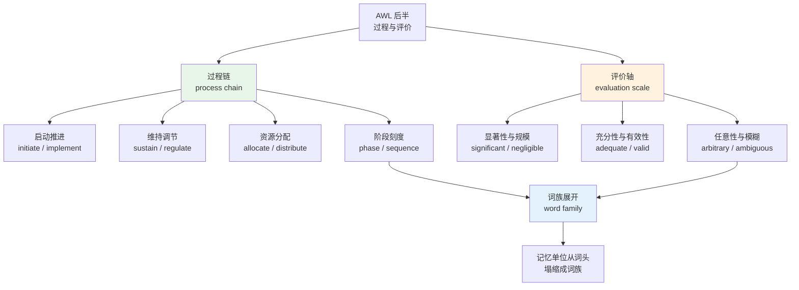
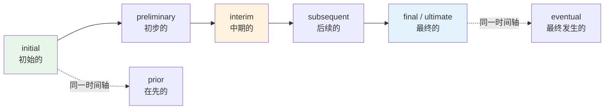
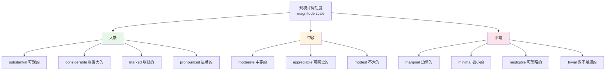
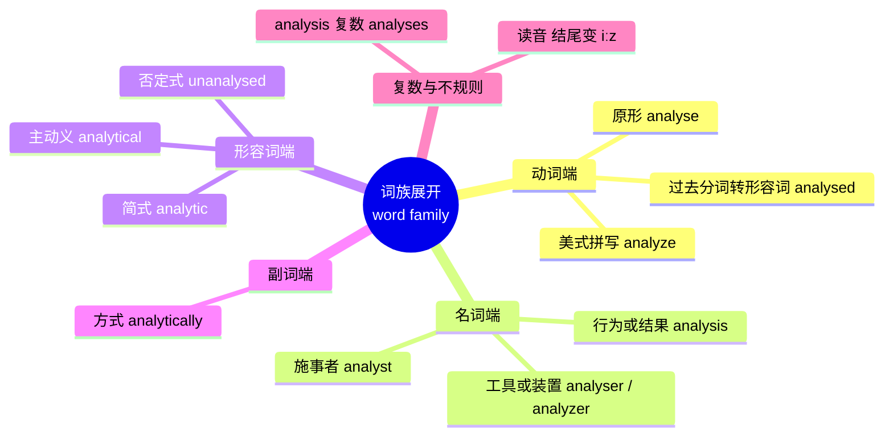
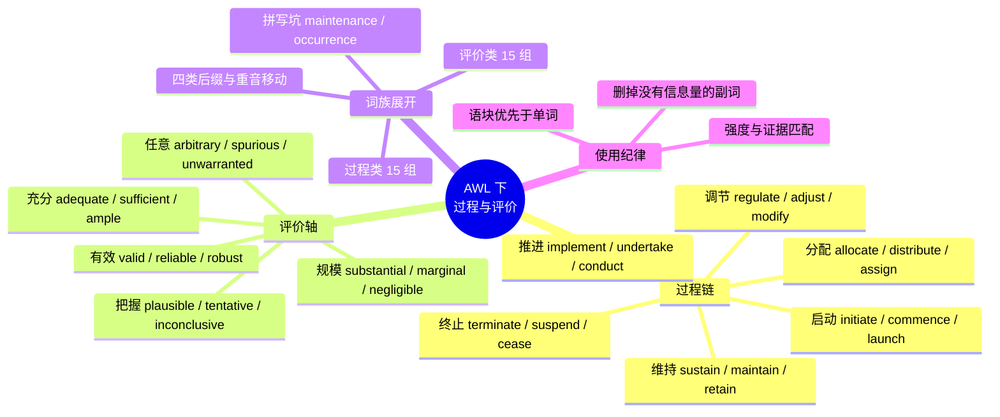

# 学术通用词表 AWL（下）：过程与评价

> [!info] 本篇定位
>
> [[19.学术通用词汇/01.学术通用词表 AWL（上）：论证与关系|AWL（上）]] 处理的是「作者在说什么」——立论、反驳、推导、限定，全部围绕论证动作。本篇处理另外两件事：**事情是怎么进行的**，以及**作者认为它做得怎么样**。
>
> 前一半是过程链：`initiate` 启动、`implement` 落地、`sustain` 维持、`allocate` 分配、`terminate` 终止。这批词在论文的 Method 段、在项目文档的执行章节、在技术规范的生命周期描述里密度最高。
>
> 后一半是评价轴：`significant` 与 `negligible` 是同一根刻度的两端，`adequate` 与 `sufficient` 差在参照系，`valid` 与 `reliable` 在方法学里是两个不同的检验，`arbitrary` 在中文里被翻成「任意的」而在英文学术语境里几乎总是贬义。
>
> 本篇同样为每条词目标注考试出现情况，并新增一件上篇没有的东西：**词族展开表**。AWL 收的本来就是词族而不是单词，`analyse → analysis → analyst → analytical → analytically` 这一整条链在词表里只算一条；掌握展开规则之后，链上的成员就不必再逐个单独背。
>
> 读完你会拿到两百余条过程与评价词、18 张按语义分组的六列词表、30 组词族展开表，以及一张把评价词按强度排序的刻度图。

---

## 1. 本篇导读：过程链与评价轴

学术文本和技术文档在结构上有个共同点——它们几乎总是在做两件事之一：**描述一个过程**，或者**对某个东西下判断**。

描述过程的段落长这样：

> The pilot scheme was **initiated** in 2019, **implemented** across twelve districts over the following two years, and **sustained** by a dedicated budget line until funding was **reallocated** in 2023.

下判断的段落长这样：

> The improvement was statistically **significant** but practically **negligible**; the sample size was **adequate** for the primary endpoint yet **insufficient** for the subgroup analysis, and the choice of cut-off point remains **arbitrary**.

两段话的信息密度差别很大，但生词量都不高。真正卡住中文读者的是：`initiate` 和 `launch` 到底差在哪、`sustain` 为什么不能换成 `keep`、`significant` 在统计语境里根本不是「重要的」、`adequate` 说出来其实带一点勉强。这些差别不是查词典能解决的，词典给的中文对应词在这批词上失真最严重。



图上两条主干对应本篇第 3 到 6 节与第 7 到 9 节。两条主干在第 10 节汇合到词族展开：过程动词的名词化形式（`implementation`、`allocation`）和评价形容词的副词化形式（`significantly`、`arbitrarily`）在真实文本里的出现频率往往高于词头本身，只记词头等于只记了词族的三分之一。

### 1.1 与相邻篇目的分工

| 内容 | 归属 | 本篇怎么处理 |
| --- | --- | --- |
| 论证动作 assert / refute / substantiate | [[19.学术通用词汇/01.学术通用词表 AWL（上）：论证与关系\|AWL（上）]] | 不重列，评价词的立场差异会引用其中的结论 |
| 统计术语 p-value / confidence interval | [[19.学术通用词汇/03.学术研究、统计术语与论文写作词汇\|学术研究、统计术语与论文写作词汇]] | 只讲 significant 的日常义与统计义分裂，具体统计量交给下一篇 |
| hedging 的句法实现 | 同上 | 只讲评价形容词本身的强度刻度 |
| 后缀构词规则 -tion / -ity / -al / -ly | [[14.构词法：前缀与后缀/05.名词后缀家族\|名词后缀家族]] 与 [[14.构词法：前缀与后缀/06.形容词、动词与副词后缀\|形容词、动词与副词后缀]] | 不重讲规则，只用规则做词族展开的实操 |
| 商务项目推进词 milestone / deliverable / scope creep | [[20.专业领域词汇/06.商务、市场与管理英语：战略、增长漏斗、OKR 与供应链\|商务、市场与管理英语]] | 不收，本篇只收通用学术层 |
| 高频动词 make / take / do 的义项 | [[13.抽象概念、评价与高频动词/01.高频万能动词义项地图 get take make do\|高频万能动词义项地图]] | 不重讲，只在语域替换表里作为口语端对照 |

### 1.2 为什么过程词和评价词要放在一起讲

因为它们在真实句子里几乎总是成对出现。学术写作的基本句式是「某个过程 + 对这个过程的判断」：

> - The protocol was **implemented** without **significant** deviation.
>   - 该方案在执行中没有出现明显偏离。
> - Resources were **allocated** on an **arbitrary** basis.
>   - 资源分配缺乏依据。
> - The effect was **sustained** but **marginal**.
>   - 效果得以维持，但幅度很小。

三句话都是「过程动词的被动式 + 评价形容词」。把两批词分开背，背完还是拼不出这种句子；成对记，一开始就在记语块。[[16.词义辨析、搭配与短语动词/04.语块类型与搭配体系\|语块类型与搭配体系]] 里给的搭配优先原则，在 AWL 这一层收益最大。

---

## 2. 考试标记的读法与 AWL 后半的子表编号

### 2.1 标记体系

本篇每条词目的「搭配与说明」列开头带一组方括号标记，表示这个词在国内外主流考试的常见词表里出现的情况：

| 标记 | 含义 | 大致定位 |
| --- | --- | --- |
| 六 | 大学英语六级常见词表 | 通用学术层的入门档 |
| 研 | 硕士研究生入学考试英语常见词表 | 阅读理解与完形高频 |
| 雅 | 雅思学术类常见词表 | Task 2 议论文产出侧 |
| 托 | 托福常见词表 | 阅读与听力讲座 |
| G | GRE 常见词表 | 只标 AWL 里同时进入 GRE 的少数词 |

标记写成连写形式，例如 `［六研雅托］` 表示四类考试的常见词表里都能查到这个词，`［研G］` 表示只在考研与 GRE 侧出现。

> [!warning] 标记是优先级参考，不是官方词表复刻
>
> 各家考试的词表本身就有多个流通版本，同一个词在不同出版方的词表里可能进也可能不进。本篇的标记按「该词在这一类考试的真题与主流备考材料中是否属于需要主动掌握的层级」来给，用途是帮你排背诵顺序——四个标记全有的词优先，只有一个标记的往后放。
>
> 要精确对齐某一场考试的词表，走 [[21.考试词汇专项/01.国内考试词表基准：课标 1600-3000 与四六级 4500-6000 的分层\|国内考试词表基准]]，那一篇讲各家口径怎么统计、彼此差多少。

### 2.2 AWL 后半的子表编号

Averil Coxhead 在 2000 年发布的 Academic Word List 把 570 个词族按频率切成 10 个 sublist，编号越小频率越高。本篇覆盖的过程与评价词跨越全部 10 个子表，但分布不均：

| 子表档位 | 频率定位 | 本篇涉及的代表词 |
| --- | --- | --- |
| Sublist 1–2 | 学术文本里出现最密的一批 | significant、consistent、process、period、available、major、maintain |
| Sublist 3–4 | 通用学术写作的主力 | implement、sufficient、initial、phase、sequence、valid |
| Sublist 5–6 | 方法与评价段的常客 | sustain、adjust、precise、preliminary、protocol、allocate |
| Sublist 7–8 | 出现频率下一档，写作产出侧仍常用 | implicit、ambiguous、arbitrary、terminate、accumulate、offset |
| Sublist 9–10 | AWL 尾部，认识即可 | nonetheless、albeit、adjacent、notwithstanding |

本篇不按子表编号排词表，按语义分组排。子表编号只在需要说明「这个词有多常见」时提一句。理由很直接：按频率排出来的表相邻两个词毫无语义关联，正是 [[00.英语词汇_大纲\|大纲]] 里点名要避开的背法。

---

## 3. 启动与推进：initiate、implement、undertake

过程链的第一段是「让一件事开始并往前走」。中文这一段的词很少，「开始、启动、实施、开展、推进」基本能覆盖全部；英文这一段的词很多，而且彼此的搭配对象锁得很死。

### 3.1 启动类动词

| 英文 | 英式音标 | 美式音标 | 词性 | 中文 | 搭配与说明 |
| --- | --- | --- | --- | --- | --- |
| **initiate** | /ɪˈnɪʃieɪt/ | /ɪˈnɪʃieɪt/ | v. | 发起；启动 | ［六研雅托］宾语多为 process、programme、talks、proceedings；强调「由某个主体主动开第一步」，主语通常是机构或人 |
| **commence** | /kəˈmens/ | /kəˈmens/ | v. | 开始 | ［研雅G］begin 的正式对应词，法律文书与正式通告偏好；commence proceedings、commence operations |
| **launch** | /lɔːntʃ/ | /lɔːntʃ/ | v./n. | 发起；推出 | ［六研雅托］比 initiate 更带公开宣告色彩：launch a campaign、launch a product |
| **inaugurate** | /ɪˈnɔːɡjəreɪt/ | /ɪˈnɔːɡjəreɪt/ | v. | 开创；举行就职 | ［G］仪式性极强，用于时代、任期、建筑落成 |
| **embark** | /ɪmˈbɑːk/ | /ɪmˈbɑːrk/ | v. | 着手 | ［雅托］固定搭配 embark on/upon，后接大工程：embark on a reform |
| **instigate** | /ˈɪnstɪɡeɪt/ | /ˈɪnstɪɡeɪt/ | v. | 唆使；发动 | ［G］贬义偏强，多与冲突、诉讼、骚乱搭配 |
| **trigger** | /ˈtrɪɡə/ | /ˈtrɪɡər/ | v./n. | 引发；触发器 | ［六研雅托］强调「一个小事件引起一连串后果」，技术文档里指事件触发 |
| **prompt** | /prɒmpt/ | /prɑːmpt/ | v./adj. | 促使；及时的 | ［研雅托］prompt sb to do；形容词义「及时的」是另一条义项线 |
| **induce** | /ɪnˈdjuːs/ | /ɪnˈduːs/ | v. | 诱发；促使 | ［研托G］医学与实验语境高频：induce sleep、induce a response |
| **precipitate** | /prɪˈsɪpɪteɪt/ | /prɪˈsɪpɪteɪt/ | v. | 促成（坏事） | ［G］宾语几乎总是负面：precipitate a crisis；形容词 /prɪˈsɪpɪtət/ 义为「仓促的」 |
| **stem** | /stem/ | /stem/ | v. | 起源于 | ［研雅托］stem from 表来源，方向与 give rise to 相反 |
| **originate** | /əˈrɪdʒɪneɪt/ | /əˈrɪdʒɪneɪt/ | v. | 起源；首创 | ［研雅托］originate in（地点）、originate from（来源）、originate with（人） |

> [!warning] initiate 与 launch、start 的分界
>
> 三个词的中文都能译成「开始」，英文的区别在于**谁能当主语、宾语是什么性质**。
>
> - `start` 主语可以是事情本身：`The meeting started at nine.` 事情自己开始。
> - `initiate` 主语必须是有意志的发起方：`The committee initiated a review.` 委员会发起了审查。写成 `The review initiated.` 是错的。
> - `launch` 要求这件事有对外的可见性：`launch an investigation` 成立，`launch a thought` 不成立。
>
> - ❌ ~~The process initiated in March.~~
> - ✅ **The process was initiated in March.**（被动，发起方省略）
> - ✅ **The process began in March.**（用不及物的 begin）

### 3.2 推进与执行类动词

| 英文 | 英式音标 | 美式音标 | 词性 | 中文 | 搭配与说明 |
| --- | --- | --- | --- | --- | --- |
| **implement** | /ˈɪmplɪment/ | /ˈɪmpləment/ | v. | 实施；落实 | ［六研雅托］宾语必须是已经定好的东西：policy、plan、system、recommendation；名词 implementation 读 /ˌɪmplɪmenˈteɪʃən/ |
| **execute** | /ˈeksɪkjuːt/ | /ˈeksɪkjuːt/ | v. | 执行；处决 | ［研雅托］学术与技术语境指按计划完成；法律语境另有「签署（合同）」与「处决」两义 |
| **undertake** | /ˌʌndəˈteɪk/ | /ˌʌndərˈteɪk/ | v. | 着手；承担 | ［六研雅托］undertake research/a study/a review 是学术文本的固定语块；三态 undertake-undertook-undertaken |
| **conduct** | /kənˈdʌkt/ | /kənˈdʌkt/ | v. | 进行；开展 | ［六研雅托］名词重音前移读 /ˈkɒndʌkt/ 与 /ˈkɑːndʌkt/；conduct a survey/an experiment/an interview |
| **administer** | /ədˈmɪnɪstə/ | /ədˈmɪnɪstər/ | v. | 施行；给药 | ［托G］administer a test、administer a drug；名词 administration 兼指「行政部门」 |
| **proceed** | /prəˈsiːd/ | /proʊˈsiːd/ | v. | 继续进行 | ［六研雅托］proceed with sth、proceed to do；复数名词 proceeds /ˈprəʊsiːdz/ 义为「收益」，与动词分家 |
| **pursue** | /pəˈsjuː/ | /pərˈsuː/ | v. | 追求；从事 | ［六研雅托］pursue a career/a goal/a line of inquiry；比 chase 抽象 |
| **advance** | /ədˈvɑːns/ | /ədˈvæns/ | v./n. | 推进；进展 | ［六研雅托］及物义「提出（观点）」：advance an argument；in advance 是另一条固定搭配 |
| **facilitate** | /fəˈsɪlɪteɪt/ | /fəˈsɪlɪteɪt/ | v. | 促进；使便利 | ［六研雅托］宾语是过程而非人：facilitate communication 成立，facilitate students 不成立 |
| **expedite** | /ˈekspɪdaɪt/ | /ˈekspədaɪt/ | v. | 加快 | ［G］正式度高，多用于流程与手续：expedite the approval process |
| **promote** | /prəˈməʊt/ | /prəˈmoʊt/ | v. | 促进；晋升 | ［六研雅托］三义并行：促进、推广、提拔，靠宾语区分 |
| **foster** | /ˈfɒstə/ | /ˈfɑːstər/ | v. | 培育；促进 | ［研雅托］宾语多为抽象的良性状态：foster innovation、foster cooperation |
| **enact** | /ɪˈnækt/ | /ɪˈnækt/ | v. | 颁布；将……付诸实施 | ［研G］法律语境主用：enact legislation |
| **institute** | /ˈɪnstɪtjuːt/ | /ˈɪnstətuːt/ | v./n. | 设立；机构 | ［研托G］动词义 institute proceedings/reforms，正式度高于 set up |

> [!example] 推进链在一段真实文本里的样子
>
> - The working group was **instituted** in 2018 and **undertook** a two-year review before the recommendations were **implemented**.
>   - 工作组于 2018 年设立，用两年时间开展审查，之后建议才付诸实施。
> - Simplifying the approval path would **expedite** delivery and **facilitate** cross-team coordination.
>   - 简化审批链条能加快交付，也让跨团队协作更顺。
> - Failure to **enact** the corresponding regulation left the scheme without a legal basis.
>   - 未能颁布配套法规，使该方案缺少法律依据。

`implement` 是这一节最需要卡准的词。它的宾语必须是**已经存在的方案**，不能是方案要达成的结果。中文说「实施改进」，英文写 `implement improvements` 勉强可通（把 improvements 理解成一组已定的改动），但写 `implement the goal` 就错了——目标要 `achieve`，方案才 `implement`。

- ❌ ~~We need to implement our objectives by the end of Q3.~~
- ✅ **We need to achieve our objectives by the end of Q3.**
- ✅ **We need to implement the agreed changes by the end of Q3.**

---

## 4. 维持、调节与终止：sustain、regulate、terminate

过程链的中段是「让它继续」与「让它变一变」，末段是「让它停下」。中文这三段的词同样偏少，「保持、维持、调整、修改、终止、暂停」六个词就够用；英文每一格都有三到五个可选词，选错语域会立刻暴露。

### 4.1 维持与保留

| 英文 | 英式音标 | 美式音标 | 词性 | 中文 | 搭配与说明 |
| --- | --- | --- | --- | --- | --- |
| **sustain** | /səˈsteɪn/ | /səˈsteɪn/ | v. | 维持；承受 | ［六研雅托］强调「在有消耗的情况下顶住」：sustain growth、sustain an injury；后者义为「遭受」 |
| **maintain** | /meɪnˈteɪn/ | /meɪnˈteɪn/ | v. | 保持；维护；主张 | ［六研雅托］三义：保持状态、维修保养、坚称（maintain that 从句） |
| **retain** | /rɪˈteɪn/ | /rɪˈteɪn/ | v. | 保留；留住 | ［六研雅托］强调「没有失去」：retain control、retain staff、retain heat |
| **preserve** | /prɪˈzɜːv/ | /prɪˈzɜːrv/ | v./n. | 保存；保护区 | ［六研雅托］宾语常是会退化的东西：preserve evidence、preserve biodiversity |
| **uphold** | /ʌpˈhəʊld/ | /ʌpˈhoʊld/ | v. | 维护；维持（原判） | ［研G］宾语是原则、标准、判决：uphold the ruling、uphold standards |
| **perpetuate** | /pəˈpetʃueɪt/ | /pərˈpetʃueɪt/ | v. | 使长期延续 | ［G］贬义偏强：perpetuate a stereotype、perpetuate inequality |
| **prolong** | /prəˈlɒŋ/ | /prəˈlɔːŋ/ | v. | 延长（时间） | ［研雅托］只延时间，不延长度：prolong the debate；实体长度用 extend |
| **extend** | /ɪkˈstend/ | /ɪkˈstend/ | v. | 延长；扩展；给予 | ［六研雅托］时间、空间、范围都能延；extend an invitation 是「发出邀请」 |
| **persist** | /pəˈsɪst/ | /pərˈsɪst/ | v. | 持续；坚持 | ［研雅托］主语是现象时义为「持续存在」：the problem persists；persist in doing 是「执意做」 |
| **endure** | /ɪnˈdjʊə/ | /ɪnˈdʊr/ | v. | 忍受；持久 | ［研托G］及物义「忍受」，不及物义「留存」：a theory that has endured |
| **intact** | /ɪnˈtækt/ | /ɪnˈtækt/ | adj. | 完好无损的 | ［研托G］常与 remain、keep、preserve 连用：the seal remained intact；只作表语的倾向强 |

`sustain` 与 `maintain` 是这一格最容易混的一对。判别办法：句子里有没有「消耗」这一层意思。`maintain` 只说状态没变；`sustain` 暗示有力量在往下拉，而这件事顶住了。

> - The economy **maintained** a growth rate of 3%.
>   - 经济增速保持在 3%。（陈述状态）
> - The economy **sustained** growth despite the export slump.
>   - 出口大幅下滑，经济仍维持了增长。（暗示有阻力）
> - She **sustained** minor injuries in the fall.
>   - 她在摔倒中受了轻伤。（承受的另一条义项）

### 4.2 调节与修改

| 英文 | 英式音标 | 美式音标 | 词性 | 中文 | 搭配与说明 |
| --- | --- | --- | --- | --- | --- |
| **regulate** | /ˈreɡjuleɪt/ | /ˈreɡjəleɪt/ | v. | 调节；监管 | ［六研雅托］两义分家：机器与生理的「调节」、行业的「监管」；名词 regulation 兼指法规 |
| **adjust** | /əˈdʒʌst/ | /əˈdʒʌst/ | v. | 调整；适应 | ［六研雅托］及物「调整」、不及物 adjust to 是「适应」；统计语境 adjusted for age 义为「已控制年龄因素」 |
| **modify** | /ˈmɒdɪfaɪ/ | /ˈmɑːdɪfaɪ/ | v. | 修改；缓和 | ［六研雅托］改动幅度小于 alter；语法术语义为「修饰」 |
| **alter** | /ˈɔːltə/ | /ˈɔːltər/ | v. | 改变 | ［六研雅托］中性词，不预设改好还是改坏；与 altar（祭坛）同音异形 |
| **revise** | /rɪˈvaɪz/ | /rɪˈvaɪz/ | v. | 修订；修正 | ［六研雅托］宾语是文本或估计值：revise the manuscript、revise the estimate upward；英式还有「复习」义 |
| **refine** | /rɪˈfaɪn/ | /rɪˈfaɪn/ | v. | 改进；提纯 | ［研雅托］refine a model/a method，暗示原来已经能用，只是不够细 |
| **calibrate** | /ˈkælɪbreɪt/ | /ˈkæləbreɪt/ | v. | 校准 | ［托G］仪器与模型主用，比喻义指「把力度调到合适」 |
| **stabilise / stabilize** | /ˈsteɪbəlaɪz/ | /ˈsteɪbəlaɪz/ | v. | 使稳定 | ［研雅托］英式 -ise 美式 -ize，拼写差异见 [[18.语域、英美差异与习语俚语/01.英式与美式词汇差异\|英式与美式词汇差异]] |
| **fluctuate** | /ˈflʌktʃueɪt/ | /ˈflʌktʃueɪt/ | v. | 波动 | ［研雅托］主语是数值：prices fluctuate；名词 fluctuation 常配 seasonal |
| **restrict** | /rɪˈstrɪkt/ | /rɪˈstrɪkt/ | v. | 限制 | ［六研雅托］restrict sth to sth；被动 be restricted to 表「仅限于」 |
| **constrain** | /kənˈstreɪn/ | /kənˈstreɪn/ | v. | 约束；限制 | ［研托G］比 restrict 更强调「外部条件不允许」；名词 constraint 是工程文档高频词 |
| **inhibit** | /ɪnˈhɪbɪt/ | /ɪnˈhɪbɪt/ | v. | 抑制 | ［研托G］生化与心理语境主用，与 facilitate 构成反义对 |
| **impose** | /ɪmˈpəʊz/ | /ɪmˈpoʊz/ | v. | 强加；征收 | ［六研雅托］impose sth on sb；impose a tax/a limit/a deadline |

> [!tip] 一对反义搭档：facilitate 与 inhibit
>
> 学术摘要里描述机制时，正向用 `facilitate`、`promote`、`enhance`，负向用 `inhibit`、`impede`、`hinder`、`hamper`。四个负向词按力度排：
>
> ```text
> hamper  <  hinder  <  impede  <  inhibit
> 拖慢      妨碍       阻碍      抑制（可至完全阻断）
> ```
>
> 四个词的宾语都是过程或能力，不能直接接人。`hinder progress` 成立，`hinder him` 语法上通但学术文本里罕见。

### 4.3 暂停与终止

| 英文 | 英式音标 | 美式音标 | 词性 | 中文 | 搭配与说明 |
| --- | --- | --- | --- | --- | --- |
| **terminate** | /ˈtɜːmɪneɪt/ | /ˈtɜːrmɪneɪt/ | v. | 终止 | ［六研雅托］正式且带最终性：terminate a contract/an agreement；名词 termination |
| **suspend** | /səˈspend/ | /səˈspend/ | v. | 暂停；悬挂 | ［六研雅托］暂停可恢复，与 terminate 对立；另有「悬浮」义 suspended in liquid |
| **cease** | /siːs/ | /siːs/ | v. | 停止 | ［研雅托G］cease to do 与 cease doing 都可；正式度高于 stop；名词 cessation /seˈseɪʃən/ |
| **discontinue** | /ˌdɪskənˈtɪnjuː/ | /ˌdɪskənˈtɪnjuː/ | v. | 停产；中止 | ［雅托］产品与服务语境主用：a discontinued model |
| **halt** | /hɔːlt/ | /hɔːlt/ | v./n. | 使停止 | ［研雅托］强调「突然叫停」：bring sth to a halt |
| **abandon** | /əˈbændən/ | /əˈbændən/ | v. | 放弃；抛弃 | ［六研雅托］abandon a plan 是主动放弃，暗示原来投入过 |
| **curtail** | /kɜːˈteɪl/ | /kɜːrˈteɪl/ | v. | 削减；缩短 | ［G］宾语是权利、开支、自由：curtail spending、curtail freedoms |
| **withdraw** | /wɪðˈdrɔː/ | /wɪðˈdrɔː/ | v. | 撤回；退出 | ［六研雅托］withdraw a paper/an offer/support；三态 withdraw-withdrew-withdrawn |
| **revoke** | /rɪˈvəʊk/ | /rɪˈvoʊk/ | v. | 撤销（许可） | ［G］宾语是官方授予的东西：revoke a licence/a permit |
| **phase out** | /feɪz aʊt/ | /feɪz aʊt/ | phr.v. | 逐步淘汰 | ［雅托］与 phase in 成对，强调分阶段而非一刀切 |

> [!warning] terminate 与 suspend 在合同与技术文档里不能互换
>
> 这两个词的差别在英文里是**法律效果**上的差别，翻成中文常常都变成「停止」，读者要靠上下文猜，写作时更要卡准。
>
> - `suspend` 暂停，状态可恢复，权利义务通常仍在。`The account has been suspended.` 账号被封停，解封后照旧。
> - `terminate` 终止，关系结束，通常伴随清算条款。`The contract was terminated.` 合同解除，后面接的是违约金和交接。
>
> - ❌ ~~We suspended the contract because of repeated breaches.~~（重复违约通常导致解除而非暂停）
> - ✅ **We terminated the contract because of repeated breaches.**

---

## 5. 资源与分配：allocate、distribute、consume

这一节的词在论文的 Method 段、预算文档、系统设计文档里高度重叠。中文一律说「分配」，英文按「分给谁」「分成几份」「按什么规则分」分出好几个词。

### 5.1 分配与投放

| 英文 | 英式音标 | 美式音标 | 词性 | 中文 | 搭配与说明 |
| --- | --- | --- | --- | --- | --- |
| **allocate** | /ˈæləkeɪt/ | /ˈæləkeɪt/ | v. | 分配（资源） | ［六研雅托］allocate sth to sb/sth；宾语是有限资源：funds、time、memory、bandwidth |
| **assign** | /əˈsaɪn/ | /əˈsaɪn/ | v. | 指派；赋值 | ［六研雅托］assign sb to sth（派人）、assign a value to a variable（赋值）；两义共存 |
| **distribute** | /dɪˈstrɪbjuːt/ | /dɪˈstrɪbjuːt/ | v. | 分发；分布 | ［六研雅托］及物「分发」，被动 be distributed 表「呈某种分布」，是统计描述的固定说法 |
| **apportion** | /əˈpɔːʃən/ | /əˈpɔːrʃən/ | v. | 按比例分摊 | ［G］强调按份额：apportion costs、apportion blame |
| **deploy** | /dɪˈplɔɪ/ | /dɪˈplɔɪ/ | v. | 部署；调用 | ［研托G］军事来源，技术文档里指把代码或资源投入运行环境 |
| **designate** | /ˈdezɪɡneɪt/ | /ˈdezɪɡneɪt/ | v. | 指定；命名为 | ［研托G］designate sth as sth；形容词后置的 president-designate 义为「候任」 |
| **earmark** | /ˈɪəmɑːk/ | /ˈɪrmɑːrk/ | v. | 专款专用地拨出 | ［G］earmark funds for sth，比 allocate 多一层「不得挪用」 |
| **subsidise / subsidize** | /ˈsʌbsɪdaɪz/ | /ˈsʌbsɪdaɪz/ | v. | 补贴 | ［研雅托］名词 subsidy 是雅思议论文高频词 |
| **fund** | /fʌnd/ | /fʌnd/ | v./n. | 资助；基金 | ［六研雅托］被动 be funded by 是论文致谢段固定句式 |
| **invest** | /ɪnˈvest/ | /ɪnˈvest/ | v. | 投入；投资 | ［六研雅托］invest in sth；invest sb with sth 是「授予（权力）」的另一义 |

### 5.2 消耗、积累与补偿

| 英文 | 英式音标 | 美式音标 | 词性 | 中文 | 搭配与说明 |
| --- | --- | --- | --- | --- | --- |
| **consume** | /kənˈsjuːm/ | /kənˈsuːm/ | v. | 消耗；消费 | ［六研雅托］能源与资源语境用「消耗」，市场语境用「消费」；名词 consumption |
| **expend** | /ɪkˈspend/ | /ɪkˈspend/ | v. | 耗费 | ［G］比 spend 正式，宾语是 energy、effort、resources；名词 expenditure |
| **deplete** | /dɪˈpliːt/ | /dɪˈpliːt/ | v. | 耗尽（储量） | ［托G］宾语是可枯竭的存量：deplete reserves、deplete the ozone layer |
| **exhaust** | /ɪɡˈzɔːst/ | /ɪɡˈzɔːst/ | v./n. | 用尽；废气 | ［六研雅托］exhaust all options 是固定语块；名词义「排气」 |
| **accumulate** | /əˈkjuːmjəleɪt/ | /əˈkjuːmjəleɪt/ | v. | 积累 | ［六研雅托］主语可以是被积累的东西：evidence accumulates；名词 accumulation |
| **generate** | /ˈdʒenəreɪt/ | /ˈdʒenəreɪt/ | v. | 产生；生成 | ［六研雅托］宾语可以是电力、收入、数据、假设；比 produce 更适合抽象产出 |
| **yield** | /jiːld/ | /jiːld/ | v./n. | 产出；让步 | ［六研雅托］yield results 是学术固定语块；名词义「产量、收益率」 |
| **derive** | /dɪˈraɪv/ | /dɪˈraɪv/ | v. | 得出；源自 | ［六研雅托］derive sth from sth（推导）、be derived from（源自）；论证义在 [[19.学术通用词汇/01.学术通用词表 AWL（上）：论证与关系\|AWL（上）]] |
| **extract** | /ɪkˈstrækt/ | /ɪkˈstrækt/ | v./n. | 提取；摘录 | ［研雅托］名词重音前移读 /ˈekstrækt/；extract data from |
| **acquire** | /əˈkwaɪə/ | /əˈkwaɪər/ | v. | 获得；习得 | ［六研雅托］acquire a skill/a language/a company；名词 acquisition |
| **obtain** | /əbˈteɪn/ | /əbˈteɪn/ | v. | 取得 | ［六研雅托］比 get 正式，学术文本里 obtain data/permission/results |
| **secure** | /sɪˈkjʊə/ | /sɪˈkjʊr/ | v./adj. | 争取到；安全的 | ［六研雅托］动词义「设法获得」：secure funding；两义在词典里分列 |
| **supplement** | /ˈsʌplɪment/ | /ˈsʌpləment/ | v. | 补充 | ［研雅托］名词重音位置不变，只是末音节弱化成 /ˈsʌplɪmənt/；supplement A with B |
| **compensate** | /ˈkɒmpenseɪt/ | /ˈkɑːmpənseɪt/ | v. | 补偿；抵消 | ［六研雅托］compensate for sth（弥补）、compensate sb（赔偿）两条搭配 |
| **offset** | /ˌɒfˈset/ | /ˌɔːfˈset/ | v. | 抵消 | ［研雅托］动词重音在后，名词 /ˈɒfset/ 重音在前；三态同形 offset-offset-offset |
| **utilise / utilize** | /ˈjuːtəlaɪz/ | /ˈjuːtəlaɪz/ | v. | 利用 | ［研雅托］与 use 同义但正式度更高；写作中滥用会显得堆砌，能用 use 就用 use |

> [!warning] utilise 是学术写作里被点名批评最多的词
>
> 英语写作指南普遍建议：`utilise` 只在「把某物用于其本来不擅长的用途」这个精确义上使用，其余场合一律换 `use`。多数中文作者用 `utilise` 是为了显得正式，效果适得其反——母语读者读到的是「作者在凑字数」。
>
> - ❌ ~~We utilised a questionnaire to collect the data.~~
> - ✅ **We used a questionnaire to collect the data.**
> - ✅ **The team utilised the disused warehouse as a testing site.**（把仓库挪作他用，这里 utilise 有信息量）
>
> 同类的还有 `commence`（能用 `begin` 就别用）、`endeavour`（能用 `try` 就别用）。判定办法见 [[18.语域、英美差异与习语俚语/02.语域分层与英语词汇的历史层次\|语域分层与英语词汇的历史层次]] 里的「降低正式度」一节。

---

## 6. 过程名词与阶段刻度：procedure、phase、mechanism

过程动词在真实文本里出现最多的形态往往不是动词本身，而是名词化后的形式。写 `after the implementation of the policy` 比写 `after the policy was implemented` 更常见，因为名词化让整个过程能塞进一个介词短语里当状语用。

### 6.1 阶段与顺序



这张图排的是同一条时间轴上的五个位置词。`initial` 指过程的第一个状态，`preliminary` 指正式结果出来之前的临时版本（`preliminary findings` 初步结论），`interim` 指中途的正式产出（`interim report` 中期报告），`subsequent` 指此后的，`final` 与 `ultimate` 指终点。两条虚线上的 `prior` 和 `eventual` 是配套词：`prior to` 是 `before` 的正式对应，`eventual` 强调「经过一段过程之后才发生的」，不能当「最后的」直接用在排序上。

| 英文 | 英式音标 | 美式音标 | 词性 | 中文 | 搭配与说明 |
| --- | --- | --- | --- | --- | --- |
| **initial** | /ɪˈnɪʃəl/ | /ɪˈnɪʃəl/ | adj./n. | 最初的；首字母 | ［六研雅托］initial stage/response/estimate；副词 initially 常用作句首状语 |
| **preliminary** | /prɪˈlɪmɪnəri/ | /prɪˈlɪməneri/ | adj./n. | 初步的；预备 | ［研雅托］preliminary results 暗示结论可能改；复数名词指预赛 |
| **interim** | /ˈɪntərɪm/ | /ˈɪntərɪm/ | adj./n. | 中期的；过渡期 | ［托G］interim report/measure；in the interim 义为「其间」 |
| **subsequent** | /ˈsʌbsɪkwənt/ | /ˈsʌbsɪkwənt/ | adj. | 随后的 | ［六研雅托］subsequent to 是 after 的正式对应；副词 subsequently 是学术连接词 |
| **prior** | /ˈpraɪə/ | /ˈpraɪər/ | adj. | 在先的；优先的 | ［六研雅托］prior to sth、prior knowledge/experience；不用 prior than |
| **ultimate** | /ˈʌltɪmət/ | /ˈʌltɪmət/ | adj. | 最终的；根本的 | ［六研雅托］ultimate goal/cause；副词 ultimately 义为「归根结底」 |
| **eventual** | /ɪˈventʃuəl/ | /ɪˈventʃuəl/ | adj. | 最终（发生）的 | ［研托］不表排序，只表「经过一段时间后的」；eventual outcome |
| **concurrent** | /kənˈkʌrənt/ | /kənˈkɜːrənt/ | adj. | 同时发生的 | ［托G］技术语境指并发；concurrent with sth |
| **successive** | /səkˈsesɪv/ | /səkˈsesɪv/ | adj. | 连续的 | ［研托］three successive years；与 successful 形近易混 |
| **intermittent** | /ˌɪntəˈmɪtənt/ | /ˌɪntərˈmɪtənt/ | adj. | 间歇的 | ［托G］intermittent fault 是排障文档常见词 |

### 6.2 过程与机制名词

| 英文 | 英式音标 | 美式音标 | 词性 | 中文 | 搭配与说明 |
| --- | --- | --- | --- | --- | --- |
| **procedure** | /prəˈsiːdʒə/ | /prəˈsiːdʒər/ | n. | 程序；手续 | ［六研雅托］指规定好的步骤序列；形容词 procedural 义为「程序上的」 |
| **process** | /ˈprəʊses/ | /ˈprɑːses/ | n./v. | 过程；处理 | ［六研雅托］英美元音差别明显；动词义「加工、处理数据」；in the process of doing |
| **phase** | /feɪz/ | /feɪz/ | n./v. | 阶段；相位 | ［六研雅托］phase one/two；动词 phase in/out 表分阶段引入或淘汰 |
| **stage** | /steɪdʒ/ | /steɪdʒ/ | n. | 阶段；舞台 | ［六研雅托］at this stage 是常用状语；与 phase 大体可换，phase 更技术 |
| **sequence** | /ˈsiːkwəns/ | /ˈsiːkwəns/ | n./v. | 序列；顺序 | ［六研雅托］形容词 sequential 义为「顺序的」，与 concurrent 对立 |
| **cycle** | /ˈsaɪkəl/ | /ˈsaɪkəl/ | n./v. | 周期；循环 | ［六研雅托］形容词 cyclical /ˈsɪklɪkəl/ 重音仍在首音节，但首音节元音由 /aɪ/ 变 /ɪ/ |
| **mechanism** | /ˈmekənɪzəm/ | /ˈmekənɪzəm/ | n. | 机制；机构 | ［六研雅托］学术文本里指「起作用的内在方式」，不必是实体装置 |
| **framework** | /ˈfreɪmwɜːk/ | /ˈfreɪmwɜːrk/ | n. | 框架；体系 | ［六研雅托］within the framework of 是固定介词短语 |
| **protocol** | /ˈprəʊtəkɒl/ | /ˈproʊtəkɔːl/ | n. | 规程；协议 | ［研托G］医学指试验方案，网络指通信协议，外交指礼宾 |
| **transition** | /trænˈzɪʃən/ | /trænˈzɪʃən/ | n./v. | 过渡；转变 | ［六研雅托］transition from A to B；动词用法近年才普及 |
| **scheme** | /skiːm/ | /skiːm/ | n. | 方案；计划 | ［六研雅托］英式中性（a pension scheme），美式偏贬义（阴谋） |
| **scenario** | /səˈnɑːriəʊ/ | /səˈnærioʊ/ | n. | 情景；设想 | ［六研雅托］worst-case scenario；复数 scenarios |
| **iteration** | /ˌɪtəˈreɪʃən/ | /ˌɪtəˈreɪʃən/ | n. | 迭代；一次循环 | ［托G］技术文档主用；动词 iterate |
| **intervention** | /ˌɪntəˈvenʃən/ | /ˌɪntərˈvenʃən/ | n. | 干预；介入 | ［研雅托］医学与政策研究的核心词：the intervention group |
| **implementation** | /ˌɪmplɪmenˈteɪʃən/ | /ˌɪmpləmenˈteɪʃən/ | n. | 实施；实现 | ［六研雅托］技术语境指「某个规范的一份具体实现」 |
| **allocation** | /ˌæləˈkeɪʃən/ | /ˌæləˈkeɪʃən/ | n. | 分配；配额 | ［研雅托］resource allocation、random allocation（随机分组） |
| **duration** | /djuˈreɪʃən/ | /duˈreɪʃən/ | n. | 持续时间 | ［六研雅托］for the duration of sth；与 length of time 同义但更正式 |
| **interval** | /ˈɪntəvəl/ | /ˈɪntərvəl/ | n. | 间隔；区间 | ［六研雅托］at regular intervals；统计里的 confidence interval 见下一篇 |

> [!example] 名词化让一句话装下整条过程
>
> - **Implementation** of the revised **protocol** proceeded in three **phases**, with a six-month **interval** between each **transition**.
>   - 修订版规程分三个阶段实施，每次过渡之间间隔六个月。
> - The **allocation mechanism** was documented in the appendix; its **procedural** basis is discussed in Section 4.
>   - 分配机制记录在附录中，其程序依据在第 4 节讨论。

两句话里名词化形式共出现六次。读英文文献卡壳，很多时候不是不认识 `implement`，而是认不出 `implementation`、`procedural` 这些变形。第 10 节的词族展开就是为了把这层障碍拆掉。

---

## 7. 评价轴一：显著性与规模，significant 到 negligible

评价词是学术文本里立场最重的一批词。同一个数据，写 `a substantial increase` 和写 `a marginal increase`，读者得到的结论完全相反。这一节把规模评价词排成一根刻度。



刻度图上的三段不是均分的。大端四个词彼此差别很小，主要是搭配偏好不同：`substantial` 偏配数量（`a substantial proportion`），`considerable` 偏配抽象量（`considerable difficulty`），`marked` 和 `pronounced` 偏配「差异、效应、趋势」这类可以被观察出来的东西。小端四个词的差别则很大：`marginal` 是「刚好在边缘上」，`minimal` 是「小到不能再小但确实存在」，`negligible` 是「小到可以不算」，`trivial` 带轻蔑色彩，说这件事根本不值得讨论。

### 7.1 大端与中段

| 英文 | 英式音标 | 美式音标 | 词性 | 中文 | 搭配与说明 |
| --- | --- | --- | --- | --- | --- |
| **significant** | /sɪɡˈnɪfɪkənt/ | /sɪɡˈnɪfɪkənt/ | adj. | 显著的；有意义的 | ［六研雅托］统计语境专义见 7.3；日常义与 important 接近但更书面 |
| **substantial** | /səbˈstænʃəl/ | /səbˈstænʃəl/ | adj. | 可观的；实质的 | ［六研雅托］a substantial amount/proportion/increase；另有「结实的」实体义 |
| **considerable** | /kənˈsɪdərəbəl/ | /kənˈsɪdərəbəl/ | adj. | 相当大的 | ［六研雅托］绝大多数搭配是不可数抽象名词：considerable interest/effort/uncertainty |
| **marked** | /mɑːkt/ | /mɑːrkt/ | adj. | 明显的 | ［研雅托］a marked difference/contrast/improvement；副词 markedly |
| **pronounced** | /prəˈnaʊnst/ | /prəˈnaʊnst/ | adj. | 显著的 | ［托G］多修饰趋势与效应：the effect was more pronounced in older subjects |
| **notable** | /ˈnəʊtəbəl/ | /ˈnoʊtəbəl/ | adj. | 值得注意的 | ［研雅托］a notable exception 是固定语块；副词 notably 可作举例连接词 |
| **profound** | /prəˈfaʊnd/ | /prəˈfaʊnd/ | adj. | 深远的 | ［研雅托G］配 impact、implication、change；强度高于 significant |
| **extensive** | /ɪkˈstensɪv/ | /ɪkˈstensɪv/ | adj. | 广泛的；大量的 | ［六研雅托］extensive research/damage/coverage；强调覆盖面而非强度 |
| **comprehensive** | /ˌkɒmprɪˈhensɪv/ | /ˌkɑːmprɪˈhensɪv/ | adj. | 全面的 | ［六研雅托］与 comprehensible（可理解的）形近义异 |
| **widespread** | /ˈwaɪdspred/ | /ˈwaɪdspred/ | adj. | 普遍的 | ［六研雅托］widespread adoption/concern；只作定语的倾向强 |
| **prevalent** | /ˈprevələnt/ | /ˈprevələnt/ | adj. | 盛行的 | ［研托G］名词 prevalence 是流行病学核心词 |
| **predominant** | /prɪˈdɒmɪnənt/ | /prɪˈdɑːmɪnənt/ | adj. | 占主导的 | ［研托G］副词 predominantly 义为「主要是」，比 mainly 正式 |
| **moderate** | /ˈmɒdərət/ | /ˈmɑːdərət/ | adj./v. | 适中的；缓和 | ［六研雅托］形容词与动词读音不同，动词读 /ˈmɒdəreɪt/ 与 /ˈmɑːdəreɪt/ |
| **appreciable** | /əˈpriːʃəbəl/ | /əˈpriːʃəbəl/ | adj. | 可觉察的 | ［G］与 negligible 构成一对：可察觉与可忽略 |
| **modest** | /ˈmɒdɪst/ | /ˈmɑːdɪst/ | adj. | 不大的；谦逊的 | ［研雅托］a modest improvement 是「幅度不大但确实有」的标准说法 |

### 7.2 小端

| 英文 | 英式音标 | 美式音标 | 词性 | 中文 | 搭配与说明 |
| --- | --- | --- | --- | --- | --- |
| **marginal** | /ˈmɑːdʒɪnəl/ | /ˈmɑːrdʒɪnəl/ | adj. | 边际的；微小的 | ［研雅托G］经济学义「边际的」与日常义「不重要的」并存，靠语境区分 |
| **minimal** | /ˈmɪnɪməl/ | /ˈmɪnɪməl/ | adj. | 极小的；最低限度的 | ［六研雅托］minimal impact/effort；与 minimum（名词与限定词）分工 |
| **negligible** | /ˈneɡlɪdʒəbəl/ | /ˈneɡlɪdʒəbəl/ | adj. | 可忽略不计的 | ［研托G］与动词 neglect 同根；下结论力度强，等于宣布这一项不用管 |
| **trivial** | /ˈtrɪviəl/ | /ˈtrɪviəl/ | adj. | 琐碎的；平凡的 | ［研托G］带贬义；数学与技术语境的 trivial solution 是中性术语 |
| **slight** | /slaɪt/ | /slaɪt/ | adj. | 轻微的 | ［六研雅托］a slight increase；副词 slightly 是最常用的小幅度修饰语 |
| **minor** | /ˈmaɪnə/ | /ˈmaɪnər/ | adj./n. | 次要的；未成年人 | ［六研雅托］与 major 成对；学术语境 minor revision 指小修 |
| **nominal** | /ˈnɒmɪnəl/ | /ˈnɑːmɪnəl/ | adj. | 名义上的；象征性的 | ［托G］a nominal fee 是「象征性收费」；经济学的 nominal 与 real 对立 |
| **sparse** | /spɑːs/ | /spɑːrs/ | adj. | 稀疏的 | ［托G］sparse data/evidence；技术语境的 sparse matrix 是术语 |
| **scarce** | /skeəs/ | /skers/ | adj. | 稀缺的 | ［六研雅托］名词 scarcity；副词 scarcely 是半否定词，义项已分家 |
| **residual** | /rɪˈzɪdjuəl/ | /rɪˈzɪdʒuəl/ | adj./n. | 残余的；残差 | ［托G］统计里名词义「残差」是固定术语 |

### 7.3 significant 的两条义项线

`significant` 是这一节最需要单独处理的词。它在日常语境和统计语境里指的是完全不同的事情，而中文都译成「显著」，中文读者据此得出的结论经常是错的。

| 语境 | 含义 | 判断依据 | 典型搭配 |
| --- | --- | --- | --- |
| 日常与一般书面 | 重要的、值得关注的 | 作者的主观判断 | a significant contribution、significant progress |
| 统计 | 统计上显著，即结果不太可能由随机波动造成 | p 值与预设显著性水平 | statistically significant、significant at the 5% level |

> [!warning] statistically significant 不等于「效果大」
>
> 这是跨学科最常见的误读，中文译名「显著」要负一部分责任。统计显著只回答一个问题：**这个差异有多大可能是碰巧出现的**。样本量足够大时，一个小到毫无实际意义的差异也能达到统计显著。
>
> 论文里因此常见这种句子：
>
> - The difference was **statistically significant** (p < 0.01) but of **negligible** practical importance.
>   - 该差异在统计上显著，但实际意义可以忽略。
>
> 两个词同时出现并不矛盾。要表达「效果大」，学术英语用的是 `effect size`、`substantial`、`large`，不是 `significant`。统计术语本身的展开见 [[19.学术通用词汇/03.学术研究、统计术语与论文写作词汇\|学术研究、统计术语与论文写作词汇]]。

对应的名词与副词也要一起记：

| 英文 | 英式音标 | 美式音标 | 词性 | 中文 | 搭配与说明 |
| --- | --- | --- | --- | --- | --- |
| **significance** | /sɪɡˈnɪfɪkəns/ | /sɪɡˈnɪfɪkəns/ | n. | 重要性；显著性 | ［六研雅托］statistical significance、of little significance |
| **significantly** | /sɪɡˈnɪfɪkəntli/ | /sɪɡˈnɪfɪkəntli/ | adv. | 显著地 | ［六研雅托］修饰动词与比较级：significantly higher than |
| **signify** | /ˈsɪɡnɪfaɪ/ | /ˈsɪɡnɪfaɪ/ | v. | 表示；意味着 | ［研托G］比 mean 正式，主语多为符号或现象 |
| **insignificant** | /ˌɪnsɪɡˈnɪfɪkənt/ | /ˌɪnsɪɡˈnɪfɪkənt/ | adj. | 不显著的；微不足道的 | ［研雅托］统计语境指未达显著水平，日常语境带贬义 |

---

## 8. 评价轴二：充分性、有效性与严谨度，adequate 到 robust

上一节的刻度量的是「多大」，这一节的刻度量的是「够不够、成不成立、靠不靠得住」。这三件事在中文里常常都说成「有效」，英文分得很细，方法学段落全靠这批词把话说准。

### 8.1 充分性

| 英文 | 英式音标 | 美式音标 | 词性 | 中文 | 搭配与说明 |
| --- | --- | --- | --- | --- | --- |
| **adequate** | /ˈædɪkwət/ | /ˈædɪkwət/ | adj. | 足够的；尚可的 | ［六研雅托］adequate for sth、adequate to do；语气带保留，常暗示「刚够而已」 |
| **sufficient** | /səˈfɪʃənt/ | /səˈfɪʃənt/ | adj. | 充分的 | ［六研雅托］sufficient for/to do；中性，只说数量够，不带评价色彩 |
| **ample** | /ˈæmpəl/ | /ˈæmpəl/ | adj. | 充裕的 | ［研托G］ample evidence/opportunity/time；比 sufficient 多一层「绰绰有余」 |
| **abundant** | /əˈbʌndənt/ | /əˈbʌndənt/ | adj. | 丰富的 | ［六研雅托］abundant in sth；名词 abundance |
| **inadequate** | /ɪnˈædɪkwət/ | /ɪnˈædɪkwət/ | adj. | 不足的 | ［六研雅托］学术写作里指出他人研究缺陷的常用词 |
| **insufficient** | /ˌɪnsəˈfɪʃənt/ | /ˌɪnsəˈfɪʃənt/ | adj. | 不足的 | ［六研雅托］insufficient evidence to conclude 是标准句式 |
| **deficient** | /dɪˈfɪʃənt/ | /dɪˈfɪʃənt/ | adj. | 缺乏的；有缺陷的 | ［研托G］deficient in sth；名词 deficiency 常配营养与制度 |
| **scant** | /skænt/ | /skænt/ | adj. | 极少的 | ［G］scant attention/evidence，只作定语 |
| **surplus** | /ˈsɜːpləs/ | /ˈsɜːrpləs/ | n./adj. | 盈余；过剩的 | ［研雅托］与 deficit 成对，经济文本高频 |
| **redundant** | /rɪˈdʌndənt/ | /rɪˈdʌndənt/ | adj. | 多余的；被裁员的 | ［研托G］技术语境「冗余的」是褒义（容错），文风语境「累赘的」是贬义；英式 be made redundant 义为「被裁员」 |

> [!warning] adequate 说出来是有保留的
>
> 中文「足够」是中性词，英文 `adequate` 不是。母语读者读到 `adequate` 会自动补上一句「但也就是够而已」。评审意见里写 `The methodology is adequate.` 不是表扬，是勉强放行。
>
> 三个词的语气强度：
>
> ```text
> inadequate  <  adequate  <  sufficient  <  ample
> 不够          勉强够       够            绰绰有余
> ```
>
> 要真心夸对方数据充分，用 `ample` 或 `robust`；要中性陈述数量达标，用 `sufficient`；用 `adequate` 就是在留话口。

### 8.2 有效性与可靠性

| 英文 | 英式音标 | 美式音标 | 词性 | 中文 | 搭配与说明 |
| --- | --- | --- | --- | --- | --- |
| **valid** | /ˈvælɪd/ | /ˈvælɪd/ | adj. | 有效的；成立的 | ［六研雅托］两条线：论证「成立」与证件「在有效期内」；名词 validity |
| **invalid** | /ɪnˈvælɪd/ | /ɪnˈvælɪd/ | adj. | 无效的 | ［研托］重音在第二音节；名词 /ˈɪnvəlɪd/ 义为「病弱者」，重音在第一音节 |
| **validate** | /ˈvælɪdeɪt/ | /ˈvælɪdeɪt/ | v. | 验证；确认有效 | ［研托G］validate a model/a hypothesis；技术语境指输入校验 |
| **reliable** | /rɪˈlaɪəbəl/ | /rɪˈlaɪəbəl/ | adj. | 可靠的 | ［六研雅托］方法学里指「重复测量结果一致」，与 valid 是两个检验 |
| **reliability** | /rɪˌlaɪəˈbɪləti/ | /rɪˌlaɪəˈbɪləti/ | n. | 信度；可靠性 | ［研托G］与 validity 成对出现在方法学段 |
| **robust** | /rəʊˈbʌst/ | /roʊˈbʌst/ | adj. | 稳健的；健壮的 | ［研托G］重音在后；指「换个条件结论也不塌」，是学术夸奖用语 |
| **rigorous** | /ˈrɪɡərəs/ | /ˈrɪɡərəs/ | adj. | 严谨的 | ［研托G］rigorous testing/analysis；名词 rigour 英式、rigor 美式 |
| **accurate** | /ˈækjərət/ | /ˈækjərət/ | adj. | 准确的 | ［六研雅托］指接近真值；名词 accuracy |
| **precise** | /prɪˈsaɪs/ | /prɪˈsaɪs/ | adj. | 精确的 | ［六研雅托］指刻度细、重复性好；与 accurate 不是同一件事 |
| **consistent** | /kənˈsɪstənt/ | /kənˈsɪstənt/ | adj. | 一致的；始终如一的 | ［六研雅托］consistent with sth（与……相符）是学术高频搭配 |
| **coherent** | /kəʊˈhɪərənt/ | /koʊˈhɪrənt/ | adj. | 连贯的；条理清楚的 | ［研托G］评价论证结构而非数据；名词 coherence |
| **systematic** | /ˌsɪstəˈmætɪk/ | /ˌsɪstəˈmætɪk/ | adj. | 系统的 | ［六研雅托］systematic review 是文献综述的一种正式类型 |
| **feasible** | /ˈfiːzəbəl/ | /ˈfiːzəbəl/ | adj. | 可行的 | ［六研雅托］指技术上做得到；名词 feasibility |
| **viable** | /ˈvaɪəbəl/ | /ˈvaɪəbəl/ | adj. | 可行的；能存活的 | ［研雅托］比 feasible 多一层「能持续下去」；a viable alternative |
| **legitimate** | /lɪˈdʒɪtɪmət/ | /lɪˈdʒɪtəmət/ | adj. | 正当的；合法的 | ［研托G］a legitimate concern 义为「合理的关切」 |
| **applicable** | /əˈplɪkəbəl/ | /əˈplɪkəbəl/ | adj. | 适用的 | ［研雅托］applicable to sth；表格里的 N/A 即 not applicable |
| **relevant** | /ˈreləvənt/ | /ˈreləvənt/ | adj. | 相关的；切题的 | ［六研雅托］relevant to sth；名词 relevance |
| **optimal** | /ˈɒptɪməl/ | /ˈɑːptɪməl/ | adj. | 最优的 | ［研托G］比 best 更技术；动词 optimise/optimize |
| **appropriate** | /əˈprəʊpriət/ | /əˈproʊpriət/ | adj./v. | 恰当的；挪用 | ［六研雅托］动词读 /əˈprəʊprieɪt/，义为「挪用（资金）」，与形容词分家 |

> [!tip] valid、reliable、accurate、precise 四个词的分工
>
> 这四个词在中文里都能说成「准」，在方法学里各管一件事，混用会让整段方法描述失去意义。
>
> - `valid` 量的是**测的是不是想测的东西**。用体重秤量身高，秤再准也是 not valid。
> - `reliable` 量的是**同样条件下重复测结果是否一致**。一把总是多报 2 公斤的秤是 reliable but not valid。
> - `accurate` 量的是**结果离真值有多近**。
> - `precise` 量的是**结果的分散程度有多小**。打靶全部集中在靶心外一圈：precise but not accurate。
>
> 记忆锚点：`valid` 对准目标，`reliable` 稳定重复，`accurate` 接近真值，`precise` 弹着点集中。

---

## 9. 评价轴三：任意性、模糊与试探，arbitrary 到 plausible

前两节的评价词量的是「多大」和「够不够」，这一节的评价词量的是「作者对自己说的话有多少把握」，以及「他认为别人的做法有多少依据」。这批词的立场最重，用错等于把中性陈述写成了指控。

### 9.1 任意与武断

| 英文 | 英式音标 | 美式音标 | 词性 | 中文 | 搭配与说明 |
| --- | --- | --- | --- | --- | --- |
| **arbitrary** | /ˈɑːbɪtrəri/ | /ˈɑːrbɪtreri/ | adj. | 无依据的；武断的 | ［研托G］学术语境几乎总带批评意味：an arbitrary cut-off；数学语境的 an arbitrary constant 是中性术语 |
| **arbitrarily** | /ˌɑːbɪˈtreərəli/ | /ˌɑːrbɪˈtrerəli/ | adv. | 任意地；武断地 | ［托G］重音移到第三音节，与形容词 arbitrary 的首音节重音不同 |
| **subjective** | /səbˈdʒektɪv/ | /səbˈdʒektɪv/ | adj. | 主观的 | ［六研雅托］与 objective 成对；名词 subjectivity |
| **biased** | /ˈbaɪəst/ | /ˈbaɪəst/ | adj. | 有偏的 | ［研托G］名词 bias 在统计里是术语「偏倚」，日常义「偏见」 |
| **anecdotal** | /ˌænɪkˈdəʊtəl/ | /ˌænɪkˈdoʊtəl/ | adj. | 传闻性的 | ［G］anecdotal evidence 是学术里对「个例证据」的标准否定说法 |
| **unwarranted** | /ʌnˈwɒrəntɪd/ | /ʌnˈwɔːrəntɪd/ | adj. | 无正当理由的 | ［G］an unwarranted assumption；比 arbitrary 更强调「没有理由这么做」 |
| **unfounded** | /ʌnˈfaʊndɪd/ | /ʌnˈfaʊndɪd/ | adj. | 毫无根据的 | ［研G］unfounded claims/fears |
| **spurious** | /ˈspjʊəriəs/ | /ˈspjʊriəs/ | adj. | 虚假的；伪的 | ［G］统计里的 spurious correlation 是术语「伪相关」 |

### 9.2 模糊与不确定

| 英文 | 英式音标 | 美式音标 | 词性 | 中文 | 搭配与说明 |
| --- | --- | --- | --- | --- | --- |
| **ambiguous** | /æmˈbɪɡjuəs/ | /æmˈbɪɡjuəs/ | adj. | 有歧义的 | ［研托G］指「可作两种以上解读」，与 vague（说得不清楚）不是一回事 |
| **ambiguity** | /ˌæmbɪˈɡjuːəti/ | /ˌæmbɪˈɡjuːəti/ | n. | 歧义 | ［研托G］resolve an ambiguity 是技术规范常用说法 |
| **vague** | /veɪɡ/ | /veɪɡ/ | adj. | 含糊的 | ［六研雅托］指信息量不足；a vague recollection |
| **obscure** | /əbˈskjʊə/ | /əbˈskjʊr/ | adj./v. | 晦涩的；使模糊 | ［研托G］动词义「遮蔽」：the trend obscures a regional divide |
| **implicit** | /ɪmˈplɪsɪt/ | /ɪmˈplɪsɪt/ | adj. | 隐含的 | ［研托G］与 explicit 成对；implicit in sth |
| **explicit** | /ɪkˈsplɪsɪt/ | /ɪkˈsplɪsɪt/ | adj. | 明确的 | ［六研雅托］make sth explicit 是「把它说清楚」 |
| **inconclusive** | /ˌɪnkənˈkluːsɪv/ | /ˌɪnkənˈkluːsɪv/ | adj. | 无定论的 | ［研托G］the evidence remains inconclusive 是文献综述套语 |
| **anomalous** | /əˈnɒmələs/ | /əˈnɑːmələs/ | adj. | 反常的 | ［G］名词 anomaly 在监控与运维文档里指异常 |
| **contingent** | /kənˈtɪndʒənt/ | /kənˈtɪndʒənt/ | adj./n. | 视情况而定的 | ［G］contingent on sth；名词义「一队人」 |
| **discrepancy** | /dɪsˈkrepənsi/ | /dɪsˈkrepənsi/ | n. | 不一致；出入 | ［研托G］a discrepancy between A and B；比 difference 多一层「本该一致却不一致」 |

### 9.3 试探与可能

| 英文 | 英式音标 | 美式音标 | 词性 | 中文 | 搭配与说明 |
| --- | --- | --- | --- | --- | --- |
| **tentative** | /ˈtentətɪv/ | /ˈtentətɪv/ | adj. | 暂定的；试探性的 | ［研托G］a tentative conclusion/schedule；副词 tentatively |
| **provisional** | /prəˈvɪʒənəl/ | /prəˈvɪʒənəl/ | adj. | 临时的 | ［研托］provisional figures 指「未经最终核定的数字」 |
| **speculative** | /ˈspekjələtɪv/ | /ˈspekjəleɪtɪv/ | adj. | 推测性的 | ［G］英美重音同在首音节，差别在第三音节元音 /ə/ 与 /eɪ/；动词 speculate |
| **plausible** | /ˈplɔːzəbəl/ | /ˈplɔːzəbəl/ | adj. | 貌似合理的 | ［研托G］表面成立但未经证实，语气比 convincing 弱一档 |
| **conceivable** | /kənˈsiːvəbəl/ | /kənˈsiːvəbəl/ | adj. | 可以想见的 | ［G］it is conceivable that 是最弱的一档肯定 |
| **hypothetical** | /ˌhaɪpəˈθetɪkəl/ | /ˌhaɪpəˈθetɪkəl/ | adj. | 假设的 | ［研托G］a hypothetical scenario；名词 hypothesis 复数 hypotheses |
| **dubious** | /ˈdjuːbiəs/ | /ˈduːbiəs/ | adj. | 可疑的；靠不住的 | ［研托G］of dubious value；也可表主语「心存怀疑」：I am dubious about |
| **questionable** | /ˈkwestʃənəbəl/ | /ˈkwestʃənəbəl/ | adj. | 有问题的 | ［研雅托］questionable assumptions；比 dubious 略中性 |
| **apparent** | /əˈpærənt/ | /əˈpærənt/ | adj. | 明显的；表面上的 | ［六研雅托］两条对立义项，靠位置区分：it is apparent that 是「明显」，an apparent contradiction 常是「表面上的」 |
| **ostensible** | /ɒˈstensəbəl/ | /ɑːˈstensəbəl/ | adj. | 表面上的 | ［G］the ostensible reason 暗示真实原因另有其他 |
| **presumably** | /prɪˈzjuːməbli/ | /prɪˈzuːməbli/ | adv. | 想必；据推测 | ［研托G］句首状语，表作者的合理推断 |

> [!example] 三档把握度在同一个结论上的写法
>
> - The data **confirm** that latency scales linearly with payload size.
>   - 数据证实延迟随负载大小线性增长。（最强，作者认为已经定论）
> - The data **suggest** a **plausible** linear relationship, although the sample is small.
>   - 数据显示两者可能呈线性关系，但样本偏小。（中档，留有余地）
> - A linear relationship is **conceivable**, but the evidence remains **inconclusive**.
>   - 线性关系有可能存在，但证据尚无定论。（最弱，几乎只是提出一种可能）
>
> 三句话的数据可以完全相同，差别全在评价词的选择上。审稿人看的正是这一层是否与数据匹配——数据只支撑第三档而写成第一档，是学术写作里最容易被打回的问题。

> [!warning] arbitrary 不是中文的「任意」
>
> 中文说「任意选一个数」是中性的，英文 `pick an arbitrary number` 在数学语境里也是中性的。但在方法学与政策讨论里，`arbitrary` 几乎总是批评：它说的是「这个决定没有依据支撑」。
>
> - ❌ ~~Participants were arbitrarily assigned to two groups.~~（读起来像在承认分组没有规则）
> - ✅ **Participants were randomly assigned to two groups.**（随机分组是规范做法）
> - ✅ **The choice of a 30-day window appears arbitrary.**（指出他人设定缺乏依据，批评成立）
>
> `random` 是有规则的随机，`arbitrary` 是没有规则的随意。两个词在中文里都可能被译成「随意、任意」，英文里一个是方法学优点，一个是方法学缺陷。

---

## 10. 词族展开表：从 analyse 到 analytically

到这里本篇的词表部分已经结束。剩下的问题是记忆效率：AWL 收的是 570 个**词族**，不是 570 个词。Coxhead 在 2000 年公布这份词表时给出的口径是 570 个词族、约 3000 个词形，也就是说平均每族展开出五个上下的成员，而真实文本里出现的往往正是展开后的形式。只背词头，读文献时照样卡。



思维导图上的四端对应四类后缀。多数 AWL 词族都能填满其中三端，少数只有两端。展开时真正需要记的不是「有哪些成员」，而是**哪些位置有重音移动或元音变化**——`analyse` /ˈænəlaɪz/ 重音在首，`analysis` /əˈnæləsɪs/ 重音移到第二音节且首音节弱化成 schwa，这个变化不记住，听力里听到 `analysis` 就对不上 `analyse`。

### 10.1 展开的四类后缀与重音规则

| 后缀类型 | 常见后缀 | 重音行为 | 例子 |
| --- | --- | --- | --- |
| 行为与结果名词 | -tion、-sion、-ment、-ance | -tion 类把重音拉到自己前一个音节 | implement → implementation |
| 抽象性质名词 | -ity、-ness、-ence | -ity 把重音拉到自己前一个音节 | valid → validity |
| 施事名词 | -er、-or、-ist、-ant | 通常不移重音 | analyse → analyst |
| 形容词 | -al、-ive、-ous、-able、-ic | -ic 与 -ical 把重音拉到自己前一个音节 | analyse → analytical |
| 副词 | -ly | 直接加在形容词上，不移重音 | significant → significantly |

规则本身在 [[14.构词法：前缀与后缀/05.名词后缀家族\|名词后缀家族]] 与 [[14.构词法：前缀与后缀/06.形容词、动词与副词后缀\|形容词、动词与副词后缀]] 里已经讲过，本节只做实操：把 AWL 后半最值得展开的 30 个词族一次铺开，过程类与评价类各 15 组。

### 10.2 过程类词族展开表

| 词族 | 动词 | 行为或结果名词 | 施事或产物名词 | 形容词 | 副词 |
| --- | --- | --- | --- | --- | --- |
| analyse | analyse / analyze | analysis（复数 analyses） | analyst | analytical / analytic | analytically |
| implement | implement | implementation | implementer | — | — |
| initiate | initiate | initiation / initiative | initiator | initial | initially |
| allocate | allocate | allocation | allocator | allocative | — |
| sustain | sustain | sustenance / sustainability | — | sustainable | sustainably |
| regulate | regulate | regulation | regulator | regulatory | — |
| distribute | distribute | distribution | distributor | distributive | — |
| generate | generate | generation | generator | generative | — |
| integrate | integrate | integration | integrator | integral / integrated | integrally |
| specify | specify | specification | — | specific | specifically |
| stabilise | stabilise | stability / stabilisation | stabiliser | stable | stably |
| terminate | terminate | termination | terminator | terminal | terminally |
| accumulate | accumulate | accumulation | accumulator | cumulative | cumulatively |
| facilitate | facilitate | facilitation | facilitator | — | — |
| constrain | constrain | constraint | — | constrained | — |

> [!warning] 三个不能按规律套的位置
>
> - `sustain` 的名词有两条线：`sustenance` /ˈsʌstɪnəns/ 是「养分、维持生计的东西」，`sustainability` 才是「可持续性」。想说「维持这件事」用 `sustainability` 或直接用动名词 `sustaining`。
> - `constrain` 的名词是 `constraint`，不是 `constrainment`。同类还有 `complain → complaint`、`restrain → restraint`。
> - `initiate` 的名词有 `initiation`（发起这个动作）和 `initiative`（主动性、一项倡议）两个，语义已经分家。`take the initiative` 是「主动出手」，与 `initiation` 无关。

### 10.3 评价类词族展开表

| 词族 | 形容词 | 名词 | 副词 | 反义形容词 | 相关动词 |
| --- | --- | --- | --- | --- | --- |
| significant | significant | significance | significantly | insignificant | signify |
| valid | valid | validity | validly | invalid | validate |
| adequate | adequate | adequacy | adequately | inadequate | — |
| sufficient | sufficient | sufficiency | sufficiently | insufficient | suffice |
| consistent | consistent | consistency | consistently | inconsistent | — |
| coherent | coherent | coherence | coherently | incoherent | cohere |
| precise | precise | precision | precisely | imprecise | — |
| accurate | accurate | accuracy | accurately | inaccurate | — |
| reliable | reliable | reliability | reliably | unreliable | rely |
| ambiguous | ambiguous | ambiguity | ambiguously | unambiguous | — |
| arbitrary | arbitrary | arbitrariness | arbitrarily | — | arbitrate |
| negligible | negligible | negligence（义已分家，见下） | negligibly | — | neglect |
| feasible | feasible | feasibility | feasibly | infeasible | — |
| relevant | relevant | relevance | — | irrelevant | — |
| explicit | explicit | explicitness | explicitly | implicit | — |

> [!tip] 用展开表做一种高收益的自测
>
> 遮住表格中间三列，只看第一列的词族名，口头补齐名词、副词、反义形容词。补不出来的位置就是你的实际缺口。
>
> 这个练习比认词表有效，原因在于产出侧和接收侧的差距：`arbitrariness`、`sufficiency`、`negligence` 这几个名词你读到能懂，但写作时想不起来，会退回到 `the fact that it is arbitrary` 这种绕圈说法。把展开表练到能主动产出，绕圈说法自然就消失了。

> [!warning] negligible 与 negligence 是同根异义，不能互推
>
> 两个词都从 `neglect` 来，但走向完全不同：
>
> - `negligible` 形容词，「小到可以忽略」，用来评价数量。
> - `negligence` 名词，「疏忽、过失」，是法律术语，指本该尽责而没尽。
>
> - ✅ **The rounding error is negligible.**（舍入误差可以忽略）
> - ✅ **The accident was caused by negligence.**（事故由过失造成）
> - ❌ ~~The rounding error is negligence.~~
>
> 法律语境里 `negligence` 的具体分级见 [[20.专业领域词汇/05.法律与合同英语：条款、诉讼、知识产权与开源协议\|法律与合同英语]]。

### 10.4 展开表暴露的拼写坑

| 词头 | 容易写错的成员 | 正确形式 | 说明 |
| --- | --- | --- | --- |
| **analyse** | ~~analyzation~~ | analysis | 名词不是从动词加 -ation 造的 |
| **maintain** | ~~maintainance~~ | maintenance | 名词里 -ain- 变成 -en-，重音也移到首音节 |
| **precede** | ~~preceed~~ | precede | 英语里走 -ceed 的动词只有 exceed、proceed、succeed 三个，其余一律 -cede |
| **pronounce** | ~~pronounciation~~ | pronunciation | 名词里的 ou 塌成 u |
| **argue** | ~~arguement~~ | argument | 去掉词尾 e 再加 -ment |
| **occur** | ~~occurence~~ | occurrence | 双写 r，重音在第二音节所致 |
| **refer** | ~~referal~~ | referral | 同上，双写 r |
| **exist** | ~~existance~~ | existence | 有 -ent 形容词 existent 的，名词就走 -ence |
| **appear** | ~~appearence~~ | appearance | 没有 -ent 形容词可参照，只能记住它走 -ance |
| **compete** | ~~competance~~ | competence | 对应形容词是 competent，-ent 换 -ence |

这张表里的错误全部来自「按一个规则套所有词」。-ance 与 -ence 的选择没有读音线索——两个后缀都弱化成 /əns/，听不出差别。唯一可用的线索是同族形容词的词尾：`existent → existence`、`competent → competence`、`coherent → coherence` 走 -ence；`relevant → relevance`、`significant → significance`、`abundant → abundance` 走 -ance。没有对应形容词的那批（`appearance`、`maintenance`、`occurrence`、`reference`）只能按词族死记。

---

## 11. 中式搭配与误用清单

这一节把前面各表里最容易被中文思维带偏的搭配集中处理。判定标准只有一条：母语语料里有没有这种组合。成因分析见 [[16.词义辨析、搭配与短语动词/03.近形近音易混词与中式英语陷阱\|近形近音易混词与中式英语陷阱]]，本节只列这批学术词的具体清单。

### 11.1 动词端的误配

| 中文意图 | 常见错写 | 正确写法 | 出错原因 |
| --- | --- | --- | --- |
| 实现目标 | ~~implement the goal~~ | achieve the goal | implement 的宾语必须是方案不是结果 |
| 开展研究 | ~~develop a research~~ | conduct research | research 通常不可数，且用 conduct 不用 develop |
| 提高效率 | ~~raise the efficiency~~ | improve efficiency | raise 配数值，efficiency 配 improve |
| 加深理解 | ~~deepen the understanding to~~ | deepen our understanding of | 介词是 of 不是 to |
| 承担责任 | ~~undertake the responsibility~~ | assume / take responsibility | undertake 的宾语是任务不是责任 |
| 促进学生 | ~~facilitate students~~ | help students / facilitate learning | facilitate 的宾语是过程不是人 |
| 满足需求 | ~~satisfy the demand of users~~ | meet users' needs | satisfy demand 在经济学文本里成立，但讲用户需求时英文走 meet + needs |
| 造成影响 | ~~cause an influence on~~ | have an impact on | influence 不与 cause 搭配 |
| 得出结论 | ~~get a conclusion~~ | draw / reach a conclusion | 固定搭配，见 [[17.固定搭配/03.动词+名词搭配（下）give、pay、hold 与商务学术动名组\|动词+名词搭配（下）]] |
| 分配任务给他 | ~~allocate him the task~~ | allocate the task to him | allocate 不接双宾语，必须用 to |
| 维持水平 | ~~keep the level~~ | maintain the level | keep 在正式文本里语域偏低 |
| 引起重视 | ~~arouse attention~~ | attract / draw attention | arouse 配的是 suspicion、interest 这类内心状态 |

### 11.2 形容词端的误配

| 中文意图 | 常见错写 | 正确写法 | 出错原因 |
| --- | --- | --- | --- |
| 明显的提升 | ~~obvious improvement~~ | marked / significant improvement | obvious 强调「一眼看得出」，不用来量幅度 |
| 大量的证据 | ~~many evidences~~ | ample / substantial evidence | evidence 不可数 |
| 严重的影响 | ~~serious influence~~ | serious impact / profound effect | influence 少与 serious 搭配 |
| 充分的理由 | ~~enough reason~~ | sufficient grounds | 正式文本里 grounds 比 reason 更常配 sufficient |
| 有效的方法 | ~~valid method~~ | effective method | valid 说的是「成立」，不是「管用」 |
| 可靠的数据 | ~~believable data~~ | reliable data | believable 说的是「让人信得过的说法」 |
| 巨大的差异 | ~~huge difference~~（正式文本） | substantial / considerable difference | huge 在学术文本里语域偏低 |
| 相当多的问题 | ~~considerable problems~~ | numerous problems | considerable 配可数复数极少见，「数量多」用 numerous |
| 潜在的风险 | ~~latent risk~~ | potential risk | latent 指「已存在只是没显现」（latent defect），尚未发生的风险用 potential |
| 相关的因素 | ~~related factors to~~ | factors related to / relevant factors | related 后置时才接 to |

### 11.3 名词端与介词端的误配

| 中文意图 | 常见错写 | 正确写法 | 出错原因 |
| --- | --- | --- | --- |
| 在……方面 | ~~in the aspect of~~ | in terms of / with respect to | aspect 不进这个框架 |
| 由于这个原因 | ~~due to this reason~~ | for this reason | due to 本身已经等于「由于」，后面再接 reason 是同义反复 |
| 对……的影响 | ~~influence to~~ | influence on | 名词端介词锁死为 on |
| 与……一致 | ~~consistent to~~ | consistent with | 见 [[17.固定搭配/07.名词与形容词+介词固定搭配：reason for、aware of、responsible for\|名词与形容词+介词固定搭配]] |
| 适用于 | ~~applicable for~~ | applicable to | 同上 |
| 依赖于 | ~~depend to~~ | depend on | 见 [[17.固定搭配/06.动词+介词固定搭配：depend on、result in、consist of\|动词+介词固定搭配]] |
| 缺乏证据 | ~~lack of evidences~~ | a lack of evidence | evidence 不可数，且 lack of 前常需冠词 |
| 数据显示 | ~~the data shows~~（严格学术） | the data show | data 在正式学术写作中仍按复数处理 |
| 研究表明 | ~~researches show~~ | research shows / studies show | research 不可数，可数的是 study |
| 一个建议 | ~~an advice~~ | a piece of advice | advice 不可数 |

> [!warning] data 的单复数在不同语域里答案不同
>
> `data` 原本是拉丁语 `datum` 的复数，严格学术写作（尤其是自然科学期刊）仍要求 `the data show`、`these data suggest`。但在技术文档、商业报告与日常英语里，`data` 早已被当作不可数名词处理，`the data is stored in S3` 是完全正常的写法。
>
> 判断办法：投稿论文按期刊 style guide 走复数；写工程文档按单数走。拉丁复数的整体规律见 [[02.功能词与封闭词类速查/07.不规则动词形态分组与不规则复数全表\|不规则动词形态分组与不规则复数全表]]。

---

## 12. 强度刻度与学术对冲：把评价词摆在正确的位置

评价词的难点不在认识，在于选到与证据强度匹配的那一档。这一节把本篇出现的评价词按「作者承诺的强度」排成一张表，供写作时对照。

### 12.1 三档承诺强度

| 档位 | 作者在说什么 | 可用的评价词 | 配套动词 |
| --- | --- | --- | --- |
| 强 | 我认为这已经确立 | clear、conclusive、robust、substantial、consistent、compelling | demonstrate、establish、confirm、show |
| 中 | 我认为证据指向这里 | notable、appreciable、moderate、plausible、apparent | indicate、suggest、point to、imply |
| 弱 | 我只是提出一种可能 | tentative、preliminary、speculative、conceivable、inconclusive | may、might、appear to、be consistent with |

> [!example] 同一份结果的三种写法
>
> - The results **demonstrate** a **robust** association between cache size and tail latency.
>   - 结果表明缓存容量与尾延迟之间存在稳健的关联。
> - The results **indicate** an **apparent** association, which merits further testing.
>   - 结果显示两者似乎存在关联，值得进一步验证。
> - The results **are consistent with** a **tentative** association; the sample is too small to draw firm conclusions.
>   - 结果与两者存在关联这一初步判断相符，但样本太小，无法给出确定结论。

### 12.2 副词的强度刻度

评价形容词前面挂什么副词，决定了整句话的力度。这批副词与 [[02.功能词与封闭词类速查/08.程度副词、频率副词与模糊限制词\|程度副词、频率副词与模糊限制词]] 讲的日常强度阶梯不同，学术文本有自己的一套偏好。

| 英文 | 英式音标 | 美式音标 | 词性 | 中文 | 搭配与说明 |
| --- | --- | --- | --- | --- | --- |
| **substantially** | /səbˈstænʃəli/ | /səbˈstænʃəli/ | adv. | 大幅地 | ［研雅托］substantially higher/lower，学术文本里最常用的「大幅」 |
| **considerably** | /kənˈsɪdərəbli/ | /kənˈsɪdərəbli/ | adv. | 相当地 | ［六研雅托］修饰比较级的首选 |
| **markedly** | /ˈmɑːkɪdli/ | /ˈmɑːrkɪdli/ | adv. | 明显地 | ［托G］注意 -ed- 读出音节 |
| **appreciably** | /əˈpriːʃəbli/ | /əˈpriːʃəbli/ | adv. | 可察觉地 | ［G］否定形式 not appreciably different 是标准说法 |
| **marginally** | /ˈmɑːdʒɪnəli/ | /ˈmɑːrdʒɪnəli/ | adv. | 略微地 | ［研托］marginally better 是「稍好一点，别当回事」 |
| **negligibly** | /ˈneɡlɪdʒəbli/ | /ˈneɡlɪdʒəbli/ | adv. | 可忽略地 | ［G］使用频率远低于形容词 |
| **arguably** | /ˈɑːɡjuəbli/ | /ˈɑːrɡjuəbli/ | adv. | 可以说；大概 | ［研托G］句首或修饰最高级：arguably the most influential |
| **notably** | /ˈnəʊtəbli/ | /ˈnoʊtəbli/ | adv. | 尤其；值得注意的是 | ［六研雅托］兼作举例连接词，等价于 in particular |
| **ostensibly** | /ɒˈstensəbli/ | /ɑːˈstensəbli/ | adv. | 表面上 | ［G］后面通常跟着一个转折 |
| **inevitably** | /ɪnˈevɪtəbli/ | /ɪnˈevɪtəbli/ | adv. | 不可避免地 | ［六研雅托］承诺强度很高，证据不足时慎用 |
| **invariably** | /ɪnˈveəriəbli/ | /ɪnˈveriəbli/ | adv. | 一贯地；总是 | ［G］比 always 正式，学术里表「无一例外」 |
| **essentially** | /ɪˈsenʃəli/ | /ɪˈsenʃəli/ | adv. | 本质上；基本上 | ［六研雅托］两义并存，可作缓冲语「差不多就是」 |
| **effectively** | /ɪˈfektɪvli/ | /ɪˈfektɪvli/ | adv. | 有效地；实际上 | ［六研雅托］「实际上等于」这条义项在技术文本里更常见 |
| **relatively** | /ˈrelətɪvli/ | /ˈrelətɪvli/ | adv. | 相对地 | ［六研雅托］必须有隐含参照对象，否则是废话 |
| **comparatively** | /kəmˈpærətɪvli/ | /kəmˈpærətɪvli/ | adv. | 比较地 | ［研托］与 relatively 大体可换 |

> [!warning] 三个会被审稿人盯上的副词
>
> - `obviously` 与 `clearly`：中文作者常用来加强语气，母语读者读到的是「作者在暗示不同意的人很笨」。改成 `evidently` 或直接删掉。
> - `very`：学术写作里几乎没有信息量。`very significant` 不如 `highly significant`，`very large` 不如给出具体数值。
> - `basically`：口语词，正式文本用 `essentially` 或 `in principle`。
>
> 判定办法：把副词删掉，看句子的意思有没有变。没变就说明这个副词只是在垫语气，学术写作里应当删。

### 12.3 一段完整的过程加评价文本

> [!example] 把本篇的词放回一段真实语境
>
> - The migration was **initiated** in the second quarter and **implemented** in four **phases**, each **contingent** on the successful completion of the **preceding** one. Capacity was **allocated** dynamically, and the scheduler was **calibrated** after every **iteration**.
>   - 迁移在第二季度启动，分四个阶段实施，每个阶段以上一阶段顺利完成为前提。容量按需分配，调度器在每次迭代后重新校准。
> - Throughput improved **substantially** during the first two phases, but the gain became **marginal** thereafter. The added latency was **negligible** and well within the **tolerance** specified in the design document.
>   - 前两个阶段吞吐量大幅提升，此后增益变得很小。新增延迟可以忽略，完全处于设计文档规定的容差范围内。
> - The decision to cap concurrency at 64 remains **arbitrary**; no benchmark was cited, and the **rationale** was never made **explicit**.
>   - 把并发上限定为 64 这个决定缺乏依据，既没有引用压测数据，也从未把理由说清楚。
>
> 三段里加粗的词绝大多数出自本篇的词表。第一段是纯过程，第二段是规模评价，第三段是任意性批评——正好对应本篇的三条主线。

---

## 13. 自测、检索与进入下一篇的准备

### 13.1 三种自测方式

| 方式 | 做法 | 检验的能力 | 建议频次 |
| --- | --- | --- | --- |
| 词族补全 | 遮住 10.2 与 10.3 表的中间列，口头补齐名词、副词、反义词 | 产出侧的形态转换 | 每周一次 |
| 强度排序 | 把 substantial、marginal、negligible、moderate、appreciable 打乱后重排 | 评价词的刻度感 | 每两周一次 |
| 语域替换 | 拿一段自己写的中式英文，把 get、very、a lot of、important 全部换成本篇词 | 接收词汇转主动词汇 | 每次写完文档 |

### 13.2 用语料库验证搭配

拿不准某个搭配是否成立时，不要靠感觉，也不要靠单一词典。检索流程在 [[22.速查附录与学习资源/01.语料库检索、查词交叉验证与原版材料爬升路径\|语料库检索、查词交叉验证与原版材料爬升路径]] 里有完整版，这里给一条专门针对本篇词汇的短流程：

① 在语料库里检索 `implement` 的右侧一词搭配，看排在前面的宾语是什么类型的名词。
② 把自己想写的宾语（比如 `goal`）放进同一个检索式，看频次是否明显偏低。
③ 频次接近零时，反查这个宾语常配的动词是什么（`achieve`、`meet`、`attain`）。
④ 把查到的结果记成语块，而不是记成「implement 不能配 goal」这条否定规则。

第四步是关键。记否定规则的问题在于不可穷举——你能记住 `implement` 不配 `goal`，但不知道它配不配 `standard`、`vision`、`principle`。记正向语块 `implement a policy / a system / a recommendation`，边界会自然浮现。

### 13.3 本篇词汇在阅读里的实际密度

拿一篇学术论文或一份技术设计文档，把本篇出现的词全部标出来，标记会密到一页之内反复出现。密度这么高的原因在于这批词是**功能性**的：论文不管研究什么课题，都要说「怎么做的」和「做得怎么样」，这两件事只能用本篇这批词说。

这也是 AWL 相对于专业术语的优势——学一次通用于所有学科。专业术语换个领域就作废，`implement` 与 `significant` 在计算机、医学、经济学的论文里出现频率没有本质差别。

> [!tip] 给程序员读者的一条捷径
>
> 本篇很多词你在代码和文档里天天见，只是没意识到它们属于学术词层：`implementation`、`allocate`、`deprecate`、`constraint`、`validate`、`consistent`、`arbitrary`、`negligible`、`iteration`、`concurrent`。
>
> 把这批词从技术语境里拎出来，放到学术语境里看一遍它们的另一层用法，成本极低收益极高。`allocate memory` 与 `allocate funding` 是同一个词的同一个义项；`arbitrary precision` 与 `an arbitrary decision` 却是两个方向——前者中性（任意精度），后者贬义（武断的决定）。这种一词两面的情况，在 [[20.专业领域词汇/02.计算机语境的熟词新义：日常词的技术义项地图\|计算机语境的熟词新义]] 里有系统处理。

---

## 14. 本篇小结



思维导图的三条主枝对应本篇的三段内容，第四条主枝是把前三条用起来的纪律。过程链和评价轴是词表，词族展开是把一串词形收回到一个记忆单位的办法，使用纪律决定这些词在你的文档里是加分还是减分——`utilise`、`obviously`、`very significant` 都是词认得但用错的典型。

> [!success] 本篇核心要点回顾
>
> 1. `initiate` 的主语必须是有意志的发起方，`implement` 的宾语必须是已定的方案，两个词都不能像中文「开始、实施」那样随便搭。
> 2. `sustain` 暗示有阻力仍然顶住，`maintain` 只陈述状态没变；`suspend` 可恢复，`terminate` 是终局，在合同与技术文档里效果不同。
> 3. 规模评价刻度从 `substantial`、`considerable` 一路降到 `marginal`、`minimal`、`negligible`、`trivial`，小端四个词的差别比大端大得多。
> 4. `statistically significant` 只说差异不太可能由随机造成，与「效果大」无关；表达效果大用 `substantial` 或给出 effect size。
> 5. `adequate` 带保留语气，母语读者读到的是「勉强够」；中性陈述数量达标用 `sufficient`，真心夸充分用 `ample`。
> 6. `valid` 测的是不是想测的东西，`reliable` 是重复测结果一致，`accurate` 是接近真值，`precise` 是分散度小，四个词在方法学里各管一件事。
> 7. `arbitrary` 在方法学与政策语境里几乎总是批评，与 `random`（有规则的随机）方向相反；分组要写 randomly，不能写 arbitrarily。
> 8. AWL 收的是词族不是词头，`analyse → analysis → analytical → analytically` 这类展开里的重音移动与元音弱化必须一起记，否则听力对不上。

> [!success] 本篇练习清单
>
> - [ ] 遮住 10.2 表的中间三列，口头补齐 15 个过程类词族的名词、施事名词与形容词形式
> - [ ] 遮住 10.3 表，补齐 15 个评价类词族的名词、副词与反义形容词
> - [ ] 把 substantial、moderate、marginal、negligible、trivial、appreciable 六个词按强度从大到小排序，再写六个句子各用一次
> - [ ] 用 valid、reliable、accurate、precise 各写一句方法学描述，四句话不能互换用词
> - [ ] 拿一份自己写过的技术文档，把其中的 get、very、a lot of、important、use 全部替换成本篇的对应词，替换后重读一遍判断是否更清楚
> - [ ] 从 11.1 到 11.3 的三张误配表里挑出十条自己确实写错过的，抄成正确语块贴在编辑器旁边
> - [ ] 找一篇本领域的英文论文，标出本篇出现的所有词，统计一页有多少处
> - [ ] 用 12.1 的三档强度各改写同一个结论一次，检查每一档的动词与形容词是否配套

### 14.1 下一篇预告

本篇与上篇合起来覆盖了 AWL 的通用层：论证、关系、过程、评价。剩下的是学术文本里那批**只在论文这种体裁里出现**的词——摘要怎么写、方法段的固定说法、统计量的英文名。

> [!info] 下一篇：学术研究、统计术语与论文写作词汇
>
> [[19.学术通用词汇/03.学术研究、统计术语与论文写作词汇\|学术研究、统计术语与论文写作词汇]]
>
> 下一篇处理三件本篇刻意留下的事：
>
> 一是论文骨架词 `abstract`、`methodology`、`limitation`、`implication`、`discussion` 各自在哪一节出现、承担什么功能。
>
> 二是全书唯一的通用统计术语落点：`mean` 与 `median`、`variance`、`standard deviation`、`confidence interval`、`p-value`、`correlation` 与 `causation` 的区别、`sample size`、`regression`、`baseline`。本篇讲的 `statistically significant` 到那里才会拿到完整的统计学解释。
>
> 三是 hedging 的句法实现：本篇给的是评价形容词的强度刻度，下一篇给的是 `may`、`tend to`、`suggest`、`it appears that` 这套把话说软的句法手段，两者配合才构成完整的学术语气控制。
