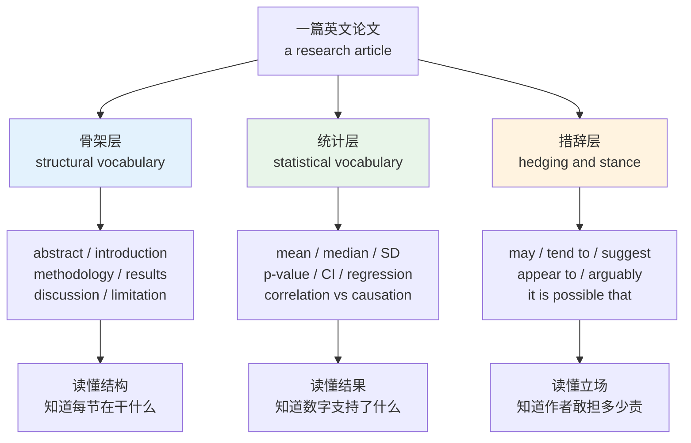
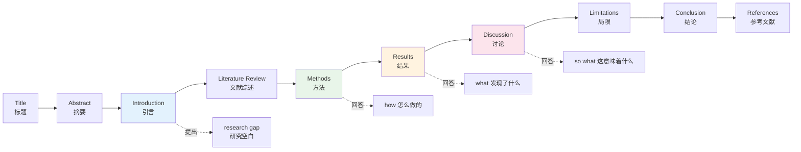
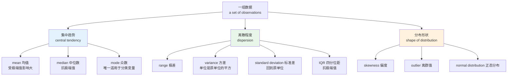
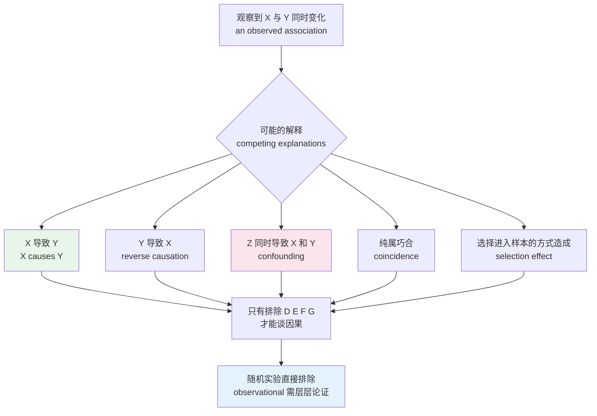
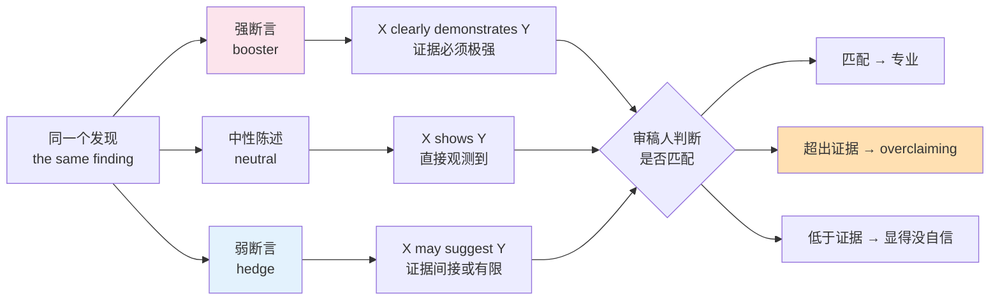
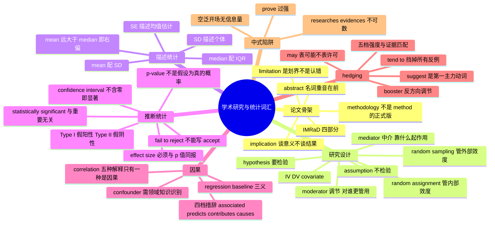

# 学术研究、统计术语与论文写作词汇

> [!info] 本篇定位
>
> 第十九章的第三篇，也是全书唯一集中处理**通用统计与研究设计术语**的地方。医学专用的 incidence、prevalence、odds ratio 在 [[20.专业领域词汇/10.医学英语：解剖术语、药理、检验指标与病历论文\|医学英语]] 展开，本篇只管所有学科通用的那一层。
>
> 前两篇 [[19.学术通用词汇/01.学术通用词表 AWL（上）：论证与关系\|AWL（上）]] 与 [[19.学术通用词汇/02.学术通用词表 AWL（下）：过程与评价\|AWL（下）]] 给的是按词频抽出来的散词表，本篇换一个组织方式：按论文的物理结构和数据分析的实际流程排词，让每个词落在它真正出现的位置上。
>
> 读完你会拿到三样东西：一份能对着任意一篇英文论文逐节认词的 IMRaD 词表，一套读懂结果段落所需的统计术语（包括 `p < 0.05` 到底该怎么念、`statistically significant` 到底在说什么），以及学术英语最难模仿的 hedging 系统——为什么母语学者写 `the results suggest` 而不是 `the results prove`。

---

## 1. 本篇导读：论文难读的三层词

拿一篇英文论文给一个词汇量 8000 的读者，他会在三个完全不同的地方卡住，而这三处需要的补救办法不一样。

**第一层是骨架词。** `abstract`、`methodology`、`limitation`、`implication` 这些词都认识，问题是不知道它们在论文里各自承担什么功能，于是读到 `Limitations` 一节以为作者在道歉，读到 `Implications` 一节以为在重复结论。这一层的解法是把词和它所在的结构位置绑定，第 2 节做这件事。

**第二层是统计词。** `The effect was significant (p < .01)` 这句话里没有生词，但 `significant` 在这里跟日常义「重要的」几乎无关，`p` 是什么、`.01` 大还是小、括号里这串东西支持了什么结论，全部要另学。这一层是本篇的重心，第 4 到 7 节铺开。

**第三层是 hedging。** 这层最隐形。同一个发现，写 `X causes Y`、`X leads to Y`、`X may contribute to Y`、`X appears to be associated with Y`，四种写法的证据强度天差地别，母语审稿人一眼就看得出作者敢不敢担这个责。中文母语作者写英文论文最典型的失败不是语法错，是**把话说得太满**。第 8 节专门处理。

上图把一篇论文的词汇需求切成三层，右侧是每层练到位之后的实际收益。三层的难度递增但覆盖面递减：骨架词只有几十个，一次记完终身受用；统计词一两百个，需要理解概念而不只是记译名；hedging 的词表不大，但要练的是选择判断，靠读大量真实文本积累。

三层之间有依赖：不认识骨架词就找不到统计结果在哪一节，读不懂统计词就判断不了作者的 hedging 是恰当的谨慎还是心虚。所以本篇按这个顺序走。

一句话概括全篇的实用价值：读技术论文和读技术文档的最大差别不在术语密度，而在于**论文的每一句话都带着证据强度标记**，而技术文档没有。学会读这个标记，才算真的读懂了论文。

---

## 2. 论文骨架：IMRaD 各部分的名称与内部词

绝大多数实证类论文按 IMRaD 组织：`Introduction`、`Methods`、`Results`、`and Discussion`。这个缩写读作 /ˈɪmræd/，是四个部分首字母的拼合。人文学科的论文常不遵守，但只要文章里有数据，基本跑不出这个框架。

上图的实线是文章的物理顺序，虚线标出每一节回答的问题。这四个问题是判断自己读没读懂的最快标尺：读完 Methods 说不出「他们具体怎么做的」，读完 Results 说不出「发现了什么」，就是没读进去。

最容易被跳过又最不该跳过的是 `Discussion`。Results 只报告数字，Discussion 才解释数字的意义，两节的动词完全不同——Results 用 `show`、`indicate`、`report`，Discussion 用 `suggest`、`imply`、`may reflect`。

### 2.1 标题与摘要层

| 英文 | 英式音标 | 美式音标 | 词性 | 中文 | 搭配与说明 |
| --- | --- | --- | --- | --- | --- |
| **abstract** | /ˈæbstrækt/ | /ˈæbstrækt/ | n. | 摘要 | 名词重音在首音节；形容词「抽象的」重音后移读 /æbˈstrækt/ |
| **structured abstract** | /ˌstrʌktʃəd ˈæbstrækt/ | /ˌstrʌktʃərd ˈæbstrækt/ | n. | 结构化摘要 | 带 Background / Methods / Results / Conclusions 小标题的摘要 |
| **keywords** | /ˈkiːwɜːdz/ | /ˈkiːwɜːrdz/ | n. | 关键词 | 摘要下方三到六个，用于检索索引 |
| **title** | /ˈtaɪtl/ | /ˈtaɪtl/ | n. | 标题 | running title 指页眉的短标题 |
| **subtitle** | /ˈsʌbtaɪtl/ | /ˈsʌbtaɪtl/ | n. | 副标题 | 冒号后那半句，常放方法或范围 |
| **affiliation** | /əˌfɪliˈeɪʃn/ | /əˌfɪliˈeɪʃn/ | n. | 单位；隶属机构 | 作者名下的机构行 |
| **corresponding author** | /ˌkɒrɪˈspɒndɪŋ ˈɔːθə/ | /ˌkɔːrəˈspɑːndɪŋ ˈɔːθər/ | n. | 通讯作者 | 负责投稿与后续联络的作者，名字带星号 |
| **co-author** | /ˌkəʊˈɔːθə/ | /ˌkoʊˈɔːθər/ | n./v. | 合著者；合著 | co-authored by 是被动常用式 |
| **highlight** | /ˈhaɪlaɪt/ | /ˈhaɪlaɪt/ | n. | 亮点条目 | 部分期刊要求提交三到五条 highlights |
| **graphical abstract** | /ˌɡræfɪkl ˈæbstrækt/ | /ˌɡræfɪkl ˈæbstrækt/ | n. | 图形摘要 | 一张图概括全文，近年期刊常要求 |
| **background** | /ˈbækɡraʊnd/ | /ˈbækɡraʊnd/ | n. | 背景 | 结构化摘要的第一栏，一到两句 |
| **objective** | /əbˈdʒektɪv/ | /əbˈdʒektɪv/ | n. | 目的；研究目标 | 与 aim、purpose 同义，期刊各有偏好 |
| **findings** | /ˈfaɪndɪŋz/ | /ˈfaɪndɪŋz/ | n. | 研究发现 | 恒用复数，key findings 是固定搭配 |
| **DOI** | /ˌdiː əʊ ˈaɪ/ | /ˌdiː oʊ ˈaɪ/ | n. | 数字对象标识符 | 逐字母读，digital object identifier 的缩写 |

摘要是全篇密度最高的一段，一百到三百词要装下背景、方法、结果、结论四件事，所以句子长、名词化多、连接词少。读论文的第一个训练就是**只读摘要，用中文口述四件事**，说得出来才往下读。

> [!warning] abstract 的重音会区分词性
>
> 这是学术词里最典型的一组重音移位。
>
> - 名词「摘要」：**ab**stract /ˈæbstrækt/，重音在前。
> - 形容词「抽象的」：ab**stract** /æbˈstrækt/，重音在后。
> - 动词「抽取、提炼」：ab**stract** /æbˈstrækt/，重音也在后。
>
> 同类的还有 `record`、`present`、`conduct`、`contrast`、`object`。规律见 [[01.词汇入门与学习方法/03.音标、词重音与词典读音体例\|音标、词重音与词典读音体例]]。

### 2.2 引言与文献综述层

引言的功能是造出一个「非填不可的坑」，学术界把这个套路叫 CARS 模型（Create A Research Space）：先说领域重要，再说前人做了什么，然后指出前人没解决什么，最后说本文来解决它。第三步的那个「没解决什么」就是 `research gap`。

| 英文 | 英式音标 | 美式音标 | 词性 | 中文 | 搭配与说明 |
| --- | --- | --- | --- | --- | --- |
| **introduction** | /ˌɪntrəˈdʌkʃn/ | /ˌɪntrəˈdʌkʃn/ | n. | 引言 | 论文第一节，不叫 foreword |
| **literature review** | /ˈlɪtrətʃə rɪˈvjuː/ | /ˈlɪtərətʃʊr rɪˈvjuː/ | n. | 文献综述 | literature 此处不可数，指「文献总体」 |
| **body of literature** | /ˈbɒdi əv ˈlɪtrətʃə/ | /ˈbɑːdi əv ˈlɪtərətʃʊr/ | n. | 文献体系 | a growing body of literature 是高频语块 |
| **research gap** | /rɪˈsɜːtʃ ɡæp/ | /ˈriːsɜːrtʃ ɡæp/ | n. | 研究空白 | address a gap、fill a gap；research 的英美重音差异明显 |
| **rationale** | /ˌræʃəˈnɑːl/ | /ˌræʃəˈnæl/ | n. | 理据；立论依据 | the rationale for doing sth，不是 reason 的正式版 |
| **premise** | /ˈpremɪs/ | /ˈpremɪs/ | n. | 前提 | on the premise that；复数 premises 另有「场所」义 |
| **scope** | /skəʊp/ | /skoʊp/ | n. | 研究范围 | beyond the scope of this paper 是划界固定说法 |
| **framework** | /ˈfreɪmwɜːk/ | /ˈfreɪmwɜːrk/ | n. | 框架 | theoretical framework、conceptual framework |
| **paradigm** | /ˈpærədaɪm/ | /ˈpærədaɪm/ | n. | 范式 | 注意 g 不发音；形容词 paradigmatic 里的 g 要发 |
| **construct** | /ˈkɒnstrʌkt/ | /ˈkɑːnstrʌkt/ | n. | 理论构念 | 名词重音在前；心理学高频，指不可直接观测的抽象概念 |
| **seminal** | /ˈsemɪnl/ | /ˈsemɪnl/ | adj. | 开创性的 | a seminal paper/study，比 important 强得多 |
| **landmark** | /ˈlændmɑːk/ | /ˈlændmɑːrk/ | adj./n. | 里程碑式的 | a landmark study 与 seminal 近义 |
| **state of the art** | /ˌsteɪt əv ði ˈɑːt/ | /ˌsteɪt əv ði ˈɑːrt/ | n./adj. | 当前最高水平 | 作定语时加连字符：a state-of-the-art model |
| **prior work** | /ˌpraɪə ˈwɜːk/ | /ˌpraɪər ˈwɜːrk/ | n. | 前人工作 | 计算机领域常用，等于 previous studies |
| **motivate** | /ˈməʊtɪveɪt/ | /ˈmoʊtɪveɪt/ | v. | 引出；成为动机 | This motivates our approach，学术义不是「激励」 |
| **contribution** | /ˌkɒntrɪˈbjuːʃn/ | /ˌkɑːntrɪˈbjuːʃn/ | n. | 贡献 | 计算机论文常在引言末尾列 our contributions are threefold |

> [!example] 引言里指认研究空白的四种句式
>
> - However, **little is known about** how these effects persist over time.
>   - 然而，这些效应如何随时间持续，目前所知甚少。
> - Previous studies have **largely overlooked** the role of sample composition.
>   - 前人研究在很大程度上忽略了样本构成的作用。
> - To date, **no study has systematically examined** the interaction between the two factors.
>   - 迄今为止，尚无研究系统检验过这两个因素之间的交互作用。
> - The evidence **remains inconclusive** as to whether the association is causal.
>   - 关于这一关联是否为因果关系，证据仍不充分。

四句话有一个共同点：都在描述前人的不足，但没有一句直接批评前人。学术英语指出空白时用的是「知识状态」的语言（little is known、remains inconclusive），不是「他们做错了」的语言。这是中文作者最容易踩的语气雷区。

### 2.3 方法层

方法节的判据只有一条：**别人能否照着重做**。所以这一节的词都很具体，动词密度高，被动语态密度也高（因为关注点在操作而不在操作者）。

| 英文 | 英式音标 | 美式音标 | 词性 | 中文 | 搭配与说明 |
| --- | --- | --- | --- | --- | --- |
| **methodology** | /ˌmeθəˈdɒlədʒi/ | /ˌmeθəˈdɑːlədʒi/ | n. | 方法论；研究方法 | 严格义指「方法的体系与依据」，method 指具体做法 |
| **method** | /ˈmeθəd/ | /ˈmeθəd/ | n. | 方法 | 节标题常用复数 Methods 或 Materials and Methods |
| **procedure** | /prəˈsiːdʒə/ | /prəˈsiːdʒər/ | n. | 步骤；流程 | the experimental procedure；美音 -dure 里的 r 要发 |
| **protocol** | /ˈprəʊtəkɒl/ | /ˈproʊtəkɔːl/ | n. | 方案；规程 | follow a protocol、a pre-registered protocol |
| **instrument** | /ˈɪnstrəmənt/ | /ˈɪnstrəmənt/ | n. | 测量工具 | 学术义指量表、问卷、仪器，不限于乐器 |
| **questionnaire** | /ˌkwestʃəˈneə/ | /ˌkwestʃəˈner/ | n. | 问卷 | administer a questionnaire 是发放问卷的正式说法 |
| **survey** | /ˈsɜːveɪ/ | /ˈsɜːrveɪ/ | n. | 调查 | 名词重音在前；动词重音在后，读 /səˈveɪ/ · /sərˈveɪ/ |
| **interview** | /ˈɪntəvjuː/ | /ˈɪntərvjuː/ | n./v. | 访谈 | semi-structured interview 是质性研究主力方法 |
| **participant** | /pɑːˈtɪsɪpənt/ | /pɑːrˈtɪsɪpənt/ | n. | 被试；参与者 | 现代伦理规范首选词，取代旧称 subject |
| **subject** | /ˈsʌbdʒɪkt/ | /ˈsʌbdʒɪkt/ | n. | 受试者 | 动物实验与旧文献仍用；人类研究改用 participant |
| **cohort** | /ˈkəʊhɔːt/ | /ˈkoʊhɔːrt/ | n. | 队列；同批人群 | a birth cohort、a cohort study |
| **condition** | /kənˈdɪʃn/ | /kənˈdɪʃn/ | n. | 实验条件 | 实验设计义指处理组别，不是「状况」 |
| **manipulate** | /məˈnɪpjuleɪt/ | /məˈnɪpjuleɪt/ | v. | 操纵（自变量） | 中性技术义，无贬义；名词 manipulation |
| **administer** | /ədˈmɪnɪstə/ | /ədˈmɪnɪstər/ | v. | 施测；给药 | administer a test / a drug / a survey |
| **calibrate** | /ˈkælɪbreɪt/ | /ˈkælɪbreɪt/ | v. | 校准 | calibrate an instrument；名词 calibration |
| **operationalize** | /ˌɒpəˈreɪʃnəlaɪz/ | /ˌɑːpəˈreɪʃnəlaɪz/ | v. | 操作化 | 把抽象构念定义成可测量的指标 |
| **pilot study** | /ˈpaɪlət ˈstʌdi/ | /ˈpaɪlət ˈstʌdi/ | n. | 预实验 | 正式开跑前的小规模试验 |
| **inclusion criteria** | /ɪnˈkluːʒn kraɪˈtɪəriə/ | /ɪnˈkluːʒn kraɪˈtɪriə/ | n. | 纳入标准 | 单数 criterion，复数 criteria，不能说 a criteria |
| **exclusion criteria** | /ɪkˈskluːʒn kraɪˈtɪəriə/ | /ɪkˈskluːʒn kraɪˈtɪriə/ | n. | 排除标准 | 与 inclusion 成对出现 |
| **informed consent** | /ɪnˌfɔːmd kənˈsent/ | /ɪnˌfɔːrmd kənˈsent/ | n. | 知情同意 | obtain informed consent from participants |
| **ethics approval** | /ˈeθɪks əˈpruːvl/ | /ˈeθɪks əˈpruːvl/ | n. | 伦理审批 | 美式常说 IRB approval |
| **anonymize** | /əˈnɒnɪmaɪz/ | /əˈnɑːnɪmaɪz/ | v. | 匿名化 | 英式亦拼 anonymise；数据脱敏另有 de-identify |

> [!warning] methodology 不是 method 的正式版
>
> 中文作者最常见的误用之一，是把 `methodology` 当成 `method` 的高级同义词，写成 `We used a questionnaire methodology`。
>
> - ❌ ~~The methodology we used was a questionnaire.~~（问卷是一个方法，不是一套方法论）
> - ✅ **The method we used was a questionnaire.**
> - ✅ **This study adopts a mixed-methods methodology.**（混合方法论，指方法体系的选择）
>
> 判断办法：能数的、能列步骤的是 `method`；讨论「为什么选这一类方法、这类方法背后的认识论假设」时才是 `methodology`。节标题写 Methods 或 Methodology 都有期刊在用，但正文里的单数用法要分清。

### 2.4 结果层

结果节只报告，不解释。这一节的动词是全篇最克制的一批，作者在这里说 `The data show`，到了讨论节才敢说 `This suggests`。

| 英文 | 英式音标 | 美式音标 | 词性 | 中文 | 搭配与说明 |
| --- | --- | --- | --- | --- | --- |
| **results** | /rɪˈzʌlts/ | /rɪˈzʌlts/ | n. | 结果 | 节标题恒用复数 |
| **finding** | /ˈfaɪndɪŋ/ | /ˈfaɪndɪŋ/ | n. | 发现 | a key finding、findings suggest |
| **descriptive statistics** | /dɪˈskrɪptɪv stəˈtɪstɪks/ | /dɪˈskrɪptɪv stəˈtɪstɪks/ | n. | 描述统计 | 结果节通常先给描述统计再给检验 |
| **table** | /ˈteɪbl/ | /ˈteɪbl/ | n. | 表格 | 正文引用写 as shown in Table 2，Table 首字母大写 |
| **figure** | /ˈfɪɡə/ | /ˈfɪɡjər/ | n. | 图 | 英美发音差别明显，美音多一个 /j/ |
| **caption** | /ˈkæpʃn/ | /ˈkæpʃn/ | n. | 图题；表题 | 图注在下方，表注在上方是通行体例 |
| **panel** | /ˈpænl/ | /ˈpænl/ | n. | 分图 | Figure 3, panel A 指多联图的某一格 |
| **axis** | /ˈæksɪs/ | /ˈæksɪs/ | n. | 坐标轴 | 复数 axes /ˈæksiːz/，与 axe 的复数同形不同音 |
| **error bar** | /ˈerə bɑː/ | /ˈerər bɑːr/ | n. | 误差棒 | 图上竖线，要注明表示 SD 还是 SE 还是 CI |
| **legend** | /ˈledʒənd/ | /ˈledʒənd/ | n. | 图例 | 与「传说」同形，学术语境固定指图例 |
| **column** | /ˈkɒləm/ | /ˈkɑːləm/ | n. | 列 | n 不发音；行是 row |
| **entry** | /ˈentri/ | /ˈentri/ | n. | 条目；单元格内容 | table entries 指表内数值 |
| **report** | /rɪˈpɔːt/ | /rɪˈpɔːrt/ | v. | 报告（数值） | We report means and standard deviations，结果节主动词 |
| **yield** | /jiːld/ | /jiːld/ | v. | 得出（结果） | The analysis yielded a significant effect |

结果节有一个不成文的排版惯例：数值一律给到统一小数位，而且**正文不重复表里已有的每一个数字**，只挑关键的三五个说。看到一段结果文字和表格完全重合，通常是作者写作不熟练。

### 2.5 讨论、局限与结论层

| 英文 | 英式音标 | 美式音标 | 词性 | 中文 | 搭配与说明 |
| --- | --- | --- | --- | --- | --- |
| **discussion** | /dɪˈskʌʃn/ | /dɪˈskʌʃn/ | n. | 讨论 | 解释结果、对照文献、给出意义 |
| **implication** | /ˌɪmplɪˈkeɪʃn/ | /ˌɪmplɪˈkeɪʃn/ | n. | 意义；启示 | practical/theoretical implications；恒用复数谈影响 |
| **limitation** | /ˌlɪmɪˈteɪʃn/ | /ˌlɪmɪˈteɪʃn/ | n. | 局限 | 复数为主；acknowledge the limitations 是标准动作 |
| **caveat** | /ˈkæviæt/ | /ˈkæviæt/ | n. | 但书；须注意之处 | with the caveat that…；比 limitation 更轻 |
| **generalizability** | /ˌdʒenrəlaɪzəˈbɪləti/ | /ˌdʒenrəlaɪzəˈbɪləti/ | n. | 可推广性 | limits the generalizability of our findings；重音落在 -bil- 上 |
| **external validity** | /ɪkˌstɜːnl vəˈlɪdəti/ | /ɪkˌstɜːrnl vəˈlɪdəti/ | n. | 外部效度 | 结论能否推广到别的人群与场景 |
| **internal validity** | /ɪnˌtɜːnl vəˈlɪdəti/ | /ɪnˌtɜːrnl vəˈlɪdəti/ | n. | 内部效度 | 因果推断在本研究内部是否成立 |
| **robustness** | /rəʊˈbʌstnəs/ | /roʊˈbʌstnəs/ | n. | 稳健性 | a robustness check 指换设定重跑分析 |
| **corroborate** | /kəˈrɒbəreɪt/ | /kəˈrɑːbəreɪt/ | v. | 佐证 | 比 support 正式，含「独立来源的印证」 |
| **be consistent with** | /kənˈsɪstənt/ | /kənˈsɪstənt/ | phr. | 与…一致 | 讨论节对照前人结论的第一主力句式 |
| **be at odds with** | /ət ˈɒdz/ | /ət ˈɑːdz/ | phr. | 与…相左 | 比 contradict 委婉 |
| **warrant** | /ˈwɒrənt/ | /ˈwɔːrənt/ | v. | 值得；有理由 | further research is warranted 是结尾套语 |
| **avenue** | /ˈævənjuː/ | /ˈævənuː/ | n. | 路径；方向 | a promising avenue for future research |
| **future direction** | /ˈfjuːtʃə dəˈrekʃn/ | /ˈfjuːtʃər dəˈrekʃn/ | n. | 未来方向 | 与 avenue 同位，结论节固定小节名 |
| **takeaway** | /ˈteɪkəweɪ/ | /ˈteɪkəweɪ/ | n. | 要点 | the key takeaway；英式还有「外卖」义 |
| **conclusion** | /kənˈkluːʒn/ | /kənˈkluːʒn/ | n. | 结论 | draw a conclusion；不用 make a conclusion |

> [!tip] Limitations 一节不是认错，是划界
>
> 中文写作习惯把「不足之处」写成谦辞，英文的 Limitations 完全不是这个功能。它在做的是**主动声明结论的适用边界**，声明得越清楚，审稿人越信任你。
>
> 三种最常见的合格写法：
>
> - Our sample was drawn from a single institution, which **limits the generalizability** of the findings.
>   - 样本仅取自一所机构，这限制了结论的可推广性。
> - Because the design was cross-sectional, we **cannot rule out** reverse causation.
>   - 由于采用横断面设计，无法排除反向因果的可能。
> - Self-reported measures **may be subject to** recall bias.
>   - 自报式测量可能受回忆偏差影响。
>
> 三句都有同一个结构：说清是什么设计特征造成的，再说清它具体威胁到哪一个结论。只写 `Our study has some limitations` 而不落到具体项，等于没写。

### 2.6 附属部件与投稿件

| 英文 | 英式音标 | 美式音标 | 词性 | 中文 | 搭配与说明 |
| --- | --- | --- | --- | --- | --- |
| **appendix** | /əˈpendɪks/ | /əˈpendɪks/ | n. | 附录 | 复数 appendices /əˈpendɪsiːz/ 或 appendixes |
| **supplementary material** | /ˌsʌplɪˈmentri məˈtɪəriəl/ | /ˌsʌpləˈmentri məˈtɪriəl/ | n. | 补充材料 | 简称 SM 或 SI，放不进正文的表与代码 |
| **acknowledgements** | /əkˈnɒlɪdʒmənts/ | /əkˈnɑːlɪdʒmənts/ | n. | 致谢 | 美式常拼 acknowledgments，无中间 e |
| **funding statement** | /ˈfʌndɪŋ ˈsteɪtmənt/ | /ˈfʌndɪŋ ˈsteɪtmənt/ | n. | 基金说明 | 写明资助来源与项目号 |
| **conflict of interest** | /ˈkɒnflɪkt əv ˈɪntrəst/ | /ˈkɑːnflɪkt əv ˈɪntrəst/ | n. | 利益冲突 | 声明栏常写 The authors declare no conflict of interest |
| **data availability** | /ˈdeɪtə əˌveɪləˈbɪləti/ | /ˈdeɪtə əˌveɪləˈbɪləti/ | n. | 数据可得性 | 说明数据存放在哪、能否申请 |
| **references** | /ˈrefrənsɪz/ | /ˈrefrənsɪz/ | n. | 参考文献 | 列表名；bibliography 指更宽的书目 |
| **citation** | /saɪˈteɪʃn/ | /saɪˈteɪʃn/ | n. | 引用 | in-text citation 指正文夹注 |
| **cite** | /saɪt/ | /saɪt/ | v. | 引用 | 与 site、sight 同音，写作时高频拼错 |
| **et al.** | /et ˈæl/ | /et ˈæl/ | abbr. | 等（多作者） | 拉丁 et alii 缩写，al 后有句点、et 后没有 |
| **ibid.** | /ˈɪbɪd/ | /ˈɪbɪd/ | abbr. | 同上 | 拉丁 ibidem，人文脚注体例常用 |
| **cf.** | /ˌsiː ˈef/ | /ˌsiː ˈef/ | abbr. | 参见；比较 | 拉丁 confer；朗读时多直接念成 compare，念字母 /ˌsiː ˈef/ 也常见 |

---

## 3. 研究设计词汇：从问题到变量

### 3.1 问题、假设与预测

| 英文 | 英式音标 | 美式音标 | 词性 | 中文 | 搭配与说明 |
| --- | --- | --- | --- | --- | --- |
| **research question** | /rɪˈsɜːtʃ ˈkwestʃən/ | /ˈriːsɜːrtʃ ˈkwestʃən/ | n. | 研究问题 | 缩写 RQ1、RQ2，论文内编号引用 |
| **hypothesis** | /haɪˈpɒθəsɪs/ | /haɪˈpɑːθəsɪs/ | n. | 假设 | 复数 hypotheses /haɪˈpɒθəsiːz/，重音在第二音节 |
| **hypothesize** | /haɪˈpɒθəsaɪz/ | /haɪˈpɑːθəsaɪz/ | v. | 假设 | We hypothesized that…，方法节常用过去时 |
| **postulate** | /ˈpɒstjuleɪt/ | /ˈpɑːstʃuleɪt/ | v./n. | 假定；公设 | 比 hypothesize 更偏理论推演 |
| **conjecture** | /kənˈdʒektʃə/ | /kənˈdʒektʃər/ | n./v. | 猜想 | 数学领域指未证明的命题 |
| **prediction** | /prɪˈdɪkʃn/ | /prɪˈdɪkʃn/ | n. | 预测 | 由假设推出的可检验具体结果 |
| **assumption** | /əˈsʌmpʃn/ | /əˈsʌmpʃn/ | n. | 假定 | 不检验、直接接受的前提；与 hypothesis 分工严格 |
| **proposition** | /ˌprɒpəˈzɪʃn/ | /ˌprɑːpəˈzɪʃn/ | n. | 命题 | 理论论文里编号陈述 |
| **theory** | /ˈθɪəri/ | /ˈθɪri/ | n. | 理论 | 学术义指有解释力的体系，不是「猜测」 |
| **model** | /ˈmɒdl/ | /ˈmɑːdl/ | n./v. | 模型；建模 | model sth as…，动词英式双写 modelling |
| **hypothesis-driven** | /haɪˈpɒθəsɪs ˈdrɪvn/ | /haɪˈpɑːθəsɪs ˈdrɪvn/ | adj. | 假设驱动的 | 对立面是 data-driven、exploratory |
| **exploratory** | /ɪkˈsplɒrətri/ | /ɪkˈsplɔːrətɔːri/ | adj. | 探索性的 | exploratory analysis 不预设假设，结论强度更弱 |

`hypothesis` 与 `assumption` 是最值得分清的一对。`hypothesis` 是**要被检验**的，全文的分析都在判定它成立与否；`assumption` 是**不检验、直接借用**的前提，比如「误差服从正态分布」。把 assumption 写成 hypothesis，等于承诺要检验一个你根本没检验的东西。

### 3.2 变量三分

| 英文 | 英式音标 | 美式音标 | 词性 | 中文 | 搭配与说明 |
| --- | --- | --- | --- | --- | --- |
| **variable** | /ˈveəriəbl/ | /ˈveriəbl/ | n. | 变量 | 统计语境永远是名词，不要当形容词「可变的」读 |
| **independent variable** | /ˌɪndɪˈpendənt ˈveəriəbl/ | /ˌɪndɪˈpendənt ˈveriəbl/ | n. | 自变量 | 缩写 IV，研究者操纵或选定的那个 |
| **dependent variable** | /dɪˈpendənt ˈveəriəbl/ | /dɪˈpendənt ˈveriəbl/ | n. | 因变量 | 缩写 DV，被测量的结果 |
| **outcome** | /ˈaʊtkʌm/ | /ˈaʊtkʌm/ | n. | 结局变量 | 医学与政策研究里替代 DV 的说法 |
| **predictor** | /prɪˈdɪktə/ | /prɪˈdɪktər/ | n. | 预测变量 | 回归语境替代 IV，不含因果承诺 |
| **covariate** | /kəʊˈveəriət/ | /koʊˈveriət/ | n. | 协变量 | 模型里控制住的其他变量 |
| **moderator** | /ˈmɒdəreɪtə/ | /ˈmɑːdəreɪtər/ | n. | 调节变量 | 改变 X 到 Y 效应强度的第三变量 |
| **mediator** | /ˈmiːdieɪtə/ | /ˈmiːdieɪtər/ | n. | 中介变量 | X 通过它作用于 Y，与 moderator 常被混淆 |
| **categorical** | /ˌkætəˈɡɒrɪkl/ | /ˌkætəˈɡɔːrɪkl/ | adj. | 分类的 | categorical variable 取有限个类别值 |
| **continuous** | /kənˈtɪnjuəs/ | /kənˈtɪnjuəs/ | adj. | 连续的 | continuous variable 可取区间内任意值 |
| **ordinal** | /ˈɔːdɪnl/ | /ˈɔːrdɪnl/ | adj. | 有序的 | 有次序但间距不等，如 Likert 量表 |
| **dichotomous** | /daɪˈkɒtəməs/ | /daɪˈkɑːtəməs/ | adj. | 二分的 | 只取两个值，等于 binary |

> [!warning] moderator 与 mediator 差一个字母，差一整套结论
>
> - **moderator**（调节）：X 对 Y 的效应**在不同 M 水平下强度不同**。培训对绩效有用，但对新人比老手更有用——经验就是 moderator。
> - **mediator**（中介）：X 先影响 M，M 再影响 Y，**M 是路径上的中转站**。培训提升了技能，技能提升了绩效——技能就是 mediator。
>
> 判定口诀：调节回答「对谁更管用」，中介回答「靠什么起作用」。写错的直接后果是整篇讨论跑偏。

### 3.3 研究设计类型

| 英文 | 英式音标 | 美式音标 | 词性 | 中文 | 搭配与说明 |
| --- | --- | --- | --- | --- | --- |
| **experimental** | /ɪkˌsperɪˈmentl/ | /ɪkˌsperɪˈmentl/ | adj. | 实验的 | 有操纵、有随机分配才算 |
| **observational** | /ˌɒbzəˈveɪʃənl/ | /ˌɑːbzərˈveɪʃənl/ | adj. | 观察性的 | 不操纵变量，因果推断能力弱 |
| **randomized controlled trial** | /ˈrændəmaɪzd kənˈtrəʊld ˈtraɪəl/ | /ˈrændəmaɪzd kənˈtroʊld ˈtraɪəl/ | n. | 随机对照试验 | 缩写 RCT，逐字母读 |
| **quasi-experiment** | /ˌkweɪzaɪ ɪkˈsperɪmənt/ | /ˌkweɪzaɪ ɪkˈsperɪmənt/ | n. | 准实验 | 有对照无随机；quasi 另有 /ˈkwɑːzi/ 一读，两读英美都在用 |
| **longitudinal** | /ˌlɒŋɡɪˈtjuːdɪnl/ | /ˌlɑːndʒəˈtuːdənl/ | adj. | 纵向的 | 同一批人追踪多个时点 |
| **cross-sectional** | /ˌkrɒs ˈsekʃənl/ | /ˌkrɔːs ˈsekʃənl/ | adj. | 横断面的 | 单一时点快照，无法定时序 |
| **control group** | /kənˈtrəʊl ɡruːp/ | /kənˈtroʊl ɡruːp/ | n. | 对照组 | 与 treatment group 成对 |
| **treatment group** | /ˈtriːtmənt ɡruːp/ | /ˈtriːtmənt ɡruːp/ | n. | 处理组 | treatment 泛指任何干预，不限于医疗 |
| **placebo** | /pləˈsiːbəʊ/ | /pləˈsiːboʊ/ | n. | 安慰剂 | placebo effect 已进入日常英语 |
| **blinding** | /ˈblaɪndɪŋ/ | /ˈblaɪndɪŋ/ | n. | 盲法 | double-blind 指被试与施测者都不知分组 |
| **random assignment** | /ˈrændəm əˈsaɪnmənt/ | /ˈrændəm əˈsaɪnmənt/ | n. | 随机分配 | 与 random sampling 不同，见第 4 节 |
| **replication** | /ˌreplɪˈkeɪʃn/ | /ˌreplɪˈkeɪʃn/ | n. | 重复验证 | a direct replication 指严格照原方案重做 |
| **reproducibility** | /ˌriːprədjuːsəˈbɪləti/ | /ˌriːprəduːsəˈbɪləti/ | n. | 可复现性 | 严格义指同数据同代码能跑出同结果 |
| **pre-registration** | /ˌpriː redʒɪˈstreɪʃn/ | /ˌpriː redʒɪˈstreɪʃn/ | n. | 预注册 | 数据收集前公开分析计划，防止事后改口径 |

---

## 4. 抽样与样本：sample size 的邻居们

`sample size` 是所有统计词里最常被非专业读者引用、也最常被误用的一个。「样本量小所以不可信」这句话对了一半：样本量决定的是**精度**，而不是**无偏性**；一个有偏的大样本比一个无偏的小样本更危险。

| 英文 | 英式音标 | 美式音标 | 词性 | 中文 | 搭配与说明 |
| --- | --- | --- | --- | --- | --- |
| **population** | /ˌpɒpjuˈleɪʃn/ | /ˌpɑːpjuˈleɪʃn/ | n. | 总体 | 统计义指「想推论的全体」，不限于人口 |
| **sample** | /ˈsɑːmpl/ | /ˈsæmpl/ | n./v. | 样本；抽样 | 英美元音差异典型词，与 dance、chance 同型 |
| **sample size** | /ˈsɑːmpl saɪz/ | /ˈsæmpl saɪz/ | n. | 样本量 | 论文里用斜体小写 n 表示，全样本用大写 N |
| **sampling frame** | /ˈsɑːmplɪŋ freɪm/ | /ˈsæmplɪŋ freɪm/ | n. | 抽样框 | 实际能抽到的名单，与总体常有落差 |
| **random sampling** | /ˈrændəm ˈsɑːmplɪŋ/ | /ˈrændəm ˈsæmplɪŋ/ | n. | 随机抽样 | 决定外部效度；与 random assignment 分工不同 |
| **stratified sampling** | /ˈstrætɪfaɪd ˈsɑːmplɪŋ/ | /ˈstrætɪfaɪd ˈsæmplɪŋ/ | n. | 分层抽样 | 先分层再层内随机，保证各层都有代表 |
| **convenience sample** | /kənˈviːniəns ˈsɑːmpl/ | /kənˈviːniəns ˈsæmpl/ | n. | 便利样本 | 抓到谁算谁，推广性最弱 |
| **representative** | /ˌreprɪˈzentətɪv/ | /ˌreprɪˈzentətɪv/ | adj. | 有代表性的 | representative of the population |
| **bias** | /ˈbaɪəs/ | /ˈbaɪəs/ | n. | 偏差 | 统计义是系统性偏离，不是「偏见」的情绪义 |
| **selection bias** | /sɪˈlekʃn ˈbaɪəs/ | /sɪˈlekʃn ˈbaɪəs/ | n. | 选择偏差 | 样本进入机制与结果相关造成 |
| **response rate** | /rɪˈspɒns reɪt/ | /rɪˈspɑːns reɪt/ | n. | 回收率 | 问卷研究必报指标 |
| **attrition** | /əˈtrɪʃn/ | /əˈtrɪʃn/ | n. | 流失 | 纵向研究中被试中途退出；attrition rate |
| **missing data** | /ˈmɪsɪŋ ˈdeɪtə/ | /ˈmɪsɪŋ ˈdeɪtə/ | n. | 缺失数据 | 处理办法有 listwise deletion、imputation |
| **imputation** | /ˌɪmpjuˈteɪʃn/ | /ˌɪmpjuˈteɪʃn/ | n. | 插补 | 用模型填补缺失值 |
| **weighting** | /ˈweɪtɪŋ/ | /ˈweɪtɪŋ/ | n. | 加权 | 调整样本结构使其贴近总体 |
| **generalize** | /ˈdʒenrəlaɪz/ | /ˈdʒenrəlaɪz/ | v. | 推广 | generalize to a wider population，介词固定用 to |
| **statistical power** | /stəˈtɪstɪkl ˈpaʊə/ | /stəˈtɪstɪkl ˈpaʊər/ | n. | 检验效能 | 真效应存在时能被检出的概率，常设 0.80 |
| **power analysis** | /ˈpaʊər əˈnæləsɪs/ | /ˈpaʊər əˈnæləsɪs/ | n. | 效能分析 | 事前算需要多大 n 的标准步骤 |
| **underpowered** | /ˌʌndəˈpaʊəd/ | /ˌʌndərˈpaʊərd/ | adj. | 效能不足的 | an underpowered study 指样本太小查不出真效应 |
| **data** | /ˈdeɪtə/ | /ˈdeɪtə/ | n. | 数据 | 拉丁复数，正式写作用 the data are；口语 the data is 已被接受 |

> [!warning] random sampling 与 random assignment 不是一回事
>
> 两个词都带 random，但管的是两件完全不同的事，混用会得出错误的结论强度判断。
>
> | 术语 | 发生在哪一步 | 保护什么 | 没做会怎样 |
> | --- | --- | --- | --- |
> | random sampling 随机抽样 | 从总体里挑人进研究 | 外部效度 | 结论推不到总体去 |
> | random assignment 随机分配 | 把已入组的人分到各组 | 内部效度 | 组间差异可能来自别的因素，不能谈因果 |
>
> 典型情形：一项实验只在本校学生里做（没做随机抽样），但把学生随机分到两组（做了随机分配）。这种研究**可以谈因果，但不能推广到一般人群**。读论文时确认这两件事分别做了没有，比看样本量有用得多。

---

## 5. 描述统计：集中趋势与离散程度

上图是描述统计的三分结构。同一组数据要报三样东西才算描述完整：中心在哪、散得多开、形状怎么样。论文的表格里 `M = 4.32, SD = 0.87` 这种写法给的就是前两样，第三样往往靠图。

三条支路里有一条隐藏的对应关系：`mean` 配 `standard deviation`，`median` 配 `IQR`。前一对适合对称分布，后一对适合偏斜分布。看到论文报了 median 却配 SD，通常是作者没想清楚。

### 5.1 集中趋势

| 英文 | 英式音标 | 美式音标 | 词性 | 中文 | 搭配与说明 |
| --- | --- | --- | --- | --- | --- |
| **mean** | /miːn/ | /miːn/ | n. | 均值 | 论文缩写 M；日常说 average，学术写作偏用 mean |
| **average** | /ˈævərɪdʒ/ | /ˈævərɪdʒ/ | n./adj. | 平均；平均的 | 泛指，可指 mean 也可指 median，正式文本避免 |
| **median** | /ˈmiːdiən/ | /ˈmiːdiən/ | n. | 中位数 | 缩写 Mdn；排序后居中的那个值 |
| **mode** | /məʊd/ | /moʊd/ | n. | 众数 | 出现次数最多的值；可以有多个 |
| **arithmetic mean** | /ˌærɪθˈmetɪk miːn/ | /ˌærɪθˈmetɪk miːn/ | n. | 算术平均数 | 形容词 arithmetic 重音在第三音节，与名词不同 |
| **geometric mean** | /ˌdʒiːəˈmetrɪk miːn/ | /ˌdʒiːəˈmetrɪk miːn/ | n. | 几何平均数 | 用于增长率、比率的平均 |
| **weighted mean** | /ˌweɪtɪd ˈmiːn/ | /ˌweɪtɪd ˈmiːn/ | n. | 加权平均 | 各观测权重不等时使用 |
| **trimmed mean** | /trɪmd miːn/ | /trɪmd miːn/ | n. | 截尾均值 | 去掉两端各若干百分比后再求均值 |
| **sum** | /sʌm/ | /sʌm/ | n./v. | 和；求和 | sum of squares 平方和是方差的分子 |
| **count** | /kaʊnt/ | /kaʊnt/ | n. | 计数 | 频数表里的 n 或 count 列 |
| **frequency** | /ˈfriːkwənsi/ | /ˈfriːkwənsi/ | n. | 频数；频率 | relative frequency 指占比 |
| **proportion** | /prəˈpɔːʃn/ | /prəˈpɔːrʃn/ | n. | 比例 | 取值 0 到 1；乘 100 才是 percentage |

> [!example] mean 与 median 差距大意味着什么
>
> - The **mean** annual income was $82,000, but the **median** was $54,000.
>   - 年收入均值为 82000 美元，中位数为 54000 美元。
> - The gap between the two indicates a **right-skewed** distribution: a small number of very high earners **pull the mean upward**.
>   - 两者之差表明分布右偏：少数极高收入者把均值拉了上去。
>
> 均值远大于中位数就是右偏，反过来是左偏。读到收入、房价、响应时间这类数据只报 mean 不报 median，要立刻警觉。

### 5.2 离散程度

| 英文 | 英式音标 | 美式音标 | 词性 | 中文 | 搭配与说明 |
| --- | --- | --- | --- | --- | --- |
| **variance** | /ˈveəriəns/ | /ˈveriəns/ | n. | 方差 | 平方单位，不能与原数据直接比较 |
| **standard deviation** | /ˌstændəd ˌdiːviˈeɪʃn/ | /ˌstændərd ˌdiːviˈeɪʃn/ | n. | 标准差 | 缩写 SD 或 s，方差开平方，回到原单位 |
| **standard error** | /ˌstændəd ˈerə/ | /ˌstændərd ˈerər/ | n. | 标准误 | 缩写 SE，指均值这个估计量本身的波动 |
| **range** | /reɪndʒ/ | /reɪndʒ/ | n. | 极差；范围 | 最大值减最小值，只用两个点，极不稳健 |
| **interquartile range** | /ˌɪntəˈkwɔːtaɪl reɪndʒ/ | /ˌɪntərˈkwɔːrtaɪl reɪndʒ/ | n. | 四分位距 | 缩写 IQR，第三四分位减第一四分位 |
| **quartile** | /ˈkwɔːtaɪl/ | /ˈkwɔːrtaɪl/ | n. | 四分位数 | Q1、Q2、Q3；Q2 就是中位数 |
| **percentile** | /pəˈsentaɪl/ | /pərˈsentaɪl/ | n. | 百分位数 | the 95th percentile；工程里的 p95、p99 同源 |
| **dispersion** | /dɪˈspɜːʃn/ | /dɪˈspɜːrʒn/ | n. | 离散度 | 统称，涵盖上面所有指标 |
| **spread** | /spred/ | /spred/ | n. | 离散；分布幅度 | dispersion 的口语版，图注常用 |
| **coefficient of variation** | /ˌkəʊɪˈfɪʃnt/ | /ˌkoʊɪˈfɪʃnt/ | n. | 变异系数 | 缩写 CV，标准差除以均值，无量纲可跨组比 |

> [!warning] SD 与 SE 一字之差，图上差好几倍
>
> 论文图里的误差棒可能表示三种东西，长度依次变短：SD 最长，CI 居中，SE 最短。同一组数据画 SE 棒会显得组间差异明显得多。
>
> - **standard deviation (SD)**：描述**个体**围绕均值散得多开。样本量变大它不会变小。
> - **standard error (SE)**：描述**均值这个估计**有多不稳。样本量变大它会变小（除以根号 n）。
>
> 所以图注不写清楚误差棒是什么，图就没法读。看到 `Error bars represent ± 1 SE` 与 `± 1 SD`，视觉冲击完全不能横向比较。

### 5.3 分布形状与离群值

| 英文 | 英式音标 | 美式音标 | 词性 | 中文 | 搭配与说明 |
| --- | --- | --- | --- | --- | --- |
| **distribution** | /ˌdɪstrɪˈbjuːʃn/ | /ˌdɪstrɪˈbjuːʃn/ | n. | 分布 | the distribution of scores |
| **normal distribution** | /ˈnɔːml ˌdɪstrɪˈbjuːʃn/ | /ˈnɔːrml ˌdɪstrɪˈbjuːʃn/ | n. | 正态分布 | 又称 Gaussian distribution；口语 bell curve |
| **skewness** | /ˈskjuːnəs/ | /ˈskjuːnəs/ | n. | 偏度 | 形容词 skewed，right-skewed 长尾在右 |
| **kurtosis** | /kɜːˈtəʊsɪs/ | /kɜːrˈtoʊsɪs/ | n. | 峰度 | 尾部厚薄；重音在第二音节 |
| **outlier** | /ˈaʊtlaɪə/ | /ˈaʊtlaɪər/ | n. | 离群值 | 识别常用 1.5 × IQR 规则；删除必须说明理由 |
| **histogram** | /ˈhɪstəɡræm/ | /ˈhɪstəɡræm/ | n. | 直方图 | 看分布形状的第一张图 |
| **box plot** | /ˈbɒks plɒt/ | /ˈbɑːks plɑːt/ | n. | 箱线图 | 一次显示中位数、IQR 与离群点 |
| **scatter plot** | /ˈskætə plɒt/ | /ˈskætər plɑːt/ | n. | 散点图 | 看两变量关系的第一张图 |
| **bimodal** | /baɪˈməʊdl/ | /baɪˈmoʊdl/ | adj. | 双峰的 | 双峰通常提示样本里混了两个人群 |
| **tail** | /teɪl/ | /teɪl/ | n. | 尾部 | heavy-tailed、long tail |
| **truncate** | /trʌŋˈkeɪt/ | /ˈtrʌŋkeɪt/ | v. | 截断 | 英美重音位置不同；truncated data 指被切掉一段 |
| **transform** | /trænsˈfɔːm/ | /trænsˈfɔːrm/ | v. | 变换 | log-transform the variable 是处理右偏的常规手段 |

---

## 6. 推断统计：p-value、显著性与置信区间

这一节是全篇的核心难点，也是新闻报道最常写错的地方。所有困难都源自一件事：**统计检验回答的问题和读者以为它回答的问题不一样**。

### 6.1 零假设检验的词链

| 英文 | 英式音标 | 美式音标 | 词性 | 中文 | 搭配与说明 |
| --- | --- | --- | --- | --- | --- |
| **null hypothesis** | /nʌl haɪˈpɒθəsɪs/ | /nʌl haɪˈpɑːθəsɪs/ | n. | 零假设 | 记作 H₀，通常写「无差异、无关联」 |
| **alternative hypothesis** | /ɔːlˈtɜːnətɪv/ | /ɔːlˈtɜːrnətɪv/ | n. | 备择假设 | 记作 H₁ 或 Hₐ，研究者真正想说的那个 |
| **reject** | /rɪˈdʒekt/ | /rɪˈdʒekt/ | v. | 拒绝 | reject the null hypothesis 是标准搭配 |
| **fail to reject** | /feɪl tə rɪˈdʒekt/ | /feɪl tə rɪˈdʒekt/ | phr. | 未能拒绝 | 不能说 accept the null，这是硬性措辞规范 |
| **significance level** | /sɪɡˈnɪfɪkəns ˈlevl/ | /sɪɡˈnɪfɪkəns ˈlevl/ | n. | 显著性水平 | 记作 α，事前设定，常取 .05 或 .01 |
| **alpha** | /ˈælfə/ | /ˈælfə/ | n. | 阿尔法；显著性水平 | 希腊字母，读法固定 |
| **two-tailed test** | /ˌtuː teɪld test/ | /ˌtuː teɪld test/ | n. | 双尾检验 | 不预设方向，默认选项 |
| **one-tailed test** | /ˌwʌn teɪld test/ | /ˌwʌn teɪld test/ | n. | 单尾检验 | 事前有方向预期才可用，事后改用是作弊 |
| **test statistic** | /test stəˈtɪstɪk/ | /test stəˈtɪstɪk/ | n. | 检验统计量 | t、F、χ² 都属此类 |
| **degrees of freedom** | /dɪˈɡriːz əv ˈfriːdəm/ | /dɪˈɡriːz əv ˈfriːdəm/ | n. | 自由度 | 缩写 df，报告 t 值时必须一起给 |
| **t-test** | /ˈtiː test/ | /ˈtiː test/ | n. | t 检验 | 比较两组均值；paired 与 independent 两种 |
| **ANOVA** | /əˈnəʊvə/ | /əˈnoʊvə/ | n. | 方差分析 | 拼读为一个词，不逐字母念 |
| **chi-square test** | /ˈkaɪ skweə test/ | /ˈkaɪ skwer test/ | n. | 卡方检验 | chi 读 /kaɪ/ 不读 /tʃiː/；用于分类变量 |
| **assumption check** | /əˈsʌmpʃn tʃek/ | /əˈsʌmpʃn tʃek/ | n. | 假定检验 | 检查正态性、方差齐性等前提是否满足 |

`fail to reject` 这个啰嗦的说法不是学究气，是精确性要求。检验只能提供「证据够不够推翻 H₀」的信息，永远不能证明 H₀ 为真。写 `we accepted the null hypothesis` 在任何统计课上都会被划掉。

### 6.2 p-value 与 statistically significant

| 英文 | 英式音标 | 美式音标 | 词性 | 中文 | 搭配与说明 |
| --- | --- | --- | --- | --- | --- |
| **p-value** | /ˈpiː væljuː/ | /ˈpiː væljuː/ | n. | p 值 | 读作 pee value；论文里 p 用斜体小写 |
| **statistically significant** | /stəˈtɪstɪkli sɪɡˈnɪfɪkənt/ | /stəˈtɪstɪkli sɪɡˈnɪfɪkənt/ | adj. | 统计显著的 | 术语整体，不能拆开理解 significant |
| **non-significant** | /ˌnɒn sɪɡˈnɪfɪkənt/ | /ˌnɑːn sɪɡˈnɪfɪkənt/ | adj. | 不显著的 | 缩写 n.s.；不等于「证明没有效应」 |
| **marginally significant** | /ˈmɑːdʒɪnəli/ | /ˈmɑːrdʒɪnəli/ | adj. | 边缘显著的 | p 在 .05 到 .10 之间；近年被审稿人抵制 |
| **threshold** | /ˈθreʃhəʊld/ | /ˈθreʃhoʊld/ | n. | 阈值 | the conventional .05 threshold |
| **cut-off** | /ˈkʌt ɒf/ | /ˈkʌt ɔːf/ | n. | 界值 | threshold 的口语版 |
| **p-hacking** | /ˈpiː hækɪŋ/ | /ˈpiː hækɪŋ/ | n. | p 值操纵 | 反复换分析口径直到 p 小于 .05 |
| **multiple comparisons** | /ˈmʌltɪpl kəmˈpærɪsnz/ | /ˈmʌltɪpl kəmˈperɪsnz/ | n. | 多重比较 | 检验做得越多，假阳性越多 |
| **correction** | /kəˈrekʃn/ | /kəˈrekʃn/ | n. | 校正 | Bonferroni correction 是最保守的一种 |
| **exact p-value** | /ɪɡˈzækt ˈpiː væljuː/ | /ɪɡˈzækt ˈpiː væljuː/ | n. | 精确 p 值 | 现代规范要求报 p = .032 而非 p < .05 |

> [!warning] p-value 是什么，以及它绝不是什么
>
> p 值的定义：**假设零假设为真，观察到当前这么极端或更极端结果的概率**。
>
> 三个最常见的错误理解，全部要避免：
>
> - ❌ ~~p = .03 意味着零假设为真的概率是 3%~~（p 值不是假设为真的概率）
> - ❌ ~~p = .03 意味着结果有 97% 的概率能重复出来~~（p 值不预测重复性）
> - ❌ ~~p > .05 意味着两组之间没有差异~~（不显著只说明证据不足，可能只是样本太小）
> - ✅ **p = .03 意味着：若真的没有效应，纯靠随机波动得到这么大差异的概率是 3%。**
>
> 英文写作中对应的正确与错误措辞：
>
> - ❌ ~~The results prove that the treatment works.~~
> - ✅ **The results provide evidence that the treatment has an effect (p = .03).**
> - ❌ ~~There was no difference between the two groups (p = .21).~~
> - ✅ **We found no statistically significant difference between the two groups (p = .21).**

> [!tip] statistically significant 与 significant 是两个词
>
> 日常英语 `significant` 的意思是「重要的、可观的」。统计术语 `statistically significant` 只表示「不太可能是随机波动造成的」，跟重不重要毫无关系。
>
> 一个巨大的样本可以让 0.3 分的差异达到 p < .001，统计上显著，实际上毫无意义。所以现代论文要求同时报**效应量**（见 6.5）。
>
> 读科技新闻时，看到「研究显示 X 有显著效果」，第一反应应该是去查效应量有多大，而不是接受结论。

### 6.3 置信区间

| 英文 | 英式音标 | 美式音标 | 词性 | 中文 | 搭配与说明 |
| --- | --- | --- | --- | --- | --- |
| **confidence interval** | /ˈkɒnfɪdəns ˈɪntəvl/ | /ˈkɑːnfɪdəns ˈɪntərvl/ | n. | 置信区间 | 缩写 CI；常报 95% CI |
| **confidence level** | /ˈkɒnfɪdəns ˈlevl/ | /ˈkɑːnfɪdəns ˈlevl/ | n. | 置信水平 | 95%、99%，与 α 互补 |
| **lower bound** | /ˌləʊə ˈbaʊnd/ | /ˌloʊər ˈbaʊnd/ | n. | 下界 | 区间的左端点 |
| **upper bound** | /ˌʌpə ˈbaʊnd/ | /ˌʌpər ˈbaʊnd/ | n. | 上界 | 区间的右端点 |
| **margin of error** | /ˈmɑːdʒɪn əv ˈerə/ | /ˈmɑːrdʒɪn əv ˈerər/ | n. | 误差幅度 | 民调报道用词，等于区间半宽 |
| **precision** | /prɪˈsɪʒn/ | /prɪˈsɪʒn/ | n. | 精度 | 区间越窄精度越高；与 accuracy 分工不同 |
| **accuracy** | /ˈækjərəsi/ | /ˈækjərəsi/ | n. | 准确度 | 指估计是否系统性偏离真值 |
| **estimate** | /ˈestɪmət/ | /ˈestɪmət/ | n. | 估计值 | 名词读 /-mət/，动词读 /ˈestɪmeɪt/ |
| **point estimate** | /pɔɪnt ˈestɪmət/ | /pɔɪnt ˈestɪmət/ | n. | 点估计 | 单个数值，与区间估计相对 |
| **interval estimate** | /ˈɪntəvl ˈestɪmət/ | /ˈɪntərvl ˈestɪmət/ | n. | 区间估计 | 给范围而不是给一个点 |

> [!example] 置信区间在论文里的标准读法
>
> - The intervention increased scores by 4.2 points (**95% CI [1.3, 7.1]**).
>   - 干预使分数提高了 4.2 分（95% 置信区间为 1.3 到 7.1）。
> - Because the interval **does not include zero**, the effect is statistically significant at the .05 level.
>   - 由于区间不包含零，该效应在 .05 水平上统计显著。
> - The wide interval **reflects considerable uncertainty** about the true effect size.
>   - 区间较宽，反映出对真实效应量的不确定性相当大。
>
> 括号里那个方括号读作 `from 1.3 to 7.1`，不需要念出括号本身。「区间是否包含零」是判断显著性的快捷方式，跟看 p 值等价，但多给了一条关键信息：效应可能有多大。

### 6.4 两类错误与检验效能

| 英文 | 英式音标 | 美式音标 | 词性 | 中文 | 搭配与说明 |
| --- | --- | --- | --- | --- | --- |
| **Type I error** | /taɪp wʌn ˈerə/ | /taɪp wʌn ˈerər/ | n. | 第一类错误 | 假阳性；实际无效应却判为有 |
| **Type II error** | /taɪp tuː ˈerə/ | /taɪp tuː ˈerər/ | n. | 第二类错误 | 假阴性；实际有效应却没查出来 |
| **false positive** | /ˌfɔːls ˈpɒzətɪv/ | /ˌfɔːls ˈpɑːzətɪv/ | n. | 假阳性 | Type I error 的通俗说法 |
| **false negative** | /ˌfɔːls ˈneɡətɪv/ | /ˌfɔːls ˈneɡətɪv/ | n. | 假阴性 | Type II error 的通俗说法 |
| **beta** | /ˈbiːtə/ | /ˈbeɪtə/ | n. | 贝塔 | 英美读法不同；此处指第二类错误概率 |
| **power** | /ˈpaʊə/ | /ˈpaʊər/ | n. | 效能 | 等于 1 减 β，常要求达到 .80 |
| **sensitivity** | /ˌsensəˈtɪvəti/ | /ˌsensəˈtɪvəti/ | n. | 灵敏度 | 实际为阳性的个体中被正确判为阳性的比例 |
| **specificity** | /ˌspesɪˈfɪsəti/ | /ˌspesɪˈfɪsəti/ | n. | 特异度 | 实际为阴性的个体中被正确判为阴性的比例；这一对是诊断性指标，医学语境的展开见 20.10 |
| **trade-off** | /ˈtreɪd ɒf/ | /ˈtreɪd ɔːf/ | n. | 权衡 | 降低 α 会升高 β，两类错误此消彼长 |

两类错误的取舍是价值判断而非技术问题。药物审批把 α 定得很严（宁可漏掉有效药也不放行无效药），而工业质检往往反过来（宁可误报也不漏检）。论文里作者选了什么 α、有没有讨论 power，反映的是他对哪类错误更在意。

### 6.5 效应量

| 英文 | 英式音标 | 美式音标 | 词性 | 中文 | 搭配与说明 |
| --- | --- | --- | --- | --- | --- |
| **effect size** | /ɪˈfekt saɪz/ | /ɪˈfekt saɪz/ | n. | 效应量 | 现代论文与 p 值必须同时报告 |
| **Cohen's d** | /ˌkəʊənz ˈdiː/ | /ˌkoʊənz ˈdiː/ | n. | 科恩 d 值 | 两组均值差除以合并标准差 |
| **eta squared** | /ˈiːtə ˈskweəd/ | /ˈeɪtə ˈskwerd/ | n. | 伊塔平方 | 方差分析里的效应量，记作 η² |
| **odds ratio** | /ˈɒdz ˈreɪʃiəʊ/ | /ˈɑːdz ˈreɪʃioʊ/ | n. | 优势比 | 记作 OR；医学统计主力，详见 20.10 |
| **magnitude** | /ˈmæɡnɪtjuːd/ | /ˈmæɡnɪtuːd/ | n. | 量级 | the magnitude of the effect |
| **practical significance** | /ˈpræktɪkl sɪɡˈnɪfɪkəns/ | /ˈpræktɪkl sɪɡˈnɪfɪkəns/ | n. | 实际意义 | 与 statistical significance 成对使用 |
| **negligible** | /ˈneɡlɪdʒəbl/ | /ˈneɡlɪdʒəbl/ | adj. | 可忽略的 | a negligible effect；AWL 高频评价词 |
| **substantial** | /səbˈstænʃl/ | /səbˈstænʃl/ | adj. | 相当大的 | a substantial improvement |
| **modest** | /ˈmɒdɪst/ | /ˈmɑːdɪst/ | adj. | 适度的；不大的 | a modest but reliable effect，学术委婉表达 |

---

## 7. 关系与因果：correlation 不等于 causation

上图解释了为什么 `correlation does not imply causation` 会成为学术界重复最多的一句话。看到相关时，因果只是五种解释里的一种，而且往往是最不容易成立的那一种。

图里最需要警惕的是 `confounding`（混杂）这一支。冰淇淋销量与溺水人数正相关，不是因为吃冰淇淋会溺水，而是气温同时推高了两者——气温就是 confounder。识别 confounder 需要领域知识，纯靠数据分析找不出来，这是统计方法的硬边界。

### 7.1 相关的方向、强度与词形

| 英文 | 英式音标 | 美式音标 | 词性 | 中文 | 搭配与说明 |
| --- | --- | --- | --- | --- | --- |
| **correlation** | /ˌkɒrəˈleɪʃn/ | /ˌkɔːrəˈleɪʃn/ | n. | 相关 | a correlation between A and B，介词固定用 between |
| **correlate** | /ˈkɒrəleɪt/ | /ˈkɔːrəleɪt/ | v. | 相关 | X correlates with Y，动词后接 with |
| **causation** | /kɔːˈzeɪʃn/ | /kɔːˈzeɪʃn/ | n. | 因果 | 与 correlation 成对出现的关键对立 |
| **causal** | /ˈkɔːzl/ | /ˈkɔːzl/ | adj. | 因果的 | a causal relationship；注意不是 casual |
| **association** | /əˌsəʊsiˈeɪʃn/ | /əˌsoʊsiˈeɪʃn/ | n. | 关联 | 比 correlation 宽，不承诺是线性的 |
| **positive correlation** | /ˈpɒzətɪv/ | /ˈpɑːzətɪv/ | n. | 正相关 | 一个升另一个也升 |
| **negative correlation** | /ˈneɡətɪv/ | /ˈneɡətɪv/ | n. | 负相关 | 又称 inverse correlation |
| **coefficient** | /ˌkəʊɪˈfɪʃnt/ | /ˌkoʊɪˈfɪʃnt/ | n. | 系数 | correlation coefficient 记作 r，取值 −1 到 1 |
| **strong / moderate / weak** | /strɒŋ/ /ˈmɒdərət/ /wiːk/ | /strɔːŋ/ /ˈmɑːdərət/ /wiːk/ | adj. | 强/中等/弱 | 描述相关强度的三档常规说法 |
| **linear** | /ˈlɪniə/ | /ˈlɪniər/ | adj. | 线性的 | 相关系数只捕捉线性关系 |
| **monotonic** | /ˌmɒnəˈtɒnɪk/ | /ˌmɑːnəˈtɑːnɪk/ | adj. | 单调的 | 一直升或一直降，不要求线性 |
| **scatter** | /ˈskætə/ | /ˈskætər/ | n./v. | 散布 | scatter plot 是判断关系形状的必备图 |

> [!warning] causal 与 casual 只差一个字母的位置
>
> - **causal** /ˈkɔːzl/ 因果的：a causal effect、causal inference
> - **casual** /ˈkæʒuəl/ 随意的：casual clothes、a casual remark
>
> 拼写检查器不会报错，因为两个都是词。学术写作里这是最尴尬的一类错别字。记忆办法：`causal` 里能看到 `cause`，`casual` 里没有。近形词的系统处理见 [[16.词义辨析、搭配与短语动词/03.近形近音易混词与中式英语陷阱\|近形近音易混词与中式英语陷阱]]。

### 7.2 混杂、反向因果与虚假相关

| 英文 | 英式音标 | 美式音标 | 词性 | 中文 | 搭配与说明 |
| --- | --- | --- | --- | --- | --- |
| **confounder** | /kənˈfaʊndə/ | /kənˈfaʊndər/ | n. | 混杂因素 | 同义 confounding variable |
| **confounding** | /kənˈfaʊndɪŋ/ | /kənˈfaʊndɪŋ/ | n./adj. | 混杂 | control for confounding 是标准动作 |
| **control for** | /kənˈtrəʊl fɔː/ | /kənˈtroʊl fɔːr/ | phr.v. | 控制（变量） | 介词固定用 for，不是 control sth |
| **adjust for** | /əˈdʒʌst fɔː/ | /əˈdʒʌst fɔːr/ | phr.v. | 校正 | adjusted for age and sex，与 control for 近义 |
| **hold constant** | /həʊld ˈkɒnstənt/ | /hoʊld ˈkɑːnstənt/ | phr. | 保持不变 | holding other factors constant，等于拉丁语 ceteris paribus |
| **spurious** | /ˈspjʊəriəs/ | /ˈspjʊriəs/ | adj. | 虚假的 | a spurious correlation 由第三因素造成 |
| **reverse causation** | /rɪˈvɜːs kɔːˈzeɪʃn/ | /rɪˈvɜːrs kɔːˈzeɪʃn/ | n. | 反向因果 | 又称 reverse causality |
| **endogeneity** | /ˌendəʊdʒəˈniːəti/ | /ˌendoʊdʒəˈniːəti/ | n. | 内生性 | 经济学术语，指解释变量与误差项相关；主重音落在 -ne- 上 |
| **instrumental variable** | /ˌɪnstrəˈmentl/ | /ˌɪnstrəˈmentl/ | n. | 工具变量 | 缩写 IV，与自变量缩写撞车，靠上下文分辨 |
| **natural experiment** | /ˌnætʃrəl ɪkˈsperɪmənt/ | /ˌnætʃrəl ɪkˈsperɪmənt/ | n. | 自然实验 | 借外部冲击充当随机分配 |
| **counterfactual** | /ˌkaʊntəˈfæktʃuəl/ | /ˌkaʊntərˈfæktʃuəl/ | n./adj. | 反事实 | 「如果没干预会怎样」的那个假想世界 |
| **rule out** | /ˌruːl ˈaʊt/ | /ˌruːl ˈaʊt/ | phr.v. | 排除 | we cannot rule out…，局限节高频 |

> [!example] 因果措辞的四档强度
>
> 同一个发现，用词不同承担的责任天差地别。按证据强度从弱到强：
>
> - X is **associated with** Y.
>   - X 与 Y 相关联。（最弱，只说共变，不承诺任何方向）
> - X **predicts** Y.
>   - X 可预测 Y。（有方向，但仍不承诺因果）
> - X **contributes to** Y.
>   - X 对 Y 有贡献。（暗示因果，但留有余地）
> - X **causes** Y.
>   - X 导致 Y。（最强，通常只有随机实验才敢写）
>
> 观察性研究写到第三档已经算激进，写第四档基本一定被审稿人打回。中文里「影响」这一个词覆盖了以上全部四档，所以从中文思维直译最容易越界。

### 7.3 回归与 baseline

| 英文 | 英式音标 | 美式音标 | 词性 | 中文 | 搭配与说明 |
| --- | --- | --- | --- | --- | --- |
| **regression** | /rɪˈɡreʃn/ | /rɪˈɡreʃn/ | n. | 回归 | run a regression、fit a regression model |
| **linear regression** | /ˈlɪniə rɪˈɡreʃn/ | /ˈlɪniər rɪˈɡreʃn/ | n. | 线性回归 | 因变量连续时的默认方法 |
| **logistic regression** | /ləˈdʒɪstɪk rɪˈɡreʃn/ | /ləˈdʒɪstɪk rɪˈɡreʃn/ | n. | 逻辑回归 | 因变量二分时使用 |
| **multiple regression** | /ˈmʌltɪpl rɪˈɡreʃn/ | /ˈmʌltɪpl rɪˈɡreʃn/ | n. | 多元回归 | 同时放入多个预测变量 |
| **slope** | /sləʊp/ | /sloʊp/ | n. | 斜率 | 每单位 X 变化对应的 Y 变化 |
| **intercept** | /ˈɪntəsept/ | /ˈɪntərsept/ | n. | 截距 | 所有预测变量取零时的预测值 |
| **residual** | /rɪˈzɪdjuəl/ | /rɪˈzɪdʒuəl/ | n. | 残差 | 实测值减预测值；残差图是诊断主力 |
| **fit** | /fɪt/ | /fɪt/ | n./v. | 拟合 | goodness of fit、fit a model to the data |
| **R-squared** | /ˌɑː ˈskweəd/ | /ˌɑːr ˈskwerd/ | n. | 决定系数 | 模型解释了因变量多少比例的方差 |
| **overfit** | /ˌəʊvəˈfɪt/ | /ˌoʊvərˈfɪt/ | v./n. | 过拟合 | 模型学到了噪声，换数据就垮 |
| **baseline** | /ˈbeɪslaɪn/ | /ˈbeɪslaɪn/ | n. | 基线 | 三个不同义项，见下方说明 |
| **benchmark** | /ˈbentʃmɑːk/ | /ˈbentʃmɑːrk/ | n. | 基准 | 供对比的参照标准，与 baseline 常混用 |
| **reference category** | /ˈrefrəns ˈkætəɡəri/ | /ˈrefrəns ˈkætəɡɔːri/ | n. | 参照类别 | 分类变量进模型时被省略的那一档 |
| **specification** | /ˌspesɪfɪˈkeɪʃn/ | /ˌspesɪfɪˈkeɪʃn/ | n. | 模型设定 | model specification 指选了哪些变量与函数形式 |

> [!tip] baseline 在论文里有三个不同义项
>
> 这是个跨领域高频词，三个义项都常见，靠上下文区分：
>
> 1. **基线测量**：干预前的那一次测量。`baseline characteristics` 指入组时的人口学特征表，通常是论文的 Table 1。
> 2. **对照基准**：作为比较起点的水平。`relative to baseline` 意为「相对于起始水平」。
> 3. **基线模型**：机器学习与计算机领域的义项，指用来比较的简单模型。`Our model outperforms the baseline by 3.2 points`。
>
> 第三个义项常与 `benchmark` 混用，但二者有细微分工：`baseline` 是「起码要超过的最低线」，`benchmark` 是「公认的对标对象」，后者不一定弱。

---

## 8. hedging：学术英语的音量旋钮

### 8.1 为什么学术英语不把话说满

`hedging`（模糊限制）指的是作者主动降低断言强度的语言手段。这不是缺乏自信，而是学术话语的基本规则：**你的断言强度必须与你的证据强度匹配**。

中文学术写作也有 hedging，但密度低得多，而且中文的「可能」「或许」听起来像是没把握。英文的 hedging 恰恰相反，它是专业性的标志。母语审稿人看到一篇通篇 `prove`、`clearly show`、`undoubtedly` 的稿子，第一反应不是「作者很自信」，而是「作者不懂行规」。

上图的关键在右侧：hedging 用得对不对，判据不是「客气不客气」，而是**和证据强度是否匹配**。两边都会出问题——说过头叫 overclaiming，说不足则显得作者自己都不信。中文作者压倒性地偏向前一种错误。

### 8.2 五类 hedging 手段

hedging 不只有情态动词一种。按词类分成五类，实际写作中经常叠用两到三类。

#### 8.2.1 情态动词类

| 英文 | 英式音标 | 美式音标 | 词性 | 中文 | 搭配与说明 |
| --- | --- | --- | --- | --- | --- |
| **may** | /meɪ/ | /meɪ/ | modal | 可能 | 学术 hedging 第一主力；X may account for Y |
| **might** | /maɪt/ | /maɪt/ | modal | 可能（更弱） | 比 may 再降一档，推测性更强 |
| **could** | /kʊd/ | /kʊd/ | modal | 或许可以 | 常用于提出解释：this could reflect… |
| **would** | /wʊd/ | /wʊd/ | modal | 会（假设语境） | one would expect…，引出理论预期 |
| **can** | /kæn/ | /kæn/ | modal | 能够 | 表能力时不算 hedge，表可能性时算 |
| **should** | /ʃʊd/ | /ʃʊd/ | modal | 应当 | 表预期而非义务：results should generalize |

> [!warning] may 在学术文本里几乎不表示「许可」
>
> 中文教材把 may 教成「可以，表许可」，导致读论文时误读。
>
> - ❌ 误读：~~These findings may be explained by sampling error.~~ 理解成「这些发现被允许用抽样误差解释」
> - ✅ 正解：**这些发现可能可以用抽样误差来解释。**
>
> 学术文本里 `may` 出现的地方，九成以上是认识情态（表可能性），不是道义情态（表许可）。看到 may 就当「可能」读，基本不会错。

#### 8.2.2 动词类

| 英文 | 英式音标 | 美式音标 | 词性 | 中文 | 搭配与说明 |
| --- | --- | --- | --- | --- | --- |
| **suggest** | /səˈdʒest/ | /səɡˈdʒest/ | v. | 提示；表明 | 学术 hedging 最高频动词；美音常带 /ɡ/ |
| **indicate** | /ˈɪndɪkeɪt/ | /ˈɪndɪkeɪt/ | v. | 表明 | 比 suggest 略强，仍不承诺因果 |
| **imply** | /ɪmˈplaɪ/ | /ɪmˈplaɪ/ | v. | 暗示 | 逻辑推出义；correlation does not imply causation |
| **appear to** | /əˈpɪə tə/ | /əˈpɪr tə/ | v. | 似乎 | X appears to be associated with Y |
| **seem to** | /siːm tə/ | /siːm tə/ | v. | 看来 | 比 appear 口语一档 |
| **tend to** | /tend tə/ | /tend tə/ | v. | 倾向于 | 描述总体趋势并留个体例外的余地 |
| **point to** | /pɔɪnt tə/ | /pɔɪnt tə/ | phr.v. | 指向 | the evidence points to…，比 prove 弱 |
| **assume** | /əˈsjuːm/ | /əˈsuːm/ | v. | 假定 | 明示这是未验证前提 |
| **speculate** | /ˈspekjuleɪt/ | /ˈspekjuleɪt/ | v. | 推测 | 最弱一档，作者主动声明这是猜 |
| **estimate** | /ˈestɪmeɪt/ | /ˈestɪmeɪt/ | v. | 估计 | we estimate that…，带不确定性 |

> [!tip] tend to 是被中文作者严重低估的一个词
>
> `tend to` 做的事很特别：它把一个全称命题降级成趋势命题，一次性挡掉所有反例。
>
> - ❌ ~~Students who study more get higher grades.~~（读者立刻能举反例）
> - ✅ **Students who study more tend to get higher grades.**（承认存在例外，命题依然成立）
>
> 凡是描述群体规律又不想被单个反例推翻，`tend to` 是成本最低的写法。同类的还有 `typically`、`generally`、`in most cases`、`by and large`。

#### 8.2.3 副词与形容词类

| 英文 | 英式音标 | 美式音标 | 词性 | 中文 | 搭配与说明 |
| --- | --- | --- | --- | --- | --- |
| **possibly** | /ˈpɒsəbli/ | /ˈpɑːsəbli/ | adv. | 可能地 | 强度低于 probably |
| **probably** | /ˈprɒbəbli/ | /ˈprɑːbəbli/ | adv. | 很可能 | 主观概率大于一半 |
| **presumably** | /prɪˈzjuːməbli/ | /prɪˈzuːməbli/ | adv. | 想来；据推测 | 带「按常理推断」的语气 |
| **arguably** | /ˈɑːɡjuəbli/ | /ˈɑːrɡjuəbli/ | adv. | 可以说 | 提出可辩护但非定论的判断 |
| **apparently** | /əˈpærəntli/ | /əˈperəntli/ | adv. | 看起来 | 含「表面如此，未必属实」的保留 |
| **relatively** | /ˈrelətɪvli/ | /ˈrelətɪvli/ | adv. | 相对地 | 避免给绝对标准 |
| **somewhat** | /ˈsʌmwɒt/ | /ˈsʌmwʌt/ | adv. | 略微 | 弱化程度形容词 |
| **largely** | /ˈlɑːdʒli/ | /ˈlɑːrdʒli/ | adv. | 在很大程度上 | 承认有例外 |
| **plausible** | /ˈplɔːzəbl/ | /ˈplɔːzəbl/ | adj. | 说得通的 | a plausible explanation，不承诺是正确的 |
| **tentative** | /ˈtentətɪv/ | /ˈtentətɪv/ | adj. | 初步的；暂定的 | tentative conclusions 明示可能被推翻 |
| **preliminary** | /prɪˈlɪmɪnəri/ | /prɪˈlɪmɪneri/ | adj. | 初步的 | preliminary evidence 常见于小样本研究 |
| **potential** | /pəˈtenʃl/ | /pəˈtenʃl/ | adj. | 潜在的 | a potential mechanism |
| **apparent** | /əˈpærənt/ | /əˈperənt/ | adj. | 表面的；明显的 | 两个义项相反，靠上下文判断 |

#### 8.2.4 名词与句式类

| 英文 | 英式音标 | 美式音标 | 词性 | 中文 | 搭配与说明 |
| --- | --- | --- | --- | --- | --- |
| **possibility** | /ˌpɒsəˈbɪləti/ | /ˌpɑːsəˈbɪləti/ | n. | 可能性 | raise the possibility that… |
| **likelihood** | /ˈlaɪklihʊd/ | /ˈlaɪklihʊd/ | n. | 可能性 | 统计里另有 likelihood function 的技术义 |
| **tendency** | /ˈtendənsi/ | /ˈtendənsi/ | n. | 倾向 | a tendency for X to do Y |
| **indication** | /ˌɪndɪˈkeɪʃn/ | /ˌɪndɪˈkeɪʃn/ | n. | 迹象 | there is some indication that… |
| **it is possible that** | — | — | phr. | 有可能 | 把断言整个包进从句里，责任最轻 |
| **to some extent** | — | — | phr. | 在一定程度上 | 限定适用范围 |
| **within the limits of** | — | — | phr. | 在…限度内 | within the limits of the present design |
| **as far as we know** | — | — | phr. | 就我们所知 | 引出可能被推翻的普适断言 |
| **to our knowledge** | — | — | phr. | 据我们所知 | to our knowledge, this is the first study to… |

### 8.3 booster：反方向的调节

hedging 的反面是 `booster`（增强语），用来加强断言。合格的学术写作两者都要有——全篇都在退让，读者会怀疑作者到底相信什么。

| 英文 | 英式音标 | 美式音标 | 词性 | 中文 | 搭配与说明 |
| --- | --- | --- | --- | --- | --- |
| **clearly** | /ˈklɪəli/ | /ˈklɪrli/ | adv. | 明确地 | 慎用；用了就要有能撑住的证据 |
| **demonstrate** | /ˈdemənstreɪt/ | /ˈdemənstreɪt/ | v. | 证实 | 比 show 强，需要直接证据 |
| **establish** | /ɪˈstæblɪʃ/ | /ɪˈstæblɪʃ/ | v. | 确立 | firmly established 指学界已有共识 |
| **confirm** | /kənˈfɜːm/ | /kənˈfɜːrm/ | v. | 证实 | 通常用于验证已有假设 |
| **substantial evidence** | /səbˈstænʃl ˈevɪdəns/ | /səbˈstænʃl ˈevɪdəns/ | n. | 充分证据 | evidence 恒不可数，不说 an evidence |
| **consistently** | /kənˈsɪstəntli/ | /kənˈsɪstəntli/ | adv. | 一致地 | 多项研究反复得出同一结果 |
| **robustly** | /rəʊˈbʌstli/ | /roʊˈbʌstli/ | adv. | 稳健地 | 换设定重跑仍成立 |
| **prove** | /pruːv/ | /pruːv/ | v. | 证明 | 除数学外几乎不用；经验研究里是危险词 |

> [!warning] evidence 不可数，data 是复数
>
> 两个词各错各的，都极常见。
>
> - ❌ ~~an evidence~~ / ~~evidences~~ / ~~many evidences~~
> - ✅ **evidence** / **a piece of evidence** / **much evidence** / **several lines of evidence**
> - ❌ ~~a data~~（单数是 datum，实际写作中几乎不用）
> - ✅ **the data are consistent with…**（正式）/ **the data is…**（已被多数期刊接受）
>
> 同类的不可数抽象名词还有 `research`、`information`、`feedback`、`knowledge`，一律不能加复数 s。加不定冠词也基本不成立，唯一常见的例外是带修饰语的 `knowledge`：`a working knowledge of Python`、`a thorough knowledge of the literature` 都是通行说法。中文里「一个证据」「三个研究」的量词习惯是这个错误的直接来源。

### 8.4 hedging 强度刻度表

把上面各类手段放到一条轴上，写作时按证据挑一档。

| 档位 | 典型措辞 | 适用证据 | 中文对应 |
| --- | --- | --- | --- |
| 5 最强 | X **causes** Y；the data **prove** | 随机实验加重复验证 | 导致；证明 |
| 4 强 | X **leads to** Y；results **demonstrate** | 严谨实验，机制清楚 | 引起；证实 |
| 3 中性 | results **show / indicate** | 直接观测到，无需推断 | 显示；表明 |
| 2 弱 | results **suggest**；X **appears to** | 观察性数据，存在替代解释 | 提示；似乎 |
| 1 最弱 | X **may** contribute；it is **possible that** | 探索性、样本小、机制未明 | 可能；或许 |

> [!example] 同一发现的五档写法
>
> 假设发现是「用了新工具的团队交付更快」：
>
> - 档 5：The new tool **increases** delivery speed.
>   - 新工具提升了交付速度。（需要随机分配团队才敢写）
> - 档 4：The new tool **leads to** faster delivery.
>   - 新工具带来了更快的交付。
> - 档 3：Teams using the new tool **delivered** faster.
>   - 使用新工具的团队交付更快。（纯描述，最安全）
> - 档 2：The results **suggest that** the new tool **is associated with** faster delivery.
>   - 结果提示新工具与更快交付相关。
> - 档 1：It is **possible that** the new tool **may contribute to** faster delivery.
>   - 新工具或许对加快交付有所贡献。
>
> 若数据只是观察到两类团队速度不同，能写的上限是档 3 的描述句或档 2 的关联句。写到档 4、档 5 就是 overclaiming。

---

## 9. 论文写作的高频动词与语块

### 9.1 转述与引用动词

引用别人的工作时选哪个动词，等于给对方的结论打分。这批词的详细句法差别见 [[13.抽象概念、评价与高频动词/03.言语动词与转述动词群\|言语动词与转述动词群]]，这里只列学术场景的立场取向。

| 英文 | 英式音标 | 美式音标 | 词性 | 中文 | 搭配与说明 |
| --- | --- | --- | --- | --- | --- |
| **argue** | /ˈɑːɡjuː/ | /ˈɑːrɡjuː/ | v. | 主张 | 中性，表示对方在论证而非陈述事实 |
| **claim** | /kleɪm/ | /kleɪm/ | v. | 声称 | 略带保留，暗示作者不完全买账 |
| **contend** | /kənˈtend/ | /kənˈtend/ | v. | 力主 | 比 argue 更强调有争议 |
| **maintain** | /meɪnˈteɪn/ | /meɪnˈteɪn/ | v. | 坚称 | 暗示面对反对仍坚持 |
| **note** | /nəʊt/ | /noʊt/ | v. | 指出 | 最中性，作者不评价对错 |
| **observe** | /əbˈzɜːv/ | /əbˈzɜːrv/ | v. | 观察到 | 转述实证发现的中性动词 |
| **report** | /rɪˈpɔːt/ | /rɪˈpɔːrt/ | v. | 报告 | 转述数据结果，不涉立场 |
| **acknowledge** | /əkˈnɒlɪdʒ/ | /əkˈnɑːlɪdʒ/ | v. | 承认 | 引出对方承认的不足 |
| **concede** | /kənˈsiːd/ | /kənˈsiːd/ | v. | 让步承认 | 比 acknowledge 更强调不情愿 |
| **refute** | /rɪˈfjuːt/ | /rɪˈfjuːt/ | v. | 驳倒 | 强断言，表示论证成功推翻了对方 |
| **dispute** | /dɪˈspjuːt/ | /dɪˈspjuːt/ | v. | 质疑 | 提出异议，不承诺已推翻 |
| **echo** | /ˈekəʊ/ | /ˈekoʊ/ | v. | 呼应 | our findings echo those of X |
| **build on** | /ˈbɪld ɒn/ | /ˈbɪld ɑːn/ | phr.v. | 在…基础上推进 | 表明本文与前人的继承关系 |
| **draw on** | /ˈdrɔː ɒn/ | /ˈdrɔː ɑːn/ | phr.v. | 借鉴；取材于 | we draw on the framework of X |

> [!warning] refute 不等于 deny
>
> 这是英文母语者也经常误用的一对，但学术写作中必须分清。
>
> - **deny**：只是否认，不提供证据。`He denied the allegation.`
> - **refute**：提供论证或证据，把对方**证伪**了。`The experiment refuted the hypothesis.`
> - **rebut**：反驳，提出了反论证但未必成功。介于两者之间。
>
> 写 `The author refutes the claim` 意味着你认定作者成功了。若只想说他提出反对，用 `challenges` 或 `disputes`。

### 9.2 章节功能语块

| 英文 | 中文 | 用在哪一节 |
| --- | --- | --- |
| **This paper examines…** | 本文考察… | 引言末尾表明本文任务 |
| **The present study aims to…** | 本研究旨在… | 引言，与 objective 呼应 |
| **We address this gap by…** | 我们通过…填补这一空白 | 引言，紧接 research gap |
| **Data were collected from…** | 数据采集自… | 方法，被动语态典型用法 |
| **Participants were randomly assigned to…** | 被试被随机分配至… | 方法，实验设计陈述 |
| **All analyses were conducted using…** | 所有分析使用…完成 | 方法末尾交代软件与版本 |
| **As shown in Table 2…** | 如表 2 所示 | 结果，引出表格 |
| **Consistent with our hypothesis…** | 与假设一致 | 结果，把数据与预期挂钩 |
| **Contrary to expectations…** | 与预期相反 | 结果，引出意外发现 |
| **These findings extend prior work by…** | 这些发现通过…拓展了前人工作 | 讨论开头 |
| **One possible explanation is that…** | 一种可能的解释是 | 讨论，引出机制推测 |
| **Several limitations should be noted.** | 有几点局限需要说明 | 局限节标准开场 |
| **Future research should…** | 后续研究应当… | 结论，给出方向 |
| **Taken together, these results…** | 综合来看，这些结果… | 结论，收束全文 |

这批语块的价值在于它们是**位置标记**。扫一篇陌生论文时，看到 `Several limitations should be noted` 就知道到了局限节，看到 `Taken together` 就知道快结束了，不用读懂内容也能定位。

### 9.3 描述数据变化的动词

数值升降的完整词表在 [[03.数字与计量词汇/04.货币、价格、折扣与统计图表趋势\|货币、价格、折扣与统计图表趋势]]，这里只补论文语境特有的几个。

| 英文 | 英式音标 | 美式音标 | 词性 | 中文 | 搭配与说明 |
| --- | --- | --- | --- | --- | --- |
| **increase by / to** | /ɪnˈkriːs/ | /ɪnˈkriːs/ | v. | 增加了/增加到 | by 接增量，to 接终值，写错意思全变 |
| **exceed** | /ɪkˈsiːd/ | /ɪkˈsiːd/ | v. | 超过 | exceed the threshold |
| **account for** | /əˈkaʊnt fɔː/ | /əˈkaʊnt fɔːr/ | phr.v. | 占；解释 | 两个义项都高频：占比例、解释方差 |
| **range from … to** | /reɪndʒ/ | /reɪndʒ/ | v. | 从…到…不等 | scores ranged from 2 to 9 |
| **vary** | /ˈveəri/ | /ˈveri/ | v. | 变动 | vary across groups / with age |
| **remain** | /rɪˈmeɪn/ | /rɪˈmeɪn/ | v. | 保持 | the effect remained significant after adjustment |
| **attenuate** | /əˈtenjueɪt/ | /əˈtenjueɪt/ | v. | 减弱 | the association attenuated after controlling for income |
| **plateau** | /ˈplætəʊ/ | /plæˈtoʊ/ | v./n. | 趋于平稳 | 英美重音位置不同；performance plateaued |
| **converge** | /kənˈvɜːdʒ/ | /kənˈvɜːrdʒ/ | v. | 收敛；趋同 | the two curves converge |
| **diverge** | /daɪˈvɜːdʒ/ | /daɪˈvɜːrdʒ/ | v. | 分化 | results diverge across settings |

---

## 10. 学术出版流程词

| 英文 | 英式音标 | 美式音标 | 词性 | 中文 | 搭配与说明 |
| --- | --- | --- | --- | --- | --- |
| **manuscript** | /ˈmænjuskrɪpt/ | /ˈmænjuskrɪpt/ | n. | 稿件 | 投出去还没发表的论文一律叫 manuscript |
| **submission** | /səbˈmɪʃn/ | /səbˈmɪʃn/ | n. | 投稿 | submit a manuscript to a journal |
| **peer review** | /ˌpɪə rɪˈvjuː/ | /ˌpɪr rɪˈvjuː/ | n. | 同行评议 | double-blind、single-blind、open 三种 |
| **reviewer** | /rɪˈvjuːə/ | /rɪˈvjuːər/ | n. | 审稿人 | 复数常写 Reviewer 1、Reviewer 2 |
| **editor** | /ˈedɪtə/ | /ˈedɪtər/ | n. | 编辑 | handling editor 指负责本稿的那位 |
| **desk reject** | /ˌdesk rɪˈdʒekt/ | /ˌdesk rɪˈdʒekt/ | n./v. | 编辑直接退稿 | 不送外审就拒 |
| **major revision** | /ˌmeɪdʒə rɪˈvɪʒn/ | /ˌmeɪdʒər rɪˈvɪʒn/ | n. | 大修 | 与 minor revision 成对 |
| **rebuttal** | /rɪˈbʌtl/ | /rɪˈbʌtl/ | n. | 答辩信 | 又称 response to reviewers |
| **camera-ready** | /ˈkæmərə ˈredi/ | /ˈkæmərə ˈredi/ | adj. | 定稿的 | 排版完成、可直接付印的终版 |
| **proof** | /pruːf/ | /pruːf/ | n. | 校样 | proofreading 指校对，与数学的「证明」同形 |
| **in press** | /ɪn ˈpres/ | /ɪn ˈpres/ | phr. | 已接收待刊 | 引用时年份处写 in press |
| **preprint** | /ˈpriːprɪnt/ | /ˈpriːprɪnt/ | n. | 预印本 | 未经评议先公开，arXiv、bioRxiv 等平台 |
| **open access** | /ˌəʊpən ˈækses/ | /ˌoʊpən ˈækses/ | n. | 开放获取 | 缩写 OA；作者付费、读者免费 |
| **impact factor** | /ˈɪmpækt ˈfæktə/ | /ˈɪmpækt ˈfæktər/ | n. | 影响因子 | 缩写 IF；期刊层面指标，不衡量单篇质量 |
| **h-index** | /ˈeɪtʃ ɪndeks/ | /ˈeɪtʃ ɪndeks/ | n. | h 指数 | 逐字母读 h，衡量个人产出与被引 |
| **retraction** | /rɪˈtrækʃn/ | /rɪˈtrækʃn/ | n. | 撤稿 | 动词 retract；因错误或不端撤回已发表论文 |
| **plagiarism** | /ˈpleɪdʒərɪzəm/ | /ˈpleɪdʒərɪzəm/ | n. | 抄袭 | 动词 plagiarize；学术不端最常见类型 |
| **misconduct** | /ˌmɪsˈkɒndʌkt/ | /ˌmɪsˈkɑːndʌkt/ | n. | 不端行为 | research misconduct 涵盖造假、篡改、抄袭 |
| **conference proceedings** | /prəˈsiːdɪŋz/ | /prəˈsiːdɪŋz/ | n. | 会议论文集 | 计算机领域的主发表渠道 |
| **call for papers** | /ˌkɔːl fə ˈpeɪpəz/ | /ˌkɔːl fər ˈpeɪpərz/ | n. | 征稿启事 | 缩写 CFP |

> [!tip] 引用格式里的三个高频拉丁缩写
>
> | 缩写 | 全称 | 义 | 写法要点 |
> | --- | --- | --- | --- |
> | et al. | et alii | 等（其余作者） | et 后无点，al 后有点 |
> | ibid. | ibidem | 同上（同一出处） | 整体加点，脚注体例用 |
> | cf. | confer | 参见、比较 | 不等于 see，含「对照着看」 |
>
> 还有一个常被误用的 `e.g.`（exempli gratia，举例）与 `i.e.`（id est，也就是）。前者后面跟的是例子中的一部分，后者后面跟的是完整等价的重述。写反了意思会变。

---

## 11. 中式学术英语的十五个陷阱

下表左列是中文思维直译的结果，右列是通行写法。这些错误的共同根源是**中文学术写作的语气规范与英文不同**：中文允许绝对断言与谦辞并存，英文要求断言强度与证据严格对齐。

| 中式写法 | 通行写法 | 问题出在哪 |
| --- | --- | --- |
| ~~This paper proves that…~~ | This paper **shows / provides evidence that**… | prove 在经验研究里是过强断言 |
| ~~It is well known that…~~ | **Prior work has shown that (Smith, 2019)**… | 「众所周知」在英文里要有引文顶着 |
| ~~We can easily see that…~~ | **The results indicate that**… | easily/obviously 在英文学术里显得傲慢 |
| ~~There is no doubt that…~~ | **The evidence strongly suggests that**… | 无条件断言几乎必被审稿人质疑 |
| ~~Many researches have shown…~~ | **Much research has shown** / **Many studies have shown** | research 不可数，无复数形式 |
| ~~We did a lot of experiments.~~ | **We conducted a series of experiments.** | a lot of 语域太低；动词该用 conduct |
| ~~The data is very important.~~ | **These data are central to the argument.** | very important 空泛；正式写作用 the data are |
| ~~This method is very good.~~ | **This method outperforms existing approaches by…** | 评价要落到可比较的具体维度 |
| ~~Because of the limited time, our sample is small.~~ | **The modest sample size limits statistical power.** | 别解释原因，只声明后果 |
| ~~We think that…~~ | **We argue that…** / **We propose that…** | think 语域偏低，学术写作用 argue/propose |
| ~~In a word, …~~ | **In sum, …** / **Taken together, …** | in a word 是中文教材遗留，母语者少用 |
| ~~With the development of society…~~ | 直接删掉，从具体问题写起 | 空泛开场在英文论文里是负分项 |
| ~~The result is very significant.~~ | **The effect was statistically significant (p = .003).** | significant 单用会被读成「重要」，必须带限定与数值 |
| ~~The two variables have relationship.~~ | **The two variables are correlated / associated.** | have relationship 不成搭配，且没给方向 |
| ~~Our study fills the blank of…~~ | **Our study addresses a gap in the literature on…** | blank 不是学术词，gap 才是 |

> [!warning] 三个最容易被审稿人直接点名的问题
>
> 1. **overclaiming**：用观察性数据写因果结论。改法见第 7.2 节的四档强度表。
> 2. **不可数名词加复数**：`researches`、`evidences`、`informations`、`feedbacks`、`literatures` 全部是错的。
> 3. **段落开头堆空话**：`With the rapid development of…`、`In today's society…` 这类开场在英文期刊里被视为无信息量。英文论文第一句就该给具体事实或具体问题。

---

## 12. 本篇小结

上面这张图把全篇按六条主线收拢。真正需要理解而不是记忆的只有三处：`p-value` 的定义、`correlation` 与 `causation` 的五种竞争解释、hedging 与证据强度的匹配规则。其余部分是词表，多读几篇论文自然熟。

六条线之间有一条贯穿的逻辑：论文骨架决定了每个统计词出现在哪一节，统计词的强度决定了因果措辞能写到第几档，因果措辞的档位又决定了整段的 hedging 密度。这就是为什么单背词表读不懂论文——这些词是有依赖关系的一整套系统。

> [!success] 本篇核心要点回顾
>
> 1. 实证论文按 **IMRaD** 组织，四节各回答一个问题：Introduction 为什么做，Methods 怎么做，Results 发现了什么，Discussion 这意味着什么。定位不了这四问就是没读懂。
> 2. `methodology` 指方法体系与其依据，`method` 指具体做法。能列步骤的是 method。`Limitations` 一节的功能是**主动划定结论适用边界**，不是谦辞。
> 3. `hypothesis` 要被检验，`assumption` 不检验直接借用；`moderator` 回答「对谁更管用」，`mediator` 回答「靠什么起作用」，两组都不能混。
> 4. `random sampling` 保护外部效度（能不能推广），`random assignment` 保护内部效度（能不能谈因果）。只做后者的研究可以谈因果但推不出去。
> 5. 描述统计要配对报告：`mean` 配 `SD`，`median` 配 `IQR`。均值远大于中位数即右偏。图上的误差棒是 SD、SE 还是 CI 必须写清，三者长度差好几倍。
> 6. `p-value` 是「若零假设为真，出现这么极端结果的概率」，**不是**假设为真的概率，**不是**重复率。`statistically significant` 只表示不太像随机波动，与重要性无关，必须同时看 `effect size`。
> 7. 置信区间不包含零等价于显著，但比 p 值多给一条信息：真实效应可能有多大。写法固定为 `95% CI [下界, 上界]`。
> 8. 看到相关，因果只是五种解释之一（另有反向因果、混杂、巧合、选择效应）。措辞四档从弱到强是 `associated with` → `predicts` → `contributes to` → `causes`，观察性数据的上限是第二档。
> 9. **hedging 不是客气，是让断言强度匹配证据强度。** `may` 在学术文本里表可能不表许可，`tend to` 一次性挡掉所有反例，`suggest` 是最高频的降级动词。全篇 `prove`、`clearly`、`undoubtedly` 的稿子暴露的是不懂行规。
> 10. 中式学术英语的三大高发错误：用 `prove` 过度断言、给不可数名词加复数（`researches`、`evidences`）、段首堆 `With the development of…` 这类空话。

> [!success] 本篇练习清单
>
> - [ ] 找一篇你所在领域的英文论文，把 IMRaD 四节各用一句中文概括，确认四问都答得出来
> - [ ] 在同一篇论文的结果节里圈出所有数字，逐个说出它是 mean、SD、p 值还是置信区间
> - [ ] 把该论文摘要里的每一个动词标出 hedging 档位（1 到 5 档），统计哪一档最多
> - [ ] 用自己的话写出 p 值的定义，然后对照第 6.2 节的三个错误理解逐条自查
> - [ ] 找一条你读过的科技新闻结论，判断它属于因果五种解释里的哪一种，媒体有没有越界
> - [ ] 用第 8.4 节的五档强度表，把「使用测试覆盖率高的项目 bug 更少」这个发现写成五个版本
> - [ ] 把第 11 节的十五条中式写法盖住右列，自测能改对几条
> - [ ] 挑一段自己写过的中文技术总结，翻成英文后逐句检查有没有 overclaiming

### 12.1 下一篇预告

> [!info] 下一篇：词背后的故事
>
> 本篇处理的是学术文本的功能词层，下一篇转向另一类完全不同的词：那些**带着一段来历**的词。
>
> [[19.学术通用词汇/04.典故、专名转普通词与词源背景\|典故、专名转普通词与词源背景]]
>
> 会覆盖圣经与神话典故转成的普通词——`exodus` 从出埃及记变成「大批离开」、`odyssey` 从奥德修斯的漂流变成「漫长历程」、`nemesis` 从复仇女神变成「宿敌」、`crusade` 从十字军变成「运动」；也会覆盖专名转普通名的一条完整路径：`boycott` 来自一个被抵制的地产经纪人的姓，`sandwich` 来自一位不肯离开牌桌的伯爵，`quixotic` 来自堂吉诃德。
>
> 这类词的共同特征是：**不知道来历就只能死记，知道来历就再也忘不掉**。它们在英文原版书与评论文章里的密度远高于技术文档，是从「读得懂技术材料」跨到「读得懂一般英文写作」的最后一道门槛。字面义与文化背景那一层见 [[08.家庭、人际与社会身份/05.历史、宗教、战争与时事背景词\|历史、宗教、战争与时事背景词]]，下一篇只讲引申用法。
