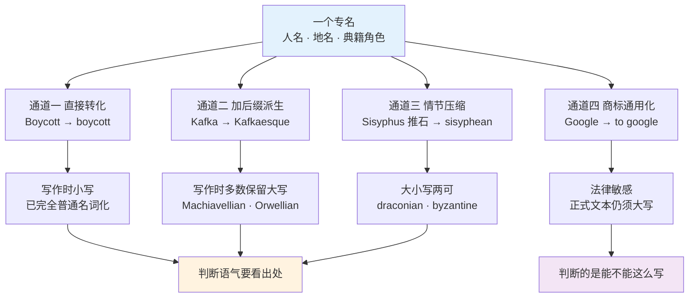
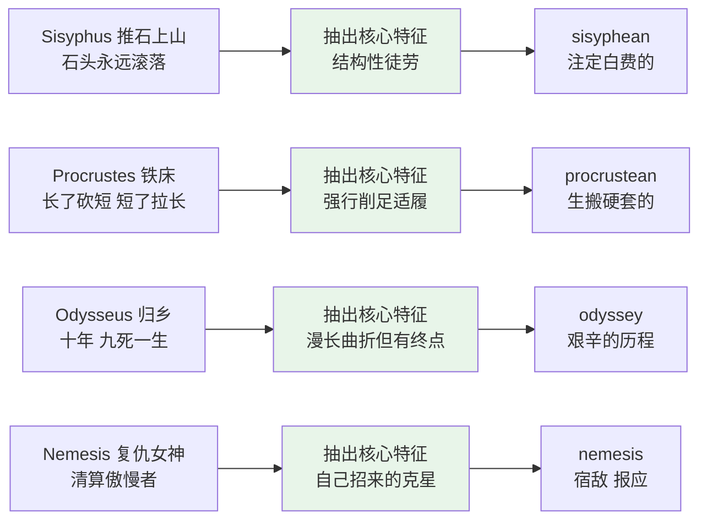
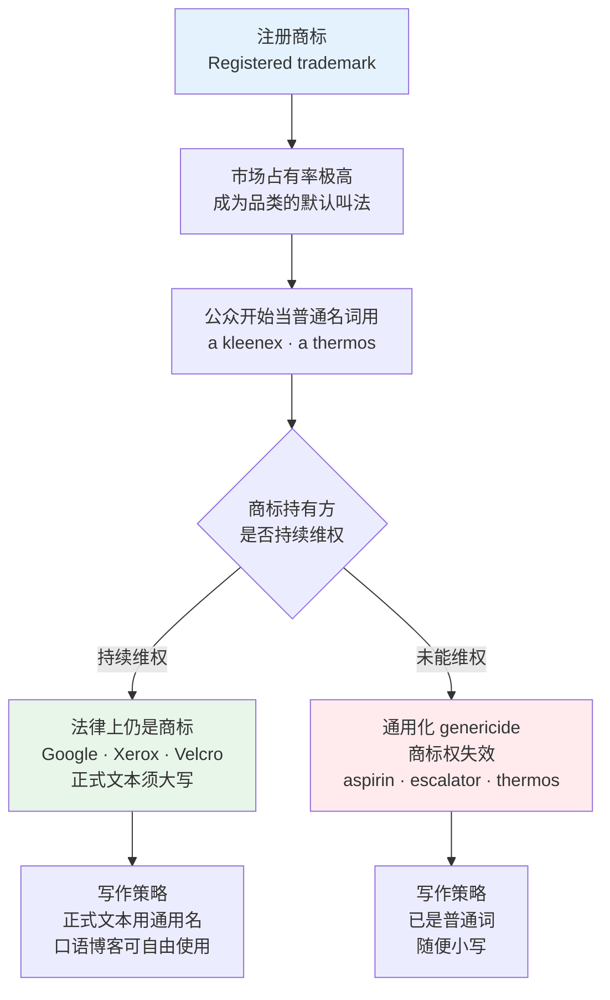
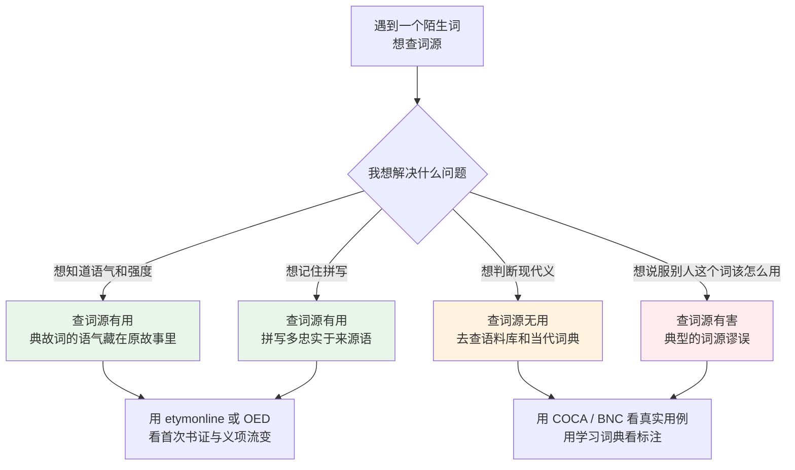
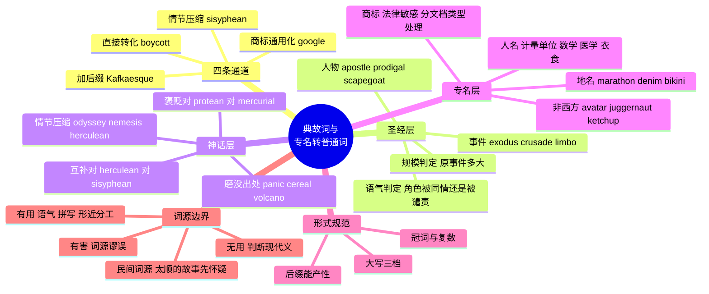

# 典故、专名转普通词与词源背景

> [!info] 本篇定位
>
> 前三篇处理的是学术文本的**骨架词**：论证词、过程词、统计与论文写作词。骨架搭起来之后，真正卡住中文读者的往往是另一类词——它们看起来是普通名词或形容词，实际上背后压着一个人名、一个地名、一段圣经章节或一则神话。不知道出处，句子读得懂字面，读不出态度。
>
> `a draconian policy` 不是「严格的政策」那么中性，`a quixotic plan` 不是「理想主义的计划」那么正面，`launch a crusade against` 带着一层圣战的火药味，用在同事身上会翻车。
>
> 宗教、战争、历史词的**字面义与文化背景**在 [[08.家庭、人际与社会身份/05.历史、宗教、战争与时事背景词\|历史、宗教、战争与时事背景词]] 已经给过，那一篇答的是「`crusade` 这段历史是什么」。本篇只接手引申义：**这个词今天出现在一篇论文、一份财报、一条 code review 里，是什么意思、什么强度、什么褒贬。**
>
> 整体不可拆的多词习语归 [[18.语域、英美差异与习语俚语/03.习语与谚语\|习语与谚语]]，本篇只收源头明确指向一个专名或一段典籍情节的那一批。
>
> 读完能做三件事：看到一个大写字母打头的形容词，能判断它是褒是贬、强度多大；写作时知道 `Machiavellian` 必须大写而 `draconian` 通常小写；拿到一个陌生长词，能判断「拆词根」这条路在它身上有没有用。

---

## 1. 本篇导读：一个词会把出处一起带进句子

先看四句话，四个词在词典里的中文释义几乎一样，都能翻成「大规模的离开」「彻底的改变」之类：

> - The layoffs triggered an **exodus** of senior engineers.
>   - 裁员引发了资深工程师的大规模出走。
> - Management launched a **crusade** against remote work.
>   - 管理层对远程办公发起了一场讨伐。
> - Migrating the monolith was a two-year **odyssey**.
>   - 拆解那个单体应用是一段两年的长途跋涉。
> - Latency became the team's **nemesis**.
>   - 延迟成了这个团队的死对头。

四个词都能用「离开／反对／过程／对手」这种中性词糊过去，但它们各自带着不同的重量。`exodus` 来自《出埃及记》，暗示的是**成建制、有方向、不回头**的迁移，一个人辞职不能叫 exodus；`crusade` 来自十字军东征，暗示的是**道德优越感 + 不容妥协**，写在报道里往往带讽刺；`odyssey` 来自荷马史诗《奥德赛》，暗示**漫长、曲折、九死一生但最终归家**，用来形容一次顺利的两周迭代就是滑稽；`nemesis` 是希腊的复仇女神，暗示这个对手**是你自己招来的、迟早会清算你**，跟普通的 `rival`（对手）不是一回事。

这些信息在中英词典的对应字里全部丢失。中文读者的典型状态是：认得词、翻得出、用不对。

### 1.1 三类词，三种处理方式

本篇覆盖的词分三类，处理难度递增：

| 类型 | 例子 | 出处 | 学习成本 |
| --- | --- | --- | --- |
| 出处已经磨没了的 | panic、cereal、volcano、sandwich | 潘神、谷神、火神、三明治伯爵 | 低，当普通词用即可，词源只是趣味 |
| 出处还在起作用的 | exodus、crusade、odyssey、draconian | 圣经、十字军、史诗、雅典立法者 | 高，必须知道出处才能判断语气 |
| 出处决定书写形式的 | Machiavellian、Kafkaesque、Google | 人名、作家名、商标 | 中，语义好懂，大小写与词形是坑 |

第一类词量最大但基本不用管。`volcano`（火山）来自罗马火神 Vulcan，知道这件事对使用 `volcano` 没有任何帮助——没有人会因为你不知道 Vulcan 就说你用错了。第二类是本篇的重点，也是全书唯一系统处理的地方。第三类是写作规范问题，第 11 节单独收。

### 1.2 术语先对齐

讨论这批词要用到几个术语，学术文本与词典的用法说明里会直接出现：

| 英文 | 英式音标 | 美式音标 | 词性 | 中文 | 搭配与说明 |
| --- | --- | --- | --- | --- | --- |
| **eponym** | /ˈepənɪm/ | /ˈepənɪm/ | n. | 名祖词；名祖 | 双向使用：既指「由人名变来的词」（sandwich 是 eponym），也指「被拿来命名的那个人」（Earl of Sandwich 是 eponym）。读文献时看上下文判断 |
| **eponymous** | /ɪˈpɒnɪməs/ | /ɪˈpɑːnɪməs/ | adj. | 同名的 | `the band's eponymous debut album`（乐队的同名首张专辑）。这是它今天最高频的用法，跟词源学关系不大 |
| **toponym** | /ˈtɒpənɪm/ | /ˈtɑːpənɪm/ | n. | 地名派生词 | 由地名变来的普通词，denim、marathon、bikini 属此类 |
| **antonomasia** | /ˌæntənəˈmeɪziə/ | /ˌæntənəˈmeɪʒə/ | n. | 换称；专名代普通名 | 修辞学术语，指用专名代指一类人：`He is no Einstein.`（他可不是什么天才） |
| **genericide** | /dʒəˈnerɪsaɪd/ | /dʒəˈnerəsaɪd/ | n. | 商标通用化（致其失效） | 法律术语。aspirin、escalator 在美国已通用化，商标权失效；Google、Xerox 的持有方在极力避免 |
| **allusion** | /əˈluːʒn/ | /əˈluːʒn/ | n. | 典故；暗指 | `a biblical allusion`（圣经典故）、`make an allusion to`。注意跟 illusion（幻觉）、elusion（躲避）三个近音词的区分 |
| **allusive** | /əˈluːsɪv/ | /əˈluːsɪv/ | adj. | 多典故的；暗指的 | 形容文风。跟 elusive（难以捉摸的）近音不同义，是高频混淆对 |
| **folk etymology** | /ˌfəʊk etɪˈmɒlədʒi/ | /ˌfoʊk etəˈmɑːlədʒi/ | n. | 民间词源；俗词源 | 指普通人凭字面猜出来的、事后被证伪的词源解释，第 13 节专讲 |

`eponym` 和 `eponymous` 的关系要单独提一句：这两个词今天的高频用法已经分家了。`eponym` 留在语言学与医学（`the eponym Parkinson's disease`），`eponymous` 跑进了流行文化，说的是「以自己名字命名的作品」。看到 `her eponymous novel` 不要往词源上想，它只是说「小说和主角同名」。



上图是本篇的骨架。左边一列是四条造词通道，中间一列是它们各自的书写规范，右边是两个不同性质的判断题。通道一到通道三决定的是**语义与语气**——知道 Sisyphus 每天推石头上山、石头每天滚下来，才明白 `a sisyphean task` 说的不是「累」，是「注定白费」。通道四决定的是**能不能这么写**——`to google something` 在口语和技术博客里完全正常，在给 Google 的正式函件里会被法务改成 `to search using the Google search engine`。

---

## 2. 四条通道：专名怎么变成普通词

### 2.1 通道一：直接转化，不加任何词缀

专名原样降格成普通名词或动词，只是首字母改小写。这是最彻底的一条路，走完之后大部分人根本意识不到词里有个人。

| 英文 | 英式音标 | 美式音标 | 词性 | 中文 | 搭配与说明 |
| --- | --- | --- | --- | --- | --- |
| **boycott** | /ˈbɔɪkɒt/ | /ˈbɔɪkɑːt/ | v./n. | 抵制；联合抵制 | 源自 1880 年爱尔兰土地代理人 Charles Boycott，佃户拒绝与他往来。`boycott a company`、`a consumer boycott`。注意是**集体、有组织**的抵制，一个人不买不叫 boycott |
| **sandwich** | /ˈsænwɪdʒ/ | /ˈsænwɪtʃ/ | n./v. | 三明治；夹在中间 | 源自第四代 Sandwich 伯爵 John Montagu。动词义很实用：`be sandwiched between two meetings`（被夹在两个会之间）。英式常读 /dʒ/ 尾，美式多读 /tʃ/ 尾 |
| **maverick** | /ˈmævərɪk/ | /ˈmævərɪk/ | n./adj. | 特立独行者；不合群的 | 源自德州牧场主 Samuel Maverick，他不给牛烙印，无印记的牛就被叫 maverick。褒贬取决于语境：`a maverick researcher` 偏褒，`a maverick trader` 偏贬 |
| **lynch** | /lɪntʃ/ | /lɪntʃ/ | v. | 私刑处死 | 源自弗吉尼亚的 Charles Lynch。极强的负面词，美国语境下与种族暴力史直接绑定。引申的 `a lynch mob`（暴民）在网络语境里指群起攻击的人群，用之前先掂量 |
| **guillotine** | /ˈɡɪlətiːn/ | /ˈɡɪlətiːn/ | n./v. | 断头台；裁纸刀；快速终结 | 源自医生 Joseph-Ignace Guillotin，讽刺的是他主张废除死刑，只是提议用更快的方式行刑。引申义：英国议会用 `guillotine motion` 指强行终止辩论 |
| **silhouette** | /ˌsɪluˈet/ | /ˌsɪluˈet/ | n./v. | 剪影；轮廓 | 源自法国财政大臣 Étienne de Silhouette，因其吝啬而被拿来命名廉价的剪影画。`be silhouetted against the sky`（映在天空上成剪影） |
| **shrapnel** | /ˈʃræpnəl/ | /ˈʃræpnəl/ | n. | 弹片 | 源自英军军官 Henry Shrapnel。不可数名词，`hit by shrapnel` 不加 s。技术写作里有比喻用法：`the shrapnel from that refactor`（那次重构的连带损伤） |
| **derrick** | /ˈderɪk/ | /ˈderɪk/ | n. | 井架；起重臂 | 源自伊丽莎白时代的刽子手 Thomas Derrick，绞刑架的形状被拿去命名起重设备。石油行业高频词 |
| **nicotine** | /ˈnɪkətiːn/ | /ˈnɪkətiːn/ | n. | 尼古丁 | 源自法国驻葡萄牙大使 Jean Nicot，他把烟草引入法国宫廷 |
| **saxophone** | /ˈsæksəfəʊn/ | /ˈsæksəfoʊn/ | n. | 萨克斯管 | 源自比利时乐器师 Adolphe Sax，`Sax` + `-phone`（希腊语「声音」）。这是人名与希腊词根拼起来的混合造词 |
| **diesel** | /ˈdiːzl/ | /ˈdiːzl/ | n./adj. | 柴油；柴油机的 | 源自德国工程师 Rudolf Diesel。英美都不大写 |
| **dunce** | /dʌns/ | /dʌns/ | n. | 笨蛋；差生 | 源自中世纪经院哲学家 John Duns Scotus。他的追随者在文艺复兴时被人文主义者嘲笑为顽固，`Dunsman` 遂变成 dunce。`a dunce cap`（差生帽） |
| **ponzi** | /ˈpɒnzi/ | /ˈpɑːnzi/ | adj. | 庞氏的 | 源自 Charles Ponzi。几乎只出现在 `a Ponzi scheme`（庞氏骗局）里，这个搭配中大写保留率很高 |
| **sideburns** | /ˈsaɪdbɜːnz/ | /ˈsaɪdbɜːrnz/ | n. | 鬓角 | 源自南北战争将领 Ambrose **Burnside**，注意音节被后人调了个个儿：burnside → sideburns。永远复数 |
| **jumbo** | /ˈdʒʌmbəʊ/ | /ˈdʒʌmboʊ/ | adj./n. | 超大的；巨型的 | 源自 19 世纪马戏团的一头名叫 Jumbo 的大象。`a jumbo jet`、`jumbo shrimp`（这个搭配本身是英语里著名的矛盾修辞） |
| **teddy bear** | /ˈtedi beə/ | /ˈtedi ber/ | n. | 泰迪熊 | 源自美国总统 Theodore「Teddy」Roosevelt 拒绝射杀一头被绑住的熊的报道 |

### 2.2 通道二：加后缀，派生成形容词

这条路产出的几乎全是形容词，而且**绝大多数保留大写**，因为源头是一个具体的人，词形上还看得出来。四个后缀分工明确：

| 后缀 | 音标特征 | 语义倾向 | 例子 |
| --- | --- | --- | --- |
| `-ian` / `-an` | 重音落在后缀前一音节 | 中性描述「属于某人的思想体系」 | Freudian、Darwinian、Newtonian、Orwellian、Dickensian |
| `-esque` | 重音落在 `-esque` 上 /ˈesk/ | 偏「风格上像」，多用于艺术与文学 | Kafkaesque、Rubenesque、picturesque、Lynchian |
| `-ic` / `-ical` | 重音落在后缀前一音节 | 学派、方法 | Socratic、Platonic、Homeric、Byronic |
| `-ism` / `-ist` | — | 主义与信奉者 | Marxism、sadism、masochism、chauvinism |

| 英文 | 英式音标 | 美式音标 | 词性 | 中文 | 搭配与说明 |
| --- | --- | --- | --- | --- | --- |
| **Machiavellian** | /ˌmækiəˈveliən/ | /ˌmækiəˈveliən/ | adj. | 权谋的；不择手段的 | 源自 Niccolò Machiavelli《君主论》。**必须大写**。强贬义，指为达目的不惜操纵与欺骗：`Machiavellian office politics` |
| **Kafkaesque** | /ˌkæfkəˈesk/ | /ˌkæfkəˈesk/ | adj. | 卡夫卡式的；荒诞而无出路的 | 特指「面对一个庞大、不可理解、无法申诉的官僚系统」。不是单纯的「怪」：`a Kafkaesque permit process` |
| **Orwellian** | /ɔːˈweliən/ | /ɔːrˈweliən/ | adj. | 奥威尔式的；极权监控的 | 源自《一九八四》。特指国家层面的监控、语言操纵与历史篡改。被滥用严重，形容公司装了打卡机不算 Orwellian |
| **Dickensian** | /dɪˈkenziən/ | /dɪˈkenziən/ | adj. | 狄更斯式的；贫困脏乱的 | 两个方向：`Dickensian poverty`（赤贫）与 `a Dickensian Christmas`（温馨的旧式圣诞）。词义分岔，靠搭配区分 |
| **Freudian** | /ˈfrɔɪdiən/ | /ˈfrɔɪdiən/ | adj. | 弗洛伊德式的 | 高频固定搭配 `a Freudian slip`（口误泄露真实想法） |
| **Pavlovian** | /pævˈləʊviən/ | /pævˈloʊviən/ | adj. | 巴甫洛夫式的；条件反射式的 | `a Pavlovian response to notifications`（对通知的条件反射） |
| **Byzantine** | /baɪˈzæntaɪn/ | /ˈbɪzəntiːn/ | adj. | 极其繁复难懂的 | 源自拜占庭帝国的官僚体制。引申义**通常小写**，指制度或代码复杂到无法理解：`a byzantine approval workflow`。英美读音差异大，注意重音位置都不一样 |
| **Draconian** | /drəˈkəʊniən/ | /drəˈkoʊniən/ | adj. | 严酷的；苛刻的 | 源自公元前 621 年雅典立法者 Draco，据传其法典对小偷小摸也判死刑。**注意不是神话，是历史人物**。引申义常小写。强贬义：`draconian lockdown measures` |
| **Socratic** | /səˈkrætɪk/ | /səˈkrætɪk/ | adj. | 苏格拉底式的 | `the Socratic method`（通过连续提问引导对方自己发现矛盾）。技术面试语境里高频 |
| **Platonic** | /pləˈtɒnɪk/ | /pləˈtɑːnɪk/ | adj. | 柏拉图式的；纯精神的 | 两义分工靠大小写：`Platonic forms`（哲学上的理念论，大写）与 `a platonic relationship`（纯友谊，小写） |
| **quixotic** | /kwɪkˈsɒtɪk/ | /kwɪkˈsɑːtɪk/ | adj. | 不切实际的；堂吉诃德式的 | 源自塞万提斯《堂吉诃德》。**已完全小写化**。注意它的重点不是「理想主义」而是「注定失败且当事人看不见」：`a quixotic bid for the CEO job`。发音是坑：西班牙语原名读 /kiˈxote/，英语形容词却读 /kwɪkˈsɒtɪk/ |
| **chauvinism** | /ˈʃəʊvɪnɪzəm/ | /ˈʃoʊvənɪzəm/ | n. | 沙文主义；狭隘的优越感 | 源自据传的拿破仑士兵 Nicolas Chauvin，此人是否真实存在存疑。今天单用多指 `male chauvinism`（大男子主义），指国家层面要写全 `national chauvinism` |
| **sadism** | /ˈseɪdɪzəm/ | /ˈseɪdɪzəm/ | n. | 施虐；虐待狂 | 源自法国作家 Marquis de Sade |
| **masochism** | /ˈmæsəkɪzəm/ | /ˈmæsəkɪzəm/ | n. | 受虐；自虐倾向 | 源自奥地利作家 Leopold von Sacher-Masoch。日常引申：`It's pure masochism to debug this on a Friday night.` |
| **bowdlerize** | /ˈbaʊdləraɪz/ | /ˈbaʊdləraɪz/ | v. | 删改（作品中不雅内容） | 源自 Thomas Bowdler，1818 年出版删净版莎士比亚。学术书评高频，贬义 |
| **mesmerize** | /ˈmezməraɪz/ | /ˈmezməraɪz/ | v. | 使着迷；使入迷 | 源自 Franz Mesmer 的「动物磁性」催眠术。现代义已完全褪去催眠色彩：`mesmerized by the animation` |
| **galvanize** | /ˈɡælvənaɪz/ | /ˈɡælvənaɪz/ | v. | 激励；使猛然行动；镀锌 | 源自 Luigi Galvani 的电流实验。两个义项并行：`galvanize the team into action`（激励）与 `galvanized steel`（镀锌钢），后者在硬件文档里高频 |
| **pasteurize** | /ˈpɑːstʃəraɪz/ | /ˈpæstʃəraɪz/ | v. | 巴氏灭菌 | 源自 Louis Pasteur。注意英美元音差异 /ɑː/ 对 /æ/ |
| **spoonerism** | /ˈspuːnərɪzəm/ | /ˈspuːnərɪzəm/ | n. | 首音互换的口误 | 源自牛津学监 William Spooner。`a well-boiled icicle` 本应是 `a well-oiled bicycle` |
| **malapropism** | /ˈmæləprɒpɪzəm/ | /ˈmæləprɑːpɪzəm/ | n. | 近音词误用 | 源自 Sheridan 剧作《情敌》中的 Mrs. Malaprop。指用错一个发音相近的词：把 `allusion` 说成 `illusion` 就是典型 |
| **luddite** | /ˈlʌdaɪt/ | /ˈlʌdaɪt/ | n./adj. | 反对新技术的人 | 源自据传的 1811 年砸织机工人 Ned Ludd。科技评论高频，多为自嘲或轻贬：`I'm a bit of a luddite about smart homes.` |
| **gerrymander** | /ˈdʒerimændə/ | /ˈdʒerimændər/ | v./n. | 不公正划分选区 | 源自麻州州长 Elbridge **Gerry** + `salamander`（蝾螈，因划出的选区形状像蝾螈）。这是**人名与普通词的混成**，通道二与 [[15.词根、合成与缩略/04.合成词、转化词、截短词与缩略语\|合成词、转化词、截短词与缩略语]] 讲的 blend 机制的交叉产物 |
| **philippic** | /fɪˈlɪpɪk/ | /fɪˈlɪpɪk/ | n. | 激烈的抨击演说 | 源自古希腊演说家 Demosthenes 抨击马其顿腓力二世（Philip）的系列演说。极正式，学术与新闻评论用 |

### 2.3 通道三：把一整段情节压成一个词

这条路最难，因为词形上完全看不出来源，语义又高度浓缩。`sisyphean` 六个字母里装着一整个神话：Sisyphus 因欺骗众神被罚把巨石推上山顶，石头永远在到顶前滚落。因此 `a sisyphean task` 的核心语义不是「难」也不是「累」，而是**结构性的徒劳**——不管做多少次，结果都会被抹掉。给一个每天都被人手动改回去的配置项加自动化，才是 sisyphean；写一个很大的功能只是 `an enormous task`。

第 6 节整节处理这一类。

### 2.4 通道四：商标被叫成通用名

`Google`、`Xerox`、`Kleenex` 原本是注册商标，用得太广就开始被当普通名词和动词用。这条路的特殊之处在于它**有法律后果**：商标持有方要么持续维权，要么眼看商标进入公有领域。`aspirin`、`escalator`、`heroin` 在美国已经完成了这个过程，商标权失效，今天可以随便小写。第 9 节单独处理，包括技术写作里该怎么规避。

---

## 3. 圣经典故（上）：事件与场景变成的名词

这一批词的共同点是**源头是一个事件或一种处境**，引申后仍然保留原事件的规模感和方向性。

| 英文 | 英式音标 | 美式音标 | 词性 | 中文 | 搭配与说明 |
| --- | --- | --- | --- | --- | --- |
| **exodus** | /ˈeksədəs/ | /ˈeksədəs/ | n. | 大批离去；出走潮 | 源自《出埃及记》。希腊语 `ex-`（出）+ `hodos`（路）。核心语义是**成规模、同方向、不打算回来**。`a mass exodus of talent`、`an exodus from the city`。大写 `the Exodus` 才指圣经事件。不可用于个人：一个人离职是 `departure` |
| **genesis** | /ˈdʒenəsɪs/ | /ˈdʒenəsɪs/ | n. | 起源；发端 | 源自《创世记》。学术与技术写作高频：`the genesis of the idea`。比 `origin` 更强调「从无到有的那一刻」。注意复数是 geneses /ˈdʒenəsiːz/ |
| **apocalypse** | /əˈpɒkəlɪps/ | /əˈpɑːkəlɪps/ | n. | 大灾难；世界末日 | 希腊语原义是「揭示」，《启示录》的希腊语书名就是这个词。今天的通俗义已经完全倒向「毁灭」。`a climate apocalypse`。派生 apocalyptic 是常用形容词 |
| **Armageddon** | /ˌɑːməˈɡedn/ | /ˌɑːrməˈɡedn/ | n. | 终极决战；大决战 | 源自《启示录》16 章的地名 Har Megiddo。比 apocalypse 更强调**对决**而非单纯毁灭。通常大写。`a legal Armageddon` |
| **crusade** | /kruːˈseɪd/ | /kruːˈseɪd/ | n./v. | 运动；讨伐；十字军东征 | 词根是拉丁语 `crux`（十字）。引申义指**带道德优越感的长期运动**：`a crusade against corruption`、`crusade for reform`。中性偏褒还是偏贬取决于说话人立场；在有穆斯林读者的语境里慎用，历史包袱很重 |
| **inquisition** | /ˌɪnkwɪˈzɪʃn/ | /ˌɪnkwəˈzɪʃn/ | n. | 严厉盘问；审讯 | 源自中世纪宗教裁判所。引申义带强烈的「被当罪犯审」意味：`The code review turned into an inquisition.` |
| **diaspora** | /daɪˈæspərə/ | /daɪˈæspərə/ | n. | 离散群体；流散 | 希腊语「播撒」，最初指犹太人流散。今天泛用于任何跨国族群：`the Chinese diaspora`。注意重音在第二音节 |
| **epiphany** | /ɪˈpɪfəni/ | /ɪˈpɪfəni/ | n. | 顿悟；灵光一现 | 希腊语「显现」，原指主显节。乔伊斯把它引入文学批评后彻底世俗化。`have an epiphany`。学术与产品文档里极常见 |
| **sabbatical** | /səˈbætɪkl/ | /səˈbætɪkl/ | n./adj. | 学术休假；公休年 | 源自 Sabbath（安息日）与《利未记》的安息年。`take a sabbatical`、`on sabbatical`。今天科技公司也用，不限于高校 |
| **jubilee** | /ˈdʒuːbɪliː/ | /ˈdʒuːbəliː/ | n. | 大庆；周年纪念 | 源自希伯来语 yobel（羊角号），《利未记》的禧年制度。`a silver/golden/diamond jubilee`（25/50/60 周年）。英式语境高频，多与王室相关 |
| **pilgrimage** | /ˈpɪlɡrɪmɪdʒ/ | /ˈpɪlɡrɪmɪdʒ/ | n. | 朝圣；朝拜之旅 | 引申义已完全世俗化：`make a pilgrimage to the birthplace of the company` |
| **purgatory** | /ˈpɜːɡətri/ | /ˈpɜːrɡətɔːri/ | n. | 炼狱；煎熬期 | 天主教教义中介于天堂地狱之间的净化之地。引申义指「难熬但会结束的过渡期」：`three months of onboarding purgatory` |
| **limbo** | /ˈlɪmbəʊ/ | /ˈlɪmboʊ/ | n. | 悬而未决的状态 | 原指未受洗婴儿灵魂的居所。引申义极高频且完全中性：`The project is in limbo.`（项目搁置了）。注意跟加勒比舞蹈 limbo 同形不同源 |
| **exile** | /ˈeksaɪl/ | /ˈeksaɪl/ | n./v. | 流放；流亡 | 圣经语境高频（巴比伦之囚），但今天已是普通词。`in exile`、`self-imposed exile` |
| **wilderness** | /ˈwɪldənəs/ | /ˈwɪldərnəs/ | n. | 荒野；失势期 | 圣经引申义很实用：以色列人在旷野四十年、耶稣受试探四十天。政治报道中 `in the political wilderness` 指「失势、被边缘化的时期」 |
| **promised land** | /ˌprɒmɪst ˈlænd/ | /ˌprɑːməst ˈlænd/ | n. | 应许之地；理想境地 | 通常小写。引申义指许诺过但还没到的美好状态，常带一层「可能到不了」的反讽 |
| **manna** | /ˈmænə/ | /ˈmænə/ | n. | 天降之物；意外的救济 | 《出埃及记》16 章，以色列人在旷野获得的食物。固定搭配 `manna from heaven`（雪中送炭般的意外之财）。不可数 |
| **fall from grace** | /ˌfɔːl frəm ˈɡreɪs/ | /ˌfɑːl frəm ˈɡreɪs/ | phr. | 失宠；名誉扫地 | 名词化 `a fall from grace`。用于公众人物或高管的骤然失势 |
| **baptism of fire** | /ˌbæptɪzəm əv ˈfaɪə/ | /ˌbæptɪzəm əv ˈfaɪər/ | n. | 严峻的初次考验 | `Her first week on call was a baptism of fire.`（她第一周值班就是场硬仗） |
| **the writing on the wall** | — | — | phr. | 不祥之兆；败象已现 | 《但以理书》5 章伯沙撒王宴会上墙上出现的字。`see the writing on the wall`（看出大势已去） |

`limbo` 值得单独说，因为它是这一批里在技术语境用得最多的一个，而且**完全中性、没有宗教味**。任务卡在中间状态、PR 挂了两周没人看、公司在等法务批准，都可以说 `in limbo`。它比 `pending`（待处理）多一层「不知道要等多久」的无奈，比 `stuck`（卡住）少一层「有明确障碍」的判断。

`crusade` 相反，是这一批里最需要小心的。它在英美媒体上使用频率不低，但用错对象会踩雷：形容一个人长期推动某项公益，`a lifelong crusade for clean water` 是褒义；形容公司管理层，`management's crusade against remote work` 立刻变成讽刺，暗示对方偏执且听不进不同意见。**判断规则很简单：说自己人时几乎一定是讽刺，说自己或自己认同的事业时才是褒义。**

---

## 4. 圣经典故（下）：人物与角色变成的普通词

上一节是事件，这一节是**人**。共同的引申机制是：某个人物在故事里的一个显著特征被抽出来，变成一个可以贴在任何人身上的标签。

| 英文 | 英式音标 | 美式音标 | 词性 | 中文 | 搭配与说明 |
| --- | --- | --- | --- | --- | --- |
| **apostle** | /əˈpɒsl/ | /əˈpɑːsl/ | n. | 使徒；倡导者 | 希腊语 `apostolos`「被差遣的人」。注意 **t 不发音**。引申义指某种理念的热心宣扬者：`an apostle of open source`。比 advocate 更强调「布道式」的热情 |
| **disciple** | /dɪˈsaɪpl/ | /dɪˈsaɪpl/ | n. | 门徒；追随者 | 拉丁语 `discipulus`（学生），与 discipline 同源。引申义比 apostle 更被动：apostle 出去传播，disciple 跟随学习。`a disciple of the Bauhaus school` |
| **evangelist** | /ɪˈvændʒəlɪst/ | /ɪˈvændʒəlɪst/ | n. | 布道者；技术布道师 | 希腊语「传好消息的人」。科技行业已把它变成正式职位名：`developer evangelist`、`technology evangelist`（今天更常写 developer advocate）。动词 evangelize 在技术语境完全中性：`evangelize the new API internally` |
| **messiah** | /məˈsaɪə/ | /məˈsaɪə/ | n. | 救世主；被寄予厚望者 | 希伯来语「受膏者」。引申多带反讽：`the market was waiting for a messiah`。形容词 messianic /ˌmesiˈænɪk/ 指「救世主式的、狂热的」：`a messianic belief in AI` |
| **Samaritan** | /səˈmærɪtən/ | /səˈmerətən/ | n. | 好心人 | 源自《路加福音》10 章的好撒玛利亚人寓言。几乎只以 `a Good Samaritan` 形式出现，且大写。法律术语 `Good Samaritan law`（好人法，保护施救者免责） |
| **prodigal** | /ˈprɒdɪɡl/ | /ˈprɑːdɪɡl/ | adj./n. | 挥霍的；浪子 | **最高频的误用词之一**。它的本义是「挥霍无度」，不是「离家出走」也不是「回头」。`the prodigal son`（浪子回头）这个搭配让很多人以为 prodigal = 归来者。`prodigal spending`（挥霍无度的开支）才是它的普通用法 |
| **philistine** | /ˈfɪlɪstaɪn/ | /ˈfɪləstiːn/ | n./adj. | 庸人；对文化艺术无感的人 | 原指非利士人。德国学界先用它嘲讽市侩，Matthew Arnold 引入英语。**英美读音差异极大**，注意后半段。贬义，`a cultural philistine` |
| **Pharisee** | /ˈfærɪsiː/ | /ˈferəsiː/ | n. | 伪君子；假道学 | 形容词 pharisaical /ˌfærɪˈseɪɪkl/。指「拘泥形式、自命虔诚」，与 hypocrite 的差别在于它特指**用规则的字面来掩盖精神的缺失** |
| **Judas** | /ˈdʒuːdəs/ | /ˈdʒuːdəs/ | n. | 叛徒 | 大写。极强的负面词，指的是**内部人的背叛**，不是普通的对手。`He was the Judas of the board.` |
| **doubting Thomas** | /ˌdaʊtɪŋ ˈtɒməs/ | /ˌdaʊtɪŋ ˈtɑːməs/ | n. | 多疑者；非亲眼所见不信的人 | 源自使徒多马要摸到伤口才信复活。中性偏轻贬 |
| **jeremiad** | /ˌdʒerəˈmaɪəd/ | /ˌdʒerəˈmaɪəd/ | n. | 哀叹连篇的控诉文 | 源自先知耶利米的《耶利米哀歌》。正式文体，书评与政论用：`a jeremiad against modern architecture` |
| **scapegoat** | /ˈskeɪpɡəʊt/ | /ˈskeɪpɡoʊt/ | n./v. | 替罪羊；使当替罪羊 | 《利未记》16 章的赎罪仪式，Tyndale 1530 年译经时造的词（escape goat）。`make sb a scapegoat`、`be scapegoated for the outage` |
| **leviathan** | /ləˈvaɪəθən/ | /ləˈvaɪəθən/ | n. | 庞然大物；巨兽 | 《约伯记》里的海怪。霍布斯 1651 年用它命名国家理论著作后，引申义偏向「庞大的组织或体制」：`a corporate leviathan` |
| **behemoth** | /bɪˈhiːmɒθ/ | /bɪˈhiːməθ/ | n. | 巨兽；巨头 | 同样出自《约伯记》，指陆上巨兽。与 leviathan 的分工：behemoth 更强调**体量**，leviathan 更强调**不可控的力量**。`a tech behemoth`（科技巨头）是新闻高频搭配 |
| **babel** | /ˈbeɪbl/ | /ˈbeɪbl/ | n. | 嘈杂；语言混乱 | 《创世记》11 章巴别塔。`a babel of voices`（人声嘈杂）。注意 JavaScript 的构建工具 Babel 正是取这个「转译语言」的典故 |
| **shibboleth** | /ˈʃɪbəleθ/ | /ˈʃɪbələθ/ | n. | 圈内暗号；辨别身份的用语 | 《士师记》12 章，以法莲人发不出 /ʃ/，念成 sibboleth 而被识破。今天指**用来区分圈内圈外的说法或做法**：`Vim versus Emacs is a shibboleth, not an argument.` 语言学与社会学高频 |
| **Job's patience** | /ˌdʒəʊbz ˈpeɪʃns/ | /ˌdʒoʊbz ˈpeɪʃns/ | n. | 极大的忍耐 | 注意人名 Job 读 /dʒəʊb/，跟「工作」的 job /dʒɒb/ 不同音。`the patience of Job` |
| **David and Goliath** | /ˌdeɪvɪd ən ɡəˈlaɪəθ/ | /ˌdeɪvɪd ən ɡəˈlaɪəθ/ | n. | 以弱胜强的对决 | 形容词式用法 `a David-and-Goliath battle`。商业报道里描述初创公司挑战巨头 |
| **forbidden fruit** | /fəˌbɪdn ˈfruːt/ | /fərˌbɪdn ˈfruːt/ | n. | 禁果；因被禁而更诱人的事物 | 注意圣经原文并未指明是苹果，苹果的联想来自拉丁语 `malum` 兼有「苹果」与「恶」两义的双关 |
| **cross to bear** | /ˌkrɒs tə ˈbeə/ | /ˌkrɔːs tə ˈber/ | phr. | 不得不承担的重负 | `Legacy code is our cross to bear.` 半开玩笑用法在技术圈很常见 |
| **apocryphal** | /əˈpɒkrɪfl/ | /əˈpɑːkrəfl/ | adj. | 真伪存疑的；杜撰的 | 源自《次经》（Apocrypha）。学术写作里极实用，专门用来标注「流传很广但查不到出处的故事」：`The quote is almost certainly apocryphal.` |
| **canon** | /ˈkænən/ | /ˈkænən/ | n. | 正典；公认的经典 | 原指教会认定的经卷。引申三义：文学正典 `the Western canon`、粉丝文化里的「官方设定」`that's not canon`、技术上的 `canonical form`（规范形式）。注意跟 cannon（大炮）拼写只差一个 n |
| **canonical** | /kəˈnɒnɪkl/ | /kəˈnɑːnɪkl/ | adj. | 规范的；权威的 | 技术写作里的高频词，与宗教义已完全脱钩：`the canonical URL`、`canonical representation`、`the canonical example`。见 [[20.专业领域词汇/01.IT 深度英语（上）：核心概念术语与其读音\|IT 深度英语（上）：核心概念术语与其读音]] |
| **heresy** | /ˈherəsi/ | /ˈherəsi/ | n. | 异端；离经叛道的观点 | 技术圈半开玩笑地用：`Suggesting we drop tests is heresy around here.` 形容词 heretical /həˈretɪkl/，注意重音跑到第二音节 |
| **dogma** | /ˈdɒɡmə/ | /ˈdɔːɡmə/ | n. | 教条 | 形容词 dogmatic 是常用贬义词：`a dogmatic approach to architecture` |
| **schism** | /ˈskɪzəm/ | /ˈskɪzəm/ | n. | 分裂；裂变 | 原指教会大分裂。引申指组织或社区的公开分裂：`a schism in the community over licensing`。传统读音 /ˈsɪzəm/ 在英美主流词典里都仍然收录，但今天更常听到的是 /ˈskɪzəm/ |
| **zealot** | /ˈzelət/ | /ˈzelət/ | n. | 狂热分子 | 原为公元一世纪犹太激进派。**注意重音在第一音节，元音是 /e/ 不是 /iː/**。贬义：`a testing zealot` |
| **iconoclast** | /aɪˈkɒnəklæst/ | /aɪˈkɑːnəklæst/ | n. | 打破陈规者；反传统者 | 希腊语「打碎圣像的人」，源自拜占庭破坏圣像运动。现代义偏褒：`an iconoclast in the field` |
| **sanctimonious** | /ˌsæŋktɪˈməʊniəs/ | /ˌsæŋktɪˈmoʊniəs/ | adj. | 假装虔诚的；自命清高的 | 强贬义，比 self-righteous 更刺人 |
| **proselytize** | /ˈprɒsəlɪtaɪz/ | /ˈprɑːsələtaɪz/ | v. | 劝人改宗；强行推销观点 | 技术语境里带贬义，与中性的 evangelize 形成对照：`Stop proselytizing about Rust in every meeting.` |

> [!warning] `prodigal` 是本节最大的坑
>
> 中文把 `the prodigal son` 译成「浪子回头」，重心落在「回头」上，于是很多人写出 `the prodigal engineer returned to the company`，以为是「回归」的意思。
>
> - ❌ ~~After two years at a startup, he made a prodigal return.~~（想说「回归」，实际说的是「挥霍式的回归」，讲不通）
> - ✅ **After two years at a startup, he returned to the fold.**（fold 是羊圈，同样是圣经意象，指回到原来的团体）
>
> `prodigal` 唯一的语义是「挥霍无度」：
>
> - ✅ **prodigal spending on infrastructure**（在基础设施上挥霍无度）
> - ✅ **a prodigal use of memory**（内存用得极其铺张）

> [!tip] 用两个问题快速定位这一批词的语气
>
> 拿到一个圣经典故词，问两件事就够了：
>
> 1. **原故事里这个角色是被同情还是被谴责的**。Judas、Pharisee 被谴责，所以是强贬义；Samaritan 被赞扬，所以是褒义；Thomas 只是被温和地纠正，所以是轻贬。
> 2. **原故事的规模有多大**。Exodus 是一个民族的迁移，所以 `an exodus` 至少要几十人起步；Armageddon 是终末决战，所以只能用于「不能再大」的对抗，一场普通的官司叫 Armageddon 就过火了。

---

## 5. 希腊罗马神话（上）：已经看不出出处的日常词

这一批的特点是**出处彻底磨没了**。没有人在说 `panic` 的时候想到牧神潘，也没有人在写 `cereal` 的时候想到谷物女神刻瑞斯。把它们放在一起，是为了让你在遇到同一批神名派生出的**其他**词时能一眼认出来——认识 Mars 是战神，就不用单独记 `martial`（军事的）、`martial arts`（武术）、`March`（三月）三个词。

| 英文 | 英式音标 | 美式音标 | 词性 | 中文 | 搭配与说明 |
| --- | --- | --- | --- | --- | --- |
| **panic** | /ˈpænɪk/ | /ˈpænɪk/ | n./v./adj. | 恐慌；惊慌 | 牧神 Pan 会在旷野里制造无端的恐惧。`panic buying`、`don't panic`。Go 与 Rust 用 `panic` 表示不可恢复错误，词条见 [[20.专业领域词汇/01.IT 深度英语（上）：核心概念术语与其读音\|IT 深度英语（上）：核心概念术语与其读音]]；日常词被技术挪用的完整地图见 [[20.专业领域词汇/02.计算机语境的熟词新义：日常词的技术义项地图\|计算机语境的熟词新义：日常词的技术义项地图]] |
| **cereal** | /ˈsɪəriəl/ | /ˈsɪriəl/ | n. | 谷物；麦片 | 谷物女神 Ceres。与 serial（连续的）**完全同音**，是英语里最典型的近音异形对之一 |
| **volcano** | /vɒlˈkeɪnəʊ/ | /vɑːlˈkeɪnoʊ/ | n. | 火山 | 火神 Vulcan。复数 volcanoes 或 volcanos 都可以。派生 volcanic /vɒlˈkænɪk/ 注意元音变了 |
| **ocean** | /ˈəʊʃn/ | /ˈoʊʃn/ | n. | 海洋 | 泰坦神 Oceanus。形容词 oceanic /ˌəʊʃiˈænɪk/ 重音后移 |
| **museum** | /mjuˈziːəm/ | /mjuˈziːəm/ | n. | 博物馆 | 缪斯女神 Muses 的神殿 `mouseion`。**重音在第二音节**，中文读者常错读成 /ˈmjuːziəm/ |
| **music** | /ˈmjuːzɪk/ | /ˈmjuːzɪk/ | n. | 音乐 | 同源于 Muses。`the art of the Muses` |
| **muse** | /mjuːz/ | /mjuːz/ | n./v. | 灵感来源；沉思 | 名词指「给人灵感的人」，来自缪斯女神；动词 `muse on/over`（沉思）来自古法语 `muser`，**与缪斯无关**。同形不同源，是本篇第 13 节讲的那种陷阱 |
| **psyche** | /ˈsaɪki/ | /ˈsaɪki/ | n. | 心灵；心理 | 希腊语「灵魂、呼吸」，也是与 Eros 相恋的神女名。**两个音节，读 /ˈsaɪ-ki/，不是 /saɪk/**。psychology、psychiatry、psychic 全部同源 |
| **erotic** | /ɪˈrɒtɪk/ | /ɪˈrɑːtɪk/ | adj. | 情爱的 | 爱神 Eros |
| **hypnotic** | /hɪpˈnɒtɪk/ | /hɪpˈnɑːtɪk/ | adj./n. | 催眠的；安眠药 | 睡神 Hypnos。hypnosis、hypnotize 同源 |
| **morphine** | /ˈmɔːfiːn/ | /ˈmɔːrfiːn/ | n. | 吗啡 | 梦神 Morpheus，1817 年由德国药剂师 Sertürner 命名 |
| **lethargic** | /ləˈθɑːdʒɪk/ | /ləˈθɑːrdʒɪk/ | adj. | 昏昏欲睡的；无精打采的 | 冥河 Lethe（遗忘之河）。名词 lethargy /ˈleθədʒi/ 重音在第一音节，形容词跑到第二音节，是常见的重音移位对 |
| **echo** | /ˈekəʊ/ | /ˈekoʊ/ | n./v. | 回声；附和 | 山林女神 Echo 被罚只能重复别人的话。动词义在学术写作里很实用：`These findings echo earlier work.`（这些结论与早前研究相呼应） |
| **chaos** | /ˈkeɪɒs/ | /ˈkeɪɑːs/ | n. | 混乱；混沌 | 希腊神话中的原初虚空。**两个音节 /ˈkeɪ-ɒs/**，中文读者常误读成 /tʃaʊs/。形容词 chaotic /keɪˈɒtɪk/。数学与工程的 `chaos theory`（混沌理论）、SRE 的 `chaos engineering`（混沌工程）用的都是这个词 |
| **atlas** | /ˈætləs/ | /ˈætləs/ | n. | 地图集；图谱 | 泰坦神 Atlas 扛天。麦卡托 1595 年用它命名地图集。今天引申到任何图谱：`a brain atlas`。解剖学上第一颈椎也叫 atlas |
| **siren** | /ˈsaɪrən/ | /ˈsaɪrən/ | n. | 警笛；海妖 | 《奥德赛》里用歌声引诱水手触礁的海妖。两个义项都活跃：`an air-raid siren`（防空警报）与 `the siren call of premature optimization`（过早优化的诱惑） |
| **iridescent** | /ˌɪrɪˈdesnt/ | /ˌɪrəˈdesnt/ | adj. | 虹彩的；闪色的 | 彩虹女神 Iris。眼睛的虹膜 iris 同源 |
| **martial** | /ˈmɑːʃl/ | /ˈmɑːrʃl/ | adj. | 军事的；尚武的 | 战神 Mars。`martial arts`（武术）、`martial law`（戒严令）。与 marshal（元帅；整理）同音不同源，是高频混淆对 |
| **jovial** | /ˈdʒəʊviəl/ | /ˈdʒoʊviəl/ | adj. | 快活的；愉快的 | 主神 Jupiter 的别名 Jove。中世纪占星术认为木星影响下的人性情愉快 |
| **mercurial** | /mɜːˈkjʊəriəl/ | /mɜːrˈkjʊriəl/ | adj. | 反复无常的；变化快的 | 信使神 Mercury，也是水银。**注意语气偏负面**：`a mercurial manager` 说的是情绪多变、难以预测，不是「灵活」 |
| **saturnine** | /ˈsætənaɪn/ | /ˈsætərnaɪn/ | adj. | 阴郁的；忧郁的 | 土星 Saturn 的占星属性。正式文体用词 |
| **titanic** | /taɪˈtænɪk/ | /taɪˈtænɪk/ | adj. | 巨大的 | 泰坦神族。`a titanic struggle`。因为那艘船，这个词在日常里带了点不祥的联想 |
| **titan** | /ˈtaɪtn/ | /ˈtaɪtn/ | n. | 巨头；泰斗 | `a titan of the industry` |
| **aegis** | /ˈiːdʒɪs/ | /ˈiːdʒɪs/ | n. | 保护；主持 | 宙斯与雅典娜的神盾。**几乎只出现在 `under the aegis of`**（在……的主持／支持下），正式文体：`under the aegis of the UN` |
| **Janus-faced** | /ˈdʒeɪnəs feɪst/ | /ˈdʒeɪnəs feɪst/ | adj. | 两面的；表里不一的 | 双面神 Janus，一月 January 同源。学术写作里常用中性义「具有两面性的」 |
| **plutocracy** | /pluːˈtɒkrəsi/ | /pluːˈtɑːkrəsi/ | n. | 财阀统治 | 希腊语 `ploutos`「财富」，与冥王 Plouton（同时掌管地下的财富）同源。元素 plutonium（钚）取自冥王星名 |
| **fury** | /ˈfjʊəri/ | /ˈfjʊri/ | n. | 暴怒；复仇女神 | 复数大写 the Furies 指复仇三女神。`fly into a fury` |
| **nectar** | /ˈnektə/ | /ˈnektər/ | n. | 花蜜；琼浆 | 众神的饮料 |
| **ambrosia** | /æmˈbrəʊziə/ | /æmˈbroʊʒə/ | n. | 神食；美味 | 众神的食物。英美读音后半段差异明显 |
| **hygiene** | /ˈhaɪdʒiːn/ | /ˈhaɪdʒiːn/ | n. | 卫生 | 健康女神 Hygieia。技术圈的 `code hygiene`（代码卫生）、`security hygiene` 都是这个词的隐喻延伸 |
| **tantalum** | /ˈtæntələm/ | /ˈtæntələm/ | n. | 钽（元素） | 与 tantalize 同源于 Tantalus。元素表里神话名一大批：helium（太阳神 Helios）、cerium（Ceres）、promethium（Prometheus）、thorium（Thor）、vanadium（北欧女神 Vanadis）、niobium（Niobe） |

上面这三十来个词不需要专门背，需要的是**建立神名到词族的映射**。掌握九个名字就能一次性解释三十多个词：

```text
Pan      → panic, panicky（pandemonium 的 pan- 是希腊语「全部」，与牧神无关）
Ceres    → cereal, cerium
Vulcan   → volcano, volcanic, vulcanize（硫化橡胶）
Mars     → martial, March, martian
Mercury  → mercurial, mercury（水银）, Wednesday（日耳曼对应神 Woden）
Jupiter  → jovial, Jove, Thursday（对应 Thor）
Saturn   → saturnine, Saturday
Muses    → music, museum, mosaic, muse（名词）；动词 muse 与 amuse 另有来源
Psyche   → psyche, psychology, psychiatry, psychic, psychosomatic
```

这张表还顺带解释了星期与月份的命名逻辑：罗马神名走进了行星名，行星名又走进了星期名，日耳曼语支再把罗马神换成本地对应神。完整的星期月份词表与大写规则在 [[04.时间与日历词汇/01.日历与钟点：星期、月份、四季与日期时刻读法\|日历与钟点：星期、月份、四季与日期时刻读法]]，本篇不重复。

---

## 6. 希腊罗马神话（下）：情节压缩成的形容词与名词

这一节是本篇最需要真正记住的部分。上一节的词丢了出处也能用，这一节的词丢了出处就会用错——因为它们的语义**不是词义的加总，是情节的结论**。



上图画的是这一类词的统一生成路径：**完整情节 → 一个可迁移的核心特征 → 一个形容词或名词**。中间那一格是关键，也是词典释义通常省略的那一格。词典把 `sisyphean` 释为「徒劳的」，把 `procrustean` 释为「强求一致的」，但没说清「徒劳」是哪一种徒劳、「强求」是哪一种强求。补上中间那一格，用法就锁死了：`sisyphean` 必须是**重复且被抹除**的徒劳，一次性失败不算；`procrustean` 必须是**为了套进既定框架而牺牲实质**，单纯的严格不算。

| 英文 | 英式音标 | 美式音标 | 词性 | 中文 | 搭配与说明 |
| --- | --- | --- | --- | --- | --- |
| **odyssey** | /ˈɒdəsi/ | /ˈɑːdəsi/ | n. | 漫长曲折的历程 | Odysseus 归乡十年。核心是**长、曲折、有终点**。`a personal odyssey`、`a three-year odyssey through the tax code`。不能用于短期或顺利的过程 |
| **nemesis** | /ˈneməsɪs/ | /ˈneməsɪs/ | n. | 克星；报应 | 复仇女神 Nemesis 专门惩罚傲慢（hubris）。核心是**这个对手是你自己招来的**。复数 nemeses /ˈneməsiːz/。`meet one's nemesis`（遭遇克星）。与 rival（势均力敌的对手）、adversary（正式的对手）不可互换 |
| **mentor** | /ˈmentɔː/ | /ˈmentɔːr/ | n./v. | 导师；指导 | 《奥德赛》中 Odysseus 托付儿子的老者 Mentor。已完全普通词化，且动词化：`mentor junior engineers`。派生 mentee、mentorship |
| **tantalize** | /ˈtæntəlaɪz/ | /ˈtæntəlaɪz/ | v. | 逗引；可望不可即地诱惑 | Tantalus 站在水中却喝不到水，头顶有果却够不着。核心是**近在眼前却拿不到**。多用分词形式：`a tantalizing glimpse of the roadmap` |
| **narcissism** | /ˈnɑːsɪsɪzəm/ | /ˈnɑːrsəsɪzəm/ | n. | 自恋 | Narcissus 爱上自己的水中倒影。形容词 narcissistic /ˌnɑːsɪˈsɪstɪk/ 重音后移 |
| **herculean** | /ˌhɜːkjuˈliːən/ | /ˌhɜːrkjəˈliːən/ | adj. | 需要极大力气的 | 赫拉克勒斯十二项苦差。核心是**规模巨大但可以完成**，与 sisyphean 正好互补。`a herculean effort`。英式也有 /hɜːˈkjuːliən/ 的重音变体 |
| **sisyphean** | /ˌsɪsɪˈfiːən/ | /ˌsɪsəˈfiːən/ | adj. | 徒劳无功的；周而复始白干的 | 见上文。`a sisyphean task`。注意拼写里两个 s 一个 y |
| **promethean** | /prəˈmiːθiən/ | /prəˈmiːθiən/ | adj. | 富创造力而叛逆的 | Prometheus 盗火给人类并因此受罚。褒义，带一层「为此付出代价」的悲剧色彩。监控系统 Prometheus 取的正是这个意象 |
| **procrustean** | /prəʊˈkrʌstiən/ | /proʊˈkrʌstiən/ | adj. | 削足适履的；强行套模板的 | Procrustes 有一张铁床，客人长了就砍脚，短了就拉长。学术批评的利器：`a procrustean classification scheme` |
| **protean** | /ˈprəʊtiən/ | /ˈproʊtiən/ | adj. | 变化多端的；多才多艺的 | 海神 Proteus 能任意变形。**褒义**，与同样表「多变」的 mercurial（贬义）形成对照。`a protean talent` |
| **stentorian** | /stenˈtɔːriən/ | /stenˈtɔːriən/ | adj. | 洪亮的 | 《伊利亚特》里嗓门抵得上五十人的传令兵 Stentor。只修饰声音：`a stentorian voice` |
| **halcyon** | /ˈhælsiən/ | /ˈhælsiən/ | adj. | 平静美好的 | 传说翠鸟 Alcyone 在冬至前后海面平静时筑巢。几乎只用于 `halcyon days`（黄金岁月），带怀旧色彩 |
| **labyrinth** | /ˈlæbərɪnθ/ | /ˈlæbərɪnθ/ | n. | 迷宫；错综复杂的事物 | 克里特岛关押弥诺陶洛斯的迷宫。形容词 labyrinthine /ˌlæbəˈrɪnθaɪn/。与 maze 的差别：labyrinth 更正式，也更强调「设计出来困住人」 |
| **chimera** | /kaɪˈmɪərə/ | /kaɪˈmɪrə/ | n. | 妄想；嵌合体 | 狮头羊身蛇尾的怪物。两个义项：日常义「不可能实现的空想」`a chimera of perfect security`；生物学义「嵌合体」。形容词 chimerical /kaɪˈmerɪkl/ |
| **hydra** | /ˈhaɪdrə/ | /ˈhaɪdrə/ | n. | 难以根除的祸患 | 九头蛇砍一头长两头。`a hydra-headed problem`（按下葫芦浮起瓢的问题）。技术文档里描述连锁故障很贴切 |
| **phoenix** | /ˈfiːnɪks/ | /ˈfiːnɪks/ | n. | 凤凰；浴火重生者 | `rise like a phoenix from the ashes`。注意 oe 读 /iː/ |
| **oracle** | /ˈɒrəkl/ | /ˈɔːrəkl/ | n. | 神谕；权威消息源 | 德尔斐神谕。三层用法：日常义「权威人士」`the oracle on all things legal`；数据库产品名；计算机科学的 `test oracle`（判定测试结果对错的依据）与 `random oracle`（随机预言机） |
| **sphinx** | /sfɪŋks/ | /sfɪŋks/ | n. | 谜一般的人 | 出谜语吃人的怪兽。形容词 sphinxlike。`a sphinxlike smile` |
| **colossal** | /kəˈlɒsl/ | /kəˈlɑːsl/ | adj. | 巨大的 | 罗德岛巨像 Colossus。`a colossal waste of time`。名词 colossus 复数 colossi /kəˈlɒsaɪ/ |
| **amazon** | /ˈæməzn/ | /ˈæməzɑːn/ | n. | 女战士；魁梧的女子 | 神话中的女战士部族。亚马逊河由西班牙探险者 Orellana 命名，公司名又取自河名——**三层转手，各自独立** |
| **python** | /ˈpaɪθn/ | /ˈpaɪθɑːn/ | n. | 蟒蛇 | 德尔斐的巨蛇 Python。但编程语言 Python 由 Guido van Rossum 取自英国喜剧团体 Monty Python，**与神话无关**。这是词源判断的典型陷阱：名字长得像典故，实际另有出处 |
| **Trojan** | /ˈtrəʊdʒən/ | /ˈtroʊdʒən/ | n./adj. | 特洛伊木马；伪装的恶意程序 | `a Trojan horse` 的截短。安全语境里大写 Trojan 是标准写法。注意 `work like a Trojan`（拼命干活）是另一个义项，褒义 |
| **Achilles heel** | /əˌkɪliːz ˈhiːl/ | /əˌkɪliːz ˈhiːl/ | n. | 致命弱点 | 阿喀琉斯全身刀枪不入唯有脚跟。**注意是「唯一的、致命的」弱点**，普通的短板叫 weakness。所有格撇号今天多省略，写作 `Achilles heel` 与 `Achilles' heel` 都可接受 |
| **Pandora's box** | /pænˌdɔːrəz ˈbɒks/ | /pænˌdɔːrəz ˈbɑːks/ | n. | 潘多拉魔盒；引发连串麻烦的源头 | `open a Pandora's box`。原文其实是一个陶罐（pithos），伊拉斯谟译成 pyxis（盒）才有了「盒子」，是著名的翻译造成的词义定型 |
| **Gordian knot** | /ˌɡɔːdiən ˈnɒt/ | /ˌɡɔːrdiən ˈnɑːt/ | n. | 难解的死结 | 亚历山大一剑劈开戈耳狄俄斯之结。固定搭配 `cut the Gordian knot`（用快刀斩乱麻的办法解决） |
| **Midas touch** | /ˈmaɪdəs tʌtʃ/ | /ˈmaɪdəs tʌtʃ/ | n. | 点石成金的本事 | `have the Midas touch`。原故事其实是悲剧（食物也变成金子），但引申义只取了正面那一半 |
| **Cassandra** | /kəˈsændrə/ | /kəˈsændrə/ | n. | 说真话却无人相信的人 | 特洛伊公主，被赋予预言能力同时被诅咒无人相信。`play Cassandra on the security risks` |
| **Pyrrhic victory** | /ˌpɪrɪk ˈvɪktəri/ | /ˌpɪrɪk ˈvɪktəri/ | n. | 惨胜；得不偿失的胜利 | 伊庇鲁斯国王 Pyrrhus 公元前 279 年击败罗马但损失惨重。**注意 Pyrrhic 读 /ˈpɪrɪk/**：y 读 /ɪ/ 不读 /aɪ/，中间的 rrh 只发一个 /r/ |
| **deus ex machina** | /ˌdeɪəs eks ˈmækɪnə/ | /ˌdeɪəs eks ˈmɑːkənə/ | n. | 突兀的解围安排 | 希腊戏剧中用吊车把神放下来收场。文学批评与产品评审都用：`The last-minute funding was a deus ex machina.` 拉丁语外来语，写作时常斜体 |
| **Olympian** | /əˈlɪmpiən/ | /əˈlɪmpiən/ | adj./n. | 超然的；奥林匹亚神般的 | `Olympian detachment`（居高临下的超然）。与体育的 Olympic 同源但不同义 |
| **Elysian** | /ɪˈlɪziən/ | /ɪˈlɪʒən/ | adj. | 极乐的 | `the Elysian Fields`（极乐净土）。文学用词 |
| **hubris** | /ˈhjuːbrɪs/ | /ˈhjuːbrɪs/ | n. | 傲慢自大 | 希腊悲剧的核心概念，与 nemesis 配对出现：hubris 招来 nemesis。学术与评论文体高频：`the hubris of assuming linear scaling` |
| **catharsis** | /kəˈθɑːsɪs/ | /kəˈθɑːrsɪs/ | n. | 宣泄；净化 | 亚里士多德《诗学》术语。形容词 cathartic /kəˈθɑːtɪk/。`writing the postmortem was cathartic` |
| **stoic** | /ˈstəʊɪk/ | /ˈstoʊɪk/ | adj./n. | 坚忍克制的；斯多葛派 | 源自雅典的彩绘柱廊 Stoa Poikile，芝诺在那里讲学——**这是地名而非人名**。`remain stoic about the outage` |
| **cynic** | /ˈsɪnɪk/ | /ˈsɪnɪk/ | n. | 愤世嫉俗者 | 犬儒学派，希腊语 kynikos「像狗一样的」。形容词 cynical。今天的词义与原学派主张已相去甚远 |
| **epicurean** | /ˌepɪkjʊˈriːən/ | /ˌepɪkjəˈriːən/ | adj./n. | 讲究享乐的；伊壁鸠鲁派 | 与 stoic 同为古希腊学派名转普通词。今天的词义偏向「贪图美食享受」，与伊壁鸠鲁本人主张的节制相反 |
| **laconic** | /ləˈkɒnɪk/ | /ləˈkɑːnɪk/ | adj. | 言简意赅的；话少的 | 源自斯巴达所在的 Laconia 地区，斯巴达人以说话极简著称。**中性偏褒**：`a laconic reply`。GRE 高频词，见 [[21.考试词汇专项/03.GRE 与 GMAT：低频难词、近义群细分与惯用法\|GRE 与 GMAT：低频难词、近义群细分与惯用法]] |
| **spartan** | /ˈspɑːtn/ | /ˈspɑːrtn/ | adj. | 简朴的；艰苦的 | 通常小写。`spartan accommodation`（条件简陋的住处）、`a spartan interface`（极简的界面） |
| **draconian** | /drəˈkəʊniən/ | /drəˈkoʊniən/ | adj. | 严酷的 | 见 2.2 节。严酷义来自立法者 Draco 的法典，与「龙」的意象无关。绕一层的地方在于：Draco 这个名字在希腊语里字面确实是「龙、蛇」，与 dragon 同源，但 draconian 的词义一步也没沾过这个字面义 |
| **marathon** | /ˈmærəθən/ | /ˈmerəθɑːn/ | n./adj. | 马拉松；马拉松式的 | 公元前 490 年马拉松战役与传令兵送信的传说。形容词用法很实用：`a marathon meeting`（漫长的会议）、`a marathon session` |

> [!example] 五个形容词放进同一个句子里，差别一眼可见
>
> 同样是形容一项工作，换一个词就换了一种判断：
>
> - This migration is a **herculean** task.
>   - 这次迁移是项大工程。（量大，但做得完，说话人不带否定）
> - This migration is a **sisyphean** task.
>   - 这次迁移是白费力气。（做完还会被打回原形，说话人在批评）
> - This classification is **procrustean**.
>   - 这套分类是硬套模板。（为了归类牺牲了真实差异）
> - Chasing zero downtime here is a **chimera**.
>   - 在这里追求零停机是空想。（目标本身不可能实现）
> - Fixing this one leak is a **Pyrrhic victory**.
>   - 修掉这处泄漏是惨胜。（赢了，但代价大于收益）

> [!warning] `nemesis` 不等于「宿敌」
>
> 中文把 nemesis 译成「宿敌」，导致它常被当成 rival 的花哨说法用。两个问题：
>
> - ❌ ~~Our nemesis in the market is a Shenzhen startup.~~（普通的竞争对手用 nemesis 过重，且含义不对）
> - ✅ **Our main competitor in the market is a Shenzhen startup.**
> - ✅ **Unbounded queue growth has been our nemesis for two years.**（真正的 nemesis：反复回来收拾你的那个东西）
>
> 判断标准是问一句「**这个对手是不是我自己招来的、会周期性回来清算我的**」。是，才用 nemesis；不是，用 rival、competitor、adversary。另外 nemesis 也可以是**没有生命的**——一个 bug、一门考试、一种天气都可以是某人的 nemesis，这一点比中文的「宿敌」宽。

---

## 7. 人名转普通词：科学、度量与日用品

第 2 节按通道分类，这一节按**领域**再切一刀，因为不同领域的名祖词有不同的书写规范和使用习惯。

### 7.1 计量单位：小写词名，大写符号

国际单位制里大量单位以科学家命名。规则统一且严格，学术与工程写作必须遵守：

> - **单位名称小写，符号首字母大写**：`five newtons` 但 `5 N`；`three watts` 但 `3 W`。
> - **符号后不加句点，不变复数**：`5 N` 不写 `5 Ns`，也不写 `5 N.`。
> - **数字与符号之间留一个空格**：`5 N`，不是 `5N`。摄氏度也照此办理，SI 写作 `25 °C`；真正不留空格的只有平面角的 ° ′ ″。

| 英文 | 英式音标 | 美式音标 | 词性 | 中文 | 搭配与说明 |
| --- | --- | --- | --- | --- | --- |
| **watt** | /wɒt/ | /wɑːt/ | n. | 瓦特（W） | James Watt。与 what 在美音里近乎同音 |
| **volt** | /vəʊlt/ | /voʊlt/ | n. | 伏特（V） | Alessandro Volta。派生 voltage、voltaic |
| **ampere** | /ˈæmpeə/ | /ˈæmpɪr/ | n. | 安培（A） | André-Marie Ampère。口语常缩为 amp |
| **ohm** | /əʊm/ | /oʊm/ | n. | 欧姆（Ω） | Georg Ohm。`Ohm's law` |
| **joule** | /dʒuːl/ | /dʒuːl/ | n. | 焦耳（J） | James Joule。也有 /dʒaʊl/ 的读法，学界以 /dʒuːl/ 为主 |
| **hertz** | /hɜːts/ | /hɜːrts/ | n. | 赫兹（Hz） | Heinrich Hertz。单复同形：`50 hertz`，不加 s |
| **newton** | /ˈnjuːtn/ | /ˈnuːtn/ | n. | 牛顿（N） | 英美元音差异典型：英式有 /j/，美式没有 |
| **pascal** | /ˈpæskl/ | /pæˈskæl/ | n. | 帕斯卡（Pa） | Blaise Pascal。注意英美重音位置不同。编程语言 Pascal 同源 |
| **kelvin** | /ˈkelvɪn/ | /ˈkelvɪn/ | n. | 开尔文（K） | Lord Kelvin。**常用温标里唯一不带「度」的**：`300 K`，读 `300 kelvins`，不读 `degrees kelvin` |
| **tesla** | /ˈteslə/ | /ˈteslə/ | n. | 特斯拉（T） | Nikola Tesla，磁通密度单位 |
| **coulomb** | /ˈkuːlɒm/ | /ˈkuːlɑːm/ | n. | 库仑（C） | Charles-Augustin de Coulomb |
| **farad** | /ˈfærəd/ | /ˈfærəd/ | n. | 法拉（F） | Michael Faraday，注意词形被截短了 |
| **becquerel** | /ˈbekərel/ | /ˌbekəˈrel/ | n. | 贝可勒尔（Bq） | Henri Becquerel。英美重音位置不同 |
| **curie** | /ˈkjʊəri/ | /ˈkjʊri/ | n. | 居里（Ci） | Marie 与 Pierre Curie。元素 curium 同源 |
| **Celsius** | /ˈselsiəs/ | /ˈselsiəs/ | n. | 摄氏 | Anders Celsius。**始终大写**：`20 degrees Celsius`。旧称 centigrade 已不推荐 |
| **Fahrenheit** | /ˈfærənhaɪt/ | /ˈferənhaɪt/ | n. | 华氏 | Daniel Fahrenheit。始终大写。换算与日常表达见 [[03.数字与计量词汇/03.度量衡词表\|度量衡词表]] |

温度这两个词与其余单位的规则不同：Celsius 和 Fahrenheit 保留大写，而 watt、newton 一律小写。原因是前两者在英语里仍被当作**专名形容词**处理，后者已经完全普通名词化。这不是逻辑问题，是约定，只能记。

### 7.2 数学、统计与计算机里的名祖词

这一批在技术文档与论文里出现频率最高，且**大写规范最混乱**——同一个词在不同期刊里可能大写也可能小写。

| 英文 | 英式音标 | 美式音标 | 词性 | 中文 | 搭配与说明 |
| --- | --- | --- | --- | --- | --- |
| **Boolean** | /ˈbuːliən/ | /ˈbuːliən/ | adj./n. | 布尔的；布尔值 | George Boole。**大写率高于小写**，但代码里的类型名 `bool`、`boolean` 一律小写。`a Boolean expression` |
| **algorithm** | /ˈælɡərɪðəm/ | /ˈælɡərɪðəm/ | n. | 算法 | 花拉子米（al-Khwārizmī）的拉丁化名 Algorismus，后来受希腊语 arithmos（数）影响改了拼写。**已完全小写**。注意结尾是 `-thm` 不是 `-them` |
| **algebra** | /ˈældʒɪbrə/ | /ˈældʒəbrə/ | n. | 代数 | 阿拉伯语 `al-jabr`（复位、接骨），出自花拉子米那本代数专著的书名。与 algorithm 同一位作者，但**不是同一本书**：algorithm 来自他的名字，algebra 来自他的书名 |
| **Gaussian** | /ˈɡaʊsiən/ | /ˈɡaʊsiən/ | adj. | 高斯的 | Carl Friedrich Gauss。`a Gaussian distribution`（正态分布）、`Gaussian blur`。**通常大写** |
| **Bayesian** | /ˈbeɪziən/ | /ˈbeɪʒən/ | adj. | 贝叶斯的 | Thomas Bayes。`Bayesian inference`。统计术语的系统讲解见 [[19.学术通用词汇/03.学术研究、统计术语与论文写作词汇\|学术研究、统计术语与论文写作词汇]] |
| **Markov** | /ˈmɑːkɒf/ | /ˈmɑːrkɔːf/ | adj. | 马尔可夫的 | Andrey Markov。`a Markov chain`。俄语姓名转写，词尾读 /f/ |
| **Turing** | /ˈtjʊərɪŋ/ | /ˈtʊrɪŋ/ | adj. | 图灵的 | Alan Turing。`Turing complete`、`the Turing test`。英美首音差异明显 |
| **Occam's razor** | /ˌɒkəmz ˈreɪzə/ | /ˌɑːkəmz ˈreɪzər/ | n. | 奥卡姆剃刀 | 中世纪修士 William of Ockham。拼写 Occam 与 Ockham 都能见到，`Occam's razor` 是最常见形式 |
| **Euclidean** | /juːˈklɪdiən/ | /juːˈklɪdiən/ | adj. | 欧几里得的 | `Euclidean distance`（欧氏距离），机器学习文本高频 |
| **Cartesian** | /kɑːˈtiːziən/ | /kɑːrˈtiːʒn/ | adj. | 笛卡尔的 | Descartes 的拉丁名 Cartesius。`Cartesian coordinates`、SQL 的 `Cartesian product`（笛卡尔积）。词形与人名相差极大，是典型的「认不出来源」型 |
| **Fibonacci** | /ˌfɪbəˈnɑːtʃi/ | /ˌfiːbəˈnɑːtʃi/ | adj. | 斐波那契的 | 意大利数学家 Leonardo of Pisa 的别称。`the Fibonacci sequence` |
| **Hamming distance** | /ˈhæmɪŋ/ | /ˈhæmɪŋ/ | n. | 汉明距离 | Richard Hamming |
| **Doppler effect** | /ˈdɒplə/ | /ˈdɑːplər/ | n. | 多普勒效应 | Christian Doppler |
| **Richter scale** | /ˈrɪktə/ | /ˈrɪktər/ | n. | 里氏震级 | Charles Richter。**注意读 /ˈrɪktə/，不是德语式的 /ˈrɪçtər/** |
| **Braille** | /breɪl/ | /breɪl/ | n. | 盲文 | Louis Braille。单音节，读 /breɪl/ |
| **Morse code** | /mɔːs/ | /mɔːrs/ | n. | 摩尔斯电码 | Samuel Morse |
| **Mach number** | /mɑːk/ | /mɑːk/ | n. | 马赫数 | Ernst Mach。读 /mɑːk/，不读 /mætʃ/ |
| **Petri dish** | /ˈpiːtri/ | /ˈpiːtri/ | n. | 培养皿 | Julius Petri。引申义很实用：`a petri dish for bad habits`（滋生坏习惯的温床） |

### 7.3 医学、生物与植物学名祖词

医学是名祖词最密集的领域。所有权撇号的用法在近年发生了变化，值得单列：

> [!warning] 医学名祖词的所有格撇号正在消失
>
> 传统写法 `Parkinson's disease`、`Alzheimer's disease` 保留撇号 s。但北美医学界自 1970 年代起推动去所有格化，理由是这些人并没有患病，用所有格不准确。
>
> - 保留撇号（多数场合仍通行）：`Alzheimer's disease`、`Crohn's disease`、`Hodgkin's lymphoma`
> - 去掉撇号（部分期刊与机构要求）：`Down syndrome`（几乎已完全去撇号）、`Turner syndrome`
>
> 投稿前查目标期刊的体例，不要凭习惯写。医学英语的系统词汇见 [[20.专业领域词汇/10.医学英语：解剖术语、药理、检验指标与病历论文\|医学英语：解剖术语、药理、检验指标与病历论文]]。

| 英文 | 英式音标 | 美式音标 | 词性 | 中文 | 搭配与说明 |
| --- | --- | --- | --- | --- | --- |
| **salmonella** | /ˌsælməˈnelə/ | /ˌsælməˈnelə/ | n. | 沙门氏菌 | 美国兽医 Daniel Salmon。**跟鱼 salmon 毫无关系**，是英语里最容易被想歪的名祖词之一 |
| **listeria** | /lɪˈstɪəriə/ | /lɪˈstɪriə/ | n. | 李斯特菌 | 外科医生 Joseph Lister。漱口水 Listerine 也是致敬他 |
| **pasteurize** | /ˈpɑːstʃəraɪz/ | /ˈpæstʃəraɪz/ | v. | 巴氏灭菌 | Louis Pasteur |
| **caesarean** | /sɪˈzeəriən/ | /sɪˈzeriən/ | adj./n. | 剖宫产的 | 传统说法归于凯撒，但更可能来自拉丁语 `caedere`（切）。美式拼 cesarean。**这是一个被广泛相信的错误词源** |
| **Alzheimer's** | /ˈæltshaɪməz/ | /ˈɑːltshaɪmərz/ | n. | 阿尔茨海默病 | Alois Alzheimer。英美首元音不同 |
| **Parkinson's** | /ˈpɑːkɪnsnz/ | /ˈpɑːrkɪnsnz/ | n. | 帕金森病 | James Parkinson。另有管理学的 `Parkinson's law`（工作会膨胀到填满可用时间），出自另一个 Parkinson |
| **fuchsia** | /ˈfjuːʃə/ | /ˈfjuːʃə/ | n./adj. | 倒挂金钟；紫红色 | 植物学家 Leonhart **Fuchs**。**拼写陷阱**：是 fuch-sia 不是 fuschia，但读音又完全不按拼写来，是英语里拼写错误率最高的词之一 |
| **magnolia** | /mæɡˈnəʊliə/ | /mæɡˈnoʊliə/ | n. | 木兰 | 法国植物学家 Pierre Magnol |
| **dahlia** | /ˈdeɪliə/ | /ˈdæljə/ | n. | 大丽花 | 瑞典植物学家 Anders Dahl。**英美读音差异很大** |
| **gardenia** | /ɡɑːˈdiːniə/ | /ɡɑːrˈdiːniə/ | n. | 栀子花 | 博物学家 Alexander Garden。跟 garden（花园）同形只是巧合 |
| **begonia** | /bɪˈɡəʊniə/ | /bɪˈɡoʊniə/ | n. | 秋海棠 | 法国殖民地总督 Michel Bégon |
| **poinsettia** | /pɔɪnˈsetiə/ | /pɔɪnˈsetə/ | n. | 一品红 | 美国首任驻墨西哥公使 Joel Poinsett |
| **wisteria** | /wɪˈstɪəriə/ | /wɪˈstɪriə/ | n. | 紫藤 | 解剖学家 Caspar **Wistar**，命名时拼错成 Wister，错误沿用至今 |
| **nicotine** | /ˈnɪkətiːn/ | /ˈnɪkətiːn/ | n. | 尼古丁 | 见 2.1 节 |
| **mesmerize** | /ˈmezməraɪz/ | /ˈmezməraɪz/ | v. | 使入迷 | 见 2.2 节 |

### 7.4 衣食与日用：最容易忘掉出处的一批

| 英文 | 英式音标 | 美式音标 | 词性 | 中文 | 搭配与说明 |
| --- | --- | --- | --- | --- | --- |
| **cardigan** | /ˈkɑːdɪɡən/ | /ˈkɑːrdɪɡən/ | n. | 开衫 | 第七代 Cardigan 伯爵，克里米亚战争中英军将领 |
| **wellingtons** | /ˈwelɪŋtənz/ | /ˈwelɪŋtənz/ | n. | 高筒雨靴 | 威灵顿公爵。英式口语缩为 wellies。美式叫 rain boots |
| **mackintosh** | /ˈmækɪntɒʃ/ | /ˈmækɪntɑːʃ/ | n. | 雨衣 | 苏格兰化学家 Charles **Macintosh**。**注意雨衣多了个 k**，人名没有。英式口语缩为 mac |
| **leotard** | /ˈliːətɑːd/ | /ˈliːətɑːrd/ | n. | 紧身连体衣 | 法国杂技演员 Jules Léotard |
| **bloomers** | /ˈbluːməz/ | /ˈbluːmərz/ | n. | 灯笼裤 | 女权活动家 Amelia Bloomer |
| **praline** | /ˈprɑːliːn/ | /ˈprɑːliːn/ | n. | 果仁糖 | 法国元帅 du Plessis-Praslin 的厨师所创 |
| **nachos** | /ˈnætʃəʊz/ | /ˈnɑːtʃoʊz/ | n. | 玉米片 | 墨西哥厨师 Ignacio「Nacho」Anaya |
| **Granny Smith** | /ˌɡræni ˈsmɪθ/ | /ˌɡræni ˈsmɪθ/ | n. | 青苹果品种 | 澳大利亚园艺家 Maria Ann Smith |
| **sandwich** | /ˈsænwɪdʒ/ | /ˈsænwɪtʃ/ | n./v. | 三明治 | 见 2.1 节 |
| **boycott** | /ˈbɔɪkɒt/ | /ˈbɔɪkɑːt/ | v./n. | 抵制 | 见 2.1 节 |
| **silhouette** | /ˌsɪluˈet/ | /ˌsɪluˈet/ | n./v. | 剪影 | 见 2.1 节 |
| **saxophone** | /ˈsæksəfəʊn/ | /ˈsæksəfoʊn/ | n. | 萨克斯管 | 见 2.1 节 |

> [!tip] 这四张表怎么用
>
> 7.1 与 7.2 要**背规范不背来源**：知道 `5 N` 不加 s、`Gaussian` 通常大写，比知道高斯是谁有用得多。7.3 与 7.4 反过来，规范简单（照抄即可），值得记的是**拼写陷阱**：fuchsia、mackintosh、wisteria、salmonella 这四个词的拼写各有一个坑，抄进卡片单独练。

---

## 8. 地名转普通词：从 marathon 到 denim

地名派生词的引申机制与人名不同：人名靠「这个人的一个特征」，地名靠「这个地方出产什么、发生过什么、当地人什么样」。

| 英文 | 英式音标 | 美式音标 | 词性 | 中文 | 搭配与说明 |
| --- | --- | --- | --- | --- | --- |
| **marathon** | /ˈmærəθən/ | /ˈmerəθɑːn/ | n./adj. | 马拉松；持久战 | 见 6 节。形容词用法在职场高频：`a marathon negotiation` |
| **bedlam** | /ˈbedləm/ | /ˈbedləm/ | n. | 极度混乱 | 伦敦 St Mary of **Bethlehem** 精神病院的俗称。`It was bedlam in the office.` 不可数 |
| **utopia** | /juːˈtəʊpiə/ | /juːˈtoʊpiə/ | n. | 乌托邦；理想国 | 托马斯·莫尔 1516 年造词，希腊语 `ou-topos`「无此地」，同时双关 `eu-topos`「好地方」——**这个双关是莫尔故意的**。反义 dystopia /dɪsˈtəʊpiə/ |
| **serendipity** | /ˌserənˈdɪpəti/ | /ˌserənˈdɪpəti/ | n. | 机缘巧合的发现 | Horace Walpole 1754 年据波斯童话《锡兰三王子》（Serendip 即斯里兰卡古称）造词。核心是**在找 A 的过程中意外发现了更好的 B**，不是单纯的「运气好」。形容词 serendipitous |
| **meander** | /miˈændə/ | /miˈændər/ | v./n. | 蜿蜒；漫谈 | 土耳其的 Maeander 河（今 Büyük Menderes）以曲折著称。`the discussion meandered`（讨论东拉西扯）。地理学的「曲流」也是这个词 |
| **denim** | /ˈdenɪm/ | /ˈdenɪm/ | n. | 牛仔布 | 法语 `serge de Nîmes`（尼姆的斜纹布）的截短 |
| **jeans** | /dʒiːnz/ | /dʒiːnz/ | n. | 牛仔裤 | 意大利热那亚（Genoa，法语 Gênes）出产的斜纹棉布。**永远复数** |
| **cashmere** | /ˈkæʃmɪə/ | /ˈkæʒmɪr/ | n. | 羊绒 | 克什米尔（Kashmir） |
| **damask** | /ˈdæməsk/ | /ˈdæməsk/ | n. | 花缎；大马士革钢纹 | 大马士革（Damascus） |
| **muslin** | /ˈmʌzlɪn/ | /ˈmʌzlɪn/ | n. | 平纹细布 | 伊拉克的摩苏尔（Mosul） |
| **calico** | /ˈkælɪkəʊ/ | /ˈkælɪkoʊ/ | n./adj. | 印花布；三花猫的 | 印度的卡利卡特（Calicut，今 Kozhikode） |
| **satin** | /ˈsætɪn/ | /ˈsætn/ | n. | 缎子 | 阿拉伯语 `zaytūn`，即中国的**刺桐（泉州）**，宋元时期的海上丝绸出口港。这是英语里少有的、词源直接指向中国城市的常用词 |
| **magenta** | /məˈdʒentə/ | /məˈdʒentə/ | n./adj. | 品红 | 1859 年意大利马真塔战役，同年该染料问世 |
| **tuxedo** | /tʌkˈsiːdəʊ/ | /tʌkˈsiːdoʊ/ | n. | 无尾晚礼服 | 纽约州 Tuxedo Park。口语缩为 tux。英式对应词是 dinner jacket |
| **bikini** | /bɪˈkiːni/ | /bɪˈkiːni/ | n. | 比基尼 | 1946 年美国在马绍尔群岛比基尼环礁试爆核弹，设计师取名意在「引爆效应」。后来被误拆成 `bi-`（二）造出 monokini、tankini，是典型的**错误切分再造词** |
| **badminton** | /ˈbædmɪntən/ | /ˈbædmɪntən/ | n. | 羽毛球 | 英格兰格洛斯特郡的 Badminton House |
| **rugby** | /ˈrʌɡbi/ | /ˈrʌɡbi/ | n. | 橄榄球 | 英格兰的 Rugby School |
| **limousine** | /ˈlɪməziːn/ | /ˌlɪməˈziːn/ | n. | 豪华轿车 | 法国 Limousin 地区的一种带篷斗篷，车顶造型相似。口语缩为 limo。英美重音位置不同 |
| **hamburger** | /ˈhæmbɜːɡə/ | /ˈhæmbɜːrɡər/ | n. | 汉堡 | 德国汉堡。被错误切分成 `ham + burger` 后，`-burger` 独立成了构词成分：cheeseburger、veggie burger。**跟火腿（ham）毫无关系** |
| **frankfurter** | /ˈfræŋkfɜːtə/ | /ˈfræŋkfɜːrtər/ | n. | 法兰克福香肠 | 德国法兰克福。美式口语 frank |
| **wiener** | /ˈwiːnə/ | /ˈwiːnər/ | n. | 维也纳香肠 | 德语 Wiener（维也纳的） |
| **bologna** | /bəˈləʊni/ | /bəˈloʊni/ | n. | 波洛尼亚熏肠 | 意大利博洛尼亚。**读 /bəˈləʊni/，g 不单独发音，gna 整体读成 /ni/**。同音的 baloney 是「胡说八道」 |
| **mayonnaise** | /ˌmeɪəˈneɪz/ | /ˈmeɪəneɪz/ | n. | 蛋黄酱 | 通说源自梅诺卡岛的马翁港（Mahón），但存在多种竞争说法。口语缩为 mayo |
| **cheddar** | /ˈtʃedə/ | /ˈtʃedər/ | n. | 切达奶酪 | 英格兰萨默塞特的 Cheddar 村 |
| **parmesan** | /ˌpɑːmɪˈzæn/ | /ˈpɑːrməzɑːn/ | n. | 帕玛森奶酪 | 意大利帕尔马（Parma）。英美重音位置不同 |
| **champagne** | /ʃæmˈpeɪn/ | /ʃæmˈpeɪn/ | n. | 香槟 | 法国香槟地区。**受原产地保护**，非该产区的起泡酒法律上不能叫 champagne，只能叫 sparkling wine——这是地名词里少见的、法律仍在强制的一个 |
| **cologne** | /kəˈləʊn/ | /kəˈloʊn/ | n. | 古龙水 | 德国科隆（Köln） |
| **sherry** | /ˈʃeri/ | /ˈʃeri/ | n. | 雪莉酒 | 西班牙赫雷斯（Jerez，旧作 Xeres）。英语先借成 sherris，又把词尾的 s 误当复数，倒推出单数 sherry |
| **bourbon** | /ˈbɜːbən/ | /ˈbɜːrbən/ | n. | 波本威士忌 | 肯塔基州 Bourbon County |
| **spa** | /spɑː/ | /spɑː/ | n. | 温泉；水疗 | 比利时的 Spa 镇 |
| **currant** | /ˈkʌrənt/ | /ˈkɜːrənt/ | n. | 小葡萄干 | 希腊科林斯（Corinth）产的葡萄干。与 current（电流、当前的）**同音**，是拼写混淆高频对 |
| **peach** | /piːtʃ/ | /piːtʃ/ | n. | 桃 | 拉丁语 `persicum malum`「波斯苹果」。桃原产中国，经波斯传入欧洲，欧洲人以为它来自波斯 |
| **turquoise** | /ˈtɜːkwɔɪz/ | /ˈtɜːrkɔɪz/ | n./adj. | 绿松石；青绿色 | 法语「土耳其石」，因经土耳其转运入欧 |
| **tangerine** | /ˌtændʒəˈriːn/ | /ˈtændʒəriːn/ | n. | 橘子 | 摩洛哥丹吉尔（Tangier）。英美重音位置不同 |
| **coach** | /kəʊtʃ/ | /koʊtʃ/ | n./v. | 长途汽车；教练；辅导 | 匈牙利的 Kocs 村产的四轮马车。**「教练」义是牛津学生的比喻**——导师像马车一样把学生「载」过考试 |
| **suede** | /sweɪd/ | /sweɪd/ | n. | 绒面革 | 法语 `gants de Suède`「瑞典手套」 |
| **jersey** | /ˈdʒɜːzi/ | /ˈdʒɜːrzi/ | n. | 针织衫；运动衫 | 海峡群岛的泽西岛 |
| **duffel bag** | /ˈdʌfl bæɡ/ | /ˈdʌfl bæɡ/ | n. | 圆筒行李袋 | 比利时的 Duffel 镇 |
| **angora** | /æŋˈɡɔːrə/ | /æŋˈɡɔːrə/ | n. | 安哥拉毛 | 土耳其安卡拉（Ankara）旧称 |
| **attic** | /ˈætɪk/ | /ˈætɪk/ | n. | 阁楼 | 希腊阿提卡（Attica）地区的一种建筑样式 |
| **ghetto** | /ˈɡetəʊ/ | /ˈɡetoʊ/ | n. | 隔离区；贫民区 | 通说源自威尼斯的 Ghetto Nuovo（新铸造厂区），1516 年犹太人被限居于此。**强负面色彩，慎用** |
| **mecca** | /ˈmekə/ | /ˈmekə/ | n. | 圣地；朝圣之地 | 麦加。引申义**通常小写**：`a mecca for climbers`（攀岩者的圣地）。宗教语境中大写。有穆斯林读者时慎用比喻义 |
| **shanghai** | /ʃæŋˈhaɪ/ | /ʃæŋˈhaɪ/ | v. | 强迫；诓骗（某人做某事） | 19 世纪美国西海岸拐骗水手上远洋船（航线常往上海）。**动词小写**：`I got shanghaied into running the standup.`（我被硬拉去主持站会）。半开玩笑用法，正式文本不用 |
| **bunk** | /bʌŋk/ | /bʌŋk/ | n. | 胡话 | 北卡罗来纳州 Buncombe County 的议员在国会发表毫无内容的演说，`bunkum` 遂成「空话」，再截短为 bunk。动词 debunk（揭穿）由此而来，学术写作高频：`debunk a common myth` |
| **dollar** | /ˈdɒlə/ | /ˈdɑːlər/ | n. | 元 | 波希米亚 Joachimsthal 银矿的 `Joachimsthaler` → `thaler` → dollar |
| **milliner** | /ˈmɪlɪnə/ | /ˈmɪlɪnər/ | n. | 女帽商 | 意大利米兰（Milan），当年的时尚货源地 |
| **byzantine** | /baɪˈzæntaɪn/ | /ˈbɪzəntiːn/ | adj. | 极其繁复的 | 见 2.2 节。分布式系统的 `Byzantine fault tolerance`（拜占庭容错）保留大写 |
| **laconic** | /ləˈkɒnɪk/ | /ləˈkɑːnɪk/ | adj. | 简练的 | 见 6 节 |
| **bohemian** | /bəʊˈhiːmiən/ | /boʊˈhiːmiən/ | adj./n. | 放荡不羁的；波希米亚人 | 法国人误以为罗姆人来自波希米亚，遂用此词指流浪艺术家群体。这是一个**建立在地理误解上**的词 |
| **vandal** | /ˈvændl/ | /ˈvændl/ | n. | 破坏公物者 | 公元 455 年洗劫罗马的汪达尔人。动词 vandalize，名词 vandalism。维基百科的 `revert vandalism`（回退破坏性编辑）是今天最高频的语境之一 |

> [!warning] 三个带历史包袱的词
>
> `ghetto`、`gypsy`、`mecca` 这三个词在今天的英语写作里都属于需要先想一下的类别。
>
> - **ghetto** 作形容词用（`a ghetto solution` 意为「粗糙的临时方案」）在美式口语里存在，但带明确的种族与阶层贬义，正式与半正式文本一律避免。想表达「粗糙的临时方案」用 `hacky`、`a stopgap`、`a kludge`。
> - **gypsy** 源自 Egyptian（欧洲人误以为罗姆人来自埃及），今天被广泛视为对 Roma 民族的冒犯性称呼，用 `Roma`、`Romani`。
> - **mecca** 的比喻义在英美主流媒体仍在使用，但在面向国际读者的文本里，用 `a hub for`、`a magnet for` 更安全。
>
> 这三个词共同说明一件事：**词源背景不只影响语义，也影响这个词今天能不能用。**

---

## 9. 商标通用化：从 Google 到 Xerox

第四条通道是唯一一条**还在实时发生**的。前三条通道的词源都在几百年前锁定了，商标通用化每年都在产生新词——`to zoom`、`to uber`、`to slack someone` 都是最近十几年的事。



上图的分叉点在「持有方是否持续维权」。这不是语言学问题而是法律问题，但它直接决定了写作规范。`aspirin`（阿司匹林）在美国先因一战期间拜耳资产被没收而易手，1921 年又被法院判定已成通用名，今天完全小写；在德国和加拿大它仍是拜耳的注册商标，必须写 `Aspirin`。**同一个词，跨国写法不同**，技术文档做本地化时会真的踩到。

| 英文 | 英式音标 | 美式音标 | 词性 | 中文 | 搭配与说明 |
| --- | --- | --- | --- | --- | --- |
| **google** | /ˈɡuːɡl/ | /ˈɡuːɡl/ | v. | 用搜索引擎查 | 2006 年进入 Merriam-Webster。动词小写：`I googled it.` 公司名大写。谷歌法务对「用作动词泛指任何搜索」持反对态度 |
| **xerox** | /ˈzɪərɒks/ | /ˈzɪrɑːks/ | v./n. | 复印 | 美式口语高频，英式更常说 photocopy。施乐公司长期投放广告要求勿作动词用 |
| **hoover** | /ˈhuːvə/ | /ˈhuːvər/ | v./n. | 用吸尘器吸；吸尘器 | **纯英式**。美式说 vacuum。这是英美差异里最典型的一个品牌词分歧 |
| **Band-Aid** | /ˈbænd eɪd/ | /ˈbænd eɪd/ | n. | 创可贴；权宜之计 | 美式。英式说 plaster。引申义极高频：`a band-aid solution`（治标不治本的方案），这个搭配一般小写 |
| **Kleenex** | /ˈkliːneks/ | /ˈkliːneks/ | n. | 面巾纸 | 通用名是 facial tissue |
| **thermos** | /ˈθɜːməs/ | /ˈθɜːrməs/ | n. | 保温瓶 | 美国已判定通用化，可小写。通用名 vacuum flask（英式常用） |
| **escalator** | /ˈeskəleɪtə/ | /ˈeskəleɪtər/ | n. | 自动扶梯 | 1950 年在美国被判通用化，商标权失效。今天没有人知道它曾是商标 |
| **aspirin** | /ˈæsprɪn/ | /ˈæspərɪn/ | n. | 阿司匹林 | 见上文。通用名 acetylsalicylic acid |
| **heroin** | /ˈherəʊɪn/ | /ˈheroʊɪn/ | n. | 海洛因 | 拜耳 1898 年的注册商标，词根来自德语 `heroisch`（英雄般的） |
| **zipper** | /ˈzɪpə/ | /ˈzɪpər/ | n. | 拉链 | B.F. Goodrich 的商标，已通用化。英式也说 zip |
| **Velcro** | /ˈvelkrəʊ/ | /ˈvelkroʊ/ | n. | 魔术贴 | 仍是有效商标，通用名 hook-and-loop fastener。法语 `velours`（天鹅绒）+ `crochet`（钩）的混成 |
| **photoshop** | /ˈfəʊtəʊʃɒp/ | /ˈfoʊtoʊʃɑːp/ | v. | 用图像软件修改 | `a photoshopped image`。Adobe 的品牌指南明确反对动词用法，但事实上无法阻止 |
| **taser** | /ˈteɪzə/ | /ˈteɪzər/ | n./v. | 电击枪；用电击枪击 | 出自少年科幻小说主角名的首字母缩写，是个**双层名祖词** |
| **jacuzzi** | /dʒəˈkuːzi/ | /dʒəˈkuːzi/ | n. | 按摩浴缸 | 意大利裔的 Jacuzzi 兄弟。通用名 whirlpool bath |
| **dumpster** | /ˈdʌmpstə/ | /ˈdʌmpstər/ | n. | 大型垃圾箱 | Dempster Brothers 公司。引申搭配 `a dumpster fire`（一团糟）在技术圈高频 |
| **tarmac** | /ˈtɑːmæk/ | /ˈtɑːrmæk/ | n. | 停机坪；柏油路面 | TarMacadam 的截短，源自工程师 John McAdam 的铺路法 |
| **Sellotape** | /ˈseləʊteɪp/ | — | n./v. | 透明胶带 | **英式**。美式对应词是 Scotch tape。两个都是商标 |
| **biro** | /ˈbaɪrəʊ/ | — | n. | 圆珠笔 | **英式**，源自匈牙利发明家 László Bíró。美式说 ballpoint pen |
| **Tannoy** | /ˈtænɔɪ/ | — | n. | 广播系统 | **英式**。`over the Tannoy`（通过广播）。美式说 PA system |
| **Post-it** | /ˈpəʊst ɪt/ | /ˈpoʊst ɪt/ | n. | 便利贴 | 3M 商标。通用名 sticky note |
| **ping-pong** | /ˈpɪŋ pɒŋ/ | /ˈpɪŋ pɑːŋ/ | n./v. | 乒乓；来回推诿 | 原为商标：英国 J. Jaques & Son 注册，美国权利由 Parker Brothers 持有。技术语境的动词义很实用：`The ticket ping-ponged between two teams for a week.` |
| **AstroTurf** | /ˈæstrəʊtɜːf/ | /ˈæstroʊtɜːrf/ | n./v. | 人造草皮；伪造草根舆论 | 引申出的 `astroturfing`（假装成自发民意的营销手法）是政治与营销领域的正式术语，与 `grassroots`（草根）构成对照 |
| **Teflon** | /ˈteflɒn/ | /ˈteflɑːn/ | n./adj. | 特氟龙；不粘的 | 引申义 `a Teflon politician`（丑闻沾不上身的政客） |
| **Uber** | /ˈuːbə/ | /ˈuːbər/ | v./n. | 打车；打车软件 | 动词化已成事实：`I'll uber over.` 另有构词前缀 `über-`（德语「超级」），两者同源但用法完全分开 |
| **Zoom** | /zuːm/ | /zuːm/ | v./n. | 视频会议 | `Let's zoom at three.` 疫情期间完成动词化，是最近一次完整可观察的通用化过程 |

> [!tip] 技术写作里的处理规则
>
> 三条，按文档类型选：
>
> 1. **面向外部的正式文档、法律文本、白皮书**：一律用通用名。写 `search the web`、`photocopy the form`、`a hook-and-loop strap`，不写 `google`、`xerox`、`velcro`。
> 2. **内部文档、博客、README、提交信息**：随意。`just google it`、`a band-aid fix` 完全正常，没有人会挑。
> 3. **提到商标本身时**：首字母大写，不加复数 s，不作动词。`Slack`（产品）与 `send a Slack message`（正确）对比 `slacks`（错误）。
>
> 一个可靠的自检：如果这句话被公司法务看到会不会挨改，会就换通用名。

---

## 10. 引申义怎么用：搭配、强度与褒贬

前面几节解决「这个词从哪来」，这一节解决「今天怎么放进句子」。典故词的最大风险不是意思用错，是**强度用错**——把一个核弹级的词用在小事上。

| 词 | 典型搭配 | 强度 | 褒贬 | 语域 |
| --- | --- | --- | --- | --- |
| **exodus** | a mass exodus of / an exodus from | 强，需成规模 | 中性偏负 | 新闻、报告 |
| **crusade** | launch a crusade against / a crusade for | 强 | 说自己褒，说别人贬 | 新闻、评论 |
| **odyssey** | a personal odyssey / an odyssey through | 中，需时间跨度 | 中性偏褒 | 叙事、书评 |
| **nemesis** | meet one's nemesis / prove to be sb's nemesis | 强 | 负 | 评论、半正式 |
| **draconian** | draconian measures / rules / cuts | 很强 | 强负 | 新闻、正式 |
| **byzantine** | a byzantine process / structure / codebase | 中 | 负 | 技术、评论 |
| **herculean** | a herculean effort / task | 强 | 褒 | 通用 |
| **sisyphean** | a sisyphean task / struggle | 强 | 负 | 正式、书面 |
| **quixotic** | a quixotic quest / attempt / scheme | 中 | 负（带同情） | 正式、书面 |
| **kafkaesque** | a kafkaesque process / bureaucracy | 强 | 负 | 评论、正式 |
| **galvanize** | galvanize sb into action / galvanize support | 中 | 褒 | 通用 |
| **mesmerize** | be mesmerized by | 中 | 褒 | 通用 |
| **scapegoat** | make sb a scapegoat / be scapegoated for | 强 | 负 | 通用 |
| **shibboleth** | a mere shibboleth / an old shibboleth | 中 | 负 | 学术 |
| **watershed** | a watershed moment / a watershed in | 强 | 中性 | 新闻、学术 |
| **litmus test** | a litmus test for / serve as a litmus test | 中 | 中性 | 通用 |
| **panacea** | no panacea / not a panacea for | 中 | 中性 | 学术、技术 |
| **catalyst** | a catalyst for change / act as a catalyst | 中 | 褒 | 通用 |
| **paradigm** | a paradigm shift / the dominant paradigm | 中 | 中性 | 学术 |
| **juggernaut** | an unstoppable juggernaut | 强 | 中性偏负 | 新闻 |

### 10.1 四个只出现在固定框架里的词

有些典故词几乎不能自由组合，只能整块搬：

> - `under the **aegis** of` —— 在……的支持／主持下。不说 `an aegis`，不说 `give aegis`。
>   - The project ran **under the aegis of** the standards committee.
>     - 这个项目在标准委员会的主持下推进。
> - `a **litmus test** for` —— 检验某事的试金石。注意是 for 不是 of。
>   - Response time under load is **a litmus test for** the whole architecture.
>     - 高负载下的响应时间是整套架构的试金石。
> - `**manna** from heaven` —— 天降甘霖。基本只有这一个搭配。
>   - The extra headcount was **manna from heaven**.
>     - 多批的编制简直是雪中送炭。
> - `cut the **Gordian knot**` —— 快刀斩乱麻。动词几乎固定为 cut。
>   - They **cut the Gordian knot** by deleting the module entirely.
>     - 他们直接删掉整个模块，一刀斩断了乱麻。

### 10.2 三对最容易互换错的近义典故词

| 对比 | 差别 | 判断问题 |
| --- | --- | --- |
| herculean 对 sisyphean | 前者能完成，后者注定白费 | 做完之后成果留得住吗？留得住是 herculean |
| protean 对 mercurial | 前者褒（多才多艺），后者贬（喜怒无常） | 说的是能力还是脾气？能力用 protean |
| leviathan 对 behemoth | 前者强调力量不可控，后者强调体量大 | 关注的是「打不过」还是「太大了」 |
| quixotic 对 idealistic | 前者含「注定失败且当事人不自知」 | 你觉得他会成功吗？不会才用 quixotic |
| crusade 对 campaign | 前者含道德优越感与不容妥协 | 说话人是在赞许还是在讽刺 |
| watershed 对 milestone | 前者是分水岭，之后一切都不同；后者只是路标 | 之后的走向变了吗 |

> [!example] 强度用错的三个真实翻车句
>
> - ❌ ~~Fixing the typo was a herculean effort.~~
>   - 改一个错别字用 herculean，读起来像在嘲讽自己。改成 `a quick fix`。
> - ❌ ~~The new dress code is draconian.~~（如果只是要求不穿拖鞋）
>   - draconian 的原始参照系是「偷块面包判死刑」。不合身份的严厉才叫 draconian，普通的规定叫 `strict`。
> - ❌ ~~Our nemesis is the login page.~~（如果只是这个页面有点慢）
>   - 用 nemesis 意味着这东西反复回来收拾你。偶尔慢一点叫 `a persistent annoyance`。

---

## 11. 大写、冠词与词形：写作时的形式规范

这一节全是形式问题，但每一条都真的会被审稿人圈出来。

### 11.1 大写规则的三档

| 档位 | 规则 | 例词 |
| --- | --- | --- |
| 必须大写 | 词形与人名／地名完全一致，且仍被视为专名形容词 | Machiavellian、Kafkaesque、Orwellian、Freudian、Pavlovian、Socratic、Celsius、Fahrenheit、Gaussian、Bayesian |
| 大小写两可 | 引申义已高度普通化，但源头仍清晰 | draconian / Draconian、byzantine / Byzantine、herculean / Herculean、spartan / Spartan、platonic / Platonic、stoic / Stoic |
| 必须小写 | 已完全普通词化，词形也常有磨损 | boycott、sandwich、quixotic、maverick、panic、cereal、volcano、algorithm、watt、newton、marathon、denim |

两可档有一条通行的判定：**说的是原本那个人／那个地方的思想或制度时大写，说的是抽象特征时小写**。

> - `Platonic idealism`（柏拉图的理念论，指哲学体系）
> - `a platonic friendship`（纯友谊，指抽象特征）
> - `Byzantine art`（拜占庭艺术，指那个帝国）
> - `a byzantine approval chain`（繁琐的审批链，指抽象特征）
> - `Stoic philosophy`（斯多葛哲学）
> - `stoic silence`（默默忍受）

同一篇文档里必须统一，不能这一段大写下一段小写。多数期刊的体例手册会明确规定，投稿前查一遍是最省事的做法。

### 11.2 冠词与单复数

| 现象 | 规则 | 例子 |
| --- | --- | --- |
| 圣经原事件加定冠词，泛指用不定冠词 | the + 大写 vs a/an + 小写 | `the Exodus`（出埃及记事件）对 `an exodus of engineers` |
| 希腊来源的名词复数保留原形 | -is → -es | nemesis → nemeses、genesis → geneses、catharsis → catharses |
| 拉丁来源的名词复数 | -us → -i | colossus → colossi、stimulus → stimuli |
| 名祖形容词不加复数 | 形容词永远不变 | `two draconian rules`，不是 ~~two draconians rules~~ |
| 计量单位符号不加复数 | 见 7.1 | `5 N`、`50 Hz`，不加 s |
| 单位名称加复数 | 拼出来时按普通名词 | `five newtons`、`fifty hertz`（hertz 单复同形是例外） |

不规则复数的完整体系见 [[02.功能词与封闭词类速查/07.不规则动词形态分组与不规则复数全表\|不规则动词形态分组与不规则复数全表]]，本篇只标注这几个典故词特有的形式。

### 11.3 一个专名能派生出多少个词

拿 Machiavelli 做示范，看一个人名能长出的完整词族：

```text
Machiavelli        专名，人名
Machiavellian      形容词，权谋的
Machiavellianism   名词，权谋主义
Machiavellian      名词，权谋家（形容词直接名词化）
```

对比 Kafka：

```text
Kafka          专名
Kafkaesque     形容词  —— 唯一的常用派生形式
```

差别在于 `-ian` 是能产的（productive）后缀，能继续接 `-ism`；`-esque` 到形容词就停了，`Kafkaesqueness` 是能造但没人用的形式。判断一个名祖词能不能继续派生，看它用的是哪个后缀：

| 后缀 | 能否继续派生 | 常见延伸 |
| --- | --- | --- |
| `-ian` / `-an` | 能 | `-ism`、`-ist`、副词 `-ly` |
| `-ic` | 能 | `-ical`、`-ically`、`-ism` |
| `-esque` | 基本不能 | 到形容词为止 |
| `-ize` | 能 | `-ization`、`-izing` |

后缀家族的完整规律见 [[14.构词法：前缀与后缀/06.形容词、动词与副词后缀\|形容词、动词与副词后缀]]，这里只用它判断典故词的可扩展性。

---

## 12. 中文读者的六个典型误用

前面各节零散提过一些，这里集中成清单。这六条覆盖了绝大多数实际翻车。

> [!warning] 误用一：把典故词当同义词的花哨版本用
>
> 中文写作里换用近义词是加分项，英文里换用典故词往往是减分项，因为典故词自带的附加语义不会因为你想换个说法就消失。
>
> - ❌ ~~The team faced a herculean bug.~~（bug 不是需要巨大力气去搬的东西）
> - ✅ **The team faced a stubborn bug.**
> - ❌ ~~We started an odyssey to update the docs.~~（更新文档不是十年归乡）
> - ✅ **We started a long slog to update the docs.**（slog 指冗长乏味的苦活）

> [!warning] 误用二：忽略强度阶梯
>
> 典故词几乎都在强度的高端。日常事务用它们，效果等于用「惊天动地」形容加班。
>
> | 想表达的强度 | 该用的词 | 不该用的典故词 |
> | --- | --- | --- |
> | 有点难 | tricky、fiddly | herculean |
> | 很严格 | strict、tight | draconian |
> | 有点乱 | messy、convoluted | byzantine、kafkaesque |
> | 有点烦人 | annoying、persistent | nemesis |
> | 挺理想化 | ambitious、idealistic | quixotic |

> [!warning] 误用三：大小写随手写
>
> `machiavellian`（小写）在正式文本里会被当成拼写错误，因为它没有进入两可档；`Draconian`（大写）在多数技术文档里显得过于郑重。规则见 11.1，写完通读一遍统一。

> [!warning] 误用四：误判褒贬
>
> 中文读者最容易搞反的三个：
>
> - `mercurial` 不是「灵活的」，是「情绪多变、难以预测的」，**贬义**。想说灵活用 `adaptable`、`versatile`。
> - `quixotic` 不是「有理想的」，是「不切实际且注定失败的」，**贬义带同情**。想说有理想用 `idealistic`、`visionary`。
> - `academic` 在 `That's purely academic.` 里不是「学术的」，是「纯属空谈、没有实际意义的」，**贬义**。这个词源自柏拉图讲学的 Akademos 园林，绕了两千年绕出了一个负面义项。

> [!warning] 误用五：把宗教典故词用在宗教敏感的语境里
>
> `crusade`、`jihad`、`mecca`、`ghetto`、`Judas` 都有真实的历史伤口。面向国际读者的文本，尤其是产品文案与公开演讲，把它们换成中性说法成本极低，收益很高。内部聊天里说 `a crusade against tech debt`（讨伐技术债）没有任何问题，写进对外白皮书就换成 `a sustained push to reduce technical debt`。

> [!warning] 误用六：把词源当释义用
>
> 这是最隐蔽也最普遍的一条，第 13 节整节处理。核心是：**词今天的意思由今天的用法决定，不由它两千年前的成分决定。**

---

## 13. 词源背景：什么时候可靠，什么时候会把人带沟里

学到这一章，很多人会有一个自然的冲动：既然词源这么有解释力，那是不是所有词都该查一遍词源？答案是不。词源在三种情况下极其有用，在两种情况下会直接误导。

### 13.1 词源有用的三种情况

| 情况 | 为什么有用 | 例子 |
| --- | --- | --- |
| 判断典故词的语气与强度 | 语气就藏在原故事里 | sisyphean、nemesis、crusade |
| 记住形近词的分工 | 同根词的语义差通常沿着词源分岔 | `discipline` 与 `disciple` 同源于「学」；`martial` 与 `marshal` 不同源，所以不能互推 |
| 破解拼写陷阱 | 拼写往往忠实于来源语 | `fuchsia` 来自 Fuchs 所以 chs 顺序固定；`bologna` 保留了意大利语拼写，其中的 gn 原是意大利语的 /ɲ/，英语里 g 不单独发音 |

### 13.2 词源误导的两种情况

**第一种：民间词源。** 指看上去合理、传播极广、但被文献证伪的解释。这类故事的共同特征是「太顺、太完整、太有教育意义」。

| 词 | 流传的说法 | 实际情况 |
| --- | --- | --- |
| **posh** | Port Out, Starboard Home（往返印度航线的好舱位缩写） | 首字母缩略造词在 20 世纪前几乎不存在，该说法无任何同期证据 |
| **golf** | Gentlemen Only, Ladies Forbidden | 同上，苏格兰语词源，与首字母无关 |
| **news** | North East West South | 就是 new 的复数形式 |
| **tip** | To Insure Promptness | 17 世纪的行话词，与缩写无关 |
| **sincere** | 拉丁语 `sine cera`「无蜡」，指未用蜡填补的雕像 | 语音学上说不通，学界不接受 |
| **caesarean** | 凯撒是剖宫产出生的 | 更可能来自 `caedere`（切）；凯撒之母在他成年后仍在世，当时的剖宫产几乎必然致母死亡 |
| **Jerusalem artichoke** | 与耶路撒冷有关 | 来自意大利语 `girasole`（向日葵）的音变；这种植物是向日葵的近亲，跟耶路撒冷毫无关系 |
| **crayfish** | 一种鱼 | 古法语 `crevice`（螯虾）被英语耳朵听成 `-fish` 后改拼；**它不是鱼** |
| **hangnail** | 挂着的指甲 | 古英语 `angnægl`「疼痛的钉状物」，`ang-`（疼）被重新分析成 hang |
| **bridegroom** | 新娘的马夫 | 古英语 `brydguma`「新娘的男人」，`guma`（人）这个词消失后被替换成形近的 groom |
| **shamefaced** | 脸上有羞色 | 原是 `shamefast`「被羞耻牢牢抓住」 |
| **belfry** | 有钟（bell）的塔 | 原是攻城塔 `berfrey`，与 bell 无关，是后来因为塔上有钟才被重新解释 |
| **typhoon** | 来自希腊神话的 Typhon | 更可能是汉语「大风」或粤语「颱風」经阿拉伯语与葡萄牙语转手，Typhon 只是拼写上的后期影响 |

`crayfish`、`hangnail`、`bridegroom`、`shamefaced`、`belfry` 这五个是**真正的民间词源改造**——不是解释错了，是**词形本身被大众的错误理解改掉了**。这是语言学意义上的 folk etymology 严格定义：说话人把一个不认识的成分替换成一个认识的、发音接近的成分。前面的 posh、golf、news、tip 严格说属于另一类，叫**倒推缩略**（backronym），是给已有的词编一个首字母缩写故事；sincere 的「无蜡」说则既不改词形也不是缩写，属于纯粹编错的词源解释。

**第二种：词源谬误（etymological fallacy）。** 指用一个词的历史义去否定它的现代义。这在中文学习者身上尤其常见，因为我们习惯用「本义」来理解汉字。

| 词 | 历史义 | 现代义 | 谬误表现 |
| --- | --- | --- | --- |
| **decimate** | 罗马军法：每十人处死一人 | 大量毁灭、重创 | 坚持说「decimate 只能指减少十分之一」——现代英语中这个用法反而罕见 |
| **nice** | 拉丁语 `nescius`「无知的」 | 好的、友善的 | 「nice 本义是愚蠢」对使用毫无指导意义 |
| **awful** | 令人敬畏的 | 糟糕的 | 今天只剩负面义，awe-inspiring 才是原义的继承者 |
| **egregious** | 出类拔萃的（`e-` 出 + `grex` 群） | 恶劣至极的 | 词义完全翻转，且只保留负面 |
| **silly** | 幸福的、受祝福的 | 傻的 | 语义降级的经典案例 |
| **manufacture** | 手工制造（`manus` 手） | 工厂制造 | 今天正好指非手工 |
| **quarantine** | 四十天的隔离期（意大利语 `quaranta`） | 任意时长的检疫隔离 | 说「不满四十天不叫 quarantine」是纯粹的迂腐 |
| **sinister** | 左边的 | 不祥的、阴险的 | 现代义与「左」无关 |
| **enthusiasm** | 神灵附体 | 热情 | — |
| **companion** | 一起吃面包的人（`com-` + `panis`） | 同伴 | — |
| **salary** | 与盐（`sal`）有关的津贴 | 薪水 | 常被拿来讲故事，但对使用毫无帮助 |
| **muscle** | 小老鼠（`musculus`，肌肉鼓动像老鼠） | 肌肉 | — |
| **disaster** | 坏星象（`dis-` + `astrum` 星） | 灾难 | — |
| **tragedy** | 山羊之歌（`tragos` + `oide`） | 悲剧 | — |
| **sarcasm** | 撕肉（`sarkazein`） | 讽刺 | — |

后面几个词的词源很有趣，但**必须清楚它们只是趣味而非规则**。判断一个词今天怎么用，唯一可靠的方法是看它今天出现在什么句子里——语料库检索的具体操作在 [[22.速查附录与学习资源/01.语料库检索、查词交叉验证与原版材料爬升路径\|语料库检索、查词交叉验证与原版材料爬升路径]]。



上图是一张判断流程。关键在于先问「我想解决什么问题」，而不是上来就查。查词源解决的是**理解与记忆**问题，解决不了**用法**问题。一个很实际的检验：如果你查完词源之后要说的是「所以这个词应该……」，那你多半正在犯词源谬误；如果要说的是「原来它是这个意思，难怪语气这么重」，那这次查询是有价值的。

### 13.3 词源工具的可靠度分层

| 工具 | 可靠度 | 适用 |
| --- | --- | --- |
| OED（牛津英语词典）词源栏 | 最高，附首次书证年份 | 学术引用 |
| etymonline（Online Etymology Dictionary） | 高，免费，写给普通读者 | 日常查询 |
| Merriam-Webster / Cambridge 的词源栏 | 高但极简 | 快速确认 |
| 维基百科词条 | 中，看有没有引文 | 交叉验证 |
| 社交媒体上的「你不知道的词源」帖 | 低 | 一律不采信 |

一条实用的判据：**凡是解释精巧到可以当段子讲的词源，先默认它是假的**，然后去 etymonline 查。真实的词源大多平淡无奇——`window` 来自古诺斯语「风眼」算是难得有趣的一个，而绝大多数词的来历只是「某个拉丁词的过去分词」。

---

## 14. 非西方来源的典故词：avatar 与 juggernaut 那一批

英语的典故词并非全部来自希腊罗马与圣经。殖民与贸易带来了大量来自梵语、波斯语、阿拉伯语、汉语与日语的词，其中一部分同样携带典故。这一批对中文读者有额外价值：**其中几个的源头我们本来就熟悉**，记忆成本接近零。

### 14.1 梵语与印度次大陆

| 英文 | 英式音标 | 美式音标 | 词性 | 中文 | 搭配与说明 |
| --- | --- | --- | --- | --- | --- |
| **avatar** | /ˈævətɑː/ | /ˈævətɑːr/ | n. | 化身；虚拟形象 | 梵语 `avatāra`「（神的）下降」，指毗湿奴化身下凡。计算机图形学在 1980 年代借用，今天已是产品术语标配 |
| **guru** | /ˈɡʊruː/ | /ˈɡuːruː/ | n. | 宗师；专家 | 梵语「导师」。技术圈半开玩笑地用：`a Kubernetes guru`。英美都重读第一音节，另有重音后移的 /ɡəˈruː/ 变体 |
| **mantra** | /ˈmæntrə/ | /ˈmɑːntrə/ | n. | 口头禅；信条 | 梵语「咒语」。引申义高频且中性：`the team's mantra is "ship small"` |
| **nirvana** | /nɪəˈvɑːnə/ | /nɪrˈvɑːnə/ | n. | 极乐；圆满境地 | 梵语「吹灭」。通常小写用于比喻：`performance nirvana` |
| **karma** | /ˈkɑːmə/ | /ˈkɑːrmə/ | n. | 因果报应 | 梵语「业」。口语义已很轻：`That's karma.`（活该）。Reddit 的积分系统也叫 karma |
| **juggernaut** | /ˈdʒʌɡənɔːt/ | /ˈdʒʌɡərnɔːt/ | n. | 势不可挡的力量 | 源自印度普里的 Jagannath（世界之主）神像巡游大车，殖民时期的英国人误传信徒会投身车下。**词义完全来自这个误传**。`an economic juggernaut`。英式另有「重型卡车」的义项 |
| **pundit** | /ˈpʌndɪt/ | /ˈpʌndɪt/ | n. | 权威评论员 | 梵语 `paṇḍita`「学者」。今天多指媒体上的评论人，略带轻蔑：`political pundits` |
| **thug** | /θʌɡ/ | /θʌɡ/ | n. | 暴徒 | 印地语 `ṭhag`「骗子」，原指殖民时期印度的一个抢劫杀人团伙 Thuggee |
| **pariah** | /pəˈraɪə/ | /pəˈraɪə/ | n. | 贱民；被排斥者 | 泰米尔语 `paṛaiyar`（一个种姓名）。**重音在第二音节**。`a pariah state`（被国际孤立的国家） |
| **mogul** | /ˈməʊɡl/ | /ˈmoʊɡl/ | n. | 巨头；大亨 | 莫卧儿帝国（Mughal）。`a media mogul` |
| **bungalow** | /ˈbʌŋɡələʊ/ | /ˈbʌŋɡəloʊ/ | n. | 平房 | 印地语「孟加拉式的（房子）」 |
| **shampoo** | /ʃæmˈpuː/ | /ʃæmˈpuː/ | n./v. | 洗发；洗发水 | 印地语 `cāmpo`「按摩」。词义从「按摩」漂到「洗头」 |
| **jungle** | /ˈdʒʌŋɡl/ | /ˈdʒʌŋɡl/ | n. | 丛林 | 梵语 `jaṅgala`，原义反而是「荒地、旱地」 |
| **catamaran** | /ˌkætəməˈræn/ | /ˌkætəməˈræn/ | n. | 双体船 | 泰米尔语 `kattumaram`「捆起来的木头」 |
| **loot** | /luːt/ | /luːt/ | n./v. | 掠夺；战利品 | 印地语 `lūṭ`。游戏语境里已成核心词汇：`loot drop`、`loot box` |

### 14.2 阿拉伯语与波斯语

| 英文 | 英式音标 | 美式音标 | 词性 | 中文 | 搭配与说明 |
| --- | --- | --- | --- | --- | --- |
| **algorithm** | /ˈælɡərɪðəm/ | /ˈælɡərɪðəm/ | n. | 算法 | 见 7.2 节，源自人名花拉子米 |
| **algebra** | /ˈældʒɪbrə/ | /ˈældʒəbrə/ | n. | 代数 | `al-jabr`「接骨、复位」 |
| **alchemy** | /ˈælkəmi/ | /ˈælkəmi/ | n. | 炼金术；神奇的转化 | `al-kīmiyā`。引申义很好用：`the alchemy of a good team`。chemistry 同源 |
| **alcohol** | /ˈælkəhɒl/ | /ˈælkəhɔːl/ | n. | 酒精 | `al-kuḥl`，原指眼影用的锑粉，经「精炼物」义转到酒精 |
| **admiral** | /ˈædmərəl/ | /ˈædmərəl/ | n. | 海军上将 | `amīr al-baḥr`「海之王」。词首的 ad- 是后来受拉丁语 `admirari` 影响加上的 |
| **arsenal** | /ˈɑːsənl/ | /ˈɑːrsənl/ | n. | 军械库；储备 | `dār al-ṣinā'a`「制造之所」，经威尼斯语进入英语。引申义高频：`an arsenal of testing tools` |
| **magazine** | /ˌmæɡəˈziːn/ | /ˈmæɡəziːn/ | n. | 杂志；弹匣 | `makhzan`「仓库」。**两个义项同源**：杂志是「文章的仓库」，弹匣是「子弹的仓库」。英美重音位置不同 |
| **cipher** | /ˈsaɪfə/ | /ˈsaɪfər/ | n./v. | 密码；零 | `ṣifr`「空、零」。同一个阿拉伯词经两条路径进入英语，另一条给出了 zero。密码学高频：`a block cipher` |
| **assassin** | /əˈsæsɪn/ | /əˈsæsɪn/ | n. | 刺客 | 通说源自 `ḥashshāshīn`，中世纪十字军对一个伊斯兰教派的称呼。这个词源本身有争议，属于「广泛流传但证据不足」的一类 |
| **checkmate** | /ˈtʃekmeɪt/ | /ˈtʃekmeɪt/ | n./v. | 将死 | 波斯语 `shāh māt`「王被困住」。国际象棋的 check、rook、bishop 一大批词都经波斯语与阿拉伯语转手 |
| **tariff** | /ˈtærɪf/ | /ˈterɪf/ | n. | 关税；资费表 | `ta'rīf`「通告」 |
| **safari** | /səˈfɑːri/ | /səˈfɑːri/ | n. | 游猎旅行 | 斯瓦希里语，源自阿拉伯语 `safar`（旅行） |

### 14.3 汉语与日语来源

| 英文 | 英式音标 | 美式音标 | 词性 | 中文 | 搭配与说明 |
| --- | --- | --- | --- | --- | --- |
| **ketchup** | /ˈketʃəp/ | /ˈketʃəp/ | n. | 番茄酱 | 闽南语「鮭汁」（kê-tsiap，一种鱼露）经马来语与英语转手，配料换成番茄是十九世纪的事 |
| **tycoon** | /taɪˈkuːn/ | /taɪˈkuːn/ | n. | 巨头；大亨 | 日语「大君」（taikun），幕府将军的对外称号。`an oil tycoon` |
| **honcho** | /ˈhɒntʃəʊ/ | /ˈhɑːntʃoʊ/ | n. | 头儿；负责人 | 日语「班長」（hanchō），二战后经美军进入英语。口语，常说 `the head honcho` |
| **tsunami** | /tsuːˈnɑːmi/ | /tsuːˈnɑːmi/ | n. | 海啸；巨浪般的冲击 | 日语「津波」。引申义高频：`a tsunami of support tickets`。词首的 ts 在英语里常被简化成 /s/ |
| **kowtow** | /ˌkaʊˈtaʊ/ | /ˌkaʊˈtaʊ/ | v. | 卑躬屈膝 | 汉语「磕头」。贬义：`kowtow to management` |
| **gung-ho** | /ˌɡʌŋ ˈhəʊ/ | /ˌɡʌŋ ˈhoʊ/ | adj. | 干劲十足的；蛮干的 | 汉语「工合」（工业合作社的简称），经美军陆战队进入英语。**语气偏负面**，暗示热情有余、章法不足 |
| **paper tiger** | /ˌpeɪpə ˈtaɪɡə/ | /ˌpeɪpər ˈtaɪɡər/ | n. | 纸老虎 | 汉语直译词（calque）。已完全进入英语，政治与商业评论都在用 |
| **lose face** | /ˌluːz ˈfeɪs/ | /ˌluːz ˈfeɪs/ | phr. | 丢面子 | 同为汉语直译词。对应的 `save face`（保全面子）使用频率更高 |
| **brainwashing** | /ˈbreɪnwɒʃɪŋ/ | /ˈbreɪnwɑːʃɪŋ/ | n. | 洗脑 | 汉语「洗脑」的直译，1950 年代经朝鲜战争报道进入英语 |
| **zen** | /zen/ | /zen/ | n./adj. | 禅；极为平静的 | 日语「禅」，源自汉语，再上溯梵语 `dhyāna`。形容词用法已完全世俗化：`stay zen during the incident` |

> [!tip] 这一批的记忆优势
>
> `paper tiger`、`lose face`、`kowtow`、`gung-ho`、`ketchup`、`tycoon` 对中文读者来说是**免费的词**——源头你本来就懂，只需要记住英文形式和语气。特别注意 `gung-ho` 的语气：它不是「有干劲」的褒义词，而是带一点「莽撞、不讲方法」的意味，`a gung-ho approach to refactoring` 是在委婉批评。

---

## 15. 本篇小结



上图把本篇压成五块。中间三块（圣经层、神话层、专名层）是需要长期回查的词表，右下两块是需要变成习惯动作的判断规则。真正决定读写水平的其实只有两条：**用之前先掂量强度**（第 10、12 节），**查之前先想清楚要解决什么问题**（第 13 节）。词表本身可以慢慢积累，这两条判断错了，词记得再多也会用错。

> [!success] 本篇核心要点回顾
>
> 1. 典故词的语义不是词义的加总，是**情节的结论**。`sisyphean` 不等于「难」，等于「重复且注定被抹除」；`nemesis` 不等于「对手」，等于「自己招来的、会周期性回来清算你的东西」。词典释义省掉的正是中间这一格。
> 2. 专名变普通词走四条通道：直接转化（boycott）、加后缀派生（Kafkaesque）、情节压缩（sisyphean）、商标通用化（google）。前三条决定语气，第四条决定能不能这么写。
> 3. 圣经典故词的语气有两条判据：**原故事里这个角色是被同情还是被谴责的**，以及**原事件的规模有多大**。Judas 是强贬义，Samaritan 是褒义；Armageddon 只能用于不能再大的对抗。
> 4. 神话词分两层，处理方式相反。panic、cereal、volcano 这一层出处已经磨没，当普通词用即可；odyssey、nemesis、herculean 这一层出处仍在起作用，不知道原故事就会用错强度。
> 5. 最容易搞反褒贬的三个词是 `mercurial`（贬，情绪多变）、`quixotic`（贬，注定失败）、`purely academic` 里的 academic（贬，空谈）；最容易被词形误导的四个是 `prodigal`（只表挥霍）、`salmonella`（与鱼无关）、`hamburger`（与火腿无关）、`Python`（这门语言与神话无关）。
> 6. 大写分三档：必须大写（Machiavellian、Gaussian）、两可（draconian、byzantine、platonic）、必须小写（boycott、quixotic、algorithm）。两可档的判据是**指原本那个人或地方时大写，指抽象特征时小写**，同一篇文档必须统一。计量单位另有硬性规范：名称小写、符号首字母大写、符号不加复数不加句点。
> 7. 商标通用化按文档类型处理：正式对外文本一律用通用名，内部文档与博客随意，提到商标本身时大写且不作动词。`aspirin` 在美国已通用化而在德国仍是商标，本地化时会真的踩到。
> 8. 词源在判断典故词语气、破解拼写陷阱、记住形近词分工时有用，在判断现代义与论证词该怎么用时有害——后者就是词源谬误，decimate 今天不必只指减少十分之一。识别民间词源的标准是「**太顺、太完整、太有教育意义**」：posh、golf、news 的首字母缩写故事全是编的。

> [!success] 本篇练习清单
>
> - [ ] 把第 6 节的情节压缩词表通读一遍，对每个词补上「中间那一格」——用一句话写出它的核心特征，不许照抄中文释义
> - [ ] 挑三个你最近写过的英文句子，检查有没有把典故词当同义词的花哨版本用（第 12 节误用一）
> - [ ] 用第 10 节的强度表给 herculean、draconian、byzantine、nemesis 各造一个**恰当**的句子和一个**过火**的句子，对照着看差别
> - [ ] 查一份你在读的英文技术文档或论文，找出所有大写字母开头的形容词，按 11.1 的三档归类，看作者有没有统一
> - [ ] 把 fuchsia、mackintosh、wisteria、salmonella、bologna、Pyrrhic 六个词的拼写与读音单独抄成卡片，这几个的坑各不相同
> - [ ] 在 etymonline 上查 nice、awful、decimate、egregious 四个词，记下它们各自的词义翻转发生在哪个世纪，然后合上页面用现代义各造一句
> - [ ] 找一个你听过的「有趣词源」故事，按 13.3 的可靠度分层去验证它，看是真是假
> - [ ] 挑一段你写的对外文案，把里面所有商标动词（google、photoshop、zoom）换成通用名，比较改写前后的语气变化

### 15.1 下一篇预告

> [!info] 下一篇：IT 深度英语（上）：核心概念术语与其读音
>
> 学术通用词层到此结束。从下一章开始进入专业领域，第一站是与读者本职最近的一块：**IT 的核心概念术语**。
>
> 下一篇按五块概念基座铺开：语言与运行时的 `statement`、`expression`、`mutable`、`scope`、`closure`、`recursion`、`garbage collection`、`stack trace`；并发的 `thread`、`race condition`、`deadlock`、`atomic`；数据的 `schema`、`index`、`query plan`、`transaction`、`partition`；网络的 `handshake`、`payload`、`header`、`proxy`、`TLS termination`；以及安全与 AI 的 `hashing` 与 `encryption` 之别、`salt`、`token`、`embedding`、`inference`、`fine-tuning`、`hallucination`。
>
> 除了释义与搭配，那一篇还处理一件本章没管的事：**这些词到底怎么念**。写了十年代码却从没在会议上说出口的词，读音往往是自己脑补的。
>
> [[20.专业领域词汇/01.IT 深度英语（上）：核心概念术语与其读音\|IT 深度英语（上）：核心概念术语与其读音]]
