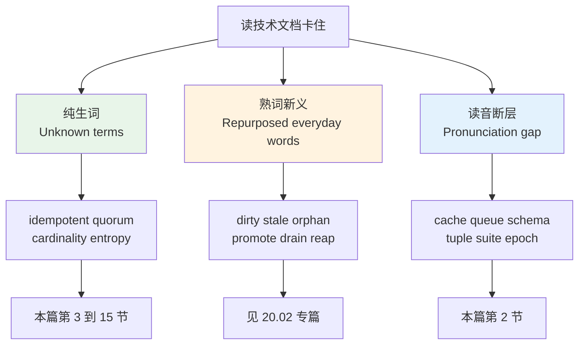
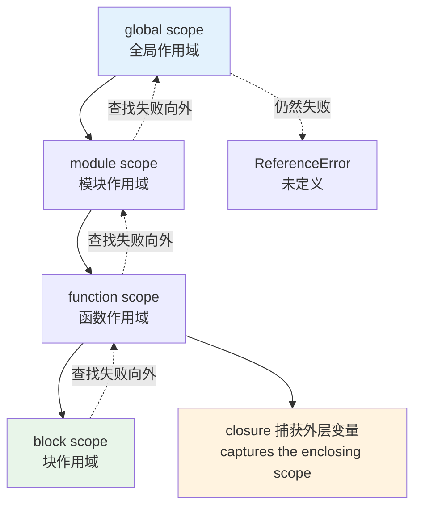
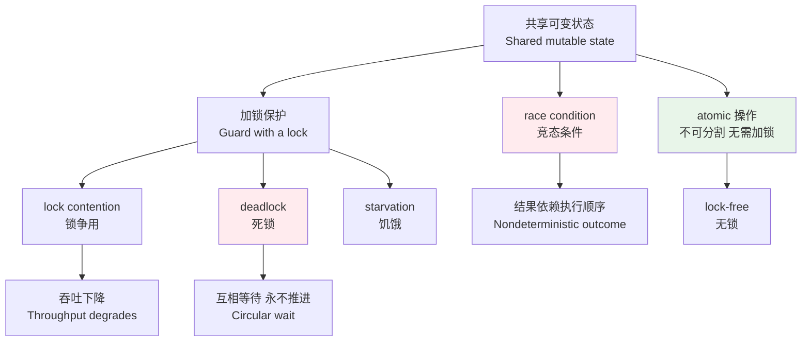
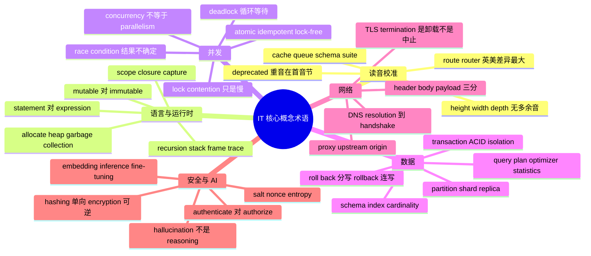

# IT 深度英语（上）：核心概念术语与其读音

> [!info] 本篇定位
>
> `20.专业领域词汇` 的开篇，也是全书 IT 四篇里的第一篇。这四篇的分工是：本篇给**概念词的词形、读音与释义**，第二篇给**日常词被技术语境挪用后的新义项**，第三篇给**设计文档与规范的文体措辞**，第四篇给**运维评审用语与缩略语读法**。
>
> 与 `12.科技、媒体与休闲` 的三篇不重叠。那三篇是终端用户视角——看懂设置页、读懂安全提示；本篇是工程视角——读懂一段 `stack trace`、一份 `query plan`、一句 `the lock is held for the duration of the transaction`。同一个 `encryption`，在 `12.03` 里只需要知道「传输是加密的」，在这里要能和 `hashing` 分清楚，并说出为什么密码存的是后者。
>
> 本篇最重要的增量在**读音**。中国程序员读错技术词的比例远高于读错日常词，原因是这批词几乎全靠眼睛认识，从来没有被听力校准过。第 `2` 节把最常错的一批集中处理，后面每张词表也都带英美双音标。
>
> 读完你能做到：不查词典读完一篇英文技术博客的概念段落；在英文会议里把 `cache`、`queue`、`schema`、`tuple`、`idempotent` 这几个词读对；看到 `deadlock` 与 `lock contention` 出现在同一段，知道它们说的不是同一件事。

---

## 1. 本篇导读：读技术文档卡住的三种方式

技术英语不难在生词多。它难在同一批词有三条独立的失败路径，而多数人只防住了其中一条。

**第一条是纯生词。** `idempotent`、`quorum`、`cardinality` 这类词日常语料里几乎不出现，第一次见就是在技术文档里。这条最好解决——查一次就记住了。

**第二条是熟词被挪用。** `dirty`、`stale`、`orphan`、`promote` 每个字母都认识，放进技术语境里意思全变。这条最阴险，因为你不会意识到自己读错了，会顺着字面义读下去，读完得出一个和原文相反的结论。这条路径归 [[20.专业领域词汇/02.计算机语境的熟词新义：日常词的技术义项地图\|计算机语境的熟词新义]] 专门处理，本篇只在必要处提示边界。

**第三条是读音断层。** 认得、也理解，但读不出来，或者读出来对方听不懂。`queue` 读成四个音节、`cache` 读成 `/kæˈʃeɪ/`、`schema` 读成 `/ˈʃiːmə/`、`suite` 读成 `/suːt/`，都是极常见的现象。这条路径的代价不在阅读而在开会——你说了三遍对方都没接上，最后只好在屏幕上把词打出来。



上图把三条路径和它们的落点对齐了。本篇负责左右两条：概念词的批量补齐，以及读音的集中校准。中间那条交给下一篇，因为它需要按隐喻来源分组才讲得清楚，混在概念词表里会两边都讲不透。

还有一条隐性规则贯穿全篇，值得先说破：**技术词的词性转换极其自由，但重音位置和搭配会跟着变**。`cache` 既是名词（一块缓存）也是动词（把某物缓存起来），`hash` 既是名词（哈希值）也是动词（做哈希），`proxy` 既是名词（代理服务器）也是动词（代理转发）。这类转化词的构词机制见 [[15.词根、合成与缩略/04.合成词、转化词、截短词与缩略语\|合成词、转化词、截短词与缩略语]]，本篇只标注它们在技术语境里的实际搭配。

---

## 2. 读音先行：三十四个最容易读错的技术词

这一节的词你大概率全都认识。放在最前面，是因为后面十三节的词表都建立在能把词读出声的基础上——读不出来的词记不牢，这是 `01` 章反复强调过的。

### 2.1 拼写骗过眼睛的一批

| 英文 | 英式音标 | 美式音标 | 词性 | 中文 | 搭配与说明 |
| --- | --- | --- | --- | --- | --- |
| **cache** | /kæʃ/ | /kæʃ/ | n./v. | 缓存 | 与 cash 完全同音，只有一个音节；不读 /kæˈʃeɪ/（那是 cachet 表「威望」） |
| **queue** | /kjuː/ | /kjuː/ | n./v. | 队列 | 五个字母只发一个音节，与字母 Q 同音；queued /kjuːd/、queuing /ˈkjuːɪŋ/ |
| **schema** | /ˈskiːmə/ | /ˈskiːmə/ | n. | 模式；结构定义 | sch 读 /sk/ 不读 /ʃ/；复数 schemas 或 schemata /ˈskiːmətə/ |
| **suite** | /swiːt/ | /swiːt/ | n. | 套件 | 与 sweet 同音；a test suite 测试套件，不读作 suit /suːt/ |
| **tuple** | /ˈtjuːpl/ 或 /ˈtʌpl/ | /ˈtuːpl/ 或 /ˈtʌpl/ | n. | 元组 | 两读并存且不按国别分：Oxford 收 /ˈtjuːpl/ 与 /ˈtʌpl/，Merriam-Webster 收 /ˈtuːpl/ 与 /ˈtʌpl/；详细争议见 `20.04` |
| **epoch** | /ˈiːpɒk/ | /ˈepək/ | n. | 纪元；训练轮次 | 英美元音差别极大；Unix epoch 指 1970-01-01，训练语境指一轮完整遍历 |
| **opaque** | /əʊˈpeɪk/ | /oʊˈpeɪk/ | adj. | 不透明的；黑盒的 | 词尾 que 读 /k/；an opaque handle 不暴露内部结构的句柄 |
| **façade** | /fəˈsɑːd/ | /fəˈsɑːd/ | n. | 外观；门面 | ç 读 /s/ 不读 /k/；设计模式名 the Facade pattern，常省去变音符 |
| **pseudo** | /ˈsjuːdəʊ/ | /ˈsuːdoʊ/ | adj. | 伪的 | 词首 p 不发音；pseudocode 伪代码、pseudorandom 伪随机 |
| **null** | /nʌl/ | /nʌl/ | n./adj. | 空值 | 与 numb 同元音，不读 /nuːl/；null pointer、nullable 可空的 |

`cache` 和 `queue` 是这一节最值钱的两条。它们出现频率极高，读错又极其显眼——`cache` 读成两个音节会被听成一个法语借词，`queue` 读成 `/ˈkjuːjuː/` 则根本不成词。把这两个读顺，英文技术会议里的自信会立刻上一个台阶。

`epoch` 值得单独提一句。它在两个完全不同的语境里高频出现：系统时间的 `epoch time`，和模型训练的 `training epoch`。两个语境读音相同，义项无关，靠上下文区分。

### 2.2 重音位置容易放错的一批

| 英文 | 英式音标 | 美式音标 | 词性 | 中文 | 搭配与说明 |
| --- | --- | --- | --- | --- | --- |
| **variable** | /ˈveəriəbl/ | /ˈveriəbl/ | n./adj. | 变量；可变的 | 重音在首音节，四个音节；不读成 /vəˈraɪəbl/ |
| **integer** | /ˈɪntɪdʒə/ | /ˈɪntɪdʒər/ | n. | 整数 | 重音首音节，g 读 /dʒ/；形容词 integral /ˈɪntɪɡrəl/ 的 g 反而读 /ɡ/ |
| **parameter** | /pəˈræmɪtə/ | /pəˈræmɪtər/ | n. | 参数 | 重音在第二音节 ra；与 perimeter /pəˈrɪmɪtə/ 只差一个元音 |
| **hierarchy** | /ˈhaɪərɑːki/ | /ˈhaɪərɑːrki/ | n. | 层级；继承体系 | 重音在首音节；ch 读 /k/；形容词 hierarchical /ˌhaɪəˈrɑːkɪkl/ 重音后移 |
| **asynchronous** | /eɪˈsɪŋkrənəs/ | /eɪˈsɪŋkrənəs/ | adj. | 异步的 | 重音在第二音节 syn；ch 读 /k/；口语常截短成 async /ˈeɪsɪŋk/ |
| **idempotent** | /ˌaɪdemˈpəʊtnt/ | /ˌaɪdəmˈpoʊtnt/ | adj. | 幂等的 | 主重音在第三音节 po；描述重复执行结果不变的操作 |
| **canonical** | /kəˈnɒnɪkl/ | /kəˈnɑːnɪkl/ | adj. | 规范的；标准形式的 | 重音第二音节；the canonical URL 规范网址、canonical form 标准型 |
| **heuristic** | /hjuˈrɪstɪk/ | /hjuˈrɪstɪk/ | n./adj. | 启发式（方法） | 词首 h 要发音，重音在 ris；a heuristic for cache eviction |
| **verbose** | /vɜːˈbəʊs/ | /vɜːrˈboʊs/ | adj. | 冗长的；详细日志的 | 重音在第二音节；verbose logging 详细日志、verbose output |
| **deprecated** | /ˈdeprəkeɪtɪd/ | /ˈdeprəkeɪtɪd/ | adj. | 已弃用的 | 重音在首音节，不是 /dɪˈpriːkeɪtɪd/；与 depreciate 贬值不同词 |

`deprecated` 是这一批里最有代表性的。它的名词形式 `deprecation` `/ˌdeprəˈkeɪʃn/` 在变更日志里出现极频繁，读成 `/dɪˌpriːʃiˈeɪʃn/` 会被听成 `depreciation`（折旧），后者属于财报词汇，见 `20.07`。两个词长得像，词源不同，含义毫无关系。

`idempotent` 值得练熟。它在 API 设计讨论里是高频词，四个音节，重音在第三个：`aye-dem-PO-tent`。读顺了之后 `idempotency` `/ˌaɪdəmˈpoʊtnsi/` 也就顺了。

### 2.3 元音与辅音陷阱

| 英文 | 英式音标 | 美式音标 | 词性 | 中文 | 搭配与说明 |
| --- | --- | --- | --- | --- | --- |
| **height** | /haɪt/ | /haɪt/ | n. | 高度 | 词尾没有 th 音，不读 /haɪtθ/；与 weight /weɪt/ 元音不同 |
| **width** | /wɪdθ/ | /wɪdθ/ | n. | 宽度 | d 与 th 都要发出来；bandwidth /ˈbændwɪdθ/ 同理 |
| **depth** | /depθ/ | /depθ/ | n. | 深度 | 与 death /deθ/ 只差一个 p，读丢会被听成「死亡」 |
| **route** | /ruːt/ | /ruːt/ 或 /raʊt/ | n./v. | 路由；路径 | 美式两读并存；router 英 /ˈruːtə/ 美 /ˈraʊtər/ 差别最大 |
| **gauge** | /ɡeɪdʒ/ | /ɡeɪdʒ/ | n./v. | 量表；度量 | 拼写反直觉，读作 gage；监控里的 gauge metric 瞬时值指标 |
| **archive** | /ˈɑːkaɪv/ | /ˈɑːrkaɪv/ | n./v. | 归档 | ch 读 /k/，词尾 ive 读 /aɪv/ 而非 /ɪv/ |
| **chaos** | /ˈkeɪɒs/ | /ˈkeɪɑːs/ | n. | 混沌 | ch 读 /k/，两个音节；chaos engineering 混沌工程 |
| **cipher** | /ˈsaɪfə/ | /ˈsaɪfər/ | n. | 密码算法；密文 | c 读 /s/，i 读 /aɪ/；cipher suite 密码套件 |
| **subtle** | /ˈsʌtl/ | /ˈsʌtl/ | adj. | 细微的；不易察觉的 | b 不发音；a subtle bug 一个难察觉的缺陷 |
| **debug** | /ˌdiːˈbʌɡ/ | /ˌdiːˈbʌɡ/ | v. | 调试 | 前缀 de 读 /diː/ 不读 /dɪ/；debugger /ˌdiːˈbʌɡə/ |
| **hybrid** | /ˈhaɪbrɪd/ | /ˈhaɪbrɪd/ | adj./n. | 混合的 | 首音节长音 /aɪ/；hybrid cloud 混合云 |
| **latency** | /ˈleɪtnsi/ | /ˈleɪtnsi/ | n. | 延迟 | 首音节 /leɪ/ 与 late 同；形容词 latent /ˈleɪtnt/ 潜在的 |
| **granular** | /ˈɡrænjələ/ | /ˈɡrænjələr/ | adj. | 细粒度的 | 名词 granularity /ˌɡrænjuˈlærəti/ 重音在 lar |
| **query** | /ˈkwɪəri/ | /ˈkwɪri/ | n./v. | 查询 | 与 quarry /ˈkwɒri/ 采石场不同音；query string 查询串 |

> [!warning] 三个读错代价最高的词
>
> - **route / router**：英式 `/ˈruːtə/` 与美式 `/ˈraʊtər/` 差别到了互相听不懂的程度。跟英国人说 `/ˈraʊtər/`，对方可能以为你在说木工用的 router（铣床）。同一个会议里两种读法并存是常态，不必纠正别人。
> - **height**：`/haɪtθ/` 是中文母语者极高频的错误，因为 width 和 depth 都带 th，height 被类推了。它没有 th，只有 /t/。
> - **deprecated**：重音在首音节。这个词在 API 文档里几乎每页都有，读错的暴露率最高。

### 2.4 几个不必焦虑的分歧

有一批词有两种读法，两边都对，不存在标准答案。多数是英美分野，个别（`tuple`）纯粹是个人习惯，与国别无关。遇到这类词，跟着你所在团队的习惯走就行，不必花时间纠结。

```text
data          英 /ˈdeɪtə/    美 /ˈdeɪtə/ 或 /ˈdætə/
router        英 /ˈruːtə/    美 /ˈraʊtər/
schedule      英 /ˈʃedjuːl/  美 /ˈskedʒuːl/
process (n.)  英 /ˈprəʊses/  美 /ˈprɑːses/
status (n.)   英 /ˈsteɪtəs/  美 /ˈsteɪtəs/ 或 /ˈstætəs/
tuple         不分英美，/ˈtjuːpl/ /ˈtuːpl/ /ˈtʌpl/ 三读都听得到
```

`schedule` 之所以列在这里，是因为它在工程语境里高频出现（`the scheduler`、`a scheduled job`），而它恰好是英美读音差异最大的常用词。这一条在 `01.03` 音标篇已经讲过机制，此处只做提醒。

缩略语的读法是另一套问题——`SQL` 到底读字母还是读 `sequel`，`nginx` `k8s` `JWT` `i18n` 怎么念，全书统一在 `20.04` 处理，本篇一律不涉及。

---

## 3. 语句与表达式：程序的最小单位

英文技术文档在描述代码时有一套很稳定的名词体系。这套体系的底层是两个词：`statement` 和 `expression`。中文常把两者都译成「语句」，导致大量英文原文里的关键区分在译文里消失。

`expression` 是**能求值成一个结果的东西**，`statement` 是**执行后产生效果但本身不产出值的东西**。判断标准很实际：能不能塞进赋值号右边。`a + b` 能，所以它是 expression；`if (x) { ... }` 在多数语言里不能，所以它是 statement。

| 英文 | 英式音标 | 美式音标 | 词性 | 中文 | 搭配与说明 |
| --- | --- | --- | --- | --- | --- |
| **statement** | /ˈsteɪtmənt/ | /ˈsteɪtmənt/ | n. | 语句 | an if statement、a return statement；不产出值 |
| **expression** | /ɪkˈspreʃn/ | /ɪkˈspreʃn/ | n. | 表达式 | evaluate an expression；能求值 |
| **evaluate** | /ɪˈvæljueɪt/ | /ɪˈvæljueɪt/ | v. | 求值；计算 | the expression evaluates to true；名词 evaluation |
| **operator** | /ˈɒpəreɪtə/ | /ˈɑːpəreɪtər/ | n. | 运算符 | the ternary operator 三元运算符、operator precedence 优先级 |
| **operand** | /ˈɒpərænd/ | /ˈɑːpərænd/ | n. | 操作数 | the left-hand operand 左操作数 |
| **precedence** | /ˈpresɪdəns/ | /ˈpresɪdəns/ | n. | 优先级 | operator precedence；注意重音在首音节 |
| **literal** | /ˈlɪtərəl/ | /ˈlɪtərəl/ | n. | 字面量 | a string literal 字符串字面量、a numeric literal |
| **identifier** | /aɪˈdentɪfaɪə/ | /aɪˈdentɪfaɪər/ | n. | 标识符 | a valid identifier；变量名函数名的统称 |
| **declaration** | /ˌdekləˈreɪʃn/ | /ˌdekləˈreɪʃn/ | n. | 声明 | a function declaration；动词 declare |
| **definition** | /ˌdefɪˈnɪʃn/ | /ˌdefɪˈnɪʃn/ | n. | 定义 | declaration 只说存在，definition 给出实体 |
| **assignment** | /əˈsaɪnmənt/ | /əˈsaɪnmənt/ | n. | 赋值 | assignment to a constant 对常量赋值 |
| **invocation** | /ˌɪnvəˈkeɪʃn/ | /ˌɪnvəˈkeɪʃn/ | n. | 调用 | a function invocation；动词 invoke /ɪnˈvəʊk/ |
| **argument** | /ˈɑːɡjumənt/ | /ˈɑːrɡjumənt/ | n. | 实参 | 传进去的实际值，与 parameter 形参相对 |
| **parameter** | /pəˈræmɪtə/ | /pəˈræmɪtər/ | n. | 形参 | 函数签名里写的名字；口语两词常混用 |
| **signature** | /ˈsɪɡnətʃə/ | /ˈsɪɡnətʃər/ | n. | 签名 | the method signature 方法签名；与 sign /saɪn/ 不同，这里 g 要读出来 |
| **overload** | /ˌəʊvəˈləʊd/ | /ˌoʊvərˈloʊd/ | v./n. | 重载 | 同名不同参数列表；与 override 覆写不同 |
| **override** | /ˌəʊvəˈraɪd/ | /ˌoʊvərˈraɪd/ | v./n. | 覆写 | 子类重新实现父类方法 |
| **coercion** | /kəʊˈɜːʃn/ | /koʊˈɜːrʒn/ | n. | 隐式类型转换 | implicit type coercion；动词 coerce /kəʊˈɜːs/ |
| **cast** | /kɑːst/ | /kæst/ | v./n. | 显式类型转换 | cast to an integer；英美元音差别明显 |
| **side effect** | /ˈsaɪd ɪfekt/ | /ˈsaɪd ɪfekt/ | n. | 副作用 | a function with no side effects 无副作用的函数 |

> [!example] 区分 statement 与 expression 的原文表述
>
> - In Rust, `if` is an **expression**, so you can write `let x = if cond { 1 } else { 2 };`
>   - 在 Rust 里 `if` 是表达式，所以可以写成赋值形式。
> - The `return` **statement** exits the function immediately.
>   - `return` 语句会立刻退出函数。
> - This function is **pure**: it has no **side effects** and always **evaluates to** the same value for the same input.
>   - 这个函数是纯函数：没有副作用，相同输入总是求值为相同结果。

`evaluates to` 是这一组里最该记熟的搭配。中文说「结果是」，英文说 `evaluates to`，不说 `the result is`。技术文档里出现频率极高：`the expression evaluates to null`、`the condition evaluates to false`。

`argument` 与 `parameter` 的区分在正式规范里是严格的：`parameter` 是函数定义里的占位名，`argument` 是调用时传进去的实际值。口语和 code review 里两者常混用，但读 RFC 或语言规范时它们不会混。

---

## 4. 变量、可变性与绑定

`mutable` 这一族是英文技术文档的高频承重词，也是中文译名最容易造成误解的一族。中文「可变」既能对 `mutable`（对象内容可改）也能对 `reassignable`（名字可重新指向别的对象），英文这两件事是分开的。

| 英文 | 英式音标 | 美式音标 | 词性 | 中文 | 搭配与说明 |
| --- | --- | --- | --- | --- | --- |
| **mutable** | /ˈmjuːtəbl/ | /ˈmjuːtəbl/ | adj. | 可变的 | a mutable list；指内容可被就地修改 |
| **immutable** | /ɪˈmjuːtəbl/ | /ɪˈmjuːtəbl/ | adj. | 不可变的 | immutable string；创建后内容不可改 |
| **mutability** | /ˌmjuːtəˈbɪləti/ | /ˌmjuːtəˈbɪləti/ | n. | 可变性 | shared mutability 共享可变性 |
| **mutate** | /mjuːˈteɪt/ | /ˈmjuːteɪt/ | v. | 就地修改 | mutating the array in place；英美重音不同 |
| **in place** | /ɪn ˈpleɪs/ | /ɪn ˈpleɪs/ | adv. | 就地 | sort the list in place 原地排序，不返回新对象 |
| **constant** | /ˈkɒnstənt/ | /ˈkɑːnstənt/ | n./adj. | 常量 | a compile-time constant 编译期常量 |
| **binding** | /ˈbaɪndɪŋ/ | /ˈbaɪndɪŋ/ | n. | 绑定 | a name binding；名字与值的关联关系 |
| **rebind** | /ˌriːˈbaɪnd/ | /ˌriːˈbaɪnd/ | v. | 重新绑定 | rebinding a variable 把名字指向新值 |
| **reference** | /ˈrefrəns/ | /ˈrefrəns/ | n./v. | 引用 | pass by reference 按引用传递 |
| **dereference** | /ˌdiːˈrefrəns/ | /ˌdiːˈrefrəns/ | v. | 解引用 | dereferencing a null pointer 解引用空指针 |
| **alias** | /ˈeɪliəs/ | /ˈeɪliəs/ | n./v. | 别名 | two names aliasing the same object |
| **shallow copy** | /ˈʃæləʊ ˈkɒpi/ | /ˈʃæloʊ ˈkɑːpi/ | n. | 浅拷贝 | 只复制外层容器，内部对象仍共享 |
| **deep copy** | /ˈdiːp ˈkɒpi/ | /ˈdiːp ˈkɑːpi/ | n. | 深拷贝 | 递归复制全部层级 |
| **primitive** | /ˈprɪmɪtɪv/ | /ˈprɪmɪtɪv/ | n./adj. | 基本类型（的） | primitive types 基本类型，与引用类型相对 |
| **boxing** | /ˈbɒksɪŋ/ | /ˈbɑːksɪŋ/ | n. | 装箱 | autoboxing 自动装箱；反义 unboxing |
| **scope** | /skəʊp/ | /skoʊp/ | n. | 作用域 | 见第 5 节展开 |
| **lifetime** | /ˈlaɪftaɪm/ | /ˈlaɪftaɪm/ | n. | 生命周期 | the lifetime of a reference 引用的存活区间 |
| **initialize** | /ɪˈnɪʃəlaɪz/ | /ɪˈnɪʃəlaɪz/ | v. | 初始化 | an uninitialized variable 未初始化的变量 |
| **shadow** | /ˈʃædəʊ/ | /ˈʃædoʊ/ | v. | 遮蔽 | an inner variable shadows the outer one |
| **thread-safe** | /ˈθred seɪf/ | /ˈθred seɪf/ | adj. | 线程安全的 | 见第 8 节；作定语时带连字符 |

> [!warning] mutable 与 reassignable 不是一回事
>
> JavaScript 里 `const arr = [1, 2]; arr.push(3);` 完全合法。`const` 阻止的是**重新绑定**（rebinding），不是**内容修改**（mutation）。英文原文写得很清楚：
>
> > `const` prevents **reassignment**, not **mutation**.
>
> 中文若都译成「不可变」，这句话就变成自相矛盾。读英文原文时抓住 `reassign` 与 `mutate` 这一对动词，歧义自动消失。

`in place` 是这一族里最实用的搭配。它是副词短语，跟在动词后面：`sort in place`、`reverse in place`、`modify in place`。API 文档里看到 `Sorts the list in place and returns None`，说的是这个方法不返回新列表。这条措辞规范在 `20.03` 会作为 API 文体的一部分再讲一次。

---

## 5. 作用域与闭包

`scope` 和 `closure` 这两个词几乎总是一起出现，因为后者是前者的直接后果。理解它们的英文表述比理解概念本身更难的地方在于：英文用了一套很具体的空间隐喻——变量「在」作用域「里」，作用域「嵌套」，查找「向外走」。



上图画的是**作用域链**（scope chain）的查找方向：永远由内向外，找到即停，走到最外层仍未找到就报错。`closure` 出现在这条链的中段——当一个内层函数被返回或传递出去之后，它依然握着外层作用域里的那些变量，于是外层作用域不能被回收。这就是闭包的英文定义：`a function together with the environment in which it was created`。

| 英文 | 英式音标 | 美式音标 | 词性 | 中文 | 搭配与说明 |
| --- | --- | --- | --- | --- | --- |
| **scope** | /skəʊp/ | /skoʊp/ | n. | 作用域 | in scope 在作用域内、out of scope 不在作用域内 |
| **lexical** | /ˈleksɪkl/ | /ˈleksɪkl/ | adj. | 词法的 | lexical scope 词法作用域，按源码位置决定 |
| **dynamic** | /daɪˈnæmɪk/ | /daɪˈnæmɪk/ | adj. | 动态的 | dynamic scope 按调用栈决定，与 lexical 相对 |
| **enclosing** | /ɪnˈkləʊzɪŋ/ | /ɪnˈkloʊzɪŋ/ | adj. | 外层的；包围的 | the enclosing scope 外层作用域 |
| **nested** | /ˈnestɪd/ | /ˈnestɪd/ | adj. | 嵌套的 | a nested function 嵌套函数 |
| **closure** | /ˈkləʊʒə/ | /ˈkloʊʒər/ | n. | 闭包 | the closure captures x；s 读 /ʒ/ |
| **capture** | /ˈkæptʃə/ | /ˈkæptʃər/ | v. | 捕获 | capture by value 按值捕获、capture by reference 按引用捕获 |
| **free variable** | /ˈfriː ˈveəriəbl/ | /ˈfriː ˈveriəbl/ | n. | 自由变量 | 函数体内引用但不在本地定义的变量 |
| **environment** | /ɪnˈvaɪrənmənt/ | /ɪnˈvaɪrənmənt/ | n. | 环境 | the environment a closure carries 闭包携带的环境 |
| **hoisting** | /ˈhɔɪstɪŋ/ | /ˈhɔɪstɪŋ/ | n. | 提升 | declarations are hoisted 声明被提升到作用域顶部 |
| **shadowing** | /ˈʃædəʊɪŋ/ | /ˈʃædoʊɪŋ/ | n. | 变量遮蔽 | variable shadowing 内层同名变量遮住外层 |
| **first-class** | /ˌfɜːst ˈklɑːs/ | /ˌfɜːrst ˈklæs/ | adj. | 一等的 | functions are first-class citizens 函数是一等公民 |
| **higher-order** | /ˌhaɪər ˈɔːdə/ | /ˌhaɪər ˈɔːrdər/ | adj. | 高阶的 | a higher-order function 接受或返回函数的函数 |
| **callback** | /ˈkɔːlbæk/ | /ˈkɔːlbæk/ | n. | 回调 | pass a callback、invoke the callback |
| **anonymous** | /əˈnɒnɪməs/ | /əˈnɑːnɪməs/ | adj. | 匿名的 | an anonymous function 匿名函数 |
| **lambda** | /ˈlæmdə/ | /ˈlæmdə/ | n. | 匿名函数 | b 不发音；a lambda expression |
| **currying** | /ˈkʌriɪŋ/ | /ˈkɜːriɪŋ/ | n. | 柯里化 | 与咖喱同拼写，来自数学家 Haskell Curry |
| **partial application** | — | — | n. | 偏应用 | 固定部分参数，返回接受剩余参数的函数 |
| **recursion** | /rɪˈkɜːʃn/ | /rɪˈkɜːrʒn/ | n. | 递归 | 见第 6 节；美式词尾常读 /ʒn/ |
| **memoization** | /ˌmeməʊaɪˈzeɪʃn/ | /ˌmemoʊaɪˈzeɪʃn/ | n. | 记忆化 | 拼写没有 r，不是 memorization |

> [!warning] memoization 不是 memorization
>
> - ❌ ~~memorization~~（背诵、记忆，日常词）
> - ✅ **memoization**（记忆化，缓存函数结果的技术）
>
> 少一个 `r`。这个词由 Donald Michie 在 1968 年造出，取自 `memo`（源头是拉丁语 `memorandum` 备忘录）而不是 `memorize`。写错在代码注释里会显得很业余，而拼写检查器通常会把正确的那个标红。

`capture` 的两种搭配值得记牢：`capture by value` 与 `capture by reference`。C++ 的 lambda 捕获列表、Rust 的 `move` 闭包，英文讨论时全靠这一对短语区分。中文常译成「值捕获」「引用捕获」，回到英文时要能反过来说出完整短语。

---

## 6. 递归、调用栈与 stack trace

`stack trace` 是程序员每天都在读、但很少有人系统学过其英文表述的东西。读懂一段异常栈需要的词其实不到二十个，且高度固定。

| 英文 | 英式音标 | 美式音标 | 词性 | 中文 | 搭配与说明 |
| --- | --- | --- | --- | --- | --- |
| **recursion** | /rɪˈkɜːʃn/ | /rɪˈkɜːrʒn/ | n. | 递归 | direct / mutual recursion 直接递归、相互递归 |
| **recursive** | /rɪˈkɜːsɪv/ | /rɪˈkɜːrsɪv/ | adj. | 递归的 | a recursive call 递归调用 |
| **base case** | /ˈbeɪs keɪs/ | /ˈbeɪs keɪs/ | n. | 基线情形 | 递归的终止条件；缺了它就无限递归 |
| **recursive case** | — | — | n. | 递归情形 | 与 base case 成对出现的另一半 |
| **tail call** | /ˈteɪl kɔːl/ | /ˈteɪl kɔːl/ | n. | 尾调用 | tail call optimization 尾调用优化 |
| **stack** | /stæk/ | /stæk/ | n. | 栈 | the call stack 调用栈；与 heap 堆相对 |
| **frame** | /freɪm/ | /freɪm/ | n. | 栈帧 | a stack frame 一层调用的现场 |
| **stack trace** | /ˈstæk treɪs/ | /ˈstæk treɪs/ | n. | 调用栈快照 | paste the full stack trace 贴完整栈信息 |
| **traceback** | /ˈtreɪsbæk/ | /ˈtreɪsbæk/ | n. | 回溯栈 | Python 用 traceback，Java 用 stack trace |
| **stack overflow** | — | — | n. | 栈溢出 | 递归过深耗尽栈空间时抛出 |
| **unwind** | /ʌnˈwaɪnd/ | /ʌnˈwaɪnd/ | v. | 展开；回退 | stack unwinding 抛异常时逐层退栈 |
| **propagate** | /ˈprɒpəɡeɪt/ | /ˈprɑːpəɡeɪt/ | v. | 向上传播 | the exception propagates up the stack |
| **bubble up** | /ˈbʌbl ʌp/ | /ˈbʌbl ʌp/ | v. | 冒泡上抛 | let the error bubble up 让错误往上抛 |
| **swallow** | /ˈswɒləʊ/ | /ˈswɑːloʊ/ | v. | 吞掉（异常） | don't swallow the exception 不要吞异常 |
| **rethrow** | /ˌriːˈθrəʊ/ | /ˌriːˈθroʊ/ | v. | 重新抛出 | catch, log, and rethrow |
| **panic** | /ˈpænɪk/ | /ˈpænɪk/ | n./v. | 崩溃退出 | Go 与 Rust 用 panic 表示不可恢复错误 |
| **abort** | /əˈbɔːt/ | /əˈbɔːrt/ | v. | 中止 | the process aborted 进程中止 |
| **core dump** | /ˈkɔː dʌmp/ | /ˈkɔːr dʌmp/ | n. | 内存转储 | 崩溃时落盘的内存镜像 |
| **symbolication** | — | — | n. | 符号化 | 把地址还原成函数名与行号 |
| **elide** | /ɪˈlaɪd/ | /ɪˈlaɪd/ | v. | 省略 | frames elided 栈帧被省略；日志里常见被动式 |

> [!example] 一段栈信息的英文读法
>
> - The exception was **thrown** at line 42 and **propagated** through three **frames** before being **caught** in the handler.
>   - 异常在第 42 行抛出，向上穿过三层栈帧后在处理器里被捕获。
> - `... 27 more frames elided` — the runtime **truncated** the trace to keep the log readable.
>   - 「另有 27 帧被省略」，运行时截断了栈信息以保持日志可读。
> - **Infinite recursion** with no **base case** eventually causes a **stack overflow**.
>   - 缺少基线情形的无限递归最终会导致栈溢出。

`propagate` 和 `bubble up` 是同义的，语域不同：前者出现在规范文档与正式说明里，后者出现在 code review 评论与口语讨论里。`swallow` 只用于负面语境——`swallowing exceptions` 在任何团队里都是要被指出来的问题。

`elide` 这个词在日志里非常常见但很少被单独教。它的核心义是「略去不写」，与 `omit` 同义而更正式。读到 `frames elided` 或 `arguments elided`，意思就是「这里本来还有内容，被省了」。

---

## 7. 内存分配与垃圾回收

`garbage collection` 是本篇里词族最庞大的一块。它的英文表述有一个特点：几乎全部是隐喻——收垃圾、清扫、标记、压实、留住。中文译名保留了这些隐喻，所以反而好对应。

| 英文 | 英式音标 | 美式音标 | 词性 | 中文 | 搭配与说明 |
| --- | --- | --- | --- | --- | --- |
| **allocate** | /ˈæləkeɪt/ | /ˈæləkeɪt/ | v. | 分配 | allocate memory on the heap 在堆上分配 |
| **allocation** | /ˌæləˈkeɪʃn/ | /ˌæləˈkeɪʃn/ | n. | 分配（行为） | allocation rate 分配速率 |
| **deallocate** | /diːˈæləkeɪt/ | /diːˈæləkeɪt/ | v. | 释放 | 与 free 同义，更正式 |
| **heap** | /hiːp/ | /hiːp/ | n. | 堆 | heap memory；与栈上分配相对 |
| **garbage collection** | /ˈɡɑːbɪdʒ kəˈlekʃn/ | /ˈɡɑːrbɪdʒ kəˈlekʃn/ | n. | 垃圾回收 | 常缩写为 GC，读作字母 |
| **collector** | /kəˈlektə/ | /kəˈlektər/ | n. | 回收器 | a generational collector 分代回收器 |
| **reachable** | /ˈriːtʃəbl/ | /ˈriːtʃəbl/ | adj. | 可达的 | reachable from the roots 从根可达 |
| **unreachable** | /ʌnˈriːtʃəbl/ | /ʌnˈriːtʃəbl/ | adj. | 不可达的 | 不可达即视为垃圾 |
| **root set** | /ˈruːt set/ | /ˈruːt set/ | n. | 根集合 | 全局变量与栈上引用构成的起点 |
| **mark and sweep** | — | — | n. | 标记清除 | 最基础的回收算法名 |
| **compaction** | /kəmˈpækʃn/ | /kəmˈpækʃn/ | n. | 压缩整理 | 移动存活对象消除碎片 |
| **fragmentation** | /ˌfræɡmenˈteɪʃn/ | /ˌfræɡmenˈteɪʃn/ | n. | 碎片化 | memory fragmentation 内存碎片 |
| **generational** | /ˌdʒenəˈreɪʃənl/ | /ˌdʒenəˈreɪʃənl/ | adj. | 分代的 | young / old generation 新生代、老年代 |
| **promotion** | /prəˈməʊʃn/ | /prəˈmoʊʃn/ | n. | 晋升 | 对象从新生代进入老年代 |
| **pause** | /pɔːz/ | /pɔːz/ | n./v. | 停顿 | GC pause、stop-the-world pause |
| **stop-the-world** | — | — | adj. | 全局停顿的 | 回收期间所有应用线程暂停 |
| **leak** | /liːk/ | /liːk/ | n./v. | 泄漏 | a memory leak 内存泄漏 |
| **retain** | /rɪˈteɪn/ | /rɪˈteɪn/ | v. | 保留 | retained size 保留大小；对象被谁拖住 |
| **finalizer** | /ˈfaɪnəlaɪzə/ | /ˈfaɪnəlaɪzər/ | n. | 终结器 | 对象回收前的回调，多数语言不建议依赖 |
| **weak reference** | /ˈwiːk ˈrefrəns/ | /ˈwiːk ˈrefrəns/ | n. | 弱引用 | 不阻止回收的引用，与 strong reference 相对 |
| **arena** | /əˈriːnə/ | /əˈriːnə/ | n. | 内存池 | arena allocation 按区块批量分配 |
| **churn** | /tʃɜːn/ | /tʃɜːrn/ | n. | 高频创建销毁 | allocation churn 分配抖动 |

> [!tip] 记住这一族的隐喻主线
>
> 整套 GC 词汇来自同一个生活场景：**先看东西还有没有人要（reachable），没人要就是垃圾（garbage），扫掉（sweep），把剩下的往一头挪齐（compaction），挪的时候大家先别动（stop-the-world）。**
>
> 把这条线记住，`root set`、`mark`、`retain` 这些词各自的位置就有了归属，不用逐词硬背。隐喻来源的系统讲法见 `20.02`。

`leak` 值得留意搭配。中文说「内存泄漏了」，英文常用被动或不及物：`the connection pool is leaking`、`we're leaking file descriptors`。作及物动词时宾语是泄漏的东西本身，不是内存：`leaking goroutines`、`leaking sockets`。

---

## 8. 并发：线程、竞态、锁与原子性

这一块是英文技术文档里论证最密集的部分，因为它讨论的全是「什么情况下会出错」。词汇上有一个共同特征：大量抽象名词与被动结构。



上图把并发的四类典型问题和两条出路并排放着。`race condition` 与 `deadlock` 是两种性质完全不同的故障：前者是「跑得太快，结果不对」，后者是「彻底不动了」。`lock contention` 介于两者之间，程序仍然正确，只是慢。中文讨论时这三个词常被笼统说成「并发问题」，英文原文里它们的分工非常清楚，误读一个词就会误判整段论证。

### 8.1 线程与执行模型

| 英文 | 英式音标 | 美式音标 | 词性 | 中文 | 搭配与说明 |
| --- | --- | --- | --- | --- | --- |
| **thread** | /θred/ | /θred/ | n. | 线程 | spawn a thread、a worker thread；θ 不读 /s/ |
| **process** | /ˈprəʊses/ | /ˈprɑːses/ | n. | 进程 | 名词英美读音差异明显 |
| **concurrency** | /kənˈkʌrənsi/ | /kənˈkɜːrənsi/ | n. | 并发 | 多任务交替推进，不必同时 |
| **parallelism** | /ˈpærəlelɪzəm/ | /ˈpærəlelɪzəm/ | n. | 并行 | 真正同时执行，需要多核 |
| **scheduler** | /ˈʃedjuːlə/ | /ˈskedʒuːlər/ | n. | 调度器 | 英美读音差异最大的技术词之一 |
| **preemption** | /priˈempʃn/ | /priˈempʃn/ | n. | 抢占 | preemptive scheduling 抢占式调度 |
| **context switch** | /ˈkɒntekst swɪtʃ/ | /ˈkɑːntekst swɪtʃ/ | n. | 上下文切换 | 切换开销 the cost of a context switch |
| **coroutine** | /ˈkəʊruːtiːn/ | /ˈkoʊruːtiːn/ | n. | 协程 | 用户态调度的轻量执行单元 |
| **event loop** | /ɪˈvent luːp/ | /ɪˈvent luːp/ | n. | 事件循环 | 单线程异步模型的核心 |
| **blocking** | /ˈblɒkɪŋ/ | /ˈblɑːkɪŋ/ | adj. | 阻塞的 | a blocking call 阻塞调用 |
| **non-blocking** | /ˌnɒn ˈblɒkɪŋ/ | /ˌnɑːn ˈblɑːkɪŋ/ | adj. | 非阻塞的 | non-blocking I/O |
| **synchronous** | /ˈsɪŋkrənəs/ | /ˈsɪŋkrənəs/ | adj. | 同步的 | ch 读 /k/，重音在首音节 |
| **asynchronous** | /eɪˈsɪŋkrənəs/ | /eɪˈsɪŋkrənəs/ | adj. | 异步的 | 重音在第二音节，与 synchronous 位置不同 |
| **await** | /əˈweɪt/ | /əˈweɪt/ | v. | 等待（异步） | await the result；及物动词，后面不加 for |
| **yield** | /jiːld/ | /jiːld/ | v. | 让出 | yield control back to the scheduler |
| **throughput** | /ˈθruːpʊt/ | /ˈθruːpʊt/ | n. | 吞吐量 | 单位时间处理量，与 latency 延迟成对 |
| **backpressure** | /ˈbækpreʃə/ | /ˈbækpreʃər/ | n. | 背压 | 下游处理不过来时反向施加的限制 |

> [!warning] concurrency 与 parallelism 在英文里从不互换
>
> 英文技术写作里这两个词的分工是硬性的：
>
> - **Concurrency** is about **dealing with** many things at once（结构上能同时应付多件事）
> - **Parallelism** is about **doing** many things at once（物理上同时在做多件事）
>
> 单核机器可以有 concurrency，不可能有 parallelism。中文两个词都译作「并发」或「并行」且常混用，读英文时必须按原词理解，不能靠译名反推。

### 8.2 竞态、锁与原子性

| 英文 | 英式音标 | 美式音标 | 词性 | 中文 | 搭配与说明 |
| --- | --- | --- | --- | --- | --- |
| **race condition** | /ˈreɪs kənˌdɪʃn/ | /ˈreɪs kənˌdɪʃn/ | n. | 竞态条件 | 结果取决于线程执行顺序 |
| **data race** | /ˈdeɪtə reɪs/ | /ˈdeɪtə reɪs/ | n. | 数据竞争 | 更窄：两线程无同步地访问同一内存且至少一个是写 |
| **nondeterministic** | — | — | adj. | 不确定的 | nondeterministic behaviour 结果不可复现 |
| **critical section** | /ˈkrɪtɪkl ˈsekʃn/ | /ˈkrɪtɪkl ˈsekʃn/ | n. | 临界区 | 同一时刻只允许一个线程进入的代码段 |
| **mutual exclusion** | /ˈmjuːtʃuəl ɪkˈskluːʒn/ | /ˈmjuːtʃuəl ɪkˈskluːʒn/ | n. | 互斥 | mutex 即由此缩合而来 |
| **mutex** | /ˈmjuːteks/ | /ˈmjuːteks/ | n. | 互斥锁 | acquire / release a mutex |
| **semaphore** | /ˈseməfɔː/ | /ˈseməfɔːr/ | n. | 信号量 | 允许 N 个并发持有者 |
| **acquire** | /əˈkwaɪə/ | /əˈkwaɪər/ | v. | 获取（锁） | acquire the lock；反义 release |
| **release** | /rɪˈliːs/ | /rɪˈliːs/ | v. | 释放（锁） | always release the lock in a finally block |
| **hold** | /həʊld/ | /hoʊld/ | v. | 持有 | the lock is held for the duration of the write |
| **contention** | /kənˈtenʃn/ | /kənˈtenʃn/ | n. | 争用 | lock contention 多线程抢同一把锁 |
| **deadlock** | /ˈdedlɒk/ | /ˈdedlɑːk/ | n. | 死锁 | 循环等待，谁都推进不了 |
| **livelock** | /ˈlaɪvlɒk/ | /ˈlaɪvlɑːk/ | n. | 活锁 | 一直在动但没有进展 |
| **starvation** | /stɑːˈveɪʃn/ | /stɑːrˈveɪʃn/ | n. | 饥饿 | 某线程长期抢不到资源 |
| **atomic** | /əˈtɒmɪk/ | /əˈtɑːmɪk/ | adj. | 原子的 | 不可被中途观察到的操作 |
| **atomicity** | /ˌætəˈmɪsəti/ | /ˌætəˈmɪsəti/ | n. | 原子性 | 重音在 mi；ACID 的 A |
| **compare-and-swap** | — | — | n. | 比较并交换 | 缩写 CAS，无锁编程的基本原语 |
| **lock-free** | /ˈlɒk friː/ | /ˈlɑːk friː/ | adj. | 无锁的 | 不使用互斥锁而保证整体推进 |
| **reentrant** | /riˈentrənt/ | /riˈentrənt/ | adj. | 可重入的 | a reentrant lock 同一线程可重复获取 |
| **volatile** | /ˈvɒlətaɪl/ | /ˈvɑːlətl/ | adj. | 易变的；禁止缓存优化的 | 英美词尾差异大：英 /taɪl/ 美 /tl/ |
| **fence** | /fens/ | /fens/ | n. | 内存屏障 | a memory fence / barrier 限制重排序 |
| **idempotent** | /ˌaɪdemˈpəʊtnt/ | /ˌaɪdəmˈpoʊtnt/ | adj. | 幂等的 | 重试安全的前提；HTTP 的 PUT 是幂等的 |

> [!example] 并发段落的典型英文表述
>
> - Two threads **race** to update the counter, so the final value is **nondeterministic**.
>   - 两个线程竞争更新计数器，最终值不确定。
> - The lock is **held** for the entire duration of the request, which causes severe **contention** under load.
>   - 整个请求期间都持有锁，高负载下造成严重争用。
> - A **deadlock** occurs when thread A **holds** lock 1 and **waits for** lock 2 while thread B does the reverse.
>   - 线程 A 持有锁 1 等待锁 2，线程 B 反过来，就形成死锁。
> - Because the operation is **atomic**, no other thread can observe an intermediate state.
>   - 因为操作是原子的，其他线程观察不到中间状态。

`hold` 与 `acquire` 的分工要记牢：`acquire` 是瞬时动作，`hold` 是持续状态。性能讨论里几乎总是说 `the lock is held too long`，不说 `acquired too long`。

`wait for` 后面必须带 `for`，`await` 后面不带——这是中文母语者高频出错的位置。`await the response` 正确，`await for the response` 是错的。

---

## 9. 数据模型：schema、索引与查询计划

数据库术语是本篇里最容易「以为懂了」的一块。`index`、`key`、`plan` 每个词都是常用词，但它们在数据库语境里的搭配非常固定，用错搭配比用错词更明显。

### 9.1 结构与约束

| 英文 | 英式音标 | 美式音标 | 词性 | 中文 | 搭配与说明 |
| --- | --- | --- | --- | --- | --- |
| **schema** | /ˈskiːmə/ | /ˈskiːmə/ | n. | 表结构；模式 | schema migration 结构迁移、schema evolution 演进 |
| **table** | /ˈteɪbl/ | /ˈteɪbl/ | n. | 表 | create / drop a table |
| **column** | /ˈkɒləm/ | /ˈkɑːləm/ | n. | 列；字段 | n 不发音；add a column |
| **row** | /rəʊ/ | /roʊ/ | n. | 行；记录 | 与 record 近义，row 更贴近存储视角 |
| **primary key** | /ˈpraɪməri kiː/ | /ˈpraɪmeri kiː/ | n. | 主键 | 唯一且非空 |
| **foreign key** | /ˈfɒrən kiː/ | /ˈfɔːrən kiː/ | n. | 外键 | g 不发音；a foreign key constraint |
| **constraint** | /kənˈstreɪnt/ | /kənˈstreɪnt/ | n. | 约束 | a unique / not-null constraint |
| **nullable** | /ˈnʌləbl/ | /ˈnʌləbl/ | adj. | 可为空的 | a nullable column |
| **normalization** | /ˌnɔːməlaɪˈzeɪʃn/ | /ˌnɔːrmələˈzeɪʃn/ | n. | 范式化 | 消除冗余；反义 denormalization |
| **denormalize** | /diːˈnɔːməlaɪz/ | /diːˈnɔːrməlaɪz/ | v. | 反范式化 | 为读性能故意引入冗余 |
| **cardinality** | /ˌkɑːdɪˈnæləti/ | /ˌkɑːrdɪˈnæləti/ | n. | 基数 | 列上不同值的个数；high / low cardinality |
| **granularity** | /ˌɡrænjuˈlærəti/ | /ˌɡrænjuˈlærəti/ | n. | 粒度 | row-level granularity 行级粒度 |
| **entity** | /ˈentəti/ | /ˈentəti/ | n. | 实体 | entity-relationship diagram 实体关系图 |
| **relation** | /rɪˈleɪʃn/ | /rɪˈleɪʃn/ | n. | 关系；表 | relational database 关系型数据库 |
| **tuple** | /ˈtjuːpl/ 或 /ˈtʌpl/ | /ˈtuːpl/ 或 /ˈtʌpl/ | n. | 元组；一行 | 关系模型里 tuple 就是一行；读音见第 2 节 |
| **collection** | /kəˈlekʃn/ | /kəˈlekʃn/ | n. | 集合 | 文档数据库里对应关系库的 table |
| **document** | /ˈdɒkjumənt/ | /ˈdɑːkjumənt/ | n. | 文档 | 文档数据库的存储单元 |
| **migration** | /maɪˈɡreɪʃn/ | /maɪˈɡreɪʃn/ | n. | 迁移 | run a migration、a reversible migration |
| **backfill** | /ˈbækfɪl/ | /ˈbækfɪl/ | v./n. | 回填 | backfill the new column 给历史数据补值 |

### 9.2 索引与查询执行

| 英文 | 英式音标 | 美式音标 | 词性 | 中文 | 搭配与说明 |
| --- | --- | --- | --- | --- | --- |
| **index** | /ˈɪndeks/ | /ˈɪndeks/ | n./v. | 索引 | 复数 indexes 或 indices /ˈɪndɪsiːz/ |
| **composite index** | — | — | n. | 复合索引 | 多列组成，列顺序影响可用性 |
| **covering index** | — | — | n. | 覆盖索引 | 索引本身含全部所需列，不必回表 |
| **selectivity** | /sɪlekˈtɪvəti/ | /sɪlekˈtɪvəti/ | n. | 选择性 | 过滤后剩余比例，越低越适合建索引 |
| **full table scan** | — | — | n. | 全表扫描 | 索引未命中时的兜底路径 |
| **seek** | /siːk/ | /siːk/ | n./v. | 定位查找 | an index seek 索引定位，与 scan 相对 |
| **query plan** | /ˈkwɪəri plæn/ | /ˈkwɪri plæn/ | n. | 查询计划 | 也叫 execution plan；read the query plan |
| **planner** | /ˈplænə/ | /ˈplænər/ | n. | 查询规划器 | the planner chose a nested loop join |
| **optimizer** | /ˈɒptɪmaɪzə/ | /ˈɑːptɪmaɪzər/ | n. | 优化器 | a cost-based optimizer 基于代价的优化器 |
| **estimate** | /ˈestɪmət/ | /ˈestɪmət/ | n. | 估算值 | row estimate 行数估算；名词重音在首音节 |
| **statistics** | /stəˈtɪstɪks/ | /stəˈtɪstɪks/ | n. | 统计信息 | stale statistics 过期统计导致选错计划 |
| **join** | /dʒɔɪn/ | /dʒɔɪn/ | n./v. | 连接 | inner / left outer / cross join |
| **nested loop** | /ˈnestɪd luːp/ | /ˈnestɪd luːp/ | n. | 嵌套循环连接 | 小表驱动大表时高效 |
| **hash join** | /ˈhæʃ dʒɔɪn/ | /ˈhæʃ dʒɔɪn/ | n. | 哈希连接 | 建哈希表再探测 |
| **merge join** | /ˈmɜːdʒ dʒɔɪn/ | /ˈmɜːrdʒ dʒɔɪn/ | n. | 归并连接 | 双方有序时最优 |
| **predicate** | /ˈpredɪkət/ | /ˈpredɪkət/ | n. | 谓词；过滤条件 | predicate pushdown 谓词下推 |
| **projection** | /prəˈdʒekʃn/ | /prəˈdʒekʃn/ | n. | 投影 | 只取需要的列 |
| **aggregate** | /ˈæɡrɪɡət/ | /ˈæɡrɪɡət/ | n./adj. | 聚合（的） | 名词读 /ət/，动词读 /eɪt/ |
| **spill** | /spɪl/ | /spɪl/ | v. | 溢写 | the sort spilled to disk 排序落盘 |
| **cache hit** | /ˈkæʃ hɪt/ | /ˈkæʃ hɪt/ | n. | 缓存命中 | 反义 cache miss；hit ratio 命中率 |
| **eviction** | /ɪˈvɪkʃn/ | /ɪˈvɪkʃn/ | n. | 淘汰 | a cache eviction policy 缓存淘汰策略 |

> [!tip] 三个高频动词搭配值得整块记
>
> - **hit / miss the index**：`the query missed the index and fell back to a full table scan`
> - **pick / choose a plan**：`the optimizer picked a nested loop join`
> - **spill to disk**：`the hash join spilled to disk because work_mem was too small`
>
> 这三个搭配在性能排查邮件里出现率极高，属于说出来对方立刻知道你懂行的那种表达。反过来，`the query used index` 这种缺冠词的说法会立刻暴露非母语痕迹。

`estimate` 的重音随词性变化，与 `record`、`present` 属于同一类现象，机制见 `01.03`。数据库语境里几乎总是作名词用（`row estimates were off by two orders of magnitude`），读 `/ˈestɪmət/`。

---

## 10. 事务与 ACID

`ACID` 四个字母各代表一个词，这四个词全部是抽象名词，且都有对应的形容词形式。英文技术文档里两种形式交替出现，必须都认。

| 英文 | 英式音标 | 美式音标 | 词性 | 中文 | 搭配与说明 |
| --- | --- | --- | --- | --- | --- |
| **transaction** | /trænˈzækʃn/ | /trænˈzækʃn/ | n. | 事务 | begin / commit / roll back a transaction |
| **atomicity** | /ˌætəˈmɪsəti/ | /ˌætəˈmɪsəti/ | n. | 原子性 | ACID 的 A：全做或全不做 |
| **consistency** | /kənˈsɪstənsi/ | /kənˈsɪstənsi/ | n. | 一致性 | ACID 的 C：不违反约束 |
| **isolation** | /ˌaɪsəˈleɪʃn/ | /ˌaɪsəˈleɪʃn/ | n. | 隔离性 | ACID 的 I：并发事务互不干扰 |
| **durability** | /ˌdjʊərəˈbɪləti/ | /ˌdʊrəˈbɪləti/ | n. | 持久性 | ACID 的 D：提交后不丢 |
| **commit** | /kəˈmɪt/ | /kəˈmɪt/ | v./n. | 提交 | commit the transaction；与 Git 的 commit 同形不同义 |
| **roll back** | /ˌrəʊl ˈbæk/ | /ˌroʊl ˈbæk/ | v. | 回滚 | 动词分写，名词 rollback 连写 |
| **abort** | /əˈbɔːt/ | /əˈbɔːrt/ | v. | 中止（事务） | the transaction aborted 事务被中止 |
| **isolation level** | — | — | n. | 隔离级别 | read committed、repeatable read、serializable |
| **serializable** | /ˈsɪəriəlaɪzəbl/ | /ˈsɪriəlaɪzəbl/ | adj. | 可串行化的 | 最强隔离级别 |
| **dirty read** | /ˈdɜːti riːd/ | /ˈdɜːrti riːd/ | n. | 脏读 | 读到未提交的数据；dirty 的技术义见 `20.02` |
| **non-repeatable read** | — | — | n. | 不可重复读 | 同一事务内两次读同一行结果不同 |
| **phantom read** | /ˈfæntəm riːd/ | /ˈfæntəm riːd/ | n. | 幻读 | ph 读 /f/；范围查询前后行数变化 |
| **write skew** | /ˈraɪt skjuː/ | /ˈraɪt skjuː/ | n. | 写偏斜 | 两事务各自合法但组合起来违反约束 |
| **optimistic locking** | — | — | n. | 乐观锁 | 靠版本号检测冲突，不预先加锁 |
| **pessimistic locking** | — | — | n. | 悲观锁 | 先加锁再操作 |
| **write-ahead log** | — | — | n. | 预写日志 | 缩写 WAL；先写日志再改数据页 |
| **durable** | /ˈdjʊərəbl/ | /ˈdʊrəbl/ | adj. | 持久的 | the write is durable once fsync returns |
| **flush** | /flʌʃ/ | /flʌʃ/ | v. | 刷盘 | flush to disk；隐喻来源见 `20.02` |
| **checkpoint** | /ˈtʃekpɔɪnt/ | /ˈtʃekpɔɪnt/ | n./v. | 检查点 | 把内存状态落盘的一致性快照 |
| **idempotency key** | — | — | n. | 幂等键 | 支付接口用来防重复扣款的请求标识 |

> [!example] 事务语境的原文句式
>
> - The transaction is **atomic**: either all writes are **applied** or none are.
>   - 事务是原子的：要么全部写入生效，要么一个都不生效。
> - Under **read committed**, a transaction never sees **uncommitted** changes from other transactions.
>   - 在读已提交隔离级别下，事务看不到其他事务未提交的修改。
> - If the transaction **aborts**, all its changes are **rolled back**.
>   - 事务中止时，其全部改动都会被回滚。
> - A write is considered **durable** once it has been **flushed** to stable storage.
>   - 写入被刷到稳定存储后才算持久。

> [!warning] roll back 与 rollback 的写法差别
>
> - ❌ ~~We need to rollback the transaction.~~（动词不能写成一个词）
> - ✅ **We need to roll back the transaction.**（动词分写）
> - ✅ **The rollback took three minutes.**（名词连写）
>
> 这条规则和 `log in / login`、`back up / backup`、`set up / setup` 完全同构：**分开写的是动作，连起来写的是东西**。这一条在 `12.03` 已经作为通则给过，数据库语境里 `roll back`、`fail over`、`fall back` 全部适用。

---

## 11. 分区、分片与复制

单机放不下时的一整套词。这一族的英文有个特点：`partition`、`shard`、`replica` 三个词经常被中文统称为「分」，但它们分的东西完全不同。

| 英文 | 英式音标 | 美式音标 | 词性 | 中文 | 搭配与说明 |
| --- | --- | --- | --- | --- | --- |
| **partition** | /pɑːˈtɪʃn/ | /pɑːrˈtɪʃn/ | n./v. | 分区 | partition by date 按日期分区；重音在第二音节 |
| **shard** | /ʃɑːd/ | /ʃɑːrd/ | n./v. | 分片 | 横向切分到不同节点；shard key 分片键 |
| **replica** | /ˈreplɪkə/ | /ˈreplɪkə/ | n. | 副本 | a read replica 只读副本 |
| **replication** | /ˌreplɪˈkeɪʃn/ | /ˌreplɪˈkeɪʃn/ | n. | 复制 | replication lag 复制延迟 |
| **leader** | /ˈliːdə/ | /ˈliːdər/ | n. | 主节点 | leader-follower replication；旧称 master |
| **follower** | /ˈfɒləʊə/ | /ˈfɑːloʊər/ | n. | 从节点 | 接收主节点变更 |
| **failover** | /ˈfeɪləʊvə/ | /ˈfeɪloʊvər/ | n. | 故障切换 | 名词连写；动词 fail over 分写 |
| **quorum** | /ˈkwɔːrəm/ | /ˈkwɔːrəm/ | n. | 法定多数 | a write quorum of two out of three |
| **consensus** | /kənˈsensəs/ | /kənˈsensəs/ | n. | 共识 | a consensus protocol 共识协议 |
| **eventual consistency** | — | — | n. | 最终一致性 | 停止写入后副本终将收敛 |
| **strong consistency** | — | — | n. | 强一致性 | 读总能看到最新已提交写入 |
| **stale** | /steɪl/ | /steɪl/ | adj. | 陈旧的 | a stale read 读到旧数据；引申义见 `20.02` |
| **lag** | /læɡ/ | /læɡ/ | n./v. | 滞后 | the replica lags behind the leader by 3 seconds |
| **hotspot** | /ˈhɒtspɒt/ | /ˈhɑːtspɑːt/ | n. | 热点 | 分片键选得差导致流量集中 |
| **rebalance** | /ˌriːˈbæləns/ | /ˌriːˈbæləns/ | v. | 再均衡 | rebalance partitions across brokers |
| **skew** | /skjuː/ | /skjuː/ | n. | 倾斜 | data skew 数据分布不均 |
| **fan-out** | /ˈfæn aʊt/ | /ˈfæn aʊt/ | n. | 扇出 | 一次请求触发多个下游调用 |
| **split-brain** | /ˈsplɪt breɪn/ | /ˈsplɪt breɪn/ | n. | 脑裂 | 网络分区后两边都自认为是主 |
| **network partition** | — | — | n. | 网络分区 | 与存储分区同词不同义，靠搭配区分 |
| **horizontal scaling** | — | — | n. | 横向扩展 | 加机器；与 vertical scaling 加配置相对 |

> [!warning] partition 的两个义项会在同一段里出现
>
> 存储语境里 `partition` 指**把一张表切成几块**；分布式语境里 `network partition` 指**网络断了导致节点互相看不见**。CAP 定理里的那个 P 是后者。
>
> 判断靠搭配：`partition by`、`partition key`、`partition pruning` 是前者；`network partition`、`partition tolerance`、`during a partition` 是后者。同一篇论文里两个义项并存是常态，读的时候要盯住修饰语。

`fail over` 与 `failover` 又是一次分写连写规则的应用：`the cluster failed over to the standby`（动作）与 `the failover took 40 seconds`（事件）。

---

## 12. 网络：握手、报文与首部

网络词汇的英文有强烈的物理隐喻——握手、信封、载荷、首部、尾部。这些隐喻的来源在 `20.02` 系统展开，本节只处理它们作为术语的固定用法。


上图是一次 HTTPS 请求从发起到落到源站要走完的固定序列。每一步都对应一组英文术语，而且顺序是死的：先解析域名拿到地址，再建 TCP 连接，再协商 TLS，然后才发 HTTP 报文。中间可能经过代理，代理若在这里解密就叫 `TLS termination`，后面这一段往往就是明文的内网流量了。理解这条链，`the handshake failed` 与 `the request timed out` 这两句报错的排查方向就完全不同——前者连不上，后者连上了但没等到回应。

### 12.1 连接建立与协议分层

| 英文 | 英式音标 | 美式音标 | 词性 | 中文 | 搭配与说明 |
| --- | --- | --- | --- | --- | --- |
| **handshake** | /ˈhændʃeɪk/ | /ˈhændʃeɪk/ | n. | 握手 | the three-way handshake 三次握手 |
| **negotiate** | /nɪˈɡəʊʃieɪt/ | /nɪˈɡoʊʃieɪt/ | v. | 协商 | negotiate a cipher suite 协商密码套件 |
| **protocol** | /ˈprəʊtəkɒl/ | /ˈproʊtəkɔːl/ | n. | 协议 | 英美词尾元音不同 |
| **endpoint** | /ˈendpɔɪnt/ | /ˈendpɔɪnt/ | n. | 端点；接口地址 | hit the endpoint 请求这个接口 |
| **socket** | /ˈsɒkɪt/ | /ˈsɑːkɪt/ | n. | 套接字 | 隐喻来源见 `20.02` |
| **port** | /pɔːt/ | /pɔːrt/ | n. | 端口 | listen on port 8080 |
| **packet** | /ˈpækɪt/ | /ˈpækɪt/ | n. | 数据包 | packet loss 丢包 |
| **datagram** | /ˈdeɪtəɡræm/ | /ˈdeɪtəɡræm/ | n. | 数据报 | UDP 的传输单元，不保证到达 |
| **frame** | /freɪm/ | /freɪm/ | n. | 帧 | 链路层单元；HTTP/2 也用 frame |
| **segment** | /ˈseɡmənt/ | /ˈseɡmənt/ | n. | 报文段 | TCP 层单元 |
| **round trip** | /ˈraʊnd trɪp/ | /ˈraʊnd trɪp/ | n. | 往返 | round-trip time 往返时延，缩写 RTT |
| **keep-alive** | /ˈkiːp əlaɪv/ | /ˈkiːp əlaɪv/ | n./adj. | 长连接 | 复用连接避免重复握手 |
| **backlog** | /ˈbæklɒɡ/ | /ˈbæklɔːɡ/ | n. | 待处理队列 | the accept backlog 连接等待队列 |
| **timeout** | /ˈtaɪmaʊt/ | /ˈtaɪmaʊt/ | n. | 超时 | 名词连写；动词 time out 分写 |
| **retry** | /ˈriːtraɪ/ | /ˈriːtraɪ/ | n./v. | 重试 | exponential backoff 指数退避 |
| **backoff** | /ˈbækɒf/ | /ˈbækɔːf/ | n. | 退避 | 重试间隔逐次拉长 |
| **throttle** | /ˈθrɒtl/ | /ˈθrɑːtl/ | v. | 限流 | throttled requests 被限流的请求 |
| **saturate** | /ˈsætʃəreɪt/ | /ˈsætʃəreɪt/ | v. | 打满 | the link is saturated 带宽被占满 |

### 12.2 报文结构

| 英文 | 英式音标 | 美式音标 | 词性 | 中文 | 搭配与说明 |
| --- | --- | --- | --- | --- | --- |
| **header** | /ˈhedə/ | /ˈhedər/ | n. | 首部；请求头 | set a custom header；复数常用 |
| **body** | /ˈbɒdi/ | /ˈbɑːdi/ | n. | 报文体 | the request body 请求体 |
| **payload** | /ˈpeɪləʊd/ | /ˈpeɪloʊd/ | n. | 载荷 | 去掉协议开销后真正要传的数据 |
| **trailer** | /ˈtreɪlə/ | /ˈtreɪlər/ | n. | 尾部 | 放在正文之后的补充首部 |
| **envelope** | /ˈenvələʊp/ | /ˈenvəloʊp/ | n. | 信封结构 | 把载荷包一层元数据 |
| **encapsulate** | /ɪnˈkæpsjuleɪt/ | /ɪnˈkæpsjuleɪt/ | v. | 封装 | 上层报文塞进下层载荷 |
| **checksum** | /ˈtʃeksʌm/ | /ˈtʃeksʌm/ | n. | 校验和 | verify the checksum 校验完整性 |
| **encoding** | /ɪnˈkəʊdɪŋ/ | /ɪnˈkoʊdɪŋ/ | n. | 编码 | content encoding、transfer encoding |
| **chunked** | /tʃʌŋkt/ | /tʃʌŋkt/ | adj. | 分块的 | chunked transfer encoding 分块传输 |
| **compression** | /kəmˈpreʃn/ | /kəmˈpreʃn/ | n. | 压缩 | gzip compression |
| **serialization** | /ˌsɪəriəlaɪˈzeɪʃn/ | /ˌsɪriələˈzeɪʃn/ | n. | 序列化 | 反义 deserialization |
| **marshal** | /ˈmɑːʃl/ | /ˈmɑːrʃl/ | v. | 编排；序列化 | 一个 l，不是 marshall |
| **truncate** | /trʌŋˈkeɪt/ | /ˈtrʌŋkeɪt/ | v. | 截断 | the payload was truncated |
| **malformed** | /mælˈfɔːmd/ | /mælˈfɔːrmd/ | adj. | 格式错误的 | a malformed request 格式非法的请求 |
| **status code** | /ˈsteɪtəs kəʊd/ | /ˈsteɪtəs koʊd/ 或 /ˈstætəs koʊd/ | n. | 状态码 | 美式 status 两读并存，/ˈstætəs/ 更常听到 |
| **idempotent method** | — | — | n. | 幂等方法 | GET、PUT、DELETE 是幂等的，POST 不是 |
| **content negotiation** | — | — | n. | 内容协商 | 靠 Accept 首部选返回格式 |
| **cache-control** | — | — | n. | 缓存控制 | 首部名，常直接读作 cache control |

> [!warning] payload 与 body 不是同义词
>
> `body` 是**报文结构里的一段位置**——首部之后的那部分。`payload` 是**语义上真正有用的数据**——去掉所有协议包装之后剩下的东西。
>
> 一个 HTTP 请求的 body 可能是一个 JSON 信封，信封里的 `data` 字段才是 payload。所以英文可以说 `the payload inside the request body`，反过来说不通。安全语境里 `payload` 还有第三层义——攻击代码本身，`a malicious payload`。

---

## 13. 代理、DNS 解析与 TLS 终止

这一节的三个概念在架构讨论里几乎必然同时出现，且中文译名都比较模糊，靠译名反推容易出错。

| 英文 | 英式音标 | 美式音标 | 词性 | 中文 | 搭配与说明 |
| --- | --- | --- | --- | --- | --- |
| **proxy** | /ˈprɒksi/ | /ˈprɑːksi/ | n./v. | 代理 | proxy the request to upstream 转发到上游 |
| **forward proxy** | — | — | n. | 正向代理 | 代表客户端出去，客户端知情 |
| **reverse proxy** | /rɪˈvɜːs ˈprɒksi/ | /rɪˈvɜːrs ˈprɑːksi/ | n. | 反向代理 | 代表服务端接客，客户端不知情 |
| **upstream** | /ˈʌpstriːm/ | /ˈʌpstriːm/ | n./adj. | 上游 | 代理后面的真实服务 |
| **downstream** | /ˈdaʊnstriːm/ | /ˈdaʊnstriːm/ | n./adj. | 下游 | 靠近客户端的一侧 |
| **origin** | /ˈɒrɪdʒɪn/ | /ˈɔːrɪdʒɪn/ | n. | 源站 | the origin server 内容真正所在的服务器 |
| **load balancer** | /ˈləʊd ˈbælənsə/ | /ˈloʊd ˈbælənsər/ | n. | 负载均衡器 | 常缩写 LB |
| **gateway** | /ˈɡeɪtweɪ/ | /ˈɡeɪtweɪ/ | n. | 网关 | an API gateway |
| **resolve** | /rɪˈzɒlv/ | /rɪˈzɑːlv/ | v. | 解析 | resolve a hostname to an IP |
| **resolution** | /ˌrezəˈluːʃn/ | /ˌrezəˈluːʃn/ | n. | 解析（过程） | DNS resolution failed 域名解析失败 |
| **resolver** | /rɪˈzɒlvə/ | /rɪˈzɑːlvər/ | n. | 解析器 | a recursive resolver 递归解析器 |
| **nameserver** | /ˈneɪmsɜːvə/ | /ˈneɪmsɜːrvər/ | n. | 域名服务器 | authoritative nameserver 权威域名服务器 |
| **record** | /ˈrekɔːd/ | /ˈrekərd/ | n. | 记录 | an A record、a CNAME record；名词重音在前 |
| **propagate** | /ˈprɒpəɡeɪt/ | /ˈprɑːpəɡeɪt/ | v. | 生效扩散 | DNS changes take time to propagate |
| **TTL** | — | — | n. | 生存时间 | time to live；缓存多久后过期 |
| **cutover** | /ˈkʌtəʊvə/ | /ˈkʌtoʊvər/ | n. | 切换 | the DNS cutover 域名切换时刻 |
| **termination** | /ˌtɜːmɪˈneɪʃn/ | /ˌtɜːrmɪˈneɪʃn/ | n. | 终止；卸载 | TLS termination 在此解密不再往后加密 |
| **passthrough** | /ˈpɑːsθruː/ | /ˈpæsθruː/ | n./adj. | 透传 | TLS passthrough 不解密直接转发 |
| **certificate** | /səˈtɪfɪkət/ | /sərˈtɪfɪkət/ | n. | 证书 | 名词读 /kət/；动词 certificate 少用 |
| **cipher suite** | /ˈsaɪfə swiːt/ | /ˈsaɪfər swiːt/ | n. | 密码套件 | suite 与 sweet 同音 |
| **SNI** | — | — | n. | 服务器名称指示 | 握手时告诉服务端要访问哪个域名 |
| **mutual TLS** | /ˈmjuːtʃuəl/ | /ˈmjuːtʃuəl/ | n. | 双向 TLS | 常写作 mTLS，客户端也出示证书 |
| **sticky session** | — | — | n. | 会话保持 | 同一客户端固定路由到同一后端 |

> [!warning] TLS termination 里的 termination 不是「终止服务」
>
> 中文母语者读到 `TLS termination at the load balancer`，第一反应常是「负载均衡器终止了 TLS 连接」——听起来像出错了。实际意思是：**加密到此为止，从这里往后是明文**。
>
> 这个 `terminate` 取的是「（线路）在某处结束」这层义，和电缆的 `terminator`（终端器）同源，不是「中止运行」。同一段里若出现 `terminate the connection`，那才是真的断开连接。判断靠宾语：宾语是协议名（TLS termination、SSL termination）是卸载，宾语是 connection / process 才是中止。

`propagate` 在这一节的义项和第 6 节的「异常向上传播」不同：这里指 DNS 变更在全球各级缓存里逐步生效。共同点是「从一处扩散到各处」，所以是同一个词的两种应用，不必当两个词记。

---

## 14. 哈希、加密、盐与令牌

安全词汇有一条最重要的分界线：`hashing` 与 `encryption` 不是一回事，前者不可逆，后者可逆。中文都能说成「加密」，导致「密码是加密存储的」这句话在中文里含糊而在英文里必须选边站。

| 英文 | 英式音标 | 美式音标 | 词性 | 中文 | 搭配与说明 |
| --- | --- | --- | --- | --- | --- |
| **hash** | /hæʃ/ | /hæʃ/ | n./v. | 哈希（值） | hash the password 对密码做哈希 |
| **hashing** | /ˈhæʃɪŋ/ | /ˈhæʃɪŋ/ | n. | 哈希运算 | 单向，不可还原 |
| **digest** | /ˈdaɪdʒest/ | /ˈdaɪdʒest/ | n. | 摘要 | a message digest；名词重音在首音节 |
| **one-way** | /ˌwʌn ˈweɪ/ | /ˌwʌn ˈweɪ/ | adj. | 单向的 | a one-way function 单向函数 |
| **collision** | /kəˈlɪʒn/ | /kəˈlɪʒn/ | n. | 碰撞 | two inputs producing the same hash |
| **encryption** | /ɪnˈkrɪpʃn/ | /ɪnˈkrɪpʃn/ | n. | 加密 | 可逆，配对 decryption |
| **decrypt** | /diːˈkrɪpt/ | /diːˈkrɪpt/ | v. | 解密 | decrypt with the private key |
| **plaintext** | /ˈpleɪntekst/ | /ˈpleɪntekst/ | n. | 明文 | 一个词，不是 plain text（那是纯文本文件） |
| **ciphertext** | /ˈsaɪfətekst/ | /ˈsaɪfərtekst/ | n. | 密文 | 加密后的结果 |
| **symmetric** | /sɪˈmetrɪk/ | /sɪˈmetrɪk/ | adj. | 对称的 | symmetric encryption 收发同一把钥匙 |
| **asymmetric** | /ˌeɪsɪˈmetrɪk/ | /ˌeɪsɪˈmetrɪk/ | adj. | 非对称的 | public / private key pair |
| **key pair** | /ˈkiː peə/ | /ˈkiː per/ | n. | 密钥对 | generate a key pair |
| **salt** | /sɔːlt/ | /sɔːlt/ | n./v. | 盐值 | a per-user random salt；防彩虹表 |
| **pepper** | /ˈpepə/ | /ˈpepər/ | n. | 胡椒值 | 与 salt 相对，全局保密不入库 |
| **nonce** | /nɒns/ | /nɑːns/ | n. | 一次性随机数 | 密码学文献常解作 number used once，那是事后附会；本是英语旧短语 for the nonce（就这一回）里的名词 |
| **entropy** | /ˈentrəpi/ | /ˈentrəpi/ | n. | 熵；随机性 | insufficient entropy 随机性不足 |
| **key derivation** | — | — | n. | 密钥派生 | KDF；bcrypt、scrypt、Argon2 属此类 |
| **work factor** | /ˈwɜːk fæktə/ | /ˈwɜːrk fæktər/ | n. | 计算强度因子 | 故意放慢哈希速度的参数 |
| **rainbow table** | — | — | n. | 彩虹表 | 预计算的哈希反查表 |
| **brute force** | /ˌbruːt ˈfɔːs/ | /ˌbruːt ˈfɔːrs/ | n. | 暴力破解 | a brute-force attack |
| **token** | /ˈtəʊkən/ | /ˈtoʊkən/ | n. | 令牌 | issue / revoke a token |
| **bearer token** | /ˈbeərə/ | /ˈberər/ | n. | 持有者令牌 | 谁拿着谁就有权限 |
| **credential** | /krəˈdenʃl/ | /krəˈdenʃl/ | n. | 凭据 | 常用复数 credentials |
| **authenticate** | /ɔːˈθentɪkeɪt/ | /ɔːˈθentɪkeɪt/ | v. | 认证 | 确认「你是谁」 |
| **authorize** | /ˈɔːθəraɪz/ | /ˈɔːθəraɪz/ | v. | 授权 | 确认「你能做什么」 |
| **revoke** | /rɪˈvəʊk/ | /rɪˈvoʊk/ | v. | 吊销 | revoke a token immediately |
| **rotate** | /rəʊˈteɪt/ | /ˈroʊteɪt/ | v. | 轮换 | rotate secrets every 90 days |
| **expire** | /ɪkˈspaɪə/ | /ɪkˈspaɪər/ | v. | 过期 | the token expired；名词 expiry |
| **scope** | /skəʊp/ | /skoʊp/ | n. | 权限范围 | 与第 5 节的作用域同词不同义 |
| **least privilege** | — | — | n. | 最小权限 | the principle of least privilege |
| **at rest** | /ət ˈrest/ | /ət ˈrest/ | adv. | 静态存储时 | encrypted at rest 落盘加密 |
| **in transit** | /ɪn ˈtrænzɪt/ | /ɪn ˈtrænzɪt/ | adv. | 传输中 | encrypted in transit 传输加密 |

> [!warning] 密码是 hashed，不是 encrypted
>
> - ❌ ~~We encrypt user passwords in the database.~~（能解密回去，等于没保护）
> - ✅ **We store a salted hash of each password.**（不可逆，标准做法）
>
> 英文原文里这条区分是硬性的。安全审计报告写 `passwords were stored encrypted` 是在指出问题，不是在夸奖。同一段里 `hashed and salted` 是标准搭配，两个过去分词并列。

> [!tip] authenticate 与 authorize 一句话分清
>
> - **Authentication** answers *who are you?* — 出示身份，登录属于这一步。
> - **Authorization** answers *what are you allowed to do?* — 检查权限，越权属于这一步失败。
>
> 缩写 AuthN 与 AuthZ 就是靠尾字母区分的，读作 `auth-N` 与 `auth-Z`。HTTP 状态码 401 名字虽是 Unauthorized，实际语义是「未认证」；403 Forbidden 才是「已认证但无权限」——这是协议历史遗留的命名错位，读文档时按语义理解，不按名字理解。

`scope` 在本节的义项和第 5 节完全不同：那里是变量可见范围，这里是令牌被授予的权限集合（`the token has the read:user scope`）。同形不同义靠搭配区分——跟 `variable`、`lexical`、`enclosing` 走的是编程语言义，跟 `token`、`grant`、`request` 走的是授权义。

---

## 15. AI 词汇：嵌入、推理、微调与幻觉

这一族是全篇最新的一层词，也是义项最不稳定的一层——同一个词在学术论文与产品文档里常有粗细不同的用法。下表按工程语境的通行用法给出。

### 15.1 模型与训练

| 英文 | 英式音标 | 美式音标 | 词性 | 中文 | 搭配与说明 |
| --- | --- | --- | --- | --- | --- |
| **model** | /ˈmɒdl/ | /ˈmɑːdl/ | n. | 模型 | train / serve / deploy a model |
| **parameter** | /pəˈræmɪtə/ | /pəˈræmɪtər/ | n. | 参数（权重） | a 7-billion-parameter model |
| **weight** | /weɪt/ | /weɪt/ | n. | 权重 | model weights；常用复数 |
| **checkpoint** | /ˈtʃekpɔɪnt/ | /ˈtʃekpɔɪnt/ | n. | 检查点 | 训练中途保存的权重快照 |
| **corpus** | /ˈkɔːpəs/ | /ˈkɔːrpəs/ | n. | 语料库 | 复数 corpora /ˈkɔːpərə/ |
| **epoch** | /ˈiːpɒk/ | /ˈepək/ | n. | 训练轮次 | 完整遍历训练集一次 |
| **batch** | /bætʃ/ | /bætʃ/ | n. | 批次 | batch size 批大小 |
| **gradient** | /ˈɡreɪdiənt/ | /ˈɡreɪdiənt/ | n. | 梯度 | gradient descent 梯度下降 |
| **loss** | /lɒs/ | /lɔːs/ | n. | 损失 | the loss plateaued 损失不再下降 |
| **converge** | /kənˈvɜːdʒ/ | /kənˈvɜːrdʒ/ | v. | 收敛 | training converged after 3 epochs |
| **overfit** | /ˌəʊvəˈfɪt/ | /ˌoʊvərˈfɪt/ | v. | 过拟合 | 记住训练集，泛化差 |
| **generalize** | /ˈdʒenrəlaɪz/ | /ˈdʒenrəlaɪz/ | v. | 泛化 | the model generalizes to unseen data |
| **fine-tuning** | /ˌfaɪn ˈtjuːnɪŋ/ | /ˌfaɪn ˈtuːnɪŋ/ | n. | 微调 | 在预训练模型上继续小规模训练 |
| **pretraining** | /ˌpriːˈtreɪnɪŋ/ | /ˌpriːˈtreɪnɪŋ/ | n. | 预训练 | 大规模无监督阶段 |
| **distillation** | /ˌdɪstɪˈleɪʃn/ | /ˌdɪstɪˈleɪʃn/ | n. | 蒸馏 | 用大模型教小模型 |
| **quantization** | /ˌkwɒntaɪˈzeɪʃn/ | /ˌkwɑːntəˈzeɪʃn/ | n. | 量化 | 降低权重精度换取速度与显存 |
| **benchmark** | /ˈbentʃmɑːk/ | /ˈbentʃmɑːrk/ | n./v. | 基准测试 | benchmark against GPT-4 |
| **ablation** | /əˈbleɪʃn/ | /əˈbleɪʃn/ | n. | 消融实验 | an ablation study 逐项去掉看效果 |

### 15.2 表示、推理与输出质量

| 英文 | 英式音标 | 美式音标 | 词性 | 中文 | 搭配与说明 |
| --- | --- | --- | --- | --- | --- |
| **embedding** | /ɪmˈbedɪŋ/ | /ɪmˈbedɪŋ/ | n. | 嵌入向量 | 把文本映射成稠密向量 |
| **vector** | /ˈvektə/ | /ˈvektər/ | n. | 向量 | a vector database 向量数据库 |
| **dimension** | /daɪˈmenʃn/ | /daɪˈmenʃn/ | n. | 维度 | a 1536-dimensional embedding |
| **cosine similarity** | /ˈkəʊsaɪn/ | /ˈkoʊsaɪn/ | n. | 余弦相似度 | 衡量两个向量的方向接近程度 |
| **token** | /ˈtəʊkən/ | /ˈtoʊkən/ | n. | 词元 | 与第 14 节的令牌同形不同义 |
| **tokenizer** | /ˈtəʊkənaɪzə/ | /ˈtoʊkənaɪzər/ | n. | 分词器 | 把文本切成 token 的组件 |
| **context window** | — | — | n. | 上下文窗口 | 一次能容纳的 token 上限 |
| **inference** | /ˈɪnfərəns/ | /ˈɪnfərəns/ | n. | 推理（执行） | inference latency 推理延迟 |
| **infer** | /ɪnˈfɜː/ | /ɪnˈfɜːr/ | v. | 推断 | 动词重音在第二音节，与名词不同 |
| **serve** | /sɜːv/ | /sɜːrv/ | v. | 部署提供服务 | model serving 模型服务化 |
| **latency** | /ˈleɪtnsi/ | /ˈleɪtnsi/ | n. | 延迟 | time to first token 首字延迟 |
| **temperature** | /ˈtemprətʃə/ | /ˈtemprətʃər/ | n. | 温度 | 控制输出随机性的采样参数 |
| **sampling** | /ˈsɑːmplɪŋ/ | /ˈsæmplɪŋ/ | n. | 采样 | top-k / top-p sampling |
| **deterministic** | /dɪˌtɜːmɪˈnɪstɪk/ | /dɪˌtɜːrmɪˈnɪstɪk/ | adj. | 确定性的 | 同输入同输出 |
| **hallucination** | /həˌluːsɪˈneɪʃn/ | /həˌluːsɪˈneɪʃn/ | n. | 幻觉 | 自信地输出不存在的事实 |
| **hallucinate** | /həˈluːsɪneɪt/ | /həˈluːsɪneɪt/ | v. | 产生幻觉 | the model hallucinated a citation |
| **grounding** | /ˈɡraʊndɪŋ/ | /ˈɡraʊndɪŋ/ | n. | 接地；依据化 | 让输出锚定在给定资料上 |
| **retrieval** | /rɪˈtriːvl/ | /rɪˈtriːvl/ | n. | 检索 | retrieval-augmented generation 检索增强生成 |
| **prompt** | /prɒmpt/ | /prɑːmpt/ | n./v. | 提示词 | 日常义见 `12.03` |
| **guardrail** | /ˈɡɑːdreɪl/ | /ˈɡɑːrdreɪl/ | n. | 护栏 | 限制模型输出范围的规则层 |
| **alignment** | /əˈlaɪnmənt/ | /əˈlaɪnmənt/ | n. | 对齐 | 让模型行为符合预期目标 |
| **bias** | /ˈbaɪəs/ | /ˈbaɪəs/ | n. | 偏差；偏见 | 统计义与社会义并存，靠语境区分 |
| **drift** | /drɪft/ | /drɪft/ | n. | 漂移 | model drift 线上表现随时间退化 |

> [!warning] inference 在技术语境里不是「推理能力」
>
> 日常英语里 `inference` 指从证据推出结论（`draw an inference`）。工程语境里它专指**模型跑一次前向计算产出结果这个动作**，与 `training` 相对：
>
> - **Training** is expensive and happens once; **inference** happens on every request.
>   - 训练昂贵且只做一次，推理每个请求都要发生。
>
> 所以 `inference cost`、`inference latency`、`inference server` 说的都是「跑模型」的开销，不是「模型的推理能力」。后者英文用 `reasoning`（`reasoning ability`、`a reasoning model`），两个词不能互换。

> [!example] AI 语境的典型英文表述
>
> - The model **hallucinated** a function that does not exist in the library.
>   - 模型编造了一个库里并不存在的函数。
> - We **fine-tuned** the base model on 20,000 internal support tickets.
>   - 我们用两万条内部工单对基座模型做了微调。
> - Each document is **embedded** into a 1536-dimensional **vector** and stored for **retrieval**.
>   - 每篇文档被嵌入成 1536 维向量并存起来供检索。
> - Lowering the **temperature** makes the output more **deterministic** but less varied.
>   - 降低温度会让输出更确定，但也更单调。

`token` 是本篇里唯一在两节都出现的词，且两个义项毫无关联：第 14 节是**授权凭据**，本节是**文本切分单位**。判断靠搭配——跟 `bearer`、`revoke`、`expire`、`refresh` 走的是凭据义；跟 `count`、`limit`、`per token`、`tokenizer` 走的是词元义。同一封邮件里两个义项并存并不罕见（`the API charges per token and requires a bearer token`），读的时候必须逐处判断。

---

## 16. 本篇小结



上图把本篇的六大块压成一张检索图。用法不是从头读一遍，而是遇到卡壳时定位到某一支——比如读到一段讲锁的英文，先看「并发」那一支，确认自己能分清 `race condition` `deadlock` `contention` 三者，再回到原文。

> [!success] 本篇核心要点回顾
>
> 1. 技术英语有三条独立的失败路径：**纯生词、熟词新义、读音断层**。本篇处理第一条和第三条，第二条归 `20.02` 专篇。
> 2. `cache` `/kæʃ/`、`queue` `/kjuː/`、`schema` `/ˈskiːmə/`、`suite` `/swiːt/`、`deprecated` 重音在首音节——这五个是读错代价最高的词，出现频率也最高。
> 3. `statement` 与 `expression` 的分界是「能不能求值」；`evaluates to` 是描述求值结果的固定搭配，不说 `the result is`。
> 4. `const` 阻止的是 **reassignment**（重新绑定）而非 **mutation**（内容修改）。抓住这一对动词，中文「不可变」造成的歧义自动消失。
> 5. `concurrency` 与 `parallelism` 在英文里从不互换：前者是「能同时应付」，后者是「真的同时在做」。
> 6. `race condition`（结果不对）、`deadlock`（彻底不动）、`lock contention`（只是变慢）是三种不同故障，中文常笼统称「并发问题」，读英文时必须分开。
> 7. **分开写的是动作，连起来写的是东西**：`roll back / rollback`、`fail over / failover`、`time out / timeout`、`back off / backoff`。这条规则贯穿数据库、网络、运维三块。
> 8. `hashing` 单向不可逆，`encryption` 可逆。「密码加密存储」在英文安全语境里是缺陷描述，正确说法是 `a salted hash`。
> 9. `TLS termination` 是「加密到此为止」的卸载，不是「终止连接」；判断靠宾语是协议名还是 connection。
> 10. `inference` 在工程语境专指「跑一次模型」，与 `training` 相对；模型的推理能力英文用 `reasoning`，两词不可互换。

> [!success] 本篇练习清单
>
> - [ ] 把第 2 节三十四个词按音标读出声，录一遍回放，重点检查 cache、queue、schema、height、deprecated
> - [ ] 找一段自己项目的 stack trace，用英文口头描述异常从哪一帧抛出、经过几层传播
> - [ ] 用英文写两句话解释 concurrency 与 parallelism 的差别，不使用 at the same time 这个短语
> - [ ] 找一份英文数据库文档，圈出 query plan 段落里出现的所有动词搭配（picked、spilled、missed 等）
> - [ ] 列出本篇出现的全部「分写连写成对词」，各造一个动词句和一个名词句
> - [ ] 用英文向非技术同事解释 hashing 与 encryption 的差别，不超过三句话
> - [ ] 画一遍第 12 节那条 HTTPS 请求链路，每一步用英文术语标注，不看原图
> - [ ] 找一篇英文 AI 产品文档，标出 token 出现的每一处，逐处判断是「凭据」还是「词元」
> - [ ] 把 idempotent、cardinality、quorum、entropy、elide 五个词各造一句技术语境的句子

### 16.1 下一篇预告

> [!info] 下一篇：从生词转向熟词
>
> 本篇处理的是**第一次见就是技术词**的那一批——`idempotent`、`quorum`、`embedding`，查一次就归位。下一篇处理的是更麻烦的另一批：每个字母你都认识，义项却完全变了。
>
> [[20.专业领域词汇/02.计算机语境的熟词新义：日常词的技术义项地图\|计算机语境的熟词新义：日常词的技术义项地图]]
>
> 会按隐喻来源分组讲清挪用逻辑：生物类的 `spawn`、`orphan`、`zombie`、`reap`、`starve`，物理类的 `bus`、`port`、`pipe`、`flush`、`drain`，印刷与织物类的 `stream`、`buffer`、`patch`、`thread`，军事类的 `blast radius`、`fallback`，另有 `commit`、`branch`、`daemon`、`kernel`、`mount`、`socket`、`hook`、`dirty`、`stale`、`tombstone`、`promote` 这批高频词的技术义项。
>
> 与本篇的关系是互补的：本篇的词查词典能查到技术释义，下一篇的词查普通词典只会得到日常义，必须靠隐喻链条反推。本篇里几次出现「隐喻来源见 `20.02`」的提示，指的就是那一篇。
