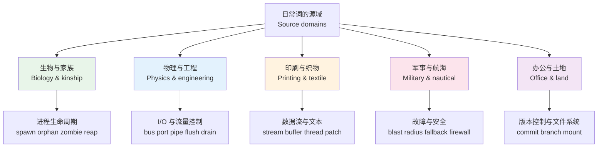
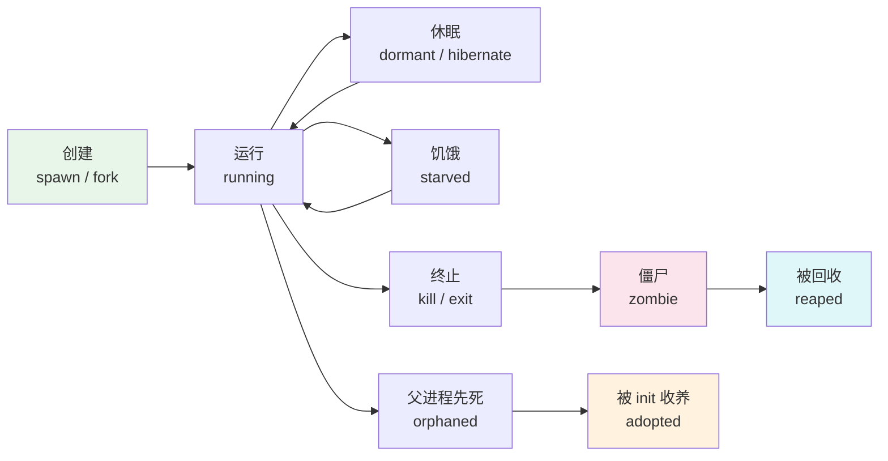
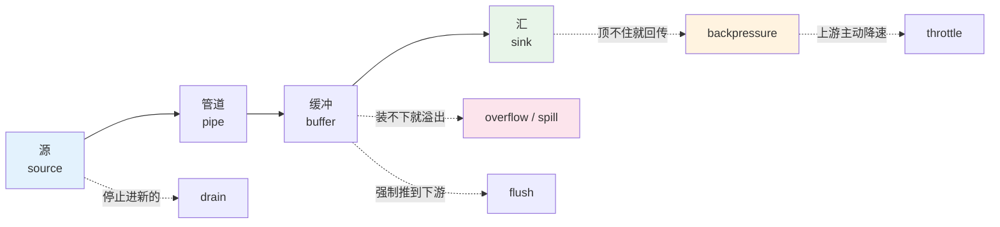
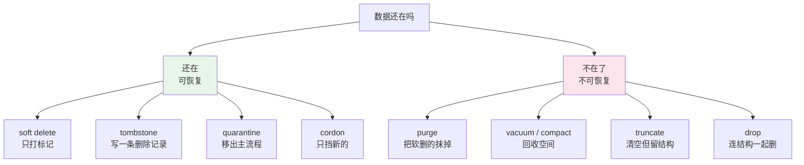
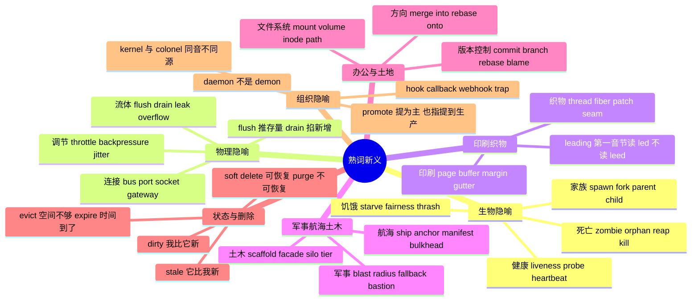

# 计算机语境的熟词新义：日常词的技术义项地图

> [!info] 本篇定位
>
> `20.专业领域词汇` 的第二篇。上一篇 [[20.专业领域词汇/01.IT 深度英语（上）：核心概念术语与其读音|IT 深度英语（上）：核心概念术语与其读音]] 处理的是那批一看就是术语的词——`closure`、`idempotent`、`quorum`，你不懂就是不懂，查了就会。这一篇处理相反的一类：**每个字母你都认识，连起来也读得出来，但意思跟你以为的不是一回事**。
>
> `The process was reaped by its parent` 里没有一个生词。`Drain the connection pool before promoting the replica` 也没有。真正卡住中文母语读者的是这类句子——词认得，句子读不懂，而且因为没有生词，你甚至不知道自己该去查什么。
>
> 本篇的解法不是给你一张「英文—中文」对照表让你硬背，而是**按隐喻来源分组**。技术词汇里的挪用不是随机的：进程管理整体借了生物学的家族与生命周期，I/O 整体借了流体力学，并发与调度借了交通，版本控制借了办公室与土地。摸清一组隐喻的源域，同组里剩下的词你能自己猜出来。
>
> 读完你能做到：读英文源码注释、issue 讨论、错误日志时，遇到熟词能立刻判断它在这里取的是日常义还是技术义；用英文写 issue 时不再把 `delete` 和 `evict`、`stale` 和 `dirty` 混着用。

---

## 1. 本篇导读：技术词为什么多半是借来的

英语造技术词有两条路。一条是从拉丁希腊词根新造，`polymorphism`、`asynchronous`、`idempotent` 都是这么来的，这条路在 [[15.词根、合成与缩略/03.希腊词根与学科术语|希腊词根与学科术语]] 里讲过机制。另一条是**从已有的日常词里挑一个，把它的核心意象搬到新场景**。

第二条路占的比重远大于第一条，原因很实际：技术概念要在人和人之间快速传达，一个已经带着完整画面感的词比一个新造词效率高得多。说 `the connection leaked` 比说 `the connection was not released within its intended lifetime` 快十倍，而且听的人立刻有画面——水管漏水，东西一点一点跑掉了。

这种挪用在语言学上叫**隐喻引申**，机制在 [[16.词义辨析、搭配与短语动词/02.反义词体系、一词多义与词义引申|反义词体系、一词多义与词义引申]] 里讲过。本篇不重复讲机制，只做一件事：把计算机领域里挪用得最集中的几个源域摊开，每个源域给出完整词群。

上图是本篇的目录结构。五个源域各占两到三节，每节的组织方式一致：先说清源域里这个词的字面画面，再说技术语境挪走了画面里的哪一部分，最后给词表和例句。这个顺序不能倒过来——直接背技术义会让你记住一堆孤立条目，而记住画面之后，同一源域的新词你不查也能推。

判断一个熟词在句子里取的是日常义还是技术义，有三个信号可以先记住，后面各节会反复用到：

**信号一：主语不是人。** `The parent waits for the child` 里如果 `parent` 是人，句子讲的是家长等孩子；如果前文在说进程，它讲的是父进程回收子进程。技术义的挪用几乎总伴随主语的非人化。

**信号二：搭配的动词或介词反常。** `drain the pool` 在日常语境是「把池子的水放掉」，在技术语境是「让连接池里的连接自然用完、不再补新的」。`promote a replica` 在日常语境该是提拔一个人，副本没法被提拔，那就是技术义。

**信号三：出现在被动或不及物用法上。** `the buffer flushed`、`the lock starved`、`the file mounted` 这类用法在日常英语里要么不通要么怪，一旦出现就说明是技术义。

---

## 2. 生物隐喻（上）：进程家族与繁殖

Unix 把进程管理整套借给了家族亲缘关系。这个隐喻挪用得极彻底：一个进程可以有 parent、有 child、有 sibling，可以被 spawn 出来、可以变成 orphan、可以在死后变成 zombie 直到被 parent reap 掉。整套词在 [[08.家庭、人际与社会身份/01.亲属称谓全表|亲属称谓全表]] 里学过日常义，这里只讲挪走了什么。

核心画面是：**父进程创造子进程，并且对子进程的死亡负责**。这个「负责」是整套词的枢纽——理解了它，orphan、zombie、reap 三个词的技术义全都自动解释得通。

| 英文 | 英式音标 | 美式音标 | 词性 | 中文 | 搭配与说明 |
| --- | --- | --- | --- | --- | --- |
| **spawn** | /spɔːn/ | /spɔːn/ | v./n. | 派生（进程）；产卵 | 源义是鱼蛙一次产大量卵；技术义强调「批量、廉价、快速」地生出子进程 |
| **fork** | /fɔːk/ | /fɔːrk/ | v./n. | 派生进程；分叉 | 源义是叉子与岔路；Unix 里 fork 出的子进程是父进程的完整复制 |
| **parent** | /ˈpeərənt/ | /ˈperənt/ | n. | 父进程；父节点 | parent process / parent directory / parent class 三处都用 |
| **child** | /tʃaɪld/ | /tʃaɪld/ | n. | 子进程；子节点 | 复数 children；child process 恒用单数形式作定语 |
| **sibling** | /ˈsɪblɪŋ/ | /ˈsɪblɪŋ/ | n. | 兄弟节点 | 日常义不分性别，正合技术需要；sibling element 同级元素 |
| **ancestor** | /ˈænsestə/ | /ˈænsestər/ | n. | 祖先节点 | 树结构里从当前节点到根的所有节点 |
| **descendant** | /dɪˈsendənt/ | /dɪˈsendənt/ | n. | 后代节点 | 拼写常错成 -ent 与 -ant 混，名词是 -ant |
| **orphan** | /ˈɔːfn/ | /ˈɔːrfn/ | n./v. | 孤儿进程；成为孤儿 | 父进程先死，子进程还活着；技术上会被 init 收养 |
| **adopt** | /əˈdɒpt/ | /əˈdɑːpt/ | v. | 收养（孤儿进程） | 孤儿进程被 PID 1 adopt；也用于 adopt a standard 采纳标准 |
| **zombie** | /ˈzɒmbi/ | /ˈzɑːmbi/ | n. | 僵尸进程 | 已死但退出码还没被父进程取走，进程表里的条目仍占着 |
| **defunct** | /dɪˈfʌŋkt/ | /dɪˈfʌŋkt/ | adj. | 已失效的 | ps 输出里进程名后面跟的 `<defunct>` 就是僵尸进程的标记 |
| **reap** | /riːp/ | /riːp/ | v. | 回收（子进程） | 源义是收割庄稼；父进程 reap 子进程等于取走退出码、释放进程表条目 |
| **harvest** | /ˈhɑːvɪst/ | /ˈhɑːrvɪst/ | v./n. | 收割；采集 | 比 reap 更常用于采集指标数据，harvest metrics |
| **kill** | /kɪl/ | /kɪl/ | v. | 终止（进程） | 技术语境完全中性，不带暴力色彩；kill -9 读作 kill dash nine |
| **clone** | /kləʊn/ | /kloʊn/ | v./n. | 克隆；完整复制 | git clone、deep clone 都取「完全一样的另一份」 |
| **seed** | /siːd/ | /siːd/ | n./v. | 种子；预置数据 | seed data 初始数据；random seed 随机数种子 |
| **nest** | /nest/ | /nest/ | v./n. | 嵌套 | nested loop 嵌套循环；nesting level 嵌套层数 |
| **tree** | /triː/ | /triː/ | n. | 树（结构） | 唯一一个根在上、叶在下的树，画图时不要按现实的树画 |
| **root** | /ruːt/ | /ruːt/ | n./adj. | 根节点；超级用户 | 美音也读 /rʊt/；root user 与 root directory 是两个不同的挪用 |
| **leaf** | /liːf/ | /liːf/ | n. | 叶节点 | 复数 leaves；leaf node 没有子节点的节点 |
| **branch** | /brɑːntʃ/ | /bræntʃ/ | n./v. | 分支 | 树的分支、Git 的分支、CPU 的条件跳转三处都用 |
| **trunk** | /trʌŋk/ | /trʌŋk/ | n. | 主干 | SVN 时代的主线名，Git 时代换成 main；trunk-based development |
| **prune** | /pruːn/ | /pruːn/ | v. | 剪枝；清理 | 源义是修剪枝条；git prune 删掉不再被引用的对象 |
| **graft** | /ɡrɑːft/ | /ɡræft/ | v./n. | 嫁接 | 源义是把一段枝条接到另一棵树上；shallow clone 拉下来的历史断口处，git log 会标 `grafted` |

> [!example] 进程家族在真实句子里的样子
>
> - The server **spawns** a worker for each incoming connection.
>   - 服务端为每个进来的连接派生一个工作进程。
> - When the parent exits first, the child is **orphaned** and reparented to init.
>   - 父进程先退出时，子进程变成孤儿，被重新挂到 init 之下。
> - A **zombie** holds no memory, only a slot in the process table.
>   - 僵尸进程不占内存，只占进程表里的一个条目。
> - The supervisor never calls wait(), so dead children are never **reaped**.
>   - 监管进程从不调用 wait()，所以死掉的子进程一直没被回收。

> [!warning] 三个最容易误读的点
>
> - `kill` 在技术语境**不带任何情绪色彩**，写 issue 时用它完全正常。中文母语者常因为觉得刺耳而改写成 `close the process`，反而不地道——进程是 kill，连接是 close，文件是 close，服务是 stop。
> - `zombie` 不等于「卡死的进程」。卡死是 `hung` 或 `stuck`，僵尸是**已经死了但没被回收**。两者的处理办法完全相反：hung 的要 kill，zombie 的要去修它的父进程。
> - `reap` 在日常英语里更常出现在 `reap the benefits`（收获好处）这类抽象搭配里。技术语境的 reap 是字面收割义的直接挪用，跟「获益」无关。

---

## 3. 生物隐喻（下）：健康、饥饿与传染

同一条生物线上还有第二组词，讲的不是家族关系而是**个体的健康状态**。服务有 health、有 heartbeat、要做 liveness probe；资源不够的时候进程会 starve；出问题的节点要被 quarantine。这组词在运维文档里的密度极高。

关键区别是 **liveness 与 readiness 的分工**：前者问「还活着吗」，答案是否定就重启；后者问「能干活了吗」，答案是否定就先不给它派流量。中文常把两个都译成「健康检查」，读英文文档时必须分开。

| 英文 | 英式音标 | 美式音标 | 词性 | 中文 | 搭配与说明 |
| --- | --- | --- | --- | --- | --- |
| **health** | /helθ/ | /helθ/ | n. | 健康状态 | health check 健康检查；health endpoint 健康探测接口 |
| **healthy** | /ˈhelθi/ | /ˈhelθi/ | adj. | 健康的 | 与 unhealthy 成对；负载均衡器只把流量派给 healthy 实例 |
| **liveness** | /ˈlaɪvnəs/ | /ˈlaɪvnəs/ | n. | 存活性 | liveness probe 判断「进程还在不在」，失败就重启 |
| **readiness** | /ˈredinəs/ | /ˈredinəs/ | n. | 就绪性 | readiness probe 判断「能不能接流量」，失败只是摘流量 |
| **probe** | /prəʊb/ | /proʊb/ | n./v. | 探针；探测 | 源义是医用探针；startup / liveness / readiness 三种 probe |
| **heartbeat** | /ˈhɑːtbiːt/ | /ˈhɑːrtbiːt/ | n. | 心跳 | 定期发的存活信号；miss three heartbeats 连丢三次心跳 |
| **pulse** | /pʌls/ | /pʌls/ | n./v. | 脉冲；周期信号 | 比 heartbeat 更强调节律，硬件语境常见 |
| **vital** | /ˈvaɪtl/ | /ˈvaɪtl/ | adj./n. | 关键的；生命体征 | Web Vitals 指网页核心体验指标，借的是医学的 vital signs |
| **starve** | /stɑːv/ | /stɑːrv/ | v. | 饿死；得不到资源 | 线程 starve 指长期抢不到锁或 CPU，不是崩溃而是永远等不到 |
| **starvation** | /stɑːˈveɪʃn/ | /stɑːrˈveɪʃn/ | n. | 资源饥饿 | thread starvation、lock starvation；与 deadlock 是两种不同的卡死 |
| **fairness** | /ˈfeənəs/ | /ˈfernəs/ | n. | 公平性 | 调度策略的属性；fair lock 保证先来的先拿到，避免 starvation |
| **dormant** | /ˈdɔːmənt/ | /ˈdɔːrmənt/ | adj. | 休眠的；潜伏的 | 源义是动植物冬眠；a dormant bug 潜伏很久没被触发的缺陷 |
| **hibernate** | /ˈhaɪbəneɪt/ | /ˈhaɪbərneɪt/ | v. | 休眠 | 系统休眠把内存写盘再断电，与 sleep 的区别是掉电不丢状态 |
| **wake** | /weɪk/ | /weɪk/ | v. | 唤醒 | wake up a thread；被动 be woken up；notify 是它的正式版 |
| **infect** | /ɪnˈfekt/ | /ɪnˈfekt/ | v. | 感染 | 除病毒外也用于「污染」，an infected build 被污染的构建产物 |
| **virus** | /ˈvaɪrəs/ | /ˈvaɪrəs/ | n. | 病毒 | 复数 viruses，不是 viri；必须依附宿主程序才能传播 |
| **worm** | /wɜːm/ | /wɜːrm/ | n. | 蠕虫 | 与 virus 的技术区别是**不需要宿主**，自己就能在网络里复制 |
| **host** | /həʊst/ | /hoʊst/ | n./v. | 主机；宿主；托管 | 三个义项同形：物理主机、病毒宿主、host a service 托管服务 |
| **quarantine** | /ˈkwɒrəntiːn/ | /ˈkwɔːrəntiːn/ | v./n. | 隔离 | 把可疑文件或不稳定测试移出主流程但不删除，留待人工判断 |
| **immune** | /ɪˈmjuːn/ | /ɪˈmjuːn/ | adj. | 免疫的；不受影响的 | be immune to 后接影响源，immune to network partitions |
| **mutate** | /mjuːˈteɪt/ | /ˈmjuːteɪt/ | v. | 变异；就地修改 | 英美重音位置相反；mutable 与 immutable 见上一篇的概念层 |
| **mutation** | /mjuːˈteɪʃn/ | /mjuːˈteɪʃn/ | n. | 变更；变异 | GraphQL 里写操作就叫 mutation，与只读的 query 成对 |
| **migrate** | /maɪˈɡreɪt/ | /ˈmaɪɡreɪt/ | v. | 迁移 | 源义是候鸟迁徙；database migration 指结构变更脚本，不是搬数据 |
| **swarm** | /swɔːm/ | /swɔːrm/ | n./v. | 集群；蜂拥 | Docker Swarm 借的是蜂群意象，强调同质节点的集体行为 |
| **herd** | /hɜːd/ | /hɜːrd/ | n. | 兽群 | thundering herd 惊群：缓存一失效，全部请求同时冲向数据库 |
| **thrash** | /θræʃ/ | /θræʃ/ | v./n. | 抖动；反复颠簸 | 源义是猛烈拍打；内存不足时页面反复换入换出叫 thrashing |
| **churn** | /tʃɜːn/ | /tʃɜːrn/ | n./v. | 频繁变动 | 源义是搅拌奶油；code churn 指同一段代码被反复改写 |

> [!example] 健康与饥饿组的典型句子
>
> - The pod passes its **liveness** probe but keeps failing **readiness**.
>   - 这个 Pod 存活探针通过，但就绪探针一直失败。
> - Low-priority requests **starve** under the current scheduling policy.
>   - 在当前调度策略下，低优先级请求会一直抢不到资源。
> - Cache expiry caused a **thundering herd** against the primary database.
>   - 缓存集中过期，导致大量请求同时冲击主库。
> - Flaky tests are **quarantined** rather than deleted, so the signal is not lost.
>   - 不稳定的测试被隔离而不是删除，这样信号不会丢。

上图把生物隐喻的两节串成了一条完整链路。值得注意的是 zombie 与 orphan 在图上分居两条支路：zombie 是「子先死、父没收尸」，orphan 是「父先死、子还活着」，两者的成因正好相反，中文都译成不太贴切的「僵尸」「孤儿」，靠中文分不开，靠这张图能分开。

---

## 4. 物理隐喻（上）：总线、端口与插座

第二大源域是物理世界的连接件。计算机的物理起源让这批词几乎是原样保留的——最早的 bus 就是真的一束并行导线，port 就是机箱背后真的插孔。等到概念虚拟化之后，词留了下来，实体没了。

这批词有个共同的判读特征：**它们描述的都是「东西怎么从 A 到 B」，而不是「东西是什么」**。看到这类词，先找它连接的两端是谁。

| 英文 | 英式音标 | 美式音标 | 词性 | 中文 | 搭配与说明 |
| --- | --- | --- | --- | --- | --- |
| **bus** | /bʌs/ | /bʌs/ | n. | 总线；消息总线 | 源义与公交车同词，取「一条线路上很多人上下」的画面 |
| **port** | /pɔːt/ | /pɔːrt/ | n./v. | 端口；移植 | 名词端口源自船舶的港口；动词「移植」是另一条独立引申线 |
| **pipe** | /paɪp/ | /paɪp/ | n./v. | 管道 | shell 里的 `\|` 就叫 pipe；pipe A into B 把 A 的输出接到 B |
| **pipeline** | /ˈpaɪplaɪn/ | /ˈpaɪplaɪn/ | n. | 流水线；管线 | CI pipeline、CPU pipeline、data pipeline 三处义项相通 |
| **channel** | /ˈtʃænl/ | /ˈtʃænl/ | n. | 通道 | 比 pipe 更抽象，强调「有容量、可以带类型」的通信路径 |
| **socket** | /ˈsɒkɪt/ | /ˈsɑːkɪt/ | n. | 套接字；插座 | 源义是「让另一件东西插进去的凹口」，灯泡插口与眼窝都叫 socket；技术义是网络通信的两端插口 |
| **plug** | /plʌɡ/ | /plʌɡ/ | n./v. | 插头；插件 | plug in 接入；plugin 作名词写作一个词，见拼写规律 |
| **slot** | /slɒt/ | /slɑːt/ | n. | 插槽；时间槽 | time slot 时间片；slot 强调数量固定、可占用可释放 |
| **bridge** | /brɪdʒ/ | /brɪdʒ/ | n./v. | 桥接 | 连通两个原本不通的网络或系统；bridge network |
| **gateway** | /ˈɡeɪtweɪ/ | /ˈɡeɪtweɪ/ | n. | 网关 | 源义是院墙上的门；技术义强调「出入必经的那一个点」 |
| **hub** | /hʌb/ | /hʌb/ | n. | 集线器；中心 | 源义是车轮的轮毂；hub-and-spoke 中心辐射式架构 |
| **switch** | /swɪtʃ/ | /swɪtʃ/ | n./v. | 交换机；开关；切换 | 三个义项同形，靠上下文分；switch to 切换到 |
| **router** | /ˈruːtə/ | /ˈraʊtər/ | n. | 路由器 | 英式通读 /ˈruːtə/；美式 /ˈraʊtər/ 与 /ˈruːtər/ 并存，前者更常听到 |
| **route** | /ruːt/ | /ruːt/ | n./v. | 路由；路线 | 主流读 /ruːt/，美音另有 /raʊt/；读 /ruːt/ 时与 root 同音，是常见混淆源 |
| **tunnel** | /ˈtʌnl/ | /ˈtʌnl/ | n./v. | 隧道 | 把一种协议包在另一种协议里传，SSH tunnel |
| **beacon** | /ˈbiːkən/ | /ˈbiːkən/ | n. | 信标 | 源义是灯塔或烽火；周期性广播自己存在的小包 |
| **signal** | /ˈsɪɡnəl/ | /ˈsɪɡnəl/ | n./v. | 信号 | Unix signal 是进程间的异步通知；signal a condition 唤醒等待者 |
| **clock** | /klɒk/ | /klɑːk/ | n./v. | 时钟；计时 | clock skew 时钟偏移；logical clock 逻辑时钟不测真实时间 |
| **gate** | /ɡeɪt/ | /ɡeɪt/ | n./v. | 门；卡口 | 逻辑门 AND gate；动词义 gate a feature 用开关控制功能是否放出 |
| **latch** | /lætʃ/ | /lætʃ/ | n./v. | 门闩；锁存 | 源义是门闩，扣上就不动；countdown latch 计数到零才放行 |
| **trigger** | /ˈtrɪɡə/ | /ˈtrɪɡər/ | n./v. | 触发器；触发 | 源义是扳机；数据库 trigger 是「某事发生就自动执行」 |
| **toggle** | /ˈtɒɡl/ | /ˈtɑːɡl/ | v./n. | 切换开关 | 源义是船帆上的横木栓；feature toggle 与 feature flag 同义 |
| **flag** | /flæɡ/ | /flæɡ/ | n./v. | 标志位；标记 | 源义是旗子；命令行的 `-v` 也叫 flag，与选项 option 常混用 |
| **circuit breaker** | /ˈsɜːkɪt ˈbreɪkə/ | /ˈsɜːrkɪt ˈbreɪkər/ | n. | 熔断器 | 源义是电闸；下游连续失败就断开，避免把故障传导上来 |
| **fuse** | /fjuːz/ | /fjuːz/ | n./v. | 保险丝；熔合 | 名词是保险丝，动词是「熔合、合并」，两义方向不同 |
| **wire** | /ˈwaɪə/ | /ˈwaɪər/ | n./v. | 线；接线 | wire format 传输时的字节格式；wire A to B 把 A 接到 B |
| **rail** | /reɪl/ | /reɪl/ | n. | 轨道；电源轨 | guardrail 护栏，指防止误操作的机制，比 rail 本身常用 |

> [!warning] port 的两条引申线不要混
>
> `port` 在技术语境有两个完全独立的义项，词源是同一个但引申路径不同：
>
> - 名词的**端口**：从「港口」引申——数据进出机器的口子。`listen on port 8080`。
> - 动词的**移植**：从拉丁 portare「搬运」引申——把软件搬到另一个平台。`port the driver to ARM`。
>
> 由此派生的 `portable` 也有两义：日常义「便携的」，技术义「可移植的」。读到 `a portable implementation` 时它说的是「换平台也能跑」，跟体积无关。

---

## 5. 物理隐喻（下）：流体、压力与流量控制

物理源域里最能产的一支是流体。数据被当成水：从 source 流到 sink，途中经过 pipe、进 buffer、可以 leak、可以 overflow、太快了要 throttle、下游顶不住会产生 backpressure。这支隐喻的完整度高到可以整体推理——知道水会怎么样，就知道数据会怎么样。

`flush` 与 `drain` 是这一节最值得分清的一对，中文都能译成「清空」，但方向相反：

| 英文 | 英式音标 | 美式音标 | 词性 | 中文 | 搭配与说明 |
| --- | --- | --- | --- | --- | --- |
| **flush** | /flʌʃ/ | /flʌʃ/ | v. | 冲刷；强制写出 | 源义是冲马桶；把缓冲区里攒着的东西**立刻推到下游**，重点是「写出去」 |
| **drain** | /dreɪn/ | /dreɪn/ | v. | 排空；摘流 | 源义是排水；**停止进新的**，让存量自然走完，重点是「不再进」 |
| **leak** | /liːk/ | /liːk/ | v./n. | 泄漏 | memory leak 内存泄漏；也指信息泄露 leak credentials |
| **spill** | /spɪl/ | /spɪl/ | v. | 溢写 | 内存装不下时把中间结果写到磁盘，spill to disk |
| **overflow** | /ˌəʊvəˈfləʊ/ | /ˌoʊvərˈfloʊ/ | v. | 溢出 | 名词重音在前 /ˈəʊvəfləʊ/；buffer overflow 是经典安全漏洞 |
| **underflow** | /ˈʌndəfləʊ/ | /ˈʌndərfloʊ/ | n./v. | 下溢 | 浮点数小到无法表示；与 overflow 成对 |
| **backpressure** | /ˈbækpreʃə/ | /ˈbækpreʃər/ | n. | 背压 | 下游处理不过来时向上游回传的「慢点」信号 |
| **throttle** | /ˈθrɒtl/ | /ˈθrɑːtl/ | v./n. | 限流 | 源义是汽车油门；主动降速，与被动的 backpressure 是两回事 |
| **rate limit** | /reɪt ˈlɪmɪt/ | /reɪt ˈlɪmɪt/ | n./v. | 限速 | 按单位时间次数封顶；超了返回 429 |
| **saturate** | /ˈsætʃəreɪt/ | /ˈsætʃəreɪt/ | v. | 饱和 | 资源用到上限再加也没用；the link is saturated 链路跑满 |
| **sink** | /sɪŋk/ | /sɪŋk/ | n. | 汇；接收端 | 与 source 成对；日志系统里 sink 指最终落地的地方 |
| **source** | /sɔːs/ | /sɔːrs/ | n. | 源；数据源 | 与 source code 的 source 同形不同义，注意分辨 |
| **tap** | /tæp/ | /tæp/ | v./n. | 分接；截取 | 源义是龙头；tap into a stream 从流上分一路出来看 |
| **funnel** | /ˈfʌnl/ | /ˈfʌnl/ | n./v. | 漏斗；汇聚 | funnel all traffic through one gateway 把流量收到一个口 |
| **pool** | /puːl/ | /puːl/ | n./v. | 池 | connection pool、thread pool；核心是「预先造好、循环复用」 |
| **pump** | /pʌmp/ | /pʌmp/ | v./n. | 泵送 | message pump 消息泵，不停从队列取消息派发 |
| **flow** | /fləʊ/ | /floʊ/ | n./v. | 流；流动 | control flow 控制流；flow control 流量控制，两个词序义项不同 |
| **upstream** | /ˌʌpˈstriːm/ | /ˌʌpˈstriːm/ | n./adj. | 上游 | 两个义项：数据的上游；也指你 fork 出来的那个原始仓库 |
| **downstream** | /ˌdaʊnˈstriːm/ | /ˌdaʊnˈstriːm/ | n./adj. | 下游 | downstream service 你调用的那些服务；出故障要看 downstream 影响 |
| **headroom** | /ˈhedruːm/ | /ˈhedruːm/ | n. | 余量 | 源义是车顶到头顶的空间；capacity headroom 容量余量 |
| **spike** | /spaɪk/ | /spaɪk/ | n./v. | 尖峰 | 源义是钉子；流量或延迟的短时突增，与持续上涨的 ramp 不同 |
| **jitter** | /ˈdʒɪtə/ | /ˈdʒɪtər/ | n. | 抖动 | 延迟的波动幅度；重试时故意加 jitter 打散并发 |
| **ramp** | /ræmp/ | /ræmp/ | v./n. | 逐步加压 | ramp up traffic 慢慢放量；与一次性切换 cutover 相对 |
| **idle** | /ˈaɪdl/ | /ˈaɪdl/ | adj./v. | 空闲的 | idle connection 空闲连接；idle timeout 空闲超时 |
| **spin** | /spɪn/ | /spɪn/ | v. | 自旋；启动 | spin lock 忙等锁；spin up an instance 拉起一个实例 |
| **stall** | /stɔːl/ | /stɔːl/ | v./n. | 停滞 | 源义是发动机熄火；pipeline stall 流水线停顿 |
| **warm** | /wɔːm/ | /wɔːrm/ | adj./v. | 预热的 | warm cache 已经装好数据的缓存；warm up 预热 |

上图把流体隐喻的全部关键词摆进了一条水路。实线是正常路径，四条虚线是四种异常或调节手段。看图能直接答出一个常被问倒的问题：`flush` 与 `drain` 为什么不能互换——flush 作用在中间的 buffer 上，把存量往下游推；drain 作用在最上游的入口上，把新增掐掉。一个是「快点走完」，一个是「别再来了」。

> [!example] 流体组在运维语境里的实际用法
>
> - **Drain** the node before the upgrade, then **flush** the write buffer.
>   - 升级前先把节点摘流，然后把写缓冲强制刷出去。
> - The consumer applies **backpressure** when its queue exceeds the watermark.
>   - 消费端队列超过水位线时会向上游施加背压。
> - Add **jitter** to the retry interval so clients do not retry in lockstep.
>   - 给重试间隔加上抖动，避免客户端整齐划一地同时重试。
> - We are running at 85% CPU with almost no **headroom** left.
>   - 现在 CPU 跑在百分之八十五，几乎没有余量了。

---

## 6. 印刷与织物隐喻：stream、buffer、thread、patch

第三个源域是老工业：印刷车间和纺织车间。这批词的年龄比计算机大得多，很多在十九世纪就定型了，被电子计算机原样接手。

印刷线贡献的是**文本与页面**的一整套词，织物线贡献的是**线与拼接**。两条线在 `thread` 上交汇——一根线可以是纺织的线，也可以是「顺序执行的一串指令」。

### 6.1 印刷车间来的词

| 英文 | 英式音标 | 美式音标 | 词性 | 中文 | 搭配与说明 |
| --- | --- | --- | --- | --- | --- |
| **stream** | /striːm/ | /striːm/ | n./v. | 流 | 源义是溪流；技术义是「可以边到边处理的连续数据序列」，与一次读完的整块相对 |
| **buffer** | /ˈbʌfə/ | /ˈbʌfər/ | n./v. | 缓冲区 | 源义是火车车厢间的缓冲器；作用是吸收两端速度差 |
| **page** | /peɪdʒ/ | /peɪdʒ/ | n./v. | 页；分页 | 内存页、数据库页、分页查询三处同源；page in / page out |
| **paging** | /ˈpeɪdʒɪŋ/ | /ˈpeɪdʒɪŋ/ | n. | 分页；换页 | 操作系统的换页机制；与 pagination 分页显示不是同一个词 |
| **font** | /fɒnt/ | /fɑːnt/ | n. | 字体 | 源义是一套铅字；严格说 font 是某字号某字重的一套，typeface 是整个字族 |
| **typeface** | /ˈtaɪpfeɪs/ | /ˈtaɪpfeɪs/ | n. | 字族 | 日常与 font 混用，排版规范里两者分得很清 |
| **leading** | /ˈledɪŋ/ | /ˈledɪŋ/ | n. | 行距 | 读作 /ˈledɪŋ/ 不是 /ˈliːdɪŋ/，因为源义是铅条；CSS 里叫 line-height |
| **kerning** | /ˈkɜːnɪŋ/ | /ˈkɜːrnɪŋ/ | n. | 字距微调 | 调两个特定字母之间的间距，不是全局字距 tracking |
| **justify** | /ˈdʒʌstɪfaɪ/ | /ˈdʒʌstɪfaɪ/ | v. | 两端对齐 | 与日常义「证明有理」完全不同；justify-content 是 CSS 属性名 |
| **margin** | /ˈmɑːdʒɪn/ | /ˈmɑːrdʒɪn/ | n. | 外边距；余量 | CSS 的外边距；财报语境的「利润率」见 20.07 |
| **gutter** | /ˈɡʌtə/ | /ˈɡʌtər/ | n. | 栏间距 | 源义是排水沟；栅格系统里两列之间的空隙 |
| **template** | /ˈtempleɪt/ | /ˈtemplət/ | n. | 模板 | 英美读音差异明显：英 /ˈtempleɪt/ 美 /ˈtemplət/ |
| **stencil** | /ˈstensl/ | /ˈstensl/ | n. | 镂空模板 | 比 template 更强调「照着刻好的洞刷」，图形学里常见 |
| **boilerplate** | /ˈbɔɪləpleɪt/ | /ˈbɔɪlərpleɪt/ | n. | 样板代码 | 源义是锅炉钢板，后来指报业辛迪加发给各报的整块铸版，拿来就印；技术义是「不得不写的重复代码」 |
| **draft** | /drɑːft/ | /dræft/ | n./v. | 草稿 | draft PR 草稿状态的合并请求，表示还没准备好评审 |
| **proof** | /pruːf/ | /pruːf/ | n./v. | 校样；校对 | 源义是印刷校样；proofread 校对，与数学的 proof 证明是另一义 |
| **render** | /ˈrendə/ | /ˈrendər/ | v. | 渲染；生成 | 源义是「呈现、表现出来」，绘画里 render 就是把对象画出来；render a template 把模板填成成品 |
| **log** | /lɒɡ/ | /lɔːɡ/ | n./v. | 日志 | 源义是航海日志，最早的 log 是拖在船后测速的木头 |
| **ledger** | /ˈledʒə/ | /ˈledʒər/ | n. | 分类账 | 只追加不修改的记录；区块链文档里高频 |
| **journal** | /ˈdʒɜːnl/ | /ˈdʒɜːrnl/ | n. | 日志；journal 文件 | 文件系统的 journaling 先写日志再改数据，崩溃后可恢复 |
| **record** | /ˈrekɔːd/ | /ˈrekərd/ | n. | 记录 | 名词重音在前，动词 /rɪˈkɔːd/ 在后；重音移位规律见 01.03 |
| **index** | /ˈɪndeks/ | /ˈɪndeks/ | n./v. | 索引 | 源义是书末索引；复数 indexes 或 indices，技术文档两种都见 |
| **digest** | /ˈdaɪdʒest/ | /ˈdaɪdʒest/ | n. | 摘要；散列值 | 名词重音在前；动词 /daɪˈdʒest/ 在后；message digest 报文摘要 |
| **glyph** | /ɡlɪf/ | /ɡlɪf/ | n. | 字形 | 一个字符可以有多个 glyph；字体渲染文档里的基本单位 |

### 6.2 纺织车间来的词

| 英文 | 英式音标 | 美式音标 | 词性 | 中文 | 搭配与说明 |
| --- | --- | --- | --- | --- | --- |
| **thread** | /θred/ | /θred/ | n./v. | 线程；话题串 | 源义是缝纫线；论坛的「主题串」与并发的「线程」是两次独立挪用 |
| **fiber** | /ˈfaɪbə/ | /ˈfaɪbər/ | n. | 纤程；光纤 | 英式拼 fibre；比 thread 更轻量的执行单位 |
| **weave** | /wiːv/ | /wiːv/ | v. | 编织 | AOP 里的 weaving 指把横切逻辑织进目标代码 |
| **fabric** | /ˈfæbrɪk/ | /ˈfæbrɪk/ | n. | 织物；架构底座 | service fabric、network fabric 强调「密织成一张面」 |
| **mesh** | /meʃ/ | /meʃ/ | n. | 网格 | service mesh 服务网格；源义是渔网那种有孔的网 |
| **spool** | /spuːl/ | /spuːl/ | n./v. | 线轴；假脱机 | 源义是绕线的轴；计算机里 SPOOL 同时是 Simultaneous Peripheral Operations On-Line 的首字母缩写，画面正好合上 |
| **string** | /strɪŋ/ | /strɪŋ/ | n. | 字符串 | 源义是一根绳；字符「串成一串」的画面 |
| **stitch** | /stɪtʃ/ | /stɪtʃ/ | v./n. | 缝合 | stitch together 把几段拼成一整段，常用于图像或日志拼接 |
| **seam** | /siːm/ | /siːm/ | n. | 接缝 | 重构文献里指「可以插入测试替身的位置」 |
| **seamless** | /ˈsiːmləs/ | /ˈsiːmləs/ | adj. | 无缝的 | 产品文案高频词；技术文档里慎用，因为它不说明具体机制 |
| **patch** | /pætʃ/ | /pætʃ/ | n./v. | 补丁；打补丁 | 源义是衣服上的补丁布；最早的补丁真的是纸带上贴的一块 |
| **pattern** | /ˈpætn/ | /ˈpætərn/ | n. | 模式；图样 | 源义是裁缝的纸样；design pattern 与 regex pattern 两条线 |
| **tangle** | /ˈtæŋɡl/ | /ˈtæŋɡl/ | v./n. | 缠绕；纠缠 | a tangle of dependencies 一团理不清的依赖 |
| **knot** | /nɒt/ | /nɑːt/ | n. | 结 | k 不发音；比喻难解的耦合点，不如 tangle 常用 |
| **interleave** | /ˌɪntəˈliːv/ | /ˌɪntərˈliːv/ | v. | 交错；交织 | 两个序列你一个我一个地交叉排列；并发执行的顺序叫 interleaving |
| **splice** | /splaɪs/ | /splaɪs/ | v. | 拼接 | 源义是把两根绳接成一根；JS 的 Array.splice 就是这个词 |
| **unravel** | /ʌnˈrævl/ | /ʌnˈrævl/ | v. | 拆解；散开 | 源义是毛衣脱线；unravel a legacy system 逐层拆解遗留系统 |
| **fray** | /freɪ/ | /freɪ/ | v. | 磨损起毛 | 描述边界模糊、开始出问题，比喻用法，正式文档少见 |

> [!tip] 从源义反推技术义的练法
>
> 遇到一个陌生的熟词技术义，先问自己：**这个词在实物世界里描述的是什么动作或什么形状**。
>
> - `spool` 的实物是绕线轴，特点是「先绕上去攒着，再慢慢放出来」。打印假脱机正是这个动作。
> - `gutter` 的实物是排水沟，特点是「两块之间的那条空隙」。栅格系统的列间距正是这个位置。
> - `boilerplate` 的实物是预铸钢板，特点是「不用重新排版，直接整块用」。样板代码正是这个性质。
>
> 这条办法对本篇八成的词有效，剩下两成是词源已经断掉的（比如 `daemon`），得单独记。

---

## 7. 军事、航海与土木隐喻

第四个源域是行动与工程。故障处理整体借了军事词汇，部署与运输整体借了航海词汇，架构描述整体借了土木词汇。三者的共同点是**都在描述「有风险的行动如何组织」**，正合软件运维的需要。

### 7.1 军事线：故障范围与撤退

| 英文 | 英式音标 | 美式音标 | 词性 | 中文 | 搭配与说明 |
| --- | --- | --- | --- | --- | --- |
| **blast radius** | /blɑːst ˈreɪdiəs/ | /blæst ˈreɪdiəs/ | n. | 影响半径 | 源义是爆炸波及范围；指一次故障或一次变更最坏能波及多大 |
| **fallback** | /ˈfɔːlbæk/ | /ˈfɔːlbæk/ | n./adj. | 降级方案 | 名词一个词；动词 fall back on 分开写，介词固定用 on |
| **retreat** | /rɪˈtriːt/ | /rɪˈtriːt/ | v./n. | 撤退 | 技术语境少见，多用 roll back；出现时强调「主动放弃阵地」 |
| **deploy** | /dɪˈplɔɪ/ | /dɪˈplɔɪ/ | v. | 部署 | 源义是军队展开成阵形；不是「安装」，强调「铺到各处就位」 |
| **rollout** | /ˈrəʊlaʊt/ | /ˈroʊlaʊt/ | n. | 放量发布 | 名词一个词；动词 roll out 分开写 |
| **rollback** | /ˈrəʊlbæk/ | /ˈroʊlbæk/ | n. | 回滚 | 名词一个词；动词 roll back 分开写；数据库事务回滚同词 |
| **target** | /ˈtɑːɡɪt/ | /ˈtɑːrɡɪt/ | n./v. | 目标 | 编译目标 build target、投放目标 targeting，两条线都常见 |
| **sentinel** | /ˈsentɪnl/ | /ˈsentɪnl/ | n. | 哨兵 | 源义是站岗的士兵；两义：监控进程；标记数组末尾的哨兵值 |
| **bastion** | /ˈbæstiən/ | /ˈbæstʃən/ | n. | 堡垒机 | 源义是城墙上的棱堡；唯一允许从外网跳进内网的那台机器 |
| **firewall** | /ˈfaɪəwɔːl/ | /ˈfaɪərwɔːl/ | n. | 防火墙 | 源义是建筑里的防火隔墙，其实是土木词，被安全领域接手 |
| **breach** | /briːtʃ/ | /briːtʃ/ | n./v. | 攻破；数据泄露 | 源义是城墙被打开的缺口；a data breach 是标准说法 |
| **attack surface** | /əˈtæk ˈsɜːfɪs/ | /əˈtæk ˈsɜːrfɪs/ | n. | 攻击面 | 所有可能被打的入口的总和；reduce the attack surface |
| **hardening** | /ˈhɑːdnɪŋ/ | /ˈhɑːrdnɪŋ/ | n. | 加固 | 关掉不用的端口、收紧默认配置；system hardening |
| **mitigate** | /ˈmɪtɪɡeɪt/ | /ˈmɪtɪɡeɪt/ | v. | 缓解 | 与 fix 分工明确：mitigate 是先止血，fix 是根治 |
| **escalate** | /ˈeskəleɪt/ | /ˈeskəleɪt/ | v. | 升级（上报） | 两义：把问题上报给更高层；权限提升 privilege escalation |
| **drill** | /drɪl/ | /drɪl/ | n./v. | 演练 | fire drill 消防演练，引申为「临时的紧急动员」，常带贬义 |
| **collateral** | /kəˈlætərəl/ | /kəˈlætərəl/ | adj. | 附带的 | collateral damage 附带损害；指修 A 时无意打坏了 B |
| **contain** | /kənˈteɪn/ | /kənˈteɪn/ | v. | 遏制 | 安全事故响应 detect、contain、eradicate、recover 四步里的第二步，先把影响面控住，再谈根治 |

### 7.2 航海线：装船、抛锚与船舱

| 英文 | 英式音标 | 美式音标 | 词性 | 中文 | 搭配与说明 |
| --- | --- | --- | --- | --- | --- |
| **ship** | /ʃɪp/ | /ʃɪp/ | v. | 发布 | ship it 是口语版的「发吧」；ship a feature 交付一个功能 |
| **launch** | /lɔːntʃ/ | /lɔːntʃ/ | v./n. | 发布；启动 | 源义是船下水；比 ship 更正式，多用于面向用户的首发 |
| **anchor** | /ˈæŋkə/ | /ˈæŋkər/ | n./v. | 锚点 | HTML 锚点、正则的 `^` 与 `$` 都叫 anchor，意思是「钉死在某处」 |
| **dock** | /dɒk/ | /dɑːk/ | v./n. | 停靠 | 源义是船坞；UI 里 dock a panel 把面板吸附到边缘 |
| **harbor** | /ˈhɑːbə/ | /ˈhɑːrbər/ | n./v. | 港湾；藏有 | 英式拼 harbour；动词义 harbor a bug 藏着一个缺陷 |
| **manifest** | /ˈmænɪfest/ | /ˈmænɪfest/ | n. | 清单文件 | 源义是船上的货物清单；列出这一包东西里都有什么 |
| **cargo** | /ˈkɑːɡəʊ/ | /ˈkɑːrɡoʊ/ | n. | 货物 | Rust 的包管理器叫 Cargo，同一航运隐喻下的命名 |
| **container** | /kənˈteɪnə/ | /kənˈteɪnər/ | n. | 容器 | 源义是标准集装箱，重点在「统一尺寸、随便换船」 |
| **fleet** | /fliːt/ | /fliːt/ | n. | 机群 | 一批同质的机器；fleet-wide rollout 全机群发布 |
| **pilot** | /ˈpaɪlət/ | /ˈpaɪlət/ | n./v. | 试点 | 源义是引航员；pilot program 小范围先试 |
| **helm** | /helm/ | /helm/ | n. | 舵 | Kubernetes 包管理器 Helm 的命名来源；at the helm 掌舵 |
| **navigate** | /ˈnævɪɡeɪt/ | /ˈnævɪɡeɪt/ | v. | 导航；浏览 | navigate to a page 跳到某页；navigation bar 导航栏 |
| **bulkhead** | /ˈbʌlkhed/ | /ˈbʌlkhed/ | n. | 舱壁 | 源义是船舱隔板，破一舱不沉船；隔离故障的模式名 |
| **beach** | /biːtʃ/ | /biːtʃ/ | v. | 搁浅 | 少见，出现时形容「卡住动不了」；与 breach 拼写只差一字母 |
| **buoy** | /bɔɪ/ | /ˈbuːi/ | n. | 浮标 | 英美读音差异大，英 /bɔɪ/ 美 /ˈbuːi/；技术语境罕见但读音值得记 |

### 7.3 土木线：脚手架、地基与外立面

| 英文 | 英式音标 | 美式音标 | 词性 | 中文 | 搭配与说明 |
| --- | --- | --- | --- | --- | --- |
| **scaffold** | /ˈskæfəʊld/ | /ˈskæfoʊld/ | n./v. | 脚手架；生成骨架 | 源义是施工用的架子，房子建好就拆；scaffold a project 生成项目骨架 |
| **foundation** | /faʊnˈdeɪʃn/ | /faʊnˈdeɪʃn/ | n. | 地基 | 也指基金会，开源项目常挂在某个 foundation 下 |
| **framework** | /ˈfreɪmwɜːk/ | /ˈfreɪmwɜːrk/ | n. | 框架 | 源义是建筑的骨架；与 library 的区别是「谁调用谁」 |
| **layer** | /ˈleɪə/ | /ˈleɪər/ | n./v. | 层 | 镜像层、协议层、抽象层；layered architecture 分层架构 |
| **tier** | /tɪə/ | /tɪr/ | n. | 层级 | 与 layer 的区别：tier 强调物理部署上的分开，layer 强调逻辑划分 |
| **stack** | /stæk/ | /stæk/ | n. | 栈；技术栈 | 三义：数据结构、调用栈、技术选型组合；靠上下文分 |
| **blueprint** | /ˈbluːprɪnt/ | /ˈbluːprɪnt/ | n. | 蓝图 | 源义是晒图纸；Flask 的 Blueprint 指可复用的路由模块 |
| **footprint** | /ˈfʊtprɪnt/ | /ˈfʊtprɪnt/ | n. | 占用；覆盖面 | memory footprint 内存占用；carbon footprint 碳足迹见 06.05 |
| **facade** | /fəˈsɑːd/ | /fəˈsɑːd/ | n. | 外观；门面 | 源义是建筑正立面；facade pattern 用简单接口包住复杂子系统 |
| **silo** | /ˈsaɪləʊ/ | /ˈsaɪloʊ/ | n. | 竖井；孤岛 | 源义是筒仓；data silo 指互相不通的数据孤岛，贬义 |
| **warehouse** | /ˈweəhaʊs/ | /ˈwerhaʊs/ | n. | 仓库 | data warehouse 数据仓库；与 data lake 数据湖是两种组织方式 |
| **partition** | /pɑːˈtɪʃn/ | /pɑːrˈtɪʃn/ | n./v. | 分区；隔板 | 源义是房间里的隔断；磁盘分区、数据分片、网络分区三义 |
| **tunnel** | /ˈtʌnl/ | /ˈtʌnl/ | n./v. | 隧道 | 见第 4 节；土木与网络两条线共用同一个词 |
| **bridge** | /brɪdʒ/ | /brɪdʒ/ | n./v. | 桥 | 见第 4 节；设计模式里的 bridge 是「把抽象与实现分开」 |

> [!example] 三条线在事故复盘里同时出现
>
> - The change had a much larger **blast radius** than the author expected.
>   - 这次变更的影响半径比作者预计的大得多。
> - We **mitigated** by falling back to the previous version, then shipped a real fix.
>   - 我们先回退到上个版本止血，随后发布了真正的修复。
> - **Bulkheads** kept the failure inside one tenant instead of taking down the whole **fleet**.
>   - 舱壁隔离把故障限制在单个租户内，没有拖垮整个机群。
> - The **bastion** host is the only machine with inbound SSH from the internet.
>   - 堡垒机是唯一允许从公网 SSH 进来的机器。

---

## 8. 版本控制与文件系统：办公室与土地的词

第五个源域最杂：一半来自办公室与法律（commit、record、staging、blame），一半来自土地与建筑（mount、volume、directory、path）。它们被 Git 和 Unix 文件系统固定下来，成为程序员每天敲最多次的一批词。

`commit` 值得单独说。它在日常英语里是「承诺、投入」，在法律英语里是「移交、羁押」，在数据库里是「提交事务」，在 Git 里是「把改动定格成一个不可变的快照」。四个义项共享同一个内核：**做出一个之后不能随便反悔的动作**。理解这个内核，`commitment`（承诺）、`committed`（已定稿的）、`uncommitted changes`（还没提交的改动）就都通了。

### 8.1 版本控制词群

| 英文 | 英式音标 | 美式音标 | 词性 | 中文 | 搭配与说明 |
| --- | --- | --- | --- | --- | --- |
| **commit** | /kəˈmɪt/ | /kəˈmɪt/ | v./n. | 提交 | 名词动词同形同音；a commit 指一次提交，不是「一个承诺」 |
| **repository** | /rɪˈpɒzətri/ | /rɪˈpɑːzətɔːri/ | n. | 仓库 | 口语缩成 repo /ˈriːpəʊ/；源义是存放物品的库房 |
| **branch** | /brɑːntʃ/ | /bræntʃ/ | n./v. | 分支 | branch off from main 从主干拉出分支 |
| **merge** | /mɜːdʒ/ | /mɜːrdʒ/ | v./n. | 合并 | merge A into B；被合并方是 A，方向不能反 |
| **conflict** | /ˈkɒnflɪkt/ | /ˈkɑːnflɪkt/ | n. | 冲突 | 名词重音在前，动词 /kənˈflɪkt/ 在后；resolve a conflict |
| **rebase** | /ˌriːˈbeɪs/ | /ˌriːˈbeɪs/ | v. | 变基 | 把一串提交挪到另一个基点上重放，不是合并 |
| **checkout** | /ˈtʃekaʊt/ | /ˈtʃekaʊt/ | n./v. | 检出；切换 | 源义是图书馆借书登记；名词一个词，动词 check out 分开 |
| **clone** | /kləʊn/ | /kloʊn/ | v. | 克隆仓库 | 把整个仓库连历史拷到本地，与只取文件的 export 不同 |
| **fork** | /fɔːk/ | /fɔːrk/ | v./n. | 复刻 | 平台上的 fork 指在自己名下建一份副本，与 Unix 的 fork 是两回事 |
| **fetch** | /fetʃ/ | /fetʃ/ | v. | 抓取 | 只把远端变更取下来不合并；pull = fetch + merge |
| **pull** | /pʊl/ | /pʊl/ | v./n. | 拉取 | pull request 请求把我的分支合进去，GitLab 叫 merge request |
| **push** | /pʊʃ/ | /pʊʃ/ | v. | 推送 | push to origin；force push 强推会覆盖远端历史 |
| **stash** | /stæʃ/ | /stæʃ/ | v./n. | 暂存起来 | 源义是把东西藏到某处备用；把未完成的改动临时收起来 |
| **staging** | /ˈsteɪdʒɪŋ/ | /ˈsteɪdʒɪŋ/ | n. | 暂存区；预发环境 | 两个义项：Git 的暂存区；上线前的预发环境 |
| **cherry-pick** | /ˈtʃeri pɪk/ | /ˈtʃeri pɪk/ | v. | 择优挑取 | 源义是只摘熟的樱桃，日常义带贬义；技术义中性，指单独摘一个提交 |
| **squash** | /skwɒʃ/ | /skwɑːʃ/ | v. | 压缩合并 | 源义是压扁；把多个提交压成一个再合入 |
| **blame** | /bleɪm/ | /bleɪm/ | v./n. | 逐行溯源 | 命令名带责备义，实际用途是查每行最后一次改动的来源与提交 |
| **revert** | /rɪˈvɜːt/ | /rɪˈvɜːrt/ | v. | 反做 | 生成一个抵消的新提交，历史保留；与 reset 抹掉历史不同 |
| **reset** | /rɪˈset/ | /rɪˈset/ | v. | 重置 | hard reset 会丢工作区改动，是本组里最危险的一个 |
| **tag** | /tæɡ/ | /tæɡ/ | n./v. | 标签 | 给某个提交贴一个不动的名字，通常是版本号 |
| **head** | /hed/ | /hed/ | n. | 当前位置 | 大写 HEAD 指当前检出的提交；detached HEAD 游离状态 |
| **origin** | /ˈɒrɪdʒɪn/ | /ˈɔːrɪdʒɪn/ | n. | 默认远端名 | 不是「起源」，只是克隆时自动起的远端仓库名字 |
| **remote** | /rɪˈməʊt/ | /rɪˈmoʊt/ | n./adj. | 远端 | add / remove a remote；与本地 local 成对 |
| **diff** | /dɪf/ | /dɪf/ | n./v. | 差异 | difference 的截短；the diff 指这次改了哪些行 |
| **hunk** | /hʌŋk/ | /hʌŋk/ | n. | 差异块 | 源义是「一大块」；一个 diff 里连续的一段改动 |
| **bisect** | /baɪˈsekt/ | /baɪˈsekt/ | v. | 二分定位 | 用二分法在提交历史里找出引入问题的那一次 |
| **upstream** | /ˌʌpˈstriːm/ | /ˌʌpˈstriːm/ | n. | 上游仓库 | 你 fork 的那个原始仓库；与第 5 节的数据上游同形不同义 |

### 8.2 文件系统词群

| 英文 | 英式音标 | 美式音标 | 词性 | 中文 | 搭配与说明 |
| --- | --- | --- | --- | --- | --- |
| **mount** | /maʊnt/ | /maʊnt/ | v./n. | 挂载 | 源义是把东西架到底座上；把一个存储接到目录树的某个点上 |
| **unmount** | /ʌnˈmaʊnt/ | /ʌnˈmaʊnt/ | v. | 卸载 | 命令写作 umount 少一个 n，是历史遗留，读音仍读 unmount |
| **volume** | /ˈvɒljuːm/ | /ˈvɑːljuːm/ | n. | 卷 | 源义是「卷册」；与「音量、体积」同形，技术语境指一块存储 |
| **partition** | /pɑːˈtɪʃn/ | /pɑːrˈtɪʃn/ | n./v. | 分区 | 磁盘分区、数据分片、网络分区三义共用 |
| **directory** | /dəˈrektəri/ | /dəˈrektəri/ | n. | 目录 | 源义是电话簿那种名录；Windows 叫 folder，Unix 叫 directory |
| **path** | /pɑːθ/ | /pæθ/ | n. | 路径 | 英美元音差异明显；absolute / relative path 绝对与相对路径 |
| **link** | /lɪŋk/ | /lɪŋk/ | n./v. | 链接 | hard link 与 symbolic link 的差别是「指向数据」还是「指向名字」 |
| **symlink** | /ˈsɪmlɪŋk/ | /ˈsɪmlɪŋk/ | n. | 符号链接 | symbolic link 的截短；口语读作 sym-link 两段 |
| **inode** | /ˈaɪnəʊd/ | /ˈaɪnoʊd/ | n. | 索引节点 | index node 的混成词；读作 eye-node，不是 in-ode |
| **descriptor** | /dɪˈskrɪptə/ | /dɪˈskrɪptər/ | n. | 描述符 | file descriptor 文件描述符，简写 fd，口语读字母 |
| **handle** | /ˈhændl/ | /ˈhændl/ | n. | 句柄 | 源义是把手；拿到 handle 等于「有个能抓住它的东西」 |
| **permission** | /pəˈmɪʃn/ | /pərˈmɪʃn/ | n. | 权限 | 指一组权限位时用复数 permissions，chmod 改的就是它；单数指单项许可，如 permission denied |
| **owner** | /ˈəʊnə/ | /ˈoʊnər/ | n. | 属主 | 文件的 owner 与 group；也用于「这个模块归谁负责」 |
| **quota** | /ˈkwəʊtə/ | /ˈkwoʊtə/ | n. | 配额 | 磁盘配额、API 配额；exceed the quota 超出配额 |
| **snapshot** | /ˈsnæpʃɒt/ | /ˈsnæpʃɑːt/ | n. | 快照 | 源义是抓拍；某一时刻的完整状态副本 |
| **image** | /ˈɪmɪdʒ/ | /ˈɪmɪdʒ/ | n. | 镜像 | 与「图片」同形；disk image、container image 指可复制的整份 |

> [!warning] 五个动词的方向必须记牢
>
> 这一节的动词有明确方向性，用反了句子意思就相反：
>
> - `merge A into B`：A 并进 B。写成 merge B into A 是把两边搞反。
> - `rebase onto main`：把当前分支挪到 main 上。介词固定 onto，不用 to。
> - `push to origin` 与 `pull from origin`：介词分别是 to 和 from，不能互换。
> - `mount a device on a directory`：设备挂到目录上，介词 on 或 at，不用 in。
> - `revert a commit` 与 `reset to a commit`：revert 后面直接跟被撤销的提交，reset 后面跟要回到的位置，介词差别决定含义。

---

## 9. 状态形容词：dirty、stale、hot 与它们的反义

这一节的词全是形容词，全部是日常词，但技术义几乎都跟日常义对不上号。它们最大的共同点是**成对出现**，而且反义词往往不是你以为的那个。

`dirty` 与 `stale` 是最容易混的一对。中文都能说成「数据不新」，但两者说的是不同的东西：

- **dirty**：本地改过了，还没写回权威存储。**我这里比它那里新。**
- **stale**：本地这份是旧的，权威存储已经变了。**它那里比我这里新。**

方向正好相反。`a dirty page` 是脏页，得刷回磁盘；`a stale cache` 是过期缓存，得重新去取。写英文 issue 时用错这一对，读的人会完全理解反。

| 英文 | 英式音标 | 美式音标 | 词性 | 中文 | 搭配与说明 |
| --- | --- | --- | --- | --- | --- |
| **dirty** | /ˈdɜːti/ | /ˈdɜːrti/ | adj. | 脏的（未写回） | dirty page、dirty read；反义是 clean 不是 fresh |
| **clean** | /kliːn/ | /kliːn/ | adj./v. | 干净的；已同步 | a clean working tree 工作区没有未提交改动 |
| **stale** | /steɪl/ | /steɪl/ | adj. | 陈旧的（已过期） | 源义是面包放硬了；stale cache、stale read、stale branch |
| **fresh** | /freʃ/ | /freʃ/ | adj. | 新鲜的 | a fresh copy 重新取的一份；freshness 缓存新鲜度 |
| **hot** | /hɒt/ | /hɑːt/ | adj. | 热的（高频访问） | hot path 热点路径；hot reload 不重启就生效 |
| **cold** | /kəʊld/ | /koʊld/ | adj. | 冷的（久未访问） | cold start 冷启动；cold storage 归档存储，取回慢且便宜 |
| **warm** | /wɔːm/ | /wɔːrm/ | adj. | 温的（已预热） | warm standby 备机已经启动但不接流量 |
| **lazy** | /ˈleɪzi/ | /ˈleɪzi/ | adj. | 惰性的 | 用到才算；lazy loading、lazy evaluation，不带贬义 |
| **eager** | /ˈiːɡə/ | /ˈiːɡər/ | adj. | 急切的；预先的 | 与 lazy 成对，一开始就全算出来；eager loading |
| **greedy** | /ˈɡriːdi/ | /ˈɡriːdi/ | adj. | 贪婪的 | 正则里尽可能多匹配；反义 lazy 或 non-greedy |
| **idle** | /ˈaɪdl/ | /ˈaɪdl/ | adj. | 空闲的 | 不带贬义；idle CPU 表示有余量，是好事 |
| **busy** | /ˈbɪzi/ | /ˈbɪzi/ | adj. | 忙的 | busy waiting 忙等，一直占着 CPU 检查条件，通常是缺陷 |
| **blocked** | /blɒkt/ | /blɑːkt/ | adj. | 阻塞的 | 线程在等某件事；与 idle 的区别是它等的是特定事件 |
| **starved** | /stɑːvd/ | /stɑːrvd/ | adj. | 饥饿的 | 见第 3 节；一直排不到队，不是被阻塞而是被插队 |
| **graceful** | /ˈɡreɪsfl/ | /ˈɡreɪsfl/ | adj. | 优雅的（有序的） | graceful shutdown 指「先摘流、等存量走完再退」，不是形容美观 |
| **hard** | /hɑːd/ | /hɑːrd/ | adj. | 硬的（不可恢复） | hard delete 物理删除；hard limit 不可越过的上限 |
| **soft** | /sɒft/ | /sɔːft/ | adj. | 软的（可恢复） | soft delete 只打标记；soft limit 超了会警告但不拦 |
| **brittle** | /ˈbrɪtl/ | /ˈbrɪtl/ | adj. | 脆的 | 一改就断的测试或代码；比 fragile 更常用于技术语境 |
| **noisy** | /ˈnɔɪzi/ | /ˈnɔɪzi/ | adj. | 嘈杂的 | noisy neighbour 指同一台机器上抢资源的另一个租户 |
| **chatty** | /ˈtʃæti/ | /ˈtʃæti/ | adj. | 话多的 | a chatty API 指一次业务要来回调很多次，是性能问题的委婉说法 |
| **stable** | /ˈsteɪbl/ | /ˈsteɪbl/ | adj. | 稳定的 | 两义：不容易崩；排序稳定即相等元素保持原顺序 |
| **volatile** | /ˈvɒlətaɪl/ | /ˈvɑːlətl/ | adj. | 易变的 | 英美读音差异大；内存断电即失，或变量随时可能被别人改 |
| **durable** | /ˈdjʊərəbl/ | /ˈdʊrəbl/ | adj. | 持久的 | ACID 里的 D；写完就算断电也还在 |
| **ephemeral** | /ɪˈfemərəl/ | /ɪˈfemərəl/ | adj. | 短暂的 | ephemeral port 临时端口；ephemeral storage 实例一停就没 |
| **transient** | /ˈtrænziənt/ | /ˈtrænʃnt/ | adj. | 瞬时的 | a transient error 重试一下多半就好，与永久性错误相对 |
| **persistent** | /pəˈsɪstənt/ | /pərˈsɪstənt/ | adj. | 持久化的 | persistent connection 长连接；persistence 持久化 |
| **sticky** | /ˈstɪki/ | /ˈstɪki/ | adj. | 粘的 | sticky session 同一用户总落到同一台机器上 |
| **opaque** | /əʊˈpeɪk/ | /oʊˈpeɪk/ | adj. | 不透明的 | an opaque token 指调用方不该也不能解析它的内容 |
| **shallow** | /ˈʃæləʊ/ | /ˈʃæloʊ/ | adj. | 浅的 | shallow copy 只复制一层；shallow clone 只拉最近几次提交 |
| **deep** | /diːp/ | /diːp/ | adj. | 深的 | deep copy 递归复制到底；与 shallow 成对 |

> [!example] 状态形容词的辨义句
>
> - The page is **dirty**; it must be flushed before eviction.
>   - 这一页是脏页，被淘汰前必须先刷回去。
> - The replica returned a **stale** read because replication lagged.
>   - 副本因为复制延迟返回了一次陈旧读。
> - **Graceful** shutdown drains in-flight requests before the process exits.
>   - 优雅停机会先把处理中的请求走完，再让进程退出。
> - This is a **transient** failure, not a bug; the retry succeeded.
>   - 这是一次瞬时失败，不是缺陷，重试已经成功。

---

## 10. 删除的十几种说法：tombstone、purge、evict

中文一个「删」字，英文分成十几个词，分别对应不同的删除时机、可恢复性和触发原因。这一节把它们按「删得有多彻底」排成一条线。

分辨的关键问题只有两个：**数据还在不在？谁决定删的？**

| 英文 | 英式音标 | 美式音标 | 词性 | 中文 | 搭配与说明 |
| --- | --- | --- | --- | --- | --- |
| **delete** | /dɪˈliːt/ | /dɪˈliːt/ | v. | 删除 | 最中性的一个；不说明是逻辑删还是物理删 |
| **remove** | /rɪˈmuːv/ | /rɪˈmuːv/ | v. | 移除 | 强调「从某个集合里拿出去」，东西本身可能还在 |
| **soft delete** | /sɒft dɪˈliːt/ | /sɔːft dɪˈliːt/ | n./v. | 软删除 | 只置一个 deleted 标记，数据行还在，可恢复 |
| **tombstone** | /ˈtuːmstəʊn/ | /ˈtuːmstoʊn/ | n. | 墓碑记录 | 源义是墓碑；写一条「此处已删」的标记，让副本知道不是没同步到 |
| **purge** | /pɜːdʒ/ | /pɜːrdʒ/ | v. | 彻底清除 | 把之前软删的东西真正抹掉；purge old tombstones |
| **vacuum** | /ˈvækjuːm/ | /ˈvækjuːm/ | v./n. | 清理回收 | 源义是吸尘；PostgreSQL 用它回收被删行占的空间 |
| **compact** | /kəmˈpækt/ | /kəmˈpækt/ | v. | 压实 | 动词重音在后，形容词 /ˈkɒmpækt/ 在前；把有效数据重新写紧凑 |
| **sweep** | /swiːp/ | /swiːp/ | v./n. | 清扫 | 垃圾回收的 mark-and-sweep 里的第二步 |
| **reclaim** | /rɪˈkleɪm/ | /rɪˈkleɪm/ | v. | 回收 | 把资源还给系统；reclaim memory / reclaim disk space |
| **evict** | /ɪˈvɪkt/ | /ɪˈvɪkt/ | v. | 驱逐 | 源义是房东赶租客；缓存满了按策略挑一个踢掉，被踢的没做错事 |
| **eviction** | /ɪˈvɪkʃn/ | /ɪˈvɪkʃn/ | n. | 驱逐 | eviction policy 淘汰策略，LRU 与 LFU 是常见两种 |
| **expire** | /ɪkˈspaɪə/ | /ɪkˈspaɪər/ | v. | 到期 | 时间到了自动失效，与 evict 的区别是「时间决定」不是「空间不够」 |
| **invalidate** | /ɪnˈvælɪdeɪt/ | /ɪnˈvælɪdeɪt/ | v. | 使失效 | 主动标记为不可用，下次访问必须回源重取 |
| **discard** | /dɪˈskɑːd/ | /dɪˈskɑːrd/ | v. | 丢弃 | 明确表示「这份不要了」，常用于丢弃本地未提交改动 |
| **drop** | /drɒp/ | /drɑːp/ | v. | 丢弃；删表 | 网络里丢包 drop a packet；SQL 里 DROP TABLE 是删整张表 |
| **truncate** | /trʌŋˈkeɪt/ | /ˈtrʌŋkeɪt/ | v. | 截断；清空 | 英美重音位置不同；TRUNCATE TABLE 清空行但保留表结构 |
| **prune** | /pruːn/ | /pruːn/ | v. | 剪枝清理 | 删掉不再被引用的东西，重点是「没人用了」 |
| **retire** | /rɪˈtaɪə/ | /rɪˈtaɪər/ | v. | 退役 | 停止使用但不一定删除；retire an endpoint 下线一个接口 |
| **decommission** | /ˌdiːkəˈmɪʃn/ | /ˌdiːkəˈmɪʃn/ | v. | 退役下架 | 源义是军舰退役；把机器或服务正式停掉并回收资源 |
| **cordon** | /ˈkɔːdn/ | /ˈkɔːrdn/ | v. | 封锁 | 源义是警戒线；标记节点不再接受新任务，存量继续跑 |
| **drain** | /dreɪn/ | /dreɪn/ | v. | 摘流排空 | cordon 之后的下一步，把存量任务也迁走 |
| **quarantine** | /ˈkwɒrəntiːn/ | /ˈkwɔːrəntiːn/ | v. | 隔离 | 见第 3 节；不删除，只是从主流程里移出去 |

上图按「可不可恢复」把删除词切成两组。左半边全是可逆操作，右半边全是不可逆操作，写变更方案时这条线就是风险分界线。图上没画进来的 `evict` 和 `expire` 属于第三类——**不是人决定删的**，是系统按策略或时间自动淘汰的，写文档时要用被动或不及物：`the entry was evicted`、`the token expired`，而不是 `we evicted the entry`。

> [!warning] evict 与 delete 不能互换
>
> `evict` 自带一层含义：**被踢掉的那一份本身没有问题，只是资源不够了**。所以缓存条目是 evict，过期会话是 expire，用户主动删的记录才是 delete。
>
> 在 issue 里写 `the cache deleted my key` 会让人以为是代码逻辑主动删的，去查删除路径；写 `the key was evicted` 才会让人去查缓存容量和淘汰策略。选错词直接导致排查方向错误。

---

## 11. 组织隐喻：daemon、kernel、promote 与钩子

最后一组来源杂但用得极多：一部分借自组织与职务（supervisor、agent、broker、promote），一部分借自神话与实物（daemon、kernel、hook）。

`daemon` 的词源值得单独讲。它不是恶魔 `demon`，而是希腊语 `daimōn`，指在背后默默起作用的守护精灵。读音是 /ˈdiːmən/，两个音节，重音在前，与 demon /ˈdiːmən/ 实际同音——这也是为什么很多人以为它就是 demon 的另一种拼法。写的时候不能混，Unix 的后台进程一律拼 daemon。

`kernel` 的源义是果核里那个仁，与 corn 同源，取「最里面那一层、最本质的部分」。它跟 colonel（上校）读音完全相同都读 /ˈkɜːnl/，但没有任何词源关系，是英语里最著名的偶然同音对之一。

| 英文 | 英式音标 | 美式音标 | 词性 | 中文 | 搭配与说明 |
| --- | --- | --- | --- | --- | --- |
| **daemon** | /ˈdiːmən/ | /ˈdiːmən/ | n. | 守护进程 | 源自希腊守护精灵，不是 demon；也有人读 /ˈdeɪmən/，前者更通行 |
| **kernel** | /ˈkɜːnl/ | /ˈkɜːrnl/ | n. | 内核 | 源义是果仁；与 colonel 同音不同源 |
| **shell** | /ʃel/ | /ʃel/ | n. | 外壳 | 与 kernel 成对：核在里，壳在外，用户碰到的是壳 |
| **supervisor** | /ˈsuːpəvaɪzə/ | /ˈsuːpərvaɪzər/ | n. | 监管进程 | 负责拉起、重启、回收子进程；Erlang 与 systemd 里的核心角色 |
| **agent** | /ˈeɪdʒənt/ | /ˈeɪdʒənt/ | n. | 代理程序 | 装在被管机器上、代表中心干活的常驻程序 |
| **broker** | /ˈbrəʊkə/ | /ˈbroʊkər/ | n. | 中间人 | 源义是经纪人；消息中间件里居中转发的那个节点 |
| **proxy** | /ˈprɒksi/ | /ˈprɑːksi/ | n. | 代理 | 源义是代理人、委托书；forward proxy 与 reverse proxy 方向相反 |
| **registry** | /ˈredʒɪstri/ | /ˈredʒɪstri/ | n. | 注册中心 | 源义是登记处；镜像仓库、服务注册中心、Windows 注册表三义 |
| **leader** | /ˈliːdə/ | /ˈliːdər/ | n. | 主节点 | 与 follower 成对，逐步取代 master / slave 的旧命名 |
| **follower** | /ˈfɒləʊə/ | /ˈfɑːloʊər/ | n. | 从节点 | 只复制不接受写；与只读副本 read replica 常混用 |
| **primary** | /ˈpraɪməri/ | /ˈpraɪmeri/ | n./adj. | 主 | primary / secondary 与 leader / follower 是两套并行叫法 |
| **replica** | /ˈreplɪkə/ | /ˈreplɪkə/ | n. | 副本 | 重音在第一音节；复数 replicas |
| **quorum** | /ˈkwɔːrəm/ | /ˈkwɔːrəm/ | n. | 法定多数 | 源自议会用语，指开会有效所需的最少人数 |
| **elect** | /ɪˈlekt/ | /ɪˈlekt/ | v. | 选举 | leader election 主节点选举；被动 a leader was elected |
| **promote** | /prəˈməʊt/ | /prəˈmoʊt/ | v. | 提升；升级为主 | 两义：把从节点提为主；把制品从测试环境提到生产环境 |
| **demote** | /ˌdiːˈməʊt/ | /ˌdiːˈmoʊt/ | v. | 降级 | 与 promote 成对；把原来的主降为从 |
| **delegate** | /ˈdelɪɡeɪt/ | /ˈdelɪɡeɪt/ | v. | 委托 | 名动重音都在首音节，差别在末音节：动词读满 /-ɡeɪt/，名词弱化成 /ˈdelɪɡət/ |
| **inherit** | /ɪnˈherɪt/ | /ɪnˈherɪt/ | v. | 继承 | 源义是继承遗产；子类 inherit from 父类，介词固定 from |
| **override** | /ˌəʊvəˈraɪd/ | /ˌoʊvərˈraɪd/ | v. | 覆盖；重写 | 子类覆盖父类方法；也指配置项被更高优先级的值盖掉 |
| **overload** | /ˌəʊvəˈləʊd/ | /ˌoʊvərˈloʊd/ | v. | 重载；过载 | 两义：同名不同参数的方法重载；系统过载 |
| **tenant** | /ˈtenənt/ | /ˈtenənt/ | n. | 租户 | 源义是租客；multi-tenant 多租户，一套系统服务多个客户 |
| **namespace** | /ˈneɪmspeɪs/ | /ˈneɪmspeɪs/ | n. | 命名空间 | 把名字圈进一个范围，避免撞名 |
| **guard** | /ɡɑːd/ | /ɡɑːrd/ | n./v. | 守卫；前置判断 | guard clause 卫语句，在函数开头挡掉不符合条件的输入 |
| **watchdog** | /ˈwɒtʃdɒɡ/ | /ˈwɑːtʃdɔːɡ/ | n. | 看门狗 | 定时器到点还没被喂就重启系统，嵌入式里的标准做法 |
| **janitor** | /ˈdʒænɪtə/ | /ˈdʒænɪtər/ | n. | 清理程序 | 源义是楼里的清洁工；周期性打扫残留资源的后台任务 |
| **hook** | /hʊk/ | /hʊk/ | n./v. | 钩子 | 源义是挂钩；预留的挂载点，让别人的代码能挂进来执行 |
| **webhook** | /ˈwebhʊk/ | /ˈwebhʊk/ | n. | 网络回调 | 事件发生时由服务端主动往你给的 URL 上打一个请求 |
| **callback** | /ˈkɔːlbæk/ | /ˈkɔːlbæk/ | n. | 回调 | 名词一个词；动词 call back 分开写，日常义是「回电话」 |
| **trap** | /træp/ | /træp/ | n./v. | 捕获；陷阱 | 源义是捕兽夹；shell 里 trap 一个信号，硬件里 trap 一个异常 |
| **interrupt** | /ˈɪntərʌpt/ | /ˈɪntərʌpt/ | n. | 中断 | 名词重音在前；动词 /ˌɪntəˈrʌpt/ 重音在后，义为「打断」 |
| **poll** | /pəʊl/ | /poʊl/ | v. | 轮询 | 源义是点名或投票；反复主动去问「好了吗」，与被动等通知相对 |
| **listen** | /ˈlɪsn/ | /ˈlɪsn/ | v. | 监听 | t 不发音；listen on port 8080，介词固定 on |
| **bind** | /baɪnd/ | /baɪnd/ | v. | 绑定 | bind to an address 绑到某个地址上；也指把名字绑到值上 |
| **serve** | /sɜːv/ | /sɜːrv/ | v. | 提供服务 | serve a request 处理一个请求；serve static files 提供静态文件 |

> [!example] 组织词群在架构讨论里的样子
>
> - The **supervisor** restarts any **daemon** that exits with a non-zero code.
>   - 监管进程会重启任何以非零码退出的守护进程。
> - After the network partition healed, one replica was **promoted** to leader.
>   - 网络分区恢复后，其中一个副本被提升为主节点。
> - Register a **webhook** and we will call it whenever the build finishes.
>   - 注册一个 webhook，构建完成时我们会调用它。
> - The **guard** clause returns early, so the rest of the function assumes valid input.
>   - 卫语句提前返回，所以函数剩下的部分默认输入是合法的。

---

## 12. 判定规则与中文母语者的三个坑

前面十节按源域铺开了词。这一节给三条可以当场用的判定规则，以及三个中文母语读者反复踩的坑。

### 12.1 三条判定规则

**规则一：看主语是不是能做这个动作的实体。** `The parent reaped the child` 里如果 parent 是人，reap 就说不通——人不会「收割」自己的孩子。凡是源义在字面上讲不通的，一律走技术义。这条规则对 `starve`、`kill`、`evict`、`promote` 全部有效。

**规则二：看介词有没有被换掉。** 技术义常常改变搭配的介词，而介词是最难被母语直觉覆盖的部分。`listen on port`（日常英语是 listen to）、`mount on a directory`（日常是 mount a horse）、`inherit from a class`（日常是 inherit sth from sb）。介词一反常，就说明这是术语用法。

**规则三：看它有没有名词化的一个词形式。** 技术领域倾向于把动词短语压成一个名词：`fall back` 变 `fallback`，`roll out` 变 `rollout`，`back up` 变 `backup`，`check out` 变 `checkout`，`call back` 变 `callback`。看到分写和连写并存的一对，基本可以确定这是术语。这条规则在写作时同样重要——写反了在评审里会被指出来。

| 分开写（动词） | 连起来写（名词/形容词） | 判定 |
| --- | --- | --- |
| fall back on the cache | use the **fallback** path | 动作 vs 方案 |
| roll out to 10% of users | the **rollout** is paused | 动作 vs 过程 |
| roll back the migration | schedule a **rollback** | 动作 vs 事件 |
| check out the branch | run the **checkout** step | 动作 vs 步骤 |
| call back when done | register a **callback** | 动作 vs 对象 |
| set up the cluster | follow the **setup** guide | 动作 vs 配置 |
| log in with SSO | the **login** page is down | 动作 vs 页面 |

### 12.2 三个坑

**坑一：把技术义的中性词读出感情色彩。** `kill`、`blame`、`dirty`、`master`、`slave`、`abort` 在技术语境里全是中立的操作名。中文母语者容易因为字面刺眼而在写作时绕开它们，改用不精确的替代说法。`git blame` 查的是每行的最后修改者，不是在追责；`abort a transaction` 是「中止事务」，标准术语，不需要换成 `stop`。

反过来也有真实存在的一层：`master / slave`、`whitelist / blacklist` 这类词近年在很多项目里被替换成 `main / replica`、`allowlist / denylist`。读旧代码会遇到旧词，写新代码用新词，两套都要认得。

**坑二：把「删」字对应的词一律写成 delete。** 第 10 节列了二十多个词，各自锁定不同的时机与不可逆程度。中文只有一个「删」，直译过去信息全丢。写 issue 时的具体判断：数据还在就是 `soft delete` 或 `tombstone`；空间不够被踢就是 `evict`；时间到了就是 `expire`；彻底抹掉就是 `purge`。

**坑三：把源义当技术义，或者反过来。** 有些词在技术文档里仍然频繁使用日常义，靠语境切换：

| 英文 | 该处取的是日常义 | 该处取的是技术义 |
| --- | --- | --- |
| **commit** | a strong commitment to quality | commit the change to main |
| **branch** | branch of the company | check out a feature branch |
| **port** | the port of Shanghai | port the code to Windows |
| **image** | upload a profile image | pull the base image |
| **volume** | turn down the volume | attach a persistent volume |
| **stream** | a stream in the valley | read from the input stream |
| **thread** | a loose thread on the sleeve | the worker thread is blocked |
| **patch** | a patch on the jeans | apply a security patch |
| **host** | our host was very kind | the host is unreachable |
| **record** | break a world record | insert one more record |
| **key** | lost my house key | the key is not in the map |
| **argument** | we had an argument | pass an extra argument |

> [!tip] 一条实用的自查办法
>
> 读英文技术文本卡住时，先做一个动作：**把句子里所有你认识的名词换成 X、Y、Z，只留动词和介词**。
>
> `Drain the node before promoting the replica` 变成 `Drain X before promoting Y`。这时你会立刻发现自己不确定的其实是 drain 和 promote 两个动词的技术义，而不是整句话。查这两个词就够了，不用重读三遍。
>
> 中文母语读者的卡壳点九成在动词和介词上，名词反而好办——名词多半有对应的中文术语，动词没有。

---

## 13. 本篇小结

上面这张图把第 2 到第 11 节的词群压到一页。四个高频误判点单独列了出来：flush 与 drain 的方向、dirty 与 stale 的方向、evict 与 expire 的触发原因、daemon 与 demon 的拼写。这四组是本篇最值得反复确认的部分，其余词条查一次就能记住，这四组每次遇到都容易反过来。

> [!success] 本篇核心要点回顾
>
> 1. 技术词大量来自日常词的**隐喻挪用**，而且成组挪用：进程管理整套借了生物家族，I/O 整套借了流体，故障处理整套借了军事。摸清源域比逐条背释义有效得多。
> 2. 判断熟词取哪个义项有三个信号：**主语是不是人、介词有没有反常、有没有出现在被动或不及物结构里**。
> 3. `zombie` 是子先死父没收尸，`orphan` 是父先死子还活着，成因相反，中文译名分不开。
> 4. `flush` 作用在缓冲区上，把存量往下游推；`drain` 作用在入口上，把新增掐掉。一个是快点走完，一个是别再来了。
> 5. `dirty` 是「我这里比它那里新，还没写回」，`stale` 是「它那里比我这里新，我这份过期了」，方向正好相反。
> 6. 中文一个「删」字对应二十多个英文词，按**数据还在不在、谁决定删的**两个问题分类：soft delete 与 tombstone 可恢复，purge 与 drop 不可恢复，evict 是空间不够，expire 是时间到了。
> 7. 动词短语分写、名词形式连写：fall back / fallback、roll out / rollout、check out / checkout、call back / callback。写反了会在评审里被指出来。
> 8. `daemon` 源自希腊守护精灵不是 demon，读 /ˈdiːmən/；`kernel` 与 colonel 读音完全相同但毫无词源关系。

> [!success] 本篇练习清单
>
> - [ ] 用英文各写一句话，分别正确使用 flush 与 drain，并说明为什么不能互换
> - [ ] 找一份你在用的开源项目 CHANGELOG，圈出所有属于本篇的熟词新义并标注源域
> - [ ] 把「缓存里的数据过期了，但内存没满，条目还在」翻成英文，检查用的是 expire 还是 evict
> - [ ] 列出本篇出现的全部「分写动词 / 连写名词」对，各造一句
> - [ ] 读一份 Kubernetes 或 Docker 官方文档的一节，标出 mount、volume、image、registry 四个词各出现几次
> - [ ] 用 dirty 与 stale 各写一句缺陷描述，让读的人能判断该刷回去还是该重新取
> - [ ] 查 etymonline 上 patch、bug、daemon、kernel 四个词的词源，各写一句话记录源义
> - [ ] 从本篇挑十个你原以为只有日常义的词，做成卡片，正面写词、背面写源义与技术义各一行

### 13.1 下一篇预告

> [!info] 下一篇：从认词转向写文体
>
> 本篇解决的是**读**的问题——熟词出现在技术语境里认不出来。下一篇解决**写**的问题：同样一批词，放进设计文档、规范条文和 API 说明里应该怎么组织。
>
> [[20.专业领域词汇/03.IT 深度英语（中）：设计文档、规范文体与 API 措辞\|IT 深度英语（中）：设计文档、规范文体与 API 措辞]]
>
> 会覆盖 design doc 的骨架小节名 Goals and Non-Goals、Alternatives Considered、Failure Modes；RFC 2119 里 MUST / SHOULD / MAY 三档强度的法定含义；undefined、unspecified、implementation-defined 三个词在规范里的严格分工；以及 API 文档措辞 Returns / Raises / Defaults to / Thread-safe / no-op / in place 的固定写法。
>
> 与本篇的关系是从词到句：本篇给你词的义项，下一篇给你把这些词组织成规范文本的句式约束。
