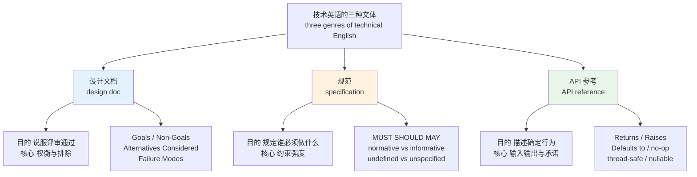
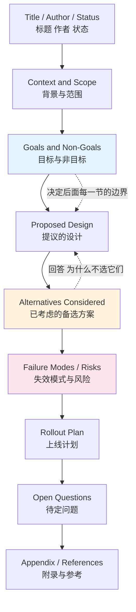
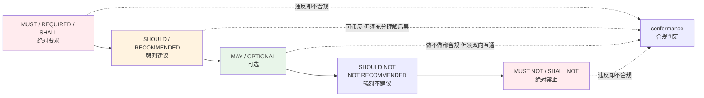
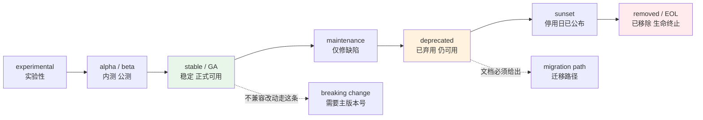
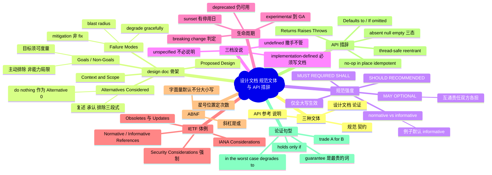

# IT 深度英语（中）：设计文档、规范文体与 API 措辞

> [!info] 本篇定位
>
> 第二十章 IT 三篇的中篇。上篇 [[20.专业领域词汇/01.IT 深度英语（上）：核心概念术语与其读音\|IT 深度英语（上）：核心概念术语与其读音]] 处理的是**概念名词**——`closure`、`race condition`、`transaction` 各是什么；[[20.专业领域词汇/02.计算机语境的熟词新义：日常词的技术义项地图\|计算机语境的熟词新义：日常词的技术义项地图]] 处理的是**熟词的技术义项**——`spawn`、`flush`、`stale` 为什么会变成那个意思。
>
> 本篇处理的是第三样东西：**文体**。同样一批词，写进 design doc、写进 RFC 规范、写进 API 参考页，措辞是三套固定模板。读不懂模板，你会把 `SHOULD` 当成建议、把 `implementation-defined` 当成 bug、把 `Defaults to null` 当成没写完。
>
> 三条主线：设计文档的小节骨架与论证措辞、规范文体的强度阶梯与约束力边界、API 文档的签名行措辞。分布式系统的论证词只以**句型**形式出现，不做词条释义——那类词的词义在上篇已经给过，这里要的是它们怎么组进一句有约束力的话。
>
> 学术论证词的通用层见 [[19.学术通用词汇/01.学术通用词表 AWL（上）：论证与关系\|学术通用词表 AWL（上）：论证与关系]]，情态动词的可能性梯度见 [[02.功能词与封闭词类速查/06.连词、情态动词、助动词与感叹词速查\|连词、情态动词、助动词与感叹词速查]]，本篇不重讲，只补技术文体里被**重新定义过**的那部分。

---

## 1. 本篇导读：三种文体，三套读法

技术英语不是一种文体。同一个程序员一天里要读的三类文本，措辞规则彼此不通用：

**设计文档**（design doc / RFC in the internal sense）是**论证文本**。作者要说服一屋子人接受一个方案，所以它的核心措辞是权衡、取舍、排除。判断一份 design doc 写得好不好，看的是 Non-Goals 和 Alternatives Considered 这两节是不是实的。

**规范**（specification / standard）是**契约文本**。它不说服任何人，只规定谁必须做什么、做不到算不算违规。核心措辞是 `MUST`、`SHOULD`、`MAY` 这套被显式定义过的关键词，以及 normative 与 informative 的分区。

**API 参考页**（API reference）是**说明文本**。它描述一个函数在各种输入下的确定行为。核心措辞是签名行的固定动词——`Returns`、`Raises`、`Defaults to`——和承诺词 `thread-safe`、`in place`、`idempotent`。



上图三条支线的差别不在词汇量，而在**同一个词的效力**。`should` 在设计文档里是普通建议，在 RFC 里是有定义的规范强度；`may` 在日常英语里表示可能性，在规范里表示「允许但不要求」；`optional` 在 API 页里指参数可省略，在规范里是 `MAY` 的同义标签。读技术英语最容易翻车的地方，就是把日常义带进规范文本。

### 1.1 为什么模板值得单独背

技术写作的模板化程度远高于一般英语写作。design doc 的小节名在各家公开出来的模板里高度重合；RFC 的小节顺序由 RFC 7322（RFC Style Guide）规定；Python 的 docstring 有 PEP 257 与 numpydoc、Google style 三套通行体例，Java 有 Javadoc 的 `@param`/`@return`/`@throws` 三个标签，Rust 有 `# Panics`/`# Safety`/`# Examples` 的固定标题。

模板化的直接后果是：**这些文本可以按小节名跳读**。你不需要逐句读一份三十页的 design doc，只要能准确判断 Non-Goals 一节说的是「不打算做」而不是「做不到」，就能在两分钟内定位这份文档跟你有没有关系。背下模板等于给自己装了一套索引。

---

## 2. Design doc 的骨架

### 2.1 标准小节序列

一份公司内部 design doc 的小节名不完全统一，但下面这套序列覆盖了绝大多数模板，读到变体也能对上号：



上图里被标色的三节是评审真正会盯的地方。Context 与 Proposed Design 大多数人写得出来，Non-Goals、Alternatives Considered、Failure Modes 三节写不写得实，直接决定这份文档的可信度——它们分别回答「你划的边界在哪」「你排除了什么」「什么情况下你的方案会垮」。虚线表示 Goals 一节实际上是全文的约束源：后面每一节的内容都必须落在 Goals 划出的范围内，Alternatives Considered 一节的评判标准也来自它。

### 2.2 小节名与状态标记词表

| 英文 | 英式音标 | 美式音标 | 词性 | 中文 | 搭配与说明 |
| --- | --- | --- | --- | --- | --- |
| **design doc** | /dɪˈzaɪn dɒk/ | /dɪˈzaɪn dɑːk/ | n. | 设计文档 | `doc` 是 document 的截短，技术圈里几乎不写全称；`write up a design doc`、`circulate the doc for review` |
| **one-pager** | /ˌwʌn ˈpeɪdʒə/ | /ˌwʌn ˈpeɪdʒər/ | n. | 一页纸方案 | 比 design doc 短一档的体裁，用于早期对齐方向 |
| **context** | /ˈkɒntekst/ | /ˈkɑːntekst/ | n. | 背景 | 小节名常写 `Context and Scope`；不要用 `Background` 以外的第三种叫法混着写 |
| **scope** | /skəʊp/ | /skoʊp/ | n./v. | 范围；界定范围 | `in scope` 在范围内、`out of scope` 不在范围内、`scope creep` 范围蔓延 |
| **objective** | /əbˈdʒektɪv/ | /əbˈdʒektɪv/ | n. | 目标 | 比 `goal` 正式；`the primary objective of this proposal` |
| **proposal** | /prəˈpəʊzl/ | /prəˈpoʊzl/ | n. | 提案 | 小节名 `Proposed Design`；作者自称 `we propose`，不写 `I think` |
| **status** | /ˈsteɪtəs/ | /ˈstætəs/ | n. | 状态 | 美式两读并存，/ˈstætəs/ 是美国独有的那一读；文档头常见 `Status: Draft / Under Review / Approved / Superseded` |
| **draft** | /drɑːft/ | /dræft/ | n./adj. | 草稿；草案的 | 英美 a 音差异；`this doc is still in draft`，`a draft proposal` |
| **under review** | /ˌʌndə rɪˈvjuː/ | /ˌʌndər rɪˈvjuː/ | phr. | 评审中 | 文档头的状态行固定写 `Under Review`；口头说 `in review`，同一份文档里别两种混用 |
| **approved** | /əˈpruːvd/ | /əˈpruːvd/ | adj. | 已批准 | 对应动词 `sign off on`：`three reviewers signed off` |
| **superseded** | /ˌsuːpəˈsiːdɪd/ | /ˌsuːpərˈsiːdɪd/ | adj. | 已被取代 | 文档被新版取代时的状态；注意拼写是 `-sede` 不是 `-cede` |
| **rationale** | /ˌræʃəˈnɑːl/ | /ˌræʃəˈnæl/ | n. | 理据 | 不可数居多；`the rationale behind this choice`，比 `reason` 正式且更强调推理链 |
| **premise** | /ˈpremɪs/ | /ˈpremɪs/ | n. | 前提 | `this design rests on the premise that ...`；复数 `premises` 另有「场所」义 |
| **assumption** | /əˈsʌmpʃn/ | /əˈsʌmpʃn/ | n. | 假设 | `we assume`、`this assumption breaks down when ...` |
| **constraint** | /kənˈstreɪnt/ | /kənˈstreɪnt/ | n. | 约束条件 | `hard constraint` 硬约束、`under the constraint that ...` |
| **trade-off** | /ˈtreɪd ɒf/ | /ˈtreɪd ɔːf/ | n. | 取舍 | 技术写作的核心名词；`there is a trade-off between latency and cost` |
| **stakeholder** | /ˈsteɪkhəʊldə/ | /ˈsteɪkhoʊldər/ | n. | 利益相关方 | `loop in the relevant stakeholders`；管理层面的用法见 20.06 |
| **prior art** | /ˌpraɪər ˈɑːt/ | /ˌpraɪər ˈɑːrt/ | n. | 已有方案 | 从专利术语借来；`survey the prior art before proposing anything new` |
| **milestone** | /ˈmaɪlstəʊn/ | /ˈmaɪlstoʊn/ | n. | 里程碑 | `hit a milestone`、`slip a milestone`；项目管理层面的用法见 20.06 |
| **appendix** | /əˈpendɪks/ | /əˈpendɪks/ | n. | 附录 | 复数两式：`appendices`（正式文档常用）与 `appendixes` |
| **open question** | /ˌəʊpən ˈkwestʃən/ | /ˌoʊpən ˈkwestʃən/ | n. | 待定问题 | 小节名；不写 `unsolved problem`，那是研究文体 |
| **future work** | /ˌfjuːtʃə ˈwɜːk/ | /ˌfjuːtʃər ˈwɜːrk/ | n. | 后续工作 | 与 Non-Goals 的差别：Non-Goals 是明确不做，Future Work 是以后可能做 |

`Status` 一行的元音值得单独记：英式只有 /ˈsteɪtəs/ 一读，第一个音节是长的 /eɪ/；美式两读并存，/ˈstætəs/ 的短 /æ/ 是英国听不到的那一种。开视频会议听到两种读音不要以为对方读错了。`draft` 同理，英式 /drɑːft/ 的长 a 与美式 /dræft/ 的短 a 是同一批词（`ask`、`path`、`class`）的系统性差异。

---

## 3. Goals and Non-Goals：本篇最该背下的一节

### 3.1 Non-Goals 不是「做不到」

中文母语者写这一节最高频的偏差，是把 Non-Goals 写成「本方案的局限」。两者完全不同：

> - ❌ ~~Non-Goal: The system cannot handle more than 10k QPS.~~（这是能力上限，属于 Limitations）
> - ✅ **Non-Goal: Scaling beyond 10k QPS. The current traffic peaks at 3k QPS; we will revisit if that changes.**（这是范围声明）

Non-Goals 声明的是**我们主动决定这一轮不做**，通常还要附一句为什么现在不做。它的作用是提前挡掉评审时「那 X 呢」的追问，让讨论不发散。英文里这层「主动排除」的意味靠几个固定动词承载：`out of scope`、`deliberately excluded`、`explicitly not addressed`、`deferred to a follow-up`。

### 3.2 目标与非目标的措辞表

| 英文 | 英式音标 | 美式音标 | 词性 | 中文 | 搭配与说明 |
| --- | --- | --- | --- | --- | --- |
| **goal** | /ɡəʊl/ | /ɡoʊl/ | n. | 目标 | 小节名固定写 `Goals`，不写 `Aims`；每条以动词原形或名词短语起头 |
| **non-goal** | /ˌnɒn ˈɡəʊl/ | /ˌnɑːn ˈɡoʊl/ | n. | 非目标 | 技术写作专有的复合词，日常英语不用；带连字符，不写 `nongoal` |
| **out of scope** | /ˌaʊt əv ˈskəʊp/ | /ˌaʊt əv ˈskoʊp/ | phr. | 不在范围内 | `X is out of scope for this document`；注意介词是 `for`，不是 `of` |
| **deliberately** | /dɪˈlɪbərətli/ | /dɪˈlɪbərətli/ | adv. | 有意地 | `deliberately excluded`；比 `on purpose` 正式，是这一节的标志副词 |
| **explicitly** | /ɪkˈsplɪsɪtli/ | /ɪkˈsplɪsɪtli/ | adv. | 明确地 | `explicitly not addressed`；反义 `implicitly` |
| **defer** | /dɪˈfɜː/ | /dɪˈfɜːr/ | v. | 推迟 | `defer X to a follow-up`；名词 `deferral`；不是 `differ` |
| **follow-up** | /ˈfɒləʊ ʌp/ | /ˈfɑːloʊ ʌp/ | n./adj. | 后续跟进 | `a follow-up doc`、`filed a follow-up ticket` |
| **punt** | /pʌnt/ | /pʌnt/ | v. | 甩到以后 | 口语度高的 `defer`，评审会上常听到 `let's punt on that for now` |
| **preclude** | /prɪˈkluːd/ | /prɪˈkluːd/ | v. | 排除…的可能 | `this does not preclude adding X later`，写 Non-Goals 时用来留后路 |
| **succeed** | /səkˈsiːd/ | /səkˈsiːd/ | v. | 成功 | 目标常写成可验证条件：`this succeeds if p99 latency drops below 200 ms` |
| **success criteria** | /səkˈses kraɪˈtɪəriə/ | /səkˈses kraɪˈtɪriə/ | n. | 成功标准 | `criteria` 是 `criterion` 的复数，单数误用是高频错 |
| **measurable** | /ˈmeʒərəbl/ | /ˈmeʒərəbl/ | adj. | 可度量的 | `each goal should be measurable`，与含糊的 `improve performance` 对立 |
| **quantify** | /ˈkwɒntɪfaɪ/ | /ˈkwɑːntɪfaɪ/ | v. | 量化 | `quantify the expected savings`；名词 `quantification` |
| **baseline** | /ˈbeɪslaɪn/ | /ˈbeɪslaɪn/ | n. | 基线 | `measured against the current baseline` |
| **incremental** | /ˌɪŋkrəˈmentl/ | /ˌɪŋkrəˈmentl/ | adj. | 增量的 | `an incremental improvement` 通常带轻微贬义，暗示不够根本 |
| **out of the box** | /ˌaʊt əv ðə ˈbɒks/ | /ˌaʊt əv ðə ˈbɑːks/ | phr. | 开箱即用 | `this works out of the box for the common case` |
| **nice to have** | /ˌnaɪs tə ˈhæv/ | /ˌnaɪs tə ˈhæv/ | phr. | 锦上添花 | 与 `must have` 对立，用来给目标排优先级 |
| **table stakes** | /ˈteɪbl steɪks/ | /ˈteɪbl steɪks/ | n. | 入场门槛 | 从扑克借来；`encryption at rest is table stakes now` |

> [!warning] Goals 一节最常见的三种废话
>
> 每条 Goal 都应该能被一个数字或一个二值判断验证。下面三种写法在评审里会被直接打回：
>
> - ❌ ~~Improve the user experience.~~ —— 无法判断是否达成
> - ❌ ~~Make the system more scalable.~~ —— `more` 相对于什么基线没说
> - ❌ ~~Follow best practices.~~ —— 没有内容，纯占位
>
> 改法是把标准写进句子：
>
> - ✅ **Cut p99 read latency from 480 ms to under 200 ms at the current traffic level.**
> - ✅ **Support 5x the current write throughput without adding a second database.**
> - ✅ **Allow a new region to be added by config change only, with no code deploy.**

---

## 4. Alternatives Considered：写「为什么不」的固定句式

这一节的英文有一套非常稳定的三段式：**先复述该方案 → 再承认它的优点 → 最后给出淘汰它的具体理由**。承认优点这一步不能省，省掉会让整节读起来像稻草人论证。

> [!example] 一段完整的 Alternatives Considered 写法
>
> - **Alternative A: Shard by user ID.**
>   - 备选方案 A：按用户 ID 分片。
> - This is the simplest option and requires no changes to the write path.
>   - 这是最简单的方案，写路径完全不用改。
> - However, it does not address the hot-tenant problem: a single large tenant would still land entirely on one shard.
>   - 但它解决不了热租户问题——单个大租户仍然会整个落在一个分片上。
> - We rejected it for that reason, not because of implementation cost.
>   - 我们因此排除了它，理由不是实现成本。

最后一句是关键。明确说出「淘汰理由是 X，不是 Y」能挡掉评审时对方顺着错误理由争论。

### 4.1 论证与排除的措辞表

| 英文 | 英式音标 | 美式音标 | 词性 | 中文 | 搭配与说明 |
| --- | --- | --- | --- | --- | --- |
| **alternative** | /ɔːlˈtɜːnətɪv/ | /ɔːlˈtɜːrnətɪv/ | n. | 备选方案 | 小节名固定 `Alternatives Considered`，注意是过去分词后置 |
| **consider** | /kənˈsɪdə/ | /kənˈsɪdər/ | v. | 考虑 | `we considered and rejected`；被动分词 `considered` 作后置定语 |
| **evaluate** | /ɪˈvæljueɪt/ | /ɪˈvæljueɪt/ | v. | 评估 | `we evaluated three options against the goals above` |
| **rule out** | /ˌruːl ˈaʊt/ | /ˌruːl ˈaʊt/ | v. | 排除 | `we ruled this out early`；比 `reject` 语气轻，暗示很快就否掉了 |
| **reject** | /rɪˈdʒekt/ | /rɪˈdʒekt/ | v. | 否决 | 名词重音前移：`a reject` /ˈriːdʒekt/ |
| **discard** | /dɪˈskɑːd/ | /dɪˈskɑːrd/ | v. | 弃用 | 对方案用 `discard` 略生硬，更常用于数据：`discard the buffer` |
| **outweigh** | /ˌaʊtˈweɪ/ | /ˌaʊtˈweɪ/ | v. | 重于 | `the operational cost outweighs the latency gain`，比较类论证的主力动词 |
| **at the cost of** | /ət ðə ˈkɒst əv/ | /ət ðə ˈkɔːst əv/ | phr. | 以…为代价 | `buys correctness at the cost of throughput` |
| **in exchange for** | /ɪn ɪksˈtʃeɪndʒ fə/ | /ɪn ɪksˈtʃeɪndʒ fər/ | phr. | 换取 | 与 `at the cost of` 方向相反，强调得到的一侧 |
| **on balance** | /ɒn ˈbæləns/ | /ɑːn ˈbæləns/ | phr. | 综合权衡 | `on balance we prefer option B`，用于给出结论 |
| **prohibitive** | /prəˈhɪbətɪv/ | /prəˈhɪbətɪv/ | adj. | 高到不可接受的 | `the migration cost is prohibitive`，专门修饰成本与代价 |
| **marginal** | /ˈmɑːdʒɪnl/ | /ˈmɑːrdʒɪnl/ | adj. | 边际的；微小的 | `a marginal gain` 收益极小，是排除方案的常用理由 |
| **feasible** | /ˈfiːzəbl/ | /ˈfiːzəbl/ | adj. | 可行的 | 名词 `feasibility`；`technically feasible but operationally painful` |
| **viable** | /ˈvaɪəbl/ | /ˈvaɪəbl/ | adj. | 站得住的 | 比 `feasible` 多一层「值得做」；`the only viable option under the deadline` |
| **orthogonal** | /ɔːˈθɒɡənl/ | /ɔːrˈθɑːɡənl/ | adj. | 正交的；不相干的 | 评审高频词：`that concern is orthogonal to this proposal` |
| **strawman** | /ˈstrɔːmæn/ | /ˈstrɔːmæn/ | n. | 靶子方案 | 技术圈里是中性词，指故意写来供人推翻的初稿方案 |
| **do nothing** | /ˌduː ˈnʌθɪŋ/ | /ˌduː ˈnʌθɪŋ/ | phr. | 什么都不做 | 正式模板常把它列为 `Alternative 0`，用来量化不动的代价 |
| **status quo** | /ˌsteɪtəs ˈkwəʊ/ | /ˌstætəs ˈkwoʊ/ | n. | 现状 | 拉丁借词，作名词用时几乎总带 the：`the status quo is not free`；作定语才裸用，如 `status quo bias` |
| **greenfield** | /ˈɡriːnfiːld/ | /ˈɡriːnfiːld/ | adj. | 全新起步的 | `a greenfield rewrite` 从零重写，与 `brownfield` 在存量上改造对立 |
| **lift and shift** | /ˌlɪft ənd ˈʃɪft/ | /ˌlɪft ənd ˈʃɪft/ | phr. | 原样搬迁 | 迁移方案的固定叫法，不改架构只换环境 |

---

## 5. Failure Modes：写清楚什么时候会垮

### 5.1 三个问题决定这一节的质量

写 Failure Modes 不是罗列可能的 bug，而是回答三个固定问题：**什么会失败**（failure mode）、**失败时影响多大**（blast radius）、**怎么恢复**（mitigation / recovery）。三样缺一样，这一节就是摆设。

| 英文 | 英式音标 | 美式音标 | 词性 | 中文 | 搭配与说明 |
| --- | --- | --- | --- | --- | --- |
| **failure mode** | /ˈfeɪljə məʊd/ | /ˈfeɪljər moʊd/ | n. | 失效模式 | 从可靠性工程借来；`enumerate the failure modes` |
| **blast radius** | /ˈblɑːst ˌreɪdiəs/ | /ˈblæst ˌreɪdiəs/ | n. | 影响半径 | 军事隐喻；`keep the blast radius to one region`。词源分组见 20.02 |
| **degrade** | /dɪˈɡreɪd/ | /dɪˈɡreɪd/ | v. | 降级 | `degrade gracefully` 优雅降级是固定搭配，不写 `degrade nicely` |
| **graceful** | /ˈɡreɪsfl/ | /ˈɡreɪsfl/ | adj. | 从容有序的 | 技术义特指「不崩、有序收尾」，中文固定译作「优雅关闭」：`graceful shutdown`、`graceful restart` |
| **mitigation** | /ˌmɪtɪˈɡeɪʃn/ | /ˌmɪtɪˈɡeɪʃn/ | n. | 缓解措施 | 动词 `mitigate`；与 `fix` 的差别是它只压住影响不消除成因 |
| **remediation** | /rɪˌmiːdiˈeɪʃn/ | /rɪˌmiːdiˈeɪʃn/ | n. | 补救 | 比 `mitigation` 更彻底，常出现在安全与合规语境 |
| **contingency** | /kənˈtɪndʒənsi/ | /kənˈtɪndʒənsi/ | n. | 应急预案 | `a contingency plan`；形容词 `contingent on` 取决于 |
| **fallback** | /ˈfɔːlbæk/ | /ˈfɔːlbæk/ | n./adj. | 兜底方案 | 名词写一个词，动词短语写两个词：`fall back to the cache` |
| **rollback** | /ˈrəʊlbæk/ | /ˈroʊlbæk/ | n. | 回滚 | 同样的分写规则：`roll back the deploy`；数据库义指事务回滚 |
| **regression** | /rɪˈɡreʃn/ | /rɪˈɡreʃn/ | n. | 回归缺陷 | 指原来好用的东西被改坏；`a performance regression`。统计义见 19.03 |
| **cascading failure** | /kæˈskeɪdɪŋ ˈfeɪljə/ | /kæˈskeɪdɪŋ ˈfeɪljər/ | n. | 级联故障 | `a cascading failure across services` |
| **single point of failure** | /ˌsɪŋɡl pɔɪnt əv ˈfeɪljə/ | /ˌsɪŋɡl pɔɪnt əv ˈfeɪljər/ | n. | 单点故障 | 缩写 SPOF，口语读 /spɒf/ 或逐字母，读法详见下一篇 |
| **data loss** | /ˈdeɪtə lɒs/ | /ˈdeɪtə lɔːs/ | n. | 数据丢失 | 不可数；`risk of data loss`，不说 `a data loss` |
| **corruption** | /kəˈrʌpʃn/ | /kəˈrʌpʃn/ | n. | 损坏 | `silent data corruption` 静默数据损坏，形容词 `corrupt`（也作动词） |
| **inconsistency** | /ˌɪnkənˈsɪstənsi/ | /ˌɪnkənˈsɪstənsi/ | n. | 不一致 | 可数；`transient inconsistencies are acceptable here` |
| **transient** | /ˈtrænziənt/ | /ˈtrænʃənt/ | adj. | 瞬时的 | 英式三音节，美式常并成两音节；`a transient error` 可重试的错误 |
| **partial failure** | /ˌpɑːʃl ˈfeɪljə/ | /ˌpɑːrʃl ˈfeɪljər/ | n. | 部分失败 | 分布式系统的核心难点表述 |
| **stale** | /steɪl/ | /steɪl/ | adj. | 过期的 | `readers may see stale data for up to 5 s`。义项来源见 20.02 |
| **thundering herd** | /ˈθʌndərɪŋ hɜːd/ | /ˈθʌndərɪŋ hɜːrd/ | n. | 惊群 | 缓存失效后请求同时打到后端的现象 |
| **backpressure** | /ˈbækpreʃə/ | /ˈbækpreʃər/ | n. | 背压 | 不可数；`apply backpressure to the producer` |
| **saturate** | /ˈsætʃəreɪt/ | /ˈsætʃəreɪt/ | v. | 打满 | `the link saturates at 900 Mbps`；名词 `saturation` |
| **starve** | /stɑːv/ | /stɑːrv/ | v. | 饿死 | `low-priority jobs get starved`；名词 `starvation`。词源见 20.02 |
| **exhaust** | /ɪɡˈzɔːst/ | /ɪɡˈzɔːst/ | v. | 耗尽 | `connection pool exhaustion` 是固定搭配 |
| **recover** | /rɪˈkʌvə/ | /rɪˈkʌvər/ | v. | 恢复 | `recover from a crash`；名词 `recovery`，注意介词是 `from` |

> [!tip] `mitigate` 与 `fix` 别混着写
>
> 在事故文档与设计文档里这两个词的区别是有后果的：`mitigate` 表示已经压住了影响但根因还在，`fix` 表示根因已经消除。
>
> 写 `we mitigated the issue by scaling up the pool` 的意思是问题还在，只是现在不触发；写 `we fixed the leak` 的意思是不会再发生。把 mitigation 写成 fix，下次同类事故复盘时会被翻出来。中间还有一档 `workaround`（绕过办法），语气比 mitigation 更临时。

---

## 6. RFC 2119：五档强度的关键词阶梯

### 6.1 定义在哪里

规范文体与设计文档最大的区别，是它把几个日常情态词**重新定义**了。这套定义出自 RFC 2119（Key words for use in RFCs to Indicate Requirement Levels，1997 年由 Scott Bradner 发布），后来被 RFC 8174（2017）打了一个补丁。任何一份引用了它的规范，里面的 `MUST` 就不再是普通英语的「必须」，而是一个有定义的合规等级。



上图的箭头顺序不是「从强到弱」的单线，而是两端强中间弱：`MUST` 与 `MUST NOT` 都是硬性的，只是方向相反；`SHOULD` 与 `SHOULD NOT` 同理；`MAY` 落在正中间，两个方向都不施加压力。读规范时先在心里给每个大写词定位到这条轴上，判断这句话对你的实现有没有强制力。

### 6.2 十一个关键词的原文含义

| 英文 | 英式音标 | 美式音标 | 词性 | 中文 | 搭配与说明 |
| --- | --- | --- | --- | --- | --- |
| **MUST** | /mʌst/ | /mʌst/ | modal | 必须 | 绝对要求；不满足即 non-conformant。规范里大写以区别于普通 must |
| **REQUIRED** | /rɪˈkwaɪəd/ | /rɪˈkwaɪərd/ | adj. | 必需的 | 与 MUST 同强度，用于修饰字段与参数：`this field is REQUIRED` |
| **SHALL** | /ʃæl/ | /ʃæl/ | modal | 应当（强制） | 与 MUST 同强度，法律与 ISO 标准文体偏爱它。日常英语的 shall 见 02.06 |
| **MUST NOT** | /ˈmʌst nɒt/ | /ˈmʌst nɑːt/ | modal | 禁止 | 绝对禁止；注意不能缩写成 mustn't，规范文体不用缩写 |
| **SHALL NOT** | /ˈʃæl nɒt/ | /ˈʃæl nɑːt/ | modal | 不得 | 与 MUST NOT 同强度 |
| **SHOULD** | /ʃʊd/ | /ʃʊd/ | modal | 应该 | 有充分理由时可以不做，但必须先完整理解后果再选择偏离 |
| **RECOMMENDED** | /ˌrekəˈmendɪd/ | /ˌrekəˈmendɪd/ | adj. | 推荐的 | 与 SHOULD 同强度 |
| **SHOULD NOT** | /ˈʃʊd nɒt/ | /ˈʃʊd nɑːt/ | modal | 不应该 | 有充分理由时可以做，同样要求先理解后果 |
| **NOT RECOMMENDED** | /ˌnɒt ˌrekəˈmendɪd/ | /ˌnɑːt ˌrekəˈmendɪd/ | adj. | 不推荐 | 与 SHOULD NOT 同强度 |
| **MAY** | /meɪ/ | /meɪ/ | modal | 可以 | 真正可选；做与不做都合规 |
| **OPTIONAL** | /ˈɒpʃənl/ | /ˈɑːpʃənl/ | adj. | 可选的 | 与 MAY 同强度；`an OPTIONAL header field` |

> [!warning] `MAY` 藏着一条对双方的隐性要求
>
> RFC 2119 对 `MAY` 的说明里有一句最容易被跳过：一个实现选择实现某个可选功能时，**必须**准备好与不实现它的对端互通；反过来，选择不实现的一方也**必须**准备好与实现了它的对端互通。
>
> 换句话说 `MAY` 不是「随便你」，而是「随便你，但互通性责任双方各担一半」。读到 `MAY` 就要顺手问一句：对端不这么做的时候，我这边会不会挂。

### 6.3 大写约定与 RFC 8174 的补丁

RFC 2119 原文没有明说这些关键词必须大写才生效，结果二十年里出现大量歧义：一份规范里的小写 `must` 到底是规范强度还是普通英语的表述？

RFC 8174 补上了这条规则：**只有全大写时才承载 RFC 2119 定义的强度**，小写形式按普通英语理解。现在的规范在开头引用这两份文档的标准句式是：

> [!example] 规范开头的标准声明段
>
> - The key words "MUST", "MUST NOT", "REQUIRED", "SHALL", "SHALL NOT", "SHOULD", "SHOULD NOT", "RECOMMENDED", "NOT RECOMMENDED", "MAY", and "OPTIONAL" in this document are to be interpreted as described in BCP 14 [RFC2119] [RFC8174] when, and only when, they appear in all capitals, as shown here.
>   - 本文档中的关键词 MUST、MUST NOT 等，当且仅当以全大写形式出现时，按 BCP 14 所述解释。

`when, and only when, they appear in all capitals` 这半句就是 RFC 8174 加的。读到一份规范开头没有这段声明，里面的 `must` 就只是普通英语，没有合规判定效力。

### 6.4 中文母语者的四类误用

> [!warning] 四种翻车写法
>
> **一、把 SHOULD 当建议。** `SHOULD` 的默认立场是「照做」，偏离需要理由并且要写进文档。中文里「应该」语气很软，直接对译会低估强度。
>
> - ❌ ~~理解成：这条随便看看，做不做都行~~
> - ✅ **理解成：默认必须做，不做要能说出为什么以及后果是什么**
>
> **二、把 MAY 当成 might。** 规范里的 `MAY` 是许可（permission），不是可能性（possibility）。写 `The server MAY reject the request` 意思是「允许服务端拒绝」，不是「服务端可能会拒绝」。
>
> **三、在同一份文档里混用大小写。** 一句 `The client must retry` 与一句 `The client MUST retry` 放在一起，读者无法判断前者是不是笔误。要么全篇遵守大写约定，要么开头声明不使用 RFC 2119。
>
> **四、用 `have to` / `need to` 替换 MUST。** 这两个短语在规范文体里没有定义，读者无法映射到合规等级。规范里的强度词只能从那十一个里选。

---

## 7. normative 与 informative：哪句话有约束力

一份规范里并不是每句话都有强制力。规范文体用一对形容词划这条线：**normative**（规范性的，构成合规判定依据）与 **informative**（资料性的，只帮助理解，不构成要求）。

| 英文 | 英式音标 | 美式音标 | 词性 | 中文 | 搭配与说明 |
| --- | --- | --- | --- | --- | --- |
| **normative** | /ˈnɔːmətɪv/ | /ˈnɔːrmətɪv/ | adj. | 规范性的 | `a normative reference`、`this section is normative` |
| **informative** | /ɪnˈfɔːmətɪv/ | /ɪnˈfɔːrmətɪv/ | adj. | 资料性的 | 与 normative 对立；ISO 体系里也叫 `non-normative` |
| **non-normative** | /ˌnɒn ˈnɔːmətɪv/ | /ˌnɑːn ˈnɔːrmətɪv/ | adj. | 非规范性的 | W3C 规范偏爱这个说法，与 informative 同义 |
| **conformance** | /kənˈfɔːməns/ | /kənˈfɔːrməns/ | n. | 符合性 | `a conformance test suite`；ISO 体系用的是同源的 `conformity assessment` 合格评定，两者是不同的词，不是英美拼写差异 |
| **conformant** | /kənˈfɔːmənt/ | /kənˈfɔːrmənt/ | adj. | 合规的 | `a conformant implementation`；反义 `non-conformant` |
| **compliance** | /kəmˈplaɪəns/ | /kəmˈplaɪəns/ | n. | 合规 | 更常用于法规与安全审计语境，见 20.05 |
| **implementation** | /ˌɪmplɪmenˈteɪʃn/ | /ˌɪmplɪmenˈteɪʃn/ | n. | 实现 | 规范里指某个具体产品：`implementations MUST support ...` |
| **implementer** | /ˈɪmplɪmentə/ | /ˈɪmplɪmentər/ | n. | 实现者 | 两种拼法都通行：`implementer` 与 `implementor` |
| **interoperability** | /ˌɪntərˌɒpərəˈbɪləti/ | /ˌɪntərˌɑːpərəˈbɪləti/ | n. | 互操作性 | 常缩写 interop；`interoperability testing` |
| **profile** | /ˈprəʊfaɪl/ | /ˈproʊfaɪl/ | n. | 子集规范 | 规范义指从大规范里挑一部分并加严：`a conformance profile` |
| **prescribe** | /prɪˈskraɪb/ | /prɪˈskraɪb/ | v. | 规定 | `the spec prescribes the wire format`；与 `describe` 对立 |
| **stipulate** | /ˈstɪpjuleɪt/ | /ˈstɪpjuleɪt/ | v. | 明确规定 | 偏法律文体；`the standard stipulates a 30-second timeout` |
| **mandate** | /ˈmændeɪt/ | /ˈmændeɪt/ | v./n. | 强制要求 | 形容词 `mandatory`；`TLS 1.2 is mandatory to implement` |
| **mandatory to implement** | — | — | phr. | 必须实现 | IETF 固定说法，缩写 MTI，指最低互通基线 |
| **waive** | /weɪv/ | /weɪv/ | v. | 豁免 | `this requirement may be waived for legacy clients` |
| **at the discretion of** | /ət ðə dɪˈskreʃn əv/ | /ət ðə dɪˈskreʃn əv/ | phr. | 由…自行决定 | 相当于把选择权交给实现方，等价于一条 MAY |
| **unambiguous** | /ˌʌnæmˈbɪɡjuəs/ | /ˌʌnæmˈbɪɡjuəs/ | adj. | 无歧义的 | 规范写作的第一追求；名词 `ambiguity` |
| **exhaustive** | /ɪɡˈzɔːstɪv/ | /ɪɡˈzɔːstɪv/ | adj. | 穷尽的 | `an exhaustive list of error codes`；`non-exhaustive` 表示以后可能加 |
| **enumerate** | /ɪˈnjuːməreɪt/ | /ɪˈnuːməreɪt/ | v. | 逐一列出 | `the values are enumerated in Section 5` |
| **verbatim** | /vɜːˈbeɪtɪm/ | /vɜːrˈbeɪtɪm/ | adv./adj. | 逐字地 | `copied verbatim from the header`，拉丁借词 |

判断一句话是不是 normative，有两个可靠信号：**它含不含大写关键词**，以及**它所在的小节有没有被标为 informative**。规范里的例子（Examples）、背景（Rationale）、附录（Appendices）默认都是 informative——例子跟正文冲突时，正文赢。

> [!warning] 例子和正文打架时不要信例子
>
> 规范里的示例代码和示例报文经常有笔误，而且勘误修正往往慢半拍。W3C 与 IETF 的规范通常会在文档开头声明「所有示例均为 informative」。真正遇到不一致，按正文的 normative 描述实现，然后去查 errata。

---

## 8. 「没说」的三个档位

规范里有大量「此处不作规定」的情况，但英文用三个不同的词区分了三种「不规定」。混起来读会造成严重误判——尤其在 C 与 C++ 标准里，这三个词的区分直接决定你的代码是不是有未定义行为。

| 英文 | 英式音标 | 美式音标 | 词性 | 中文 | 搭配与说明 |
| --- | --- | --- | --- | --- | --- |
| **undefined behaviour** | /ˌʌndɪˈfaɪnd bɪˈheɪvjə/ | /ˌʌndɪˈfaɪnd bɪˈheɪvjər/ | n. | 未定义行为 | 标准对此不加任何要求，程序整体失去意义；美式拼 behavior |
| **unspecified** | /ˌʌnˈspesɪfaɪd/ | /ˌʌnˈspesɪfaɪd/ | adj. | 未指定的 | 标准给出若干合法选项但不说选哪个，实现也不必说明 |
| **implementation-defined** | /ˌɪmplɪmenˈteɪʃn dɪˌfaɪnd/ | /ˌɪmplɪmenˈteɪʃn dɪˌfaɪnd/ | adj. | 由实现定义的 | 与 unspecified 的差别只有一条：实现**必须写进文档** |
| **locale-specific** | /ləʊˈkɑːl spəˈsɪfɪk/ | /loʊˈkæl spəˈsɪfɪk/ | adj. | 依赖区域设置的 | C 标准的第四类，行为取决于当前 locale |
| **reserved** | /rɪˈzɜːvd/ | /rɪˈzɜːrvd/ | adj. | 保留的 | `reserved for future use`，缩写 RFU；现在必须填 0 或原样透传 |
| **must be ignored** | — | — | phr. | 必须忽略 | 保留字段的常见处理要求，与 `must be zero` 相对 |
| **nondeterministic** | /ˌnɒndɪˌtɜːmɪˈnɪstɪk/ | /ˌnɑːndɪˌtɜːrmɪˈnɪstɪk/ | adj. | 不确定的 | 指同一输入可能产出不同结果，不等于 undefined |
| **arbitrary** | /ˈɑːbɪtrəri/ | /ˈɑːrbɪˌtreri/ | adj. | 任意的 | `an arbitrary but valid value`；美式后半段带次重音，英式那里弱读成 /rə/ |
| **portable** | /ˈpɔːtəbl/ | /ˈpɔːrtəbl/ | adj. | 可移植的 | 名词 `portability`；依赖 unspecified 行为的代码就不可移植 |
| **strictly conforming** | /ˌstrɪktli kənˈfɔːmɪŋ/ | /ˌstrɪktli kənˈfɔːrmɪŋ/ | adj. | 严格符合的 | C 标准术语，指不依赖任何 unspecified 或 implementation-defined 行为 |
| **latitude** | /ˈlætɪtjuːd/ | /ˈlætɪtuːd/ | n. | 自由裁量空间 | `the spec gives implementations some latitude here`。地理义见 05.03 |
| **diagnose** | /ˈdaɪəɡnəʊz/ | /ˌdaɪəɡˈnoʊs/ | v. | 诊断报错 | `no diagnostic is required` 是标准里的固定免责说法 |
| **trap** | /træp/ | /træp/ | v./n. | 陷入；陷阱表示 | `a trap representation` 指读取即触发未定义行为的位模式 |
| **abort** | /əˈbɔːt/ | /əˈbɔːrt/ | v. | 中止 | undefined behaviour 的一种合法表现就是 `abort` |

> [!tip] 三个档位用一句话记住
>
> - `undefined` —— **标准撒手不管**。编译器可以做任何事，包括把你整段代码优化掉。有符号整数溢出、解引用空指针属于这一档。
> - `unspecified` —— **标准给了菜单，但不说点哪道，也不用告诉你点了哪道**。函数实参的求值顺序属于这一档。
> - `implementation-defined` —— **标准给了菜单，不说点哪道，但实现必须把自己点的那道写进文档**。`int` 占几个字节、右移负数怎么补位属于这一档。
>
> 判断句：能不能靠？`undefined` 永远不能靠；`unspecified` 不能靠，因为同一个编译器不同版本甚至不同优化等级都可能变；`implementation-defined` 在锁定平台后可以靠，但代价是代码不再可移植。

---

## 9. 生命周期措辞：从 experimental 到 removed

一个 API 从诞生到消失，英文有一条固定的状态链。设计文档写迁移方案、规范写版本策略、release notes 写变更说明，用的都是这条链上的词。



上图这条链最容易被中文母语者读错的是 `deprecated` 那一格：**deprecated 不等于不能用**。它的准确含义是「仍然能用，但已经不推荐，将来会被移除，请开始迁移」。把 deprecation warning 当成错误去慌，或者反过来当成噪音忽略掉，都是误读。虚线标出的两条支线是这条链上最常引发争论的地方：什么算 breaking change，以及弃用时有没有责任提供迁移路径。

### 9.1 生命周期词表

| 英文 | 英式音标 | 美式音标 | 词性 | 中文 | 搭配与说明 |
| --- | --- | --- | --- | --- | --- |
| **experimental** | /ɪkˌsperɪˈmentl/ | /ɪkˌsperɪˈmentl/ | adj. | 实验性的 | `an experimental API may change without notice` |
| **alpha** | /ˈælfə/ | /ˈælfə/ | n./adj. | 内测版 | `in alpha`；不加冠词的用法更常见 |
| **beta** | /ˈbiːtə/ | /ˈbeɪtə/ | n./adj. | 公测版 | 英美读音差异大：英式 /ˈbiːtə/，美式 /ˈbeɪtə/ |
| **general availability** | /ˌdʒenrəl əˌveɪləˈbɪləti/ | /ˌdʒenrəl əˌveɪləˈbɪləti/ | n. | 正式可用 | 缩写 GA，逐字母读；`reach GA`、`GA release` |
| **stable** | /ˈsteɪbl/ | /ˈsteɪbl/ | adj. | 稳定的 | 承诺义：稳定分支上不会有 breaking change |
| **long-term support** | /ˌlɒŋ tɜːm səˈpɔːt/ | /ˌlɔːŋ tɜːrm səˈpɔːrt/ | n. | 长期支持 | 缩写 LTS；`an LTS release is supported for 5 years` |
| **maintenance mode** | /ˈmeɪntənəns məʊd/ | /ˈmeɪntənəns moʊd/ | n. | 维护模式 | 只修缺陷不加功能；注意 `maintenance` 的拼写常写错 |
| **legacy** | /ˈleɡəsi/ | /ˈleɡəsi/ | adj./n. | 遗留的 | 技术语境里偏贬义：`a legacy endpoint we cannot kill yet` |
| **deprecate** | /ˈdeprəkeɪt/ | /ˈdeprəkeɪt/ | v. | 弃用 | 过去分词 `deprecated` 用得最多；名词 `deprecation` |
| **deprecation notice** | /ˌdeprəˈkeɪʃn ˈnəʊtɪs/ | /ˌdeprəˈkeɪʃn ˈnoʊtɪs/ | n. | 弃用公告 | `publish a deprecation notice six months in advance` |
| **obsolete** | /ˌɒbsəˈliːt/ | /ˌɑːbsəˈliːt/ | adj./v. | 过时的；使过时 | 比 deprecated 更绝：已经没人该用了。IETF 用 `obsoletes RFC 5246` 表示取代 |
| **supersede** | /ˌsuːpəˈsiːd/ | /ˌsuːpərˈsiːd/ | v. | 取代 | `RFC 8446 supersedes RFC 5246`；拼写陷阱：`-sede` |
| **sunset** | /ˈsʌnset/ | /ˈsʌnset/ | n./v. | 停用；设停用期 | `sunset the v1 API on 2027-01-01`；HTTP 有专门的 `Sunset` 响应头 |
| **end of life** | /ˌend əv ˈlaɪf/ | /ˌend əv ˈlaɪf/ | n. | 生命终止 | 缩写 EOL；`this version reaches EOL next quarter` |
| **retire** | /rɪˈtaɪə/ | /rɪˈtaɪər/ | v. | 退役 | `retire the old cluster`；比 `remove` 温和，暗示有计划 |
| **decommission** | /ˌdiːkəˈmɪʃn/ | /ˌdiːkəˈmɪʃn/ | v. | 下线退役 | 用于基础设施：`decommission the datacentre`；口语缩成 `decom` |
| **phase out** | /ˌfeɪz ˈaʊt/ | /ˌfeɪz ˈaʊt/ | v. | 分阶段淘汰 | `phase out support over three releases` |
| **grandfather** | /ˈɡrænfɑːðə/ | /ˈɡrænfɑːðər/ | v. | 老用户豁免 | `existing tenants are grandfathered in`，新规则不追溯老用户 |
| **migration path** | /maɪˈɡreɪʃn pɑːθ/ | /maɪˈɡreɪʃn pæθ/ | n. | 迁移路径 | 弃用公告的必备内容；`provide a mechanical migration path` |
| **cutover** | /ˈkʌtəʊvə/ | /ˈkʌtoʊvər/ | n. | 切换 | `the cutover window is 02:00–04:00 UTC` |
| **breaking change** | /ˈbreɪkɪŋ tʃeɪndʒ/ | /ˈbreɪkɪŋ tʃeɪndʒ/ | n. | 破坏性变更 | 会让现有调用方失败的改动；同义 `backward-incompatible change` |
| **backward-compatible** | /ˌbækwəd kəmˈpætəbl/ | /ˌbækwərd kəmˈpætəbl/ | adj. | 向后兼容的 | 新版本能处理旧输入；英式也写 `backwards-compatible` |
| **forward-compatible** | /ˌfɔːwəd kəmˈpætəbl/ | /ˌfɔːrwərd kəmˈpætəbl/ | adj. | 向前兼容的 | 旧版本能容忍新输入（通常靠忽略未知字段） |
| **wire compatibility** | /ˈwaɪə kɒmpətəˈbɪləti/ | /ˈwaɪər kɑːmpətəˈbɪləti/ | n. | 协议兼容性 | 与 `source compatibility` 源码兼容、`ABI compatibility` 二进制兼容并列 |
| **semantic versioning** | /sɪˈmæntɪk ˈvɜːʃənɪŋ/ | /sɪˈmæntɪk ˈvɜːrʒənɪŋ/ | n. | 语义化版本 | 缩写 SemVer /ˈsemvɜː(r)/；`MAJOR.MINOR.PATCH` 三段的读法见下一篇 |
| **bump** | /bʌmp/ | /bʌmp/ | v. | 升号 | `bump the major version`，改破坏性接口时的固定说法 |
| **shim** | /ʃɪm/ | /ʃɪm/ | n. | 垫片 | 为兼容旧接口写的薄层代码 |
| **polyfill** | /ˈpɒlifɪl/ | /ˈpɑːlifɪl/ | n. | 补丁实现 | 在旧环境里补出新特性，前端语境高频 |
| **feature freeze** | /ˈfiːtʃə friːz/ | /ˈfiːtʃər friːz/ | n. | 功能冻结 | 发版前只接受修复不接受新功能 |
| **churn** | /tʃɜːn/ | /tʃɜːrn/ | n. | 反复变动 | `API churn` 指接口频繁改动带来的迁移成本 |

> [!warning] 什么算 breaking change，边界比想象的宽
>
> 只改签名才算 breaking 是最常见的误判。下面这些同样是破坏性变更：
>
> - 给返回值加一个字段——如果对端用的是严格模式解析器，会直接报错
> - 收紧输入校验——原本能过的请求现在被拒
> - 改变错误码——依赖具体错误码分支的调用方会走错分支
> - 让原本同步的接口改成异步返回
> - 改变默认值——`Defaults to 30s` 改成 `Defaults to 5s`，行为在调用方没改一行代码的情况下变了
> - 改变排序或时间保证——原本有序的结果现在无序
>
> 判断标准是一句话：**现有的合法调用方会不会因为这个改动而行为改变或失败**。会，就是 breaking change，就得升主版本号。

---

## 10. IETF 小节体例

读 RFC 与读公司 design doc 的最大差别，是 RFC 的结构由 RFC 7322 明文规定，顺序几乎不变。认出这套骨架，你就能直接跳到需要的那一节。

### 10.1 一份 RFC 的固定小节

| 英文 | 英式音标 | 美式音标 | 词性 | 中文 | 搭配与说明 |
| --- | --- | --- | --- | --- | --- |
| **Abstract** | /ˈæbstrækt/ | /ˈæbstrækt/ | n. | 摘要 | 名词重音在前，动词 `abstract` /əbˈstrækt/ 重音在后 |
| **Status of This Memo** | /ˈsteɪtəs əv ðɪs ˈmeməʊ/ | /ˈstætəs əv ðɪs ˈmemoʊ/ | n. | 本备忘录的状态 | 固定小节名；`memo` 是 RFC 对自身的称呼 |
| **boilerplate** | /ˈbɔɪləpleɪt/ | /ˈbɔɪlərpleɪt/ | n. | 样板文字 | 每份 RFC 开头那几段一字不改的法律与状态声明 |
| **Introduction** | /ˌɪntrəˈdʌkʃn/ | /ˌɪntrəˈdʌkʃn/ | n. | 引言 | 编号必为 Section 1 |
| **Terminology** | /ˌtɜːmɪˈnɒlədʒi/ | /ˌtɜːrmɪˈnɑːlədʒi/ | n. | 术语 | 通常是 1.1 或 Section 2，RFC 2119 声明段就放这里 |
| **Security Considerations** | /sɪˈkjʊərəti kənˌsɪdəˈreɪʃnz/ | /sɪˈkjʊrəti kənˌsɪdəˈreɪʃnz/ | n. | 安全性考量 | **每份 RFC 强制要求有这一节**，写 "None" 会被退回 |
| **IANA Considerations** | /aɪˈænə kənˌsɪdəˈreɪʃnz/ | /aɪˈænə kənˌsɪdəˈreɪʃnz/ | n. | IANA 注册事项 | IANA 读作 /aɪˈænə/ 不逐字母；没有注册需求也要写明 "This document has no IANA actions" |
| **registry** | /ˈredʒɪstri/ | /ˈredʒɪstri/ | n. | 注册表 | `create a new registry`；`registration procedure` 注册流程 |
| **codepoint** | /ˈkəʊdpɔɪnt/ | /ˈkoʊdpɔɪnt/ | n. | 码点 | 在注册表里申请的那个具体数值 |
| **Normative References** | — | — | n. | 规范性引用 | 实现本规范**必须**读的那些文档 |
| **Informative References** | — | — | n. | 资料性引用 | 背景阅读，不实现也不影响合规 |
| **Acknowledgements** | /əkˈnɒlɪdʒmənts/ | /əkˈnɑːlɪdʒmənts/ | n. | 致谢 | 英式多一个 e，美式常写 `Acknowledgments` |
| **Appendix A** | /əˈpendɪks eɪ/ | /əˈpendɪks eɪ/ | n. | 附录 A | 附录用字母编号，正文用数字，读作 "Appendix A" |
| **errata** | /eˈrɑːtə/ | /ɪˈrɑːtə/ | n. | 勘误 | 单数 `erratum`；RFC 一经发布不修改，只挂勘误 |
| **obsoletes** | /ˌɒbsəˈliːts/ | /ˌɑːbsəˈliːts/ | v. | 废止 | 文档头的元数据行：`Obsoletes: 5246` |
| **updates** | /ʌpˈdeɪts/ | /ʌpˈdeɪts/ | v. | 更新 | 比 obsoletes 弱：只改一部分，旧文档仍然有效 |
| **Internet-Draft** | /ˈɪntənet drɑːft/ | /ˈɪntərnet dræft/ | n. | 互联网草案 | 缩写 I-D，六个月后自动过期；`draft-ietf-tls-rfc8446bis-01` 式命名 |
| **working group** | /ˈwɜːkɪŋ ɡruːp/ | /ˈwɜːrkɪŋ ɡruːp/ | n. | 工作组 | 缩写 WG；`WG last call` 工作组最后征询 |
| **rough consensus** | /rʌf kənˈsensəs/ | /rʌf kənˈsensəs/ | n. | 粗略共识 | IETF 的决策原则，全称是 rough consensus and running code |
| **Best Current Practice** | — | — | n. | 当前通行做法 | 缩写 BCP，IETF 的一类文档编号，中文也直译作「最佳当前实践」；RFC 2119 属于 BCP 14 |
| **Standards Track** | /ˈstændədz træk/ | /ˈstændərdz træk/ | n. | 标准轨 | 与 Informational、Experimental、Historic 并列的文档类别 |
| **Proposed Standard** | /prəˈpəʊzd ˈstændəd/ | /prəˈpoʊzd ˈstændərd/ | n. | 提议标准 | 标准轨的第一档，现在大多数 RFC 停在这一档 |
| **Historic** | /hɪˈstɒrɪk/ | /hɪˈstɔːrɪk/ | adj. | 历史状态 | 已被取代或废弃的文档类别，不写 `historical` |

> [!tip] RFC 编号读法与检索习惯
>
> `RFC 2119` 口头读 "R F C twenty-one nineteen" 或 "R F C two one one nine" 都通行，四位数字两两分读更常见。写作里引用统一写 `RFC 2119`，中间有空格。
>
> 检索时记住三件事：一是编号不复用，一份 RFC 发布后永不修改；二是修订版会拿到新编号并在头部标 `Obsoletes`；三是文档标题里的 `bis` 是拉丁语「第二次」，`draft-ietf-tls-rfc8446bis` 就是 RFC 8446 的修订草案。

### 10.2 Security Considerations 为什么强制

这一节是 IETF 体例里最有辨识度的设计：**任何 RFC 都必须有 Security Considerations，写不出内容也必须解释为什么没有**。这条规则出自 RFC 3552，理由是历史上大量协议因为把安全当成事后补丁而留下结构性缺陷。

读一份陌生协议规范时，这一节的价值往往超过正文——它会把作者自己知道的攻击面全部列出来，包括那些「本协议不防御」的部分。常见句式是 `This protocol does not protect against X` 和 `Implementations SHOULD ... to mitigate Y`。

---

## 11. ABNF：规范里那段语法怎么读

IETF 规范定义报文格式时用的是 ABNF（Augmented Backus-Naur Form，增强巴科斯范式），定义在 RFC 5234。它常用的核心构造只有五种，认全就能读懂 HTTP、SMTP、URI 这些规范里的语法块。

```text
; 一条规则的形状
rule-name  =  definition ; comment

; 五种构造
concatenation   Rule = Foo Bar          先 Foo 再 Bar
alternation     Rule = Foo / Bar        Foo 或 Bar
optional        Rule = [ Foo ]          Foo 可有可无
repetition      Rule = 3*5Foo           重复 3 到 5 次
grouping        Rule = ( Foo / Bar ) Baz  括号改变结合
```

| 英文 | 英式音标 | 美式音标 | 词性 | 中文 | 搭配与说明 |
| --- | --- | --- | --- | --- | --- |
| **augmented** | /ɔːɡˈmentɪd/ | /ɔːɡˈmentɪd/ | adj. | 增强的 | ABNF 的 A；动词 `augment` 重音同位 |
| **notation** | /nəʊˈteɪʃn/ | /noʊˈteɪʃn/ | n. | 表示法 | `a formal notation for message syntax` |
| **rule name** | /ˈruːl neɪm/ | /ˈruːl neɪm/ | n. | 规则名 | ABNF 里大小写不敏感，`URI` 与 `uri` 是同一条规则 |
| **production** | /prəˈdʌkʃn/ | /prəˈdʌkʃn/ | n. | 产生式 | 与 rule 同义，形式语言学的标准叫法 |
| **terminal** | /ˈtɜːmɪnl/ | /ˈtɜːrmɪnl/ | n./adj. | 终结符 | 不再展开的最小单位；反义 `non-terminal` |
| **literal** | /ˈlɪtərəl/ | /ˈlɪtərəl/ | n./adj. | 字面量 | ABNF 里用双引号写：`"GET"`；**字符串字面量默认大小写不敏感** |
| **case-sensitive** | /ˌkeɪs ˈsensətɪv/ | /ˌkeɪs ˈsensətɪv/ | adj. | 区分大小写的 | RFC 7405 加了 `%s"GET"` 前缀表示区分大小写 |
| **alternation** | /ˌɔːltəˈneɪʃn/ | /ˌɔːltərˈneɪʃn/ | n. | 择一 | 符号是 `/` 不是竖线，这是 ABNF 与 BNF 的显著差别 |
| **concatenation** | /kənˌkætəˈneɪʃn/ | /kənˌkætəˈneɪʃn/ | n. | 连接 | 元素之间用空格分隔即表示顺序连接 |
| **repetition** | /ˌrepəˈtɪʃn/ | /ˌrepəˈtɪʃn/ | n. | 重复 | `<a>*<b>element`；`*` 单独用表示零到无限次 |
| **incremental alternative** | — | — | n. | 增量择一 | `=/` 运算符，在别处给已有规则追加分支 |
| **octet** | /ɒkˈtet/ | /ɑːkˈtet/ | n. | 八位组 | 网络协议里一律说 octet 不说 byte，因为历史上 byte 位宽不固定 |
| **CRLF** | — | — | n. | 回车换行 | 读作 "C R L F" 或 "carriage return line feed"；ABNF 核心规则之一 |
| **SP** | — | — | n. | 空格 | 核心规则；`HTAB` 是水平制表符 |
| **WSP** | — | — | n. | 空白 | white space，等于 SP 或 HTAB；`LWSP` 是可跨行的线性空白 |
| **DIGIT** | /ˈdɪdʒɪt/ | /ˈdɪdʒɪt/ | n. | 数字 | 核心规则 `%x30-39`；`HEXDIG` 是十六进制数字 |
| **ALPHA** | /ˈælfə/ | /ˈælfə/ | n. | 字母 | 核心规则，只覆盖 A–Z 与 a–z |
| **VCHAR** | — | — | n. | 可见字符 | visible character，`%x21-7E` |
| **prose-val** | /ˈprəʊz væl/ | /ˈproʊz væl/ | n. | 散文值 | 用 `<...>` 包起来的自然语言描述，是 ABNF 的逃生舱 |

> [!warning] ABNF 的三个读错点
>
> - **`/` 是「或」不是「除」。** 看到 `method = "GET" / "POST"` 要读成「GET 或 POST」。
> - **字符串字面量默认不区分大小写。** `"GET"` 在原始 ABNF 里能匹配 `get`，这跟大多数人的直觉相反。需要区分时得写 `%s"GET"`。
> - **`*` 的位置决定含义。** `*3DIGIT` 是最多三位，`3*DIGIT` 是至少三位，`3*5DIGIT` 是三到五位，单独一个 `*DIGIT` 是任意位（含零位）。星号在前在后完全不同。

---

## 12. API 参考页：返回与抛出

API 文档的每一行都在回答一个封闭问题，所以它的动词也是封闭的一小套。中文母语者写英文 docstring 最容易出问题的地方在于**时态与人称**：这类句子用一般现在时，主语默认省略，不加 will。

人称有两派，选定一派贯穿全项目即可：Javadoc 官方指南与 Google Python style 用第三人称描述式（`Returns the label.`），PEP 257 要求首行用祈使式（`Return the label.`）。下面统一按第三人称示范，换成祈使式时只需把动词去掉 -s。

> [!example] 一段规范的 docstring 与它的中文对应
>
> - **Returns the number of bytes written. Raises `ValueError` if `size` is negative.**
>   - 返回写入的字节数。若 `size` 为负则抛出 `ValueError`。
> - ❌ ~~This function will return the number of bytes that it has written.~~
>   - 用了 will、加了 that 从句、主语写出来了，三处都不符合体例。

| 英文 | 英式音标 | 美式音标 | 词性 | 中文 | 搭配与说明 |
| --- | --- | --- | --- | --- | --- |
| **signature** | /ˈsɪɡnətʃə/ | /ˈsɪɡnətʃər/ | n. | 函数签名 | `the signature changed in v3`；改签名默认是 breaking change |
| **parameter** | /pəˈræmɪtə/ | /pəˈræmɪtər/ | n. | 形参 | 定义处的那个名字；口语常缩成 `param` |
| **argument** | /ˈɑːɡjumənt/ | /ˈɑːrɡjumənt/ | n. | 实参 | 调用处传进去的值；缩写 `arg`、可变参数 `varargs` |
| **positional** | /pəˈzɪʃənl/ | /pəˈzɪʃənl/ | adj. | 位置的 | `positional argument` 与 `keyword argument` 对立 |
| **variadic** | /ˌveəriˈædɪk/ | /ˌveriˈædɪk/ | adj. | 变长参数的 | `a variadic function takes any number of arguments` |
| **Returns** | /rɪˈtɜːnz/ | /rɪˈtɜːrnz/ | v. | 返回 | Javadoc 与 Google style 用第三人称 `Returns`，PEP 257 那一派要求祈使式 `Return`；两派别在一个项目里混用，但都不写 `It returns` |
| **Raises** | /ˈreɪzɪz/ | /ˈreɪzɪz/ | v. | 抛出（异常） | Python 用 raise；后接异常类名与条件从句 |
| **Throws** | /θrəʊz/ | /θroʊz/ | v. | 抛出（异常） | Java、C++、JavaScript 用 throw；Javadoc 标签是 `@throws` |
| **Panics** | /ˈpænɪks/ | /ˈpænɪks/ | v. | 恐慌中止 | Rust 与 Go 的说法；Rust 文档有固定的 `# Panics` 小节 |
| **Yields** | /jiːldz/ | /jiːldz/ | v. | 产出（迭代） | 生成器的返回描述用 `Yields` 而不是 `Returns` |
| **Emits** | /iˈmɪts/ | /iˈmɪts/ | v. | 发出（事件） | 事件驱动接口的说法：`Emits a 'close' event when the stream ends` |
| **propagate** | /ˈprɒpəɡeɪt/ | /ˈprɑːpəɡeɪt/ | v. | 向上传播 | `exceptions from the callback propagate to the caller` |
| **bubble up** | /ˌbʌbl ˈʌp/ | /ˌbʌbl ˈʌp/ | v. | 冒泡上抛 | propagate 的口语版，前端事件语境高频 |
| **swallow** | /ˈswɒləʊ/ | /ˈswɑːloʊ/ | v. | 吞掉（异常） | 贬义：`this catch block swallows the error` |
| **surface** | /ˈsɜːfɪs/ | /ˈsɜːrfɪs/ | v. | 暴露出来 | 与 swallow 相反：`surface the underlying error to the caller` |
| **wrap** | /ræp/ | /ræp/ | v. | 包装 | `the original exception is wrapped, not replaced`；`the wrapped cause` |
| **caller** | /ˈkɔːlə/ | /ˈkɔːlər/ | n. | 调用方 | 责任分配的关键词：`it is the caller's responsibility to close the handle` |
| **callee** | /ˌkɔːˈliː/ | /ˌkɔːˈliː/ | n. | 被调方 | 重音在后，与 caller 成对；`-ee` 后缀见 14.05 |
| **invoke** | /ɪnˈvəʊk/ | /ɪnˈvoʊk/ | v. | 调用 | 比 call 正式；名词 `invocation` |
| **blocking** | /ˈblɒkɪŋ/ | /ˈblɑːkɪŋ/ | adj. | 阻塞的 | `this call is blocking`；反义 `non-blocking` |
| **coerce** | /kəʊˈɜːs/ | /koʊˈɜːrs/ | v. | 强制转换 | `the value is coerced to a string`；名词 `coercion` |
| **truncate** | /trʌŋˈkeɪt/ | /ˈtrʌŋkeɪt/ | v. | 截断 | 英美重音位置不同；`the result is truncated toward zero` |
| **clamp** | /klæmp/ | /klæmp/ | v. | 钳制到区间 | `values are clamped to the range 0 to 1` |
| **round** | /raʊnd/ | /raʊnd/ | v. | 舍入 | `round half to even` 银行家舍入；与 truncate 的差别要写清 |
| **normalize** | /ˈnɔːməlaɪz/ | /ˈnɔːrməlaɪz/ | v. | 归一化 | 英式也拼 `normalise`；`the path is normalized before comparison` |
| **sanitize** | /ˈsænɪtaɪz/ | /ˈsænɪtaɪz/ | v. | 净化 | 安全语境：`sanitize user input before rendering` |

---

## 13. 默认值、可选性与可空性

这三件事在中文里都能说成「可以不填」，英文却分得很细，写错会直接导致调用方误用。

| 英文 | 英式音标 | 美式音标 | 词性 | 中文 | 搭配与说明 |
| --- | --- | --- | --- | --- | --- |
| **Defaults to** | /dɪˈfɔːlts tuː/ | /dɪˈfɔːlts tuː/ | v. | 默认为 | 固定句式 `Defaults to 30 seconds.`；不写 `The default is` 以外的第三种 |
| **default** | /dɪˈfɔːlt/ | /dɪˈfɔːlt/ | n./adj. | 默认值 | 美式也读 /ˈdiːfɔːlt/；`by default`、`the default behaviour` |
| **omit** | /əˈmɪt/ | /əˈmɪt/ | v. | 省略 | 固定句 `If omitted, the server picks a value.`；名词 `omission` |
| **optional** | /ˈɒpʃənl/ | /ˈɑːpʃənl/ | adj. | 可选的 | 参数义：可以不传。与规范里的 OPTIONAL 是两回事 |
| **required** | /rɪˈkwaɪəd/ | /rɪˈkwaɪərd/ | adj. | 必填的 | `a required field`；缺失时通常抛参数错误 |
| **mutually exclusive** | /ˌmjuːtʃuəli ɪkˈskluːsɪv/ | /ˌmjuːtʃuəli ɪkˈskluːsɪv/ | adj. | 互斥的 | `these two options are mutually exclusive` |
| **fall back to** | /ˌfɔːl ˈbæk tuː/ | /ˌfɔːl ˈbæk tuː/ | v. | 退回使用 | `falls back to the system locale`；与 `default to` 的差别是它有失败前提 |
| **infer** | /ɪnˈfɜː/ | /ɪnˈfɜːr/ | v. | 推断 | `the type is inferred from the first element`；名词 `inference` |
| **nullable** | /ˈnʌləbl/ | /ˈnʌləbl/ | adj. | 可空的 | `a nullable column`；名词 `nullability` |
| **non-null** | /ˌnɒn ˈnʌl/ | /ˌnɑːn ˈnʌl/ | adj. | 非空的 | 注解常写 `@NonNull`；口头读 "non null" |
| **may be null** | — | — | phr. | 可能为空 | docstring 里比 `nullable` 更直白的写法 |
| **never null** | — | — | phr. | 永不为空 | 明确承诺，比省略不写有价值得多 |
| **sentinel** | /ˈsentɪnl/ | /ˈsentɪnl/ | n. | 哨兵值 | 用一个特殊值表示「没有」，如 `-1`；`a sentinel value` |
| **placeholder** | /ˈpleɪshəʊldə/ | /ˈpleɪshoʊldər/ | n. | 占位符 | 与 sentinel 的区别是它不参与逻辑判断 |
| **absent** | /ˈæbsənt/ | /ˈæbsənt/ | adj. | 缺失的 | `an absent value is not the same as a null value`，JSON API 常见区分 |
| **empty** | /ˈempti/ | /ˈempti/ | adj. | 空的 | 三态要分清：`absent`（没这个键）、`null`（值是空）、`empty`（长度为零） |
| **blank** | /blæŋk/ | /blæŋk/ | adj. | 空白的 | 特指只含空白字符的字符串，与 empty 不同 |
| **unset** | /ˌʌnˈset/ | /ˌʌnˈset/ | v./adj. | 未设置 | `unset the variable`；配置语境里与 `set to empty` 对立 |

> [!warning] 「没传」「传了空」「传了零长度」是三件事
>
> 这是 API 设计里最经典的措辞陷阱。写 docstring 时如果只说 `optional`，调用方无法知道：
>
> - 我不传这个字段，跟传 `null`，行为一样吗？
> - 传空字符串 `""` 会不会被当成「清空」？
> - 传空数组 `[]` 是「不过滤」还是「过滤掉所有」？
>
> 三种情况必须分别写明。PATCH 类接口尤其致命：`{"nickname": null}` 通常表示「把昵称清空」，而字段完全不出现表示「不动这个字段」。文档里少写一句，线上就多一类事故。

---

## 14. 并发与副作用的承诺词

API 文档里最有约束力的一类句子，是关于**并发安全**和**是否修改输入**的承诺。这些词一旦写下去就是契约。

| 英文 | 英式音标 | 美式音标 | 词性 | 中文 | 搭配与说明 |
| --- | --- | --- | --- | --- | --- |
| **thread-safe** | /ˈθred seɪf/ | /ˈθred seɪf/ | adj. | 线程安全的 | `this class is thread-safe`；名词 `thread safety` 分写不带连字符 |
| **not thread-safe** | — | — | phr. | 非线程安全 | 必须显式写出来，留白会被默认成安全 |
| **reentrant** | /riːˈentrənt/ | /riːˈentrənt/ | adj. | 可重入的 | 比 thread-safe 更严：执行中被打断再进入仍然正确 |
| **concurrently** | /kənˈkʌrəntli/ | /kənˈkɜːrəntli/ | adv. | 并发地 | 固定句 `MUST NOT be called concurrently from multiple threads` |
| **serialize** | /ˈsɪəriəlaɪz/ | /ˈsɪriəlaɪz/ | v. | 串行化；序列化 | 两个技术义都常用，靠上下文分：`calls are serialized` 与 `serialize to JSON` |
| **synchronize** | /ˈsɪŋkrənaɪz/ | /ˈsɪŋkrənaɪz/ | v. | 同步 | 英式也拼 `synchronise`；缩写 `sync` |
| **atomic** | /əˈtɒmɪk/ | /əˈtɑːmɪk/ | adj. | 原子的 | `an atomic swap`；副词 `atomically` 是承诺语的常见形式 |
| **idempotent** | /ˌaɪdemˈpəʊtənt/ | /ˌaɪdemˈpoʊtənt/ | adj. | 幂等的 | 也读 /aɪˈdempətənt/，两种都通行；`retries are safe because the call is idempotent` |
| **no-op** | /ˈnəʊ ɒp/ | /ˈnoʊ ɑːp/ | n./adj. | 空操作 | no operation 的截短，读作 "no op"；`calling close() twice is a no-op` |
| **in place** | /ɪn ˈpleɪs/ | /ɪn ˈpleɪs/ | adv. | 原地 | `sorts the list in place and returns None`；作定语时带连字符 `an in-place update` |
| **mutate** | /mjuːˈteɪt/ | /ˈmjuːteɪt/ | v. | 修改 | 英美重音不同；`this does not mutate the input`，名词 `mutation` |
| **mutable** | /ˈmjuːtəbl/ | /ˈmjuːtəbl/ | adj. | 可变的 | 反义 `immutable`；概念层见 20.01 |
| **side effect** | /ˈsaɪd ɪˌfekt/ | /ˈsaɪd ɪˌfekt/ | n. | 副作用 | `free of side effects`；医学义见 07.03 |
| **pure** | /pjʊə/ | /pjʊr/ | adj. | 纯的 | `a pure function` 无副作用且同输入同输出 |
| **shallow copy** | /ˈʃæləʊ ˈkɒpi/ | /ˈʃæloʊ ˈkɑːpi/ | n. | 浅拷贝 | 与 `deep copy` 深拷贝对立，文档必须写明是哪种 |
| **alias** | /ˈeɪliəs/ | /ˈeɪliəs/ | n./v. | 别名；共享引用 | `the returned slice aliases the underlying buffer`，暗示改一个会影响另一个 |
| **take ownership** | /ˌteɪk ˈəʊnəʃɪp/ | /ˌteɪk ˈoʊnərʃɪp/ | phr. | 接管所有权 | `the function takes ownership of the buffer`，调用方之后不得再用 |
| **borrow** | /ˈbɒrəʊ/ | /ˈbɑːroʊ/ | v. | 借用 | Rust 语境的固定术语，与 ownership 成对 |
| **lifetime** | /ˈlaɪftaɪm/ | /ˈlaɪftaɪm/ | n. | 生命周期 | `the pointer is valid for the lifetime of the parent object` |
| **detached** | /dɪˈtætʃt/ | /dɪˈtætʃt/ | adj. | 分离的 | `a detached thread is not joinable` |
| **best-effort** | /ˌbest ˈefət/ | /ˌbest ˈefərt/ | adj. | 尽力而为的 | 承诺的最低档：`delivery is best-effort`，明确表示不保证 |

> [!tip] `in place` 与 `no-op` 是两条最省事的承诺
>
> `sorts in place` 一句话同时说清了三件事：不返回新对象、原对象被改、内存不额外分配。中文写「原地排序」也一样紧凑，但英文里必须写 `in place` 而不是 `in the place` 或 `at the place`。
>
> `no-op` 的价值在于免掉一整段条件说明。写 `Closing an already-closed file is a no-op.` 比写 `If the file has already been closed, this method does nothing and does not raise an exception.` 短得多，信息量一样。副作用是它对读者有前提要求——不认识这个词就完全读不懂，所以在面向新手的文档里最好在首次出现时补一句。

---

## 15. 分布式论证的句型

分布式系统的核心词（`consistency`、`partition`、`quorum`、`replica`、`skew`）在上篇已经作为概念词给过释义。这一节不重复词义，只给它们组进论证时的**固定句型框架**——这些框架是设计文档里被反复复用的模具，槽位换掉就能用在自己的场景上。

### 15.1 假设与前提

> [!example] 陈述假设的四个框架
>
> - This design **assumes** at-most-once delivery; duplicates must be handled by the consumer.
>   - 本设计假定至多一次投递，重复消息由消费端处理。
> - The argument **holds only if** the clock skew between nodes stays under 200 ms.
>   - 这个论证只在节点间时钟偏移小于 200 毫秒时成立。
> - **Absent** a global clock, we cannot totally order events across shards.
>   - 没有全局时钟，我们无法给跨分片的事件排出全序。
> - The **invariant we rely on** is that a key is owned by exactly one partition at any instant.
>   - 我们依赖的不变式是：任一时刻一个键只归属于一个分区。

`holds only if` 是这一组里最该背下的框架，它把一个论证的适用条件显式挂出来，评审时对方要反驳就得攻这个条件而不是攻结论。`absent + 名词` 是一个正式度很高的介词用法，等价于 `in the absence of`，在技术论证里比 `without` 更常见。

### 15.2 权衡与代价

> [!example] 表达取舍的五个框架
>
> - We **trade** freshness **for** latency here: reads may be up to five seconds stale.
>   - 此处以新鲜度换延迟：读到的数据最多可能过期五秒。
> - This **buys us** crash safety **at the cost of** roughly 15% write throughput.
>   - 这换来了崩溃安全，代价是大约 15% 的写吞吐。
> - Under a network partition, the system **favours availability over** consistency.
>   - 网络分区时，系统偏向可用性而非一致性。
> - The extra round trip **is worth it** because it eliminates the split-brain window entirely.
>   - 这次额外的往返是值得的，因为它完全消除了脑裂窗口。
> - **On balance**, the operational simplicity **outweighs** the marginal latency cost.
>   - 综合权衡，运维上的简单性压过了那点边际延迟成本。

`trade A for B` 的语序是「舍 A 换 B」，方向别弄反：`trade latency for consistency` 是牺牲延迟换一致性。`favour X over Y` 同理，前者是被选中的一方。

### 15.3 失败与边界

> [!example] 描述失败面的五个框架
>
> - If the coordinator crashes **mid-write**, the follower **may observe** a torn write.
>   - 协调者若在写入过程中崩溃，跟随者可能观察到撕裂写。
> - The failure **is contained to** a single shard; other shards keep serving.
>   - 故障被限制在单个分片内，其余分片继续提供服务。
> - **In the worst case**, this **degrades to** a linear scan over the whole index.
>   - 最坏情况下这会退化成对整个索引的线性扫描。
> - This **does not hold under** clock skew larger than the lease duration.
>   - 当时钟偏移超过租约时长时，这条不再成立。
> - Readers **may see** stale data **for up to** five seconds after a failover.
>   - 故障切换后读者可能在最长五秒内读到过期数据。

`in the worst case` 与 `degrade to` 这一对是复杂度论证的标准搭档。`be contained to` 是 blast radius 那套词汇的动词形式，说的是影响不外溢。`for up to N seconds` 是给保证加上界的固定说法，比模糊的 `for a while` 有价值得多。

### 15.4 强度控制

技术论证里最见功底的是**不把话说满**。同一件事按确定性从高到低有一条完整的措辞带：

```text
guarantees          保证        —— 无条件成立
ensures             确保        —— 在文档给出的前提下成立
is designed to      设计目标是   —— 意图，不是承诺
should              应该        —— 预期如此，未穷尽验证
is expected to      预期        —— 基于建模或经验
in practice         实测中      —— 观察到的，不保证复现
may / can           可能        —— 存在这种情况
```

> [!warning] `guarantee` 是技术写作里最贵的一个词
>
> 中文的「保证」使用门槛低，直译成 `guarantee` 会造成过度承诺。写 `This guarantees exactly-once delivery` 意味着你要为任何一次重复负责。绝大多数情况下应该降一档：
>
> - ❌ ~~The queue guarantees message ordering.~~
> - ✅ **The queue preserves ordering within a single partition. Across partitions, no ordering is guaranteed.**
>
> 改后的版本做了两件事：把承诺限定在分区内，并且显式声明分区之间没有承诺。这种「给出保证 + 划出保证的边界」是规范文体的标准动作，与第 19 章讲的学术 hedging 是同一条原则在不同文体的落地。

---

## 16. 常见误用自查

> [!warning] 六类高频错，逐条对照
>
> **一、规范强度词写成小写还指望有效力**
>
> - ❌ ~~The client must send the Authorization header.~~（引用了 RFC 2119 却写小写）
> - ✅ **The client MUST send the Authorization header.**
>
> **二、把 Non-Goals 写成能力局限**
>
> - ❌ ~~Non-Goal: We are not able to support multi-region writes.~~
> - ✅ **Non-Goal: Multi-region writes. Single-region write latency already meets the SLO; we will revisit when a second region goes live.**
>
> **三、deprecated 与 removed 混用**
>
> - ❌ ~~This method is deprecated and will throw an error.~~（既然抛错就不是 deprecated）
> - ✅ **This method is deprecated. It still works but logs a warning; it will be removed in v4.**
>
> **四、docstring 里加 will 与主语**
>
> - ❌ ~~This function will return a list of all matching keys.~~
> - ✅ **Returns a list of all matching keys.**
>
> **五、可空性靠读者猜**
>
> - ❌ ~~`user` — the user object~~
> - ✅ **`user` — the user object, or `None` if the token has expired.**
>
> **六、`in place` 与返回新对象两头不说**
>
> - ❌ ~~Sorts the list.~~
> - ✅ **Sorts the list in place and returns `None`.** 或 **Returns a new sorted list; the input is not modified.**

> [!tip] 一份可以直接照抄的 docstring 模板
>
> 下面这个骨架覆盖了本篇讲到的全部承诺位。写自己的接口文档时逐位填，缺哪位就是文档有洞。
>
> ```text
> One-line summary in the third person, ending in a period.
>
> Longer description if the behaviour is not obvious.
>
> Args:
>     path: Absolute path to the config file. Must not be empty.
>     timeout: Seconds to wait for the lock. Defaults to 30.
>         Pass 0 to fail immediately.
>
> Returns:
>     The parsed config as a dict. Never None.
>
> Raises:
>     FileNotFoundError: If path does not exist.
>     TimeoutError: If the lock is not acquired within timeout.
>
> Notes:
>     Thread-safe. Reading the same path concurrently is a no-op
>     after the first call, which caches the result.
> ```

---

## 17. 本篇小结



上图把本篇压成一张检索图。左半边三支是文体骨架，记的是**顺序**——先看小节名再决定读不读；右半边四支是措辞，记的是**强度**——同一件事说到哪一档。真正需要形成条件反射的是三个判断动作：看到大写关键词立刻定位强度、看到 `deprecated` 立刻确认还能不能用、看到 API 描述里没写可空性立刻去翻源码。

> [!success] 本篇核心要点回顾
>
> 1. 技术英语是三种文体：设计文档论证、规范立约、API 说明。同一个词在三种文体里效力不同，`should` 在 design doc 里是建议，在引用了 RFC 2119 的规范里是有定义的强度等级。
> 2. **Non-Goals 是主动排除，不是能力局限**。它声明的是「这一轮不做」并附理由，作用是让评审不发散；写成「做不到」就变成了 Limitations，两节的功能完全不同。
> 3. Alternatives Considered 用三段式：复述方案、承认它的优点、给出淘汰的具体理由。承认优点这一步省不得，省掉整节就是稻草人论证。`do nothing` 应当作为 Alternative 0 列出来，用来量化不动的代价。
> 4. Failure Modes 必须回答三件事：什么会失败、影响半径多大、怎么恢复。`mitigate` 与 `fix` 不能混写——前者只压住影响，根因还在。
> 5. RFC 2119 定义了十一个关键词，落在两端强中间弱的一条轴上：`MUST`/`MUST NOT` 硬性，`SHOULD`/`SHOULD NOT` 可偏离但要理解后果，`MAY` 两向都不施压。RFC 8174 补上了「**当且仅当全大写时**」这条约定。
> 6. `MAY` 藏着一条隐性要求：实现方与不实现方**都**必须能与对方互通。读到 MAY 要顺手问「对端不这么做时我会不会挂」。
> 7. normative 与 informative 划的是约束力边界。规范里的例子、背景、附录默认是 informative；示例与正文冲突时按正文实现，然后去查 errata。
> 8. 「没说」分三档：`undefined` 标准撒手不管、`unspecified` 给菜单但不必说明选了哪道、`implementation-defined` 给菜单且实现必须写进文档。只有第三档在锁定平台后可以依赖。
> 9. `deprecated` 的准确含义是「仍可用、不推荐、将被移除、请开始迁移」，不等于报错。弃用公告有责任附带 migration path。
> 10. breaking change 的判定标准不是「改没改签名」，而是「现有合法调用方会不会行为改变或失败」。加返回字段、收紧校验、改默认值、改错误码全部算数。
> 11. IETF 体例里 Security Considerations 是强制小节，写不出内容也要说明原因。读陌生协议时这一节往往比正文更有价值，因为它列出了作者知道的攻击面。
> 12. ABNF 三个读错点：`/` 是「或」，字符串字面量**默认不区分大小写**，`*` 在数字前后决定的是上界还是下界。
> 13. API docstring 用一般现在时、省略主语，动词固定：`Returns`、`Raises`/`Throws`/`Panics`、`Yields`、`Emits`。人称有第三人称（Javadoc、Google style）与祈使式（PEP 257）两派，选一派贯穿全项目；加 `will` 或写出主语则两派都不允许。
> 14. 「没传」「传了 null」「传了零长度」是三件事，必须分别写明。PATCH 类接口里字段缺失与显式传 null 通常语义相反。
> 15. `thread-safe`、`no-op`、`in place`、`idempotent` 一旦写下就是契约。非线程安全必须显式声明，留白会被默认成安全。
> 16. `guarantee` 是技术写作里最贵的词。标准动作是「给出保证 + 立刻划出保证的边界」，例如「分区内保序，跨分区不保证」。

> [!success] 本篇练习清单
>
> - [ ] 找一份你熟悉的开源项目的 design doc 或 RFC 提案，对照第 2.1 节的小节序列，标出它缺了哪几节
> - [ ] 给自己手上的一个模块写一节 Non-Goals，至少三条，每条附一句不做的理由
> - [ ] 挑一份引用了 RFC 2119 的规范，统计 `MUST`、`SHOULD`、`MAY` 各出现多少次，看这份规范的严格程度落在哪一档
> - [ ] 打开 RFC 5234 的 ABNF 核心规则附录，把 `ALPHA`、`DIGIT`、`HEXDIG`、`WSP`、`VCHAR` 五条的定义抄一遍并读出范围
> - [ ] 找一段 C 标准里标了 `unspecified` 与 `implementation-defined` 的条目各一条，说清两者对你写代码的实际差别
> - [ ] 给你写过的一个函数补完整 docstring，必须填满 Args、Returns、Raises、可空性、线程安全五个位
> - [ ] 用第 15 节的五个失败面框架，各造一句描述你自己系统的话
> - [ ] 把最近一次改接口的记录翻出来，按第 9.1 节的六条标准判断它是不是 breaking change

### 17.1 下一篇预告

> [!info] 下一篇：从写文档转到跑系统
>
> 本篇处理的是**写下来的英语**——文档、规范、注释。下一篇转到**说出来的英语**：运维现场和代码评审里的措辞。
>
> [[20.专业领域词汇/04.IT 深度英语（下）：云原生运维、评审用语与缩略语读法\|IT 深度英语（下）：云原生运维、评审用语与缩略语读法]]
>
> 会覆盖三块：云原生运维词 `provisioning`、`orchestration`、`ingress`、`sidecar`、`canary`、`failover` 与可靠性口径 `SLI`/`SLO`/`SLA`、`error budget`、`MTTR`、`blameless postmortem`；代码评审的行首标记 `nit:`、`LGTM`、`PTAL`、`WIP` 与 `flaky`、`backport`、`revert`、`bikeshedding`；以及全书唯一的**读法**集中处理点——`SQL` 的 sequel 之争、`nginx`、`k8s`、`JWT`、`i18n`、`gRPC` 怎么念，版本号 `1.2.3`、十六进制 `0x1F`、网段 `/24`、复杂度 `O(n log n)`、单位 `KiB`、分位数 `p99` 的口头念法。
>
> 本篇建立的强度意识在下一篇会被继续调用：事故等级 `SEV1` 到 `SEV4` 与 `error budget` 的表述，本质上还是「把承诺说到哪一档」这件事。
