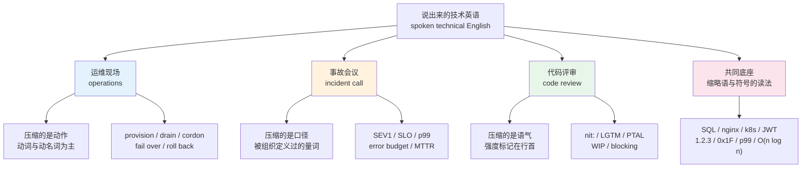
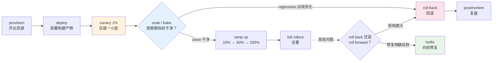
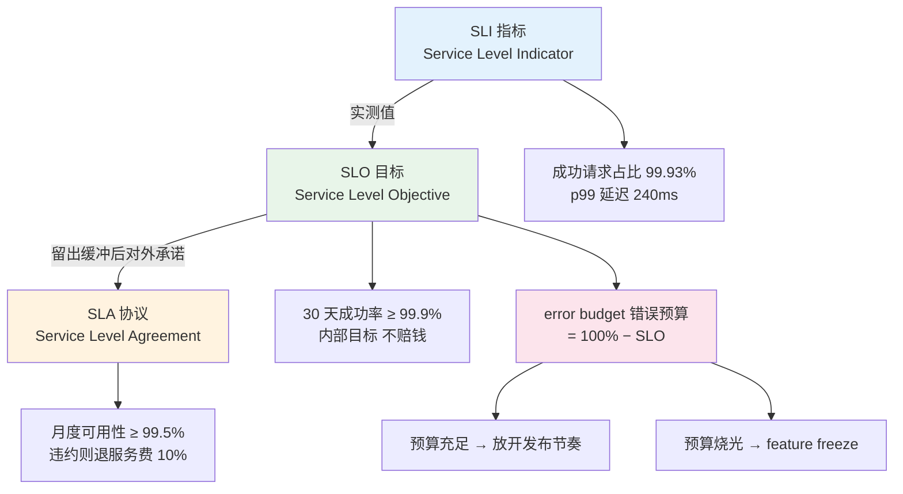
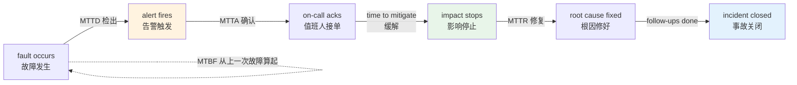
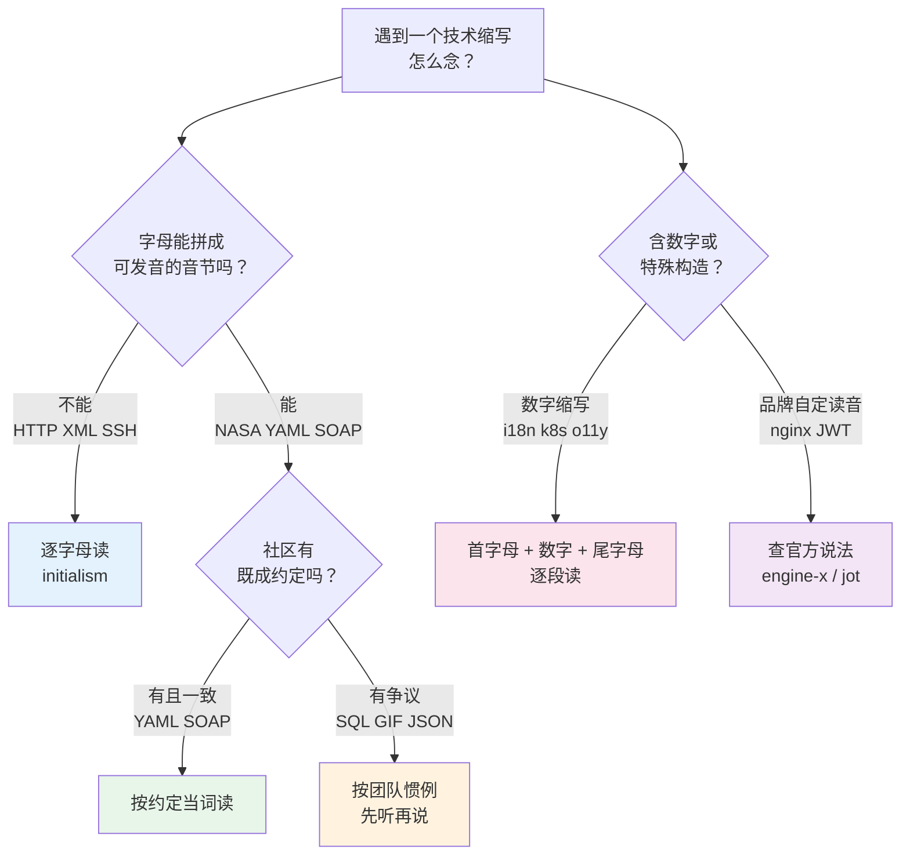

# IT 深度英语（下）：云原生运维、评审用语与缩略语读法

> [!info] 本篇定位
>
> 第二十章 IT 三篇的收尾。[[20.专业领域词汇/01.IT 深度英语（上）：核心概念术语与其读音\|IT 深度英语（上）：核心概念术语与其读音]] 给概念名词，[[20.专业领域词汇/02.计算机语境的熟词新义：日常词的技术义项地图\|计算机语境的熟词新义：日常词的技术义项地图]] 给熟词的技术义项，[[20.专业领域词汇/03.IT 深度英语（中）：设计文档、规范文体与 API 措辞\|IT 深度英语（中）：设计文档、规范文体与 API 措辞]] 给写下来的三种文体。
>
> 本篇管的是**说出来的那部分**。运维现场、事故电话会、代码评审的评论区，这三处的英语有一个共同特征：短、快、高度缩略，而且大量词根本没有写下来的机会，只在口头流通。`nit:` 三个字母决定一条评论是不是拦路，`SEV1` 和 `SEV3` 差的是半夜要不要爬起来，`p99` 念错会被当成不熟业务。
>
> 第三块是全书唯一的**读法集中处理点**：`SQL` 到底念 sequel 还是三个字母、`nginx` 为什么念 engine-x、`k8s` 和 `i18n` 这类数字缩写怎么读、版本号 `1.2.3` 与十六进制 `0x1F` 与网段 `/24` 与复杂度 `O(n log n)` 在会议上怎么念出口。缩略语的全称与释义见 [[22.速查附录与学习资源/02.标点、键盘符号英文名与缩略语场景对照表\|标点、键盘符号英文名与缩略语场景对照表]]，构词机制见 [[15.词根、合成与缩略/04.合成词、转化词、截短词与缩略语\|合成词、转化词、截短词与缩略语]]，社交场景的缩写见 [[12.科技、媒体与休闲/02.互联网、手机应用、社交媒体与网络缩写\|互联网、手机应用、社交媒体与网络缩写]]。那三处都不讲读法，读法只在这里给。

---

## 1. 本篇导读：三个说话现场

技术英语的口语面比书面面更难，原因不是词更长，而是**词更短**。写文档时你有时间把 `Service Level Objective` 敲全，开会时没人这么说，全场只会出现 `SLO`。写评论时你可以写完整句 `I think this could be simplified`，实际评审区里出现的是 `nit: simplify?`。压缩率越高，误解的代价越高。

三个现场各有各的压缩逻辑：

**运维现场**压的是**动作**。这里的词几乎全是动词或动名词：`provision`、`drain`、`cordon`、`fail over`、`roll back`、`escalate`。听懂它们的关键不在词义，而在**谁对谁做**——`drain a node` 是把流量挪走，`evict a pod` 是把工作负载踢掉，两件事在时间线上有先后。

**事故会议**压的是**口径**。`SEV1`、`p99`、`error budget`、`MTTR` 都是被组织正式定义过的量词，它们背后各有一份内部文档规定阈值。用错口径不是措辞问题，是事实陈述错误。

**代码评审**压的是**语气**。同一句技术意见，加不加 `nit:` 前缀决定对方要不要改，写 `Consider extracting this` 和写 `Extract this` 的社交后果完全不同。评审英语的难点从来不是术语，是**强度控制**。



上图把本篇切成四块。前三块是场景，各有一套压缩规则；第四块是底座——不管在哪个现场，缩略语和符号都要念出口，而这套读法从来没人系统教过，全靠工作里听会。图里被单列出来的第四块之所以放在最后，是因为它跨越前三块：`SLO` 属于事故会议、`k8s` 属于运维、`WIP` 属于评审，但「怎么念」是同一个问题。

### 1.1 读音为什么必须单独处理

中文母语者读技术英语有一个特有的断层：**认得但念不出**。`daemon` 每天在代码里见，第一次要开口说时才发现不知道那个 `ae` 怎么处理；`tuple` 写了十年，视频会议上听同事念出来才意识到自己心里默念的音是错的。这个断层不影响读代码，但一旦要参加英文会议、做技术分享、跟外国同事结对，它会在第一句话就暴露。

更麻烦的是技术圈的读音**不是可以查字典解决的**。`nginx` 和 `k8s` 不在任何词典里，`SQL` 在词典里有两个读音而词典不会告诉你哪个场合用哪个，`JWT` 的推荐读法写在 RFC 7519 的正文里而不是词汇表里。这类知识只在口头传承，本篇的第 17 到 20 节把它们集中写下来。

---

## 2. 供给与编排：资源怎么被造出来

云原生词汇的第一层是**资源的生命周期**：从没有到有叫 provision，从有到没有叫 deprovision 或 tear down，中间的自动化管理叫 orchestration。

### 2.1 provision 与 orchestration 的分工

`provision` 这个词在日常英语里是「供应、提供（食物、装备）」，名词 `provisions` 是「补给品」。技术义保留了「备齐所需」的核心：给一台虚拟机装好操作系统、配好网络、挂好磁盘，这个从零到可用的过程叫 `provisioning`。

`orchestration` 来自 `orchestra`（管弦乐队），原义是「配器、编曲」——把一堆乐器的声部安排到一起。技术义是把多个已经存在的组件按依赖关系调度起来。二者的先后关系很清楚：**先 provision 出资源，再 orchestrate 这些资源上的工作负载**。

> [!warning] 常见误用
>
> - ❌ ~~We need to orchestrate three new servers.~~（把「开三台机器」说成编排）
> - ✅ We need to **provision** three new servers.（开三台机器）
> - ✅ Kubernetes **orchestrates** the containers across those servers.（K8s 在这些机器上编排容器）
>
> `provision` 的宾语是**资源**（server、database、cluster、certificate）；`orchestrate` 的宾语是**任务或组件**（containers、workflows、jobs）。宾语选错，句子就露馅。

### 2.2 资源与编排词表

| 英文 | 英式音标 | 美式音标 | 词性 | 中文 | 搭配与说明 |
| --- | --- | --- | --- | --- | --- |
| **provision** | /prəˈvɪʒn/ | /prəˈvɪʒn/ | v./n. | 开通、备齐（资源） | `provision a cluster`、`provision certificates`；名词 `provisions` 另有「合同条款」义，见 20.05 |
| **provisioning** | /prəˈvɪʒnɪŋ/ | /prəˈvɪʒnɪŋ/ | n. | 资源开通 | `zero-touch provisioning` 免人工开通、`provisioning time` 开通耗时 |
| **deprovision** | /ˌdiːprəˈvɪʒn/ | /ˌdiːprəˈvɪʒn/ | v. | 回收（资源） | 与 `tear down` 近义，后者更口语；`deprovision idle instances` |
| **tear down** | /ˌteə ˈdaʊn/ | /ˌter ˈdaʊn/ | v. | 拆除、销毁 | 与 `set up` 对称；测试代码里的 `setUp` 与 `tearDown` 就是这一对 |
| **orchestrate** | /ˈɔːkɪstreɪt/ | /ˈɔːrkɪstreɪt/ | v. | 编排、调度 | 重音在第一音节；`orchestrate a rollout across regions` |
| **orchestration** | /ˌɔːkɪˈstreɪʃn/ | /ˌɔːrkɪˈstreɪʃn/ | n. | 编排 | `container orchestration`；与 `choreography` 编舞式协作相对，后者指无中心协调 |
| **workload** | /ˈwɜːkləʊd/ | /ˈwɜːrkloʊd/ | n. | 工作负载 | 云上最常见的抽象名词；`shift the workload to another region` |
| **cluster** | /ˈklʌstə/ | /ˈklʌstər/ | n./v. | 集群；成簇 | `spin up a cluster` 起一个集群、`cluster-wide` 集群范围内 |
| **node** | /nəʊd/ | /noʊd/ | n. | 节点 | `worker node` 与 `control-plane node`；旧文档里的 `master node` 已普遍改写 |
| **control plane** | /kənˈtrəʊl pleɪn/ | /kənˈtroʊl pleɪn/ | n. | 控制面 | 与 `data plane` 数据面成对；决策走控制面，流量走数据面 |
| **manifest** | /ˈmænɪfest/ | /ˈmænɪfest/ | n. | 清单文件 | 来自航运的「载货清单」；`apply the manifest`、`a YAML manifest` |
| **declarative** | /dɪˈklærətɪv/ | /dɪˈklerətɪv/ | adj. | 声明式的 | 与 `imperative` 命令式相对；`a declarative API describes the what, not the how` |
| **desired state** | /dɪˌzaɪəd ˈsteɪt/ | /dɪˌzaɪərd ˈsteɪt/ | n. | 期望状态 | 与 `actual state` 成对；声明式系统的核心概念 |
| **reconcile** | /ˈrekənsaɪl/ | /ˈrekənsaɪl/ | v. | 调谐、对齐 | `the controller reconciles actual state with desired state`；名词 `reconciliation loop` |
| **drift** | /drɪft/ | /drɪft/ | n./v. | 漂移 | `configuration drift` 配置漂移；实际状态偏离声明的状态 |
| **idempotent** | /ˌaɪdemˈpəʊtnt/ | /ˌaɪdəmˈpoʊtnt/ | adj. | 幂等的 | 运维脚本的基本要求；`re-running the playbook is idempotent`。读法争议见 18.3 |
| **immutable** | /ɪˈmjuːtəbl/ | /ɪˈmjuːtəbl/ | adj. | 不可变的 | `immutable infrastructure` 不改机器只换机器；对应做法叫 `replace, don't patch` |
| **ephemeral** | /ɪˈfemərəl/ | /ɪˈfemərəl/ | adj. | 短暂的、临时的 | 重音在第二音节；`ephemeral storage`、`ephemeral containers` |
| **bootstrap** | /ˈbuːtstræp/ | /ˈbuːtstræp/ | v./n. | 引导启动 | 来自 pull oneself up by one's bootstraps；`bootstrap the cluster` |
| **autoscaling** | /ˈɔːtəʊˌskeɪlɪŋ/ | /ˈɔːtoʊˌskeɪlɪŋ/ | n. | 自动扩缩容 | 动词短语拆开写 `scale out` 横向扩、`scale up` 纵向扩，两者不同义 |
| **scale out** | /ˌskeɪl ˈaʊt/ | /ˌskeɪl ˈaʊt/ | v. | 横向扩容 | 加机器台数；反义 `scale in` 缩容 |
| **scale up** | /ˌskeɪl ˈʌp/ | /ˌskeɪl ˈʌp/ | v. | 纵向扩容 | 单机加配；反义 `scale down`。中文都叫「扩容」，英文必须分清 |
| **headroom** | /ˈhedruːm/ | /ˈhedruːm/ | n. | 余量 | `we only have 20% headroom before the next scale-out` |
| **quota** | /ˈkwəʊtə/ | /ˈkwoʊtə/ | n. | 配额 | `hit the quota` 触到配额上限、`request a quota increase` |
| **throttle** | /ˈθrɒtl/ | /ˈθrɑːtl/ | v./n. | 限流 | 来自油门；`the API throttles you at 100 requests per second` |
| **backpressure** | /ˈbækpreʃə/ | /ˈbækpreʃər/ | n. | 背压 | 下游处理不过来时向上游回传的压力信号；`apply backpressure` |
| **drain** | /dreɪn/ | /dreɪn/ | v. | 排空（流量） | `drain the node before maintenance`；先停新流量，再等存量请求做完 |
| **cordon** | /ˈkɔːdn/ | /ˈkɔːrdn/ | v. | 隔离、封锁 | 原义是警戒线；`cordon the node` 标记为不再接受新调度，与 `drain` 常连用 |
| **evict** | /ɪˈvɪkt/ | /ɪˈvɪkt/ | v. | 驱逐 | 原义是「赶房客走」；`the pod was evicted due to memory pressure` |
| **taint** | /teɪnt/ | /teɪnt/ | n./v. | 污点标记 | 与 `toleration` 成对；节点打 taint，工作负载带 toleration 才能落上去 |
| **toleration** | /ˌtɒləˈreɪʃn/ | /ˌtɑːləˈreɪʃn/ | n. | 容忍标记 | 注意不是 `tolerance`，K8s 里用的是 `toleration` 这一形式 |
| **affinity** | /əˈfɪnəti/ | /əˈfɪnəti/ | n. | 亲和性 | `node affinity` 亲和、`anti-affinity` 反亲和（把副本打散到不同机器） |

`drain` 与 `cordon` 的搭配值得单独记，因为它们几乎总是一起出现在维护流程里，而中文都会翻成「下线节点」。

> [!example] 一段典型的维护通知
>
> - We'll **cordon** the node first so nothing new gets scheduled onto it, then **drain** it and wait for in-flight requests to finish.
>   - 我们先把节点标记成不可调度，这样不会有新负载落上来，然后排空它，等在途请求跑完。
> - Anything still running after the grace period gets **evicted**.
>   - 宽限期后还在跑的会被强制驱逐。

`in-flight` 是运维英语里的高频形容词，指「已经发出但还没完成的」，来自航空业的「在飞行中」。`in-flight requests`、`in-flight transactions`、`in-flight messages` 都是固定搭配。

---

## 3. 流量入口与旁挂：ingress、sidecar 与网格

### 3.1 ingress 与 egress 是一对拉丁词

`ingress` 与 `egress` 是拉丁词根的规整一对：`in-`（进）与 `e-`（出）加 `-gress`（走，来自 gradi「行走」，同根词有 `progress`、`congress`、`regress`）。词根族的完整拆解见 [[15.词根、合成与缩略/01.高频拉丁词根（上）\|高频拉丁词根（上）]]。

日常英语里这两个词很正式，多见于建筑图纸（`means of egress` 疏散通道）和法律文本。云原生把它们收编成了网络方向的标准术语：进入集群的流量叫 `ingress traffic`，出集群的叫 `egress traffic`。

读音上要注意重音全在第一音节，且 `e-` 读长音 /iː/：

```text
ingress   /ˈɪŋɡres/    IN-gress
egress    /ˈiːɡres/    EE-gress
```

念成 /ɪnˈɡres/ 是最常见的错误——这个词没有把重音放在后面的读法。

### 3.2 流量与弹性词表

| 英文 | 英式音标 | 美式音标 | 词性 | 中文 | 搭配与说明 |
| --- | --- | --- | --- | --- | --- |
| **ingress** | /ˈɪŋɡres/ | /ˈɪŋɡres/ | n. | 入向流量；入口 | K8s 里还是一种资源类型名，`an Ingress resource` |
| **egress** | /ˈiːɡres/ | /ˈiːɡres/ | n. | 出向流量 | 云厂商按 egress 计费是常见的成本项；`egress charges` |
| **sidecar** | /ˈsaɪdkɑː/ | /ˈsaɪdkɑːr/ | n. | 边车容器 | 原义是摩托车的挎斗；与主容器同生命周期、共享网络的旁挂进程 |
| **service mesh** | /ˈsɜːvɪs meʃ/ | /ˈsɜːrvɪs meʃ/ | n. | 服务网格 | `mesh` 原义是渔网、筛网；`run the traffic through the mesh` |
| **proxy** | /ˈprɒksi/ | /ˈprɑːksi/ | n./v. | 代理 | `reverse proxy` 反向代理、`proxy the request to the backend` |
| **gateway** | /ˈɡeɪtweɪ/ | /ˈɡeɪtweɪ/ | n. | 网关 | `API gateway`；与 `load balancer` 的区别在于是否做协议层处理 |
| **load balancer** | /ˈləʊd ˌbælənsə/ | /ˈloʊd ˌbælənsər/ | n. | 负载均衡器 | 英式拼 `balancer` 与美式相同，但 `-ise/-ize` 类词要小心，见 22.02 |
| **upstream** | /ˌʌpˈstriːm/ | /ˌʌpˈstriːm/ | n./adj. | 上游 | 网络语境指被调用方，Git 语境指主仓库，两义相反方向，靠上下文判断 |
| **downstream** | /ˌdaʊnˈstriːm/ | /ˌdaʊnˈstriːm/ | n./adj. | 下游 | `a downstream outage` 下游服务挂了 |
| **north-south traffic** | /ˌnɔːθ ˈsaʊθ ˈtræfɪk/ | /ˌnɔːrθ ˈsaʊθ ˈtræfɪk/ | n. | 南北向流量 | 进出集群的流量；方位词的空间隐喻见 05.01 |
| **east-west traffic** | /ˌiːst ˈwest ˈtræfɪk/ | /ˌiːst ˈwest ˈtræfɪk/ | n. | 东西向流量 | 集群内部服务之间的流量 |
| **route** | /ruːt/ | /raʊt/ 或 /ruːt/ | n./v. | 路由 | 英美读音差异最大的运维词之一：英式只有 /ruːt/，美式两读并存 |
| **circuit breaker** | /ˈsɜːkɪt ˌbreɪkə/ | /ˈsɜːrkɪt ˌbreɪkər/ | n. | 熔断器 | 来自电气；`the circuit breaker tripped` 熔断触发了，动词固定用 `trip` |
| **bulkhead** | /ˈbʌlkhed/ | /ˈbʌlkhed/ | n. | 舱壁隔离 | 来自船舶的水密舱；把资源池切开，一处耗尽不拖垮全船 |
| **retry** | /ˈriːtraɪ/ | /ˈriːtraɪ/ | n. | 重试 | 名词重音在前，动词 /rɪˈtraɪ/ 重音在后，是典型的名动重音移位，见 01.03 |
| **backoff** | /ˈbækɒf/ | /ˈbækɔːf/ | n. | 退避 | `exponential backoff` 指数退避；动词形式分写 `back off` |
| **jitter** | /ˈdʒɪtə/ | /ˈdʒɪtər/ | n./v. | 抖动；加随机扰动 | 两义并存：网络抖动是缺陷，重试加 jitter 是手段 |
| **stampede** | /stæmˈpiːd/ | /stæmˈpiːd/ | n. | 踩踏、雪崩 | 原义是牲畜受惊狂奔；`cache stampede` 缓存击穿、`thundering herd` 惊群 |
| **load shedding** | /ˈləʊd ˌʃedɪŋ/ | /ˈloʊd ˌʃedɪŋ/ | n. | 主动丢负载 | 来自电网的拉闸限电；`shed load` 是动词形式，宁可丢一部分请求也别全崩 |
| **fan-out** | /ˈfænaʊt/ | /ˈfænaʊt/ | n. | 扇出 | 一个请求派生出的下游调用数；`a high fan-out makes tail latency worse` |
| **hop** | /hɒp/ | /hɑːp/ | n. | 跳（网络跃点） | `an extra network hop adds latency`；也用于 `one hop away` |

`circuit breaker` 的动词值得特别记：中文说「熔断器触发了」，英文不说 `the breaker was triggered`，固定说 `the breaker tripped` 或 `the breaker opened`。`trip` 在这里是不及物动词，主语就是熔断器本身。恢复叫 `the breaker closed` 或 `half-open` 半开状态。这套词全部来自电气工程，跟软件里的开闭状态是同一套隐喻。

---

## 4. 发布策略：canary 与它周围的一圈词

### 4.1 canary 的来历决定了它的用法

`canary` 是金丝雀。十九世纪起英国矿工带金丝雀下井，鸟对一氧化碳比人敏感，鸟出事人就撤——这个做法叫 `canary in a coal mine`，至今是英语常用习语，指「预警信号」。

软件里的 `canary release` 保留了这个逻辑的核心：**先让一小部分流量承担风险，出问题时受影响面可控**。所以这个词的搭配全都围绕比例和观察：

> [!example] canary 的固定搭配
>
> - We're **canarying** the new build to 1% of traffic for an hour.
>   - 我们把新版本灰度到 1% 的流量，观察一小时。
> - The **canary** looked clean, so we're ramping to 10%.
>   - 灰度这一批指标干净，我们提到 10%。
> - Error rate spiked on the **canary**, rolling back now.
>   - 灰度批次错误率飙了，正在回滚。

注意 `canary` 已经动词化：`canary something to X%` 是完全正常的说法。中文的「灰度发布」在英文里没有对应的颜色词，说 `gray release` 对方听不懂，标准说法就是 `canary release` 或 `progressive rollout`。

### 4.2 发布与回退词表

| 英文 | 英式音标 | 美式音标 | 词性 | 中文 | 搭配与说明 |
| --- | --- | --- | --- | --- | --- |
| **canary** | /kəˈneəri/ | /kəˈneri/ | n./v. | 灰度批次；灰度发布 | 重音在第二音节；`canary release`、`canary analysis` |
| **rollout** | /ˈrəʊlaʊt/ | /ˈroʊlaʊt/ | n. | 发布过程 | 名词连写，动词分写 `roll out`；`a staged rollout` 分批发布 |
| **rollback** | /ˈrəʊlbæk/ | /ˈroʊlbæk/ | n. | 回滚 | 名词连写，动词分写 `roll back`。写成 ~~rollback the change~~ 是常见拼写错误 |
| **roll forward** | /ˌrəʊl ˈfɔːwəd/ | /ˌroʊl ˈfɔːrwərd/ | v. | 向前修复 | 不回退而是快速发一个修复版；与 `roll back` 是事故时的二选一 |
| **blue-green** | /ˌbluː ˈɡriːn/ | /ˌbluː ˈɡriːn/ | adj. | 蓝绿（部署） | 两套完整环境交替接流量；`blue-green deployment`、`flip to green` |
| **cutover** | /ˈkʌtəʊvə/ | /ˈkʌtoʊvər/ | n. | 切换（时刻） | 名词连写，动词分写 `cut over to the new system` |
| **soak** | /səʊk/ | /soʊk/ | v./n. | 浸泡观察 | `let it soak for 24 hours before ramping`；同义的 `bake` 也常见 |
| **bake** | /beɪk/ | /beɪk/ | v. | 烘（观察期） | `bake time` 观察时长；两个词都指「先放着看看」 |
| **ramp up** | /ˌræmp ˈʌp/ | /ˌræmp ˈʌp/ | v. | 逐步放量 | `ramp to 50%`；反向叫 `ramp down` 或 `dial back` |
| **dial back** | /ˌdaɪəl ˈbæk/ | /ˌdaɪəl ˈbæk/ | v. | 调小 | 来自旋钮；`dial back the rollout to 5%` |
| **feature flag** | /ˈfiːtʃə flæɡ/ | /ˈfiːtʃər flæɡ/ | n. | 功能开关 | 英式也说 `feature toggle`；`flip the flag`、`the flag is off by default` |
| **toggle** | /ˈtɒɡl/ | /ˈtɑːɡl/ | n./v. | 开关；切换 | 原义是插销、套索；`toggle it on for internal users only` |
| **dark launch** | /ˌdɑːk ˈlɔːntʃ/ | /ˌdɑːrk ˈlɔːntʃ/ | n. | 暗发布 | 代码已上线但对用户不可见，用真实流量压测新路径 |
| **shadow traffic** | /ˈʃædəʊ ˈtræfɪk/ | /ˈʃædoʊ ˈtræfɪk/ | n. | 影子流量 | 把生产流量复制一份打到新服务，不返回给用户 |
| **artifact** | /ˈɑːtɪfækt/ | /ˈɑːrtɪfækt/ | n. | 构建产物 | 英式拼写 `artefact` 在技术文档里已基本让位给美式 `artifact` |
| **promote** | /prəˈməʊt/ | /prəˈmoʊt/ | v. | 提升（环境） | `promote the build from staging to production`；不是「升职」义 |
| **pin** | /pɪn/ | /pɪn/ | v. | 钉住（版本） | `pin the dependency to 1.4.2`；反义 `unpin`、`bump` |
| **bump** | /bʌmp/ | /bʌmp/ | v. | 升（版本号） | `bump the minor version`；几乎只用于版本号和依赖 |
| **code freeze** | /ˈkəʊd friːz/ | /ˈkoʊd friːz/ | n. | 封版 | `we're in a code freeze until after the holiday` |
| **hotfix** | /ˈhɒtfɪks/ | /ˈhɑːtfɪks/ | n./v. | 热修复 | 绕过常规流程的紧急修复；与 `patch` 的差别在于紧急程度而非技术手段 |

> [!warning] 名词连写、动词分写
>
> 这一组词是拼写错误的重灾区，规律统一：
>
> - ✅ We need a **rollback** plan.（名词，连写）
> - ✅ Let's **roll back** to the previous build.（动词，分写）
> - ❌ ~~Let's rollback to the previous build.~~
>
> 同样规律的还有 `rollout / roll out`、`cutover / cut over`、`failover / fail over`、`backup / back up`、`setup / set up`、`login / log in`。写文档时被同事挑出来的十有八九是这一类。构词机制见 [[15.词根、合成与缩略/04.合成词、转化词、截短词与缩略语\|合成词、转化词、截短词与缩略语]]。

### 4.3 一次发布的完整流程图



上图的关键分叉在最右边那个菱形。全量之后发现问题时，英语里的标准提问是 `Do we roll back or roll forward?`，这不是技术选择题而是**风险判断题**：回滚保证回到已知良好状态但会丢掉新功能，向前修复保住功能但赌的是修复本身没问题。事故会议上听到 `let's roll forward` 意味着有人已经定位了根因并且有信心；听到 `roll back first, debug later` 意味着优先止血。左侧的观察期那个菱形则决定了 canary 有没有意义——不设观察窗口直接从 1% 跳到 100%，那叫分批部署，不叫灰度。

---

## 5. 容灾：failover 与 RPO/RTO 这对指标

### 5.1 fail 后面接的小品词决定意思

`fail` 加不同小品词构成一组容易混的短语动词，这是短语动词在技术英语里最典型的一次集中出现：

| 短语 | 中文 | 说明 |
| --- | --- | --- |
| **fail over** | 故障切换 | 主挂了自动切到备；名词连写 `failover` |
| **fail back** | 切回 | 主恢复后把流量切回来；名词 `failback` |
| **fail fast** | 快速失败 | 一旦发现不对立刻报错，不做无谓重试 |
| **fail open** | 失败放行 | 依赖挂了就放过请求（可用性优先） |
| **fail closed** | 失败拒绝 | 依赖挂了就拒绝请求（安全优先），也叫 `fail secure` |
| **fail soft** | 降级运行 | 丢掉部分功能继续跑，同义于 `degrade gracefully` |
| **fail silent** | 静默失败 | 出错但不报，是缺陷不是策略 |

`fail open` 与 `fail closed` 这一对在安全评审里会被反复追问，因为它们决定了鉴权服务挂掉时系统是「谁都能进」还是「谁都进不来」。中文常把两者混说成「容错」，英文里必须选边。

### 5.2 RPO 与 RTO：两个方向的时间

`RPO` 与 `RTO` 是容灾方案里最常被念混的一对，因为字母只差一个。区分方法是看它们在时间轴上指向哪一侧：

```text
        ← RPO →   事故点   ← RTO →
   ─────────────────●───────────────────►
   最后一次可用备份           恢复服务的时刻

   RPO = Recovery Point Objective  能接受丢多少数据（往回看）
   RTO = Recovery Time Objective   能接受停多久服务（往前看）
```

记忆抓手：`Point` 是**数据点**，往过去找最后一个安全点；`Time` 是**停机时间**，往未来数到恢复。一个衡量数据损失，一个衡量服务中断。

> [!example] 两个指标在句子里的样子
>
> - Our **RPO** is fifteen minutes, so in the worst case we lose a quarter of an hour of writes.
>   - 我们的 RPO 是十五分钟，最坏情况下会丢掉一刻钟的写入。
> - The **RTO** is four hours, which means the business has agreed to tolerate a half-day outage.
>   - RTO 是四小时，意味着业务方已经接受最长半天的中断。
> - A near-zero **RPO** requires synchronous replication, and that costs you write latency.
>   - RPO 接近零就得用同步复制，代价是写入延迟。

### 5.3 容灾词表

| 英文 | 英式音标 | 美式音标 | 词性 | 中文 | 搭配与说明 |
| --- | --- | --- | --- | --- | --- |
| **failover** | /ˈfeɪləʊvə/ | /ˈfeɪloʊvər/ | n. | 故障切换 | 名词连写；`automatic failover`、`trigger a failover` |
| **failback** | /ˈfeɪlbæk/ | /ˈfeɪlbæk/ | n. | 切回 | 主恢复后的反向切换，常被忘记演练 |
| **fallback** | /ˈfɔːlbæk/ | /ˈfɔːlbæk/ | n. | 兜底方案 | 与 `failover` 不是一回事：failover 换实例，fallback 换方案 |
| **redundancy** | /rɪˈdʌndənsi/ | /rɪˈdʌndənsi/ | n. | 冗余 | 日常英语里还有「裁员」义（英式 `made redundant` 被裁），技术义无贬义 |
| **replica** | /ˈreplɪkə/ | /ˈreplɪkə/ | n. | 副本 | 重音在第一音节；复数 `replicas`，动词是 `replicate` /ˈreplɪkeɪt/ |
| **quorum** | /ˈkwɔːrəm/ | /ˈkwɔːrəm/ | n. | 法定多数 | 借自议会术语；`lose quorum` 失去多数、`quorum loss` |
| **split-brain** | /ˌsplɪt ˈbreɪn/ | /ˌsplɪt ˈbreɪn/ | n. | 脑裂 | 两个副本都以为自己是主；`a split-brain scenario` |
| **standby** | /ˈstændbaɪ/ | /ˈstændbaɪ/ | n./adj. | 备用（实例） | 三档：`hot standby` 热备实时同步、`warm standby` 温备定期同步、`cold standby` 冷备只有数据 |
| **pilot light** | /ˈpaɪlət laɪt/ | /ˈpaɪlət laɪt/ | n. | 长明火（最小备份） | 来自燃气灶的常燃小火苗；只保留核心数据与最小配置，灾难时再扩起来 |
| **active-active** | /ˌæktɪv ˈæktɪv/ | /ˌæktɪv ˈæktɪv/ | adj. | 双活 | 两地同时对外服务；与 `active-passive` 主备相对 |
| **switchover** | /ˈswɪtʃəʊvə/ | /ˈswɪtʃoʊvər/ | n. | 计划内切换 | 与 `failover` 的差别是**有没有故障**：switchover 是主动演练，failover 是被动触发 |
| **degraded mode** | /dɪˌɡreɪdɪd ˈməʊd/ | /dɪˌɡreɪdɪd ˈmoʊd/ | n. | 降级模式 | `running in degraded mode`；动词 `degrade gracefully` |
| **brownout** | /ˈbraʊnaʊt/ | /ˈbraʊnaʊt/ | n. | 部分降级 | 来自电网的「电压不足」，比 `blackout` 全黑轻一档 |
| **blackout** | /ˈblækaʊt/ | /ˈblækaʊt/ | n. | 全面中断 | 运维里更常用 `outage`，`blackout` 多在类比时出现 |
| **SPOF** | /spɒf/ | /spɑːf/ | n. | 单点故障 | single point of failure 的缩写，可以整词读也可以逐字母读，见 18.2 |
| **resilience** | /rɪˈzɪliəns/ | /rɪˈzɪliəns/ | n. | 韧性 | 形容词 `resilient`；与 `reliability` 的分工：可靠性是结果，韧性是抗打击能力 |
| **chaos engineering** | /ˈkeɪɒs/ | /ˈkeɪɑːs/ | n. | 混沌工程 | `chaos` 的 ch 读 /k/，是希腊词源的标志，同类还有 `chrome`、`chronic`、`schema` |
| **game day** | /ˈɡeɪm deɪ/ | /ˈɡeɪm deɪ/ | n. | 演练日 | 有计划地制造故障验证预案；`run a game day` |
| **drill** | /drɪl/ | /drɪl/ | n./v. | 演练 | `a DR drill` 容灾演练；来自军事和消防演习 |
| **RPO** | /ˌɑːr piː ˈəʊ/ | /ˌɑːr piː ˈoʊ/ | n. | 恢复点目标 | 逐字母读；能接受丢多少数据 |
| **RTO** | /ˌɑːr tiː ˈəʊ/ | /ˌɑːr tiː ˈoʊ/ | n. | 恢复时间目标 | 逐字母读；能接受停多久 |
| **DR** | /ˌdiː ˈɑː/ | /ˌdiː ˈɑːr/ | n. | 灾难恢复 | disaster recovery；`DR site` 灾备站点、`DR plan` |
| **HA** | /ˌeɪtʃ ˈeɪ/ | /ˌeɪtʃ ˈeɪ/ | n. | 高可用 | high availability；`an HA setup`，注意冠词用 `an`（按读音 /eɪtʃ/ 起首为元音） |

`an HA setup` 这个冠词是母语者也会写错的地方。规则是按**读音**而非拼写选 a/an：`HA` 读作 /ˌeɪtʃ ˈeɪ/，首音是元音 /eɪ/，所以用 `an`。同理 `an SLO`（/es/ 开头）、`an MTTR`（/em/ 开头）、`a URL`（/juː/ 开头，虽然 U 是元音字母但读音是辅音 /j/）。

---

## 6. 可靠性三件套：SLI、SLO 与 SLA

### 6.1 三个词的分工不能混

这三个缩写只差最后一个字母，含义却分属三个层级。它们最初由 Google 的 SRE 实践推广开来，现在是行业通行口径：

| 缩写 | 全称 | 是什么 | 一句话 |
| --- | --- | --- | --- |
| **SLI** | Service Level **Indicator** | 一个测量值 | 我实际测到了什么 |
| **SLO** | Service Level **Objective** | 一个内部目标 | 我希望这个测量值落在哪 |
| **SLA** | Service Level **Agreement** | 一份对外合同 | 做不到要赔多少 |

三者的依赖是单向的：**没有 SLI 就定不出 SLO，没有 SLO 就签不了 SLA**。反过来，SLA 通常比 SLO 宽松——内部目标要留出缓冲，不然刚破 SLO 就要赔钱。



上图右下角那条支线是这套体系真正起作用的地方。SLI 和 SLO 单独看只是两个数字，只有推导出 `error budget` 之后，可靠性才变成一个可以拿来做决策的量：预算还剩很多就可以大胆发版，预算烧完就必须停下来修稳定性。这条推导把「我们要不要更稳一点」这种主观争论，换成了「这个月还剩多少分钟可以用」这种算术题。

### 6.2 可靠性口径词表

| 英文 | 英式音标 | 美式音标 | 词性 | 中文 | 搭配与说明 |
| --- | --- | --- | --- | --- | --- |
| **availability** | /əˌveɪləˈbɪləti/ | /əˌveɪləˈbɪləti/ | n. | 可用性 | 五个音节，重音在第四；`four nines of availability` 四个九 |
| **uptime** | /ˈʌptaɪm/ | /ˈʌptaɪm/ | n. | 在线时长 | 与 `downtime` 成对；口语里 `uptime` 常被当作 availability 的同义词 |
| **downtime** | /ˈdaʊntaɪm/ | /ˈdaʊntaɪm/ | n. | 停机时长 | `scheduled downtime` 计划内停机、`unplanned downtime` 计划外 |
| **nines** | /naɪnz/ | /naɪnz/ | n. | 几个九 | `three nines` = 99.9%、`five nines` = 99.999%；读法见 20.4 |
| **error rate** | /ˈerə reɪt/ | /ˈerər reɪt/ | n. | 错误率 | `the error rate spiked to 3%`；与 `success rate` 互为补数 |
| **latency** | /ˈleɪtnsi/ | /ˈleɪtnsi/ | n. | 延迟 | 形容词 `latent` 潜伏的；`shave 20ms off the latency` |
| **tail latency** | /ˈteɪl ˌleɪtnsi/ | /ˈteɪl ˌleɪtnsi/ | n. | 长尾延迟 | 分布右尾那一小撮最慢的请求；`the tail is what users complain about` |
| **percentile** | /pəˈsentaɪl/ | /pərˈsentaɪl/ | n. | 百分位 | `the 99th percentile` 写作 `p99`，读法见 20.3 |
| **quantile** | /ˈkwɒntaɪl/ | /ˈkwɑːntaɪl/ | n. | 分位数 | 比 percentile 更泛的统计术语；统计词整体见 19.03 |
| **saturation** | /ˌsætʃəˈreɪʃn/ | /ˌsætʃəˈreɪʃn/ | n. | 饱和度 | 四大黄金信号之一；`the disk is saturated` 磁盘打满了 |
| **golden signals** | /ˌɡəʊldən ˈsɪɡnəlz/ | /ˌɡoʊldən ˈsɪɡnəlz/ | n. | 黄金信号 | 延迟、流量、错误、饱和度四项；`the four golden signals` |
| **threshold** | /ˈθreʃhəʊld/ | /ˈθreʃhoʊld/ | n. | 阈值 | 注意中间有两个 h，读音里第二个 h 可轻可略；`cross the threshold` |
| **breach** | /briːtʃ/ | /briːtʃ/ | n./v. | 违约、突破 | `an SLA breach`、`we breached the SLO twice this quarter` |
| **service credit** | /ˈsɜːvɪs ˌkredɪt/ | /ˈsɜːrvɪs ˌkredɪt/ | n. | 服务抵扣 | SLA 违约的标准补偿形式：不退现金，退下月服务额度 |
| **rolling window** | /ˌrəʊlɪŋ ˈwɪndəʊ/ | /ˌroʊlɪŋ ˈwɪndoʊ/ | n. | 滚动窗口 | `a 28-day rolling window`；与 `calendar month` 固定月窗口相对 |
| **compliance** | /kəmˈplaɪəns/ | /kəmˈplaɪəns/ | n. | 达标、合规 | `SLO compliance for the quarter was 99.94%` |
| **aggregation** | /ˌæɡrɪˈɡeɪʃn/ | /ˌæɡrɪˈɡeɪʃn/ | n. | 聚合 | `the aggregation window`；聚合口径不同会得出不同的可用性数字 |
| **user-facing** | /ˈjuːzə ˌfeɪsɪŋ/ | /ˈjuːzər ˌfeɪsɪŋ/ | adj. | 面向用户的 | SLI 选取的第一条原则是选 user-facing 的指标，不是选好看的指标 |

> [!tip] 记住三个缩写的抓手
>
> 把最后一个字母还原成完整单词，含义自然就分开了：
>
> - **I** = Indicator，仪表盘上的**读数**，它只是个数
> - **O** = Objective，你给自己定的**目标**，破了要反省
> - **A** = Agreement，跟客户签的**协议**，破了要赔钱
>
> 会议里判断对方说的是哪一个，听后面跟的动词就够了：跟 `measure`（测）的是 SLI，跟 `meet`/`miss`（达标/未达标）的是 SLO，跟 `breach`/`violate`（违约）的是 SLA。

---

## 7. error budget：把可靠性变成可以花的钱

### 7.1 这个隐喻怎么运转

`error budget` 是把 `100% − SLO` 的那点余量当成一笔预算。SLO 定在 99.9%，那么一个 30 天周期里允许的不可用时长就是 `30 × 24 × 60 × 0.001 ≈ 43.2` 分钟，这 43 分钟就是这个月的预算。

预算隐喻的全套动词都借自财务英语，这也是这一节最值得背的部分——**词是熟词，搭配是新的**：

| 英文 | 英式音标 | 美式音标 | 词性 | 中文 | 搭配与说明 |
| --- | --- | --- | --- | --- | --- |
| **error budget** | /ˈerə ˈbʌdʒɪt/ | /ˈerər ˈbʌdʒɪt/ | n. | 错误预算 | `we have 43 minutes of error budget this month` |
| **burn** | /bɜːn/ | /bɜːrn/ | v./n. | 消耗（预算） | `that incident burned half the budget`；名词 `budget burn` |
| **burn rate** | /ˈbɜːn reɪt/ | /ˈbɜːrn reɪt/ | n. | 消耗速率 | 财务里指烧钱速度（见 20.08），这里指预算消耗速度 |
| **fast burn** | /ˌfɑːst ˈbɜːn/ | /ˌfæst ˈbɜːrn/ | n. | 快速消耗 | 短窗口内急剧消耗，触发立即呼叫；与 `slow burn` 相对 |
| **slow burn** | /ˌsləʊ ˈbɜːn/ | /ˌsloʊ ˈbɜːrn/ | n. | 缓慢消耗 | 长期小幅漏损，触发工单而不是呼叫 |
| **exhaust** | /ɪɡˈzɔːst/ | /ɪɡˈzɔːst/ | v. | 耗尽 | `we exhausted the budget on day 11`；形容词 `exhausted` |
| **spend** | /spend/ | /spend/ | v./n. | 花掉；花费 | `spend the budget on a risky migration` 是完全正常的说法 |
| **allowance** | /əˈlaʊəns/ | /əˈlaʊəns/ | n. | 额度 | 与 budget 近义但更强调「被允许的量」 |
| **replenish** | /rɪˈplenɪʃ/ | /rɪˈplenɪʃ/ | v. | 补充、重置 | `the budget replenishes at the start of each window` |
| **reclaim** | /rɪˈkleɪm/ | /rɪˈkleɪm/ | v. | 收回 | 事后剔除被误判的事故时长；`reclaim budget after the incident was reclassified` |
| **budget policy** | /ˈbʌdʒɪt ˈpɒləsi/ | /ˈbʌdʒɪt ˈpɑːləsi/ | n. | 预算政策 | 规定预算烧光后触发什么动作的那份文件 |
| **feature freeze** | /ˈfiːtʃə friːz/ | /ˈfiːtʃər friːz/ | n. | 功能冻结 | 预算烧光的标准后果：停新功能，全员修稳定性 |
| **risk appetite** | /ˈrɪsk ˌæpɪtaɪt/ | /ˈrɪsk ˌæpɪtaɪt/ | n. | 风险偏好 | 借自金融；`a higher risk appetite means a looser SLO` |

> [!example] error budget 在会议里的实际句子
>
> - We've **burned** 80% of the budget and it's only the 12th.
>   - 预算已经烧掉八成，今天才十二号。
> - The **burn rate** over the last hour would exhaust the whole month in two days.
>   - 按过去一小时的消耗速率，两天就能把整月预算烧光。
> - We still have plenty of budget, so I'm fine with shipping this on a Friday.
>   - 预算还很宽裕，周五发这个我没意见。
> - Budget's **blown**. Per policy, we're in a feature freeze until it replenishes.
>   - 预算超了。按政策进入功能冻结，等下个周期重置。

最后一句里的 `blown` 值得单独记：`blow the budget` 是英语里现成的固定搭配（原义是「把钱花超了」），技术圈直接沿用，比 `exhaust` 口语。

### 7.2 为什么这个隐喻是给管理层用的

`error budget` 的作用不是技术上的，是**谈判上的**。它把两个部门之间没法调和的争论——研发要快、运维要稳——换算成了同一个单位。理解这一点，你就能听懂它在会议里的典型用法：几乎所有出现 `error budget` 的句子，主语都是「我们」而不是「系统」，谓语都是决策动词而不是技术动词。

这也解释了一个措辞细节：预算**没花完不是好事**。SRE 语境里有一句反直觉的常见说法 `an unspent error budget is a missed opportunity`——预算年年剩很多，说明发布节奏太保守，本可以多冒点险多上点功能。听到这句不要以为对方在开玩笑。

---

## 8. 事故：SEV 分级与电话会上的角色

### 8.1 SEV 分级的读法与含义

`SEV` 是 `severity`（严重程度）的截短，读作 /sev/，一个音节，不逐字母读。级别数字**越小越严重**，这一点与很多中文习惯相反，务必记牢。

```text
SEV1  /ˌsev ˈwʌn/     "sev one"     全线中断或数据丢失，立即全员响应
SEV2  /ˌsev ˈtuː/     "sev two"     核心功能大面积受损，工作时间外也要呼叫
SEV3  /ˌsev ˈθriː/    "sev three"   影响有限或有绕行方案，工作时间处理
SEV4  /ˌsev ˈfɔː(r)/  "sev four"    轻微问题，走常规工单
```

有些公司用 `P0`–`P4`（priority）而不是 SEV，读作 `P zero` / `P one`。两套体系不通用，同一个公司内也常见 SEV 描述影响面、P 描述处理优先级，两个标签同时挂在一张工单上。

> [!warning] declare 的用法
>
> 宣布事故这个动作，英语固定用 `declare`：
>
> - ✅ I'm **declaring** a SEV2.（我现在宣布这是一个 SEV2 事故）
> - ✅ Should we **declare**?（要不要拉事故流程？）
> - ❌ ~~I'm announcing a SEV2.~~（announce 是「宣告消息」，不是「启动流程」）
>
> 结束时对应的动词是 `stand down`（解除）或 `resolve`（关闭）：`We're standing down the incident, monitoring continues.` 这套动词全部借自军事和应急指挥体系。

### 8.2 事故流程词表

| 英文 | 英式音标 | 美式音标 | 词性 | 中文 | 搭配与说明 |
| --- | --- | --- | --- | --- | --- |
| **incident** | /ˈɪnsɪdənt/ | /ˈɪnsɪdənt/ | n. | 事故 | `declare an incident`、`the incident channel`；比 `accident` 中性，无「意外」含义 |
| **outage** | /ˈaʊtɪdʒ/ | /ˈaʊtɪdʒ/ | n. | 中断 | 来自电力行业；`a full outage` 全线中断、`a partial outage` |
| **severity** | /sɪˈverəti/ | /sɪˈverəti/ | n. | 严重程度 | 形容词 `severe`；截短形式 `SEV` 读整词 |
| **impact** | /ˈɪmpækt/ | /ˈɪmpækt/ | n. | 影响面 | 名词重音在前，动词 /ɪmˈpækt/ 在后；`what's the impact?` 是事故会第一句 |
| **blast radius** | /ˈblɑːst ˌreɪdiəs/ | /ˈblæst ˌreɪdiəs/ | n. | 影响半径 | 来自爆破；复数 `radii` /ˈreɪdiaɪ/。设计文档里的用法见 20.03 |
| **page** | /peɪdʒ/ | /peɪdʒ/ | v./n. | 呼叫（值班人） | 来自寻呼机；`I got paged at 3 a.m.`、`page the on-call` |
| **on-call** | /ˌɒn ˈkɔːl/ | /ˌɑːn ˈkɔːl/ | adj./n. | 值班的；值班人 | 借自医院；`who's on call tonight?`、`the on-call rotation` |
| **rotation** | /rəʊˈteɪʃn/ | /roʊˈteɪʃn/ | n. | 轮值表 | 英式也说 `rota` /ˈrəʊtə/，美式基本只用 `rotation` |
| **escalate** | /ˈeskəleɪt/ | /ˈeskəleɪt/ | v. | 升级、上报 | `escalate to the database team`；名词 `escalation path` 上报路径 |
| **triage** | /ˈtriːɑːʒ/ | /triˈɑːʒ/ | v./n. | 分诊、定级 | 来自战地医疗；英美重音位置不同；`triage the alerts first` |
| **mitigate** | /ˈmɪtɪɡeɪt/ | /ˈmɪtɪɡeɪt/ | v. | 缓解 | 只压住影响，根因还在；与 `fix` 的区别在 20.03 讲过 |
| **remediate** | /rɪˈmiːdieɪt/ | /rɪˈmiːdieɪt/ | v. | 整改 | 比 mitigate 更彻底，指事后的根本性修复；名词 `remediation` |
| **incident commander** | /ˈɪnsɪdənt kəˈmɑːndə/ | /ˈɪnsɪdənt kəˈmændər/ | n. | 事故指挥官 | 缩写 `IC`，逐字母读；职责是协调不是动手 |
| **comms lead** | /ˈkɒmz liːd/ | /ˈkɑːmz liːd/ | n. | 沟通负责人 | `comms` 是 communications 的截短，读 /kɒmz/；负责对外通报 |
| **scribe** | /skraɪb/ | /skraɪb/ | n. | 记录员 | 事故会上专门记时间线的人；`who's scribing?` |
| **war room** | /ˈwɔː ruːm/ | /ˈwɔːr ruːm/ | n. | 作战室 | 部分公司已改用中性说法 `situation room` 或直接叫 `the bridge` |
| **bridge** | /brɪdʒ/ | /brɪdʒ/ | n. | 电话会 | `join the bridge`；来自电话会议的 conference bridge |
| **status page** | /ˈsteɪtəs peɪdʒ/ | /ˈstætəs peɪdʒ/ | n. | 状态页 | 对外公示的服务状态；`update the status page` 是 comms lead 的活 |
| **customer-facing** | /ˈkʌstəmə ˌfeɪsɪŋ/ | /ˈkʌstəmər ˌfeɪsɪŋ/ | adj. | 面向客户的 | `is this customer-facing?` 决定要不要发公告 |
| **stand down** | /ˌstænd ˈdaʊn/ | /ˌstænd ˈdaʊn/ | v. | 解除（响应） | `we're standing down`；军事用语，指解除戒备状态 |
| **all clear** | /ˌɔːl ˈklɪə/ | /ˌɔːl ˈklɪr/ | n. | 解除警报 | `give the all clear`；来自空袭警报 |
| **workaround** | /ˈwɜːkəraʊnd/ | /ˈwɜːrkəraʊnd/ | n. | 绕行方案 | 名词连写；`there's a workaround, so this is a SEV3 not a SEV2` |

### 8.3 事故电话会的开场三句

事故电话会有一套近乎固定的开场，听懂它等于知道会议开到第几步：

① `What's the current impact?` —— 现在影响到什么。这一步只要事实，不要猜测。
② `What have we tried so far?` —— 已经试过什么。防止重复劳动。
③ `What's our next action, and who owns it?` —— 下一步动作和责任人。每一步必须落到具体的人。

> [!example] 事故会上的高频短句
>
> - **Any change in the last hour?**
>   - 最近一小时有没有变更？（八成事故的第一问）
> - **Rolling back the deploy as a first mitigation.**
>   - 先回滚这次发布作为第一步缓解。
> - **I'm the IC. Please route all updates through me.**
>   - 我是指挥，所有进展汇报给我。
> - **Do we have a workaround for customers in the meantime?**
>   - 这期间给客户有没有绕行方案？
> - **Confirmed mitigated at 14:32. Keeping the bridge open for thirty minutes.**
>   - 14:32 确认已缓解。电话会再留三十分钟。

`route all updates through me` 里的 `route` 用的是「引导、转交」义，这是事故会上 IC 的标准措辞，目的是防止十个人同时向不同方向汇报。

---

## 9. runbook 与 postmortem：blameless 的准确含义

### 9.1 三种预案文档

`runbook`、`playbook`、`SOP` 三个词经常混用，但严格说有分工：

| 英文 | 英式音标 | 美式音标 | 词性 | 中文 | 搭配与说明 |
| --- | --- | --- | --- | --- | --- |
| **runbook** | /ˈrʌnbʊk/ | /ˈrʌnbʊk/ | n. | 操作手册 | 针对**一个具体告警**的分步处置流程，粒度最细 |
| **playbook** | /ˈpleɪbʊk/ | /ˈpleɪbʊk/ | n. | 应对手册 | 来自橄榄球的战术手册；针对**一类场景**，含决策分支 |
| **SOP** | /ˌes əʊ ˈpiː/ | /ˌes oʊ ˈpiː/ | n. | 标准作业程序 | standard operating procedure，逐字母读；最正式，多用于合规场景 |
| **checklist** | /ˈtʃeklɪst/ | /ˈtʃeklɪst/ | n. | 检查清单 | `a pre-launch checklist`；只列项不讲原理 |
| **escalation path** | /ˌeskəˈleɪʃn pɑːθ/ | /ˌeskəˈleɪʃn pæθ/ | n. | 上报路径 | runbook 的必备末节：这一步搞不定找谁 |

写 runbook 有一条不成文的措辞规则：**用祈使句，不用描述句**。写 `Check the replication lag on the primary.` 而不是 `The replication lag should be checked.`——凌晨三点被叫起来的人不需要读被动语态。

### 9.2 postmortem 与 blameless

`postmortem` 是拉丁语 `post mortem`「死后」，原指尸检。技术圈借它指事故复盘。英式也写 `post-mortem` 带连字符，美式技术文档普遍连写。

近年不少公司改叫 `post-incident review`（PIR）或 `incident retrospective`，理由是 `postmortem` 隐含「东西已经死了」的意味，对没造成实际损失的事故不合适。三个词在实践中通用。

`blameless` 是这套流程的核心形容词，也是最容易被误解的一个。它的准确含义**不是「不追究」**，而是：

> [!warning] blameless 到底不做什么
>
> - ❌ 误解：blameless 意味着没人需要负责。
> - ✅ 准确：blameless 意味着**分析阶段不把「某人犯错」当作根因终点**。
>
> 一条常被引用的表述是 `blameless does not mean accountability-free`——不追责不等于无问责。分工是：`accountability`（问责，指谁负责修）保留，`culpability`（归咎，指谁该受罚）取消。
>
> 之所以要这么设计，是因为一旦复盘会变成追责会，下一次事故就没人肯说真话，时间线永远拼不完整。

### 9.3 复盘文档词表

| 英文 | 英式音标 | 美式音标 | 词性 | 中文 | 搭配与说明 |
| --- | --- | --- | --- | --- | --- |
| **postmortem** | /ˌpəʊstˈmɔːtəm/ | /ˌpoʊstˈmɔːrtəm/ | n. | 事故复盘 | `write up the postmortem`、`the postmortem is due Friday` |
| **blameless** | /ˈbleɪmləs/ | /ˈbleɪmləs/ | adj. | 免责式的 | `a blameless postmortem`；后缀 `-less` 见 14 章 |
| **retrospective** | /ˌretrəˈspektɪv/ | /ˌretrəˈspektɪv/ | n. | 回顾会 | 截短口语形式 `retro`；敏捷流程里的定期回顾，用法见 20.06 |
| **timeline** | /ˈtaɪmlaɪn/ | /ˈtaɪmlaɪn/ | n. | 时间线 | 复盘文档的第一节；`reconstruct the timeline from the logs` |
| **root cause** | /ˌruːt ˈkɔːz/ | /ˌruːt ˈkɔːz/ | n. | 根因 | 单数形式常被批评过于简化，成熟团队改说 `contributing factors` |
| **contributing factor** | /kənˈtrɪbjuːtɪŋ ˈfæktə/ | /kənˈtrɪbjuːtɪŋ ˈfæktər/ | n. | 促成因素 | 复数使用，承认事故通常有多个成因 |
| **proximate cause** | /ˈprɒksɪmət kɔːz/ | /ˈprɑːksɪmət kɔːz/ | n. | 直接原因 | 与 `underlying cause` 深层原因成对；借自法律，见 20.05 |
| **trigger** | /ˈtrɪɡə/ | /ˈtrɪɡər/ | n./v. | 触发事件 | 与 root cause 的区别：触发是那根火柴，根因是满地的汽油 |
| **latent** | /ˈleɪtnt/ | /ˈleɪtnt/ | adj. | 潜伏的 | `a latent bug that had been there for months` |
| **near miss** | /ˌnɪə ˈmɪs/ | /ˌnɪr ˈmɪs/ | n. | 未遂事故 | 借自航空安全；差点出事但没出，同样值得复盘 |
| **hindsight bias** | /ˈhaɪndsaɪt ˌbaɪəs/ | /ˈhaɪndsaɪt ˌbaɪəs/ | n. | 后见之明偏误 | 复盘时最需要防的认知陷阱；`hindsight is 20/20` 是现成习语 |
| **counterfactual** | /ˌkaʊntəˈfæktʃuəl/ | /ˌkaʊntərˈfæktʃuəl/ | n./adj. | 反事实（推测） | `avoid counterfactuals like "he should have noticed"`——那类句子没有信息量 |
| **action item** | /ˈækʃn ˌaɪtəm/ | /ˈækʃn ˌaɪtəm/ | n. | 待办项 | 缩写 `AI` 在会议纪要里常见，但如今易与人工智能混淆，多写全称 |
| **actionable** | /ˈækʃənəbl/ | /ˈækʃənəbl/ | adj. | 可执行的 | `every action item must be actionable and owned`；无主的待办等于没写 |
| **owner** | /ˈəʊnə/ | /ˈoʊnər/ | n. | 责任人 | `assign an owner and a due date`；`ownerless` 待办是复盘失败的标志 |
| **follow-up** | /ˈfɒləʊ ʌp/ | /ˈfɑːloʊ ʌp/ | n. | 后续跟进 | 名词带连字符，动词分写 `follow up on the action items` |
| **accountability** | /əˌkaʊntəˈbɪləti/ | /əˌkaʊntəˈbɪləti/ | n. | 问责、担责 | 中性词，指「谁负责把事做完」 |
| **culpability** | /ˌkʌlpəˈbɪləti/ | /ˌkʌlpəˈbɪləti/ | n. | 罪责 | 贬义词，指「谁该受罚」；blameless 取消的是这一项 |
| **five whys** | /ˌfaɪv ˈwaɪz/ | /ˌfaɪv ˈwaɪz/ | n. | 五问法 | 连问五次「为什么」往下挖；`run five whys on this` |

---

## 10. MTTR 家族：四个 M 开头的指标

### 10.1 同一个缩写的四种展开

`MTTR` 是运维英语里歧义最大的缩写，因为最后那个 R 至少有四种展开：

| 缩写 | 展开 | 中文 | 量的是什么 |
| --- | --- | --- | --- |
| **MTTR** | Mean Time To **Repair** | 平均修复时长 | 动手修花了多久 |
| **MTTR** | Mean Time To **Recovery** | 平均恢复时长 | 服务恢复正常花了多久 |
| **MTTR** | Mean Time To **Resolve** | 平均解决时长 | 从发生到彻底关闭花了多久 |
| **MTTR** | Mean Time To **Respond** | 平均响应时长 | 从告警到有人开始处理花了多久 |

四个展开的数值可以差出一个数量级：Respond 可能是五分钟，Resolve 可能是三天。跨团队对比 MTTR 之前必须先问清对方用的是哪一个展开，否则比出来的数字没有意义。

同族的还有三个：

| 英文 | 英式音标 | 美式音标 | 词性 | 中文 | 搭配与说明 |
| --- | --- | --- | --- | --- | --- |
| **MTTD** | /ˌem tiː tiː ˈdiː/ | /ˌem tiː tiː ˈdiː/ | n. | 平均检出时长 | mean time to detect；从故障发生到被发现 |
| **MTTA** | /ˌem tiː tiː ˈeɪ/ | /ˌem tiː tiː ˈeɪ/ | n. | 平均确认时长 | mean time to acknowledge；从呼叫到值班人点确认 |
| **MTBF** | /ˌem tiː biː ˈef/ | /ˌem tiː biː ˈef/ | n. | 平均无故障间隔 | mean time between failures；两次故障之间的平均时长 |
| **MTTF** | /ˌem tiː tiː ˈef/ | /ˌem tiː tiː ˈef/ | n. | 平均无故障寿命 | mean time to failure；用于不可修复的部件，与 MTBF 不同 |

这几个缩写一律**逐字母读**，没有整词读法。`mean` 在这里是统计学的「均值」，不是「意思是」。

### 10.2 一条事故时间线上的四个 M



上图把几个指标钉在同一条时间轴上，一眼能看出它们量的是不同区间。真正对用户有意义的是 A 到 D 这一段——影响持续了多久；而团队内部最容易优化的是 A 到 B 这一段——很多事故的大头时间浪费在「根本没人知道出事了」。图上没画出来但同样重要的是：`time to mitigate` 和 `time to fix` 之间那段，用户已经不受影响了，工程师还在改代码，这段时间放进 MTTR 会让数字虚高。所以严肃的团队会把 `time to mitigate` 单列出来作为主指标。

---

## 11. 可观测性与告警措辞

### 11.1 monitoring 与 observability 的分工

`monitoring` 是「盯着一组已知指标看」，`observability` 是「能不能从系统外部的输出推断内部状态」。前者回答已经想到的问题，后者应对没想到的问题。这个区分在面试和评审里会被反复问，措辞上要说清楚。

`observability` 常被缩写成 `o11y`，读法与 `i18n` 同理，见 18.4。

| 英文 | 英式音标 | 美式音标 | 词性 | 中文 | 搭配与说明 |
| --- | --- | --- | --- | --- | --- |
| **observability** | /əbˌzɜːvəˈbɪləti/ | /əbˌzɜːrvəˈbɪləti/ | n. | 可观测性 | 六个音节，重音在第四；缩写 `o11y` |
| **telemetry** | /təˈlemətri/ | /təˈlemətri/ | n. | 遥测数据 | 重音在第二音节；`emit telemetry`、`telemetry pipeline` |
| **instrumentation** | /ˌɪnstrəmenˈteɪʃn/ | /ˌɪnstrəmenˈteɪʃn/ | n. | 埋点 | 动词 `instrument the code`；这里 `instrument` 是及物动词 |
| **metric** | /ˈmetrɪk/ | /ˈmetrɪk/ | n. | 指标 | 复数 `metrics`；`a counter`、`a gauge`、`a histogram` 是三种常见类型 |
| **gauge** | /ɡeɪdʒ/ | /ɡeɪdʒ/ | n. | 瞬时量 | 拼写反直觉（au 读 /eɪ/）；可增可减的指标类型 |
| **trace** | /treɪs/ | /treɪs/ | n. | 调用链 | 由多个 `span` 组成；`distributed tracing` |
| **span** | /spæn/ | /spæn/ | n. | 跨度 | 调用链上的一段；`the span shows 200ms in the database call` |
| **cardinality** | /ˌkɑːdɪˈnæləti/ | /ˌkɑːrdɪˈnæləti/ | n. | 基数 | `high-cardinality labels blow up your storage cost`；数学词转技术用法 |
| **sampling** | /ˈsɑːmplɪŋ/ | /ˈsæmplɪŋ/ | n. | 采样 | 英美 a 音差异；`head-based sampling` 与 `tail-based sampling` |
| **alert** | /əˈlɜːt/ | /əˈlɜːrt/ | n./v. | 告警 | `the alert fired`，动词固定用 `fire`；`alert on latency, not on CPU` |
| **fire** | /ˈfaɪə/ | /ˈfaɪər/ | v. | 触发（告警） | `three alerts fired at once`；不及物用法 |
| **flapping** | /ˈflæpɪŋ/ | /ˈflæpɪŋ/ | n. | 抖动告警 | 反复在触发与恢复之间跳；`the alert is flapping, add hysteresis` |
| **alert fatigue** | /əˈlɜːt fəˈtiːɡ/ | /əˈlɜːrt fəˈtiːɡ/ | n. | 告警疲劳 | 告警太多导致没人再看；`fatigue` 重音在第二音节 |
| **noise** | /nɔɪz/ | /nɔɪz/ | n. | 噪音告警 | `this alert is pure noise, mute it`；形容词 `noisy` |
| **silence** | /ˈsaɪləns/ | /ˈsaɪləns/ | v./n. | 静默 | `silence the alert for two hours`；同义 `mute`、`snooze` |
| **ack** | /æk/ | /æk/ | v./n. | 确认接单 | acknowledge 的截短，读一个音节；反义 `nack` /næk/ 表示不接受 |
| **dashboard** | /ˈdæʃbɔːd/ | /ˈdæʃbɔːrd/ | n. | 看板 | 来自马车挡泥板；`pin the dashboard to the incident channel` |
| **anomaly** | /əˈnɒməli/ | /əˈnɑːməli/ | n. | 异常 | 重音在第二音节；形容词 `anomalous` |
| **baseline** | /ˈbeɪslaɪn/ | /ˈbeɪslaɪn/ | n. | 基线 | `compared with last week's baseline` |
| **symptom-based** | /ˈsɪmptəm beɪst/ | /ˈsɪmptəm beɪst/ | adj. | 症状导向的 | 告警设计的通行原则：告警要盯用户可感知的症状，不盯内部原因 |

> [!tip] 告警措辞的一条实用规则
>
> 英文里评价一条告警好不好，只用一个形容词：`actionable`。
>
> - **Is this alert actionable?**（这条告警收到之后有明确动作可做吗？）
>
> 如果答案是「看一眼然后关掉」，那它就该被降级成工单或删掉。这句话是评审告警配置时最有效的一问，比讨论阈值定多少有用得多。

---

## 12. 代码评审：行首那几个字母

### 12.1 nit 是本节最重要的三个字母

`nit` 是 `nitpick` 的截短，源自 `nit`（虱卵）——挑虱卵是极琐碎的活，`nitpicking` 因此指「吹毛求疵」。在代码评审里，行首写 `nit:` 是一个明确的社交信号：

> [!warning] nit: 的准确含义
>
> `nit:` 表示「**这条我提了，但不拦你合并**」。
>
> - ✅ nit: `usr` → `user` for consistency with the rest of the file.
>   - 小问题：`usr` 改成 `user`，跟文件里其他地方保持一致。
> - 收到 `nit:` 的一方有权直接说 `Thanks, will fix in a follow-up.` 然后合并。
> - 反过来，**没标 `nit:` 的意见默认是拦路的**。这是评审文化里最容易被中文母语者忽略的一条：你以为自己只是随口一提，对方会当成必须改。
>
> 想让对方明确知道你不拦，除了 `nit:` 还可以写 `optional:`、`non-blocking:`、`take it or leave it`、`feel free to ignore`。

### 12.2 评审缩写与标记词表

| 英文 | 英式音标 | 美式音标 | 词性 | 中文 | 搭配与说明 |
| --- | --- | --- | --- | --- | --- |
| **nit** | /nɪt/ | /nɪt/ | n. | 小问题 | 写作行首标记 `nit:`；来自 nitpick |
| **LGTM** | /ˌel dʒiː tiː ˈem/ | /ˌel dʒiː tiː ˈem/ | phr. | 我看行 | looks good to me；逐字母读，也有人直接说 `looks good` |
| **SGTM** | /ˌes dʒiː tiː ˈem/ | /ˌes dʒiː tiː ˈem/ | phr. | 听着可以 | sounds good to me；用于回应方案而非代码 |
| **PTAL** | /ˌpiː tiː eɪ ˈel/ | /ˌpiː tiː eɪ ˈel/ | phr. | 请再看一下 | please take another look；改完之后 @ 评审人时用 |
| **WIP** | /ˌdʌbljuː aɪ ˈpiː/ | /ˌdʌbljuː aɪ ˈpiː/ | adj. | 进行中 | work in progress；PR 标题前缀 `WIP:` 表示别合 |
| **DNM** | /ˌdiː en ˈem/ | /ˌdiː en ˈem/ | phr. | 别合并 | do not merge；比 WIP 更强，通常有外部依赖没就绪 |
| **RFC** | /ˌɑːr ef ˈsiː/ | /ˌɑːr ef ˈsiː/ | n. | 征求意见 | request for comments；在 PR 语境是「想听意见」，与 IETF 的 RFC 同源不同义 |
| **FYI** | /ˌef waɪ ˈaɪ/ | /ˌef waɪ ˈaɪ/ | phr. | 供参考 | for your information；`FYI, this touches the billing path` |
| **IMO / IMHO** | /ˌaɪ em ˈəʊ/ | /ˌaɪ em ˈoʊ/ | phr. | 我认为 | in my (humble) opinion；软化措辞的标准手段 |
| **AFAICT** | /ˌeɪ ef eɪ aɪ siː ˈtiː/ | /ˌeɪ ef eɪ aɪ siː ˈtiː/ | phr. | 据我判断 | as far as I can tell；表示自己不确定 |
| **IIRC** | /ˌaɪ aɪ ɑːr ˈsiː/ | /ˌaɪ aɪ ɑːr ˈsiː/ | phr. | 如果我没记错 | if I recall correctly |
| **TL;DR** | /ˌtiː el ˌdiː ˈɑː/ | /ˌtiː el ˌdiː ˈɑːr/ | n. | 太长不看版 | too long; didn't read；PR 描述开头放一句摘要 |
| **ACK / NACK** | /æk/ /næk/ | /æk/ /næk/ | v. | 确认 / 否认 | 来自网络协议；`ACK, will do` |
| **+1 / -1** | /ˌplʌs ˈwʌn/ | /ˌplʌs ˈwʌn/ | phr. | 赞成 / 反对 | 读作 plus one / minus one；社区投票制项目里有正式效力 |
| **ship it** | /ˈʃɪp ɪt/ | /ˈʃɪp ɪt/ | phr. | 发吧 | 比 LGTM 更随意的批准；`ship it 🚢` 是 GitHub 老梗 |
| **blocking** | /ˈblɒkɪŋ/ | /ˈblɑːkɪŋ/ | adj. | 拦路的 | `this is a blocking concern`；与 `non-blocking` 成对 |
| **rubber-stamp** | /ˌrʌbə ˈstæmp/ | /ˌrʌbər ˈstæmp/ | v. | 走过场批准 | 来自橡皮图章；`don't rubber-stamp a 2000-line diff` |
| **drive-by** | /ˈdraɪv baɪ/ | /ˈdraɪv baɪ/ | adj. | 路过式的 | `a drive-by review` 指没上下文就扔一堆意见 |
| **OOO** | /ˌəʊ əʊ ˈəʊ/ | /ˌoʊ oʊ ˈoʊ/ | adj. | 不在岗 | out of office；`I'm OOO until Monday, please find another reviewer` |
| **EOD / EOW** | /ˌiː əʊ ˈdiː/ | /ˌiː oʊ ˈdiː/ | n. | 今天下班前 / 本周末前 | end of day / end of week；跨时区团队里要问清是谁的 EOD |

### 12.3 Conventional Comments 的标签体系

近年不少团队采用一套显式的评论标签，把「这条意见有多重」直接写在行首。它们的语义值得记，因为收到时你需要立刻判断该不该改：

| 标签 | 中文 | 拦不拦路 | 典型句子 |
| --- | --- | --- | --- |
| **praise:** | 表扬 | 不拦 | praise: nice catch on the off-by-one here. |
| **nitpick:** | 吹毛求疵 | 不拦 | nitpick: extra blank line. |
| **suggestion:** | 建议 | 看情况 | suggestion: extract this into a helper. |
| **issue:** | 问题 | 拦 | issue: this leaks the file handle on the error path. |
| **question:** | 提问 | 不拦但要答 | question: why do we retry three times and not two? |
| **thought:** | 随想 | 不拦 | thought: we might want a metric here someday. |
| **todo:** | 待办 | 拦 | todo: add a test for the empty-input case. |
| **chore:** | 杂务 | 拦（轻） | chore: run the formatter before merging. |

标签还可以加修饰后缀，`suggestion (non-blocking):` 和 `issue (blocking):` 是最常见的两种。这套体系解决的正是 12.1 提到的那个问题：**默认强度不明确**。

---

## 13. 评审措辞的语气梯度

### 13.1 从最软到最硬的七档

同一条技术意见，措辞强度可以差出七档。中文母语者写英文评审最常见的失误是**只会用最硬的那一档**——因为教科书教的是祈使句，而祈使句在评审区里读起来像命令。

| 档位 | 句型 | 中文语感 |
| --- | --- | --- |
| ① 最软 | Just a thought — we could also ... | 随口一提 |
| ② 很软 | Might be worth considering ... | 也许值得考虑 |
| ③ 软 | Could we ... ? / What do you think about ... ? | 我们能不能…… |
| ④ 中性 | I'd suggest ... / Consider ... | 建议…… |
| ⑤ 偏硬 | I think this should ... | 我认为应该…… |
| ⑥ 硬 | This needs to ... before we merge. | 合并前必须…… |
| ⑦ 最硬 | This is incorrect — it will ... under ... | 这是错的，在……情况下会…… |

第 ⑦ 档只在你**确定**对方写错了、并且能给出具体失败场景时才用。注意它的形式：不是骂人，而是「陈述 + 复现条件」。技术英语里最强的批评永远是最具体的那一条，加形容词只会削弱它。

> [!example] 七档的实际例子
>
> - ① Just a thought — a `defaultdict` might read a bit cleaner here.
>   - 随口一提，这里用 `defaultdict` 可能更清楚一点。
> - ③ Could we pull the retry logic into the client so callers don't each roll their own?
>   - 能不能把重试逻辑挪进 client，省得每个调用方各写一遍？
> - ⑤ I think this should return an empty list rather than `None`, to match the rest of the module.
>   - 我认为这里应该返回空列表而不是 `None`，跟模块里其他地方保持一致。
> - ⑦ This is incorrect — if `items` is empty, `max()` raises `ValueError` and the request 500s.
>   - 这里是错的：`items` 为空时 `max()` 抛 `ValueError`，请求会 500。

### 13.2 收到评审时的回应措辞

回应比提意见更需要模板，因为要同时表达「接受」「不接受」「以后再说」三种态度：

| 态度 | 句型 | 说明 |
| --- | --- | --- |
| 接受并已改 | Done. / Good catch, fixed in `a1b2c3d`. | 附提交号是标准做法 |
| 接受但放后续 | Good point — filed as #482, out of scope for this PR. | 必须给出工单号，否则等于拒绝 |
| 不接受，给理由 | I'd rather keep it explicit here; the helper hides the error path. | 先说自己的选择，再说原因 |
| 不确定，求裁决 | Not sure — @alice, you wrote the original, what's your read? | 拉原作者进来 |
| 需要更多信息 | Can you say more about the failure you have in mind? | 比直接反驳更有效 |

> [!warning] 两个容易踩的回应
>
> - ❌ ~~OK I will fix.~~ 语法没错但读起来生硬，且没说改没改完。写 `Done.` 或 `Fixed, PTAL.` 更符合惯例。
> - ❌ 沉默着改掉代码不回复。评审人不会重新逐行读一遍 diff，你不回复他就不知道哪些意见被处理了。**每条意见都要有一个回复**，哪怕只是 `Done.`
> - ✅ 拒绝时给理由是必须的，但不需要道歉。`I'd rather not, because ...` 是完全礼貌的表达，不用写 `Sorry, but ...`

`Good catch` 是评审区最高频的一句褒奖，意思是「这个你抓得好」。它专用于对方发现了你没注意到的缺陷，不能用于对方提的风格建议。

---

## 14. 缺陷与测试：repro、flaky 与它们的家族

### 14.1 repro 是个万能词

`repro` 是 `reproduce` / `reproduction` 的截短，在缺陷讨论里同时充当名词和动词，用法密度极高：

```text
Can you repro?              你能复现吗？            （动词）
I can't repro locally.      我本地复现不出来。       （动词，否定）
Do we have a repro?         我们有复现步骤吗？       （名词）
Attaching a minimal repro.  附一个最小复现。        （名词）
Steps to repro:             复现步骤：              （bug 单标准小节名）
Not repro-able on main.     主干上复现不了。         （临时构造的形容词）
```

`cannot reproduce` 在缺陷跟踪系统里还是一个标准的关闭状态，缩写 `CANTREPRO` 或 `NOTREPRO`，与 `WONTFIX`（不打算修）、`WORKSFORME`（我这没问题）、`DUPLICATE`（重复单）并列。这几个状态词全大写连写，是从早期 Bugzilla 沿用下来的写法。

### 14.2 flaky 与不确定性词群

`flaky` 来自 `flake`（薄片、碎屑），日常英语里形容人是「不靠谱、放鸽子的」。测试语境里指**同样的代码、同样的输入，时而通过时而失败**的测试。

`flaky` 的杀伤力在于它侵蚀信任：一旦团队习惯了「红了就重跑」，真正的缺陷也会被当成 flake 忽略掉。所以处理 flaky 测试有一整套动词：

| 英文 | 英式音标 | 美式音标 | 词性 | 中文 | 搭配与说明 |
| --- | --- | --- | --- | --- | --- |
| **flaky** | /ˈfleɪki/ | /ˈfleɪki/ | adj. | 不稳定的 | `a flaky test`；名词 `flake`、`flakiness` |
| **flake** | /fleɪk/ | /fleɪk/ | n./v. | 偶发失败 | `this test flaked again`，已动词化 |
| **deflake** | /ˌdiːˈfleɪk/ | /ˌdiːˈfleɪk/ | v. | 修稳定 | `deflake the suite before enabling the gate` |
| **quarantine** | /ˈkwɒrəntiːn/ | /ˈkwɔːrəntiːn/ | v./n. | 隔离 | 把 flaky 测试移出阻塞门禁但继续跑；来自四十天检疫期 |
| **intermittent** | /ˌɪntəˈmɪtnt/ | /ˌɪntərˈmɪtnt/ | adj. | 间歇性的 | `an intermittent failure`；比 flaky 正式，用于缺陷描述 |
| **transient** | /ˈtrænziənt/ | /ˈtrænʃnt/ | adj. | 瞬时的 | 英美读音差异明显；`a transient network error, safe to retry` |
| **heisenbug** | /ˈhaɪznbʌɡ/ | /ˈhaɪznbʌɡ/ | n. | 观测即消失的缺陷 | 得名自 Heisenberg 测不准原理；加日志就复现不了的那种 |
| **regression** | /rɪˈɡreʃn/ | /rɪˈɡreʃn/ | n. | 回归缺陷 | 本来好的功能被改坏了；`a performance regression` 性能劣化 |
| **regress** | /rɪˈɡres/ | /rɪˈɡres/ | v. | 变差、退化 | `latency regressed by 15% after the merge` |
| **edge case** | /ˈedʒ keɪs/ | /ˈedʒ keɪs/ | n. | 边界情况 | 单个参数处于极值；与 `corner case` 有细微区别 |
| **corner case** | /ˈkɔːnə keɪs/ | /ˈkɔːrnər keɪs/ | n. | 角落情况 | 多个参数同时处于极值；日常口语里两词常混用 |
| **happy path** | /ˈhæpi pɑːθ/ | /ˈhæpi pæθ/ | n. | 主流程 | 一切正常的那条路径；反义 `sad path`、`unhappy path` |
| **smoke test** | /ˈsməʊk test/ | /ˈsmoʊk test/ | n. | 冒烟测试 | 来自电子产品通电看冒不冒烟；只验最基本能不能跑起来 |
| **soak test** | /ˈsəʊk test/ | /ˈsoʊk test/ | n. | 长稳测试 | 长时间持续压力，找内存泄漏一类的慢性问题 |
| **fixture** | /ˈfɪkstʃə/ | /ˈfɪkstʃər/ | n. | 测试夹具 | 测试前准备好的固定数据或环境 |
| **stub / mock / spy** | /stʌb/ /mɒk/ /spaɪ/ | /stʌb/ /mɑːk/ /spaɪ/ | n. | 桩 / 模拟 / 探针 | 三者严格说不同：stub 给返回值，mock 验交互，spy 记录调用 |
| **golden file** | /ˌɡəʊldən ˈfaɪl/ | /ˌɡoʊldən ˈfaɪl/ | n. | 基准文件 | 也叫 `snapshot`；把期望输出存成文件逐字比对 |
| **coverage** | /ˈkʌvərɪdʒ/ | /ˈkʌvərɪdʒ/ | n. | 覆盖率 | `line coverage`、`branch coverage`；`coverage dropped by 2 points` |
| **gate** | /ɡeɪt/ | /ɡeɪt/ | n./v. | 门禁 | `the test gate is blocking the merge`；动词 `gate the merge on green CI` |
| **green / red** | /ɡriːn/ /red/ | /ɡriːn/ /red/ | adj. | 通过 / 失败 | `is the build green?` 是问 CI 过没过，不是问颜色 |
| **bisect** | /baɪˈsekt/ | /baɪˈsekt/ | v. | 二分定位 | `git bisect`；`I bisected it down to commit a1b2c3d` |

> [!example] 一段典型的缺陷讨论
>
> - Can anyone **repro** this on main? It's **flaky** for me — passes maybe four times out of five.
>   - 有人能在主干复现吗？我这边不稳定，大概五次过四次。
> - Looks like a **race** between the cache warmup and the first request. Classic **heisenbug** — it goes away with logging on.
>   - 看着像缓存预热和首个请求之间的竞态。典型的观测即消失，开了日志就不复现。
> - I'll **quarantine** the test so it stops blocking the **gate**, and file a ticket to **deflake** it properly.
>   - 我先把这个测试隔离掉，别再卡门禁，然后开个单子正经修稳定。

---

## 15. 分支操作：backport、cherry-pick 与 revert

### 15.1 三个动作的方向

`backport`、`cherry-pick`、`revert` 经常在同一场对话里出现，方向各不相同：

```text
backport      新分支 → 老分支      把主干上的修复搬回稳定版
forward-port  老分支 → 新分支      把维护分支上的修复带到主干
cherry-pick   任意 → 任意          单独摘一个提交过来（手段，不是目的）
revert        当前分支自身          用一个新提交抵消旧提交
```

`backport` 与 `cherry-pick` 的关系是**目的与手段**：backport 是要达成的事，cherry-pick 是常用的操作方式。所以 `I cherry-picked the fix into the 2.x branch` 和 `I backported the fix to 2.x` 说的可以是同一件事，但前者强调怎么做，后者强调做了什么。

`revert` 有一个容易忽略的细节：它**不删除历史**，而是造一个反向提交。这跟 `reset --hard` 完全不同。所以英语里说 `revert the commit` 之后，历史上会同时存在原提交和 revert 提交，日后要重新合入时的说法叫 `revert the revert`——这句在评审区里出现频率高得惊人。

### 15.2 分支与版本词表

| 英文 | 英式音标 | 美式音标 | 词性 | 中文 | 搭配与说明 |
| --- | --- | --- | --- | --- | --- |
| **backport** | /ˈbækpɔːt/ | /ˈbækpɔːrt/ | v./n. | 回移 | `backport the fix to the LTS branch`；名动同形，重音都在第一音节 |
| **forward-port** | /ˈfɔːwəd pɔːt/ | /ˈfɔːrwərd pɔːrt/ | v. | 前移 | 频率远低于 backport，但概念上是它的对称词 |
| **cherry-pick** | /ˈtʃeri pɪk/ | /ˈtʃeri pɪk/ | v. | 摘取（提交） | 原义是「挑樱桃」，日常英语里贬义（选择性举证），技术义中性 |
| **revert** | /rɪˈvɜːt/ | /rɪˈvɜːrt/ | v./n. | 回退（提交） | 造反向提交而非删历史；`revert the revert` 是常见说法 |
| **rebase** | /ˌriːˈbeɪs/ | /ˌriːˈbeɪs/ | v. | 变基 | `rebase onto main`；介词固定用 `onto` 不用 `on` |
| **squash** | /skwɒʃ/ | /skwɑːʃ/ | v. | 压缩（提交） | `squash the fixup commits before merging`；`squash and merge` 是按钮名 |
| **fast-forward** | /ˌfɑːst ˈfɔːwəd/ | /ˌfæst ˈfɔːrwərd/ | adj./v. | 快进 | 来自录像机；`a fast-forward merge` 不产生合并提交 |
| **amend** | /əˈmend/ | /əˈmend/ | v. | 修补（上一次提交） | `amend the commit message`；法律里是「修订条款」，见 20.05 |
| **force-push** | /ˌfɔːs ˈpʊʃ/ | /ˌfɔːrs ˈpʊʃ/ | v. | 强推 | `never force-push to a shared branch`；温和版是 `--force-with-lease` |
| **conflict** | /ˈkɒnflɪkt/ | /ˈkɑːnflɪkt/ | n. | 冲突 | 名词重音在前，动词 /kənˈflɪkt/ 在后；`resolve the conflicts` |
| **branch cut** | /ˈbrɑːntʃ kʌt/ | /ˈbræntʃ kʌt/ | n. | 拉分支（时点） | `the branch cut is Thursday, land it before then` |
| **land** | /lænd/ | /lænd/ | v. | 合入 | `land the change` 比 `merge` 更口语，强调「落地了」 |
| **stacked PR** | /ˌstækt ˌpiː ˈɑː/ | /ˌstækt ˌpiː ˈɑːr/ | n. | 堆叠式 PR | 一串互相依赖的小 PR；`the second PR in the stack` |
| **patch series** | /ˈpætʃ ˈsɪəriːz/ | /ˈpætʃ ˈsɪriːz/ | n. | 补丁系列 | 邮件列表协作模式的说法，Linux 内核社区常用；`v3 of the series` |
| **tag** | /tæɡ/ | /tæɡ/ | n./v. | 标签 | `tag the release as v2.1.0`；与 `branch` 的区别是不可移动 |
| **LTS** | /ˌel tiː ˈes/ | /ˌel tiː ˈes/ | n. | 长期支持版 | long-term support；`the LTS line gets fixes for three years` |
| **EOL** | /ˌiː əʊ ˈel/ | /ˌiː oʊ ˈel/ | n./adj. | 停止维护 | end of life；`Python 3.7 is EOL`。与 `deprecated` 的差别见 20.03 |
| **vendored** | /ˈvendəd/ | /ˈvendərd/ | adj. | 内联依赖的 | 把第三方代码复制进本仓库；`a vendored copy of the library` |
| **submodule** | /ˈsʌbˌmɒdjuːl/ | /ˈsʌbˌmɑːdʒuːl/ | n. | 子模块 | `module` 的英美读音差异在这里放大得很明显 |
| **shepherd** | /ˈʃepəd/ | /ˈʃepərd/ | v./n. | 护送、跟进 | `who's shepherding this PR through review?`；牧羊人转喻 |

> [!warning] rebase 的介词
>
> - ✅ **rebase onto** main
> - ❌ ~~rebase on main~~（能听懂但不地道，命令行本身也是 `git rebase --onto`）
>
> 同类需要记介词的还有：`merge into main`、`cherry-pick onto the release branch`、`revert to the previous commit`、`branch off main`、`fork from upstream`。介词的语义引申路径见 [[02.功能词与封闭词类速查/02.空间与路径介词：空间原型义到抽象义的引申\|空间与路径介词：空间原型义到抽象义的引申]]。

---

## 16. bikeshedding 与评审文化词

### 16.1 bikeshedding 的典故

`bikeshedding` 出自 C. Northcote Parkinson 提出的「琐碎定律」（law of triviality）：一个委员会讨论核电站的建造方案时很快通过，讨论自行车棚该刷什么颜色时却吵了几个小时——因为人人都懂自行车棚，没人懂核反应堆。

这个词进入技术圈是通过 FreeBSD 社区一封著名的邮件，此后成为标准术语。用法：

> [!example] bikeshedding 的实际句子
>
> - We spent forty minutes **bikeshedding** the variable name and zero minutes on the locking strategy.
>   - 我们花了四十分钟争变量名，锁策略一分钟没讨论。
> - Let's not **bikeshed** this — pick one and move on.
>   - 别在这上面纠缠了，选一个往下走。
> - I realize this is a **bikeshed**, but the current name is actively misleading.
>   - 我知道这是在纠缠细节，但现在这个名字确实有误导性。

最后那句的结构值得记：**先承认自己在 bikeshed，再说为什么这次值得**。这是英语评审里化解「你太较真了」这类反弹的标准手法。

### 16.2 评审文化词表

| 英文 | 英式音标 | 美式音标 | 词性 | 中文 | 搭配与说明 |
| --- | --- | --- | --- | --- | --- |
| **bikeshedding** | /ˈbaɪkʃedɪŋ/ | /ˈbaɪkʃedɪŋ/ | n. | 琐事纠缠 | 动词 `bikeshed`、名词 `a bikeshed`；三种形式都在用 |
| **yak shaving** | /ˈjæk ˌʃeɪvɪŋ/ | /ˈjæk ˌʃeɪvɪŋ/ | n. | 无尽的前置任务 | 为了做 A 必须先做 B，为了 B 又要先做 C；`I've been yak shaving all morning` |
| **nitpick** | /ˈnɪtpɪk/ | /ˈnɪtpɪk/ | v./n. | 挑刺 | 动词与名词同形；形容词 `nitpicky` |
| **pedantic** | /pɪˈdæntɪk/ | /pɪˈdæntɪk/ | adj. | 迂腐的、抠字眼的 | `pedantic, but the spec actually says MUST here`——先自贬再引规范 |
| **quibble** | /ˈkwɪbl/ | /ˈkwɪbl/ | n./v. | 小争执 | 比 nit 更书面；`my only quibble is with the error message` |
| **gatekeeping** | /ˈɡeɪtkiːpɪŋ/ | /ˈɡeɪtkiːpɪŋ/ | n. | 把关过头 | 贬义；指用评审权卡人而不是提升质量 |
| **blocker** | /ˈblɒkə/ | /ˈblɑːkər/ | n. | 阻塞项 | `what's the blocker?`；项目管理语境的用法见 20.06 |
| **analysis paralysis** | /əˈnæləsɪs pəˈræləsɪs/ | /əˈnæləsɪs pəˈræləsɪs/ | n. | 分析瘫痪 | 讨论到无法决策；两个词押韵，是固定搭配 |
| **cargo cult** | /ˈkɑːɡəʊ kʌlt/ | /ˈkɑːrɡoʊ kʌlt/ | n. | 照搬形式 | 只模仿做法不理解原理；`cargo-cult programming` |
| **footgun** | /ˈfʊtɡʌn/ | /ˈfʊtɡʌn/ | n. | 容易自伤的设计 | 来自 shoot yourself in the foot；`this API is a footgun` |
| **tech debt** | /ˈtek det/ | /ˈtek det/ | n. | 技术债 | `debt` 里的 b 不发音；`pay down the tech debt`，动词借自还债 |
| **boy scout rule** | /ˌbɔɪ skaʊt ˈruːl/ | /ˌbɔɪ skaʊt ˈruːl/ | n. | 童子军规则 | 「离开时让营地比来时更干净」，指顺手改善路过的代码 |
| **bus factor** | /ˈbʌs ˌfæktə/ | /ˈbʌs ˌfæktər/ | n. | 巴士系数 | 团队里几个人出事项目就停摆；`the bus factor on this service is one` |
| **tribal knowledge** | /ˈtraɪbl ˈnɒlɪdʒ/ | /ˈtraɪbl ˈnɑːlɪdʒ/ | n. | 口口相传的知识 | 没写进文档只在老员工脑子里的东西 |
| **shave down** | /ˌʃeɪv ˈdaʊn/ | /ˌʃeɪv ˈdaʊn/ | v. | 削减 | `shave the diff down to something reviewable` |
| **reviewable** | /rɪˈvjuːəbl/ | /rɪˈvjuːəbl/ | adj. | 可评审的 | `keep PRs reviewable`；一个两千行的 diff 叫 `not reviewable` |

---

## 17. 读法总纲：技术缩略语为什么没有统一读音

### 17.1 三种读法类型

英语里由首字母构成的缩写，按读法分成三类，术语本身也要记住：

| 类型 | 英文术语 | 读法 | 例子 |
| --- | --- | --- | --- |
| 字母缩略 | **initialism** | 逐字母念 | `API` /ˌeɪ piː ˈaɪ/、`URL`、`HTTP`、`SLO` |
| 首字母词 | **acronym** | 当成一个词念 | `NASA` /ˈnæsə/、`RADAR`、`YAML` /ˈjæməl/ |
| 混合式 | **hybrid** | 一半字母一半词 | `JPEG` /ˈdʒeɪpeɡ/、`CD-ROM` /ˌsiː diː ˈrɒm/ |

严格说 `acronym` 只指第二类，`initialism` 指第一类，但日常英语里很多人用 `acronym` 泛指所有缩写。写正式文档时要分清，口头交流不必较真。

**决定读法的是能不能拼成一个可发音的音节**，不是长度也不是词性：

```text
可以拼成音节  →  当词读
SOAP  /səʊp/       NASA  /ˈnæsə/      YAML  /ˈjæməl/     LDAP  /ˈeldæp/

拼不成音节    →  逐字母读
HTTP  /ˌeɪtʃ tiː tiː ˈpiː/     XML  /ˌeks em ˈel/     SSH  /ˌes es ˈeɪtʃ/
```

`HTTP` 里全是辅音字母，没法拼；`NASA` 是辅元辅元结构，天然可读。这条规则能解释大部分情况，但**不能解释所有情况**——`SQL` 明明可以读成 sequel，多数人还是逐字母读；`GIF` 明明只有一种拼法，却吵了三十年。剩下的部分靠约定，也就是下面两节的内容。



上图是遇到陌生缩写时的判定顺序。左半边处理常规首字母缩写，右半边处理两类特殊构造。真正需要背的只有 F 和 I 两个格子里的内容——前者是有争议的，后者是官方定了读音但你猜不出来的。中间那条 `先听再说` 是最实用的一条建议：进新团队的头两周，遇到不确定的缩写就等别人先说，然后跟着念，这比任何规则都可靠。

### 17.2 数字缩写（numeronym）的读法

`i18n` 这类写法有个专门的名字叫 **numeronym**（数字词），构造是「首字母 + 中间省略的字母数 + 末字母」。读法规则统一：**三段分开读，数字读基数词**。

| 写法 | 全称 | 读作 | 音标 |
| --- | --- | --- | --- |
| **i18n** | internationalization | i eighteen n | /ˌaɪ eɪˈtiːn ˈen/ |
| **l10n** | localization | l ten n | /ˌel ˈten ˈen/ |
| **a11y** | accessibility | a eleven y | /ˌeɪ ɪˈlevn ˈwaɪ/ |
| **o11y** | observability | o eleven y | /ˌəʊ ɪˈlevn ˈwaɪ/ |
| **k8s** | Kubernetes | k eights / kates | /ˌkeɪ ˈeɪts/ |
| **i9n** | integration | i nine n | /ˌaɪ ˈnaɪn ˈen/ |

`k8s` 是唯一一个偏离规则的：按规则应该读 `k eight s`，但实际口语里 `kates` /keɪts/ 和 `k eights` 都能听到，也有很多人干脆读全称 `Kubernetes`。三种都不算错。

`a11y` 有一个额外的读法：因为它长得像 `ally`（盟友），无障碍社区有意把它读成 /ˈælaɪ/，取「做用户的盟友」这层双关。听到有人这么念不要以为他读错了。

---

## 18. 争议读音逐条裁决

### 18.1 SQL：sequel 之争

这是技术圈最著名的读音分歧，起因是历史沿革。IBM 在 1970 年代的原始语言叫 **SEQUEL**（Structured English Query Language），后来因为与英国航空公司 Hawker Siddeley 的一个商标冲突，改名为 **SQL**。改名只去掉了元音字母，读音在从业者口中保留了下来。

现状是两读并存，且**跟产品线相关**：

```text
/ˈsiːkwəl/    "sequel"     微软 SQL Server 生态、Oracle 生态多用
/ˌes kjuː ˈel/  "S-Q-L"    ANSI/ISO 标准文档、PostgreSQL、MySQL 社区多用
```

判断依据有两个实用的抓手：

① **冠词会暴露读法**。写 `an SQL query` 说明作者读 /ˌes kjuː ˈel/（元音起首用 an）；写 `a SQL query` 说明作者读 /ˈsiːkwəl/（辅音起首用 a）。读英文文档时看冠词就能反推作者习惯。

② **产品名带 SQL 时通常读整词**。`MySQL` 官方读法是 `My S-Q-L`，`PostgreSQL` 官方读法是 `post-gres-Q-L`（也普遍简称 `Postgres` /ˈpəʊstɡres/），`SQLite` 的作者本人两读都用。

> [!tip] 实际怎么办
>
> 两读都对，不要纠正别人。真要选一个，跟着**你所在团队的多数**走。跨团队交流时逐字母读 /ˌes kjuː ˈel/ 更安全，因为它在任何场合都不会被误解，而 sequel 在不熟悉的语境里可能被听成 `sequel`（续集）。

### 18.2 一批常被念错的词

| 英文 | 英式音标 | 美式音标 | 词性 | 中文 | 搭配与说明 |
| --- | --- | --- | --- | --- | --- |
| **daemon** | /ˈdiːmən/ | /ˈdiːmən/ | n. | 守护进程 | 与 `demon` 同音，读 DEE-mon；/ˈdeɪmən/ 是少数派读法。词源见 20.02 |
| **regex** | /ˈreɡeks/ | /ˈreɡeks/ | n. | 正则 | 第一个 g 读硬音 /ɡ/，不读 /dʒ/；复数 `regexes`，也写 `regexp` |
| **tuple** | /ˈtjuːpl/ 或 /ˈtʌpl/ | /ˈtuːpl/ 或 /ˈtʌpl/ | n. | 元组 | 两读并存，Python 社区偏 /ˈtuːpl/，数学背景偏 /ˈtʌpl/；同类还有 `quadruple` |
| **char** | /tʃɑː/ 或 /kɑː/ | /tʃɑːr/ 或 /kɑːr/ | n. | 字符类型 | 读 /tʃɑːr/ 的按 character 截短，读 /kɑːr/ 的按拼写；两派都很大 |
| **cache** | /kæʃ/ | /kæʃ/ | n./v. | 缓存 | 与 `cash` 完全同音，一个音节；读成 /kəˈʃeɪ/ 是把它当成了法语词 `cachet` |
| **queue** | /kjuː/ | /kjuː/ | n./v. | 队列 | 只有一个音节，后面四个字母全不发音；与字母 Q 同音 |
| **schema** | /ˈskiːmə/ | /ˈskiːmə/ | n. | 模式、架构 | sch 读 /sk/ 是希腊词源标志；复数 `schemas` 或 `schemata` |
| **gauge** | /ɡeɪdʒ/ | /ɡeɪdʒ/ | n. | 量表 | 拼写与读音严重不符；常被误拼成 `guage` |
| **suite** | /swiːt/ | /swiːt/ | n. | 套件 | 与 `sweet` 同音，不读 /suːt/；`a test suite` |
| **height** | /haɪt/ | /haɪt/ | n. | 高度 | 结尾无 th 音，不是 /haɪθ/；与 `weight` /weɪt/ 的韵不同 |
| **null** | /nʌl/ | /nʌl/ | n. | 空值 | 一个音节；口语里也说 `nil`、`none`，语言不同叫法不同 |
| **enum** | /ˈiːnʌm/ | /ˈiːnʌm/ | n. | 枚举 | 按 enumeration 截短读 EE-num；也有人读 /ˈenəm/ |
| **struct** | /strʌkt/ | /strʌkt/ | n. | 结构体 | 一个音节，不读成 /strʌkˈtʃə/ |
| **pseudo** | /ˈsjuːdəʊ/ | /ˈsuːdoʊ/ | adj. | 伪的 | p 不发音；`pseudocode` 伪代码 |
| **sudo** | /ˈsuːduː/ 或 /ˈsuːdəʊ/ | /ˈsuːduː/ 或 /ˈsuːdoʊ/ | n. | 提权命令 | superuser do 的缩写；与 `pseudo` 撞音是常见玩笑来源 |
| **Linux** | /ˈlɪnəks/ | /ˈlɪnəks/ | n. | Linux | Linus 本人的读法接近 /ˈlinʊks/，英语世界通用 LIN-uks |
| **GNU** | /ɡəˈnuː/ | /ɡəˈnuː/ | n. | GNU | 官方要求读出 g，即「格努」，与动物 gnu /njuː/ 的读法不同 |
| **Ubuntu** | /ʊˈbʊntuː/ | /ʊˈbuːntuː/ | n. | Ubuntu | 祖鲁语词，重音在第二音节 |
| **YAML** | /ˈjæməl/ | /ˈjæməl/ | n. | YAML | 押 camel 的韵；不逐字母读 |
| **JSON** | /ˈdʒeɪsn/ | /ˈdʒeɪsn/ | n. | JSON | 与人名 Jason 同音是主流读法；/dʒeɪˈsɒn/ 重音在后是次要读法 |
| **GIF** | /ɡɪf/ 或 /dʒɪf/ | /ɡɪf/ 或 /dʒɪf/ | n. | GIF | 格式作者 Steve Wilhite 明确说读 /dʒɪf/，但多数人按 graphics 读 /ɡɪf/ |
| **SQLite** | /ˌes kjuː el ˈaɪt/ | /ˌes kjuː el ˈaɪt/ | n. | SQLite | 作者本人两读都用；也有人读 `sequel-lite` |
| **Redis** | /ˈredɪs/ | /ˈredɪs/ | n. | Redis | 官方 FAQ 给的读法是像 `red` 加 `is`，不读 /ˈriːdɪs/ |
| **Kubernetes** | /ˌkuːbəˈnetiːz/ | /ˌkuːbərˈnetiːz/ | n. | Kubernetes | 希腊语「舵手」；重音在第三音节，结尾读 /iːz/ 不读 /ɪts/ |
| **kubectl** | 见说明 | 见说明 | n. | K8s 命令行 | 官方接受三种：`kube-control`、`kube-c-t-l`、`kube-cuddle`，无统一答案 |
| **nginx** | /ˌendʒɪn ˈeks/ | /ˌendʒɪn ˈeks/ | n. | nginx | 官方读法就是 `engine x`，写法是它的变体拼写，不逐字母读 |
| **JWT** | /dʒɒt/ | /dʒɑːt/ | n. | JSON Web Token | RFC 7519 正文明确建议读作英文词 `jot`；逐字母读也能听懂 |
| **gRPC** | /ˌdʒiː ɑːr piː ˈsiː/ | /ˌdʒiː ɑːr piː ˈsiː/ | n. | gRPC | 逐字母读，小写 g 也要读出来；官方对 g 代表什么每个版本换一个说法 |
| **OAuth** | /ˈəʊɔːθ/ | /ˈoʊɔːθ/ | n. | OAuth | 读作 oh-auth 两个音节，不逐字母读 |
| **SaaS** | /sɑːs/ 或 /sæs/ | /sɑːs/ 或 /sæs/ | n. | 软件即服务 | 当词读，与 `sass` 近音；同族 `PaaS` /pɑːs/、`IaaS` /ˈaɪɑːs/ |
| **CI/CD** | /ˌsiː ˈaɪ ˌsiː ˈdiː/ | /ˌsiː ˈaɪ ˌsiː ˈdiː/ | n. | 持续集成与交付 | 斜杠读作 `slash` 或直接停顿跳过，两种都常见 |
| **LDAP** | /ˈeldæp/ | /ˈeldæp/ | n. | LDAP | 当词读 EL-dap，不逐字母 |
| **CIDR** | /ˈsaɪdə/ | /ˈsaɪdər/ | n. | 无类域间路由 | 与 `cider`（苹果酒）同音 |
| **ASCII** | /ˈæski/ | /ˈæski/ | n. | ASCII | 读 ASS-kee，两个音节 |
| **UUID** | /ˌjuː juː aɪ ˈdiː/ | /ˌjuː juː aɪ ˈdiː/ | n. | 通用唯一标识 | 逐字母读；口语里常直接说 `a UUID` 或简称 `a GUID` /ˈɡuːɪd/ |
| **GUI** | /ˈɡuːi/ | /ˈɡuːi/ | n. | 图形界面 | 与 `gooey`（黏糊糊的）同音；逐字母读 /ˌdʒiː juː ˈaɪ/ 也有人用 |
| **WYSIWYG** | /ˈwɪziwɪɡ/ | /ˈwɪziwɪɡ/ | adj. | 所见即所得 | what you see is what you get；读 WIZ-ee-wig |

### 18.3 两个高频形容词的重音

`idempotent` 和 `deterministic` 是技术讨论里出现频率很高、又特别容易念错重音的两个词：

```text
idempotent      /ˌaɪdemˈpəʊtnt/    英式    ai-dem-PO-tent
                /ˌaɪdəmˈpoʊtnt/    美式    ai-dem-PO-tent
                重音在第三音节，不在第一

deterministic   /dɪˌtɜːmɪˈnɪstɪk/  英式    di-ter-mi-NIS-tic
                /dɪˌtɜːrmɪˈnɪstɪk/ 美式    di-ter-mi-NIS-tic
                重音在第四音节
```

规律是英语里 `-ic` 结尾的形容词，重音一律落在 `-ic` 前面那个音节（`specific`、`atomic`、`generic`、`semantic`、`asynchronous` 是例外因为不是 -ic 结尾）。这条规则覆盖面很广，值得作为默认策略。词重音的完整规则见 [[01.词汇入门与学习方法/03.音标、词重音与词典读音体例\|音标、词重音与词典读音体例]]。

---

## 19. 数字与符号：会议上怎么念出口

技术会议里念的很多东西根本不是单词，而是版本号、地址、复杂度记号。这些没有词典条目，全靠约定。

### 19.1 版本号与序号

| 写法 | 读作 | 说明 |
| --- | --- | --- |
| `1.2.3` | one point two point three | 点读 `point`，数字逐个读，**不读 one point twenty-three** |
| `2.10` | two point ten | 语义化版本里 `10` 是一个数，读 `ten` 不读 `one oh` |
| `v3` | version three 或 vee three | 口语两种都行 |
| `1.0` | one point oh 或 one point zero | `oh` 更口语，正式场合用 `zero` |
| `3.11.0rc2` | three eleven oh, release candidate two | `rc` 一般展开读 |
| `2.1.0-beta.3` | two one oh beta three | 连字符不读，停顿代替 |
| `1.x` | one dot x 或 the one line | 指整条 1 系列 |
| `#482` | issue four eighty-two 或 number four eighty-two | `#` 在这里读 `issue` 或 `number`，不读 `hash` |
| `PR #1203` | P-R twelve oh three | 四位数常按「两位 + 两位」读 |
| `a1b2c3d` | a-one-b-two-c-three-d | 提交号逐字符读，通常只读前七位 |

版本号读法的核心一条：**点分隔的每一段单独读**。`1.2.3` 读成 `one point twenty-three` 是中文母语者的高频错误，因为中文习惯把「一点二三」当一个小数。英语里这三个数字是三个独立的版本位，语义上不是小数。数字串的通用读法见 [[03.数字与计量词汇/01.基数词、序数词与数字串读法\|基数词、序数词与数字串读法]]。

### 19.2 进制、地址与位运算

| 写法 | 读作 | 说明 |
| --- | --- | --- |
| `0x1F` | oh-x one F 或 hex one F | `0x` 读 `oh-x`；也可以说 `hex 1F` |
| `0xFF` | oh-x F F 或 hex F F | 十六进制字母逐个读，不组成单词 |
| `0b1010` | oh-b one zero one zero | 二进制前缀读 `oh-b` |
| `0o755` | oh-o seven five five | 八进制；权限位常直接说 `seven five five` |
| `chmod 644` | chmod six four four | 三个数字逐个读，不读 `six hundred forty-four` |
| `192.168.1.1` | one ninety-two dot one sixty-eight dot one dot one | IP 逐段读，点读 `dot` |
| `10.0.0.0/24` | ten dot oh dot oh dot oh slash twenty-four | 斜杠读 `slash`，掩码位数读整数 |
| `/24` | slash twenty-four | 单独出现时说 `a slash twenty-four` |
| `::1` | colon colon one | IPv6 的双冒号逐个读 |
| `x << 3` | x shifted left by three 或 x left-shift three | 位移运算 |
| `x & 0xFF` | x and oh-x F F 或 x masked with F F | `&` 在位运算语境读 `and` 或 `bitwise and` |
| `~x` | not x 或 tilde x | `~` 读 `tilde`，见 22.02 |

`0x` 的读法有两派：`oh-x` 和 `zero-x`。前者更口语，后者更精确。念长十六进制串时，母语者习惯**两位一组**读：`0xDEADBEEF` 读作 `de ad be ef`，正好拼成两个英文词，这也是这个魔数流行的原因。

### 19.3 复杂度、单位与分位数

| 写法 | 读作 | 说明 |
| --- | --- | --- |
| `O(n)` | big O of n | `O` 读 `big O`，括号读 `of` |
| `O(1)` | big O of one 或 constant time | 后者更常用于口语 |
| `O(n log n)` | big O of n log n | `log` 读 /lɒɡ/，不展开成 logarithm |
| `O(n²)` | big O of n squared | 平方读 `squared`，立方读 `cubed` |
| `O(2ⁿ)` | big O of two to the n | 幂读 `to the` |
| `Θ(n)` | big theta of n | `Θ` 读 /ˈθiːtə/ |
| `Ω(n)` | big omega of n | `Ω` 读 /ˈəʊmɪɡə/ |
| `KB` | kilobyte /ˈkɪləbaɪt/ | 十进制，1000 字节 |
| `KiB` | kibibyte /ˈkɪbibaɪt/ | 二进制，1024 字节；读 KIB-ee-byte |
| `MiB` | mebibyte /ˈmebibaɪt/ | 读 MEB-ee-byte |
| `GiB` | gibibyte /ˈɡɪbibaɪt/ | 读 GIB-ee-byte，第一个 g 是硬音 |
| `ms` | milliseconds /ˈmɪlisekəndz/ | 口语常直接说 `two hundred mils` |
| `μs` | microseconds /ˈmaɪkrəʊsekəndz/ | 也写 `us`；口语说 `micros` |
| `QPS` | Q-P-S | queries per second，逐字母 |
| `p50` | p fifty 或 the median | 中位数 |
| `p99` | p ninety-nine | 也说 `the ninety-ninth percentile` |
| `p99.9` | p ninety-nine nine 或 p three nines | 后者更口语 |
| `99.99%` | ninety-nine point nine nine percent 或 four nines | `four nines` 是行业惯用简称 |

> [!warning] KiB 与 KB 的区别不只是学究
>
> `KB` 按国际单位制是 1000 字节，`KiB` 是 1024 字节。二者在小数量级差 2.4%，到 `TB` 与 `TiB` 就差将近 10%——硬盘标称容量与操作系统显示容量对不上，根源就在这里。
>
> - 读 `KiB` 时必须读出中间那个 i：/ˈkɪbibaɪt/，KIB-ee-byte。
> - 读成 `K-I-B` 逐字母，或者跟 `KB` 混着念，在存储和网络的讨论里会造成实际歧义。
>
> 词根 `kibi-` 是 kilo + binary 的混成词，`mebi-` `gibi-` `tebi-` 同理。度量衡单位的完整词表见 [[03.数字与计量词汇/03.度量衡词表\|度量衡词表]]。

`four nines` 这个说法值得单独记，它是可用性讨论的通用简称：

```text
two nines    99%       一年停机约 3.65 天
three nines  99.9%     一年停机约 8.77 小时
four nines   99.99%    一年停机约 52.6 分钟
five nines   99.999%   一年停机约 5.26 分钟
```

对应的句子是 `We're targeting four nines this year.` 或 `That's a three-nines service, not five.` 注意作定语时要加连字符：`a three-nines SLO`。

---

## 20. 会议上念代码：路径、命令与标点

### 20.1 念一行命令

把一行 shell 命令念出口，需要把所有符号都读成词。符号的英文名清单在 [[22.速查附录与学习资源/02.标点、键盘符号英文名与缩略语场景对照表\|标点、键盘符号英文名与缩略语场景对照表]]，这里只给念代码时的实际处理：

```text
写法    grep -rn "TODO" ./src --include=*.go
读作    grep dash r n quote TODO quote dot slash src
        dash dash include equals star dot go
```

几条实用惯例：

① **连写的短选项通常拆开读字母**：`-rn` 读 `dash r n`，不读 `dash rn`。
② **长选项读 `dash dash` 加单词**：`--include` 读 `dash dash include`。有些人简称 `double dash include`。
③ **`./` 读 `dot slash`**，`../` 读 `dot dot slash`。
④ **引号在必要时才读**：如果不读引号会产生歧义就读 `quote ... unquote`，否则直接跳过。
⑤ **`*` 在路径里读 `star`**，在乘法里读 `times`，在脚注里读 `asterisk`。同一个符号三种场合三个名字。

### 20.2 念文件路径与标识符

| 写法 | 读作 | 说明 |
| --- | --- | --- |
| `src/main/java` | src slash main slash java | 路径分隔符读 `slash` |
| `C:\Users` | C colon backslash Users | Windows 路径用 `backslash` |
| `user_id` | user underscore id 或 user id | 下划线在明确语境下可略读 |
| `userId` | user id 或 user capital I d | 驼峰通常不读大小写，除非要区分 |
| `USER_ID` | all caps user id 或 upper user id | 全大写要说明 |
| `kebab-case` | kebab dash case 或 kebab hyphen case | 连字符两种读法都行 |
| `__init__` | dunder init | Python 社区专用词，double underscore 的缩合 |
| `@Override` | at Override | `@` 读 `at` |
| `#!/bin/bash` | shebang bin bash | `#!` 有专名 `shebang` /ʃəˈbæŋ/ |
| `a.b.c` | a dot b dot c | 属性访问链逐个读 `dot` |
| `->` | arrow 或 dash greater-than | 前者更常用 |
| `=>` | fat arrow 或 rocket | JavaScript 社区叫 fat arrow，Ruby 社区叫 rocket |
| `::` | double colon 或 scope resolution | C++ 语境有专名 |
| `?.` | optional chaining 或 question dot | 读概念名比读符号更清楚 |
| `<T>` | of T 或 angle bracket T | `List<String>` 读 `list of string` |

`List<String>` 读作 `list of string` 是泛型的标准读法，`Map<String, Integer>` 读 `map of string to integer`。这个 `of ... to ...` 结构是从数学的映射记法借来的，比逐个读尖括号自然得多。

### 20.3 念代码时的通用策略

> [!tip] 三条能立刻用上的原则
>
> ① **读语义不读字符**。`i++` 读 `increment i` 比读 `i plus plus` 更容易被理解；`if (x != null)` 读 `if x is not null` 比逐符号读快得多。听众要的是逻辑，不是听写。
>
> ② **只在必要时精确**。结对调试、逐字符核对配置时才逐符号念；讲设计时按语义念。判断标准是「对方需不需要照着敲」。
>
> ③ **长标识符先拼后读**。遇到 `kubeconfig` 这类容易听混的词，说 `kubeconfig — that's k-u-b-e-config`，先给整词再给拼写。母语者之间也这么做，不是照顾外国人。

---

## 21. 本篇小结

```mermaid
mindmap
  root)"云原生运维 评审用语<br/>与缩略语读法"(
    资源与编排
      provision 开资源
      orchestrate 编工作负载
      cordon 再 drain 再 evict
      scale out 横向 scale up 纵向
      名词连写 动词分写
    流量与弹性
      ingress 入 egress 出
      sidecar 旁挂
      circuit breaker trips
      backoff 加 jitter
      load shedding 主动丢
    发布
      canary 金丝雀
      soak / bake 观察期
      ramp up 放量
      roll back 还是 roll forward
      feature flag 开关
    容灾
      fail over / back / open / closed
      RPO 丢多少数据
      RTO 停多久服务
      switchover 是演练
      failover 是被动
    可靠性
      SLI 测量值
      SLO 内部目标
      SLA 对外合同
      error budget
        burn / exhaust / blow
        烧光则 feature freeze
        没花完也是问题
    事故
      SEV1 到 SEV4 数字越小越重
      declare 不是 announce
      IC / comms lead / scribe
      stand down 解除
      MTTD MTTA MTTR MTBF
      MTTR 的 R 有四种展开
    复盘
      blameless 取消 culpability
      保留 accountability
      contributing factors 复数
      counterfactual 要避免
      action item 必须有 owner
    代码评审
      nit: 表示不拦路
      没标记默认拦路
      LGTM / PTAL / WIP / DNM
      语气七档梯度
      每条意见都要回复
      Good catch 只用于抓到缺陷
    缺陷与分支
      repro 名动兼用
      flaky 要 quarantine
      heisenbug 观测即消失
      backport 是目的
      cherry-pick 是手段
      revert 造反向提交
      bikeshedding 琐事纠缠
    读法
      initialism 逐字母
      acronym 当词读
      能否拼成音节是主判据
      SQL 两读 看冠词反推
      nginx = engine x
      JWT = jot
      i18n 三段读
      k8s 可读 kates
      1.2.3 逐段读
      0x1F 读 oh-x one F
      p99 读 p ninety-nine
      four nines = 99.99%
      KiB 读 KIB-ee-byte
      O(n log n) 读 big O of n log n
```

上图把本篇压成一张检索图。左侧四支是运维现场的**动作词**，记的是先后顺序与搭配；中间三支是事故与复盘的**口径词**，记的是各自量什么；右侧三支是评审的**强度词**与全书唯一的读法表。三块之间有一条隐线：它们都在解决同一个问题——**把不确定的东西说到确定的程度**。SLO 把「够不够稳」说成一个数，`nit:` 把「这条要不要改」说成一个标记，`p99` 把「慢不慢」说成一个分位数。技术英语的口语面，本质上是一套消除歧义的约定。

> [!success] 本篇核心要点回顾
>
> 1. `provision` 的宾语是资源，`orchestrate` 的宾语是任务与组件。两个词的先后顺序固定：先开出资源，再在资源上编排工作负载。
> 2. 这一类词有统一的拼写规律——**名词连写、动词分写**：`rollback / roll back`、`rollout / roll out`、`failover / fail over`、`cutover / cut over`、`backup / back up`。写反是最常被同事挑出来的错误。
> 3. 节点下线的标准动词序列是 `cordon` 标记不可调度、`drain` 排空在途请求、`evict` 强制驱逐残留负载。`in-flight` 是这一场景的固定形容词。
> 4. `ingress` 与 `egress` 的重音都在第一音节，`e-` 读长音 /iː/。熔断器的动词固定是 `trip`，不是 `trigger`。
> 5. `canary` 已经动词化，`canary something to 1%` 是正常说法。中文的「灰度发布」在英文里没有颜色词对应，说 `gray release` 对方听不懂。
> 6. `fail` 后接不同小品词是五个不同概念：`fail over` 切换、`fail back` 切回、`fail open` 放行、`fail closed` 拒绝、`fail fast` 快速失败。安全评审里必须选边说清楚。
> 7. `RPO` 往过去看，量的是**数据丢失量**；`RTO` 往未来看，量的是**服务中断时长**。Point 对数据点，Time 对停机时间。
> 8. SLI 是实测值、SLO 是内部目标、SLA 是对外合同，三者依赖单向且 SLA 通常比 SLO 宽松。听动词就能判断对方说的是哪个：measure 对 SLI，meet/miss 对 SLO，breach/violate 对 SLA。
> 9. `error budget` 的全套动词借自财务：`burn`、`exhaust`、`spend`、`blow`、`replenish`。它的作用是把「要快还是要稳」的争论换算成同一个单位，预算没花完同样被视为问题。
> 10. `SEV` 读作一个音节 /sev/，数字越小越严重。宣布事故的动词固定是 `declare`，解除是 `stand down`，两个词都来自应急指挥体系。
> 11. `MTTR` 的 R 至少有四种展开——Repair、Recovery、Resolve、Respond，数值可以差一个数量级。跨团队比较之前必须先对齐展开方式。
> 12. `blameless` 取消的是 `culpability`（该受罚），保留的是 `accountability`（该负责）。它的目的不是不追究，而是保证下次还有人肯说真话。
> 13. 复盘措辞上要避免 `counterfactual`（「他本该注意到」这类反事实），改用 `contributing factors` 复数形式，承认事故通常有多个成因。
> 14. 评审里 `nit:` 表示不拦路，**没有标记的意见默认是拦路的**。想明确表达不拦，用 `nit:`、`optional:`、`non-blocking:` 或 `feel free to ignore`。
> 15. 评审语气有七档，从 `Just a thought` 到 `This is incorrect — it will ...`。最强的那档形式上不是骂人，而是「陈述 + 复现条件」；加形容词只会削弱它。
> 16. 每一条评审意见都要有回复，哪怕只写 `Done.`。沉默着改代码，评审人无从知道哪些意见被处理了。
> 17. `repro` 名动兼用，是缺陷讨论的万能词。`flaky` 测试的标准处理是 `quarantine` 出门禁再 `deflake`，不能靠重跑掩盖。
> 18. `backport` 是目的，`cherry-pick` 是手段，`revert` 造的是反向提交而不是删历史——所以才有 `revert the revert` 这种说法。`rebase` 的介词固定用 `onto`。
> 19. 缩写读法的主判据是**字母能不能拼成可发音的音节**：拼不成就逐字母（initialism），拼得成就当词读（acronym）。数字缩写 `i18n`、`o11y` 三段分读。
> 20. `SQL` 两读并存，冠词会暴露作者的读法：`an SQL` 是逐字母派，`a SQL` 是 sequel 派。跨团队交流时逐字母读更安全。
> 21. 官方定了读音但猜不出来的几个：`nginx` = engine x、`JWT` = jot（RFC 7519 正文写明）、`Redis` 读 red-is、`daemon` 与 demon 同音、`regex` 的 g 是硬音。
> 22. 版本号 `1.2.3` 三段分读为 `one point two point three`，绝不读成小数。`0x1F` 读 `oh-x one F`，`/24` 读 `slash twenty-four`，`p99` 读 `p ninety-nine`，`O(n log n)` 读 `big O of n log n`。
> 23. `KiB` 是 1024 字节，读 /ˈkɪbibaɪt/ 且必须读出中间的 i；`KB` 是 1000 字节。到 TB 量级两者差近 10%。
> 24. 可用性用 `nines` 简称：`three nines` = 99.9%、`four nines` = 99.99%。作定语时加连字符：`a three-nines SLO`。
> 25. 念代码的三条原则：读语义不读字符、只在对方要照着敲时才精确到符号、长标识符先给整词再给拼写。`List<String>` 读 `list of string`。

> [!success] 本篇练习清单
>
> - [ ] 把第 4.2 节里「名词连写、动词分写」的六组词各造一个句子，名词形式与动词形式各一句
> - [ ] 找出你所在项目的 SLO 文档，写清它的 SLI 是什么、窗口多长、error budget 是多少分钟
> - [ ] 用 RPO 与 RTO 各造一句话描述你负责的一个服务的容灾口径，说清能丢多少数据、能停多久
> - [ ] 翻一份你写过的事故复盘，把里面所有 `counterfactual` 句子挑出来改写成 contributing factor
> - [ ] 给一份 MTTR 报表标注它用的是哪一种 R，并算出如果换成另一种展开数字会变成多少
> - [ ] 挑你最近提的十条评审意见，按第 13.1 节的七档标出强度，看有多少条落在第 ⑥⑦ 档
> - [ ] 用 `nit:`、`suggestion:`、`issue:`、`question:` 四个标签各写一条真实的评审意见
> - [ ] 把第 19 节的三张读法表挡住右列，念出 `2.10`、`0xFF`、`10.0.0.0/24`、`O(n²)`、`p99.9`、`99.999%`
> - [ ] 挑一行你今天敲过的 shell 命令，按第 20.1 节的惯例完整念一遍并录音回听
> - [ ] 在下一次英文会议上留意同事怎么念 `SQL`，记下你所在团队的多数派读法

### 21.1 下一篇预告

> [!info] 下一篇：从技术合同转到法律合同
>
> IT 三篇到此结束。本章接下来转向另一批「专业到必须单独学」的领域词，第一站是法律。
>
> [[20.专业领域词汇/05.法律与合同英语：条款、诉讼、知识产权与开源协议\|法律与合同英语：条款、诉讼、知识产权与开源协议]]
>
> 会覆盖四块：合同骨架 `recitals`、`hereinafter`、`notwithstanding`、`subject to` 这类古体连接词；核心条款 `consideration`、`representations and warranties`、`indemnify and hold harmless`、`force majeure`、`severability`、`governing law`；诉讼词 `plaintiff`、`discovery`、`injunction`、`tort`、`negligence` 与 damages 的三分；开源与合规 `permissive` 对 `copyleft`、`patent grant`、`derivative work`、`SPDX`、`CLA` 与 `DCO`、GDPR 的 `controller` 与 `processor`。
>
> 本篇建立的两个意识在下一篇会直接派上用场：一是**强度分级**——SLA 的 `breach` 与合同的 `material breach` 是同一套思路的两个应用；二是**熟词专义**——`party`、`article`、`execute`、`serve`、`provision` 在法律文本里各有一个与日常义完全不同的义项，跟 `provision` 在本篇的运维义正好构成对照。
