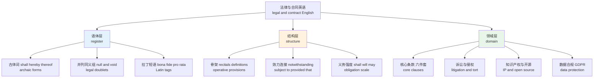
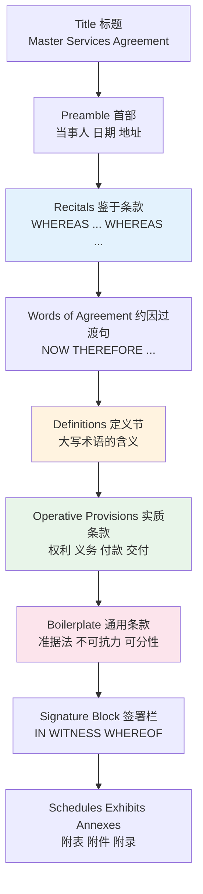
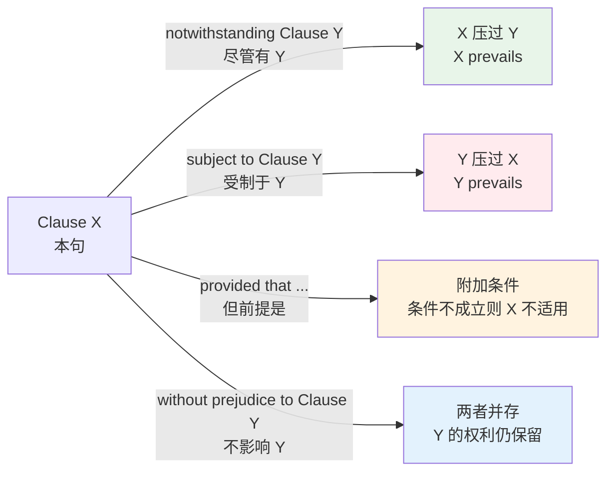
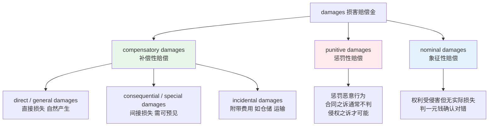
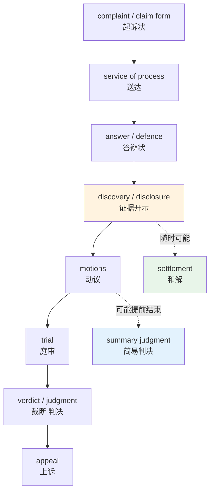
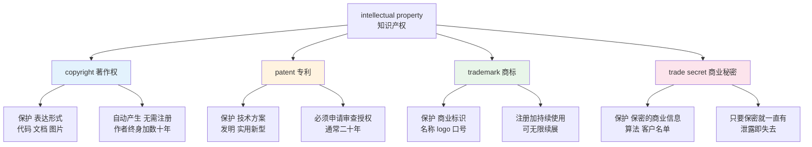
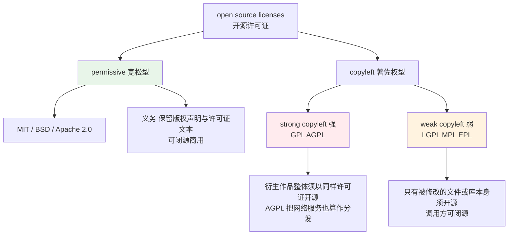
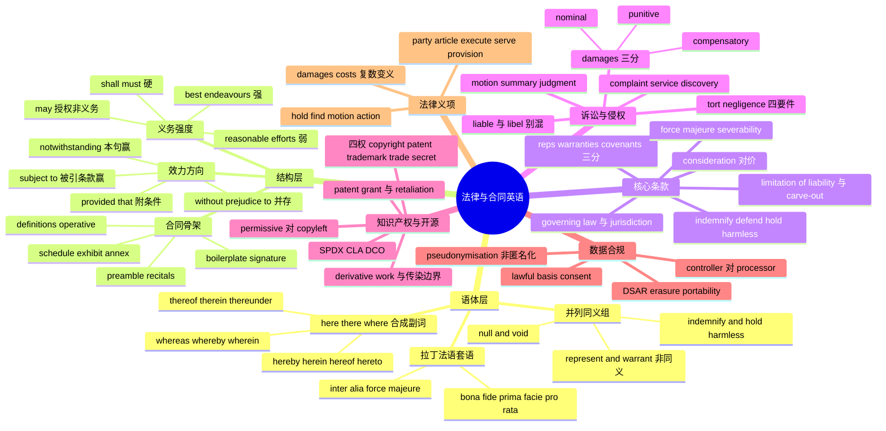

# 法律与合同英语：条款、诉讼、知识产权与开源协议

> [!info] 本篇定位
>
> 第二十章从这一篇起离开 IT 主线。前四篇 [[20.专业领域词汇/01.IT 深度英语（上）：核心概念术语与其读音\|IT 深度英语（上）]] 到 [[20.专业领域词汇/04.IT 深度英语（下）：云原生运维、评审用语与缩略语读法\|IT 深度英语（下）]] 处理的是你写代码时读的英语，本篇处理的是你**不写代码时也躲不掉**的那批英语：入职合同、外包协议、SaaS 服务条款、一个 npm 包的 LICENSE 文件、一封律师函、一份数据处理附录。
>
> 程序员接触法律英语的密度远高于自己以为的程度。选一个依赖库要判断它的许可证是不是 copyleft，给公司提交开源贡献要签 CLA，接入欧盟用户的数据要分清自己是 controller 还是 processor，看服务条款要能读懂 `AS IS` 大写那一段究竟免掉了什么责任。这些判断全部落在词义上，判断错的代价不是代码跑不通，是公司赔钱。
>
> 本篇有四条主线：合同文本的语体特征与骨架部件、六大核心条款的准确含义、诉讼流程词与 `damages` 的三分、开源与数据合规两块最贴近技术工作的合规英语。末尾收一份全书唯一的**法律义项清单**——`party`、`article`、`execute`、`serve`、`provision` 这类日常词在法庭和合同里的另一张脸，只在本篇展开，其他章节不重复。
>
> 熟词僻义的通用方法论见 [[16.词义辨析、搭配与短语动词/02.反义词体系、一词多义与词义引申\|反义词体系、一词多义与词义引申]]，考试口径的熟词僻义总表见 [[21.考试词汇专项/02.熟词僻义总表：从考研到 GRE\|熟词僻义总表：从考研到 GRE]]，作为居民办事场景的法律政治词见 [[11.学校、职场与城市社会/05.城市建筑、公共设施、法律政治与证件手续\|城市建筑、公共设施、法律政治与证件手续]]。本篇不与它们重叠：那三处给的是词义与场景，这里给的是**文本怎么读、条款之间怎么互相压制**。

---

## 1. 本篇导读：法律英语难在哪里

法律英语难读，难点不在生词量。一份标准的商业合同，去掉专有名词后的实词量并不大，反复出现的核心词不过两三百个——正好是本篇的规模。真正卡人的是三样别的东西。

**第一样是语体的历史沉淀。** 英语法律文本是三个语言层的叠加：古英语层留下了 `shall`、`hereby`、`thereof` 这类今天日常英语里已经死掉的词；诺曼法语层留下了 `tort`、`plaintiff`、`estoppel`、`chattel`；教会拉丁层留下了 `bona fide`、`prima facie`、`res judicata`、`pro rata`。三层同时在场，导致同一份文件里既有 `witnesseth` 这种莎士比亚之前的形式，也有 `inter alia` 这种直接照抄的拉丁短语。这套历史层次的成因在 [[18.语域、英美差异与习语俚语/02.语域分层与英语词汇的历史层次\|语域分层与英语词汇的历史层次]] 讲过机制，本篇只处理落地的词。

**第二样是条款之间的效力关系。** 合同不是一串平行的句子，是一张有优先级的网。`notwithstanding Section 5` 意思是「第 5 条在这里不算数」，`subject to Section 5` 意思恰好相反——「第 5 条压过这一句」。这两个短语长得都像连接词，效力却是相反的，读反了会把整份合同的责任分配理解颠倒。

**第三样是精确到词的义务强度。** `shall`、`will`、`may`、`is entitled to`、`agrees to use commercially reasonable efforts` 排成一条从硬到软的梯度，每一档对应不同的违约后果。技术规范里 RFC 2119 的 `MUST`/`SHOULD`/`MAY` 阶梯（见 [[20.专业领域词汇/03.IT 深度英语（中）：设计文档、规范文体与 API 措辞\|IT 深度英语（中）]]）其实是从法律文本借来的思路，只是法律这边的层次更细，而且没有一份统一的定义文件兜底。



上图三层的学习顺序不能倒过来。语体层是解码器：不认识 `hereinafter referred to as` 这个套式，第一段就读不下去。结构层是导航器：知道 `notwithstanding` 和 `subject to` 的方向，才能在几十条条款之间判断谁压过谁。领域层才是内容本身，而且可以按需取用——不做跨境业务可以先跳过第 15 节，不参与开源可以先跳过第 14 节，但前两层对所有人都是必修。

### 1.1 读法律文本的四个动作

法律文本有一套固定的读法，跟读技术文档不一样。技术文档可以跳读，法律文本必须先定位再细读。

① **先找 Definitions 一节**。合同里首字母大写的词（`the Services`、`Confidential Information`、`Effective Date`）全部是被定义过的术语，含义由合同自己规定，不是英语常识。跳过定义节直接读正文，等于拿着一本没有词表的字典。

② **再找 Term 与 Termination**。合同从什么时候生效、什么时候结束、谁能提前结束、结束后哪些义务还活着（`survival`）。这四个问题决定你被绑住多久。

③ **然后找 Limitation of Liability**。这一节通常全部大写或加粗，因为很多法域要求免责条款必须「显著」（`conspicuous`）才有效。它回答的是「出事以后最坏赔多少」。

④ **最后才回头逐条读义务**。前三步给了框架，逐条读的时候就知道每一条落在哪个位置。

> [!tip] 大写不是排版风格
>
> 法律文本里的全大写段落（`THE SOFTWARE IS PROVIDED "AS IS", WITHOUT WARRANTY OF ANY KIND...`）不是在喊叫，是在满足「显著性」要求。美国《统一商法典》要求排除默示担保的条款必须 conspicuous，实务上就演变成全大写。看到大写段落，正确反应是「这里有人在免责，我得读」，而不是「排版没做好」。

---

## 2. 语体层：为什么法律句子长成那样

### 2.1 here-、there-、where- 合成副词

这一组词是法律英语最显眼的标志。构成规则极简单：`here` 指**本文件**，`there` 指**刚提到的那个东西**，`where` 指**哪一个**，后面接介词，整体等于「介词 + 指代对象」。

| 英文 | 英式音标 | 美式音标 | 词性 | 中文 | 搭配与说明 |
| --- | --- | --- | --- | --- | --- |
| **hereby** | /ˌhɪəˈbaɪ/ | /ˌhɪrˈbaɪ/ | adv. | 特此；兹 | 表示这句话本身就产生法律效果：the Parties hereby agree |
| **herein** | /ˌhɪərˈɪn/ | /ˌhɪrˈɪn/ | adv. | 本文件中 | = in this agreement；as defined herein 如本协议所定义 |
| **hereof** | /ˌhɪərˈɒv/ | /ˌhɪrˈʌv/ | adv. | 本文件的 | Section 5 hereof = Section 5 of this agreement |
| **hereto** | /ˌhɪəˈtuː/ | /ˌhɪrˈtuː/ | adv. | 至本文件 | the parties hereto 本协议双方；Exhibit A hereto 本协议附件 A |
| **hereunder** | /ˌhɪərˈʌndə/ | /ˌhɪrˈʌndər/ | adv. | 根据本文件 | obligations hereunder 本协议项下的义务 |
| **hereinafter** | /ˌhɪərɪnˈɑːftə/ | /ˌhɪrɪnˈæftər/ | adv. | 以下称 | hereinafter referred to as "the Company"；本篇最常见的套式 |
| **heretofore** | /ˌhɪətuˈfɔː/ | /ˌhɪrtuˈfɔːr/ | adv. | 迄今为止 | 指本协议签署前的期间，与 hereafter 相对 |
| **herewith** | /ˌhɪəˈwɪð/ | /ˌhɪrˈwɪθ/ | adv. | 随本文件 | enclosed herewith 随函附上；信函体常见 |
| **thereof** | /ðeərˈɒv/ | /ðerˈʌv/ | adv. | 其；它的 | the Software and any modifications thereof 及其任何修改 |
| **therein** | /ˌðeərˈɪn/ | /ˌðerˈɪn/ | adv. | 其中 | the data contained therein 其中包含的数据 |
| **thereto** | /ˌðeəˈtuː/ | /ˌðerˈtuː/ | adv. | 对此；附于其上 | amendments thereto 对其的修订 |
| **thereunder** | /ˌðeərˈʌndə/ | /ˌðerˈʌndər/ | adv. | 在其项下 | rights granted thereunder 依其授予的权利 |
| **thereafter** | /ˌðeərˈɑːftə/ | /ˌðerˈæftər/ | adv. | 此后 | 常与具体时点连用：and each year thereafter |
| **therefrom** | /ˌðeəˈfrɒm/ | /ˌðerˈfrʌm/ | adv. | 由此 | proceeds derived therefrom 由此产生的收益 |
| **thereby** | /ˌðeəˈbaɪ/ | /ˌðerˈbaɪ/ | adv. | 从而 | 这个词日常英语里还活着，正式书面语常见 |
| **whereas** | /weərˈæz/ | /werˈæz/ | conj. | 鉴于 | 引出 recitals 每一段的开头；也有「然而」的对比义 |
| **whereby** | /weəˈbaɪ/ | /werˈbaɪ/ | conj. | 藉此；据以 | an arrangement whereby the Supplier delivers monthly |
| **wherein** | /weərˈɪn/ | /werˈɪn/ | adv. | 在其中 | 专利权利要求书高频：wherein said module comprises |
| **whereof** | /weərˈɒv/ | /werˈʌv/ | adv. | 关于该事 | 只活在一句套话里：IN WITNESS WHEREOF |
| **whereupon** | /ˌweərəˈpɒn/ | /ˌwerəˈpɑːn/ | conj. | 于是随即 | 表示前一动作完成后立刻发生后一动作 |
| **aforesaid** | /əˈfɔːsed/ | /əˈfɔːrsed/ | adj. | 前述的 | = mentioned above；同义还有 aforementioned |
| **forthwith** | /ˌfɔːθˈwɪð/ | /ˌfɔːrθˈwɪθ/ | adv. | 立即 | 比 immediately 更硬，含「不得拖延」的义务色彩 |
| **notwithstanding** | /ˌnɒtwɪθˈstændɪŋ/ | /ˌnɑːtwɪθˈstændɪŋ/ | prep./conj. | 尽管；即使 | 效力最关键的词，单列第 5 节讲 |
| **pursuant to** | /pəˈsjuːənt tuː/ | /pərˈsuːənt tuː/ | prep. | 依照 | = under、in accordance with；美式发音省掉 /j/ |

`thereof` 是这组里出现频率最高的一个，也是最容易被中文母语者读丢的。它的作用是避免重复一个长名词短语：写 `the Software and all documentation thereof`，就不必写成 `the Software and all documentation of the Software`。读的时候要主动回填它指代的对象，回填不出来说明前面的名词短语没读清楚。

> [!warning] thereof 指代最近的名词，不是整句
>
> `the Company shall deliver the Product and the specifications thereof` 里，`thereof` 指的是 `the Product`，不是 `the Company`，也不是整个交付行为。指代规则是就近，但实务上这条规则经常出争议——所以现代起草风格（plain English drafting）倾向于直接重复名词，宁可啰嗦也不用 `thereof`。你读到的老合同用得多，新起草的合同用得少。

### 2.2 并列同义组：为什么要说两遍

`null and void`、`terms and conditions`、`indemnify and hold harmless`——这类两个近义词用 `and` 或 `or` 串起来的固定组合叫 **legal doublet**（并列同义组），三个的叫 **triplet**。它们不是啰嗦，是历史遗留：诺曼征服之后英格兰法庭上英语、法语、拉丁语三种语言并行，起草人为了保险，把同一个意思用两种语言的词各写一遍，久而久之凝固成套语。

| 并列组 | 拆开看 | 现代英语单说 | 读法要点 |
| --- | --- | --- | --- |
| null and void | null 拉丁层 + void 法语层 | void | 「自始无效」，不是「作废」 |
| terms and conditions | 两个都指条款 | terms | 口语缩写 T&Cs，读作 tee and sees |
| indemnify and hold harmless | 补偿 + 使免受追偿 | indemnify | 两词在多数法域被认为同义，但实务坚持并列 |
| cease and desist | 停止 + 中止 | stop | 律师函标题常用 cease and desist letter |
| aid and abet | 帮助 + 教唆 | assist | 刑事语境，指共犯 |
| free and clear | 无负担 + 无瑕疵 | unencumbered | 常接 of all liens 无任何留置权 |
| represent and warrant | 陈述 + 保证 | 两者法律后果不同，见第 7 节 | 这一组不是同义，别当套语略读 |
| covenants and agrees | 立约 + 同意 | agrees | 引出持续性义务 |
| any and all | 任何 + 全部 | all | 强调无遗漏 |
| each and every | 每个 + 所有 | each | 同上 |
| made and entered into | 订立 + 签订 | entered into | 合同首句固定搭配 |
| by and between | 由 + 在…之间 | between | 双方用 between，三方以上用 among |
| successors and assigns | 继承人 + 受让人 | 两者确实不同 | 指公司合并或权利转让后的接手方 |
| save and except | 除 + 除外 | except | save 作介词的法律义，见第 16 节 |
| power and authority | 权力 + 授权 | authority | 陈述与保证节的固定表述 |
| full force and effect | 完全效力 | in effect | remains in full force and effect 继续有效 |

判断一个并列组能不能当成一个词整体理解，看两个成分的法律后果是否真的相同。`null and void` 可以当一个词读；`represent and warrant` **不能**，因为陈述不实与保证违反在英美法下的救济方式不同。同样，`successors and assigns` 也不能——`successor` 是概括承受（比如公司合并），`assign` 是主动转让，一份合同可能允许前者禁止后者。

### 2.3 拉丁短语速查

拉丁短语在英美合同里数量不多但复现率高，而且没法从词根猜。

| 拉丁短语 | 英式音标 | 美式音标 | 中文 | 用在哪里 |
| --- | --- | --- | --- | --- |
| bona fide | /ˌbəʊnə ˈfaɪdi/ | /ˌboʊnə ˈfaɪd/ | 善意的；真实的 | a bona fide purchaser 善意购买人 |
| prima facie | /ˌpraɪmə ˈfeɪʃi/ | /ˌpraɪmə ˈfeɪʃi/ | 初步证据显示的 | prima facie case 初步成立的案件 |
| pro rata | /ˌprəʊ ˈrɑːtə/ | /ˌproʊ ˈrɑːtə/ | 按比例 | refunded on a pro rata basis 按比例退款 |
| inter alia | /ˌɪntər ˈeɪliə/ | /ˌɪntər ˈeɪliə/ | 其中包括 | 表示列举不穷尽，等于 among other things |
| de facto | /ˌdeɪ ˈfæktəʊ/ | /ˌdeɪ ˈfæktoʊ/ | 事实上的 | 与 de jure 法律上的相对 |
| per se | /ˌpɜː ˈseɪ/ | /ˌpɜːr ˈseɪ/ | 本身；当然 | negligence per se 当然过失 |
| ultra vires | /ˌʌltrə ˈvaɪriːz/ | /ˌʌltrə ˈvaɪriːz/ | 越权的 | 指超出公司章程授权范围的行为 |
| force majeure | /ˌfɔːs mæˈʒɜː/ | /ˌfɔːrs mɑːˈʒɜːr/ | 不可抗力 | 法语不是拉丁语，但同属外来套语 |
| quid pro quo | /ˌkwɪd prəʊ ˈkwəʊ/ | /ˌkwɪd proʊ ˈkwoʊ/ | 对价交换 | 日常英语里已泛化为「交换条件」 |
| res judicata | /ˌreɪz dʒuːdɪˈkɑːtə/ | /ˌreɪz dʒuːdɪˈkɑːtə/ | 一事不再理 | 已判决的事项不得重新起诉 |
| ex parte | /ˌeks ˈpɑːti/ | /ˌeks ˈpɑːrti/ | 单方的 | an ex parte injunction 单方申请的禁令 |
| mutatis mutandis | /mjuːˌtɑːtɪs mjuːˈtændɪs/ | /mjuːˌtɑːtɪs mjuːˈtændɪs/ | 作必要修改后 | 表示某条款准用于另一情形 |

`inter alia` 值得单独记，因为它承担了一个重要的法律功能：声明列举不是穷尽的。英文合同里表达「包括但不限于」有三种写法——`including without limitation`、`including but not limited to`、`including, inter alia`——三者等价，作用都是防止对方主张「你列了三项，第四项不在里面」。

---

## 3. 合同骨架：一份文件从头到尾有哪些部件

### 3.1 部件顺序

英美商业合同的部件顺序高度固定，认部件比逐句读快得多。



上图里真正有约束力的只有 E 到 G 三段。Recitals（鉴于条款）在多数法域**不产生独立的义务**，它的作用是交代背景、说明双方为什么签这份合同，将来出争议时用来解释正文的意图。所以读合同时看到 `WHEREAS the Company wishes to engage the Contractor...` 这类段落，可以快速扫过，但不能完全跳过——法院解释歧义条款时会回头看这里。

签署栏放在正文后面、附件前面，这个位置有实际意义：附件在签署栏之后，说明附件是被并入（`incorporated by reference`）的，不是另一份文件。看到 `Schedule 1 is incorporated herein by reference` 这句话，意思是附表 1 和正文有同等效力。

| 英文 | 英式音标 | 美式音标 | 词性 | 中文 | 搭配与说明 |
| --- | --- | --- | --- | --- | --- |
| **agreement** | /əˈɡriːmənt/ | /əˈɡriːmənt/ | n. | 协议 | 与 contract 基本同义，标题更常用 Agreement |
| **contract** | /ˈkɒntrækt/ | /ˈkɑːntrækt/ | n./v. | 合同；订约 | 名词重音在前，动词 /kənˈtrækt/ 重音在后 |
| **preamble** | /ˈpriːæmbl/ | /ˈpriːæmbl/ | n. | 首部；序言 | 载明当事人全称、注册地、签署日 |
| **recital** | /rɪˈsaɪtl/ | /rɪˈsaɪtl/ | n. | 鉴于条款 | 复数 recitals；每段以 WHEREAS 起头 |
| **operative** | /ˈɒpərətɪv/ | /ˈɑːpərətɪv/ | adj. | 有实际效力的 | operative provisions 实质条款，与 recitals 相对 |
| **provision** | /prəˈvɪʒn/ | /prəˈvɪʒn/ | n. | 条款 | 法律义项，不是「提供」；单列第 16 节 |
| **clause** | /klɔːz/ | /klɔːz/ | n. | 条款 | 比 provision 更口语；语法术语里指从句 |
| **article** | /ˈɑːtɪkl/ | /ˈɑːrtɪkl/ | n. | 条 | 法律义项，条约与章程的第一级编号单位 |
| **section** | /ˈsekʃn/ | /ˈsekʃn/ | n. | 节；条 | 美式合同的主编号单位，Section 7.2 |
| **subsection** | /ˈsʌbsekʃn/ | /ˈsʌbsekʃn/ | n. | 款 | 下一级，常写作 (a)、(b)、(i)、(ii) |
| **schedule** | /ˈʃedjuːl/ | /ˈskedʒuːl/ | n. | 附表 | 英美读音差异最大的常用词之一；英式合同偏好 Schedule |
| **exhibit** | /ɪɡˈzɪbɪt/ | /ɪɡˈzɪbɪt/ | n. | 附件 | 美式合同偏好 Exhibit A、Exhibit B |
| **annex** | /ˈæneks/ | /ˈæneks/ | n. | 附录 | 欧盟与国际条约常用；动词 /əˈneks/ 重音后移 |
| **appendix** | /əˈpendɪks/ | /əˈpendɪks/ | n. | 附录 | 复数 appendices /əˈpendɪsiːz/ |
| **addendum** | /əˈdendəm/ | /əˈdendəm/ | n. | 补充文件 | 复数 addenda；签约时一并附上的增补 |
| **amendment** | /əˈmendmənt/ | /əˈmendmənt/ | n. | 修订 | 签约后的变更；动词 amend |
| **counterpart** | /ˈkaʊntəpɑːt/ | /ˈkaʊntərpɑːrt/ | n. | 对应文本 | executed in two counterparts 一式两份 |
| **execute** | /ˈeksɪkjuːt/ | /ˈeksɪkjuːt/ | v. | 签署使生效 | 法律义项，不是「执行」；单列第 16 节 |
| **effective date** | /ɪˈfektɪv deɪt/ | /ɪˈfektɪv deɪt/ | n. | 生效日 | 可以早于或晚于签署日 |
| **term** | /tɜːm/ | /tɜːrm/ | n. | 期限；条款 | 单数常指期限，复数 terms 指条款 |
| **party** | /ˈpɑːti/ | /ˈpɑːrti/ | n. | 当事人 | 法律义项；复数 the Parties；单列第 16 节 |
| **recitals clause** | /rɪˈsaɪtlz klɔːz/ | /rɪˈsaɪtlz klɔːz/ | n. | 鉴于条款段 | 整段的统称 |
| **signature block** | /ˈsɪɡnətʃə blɒk/ | /ˈsɪɡnətʃər blɑːk/ | n. | 签署栏 | 含 By、Name、Title 三行 |
| **incorporate by reference** | — | — | v. | 以引用方式并入 | 使附件获得与正文同等效力 |

> [!example] 合同首段的固定套式
>
> - This Master Services Agreement (this "**Agreement**") is **made and entered into** as of January 15, 2026 (the "**Effective Date**") **by and between** Acme Ltd., a company incorporated under the laws of England and Wales ("**Supplier**"), and Beta Inc., a Delaware corporation ("**Customer**").
>   - 本主服务协议（以下称「本协议」）由英格兰和威尔士法律下设立的 Acme Ltd.（以下称「供应商」）与特拉华州公司 Beta Inc.（以下称「客户」）于 2026 年 1 月 15 日（以下称「生效日」）订立。
> - **WHEREAS**, Supplier is engaged in the business of providing cloud infrastructure services;
>   - 鉴于，供应商从事云基础设施服务业务；
> - **NOW, THEREFORE**, in consideration of the mutual covenants contained herein, the Parties agree as follows:
>   - 因此，考虑到本协议所载相互约定，双方约定如下：

三段套式里每一段都有功能。第一段确定谁跟谁签、什么时候生效、简称是什么；`WHEREAS` 段交代背景；`NOW, THEREFORE` 段是从背景切换到义务的过渡句，其中 `in consideration of` 那半句是在声明这份合同有对价——这一点在英美法下是合同成立的必要条件，见下一节。

---

## 4. 定义条款与解释规则

### 4.1 定义节怎么读

定义节是合同里唯一一处**词典压过英语常识**的地方。一旦某个词被定义，它在全文中就只有定义里说的那个意思，哪怕定义得违反直觉。

| 英文 | 英式音标 | 美式音标 | 词性 | 中文 | 搭配与说明 |
| --- | --- | --- | --- | --- | --- |
| **means** | /miːnz/ | /miːnz/ | v. | 是指 | 穷尽式定义，等号；"Services" means the services listed in Schedule 1 |
| **includes** | /ɪnˈkluːdz/ | /ɪnˈkluːdz/ | v. | 包括 | 非穷尽式，还可能有别的；与 means 的差别是本节重点 |
| **shall have the meaning** | — | — | — | 具有…含义 | 引用其他文件的定义 |
| **capitalized term** | /ˈkæpɪtəlaɪzd tɜːm/ | /ˈkæpɪtəlaɪzd tɜːrm/ | n. | 首字母大写术语 | 被定义过的词的统称 |
| **construe** | /kənˈstruː/ | /kənˈstruː/ | v. | 解释 | shall be construed as 应被解释为 |
| **construction** | /kənˈstrʌkʃn/ | /kənˈstrʌkʃn/ | n. | 解释 | 法律义项，不是「建设」；rules of construction 解释规则 |
| **interpretation** | /ɪnˌtɜːprɪˈteɪʃn/ | /ɪnˌtɜːrprɪˈteɪʃn/ | n. | 释义 | 与 construction 在合同里基本同义 |
| **deem** | /diːm/ | /diːm/ | v. | 视为 | shall be deemed to have been received 视为已收到 |
| **for the avoidance of doubt** | — | — | — | 为免疑义 | 引出澄清句，本身不新增义务 |
| **unless the context otherwise requires** | — | — | — | 除文义另有所指外 | 定义节的固定免责句 |
| **including without limitation** | — | — | — | 包括但不限于 | 三种写法等价，见第 2.3 节 |
| **respectively** | /rɪˈspektɪvli/ | /rɪˈspektɪvli/ | adv. | 分别地 | 把两串并列项一一对应起来 |
| **mutatis mutandis** | /mjuːˌtɑːtɪs mjuːˈtændɪs/ | /mjuːˌtɑːtɪs mjuːˈtændɪs/ | adv. | 作必要修改后适用 | 避免整段重复 |
| **herein defined** | — | — | — | 本文所定义 | as herein defined |
| **singular and plural** | — | — | — | 单复数 | words in the singular include the plural 单数含复数 |
| **headings are for convenience only** | — | — | — | 标题仅供方便 | 声明小节标题不影响解释 |

`means` 与 `includes` 的差别是定义节里最容易忽视也最要命的一处。`"Confidential Information" means A, B and C` 是封闭清单，D 不在里面，你披露 D 不违约。`"Confidential Information" includes A, B and C` 是开放清单，D 可能也在里面，判断权在法院。**签约方拿到草稿第一件事就是把对自己不利的 `includes` 改成 `means`**，这是一条真实存在的谈判动作，不是文字游戏。

> [!warning] 定义可以反直觉，而且照样有效
>
> 合同完全可以写 `"Business Day" means any day other than a Saturday, Sunday or public holiday in England`，也完全可以写 `"Month" means a period of 30 days`。后者跟日历月不一致，但只要定义清楚就有效。读到一个定义觉得别扭时，正确反应是**记住这个别扭**，因为它多半是对方特意改的，后面某一条会用到。

### 4.2 解释规则的常见套语

定义节末尾一般跟一串解释规则，它们回答的是「读不通的时候按什么规矩读」。

> [!example] 解释规则原文
>
> - In this Agreement, unless the context otherwise requires, words importing the **singular include the plural** and vice versa.
>   - 在本协议中，除文义另有所指外，单数词包含复数，反之亦然。
> - **Headings** are inserted for convenience only and **shall not affect** the construction of this Agreement.
>   - 标题仅为方便而设，不影响本协议的解释。
> - Any reference to a **statute** includes any subordinate legislation made under it, **as amended from time to time**.
>   - 凡提及某法律，均包括其项下的从属立法及其不时的修订。
> - The word "**including**" shall be construed as being **by way of illustration** and shall not limit the generality of the preceding words.
>   - 「包括」一词应解释为举例说明，不限制前述词语的概括性。

第四条是在对抗一条叫 **ejusdem generis**（同类规则）的普通法解释原则：当合同写「汽车、卡车、公交车及其他车辆」时，法院倾向于把「其他车辆」限缩解释为同类的机动车，不包括自行车。起草人写上「包括不限制前述词语的概括性」，就是在明确排除这条默认规则。这类句子看起来是废话，实际上每一句都在关掉一条默认解释规则。

---

## 5. 三个改变效力方向的连接词

`notwithstanding`、`subject to`、`provided that` 是合同里效力最重、最容易读反的三个短语。它们决定的是条款之间谁压过谁。

### 5.1 方向图



上图的四个方向必须背到条件反射。中文「尽管」和「受制于」在日常语感里区分度不高，但在合同里它们指向相反的结果：`notwithstanding` 是本句赢，`subject to` 是被引用的那一条赢。判断技巧是记住字面——`notwithstanding` 拆开是 not + withstanding，「顶不住本句」，被顶掉的是它后面提到的那一条；`subject to` 是「臣服于」，臣服的是本句自己。

| 英文 | 英式音标 | 美式音标 | 词性 | 中文 | 搭配与说明 |
| --- | --- | --- | --- | --- | --- |
| **notwithstanding** | /ˌnɒtwɪθˈstændɪŋ/ | /ˌnɑːtwɪθˈstændɪŋ/ | prep. | 尽管有 | 本句优先；常见 notwithstanding anything to the contrary herein |
| **subject to** | /ˈsʌbdʒɪkt tuː/ | /ˈsʌbdʒɪkt tuː/ | prep. | 受制于 | 被引用条款优先；也有「以…为前提」义 |
| **provided that** | /prəˈvaɪdɪd ðæt/ | /prəˈvaɪdɪd ðæt/ | conj. | 但前提是 | 引出限制条件；老式写法 PROVIDED ALWAYS THAT |
| **without prejudice to** | — | — | prep. | 不影响 | 保留另一条下的权利，两者并存 |
| **save as** | /seɪv æz/ | /seɪv æz/ | prep. | 除…外 | 英式偏好；美式多写 except as |
| **except as otherwise provided** | — | — | — | 除另有规定外 | 最常见的例外引导句 |
| **for the purposes of** | — | — | — | 就…而言 | 限定某个定义只在某节内适用 |
| **in accordance with** | — | — | prep. | 依照 | 中性，不含优先级判断 |
| **to the extent that** | — | — | conj. | 在…范围内 | 部分适用，不是全有全无 |
| **prevail** | /prɪˈveɪl/ | /prɪˈveɪl/ | v. | 优先适用 | in the event of conflict, this Agreement shall prevail |
| **override** | /ˌəʊvəˈraɪd/ | /ˌoʊvərˈraɪd/ | v. | 推翻 | 口语化表述，正式文本多用 prevail |
| **conflict** | /ˈkɒnflɪkt/ | /ˈkɑːnflɪkt/ | n. | 冲突 | in the event of any conflict or inconsistency |
| **inconsistency** | /ˌɪnkənˈsɪstənsi/ | /ˌɪnkənˈsɪstənsi/ | n. | 不一致 | 与 conflict 并列出现，指程度较轻的抵触 |
| **order of precedence** | — | — | n. | 效力顺序 | 多份文件冲突时的排序条款 |

> [!example] 三个连接词的对照句
>
> - **Notwithstanding** Section 8.1, Supplier shall remain liable for any breach of confidentiality.
>   - 尽管有第 8.1 条的规定，供应商仍应对任何保密义务的违反承担责任。（第 8.1 条大概率是责任上限，这一句把保密违约挖出来不受上限保护）
> - **Subject to** Section 8.1, Supplier's total liability shall not exceed the Fees paid.
>   - 在第 8.1 条的约束下，供应商的全部责任不超过已付费用。（第 8.1 条说了什么，这一句就跟着变）
> - Customer may terminate this Agreement on 30 days' notice, **provided that** all outstanding Fees have been paid.
>   - 客户可提前 30 日通知终止本协议，但前提是所有未付费用已结清。（费用没结清，终止权不成立）
> - Termination shall be **without prejudice to** any rights accrued prior to the date of termination.
>   - 终止不影响终止日前已产生的任何权利。（终止归终止，之前欠的钱照要）

> [!warning] notwithstanding anything to the contrary 是一句危险的话
>
> `Notwithstanding anything to the contrary in this Agreement` 意思是「本协议里任何相反规定都不算数」。这句话一旦出现在对方起草的条款里，它就凌驾于你辛苦谈下来的所有保护条款之上。审合同时应该全文搜索这个短语，逐个确认它压掉的是哪些条。两条都写了 `notwithstanding anything to the contrary` 而内容互斥时，合同就自相矛盾了，这是起草事故，不是高级技巧。

### 5.2 义务强度阶梯

同一件事说到哪一档，决定了做不到时的后果。

```text
硬 ──────────────────────────────────────────────── 软

shall / must              绝对义务，不做即违约
will                      多数法域等同 shall，现代起草偏好
is required to            绝对义务，语气中性
undertakes to             承诺，等同 shall
agrees to                 承诺，稍软但仍可执行
shall use best endeavours 英式：尽最大努力，标准极高
shall use commercially
  reasonable efforts      美式：商业上合理的努力，标准较低
shall endeavour to        努力，义务感更弱
may                       授权，不是义务
is entitled to            有权，同 may
at its sole discretion    完全自主裁量，几乎不可被挑战
```

`best endeavours` 与 `reasonable endeavours` 的差距在英国法下是有判例支撑的：前者要求把自己的商业利益放在一边去达成目标，后者只要求采取一条合理的路径。美式合同的对应表述是 `best efforts` 与 `commercially reasonable efforts`。谈判时这两个词换一个，义务强度会实质变化，不是文风差别。

`shall` 在现代起草运动（plain language drafting）里被建议废除，理由是它在同一份合同里经常混用了三种含义：义务（`the Supplier shall deliver`）、将来（`this Agreement shall terminate`）、以及被定义式（`"Fees" shall mean...`）。所以你会看到新起草的英美合同用 `must` 表义务、用一般现在时表定义、用 `will` 表将来。读旧合同还是得认 `shall`。

---

## 6. 合同成立：consideration 与它的邻居

### 6.1 英美法为什么执着于 consideration

`consideration` 是本篇最重要的一个熟词僻义。它在法律语境里不是「考虑」，是**对价**——为换取对方的承诺而付出的东西。英美法系的合同成立需要三件事：要约、承诺、对价。没有对价的承诺原则上不能强制执行，哪怕白纸黑字签了字。

这解释了两个你会在真实文件里看到的现象。一是合同开头那句 `in consideration of the mutual covenants contained herein` ——它在声明这份合同有对价。二是 `in consideration of the sum of one dollar (US$1.00), the receipt and sufficiency of which is hereby acknowledged` ——象征性一美元，作用是构造一个对价，让一份看起来像单方赠与的文件也能成立。中国法不要求对价，所以中文合同里没有这一套，第一次读会觉得这句话莫名其妙。

| 英文 | 英式音标 | 美式音标 | 词性 | 中文 | 搭配与说明 |
| --- | --- | --- | --- | --- | --- |
| **consideration** | /kənˌsɪdəˈreɪʃn/ | /kənˌsɪdəˈreɪʃn/ | n. | 对价 | 法律义项；good consideration、valuable consideration |
| **offer** | /ˈɒfə/ | /ˈɑːfər/ | n./v. | 要约 | 法律上的要约必须足够确定，否则只是 invitation to treat |
| **acceptance** | /əkˈseptəns/ | /əkˈseptəns/ | n. | 承诺；接受 | 必须与要约完全一致，即 mirror image rule |
| **invitation to treat** | — | — | n. | 要约邀请 | 商品标价、广告属于此类，不构成要约 |
| **counteroffer** | /ˈkaʊntərɒfə/ | /ˈkaʊntərɔːfər/ | n. | 反要约 | 对要约作出修改即构成反要约，原要约消灭 |
| **capacity** | /kəˈpæsəti/ | /kəˈpæsəti/ | n. | 缔约能力 | 未成年人、无行为能力人签的合同可撤销 |
| **mutual assent** | /ˈmjuːtʃuəl əˈsent/ | /ˈmjuːtʃuəl əˈsent/ | n. | 意思表示一致 | 也叫 meeting of the minds |
| **binding** | /ˈbaɪndɪŋ/ | /ˈbaɪndɪŋ/ | adj. | 有约束力的 | legally binding；非约束性文件写 non-binding |
| **enforceable** | /ɪnˈfɔːsəbl/ | /ɪnˈfɔːrsəbl/ | adj. | 可强制执行的 | 反义 unenforceable |
| **void** | /vɔɪd/ | /vɔɪd/ | adj. | 自始无效的 | 从来没有过法律效力 |
| **voidable** | /ˈvɔɪdəbl/ | /ˈvɔɪdəbl/ | adj. | 可撤销的 | 有效直到一方撤销；与 void 差一个字母，效果完全不同 |
| **unenforceable** | /ˌʌnɪnˈfɔːsəbl/ | /ˌʌnɪnˈfɔːrsəbl/ | adj. | 不可执行的 | 合同有效但法院不给强制力 |
| **duress** | /djʊˈres/ | /dʊˈres/ | n. | 胁迫 | signed under duress 在胁迫下签署 |
| **undue influence** | /ˌʌnˈdjuː ˈɪnfluəns/ | /ˌʌnˈduː ˈɪnfluəns/ | n. | 不当影响 | 利用信任关系施压 |
| **misrepresentation** | /ˌmɪsˌreprɪzenˈteɪʃn/ | /ˌmɪsˌreprɪzenˈteɪʃn/ | n. | 虚假陈述 | 分 innocent、negligent、fraudulent 三档 |
| **fraud** | /frɔːd/ | /frɔːd/ | n. | 欺诈 | 形容词 fraudulent /ˈfrɔːdjələnt/ |
| **privity** | /ˈprɪvəti/ | /ˈprɪvəti/ | n. | 合同相对性 | privity of contract 非合同方不得主张权利 |
| **third-party beneficiary** | — | — | n. | 第三方受益人 | 合同相对性的例外 |
| **promisor** | /ˌprɒmɪˈsɔː/ | /ˌprɑːmɪˈsɔːr/ | n. | 承诺人 | 与 promisee 受诺人配对；-or 与 -ee 是法律英语的常见配对后缀 |
| **promisee** | /ˌprɒmɪˈsiː/ | /ˌprɑːmɪˈsiː/ | n. | 受诺人 | 同上 |
| **vest** | /vest/ | /vest/ | v. | 归属；既得 | rights vest in the Company 权利归属于公司；股权语境见 20.08 |
| **accrue** | /əˈkruː/ | /əˈkruː/ | v. | 产生；累积 | rights accrued prior to termination 终止前已产生的权利 |

> [!tip] -or 与 -ee 的配对后缀
>
> 法律英语用一对后缀区分动作的两端：`-or`（有时是 `-er`）是主动方，`-ee` 是被动方。这条规律在本篇内部复用率极高，记住一次能省几十个词的记忆量。
>
> ```text
> employer  雇主      —  employee  雇员
> licensor  许可方    —  licensee  被许可方
> assignor  转让人    —  assignee  受让人
> lessor    出租人    —  lessee    承租人
> indemnitor 补偿方   —  indemnitee 受补偿方
> mortgagor 抵押人    —  mortgagee 抵押权人
> offeror   要约人    —  offeree   受要约人
> promisor  承诺人    —  promisee  受诺人
> transferor 转让方   —  transferee 受让方
> guarantor 保证人    —  guarantee 被保证人 / 保证书
> ```
>
> 重音落点有规律：`-ee` 结尾的词重音在最后一个音节，`licensee` 读 /ˌlaɪsnˈsiː/，`assignee` 读 /ˌæsaɪˈniː/。这一条跟 [[14.构词法：前缀与后缀/05.名词后缀家族\|名词后缀家族]] 讲的施事后缀是同一套机制，只是法律文本把它用成了系统。

`guarantee` 是这组里的例外，它既能当「被保证人」也能当「保证；保证书」，实际使用中后一个义项占绝对多数。指人的时候多写 `guarantor` 的对家 `beneficiary`，避免歧义。

---

## 7. representations、warranties、covenants 三分

这三个词在中文里都可以译成「保证」，在英美合同里是三件不同的事，救济方式也不同。这是本篇最需要精确掌握的一组区分。

### 7.1 三者的时间与救济差别

| 概念 | 指向的时间 | 说的是什么 | 出问题叫什么 | 救济方向 |
| --- | --- | --- | --- | --- |
| representation 陈述 | 签约当时或之前 | 一项事实的真实性 | misrepresentation | 撤销合同 + 侵权损害赔偿 |
| warranty 保证 | 签约当时，延续到未来 | 一项事实为真，且我为此担保 | breach of warranty | 违约损害赔偿，通常不能撤销 |
| covenant 约定 | 未来 | 我将做或不做某事 | breach of covenant | 违约损害赔偿、实际履行、禁令 |
| condition 条件 | 触发点 | 某事成立才生效或才继续 | failure of condition | 义务不发生或合同可终止 |

差别落到实处是这样的：卖家说「这套代码不侵犯任何第三方专利」，如果这是 representation，买家发现不实可以撤销整笔交易并要求恢复原状；如果只是 warranty，买家一般只能要赔偿，交易还得继续。所以英美合同的标准写法是 `represents and warrants` 两个都写上，把两条救济路径都保留。前面第 2.2 节说过这一组不是套语，原因就在这里。

| 英文 | 英式音标 | 美式音标 | 词性 | 中文 | 搭配与说明 |
| --- | --- | --- | --- | --- | --- |
| **represent** | /ˌreprɪˈzent/ | /ˌreprɪˈzent/ | v. | 陈述 | 法律义项，不是「代表」；the Seller represents that |
| **representation** | /ˌreprɪzenˈteɪʃn/ | /ˌreprɪzenˈteɪʃn/ | n. | 陈述 | reps and warranties 口语简称 reps |
| **warrant** | /ˈwɒrənt/ | /ˈwɔːrənt/ | v. | 保证 | 动词义；名词 warrant 是搜查令或认股权证 |
| **warranty** | /ˈwɒrənti/ | /ˈwɔːrənti/ | n. | 保证；质保 | 消费语境是保修，合同语境是保证条款 |
| **covenant** | /ˈkʌvənənt/ | /ˈkʌvənənt/ | n./v. | 约定；立约 | 注意首音节读 /ˈkʌv/ 不是 /ˈkəʊv/ |
| **condition** | /kənˈdɪʃn/ | /kənˈdɪʃn/ | n. | 条件 | condition precedent 先决条件、condition subsequent 解除条件 |
| **undertaking** | /ˌʌndəˈteɪkɪŋ/ | /ˌʌndərˈteɪkɪŋ/ | n. | 承诺 | 英式偏好；也指「企业」，注意语境 |
| **disclaimer** | /dɪsˈkleɪmə/ | /dɪsˈkleɪmər/ | n. | 免责声明 | disclaimer of warranties 保证的排除 |
| **disclaim** | /dɪsˈkleɪm/ | /dɪsˈkleɪm/ | v. | 否认；排除 | 与 claim 反义 |
| **express warranty** | — | — | n. | 明示保证 | 白纸黑字写出来的 |
| **implied warranty** | — | — | n. | 默示保证 | 法律默认存在，需明示排除 |
| **merchantability** | /ˌmɜːtʃəntəˈbɪləti/ | /ˌmɜːrtʃəntəˈbɪləti/ | n. | 适销性 | 默示保证之一：货物达到同类商品通常质量 |
| **fitness for a particular purpose** | — | — | n. | 特定用途适用性 | 默示保证之二 |
| **non-infringement** | /ˌnɒn ɪnˈfrɪndʒmənt/ | /ˌnɑːn ɪnˈfrɪndʒmənt/ | n. | 不侵权 | 软件许可里的第三条默示保证 |
| **AS IS** | /æz ɪz/ | /æz ɪz/ | adv. | 按现状 | 全大写出现，表示不作任何保证 |
| **AS AVAILABLE** | — | — | adv. | 按可用状态 | SaaS 条款常与 AS IS 并列 |
| **material** | /məˈtɪəriəl/ | /məˈtɪriəl/ | adj. | 重大的 | 法律义项；material breach、material adverse change |
| **materiality** | /məˌtɪəriˈæləti/ | /məˌtɪriˈæləti/ | n. | 重大性 | materiality threshold 重大性门槛 |
| **knowledge qualifier** | — | — | n. | 知悉限定 | to the best of the Seller's knowledge 就卖方所知 |
| **disclosure schedule** | — | — | n. | 披露附表 | 列出保证的例外情形 |
| **survive** | /səˈvaɪv/ | /sərˈvaɪv/ | v. | 继续有效 | the warranties shall survive Closing 保证在交割后继续有效 |
| **cap** | /kæp/ | /kæp/ | n. | 上限 | warranty cap、liability cap |
| **basket** | /ˈbɑːskɪt/ | /ˈbæskɪt/ | n. | 起赔额 | 索赔累计达到该额度才可主张 |

> [!example] AS IS 免责段的典型写法
>
> - THE SOFTWARE IS PROVIDED "**AS IS**", **WITHOUT WARRANTY OF ANY KIND**, EXPRESS OR IMPLIED, INCLUDING BUT NOT LIMITED TO THE WARRANTIES OF **MERCHANTABILITY**, **FITNESS FOR A PARTICULAR PURPOSE** AND **NONINFRINGEMENT**.
>   - 本软件按现状提供，不附带任何明示或默示的保证，包括但不限于适销性、特定用途适用性和不侵权的保证。

这一段是 MIT License 的原文片段，也是几乎所有宽松型开源许可证的标配。它排除的三项正好是英美法下最重要的三项默示保证。理解这一段的实际含义是：**你用这个库出了任何问题，作者一分钱不赔**。这不是作者刻薄，是开源免费分发的必要前提——不排除默示保证的话，任何一个 GitHub 上的个人项目都会背上商业级质量责任。

> [!warning] warranty 与 guarantee 不是一回事
>
> 日常英语里两个词经常互换，法律语境里不能。`warranty` 是合同一方对另一方的保证，出问题由这一方负责；`guarantee` 通常指**第三方**为债务人的履行提供的担保，出问题由担保人代为承担。消费品语境是个例外，那里 `warranty`（美式）和 `guarantee`（英式）都指厂家保修，属于同义。看到 `personal guarantee`（个人担保），指的一定是第三方担保义，不是保修。

---

## 8. 责任分配：indemnify、liability 与 damages 的上限

### 8.1 indemnify and hold harmless

`indemnify` 是「补偿」，但补偿的内容比中文直觉宽：它覆盖的是**因第三方索赔而产生的一切损失**，包括赔款、和解金和律师费。这跟普通违约赔偿不是一回事——普通违约赔的是合同双方之间的损失，`indemnity` 处理的是第三方打上门来的情况。

三个动词经常连写成 `defend, indemnify and hold harmless`，各管一段：

- `defend` 是在第三方起诉时**替你出面应诉**，出律师、出钱、掌控诉讼策略
- `indemnify` 是最终判决或和解要赔钱时**替你赔**
- `hold harmless` 是保证**不回头向你追偿**

三者缺一后果不同。只写 `indemnify` 不写 `defend`，对方可以等到判决下来再赔钱，中间几年的律师费你自己垫。这是审合同时会具体争的一个点。

| 英文 | 英式音标 | 美式音标 | 词性 | 中文 | 搭配与说明 |
| --- | --- | --- | --- | --- | --- |
| **indemnify** | /ɪnˈdemnɪfaɪ/ | /ɪnˈdemnɪfaɪ/ | v. | 赔偿；补偿 | indemnify X against/from Y |
| **indemnity** | /ɪnˈdemnəti/ | /ɪnˈdemnəti/ | n. | 赔偿保证 | an indemnity clause 赔偿条款 |
| **indemnification** | /ɪnˌdemnɪfɪˈkeɪʃn/ | /ɪnˌdemnɪfɪˈkeɪʃn/ | n. | 赔偿 | 美式合同的小节名多用这个词 |
| **hold harmless** | — | — | v. | 使免受损害 | 与 indemnify 并列，见上文分工 |
| **defend** | /dɪˈfend/ | /dɪˈfend/ | v. | 应诉抗辩 | 在 indemnity 语境里是「替你打官司」 |
| **liability** | /ˌlaɪəˈbɪləti/ | /ˌlaɪəˈbɪləti/ | n. | 责任 | limitation of liability 责任限制；会计义是「负债」 |
| **liable** | /ˈlaɪəbl/ | /ˈlaɪəbl/ | adj. | 负有责任的 | be liable for damages、be liable to a party |
| **joint and several liability** | — | — | n. | 连带责任 | 债权人可向任一债务人主张全部 |
| **limitation of liability** | — | — | n. | 责任限制 | 通称 LoL 条款，合同里最要紧的一节 |
| **liability cap** | /ˌlaɪəˈbɪləti kæp/ | /ˌlaɪəˈbɪləti kæp/ | n. | 责任上限 | 常写作 the Fees paid in the preceding 12 months |
| **exclusion** | /ɪkˈskluːʒn/ | /ɪkˈskluːʒn/ | n. | 排除 | exclusion of consequential damages |
| **carve-out** | /ˈkɑːv aʊt/ | /ˈkɑːrv aʊt/ | n. | 例外条款 | 从责任上限里挖出来不受限的项目 |
| **consequential damages** | — | — | n. | 间接损失 | 也叫 indirect damages；标准做法是排除 |
| **loss of profit** | — | — | n. | 利润损失 | 排除清单里的第一项 |
| **direct damages** | — | — | n. | 直接损失 | 通常保留但设上限 |
| **gross negligence** | /ɡrəʊs ˈneɡlɪdʒəns/ | /ɡroʊs ˈneɡlɪdʒəns/ | n. | 重大过失 | 常见 carve-out：重大过失不受上限保护 |
| **wilful misconduct** | /ˈwɪlfl ˌmɪsˈkɒndʌkt/ | /ˈwɪlfl ˌmɪsˈkɑːndʌkt/ | n. | 故意不当行为 | 美式拼 willful；同上，属于 carve-out |
| **insurance** | /ɪnˈʃʊərəns/ | /ɪnˈʃʊrəns/ | n. | 保险 | 责任条款常要求投保并提供 certificate of insurance |
| **subrogation** | /ˌsʌbrəˈɡeɪʃn/ | /ˌsʌbrəˈɡeɪʃn/ | n. | 代位求偿 | waiver of subrogation 放弃代位求偿权 |
| **contribution** | /ˌkɒntrɪˈbjuːʃn/ | /ˌkɑːntrɪˈbjuːʃn/ | n. | 分摊 | 共同责任人之间的内部分摊 |
| **mitigate** | /ˈmɪtɪɡeɪt/ | /ˈmɪtɪɡeɪt/ | v. | 减轻损失 | 受害方有减损义务，即 duty to mitigate |
| **exculpatory clause** | /ɪkˈskʌlpətri klɔːz/ | /ɪkˈskʌlpətɔːri klɔːz/ | n. | 免责条款 | 学理用词，实务多说 exclusion clause |

> [!example] 责任限制条款的骨架
>
> - **EXCEPT FOR** the indemnification obligations under Section 9 **and** liability arising from **gross negligence** or **wilful misconduct**, **IN NO EVENT SHALL** either Party be **liable for** any **indirect, incidental, special, punitive or consequential damages**, including **loss of profits**, **whether in contract, tort or otherwise**, even if **advised of the possibility** of such damages.
>   - 除第 9 条项下的赔偿义务以及因重大过失或故意不当行为产生的责任外，任何一方在任何情况下均不对任何间接、附带、特殊、惩罚性或后果性损失承担责任，包括利润损失，无论基于合同、侵权或其他理由，即使已被告知该等损失的可能性。

这一句话把责任条款的五个部件全放进去了：例外清单（`EXCEPT FOR`）、否定强调（`IN NO EVENT SHALL`）、被排除的损失类型清单、请求权基础的全覆盖（`whether in contract, tort or otherwise`）、以及堵死可预见性抗辩的尾巴（`even if advised of the possibility`）。最后半句尤其值得注意——英美法下间接损失能否索赔取决于是否可预见，写上「即使已被告知」就把这条路也封了。

---

## 9. 通用条款：boilerplate 六件套

合同末尾那一堆看起来千篇一律的条款叫 **boilerplate**（样板条款）。名字来自印刷业——过去报社把固定内容铸成钢板重复使用。样板不等于不重要，出事时被翻出来看的往往正是这几条。

### 9.1 force majeure

| 英文 | 英式音标 | 美式音标 | 词性 | 中文 | 搭配与说明 |
| --- | --- | --- | --- | --- | --- |
| **force majeure** | /ˌfɔːs mæˈʒɜː/ | /ˌfɔːrs mɑːˈʒɜːr/ | n. | 不可抗力 | 法语借词，重音在第二个词的末音节 |
| **act of God** | — | — | n. | 天灾 | 自然事件，force majeure 清单的第一项 |
| **beyond the reasonable control of** | — | — | — | 超出合理控制 | 不可抗力的定义式核心 |
| **excuse** | /ɪkˈskjuːz/ | /ɪkˈskjuːz/ | v. | 免除 | excused from performance 免于履行 |
| **suspend** | /səˈspend/ | /səˈspend/ | v. | 中止 | 不可抗力的常见后果是中止而非终止 |
| **frustration** | /frʌˈstreɪʃn/ | /frʌˈstreɪʃn/ | n. | 合同受挫 | 英国法概念，无 force majeure 条款时的兜底 |
| **impracticability** | /ɪmˌpræktɪkəˈbɪləti/ | /ɪmˌpræktɪkəˈbɪləti/ | n. | 履行不能 | 美国法的对应概念 |

不可抗力条款的实际读法是看两件事：清单里有没有你担心的那一项，以及后果是中止还是终止。2020 年之后大量合同在清单里加了 `epidemic`、`pandemic`、`government-mandated lockdown`，就是因为此前很多合同的清单只写到 `war, riot, flood, fire`，疫情能不能算成了争议。清单写法有两种，`including but not limited to` 开头的是开放式，直接列举完事的是封闭式，后者对主张免责的一方不利。

### 9.2 severability

`severability`（可分性）条款说的是：如果某一条被认定无效，其余条款继续有效，无效的那条被「切掉」或者「缩小到有效的范围」。没有这一条，一条违法的竞业禁止可能拖垮整份雇佣合同。

| 英文 | 英式音标 | 美式音标 | 词性 | 中文 | 搭配与说明 |
| --- | --- | --- | --- | --- | --- |
| **severability** | /ˌsevərəˈbɪləti/ | /ˌsevərəˈbɪləti/ | n. | 可分性 | 小节名；英式也写 Severance |
| **severable** | /ˈsevərəbl/ | /ˈsevərəbl/ | adj. | 可分割的 | the provisions are severable |
| **sever** | /ˈsevə/ | /ˈsevər/ | v. | 切除 | 把无效条款从合同中切掉 |
| **blue pencil** | — | — | v. | 蓝笔删改 | 法院只删不改的处理方式 |
| **read down** | — | — | v. | 限缩解释 | 把过宽的条款缩到有效范围 |
| **remainder** | /rɪˈmeɪndə/ | /rɪˈmeɪndər/ | n. | 其余部分 | the remainder shall continue in full force |

### 9.3 governing law 与争议解决

`governing law`（准据法）与 `jurisdiction`（管辖）是两件事，经常被一起写但含义不同：准据法回答「按哪国法律判」，管辖回答「在哪国法院判」。两者可以不一致——纽约法在伦敦法院适用是常见安排。

| 英文 | 英式音标 | 美式音标 | 词性 | 中文 | 搭配与说明 |
| --- | --- | --- | --- | --- | --- |
| **governing law** | /ˈɡʌvənɪŋ lɔː/ | /ˈɡʌvərnɪŋ lɔː/ | n. | 准据法 | shall be governed by and construed in accordance with |
| **choice of law** | — | — | n. | 法律选择 | 与 governing law 同义 |
| **jurisdiction** | /ˌdʒʊərɪsˈdɪkʃn/ | /ˌdʒʊrɪsˈdɪkʃn/ | n. | 管辖权 | exclusive jurisdiction 专属管辖 |
| **venue** | /ˈvenjuː/ | /ˈvenjuː/ | n. | 审判地 | 美式概念，指具体哪个法院所在地 |
| **forum** | /ˈfɔːrəm/ | /ˈfɔːrəm/ | n. | 法院地 | forum selection clause 法院选择条款 |
| **submit to** | /səbˈmɪt tuː/ | /səbˈmɪt tuː/ | v. | 服从（管辖） | the Parties submit to the jurisdiction of the English courts |
| **arbitration** | /ˌɑːbɪˈtreɪʃn/ | /ˌɑːrbɪˈtreɪʃn/ | n. | 仲裁 | 一裁终局，不公开；动词 arbitrate |
| **arbitrator** | /ˈɑːbɪtreɪtə/ | /ˈɑːrbɪtreɪtər/ | n. | 仲裁员 | 三人庭写 arbitral tribunal |
| **mediation** | /ˌmiːdiˈeɪʃn/ | /ˌmiːdiˈeɪʃn/ | n. | 调解 | 不具强制力，常作为仲裁前置 |
| **litigation** | /ˌlɪtɪˈɡeɪʃn/ | /ˌlɪtɪˈɡeɪʃn/ | n. | 诉讼 | 动词 litigate；形容词 litigious 好讼的 |
| **seat of arbitration** | — | — | n. | 仲裁地 | 决定适用哪国仲裁法，与开庭地点无关 |
| **award** | /əˈwɔːd/ | /əˈwɔːrd/ | n. | 裁决 | 仲裁的结果叫 award，法院的叫 judgment |
| **enforce** | /ɪnˈfɔːs/ | /ɪnˈfɔːrs/ | v. | 执行 | enforce an award 执行裁决 |
| **waiver of jury trial** | — | — | n. | 放弃陪审团审判 | 美式合同常见，全大写出现 |

### 9.4 其余样板条款

| 英文 | 英式音标 | 美式音标 | 词性 | 中文 | 搭配与说明 |
| --- | --- | --- | --- | --- | --- |
| **entire agreement** | — | — | n. | 完整协议 | 也叫 merger clause、integration clause |
| **assignment** | /əˈsaɪnmənt/ | /əˈsaɪnmənt/ | n. | 转让 | 法律义项，不是「作业」；may not assign without consent |
| **novation** | /nəʊˈveɪʃn/ | /noʊˈveɪʃn/ | n. | 债务更替 | 整体换人，与只转权利的 assignment 不同 |
| **subcontract** | /ˌsʌbˈkɒntrækt/ | /ˌsʌbˈkɑːntrækt/ | v./n. | 分包 | subcontractor 分包商 |
| **notices** | /ˈnəʊtɪsɪz/ | /ˈnoʊtɪsɪz/ | n. | 通知条款 | 规定通知怎么发、发到哪、何时视为送达 |
| **waiver** | /ˈweɪvə/ | /ˈweɪvər/ | n. | 弃权 | no waiver clause：一次不追究不等于永久放弃 |
| **amendment** | /əˈmendmənt/ | /əˈmendmənt/ | n. | 修订 | no oral modification：修订须书面并经双方签署 |
| **counterparts** | /ˈkaʊntəpɑːts/ | /ˈkaʊntərpɑːrts/ | n. | 对应文本 | may be executed in counterparts 可分别签署 |
| **survival** | /səˈvaɪvl/ | /sərˈvaɪvl/ | n. | 存续 | 列出终止后仍有效的条款编号 |
| **relationship of the parties** | — | — | n. | 双方关系 | 声明不构成合伙或雇佣关系 |
| **independent contractor** | — | — | n. | 独立承包商 | 与 employee 相对，税务与责任后果不同 |
| **confidentiality** | /ˌkɒnfɪˌdenʃiˈæləti/ | /ˌkɑːnfɪˌdenʃiˈæləti/ | n. | 保密 | NDA 的主体条款 |
| **non-disclosure agreement** | — | — | n. | 保密协议 | 缩写 NDA，读作 en dee ay |
| **non-compete** | /ˌnɒn kəmˈpiːt/ | /ˌnɑːn kəmˈpiːt/ | n. | 竞业禁止 | 美国部分州不可执行 |
| **non-solicitation** | /ˌnɒn səˌlɪsɪˈteɪʃn/ | /ˌnɑːn səˌlɪsɪˈteɪʃn/ | n. | 禁止招揽 | 禁止挖角员工或客户 |
| **further assurance** | — | — | n. | 进一步保证 | 承诺配合签署后续所需文件 |
| **time is of the essence** | — | — | — | 时间为要素 | 写上这句，迟延即构成根本违约 |

> [!warning] entire agreement 条款会杀掉口头承诺
>
> `This Agreement constitutes the entire agreement between the Parties and supersedes all prior discussions, representations and understandings.` 这句话的效果是：签约前销售在电话里给你的所有承诺全部作废。谈判中口头答应的功能、时间表、折扣，如果没写进合同或附件，签字那一刻就不存在了。看到 entire agreement 条款，正确动作是回头检查所有口头承诺是否已落在纸上。

---

## 10. 违约、救济与合同的终点

| 英文 | 英式音标 | 美式音标 | 词性 | 中文 | 搭配与说明 |
| --- | --- | --- | --- | --- | --- |
| **breach** | /briːtʃ/ | /briːtʃ/ | n./v. | 违约；违反 | breach of contract；也用于 data breach 数据泄露 |
| **material breach** | — | — | n. | 重大违约 | 触发终止权的门槛 |
| **repudiation** | /rɪˌpjuːdiˈeɪʃn/ | /rɪˌpjuːdiˈeɪʃn/ | n. | 毁约 | 明确表示不再履行 |
| **anticipatory breach** | — | — | n. | 预期违约 | 履行期到来前就表明不会履行 |
| **default** | /dɪˈfɔːlt/ | /dɪˈfɔːlt/ | n./v. | 违约 | 金融合同偏好这个词；event of default 违约事件 |
| **cure** | /kjʊə/ | /kjʊr/ | v./n. | 补正 | cure period 补正期，通常 30 天 |
| **remedy** | /ˈremədi/ | /ˈremədi/ | n./v. | 救济；补救 | remedies are cumulative 救济方式可并用 |
| **damages** | /ˈdæmɪdʒɪz/ | /ˈdæmɪdʒɪz/ | n. | 损害赔偿金 | 只有复数才有此义，单数 damage 是「损坏」 |
| **liquidated damages** | /ˈlɪkwɪdeɪtɪd ˈdæmɪdʒɪz/ | /ˈlɪkwɪdeɪtɪd ˈdæmɪdʒɪz/ | n. | 约定赔偿金 | 事先约定的数额，过高会被认定为罚金而无效 |
| **penalty** | /ˈpenəlti/ | /ˈpenəlti/ | n. | 罚金 | 英美法下惩罚性违约金原则上不可执行 |
| **specific performance** | — | — | n. | 实际履行 | 强制对方照做，而不是赔钱；衡平法救济 |
| **injunction** | /ɪnˈdʒʌŋkʃn/ | /ɪnˈdʒʌŋkʃn/ | n. | 禁令 | 责令停止某行为；动词 enjoin |
| **rescission** | /rɪˈsɪʒn/ | /rɪˈsɪʒn/ | n. | 撤销 | 动词 rescind /rɪˈsɪnd/，恢复到订约前状态 |
| **restitution** | /ˌrestɪˈtjuːʃn/ | /ˌrestɪˈtuːʃn/ | n. | 返还 | 返还已获得的利益 |
| **set-off** | /ˈset ɒf/ | /ˈset ɔːf/ | n. | 抵销 | 用对方欠自己的抵掉自己欠对方的 |
| **termination** | /ˌtɜːmɪˈneɪʃn/ | /ˌtɜːrmɪˈneɪʃn/ | n. | 终止 | 主动结束；与自然到期 expiration 不同 |
| **termination for cause** | — | — | n. | 因故终止 | 对方违约才能终止 |
| **termination for convenience** | — | — | n. | 任意终止 | 无需理由，通常须提前通知 |
| **expiration** | /ˌekspəˈreɪʃn/ | /ˌekspəˈreɪʃn/ | n. | 到期 | 期限届满自然结束；英式也写 expiry |
| **renewal** | /rɪˈnjuːəl/ | /rɪˈnuːəl/ | n. | 续约 | automatic renewal 自动续约、evergreen clause |
| **wind-down** | /ˈwaɪnd daʊn/ | /ˈwaɪnd daʊn/ | n. | 退出过渡 | 终止后的过渡期安排 |
| **transition assistance** | — | — | n. | 过渡协助 | 服务商在终止后配合迁移的义务 |
| **escrow** | /ˈeskrəʊ/ | /ˈeskroʊ/ | n. | 第三方托管 | source code escrow 源码托管，供应商倒闭时释放 |

> [!warning] damage 与 damages 差一个 s，差一个世界
>
> - `damage`（不可数）= 损坏、损害这件事本身。`The flood caused serious damage to the servers.`
> - `damages`（只用复数）= 法院判给的**赔偿金**。`The court awarded damages of £50,000.`
> - 不能说 ~~a damage~~，也不能用 `damages` 指损坏本身。
>
> 同类的还有：`cost` 是成本，`costs` 在诉讼语境是**诉讼费**；`term` 是期限，`terms` 是条款；`good` 是好的，`goods` 是货物。法律英语里复数变义的词密度很高，见到复数先想一下是不是另一个词。

### 10.1 damages 的三分

`damages` 内部还要再分，这是诉讼与合同两边都用得上的一组区分。



上图的三分决定了责任条款怎么谈。合同里排除责任时，几乎不会排除 `direct damages`——那等于合同没有约束力；标准做法是排除 `consequential damages` 并给 `direct damages` 设一个上限。`punitive damages` 在英美法的合同之诉里原则上判不出来，所以责任条款里写「排除惩罚性赔偿」多数时候是保险性写法而非实质让步。`nominal damages` 的意义在于确认对错——原告赢了官司但没损失，法院判一美元，用来宣示权利存在。

---

## 11. 诉讼流程：一场官司从头到尾

程序员不太可能亲自打官司，但会读到判决、和解协议、律师函，也会在技术新闻里天天遇到这批词（专利诉讼、反垄断案、数据泄露集体诉讼）。这一节按流程顺序排。



上图里两条虚线比主干更重要——美国民事案件绝大多数在开庭前就结束了，要么和解，要么被简易判决处理掉。所以 `discovery` 这一阶段才是真正的战场：双方互相索要文件、邮件、聊天记录、源代码，费用极高，逼和解的效果也最强。科技公司诉讼新闻里出现的内部邮件，几乎都是 discovery 阶段被迫交出来的。

| 英文 | 英式音标 | 美式音标 | 词性 | 中文 | 搭配与说明 |
| --- | --- | --- | --- | --- | --- |
| **plaintiff** | /ˈpleɪntɪf/ | /ˈpleɪntɪf/ | n. | 原告 | 美式常用；英国 1999 年起改称 claimant |
| **claimant** | /ˈkleɪmənt/ | /ˈkleɪmənt/ | n. | 原告 | 英式现行用法 |
| **defendant** | /dɪˈfendənt/ | /dɪˈfendənt/ | n. | 被告 | 注意重音在第二音节，不是 /ˈdiːfendənt/ |
| **respondent** | /rɪˈspɒndənt/ | /rɪˈspɑːndənt/ | n. | 被申请人 | 上诉与仲裁语境用这个词 |
| **appellant** | /əˈpelənt/ | /əˈpelənt/ | n. | 上诉人 | 与 appellee 被上诉人配对 |
| **complaint** | /kəmˈpleɪnt/ | /kəmˈpleɪnt/ | n. | 起诉状 | 美式；英式叫 claim form 或 particulars of claim |
| **petition** | /pəˈtɪʃn/ | /pəˈtɪʃn/ | n. | 申请书 | 特定程序的起诉文件，如破产、离婚 |
| **pleading** | /ˈpliːdɪŋ/ | /ˈpliːdɪŋ/ | n. | 诉讼文书 | 双方递交的正式书面主张的统称 |
| **cause of action** | — | — | n. | 诉因 | 法律上能支撑起诉的事实与理由组合 |
| **standing** | /ˈstændɪŋ/ | /ˈstændɪŋ/ | n. | 诉讼资格 | 与本案有足够利害关系才能起诉 |
| **service of process** | — | — | n. | 送达 | 动词 serve，见第 16 节法律义项 |
| **summons** | /ˈsʌmənz/ | /ˈsʌmənz/ | n. | 传票 | 单数就带 s，复数是 summonses |
| **subpoena** | /səˈpiːnə/ | /səˈpiːnə/ | n./v. | 传唤令 | 拉丁词，p 不发音；subpoena documents 调取文件 |
| **answer** | /ˈɑːnsə/ | /ˈænsər/ | n. | 答辩状 | 美式；英式叫 defence |
| **counterclaim** | /ˈkaʊntəkleɪm/ | /ˈkaʊntərkleɪm/ | n. | 反诉 | 被告反过来起诉原告 |
| **discovery** | /dɪˈskʌvəri/ | /dɪˈskʌvəri/ | n. | 证据开示 | 法律义项，不是「发现」；英式叫 disclosure |
| **deposition** | /ˌdepəˈzɪʃn/ | /ˌdepəˈzɪʃn/ | n. | 庭外取证 | 律师在庭外对证人的宣誓问话，有笔录 |
| **interrogatory** | /ˌɪntəˈrɒɡətri/ | /ˌɪntəˈrɑːɡətɔːri/ | n. | 书面质询 | 要求对方书面回答的问题清单 |
| **privilege** | /ˈprɪvəlɪdʒ/ | /ˈprɪvəlɪdʒ/ | n. | 特免权 | attorney-client privilege 律师与客户之间的通信可拒绝提交 |
| **motion** | /ˈməʊʃn/ | /ˈmoʊʃn/ | n. | 动议 | 法律义项；file a motion to dismiss 提出驳回动议 |
| **motion to dismiss** | — | — | n. | 驳回起诉动议 | 主张即使原告说的都对也不构成诉因 |
| **summary judgment** | — | — | n. | 简易判决 | 无重大事实争议时不经庭审直接判 |
| **affidavit** | /ˌæfəˈdeɪvɪt/ | /ˌæfəˈdeɪvɪt/ | n. | 宣誓书 | 宣誓后作出的书面陈述 |
| **testimony** | /ˈtestɪməni/ | /ˈtestɪmoʊni/ | n. | 证言 | 动词 testify；give testimony 作证 |
| **perjury** | /ˈpɜːdʒəri/ | /ˈpɜːrdʒəri/ | n. | 伪证罪 | under penalty of perjury 在伪证罪处罚之下 |
| **burden of proof** | — | — | n. | 举证责任 | 谁主张谁举证 |
| **preponderance of the evidence** | /prɪˈpɒndərəns/ | /prɪˈpɑːndərəns/ | n. | 优势证据 | 民事标准，超过 50% 即可 |
| **beyond a reasonable doubt** | — | — | — | 排除合理怀疑 | 刑事标准，远高于民事 |
| **verdict** | /ˈvɜːdɪkt/ | /ˈvɜːrdɪkt/ | n. | 陪审团裁断 | 陪审团给出的事实认定 |
| **judgment** | /ˈdʒʌdʒmənt/ | /ˈdʒʌdʒmənt/ | n. | 判决 | 法律语境固定拼 judgment，不加 e |
| **injunction** | /ɪnˈdʒʌŋkʃn/ | /ɪnˈdʒʌŋkʃn/ | n. | 禁令 | 分临时 preliminary 与永久 permanent 两种 |
| **restraining order** | — | — | n. | 限制令 | temporary restraining order 缩写 TRO |
| **settlement** | /ˈsetlmənt/ | /ˈsetlmənt/ | n. | 和解 | 动词 settle；settle out of court 庭外和解 |
| **class action** | — | — | n. | 集体诉讼 | 一人代表一大群相同处境的人起诉 |
| **statute of limitations** | /ˈstætʃuːt/ | /ˈstætʃuːt/ | n. | 诉讼时效 | 英式也说 limitation period，过期即丧失起诉权 |
| **appeal** | /əˈpiːl/ | /əˈpiːl/ | n./v. | 上诉 | 形容词 appellate /əˈpelət/ 上诉审的 |
| **remand** | /rɪˈmɑːnd/ | /rɪˈmænd/ | v. | 发回重审 | 上级法院把案子退回下级 |
| **uphold** | /ʌpˈhəʊld/ | /ʌpˈhoʊld/ | v. | 维持原判 | 反义 overturn、reverse、vacate |
| **precedent** | /ˈpresɪdənt/ | /ˈpresɪdənt/ | n. | 先例 | 判例法核心；注意重音在首音节 |
| **binding precedent** | — | — | n. | 有约束力的先例 | 与 persuasive 说服性先例相对 |
| **attorney** | /əˈtɜːni/ | /əˈtɜːrni/ | n. | 律师；代理人 | 美式通称；power of attorney 是授权委托书 |
| **counsel** | /ˈkaʊnsl/ | /ˈkaʊnsl/ | n. | 律师 | 单复数同形；in-house counsel 公司法务 |
| **solicitor** | /səˈlɪsɪtə/ | /səˈlɪsɪtər/ | n. | 事务律师 | 英式：做文书与咨询 |
| **barrister** | /ˈbærɪstə/ | /ˈbærɪstər/ | n. | 出庭律师 | 英式：上庭辩论 |
| **paralegal** | /ˌpærəˈliːɡl/ | /ˌpærəˈliːɡl/ | n. | 律师助理 | 无执业资格的法律专业辅助人员 |

> [!warning] 三组高频读错与拼错
>
> - **defendant** 重音在第二音节 /dɪˈfendənt/。按 defend 的重音推就对了，按中文「被告」的字数感读成首重音是常见错误。
> - **judgment** 在法律文本里固定不写 e。日常英语英式可以写 judgement，法律语境英美一致写 judgment。
> - **subpoena** 里的 p 不发音，读 /səˈpiːnə/。这是拉丁短语 sub poena（在处罚之下）粘连而来的，拼写保留了拉丁形。
> - **precedent** 重音在首音节 /ˈpresɪdənt/，与 president /ˈprezɪdənt/ 只差一个辅音，法庭录音里靠上下文分辨。

---

## 12. 侵权与过失：合同之外的责任

`tort` 是英美法里与合同并列的另一大责任来源。合同责任来自双方约定，侵权责任来自法律直接施加的义务——你跟路人没有合同，但撞了人照样要赔。软件行业最常遇到的侵权类型是过失（`negligence`）、产品责任和名誉侵权。

| 英文 | 英式音标 | 美式音标 | 词性 | 中文 | 搭配与说明 |
| --- | --- | --- | --- | --- | --- |
| **tort** | /tɔːt/ | /tɔːrt/ | n. | 侵权 | 法语借词，与 torture 同源，本义「扭曲」 |
| **tortfeasor** | /ˈtɔːtfiːzə/ | /ˈtɔːrtfiːzər/ | n. | 侵权人 | 正式用词，实务中多说 the defendant |
| **negligence** | /ˈneɡlɪdʒəns/ | /ˈneɡlɪdʒəns/ | n. | 过失 | 形容词 negligent；不是 neglect 忽视 |
| **duty of care** | — | — | n. | 注意义务 | 过失成立的第一要件 |
| **breach of duty** | — | — | n. | 违反义务 | 第二要件：行为低于合理标准 |
| **causation** | /kɔːˈzeɪʃn/ | /kɔːˈzeɪʃn/ | n. | 因果关系 | 第三要件；分事实因果与法律因果 |
| **proximate cause** | /ˈprɒksɪmət kɔːz/ | /ˈprɑːksɪmət kɔːz/ | n. | 近因 | 法律上认定的直接原因 |
| **but-for test** | — | — | n. | 若非检验 | but for the defendant's act, would the harm have occurred |
| **reasonable person** | — | — | n. | 合理人 | 判断标准的拟制人格；旧称 reasonable man |
| **standard of care** | — | — | n. | 注意标准 | 专业人士适用更高标准 |
| **contributory negligence** | — | — | n. | 与有过失 | 受害人自己也有过失 |
| **comparative negligence** | — | — | n. | 比较过失 | 按比例分配责任，美国多数州采用 |
| **strict liability** | — | — | n. | 严格责任 | 无需证明过错即成立，产品责任常见 |
| **product liability** | — | — | n. | 产品责任 | 缺陷产品致害的责任 |
| **defect** | /ˈdiːfekt/ | /ˈdiːfekt/ | n. | 缺陷 | design defect 设计缺陷、manufacturing defect 制造缺陷 |
| **foreseeable** | /fɔːˈsiːəbl/ | /fɔːrˈsiːəbl/ | adj. | 可预见的 | 损失可预见才可索赔 |
| **remoteness** | /rɪˈməʊtnəs/ | /rɪˈmoʊtnəs/ | n. | 遥远性 | 英国法用语，损失太远则不赔 |
| **defamation** | /ˌdefəˈmeɪʃn/ | /ˌdefəˈmeɪʃn/ | n. | 诽谤 | 总称，分书面与口头 |
| **libel** | /ˈlaɪbl/ | /ˈlaɪbl/ | n. | 书面诽谤 | 与 liable /ˈlaɪəbl/ 只差一个音节，极易混 |
| **slander** | /ˈslɑːndə/ | /ˈslændər/ | n. | 口头诽谤 | 与 libel 配对 |
| **trespass** | /ˈtrespəs/ | /ˈtrespəs/ | n./v. | 侵入 | trespass to land 侵入土地；计算机入侵曾被类推适用 |
| **conversion** | /kənˈvɜːʃn/ | /kənˈvɜːrʒn/ | n. | 侵占 | 法律义项，不是「转换」；擅自处置他人财产 |
| **nuisance** | /ˈnjuːsns/ | /ˈnuːsns/ | n. | 妨害 | 干扰他人对土地的使用 |
| **vicarious liability** | /vɪˈkeəriəs/ | /vaɪˈkeriəs/ | n. | 替代责任 | 雇主为雇员在职务中的侵权负责 |
| **assumption of risk** | — | — | n. | 自甘风险 | 明知有险仍参与，可作为抗辩 |
| **limitation period** | — | — | n. | 时效期间 | 侵权与合同的起算点不同 |

> [!warning] liable 与 libel 是本篇最危险的一对
>
> - **liable** /ˈlaɪəbl/ 形容词，「负有责任的」。`The Supplier is liable for the loss.`
> - **libel** /ˈlaɪbl/ 名词，「书面诽谤」。`The article was held to be libel.`
>
> 两个词拼写差一个字母、读音差一个音节，而且经常出现在同一篇法律文本里。中文母语者最容易把 `libel` 读成 /ˈlaɪəbl/，等于把「诽谤」念成了「有责任的」。记忆钩子：`libel` 与 `library`（图书馆）同源，都跟**写下来的东西**有关，拉丁词根 `liber` 是「书」；而 `liable` 来自 `bind`（绑），跟被绑上责任有关。
>
> 同类的近形对还有 `statute` 制定法 与 `statue` 雕像、`principal` 主要的/本金 与 `principle` 原则、`counsel` 律师 与 `council` 委员会。这几对的成因与更多例子见 [[16.词义辨析、搭配与短语动词/03.近形近音易混词与中式英语陷阱\|近形近音易混词与中式英语陷阱]]。

---

## 13. 知识产权：四种权利与它们的动词

知识产权是程序员在法律英语里绕不开的一块。四种主要权利的保护对象、取得方式、期限完全不同，混为一谈会犯低级错误——比如说「我给这个算法申请了版权」，版权不需要申请，能申请的是专利。



上图四支里，程序员日常最相关的是版权和商业秘密。代码一写出来就自动有版权，不需要注册也不需要写 `Copyright (c)` 声明——那行声明是为了方便举证和提醒，不是权利产生的条件。商业秘密的特别之处在于**保护完全依赖保密措施**：一旦公开发表，权利立刻消失且不可恢复，这也是为什么 NDA 在技术公司里签得那么频繁。

| 英文 | 英式音标 | 美式音标 | 词性 | 中文 | 搭配与说明 |
| --- | --- | --- | --- | --- | --- |
| **intellectual property** | — | — | n. | 知识产权 | 缩写 IP，读作 eye pee；与网络的 IP 同形不同义 |
| **copyright** | /ˈkɒpiraɪt/ | /ˈkɑːpiraɪt/ | n. | 著作权 | 注意是 right 不是 write |
| **patent** | /ˈpeɪtnt/ | /ˈpætnt/ | n./v. | 专利 | 英美元音差异明显：英 /eɪ/ 美 /æ/ |
| **trademark** | /ˈtreɪdmɑːk/ | /ˈtreɪdmɑːrk/ | n. | 商标 | 未注册的用 ™，已注册的用 ® |
| **trade secret** | — | — | n. | 商业秘密 | 靠保密而非登记保护 |
| **author** | /ˈɔːθə/ | /ˈɔːθər/ | n. | 作者 | 版权法术语，代码作者也叫 author |
| **inventor** | /ɪnˈventə/ | /ɪnˈventər/ | n. | 发明人 | 专利法术语，必须是自然人 |
| **assignee** | /ˌæsaɪˈniː/ | /ˌæsaɪˈniː/ | n. | 受让人 | 专利文件里的权利人一栏 |
| **work made for hire** | — | — | n. | 雇佣作品 | 美国法概念，权利直接归雇主 |
| **moral rights** | — | — | n. | 著作人身权 | 署名权与保护作品完整权；美国保护很弱 |
| **infringe** | /ɪnˈfrɪndʒ/ | /ɪnˈfrɪndʒ/ | v. | 侵权 | infringe a patent；也可 infringe on |
| **infringement** | /ɪnˈfrɪndʒmənt/ | /ɪnˈfrɪndʒmənt/ | n. | 侵权行为 | willful infringement 故意侵权可加倍赔偿 |
| **misappropriation** | /ˌmɪsəˌprəʊpriˈeɪʃn/ | /ˌmɪsəˌproʊpriˈeɪʃn/ | n. | 不正当获取 | 商业秘密语境用这个词而不是 infringement |
| **prior art** | — | — | n. | 现有技术 | 申请日前已公开的技术，用来否定新颖性 |
| **novelty** | /ˈnɒvlti/ | /ˈnɑːvlti/ | n. | 新颖性 | 专利三性之一 |
| **non-obviousness** | — | — | n. | 非显而易见性 | 美式；英式与欧洲说 inventive step 创造性 |
| **claim** | /kleɪm/ | /kleɪm/ | n. | 权利要求 | 专利文件里界定保护范围的编号段落 |
| **specification** | /ˌspesɪfɪˈkeɪʃn/ | /ˌspesɪfɪˈkeɪʃn/ | n. | 说明书 | 专利文件主体，与技术规范同形 |
| **file** | /faɪl/ | /faɪl/ | v. | 提交申请 | file a patent application；名词是「文件」 |
| **grant** | /ɡrɑːnt/ | /ɡrænt/ | v./n. | 授予 | 专利被授权叫 granted；许可里指授权 |
| **prosecution** | /ˌprɒsɪˈkjuːʃn/ | /ˌprɑːsɪˈkjuːʃn/ | n. | 审查过程 | patent prosecution 是与专利局往来，不是「起诉」 |
| **license** | /ˈlaɪsns/ | /ˈlaɪsns/ | n./v. | 许可 | 英式名词拼 licence 动词拼 license，美式一律 license |
| **licensor** | /ˌlaɪsnˈsɔː/ | /ˌlaɪsnˈsɔːr/ | n. | 许可方 | 与 licensee 配对 |
| **exclusive** | /ɪkˈskluːsɪv/ | /ɪkˈskluːsɪv/ | adj. | 独占的 | 独占许可下连许可方自己都不能用 |
| **non-exclusive** | — | — | adj. | 非独占的 | 开源许可证一律是非独占 |
| **sublicensable** | /ˌsʌbˈlaɪsnsəbl/ | /ˌsʌbˈlaɪsnsəbl/ | adj. | 可再许可的 | 能不能把权利再授给下游 |
| **royalty** | /ˈrɔɪəlti/ | /ˈrɔɪəlti/ | n. | 使用费 | royalty-free 免使用费，不等于免费 |
| **perpetual** | /pəˈpetʃuəl/ | /pərˈpetʃuəl/ | adj. | 永久的 | 与 irrevocable 不可撤销的常并列 |
| **irrevocable** | /ɪˈrevəkəbl/ | /ɪˈrevəkəbl/ | adj. | 不可撤销的 | 注意重音在第二音节 |
| **territory** | /ˈterətri/ | /ˈterətɔːri/ | n. | 地域 | 许可的地域范围；worldwide 全球 |
| **fair use** | — | — | n. | 合理使用 | 美式；英式与欧洲叫 fair dealing，范围更窄 |
| **public domain** | — | — | n. | 公有领域 | 无版权状态，任何人可自由使用 |
| **cease and desist** | — | — | n. | 停止侵权函 | 律师函标准标题 |
| **takedown notice** | — | — | n. | 下架通知 | DMCA takedown 是版权投诉的标准程序 |
| **safe harbor** | /seɪf ˈhɑːbə/ | /seɪf ˈhɑːrbər/ | n. | 避风港 | 平台按程序下架即免责；英式拼 harbour |

> [!warning] royalty-free 不等于免费
>
> `royalty-free`（免使用费）指的是**不按使用量或销售额持续收费**，一次性付费买断也可以是 royalty-free。同样，`free` 在开源语境里指的是自由（freedom）不是免费（free of charge），所以才有那句著名的解释——「free 是言论自由的 free，不是免费啤酒的 free」。看到 `royalty-free license` 时准确的理解是「不必按份额分成」，价格是多少要看别的条款。

---

## 14. 开源协议英语：LICENSE 文件到底说了什么

这一节是本篇对程序员最直接有用的一块。选依赖库时判断许可证风险，靠的就是下面这几个词。

### 14.1 两大阵营



上图的分界线是**传染范围**。`permissive` 只要求你保留原作者的版权声明和许可证文本，剩下随便；`copyleft` 要求衍生作品也用同一许可证发布，这就是俗称的「传染」。强弱之分在于传染的边界画在哪里：`LGPL` 画在库的边界上，你链接它但不改它，你的代码可以闭源；`GPL` 画在整个程序上；`AGPL` 更进一步，把「通过网络提供服务」也算作触发条件，SaaS 公司普遍回避。

> [!warning] viral 这个词最好别用
>
> 中文技术圈习惯说 GPL「有传染性」，英文对应词 `viral` 在开源社区带有贬义，被认为是九十年代反 GPL 宣传留下的标签。正式文档里的中性说法是 `reciprocal`（互惠的）或直接说 `copyleft`。跟老外讨论许可证时说 `Is this license reciprocal?` 比说 `Is it viral?` 得体得多。

| 英文 | 英式音标 | 美式音标 | 词性 | 中文 | 搭配与说明 |
| --- | --- | --- | --- | --- | --- |
| **permissive** | /pəˈmɪsɪv/ | /pərˈmɪsɪv/ | adj. | 宽松型的 | permissive license；MIT、BSD、Apache 属此类 |
| **copyleft** | /ˈkɒpileft/ | /ˈkɑːpileft/ | n. | 著佐权 | 对 copyright 的戏仿造词 |
| **reciprocal** | /rɪˈsɪprəkl/ | /rɪˈsɪprəkl/ | adj. | 互惠的 | copyleft 的中性同义表述 |
| **derivative work** | /dɪˈrɪvətɪv wɜːk/ | /dɪˈrɪvətɪv wɜːrk/ | n. | 衍生作品 | copyleft 触发的关键概念 |
| **combined work** | — | — | n. | 结合作品 | LGPL 用语，指链接后形成的整体 |
| **larger work** | — | — | n. | 更大作品 | MPL 用语，边界画在文件级 |
| **linking exception** | — | — | n. | 链接例外 | 允许闭源程序链接而不触发 copyleft |
| **static linking** | — | — | n. | 静态链接 | LGPL 下比动态链接义务更重 |
| **dynamic linking** | — | — | n. | 动态链接 | 通常被认为不构成衍生作品 |
| **distribution** | /ˌdɪstrɪˈbjuːʃn/ | /ˌdɪstrɪˈbjuːʃn/ | n. | 分发 | copyleft 义务通常由分发行为触发 |
| **convey** | /kənˈveɪ/ | /kənˈveɪ/ | v. | 传播 | GPLv3 用词，取代 GPLv2 的 distribute |
| **patent grant** | — | — | n. | 专利授权 | Apache 2.0 明确给出，MIT 没有 |
| **patent retaliation** | /ˌpætnt rɪˌtæliˈeɪʃn/ | /ˌpætnt rɪˌtæliˈeɪʃn/ | n. | 专利报复条款 | 你起诉我专利侵权，你的许可自动终止 |
| **attribution** | /ˌætrɪˈbjuːʃn/ | /ˌætrɪˈbjuːʃn/ | n. | 署名 | 保留版权声明的义务 |
| **notice file** | — | — | n. | NOTICE 文件 | Apache 2.0 要求随分发一并保留 |
| **license header** | — | — | n. | 许可证文件头 | 源文件顶部的许可声明块 |
| **SPDX identifier** | — | — | n. | SPDX 标识符 | 标准化的许可证短代码，如 MIT、Apache-2.0 |
| **SPDX** | — | — | n. | 软件包数据交换标准 | 读作字母 es pee dee ex |
| **SBOM** | — | — | n. | 软件物料清单 | software bill of materials，读作 es-bom 或逐字母 |
| **dual licensing** | — | — | n. | 双重许可 | 同一代码同时提供开源与商业两种许可 |
| **relicense** | /ˌriːˈlaɪsns/ | /ˌriːˈlaɪsns/ | v. | 重新许可 | 换用另一种许可证发布 |
| **license compatibility** | — | — | n. | 许可证兼容性 | 两种许可证的代码能否合并进同一项目 |
| **upstream** | /ˈʌpstriːm/ | /ˈʌpstriːm/ | n./adj. | 上游 | 原始项目；contribute upstream 回馈上游 |
| **fork** | /fɔːk/ | /fɔːrk/ | n./v. | 分叉 | 从某个版本另起一支独立开发 |
| **vendor** | /ˈvendə/ | /ˈvendər/ | v. | 内联依赖 | vendored dependencies 把依赖源码复制进仓库 |
| **CLA** | — | — | n. | 贡献者许可协议 | contributor license agreement |
| **DCO** | — | — | n. | 开发者原创声明 | developer certificate of origin |
| **Signed-off-by** | — | — | — | 签署行 | DCO 的落地形式，git commit -s 自动添加 |
| **copyright assignment** | — | — | n. | 版权转让 | 强度最高的 CLA 形式，贡献者交出版权 |
| **maintainer** | /meɪnˈteɪnə/ | /meɪnˈteɪnər/ | n. | 维护者 | 项目的决策与合入负责人 |
| **license scanning** | — | — | n. | 许可证扫描 | 自动检查依赖树里的许可证风险 |

### 14.2 CLA 与 DCO 的差别

给一个开源项目提 PR 时，通常会遇到两种签署要求，很多人分不清。

| 维度 | CLA | DCO |
| --- | --- | --- |
| 全称 | Contributor License Agreement | Developer Certificate of Origin |
| 是什么 | 一份贡献者与项目方之间的**协议** | 一段贡献者对自己代码来源的**声明** |
| 形式 | 单独签署，常需邮箱确认或电子签名 | commit 消息末尾一行 `Signed-off-by: Name <email>` |
| 内容 | 授予项目方广泛许可，有的还要求版权转让 | 声明代码是我写的或我有权提交，不转让任何权利 |
| 谁在用 | Google、Apache 基金会、多数公司主导项目 | Linux 内核、GitLab、CNCF 多数项目 |
| 争议点 | 版权转让型 CLA 让项目方可单方改许可证 | 法律强度弱于 CLA，靠 git 记录留痕 |

`git commit -s` 会自动在提交消息末尾加上 `Signed-off-by` 行，这是 DCO 的标准落地方式。看到 CI 报错 `DCO check failed`，解决办法是 `git commit --amend -s` 再推。CLA 则要走项目的机器人流程，跟 git 无关。

> [!example] 开源许可证与合规文本的常见句
>
> - Permission is **hereby granted**, free of charge, to any person obtaining a copy of this software, to **deal in** the Software **without restriction**.
>   - 特此免费授予任何获得本软件副本的人不受限制地处置本软件的权利。（MIT 的核心授权句，`deal in` 是一个刻意宽泛的动词，涵盖使用、复制、修改、合并、发布、分发、再许可、销售）
> - **Subject to** the terms and conditions of this License, each Contributor hereby grants to You a **perpetual, worldwide, non-exclusive, no-charge, royalty-free, irrevocable** patent license.
>   - 在本许可证条款的约束下，每位贡献者特此授予您永久的、全球性的、非独占的、免费的、免使用费的、不可撤销的专利许可。（Apache 2.0 的专利授权句，六个形容词一个都不多余）
> - If You institute patent litigation against any entity alleging that the Work constitutes patent infringement, then any patent licenses granted to You under this License **shall terminate** as of the date such litigation is filed.
>   - 若您对任何实体提起专利诉讼，主张本作品构成专利侵权，则本许可证授予您的任何专利许可自该诉讼提起之日起终止。（专利报复条款）
> - You **may not** use the Work except in compliance with the License. Unless required by applicable law or agreed to in writing, the Work is distributed on an "**AS IS**" **BASIS, WITHOUT WARRANTIES OR CONDITIONS OF ANY KIND**.
>   - 除依照本许可证外，您不得使用本作品。除非适用法律要求或书面同意，本作品按「现状」分发，不附带任何种类的保证或条件。

Apache 2.0 那一句的六个形容词值得逐个拆：`perpetual` 永久（不会到期）、`worldwide` 全球（不限地域）、`non-exclusive` 非独占（别人也能拿到）、`no-charge` 不收费（拿授权时不付钱）、`royalty-free` 免使用费（用的时候也不分成）、`irrevocable` 不可撤销（除非触发专利报复条款）。MIT 许可证里没有这一段，意味着 MIT 项目的贡献者**没有明确授予专利许可**——这是 Apache 2.0 在企业环境更受青睐的主要原因，也是选型时值得注意的实质差别。

---

## 15. 数据合规：GDPR 的角色划分与请求处理

任何服务欧盟用户的系统都会碰到 GDPR。这套法规的英语有一个特点：核心概念全部是被**法条定义过**的术语，日常义不适用。`processing` 不是「处理数据」的泛指，而是包含收集、存储、查询、传输、删除在内的几乎一切操作。

### 15.1 controller 与 processor

这是 GDPR 里最要紧的一组区分，因为它决定谁承担主要义务。

| 维度 | controller 控制者 | processor 处理者 |
| --- | --- | --- |
| 定义 | 决定处理的**目的与方式**的主体 | 代表控制者处理数据的主体 |
| 典型 | 运营 App 的公司 | 云服务商、邮件推送服务、日志分析商 |
| 义务 | 合法性基础、告知、响应权利请求、通报泄露 | 只按指示处理、协助控制者、保障安全 |
| 关系文件 | 与处理者签 DPA（数据处理协议） | 与再委托方签 sub-processor 协议 |
| 判断关键 | 「我能决定这些数据拿来干什么吗」 | 能决定就是 controller，只执行就是 processor |

判断自己是哪一方不能靠合同标题，要靠实际控制力。一家 SaaS 公司对客户的终端用户数据通常是 processor，但对自己客户联系人的数据是 controller，同一家公司在不同数据集上角色不同是常态。两方都能决定目的时叫 `joint controllers`（共同控制者），要额外签一份责任分配安排。

| 英文 | 英式音标 | 美式音标 | 词性 | 中文 | 搭配与说明 |
| --- | --- | --- | --- | --- | --- |
| **controller** | /kənˈtrəʊlə/ | /kənˈtroʊlər/ | n. | 控制者 | 法定术语；data controller |
| **processor** | /ˈprəʊsesə/ | /ˈprɑːsesər/ | n. | 处理者 | 与 CPU 的 processor 同形，语境区分 |
| **sub-processor** | — | — | n. | 次级处理者 | 处理者再委托的第三方，须经控制者同意 |
| **data subject** | — | — | n. | 数据主体 | 数据所指向的那个自然人 |
| **personal data** | — | — | n. | 个人数据 | 美式法规多用 personal information |
| **special category data** | — | — | n. | 特殊类别数据 | 健康、种族、宗教、生物识别等敏感类 |
| **processing** | /ˈprəʊsesɪŋ/ | /ˈprɑːsesɪŋ/ | n. | 处理 | 法定义极宽，含存储与删除 |
| **lawful basis** | /ˈlɔːfl ˈbeɪsɪs/ | /ˈlɔːfl ˈbeɪsɪs/ | n. | 合法性基础 | 六种之一，没有基础就不能处理 |
| **consent** | /kənˈsent/ | /kənˈsent/ | n. | 同意 | 须自由、具体、知情、明确；预勾选无效 |
| **legitimate interest** | /lɪˈdʒɪtɪmət/ | /lɪˈdʒɪtɪmət/ | n. | 正当利益 | 最灵活也最需要论证的一种基础 |
| **DSAR** | — | — | n. | 数据主体访问请求 | data subject access request，读作 dee-sar 或逐字母 |
| **right of access** | — | — | n. | 访问权 | 有权索取自己数据的副本 |
| **right to erasure** | /ɪˈreɪʒə/ | /ɪˈreɪʒər/ | n. | 删除权 | 俗称 right to be forgotten 被遗忘权 |
| **rectification** | /ˌrektɪfɪˈkeɪʃn/ | /ˌrektɪfɪˈkeɪʃn/ | n. | 更正 | 要求改正不准确的数据 |
| **portability** | /ˌpɔːtəˈbɪləti/ | /ˌpɔːrtəˈbɪləti/ | n. | 可携带权 | 以结构化通用格式导出并转移 |
| **object** | /əbˈdʒekt/ | /əbˈdʒekt/ | v. | 反对 | right to object；动词重音在后 |
| **restriction of processing** | — | — | n. | 限制处理 | 暂停处理但不删除 |
| **DPA** | — | — | n. | 数据处理协议 | data processing agreement；也可指某国数据保护机关 |
| **SCCs** | — | — | n. | 标准合同条款 | standard contractual clauses，跨境传输工具 |
| **cross-border transfer** | — | — | n. | 跨境传输 | 向欧盟外传输须有合法工具 |
| **adequacy decision** | /ˈædɪkwəsi/ | /ˈædɪkwəsi/ | n. | 充分性认定 | 欧盟认定某国保护水平足够 |
| **data breach** | — | — | n. | 数据泄露 | 72 小时内向监管机关通报 |
| **notification** | /ˌnəʊtɪfɪˈkeɪʃn/ | /ˌnoʊtɪfɪˈkeɪʃn/ | n. | 通报 | breach notification 泄露通报义务 |
| **DPIA** | — | — | n. | 数据保护影响评估 | data protection impact assessment |
| **DPO** | — | — | n. | 数据保护官 | data protection officer |
| **supervisory authority** | /ˌsuːpəˈvaɪzəri/ | /ˌsuːpərˈvaɪzəri/ | n. | 监管机关 | 各成员国的数据保护机构 |
| **pseudonymisation** | /ˌsjuːdəˌnɪmaɪˈzeɪʃn/ | /ˌsuːdənɪməˈzeɪʃn/ | n. | 假名化 | 仍属个人数据，只是降低了识别度 |
| **anonymisation** | /əˌnɒnɪmaɪˈzeɪʃn/ | /əˌnɑːnɪməˈzeɪʃn/ | n. | 匿名化 | 彻底不可识别，脱离 GDPR 适用范围 |
| **data minimisation** | — | — | n. | 数据最小化 | 只收够用的，不多收 |
| **retention period** | /rɪˈtenʃn/ | /rɪˈtenʃn/ | n. | 保留期限 | 到期须删除或匿名化 |
| **privacy notice** | — | — | n. | 隐私声明 | 面向用户的告知文件，与内部 policy 不同 |
| **record of processing activities** | — | — | n. | 处理活动记录 | 缩写 ROPA，内部台账 |

> [!warning] 假名化不是匿名化
>
> `pseudonymisation`（假名化）是把直接标识符换成代号，但保留了还原的可能——只要还有一张对照表，就还能定位到人。这类数据**仍然是个人数据**，GDPR 全部义务照常适用。`anonymisation`（匿名化）要求不可逆地无法识别，达到这个标准后数据脱离 GDPR 管辖。工程上常见的误判是把「哈希了用户 ID」当成匿名化——哈希是确定性的，同样的输入永远得到同样的输出，这属于假名化。
>
> 拼写上，欧盟官方文本用 -isation（英式），美国材料多写 -ization。两种都对，同一份文件里保持一致就行。这条规律见 [[18.语域、英美差异与习语俚语/01.英式与美式词汇差异\|英式与美式词汇差异]]。

---

## 16. 法律义项清单：日常词的另一张脸

这一节是全书唯一集中处理法律义项的地方。下表左边的词你全都认识，右边的意思多半没见过。判断依据很简单：出现在合同、判决、法条里的时候，先按右边的义项读。

| 英文 | 英式音标 | 美式音标 | 日常义 | 法律义 | 例证与说明 |
| --- | --- | --- | --- | --- | --- |
| **party** | /ˈpɑːti/ | /ˈpɑːrti/ | 聚会 | 当事人 | the Parties hereto；third party 第三方 |
| **article** | /ˈɑːtɪkl/ | /ˈɑːrtɪkl/ | 文章 | 条 | Article 6 of the GDPR；articles of association 公司章程 |
| **execute** | /ˈeksɪkjuːt/ | /ˈeksɪkjuːt/ | 执行 | 签署使生效 | duly executed by both Parties 经双方正式签署 |
| **serve** | /sɜːv/ | /sɜːrv/ | 服务 | 送达 | serve a notice on the Supplier 向供应商送达通知 |
| **provision** | /prəˈvɪʒn/ | /prəˈvɪʒn/ | 提供；供应 | 条款 | the provisions of this Agreement；会计里还有「计提」义 |
| **consideration** | /kənˌsɪdəˈreɪʃn/ | /kənˌsɪdəˈreɪʃn/ | 考虑 | 对价 | in consideration of 换取；见第 6 节 |
| **instrument** | /ˈɪnstrəmənt/ | /ˈɪnstrəmənt/ | 乐器；仪器 | 法律文书 | a written instrument；金融里指「金融工具」 |
| **action** | /ˈækʃn/ | /ˈækʃn/ | 行动 | 诉讼 | bring an action against 对…提起诉讼 |
| **suit** | /suːt/ | /suːt/ | 套装 | 诉讼 | file a suit；lawsuit 是同义的常用词 |
| **motion** | /ˈməʊʃn/ | /ˈmoʊʃn/ | 运动 | 动议 | move for summary judgment 提出简易判决动议 |
| **hold** | /həʊld/ | /hoʊld/ | 拿着 | 裁定 | the court held that 法院裁定；名词 holding 是判决要旨 |
| **find** | /faɪnd/ | /faɪnd/ | 找到 | 认定 | the jury found the defendant liable；名词 findings 事实认定 |
| **sanction** | /ˈsæŋkʃn/ | /ˈsæŋkʃn/ | 制裁 | 批准 | 同一个词兼有「制裁」与「批准」两个相反义，靠语境分 |
| **prejudice** | /ˈpredʒudɪs/ | /ˈpredʒudɪs/ | 偏见 | 损害 | without prejudice to 不损害；见第 5 节 |
| **discovery** | /dɪˈskʌvəri/ | /dɪˈskʌvəri/ | 发现 | 证据开示 | 见第 11 节 |
| **construction** | /kənˈstrʌkʃn/ | /kənˈstrʌkʃn/ | 建设 | 解释 | rules of construction 解释规则 |
| **deed** | /diːd/ | /diːd/ | 行为 | 契据 | 一种要式文件，英国法下无需对价即有效 |
| **security** | /sɪˈkjʊərəti/ | /sɪˈkjʊrəti/ | 安全 | 担保；证券 | security interest 担保权益；复数 securities 是证券 |
| **interest** | /ˈɪntrəst/ | /ˈɪntrəst/ | 兴趣 | 权益 | a controlling interest 控股权益；也指「利息」 |
| **undertaking** | /ˌʌndəˈteɪkɪŋ/ | /ˌʌndərˈteɪkɪŋ/ | 事业 | 承诺 | give an undertaking to the court 向法院作出承诺 |
| **satisfy** | /ˈsætɪsfaɪ/ | /ˈsætɪsfaɪ/ | 使满意 | 清偿；满足要件 | satisfy a judgment 清偿判决债务 |
| **waive** | /weɪv/ | /weɪv/ | 挥手 | 放弃权利 | 与 wave 同音不同词，拼写别混 |
| **save** | /seɪv/ | /seɪv/ | 拯救；节省 | 除…之外 | save as otherwise provided；英式法律文本常见 |
| **further** | /ˈfɜːðə/ | /ˈfɜːrðər/ | 更远 | 促进 | further the purposes of this Agreement 促进本协议目的 |
| **counsel** | /ˈkaʊnsl/ | /ˈkaʊnsl/ | 建议 | 律师 | 单复数同形：two counsel appeared |
| **minute** | /ˈmɪnɪt/ | /ˈmɪnɪt/ | 分钟 | 会议记录 | 复数 minutes；形容词 minute /maɪˈnjuːt/ 微小的 |
| **charge** | /tʃɑːdʒ/ | /tʃɑːrdʒ/ | 收费 | 指控；担保物权 | criminal charges 刑事指控；a fixed charge 固定抵押 |
| **issue** | /ˈɪʃuː/ | /ˈɪʃuː/ | 问题 | 争点；发行 | the issue before the court 法院面前的争点 |
| **material** | /məˈtɪəriəl/ | /məˈtɪriəl/ | 材料 | 重大的 | a material breach 重大违约 |
| **reasonable** | /ˈriːznəbl/ | /ˈriːznəbl/ | 合理的 | 法定标准 | 不是主观判断，是有判例支撑的客观标准 |
| **notice** | /ˈnəʊtɪs/ | /ˈnoʊtɪs/ | 注意 | 书面通知；知悉 | give notice 发出通知；on notice 已被告知 |
| **appear** | /əˈpɪə/ | /əˈpɪr/ | 出现 | 出庭 | counsel appearing for the defendant |
| **entertain** | /ˌentəˈteɪn/ | /ˌentərˈteɪn/ | 招待 | 受理 | the court declined to entertain the application |
| **lie** | /laɪ/ | /laɪ/ | 躺；说谎 | （诉讼）成立 | an action lies against the defendant 可对被告提起诉讼 |
| **bar** | /bɑː/ | /bɑːr/ | 酒吧 | 律师界；禁止 | called to the Bar 取得出庭律师资格；barred by limitation 因超过时效被阻却 |
| **brief** | /briːf/ | /briːf/ | 简短的 | 诉讼摘要 | file a brief 提交诉讼摘要；美式法律文书 |
| **damages** | /ˈdæmɪdʒɪz/ | /ˈdæmɪdʒɪz/ | 损坏 | 损害赔偿金 | 只有复数才有此义，见第 10 节 |
| **costs** | /kɒsts/ | /kɔːsts/ | 成本 | 诉讼费 | costs follow the event 败诉方承担诉讼费 |
| **title** | /ˈtaɪtl/ | /ˈtaɪtl/ | 标题 | 所有权 | good title 完整所有权；title passes on delivery |
| **assignment** | /əˈsaɪnmənt/ | /əˈsaɪnmənt/ | 作业 | 权利转让 | 见第 9.4 节 |
| **redundancy** | /rɪˈdʌndənsi/ | /rɪˈdʌndənsi/ | 冗余 | 裁员 | 英式劳动法用语；美式说 layoff |

> [!tip] 遇到读不通的日常词就换法律义再读一遍
>
> 判断流程很短：这句话里某个熟词按日常义解释后整句逻辑不通 → 这份文件是法律文本 → 查这个词有没有法律义项 → 换上去再读。`The court held that the provision was material.` 按日常义是「法院拿着说这个供应是物质的」，完全不通；换成法律义就是「法院裁定该条款具有重大性」。
>
> 反过来的错误更隐蔽：句子按日常义读**居然通顺**，但意思是错的。`The parties shall execute the agreement` 按日常义读成「双方应执行该协议」很顺，实际是「双方应签署该协议」——一个说的是履行，一个说的是签字，时间点差了整个合同期。这类假通顺是法律英语最容易埋雷的地方，处理办法是对本表里的词保持警觉，见一个查一个。

---

## 17. 起草与阅读中的高频坑

### 17.1 shall 的三重含义

前面第 5.2 节说过 `shall` 在旧式合同里混用三种含义，这里给出辨认方法。

| 用法 | 例句 | 判断线索 | 现代改写 |
| --- | --- | --- | --- |
| 义务 | The Supplier **shall** deliver the Goods by 1 March. | 主语是当事人，动词是可执行的动作 | must / will |
| 将来 | This Agreement **shall** terminate on 31 December. | 主语不是人，是合同或状态 | 一般现在时或 will |
| 定义 | "Fees" **shall** mean the amounts set out in Schedule 2. | 后接 mean / have the meaning | means |

三种含义混在一份文件里的实际风险是：当争议出现时，对方可以主张某个 `shall` 只是描述未来而非施加义务。所以现代起草规则是**只用 `shall` 表义务，其余全部改掉**，或者干脆全文不用 `shall`。

### 17.2 and/or 的歧义

`and/or` 在法律写作里被广泛批评，因为它同时表达三种可能（只 A、只 B、A 和 B），而法院对它的解释并不统一。稳妥写法是展开：`A, B, or both`。看到对方合同里的 `and/or`，值得追问一句到底是哪种。

同类的歧义源还有连接多个形容词或名词时修饰范围不明。`old books and manuscripts` 到底是「旧书和手稿」还是「旧书和旧手稿」，英语本身不区分。法律起草的对策是重复限定词或用编号列表拆开。

### 17.3 高频误读词汇对照

| 容易读错的词 | 正确读音 | 常见错读 | 说明 |
| --- | --- | --- | --- |
| defendant | /dɪˈfendənt/ | /ˈdiːfendənt/ | 重音在第二音节 |
| precedent | /ˈpresɪdənt/ | /prɪˈsiːdənt/ | 名词重音在首音节 |
| subpoena | /səˈpiːnə/ | /sʌbˈpəʊnə/ | p 不发音 |
| covenant | /ˈkʌvənənt/ | /ˈkəʊvənənt/ | 首音节 /kʌv/ 不是 /kəʊv/ |
| force majeure | /ˌfɔːrs mɑːˈʒɜːr/ | /fɔːs məˈdʒɔː/ | 法语借词，j 读 /ʒ/ |
| bona fide | /ˌboʊnə ˈfaɪd/ | /ˈbəʊnə faɪd/ | 美式两音节尾读 /faɪd/ |
| irrevocable | /ɪˈrevəkəbl/ | /ˌɪrɪˈvəʊkəbl/ | 重音在第二音节 |
| patent | 英 /ˈpeɪtnt/ 美 /ˈpætnt/ | 混用 | 英美元音不同，同一场会议里两种都会听到 |
| indict | /ɪnˈdaɪt/ | /ɪnˈdɪkt/ | c 不发音，意为「起诉」 |
| tortious | /ˈtɔːʃəs/ | /ˈtɔːtiəs/ | tort 的形容词，与 tortuous 曲折的不同词 |

### 17.4 拼写上的英美分歧

| 英式 | 美式 | 说明 |
| --- | --- | --- |
| licence（名）/ license（动） | license（名动同形） | 英式靠拼写区分词性，美式不区分 |
| defence | defense | 同类还有 offence / offense、pretence / pretense |
| judgement（日常） | judgment | **法律语境英美一律写 judgment** |
| organisation | organization | -ise / -ize，欧盟文件与英国官方偏 -ise |
| labour | labor | 劳动法语境高频 |
| honour | honor | honour the contract 履行合同 |
| harbour | harbor | safe harbour 避风港 |
| wilful | willful | 责任条款里的 wilful misconduct |

`judgment` 这一条是本表里唯一的例外规则，值得单独记：日常英语英式可以写 judgement，一旦进入法律语境，英美统一写 judgment，不加中间那个 e。

---

## 18. 本篇小结



上图把本篇压成一张检索图。六支之间的关系是：左上两支（语体层、结构层）是**解码器**，任何一份法律文本都要先过这两关；右侧四支是**内容库**，按你实际接触的场景取用。真正需要形成条件反射的是三个动作——看到 `notwithstanding` 或 `subject to` 立刻判断方向、看到熟词读不通立刻切换法律义项、看到许可证先分 permissive 还是 copyleft。

> [!success] 本篇核心要点回顾
>
> 1. 法律英语难在三处：古英语与法语拉丁三层叠加的语体、条款之间的效力优先级、精确到词的义务强度。生词量本身不是主要障碍，本篇的核心词不过两三百个。
> 2. `here-`/`there-`/`where-` 合成副词的规则是「介词 + 指代对象」：`here` 指本文件、`there` 指刚提到的东西、`where` 指哪一个。`thereof` 出现频率最高，读时必须回填它指代的名词。
> 3. 并列同义组多数可以当一个词整体理解（`null and void`、`cease and desist`），但 `represent and warrant` 与 `successors and assigns` 不行——两个成分的法律后果确实不同。
> 4. 合同骨架顺序固定：首部、鉴于条款、定义、实质条款、样板条款、签署栏、附件。Recitals 不产生独立义务，但会被法院用来解释正文意图。
> 5. 定义节里 `means` 是穷尽式封闭清单，`includes` 是开放清单。把对自己不利的 `includes` 改成 `means` 是真实存在的谈判动作。
> 6. 三个连接词方向相反：`notwithstanding X` 是本句压过 X，`subject to X` 是 X 压过本句，`without prejudice to X` 是两者并存。`notwithstanding anything to the contrary` 凌驾全文，审合同时应全文搜索。
> 7. `consideration` 是对价不是考虑。英美法要求合同有对价才可执行，这解释了 `in consideration of the mutual covenants` 和象征性一美元条款的存在。
> 8. `representation`、`warranty`、`covenant` 三分：陈述指向签约时的事实、保证附带担保、约定指向未来行为，救济方式各不相同。合同同时写 `represents and warrants` 是为了保留两条救济路径。
> 9. `defend, indemnify and hold harmless` 三个动词各管一段：替你应诉、替你赔钱、不回头找你追偿。只写 `indemnify` 不写 `defend`，中间几年的律师费得自己垫。
> 10. 责任限制条款有五个部件：例外清单、`IN NO EVENT SHALL` 否定强调、被排除的损失类型、请求权基础全覆盖、以及堵死可预见性抗辩的 `even if advised of the possibility`。
> 11. `damages` 只有复数形式才是「损害赔偿金」，单数 `damage` 是「损坏」。同类复数变义的还有 `costs` 诉讼费、`terms` 条款、`securities` 证券。
> 12. `damages` 内部三分：补偿性（含直接与间接）、惩罚性（合同之诉通常判不出来）、象征性（确认对错用）。责任条款排除的通常是间接损失，直接损失只设上限。
> 13. 美国民事案件绝大多数不进入庭审。`discovery`（证据开示）阶段才是真正的战场，也是科技公司内部邮件被公开的来源。
> 14. `tort` 的过失责任四要件：注意义务、违反义务、因果关系、损害。`liable` 与 `libel` 差一个音节，是本篇最危险的一对近形词。
> 15. 四种知识产权取得方式完全不同：版权自动产生、专利须申请授权、商标靠注册加使用、商业秘密靠保密。说「给算法申请版权」是常见的低级错误。
> 16. 开源许可证按传染范围分两大阵营。`permissive` 只要求保留声明；`copyleft` 要求衍生作品同许可发布，`LGPL` 边界在库、`GPL` 在程序、`AGPL` 把网络服务也算作触发条件。社区语境里说 `reciprocal` 比说 `viral` 得体。
> 17. Apache 2.0 明确给出专利许可，MIT 没有。那六个形容词 `perpetual, worldwide, non-exclusive, no-charge, royalty-free, irrevocable` 一个都不多余，是企业偏好 Apache 2.0 的实质原因。
> 18. CLA 是贡献者与项目方之间的协议（可能含版权转让），DCO 只是一行 `Signed-off-by` 声明代码来源，不转让任何权利。`git commit -s` 处理的是后者。
> 19. GDPR 的 `controller` 决定处理目的与方式并承担主要义务，`processor` 只按指示处理。判断靠实际控制力而非合同标题，同一公司在不同数据集上角色可以不同。
> 20. `pseudonymisation` 仍是个人数据，`anonymisation` 才脱离 GDPR 适用。哈希用户 ID 属于假名化，不是匿名化。
> 21. 法律义项清单里的词按右侧义项读：`party` 当事人、`article` 条、`execute` 签署、`serve` 送达、`provision` 条款、`hold` 裁定、`find` 认定、`motion` 动议、`construction` 解释。
> 22. 最危险的不是读不通的句子，是按日常义读**居然通顺**的句子。`execute the agreement` 读成「执行协议」很顺，实际是「签署协议」，时间点差了整个合同期。

> [!success] 本篇练习清单
>
> - [ ] 打开你手上任意一份英文服务条款或雇佣合同，按第 1.1 节的四个动作走一遍：先找 Definitions，再找 Term 与 Termination，然后找 Limitation of Liability，最后回头逐条读
> - [ ] 在那份合同里全文搜索 `notwithstanding` 与 `subject to`，逐个标出它压过或被压过的是哪一条
> - [ ] 找出定义节里所有用 `includes` 而非 `means` 的定义，判断这些开放清单对你有利还是不利
> - [ ] 挑三个你常用的开源依赖，打开各自的 LICENSE 文件，判断它们是 permissive 还是 copyleft，并确认哪一个含有明确的 patent grant
> - [ ] 把 MIT 与 Apache 2.0 的全文对照读一遍，列出 Apache 2.0 多出来的四节分别在讲什么
> - [ ] 用 `git log --format='%B' -5` 看看你最近五次提交有没有 `Signed-off-by` 行，回忆一下那个项目要求的是 CLA 还是 DCO
> - [ ] 给自己负责的一个系统写两句话：对哪些数据你的公司是 controller，对哪些是 processor
> - [ ] 把第 16 节法律义项表遮住右侧，看着左边的三十多个词自己说出法律义，说不出的圈起来第二天重来
> - [ ] 用第 17.3 节的读音表，把 defendant、precedent、subpoena、covenant、irrevocable 五个词各读十遍，特别注意重音位置
> - [ ] 找一段包含 `AS IS` 免责的英文文本，逐词翻译那一段全大写内容，说清它到底免掉了哪三项默示保证

### 18.1 下一篇预告

> [!info] 下一篇：从「出事怎么办」转到「怎么把事做成」
>
> 本篇处理的是**责任与边界**——谁承担什么、出事赔多少、权利归谁。下一篇转到商业运作本身：一家公司怎么定战略、怎么把用户拉进漏斗、怎么定目标、怎么管项目、怎么采购。
>
> [[20.专业领域词汇/06.商务、市场与管理英语：战略、增长漏斗、OKR 与供应链\|商务、市场与管理英语：战略、增长漏斗、OKR 与供应链]]
>
> 会覆盖五块：战略层的 `value proposition`、`moat`、`TAM`/`SAM`/`SOM`、`go-to-market`、`pivot`；增长漏斗的 `lead`、`MQL`/`SQL`、`CTR`/`CPC`/`ROAS`、`attribution`、`A/B test`；目标与项目推进的全书唯一落点——`KPI` 与 `OKR` 的区别、`key results`、`north star metric`、`RACI`、`stakeholder`、`deliverable`、`milestone`、`scope creep`、`blocker`、`bandwidth`、`QBR`、`retrospective`；供应链的 `procurement`、`RFP`/`RFQ`、`SKU`、`lead time`、`MOQ`、`Incoterms`；以及治理层的 `internal control`、`audit trail`、`conflict of interest`。
>
> 本篇的 `-or` 与 `-ee` 配对后缀在下一篇继续生效（`franchisor` 与 `franchisee`、`consignor` 与 `consignee`），本篇的合同骨架意识在读 `RFP` 与采购条款时也直接可用。
