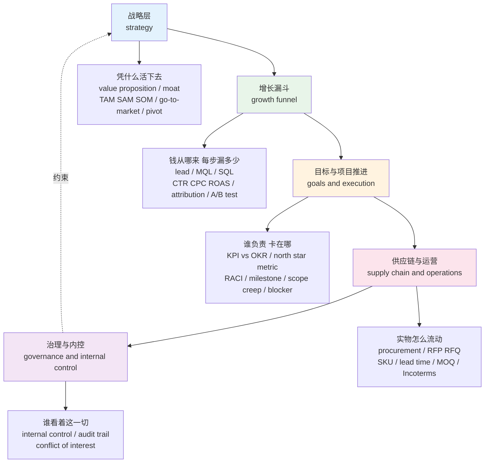
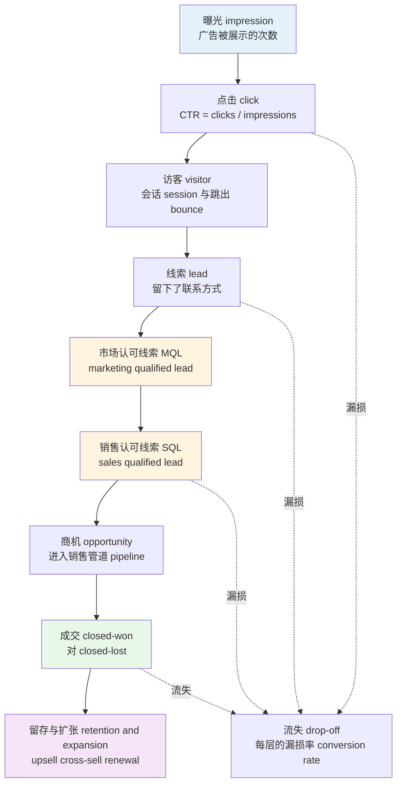
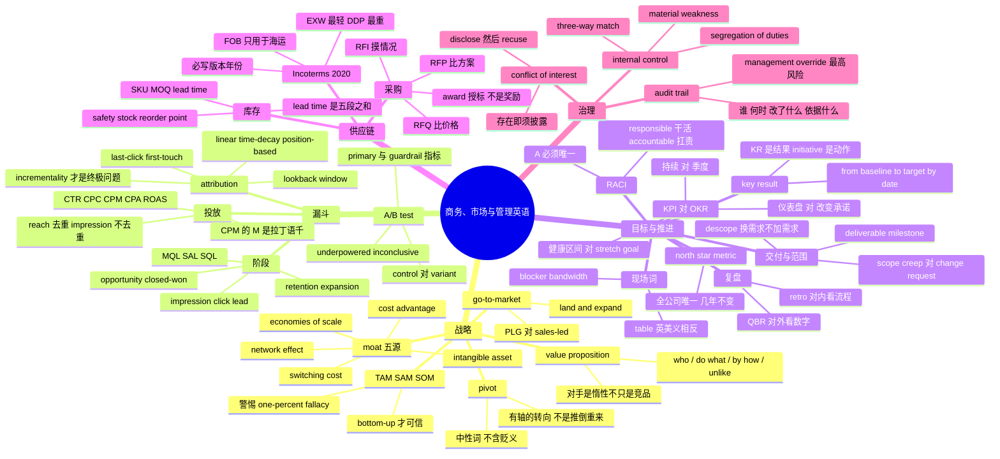

# 商务、市场与管理英语：战略、增长漏斗、OKR 与供应链

> [!info] 本篇定位
>
> 第二十章从技术转向业务的第二篇。上一篇 [[20.专业领域词汇/05.法律与合同英语：条款、诉讼、知识产权与开源协议\|法律与合同英语：条款、诉讼、知识产权与开源协议]] 处理的是**白纸黑字有法律效力的语言**；本篇处理的是**公司内部推动事情往前走的语言**——没有法律效力，但你听不懂就进不了讨论。
>
> 四条线：战略层解释「这家公司凭什么活下去」，增长漏斗解释「钱从哪儿进来、每一步漏掉多少」，目标与项目推进解释「谁负责什么、卡在哪儿」，供应链解释「实物从供应商到客户走的那条路」。末尾补一组治理词，是前四条线的共同底座。
>
> 全书的**目标管理与项目推进词汇统一放在本篇**。[[11.学校、职场与城市社会/03.求职录用、公司组织与会议流程\|求职录用、公司组织与会议流程]] 只讲会议本身的流程词（`agenda`、`minutes`、`action item`、`chair`），OKR、RACI、`scope creep`、`blocker` 这类推进词全部在这里主讲，那一篇不重复。
>
> 财务口径词（`revenue`、`gross margin`、`EBITDA`）在 [[20.专业领域词汇/07.财报英语：三表科目、会计口径与金融熟词义项\|财报英语：三表科目、会计口径与金融熟词义项]]，SaaS 指标（`ARR`、`churn`、`CAC`、`LTV`、`runway`）在第八篇，本篇遇到时只给一行定位，不展开算法。缩略语的**口头读法规则**统一见 [[20.专业领域词汇/04.IT 深度英语（下）：云原生运维、评审用语与缩略语读法\|IT 深度英语（下）：云原生运维、评审用语与缩略语读法]]，本篇只在个别词上标一句怎么念。

---

## 1. 本篇导读：四条线与一个共同点

商务英语让中文母语者难受的原因，不是单词长，而是**它高度依赖一套隐含的因果链**。老板说 `our moat is eroding, so we need to move upmarket before the incumbent commoditizes us`，每个词你可能都认识，但只有把「护城河—上移—被商品化」这条链补上，这句话才是一句有信息的话。

四条线之间不是并列关系，而是从上往下的一条传导链：



上图那条虚线是最容易被忽略的一环：治理不是最下游的收尾工作，它反过来约束战略。一家公司能不能做某笔生意，往往先卡在 `conflict of interest` 和 `internal control` 上，而不是卡在市场规模上。读英文年报、读投资备忘录、读公司内部的季度总结，四条线加一条回环，基本覆盖全部骨架。

### 1.1 商务英语的三个共同特征

**一，名词化程度极高。** 中文说「我们要先弄清楚谁来拍板」，英语商务语域倾向说 `we need clarity on decision ownership`。动词 `decide` 变成名词 `decision`，再挂上 `ownership`。这种名词堆叠在技术文档里也有，但商务文本更密。读的时候要养成把名词短语拆回主谓宾的习惯：`decision ownership` = who owns the decision = 谁对这个决定负责。

**二，大量缩略语，且同一个缩写在不同部门指不同东西。** 最典型的是 `SQL`：在数据库语境里是 Structured Query Language，在市场部语境里是 Sales Qualified Lead。这不是巧合造成的偶发冲突，而是商务缩略语生成方式的必然结果——首字母缩略太廉价，各部门各造各的。判断靠语境：出现在 `MQL → SQL → opportunity` 这条链里的一定是销售义。

**三，隐喻密度高，且隐喻来源集中在军事、体育、航海三块。** `campaign`（战役）、`target`（靶子）、`pipeline`（管道）、`traction`（牵引力）、`headwind`/`tailwind`（逆风顺风）、`ballpark`（棒球场，引申为大致范围）、`onboarding`（上船）。这批词的字面义在 [[10.动植物、颜色与感官属性/01.动物词表\|动物名称与动物相关表达]] 之类的具象章节已经见过，本篇只处理它们在商务语境里被固定下来的那个义项。

---

## 2. 战略层（一）：value proposition 与它周边的词

### 2.1 value proposition 是什么

`value proposition` 直译「价值主张」，指的是**一句话说清「客户为什么应该买你的，而不是买别人的、或者什么都不买」**。注意最后半句：真正的对手常常不是竞品，而是「客户维持现状」。所以完整的 value proposition 必须同时压过竞品和惰性。

英文里它有一套近乎填空的写法，在 pitch deck（融资演示文稿）和产品官网首页反复出现：

> [!example] value proposition 的三种常见句型
>
> - We help **[who]** to **[do what]** by **[how]**, unlike **[alternative]**.
>   - 我们帮助［谁］做到［什么］，方式是［怎么做］，与［现有替代方案］不同。
> - For **[target customer]** who **[has this need]**, our product is a **[category]** that **[key benefit]**.
>   - 面向有［这个需求］的［目标客户］，我们的产品是一个能［核心收益］的［品类］。
> - **Cut** your onboarding time **from** two weeks **to** two hours.
>   - 把新员工上手时间从两周压到两小时。

第三种句型里的 `from ... to ...` 是商务英语最爱用的结构，因为它同时给出了基线和结果，比形容词（`fast`、`efficient`）有说服力得多。写英文简历和述职材料时可以直接借用。

### 2.2 战略基础词表

| 英文 | 英式音标 | 美式音标 | 词性 | 中文 | 搭配与说明 |
| --- | --- | --- | --- | --- | --- |
| **value proposition** | /ˌvæljuː ˌprɒpəˈzɪʃn/ | /ˌvæljuː ˌprɑːpəˈzɪʃn/ | n. | 价值主张 | 常缩写 `VP`，但 `VP` 也指 Vice President，靠语境分 |
| **positioning** | /pəˈzɪʃənɪŋ/ | /pəˈzɪʃənɪŋ/ | n. | 定位 | position sth **as** …；`repositioning` 重新定位 |
| **differentiation** | /ˌdɪfəˌrenʃiˈeɪʃn/ | /ˌdɪfəˌrenʃiˈeɪʃn/ | n. | 差异化 | 动词 differentiate **from**；形容词 differentiated |
| **segment** | /ˈseɡmənt/ n. /seɡˈment/ v. | /ˈseɡmənt/ n. /seɡˈment/ v. | n./v. | 细分市场；细分 | 名动重音不同，是重音移位的典型词 |
| **niche** | /niːʃ/ | /niːʃ/ 或 /nɪtʃ/ | n./adj. | 利基；小众的 | 美音有两读；a niche market，niche player |
| **target market** | /ˈtɑːɡɪt ˈmɑːkɪt/ | /ˈtɑːrɡət ˈmɑːrkɪt/ | n. | 目标市场 | target 作动词：target SMBs |
| **incumbent** | /ɪnˈkʌmbənt/ | /ɪnˈkʌmbənt/ | n./adj. | 在位者；现有主导厂商 | the incumbent（老牌大厂）对 the challenger |
| **challenger** | /ˈtʃælɪndʒə/ | /ˈtʃælɪndʒər/ | n. | 挑战者 | challenger brand 挑战者品牌 |
| **disrupt** | /dɪsˈrʌpt/ | /dɪsˈrʌpt/ | v. | 颠覆 | 名词 disruption；形容词 disruptive |
| **commoditize** | /kəˈmɒdɪtaɪz/ | /kəˈmɑːdətaɪz/ | v. | 使商品化，使沦为无差别品 | 英式常拼 commoditise；被 commoditize 等于失去定价权 |
| **premium** | /ˈpriːmiəm/ | /ˈpriːmiəm/ | n./adj. | 溢价；高端的 | charge a premium；premium tier 高端档 |
| **upmarket** | /ˌʌpˈmɑːkɪt/ | /ˌʌpˈmɑːrkɪt/ | adj./adv. | 高端市场的 | 英式说法；美式常说 upscale / move upmarket 两边都用 |
| **downmarket** | /ˌdaʊnˈmɑːkɪt/ | /ˌdaʊnˈmɑːrkɪt/ | adj./adv. | 低端市场的 | 美式对应 downscale |
| **leverage** | /ˈliːvərɪdʒ/ | /ˈlevərɪdʒ/ | n./v. | 杠杆；利用 | 英美重读元音不同，是商务会上最常被听错的词之一 |
| **traction** | /ˈtrækʃn/ | /ˈtrækʃn/ | n. | 牵引力，指增长势头 | gain traction；U，不可数 |
| **moat** | /məʊt/ | /moʊt/ | n. | 护城河，指持久竞争优势 | a wide/narrow moat；moat is eroding |
| **defensible** | /dɪˈfensəbl/ | /dɪˈfensəbl/ | adj. | 守得住的 | a defensible position / defensible margin |
| **stickiness** | /ˈstɪkinəs/ | /ˈstɪkinəs/ | n. | 粘性 | 形容词 sticky；sticky product 指用户不易流失 |
| **flywheel** | /ˈflaɪwiːl/ | /ˈflaɪwiːl/ | n. | 飞轮，指自我强化循环 | the growth flywheel；起动慢但一旦转起来省力 |
| **compounding** | /kəmˈpaʊndɪŋ/ | /kəmˈpaʊndɪŋ/ | n./adj. | 复利式累积 | compounding advantage；来自复利 compound interest |

`commoditize` 值得单独说一句，因为它是战略讨论里最坏的一个词。一个品类被 commoditize，意味着客户看不出各家的差别，于是只比价格。英文里描述这个过程的固定说法是 `a race to the bottom`（向下竞逐，价格战打到人人无利可图）。战略讨论的一半内容其实就是在回答一个问题：`how do we avoid being commoditized`。

---

## 3. 战略层（二）：moat 的五种形态

`moat`（护城河）这个隐喻在英文投资与战略文本里几乎是默认词汇，来自城堡外围那圈水沟——它不产生价值，它的作用是**让别人打不进来**。这与 `advantage`（优势）的差别很关键：优势是「我现在做得更好」，护城河是「就算对手知道怎么做也追不上」。

投资分析里常用一套五分法来归类护城河的来源，五个说法在英文材料里高度固定：

| 英文 | 英式音标 | 美式音标 | 词性 | 中文 | 搭配与说明 |
| --- | --- | --- | --- | --- | --- |
| **network effect** | /ˈnetwɜːk ɪˈfekt/ | /ˈnetwɜːrk ɪˈfekt/ | n. | 网络效应 | 用的人越多价值越大；双边市场说 two-sided network |
| **switching cost** | /ˈswɪtʃɪŋ kɒst/ | /ˈswɪtʃɪŋ kɔːst/ | n. | 转换成本 | high switching costs；含迁移数据、重新培训的代价 |
| **economies of scale** | /ɪˈkɒnəmiz əv skeɪl/ | /ɪˈkɑːnəmiz əv skeɪl/ | n. | 规模经济 | 恒用复数 economies；不要写成 economy of scale |
| **intangible asset** | /ɪnˈtændʒəbl ˈæset/ | /ɪnˈtændʒəbl ˈæset/ | n. | 无形资产 | 含品牌、专利、牌照；对 tangible asset |
| **cost advantage** | /kɒst ədˈvɑːntɪdʒ/ | /kɔːst ədˈvæntɪdʒ/ | n. | 成本优势 | advantage 的英美元音差别明显 |
| **lock-in** | /ˈlɒk ɪn/ | /ˈlɑːk ɪn/ | n. | 锁定 | vendor lock-in 供应商锁定，多为贬义 |
| **barrier to entry** | /ˈbæriə tu ˈentri/ | /ˈbæriər tu ˈentri/ | n. | 进入壁垒 | 复数 barriers to entry；注意介词是 to 不是 of |
| **first-mover advantage** | /ˈfɜːst ˈmuːvə/ | /ˈfɜːrst ˈmuːvər/ | n. | 先发优势 | 对 fast-follower 快速跟随者 |
| **economies of scope** | /ɪˈkɒnəmiz əv skəʊp/ | /ɪˈkɑːnəmiz əv skoʊp/ | n. | 范围经济 | 与 scale 只差一词，意思完全不同：靠品类协同而非产量 |
| **erode** | /ɪˈrəʊd/ | /ɪˈroʊd/ | v. | 侵蚀 | 与 moat 高频共现：the moat is eroding |
| **durable** | /ˈdjʊərəbl/ | /ˈdʊrəbl/ | adj. | 持久的 | durable advantage；英美首元音差别大 |
| **replicate** | /ˈreplɪkeɪt/ | /ˈreplɪkeɪt/ | v. | 复制 | easily replicated 意味着没有护城河 |

> [!warning] moat 和 advantage 不能混用
>
> - ❌ ~~Our advantage is that we launched first, so nobody can catch up.~~（先发本身不构成护城河）
> - ✅ **Our first-mover advantage only becomes a moat once network effects kick in.**（先发要转化成网络效应才是护城河）
>
> 英文评审材料里，`why is this defensible` 是投资人最常问的一句追问，问的正是「优势凭什么变成护城河」。答不上来时的标准诚实回答是 `it is not defensible yet; our bet is that we can build switching costs before the incumbent responds`。

### 3.1 描述竞争格局的常用短语

> [!example] 竞争格局句型
>
> - The market is **highly fragmented**, with no player above five percent share.
>   - 这个市场高度分散，没有一家份额超过百分之五。
> - We are **squeezed** between the low-cost players below and the enterprise vendors above.
>   - 我们被下方的低价厂商和上方的企业级厂商夹在中间。
> - Their pricing puts **pricing pressure** on our mid-tier plan.
>   - 他们的定价对我们的中档套餐形成了价格压力。
> - This feature is **table stakes** now; it no longer differentiates us.
>   - 这个功能现在只是入场门槛，已经不构成差异化了。

`table stakes` 来自扑克，指「不下这个注就没资格上桌」，商务里指「必备但不加分的功能」。这个词在产品评审里出现频率极高，中文常译作「标配」。

---

## 4. 市场规模三层：TAM、SAM、SOM

三个缩写永远一起出现，是从大到小的三层嵌套。它们在英文里读作单词，不逐字母拼：TAM /tæm/，SAM /sæm/，SOM /sɑːm/ 或 /sɒm/。

```text
┌─────────────────────────────────────────────┐
│ TAM  Total Addressable Market               │  全球所有人都买 你能收到多少钱
│  ┌────────────────────────────────────────┐ │
│  │ SAM  Serviceable Addressable Market    │ │  你的产品形态和渠道够得着的那部分
│  │  ┌───────────────────────────────────┐ │ │
│  │  │ SOM  Serviceable Obtainable Market│ │ │  未来几年你实际能拿下的那部分
│  │  └───────────────────────────────────┘ │ │
│  └────────────────────────────────────────┘ │
└─────────────────────────────────────────────┘
```

| 英文 | 英式音标 | 美式音标 | 词性 | 中文 | 搭配与说明 |
| --- | --- | --- | --- | --- | --- |
| **addressable** | /əˈdresəbl/ | /əˈdresəbl/ | adj. | 可触达的 | 也说 addressable audience；与技术义「可寻址」同形 |
| **serviceable** | /ˈsɜːvɪsəbl/ | /ˈsɜːrvɪsəbl/ | adj. | 可服务的 | 此处不是「尚可的」那个日常义 |
| **obtainable** | /əbˈteɪnəbl/ | /əbˈteɪnəbl/ | adj. | 可获得的 | SOM 的 O，也有材料写 Obtainable Serviceable Market |
| **market share** | /ˈmɑːkɪt ʃeə/ | /ˈmɑːrkɪt ʃer/ | n. | 市场份额 | gain / lose market share；share of wallet 钱包份额 |
| **bottom-up** | /ˌbɒtəm ˈʌp/ | /ˌbɑːtəm ˈʌp/ | adj. | 自下而上的 | bottom-up sizing：单价 × 客户数往上加 |
| **top-down** | /ˌtɒp ˈdaʊn/ | /ˌtɑːp ˈdaʊn/ | adj. | 自上而下的 | top-down sizing：从行业报告总盘往下切 |
| **sizing** | /ˈsaɪzɪŋ/ | /ˈsaɪzɪŋ/ | n. | 规模测算 | market sizing 是面试常考题型 |
| **penetration** | /ˌpenɪˈtreɪʃn/ | /ˌpenɪˈtreɪʃn/ | n. | 渗透率 | market penetration rate |
| **headroom** | /ˈhedruːm/ | /ˈhedruːm/ | n. | 增长空间 | plenty of headroom 还有很大空间 |
| **saturated** | /ˈsætʃəreɪtɪd/ | /ˈsætʃəreɪtɪd/ | adj. | 饱和的 | a saturated market；名词 saturation |

> [!warning] TAM 最常见的两种造假手法
>
> 英文融资材料里 TAM 被吹大的方式高度模式化，读的时候盯这两处：
>
> - ❌ ~~The global software market is 700 billion dollars, so our TAM is 700 billion.~~ 拿整个行业当 TAM，等于说「凡是买软件的都可能买我们的」。
> - ❌ ~~There are 8 billion people; if each pays one dollar a year, our TAM is 8 billion.~~ 这种算法英文里有专名叫 `the one-percent fallacy`（只要拿下百分之一就……），是投资人最反感的一页。
> - ✅ 可信的写法是 bottom-up：**42,000 mid-size logistics firms × 18,000 dollars average contract value = 756 million dollars SAM.**
>
> `average contract value` 缩写 `ACV`，与 `ARR`、`ARPU` 同属 SaaS 指标族，展开见第八篇。

---

## 5. go-to-market：把产品送到第一批客户手上

`go-to-market` 常缩写为 `GTM`，作定语时加连字符：`our go-to-market strategy`、`GTM motion`。它回答的问题不是「产品做什么」，而是「**怎么让人知道、怎么让人试、怎么收钱、谁去收**」。

英文里把不同的销售路径叫做 `motion`（打法），这是一个典型的商务熟词义项——日常义是「动作、运动」，这里指一整套获客与成交流程。

| 英文 | 英式音标 | 美式音标 | 词性 | 中文 | 搭配与说明 |
| --- | --- | --- | --- | --- | --- |
| **go-to-market** | /ˌɡəʊ tə ˈmɑːkɪt/ | /ˌɡoʊ tə ˈmɑːrkɪt/ | n./adj. | 市场进入策略 | 缩写 GTM，逐字母读 |
| **motion** | /ˈməʊʃn/ | /ˈmoʊʃn/ | n. | 打法，销售流程 | sales-led motion / product-led motion |
| **product-led growth** | /ˈprɒdʌkt led ɡrəʊθ/ | /ˈprɑːdʌkt led ɡroʊθ/ | n. | 产品驱动增长 | 缩写 PLG；产品自己带来注册与扩张 |
| **sales-led** | /ˈseɪlz led/ | /ˈseɪlz led/ | adj. | 销售驱动的 | 对 self-serve 自助式 |
| **self-serve** | /ˌself ˈsɜːv/ | /ˌself ˈsɜːrv/ | adj. | 自助的 | self-serve signup 不用联系销售就能开通 |
| **enterprise sales** | /ˈentəpraɪz seɪlz/ | /ˈentərpraɪz seɪlz/ | n. | 大客户销售 | 对 SMB（small and medium business） |
| **channel** | /ˈtʃænl/ | /ˈtʃænl/ | n. | 渠道 | channel partner 渠道伙伴；direct vs indirect channel |
| **reseller** | /ˌriːˈselə/ | /ˌriːˈselər/ | n. | 经销商 | VAR = value-added reseller 增值经销商 |
| **distributor** | /dɪˈstrɪbjətə/ | /dɪˈstrɪbjətər/ | n. | 分销商 | 重音在第二音节，不是第一 |
| **onboarding** | /ˈɒnbɔːdɪŋ/ | /ˈɑːnbɔːrdɪŋ/ | n. | 上手引导 | 客户 onboarding 与员工 onboarding 同词不同场景 |
| **launch** | /lɔːntʃ/ | /lɔːntʃ/ | n./v. | 发布 | soft launch 小范围发布；GA = general availability |
| **beta** | /ˈbiːtə/ | /ˈbeɪtə/ | n./adj. | 公测版 | 英美读音差别大：英 /ˈbiːtə/，美 /ˈbeɪtə/ |
| **early adopter** | /ˈɜːli əˈdɒptə/ | /ˈɜːrli əˈdɑːptər/ | n. | 早期采用者 | 对 laggard 后知后觉者 |
| **design partner** | /dɪˈzaɪn ˈpɑːtnə/ | /dɪˈzaɪn ˈpɑːrtnər/ | n. | 共创客户 | 早期深度合作、以折扣换反馈的客户 |
| **beachhead** | /ˈbiːtʃhed/ | /ˈbiːtʃhed/ | n. | 滩头阵地，指切入的第一个细分 | 军事隐喻；beachhead market |
| **land and expand** | /lænd ənd ɪkˈspænd/ | /lænd ənd ɪkˈspænd/ | phr. | 先小单进入再向内扩张 | 固定搭配，不拆开用 |
| **pilot** | /ˈpaɪlət/ | /ˈpaɪlət/ | n./v. | 试点 | run a pilot；pilot customer |
| **proof of concept** | /pruːf əv ˈkɒnsept/ | /pruːf əv ˈkɑːnsept/ | n. | 概念验证 | 缩写 PoC，逐字母读；技术侧含义相同 |
| **rollout** | /ˈrəʊlaʊt/ | /ˈroʊlaʊt/ | n. | 推广铺开 | 动词分写：roll out to all regions |
| **positioning statement** | /pəˈzɪʃənɪŋ ˈsteɪtmənt/ | /pəˈzɪʃənɪŋ ˈsteɪtmənt/ | n. | 定位陈述 | 一段话版本的 value proposition |

> [!tip] land and expand 的记忆方式
>
> 这个短语的画面是登陆作战：先拿下一小块阵地（land，签一个小部门的小合同），站稳后再往内陆推进（expand，扩到全公司）。它对应的定价策略是低门槛起步、按席位或用量涨价。听到 `our GTM is land and expand`，等于听到「首单金额会很小，别拿首单金额判断这个客户的价值」。

---

## 6. pivot：调整幅度的措辞谱系

`pivot` 的字面义是「以一只脚为轴转身」（篮球里的中枢脚就叫 pivot foot），商务里指**保留已积累的东西、换掉方向**。它的关键含义是「有轴」——不是推倒重来，而是围着某个不变量转。

英文里描述战略调整有一整条从轻到重的谱系，用错档位会让人误判事态严重程度：

```text
tweak  →  iterate  →  adjust  →  refocus  →  pivot  →  reboot  →  wind down
微调       迭代        调整       重新聚焦     转向      推倒重来    收摊
（改文案）  （改流程）   （改优先级） （砍业务线）  （换市场/换产品） （几乎从零） （关停）
```

| 英文 | 英式音标 | 美式音标 | 词性 | 中文 | 搭配与说明 |
| --- | --- | --- | --- | --- | --- |
| **pivot** | /ˈpɪvət/ | /ˈpɪvət/ | n./v. | 转向 | pivot **from** A **to** B；pivot **into** a new market |
| **tweak** | /twiːk/ | /twiːk/ | v./n. | 微调 | a minor tweak；口语，正式文书少用 |
| **iterate** | /ˈɪtəreɪt/ | /ˈɪtəreɪt/ | v. | 迭代 | iterate **on** the design；名词 iteration |
| **refocus** | /ˌriːˈfəʊkəs/ | /ˌriːˈfoʊkəs/ | v. | 重新聚焦 | refocus **on** the core product |
| **double down** | /ˌdʌbl ˈdaʊn/ | /ˌdʌbl ˈdaʊn/ | phr.v. | 加倍投入 | double down **on** what works；来自二十一点加倍下注 |
| **sunset** | /ˈsʌnset/ | /ˈsʌnset/ | v./n. | 逐步下线 | sunset a product line；比 kill 委婉 |
| **wind down** | /ˌwaɪnd ˈdaʊn/ | /ˌwaɪnd ˈdaʊn/ | phr.v. | 收缩关停 | wind down the hardware business |
| **spin off** | /ˌspɪn ˈɒf/ | /ˌspɪn ˈɔːf/ | phr.v. | 分拆 | 名词 spinoff；对 carve-out 剥离出售 |
| **course-correct** | /ˈkɔːs kəˈrekt/ | /ˈkɔːrs kəˈrekt/ | v. | 修正航向 | 航海隐喻，比 pivot 轻 |
| **de-risk** | /ˌdiː ˈrɪsk/ | /ˌdiː ˈrɪsk/ | v. | 降低风险 | de-risk the launch by shipping to one region first |
| **bet** | /bet/ | /bet/ | n./v. | 押注 | a big bet on AI；place a bet；商务语域里完全中性 |
| **hypothesis** | /haɪˈpɒθəsɪs/ | /haɪˈpɑːθəsɪs/ | n. | 假设 | 复数 hypotheses /-siːz/；our core hypothesis is that … |
| **validate** | /ˈvælɪdeɪt/ | /ˈvælɪdeɪt/ | v. | 验证 | validate demand before building |
| **kill criteria** | /kɪl kraɪˈtɪəriə/ | /kɪl kraɪˈtɪriə/ | n. | 叫停标准 | 单数 criterion；事先约定「达不到什么就停」 |

> [!warning] pivot 不等于「失败」
>
> 中文语境里「转型」常带负面暗示，英文的 `pivot` 在创业语域里是中性偏正面的，它的潜台词是「我们从数据里学到了东西并据此调整」。真正表示失败的词是 `shut down`、`wind down`、`fire sale`（贱卖资产）。
>
> - ✅ **We pivoted from a consumer app to a developer tool after nine months.**（陈述事实，不带自责）
> - ❌ ~~We failed at the consumer app so we had to pivot.~~（英文材料里几乎不这么写，太自贬）

---

## 7. 增长漏斗：从曝光到复购的阶段词

`funnel`（漏斗）是市场部最核心的隐喻：进口宽、出口窄，每一层都会漏掉一部分人。英文里描述位置用 `top of funnel`（缩写 `TOFU`）、`middle of funnel`（`MOFU`）、`bottom of funnel`（`BOFU`）。这三个缩写在广告与内容营销文章里极常见。



上图的两个橙色节点是全漏斗最容易吵架的一段：MQL 归市场部考核，SQL 归销售部考核，两者之间的那条交接线决定了两个部门的绩效怎么分。下一节专讲这条线。绿色的 `closed-won` 是收入确认点，紫色的留存段是 SaaS 公司真正赚钱的地方——第一单往往只覆盖获客成本。

### 7.1 漏斗阶段词表

| 英文 | 英式音标 | 美式音标 | 词性 | 中文 | 搭配与说明 |
| --- | --- | --- | --- | --- | --- |
| **funnel** | /ˈfʌnl/ | /ˈfʌnl/ | n. | 漏斗 | top / middle / bottom of funnel |
| **awareness** | /əˈweənəs/ | /əˈwernəs/ | n. | 认知 | brand awareness；漏斗最上层 |
| **impression** | /ɪmˈpreʃn/ | /ɪmˈpreʃn/ | n. | 曝光量 | 复数计数；一次展示算一个 impression |
| **reach** | /riːtʃ/ | /riːtʃ/ | n. | 触达人数 | 与 impression 区别：reach 去重，impression 不去重 |
| **frequency** | /ˈfriːkwənsi/ | /ˈfriːkwənsi/ | n. | 触达频次 | impressions ÷ reach = frequency |
| **click** | /klɪk/ | /klɪk/ | n./v. | 点击 | clickthrough 通过点击进入 |
| **session** | /ˈseʃn/ | /ˈseʃn/ | n. | 会话 | 一次访问；与 user 数不同 |
| **bounce rate** | /baʊns reɪt/ | /baʊns reɪt/ | n. | 跳出率 | 只看一页就离开的比例 |
| **lead** | /liːd/ | /liːd/ | n. | 销售线索 | 读 /liːd/ 不是 /led/；generate leads |
| **prospect** | /ˈprɒspekt/ | /ˈprɑːspekt/ | n. | 潜在客户 | 比 lead 更靠后一点，已初步判断有需求 |
| **qualify** | /ˈkwɒlɪfaɪ/ | /ˈkwɑːlɪfaɪ/ | v. | 判定资格 | qualify a lead；名词 qualification |
| **nurture** | /ˈnɜːtʃə/ | /ˈnɜːrtʃər/ | v. | 培育 | lead nurturing 用邮件序列养熟未成熟线索 |
| **pipeline** | /ˈpaɪplaɪn/ | /ˈpaɪplaɪn/ | n. | 销售管道 | 所有在谈商机的总额；build pipeline |
| **opportunity** | /ˌɒpəˈtjuːnəti/ | /ˌɑːpərˈtuːnəti/ | n. | 商机 | CRM 里的正式对象名，缩写 oppty |
| **deal** | /diːl/ | /diːl/ | n. | 交易 | close a deal；deal size 单笔金额 |
| **closed-won** | /kləʊzd wʌn/ | /kloʊzd wʌn/ | adj. | 已成交 | 对 closed-lost 已失单；CRM 固定状态词 |
| **conversion rate** | /kənˈvɜːʃn reɪt/ | /kənˈvɜːrʒn reɪt/ | n. | 转化率 | 美音 -sion 读 /ʒn/，英音多读 /ʃn/ |
| **drop-off** | /ˈdrɒp ɒf/ | /ˈdrɑːp ɔːf/ | n. | 流失，掉队 | drop-off point 漏斗断点 |
| **retention** | /rɪˈtenʃn/ | /rɪˈtenʃn/ | n. | 留存 | 对 churn 流失；口径细分见第八篇 |
| **upsell** | /ˈʌpsel/ | /ˈʌpsel/ | n./v. | 向上销售 | 卖更贵的版本 |
| **cross-sell** | /ˈkrɒs sel/ | /ˈkrɔːs sel/ | n./v. | 交叉销售 | 卖另一个品类 |
| **renewal** | /rɪˈnjuːəl/ | /rɪˈnuːəl/ | n. | 续约 | renewal rate；auto-renewal 自动续费 |
| **referral** | /rɪˈfɜːrəl/ | /rɪˈfɜːrəl/ | n. | 转介绍 | referral program 老带新计划 |
| **retargeting** | /ˌriːˈtɑːɡɪtɪŋ/ | /ˌriːˈtɑːrɡətɪŋ/ | n. | 再营销 | 也说 remarketing，两词通用 |

> [!warning] reach 和 impression 是两个数
>
> - ❌ ~~The campaign reached 1 million impressions.~~ 动词与宾语不搭，impression 不能被 reach。
> - ✅ **The campaign delivered 1 million impressions to 300,000 people, a frequency of 3.3.**
>
> 中文习惯把「曝光量」和「触达人数」都叫「触达」，英文严格区分：`reach` 是人头数（去重），`impression` 是展示次数（不去重），两者相除得 `frequency`。写英文投放报告时混用这两个词会立刻暴露不专业。

---

## 8. lead、MQL 与 SQL：市场与销售的交接线

漏斗中段那两个缩写是公司里最常引发部门扯皮的定义问题，因为它们**是人为约定的，不是自然存在的**。

- `MQL` = Marketing Qualified Lead，市场部认为「这个人够热，可以交给销售了」。判定依据通常是行为打分：下载了白皮书、看了定价页、参加了网络研讨会。
- `SQL` = Sales Qualified Lead，销售接手后确认「这个人确实值得投入时间」。判定依据是资质而非热度。
- 两者之间还有一个常见中间态 `SAL` = Sales Accepted Lead，销售**接受了**但还没验证。加这一档的目的就是把「市场交没交」和「销售认不认」拆成两个可追责的动作。

判定 SQL 的标准英文里有几套固定字母框架，读销售材料时一定会遇到：

| 缩写 | 展开 | 中文 | 说明 |
| --- | --- | --- | --- |
| **BANT** | Budget, Authority, Need, Timeline | 预算、决策权、需求、时间表 | 最老的一套，IBM 传下来 |
| **MEDDIC** | Metrics, Economic buyer, Decision criteria, Decision process, Identify pain, Champion | 量化收益、掏钱的人、决策标准、决策流程、痛点、内部推手 | 复杂大单常用 |
| **CHAMP** | Challenges, Authority, Money, Prioritization | 挑战、决策权、钱、优先级 | BANT 的痛点优先改版 |

MEDDIC 里的 `champion` 值得单独记：它指**客户公司内部帮你说话的那个人**，不是「冠军」。英文里 `we don't have a champion in that account` 意思是「那家客户里没人替我们内部推动」，是很严重的风险信号。

| 英文 | 英式音标 | 美式音标 | 词性 | 中文 | 搭配与说明 |
| --- | --- | --- | --- | --- | --- |
| **MQL** | /ˌem kjuː ˈel/ | /ˌem kjuː ˈel/ | n. | 市场认可线索 | 逐字母读；marketing qualified lead |
| **SQL** | /ˌes kjuː ˈel/ | /ˌes kjuː ˈel/ | n. | 销售认可线索 | 与数据库 SQL 同形，此处必逐字母读 |
| **SAL** | /ˌes eɪ ˈel/ | /ˌes eɪ ˈel/ | n. | 销售已接收线索 | sales accepted lead，中间态 |
| **lead scoring** | /liːd ˈskɔːrɪŋ/ | /liːd ˈskɔːrɪŋ/ | n. | 线索评分 | 按行为与画像给分，过阈值转 MQL |
| **handoff** | /ˈhændɒf/ | /ˈhændɔːf/ | n. | 交接 | the MQL-to-SQL handoff；动词分写 hand off |
| **champion** | /ˈtʃæmpiən/ | /ˈtʃæmpiən/ | n./v. | 内部推手；支持推动 | 动词义：champion an initiative 力挺某项动议 |
| **economic buyer** | /ˌiːkəˈnɒmɪk ˈbaɪə/ | /ˌekəˈnɑːmɪk ˈbaɪər/ | n. | 掏钱的决策人 | economic 英美首元音不同，两读都通行 |
| **gatekeeper** | /ˈɡeɪtkiːpə/ | /ˈɡeɪtkiːpər/ | n. | 把关人 | 挡在决策人前面的助理或采购 |
| **decision maker** | /dɪˈsɪʒn ˈmeɪkə/ | /dɪˈsɪʒn ˈmeɪkər/ | n. | 决策者 | 也写 decision-maker |
| **pain point** | /peɪn pɔɪnt/ | /peɪn pɔɪnt/ | n. | 痛点 | identify the pain point |
| **discovery call** | /dɪˈskʌvəri kɔːl/ | /dɪˈskʌvəri kɔːl/ | n. | 需求摸底通话 | 销售第一通实质性电话 |
| **objection** | /əbˈdʒekʃn/ | /əbˈdʒekʃn/ | n. | 异议 | objection handling 异议处理 |
| **quota** | /ˈkwəʊtə/ | /ˈkwoʊtə/ | n. | 销售指标 | hit / miss quota；quota attainment 完成率 |
| **ramp** | /ræmp/ | /ræmp/ | n./v. | 爬坡期 | a new rep takes six months to ramp |
| **churn** | /tʃɜːn/ | /tʃɜːrn/ | n./v. | 客户流失 | 口径与计算见第八篇，本篇只作漏斗末端出现 |

---

## 9. 投放指标：CTR、CPC、CPM、ROAS

广告投放的指标名几乎全是缩写，而且它们之间是能互相推导的。把分子分母记牢，读投放周报就不会晕。

| 缩写 | 展开 | 中文 | 计算 | 读法 |
| --- | --- | --- | --- | --- |
| **CTR** | clickthrough rate | 点击率 | clicks ÷ impressions | 逐字母 |
| **CPC** | cost per click | 单次点击成本 | spend ÷ clicks | 逐字母 |
| **CPM** | cost per mille | 千次曝光成本 | spend ÷ impressions × 1000 | 逐字母 |
| **CPA** | cost per acquisition / action | 单次转化成本 | spend ÷ conversions | 逐字母 |
| **CPL** | cost per lead | 单条线索成本 | spend ÷ leads | 逐字母 |
| **ROAS** | return on ad spend | 广告投入回报 | revenue ÷ ad spend | 读作 /ˈrəʊæs/ 或逐字母 |
| **ROI** | return on investment | 投资回报率 | (gain − cost) ÷ cost | 逐字母 |
| **AOV** | average order value | 客单价 | revenue ÷ orders | 逐字母 |

`CPM` 的 M 不是 million，是拉丁语 `mille`（千）。这是英语商业词汇里少数几个直接留着拉丁数词的地方，中文误译成「每百万次曝光成本」是常见错误。

| 英文 | 英式音标 | 美式音标 | 词性 | 中文 | 搭配与说明 |
| --- | --- | --- | --- | --- | --- |
| **spend** | /spend/ | /spend/ | n. | 投放花费 | 名词用法，不可数：ad spend、media spend |
| **budget** | /ˈbʌdʒɪt/ | /ˈbʌdʒɪt/ | n./v. | 预算 | daily budget；budget cap 预算上限 |
| **bid** | /bɪd/ | /bɪd/ | n./v. | 出价 | bidding strategy；三态 bid-bid-bid，不变 |
| **auction** | /ˈɔːkʃn/ | /ˈɑːkʃn/ | n. | 竞价 | 广告位按 auction 分配 |
| **placement** | /ˈpleɪsmənt/ | /ˈpleɪsmənt/ | n. | 广告位 | ad placement |
| **creative** | /kriˈeɪtɪv/ | /kriˈeɪtɪv/ | n. | 广告素材 | 名词用法，可数：test three creatives |
| **copy** | /ˈkɒpi/ | /ˈkɑːpi/ | n. | 文案 | 不可数；copywriter 文案撰稿人 |
| **campaign** | /kæmˈpeɪn/ | /kæmˈpeɪn/ | n. | 投放活动 | 重音在第二音节；run a campaign |
| **landing page** | /ˈlændɪŋ peɪdʒ/ | /ˈlændɪŋ peɪdʒ/ | n. | 落地页 | 广告点进去的第一页 |
| **call to action** | /kɔːl tu ˈækʃn/ | /kɑːl tu ˈækʃn/ | n. | 行动号召 | 缩写 CTA，指按钮上那句话 |
| **organic** | /ɔːˈɡænɪk/ | /ɔːrˈɡænɪk/ | adj. | 自然流量的 | organic traffic 对 paid traffic |
| **paid** | /peɪd/ | /peɪd/ | adj. | 付费的 | paid acquisition 付费获客 |
| **inbound** | /ˈɪnbaʊnd/ | /ˈɪnbaʊnd/ | adj. | 客户主动上门的 | inbound lead 对 outbound |
| **outbound** | /ˈaʊtbaʊnd/ | /ˈaʊtbaʊnd/ | adj. | 主动外呼外发的 | outbound prospecting 陌拜开发 |
| **cold outreach** | /kəʊld ˈaʊtriːtʃ/ | /koʊld ˈaʊtriːtʃ/ | n. | 冷启动触达 | cold email、cold call 陌生邮件与陌生电话 |
| **burn** | /bɜːn/ | /bɜːrn/ | v./n. | 烧（钱） | burn through the budget；burn rate 见第八篇 |
| **incremental** | /ˌɪŋkrɪˈmentl/ | /ˌɪŋkrəˈmentl/ | adj. | 增量的 | incremental revenue 只算多出来的那部分 |
| **halo effect** | /ˈheɪləʊ ɪˈfekt/ | /ˈheɪloʊ ɪˈfekt/ | n. | 光环效应，此处指外溢带动 | 投放对其他渠道的间接拉动 |

> [!warning] ROAS 高不等于赚钱
>
> ROAS 的分母只有广告费，不含商品成本、履约成本、人力成本。所以 `a ROAS of 3` 看上去很漂亮，但如果毛利率只有百分之三十，这笔投放实际是亏的。英文材料里区分这两件事用 `gross ROAS` 与 `contribution-margin ROAS`（也叫 `profit ROAS`）。
>
> 更常见的对照说法是 `blended CAC`（混合获客成本，所有花费除以所有新客）与 `paid CAC`（只算付费渠道）。前者会被自然增长稀释得很好看，融资材料里两个数都列才算诚实。

---

## 10. attribution：这笔成交算谁的

`attribution`（归因）解决的问题是：一个客户先看了信息流广告，再搜了品牌词点进来，中间收到过两封邮件，最后从朋友分享的链接成交——这笔收入算给谁？

答案取决于用哪套 `attribution model`，而不同模型给出的结论可以相差好几倍。这是市场部内部预算分配的核心争端。

| 英文 | 英式音标 | 美式音标 | 词性 | 中文 | 搭配与说明 |
| --- | --- | --- | --- | --- | --- |
| **attribution** | /ˌætrɪˈbjuːʃn/ | /ˌætrɪˈbjuːʃn/ | n. | 归因 | 动词 attribute /əˈtrɪbjuːt/，重音与名词 /ˈætrɪbjuːt/ 不同 |
| **touchpoint** | /ˈtʌtʃpɔɪnt/ | /ˈtʌtʃpɔɪnt/ | n. | 触点 | 客户接触品牌的每一次 |
| **last-click** | /lɑːst klɪk/ | /læst klɪk/ | adj. | 末次点击的 | last-click attribution：全部功劳给最后一次点击 |
| **first-touch** | /fɜːst tʌtʃ/ | /fɜːrst tʌtʃ/ | adj. | 首次触点的 | 全部功劳给第一次接触 |
| **linear** | /ˈlɪniə/ | /ˈlɪniər/ | adj. | 线性平分的 | 每个触点等分功劳 |
| **time-decay** | /taɪm dɪˈkeɪ/ | /taɪm dɪˈkeɪ/ | adj. | 时间衰减的 | 越靠近成交权重越高 |
| **position-based** | /pəˈzɪʃn beɪst/ | /pəˈzɪʃn beɪst/ | adj. | 位置加权的 | 也叫 U-shaped，首尾各占四成 |
| **data-driven** | /ˈdeɪtə ˈdrɪvn/ | /ˈdeɪtə ˈdrɪvn/ | adj. | 数据驱动的 | 用模型算权重，平台黑箱 |
| **multi-touch** | /ˈmʌlti tʌtʃ/ | /ˈmʌlti tʌtʃ/ | adj. | 多触点的 | 缩写 MTA = multi-touch attribution |
| **lookback window** | /ˈlʊkbæk ˈwɪndəʊ/ | /ˈlʊkbæk ˈwɪndoʊ/ | n. | 回溯窗口 | 也叫 attribution window；30 天与 7 天结论天差地别 |
| **view-through** | /ˈvjuː θruː/ | /ˈvjuː θruː/ | adj. | 看过未点的 | view-through conversion 看到广告没点但后来买了 |
| **incrementality** | /ˌɪŋkrɪmenˈtæləti/ | /ˌɪŋkrəmenˈtæləti/ | n. | 增量性 | 归因的终极问题：不投这笔钱他还会不会买 |
| **holdout** | /ˈhəʊldaʊt/ | /ˈhoʊldaʊt/ | n. | 对照留出组 | 故意不投放的一组人，用来测增量 |
| **cannibalize** | /ˈkænɪbəlaɪz/ | /ˈkænɪbəlaɪz/ | v. | 蚕食自家 | 品牌词广告 cannibalize 自然搜索流量 |
| **self-reported attribution** | — | — | n. | 用户自填来源 | 注册表单问「你从哪知道我们的」，缩写 SRA |

> [!example] 归因争论的典型对话
>
> - Paid search shows a **ROAS of 8**, but most of that is **branded keywords**.
>   - 付费搜索显示回报是八倍，但大部分来自品牌词。
> - Those users already knew us. That is **cannibalization**, not **incremental** revenue.
>   - 那些用户本来就知道我们，这是蚕食自然流量，不是增量收入。
> - Run a **geo holdout** for four weeks and compare against the **lookback window**.
>   - 做四周的分地区留出实验，再和回溯窗口的数据比。

`incrementality` 是这一节最该记住的词。它把「归因」这个会计问题换成了「因果」问题：不是问「这单该记给谁」，而是问「少了这个渠道，这单还会不会发生」。回答后一个问题只能靠实验，这就接到了下一节。

---

## 11. A/B test：实验的措辞与结论强度

`A/B test`（也写 `A/B testing`、`split test`）指把用户随机分成两组，一组看原版一组看新版，比较指标差异。英文里读作 `A-B test`，字母分开念。

一场实验的英文描述有固定构件，缺一件就会被质疑：

| 英文 | 英式音标 | 美式音标 | 词性 | 中文 | 搭配与说明 |
| --- | --- | --- | --- | --- | --- |
| **control** | /kənˈtrəʊl/ | /kənˈtroʊl/ | n. | 对照组 | 看原版的那一组；the control group |
| **variant** | /ˈveəriənt/ | /ˈveriənt/ | n. | 实验版本 | variant B；多版本叫 A/B/n test |
| **treatment** | /ˈtriːtmənt/ | /ˈtriːtmənt/ | n. | 处理组 | 医学统计借来的词，与 variant 常互换 |
| **randomize** | /ˈrændəmaɪz/ | /ˈrændəmaɪz/ | v. | 随机分配 | 英式常拼 randomise；randomized assignment |
| **primary metric** | /ˈpraɪməri ˈmetrɪk/ | /ˈpraɪmeri ˈmetrɪk/ | n. | 主指标 | 实验前就要定死，事后改叫 p-hacking |
| **guardrail metric** | /ˈɡɑːdreɪl/ | /ˈɡɑːrdreɪl/ | n. | 护栏指标 | 不求提升只求别掉，如崩溃率、退款率 |
| **uplift** | /ˈʌplɪft/ | /ˈʌplɪft/ | n. | 提升幅度 | 也写 lift；a 3% lift in conversion |
| **flat** | /flæt/ | /flæt/ | adj. | 持平 | the test came back flat 实验没差别 |
| **inconclusive** | /ˌɪnkənˈkluːsɪv/ | /ˌɪnkənˈkluːsɪv/ | adj. | 结论不明的 | 样本不够时的诚实说法 |
| **underpowered** | /ˌʌndəˈpaʊəd/ | /ˌʌndərˈpaʊərd/ | adj. | 样本量不足的 | the test was underpowered |
| **peeking** | /ˈpiːkɪŋ/ | /ˈpiːkɪŋ/ | n. | 中途偷看数据 | 边跑边看并提前叫停会显著抬高假阳性 |
| **novelty effect** | /ˈnɒvlti/ | /ˈnɑːvlti/ | n. | 新鲜感效应 | 新版本头几天数据好只因为它是新的 |
| **sample ratio mismatch** | — | — | n. | 分流比例失衡 | 缩写 SRM；两组人数对不上说明分流有 bug |
| **ship it** | /ʃɪp ɪt/ | /ʃɪp ɪt/ | phr. | 上线全量 | 实验胜出后的结论动作 |
| **roll back** | /rəʊl bæk/ | /roʊl bæk/ | phr.v. | 回滚 | 名词 rollback |

> [!warning] 结论强度的三档说法
>
> 英文实验报告里的结论句强度分三档，写错档位会误导决策：
>
> - ✅ **The variant increased signups by 4.2% (95% CI: 1.1% to 7.3%).** 给出置信区间，最强。
> - ✅ **The variant showed a directional improvement but did not reach significance.** 方向对但没到显著，中等。
> - ❌ ~~The variant is better.~~ 不给区间、不给样本量的断言，在英文评审里等于没说。
>
> `directional` 是一个很有用的商务限定词，意思是「趋势看着对，但统计上说不硬」。统计术语本身（`p-value`、`confidence interval`、`statistical significance`）的定义在 [[19.学术通用词汇/03.学术研究、统计术语与论文写作词汇\|学术研究、统计术语与论文写作词汇]] 主讲，本篇只给业务语境里的用法。

---

## 12. KPI 与 OKR：两套目标语言的根本差别

这是全书目标管理词汇的主讲点。KPI 与 OKR 最常见的误解是把它们当成「同一件事的两种叫法」，实际上它们回答的是两个不同的问题。

- **KPI**（key performance indicator，关键绩效指标）回答「**这台机器现在转得好不好**」。它是**持续监控的仪表盘读数**，没有终点，健康就行。库存周转率、崩溃率、月活都是 KPI。
- **OKR**（objectives and key results，目标与关键结果）回答「**这个季度我们要把什么东西往前推**」。它是**有期限的改变承诺**，季度结束就重设。


上图右侧 O3 那一格是两套体系最实质的分歧：KPI 达不成通常意味着运营出了问题，而 OKR 在很多公司里被明确设成 `stretch goal`（拉伸目标），做到七成就算成功，做到十成反而说明目标定低了。把 OKR 当 KPI 考核、跟奖金直接挂钩，会立刻逼出保守的目标，这是英文管理文献里反复提醒的一条——OKR 由 Andy Grove 在 Intel 提出，经 John Doerr 带入 Google，两处的原始实践都强调它与考核解耦。

### 12.1 目标管理词表

| 英文 | 英式音标 | 美式音标 | 词性 | 中文 | 搭配与说明 |
| --- | --- | --- | --- | --- | --- |
| **objective** | /əbˈdʒektɪv/ | /əbˈdʒektɪv/ | n. | 目标 | OKR 的 O；定性、鼓舞人心、无数字 |
| **key result** | /kiː rɪˈzʌlt/ | /kiː rɪˈzʌlt/ | n. | 关键结果 | OKR 的 KR；定量、可验证、通常 3 条 |
| **initiative** | /ɪˈnɪʃətɪv/ | /ɪˈnɪʃətɪv/ | n. | 举措 | 为达成 KR 而做的事；KR 是结果，initiative 是动作 |
| **stretch goal** | /stretʃ ɡəʊl/ | /stretʃ ɡoʊl/ | n. | 拉伸目标 | 有意定得够不太着；对 committed goal 承诺目标 |
| **sandbagging** | /ˈsændbæɡɪŋ/ | /ˈsændbæɡɪŋ/ | n. | 故意压低目标 | 为了轻松达标而放水，管理层最忌 |
| **cascade** | /kæˈskeɪd/ | /kæˈskeɪd/ | v. | 逐层分解 | cascade OKRs down the org；也说 align |
| **alignment** | /əˈlaɪnmənt/ | /əˈlaɪnmənt/ | n. | 对齐 | get alignment on priorities；商务高频词 |
| **grading** | /ˈɡreɪdɪŋ/ | /ˈɡreɪdɪŋ/ | n. | 打分 | KR 按 0 到 1 打分；0.7 通常算达成 |
| **leading indicator** | /ˈliːdɪŋ ˈɪndɪkeɪtə/ | /ˈliːdɪŋ ˈɪndɪkeɪtər/ | n. | 先行指标 | 能提前预示结果的指标 |
| **lagging indicator** | /ˈlæɡɪŋ ˈɪndɪkeɪtə/ | /ˈlæɡɪŋ ˈɪndɪkeɪtər/ | n. | 滞后指标 | 收入是典型滞后指标 |
| **vanity metric** | /ˈvænəti ˈmetrɪk/ | /ˈvænəti ˈmetrɪk/ | n. | 虚荣指标 | 好看但不指导决策，如累计注册数 |
| **actionable** | /ˈækʃənəbl/ | /ˈækʃənəbl/ | adj. | 可据以行动的 | an actionable metric；vanity metric 的反义 |
| **baseline** | /ˈbeɪslaɪn/ | /ˈbeɪslaɪn/ | n. | 基线 | KR 必须写 from X to Y，X 就是 baseline |
| **target** | /ˈtɑːɡɪt/ | /ˈtɑːrɡət/ | n./v. | 目标值 | hit / miss the target |
| **on track** | /ɒn træk/ | /ɑːn træk/ | adj. | 按计划推进中 | 状态词三档：on track / at risk / off track |
| **at risk** | /ət rɪsk/ | /ət rɪsk/ | adj. | 有风险 | 中间档，意思是「不干预就会黄」 |
| **off track** | /ɒf træk/ | /ɔːf træk/ | adj. | 已偏离 | 最坏档；也说 behind schedule |
| **check-in** | /ˈtʃek ɪn/ | /ˈtʃek ɪn/ | n. | 进度对齐 | weekly OKR check-in |

### 12.2 north star metric

`north star metric`（北极星指标，缩写 `NSM`）指全公司共同盯的**唯一一个**指标，它的定义标准很苛刻：必须同时满足「反映客户拿到的价值」「与长期收入正相关」「团队能通过日常工作影响它」。

选它的难点在于第一条。注册数不合格（注册不等于拿到价值），收入也不合格（收入是滞后指标，且不描述客户体验）。合格的例子形如「每周完成至少三次核心动作的账户数」——它同时是价值、是先行指标、是可影响的。

> [!warning] 三个词不要混
>
> - `north star metric`：全公司唯一一个，几年不变。
> - `KPI`：每个部门一组，持续监控。
> - `key result`：每个季度一批，到期归零重设。
>
> 常见错误是把季度 KR 说成 north star：`our north star this quarter is to close 20 enterprise deals`。北极星不按季度换，换的那个叫 KR。

### 12.3 key result 的写法

一条合格的 KR 在英文里几乎是填空题，模板是 `Increase / Reduce [metric] from [baseline] to [target] by [date]`。

> [!example] KR 的合格与不合格写法
>
> - ❌ ~~Improve onboarding experience.~~（没有指标，没有基线，无法判定是否达成）
> - ❌ ~~Ship the new onboarding flow.~~（这是 initiative，不是 result；发布了但没人用也算完成）
> - ✅ **Increase day-one activation from 22% to 40% by March 31.**
>   - 把首日激活率从百分之二十二提到百分之四十，三月三十一日前完成。
> - ✅ **Reduce median time-to-first-value from 3 days to under 4 hours.**
>   - 把「首次拿到价值」的中位耗时从三天压到四小时以内。
>
> 判定法则一句话：**KR 描述世界变成什么样，initiative 描述你做了什么事。** 分不清时问自己「这件事做完了，但指标没动，算不算达成」——如果算，那它就是 initiative 不是 KR。

---

## 13. stakeholder 与 RACI：谁说了算，谁只是知情

`stakeholder`（利益相关方）指**任何会被这件事影响、或能影响这件事的人**。中文常译「干系人」，字面来自 `stake`（赌注、股份）——有筹码押在里面的人。它不等于 `shareholder`（股东），后者只指持股人。两词只差一个字母，混用是常见错误。

`RACI` 是分清责任的四字母框架，读作 /ˈreɪsi/（像 racy），也有人逐字母念：

| 字母 | 英文 | 中文 | 判定标准 | 人数约束 |
| --- | --- | --- | --- | --- |
| **R** | Responsible | 干活的人 | 实际执行任务 | 可以多人 |
| **A** | Accountable | 担责的人 | 最终为结果负责、拍板、验收 | **必须且只能一人** |
| **C** | Consulted | 被咨询的人 | 决策前要征求意见，双向沟通 | 可以多人 |
| **I** | Informed | 被告知的人 | 结果出来后通知，单向 | 可以多人 |

A 只能一人这条是整个框架的核心。英文里 `who is the A on this` 就是在问「这事儿谁拍板」。两个 A 等于没有 A，事情卡住时没人有权决定。

> [!warning] responsible 和 accountable 在中文里都是「负责」
>
> 这是中文母语者读 RACI 最大的障碍：两个词的中文都能译成「负责」，但英文里它们是**可以落在不同人身上的两件事**。
>
> - `responsible` = 谁动手做（doing the work）
> - `accountable` = 谁扛结果（answering for the outcome）
>
> 一个工程师 responsible for 写代码，他的组长 accountable for 这个模块上线后不出事。出了事，被问的是组长。英文里 `the buck stops here`（责任到我为止）说的就是 A 的位置。

| 英文 | 英式音标 | 美式音标 | 词性 | 中文 | 搭配与说明 |
| --- | --- | --- | --- | --- | --- |
| **stakeholder** | /ˈsteɪkhəʊldə/ | /ˈsteɪkhoʊldər/ | n. | 利益相关方 | key stakeholders；不等于 shareholder |
| **shareholder** | /ˈʃeəhəʊldə/ | /ˈʃerhoʊldər/ | n. | 股东 | 英式也说 shareholder，美式另有 stockholder |
| **accountable** | /əˈkaʊntəbl/ | /əˈkaʊntəbl/ | adj. | 担最终责任的 | accountable **for** the outcome / **to** the board |
| **responsible** | /rɪˈspɒnsəbl/ | /rɪˈspɑːnsəbl/ | adj. | 执行负责的 | responsible **for** doing sth |
| **ownership** | /ˈəʊnəʃɪp/ | /ˈoʊnərʃɪp/ | n. | 归属责任 | take ownership of the issue 认领并负责到底 |
| **own** | /əʊn/ | /oʊn/ | v. | 负责 | 熟词义项：who owns this? 谁负责这块？ |
| **sponsor** | /ˈspɒnsə/ | /ˈspɑːnsər/ | n. | 项目发起高管 | executive sponsor 出钱出政治资本的人 |
| **counterpart** | /ˈkaʊntəpɑːt/ | /ˈkaʊntərpɑːrt/ | n. | 对口的人 | my counterpart in the sales team |
| **cross-functional** | /ˌkrɒs ˈfʌŋkʃənl/ | /ˌkrɔːs ˈfʌŋkʃənl/ | adj. | 跨职能的 | a cross-functional team |
| **matrix** | /ˈmeɪtrɪks/ | /ˈmeɪtrɪks/ | n. | 矩阵式 | matrix org 双线汇报组织；复数 matrices |
| **dotted line** | /ˈdɒtɪd laɪn/ | /ˈdɑːtɪd laɪn/ | n. | 虚线汇报 | he reports to me on a dotted line |
| **escalate** | /ˈeskəleɪt/ | /ˈeskəleɪt/ | v. | 上报升级 | escalate **to** the VP；名词 escalation |
| **sign-off** | /ˈsaɪn ɒf/ | /ˈsaɪn ɔːf/ | n. | 签字批准 | get sign-off from legal；动词分写 sign off on |
| **buy-in** | /ˈbaɪ ɪn/ | /ˈbaɪ ɪn/ | n. | 支持认同 | secure buy-in from stakeholders |
| **socialize** | /ˈsəʊʃəlaɪz/ | /ˈsoʊʃəlaɪz/ | v. | 提前打招呼吹风 | socialize the proposal before the meeting |
| **align** | /əˈlaɪn/ | /əˈlaɪn/ | v. | 达成一致 | align **on** the approach；商务会议第一高频动词 |
| **loop in** | /luːp ɪn/ | /luːp ɪn/ | phr.v. | 拉进来知会 | loop in legal on this thread |
| **keep sb in the loop** | — | — | phr. | 保持知会 | 对 out of the loop 被蒙在鼓里 |

---

## 14. deliverable、milestone 与 scope creep

### 14.1 三个词的分工

- `deliverable`（交付物）是**名词化的形容词**，指「可以交出去的那个东西」——文档、代码、报告、样机。判定标准是「能不能指着它说这就是成果」。会议不是 deliverable，会议纪要是。
- `milestone`（里程碑）是**时间轴上的一个点**，不是一段工作。它本身耗时为零，只是标记「到此为止某件事完成了」。字面来自路边标里程的石头。
- `scope`（范围）是**这个项目答应做什么、不做什么的边界**。`scope creep`（范围蔓延）指边界在没人正式批准的情况下一点点外扩。

`creep` 的字面义是「爬行、悄悄移动」，`scope creep` 的画面感很准：不是一次大的变更，而是一次加一点，每次都小到不值得走变更流程，累积起来把工期吃掉。英文里对应的固定表述是 `death by a thousand cuts`（千刀万剐式的死法）。

| 英文 | 英式音标 | 美式音标 | 词性 | 中文 | 搭配与说明 |
| --- | --- | --- | --- | --- | --- |
| **deliverable** | /dɪˈlɪvərəbl/ | /dɪˈlɪvərəbl/ | n. | 交付物 | 可数；the deliverables for phase one |
| **milestone** | /ˈmaɪlstəʊn/ | /ˈmaɪlstoʊn/ | n. | 里程碑 | hit / miss a milestone |
| **scope** | /skəʊp/ | /skoʊp/ | n./v. | 范围；估量 | in scope / out of scope；动词 scope out 摸清工作量 |
| **scope creep** | /skəʊp kriːp/ | /skoʊp kriːp/ | n. | 范围蔓延 | 不可数；guard against scope creep |
| **descope** | /ˌdiːˈskəʊp/ | /ˌdiːˈskoʊp/ | v. | 砍掉范围 | descope the reporting module for v1 |
| **timeline** | /ˈtaɪmlaɪn/ | /ˈtaɪmlaɪn/ | n. | 时间线 | 英式也说 schedule；aggressive timeline 紧排期 |
| **critical path** | /ˈkrɪtɪkl pɑːθ/ | /ˈkrɪtɪkl pæθ/ | n. | 关键路径 | 决定总工期的那条链，上面的延误直接推迟交付 |
| **dependency** | /dɪˈpendənsi/ | /dɪˈpendənsi/ | n. | 依赖 | an external dependency；复数 dependencies |
| **prerequisite** | /ˌpriːˈrekwəzɪt/ | /ˌpriːˈrekwəzɪt/ | n. | 前置条件 | 重音在第三音节 |
| **buffer** | /ˈbʌfə/ | /ˈbʌfər/ | n. | 缓冲时间 | build in some buffer 留点余量 |
| **slip** | /slɪp/ | /slɪp/ | v./n. | 延期 | the date slipped by two weeks；比 delay 更口语 |
| **estimate** | /ˈestɪmət/ n. /ˈestɪmeɪt/ v. | /ˈestɪmət/ n. /ˈestɪmeɪt/ v. | n./v. | 估算 | 名动读音不同，词尾元音差别 |
| **ballpark** | /ˈbɔːlpɑːk/ | /ˈbɔːlpɑːrk/ | n./adj. | 大致范围 | a ballpark estimate 粗估；来自棒球场 |
| **change request** | /tʃeɪndʒ rɪˈkwest/ | /tʃeɪndʒ rɪˈkwest/ | n. | 变更申请 | 缩写 CR；防 scope creep 的正式闸门 |
| **acceptance criteria** | /əkˈseptəns kraɪˈtɪəriə/ | /əkˈseptəns kraɪˈtɪriə/ | n. | 验收标准 | 单数 criterion；写清才好收尾 |
| **definition of done** | — | — | n. | 完成的定义 | 缩写 DoD；团队约定「做到什么才算完」 |
| **handover** | /ˈhændəʊvə/ | /ˈhændoʊvər/ | n. | 移交 | 英式常用；美式多说 handoff |
| **go-live** | /ˈɡəʊ laɪv/ | /ˈɡoʊ laɪv/ | n. | 上线日 | live 读 /laɪv/ 不是 /lɪv/ |
| **postpone** | /pəˈspəʊn/ | /poʊˈspoʊn/ | v. | 推迟 | postpone **to/until**；正式语域 |
| **contingency** | /kənˈtɪndʒənsi/ | /kənˈtɪndʒənsi/ | n. | 应急预案 | contingency plan；也指预留的应急预算 |

> [!warning] 「这个需求很小」是 scope creep 的标准开场白
>
> 英文项目管理材料里对 scope creep 的识别口诀是看三个信号词：
>
> - `while you're at it, could you also …`（既然你在弄这块，顺便……）
> - `it should be a quick change`（应该改起来很快）
> - `this was always part of it, right?`（这本来就在范围里吧？）
>
> 标准应对不是拒绝，而是**把它转成一次显式取舍**：`Happy to add it. That's about three days. Which of the current items should move out to make room?`（可以加，大约三天，那现在哪一项挪出去腾位置？）这句话把「加需求」翻译成「换需求」，是英文职场里最有用的一个句式。

---

## 15. blocker、bandwidth 与推进期的现场用语

项目跑起来之后的日常英语几乎都是短词和短语动词，正式书面词反而少见。这一组词在站会、群聊、周报里出现频率最高。

| 英文 | 英式音标 | 美式音标 | 词性 | 中文 | 搭配与说明 |
| --- | --- | --- | --- | --- | --- |
| **blocker** | /ˈblɒkə/ | /ˈblɑːkər/ | n. | 阻塞项 | I'm blocked **on** the API key；站会三问之一 |
| **unblock** | /ʌnˈblɒk/ | /ʌnˈblɑːk/ | v. | 解除阻塞 | can you unblock me on this? |
| **bandwidth** | /ˈbændwɪdθ/ | /ˈbændwɪdθ/ | n. | 精力与时间余量 | I don't have the bandwidth this week；不可数 |
| **capacity** | /kəˈpæsəti/ | /kəˈpæsəti/ | n. | 产能，可承接量 | team capacity；比 bandwidth 正式 |
| **headcount** | /ˈhedkaʊnt/ | /ˈhedkaʊnt/ | n. | 编制人数 | 组织语境的展开见 11.03 |
| **workload** | /ˈwɜːkləʊd/ | /ˈwɜːrkloʊd/ | n. | 工作量 | 与技术义「负载」同形 |
| **prioritize** | /praɪˈɒrətaɪz/ | /praɪˈɔːrətaɪz/ | v. | 排优先级 | 英式常拼 prioritise；重音在第二音节 |
| **deprioritize** | /ˌdiːpraɪˈɒrətaɪz/ | /ˌdiːpraɪˈɔːrətaɪz/ | v. | 降优先级 | 比 cancel 委婉的说法 |
| **backlog** | /ˈbæklɒɡ/ | /ˈbæklɔːɡ/ | n. | 待办积压 | groom / refine the backlog 梳理待办 |
| **sprint** | /sprɪnt/ | /sprɪnt/ | n. | 冲刺周期 | 两周一个 sprint；sprint planning |
| **standup** | /ˈstændʌp/ | /ˈstændʌp/ | n. | 每日站会 | 也说 daily scrum；三问：昨天、今天、blocker |
| **triage** | /ˈtriːɑːʒ/ | /triˈɑːʒ/ | v./n. | 分诊定级 | 医学借词；triage the incoming bugs |
| **punt** | /pʌnt/ | /pʌnt/ | v. | 推后处理 | let's punt on that until next quarter；美式橄榄球隐喻 |
| **park** | /pɑːk/ | /pɑːrk/ | v. | 先搁置 | let's park this discussion；英式偏爱 |
| **table** | /ˈteɪbl/ | /ˈteɪbl/ | v. | 英：提上议程；美：搁置 | **英美义相反**，跨国会议高危词 |
| **circle back** | /ˈsɜːkl bæk/ | /ˈsɜːrkl bæk/ | phr.v. | 稍后再议 | let's circle back on Thursday |
| **follow up** | /ˈfɒləʊ ʌp/ | /ˈfɑːloʊ ʌp/ | phr.v. | 跟进 | follow up **on** the invoice；名词 follow-up |
| **ping** | /pɪŋ/ | /pɪŋ/ | v. | 戳一下，发消息问 | ping me when you're free；技术义同源 |
| **sync** | /sɪŋk/ | /sɪŋk/ | n./v. | 碰头对齐 | a quick sync；let's sync tomorrow |
| **ramp up** | /ræmp ʌp/ | /ræmp ʌp/ | phr.v. | 提速加量 | ramp up hiring；对 ramp down |
| **turnaround** | /ˈtɜːnəraʊnd/ | /ˈtɜːrnəraʊnd/ | n. | 周转时间 | a 24-hour turnaround；也指扭亏为盈 |
| **crunch** | /krʌntʃ/ | /krʌntʃ/ | n. | 赶工期 | crunch time；游戏行业语境偏贬义 |
| **fire drill** | /ˈfaɪə drɪl/ | /ˈfaɪər drɪl/ | n. | 临时救火 | 突如其来的紧急任务，多为贬义 |
| **low-hanging fruit** | — | — | n. | 容易摘的果子 | 投入小见效快的事 |
| **move the needle** | — | — | phr. | 产生实质影响 | 来自仪表指针；that won't move the needle |
| **boil the ocean** | — | — | phr. | 想一口气解决所有问题 | 贬义；let's not boil the ocean |

> [!warning] table 是英美相反义的最高危词
>
> - 英式 `to table a proposal` = 把提案**提交上会讨论**。
> - 美式 `to table a proposal` = 把提案**搁置不议**。
>
> 同一句话在伦敦和纽约的会议室里含义正好相反。跨国会议上遇到这个词，最安全的做法是当场确认：`Just to be clear, do you mean we discuss it now or park it?` 英美词汇差异的系统整理见 [[18.语域、英美差异与习语俚语/01.英式与美式词汇差异\|英式与美式词汇差异]]，这里只标出商务场景里后果最严重的一个。

---

## 16. QBR 与 retrospective：两种复盘

英文职场里有两套定期回看机制，节奏和目的完全不同：

- `QBR` = quarterly business review（季度业务回顾），**对外或对上**，一季度一次，看的是数字与承诺。对外的 QBR 是供应商或服务方跟客户开的，议题是「这三个月我们给你带来了什么、下三个月打算做什么」。
- `retrospective`（简称 `retro`），**对内**，一个迭代一次，看的是**流程**而不是数字。它问的不是「做了多少」，而是「我们的工作方式哪里该改」。

| 英文 | 英式音标 | 美式音标 | 词性 | 中文 | 搭配与说明 |
| --- | --- | --- | --- | --- | --- |
| **quarterly** | /ˈkwɔːtəli/ | /ˈkwɔːrtərli/ | adj./adv. | 季度的 | QBR 的 Q；quarter 指三个月 |
| **review** | /rɪˈvjuː/ | /rɪˈvjuː/ | n./v. | 回顾，评审 | business review / performance review |
| **retrospective** | /ˌretrəˈspektɪv/ | /ˌretrəˈspektɪv/ | n./adj. | 复盘会 | 口语缩为 retro；run a retro |
| **postmortem** | /ˌpəʊstˈmɔːtəm/ | /ˌpoʊstˈmɔːrtəm/ | n. | 事后剖析 | 拉丁语「死后」；事故复盘，见 20.04 |
| **blameless** | /ˈbleɪmləs/ | /ˈbleɪmləs/ | adj. | 不追责的 | blameless postmortem 只查系统不查人 |
| **action item** | /ˈækʃn ˈaɪtəm/ | /ˈækʃn ˈaɪtəm/ | n. | 待办行动项 | 缩写 AI，与人工智能同形，靠语境分 |
| **takeaway** | /ˈteɪkəweɪ/ | /ˈteɪkəweɪ/ | n. | 要点收获 | the key takeaway is …；英式另有「外卖」义 |
| **learnings** | /ˈlɜːnɪŋz/ | /ˈlɜːrnɪŋz/ | n. | 经验教训 | 商务语域专有的复数用法，一般英语不这么用 |
| **root cause** | /ruːt kɔːz/ | /ruːt kɑːz/ | n. | 根因 | root cause analysis 缩写 RCA |
| **corrective action** | /kəˈrektɪv ˈækʃn/ | /kəˈrektɪv ˈækʃn/ | n. | 纠正措施 | 对 preventive action 预防措施 |
| **debrief** | /ˌdiːˈbriːf/ | /ˌdiːˈbriːf/ | v./n. | 情况汇报 | 军事借词；debrief after the launch |
| **recap** | /ˈriːkæp/ | /ˈriːkæp/ | n./v. | 简要回顾 | a quick recap；名动同形，动词重音也在首 |
| **executive summary** | /ɪɡˈzekjətɪv ˈsʌməri/ | /ɪɡˈzekjətɪv ˈsʌmeri/ | n. | 摘要页 | 长文档第一页，给不读全文的人看 |
| **cadence** | /ˈkeɪdns/ | /ˈkeɪdns/ | n. | 节奏，固定频率 | a weekly cadence；商务高频词 |

> [!tip] retro 的三栏模板
>
> 英文 retro 会议最常用的分栏是三列，写英文纪要时直接照抄：
>
> - **What went well** —— 哪里做得好，要保持
> - **What didn't go well** —— 哪里不顺，要改
> - **Action items** —— 每条指定一个 owner 和一个日期
>
> 另有一套四栏变体 `Start / Stop / Continue / More of`（开始做、停止做、继续做、多做点）。两套都不追人，只追流程。一场 retro 结束时没有产出带 owner 的 action item，这场会就白开了。

---

## 17. 供应链（一）：procurement 与 RFI / RFP / RFQ

`procurement`（采购）指企业从确定需求到签合同拿到货的整个流程，比 `purchasing`（下单买东西）范围大得多。前者含供应商筛选、谈判、合同、绩效管理；后者只是其中的下单动作。


上图蓝色的三个 R 是招采流程的核心，顺序不能颠倒：先用 RFI 摸清市场上有谁、能做什么（此时还不谈价），再用 RFP 让候选方提整体方案（此时比的是方案不是价），最后用 RFQ 就已经定死的规格比价（此时只比价）。把 RFQ 提到前面等于在方案还没定的情况下比价，比出来的数字没有可比性。绿色终点的 `three-way match`（三单匹配）是财务付款前的标准控制动作，详见第 21 节。

| 英文 | 英式音标 | 美式音标 | 词性 | 中文 | 搭配与说明 |
| --- | --- | --- | --- | --- | --- |
| **procurement** | /prəˈkjʊəmənt/ | /prəˈkjʊrmənt/ | n. | 采购（全流程） | 动词 procure；比 purchasing 范围大 |
| **sourcing** | /ˈsɔːsɪŋ/ | /ˈsɔːrsɪŋ/ | n. | 寻源 | strategic sourcing；找并评估供应商 |
| **vendor** | /ˈvendə/ | /ˈvendər/ | n. | 供应商（偏美式） | vendor management |
| **supplier** | /səˈplaɪə/ | /səˈplaɪər/ | n. | 供应商（偏英式与制造业） | supplier audit 供应商审核 |
| **tender** | /ˈtendə/ | /ˈtendər/ | n./v. | 招标（英式） | 美式多说 bid / solicitation；put out to tender |
| **RFI** | /ˌɑːr ef ˈaɪ/ | /ˌɑːr ef ˈaɪ/ | n. | 信息征询书 | request for information；不含报价 |
| **RFP** | /ˌɑːr ef ˈpiː/ | /ˌɑːr ef ˈpiː/ | n. | 方案征询书 | request for proposal；比方案与实施能力 |
| **RFQ** | /ˌɑːr ef ˈkjuː/ | /ˌɑːr ef ˈkjuː/ | n. | 报价征询书 | request for quotation；规格已定只比价 |
| **quotation** | /kwəʊˈteɪʃn/ | /kwoʊˈteɪʃn/ | n. | 报价单 | 口语缩为 quote；give me a quote |
| **bid** | /bɪd/ | /bɪd/ | n./v. | 投标 | bidder 投标人；winning bid 中标 |
| **award** | /əˈwɔːd/ | /əˈwɔːrd/ | v./n. | 授标 | award the contract **to**；不是「奖励」 |
| **incumbent supplier** | — | — | n. | 现有供应商 | 与战略层的 incumbent 同词根 |
| **shortlist** | /ˈʃɔːtlɪst/ | /ˈʃɔːrtlɪst/ | n./v. | 入围名单 | shortlist three vendors |
| **due diligence** | /ˌdjuː ˈdɪlɪdʒəns/ | /ˌduː ˈdɪlɪdʒəns/ | n. | 尽职调查 | 缩写 DD；不可数；conduct due diligence |
| **purchase order** | /ˈpɜːtʃəs ˈɔːdə/ | /ˈpɜːrtʃəs ˈɔːrdər/ | n. | 采购订单 | 缩写 PO；raise / issue a PO |
| **invoice** | /ˈɪnvɔɪs/ | /ˈɪnvɔɪs/ | n./v. | 发票，账单 | 与中国税务发票不是一回事；invoice sb for sth |
| **payment terms** | /ˈpeɪmənt tɜːmz/ | /ˈpeɪmənt tɜːrmz/ | n. | 付款条件 | Net 30 = 三十天内付清 |
| **rebate** | /ˈriːbeɪt/ | /ˈriːbeɪt/ | n. | 返利 | volume rebate 量返 |
| **SLA** | /ˌes el ˈeɪ/ | /ˌes el ˈeɪ/ | n. | 服务水平协议 | 可靠性口径见 20.04 |
| **master service agreement** | — | — | n. | 主服务协议 | 缩写 MSA；框架合同，具体见 20.05 |
| **single-source** | /ˈsɪŋɡl sɔːs/ | /ˈsɪŋɡl sɔːrs/ | adj. | 独家来源的 | single-source risk 单一供应商风险 |
| **dual sourcing** | /ˈdjuːəl ˈsɔːsɪŋ/ | /ˈduːəl ˈsɔːrsɪŋ/ | n. | 双源采购 | 防断供的标准做法 |
| **spend analysis** | — | — | n. | 采购支出分析 | spend 又一次作名词 |
| **maverick spend** | /ˈmævərɪk spend/ | /ˈmævərɪk spend/ | n. | 绕过流程的采购 | 不走合同供应商私自买，内控关注点 |

> [!warning] award 在采购语境里不是「奖励」
>
> - ❌ ~~We awarded the vendor for good service.~~（听起来像发奖状）
> - ✅ **We awarded the contract to Vendor B.**（把合同授予 B 供应商）
>
> 同类熟词义项还有 `entertain a bid`（考虑某个投标，不是「款待」）、`honor the price`（履行报价，不是「尊敬」）、`serve notice`（送达通知，法律义见 20.05）。

---

## 18. 供应链（二）：SKU、lead time、MOQ 与库存

`SKU` = stock keeping unit（库存量单位），指**能被单独盘点和下单的最小商品标识**。同一款衬衫的 M 号黑色和 L 号黑色是两个 SKU。它读作 /skjuː/（像 skew），也可以逐字母念，两种都通行。

`lead time`（前置期）指**从下单到收货之间的时间**。它是供应链里最常被低估的变量，因为它不是一个数，而是几段之和：

```text
lead time 的分段
  order processing time   下单到工厂确认        1–3 天
+ production time         生产制造               15–45 天
+ transit time            海运或空运在途         3–35 天
+ customs clearance       清关                   1–7 天
+ inbound handling        入库上架               1–3 天
= total lead time         总前置期
```

拆开看的意义在于：谈判时能压缩的和不能压缩的是不同段。`transit time` 可以靠改空运压缩但很贵，`production time` 要靠预测排产提前锁定，`customs clearance` 基本不可控。

| 英文 | 英式音标 | 美式音标 | 词性 | 中文 | 搭配与说明 |
| --- | --- | --- | --- | --- | --- |
| **SKU** | /skjuː/ | /skjuː/ | n. | 库存单位 | stock keeping unit；SKU proliferation 品类过度膨胀 |
| **lead time** | /liːd taɪm/ | /liːd taɪm/ | n. | 前置期 | 读 /liːd/；a six-week lead time |
| **MOQ** | /ˌem əʊ ˈkjuː/ | /ˌem oʊ ˈkjuː/ | n. | 最小起订量 | minimum order quantity；逐字母读 |
| **inventory** | /ˈɪnvəntri/ | /ˈɪnvəntɔːri/ | n. | 库存 | 美式重音后有次重音；英式多说 stock |
| **stock** | /stɒk/ | /stɑːk/ | n./v. | 库存；备货 | in stock / out of stock；美式此义也用，但 stock 另有股票义 |
| **stockout** | /ˈstɒkaʊt/ | /ˈstɑːkaʊt/ | n. | 缺货 | 也说 out-of-stock，缩写 OOS |
| **backorder** | /ˈbækɔːdə/ | /ˈbækɔːrdər/ | n. | 缺货待发订单 | on backorder 已下单但要等 |
| **safety stock** | /ˈseɪfti stɒk/ | /ˈseɪfti stɑːk/ | n. | 安全库存 | 应对需求波动的缓冲量 |
| **reorder point** | /ˌriːˈɔːdə pɔɪnt/ | /ˌriːˈɔːrdər pɔɪnt/ | n. | 补货点 | 缩写 ROP；库存降到这条线就下单 |
| **turnover** | /ˈtɜːnəʊvə/ | /ˈtɜːrnoʊvər/ | n. | 周转率 | inventory turnover；英式另有「营业额」义，是熟词歧义高发点 |
| **days of inventory** | — | — | n. | 库存天数 | 缩写 DOI 或 DSI |
| **forecast** | /ˈfɔːkɑːst/ | /ˈfɔːrkæst/ | n./v. | 预测 | 过去式 forecast 或 forecasted 都可 |
| **demand planning** | /dɪˈmɑːnd/ | /dɪˈmænd/ | n. | 需求计划 | demand 英美元音差别明显 |
| **replenishment** | /rɪˈplenɪʃmənt/ | /rɪˈplenɪʃmənt/ | n. | 补货 | 动词 replenish |
| **fulfilment** | /fʊlˈfɪlmənt/ | /fʊlˈfɪlmənt/ | n. | 履约发货 | **英式拼 fulfilment，美式拼 fulfillment** |
| **warehouse** | /ˈweəhaʊs/ | /ˈwerhaʊs/ | n. | 仓库 | 动词义：warehouse the goods |
| **logistics** | /ləˈdʒɪstɪks/ | /ləˈdʒɪstɪks/ | n. | 物流 | 形式复数，作单数用：logistics is expensive |
| **freight** | /freɪt/ | /freɪt/ | n. | 货运 | ei 读 /eɪ/；freight forwarder 货代 |
| **shipment** | /ˈʃɪpmənt/ | /ˈʃɪpmənt/ | n. | 一批货 | 与 shipping（运输行为）不同 |
| **consignment** | /kənˈsaɪnmənt/ | /kənˈsaɪnmənt/ | n. | 寄售；一批托运货 | consignment stock 寄售库存，未售不结算 |
| **bill of lading** | /bɪl əv ˈleɪdɪŋ/ | /bɪl əv ˈleɪdɪŋ/ | n. | 提单 | 缩写 B/L；lading 只在这个词里出现 |
| **customs** | /ˈkʌstəmz/ | /ˈkʌstəmz/ | n. | 海关 | 恒用复数；clear customs 清关 |
| **tariff** | /ˈtærɪf/ | /ˈtærɪf/ | n. | 关税 | 也指资费表；impose tariffs **on** |
| **duty** | /ˈdjuːti/ | /ˈduːti/ | n. | 关税，税费 | import duty；duty-free 免税 |
| **bonded warehouse** | /ˈbɒndɪd/ | /ˈbɑːndɪd/ | n. | 保税仓 | 未完税货物暂存处 |
| **just-in-time** | /ˌdʒʌst ɪn ˈtaɪm/ | /ˌdʒʌst ɪn ˈtaɪm/ | adj. | 准时制的 | 缩写 JIT；库存趋零，对 just-in-case |
| **bullwhip effect** | /ˈbʊlwɪp/ | /ˈbʊlwɪp/ | n. | 牛鞭效应 | 需求小波动沿供应链逐级放大 |
| **onshoring / nearshoring / offshoring** | — | — | n. | 回迁／近岸／离岸 | 三个词描述产能放在哪；另有 friendshoring |
| **teardown** | /ˈteədaʊn/ | /ˈterdaʊn/ | n. | 拆解成本分析 | 拆开竞品算物料成本，也叫 BOM analysis |
| **BOM** | /bɒm/ | /bɑːm/ | n. | 物料清单 | bill of materials；读作 bom，不逐字母 |

> [!warning] MOQ 和 lead time 是一对，不能只谈一个
>
> 供应商压低 MOQ 通常伴随抬高单价或拉长 lead time；压缩 lead time 通常伴随抬高 MOQ（要求你一次订更多好排产）。英文谈判里的标准问法是把三个变量摆在一起：
>
> - What is the MOQ, and what is the **lead time at that quantity**?
>   - 最小起订量是多少，按这个量的前置期是多久？
> - If we **double** the order, how much does the lead time come down?
>   - 如果订量翻倍，前置期能缩多少？
>
> 只问单价不问另外两个，是外行的标志。

---

## 19. Incoterms：三个字母划走的责任

`Incoterms` 是 International Commercial Terms 的合成缩写（`Inco` + `terms`），由国际商会（ICC）发布，现行版本是 Incoterms 2020。每个术语是三个字母，规定的是**三件事**：卖方把货送到哪儿算交付、运费谁出、风险从哪一点转移给买方。

风险转移点是最容易被忽略的一条。货在海上出事，谁承担损失，完全取决于合同里写的那三个字母。

| 缩写 | 展开 | 中文 | 适用运输方式 | 风险转移点 |
| --- | --- | --- | --- | --- |
| **EXW** | Ex Works | 工厂交货 | 任何 | 卖方厂房，买方自提 |
| **FCA** | Free Carrier | 货交承运人 | 任何 | 交给买方指定承运人时 |
| **CPT** | Carriage Paid To | 运费付至 | 任何 | 交第一承运人时（费用管到目的地） |
| **CIP** | Carriage and Insurance Paid To | 运费保险付至 | 任何 | 同 CPT，卖方另买保险 |
| **DAP** | Delivered at Place | 目的地交货 | 任何 | 到达指定地点、未卸货时 |
| **DPU** | Delivered at Place Unloaded | 卸货交货 | 任何 | 到达并卸货完成时 |
| **DDP** | Delivered Duty Paid | 完税后交货 | 任何 | 卖方责任最重，含进口清关与税 |
| **FAS** | Free Alongside Ship | 船边交货 | 海运 | 货放到船边时 |
| **FOB** | Free On Board | 船上交货 | 海运 | 货装上船时 |
| **CFR** | Cost and Freight | 成本加运费 | 海运 | 货装上船时（运费卖方付） |
| **CIF** | Cost, Insurance and Freight | 成本保险加运费 | 海运 | 同 CFR，卖方另买保险 |

十一个术语落在一条从「卖方责任最轻」到「卖方责任最重」的轴上：`EXW` 一端卖方只需把货放在自家门口，`DDP` 另一端卖方管到买方仓库门口并且把进口税都缴了。中间九个是各种中间态。

| 英文 | 英式音标 | 美式音标 | 词性 | 中文 | 搭配与说明 |
| --- | --- | --- | --- | --- | --- |
| **Incoterms** | /ˈɪŋkəʊtɜːmz/ | /ˈɪŋkoʊtɜːrmz/ | n. | 国际贸易术语 | 恒用复数；后面必须跟版本年份 |
| **carrier** | /ˈkæriə/ | /ˈkæriər/ | n. | 承运人 | 也指电信运营商，语境区分 |
| **consignee** | /ˌkɒnsaɪˈniː/ | /ˌkɑːnsaɪˈniː/ | n. | 收货人 | -ee 后缀表被动方；对 consignor 发货人 |
| **title** | /ˈtaɪtl/ | /ˈtaɪtl/ | n. | 所有权 | 熟词义项；title passes to the buyer |
| **risk of loss** | /rɪsk əv lɒs/ | /rɪsk əv lɔːs/ | n. | 损失风险 | Incoterms 真正规定的核心 |
| **demurrage** | /dɪˈmʌrɪdʒ/ | /dɪˈmɜːrɪdʒ/ | n. | 滞期费 | 集装箱在港超期停留的罚金 |
| **drayage** | /ˈdreɪɪdʒ/ | /ˈdreɪɪdʒ/ | n. | 短驳运费 | 港口到仓库的短途拖车 |
| **HS code** | /ˌeɪtʃ ˈes kəʊd/ | /ˌeɪtʃ ˈes koʊd/ | n. | 海关商品编码 | Harmonized System；决定税率 |
| **country of origin** | — | — | n. | 原产地 | 决定关税与合规标签 |
| **letter of credit** | /ˈletə əv ˈkredɪt/ | /ˈletər əv ˈkredɪt/ | n. | 信用证 | 缩写 L/C；银行做中间担保的付款方式 |

> [!warning] FOB 在美国国内贸易里含义不同
>
> `FOB` 是 Incoterms 里最常被误用的一个。国际贸易中它**只适用于海运与内河运输**，风险在货装上船时转移。但美国国内贸易沿用一套更老的用法，写成 `FOB Origin` 或 `FOB Destination` 来表示「发货地交付」或「目的地交付」，与 Incoterms 的 FOB 不是一回事，且可用于陆运。
>
> 实务上的标准做法是在合同里写全：**FOB Shanghai (Incoterms 2020)**，把术语、地点、版本三样都写死。只写 FOB 而不写版本，遇到争议时无法确定按哪一版解释。

---

## 20. 治理：internal control、audit trail、conflict of interest

治理词是前面四条线的共同底座。它们在公司里的存在感通常很低，直到出事那天。

### 20.1 internal control

`internal control`（内部控制）指公司为了保证财务数据可靠、资产不被侵占、流程被遵守而设立的一整套机制。它不是一个部门，是一堆嵌在流程里的动作。最常见的几种控制手段各有固定英文名：

| 英文 | 英式音标 | 美式音标 | 词性 | 中文 | 搭配与说明 |
| --- | --- | --- | --- | --- | --- |
| **internal control** | /ɪnˈtɜːnl kənˈtrəʊl/ | /ɪnˈtɜːrnl kənˈtroʊl/ | n. | 内部控制 | 常用复数 internal controls |
| **segregation of duties** | /ˌseɡrɪˈɡeɪʃn/ | /ˌseɡrɪˈɡeɪʃn/ | n. | 职责分离 | 缩写 SoD；下单的人不能同时是付款的人 |
| **four-eyes principle** | — | — | n. | 双人复核原则 | 也说 dual control；欧洲材料常用 |
| **maker-checker** | — | — | n. | 制单复核 | 亚洲银行业常用说法，同上 |
| **three-way match** | /θriː weɪ mætʃ/ | /θriː weɪ mætʃ/ | n. | 三单匹配 | PO、收货单、发票三者对上才付款 |
| **approval threshold** | /əˈpruːvl ˈθreʃhəʊld/ | /əˈpruːvl ˈθreʃhoʊld/ | n. | 审批权限额度 | 超过多少金额要升一级签 |
| **delegation of authority** | — | — | n. | 授权分级表 | 缩写 DoA；谁能批多少钱 |
| **reconciliation** | /ˌrekənsɪliˈeɪʃn/ | /ˌrekənsɪliˈeɪʃn/ | n. | 对账 | 口语缩为 recon；bank reconciliation |
| **compliance** | /kəmˈplaɪəns/ | /kəmˈplaɪəns/ | n. | 合规 | in compliance **with**；形容词 compliant |
| **control deficiency** | /dɪˈfɪʃnsi/ | /dɪˈfɪʃnsi/ | n. | 控制缺陷 | 三档：deficiency < significant deficiency < material weakness |
| **material weakness** | /məˈtɪəriəl ˈwiːknəs/ | /məˈtɪriəl ˈwiːknəs/ | n. | 重大缺陷 | 最严重档，须对外披露 |
| **materiality** | /məˌtɪəriˈæləti/ | /məˌtɪriˈæləti/ | n. | 重要性 | 会计与审计里判断「大到值得管」的门槛 |
| **remediation** | /rɪˌmiːdiˈeɪʃn/ | /rɪˌmiːdiˈeɪʃn/ | n. | 整改 | remediate the finding |
| **finding** | /ˈfaɪndɪŋ/ | /ˈfaɪndɪŋ/ | n. | 审计发现的问题 | 熟词义项；audit findings 复数 |
| **walkthrough** | /ˈwɔːkθruː/ | /ˈwɑːkθruː/ | n. | 流程穿行测试 | 审计员跟着一笔业务走一遍全流程 |

`material` 这个词在治理与财务语境里是个高频熟词义项：日常义「材料的、物质的」，此处义是「**重大到会影响判断的**」。`a material change to the contract` 指的是「实质性变更」，不是「材料上的变更」。相关的 `materiality` 概念在会计口径里的展开见第七篇。

### 20.2 audit trail

`audit trail`（审计留痕）指**能把一笔业务从结果一路倒查回源头的完整记录链**。`trail` 是「踪迹」，画面是猎人顺着脚印往回走。它的判定标准只有一条：任何一笔数据变更，都能回答「谁、什么时候、把什么改成了什么、依据是什么」。

| 英文 | 英式音标 | 美式音标 | 词性 | 中文 | 搭配与说明 |
| --- | --- | --- | --- | --- | --- |
| **audit trail** | /ˈɔːdɪt treɪl/ | /ˈɑːdɪt treɪl/ | n. | 审计留痕 | 也说 audit log；leave an audit trail |
| **traceability** | /ˌtreɪsəˈbɪləti/ | /ˌtreɪsəˈbɪləti/ | n. | 可追溯性 | end-to-end traceability |
| **tamper-proof** | /ˈtæmpə pruːf/ | /ˈtæmpər pruːf/ | adj. | 防篡改的 | 也说 tamper-evident 可察觉篡改的 |
| **retention period** | /rɪˈtenʃn/ | /rɪˈtenʃn/ | n. | 留存期限 | 记录要保存多久；与漏斗的 retention 同形不同义 |
| **supporting documentation** | — | — | n. | 支持性凭证 | 审计要的原始单据 |
| **sign-off** | /ˈsaɪn ɒf/ | /ˈsaɪn ɔːf/ | n. | 签批记录 | 前面项目语境同词，此处强调留痕 |
| **exception report** | /ɪkˈsepʃn/ | /ɪkˈsepʃn/ | n. | 异常报告 | 列出不符合规则的记录 |
| **override** | /ˌəʊvəˈraɪd/ | /ˌoʊvərˈraɪd/ | n./v. | 越权覆盖 | management override 管理层凌驾控制，最高风险项 |
| **whistleblower** | /ˈwɪslbləʊə/ | /ˈwɪslbloʊər/ | n. | 举报人 | whistleblower hotline 举报热线；w 在 wh 中读 /w/ |
| **internal audit** | /ɪnˈtɜːnl ˈɔːdɪt/ | /ɪnˈtɜːrnl ˈɑːdɪt/ | n. | 内部审计 | 对 external audit 外部审计 |
| **SOX** | /sɒks/ | /sɑːks/ | n. | 萨班斯法案 | Sarbanes-Oxley Act 2002；读作 socks；美股上市公司内控合规的法律来源 |

### 20.3 conflict of interest

`conflict of interest`（利益冲突，缩写 `COI`）指**一个人的私人利益与其职务责任可能不一致的情形**。关键在于「可能」——英文里判定 COI 不要求实际发生了损害，只要存在合理的怀疑空间就构成。

这一点是中文母语者最容易低估的：中文语境常认为「我没真的偏袒就不算冲突」，英文合规语境认为**存在冲突本身就要披露**，是否偏袒是另一回事。

| 英文 | 英式音标 | 美式音标 | 词性 | 中文 | 搭配与说明 |
| --- | --- | --- | --- | --- | --- |
| **conflict of interest** | /ˈkɒnflɪkt/ | /ˈkɑːnflɪkt/ | n. | 利益冲突 | 名词 conflict 重音在首，动词 /kənˈflɪkt/ 在尾 |
| **disclose** | /dɪsˈkləʊz/ | /dɪsˈkloʊz/ | v. | 披露 | 名词 disclosure；COI 的第一动作 |
| **recuse** | /rɪˈkjuːz/ | /rɪˈkjuːz/ | v. | 回避 | recuse **oneself** from the decision；反身用法固定 |
| **arm's length** | /ɑːmz leŋθ/ | /ɑːrmz leŋθ/ | adj. | 公平独立的 | an arm's-length transaction 不受关联影响的交易 |
| **related party** | /rɪˈleɪtɪd ˈpɑːti/ | /rɪˈleɪtɪd ˈpɑːrti/ | n. | 关联方 | related-party transaction 须单独披露 |
| **fiduciary duty** | /fɪˈdjuːʃəri/ | /fɪˈduːʃəri/ | n. | 受托责任 | 为他人利益行事的法律义务 |
| **insider trading** | /ˈɪnsaɪdə/ | /ˈɪnsaɪdər/ | n. | 内幕交易 | 用未公开信息买卖证券 |
| **material non-public information** | — | — | n. | 重大非公开信息 | 缩写 MNPI；material 又一次出现 |
| **kickback** | /ˈkɪkbæk/ | /ˈkɪkbæk/ | n. | 回扣 | 非法返点；对合法的 rebate |
| **facilitation payment** | — | — | n. | 疏通费 | 多数司法辖区视同行贿 |
| **gift policy** | /ɡɪft ˈpɒləsi/ | /ɡɪft ˈpɑːləsi/ | n. | 礼品政策 | 规定收多大价值的礼要报备 |
| **code of conduct** | /kəʊd əv ˈkɒndʌkt/ | /koʊd əv ˈkɑːndʌkt/ | n. | 行为准则 | 员工每年要签一次的那份 |
| **anti-bribery** | /ˌænti ˈbraɪbəri/ | /ˌæntaɪ ˈbraɪbəri/ | adj. | 反贿赂的 | anti-前缀英美读音不同：英 /ˈænti/，美常 /ˈæntaɪ/ |
| **FCPA** | — | — | n. | 美国反海外腐败法 | Foreign Corrupt Practices Act；逐字母读 |

> [!example] COI 披露的标准句式
>
> - I need to **disclose a potential conflict**: my brother-in-law is a partner at the firm we are evaluating.
>   - 我需要披露一项潜在利益冲突：我的姐夫是我们正在评估的这家公司的合伙人。
> - I will **recuse myself** from the vendor selection.
>   - 我将回避供应商评选。
> - This was an **arm's-length transaction** approved by the audit committee.
>   - 这笔交易是公平独立的，已经审计委员会批准。

---

## 21. 商务语域里的熟词义项与委婉语

商务英语大量征用日常词，赋予它们固定的新义项。这批词的字面义你早就会，卡住的是义项。

| 英文 | 日常义 | 商务义 | 例句片段 |
| --- | --- | --- | --- |
| **own** | 拥有 | 负责到底 | Who owns this deliverable? |
| **drive** | 驾驶 | 推动 | drive alignment across teams |
| **ship** | 装船 | 交付上线 | we ship on Friday |
| **land** | 着陆 | 落地生效 | the message didn't land |
| **run** | 跑 | 主持运营 | she runs the EMEA business |
| **table** | 桌子 | 英：提上议程／美：搁置 | table the motion |
| **park** | 停车 | 暂时搁置 | let's park that |
| **bake in** | 烘焙进去 | 提前内建 | bake in the review step |
| **circle back** | 绕圈回来 | 稍后再聊 | I'll circle back Monday |
| **socialize** | 社交 | 私下吹风预热 | socialize the plan first |
| **champion** | 冠军 | 力挺推动／内部推手 | he championed the rewrite |
| **escalate** | 升级 | 上报更高层 | escalate to the director |
| **exposure** | 曝光 | 风险敞口 | our FX exposure |
| **position** | 位置 | 持仓／立场 | our position on pricing |
| **spend** | 花费（动词） | 花费额（名词） | reduce media spend |
| **learnings** | — | 经验教训（商务专用复数） | key learnings from Q3 |
| **ask** | 问（动词） | 诉求（名词） | what's the ask here? |
| **lift** | 举起 | 提升幅度／工作量 | a heavy lift 工作量很大 |
| **runway** | 跑道 | 现金能撑的月数 | 展开见第八篇 |
| **headwind** | 逆风 | 不利因素 | facing regulatory headwinds |
| **tailwind** | 顺风 | 有利因素 | demographic tailwinds |
| **traction** | 牵引力 | 增长势头 | early traction with SMBs |
| **friction** | 摩擦 | 流程阻力 | reduce checkout friction |
| **noise** | 噪音 | 无关干扰信息 | signal versus noise |
| **bandwidth** | 带宽 | 精力余量 | no bandwidth this sprint |
| **scrappy** | 破烂的 | 灵活省钱能凑合的 | a scrappy early team（褒义） |

### 21.1 坏消息的委婉语梯度

商务英语在传达坏消息时有一整套减震措辞。识别它们的意义在于：**别把委婉语当成好消息**。

| 委婉说法 | 实际含义 |
| --- | --- |
| We're **exploring options**. | 还没决定，可能什么都不做 |
| Let's **take this offline**. | 别在这个会上继续说了 |
| I have **some concerns**. | 我反对 |
| That's an **interesting idea**. | 我不认可但不想当场驳 |
| We'll **keep it on the radar**. | 大概率不做 |
| It's **not a priority right now**. | 这个季度不做，也可能永远不做 |
| We're **rightsizing** the team. | 裁员 |
| He's **pursuing other opportunities**. | 他离职了，可能不是自愿 |
| The project is **on hold**. | 停了，只是没正式宣布 |
| Let's **align offline** on this. | 我们私下先谈，别在这儿吵 |
| **With all due respect**, … | 接下来的话不客气了 |
| **Per my last email**, … | 我说过了，你没看 |

> [!tip] 反向使用：怎么用英语说不
>
> 中文母语者在英文会议上最常见的问题是拒绝得太直（`No, that's wrong`）或太软（点头但事后不做）。英文商务语域有一档合适的中间强度，核心结构是**先承认再加约束**：
>
> - I see the value in that. My concern is the **timeline** — can we scope it down to just the reporting piece?
>   - 我理解这件事的价值。我担心的是时间——能不能把范围缩到只做报表那部分？
> - That works if we can **descope** the migration. Otherwise we'd miss the go-live.
>   - 如果能把迁移砍掉就可行，否则我们赶不上上线日。
>
> 这类句式的共同点是：不否定对方的目的，只把矛盾转移到可谈的约束条件上（时间、范围、资源）。这与 14 节末尾那个「加需求换需求」的句式是同一个套路。

---

## 22. 常见误用自查

| 错误写法 | 正确写法 | 出错原因 |
| --- | --- | --- |
| ~~stakeholders and shareholders 混用~~ | stakeholder 干系人 / shareholder 股东 | 一字之差，范围完全不同 |
| ~~two people are accountable~~ | one accountable, several responsible | RACI 里 A 必须唯一 |
| ~~our north star this quarter~~ | our key result this quarter | 北极星不按季度换 |
| ~~KR: ship the new flow~~ | KR: raise activation from 22% to 40% | KR 写结果不写动作 |
| ~~reached 1M impressions~~ | delivered 1M impressions | reach 是人头数，不能被 impression 充当宾语 |
| ~~CPM = cost per million~~ | CPM = cost per mille（千） | mille 是拉丁语「千」 |
| ~~economy of scale~~ | economies of scale | 该短语恒用复数 |
| ~~barrier of entry~~ | barrier to entry | 介词固定为 to |
| ~~We awarded the vendor.~~ | We awarded the contract to the vendor. | award 的宾语是合同不是人 |
| ~~a quotation of 30 days lead time~~ | a quoted lead time of 30 days | quotation 指报价单本身 |
| ~~FOB Shanghai~~（只写这一句） | FOB Shanghai (Incoterms 2020) | 不写版本无法确定解释口径 |
| ~~The logistics are expensive.~~ | The logistics is expensive. | logistics 形式复数、作单数 |
| ~~inventories turnover~~ | inventory turnover | 复合名词前项用单数 |
| ~~conflict of interests~~ | conflict of interest | 固定单数形式 |
| ~~He recused from the vote.~~ | He recused himself from the vote. | recuse 必带反身代词 |
| ~~in compliance of the policy~~ | in compliance with the policy | 介词固定为 with |
| ~~a material change 理解成「材料变更」~~ | 重大变更 | material 的治理义是「重大的」 |
| ~~pivot 理解成「失败了才转」~~ | 中性词，指有轴心的方向调整 | 英文创业语域里不带贬义 |
| ~~table it（不分英美）~~ | 明确问清 discuss now or park | 英美义相反 |
| ~~ROAS 高就是赚钱~~ | 分母只含广告费，不含商品与履约成本 | 需看 contribution-margin ROAS |
| ~~last-click 归因当作事实~~ | 归因模型是约定，不是测量 | 换模型结论可能翻转 |
| ~~The test is better.~~ | The variant increased X by n% (95% CI …) | 无区间无样本量的断言不成立 |
| ~~scope creep 理解成「需求变更」~~ | 指未经批准的边界外扩 | 走了变更流程的叫 change request |
| ~~fulfilment / fulfillment 混拼~~ | 英式 fulfilment，美式 fulfillment | 全篇拼写口径要统一 |

---

## 23. 本篇小结



上图按四条线加治理底座压成一张检索图。真正需要形成条件反射的是三组判断：听到一个指标先问分母是什么（ROAS、CTR、CAC 全靠分母区分）、听到一项承诺先问 accountable 是谁（A 必须唯一）、听到一个交货条件先问风险在哪一点转移（Incoterms 的全部意义）。这三问覆盖了商务英语里代价最高的三类误解。

> [!success] 本篇核心要点回顾
>
> 1. `value proposition` 要同时压过竞品和客户的惰性，标准写法是 `from X to Y` 而不是形容词堆砌；`moat` 与 `advantage` 的差别是「对手知道也追不上」与「我现在做得更好」。
> 2. 护城河的五种来源在英文材料里说法固定：`network effect`、`switching cost`、`economies of scale`、`intangible asset`、`cost advantage`；`economies of scale` 恒用复数，`barrier to entry` 的介词恒为 to。
> 3. TAM、SAM、SOM 是从大到小的嵌套三层，可信的算法是 bottom-up（客户数 × 客单价），拿整个行业规模当 TAM 或用「拿下百分之一」推算，是英文融资材料里最被诟病的两种写法。
> 4. `go-to-market` 讲的是获客路径而非产品功能；`motion`（打法）、`land and expand`（先小单再扩张）、`beachhead`（滩头细分）三个词构成 GTM 讨论的骨架。
> 5. `pivot` 是中性词，字面来自篮球中枢脚，强调「有轴」。从 tweak 到 wind down 是一条完整的调整幅度谱系，用错档位会让人误判事态。
> 6. 漏斗的关键争议点在 MQL 与 SQL 之间那条交接线：前者归市场部考核，后者归销售部考核，中间常加一档 SAL 把「交没交」和「认不认」拆开追责。
> 7. `reach` 去重、`impression` 不去重、两者相除得 `frequency`；`CPM` 的 M 是拉丁语 mille（千）不是 million；`ROAS` 的分母只含广告费，看盈利要用 contribution-margin ROAS。
> 8. 归因模型是**约定**不是测量，换一套模型结论可能翻转。`incrementality`（不投这笔钱他还会不会买）才是真问题，回答它只能靠 holdout 实验。
> 9. A/B test 报告的结论强度分三档：给置信区间最强、`directional` 中等、光说 better 等于没说。`primary metric` 必须实验前定死，事后改指标叫 p-hacking。
> 10. **KPI 是仪表盘读数，OKR 是改变承诺**。前者持续监控求健康，后者按季度重设且通常是 stretch goal，做到七成算成功。把 OKR 直接挂钩奖金会逼出 sandbagging。
> 11. KR 的模板是 `Increase/Reduce [metric] from [baseline] to [target] by [date]`；判定它是不是 KR 的方法是问「这事做完了但指标没动算不算达成」，算就说明它是 initiative。
> 12. `north star metric` 全公司唯一、几年不变，且必须同时满足反映客户价值、与长期收入正相关、团队可影响三条。季度换的那个叫 KR 不叫北极星。
> 13. RACI 里 `A` 必须且只能一人。`responsible`（干活）与 `accountable`（扛结果）的中文都是「负责」，这是中文母语者读 RACI 的最大障碍。
> 14. `deliverable` 是可以指着说「这就是成果」的东西，`milestone` 是时间轴上耗时为零的一个点，`scope creep` 指未经批准的边界外扩——走了 change request 流程的不叫 creep。
> 15. 应对加需求的标准句式是把它转成显式取舍：「可以加，约三天，那现在哪一项挪出去腾位置」。
> 16. `table` 在英式指提上议程、美式指搁置，是跨国会议里后果最严重的英美相反义词，遇到必须当场确认。
> 17. `QBR` 对外对上看数字、一季度一次；`retro` 对内看流程、一迭代一次，三栏模板是 What went well / What didn't / Action items，不追人只追流程。
> 18. 招采三个 R 顺序不可颠倒：`RFI` 摸市场、`RFP` 比方案、`RFQ` 在规格定死后比价。`award` 的宾语是合同不是供应商。
> 19. `lead time` 不是一个数，是订单处理、生产、在途、清关、入库五段之和，可压缩的段与不可压缩的段要分开谈；`MOQ` 与 `lead time` 必须一起问。
> 20. Incoterms 2020 的十一个术语落在 EXW 最轻到 DDP 最重的一条轴上，规定的核心是**风险在哪一点转移**。`FOB` 只适用于海运，美国国内的 FOB Origin/Destination 是另一套用法，合同里必须连版本年份一起写。
> 21. `internal control` 的典型手段有职责分离、双人复核、三单匹配、审批额度分级；缺陷分三档，`material weakness` 最重且须对外披露。`material` 在治理语境里意为「重大的」。
> 22. `audit trail` 的判定标准只有一条：任何变更都能回答「谁、何时、把什么改成了什么、依据是什么」。`management override` 是内控里风险最高的一项。
> 23. 利益冲突的判定不要求实际损害发生，**存在即须披露**。标准动作是先 `disclose` 再 `recuse oneself`，`recuse` 必带反身代词。
> 24. 商务熟词义项密集：`own`（负责）、`drive`（推动）、`ship`（交付）、`ask`（诉求）、`lift`（工作量）、`exposure`（风险敞口）、`learnings`（经验教训）。坏消息有一整套委婉语，别把 `keep it on the radar` 听成好消息。

> [!success] 本篇练习清单
>
> - [ ] 用第 2.1 节的三个句型，给你自己做的一个产品或项目各写一版 value proposition，然后删掉所有形容词，只留 from-to 结构
> - [ ] 挑一家你熟悉的公司，按第 3 节的五种护城河来源逐条判断它有没有，没有的写明为什么
> - [ ] 找一份公开的融资演示文稿或行业报告，检查它的 TAM 是 top-down 还是 bottom-up 算出来的，若是前者，试着用 bottom-up 重算一遍
> - [ ] 画一遍你所在业务的漏斗，标出每一层的名称、当前转化率、以及漏损最严重的那一层
> - [ ] 把你手上一个模糊的目标改写成合格的 KR：填满 metric、baseline、target、date 四个位，然后检查它是不是被写成了 initiative
> - [ ] 给一个正在做的项目画 RACI 表，确认 A 只有一个人；若有两个，写清楚该合并到谁身上
> - [ ] 找一次最近的需求变更，判断它是 change request 还是 scope creep，并用第 14 节末尾的句式重写一遍你当时的回复
> - [ ] 开一次 retro，用三栏模板记录，确保每条 action item 都有 owner 和日期
> - [ ] 找一份真实的 RFP 或招标文件，标出它属于 RFI、RFP、RFQ 中的哪一类，依据是什么
> - [ ] 把你买过的一件跨境商品的 lead time 按第 18 节的五段拆开估算，看哪一段占比最大
> - [ ] 查一份带 Incoterms 的合同或形式发票，说清那三个字母把风险转移点定在了哪里、谁付运费、谁清关
> - [ ] 用第 21 节的委婉语表，把最近一次你收到的模糊回复翻译成直白含义，验证后续发展是否印证了你的判断

### 23.1 下一篇预告

> [!info] 下一篇：从业务语言转到会计口径
>
> 本篇的四条线全部落在「事情怎么推进」上，用的是内部沟通语言，没有法定口径。下一篇转到**有会计准则约束的语言**：同样一笔钱，什么时候能记成收入、什么时候只能记成负债，是有硬性规则的。
>
> [[20.专业领域词汇/07.财报英语：三表科目、会计口径与金融熟词义项\|财报英语：三表科目、会计口径与金融熟词义项]]
>
> 会覆盖三张表加一份熟词清单：利润表的 `revenue`、`COGS`、`gross margin`、`EBITDA`、`depreciation and amortization`；资产负债表的 `accounts receivable`、`accrued liabilities`、`goodwill`、`deferred revenue`、`equity`；现金流量表的经营、投资、筹资三段与 `free cash flow`、`accrual vs cash basis`、`write-off`、`impairment`；压轴是金融语境里彻底换义的熟词——`security`（证券）、`interest`（利息／权益）、`instrument`（金融工具）、`position`（持仓）、`exercise`（行权）、`issue`（发行）。
>
> 本篇的两个词会在下一篇被重新定义：`materiality` 在这里是内控判断门槛，在会计里是有量化标准的披露门槛；`revenue` 在这里只是漏斗末端的结果，在下一篇要按准则回答「什么时候才算赚到」。
