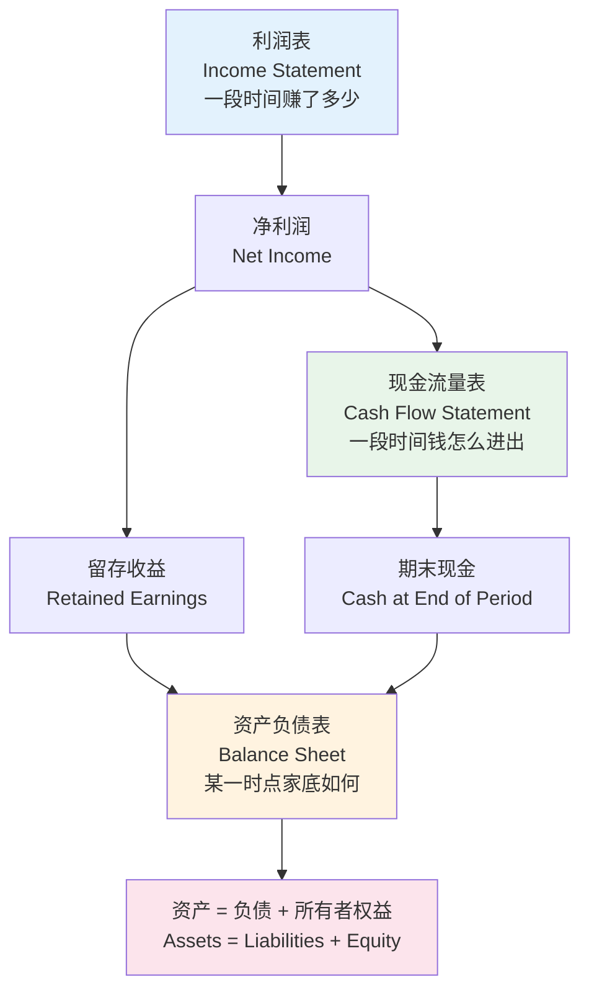
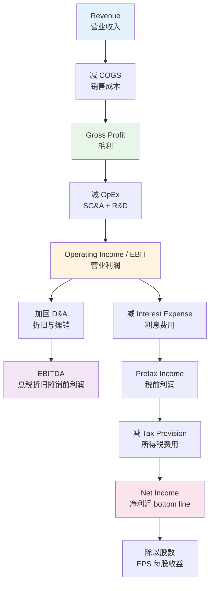
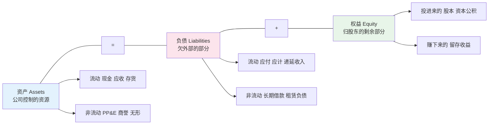
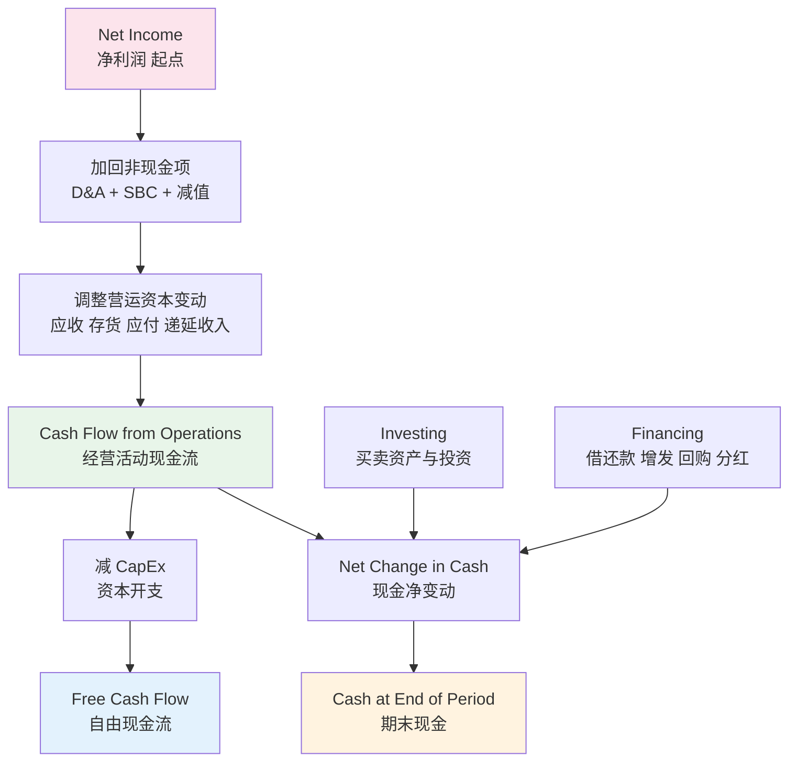
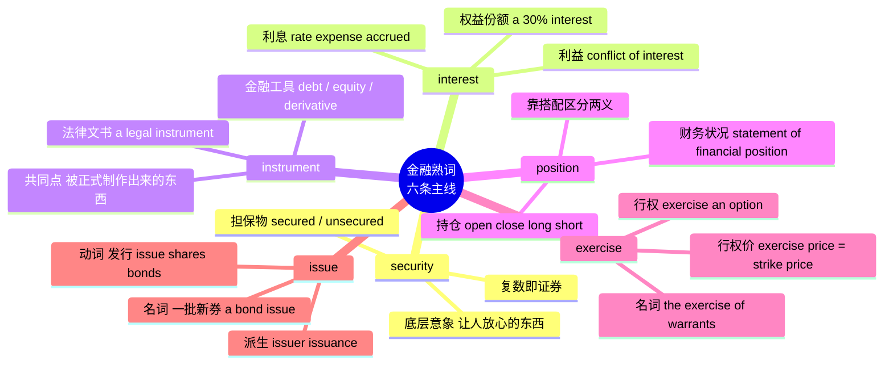
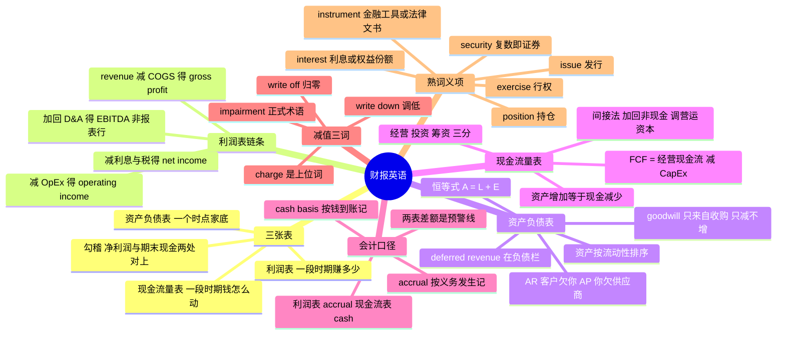

# 财报英语：三表科目、会计口径与金融熟词义项

> [!info] 本篇定位
>
> 第二十章领域词汇的第七篇，接着上一篇 [[20.专业领域词汇/06.商务、市场与管理英语：战略、增长漏斗、OKR 与供应链\|商务、市场与管理英语：战略、增长漏斗、OKR 与供应链]] 往下走。上一篇讲的是公司**怎么运转**——战略、漏斗、目标、供应链；本篇讲的是同一家公司**怎么被记账**。
>
> 三条主线：三张报表的科目名与它们的勾稽关系、会计口径造成的「同一件事两个数」现象、以及金融语境里那批看着全认识实则义项完全不同的熟词。
>
> 这不是会计教材。本篇只解决语言问题：一个科目名的英文长什么样、它在表上的哪一行、跟相邻科目的差别在哪、中文译名有没有误导你。会计准则本身的判断题（这笔收入该不该确认、这项资产该摊几年）不在范围内。
>
> 个人生活层面的银行与账户词 `deposit`、`withdraw`、`overdraft`、`mortgage` 在 [[11.学校、职场与城市社会/04.金钱银行、购物、网购与快递售后\|金钱银行、购物、网购与快递售后]] 已经给过，本篇不重收；图表趋势词 `rise`、`plunge`、`level off` 见 [[03.数字与计量词汇/04.货币、价格、折扣与统计图表趋势\|货币、价格、折扣与统计图表趋势]]；估值倍数、SaaS 指标与股权融资条款留给下一篇。
>
> 读完你应该能打开一份英文 10-K，从目录直接翻到你要的那张表，认得表上每一行是什么，并且知道公司在哪些地方悄悄换了口径。

---

## 1. 本篇导读：三张表咬在一起的那几个数

财报英语的难点不在生词量。`revenue`、`asset`、`cash`、`interest` 这些词你早就认识，问题是它们在报表语境里被赋予了**精确到可以打官司**的定义，而中文译名往往把这层精确抹掉了。

三个典型的翻车点，先摆出来当靶子：

- `income` 在英语财报里通常指**利润**（net income 净利润），不是「收入」。收入是 `revenue`。中文把两个词都译成带「收入」的字眼，是最高频的误读源。
- `deferred revenue` 中文译「递延收入」，看着像资产，实际记在**负债**栏——客户预付了钱，你欠他一批还没交付的服务。
- `write-off` 与 `write-down` 只差一个词尾，前者是「整笔归零」，后者是「调低到一个新数」。财报电话会上说错这一个词，分析师会当场追问。

### 1.1 三表勾稽：一张图先把关系摆平

上图说明的是三张表不是三份独立文件，而是同一批交易的三个投影。利润表算出来的净利润有两个去向：一个进现金流量表的第一行当起点，一个进资产负债表的留存收益。现金流量表算出来的期末现金，等于资产负债表现金那一行的数。任何一处对不上，要么是你看错了口径，要么是这份报表有问题。

从**时间属性**上看，三张表也分两类：利润表和现金流量表描述的是**一段时期**（for the year ended December 31），资产负债表描述的是**一个时点**（as of December 31）。英文报表标题上的 `for the year ended` 与 `as of` 就是这个区分的标记，看到就能判断这张表在回答什么问题。

### 1.2 三张表的正式名与口语名

同一张表在正式文件、口语讨论、英美两地各有说法，认全才不会以为是四张表：

| 英文 | 英式音标 | 美式音标 | 词性 | 中文 | 搭配与说明 |
| --- | --- | --- | --- | --- | --- |
| **income statement** | /ˈɪnkʌm ˈsteɪtmənt/ | /ˈɪnkʌm ˈsteɪtmənt/ | n. | 利润表 | 美式财报最常用的叫法 |
| **profit and loss account** | /ˈprɒfɪt ənd lɒs/ | /ˈprɑːfɪt ənd lɔːs/ | n. | 利润表 | 英式说法，口语缩成 P&L，读作 P and L |
| **statement of operations** | /ˈsteɪtmənt əv ˌɒpəˈreɪʃnz/ | /ˈsteɪtmənt əv ˌɑːpəˈreɪʃnz/ | n. | 经营成果表 | 美股 10-K 里常见的正式表名，与 income statement 同物 |
| **balance sheet** | /ˈbæləns ʃiːt/ | /ˈbæləns ʃiːt/ | n. | 资产负债表 | 最通用的说法，不分英美 |
| **statement of financial position** | /fəˈnænʃl pəˈzɪʃn/ | /fəˈnænʃl pəˈzɪʃn/ | n. | 财务状况表 | IFRS 体系的正式表名，等同 balance sheet |
| **cash flow statement** | /kæʃ fləʊ/ | /kæʃ floʊ/ | n. | 现金流量表 | 正式写法 statement of cash flows，注意 flows 有复数 |
| **statement of changes in equity** | /ˈekwəti/ | /ˈekwəti/ | n. | 所有者权益变动表 | 第四张表，篇幅小但记录了增发与回购 |
| **notes to the financial statements** | /nəʊts/ | /noʊts/ | n. | 财务报表附注 | 口语叫 footnotes，真正的信息量往往在这里 |
| **consolidated** | /kənˈsɒlɪdeɪtɪd/ | /kənˈsɑːlɪdeɪtɪd/ | adj. | 合并的 | 表名前几乎都有这个词，指母公司加子公司合并后的数 |
| **standalone** | /ˈstændələʊn/ | /ˈstændəloʊn/ | adj. | 单体的 | 与 consolidated 相对，只算母公司本身 |
| **line item** | /laɪn ˈaɪtəm/ | /laɪn ˈaɪtəm/ | n. | 报表科目；行项目 | 表上的一行就叫一个 line item |
| **caption** | /ˈkæpʃn/ | /ˈkæpʃn/ | n. | 科目名 | 正式文件里指报表行的标题文字 |
| **as of** | — | — | prep. | 截至 | 后接时点，用于资产负债表：as of December 31, 2025 |
| **for the year ended** | — | — | phr. | 截至……的年度 | 后接时期终点，用于利润表与现金流量表 |

> [!warning] 三个中文译名的陷阱
>
> - `income` 在美式财报里默认指**利润**：`net income` 净利润、`operating income` 营业利润、`income before taxes` 税前利润。只有 `income statement` 这个表名里的 income 是笼统的「损益」。
> - `earnings` 也是利润，不是收入。`earnings per share` 每股收益、`earnings call` 业绩说明会、`retained earnings` 留存收益，全部指利润口径。
> - 真正的「收入」只有 `revenue`（美式）和 `turnover`（英式）。英式的 `turnover` 还有第二个义项「周转率」和第三个义项「员工流失率」，靠上下文分。

---

## 2. 财报外壳：filing 体例、报告期与口径声明

翻开一份财报，先撞上的不是数字，是一层文书外壳：这是什么文件、覆盖哪个期间、按哪套准则编的、审计意见是哪一档。这层壳的词认不全，你连该看哪一页都定位不了。

### 2.1 文件类型与报送体例

| 英文 | 英式音标 | 美式音标 | 词性 | 中文 | 搭配与说明 |
| --- | --- | --- | --- | --- | --- |
| **filing** | /ˈfaɪlɪŋ/ | /ˈfaɪlɪŋ/ | n. | 报送文件 | 向监管机构提交的正式文件统称；file a report 提交报告 |
| **annual report** | /ˈænjuəl rɪˈpɔːt/ | /ˈænjuəl rɪˈpɔːrt/ | n. | 年报 | 面向股东的印刷版，含大量图文；与 10-K 内容重叠但不等同 |
| **10-K** | /ten keɪ/ | /ten keɪ/ | n. | 年度报告 | 美国上市公司的法定年报，读作 ten-K，信息最全 |
| **10-Q** | /ten kjuː/ | /ten kjuː/ | n. | 季度报告 | 季报，未经审计，内容比 10-K 薄 |
| **8-K** | /eɪt keɪ/ | /eɪt keɪ/ | n. | 临时报告 | 重大事件随时报送，高管变动、并购、重述都走这个 |
| **prospectus** | /prəˈspektəs/ | /prəˈspektəs/ | n. | 招股说明书 | 复数 prospectuses；发行证券时的法定文件 |
| **SEC** | /ˌes iː ˈsiː/ | /ˌes iː ˈsiː/ | n. | 美国证监会 | 逐字母读，不读成 sec；the SEC 带定冠词 |
| **EDGAR** | /ˈedɡə/ | /ˈedɡər/ | n. | 电子报送系统 | SEC 的公开文件库，读作人名 Edgar，不逐字母读 |
| **disclosure** | /dɪsˈkləʊʒə/ | /dɪsˈkloʊʒər/ | n. | 披露 | disclosure requirement 披露要求；动词 disclose |
| **MD&A** | /ˌem diː ənd ˈeɪ/ | /ˌem diː ənd ˈeɪ/ | n. | 管理层讨论与分析 | 全称 Management's Discussion and Analysis，管理层自述那一章 |
| **auditor** | /ˈɔːdɪtə/ | /ˈɑːdɪtər/ | n. | 审计师 | external auditor 外部审计；美音首音节常读 /ɑː/ |
| **audit opinion** | /ˈɔːdɪt əˈpɪnjən/ | /ˈɑːdɪt əˈpɪnjən/ | n. | 审计意见 | 四档：unqualified、qualified、adverse、disclaimer |
| **unqualified opinion** | /ʌnˈkwɒlɪfaɪd/ | /ʌnˈkwɑːlɪfaɪd/ | n. | 无保留意见 | 最好的一档，字面「不加限定」不是「不合格」 |
| **qualified opinion** | /ˈkwɒlɪfaɪd/ | /ˈkwɑːlɪfaɪd/ | n. | 保留意见 | 有例外事项；qualify 在这里是「加限定条件」不是「合格」 |
| **going concern** | /ˈɡəʊɪŋ kənˈsɜːn/ | /ˈɡoʊɪŋ kənˈsɜːrn/ | n. | 持续经营 | going concern doubt 是最危险的措辞，暗示可能撑不下去 |
| **restatement** | /riːˈsteɪtmənt/ | /riːˈsteɪtmənt/ | n. | 财报重述 | 承认此前发布的数字有误并重发；动词 restate |
| **material weakness** | /məˈtɪəriəl/ | /məˈtɪriəl/ | n. | 重大缺陷 | 内控层面的严重问题，与 significant deficiency 分档 |

### 2.2 报告期、准则与口径

| 英文 | 英式音标 | 美式音标 | 词性 | 中文 | 搭配与说明 |
| --- | --- | --- | --- | --- | --- |
| **fiscal year** | /ˈfɪskl jɪə/ | /ˈfɪskl jɪr/ | n. | 财政年度 | 缩写 FY；英式也说 financial year |
| **calendar year** | /ˈkælɪndə/ | /ˈkælɪndər/ | n. | 日历年度 | 与 fiscal year 对照使用，说明起止是否是 1 月到 12 月 |
| **quarter** | /ˈkwɔːtə/ | /ˈkwɔːrtər/ | n. | 季度 | Q1 读作 Q one 或 first quarter |
| **interim** | /ˈɪntərɪm/ | /ˈɪntərɪm/ | adj. | 中期的 | interim results 中期业绩，指半年度或季度 |
| **year over year** | — | — | phr. | 同比 | 缩写 YoY，与去年同期比 |
| **quarter over quarter** | — | — | phr. | 环比 | 缩写 QoQ，与上一季度比 |
| **trailing twelve months** | /ˈtreɪlɪŋ/ | /ˈtreɪlɪŋ/ | n. | 过去十二个月 | 缩写 TTM 或 LTM；trailing 指「往回拖」的滚动窗口 |
| **GAAP** | /ɡæp/ | /ɡæp/ | n. | 美国公认会计原则 | 读作单词 gap，不逐字母；US GAAP |
| **IFRS** | /ˌaɪ ef ɑːr ˈes/ | /ˌaɪ ef ɑːr ˈes/ | n. | 国际财务报告准则 | 逐字母读；欧洲与多数非美市场使用 |
| **non-GAAP** | /ˌnɒn ˈɡæp/ | /ˌnɑːn ˈɡæp/ | adj. | 非公认会计原则的 | 公司自定义口径，必须与 GAAP 数做对账 |
| **reconciliation** | /ˌrekənsɪliˈeɪʃn/ | /ˌrekənsɪliˈeɪʃn/ | n. | 对账；调节表 | non-GAAP 数后面必须附 reconciliation to GAAP |
| **adjusted** | /əˈdʒʌstɪd/ | /əˈdʒʌstɪd/ | adj. | 调整后的 | adjusted EBITDA、adjusted EPS，剔除了公司认为不常规的项目 |
| **pro forma** | /ˌprəʊ ˈfɔːmə/ | /ˌproʊ ˈfɔːrmə/ | adj. | 备考的 | 拉丁词，指「假设某事已发生」编出来的数，常见于并购后 |
| **guidance** | /ˈɡaɪdns/ | /ˈɡaɪdns/ | n. | 业绩指引 | 公司对下期的预测；raise/cut/withdraw guidance |
| **consensus** | /kənˈsensəs/ | /kənˈsensəs/ | n. | 市场一致预期 | 分析师预测的平均值，业绩 beat 或 miss 都是相对它 |
| **basis point** | /ˈbeɪsɪs pɔɪnt/ | /ˈbeɪsɪs pɔɪnt/ | n. | 基点 | 万分之一，缩写 bps 读作 bips；100 bps = 1 个百分点 |
| **immaterial** | /ˌɪməˈtɪəriəl/ | /ˌɪməˈtɪriəl/ | adj. | 不重大的 | 会计义是「金额小到不影响判断」，不是日常义「无关的」 |

> [!warning] unqualified 与 qualified 是反直觉的一对
>
> 日常英语里 `qualified` 是褒义（有资格的、合格的），`unqualified` 是贬义（不合格的）。审计意见里两个词的褒贬**完全倒过来**：
>
> - ✅ **unqualified opinion**：无保留意见。qualify 取的是「加限定条件」的义项，unqualified 就是「一个限定条件都不加」，即审计师完全认可。
> - ❌ ~~把 unqualified opinion 读成「不合格意见」~~
> - **qualified opinion**：保留意见。审计师说「除了某某事项之外我认可」，加了限定，反而是坏消息。
>
> 记忆锚点：`unqualified success` 在日常英语里也是「彻底的成功」而不是「不合格的成功」，同一个 qualify 义项。这个词的多义项在 [[16.词义辨析、搭配与短语动词/02.反义词体系、一词多义与词义引申\|反义词体系、一词多义与词义引申]] 讲过引申机制，这里是它在专业语境里的落点。

---

## 3. 利润表（上）：top line 到 gross margin

利润表是一个自上而下不断做减法的结构。英文管最上面那行叫 `top line`，最下面那行叫 `bottom line`，这两个日常英语里的比喻词就是从这里来的。

### 3.1 收入那一行

| 英文 | 英式音标 | 美式音标 | 词性 | 中文 | 搭配与说明 |
| --- | --- | --- | --- | --- | --- |
| **revenue** | /ˈrevənjuː/ | /ˈrevənuː/ | n. | 营业收入 | 美式财报最标准的收入科目名；常用复数 revenues |
| **turnover** | /ˈtɜːnəʊvə/ | /ˈtɜːrnoʊvər/ | n. | 营业额；周转率；流失率 | 英式财报的收入科目名，三义靠语境分 |
| **sales** | /seɪlz/ | /seɪlz/ | n. | 销售额 | 制造与零售业常用；net sales 扣除退货折让后的净额 |
| **top line** | /tɒp laɪn/ | /tɑːp laɪn/ | n. | 收入行；营收 | top-line growth 营收增长，与 bottom-line growth 对照 |
| **gross revenue** | /ɡrəʊs/ | /ɡroʊs/ | n. | 收入总额 | 未扣任何项目的口径 |
| **net revenue** | /net/ | /net/ | n. | 收入净额 | 扣除退货、折扣、返利后的口径 |
| **recurring revenue** | /rɪˈkɜːrɪŋ/ | /rɪˈkɜːrɪŋ/ | n. | 经常性收入 | 可重复发生的订阅式收入，与 one-off revenue 相对 |
| **deferred revenue** | /dɪˈfɜːd/ | /dɪˈfɜːrd/ | n. | 递延收入 | 收了钱还没交付，记在**负债**栏；详见第 7 节 |
| **backlog** | /ˈbæklɒɡ/ | /ˈbæklɔːɡ/ | n. | 在手订单 | 已签约未确认收入的部分，不上表但常在 MD&A 里披露 |
| **rebate** | /ˈriːbeɪt/ | /ˈriːbeɪt/ | n./v. | 返利 | 事后返还的部分，从总收入里冲减 |
| **allowance** | /əˈlaʊəns/ | /əˈlaʊəns/ | n. | 折让；备抵 | sales allowance 销售折让；这个词在资产端还有第二义项 |
| **discount** | n. /ˈdɪskaʊnt/ v. /dɪsˈkaʊnt/ | n. /ˈdɪskaʊnt/ v. /dɪsˈkaʊnt/ | n./v. | 折扣；折现 | 名动重音移位；金融义「折现」见第 13 节 |
| **billings** | /ˈbɪlɪŋz/ | /ˈbɪlɪŋz/ | n. | 开票额 | 开出去的账单总额，与已确认收入不是一个数 |
| **bookings** | /ˈbʊkɪŋz/ | /ˈbʊkɪŋz/ | n. | 签约额 | 合同签下的总额，时间上最早，三者关系见下文 |

> [!tip] bookings、billings、revenue 的时间差
>
> 订阅制公司的三个数依次发生，差额全在资产负债表上：
>
> - **bookings**：客户签了一份三年合同，签约那一刻记 bookings。
> - **billings**：你按合同开出第一年的发票，开票那一刻记 billings，同时形成 accounts receivable。
> - **revenue**：服务按月交付，每过一个月确认十二分之一，剩下的挂在 deferred revenue 里。
>
> 三个数从大到小通常是 bookings > billings > revenue。这三者的差额恰好解释了为什么一家公司可以「收入不高但现金很多」，或者反过来。

### 3.2 成本与毛利

| 英文 | 英式音标 | 美式音标 | 词性 | 中文 | 搭配与说明 |
| --- | --- | --- | --- | --- | --- |
| **cost of goods sold** | /kɒst/ | /kɔːst/ | n. | 销售成本 | 缩写 COGS，读作 /kɒɡz/ 像单词，也有人逐字母读 |
| **cost of revenue** | /kɒst əv ˈrevənjuː/ | /kɔːst əv ˈrevənuː/ | n. | 营业成本 | 软件公司更爱用这个名字，因为卖的不是 goods |
| **cost of sales** | /kɒst əv seɪlz/ | /kɔːst əv seɪlz/ | n. | 销售成本 | 与 COGS 同义，英式报表更常见 |
| **direct cost** | /daɪˈrekt kɒst/ | /dəˈrekt kɔːst/ | n. | 直接成本 | 能直接归到某个产品上的成本 |
| **indirect cost** | /ˌɪndaɪˈrekt/ | /ˌɪndəˈrekt/ | n. | 间接成本 | 归不到单个产品，需要分摊 |
| **variable cost** | /ˈveəriəbl/ | /ˈveriəbl/ | n. | 变动成本 | 随业务量变化；与 fixed cost 成对 |
| **fixed cost** | /fɪkst kɒst/ | /fɪkst kɔːst/ | n. | 固定成本 | 业务量为零也要付 |
| **gross profit** | /ɡrəʊs ˈprɒfɪt/ | /ɡroʊs ˈprɑːfɪt/ | n. | 毛利 | revenue 减 COGS 的差额，是绝对金额 |
| **gross margin** | /ɡrəʊs ˈmɑːdʒɪn/ | /ɡroʊs ˈmɑːrdʒɪn/ | n. | 毛利率 | 毛利除以收入，是百分比；口语也用来指毛利本身 |
| **margin** | /ˈmɑːdʒɪn/ | /ˈmɑːrdʒɪn/ | n. | 利润率；保证金 | 财报义是利润率，交易义是保证金，两义无关 |
| **markup** | /ˈmɑːkʌp/ | /ˈmɑːrkʌp/ | n. | 加价率 | 以成本为分母，与以售价为分母的 margin 不是一个数 |
| **contribution margin** | /ˌkɒntrɪˈbjuːʃn/ | /ˌkɑːntrɪˈbjuːʃn/ | n. | 边际贡献 | 收入减变动成本，管理会计口径，不在法定报表上 |
| **unit economics** | /ˈjuːnɪt ˌiːkəˈnɒmɪks/ | /ˈjuːnɪt ˌekəˈnɑːmɪks/ | n. | 单位经济模型 | 单个客户或单笔订单的收支结构，投资人高频词 |
| **cost structure** | /kɒst ˈstrʌktʃə/ | /kɔːst ˈstrʌktʃər/ | n. | 成本结构 | 各类成本的构成比例 |

> [!warning] margin 是百分比还是金额，看搭配
>
> `margin` 严格说是比率，但英语里的实际用法两可，靠搭配判断：
>
> - **带 percentage 语感的搭配** → 比率：`gross margin of 68%`、`margin expanded by 200 basis points`、`margin compression`。
> - **带金额语感的搭配** → 绝对额：`margin dollars`、`we lost margin on that deal`。
>
> 中文「毛利」和「毛利率」是两个词，英语靠上下文，读的时候先看单位。看到 `%` 或 `bps` 就是比率，看到 `$` 或 `million` 就是金额。

---

## 4. 利润表（下）：OpEx 到 bottom line，以及 EBITDA 的争议

毛利往下是费用层，每减掉一类费用就得到一个新的利润口径。这一段的科目名密度最高，也是 non-GAAP 花样最多的地方。

### 4.1 营业费用

| 英文 | 英式音标 | 美式音标 | 词性 | 中文 | 搭配与说明 |
| --- | --- | --- | --- | --- | --- |
| **operating expenses** | /ˈɒpəreɪtɪŋ ɪkˈspensɪz/ | /ˈɑːpəreɪtɪŋ ɪkˈspensɪz/ | n. | 营业费用 | 缩写 OpEx，读作 /ˈɒpeks/；与 CapEx 成对 |
| **SG&A** | /ˌes dʒiː ənd ˈeɪ/ | /ˌes dʒiː ənd ˈeɪ/ | n. | 销售、一般及管理费用 | 全称 selling, general and administrative expenses |
| **R&D** | /ˌɑːr ənd ˈdiː/ | /ˌɑːr ənd ˈdiː/ | n. | 研发费用 | research and development，程序员的工资多半在这一行 |
| **sales and marketing** | /seɪlz/ | /seɪlz/ | n. | 销售与市场费用 | 缩写 S&M，SaaS 公司常单列 |
| **headcount** | /ˈhedkaʊnt/ | /ˈhedkaʊnt/ | n. | 员工人数 | 费用讨论里的核心变量，headcount freeze 冻结招聘 |
| **payroll** | /ˈpeɪrəʊl/ | /ˈpeɪroʊl/ | n. | 工资单；薪酬支出 | payroll tax 工资税；on the payroll 在编 |
| **overhead** | /ˈəʊvəhed/ | /ˈoʊvərhed/ | n. | 间接费用；管理费 | 不可数，指维持运转但不直接产出的开销 |
| **stock-based compensation** | /stɒk beɪst/ | /stɑːk beɪst/ | n. | 股权激励费用 | 缩写 SBC，是 non-GAAP 里被剔除最多的一项 |
| **restructuring charge** | /ˌriːˈstrʌktʃərɪŋ/ | /ˌriːˈstrʌktʃərɪŋ/ | n. | 重组费用 | 裁员、关厂产生的一次性支出 |
| **severance** | /ˈsevərəns/ | /ˈsevərəns/ | n. | 遣散费 | 来自 sever「切断」，severance package 离职补偿包 |
| **provision** | /prəˈvɪʒn/ | /prəˈvɪʒn/ | n. | 计提；准备金 | 会计义是「预先计入的估计损失」；法律义「条款」见 20.05 |
| **accrual** | /əˈkruːəl/ | /əˈkruːəl/ | n. | 应计项目 | 已发生未支付的费用；动词 accrue |
| **capitalized** | /ˈkæpɪtəlaɪzd/ | /ˈkæpɪtəlaɪzd/ | adj. | 资本化的 | 计入资产而非当期费用，详见第 5 节 |
| **expensed** | /ɪkˈspenst/ | /ɪkˈspenst/ | adj. | 费用化的 | 一次性计入当期损益，与 capitalized 对立 |

### 4.2 各级利润口径

| 英文 | 英式音标 | 美式音标 | 词性 | 中文 | 搭配与说明 |
| --- | --- | --- | --- | --- | --- |
| **operating income** | /ˈɒpəreɪtɪŋ ˈɪnkʌm/ | /ˈɑːpəreɪtɪŋ ˈɪnkʌm/ | n. | 营业利润 | 毛利减营业费用；与 EBIT 在多数情况下同数 |
| **EBIT** | /ˈiːbɪt/ | /ˈiːbɪt/ | n. | 息税前利润 | earnings before interest and taxes，读作单词 |
| **EBITDA** | /ɪˈbɪtdɑː/ | /ɪˈbɪtdɑː/ | n. | 息税折旧摊销前利润 | 再加回 D&A，读作 ee-BIT-dah，不逐字母 |
| **interest expense** | /ˈɪntrəst ɪkˈspens/ | /ˈɪntrəst ɪkˈspens/ | n. | 利息费用 | 借钱的代价，在营业利润下面 |
| **interest income** | /ˈɪntrəst ˈɪnkʌm/ | /ˈɪntrəst ˈɪnkʌm/ | n. | 利息收入 | 存款与债券产生的收益 |
| **other income (expense)** | — | — | n. | 营业外收支 | 括号表示负数，是报表的通用约定 |
| **pretax income** | /ˌpriːˈtæks/ | /ˌpriːˈtæks/ | n. | 税前利润 | 也写 income before income taxes |
| **income tax provision** | /prəˈvɪʒn/ | /prəˈvɪʒn/ | n. | 所得税费用 | 也叫 tax expense，不等于当年实缴的税 |
| **effective tax rate** | /ɪˈfektɪv/ | /ɪˈfektɪv/ | n. | 实际税率 | 所得税费用除以税前利润，与法定税率常有差 |
| **net income** | /net ˈɪnkʌm/ | /net ˈɪnkʌm/ | n. | 净利润 | 最后一行；也叫 net earnings、net profit |
| **bottom line** | /ˈbɒtəm laɪn/ | /ˈbɑːtəm laɪn/ | n. | 净利润行 | 日常英语「最关键的一点」就是从这里比喻来的 |
| **net loss** | /net lɒs/ | /net lɔːs/ | n. | 净亏损 | 亏损时的科目名，报表上用括号表示 |
| **EPS** | /ˌiː piː ˈes/ | /ˌiː piː ˈes/ | n. | 每股收益 | earnings per share，逐字母读 |
| **basic EPS** | /ˈbeɪsɪk/ | /ˈbeɪsɪk/ | n. | 基本每股收益 | 分母是当前实际股数 |
| **diluted EPS** | /daɪˈluːtɪd/ | /daɪˈluːtɪd/ | n. | 稀释每股收益 | 分母把期权、可转债都算成已行权，数更小更保守 |

上图是利润表的减法链。要注意 EBITDA 挂在旁边而不是主链上——它不是报表上的一行，是从营业利润**倒推回去**算出来的。GAAP 报表里找不到 EBITDA 这一行，公司要用它必须自己在 MD&A 或新闻稿里披露，并附上对账表。这条侧枝的位置说明了它的性质：一个人为构造的口径。

> [!warning] EBITDA 为什么争议大
>
> EBITDA 把利息、税、折旧、摊销四样全加回来，理由是「这四样跟经营效率无关」。这个理由在重资产行业站不住：
>
> - 折旧代表设备真的在磨损。一家钢厂的机器每年掉价，把折旧加回来等于假装机器永远不用换。
> - 摊销里若包含收购形成的无形资产摊销，加回来等于假装收购花的钱不算成本。
> - 利息是真的要付现金的。高杠杆公司的 EBITDA 很好看，自由现金流可能是负的。
>
> 巴菲特在伯克希尔 2000 年致股东信里对这个指标有过公开批评，措辞大意是把折旧当成非现金费用是一种自欺。读财报时的实际操作：看到公司主推 adjusted EBITDA，就去翻 reconciliation 表，看它到底加回了哪些项目——那张表列出的每一行都是公司希望你忽略的成本。
>
> - ❌ ~~EBITDA is basically cash flow~~（EBITDA 约等于现金流）
> - ✅ **EBITDA ignores working capital changes and capex, so it is not a cash flow measure.**（EBITDA 不考虑营运资本变动和资本开支，不是现金流指标。）

---

## 5. 折旧与摊销：capitalize 与 expense 的分岔

`depreciation and amortization`（缩写 D&A）是财报里最容易读糊的一组词，因为中文「折旧」「摊销」的差别没有英文那么直白。

规则本身一句话：**折旧针对有形资产，摊销针对无形资产**。一台服务器折旧，一项专利摊销。但真正卡人的是这组词背后的那个决策——一笔支出是当期费用还是先变成资产再慢慢摊。

| 英文 | 英式音标 | 美式音标 | 词性 | 中文 | 搭配与说明 |
| --- | --- | --- | --- | --- | --- |
| **depreciation** | /dɪˌpriːʃiˈeɪʃn/ | /dɪˌpriːʃiˈeɪʃn/ | n. | 折旧 | 只用于有形资产；动词 depreciate |
| **amortization** | /əˌmɔːtaɪˈzeɪʃn/ | /ˌæmərtəˈzeɪʃn/ | n. | 摊销 | 只用于无形资产与贷款本金；英美读音差异大，重音位置不同 |
| **amortize** | /əˈmɔːtaɪz/ | /ˈæmərtaɪz/ | v. | 摊销 | 英式重音在第二音节，美式在第一音节 |
| **capitalize** | /ˈkæpɪtəlaɪz/ | /ˈkæpɪtəlaɪz/ | v. | 资本化 | capitalize the cost 把支出记成资产；与「大写」同形不同义 |
| **expense** | /ɪkˈspens/ | /ɪkˈspens/ | v./n. | 费用化；费用 | 作动词 expense it 指一次性计入当期损益 |
| **useful life** | /ˈjuːsfl laɪf/ | /ˈjuːsfl laɪf/ | n. | 使用寿命 | 折旧年限的依据，estimated useful life 估计使用寿命 |
| **straight-line** | /streɪt laɪn/ | /streɪt laɪn/ | adj. | 直线法的 | 每年折同样的数，最常见的折旧方法 |
| **accelerated depreciation** | /əkˈseləreɪtɪd/ | /əkˈseləreɪtɪd/ | n. | 加速折旧 | 前几年多折，后几年少折 |
| **salvage value** | /ˈsælvɪdʒ/ | /ˈsælvɪdʒ/ | n. | 残值 | 折完之后还值多少；英式常用 residual value |
| **residual value** | /rɪˈzɪdjuəl/ | /rɪˈzɪdʒuəl/ | n. | 残值 | 与 salvage value 同义，英式偏好 |
| **accumulated depreciation** | /əˈkjuːmjəleɪtɪd/ | /əˈkjuːmjəleɪtɪd/ | n. | 累计折旧 | 挂在资产负债表上，是资产的抵减项 |
| **net book value** | /net bʊk ˈvæljuː/ | /net bʊk ˈvæljuː/ | n. | 账面净值 | 原值减累计折旧；缩写 NBV |
| **carrying amount** | /ˈkæriɪŋ əˈmaʊnt/ | /ˈkæriɪŋ əˈmaʊnt/ | n. | 账面价值 | IFRS 用语，等同 book value |
| **CapEx** | /ˈkæpeks/ | /ˈkæpeks/ | n. | 资本开支 | capital expenditure，读作单词；买固定资产的钱 |
| **capital expenditure** | /ɪkˈspendɪtʃə/ | /ɪkˈspendɪtʃər/ | n. | 资本性支出 | CapEx 的全称，正式文件里写全 |
| **non-cash charge** | /nɒn kæʃ tʃɑːdʒ/ | /nɑːn kæʃ tʃɑːrdʒ/ | n. | 非现金费用 | 计进利润表但当期没付钱，折旧摊销都属此类 |
| **obsolescence** | /ˌɒbsəˈlesns/ | /ˌɑːbsəˈlesns/ | n. | 陈旧过时 | technological obsolescence 技术性淘汰，会缩短使用寿命 |
| **impair** | /ɪmˈpeə/ | /ɪmˈper/ | v. | 减值 | 资产价值突然掉下来时用，详见第 10 节 |

> [!tip] 用买服务器理解 capitalize 与 expense
>
> 公司花 100 万买一批服务器，用五年：
>
> - **capitalize**：这 100 万不进当年的利润表，而是变成资产负债表上的 PP&E。之后每年通过 depreciation 把 20 万计进利润表。当年利润只减少 20 万。
> - **expense**：这 100 万当年全部计进利润表。当年利润直接减少 100 万。
>
> 两种做法五年后的累计影响一样，但对**单个年度**的利润影响差五倍。这就是为什么「某项支出该不该资本化」是财报审查的重点：资本化会让当期利润变好看。
>
> 软件公司的经典争议点是自研软件的开发工资能不能资本化。GAAP 允许在特定阶段资本化，尺度松紧直接影响 R&D 费用和净利润。读到一家公司的 `capitalized software development costs` 金额突然变大，值得追问。

> [!example] 折旧摊销的典型句子
>
> - The equipment is **depreciated on a straight-line basis over five years**.
>   - 该设备按五年直线法计提折旧。
> - We **capitalized** $12 million of software development costs in fiscal 2025.
>   - 2025 财年我们将 1200 万美元的软件开发成本资本化。
> - **Amortization of acquired intangibles** was $8 million for the quarter.
>   - 本季度收购形成的无形资产摊销为 800 万美元。
> - Depreciation is a **non-cash charge**, so it is added back in the cash flow statement.
>   - 折旧是非现金费用，在现金流量表里要加回来。

---

## 6. 资产负债表（上）：资产端与 accounts receivable

资产负债表按**流动性**从高到低排列：现金在最上面，厂房设备在下面。这个排序逻辑本身就是记忆线索。

### 6.1 流动资产

| 英文 | 英式音标 | 美式音标 | 词性 | 中文 | 搭配与说明 |
| --- | --- | --- | --- | --- | --- |
| **asset** | /ˈæset/ | /ˈæset/ | n. | 资产 | 复数 assets；总资产 total assets |
| **current asset** | /ˈkʌrənt/ | /ˈkɜːrənt/ | n. | 流动资产 | current 在这里是「一年内可变现」，不是「当前的」 |
| **non-current asset** | /nɒn ˈkʌrənt/ | /nɑːn ˈkɜːrənt/ | n. | 非流动资产 | 美式也说 long-term assets |
| **cash and cash equivalents** | /ɪˈkwɪvələnts/ | /ɪˈkwɪvələnts/ | n. | 现金及现金等价物 | 三个月内到期的高流动性投资算等价物 |
| **marketable securities** | /ˈmɑːkɪtəbl sɪˈkjʊərətiz/ | /ˈmɑːrkɪtəbl sɪˈkjʊrətiz/ | n. | 可交易证券 | 随时能卖掉的短期投资 |
| **accounts receivable** | /əˌkaʊnts rɪˈsiːvəbl/ | /əˌkaʊnts rɪˈsiːvəbl/ | n. | 应收账款 | 缩写 AR 或 A/R；客户欠你的钱 |
| **receivable** | /rɪˈsiːvəbl/ | /rɪˈsiːvəbl/ | n./adj. | 应收款 | 作名词常用复数 receivables |
| **trade receivables** | /treɪd/ | /treɪd/ | n. | 应收贸易款 | 英式与 IFRS 报表偏好这个名字 |
| **allowance for doubtful accounts** | /ˈdaʊtfl/ | /ˈdaʊtfl/ | n. | 坏账准备 | 预计收不回来的部分；英式说 provision for bad debts |
| **bad debt** | /bæd det/ | /bæd det/ | n. | 坏账 | debt 里的 b 不发音，见自然拼读篇的失效词清单 |
| **inventory** | /ˈɪnvəntri/ | /ˈɪnvəntɔːri/ | n. | 存货 | 英式也说 stock，但 stock 另有「股票」义，容易歧义 |
| **raw materials** | /rɔː məˈtɪəriəlz/ | /rɑː məˈtɪriəlz/ | n. | 原材料 | 存货三段之一 |
| **work in progress** | /wɜːk/ | /wɜːrk/ | n. | 在产品 | 缩写 WIP；美式也写 work in process |
| **finished goods** | /ˈfɪnɪʃt ɡʊdz/ | /ˈfɪnɪʃt ɡʊdz/ | n. | 产成品 | 存货三段的最后一段 |
| **prepaid expenses** | /ˌpriːˈpeɪd/ | /ˌpriːˈpeɪd/ | n. | 预付费用 | 先付了钱还没享受服务，是资产不是费用 |
| **write-down** | /ˈraɪt daʊn/ | /ˈraɪt daʊn/ | n./v. | 减记 | 把资产账面价值调低但不归零 |

### 6.2 非流动资产与无形资产

| 英文 | 英式音标 | 美式音标 | 词性 | 中文 | 搭配与说明 |
| --- | --- | --- | --- | --- | --- |
| **property, plant and equipment** | /ˈprɒpəti/ | /ˈprɑːpərti/ | n. | 固定资产 | 缩写 PP&E，逐字母加 and 读；plant 在这里是「厂房」 |
| **fixed assets** | /fɪkst ˈæsets/ | /fɪkst ˈæsets/ | n. | 固定资产 | 英式偏好，与 PP&E 同义 |
| **land** | /lænd/ | /lænd/ | n. | 土地 | 唯一不计提折旧的固定资产 |
| **leasehold improvement** | /ˈliːshəʊld/ | /ˈliːshoʊld/ | n. | 租赁资产改良 | 在租来的房子上装修的钱，按租期摊 |
| **right-of-use asset** | /raɪt əv juːs/ | /raɪt əv juːs/ | n. | 使用权资产 | 缩写 ROU；新租赁准则要求把经营租赁上表 |
| **intangible asset** | /ɪnˈtændʒəbl/ | /ɪnˈtændʒəbl/ | n. | 无形资产 | 专利、商标、客户关系；与 tangible 成对 |
| **tangible** | /ˈtændʒəbl/ | /ˈtændʒəbl/ | adj. | 有形的 | 来自拉丁 tangere「触摸」，与 contact、contagious 同根 |
| **goodwill** | /ˌɡʊdˈwɪl/ | /ˌɡʊdˈwɪl/ | n. | 商誉 | 收购溢价形成的差额，不摊销但每年做减值测试 |
| **patent** | 英 /ˈpætnt/ | 美 /ˈpætnt/ | n. | 专利 | 英式另有 /ˈpeɪtnt/ 读法，美式统一读 /ˈpæt-/ |
| **trademark** | /ˈtreɪdmɑːk/ | /ˈtreɪdmɑːrk/ | n. | 商标 | 与 patent、copyright 三分，详见法律篇 |
| **capitalized software** | /ˈkæpɪtəlaɪzd/ | /ˈkæpɪtəlaɪzd/ | n. | 资本化软件 | 自研软件中被记成资产的那部分开发成本 |
| **deferred tax asset** | /dɪˈfɜːd/ | /dɪˈfɜːrd/ | n. | 递延所得税资产 | 缩写 DTA；未来能抵税的金额 |
| **investment in affiliates** | /əˈfɪliəts/ | /əˈfɪliəts/ | n. | 对联营企业投资 | 持股不到控制线的长期股权 |
| **impairment** | /ɪmˈpeəmənt/ | /ɪmˈpermənt/ | n. | 减值 | goodwill impairment 商誉减值，是最常见的大额一次性损失 |

> [!warning] goodwill 不是「商业信誉」
>
> `goodwill` 在日常英语里是「善意、好感」（a gesture of goodwill 表达善意的举动），在会计里是一个纯粹的算术产物：
>
> **goodwill = 收购价 − 被收购公司可辨认净资产的公允价值**
>
> 你花 10 亿收购一家净资产 3 亿的公司，账上就凭空多出 7 亿 goodwill。这 7 亿不代表任何具体的东西，它只是「我们多付的部分」的记账占位符。
>
> 由此推出两个判读要点：
>
> 1. **goodwill 只能来自收购**。一家从没做过并购的公司，账上不会有 goodwill。自己经营出来的品牌价值不能记成 goodwill。
> 2. **goodwill 只减不增**。它不摊销，但每年要做 impairment test，一旦被收购业务不及预期就大额冲销。看到 `goodwill impairment charge of $2.1 billion`，翻译过来是「当年那笔收购买贵了」。

---

## 7. 资产负债表（下）：负债、deferred revenue 与 equity

右半边分两层：先是欠外人的（liabilities），再是归股东的（equity）。两者加起来必须等于左边的资产总额。

### 7.1 负债

| 英文 | 英式音标 | 美式音标 | 词性 | 中文 | 搭配与说明 |
| --- | --- | --- | --- | --- | --- |
| **liability** | /ˌlaɪəˈbɪləti/ | /ˌlaɪəˈbɪləti/ | n. | 负债 | 复数 liabilities；法律语境同词指「责任」 |
| **current liabilities** | /ˈkʌrənt/ | /ˈkɜːrənt/ | n. | 流动负债 | 一年内要还的 |
| **accounts payable** | /əˌkaʊnts ˈpeɪəbl/ | /əˌkaʊnts ˈpeɪəbl/ | n. | 应付账款 | 缩写 AP 或 A/P；你欠供应商的钱 |
| **accrued liabilities** | /əˈkruːd/ | /əˈkruːd/ | n. | 应计负债 | 已发生未开票也未付的义务，如未付工资、未付水电 |
| **accrued expenses** | /əˈkruːd ɪkˈspensɪz/ | /əˈkruːd ɪkˈspensɪz/ | n. | 应计费用 | 与 accrued liabilities 同物异名 |
| **deferred revenue** | /dɪˈfɜːd ˈrevənjuː/ | /dɪˈfɜːrd ˈrevənuː/ | n. | 递延收入 | 收了钱没交付；订阅公司这一行越大越健康 |
| **unearned revenue** | /ˌʌnˈɜːnd/ | /ˌʌnˈɜːrnd/ | n. | 预收收入 | 与 deferred revenue 同义，教材偏好这个词 |
| **contract liability** | /ˈkɒntrækt/ | /ˈkɑːntrækt/ | n. | 合同负债 | 新收入准则下 deferred revenue 的正式名 |
| **notes payable** | /nəʊts/ | /noʊts/ | n. | 应付票据 | note 在这里是「票据、借据」，见第 13 节熟词表 |
| **short-term debt** | /ʃɔːt tɜːm det/ | /ʃɔːrt tɜːrm det/ | n. | 短期借款 | 一年内到期 |
| **long-term debt** | /lɒŋ tɜːm det/ | /lɔːŋ tɜːrm det/ | n. | 长期借款 | 一年以上；LTD |
| **current portion of long-term debt** | /ˈpɔːʃn/ | /ˈpɔːrʃn/ | n. | 一年内到期的长期负债 | 长期债里明年就要还的那块，被挪到流动负债 |
| **accrued interest** | /əˈkruːd ˈɪntrəst/ | /əˈkruːd ˈɪntrəst/ | n. | 应计利息 | 时间到了但还没付的利息 |
| **contingent liability** | /kənˈtɪndʒənt/ | /kənˈtɪndʒənt/ | n. | 或有负债 | 取决于未来事件是否发生，常见于未决诉讼 |
| **off-balance-sheet** | — | — | adj. | 表外的 | off-balance-sheet financing 表外融资，历史上多次出事 |
| **covenant** | /ˈkʌvənənt/ | /ˈkʌvənənt/ | n. | 债务契约条款 | 借款合同里的限制条件；breach a covenant 违约 |
| **lease liability** | /liːs/ | /liːs/ | n. | 租赁负债 | 与 right-of-use asset 成对出现 |

> [!warning] deferred revenue 在负债栏，不在资产栏
>
> 中文「递延收入」四个字里有「收入」，很容易让人以为它在利润表或资产端。它在**负债**栏，逻辑是这样的：
>
> 客户预付了一整年的订阅费 1200 元。这一刻你手里多了 1200 现金（资产增加），但你还欠客户十二个月的服务（负债增加）。每过一个月，你从 deferred revenue 里搬 100 元到利润表的 revenue，负债减少 100。
>
> - ❌ ~~Deferred revenue is revenue we have already earned.~~
> - ✅ **Deferred revenue is cash we have collected but have not yet earned.**（递延收入是已收款但尚未赚到的部分。）
>
> 判读价值：deferred revenue 快速增长说明**未来收入已经锁定**，是 SaaS 公司的健康信号；它突然下降往往比当期收入下降更早预警。分析师问 `How did deferred revenue trend this quarter?` 问的就是这个。

### 7.2 所有者权益

| 英文 | 英式音标 | 美式音标 | 词性 | 中文 | 搭配与说明 |
| --- | --- | --- | --- | --- | --- |
| **equity** | /ˈekwəti/ | /ˈekwəti/ | n. | 所有者权益；股权 | 全称 shareholders' equity；金融义见第 13 节 |
| **shareholders' equity** | /ˈʃeəhəʊldəz/ | /ˈʃerhoʊldərz/ | n. | 股东权益 | 英式拼 shareholders'，美式常写 stockholders' |
| **common stock** | /ˈkɒmən stɒk/ | /ˈkɑːmən stɑːk/ | n. | 普通股 | 英式说 ordinary shares |
| **preferred stock** | /prɪˈfɜːd/ | /prɪˈfɜːrd/ | n. | 优先股 | 英式说 preference shares；清算与分红顺序在前 |
| **par value** | /pɑː ˈvæljuː/ | /pɑːr ˈvæljuː/ | n. | 面值 | 法定的名义价值，通常极小，与市价无关 |
| **additional paid-in capital** | /peɪd ɪn ˈkæpɪtl/ | /peɪd ɪn ˈkæpɪtl/ | n. | 资本公积 | 缩写 APIC；发行价超过面值的那部分 |
| **retained earnings** | /rɪˈteɪnd ˈɜːnɪŋz/ | /rɪˈteɪnd ˈɜːrnɪŋz/ | n. | 留存收益 | 历年净利润累计减去分红的余额 |
| **accumulated deficit** | /ˈdefɪsɪt/ | /ˈdefɪsɪt/ | n. | 累计亏损 | 留存收益为负时改用这个名字 |
| **treasury stock** | /ˈtreʒəri stɒk/ | /ˈtreʒəri stɑːk/ | n. | 库存股 | 公司回购回来的自家股票，在权益栏是负数 |
| **buyback** | /ˈbaɪbæk/ | /ˈbaɪbæk/ | n. | 股票回购 | 也说 share repurchase |
| **dividend** | /ˈdɪvɪdend/ | /ˈdɪvɪdend/ | n. | 股息 | declare a dividend 宣布派息；dividend payout ratio 派息率 |
| **shares outstanding** | /aʊtˈstændɪŋ/ | /aʊtˈstændɪŋ/ | n. | 已发行在外股数 | outstanding 在这里是「在外流通的」，不是「优秀的」 |
| **dilution** | /daɪˈluːʃn/ | /daɪˈluːʃn/ | n. | 摊薄；稀释 | 新发股票导致老股东占比下降 |
| **book value** | /bʊk ˈvæljuː/ | /bʊk ˈvæljuː/ | n. | 账面价值 | 权益总额；与市值 market cap 常差很远 |
| **minority interest** | /maɪˈnɒrəti/ | /maɪˈnɔːrəti/ | n. | 少数股东权益 | 也叫 non-controlling interest，缩写 NCI |

上图把会计恒等式 `Assets = Liabilities + Equity` 展开成六个格子。这个等式在英语里叫 **the accounting equation**，也叫 **the balance sheet equation**，`balance sheet` 这个表名里的 balance 就是「两边配平」的意思，不是「余额」。

从右往左读这张图更有解释力：权益那一栏只有两个来源——股东投进来的钱（paid-in capital）和公司自己赚下来留着的钱（retained earnings）。任何一家公司的家底都只能从这两个口子来。

---

## 8. 现金流量表：三类活动与 free cash flow

利润表告诉你赚了多少，现金流量表告诉你钱去哪了。两者的差额就是会计口径造的，下一节专门处理。

现金流量表按活动分三段，这个三分法是全表的骨架：

| 英文 | 英式音标 | 美式音标 | 词性 | 中文 | 搭配与说明 |
| --- | --- | --- | --- | --- | --- |
| **operating activities** | /ˈɒpəreɪtɪŋ/ | /ˈɑːpəreɪtɪŋ/ | n. | 经营活动 | 主业产生的现金；缩写 CFO 或 OCF |
| **investing activities** | /ɪnˈvestɪŋ/ | /ɪnˈvestɪŋ/ | n. | 投资活动 | 买卖资产与投资；缩写 CFI |
| **financing activities** | /faɪˈnænsɪŋ/ | /ˈfaɪnænsɪŋ/ | n. | 筹资活动 | 借钱还钱、发股回购、分红；缩写 CFF |
| **cash flow from operations** | — | — | n. | 经营活动现金流 | 三段里最重要的一段，最难造假 |
| **indirect method** | /ˌɪndaɪˈrekt/ | /ˌɪndəˈrekt/ | n. | 间接法 | 从净利润出发调整，绝大多数公司用这种 |
| **direct method** | /daɪˈrekt/ | /dəˈrekt/ | n. | 直接法 | 直接列收付项目，少见 |
| **add back** | /æd bæk/ | /æd bæk/ | v. | 加回 | 把非现金费用加回净利润，间接法的核心动作 |
| **working capital** | /ˈwɜːkɪŋ ˈkæpɪtl/ | /ˈwɜːrkɪŋ ˈkæpɪtl/ | n. | 营运资本 | 流动资产减流动负债 |
| **changes in working capital** | — | — | n. | 营运资本变动 | 应收、存货、应付的增减，直接影响经营现金流 |
| **free cash flow** | /friː kæʃ fləʊ/ | /friː kæʃ floʊ/ | n. | 自由现金流 | 缩写 FCF；经营现金流减资本开支 |
| **cash burn** | /kæʃ bɜːn/ | /kæʃ bɜːrn/ | n. | 现金消耗 | burn rate 每月净消耗；创业公司高频词 |
| **cash conversion** | /kənˈvɜːʃn/ | /kənˈvɜːrʒn/ | n. | 现金转化 | cash conversion ratio 现金转化率，看利润变现的效率 |
| **proceeds** | /ˈprəʊsiːdz/ | /ˈproʊsiːdz/ | n. | 所得款项 | 只用复数；proceeds from the issuance of debt 发债所得 |
| **capital contribution** | /ˌkɒntrɪˈbjuːʃn/ | /ˌkɑːntrɪˈbjuːʃn/ | n. | 出资 | 股东投入的资金 |
| **net change in cash** | — | — | n. | 现金净变动 | 三段相加的结果，必须等于期末减期初现金 |
| **beginning balance** | /bɪˈɡɪnɪŋ/ | /bɪˈɡɪnɪŋ/ | n. | 期初余额 | 也说 cash at beginning of period |
| **ending balance** | /ˈendɪŋ/ | /ˈendɪŋ/ | n. | 期末余额 | 与资产负债表现金那一行对上 |

上图上半部分是间接法的三步：从净利润出发，先加回不花钱的费用，再调整因收付时点造成的错位，得到经营现金流。再减掉资本开支就是自由现金流——这个数才是「公司真正能自由支配的钱」，也是估值模型的输入。

下半部分说明 FCF 这条支线**不在正式报表上**，跟 EBITDA 一样是分析师算出来的。而且 FCF 的定义并不统一：有人只减 CapEx，有人还要减掉股权激励，有人减掉必要的收购支出。看到一家公司报 FCF，先确认它的定义。

> [!tip] 营运资本变动的方向判断
>
> 间接法里最容易搞反的是加号还是减号。记一条：**资产增加 = 现金减少**。
>
> - 应收账款增加 → 你把货给了客户但没收到钱 → 现金流**减少**。
> - 存货增加 → 你把钱变成了仓库里的东西 → 现金流**减少**。
> - 应付账款增加 → 你欠着供应商没付 → 现金流**增加**。
> - 递延收入增加 → 客户预付了钱 → 现金流**增加**。
>
> 英文表述的固定说法是 `an increase in accounts receivable was a $30 million use of cash`（应收增加占用了 3000 万现金）和 `an increase in accounts payable was a $20 million source of cash`（应付增加提供了 2000 万现金）。`use of cash` 与 `source of cash` 这对搭配值得整块记。

> [!example] 现金流量表的典型句子
>
> - **Cash generated from operations** was $412 million, up 18% year over year.
>   - 经营活动产生的现金为 4.12 亿美元，同比增长 18%。
> - The increase in receivables was largely **offset by** higher deferred revenue.
>   - 应收账款的增加基本被递延收入的上升所抵消。
> - We expect to be **free cash flow positive** by the second half of the year.
>   - 我们预计在下半年实现自由现金流转正。
> - At the current **burn rate**, the company has roughly 14 months of **runway**.
>   - 按当前消耗速度，公司还有大约 14 个月的现金储备期。

---

## 9. 会计口径：accrual basis 与 cash basis

同一家公司同一年，按两套口径记账会得出两个完全不同的利润数。这不是造假，是两种记账原则的必然结果。理解这一节，才能理解为什么「利润很高但没钱」和「亏损但现金充裕」都能同时成立。

| 英文 | 英式音标 | 美式音标 | 词性 | 中文 | 搭配与说明 |
| --- | --- | --- | --- | --- | --- |
| **accrual basis** | /əˈkruːəl ˈbeɪsɪs/ | /əˈkruːəl ˈbeɪsɪs/ | n. | 权责发生制 | 按义务发生的时点记，不看钱什么时候动 |
| **cash basis** | /kæʃ ˈbeɪsɪs/ | /kæʃ ˈbeɪsɪs/ | n. | 收付实现制 | 钱进账才算收入，钱出账才算费用 |
| **accrue** | /əˈkruː/ | /əˈkruː/ | v. | 应计；累积 | accrue interest 计提利息；accrued but unpaid 已计提未支付 |
| **defer** | /dɪˈfɜː/ | /dɪˈfɜːr/ | v. | 递延 | 把已收或已付的钱推迟确认；名词 deferral |
| **recognize** | /ˈrekəɡnaɪz/ | /ˈrekəɡnaɪz/ | v. | 确认 | 会计核心动词：把一笔数正式记进报表 |
| **recognition** | /ˌrekəɡˈnɪʃn/ | /ˌrekəɡˈnɪʃn/ | n. | 确认 | revenue recognition 收入确认，整套准则的名字 |
| **matching principle** | /ˈmætʃɪŋ/ | /ˈmætʃɪŋ/ | n. | 配比原则 | 费用要和它带来的收入记在同一期 |
| **realize** | /ˈriːəlaɪz/ | /ˈriːəlaɪz/ | v. | 实现 | realized gain 已实现收益，指真的卖掉变现了 |
| **unrealized** | /ʌnˈriːəlaɪzd/ | /ʌnˈriːəlaɪzd/ | adj. | 未实现的 | unrealized loss 浮亏，账面上跌了但还没卖 |
| **incur** | /ɪnˈkɜː/ | /ɪnˈkɜːr/ | v. | 发生；招致 | incur costs 发生成本；只跟负面的东西搭配 |
| **materiality** | /məˌtɪəriˈæləti/ | /məˌtɪriˈæləti/ | n. | 重要性 | 金额小到不影响使用者判断就可以简化处理 |
| **prudence** | /ˈpruːdns/ | /ˈpruːdns/ | n. | 谨慎性 | 也叫 conservatism；坏消息早认，好消息晚认 |
| **conservatism** | /kənˈsɜːvətɪzəm/ | /kənˈsɜːrvətɪzəm/ | n. | 稳健性 | 与 prudence 同义，美式教材偏好 |
| **cut-off** | /ˈkʌt ɒf/ | /ˈkʌt ɔːf/ | n. | 截止 | cut-off date 记账截止日；跨期错记叫 cut-off error |
| **channel stuffing** | /ˈtʃænl ˈstʌfɪŋ/ | /ˈtʃænl ˈstʌfɪŋ/ | n. | 渠道压货 | 期末硬塞货给经销商冲收入，是典型的确认操纵 |
| **earnings management** | /ˈɜːnɪŋz/ | /ˈɜːrnɪŋz/ | n. | 盈余管理 | 在准则允许范围内调节利润的委婉说法 |

> [!warning] 一笔交易在两种口径下的四种时点
>
> 假设你 3 月签合同、4 月交付、5 月开票、7 月收到钱：
>
> | 口径 | 收入确认时点 | 理由 |
> | --- | --- | --- |
> | accrual basis | 4 月 | 履约义务完成的那一刻 |
> | cash basis | 7 月 | 钱到账的那一刻 |
>
> 差出三个月。上市公司一律用 accrual basis，因为它更能反映当期的经营活动；小微企业和个人报税常用 cash basis，因为它简单且与银行流水对得上。
>
> 由此推出财报阅读的一条原则：**利润表是 accrual 口径，现金流量表是 cash 口径**。两张表的差额不是错误，是这两个时点的距离。经营现金流长期大幅低于净利润，说明这家公司确认的收入迟迟收不回钱，这是最常用的一条预警线。

> [!example] 口径措辞的典型句子
>
> - Revenue is **recognized** when control of the goods transfers to the customer.
>   - 收入在商品控制权转移给客户时确认。
> - Under the **accrual basis**, expenses are recorded when incurred, not when paid.
>   - 在权责发生制下，费用在发生时入账，而不是在支付时。
> - The company **accrued** $4 million of bonus expense that will be paid in January.
>   - 公司计提了 400 万美元奖金费用，将于一月支付。
> - These are **unrealized** gains and will not affect cash until the position is sold.
>   - 这些是未实现收益，在头寸卖出之前不会影响现金。

---

## 10. 减值、核销与一次性项目

这一组词描述的是同一件事的不同程度：资产不值原来那个价了，账上要认这个损失。程度和方式的差别全在词上。

| 英文 | 英式音标 | 美式音标 | 词性 | 中文 | 搭配与说明 |
| --- | --- | --- | --- | --- | --- |
| **write-off** | /ˈraɪt ɒf/ | /ˈraɪt ɔːf/ | n. | 核销 | 账面价值直接归零；动词写作 write off，可分 |
| **write-down** | /ˈraɪt daʊn/ | /ˈraɪt daʊn/ | n. | 减记 | 调低到一个新的、非零的价；动词 write down |
| **write-up** | /ˈraɪt ʌp/ | /ˈraɪt ʌp/ | n. | 调增 | 调高账面价值，GAAP 下极少允许 |
| **impairment** | /ɪmˈpeəmənt/ | /ɪmˈpermənt/ | n. | 减值 | 正式术语，指资产可收回金额低于账面价值 |
| **impairment charge** | /tʃɑːdʒ/ | /tʃɑːrdʒ/ | n. | 减值损失 | 计入利润表的那笔金额 |
| **impairment test** | /test/ | /test/ | n. | 减值测试 | 商誉每年必做一次 |
| **charge** | /tʃɑːdʒ/ | /tʃɑːrdʒ/ | n./v. | 费用；计入 | charge to expense 计入费用；一次性大额支出常叫 a charge |
| **charge-off** | /ˈtʃɑːdʒ ɒf/ | /ˈtʃɑːrdʒ ɔːf/ | n. | 冲销 | 银行业用语，与 write-off 近义 |
| **provision for bad debts** | /prəˈvɪʒn/ | /prəˈvɪʒn/ | n. | 坏账准备 | 英式说法；美式说 allowance for doubtful accounts |
| **reserve** | /rɪˈzɜːv/ | /rɪˈzɜːrv/ | n. | 准备金 | warranty reserve 保修准备金；与 provision 常混用 |
| **one-off** | /ˌwʌn ˈɒf/ | /ˌwʌn ˈɔːf/ | adj./n. | 一次性的 | 英式偏好；美式说 one-time |
| **non-recurring** | /ˌnɒn rɪˈkɜːrɪŋ/ | /ˌnɑːn rɪˈkɜːrɪŋ/ | adj. | 非经常性的 | 公司剔除这类项目时常用的标签 |
| **extraordinary item** | /ɪkˈstrɔːdnri/ | /ɪkˈstrɔːrdneri/ | n. | 非常项目 | 旧准则的正式科目，2015 年后美国 GAAP 已取消 |
| **goodwill impairment** | /ˌɡʊdˈwɪl/ | /ˌɡʊdˈwɪl/ | n. | 商誉减值 | 承认收购买贵了；金额通常极大 |
| **obsolete inventory** | /ˈɒbsəliːt/ | /ˌɑːbsəˈliːt/ | n. | 呆滞存货 | 卖不掉的存货，要 write down |
| **recoverable amount** | /rɪˈkʌvərəbl/ | /rɪˈkʌvərəbl/ | n. | 可收回金额 | IFRS 术语，减值测试的比较基准 |

> [!warning] write-off 与 write-down 差一个介词，差一整个量级
>
> - **write off**：整笔归零。一笔 500 万的应收账款客户破产了，`we wrote off the receivable in full`，账上这 500 万变成 0。
> - **write down**：调到新的价。一批存货原值 500 万，现在只值 200 万，`we wrote the inventory down to $2 million`，账上留 200 万。
>
> 两个短语动词都可分：`write it off`、`write them down`，代词必须放中间。小品词的语义在 [[16.词义辨析、搭配与短语动词/05.短语动词（上）up out off down\|短语动词（上）up out off down]] 讲过——`off` 是分离与终止（整个拿掉），`down` 是减少（调低一档），这里的语义分工完全吻合那两条主线。
>
> 第三个词 `charge` 是上位词：write-off 和 impairment 计进利润表时都表现为 a charge。所以 `a $500 million charge` 只告诉你「有一笔五亿的损失」，不告诉你性质，得往下读附注。

---

## 11. 比率与分析措辞

比率是把两个报表数字相除得到的判断工具。这一节的词在分析报告、投资备忘录、路演材料里高频出现。

| 英文 | 英式音标 | 美式音标 | 词性 | 中文 | 搭配与说明 |
| --- | --- | --- | --- | --- | --- |
| **ratio** | /ˈreɪʃiəʊ/ | /ˈreɪʃioʊ/ | n. | 比率 | 复数 ratios；读作 RAY-shee-oh |
| **liquidity** | /lɪˈkwɪdəti/ | /lɪˈkwɪdəti/ | n. | 流动性 | 变现能力；liquidity crunch 流动性紧张 |
| **current ratio** | /ˈkʌrənt/ | /ˈkɜːrənt/ | n. | 流动比率 | 流动资产除以流动负债 |
| **quick ratio** | /kwɪk/ | /kwɪk/ | n. | 速动比率 | 分子剔除存货，也叫 acid-test ratio |
| **solvency** | /ˈsɒlvənsi/ | /ˈsɑːlvənsi/ | n. | 偿付能力 | 长期还债能力；形容词 solvent 有偿付能力的 |
| **insolvent** | /ɪnˈsɒlvənt/ | /ɪnˈsɑːlvənt/ | adj. | 资不抵债的 | 与 bankrupt 不同：insolvent 是状态，bankrupt 是法律程序 |
| **leverage** | /ˈliːvərɪdʒ/ | /ˈlevərɪdʒ/ | n./v. | 杠杆 | 英美元音差异明显；highly leveraged 高杠杆的 |
| **gearing** | /ˈɡɪərɪŋ/ | /ˈɡɪrɪŋ/ | n. | 杠杆比率 | 英式说法，与 leverage 对应 |
| **debt-to-equity** | /det tə ˈekwəti/ | /det tə ˈekwəti/ | n. | 负债权益比 | 缩写 D/E，读作 D to E |
| **interest coverage** | /ˈkʌvərɪdʒ/ | /ˈkʌvərɪdʒ/ | n. | 利息保障倍数 | EBIT 除以利息费用，看还得起利息不 |
| **ROE** | /ˌɑːr əʊ ˈiː/ | /ˌɑːr oʊ ˈiː/ | n. | 净资产收益率 | return on equity，逐字母读 |
| **ROA** | /ˌɑːr əʊ ˈeɪ/ | /ˌɑːr oʊ ˈeɪ/ | n. | 总资产收益率 | return on assets |
| **ROIC** | /ˈrɔɪk/ | /ˈrɔɪk/ | n. | 投入资本回报率 | return on invested capital，常读作单词 ROIC |
| **turnover ratio** | /ˈtɜːnəʊvə/ | /ˈtɜːrnoʊvər/ | n. | 周转率 | inventory turnover 存货周转率；这里 turnover 是「周转」义 |
| **DSO** | /ˌdiː es ˈəʊ/ | /ˌdiː es ˈoʊ/ | n. | 应收账款周转天数 | days sales outstanding，越大说明回款越慢 |
| **DPO** | /ˌdiː piː ˈəʊ/ | /ˌdiː piː ˈoʊ/ | n. | 应付账款周转天数 | days payable outstanding，越大说明占用供应商越久 |
| **DIO** | /ˌdiː aɪ ˈəʊ/ | /ˌdiː aɪ ˈoʊ/ | n. | 存货周转天数 | days inventory outstanding |
| **cash conversion cycle** | — | — | n. | 现金转换周期 | DSO + DIO − DPO；为负说明先收钱后付钱 |
| **operating leverage** | /ˈɒpəreɪtɪŋ/ | /ˈɑːpəreɪtɪŋ/ | n. | 经营杠杆 | 固定成本占比高时，收入增长会放大利润增长 |
| **break-even** | /ˌbreɪk ˈiːvn/ | /ˌbreɪk ˈiːvn/ | n./adj. | 盈亏平衡 | break-even point 盈亏平衡点；动词 break even 不加连字符 |
| **benchmark** | /ˈbentʃmɑːk/ | /ˈbentʃmɑːrk/ | n./v. | 基准；对标 | benchmark against peers 与同行对标 |
| **peer group** | /pɪə ɡruːp/ | /pɪr ɡruːp/ | n. | 可比公司群 | 比率必须跟同行业比才有意义 |

> [!tip] 比率的三个读法要点
>
> 1. **比率读法**：`2.5x` 读作 two point five times 或 two point five ex；`a current ratio of 1.8` 读作 one point eight。
> 2. **变化的表述**：比率上升用 `expand`、`improve`、`widen`，下降用 `compress`、`narrow`、`deteriorate`。`margin compression` 是财报电话会上的高频短语，指毛利率被挤压。
> 3. **单位区分**：比率变化用 `basis points`（bps），绝对值变化用 `percentage points`（pp）。`Margin improved by 150 basis points` 是从 20.0% 到 21.5%，不是涨了 150%。百分数与百分点的区别在 [[03.数字与计量词汇/02.分数、小数、百分数与数学运算读法\|分数、小数、百分数与数学运算读法]] 已经讲过，这里是它在财报语境的落点。

---

## 12. 财报动词与业绩表述

科目名认全之后，还有一层是**动词与措辞**。财报电话会和新闻稿里的这批动词高度固定，替换空间很小。

| 英文 | 英式音标 | 美式音标 | 词性 | 中文 | 搭配与说明 |
| --- | --- | --- | --- | --- | --- |
| **report** | /rɪˈpɔːt/ | /rɪˈpɔːrt/ | v. | 报告；公布 | report revenue of $2.1 billion 公布 21 亿收入 |
| **post** | /pəʊst/ | /poʊst/ | v. | 录得 | post a loss 录得亏损；比 report 口语一档 |
| **book** | /bʊk/ | /bʊk/ | v. | 入账 | book the revenue in Q4 把收入记在四季度 |
| **record** | /rɪˈkɔːd/ | /rɪˈkɔːrd/ | v. | 记录；计提 | record a charge 计提一笔损失；名词重音在前 |
| **recognize** | /ˈrekəɡnaɪz/ | /ˈrekəɡnaɪz/ | v. | 确认 | 最正式的一个，准则用词 |
| **incur** | /ɪnˈkɜː/ | /ɪnˈkɜːr/ | v. | 发生 | incur a loss、incur debt；不与正面词搭配 |
| **allocate** | /ˈæləkeɪt/ | /ˈæləkeɪt/ | v. | 分摊；分配 | allocate overhead to segments 把间接费用分摊到分部 |
| **offset** | v. /ˌɒfˈset/ | v. /ˌɔːfˈset/ | v./n. | 抵消 | partially offset by 部分被……抵消，财报固定句式 |
| **reconcile** | /ˈrekənsaɪl/ | /ˈrekənsaɪl/ | v. | 对账；调节 | reconcile non-GAAP to GAAP 做口径对账 |
| **restate** | /ˌriːˈsteɪt/ | /ˌriːˈsteɪt/ | v. | 重述 | 承认此前数字有误并重发，严重信号 |
| **beat** | /biːt/ | /biːt/ | v. | 超预期 | beat consensus by 3 cents 每股超预期 3 美分 |
| **miss** | /mɪs/ | /mɪs/ | v. | 不及预期 | miss on revenue but beat on EPS 收入未达但每股收益超预期 |
| **come in at** | — | — | phr. | 报出为 | Revenue came in at $2.1 billion 收入报出为 21 亿 |
| **guide** | /ɡaɪd/ | /ɡaɪd/ | v. | 给出指引 | guide to $3 billion for the year；guide down 下调指引 |
| **flat** | /flæt/ | /flæt/ | adj. | 持平 | roughly flat year over year 同比基本持平 |
| **narrow** | /ˈnærəʊ/ | /ˈnæroʊ/ | v. | 收窄 | narrow the loss 亏损收窄 |
| **widen** | /ˈwaɪdn/ | /ˈwaɪdn/ | v. | 扩大 | the loss widened to $50 million 亏损扩大到 5000 万 |
| **normalize** | /ˈnɔːməlaɪz/ | /ˈnɔːrməlaɪz/ | v. | 标准化处理 | normalized earnings 剔除异常后的利润 |
| **strip out** | — | — | phr. | 剔除 | stripping out currency effects 剔除汇率影响 |
| **excluding** | /ɪkˈskluːdɪŋ/ | /ɪkˈskluːdɪŋ/ | prep. | 不含 | excluding one-off items 不含一次性项目 |
| **on a constant currency basis** | — | — | phr. | 按固定汇率口径 | 剔除汇率波动后的可比增速 |
| **organic growth** | /ɔːˈɡænɪk/ | /ɔːrˈɡænɪk/ | n. | 内生增长 | 不含并购贡献的增长 |

> [!example] 业绩公告的固定句式
>
> - Revenue **came in at** $2.14 billion, **up** 12% **year over year** and **ahead of** consensus.
>   - 收入报出 21.4 亿美元，同比增长 12%，超出市场一致预期。
> - Gross margin **expanded** 180 **basis points**, driven by favorable product mix.
>   - 毛利率扩大 180 个基点，得益于产品结构改善。
> - Higher R&D spending was **partially offset by** lower sales and marketing expense.
>   - 研发支出上升被销售与市场费用的下降部分抵消。
> - **Excluding** the goodwill **impairment charge**, adjusted EPS would have been $1.42.
>   - 剔除商誉减值损失后，调整后每股收益为 1.42 美元。
> - We are **raising** our full-year **guidance** to a range of $8.6 to $8.8 billion.
>   - 我们将全年业绩指引上调至 86 亿至 88 亿美元区间。

> [!warning] 三个措辞陷阱
>
> - **`partially offset by` 是软化坏消息的标准句式**。看到这个短语，前半句是好消息、后半句是坏消息，或者反过来——公司总是把想强调的放在主句。读的时候把两半拆开各看一遍。
> - **`adjusted`、`normalized`、`excluding`、`on a comparable basis` 四个词都是口径警报**。每出现一次，就意味着有一笔真实发生的支出被移出了视野。
> - **`challenging` 与 `headwinds` 是坏消息的委婉语**。`a challenging demand environment` 意思是需求不行，`FX headwinds` 意思是汇率造成了损失。委婉语的机制在 [[18.语域、英美差异与习语俚语/04.俚语、网络流行语、委婉语与禁忌语\|俚语、网络流行语、委婉语与禁忌语]] 讲过，财报是它最集中的使用场之一。

---

## 13. 金融熟词义项清单

压轴这一节处理的是本篇最容易翻车的一类词：**你每个字母都认识，但在金融语境里它的意思和日常义毫无关系**。

这批词的危险性在于它们不会触发查词典的冲动。看到 `impairment` 你会查，看到 `security` 你不会——但正是后者会让你把整段话读反。

### 13.1 六个核心熟词的义项分岔

| 英文 | 英式音标 | 美式音标 | 词性 | 中文 | 搭配与说明 |
| --- | --- | --- | --- | --- | --- |
| **security** | /sɪˈkjʊərəti/ | /sɪˈkjʊrəti/ | n. | 证券；担保物 | 日常义是「安全、保安」；用复数 securities 时几乎一定是证券 |
| **interest** | /ˈɪntrəst/ | /ˈɪntrəst/ | n. | 利息；权益份额 | 日常义是「兴趣」；带百分比或期限是利息，带 in a company 是权益 |
| **instrument** | /ˈɪnstrəmənt/ | /ˈɪnstrəmənt/ | n. | 金融工具；法律文书 | 日常义是「乐器、仪器」；financial instrument、debt instrument 是固定搭配 |
| **position** | /pəˈzɪʃn/ | /pəˈzɪʃn/ | n. | 持仓；头寸 | 日常义是「位置、职位」；与 open、close、long、short、hedge 搭配时锁定持仓义 |
| **exercise** | /ˈeksəsaɪz/ | /ˈeksərsaɪz/ | v./n. | 行权 | 日常义是「锻炼、练习」；exercise an option、exercise price 是固定搭配 |
| **issue** | /ˈɪʃuː/ | /ˈɪʃuː/ | v./n. | 发行；发行的一批证券 | 日常义是「问题、期号」；issue shares/bonds 是发行，a new issue 指新发的券 |

逐个展开：

**security**。单数时可能还是「安全」（information security），复数 `securities` 基本锁定「证券」。第三个义项是「担保物」：`the loan is secured by the property` 里的动词 secure 是「以……作担保」，`unsecured debt` 是无担保债务——不是「不安全的债」。三个义项共享一个底层意象：能让人放心的东西。担保物让债主放心，证券是这份放心的凭证。

**interest**。金融语境有两条完全不同的线。一条是**利息**：`interest rate` 利率、`interest expense` 利息费用、`accrued interest` 应计利息、`compound interest` 复利。另一条是**权益份额**：`a 30% interest in the joint venture` 指持有合资公司 30% 的份额、`minority interest` 少数股东权益、`controlling interest` 控股权。第三条线在法律语境：`conflict of interest` 利益冲突。三条线靠搭配分，几乎不会真的混。

**instrument**。金融义是「金融工具」，指任何可以交易的合约：股票、债券、期权、掉期都算。`debt instrument` 债务工具、`equity instrument` 权益工具、`derivative instrument` 衍生工具。法律语境里 `instrument` 指正式的法律文书（a legal instrument），比如契约、遗嘱。两个义项的共同点是「一件被正式制作出来、用来达成某个目的的东西」，跟「乐器」共享同一个词源。

**position**。指你在某个资产上的持有状态。`open a position` 建仓、`close a position` 平仓、`a long position in gold` 做多黄金、`a short position` 空头、`position sizing` 仓位管理。中文「头寸」这个译名本身也不透明，直接记英文搭配更省事。另外 `statement of financial position` 里的 position 是「状况」，与「持仓」无关，靠整个短语识别。

**exercise**。指行使期权或权利。`exercise an option` 行权、`exercise price` 行权价（同 `strike price`）、`the options vest over four years and can be exercised after the cliff` 期权四年归属，悬崖期后可行权。名词形式 `the exercise of the warrants` 指认股权证的行使。日常义的「锻炼」在这里完全用不上，但底层动作是同一个：把某种能力实际使出来。

**issue**。动词是「发行」：`issue shares`、`issue bonds`、`newly issued debt`。名词有两个金融义：一是发行行为（`a $500 million bond issue`），二是发行出来的那批证券（`the issue was oversubscribed` 这批券被超额认购）。相关词 `issuer` 发行人、`issuance` 发行（`proceeds from the issuance of common stock` 是现金流量表筹资活动的固定科目名）。日常义「问题」在财报里也出现，靠搭配分：`the issue is that...` 是问题，`issue equity` 是发行。

### 13.2 扩展熟词表

| 英文 | 英式音标 | 美式音标 | 日常义 | 金融义 | 搭配与说明 |
| --- | --- | --- | --- | --- | --- |
| **principal** | /ˈprɪnsəpl/ | /ˈprɪnsəpl/ | 主要的；校长 | 本金 | 与 interest 成对：principal and interest；与 principle 同音不同拼 |
| **note** | /nəʊt/ | /noʊt/ | 笔记；音符 | 票据；中期债券 | promissory note 本票；convertible note 可转债 |
| **bond** | /bɒnd/ | /bɑːnd/ | 纽带；黏合 | 债券 | issue bonds 发债；bond yield 债券收益率 |
| **paper** | /ˈpeɪpə/ | /ˈpeɪpər/ | 纸；论文 | 短期票据 | commercial paper 商业票据；paper loss 账面亏损 |
| **yield** | /jiːld/ | /jiːld/ | 屈服；产出 | 收益率 | yield curve 收益率曲线；dividend yield 股息率 |
| **spread** | /spred/ | /spred/ | 涂抹；传播 | 利差；价差 | bid-ask spread 买卖价差；credit spread 信用利差 |
| **book** | /bʊk/ | /bʊk/ | 书；预订 | 账簿；入账 | on the books 在账上；book value 账面价值 |
| **long** | /lɒŋ/ | /lɔːŋ/ | 长的 | 做多 | go long 建多头；a long position |
| **short** | /ʃɔːt/ | /ʃɔːrt/ | 短的 | 做空 | short a stock 做空某股；short interest 空头持仓量 |
| **call** | /kɔːl/ | /kɔːl/ | 呼叫 | 看涨期权；赎回权 | a call option；callable bond 可赎回债券 |
| **put** | /pʊt/ | /pʊt/ | 放置 | 看跌期权 | a put option；put-call parity 看跌看涨平价 |
| **strike** | /straɪk/ | /straɪk/ | 罢工；击打 | 行权价 | strike price，与 exercise price 同义 |
| **margin** | /ˈmɑːdʒɪn/ | /ˈmɑːrdʒɪn/ | 页边空白 | 保证金；利润率 | margin call 追加保证金通知；两个金融义靠语境分 |
| **cover** | /ˈkʌvə/ | /ˈkʌvər/ | 覆盖 | 平掉空头；保障倍数 | cover a short 回补空头；interest cover 利息保障 |
| **settle** | /ˈsetl/ | /ˈsetl/ | 定居；解决 | 结算；交割 | settlement date 交割日；T+2 settlement |
| **clear** | /klɪə/ | /klɪr/ | 清楚的 | 清算 | clearing house 清算所；the trade cleared 交易已清算 |
| **hedge** | /hedʒ/ | /hedʒ/ | 树篱 | 对冲 | hedge against inflation 对冲通胀；hedge fund 对冲基金 |
| **liquid** | /ˈlɪkwɪd/ | /ˈlɪkwɪd/ | 液体的 | 易变现的 | a liquid market 流动性好的市场；illiquid 难变现的 |
| **vehicle** | /ˈviːəkl/ | /ˈviːɪkl/ | 车辆 | 载体；主体 | investment vehicle 投资载体；special purpose vehicle 特殊目的实体 |
| **facility** | /fəˈsɪləti/ | /fəˈsɪləti/ | 设施 | 授信额度 | a credit facility 信贷额度；revolving facility 循环授信 |
| **tranche** | /trɑːnʃ/ | /trɑːnʃ/ | — | 批次；分层 | 法语借词，指一笔融资中的一档；the senior tranche 优先层 |
| **float** | /fləʊt/ | /floʊt/ | 漂浮 | 流通股；浮存金 | the free float 自由流通股；float an issue 发行上市 |
| **tender** | /ˈtendə/ | /ˈtendər/ | 温柔的 | 要约；投标 | tender offer 要约收购；legal tender 法定货币 |
| **discount** | /ˈdɪskaʊnt/ | /ˈdɪskaʊnt/ | 打折 | 折现；折价 | discount rate 折现率；trading at a discount 折价交易 |
| **premium** | /ˈpriːmiəm/ | /ˈpriːmiəm/ | 优质的 | 溢价；保费 | at a premium 溢价；insurance premium 保险费 |
| **maturity** | /məˈtʃʊərəti/ | /məˈtʃʊrəti/ | 成熟 | 到期 | maturity date 到期日；mature v. 到期 |
| **coupon** | /ˈkuːpɒn/ | /ˈkuːpɑːn/ | 优惠券 | 票息 | coupon rate 票面利率；源自纸质债券上可剪下的息票 |
| **redeem** | /rɪˈdiːm/ | /rɪˈdiːm/ | 救赎；兑换 | 赎回 | redeem the bonds at par 按面值赎回 |
| **underwrite** | /ˌʌndəˈraɪt/ | /ˌʌndərˈraɪt/ | — | 承销；承保 | underwriter 承销商；字面「在下面签名」 |
| **collateral** | /kəˈlætərəl/ | /kəˈlætərəl/ | 附带的 | 抵押品 | post collateral 提供抵押品；collateral damage 是另一条引申线 |

上图把六个词各自的义项摊成六支。真正需要形成条件反射的不是记住每个义项，而是记住**触发怀疑的信号**：看到这六个词出现在带数字、带百分比、带 shares/bonds/options 的句子里，就要把日常义先放下，从金融义那一支重新读一遍。

这类熟词的通用判读流程在 [[21.考试词汇专项/02.熟词僻义总表：从考研到 GRE\|熟词僻义总表：从考研到 GRE]] 有系统处理，本节只负责金融领域这一块的落点。计算机语境的同类现象见 [[20.专业领域词汇/02.计算机语境的熟词新义：日常词的技术义项地图\|计算机语境的熟词新义：日常词的技术义项地图]]，法律语境的 `party`、`article`、`execute`、`serve`、`provision` 见 [[20.专业领域词汇/05.法律与合同英语：条款、诉讼、知识产权与开源协议\|法律与合同英语：条款、诉讼、知识产权与开源协议]]。三篇合起来，覆盖了同一个词在三个专业域里的三套义项。

> [!example] 熟词义项的对照句
>
> - The company holds $2 billion in **marketable securities**.
>   - 公司持有 20 亿美元的可交易证券。（不是「有价值的安全措施」）
> - We acquired a **controlling interest** in the subsidiary in March.
>   - 我们于三月取得该子公司的控股权。（不是「控制性的兴趣」）
> - All outstanding options may be **exercised** after the vesting cliff.
>   - 所有在外期权在悬崖期后均可行权。（不是「被锻炼」）
> - Proceeds from the **issuance** of common stock were $340 million.
>   - 发行普通股所得款项为 3.4 亿美元。（不是「普通股的问题」）
> - The fund **closed its short position** in the sector last week.
>   - 该基金上周平掉了在该板块的空头头寸。（不是「关闭了它的短位置」）
> - The notes carry a **coupon** of 4.5% and **mature** in 2031.
>   - 该票据票息 4.5%，2031 年到期。（不是「带优惠券」）

---

## 14. 本篇小结

上图把本篇压成一张检索图。六支的性质不一样：前四支是**结构**，记的是顺序与位置——哪一行在哪张表的哪一段；第五支是**口径**，记的是同一件事的两种记法；最后两支是**词义**，记的是同形不同义的分岔点。

真正需要形成条件反射的是三个动作：看到 `income`/`earnings` 先确认它指利润不指收入；看到 `adjusted`/`excluding`/`non-GAAP` 立刻去翻对账表；看到第 13 节那六个熟词出现在带数字的句子里，先按金融义读一遍。

> [!success] 本篇核心要点回顾
>
> 1. 三张表是同一批交易的三个投影，靠两个数勾稽：利润表的净利润进现金流量表当起点、也进资产负债表的留存收益；现金流量表的期末现金等于资产负债表现金那一行。
> 2. 时间属性上，利润表与现金流量表描述**一段时期**（for the year ended），资产负债表描述**一个时点**（as of）。表头这两个短语就是判断标记。
> 3. `income` 与 `earnings` 在美式财报里指**利润**不是收入。真正的收入是 `revenue`（美式）或 `turnover`（英式），turnover 另有周转率与员工流失率两义。
> 4. 审计意见里 `unqualified` 是好消息、`qualified` 是坏消息，与日常英语的褒贬完全相反。qualify 取的是「加限定条件」的义项。
> 5. bookings、billings、revenue 三个数按时间先后依次发生，差额挂在应收账款和递延收入上，这解释了「收入不高但现金多」的现象。
> 6. `margin` 既可指比率也可指金额，看单位判断：带 % 或 bps 是比率，带 $ 或 million 是金额。
> 7. EBITDA 不是报表上的一行，是从营业利润倒推的人为口径。它忽略营运资本变动与资本开支，不能当现金流用。公司主推 adjusted EBITDA 时，reconciliation 表里列的每一行都是它希望你忽略的成本。
> 8. capitalize 与 expense 的分岔决定当期利润：同样一笔 100 万五年期支出，资本化当年只减 20 万利润，费用化当年减 100 万。软件开发成本能否资本化是常见争议点。
> 9. depreciation 只用于有形资产，amortization 只用于无形资产与贷款本金。amortize 的英美重音位置不同，英式在第二音节，美式在第一音节。
> 10. `goodwill` 是收购价减被收购方可辨认净资产的差额，只能来自并购、不摊销、只减不增。看到大额 goodwill impairment，意思是当年那笔收购买贵了。
> 11. `deferred revenue` 记在**负债**栏，是「已收款但未赚到」。它快速增长是订阅制公司的健康信号，突然下降比收入下降更早预警。
> 12. 会计恒等式 `Assets = Liabilities + Equity` 里 balance sheet 的 balance 指两边配平。权益只有两个来源：股东投进来的和公司赚下来留着的。
> 13. 间接法调整营运资本时记一条方向：**资产增加等于现金减少**。固定表述是 `a use of cash` 与 `a source of cash`。
> 14. FCF 与 EBITDA 一样不在正式报表上，且定义不统一。看到公司报 FCF 先确认它减了哪些项。
> 15. accrual basis 按义务发生时点记账，cash basis 按钱到账记账。利润表是前者、现金流量表是后者，两表差额不是错误。经营现金流长期大幅低于净利润是最常用的预警线。
> 16. `write off` 是归零、`write down` 是调低到新价、`impairment` 是正式术语、`charge` 是上位词。两个短语动词都可分，代词必须放中间。
> 17. `partially offset by`、`adjusted`、`excluding`、`on a constant currency basis` 是口径警报词；`challenging`、`headwinds` 是坏消息的委婉语。
> 18. 六个金融熟词的判读线索：securities 复数即证券、interest 带百分比是利息带 in a company 是权益份额、instrument 是金融工具或法律文书、position 与 long/short/open/close 搭配是持仓、exercise 是行权、issue 作动词是发行。

> [!success] 本篇练习清单
>
> - [ ] 从 EDGAR 上下载一家你熟悉的公司的 10-K，找到三张主表，把每张表的第一行和最后一行读出来并说清它是什么
> - [ ] 在那份 10-K 里定位 MD&A 一章，数一数 `adjusted`、`excluding`、`non-GAAP` 三个词各出现多少次
> - [ ] 找到该公司的 non-GAAP reconciliation 表，列出它加回的每一项，判断哪些是真的一次性、哪些每年都出现
> - [ ] 把利润表从 revenue 到 net income 的减法链默写一遍，标出 EBITDA 挂在哪一环的旁边
> - [ ] 用第 7.1 节的定义解释一句话：为什么 deferred revenue 增加会让经营现金流变好，但当期收入不变
> - [ ] 打开该公司的现金流量表，找出加回的所有非现金项目，看 D&A 与 stock-based compensation 各占多少
> - [ ] 用 DSO、DIO、DPO 三个数算一次 cash conversion cycle，判断这家公司是先收钱还是先付钱
> - [ ] 挑五句财报电话会记录里含第 13 节六个熟词的句子，先按日常义读一遍再按金融义读一遍，体会差别

### 14.1 下一篇预告

> [!info] 下一篇：从「已经发生的账」转到「未来值多少钱」
>
> 本篇处理的是**记录过去**的语言——三张表记的都是已经发生的交易。下一篇转到**定价未来**：同一家公司，投资人愿意出多少钱买，用哪些指标估这个价。
>
> [[20.专业领域词汇/08.融资、估值与 SaaS 指标英语：term sheet、cap table 与税务\|融资、估值与 SaaS 指标英语：term sheet、cap table 与税务]]
>
> 会覆盖四块：估值口径 `market cap`、`P/E`、`EV/EBITDA`、`DCF`、`WACC`、`terminal value` 与倍数的口头读法；SaaS 指标 `ARR`/`MRR`、`churn`、`CAC`、`LTV`、`burn rate`、`runway`、`gross retention`；股权融资条款 `term sheet`、`pre-money` 与 `post-money`、`SAFE`、`convertible note`、`dilution`、`vesting cliff`、`ESOP`、`liquidation preference`、`cap table`、`IPO`；以及税务与加密资产的 `VAT`、`withholding tax`、`W-8BEN`、`custody`、`staking`、`slippage`、`gas fee`、`KYC`/`AML`。
>
> 本篇建立的两个意识在下一篇会被直接调用：口径警觉（`adjusted` 出现就去翻对账表）在 SaaS 指标里同样适用——`ARR` 的定义各家不同；熟词义项的判读习惯也会继续用，`preference`、`vesting`、`cliff`、`waterfall` 都是同一类词。
