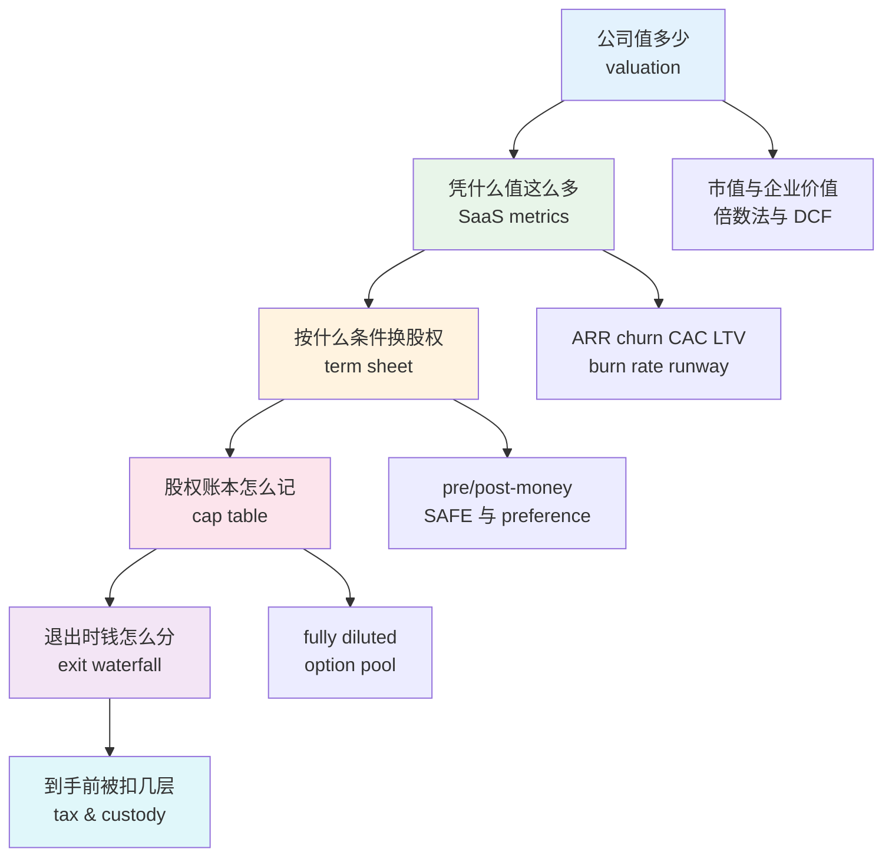
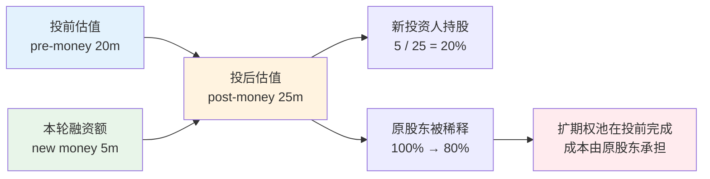
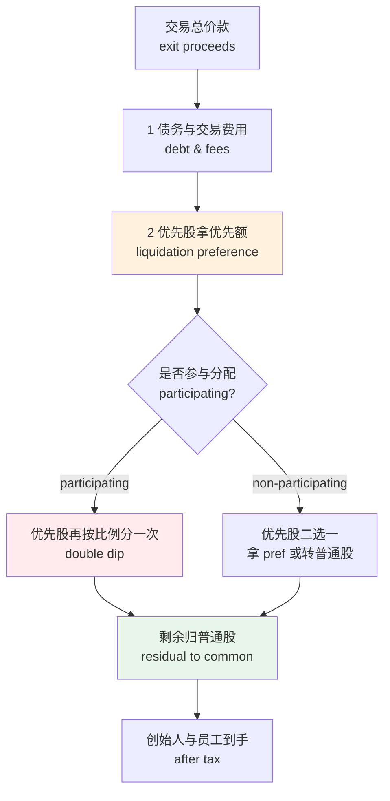
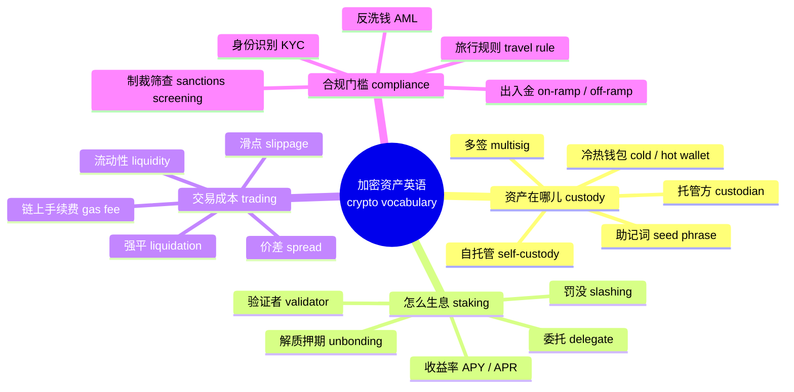
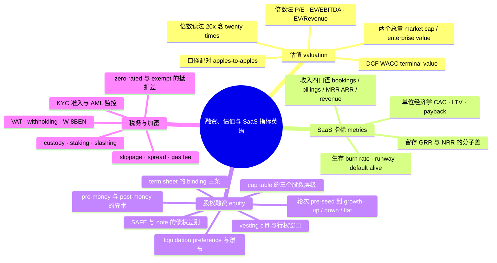

# 融资、估值与 SaaS 指标英语：term sheet、cap table 与税务

> [!info] 本篇定位
>
> 上一篇 [[20.专业领域词汇/07.财报英语：三表科目、会计口径与金融熟词义项\|财报英语：三表科目、会计口径与金融熟词义项]] 讲的是**已经发生的事**——三张报表把上个季度记成了什么样。本篇讲的是**未发生的事**：这家公司往后值多少钱、拿谁的钱、股权按什么规则被切、赚到的钱在跨境路上被扣掉几层。
>
> 四条主线：估值（`market cap`、`P/E`、`EV/EBITDA`、`DCF`、`WACC`、`terminal value`）、SaaS 经营指标（`ARR`、`churn`、`CAC`、`LTV`、`burn rate`、`runway`）、股权融资（`term sheet`、`pre-money`、`SAFE`、`dilution`、`vesting cliff`、`ESOP`、`liquidation preference`、`cap table`、`IPO`）、税务与加密资产（`VAT`、`withholding tax`、`W-8BEN`、`custody`、`staking`、`slippage`、`gas fee`、`KYC/AML`）。
>
> 读完能做三件事：看懂一份英文 term sheet 每一条在动你的哪块利益；把 SaaS 看板上的英文缩写还原成它的分子分母；在跨境收款的表单和加密交易所的界面上分清谁扣你的钱、扣的是哪一档。
>
> 会计科目的定义见上一篇不重讲；`TAM/SAM/SOM`、`go-to-market`、`KPI/OKR` 见 [[20.专业领域词汇/06.商务、市场与管理英语：战略、增长漏斗、OKR 与供应链\|商务、市场与管理英语：战略、增长漏斗、OKR 与供应链]]；合同条款的通用骨架与 `indemnify`、`governing law` 见 [[20.专业领域词汇/05.法律与合同英语：条款、诉讼、知识产权与开源协议\|法律与合同英语：条款、诉讼、知识产权与开源协议]]；个人账户口径的 `deposit`、`mortgage`、`interest rate` 见 [[11.学校、职场与城市社会/04.金钱银行、购物、网购与快递售后\|金钱银行、购物、网购与快递售后]]。

---

## 1. 本篇导读：一笔钱的四段旅程

这一章的词看似散——估值模型、增长看板、法律条款、税表编号，四套语汇属于四个专业。把它们串成一条线的是**同一笔钱**：



上图六格是一笔钱从「被估出来」到「落进口袋」的完整旅程，每一格换一套词汇，但相邻两格共享变量。估值那一格算出来的数字，直接成为 term sheet 里 `pre-money valuation` 的填空；SaaS 指标那一格的 `ARR` 与 `net revenue retention` 是估值倍数的分母与调节系数；cap table 那一格的百分比乘上退出金额，扣掉 `liquidation preference` 与税，才是你真正拿到的数。任何一格的词读错，链条后面的数都跟着错。

对中文读者最容易翻车的三个点，先在这里立起来：

**第一，缩写要能拆开。** `ARR` 不是一个不透明的符号，而是 **A**nnual **R**ecurring **R**evenue 三个词，每个词都在限定口径——年化的、可重复的、收入。缩写读不出全称，你就没法判断一次性的实施费该不该算进去。

**第二，同一个中文词对应多个英文口径。** 中文都叫「估值」，英文分 `valuation`（估值这件事或估出的数）、`market cap`（上市公司的股权市值）、`enterprise value`（含债务的企业整体价值）、`pre-money` 与 `post-money`（投前投后）。四个数可以相差很远。

**第三，法律条款里的普通词全部被重新定义过。** `cap` 不是帽子是上限，`note` 不是笔记是票据，`vest` 不是背心是权益归属，`waterfall` 不是瀑布是分配顺序，`ratchet` 不是棘轮是价格调整机制。这类熟词义项的通用机制见 [[16.词义辨析、搭配与短语动词/02.反义词体系、一词多义与词义引申\|反义词体系、一词多义与词义引申]]，本篇只负责把融资语境里的那一层义项钉死。

---

## 2. 估值的两个总量：market cap 与 enterprise value

估值的第一件事是分清你在算「股东那部分」还是「整个生意」。

| 英文 | 英式音标 | 美式音标 | 词性 | 中文 | 搭配与说明 |
| --- | --- | --- | --- | --- | --- |
| **valuation** | /ˌvæljuˈeɪʃn/ | /ˌvæljuˈeɪʃn/ | n. | 估值；估值结果 | a $50m valuation；命名 v. 是 value，形容词是 valued at |
| **market capitalization** | /ˌmɑːkɪt ˌkæpɪtəlaɪˈzeɪʃn/ | /ˌmɑːrkət ˌkæpɪtələˈzeɪʃn/ | n. | 市值 | 口语几乎只说 market cap；= 股价 × 已发行股数 |
| **market cap** | /ˌmɑːkɪt ˈkæp/ | /ˌmɑːrkət ˈkæp/ | n. | 市值（缩略） | large-cap / mid-cap / small-cap 分档 |
| **enterprise value** | /ˈentəpraɪz ˌvæljuː/ | /ˈentərpraɪz ˌvæljuː/ | n. | 企业价值 | 缩写 EV，念字母 /ˌiː ˈviː/；= market cap + net debt |
| **net debt** | /ˌnet ˈdet/ | /ˌnet ˈdet/ | n. | 净负债 | debt 的 b 不发音；= 有息负债 − 现金 |
| **equity value** | /ˈekwəti ˌvæljuː/ | /ˈekwəti ˌvæljuː/ | n. | 股权价值 | 与 EV 相对，指归股东的那部分 |
| **share price** | /ˈʃeə praɪs/ | /ˈʃer praɪs/ | n. | 股价 | 英式常用 share，美式常用 stock |
| **shares outstanding** | /ˌʃeəz aʊtˈstændɪŋ/ | /ˌʃerz aʊtˈstændɪŋ/ | n.pl. | 已发行在外股数 | outstanding 在此是「在外流通的」，不是「杰出的」 |
| **float** | /fləʊt/ | /floʊt/ | n. | 自由流通股 | free float；另有 v. 上市（float on the LSE，英式用法） |
| **premium** | /ˈpriːmiəm/ | /ˈpriːmiəm/ | n. | 溢价 | at a premium to the last round |
| **discount** | /ˈdɪskaʊnt/ | /ˈdɪskaʊnt/ | n./v. | 折价；折现 | 名词重音在前，动词 /dɪsˈkaʊnt/ 重音在后 |
| **haircut** | /ˈheəkʌt/ | /ˈherkʌt/ | n. | 折价扣减 | 口语色彩，take a 30% haircut |
| **comparable** | /ˈkɒmpərəbl/ | /ˈkɑːmpərəbl/ | n./adj. | 可比公司 | 复数 comparables 常缩成 comps /kɒmps/ |
| **precedent transaction** | /ˈpresɪdənt trænˈzækʃn/ | /ˈpresədənt trænˈzækʃn/ | n. | 先例交易 | 用历史并购价倒推估值 |
| **benchmark** | /ˈbentʃmɑːk/ | /ˈbentʃmɑːrk/ | n./v. | 基准；对标 | benchmark against peers |
| **peer group** | /ˈpɪə ɡruːp/ | /ˈpɪr ɡruːp/ | n. | 同业组 | 选 comps 时先划 peer group |

`market cap` 与 `enterprise value` 的差别是这一节唯一必须记死的东西。市值只回答「买下全部股票要花多少」，企业价值回答「买下这门生意要花多少」——买下之后你还得替它还债，而它账上的现金归你，所以要加回负债、减去现金：

```text
enterprise value = market cap + total debt − cash and cash equivalents
```

两个数在不同公司差得很远。一家现金比负债多的公司，`EV` 会**小于** `market cap`；一家高杠杆的公司则相反。英文里描述这两种情形的固定说法是 `trading below its cash` 与 `carrying a lot of leverage`。

> [!warning] leverage 的英美读音差异
>
> `leverage`（杠杆）是英美读音分歧最明显的金融词之一：英式 /ˈliːvərɪdʒ/，第一个音节读长音 /iː/；美式 /ˈlevərɪdʒ/，读短音 /e/。同源的 `lever`（杠杆、操纵杆）也一样，英式 /ˈliːvə/、美式 /ˈlevər/。
>
> 另一个高频分歧是 `beta`（贝塔系数，衡量个股相对大盘的波动）：英式 /ˈbiːtə/，美式 /ˈbeɪtə/。跨国会议上这两个词一开口就暴露口音来源，读哪种都不算错，但要能听懂对方。

> [!tip] cap 这个词在本篇出现四次，每次意思不同
>
> - `market cap` 的 cap 是 capitalization 的截短，意思是「资本化总额」
> - `valuation cap` 的 cap 是「上限」（SAFE 里的估值天花板，见第 12 节）
> - `capped participation` 的 cap 是「封顶」（优先清算权的倍数上限，见第 14 节）
> - `cap table` 的 cap 是 capitalization，指全部已发行证券的构成表
>
> 四个 cap 里只有第二、第三个是「上限」义。读到 cap 先看它挂在哪个词后面。

---

## 3. 倍数法：P/E、EV/EBITDA 与倍数的读法

倍数法（`multiples-based valuation`，也叫 `relative valuation` 相对估值）是最常见的估值口径：找一批可比公司，看它们的价格是自身某个财务量的几倍，把这个倍数套到目标公司身上。

| 英文 | 英式音标 | 美式音标 | 词性 | 中文 | 搭配与说明 |
| --- | --- | --- | --- | --- | --- |
| **multiple** | /ˈmʌltɪpl/ | /ˈmʌltəpl/ | n. | 倍数 | trade at a 20x multiple；动词用 trade at / be valued at |
| **P/E ratio** | /ˌpiː ˈiː ˌreɪʃiəʊ/ | /ˌpiː ˈiː ˌreɪʃoʊ/ | n. | 市盈率 | 全称 price-to-earnings ratio；口语只说 P/E |
| **earnings** | /ˈɜːnɪŋz/ | /ˈɜːrnɪŋz/ | n.pl. | 盈利；每股收益基数 | 恒为复数，无单数形式 |
| **EPS** | /ˌiː piː ˈes/ | /ˌiː piː ˈes/ | n. | 每股收益 | earnings per share，逐字母念 |
| **trailing** | /ˈtreɪlɪŋ/ | /ˈtreɪlɪŋ/ | adj. | 过去的（口径） | trailing twelve months 缩写 TTM；也说 LTM |
| **forward** | /ˈfɔːwəd/ | /ˈfɔːrwərd/ | adj. | 前瞻的（口径） | forward P/E 用明年预测盈利做分母 |
| **EV/EBITDA** | — | — | n. | 企业价值倍数 | 念 "E-V over EBITDA"；EBITDA 念 /ɪˈbɪtdɑː/ |
| **EV/Revenue** | — | — | n. | 收入倍数 | 也写 EV/Sales，亏损期公司常用 |
| **PEG ratio** | /ˈpeɡ ˌreɪʃiəʊ/ | /ˈpeɡ ˌreɪʃoʊ/ | n. | 市盈增长比 | P/E 除以增长率，peg 读成一个词 |
| **rerating** | /ˌriːˈreɪtɪŋ/ | /ˌriːˈreɪtɪŋ/ | n. | 估值重估 | 市场愿意给的倍数变了，不是业绩变了 |
| **derate** | /ˌdiːˈreɪt/ | /ˌdiːˈreɪt/ | v. | 下调估值倍数 | the stock derated after the guidance cut |
| **accretive** | /əˈkriːtɪv/ | /əˈkriːtɪv/ | adj. | 增厚每股收益的 | an accretive acquisition |
| **dilutive** | /daɪˈluːtɪv/ | /daɪˈluːtɪv/ | adj. | 摊薄每股收益的 | 与 accretive 成对，并购里必考 |
| **normalize** | /ˈnɔːməlaɪz/ | /ˈnɔːrməlaɪz/ | v. | 调整口径至可比 | normalized EBITDA 剔除一次性项 |
| **run-rate** | /ˈrʌn reɪt/ | /ˈrʌn reɪt/ | n./adj. | 年化运行率 | 拿最近一期乘 4 或 12 推年化 |
| **guidance** | /ˈɡaɪdns/ | /ˈɡaɪdns/ | n. | 业绩指引 | issue / raise / cut guidance |
| **consensus** | /kənˈsensəs/ | /kənˈsensəs/ | n. | 市场一致预期 | beat / miss consensus |

### 3.1 倍数怎么念

倍数在书面上写作 `20x`、`4.5x`、`12–15x`，口头一律读成 `times`：

> - The company trades at **twenty times** forward earnings.
>   - 这家公司按前瞻市盈率二十倍交易。
> - We paid **four and a half times** revenue.
>   - 我们按四点五倍收入的价格买下的。
> - Comparable deals cleared at **twelve to fifteen times** EBITDA.
>   - 可比交易成交在十二到十五倍 EBITDA。

投资回报的 `3x`、`10x` 有两种读法：正式场合读 `three times`、`ten times`；口语（尤其是硅谷语境）常读成 `three ex`、`ten ex`，把 x 当字母念。`a 10x engineer`（十倍工程师）这个说法就是从这里借出去的。

小数与分数的完整读法见 [[03.数字与计量词汇/02.分数、小数、百分数与数学运算读法\|分数、小数、百分数与数学运算读法]]，货币金额与涨跌趋势词见 [[03.数字与计量词汇/04.货币、价格、折扣与统计图表趋势\|货币、价格、折扣与统计图表趋势]]，本篇不重讲。

### 3.2 为什么分子分母必须配对

倍数最常见的错误不是算错，是**上下不配对**。规则只有一条：分子是企业价值就配全体资本能分到的量，分子是股权价值就配股东能分到的量。

| 分子 | 可配的分母 | 不可配 | 原因 |
| --- | --- | --- | --- |
| EV（企业价值） | EBITDA、EBIT、Revenue、FCF | Net income | 净利已扣利息，是股东独享的量 |
| Market cap（股权市值） | Net income、EPS、Book value | EBITDA | EBITDA 是付利息之前的量，债权人也有份 |

> - ❌ ~~market cap divided by EBITDA~~（分子归股东、分母归全体资本，口径错配）
> - ✅ **enterprise value divided by EBITDA**（两端都是全体资本口径）

英文里描述这条规则的固定说法是 `apples-to-apples comparison`（同口径比较）。会议上有人说 `that's not apples to apples`，就是在指口径不一致。

> [!example] 一段典型的投资备忘录措辞
>
> - The business is currently valued at roughly **8x trailing revenue**, a **premium** to the peer group's 5–6x range.
>   - 这门生意目前的估值约为过去十二个月收入的八倍，相对同业五到六倍的区间有溢价。
> - We think the **rerating** is justified by net revenue retention above 120%.
>   - 我们认为超过 120% 的净收入留存支撑得起这次估值重估。
> - On a **forward** basis the multiple compresses to about 6x.
>   - 按前瞻口径算，这个倍数会压缩到六倍左右。

---

## 4. DCF：折现、WACC 与 terminal value

倍数法回答「别人愿意出几倍」，现金流折现（`discounted cash flow`，缩写 `DCF`，逐字母念）回答「这门生意自己能产出多少现金，折回今天值多少」。

| 英文 | 英式音标 | 美式音标 | 词性 | 中文 | 搭配与说明 |
| --- | --- | --- | --- | --- | --- |
| **discounted cash flow** | /ˌdɪskaʊntɪd ˈkæʃ fləʊ/ | /ˌdɪskaʊntəd ˈkæʃ floʊ/ | n. | 现金流折现 | 缩写 DCF；build a DCF 是固定搭配 |
| **present value** | /ˌpreznt ˈvæljuː/ | /ˌpreznt ˈvæljuː/ | n. | 现值 | PV；net present value 缩写 NPV |
| **discount rate** | /ˈdɪskaʊnt reɪt/ | /ˈdɪskaʊnt reɪt/ | n. | 折现率 | 折现率越高，未来现金越不值钱 |
| **WACC** | /wæk/ | /wæk/ | n. | 加权平均资本成本 | weighted average cost of capital，读成一个词 |
| **cost of equity** | /ˌkɒst əv ˈekwəti/ | /ˌkɔːst əv ˈekwəti/ | n. | 股权成本 | 常用 CAPM 推 |
| **cost of debt** | /ˌkɒst əv ˈdet/ | /ˌkɔːst əv ˈdet/ | n. | 债务成本 | after-tax cost of debt 才进 WACC |
| **risk-free rate** | /ˌrɪsk friː ˈreɪt/ | /ˌrɪsk friː ˈreɪt/ | n. | 无风险利率 | 通常取国债收益率 |
| **equity risk premium** | /ˈekwəti rɪsk ˌpriːmiəm/ | /ˈekwəti rɪsk ˌpriːmiəm/ | n. | 股权风险溢价 | 缩写 ERP，与 SaaS 里的 ERP 无关 |
| **beta** | /ˈbiːtə/ | /ˈbeɪtə/ | n. | 贝塔系数 | 英美读音分歧词 |
| **terminal value** | /ˈtɜːmɪnl ˌvæljuː/ | /ˈtɜːrmɪnl ˌvæljuː/ | n. | 终值 | 缩写 TV；预测期之后的全部价值 |
| **perpetuity growth** | /ˌpɜːpəˈtjuːəti ɡrəʊθ/ | /ˌpɜːrpəˈtuːəti ɡroʊθ/ | n. | 永续增长（率） | 也说 Gordon growth method |
| **exit multiple** | /ˈeksɪt ˌmʌltɪpl/ | /ˈeɡzɪt ˌmʌltəpl/ | n. | 退出倍数（法） | 算终值的另一种口径 |
| **projection** | /prəˈdʒekʃn/ | /prəˈdʒekʃn/ | n. | 预测（数） | 复数 projections 指整套预测表 |
| **assumption** | /əˈsʌmpʃn/ | /əˈsʌmpʃn/ | n. | 假设 | challenge the assumptions 是评审用语 |
| **sensitivity analysis** | /ˌsensəˈtɪvəti əˌnæləsɪs/ | /ˌsensəˈtɪvəti əˌnæləsəs/ | n. | 敏感性分析 | 常做成 sensitivity table 双轴矩阵 |
| **scenario** | /səˈnɑːriəʊ/ | /səˈnærioʊ/ | n. | 情景 | base / bull / bear case 三档 |
| **hurdle rate** | /ˈhɜːdl reɪt/ | /ˈhɜːrdl reɪt/ | n. | 最低回报门槛 | 低于这个数就不投 |
| **IRR** | /ˌaɪ ɑːr ˈɑː/ | /ˌaɪ ɑːr ˈɑːr/ | n. | 内部收益率 | internal rate of return，逐字母念 |
| **payback period** | /ˈpeɪbæk ˌpɪəriəd/ | /ˈpeɪbæk ˌpɪriəd/ | n. | 回本周期 | 本篇第 7 节还会以 CAC payback 出现 |

DCF 的英文叙述有一套固定的三段式，中文写法反而没有这么定型：

> - We **project** free cash flow over a five-year **explicit forecast period**.
>   - 我们对未来五年的显性预测期做自由现金流预测。
> - Beyond that we apply a **terminal value** using a 2.5% **perpetuity growth rate**.
>   - 预测期之后用 2.5% 的永续增长率计算终值。
> - Everything is **discounted back** to today at a **WACC of 11%**.
>   - 全部按 11% 的加权平均资本成本折回今天。

三个动词是这套文体的骨架：`project`（预测）、`apply`（套用某个方法）、`discount back`（折回）。`discount back to` 后面接时点，`discount at` 后面接利率，两个介词不能换。

> [!warning] terminal value 通常占 DCF 结果的一大半，这不是 bug 但要说出来
>
> 终值代表预测期之后的全部年份，占最终估值的比例往往很高。英文里说这件事有一个固定短语：`the valuation is back-loaded`（价值集中在后段），或者更直接的 `most of the value sits in the terminal`。
>
> 这不是模型错误，但意味着结果对 `perpetuity growth rate` 与 `WACC` 这两个假设极度敏感。评审会上最常见的一句质疑是：
>
> > - Your terminal growth assumption is above long-run GDP growth — that implies the company eventually **outgrows the economy**.
> >   - 你的永续增长假设高于长期 GDP 增速，意味着这家公司最终会跑赢整个经济体。
>
> `outgrow the economy` 是这条批评的固定说法，属于结构性反驳而不是数字挑刺。

> [!tip] 三个 rate 别混
>
> - `discount rate` 折现率——把未来的钱折回今天用的
> - `growth rate` 增长率——现金流自己往上长的速度
> - `hurdle rate` 门槛收益率——投资方要求的最低回报，低于它就不投
>
> 三个都以 rate 结尾，前面的名词决定角色。`hurdle` 的字面义是跨栏比赛的栏架，这里是「必须跨过去的那道坎」的隐喻。

---

## 5. SaaS 的收入口径：bookings、billings、MRR、ARR、revenue

订阅制生意有四个都能叫「收入」的数，含义完全不同。混淆这四个是 SaaS 英语里最贵的错误。

| 英文 | 英式音标 | 美式音标 | 词性 | 中文 | 搭配与说明 |
| --- | --- | --- | --- | --- | --- |
| **bookings** | /ˈbʊkɪŋz/ | /ˈbʊkɪŋz/ | n.pl. | 签单额 | 合同签下的总金额，钱还没到 |
| **billings** | /ˈbɪlɪŋz/ | /ˈbɪlɪŋz/ | n.pl. | 开票额 | 已开发票的金额，钱可能在路上 |
| **revenue** | /ˈrevənjuː/ | /ˈrevənuː/ | n. | 收入（会计口径） | 按服务期分摊确认，见上一篇 |
| **recurring** | /rɪˈkɜːrɪŋ/ | /rɪˈkɜːrɪŋ/ | adj. | 经常性的；可重复的 | recurring vs one-off 是核心对立 |
| **MRR** | /ˌem ɑːr ˈɑː/ | /ˌem ɑːr ˈɑːr/ | n. | 月度经常性收入 | monthly recurring revenue |
| **ARR** | /ˌeɪ ɑːr ˈɑː/ | /ˌeɪ ɑːr ˈɑːr/ | n. | 年度经常性收入 | annual recurring revenue；= MRR × 12 |
| **annualize** | /ˈænjuəlaɪz/ | /ˈænjuəlaɪz/ | v. | 年化 | annualized run-rate 缩写 ARR 同形，注意区分 |
| **subscription** | /səbˈskrɪpʃn/ | /səbˈskrɪpʃn/ | n. | 订阅 | subscription term 订阅期 |
| **deferred revenue** | /dɪˌfɜːd ˈrevənjuː/ | /dɪˌfɜːrd ˈrevənuː/ | n. | 递延收入 | 收了钱还没提供服务，记负债 |
| **seat** | /siːt/ | /siːt/ | n. | 席位；许可数 | per-seat pricing 按人头定价 |
| **tier** | /tɪə/ | /tɪr/ | n. | 档位 | pricing tier；动词 tiered pricing |
| **usage-based** | /ˈjuːsɪdʒ beɪst/ | /ˈjuːsɪdʒ beɪst/ | adj. | 按量计费的 | 也说 consumption-based |
| **overage** | /ˈəʊvərɪdʒ/ | /ˈoʊvərɪdʒ/ | n. | 超量费 | 超出套餐额度部分的计费 |
| **ARPU** | /ˈɑːpuː/ | /ˈɑːrpuː/ | n. | 每用户平均收入 | average revenue per user，读成一个词 |
| **ACV** | /ˌeɪ siː ˈviː/ | /ˌeɪ siː ˈviː/ | n. | 年度合同价值 | annual contract value |
| **TCV** | /ˌtiː siː ˈviː/ | /ˌtiː siː ˈviː/ | n. | 合同总价值 | total contract value，含全部年限 |
| **professional services** | /prəˌfeʃənl ˈsɜːvɪsɪz/ | /prəˌfeʃənl ˈsɜːrvɪsəz/ | n.pl. | 实施服务收入 | 一次性，不计入 ARR |
| **ramp** | /ræmp/ | /ræmp/ | n./v. | 阶梯式涨价（期） | a ramped contract 首年打折次年涨 |
| **committed** | /kəˈmɪtɪd/ | /kəˈmɪtəd/ | adj. | 承诺的（不可撤） | committed ARR 排除试用与月付 |

### 5.1 四个数的时间顺序

```text
签合同 ──→ 开发票 ──→ 收到钱 ──→ 按月确认
bookings    billings    cash        revenue
```

四个数在时间轴上依次发生，任意两个之间都有缺口。一份三年合同、总价 36 万，在同一个季度里的四个数是：`TCV` 36 万，`bookings` 按口径可能记 36 万也可能只记首年 12 万，`billings` 若按年开票则是 12 万，`revenue` 只能确认这个季度实际服务了的 3 万，剩下 9 万挂在 `deferred revenue`（递延收入）里。

> [!warning] ARR 不是会计口径，没有统一定义
>
> `revenue` 有会计准则管着，`ARR` 没有。不同公司算 ARR 时的分歧点至少有四个：
>
> - 月付客户（`month-to-month`）算不算——他们随时能走，严格口径会剔除
> - 试用期与打折首年按哪个价年化——按合同价还是按实付价
> - 一次性实施费（`professional services`、`setup fee`）算不算——不该算，但有人算
> - 已经发了 `churn notice`（解约通知）但还没到期的客户算不算
>
> 英文里追问这件事的标准问法是：
>
> > - How do you **define** ARR? What's in it and what's excluded?
> > - Is that **committed** ARR or does it include month-to-month?
>
> 尽调（`due diligence`）时这两句必问。回答含糊的公司，ARR 数字通常有水分。

### 5.2 增长的分解词汇

ARR 从期初走到期末，中间被拆成四股力量，英文有固定名字：

| 英文 | 英式音标 | 美式音标 | 词性 | 中文 | 搭配与说明 |
| --- | --- | --- | --- | --- | --- |
| **new ARR** | — | — | n. | 新签 ARR | 来自全新客户 |
| **expansion** | /ɪkˈspænʃn/ | /ɪkˈspænʃn/ | n. | 扩容增收 | 老客户加座位或升档 |
| **contraction** | /kənˈtrækʃn/ | /kənˈtrækʃn/ | n. | 缩量减收 | 老客户降档或减座位，人未走 |
| **churned ARR** | /tʃɜːnd/ | /tʃɜːrnd/ | n. | 流失 ARR | 客户彻底走了 |
| **upsell** | /ˈʌpsel/ | /ˈʌpsel/ | n./v. | 升档销售 | 卖更贵的同类产品 |
| **cross-sell** | /ˈkrɒs sel/ | /ˈkrɔːs sel/ | n./v. | 交叉销售 | 卖另一条产品线 |
| **downgrade** | /ˌdaʊnˈɡreɪd/ | /ˌdaʊnˈɡreɪd/ | n./v. | 降档 | 与 upgrade 成对 |
| **reactivation** | /ˌriːæktɪˈveɪʃn/ | /ˌriːæktɪˈveɪʃn/ | n. | 回流复购 | 走了又回来的客户 |
| **bridge** | /brɪdʒ/ | /brɪdʒ/ | n. | 桥接图 | ARR bridge 指这张分解图；与融资的 bridge 同形异义 |

这张分解图英文叫 `ARR bridge` 或 `waterfall chart`（瀑布图），是所有 SaaS 董事会材料的第一页。表述公式是：

```text
Beginning ARR + New + Expansion − Contraction − Churn = Ending ARR
```

`bridge` 在这里指「把期初和期末两个数**桥接**起来的中间项」，与第 9 节融资语境里的 `bridge round`（过桥轮）是两个完全不同的义项，共同的隐喻源都是「连接两端的桥」。

---

## 6. 流失与留存：churn、gross retention、net revenue retention

`churn` 的字面义是「搅动、翻搅」（搅乳器 churn 把奶油搅成黄油），挪用到商业里指客户进进出出的翻搅状态。它是 SaaS 英语里最重要的单个词。

| 英文 | 英式音标 | 美式音标 | 词性 | 中文 | 搭配与说明 |
| --- | --- | --- | --- | --- | --- |
| **churn** | /tʃɜːn/ | /tʃɜːrn/ | n./v. | 流失（率） | churn rate；customers churn out 作动词 |
| **attrition** | /əˈtrɪʃn/ | /əˈtrɪʃn/ | n. | 流失；损耗 | 比 churn 正式，也用于员工流失 |
| **logo churn** | /ˈləʊɡəʊ/ | /ˈloʊɡoʊ/ | n. | 客户数流失 | logo 在此指「一家客户公司」 |
| **revenue churn** | — | — | n. | 收入流失 | 按金额算，大客户走一个抵小客户十个 |
| **gross retention** | /ɡrəʊs rɪˈtenʃn/ | /ɡroʊs rɪˈtenʃn/ | n. | 总留存率 | 缩写 GRR，上限 100% |
| **net revenue retention** | — | — | n. | 净收入留存率 | 缩写 NRR 或 NDR，可以超过 100% |
| **cohort** | /ˈkəʊhɔːt/ | /ˈkoʊhɔːrt/ | n. | 同期群 | cohort analysis 按入组月份切队列 |
| **retention curve** | /rɪˈtenʃn kɜːv/ | /rɪˈtenʃn kɜːrv/ | n. | 留存曲线 | flatten out 指曲线走平 |
| **stickiness** | /ˈstɪkinəs/ | /ˈstɪkinəs/ | n. | 黏性 | 形容词 sticky；口语色彩 |
| **switching cost** | /ˈswɪtʃɪŋ kɒst/ | /ˈswɪtʃɪŋ kɔːst/ | n. | 转换成本 | 高转换成本压低 churn |
| **lock-in** | /ˈlɒk ɪn/ | /ˈlɑːk ɪn/ | n. | 锁定 | vendor lock-in 常带贬义 |
| **renewal** | /rɪˈnjuːəl/ | /rɪˈnuːəl/ | n. | 续约 | renewal rate；up for renewal 即将到期 |
| **auto-renew** | /ˌɔːtəʊ rɪˈnjuː/ | /ˌɔːtoʊ rɪˈnuː/ | v. | 自动续约 | 条款里写 automatically renews |
| **win-back** | /ˈwɪn bæk/ | /ˈwɪn bæk/ | n. | 挽回（活动） | win-back campaign |
| **at risk** | /ət ˈrɪsk/ | /ət ˈrɪsk/ | adj. | 有流失风险的 | an at-risk account |
| **health score** | /ˈhelθ skɔː/ | /ˈhelθ skɔːr/ | n. | 客户健康分 | 客户成功团队的核心指标 |

### 6.1 GRR 与 NRR 的分子分母

两个留存率的分母相同（一年前那批客户的 ARR），分子不同：

| 指标 | 分子包含 | 分子排除 | 取值范围 | 回答的问题 |
| --- | --- | --- | --- | --- |
| gross retention（GRR） | 留下的 ARR | 全部 expansion | 0–100% | 老客户流失得快不快 |
| net revenue retention（NRR） | 留下的 ARR + expansion | — | 0% 到无上限 | 老客户这一群整体是长是缩 |

`NRR > 100%` 意味着即使一个新客户都不签，收入也在增长——英文里描述这种状态的固定说法是 `negative churn`（负流失）。这个短语字面矛盾（流失怎么会是负的），实际是「扩容超过了流失」的简写，属于行业内部的固定反直觉表达。

> - Our **net dollar retention** is 118%, so the installed base grows on its own.
>   - 我们的净金额留存率是 118%，所以存量盘子自己会长。
> - **Gross retention** is only 88% though — we're patching a leaky bucket with upsell.
>   - 但总留存只有 88%，我们是在用升档销售补一个漏水的桶。

`a leaky bucket`（漏水的桶）是这类批评的固定比喻。`installed base`（存量客户群）是从制造业借来的说法，字面义是「已安装的设备保有量」。

> [!warning] NRR 高不等于健康
>
> `NRR` 把 `expansion` 算进分子，所以少数几个大客户猛加座位，就能盖住大量小客户在流失。看板上只放 NRR 而不放 GRR 的公司，通常是在藏 `logo churn`。
>
> 尽调时的标准追问是：
>
> > - What's **gross** retention, not net?
> > - And what does that look like **excluding your top ten accounts**?
>
> `excluding your top ten accounts`（剔除前十大客户后）是拆穿集中度问题的固定问法。集中度本身的词是 `customer concentration`。

---

## 7. 单位经济学：CAC、LTV 与回本周期

`unit economics`（单位经济学）问的是一个问题：捞一个客户花的钱，能不能从这个客户身上赚回来。

| 英文 | 英式音标 | 美式音标 | 词性 | 中文 | 搭配与说明 |
| --- | --- | --- | --- | --- | --- |
| **unit economics** | /ˈjuːnɪt ˌiːkəˈnɒmɪks/ | /ˈjuːnɪt ˌekəˈnɑːmɪks/ | n.pl. | 单位经济学 | 恒复数；the unit economics work 是固定说法 |
| **CAC** | /kæk/ | /kæk/ | n. | 获客成本 | customer acquisition cost，读成一个词 |
| **acquisition** | /ˌækwɪˈzɪʃn/ | /ˌækwəˈzɪʃn/ | n. | 获取；并购 | 两个义项在本篇都出现 |
| **LTV** | /ˌel tiː ˈviː/ | /ˌel tiː ˈviː/ | n. | 客户终身价值 | lifetime value；也写 CLV/CLTV |
| **LTV/CAC ratio** | — | — | n. | 终身价值获客比 | 念 "L-T-V to CAC" |
| **CAC payback** | — | — | n. | 获客成本回本期 | 单位是「月」，说 a 14-month payback |
| **gross margin** | /ɡrəʊs ˈmɑːdʒɪn/ | /ɡroʊs ˈmɑːrdʒən/ | n. | 毛利率 | LTV 必须按毛利算而非收入 |
| **contribution margin** | /ˌkɒntrɪˈbjuːʃn ˈmɑːdʒɪn/ | /ˌkɑːntrəˈbjuːʃn ˈmɑːrdʒən/ | n. | 边际贡献 | 扣掉变动成本后剩的 |
| **blended CAC** | /ˈblendɪd/ | /ˈblendəd/ | n. | 混合获客成本 | 把自然流量也摊进去，数字偏低 |
| **paid CAC** | /peɪd/ | /peɪd/ | n. | 付费获客成本 | 只算买量花的钱，更诚实 |
| **organic** | /ɔːˈɡænɪk/ | /ɔːrˈɡænɪk/ | adj. | 自然增长的 | organic signups 不花钱来的注册 |
| **magic number** | /ˈmædʒɪk ˈnʌmbə/ | /ˈmædʒɪk ˈnʌmbər/ | n. | 销售效率数 | 新增 ARR 除以上季销售市场费用 |
| **sales efficiency** | /ˈseɪlz ɪˈfɪʃnsi/ | /ˈseɪlz ɪˈfɪʃnsi/ | n. | 销售效率 | 与 magic number 常互换 |
| **quota** | /ˈkwəʊtə/ | /ˈkwoʊtə/ | n. | 销售配额 | quota attainment 配额达成率 |
| **funnel** | /ˈfʌnl/ | /ˈfʌnl/ | n. | 漏斗 | 漏斗各段词见 20.06 |
| **conversion rate** | /kənˈvɜːʃn reɪt/ | /kənˈvɜːrʒn reɪt/ | n. | 转化率 | 注意 conversion 的英美读音差别 |
| **top of funnel** | — | — | n. | 漏斗顶部 | 缩写 TOFU，读成一个词 |
| **land and expand** | — | — | phr. | 先小后大打法 | 先卖小单再向内扩张 |

### 7.1 三个数怎么组成一句判断

英文里评价单位经济学有一套定型句，三个数各管一句：

> - Our **LTV to CAC** is a little over 3 to 1.
>   - 我们的终身价值与获客成本比略高于三比一。
> - **CAC payback** sits around 15 months on a gross-margin basis.
>   - 按毛利口径算，获客成本大约十五个月回本。
> - The **magic number** dropped below 0.5 last quarter, so we throttled spend.
>   - 上季度销售效率数掉到 0.5 以下，我们收紧了投放。

三个动词的搭配是固定的：比率用 `is`/`comes in at`，回本期用 `sits at`/`runs at`，效率数用 `drops`/`improves`。`throttle spend`（收紧投放）里的 `throttle` 是从机械与网络借来的熟词——限流义的通用讲法见 [[20.专业领域词汇/02.计算机语境的熟词新义：日常词的技术义项地图\|计算机语境的熟词新义：日常词的技术义项地图]]。

> [!warning] LTV 用收入算是虚的
>
> `LTV` 的正确算法要乘毛利率：一个客户一年付你 1200 但毛利率只有 60%，那么这个客户一年只贡献 720 的可用钱。用收入算 LTV 会把这个比率虚高近一倍。
>
> 英文里点破这件事的说法是 `LTV on a gross-margin basis`（按毛利口径的 LTV），或者更直接的 `是 gross-margin LTV 还是 revenue LTV`。
>
> - ❌ ~~LTV equals ARPU times lifetime~~（漏掉毛利率）
> - ✅ **LTV equals ARPU times gross margin times lifetime**（口径完整）

> [!tip] blended 与 paid 的差别是话术重灾区
>
> `blended CAC` 把自然流量来的客户也摊进分母，分母变大，CAC 看着就低。融资路演里给 blended CAC 是常规操作，但投资人一定会追问 `paid CAC`——只看花钱买来的那部分。
>
> 追问的固定句式：`What's your CAC on paid channels only?`（只算付费渠道的 CAC 是多少）

---

## 8. 烧钱与生存期：burn rate、runway 与 Rule of 40

这一组词回答的是「还能撑多久」。它们的隐喻源很统一：`burn`（烧）与 `runway`（跑道）都把公司当成一架起飞中的飞机——燃料在烧，跑道在缩短，起飞前必须离地。

| 英文 | 英式音标 | 美式音标 | 词性 | 中文 | 搭配与说明 |
| --- | --- | --- | --- | --- | --- |
| **burn rate** | /ˈbɜːn reɪt/ | /ˈbɜːrn reɪt/ | n. | 烧钱速度 | 单位是「每月多少钱」 |
| **gross burn** | /ɡrəʊs bɜːn/ | /ɡroʊs bɜːrn/ | n. | 总支出 | 每月花出去的全部现金 |
| **net burn** | /net bɜːn/ | /net bɜːrn/ | n. | 净烧钱 | 支出减收入，谈判时默认指这个 |
| **runway** | /ˈrʌnweɪ/ | /ˈrʌnweɪ/ | n. | 现金可支撑期 | 单位是「月」；现金除以净烧钱 |
| **cash position** | /ˈkæʃ pəˌzɪʃn/ | /ˈkæʃ pəˌzɪʃn/ | n. | 现金头寸 | position 的金融义见上一篇 |
| **default alive** | — | — | adj.phr. | 默认能活 | 按当前增速能在钱烧完前打平 |
| **default dead** | — | — | adj.phr. | 默认会死 | 与上一条成对，是行业固定说法 |
| **break-even** | /ˌbreɪk ˈiːvn/ | /ˌbreɪk ˈiːvn/ | n./adj. | 盈亏平衡 | reach break-even；动词 break even 分写 |
| **profitability** | /ˌprɒfɪtəˈbɪləti/ | /ˌprɑːfətəˈbɪləti/ | n. | 盈利能力 | path to profitability 是路演固定小节 |
| **bootstrap** | /ˈbuːtstræp/ | /ˈbuːtstræp/ | v./adj. | 自筹资金经营 | a bootstrapped company 不拿外部钱 |
| **capital efficient** | /ˈkæpɪtl ɪˈfɪʃnt/ | /ˈkæpɪtl ɪˈfɪʃnt/ | adj. | 资本效率高的 | 花少的钱做出同样规模 |
| **Rule of 40** | — | — | n. | 四十法则 | 增长率加利润率是否达 40 |
| **cash conversion** | /ˈkæʃ kənˌvɜːʃn/ | /ˈkæʃ kənˌvɜːrʒn/ | n. | 现金转化 | 收入变成现金的效率 |
| **extend runway** | /ɪkˈstend ˈrʌnweɪ/ | /ɪkˈstend ˈrʌnweɪ/ | v.phr. | 延长可支撑期 | 与 cut burn 同义连用 |
| **cut burn** | /kʌt ˈbɜːn/ | /kʌt ˈbɜːrn/ | v.phr. | 削减烧钱 | 委婉说法 rightsizing |
| **RIF** | /rɪf/ | /rɪf/ | n. | 裁员 | reduction in force，读成一个词，委婉语 |
| **hiring freeze** | /ˈhaɪərɪŋ friːz/ | /ˈhaɪrɪŋ friːz/ | n. | 冻结招聘 | 削减烧钱的第一步 |

### 8.1 runway 怎么说

`runway` 的单位永远是月，说法有三种固定形式：

> - We have **18 months of runway** at the current burn.
>   - 按当前烧钱速度我们还有十八个月。
> - That takes us **into Q3 next year**.
>   - 这能撑到明年三季度。
> - We want to raise with **at least 12 months of runway left**.
>   - 我们希望在还剩至少十二个月时启动融资。

第三句是融资节奏的常识表达：钱快烧完时才去融，谈判地位最差。英文里形容这种被动状态的说法是 `raising from a position of weakness`（在弱势位置上融资），反面是 `raising from strength`。

> [!tip] default alive 与 default dead 是两个固定形容词短语
>
> 这两个说法在英语里已经词汇化，不能改写成 `alive by default`。判定标准是：按现在的增长速度和烧钱速度往前推，钱烧完之前能不能实现盈亏平衡。能，就是 `default alive`；不能，就是 `default dead`，必须靠下一轮融资续命。
>
> 董事会上的固定问句：`Are we default alive or default dead?`

> [!warning] burn 在不同语境里指两件事
>
> `burn` 在本篇有两个不冲突但需要区分的用法：
>
> - **公司现金的 burn**：每月净流出的现金（本节）
> - **代币的 burn**：把代币永久销毁以减少供应量（第 18 节的 `token burn`）
>
> 两者共享「消耗掉、不可逆」的核心义，但一个说钱少了，一个说供应量少了。加密语境里的 `burn address`（黑洞地址）指一个没人拥有私钥、只能进不能出的地址。

---

## 9. 融资轮次、投资方角色与基金词汇

| 英文 | 英式音标 | 美式音标 | 词性 | 中文 | 搭配与说明 |
| --- | --- | --- | --- | --- | --- |
| **funding round** | /ˈfʌndɪŋ raʊnd/ | /ˈfʌndɪŋ raʊnd/ | n. | 融资轮次 | 动词用 raise a round / close a round |
| **pre-seed** | /ˌpriː ˈsiːd/ | /ˌpriː ˈsiːd/ | n. | 种子前轮 | 通常只有想法与团队 |
| **seed round** | /ˈsiːd raʊnd/ | /ˈsiːd raʊnd/ | n. | 种子轮 | seed 的农业隐喻：种下去还没发芽 |
| **Series A** | /ˈsɪəriːz eɪ/ | /ˈsɪriːz eɪ/ | n. | A 轮 | series 单复同形；念 "series A" |
| **growth round** | /ˈɡrəʊθ raʊnd/ | /ˈɡroʊθ raʊnd/ | n. | 成长轮 | C 轮之后不再逐字母数 |
| **bridge round** | /ˈbrɪdʒ raʊnd/ | /ˈbrɪdʒ raʊnd/ | n. | 过桥轮 | 撑到下一个正式轮之前的小额融资 |
| **extension** | /ɪkˈstenʃn/ | /ɪkˈstenʃn/ | n. | 轮次延长 | a Series A extension，按上轮条件加钱 |
| **up round** | /ˈʌp raʊnd/ | /ˈʌp raʊnd/ | n. | 估值上升轮 | 本轮估值高于上轮 |
| **down round** | /ˈdaʊn raʊnd/ | /ˈdaʊn raʊnd/ | n. | 估值下跌轮 | 触发反稀释条款，见第 10 节 |
| **flat round** | /ˈflæt raʊnd/ | /ˈflæt raʊnd/ | n. | 平价轮 | 估值与上轮持平 |
| **lead investor** | /liːd ɪnˈvestə/ | /liːd ɪnˈvestər/ | n. | 领投方 | lead 读 /liːd/ 不是 /led/ |
| **follow-on** | /ˈfɒləʊ ɒn/ | /ˈfɑːloʊ ɑːn/ | n./adj. | 跟投；后续投资 | follow-on rights 后续跟投权 |
| **angel investor** | /ˈeɪndʒl ɪnˈvestə/ | /ˈeɪndʒl ɪnˈvestər/ | n. | 天使投资人 | 个人身份出资 |
| **syndicate** | /ˈsɪndɪkət/ | /ˈsɪndəkət/ | n. | 联合投资体 | 名词重音在前，动词 /ˈsɪndɪkeɪt/ |
| **VC** | /ˌviː ˈsiː/ | /ˌviː ˈsiː/ | n. | 风险投资（机构） | venture capital；a VC 指机构或人 |
| **PE** | /ˌpiː ˈiː/ | /ˌpiː ˈiː/ | n. | 私募股权 | private equity；与市盈率 P/E 同形，看语境 |
| **LP** | /ˌel ˈpiː/ | /ˌel ˈpiː/ | n. | 有限合伙人 | limited partner，出钱的一方 |
| **GP** | /ˌdʒiː ˈpiː/ | /ˌdʒiː ˈpiː/ | n. | 普通合伙人 | general partner，管钱的一方 |
| **management fee** | /ˈmænɪdʒmənt fiː/ | /ˈmænɪdʒmənt fiː/ | n. | 管理费 | 通常按基金规模年收 |
| **carried interest** | /ˌkærid ˈɪntrəst/ | /ˌkærid ˈɪntrəst/ | n. | 业绩分成 | 口语只说 carry；GP 分走的收益比例 |
| **dry powder** | /ˌdraɪ ˈpaʊdə/ | /ˌdraɪ ˈpaʊdər/ | n. | 待投资金 | 军事隐喻：留着没打出去的火药 |
| **deploy** | /dɪˈplɔɪ/ | /dɪˈplɔɪ/ | v. | 投出（资金） | deploy capital；同源于运维的部署义 |
| **vintage** | /ˈvɪntɪdʒ/ | /ˈvɪntɪdʒ/ | n. | 基金年份 | 借自葡萄酒的年份义 |
| **oversubscribed** | /ˌəʊvəsəbˈskraɪbd/ | /ˌoʊvərsəbˈskraɪbd/ | adj. | 超额认购的 | 想投的钱超过要融的额度 |
| **allocation** | /ˌæləˈkeɪʃn/ | /ˌæləˈkeɪʃn/ | n. | 认购额度 | get an allocation in the round |
| **pitch deck** | /ˈpɪtʃ dek/ | /ˈpɪtʃ dek/ | n. | 融资演示文稿 | deck 指整套幻灯片 |
| **traction** | /ˈtrækʃn/ | /ˈtrækʃn/ | n. | 增长实绩 | 物理学的「牵引力」引申义 |
| **due diligence** | /ˌdjuː ˈdɪlɪdʒəns/ | /ˌduː ˈdɪlədʒəns/ | n. | 尽职调查 | 口语缩成 diligence 或 DD |
| **data room** | /ˈdeɪtə ruːm/ | /ˈdeɪtə ruːm/ | n. | 资料室 | 尽调材料的线上存放处 |
| **close** | /kləʊz/ | /kloʊz/ | v./n. | 交割；完成 | 动词读 /kləʊz/，形容词 close /kləʊs/ 读音不同 |
| **wire** | /ˈwaɪə/ | /ˈwaɪər/ | v./n. | 电汇 | the money wired on Friday |

### 9.1 轮次的英文说法有一套固定动词

> - We're **raising a Series A** led by a fund we've known for two years.
>   - 我们正在融 A 轮，领投方是认识两年的一家基金。
> - The round is **oversubscribed**, so we had to cut everyone's **allocation**.
>   - 这轮超额认购，我们只好压缩每家的额度。
> - We **closed** last Thursday and the money **wired** on Monday.
>   - 我们上周四交割，钱周一到账。

`raise a round`（融一轮）、`lead a round`（领投）、`close a round`（交割）、`the money wires`（钱到账）是四个不可替换的动词搭配。注意 `wire` 在这里可以不带宾语作不及物动词用，等于「电汇到账」。

> [!warning] lead 与 down round 两个坑
>
> `lead investor` 的 `lead` 读 /liːd/（动词「带领」的同形名词），不是金属铅 /led/。写成 `the lead` 时同样读 /liːd/。
>
> `down round` 不只是估值数字难看的问题——它会触发上一轮投资人的 `anti-dilution`（反稀释）条款，让老投资人按更低价格重新折算股份，创始人被额外稀释。这是第 10 节要展开的内容。英文里创始人最怕听到的一句话是：
>
> > - The new price triggers **full ratchet** on the Series A.
> >   - 新价格触发了 A 轮的完全棘轮条款。

---

## 10. term sheet：条款清单的骨架

`term sheet`（条款清单，也叫 `LOI` letter of intent 意向书）是投资协议的骨架。它通常只有几页，除少数条款外**不具法律约束力**，但后续正式文件基本照抄。

| 英文 | 英式音标 | 美式音标 | 词性 | 中文 | 搭配与说明 |
| --- | --- | --- | --- | --- | --- |
| **term sheet** | /ˈtɜːm ʃiːt/ | /ˈtɜːrm ʃiːt/ | n. | 条款清单 | sign / issue / negotiate a term sheet |
| **non-binding** | /ˌnɒn ˈbaɪndɪŋ/ | /ˌnɑːn ˈbaɪndɪŋ/ | adj. | 无法律约束力的 | 反义 binding；两者在同一份文件里并存 |
| **exclusivity** | /ˌeksklʊˈsɪvəti/ | /ˌeksklʊˈsɪvəti/ | n. | 排他期 | 也叫 no-shop period，这一条是 binding 的 |
| **no-shop** | /ˈnəʊ ʃɒp/ | /ˈnoʊ ʃɑːp/ | n. | 禁止另寻买家 | 签了就不能再和别家谈 |
| **confidentiality** | /ˌkɒnfɪˌdenʃiˈæləti/ | /ˌkɑːnfəˌdenʃiˈæləti/ | n. | 保密（条款） | 同样是 binding 的少数条款之一 |
| **valuation cap** | — | — | n. | 估值上限 | SAFE 与可转债的核心变量，见第 12 节 |
| **security** | /sɪˈkjʊərəti/ | /sɪˈkjʊrəti/ | n. | 证券（发行的品种） | 熟词义项，详见上一篇 |
| **preferred stock** | /prɪˌfɜːd ˈstɒk/ | /prɪˌfɜːrd ˈstɑːk/ | n. | 优先股 | 投资人拿的通常是这个 |
| **common stock** | /ˌkɒmən ˈstɒk/ | /ˌkɑːmən ˈstɑːk/ | n. | 普通股 | 创始人与员工拿的是这个 |
| **board seat** | /ˈbɔːd siːt/ | /ˈbɔːrd siːt/ | n. | 董事席位 | seat 与 SaaS 的席位义同形 |
| **board observer** | /bɔːd əbˈzɜːvə/ | /bɔːrd əbˈzɜːrvər/ | n. | 董事会观察员 | 能听不能投票 |
| **protective provisions** | /prəˈtektɪv prəˈvɪʒnz/ | /prəˈtektɪv prəˈvɪʒnz/ | n.pl. | 保护性条款 | 列出哪些事必须投资人点头 |
| **veto right** | /ˈviːtəʊ raɪt/ | /ˈviːtoʊ raɪt/ | n. | 否决权 | 保护性条款的实质效果 |
| **pro rata right** | /ˌprəʊ ˈrɑːtə/ | /ˌproʊ ˈreɪtə/ | n. | 按比例跟投权 | 拉丁词，美式常读 /ˈreɪtə/ |
| **ROFR** | /ˌɑːr əʊ ef ˈɑː/ | /ˈrɑːfər/ | n. | 优先购买权 | right of first refusal；美式常读成一个词 |
| **drag-along** | /ˈdræɡ əlɒŋ/ | /ˈdræɡ əlɔːŋ/ | n. | 拖售权 | 多数股东卖公司时可强制少数跟卖 |
| **tag-along** | /ˈtæɡ əlɒŋ/ | /ˈtæɡ əlɔːŋ/ | n. | 随售权 | 也叫 co-sale right，少数股东可跟着卖 |
| **anti-dilution** | /ˌænti daɪˈluːʃn/ | /ˌæntaɪ daɪˈluːʃn/ | n. | 反稀释（条款） | 前缀 anti- 的英美读音差别典型 |
| **full ratchet** | /fʊl ˈrætʃɪt/ | /fʊl ˈrætʃət/ | n. | 完全棘轮 | 最狠的反稀释形式 |
| **weighted average** | /ˌweɪtɪd ˈævərɪdʒ/ | /ˌweɪtəd ˈævərɪdʒ/ | n. | 加权平均（反稀释） | 分 broad-based 与 narrow-based 两种 |
| **information rights** | — | — | n.pl. | 知情权 | 要求定期给财报与运营数据 |
| **founder vesting** | /ˈfaʊndə ˈvestɪŋ/ | /ˈfaʊndər ˈvestɪŋ/ | n. | 创始人股份归属 | 投资人常要求重设 |
| **conditions precedent** | /kənˈdɪʃnz prɪˈsiːdnt/ | /kənˈdɪʃnz prɪˈsiːdnt/ | n.pl. | 先决条件 | 缩写 CP；满足才交割 |
| **rep and warranty** | — | — | n. | 陈述与保证 | 全称 representations and warranties，见 20.05 |
| **use of proceeds** | /ˌjuːs əv ˈprəʊsiːdz/ | /ˌjuːs əv ˈproʊsiːdz/ | n. | 资金用途 | proceeds 恒复数，指融到的钱 |

### 10.1 non-binding 里那几条 binding 的

`term sheet` 的第一页通常有一句：

> - Except for the sections titled **Confidentiality**, **Exclusivity** and **Expenses**, this term sheet is **non-binding** and does not constitute a commitment to invest.
>   - 除保密、排他与费用三节外，本条款清单不具约束力，且不构成投资承诺。

这句话的结构值得记：`except for` 引出例外清单，`does not constitute` 是法律文本里否认某种性质的固定动词。规范文体里这类措辞的强度阶梯，见 [[20.专业领域词汇/03.IT 深度英语（中）：设计文档、规范文体与 API 措辞\|IT 深度英语（中）：设计文档、规范文体与 API 措辞]] 里 `MUST` 与 `SHOULD` 那一节——同样是「把话说到哪一档」的问题。

真正有约束力的通常是三条：保密、排他、费用承担。其中排他条款（`exclusivity` 或 `no-shop`）杀伤力最大——签下去之后的三十到六十天里你不能再和别家谈，如果对方中途反悔，你失去的是整个融资窗口。

> [!warning] 反稀释条款的两种狠法
>
> 触发条件都是 `down round`（下一轮估值低于本轮），区别在补偿力度：
>
> - **full ratchet**（完全棘轮）：把老投资人的全部股份按新的低价重算，等于让他们白拿一大块。对创始人杀伤最大。
> - **broad-based weighted average**（宽口径加权平均）：按新老两轮的股数加权算一个中间价，只补一部分。市场上更常见，也更能接受。
>
> `ratchet` 的字面义是棘轮——只能朝一个方向转，转过去就回不来。这个隐喻精确描述了条款效果：价格只朝对投资人有利的方向调。
>
> 谈判时的固定要求是：
>
> > - We'd want **broad-based weighted average**, not full ratchet.
> >   - 我们希望用宽口径加权平均，而不是完全棘轮。

> [!tip] drag-along 与 tag-along 是一对反向权利
>
> 两个词都用 `-along` 结尾，方向相反：
>
> - `drag-along right` **拖售权**——大股东要卖公司，可以**拖着**小股东一起卖，小股东不能挡
> - `tag-along right` **随售权**——大股东要卖，小股东可以**挂上去**按同样条件一起卖
>
> 一个保护买家（确保能买到 100%），一个保护小股东（避免被留在船上）。记忆点：drag 是拖，主动权在大股东；tag 是挂标签跟上，主动权在小股东。

---

## 11. pre-money、post-money 与稀释的算术

这一节是本篇最需要动笔算的部分，也是最多人在英文里想当然的地方。

| 英文 | 英式音标 | 美式音标 | 词性 | 中文 | 搭配与说明 |
| --- | --- | --- | --- | --- | --- |
| **pre-money valuation** | /ˌpriː ˈmʌni/ | /ˌpriː ˈmʌni/ | n. | 投前估值 | 口语只说 pre；a $20m pre |
| **post-money valuation** | /ˌpəʊst ˈmʌni/ | /ˌpoʊst ˈmʌni/ | n. | 投后估值 | 口语只说 post；post = pre + 投资额 |
| **dilution** | /daɪˈluːʃn/ | /daɪˈluːʃn/ | n. | 稀释 | 动词 dilute /daɪˈluːt/ |
| **dilute** | /daɪˈluːt/ | /daɪˈluːt/ | v. | 稀释 | be diluted from 20% to 16% |
| **ownership** | /ˈəʊnəʃɪp/ | /ˈoʊnərʃɪp/ | n. | 持股比例 | ownership stake / ownership percentage |
| **stake** | /steɪk/ | /steɪk/ | n. | 股份；权益 | a 15% stake；与加密的 staking 同源 |
| **option pool** | /ˈɒpʃn puːl/ | /ˈɑːpʃn puːl/ | n. | 期权池 | 预留给未来员工的股份 |
| **pool shuffle** | /ˈpuːl ˈʃʌfl/ | /ˈpuːl ˈʃʌfl/ | n. | 期权池挪腾 | 把扩池成本推给创始人的做法 |
| **fully diluted** | /ˌfʊli daɪˈluːtɪd/ | /ˌfʊli daɪˈluːtəd/ | adj. | 全面稀释口径的 | 假设所有期权与可转证券都已转股 |
| **as-converted** | /ˌæz kənˈvɜːtɪd/ | /ˌæz kənˈvɜːrtəd/ | adj. | 按转换后计算的 | 优先股按转成普通股后算票数 |
| **share count** | /ˈʃeə kaʊnt/ | /ˈʃer kaʊnt/ | n. | 股数 | 分母是它，不是估值 |
| **issue shares** | /ˈɪʃuː ʃeəz/ | /ˈɪʃuː ʃerz/ | v.phr. | 发行新股 | issue 的熟词义项见上一篇 |
| **new money** | /ˌnjuː ˈmʌni/ | /ˌnuː ˈmʌni/ | n. | 新进资金 | 与已转入的旧钱区分 |
| **round size** | /ˈraʊnd saɪz/ | /ˈraʊnd saɪz/ | n. | 本轮融资额 | raise a $5m round |
| **top up** | /ˌtɒp ˈʌp/ | /ˌtɑːp ˈʌp/ | v.phr. | 补足；追加 | top up the option pool |

### 11.1 一次融资里到底发生了什么



上图说的是一次标准定价轮的三步。第一步，双方谈定投前估值（`pre-money`）；第二步，加上本轮融资额得到投后估值（`post-money`）；第三步，新投资人的持股比例等于**融资额除以投后估值**——不是除以投前。这一步是最常见的算错点：五百万投进两千万投前估值的公司，新投资人拿到的是 5/25 = 20%，不是 5/20 = 25%。

第四个方框是关键的隐藏成本。投资人通常要求在交割前把期权池扩到某个比例（比如占投后的 10%），而且要求**在投前完成**。这意味着扩池发出去的新股全部稀释原股东，新投资人一分不担。这个操作在英文里有专名 `option pool shuffle`（期权池挪腾），也叫 `the pool goes in the pre`。

> [!warning] pre-money 与 post-money 差的不只是那笔钱
>
> 中文说「估值两千万」时经常不说是投前还是投后，英文里必须说清。同一句「我们按两千万估值融五百万」，两种读法下创始人的结果不同：
>
> - 若两千万是 **pre-money**：投后两千五百万，投资人占 20%
> - 若两千万是 **post-money**：投后就是两千万，投资人占 25%
>
> 五个百分点的差别。谈判时的标准澄清问句是：
>
> > - Is that **pre** or **post**?
> >   - 那是投前还是投后？
>
> 这句话短到只有四个词，是融资对话里出现频率最高的澄清句之一。

> [!example] 期权池怎么被塞进投前
>
> - Investor: We'd want a **10% option pool** post-close, created **pre-money**.
>   - 投资人：我们希望交割后有 10% 的期权池，并且在投前设立。
> - Founder: That's effectively a **lower pre** — the pool comes entirely out of our side.
>   - 创始人：那实际上等于压低了投前估值，池子全部从我们这边出。
> - Investor: We can look at a **7% pool** if the hiring plan supports it.
>   - 投资人：如果招聘计划撑得住，我们可以考虑 7% 的池子。
>
> `that's effectively a lower pre`（那实际上等于更低的投前估值）是创始人识破这个操作的固定回应。英文里把这种「名义不变、实质降价」的手法叫 `an effective valuation cut`。

### 11.2 稀释不是坏事，稀释得没换来东西才是

英文里讨论稀释有一条固定的反驳逻辑，值得记成句型：

> - I'd rather own **10% of something big** than 50% of nothing.
>   - 我宁可拥有一个大东西的百分之十，也不要一个零的百分之五十。

这句话是硅谷的老套话，但它精确表达了稀释的正确评价方式：看的是 `absolute value of your stake`（你那部分的绝对价值），不是百分比。相应的批评句式是 `you took dilution without buying anything with it`（你被稀释了却什么也没换到）。

---

## 12. SAFE 与 convertible note：先给钱、后定价

早期融资常常绕开定价这一步：先把钱打进来，等下一轮有了明确估值再折算成股份。承载这个安排的两种工具是 `convertible note`（可转换票据）和 `SAFE`。

| 英文 | 英式音标 | 美式音标 | 词性 | 中文 | 搭配与说明 |
| --- | --- | --- | --- | --- | --- |
| **convertible note** | /kənˈvɜːtəbl nəʊt/ | /kənˈvɜːrtəbl noʊt/ | n. | 可转换票据 | note 是「票据」不是「笔记」 |
| **SAFE** | /seɪf/ | /seɪf/ | n. | 简单未来股权协议 | simple agreement for future equity，读成一个词 |
| **convert** | /kənˈvɜːt/ | /kənˈvɜːrt/ | v. | 转股 | the note converts at the next priced round |
| **conversion** | /kənˈvɜːʃn/ | /kənˈvɜːrʒn/ | n. | 转换 | 英美读音差别：英式 /ʃn/，美式 /ʒn/ |
| **priced round** | /ˈpraɪst raʊnd/ | /ˈpraɪst raʊnd/ | n. | 定价轮 | 有明确每股价格的正式轮次 |
| **trigger** | /ˈtrɪɡə/ | /ˈtrɪɡər/ | n./v. | 触发（事件） | qualified financing 是触发条件 |
| **qualified financing** | /ˈkwɒlɪfaɪd faɪˈnænsɪŋ/ | /ˈkwɑːləfaɪd faɪˈnænsɪŋ/ | n. | 合格融资 | 达到约定规模才触发转股 |
| **discount rate** | — | — | n. | 折扣率（转股用） | 与 DCF 的折现率同形异义，通常 10–25% |
| **valuation cap** | — | — | n. | 估值上限 | 转股时按不高于这个数折算 |
| **most favoured nation** | — | — | n. | 最惠国条款 | 缩写 MFN；后来者条件更好则自动跟随 |
| **maturity date** | /məˈtʃʊərəti deɪt/ | /məˈtʃʊrəti deɪt/ | n. | 到期日 | 只有 note 有，SAFE 没有 |
| **interest** | /ˈɪntrəst/ | /ˈɪntrəst/ | n. | 利息 | note 计息，SAFE 不计息 |
| **principal** | /ˈprɪnsəpl/ | /ˈprɪnsəpl/ | n. | 本金 | 与 principle（原则）同音异义 |
| **pre-money SAFE** | — | — | n. | 投前 SAFE | 早期版本，稀释算法与投后版不同 |
| **post-money SAFE** | — | — | n. | 投后 SAFE | 现行常见版本，稀释更可预测 |
| **stack** | /stæk/ | /stæk/ | n. | 叠加（的一堆） | a stack of SAFEs 一堆未转换的 SAFE |
| **side letter** | /ˈsaɪd letə/ | /ˈsaɪd letər/ | n. | 补充协议 | 单独给某个投资人的额外权利 |

### 12.1 cap 与 discount 一起怎么算

`valuation cap` 与 `discount` 是 SAFE 的两个价格保护机制，通常同时写进合同，转股时取**对投资人更有利**的那一个：

```text
假设 SAFE 有 8m 的 cap 和 20% 的 discount
下一轮定价轮的投前估值是 12m

按 cap 折算：  8m  → 有效价格更低
按 discount 折算： 12m × 0.8 = 9.6m
取更低者 8m，投资人按 8m 的估值折股
```

英文里描述这条规则的固定说法是 `the investor gets the better of the cap and the discount`（投资人取上限与折扣中更优的一个）。注意 `the better of A and B` 这个结构——比较级加 `of` 加两项，是合同英语里表达「取二者中更好的一个」的标准写法。

> [!warning] note 是债，SAFE 不是
>
> 两者最实质的差别在法律性质：
>
> | 维度 | convertible note | SAFE |
> | --- | --- | --- |
> | 法律性质 | 债务（debt） | 权益类合约（not debt） |
> | 计息 | 计息，利息也转股 | 不计息 |
> | 到期日 | 有，到期不转就要还钱 | 没有 |
> | 到期风险 | 公司可能被迫还款或违约 | 无此风险 |
> | 文件复杂度 | 较高 | 标准化模板，几页纸 |
>
> `note` 到期时如果没有触发转股，理论上投资人有权要求还本付息——这在英文里叫 `the note comes due`（票据到期）。创业公司通常没这个钱，实际操作是 `extend the maturity`（展期）。SAFE 没有这个悬顶之剑，这是它取代 note 的主因。

> [!tip] 一堆 SAFE 叠起来会出事
>
> 早期连续发 SAFE 而不做定价轮，英文里叫 `stacking SAFEs`。问题在于每一张 SAFE 都有自己的 cap，到了 A 轮它们**同时转股**，稀释一次性兑现。创始人经常在这时才发现自己剩的比预想少得多。
>
> 标准的自查动作叫 `run the conversion`（跑一遍转股）：把所有未转换的 SAFE 按各自的 cap 折算成股数，加进 cap table，看最终的 `fully diluted` 比例。
>
> 融资顾问的固定提醒句：
>
> > - Before you sign another SAFE, **run the conversion** and see where you actually land.
> >   - 再签一张 SAFE 之前，先跑一遍转股，看看你实际会落到多少。

---

## 13. 股权激励：ESOP、vesting、cliff 与行权

员工拿的不是股份，是「将来可以按固定价格买股份的权利」。这一节的词决定了这个权利什么时候真正属于你。

| 英文 | 英式音标 | 美式音标 | 词性 | 中文 | 搭配与说明 |
| --- | --- | --- | --- | --- | --- |
| **ESOP** | /ˈiːsɒp/ | /ˈiːsɑːp/ | n. | 员工持股计划 | employee stock ownership plan，读成一个词 |
| **stock option** | /ˈstɒk ˌɒpʃn/ | /ˈstɑːk ˌɑːpʃn/ | n. | 股票期权 | grant / exercise / forfeit options |
| **grant** | /ɡrɑːnt/ | /ɡrænt/ | n./v. | 授予（的份额） | 英美元音差别典型词 |
| **vest** | /vest/ | /vest/ | v. | 归属；成熟 | options vest over four years |
| **vesting schedule** | /ˈvestɪŋ ˈʃedjuːl/ | /ˈvestɪŋ ˈskedʒuːl/ | n. | 归属时间表 | schedule 是英美读音差异最大的常用词之一 |
| **cliff** | /klɪf/ | /klɪf/ | n. | 悬崖期 | a one-year cliff；不满一年一股不归属 |
| **vested** | /ˈvestɪd/ | /ˈvestəd/ | adj. | 已归属的 | vested vs unvested 是核心对立 |
| **unvested** | /ʌnˈvestɪd/ | /ʌnˈvestəd/ | adj. | 未归属的 | 离职时被收回的那部分 |
| **strike price** | /ˈstraɪk praɪs/ | /ˈstraɪk praɪs/ | n. | 行权价 | 也叫 exercise price |
| **exercise** | /ˈeksəsaɪz/ | /ˈeksərsaɪz/ | v. | 行权 | 熟词义项，词源梳理见上一篇 |
| **exercise window** | — | — | n. | 行权窗口期 | 离职后多久内必须行权 |
| **underwater** | /ˌʌndəˈwɔːtə/ | /ˌʌndərˈwɔːtər/ | adj. | 水下的（期权无价值） | 行权价高于当前公允价 |
| **in the money** | — | — | adj.phr. | 价内的（有赚头） | 与 underwater / out of the money 相对 |
| **spread** | /spred/ | /spred/ | n. | 价差 | 公允价减行权价，是应税所得 |
| **409A valuation** | — | — | n. | 409A 估值 | 念 "four-oh-nine A"；美国税法条款号 |
| **fair market value** | — | — | n. | 公允市场价值 | 缩写 FMV |
| **ISO** | /ˌaɪ es ˈəʊ/ | /ˌaɪ es ˈoʊ/ | n. | 激励性股票期权 | incentive stock option；与标准组织 ISO 同形 |
| **NSO** | /ˌen es ˈəʊ/ | /ˌen es ˈoʊ/ | n. | 非法定股票期权 | non-qualified stock option，也写 NQSO |
| **RSU** | /ˌɑːr es ˈjuː/ | /ˌɑːr es ˈjuː/ | n. | 限制性股票单位 | restricted stock unit；不用掏钱买 |
| **double trigger** | /ˌdʌbl ˈtrɪɡə/ | /ˌdʌbl ˈtrɪɡər/ | n. | 双触发加速 | 并购加离职两件事都发生才加速 |
| **single trigger** | /ˌsɪŋɡl ˈtrɪɡə/ | /ˌsɪŋɡl ˈtrɪɡər/ | n. | 单触发加速 | 只要并购发生就加速 |
| **acceleration** | /əkˌseləˈreɪʃn/ | /əkˌseləˈreɪʃn/ | n. | 加速归属 | 剩余未归属份额提前归属 |
| **forfeit** | /ˈfɔːfɪt/ | /ˈfɔːrfət/ | v. | 丧失；被收回 | 重音在前，不读 /fɔːˈfiːt/ |
| **clawback** | /ˈklɔːbæk/ | /ˈklɑːbæk/ | n. | 追回条款 | 已给出去的再收回 |
| **early exercise** | — | — | n. | 提前行权 | 未归属就买下，配 83(b) 选择 |
| **83(b) election** | — | — | n. | 83(b) 选择 | 念 "eighty-three b election"；美国税务动作 |

### 13.1 标准归属结构怎么说

英文里描述归属安排有一个高度定型的句子：

> - The options **vest over four years with a one-year cliff**, then monthly.
>   - 期权四年归属，一年悬崖期，之后按月归属。

拆开是三段信息：总期限四年、前一年是悬崖期（一股不归属，满一年一次性归属四分之一）、之后每月归属一份。变体包括 `quarterly`（按季）、`a six-month cliff`（半年悬崖期）、`a five-year vest`（五年期）。

`cliff` 的字面义是悬崖峭壁。这个隐喻描述的是时间轴上的一道断崖：满一年之前掉下去什么都没有，跨过去一次性拿到一大块。英文里说 `I hit my cliff last month`（我上个月过了悬崖期）就是这个意思。

> [!warning] 离职后的行权窗口是最容易被忽略的一条
>
> 大多数期权协议规定：离职后 **90 天**内必须行权，否则已归属的期权全部作废。这意味着你得在三个月内掏出「行权价 × 股数」的现金去买一堆无法变现的私司股票，还可能立刻产生税负。
>
> 英文里这条规则叫 `the 90-day post-termination exercise window`（离职后九十天行权窗口）。少数公司提供 `extended exercise window`（延长行权窗口，通常七到十年），这是求职时值得问的一句：
>
> > - What's the **post-termination exercise window** on the option grant?
> >   - 期权授予的离职后行权窗口是多久？

> [!tip] 期权在四种状态之间移动
>
> - `granted` 已授予——写进合同了，但还不是你的
> - `vested` 已归属——按时间表变成你的了，但还没买
> - `exercised` 已行权——掏钱买下来了，现在是股票
> - `forfeited` 已作废——离职时未归属的部分，或过了窗口没行权的部分
>
> 四个词是四个阶段，不能互换。中文常笼统说「拿到期权」，英文必须说清是 granted 还是 vested。

> [!example] 一段真实语气的期权对话
>
> - A: How much of your grant is **vested**?
>   - 你的授予份额归属了多少？
> - B: About 60%. I hit the **cliff** last year and it's been vesting monthly since.
>   - 大概六成。去年过的悬崖期，之后一直按月归属。
> - A: Are they **underwater** after the down round?
>   - 那轮估值下跌之后期权是不是变成水下的了？
> - B: Close to it. The new **409A** came in barely above my **strike**.
>   - 差不多。新的 409A 估值只比我的行权价高一点点。

---

## 14. liquidation preference 与分配瀑布

公司卖掉或清算时，钱不是按持股比例平分的。优先股先拿走一层，剩下的才轮到普通股。这一层就是 `liquidation preference`（优先清算权）。

| 英文 | 英式音标 | 美式音标 | 词性 | 中文 | 搭配与说明 |
| --- | --- | --- | --- | --- | --- |
| **liquidation preference** | /ˌlɪkwɪˈdeɪʃn ˈprefrəns/ | /ˌlɪkwəˈdeɪʃn ˈprefrəns/ | n. | 优先清算权 | 简称 pref /pref/ |
| **liquidation event** | — | — | n. | 清算事件 | 并购与清算都算，不限于破产 |
| **1x preference** | — | — | n. | 一倍优先权 | 念 "one-x pref"；先拿回本金 |
| **participating preferred** | /pɑːˈtɪsɪpeɪtɪŋ/ | /pɑːrˈtɪsəpeɪtɪŋ/ | adj. | 参与分配的优先股 | 拿完优先额还按比例再分一次 |
| **non-participating** | — | — | adj. | 不参与分配的 | 二选一：要么拿优先额，要么按比例分 |
| **double dip** | /ˌdʌbl ˈdɪp/ | /ˌdʌbl ˈdɪp/ | n. | 双重分配 | participating 的口语贬称 |
| **cap on participation** | — | — | n. | 参与分配封顶 | capped at 2x 之类 |
| **waterfall** | /ˈwɔːtəfɔːl/ | /ˈwɔːtərfɔːl/ | n. | 分配瀑布 | run the waterfall 跑一遍分配 |
| **seniority** | /ˌsiːniˈɒrəti/ | /ˌsiːniˈɔːrəti/ | n. | 优先级顺位 | 谁先拿钱 |
| **stacked** | /stækt/ | /stækt/ | adj. | 分层叠加的 | 后轮排在前轮之前 |
| **pari passu** | /ˌpæri ˈpæsuː/ | /ˌpɑːri ˈpɑːsuː/ | adv./adj. | 同顺位地 | 拉丁语，各轮平起平坐按比例分 |
| **preference stack** | — | — | n. | 优先权总额 | 全部优先额加起来的数 |
| **overhang** | /ˈəʊvəhæŋ/ | /ˈoʊvərhæŋ/ | n. | 悬顶压制 | preference overhang 压着普通股 |
| **proceeds** | /ˈprəʊsiːdz/ | /ˈproʊsiːdz/ | n.pl. | 交易所得款项 | 恒复数 |
| **common holders** | — | — | n.pl. | 普通股持有人 | 创始人与员工 |
| **residual** | /rɪˈzɪdjuəl/ | /rɪˈzɪdʒuəl/ | n./adj. | 剩余部分 | 优先额分完后剩下的 |
| **as-converted basis** | — | — | n. | 按转换后口径 | 优先股选择放弃优先额、转普通股参与分配 |
| **wipe out** | /ˌwaɪp ˈaʊt/ | /ˌwaɪp ˈaʊt/ | v.phr. | 归零；清零 | common gets wiped out |

### 14.1 瀑布怎么流



上图是标准的 `exit waterfall`（退出分配瀑布）。名字里的瀑布指的是钱从上往下逐层流，上一层灌满了才轮到下一层。真正决定创始人拿多少的是中间那个分叉：优先股是 `participating`（参与分配）还是 `non-participating`（不参与分配）。

`non-participating` 是对创始人友好的常见形式：投资人只能二选一——要么拿走优先额（通常是 `1x`，即拿回本金），要么放弃优先额、按持股比例参与全部分配。退出价格高时他们会选后者，低时选前者。

`participating` 则是两头都吃：先拿走优先额，剩下的再按比例分一遍。口语里叫 `double dip`（蘸两次酱），带明显贬义。

### 14.2 优先权叠起来会吃掉整个退出

多轮融资之后，每一轮的优先额会累加成 `preference stack`（优先权总额）。如果退出价格低于这个总额，普通股一分钱拿不到——英文说法是 `the common gets wiped out`（普通股被清零）。

```text
A 轮投 5m，1x 非参与
B 轮投 15m，1x 非参与
C 轮投 30m，1x 参与，封顶 2x
优先权总额 = 5 + 15 + 30 = 50m

若公司以 45m 卖出：优先额都不够分，普通股为零
若公司以 200m 卖出：优先额只占一小部分，按比例分主导结果
```

这里还有一个顺位问题。`stacked`（分层）意味着后一轮排在前一轮**之前**拿钱（`last in, first out`）；`pari passu`（同顺位，拉丁语，字面义「以平等的步伐」）意味着各轮平起平坐、不够分时按比例摊。谈判时投资人要 stacked，早期投资人和创始人要 pari passu。

> [!warning] 「估值一个亿」和「你拿到多少」是两件事
>
> 新闻里的 `sold for $100 million` 是 `headline number`（标题数字）。创始人实际到手要依次扣掉：
>
> 1. 交易费用与投行佣金（`transaction fees`）
> 2. 托管账户扣留款（`escrow` / `holdback`，通常留一到两年）
> 3. 优先权总额（`preference stack`）
> 4. 对赌尾款的不确定性（`earn-out` 要达标才付）
> 5. 个人所得税
>
> 英文里点破这件事的固定说法是 `the headline number isn't the take-home number`（标题数字不是到手数字）。`take-home` 原本指工资的税后到手额，这里借用过来。

> [!tip] preference 的两个义项别混
>
> - 日常义「偏好」：`I have no preference`（我无所谓）
> - 金融义「优先权」：`a 1x liquidation preference`（一倍优先清算权）
>
> 金融义里它不表达喜好，表达的是**分配顺序上的优先地位**。同一个词根还派生出 `preferred stock`（优先股）与 `preferential`（优先的）。读到 preference 挂在 liquidation 后面，一律按优先权理解。

---

## 15. cap table 的读法

`cap table`（capitalization table 的简称）是记录「谁持有多少」的那张表。它是前面所有条款的最终落点。

| 英文 | 英式音标 | 美式音标 | 词性 | 中文 | 搭配与说明 |
| --- | --- | --- | --- | --- | --- |
| **cap table** | /ˈkæp ˌteɪbl/ | /ˈkæp ˌteɪbl/ | n. | 股权结构表 | 全称 capitalization table |
| **authorized shares** | /ˈɔːθəraɪzd/ | /ˈɑːθəraɪzd/ | n.pl. | 授权股数 | 章程允许发行的总上限 |
| **issued shares** | /ˈɪʃuːd/ | /ˈɪʃuːd/ | n.pl. | 已发行股数 | 实际发出去的 |
| **outstanding shares** | /aʊtˈstændɪŋ/ | /aʊtˈstændɪŋ/ | n.pl. | 在外流通股数 | 已发行减去公司回购的 |
| **treasury shares** | /ˈtreʒəri/ | /ˈtreʒəri/ | n.pl. | 库存股 | 公司回购放回自己账上的 |
| **share class** | /ˈʃeə klɑːs/ | /ˈʃer klæs/ | n. | 股份类别 | Class A / Class B；class 英美元音差别 |
| **founder shares** | — | — | n.pl. | 创始人股份 | 通常是普通股 |
| **warrant** | /ˈwɒrənt/ | /ˈwɔːrənt/ | n. | 认股权证 | 与 warranty（保证）不是一个词 |
| **convertible** | /kənˈvɜːtəbl/ | /kənˈvɜːrtəbl/ | n./adj. | 可转换证券 | 未转换的 SAFE 与 note 都算 |
| **on an as-converted, fully diluted basis** | — | — | phr. | 按全面稀释转换后口径 | cap table 的标准表头措辞 |
| **reconcile** | /ˈrekənsaɪl/ | /ˈrekənsaɪl/ | v. | 核对；对平 | reconcile the cap table 是尽调必做 |
| **certificate** | /səˈtɪfɪkət/ | /sərˈtɪfɪkət/ | n. | 股权证书 | 纸质或电子的持股凭证 |
| **stock ledger** | /ˈstɒk ˈledʒə/ | /ˈstɑːk ˈledʒər/ | n. | 股东名册 | 法定记录，是 cap table 的底稿 |
| **transfer restriction** | — | — | n. | 转让限制 | 私司股份不能随便卖 |
| **right of first refusal** | — | — | n. | 优先购买权 | 缩写 ROFR，见第 10 节 |
| **messy cap table** | /ˈmesi/ | /ˈmesi/ | n. | 混乱的股权表 | 后续投资人最怕的问题之一 |
| **clean up** | /ˌkliːn ˈʌp/ | /ˌkliːn ˈʌp/ | v.phr. | 清理（股权表） | clean up the cap table |

### 15.1 三个「股数」的层级关系

`authorized`、`issued`、`outstanding` 三个词经常在同一张表上出现，是层层缩小的三个圈：

```text
authorized shares      章程允许发多少   （最大的圈，10,000,000）
  └── issued shares    实际发了多少     （8,000,000）
        └── outstanding shares  现在在外面流通多少  （7,600,000，公司回购了 400,000）
```

计算持股比例时用的分母是 `outstanding`，而且通常要用 `fully diluted`（全面稀释）口径——把所有期权、认股权证、未转换的 SAFE 都假设为已经转成股票。表头上的标准写法是 `on a fully diluted, as-converted basis`。

> [!warning] messy cap table 会直接吓退投资人
>
> 英文里说一张 cap table `messy`（乱），通常指下面几件事之一：
>
> - 早期给了几十个小额天使投资人，每个都有 side letter（补充协议）
> - 有历史遗留的口头承诺没落到纸上
> - 顾问、外包方拿了股份但文件不全
> - 一堆没转换的 SAFE 各有不同的 cap
> - 离职员工的期权状态没结清
>
> 尽调时会发现这些，后果是 `the deal stalls`（交易卡住）或者要求先 `clean up the cap table`。清理的手段包括 `share buyback`（回购）、`recapitalization`（重组资本结构，缩写 recap /ˈriːkæp/）。
>
> 最贵的一句教训用英语说是：`every share you give away early shows up on the cap table forever`（早期送出去的每一股都会永远留在股权表上）。

---

## 16. 退出：IPO、并购与二级转让

`exit`（退出）指投资人把股权变回现金的那一刻。三条路径的词汇各成一套。

| 英文 | 英式音标 | 美式音标 | 词性 | 中文 | 搭配与说明 |
| --- | --- | --- | --- | --- | --- |
| **exit** | /ˈeksɪt/ | /ˈeɡzɪt/ | n./v. | 退出 | 英美读音差别：美式常读 /ɡz/ |
| **IPO** | /ˌaɪ piː ˈəʊ/ | /ˌaɪ piː ˈoʊ/ | n./v. | 首次公开发行 | initial public offering；可作动词 they IPO'd |
| **go public** | /ɡəʊ ˈpʌblɪk/ | /ɡoʊ ˈpʌblɪk/ | v.phr. | 上市 | 口语等价于 IPO |
| **list** | /lɪst/ | /lɪst/ | v. | 挂牌上市 | list on the Nasdaq；名词 listing |
| **underwriter** | /ˈʌndəraɪtə/ | /ˈʌndərraɪtər/ | n. | 承销商 | 投行角色；动词 underwrite |
| **prospectus** | /prəˈspektəs/ | /prəˈspektəs/ | n. | 招股说明书 | 复数 prospectuses |
| **S-1** | /ˌes ˈwʌn/ | /ˌes ˈwʌn/ | n. | S-1 招股文件 | 美国证监会表格编号 |
| **roadshow** | /ˈrəʊdʃəʊ/ | /ˈroʊdʃoʊ/ | n. | 路演 | 向机构投资人推介 |
| **bookbuilding** | /ˈbʊkˌbɪldɪŋ/ | /ˈbʊkˌbɪldɪŋ/ | n. | 簿记建档 | 收集认购意向定价 |
| **price range** | /ˈpraɪs reɪndʒ/ | /ˈpraɪs reɪndʒ/ | n. | 发行价区间 | price above / below the range |
| **pop** | /pɒp/ | /pɑːp/ | n. | 首日涨幅 | a 40% pop on day one |
| **lockup period** | /ˈlɒkʌp ˌpɪəriəd/ | /ˈlɑːkʌp ˌpɪriəd/ | n. | 锁定期 | 通常 180 天内内部人不能卖 |
| **direct listing** | — | — | n. | 直接上市 | 不发新股、不用承销商 |
| **SPAC** | /spæk/ | /spæk/ | n. | 特殊目的收购公司 | 读成一个词；借壳上市的一种 |
| **M&A** | /ˌem ənd ˈeɪ/ | /ˌem ənd ˈeɪ/ | n. | 并购 | mergers and acquisitions |
| **acquirer** | /əˈkwaɪərə/ | /əˈkwaɪrər/ | n. | 收购方 | 也拼 acquiror（法律文件里） |
| **target** | /ˈtɑːɡɪt/ | /ˈtɑːrɡət/ | n. | 标的公司 | 被收购的一方 |
| **acquihire** | /ˈækwihaɪə/ | /ˈækwihaɪər/ | n. | 团队收购 | acquisition + hire 的混成词 |
| **earn-out** | /ˈɜːnaʊt/ | /ˈɜːrnaʊt/ | n. | 对赌尾款 | 达到约定目标才付的后续价款 |
| **escrow** | /ˈeskrəʊ/ | /ˈeskroʊ/ | n./v. | 第三方托管（款） | 留一部分钱在托管账户 |
| **holdback** | /ˈhəʊldbæk/ | /ˈhoʊldbæk/ | n. | 扣留款 | 与 escrow 常并用 |
| **secondary** | /ˈsekəndri/ | /ˈsekənderi/ | n./adj. | 二级转让（老股） | 卖的是已有股份，钱不进公司 |
| **primary** | /ˈpraɪməri/ | /ˈpraɪmeri/ | n./adj. | 一级发行（新股） | 与 secondary 相对，钱进公司 |
| **tender offer** | /ˈtendə ˌɒfə/ | /ˈtendər ˌɔːfər/ | n. | 要约收购 | 公司组织的集体老股转让 |
| **liquidity event** | /lɪˈkwɪdəti ɪˌvent/ | /lɪˈkwɪdəti ɪˌvent/ | n. | 流动性事件 | 泛指能变现的时刻 |

### 16.1 primary 与 secondary 的关键差别

这一对词决定了钱去哪儿：

| 类型 | 卖的是什么 | 钱进谁的口袋 | 稀释吗 |
| --- | --- | --- | --- |
| primary | 公司新发行的股份 | 公司账上 | 稀释所有原股东 |
| secondary | 现有股东手上的老股 | 卖股的那个人 | 不稀释，只是换主 |

融资轮里常常两者混合，英文说法是 `the round includes $5m of secondary for early employees`（本轮包含五百万给早期员工的老股转让）。对员工来说 `secondary` 是不用等 IPO 就能变现的唯一渠道，公司统一组织的那种叫 `tender offer`。

> [!example] 一段并购谈判里的常见句
>
> - The **headline price** is $80m, but $12m sits in **escrow** for eighteen months.
>   - 标题价格是八千万，但其中一千二百万在托管账户里放十八个月。
> - Another $20m is structured as an **earn-out** tied to next year's ARR.
>   - 另有两千万做成对赌尾款，挂钩明年的 ARR。
> - So the **cash at close** is really $48m.
>   - 所以交割时真正到手的现金是四千八百万。
>
> `cash at close`（交割时现金）是识别真实价格的关键短语。`tied to`（挂钩）是 earn-out 条件的固定介词搭配。

---

## 17. 跨境税务：VAT、withholding tax 与 W-8BEN

程序员接海外远程工作或卖软件给海外客户，会撞上三层税：客户所在国的流转税、付款方代扣的预提税、自己所在国的所得税。

| 英文 | 英式音标 | 美式音标 | 词性 | 中文 | 搭配与说明 |
| --- | --- | --- | --- | --- | --- |
| **VAT** | /ˌviː eɪ ˈtiː/ 或 /væt/ | /ˌviː eɪ ˈtiː/ | n. | 增值税 | value-added tax；英国口语常读 /væt/ |
| **GST** | /ˌdʒiː es ˈtiː/ | /ˌdʒiː es ˈtiː/ | n. | 商品服务税 | 澳新加印用这个名，性质近似 VAT |
| **sales tax** | /ˈseɪlz tæks/ | /ˈseɪlz tæks/ | n. | 销售税 | 美国用，只在最终零售环节征 |
| **withholding tax** | /wɪðˈhəʊldɪŋ tæks/ | /wɪðˈhoʊldɪŋ tæks/ | n. | 预提所得税 | 付款方先扣下再付给你 |
| **withhold** | /wɪðˈhəʊld/ | /wɪðˈhoʊld/ | v. | 代扣；扣留 | withhold 30% at source |
| **at source** | /ət ˈsɔːs/ | /ət ˈsɔːrs/ | adv.phr. | 在来源地 | taxed at source 在付款环节就扣 |
| **payer** | /ˈpeɪə/ | /ˈpeɪər/ | n. | 付款方 | 承担代扣义务的一方 |
| **payee** | /peɪˈiː/ | /peɪˈiː/ | n. | 收款方 | -ee 后缀表受动方，见 14.05 |
| **tax treaty** | /ˈtæks ˌtriːti/ | /ˈtæks ˌtriːti/ | n. | 税收协定 | 两国之间的避免双重征税协定 |
| **treaty benefit** | — | — | n. | 协定优惠 | claim treaty benefits 主张协定税率 |
| **double taxation** | /ˌdʌbl tækˈseɪʃn/ | /ˌdʌbl tækˈseɪʃn/ | n. | 双重征税 | 同一笔收入被两国都收 |
| **W-8BEN** | — | — | n. | W-8BEN 表 | 念 "W eight BEN"；非美个人的身份声明 |
| **W-8BEN-E** | — | — | n. | W-8BEN-E 表 | 非美**实体**用的版本，E 指 entity |
| **W-9** | /ˌdʌbljuː ˈnaɪn/ | /ˌdʌbljuː ˈnaɪn/ | n. | W-9 表 | 美国身份的人填这张 |
| **1099** | /ˌten naɪnti ˈnaɪn/ | /ˌten naɪnti ˈnaɪn/ | n. | 1099 表 | 美国的独立承包人收入申报表 |
| **beneficial owner** | /ˌbenɪˈfɪʃl ˈəʊnə/ | /ˌbenəˈfɪʃl ˈoʊnər/ | n. | 受益所有人 | W-8BEN 的核心声明对象 |
| **tax residency** | /ˈtæks ˈrezɪdənsi/ | /ˈtæks ˈrezədənsi/ | n. | 税收居民身份 | 决定你归哪国管 |
| **permanent establishment** | — | — | n. | 常设机构 | 缩写 PE；与私募股权 PE 同形 |
| **nexus** | /ˈneksəs/ | /ˈneksəs/ | n. | 税收关联 | 美国州税语境；复数 nexuses |
| **reverse charge** | /rɪˌvɜːs ˈtʃɑːdʒ/ | /rɪˌvɜːrs ˈtʃɑːrdʒ/ | n. | 反向征收 | 由买方申报 VAT，卖方开票不含税 |
| **zero-rated** | /ˌzɪərəʊ ˈreɪtɪd/ | /ˌzɪroʊ ˈreɪtəd/ | adj. | 零税率的 | 仍在体系内但税率为零 |
| **exempt** | /ɪɡˈzempt/ | /ɪɡˈzempt/ | adj./v. | 免税的 | 与 zero-rated 法律含义不同 |
| **invoice** | /ˈɪnvɔɪs/ | /ˈɪnvɔɪs/ | n./v. | 发票；开票 | issue an invoice；动词直接用 invoice sb |
| **VAT number** | — | — | n. | 增值税税号 | 欧盟内 B2B 交易必须互相提供 |
| **gross-up** | /ˈɡrəʊs ʌp/ | /ˈɡroʊs ʌp/ | n./v. | 税负还原 | 合同约定由付款方承担代扣税 |
| **levy** | /ˈlevi/ | /ˈlevi/ | n./v. | 征收 | a levy on digital services |
| **remit** | /rɪˈmɪt/ | /rɪˈmɪt/ | v. | 汇缴；汇出 | remit the tax to the authority |
| **jurisdiction** | /ˌdʒʊərɪsˈdɪkʃn/ | /ˌdʒʊrɪsˈdɪkʃn/ | n. | 税收管辖区 | 也用于法律管辖，见 20.05 |
| **filing** | /ˈfaɪlɪŋ/ | /ˈfaɪlɪŋ/ | n. | 申报（动作或文件） | quarterly filing |
| **deductible** | /dɪˈdʌktəbl/ | /dɪˈdʌktəbl/ | adj. | 可抵扣的 | tax-deductible expenses |
| **audit** | /ˈɔːdɪt/ | /ˈɑːdɪt/ | n./v. | 税务稽查 | 与审计同词，语境定义项 |

### 17.1 W-8BEN 到底在声明什么

美国公司给非美国人付款时，法定预提税率是一个较高的数（`the statutory rate`）。如果你所在国与美国有税收协定，可以按更低的协定税率。`W-8BEN` 就是你向付款方声明这两件事的表格：

1. 我不是美国税务居民（`I am not a U.S. person`）
2. 我是这笔收入的受益所有人，且依据某某税收协定第某条主张优惠税率（`claiming treaty benefits`）

表格里最容易填错的一栏叫 `Reference number` 与 `Foreign tax identifying number`（境外税号）。另一个常见误区是名称：`W-8BEN` 给**个人**用，`W-8BEN-E` 给**实体**（公司）用，E 是 entity 的缩写。填错一张，整笔款的税率就按最高档走。

> [!warning] zero-rated 与 exempt 不是一回事
>
> 两者在发票上都显示 0% 的税额，但法律后果不同：
>
> - `zero-rated`（零税率）：这笔交易**在 VAT 体系内**，只是税率是零。你仍然可以抵扣自己进项的 VAT。
> - `exempt`（免税）：这笔交易**被排除在体系外**。不收销项税，但对应的进项税也**不能抵扣**。
>
> 对卖方来说 zero-rated 明显更有利。英文里区分这两个概念的说法是 `outside the scope of VAT`（在 VAT 范围之外，指 exempt）与 `within the scope but at 0%`（在范围内但税率为零）。
>
> - ❌ ~~zero-rated means the same as exempt~~
> - ✅ **zero-rated stays in the VAT system; exempt falls outside it**

> [!tip] 三层税各由谁负责
>
> | 税种 | 谁计算 | 谁缴给税局 | 你看到的现象 |
> | --- | --- | --- | --- |
> | VAT / GST | 卖方 | 卖方（或反向征收时是买方） | 发票上多一行税额 |
> | withholding tax | 付款方 | 付款方 | 到账金额比合同金额少一截 |
> | income tax | 你自己 | 你自己 | 年度申报时补缴或退税 |
>
> 收到的钱比合同数少，第一反应应该是查 `withholding`，而不是怀疑对方少付。正确的追问是：
>
> > - Was any **withholding tax** deducted? Can you send the **withholding certificate**?
> >   - 有没有扣预提税？能发一份扣缴凭证吗？
>
> 扣缴凭证（`withholding certificate` 或 `tax voucher`）在自己国内申报时可以用来抵免，一定要要。

---

## 18. 加密资产：custody、staking、gas fee 与 KYC/AML

加密资产的英语大量借用传统金融词，但义项被改写过。这一节按「资产在哪儿、怎么生息、交易成本、合规门槛」四块铺开。

| 英文 | 英式音标 | 美式音标 | 词性 | 中文 | 搭配与说明 |
| --- | --- | --- | --- | --- | --- |
| **custody** | /ˈkʌstədi/ | /ˈkʌstədi/ | n. | 托管；保管 | 法律上的「监护权」同词 |
| **custodian** | /kʌˈstəʊdiən/ | /kʌˈstoʊdiən/ | n. | 托管方 | a regulated custodian |
| **self-custody** | /ˌself ˈkʌstədi/ | /ˌself ˈkʌstədi/ | n. | 自托管 | 私钥自己拿着 |
| **wallet** | /ˈwɒlɪt/ | /ˈwɑːlət/ | n. | 钱包 | hot wallet 联网的，cold wallet 离线的 |
| **cold storage** | /ˌkəʊld ˈstɔːrɪdʒ/ | /ˌkoʊld ˈstɔːrɪdʒ/ | n. | 冷存储 | 借自食品冷藏的隐喻 |
| **seed phrase** | /ˈsiːd freɪz/ | /ˈsiːd freɪz/ | n. | 助记词 | 也叫 recovery phrase；与融资的 seed 无关 |
| **private key** | /ˌpraɪvət ˈkiː/ | /ˌpraɪvət ˈkiː/ | n. | 私钥 | not your keys, not your coins 的固定说法 |
| **multisig** | /ˈmʌltisɪɡ/ | /ˈmʌltisɪɡ/ | n. | 多重签名 | multi-signature 的截短 |
| **stake** | /steɪk/ | /steɪk/ | v./n. | 质押；权益 | 与股权的 stake 同源，都是「押上的份额」 |
| **staking** | /ˈsteɪkɪŋ/ | /ˈsteɪkɪŋ/ | n. | 质押（生息） | staking rewards 质押收益 |
| **validator** | /ˈvælɪdeɪtə/ | /ˈvælədeɪtər/ | n. | 验证者节点 | run a validator |
| **delegate** | /ˈdelɪɡeɪt/ | /ˈdeləɡeɪt/ | v. | 委托质押 | 动词重音在前的 /eɪt/，名词读 /ˈdelɪɡət/ |
| **slashing** | /ˈslæʃɪŋ/ | /ˈslæʃɪŋ/ | n. | 罚没 | 节点作恶或掉线时扣质押本金 |
| **unbonding period** | /ʌnˈbɒndɪŋ/ | /ʌnˈbɑːndɪŋ/ | n. | 解质押等待期 | 也叫 unstaking period |
| **yield** | /jiːld/ | /jiːld/ | n. | 收益率 | 与债券的 yield 同词 |
| **APY** | /ˌeɪ piː ˈwaɪ/ | /ˌeɪ piː ˈwaɪ/ | n. | 年化收益率（复利） | annual percentage yield |
| **APR** | /ˌeɪ piː ˈɑː/ | /ˌeɪ piː ˈɑːr/ | n. | 年化利率（单利） | annual percentage rate |
| **slippage** | /ˈslɪpɪdʒ/ | /ˈslɪpɪdʒ/ | n. | 滑点 | 成交价与预期价的偏离 |
| **liquidity** | /lɪˈkwɪdəti/ | /lɪˈkwɪdəti/ | n. | 流动性 | thin liquidity 流动性薄 |
| **order book** | /ˈɔːdə bʊk/ | /ˈɔːrdər bʊk/ | n. | 订单簿 | 挂单的集合 |
| **spread** | /spred/ | /spred/ | n. | 买卖价差 | bid-ask spread |
| **market maker** | /ˈmɑːkɪt ˌmeɪkə/ | /ˈmɑːrkət ˌmeɪkər/ | n. | 做市商 | 提供双边报价的一方 |
| **gas fee** | /ˈɡæs fiː/ | /ˈɡæs fiː/ | n. | 链上手续费 | 燃料隐喻：执行操作要烧的油 |
| **gwei** | /ɡweɪ/ | /ɡweɪ/ | n. | gwei（gas 计价单位） | 读成一个音节 |
| **mint** | /mɪnt/ | /mɪnt/ | v./n. | 铸造（新代币） | 借自造币厂的 mint |
| **burn** | /bɜːn/ | /bɜːrn/ | v. | 销毁（代币） | 与烧钱的 burn 共享「不可逆消耗」义 |
| **bridge** | /brɪdʒ/ | /brɪdʒ/ | n./v. | 跨链桥 | 第三个 bridge 义项，见第 5、9 节 |
| **oracle** | /ˈɒrəkl/ | /ˈɔːrəkl/ | n. | 预言机 | 把链下数据喂进链上的组件 |
| **collateral** | /kəˈlætərəl/ | /kəˈlætərəl/ | n. | 抵押品 | over-collateralized 超额抵押 |
| **liquidation** | /ˌlɪkwɪˈdeɪʃn/ | /ˌlɪkwəˈdeɪʃn/ | n. | 强制平仓 | 与第 14 节的清算是不同义项 |
| **peg** | /peɡ/ | /peɡ/ | n./v. | 锚定 | pegged to the dollar；脱锚是 depeg |
| **stablecoin** | /ˈsteɪblkɔɪn/ | /ˈsteɪblkɔɪn/ | n. | 稳定币 | 锚定法币的代币 |
| **KYC** | /ˌkeɪ waɪ ˈsiː/ | /ˌkeɪ waɪ ˈsiː/ | n. | 客户身份识别 | know your customer；逐字母念 |
| **AML** | /ˌeɪ em ˈel/ | /ˌeɪ em ˈel/ | n. | 反洗钱 | anti-money laundering |
| **sanctions screening** | /ˈsæŋkʃnz ˈskriːnɪŋ/ | /ˈsæŋkʃnz ˈskriːnɪŋ/ | n. | 制裁名单筛查 | 开户与转账前跑一遍 |
| **travel rule** | /ˈtrævl ruːl/ | /ˈtrævl ruːl/ | n. | 旅行规则 | 转账时必须附带双方身份信息 |
| **on-ramp** | /ˈɒn ræmp/ | /ˈɑːn ræmp/ | n. | 法币入金通道 | 高速公路匝道的隐喻 |
| **off-ramp** | /ˈɒf ræmp/ | /ˈɔːf ræmp/ | n. | 出金通道 | 与 on-ramp 成对 |
| **FDV** | /ˌef diː ˈviː/ | /ˌef diː ˈviː/ | n. | 全面稀释估值 | fully diluted valuation；与股权的 fully diluted 同理 |
| **circulating supply** | /ˈsɜːkjəleɪtɪŋ/ | /ˈsɜːrkjəleɪtɪŋ/ | n. | 流通供应量 | 已解锁在外的代币数 |
| **unlock** | /ʌnˈlɒk/ | /ʌnˈlɑːk/ | n./v. | 解锁 | a token unlock 与股权的 vesting 同构 |
| **airdrop** | /ˈeədrɒp/ | /ˈerdrɑːp/ | n./v. | 空投 | 军事空投的隐喻 |
| **rug pull** | /ˈrʌɡ pʊl/ | /ˈrʌɡ pʊl/ | n. | 卷款跑路 | 来自 pull the rug out from under sb |

### 18.1 四块词的关系



上面这张图把加密词汇按「资产的四个生命环节」归类，每一支的词几乎都能在传统金融里找到同源词，但义项被改写过。`custody` 在传统金融指券商替客户保管证券，在这里指谁掌握私钥；`liquidation` 在第 14 节指公司清算，在这里指抵押不足时被强制平仓；`stake` 在股权语境指持股份额，在这里指锁进合约里的代币。三个词的共同点是「押在某处、由某种规则决定归属」，这条隐喻主线让它们的挪用并不生硬。

> [!warning] 同一个词在本篇出现过三次的清单
>
> 这三组是本篇内部最容易串台的同形异义：
>
> | 词 | 义项一 | 义项二 | 义项三 |
> | --- | --- | --- | --- |
> | `bridge` | ARR bridge 分解图（第 5 节） | bridge round 过桥轮（第 9 节） | 跨链桥（本节） |
> | `burn` | 公司烧钱（第 8 节） | 代币销毁（本节） | — |
> | `liquidation` | 公司清算与优先权（第 14 节） | 强制平仓（本节） | — |
> | `stake` | 股权份额（第 11 节） | 质押（本节） | — |
> | `cap` | market cap 市值（第 2 节） | valuation cap 估值上限（第 12 节） | cap table 股权表（第 15 节） |
> | `discount` | DCF 折现（第 4 节） | SAFE 转股折扣（第 12 节） | 商品打折（见 03.04） |
>
> 判读方法统一：看它和哪个词组成搭配，而不是单独看这个词。

> [!tip] slippage 与 spread 差在哪
>
> 两个都是交易成本，但发生的时点不同：
>
> - `spread`（买卖价差）是**下单前**就摆在那里的成本——最优买价与最优卖价之间的缺口，你无论如何要跨过去。
> - `slippage`（滑点）是**下单后**才发生的偏差——从你按下按钮到实际成交之间，价格动了或者你的单子吃穿了几层挂单。
>
> 交易界面上的 `slippage tolerance`（滑点容忍度）设置的是「偏离超过这个百分比就撤单」。设太低会频繁失败，设太高会被 `sandwich attack`（三明治攻击）夹在中间套利。
>
> 描述这两件事的固定说法是 `a tight spread`（价差很窄，好事）与 `heavy slippage on a thin book`（订单簿薄、滑点严重）。

> [!warning] KYC 与 AML 不是同义词
>
> 两个词经常连写成 `KYC/AML`，但分工不同：
>
> - `KYC`（know your customer，客户身份识别）是**一次性的准入动作**：验证你是谁，收集证件与地址证明。
> - `AML`（anti-money laundering，反洗钱）是**持续的监控体系**：交易行为是否异常、资金来源是否可疑、对手方是否在制裁名单上。
>
> KYC 是 AML 体系里的第一步，不是它的全部。此外还有 `CDD`（customer due diligence，客户尽职调查）与更严的 `EDD`（enhanced due diligence，强化尽职调查），以及可疑交易上报的 `SAR`（suspicious activity report）。
>
> 银行或交易所说 `your account is under review for AML reasons`（你的账户因反洗钱原因正在审核中），指的是持续监控触发了规则，不是 KYC 资料没交齐。

---

## 19. 本篇小结



上面这张思维导图按本篇四条主线收口。四条线共享同一条判读原则：**任何一个数字都要先问口径**。估值要问 pre 还是 post，收入要问 ARR 怎么定义，留存要问 gross 还是 net，到账金额要问有没有扣 withholding，代币估值要问是按 circulating 还是按 fully diluted。中文表述里这些限定词经常被省略，英文里它们是必须说出口的，因为省略之后的数字没有意义。

> [!success] 本篇核心要点回顾
>
> 1. `market cap` 只算股权，`enterprise value` 算整门生意（市值加净负债）。倍数的分子分母必须同口径：EV 配 EBITDA，市值配净利，混搭就是 `not apples to apples`。
> 2. 倍数书面写 `20x`，口头读 `twenty times`；投资回报的 `3x` 在口语里也可读 `three ex`。
> 3. DCF 的三段式动词是 `project`（预测）、`apply`（套用终值方法）、`discount back at`（按某利率折回）。终值通常占大头，所以对 `perpetuity growth rate` 与 `WACC` 极度敏感。
> 4. SaaS 有四个都叫收入的数，时间顺序是 `bookings` → `billings` → 收现 → `revenue`。`ARR` 没有会计定义，尽调时必问「怎么定义的、含不含月付客户与实施费」。
> 5. `gross retention` 上限 100%，只看流失；`net revenue retention` 把 `expansion` 算进分子，可以超过 100%。只给 NRR 不给 GRR 通常是在藏 `logo churn`。
> 6. `LTV` 必须按毛利算而不是按收入算。`blended CAC` 摊进自然流量所以偏低，投资人一定会追问 `paid CAC`。
> 7. `runway` 的单位永远是月，等于现金除以 `net burn`。`default alive` 与 `default dead` 是两个固定形容词短语，不能改写语序。
> 8. `term sheet` 整体 non-binding，但保密、排他（`no-shop`）、费用三条通常是 binding 的。排他期一签，融资窗口就被锁住。
> 9. 新投资人的持股比例等于**融资额除以投后估值**，不是除以投前。`Is that pre or post?` 是融资对话里最高频的澄清句。
> 10. 期权池扩容如果放在投前完成（`the pool goes in the pre`），全部稀释原股东，等于变相压低投前估值。
> 11. `convertible note` 是债、计息、有到期日；`SAFE` 不是债、不计息、没有到期日。两者都用 `valuation cap` 与 `discount`，转股时取对投资人更有利的一个。
> 12. 期权的四个状态 `granted`、`vested`、`exercised`、`forfeited` 不能互换。离职后的 90 天行权窗口是最容易踩的坑。
> 13. `participating preferred` 两头都吃（口语贬称 `double dip`），`non-participating` 二选一。多轮优先额累加成 `preference stack`，退出价低于它时普通股 `gets wiped out`。
> 14. cap table 上三个股数层层缩小：`authorized` ⊃ `issued` ⊃ `outstanding`；算比例的分母是 outstanding，且通常按 `fully diluted, as-converted basis`。
> 15. `primary` 卖新股、钱进公司、稀释所有人；`secondary` 卖老股、钱进卖方口袋、不稀释。并购的 `headline price` 要扣掉 escrow、earn-out 与优先额才是 `cash at close`。
> 16. `zero-rated` 留在 VAT 体系内、进项可抵；`exempt` 被排除在体系外、进项不可抵。到账金额短少时先查 `withholding tax` 并索取扣缴凭证。
> 17. `W-8BEN` 给个人、`W-8BEN-E` 给实体，作用是声明非美身份并主张税收协定优惠税率。
> 18. `spread` 是下单前就存在的价差，`slippage` 是下单后才发生的偏差。`KYC` 是一次性准入，`AML` 是持续监控，两者不是同义词。

> [!success] 本篇练习清单
>
> - [ ] 找一家你熟悉的上市公司，用最近一期财报算出它的 `market cap` 与 `enterprise value`，说出两个数为什么不同
> - [ ] 把 `EV/EBITDA`、`P/E`、`EV/Revenue` 三个倍数各写一句英文描述，注意分子分母口径要配对
> - [ ] 用一份公开的 SaaS 公司财报或投资者材料，把 `bookings`、`billings`、`revenue`、`deferred revenue` 四个数各找出来，画一张时间轴
> - [ ] 假设期初 ARR 100 万，新签 20 万、扩容 15 万、缩量 5 万、流失 12 万，算出期末 ARR、GRR 与 NRR，并用英文各说一句
> - [ ] 假设投前估值 2000 万、融资 500 万、投前扩池到投后 10%，算出新投资人与原股东各占多少
> - [ ] 找一份公开的 SAFE 模板（Y Combinator 官网有），把 `valuation cap`、`discount rate`、`most favoured nation` 三处读一遍，用中文复述各管什么
> - [ ] 给自己的期权授予（或假设一份）写一句标准英文归属描述，包含总期限、cliff 与之后的归属频率
> - [ ] 设计一个三轮融资的 `preference stack`，分别计算退出价 5000 万与 3 亿时普通股能拿多少
> - [ ] 打开一张 W-8BEN 表格，找出 `beneficial owner`、`tax residency`、`treaty benefits` 三栏各在问什么
> - [ ] 在任一交易所界面上找到 `slippage tolerance` 设置，用英文写一句说明它的作用与设置过高的风险

### 19.1 下一篇预告

> [!info] 下一篇：从「钱的参数」转到「物的参数」
>
> 本篇处理的是**商业参数**——估值倍数、留存率、优先倍数、税率，全部是人为约定的数，改一个定义结果就变。下一篇转到**物理参数**：电压电流、公差余量、材料强度，这些数不由谈判决定，由物理定律和制造工艺决定。
>
> [[20.专业领域词汇/09.硬件与 datasheet 英语：电气量、参数表体例与工程属性\|硬件与 datasheet 英语：电气量、参数表体例与工程属性]]
>
> 会覆盖三块：datasheet 参数表的体例与承诺强度——`typ.`、`min`、`max` 与 `absolute maximum ratings` 各代表哪一档保证，`rated` 与 `nominal` 的差别，`tolerance` 与 `clearance` 的读法；电气量本身——`voltage`、`current`、`impedance`、`capacitance`、`AC/DC`、`duty cycle`、`pull-up resistor`，以及 `ground` 与 `earth` 的英美差异；规格书里的材料属性 `tensile strength`、`thermal conductivity`、`corrosion resistance`，末尾把机械、建筑、能源与金属工艺压成一节速览。
>
> 本篇建立的「先问口径」这条习惯在下一篇会换个形式回来：读 datasheet 时要先问「这个数是典型值还是保证值、在什么温度下测的」。两边的动作完全一样——**任何数字都要先问它的定义边界在哪儿**。
