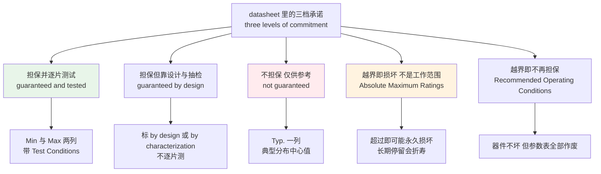
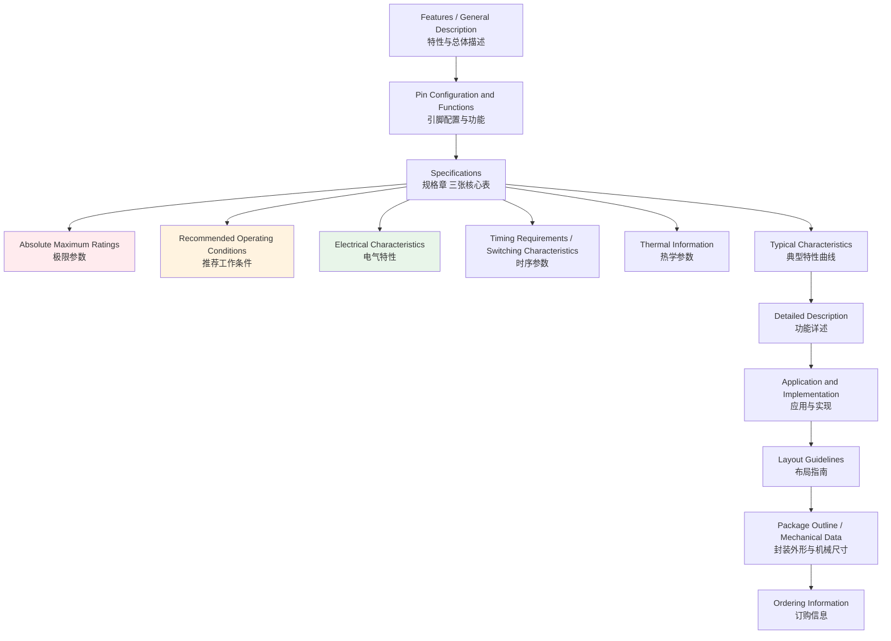
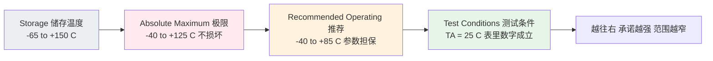
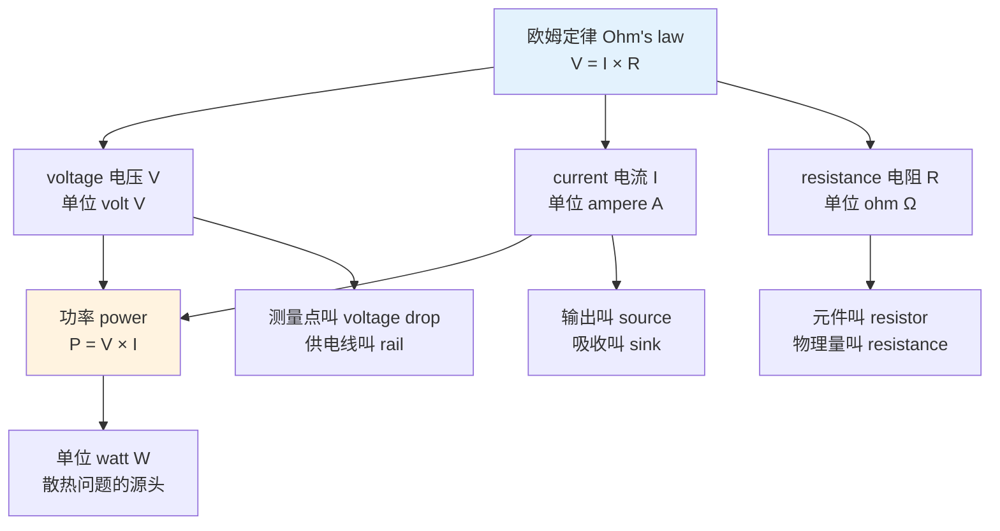
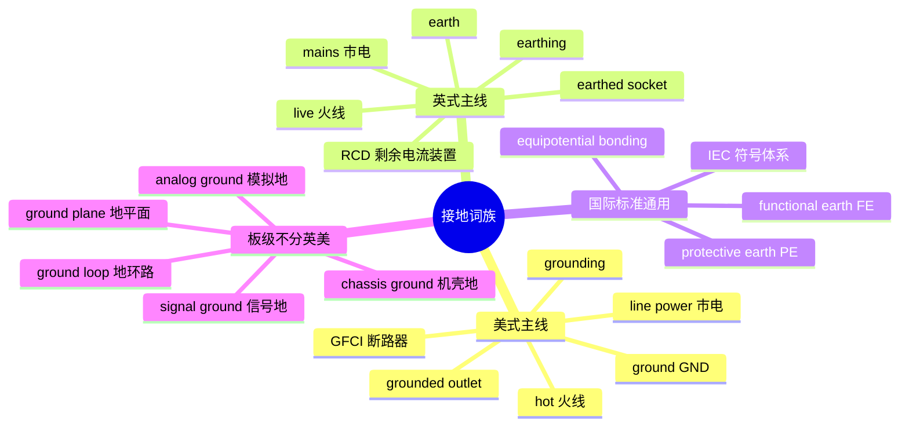
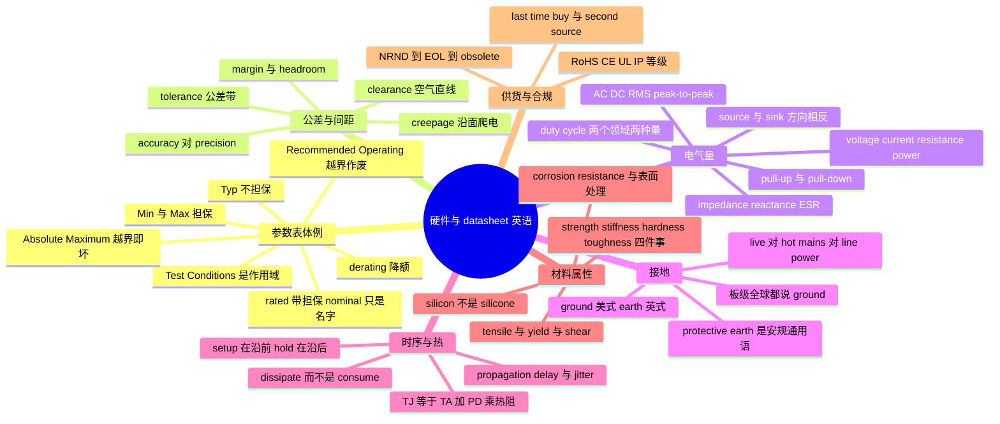

# 硬件与 datasheet 英语：电气量、参数表体例与工程属性

> [!info] 本篇定位
>
> 第二十章倒数第二篇。前八篇处理的是软件、法律、商务与财务，本篇转到**硬件**——芯片手册、元件规格书、机械图纸、施工说明书这一类文本。
>
> 这类文本的英语难点不在生僻词，而在**承诺强度**。同一张参数表里，`Typ.` 这一列不保证，`Max` 这一列保证；`Absolute Maximum Ratings` 不是工作范围而是损坏边界；`rated` 是厂商担保的，`nominal` 只是印在标签上的名义值。看不懂这套体例，词全认识也会把电路烧掉。
>
> 三条主线：datasheet 的骨架与参数表体例、电气量与电路元件词族、材料与机械属性词。末尾把机械、建筑、能源、金属工艺四个相邻领域压成一节速览，给的是「读到能认出来」的量，不求主动使用。
>
> 承诺强度的思路本篇是第二次用到——软件侧的版本见 [[20.专业领域词汇/03.IT 深度英语（中）：设计文档、规范文体与 API 措辞\|IT 深度英语（中）：设计文档、规范文体与 API 措辞]] 的 `MUST`/`SHOULD`/`MAY`。度量衡单位名与换算见 [[03.数字与计量词汇/03.度量衡词表\|度量衡词表]]，本篇只补工程语境特有的读法；材质与质地的日常义见 [[10.动植物、颜色与感官属性/04.颜色、材质、质地与声音气味光线\|颜色、材质、质地与声音气味光线]]，本篇讲的是规格书里带数值的那一层。

---

## 1. 本篇导读：datasheet 是承诺书，不是说明书

一份芯片 datasheet 在法律意义上更接近合同附件而不是使用手册。它的每一个数字后面都跟着一句隐含的话：「在下列条件下，我们担保这个数字」或者「这个数字只是给你参考，我们不担保」。区分这两类，是读硬件英语的第一件事。

这直接决定了几个高频误读：

- 把 `Typical` 当成「一般都是这个值」去设计，量产时被分布尾部打穿
- 把 `Absolute Maximum Ratings` 当成「可以用到这里」，结果那是**损坏门槛**不是**工作范围**
- 把 `nominal 5 V` 当成「就是 5.000 V」，忽略了它只是个称呼
- 把 `Recommended` 当成建议，事实上超出这一栏之后，前面所有电气参数一概不再担保

上图的五个盒子分成两组。上面三个讲的是「这个数字算不算数」——`Min`/`Max` 算数且逐片测过，标了 by design 的算数但只抽测，`Typ.` 不算数。下面两个讲的是「越过之后会怎样」——超出 Absolute Maximum Ratings 器件会**坏**，超出 Recommended Operating Conditions 器件不坏但**手册作废**，它可能正常工作，也可能行为诡异，厂商都不认。这两条线在中文口语里都叫「超出范围」，英文里是两个完全不同的承诺，混用会写出无法追责的规格。

### 1.1 硬件英语为什么比软件英语更依赖表格

软件文档的核心是散文与代码；硬件文档的核心是**表格加曲线图**，散文只负责把表格没法表达的条件补上。这带来两个后果。

一是词汇总量不大但复现率极高。一份 datasheet 里翻来覆去就是 voltage、current、typical、maximum、conditions、supply、output、junction、ambient 这几十个词，认全之后大部分手册可以直接读。

二是**缩写密度极高**，而且缩写往往不在正文里展开。`VCC`、`VDD`、`IDD`、`TA`、`TJ`、`RθJA`、`ESR`、`PWM`、`LDO` 这类记号是行业约定，手册默认你知道。本篇按词族给出这些记号的全称与念法，缩略语的通用读法规则见 [[20.专业领域词汇/04.IT 深度英语（下）：云原生运维、评审用语与缩略语读法\|IT 深度英语（下）：云原生运维、评审用语与缩略语读法]]，符号本身的英文名见 [[22.速查附录与学习资源/02.标点、键盘符号英文名与缩略语场景对照表\|标点、键盘符号英文名与缩略语场景对照表]]。

---

## 2. 文档族与 datasheet 的骨架

厂商发出来的不只有一份 datasheet，围绕一颗芯片通常有一整族文档，各自的承诺强度也不同。

| 英文 | 英式音标 | 美式音标 | 词性 | 中文 | 搭配与说明 |
| --- | --- | --- | --- | --- | --- |
| **datasheet** | /ˈdeɪtəʃiːt/ | /ˈdeɪtəʃiːt/ | n. | 数据手册 | 也写 data sheet 两词；英式 data 亦读 /ˈdɑːtə/ |
| **spec sheet** | /ˈspek ʃiːt/ | /ˈspek ʃiːt/ | n. | 规格书 | 口语常直接说 the spec；机械件多用这个词 |
| **specification** | /ˌspesɪfɪˈkeɪʃn/ | /ˌspesɪfɪˈkeɪʃn/ | n. | 规格；技术规范 | to spec 按规格做；out of spec 超出规格 |
| **application note** | /ˌæplɪˈkeɪʃn nəʊt/ | /ˌæplɪˈkeɪʃn noʊt/ | n. | 应用笔记 | 缩写 AN；讲怎么用，不构成担保 |
| **reference design** | /ˈrefrəns dɪˈzaɪn/ | /ˈrefrəns dɪˈzaɪn/ | n. | 参考设计 | 厂商给的样板电路，含原理图与 BOM |
| **evaluation board** | /ɪˌvæljuˈeɪʃn bɔːd/ | /ɪˌvæljuˈeɪʃn bɔːrd/ | n. | 评估板 | 口语 eval board；也叫 dev board |
| **errata** | /eˈrɑːtə/ | /ɪˈrɑːtə/ | n.pl. | 勘误 | 单数 erratum；errata sheet 勘误表 |
| **revision** | /rɪˈvɪʒn/ | /rɪˈvɪʒn/ | n. | 版本；修订 | Rev. B；silicon revision 硅版本 |
| **stepping** | /ˈstepɪŋ/ | /ˈstepɪŋ/ | n. | 芯片步进版本 | 与 revision 近义，Intel 系文档常用 |
| **preliminary** | /prɪˈlɪmɪnəri/ | /prɪˈlɪmɪneri/ | adj. | 初步的；预发布的 | 封面标 Preliminary 表示数据可能变 |
| **PCN** | — | — | n. | 产品变更通知 | product change notification 全称念出 |
| **user guide** | /ˈjuːzə ɡaɪd/ | /ˈjuːzər ɡaɪd/ | n. | 用户指南 | 也叫 user manual；面向操作不面向设计 |
| **BOM** | /bɒm/ | /bɑːm/ | n. | 物料清单 | bill of materials；读成一个音节 bom |

`Preliminary` 这个封面标记值得单独记：它意味着**这份手册的数字还会变**，量产前不能拿它去定死设计。与之相对的是 `Production Data` 或 `Final`。中间还有 `Advance Information`（比 Preliminary 更早，只有架构没有参数）。

### 2.1 一份 datasheet 的固定小节顺序

不同厂商的小节名有出入，但顺序高度稳定。按下面这个序列跳读，一份两百页的手册十分钟能定位到你要的那一页。

规格章（Specifications）里那几张表才是这份文档的**担保部分**，前面的 Features 与后面的 Application 都是宣传与建议。`Typical Characteristics` 一节全是曲线图，标题里的 Typical 已经把话说明白了：这些曲线不构成担保，只是告诉你参数随温度、负载、频率大致怎么走。真正要照着设计的，是 `Electrical Characteristics` 表里带 Min/Max 的行。

`Ordering Information` 一节里藏着一件容易忽略的事：同一颗芯片按温度等级、封装、卷带方式分成好几个**订货型号**（part number / orderable number），后缀的一个字母可能就是 industrial 与 automotive 之别。工作温度范围写在这里而不在参数表里。

| 英文 | 英式音标 | 美式音标 | 词性 | 中文 | 搭配与说明 |
| --- | --- | --- | --- | --- | --- |
| **part number** | /pɑːt ˈnʌmbə/ | /pɑːrt ˈnʌmbər/ | n. | 物料号；型号 | 缩写 P/N；orderable part number 订货型号 |
| **package** | /ˈpækɪdʒ/ | /ˈpækɪdʒ/ | n. | 封装 | package outline 封装外形图；SOP、QFN 是封装名 |
| **footprint** | /ˈfʊtprɪnt/ | /ˈfʊtprɪnt/ | n. | 焊盘布局；占板面积 | land pattern 同义；也指占地面积 |
| **pinout** | /ˈpɪnaʊt/ | /ˈpɪnaʊt/ | n. | 引脚定义 | 读 pin-out；pin assignment 同义 |
| **lead** | /liːd/ | /liːd/ | n. | 引脚；引线 | 读 /liːd/；lead pitch 引脚间距 |
| **lead** | /led/ | /led/ | n. | 铅 | 同形异读；lead-free 无铅，RoHS 关键词 |
| **pitch** | /pɪtʃ/ | /pɪtʃ/ | n. | 间距 | 0.5 mm pitch；机械件里指螺距 |
| **grade** | /ɡreɪd/ | /ɡreɪd/ | n. | 等级 | commercial / industrial / automotive grade |
| **tape and reel** | — | — | n. | 编带卷盘 | 贴片件的出货形式，与 tube、tray 并列 |

> [!warning] lead 的两个读音会彻底改变句意
>
> 硬件文本里 `lead` 高频出现，两个读音对应两个完全无关的义项：
>
> - `The device has 16 leads.` 这里读 /liːdz/，指**引脚**
> - `lead-free solder` 这里读 /led/，指**铅**
>
> 判断办法看语境：跟数量、间距、编号搭配的是引脚；跟 free、content、solder、RoHS 搭配的是铅。念错在口头交流里会造成真实的误解，因为 lead-free 是合规红线。

---

## 3. 参数表的读法：Min、Typ. 与 Max

一张 Electrical Characteristics 表通常是七栏。认清每一栏在承诺什么，比认识里面的词更重要。

| 栏名 | 常见缩写 | 中文 | 承诺强度 |
| --- | --- | --- | --- |
| Parameter / Symbol | — | 参数名与符号 | — |
| Test Conditions | — | 测试条件 | 所有数字只在这一栏成立 |
| Minimum | Min | 最小值 | 担保不低于 |
| Typical | Typ. | 典型值 | 不担保 |
| Maximum | Max | 最大值 | 担保不高于 |
| Unit | — | 单位 | — |
| Notes | — | 注释 | 常藏着「by design」这类免责 |

`Test Conditions` 这一栏是整张表的**作用域声明**。写着 `TA = 25 °C, VCC = 3.3 V` 就意味着这一行的数字只在 25 摄氏度环境温度、3.3 伏供电下有效。工业现场跑到 70 度时，同一个参数要去看曲线图或者另一行标了全温区的条目。

| 英文 | 英式音标 | 美式音标 | 词性 | 中文 | 搭配与说明 |
| --- | --- | --- | --- | --- | --- |
| **parameter** | /pəˈræmɪtə/ | /pəˈræmɪtər/ | n. | 参数 | 口语缩 param；重音在第二音节 |
| **typical** | /ˈtɪpɪkl/ | /ˈtɪpɪkl/ | adj. | 典型的 | 表头缩 Typ.；不构成担保 |
| **minimum** | /ˈmɪnɪməm/ | /ˈmɪnɪməm/ | n./adj. | 最小值 | 复数 minima；缩写 Min |
| **maximum** | /ˈmæksɪməm/ | /ˈmæksɪməm/ | n./adj. | 最大值 | 复数 maxima；缩写 Max |
| **nominal** | /ˈnɒmɪnl/ | /ˈnɑːmɪnl/ | adj. | 标称的；名义的 | 只是称呼，不带担保 |
| **rated** | /ˈreɪtɪd/ | /ˈreɪtɪd/ | adj. | 额定的 | rated current 额定电流；带担保 |
| **rating** | /ˈreɪtɪŋ/ | /ˈreɪtɪŋ/ | n. | 额定值 | voltage rating 耐压值；复数 ratings |
| **guaranteed** | /ˌɡærənˈtiːd/ | /ˌɡerənˈtiːd/ | adj. | 担保的 | guaranteed by design 靠设计保证 |
| **characterization** | /ˌkærəktəraɪˈzeɪʃn/ | /ˌkerəktərəˈzeɪʃn/ | n. | 表征 | by characterization 抽样表征而非逐片测 |
| **test condition** | — | — | n. | 测试条件 | 全表的作用域；unless otherwise noted 另有说明除外 |
| **specified** | /ˈspesɪfaɪd/ | /ˈspesɪfaɪd/ | adj. | 规定的 | over the specified range 在规定范围内 |
| **derating** | /ˌdiːˈreɪtɪŋ/ | /ˌdiːˈreɪtɪŋ/ | n. | 降额 | derating curve 降额曲线；动词 derate |
| **headroom** | /ˈhedruːm/ | /ˈhedruːm/ | n. | 余量 | 电压余量、性能余量；口语度高 |
| **margin** | /ˈmɑːdʒɪn/ | /ˈmɑːrdʒɪn/ | n. | 裕量 | design margin、safety margin；财务义见 20.07 |
| **worst case** | — | — | n./adj. | 最坏情况 | worst-case analysis 最坏情况分析 |
| **binning** | /ˈbɪnɪŋ/ | /ˈbɪnɪŋ/ | n. | 分档筛选 | 按实测性能分成不同料号出货 |

### 3.1 Typ. 为什么不能拿来设计

`Typ.` 给的是量产分布的中心值，可以理解成中位数或均值。它没有说分布有多宽，也没有说尾部落在哪。用 `Typ.` 值设计的电路，在实验室里那颗样片上完全正常，量产一万片时会有一批落在你没考虑过的位置。

设计的正确姿势是：**用 Min 和 Max 算最坏情况**，`Typ.` 只用来估算功耗均值、电池续航这类统计量。

> [!example] 同一个参数的三种写法
>
> - The quiescent current is **typically 12 µA**.
>   - 静态电流典型值为 12 微安。（不担保，只说大概长这样）
> - The quiescent current is **guaranteed below 25 µA** over the full temperature range.
>   - 全温区内担保静态电流低于 25 微安。（这是可以拿去算的）
> - The quiescent current **shall not exceed 25 µA**.
>   - 静态电流不得超过 25 微安。（规范文体的写法，见 20.03）

> [!warning] Typ. 后面有没有 Min/Max 决定这一行有没有价值
>
> 有些参数在表里只有 `Typ.` 一列，Min 和 Max 是空的（写作 —）。这不是印漏了，是厂商明确表示**这个参数不做任何担保**。常见于内部振荡器频率、上电复位阈值、某些温度系数。
>
> 遇到这种行，唯一稳妥的做法是自己设计上不依赖它，或者要求厂商出具 characterization report。把空白当成「反正差不多」是硬件事故的常见起点。

### 3.2 rated 与 nominal：两个「额定」不是一回事

中文把两个词都译成「额定」或者混着叫「标称」，英文里分工很清楚。

| 词 | 谁说的 | 带不带担保 | 例子 |
| --- | --- | --- | --- |
| **nominal** | 命名约定 | 不带 | a nominal 12 V rail 实测可能是 11.8 V；nominal 1 mm 线径实际 0.98 mm |
| **rated** | 厂商 | 带 | rated for 2 A continuous 担保连续 2 安；rated at 250 V 担保耐 250 伏 |
| **actual** | 实测 | 就是事实 | the actual value measured 实测值 |
| **effective** | 折算后 | 视上下文 | effective capacitance 加了直流偏压之后的有效电容 |

`nominal` 的字面来源是 name，它的核心义就是「叫这个名字」。管道的 nominal diameter、木材的 nominal 2×4、电压的 nominal 220 V，全都只是称呼，实际值另有公差。`rated` 的核心义是 rate 的分词——被评定过、被定级过，所以它一定伴随着一个评定条件：rated **at** 25 °C、rated **for** continuous duty。

> [!tip] 读到 rated 就去找它的条件从句
>
> `rated` 单独出现几乎没有信息量。有用的是它后面跟的介词短语：
>
> - rated **at** 一个具体点：rated at 25 °C
> - rated **for** 一种工况：rated for continuous operation、rated for indoor use
> - rated **to** 一个上限：rated to 85 °C
>
> 缺了这个短语的 rated 值，多半是被销售资料裁剪过的。回原始 datasheet 找完整表述。

---

## 4. Absolute Maximum Ratings：越界即损坏

这是整份 datasheet 里唯一一张「不要碰」的表。它列的是器件在**不损坏**的前提下能承受的应力边界，不是能正常工作的范围。

厂商在这张表下面几乎一定会印一段免责声明，大意是：这些只是应力额定值，在此处或任何超出推荐工作条件的地方，不暗示器件能正常工作；长期停留在极限值附近会影响可靠性。这段话每家措辞略有不同，意思完全一致。

| 英文 | 英式音标 | 美式音标 | 词性 | 中文 | 搭配与说明 |
| --- | --- | --- | --- | --- | --- |
| **absolute maximum ratings** | — | — | n.pl. | 极限参数 | 口语缩 abs max；越界即可能永久损坏 |
| **stress** | /stres/ | /stres/ | n. | 应力 | stress rating 应力额定值；材料学同词 |
| **permanent damage** | — | — | n. | 永久损坏 | 免责声明的固定措辞 |
| **exceed** | /ɪkˈsiːd/ | /ɪkˈsiːd/ | v. | 超过 | must not exceed；shall not exceed |
| **exposure** | /ɪkˈspəʊʒə/ | /ɪkˈspoʊʒər/ | n. | 暴露；承受 | prolonged exposure 长时间暴露 |
| **reliability** | /rɪˌlaɪəˈbɪləti/ | /rɪˌlaɪəˈbɪləti/ | n. | 可靠性 | may affect device reliability |
| **recommended operating conditions** | — | — | n.pl. | 推荐工作条件 | 缩 ROC；越界器件不坏但参数作废 |
| **operating range** | — | — | n. | 工作范围 | operating temperature range 工作温度范围 |
| **storage temperature** | — | — | n. | 储存温度 | 符号 Tstg；比工作温度范围宽 |
| **ESD** | — | — | n. | 静电放电 | electrostatic discharge；HBM、CDM 是两种模型 |
| **latch-up** | /ˈlætʃ ʌp/ | /ˈlætʃ ʌp/ | n. | 闩锁效应 | CMOS 器件的一种破坏性状态 |
| **transient** | /ˈtrænziənt/ | /ˈtrænʃnt/ | n./adj. | 瞬态；瞬变的 | transient voltage 瞬态电压；美音第二音节不同 |
| **surge** | /sɜːdʒ/ | /sɜːrdʒ/ | n./v. | 浪涌 | surge protection 浪涌保护 |
| **inrush current** | — | — | n. | 浪涌电流；启动冲击电流 | 开机瞬间的大电流 |
| **overvoltage** | /ˌəʊvəˈvəʊltɪdʒ/ | /ˌoʊvərˈvoʊltɪdʒ/ | n. | 过压 | 对应 undervoltage 欠压 |
| **reverse polarity** | — | — | n. | 反接极性 | reverse polarity protection 防反接 |

上图是同一个温度维度上的四层套娃，从左到右范围逐层收窄、承诺逐层加强。储存温度最宽，因为不通电的器件耐受力最强；极限参数次之，超过就可能烧；推荐工作条件再次之，超过器件活着但手册作废；最内层的测试条件最窄，参数表里那个漂亮的数字只在这一点上被验证过。设计评审时被问「你这个参数是在哪一层验证的」，问的就是这张图。

> [!warning] 两个方向的误读都会出事
>
> - ❌ ~~把 Absolute Maximum 当工作上限~~：`Abs Max 6 V` 不代表可以按 5.5 V 长跑，那一栏只保证不当场烧
> - ✅ 按 Recommended Operating Conditions 设计，把 Abs Max 留作**瞬态余量**
>
> 反过来也是错的：
>
> - ❌ ~~看到测试条件只有 25 °C 就认定器件只能在 25 °C 工作~~
> - ✅ 25 °C 是**参数被验证的点**，工作范围看 ROC 那一栏

---

## 5. 公差、间距与余量：tolerance、clearance、creepage

这一组词在中文里都容易滑到「间隙」「误差」上，英文里各有各的测量对象。

| 英文 | 英式音标 | 美式音标 | 词性 | 中文 | 搭配与说明 |
| --- | --- | --- | --- | --- | --- |
| **tolerance** | /ˈtɒlərəns/ | /ˈtɑːlərəns/ | n. | 公差 | ±5% tolerance；tight/loose tolerance 紧松 |
| **tolerance band** | — | — | n. | 公差带 | 电阻色环最后一环即公差带 |
| **tolerance stack-up** | — | — | n. | 公差累积 | 多个零件公差叠加后的最坏尺寸 |
| **clearance** | /ˈklɪərəns/ | /ˈklɪrəns/ | n. | 电气间隙；间隙 | 空气中的最短直线距离 |
| **creepage** | /ˈkriːpɪdʒ/ | /ˈkriːpɪdʒ/ | n. | 爬电距离 | 沿绝缘表面的最短路径 |
| **spacing** | /ˈspeɪsɪŋ/ | /ˈspeɪsɪŋ/ | n. | 间距 | trace spacing 走线间距 |
| **backlash** | /ˈbæklæʃ/ | /ˈbæklæʃ/ | n. | 齿隙；回程间隙 | 齿轮反向时的空行程 |
| **runout** | /ˈrʌnaʊt/ | /ˈrʌnaʊt/ | n. | 跳动 | 旋转件的径向或端面跳动量 |
| **fit** | /fɪt/ | /fɪt/ | n. | 配合 | clearance fit 间隙配合；interference fit 过盈配合 |
| **allowance** | /əˈlaʊəns/ | /əˈlaʊəns/ | n. | 留量；余量 | machining allowance 加工余量 |
| **deviation** | /ˌdiːviˈeɪʃn/ | /ˌdiːviˈeɪʃn/ | n. | 偏差 | standard deviation 见 19.03 |
| **drift** | /drɪft/ | /drɪft/ | n./v. | 漂移 | temperature drift 温漂；ppm/°C 为单位 |
| **accuracy** | /ˈækjərəsi/ | /ˈækjərəsi/ | n. | 准确度 | 离真值多远 |
| **precision** | /prɪˈsɪʒn/ | /prɪˈsɪʒn/ | n. | 精密度 | 多次测量之间多集中 |
| **resolution** | /ˌrezəˈluːʃn/ | /ˌrezəˈluːʃn/ | n. | 分辨率 | ADC 的最小可分辨步长 |
| **repeatability** | /rɪˌpiːtəˈbɪləti/ | /rɪˌpiːtəˈbɪləti/ | n. | 重复性 | 同一条件重复测的一致程度 |
| **guard band** | — | — | n. | 保护带 | 测试限比规格限再收紧的那一段 |

`clearance` 与 `creepage` 是安规文档里成对出现的一组，差别在**路径**：clearance 走空气直线，creepage 沿着绝缘材料的表面爬。同样两个铜箔之间，中间开个槽会让 creepage 变长而 clearance 不变，这就是电源板上那些看起来没用的开槽的来历。

> [!tip] accuracy 与 precision 的经典区分
>
> 打靶比喻在英文技术文本里非常常见，看到时不必再翻译：
>
> - 弹孔紧紧挤成一团但偏在靶边 → **precise but not accurate**（精密但不准确）
> - 弹孔散得很开但平均落在靶心 → **accurate but not precise**（准确但不精密）
>
> 中文「精度」一词两义混用，读英文文档时要按上下文判断作者要的是离真值近还是离散度小。

---

## 6. 电气基础量：电压、电流、电阻与功率

四个基础量加上它们的单位、符号与常见搭配，是所有硬件文本的地基。

| 英文 | 英式音标 | 美式音标 | 词性 | 中文 | 搭配与说明 |
| --- | --- | --- | --- | --- | --- |
| **voltage** | /ˈvəʊltɪdʒ/ | /ˈvoʊltɪdʒ/ | n. | 电压 | 符号 V；supply voltage 供电电压 |
| **volt** | /vəʊlt/ | /voʊlt/ | n. | 伏特 | 单位；5 V 读 five volts |
| **current** | /ˈkʌrənt/ | /ˈkɜːrənt/ | n. | 电流 | 符号 I；英美元音不同，美音第一音节是 /ɜːr/ |
| **ampere** | /ˈæmpeə/ | /ˈæmpɪr/ | n. | 安培 | 口语一律说 amp /æmp/；mA 读 milliamps |
| **resistance** | /rɪˈzɪstəns/ | /rɪˈzɪstəns/ | n. | 电阻（量） | 符号 R；也指机械阻力与耐受性 |
| **resistor** | /rɪˈzɪstə/ | /rɪˈzɪstər/ | n. | 电阻器 | 元件；与 resistance 严格区分 |
| **ohm** | /əʊm/ | /oʊm/ | n. | 欧姆 | 10 kΩ 读 ten kilohms 或 ten K |
| **power** | /ˈpaʊə/ | /ˈpaʊər/ | n. | 功率；电源 | 两义高频混用，看搭配判断 |
| **watt** | /wɒt/ | /wɑːt/ | n. | 瓦特 | 3 W 读 three watts；kWh 读 kilowatt-hours |
| **potential difference** | — | — | n. | 电位差 | 正式表述，英式教材偏爱 |
| **voltage drop** | — | — | n. | 压降 | across a resistor 在电阻上的压降 |
| **rail** | /reɪl/ | /reɪl/ | n. | 供电轨 | the 3.3 V rail；口语度高 |
| **supply** | /səˈplaɪ/ | /səˈplaɪ/ | n. | 电源；供电 | power supply；单位 PSU |
| **load** | /ləʊd/ | /loʊd/ | n. | 负载 | no-load 空载；full load 满载 |
| **source** | /sɔːs/ | /sɔːrs/ | v./n. | 拉电流；源 | source current 输出电流，对应 sink |
| **sink** | /sɪŋk/ | /sɪŋk/ | v./n. | 灌电流 | sink 20 mA 能吸收 20 毫安 |
| **quiescent current** | /kwiˈesnt/ | /kwiˈesnt/ | n. | 静态电流 | 符号 IQ；空载时器件自身耗流 |
| **leakage current** | /ˈliːkɪdʒ/ | /ˈliːkɪdʒ/ | n. | 漏电流 | 关断状态下仍流过的微小电流 |
| **short circuit** | — | — | n./v. | 短路 | 动词也写 short out |
| **open circuit** | — | — | n. | 开路 | open 单用即可作形容词 |
| **polarity** | /pəˈlærəti/ | /pəˈlerəti/ | n. | 极性 | reverse polarity 反极性 |
| **anode** | /ˈænəʊd/ | /ˈænoʊd/ | n. | 阳极 | 二极管的正极端 |
| **cathode** | /ˈkæθəʊd/ | /ˈkæθoʊd/ | n. | 阴极 | 元件上一般用色环或缺口标出 |
| **terminal** | /ˈtɜːmɪnl/ | /ˈtɜːrmɪnl/ | n. | 端子 | screw terminal 螺钉端子；软件义见 20.01 |
| **conductor** | /kənˈdʌktə/ | /kənˈdʌktər/ | n. | 导体 | 对应 insulator 绝缘体 |
| **insulation** | /ˌɪnsjuˈleɪʃn/ | /ˌɪnsəˈleɪʃn/ | n. | 绝缘；保温 | 建筑语境指保温层 |
| **dielectric** | /ˌdaɪɪˈlektrɪk/ | /ˌdaɪɪˈlektrɪk/ | n./adj. | 介质；介电的 | dielectric strength 介电强度 |
| **breakdown** | /ˈbreɪkdaʊn/ | /ˈbreɪkdaʊn/ | n. | 击穿 | breakdown voltage 击穿电压 |

上图串起这一节最需要形成条件反射的三对区分。第一对是**量与器件**：resistance 是物理量，resistor 是那个躺在板子上的元件，capacitance 与 capacitor、inductance 与 inductor 遵循同一个 -ance 对 -or 的构词规律，读到 -ance 就知道在说数值。第二对是 **source 与 sink** 的方向：一个引脚 source 电流是往外推，sink 是往里吸，很多单片机的这两个能力值不一样，datasheet 会分行给。第三对是 **power 的两义**——「功率」与「电源」，`power dissipation` 是功率，`power supply` 是电源，`power up` 是上电，靠搭配区分。

### 6.1 单位前缀与口头念法

工程语境里的量级前缀读法与书面写法差得很远，念错会当场造成误解。

| 写法 | 全称 | 口语念法 | 例 |
| --- | --- | --- | --- |
| **k** | kilo | /ˈkɪləʊ/ 或直接念字母 K | 10 kΩ 读 ten K 或 ten kilohms |
| **M** | mega | /ˈmeɡə/ | 2 MHz 读 two megahertz |
| **G** | giga | /ˈɡɪɡə/ 或 /ˈdʒɪɡə/ | 1 GHz 读 one gigahertz，两读并存 |
| **m** | milli | /ˈmɪli/ | 5 mA 读 five milliamps |
| **µ** | micro | /ˈmaɪkrəʊ/ | 10 µF 读 ten microfarads；口语也说 ten mike |
| **n** | nano | /ˈnænəʊ/ | 100 nF 读 a hundred nanofarads |
| **p** | pico | /ˈpiːkəʊ/ | 22 pF 读 twenty-two picofarads，口语常说 puff |
| **dB** | decibel | /ˈdesɪbel/ | 3 dB 读 three dB 或 three decibels |
| **ppm** | parts per million | 逐字母念 | 50 ppm/°C 温漂 |

`µ` 这个符号在英文里叫 **mu** /mjuː/，作为前缀读作 micro；ASCII 环境常写成 `u`，`10uF` 依然读 ten microfarads。构词前缀本身的系统讲法见 [[14.构词法：前缀与后缀/04.数量、程度与规模前缀\|数量、程度与规模前缀]]，那里给的是 micro-、nano-、mega- 在普通词里的义项，本节只补工程读法。

---

## 7. 交流、直流、波形与 duty cycle

| 英文 | 英式音标 | 美式音标 | 词性 | 中文 | 搭配与说明 |
| --- | --- | --- | --- | --- | --- |
| **direct current** | — | — | n. | 直流电 | 缩 DC，读字母 D-C；DC-DC converter |
| **alternating current** | /ˈɔːltəneɪtɪŋ/ | /ˈɔːltərneɪtɪŋ/ | n. | 交流电 | 缩 AC；AC mains 市电 |
| **waveform** | /ˈweɪvfɔːm/ | /ˈweɪvfɔːrm/ | n. | 波形 | square/sine/triangle/sawtooth wave |
| **amplitude** | /ˈæmplɪtjuːd/ | /ˈæmplɪtuːd/ | n. | 幅值 | 英美 -tude 前的介音不同 |
| **peak** | /piːk/ | /piːk/ | n./adj. | 峰值 | peak-to-peak 峰峰值，写作 Vpp |
| **RMS** | — | — | n. | 有效值 | root mean square 逐字母念 |
| **frequency** | /ˈfriːkwənsi/ | /ˈfriːkwənsi/ | n. | 频率 | 单位 hertz /hɜːts/ 或 /hɜːrts/ |
| **period** | /ˈpɪəriəd/ | /ˈpɪriəd/ | n. | 周期 | 与 frequency 互为倒数 |
| **phase** | /feɪz/ | /feɪz/ | n. | 相位；相 | phase shift 相移；three-phase 三相 |
| **duty cycle** | /ˈdjuːti/ | /ˈduːti/ | n. | 占空比 | 高电平时间占周期的比例；美音无 /j/ |
| **PWM** | — | — | n. | 脉宽调制 | pulse-width modulation；逐字母念 |
| **on-time** | — | — | n. | 导通时间 | 对应 off-time；决定 duty cycle |
| **ripple** | /ˈrɪpl/ | /ˈrɪpl/ | n. | 纹波 | output ripple；单位常用 mVpp |
| **noise** | /nɔɪz/ | /nɔɪz/ | n. | 噪声 | noise floor 本底噪声 |
| **harmonic** | /hɑːˈmɒnɪk/ | /hɑːrˈmɑːnɪk/ | n./adj. | 谐波 | total harmonic distortion THD |
| **power factor** | — | — | n. | 功率因数 | PFC power factor correction |
| **rectifier** | /ˈrektɪfaɪə/ | /ˈrektɪfaɪər/ | n. | 整流器 | 动词 rectify；AC 转 DC |
| **inverter** | /ɪnˈvɜːtə/ | /ɪnˈvɜːrtər/ | n. | 逆变器 | DC 转 AC；数字电路里另指反相器 |
| **regulator** | /ˈreɡjuleɪtə/ | /ˈreɡjəleɪtər/ | n. | 稳压器 | linear regulator、switching regulator |
| **LDO** | — | — | n. | 低压差稳压器 | low-dropout regulator；逐字母念 |
| **dropout voltage** | — | — | n. | 压差 | LDO 能正常工作所需的最小输入输出差 |
| **efficiency** | /ɪˈfɪʃnsi/ | /ɪˈfɪʃnsi/ | n. | 效率 | 90% efficiency at full load |
| **line regulation** | — | — | n. | 线性调整率 | 输入变化引起的输出变化 |
| **load regulation** | — | — | n. | 负载调整率 | 负载变化引起的输出变化 |
| **soft start** | — | — | n. | 软启动 | 抑制 inrush current 的手段 |

`duty cycle` 的美式读音里 duty 没有 /j/ 音，读 /ˈduːti/；英式读 /ˈdjuːti/。这一对差异同样出现在 tube、new、student 上，属于英美语音的系统性差别。

> [!warning] duty cycle 在两个领域里量的东西不同
>
> - 电子语境：一个周期内高电平所占比例，`50% duty cycle` 指方波对称
> - 机械与电机语境：设备在一段时间内允许运行的比例，`S3 25% duty` 指每十分钟最多跑两分半，剩下时间必须停机散热
>
> 两者共享「工作时间占总时间的比」这个核心，但一个以微秒计，一个以分钟计。看到电机、焊机、压缩机的规格书上写 duty cycle，指的是后者。

---

## 8. 阻抗、电容、电感与频域词

| 英文 | 英式音标 | 美式音标 | 词性 | 中文 | 搭配与说明 |
| --- | --- | --- | --- | --- | --- |
| **impedance** | /ɪmˈpiːdns/ | /ɪmˈpiːdns/ | n. | 阻抗 | 符号 Z；含阻性与抗性两部分 |
| **reactance** | /riˈæktəns/ | /riˈæktəns/ | n. | 电抗 | inductive / capacitive reactance |
| **capacitance** | /kəˈpæsɪtəns/ | /kəˈpæsɪtəns/ | n. | 电容（量） | 单位 farad /ˈfærəd/ |
| **capacitor** | /kəˈpæsɪtə/ | /kəˈpæsɪtər/ | n. | 电容器 | 口语缩 cap；英式旧称 condenser |
| **inductance** | /ɪnˈdʌktəns/ | /ɪnˈdʌktəns/ | n. | 电感（量） | 单位 henry /ˈhenri/，复数 henries |
| **inductor** | /ɪnˈdʌktə/ | /ɪnˈdʌktər/ | n. | 电感器 | 也叫 coil、choke |
| **ESR** | — | — | n. | 等效串联电阻 | equivalent series resistance；决定纹波 |
| **electrolytic** | /ɪˌlektrəˈlɪtɪk/ | /ɪˌlektrəˈlɪtɪk/ | adj. | 电解的 | electrolytic capacitor 有极性 |
| **ceramic** | /səˈræmɪk/ | /səˈræmɪk/ | adj./n. | 陶瓷的 | MLCC 多层陶瓷电容 |
| **tantalum** | /ˈtæntələm/ | /ˈtæntələm/ | n. | 钽 | tantalum capacitor 钽电容 |
| **bypass capacitor** | — | — | n. | 旁路电容 | 与 decoupling capacitor 常混用 |
| **decoupling capacitor** | /diːˈkʌplɪŋ/ | /diːˈkʌplɪŋ/ | n. | 去耦电容 | 紧贴电源引脚放置 |
| **bulk capacitor** | — | — | n. | 储能电容 | 容量大、位置远，供瞬态电流 |
| **resonance** | /ˈrezənəns/ | /ˈrezənəns/ | n. | 谐振 | resonant frequency 谐振频率 |
| **cutoff frequency** | — | — | n. | 截止频率 | 也写 corner frequency |
| **bandwidth** | /ˈbændwɪdθ/ | /ˈbændwɪdθ/ | n. | 带宽 | 网络义见 12.02 |
| **characteristic impedance** | — | — | n. | 特性阻抗 | 传输线的 50 Ω 或 75 Ω |
| **impedance matching** | — | — | n. | 阻抗匹配 | mismatch 失配会造成反射 |
| **termination** | /ˌtɜːmɪˈneɪʃn/ | /ˌtɜːrmɪˈneɪʃn/ | n. | 端接 | series / parallel termination |
| **attenuation** | /əˌtenjuˈeɪʃn/ | /əˌtenjuˈeɪʃn/ | n. | 衰减 | 动词 attenuate；对应 gain |
| **gain** | /ɡeɪn/ | /ɡeɪn/ | n. | 增益 | 单位常用 dB；财务义见 20.07 |
| **bias** | /ˈbaɪəs/ | /ˈbaɪəs/ | n./v. | 偏置 | bias voltage；统计义指偏倚 |
| **filter** | /ˈfɪltə/ | /ˈfɪltər/ | n./v. | 滤波器 | low-pass / high-pass / band-pass |
| **shielding** | /ˈʃiːldɪŋ/ | /ˈʃiːldɪŋ/ | n. | 屏蔽 | shielding can 屏蔽罩 |
| **crosstalk** | /ˈkrɒstɔːk/ | /ˈkrɔːstɔːk/ | n. | 串扰 | 相邻走线之间的耦合干扰 |

> [!warning] condenser 是历史遗留，别在新文档里用
>
> `condenser` 曾是电容器的通用叫法，如今只在三处残留：老式教材与英式口语、汽车点火系统的零件名、以及**完全无关的另一个义项**——制冷与化工里的「冷凝器」。
>
> 读到 condenser 先看领域：电路图上八成是老文档里的电容，空调与蒸馏装置上一定是冷凝器。写文档一律用 capacitor。

---

## 9. 电路网络里的元件与固定搭配

`pull-up resistor` 是这一族里出现频率最高的组合，围绕它有一整套讲电阻在电路里扮演什么角色的说法。这些词的共同点是：**中心词都是 resistor，前面的修饰语说明它的职务**。

| 英文 | 英式音标 | 美式音标 | 词性 | 中文 | 搭配与说明 |
| --- | --- | --- | --- | --- | --- |
| **pull-up resistor** | /ˈpʊl ʌp/ | /ˈpʊl ʌp/ | n. | 上拉电阻 | 把引脚拉到高电平；internal pull-up 内部上拉 |
| **pull-down resistor** | — | — | n. | 下拉电阻 | 把引脚拉到地 |
| **floating** | /ˈfləʊtɪŋ/ | /ˈfloʊtɪŋ/ | adj. | 悬空的 | a floating input 未定义电平的输入 |
| **open drain** | — | — | n./adj. | 开漏 | 只能拉低，必须配上拉电阻 |
| **open collector** | — | — | n./adj. | 开集 | 双极型器件的对应说法 |
| **tri-state** | /ˈtraɪ steɪt/ | /ˈtraɪ steɪt/ | adj. | 三态的 | 也写 high-Z 高阻态 |
| **weak / strong pull-up** | — | — | adj. | 弱／强上拉 | 靠阻值大小区分，非正式但通用 |
| **series resistor** | — | — | n. | 串联电阻 | 与 parallel 并联相对 |
| **current-limiting resistor** | — | — | n. | 限流电阻 | LED 前面那一颗 |
| **voltage divider** | — | — | n. | 分压器 | 两个电阻分压取中点 |
| **shunt** | /ʃʌnt/ | /ʃʌnt/ | n. | 分流器；分流 | shunt resistor 采样电流用 |
| **sense resistor** | — | — | n. | 采样电阻 | 也叫 current sense resistor |
| **bleeder resistor** | /ˈbliːdə/ | /ˈbliːdər/ | n. | 泄放电阻 | 断电后放掉电容余电 |
| **diode** | /ˈdaɪəʊd/ | /ˈdaɪoʊd/ | n. | 二极管 | Zener diode 稳压二极管 |
| **transistor** | /trænˈzɪstə/ | /trænˈzɪstər/ | n. | 三极管；晶体管 | MOSFET 读 /ˈmɒsfet/ |
| **semiconductor** | /ˌsemikənˈdʌktə/ | /ˌsemikənˈdʌktər/ | n. | 半导体 | 美音也可读 /ˌsemaɪ-/ |
| **fuse** | /fjuːz/ | /fjuːz/ | n./v. | 保险丝；熔断 | blow a fuse 熔断；resettable fuse 自恢复 |
| **relay** | /ˈriːleɪ/ | /ˈriːleɪ/ | n. | 继电器 | coil 线圈端与 contact 触点端 |
| **solenoid** | /ˈsəʊlənɔɪd/ | /ˈsoʊlənɔɪd/ | n. | 螺线管；电磁阀 | solenoid valve 电磁阀 |
| **actuator** | /ˈæktʃueɪtə/ | /ˈæktʃueɪtər/ | n. | 执行器 | 与 sensor 成对出现 |
| **crystal** | /ˈkrɪstl/ | /ˈkrɪstl/ | n. | 晶振 | crystal oscillator；缩 XTAL |
| **oscillator** | /ˈɒsɪleɪtə/ | /ˈɑːsəleɪtər/ | n. | 振荡器 | internal oscillator 内部振荡器 |
| **header** | /ˈhedə/ | /ˈhedər/ | n. | 排针；排母 | pin header；网络协议义见 20.01 |
| **jumper** | /ˈdʒʌmpə/ | /ˈdʒʌmpər/ | n. | 跳线帽 | jumper wire 跳线 |
| **trace** | /treɪs/ | /treɪs/ | n. | 走线 | 英式也用 track；stack trace 义见 20.01 |
| **via** | /ˈvaɪə/ | /ˈviːə/ | n. | 过孔 | 复数 vias；与介词 via 同形 |
| **pad** | /pæd/ | /pæd/ | n. | 焊盘 | thermal pad 散热焊盘 |
| **silkscreen** | /ˈsɪlkskriːn/ | /ˈsɪlkskriːn/ | n. | 丝印层 | 板上印的白字 |
| **solder** | /ˈsəʊldə/ | /ˈsɑːdər/ | n./v. | 焊锡；焊接 | 美音 l 不发音，是高频听力陷阱 |
| **reflow** | /ˈriːfləʊ/ | /ˈriːfloʊ/ | n./v. | 回流焊 | reflow oven；reflow profile 温度曲线 |
| **flux** | /flʌks/ | /flʌks/ | n. | 助焊剂；磁通 | 两义都常见，看领域判断 |
| **through-hole** | — | — | adj. | 通孔的 | 与 SMD 表面贴装相对 |
| **SMD / SMT** | — | — | n. | 贴片器件／表面贴装 | surface-mount device / technology |

> [!tip] solder 的美音听力陷阱
>
> `solder` 在美音里读 /ˈsɑːdər/，字母 l **完全不发音**，听起来接近 "sodder"。英音保留 l，读 /ˈsəʊldə/。
>
> 同类的还有 `salmon` /ˈsæmən/、`almond` 的常见读法。看到美国工程师的视频里说 "sodder the pins"，那就是 solder。名词 solder 与动词 solder 同形同读，soldering iron 是烙铁。

`floating` 这个词在硬件语境里出现三处，义项完全不同，值得一并记住：`floating input`（引脚悬空，电平不确定）、`floating ground`（浮地，不与大地相连的参考点）、`floating-point`（浮点数，软件义）。三者共享「不被固定住」这个意象，但落点差得很远。

---

## 10. ground 与 earth：接地词族与英美分歧

这是硬件英语里最典型的一处英美差异，而且不是同义替换那么简单——两个词在国际标准文本里已经分化出不同的技术含义。

| 英文 | 英式音标 | 美式音标 | 词性 | 中文 | 搭配与说明 |
| --- | --- | --- | --- | --- | --- |
| **ground** | /ɡraʊnd/ | /ɡraʊnd/ | n./v. | 地；接地 | 美式主用词；缩写 GND |
| **earth** | /ɜːθ/ | /ɜːrθ/ | n./v. | 地；接地 | 英式主用词；earth wire 地线 |
| **grounding** | /ˈɡraʊndɪŋ/ | /ˈɡraʊndɪŋ/ | n. | 接地（美） | grounding conductor 接地导体 |
| **earthing** | /ˈɜːθɪŋ/ | /ˈɜːrθɪŋ/ | n. | 接地（英） | earthing arrangement 接地方式 |
| **protective earth** | — | — | n. | 保护接地 | 缩 PE；安规术语，国际通用 |
| **chassis ground** | /ˈʃæsi/ | /ˈʃæsi/ | n. | 机壳地 | chassis 单复数同形，复数读 /ˈʃæsiz/ |
| **signal ground** | — | — | n. | 信号地 | 与 power ground 分开走 |
| **analog ground** | — | — | n. | 模拟地 | AGND；与 DGND 数字地分区 |
| **ground plane** | — | — | n. | 地平面 | PCB 上整片铜箔 |
| **ground loop** | — | — | n. | 地环路 | 多点接地引入的噪声路径 |
| **common** | /ˈkɒmən/ | /ˈkɑːmən/ | n. | 公共端 | 继电器与接线端子上的 COM |
| **return path** | — | — | n. | 回流路径 | 电流回到源头的那条路 |
| **bonding** | /ˈbɒndɪŋ/ | /ˈbɑːndɪŋ/ | n. | 等电位连接 | equipotential bonding |
| **neutral** | /ˈnjuːtrəl/ | /ˈnuːtrəl/ | n. | 中性线；零线 | 与 live/hot 相对 |
| **live** | /laɪv/ | /laɪv/ | adj./n. | 火线（英） | 形容词读 /laɪv/；美式说 hot |
| **hot** | /hɒt/ | /hɑːt/ | n. | 火线（美） | the hot wire |
| **mains** | /meɪnz/ | /meɪnz/ | n. | 市电（英） | 美式说 line power、AC power、the wall |
| **socket / power point** | — | — | n. | 插座（英） | 美式 outlet、receptacle |
| **plug** | /plʌɡ/ | /plʌɡ/ | n. | 插头 | 通用词，无英美分歧 |
| **RCD** | — | — | n. | 剩余电流装置（英） | residual current device |
| **GFCI** | — | — | n. | 接地故障断路器（美） | ground fault circuit interrupter |
| **isolation** | /ˌaɪsəˈleɪʃn/ | /ˌaɪsəˈleɪʃn/ | n. | 隔离 | galvanic isolation 电气隔离 |
| **floating ground** | — | — | n. | 浮地 | 不与大地连接的参考点 |

上图的四支要分开对待。前两支是**同一件事的两种叫法**，跟着文档产地走，读英标 BS 与 IEC 文件用 earth，读美标 NEC 与 UL 文件用 ground。第三支是国际标准妥协出来的措辞，`protective earth` 与它的符号在两边文档里都出现，属于安全规范的通用语。第四支最值得注意：**板级电路的接地术语两边都说 ground**，英国工程师画 PCB 时也标 GND，不会写 EARTH。也就是说英美分歧只发生在**强电与配电**层面，弱电板级层面全球统一。

> [!warning] 两个词在安规文本里已经分家
>
> 在 IEC 系的正式文本里，`earth` 特指**与大地的连接**，`ground` 在美标里则同时覆盖大地连接与电路参考点。这造成一句常见的误译：
>
> - ❌ ~~The circuit ground must be earthed.~~ 译成「电路地必须接地」，看不出重点
> - ✅ 准确理解是：作为**参考点**的电路地，必须再**连到大地**
>
> 一块用电池供电的板子有 ground 但没有 earth，这句话在英语里完全通顺，在中文里就得绕一圈解释。判断办法：句子在讲人身安全、漏电、防雷，那是 earth 的义；在讲信号参考、回流、噪声，那是 ground 的义。

英美词汇差异的系统讲法见 [[18.语域、英美差异与习语俚语/01.英式与美式词汇差异\|英式与美式词汇差异]]，本节只处理工程语境这一条支线。另外几组硬件人常遇到的：英式 `spanner` 对美式 `wrench`（扳手）、英式 `torch` 对美式 `flashlight`（手电）、英式 `aluminium` /ˌæljəˈmɪniəm/ 对美式 `aluminum` /əˈluːmɪnəm/（拼写与音节数都不同）、英式 `sulphur` 对美式 `sulfur`、英式 `gauge` 与美式偶见的 `gage`、英式 `metre` 作单位与 `meter` 作仪表的分工，美式一律写 meter。

---

## 11. 时序参数与信号完整性

数字接口部分的参数表长得跟电气特性表一样，但量的是时间。

| 英文 | 英式音标 | 美式音标 | 词性 | 中文 | 搭配与说明 |
| --- | --- | --- | --- | --- | --- |
| **setup time** | — | — | n. | 建立时间 | 数据必须在时钟沿前稳定多久 |
| **hold time** | — | — | n. | 保持时间 | 数据必须在时钟沿后维持多久 |
| **propagation delay** | /ˌprɒpəˈɡeɪʃn/ | /ˌprɑːpəˈɡeɪʃn/ | n. | 传播延迟 | 符号 tPD |
| **rise time** | — | — | n. | 上升时间 | 10% 到 90% 的耗时；对应 fall time |
| **slew rate** | /sluː/ | /sluː/ | n. | 压摆率 | 单位 V/µs |
| **jitter** | /ˈdʒɪtə/ | /ˈdʒɪtər/ | n. | 抖动 | 时钟沿的时间不确定性 |
| **skew** | /skjuː/ | /skjuː/ | n. | 偏斜 | 并行线之间到达时间差 |
| **glitch** | /ɡlɪtʃ/ | /ɡlɪtʃ/ | n. | 毛刺 | 短暂的非预期脉冲 |
| **metastability** | /ˌmetəstəˈbɪləti/ | /ˌmetəstəˈbɪləti/ | n. | 亚稳态 | 违反建立保持时间的后果 |
| **settling time** | /ˈsetlɪŋ/ | /ˈsetlɪŋ/ | n. | 建立时间（模拟） | ADC/DAC 输出稳定所需时间 |
| **debounce** | /dɪˈbaʊns/ | /dɪˈbaʊns/ | v./n. | 消抖 | 按键机械抖动的滤除 |
| **edge** | /edʒ/ | /edʒ/ | n. | 边沿 | rising edge 上升沿；falling edge 下降沿 |
| **level** | /ˈlevl/ | /ˈlevl/ | n. | 电平 | logic level；level shifter 电平转换 |
| **threshold** | /ˈθreʃhəʊld/ | /ˈθreʃhoʊld/ | n. | 阈值 | VIH 高电平输入阈值 |
| **hysteresis** | /ˌhɪstəˈriːsɪs/ | /ˌhɪstəˈriːsɪs/ | n. | 迟滞 | 施密特触发器的两个不同阈值 |
| **duty** | /ˈdjuːti/ | /ˈduːti/ | n. | 占空 | 见第 7 节 |
| **latency** | /ˈleɪtnsi/ | /ˈleɪtnsi/ | n. | 延迟 | 与 throughput 成对；网络义见 20.01 |
| **watchdog** | /ˈwɒtʃdɒɡ/ | /ˈwɑːtʃdɔːɡ/ | n. | 看门狗 | watchdog timer；超时未喂则复位 |
| **reset** | /ˌriːˈset/ | /ˌriːˈset/ | n./v. | 复位 | power-on reset 上电复位 |
| **strap / strapping pin** | — | — | n. | 配置引脚 | 上电时读取电平决定工作模式 |

> [!example] 时序描述的三个固定句型
>
> - Data **must be stable** for at least 10 ns **before** the rising edge of SCLK.
>   - 数据必须在 SCLK 上升沿前至少稳定 10 纳秒。
> - The output **is valid** within 25 ns **after** the falling edge.
>   - 输出在下降沿之后 25 纳秒内有效。
> - **Violating** the setup or hold requirement **may result in** metastability.
>   - 违反建立或保持时间要求可能导致亚稳态。
>
> 三句共用一个模板：动作 + 时间量 + before/after/within + 参考边沿。写时序说明时照着填就行，不需要另造句式。

`setup` 与 `hold` 这一对在中文里都能叫「建立」，容易混。记法是看时钟沿在哪：setup 在沿**之前**（先摆好），hold 在沿**之后**（别急着撤）。另外 settling time 也译作「建立时间」，但它是模拟量的稳定过程，与数字时序的 setup time 完全无关，中文撞名是翻译造成的，英文不会混。

---

## 12. 热学参数：功耗、结温与散热

芯片手册里的 Thermal Information 一节，是硬件英语里符号最密集的地方。

| 英文 | 英式音标 | 美式音标 | 词性 | 中文 | 搭配与说明 |
| --- | --- | --- | --- | --- | --- |
| **power dissipation** | /ˌdɪsɪˈpeɪʃn/ | /ˌdɪsɪˈpeɪʃn/ | n. | 功耗 | 符号 PD；动词 dissipate 耗散 |
| **thermal resistance** | /ˈθɜːml/ | /ˈθɜːrml/ | n. | 热阻 | 符号 RθJA 读 R theta J A |
| **junction temperature** | /ˈdʒʌŋkʃn/ | /ˈdʒʌŋkʃn/ | n. | 结温 | 符号 TJ；芯片内部最热点 |
| **ambient temperature** | /ˈæmbiənt/ | /ˈæmbiənt/ | n. | 环境温度 | 符号 TA |
| **case temperature** | — | — | n. | 壳温 | 符号 TC；可用红外测 |
| **heat sink** | /ˈhiːt sɪŋk/ | /ˈhiːt sɪŋk/ | n. | 散热器 | 也写 heatsink 一词 |
| **thermal pad** | — | — | n. | 散热焊盘；导热垫 | exposed pad 裸露焊盘 |
| **thermal interface material** | — | — | n. | 导热界面材料 | 缩 TIM；即导热硅脂那一类 |
| **thermal conductivity** | /ˌkɒndʌkˈtɪvəti/ | /ˌkɑːndʌkˈtɪvəti/ | n. | 导热系数 | 单位 W/(m·K) 读 watts per meter kelvin |
| **conduction** | /kənˈdʌkʃn/ | /kənˈdʌkʃn/ | n. | 热传导 | 与 convection、radiation 三分 |
| **convection** | /kənˈvekʃn/ | /kənˈvekʃn/ | n. | 对流 | natural / forced convection |
| **radiation** | /ˌreɪdiˈeɪʃn/ | /ˌreɪdiˈeɪʃn/ | n. | 辐射 | 此处指热辐射，非核辐射 |
| **airflow** | /ˈeəfləʊ/ | /ˈerfloʊ/ | n. | 风量 | 单位 LFM linear feet per minute |
| **thermal runaway** | — | — | n. | 热失控 | 温度升高导致功耗升高的正反馈 |
| **thermal shutdown** | — | — | n. | 过温保护 | 缩 TSD；超温自动关断 |
| **coefficient of thermal expansion** | — | — | n. | 热膨胀系数 | 缩 CTE；材料匹配失配会开裂 |
| **specific heat** | — | — | n. | 比热容 | 升温所需能量 |
| **derating curve** | — | — | n. | 降额曲线 | 温度升高后允许功耗下降的那条线 |

> [!example] 热计算的标准句式
>
> - The junction temperature **is calculated as** TJ = TA + PD × RθJA.
>   - 结温按 TJ = TA + PD × RθJA 计算。
> - With a **thermal resistance of** 45 °C/W and **an ambient of** 70 °C, the device **dissipating** 1 W **reaches** a junction temperature of 115 °C.
>   - 热阻 45 摄氏度每瓦、环境温度 70 摄氏度时，耗散 1 瓦的器件结温达到 115 摄氏度。
> - The part **must be derated above** 70 °C.
>   - 70 摄氏度以上必须降额使用。
>
> 记住 `dissipate` 这个动词：功耗不说 consume 而说 dissipate，因为强调的是变成热散掉这件事。`consume` 用在电池续航语境（current consumption 电流消耗）。

`θ` 这个希腊字母在口语里念 **theta** /ˈθiːtə/，`RθJA` 完整念作 R-theta-J-A 或者 theta J A，也常写成 ASCII 形式 `RthJA`。同类的还有 `Δ` delta（增量）、`Ω` omega（欧姆符号）、`µ` mu、`Σ` sigma。这些符号名在口头交流里高频，写不出希腊字母时全用全称拼写。

---

## 13. 材料属性：强度、韧性、导热与耐腐蚀

机械件与结构件的规格书里，主角从电气量换成材料属性。这一组词的共同特征是**都带具体单位与测试标准号**，看到一个属性词就该顺手去找它的测试方法。

| 英文 | 英式音标 | 美式音标 | 词性 | 中文 | 搭配与说明 |
| --- | --- | --- | --- | --- | --- |
| **tensile strength** | /ˈtensaɪl/ | /ˈtensl/ | n. | 抗拉强度 | 英美读音差别明显；单位 MPa |
| **ultimate tensile strength** | — | — | n. | 极限抗拉强度 | 缩 UTS；断裂时的最大应力 |
| **yield strength** | /jiːld/ | /jiːld/ | n. | 屈服强度 | 开始塑性变形的应力点 |
| **compressive strength** | /kəmˈpresɪv/ | /kəmˈpresɪv/ | n. | 抗压强度 | 混凝土的核心指标 |
| **shear strength** | /ʃɪə/ | /ʃɪr/ | n. | 抗剪强度 | shear 剪切，与拉压并列 |
| **flexural strength** | /ˈflekʃərəl/ | /ˈflekʃərəl/ | n. | 抗弯强度 | 也叫 bending strength |
| **stress** | /stres/ | /stres/ | n. | 应力 | 单位面积上的力 |
| **strain** | /streɪn/ | /streɪn/ | n. | 应变 | 相对变形量，无量纲 |
| **modulus of elasticity** | /ˈmɒdjələs/ | /ˈmɑːdʒələs/ | n. | 弹性模量 | 也叫 Young's modulus 杨氏模量 |
| **stiffness** | /ˈstɪfnəs/ | /ˈstɪfnəs/ | n. | 刚度 | 抵抗变形的能力，与 strength 不同 |
| **hardness** | /ˈhɑːdnəs/ | /ˈhɑːrdnəs/ | n. | 硬度 | Rockwell、Vickers、Shore 三套标度 |
| **toughness** | /ˈtʌfnəs/ | /ˈtʌfnəs/ | n. | 韧性 | 断裂前吸收能量的多少 |
| **ductile** | /ˈdʌktaɪl/ | /ˈdʌktl/ | adj. | 延展的 | ductility 延展性；美音末音节弱化 |
| **brittle** | /ˈbrɪtl/ | /ˈbrɪtl/ | adj. | 脆的 | brittle fracture 脆性断裂 |
| **malleable** | /ˈmæliəbl/ | /ˈmæliəbl/ | adj. | 可锻的 | 可被锤打成形而不裂 |
| **elongation at break** | /ˌiːlɒŋˈɡeɪʃn/ | /ˌiːlɔːŋˈɡeɪʃn/ | n. | 断裂伸长率 | 以百分比给出 |
| **fatigue** | /fəˈtiːɡ/ | /fəˈtiːɡ/ | n. | 疲劳 | fatigue life 疲劳寿命；重音在后 |
| **creep** | /kriːp/ | /kriːp/ | n. | 蠕变 | 长期恒载下的缓慢变形 |
| **deformation** | /ˌdiːfɔːˈmeɪʃn/ | /ˌdiːfɔːrˈmeɪʃn/ | n. | 变形 | elastic 弹性／plastic 塑性 |
| **density** | /ˈdensəti/ | /ˈdensəti/ | n. | 密度 | 单位 g/cm³ 读 grams per cubic centimeter |
| **corrosion** | /kəˈrəʊʒn/ | /kəˈroʊʒn/ | n. | 腐蚀 | corrosion resistance 耐腐蚀性 |
| **corrosive** | /kəˈrəʊsɪv/ | /kəˈroʊsɪv/ | adj. | 腐蚀性的 | 注意 s 与 z 音不同于名词 |
| **oxidation** | /ˌɒksɪˈdeɪʃn/ | /ˌɑːksɪˈdeɪʃn/ | n. | 氧化 | 动词 oxidize |
| **galvanic corrosion** | /ɡælˈvænɪk/ | /ɡælˈvænɪk/ | n. | 电偶腐蚀 | 异种金属接触引起 |
| **passivation** | /ˌpæsɪˈveɪʃn/ | /ˌpæsɪˈveɪʃn/ | n. | 钝化 | 不锈钢表面处理工序 |
| **plating** | /ˈpleɪtɪŋ/ | /ˈpleɪtɪŋ/ | n. | 电镀 | nickel plating 镀镍 |
| **anodizing** | /ˈænədaɪzɪŋ/ | /ˈænədaɪzɪŋ/ | n. | 阳极氧化 | 英式拼 anodising |
| **galvanizing** | /ˈɡælvənaɪzɪŋ/ | /ˈɡælvənaɪzɪŋ/ | n. | 镀锌 | galvanized steel 镀锌钢 |
| **coating** | /ˈkəʊtɪŋ/ | /ˈkoʊtɪŋ/ | n. | 涂层 | powder coating 粉末喷涂 |
| **flame retardant** | /rɪˈtɑːdnt/ | /rɪˈtɑːrdnt/ | adj. | 阻燃的 | UL 94 V-0 是最常见等级 |
| **dielectric strength** | — | — | n. | 介电强度 | 单位 kV/mm |
| **viscosity** | /vɪˈskɒsəti/ | /vɪˈskɑːsəti/ | n. | 黏度 | 胶水与油品的关键参数 |
| **surface finish** | — | — | n. | 表面粗糙度 | 用 Ra 值表示 |
| **aluminium / aluminum** | /ˌæljəˈmɪniəm/ | /əˈluːmɪnəm/ | n. | 铝 | 英美拼写与音节数都不同 |
| **stainless steel** | — | — | n. | 不锈钢 | 304、316 是牌号 |
| **alloy** | /ˈælɔɪ/ | /ˈælɔɪ/ | n. | 合金 | 动词读 /əˈlɔɪ/ 重音后移 |
| **silicon** | /ˈsɪlɪkən/ | /ˈsɪlɪkən/ | n. | 硅 | 半导体材料 |
| **silicone** | /ˈsɪlɪkəʊn/ | /ˈsɪlɪkoʊn/ | n. | 硅胶；有机硅 | 只差一个字母，义项完全不同 |

> [!warning] strength、stiffness、hardness、toughness 是四件事
>
> 中文常把这四个词都往「结实」上靠，英文各有明确定义：
>
> - **strength** 抗多大的力才坏——看的是**极限载荷**
> - **stiffness** 同样的力下变形多少——看的是**刚度**，橡皮筋 strength 可以不低但 stiffness 极小
> - **hardness** 表面抗划抗压能力——看的是**局部**，玻璃很硬但不结实
> - **toughness** 断裂前能吸收多少能量——看的是**韧性**，玻璃硬而不韧，橡胶软而很韧
>
> 一句话记：硬的不一定韧，刚的不一定强。规格书里这四个值分别给，不能互相推算。

> [!warning] silicon 与 silicone 差一个 e
>
> - ✅ **silicon** /ˈsɪlɪkən/ 硅元素，Silicon Valley 硅谷，silicon wafer 晶圆
> - ✅ **silicone** /ˈsɪlɪkəʊn/ 有机硅材料，silicone sealant 硅胶密封剂，thermal silicone 导热硅脂
>
> - ❌ ~~Silicone Valley~~
> - ❌ ~~silicon thermal paste~~（导热硅脂是 silicone 不是 silicon）
>
> 两个词读音也不同：前者末音节弱读 /kən/，后者是完整的 /kəʊn/。

`yield` 是硬件英语里的一词三义典型：材料学里的 `yield strength`（屈服强度）、半导体制造里的 `wafer yield`（良率）、金融里的 `yield`（收益率，见 [[20.专业领域词汇/07.财报英语：三表科目、会计口径与金融熟词义项\|财报英语：三表科目、会计口径与金融熟词义项]]）。三个义项共享「让出、产出」这个核心，落到具体领域后彼此不通。同一场会议里工艺工程师说 yield 指良率、结构工程师说 yield 指屈服，是真实会发生的误解。

---

## 14. 相邻领域速览：机械、建筑、能源、金属工艺

这四块不做深挖，只给「读到能认出来」的一层。取词标准是：出现在跨领域文档里、或者会跟前面已经讲过的词撞义。

### 14.1 机械与传动

| 英文 | 英式音标 | 美式音标 | 词性 | 中文 | 搭配与说明 |
| --- | --- | --- | --- | --- | --- |
| **shaft** | /ʃɑːft/ | /ʃæft/ | n. | 轴 | drive shaft 传动轴 |
| **bearing** | /ˈbeərɪŋ/ | /ˈberɪŋ/ | n. | 轴承 | ball bearing 滚珠轴承；方位义见 05.03 |
| **bushing** | /ˈbʊʃɪŋ/ | /ˈbʊʃɪŋ/ | n. | 衬套 | 无滚动体的滑动轴承 |
| **gear** | /ɡɪə/ | /ɡɪr/ | n. | 齿轮 | gearbox 齿轮箱；gear ratio 传动比 |
| **pulley** | /ˈpʊli/ | /ˈpʊli/ | n. | 皮带轮 | belt and pulley 带轮传动 |
| **coupling** | /ˈkʌplɪŋ/ | /ˈkʌplɪŋ/ | n. | 联轴器 | 软件义指耦合，见 20.01 |
| **fastener** | /ˈfɑːsnə/ | /ˈfæsnər/ | n. | 紧固件 | 螺栓螺母铆钉的统称 |
| **bolt** | /bəʊlt/ | /boʊlt/ | n. | 螺栓 | 与 nut 螺母配对 |
| **screw** | /skruː/ | /skruː/ | n. | 螺钉 | self-tapping screw 自攻螺钉 |
| **washer** | /ˈwɒʃə/ | /ˈwɑːʃər/ | n. | 垫圈 | spring washer 弹簧垫圈 |
| **rivet** | /ˈrɪvɪt/ | /ˈrɪvɪt/ | n. | 铆钉 | 动词也是 rivet |
| **thread** | /θred/ | /θred/ | n. | 螺纹 | M3 thread；软件义见 20.01 |
| **torque** | /tɔːk/ | /tɔːrk/ | n. | 扭矩 | torque spec 拧紧力矩；单位 N·m |
| **preload** | /ˈpriːləʊd/ | /ˈpriːloʊd/ | n. | 预紧力 | 螺栓拧紧后的初始拉力 |
| **gasket** | /ˈɡæskɪt/ | /ˈɡæskɪt/ | n. | 垫片 | 平面密封件 |
| **O-ring** | /ˈəʊ rɪŋ/ | /ˈoʊ rɪŋ/ | n. | O 型圈 | 截面为圆的密封圈 |
| **seal** | /siːl/ | /siːl/ | n./v. | 密封件；密封 | sealant 密封胶 |
| **flange** | /flændʒ/ | /flændʒ/ | n. | 法兰 | 管道与设备的连接盘 |
| **bracket** | /ˈbrækɪt/ | /ˈbrækɪt/ | n. | 支架 | mounting bracket 安装支架 |
| **enclosure** | /ɪnˈkləʊʒə/ | /ɪnˈkloʊʒər/ | n. | 机壳 | IP 等级标的就是它 |
| **chamfer** | /ˈtʃæmfə/ | /ˈtʃæmfər/ | n. | 倒角 | 与 fillet 圆角相对 |
| **fillet** | /ˈfɪlɪt/ | /ˈfɪlɪt/ | n. | 圆角 | 焊接里指角焊缝 |
| **bore** | /bɔː/ | /bɔːr/ | n. | 内孔 | bore diameter 内径 |
| **tap** | /tæp/ | /tæp/ | v./n. | 攻丝 | tapped hole 螺纹孔 |
| **deburring** | /diːˈbɜːrɪŋ/ | /diːˈbɜːrɪŋ/ | n. | 去毛刺 | burr 毛刺 |

### 14.2 建筑与结构

| 英文 | 英式音标 | 美式音标 | 词性 | 中文 | 搭配与说明 |
| --- | --- | --- | --- | --- | --- |
| **foundation** | /faʊnˈdeɪʃn/ | /faʊnˈdeɪʃn/ | n. | 基础 | footing 基脚是其中一部分 |
| **slab** | /slæb/ | /slæb/ | n. | 楼板 | concrete slab 混凝土板 |
| **beam** | /biːm/ | /biːm/ | n. | 梁 | 与 column 柱成对 |
| **column** | /ˈkɒləm/ | /ˈkɑːləm/ | n. | 柱 | 表格义同词，注意 n 不发音 |
| **girder** | /ˈɡɜːdə/ | /ˈɡɜːrdər/ | n. | 大梁 | 比 beam 更粗大的主梁 |
| **truss** | /trʌs/ | /trʌs/ | n. | 桁架 | roof truss 屋架 |
| **joist** | /dʒɔɪst/ | /dʒɔɪst/ | n. | 搁栅 | 楼板下的密排小梁 |
| **rebar** | /ˈriːbɑː/ | /ˈriːbɑːr/ | n. | 钢筋 | reinforcing bar 的截短 |
| **reinforced concrete** | — | — | n. | 钢筋混凝土 | concrete /ˈkɒŋkriːt/ 重音在首 |
| **formwork** | /ˈfɔːmwɜːk/ | /ˈfɔːrmwɜːrk/ | n. | 模板 | 美式也说 shuttering |
| **load-bearing** | — | — | adj. | 承重的 | load-bearing wall 承重墙 |
| **span** | /spæn/ | /spæn/ | n. | 跨度 | clear span 净跨 |
| **cantilever** | /ˈkæntɪliːvə/ | /ˈkæntɪliːvər/ | n. | 悬臂 | 一端固定一端悬空 |
| **live load** | — | — | n. | 活载 | 人与家具等可变荷载 |
| **dead load** | — | — | n. | 恒载 | 结构自重 |
| **façade** | /fəˈsɑːd/ | /fəˈsɑːd/ | n. | 立面 | 也写 facade；c 下有软音符 |
| **cladding** | /ˈklædɪŋ/ | /ˈklædɪŋ/ | n. | 幕墙；覆面 | 建筑外表皮 |
| **scaffolding** | /ˈskæfəldɪŋ/ | /ˈskæfəldɪŋ/ | n. | 脚手架 | 也指编程语境的骨架代码 |
| **blueprint** | /ˈbluːprɪnt/ | /ˈbluːprɪnt/ | n. | 蓝图 | 现代实际用 drawing 更多 |
| **elevation** | /ˌelɪˈveɪʃn/ | /ˌelɪˈveɪʃn/ | n. | 立面图；标高 | 图纸术语，也指海拔 |
| **as-built** | — | — | adj. | 竣工的 | as-built drawings 竣工图 |
| **punch list** | — | — | n. | 整改清单（美） | 英式说 snagging list |
| **HVAC** | /ˈeɪtʃvæk/ | /ˈeɪtʃvæk/ | n. | 暖通空调 | heating, ventilation, air conditioning |

### 14.3 能源与配电

| 英文 | 英式音标 | 美式音标 | 词性 | 中文 | 搭配与说明 |
| --- | --- | --- | --- | --- | --- |
| **grid** | /ɡrɪd/ | /ɡrɪd/ | n. | 电网 | off-grid 离网；grid-tied 并网 |
| **substation** | /ˈsʌbsteɪʃn/ | /ˈsʌbsteɪʃn/ | n. | 变电站 | 输配电节点 |
| **transformer** | /trænsˈfɔːmə/ | /trænsˈfɔːrmər/ | n. | 变压器 | step-up / step-down 升压降压 |
| **switchgear** | /ˈswɪtʃɡɪə/ | /ˈswɪtʃɡɪr/ | n. | 开关设备 | 不可数，集合名词 |
| **busbar** | /ˈbʌsbɑː/ | /ˈbʌsbɑːr/ | n. | 母排 | 大电流铜排 |
| **circuit breaker** | /ˈsɜːkɪt/ | /ˈsɜːrkɪt/ | n. | 断路器 | trip 跳闸；reset 复位 |
| **turbine** | /ˈtɜːbaɪn/ | /ˈtɜːrbaɪn/ | n. | 涡轮机 | wind turbine 风机 |
| **generator** | /ˈdʒenəreɪtə/ | /ˈdʒenəreɪtər/ | n. | 发电机 | alternator 交流发电机 |
| **photovoltaic** | /ˌfəʊtəʊvɒlˈteɪɪk/ | /ˌfoʊtoʊvoʊlˈteɪɪk/ | adj. | 光伏的 | 缩 PV；PV panel 光伏板 |
| **capacity factor** | — | — | n. | 容量因子 | 实际发电量占额定的比例 |
| **base load** | — | — | n. | 基荷 | 与 peak demand 峰值需求相对 |
| **load shedding** | — | — | n. | 甩负荷 | 电力不足时的主动限电 |
| **kilowatt-hour** | — | — | n. | 千瓦时 | 缩 kWh；口语说 units（英） |
| **state of charge** | — | — | n. | 荷电状态 | 缩 SOC；电池剩余电量比 |
| **depth of discharge** | — | — | n. | 放电深度 | 缩 DOD；影响循环寿命 |
| **cycle life** | — | — | n. | 循环寿命 | 充放电次数 |
| **C-rate** | /ˈsiː reɪt/ | /ˈsiː reɪt/ | n. | 充放电倍率 | 1C 表示一小时充满 |
| **BMS** | — | — | n. | 电池管理系统 | battery management system |

### 14.4 金属工艺

| 英文 | 英式音标 | 美式音标 | 词性 | 中文 | 搭配与说明 |
| --- | --- | --- | --- | --- | --- |
| **casting** | /ˈkɑːstɪŋ/ | /ˈkæstɪŋ/ | n. | 铸造；铸件 | die casting 压铸 |
| **forging** | /ˈfɔːdʒɪŋ/ | /ˈfɔːrdʒɪŋ/ | n. | 锻造 | 也指伪造，看语境 |
| **stamping** | /ˈstæmpɪŋ/ | /ˈstæmpɪŋ/ | n. | 冲压 | sheet metal stamping 钣金冲压 |
| **machining** | /məˈʃiːnɪŋ/ | /məˈʃiːnɪŋ/ | n. | 机加工 | CNC machining 数控加工 |
| **milling** | /ˈmɪlɪŋ/ | /ˈmɪlɪŋ/ | n. | 铣削 | milling machine 铣床 |
| **turning** | /ˈtɜːnɪŋ/ | /ˈtɜːrnɪŋ/ | n. | 车削 | 在 lathe /leɪð/ 车床上做 |
| **grinding** | /ˈɡraɪndɪŋ/ | /ˈɡraɪndɪŋ/ | n. | 磨削 | 精加工工序 |
| **extrusion** | /ɪkˈstruːʒn/ | /ɪkˈstruːʒn/ | n. | 挤压成型 | aluminium extrusion 铝型材 |
| **rolling** | /ˈrəʊlɪŋ/ | /ˈroʊlɪŋ/ | n. | 轧制 | hot / cold rolled 热轧冷轧 |
| **sintering** | /ˈsɪntərɪŋ/ | /ˈsɪntərɪŋ/ | n. | 烧结 | 粉末冶金关键工序 |
| **welding** | /ˈweldɪŋ/ | /ˈweldɪŋ/ | n. | 焊接 | MIG、TIG、spot welding 三类常见 |
| **brazing** | /ˈbreɪzɪŋ/ | /ˈbreɪzɪŋ/ | n. | 钎焊 | 温度高于 soldering 低于 welding |
| **annealing** | /əˈniːlɪŋ/ | /əˈniːlɪŋ/ | n. | 退火 | 加热后缓冷以软化 |
| **quenching** | /ˈkwentʃɪŋ/ | /ˈkwentʃɪŋ/ | n. | 淬火 | 急冷以硬化 |
| **tempering** | /ˈtempərɪŋ/ | /ˈtempərɪŋ/ | n. | 回火 | 淬火后回复韧性 |
| **case hardening** | — | — | n. | 表面硬化 | 只硬化表层，芯部保持韧性 |
| **heat treatment** | — | — | n. | 热处理 | 上述四道工序的统称 |

> [!tip] welding、brazing、soldering 按温度分三档
>
> 三个词中文都可能被说成「焊」，英文按母材熔不熔与温度分档：
>
> - **welding** 焊接：母材本身熔化融合，温度最高
> - **brazing** 钎焊：母材不熔，填料熔点在 450 °C 以上
> - **soldering** 软钎焊：母材不熔，填料熔点在 450 °C 以下，电子行业用的就是这一档
>
> 所以电路板上做的事只能叫 soldering，说 weld the pins 在英语母语工程师听来是很怪的表述。

---

## 15. 合规、认证、供货状态与文档修订

一份硬件规格书的最后几页通常是这一块，它决定的不是电路能不能工作，而是产品能不能卖、这颗料还能买几年。

| 英文 | 英式音标 | 美式音标 | 词性 | 中文 | 搭配与说明 |
| --- | --- | --- | --- | --- | --- |
| **compliance** | /kəmˈplaɪəns/ | /kəmˈplaɪəns/ | n. | 合规 | in compliance with 符合；形容词 compliant |
| **certification** | /ˌsɜːtɪfɪˈkeɪʃn/ | /ˌsɜːrtɪfɪˈkeɪʃn/ | n. | 认证 | certified 已认证 |
| **RoHS** | /ˈrəʊhɒz/ | /ˈroʊhɑːz/ | n. | 有害物质限制指令 | 常读成一个词 ro-hoss |
| **REACH** | /riːtʃ/ | /riːtʃ/ | n. | 化学品法规 | 欧盟；与 RoHS 并列出现 |
| **CE marking** | — | — | n. | CE 标志 | 欧盟市场准入 |
| **FCC Part 15** | — | — | n. | 美国无线电规则 | 电磁兼容的美国口径 |
| **UL listed** | — | — | adj. | 通过 UL 认证的 | 北美安规；对比 UL recognized |
| **EMC** | — | — | n. | 电磁兼容 | electromagnetic compatibility |
| **EMI** | — | — | n. | 电磁干扰 | electromagnetic interference |
| **IP rating** | — | — | n. | 防护等级 | IP67 读 I-P six seven，不读 sixty-seven |
| **ingress protection** | /ˈɪnɡres/ | /ˈɪnɡres/ | n. | 侵入防护 | IP 的全称；云原生义见 20.04 |
| **IK rating** | — | — | n. | 抗冲击等级 | 机壳抗机械撞击能力 |
| **MTBF** | — | — | n. | 平均无故障时间 | mean time between failures |
| **MTTF** | — | — | n. | 平均失效前时间 | 不可修复件用这个 |
| **FIT rate** | — | — | n. | 失效率 | failures in time，每十亿小时失效数 |
| **qualification** | /ˌkwɒlɪfɪˈkeɪʃn/ | /ˌkwɑːlɪfɪˈkeɪʃn/ | n. | 认定；验证 | qual test 可靠性验证试验 |
| **AEC-Q100** | — | — | n. | 车规认证标准 | 逐字母加数字念 |
| **first article inspection** | — | — | n. | 首件检验 | 缩 FAI |
| **RMA** | — | — | n. | 退货授权 | return merchandise authorization |
| **obsolete** | /ˌɒbsəˈliːt/ | /ˌɑːbsəˈliːt/ | adj. | 停产的 | obsolescence 停产；名词重音在第三音节 |
| **EOL** | — | — | n. | 生命周期终止 | end of life；逐字母念 |
| **NRND** | — | — | adj. | 不推荐用于新设计 | not recommended for new designs |
| **last time buy** | — | — | n. | 最后一次采购 | 缩 LTB；停产前的末次订单窗口 |
| **lead time** | /liːd/ | /liːd/ | n. | 交期 | 读 /liːd/；供应链义见 20.06 |
| **second source** | — | — | n. | 第二供应商 | 同规格的替代来源 |
| **drop-in replacement** | — | — | n. | 直接替代品 | 引脚与功能完全兼容 |
| **pin-compatible** | — | — | adj. | 引脚兼容的 | 也说 pin-to-pin compatible |

> [!warning] obsolete、EOL、NRND 是三个不同的死法
>
> 选料时看到这三个标记，剩余寿命完全不同：
>
> - **NRND** 还在卖，还能买，但厂商已经不推荐用在新设计里——存量项目可继续
> - **EOL** 已经公告停产，会给出 last time buy 日期与最后交货日期——必须开始找替代
> - **obsolete** 已经彻底停产，只能去现货市场碰运气——设计必须改
>
> 三者是时间轴上的三个点，NRND 通常提前一到两年出现。看到 NRND 就该启动 second source 评估，等到 obsolete 才动手已经来不及。

---

## 16. 硬件语境的熟词新义速查

前面各节散落的熟词义项，集中成一张表。这些词在日常英语里都认识，进了硬件文本换了个意思。软件语境的熟词新义见 [[20.专业领域词汇/02.计算机语境的熟词新义：日常词的技术义项地图\|计算机语境的熟词新义：日常词的技术义项地图]]，本表只收硬件侧。

| 英文 | 日常义 | 硬件义 | 判别线索 |
| --- | --- | --- | --- |
| **current** | 当前的；目前的 | 电流 | 作名词且能加 mA 单位时是电流 |
| **power** | 力量；权力 | 功率；电源 | 跟 W 是功率，跟 supply 是电源 |
| **ground** | 地面；理由 | 接地 | 跟 plane、loop、GND 搭配 |
| **load** | 装载；负担 | 负载 | full load、no-load、load regulation |
| **drive** | 驾驶；驱动 | 驱动能力 | drive strength、drive current |
| **sink** | 水槽；下沉 | 灌电流；散热器 | sink current；heat sink |
| **source** | 来源 | 拉电流；场效应管源极 | source current；与 drain、gate 并列 |
| **drain** | 排干 | 场效应管漏极 | 与 source、gate 三端并列 |
| **gate** | 大门 | 栅极；逻辑门 | gate voltage；logic gate |
| **bus** | 公共汽车 | 总线 | data bus、busbar |
| **rail** | 铁轨；栏杆 | 供电轨 | the 5 V rail |
| **stress** | 精神压力 | 应力 | 单位是 MPa 时是应力 |
| **strain** | 拉紧；劳损 | 应变 | 与 stress 成对出现 |
| **yield** | 让路；产出 | 屈服强度；良率 | yield strength 是材料；wafer yield 是制造 |
| **tolerance** | 宽容；耐受性 | 公差 | 带 ±％ 就是公差 |
| **duty** | 责任；关税 | 占空比；工作制 | duty cycle |
| **rating** | 评级；评分 | 额定值 | voltage rating、rated current |
| **noise** | 噪音 | 噪声（信号） | noise floor、SNR |
| **gain** | 获得；收益 | 增益 | 单位 dB 时是增益 |
| **bias** | 偏见 | 偏置 | bias voltage、forward bias |
| **flux** | 变动不居 | 助焊剂；磁通 | 焊接语境是助焊剂 |
| **via** | 经由（介词） | 过孔（名词） | 复数 vias，前面能加数量词 |
| **trace** | 痕迹；追踪 | 走线 | trace width、trace spacing |
| **pad** | 衬垫；便签本 | 焊盘 | solder pad、thermal pad |
| **header** | 页眉；报头 | 排针 | 2.54 mm header |
| **jumper** | 跳跃者；毛衣（英） | 跳线帽 | jumper wire、jumper setting |
| **die** | 死；模具 | 裸片；模具 | die size 芯片裸片；die casting 压铸模 |
| **wafer** | 薄饼干 | 晶圆 | 300 mm wafer |
| **package** | 包裹 | 封装 | package outline；软件义另说 |
| **pitch** | 投掷；音高 | 间距；螺距 | 带 mm 单位时是间距 |
| **thread** | 线；思路 | 螺纹 | M3 thread；软件义是线程 |
| **shell** | 贝壳 | 外壳 | shell material；软件义是命令行 |
| **crown** | 王冠 | 顶部；冠部 | 齿轮与轮胎的冠部 |
| **web** | 网 | 腹板 | 工字梁中间那块竖板 |
| **fatigue** | 疲惫 | 疲劳（材料） | fatigue life、fatigue crack |
| **creep** | 爬行；令人发毛 | 蠕变 | creep resistance |
| **hardness** | 冷酷 | 硬度 | Rockwell hardness |
| **temper** | 脾气 | 回火 | 动词 temper；tempered glass 钢化玻璃 |
| **cast** | 演员阵容；投掷 | 铸造 | die cast、cast iron 铸铁 |
| **draft** | 草稿 | 拔模斜度；通风 | draft angle；英式拼 draught 指气流 |
| **stock** | 库存；股票 | 原材料；坯料 | bar stock 棒料；金融义见 20.07 |

---

## 17. 本篇小结

上图是本篇的检索结构。真正需要形成条件反射的不是词表本身，而是三个判断动作：看到一个数字先问它落在参数表哪一栏（担保还是不担保）、看到一个上限先问它是损坏边界还是工作边界、看到一个属性词先问它的测试条件是什么。这三个问题问完，一份陌生 datasheet 里对你有约束力的信息就都被筛出来了。

> [!success] 本篇核心要点回顾
>
> 1. datasheet 的每个数字都带承诺强度。`Min` 与 `Max` 逐片测试并担保，`Typ.` 是分布中心值且**不担保**，标了 guaranteed by design 或 by characterization 的算数但只抽测。只有 Typ. 没有 Min/Max 的行，等于厂商声明这个参数不做任何承诺。
> 2. `Test Conditions` 是整张表的作用域声明。所有数字只在这一栏写明的温度、电压、负载下成立，脱离条件的参数值没有意义。
> 3. `Absolute Maximum Ratings` 是**损坏边界**，超过器件可能永久损坏；`Recommended Operating Conditions` 是**担保边界**，超过器件不一定坏但参数表全部作废。两条线在中文里都叫「超范围」，英文里是两件事。
> 4. `rated` 带厂商担保且一定伴随条件短语（rated at / for / to），`nominal` 只是名义称呼不带担保，`actual` 是实测值。读到 rated 就去找它后面的介词短语。
> 5. `tolerance` 量的是公差带，`clearance` 量的是空气中的直线距离，`creepage` 量的是沿绝缘表面的爬电路径。同样两点之间开个槽会让 creepage 变长而 clearance 不变。
> 6. `accuracy` 是离真值多近，`precision` 是多次测量多集中。中文「精度」两义混用，读英文时必须按上下文分辨。
> 7. 物理量与元件靠后缀区分：-ance 结尾是量（resistance、capacitance、inductance），-or 结尾是元件（resistor、capacitor、inductor）。
> 8. `source` 是往外拉电流，`sink` 是往里灌电流，很多引脚这两个能力值不同，datasheet 会分行给。
> 9. `duty cycle` 在电子语境是一个周期内高电平占比，在电机与焊机语境是一段时间内允许运行的比例，量级差好几个数量级。
> 10. 接地的英美分歧只发生在强电层面：美式 ground / grounding / GFCI / hot / line power，英式 earth / earthing / RCD / live / mains。**板级 PCB 术语全球统一说 ground**，英国工程师也标 GND。
> 11. `protective earth`（PE）是 IEC 系安规的通用措辞，在英美文档里都出现。判断 earth 与 ground 哪个义：讲人身安全用 earth 义，讲信号参考用 ground 义。
> 12. `setup time` 在时钟沿之前，`hold time` 在时钟沿之后。违反任一条会导致 metastability。模拟量的 settling time 与它们无关，中文撞名是翻译造成的。
> 13. 功耗用 `dissipate` 不用 consume，因为强调变成热散掉；电池续航语境才说 current consumption。结温公式 TJ = TA + PD × RθJA 是热设计的入口。
> 14. `strength`、`stiffness`、`hardness`、`toughness` 是四个独立指标，规格书分别给值，不能互相推算。硬的不一定韧，刚的不一定强。
> 15. `silicon` /ˈsɪlɪkən/ 是硅元素，`silicone` /ˈsɪlɪkəʊn/ 是有机硅材料，导热硅脂是 silicone。`lead` /liːd/ 是引脚，`lead` /led/ 是铅，lead-free 是合规红线。
> 16. `solder` 的美音里 l 不发音，读 /ˈsɑːdər/。焊接三档按温度分：welding 熔母材、brazing 高于 450 °C、soldering 低于 450 °C，电路板上做的只能叫 soldering。
> 17. 供货状态三档：`NRND` 还能买但不推荐新设计，`EOL` 已公告停产并给 last time buy 窗口，`obsolete` 彻底停产。看到 NRND 就该启动 second source 评估。
> 18. `yield` 在同一场会议里可能指屈服强度、晶圆良率或投资收益率，`power`、`current`、`load`、`bias`、`flux` 同样一词多域，判别靠单位与搭配。

> [!success] 本篇练习清单
>
> - [ ] 随便找一颗常用芯片的 datasheet，按第 2.1 节的小节序列翻一遍，标出哪几节是担保部分、哪几节是建议部分
> - [ ] 在那份手册的 Electrical Characteristics 表里，找出三行只有 `Typ.` 没有 Min/Max 的参数，说明它们为什么不能拿来设计
> - [ ] 抄下同一颗器件的 Storage、Absolute Maximum、Recommended Operating、Test Conditions 四个温度范围，画成第 4 节那样的四层套娃图
> - [ ] 找一份电源模块规格书，把里面所有 `rated` 出现的位置圈出来，检查每一处后面有没有跟条件短语
> - [ ] 用第 6 节的单位前缀表，把 `10 kΩ`、`22 pF`、`4.7 µF`、`3.3 V`、`250 mA`、`1.8 GHz` 六个量出声念一遍
> - [ ] 找一份英标或 IEC 文件与一份美标 UL 文件，对比它们说到接地时分别用 earth 还是 ground，看板级术语是不是都用了 ground
> - [ ] 给你手上任意一颗发热器件，用 TJ = TA + PD × RθJA 算一次结温，把每个符号的英文全称写出来
> - [ ] 挑一种金属材料的规格表，把 tensile strength、yield strength、hardness、elongation at break 四个值抄下来，各配一句英文描述
> - [ ] 在第 16 节的熟词表里挑十个词，各造一个句子让上下文足以判断用的是日常义还是硬件义

### 17.1 下一篇预告

> [!info] 下一篇：从器件转到人体
>
> 本篇处理的是**器件的参数表**，下一篇处理的是**人体的参数表**——化验单、说明书、病历与医学论文。两者的文体逻辑出人意料地相似：都靠参考范围判断正常与异常，都用固定缩写压缩信息，都把「担保到什么程度」写在措辞里。
>
> [[20.专业领域词汇/10.医学英语：解剖术语、药理、检验指标与病历论文\|医学英语：解剖术语、药理、检验指标与病历论文]]
>
> 会覆盖五块：解剖方位六对 `anterior`/`posterior`、`proximal`/`distal`、`lateral`/`medial`；组合形式 `cardi/o`、`hepat/o`、`nephr/o`、`oste/o` 接 `-itis`、`-ectomy`、`-emia`、`-pathy` 的拼装规律；说明书与处方的 `contraindication`、`adverse event`、`half-life`、`bioavailability` 与 `bid`/`tid`/`prn` 用法频次记号；化验单的 `hemoglobin`、`creatinine`、`ALT`/`AST`、`HbA1c` 与 `reference range`；病历与论文的 `chief complaint`、`differential diagnosis`、`benign`/`malignant`、`incidence` 与 `prevalence` 之别。
>
> 本篇的 reference range 意识会直接迁移：datasheet 的 Recommended Operating Conditions 与化验单的 reference range，做的是同一件事——划出一条「在这个范围内我们才敢下结论」的线。
