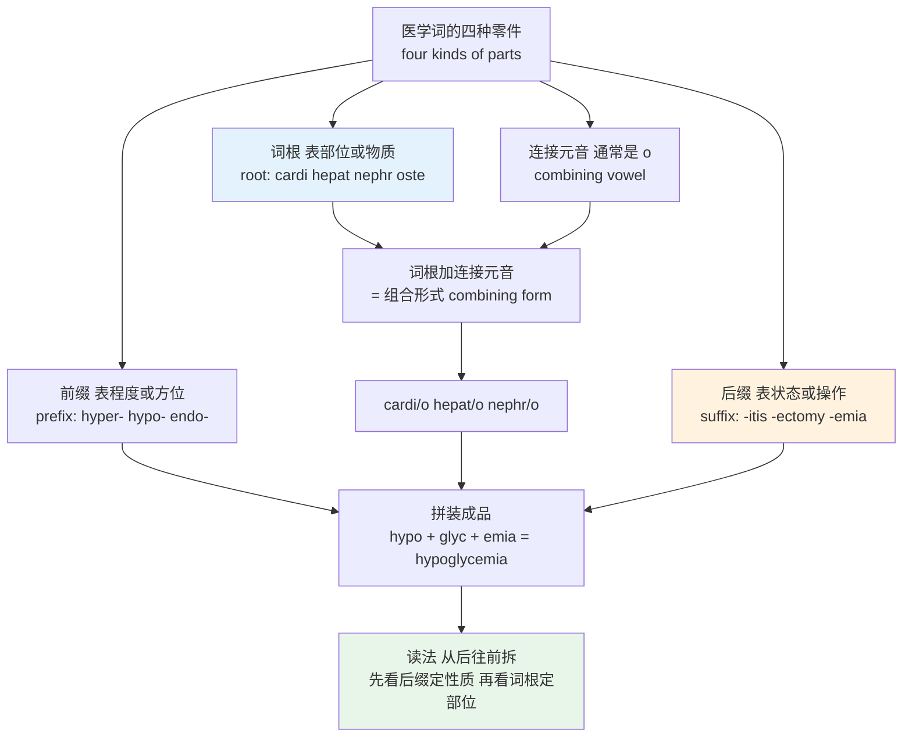
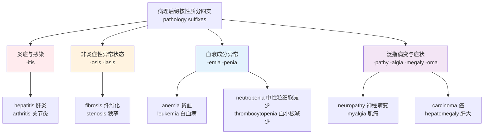
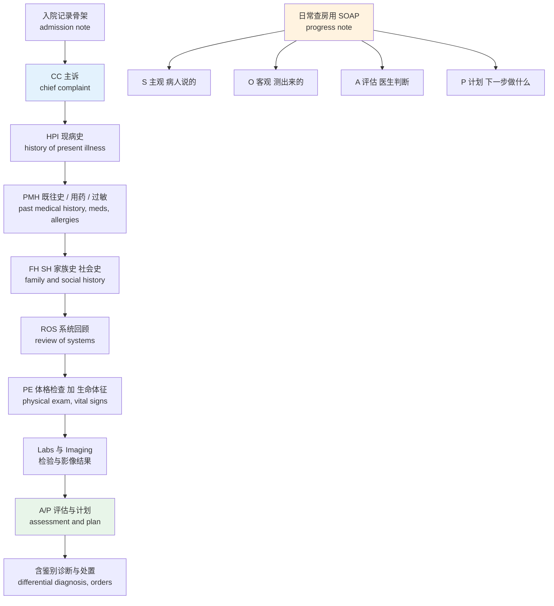
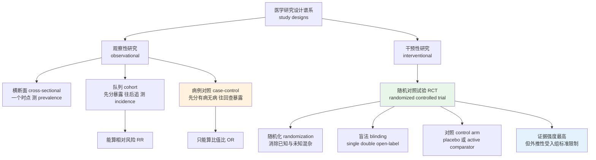
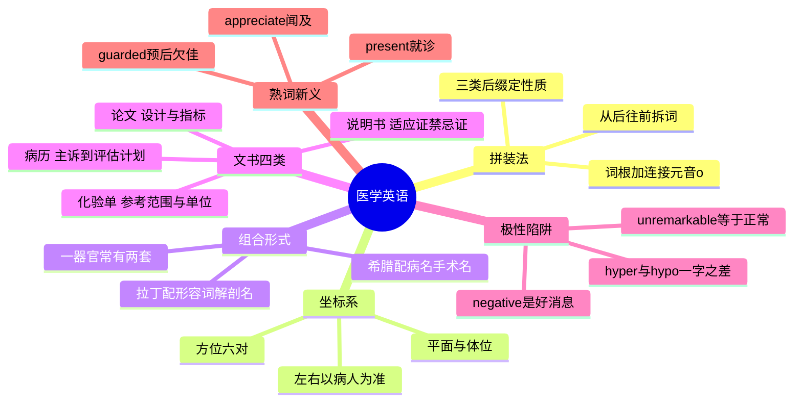

# 医学英语：解剖术语、药理、检验指标与病历论文

> [!info] 本篇定位
>
> 第二十章末篇，也是全书专业领域词汇的收尾。前九篇的领域词多半是**单词**——`indemnify`、`impedance`、`goodwill` 都得一个个记。医学英语不同：它的绝大多数长词是**拼出来的**，把三到四个希腊或拉丁成分按固定顺序串在一起，`gastr` 加 `o` 加 `enter` 加 `o` 加 `logy` 就是 gastroenterology。掌握零件表比背成品表划算得多。
>
> 面向的读者不是医学生，而是会遇到这四类文本的普通人：手里拿着一张英文化验单、一盒进口药的英文说明书、一份需要读懂的国外病历摘要，或者一篇要评估可信度的医学论文。目标是**读懂并判断**，不是开处方。
>
> 六条主线：拼装规则与三类后缀、解剖方位与体位平面、说明书与处方、化验单与影像报告、病历与诊断推理、医学研究设计与诊断试验指标。
>
> 与前面几篇的分工：病人视角的日常症状词（sore throat、stuffy nose、挂号说法）在 [[07.人体、健康与情绪/03.症状、疾病、就医科室与用药\|症状、疾病、就医科室与用药]]，本篇讲的是同一件事的**医生视角与文书视角**；身体部位的日常名在 [[07.人体、健康与情绪/01.身体部位、内脏器官与生理系统\|身体部位、内脏器官与生理系统]]；希腊词根的通用规律在 [[15.词根、合成与缩略/03.希腊词根与学科术语\|希腊词根与学科术语]]，本篇只补医学专用的拼装法；通用统计词 mean、p-value、confidence interval 在 [[19.学术通用词汇/03.学术研究、统计术语与论文写作词汇\|学术研究、统计术语与论文写作词汇]]，本篇只讲医学研究特有的那一层。

---

## 1. 本篇导读：医学词是拼出来的

`electroencephalography` 有二十三个字母，看着吓人。拆开是四段：`electro`（电）+ `encephal`（脑）+ `o`（连接元音）+ `graphy`（记录法），意思就是「脑电记录法」，缩写 EEG。同理 `esophagogastroduodenoscopy` 拆成 `esophag`（食管）+ `gastr`（胃）+ `duoden`（十二指肠）+ `scopy`（内窥检查），缩写 EGD。

这不是巧合，而是十九世纪起国际医学界刻意建立的命名约定：**新概念一律用希腊或拉丁成分拼装，不用本族语造新词**。好处是任何母语的医生看到 `nephrectomy` 都能拆出「肾」加「切除」；代价是这批词对普通英语读者完全不透明，因为拼装用的零件本身不是英语单词。

对自学者，这套约定意味着一件事：**记零件的性价比远高于记成品**。掌握四十个左右的部位组合形式和二十个左右的后缀，能覆盖医学文本里绝大部分长词，而且是可推导的——遇到没见过的 `splenomegaly`，只要知道 `splen` 是脾、`-megaly` 是肿大，就读出来了。

上图给的是拼装模型与拆词方向。拼的时候顺序是「前缀 → 词根 → 后缀」，读的时候方向相反：**先看后缀**判断这个词说的是病、是手术还是检查，**再看词根**判断落在哪个器官，最后看有没有前缀修饰程度。`hypoglycemia` 按这个顺序读是「-emia 血里的状况 → glyc 糖 → hypo 低」，合起来低血糖。这个从后往前的习惯一旦养成，长词就不再需要整词记忆。

本篇的五块内容按文本类型排列：先是拼装规则与解剖坐标系（读任何医学文本的地基），再依次是说明书与处方、化验单与影像、病历、论文。每一块的词都有明显的文体特征，同一个词在不同文体里的分量并不一样。

---

## 2. 拼装规则：词根、连接元音与三种后缀

拼装有三条硬规则，违反了就拼不出真实存在的词。

**规则一：后缀以元音开头时，去掉连接元音。** `gastr/o` 加 `-itis` 不是 gastroitis 而是 `gastritis`；`nephr/o` 加 `-ectomy` 不是 nephroectomy 而是 `nephrectomy`。反过来，后缀以辅音开头时保留连接元音：`gastr/o` 加 `-scopy` 得 `gastroscopy`，`nephr/o` 加 `-pathy` 得 `nephropathy`。

**规则二：两个词根相接时，连接元音一律保留**，哪怕第二个词根以元音开头。`gastr/o` 加 `enter/o` 加 `-logy` 得 `gastroenterology`，中间那个 o 不省。这条规则的存在是为了断词——去掉之后 gastrenterology 的音节边界会看不出来。

**规则三：连接元音默认是 o，少数词根用 i，且这批多半是拉丁来源。** 例如 `ossification`（骨化，`oss` 骨 + `i` + `fication`）、`calcification`（钙化，`calc` 钙 + `i` + `fication`）。日常遇到的九成以上是 o，把 o 当默认值不会错。

| 术语 | 英式音标 | 美式音标 | 词性 | 中文 | 搭配与说明 |
| --- | --- | --- | --- | --- | --- |
| **root** | /ruːt/ | /ruːt/ | n. | 词根 | 承载核心意义的部分，本身不能独立成词 |
| **combining form** | /kəmˈbaɪnɪŋ fɔːm/ | /kəmˈbaɪnɪŋ fɔːrm/ | n. | 组合形式 | 词根加连接元音，词典写作 cardi/o 或 cardio- |
| **combining vowel** | /kəmˈbaɪnɪŋ ˈvaʊəl/ | /kəmˈbaɪnɪŋ ˈvaʊəl/ | n. | 连接元音 | 几乎总是 o，作用是让长词可拆可读 |
| **prefix** | /ˈpriːfɪks/ | /ˈpriːfɪks/ | n. | 前缀 | 医学前缀多表程度、方位、数量与否定 |
| **suffix** | /ˈsʌfɪks/ | /ˈsʌfɪks/ | n. | 后缀 | 决定整词是病名、术式名还是检查名 |
| **compound** | /ˈkɒmpaʊnd/ | /ˈkɑːmpaʊnd/ | n./v. | 复合词；配制 | 药学里的 compounding 指按方现配 |
| **eponym** | /ˈepənɪm/ | /ˈepənɪm/ | n. | 名祖词 | 以人名命名的病或征，Parkinson's disease、Bell's palsy |
| **acronym** | /ˈækrənɪm/ | /ˈækrənɪm/ | n. | 首字母拼读词 | 医学里如 AIDS、SARS，读成一个词 |
| **initialism** | /ɪˈnɪʃəlɪzəm/ | /ɪˈnɪʃəlɪzəm/ | n. | 首字母逐个念的缩略语 | MRI、COPD、ALT，读法见 20.04 |
| **nomenclature** | /nəˈmenklətʃə/ | /ˈnoʊmənkleɪtʃər/ | n. | 命名法 | 英美重音位置不同，是本篇重音差异最大的词 |

后缀是拼装体系里信息量最大的一类，因为它单枪匹马就决定了这个词属于哪一类文书。按功能分三组：

| 后缀组 | 代表后缀 | 出现的文书 | 一句话作用 |
| --- | --- | --- | --- |
| 病理后缀 | -itis、-osis、-emia、-pathy、-algia、-megaly、-oma | 诊断栏、病历、论文 | 说明是什么毛病 |
| 操作后缀 | -ectomy、-otomy、-ostomy、-plasty、-scopy、-centesis | 手术记录、知情同意书 | 说明做了什么操作 |
| 学科后缀 | -logy、-logist、-iatrics、-iatry | 科室牌、转诊单、名片 | 说明归谁管 |

> [!tip] 拆词的三步操作
>
> 遇到不认识的长医学词，按固定顺序做三步，不要从头往后猜。
>
> ① **先切后缀**。从词尾找上表里的任一后缀，切掉，先给这个词定性——是病、是手术还是学科。
>
> ② **再切前缀**。看词首有没有 hyper-、hypo-、a-、dys-、endo- 这类修饰成分，切掉，得到程度或方位信息。
>
> ③ **剩下的就是词根**，查它对应哪个器官或物质。
>
> 用 `pericarditis` 试一遍：切 `-itis` 得炎症，切 `peri-` 得「周围」，剩 `card` 是心，合起来「心包炎」。用 `hypernatremia` 试：切 `-emia` 得血里的状况，切 `hyper-` 得过高，剩 `natr` 是钠（natrium，元素符号 Na 的来源），合起来「高钠血症」。

---

## 3. 解剖方位六对：anterior 到 medial

方位词是解剖学的坐标系，也是整个医学英语里复用率最高的一批词。它们不描述某个器官，而是描述**任何两个结构之间的相对位置**，所以从教科书到影像报告到手术记录处处都是。

关键在于：这套坐标系挂在**身体本身**上，不挂在观察者身上。不管人是站着、躺着还是倒立，鼻子永远在耳朵的 anterior 方向。这跟日常英语里 front、back、left、right 随观察角度变化完全不同，也是中文母语者最先要转过来的一个弯。

| 英文 | 英式音标 | 美式音标 | 词性 | 中文 | 搭配与说明 |
| --- | --- | --- | --- | --- | --- |
| **anterior** | /ænˈtɪəriə/ | /ænˈtɪriər/ | adj. | 前侧的；腹侧的 | 对 posterior；缩写 ant.；the anterior wall 前壁 |
| **posterior** | /pɒˈstɪəriə/ | /pɑːˈstɪriər/ | adj. | 后侧的；背侧的 | 缩写 post.；日常英语里 posterior 作名词是「臀部」的委婉说法 |
| **superior** | /suːˈpɪəriə/ | /suːˈpɪriər/ | adj. | 上方的 | 解剖义与「更优越」无关；the superior vena cava 上腔静脉 |
| **inferior** | /ɪnˈfɪəriə/ | /ɪnˈfɪriər/ | adj. | 下方的 | an inferior myocardial infarction 下壁心梗，不含贬义 |
| **proximal** | /ˈprɒksɪməl/ | /ˈprɑːksɪməl/ | adj. | 近端的 | 离躯干或起点近；the proximal phalanx 近节指骨 |
| **distal** | /ˈdɪstəl/ | /ˈdɪstəl/ | adj. | 远端的 | 离躯干或起点远；distal to the elbow 肘以远 |
| **lateral** | /ˈlætərəl/ | /ˈlætərəl/ | adj. | 外侧的 | 离正中线远；影像报告缩写 lat. |
| **medial** | /ˈmiːdiəl/ | /ˈmiːdiəl/ | adj. | 内侧的 | 离正中线近；勿与 median 中位数混，后者见 19.03 |
| **superficial** | /ˌsuːpəˈfɪʃl/ | /ˌsuːpərˈfɪʃl/ | adj. | 浅表的 | 对 deep；a superficial laceration 浅表裂伤 |
| **deep** | /diːp/ | /diːp/ | adj. | 深部的 | 解剖里的正式反义词就是 deep，没有拉丁化形式 |
| **dorsal** | /ˈdɔːsl/ | /ˈdɔːrsl/ | adj. | 背侧的 | 手足部位仍用：the dorsal surface of the hand 手背 |
| **ventral** | /ˈventrəl/ | /ˈventrəl/ | adj. | 腹侧的 | 人体解剖里多被 anterior 取代，动物解剖仍常用 |
| **cranial** | /ˈkreɪniəl/ | /ˈkreɪniəl/ | adj. | 头侧的 | 影像学常用，等价于 superior |
| **caudal** | /ˈkɔːdl/ | /ˈkɔːdl/ | adj. | 尾侧的 | cauda 尾；等价于 inferior |

这六对不是随便凑的，可以按它们各自量的是什么归成三类。头三对 anterior/posterior、superior/inferior、lateral/medial 落在三根互相垂直的轴上——前后、上下、内外，构成整个坐标系的骨架。第四对 superficial/deep 量的是**离体表的深度**，与前三根轴无关，任何位置都能再叠一层深浅判断。剩下两对是补充件：`proximal`/`distal` 只在肢体、管道这类有起点的结构上才成立（详见下面的警告），`dorsal`/`ventral` 在人体解剖里基本被 anterior/posterior 顶替，只在手背足背这类固定搭配和动物解剖里留着。`cranial`/`caudal` 则是上下轴在影像学里的另一套叫法。

> [!warning] proximal 与 distal 的基准点会移动
>
> 中文常把它们译成「近端」「远端」，但没说清近谁远谁。基准点随讨论的结构变：
>
> - 讲**四肢**时，基准是躯干。肩比肘 proximal，手指比手腕 distal。
> - 讲**血管**时，基准是心脏。主动脉根部最 proximal，末梢小动脉最 distal。
> - 讲**消化道**时，基准是口。食管是 proximal 段，直肠是 distal 段。
> - 讲**导管或器械**时，基准是**操作者**。导管的 proximal end 是握在医生手里那一头，distal tip 是进到体内那一头——这条最反直觉，读器械说明书时必须切换。
>
> 判断方法：找这句话讨论的是哪条「管道」或哪条「肢」，起点在哪，离起点近的就是 proximal。

> [!example] 方位词在真实句子里的样子
>
> - The lesion is located in the **anterior** aspect of the **left lateral** lobe.
>   - 病灶位于左叶的前外侧面。
> - Pulses were palpable **distal** to the fracture site.
>   - 骨折处以远可触及搏动。
> - There is no evidence of **deep** tissue involvement; the injury appears **superficial**.
>   - 未见深部组织受累，损伤看来是浅表的。
> - The catheter tip was advanced to the **proximal** third of the vessel.
>   - 导管尖端推进至该血管近端三分之一处。

注意上面第一句里的 `aspect`。这个词在医学文本里不是「方面」而是「面、侧」，是本篇后面熟词新义表里的常客。第二句的 `distal to` 是固定介词搭配——方位形容词后面跟 `to` 表示「相对于某点」，`proximal to`、`medial to`、`superior to` 同理，写成 `distal from` 是错的。

---

## 4. 解剖平面、体位与左右侧标记

方位词管方向，平面词管切面，体位词管姿势。这三组在影像报告与手术记录里高度共现，混为一谈会读错报告。

| 英文 | 英式音标 | 美式音标 | 词性 | 中文 | 搭配与说明 |
| --- | --- | --- | --- | --- | --- |
| **anatomical position** | /ˌænəˈtɒmɪkl pəˈzɪʃn/ | /ˌænəˈtɑːmɪkl pəˈzɪʃn/ | n. | 解剖学姿势 | 站立、面朝前、手掌朝前，全部方位词的默认参照 |
| **sagittal** | /ˈsædʒɪtl/ | /ˈsædʒɪtl/ | adj. | 矢状的 | 前后方向的纵切，把身体分成左右两半 |
| **coronal** | /kəˈrəʊnl/ | /kəˈroʊnl/ | adj. | 冠状的 | 左右方向的纵切，把身体分成前后两半；同义 frontal |
| **transverse** | /trænzˈvɜːs/ | /trænsˈvɜːrs/ | adj. | 横断的 | 水平切；CT 的默认层面，也说 axial |
| **axial** | /ˈæksiəl/ | /ˈæksiəl/ | adj. | 轴位的 | CT 与 MRI 报告里与 transverse 通用 |
| **oblique** | /əˈbliːk/ | /oʊˈbliːk/ | adj. | 斜位的 | X 光片体位之一，避开重叠结构 |
| **supine** | /ˈsuːpaɪn/ | /ˈsuːpaɪn/ | adj. | 仰卧的 | 脸朝上；记法：supine 里有 up |
| **prone** | /prəʊn/ | /proʊn/ | adj. | 俯卧的 | 脸朝下；日常义「易于……的」，be prone to errors |
| **lateral decubitus** | /ˌlætərəl dɪˈkjuːbɪtəs/ | /ˌlætərəl dɪˈkjuːbɪtəs/ | n. | 侧卧位 | 左侧卧写 left lateral decubitus |
| **erect** | /ɪˈrekt/ | /ɪˈrekt/ | adj. | 直立的 | 胸片体位，与 supine 片的心影大小判读标准不同 |
| **ipsilateral** | /ˌɪpsɪˈlætərəl/ | /ˌɪpsɪˈlætərəl/ | adj. | 同侧的 | ipse 自身；ipsilateral to the lesion 与病灶同侧 |
| **contralateral** | /ˌkɒntrəˈlætərəl/ | /ˌkɑːntrəˈlætərəl/ | adj. | 对侧的 | 脑病变引起 contralateral 肢体无力是常识性对应 |
| **bilateral** | /ˌbaɪˈlætərəl/ | /ˌbaɪˈlætərəl/ | adj. | 双侧的 | 缩写 bilat.；bilateral pneumonia 双侧肺炎 |
| **unilateral** | /ˌjuːnɪˈlætərəl/ | /ˌjuːnɪˈlætərəl/ | adj. | 单侧的 | 与外交语境的「单方面的」同形不同义 |
| **midline** | /ˈmɪdlaɪn/ | /ˈmɪdlaɪn/ | n. | 正中线 | midline shift 中线移位，颅脑 CT 的关键指标 |
| **flexion** | /ˈflekʃn/ | /ˈflekʃn/ | n. | 屈曲 | 动词 flex；对 extension |
| **extension** | /ɪkˈstenʃn/ | /ɪkˈstenʃn/ | n. | 伸展 | 关节活动度写 range of motion，缩写 ROM |
| **abduction** | /æbˈdʌkʃn/ | /æbˈdʌkʃn/ | n. | 外展 | 离开中线；与「绑架」义同形，靠语境分 |
| **adduction** | /əˈdʌkʃn/ | /əˈdʌkʃn/ | n. | 内收 | 靠近中线；ad- 向，ab- 离 |

> [!warning] 影像报告里的「左」是病人的左
>
> 这是读片最容易出事的一条约定：**报告和图像上的 left 与 right 一律以病人为准**，不是以看图的人为准。CT 与 X 光的横断面图像按惯例是「从脚往头看」，所以病人的左侧出现在图像的右边。
>
> 报告写 a mass in the right upper lobe，指的是病人的右上肺叶，跟你在屏幕上看到它在左边还是右边无关。
>
> 与此配套的两个词：`ipsilateral`（同侧）和 `contralateral`（对侧）在描述神经系统时特别关键，因为运动传导束在延髓交叉，一侧大脑病变导致的是对侧肢体症状。句子里出现 contralateral hemiparesis 时，别读成「两侧」。

`sagittal` 这个词的来历值得记一下：拉丁 `sagitta` 是箭，箭射进身体的方向就是前后方向，所以前后向的纵切叫矢状面。中文「矢」也是箭，译名是对着词源来的，两边可以互相帮助记忆。`coronal` 来自 `corona`（冠），像戴王冠那样从左右横过头顶的那个面。

---

## 5. 身体部位组合形式全表

这是本篇性价比最高的一张表。四十来个组合形式配上后面几节的后缀，能拼出医学文本里绝大部分器官相关的词。「来源」那一列的希腊或拉丁标记有用：**希腊来源的组合形式接希腊后缀（-itis、-ectomy、-osis），拉丁来源的多用于解剖学正式名**，同一器官常常两套并存，这就是为什么肾既有 renal（拉丁）又有 nephritis（希腊）。

| 组合形式 | 来源 | 含义 | 拼出来的词 |
| --- | --- | --- | --- |
| `cardi/o` | 希腊 | 心 | cardiology、carditis、cardiomyopathy、tachycardia |
| `angi/o` | 希腊 | 血管 | angiography、angioplasty、angioma |
| `vas/o` | 拉丁 | 血管、管道 | vasodilation、vasoconstriction、vascular |
| `hem/o`、`hemat/o` | 希腊 | 血 | hemoglobin、hematology、hemorrhage、hematoma |
| `pulmon/o` | 拉丁 | 肺 | pulmonary、pulmonologist |
| `pneum/o`、`pneumon/o` | 希腊 | 肺、气 | pneumonia、pneumothorax、pneumonectomy |
| `hepat/o` | 希腊 | 肝 | hepatitis、hepatology、hepatomegaly、hepatic |
| `nephr/o` | 希腊 | 肾 | nephritis、nephrology、nephrectomy、nephropathy |
| `ren/o` | 拉丁 | 肾 | renal、renal failure、adrenal |
| `gastr/o` | 希腊 | 胃 | gastritis、gastroscopy、gastrectomy |
| `enter/o` | 希腊 | 肠 | enteritis、gastroenterology、parenteral |
| `col/o`、`colon/o` | 希腊 | 结肠 | colitis、colonoscopy、colectomy |
| `oste/o` | 希腊 | 骨 | osteoporosis、osteoarthritis、osteotomy |
| `arthr/o` | 希腊 | 关节 | arthritis、arthroscopy、arthroplasty |
| `my/o` | 希腊 | 肌肉 | myocardium、myalgia、myopathy |
| `neur/o` | 希腊 | 神经 | neurology、neuropathy、neuralgia |
| `encephal/o` | 希腊 | 脑 | encephalitis、encephalopathy、EEG |
| `cerebr/o` | 拉丁 | 大脑 | cerebral、cerebrovascular、CVA |
| `derm/o`、`dermat/o` | 希腊 | 皮肤 | dermatitis、dermatology、epidermis |
| `cutane/o` | 拉丁 | 皮肤 | subcutaneous、percutaneous |
| `ocul/o`、`ophthalm/o` | 拉丁 / 希腊 | 眼 | ocular、ophthalmology、ophthalmoscope |
| `ot/o` | 希腊 | 耳 | otitis、otoscope、ENT 的 otolaryngology |
| `rhin/o` | 希腊 | 鼻 | rhinitis、rhinoplasty |
| `laryng/o` | 希腊 | 喉 | laryngitis、laryngoscopy |
| `pharyng/o` | 希腊 | 咽 | pharyngitis |
| `bronch/o` | 希腊 | 支气管 | bronchitis、bronchoscopy、bronchodilator |
| `thorac/o` | 希腊 | 胸 | thoracic、thoracentesis、thoracotomy |
| `abdomin/o` | 拉丁 | 腹 | abdominal、abdominopelvic |
| `lapar/o` | 希腊 | 腹壁 | laparoscopy、laparotomy |
| `cyst/o` | 希腊 | 囊、膀胱 | cystitis、cystoscopy、cyst |
| `hyster/o`、`uter/o` | 希腊 / 拉丁 | 子宫 | hysterectomy、uterine |
| `mamm/o`、`mast/o` | 拉丁 / 希腊 | 乳房 | mammography、mastectomy |
| `pancreat/o` | 希腊 | 胰 | pancreatitis、pancreatic |
| `splen/o` | 希腊 | 脾 | splenomegaly、splenectomy |
| `chol/e`、`cholecyst/o` | 希腊 | 胆汁、胆囊 | cholesterol、cholecystectomy |
| `glyc/o`、`gluc/o` | 希腊 | 糖 | hyperglycemia、glucose、glycogen |
| `lip/o` | 希腊 | 脂 | lipid、liposuction、hyperlipidemia |
| `carcin/o` | 希腊 | 癌 | carcinoma、carcinogen |
| `onc/o` | 希腊 | 肿块 | oncology、oncologist |
| `path/o` | 希腊 | 病 | pathology、pathogen、pathogenesis |
| `pyr/o`、`febr/i` | 希腊 / 拉丁 | 热 | pyrexia、antipyretic、febrile、afebrile |
| `tox/o` | 希腊 | 毒 | toxicity、toxicology、detoxification |

配套的实际词条，挑读者最可能真的遇到的一批：

| 英文 | 英式音标 | 美式音标 | 词性 | 中文 | 搭配与说明 |
| --- | --- | --- | --- | --- | --- |
| **cardiac** | /ˈkɑːdiæk/ | /ˈkɑːrdiæk/ | adj. | 心脏的 | cardiac arrest 心脏骤停；cardiac output 心输出量 |
| **hepatic** | /hɪˈpætɪk/ | /hɪˈpætɪk/ | adj. | 肝的 | hepatic impairment 肝功能损害，说明书高频 |
| **renal** | /ˈriːnl/ | /ˈriːnl/ | adj. | 肾的 | renal failure 肾衰；renal clearance 肾清除率 |
| **pulmonary** | /ˈpʌlmənəri/ | /ˈpʊlməneri/ | adj. | 肺的 | 英美元音不同；pulmonary embolism 肺栓塞 |
| **gastric** | /ˈɡæstrɪk/ | /ˈɡæstrɪk/ | adj. | 胃的 | gastric ulcer 胃溃疡；gastric emptying 胃排空 |
| **cerebral** | /ˈserəbrəl/ | /səˈriːbrəl/ | adj. | 大脑的 | 英美重音位置不同，是本节最易读错的词 |
| **subcutaneous** | /ˌsʌbkjuˈteɪniəs/ | /ˌsʌbkjuˈteɪniəs/ | adj. | 皮下的 | 给药途径缩写 SC 或 subQ |
| **percutaneous** | /ˌpɜːkjuˈteɪniəs/ | /ˌpɜːrkjuˈteɪniəs/ | adj. | 经皮的 | per 通过；PCI 经皮冠脉介入 |
| **intravenous** | /ˌɪntrəˈviːnəs/ | /ˌɪntrəˈviːnəs/ | adj. | 静脉内的 | 缩写 IV，口语念 /ˌaɪ ˈviː/ |
| **febrile** | /ˈfiːbraɪl/ | /ˈfebrəl/ | adj. | 发热的 | 英美读音差异明显；afebrile 不发热的 |
| **hepatomegaly** | /ˌhepətəʊˈmeɡəli/ | /ˌhepətoʊˈmeɡəli/ | n. | 肝肿大 | 体检报告写 no hepatomegaly 即肝不大 |
| **splenomegaly** | /ˌspliːnəʊˈmeɡəli/ | /ˌspliːnoʊˈmeɡəli/ | n. | 脾肿大 | 与 hepatomegaly 合称 hepatosplenomegaly |
| **cholecystectomy** | /ˌkɒlɪsɪˈstektəmi/ | /ˌkoʊlɪsɪˈstektəmi/ | n. | 胆囊切除术 | 腹腔镜做的写 laparoscopic cholecystectomy |
| **pathogen** | /ˈpæθədʒən/ | /ˈpæθədʒən/ | n. | 病原体 | 形容词 pathogenic；对 commensal 共生菌 |

> [!tip] 一个器官两套词根怎么记
>
> 肾有 `nephr/o`（希腊）和 `ren/o`（拉丁），肺有 `pneumon/o` 和 `pulmon/o`，皮肤有 `dermat/o` 和 `cutane/o`。规律是：
>
> - **希腊那套多出现在病名与手术名**：nephritis、nephrectomy、pneumonia、dermatitis
> - **拉丁那套多出现在形容词与解剖名**：renal artery、pulmonary vein、subcutaneous tissue
>
> 所以「肾衰竭」是 renal failure（形容词位），「肾炎」是 nephritis（病名位），两个词都对，各占各的槽。记的时候按槽位记，不要试图统一。

---

## 6. 病理后缀：-itis、-osis、-emia、-pathy 一族

后缀决定一个词说的是哪一类毛病。这一组是读诊断栏和论文标题的主力。

上图按「病理性质」把后缀分成四支，这个分法在读诊断时直接可用：看到 `-itis` 就知道要问「感染还是自身免疫」，看到 `-osis` 就知道不是急性炎症而是慢性结构改变，看到 `-emia` 就知道该去化验单上找对应的数值，看到 `-oma` 就要接着判断良恶性。四支的处置逻辑完全不同，认后缀等于先做了一次粗分诊。

| 后缀 | 含义 | 例词 | 注意 |
| --- | --- | --- | --- |
| `-itis` | 炎症 | hepatitis、arthritis、appendicitis | 复数是 -itides，很少用到 |
| `-osis` | 异常状态、增多 | fibrosis、stenosis、thrombosis | 不含炎症义；复数 -oses |
| `-iasis` | 病态、结石 | cholelithiasis 胆石症 | 多与结石、寄生虫连用 |
| `-emia` | 血中某物的状况 | anemia、hyperglycemia、bacteremia | 英式拼 -aemia |
| `-penia` | 减少、缺乏 | leukopenia、neutropenia、osteopenia | 与 -cytosis 增多相对 |
| `-pathy` | 病变（泛指） | neuropathy、nephropathy、myopathy | 说不出具体机制时的通用词 |
| `-algia` | 疼痛 | myalgia、neuralgia、arthralgia | 与 -dynia 同义，后者少见 |
| `-megaly` | 肿大 | hepatomegaly、cardiomegaly | 只描述尺寸，不判断性质 |
| `-oma` | 肿块、瘤 | carcinoma、adenoma、hematoma | hematoma 是血肿不是瘤 |
| `-rrhea` | 流出、溢出 | diarrhea、rhinorrhea | 英式拼 -rrhoea |
| `-rrhage` | 出血 | hemorrhage | 名词 hemorrhage 也可作动词 |
| `-sclerosis` | 硬化 | atherosclerosis、multiple sclerosis | scleros 硬 |
| `-plegia` | 麻痹 | paraplegia、hemiplegia | -paresis 是不完全性无力 |
| `-emesis` | 呕吐 | hematemesis 呕血 | antiemetic 止吐药 |

| 英文 | 英式音标 | 美式音标 | 词性 | 中文 | 搭配与说明 |
| --- | --- | --- | --- | --- | --- |
| **inflammation** | /ˌɪnfləˈmeɪʃn/ | /ˌɪnfləˈmeɪʃn/ | n. | 炎症 | 形容词 inflammatory；anti-inflammatory 抗炎的 |
| **infection** | /ɪnˈfekʃn/ | /ɪnˈfekʃn/ | n. | 感染 | 炎症不等于感染，读报告时两词不可互换 |
| **anemia** | /əˈniːmiə/ | /əˈniːmiə/ | n. | 贫血 | 英式拼 anaemia；形容词 anemic |
| **ischemia** | /ɪˈskiːmiə/ | /ɪˈskiːmiə/ | n. | 缺血 | 英式拼 ischaemia；形容词 ischemic |
| **infarction** | /ɪnˈfɑːkʃn/ | /ɪnˈfɑːrkʃn/ | n. | 梗死 | myocardial infarction 心梗，缩写 MI |
| **thrombosis** | /θrɒmˈbəʊsɪs/ | /θrɑːmˈboʊsɪs/ | n. | 血栓形成 | deep vein thrombosis 深静脉血栓，缩写 DVT |
| **embolism** | /ˈembəlɪzəm/ | /ˈembəlɪzəm/ | n. | 栓塞 | 栓子叫 embolus，复数 emboli |
| **stenosis** | /stɪˈnəʊsɪs/ | /stəˈnoʊsɪs/ | n. | 狭窄 | 对 dilation 扩张；aortic stenosis 主动脉瓣狭窄 |
| **fibrosis** | /faɪˈbrəʊsɪs/ | /faɪˈbroʊsɪs/ | n. | 纤维化 | pulmonary fibrosis 肺纤维化，不可逆 |
| **necrosis** | /neˈkrəʊsɪs/ | /nəˈkroʊsɪs/ | n. | 坏死 | 形容词 necrotic |
| **edema** | /ɪˈdiːmə/ | /ɪˈdiːmə/ | n. | 水肿 | 英式拼 oedema；pitting edema 凹陷性水肿 |
| **hemorrhage** | /ˈhemərɪdʒ/ | /ˈhemərɪdʒ/ | n./v. | 出血 | 重音在首音节，中间不读 /reɪ/ |
| **hematoma** | /ˌhiːməˈtəʊmə/ | /ˌhiːməˈtoʊmə/ | n. | 血肿 | -oma 在这里指积块不是肿瘤 |
| **metastasis** | /məˈtæstəsɪs/ | /məˈtæstəsɪs/ | n. | 转移 | 复数 metastases；动词 metastasize |
| **carcinoma** | /ˌkɑːsɪˈnəʊmə/ | /ˌkɑːrsɪˈnoʊmə/ | n. | 癌 | 上皮来源；sarcoma 是间叶来源的肉瘤 |
| **lesion** | /ˈliːʒn/ | /ˈliːʒn/ | n. | 病灶、损害 | 影像报告的万能词，不含良恶判断 |

> [!warning] -itis 与 -osis 不能互相替换
>
> 最典型的一对是 `osteoarthritis`（骨关节炎）与 `osteoporosis`（骨质疏松）。前者有 `-itis`，是关节的炎症性与退变性改变；后者是 `-osis`，是骨密度下降这个**状态**，本身不发炎、不疼。两个病的中文名都带「骨」，英文靠后缀分得很清楚。
>
> 同理 `dermatitis`（皮炎）与 `dermatosis`（皮肤病的统称），`nephritis`（肾炎）与 `nephrosis`（肾病综合征相关的肾小管变性）。反过来把后缀换掉不一定能造出词：osteoporitis 根本不存在，而 `osteoarthrosis` 确实存在——它是 osteoarthritis 的旧称与欧洲文献用法，正是因为有人认为这个病的主体是退变而非炎症才这样叫。两个词指同一个病，但检索时得两个都试。

---

## 7. 手术与操作后缀：-ectomy、-otomy、-ostomy、-scopy

这一组出现在手术记录、知情同意书和病历的处置栏。三个形近后缀 `-ectomy`、`-otomy`、`-ostomy` 是全篇最需要盯紧的一处，因为它们只差一两个字母，含义却分别是「切掉」「切开」「造口」。

| 后缀 | 含义 | 例词 | 关键区别 |
| --- | --- | --- | --- |
| `-ectomy` | 切除（拿走） | appendectomy、nephrectomy、mastectomy | ec- 出，器官被取走 |
| `-otomy` | 切开（不取走） | thoracotomy、laparotomy、tracheotomy | 只是切开进去 |
| `-ostomy` | 造口（做出永久或临时开口） | colostomy、tracheostomy、gastrostomy | 留下一个通向体外或另一器官的口 |
| `-scopy` | 内窥检查 | endoscopy、colonoscopy、bronchoscopy | 器械叫 -scope |
| `-graphy` | 影像记录法 | angiography、mammography | 出来的片子叫 -gram |
| `-gram` | 记录出来的图 | electrocardiogram、angiogram | ECG 是图，ECG machine 是设备 |
| `-plasty` | 整形、修复 | angioplasty、arthroplasty、rhinoplasty | 修复形态与功能 |
| `-pexy` | 固定术 | nephropexy、orchiopexy | 把移位器官固定回去 |
| `-rrhaphy` | 缝合术 | herniorrhaphy 疝修补缝合 | 与 -plasty 常配套 |
| `-centesis` | 穿刺抽液 | thoracentesis、amniocentesis、paracentesis | 抽出液体做检查或减压 |
| `-lysis` | 松解、分解 | adhesiolysis、dialysis、hemolysis | dialysis 透析是最常见的一个 |
| `-desis` | 融合固定术 | arthrodesis 关节融合术 | 与 -plasty 相反：不保活动度 |

| 英文 | 英式音标 | 美式音标 | 词性 | 中文 | 搭配与说明 |
| --- | --- | --- | --- | --- | --- |
| **appendectomy** | /ˌæpənˈdektəmi/ | /ˌæpənˈdektəmi/ | n. | 阑尾切除术 | 英式也写 appendicectomy |
| **laparotomy** | /ˌlæpəˈrɒtəmi/ | /ˌlæpəˈrɑːtəmi/ | n. | 剖腹探查术 | 开腹；对 laparoscopy 腹腔镜 |
| **laparoscopy** | /ˌlæpəˈrɒskəpi/ | /ˌlæpəˈrɑːskəpi/ | n. | 腹腔镜检查 | 形容词 laparoscopic，微创手术的标配修饰语 |
| **colonoscopy** | /ˌkɒləˈnɒskəpi/ | /ˌkoʊləˈnɑːskəpi/ | n. | 结肠镜检查 | 术前准备说 bowel prep |
| **endoscopy** | /enˈdɒskəpi/ | /enˈdɑːskəpi/ | n. | 内窥镜检查 | endo- 内 + skopein 看 |
| **biopsy** | /ˈbaɪɒpsi/ | /ˈbaɪɑːpsi/ | n./v. | 活检 | bios 生 + opsis 看；needle biopsy 穿刺活检 |
| **angioplasty** | /ˈændʒiəʊˌplæsti/ | /ˈændʒioʊˌplæsti/ | n. | 血管成形术 | 常与 stent 支架连用 |
| **anastomosis** | /əˌnæstəˈməʊsɪs/ | /əˌnæstəˈmoʊsɪs/ | n. | 吻合术 | 把两段管道接起来；复数 anastomoses |
| **resection** | /rɪˈsekʃn/ | /rɪˈsekʃn/ | n. | 切除术 | 与 -ectomy 同义的拉丁说法，部分切除写 partial resection |
| **excision** | /ɪkˈsɪʒn/ | /ɪkˈsɪʒn/ | n. | 切除 | 多指局部病灶切除；动词 excise |
| **incision** | /ɪnˈsɪʒn/ | /ɪnˈsɪʒn/ | n. | 切口 | 与 excision 只差一个字母，一个是切开一个是切掉 |
| **suture** | /ˈsuːtʃə/ | /ˈsuːtʃər/ | n./v. | 缝线；缝合 | 拆线说 remove the sutures 或 take the stitches out |
| **catheter** | /ˈkæθɪtə/ | /ˈkæθətər/ | n. | 导管 | 重音在首音节；动词 catheterize |
| **prophylaxis** | /ˌprɒfɪˈlæksɪs/ | /ˌproʊfəˈlæksɪs/ | n. | 预防（措施） | 形容词 prophylactic；术前预防性抗生素 |
| **elective** | /ɪˈlektɪv/ | /ɪˈlektɪv/ | adj. | 择期的 | elective surgery 择期手术，对 emergency surgery |

> [!warning] tracheotomy 与 tracheostomy 差在有没有留口
>
> 三个后缀的差别落到具体词上：
>
> - `tracheotomy` = 切开气管这个**动作**
> - `tracheostomy` = 切开后**留下一个开口**并放置套管，这个开口本身也叫 tracheostomy
> - `colostomy` = 把结肠断端引到腹壁做的**永久或临时造口**，袋子叫 ostomy bag
>
> 判断口诀是看中间那个字母：`-o-tomy` 只有一个 o 在词根后，是切开；`-o-stomy` 多一个 s，`stoma` 在希腊语里就是「口」，所以是造口。记住 `stoma` = 口，这三个词永远分得开。

---

## 8. 程度与状态前缀：hyper-、hypo-、tachy-、brady-

前缀在医学词里承担程度与方位修饰。数量与程度前缀的通用规律见 [[14.构词法：前缀与后缀/04.数量、程度与规模前缀\|数量、程度与规模前缀]]，这里只收医学语境高频且容易读错的一批。

| 前缀 | 含义 | 例词 | 对立面 |
| --- | --- | --- | --- |
| `hyper-` | 过高、过度 | hypertension、hyperglycemia、hyperthyroidism | hypo- |
| `hypo-` | 过低、不足 | hypotension、hypoglycemia、hypoxia | hyper- |
| `tachy-` | 快 | tachycardia、tachypnea | brady- |
| `brady-` | 慢 | bradycardia、bradypnea | tachy- |
| `poly-` | 多 | polyuria、polydipsia、polyphagia | oligo- |
| `oligo-` | 少 | oliguria、oligemia | poly- |
| `a-`、`an-` | 无、缺 | apnea、anuria、asymptomatic | — |
| `dys-` | 困难、异常 | dyspnea、dysphagia、dysplasia | eu- 正常 |
| `endo-` | 内 | endoscopy、endocarditis、endocrine | exo-、ecto- |
| `peri-` | 周围 | pericarditis、perioperative、peripheral | — |
| `intra-` | 内部 | intravenous、intramuscular、intracranial | extra- |
| `inter-` | 之间 | intercostal 肋间的、interstitial 间质的 | — |
| `sub-` | 下 | subcutaneous、sublingual、subacute | supra- |
| `supra-` | 上 | supraventricular、supraclavicular | sub- |
| `pre-`、`post-` | 前、后 | preoperative、postoperative、postprandial | 互为对立 |
| `anti-` | 抗 | antibiotic、antipyretic、anticoagulant | pro- |
| `iatro-` | 医生 | iatrogenic 医源性的 | — |
| `noso-` | 医院、疾病 | nosocomial 医院获得性的 | community-acquired |

| 英文 | 英式音标 | 美式音标 | 词性 | 中文 | 搭配与说明 |
| --- | --- | --- | --- | --- | --- |
| **hypertension** | /ˌhaɪpəˈtenʃn/ | /ˌhaɪpərˈtenʃn/ | n. | 高血压 | 缩写 HTN；病人也说 high blood pressure |
| **hypotension** | /ˌhaɪpəʊˈtenʃn/ | /ˌhaɪpoʊˈtenʃn/ | n. | 低血压 | orthostatic hypotension 体位性低血压 |
| **hyperglycemia** | /ˌhaɪpəɡlaɪˈsiːmiə/ | /ˌhaɪpərɡlaɪˈsiːmiə/ | n. | 高血糖 | 英式拼 hyperglycaemia |
| **hypoglycemia** | /ˌhaɪpəʊɡlaɪˈsiːmiə/ | /ˌhaɪpoʊɡlaɪˈsiːmiə/ | n. | 低血糖 | 与上一条只差一个字母，处置完全相反 |
| **tachycardia** | /ˌtækɪˈkɑːdiə/ | /ˌtækɪˈkɑːrdiə/ | n. | 心动过速 | 成人静息心率超过 100 次每分 |
| **bradycardia** | /ˌbrædɪˈkɑːdiə/ | /ˌbrædɪˈkɑːrdiə/ | n. | 心动过缓 | 低于 60 次每分 |
| **dyspnea** | /dɪspˈniːə/ | /dɪspˈniːə/ | n. | 呼吸困难 | 英式拼 dyspnoea；病人说 short of breath，缩写 SOB |
| **apnea** | /æpˈniːə/ | /ˈæpniə/ | n. | 呼吸暂停 | 英式拼 apnoea 且重音在后；sleep apnea 睡眠呼吸暂停 |
| **dysphagia** | /dɪsˈfeɪdʒə/ | /dɪsˈfeɪdʒə/ | n. | 吞咽困难 | 勿与 dysphasia 言语障碍混，两词只差一个字母 |
| **asymptomatic** | /ˌeɪsɪmptəˈmætɪk/ | /ˌeɪsɪmptəˈmætɪk/ | adj. | 无症状的 | 流行病学高频；对 symptomatic |
| **iatrogenic** | /aɪˌætrəˈdʒenɪk/ | /aɪˌætrəˈdʒenɪk/ | adj. | 医源性的 | 由医疗行为本身造成的损害 |
| **nosocomial** | /ˌnɒsəˈkəʊmiəl/ | /ˌnɑːsəˈkoʊmiəl/ | adj. | 医院获得性的 | 现代文献多改用 healthcare-associated |
| **peripheral** | /pəˈrɪfərəl/ | /pəˈrɪfərəl/ | adj. | 外周的 | peripheral neuropathy 周围神经病变；IT 义指外设 |
| **systemic** | /sɪˈstemɪk/ | /sɪˈstemɪk/ | adj. | 全身性的 | 对 local 局部的；systemic therapy 全身治疗 |
| **topical** | /ˈtɒpɪkl/ | /ˈtɑːpɪkl/ | adj. | 局部外用的 | topical cream 外用乳膏；日常义「话题的」 |

> [!warning] hyper- 与 hypo- 是本篇后果最重的一对
>
> 在剂量与化验语境里，这一个字母之差方向完全相反：
>
> - `hyperkalemia` 高钾血症 与 `hypokalemia` 低钾血症
> - `hyperthyroidism` 甲亢 与 `hypothyroidism` 甲减
> - `hypervolemia` 血容量过多 与 `hypovolemia` 血容量不足
>
> 两者的 y 都读 /aɪ/，重音格局也相同（首音节次重音、词干里主重音），唯一的听觉线索在**第二个音节的元音**：`hyper-` 是 /ə/（美式因儿化读成 /ər/），`hypo-` 是 /əʊ/ 或 /oʊ/。对比 hyperglycemia /ˌhaɪpərɡlaɪˈsiːmiə/ 与 hypoglycemia /ˌhaɪpoʊɡlaɪˈsiːmiə/：差别只在那一个元音上，语速一快就听不出，所以口头交接班时医生往往会补一句 high 或 low。读文本时唯一可靠的办法是把词首这一段单独看一遍再往下读，不要靠整词的视觉轮廓。
>
> 挂钩记法：`hyper-` = `super-`，`hypo-` = `sub-`。`hypodermic needle`（皮下注射针）扎的是皮**下**，正好印证 hypo- 是「下」。

---

## 9. 科室名回收：-logy 与 -logist 的两条链

科室名在 [[07.人体、健康与情绪/03.症状、疾病、就医科室与用药\|症状、疾病、就医科室与用药]] 里作为挂号整句出现过（See a dermatologist），当时不拆词根。现在零件齐了，回过头来把这批词按构词收编。

规则很简单：**组合形式 + `-logy` 是学科与科室，把 `-logy` 换成 `-logist` 就是医生**。少数科室不走这条路，走 `-iatrics`（诊治某人群）或 `-iatry`（医术），对应的医生是 `-iatrician` 或 `-iatrist`。

| 英文 | 英式音标 | 美式音标 | 词性 | 中文 | 搭配与说明 |
| --- | --- | --- | --- | --- | --- |
| **cardiology** | /ˌkɑːdiˈɒlədʒi/ | /ˌkɑːrdiˈɑːlədʒi/ | n. | 心内科 | 医生 cardiologist；心外科是 cardiac surgery |
| **dermatology** | /ˌdɜːməˈtɒlədʒi/ | /ˌdɜːrməˈtɑːlədʒi/ | n. | 皮肤科 | 医生 dermatologist，口语缩短成 derm |
| **neurology** | /njʊəˈrɒlədʒi/ | /nʊˈrɑːlədʒi/ | n. | 神经内科 | 医生 neurologist；神经外科 neurosurgery |
| **gastroenterology** | /ˌɡæstrəʊentəˈrɒlədʒi/ | /ˌɡæstroʊentəˈrɑːlədʒi/ | n. | 消化内科 | 口语缩成 GI；医生 gastroenterologist |
| **nephrology** | /nɪˈfrɒlədʒi/ | /nɪˈfrɑːlədʒi/ | n. | 肾内科 | 泌尿外科是 urology，两者常被混 |
| **urology** | /jʊəˈrɒlədʒi/ | /jʊˈrɑːlədʒi/ | n. | 泌尿外科 | 属外科；医生 urologist |
| **oncology** | /ɒŋˈkɒlədʒi/ | /ɑːŋˈkɑːlədʒi/ | n. | 肿瘤科 | medical oncology 内科肿瘤，radiation oncology 放疗科 |
| **hematology** | /ˌhiːməˈtɒlədʒi/ | /ˌhiːməˈtɑːlədʒi/ | n. | 血液科 | 英式拼 haematology |
| **endocrinology** | /ˌendəʊkrɪˈnɒlədʒi/ | /ˌendoʊkrəˈnɑːlədʒi/ | n. | 内分泌科 | 糖尿病与甲状腺归这里 |
| **rheumatology** | /ˌruːməˈtɒlədʒi/ | /ˌruːməˈtɑːlədʒi/ | n. | 风湿免疫科 | 自身免疫病归口 |
| **ophthalmology** | /ˌɒfθælˈmɒlədʒi/ | /ˌɑːfθælˈmɑːlədʒi/ | n. | 眼科 | 拼写陷阱：ophth 有两个 h，常被误拼 opth |
| **otolaryngology** | /ˌəʊtəʊˌlærɪŋˈɡɒlədʒi/ | /ˌoʊtoʊˌlærɪŋˈɡɑːlədʒi/ | n. | 耳鼻喉科 | 日常一律说 ENT，全称几乎只出现在文书上 |
| **radiology** | /ˌreɪdiˈɒlədʒi/ | /ˌreɪdiˈɑːlədʒi/ | n. | 影像科 | 出报告的是 radiologist，拍片的是 radiographer |
| **pathology** | /pəˈθɒlədʒi/ | /pəˈθɑːlədʒi/ | n. | 病理科 | 病理报告叫 pathology report 或口语 the path |
| **anesthesiology** | /ˌænəsˌθiːziˈɒlədʒi/ | /ˌænəsˌθiːziˈɑːlədʒi/ | n. | 麻醉科 | 英式拼 anaesthesiology 并多说 anaesthetics |
| **pediatrics** | /ˌpiːdiˈætrɪks/ | /ˌpiːdiˈætrɪks/ | n. | 儿科 | 英式拼 paediatrics；医生 pediatrician |
| **geriatrics** | /ˌdʒeriˈætrɪks/ | /ˌdʒeriˈætrɪks/ | n. | 老年医学科 | 医生 geriatrician |
| **psychiatry** | /saɪˈkaɪətri/ | /səˈkaɪətri/ | n. | 精神科 | 医生 psychiatrist 是医生，psychologist 不是 |
| **obstetrics** | /əbˈstetrɪks/ | /əbˈstetrɪks/ | n. | 产科 | 与妇科合称 OB-GYN |
| **gynecology** | /ˌɡaɪnəˈkɒlədʒi/ | /ˌɡaɪnəˈkɑːlədʒi/ | n. | 妇科 | 英式拼 gynaecology |
| **orthopedics** | /ˌɔːθəˈpiːdɪks/ | /ˌɔːrθəˈpiːdɪks/ | n. | 骨科 | 英式拼 orthopaedics；口语 ortho |
| **immunology** | /ˌɪmjuˈnɒlədʒi/ | /ˌɪmjəˈnɑːlədʒi/ | n. | 免疫学 | 与 rheumatology 在临床上常合科 |
| **epidemiology** | /ˌepɪˌdiːmiˈɒlədʒi/ | /ˌepɪˌdiːmiˈɑːlədʒi/ | n. | 流行病学 | 不是临床科室，是研究学科，第 18 节的主场 |
| **pharmacology** | /ˌfɑːməˈkɒlədʒi/ | /ˌfɑːrməˈkɑːlədʒi/ | n. | 药理学 | 药剂科是 pharmacy，药师是 pharmacist |

> [!warning] 英美医院分区词的三处硬差异
>
> 英美差异的通用规律见 [[18.语域、英美差异与习语俚语/01.英式与美式词汇差异\|英式与美式词汇差异]]，医院场景里下面三处最影响读懂：
>
> | 概念 | 英式 | 美式 |
> | --- | --- | --- |
> | 急诊 | A&E（Accident and Emergency），口语 casualty | ER（Emergency Room）或 ED |
> | 全科医生 | GP（General Practitioner） | PCP（Primary Care Physician）或 family doctor |
> | 门诊手术室与诊所 | surgery 指的是**诊室**，doctor's surgery | surgery 只表示手术，诊室说 office |
>
> 最容易误读的是第三条。英式句子 The surgery is closed on Sundays 说的是诊所周日不开门，不是「周日不做手术」。同理 surgery hours 是门诊时间。
>
> 另有一处拼写系统差异：**英式在这批词里保留 ae 与 oe**，anaemia、oedema、haematology、paediatrics、diarrhoea、gynaecology、anaesthesia；美式一律简化成 e。数据库检索时两种拼法都得试。

---

## 10. 病历骨架：chief complaint 到 assessment and plan

病历是格式高度固定的文体，骨架几十年没变。认得骨架，一份陌生病历也能定位到想找的那一段。

上图左边是入院记录的全套骨架，右边是查房进展记录用的四段式 SOAP。两者的分界线在于**信息来源**：从 CC 到 ROS 全是病人口述的 subjective 部分，从 PE 往下全是测量与检查得来的 objective 部分。SOAP 只是把这条分界线显式写进了小标题里。读病历时先判断自己在哪一半，能避免把病人的主观陈述当成客观发现。

| 英文 | 英式音标 | 美式音标 | 词性 | 中文 | 搭配与说明 |
| --- | --- | --- | --- | --- | --- |
| **chief complaint** | /tʃiːf kəmˈpleɪnt/ | /tʃiːf kəmˈpleɪnt/ | n. | 主诉 | 缩写 CC；英式也说 presenting complaint |
| **history of present illness** | /ˈhɪstri əv ˈpreznt ˈɪlnəs/ | /ˈhɪstri əv ˈpreznt ˈɪlnəs/ | n. | 现病史 | 缩写 HPI，病历里篇幅最长的一段 |
| **past medical history** | /pɑːst ˈmedɪkl ˈhɪstri/ | /pæst ˈmedɪkl ˈhɪstri/ | n. | 既往史 | 缩写 PMH；PSH 是既往手术史 |
| **review of systems** | /rɪˈvjuː əv ˈsɪstəmz/ | /rɪˈvjuː əv ˈsɪstəmz/ | n. | 系统回顾 | 缩写 ROS，逐系统问一遍有无症状 |
| **physical examination** | /ˈfɪzɪkl ɪɡˌzæmɪˈneɪʃn/ | /ˈfɪzɪkl ɪɡˌzæmɪˈneɪʃn/ | n. | 体格检查 | 缩写 PE，口语说 the physical |
| **vital signs** | /ˈvaɪtl saɪnz/ | /ˈvaɪtl saɪnz/ | n. | 生命体征 | 口语缩成 vitals；含体温脉搏呼吸血压 |
| **assessment** | /əˈsesmənt/ | /əˈsesmənt/ | n. | 评估 | 病历里指医生的判断段，不是「考核」 |
| **impression** | /ɪmˈpreʃn/ | /ɪmˈpreʃn/ | n. | 印象（初步判断） | 影像报告结尾的 IMPRESSION 段是全篇结论 |
| **disposition** | /ˌdɪspəˈzɪʃn/ | /ˌdɪspəˈzɪʃn/ | n. | 去向处置 | 急诊记录末段：收住院、留观还是回家 |
| **admit** | /ədˈmɪt/ | /ədˈmɪt/ | v. | 收住院 | be admitted to the ICU；日常义「承认」 |
| **discharge** | /ˈdɪstʃɑːdʒ/ | /ˈdɪstʃɑːrdʒ/ | n./v. | 出院；分泌物 | 名词重音在首，动词在后；两个义项都高频 |
| **referral** | /rɪˈfɜːrəl/ | /rɪˈfɜːrəl/ | n. | 转诊 | refer the patient to cardiology |
| **consult** | /kənˈsʌlt/ | /kənˈsʌlt/ | n./v. | 会诊 | order a cardiology consult 请心内会诊 |
| **triage** | /ˈtriːɑːʒ/ | /triˈɑːʒ/ | n./v. | 分诊 | 法语借词；英美重音位置不同 |
| **palpation** | /pælˈpeɪʃn/ | /pælˈpeɪʃn/ | n. | 触诊 | 动词 palpate；tender to palpation 触痛 |
| **auscultation** | /ˌɔːskəlˈteɪʃn/ | /ˌɔːskəlˈteɪʃn/ | n. | 听诊 | 动词 auscultate；听诊器 stethoscope |
| **percussion** | /pəˈkʌʃn/ | /pərˈkʌʃn/ | n. | 叩诊 | 与打击乐器同词 |
| **inspection** | /ɪnˈspekʃn/ | /ɪnˈspekʃn/ | n. | 视诊 | 体检四步：inspection、palpation、percussion、auscultation |
| **compliance** | /kəmˈplaɪəns/ | /kəmˈplaɪəns/ | n. | 依从性 | 现代文献改用 adherence，因为 compliance 带服从意味 |
| **informed consent** | /ɪnˌfɔːmd kənˈsent/ | /ɪnˌfɔːrmd kənˈsent/ | n. | 知情同意 | 签的那份文件叫 consent form |

> [!example] 病历句子的典型措辞
>
> - **Chief complaint**: chest pain for two hours.
>   - 主诉：胸痛两小时。
> - The patient is a 54-year-old male **presenting with** shortness of breath.
>   - 患者男性 54 岁，以气短就诊。
> - **Denies** fever, chills, or recent travel.
>   - 否认发热、寒战及近期旅行史。
> - Abdomen soft, **non-tender**, no rebound or guarding.
>   - 腹软，无压痛，无反跳痛及肌紧张。
> - **Vitals**: BP 142/88, HR 96, RR 18, T 37.2 °C, SpO2 97% on room air.
>   - 生命体征：血压 142/88，心率 96，呼吸 18，体温 37.2 摄氏度，未吸氧血氧饱和度 97%。
> - Will **admit** for observation and **rule out** acute coronary syndrome.
>   - 收入院观察，排除急性冠脉综合征。

上面几句体现了病历的两个文体特征。一是**大量省略主语和冠词**：Abdomen soft 不写 The abdomen is soft，属于电报式记录风格，不是语法错误。二是 `deny` 的特殊用法——病历里 denies fever 只是「问了，病人说没有」，不含中文「否认」的对抗色彩，这是本篇熟词新义表里的一条。

---

## 11. 病情描述：acute、chronic、benign、malignant

这一组是判断严重程度与性质的核心形容词，也是化验单、病理报告与新闻报道共用的一层。

| 英文 | 英式音标 | 美式音标 | 词性 | 中文 | 搭配与说明 |
| --- | --- | --- | --- | --- | --- |
| **acute** | /əˈkjuːt/ | /əˈkjuːt/ | adj. | 急性的 | 起病快、病程短；acute on chronic 慢性病急性加重 |
| **chronic** | /ˈkrɒnɪk/ | /ˈkrɑːnɪk/ | adj. | 慢性的 | chronos 时间；chronic kidney disease 缩写 CKD |
| **subacute** | /ˌsʌbəˈkjuːt/ | /ˌsʌbəˈkjuːt/ | adj. | 亚急性的 | 介于两者之间的病程 |
| **benign** | /bɪˈnaɪn/ | /bɪˈnaɪn/ | adj. | 良性的 | g 不发音；也用于形容病程温和 |
| **malignant** | /məˈlɪɡnənt/ | /məˈlɪɡnənt/ | adj. | 恶性的 | 名词 malignancy；这里的 g 要发音 |
| **prognosis** | /prɒɡˈnəʊsɪs/ | /prɑːɡˈnoʊsɪs/ | n. | 预后 | 复数 prognoses；对 diagnosis 诊断 |
| **etiology** | /ˌiːtiˈɒlədʒi/ | /ˌiːtiˈɑːlədʒi/ | n. | 病因 | 英式拼 aetiology；of unknown etiology 病因不明 |
| **pathogenesis** | /ˌpæθəˈdʒenəsɪs/ | /ˌpæθəˈdʒenəsɪs/ | n. | 发病机制 | 与 etiology 分工：一个问「为什么」，一个问「怎么发生的」 |
| **idiopathic** | /ˌɪdiəˈpæθɪk/ | /ˌɪdiəˈpæθɪk/ | adj. | 特发性的 | 病因不明的正式说法，idios 自身 |
| **comorbidity** | /ˌkəʊmɔːˈbɪdəti/ | /ˌkoʊmɔːrˈbɪdəti/ | n. | 合并症 | 同时存在的其他疾病；形容词 comorbid |
| **complication** | /ˌkɒmplɪˈkeɪʃn/ | /ˌkɑːmplɪˈkeɪʃn/ | n. | 并发症 | 由本病或治疗引起；与 comorbidity 不同 |
| **sequela** | /sɪˈkwiːlə/ | /sɪˈkwiːlə/ | n. | 后遗症 | 复数 sequelae /sɪˈkwiːliː/，几乎总用复数 |
| **remission** | /rɪˈmɪʃn/ | /rɪˈmɪʃn/ | n. | 缓解 | in remission 处于缓解期，不等于 cured |
| **relapse** | /rɪˈlæps/ | /ˈriːlæps/ | n./v. | 复发 | 美式名词重音常在首；同义 recurrence |
| **exacerbation** | /ɪɡˌzæsəˈbeɪʃn/ | /ɪɡˌzæsərˈbeɪʃn/ | n. | 急性加重 | 慢阻肺与哮喘的标准用词 |
| **refractory** | /rɪˈfræktəri/ | /rɪˈfræktəri/ | adj. | 难治的 | refractory to treatment 治疗无效 |
| **indolent** | /ˈɪndələnt/ | /ˈɪndələnt/ | adj. | 惰性的、进展缓慢的 | 日常义「懒惰的」，肿瘤学里指生长慢 |
| **fulminant** | /ˈfʊlmɪnənt/ | /ˈfʊlmɪnənt/ | adj. | 暴发性的 | fulminant hepatitis 暴发性肝炎 |
| **terminal** | /ˈtɜːmɪnl/ | /ˈtɜːrmɪnl/ | adj. | 终末期的 | terminal illness 绝症；日常义「终端、航站楼」 |
| **palliative** | /ˈpæliətɪv/ | /ˈpælieɪtɪv/ | adj. | 姑息的 | palliative care 姑息治疗，目标是控制症状不是治愈 |
| **morbidity** | /mɔːˈbɪdəti/ | /mɔːrˈbɪdəti/ | n. | 患病率；并发症负担 | 与 mortality 死亡率成对出现 |
| **mortality** | /mɔːˈtæləti/ | /mɔːrˈtæləti/ | n. | 死亡率 | all-cause mortality 全因死亡率 |

> [!warning] acute 和 chronic 说的是病程不是严重程度
>
> 中文「急性」容易被读成「严重」，「慢性」容易被读成「不要紧」。英文里这两个词只回答**时间**问题：
>
> - `acute` = 起病快、持续短。一次 acute pharyngitis 三天就好。
> - `chronic` = 持续超过某个时长（不同疾病阈值不同，多在三个月以上）。chronic 病可以很轻，也可以致命。
>
> 严重程度另有一套词：`mild`、`moderate`、`severe`、`critical`。两套维度可以自由组合，`severe chronic kidney disease` 与 `mild acute gastritis` 都是合法组合。
>
> 同样容易误读的是 `benign`。良性肿瘤不代表没事——长在颅内压迫脑干的良性肿瘤照样致命。`benign` 只说明**它不侵袭、不转移**，不说明它不危险。

> [!tip] comorbidity 与 complication 靠因果方向分
>
> 两个词中文都可能译作「并发」，英文分得很清楚：
>
> - `comorbidity` 是**并存**：糖尿病人同时有高血压，两者互不因果，只是共存。
> - `complication` 是**继发**：糖尿病导致的糖尿病肾病，是本病引起的，方向明确。
>
> 判断法是问一句「B 是不是 A 引起的」。是就用 complication，不是就用 comorbidity。论文的基线表里 comorbidities 一栏列的是入组前就有的病，结局里 complications 一栏列的是研究期间发生的事件。

---

## 12. 诊断推理：differential diagnosis 与 rule out

诊断不是一步得出结论，而是列清单再逐条排除。这个过程有专门的一套词，在病历的 A/P 段和教学讨论里高频出现。

| 英文 | 英式音标 | 美式音标 | 词性 | 中文 | 搭配与说明 |
| --- | --- | --- | --- | --- | --- |
| **differential diagnosis** | /ˌdɪfəˈrenʃl ˌdaɪəɡˈnəʊsɪs/ | /ˌdɪfəˈrenʃl ˌdaɪəɡˈnoʊsɪs/ | n. | 鉴别诊断 | 缩写 DDx；口语说 the differential |
| **working diagnosis** | /ˈwɜːkɪŋ ˌdaɪəɡˈnəʊsɪs/ | /ˈwɜːrkɪŋ ˌdaɪəɡˈnoʊsɪs/ | n. | 初步诊断 | 暂定，随检查结果修正 |
| **rule out** | /ruːl aʊt/ | /ruːl aʊt/ | v. | 排除 | 缩写 R/O；rule out MI 排除心梗 |
| **workup** | /ˈwɜːkʌp/ | /ˈwɜːrkʌp/ | n. | 检查评估流程 | a full cardiac workup 完整心脏评估 |
| **present** | /prɪˈzent/ | /prɪˈzent/ | v. | 就诊；表现为 | present with chest pain；名词 presentation 临床表现 |
| **manifestation** | /ˌmænɪfeˈsteɪʃn/ | /ˌmænɪfeˈsteɪʃn/ | n. | 表现 | extrapulmonary manifestations 肺外表现 |
| **symptom** | /ˈsɪmptəm/ | /ˈsɪmptəm/ | n. | 症状 | 病人感觉到的，主观 |
| **sign** | /saɪn/ | /saɪn/ | n. | 体征 | 医生查出来的，客观；两词不可互换 |
| **pertinent negative** | /ˈpɜːtɪnənt ˈneɡətɪv/ | /ˈpɜːrtənənt ˈneɡətɪv/ | n. | 有意义的阴性 | 特意问了且没有的症状，写进病历有诊断价值 |
| **incidental finding** | /ˌɪnsɪˈdentl ˈfaɪndɪŋ/ | /ˌɪnsɪˈdentl ˈfaɪndɪŋ/ | n. | 偶然发现 | 查别的病时意外发现的东西 |
| **diagnosis of exclusion** | /ˌdaɪəɡˈnəʊsɪs əv ɪkˈskluːʒn/ | /ˌdaɪəɡˈnoʊsɪs əv ɪkˈskluːʒn/ | n. | 排除性诊断 | 排完所有别的可能才能下的诊断 |
| **screening** | /ˈskriːnɪŋ/ | /ˈskriːnɪŋ/ | n. | 筛查 | 无症状人群里找病；对 diagnostic testing |
| **surveillance** | /səˈveɪləns/ | /sərˈveɪləns/ | n. | 监测随访 | active surveillance 主动监测，一种不立即治疗的策略 |
| **follow-up** | /ˈfɒləʊ ʌp/ | /ˈfɑːloʊ ʌp/ | n./adj. | 随访 | lost to follow-up 失访，论文里的重要指标 |
| **indicated** | /ˈɪndɪkeɪtɪd/ | /ˈɪndɪkeɪtɪd/ | adj. | 有指征的、该做的 | Surgery is indicated 该做手术；对 contraindicated |
| **unremarkable** | /ˌʌnrɪˈmɑːkəbl/ | /ˌʌnrɪˈmɑːrkəbl/ | adj. | 无异常的 | 报告里的最高频词之一，意思是「一切正常」 |

> [!warning] 报告里的 negative 和 unremarkable 是好消息
>
> 医学文书的正负极性与日常语感相反，这是非专业读者读自己报告时最常见的误解：
>
> - `negative` 阴性 = **没查到**目标物，通常是好消息。A negative biopsy 是活检没找到癌细胞。
> - `positive` 阳性 = **查到了**，通常是坏消息。
> - `unremarkable` = 没有值得记的异常，等于正常。
> - `within normal limits`（缩写 WNL）= 在正常范围内。
> - `no acute findings` = 没有需要马上处理的发现。
>
> 一份写满 unremarkable 和 negative 的报告是好报告。反过来，看到 `remarkable for` 就要认真读——The exam was remarkable for right lower quadrant tenderness 说的正是「查体查出了右下腹压痛这一处异常」。
>
> 另一处极性陷阱是 `positive family history`：家族史「阳性」指的是家里有人得过这个病，不是什么好事。

> [!example] 鉴别诊断段的写法
>
> - The **differential** includes acute coronary syndrome, pulmonary embolism, and aortic dissection.
>   - 鉴别诊断包括急性冠脉综合征、肺栓塞与主动脉夹层。
> - We will obtain a CT angiogram to **rule out** dissection.
>   - 将行 CT 血管造影以排除夹层。
> - Chest X-ray was **unremarkable**; troponin was **negative** ×2.
>   - 胸片无异常；肌钙蛋白两次均为阴性。
> - **Pertinent negatives** include no fever, no leg swelling, and no recent immobilization.
>   - 有意义的阴性发现包括无发热、无下肢肿胀、近期无制动史。

---

## 13. 化验单：reference range 与常见指标

化验单是普通人最可能直接面对的一类英文医学文本。它的结构固定：指标名、结果值、单位、参考范围、异常标记。真正要读懂的是**参考范围这个概念本身**，不是每个指标的临床意义。

| 英文 | 英式音标 | 美式音标 | 词性 | 中文 | 搭配与说明 |
| --- | --- | --- | --- | --- | --- |
| **reference range** | /ˈrefrəns reɪndʒ/ | /ˈrefrəns reɪndʒ/ | n. | 参考范围 | 也说 reference interval、normal range |
| **within normal limits** | — | — | phr. | 在正常范围内 | 缩写 WNL，化验单与体检报告通用 |
| **flag** | /flæɡ/ | /flæɡ/ | n./v. | 异常标记 | 结果旁的 H 高、L 低、A 异常、C 危急 |
| **critical value** | /ˈkrɪtɪkl ˈvæljuː/ | /ˈkrɪtɪkl ˈvæljuː/ | n. | 危急值 | 实验室必须立即电话通知临床的数值 |
| **specimen** | /ˈspesɪmən/ | /ˈspesəmən/ | n. | 标本 | 血、尿、组织都叫 specimen 或 sample |
| **fasting** | /ˈfɑːstɪŋ/ | /ˈfæstɪŋ/ | adj./n. | 空腹的 | fasting glucose 空腹血糖；对 postprandial 餐后 |
| **hemoglobin** | /ˌhiːməˈɡləʊbɪn/ | /ˌhiːməˈɡloʊbɪn/ | n. | 血红蛋白 | 缩写 Hb 或 Hgb；英式拼 haemoglobin |
| **hematocrit** | /hɪˈmætəkrɪt/ | /hɪˈmætəkrɪt/ | n. | 红细胞压积 | 缩写 Hct；与 Hb 大致成三倍关系 |
| **white blood cell** | /waɪt blʌd sel/ | /waɪt blʌd sel/ | n. | 白细胞 | 缩写 WBC；正式词 leukocyte |
| **platelet** | /ˈpleɪtlət/ | /ˈpleɪtlət/ | n. | 血小板 | 缩写 PLT；正式词 thrombocyte |
| **complete blood count** | — | — | n. | 全血细胞计数 | 缩写 CBC；英式说 full blood count，缩写 FBC |
| **creatinine** | /kriˈætɪniːn/ | /kriˈætɪniːn/ | n. | 肌酐 | 缩写 Cr；肾功能主指标，勿与 creatine 肌酸混 |
| **blood urea nitrogen** | — | — | n. | 血尿素氮 | 缩写 BUN，读作 /biː juː ˈen/；英式用 urea |
| **eGFR** | — | — | n. | 估算肾小球滤过率 | estimated glomerular filtration rate，肾功能分期依据 |
| **ALT** | — | — | n. | 丙氨酸氨基转移酶 | alanine aminotransferase；旧称 SGPT |
| **AST** | — | — | n. | 天冬氨酸氨基转移酶 | aspartate aminotransferase；旧称 SGOT |
| **bilirubin** | /ˌbɪlɪˈruːbɪn/ | /ˌbɪlɪˈruːbɪn/ | n. | 胆红素 | 分 total 与 direct 两项 |
| **albumin** | /ˈælbjʊmɪn/ | /ælˈbjuːmən/ | n. | 白蛋白 | 英美重音不同；反映肝合成功能与营养状态 |
| **HbA1c** | — | — | n. | 糖化血红蛋白 | 念作 /ˌeɪtʃ biː eɪ wʌn ˈsiː/；反映近三个月平均血糖 |
| **lipid panel** | /ˈlɪpɪd ˈpænl/ | /ˈlɪpɪd ˈpænl/ | n. | 血脂组合 | 含 total cholesterol、LDL、HDL、triglycerides |
| **cholesterol** | /kəˈlestərɒl/ | /kəˈlestərɔːl/ | n. | 胆固醇 | LDL 低密度、HDL 高密度 |
| **triglyceride** | /traɪˈɡlɪsəraɪd/ | /traɪˈɡlɪsəraɪd/ | n. | 甘油三酯 | 缩写 TG |
| **electrolyte** | /ɪˈlektrəlaɪt/ | /ɪˈlektrəlaɪt/ | n. | 电解质 | 含 sodium 钠、potassium 钾、chloride 氯 |
| **urinalysis** | /ˌjʊərɪˈnæləsɪs/ | /ˌjʊrəˈnæləsɪs/ | n. | 尿常规 | 缩写 UA；复数 urinalyses |
| **culture** | /ˈkʌltʃə/ | /ˈkʌltʃər/ | n./v. | 培养 | blood culture 血培养；结果说 no growth 无生长 |
| **titer** | /ˈtaɪtə/ | /ˈtaɪtər/ | n. | 滴度 | 英式拼 titre；抗体浓度的表达方式 |
| **panel** | /ˈpænl/ | /ˈpænl/ | n. | 组合项目 | 一次开一组指标，metabolic panel 代谢组合 |

> [!warning] 参考范围不等于「健康范围」
>
> 参考范围是**统计概念**，不是健康标准。它通常取自某个健康人群样本的中间 95%，也就是说按定义就有 5% 的健康人落在范围外。由此产生三条读单守则：
>
> ① **超出范围不等于有病**。轻度偏离在健康人里很常见，尤其是同时做二十项时——纯靠概率，几乎必然有一两项飘出去。
>
> ② **落在范围内也不等于没问题**。个体基线不同：一个平时肌酐 60 的人升到 105 仍在很多实验室的范围内，但对他本人已经翻了近一倍。所以临床更看重 `trend`（趋势）而不是单点值。
>
> ③ **范围随实验室、方法、年龄、性别而变**。同一项指标在两家医院的参考范围可能不同，跨机构比较必须连范围一起看。报告上的范围印在结果旁边，就是为了让人别拿别处的标准套。
>
> 这跟上一篇 [[20.专业领域词汇/09.硬件与 datasheet 英语：电气量、参数表体例与工程属性\|硬件与 datasheet 英语：电气量、参数表体例与工程属性]] 里 datasheet 的 Recommended Operating Conditions 是同一个思路：都在划一条「在这个范围内我们才敢下结论」的线，越界不代表立刻出事，只代表原有的判断依据失效。

单位读法是化验单的另一道门槛。常见的几个：

| 写法 | 口头念法 | 用在哪 |
| --- | --- | --- |
| `mg/dL` | milligrams per deciliter | 美制生化指标，血糖、肌酐、胆固醇 |
| `mmol/L` | millimoles per liter | 国际单位制，英国与欧洲的同类指标 |
| `g/L`、`g/dL` | grams per liter / deciliter | 血红蛋白、白蛋白 |
| `U/L`、`IU/L` | units / international units per liter | 酶类，ALT、AST |
| `×10⁹/L` | times ten to the ninth per liter | 白细胞与血小板计数 |
| `µmol/L` | micromoles per liter | 胆红素、肌酐（国际制） |
| `%` | percent | HbA1c 的传统单位，新制用 mmol/mol |

> [!tip] 同一指标两套单位怎么换算着读
>
> 血糖是最典型的：美国报 `mg/dL`，中国和英国报 `mmol/L`，差一个换算系数 18。看到「空腹血糖 5.6」和「fasting glucose 100」说的是同一件事。
>
> 胆固醇的系数是 38.67，肌酐是 88.4。不必背这些数字，但**必须先看单位再看数值**——把 mg/dL 的血糖数字直接当成 mmol/L 读，会得出病人血糖高到危及生命的错误结论。看到一个陌生的化验值，第一眼应该落在单位上。

---

## 14. 影像、活检与病理报告

影像报告的结构比化验单松一些，但也有固定骨架：临床信息、检查技术、所见、印象。真正要读的是最后一段。

| 英文 | 英式音标 | 美式音标 | 词性 | 中文 | 搭配与说明 |
| --- | --- | --- | --- | --- | --- |
| **radiograph** | /ˈreɪdiəɡrɑːf/ | /ˈreɪdiəɡræf/ | n. | X 光片 | 日常说 X-ray；英式口语也说 film |
| **ultrasound** | /ˈʌltrəsaʊnd/ | /ˈʌltrəsaʊnd/ | n. | 超声 | 英式常说 ultrasound scan，缩写 USS |
| **CT scan** | — | — | n. | CT 扫描 | computed tomography；念作 /ˌsiː ˈtiː/ |
| **MRI** | — | — | n. | 磁共振成像 | magnetic resonance imaging；逐字母念 |
| **contrast** | /ˈkɒntrɑːst/ | /ˈkɑːntræst/ | n. | 造影剂 | with contrast 增强，without contrast 平扫 |
| **enhancement** | /ɪnˈhɑːnsmənt/ | /ɪnˈhænsmənt/ | n. | 强化 | 病灶注射造影剂后变亮，是判断性质的关键征象 |
| **finding** | /ˈfaɪndɪŋ/ | /ˈfaɪndɪŋ/ | n. | 所见、发现 | FINDINGS 是报告正文段的标题 |
| **impression** | /ɪmˈpreʃn/ | /ɪmˈpreʃn/ | n. | 印象、结论 | IMPRESSION 段是全篇结论，先读这段 |
| **lesion** | /ˈliːʒn/ | /ˈliːʒn/ | n. | 病灶 | 中性词，不判良恶 |
| **mass** | /mæs/ | /mæs/ | n. | 肿块 | 比 nodule 大；日常义「质量、大量」 |
| **nodule** | /ˈnɒdjuːl/ | /ˈnɑːdʒuːl/ | n. | 结节 | 通常指小于 3 cm 的类圆形病灶 |
| **opacity** | /əʊˈpæsəti/ | /oʊˈpæsəti/ | n. | 密度增高影 | 胸片术语；ground-glass opacity 磨玻璃影 |
| **effusion** | /ɪˈfjuːʒn/ | /ɪˈfjuːʒn/ | n. | 积液 | pleural effusion 胸腔积液 |
| **calcification** | /ˌkælsɪfɪˈkeɪʃn/ | /ˌkælsɪfɪˈkeɪʃn/ | n. | 钙化 | 常提示病灶陈旧或良性 |
| **artifact** | /ˈɑːtɪfækt/ | /ˈɑːrtɪfækt/ | n. | 伪影 | 英式拼 artefact；成像过程造成的假象 |
| **specimen** | /ˈspesɪmən/ | /ˈspesəmən/ | n. | 标本 | 活检取下的组织 |
| **margin** | /ˈmɑːdʒɪn/ | /ˈmɑːrdʒɪn/ | n. | 切缘 | negative margins 切缘阴性，即切干净了 |
| **grade** | /ɡreɪd/ | /ɡreɪd/ | n. | 分级 | 看细胞分化程度，低分化的分级高 |
| **stage** | /steɪdʒ/ | /steɪdʒ/ | n. | 分期 | 看侵犯范围，TNM 分期最常用 |
| **frozen section** | /ˈfrəʊzn ˈsekʃn/ | /ˈfroʊzn ˈsekʃn/ | n. | 冰冻切片 | 术中快速病理，几十分钟出结果 |

> [!warning] grade 与 stage 不是一回事
>
> 两个词都译作「分期分级」，方向完全不同：
>
> - `grade` 看的是**细胞长得像不像正常细胞**。分化好的是 low grade，分化差的是 high grade。这是显微镜下的判断，来自病理科。
> - `stage` 看的是**肿瘤扩散到什么范围**。TNM 三个字母分别指原发灶大小、淋巴结受累、有无远处转移。这是综合影像与手术所见的判断。
>
> 一个 high-grade、stage I 的肿瘤（细胞恶性度高但还局限）和一个 low-grade、stage IV 的肿瘤（细胞温和但已广泛转移）是完全不同的两种局面。看报告时两个词必须分开读。

> [!example] 影像报告的措辞模式
>
> - **FINDINGS**: A 1.2 cm nodule is seen in the right lower lobe.
>   - 所见：右下肺可见 1.2 厘米结节。
> - There is **no evidence of** pleural effusion or pneumothorax.
>   - 未见胸腔积液或气胸。
> - The finding is **nonspecific** and may represent post-inflammatory change.
>   - 该发现无特异性，可能为炎症后改变。
> - **IMPRESSION**: Indeterminate pulmonary nodule. Recommend follow-up CT in 6 months.
>   - 印象：性质待定的肺结节。建议 6 个月后复查 CT。

影像报告的语气值得单独一说。`may represent`、`cannot be excluded`、`is suggestive of`、`is consistent with` 这一串短语构成了一套精确的确信度阶梯，从最弱的 cannot be excluded（不能排除）到最强的 is diagnostic of（可据以确诊）。这套 hedging 机制与学术写作里的同一套装置同源，通用规律见 [[19.学术通用词汇/03.学术研究、统计术语与论文写作词汇\|学术研究、统计术语与论文写作词汇]]，读报告时不能把 may represent 当成结论。

---

## 15. 药理：ADME、half-life 与 bioavailability

药理学的核心框架只有两半：**药物对身体做了什么**（药效学）和**身体对药物做了什么**（药动学）。后者的四个环节缩写成 ADME，是读说明书的骨架。

| 英文 | 英式音标 | 美式音标 | 词性 | 中文 | 搭配与说明 |
| --- | --- | --- | --- | --- | --- |
| **pharmacokinetics** | /ˌfɑːməkəʊkɪˈnetɪks/ | /ˌfɑːrməkoʊkɪˈnetɪks/ | n. | 药代动力学 | 缩写 PK；身体对药做了什么 |
| **pharmacodynamics** | /ˌfɑːməkəʊdaɪˈnæmɪks/ | /ˌfɑːrməkoʊdaɪˈnæmɪks/ | n. | 药效学 | 缩写 PD；药对身体做了什么 |
| **absorption** | /əbˈsɔːpʃn/ | /əbˈsɔːrpʃn/ | n. | 吸收 | ADME 的第一个 A |
| **distribution** | /ˌdɪstrɪˈbjuːʃn/ | /ˌdɪstrɪˈbjuːʃn/ | n. | 分布 | volume of distribution 表观分布容积 |
| **metabolism** | /məˈtæbəlɪzəm/ | /məˈtæbəlɪzəm/ | n. | 代谢 | 主要在肝；动词 metabolize |
| **excretion** | /ɪkˈskriːʃn/ | /ɪkˈskriːʃn/ | n. | 排泄 | 主要经肾；动词 excrete |
| **bioavailability** | /ˌbaɪəʊəˌveɪləˈbɪləti/ | /ˌbaɪoʊəˌveɪləˈbɪləti/ | n. | 生物利用度 | 缩写 F；静脉给药定义为 100% |
| **half-life** | /ˈhɑːf laɪf/ | /ˈhæf laɪf/ | n. | 半衰期 | 缩写 t½；决定给药间隔 |
| **clearance** | /ˈklɪərəns/ | /ˈklɪrəns/ | n. | 清除率 | 单位时间清干净多少体积的血浆 |
| **first-pass effect** | — | — | n. | 首过效应 | 口服药经肝先代谢一轮，降低生物利用度 |
| **steady state** | /ˈstedi steɪt/ | /ˈstedi steɪt/ | n. | 稳态 | 约五个半衰期后达到 |
| **therapeutic index** | /ˌθerəˈpjuːtɪk ˈɪndeks/ | /ˌθerəˈpjuːtɪk ˈɪndeks/ | n. | 治疗指数 | 中毒剂量与有效剂量之比；窄的药需监测血药浓度 |
| **potency** | /ˈpəʊtnsi/ | /ˈpoʊtnsi/ | n. | 效价强度 | 达到同样效果需要多少剂量 |
| **efficacy** | /ˈefɪkəsi/ | /ˈefɪkəsi/ | n. | 疗效 | 理想条件下的效果；对 effectiveness 真实世界效果 |
| **agonist** | /ˈæɡənɪst/ | /ˈæɡənɪst/ | n. | 激动剂 | 激活受体 |
| **antagonist** | /ænˈtæɡənɪst/ | /ænˈtæɡənɪst/ | n. | 拮抗剂 | 阻断受体；beta blocker 是一类 antagonist |
| **receptor** | /rɪˈseptə/ | /rɪˈseptər/ | n. | 受体 | 药物结合的靶点 |
| **generic** | /dʒəˈnerɪk/ | /dʒəˈnerɪk/ | adj./n. | 通用名的；仿制药 | generic name 通用名，对 brand name 商品名 |
| **excipient** | /ɪkˈsɪpiənt/ | /ɪkˈsɪpiənt/ | n. | 辅料 | 说明书成分表里的非活性成分 |
| **active ingredient** | — | — | n. | 活性成分 | 也说 active substance；对 inactive ingredients |
| **formulation** | /ˌfɔːmjuˈleɪʃn/ | /ˌfɔːrmjəˈleɪʃn/ | n. | 剂型、配方 | extended-release formulation 缓释剂型 |
| **sustained-release** | — | — | adj. | 缓释的 | 也说 extended-release，缩写 SR、XR、ER |

> [!tip] half-life 决定一天吃几次
>
> 半衰期是理解给药方案的钥匙，也是把药理和 datasheet 思维打通的地方：
>
> - 半衰期短（几小时）的药，一天要吃三四次，否则血药浓度会掉到有效区间以下
> - 半衰期长（一天以上）的药，一天一次甚至一周一次
> - 停药后大约**五个半衰期**基本排干净，这也是换药前洗脱期长度的依据
> - 达到 steady state 同样需要约五个半衰期，所以调整剂量后不能第二天就判断有没有效
>
> `bioavailability` 回答的是另一个问题：吃进去的量有多少真的进了血液。口服药经过肠道吸收和肝脏首过代谢，通常远低于 100%。这就是为什么同一种药口服和静脉的剂量差好几倍——不是配方不同，是能用上的比例不同。

---

## 16. 说明书体例：indication 到 black box warning

药品说明书在英文里叫 `package insert`（美）或 `patient information leaflet`（英，缩写 PIL），面向专业人员的完整版叫 `Summary of Product Characteristics`（欧盟，缩写 SmPC）或 `prescribing information`（美）。段落顺序几十年不变，认段名比逐句读快得多。

| 英文 | 英式音标 | 美式音标 | 词性 | 中文 | 搭配与说明 |
| --- | --- | --- | --- | --- | --- |
| **indication** | /ˌɪndɪˈkeɪʃn/ | /ˌɪndɪˈkeɪʃn/ | n. | 适应证 | 批准用于治疗什么；对 off-label 超说明书使用 |
| **contraindication** | /ˌkɒntrəˌɪndɪˈkeɪʃn/ | /ˌkɑːntrəˌɪndɪˈkeɪʃn/ | n. | 禁忌证 | 绝对不能用的情形；形容词 contraindicated |
| **precaution** | /prɪˈkɔːʃn/ | /prɪˈkɔːʃn/ | n. | 注意事项 | 可以用但要当心，强度弱于 warning |
| **warning** | /ˈwɔːnɪŋ/ | /ˈwɔːrnɪŋ/ | n. | 警告 | 比 precaution 严重；美式说明书两段合并成 Warnings and Precautions |
| **black box warning** | — | — | n. | 黑框警告 | 美国 FDA 最高级别警告，正式名 boxed warning |
| **adverse event** | /ˈædvɜːs ɪˈvent/ | /ædˈvɜːrs ɪˈvent/ | n. | 不良事件 | 缩写 AE；用药期间发生的任何不良情况，不预设因果 |
| **adverse drug reaction** | — | — | n. | 药物不良反应 | 缩写 ADR；已判定与药物有因果关系 |
| **side effect** | /saɪd ɪˈfekt/ | /saɪd ɪˈfekt/ | n. | 副作用 | 通俗说法，可以是有害的也可以是无害的 |
| **serious adverse event** | — | — | n. | 严重不良事件 | 缩写 SAE；导致死亡、住院、致残等 |
| **drug interaction** | — | — | n. | 药物相互作用 | 与另一种药、食物或酒同用产生的影响 |
| **overdose** | /ˈəʊvədəʊs/ | /ˈoʊvərdoʊs/ | n./v. | 过量 | 缩写 OD；说明书末尾必有这一段 |
| **withdrawal** | /wɪðˈdrɔːəl/ | /wɪðˈdrɔːəl/ | n. | 停药反应、戒断 | withdrawal symptoms 戒断症状 |
| **tolerance** | /ˈtɒlərəns/ | /ˈtɑːlərəns/ | n. | 耐受性 | 用久了效果减弱；与 datasheet 的「公差」同形不同义 |
| **dependence** | /dɪˈpendəns/ | /dɪˈpendəns/ | n. | 依赖性 | 分生理与心理两类 |
| **hypersensitivity** | /ˌhaɪpəˌsensəˈtɪvəti/ | /ˌhaɪpərˌsensəˈtɪvəti/ | n. | 超敏反应 | 说明书里的正式说法，通俗说 allergy |
| **anaphylaxis** | /ˌænəfəˈlæksɪs/ | /ˌænəfəˈlæksɪs/ | n. | 过敏性休克 | 最严重的速发型超敏反应 |
| **impairment** | /ɪmˈpeəmənt/ | /ɪmˈpermənt/ | n. | 功能损害 | renal impairment 肾功能不全，剂量调整依据 |
| **dose adjustment** | — | — | n. | 剂量调整 | 老年、肝肾功能不全人群的标准段落 |
| **pregnancy category** | — | — | n. | 妊娠用药分级 | 美国已改为叙述式的 Pregnancy and Lactation Labeling |
| **shelf life** | /ʃelf laɪf/ | /ʃelf laɪf/ | n. | 保质期 | 与 half-life 无关，是储存概念 |
| **storage** | /ˈstɔːrɪdʒ/ | /ˈstɔːrɪdʒ/ | n. | 贮存条件 | Store below 25 °C，Protect from light |

> [!warning] adverse event 与 side effect 的因果强度不同
>
> 这是读药品文献与新闻时最需要分清的一对：
>
> - `adverse event` 是**时间上的共现**：用药期间发生的任何不良情况，哪怕病人是被车撞了，也算 AE。它不主张因果。临床试验里所有 AE 都要记录，正是因为记录时还判断不了因果。
> - `adverse drug reaction` 是**已判定的因果**：研究者认为这件事与药物有关。
> - `side effect` 是通俗说法，语义偏松，通常指已知的、与药理机制相关的非治疗目的作用。
>
> 新闻标题写「某疫苗引发 X 万起不良事件」时，看的往往是 AE 这个不做因果判断的口径，跟「引发」两个字暗示的含义相距甚远。读到 adverse event 就要问一句：这里说的是共现还是因果。
>
> 类似的措辞梯度还有 `contraindication` 与 `precaution`：前者是硬禁止（绝对禁忌写 absolute contraindication），后者是「可以用但要盯着」。把 precaution 读成禁忌会白白放弃有效治疗。

---

## 17. 处方与用法：dosage regimen 与 bid、tid、prn

处方缩写是拉丁语的活化石，几乎全部来自拉丁短语。它们在纸质处方、住院医嘱和电子病历里仍然通行，是读医嘱绕不过去的一关。

| 缩写 | 拉丁原文 | 含义 | 备注 |
| --- | --- | --- | --- |
| `qd` | quaque die | 每日一次 | 易与 qid 混，很多机构已禁用，改写 daily |
| `bid` | bis in die | 每日两次 | 也写 b.i.d.、BD（英式） |
| `tid` | ter in die | 每日三次 | 也写 t.i.d.、TDS（英式） |
| `qid` | quater in die | 每日四次 | 也写 q.i.d.、QDS（英式） |
| `q4h` | quaque 4 hora | 每四小时一次 | 数字可换，q6h、q8h、q12h |
| `qhs` | quaque hora somni | 每晚睡前 | 也写 nocte（英式） |
| `prn` | pro re nata | 按需 | 必须写明指征：prn pain 疼痛时用 |
| `stat` | statim | 立即 | 急诊医嘱最高优先级 |
| `ac` | ante cibum | 饭前 | 与 pc 成对 |
| `pc` | post cibum | 饭后 | |
| `po` | per os | 口服 | 读作 /ˌpiː ˈəʊ/ |
| `pr` | per rectum | 经直肠 | 栓剂给药 |
| `sl` | sub lingua | 舌下含服 | 硝酸甘油的经典给药方式 |
| `IV` | intravenous | 静脉注射 | |
| `IM` | intramuscular | 肌肉注射 | |
| `SC`、`subQ` | subcutaneous | 皮下注射 | 胰岛素的常规途径 |
| `NPO` | nil per os | 禁食禁水 | 术前医嘱标配 |
| `gtt` | gutta | 滴 | 滴眼液、滴耳液 |
| `tab`、`cap` | tabletta / capsula | 片、胶囊 | |
| `Sig` | signa | 用法说明 | 处方上写给病人看的那一行 |

| 英文 | 英式音标 | 美式音标 | 词性 | 中文 | 搭配与说明 |
| --- | --- | --- | --- | --- | --- |
| **dosage regimen** | /ˈdəʊsɪdʒ ˈredʒɪmən/ | /ˈdoʊsɪdʒ ˈredʒəmən/ | n. | 给药方案 | 剂量加频次加疗程的整套安排 |
| **dose** | /dəʊs/ | /doʊs/ | n./v. | 剂量；给药 | 单次量；dosage 指方案，两词常被混用 |
| **loading dose** | — | — | n. | 负荷剂量 | 首剂加大以快速达到有效浓度 |
| **maintenance dose** | — | — | n. | 维持剂量 | 之后的常规剂量 |
| **titrate** | /taɪˈtreɪt/ | /ˈtaɪtreɪt/ | v. | 滴定、逐步调量 | titrate up to effect 逐渐加量至起效 |
| **taper** | /ˈteɪpə/ | /ˈteɪpər/ | v./n. | 逐渐减量 | 激素与抗抑郁药停药必须 taper，不能骤停 |
| **prescription** | /prɪˈskrɪpʃn/ | /prɪˈskrɪpʃn/ | n. | 处方 | 缩写 Rx；处方药 prescription-only medicine |
| **over-the-counter** | — | — | adj. | 非处方的 | 缩写 OTC |
| **refill** | /ˈriːfɪl/ | /ˈriːfɪl/ | n./v. | 续配 | 美式处方特有；英式说 repeat prescription |
| **dispense** | /dɪˈspens/ | /dɪˈspens/ | v. | 调配发药 | 药房的动作；调配者 dispenser |
| **administer** | /ədˈmɪnɪstə/ | /ədˈmɪnɪstər/ | v. | 给药 | 正式用词，不说 give the drug |
| **route of administration** | — | — | n. | 给药途径 | 口服、静脉、皮下等 |
| **adherence** | /ədˈhɪərəns/ | /ədˈhɪrəns/ | n. | 依从性 | 现代文献首选词，替代 compliance |
| **placebo** | /pləˈsiːbəʊ/ | /pləˈsiːboʊ/ | n. | 安慰剂 | 拉丁「我将取悦」；复数 placebos |
| **contrast agent** | — | — | n. | 造影剂 | 影像检查用，与治疗药物分开管理 |

> [!warning] qd 与 qid 只差一个字母，后果差四倍
>
> 手写体的 `qd` 和 `qid` 极易混淆，`qd` 里的 d 加个尾巴就成了 `qid`——一天一次变一天四次。美国的用药安全组织为此把 qd、qod（隔日一次）、U（单位）等一批缩写列入不建议使用清单，要求写全 daily、every other day、unit。
>
> 电子处方普及后这个问题缓解了，但读旧病历和纸质处方时仍要当心。判断辅助方法是看药物本身的半衰期：半衰期二十几小时的药不可能开 qid，半衰期两小时的药也不太可能只开 qd。
>
> 同类风险还有 `mg` 与 `mcg`（微克），差一千倍。微克的国际单位制符号本是 `µg`，但手写体的 µ 极易被认成 m，所以用药安全规范反过来要求处方写 `mcg`——这是少数几个「正式符号让位于防错写法」的场合。此外是剂量末尾的多余零——`1.0 mg` 若小数点看漏就成了 10 mg，所以规范要求写 `1 mg` 不写 `1.0 mg`，而小于 1 的必须补前导零写 `0.5 mg` 不写 `.5 mg`。

> [!example] 一条完整医嘱的读法
>
> - Amoxicillin 500 mg **po tid** × 7 days.
>   - 阿莫西林 500 毫克，口服，每日三次，共七天。
> - Ondansetron 4 mg **IV q8h prn** nausea.
>   - 昂丹司琼 4 毫克，静脉注射，每八小时一次，恶心时按需使用。
> - **Hold** metformin 48 hours prior to contrast study.
>   - 造影检查前 48 小时暂停二甲双胍。
> - **Taper** prednisone by 5 mg every 3 days.
>   - 泼尼松每三天减量 5 毫克。

第三句的 `hold` 是医嘱里的高频熟词：不是「拿着」，而是**暂停给药**。与之配套的是 `resume`（恢复给药）和 `discontinue`（停用，缩写 d/c）。`d/c` 这个缩写本身有歧义，既可能是 discontinue 也可能是 discharge，得靠上下文判断——写在医嘱行里多半是停药，写在处置栏多半是出院。

---

## 18. 医学研究：incidence 与 prevalence、RCT 与诊断试验指标

通用统计术语（mean、p-value、confidence interval、regression）在 [[19.学术通用词汇/03.学术研究、统计术语与论文写作词汇\|学术研究、统计术语与论文写作词汇]] 已经处理过，本节只收医学与流行病学特有的那一层。

上图按「研究者有没有分配干预」把设计分成两支，这个二分直接决定了能得出什么结论。观察性研究只能观察到关联，干预性研究才有资格谈因果。三种观察设计的区别在时间方向：横断面是一个切片，队列从暴露往后看，病例对照从结局往回看。回溯方向决定了病例对照算不出真实发病率，只能给出比值比，这就是为什么 OR 和 RR 不能混着读。

| 英文 | 英式音标 | 美式音标 | 词性 | 中文 | 搭配与说明 |
| --- | --- | --- | --- | --- | --- |
| **incidence** | /ˈɪnsɪdəns/ | /ˈɪnsɪdəns/ | n. | 发病率 | 一段时间内**新发**病例占易感人群比例 |
| **prevalence** | /ˈprevələns/ | /ˈprevələns/ | n. | 患病率 | 某时点**现有**病例占总人口比例 |
| **cohort** | /ˈkəʊhɔːt/ | /ˈkoʊhɔːrt/ | n. | 队列 | 罗马军团单位；prospective cohort 前瞻性队列 |
| **case-control** | — | — | n./adj. | 病例对照 | 回顾性设计，适合罕见病 |
| **cross-sectional** | — | — | adj. | 横断面的 | 一个时点的快照，只能测 prevalence |
| **randomized controlled trial** | — | — | n. | 随机对照试验 | 缩写 RCT；英式拼 randomised |
| **blinding** | /ˈblaɪndɪŋ/ | /ˈblaɪndɪŋ/ | n. | 盲法 | 也说 masking；double-blind 双盲 |
| **open-label** | — | — | adj. | 开放标签的 | 不设盲，双方都知道用的是什么 |
| **arm** | /ɑːm/ | /ɑːrm/ | n. | 试验组别 | treatment arm 与 control arm |
| **endpoint** | /ˈendpɔɪnt/ | /ˈendpɔɪnt/ | n. | 终点指标 | primary endpoint 主要终点，事前指定 |
| **surrogate endpoint** | — | — | n. | 替代终点 | 用血压代替中风事件这类，可靠性弱于硬终点 |
| **intention-to-treat** | — | — | n./adj. | 意向性治疗分析 | 缩写 ITT；按随机分组算，不管实际是否完成 |
| **confounder** | /kənˈfaʊndə/ | /kənˈfaʊndər/ | n. | 混杂因素 | 动词 confound；adjust for confounders 校正混杂 |
| **bias** | /ˈbaɪəs/ | /ˈbaɪəs/ | n. | 偏倚 | selection bias 选择偏倚，recall bias 回忆偏倚 |
| **relative risk** | — | — | n. | 相对风险 | 缩写 RR；队列研究与 RCT 用 |
| **odds ratio** | /ɒdz ˈreɪʃiəʊ/ | /ɑːdz ˈreɪʃioʊ/ | n. | 比值比 | 缩写 OR；病例对照与 logistic 回归用 |
| **hazard ratio** | — | — | n. | 风险比 | 缩写 HR；生存分析用，含时间维度 |
| **absolute risk reduction** | — | — | n. | 绝对风险降低 | 缩写 ARR；比相对风险更能反映实际获益 |
| **number needed to treat** | — | — | n. | 需治疗人数 | 缩写 NNT，等于 1 除以 ARR |
| **sensitivity** | /ˌsensəˈtɪvəti/ | /ˌsensəˈtɪvəti/ | n. | 灵敏度 | 有病的人里被查出来的比例 |
| **specificity** | /ˌspesɪˈfɪsəti/ | /ˌspesɪˈfɪsəti/ | n. | 特异度 | 没病的人里被判为阴性的比例 |
| **positive predictive value** | — | — | n. | 阳性预测值 | 缩写 PPV；查出阳性的人里真有病的比例 |
| **negative predictive value** | — | — | n. | 阴性预测值 | 缩写 NPV |
| **false positive** | — | — | n. | 假阳性 | 没病却查成阳性 |
| **false negative** | — | — | n. | 假阴性 | 有病却查成阴性 |
| **meta-analysis** | /ˌmetə əˈnæləsɪs/ | /ˌmetə əˈnæləsɪs/ | n. | 荟萃分析 | 合并多项研究的结果；复数 meta-analyses |
| **systematic review** | — | — | n. | 系统综述 | 按预定方案检索并评价全部相关研究 |

> [!warning] incidence 与 prevalence 是两个不同的分数
>
> 这一对是医学英语里被误用最多的术语，中文译名「发病率」与「患病率」只差一个字，更容易混。
>
> | | incidence 发病率 | prevalence 患病率 |
> | --- | --- | --- |
> | 数的是什么 | 一段时间内的**新**病例 | 某时点**所有**现存病例 |
> | 分母 | 期初的易感人群 | 全部人口 |
> | 反映什么 | 疾病发生的**速度** | 疾病的**存量负担** |
> | 受什么影响 | 危险因素、暴露强度 | 发病率与病程长短共同决定 |
>
> 一个直接推论：**治不好但也死不了的慢性病，患病率会很高而发病率可能很低**。糖尿病、高血压都是这种情形。反过来，一种病死得快，哪怕发病率很高，任一时点的患病率也不会高。
>
> 所以读到「某病患病率上升」时，可能是新发病人变多了，也可能只是**治疗改善让病人活得更久了**——后者其实是好消息。这两种情形靠 prevalence 一个数字分不出来，必须去看 incidence。

> [!tip] 灵敏度与特异度记法：先看分母在哪一列
>
> 用四格表理解最快。行是检验结果，列是真实情况：
>
> | | 实际有病 | 实际无病 |
> | --- | --- | --- |
> | 检验阳性 | 真阳性 TP | 假阳性 FP |
> | 检验阴性 | 假阴性 FN | 真阴性 TN |
>
> - `sensitivity` = TP ÷（TP + FN），分母是**有病那一列**。灵敏度高的检验漏诊少，适合用来**排除**：结果阴性就基本可以放心。
> - `specificity` = TN ÷（FP + TN），分母是**无病那一列**。特异度高的检验误诊少，适合用来**确认**：结果阳性就基本可以认定。
>
> 英文助记 SnNout 与 SpPin 在医学教学里通行：Sensitive test, Negative result, rules **out**；Specific test, Positive result, rules **in**。
>
> `PPV` 与 `NPV` 的分母方向相反——按**行**算，也就是按检验结果算。关键差别是这两个值**随患病率变化**：同一个检验拿到低患病率人群里做筛查，PPV 会大幅下降，假阳性会淹没真阳性。这就是为什么高灵敏度的检验不能不加区分地对全人群普筛。

---

## 19. 医学语境的熟词新义速查

医学文本里最容易读错的不是长词，而是这批看起来完全认识的短词。它们在医学语境里的义项与日常义相去甚远，而且不会有任何标记提醒你切换。熟词僻义的通用清单见 [[21.考试词汇专项/02.熟词僻义总表：从考研到 GRE\|熟词僻义总表：从考研到 GRE]]，这里只收医学专用的一层。

| 英文 | 日常义 | 医学义 | 例句片段 |
| --- | --- | --- | --- |
| **present** | 呈现、出席 | 就诊、表现为 | presented with fever 以发热就诊 |
| **presentation** | 演讲 | 临床表现 | an atypical presentation 不典型表现 |
| **history** | 历史 | 病史 | a history of diabetes 有糖尿病史 |
| **admit** | 承认 | 收住院 | admitted to the ICU 收入重症监护室 |
| **discharge** | 排放、解雇 | 出院；分泌物 | discharged home 出院回家 |
| **deny** | 否认 | 问诊时答「没有」 | denies chest pain 无胸痛 |
| **appreciate** | 感激、欣赏 | 察觉到 | no murmur appreciated 未闻及杂音 |
| **remarkable** | 了不起的 | 有异常发现的 | remarkable for splenomegaly 异常处为脾大 |
| **significant** | 重要的 | 有统计学意义的 | statistically significant 统计学显著 |
| **positive** | 积极的 | 阳性（查到了） | positive culture 培养阳性 |
| **negative** | 消极的 | 阴性（没查到） | negative for malignancy 未见恶性 |
| **indicated** | 指示的 | 有适应证的、该做的 | surgery is indicated 需手术 |
| **course** | 课程、路线 | 病程；疗程 | a 7-day course of antibiotics 七天抗生素疗程 |
| **resolve** | 解决 | 消退、缓解 | the rash resolved 皮疹消退了 |
| **guarded** | 谨慎的 | 病情不容乐观 | prognosis is guarded 预后欠佳 |
| **stable** | 稳定的 | 生命体征平稳（不等于好） | stable but critical 病情平稳但危重 |
| **arrest** | 逮捕 | 骤停 | cardiac arrest 心脏骤停 |
| **culture** | 文化 | 培养（微生物） | send blood cultures 送血培养 |
| **plate** | 盘子 | 平板；接骨板 | agar plate 琼脂平板 |
| **crash** | 撞车、崩溃 | 病情急剧恶化 | the patient crashed 病人突然恶化 |
| **code** | 代码 | 心肺复苏呼叫 | call a code 呼叫抢救 |
| **flat** | 平的 | 无起伏（心电图） | flatline 心电图变直线 |
| **acute** | 敏锐的 | 急性的 | acute abdomen 急腹症 |
| **gross** | 恶心的、总的 | 肉眼的 | gross hematuria 肉眼血尿 |
| **frank** | 坦率的 | 明显的、显性的 | frank blood 明显出血 |
| **tender** | 温柔的 | 有压痛的 | abdomen is tender 腹部有压痛 |
| **guarding** | 看守 | 肌卫（腹肌紧张） | involuntary guarding 不自主肌紧张 |
| **reduce** | 减少 | 复位 | reduce the fracture 骨折复位 |
| **express** | 表达 | 表达（基因）；挤出 | the gene is expressed 该基因表达 |
| **failure** | 失败 | 功能衰竭 | heart failure 心力衰竭 |
| **shock** | 震惊 | 休克（循环衰竭） | septic shock 感染性休克 |
| **complaint** | 抱怨 | 主诉症状 | the presenting complaint 就诊主诉 |
| **regular** | 规律的、常规的 | 节律齐 | regular rate and rhythm 心率心律齐 |
| **board** | 木板、董事会 | 专科委员会认证 | board-certified 专科认证的 |

> [!warning] 五个最容易读反的词
>
> ① `appreciate`：no murmur appreciated 不是「不感激杂音」，是「未闻及杂音」。同族用法还有 no mass appreciated。
>
> ② `guarded`：prognosis is guarded 不是「预后受到保护」，是委婉表达「不太乐观」。医学英语的预后阶梯从好到坏是 excellent、good、fair、guarded、poor、grave。
>
> ③ `stable`：不等于病情好。The patient is stable but critical 是标准搭配，意思是「危重，但暂时没有恶化」。
>
> ④ `deny`：病历里 denies alcohol use 只是记录病人回答说没喝酒，不带怀疑或对抗色彩。翻译成中文的「否认」时要意识到英文原文的中性。
>
> ⑤ `significant`：论文里几乎总是统计学意义，与「重要」无关。一个统计学显著的效应可以小到毫无临床价值，所以规范写法会同时报告 `clinically meaningful`（有临床意义的）这个另一维度的判断。

> [!example] 熟词新义在真实句子里
>
> - The patient **presented** to the ED with a two-day **history** of fever and was **admitted** for observation.
>   - 患者因发热两天到急诊就诊，收入院观察。
> - Physical exam was **remarkable** for right lower quadrant **tenderness** with **guarding**.
>   - 体格检查异常处为右下腹压痛伴肌紧张。
> - Blood **cultures** were **negative**; the rash **resolved** after a 5-day **course** of steroids.
>   - 血培养阴性；五天激素疗程后皮疹消退。
> - Heart sounds were **regular**; no murmur was **appreciated**.
>   - 心音齐，未闻及杂音。

---

## 20. 本篇小结

上图把全篇压成六支。中间三支是词汇本体——拼装法、坐标系、组合形式；后三支是应用层——四类文书的读法、极性陷阱、熟词新义。真正需要长期记忆的只有中间三支的零件表，后三支属于「知道有这回事就不会错」的类型，读到时能想起来即可。

> [!success] 本篇核心要点回顾
>
> 1. 医学长词绝大多数是拼装的：前缀加词根加连接元音加后缀。拆词方向与拼装方向相反，**先切后缀定性质，再切前缀定程度，剩下的是词根定部位**。
> 2. 连接元音几乎总是 o。后缀以元音开头时省略（gastr + itis = gastritis），后缀以辅音开头时保留（gastr + o + scopy = gastroscopy），两个词根相接时一律保留（gastr + o + enter + o + logy）。
> 3. 解剖方位挂在身体上不挂在观察者上。六对是 anterior/posterior、superior/inferior、proximal/distal、lateral/medial、superficial/deep、dorsal/ventral，后接介词一律用 `to`：distal to the elbow。
> 4. `proximal` 与 `distal` 的基准点会移动：四肢基准是躯干，血管基准是心脏，消化道基准是口，**器械基准是操作者的手**。最后一条最反直觉。
> 5. 影像报告里的 left 与 right 一律以**病人**为准。横断面图像按从脚往头看的惯例排布，病人的左侧显示在图像右边。
> 6. 一个器官常有希腊与拉丁两套词根。希腊那套（nephr/o、pneumon/o、dermat/o）出现在病名与手术名，拉丁那套（ren/o、pulmon/o、cutane/o）出现在形容词与解剖名，按槽位记不要强行统一。
> 7. 病理后缀分四支：`-itis` 炎症、`-osis` 非炎症性异常状态、`-emia` 血中状况、`-pathy` 泛指病变。osteoarthritis 与 osteoporosis 的差别全在后缀上。
> 8. 操作后缀三兄弟靠 `stoma`（口）区分：`-otomy` 切开、`-ectomy` 切除、`-ostomy` 造口。tracheotomy 与 tracheostomy 差的就是有没有留下开口。
> 9. `hyper-` 与 `hypo-` 一字之差方向相反，挂钩记法是 hyper- 等于 super-，hypo- 等于 sub-。hyperkalemia 与 hypokalemia 的处置完全相反。
> 10. 科室名走 `-logy` 到 `-logist` 一条链。英美三处硬差异：急诊 A&E 对 ER、全科 GP 对 PCP，以及英式 `surgery` 指诊室不是手术。英式拼写保留 ae 与 oe（anaemia、paediatrics），检索时两种拼法都要试。
> 11. 病历骨架从 CC 到 A/P，分界线在信息来源：CC 到 ROS 是病人说的，PE 往下是测出来的。查房记录用四段式 SOAP，把这条分界线写进了小标题。
> 12. 报告里的 `negative`、`unremarkable`、`within normal limits`、`no acute findings` 全是好消息。看到 `remarkable for` 才要认真读——那是「查出了异常」。
> 13. `acute` 与 `chronic` 说的是**病程长短**不是严重程度，严重程度另有 mild/moderate/severe/critical 一套，两个维度可自由组合。
> 14. `comorbidity` 是并存（互不因果），`complication` 是继发（本病或治疗引起）。判断法是问「B 是不是 A 引起的」。
> 15. 参考范围是统计概念不是健康标准，按定义就有 5% 的健康人落在范围外。读化验单要看**趋势**不看单点，且**先看单位再看数值**——血糖的 mg/dL 与 mmol/L 差 18 倍。
> 16. `grade` 看细胞分化程度（显微镜下），`stage` 看扩散范围（TNM）。中文都叫「分期分级」，英文是两个独立维度。
> 17. `half-life` 决定给药间隔，停药后与达到稳态都需要约五个半衰期。`bioavailability` 回答「吃进去的量有多少真进了血液」，这是口服与静脉剂量差好几倍的原因。
> 18. `adverse event` 只主张时间共现不主张因果，`adverse drug reaction` 才是判定过因果的。读到 AE 口径的统计数字要先问是共现还是因果。
> 19. `contraindication` 是硬禁止，`precaution` 是「可以用但要盯着」，两者强度不同不可混读。
> 20. 处方缩写来自拉丁短语：bid 两次、tid 三次、prn 按需、po 口服、stat 立即、ac 饭前、pc 饭后。`qd` 与 `qid` 手写易混，很多机构已改写全称。
> 21. `incidence` 数一段时间内的新发病例（速度），`prevalence` 数某时点的现存病例（存量）。慢性病治不好也死不了时，患病率高而发病率可能低；患病率上升有时反而是治疗改善的结果。
> 22. `sensitivity` 分母是有病那一列，高灵敏度适合**排除**；`specificity` 分母是无病那一列，高特异度适合**确认**。助记 SnNout 与 SpPin。PPV 与 NPV 随患病率变化，这是不能全人群普筛的原因。
> 23. 医学熟词新义是读错的主要来源：`present` 就诊、`appreciate` 闻及、`remarkable` 有异常、`guarded` 预后欠佳、`stable` 只是没恶化、`deny` 是中性记录、`significant` 是统计学显著。

> [!success] 本篇练习清单
>
> - [ ] 用第 5 节的组合形式表和第 6、7 节的后缀表，自己拼出十个词并写出中文，再查词典确认它们是不是真实存在的词
> - [ ] 拿一份自己的英文体检报告或化验单，把每一项的单位和参考范围抄下来，标出哪些项目超出范围、超出幅度是多少
> - [ ] 在同一份报告里找出所有的 `negative`、`unremarkable`、`within normal limits`，确认自己没有把它们读反
> - [ ] 找一盒进口药的英文说明书，按第 16 节的段名把它切成 indication、contraindication、warnings、adverse reactions、dosage 五块
> - [ ] 在那份说明书里找出 half-life 与 bioavailability 两个数值，用第 15 节的规则推算停药后多久基本排干净
> - [ ] 把第 17 节的处方缩写表遮住右列，只看缩写写出含义，错的挑出来单独过第二遍
> - [ ] 找一篇 PubMed 摘要，标出它属于第 18 节图里的哪种研究设计，并找出主要终点与效应量（RR、OR 还是 HR）
> - [ ] 在同一篇摘要里判断作者报告的是 incidence 还是 prevalence，说明为什么这个设计只能报告这一种
> - [ ] 用第 19 节的熟词表挑十个词，各写一句医学语境的句子和一句日常语境的句子，对照看差别
> - [ ] 把 `anterior`、`distal`、`lateral`、`ipsilateral`、`bilateral` 五个方位词各造一个带 `to` 的短语，检查介词有没有写错

### 20.1 下一篇预告

> [!info] 下一篇：从领域词汇转到考试词表
>
> 第二十章到此结束。十篇领域词汇走完了从 IT 到医学的全程，接下来进入可以整章跳过的分支轨道——第二十一章考试词汇专项。
>
> [[21.考试词汇专项/01.国内考试词表基准：课标 1600-3000 与四六级 4500-6000 的分层\|国内考试词表基准：课标 1600-3000 与四六级 4500-6000 的分层]]
>
> 下一篇处理的是四条国内词表线的统计口径与重合关系：课标 1600 到 3000、四级 4500、六级 6000 各自怎么数出来的，它们与 CEFR 及 NGSL 怎么对照，以及每一层跳到下一层新增的是哪一类词——从具体名词到抽象动词再到学术评价词。
>
> 与本篇的连接点在**词表口径**这个概念上。医学的参考范围是「多少算正常」的统计约定，考试词表是「多少算掌握」的统计约定，两者都不是绝对标准，都必须连着口径一起读才有意义。一份说「我认识 6000 词」的自测结果和一份说「六级要求 6000 词」的大纲，数的很可能不是同一种东西。
