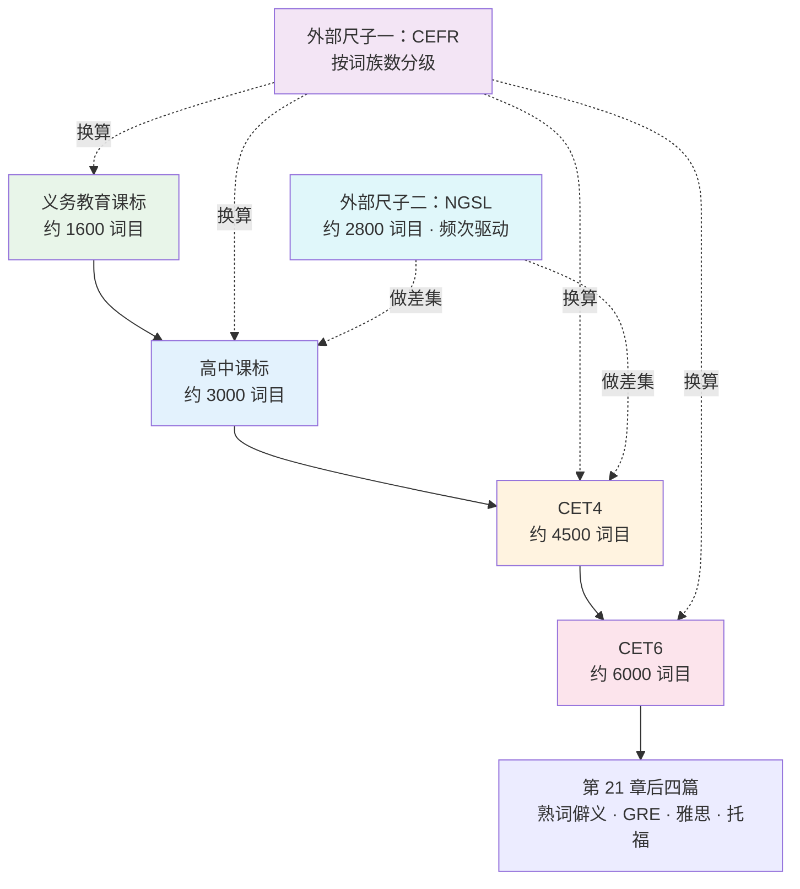
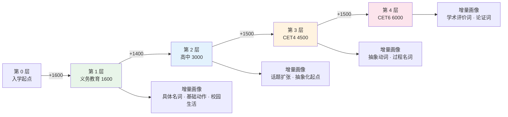
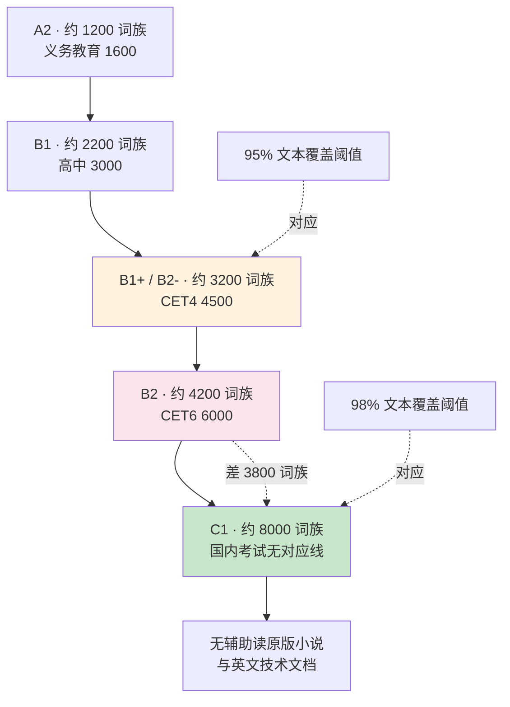
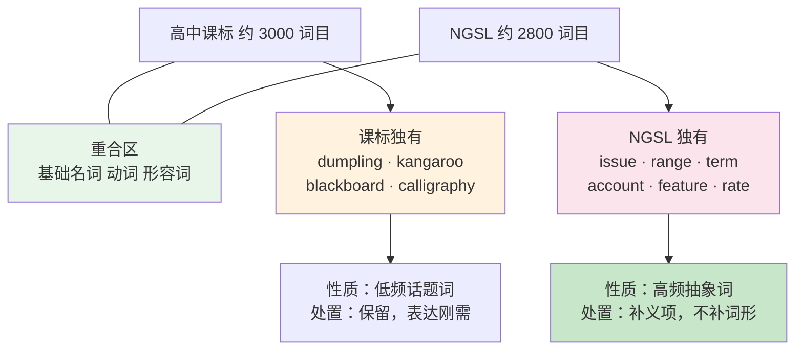
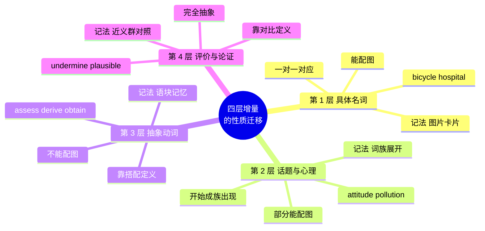
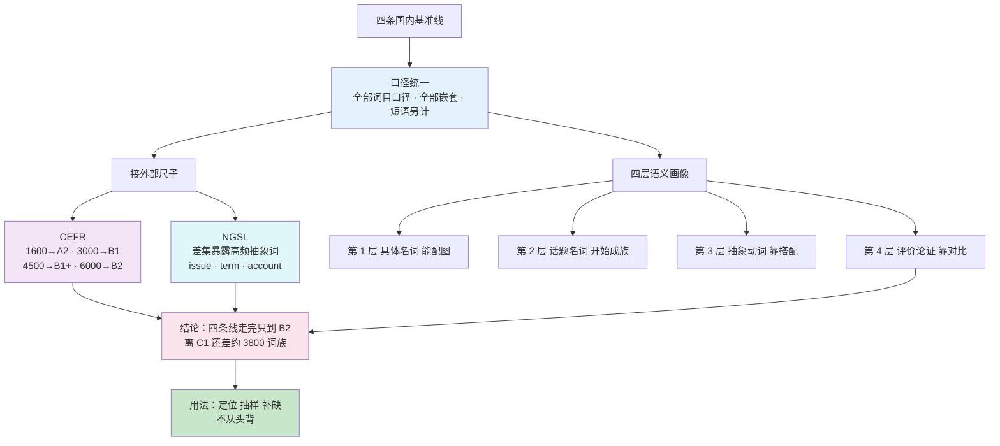

# 国内考试词表基准：课标 1600-3000 与四六级 4500-6000 的分层

> [!info] 本篇定位
>
> 第 21 章的第一篇，也是整章唯一处理「基准线」的一篇。
>
> `01.词汇入门与学习方法/06.词汇量自测、CEFR 对照与目标设定` 给了你一个测出来的词族数；本篇把国内四条官方词表基准换算到同一把尺子上，让那个数字能对上「我现在压在哪一层、下一层要补的是什么词」。
>
> 本篇不做题型分析，不押题，不复制前 20 章已经铺完的主题词表。交付三样东西：四条线的口径对照与嵌套关系图、四层增量各自的语义画像、以及 CET6 那 1500 词增量里最能代表这一层性质的一批学术评价词。

---

## 1. 本篇导读：四条线不是四个数，是四张词表

「课标 1600」「高中 3000」「四级 4500」「六级 6000」这四个数在中文英语学习圈里流通得极广，但它们被引用时几乎总是脱离了各自的文件、口径与年份。结果是一堆互相打架的说法同时存在：有人说四级 4200，有人说 4500，有人说 4795；有人说六级 5500，有人说 6000，有人说 6395。

这些数字不是谁记错了，是**它们来自不同文件、按不同规则数出来的**。

四条线各自的产出方与产出目的完全不同：

| 基准线 | 产出文件 | 产出方 | 这个数要回答的问题 |
| --- | --- | --- | --- |
| 约 1600 | 《义务教育英语课程标准（2022 年版）》 | 教育部 | 初中毕业该会用多少词 |
| 约 3000 | 《普通高中英语课程标准（2017 年版 2020 年修订）》 | 教育部 | 高中选择性必修学完该会用多少词 |
| 约 4500 | 大学英语四级考试大纲与《大学英语教学指南》 | 考试委员会 / 教指委 | 四级试卷的选词范围到哪 |
| 约 6000 | 大学英语六级考试大纲与《大学英语教学指南》 | 同上 | 六级试卷的选词范围到哪 |

前两条是**教学目标**，写的是「学完应该会」；后两条是**命题范围**，写的是「卷子里可能出现」。这两种性质的词表在编制逻辑上有根本差别：教学目标要照顾话题覆盖与教材编写，会主动收进 `kangaroo`、`dumpling`、`Spring Festival` 这类频次不高但话题必需的词；命题范围要照顾试题区分度，收词更贴近书面语频次分布。



上图是本篇的骨架。中间那条竖链是四条国内基准线的嵌套关系，左右两条虚线是把这条链接到国际尺子上的两个动作：CEFR 负责回答「这一层大致相当于什么水平」，NGSL 负责回答「这一层漏了哪些真正高频的词」。第 2 到第 5 节处理这两个换算，第 6 到第 9 节逐层剖开四层的语义画像，第 10 节把三次跃迁的共同规律抽出来。

先把本篇要反复使用的一组元词汇立住。这些词本身就是描述词表的工具词，后面几节的表头和说明会大量出现。

| 英文 | 英式音标 | 美式音标 | 词性 | 中文 | 搭配与说明 |
| --- | --- | --- | --- | --- | --- |
| **syllabus** | /ˈsɪləbəs/ | /ˈsɪləbəs/ | n. | 教学大纲；考纲 | 复数 syllabuses 或 syllabi；指一门课或一场考试的内容范围 |
| **curriculum** | /kəˈrɪkjələm/ | /kəˈrɪkjələm/ | n. | 课程体系 | 复数 curricula；比 syllabus 层级高，指整个学段的课程设置 |
| **benchmark** | /ˈbentʃmɑːk/ | /ˈbentʃmɑːrk/ | n./v. | 基准；对标 | benchmark against sth；本篇「基准线」即此词 |
| **threshold** | /ˈθreʃhəʊld/ | /ˈθreʃhoʊld/ | n. | 阈值；门槛 | cross a threshold / the lexical threshold；01.06 的 95% 与 98% 阈值即此 |
| **coverage** | /ˈkʌvərɪdʒ/ | /ˈkʌvərɪdʒ/ | n. | 覆盖率 | text coverage；某词表能覆盖一份文本中多少比例的词次 |
| **lemma** | /ˈlemə/ | /ˈlemə/ | n. | 词目 | 复数 lemmas 或 lemmata；词典词条的计数单位 |
| **nested** | /ˈnestɪd/ | /ˈnestɪd/ | adj. | 嵌套的 | nested lists / a nested structure；本篇形容四条线的包含关系 |
| **increment** | /ˈɪŋkrəmənt/ | /ˈɪŋkrəmənt/ | n. | 增量 | 形容词 incremental；「CET6 增量」即 the CET6 increment |
| **overlap** | /ˌəʊvəˈlæp/ | /ˌoʊvərˈlæp/ | v. | 重合 | 名词重音前移 /ˈəʊvəlæp/；the overlap between two lists |
| **subset** | /ˈsʌbset/ | /ˈsʌbset/ | n. | 子集 | a subset of；反义 superset |
| **cutoff** | /ˈkʌtɒf/ | /ˈkʌtɔːf/ | n. | 分界线；截断点 | a cutoff point / the frequency cutoff |
| **inventory** | /ˈɪnvəntri/ | /ˈɪnvəntɔːri/ | n. | 清单；词项总集 | 英美重音同在首音节但尾音差异明显；a lexical inventory |

`benchmark` 与 `threshold` 常被混用，但方向相反：benchmark 是拿来**比对**的参照物，threshold 是必须**跨过**的门槛。说「四级词表是一条 benchmark」意思是拿它当尺子量自己；说「8000 词族是阅读的 threshold」意思是不到这个数就读不动。

---

## 2. 四条线的统计口径：谁在数、数什么、怎么数

### 2.1 「一个单词」在四份文件里指什么

01.06 已经把词形（word form）、词目（lemma）、词族（word family）三级计数单位拆过一遍。四条国内基准线全部采用**词目口径的变体**，但变体之间仍有差别。

| 计数单位 | 定义 | `develop` 这一族会数成几个 |
| --- | --- | --- |
| 词形 word form | 每个不同的拼写串算一个 | develop / develops / developed / developing / development / developments / developer / developers / undeveloped = 9 |
| 词目 lemma | 同一词性的屈折变化归一 | develop（动词全部屈折）/ development（名词）/ developer（名词）= 3 |
| 词族 word family | 加上常规派生与前缀 | develop 一族 = 1 |

课标与四六级词表都按「词目加上部分派生形式另列」的混合方式收词。以高中课标词表为例，`develop` 与 `development` 通常分行列出，`developed`、`developing` 这类屈折形式不单独列。这意味着：

- 这四个数**比词族数大**，但**比词形数小**
- 同一份词表里，派生词列不列没有完全一致的规则，通常是「教材里出现过就列」

> [!warning] 「我背完四级 4500 就有 4500 词汇量」是个口径错误
>
> 四级词表的 4500 是词目口径，转成词族大约是 3000 出头。你在 Nation VST 上测出的数字是词族口径。
>
> - ❌ ~~背完四级词表，VST 应该测到 4500~~
> - ✅ 背完四级词表，VST 大致落在 3000 上下
>
> 这两个数差出的部分不是你学漏了，是尺子换了。见 `01.词汇入门与学习方法/06.词汇量自测、CEFR 对照与目标设定` 第 5 节。

### 2.2 短语和固定搭配另算

四份文件都把短语与词分开计数，这一点常被引用时丢掉。

- 义务教育课标在约 1600 个单词之外，另列约 200 至 300 个习惯用语与固定搭配
- 高中课标同样在词汇表之外另列短语与固定搭配
- 四六级大纲历来在词表之后附一份短语表，规模在数百条量级

所以「四级 4500」这个数不包含 `take into account`、`in terms of`、`be subject to` 这类语块。真正要读懂四级篇章，语块的负担与单词是同一量级的。本教程把语块单独交给第 `17` 章八篇处理，那一章不算在任何一条基准线里。

### 2.3 数字为什么会浮动

同一条线在不同资料里给出不同数字，主要有四个来源。

| 浮动来源 | 具体表现 | 幅度 |
| --- | --- | --- |
| 文件版本不同 | 1999 版四级大纲与 2016 修订版收词不同 | 数百词 |
| 目标层级不同 | 《大学英语教学指南》分基础、提高、发展三级目标，各对应不同词量 | 上千词 |
| 派生词计法不同 | `happy / happiness / unhappy` 算一条还是三条 | 一成到两成 |
| 是否含下层 | 「六级 6000」是总量还是四级之外再加 6000 | 成倍 |

第四条最致命。**六级的 6000 是含四级在内的累计量**，不是在四级之外再加 6000。同理，高中课标的 3000 含义务教育的 1600，不是另加 3000。凡是把这四个数加起来得出「一共要背 15100 词」的说法，都是这一条口径错误的产物。

### 2.4 四条线口径对照

| 维度 | 义务教育课标 | 高中课标 | CET4 | CET6 |
| --- | --- | --- | --- | --- |
| 数量级 | 约 1600 | 约 3000 | 约 4500 | 约 6000 |
| 计数单位 | 词目为主 | 词目为主 | 词目为主 | 词目为主 |
| 是否含下层 | — | 含 1600 | 含 3000 | 含 4500 |
| 短语 | 另列 200-300 | 另列 | 另附短语表 | 另附短语表 |
| 性质 | 教学目标 | 教学目标 | 命题范围 | 命题范围 |
| 收词偏向 | 话题与教材 | 话题与教材 | 书面语频次 | 书面语频次偏学术 |
| 换算成词族 | 约 1100-1300 | 约 2000-2300 | 约 3000-3400 | 约 4000-4500 |

最后一行的换算系数在下一节说明，那里也会说清这个换算有多不精确。

---

## 3. 重合关系：这是一条嵌套链，不是四个并列的集合

### 3.1 包含链与它的例外

四条线的理想关系是严格嵌套：

```text
义务教育 1600  ⊂  高中 3000  ⊂  CET4 4500  ⊂  CET6 6000
```

实际情况有例外，但例外的比例很低，主要出现在两个地方。

**例外一：话题词在上层被丢掉。** 义务教育与高中课标为了话题完整性收的一批低频文化词，四六级词表未必收。典型的有 `dumpling`、`chopsticks`、`calligraphy`、`papercut`、`kangaroo`、`koala`。这些词在四六级卷子上出现概率很低，但它们并不因此变得不该学——中国学习者向外表达时用得极频繁。

**例外二：命题范围收的功能性词汇下层没有。** 四六级词表会收一批考试文体特有的词，例如 `passage`、`paragraph`、`statement`、`option`，这些在中学词表里不一定是正式词条。

除去这两类，四条线的嵌套是可靠的。可以直接把它当作四个同心圆使用。



上图把嵌套关系拉直成一条增量链，每一段标出这一跳新增了多少词，下方分支标出这批增量的语义性质。三次跃迁的增量规模惊人地接近，都在 1400 到 1500 之间，但它们的**难度完全不对等**：第一跳的 1400 个词绝大多数能配一张图片，最后一跳的 1500 个词几乎一个都配不了图。这个不对称正是本篇后半部分要展开的主题。

### 3.2 增量的真实规模比数字更小

「四级到六级只差 1500 词」听起来是个不大的工程，按每天 30 个词算五十天。这个算法忽略了一件事：**增量词的词族展开负担远高于下层词**。

以第 3 层的 `develop` 和第 4 层的 `substantiate` 对比：

| 对比项 | develop（第 3 层） | substantiate（第 4 层） |
| --- | --- | --- |
| 常用派生 | development, developer, developing, developed, undeveloped | substantiated, unsubstantiated, substantiation |
| 派生是否好猜 | 是，`-ment`、`-er` 都是熟规则 | 部分，`-ation` 好猜但 `unsubstantiated` 的语域很窄 |
| 常见搭配 | develop a habit / skill / product / country | substantiate a claim / an allegation / a hypothesis |
| 搭配是否自由 | 较自由，宾语范围宽 | 极窄，宾语几乎只能是「主张」类抽象名词 |
| 认得到会用的距离 | 短 | 长 |

上层词的搭配限制更严，可用语境更窄，从「认得」到「会用」的距离更长。**同样是 1500 个词，第四层需要的时间通常是第一层的两到三倍。**

### 3.3 增量重叠：AWL 从哪一层开始出现

学术通用词表 AWL 的 570 个词族在四条线上的分布是本篇最有用的一条信息：

| 层级 | AWL 覆盖情况 |
| --- | --- |
| 义务教育 1600 | 几乎没有，偶有 `area`、`period` 这类兼具日常义的词 |
| 高中 3000 | 少量，`benefit`、`factor`、`method`、`source`、`survey` |
| CET4 4500 | 相当一部分，`analyse`、`assume`、`consist`、`indicate`、`involve`、`obtain` |
| CET6 6000 | 大部分 AWL 前六个子表落在这一层内 |

也就是说，**从第 3 层开始，你实际上在背 AWL，只是它换了个名字**。这一点决定了本教程的分工：AWL 的完整词表与词族展开交给 `19.学术通用词汇/01.学术通用词表 AWL（上）：论证与关系` 和 `19.学术通用词汇/02.学术通用词表 AWL（下）：过程与评价` 两篇，本篇只负责把它接到考试基准线上，不重列。

---

## 4. 接上外部尺子（一）：CEFR

### 4.1 词目到词族的换算系数

要把国内的词目数接到 CEFR 的词族数上，需要一个换算系数。这个系数不是常数，它随词汇量增大而变化。

| 词汇量区间 | 词目 : 词族 的粗略比值 | 原因 |
| --- | --- | --- |
| 1000 以下 | 约 1.2 : 1 | 高频词的派生形式少，`the`、`go`、`man` 几乎不带派生 |
| 1000 - 3000 | 约 1.4 : 1 | 派生开始出现，`happy / happiness`、`teach / teacher` |
| 3000 - 6000 | 约 1.4 - 1.5 : 1 | 拉丁词根词进场，一个词根带三四个词目 |
| 6000 以上 | 约 1.5 : 1 以上 | 学术词的派生网最密，`analyse` 一族有六七个词目 |

> [!warning] 这个系数只能用于估算量级
>
> 它不是从任何一份公开研究里抄来的固定值，而是按「词目定义 = 同词性屈折归一、词族定义 = 加常规派生」这两条定义推出来的方向性估计。
>
> 允许用它做的事：判断「我背完六级词表大致处在 CEFR 哪一档」。
>
> 不允许用它做的事：把 6000 除以 1.5 得到 4000，再拿这个 4000 去跟别人的 VST 成绩比高低。个体差异远大于这个系数的精度。

### 4.2 四条线对照 CEFR

把上一节的系数用到四条线上，再接到 01.06 给出的那张 CEFR 对照表：

| 国内基准 | 词目数 | 换算词族数 | 对应 CEFR | 对应的阅读能力 |
| --- | --- | --- | --- | --- |
| 义务教育课标 | 约 1600 | 约 1100-1300 | A2 | 简化读物、日常短消息 |
| 高中课标 | 约 3000 | 约 2000-2300 | B1 | 分级读物、简单新闻 |
| CET4 | 约 4500 | 约 3000-3400 | B1 上段 / B2 下段 | 借助词典读一般文本 |
| CET6 | 约 6000 | 约 4000-4500 | B2 | 一般文本可猜读，仍不轻松 |
| （对照）无对应线 | 约 12000 | 约 8000 | C1 | 无辅助读原版小说与技术文档 |

最后一行是本篇最该被记住的一行：**国内四条基准线全部走完，也只到 B2，离能自由读原版书的 C1 还差接近一倍的词族数。**

这不是在贬低四六级。四六级的设计目标是筛选与教学评估，从来不是「读完原版书」。把它当作阅读能力的终点，是使用者的误解，不是考试的问题。



上图把四条基准线插进 01.06 的 CEFR 阶梯里。CET6 到 C1 之间那条虚线是本教程存在的理由：这一段没有任何一场国内考试覆盖，也没有任何一份现成词表可背，只能靠构词法批量扩容（第 `14`、`15` 章）加语域与搭配的精度训练（第 `16`、`17`、`18` 章）走过去。

### 4.3 这张表能回答与不能回答的问题

> [!tip] 三个能回答的问题
>
> 1. **我该读什么难度的材料。** 卡在第 3 层就别硬碰原版小说，先做分级读物到 Oxford Bookworms 5-6 档。材料阶梯见 `22.速查附录与学习资源/01.语料库检索、查词交叉验证与原版材料爬升路径`。
> 2. **我的目标缺口有多大。** 目标是读英文技术文档，那是 C1 量级，从 CET6 出发还差约 3800 词族。
> 3. **为什么六级过了还读不动 The Economist。** 因为那是 C1 材料，六级是 B2 词表。缺的不是能力，是三千多个词族。

> [!warning] 两个不能回答的问题
>
> - **换算成分数。** 词汇量不是四六级分数的中间变量，六级 600 分和 500 分的人词汇量可能一样，差的是听力和写作的输出能力。
> - **倒推「我过了六级所以我有 4200 词族」。** 六级及格线只要求你答对足够的题，不要求你掌握词表全集。真实掌握率在及格线附近通常只有六成到七成。

---

## 5. 接上外部尺子（二）：NGSL

### 5.1 NGSL 是什么

NGSL（New General Service List）由 Charles Browne、Brent Culligan、Joseph Phillips 于 2013 年发布，是对 Michael West 1953 年那份 General Service List 的重建。它基于剑桥英语语料库的一个约 2.73 亿词的子语料，用频次与分布度双重筛选，产出约 2800 个词目，对一般英语文本的覆盖率约为 92%。

配套还有三份专用表：

| 词表 | 全称 | 规模 | 用途 |
| --- | --- | --- | --- |
| NGSL | New General Service List | 约 2800 词目 | 一般文本，覆盖率约 92% |
| NAWL | New Academic Word List | 约 960 词目 | 在 NGSL 之上再补学术文本 |
| TSL | TOEIC Service List | 约 1200 词目 | 商务与职场语境 |
| BSL | Business Service List | 约 1700 词目 | 商业文本 |

NGSL 的规模（约 2800）与高中课标（约 3000）几乎相同，这让两者的**差集**成为一个非常有信息量的对象：两份规模一样的词表，一份按频次选，一份按教学话题选，它们不重合的部分正好暴露出「按课本学」漏掉了什么。

### 5.2 课标有而 NGSL 没有的

这一侧主要是话题必需的低频词，可以按类别归成四组。

| 类别 | 典型词 | 为什么 NGSL 不收 |
| --- | --- | --- |
| 中国文化词 | dumpling, chopsticks, calligraphy, lantern, papercut | 英语语料库里频次极低 |
| 教材话题词 | kangaroo, koala, dinosaur, pyramid, volcano | 出现在少儿教材，不出现在通用语料 |
| 校园具体物 | blackboard, playground, schoolbag, eraser | 频次不足以进前 2800 |
| 礼貌套语相关 | ma'am, sir 的书写形式与部分寒暄词 | 口语高频但书面语料稀薄 |

这一侧的词不该被删掉。中国学习者向外表达时，`dumpling`、`calligraphy` 的使用频率远高于语料库统计值——语料库统计的是英语母语者写什么，不是你需要说什么。

### 5.3 NGSL 有而课标不主讲的（本节重点）

这一侧才是真正的漏洞。它们全部是**高频抽象词**，绝大多数在课标词表里能查到，但在教材里只以某一个具体义项出现过一次，导致学习者「认识但只认识那一个义项」。

| 英文 | 英式音标 | 美式音标 | 词性 | 中文 | 搭配与说明 |
| --- | --- | --- | --- | --- | --- |
| **issue** | /ˈɪʃuː/ | /ˈɪʃuː/ | n./v. | 议题；问题；发行 | 教材只给「发行」；语料里最高频的是「议题」，raise an issue |
| **range** | /reɪndʒ/ | /reɪndʒ/ | n./v. | 范围；幅度；变动于 | a wide range of / range from A to B；教材常只给「山脉」 |
| **term** | /tɜːm/ | /tɜːrm/ | n. | 术语；条款；学期 | in terms of / long-term；教材只给「学期」 |
| **account** | /əˈkaʊnt/ | /əˈkaʊnt/ | n./v. | 账户；说明；占比 | account for 兼「解释」与「占比例」两义 |
| **case** | /keɪs/ | /keɪs/ | n. | 情况；案例；病例 | in that case / a case study；教材只给「箱子」 |
| **feature** | /ˈfiːtʃə/ | /ˈfiːtʃər/ | n./v. | 特征；以⋯⋯为特色 | a key feature / the film features X |
| **rate** | /reɪt/ | /reɪt/ | n./v. | 比率；速率；评级 | at a rate of / the success rate / rate sth highly |
| **item** | /ˈaɪtəm/ | /ˈaɪtəm/ | n. | 项；条目 | an item on the agenda；比 thing 正式，写作高频 |
| **apply** | /əˈplaɪ/ | /əˈplaɪ/ | v. | 应用；适用；申请 | apply to（适用于）与 apply for（申请）分工严格 |
| **involve** | /ɪnˈvɒlv/ | /ɪnˈvɑːlv/ | v. | 涉及；使参与 | involve doing sth / be involved in |
| **concern** | /kənˈsɜːn/ | /kənˈsɜːrn/ | n./v. | 关切；涉及；担忧 | be concerned about（担忧）对 be concerned with（涉及） |
| **claim** | /kleɪm/ | /kleɪm/ | v./n. | 主张；索赔；声称 | claim that / file a claim；立场比 say 强，见 13.03 |
| **effect** | /ɪˈfekt/ | /ɪˈfekt/ | n. | 效果；影响 | have an effect on / take effect / in effect |
| **process** | /ˈprəʊses/ | /ˈprɑːses/ | n./v. | 过程；处理 | 英美元音差异明显；in the process of / process data |
| **period** | /ˈpɪəriəd/ | /ˈpɪriəd/ | n. | 时期；周期 | over a period of / a transitional period |
| **current** | /ˈkʌrənt/ | /ˈkɜːrənt/ | adj./n. | 当前的；水流；电流 | 三义并存；the current situation / an ocean current |
| **pattern** | /ˈpætn/ | /ˈpætərn/ | n. | 模式；花样 | a pattern of behaviour / follow a pattern |
| **available** | /əˈveɪləbl/ | /əˈveɪləbl/ | adj. | 可获得的；有空的 | be available to sb / make sth available |
| **require** | /rɪˈkwaɪə/ | /rɪˈkwaɪər/ | v. | 要求；需要 | require sb to do / be required by law；比 need 正式 |
| **provide** | /prəˈvaɪd/ | /prəˈvaɪd/ | v. | 提供；规定 | provide sb with sth 与 provide sth for sb 两式 |
| **likely** | /ˈlaɪkli/ | /ˈlaɪkli/ | adj./adv. | 可能的 | be likely to do；作副词时须带 most/very，不单用 |
| **position** | /pəˈzɪʃn/ | /pəˈzɪʃn/ | n. | 位置；职位；立场 | take a position on / be in a position to do |
| **respect** | /rɪˈspekt/ | /rɪˈspekt/ | n./v. | 尊重；方面 | in this respect（在这方面）是写作高频，教材只给「尊重」 |
| **subject** | /ˈsʌbdʒɪkt/ | /ˈsʌbdʒɪkt/ | n./adj. | 科目；对象；易受⋯⋯的 | be subject to；动词义 /səbˈdʒekt/ 重音后移，见 21.02 |
| **matter** | /ˈmætə/ | /ˈmætər/ | n./v. | 事情；物质；要紧 | as a matter of fact / it doesn't matter |

> [!tip] 这张表的正确用法
>
> 不要拿它当生词表背——你几乎每个都「认识」。正确用法是**逐个自查义项覆盖**：拿一个词，先不查词典，尽量写出它的所有常见义项与两个搭配；写完再查，看漏了几个。
>
> 漏得最多的通常是 `issue`、`term`、`respect`、`account`、`subject` 这五个。它们的僻义在考试里出现频率极高，完整清单见 `21.考试词汇专项/02.熟词僻义总表：从考研到 GRE`。



上图把两份规模相当的词表画成一组交叠圆。左边独有的部分是你要保留的，右边独有的部分是你要补的——但补的方式不是「加新词」，而是「给已认识的词加义项」。这个区别很重要：前者是词汇量问题，后者是词义深度问题，后者不能靠背词表解决，只能靠大量阅读中的义项撞击。

---

## 6. 第 1 层：义务教育 1600 —— 能配图的词

### 6.1 这一层的语义画像

第 1 层的绝大多数词满足一个共同特征：**能配一张图片，或能演示一个动作**。这不是巧合，是初中教材编写的直接结果——教材要依托图片与情境教学，收词必然向可视化倾斜。

| 语义类别 | 在这一层的占比感觉 | 典型词 |
| --- | --- | --- |
| 具体名词 | 最大 | apple, bicycle, hospital, library, umbrella |
| 具体动作动词 | 次之 | run, jump, borrow, invite, collect |
| 基础性质形容词 | 相当一部分 | tall, heavy, delicious, famous, careful |
| 时间与数量 | 固定一批 | yesterday, twice, several, enough |
| 功能词 | 全部封闭词类 | although, however, whether, unless |

值得单拎出来的是最后两类。功能词在第 1 层就已经**收全了**——`although`、`however`、`whether`、`unless`、`therefore` 这些词此后再不会有新增。也就是说，从第 2 层往上，词汇量的增长全部发生在实义词上，功能词的负担是一次性的。这也是本教程把功能词集中在第 `02` 章一次讲透的原因。

### 6.2 第 1 层样本词表

只取这一层中在后面三层里会被反复复用、且义项容易被固化在一个中文对应字上的词。

| 英文 | 英式音标 | 美式音标 | 词性 | 中文 | 搭配与说明 |
| --- | --- | --- | --- | --- | --- |
| **borrow** | /ˈbɒrəʊ/ | /ˈbɑːroʊ/ | v. | 借入 | borrow sth from sb；与 lend（借出）方向相反，见 02.04 |
| **suggest** | /səˈdʒest/ | /səɡˈdʒest/ | v. | 建议；暗示 | 美音多一个 /ɡ/；suggest doing，不接 suggest sb to do |
| **decide** | /dɪˈsaɪd/ | /dɪˈsaɪd/ | v. | 决定 | decide to do / decide on sth；名词 decision 配 make |
| **describe** | /dɪˈskraɪb/ | /dɪˈskraɪb/ | v. | 描述 | describe sth to sb，不说 describe me sth |
| **prepare** | /prɪˈpeə/ | /prɪˈper/ | v. | 准备 | prepare for（为⋯⋯做准备）对 prepare sth（准备好某物） |
| **environment** | /ɪnˈvaɪrənmənt/ | /ɪnˈvaɪrənmənt/ | n. | 环境 | 拼写陷阱：中间 -ron- 常被漏写成 -rn-；the natural environment |
| **experience** | /ɪkˈspɪəriəns/ | /ɪkˈspɪriəns/ | n./v. | 经验；经历 | 作「经验」不可数，作「经历」可数：an unforgettable experience |
| **knowledge** | /ˈnɒlɪdʒ/ | /ˈnɑːlɪdʒ/ | n. | 知识 | 不可数，无复数；❌ ~~learn knowledge~~ ✅ **acquire knowledge** |
| **however** | /haʊˈevə/ | /haʊˈevər/ | adv. | 然而 | 是副词不是连词，不能像 but 一样直接连两个分句 |
| **although** | /ɔːlˈðəʊ/ | /ɔːlˈðoʊ/ | conj. | 尽管 | 与 but 不同时出现在一个句子里 |
| **probably** | /ˈprɒbəbli/ | /ˈprɑːbəbli/ | adv. | 很可能 | 确定度高于 maybe、低于 certainly，梯度见 02.08 |
| **famous** | /ˈfeɪməs/ | /ˈfeɪməs/ | adj. | 著名的 | be famous for（因⋯⋯出名）对 be famous as（作为⋯⋯出名） |
| **careful** | /ˈkeəfl/ | /ˈkerfl/ | adj. | 仔细的 | be careful with sth / be careful to do |
| **dictionary** | /ˈdɪkʃənri/ | /ˈdɪkʃəneri/ | n. | 词典 | 英美尾音差异明显；look sth up in a dictionary |
| **weekend** | /ˌwiːkˈend/ | /ˈwiːkend/ | n. | 周末 | 英美重音位置不同；英式 at the weekend，美式 on the weekend |
| **village** | /ˈvɪlɪdʒ/ | /ˈvɪlɪdʒ/ | n. | 村庄 | 与 town、city 构成规模梯度 |
| **collect** | /kəˈlekt/ | /kəˈlekt/ | v. | 收集；接走 | collect stamps / collect sb from the airport（英式常用） |
| **invite** | /ɪnˈvaɪt/ | /ɪnˈvaɪt/ | v. | 邀请 | invite sb to do / to sth；名词 invitation 重音在第三音节 |
| **enough** | /ɪˈnʌf/ | /ɪˈnʌf/ | adj./adv. | 足够的 | 修饰形容词时后置：good enough，不说 enough good |
| **several** | /ˈsevrəl/ | /ˈsevrəl/ | det. | 若干 | 数量在 a few 与 many 之间；只接可数复数 |

> [!warning] 第 1 层最容易被固化的三个词
>
> - **knowledge** 被固化成「知识」这个可数概念。它在英语里不可数，`❌ ~~a knowledge~~` 只在 `a knowledge of French` 这类带修饰的结构里成立。
> - **experience** 被固化成「经验」。它作「一次经历」时可数，`a great experience` 完全正常，两个义项对应两套语法行为。
> - **however** 被固化成「但是」，然后当作连词用来连两个分句，写出 `It was raining, however we went out.` 这类句子。它是副词。

---

## 7. 第 2 层：高中 3000 增量 —— 抽象化的起点

### 7.1 这一跳新增了什么

从 1600 到 3000 这 1400 词的增量，性质上仍以「可指认」为主，但出现了三条新线索：

1. **话题从校园扩到社会。** `pollution`、`generation`、`volunteer`、`charity`、`crisis` 这类词进场，它们指的是社会现象而不是实物。
2. **心理与态度词群成形。** `attitude`、`confidence`、`anxiety`、`impression`、`tendency`，这批词无法配图，只能靠语境理解。
3. **抽象名词开始有词族。** `influence / influential`、`benefit / beneficial`、`essence / essential`，第一次出现「同根多形式」的记忆负担。

第三条是这一跳最本质的变化。第 1 层的词基本是孤立的，第 2 层开始，**词不再单独出现，而是成族出现**。这也是本教程把构词法安排在第 `14`、`15` 章的依据：在第 2 层之前讲词根没有素材，到第 2 层之后再不讲就会积压。

### 7.2 第 2 层增量样本词表

| 英文 | 英式音标 | 美式音标 | 词性 | 中文 | 搭配与说明 |
| --- | --- | --- | --- | --- | --- |
| **attitude** | /ˈætɪtjuːd/ | /ˈætɪtuːd/ | n. | 态度 | attitude to / towards sth；英美 -tude 元音差异 |
| **benefit** | /ˈbenɪfɪt/ | /ˈbenɪfɪt/ | n./v. | 益处；受益 | benefit from sth（受益）对 benefit sb（有益于） |
| **confident** | /ˈkɒnfɪdənt/ | /ˈkɑːnfɪdənt/ | adj. | 自信的 | be confident of / about；与 confidant（知己）近形不同义 |
| **crisis** | /ˈkraɪsɪs/ | /ˈkraɪsɪs/ | n. | 危机 | 复数 crises /ˈkraɪsiːz/，元音变化；a financial crisis |
| **distinguish** | /dɪˈstɪŋɡwɪʃ/ | /dɪˈstɪŋɡwɪʃ/ | v. | 区分 | distinguish A from B / between A and B |
| **efficient** | /ɪˈfɪʃnt/ | /ɪˈfɪʃnt/ | adj. | 高效的 | 与 effective（有效的）分工：前者省资源，后者达目的 |
| **emphasize** | /ˈemfəsaɪz/ | /ˈemfəsaɪz/ | v. | 强调 | 及物动词，❌ ~~emphasize on~~；英式可拼 emphasise |
| **essential** | /ɪˈsenʃl/ | /ɪˈsenʃl/ | adj. | 必需的 | be essential to / for；属绝对形容词，配 absolutely 不配 very |
| **evidence** | /ˈevɪdəns/ | /ˈevɪdəns/ | n. | 证据 | 不可数；a piece of evidence；provide / present evidence |
| **factor** | /ˈfæktə/ | /ˈfæktər/ | n. | 因素 | a key / decisive factor；AWL 第一子表词 |
| **generation** | /ˌdʒenəˈreɪʃn/ | /ˌdʒenəˈreɪʃn/ | n. | 一代人；产生 | the younger generation / power generation 两义 |
| **guarantee** | /ˌɡærənˈtiː/ | /ˌɡerənˈtiː/ | v./n. | 保证 | 重音在最后一个音节；guarantee that / a two-year guarantee |
| **impression** | /ɪmˈpreʃn/ | /ɪmˈpreʃn/ | n. | 印象 | make / leave an impression on sb；配 make 不配 give |
| **individual** | /ˌɪndɪˈvɪdʒuəl/ | /ˌɪndɪˈvɪdʒuəl/ | n./adj. | 个体；个别的 | 名词义在学术文本高频，指「个人」而非「个性」 |
| **influence** | /ˈɪnfluəns/ | /ˈɪnfluəns/ | n./v. | 影响 | have an influence on；名动同形同音，重音不移 |
| **opportunity** | /ˌɒpəˈtjuːnəti/ | /ˌɑːpərˈtuːnəti/ | n. | 机会 | 比 chance 正式；take / seize an opportunity |
| **particular** | /pəˈtɪkjələ/ | /pərˈtɪkjələr/ | adj. | 特定的；挑剔的 | in particular / be particular about（挑剔）两义差别大 |
| **pollution** | /pəˈluːʃn/ | /pəˈluːʃn/ | n. | 污染 | 不可数；air / noise / light pollution |
| **purpose** | /ˈpɜːpəs/ | /ˈpɜːrpəs/ | n. | 目的 | for the purpose of / on purpose（故意地） |
| **reduce** | /rɪˈdjuːs/ | /rɪˈduːs/ | v. | 减少 | reduce sth by 20%（减少幅度）对 reduce sth to 20%（减少到） |
| **responsible** | /rɪˈspɒnsəbl/ | /rɪˈspɑːnsəbl/ | adj. | 负责的；起因的 | be responsible for；第二义等于「造成」，考试常考 |
| **solution** | /səˈluːʃn/ | /səˈluːʃn/ | n. | 解决方案；溶液 | a solution to a problem，介词是 to 不是 for |
| **source** | /sɔːs/ | /sɔːrs/ | n. | 来源 | a reliable source；与 resource（资源）不同词 |
| **struggle** | /ˈstrʌɡl/ | /ˈstrʌɡl/ | v./n. | 挣扎；努力 | struggle to do / struggle with sth |
| **tendency** | /ˈtendənsi/ | /ˈtendənsi/ | n. | 倾向 | have a tendency to do；比 trend 更偏个体倾向 |
| **volunteer** | /ˌvɒlənˈtɪə/ | /ˌvɑːlənˈtɪr/ | n./v. | 志愿者；自愿 | 重音在最后音节；volunteer to do / volunteer for sth |
| **witness** | /ˈwɪtnəs/ | /ˈwɪtnəs/ | n./v. | 目击者；见证 | 及物，❌ ~~witness to sth~~（除非作名词 a witness to） |
| **consider** | /kənˈsɪdə/ | /kənˈsɪdər/ | v. | 考虑；认为 | consider doing（考虑做）不接 to do；consider sb (to be) sth |
| **request** | /rɪˈkwest/ | /rɪˈkwest/ | n./v. | 请求 | at sb's request；request that sb (should) do 用虚拟式 |
| **occupation** | /ˌɒkjuˈpeɪʃn/ | /ˌɑːkjuˈpeɪʃn/ | n. | 职业；占领 | 表格填「职业」用它，比 job 正式 |

### 7.3 第 2 层的三个高发陷阱

> [!warning] 介词被中文带偏的三个词
>
> - **emphasize**：中文说「强调于⋯⋯」，英文是纯及物。❌ ~~emphasize on the importance~~ ✅ **emphasize the importance**（或 place emphasis on）
> - **solution**：中文说「对问题的方案」很自然，容易写成 for。❌ ~~a solution for the problem~~（口语可见但不规范）✅ **a solution to the problem**
> - **responsible**：`be responsible for` 的第二义是「造成」，`Heavy rain was responsible for the delay` 不是说雨有责任心。这条在阅读题里被当成同义替换点考。
>
> 完整的动介与形介搭配清单见 `17.固定搭配/06.动词+介词固定搭配：depend on、result in、consist of`。

---

## 8. 第 3 层：CET4 增量 —— 抽象动词与过程名词

### 8.1 这一跳的性质变化最大

从 3000 到 4500 这 1500 词，是四次跃迁里性质变化最剧烈的一次。前两层的词大部分能翻译成一个中文双字词并且基本对得上，这一层开始不行了。

三个标志性变化：

**变化一：动词占比大幅上升。** 第 1、2 层增量以名词为主，第 3 层增量里动词的比重明显加大，而且是抽象动词——`assess`、`assume`、`derive`、`indicate`、`involve`、`obtain`，它们描述的是思维操作与逻辑关系，不是身体动作。

**变化二：出现「过程名词」。** `analysis`、`assumption`、`consequence`、`distribution`、`interpretation`，这些名词由动词派生而来，指的是一个动作或过程本身。中文里对应的往往也是双字词，但英文的过程名词在句子里承担主语的频率远高于中文，这是学术英语最典型的句法特征之一。

**变化三：拉丁词根开始密集出现。** `constitute`、`contribute`、`distribute` 共享 `-tribute`（给予），`convert`、`diverse`、`reverse` 共享 `vert/vers`（转）。从这一层起，不用词根拆解就要付出成倍的记忆成本。词根系统见 `15.词根、合成与缩略/01.高频拉丁词根（上）` 与 `02.高频拉丁词根（下）`。

### 8.2 第 3 层增量词表

| 英文 | 英式音标 | 美式音标 | 词性 | 中文 | 搭配与说明 |
| --- | --- | --- | --- | --- | --- |
| **acquire** | /əˈkwaɪə/ | /əˈkwaɪər/ | v. | 获得；习得 | acquire a skill / knowledge；比 get 正式，语言学固定用它 |
| **adequate** | /ˈædɪkwət/ | /ˈædɪkwət/ | adj. | 足够的；勉强合格的 | 隐含「刚够，不出色」的贬抑，梯度见 13.05 |
| **adjust** | /əˈdʒʌst/ | /əˈdʒʌst/ | v. | 调整；适应 | adjust sth（调整）对 adjust to sth（适应） |
| **assess** | /əˈses/ | /əˈses/ | v. | 评估 | assess the impact / the damage；名词 assessment |
| **assume** | /əˈsjuːm/ | /əˈsuːm/ | v. | 假定；承担 | assume that / assume responsibility 两义并存 |
| **accumulate** | /əˈkjuːmjəleɪt/ | /əˈkjuːmjəleɪt/ | v. | 积累 | 可及物可不及物；accumulate wealth / dust accumulates |
| **component** | /kəmˈpəʊnənt/ | /kəmˈpoʊnənt/ | n. | 组成部分 | a key component of；比 part 正式，技术文本高频 |
| **comprehensive** | /ˌkɒmprɪˈhensɪv/ | /ˌkɑːmprɪˈhensɪv/ | adj. | 全面的 | 与 comprehensible（可理解的）近形不同义，高发混淆 |
| **consequence** | /ˈkɒnsɪkwəns/ | /ˈkɑːnsəkwens/ | n. | 后果 | as a consequence of；中性偏负面，不用于好结果 |
| **considerable** | /kənˈsɪdərəbl/ | /kənˈsɪdərəbl/ | adj. | 相当大的 | 与 considerate（体贴的）近形不同义，考试固定考点 |
| **constitute** | /ˈkɒnstɪtjuːt/ | /ˈkɑːnstətuːt/ | v. | 构成 | 不用被动：❌ ~~is constituted by~~ ✅ **A constitutes B** |
| **consume** | /kənˈsjuːm/ | /kənˈsuːm/ | v. | 消耗；消费 | consume energy / resources；名词 consumption 元音变短 |
| **contribute** | /kənˈtrɪbjuːt/ | /kənˈtrɪbjuːt/ | v. | 贡献；促成 | contribute to sth；第二义「促成」在阅读题里高频 |
| **convert** | /kənˈvɜːt/ | /kənˈvɜːrt/ | v. | 转换 | convert A into B；名词 convert 重音前移 /ˈkɒnvɜːt/ |
| **decline** | /dɪˈklaɪn/ | /dɪˈklaɪn/ | v./n. | 下降；婉拒 | 两义都高频；a sharp decline / decline an invitation |
| **demonstrate** | /ˈdemənstreɪt/ | /ˈdemənstreɪt/ | v. | 证明；演示；示威 | demonstrate that；名词 demonstration 兼「示威游行」 |
| **derive** | /dɪˈraɪv/ | /dɪˈraɪv/ | v. | 得到；源于 | derive sth from（获得）对 derive from（源自），方向相反 |
| **distribute** | /dɪˈstrɪbjuːt/ | /dɪˈstrɪbjuːt/ | v. | 分发；分布 | distribute sth to / among sb；名词 distribution |
| **eliminate** | /ɪˈlɪmɪneɪt/ | /ɪˈlɪmɪneɪt/ | v. | 消除；淘汰 | eliminate the need for / be eliminated from a contest |
| **emerge** | /ɪˈmɜːdʒ/ | /ɪˈmɜːrdʒ/ | v. | 出现；显露 | emerge from / it emerged that；不及物 |
| **estimate** | /ˈestɪmeɪt/ | /ˈestɪmeɪt/ | v. | 估计 | 名词读 /ˈestɪmət/，尾音弱化，名动异读 |
| **evaluate** | /ɪˈvæljueɪt/ | /ɪˈvæljueɪt/ | v. | 评价 | 比 assess 更强调下判断；evaluate the results |
| **exceed** | /ɪkˈsiːd/ | /ɪkˈsiːd/ | v. | 超过 | 及物，❌ ~~exceed over~~；exceed expectations |
| **facility** | /fəˈsɪləti/ | /fəˈsɪləti/ | n. | 设施；才能 | 复数 facilities 指设施；单数可指「天赋」a facility for languages |
| **fundamental** | /ˌfʌndəˈmentl/ | /ˌfʌndəˈmentl/ | adj. | 根本的 | be fundamental to；名词复数 fundamentals 指基础知识 |
| **generate** | /ˈdʒenəreɪt/ | /ˈdʒenəreɪt/ | v. | 产生 | generate income / interest / electricity |
| **illustrate** | /ˈɪləstreɪt/ | /ˈɪləstreɪt/ | v. | 说明；配图 | illustrate the point；重音在首音节 |
| **implement** | /ˈɪmplɪment/ | /ˈɪmplɪment/ | v. | 实施 | 名词读 /ˈɪmplɪmənt/ 指「工具」，末音节弱化 |
| **indicate** | /ˈɪndɪkeɪt/ | /ˈɪndɪkeɪt/ | v. | 表明 | indicate that；学术写作里最常用的「说明」动词 |
| **interpret** | /ɪnˈtɜːprɪt/ | /ɪnˈtɜːrprət/ | v. | 解释；口译 | interpret sth as；与 translate（笔译）分工 |
| **investigate** | /ɪnˈvestɪɡeɪt/ | /ɪnˈvestɪɡeɪt/ | v. | 调查 | 及物，❌ ~~investigate into~~（inquire 才接 into） |
| **maintain** | /meɪnˈteɪn/ | /meɪnˈteɪn/ | v. | 维持；坚称 | 第二义 maintain that 是转述动词，见 13.03 |
| **modify** | /ˈmɒdɪfaɪ/ | /ˈmɑːdɪfaɪ/ | v. | 修改 | 比 change 温和，指局部调整；名词 modification |
| **obtain** | /əbˈteɪn/ | /əbˈteɪn/ | v. | 获得 | 比 get 正式得多，公文与学术文本首选 |
| **occur** | /əˈkɜː/ | /əˈkɜːr/ | v. | 发生；想到 | 不及物，无被动；it occurred to me that 是固定框架 |
| **participate** | /pɑːˈtɪsɪpeɪt/ | /pɑːrˈtɪsɪpeɪt/ | v. | 参与 | participate in；比 join 更强调过程性参与 |
| **previous** | /ˈpriːviəs/ | /ˈpriːviəs/ | adj. | 先前的 | previous to sth 等于 before，正式语域 |
| **primary** | /ˈpraɪməri/ | /ˈpraɪmeri/ | adj. | 首要的；初级的 | 英美尾音差异；primary concern / primary school |
| **reveal** | /rɪˈviːl/ | /rɪˈviːl/ | v. | 揭示 | reveal that；研究报告的高频转述动词 |
| **significant** | /sɪɡˈnɪfɪkənt/ | /sɪɡˈnɪfɪkənt/ | adj. | 显著的；有统计意义的 | 统计义与日常义并存，区分见 19.03 |
| **specific** | /spəˈsɪfɪk/ | /spəˈsɪfɪk/ | adj. | 具体的；特定的 | be specific to sth；名词 specifics 指细节 |
| **sufficient** | /səˈfɪʃnt/ | /səˈfɪʃnt/ | adj. | 充足的 | be sufficient for / to do；比 enough 正式 |
| **transfer** | /trænsˈfɜː/ | /trænsˈfɜːr/ | v. | 转移；转账 | 名词重音前移 /ˈtrænsfɜː/；transfer to / from |
| **via** | /ˈvaɪə/ | /ˈvaɪə/ | prep. | 经由 | 拉丁借词，读 /ˈvaɪə/ 不读 /ˈviːə/；via email |
| **virtually** | /ˈvɜːtʃuəli/ | /ˈvɜːrtʃuəli/ | adv. | 几乎；实际上 | 等于 almost，不是「虚拟地」；virtually impossible |
| **somewhat** | /ˈsʌmwɒt/ | /ˈsʌmwʌt/ | adv. | 有些 | 强度低于 quite；somewhat surprising，梯度见 02.08 |
| **cope** | /kəʊp/ | /koʊp/ | v. | 应对 | cope with sth，不及物，介词固定 |
| **enhance** | /ɪnˈhɑːns/ | /ɪnˈhæns/ | v. | 提升 | 宾语须是好东西：enhance quality / reputation |
| **restrict** | /rɪˈstrɪkt/ | /rɪˈstrɪkt/ | v. | 限制 | restrict sth to sth；名词 restriction 可数 |

### 8.3 第 3 层最值得单独盯的三对近形词

> [!warning] 三对在考试里被反复利用的近形词
>
> - **considerable**（相当大的）对 **considerate**（体贴的）：`a considerable amount` 与 `a considerate host`，词根同为 consider，义项分岔完全。
> - **comprehensive**（全面的）对 **comprehensible**（可理解的）：`a comprehensive review`（全面复查）与 `a comprehensible explanation`（能听懂的解释）。后缀 `-ive` 与 `-ible` 一个表主动性质、一个表可能性。
> - **economic**（经济的）对 **economical**（节省的）：`economic growth` 与 `an economical car`。`-ic` 与 `-ical` 的义项分岔见 `14.构词法：前缀与后缀/06.形容词、动词与副词后缀`。
>
> 完整的近形近音易混词清单见 `16.词义辨析、搭配与短语动词/03.近形近音易混词与中式英语陷阱`，本篇只标出它们在第 3 层出现。

---

## 9. 第 4 层：CET6 增量 —— 学术评价词与论证词

### 9.1 增量的语义画像

从 4500 到 6000 这最后 1500 词，性质与前三层彻底不同。这一层的词几乎全部满足两个条件：

1. **不能配图，也不能演示。** 它们描述的是命题之间的关系、论证的强弱、证据的质量。
2. **必须出现在句子里才有意义。** 单独看 `undermine` 只知道「削弱」，但不知道它削弱的必须是抽象的东西（信心、论点、权威），不能是一堵墙。

这一层可以按功能切成四组：

| 功能组 | 作用 | 典型词 |
| --- | --- | --- |
| 论证关系 | 标注证据与结论的关系 | imply, entail, refute, substantiate, undermine |
| 评价强度 | 给一个判断定级 | negligible, plausible, viable, legitimate, arbitrary |
| 过程与配置 | 描述资源与流程的操作 | allocate, implement, compile, deploy, offset |
| 抽象状态 | 命名一种抽象性质 | discrepancy, integrity, hierarchy, consensus, threshold |

这四组正好覆盖学术论文的四类核心动作：说清关系、下判断、描述操作、命名概念。**第 4 层实际上就是学术英语的入场券**，四六级只是恰好把入场券的一部分划进了六级词表。

### 9.2 五个标志词的深挖

大纲把 `implication`、`incentive`、`discrepancy`、`undermine`、`allocate` 五个词点为这一层的代表。它们分别落在上表的四组里，恰好构成一组样本。逐个拆开。

#### 9.2.1 implication

| 英文 | 英式音标 | 美式音标 | 词性 | 中文 | 搭配与说明 |
| --- | --- | --- | --- | --- | --- |
| **implication** | /ˌɪmplɪˈkeɪʃn/ | /ˌɪmplɪˈkeɪʃn/ | n. | 含义；影响；牵连 | 三义分属三个语域，见下 |
| **imply** | /ɪmˈplaɪ/ | /ɪmˈplaɪ/ | v. | 暗示 | imply that；主语通常是事物不是人 |
| **implicit** | /ɪmˈplɪsɪt/ | /ɪmˈplɪsɪt/ | adj. | 隐含的 | 反义 explicit；an implicit assumption |

这个词的难点是三个义项分居三个语域，中文对应词完全不同：

> - The **implication** is that the current model no longer works.
>   - 言下之意是现行模型已经不管用了。（言外之意，最常见）
> - The findings have serious **implications** for public policy.
>   - 这些发现对公共政策有重大影响。（影响，用复数，接 for）
> - His **implication** in the scandal ended his career.
>   - 他牵涉进这桩丑闻，断送了职业生涯。（牵连，法律语域）

考试里出现频率最高的是第二义。判定方法很干脆：**看单复数与介词**。用复数并接 `for`，一定是「影响」义；用单数并接 `that` 从句，一定是「言外之意」义。

> [!warning] implication 不等于 influence
>
> `influence` 是已经发生的作用，`implication` 是从当前事实**推出来的**未来后果。
>
> - ✅ **The drug has side effects.**（已发生的作用）
> - ✅ **The result has implications for future trials.**（推出的后续影响）
>
> 把 `implication` 当 `influence` 用，会写出 `❌ ~~The teacher had a great implication on me~~` 这样的句子。

#### 9.2.2 incentive

| 英文 | 英式音标 | 美式音标 | 词性 | 中文 | 搭配与说明 |
| --- | --- | --- | --- | --- | --- |
| **incentive** | /ɪnˈsentɪv/ | /ɪnˈsentɪv/ | n. | 激励；动因 | 可数；provide / create an incentive to do |
| **disincentive** | /ˌdɪsɪnˈsentɪv/ | /ˌdɪsɪnˈsentɪv/ | n. | 抑制因素 | 加 dis- 直接得反义，经济与政策文本高频 |
| **motivation** | /ˌməʊtɪˈveɪʃn/ | /ˌmoʊtɪˈveɪʃn/ | n. | 动机 | 与 incentive 的分工见下 |

`incentive` 与 `motivation` 的分工是这个词的核心：

| 对比项 | incentive | motivation |
| --- | --- | --- |
| 来源 | 外部提供的 | 内部产生的 |
| 可数性 | 可数，a tax incentive | 通常不可数 |
| 典型主语 | 制度、政策、公司 | 人 |
| 典型搭配 | offer / provide / create incentives | lack motivation / stay motivated |

> - Tax breaks provide a strong **incentive** for firms to invest in research.
>   - 税收减免为企业投资研发提供了强激励。
> - She lost all **motivation** after the project was cancelled.
>   - 项目被砍之后她完全失去了动力。

`incentive` 后面接不定式的结构固定为 `an incentive to do` 或 `an incentive for sb to do`，不接 `of doing`。

#### 9.2.3 discrepancy

| 英文 | 英式音标 | 美式音标 | 词性 | 中文 | 搭配与说明 |
| --- | --- | --- | --- | --- | --- |
| **discrepancy** | /dɪsˈkrepənsi/ | /dɪsˈkrepənsi/ | n. | 不一致；差异 | a discrepancy between A and B；复数 discrepancies |
| **inconsistency** | /ˌɪnkənˈsɪstənsi/ | /ˌɪnkənˈsɪstənsi/ | n. | 前后矛盾 | 更强调同一对象内部自相矛盾 |
| **disparity** | /dɪˈspærəti/ | /dɪˈsperəti/ | n. | 悬殊差距 | 强调不公平的差距，income disparity |

三个「差异」词的分工按「差在哪」区分：

| 词 | 差异的性质 | 典型语境 |
| --- | --- | --- |
| difference | 中性，任何不同 | 通用 |
| discrepancy | 两份本该一致的数据对不上 | 对账、实验数据、报告核对 |
| inconsistency | 同一份材料前后自相矛盾 | 证词、论证、代码行为 |
| disparity | 应当平等的两方差距悬殊 | 收入、教育资源、医疗可及性 |

> - There is a **discrepancy** between the reported figures and the audited accounts.
>   - 上报数据与审计账目对不上。
> - The witness's account contained several **inconsistencies**.
>   - 这名证人的陈述里有几处前后矛盾。
> - The **disparity** in income between the two regions has widened.
>   - 两个地区的收入差距进一步拉大。

`discrepancy` 的核心预设是「本该相同」。如果两个东西本来就没理由相同，用 `difference` 就够了，用 `discrepancy` 会让人误以为出了错。

#### 9.2.4 undermine

| 英文 | 英式音标 | 美式音标 | 词性 | 中文 | 搭配与说明 |
| --- | --- | --- | --- | --- | --- |
| **undermine** | /ˌʌndəˈmaɪn/ | /ˌʌndərˈmaɪn/ | v. | 削弱；动摇 | 及物；宾语必须是抽象事物 |
| **weaken** | /ˈwiːkən/ | /ˈwiːkən/ | v. | 削弱 | 通用词，宾语可具体可抽象 |
| **erode** | /ɪˈrəʊd/ | /ɪˈroʊd/ | v. | 侵蚀；逐渐损耗 | 强调缓慢渐进；erode confidence / erode margins |

字面构词是 `under + mine`（在下面挖坑道），原义指攻城时在城墙下挖地道使其塌陷。这个原始意象直接决定了它的用法：**从内部、不易察觉地、逐步破坏根基**。

宾语的限制很硬，只能是这几类抽象名词：

| 宾语类别 | 典型搭配 |
| --- | --- |
| 信心与信任 | undermine confidence / trust / credibility |
| 权威与地位 | undermine authority / a leader's position |
| 论点与主张 | undermine an argument / a claim / a hypothesis |
| 制度与努力 | undermine democracy / efforts / stability |

> - Repeated delays **undermined** public confidence in the project.
>   - 一再延期动摇了公众对这个项目的信心。
> - The new evidence seriously **undermines** their central argument.
>   - 新证据严重削弱了他们的核心论点。

> [!warning] undermine 不能接具体物
>
> - ❌ ~~The flood undermined the bridge.~~（要说桥被冲毁用 damage / destroy）
> - ✅ **The flood damaged the bridge.**
> - ✅ **The scandal undermined his reputation.**
>
> 另外它与 GMAT 逻辑题的关系值得记一笔：`Which of the following, if true, most undermines the argument?` 是标准题干，那里 `undermine` 与 `weaken` 可互换。这类逻辑题用词见 `21.考试词汇专项/03.GRE 与 GMAT：低频难词、近义群细分与惯用法`。

#### 9.2.5 allocate

| 英文 | 英式音标 | 美式音标 | 词性 | 中文 | 搭配与说明 |
| --- | --- | --- | --- | --- | --- |
| **allocate** | /ˈæləkeɪt/ | /ˈæləkeɪt/ | v. | 分配；拨给 | allocate sth to sb / allocate sb sth |
| **allocation** | /ˌæləˈkeɪʃn/ | /ˌæləˈkeɪʃn/ | n. | 分配；配额 | resource allocation / budget allocation |
| **distribute** | /dɪˈstrɪbjuːt/ | /dɪˈstrɪbjuːt/ | v. | 分发 | 强调把东西发出去，不含「按计划划定」义 |
| **assign** | /əˈsaɪn/ | /əˈsaɪn/ | v. | 指派；分派 | 宾语常是任务或人；assign sb to a task |

三个「分配」动词的分工：

| 词 | 分配的对象 | 隐含的动作 |
| --- | --- | --- |
| allocate | 资源、预算、时间、内存 | 按计划划出一份，正式，含决策意味 |
| distribute | 实物、样本、文件 | 把已有的东西发到多个接收方 |
| assign | 任务、职责、值班、编号 | 指定归属，常带上级对下级的关系 |

> - The department **allocated** 30% of the budget to infrastructure.
>   - 该部门把 30% 的预算拨给了基础设施。
> - Volunteers **distributed** leaflets outside the station.
>   - 志愿者在车站外分发传单。
> - Each student was **assigned** a supervisor.
>   - 每位学生都被指派了一名导师。

对程序员读者，`allocate` 还有一条不需要额外记的技术义项：`allocate memory`、`memory allocation`、`allocator`。技术义与通用义是同一个词、同一套语义（划出一块资源交给某个用途），不构成熟词僻义，因此本教程不在 `21.02` 收它。

### 9.3 第 4 层其余增量词表

| 英文 | 英式音标 | 美式音标 | 词性 | 中文 | 搭配与说明 |
| --- | --- | --- | --- | --- | --- |
| **ambiguous** | /æmˈbɪɡjuəs/ | /æmˈbɪɡjuəs/ | adj. | 歧义的 | 名词 ambiguity；与 vague（含糊）分工：前者可作两解，后者说不清 |
| **arbitrary** | /ˈɑːbɪtrəri/ | /ˈɑːrbətreri/ | adj. | 任意的；武断的 | 英美尾音差异大；an arbitrary decision 含贬义 |
| **coherent** | /kəʊˈhɪərənt/ | /koʊˈhɪrənt/ | adj. | 连贯的 | 名词 coherence；a coherent argument |
| **compile** | /kəmˈpaɪl/ | /kəmˈpaɪl/ | v. | 汇编；编译 | compile a list / a report；技术义与通用义同源 |
| **comply** | /kəmˈplaɪ/ | /kəmˈplaɪ/ | v. | 遵守 | comply with，介词固定；名词 compliance |
| **compensate** | /ˈkɒmpenseɪt/ | /ˈkɑːmpenseɪt/ | v. | 补偿；抵消 | compensate sb for sth / compensate for a loss |
| **comprise** | /kəmˈpraɪz/ | /kəmˈpraɪz/ | v. | 由⋯⋯组成 | 主动式：A comprises B；❌ ~~is comprised of~~ 被规定语法判错 |
| **consensus** | /kənˈsensəs/ | /kənˈsensəs/ | n. | 共识 | 不可数；reach a consensus on sth |
| **constrain** | /kənˈstreɪn/ | /kənˈstreɪn/ | v. | 制约 | 名词 constraint 可数；budget constraints |
| **correlate** | /ˈkɒrəleɪt/ | /ˈkɔːrəleɪt/ | v. | 相关 | correlate with；名词 correlation，与因果之别见 19.03 |
| **cumulative** | /ˈkjuːmjələtɪv/ | /ˈkjuːmjəleɪtɪv/ | adj. | 累积的 | 英美第三音节差异；a cumulative effect |
| **deficit** | /ˈdefɪsɪt/ | /ˈdefɪsɪt/ | n. | 赤字；不足 | 重音在首音节；a trade deficit / an attention deficit |
| **depict** | /dɪˈpɪkt/ | /dɪˈpɪkt/ | v. | 描绘 | depict sb as sth；比 describe 更偏视觉呈现 |
| **deteriorate** | /dɪˈtɪəriəreɪt/ | /dɪˈtɪriəreɪt/ | v. | 恶化 | 不及物；五个音节，重音在第二个，读音是难点 |
| **deviate** | /ˈdiːvieɪt/ | /ˈdiːvieɪt/ | v. | 偏离 | deviate from；名词 deviation，统计里的标准差用它 |
| **diminish** | /dɪˈmɪnɪʃ/ | /dɪˈmɪnɪʃ/ | v. | 减少；贬低 | diminishing returns（边际递减）是固定术语 |
| **discretion** | /dɪˈskreʃn/ | /dɪˈskreʃn/ | n. | 自由裁量；审慎 | at sb's discretion；形容词 discreet 与 discrete 不同词 |
| **endorse** | /ɪnˈdɔːs/ | /ɪnˈdɔːrs/ | v. | 赞同；背书 | endorse a candidate / a policy；也指票据背书 |
| **entail** | /ɪnˈteɪl/ | /ɪnˈteɪl/ | v. | 必然涉及 | entail doing；逻辑强度高于 involve，含「蕴含」义 |
| **exempt** | /ɪɡˈzempt/ | /ɪɡˈzempt/ | adj./v. | 豁免的 | be exempt from；名词 exemption |
| **explicit** | /ɪkˈsplɪsɪt/ | /ɪkˈsplɪsɪt/ | adj. | 明确的 | 反义 implicit；be explicit about sth |
| **feasible** | /ˈfiːzəbl/ | /ˈfiːzəbl/ | adj. | 可行的 | 与 viable 近义：feasible 偏技术可做，viable 偏能持续 |
| **hierarchy** | /ˈhaɪərɑːki/ | /ˈhaɪərɑːrki/ | n. | 层级体系 | 形容词 hierarchical，重音移到第三音节 |
| **inherent** | /ɪnˈhɪərənt/ | /ɪnˈhɪrənt/ | adj. | 固有的 | be inherent in；副词 inherently |
| **integrity** | /ɪnˈteɡrəti/ | /ɪnˈteɡrəti/ | n. | 正直；完整性 | 两义分属人品与数据；data integrity 是技术固定搭配 |
| **intrinsic** | /ɪnˈtrɪnsɪk/ | /ɪnˈtrɪnsɪk/ | adj. | 内在的 | 反义 extrinsic；intrinsic motivation 对 incentive 那一节 |
| **legitimate** | /lɪˈdʒɪtɪmət/ | /lɪˈdʒɪtɪmət/ | adj. | 正当的；合法的 | 形容词末音节弱读；动词读 /lɪˈdʒɪtɪmeɪt/ |
| **negligible** | /ˈneɡlɪdʒəbl/ | /ˈneɡlɪdʒəbl/ | adj. | 可忽略的 | 与 negligent（疏忽的）近形不同义，高发混淆 |
| **nominal** | /ˈnɒmɪnl/ | /ˈnɑːmɪnl/ | adj. | 名义上的；极少的 | a nominal fee（象征性费用）；对 real / actual |
| **offset** | /ˌɒfˈset/ | /ˌɔːfˈset/ | v. | 抵消 | 动词重音在后，名词 /ˈɒfset/ 重音在前；offset A against B |
| **paradigm** | /ˈpærədaɪm/ | /ˈpærədaɪm/ | n. | 范式 | 词尾 -gm 的 g 不发音；a paradigm shift |
| **plausible** | /ˈplɔːzəbl/ | /ˈplɔːzəbl/ | adj. | 看似合理的 | 隐含「未必真」；a plausible explanation |
| **precede** | /prɪˈsiːd/ | /prɪˈsiːd/ | v. | 先于 | 及物；与 proceed（继续）近音不同义，拼写也不同 |
| **preliminary** | /prɪˈlɪmɪnəri/ | /prɪˈlɪmɪneri/ | adj. | 初步的 | preliminary results / a preliminary study |
| **prevalent** | /ˈprevələnt/ | /ˈprevələnt/ | adj. | 普遍的 | be prevalent among / in；名词 prevalence，见 20.10 |
| **proponent** | /prəˈpəʊnənt/ | /prəˈpoʊnənt/ | n. | 支持者 | 反义 opponent；a proponent of reform |
| **rationale** | /ˌræʃəˈnɑːl/ | /ˌræʃəˈnæl/ | n. | 理据 | 尾音英美不同；the rationale behind a decision |
| **reciprocal** | /rɪˈsɪprəkl/ | /rɪˈsɪprəkl/ | adj. | 互惠的；相互的 | a reciprocal agreement；数学里指倒数 |
| **refute** | /rɪˈfjuːt/ | /rɪˈfjuːt/ | v. | 驳倒 | 强度高于 deny：refute 要给出证据，deny 只是否认 |
| **reluctance** | /rɪˈlʌktəns/ | /rɪˈlʌktəns/ | n. | 不情愿 | with reluctance；形容词 be reluctant to do |
| **scrutiny** | /ˈskruːtəni/ | /ˈskruːtəni/ | n. | 细查 | come under scrutiny；动词 scrutinize |
| **subsidy** | /ˈsʌbsədi/ | /ˈsʌbsədi/ | n. | 补贴 | 可数；动词 subsidize；government subsidies |
| **substantiate** | /səbˈstænʃieɪt/ | /səbˈstænʃieɪt/ | v. | 证实 | substantiate a claim；反义 unsubstantiated allegations |
| **supersede** | /ˌsuːpəˈsiːd/ | /ˌsuːpərˈsiːd/ | v. | 取代 | 拼写陷阱：是 -sede 不是 -cede；技术文档里指旧版本被替换 |
| **trigger** | /ˈtrɪɡə/ | /ˈtrɪɡər/ | v./n. | 触发；扳机 | trigger a reaction；名动同形，技术语境高频 |
| **viable** | /ˈvaɪəbl/ | /ˈvaɪəbl/ | adj. | 可行的；能存活的 | a viable alternative；生物学里指「能存活的」 |
| **aggregate** | /ˈæɡrɪɡət/ | /ˈæɡrɪɡət/ | n./adj. | 总计；总的 | 动词读 /ˈæɡrɪɡeɪt/；in aggregate 等于 in total |
| **contingent** | /kənˈtɪndʒənt/ | /kənˈtɪndʒənt/ | adj./n. | 视情况而定的 | be contingent on；名词 contingency 指应急预案 |
| **empirical** | /ɪmˈpɪrɪkl/ | /ɪmˈpɪrɪkl/ | adj. | 实证的 | empirical evidence / data；对 theoretical |
| **counterpart** | /ˈkaʊntəpɑːt/ | /ˈkaʊntərpɑːrt/ | n. | 对应的人或物 | one's counterpart in another company；比较类文章高频 |

### 9.4 这一层的读音是真障碍

第 4 层的词平均音节数明显多于前三层，重音位置也更难猜。下面这几个是实测最容易读错的：

```text
deteriorate     /dɪˈtɪəriəreɪt/     五音节 重音在第 2  常被读成 4 音节
hierarchy       /ˈhaɪərɑːki/        4 音节 重音在第 1  形容词 hierarchical 重音移到第 3
paradigm        /ˈpærədaɪm/         词尾 gm 的 g 不发音 对 paradigmatic 里 g 发音
rationale       /ˌræʃəˈnɑːl/        重音在第 3  与 rational /ˈræʃnəl/ 完全不同词
substantiate    /səbˈstænʃieɪt/     ti 读 /ʃi/ 不读 /ti/
supersede       /ˌsuːpəˈsiːd/       拼写 -sede 是英语中唯一一个
```

读不出来的词记不牢，这是 `01.词汇入门与学习方法/05.词汇学习方法总纲` 的第一条。第 4 层尤其如此——这些词你在阅读里见得多，在听力里几乎见不到，缺乏读音锚点，忘得也最快。

---

## 10. 三次跃迁的共同规律

### 10.1 从具体名词到抽象动词到学术评价词

把四层的语义画像并排：

| 层级 | 主体词类 | 抽象度 | 能否配图 | 中文对应关系 |
| --- | --- | --- | --- | --- |
| 第 1 层 1600 | 具体名词 + 动作动词 | 低 | 大部分能 | 基本一对一 |
| 第 2 层 3000 | 社会话题名词 + 心理名词 | 中低 | 部分能 | 大体一对一 |
| 第 3 层 4500 | 抽象动词 + 过程名词 | 中高 | 基本不能 | 一对多，需看搭配 |
| 第 4 层 6000 | 学术评价词 + 论证词 | 高 | 完全不能 | 多对一或无对应 |

最后一列是学习方法必须随之改变的原因。

第 1 层可以用「英文词—图片」或「英文词—中文词」的双向卡片记，因为对应关系接近一一映射。到第 4 层，`plausible`、`viable`、`feasible` 全都能翻成「可行的 / 合理的」，用中文对应字记它们等于把三个词记成同一个词——考试正好考它们的差别。



上图把四层的性质、对应关系与相应记法串在一起。核心结论是：**记法必须随层级换，不能一套卡片打到底**。第 1 层用图片，第 2 层用词族，第 3 层用语块，第 4 层用近义群对照——每一层继续用上一层的方法，效率都会断崖下降。

### 10.2 三条随层级变化的曲线

| 指标 | 第 1 层 | 第 2 层 | 第 3 层 | 第 4 层 |
| --- | --- | --- | --- | --- |
| 平均音节数 | 低 | 中 | 中高 | 高 |
| 拉丁与希腊来源占比 | 低 | 中 | 高 | 极高 |
| 搭配限制强度 | 弱 | 中 | 强 | 极强 |
| 从认得到会用的距离 | 短 | 中 | 长 | 极长 |
| 中文能否一词对上 | 能 | 大体能 | 不能 | 完全不能 |

第二行解释了为什么构词法必须在第 3 层前后引入：拉丁来源占比一旦超过一半，不拆词根的记忆成本就会失控。第三行解释了为什么第 `17` 章要单独用八篇处理固定搭配：上层词的意义几乎全部由搭配定义，脱离搭配的词条释义在这一层近乎无效。

### 10.3 一个可以直接用的自测

拿下面六个词，不查词典，各写一个包含它的完整句子，然后对照检查三件事：宾语类型对不对、介词对不对、语域合不合适。

```text
1. undermine    宾语必须是抽象事物吗
2. allocate     介词是 to 还是 for
3. comply       后面接什么介词
4. entail       后面接 doing 还是 to do
5. comprise     能不能用被动
6. incentive    后面接 to do 还是 of doing
```

参考答案在本篇小结前的 callout 里。六个全对说明你在第 4 层的掌握是「会用」而不只是「认得」；错三个以上说明这一层需要从语块重记，不是从词条重记。

---

## 11. 这四张词表该怎么用

### 11.1 先定位，再补缺，别从头背

> [!tip] 三步流程
>
> 1. **定位。** 按 01.06 测出你的词族数，用第 4 节的换算表反查你压在哪一层。VST 测出 3200 就是压在第 3 层顶部，缺的是第 4 层。
> 2. **抽样验证。** 从你所在层的**上一层**词表里随机抽 50 个词，逐个判断「不认识 / 认得 / 会用」。会用的比例低于七成，说明这一层没夯实，别急着往上跳。
> 3. **只补缺口。** 拿到上一层的完整词表，划掉已经会用的，剩下的才是你的真实工作量。通常只占该层增量的三到四成。

从头背整份词表是这四条基准线最常见的误用。四级词表 4500 个词里，任何一个高中毕业生都已经会用其中的两千多个，从 A 开始逐页背等于把七成时间花在复习上。

### 11.2 三条别做的事

> [!warning] 用词表最容易走的三条弯路
>
> - **按字母顺序背。** 相邻词毫无语义关联，`abandon`、`ability`、`abnormal`、`aboard` 排在一起只会互相干扰。这是全书反复强调的一点，第 `16`、`17` 两章的分组方式正是为了避开它。
> - **只记一个中文对应字。** 第 4 层完全禁止这么做。`viable`、`feasible`、`plausible` 记成「可行的」，等于没记。
> - **把词表当学习材料。** 词表是**核对工具**，不是学习材料。学习发生在阅读里，词表只用来事后检查漏了什么。材料爬升路径见 `22.速查附录与学习资源/01.语料库检索、查词交叉验证与原版材料爬升路径`。

### 11.3 程序员读者的一条捷径

技术文档的词汇分布与四六级词表有一处显著错位，值得单独说。

| 对比项 | 四六级词表 | 英文技术文档 |
| --- | --- | --- |
| 高频抽象动词 | 覆盖良好 | 需求相同，可直接迁移 |
| 学术评价词 | 六级层覆盖 | 需求较低，规范文体更常用情态动词 |
| 领域名词 | 几乎不覆盖 | 需求极高，但数量有限且可穷举 |
| 熟词僻义 | 部分覆盖 | 需求极高，是最大障碍 |

结论是：如果你的目标只是读技术文档而不考试，第 4 层的**论证关系组与评价强度组仍要学**（design doc 与 RFC 大量使用），但**过程与配置组的很多词可以后置**。真正的瓶颈在最后一行——`commit`、`branch`、`mount`、`socket`、`dirty`、`stale` 这类词你全部认识，但技术义项完全不同。这块由 `20.专业领域词汇/02.计算机语境的熟词新义：日常词的技术义项地图` 主讲，考试向的熟词僻义由下一篇主讲。

### 11.4 第 21 章后四篇的分工

| 篇目 | 处理什么 | 与本篇的关系 |
| --- | --- | --- |
| 21.02 熟词僻义总表 | 已认识的词的第二第三义项 | 本篇第 5.3 节点出问题，那篇给全表 |
| 21.03 GRE 与 GMAT | 6000 之外的低频难词与近义群细分 | 本篇止于第 4 层，那篇处理第 5 层以上 |
| 21.04 雅思词汇 | 话题词库与产出侧换词 | 本篇只管识别，那篇管产出 |
| 21.05 托福词汇 | 学科背景词与词汇题同义替换 | 本篇不收学科词，那篇补 |

> [!success] 第 10.3 节自测的参考答案
>
> 1. **undermine**：宾语必须是抽象事物（confidence、authority、an argument），具体物用 damage。
> 2. **allocate**：`allocate sth to sb / sth`，也可双宾语 `allocate sb sth`；不用 for。
> 3. **comply**：`comply with`，介词固定，无第二选择。
> 4. **entail**：接动名词，`entail doing sth`，不接 to do。
> 5. **comprise**：主动式 `A comprises B`；`be comprised of` 被规定语法判为错误，要用被动就说 `be composed of`。
> 6. **incentive**：`an incentive to do` 或 `an incentive for sb to do`，不接 of doing。

---

## 12. 常见误判与陷阱汇总

### 12.1 口径类误判

| 误判 | 实际情况 |
| --- | --- |
| 四条线的数字可以相加 | 后一条含前一条，是嵌套不是并列 |
| 背完六级词表就有 6000 词汇量 | 6000 是词目口径，换成词族约 4200 |
| 六级过了就能读原版书 | 六级是 B2，读原版书要 C1，差约 3800 词族 |
| 「四级 4500」是唯一权威数字 | 不同版本文件给出 4200 到 4800 不等 |
| 词表数字包含短语 | 短语一律另计，四份文件都是 |

### 12.2 词义类陷阱

第 3、4 层里因为中文对应词相同而被混掉的高发组，集中列一次。已在前面出现过的不重复。

| 组 | 成员 | 分工的关键 |
| --- | --- | --- |
| 可行 | feasible / viable / practicable | feasible 技术上做得到；viable 做了能活下去；practicable 实际操作层面可行 |
| 差异 | difference / discrepancy / disparity / variance | 见 9.2.3；variance 另有统计学义（方差） |
| 削弱 | undermine / weaken / erode / diminish | undermine 挖根基；erode 缓慢侵蚀；diminish 数量变少 |
| 分配 | allocate / distribute / assign / allot | 见 9.2.5；allot 更旧、更正式，常见于书面 |
| 证明 | prove / demonstrate / substantiate / verify | prove 结论性最强；substantiate 是为主张补证据；verify 是核对属实 |
| 影响 | affect / influence / impact / implication | 前三个是作用，implication 是推出的后果 |
| 明确 | explicit / specific / unambiguous | explicit 说破了；specific 说细了；unambiguous 不会被误读 |
| 减少 | reduce / decrease / diminish / decline | reduce 及物为主；decline 侧重自发下降且可作名词 |

> [!warning] 别用中文反查表记第 4 层
>
> 上表七组共二十多个词，中文对应字高度重叠。用「削弱 → undermine」这种方向记忆，遇到 `erode` 会写不出，遇到阅读里的 `undermine` 又只能想到「削弱」这个模糊概念。
>
> 正确方向是**从搭配记**：记 `undermine confidence`、`erode margins`、`diminishing returns` 三个语块，比记三条中文释义有效得多。这就是第 `17` 章八篇存在的理由。

### 12.3 一个来自词表编制的系统性偏差

四条线全部按频次或话题收词，没有任何一条按**产出需求**收词。结果是这四张表在一个方向上系统性缺失：**你想表达的东西所需要的词**。

典型缺口：

| 表达需求 | 四六级词表通常不覆盖 |
| --- | --- |
| 描述自己的工作 | 大量行业术语 |
| 说清中国的事物 | 文化专名与解释性表达 |
| 精确表达程度 | 副词强化搭配（见 17.05） |
| 表达委婉与礼貌 | 语域降级的替换说法（见 18.02） |

这个缺口不是词表的缺陷，是词表的定位决定的——它们服务于识别与应试，不服务于产出。补这个缺口只能靠产出训练，方法见 `01.词汇入门与学习方法/05.词汇学习方法总纲` 的被动词汇转主动词汇一节。

---

## 13. 本篇小结



上图把本篇十二节压成一条线：先统一口径，再接上两把外部尺子，再逐层看清增量性质，最后落到「怎么用」。图中央那条从口径到画像的分支是本篇的信息主体，右下角那个结论框是本篇最该被记住的一句话。

> [!success] 本篇核心要点回顾
>
> 1. 四条基准线全部是**词目口径**且**逐层嵌套**：1600 ⊂ 3000 ⊂ 4500 ⊂ 6000，六级的 6000 含四级的 4500，不能相加。四份文件都把短语与固定搭配另行计数。
> 2. 数字在不同资料里浮动，来源有四个：文件版本、目标层级、派生词计法、是否含下层。引用任何一个数字时必须带上口径说明。
> 3. 词目换算词族的粗略比值在这个量级上约为 1.4 到 1.5 比 1，只能用于估量级，不能用于跟别人的 VST 成绩比高低。
> 4. 换算后的对照是：1600 约 A2，3000 约 B1，4500 约 B1 上到 B2 下，6000 约 B2。**四条线全部走完仍只到 B2，离能无辅助读原版书的 C1 约 8000 词族还差接近一半。**
> 5. NGSL 与高中课标规模相当但选词逻辑不同，差集里 NGSL 独有的一侧全是 `issue`、`term`、`respect`、`account`、`subject` 这类高频抽象词——问题不是不认识，是只认识一个义项。
> 6. 三次跃迁的语义性质依次是：具体名词 → 话题与心理名词 → 抽象动词与过程名词 → 学术评价词与论证词。记法必须随层级换：图片、词族、语块、近义群对照。
> 7. CET6 增量的四个功能组是论证关系、评价强度、过程与配置、抽象状态，`implication`、`incentive`、`discrepancy`、`undermine`、`allocate` 分别是四组的代表词，共同特征是意义由搭配限制定义。
> 8. 词表是**核对工具**不是学习材料。正确流程是定位、抽样验证、只补缺口，从 A 开始逐页背会把七成时间花在复习上。

> [!success] 本篇练习清单
>
> - [ ] 把你在 01.06 测出的词族数代入第 4.2 节的对照表，写出你现在压在第几层，以及到 C1 还差多少词族。
> - [ ] 从第 5.3 节的 NGSL 差集表里挑 10 个词，先不查词典写出你知道的全部义项与两个搭配，再查词典核对漏了几个。
> - [ ] 用第 9.2 节的五个标志词各造一个句子，检查 `implication` 用了单数还是复数、`allocate` 用了什么介词、`undermine` 的宾语是不是抽象事物。
> - [ ] 做完第 10.3 节的六题自测，对照本篇第 11.4 节末尾的参考答案，统计正确数。
> - [ ] 从第 12.2 节的八组近义词里选三组，为每组的每个成员写一个固定搭配，不写中文释义。
> - [ ] 从你上一层的词表里随机抽 50 个词，按「不认识 / 认得 / 会用」三分类统计，算出会用比例。
> - [ ] 把第 9.4 节六个高频读错词逐个朗读三遍，重点确认 `deteriorate` 的音节数与 `rationale` 的重音位置。
> - [ ] 用第 11.1 节的三步流程给自己排出下一个月的补缺清单，只写缺口词，不抄整份词表。

### 13.1 下一篇预告

> [!info] 下一篇：熟词僻义总表：从考研到 GRE
>
> 本篇第 5.3 节点出了一个问题但没解决：`issue`、`term`、`respect`、`account`、`subject` 这些词你全认识，但只认识教材给你的那一个义项，考试恰好考另外那一个。
>
> 下一篇是全书唯一的熟词僻义主清单，带「常见考试 / 语域」标注列：`address` 的处理义、`appreciate` 的意识到义、`subject` 的使遭受义、`practice` 的惯例义、`school` 的学派义、`observe` 的遵守义、`discipline` 的学科义、`qualify` 的限定义、`discount` 的不重视义、`telling` 的有力的义、`economy` 的简洁义，以及 `arrest` 的阻止与吸引两义并列。
>
> 除词表外还给一套从上下文反推僻义的判定流程——看到一个认识的词但句子讲不通时，该按什么顺序排查。
>
> [[21.考试词汇专项/02.熟词僻义总表：从考研到 GRE\|熟词僻义总表：从考研到 GRE]]
