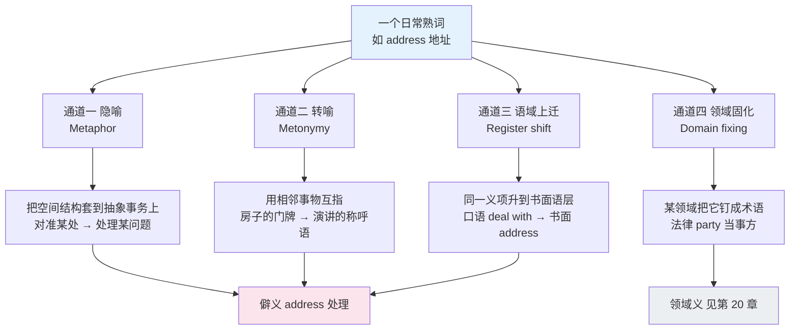
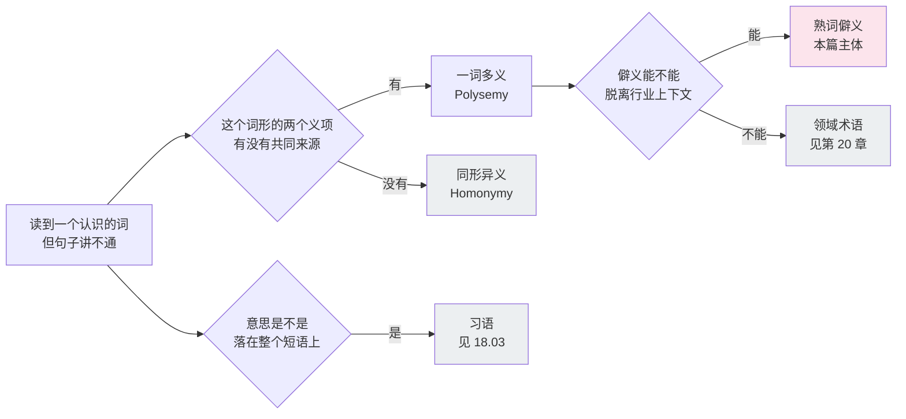
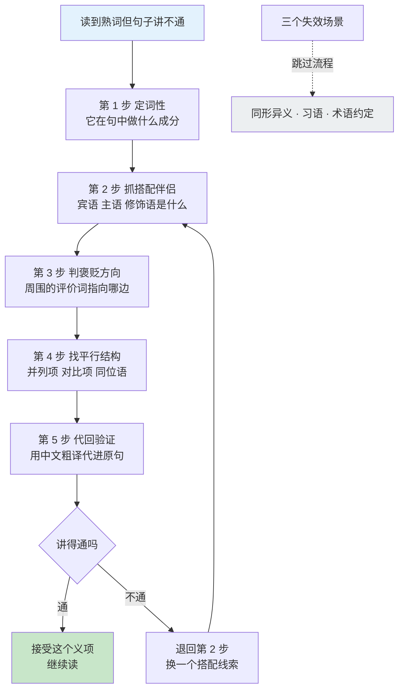
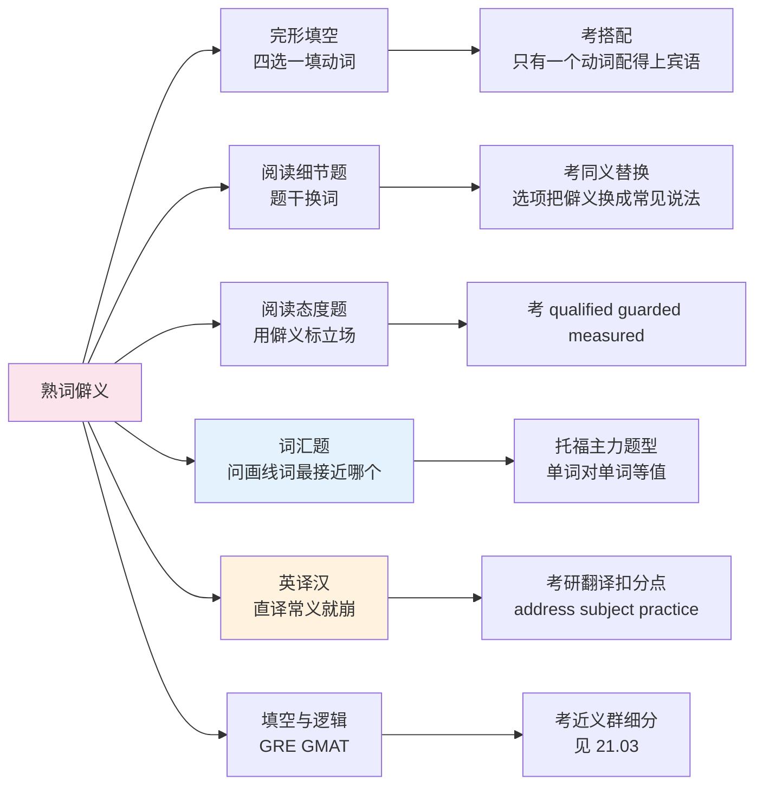
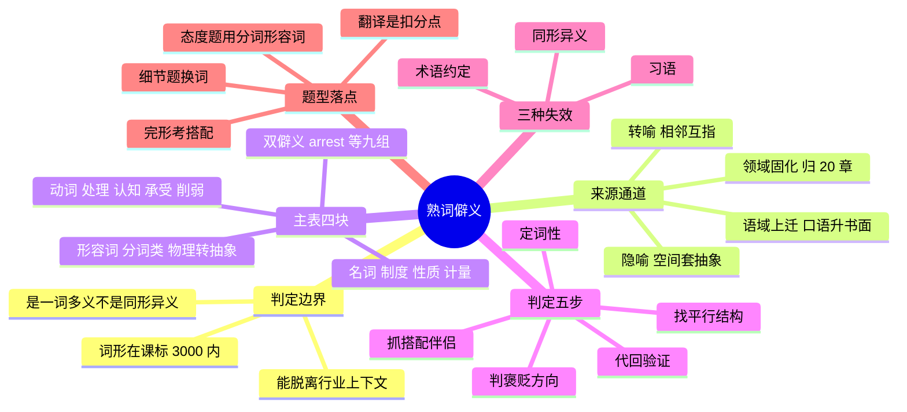

# 熟词僻义总表：从考研到 GRE

> [!info] 本篇定位
>
> 第 21 章第二篇，全书唯一的熟词僻义主清单。
>
> 上一篇 `21.考试词汇专项/01.国内考试词表基准：课标 1600-3000 与四六级 4500-6000 的分层` 在做 NGSL 差集时留下一个没解决的问题：`issue`、`term`、`respect`、`account`、`subject` 这些词全在你的词表里，可试卷考的偏偏是它们的另一个义项。本篇把这类词集中收拢。
>
> 义项引申的**机制**（隐喻、转喻、泛化、专化）在 `16.词义辨析、搭配与短语动词/02.反义词体系、一词多义与词义引申` 已经讲透，本篇不重讲；行业内部的义项清单归 `20.专业领域词汇` 各篇，本篇只收「日常词在通用书面语里的第二义项」这一层。
>
> 读完能做三件事：认出一个熟词正在用僻义、按五步流程从上下文把义项反推出来、知道这个僻义最可能出现在哪一类题里。

---

## 1. 本篇导读：认识的词才是最贵的坑

生词有一个好处：它长得陌生，你一眼就知道自己不认识，会停下来查、会标记、会写进生词本。熟词僻义没有这个好处。它伪装成你熟悉的样子，让你顺着最熟的那个义项一路读下去，读完整段没有任何不适感，然后选错答案。

这是词汇学习里唯一一类**你越熟越危险**的词。`address` 在初中课本里是「地址」，这个义项占据了绝大多数中国学习者的心智首位；等到考研阅读里出现 `The report addresses three concerns`，大脑第一反应仍然是「地址」，句子读不通，于是把 `addresses` 当成没见过的词硬猜，或者更糟——把整句囫囵滑过去，因为「反正每个词都认识」。

三条线可以说明这类词为什么在考试里占比这么高：

| 现象 | 原因 | 后果 |
| --- | --- | --- |
| 高频词的义项数远多于低频词 | 使用频率越高，被隐喻和转喻挪用的机会越多 | 考纲里最基础的那两千词，恰好是义项最杂的两千词 |
| 学习顺序按教材走，不按频次走 | 教材先给最具体、最好画图的那个义项 | 抽象义项被永久压在具体义项底下 |
| 命题人需要区分度 | 用生词区分不了水平（都不认识），用僻义可以 | 考研、GRE 的词汇考点大量落在僻义上 |

第三条尤其关键。命题人挑一个 `obfuscate` 放进阅读题，结果是所有人都不认识，题目失去区分度；挑一个 `discount` 用在「不重视」这个义项上，认识第二义项的人读通了，只认识「打折」的人读岔了，区分度立刻出来。所以**僻义是命题人最偏好的考点形式**，从考研一路到 GRE 都是。

### 1.1 僻义是从哪儿冒出来的

熟词僻义不是随机长出来的。它有四条固定的来源通道。



上图说的是同一个词形怎样长出第二个义项。左侧四条通道里，隐喻和转喻是纯语义的，语域上迁是社会性的（同一个意思换一个更正式的词壳），领域固化则会把词义钉死在某个专业圈子里。本篇收前三条通道的产物，第四条通道的产物（法律的 `party`、金融的 `security`、计算机的 `daemon`）主体归第 20 章各篇，本篇只在第 12 节做一份跨界索引，避免你在两处看到互相打架的解释。

四条通道里最值得单独说的是**语域上迁**。英语的书面语层大量来自拉丁与法语，但也有一批日耳曼核心词被抬进了正式文体，抬上去之后意思会变窄变抽象。`address` 的处理义、`observe` 的遵守义、`entertain` 的考虑义都属于这一类：口语里说 `deal with`、`follow`、`think about`，书面语换成这三个词，意思几乎一样，语域高了两档。这解释了一个规律——**熟词僻义在正式书面语里的密度远高于口语**，所以它是阅读题的重灾区，却几乎不会在听力对话里坑到你。

### 1.2 本篇怎么用

不要从头背。这份表的正确用法是**核对**：读完某一节，把这一节的中文义项遮住，逐词自问「除了我知道的那个意思，它还能表示什么」，答不上来的画勾，只处理画勾的部分。全篇二百六十条里，一个通过了四级的读者通常已经掌握三成到四成，真正需要处理的是剩下那一百五六十条。

第 13 节的五步判定流程比词表本身更重要。词表总有覆盖不到的词，流程可以迁移。

---

## 2. 什么算熟词僻义：三条判定线

「熟词僻义」在中文英语圈里被用得很松，几乎任何一个不认识的义项都被叫这个名字。收词之前得先把边界画出来，否则表会膨胀成一本词典。

本篇的收词标准是三条同时满足：

| 条件 | 说明 | 反例 |
| --- | --- | --- |
| 词形本身是初高中熟词 | 出现在课标 3000 词以内，读者一眼认得 | `obdurate` 整词陌生，不算僻义，归 21.03 |
| 目标义项与首选义项差距大 | 不是同一义项的引申微调，而是另一个词典义项 | `run` 表示「跑得快一点」不算，表示「经营」算 |
| 目标义项在通用书面语里可独立出现 | 不依赖特定行业上下文就能用 | `socket` 的「插座 → 套接字」依赖计算机语境，归 20.02 |

### 2.1 与三类邻居的边界

熟词僻义容易和另外三种现象混在一起。分清楚它们，判定流程才不会走错方向。



上图是收词与查词共用的一张分流图。三个被排除的分支各自有主讲点：同形异义（`bank` 河岸与银行、`bear` 熊与承受）由 `16.词义辨析、搭配与短语动词/02.反义词体系、一词多义与词义引申` 处理，它的特点是两个义项之间根本没有引申关系，只能分开硬记；领域术语归第 20 章；习语归 `18.语域、英美差异与习语俚语/03.习语与谚语`。

分辨同形异义和熟词僻义有一个实用手感：**能不能讲出一个通道**。`arrest` 的「逮捕」与「阻止」之间讲得通——都是「让某个正在进行的东西停下来」；`bear` 的「熊」与「承受」之间讲不通，那就是两个词碰巧长一样。讲得通的用通道记，讲不通的分开记，记法完全不同。

### 2.2 一份元词汇：描述僻义时用得到的词

后面各节的说明列会反复用到一小组元词汇，先立住。

| 英文 | 英式音标 | 美式音标 | 词性 | 中文 | 搭配与说明 |
| --- | --- | --- | --- | --- | --- |
| **sense** | /sens/ | /sens/ | n. | 义项 | in the sense of；词典里一个编号就是一个 sense |
| **polysemy** | /pəˈlɪsəmi/ | /pəˈlɪsəmi/ | n. | 一词多义 | 形容词 polysemous；义项之间有引申关系 |
| **homonym** | /ˈhɒmənɪm/ | /ˈhɑːmənɪm/ | n. | 同形异义词 | 相对的 homograph 同形、homophone 同音 |
| **register** | /ˈredʒɪstə/ | /ˈredʒɪstər/ | n. | 语域 | a formal / neutral / informal register |
| **connotation** | /ˌkɒnəˈteɪʃn/ | /ˌkɑːnəˈteɪʃn/ | n. | 内涵，褒贬色彩 | 与 denotation 字面义相对 |
| **collocate** | /ˈkɒləkeɪt/ | /ˈkɑːləkeɪt/ | n./v. | 搭配词；搭配 | collocate with；判定僻义最可靠的线索 |
| **disambiguate** | /ˌdɪsæmˈbɪɡjueɪt/ | /ˌdɪsæmˈbɪɡjueɪt/ | v. | 消歧 | disambiguate between two senses |
| **figurative** | /ˈfɪɡərətɪv/ | /ˈfɪɡjərətɪv/ | adj. | 比喻的 | 与 literal 字面的相对 |
| **transferred** | /trænsˈfɜːd/ | /trænsˈfɜːrd/ | adj. | 转移的 | a transferred sense 转义 |
| **obsolete** | /ˈɒbsəliːt/ | /ˌɑːbsəˈliːt/ | adj. | 废弃的 | 词典标 obsolete 的义项不用记 |

`register` 这个词本身就是个熟词僻义样本：常义「登记、注册」，僻义「语域」，另有「（声音的）音区」与 `the meaning didn't register` 里的「被察觉到」。一个词把本篇要讲的四种情况占了三种。

---

## 3. 表怎么读：六列词表里的考试与语域标记

本篇所有词表统一六列。「常见考试 / 语域」这一维不单独占列，而是压进「搭配与说明」列的开头，用一对方头括号标出：

```text
〔考研 · GRE｜正式〕address an issue / address concerns
  └─ 考试标记      └─ 语域    └─ 真正的搭配与说明
```

考试标记的取值与含义：

| 标记 | 含义 | 判断依据 |
| --- | --- | --- |
| 通用 | 四条线以上都可能出，属于基础必备 | 出现在多数通用书面语料里 |
| 六级 | 从 CET6 起开始成为考点 | 与上一篇的 CET6 增量层重合 |
| 考研 | 考研英语一、二的阅读与翻译高发 | 学术性说明文的高频义项 |
| 雅思 | 雅思阅读与 Task 2 议论文里常见 | 偏社会议题与数据描述 |
| 托福 | 托福阅读与词汇题常见 | 偏学科说明文 |
| GRE | 主要在 GRE 与 GMAT 阅读、填空里出现 | 语域偏高，日常几乎不用 |

语域标记只有四档：**正式**（书面语专属，口语说出来会显得端着）、**中性**（书面口语通吃）、**口语**（写进论文会不得体）、**领域**（离开某类文本就不成立，本篇只在第 12 节出现）。

> [!warning] 标记是倾向，不是禁区
>
> 标了「GRE」不等于考研不考，只表示这个义项在 GRE 语料里的密度最高。反过来也一样：标了「通用」的词在 GRE 里照样出现，只是不构成考点。
>
> 用这一列的正确方式是**排序**，不是**筛选**。如果你在准备考研，先把标了「通用」和「考研」的处理完，再回头扫「GRE」那一批；如果你只是想读技术文档和原版书，把「通用」「六级」「考研」三档吃透就够，GRE 那一档可以整批跳过。

> [!tip] 遮盖法自测
>
> 每张表读完，用手（或 Obsidian 的折叠）遮住第五列的中文，从左往右念英文词，念一个想一个僻义，想不出来的在旁边打一个点。整节读完只重看打点的那几行。
>
> 这个动作比通读第二遍有效得多，因为它逼你做**主动提取**而不是**被动识别**。词表的最大陷阱就是看第二遍时觉得「都会」，而实际上你只是认得。

---

## 4. 动词僻义（一）：处理、执行与提出

这一组的共同点是**把一个具体动作抬到事务层面**。`address` 原义是「对准某个方向」，抬上去就是「对准某个问题去处理」；`table` 原义是「放到桌上」，抬上去就是「拿到会上讨论」。识别标志是宾语——宾语一旦是 `issue`、`problem`、`proposal`、`motion`、`concern` 这类抽象事务名词，就该往这一组想。

| 英文 | 英式音标 | 美式音标 | 词性 | 中文 | 搭配与说明 |
| --- | --- | --- | --- | --- | --- |
| **address** | /əˈdres/ | /əˈdres/ | v. | 处理，着手解决 | 〔通用 · 考研｜正式〕address an issue / a problem / concerns；名词还有「演讲」义 an inaugural address |
| **entertain** | /ˌentəˈteɪn/ | /ˌentərˈteɪn/ | v. | 考虑；抱有（想法） | 〔考研 · GRE｜正式〕entertain a proposal / entertain doubts about |
| **exercise** | /ˈeksəsaɪz/ | /ˈeksərsaɪz/ | v. | 行使，运用 | 〔通用 · 考研｜正式〕exercise caution / authority / discretion / restraint |
| **command** | /kəˈmɑːnd/ | /kəˈmænd/ | v. | 博得；俯瞰 | 〔考研 · GRE｜正式〕command respect / command a view of the valley |
| **air** | /eə/ | /er/ | v. | 公开表达 | 〔考研｜正式〕air one's views / air grievances；宾语必是意见类名词 |
| **table** | /ˈteɪbl/ | /ˈteɪbl/ | v. | 英：提交讨论；美：搁置 | 〔通用｜正式〕table a motion 英美义相反，读到时先判文本国别 |
| **floor** | /flɔː/ | /flɔːr/ | v. | 使难倒；击倒 | 〔通用｜中性〕be floored by the question |
| **second** | /ˈsekənd/ | /ˈsekənd/ | v. | 附议 | 〔通用｜正式〕second a motion；此义重音仍在首音节 |
| **second** | /sɪˈkɒnd/ | /sɪˈkɑːnd/ | v. | 借调（英式） | 〔雅思｜正式〕be seconded to another department；此义重音后移，与上一行是两个读音 |
| **chair** | /tʃeə/ | /tʃer/ | v./n. | 主持；主席，教席 | 〔通用｜正式〕chair a meeting / hold the chair in physics |
| **host** | /həʊst/ | /hoʊst/ | n. | 一大群 | 〔考研｜中性〕a host of problems；此义后接复数，与「主人」义无关联感 |
| **harbour** | /ˈhɑːbə/ | /ˈhɑːrbər/ | v. | 心怀；窝藏 | 〔考研 · GRE｜正式〕harbour doubts / harbour a fugitive；美式拼 harbor |
| **nurse** | /nɜːs/ | /nɜːrs/ | v. | 心怀（怨恨）；悉心照料 | 〔GRE｜正式〕nurse a grudge / nurse an ambition |
| **foster** | /ˈfɒstə/ | /ˈfɑːstər/ | v. | 培养，助长 | 〔通用 · 雅思｜正式〕foster innovation / foster resentment；褒贬皆可 |
| **broker** | /ˈbrəʊkə/ | /ˈbroʊkər/ | v. | 斡旋促成 | 〔雅思 · 托福｜正式〕broker a deal / broker a ceasefire |
| **shoulder** | /ˈʃəʊldə/ | /ˈʃoʊldər/ | v. | 承担 | 〔通用｜中性〕shoulder the responsibility / the blame / the cost |
| **weather** | /ˈweðə/ | /ˈweðər/ | v. | 平安渡过；使风化 | 〔考研 · 雅思｜正式〕weather the storm / weather the recession |
| **stomach** | /ˈstʌmək/ | /ˈstʌmək/ | v. | 忍受 | 〔GRE｜中性〕can't stomach the hypocrisy；多用于否定 |
| **pocket** | /ˈpɒkɪt/ | /ˈpɑːkɪt/ | v. | 私吞 | 〔考研｜中性〕pocket the difference / pocket the profits |
| **mine** | /maɪn/ | /maɪn/ | v. | 开采；发掘（数据） | 〔托福｜中性〕mine the data for patterns |
| **mount** | /maʊnt/ | /maʊnt/ | v. | 发起；逐渐增加 | 〔考研 · 雅思｜正式〕mount a campaign / pressure is mounting |
| **stage** | /steɪdʒ/ | /steɪdʒ/ | v. | 举办；发动 | 〔雅思｜中性〕stage a protest / stage a comeback |
| **field** | /fiːld/ | /fiːld/ | v. | 应付（提问）；派出 | 〔GRE｜中性〕field questions from reporters |
| **court** | /kɔːt/ | /kɔːrt/ | v. | 招致；追求 | 〔GRE｜正式〕court controversy / court disaster |
| **doctor** | /ˈdɒktə/ | /ˈdɑːktər/ | v. | 篡改 | 〔考研｜中性〕doctor the figures / doctor a photograph |
| **cook** | /kʊk/ | /kʊk/ | v. | 伪造（账目） | 〔通用｜口语〕cook the books；固定说法，别换别的动词 |
| **pad** | /pæd/ | /pæd/ | v. | 虚增；充篇幅 | 〔GRE｜中性〕pad an expense account / pad an essay |
| **dress** | /dres/ | /dres/ | v. | 包扎；给…调味 | 〔托福｜中性〕dress a wound / dress a salad |
| **service** | /ˈsɜːvɪs/ | /ˈsɜːrvɪs/ | v. | 维修；偿付（债务利息） | 〔考研｜领域偏正式〕service the equipment / service the debt |
| **retire** | /rɪˈtaɪə/ | /rɪˈtaɪər/ | v. | 收回，使退出流通 | 〔GRE｜正式〕retire a bond / retire a jersey |
| **float** | /fləʊt/ | /floʊt/ | v. | 试探性提出；发行 | 〔考研｜中性〕float an idea / float a company on the stock market |
| **land** | /lænd/ | /lænd/ | v. | 到手，获得 | 〔通用｜口语〕land a job / land a contract |
| **net** | /net/ | /net/ | v. | 净赚 | 〔GRE｜中性〕the deal netted him two million |
| **square** | /skweə/ | /skwer/ | v. | 使一致；结清 | 〔GRE｜正式〕square theory with practice / square the accounts |
| **carry** | /ˈkæri/ | /ˈkæri/ | v. | 刊载；（议案）获通过 | 〔考研｜正式〕the paper carried the story / the motion was carried |
| **run** | /rʌn/ | /rʌn/ | v. | 刊登；经营；竞选 | 〔通用｜中性〕run a story / run a business / run for office |
| **lodge** | /lɒdʒ/ | /lɑːdʒ/ | v. | 正式提出（申诉） | 〔雅思｜正式〕lodge a complaint / lodge an appeal |
| **level** | /ˈlevl/ | /ˈlevl/ | v. | 提出（指控）；夷平 | 〔GRE｜正式〕level accusations at sb |
| **press** | /pres/ | /pres/ | v. | 敦促，逼问 | 〔考研｜中性〕press sb for an answer / press the point |
| **move** | /muːv/ | /muːv/ | v. | 动议，提议 | 〔通用｜正式〕move that the meeting be adjourned；后接虚拟式 |
| **plant** | /plɑːnt/ | /plænt/ | v./n. | 安插，栽赃；工厂 | 〔考研｜中性〕plant evidence / a manufacturing plant |
| **screen** | /skriːn/ | /skriːn/ | v. | 筛查；遮蔽 | 〔托福｜中性〕screen applicants / screen for cancer |
| **brief** | /briːf/ | /briːf/ | v./n. | 向…交代情况；摘要 | 〔通用｜正式〕brief the team on the plan |
| **deliver** | /dɪˈlɪvə/ | /dɪˈlɪvər/ | v. | 兑现；发表 | 〔雅思｜中性〕deliver on a promise / deliver a speech |
| **broach** | /brəʊtʃ/ | /broʊtʃ/ | v. | 提起（话题） | 〔GRE｜正式〕broach a subject / broach the question of funding |

> [!example] 同一段里的三个僻义
>
> - The committee **addressed** the shortfall, **tabled** a proposal to **service** the outstanding debt, and **moved** that the vote be deferred.
>   - 委员会处理了这笔缺口，提交了一份偿付未付债务的提案，并动议将表决推迟。
> - 四个动词全在课标 3000 以内，四个全用僻义。整句没有一个生词，也没有一个复杂句式，读不懂纯粹卡在词义上。

> [!warning] table 的英美相反义
>
> `table a motion` 在英式英语里是「把议案拿上来讨论」，在美式英语里是「把议案搁置起来」——正好相反。这是英美同词异义里后果最严重的一例，因为两个意思都讲得通，上下文往往不能消歧。
>
> 遇到这个词的处理办法是先判文本国别：拼写用 `-ise`、`colour`、`realise` 的偏英式，用 `-ize`、`color` 的偏美式；提到 `Parliament`、`MP` 的是英式，提到 `Congress`、`Senator` 的是美式。判不出来就别硬猜，这是极少数「查上下文也无解」的情况。
>
> 英美同词异义的完整清单见 `18.语域、英美差异与习语俚语/01.英式与美式词汇差异`。

---

## 5. 动词僻义（二）：认知、主张与裁定

这一组是学术文本的承重层。它们的共同特征是**后面接 that 从句**，而句法上一旦接了 that 从句，常义往往就用不上了。`observe` 后接名词是「观察」，后接 that 从句就是「评论说」；`allow` 后接名词是「允许」，后接 that 从句就是「承认」。

**句法位置本身就是消歧信号**，这是本组最省力的判定捷径。

| 英文 | 英式音标 | 美式音标 | 词性 | 中文 | 搭配与说明 |
| --- | --- | --- | --- | --- | --- |
| **observe** | /əbˈzɜːv/ | /əbˈzɜːrv/ | v. | 遵守；评论说 | 〔通用 · 考研｜正式〕observe the rules / regulations；observe that…「评论说」 |
| **appreciate** | /əˈpriːʃieɪt/ | /əˈpriːʃieɪt/ | v. | 意识到；增值 | 〔通用 · 考研｜正式〕appreciate the difficulty；the yen appreciated against the dollar |
| **admit** | /ədˈmɪt/ | /ədˈmɪt/ | v. | 容纳；准许进入 | 〔托福｜正式〕the hall admits 500 people；admit of no doubt「不容置疑」 |
| **allow** | /əˈlaʊ/ | /əˈlaʊ/ | v. | 承认；留出（余量） | 〔考研｜正式〕allow that he was right；allow for delays 把延误算进去 |
| **argue** | /ˈɑːɡjuː/ | /ˈɑːrɡjuː/ | v. | 表明，证明 | 〔考研 · GRE｜正式〕the evidence argues against the theory；主语是证据不是人 |
| **suggest** | /səˈdʒest/ | /səɡˈdʒest/ | v. | 表明，显示 | 〔通用 · 托福｜正式〕the data suggest that…；主语是无生命体时不是「建议」 |
| **maintain** | /meɪnˈteɪn/ | /meɪnˈteɪn/ | v. | 坚称 | 〔考研｜正式〕he maintains that the figures are wrong |
| **submit** | /səbˈmɪt/ | /səbˈmɪt/ | v. | 主张（法律用语）；服从 | 〔GRE｜正式〕I submit that the evidence is insufficient |
| **hold** | /həʊld/ | /hoʊld/ | v. | 认为；（法院）裁定 | 〔考研 · GRE｜正式〕the court held that…；hold sb responsible |
| **find** | /faɪnd/ | /faɪnd/ | v. | 裁定 | 〔通用｜领域偏正式〕find sb guilty / find for the plaintiff |
| **assume** | /əˈsjuːm/ | /əˈsuːm/ | v. | 呈现（形态）；就任 | 〔考研 · GRE｜正式〕assume a new form / assume office / assume control |
| **affect** | /əˈfekt/ | /əˈfekt/ | v. | 假装；惯用 | 〔GRE｜正式〕affect an accent / affect indifference；与「影响」义无引申关系 |
| **pretend** | /prɪˈtend/ | /prɪˈtend/ | v. | 自称有（资格） | 〔GRE｜正式〕pretend to expertise；此义后接 to + 名词 |
| **profess** | /prəˈfes/ | /prəˈfes/ | v. | 声称（未必属实） | 〔GRE｜正式〕profess ignorance / profess to be an expert |
| **allege** | /əˈledʒ/ | /əˈledʒ/ | v. | 宣称（未经证实） | 〔考研｜正式〕it is alleged that…；用了这个词就是不为真实性背书 |
| **acknowledge** | /əkˈnɒlɪdʒ/ | /əkˈnɑːlɪdʒ/ | v. | 确认收到；致谢 | 〔雅思｜正式〕acknowledge receipt of the letter |
| **appreciate**（第二义） | /əˈpriːʃieɪt/ | /əˈpriːʃieɪt/ | v. | 鉴赏；升值 | 〔通用｜中性〕与「感谢」义同源，都是「充分认识到价值」 |
| **register** | /ˈredʒɪstə/ | /ˈredʒɪstər/ | v. | 被察觉到；显露 | 〔GRE｜中性〕the name didn't register / her face registered surprise |
| **read** | /riːd/ | /riːd/ | v. | 显示（读数）；读起来是 | 〔托福｜中性〕the gauge reads 40 / the sentence reads awkwardly |
| **relate** | /rɪˈleɪt/ | /rɪˈleɪt/ | v. | 讲述 | 〔GRE｜正式〕relate the events of that night |
| **reason** | /ˈriːzn/ | /ˈriːzn/ | v. | 推理，推断 | 〔考研｜正式〕reason from evidence to conclusion |
| **figure** | /ˈfɪɡə/ | /ˈfɪɡjər/ | v. | 认为；出现，占有一席 | 〔通用｜口语与中性〕I figure he'll come；the issue figures prominently |
| **feature** | /ˈfiːtʃə/ | /ˈfiːtʃər/ | v. | 以…为特色；起重要作用 | 〔托福｜中性〕the design features a glass roof |
| **mark** | /mɑːk/ | /mɑːrk/ | v. | 标志着；打分 | 〔雅思｜正式〕the treaty marked the end of the war |
| **witness** | /ˈwɪtnəs/ | /ˈwɪtnəs/ | v. | （时代、地点）见证 | 〔雅思 · 考研｜正式〕the 1990s witnessed rapid growth；主语常是时间或地点 |
| **see** | /siː/ | /siː/ | v. | （时期）经历 | 〔雅思｜正式〕the past decade has seen a sharp decline |
| **enjoy** | /ɪnˈdʒɔɪ/ | /ɪnˈdʒɔɪ/ | v. | 享有 | 〔考研｜正式〕enjoy a good reputation / enjoy immunity；主语可以是机构 |
| **command**（第二义） | /kəˈmɑːnd/ | /kəˈmænd/ | v. | 掌握（语言） | 〔雅思｜正式〕command three languages；名词 a good command of English |
| **exhaust** | /ɪɡˈzɔːst/ | /ɪɡˈzɔːst/ | v. | 详尽论述；用尽 | 〔GRE｜正式〕exhaust the topic / exhaust all options |
| **digest** | /daɪˈdʒest/ | /daɪˈdʒest/ | v. | 领会，消化（信息） | 〔考研｜中性〕digest the implications；名词 /ˈdaɪdʒest/「文摘」 |
| **entertain**（回指） | /ˌentəˈteɪn/ | /ˌentərˈteɪn/ | v. | 考虑 | 与第 4 节同条，此处提示它也接 that 从句：entertain the notion that… |

> [!warning] suggest 的两个义项靠主语区分
>
> - The results **suggest** that the hypothesis is wrong.
>   - 结果**表明**假设是错的。
> - I **suggest** that we postpone the meeting.
>   - 我**建议**推迟会议。
>
> 主语是无生命体（results、data、evidence、findings）时是「表明」，后接从句用陈述语气；主语是人且表示提议时是「建议」，从句里的动词要用原形（虚拟式）。第二句写成 `I suggest that we postponed` 就错了。
>
> 这个虚拟式规则本身属语法，详见 `02.英语基础语法`；本篇只用它做**义项判据**——从句动词是原形，说明用的是「建议」义。

> [!example] 学术文本里的高密度段落
>
> - The author **maintains** that the earlier study **admits** of another reading, **observes** that its sampling method violated a rule the field has long **observed**, and **allows** that his own data **argue** for caution.
>   - 作者坚称早先那项研究还有另一种解读，评论说它的抽样方法违反了该领域长期遵守的一条规则，并且承认自己的数据也表明应当谨慎。
> - `observe` 在同一句里用了两个义项：`observes that` 是「评论说」，`observed` 接 `a rule` 是「遵守」。区分靠的是宾语类型，不是靠语感。

---

## 6. 动词僻义（三）：施加、承受与经受

这一组处理「不好的东西落到某人头上」。中文的表达习惯是主动句（「让他遭受批评」），英文常用被动或者用一个专门的施加类动词，所以这组词的僻义在汉译英里出错率极高。

| 英文 | 英式音标 | 美式音标 | 词性 | 中文 | 搭配与说明 |
| --- | --- | --- | --- | --- | --- |
| **subject** | /səbˈdʒekt/ | /səbˈdʒekt/ | v. | 使遭受 | 〔通用 · 考研｜正式〕subject sb to criticism / to tests；动词重音在后，名词 /ˈsʌbdʒɪkt/ 重音在前 |
| **suffer** | /ˈsʌfə/ | /ˈsʌfər/ | v. | 变差，受损；容忍 | 〔考研｜中性〕quality suffered / his work suffered；此义不及物 |
| **bear** | /beə/ | /ber/ | v. | 带有；承担 | 〔考研｜正式〕bear a resemblance to / bear the cost / bear in mind |
| **sustain** | /səˈsteɪn/ | /səˈsteɪn/ | v. | 遭受（伤害、损失） | 〔考研 · 托福｜正式〕sustain injuries / sustain heavy losses；与「维持」义并存 |
| **incur** | /ɪnˈkɜː/ | /ɪnˈkɜːr/ | v. | 招致，蒙受 | 〔通用 · 雅思｜正式〕incur costs / incur criticism / incur a penalty |
| **court**（回指） | /kɔːt/ | /kɔːrt/ | v. | 招致 | 与 incur 的差别：court 含「自找」的意味，incur 中性 |
| **invite** | /ɪnˈvaɪt/ | /ɪnˈvaɪt/ | v. | 招致，引来 | 〔GRE｜正式〕invite criticism / invite comparison；宾语是负面结果 |
| **draw** | /drɔː/ | /drɔː/ | v. | 引来；得出 | 〔通用｜中性〕draw criticism / draw a conclusion / draw a distinction |
| **attract** | /əˈtrækt/ | /əˈtrækt/ | v. | 招来（负面关注） | 〔雅思｜中性〕attract criticism / attract a fine |
| **face** | /feɪs/ | /feɪs/ | v. | 面临 | 〔通用｜中性〕face charges / face a deadline；被动 be faced with |
| **weather**（回指） | /ˈweðə/ | /ˈweðər/ | v. | 挺过 | 与 suffer 的方向相反：suffer 是受损，weather 是受损而未垮 |
| **stand** | /stænd/ | /stænd/ | v. | 经受得住；忍受 | 〔考研｜中性〕stand the test of time / can't stand it |
| **withstand** | /wɪðˈstænd/ | /wɪðˈstænd/ | v. | 经受住 | 〔托福｜正式〕withstand scrutiny / withstand pressure |
| **brave** | /breɪv/ | /breɪv/ | v. | 冒着…前行 | 〔GRE｜正式〕brave the weather / brave criticism |
| **brook** | /brʊk/ | /brʊk/ | v. | 容忍 | 〔GRE｜正式〕brook no delay / brook no argument；几乎只用于否定 |
| **countenance** | /ˈkaʊntənəns/ | /ˈkaʊntənəns/ | v./n. | 赞同，容许；面容 | 〔GRE｜正式〕refuse to countenance the idea |
| **abide** | /əˈbaɪd/ | /əˈbaɪd/ | v. | 忍受；遵守 | 〔GRE｜正式〕can't abide him；abide by the rules |
| **entertain**（第三义） | /ˌentəˈteɪn/ | /ˌentərˈteɪn/ | v. | 容许（申请、动议） | 〔GRE｜正式〕the court declined to entertain the motion |
| **visit** | /ˈvɪzɪt/ | /ˈvɪzɪt/ | v. | 降下（惩罚、灾祸） | 〔GRE｜正式偏旧〕visit punishment on sb；旧体色彩浓 |
| **inflict** | /ɪnˈflɪkt/ | /ɪnˈflɪkt/ | v. | 施加（打击、痛苦） | 〔考研｜正式〕inflict damage on / inflict a defeat on |
| **impose** | /ɪmˈpəʊz/ | /ɪmˈpoʊz/ | v. | 强加；打扰 | 〔通用｜正式〕impose a tax on；impose on sb「叨扰某人」 |
| **saddle** | /ˈsædl/ | /ˈsædl/ | v. | 使背上（负担） | 〔GRE｜中性〕be saddled with debt |
| **burden** | /ˈbɜːdn/ | /ˈbɜːrdn/ | v. | 使负担 | 〔雅思｜正式〕burden sb with responsibility |
| **tax** | /tæks/ | /tæks/ | v. | 使费神，考验 | 〔GRE｜正式〕tax one's patience / tax the imagination |
| **try** | /traɪ/ | /traɪ/ | v. | 考验；审判 | 〔GRE｜正式〕try sb's patience / be tried for murder |
| **exact** | /ɪɡˈzækt/ | /ɪɡˈzækt/ | v. | 索取，强求 | 〔GRE｜正式〕exact a heavy price / exact revenge；与形容词「精确的」同形 |
| **wring** | /rɪŋ/ | /rɪŋ/ | v. | 硬挤出（让步） | 〔GRE｜正式〕wring a concession from sb |
| **weather**（并列） | — | — | — | — | 见上，同一词在本节与第 4 节各出现一次，义项相同 |

> [!warning] subject 的三种形态一次记清
>
> | 形态 | 读音 | 词性 | 意思 |
> | --- | --- | --- | --- |
> | subject | /ˈsʌbdʒɪkt/ | n. | 科目；主语；实验对象；主体 |
> | subject | /ˈsʌbdʒɪkt/ | adj. | 受…支配的，取决于（subject to change） |
> | subject | /səbˈdʒekt/ | v. | 使遭受（subject sb to sth） |
>
> 名词与形容词同音，动词重音后移。这是「名前动后」重音规则的典型样本，同类还有 `record`、`present`、`conduct`、`contrast`、`object`、`increase`。规则本身见 `01.词汇入门与学习方法/03.音标、词重音与词典读音体例`。
>
> `subject to` 这个形容词短语在合同与规范里出现频率极高，意思是「以…为条件、须服从于」：`subject to approval`（需经批准）、`prices are subject to change without notice`（价格可能变动，恕不另行通知）。读技术规范时它几乎是每页都有的一个结构。

---

## 7. 动词僻义（四）：限制、抑制与贬低

这一组是论证类文本的核心动作词。作者要给一个论断打折扣、要阻止一个趋势、要驳掉一个说法，用的就是这批词。GRE 与考研阅读的态度题、观点题大量落在这里。

| 英文 | 英式音标 | 美式音标 | 词性 | 中文 | 搭配与说明 |
| --- | --- | --- | --- | --- | --- |
| **qualify** | /ˈkwɒlɪfaɪ/ | /ˈkwɑːlɪfaɪ/ | v. | 限定，给…加限制条件 | 〔考研 · GRE｜正式〕qualify a statement / qualify one's support；派生 qualified support「有保留的支持」 |
| **discount** | /dɪsˈkaʊnt/ | /dɪsˈkaʊnt/ | v. | 不重视，低估 | 〔考研 · GRE｜正式〕discount the possibility / discount his testimony；动词重音在后，名词 /ˈdɪskaʊnt/ 在前 |
| **dismiss** | /dɪsˈmɪs/ | /dɪsˈmɪs/ | v. | 不予考虑，驳回 | 〔通用 · 考研｜正式〕dismiss the idea as absurd；比 discount 更决绝 |
| **moderate** | /ˈmɒdəreɪt/ | /ˈmɑːdəreɪt/ | v. | 缓和；主持（讨论） | 〔GRE｜正式〕moderate one's demands / moderate a panel；动词末音节读 /eɪt/，形容词读 /ət/ |
| **temper** | /ˈtempə/ | /ˈtempər/ | v. | 调和，缓和 | 〔GRE｜正式〕temper justice with mercy / temper enthusiasm with caution |
| **check** | /tʃek/ | /tʃek/ | v./n. | 抑制；制约 | 〔考研｜正式〕check the spread of the disease；checks and balances 制衡 |
| **stem** | /stem/ | /stem/ | v. | 遏止 | 〔考研 · 雅思｜正式〕stem the tide / stem the flow of refugees；与 stem from「源自」是两个义项 |
| **stay** | /steɪ/ | /steɪ/ | v. | 暂缓（执行） | 〔GRE｜正式〕stay an execution / a stay of proceedings |
| **curb** | /kɜːb/ | /kɜːrb/ | v./n. | 遏制；路缘 | 〔雅思 · 考研｜正式〕curb inflation / curb emissions |
| **stunt** | /stʌnt/ | /stʌnt/ | v. | 阻碍…生长 | 〔托福｜正式〕stunt growth / stunted development |
| **compromise** | /ˈkɒmprəmaɪz/ | /ˈkɑːmprəmaɪz/ | v. | 危及，损害 | 〔考研 · GRE｜正式〕compromise security / compromise one's principles；与「妥协」义并存 |
| **undermine** | /ˌʌndəˈmaɪn/ | /ˌʌndərˈmaɪn/ | v. | 逐渐削弱 | 〔六级 · GRE｜正式〕undermine confidence / undermine the argument；宾语是抽象事物 |
| **qualify**（回指） | — | — | — | — | 与「使有资格」同形，靠宾语区分：宾语是人 → 有资格；是陈述 → 限定 |
| **relieve** | /rɪˈliːv/ | /rɪˈliːv/ | v. | 接替；解除职务 | 〔GRE｜正式〕relieve sb of duty / relieve the guard |
| **spare** | /speə/ | /sper/ | v. | 免去；抽出 | 〔考研｜中性〕spare sb the trouble / can you spare a minute |
| **excuse** | /ɪkˈskjuːz/ | /ɪkˈskjuːz/ | v. | 免除（义务） | 〔GRE｜正式〕excuse sb from attending |
| **waive** | /weɪv/ | /weɪv/ | v. | 放弃（权利），免除 | 〔GRE｜正式〕waive the fee / waive one's right to appeal |
| **retract** | /rɪˈtrækt/ | /rɪˈtrækt/ | v. | 撤回（说法） | 〔GRE｜正式〕retract a statement / retract a paper |
| **recant** | /rɪˈkænt/ | /rɪˈkænt/ | v. | 公开放弃（观点） | 〔GRE｜正式〕recant his earlier views |
| **disparage** | /dɪˈspærɪdʒ/ | /dɪˈspærɪdʒ/ | v. | 贬低 | 〔GRE｜正式〕disparage a rival's work；整词偏难，与 discount 同向 |
| **belittle** | /bɪˈlɪtl/ | /bɪˈlɪtl/ | v. | 轻视，贬低 | 〔GRE｜中性〕belittle sb's achievements |
| **downplay** | /ˌdaʊnˈpleɪ/ | /ˌdaʊnˈpleɪ/ | v. | 淡化处理 | 〔雅思｜中性〕downplay the risks |
| **gloss** | /ɡlɒs/ | /ɡlɑːs/ | v./n. | 掩饰；注释 | 〔GRE｜正式〕gloss over the difficulties；名词「注解」 |
| **qualify** — | — | — | — | — | — |
| **hedge** | /hedʒ/ | /hedʒ/ | v./n. | 含糊其辞；对冲 | 〔GRE｜正式〕hedge one's answer；学术 hedging 见 19.03 |
| **temporize** | /ˈtempəraɪz/ | /ˈtempəraɪz/ | v. | 拖延以避免表态 | 〔GRE｜正式〕英式常拼 temporise |
| **equivocate** | /ɪˈkwɪvəkeɪt/ | /ɪˈkwɪvəkeɪt/ | v. | 说模棱两可的话 | 〔GRE｜正式〕整词偏难，详见 21.03 |
| **arrest** | /əˈrest/ | /əˈrest/ | v. | 阻止（进程） | 〔考研 · GRE｜正式〕arrest the decline / arrest the spread；见第 11 节双义并列 |
| **arrest**（第二僻义） | /əˈrest/ | /əˈrest/ | v. | 吸引（注意） | 〔GRE｜正式〕arrest attention；形容词 arresting「引人注目的」 |

> [!warning] qualify 的两个方向截然相反
>
> - His experience **qualifies** him for the post.
>   - 他的经历使他**够格**担任这个职位。（增强）
> - He **qualified** his support with three conditions.
>   - 他给自己的支持**加了**三个**限制条件**。（削弱）
>
> 同一个词，一个方向是给资格，一个方向是打折扣。区分靠宾语：宾语是人（或 `qualify for + 名词`）时是「够格」，宾语是 `statement`、`support`、`claim`、`approval` 这类言语行为名词时是「限定」。
>
> 派生的形容词 `qualified` 也带这两义：`a qualified accountant` 是「有执业资格的会计」，`qualified approval` 是「有保留的批准」。GRE 阅读的态度题特别爱用后者——问作者对某观点的态度，正确选项常常是 `qualified endorsement`（有保留的赞同），不是 `wholehearted support`。

> [!tip] 削弱类动词按强度排一条线
>
> ```text
> 弱 ─────────────────────────────────────────► 强
> qualify → downplay → discount → belittle → dismiss → refute
> 加条件    淡化       不重视      贬低       驳回      驳倒
> ```
>
> 这条线在做态度题时直接可用。同一个作者，用 `qualify` 说明他基本认同只是留了余地；用 `dismiss` 说明他完全不接受。选项里那个「部分同意」还是「完全反对」，答案就在这个词上。
>
> `refute` 有一个额外陷阱：它的严格义是「用证据驳倒并证明其错误」，不是「反驳」。「提出反对意见但未必成功」应当用 `rebut` 或 `dispute`。GRE 会考这个区别。

---

## 8. 名词僻义（一）：制度、群体与文本

从这一节起转到名词。名词僻义的判定信号与动词不同：动词看宾语和从句，名词主要看**冠词、单复数与前置修饰语**。`practice` 不可数时是「惯例、做法」，可数复数 `practices` 是一条条具体做法；`school` 前面出现人名或地名（`the Frankfurt school`）时是「学派」不是「学校」。

| 英文 | 英式音标 | 美式音标 | 词性 | 中文 | 搭配与说明 |
| --- | --- | --- | --- | --- | --- |
| **practice** | /ˈpræktɪs/ | /ˈpræktɪs/ | n. | 惯例，做法；业务 | 〔通用 · 考研｜中性〕common practice / business practices / a medical practice；美式动词拼 practice，英式动词拼 practise |
| **school** | /skuːl/ | /skuːl/ | n. | 学派；（鱼）群 | 〔考研 · GRE｜正式〕the Chicago school of economics / a school of thought / a school of fish |
| **discipline** | /ˈdɪsəplɪn/ | /ˈdɪsəplɪn/ | n. | 学科；纪律 | 〔通用 · 托福｜正式〕an academic discipline / across disciplines；形容词 disciplinary |
| **party** | /ˈpɑːti/ | /ˈpɑːrti/ | n. | 当事方，一方 | 〔考研｜正式〕a third party / the parties to the contract / an interested party |
| **article** | /ˈɑːtɪkl/ | /ˈɑːrtɪkl/ | n. | 条款；物品 | 〔通用｜正式〕Article 5 of the treaty / articles of clothing |
| **provision** | /prəˈvɪʒn/ | /prəˈvɪʒn/ | n. | 条款；准备，供给 | 〔考研｜正式〕the provisions of the act / make provision for old age |
| **body** | /ˈbɒdi/ | /ˈbɑːdi/ | n. | 团体；主体部分 | 〔考研 · 雅思｜正式〕a governing body / the body of the text / a body of evidence |
| **organ** | /ˈɔːɡən/ | /ˈɔːrɡən/ | n. | 机构；机关刊物 | 〔GRE｜正式〕an organ of the state / the party's official organ |
| **office** | /ˈɒfɪs/ | /ˈɔːfɪs/ | n. | 职务，公职 | 〔考研｜正式〕take office / hold office / run for office；此义不可数、不加冠词 |
| **faculty** | /ˈfæklti/ | /ˈfæklti/ | n. | 官能，能力；全体教职员 | 〔托福｜正式〕mental faculties / the faculty of speech；美式指全体教师 |
| **chair**（回指） | /tʃeə/ | /tʃer/ | n. | 主席；讲席教授职位 | 〔通用｜正式〕hold the chair / address the chair |
| **board** | /bɔːd/ | /bɔːrd/ | n. | 董事会；膳食 | 〔考研｜正式〕the board of directors / room and board |
| **house** | /haʊs/ | /haʊs/ | n. | 议院；公司 | 〔雅思｜正式〕the House of Commons / a publishing house |
| **court** | /kɔːt/ | /kɔːrt/ | n. | 宫廷 | 〔GRE｜正式〕the royal court；与「法庭」「球场」并列三义 |
| **concern** | /kənˈsɜːn/ | /kənˈsɜːrn/ | n. | 公司；关切 | 〔GRE｜正式〕a going concern 持续经营的企业 |
| **institution** | /ˌɪnstɪˈtjuːʃn/ | /ˌɪnstəˈtuːʃn/ | n. | 制度；惯例 | 〔考研｜正式〕the institution of marriage；不只是「机构」 |
| **establishment** | /ɪˈstæblɪʃmənt/ | /ɪˈstæblɪʃmənt/ | n. | 权势集团；机构 | 〔GRE｜正式〕the Establishment 大写指建制派 |
| **community** | /kəˈmjuːnəti/ | /kəˈmjuːnəti/ | n. | 界，群体 | 〔托福｜正式〕the scientific community / the business community |
| **circle** | /ˈsɜːkl/ | /ˈsɜːrkl/ | n. | 圈子 | 〔GRE｜中性〕in academic circles；此义常用复数 |
| **quarter** | /ˈkwɔːtə/ | /ˈkwɔːrtər/ | n. | 方面，来源；住处 | 〔GRE｜正式〕criticism from all quarters / living quarters |
| **camp** | /kæmp/ | /kæmp/ | n. | 阵营 | 〔雅思｜中性〕the two camps disagree |
| **letter** | /ˈletə/ | /ˈletər/ | n. | 字面 | 〔考研｜正式〕the letter of the law 与 the spirit of the law 成对出现 |
| **spirit** | /ˈspɪrɪt/ | /ˈspɪrɪt/ | n. | 精神实质 | 〔考研｜正式〕in the spirit of cooperation |
| **text** | /tekst/ | /tekst/ | n. | 原文；教科书 | 〔托福｜正式〕the text of the speech |
| **copy** | /ˈkɒpi/ | /ˈkɑːpi/ | n. | 文稿，广告词 | 〔GRE｜领域偏中性〕write the copy for an ad |
| **feature** | /ˈfiːtʃə/ | /ˈfiːtʃər/ | n. | 特写报道；特征 | 〔雅思｜中性〕a feature article |
| **piece** | /piːs/ | /piːs/ | n. | 一篇文章；一件作品 | 〔GRE｜中性〕a piece in the Times |
| **note** | /nəʊt/ | /noʊt/ | n. | 语气，口吻；纸币；音符 | 〔考研 · GRE｜正式〕a note of caution / strike the right note |
| **key** | /kiː/ | /kiː/ | n. | 图例；答案；调 | 〔托福｜中性〕the key to the map / in the key of C |
| **legend** | /ˈledʒənd/ | /ˈledʒənd/ | n. | 图例说明 | 〔托福 · 雅思｜领域偏正式〕the legend of the chart；与「传说」义同形 |
| **caption** | /ˈkæpʃn/ | /ˈkæpʃn/ | n. | 图片说明 | 〔雅思｜中性〕the caption under the photo |
| **volume** | /ˈvɒljuːm/ | /ˈvɑːljuːm/ | n. | 卷，册；量 | 〔考研｜中性〕a three-volume work / trading volume |
| **issue** | /ˈɪʃuː/ | /ˈɪʃuː/ | n. | 发行；期号；子女 | 〔考研 · GRE｜正式〕the issue of new shares / the June issue / die without issue |
| **edition** | /ɪˈdɪʃn/ | /ɪˈdɪʃn/ | n. | 版本 | 〔通用｜中性〕the second edition；与 issue「期」区分 |
| **draft** | /drɑːft/ | /dræft/ | n. | 汇票；征兵；穿堂风 | 〔GRE｜正式〕a bank draft / the draft；英式「穿堂风」另拼 draught |
| **bill** | /bɪl/ | /bɪl/ | n. | 议案；钞票（美）；鸟喙 | 〔通用｜中性〕pass a bill / a ten-dollar bill |
| **suit** | /suːt/ | /suːt/ | n. | 诉讼；一套（牌的）花色 | 〔考研｜正式〕file a suit / follow suit「跟着做」 |
| **sentence** | /ˈsentəns/ | /ˈsentəns/ | n. | 判决 | 〔通用｜正式〕a five-year sentence / pass sentence |
| **charge** | /tʃɑːdʒ/ | /tʃɑːrdʒ/ | n. | 指控；负责；电荷 | 〔通用｜中性〕a charge of murder / in charge of / an electric charge |
| **count** | /kaʊnt/ | /kaʊnt/ | n. | （指控的）项 | 〔GRE｜正式〕guilty on three counts；on that count「在那一点上」 |
| **custom** | /ˈkʌstəm/ | /ˈkʌstəm/ | n. | 惯例；（复数）海关 | 〔通用｜中性〕go through customs；单数「习俗」，复数「海关」 |
| **duty** | /ˈdjuːti/ | /ˈduːti/ | n. | 关税 | 〔考研｜正式〕customs duty / duty-free |
| **works** | /wɜːks/ | /wɜːrks/ | n. | 工厂；著作 | 〔GRE｜正式〕a steel works（单复同形）/ the complete works of Dickens |

> [!example] practice 的三个义项在一段里
>
> - It is standard **practice** to anonymize the data. Several **practices** in the field have since been revised, and the author now runs a small consulting **practice**.
>   - 把数据匿名化是标准**做法**。该领域的几项**惯例**此后已被修订，作者现在经营着一家小型咨询**事务所**。
> - 三个义项靠冠词与单复数区分：`standard practice` 无冠词不可数，是抽象的「做法」；`several practices` 复数可数，是一条条具体惯例；`a consulting practice` 单数带不定冠词，是「业务、事务所」。

> [!warning] school 的学派义有一个固定信号
>
> `school` 表示「学派」时，前面几乎总有一个**限定成分指明是谁的学派**：地名（`the Vienna school`）、人名（`the Freudian school`）、或者后接 `of + 抽象名词`（`a school of thought`）。
>
> 反过来，`the school` 单独出现且上下文在讲教育机构时，就是普通的「学校」。这个信号在托福的艺术史、哲学史类文章里非常好用，那类文章里 `school` 十有八九是「画派」「乐派」「学派」。
>
> 同一个逻辑适用于 `movement`（运动、流派）、`tradition`（传统、流派）、`current`（潮流）——它们在学术文本里是一组近义词。

---

## 9. 名词僻义（二）：抽象性质、方面与依据

这一组是论证结构词。它们本身不携带具体内容，只标记「这是一个方面」「这是一条理由」「这是一种程度」。中文里往往被译成同一批虚词，所以最容易混作一团。

| 英文 | 英式音标 | 美式音标 | 词性 | 中文 | 搭配与说明 |
| --- | --- | --- | --- | --- | --- |
| **economy** | /ɪˈkɒnəmi/ | /ɪˈkɑːnəmi/ | n. | 简洁，节省 | 〔考研 · GRE｜正式〕economy of expression / economy of means / economies of scale |
| **respect** | /rɪˈspekt/ | /rɪˈspekt/ | n. | 方面 | 〔通用 · 考研｜正式〕in this respect / in many respects / in all respects |
| **regard** | /rɪˈɡɑːd/ | /rɪˈɡɑːrd/ | n. | 方面；关注 | 〔考研｜正式〕in this regard / with regard to |
| **term** | /tɜːm/ | /tɜːrm/ | n. | 术语；条款；任期；（复数）关系 | 〔通用 · 考研｜正式〕in terms of / come to terms with / be on good terms |
| **account** | /əˈkaʊnt/ | /əˈkaʊnt/ | n. | 描述；理由 | 〔通用 · 考研｜正式〕give an account of / on account of / on no account |
| **ground** | /ɡraʊnd/ | /ɡraʊnd/ | n. | 理由，根据 | 〔考研 · GRE｜正式〕on the grounds that / have grounds for；此义常用复数 |
| **case** | /keɪs/ | /keɪs/ | n. | 论据；病例；格 | 〔考研｜正式〕make a case for / a strong case against |
| **point** | /pɔɪnt/ | /pɔɪnt/ | n. | 意义；要点 | 〔通用｜中性〕there is no point in doing / miss the point / a case in point |
| **matter** | /ˈmætə/ | /ˈmætər/ | n. | 物质；（印刷）内容 | 〔托福｜正式〕organic matter / printed matter |
| **object** | /ˈɒbdʒɪkt/ | /ˈɑːbdʒekt/ | n. | 目标；对象 | 〔考研｜正式〕the object of the exercise / an object of ridicule |
| **subject**（回指） | /ˈsʌbdʒɪkt/ | /ˈsʌbdʒekt/ | n. | 实验对象；主体 | 〔托福｜正式〕test subjects / the subject of the study |
| **agent** | /ˈeɪdʒənt/ | /ˈeɪdʒənt/ | n. | 作用剂；因素 | 〔托福｜正式〕a cleaning agent / an agent of change |
| **vehicle** | /ˈviːɪkl/ | /ˈviːhɪkl/ | n. | 载体，手段 | 〔考研 · GRE｜正式〕a vehicle for social change |
| **medium** | /ˈmiːdiəm/ | /ˈmiːdiəm/ | n. | 媒介；培养基 | 〔托福｜正式〕复数 media 指传媒，mediums 指灵媒或培养基 |
| **instrument** | /ˈɪnstrəmənt/ | /ˈɪnstrəmənt/ | n. | 手段；法律文件 | 〔GRE｜正式〕an instrument of policy / a legal instrument |
| **bearing** | /ˈbeərɪŋ/ | /ˈberɪŋ/ | n. | 关系，影响；举止 | 〔考研 · GRE｜正式〕have a bearing on / lose one's bearings |
| **implication** | /ˌɪmplɪˈkeɪʃn/ | /ˌɪmplɪˈkeɪʃn/ | n. | 影响，后果；言外之意 | 〔六级 · 考研｜正式〕the implications of the policy；上一篇 CET6 增量层的代表词 |
| **complexion** | /kəmˈplekʃn/ | /kəmˈplekʃn/ | n. | 性质，局面 | 〔GRE｜正式〕put a different complexion on the matter |
| **constitution** | /ˌkɒnstɪˈtjuːʃn/ | /ˌkɑːnstəˈtuːʃn/ | n. | 体质；构成 | 〔GRE｜正式〕a strong constitution |
| **character** | /ˈkærəktə/ | /ˈkærəktər/ | n. | 品格；特性；字符 | 〔考研｜正式〕a man of character / the character of the region |
| **appetite** | /ˈæpɪtaɪt/ | /ˈæpɪtaɪt/ | n. | 欲望，意愿 | 〔雅思｜正式〕an appetite for risk / little appetite for reform |
| **appeal** | /əˈpiːl/ | /əˈpiːl/ | n. | 吸引力；上诉 | 〔通用｜中性〕have wide appeal / lodge an appeal |
| **climate** | /ˈklaɪmət/ | /ˈklaɪmət/ | n. | 氛围，形势 | 〔雅思 · 考研｜正式〕the political climate / a climate of fear |
| **current** | /ˈkʌrənt/ | /ˈkɜːrənt/ | n. | 潮流；电流 | 〔GRE｜正式〕the current of opinion |
| **tide** | /taɪd/ | /taɪd/ | n. | 趋势 | 〔考研｜正式〕turn the tide / stem the tide |
| **fashion** | /ˈfæʃn/ | /ˈfæʃn/ | n. | 方式 | 〔GRE｜正式〕in a similar fashion / after a fashion「勉强算是」 |
| **measure** | /ˈmeʒə/ | /ˈmeʒər/ | n. | 措施；一定程度 | 〔考研｜正式〕take measures / a measure of success / in large measure |
| **degree** | /dɪˈɡriː/ | /dɪˈɡriː/ | n. | 程度 | 〔通用｜正式〕to a degree / to some degree / by degrees「逐渐」 |
| **light** | /laɪt/ | /laɪt/ | n. | 角度，看法 | 〔考研｜正式〕see it in a new light / come to light / in the light of |
| **picture** | /ˈpɪktʃə/ | /ˈpɪktʃər/ | n. | 局面，全貌 | 〔雅思｜中性〕the bigger picture / get the picture |
| **stock** | /stɒk/ | /stɑːk/ | n. | 存货；家畜；声望 | 〔GRE｜正式〕take stock of the situation / his stock is rising |
| **store** | /stɔː/ | /stɔːr/ | n. | 大量；储备 | 〔GRE｜正式〕set great store by「很看重」/ a store of knowledge |
| **exercise** | /ˈeksəsaɪz/ | /ˈeksərsaɪz/ | n. | 活动，演习 | 〔GRE｜正式〕a public relations exercise / a futile exercise |
| **operation** | /ˌɒpəˈreɪʃn/ | /ˌɑːpəˈreɪʃn/ | n. | 运作；生效 | 〔考研｜正式〕come into operation / in operation |
| **observation** | /ˌɒbzəˈveɪʃn/ | /ˌɑːbzərˈveɪʃn/ | n. | 评论 | 〔考研｜正式〕make an observation；与「观察」义并存 |
| **reservation** | /ˌrezəˈveɪʃn/ | /ˌrezərˈveɪʃn/ | n. | 保留意见 | 〔考研｜正式〕have reservations about / without reservation |
| **conviction** | /kənˈvɪkʃn/ | /kənˈvɪkʃn/ | n. | 坚信；定罪 | 〔考研 · GRE｜正式〕carry conviction「有说服力」/ a prior conviction |
| **resolution** | /ˌrezəˈluːʃn/ | /ˌrezəˈluːʃn/ | n. | 决议；分辨率；解决 | 〔通用｜正式〕pass a resolution / high resolution |
| **resolve** | /rɪˈzɒlv/ | /rɪˈzɑːlv/ | n. | 决心 | 〔GRE｜正式〕show great resolve / strengthen one's resolve |
| **authority** | /ɔːˈθɒrəti/ | /əˈθɔːrəti/ | n. | 权威人士；依据 | 〔考研｜正式〕an authority on medieval art / on good authority |
| **dictate** | /ˈdɪkteɪt/ | /ˈdɪkteɪt/ | n. | 要求，规定 | 〔GRE｜正式〕the dictates of conscience；名词重音在前，动词可在后 |
| **premise** | /ˈpremɪs/ | /ˈpremɪs/ | n. | 前提；（复数）房屋 | 〔考研 · GRE｜正式〕on the premise that / business premises |
| **province** | /ˈprɒvɪns/ | /ˈprɑːvɪns/ | n. | 领域，职权范围 | 〔GRE｜正式〕outside my province |
| **sphere** | /sfɪə/ | /sfɪr/ | n. | 领域 | 〔GRE｜正式〕the public sphere / a sphere of influence |
| **capacity** | /kəˈpæsəti/ | /kəˈpæsəti/ | n. | 身份；能力；容量 | 〔考研｜正式〕in his capacity as chairman |
| **office**（第二义） | /ˈɒfɪs/ | /ˈɔːfɪs/ | n. | 帮助，斡旋 | 〔GRE｜正式偏旧〕through his good offices |
| **service** | /ˈsɜːvɪs/ | /ˈsɜːrvɪs/ | n. | 效劳；仪式 | 〔GRE｜正式〕be of service / a memorial service |
| **want** | /wɒnt/ | /wɑːnt/ | n. | 缺乏 | 〔GRE｜正式〕for want of a better word / in want of |
| **sound** | /saʊnd/ | /saʊnd/ | n. | 海峡 | 〔托福｜领域〕Puget Sound；地理文本里出现 |

> [!warning] in terms of 被中文写作者严重滥用
>
> `in terms of` 的准确意思是「用…的措辞来表述、从…这个尺度来看」，后面应当接一个**衡量维度**：`in terms of cost`、`in terms of accuracy`、`in terms of market share`。
>
> - ✅ **In terms of** energy density, lithium wins.
>   - 就能量密度而言，锂胜出。
> - ❌ ~~**In terms of** the meeting, it went well.~~
>   - 会议本身不是一个衡量维度，这里应当直接说 `The meeting went well`。
>
> 雅思与考研写作里，这个短语被当成万能连接词大量误用，评分时会被判为搭配错误。真要表示「关于」，用 `regarding`、`as for`、`when it comes to`。

> [!tip] 「方面」的四个词各有各的位置
>
> | 词 | 用法 | 例 |
> | --- | --- | --- |
> | respect | in this respect / in many respects | 指抽象的某一方面 |
> | regard | in this regard / with regard to | 与 respect 近乎同义，更偏公文 |
> | aspect | an aspect of the problem | 指事物本身的一个侧面 |
> | account | on this account | 侧重「理由」，不是「方面」 |
>
> 中文都译成「方面」，但 `in this account` 不成立，`an respect of the problem` 也不成立。这四个词的差别不是意思，是**句法框架**：respect 和 regard 只活在 `in… / with regard to` 这几个介词框里，aspect 是个能自由做主宾语的普通名词。

---

## 10. 名词僻义（三）：数量、金融与科研口径

这一组的僻义都来自「把日常词借去做精确计量」。它们在托福的科学类文章、雅思的图表题、以及任何带数据的文本里密集出现。金融方向的深层义项归 `20.专业领域词汇/07.财报英语：三表科目、会计口径与金融熟词义项`，本节只收「不需要财务知识也会遇到」的那一层。

| 英文 | 英式音标 | 美式音标 | 词性 | 中文 | 搭配与说明 |
| --- | --- | --- | --- | --- | --- |
| **interest** | /ˈɪntrəst/ | /ˈɪntrəst/ | n. | 利息；利益；股份 | 〔通用 · 考研｜正式〕vested interests / a controlling interest / interest rate |
| **security** | /sɪˈkjʊərəti/ | /sɪˈkjʊrəti/ | n. | 证券；抵押品 | 〔考研｜领域偏正式〕government securities；深层义见 20.07 |
| **capital** | /ˈkæpɪtl/ | /ˈkæpɪtl/ | n. | 资本；大写字母；首都 | 〔通用｜中性〕raise capital / write it in capitals |
| **principal** | /ˈprɪnsəpl/ | /ˈprɪnsəpl/ | n. | 本金；校长 | 〔考研｜正式〕principal and interest；与 principle「原则」同音异形 |
| **return** | /rɪˈtɜːn/ | /rɪˈtɜːrn/ | n. | 回报；报表 | 〔考研｜正式〕diminishing returns / a tax return |
| **margin** | /ˈmɑːdʒɪn/ | /ˈmɑːrdʒɪn/ | n. | 利润率；余地；页边 | 〔雅思｜中性〕a profit margin / a margin of error / win by a narrow margin |
| **premium** | /ˈpriːmiəm/ | /ˈpriːmiəm/ | n. | 保费；溢价 | 〔考研｜正式〕at a premium「稀缺而值钱」/ pay a premium for |
| **position** | /pəˈzɪʃn/ | /pəˈzɪʃn/ | n. | 立场；头寸；职位 | 〔通用｜中性〕take a position on the issue |
| **exposure** | /ɪkˈspəʊʒə/ | /ɪkˈspoʊʒər/ | n. | 风险敞口；曝光 | 〔GRE｜正式〕exposure to risk / media exposure |
| **commission** | /kəˈmɪʃn/ | /kəˈmɪʃn/ | n./v. | 佣金；委员会；委托创作 | 〔考研｜正式〕work on commission / commission a study |
| **tender** | /ˈtendə/ | /ˈtendər/ | n./v. | 投标；提出（辞呈） | 〔雅思｜正式〕put the contract out to tender / tender one's resignation |
| **concession** | /kənˈseʃn/ | /kənˈseʃn/ | n. | 让步；特许权；优惠票 | 〔雅思｜正式〕make a concession / concession tickets |
| **discount**（名词） | /ˈdɪskaʊnt/ | /ˈdɪskaʊnt/ | n. | 折扣 | 〔通用｜中性〕与第 7 节动词僻义重音不同，一并记 |
| **scale** | /skeɪl/ | /skeɪl/ | n. | 比例尺；等级；秤；鳞 | 〔托福｜中性〕on a large scale / a scale of one to five |
| **order** | /ˈɔːdə/ | /ˈɔːrdər/ | n. | 数量级；秩序；订单 | 〔托福 · 考研｜正式〕of the order of / an order of magnitude |
| **power** | /ˈpaʊə/ | /ˈpaʊər/ | n. | 幂；强国；放大倍数 | 〔托福｜领域偏正式〕to the power of three / a great power |
| **root** | /ruːt/ | /ruːt/ | n. | 方根；词根 | 〔托福｜领域〕the square root of nine |
| **function** | /ˈfʌŋkʃn/ | /ˈfʌŋkʃn/ | n. | 函数；职能；社交活动 | 〔托福｜中性〕a function of temperature / attend a function |
| **variable** | /ˈveəriəbl/ | /ˈveriəbl/ | n. | 变量 | 〔托福｜领域偏正式〕control for confounding variables |
| **control** | /kənˈtrəʊl/ | /kənˈtroʊl/ | n. | 对照组 | 〔托福｜领域偏正式〕a control group / compared with controls |
| **population** | /ˌpɒpjuˈleɪʃn/ | /ˌpɑːpjuˈleɪʃn/ | n. | 总体；种群 | 〔托福｜领域偏正式〕the sample and the population |
| **sample** | /ˈsɑːmpl/ | /ˈsæmpl/ | n./v. | 样本；抽样；品尝 | 〔托福｜中性〕a representative sample |
| **mean** | /miːn/ | /miːn/ | n./adj. | 平均数；中间的 | 〔托福｜领域偏正式〕the arithmetic mean；统计术语全表见 19.03 |
| **odds** | /ɒdz/ | /ɑːdz/ | n. | 可能性；胜算 | 〔GRE｜中性〕the odds are against him / at odds with「与…不一致」 |
| **chance** | /tʃɑːns/ | /tʃæns/ | n. | 偶然性 | 〔托福｜正式〕by chance / leave nothing to chance |
| **culture** | /ˈkʌltʃə/ | /ˈkʌltʃər/ | n. | 培养物 | 〔托福｜领域〕a bacterial culture |
| **colony** | /ˈkɒləni/ | /ˈkɑːləni/ | n. | 菌落；群落 | 〔托福｜领域〕a colony of ants |
| **solution** | /səˈluːʃn/ | /səˈluːʃn/ | n. | 溶液 | 〔托福｜领域〕a saline solution；与「解决方案」同形 |
| **plate** | /pleɪt/ | /pleɪt/ | n. | 板块；图版 | 〔托福｜领域〕tectonic plates |
| **band** | /bænd/ | /bænd/ | n. | 波段；区间 | 〔雅思｜中性〕a price band / the top band |
| **body**（第二义） | /ˈbɒdi/ | /ˈbɑːdi/ | n. | 天体；物体 | 〔托福｜领域〕a celestial body / a foreign body |
| **element** | /ˈelɪmənt/ | /ˈelɪmənt/ | n. | 元素；分子（人） | 〔考研｜正式〕criminal elements |
| **property** | /ˈprɒpəti/ | /ˈprɑːpərti/ | n. | 属性；财产 | 〔托福｜正式〕the physical properties of the metal |
| **charge**（第二义） | /tʃɑːdʒ/ | /tʃɑːrdʒ/ | n. | 电荷 | 〔托福｜领域〕a positive charge |
| **current**（第二义） | /ˈkʌrənt/ | /ˈkɜːrənt/ | n. | 电流；洋流 | 〔托福｜领域〕an ocean current |
| **conductor** | /kənˈdʌktə/ | /kənˈdʌktər/ | n. | 导体；指挥；列车员 | 〔托福｜领域偏中性〕copper is a good conductor |
| **resistance** | /rɪˈzɪstəns/ | /rɪˈzɪstəns/ | n. | 电阻；抗性 | 〔托福｜领域〕antibiotic resistance |
| **medium**（第二义） | /ˈmiːdiəm/ | /ˈmiːdiəm/ | n. | 介质 | 〔托福｜领域〕sound travels through a medium |
| **relief** | /rɪˈliːf/ | /rɪˈliːf/ | n. | 地势起伏；浮雕；救济 | 〔托福｜领域偏正式〕a relief map / in sharp relief |
| **range**（名词） | /reɪndʒ/ | /reɪndʒ/ | n. | 山脉；分布区；射程 | 〔托福｜中性〕a mountain range / outside its range |
| **stress** | /stres/ | /stres/ | n. | 应力；重音 | 〔托福｜领域〕mechanical stress / word stress |
| **strain** | /streɪn/ | /streɪn/ | n. | 菌株；品系；应变 | 〔托福｜领域〕a new strain of the virus |
| **head** | /hed/ | /hed/ | n. | 水头，水压；（牲畜）头数 | 〔托福｜领域〕fifty head of cattle |
| **volume**（回指） | /ˈvɒljuːm/ | /ˈvɑːljuːm/ | n. | 体积；交易量 | 与第 8 节「卷册」义并列 |

> [!warning] order of magnitude 不是「量级顺序」
>
> `an order of magnitude` 指「一个数量级」，即十倍。`two orders of magnitude` 是一百倍。
>
> - The new method is **two orders of magnitude** faster.
>   - 新方法快了**两个数量级**（一百倍）。
>
> `of the order of` 则是「大约、在…这个量级上」：`of the order of ten thousand` 意思是「一万上下」。托福的科学类文章和技术文档里这两个说法极常见，按字面理解会把倍数算错。

---

## 11. 形容词与分词僻义

形容词僻义有两个来源。一是**动词的分词固化成形容词**之后语义收窄（`telling`、`pronounced`、`marked`、`guarded`），二是**物理属性形容词被搬去修饰抽象名词**（`fine`、`flat`、`stiff`、`dry`）。两类的判定信号都是被修饰的名词：名词一旦抽象，就该往僻义想。

### 11.1 分词来源的一类

| 英文 | 英式音标 | 美式音标 | 词性 | 中文 | 搭配与说明 |
| --- | --- | --- | --- | --- | --- |
| **telling** | /ˈtelɪŋ/ | /ˈtelɪŋ/ | adj. | 有力的；说明问题的 | 〔考研 · GRE｜正式〕a telling argument / a telling detail / a telling blow |
| **pronounced** | /prəˈnaʊnst/ | /prəˈnaʊnst/ | adj. | 明显的 | 〔考研 · 雅思｜正式〕a pronounced tendency / a pronounced accent |
| **marked** | /mɑːkt/ | /mɑːrkt/ | adj. | 显著的 | 〔雅思｜正式〕a marked improvement / a marked contrast |
| **involved** | /ɪnˈvɒlvd/ | /ɪnˈvɑːlvd/ | adj. | 复杂的；有关的 | 〔GRE｜正式〕an involved explanation / the people involved（后置时是「有关的」） |
| **qualified** | /ˈkwɒlɪfaɪd/ | /ˈkwɑːlɪfaɪd/ | adj. | 有保留的 | 〔GRE｜正式〕qualified support / a qualified yes |
| **guarded** | /ˈɡɑːdɪd/ | /ˈɡɑːrdɪd/ | adj. | 谨慎的 | 〔GRE｜正式〕a guarded response / guarded optimism |
| **measured** | /ˈmeʒəd/ | /ˈmeʒərd/ | adj. | 慎重的，有分寸的 | 〔GRE｜正式〕a measured response / measured tones |
| **studied** | /ˈstʌdid/ | /ˈstʌdid/ | adj. | 刻意的 | 〔GRE｜正式〕studied indifference / a studied casualness |
| **calculated** | /ˈkælkjuleɪtɪd/ | /ˈkælkjuleɪtɪd/ | adj. | 蓄意的；旨在 | 〔考研｜正式〕a calculated risk / calculated to offend |
| **considered** | /kənˈsɪdəd/ | /kənˈsɪdərd/ | adj. | 深思熟虑的 | 〔考研｜正式〕my considered opinion |
| **accomplished** | /əˈkʌmplɪʃt/ | /əˈkɑːmplɪʃt/ | adj. | 有造诣的 | 〔GRE｜正式〕an accomplished violinist |
| **exacting** | /ɪɡˈzæktɪŋ/ | /ɪɡˈzæktɪŋ/ | adj. | 苛刻的，要求高的 | 〔GRE｜正式〕exacting standards / an exacting task |
| **exhaustive** | /ɪɡˈzɔːstɪv/ | /ɪɡˈzɔːstɪv/ | adj. | 详尽无遗的 | 〔考研｜正式〕an exhaustive survey；与 exhausting「累人的」区分 |
| **trying** | /ˈtraɪɪŋ/ | /ˈtraɪɪŋ/ | adj. | 难熬的 | 〔GRE｜正式〕a trying time / a trying experience |
| **taxing** | /ˈtæksɪŋ/ | /ˈtæksɪŋ/ | adj. | 费神的 | 〔GRE｜正式〕a taxing schedule |
| **pressing** | /ˈpresɪŋ/ | /ˈpresɪŋ/ | adj. | 紧迫的 | 〔雅思｜正式〕a pressing need / pressing concerns |
| **becoming** | /bɪˈkʌmɪŋ/ | /bɪˈkʌmɪŋ/ | adj. | 得体的，合适的 | 〔GRE｜正式偏旧〕conduct becoming an officer |
| **wanting** | /ˈwɒntɪŋ/ | /ˈwɑːntɪŋ/ | adj. | 欠缺的，不合格的 | 〔GRE｜正式〕be found wanting |
| **moving** | /ˈmuːvɪŋ/ | /ˈmuːvɪŋ/ | adj. | 感人的 | 〔通用｜中性〕a moving tribute |
| **retiring** | /rɪˈtaɪərɪŋ/ | /rɪˈtaɪərɪŋ/ | adj. | 腼腆的 | 〔GRE｜正式〕a shy and retiring man |
| **engaging** | /ɪnˈɡeɪdʒɪŋ/ | /ɪnˈɡeɪdʒɪŋ/ | adj. | 迷人的，吸引人的 | 〔GRE｜正式〕an engaging manner |
| **arresting** | /əˈrestɪŋ/ | /əˈrestɪŋ/ | adj. | 引人注目的 | 〔GRE｜正式〕an arresting image；见下一节 arrest 双义 |
| **compelling** | /kəmˈpelɪŋ/ | /kəmˈpelɪŋ/ | adj. | 令人信服的 | 〔考研｜正式〕compelling evidence |
| **checkered** | /ˈtʃekəd/ | /ˈtʃekərd/ | adj. | 毁誉参半的 | 〔GRE｜正式〕a checkered career；英式拼 chequered |
| **removed** | /rɪˈmuːvd/ | /rɪˈmuːvd/ | adj. | 相距远的 | 〔GRE｜正式〕far removed from reality |
| **disposed** | /dɪˈspəʊzd/ | /dɪˈspoʊzd/ | adj. | 有意愿的 | 〔GRE｜正式〕well disposed towards the plan |
| **given** | /ˈɡɪvn/ | /ˈɡɪvn/ | adj. | 惯于；特定的 | 〔GRE｜正式〕given to exaggeration / at any given time |

### 11.2 物理属性转抽象评价的一类

| 英文 | 英式音标 | 美式音标 | 词性 | 中文 | 搭配与说明 |
| --- | --- | --- | --- | --- | --- |
| **fine** | /faɪn/ | /faɪn/ | adj. | 细微的；精细的 | 〔GRE｜正式〕a fine distinction / fine print |
| **nice** | /naɪs/ | /naɪs/ | adj. | 精微的，需要细辨的 | 〔GRE｜正式偏旧〕a nice distinction / a nice point of law |
| **flat** | /flæt/ | /flæt/ | adj. | 断然的；平淡的；（饮料）走气的 | 〔GRE｜中性〕a flat refusal / the market was flat |
| **stiff** | /stɪf/ | /stɪf/ | adj. | 严厉的；激烈的 | 〔考研｜中性〕a stiff penalty / stiff competition |
| **heavy** | /ˈhevi/ | /ˈhevi/ | adj. | 沉闷难读的；繁重的 | 〔GRE｜中性〕heavy going / a heavy schedule |
| **light** | /laɪt/ | /laɪt/ | adj. | 轻松的；分量轻的 | 〔通用｜中性〕light reading / a light sentence |
| **close** | /kləʊs/ | /kloʊs/ | adj. | 仔细的；闷热的 | 〔考研｜正式〕close scrutiny / a close reading；此义读 /s/ 不读 /z/ |
| **tight** | /taɪt/ | /taɪt/ | adj. | 紧凑的；势均力敌的 | 〔雅思｜中性〕a tight schedule / a tight race |
| **broad** | /brɔːd/ | /brɔːd/ | adj. | 明显的；概括的 | 〔GRE｜正式〕a broad hint / in broad terms |
| **plain** | /pleɪn/ | /pleɪn/ | adj. | 直率的；朴素的 | 〔考研｜中性〕plain speaking / the plain truth |
| **dry** | /draɪ/ | /draɪ/ | adj. | 冷面的（幽默）；枯燥的 | 〔GRE｜中性〕a dry wit / dry humour |
| **rich** | /rɪtʃ/ | /rɪtʃ/ | adj. | 荒唐可笑的；浓郁的 | 〔GRE｜口语〕that's rich coming from him |
| **sound** | /saʊnd/ | /saʊnd/ | adj. | 合理的，健全的 | 〔考研 · GRE｜正式〕a sound argument / sound judgement |
| **just** | /dʒʌst/ | /dʒʌst/ | adj. | 公正的 | 〔GRE｜正式〕a just society / just cause |
| **even** | /ˈiːvn/ | /ˈiːvn/ | adj. | 平稳的；均匀的 | 〔托福｜中性〕an even distribution / an even temper |
| **liberal** | /ˈlɪbərəl/ | /ˈlɪbərəl/ | adj. | 大量的；不拘泥的 | 〔GRE｜正式〕a liberal interpretation / liberal amounts of |
| **free** | /friː/ | /friː/ | adj. | 不拘字面的；慷慨的 | 〔GRE｜正式〕a free translation / free with his money |
| **gross** | /ɡrəʊs/ | /ɡroʊs/ | adj. | 严重的；总的 | 〔考研｜正式〕gross negligence / gross domestic product |
| **acute** | /əˈkjuːt/ | /əˈkjuːt/ | adj. | 敏锐的；急性的 | 〔考研｜正式〕an acute observer / acute pain |
| **grave** | /ɡreɪv/ | /ɡreɪv/ | adj. | 严重的；严肃的 | 〔考研｜正式〕grave concerns / a grave error |
| **critical** | /ˈkrɪtɪkl/ | /ˈkrɪtɪkl/ | adj. | 关键的；批判的；危急的 | 〔通用｜正式〕a critical factor / critical thinking |
| **radical** | /ˈrædɪkl/ | /ˈrædɪkl/ | adj. | 根本的 | 〔考研｜正式〕a radical difference；不只是「激进的」 |
| **academic** | /ˌækəˈdemɪk/ | /ˌækəˈdemɪk/ | adj. | 纯理论的，不切实际的 | 〔GRE｜正式〕the question is now academic |
| **technical** | /ˈteknɪkl/ | /ˈteknɪkl/ | adj. | 严格意义上的；程序上的 | 〔GRE｜正式〕a technical breach of the rules |
| **positive** | /ˈpɒzətɪv/ | /ˈpɑːzətɪv/ | adj. | 确信的；确凿的 | 〔考研｜中性〕I'm positive about it / positive proof |
| **singular** | /ˈsɪŋɡjələ/ | /ˈsɪŋɡjələr/ | adj. | 非凡的；奇特的 | 〔GRE｜正式〕a singular achievement |
| **curious** | /ˈkjʊəriəs/ | /ˈkjʊriəs/ | adj. | 奇特的 | 〔考研｜正式〕a curious coincidence |
| **novel** | /ˈnɒvl/ | /ˈnɑːvl/ | adj. | 新颖的 | 〔考研 · 托福｜正式〕a novel approach；与名词「小说」同形 |
| **appreciable** | /əˈpriːʃəbl/ | /əˈpriːʃəbl/ | adj. | 相当可观的，可察觉的 | 〔GRE｜正式〕an appreciable difference |
| **sensible** | /ˈsensəbl/ | /ˈsensəbl/ | adj. | 可觉察的 | 〔GRE｜正式偏旧〕a sensible rise in temperature；与「明智的」并存 |
| **vulgar** | /ˈvʌlɡə/ | /ˈvʌlɡər/ | adj. | 通俗的，大众的 | 〔GRE｜正式偏旧〕the vulgar tongue「俗语，白话」 |
| **mean**（形容词） | /miːn/ | /miːn/ | adj. | 出色的（否定式）；吝啬的 | 〔GRE｜正式〕no mean feat「相当了不起的成就」 |
| **capital**（形容词） | /ˈkæpɪtl/ | /ˈkæpɪtl/ | adj. | 死刑的；极好的（英旧） | 〔GRE｜正式〕capital punishment |
| **plastic** | /ˈplæstɪk/ | /ˈplæstɪk/ | adj. | 可塑的 | 〔托福｜正式〕plastic materials / the plastic arts |
| **elastic** | /ɪˈlæstɪk/ | /ɪˈlæstɪk/ | adj. | 灵活可变通的 | 〔GRE｜正式〕elastic rules / an elastic definition |
| **arch** | /ɑːtʃ/ | /ɑːrtʃ/ | adj. | 调皮狡黠的；主要的 | 〔GRE｜正式偏旧〕an arch smile / one's arch rival |
| **fast** | /fɑːst/ | /fæst/ | adj. | 牢固的；（颜色）不褪的 | 〔GRE｜正式〕fast colours / hold fast to a principle |
| **present**（形容词） | /ˈpreznt/ | /ˈpreznt/ | adj. | 在场的 | 〔通用｜中性〕those present / all present and correct；后置时才是「在场」 |

> [!warning] present、involved、concerned 的位置决定意思
>
> 这三个形容词前置修饰和后置修饰的意思不同：
>
> | 前置 | 意思 | 后置 | 意思 |
> | --- | --- | --- | --- |
> | the present members | 现任成员 | the members present | 在场的成员 |
> | an involved explanation | 复杂的解释 | the people involved | 相关的人 |
> | a concerned parent | 忧心的家长 | the parties concerned | 有关各方 |
>
> 同类还有 `responsible`（`a responsible person` 可靠的人 / `the person responsible` 负责的那个人）与 `proper`（`proper behaviour` 得体的举止 / `the city proper` 市区本身）。
>
> 这个位置规则是句法层的现象，词汇层要记的只有一件事：**看到这几个词后置，先想僻义**。语法层面的定语后置规则见 `02.英语基础语法`。

---

## 12. 一个词两个僻义：并列成行的九组

有一批词不止一个僻义，而且两个僻义之间也没有明显的强弱关系，必须并列记住。下面每组用连续的行摆出来，看两义并列时的区别在哪里。

| 英文 | 英式音标 | 美式音标 | 词性 | 中文 | 搭配与说明 |
| --- | --- | --- | --- | --- | --- |
| **arrest** | /əˈrest/ | /əˈrest/ | v. | 阻止，遏止（进程） | 〔考研 · GRE｜正式〕arrest the decline / arrest the spread of decay；宾语是过程名词 |
| **arrest** | /əˈrest/ | /əˈrest/ | v. | 吸引（注意力） | 〔GRE｜正式〕arrest attention / arrest the eye；宾语只能是 attention、the eye 这一小组 |
| **appreciate** | /əˈpriːʃieɪt/ | /əˈpriːʃieɪt/ | v. | 意识到，充分理解 | 〔考研｜正式〕appreciate the gravity of the situation；后接抽象名词或 that 从句 |
| **appreciate** | /əˈpriːʃieɪt/ | /əˈpriːʃieɪt/ | v. | 增值 | 〔考研｜领域偏正式〕assets appreciate in value；不及物，反义 depreciate |
| **discount** | /dɪsˈkaʊnt/ | /dɪsˈkaʊnt/ | v. | 不重视，视为不可信 | 〔考研 · GRE｜正式〕discount the rumours；宾语是说法、可能性 |
| **discount** | /dɪsˈkaʊnt/ | /dɪsˈkaʊnt/ | v. | 打折出售 | 〔通用｜中性〕discount the price by 20%；宾语是商品或价格 |
| **check** | /tʃek/ | /tʃek/ | v. | 抑制，制止 | 〔考研｜正式〕check the epidemic；宾语是不好的趋势 |
| **check** | /tʃek/ | /tʃek/ | n. | 制约，牵制 | 〔考研｜正式〕a check on executive power；常与 balance 连用 |
| **stem** | /stem/ | /stem/ | v. | 遏止 | 〔考研｜正式〕stem the tide；及物 |
| **stem** | /stem/ | /stem/ | v. | 起源于 | 〔通用｜正式〕stem from a misunderstanding；不及物，必带 from |
| **sustain** | /səˈsteɪn/ | /səˈsteɪn/ | v. | 遭受（损失、伤害） | 〔考研｜正式〕sustain a fracture / sustain losses |
| **sustain** | /səˈsteɪn/ | /səˈsteɪn/ | v. | 支撑，维持 | 〔通用｜正式〕sustain growth / sustain life |
| **command** | /kəˈmɑːnd/ | /kəˈmænd/ | v. | 博得，值得 | 〔GRE｜正式〕command respect / command a high price |
| **command** | /kəˈmɑːnd/ | /kəˈmænd/ | v. | 俯瞰 | 〔GRE｜正式〕the hotel commands a view of the bay |
| **entertain** | /ˌentəˈteɪn/ | /ˌentərˈteɪn/ | v. | 考虑（提议） | 〔GRE｜正式〕entertain an offer |
| **entertain** | /ˌentəˈteɪn/ | /ˌentərˈteɪn/ | v. | 怀有（想法、疑虑） | 〔GRE｜正式〕entertain grave doubts；宾语是心理状态名词 |
| **observe** | /əbˈzɜːv/ | /əbˈzɜːrv/ | v. | 遵守（规则、节日） | 〔通用｜正式〕observe the speed limit / observe Christmas |
| **observe** | /əbˈzɜːv/ | /əbˈzɜːrv/ | v. | 评论说 | 〔考研｜正式〕he observed that the data were incomplete；后接 that 从句 |
| **exercise** | /ˈeksəsaɪz/ | /ˈeksərsaɪz/ | v. | 行使（权力、判断力） | 〔考研｜正式〕exercise the right to vote |
| **exercise** | /ˈeksəsaɪz/ | /ˈeksərsaɪz/ | v. | 使忧虑 | 〔GRE｜正式偏旧〕the issue has exercised many minds |
| **qualify** | /ˈkwɒlɪfaɪ/ | /ˈkwɑːlɪfaɪ/ | v. | 使有资格 | 〔通用｜中性〕qualify for a loan |
| **qualify** | /ˈkwɒlɪfaɪ/ | /ˈkwɑːlɪfaɪ/ | v. | 加限定，打折扣 | 〔GRE｜正式〕qualify a claim |
| **subject** | /səbˈdʒekt/ | /səbˈdʒekt/ | v. | 使遭受 | 〔考研｜正式〕subject the samples to heat |
| **subject** | /ˈsʌbdʒɪkt/ | /ˈsʌbdʒekt/ | adj. | 取决于；受制于 | 〔通用｜正式〕subject to approval / subject to change |

### 12.1 arrest 两义为什么能共存

`arrest` 是本节最值得拆开看的一个。它的拉丁词源 `ad-` 加 `restare` 意思是「使停住」，逮捕人是让人停住，遏止趋势是让趋势停住，两者共用同一个核心意象。

「吸引注意力」这一义看起来跑得远，其实是同一个意象的另一个作用对象——**让目光停住**。中文里说「目光被吸引住了」，那个「住」字就是同一个动作。想通这条通道之后，`arresting` 作形容词表示「引人注目的」也就不用另记了。

| 用法 | 例句 | 中文 |
| --- | --- | --- |
| 逮捕 | The police arrested two suspects. | 警方逮捕了两名嫌疑人。 |
| 遏止 | Nothing could arrest the decline. | 什么都阻止不了这场衰退。 |
| 吸引 | A strange noise arrested his attention. | 一阵怪响吸引住了他的注意。 |
| 形容词 | an arresting portrait | 一幅引人注目的肖像 |

判定极简单：宾语是人 → 逮捕；宾语是过程或趋势 → 遏止；宾语是 `attention`、`the eye`、`the gaze` → 吸引。三类宾语互不重叠，不会歧义。

### 12.2 领域义与通用义在同一个词上

有一批词的第二义项被某个领域钉死了，离开那个领域就不成立。本篇只给一份索引，展开在第 20 章。

| 英文 | 通用僻义 | 领域义 | 领域义主讲点 |
| --- | --- | --- | --- |
| **security** | — | 证券 | `20.专业领域词汇/07.财报英语：三表科目、会计口径与金融熟词义项` |
| **interest** | 利益 | 股份，权益 | 同上 |
| **instrument** | 手段 | 金融工具；法律文件 | 同上与法律篇 |
| **position** | 立场 | 头寸 | 同上 |
| **exercise** | 行使 | 行权 | 同上 |
| **issue** | 结果 | 发行 | 同上 |
| **party** | — | 当事方 | `20.专业领域词汇/05.法律与合同英语：条款、诉讼、知识产权与开源协议` |
| **execute** | — | 签署（合同）；执行 | 同上 |
| **serve** | 起作用 | 送达（文书） | 同上 |
| **provision** | 准备 | 条款 | 同上 |
| **consideration** | 考虑 | 对价 | 同上 |
| **commit** | 承诺 | 提交（版本） | `20.专业领域词汇/02.计算机语境的熟词新义：日常词的技术义项地图` |
| **thread** | 线索 | 线程 | 同上 |
| **stale** | 陈腐的 | 过期的（缓存） | 同上 |
| **promote** | 提升 | 晋级（环境） | 同上 |

这张表的用途是**防止重复记忆**。读到 `the parties to this Agreement` 时你需要的是法律义，本篇给的通用僻义不够用，直接跳到第 20 章对应篇；反过来，读一篇经济学论文遇到 `vested interests`，那是通用僻义，本篇第 10 节就够了。

---

## 13. 从上下文反推僻义：五步判定流程

`16.词义辨析、搭配与短语动词/02.反义词体系、一词多义与词义引申` 已经给过一套六步流程，那套流程是**通用的**，处理任何陌生义项。本节这套是**考试场景专用的窄版**，前提条件更严格：你已经确认这个词你认识、常义讲不通、而且没有词典可查。

两套流程的分工：那套负责「这个义项是怎么来的」，本套负责「三十秒内选出正确选项」。



上图的主链是五个动作，右侧那条虚线是止损条件——遇到第 14 节列的三种情况，这套流程直接失效，别硬推。下面逐步展开。

### 13.1 第 1 步：定词性

词性一变，义项池就完全换一批。同一个 `command`，做动词是「命令、博得、俯瞰」，做名词是「命令、掌握程度」。定词性靠位置：

| 位置线索 | 结论 |
| --- | --- |
| 前面有 `the`、`a`、`this`、形容词 | 名词 |
| 前面有 `to`、情态动词，或带 `-s`、`-ed` | 动词 |
| 后面直接跟名词，前面是主语 | 及物动词 |
| 在 be 动词后、名词前 | 形容词 |
| 以 `-ing`、`-ed` 结尾且修饰名词 | 分词形容词，往第 11 节想 |

`The report addresses three concerns` 里，`addresses` 前有主语 `The report`，后有宾语 `three concerns`，是及物动词。「地址」是名词，直接出局。这一步就能砍掉一半干扰。

### 13.2 第 2 步：抓搭配伴侣

这是五步里效率最高的一步。**动词看宾语，名词看修饰语，形容词看被修饰的名词。**

| 中心词 | 搭配伴侣 | 指向的义项 |
| --- | --- | --- |
| address + issue / problem / concern | 抽象事务名词 | 处理 |
| observe + rule / regulation / limit | 规约名词 | 遵守 |
| observe + that 从句 | 从句 | 评论说 |
| sustain + injury / loss / damage | 负面结果名词 | 遭受 |
| sustain + growth / life / interest | 正面持续物 | 维持 |
| qualify + support / claim / statement | 言语行为名词 | 限定 |
| qualify + for a post / as a doctor | for 或 as 引出资格 | 够格 |
| telling + argument / detail / blow | 论证或细节名词 | 有力的 |
| economy + of expression / of style | of + 表达类名词 | 简洁 |

这张表可以扩展成一个通用判据：**当宾语是抽象名词而常义要求具体宾语时，一定在用僻义**。`arrest the decline` 里 `decline` 不是人，「逮捕」就用不上；`bear a resemblance` 里 `resemblance` 不能被扛，「承担」也用不上，只能是「带有」。

### 13.3 第 3 步：判褒贬方向

僻义题的选项常常有两个意思相近但方向相反的干扰项，靠上下文的褒贬倾向切开。

> [!example] 方向判定
>
> - Critics were quick to **discount** the findings, citing a flawed methodology.
>   - 批评者很快就**不把**这些发现**当回事**，理由是方法有缺陷。
> - `Critics`、`flawed` 两个负面信号锁死方向：这里的 `discount` 只能是贬低类，不可能是中性的「打折」。

方向信号来自三处：说话人身份词（`critics`、`proponents`、`skeptics`）、评价形容词（`flawed`、`compelling`、`dubious`）、以及转折连词（`but`、`however`、`nonetheless` 之后往往方向反转）。

### 13.4 第 4 步：找平行结构

英语书面语大量使用并列与对比结构，这些结构会把未知义项的意思直接送到你面前。

三种可用的平行结构：

| 结构 | 形式 | 怎么用 |
| --- | --- | --- |
| 并列 | A and B、A as well as B | B 与 A 同向，用 A 猜 B |
| 对比 | A but B、A rather than B、not A but B | B 与 A 反向，用 A 的反面猜 B |
| 同位 | A, that is, B / A—B—C | B 直接解释 A |

> [!example] 用并列项猜出 economy
>
> - The prose is admired for its clarity and **economy**.
>   - 这些散文因其清晰与**简洁**而受推崇。
> - `clarity` 与 `economy` 由 `and` 并列，两者必须是同类的文体优点。`clarity` 是「清晰」，那么 `economy` 就不可能是「经济」，只能是同一维度上的另一个优点——「不啰嗦」。
>
> - Not a **telling** blow, but a glancing one.
>   - 不是一记**重击**，而是擦身而过的一下。
> - `but` 提示反向，`glancing`（掠过的、轻微的）的反面就是「有力的、致命的」。

### 13.5 第 5 步：代回验证

猜出一个义项之后必须代回原句读一遍。这一步经常被跳过，但它是唯一能拦住错误猜测的关卡。

验证的标准不是「读起来通顺」，是三条更硬的：

1. **句子内部逻辑成立**——因果、转折、让步关系没有被扭曲。
2. **与上下段的论证方向一致**——作者的立场没有因为你的猜测突然翻转。
3. **搭配在英语里真的存在**——猜出来的义项如果导致一个从没见过的搭配，多半猜错了。

第三条最有用。`discount the price` 见过，`discount the possibility` 见过，`discount the wound` 没见过——如果你的猜测导出了一个陌生搭配，回退。

> [!tip] 考场上的时间分配
>
> 五步全走完约二十到三十秒。阅读题里不必每个熟词都走一遍，只在两种情况下启动：
>
> - 句子读完不知道在说什么，而每个词都认识
> - 题干或选项里出现了这个词，说明它是考点
>
> 其余情况按常义读过去，速度优先。**大多数熟词就是常义**，把流程用在每个词上会读不完。

---

## 14. 流程失效的三种场景

判定流程不是万能的。三种情况下它会给出错误答案，认出来就该切换策略。

### 14.1 同形异义：两义之间没有通道

`bear`（熊 / 承受）、`bank`（河岸 / 银行）、`sound`（声音 / 健全的 / 海峡）、`fair`（公平的 / 集市 / 金发的）、`pupil`（学生 / 瞳孔）这几组，两个义项在词源上就不是一个词，硬找通道只会编出一个假的联想。

处理办法：**分开记，各配各的搭配**。第 13.4 节的平行结构法在这里仍然有效，但第 13.2 节的「顺着常义引申」会失效。

### 14.2 习语：意思落在整个短语上

`take stock of`（盘点评估）、`set great store by`（很看重）、`no mean feat`（相当了不起）、`at odds with`（不一致）、`come to terms with`（接受）——这些里的 `stock`、`store`、`mean`、`odds`、`terms` 单独拿出来分析没有意义，意思在整体。

识别信号：这个词与周围形成了一个**固定的动词加介词框架**，且拆开翻译得到的结果荒唐。习语主讲点在 `18.语域、英美差异与习语俚语/03.习语与谚语`。

### 14.3 术语约定：领域内硬性定义

`control` 在实验语境里是「对照组」，这不是从「控制」引申出来的柔性义项，而是学科的硬性定义。硬推引申会得到「被控制的那一组」这种半对半错的理解，做细节题时就会翻车。

识别信号：文本明显属于某一学科，且这个词以定冠词加单数或者复数形式反复出现，像个专名。这时该做的是接受它是术语，去第 20 章或 `19.学术通用词汇/03.学术研究、统计术语与论文写作词汇` 查。

---

## 15. 僻义在各题型里怎么出现

同一个僻义，在不同题型里的考法完全不同。知道它会以什么形式出现，比单纯记住义项更省时间。



上图把六种题型与各自的考法对应起来。左边一列是题型，右边一列是这类题真正在考什么。下面逐类说明。

### 15.1 完形填空：考搭配不考释义

完形的四个选项通常是四个意思相近的动词，只有一个能与后面的宾语搭配。

> [!example] 典型完形选项组
>
> The new rules are intended to \_\_\_\_ the spread of misinformation.
>
> (A) arrest　(B) capture　(C) seize　(D) detain
>
> 四个词都能译成「抓、扣、控制」，但只有 `arrest` 能带 `the spread` 这种过程名词做宾语。`capture`、`seize`、`detain` 的宾语必须是可被物理抓住的东西。
>
> 答案：**A**。做法不是回忆四个词的中文，是把宾语 `the spread` 拿去逐个试搭配。

### 15.2 阅读细节题：题干把僻义换成常见说法

细节题的题干很少原样抄原文的词，它会把原文的僻义替换成一个更常见的表达，考你能不能对上。

| 原文用僻义 | 题干换成 |
| --- | --- |
| The paper addresses three concerns. | The paper deals with… |
| Firms must observe the new limits. | Firms are required to comply with… |
| The study sustained heavy criticism. | The study was heavily criticized. |
| He qualified his endorsement. | His endorsement was not unconditional. |

反过来做题时也一样：题干里出现 `deal with`，回原文找的应当是 `address`、`tackle`、`handle`，不是找 `deal` 这个词。

### 15.3 阅读态度题：僻义直接就是答案

态度题的正确选项高频使用第 11.1 节那批分词形容词，因为它们能精确标出「同意但有保留」这类中间态度。

| 选项词 | 表示的态度 | 对应原文信号 |
| --- | --- | --- |
| qualified approval | 有保留的赞同 | 作者先肯定再说 however |
| guarded optimism | 谨慎乐观 | 肯定为主但反复用 may、might |
| measured criticism | 有分寸的批评 | 批评但用了缓和词 |
| grudging admiration | 勉强的钦佩 | 先贬后褒 |
| outright dismissal | 直接否定 | 全段找不到任何肯定 |

认不出 `qualified` 的僻义，这类题就只能在「支持」与「反对」之间二选一，而正确答案往往是中间那档。

### 15.4 托福词汇题：单词对单词的等值替换

托福词汇题的形式固定：画线一个词，四个选项都是单词，选最接近的那个。这类题考的是**义项等值**，不考搭配。

| 画线词（僻义） | 正确选项 |
| --- | --- |
| telling | significant / revealing |
| pronounced | noticeable |
| exacting | demanding |
| novel | new |
| appreciable | considerable |
| sound（adj.） | valid |
| discipline（n.） | field |

做这类题的技巧是**先代回原句，再看选项**。直接从四个选项里挑「我认识的那个中文最像的」，错误率很高，因为干扰项恰好就是常义的同义词。

### 15.5 考研翻译：僻义是主要扣分点

考研英译汉每句设三到四个采分点，熟词僻义几乎必占其一。常见的翻车词就是本篇第 4、5、8 节那几个。

> [!example] 翻译扣分对照
>
> - The report **addresses** the **practice** of **subjecting** applicants to repeated screening.
>   - ✅ 该报告**探讨了**让申请人反复接受筛查这一**做法**。
>   - ❌ ~~该报告是让申请人反复接受筛查的这个练习的地址。~~
> - 三个僻义连着出现：`address` 处理、`practice` 做法、`subject to` 使遭受。按常义译出来的第二句完全不通，但每个词的中文都「没错」——这正是熟词僻义最典型的破坏方式。

### 15.6 GRE 与 GMAT：僻义与低频词混编

GRE 填空题会把熟词僻义与低频难词放进同一组选项，让你没法靠「认识哪个」来排除。这一层的处理需要近义群细分能力，主讲点在下一篇。

---

## 16. 自测：十二道判定题

遮住答案，逐题判断画线词的义项，写出中文。

| 题号 | 句子 |
| --- | --- |
| 1 | The bill was **carried** by a narrow margin. |
| 2 | She **entertained** serious doubts about the plan. |
| 3 | The firm **serviced** its debt on schedule. |
| 4 | His account of the incident **wants** corroboration. |
| 5 | A **nice** distinction separates the two categories. |
| 6 | The valley **commands** a spectacular view. |
| 7 | Losses were **sustained** in the first quarter. |
| 8 | Their support was **qualified** at best. |
| 9 | The essay is admired for its **economy**. |
| 10 | Nothing could **arrest** the erosion of confidence. |
| 11 | The question is now largely **academic**. |
| 12 | He was **seconded** to the Paris office for a year. |

> [!success] 参考答案
>
> 1. **carried** = （议案）获得通过。主语是 `bill`（议案），线索在 `by a narrow margin`（以微弱优势）。
> 2. **entertained** = 怀有。宾语 `doubts` 是心理状态名词，第 12 节双义里的第二义。
> 3. **serviced** = 偿付（利息）。宾语 `debt` 锁定金融义，不是「维修」。
> 4. **wants** = 缺乏。第 9 节名词条 `want` 的动词对应用法，`want corroboration` 即「缺少佐证」。
> 5. **nice** = 精微的，需要细辨的。修饰 `distinction`，这是 `nice` 僻义的固定搭配。
> 6. **commands** = 俯瞰。主语是地点，宾语是 `view`，第 12 节双义里的第二义。
> 7. **sustained** = 遭受。主语是 `losses`（被动），负面结果名词，不是「维持」。
> 8. **qualified** = 有保留的。`at best`（充其量）提供了负面方向信号。
> 9. **economy** = 简洁。与 `admired for` 一起构成褒义评价，语境是文体不是财政。
> 10. **arrest** = 遏止。宾语 `the erosion`（侵蚀过程）是过程名词，第 12.1 节的判定规则。
> 11. **academic** = 纯理论的、无实际意义的。`the question is now academic` 是这个僻义的定型说法。
> 12. **seconded** = 借调。读 /sɪˈkɒnd/，重音后移，英式用法，`to the Paris office` 提示是人员调动。

答对九题以上说明这份表你已经掌握大半，只需回头补错的那几行；答对六题以下建议按节重读，每节先做遮盖法自测再往下走。

---

## 17. 本篇小结



上图把本篇压成五个分支。左半边是知识（边界、来源、词表），右半边是技能（流程、失效场景、题型）。词表会遗忘，流程不会——如果只能带走一样，带走「抓搭配伴侣」这一步。

> [!success] 本篇核心要点回顾
>
> 1. 熟词僻义比生词危险，因为它不触发「我不认识」的警报。命题人偏好它正是因为它有区分度而生词没有。
> 2. 本篇的收词标准是三条同时满足：词形在课标 3000 内、目标义项与首选义项是两个词典义项、义项不依赖行业上下文。不满足第三条的归第 20 章。
> 3. 僻义的四条来源通道里，**语域上迁**解释了为什么它在正式书面语里密度最高——`address`、`observe`、`entertain` 都是口语说法被抬进书面语后变窄的产物。
> 4. 动词僻义看**宾语和从句**：宾语是抽象事务名词往「处理」组想，后接 that 从句往「主张」组想，宾语是负面结果名词往「承受」组想。
> 5. 名词僻义看**冠词、单复数与前置修饰语**：`practice` 不可数是「做法」，复数是「一条条惯例」；`school` 前有地名人名是「学派」。
> 6. 形容词僻义看**被修饰的名词是否抽象**，以及**位置是前置还是后置**：`the present members` 是现任，`the members present` 是在场。
> 7. `qualify` 的两个方向相反：宾语是人时是「够格」，宾语是言语行为名词时是「打折扣」。GRE 态度题的正确选项常是 `qualified` 那一档。
> 8. 五步判定流程里效率最高的是第 2 步抓搭配伴侣，最容易被跳过而必须做的是第 5 步代回验证——猜出来的义项若导出一个陌生搭配，一定回退。

> [!success] 本篇练习清单
>
> - [ ] 用遮盖法过一遍第 4 到第 7 节的动词表，把答不出僻义的行抄进生词本，只抄这些行。
> - [ ] 从第 8、9 节的名词表里挑 10 个词，各写一个含僻义的短语，不写中文释义，一周后回看能否还原。
> - [ ] 把第 12 节九组双僻义词各造两个句子，一句用第一义一句用第二义，检查两句的宾语类型是否真的不同。
> - [ ] 找一篇考研或托福真题阅读，标出所有你判断为熟词僻义的词，逐个走第 13 节五步流程，记录走到第几步才定下来。
> - [ ] 做完第 16 节十二道判定题，统计正确数；错的题回到对应小节，把整行搭配连同例句一起重记。
> - [ ] 用第 15.3 节的五个态度词各写一句评价，检查 `qualified`、`guarded`、`measured` 三个词能否互换（答案是不能，各自的搭配名词不同）。
> - [ ] 把第 12.2 节领域义索引表里与你工作相关的三行找出来，跳到第 20 章对应篇核对，确认通用僻义与领域义的差别。
> - [ ] 朗读第 6 节的 `subject` 三形态对照表，确认名词与动词的重音位置差别能在两秒内说出来。

### 17.1 下一篇预告

> [!info] 下一篇：GRE 与 GMAT：低频难词、近义群细分与惯用法
>
> 本篇处理的是「认识但用了另一个义项」，下一篇处理的是「整个词都没见过」。
>
> `laconic`、`garrulous`、`obdurate`、`ephemeral`、`iconoclast`、`equivocate`、`sanguine`、`intransigent`、`disparage`、`venerate` 这一批词在通用语料里频次极低，考纲之外几乎遇不到，却是 GRE 填空的主力。下一篇给这批词的收词逻辑、近义群的细分尺度（`opaque` 与 `abstruse` 与 `recondite` 差在哪），以及词根拆解法在这类词上的实测失效率——不是所有难词都能靠拆词根拿下。
>
> 另有 GMAT 惯用法一节：`regard X as Y`、`prefer A to B` 这类固定框架，以及逻辑题的四个高频词 `undermine`、`assumption`、`paradox`、`strengthen`。
>
> 熟词僻义部分下一篇不再重复，需要时回到本篇查。
>
> [[21.考试词汇专项/03.GRE 与 GMAT：低频难词、近义群细分与惯用法\|GRE 与 GMAT：低频难词、近义群细分与惯用法]]
