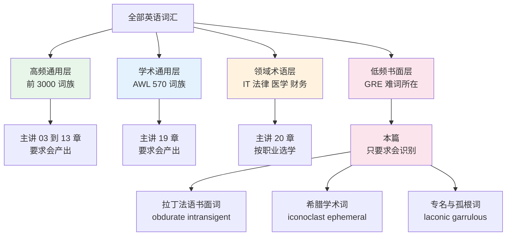
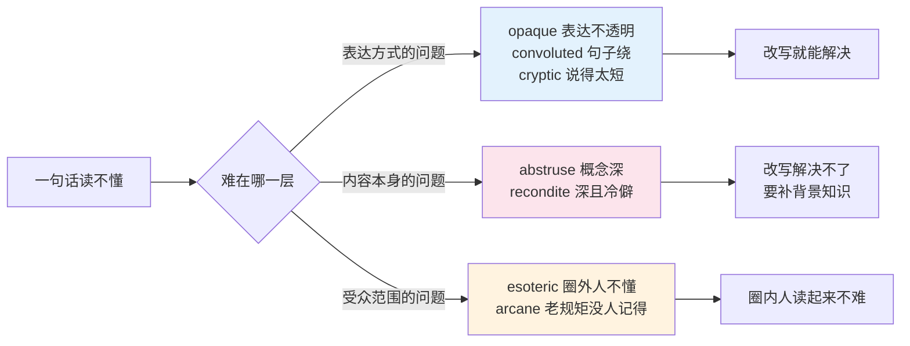
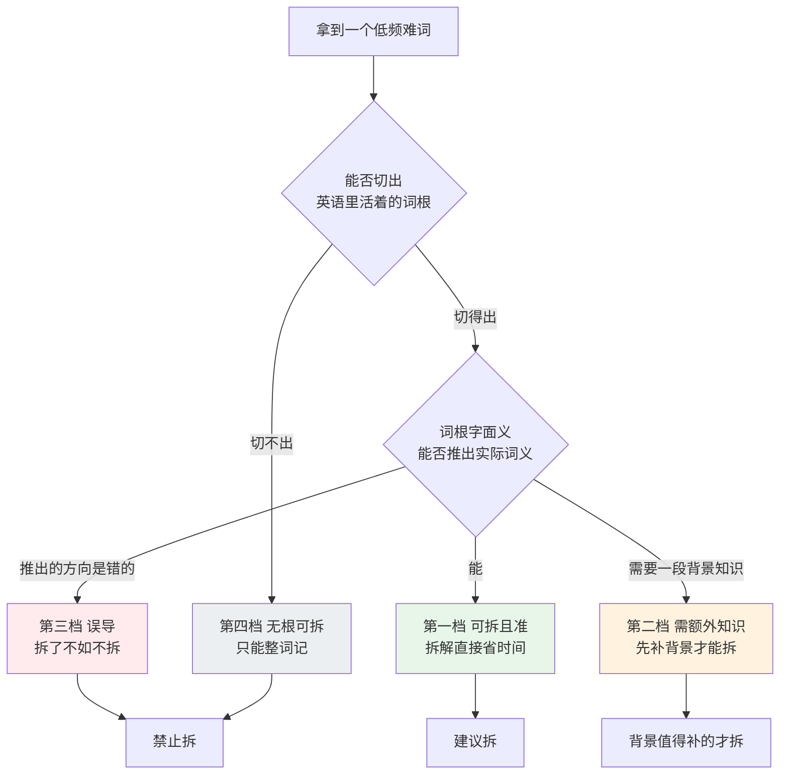
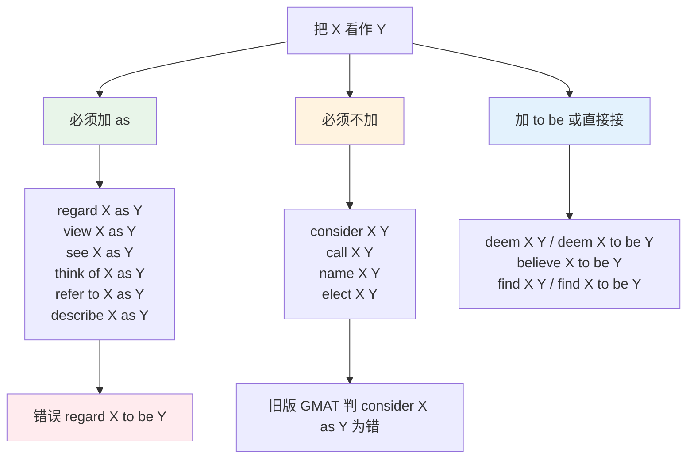
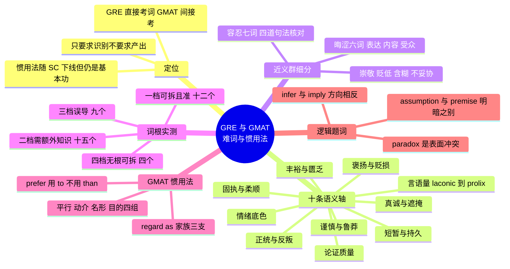

# GRE 与 GMAT：低频难词、近义群细分与惯用法

> [!info] 本篇定位
>
> 第 21 章第三篇，也是全书词汇难度的天花板。
>
> 上一篇 `21.考试词汇专项/02.熟词僻义总表：从考研到 GRE` 处理的是「这个词我认识，但它这次用的是另一个意思」。本篇处理的是另一种卡壳：`laconic`、`recondite`、`intransigent` 这一批词形本身就没见过，词频低到在技术文档、新闻、小说里都可能一年遇不上一次，却是 GRE 填空题的主力弹药。
>
> 与前面章节的分工很清楚：辨析方法论在 `16.词义辨析、搭配与短语动词/01.同义词辨析方法与高频同义词组`，词根系统在 `15.词根、合成与缩略/01.高频拉丁词根（上）` 与 `15.词根、合成与缩略/02.高频拉丁词根（下）`，学术通用层在 `19.学术通用词汇/01.学术通用词表 AWL（上）：论证与关系`。本篇不重讲方法，只把方法用在这一层词上，并且给出方法在这一层的**失效边界**——词根拆解在低频难词上没有你想的那么灵。
>
> 读完能做三件事：把一个 GRE 近义群按可判定的尺度切开而不是靠语感蒙、判断一个生词值不值得花时间拆词根、写出符合书面惯用法的 `regard X as Y` 与 `prefer A to B` 这类框架。

---

## 1. 本篇导读：难词这一层为什么和前面二十章不一样

前二十章的每一个词表，背后都有一个「你迟早会用到」的承诺。`sirloin` 是点牛排会用到的，`impedance` 是读 datasheet 会用到的，`undermine` 是读任何一篇学术文章都会撞上的。到了这一章，承诺变了：本篇的一大半词，**你在考完之后可能一辈子主动用不到一次**。

这不是词表的缺陷，是它的定位。GRE 词汇题的功能是区分，不是实用。命题人需要一批词，满足两个条件：受过良好英语教育的母语者认得，普通学习者不认得。满足这两条的词天然集中在拉丁法语的书面层，天然低频。你背它们是为了通过一道筛子，不是为了拓展表达。

想清楚这一点，学习策略会立刻改变。实用词要练产出，要造句，要主动用；本篇这批词只需要练**识别**——看到 `obdurate` 能在半秒内反应出「顽固，褒贬偏负面」就够了，不需要能自己写出一句地道的 `obdurate` 句子。识别和产出的成本差三到五倍，把成本用错地方是这一章最常见的时间浪费。

### 1.1 GRE 与 GMAT 现在各考什么

两个考试对词汇的要求方向完全相反，混着背会两头不讨好。

| 维度 | GRE Verbal | GMAT Focus Verbal |
| --- | --- | --- |
| 题型构成 | Text Completion 填空、Sentence Equivalence 等价句、Reading Comprehension 阅读 | Reading Comprehension 阅读、Critical Reasoning 逻辑 |
| 词汇考查方式 | 直接考。填空题的正确选项就是一个具体的词 | 间接考。没有专门的词汇题，词汇只在读懂题干与选项时起作用 |
| 难词密度 | 高。单题就可能出现两到三个低频词 | 中。文章用词偏商科学术，难词有但不是考点 |
| 近义群细分需求 | 极高。等价句题要求选出两个能造出**意思相近**的句子的词 | 低 |
| 惯用法需求 | 低。不单独考句法搭配 | 中。Sentence Correction 随 Focus 改版下线后不再是独立考点，但读题与选项措辞仍要靠它 |

> [!warning] 关于 GMAT 惯用法的现状
>
> GMAT Focus Edition 把 Sentence Correction 整个移出了 Verbal 部分，`regard X as Y` 这类惯用法**不再是独立考点**。但这不等于可以不学：一是大量流通中的备考材料仍是旧版，二是逻辑题的选项措辞高度依赖这些框架，三是这批框架本身就是书面英语的地基，写论文写邮件都用得上。
>
> 本篇按「读写基本功」的定位收它们，不按「考点」定位。看到旧材料里说这是必考点，知道那是改版前的说法即可。

### 1.2 本篇的收词标准

三条同时满足才收进本篇主表：

1. **通用语料低频**。在日常阅读材料里罕见，不属于前二十章任何一章的主题词表。像 `mitigate`、`undermine`、`arbitrary` 这类虽然也难但属于学术通用层的词，已经在 `19.学术通用词汇` 收过，本篇不重复。
2. **义项单一或首义即考点**。熟词僻义类的词全部归上一篇，本篇不收。`school` 的「学派」义、`qualify` 的「打折扣」义在 `21.考试词汇专项/02.熟词僻义总表：从考研到 GRE`。
3. **有可判定的辨析尺度**。收进近义群的词必须能给出一条可操作的判定规则（看搭配名词、看句法环境、看褒贬方向），只能靠语感区分的词不收——那种词背了也用不上。

不收的三类：题型技巧与解题流程（那是备考书的事，不是词汇书的事）、GRE 数学部分的术语（那批词在 `03.数字与计量词汇/02.分数、小数、百分数与数学运算读法`）、以及任何单词表的机械复制。

### 1.3 难词在整个词汇体系里的位置

上图把英语词汇切成四层，右下角那一支才是本篇的辖区。前三层都要求产出——你得能自己写出 `We need to allocate more resources`；第四层只要求识别。图最底下把低频书面层再切成三小块，这个切法在第 7 节会派上用场：拉丁法语层通常拆得动词根，希腊层拆得动但需要额外知识，专名与孤根词根本无从拆起，`laconic` 来自古希腊的一个地名，`garrulous` 在英语里只有它自己和它的派生形式。

### 1.4 怎么用这一篇

按语义轴走，不按字母走。第 3 节的十条轴每一条都是一个可以整块搬进脑子的对立结构——「话多对话少」「固执对柔顺」「短暂对持久」。GRE 填空的双空题考的正是这种结构：句子给你一个方向信号，你要在轴上定位。孤立地背 `garrulous` 是唠叨，效率远低于把 `laconic — terse — succinct — voluble — garrulous — prolix` 排成一条从少到多的线。

第 4 到第 6 节的近义群细分是本篇的重点。等价句题给六个选项要你选两个，六个里往往有四个中文释义完全一样，靠中文释义必然选错。细分尺度就是为了这种题设计的。

第 7 节的实测建议动手做一遍，不要只看结论。

---

## 2. 十个基准词：先把这一批吃透

大纲点名的十个词覆盖了 GRE 难词的全部典型形态——古希腊地名、拉丁孤根、双词根合成、体液学说遗留、宗教术语世俗化。把这十个词彻底吃透，后面一百多个词的处理方式就有了模板。

| 英文 | 英式音标 | 美式音标 | 词性 | 中文 | 搭配与说明 |
| --- | --- | --- | --- | --- | --- |
| **laconic** | /ləˈkɒnɪk/ | /ləˈkɑːnɪk/ | adj. | 言简的；话少的 | a laconic reply、a laconic style；褒贬中性偏褒，暗含「简得有力」 |
| **garrulous** | /ˈɡærələs/ | /ˈɡærələs/ | adj. | 唠叨的；絮絮不休的 | a garrulous old man；贬义，暗含「说的都是琐事」 |
| **obdurate** | /ˈɒbdjʊrət/ | /ˈɑːbdərət/ | adj. | 冥顽不化的 | remain obdurate、an obdurate refusal；书面，贬义 |
| **ephemeral** | /ɪˈfemərəl/ | /ɪˈfemərəl/ | adj. | 短暂的；朝生暮死的 | ephemeral fame、ephemeral pleasures；中性偏惋惜 |
| **iconoclast** | /aɪˈkɒnəklæst/ | /aɪˈkɑːnəklæst/ | n. | 打破传统者；反偶像者 | a fearless iconoclast；褒贬取决于作者立场 |
| **equivocate** | /ɪˈkwɪvəkeɪt/ | /ɪˈkwɪvəkeɪt/ | v. | 含糊其辞；模棱两可 | equivocate on the issue、refuse to equivocate；贬义 |
| **sanguine** | /ˈsæŋɡwɪn/ | /ˈsæŋɡwɪn/ | adj. | 乐观的；有信心的 | sanguine about the outcome；褒义，不是「血腥的」 |
| **intransigent** | /ɪnˈtrænsɪdʒənt/ | /ɪnˈtrænsɪdʒənt/ | adj. | 不妥协的；不让步的 | an intransigent stance、intransigent opposition；贬义 |
| **disparage** | /dɪˈspærɪdʒ/ | /dɪˈsperɪdʒ/ | v. | 贬低；轻视 | disparage his achievements；及物，贬义 |
| **venerate** | /ˈvenəreɪt/ | /ˈvenəreɪt/ | v. | 尊崇；敬重 | venerate as a saint、a venerated tradition；褒义，程度重 |

### 2.1 laconic：一个地名变成的形容词

`laconic` 的词源是 Laconia，斯巴达所在的那片地区。古希腊人认为斯巴达人说话极其简短，于是「拉科尼亚式的」变成了「话少的」。这个来源解释了它最重要的一个特点：**它不是纯粹的贬义**。

中文的「话少」偏中性，「寡言」偏负面，`laconic` 更接近第三种感觉——简短到近乎冷淡，但往往因为简短而显得有力。写作者用 `laconic` 描述一个人，通常带着一点欣赏。

> [!example] laconic 的语境
>
> - His **laconic** reply — "It won't work" — ended a two-hour debate.
>   - 他那句简短的回应「行不通」，结束了两个小时的争论。
> - The report is admirably **laconic**, running to just three pages.
>   - 这份报告简洁得令人赞赏，全文只有三页。

近义词里 `terse` 更冷，暗示简短到不客气；`succinct` 和 `concise` 是纯褒义的「简明」，用来夸文字；`pithy` 强调简短且有见地。四个词的分工在第 3.1 节的表里排开了。

### 2.2 garrulous：话多的贬义端

`garrulous` 是 `laconic` 的对立端，但它比「话多」多一层信息：**说的内容是琐碎的**。一个人滔滔不绝地讲一个深刻的话题，那叫 `voluble` 或 `expansive`，不叫 `garrulous`。`garrulous` 的典型搭配对象是老人、邻居、出租车司机——讲的都是无关紧要的事。

拉丁词源 `garrire` 的意思就是叽叽喳喳，和鸟叫同源。英语里由它长出来的只有 `garrulous` 这一个词干，再加上它自己的派生形式 `garrulity` 与 `garrulously`，词根知识在这里帮不上忙，这是第 7 节要统计的「孤根词」的典型。

### 2.3 obdurate：硬到底

`obdurate` 拆开是 `ob-`（对着）加 `dur-`（硬），和 `durable`、`endure`、`duration` 同根。这是本篇少数几个拆词根真的有效的词：硬着对着你 → 顽固。

它和 `stubborn` 的差别在语域和对象。`stubborn` 是日常词，可以说一个三岁小孩 stubborn；`obdurate` 是书面词，通常用于成年人在道德或立场问题上的顽固，且暗示别人已经反复劝过。搭配上它极常与 `remain`、`prove` 连用，因为它描述的是一种「劝了之后仍然」的状态。

> [!example] obdurate 的典型句式
>
> - Despite mounting evidence, the committee remained **obdurate**.
>   - 尽管证据越来越多，委员会仍然不肯松口。
> - Her **obdurate** refusal to apologize cost her the promotion.
>   - 她死不道歉，代价是失去了升职机会。

### 2.4 ephemeral：只活一天

`ephemeral` 来自希腊语 `epi-`（在……之上）加 `hēmera`（一天），字面是「只存在一天的」。生物学里 ephemera 指蜉蝣，朝生暮死。

它的搭配对象几乎全是抽象名词：`ephemeral fame`、`ephemeral trends`、`ephemeral beauty`、`ephemeral pleasures`。修饰具体物体时听起来会怪，说 `an ephemeral building` 不如说 `a temporary building`。这条搭配限制是它和 `temporary`、`short-lived` 的主要分界：那两个词具体抽象都能修饰，`ephemeral` 偏抽象，且带一层文学化的惋惜。

### 2.5 iconoclast：从砸圣像到反传统

`iconoclast` 由 `icon`（圣像）加 `-clast`（打碎的人）组成，原指拜占庭时期主张销毁圣像的一派。世俗化之后，它指任何攻击公认信念或制度的人。

`-clast` 这个后缀在英语里还活着，`osteoclast`（破骨细胞）用的是同一个成分，所以这个词是可拆的。要注意的是它的**褒贬完全取决于作者立场**：支持者写 `a fearless iconoclast`，反对者写 `a reckless iconoclast`。GRE 填空题喜欢用这种褒贬中立的词做正确选项，因为它逼你读上下文的态度，而不是靠词本身的色彩蒙。

形容词是 `iconoclastic`，名词性的行为是 `iconoclasm`。

### 2.6 equivocate：让一句话有两个声音

`equi-`（相等）加 `voc-`（声音），字面是「两种声音一样响」，引申为故意把话说得可以往两个方向理解。它和「说谎」不同：说谎是说了假的，`equivocate` 是**避免说真的**，靠含糊来逃避表态。

句法上它是不及物动词，后面接 `on`、`about` 或者干脆什么都不接：`He equivocated on the question of funding`。名词形式 `equivocation` 在逻辑学里还是一个专门的谬误名（歧义谬误），这一点在 GMAT 逻辑题里偶尔用得上。

> [!example] equivocate 与近义词的分界
>
> - When pressed on the budget, the minister **equivocated**.
>   - 被追问预算问题时，部长含糊其辞。
> - He did not **equivocate**: the project was over.
>   - 他没有绕弯子——项目结束了。

### 2.7 sanguine：拆词根会拆错的那一个

`sanguine` 来自拉丁语 `sanguis`（血），但意思是「乐观的」。这条路径要经过中世纪的体液学说：四种体液里血液占优的人被认为面色红润、性情开朗，于是「多血质的」变成了「乐观的」。

不知道这段背景的人拆出「血」，第一反应必然是「血腥的、残暴的」——那个意思在英语里是另一个词 `sanguinary`，长得几乎一样，意思正相反。这是本篇最值得单独记的一组形近陷阱。

| 英文 | 英式音标 | 美式音标 | 词性 | 中文 | 搭配与说明 |
| --- | --- | --- | --- | --- | --- |
| **sanguine** | /ˈsæŋɡwɪn/ | /ˈsæŋɡwɪn/ | adj. | 乐观的 | sanguine about the future；褒义 |
| **sanguinary** | /ˈsæŋɡwɪnəri/ | /ˈsæŋɡwɪneri/ | adj. | 血腥的；嗜杀的 | a sanguinary conflict；贬义，罕见 |

`sanguine` 的固定搭配是 `sanguine about sth`，几乎不接 `of`。程度上它比 `optimistic` 更平静——`optimistic` 可以是热切的期待，`sanguine` 更像「不慌，觉得会好」。

### 2.8 intransigent：谈不拢

`intransigent` 从西班牙语 intransigente 借入英语，源头是拉丁语 `transigere`（达成协议）。拆成 `in-` 加 `trans-` 加 `-ig-` 得到「不越过驱动」，推不出「不妥协」，所以它属于第 7 节分类里的「需要额外知识才拆得动」那一档。

它和 `obdurate`、`stubborn` 的差别在**语境**：`intransigent` 几乎专用于谈判、政治、劳资这类需要双方让步的场合。说一个孩子 intransigent 是怪的，说工会 intransigent 是标准用法。名词是 `intransigence`。

### 2.9 disparage：把人的等级往下压

`disparage` 的中古法语来源是 `parage`（门第、等级），前面加 `dis-`（分开、降低），字面是「使门第降低」。它是及物动词，宾语可以是人也可以是成就、观点、努力。

它和 `criticize` 的差别很值得记：`criticize` 可以是就事论事的批评，中性；`disparage` 一定带轻蔑，暗示批评者在贬低对象的价值。GRE 阅读题问作者态度时，选项里出现 `disparaging` 就意味着作者不只是不同意，而是看不上。

> [!warning] disparage 的三个常见误用
>
> - ❌ ~~He disparaged about her work.~~
> - ✅ **He disparaged her work.**（及物，不加介词）
> - ❌ ~~The results disparage the theory.~~（结果不能「贬低」理论）
> - ✅ **The results undermine the theory.**（用 undermine）
> - ❌ ~~a disparage remark~~
> - ✅ **a disparaging remark**（形容词形式是分词）

### 2.10 venerate：程度最重的那个「敬」

`venerate` 的词根是拉丁语 `venerari`，与女神 Venus 同源，原义是「以敬爱之心对待」。拆出「金星」对理解毫无帮助，是本篇最典型的误导性词根之一。

它是英语里表示尊敬的词中程度最重的一档，带宗教或准宗教色彩。搭配上有两个高频形态：`be venerated as ...`（被尊为某某）和 `a venerated tradition/institution`（被尊崇的传统）。宾语通常是人物、传统、典籍，很少是抽象品质——说 `venerate honesty` 是怪的，那要用 `prize` 或 `cherish`。

第 6.1 节会把 `venerate — revere — esteem — admire` 排成完整的强度阶梯。

---

## 3. GRE 高频难词主表：按语义轴分组

十条轴，每一条都是一个两端对立的连续统。GRE 填空题的正确选项极少是孤立的词，它总是落在某条轴的某个位置上，句子里的转折词、否定词、平行结构告诉你方向，你在轴上取点。

### 3.1 轴一：言语量，从极少到极多

| 英文 | 英式音标 | 美式音标 | 词性 | 中文 | 搭配与说明 |
| --- | --- | --- | --- | --- | --- |
| **taciturn** | /ˈtæsɪtɜːn/ | /ˈtæsɪtɜːrn/ | adj. | 沉默寡言的 | 描述性格，不描述单次言语；与 tacit 同根 |
| **reticent** | /ˈretɪsnt/ | /ˈretɪsnt/ | adj. | 不愿多说的 | reticent about his past；强调「有所保留」而非天生话少 |
| **laconic** | /ləˈkɒnɪk/ | /ləˈkɑːnɪk/ | adj. | 言简的 | 描述具体的话语或文风，不描述性格 |
| **terse** | /tɜːs/ | /tɜːrs/ | adj. | 简短生硬的 | a terse reply；简短到显得不耐烦 |
| **curt** | /kɜːt/ | /kɜːrt/ | adj. | 简短无礼的 | a curt nod；比 terse 更明确地不客气 |
| **succinct** | /səkˈsɪŋkt/ | /səkˈsɪŋkt/ | adj. | 简明的 | a succinct summary；纯褒义，夸文字 |
| **concise** | /kənˈsaɪs/ | /kənˈsaɪs/ | adj. | 简洁的 | concise wording；与 succinct 近乎同义，语域略低 |
| **pithy** | /ˈpɪθi/ | /ˈpɪθi/ | adj. | 精辟的 | a pithy remark；简短且有洞见 |
| **laconism** | /ˈlækənɪzəm/ | /ˈlækənɪzəm/ | n. | 简练；简短语句 | 罕见，仅在文体讨论中出现 |
| **voluble** | /ˈvɒljʊbl/ | /ˈvɑːljəbl/ | adj. | 健谈的；滔滔不绝的 | a voluble speaker；中性偏褒，内容不一定琐碎 |
| **loquacious** | /ləˈkweɪʃəs/ | /loʊˈkweɪʃəs/ | adj. | 多话的 | 中性偏贬；loqu- 说，与 eloquent 同根 |
| **garrulous** | /ˈɡærələs/ | /ˈɡærələs/ | adj. | 絮叨的 | 明确贬义，内容琐碎 |
| **verbose** | /vɜːˈbəʊs/ | /vɜːrˈboʊs/ | adj. | 冗词的 | 只用于文字，不用于人的性格 |
| **prolix** | /ˈprəʊlɪks/ | /ˈproʊlɪks/ | adj. | 冗长乏味的 | 比 verbose 更书面，更贬 |
| **long-winded** | /ˌlɒŋˈwɪndɪd/ | /ˌlɔːŋˈwɪndɪd/ | adj. | 啰嗦的 | 口语层，与 prolix 同义不同语域 |
| **circumlocution** | /ˌsɜːkəmləˈkjuːʃn/ | /ˌsɜːrkəmloʊˈkjuːʃn/ | n. | 迂回其辞 | circum- 绕 + locu- 说；贬义 |
| **grandiloquent** | /ɡrænˈdɪləkwənt/ | /ɡrænˈdɪləkwənt/ | adj. | 辞藻浮夸的 | grandiloquent rhetoric；贬义 |
| **bombastic** | /bɒmˈbæstɪk/ | /bɑːmˈbæstɪk/ | adj. | 夸夸其谈的 | 与 grandiloquent 近义，更常见 |
| **turgid** | /ˈtɜːdʒɪd/ | /ˈtɜːrdʒɪd/ | adj. | 文风臃肿的 | turgid prose；本义「肿胀」，转义只用于文字 |
| **laconically** | /ləˈkɒnɪkli/ | /ləˈkɑːnɪkli/ | adv. | 简短地 | 常用于对话标签 he said laconically |
| **reserved** | /rɪˈzɜːvd/ | /rɪˈzɜːrvd/ | adj. | 内敛的 | 中性，不含「该说没说」的评价 |
| **effusive** | /ɪˈfjuːsɪv/ | /ɪˈfjuːsɪv/ | adj. | 感情外溢的 | effusive praise；话多且情绪外露 |

这条轴上有一组容易搞混的分工：**描述性格还是描述单次话语**。`taciturn`、`reserved`、`loquacious`、`garrulous` 描述一个人长期是什么样；`laconic`、`terse`、`curt`、`succinct` 描述某一次说出来的话是什么样。所以「他天生话少」用 taciturn，「他那句回答很短」用 laconic。`reticent` 卡在中间——它描述的是在某个特定话题上不愿意说，所以后面几乎总跟 `about`。

另一组分工是**贬义指向内容还是指向长度**。`verbose`、`prolix`、`long-winded` 骂的是长度；`grandiloquent`、`bombastic`、`turgid` 骂的是辞藻空洞。两者可以同时成立，但填空题会用别的线索告诉你考哪个。

### 3.2 轴二：固执与柔顺

| 英文 | 英式音标 | 美式音标 | 词性 | 中文 | 搭配与说明 |
| --- | --- | --- | --- | --- | --- |
| **obdurate** | /ˈɒbdjʊrət/ | /ˈɑːbdərət/ | adj. | 冥顽不化的 | remain obdurate；道德立场上的顽固 |
| **obstinate** | /ˈɒbstɪnət/ | /ˈɑːbstɪnət/ | adj. | 固执的 | obstinate resistance；比 stubborn 书面 |
| **intransigent** | /ɪnˈtrænsɪdʒənt/ | /ɪnˈtrænsɪdʒənt/ | adj. | 不肯妥协的 | 专用于谈判与政治场合 |
| **adamant** | /ˈædəmənt/ | /ˈædəmənt/ | adj. | 态度坚决的 | be adamant that ...；褒贬中性，可以是好的坚持 |
| **recalcitrant** | /rɪˈkælsɪtrənt/ | /rɪˈkælsɪtrənt/ | adj. | 桀骜不驯的 | 对权威的抗拒，常用于下属、学生 |
| **refractory** | /rɪˈfræktəri/ | /rɪˈfræktəri/ | adj. | 难以驾驭的；难治的 | 医学里指「难治性的」；日常义罕见 |
| **implacable** | /ɪmˈplækəbl/ | /ɪmˈplækəbl/ | adj. | 无法平息的 | implacable hostility；in- + placate 安抚 |
| **inexorable** | /ɪnˈeksərəbl/ | /ɪnˈeksərəbl/ | adj. | 不可阻挡的 | the inexorable rise of ...；对象常是趋势不是人 |
| **intractable** | /ɪnˈtræktəbl/ | /ɪnˈtræktəbl/ | adj. | 棘手的；难处理的 | an intractable problem；对象多是问题 |
| **dogged** | /ˈdɒɡɪd/ | /ˈdɔːɡɪd/ | adj. | 顽强的 | dogged determination；褒义，注意两音节读法 |
| **tenacious** | /təˈneɪʃəs/ | /təˈneɪʃəs/ | adj. | 执着的 | 褒义；ten- 抓住，与 tenant 同根 |
| **pertinacious** | /ˌpɜːtɪˈneɪʃəs/ | /ˌpɜːrtəˈneɪʃəs/ | adj. | 执拗的 | 比 tenacious 更书面，偏贬 |
| **pliant** | /ˈplaɪənt/ | /ˈplaɪənt/ | adj. | 易受影响的 | 对人用时偏贬，暗示没主见 |
| **pliable** | /ˈplaɪəbl/ | /ˈplaɪəbl/ | adj. | 柔韧的；易说服的 | 物理义与引申义都常用 |
| **malleable** | /ˈmæliəbl/ | /ˈmæliəbl/ | adj. | 可塑的 | 本义是金属可锤打；引申用于观念、人 |
| **tractable** | /ˈtræktəbl/ | /ˈtræktəbl/ | adj. | 易处理的；驯服的 | intractable 的正向对应 |
| **amenable** | /əˈmiːnəbl/ | /əˈmiːnəbl/ | adj. | 愿意接受的 | amenable to change；固定接 to |
| **acquiescent** | /ˌækwiˈesnt/ | /ˌækwiˈesnt/ | adj. | 默许顺从的 | 动词 acquiesce in/to；暗含勉强 |
| **docile** | /ˈdəʊsaɪl/ | /ˈdɑːsl/ | adj. | 温顺的 | 英美读音差异极大：英式末音节读 /saɪl/，美式弱化成成音节的 /l/ |
| **obsequious** | /əbˈsiːkwiəs/ | /əbˈsiːkwiəs/ | adj. | 谄媚的 | 强烈贬义，比 docile 重得多 |
| **servile** | /ˈsɜːvaɪl/ | /ˈsɜːrvl/ | adj. | 奴颜婢膝的 | 与 obsequious 近义；美音末音节弱化 |
| **sycophant** | /ˈsɪkəfænt/ | /ˈsɪkəfænt/ | n. | 马屁精 | 名词；形容词 sycophantic |

这条轴的右端有一个中文没有直接对应的细节：从 `amenable` 到 `sycophant`，顺从的**动机**在变。`amenable` 是理性上被说服了，`acquiescent` 是不情愿但不反抗，`docile` 是天性不反抗，`obsequious` 和 `servile` 是为了讨好而主动放低姿态。中文都可以译成「顺从」，GRE 等价句题会拿这个差别做区分点。

左端要分清**对象是人还是事**。`intractable` 和 `inexorable` 的典型主语是问题、趋势、进程；`obdurate`、`recalcitrant`、`intransigent` 的典型主语是人或组织。把 `an obdurate problem` 写出来不算错，但不地道，命题人不会这样用。

### 3.3 轴三：短暂与持久

| 英文 | 英式音标 | 美式音标 | 词性 | 中文 | 搭配与说明 |
| --- | --- | --- | --- | --- | --- |
| **ephemeral** | /ɪˈfemərəl/ | /ɪˈfemərəl/ | adj. | 转瞬即逝的 | 修饰抽象名词；带惋惜色彩 |
| **evanescent** | /ˌiːvəˈnesnt/ | /ˌevəˈnesnt/ | adj. | 逐渐消失的 | 更文学化，强调「淡出」的过程 |
| **transient** | /ˈtrænziənt/ | /ˈtrænʃnt/ | adj./n. | 短暂的；过客 | 名词义指流动人口；英美读法不同 |
| **transitory** | /ˈtrænsɪtri/ | /ˈtrænsɪtɔːri/ | adj. | 暂时的 | 与 transient 近义，更常用于状态 |
| **fleeting** | /ˈfliːtɪŋ/ | /ˈfliːtɪŋ/ | adj. | 一闪而过的 | a fleeting glance；语域比前四个低 |
| **fugitive** | /ˈfjuːdʒətɪv/ | /ˈfjuːdʒətɪv/ | adj./n. | 短暂的；逃亡者 | 形容词义罕见，考试中出现即是这个僻义 |
| **momentary** | /ˈməʊməntri/ | /ˈmoʊmənteri/ | adj. | 瞬间的 | 强调持续时间极短，中性 |
| **perennial** | /pəˈreniəl/ | /pəˈreniəl/ | adj. | 常年的；反复出现的 | a perennial problem；植物学义为多年生 |
| **perpetual** | /pəˈpetʃuəl/ | /pərˈpetʃuəl/ | adj. | 永久的；没完没了的 | 修饰烦人的事时带贬义 |
| **enduring** | /ɪnˈdjʊərɪŋ/ | /ɪnˈdʊrɪŋ/ | adj. | 持久的 | an enduring legacy；褒义 |
| **abiding** | /əˈbaɪdɪŋ/ | /əˈbaɪdɪŋ/ | adj. | 恒久的 | an abiding interest；偏文学 |
| **immutable** | /ɪˈmjuːtəbl/ | /ɪˈmjuːtəbl/ | adj. | 不可改变的 | immutable laws；技术语境里另有专义 |
| **indelible** | /ɪnˈdeləbl/ | /ɪnˈdeləbl/ | adj. | 抹不掉的 | an indelible impression；常配 impression、mark |
| **inveterate** | /ɪnˈvetərət/ | /ɪnˈvetərət/ | adj. | 积习难改的 | an inveterate liar；只修饰习惯与有习惯的人 |
| **entrenched** | /ɪnˈtrentʃt/ | /ɪnˈtrentʃt/ | adj. | 根深蒂固的 | deeply entrenched；军事挖战壕的隐喻 |
| **ingrained** | /ɪnˈɡreɪnd/ | /ɪnˈɡreɪnd/ | adj. | 根深的 | 与 entrenched 近义，来自染色工艺 |

短暂端五个词的分工靠**时间尺度与情绪**：`momentary` 最短且最中性，`fleeting` 短且带一点遗憾，`transient` 与 `transitory` 是客观的「暂时状态」，`ephemeral` 与 `evanescent` 带明显的文学性惋惜。

持久端要注意 `perpetual` 的双面性。`perpetual motion`（永动）是中性，`her perpetual complaining`（她没完没了的抱怨）是贬义。判断方法看被修饰的名词：名词本身是负面的，`perpetual` 就带上了不耐烦。

### 3.4 轴四：褒扬与贬损

| 英文 | 英式音标 | 美式音标 | 词性 | 中文 | 搭配与说明 |
| --- | --- | --- | --- | --- | --- |
| **venerate** | /ˈvenəreɪt/ | /ˈvenəreɪt/ | v. | 尊崇 | 程度最重，带宗教色彩 |
| **revere** | /rɪˈvɪə/ | /rɪˈvɪr/ | v. | 敬重 | 与 venerate 近义，宗教色彩略淡 |
| **exalt** | /ɪɡˈzɔːlt/ | /ɪɡˈzɔːlt/ | v. | 抬高；颂扬 | exalt sb to the status of ...；注意与 exult 形近 |
| **extol** | /ɪkˈstəʊl/ | /ɪkˈstoʊl/ | v. | 极力称赞 | extol the virtues of ...；书面 |
| **laud** | /lɔːd/ | /lɔːd/ | v./n. | 赞美 | 新闻标题体常用，主动语态少见 |
| **eulogize** | /ˈjuːlədʒaɪz/ | /ˈjuːlədʒaɪz/ | v. | 致颂词；颂扬 | 与葬礼场合关联强 |
| **acclaim** | /əˈkleɪm/ | /əˈkleɪm/ | v./n. | 称誉 | critical acclaim；名词用法更常见 |
| **esteem** | /ɪˈstiːm/ | /ɪˈstiːm/ | v./n. | 敬重；尊重 | hold sb in high esteem；程度中等 |
| **idolize** | /ˈaɪdəlaɪz/ | /ˈaɪdəlaɪz/ | v. | 崇拜 | 带盲目色彩，可以是贬义 |
| **lionize** | /ˈlaɪənaɪz/ | /ˈlaɪənaɪz/ | v. | 追捧 | 指社会把某人当名人吹捧 |
| **disparage** | /dɪˈspærɪdʒ/ | /dɪˈsperɪdʒ/ | v. | 贬低 | 及物；轻蔑而非批评 |
| **denigrate** | /ˈdenɪɡreɪt/ | /ˈdenɪɡreɪt/ | v. | 诋毁 | nigr- 黑，字面「抹黑」 |
| **belittle** | /bɪˈlɪtl/ | /bɪˈlɪtl/ | v. | 轻视；说得不值一提 | 语域比 disparage 低，更常见 |
| **deprecate** | /ˈdeprəkeɪt/ | /ˈdeprəkeɪt/ | v. | 不赞成；贬抑 | 技术语境另有「弃用」义，见 20 章 |
| **decry** | /dɪˈkraɪ/ | /dɪˈkraɪ/ | v. | 公开谴责 | 强调公开表态，宾语是现象不是人 |
| **vilify** | /ˈvɪlɪfaɪ/ | /ˈvɪlɪfaɪ/ | v. | 污蔑 | 程度重，暗示不实指控 |
| **malign** | /məˈlaɪn/ | /məˈlaɪn/ | v./adj. | 中伤；有害的 | 形容词义 a malign influence |
| **castigate** | /ˈkæstɪɡeɪt/ | /ˈkæstɪɡeɪt/ | v. | 严厉批评 | 上对下的斥责 |
| **excoriate** | /ɪkˈskɔːrieɪt/ | /ɪkˈskɔːrieɪt/ | v. | 痛斥 | 本义「剥皮」，程度极重 |
| **lambaste** | /læmˈbeɪst/ | /læmˈbeɪst/ | v. | 猛烈抨击 | 新闻体常用 |
| **censure** | /ˈsenʃə/ | /ˈsenʃər/ | v./n. | 正式谴责 | 有正式程序含义，如议会 censure |
| **rebuke** | /rɪˈbjuːk/ | /rɪˈbjuːk/ | v./n. | 训斥 | 程度中等，上对下 |
| **reprove** | /rɪˈpruːv/ | /rɪˈpruːv/ | v. | 责备 | 比 rebuke 温和，带教导意味 |
| **upbraid** | /ʌpˈbreɪd/ | /ʌpˈbreɪd/ | v. | 数落 | 书面且旧，upbraid sb for sth |
| **opprobrium** | /əˈprəʊbriəm/ | /əˈproʊbriəm/ | n. | 公众的谴责与羞辱 | 不可数；配 public、international |

贬损端二十个词按**程度、公开性、上下关系**三个维度分开。程度上 `belittle` 最轻，`excoriate` 与 `vilify` 最重。公开性上 `decry`、`censure`、`lambaste` 必须是公开的，`disparage`、`belittle` 私下也成立。上下关系上 `castigate`、`rebuke`、`reprove`、`upbraid` 都预设说话人地位更高或更有资格评判，同事之间用会显得奇怪。

`deprecate` 需要单独警告：在程序员的语境里它是「标记为弃用」，那个义项是 20 章的事；GRE 里出现的是「表示不赞成」。同一个词形，两个圈子几乎不重叠。

### 3.5 轴五：真诚与遮掩

| 英文 | 英式音标 | 美式音标 | 词性 | 中文 | 搭配与说明 |
| --- | --- | --- | --- | --- | --- |
| **equivocate** | /ɪˈkwɪvəkeɪt/ | /ɪˈkwɪvəkeɪt/ | v. | 含糊其辞 | 不及物，接 on/about |
| **prevaricate** | /prɪˈværɪkeɪt/ | /prɪˈverɪkeɪt/ | v. | 支吾搪塞 | 与 equivocate 近义，更强调回避 |
| **dissemble** | /dɪˈsembl/ | /dɪˈsembl/ | v. | 掩饰真情 | 掩藏的是感受与动机，不是事实 |
| **dissimulate** | /dɪˈsɪmjuleɪt/ | /dɪˈsɪmjuleɪt/ | v. | 假装；掩饰 | 与 dissemble 同义，更罕见 |
| **hedge** | /hedʒ/ | /hedʒ/ | v./n. | 避免把话说死 | hedge one's bets；金融里是对冲 |
| **temporize** | /ˈtempəraɪz/ | /ˈtempəraɪz/ | v. | 拖延以观望 | 为争取时间而不表态 |
| **obfuscate** | /ˈɒbfʌskeɪt/ | /ˈɑːbfəskeɪt/ | v. | 把事情搅浑 | 宾语是 issue、facts；故意制造混乱 |
| **candid** | /ˈkændɪd/ | /ˈkændɪd/ | adj. | 坦率的 | candid about ...；褒义 |
| **forthright** | /ˈfɔːθraɪt/ | /ˈfɔːrθraɪt/ | adj. | 直言不讳的 | 比 candid 更强调不绕弯 |
| **frank** | /fræŋk/ | /fræŋk/ | adj. | 直白的 | 日常层；与 candid 同义不同语域 |
| **ingenuous** | /ɪnˈdʒenjuəs/ | /ɪnˈdʒenjuəs/ | adj. | 天真坦诚的 | 与 ingenious 只差一个字母，意思无关 |
| **disingenuous** | /ˌdɪsɪnˈdʒenjuəs/ | /ˌdɪsɪnˈdʒenjuəs/ | adj. | 假装真诚的 | 高频；比「说谎」更狡猾 |
| **guileless** | /ˈɡaɪlləs/ | /ˈɡaɪlləs/ | adj. | 毫无心机的 | guile 诡计 + -less |
| **duplicity** | /djuːˈplɪsəti/ | /duːˈplɪsəti/ | n. | 两面派做法 | dupl- 二，字面「有两面」 |

这条轴上最值得记的是 `ingenuous` 与 `ingenious` 这对形近词。`ingenuous` 是天真坦率，`ingenious` 是巧妙精巧，词源不同，意思毫不相干。`disingenuous` 只有一个方向——从 `ingenuous` 加否定，意思是「装作坦诚而其实不是」，没有 `disingenious` 这个词。

`hedge` 是这批词里唯一的日常词，但它在 GRE 里出现时用的往往不是园艺义也不是金融义，而是「说话留余地」。学术写作里 `hedging` 是一个正面的技巧（见 `19.学术通用词汇/03.学术研究、统计术语与论文写作词汇`），在辩论语境里它带贬义，两个语境的褒贬正好相反。

### 3.6 轴六：情绪底色

| 英文 | 英式音标 | 美式音标 | 词性 | 中文 | 搭配与说明 |
| --- | --- | --- | --- | --- | --- |
| **sanguine** | /ˈsæŋɡwɪn/ | /ˈsæŋɡwɪn/ | adj. | 乐观的 | sanguine about；平静的乐观 |
| **ebullient** | /ɪˈbʌliənt/ | /ɪˈbʌliənt/ | adj. | 热情洋溢的 | e- 出 + bull- 沸；外露的高兴 |
| **buoyant** | /ˈbɔɪənt/ | /ˈbɔɪənt/ | adj. | 轻快的；有浮力的 | 经济语境里指市场活跃 |
| **exuberant** | /ɪɡˈzjuːbərənt/ | /ɪɡˈzuːbərənt/ | adj. | 兴高采烈的 | 也可指植物繁茂 |
| **effervescent** | /ˌefəˈvesnt/ | /ˌefərˈvesnt/ | adj. | 活泼冒泡的 | 本义是液体起泡 |
| **morose** | /məˈrəʊs/ | /məˈroʊs/ | adj. | 阴郁寡欢的 | 与 mort- 死无关，注意别拆错 |
| **lugubrious** | /ləˈɡuːbriəs/ | /ləˈɡuːbriəs/ | adj. | 悲戚的 | 常带夸张到滑稽的意味 |
| **despondent** | /dɪˈspɒndənt/ | /dɪˈspɑːndənt/ | adj. | 沮丧绝望的 | despondent about；程度重 |
| **disconsolate** | /dɪsˈkɒnsələt/ | /dɪsˈkɑːnsələt/ | adj. | 无法安慰的 | con- + sol- 安慰 |
| **doleful** | /ˈdəʊlfl/ | /ˈdoʊlfl/ | adj. | 哀伤的 | 偏文学，常修饰表情、声音 |
| **melancholy** | /ˈmelənkəli/ | /ˈmelənkɑːli/ | adj./n. | 忧郁的 | 体液学说遗留词，与 sanguine 成对 |
| **phlegmatic** | /fleɡˈmætɪk/ | /fleɡˈmætɪk/ | adj. | 冷静迟钝的 | 同为体液学说遗留；不易激动 |
| **stolid** | /ˈstɒlɪd/ | /ˈstɑːlɪd/ | adj. | 没表情的 | 与 solid 形近义异 |
| **equanimity** | /ˌekwəˈnɪməti/ | /ˌekwəˈnɪməti/ | n. | 平静镇定 | with equanimity；褒义 |

体液学说给英语留下了四个形容词，值得一起记：`sanguine`（多血质，乐观）、`melancholy`（黑胆汁，忧郁）、`phlegmatic`（黏液质，迟钝冷静）、`choleric`（黄胆汁，易怒）。它们的词根字面义全部指向体液，与今天的意思毫无逻辑关联，只能靠这段背景一次性打包记住。这也是第 7 节要讲的「拆得出词根但推不出词义」的标准样本。

`morose` 和 `stolid` 各有一个形近陷阱。`morose` 长得像 `mortal`、`morbid` 那一族（词根 mort- 死），实际来源是 `morosus`（乖僻的），不同源。`stolid` 长得像 `solid`，两个词的意思和词源都不搭界。

### 3.7 轴七：正统与反叛

| 英文 | 英式音标 | 美式音标 | 词性 | 中文 | 搭配与说明 |
| --- | --- | --- | --- | --- | --- |
| **iconoclast** | /aɪˈkɒnəklæst/ | /aɪˈkɑːnəklæst/ | n. | 反传统者 | 褒贬随作者立场 |
| **iconoclastic** | /aɪˌkɒnəˈklæstɪk/ | /aɪˌkɑːnəˈklæstɪk/ | adj. | 反传统的 | 形容作品、观点 |
| **maverick** | /ˈmævərɪk/ | /ˈmævərɪk/ | n./adj. | 独行其是者 | 源自一位不给牛烙印的牧场主的姓 |
| **heterodox** | /ˈhetərədɒks/ | /ˈhetərədɑːks/ | adj. | 非正统的 | hetero- 异 + dox 观点 |
| **orthodox** | /ˈɔːθədɒks/ | /ˈɔːrθədɑːks/ | adj. | 正统的 | ortho- 正；与上词成对 |
| **apostate** | /əˈpɒsteɪt/ | /əˈpɑːsteɪt/ | n. | 叛教者；变节者 | 名词 apostasy |
| **heresy** | /ˈherəsi/ | /ˈherəsi/ | n. | 异端邪说 | 转义指违背行业共识的说法 |
| **heretic** | /ˈherətɪk/ | /ˈherətɪk/ | n. | 异端者 | 形容词 heretical |
| **dogma** | /ˈdɒɡmə/ | /ˈdɔːɡmə/ | n. | 教条 | 复数 dogmas 或 dogmata |
| **doctrinaire** | /ˌdɒktrɪˈneə/ | /ˌdɑːktrɪˈner/ | adj. | 教条主义的 | 贬义，指不顾实际硬套理论 |
| **conformist** | /kənˈfɔːmɪst/ | /kənˈfɔːrmɪst/ | n./adj. | 随大流者 | 反义 nonconformist |
| **subversive** | /səbˈvɜːsɪv/ | /səbˈvɜːrsɪv/ | adj./n. | 颠覆性的 | sub- 下 + vers- 转 |

这条轴的实用价值在 GRE 阅读题里：谈思想史、艺术史、科学史的文章几乎必然出现「某人挑战了当时的共识」这个结构，`iconoclast`、`heterodox`、`heresy`、`orthodoxy` 就是描述这个结构的标准词汇。掌握这一组，读这类文章时能直接定位到作者的立场句。

`maverick` 和 `iconoclast` 的差别在攻击性。`maverick` 只是不跟大队走，不一定攻击什么；`iconoclast` 是主动去拆别人供着的东西。

### 3.8 轴八：丰裕与匮乏

| 英文 | 英式音标 | 美式音标 | 词性 | 中文 | 搭配与说明 |
| --- | --- | --- | --- | --- | --- |
| **copious** | /ˈkəʊpiəs/ | /ˈkoʊpiəs/ | adj. | 大量的 | copious notes；中性 |
| **plethora** | /ˈpleθərə/ | /ˈpleθərə/ | n. | 过多 | a plethora of；暗含「多到过头」 |
| **surfeit** | /ˈsɜːfɪt/ | /ˈsɜːrfɪt/ | n. | 过量 | a surfeit of；比 plethora 更贬 |
| **profusion** | /prəˈfjuːʒn/ | /prəˈfjuːʒn/ | n. | 大量涌现 | in profusion；中性偏褒 |
| **prodigal** | /ˈprɒdɪɡl/ | /ˈprɑːdɪɡl/ | adj. | 挥霍的 | the prodigal son 浪子；也可褒指慷慨 |
| **profligate** | /ˈprɒflɪɡət/ | /ˈprɑːflɪɡət/ | adj. | 挥霍无度的 | 纯贬义，比 prodigal 重 |
| **lavish** | /ˈlævɪʃ/ | /ˈlævɪʃ/ | adj./v. | 奢华的；大量给予 | lavish praise on sb |
| **munificent** | /mjuːˈnɪfɪsnt/ | /mjuːˈnɪfɪsnt/ | adj. | 慷慨大方的 | 褒义，指给钱给物大方 |
| **largesse** | /lɑːˈdʒes/ | /lɑːrˈdʒes/ | n. | 慷慨施予 | 法语借词，另有保留法语音的 /lɑːˈʒes/ 变体；也拼作 largess |
| **parsimonious** | /ˌpɑːsɪˈməʊniəs/ | /ˌpɑːrsɪˈmoʊniəs/ | adj. | 吝啬的；极简省的 | 科学语境里指模型简约，褒义 |
| **penurious** | /pəˈnjʊəriəs/ | /pəˈnʊriəs/ | adj. | 贫困的；吝啬的 | 两义并存，看上下文 |
| **frugal** | /ˈfruːɡl/ | /ˈfruːɡl/ | adj. | 节俭的 | 褒义，与 stingy 成褒贬对 |
| **miserly** | /ˈmaɪzəli/ | /ˈmaɪzərli/ | adj. | 守财奴式的 | 名词 miser |
| **meager** | /ˈmiːɡə/ | /ˈmiːɡər/ | adj. | 微薄的 | 英式拼 meagre；配 income、diet |
| **paucity** | /ˈpɔːsəti/ | /ˈpɔːsəti/ | n. | 稀少 | a paucity of evidence；正式 |
| **dearth** | /dɜːθ/ | /dɜːrθ/ | n. | 匮乏 | a dearth of talent；与 paucity 同义 |
| **scant** | /skænt/ | /skænt/ | adj. | 少得可怜的 | scant attention；只作定语 |
| **sparse** | /spɑːs/ | /spɑːrs/ | adj. | 稀疏的 | 强调分布稀而非总量少 |

`parsimonious` 值得单独说。日常义是吝啬，贬义；但在科学与统计语境里 `a parsimonious model`（简约模型）是褒义的，指用最少的假设解释最多的现象，对应 `19.学术通用词汇/03.学术研究、统计术语与论文写作词汇` 里的建模讨论。同一个词在两个语境褒贬相反，命题人很喜欢这种词。

匮乏端的 `paucity` 与 `dearth` 几乎完全同义，都是正式书面词，都接 `of`。真要分，`dearth` 略带「本该有却没有」的遗憾，`paucity` 更纯粹地陈述数量少。

### 3.9 轴九：谨慎与鲁莽

| 英文 | 英式音标 | 美式音标 | 词性 | 中文 | 搭配与说明 |
| --- | --- | --- | --- | --- | --- |
| **circumspect** | /ˈsɜːkəmspekt/ | /ˈsɜːrkəmspekt/ | adj. | 谨慎周全的 | circum- 环 + spect 看；字面「四下张望」 |
| **prudent** | /ˈpruːdnt/ | /ˈpruːdnt/ | adj. | 审慎的 | 强调有远见的谨慎 |
| **judicious** | /dʒuˈdɪʃəs/ | /dʒuˈdɪʃəs/ | adj. | 明断的 | judicious use of ...；褒义 |
| **wary** | /ˈweəri/ | /ˈweri/ | adj. | 警惕的 | wary of；固定接 of |
| **chary** | /ˈtʃeəri/ | /ˈtʃeri/ | adj. | 不轻易给予的 | chary of praise；罕见但考 |
| **guarded** | /ˈɡɑːdɪd/ | /ˈɡɑːrdɪd/ | adj. | 有保留的 | guarded optimism；态度题高频 |
| **temerity** | /təˈmerəti/ | /təˈmerəti/ | n. | 鲁莽；冒失 | have the temerity to do；贬义 |
| **audacity** | /ɔːˈdæsəti/ | /ɔːˈdæsəti/ | n. | 大胆；放肆 | 褒贬皆可，看上下文 |
| **impetuous** | /ɪmˈpetʃuəs/ | /ɪmˈpetʃuəs/ | adj. | 一时冲动的 | 强调没想就做 |
| **precipitate** | /prɪˈsɪpɪtət/ | /prɪˈsɪpɪtət/ | adj. | 仓促的 | 形容词与动词读音不同，动词末音 /eɪt/ |
| **rash** | /ræʃ/ | /ræʃ/ | adj. | 草率的 | 日常层；a rash decision |
| **foolhardy** | /ˈfuːlhɑːdi/ | /ˈfuːlhɑːrdi/ | adj. | 有勇无谋的 | 强调明知危险还做 |
| **reckless** | /ˈrekləs/ | /ˈrekləs/ | adj. | 不计后果的 | 法律语境里是过错等级词 |
| **intrepid** | /ɪnˈtrepɪd/ | /ɪnˈtrepɪd/ | adj. | 无所畏惧的 | 褒义，与 foolhardy 成褒贬对 |

`precipitate` 是这一组里唯一一个必须注意读音的词。作形容词读 /prɪˈsɪpɪtət/，意思是「仓促的」；作动词读 /prɪˈsɪpɪteɪt/，意思是「促成、加速（坏事）」。词尾 `-ate` 在名词形容词里读弱化的 /ət/、在动词里读 /eɪt/，这条规律在 `01.词汇入门与学习方法/03.音标、词重音与词典读音体例` 里讲过，这里是它的一个高频落点。

`guarded` 在 GRE 阅读的态度题里出现频率很高。选项里的 `guarded optimism`（有保留的乐观）、`guarded approval`（有保留的赞同）描述的是作者「大体同意但留了余地」的态度，是最常见的正确答案形态之一。

### 3.10 轴十：论证质量

| 英文 | 英式音标 | 美式音标 | 词性 | 中文 | 搭配与说明 |
| --- | --- | --- | --- | --- | --- |
| **cogent** | /ˈkəʊdʒənt/ | /ˈkoʊdʒənt/ | adj. | 有说服力的 | a cogent argument；褒义 |
| **trenchant** | /ˈtrentʃənt/ | /ˈtrentʃənt/ | adj. | 尖锐深刻的 | trenchant criticism；褒义 |
| **incisive** | /ɪnˈsaɪsɪv/ | /ɪnˈsaɪsɪv/ | adj. | 一针见血的 | incisive analysis；与 trenchant 近义 |
| **salient** | /ˈseɪliənt/ | /ˈseɪliənt/ | adj. | 最突出的 | the salient features；不含褒贬 |
| **germane** | /dʒɜːˈmeɪn/ | /dʒɜːrˈmeɪn/ | adj. | 切题的 | germane to；与 German 无关 |
| **pertinent** | /ˈpɜːtɪnənt/ | /ˈpɜːrtnənt/ | adj. | 相关的 | pertinent to；与 germane 同义 |
| **tangential** | /tænˈdʒenʃl/ | /tænˈdʒenʃl/ | adj. | 离题的 | tangential to；数学义为切线的 |
| **extraneous** | /ɪkˈstreɪniəs/ | /ɪkˈstreɪniəs/ | adj. | 无关的；外来的 | extraneous factors |
| **specious** | /ˈspiːʃəs/ | /ˈspiːʃəs/ | adj. | 似是而非的 | 表面有理实则站不住 |
| **spurious** | /ˈspjʊəriəs/ | /ˈspjʊriəs/ | adj. | 虚假的；伪造的 | a spurious correlation 伪相关 |
| **tenuous** | /ˈtenjuəs/ | /ˈtenjuəs/ | adj. | 站不住脚的 | a tenuous link；本义「薄」 |
| **fallacious** | /fəˈleɪʃəs/ | /fəˈleɪʃəs/ | adj. | 谬误的 | 名词 fallacy |
| **corroborate** | /kəˈrɒbəreɪt/ | /kəˈrɑːbəreɪt/ | v. | 佐证 | 用独立证据支持已有说法 |
| **substantiate** | /səbˈstænʃieɪt/ | /səbˈstænʃieɪt/ | v. | 证实 | substantiate a claim |
| **refute** | /rɪˈfjuːt/ | /rɪˈfjuːt/ | v. | 驳倒 | 严格义是「用证据证明其错」 |
| **rebut** | /rɪˈbʌt/ | /rɪˈbʌt/ | v. | 反驳 | 只表示提出反面论证，不保证成功 |
| **debunk** | /diːˈbʌŋk/ | /diːˈbʌŋk/ | v. | 揭穿 | 宾语是 myth、claim |
| **gainsay** | /ˌɡeɪnˈseɪ/ | /ˌɡeɪnˈseɪ/ | v. | 否认 | 几乎只用于否定句 there is no gainsaying |
| **belie** | /bɪˈlaɪ/ | /bɪˈlaɪ/ | v. | 掩盖真相；证明不实 | 两个方向的义项，靠主语判断 |
| **vitiate** | /ˈvɪʃieɪt/ | /ˈvɪʃieɪt/ | v. | 使失效；削弱 | 法律语境里指使合同无效 |

这一组是 GRE 与 GMAT 的公共辖区——GRE 用它们出填空，GMAT 用它们写逻辑题的题干与选项。第 12 节会把逻辑题那一半单独展开。

`refute` 与 `rebut` 的差别值得记牢：严格用法里 `refute` 蕴含成功（真的证明对方错了），`rebut` 只表示提出了反驳。日常英语里 `refute` 常被松散地当成 `deny` 用，但在考试语境里按严格义理解不会错。

`belie` 是这一组里最难的一个，它有两个方向相反的用法。`Her calm voice belied her nervousness`（她平静的声音掩盖了她的紧张）是「掩盖」；`The evidence belies his claim`（证据表明他的说法不实）是「证伪」。判断靠主语：主语是表象，用「掩盖」；主语是证据，用「证伪」。

---

## 4. 近义群细分（一）：晦涩六词

`opaque`、`abstruse`、`recondite`、`esoteric`、`arcane`、`cryptic` 的中文释义可以全部写成「晦涩难懂的」。等价句题把其中三四个塞进同一道题时，靠中文释义必然崩盘。它们有三条可判定的尺度。

| 英文 | 英式音标 | 美式音标 | 词性 | 中文 | 搭配与说明 |
| --- | --- | --- | --- | --- | --- |
| **opaque** | /əʊˈpeɪk/ | /oʊˈpeɪk/ | adj. | 不透明的；晦涩的 | opaque prose、opaque regulations；怪表达 |
| **abstruse** | /əbˈstruːs/ | /æbˈstruːs/ | adj. | 深奥的 | abstruse theory；怪内容本身深 |
| **recondite** | /ˈrekəndaɪt/ | /ˈrekəndaɪt/ | adj. | 冷僻深奥的 | recondite scholarship；深且小众 |
| **esoteric** | /ˌesəˈterɪk/ | /ˌesəˈterɪk/ | adj. | 只有圈内人懂的 | esoteric jargon；强调受众范围 |
| **arcane** | /ɑːˈkeɪn/ | /ɑːrˈkeɪn/ | adj. | 神秘晦涩的 | arcane rules；带一层神秘感 |
| **cryptic** | /ˈkrɪptɪk/ | /ˈkrɪptɪk/ | adj. | 隐晦简短的 | a cryptic remark；短而费解 |
| **inscrutable** | /ɪnˈskruːtəbl/ | /ɪnˈskruːtəbl/ | adj. | 高深莫测的 | 多用于表情、意图 |
| **impenetrable** | /ɪmˈpenɪtrəbl/ | /ɪmˈpenɪtrəbl/ | adj. | 读不进去的 | impenetrable prose；程度极重 |
| **convoluted** | /ˈkɒnvəluːtɪd/ | /ˈkɑːnvəluːtɪd/ | adj. | 盘绕复杂的 | 怪结构绕，不怪内容深 |

### 4.1 三条判定尺度

上图给出的是一条可以直接执行的判断路径。拿到一段读不懂的文字，先问「如果换个人重写一遍，还难不难」。答案是「不难了」的，属于表达层，用 `opaque`、`convoluted`、`cryptic`；答案是「还是难」的，属于内容层，用 `abstruse`、`recondite`；答案是「对我难对内行不难」的，属于受众层，用 `esoteric`、`arcane`。

三个类别对应三种不同的责任归属，这就是它们真正的分界：表达层的锅在作者，内容层的锅在主题，受众层的锅在读者的知识背景。

### 4.2 逐词的额外限制

`opaque` 的本义是物理上不透明，与 `transparent` 成对。引申到语言上时，它常常带一层**故意**的意味——`deliberately opaque wording`（有意含混的措辞）是高频搭配，暗示写的人不想让你看懂。这一点它和 `convoluted` 不同：`convoluted` 通常是能力问题，`opaque` 可能是动机问题。

`abstruse` 与 `recondite` 的差别只有一个维度：**冷僻程度**。量子场论是 `abstruse`（深，但很多人研究），十四世纪某个修道院的账簿格式是 `recondite`（深，且几乎没人研究）。所以 `recondite` 常与 `scholarship`、`allusion`、`detail` 搭配，指学问做得又深又偏。

`esoteric` 的关键在它的词源 `eso-`（内部）。它天然预设了一个内外之分：内圈的人懂，外圈的人不懂。所以 `esoteric jargon`（行话）是标准搭配，而 `esoteric physics` 就有点怪——物理不是靠会员资格划分的。

`arcane` 带一层「古老的神秘」。`arcane rules`（没人记得为什么存在的老规矩）、`arcane rituals`（古怪的仪式）是它最典型的用法。它和 `esoteric` 的差别在时间维度：`esoteric` 是空间上的内外，`arcane` 是时间上的古今。

`cryptic` 的核心是**短**。一句话说得太少以致无法解读，才叫 cryptic。长篇大论再难懂也不是 cryptic，那是 abstruse 或 impenetrable。`a cryptic message`、`a cryptic smile`、`cryptic clues`（填字游戏的隐晦提示）都符合这个特征。

> [!warning] 等价句题里的常见陷阱
>
> 一道题给出 `opaque`、`convoluted`、`abstruse`、`recondite`、`cryptic`、`prolix` 六个选项，要选两个。如果句子说的是「这篇论文的**论证结构**让人跟不上」，正确的一对是 `opaque` 与 `convoluted`（都指表达层）；如果句子说的是「这篇论文的**主题**超出了非专业读者」，正确的一对是 `abstruse` 与 `recondite`。
>
> 两对之间不能交叉配，因为交叉之后两句话的意思不等价——这正是等价句题的判分标准。

---

## 5. 近义群细分（二）：容忍七词

`brook`、`countenance`、`tolerate`、`condone`、`abide`、`stomach`、`endure` 的中文都可以写成「容忍」。这一组比第 4 节的更好办，因为它们的区分尺度是**句法**，不是语感——句法是可以硬性核对的。

| 英文 | 英式音标 | 美式音标 | 词性 | 中文 | 搭配与说明 |
| --- | --- | --- | --- | --- | --- |
| **brook** | /brʊk/ | /brʊk/ | v. | 容忍 | 几乎只用于否定句，宾语必为抽象名词 |
| **countenance** | /ˈkaʊntənəns/ | /ˈkaʊntənəns/ | v./n. | 容许；面容 | 动词义偏正式，常与 refuse to 连用 |
| **tolerate** | /ˈtɒləreɪt/ | /ˈtɑːləreɪt/ | v. | 容忍 | 语域最中性，肯定否定皆可 |
| **condone** | /kənˈdəʊn/ | /kənˈdoʊn/ | v. | 纵容；宽恕 | 宾语必为不当行为；否定用法居多 |
| **abide** | /əˈbaɪd/ | /əˈbaɪd/ | v. | 忍受 | 「忍受」义只用于否定的 can't abide |
| **stomach** | /ˈstʌmək/ | /ˈstʌmək/ | v. | 忍住不反感 | 口语层，几乎只用 can't stomach |
| **endure** | /ɪnˈdjʊə/ | /ɪnˈdʊr/ | v. | 忍耐；持续 | 强调时间上的坚持；及物不及物皆可 |
| **countenance** | /ˈkaʊntənəns/ | /ˈkaʊntənəns/ | n. | 面容；镇定 | keep one's countenance 保持镇定 |
| **put up with** | /ˌpʊt ʌp ˈwɪð/ | /ˌpʊt ʌp ˈwɪð/ | phr.v. | 忍受 | 口语层的默认说法，见 16.06 |

### 5.1 句法尺度：四道硬性核对

**第一道，能不能用于肯定句。** `brook`、`abide`（忍受义）、`stomach` 三个词几乎只出现在否定环境里。`He will brook no delay`（他不容许拖延）是标准用法，`He will brook delay` 就不成立。`condone` 稍宽松，但九成用法是 `cannot condone` 或 `does not condone`。`tolerate` 和 `endure` 没有这个限制。

**第二道，宾语是抽象还是具体。** `brook` 的宾语必须是抽象名词，而且集中在一个很窄的集合里：`dissent`（异议）、`opposition`（反对）、`delay`（拖延）、`interference`（干涉）、`argument`（争辩）、`no nonsense`（胡闹）。宾语是人或具体物时不能用 brook。`stomach` 相反，宾语常是具体的令人不适的东西或行为。

**第三道，宾语的道德属性。** `condone` 的宾语必须是**不当行为**——你可以 condone 作弊、暴力、腐败，不能 condone 一场大雨。这是它和 `tolerate` 最硬的分界：`tolerate the noise` 成立，`condone the noise` 不成立（噪音没有道德属性）。

**第四道，主体是不是有权力的一方。** `countenance` 和 `condone` 都暗示主语有资格批准或不批准。上司可以 refuse to countenance a proposal，路人不能。`tolerate` 和 `endure` 没有这层权力预设。

> [!example] 四道核对的实际运用
>
> - The dean would not **countenance** any deviation from the policy.
>   - 院长不容许任何偏离规定的做法。（有权力的一方，正式）
> - Her tone **brooked** no argument.
>   - 她的语气不容争辩。（否定环境，抽象宾语，固定搭配）
> - The company does not **condone** harassment of any kind.
>   - 公司绝不纵容任何形式的骚扰。（宾语是不当行为）
> - Residents have had to **tolerate** the noise for three years.
>   - 居民已经忍了三年噪音。（中性，肯定句成立）
> - I can't **stomach** another meeting like that.
>   - 我受不了再开一次那种会。（口语，否定，具体所指）
> - The tradition has **endured** for centuries.
>   - 这个传统延续了几个世纪。（不及物，时间义）

### 5.2 brook 的同形陷阱

`brook` 作名词是「小溪」，是一个日常词；作动词是「容忍」，是一个书面到近乎古旧的词。两者在现代英语里是同形异义，词源也不同——名词来自古英语 `brōc`（水流），动词来自古英语 `brūcan`（使用、享有），后者与德语 `brauchen`（需要）同源。

这条分裂让 `brook` 成为 GRE 里最有欺骗性的词之一：你「认识」它，但你认识的是另一个词。这类词在 `21.考试词汇专项/02.熟词僻义总表：从考研到 GRE` 里有专门的一节讨论同形异义与熟词僻义的边界，本篇只提醒判定方法——**看它有没有宾语**。`brook` 后面直接跟名词的，一定是动词义。

---

## 6. 近义群细分（三）：另外四组高频群

### 6.1 崇敬群：程度阶梯

| 词 | 程度 | 对象限制 | 附加色彩 |
| --- | --- | --- | --- |
| `admire` | 低 | 人、品质、作品 | 日常，无宗教色彩 |
| `esteem` | 中 | 人为主 | 正式，常用 held in high esteem |
| `respect` | 中 | 人、规则、权利 | 义项最杂，也可指遵守 |
| `revere` | 高 | 人、传统 | 带敬畏，程度重 |
| `venerate` | 最高 | 人、传统、典籍 | 准宗教，常用被动 |
| `idolize` | 高 | 人 | 带盲目，可贬 |
| `lionize` | 中高 | 人 | 社会性追捧，可含讽刺 |
| `deify` | 极端 | 人 | 字面「奉为神」，多含讽刺 |

这组的判定顺序是：先看对象是不是人，再看有没有盲目色彩，最后看程度。`idolize` 与 `venerate` 都程度很重，差别在 `idolize` 暗示崇拜者失去了判断力，`venerate` 不带这层贬义——所以描述一个粉丝用 `idolize`，描述一个民族对开国者的态度用 `venerate`。

`esteem` 有一个高频固定搭配值得单独记：`hold sb in high esteem`（对某人评价很高）。它作动词的直接用法（`I esteem him greatly`）在现代英语里已经很旧，考试里出现的多是名词形态。

### 6.2 贬低群：三个维度切开

第 3.4 节已经列了词表，这里给判定矩阵。

| 词 | 公开性 | 程度 | 宾语典型 | 是否预设地位 |
| --- | --- | --- | --- | --- |
| `belittle` | 私下即可 | 轻 | 成就、努力 | 否 |
| `disparage` | 私下即可 | 中 | 人、成就、观点 | 否 |
| `denigrate` | 私下即可 | 中重 | 人、名声 | 否 |
| `deprecate` | 通常公开 | 轻中 | 做法、提议 | 否 |
| `decry` | 必须公开 | 中重 | 现象、政策 | 否 |
| `censure` | 必须公开正式 | 重 | 人、行为 | 是（机构对个人） |
| `castigate` | 通常公开 | 重 | 人、行为 | 是（上对下） |
| `excoriate` | 通常公开 | 极重 | 人、作品 | 否 |
| `vilify` | 必须公开 | 极重 | 人 | 否 |

这张表的用法是反查。题目说「议会正式通过决议谴责这位议员」，四个维度全部指向 `censure`；题目说「评论家把这本书批得体无完肤」，程度极重且宾语是作品，指向 `excoriate`。

### 6.3 含糊其辞群

`equivocate`、`prevaricate`、`dissemble`、`hedge`、`temporize`、`obfuscate` 六个词分两组：

**遮掩内容的**：`equivocate` 用歧义遮掩，`obfuscate` 用复杂化遮掩，`dissemble` 遮掩的是自己的感受与动机。

**回避表态的**：`prevaricate` 靠答非所问回避，`temporize` 靠拖时间回避，`hedge` 靠留余地回避。

判定的关键问句是「这个人是在**说假的**，还是在**避免说真的**，还是在**拖着不说**」。三个答案对应三组词。六个词都不表示直接说谎——直接说谎是 `lie`、`fabricate`、`falsify`，那是另一个语义场。

### 6.4 不妥协群：看对抗的对象

| 词 | 典型主语 | 对抗的是 | 能否用于褒义 |
| --- | --- | --- | --- |
| `obstinate` | 人 | 任何劝说 | 少见 |
| `obdurate` | 人 | 道德劝说、恳求 | 否 |
| `intransigent` | 人、组织 | 谈判对手 | 否 |
| `adamant` | 人 | 反对意见 | 可以，褒贬中立 |
| `recalcitrant` | 下位者 | 权威 | 否 |
| `implacable` | 情绪、敌意 | 安抚 | 否 |
| `inexorable` | 趋势、进程 | 阻挠 | 中性 |
| `intractable` | 问题 | 解决尝试 | 否 |
| `dogged` | 人 | 困难 | 是，褒义 |
| `tenacious` | 人 | 困难 | 是，褒义 |

这张表最实用的一列是最后一列。同样是「不放弃」，`dogged` 与 `tenacious` 是褒义（顶住困难），`obstinate` 与 `obdurate` 是贬义（听不进话）。GRE 填空常在句子里埋一个褒贬信号——`admirably`、`unfortunately`、`to his credit`、`sadly`——就是让你在这两组之间选边。

---

## 7. 词根拆解在这一层的失效率：四十词实测

前面第 15 章用两篇讲拉丁词根、一篇讲希腊词根，那套方法在学术通用词上非常有效：`benevolent`、`transcribe`、`inspection` 拆开就懂。到了 GRE 低频词这一层，有效率会明显下降。下面这个实测不是引用任何研究，就是对本篇正文里点过名的四十个词逐个判定，判定标准写在下面，你可以自己复核每一行。

### 7.1 四档判定标准

上图的四档判定有一个容易被忽略的关键点在第二档与第三档的分界。第二档是「拆出来的字面义是对的，只是你得先知道那个词根」——`ephemeral` 拆出 `hemera`（日），字面义完全正确，问题只在于 `hemera` 在英语里没有别的常用成员，你得专门去学它。第三档是「拆出来的字面义会把你带向错误方向」——`sanguine` 拆出「血」，任何人的第一反应都是血腥，与实际词义正相反。

第三档比第四档更危险。第四档你知道自己不知道，会老实去背；第三档你以为自己推出来了，考场上会自信地选错。

### 7.2 四十词逐词判定

| 词 | 可切出的成分 | 成分字面义 | 实际词义 | 判定 |
| --- | --- | --- | --- | --- |
| obdurate | ob- + dur | 对着 + 硬 | 冥顽不化 | 一档 可拆且准 |
| iconoclast | icon + -clast | 圣像 + 打碎者 | 反传统者 | 一档 可拆且准 |
| equivocate | equi- + voc | 等 + 声 | 模棱两可 | 一档 可拆且准 |
| taciturn | tac | 沉默 | 沉默寡言 | 一档 可拆且准 |
| loquacious | loqu | 说 | 话多 | 一档 可拆且准 |
| verbose | verb | 词 | 冗词 | 一档 可拆且准 |
| perspicuous | per- + spic | 透 + 看 | 表达清楚 | 一档 可拆且准 |
| opaque | opac | 不透明 | 晦涩 | 一档 可拆且准 |
| cryptic | crypt | 隐藏 | 隐晦 | 一档 可拆且准 |
| tolerate | toler | 承受 | 容忍 | 一档 可拆且准 |
| implacable | in- + plac | 不 + 安抚 | 无法平息 | 一档 可拆且准 |
| obstinate | ob- + st | 对着 + 站 | 固执 | 一档 可拆且准 |
| intransigent | in- + trans- + ig | 不 + 越 + 驱动 | 不妥协 | 二档 需额外知识 |
| ephemeral | epi- + hemer | 在 + 日 | 短暂 | 二档 需额外知识 |
| disparage | dis- + parage | 分离 + 同等门第 | 贬低 | 二档 需额外知识 |
| reticent | re- + tic | 回 + 沉默 | 不愿多说 | 二档 需额外知识 |
| perspicacious | per- + spic | 透 + 看 | 有洞察力 | 二档 需额外知识 |
| abstruse | abs- + trus | 离开 + 推 | 深奥 | 二档 需额外知识 |
| recondite | re- + condit | 回 + 藏 | 冷僻深奥 | 二档 需额外知识 |
| esoteric | eso- | 内部 | 圈内人才懂 | 二档 需额外知识 |
| turgid | turg | 肿胀 | 文风臃肿 | 二档 需额外知识 |
| condone | con- + don | 共 + 给 | 纵容 | 二档 需额外知识 |
| inexorable | in- + ex- + or | 不 + 出 + 祈求 | 不可阻挡 | 二档 需额外知识 |
| recalcitrant | re- + calc | 回 + 脚跟 | 桀骜不驯 | 二档 需额外知识 |
| adamant | a- + damant | 不可征服之物 | 态度坚决 | 二档 需额外知识 |
| ebullient | e- + bull | 出 + 沸 | 热情洋溢 | 二档 需额外知识 |
| phlegmatic | phlegm | 黏液 | 冷静迟钝 | 二档 需额外知识 |
| sanguine | sangui | 血 | 乐观 | 三档 误导 |
| venerate | vener | 爱慕 | 尊崇 | 三档 误导 |
| arcane | arc | 箱柜 | 神秘晦涩 | 三档 误导 |
| brook | — | 小溪（同形词） | 容忍 | 三档 误导 |
| countenance | conten | 容纳 | 容许 | 三档 误导 |
| morose | mor | 乖僻 | 阴郁 | 三档 误导 |
| specious | spec | 看 | 似是而非 | 三档 误导 |
| tenuous | tenu | 薄 | 站不住脚 | 三档 误导 |
| germane | germen | 同源 | 切题 | 三档 误导 |
| laconic | Laconia | 拉科尼亚地名 | 言简 | 四档 无根可拆 |
| garrulous | garrul | 叽喳（孤根） | 絮叨 | 四档 无根可拆 |
| prolix | prolix | 延展（孤根） | 冗长 | 四档 无根可拆 |
| lugubrious | lugubr | 哀悼（孤根） | 悲戚 | 四档 无根可拆 |

### 7.3 统计结果

按上表逐行统计四十个词：

| 判定 | 词数 | 占比 | 含义 |
| --- | --- | --- | --- |
| 一档 可拆且准 | 12 | 三成 | 拆词根直接省时间 |
| 二档 需额外知识 | 15 | 约三成七 | 拆之前得先学会那个词根 |
| 三档 误导 | 9 | 约两成三 | 拆了会推向错误方向 |
| 四档 无根可拆 | 4 | 一成 | 英语里只有它自己 |

三条结论直接从这张表读出来：

**第一，直接可用的只有三成。** 十二个词拆开就懂，剩下二十八个词要么需要先补课，要么会误导，要么根本切不开。如果你的复习计划建立在「难词都能靠词根拿下」这个假设上，这个假设对七成的词不成立。

**第二，误导档的比例（约两成三）高到不能忽略。** 九个误导词里，`sanguine`、`specious`、`tenuous`、`germane` 四个的误导方向明确且强烈——拆出来的意思会让你在填空题里选反。这四个词必须整词硬记，且要记的正是「别拆它」这条警告本身。

**第三，第二档才是真正的成本所在。** 十五个词的词根字面义都是对的，但 `hemera`、`trudere`、`condere`、`calcitrare` 这些成分在英语里几乎没有第二个常用成员。为一个词专门学一个只服务于这个词的词根，成本和直接背这个词一样高，而且多了一道转换。真正划算的是那些一根带多词的成分：`spic/spect` 带出 `perspicuous`、`perspicacious`、`circumspect`、`specious` 四个本篇词，加上前面章节的 `inspect`、`prospect`、`conspicuous`，这才是拆解的正确使用场景。

### 7.4 那什么时候该拆

拆解仍然有效的三种情形：

1. **词长且成分常见**。`incomprehensibility` 这类词，成分全部是熟面孔，拆解是最快路径。这类词在学术阅读里比 GRE 填空里多。
2. **一根带出一族**。`spect/spic`、`voc/vok`、`dur`、`tract`、`vert/vers` 这些高产词根值得系统学，学一次收益覆盖几十个词，具体清单见 `15.词根、合成与缩略/01.高频拉丁词根（上）` 与 `15.词根、合成与缩略/02.高频拉丁词根（下）`。
3. **需要区分形近词时**。`perspicuous` 与 `perspicacious` 靠死记极易混，靠词根反而记得住——前者的 `-uous` 指向被看的东西（表达清楚），后者的 `-acious` 指向看的人（洞察力强）。

拆解应当停手的两种情形：遇到第三档的误导词，以及遇到只为一个词服务的孤根。这两类合起来在上表里占十三个，接近四十词的三分之一，把这部分时间省下来用于语境记忆，收益更高。

---

## 8. 反义轴：填空题真正考的东西

GRE 填空的空格不是孤立的。句子里总有一个信号告诉你这个空该往轴的哪一端取值，信号本身也是词汇。

### 8.1 方向信号词

| 英文 | 英式音标 | 美式音标 | 词性 | 中文 | 搭配与说明 |
| --- | --- | --- | --- | --- | --- |
| **notwithstanding** | /ˌnɒtwɪθˈstændɪŋ/ | /ˌnɑːtwɪθˈstændɪŋ/ | prep./adv. | 尽管 | 可前置可后置，后置是它的特色 |
| **albeit** | /ɔːlˈbiːɪt/ | /ɔːlˈbiːɪt/ | conj. | 虽然 | 后接形容词或短语，不接完整从句 |
| **paradoxically** | /ˌpærəˈdɒksɪkli/ | /ˌpærəˈdɑːksɪkli/ | adv. | 反常的是 | 强转折信号 |
| **ostensibly** | /ɒˈstensəbli/ | /ɑːˈstensəbli/ | adv. | 表面上 | 后面必有反转 |
| **purportedly** | /pəˈpɔːtɪdli/ | /pərˈpɔːrtɪdli/ | adv. | 据称 | 暗示作者不完全采信 |
| **far from** | /ˌfɑː ˈfrɒm/ | /ˌfɑːr ˈfrɑːm/ | phr. | 远非 | 强否定，后接形容词或动名词 |
| **anything but** | /ˈeniθɪŋ bət/ | /ˈeniθɪŋ bət/ | phr. | 绝不是 | 与 far from 同义 |
| **belie** | /bɪˈlaɪ/ | /bɪˈlaɪ/ | v. | 掩盖；证伪 | 出现即意味着表里不一 |
| **belied by** | /bɪˈlaɪd baɪ/ | /bɪˈlaɪd baɪ/ | phr. | 被……证否 | 被动式高频 |
| **at odds with** | /ət ˈɒdz wɪð/ | /ət ˈɑːdz wɪð/ | phr. | 与……不一致 | 后接名词 |
| **no less than** | /nəʊ ˈles ðən/ | /noʊ ˈles ðən/ | phr. | 不亚于 | 同向强化信号 |
| **all the more** | /ɔːl ðə ˈmɔː/ | /ɔːl ðə ˈmɔːr/ | phr. | 更加 | 同向强化信号 |

`ostensibly` 与 `purportedly` 是两个作者态度的显式标记。它们一出现，后面几乎必然跟一个反转——「表面上是为了公共利益，实际上……」。读到这两个词就应该预期反转，空格取值往反方向走。

### 8.2 高频反义对速查

| 一端 | 另一端 | 轴 |
| --- | --- | --- |
| laconic / terse | garrulous / prolix | 言语量 |
| obdurate / intransigent | amenable / pliant | 固执度 |
| ephemeral / transient | perennial / enduring | 持久度 |
| venerate / extol | disparage / denigrate | 评价方向 |
| candid / forthright | disingenuous / evasive | 真诚度 |
| sanguine / ebullient | morose / despondent | 情绪底色 |
| orthodox / conformist | heterodox / iconoclastic | 立场 |
| copious / plethora | paucity / dearth | 数量 |
| circumspect / prudent | rash / foolhardy | 谨慎度 |
| cogent / trenchant | specious / tenuous | 论证质量 |
| lucid / perspicuous | opaque / abstruse | 清晰度 |
| munificent / lavish | parsimonious / miserly | 慷慨度 |

这张表是第 3 节十条轴的压缩版，适合考前一天扫。每一行都是一道潜在的双空题结构：句子先给一端，用转折词换向，空格填另一端。

---

## 9. GMAT 惯用法（一）：regard X as Y 与它的家族

`regard X as Y` 是一整个家族的代表。这个家族的成员都表示「把某物看作某物」，但它们对第二个成分的处理方式不同——有的要 `as`，有的不要，有的要 `to be`，有的两种都行。中文母语者最常犯的错就是把 `as` 加到不该加的地方。

### 9.1 三种连接方式

上图把家族切成三支。第一支必须加 `as`，第二支必须不加，第三支两种都能接受。真正会扣分的是跨支混用：把第一支写成 `regard X to be Y`，或把第二支写成 `consider X as Y`。

第二支的 `consider` 需要一句说明。`consider X Y`（不加 as）是旧版 GMAT 明确要求的形式，`consider X as Y` 被判为冗余。实际英语里 `consider X as Y` 也有人用，尤其在表示「暂时当作」时（`Consider this as a first draft`），但在考试与正式书面语里保守写法是不加 `as`。

### 9.2 家族成员对照表

| 框架 | 正确形式 | 错误形式 | 说明 |
| --- | --- | --- | --- |
| regard | regard the plan as feasible | regard the plan to be feasible | 必须 as |
| view | view him as a rival | view him to be a rival | 必须 as |
| see | see it as a turning point | see it to be a turning point | 必须 as |
| think of | think of her as a mentor | think her as a mentor | 必须 of + as |
| refer to | refer to the group as pioneers | refer the group as pioneers | 必须 to + as |
| describe | describe the method as flawed | describe the method flawed | 必须 as |
| characterize | characterize the era as turbulent | characterize the era to be turbulent | 必须 as |
| portray | portray him as a victim | portray him to be a victim | 必须 as |
| depict | depict the scene as chaotic | depict the scene to be chaotic | 必须 as |
| classify | classify it as a mammal | classify it to a mammal | 必须 as |
| define | define freedom as the absence of coercion | define freedom to be ... | 必须 as |
| consider | consider the offer generous | consider the offer as generous | 不加 as |
| call | call the result a fluke | call the result as a fluke | 不加 as |
| elect | elect her chair | — | 考试与正式写作不加 as；`elect her as chair` 在日常英语里也通行 |
| deem | deem the evidence sufficient | — | 可加 to be |
| believe | believe the theory to be sound | believe the theory as sound | 必须 to be |
| estimate | estimate the cost to be 3 million | estimate the cost as 3 million | 用 to be |
| known | known as the father of the field | known to be the father | 头衔用 as |

`known` 那一行有个细节：`known as` 后接名称或头衔，`known to be` 后接性质描述。`He is known as a perfectionist`（大家管他叫完美主义者）与 `He is known to be difficult`（大家知道他不好相处），两个都对，指向不同。

---

## 10. GMAT 惯用法（二）：prefer A to B 与比较结构

比较结构是惯用法里错误率最高的一块，因为中文的「比」只有一个词，英文按结构类型分成好几套。

### 10.1 prefer 的三种形态

| 结构 | 正确形式 | 说明 |
| --- | --- | --- |
| 名词比名词 | prefer tea to coffee | 用 to，绝不用 than |
| 动作比动作（不定式） | prefer to walk rather than drive | rather than 后接原形 |
| 动作比动作（动名词） | prefer walking to driving | 两边都用动名词，中间 to |
| 从句形式 | would prefer that he leave | that 从句用原形（虚拟） |
| 表达偏好程度 | much prefer / far prefer | 不用 very prefer |

`prefer A than B` 是中文母语者最稳定的一个错误，因为中文的「比起 B 更喜欢 A」在英文里的连接词不是 `than` 而是 `to`。`prefer` 这个词本身来自拉丁语 `praeferre`（放在前面），拉丁语的「放在前面」用的是与格，英语继承了这个与格的 `to`，与比较级的 `than` 无关。

### 10.2 to 型比较的完整清单

一批以 `-or` 结尾的形容词，比较对象一律用 `to` 不用 `than`。它们是从拉丁语比较级直接借来的，词形里已经含了比较意味，所以不再加 `than`。表末的 `preferable` 不属于这批拉丁比较级，但接续行为一样，一并放在这里对照。

| 英文 | 英式音标 | 美式音标 | 词性 | 中文 | 搭配与说明 |
| --- | --- | --- | --- | --- | --- |
| **superior** | /suːˈpɪəriə/ | /suːˈpɪriər/ | adj. | 更好的 | superior to，不用 than |
| **inferior** | /ɪnˈfɪəriə/ | /ɪnˈfɪriər/ | adj. | 更差的 | inferior to |
| **senior** | /ˈsiːniə/ | /ˈsiːniər/ | adj. | 更年长的；级别更高的 | senior to sb |
| **junior** | /ˈdʒuːniə/ | /ˈdʒuːniər/ | adj. | 更年轻的；级别更低的 | junior to sb |
| **prior** | /ˈpraɪə/ | /ˈpraɪər/ | adj. | 在先的 | prior to = before |
| **anterior** | /ænˈtɪəriə/ | /ænˈtɪriər/ | adj. | 前面的 | 医学方位词，见 20.10 |
| **posterior** | /pɒˈstɪəriə/ | /pɑːˈstɪriər/ | adj. | 后面的 | 同上 |
| **preferable** | /ˈprefrəbl/ | /ˈprefrəbl/ | adj. | 更可取的 | preferable to；本身已是比较级，不说 more preferable |

`preferable` 那一行的警告很实用：它的词形里已经含了「更」，所以 `more preferable` 是冗余，正式写作里判错。同类的还有 `superior`——不能说 `more superior`。

### 10.3 其余比较框架

| 框架 | 正确形式 | 常见错误 | 说明 |
| --- | --- | --- | --- |
| 同级比较 | as expensive as | as expensive than | 两个 as 都不能省 |
| 倍数 | twice as many books as | twice more books than | 倍数用 as ... as |
| 差异 | different from | different than（AmE 口语可） | 正式写作用 from |
| 相似 | similar to | similar with | 固定 to |
| 相同 | the same as | the same with | 固定 as |
| 数量对比 | more than 50 people | — | 可数用 more than |
| 数额对比 | greater than 50 percent | more than 50 percent（较松） | 数额严格写法用 greater |
| 两者取一 | not so much A as B | not so much A than B | 固定 as |
| 与其 | rather than | rather then | 拼写陷阱 |
| 越……越…… | the more you read, the faster you get | more you read, faster ... | 两个 the 都不能省 |

`different from` 与 `different than` 这一行需要说明清楚，避免把可用的说法当成错误。`different from` 在英美两地都正确且最稳妥；`different than` 在美式英语里被广泛接受，尤其在后接从句时（`a different result than we expected`）；`different to` 在英式英语里常见。正式写作与考试语境统一用 `from` 最安全。

---

## 11. GMAT 惯用法（三）：其余高频框架速查

按结构类型分四组。每一组只收在中文迁移下最容易写错的那些。

### 11.1 平行结构类

| 框架 | 正确形式 | 要点 |
| --- | --- | --- |
| not only ... but also | not only cheaper but also faster | 两侧词性必须一致 |
| either ... or | either by email or by phone | 两侧结构对称 |
| neither ... nor | neither the manager nor the staff | 谓语与最近的主语一致 |
| both ... and | both in theory and in practice | 不能写 both ... as well as |
| between ... and | between 1990 and 2000 | 不用 between ... to |
| range from ... to | range from novice to expert | 固定 from ... to |
| from ... to | from concept to launch | 同上 |
| whether ... or | whether to stay or to go | 表「是否」时不必加 or not；表「无论是否」时 or not 不能省 |

### 11.2 动词加介词类

| 框架 | 正确形式 | 常见错误 | 要点 |
| --- | --- | --- | --- |
| attribute A to B | attribute the delay to weather | attribute the delay on weather | 归因固定用 to |
| credit A with B | credit her with the idea | credit her for the idea（松） | 正式写法用 with |
| ascribe A to B | ascribe the poem to Donne | — | 与 attribute 同构 |
| associate A with B | associate risk with reward | associate risk to reward | 固定 with |
| distinguish A from B | distinguish fact from opinion | distinguish fact and opinion | 也可 distinguish between A and B |
| differentiate A from B | differentiate one from another | — | 同上 |
| substitute A for B | substitute margarine for butter | substitute butter by margarine | A 是新的，B 是旧的 |
| replace A with B | replace butter with margarine | replace butter by margarine（松） | 与 substitute 方向相反 |
| mistake A for B | mistake salt for sugar | mistake salt as sugar | 固定 for |
| prohibit sb from doing | prohibit them from entering | prohibit them to enter | from + 动名词 |
| forbid sb to do | forbid them to enter | forbid them from entering（松） | to + 原形 |
| result in / result from | overwork results in errors | — | in 指向结果，from 指向原因 |
| account for | this accounts for the gap | — | 解释或占比例 |
| centered on | the debate centered on cost | centered around | 正式写法用 on |
| agree with / to / on | agree with sb, agree to a plan, agree on a date | — | 三个介词三种对象 |

### 11.3 名词与形容词接续类

| 框架 | 正确形式 | 常见错误 | 要点 |
| --- | --- | --- | --- |
| the ability to do | the ability to adapt | the ability of adapting | 名词后接不定式 |
| an attempt to do | an attempt to reform | an attempt of reforming | 同上 |
| the opportunity to do | the opportunity to speak | the opportunity of speaking（松） | 优先不定式 |
| a means of doing | a means of transport | a means to do（另义） | of + 动名词 |
| a method for doing | a method for measuring | a method to measure（松） | for 更正式 |
| capable of doing | capable of handling it | capable to handle it | 固定 of |
| able to do | able to handle it | able of handling it | 固定 to |
| responsible for | responsible for the delay | responsible of the delay | 固定 for |
| independent of | independent of funding | independent from funding（松） | 正式用 of |
| native to | a species native to Peru | a species native in Peru | 生物用 to；人用 a native of |
| concerned about / with | concerned about safety, concerned with method | — | about 是担心，with 是涉及 |
| based on | based on evidence | basing on evidence | 分词形式固定 |
| modeled on | modeled on the Roman system | modeled from | 用 on 或 after |

### 11.4 结果与目的类

| 框架 | 正确形式 | 要点 |
| --- | --- | --- |
| so ... that | so complex that few understand it | so + 形容词或副词 |
| such ... that | such a complex system that ... | such + 名词短语 |
| so as to do | so as to avoid delay | 表目的，主语须一致 |
| in order to do | in order to reduce cost | 同上，更常见 |
| in an effort to do | in an effort to cut waste | 名词化的目的表达 |
| with a view to doing | with a view to expanding | to 后接动名词，注意别写原形 |
| try to do | try to finish it | 正式写作不用 try and do |
| likely to do | likely to succeed | 不用 likely of succeeding |
| tend to do | tend to overestimate | 固定不定式 |
| fail to do | fail to account for | 固定不定式 |

> [!tip] 惯用法的记法
>
> 不要按「介词表」记，要按**中心词**记。查 `attribute` 要想起 `to`，查 `substitute` 要想起 `for`，这个方向和 `02.功能词与封闭词类速查` 那几篇的查询方向正好相反——那边按介词排，回答「with 能接什么」，这边按中心词排，回答「attribute 后面跟哪个介词」。
>
> 完整的中心词索引在 `17.固定搭配/06.动词+介词固定搭配：depend on、result in、consist of` 与 `17.固定搭配/07.名词与形容词+介词固定搭配：reason for、aware of、responsible for`，本节只收考试语境里最容易被中文带偏的那一批。

---

## 12. 逻辑题词汇：undermine、assumption、paradox 及其邻居

GMAT 的 Critical Reasoning 与 GRE 阅读里的逻辑单题共用一套词汇。这套词汇有一个特点：它们全部是学术通用层的常见词，难度不高，但**用法极其固定**，读题时不能按日常义理解。

### 12.1 题干动词

| 英文 | 英式音标 | 美式音标 | 词性 | 中文 | 搭配与说明 |
| --- | --- | --- | --- | --- | --- |
| **undermine** | /ˌʌndəˈmaɪn/ | /ˌʌndərˈmaɪn/ | v. | 削弱 | 宾语是 argument、claim、case；本义是挖墙脚 |
| **weaken** | /ˈwiːkən/ | /ˈwiːkən/ | v. | 削弱 | 与 undermine 同义，语域略低 |
| **strengthen** | /ˈstreŋθn/ | /ˈstreŋθn/ | v. | 加强 | 与 weaken 成对 |
| **support** | /səˈpɔːt/ | /səˈpɔːrt/ | v./n. | 支持 | 逻辑义是「为结论提供理由」 |
| **cast doubt on** | /ˌkɑːst ˈdaʊt ɒn/ | /ˌkæst ˈdaʊt ɑːn/ | phr. | 使人怀疑 | 与 undermine 同向 |
| **call into question** | /ˌkɔːl ɪntə ˈkwestʃən/ | /ˌkɔːl ɪntə ˈkwestʃən/ | phr. | 对……提出质疑 | 同上 |
| **resolve** | /rɪˈzɒlv/ | /rɪˈzɑːlv/ | v. | 解决（矛盾） | 宾语常是 paradox、discrepancy |
| **reconcile** | /ˈrekənsaɪl/ | /ˈrekənsaɪl/ | v. | 调和（两个说法） | reconcile A with B |
| **evaluate** | /ɪˈvæljueɪt/ | /ɪˈvæljueɪt/ | v. | 评估 | 题干问「哪条信息对评估最有用」 |
| **presuppose** | /ˌpriːsəˈpəʊz/ | /ˌpriːsəˈpoʊz/ | v. | 以……为前提 | 与 assume 同义，更正式 |
| **infer** | /ɪnˈfɜː/ | /ɪnˈfɜːr/ | v. | 推断 | 由已知推出未说的，主语是读者 |
| **imply** | /ɪmˈplaɪ/ | /ɪmˈplaɪ/ | v. | 暗示 | 主语是文本；与 infer 方向相反 |
| **account for** | /əˈkaʊnt fɔː/ | /əˈkaʊnt fɔːr/ | phr.v. | 解释 | 逻辑题里指「说明为什么会这样」 |

`infer` 与 `imply` 的方向对立是这一组里最容易出错的地方。文本 implies（暗示），读者 infers（推断）。题干说 `Which of the following can be inferred`（哪一项可以推出）问的是读者能得出什么结论；说 `The passage implies that`（文章暗示）说的是文本本身传递了什么。两个词不能互换主语。

### 12.2 论证结构名词

| 英文 | 英式音标 | 美式音标 | 词性 | 中文 | 搭配与说明 |
| --- | --- | --- | --- | --- | --- |
| **assumption** | /əˈsʌmpʃn/ | /əˈsʌmpʃn/ | n. | 假设；前提 | 逻辑义是「论证成立所必需但没说出来的条件」 |
| **premise** | /ˈpremɪs/ | /ˈpremɪs/ | n. | 前提 | 明说出来的依据，与 assumption 的暗含相对 |
| **conclusion** | /kənˈkluːʒn/ | /kənˈkluːʒn/ | n. | 结论 | 论证要证明的那句话 |
| **inference** | /ˈɪnfərəns/ | /ˈɪnfərəns/ | n. | 推论 | 由前提推出的新命题 |
| **paradox** | /ˈpærədɒks/ | /ˈpærədɑːks/ | n. | 悖论；看似矛盾的现象 | 逻辑题里指两个都为真却互相冲突的事实 |
| **discrepancy** | /dɪsˈkrepənsi/ | /dɪsˈkrepənsi/ | n. | 不一致 | 与 paradox 同类题型的另一个说法 |
| **flaw** | /flɔː/ | /flɔː/ | n. | 论证漏洞 | a flaw in the reasoning |
| **fallacy** | /ˈfæləsi/ | /ˈfæləsi/ | n. | 谬误 | 有专名的推理错误类型 |
| **counterexample** | /ˈkaʊntərɪɡzɑːmpl/ | /ˈkaʊntərɪɡzæmpl/ | n. | 反例 | 推翻全称命题的单个例子 |
| **analogy** | /əˈnælədʒi/ | /əˈnælədʒi/ | n. | 类比 | 论证方式，也是常见的弱点来源 |
| **generalization** | /ˌdʒenrəlaɪˈzeɪʃn/ | /ˌdʒenrələˈzeɪʃn/ | n. | 概括 | hasty generalization 以偏概全 |
| **correlation** | /ˌkɒrəˈleɪʃn/ | /ˌkɔːrəˈleɪʃn/ | n. | 相关 | 与 causation 的区别是高频考点 |
| **causation** | /kɔːˈzeɪʃn/ | /kɔːˈzeɪʃn/ | n. | 因果 | 见 19.03 的统计术语一节 |
| **sample** | /ˈsɑːmpl/ | /ˈsæmpl/ | n. | 样本 | representative sample 有代表性的样本 |
| **alternative explanation** | /ɔːlˈtɜːnətɪv/ | /ɔːlˈtɜːrnətɪv/ | n. | 另一种解释 | 削弱题的标准思路 |

`assumption` 与 `premise` 的差别是这一节的核心。`premise` 是论证里**明说出来**的依据，`assumption` 是论证**没说但必须成立**的条件。假设题问的永远是后者——问你「作者默认了什么才让这个推理成立」。把两个词混为一谈会导致选项判断失准。

`paradox` 在逻辑题里的意思与哲学里的悖论不完全一样。这里指的是「两个都为真的事实看起来互相冲突」，题目要你找一个能同时容纳两者的解释。中文常译成「矛盾」，但它并不是逻辑矛盾，只是**表面**冲突——这正是 `paradox` 的词源含义（para- 违反 + dox 常识，即「反常识」）。

### 12.3 选项措辞词

| 英文 | 英式音标 | 美式音标 | 词性 | 中文 | 搭配与说明 |
| --- | --- | --- | --- | --- | --- |
| **plausible** | /ˈplɔːzəbl/ | /ˈplɔːzəbl/ | adj. | 貌似合理的 | 与 specious 的差别在褒贬 |
| **sufficient** | /səˈfɪʃnt/ | /səˈfɪʃnt/ | adj. | 充分的 | 逻辑义严格，与 necessary 成对 |
| **necessary** | /ˈnesəsəri/ | /ˈnesəseri/ | adj. | 必要的 | 必要条件与充分条件不能混 |
| **mutually exclusive** | /ˈmjuːtʃuəli ɪkˈskluːsɪv/ | /ˈmjuːtʃuəli ɪkˈskluːsɪv/ | adj. | 互斥的 | 两者不能同时为真 |
| **relevant** | /ˈreləvənt/ | /ˈreləvənt/ | adj. | 相关的 | 与 germane、pertinent 同义 |
| **irrelevant** | /ɪˈreləvənt/ | /ɪˈreləvənt/ | adj. | 无关的 | 错误选项的常见类型 |
| **all else being equal** | /ɔːl els ˈbiːɪŋ ˈiːkwəl/ | /ɔːl els ˈbiːɪŋ ˈiːkwəl/ | phr. | 其他条件不变时 | 拉丁形式 ceteris paribus |
| **contradict** | /ˌkɒntrəˈdɪkt/ | /ˌkɑːntrəˈdɪkt/ | v. | 与……矛盾 | 及物，不加介词 |
| **corroborate** | /kəˈrɒbəreɪt/ | /kəˈrɑːbəreɪt/ | v. | 佐证 | 用独立来源支持 |
| **presume** | /prɪˈzjuːm/ | /prɪˈzuːm/ | v. | 假定 | 与 assume 近义，略正式 |

`plausible` 与第 3.10 节的 `specious` 是一对值得并排放的词。两个词都表示「看起来有道理」，`plausible` 是中性甚至偏褒（确实可能成立），`specious` 是明确贬义（看着有理其实站不住）。逻辑题选项里出现 `plausible` 通常不构成扣分点，出现 `specious` 则是作者在下判断。

---

## 13. 记忆策略与三条常见弯路

### 13.1 三种方法在这一层的实际效率

| 方法 | 适用范围 | 在本篇词上的效率 | 结论 |
| --- | --- | --- | --- |
| 词根拆解 | 成分高产的长词 | 三成直接可用，两成三会误导（见第 7 节） | 只对高产词根用 |
| 语义场分组 | 有明确对立轴的形容词副词 | 本篇十条轴覆盖约七成词条 | 主力方法 |
| 语境例句 | 搭配限制强的动词 | 对 brook、condone、venerate 这类必须用 | 补充方法 |
| 谐音联想 | 任意 | 建立的是音与中文的链接，不是音与义的链接 | 不推荐 |
| 字母序词表 | 任意 | 相邻词无语义关联，干扰最大 | 避免 |

语义场分组之所以是主力，因为 GRE 的考法本身就是语义场式的。等价句题要求你在一个语义场里挑出两个位置最接近的词，你如果是按字母顺序背的，脑子里根本没有「位置」这个概念。

### 13.2 三条弯路

**第一条，把识别词当成产出词练。** 花时间给 `lugubrious` 造句、检查搭配、纠正介词，收益极低——你这辈子写英文邮件不会用它。识别词的正确练法是**大量重复的快速再认**，看到词形能在一秒内说出「悲伤，程度重，偏文学」就够了。省下来的时间应该用在第 9 到 11 节的惯用法上，那些是真会用到的。

**第二条，只记中文释义不记搭配限制。** 把 `brook` 记成「容忍」，遇到 `brook no delay` 还能读懂，但在等价句题里让你在 `brook` 和 `tolerate` 之间选，你没有依据。这一层的词，**搭配限制往往就是唯一的区分点**——第 5 节的四道核对全部是搭配层面的。

**第三条，忽略褒贬。** 中文释义会抹掉褒贬。`garrulous` 和 `voluble` 都译成「健谈」，前者贬后者中性；`frugal` 和 `parsimonious` 都译成「节俭」，前者褒后者贬。GRE 填空题里句子的褒贬信号是最强的定位工具，褒贬记错等于工具失灵。每个词表条目的「搭配与说明」列都标了褒贬，那一列不是装饰。

### 13.3 一份可执行的推进节奏

| 阶段 | 做什么 | 检验标准 |
| --- | --- | --- |
| 第一遍 | 按第 3 节十条轴过一遍，每条轴只记两端各三个词 | 能说出每条轴的两端各三个词 |
| 第二遍 | 补齐十条轴的中间地带 | 给一个词能说出它在哪条轴、偏哪端 |
| 第三遍 | 做第 4 到 6 节的近义群细分，按判定尺度而非中文释义 | 能说出 opaque 与 abstruse 的分界问句 |
| 第四遍 | 第 7 节的四十词判定表自己重做一遍，不看答案 | 判定结果与表里一致的达三十行以上 |
| 惯用法 | 第 9 到 11 节，按中心词记，每天二十条 | 给中心词能说出它带哪个介词 |
| 逻辑词 | 第 12 节，重点是 infer 与 imply、assumption 与 premise 两对 | 能说出每对的方向差 |

---

## 14. 自测：十二道判定题

不看前文，先做，再回查对应小节。

1. 「他的回答简短到有点不客气」，用 `laconic` 还是 `curt`？
2. `sanguine` 的词根字面义是什么？为什么这个字面义会误导？
3. 「这份法规写得让人看不懂，而且像是故意的」，用 `abstruse` 还是 `opaque`？
4. `brook` 作动词时，句子必须满足哪两个条件？
5. `condone` 的宾语必须具备什么属性？`tolerate` 有这个限制吗？
6. `venerate` 与 `idolize` 都表示程度很重的崇敬，差别在哪？
7. `regard the plan ___ feasible` 该填什么？`consider the plan ___ feasible` 呢？
8. `prefer A ___ B` 用什么连接？为什么不是 `than`？
9. `more preferable` 为什么是冗余？同类的还有哪个词？
10. `infer` 与 `imply` 的主语分别是谁？
11. `assumption` 与 `premise` 的差别用一句话说清。
12. `refute` 与 `rebut` 哪一个蕴含「成功驳倒」？

> [!success] 参考答案
>
> 1. `curt`。`laconic` 只说简短，可以是褒义；`curt` 明确带不客气。见第 3.1 节。
> 2. 字面义是「血」。体液学说里多血质对应开朗，所以实义是「乐观」，但拆出「血」的人会推向「血腥」，而血腥义属于另一个词 `sanguinary`。见第 2.7 节。
> 3. `opaque`。判断问句是「换个人重写还难不难」，答案是「不难了」，属于表达层；`deliberately opaque` 正是「故意含混」的标准搭配。见第 4.1、4.2 节。
> 4. 一是几乎必须在否定环境里（`brook no ...`），二是宾语必须是抽象名词，且集中在 dissent、opposition、delay、interference 这个窄集合里。见第 5.1 节。
> 5. `condone` 的宾语必须是不当行为，有道德属性；`tolerate` 没有这个限制，可以 tolerate the noise，但不能 condone the noise。见第 5.1 节。
> 6. `idolize` 暗示崇拜者失去判断力，可以是贬义；`venerate` 不带这层贬义，且带准宗教色彩，对象常是传统与典籍。见第 6.1 节。
> 7. 前者填 `as`（regard X as Y），后者不填任何词（consider X Y）。跨支混用是这个家族最主要的错误。见第 9.1 节。
> 8. 用 `to`。`prefer` 来自拉丁语 `praeferre`，继承的是与格结构，不是英语比较级结构，所以不用 `than`。见第 10.1 节。
> 9. `preferable` 的词形里已含比较意味，加 `more` 是重复。同类的还有 `superior`，不说 `more superior`。见第 10.2 节。
> 10. 文本 implies，读者 infers。两个词的主语不能互换。见第 12.1 节。
> 11. `premise` 是明说出来的依据，`assumption` 是没说但必须成立的条件；假设题问的永远是后者。见第 12.2 节。
> 12. `refute`。严格用法里它蕴含成功证伪，`rebut` 只表示提出了反驳。见第 3.10 节。

---

## 15. 本篇小结

上图把本篇压成五个分支。左侧三支是词汇本体——语义轴、近义群、词根实测；右侧两支是 GMAT 侧的句法与逻辑词。五支里最经得起时间的是「十条语义轴」和「四道句法核对」：具体词条会忘，轴和核对流程不会，它们可以迁移到任何一个新遇到的近义群上。

> [!success] 本篇核心要点回顾
>
> 1. 这一章的词绝大多数只需要**识别**，不需要产出。把识别词当产出词练是这一层最常见的时间浪费，省下来的时间应该给第 9 到 11 节的惯用法。
> 2. GRE 直接考词汇（填空与等价句），GMAT Focus 已经没有独立的词汇与句法考点，惯用法要按「读写基本功」学，不要按「必考点」学。
> 3. 按语义轴记，不按字母记。第 3 节的十条轴每一条都是一个两端对立的连续统，填空题考的正是在轴上定位。
> 4. 晦涩六词的判定问句是「换个人重写还难不难」：不难了属表达层（opaque、convoluted、cryptic），还是难属内容层（abstruse、recondite），对我难对内行不难属受众层（esoteric、arcane）。
> 5. 容忍七词靠四道句法核对区分——能否用于肯定句、宾语抽不抽象、宾语有没有道德属性、主语有没有权力。四道全是可以硬核对的，不靠语感。
> 6. 词根拆解在本篇四十词样本里只有十二个直接可用，九个会把你推向反方向。`sanguine`、`specious`、`tenuous`、`germane` 四个必须整词硬记，且要记住「别拆它」这条警告本身。
> 7. 拆解值得用的只有两种情形：成分是高产词根（spect、voc、dur、tract），或者用来区分形近词（perspicuous 与 perspicacious）。为一个词专学一个孤根不划算。
> 8. `regard X as Y` 必须加 as，`consider X Y` 必须不加，两支混用是最主要的错误；`prefer A to B` 的 to 来自拉丁与格，与比较级的 than 无关。
> 9. 逻辑题里两对方向词必须分清：文本 implies 而读者 infers；`premise` 是明说的依据而 `assumption` 是暗含的必要条件。
> 10. 中文释义会抹掉褒贬，而褒贬是填空题最强的定位工具。`garrulous` 贬 `voluble` 中性，`parsimonious` 贬 `frugal` 褒，这类差别必须随词一起记。

> [!success] 本篇练习清单
>
> - [ ] 把第 3 节十条轴各画成一条线，两端各写三个词，中间写两个词，不看书能复原八条以上算过关。
> - [ ] 用第 4.1 节的判断问句处理三段你实际读不懂的英文（论文摘要、法条、技术规范各一段），判断它属于表达层、内容层还是受众层。
> - [ ] 对第 5 节的容忍七词逐个走四道句法核对，把核对结果写成一张自己的表，与第 5.1 节对照。
> - [ ] 不看第 7.2 节的判定结果，自己对那四十个词重做一遍四档判定，统计与原表一致的行数，不一致的逐行想清楚原因。
> - [ ] 从第 3.4 节的贬损群里挑五个词，用第 6.2 节的四维矩阵各写一个符合全部四个维度的短句。
> - [ ] 把第 9.2 节的十八行框架遮住「正确形式」列，只看中心词写出它要不要 as，错的行抄进生词本。
> - [ ] 第 10 节的 to 型比较词八个，各写一句话，检查有没有误用 than，有没有写出 more superior 这类冗余。
> - [ ] 做第 14 节十二道判定题，统计正确数；错的题回到对应小节，把整节的判定规则重读一遍再重做。

### 15.1 下一篇预告

> [!info] 下一篇：雅思词汇：话题词库、Task 1 选词与产出侧换词
>
> 本篇的词绝大多数只需要认得，下一篇正好相反——雅思是产出型考试，写作与口语都要求你把词说出来、写出来，标准从「认得」变成「用对且不重复」。
>
> 下一篇处理三件事：A 类与 G 类的取向差异与书信套语；Task 1 按线图、柱图、饼图、流程图四种题型的选词矩阵，以及同一篇里避免重复用词的换词策略（趋势词全表在 `03.数字与计量词汇/04.货币、价格、折扣与统计图表趋势`，下一篇只做选词与替换）；Task 2 的议论文词与口语部分的缓冲语。
>
> 六大话题词库只补前面各章的差集，不重列词表；英式拼写对雅思的影响单列一节。
>
> [[21.考试词汇专项/04.雅思词汇：话题词库、Task 1 选词与产出侧换词\|雅思词汇：话题词库、Task 1 选词与产出侧换词]]
