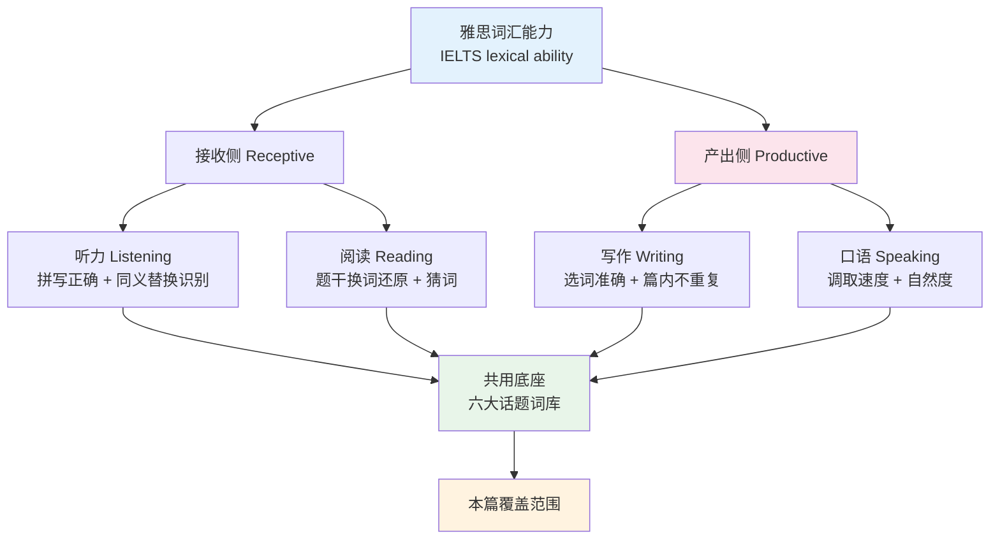
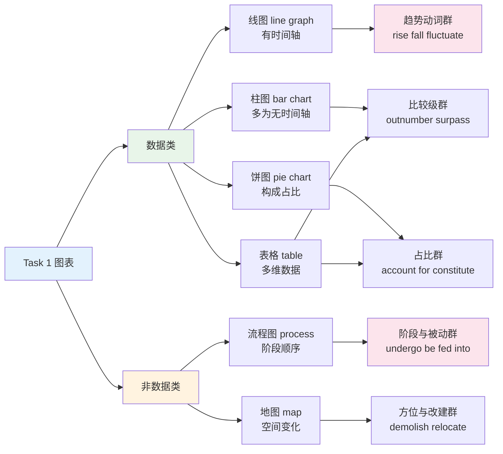
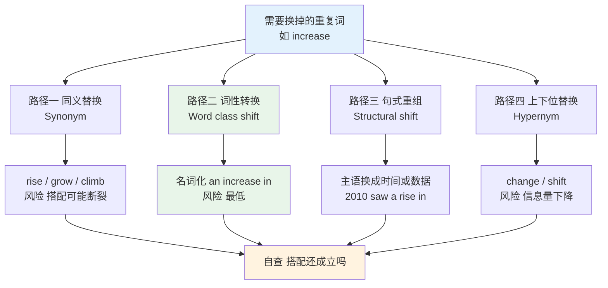
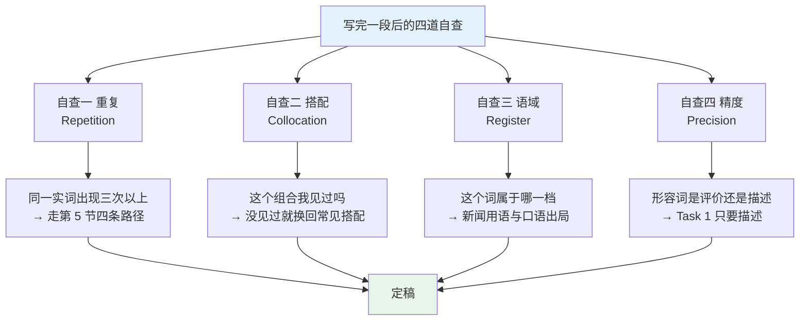
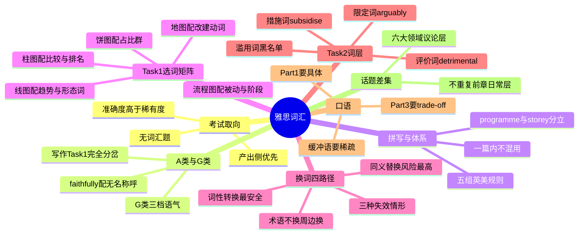

# 雅思词汇：话题词库、Task 1 选词与产出侧换词

> [!info] 本篇定位
>
> 第 21 章第四篇，全书唯一处理雅思取向的一篇。
>
> 前三篇处理的都是**认得**：国内考试的词表基准是认得多少、熟词僻义是认不认得出第二义项、GRE 低频词是认不认得这个词形。雅思把重心挪到了另一半——**用得出来**。写作与口语两项各占总分四分之一，两项的评分维度里都有一条独立的 Lexical Resource，考的不是你认识多少词，而是你在四十分钟里能主动调出多少、调得准不准、有没有重复。
>
> 本篇不复制前面任何一章的词表。图表趋势词的全表在 `03.数字与计量词汇/04.货币、价格、折扣与统计图表趋势`，学术评价词的全表在 `19.学术通用词汇` 两篇，英美词汇差异的全表在 `18.语域、英美差异与习语俚语/01.英式与美式词汇差异`。本篇只做三件那几篇不做的事：把已有词按雅思题型重排成**选词矩阵**、给出**同篇内不重复**的换词路径、补上六大话题里前面各章确实没收的**差集词**。
>
> 读完能做三件事：拿到任意一张 Task 1 图表能在三十秒内定下这一篇要用的词群、写完一段能自查哪几个词重复超标并知道换成什么、说到 Part 3 抽象题时手上有一批不靠背模板的词。

---

## 1. 本篇导读：雅思考的是产出侧词汇

雅思与前三篇讲的考试有一条结构性差别：**它没有词汇题**。考研有完形填空考搭配，GRE 有填空考近义细分，四六级有选词填空，托福有词汇替换题。雅思四个部分里，听力和阅读考的是理解，写作和口语考的是产出，没有任何一道题单独问「这个词是什么意思」。

后果是词汇的作用换了位置。在有词汇题的考试里，词汇是**被直接测量**的对象，多认一个词多一分的可能；在雅思里，词汇是**支撑其他能力的地基**，认得再多也不直接得分，用不出来就直接扣分。这条差别决定了备考的两个反直觉结论：

| 直觉做法 | 为什么在雅思上收益低 | 应该换成什么 |
| --- | --- | --- |
| 背万词书 | 阅读的生词靠上下文和同义句就能绕过，多认的那批词几乎不会主动出现在你的写作里 | 把已认识的两三千词做**主动化**，能默写、能造句、能想起搭配 |
| 背高级词 | 生僻词一旦搭配错，扣分比用普通词更重；考官看的是准确度不是稀有度 | 把中频词的**搭配伴侣**记牢，`heavy traffic` 比 `ponderous traffic` 得分高 |
| 背写作模板 | 模板句里的词和你自己的词是两套系统，考场上一紧张就串 | 记**词群**而不是记句子，词群可以重组，句子不能 |

第二行值得展开一句。公开版评分标准里，Lexical Resource 第六档的表述是「尝试使用不太常见的词汇，但有一些不准确」，同一档另有一条「拼写与词形的错误不影响交流」；到第七档才允许「用词选择、拼写与词形偶有失误」。稀有度与准确度是一对约束条件，不是一条奖励条件。用 `detrimental` 而搭配正确，得分高于用 `bad`；用 `detrimental` 而写成 `detrimental for the society`（正确是 `detrimental to society`），得分低于老老实实写 `bad for society`。**冒险的收益是线性的，出错的代价不是**。

### 1.1 四个部分对词汇的要求各不相同

这张图把四个部分按接收与产出劈成两半。左半边的两项对词汇的要求是**广度优先**：听力填空题只要求你听出来并把拼写写对，阅读题只要求你认出题干的换词版本，都不要求你自己想出这个词。右半边的两项是**深度优先**：一个词你必须知道它的词性、搭配、语域和常见变形，才敢在作文里用它。

底下那个共用底座是关键。四个部分的话题范围高度重合——听力 Section 3 讲的学业话题、阅读的环保文章、Task 2 的教育题、Part 3 的社会讨论，用的是同一批话题词。所以话题词库是雅思备考里投入产出比最高的部分，一份词库同时喂四个部分。本篇第 8 节做的就是这份词库的差集补充。

### 1.2 本篇不收什么

雅思备考资料里有大量内容与本教程前面各章重复，本篇一律不重收：

| 内容 | 主讲位置 | 本篇的处理 |
| --- | --- | --- |
| 上升下降趋势词全表 | `03.数字与计量词汇/04.货币、价格、折扣与统计图表趋势` | 只给按题型分组的**调用矩阵**，不重列词条释义 |
| 百分数、分数、倍数读法 | `03.数字与计量词汇/02.分数、小数、百分数与数学运算读法` | 只提 Task 1 里最容易写错的三处 |
| 学术评价形容词 | `19.学术通用词汇/02.学术通用词表 AWL（下）：过程与评价` | 只标哪些在 Task 2 里高频 |
| 英美拼写与词汇差异全表 | `18.语域、英美差异与习语俚语/01.英式与美式词汇差异` | 只讲差异对雅思答题的**实际影响** |
| 委婉语与语域分层 | `18.语域、英美差异与习语俚语/02.语域分层与英语词汇的历史层次` | 只给 G 类书信的三档语气对照 |
| 议论文句型与框架 | `04.英语场景` 与 `17.固定搭配/08.半固定框架与高频语块：It is worth doing 与 the more the more` | 不给任何句型库，只给词 |

第一行要特别说明。趋势词（`rise`、`soar`、`plunge`、`level off`、`fluctuate`）是 Task 1 的核心，但它们不是雅思特有的词，任何讲统计图表的场合都用同一批。把它们的定义、搭配和强度梯度放在第 3 章是对的；本篇要解决的是另一个问题——**同一张图上这批词该怎么分配**，才不至于四段话里 `increase` 出现七次。这是选词问题，不是识词问题。

### 1.3 这一篇怎么用

按你考的类型分岔。考 A 类的从第 3 节读到第 9 节，第 2.2、2.3 两小节可以跳；考 G 类的第 2 节必读，第 4 节的 Task 1 部分整节跳过（G 类 Task 1 是书信不是图表），第 6 节往后完全通用。

不管哪一类，第 5 节的换词策略都是全篇最需要动手的一节。词表可以查，换词能力查不来——它要求你在写下一个词的瞬间就知道这个词三段之后还得再用一次，得提前留一个替身。这个习惯只能靠成篇写出来，不能靠读。

---

## 2. A 类与 G 类：同一个考试的两条取向

雅思分学术类（Academic，简称 A 类）与培训类（General Training，简称 G 类）。两类共用同一份口语题库，听力试卷同卷，阅读与写作两项各自出题。词汇上的分岔集中在写作，其次是阅读。

### 2.1 四部分的异同

| 部分 | A 类 | G 类 | 词汇取向差别 |
| --- | --- | --- | --- |
| 听力 Listening | 同卷 | 同卷 | 无差别，日常事务与校园场景各半 |
| 阅读 Reading | 三篇长文，学术期刊与杂志改写 | 前两部分是广告、说明、通知，第三部分才是长文 | A 类偏抽象名词与被动结构，G 类偏日常事务词与指示性动词 |
| 写作 Task 1 | 描述图表、流程或地图，150 词起 | 写一封信，150 词起 | **分岔最大的一项**，两套完全不同的词库 |
| 写作 Task 2 | 议论文，250 词起 | 议论文，250 词起，题目稍偏具体生活 | 同一批议论词，G 类允许语域低半档 |
| 口语 Speaking | 同题库 | 同题库 | 无差别 |

阅读的差别值得单说。G 类第一部分的材料是广告、时刻表、租房启事这类实用文本，词汇密度低但**事务性名词密集**——`deposit`、`utility bill`、`notice period`、`refundable`、`surcharge`。这批词在 A 类阅读里几乎不出现，但它们与 G 类 Task 1 的书信高度重合，学一次用两处。

### 2.2 G 类 Task 1：三档语气决定整封信的用词

G 类 Task 1 的第一个动作不是想词，是**判断收信人是谁**。收信人决定语气档位，语气档位决定后面每一个称呼、每一个套语、甚至每一个动词的语域。判错档位会让整封信从头错到尾，这比任何一个单词写错都严重。

| 档位 | 收信人 | 开头称呼 | 结尾套语 | 动词取向 |
| --- | --- | --- | --- | --- |
| 正式 formal | 不知姓名的机构、经理、市政部门 | Dear Sir or Madam | Yours faithfully | 拉丁层：request、inform、apologise |
| 半正式 semi-formal | 知道姓氏的人：房东、导师、经理 | Dear Mr Brown / Dear Dr Lee | Yours sincerely | 中性层：ask、let you know、say sorry 与拉丁层混用 |
| 非正式 informal | 朋友、家人 | Dear Tom / Hi Tom | Best wishes / Cheers | 日耳曼层加短语动词：ask、tell、sort out、drop by |

英式书信的一条硬规则：**不知道名字用 faithfully，知道名字用 sincerely**。这条配对不能交叉，写成 `Dear Sir or Madam ... Yours sincerely` 是明确的错误。美式书信不用这套（一律 `Sincerely` 或 `Sincerely yours`），但雅思是英式考试，按英式来。

下面这批套语是 G 类 Task 1 的骨架，按功能分组，共三十六条。

#### 2.2.1 开头与说明来意

| 英文 | 英式音标 | 美式音标 | 词性 | 中文 | 搭配与说明 |
| --- | --- | --- | --- | --- | --- |
| **Dear Sir or Madam** | /dɪə sɜː ɔː ˈmædəm/ | /dɪr sɜːr ɔːr ˈmædəm/ | 套语 | 尊敬的先生或女士 | 正式档唯一开头；不要写 Dear Sir/Madam 的斜杠形式 |
| **To Whom It May Concern** | /tə huːm ɪt meɪ kənˈsɜːn/ | /tə huːm ɪt meɪ kənˈsɜːrn/ | 套语 | 敬启者 | 比 Dear Sir or Madam 更冷，雅思里可用但不占优 |
| **I am writing to** | /aɪ əm ˈraɪtɪŋ tuː/ | /aɪ əm ˈraɪtɪŋ tuː/ | 套语 | 我写信是为了 | 正式与半正式通用的第一句框架 |
| **with regard to** | /wɪð rɪˈɡɑːd tuː/ | /wɪð rɪˈɡɑːrd tuː/ | 介词短语 | 关于 | 正式；注意是 regard 不是 regards |
| **enquire** | /ɪnˈkwaɪə/ | /ɪnˈkwaɪr/ | v. | 询问 | 英式拼写；美式作 inquire，两种在雅思都接受 |
| **enquiry** | /ɪnˈkwaɪəri/ | /ˈɪnkwəri/ | n. | 询问；查询 | 重音英美不同，写作用不到，听力要认 |
| **further to** | /ˈfɜːðə tuː/ | /ˈfɜːrðər tuː/ | 介词短语 | 继……之后 | 承接前次联系：further to our conversation |
| **on behalf of** | /ɒn bɪˈhɑːf əv/ | /ɑːn bɪˈhæf əv/ | 介词短语 | 代表 | 代表团体投诉或申请时用 |
| **as advertised in** | /əz ˈædvətaɪzd ɪn/ | /əz ˈædvərtaɪzd ɪn/ | 套语 | 如……上所登 | 应聘或询价信开头交代信息来源 |

#### 2.2.2 请求、投诉与致歉

| 英文 | 英式音标 | 美式音标 | 词性 | 中文 | 搭配与说明 |
| --- | --- | --- | --- | --- | --- |
| **I would be grateful if** | /aɪ wʊd bi ˈɡreɪtfl ɪf/ | /aɪ wʊd bi ˈɡreɪtfl ɪf/ | 套语 | 如蒙……不胜感激 | 正式请求的首选；后接 you could，不接 you can |
| **I would appreciate it if** | /aɪ wʊd əˈpriːʃieɪt ɪt ɪf/ | /aɪ wʊd əˈpriːʃieɪt ɪt ɪf/ | 套语 | 若能……我将感谢 | it 不能省，省了是错句 |
| **kindly** | /ˈkaɪndli/ | /ˈkaɪndli/ | adv. | 请；烦请 | 正式指令：Kindly confirm by Friday；语气偏硬 |
| **at your earliest convenience** | /ət jɔːr ˈɜːliɪst kənˈviːniəns/ | /ət jʊr ˈɜːrliɪst kənˈviːniəns/ | 套语 | 尽早 | 催办的正式说法，比 as soon as possible 客气 |
| **complaint** | /kəmˈpleɪnt/ | /kəmˈpleɪnt/ | n. | 投诉 | make a complaint about、file a complaint |
| **dissatisfied** | /dɪsˈsætɪsfaɪd/ | /dɪsˈsætɪsfaɪd/ | adj. | 不满意的 | dissatisfied with；比 unhappy 正式一档 |
| **inconvenience** | /ˌɪnkənˈviːniəns/ | /ˌɪnkənˈviːniəns/ | n./v. | 不便；打扰 | 致歉句核心词：the inconvenience caused |
| **apologise** | /əˈpɒlədʒaɪz/ | /əˈpɑːlədʒaɪz/ | v. | 道歉 | 英式 -ise，美式 -ize；apologise for doing |
| **reimburse** | /ˌriːɪmˈbɜːs/ | /ˌriːɪmˈbɜːrs/ | v. | 报销；偿还 | reimburse sb for sth；比 pay back 正式 |
| **refund** | /ˈriːfʌnd/ | /ˈriːfʌnd/ | n. | 退款 | 名词重音在前；动词 /rɪˈfʌnd/ 重音在后 |
| **compensation** | /ˌkɒmpenˈseɪʃn/ | /ˌkɑːmpenˈseɪʃn/ | n. | 赔偿 | seek/claim compensation for |
| **rectify** | /ˈrektɪfaɪ/ | /ˈrektɪfaɪ/ | v. | 纠正；改正 | rectify the situation，正式档投诉信的收尾动词 |
| **look into** | /lʊk ˈɪntuː/ | /lʊk ˈɪntuː/ | phr.v. | 调查 | 半正式：I would ask you to look into this matter |

#### 2.2.3 结尾与非正式档

| 英文 | 英式音标 | 美式音标 | 词性 | 中文 | 搭配与说明 |
| --- | --- | --- | --- | --- | --- |
| **I look forward to hearing from you** | /aɪ lʊk ˈfɔːwəd tə ˈhɪərɪŋ frəm juː/ | /aɪ lʊk ˈfɔːrwərd tə ˈhɪrɪŋ frəm juː/ | 套语 | 期待您的回复 | to 后必须接 -ing，全篇最高频的错点 |
| **Please find enclosed** | /pliːz faɪnd ɪnˈkləʊzd/ | /pliːz faɪnd ɪnˈkloʊzd/ | 套语 | 随信附上 | 纸质信用 enclosed，电邮用 attached |
| **Yours faithfully** | /jɔːz ˈfeɪθfəli/ | /jʊrz ˈfeɪθfəli/ | 套语 | 谨启 | 只配 Dear Sir or Madam |
| **Yours sincerely** | /jɔːz sɪnˈsɪəli/ | /jʊrz sɪnˈsɪrli/ | 套语 | 谨上 | 只配写了姓氏的称呼 |
| **Best wishes** | /best ˈwɪʃɪz/ | /best ˈwɪʃɪz/ | 套语 | 祝好 | 半正式与非正式通吃，最安全的中间档 |
| **Cheers** | /tʃɪəz/ | /tʃɪrz/ | 套语 | 谢啦；再见 | 英式非正式结尾；美式读者可能只理解成干杯 |
| **Take care** | /teɪk keə/ | /teɪk ker/ | 套语 | 保重 | 非正式，写给朋友 |
| **drop me a line** | /drɒp mi ə laɪn/ | /drɑːp mi ə laɪn/ | 语块 | 给我写几句 | 非正式档要求回信，替换 reply to me |
| **catch up** | /kætʃ ʌp/ | /kætʃ ʌp/ | phr.v. | 叙旧；碰面聊 | let's catch up soon，朋友信收尾常用 |
| **sort out** | /sɔːt aʊt/ | /sɔːrt aʊt/ | phr.v. | 处理妥当 | 非正式档替换 resolve；正式信里不要用 |
| **give you a shout** | /ɡɪv juː ə ʃaʊt/ | /ɡɪv juː ə ʃaʊt/ | 语块 | 招呼你一声 | 英式非正式；不确定就换成 let you know |

> [!warning] G 类书信最常见的三处扣分
>
> - ❌ ~~Dear Sir or Madam ... Yours sincerely~~（档位交叉）
> - ✅ **Dear Sir or Madam ... Yours faithfully**
>
> - ❌ ~~I look forward to hear from you.~~（to 后用了原形）
> - ✅ **I look forward to hearing from you.**
>
> - ❌ ~~正式投诉信里写 I was pretty annoyed and want you to sort it out ASAP.~~（三处口语混进正式档）
> - ✅ **I was extremely dissatisfied and would be grateful if you could rectify the situation.**

### 2.3 G 类特有的日常事务词

这批词在 A 类几乎不考，在 G 类的阅读第一部分和 Task 1 里反复出现，属于必须单独补的一小块。

| 英文 | 英式音标 | 美式音标 | 词性 | 中文 | 搭配与说明 |
| --- | --- | --- | --- | --- | --- |
| **tenancy** | /ˈtenənsi/ | /ˈtenənsi/ | n. | 租期；租赁 | tenancy agreement 是英式租房合同的标准说法 |
| **landlord** | /ˈlændlɔːd/ | /ˈlændlɔːrd/ | n. | 房东 | 女房东 landlady；G 类投诉信高频收信人 |
| **deposit** | /dɪˈpɒzɪt/ | /dɪˈpɑːzɪt/ | n./v. | 押金；存款 | 押金义搭配 pay/return a deposit |
| **utility bill** | /juːˈtɪləti bɪl/ | /juːˈtɪləti bɪl/ | n. | 水电煤账单 | utilities 复数指水电煤气总称 |
| **surcharge** | /ˈsɜːtʃɑːdʒ/ | /ˈsɜːrtʃɑːrdʒ/ | n. | 附加费 | 名词重音在前；比 extra fee 正式 |
| **refundable** | /rɪˈfʌndəbl/ | /rɪˈfʌndəbl/ | adj. | 可退的 | non-refundable 在广告类阅读里高频 |
| **notice period** | /ˈnəʊtɪs ˈpɪəriəd/ | /ˈnoʊtɪs ˈpɪriəd/ | n. | 通知期 | 辞职或退租需提前告知的时长 |
| **resignation** | /ˌrezɪɡˈneɪʃn/ | /ˌrezɪɡˈneɪʃn/ | n. | 辞职 | hand in one's resignation；辞职信 Task 1 常考 |
| **referee** | /ˌrefəˈriː/ | /ˌrefəˈriː/ | n. | 推荐人 | 英式简历用词；美式这层意思说 reference，referee 在美式只留裁判义 |
| **premises** | /ˈpremɪsɪz/ | /ˈpremɪsɪz/ | n. | 房产；场所 | 恒为复数；on the premises 在场内 |
| **council** | /ˈkaʊnsl/ | /ˈkaʊnsl/ | n. | 市政委员会 | 英式地方政府；投诉噪音、垃圾的收信方 |
| **appliance** | /əˈplaɪəns/ | /əˈplaɪəns/ | n. | 家用电器 | faulty appliance 在投诉信里成对出现 |
| **faulty** | /ˈfɔːlti/ | /ˈfɔːlti/ | adj. | 有故障的 | 比 broken 正式，配电器、零件 |
| **overdue** | /ˌəʊvəˈdjuː/ | /ˌoʊvərˈduː/ | adj. | 逾期的 | 账单、还书、还款 |

### 2.4 A 类的取向

A 类的两个 Task 分别拉向两个不同的词层。Task 1 要的是**数据描述词**：精确、中性、可量化，不带任何评价色彩。Task 2 要的是**议论词**：带立场、带程度、带因果。这两层几乎不重叠，混用会立刻暴露。

把评价词写进 Task 1 是 A 类最常见的越界。图上显示某国用水量高，写成 `The figure for water use was alarmingly high` 就越界了——`alarmingly` 是评价，Task 1 只报告不评价。正确写法是把评价拆成比较：`The figure for water use was more than twice that of any other category`。

反过来，把纯数据词写进 Task 2 会让论证显得空洞。`Many people think A. The percentage of these people is high.` 这种句子在 Task 2 里没有任何论证价值，因为它只报数不给理由。

---

## 3. 英式拼写与词汇选择：一致性比正确性更重要

雅思由英国机构主办，题目、听力录音、阅读材料以英式为主，但**评分不要求你写英式**。官方接受英式与美式两套拼写，选哪一套都不影响评分，真正要守的是一篇之内保持一致。这条规则听起来宽松，实际操作上有三个坑。

### 3.1 五组拼写规则

| 规则组 | 英式 | 美式 | 例词 | 对雅思的实际影响 |
| --- | --- | --- | --- | --- |
| 动词后缀 -ise / -ize | organise、realise、recognise | organize、realize、recognize | analyse / analyze 是特例，英式必须用 s | 最容易在一篇里混用的一组 |
| 名词后缀 -our / -or | colour、behaviour、labour、favour | color、behavior、labor、favor | 英式派生时部分脱 u：labour → laborious、humour → humorous，但 behavioural 保留 | 环境题与教育题高频 |
| 词尾 -re / -er | centre、metre、theatre、litre | center、meter、theater、liter | metre 是长度、meter 是仪表，英式两词分立 | Task 1 度量单位常写错 |
| 双写 l | travelling、modelling、cancelled、labelled | traveling、modeling、canceled、labeled | 英式在 -l 结尾词加后缀时双写 | 旅游题、Task 1 图例 label |
| 词尾 -ce / -se 的名动分工 | practice（名）/ practise（动）、licence（名）/ license（动） | practice、license 名动同形 | advice / advise 两套体系一致，都分立 | 教育题里 practise 用作动词是英式加分点 |

倒数第二行的双写 l 有一条容易漏的限制：只在**重音不在最后一音节**且词尾是单个 `l` 时英美才分岔。`travel` 重音在前，英式 `travelling` 美式 `traveling`；`control` 重音在后，两边都写 `controlling`。这条限制解释了为什么 `cancelled` 分岔而 `compelled` 不分岔。

### 3.2 三个真正会扣分的地方

拼写体系本身不扣分，混用也只在明显时才影响印象分。真正扣分的是下面三处。

**第一处：听力填空必须按录音的拼写来吗？**不必须。听力答案两套拼写都接受，`colour` 与 `color` 都算对。但**词形必须完全正确**——`labour` 少写一个 u 是错，`recieve` 字母顺序错也是错。听力填空是全卷唯一真正考拼写的地方，而它考的是准确度不是体系。

**第二处：programme 与 program。**这一对不是纯拼写差异。英式里 `programme` 指节目、计划、课程，`program` 专指计算机程序；美式一律 `program`。教育题写「培训项目」用 `training programme`（英式）或 `training program`（美式）都行，但英式体系下写成 `training program` 就是体系内错误。

**第三处：storey 与 story。**英式 `storey` 是楼层，`story` 是故事；美式 `story` 兼两义。Task 1 地图题描述建筑高度时会用到，写成 `a five-story building` 在英式体系下是「五个故事的建筑」。

> [!tip] 一个省事的策略
>
> 全篇统一用美式拼写。理由不是美式更好，而是**美式的规则更少**：不需要判断 -ise 还是 -ize，不需要记 practice 与 practise 的名动分工，不需要判断双写 l，不需要区分 programme 与 program。少四组判断就少四组出错机会。
>
> 唯一的代价是 `analyse` 这类英式特例你仍然要认得（阅读里会出现），只是自己不写。识别与产出用两套标准，这在雅思是允许的。
>
> 完整的英美差异清单在 `18.语域、英美差异与习语俚语/01.英式与美式词汇差异`，本节只讲对答题的影响。

### 3.3 词汇差异比拼写差异更值得留意

同一个物件的英美不同词，在阅读和听力里都可能出现，写作里选哪个都行。真正需要留意的是**同形不同义**的那批词，它们在阅读题里会直接导致理解错误。

| 词 | 英式义 | 美式义 | 雅思出现处 |
| --- | --- | --- | --- |
| **first floor** | 二楼 | 一楼 | 听力校园场景问路 |
| **public school** | 私立寄宿学校 | 公立学校 | 教育类阅读，误解会读反整段 |
| **subway** | 地下人行通道 | 地铁 | 城市交通题 |
| **pants** | 内裤 | 长裤 | 口语话题，说错会尴尬 |
| **chips** | 薯条 | 薯片 | 听力点餐场景 |
| **holiday** | 假期 | 节日 | 口语 Part 1 高频话题 |
| **billion** | 现代英式已与美式统一为十亿 | 十亿 | 旧文献里英式曾指万亿，阅读遇到年代久远的引文要留心 |

---

## 4. Task 1 选词矩阵：四种题型各要什么词

A 类 Task 1 的题型有六种：线图（line graph）、柱图（bar chart）、饼图（pie chart）、表格（table）、流程图（process diagram）、地图（map）。前四种是数据类，后两种是非数据类。数据类的核心动作是**比较与描述变化**，非数据类的核心动作是**描述顺序与位置变化**，两类的词库几乎不重合。

这张图说明为什么「背一套 Task 1 词」是无效策略。六种题型只有表格同时调用两个词群，其余五种各自锁定一个主词群。拿到线图却满脑子 `account for`，或者拿到饼图却满脑子 `soar`，都是词群调错了。正确的顺序是先认题型，再开对应词群。

第 4.1 节的骨架词六种题型共用，从 4.2 起按题型分。

### 4.1 六种题型共用的骨架词

这批词不描述数据本身，描述**图表这个对象**。任何一篇 Task 1 的开头段和总览段都要用到。

| 英文 | 英式音标 | 美式音标 | 词性 | 中文 | 搭配与说明 |
| --- | --- | --- | --- | --- | --- |
| **illustrate** | /ˈɪləstreɪt/ | /ˈɪləstreɪt/ | v. | 说明；图示 | The chart illustrates...；改写题干的首选动词 |
| **depict** | /dɪˈpɪkt/ | /dɪˈpɪkt/ | v. | 描绘 | 比 show 正式；配 diagram、map |
| **compare** | /kəmˈpeə/ | /kəmˈper/ | v. | 比较 | The table compares A and B |
| **figure** | /ˈfɪɡə/ | /ˈfɪɡjər/ | n. | 数字；数据 | **英美读音差别大**；the figure for X was... |
| **data** | /ˈdeɪtə/ | /ˈdeɪtə/ | n. | 数据 | 学术写作按复数处理：the data show |
| **period** | /ˈpɪəriəd/ | /ˈpɪriəd/ | n. | 时期 | over the period from 2000 to 2020 |
| **category** | /ˈkætəɡəri/ | /ˈkætəɡɔːri/ | n. | 类别 | 柱图与饼图的分组单位 |
| **respectively** | /rɪˈspektɪvli/ | /rɪˈspektɪvli/ | adv. | 分别地 | 句末，对应前面并列的两项，顺序不能乱 |
| **whereas** | /weərˈæz/ | /werˈæz/ | conj. | 而；然而 | 对比连词，比 while 更适合书面数据对比 |
| **overall** | /ˌəʊvərˈɔːl/ | /ˌoʊvərˈɔːl/ | adv./adj. | 总体上 | 总览段开头，Overall, ... |
| **in general** | /ɪn ˈdʒenrəl/ | /ɪn ˈdʒenrəl/ | 介词短语 | 总的来说 | 与 overall 轮换，避免重复 |
| **unit** | /ˈjuːnɪt/ | /ˈjuːnɪt/ | n. | 单位 | 交代纵轴单位：measured in units of |
| **axis** | /ˈæksɪs/ | /ˈæksɪs/ | n. | 坐标轴 | 复数 axes /ˈæksiːz/；写作中不必提，读图时要懂 |
| **horizontal** | /ˌhɒrɪˈzɒntl/ | /ˌhɔːrɪˈzɑːntl/ | adj. | 水平的 | 横轴 the horizontal axis |
| **vertical** | /ˈvɜːtɪkl/ | /ˈvɜːrtɪkl/ | adj. | 垂直的 | 纵轴 the vertical axis |
| **respective** | /rɪˈspektɪv/ | /rɪˈspektɪv/ | adj. | 各自的 | their respective shares |
| **approximately** | /əˈprɒksɪmətli/ | /əˈprɑːksɪmətli/ | adv. | 大约 | 读数不精确时必须加，比 about 正式 |
| **just under** | /dʒʌst ˈʌndə/ | /dʒʌst ˈʌndər/ | 语块 | 略低于 | just under 40%；比 nearly 精确 |
| **just over** | /dʒʌst ˈəʊvə/ | /dʒʌst ˈoʊvər/ | 语块 | 略高于 | 与 just under 配对使用 |
| **broadly** | /ˈbrɔːdli/ | /ˈbrɔːdli/ | adv. | 大体上 | broadly similar 是描述两条近似曲线的高效表达 |

> [!warning] 骨架词的三个高频错误
>
> - ❌ ~~The chart shows about the population.~~（show 不接 about）
> - ✅ **The chart shows the population of three cities.**
>
> - ❌ ~~The figure of male students was 40%.~~（figure 接 for 不接 of）
> - ✅ **The figure for male students was 40%.**
>
> - ❌ ~~The datas are collected in 2010.~~（data 无 -s 形式）
> - ✅ **The data were collected in 2010.**

### 4.2 线图：时间轴上的动态

线图一定有时间轴，所以它是六种题型里唯一必须用**趋势动词**的。趋势词的完整定义与强度梯度在 `03.数字与计量词汇/04.货币、价格、折扣与统计图表趋势`，这里只补线图特有的**形态词**——描述曲线长什么样，而不是描述它往哪儿走。

| 英文 | 英式音标 | 美式音标 | 词性 | 中文 | 搭配与说明 |
| --- | --- | --- | --- | --- | --- |
| **fluctuate** | /ˈflʌktʃueɪt/ | /ˈflʌktʃueɪt/ | v. | 波动 | fluctuate between A and B；只用于反复上下 |
| **fluctuation** | /ˌflʌktʃuˈeɪʃn/ | /ˌflʌktʃuˈeɪʃn/ | n. | 波动 | show considerable fluctuation |
| **plateau** | /ˈplætəʊ/ | /plæˈtoʊ/ | v./n. | 趋于平稳；平台期 | **重音英美相反**；figures plateaued at 50 |
| **level off** | /ˈlevl ɒf/ | /ˈlevl ɔːf/ | phr.v. | 趋平 | 与 plateau 同义，语域低一档 |
| **peak** | /piːk/ | /piːk/ | v./n. | 达到峰值 | peak at 80 in 2015；名词 reach a peak of |
| **trough** | /trɒf/ | /trɔːf/ | n. | 谷值 | 与 peak 对立；-ough 在这里读 /f/，与 rough、cough 同类 |
| **bottom out** | /ˈbɒtəm aʊt/ | /ˈbɑːtəm aʊt/ | phr.v. | 触底回升 | 跌到最低后开始回升，比 reach the lowest 信息量大 |
| **steady** | /ˈstedi/ | /ˈstedi/ | adj. | 平稳的 | a steady rise；副词 steadily |
| **gradual** | /ˈɡrædʒuəl/ | /ˈɡrædʒuəl/ | adj. | 逐渐的 | a gradual decline；副词 gradually |
| **sharp** | /ʃɑːp/ | /ʃɑːrp/ | adj. | 急剧的 | a sharp increase；副词 sharply |
| **dramatic** | /drəˈmætɪk/ | /drəˈmætɪk/ | adj. | 剧烈的 | 与 sharp 同档，用于轮换避免重复 |
| **marginal** | /ˈmɑːdʒɪnl/ | /ˈmɑːrdʒɪnl/ | adj. | 微小的 | a marginal drop；比 slight 正式 |
| **erratic** | /ɪˈrætɪk/ | /ɪˈrætɪk/ | adj. | 无规律的 | an erratic pattern；比 fluctuating 更强调无序 |
| **consecutive** | /kənˈsekjətɪv/ | /kənˈsekjətɪv/ | adj. | 连续的 | for three consecutive years |
| **subsequent** | /ˈsʌbsɪkwənt/ | /ˈsʌbsɪkwənt/ | adj. | 随后的 | the subsequent decade；副词 subsequently |
| **thereafter** | /ˌðeərˈɑːftə/ | /ˌðerˈæftər/ | adv. | 此后 | 正式；替换 after that |
| **prior to** | /ˈpraɪə tuː/ | /ˈpraɪər tuː/ | 介词短语 | 在……之前 | prior to 1990；替换 before |
| **onwards** | /ˈɒnwədz/ | /ˈɑːnwərdz/ | adv. | 起；往后 | from 2005 onwards；英式带 s，美式常写 onward |
| **mirror** | /ˈmɪrə/ | /ˈmɪrər/ | v. | 与……走势一致 | Line B mirrored Line A；描述两条同步曲线 |
| **diverge** | /daɪˈvɜːdʒ/ | /daɪˈvɜːrdʒ/ | v. | 分化；分道 | The two lines diverged after 2010 |
| **converge** | /kənˈvɜːdʒ/ | /kənˈvɜːrdʒ/ | v. | 趋同 | 与 diverge 对立，描述两线靠拢 |

> [!example] 线图形态词的实际用法
>
> - Enrolment **fluctuated** between 300 and 400 for the first five years before **plateauing** at around 350.
>   - 入学人数在前五年里在三百到四百之间波动，随后稳定在三百五十左右。
> - After **bottoming out** in 2012, the figure rose **steadily** and **peaked** at 90 in 2018.
>   - 该数字在二〇一二年触底后稳步上升，于二〇一八年达到九十的峰值。
> - The two curves **mirrored** each other until 2008, after which they **diverged** sharply.
>   - 两条曲线在二〇〇八年前走势一致，此后急剧分化。

`plateau` 值得单独记一笔。它的英式重音在第一音节 /ˈplætəʊ/，美式在第二音节 /plæˈtoʊ/，是雅思听力里容易听漏的一个词；作动词时现在分词写 `plateauing`，不少人会误写成 `plateauring`。

### 4.3 柱图：比较与排名

柱图分两种。**有时间轴的柱图**本质上是线图，用线图那套词；**无时间轴的柱图**（比较几个国家、几个年龄段、几个类别）才是柱图真正的形态，它的核心动作是比较与排名，几乎用不上趋势词。

| 英文 | 英式音标 | 美式音标 | 词性 | 中文 | 搭配与说明 |
| --- | --- | --- | --- | --- | --- |
| **outnumber** | /ˌaʊtˈnʌmbə/ | /ˌaʊtˈnʌmbər/ | v. | 在数量上超过 | 只用于可数的人或物，不用于百分比 |
| **outstrip** | /ˌaʊtˈstrɪp/ | /ˌaʊtˈstrɪp/ | v. | 超过；胜过 | 常配 demand outstripped supply |
| **surpass** | /səˈpɑːs/ | /sərˈpæs/ | v. | 超过 | 中性，可配任何量；比 outnumber 用途广 |
| **exceed** | /ɪkˈsiːd/ | /ɪkˈsiːd/ | v. | 超出 | exceed 1,000；配阈值与上限 |
| **overtake** | /ˌəʊvəˈteɪk/ | /ˌoʊvərˈteɪk/ | v. | 反超 | 含**由低到高的过程**，无时间轴的柱图不能用 |
| **lag behind** | /læɡ bɪˈhaɪnd/ | /læɡ bɪˈhaɪnd/ | phr.v. | 落后于 | 与 surpass 对立 |
| **trail** | /treɪl/ | /treɪl/ | v. | 落后 | trail far behind；比 lag behind 简短 |
| **rank** | /ræŋk/ | /ræŋk/ | v. | 排名 | rank first / rank second；不用 rank the first |
| **top** | /tɒp/ | /tɑːp/ | v. | 位居榜首 | Japan topped the list |
| **come second** | /kʌm ˈsekənd/ | /kʌm ˈsekənd/ | 语块 | 位列第二 | 英式常用；美式多说 come in second 或 rank second |
| **disparity** | /dɪˈspærəti/ | /dɪˈsperəti/ | n. | 悬殊差距 | a marked disparity between A and B |
| **discrepancy** | /dɪsˈkrepənsi/ | /dɪsˈkrepənsi/ | n. | 不一致 | 强调**本应相同却不同**，柱图慎用 |
| **gap** | /ɡæp/ | /ɡæp/ | n. | 差距 | the gap widened / narrowed |
| **widen** | /ˈwaɪdn/ | /ˈwaɪdn/ | v. | 拉大 | 主语是 gap、difference |
| **narrow** | /ˈnærəʊ/ | /ˈneroʊ/ | v. | 缩小 | 与 widen 对立 |
| **twice as many as** | /twaɪs əz ˈmeni əz/ | /twaɪs əz ˈmeni əz/ | 语块 | 是……的两倍 | 可数用 many，不可数用 much |
| **three times higher than** | /θriː taɪmz ˈhaɪə ðən/ | /θriː taɪmz ˈhaɪər ðən/ | 语块 | 是……的三倍 | 这个说法在英语里本身有歧义，Task 1 写 three times as high as 更稳 |
| **comparable** | /ˈkɒmpərəbl/ | /ˈkɑːmpərəbl/ | adj. | 相当的 | comparable to；重音在第一音节 |
| **on a par with** | /ɒn ə pɑː wɪð/ | /ɑːn ə pɑːr wɪð/ | 介词短语 | 与……不相上下 | 正式；替换 similar to |
| **markedly** | /ˈmɑːkɪdli/ | /ˈmɑːrkɪdli/ | adv. | 显著地 | markedly higher；三音节，注意 -ed 单独成音 |
| **considerably** | /kənˈsɪdərəbli/ | /kənˈsɪdərəbli/ | adv. | 相当地 | 修饰比较级：considerably lower |
| **slightly** | /ˈslaɪtli/ | /ˈslaɪtli/ | adv. | 略微地 | 修饰比较级：slightly more expensive |

> [!warning] 柱图里最容易越界的一个词
>
> `overtake` 自带「从后面追上并超过」的过程义，需要一个时间维度。无时间轴的柱图上写 `Country A overtook Country B` 是错的——两根柱子只是并排站着，没有谁追谁。
>
> - ❌ ~~In the 25–34 age group, men overtook women.~~
> - ✅ **In the 25–34 age group, men outnumbered women.**
>
> 反过来，有时间轴的图上写 `overtook` 就准确得多，因为它一个词同时表达了「之前更低」和「之后更高」两层信息。

### 4.4 饼图：占比与构成

饼图只有一个核心关系：部分与整体。所以它的词库集中在**占比动词**和**份额名词**两组，几乎不涉及趋势与排名。

| 英文 | 英式音标 | 美式音标 | 词性 | 中文 | 搭配与说明 |
| --- | --- | --- | --- | --- | --- |
| **account for** | /əˈkaʊnt fɔː/ | /əˈkaʊnt fɔːr/ | phr.v. | 占（比例） | 饼图第一动词：account for 45% of the total |
| **make up** | /meɪk ʌp/ | /meɪk ʌp/ | phr.v. | 构成 | 与 account for 同义，语域低半档，用于轮换 |
| **constitute** | /ˈkɒnstɪtjuːt/ | /ˈkɑːnstətuːt/ | v. | 构成 | 正式；**英美读音差别大**，注意美式无 /j/ |
| **represent** | /ˌreprɪˈzent/ | /ˌreprɪˈzent/ | v. | 代表；占 | This segment represents one fifth |
| **comprise** | /kəmˈpraɪz/ | /kəmˈpraɪz/ | v. | 包括；由……组成 | **方向与 constitute 相反**：整体 comprise 部分 |
| **consist of** | /kənˈsɪst əv/ | /kənˈsɪst əv/ | phr.v. | 由……构成 | 整体在前；无被动式，不写 is consisted of |
| **proportion** | /prəˈpɔːʃn/ | /prəˈpɔːrʃn/ | n. | 比例 | a large proportion of；不可数用法为主 |
| **share** | /ʃeə/ | /ʃer/ | n. | 份额 | its share of the market；可数 |
| **segment** | /ˈseɡmənt/ | /ˈseɡmənt/ | n. | 扇区；部分 | 饼图的一块；名词重音在前 |
| **portion** | /ˈpɔːʃn/ | /ˈpɔːrʃn/ | n. | 部分 | a significant portion；与 proportion 只差一个字母 |
| **majority** | /məˈdʒɒrəti/ | /məˈdʒɔːrəti/ | n. | 大多数 | the vast majority of；超过一半才能用 |
| **minority** | /maɪˈnɒrəti/ | /maɪˈnɔːrəti/ | n. | 少数 | a small minority；注意首音是 /maɪ/ 不是 /mɪ/ |
| **the bulk of** | /ðə bʌlk əv/ | /ðə bʌlk əv/ | 语块 | 大部分 | 替换 the majority of，避免重复 |
| **a fraction of** | /ə ˈfrækʃn əv/ | /ə ˈfrækʃn əv/ | 语块 | 一小部分 | 强调极少，比 a small part 有力 |
| **one in five** | /wʌn ɪn faɪv/ | /wʌn ɪn faɪv/ | 语块 | 五分之一 | 替换 20%，同段内换算式换词的常用手法 |
| **dominate** | /ˈdɒmɪneɪt/ | /ˈdɑːmɪneɪt/ | v. | 占主导 | 某扇区远大于其他时用；dominated the chart |
| **negligible** | /ˈneɡlɪdʒəbl/ | /ˈneɡlɪdʒəbl/ | adj. | 微不足道的 | a negligible share；描述 1%–2% 的小扇区 |
| **collectively** | /kəˈlektɪvli/ | /kəˈlektɪvli/ | adv. | 合计地 | 合并几个小扇区时：collectively accounted for 15% |
| **combined** | /kəmˈbaɪnd/ | /kəmˈbaɪnd/ | adj. | 合并的 | the two categories combined；后置修饰 |

> [!warning] comprise 与 constitute 的方向相反
>
> 这一对是饼图题最常见的方向性错误。`comprise` 与 `consist of` 的主语是**整体**，`constitute`、`make up`、`account for` 的主语是**部分**。
>
> - ✅ **The chart comprises four categories.**（整体在前）
> - ✅ **These four categories constitute the whole chart.**（部分在前）
> - ❌ ~~Housing comprises 30% of expenditure.~~（part 当了 comprise 的主语）
> - ✅ **Housing accounts for 30% of expenditure.**
>
> 另有一条：`comprise` 不用被动。`is comprised of` 在口语中常见，但在正式写作里被视为误用，考场上写 `consists of` 更安全。同类问题的完整讨论见 `17.固定搭配/06.动词+介词固定搭配：depend on、result in、consist of`。

### 4.5 流程图：阶段、被动与连接

流程图（process diagram）与地图题是 Task 1 里唯二不涉及数字的题型，也是最多人没准备的两种。流程图的词库由三块组成：**阶段名词**、**工序动词**、**顺序连接词**。三块里工序动词最难，因为它取决于流程内容——制砖、净水、蚕丝生产、纸张回收各有一批专用动词。

#### 4.5.1 阶段与顺序

| 英文 | 英式音标 | 美式音标 | 词性 | 中文 | 搭配与说明 |
| --- | --- | --- | --- | --- | --- |
| **stage** | /steɪdʒ/ | /steɪdʒ/ | n. | 阶段 | the first stage；流程图最基本的计数单位 |
| **phase** | /feɪz/ | /feɪz/ | n. | 阶段 | 与 stage 轮换；phase 略偏时间跨度长的 |
| **step** | /step/ | /step/ | n. | 步骤 | 比 stage 颗粒度小，用于单个动作 |
| **procedure** | /prəˈsiːdʒə/ | /prəˈsiːdʒər/ | n. | 流程；程序 | 改写题干时替换 process |
| **sequence** | /ˈsiːkwəns/ | /ˈsiːkwəns/ | n. | 顺序 | in sequence；形容词 sequential |
| **cycle** | /ˈsaɪkl/ | /ˈsaɪkl/ | n. | 循环 | 闭合流程图必须点明：the cycle then repeats |
| **initially** | /ɪˈnɪʃəli/ | /ɪˈnɪʃəli/ | adv. | 最初 | 替换 first；比 firstly 自然 |
| **subsequently** | /ˈsʌbsɪkwəntli/ | /ˈsʌbsɪkwəntli/ | adv. | 随后 | 替换 then |
| **thereafter** | /ˌðeərˈɑːftə/ | /ˌðerˈæftər/ | adv. | 此后 | 与 subsequently 轮换 |
| **finally** | /ˈfaɪnəli/ | /ˈfaɪnəli/ | adv. | 最后 | 收尾；不要与 at last 混用，后者含期待义 |
| **at this point** | /ət ðɪs pɔɪnt/ | /ət ðɪs pɔɪnt/ | 语块 | 在这一环节 | 替换 then，插在句中显自然 |
| **once** | /wʌns/ | /wʌns/ | conj. | 一旦；一经 | Once the mixture has cooled...；流程图最好用的连词 |
| **prior to** | /ˈpraɪə tuː/ | /ˈpraɪər tuː/ | 介词短语 | 在……之前 | prior to packaging |
| **simultaneously** | /ˌsɪmlˈteɪniəsli/ | /ˌsaɪmlˈteɪniəsli/ | adv. | 同时地 | **首元音英美不同**；并行工序时用 |

#### 4.5.2 工序动词

| 英文 | 英式音标 | 美式音标 | 词性 | 中文 | 搭配与说明 |
| --- | --- | --- | --- | --- | --- |
| **undergo** | /ˌʌndəˈɡəʊ/ | /ˌʌndərˈɡoʊ/ | v. | 经历（处理） | undergo filtration；流程图最高频的通用动词 |
| **be fed into** | /biː fed ˈɪntuː/ | /biː fed ˈɪntuː/ | 语块 | 被送入 | 原料进入设备；比 be put into 专业 |
| **be transferred to** | /biː trænsˈfɜːd tuː/ | /biː trænsˈfɜːrd tuː/ | 语块 | 被转移到 | 工序之间的移动 |
| **convert** | /kənˈvɜːt/ | /kənˈvɜːrt/ | v. | 转化 | be converted into；名词 conversion |
| **extract** | /ɪkˈstrækt/ | /ɪkˈstrækt/ | v. | 提取 | 动词重音在后，名词 /ˈekstrækt/ 在前 |
| **refine** | /rɪˈfaɪn/ | /rɪˈfaɪn/ | v. | 精炼；提纯 | 石油、糖、金属工艺常见 |
| **filter** | /ˈfɪltə/ | /ˈfɪltər/ | v./n. | 过滤；滤器 | 名词 filtration 是净水流程的核心词 |
| **separate** | /ˈsepəreɪt/ | /ˈsepəreɪt/ | v. | 分离 | 动词末音 /eɪt/，形容词 /ˈseprət/ |
| **compress** | /kəmˈpres/ | /kəmˈpres/ | v. | 压缩 | 名词 compression |
| **mould** | /məʊld/ | /moʊld/ | v./n. | 模压；模具 | 英式 mould，美式 mold；制砖流程必用 |
| **grind** | /ɡraɪnd/ | /ɡraɪnd/ | v. | 研磨 | 过去式 ground，与「地面」同形 |
| **pulp** | /pʌlp/ | /pʌlp/ | n./v. | 纸浆；打成浆 | 造纸与回收流程核心词 |
| **dispatch** | /dɪˈspætʃ/ | /dɪˈspætʃ/ | v. | 发运 | 流程末端：dispatched to retailers |
| **conveyor belt** | /kənˈveɪə belt/ | /kənˈveɪər belt/ | n. | 传送带 | 工厂流程图里的搬运装置 |
| **chamber** | /ˈtʃeɪmbə/ | /ˈtʃeɪmbər/ | n. | 腔室 | a drying chamber；设备内部空间 |
| **kiln** | /kɪln/ | /kɪln/ | n. | 窑 | 制砖、制陶流程；末尾 n 要读出 |
| **raw material** | /ˌrɔː məˈtɪəriəl/ | /ˌrɑː məˈtɪriəl/ | n. | 原料 | 流程起点的通称 |
| **by-product** | /ˈbaɪ prɒdʌkt/ | /ˈbaɪ prɑːdəkt/ | n. | 副产品 | 分支流程的产物 |
| **end product** | /end ˈprɒdʌkt/ | /end ˈprɑːdəkt/ | n. | 成品 | 流程终点的通称 |

流程图题有一条与其他题型都不同的语法取向：**被动语态占主导**。原因不是被动更高级，而是流程图上通常没有施动者——没有人告诉你砖是谁做的，只告诉你砖被做出来了。所以 `The clay is mixed with water` 才是准确的，`Workers mix the clay with water` 反而添加了图上没有的信息。这条取向让 `undergo` 成为流程图里最好用的一个词，它是**主动形式表被动意义**，能在满篇被动里插一句主动，避免结构单调。

> [!example] 流程图三种连接方式对照
>
> - The pulp **is fed into** a machine, where it **undergoes** a drying process.
>   - 纸浆被送入机器，在其中经过干燥处理。
> - **Once** the bricks have been dried, they **are transferred to** a kiln.
>   - 砖坯干燥后被送入窑中。
> - **At this point**, the water **is filtered** a second time **prior to** being stored.
>   - 在这一环节，水被二次过滤，然后送去储存。

#### 4.5.3 地图题：空间与改建

地图题要求描述同一地点在两个时间点的差别，词库是**方位词**加**改建动词**。方位词的主讲在 `05.方位与空间词汇/01.东南西北：方位词的三种形式`，本篇只补改建动词。

| 英文 | 英式音标 | 美式音标 | 词性 | 中文 | 搭配与说明 |
| --- | --- | --- | --- | --- | --- |
| **demolish** | /dɪˈmɒlɪʃ/ | /dɪˈmɑːlɪʃ/ | v. | 拆除 | 建筑消失时用；被动 was demolished |
| **construct** | /kənˈstrʌkt/ | /kənˈstrʌkt/ | v. | 建造 | 名词 construction；替换 build |
| **erect** | /ɪˈrekt/ | /ɪˈrekt/ | v. | 建起；竖立 | 用于高耸建筑，比 construct 更书面 |
| **relocate** | /ˌriːləʊˈkeɪt/ | /ˌriːloʊˈkeɪt/ | v. | 迁移 | 设施整体挪位置 |
| **convert into** | /kənˈvɜːt ˈɪntuː/ | /kənˈvɜːrt ˈɪntuː/ | phr.v. | 改建为 | The farmland was converted into a car park |
| **expand** | /ɪkˈspænd/ | /ɪkˈspænd/ | v. | 扩建 | 名词 expansion |
| **extend** | /ɪkˈstend/ | /ɪkˈstend/ | v. | 延长；扩展 | 道路、铁路延伸用 extend 不用 expand |
| **replace** | /rɪˈpleɪs/ | /rɪˈpleɪs/ | v. | 取代 | A was replaced by B；方向不能反 |
| **give way to** | /ɡɪv weɪ tuː/ | /ɡɪv weɪ tuː/ | 语块 | 让位于 | 替换 was replaced by，更书面 |
| **adjacent to** | /əˈdʒeɪsnt tuː/ | /əˈdʒeɪsnt tuː/ | adj. | 紧邻 | 替换 next to，Task 1 首选 |
| **in the vicinity of** | /ɪn ðə vɪˈsɪnəti əv/ | /ɪn ðə vəˈsɪnəti əv/ | 介词短语 | 在……附近 | 替换 near |
| **outskirts** | /ˈaʊtskɜːts/ | /ˈaʊtskɜːrts/ | n. | 郊区 | 恒为复数：on the outskirts of the town |

### 4.6 选词矩阵总表

把前面五节压成一张表，考场上按行走。

| 题型 | 第一动作 | 主词群 | 禁用或慎用 | 语法取向 |
| --- | --- | --- | --- | --- |
| 线图 | 找起点、终点、拐点 | 趋势动词 + 形态词 fluctuate/plateau | 不要用 account for | 过去时为主，时间状语前置 |
| 有时间轴柱图 | 同线图 | 趋势动词 + 比较级 | 不要逐根柱子念数 | 同线图 |
| 无时间轴柱图 | 找最高、最低、最接近的两项 | outnumber/surpass/gap | 不要用 overtake、rise | 现在时或过去时随数据年份定 |
| 饼图 | 找最大扇区、最小扇区、合计小项 | account for/constitute/proportion | 不要用 rise、fall | 注意 comprise 方向 |
| 表格 | 定行还是列是主比较维度 | 比较级 + 占比群 | 不要把每格都写一遍 | 常需要两个词群混用 |
| 流程图 | 数阶段、找起点终点、判是否闭环 | undergo/be fed into/once | 不要用数字词 | 被动为主，一般现在时 |
| 地图 | 逐区对照两图差别 | demolish/relocate/convert into | 不要用趋势词 | 过去时加被动 |

---

## 5. 同篇内避免重复：换词的四条路径

Lexical Resource 的扣分里，最常见的不是用错词，是**同一个词反复出现**。一篇一百六十词的 Task 1 出现五次 `increase`，一篇二百八十词的 Task 2 出现六次 `people`，这在评分上比用错一个高级词更致命，因为它直接说明词汇储备不足。

换词不是查同义词词典那么简单。同义词往往只在某一个义项上重合，直接替换会带出搭配错误。真正可靠的换词有四条路径，同义替换只是其中之一，而且不是最安全的一条。

这张图给四条路径排了风险顺序。路径二（词性转换）风险最低，因为它换的是词形不是词根，语义完全不动，`increase` 变 `an increase in` 只需要调整一下句子结构。路径一（同义替换）风险最高，因为同义词各有各的搭配限制。路径四（上下位替换）会丢信息，只能偶尔用一次，用多了整篇变模糊。

### 5.1 词性转换：最安全的换词

同一个词根在一篇里出现三次不算重复，前提是三次的词性不同。这是雅思写作里性价比最高的技巧，因为它不需要额外背词。

| 动词形 | 名词形 | 形容词形 | 副词形 | 在一篇内的分配示例 |
| --- | --- | --- | --- | --- |
| increase | an increase | increased | increasingly | 首段用动词，中段用 an increase of，末段用 increasingly |
| decline | a decline | declining | — | 动词写走势，名词写幅度，分词作定语 |
| vary | variation | variable | variously | 描述波动时三种形式轮流 |
| differ | difference | different | differently | 比较段落最容易重复的一组 |
| dominate | dominance | dominant | predominantly | 饼图最大扇区可以说三遍不重样 |
| depend | dependence | dependent | — | Task 2 论证段常用 |
| sustain | sustainability | sustainable | sustainably | 环境题的核心词族 |

> [!example] 同一段里用三种词形写同一个概念
>
> - Car ownership **increased** sharply after 2005. This **increase** was driven mainly by falling prices, and by 2015 private cars had become **increasingly** common in rural areas.
>   - 二〇〇五年后私家车保有量急剧上升。这一增长主要由价格下跌推动，到二〇一五年私家车在农村地区已日益普遍。
>
> 三个 `increas-` 开头的词在两句话里出现，读起来不重复，因为它们承担了三个不同的句法角色。同样的三次如果都写成动词 `increased`，就是明确的重复扣分。

### 5.2 五个高危重复词的替换环

下面五个词是雅思作文里重复率最高的。每个词给出一组**替换环**——不是同义词表，是可以在一篇内轮流出现且各自搭配成立的候选。

**第一环：increase / decrease 类（Task 1）**

| 位置 | 候选 | 搭配约束 |
| --- | --- | --- |
| 第一次 | rise / fall | 最中性，留给最重要的那次 |
| 第二次 | climb / drop | climb 只配缓慢上升，drop 可配任何下降 |
| 第三次 | a rise of X% / a fall of X% | 名词形，句子结构要改 |
| 第四次 | grow / decline | grow 只配数量、规模，不配价格 |
| 第五次 | go up / go down | 语域最低，只在实在没词时用 |
| 慎用 | soar / plummet | 幅度不够大时用它们是夸大，扣准确度分 |

**第二环：show / demonstrate 类（图表动词）**

| 候选 | 搭配约束 |
| --- | --- |
| illustrate | 配 chart、diagram、graph，最通用 |
| depict | 配 map、diagram，配数据图略勉强 |
| present | 配 table、data，中性 |
| give information about | 语域低但绝对不会错，改写题干时安全 |
| compare | 只在图确实是并列比较时用 |
| provide a breakdown of | 只配饼图与构成类表格，breakdown 是「分项明细」 |

**第三环：people（Task 2 最高危词）**

| 候选 | 适用语境 |
| --- | --- |
| individuals | 强调个体与集体相对时 |
| the public | 指公众整体 |
| citizens | 涉及国家、政策、权利时 |
| residents | 涉及某地区居住者时 |
| the population | 涉及统计口径时 |
| young adults / the elderly | 有年龄限定时，比 young people 精确 |
| society as a whole | 作论证对象时 |

**第四环：important（Task 2 第二高危词）**

| 候选 | 强度与搭配 |
| --- | --- |
| significant | 中性偏学术，配 impact、difference、role |
| crucial | 高强度，配 role、factor、step |
| vital | 高强度，配 role、importance |
| essential | 表「不可或缺」，配 skill、service |
| key | 只作定语：a key factor，不作表语 |
| fundamental | 表「根本性」，配 change、right、principle |

副词加形容词的固定搭配详见 `17.固定搭配/05.副词+形容词强化搭配：highly、deeply、bitterly 的固定伴侣`，那一篇的强度配对规则直接适用于本节。

**第五环：percentage / number（Task 1 数据词）**

| 候选 | 搭配约束 |
| --- | --- |
| proportion | 不可数，a large proportion of |
| share | 可数，its share of |
| figure | the figure for X，不能说 the figure of X |
| rate | 只配本身是比率的量：unemployment rate、birth rate |
| level | 配可高可低的量：pollution levels |
| one in four / a quarter | 换算成分数形式，是换词也是换视角 |

### 5.3 换词失效的三种情形

不是所有重复都该换。硬换会产生比重复更严重的问题。

**第一种：关键术语不能换。**题干里的核心名词（`unemployment`、`carbon emissions`、`the Internet`）在整篇里应该保持一致。写作里把 `unemployment` 一会儿换成 `joblessness` 一会儿换成 `the state of being without work`，读者要花力气确认这三个是不是同一件事。学术写作的惯例恰恰相反——**核心术语固定不变，周边词才换**。

**第二种：换出搭配错误。**`heavy rain` 不能换成 `strong rain`，`make a decision` 不能换成 `do a decision`，`traffic congestion` 不能换成 `traffic crowding`。同义词的可替换边界在 `17.固定搭配/01.搭配强度分级与可替换边界` 里有系统讨论，写作时的自查动作只有一个——**换完之后把新组合读一遍，如果你从没在任何材料里见过这个组合，就换回去**。

**第三种：换出语域断层。**正式议论文里把 `reduce` 换成 `slash`，把 `problem` 换成 `headache`，是把新闻标题的语域塞进了学术文体。词是对的，场合不对。

> [!warning] 三个真实的换词事故
>
> - ❌ ~~The government should slash the price of public transport.~~（slash 是新闻用语，语域断层）
> - ✅ **The government should reduce the cost of public transport.**
>
> - ❌ ~~This chart provides a breakdown of the rising trend.~~（breakdown 只配构成，不配趋势）
> - ✅ **This chart illustrates the rising trend.**
>
> - ❌ ~~Joblessness rose in 2009. The number of people without a job then fell.~~（同一术语两种说法）
> - ✅ **Unemployment rose in 2009 and then fell.**

---

## 6. Task 2：议论文的词层

Task 2 占写作分的三分之二，题目集中在教育、环境、科技、健康、工作、政府六个领域。它要的词分三层：**议题评价词**（判断好坏）、**措施动词**（提出办法）、**限定词**（控制断言强度）。这三层里第三层最被忽略，也最能拉开档次。

### 6.1 议题评价词

| 英文 | 英式音标 | 美式音标 | 词性 | 中文 | 搭配与说明 |
| --- | --- | --- | --- | --- | --- |
| **detrimental** | /ˌdetrɪˈmentl/ | /ˌdetrɪˈmentl/ | adj. | 有害的 | **detrimental to**，不接 for；比 harmful 正式一档 |
| **adverse** | /ˈædvɜːs/ | /ædˈvɜːrs/ | adj. | 不利的 | adverse effects/impact；**重音英美不同** |
| **beneficial** | /ˌbenɪˈfɪʃl/ | /ˌbenɪˈfɪʃl/ | adj. | 有益的 | beneficial to；与 detrimental 成对 |
| **counterproductive** | /ˌkaʊntəprəˈdʌktɪv/ | /ˌkaʊntərprəˈdʌktɪv/ | adj. | 适得其反的 | 用于批评某项措施，比 useless 有力 |
| **unsustainable** | /ˌʌnsəˈsteɪnəbl/ | /ˌʌnsəˈsteɪnəbl/ | adj. | 不可持续的 | 环境与经济题通用 |
| **sustainable** | /səˈsteɪnəbl/ | /səˈsteɪnəbl/ | adj. | 可持续的 | sustainable development、sustainable growth |
| **viable** | /ˈvaɪəbl/ | /ˈvaɪəbl/ | adj. | 可行的 | a viable alternative；比 possible 精确 |
| **feasible** | /ˈfiːzəbl/ | /ˈfiːzəbl/ | adj. | 可实施的 | 侧重技术与资源上做得到 |
| **justified** | /ˈdʒʌstɪfaɪd/ | /ˈdʒʌstɪfaɪd/ | adj. | 有正当理由的 | 表态段核心词；动词 justify |
| **inevitable** | /ɪnˈevɪtəbl/ | /ɪnˈevɪtəbl/ | adj. | 不可避免的 | an inevitable consequence |
| **controversial** | /ˌkɒntrəˈvɜːʃl/ | /ˌkɑːntrəˈvɜːrʃl/ | adj. | 有争议的 | 开头段定调；名词 controversy |
| **compelling** | /kəmˈpelɪŋ/ | /kəmˈpelɪŋ/ | adj. | 有说服力的 | a compelling argument |
| **dubious** | /ˈdjuːbiəs/ | /ˈduːbiəs/ | adj. | 可疑的 | dubious benefits；**美式无 /j/** |
| **superficial** | /ˌsuːpəˈfɪʃl/ | /ˌsuːpərˈfɪʃl/ | adj. | 表面的 | 批评某方案只解决表象 |
| **overwhelming** | /ˌəʊvəˈwelmɪŋ/ | /ˌoʊvərˈwelmɪŋ/ | adj. | 压倒性的 | overwhelming majority/evidence |
| **profound** | /prəˈfaʊnd/ | /prəˈfaʊnd/ | adj. | 深远的 | a profound impact on |
| **far-reaching** | /ˌfɑː ˈriːtʃɪŋ/ | /ˌfɑːr ˈriːtʃɪŋ/ | adj. | 影响深远的 | far-reaching consequences |

### 6.2 政策与措施动词

| 英文 | 英式音标 | 美式音标 | 词性 | 中文 | 搭配与说明 |
| --- | --- | --- | --- | --- | --- |
| **subsidise** | /ˈsʌbsɪdaɪz/ | /ˈsʌbsɪdaɪz/ | v. | 补贴 | 英式 -ise，美式 subsidize |
| **subsidy** | /ˈsʌbsədi/ | /ˈsʌbsədi/ | n. | 补贴 | 可数：government subsidies for renewable energy |
| **allocate** | /ˈæləkeɪt/ | /ˈæləkeɪt/ | v. | 拨给；分配 | allocate funds to；名词 allocation |
| **prioritise** | /praɪˈɒrətaɪz/ | /praɪˈɔːrətaɪz/ | v. | 优先考虑 | 措施段的开头动词 |
| **regulate** | /ˈreɡjuleɪt/ | /ˈreɡjuleɪt/ | v. | 监管 | 名词 regulation；形容词 regulatory |
| **enforce** | /ɪnˈfɔːs/ | /ɪnˈfɔːrs/ | v. | 执行（法规） | enforce a ban；名词 enforcement |
| **impose** | /ɪmˈpəʊz/ | /ɪmˈpoʊz/ | v. | 施加；征收 | impose a tax on、impose restrictions on |
| **levy** | /ˈlevi/ | /ˈlevi/ | v./n. | 征税 | levy a tax on；比 impose 专业 |
| **curb** | /kɜːb/ | /kɜːrb/ | v. | 抑制 | curb emissions；比 reduce 有措施感 |
| **alleviate** | /əˈliːvieɪt/ | /əˈliːvieɪt/ | v. | 缓解 | alleviate poverty/congestion |
| **mitigate** | /ˈmɪtɪɡeɪt/ | /ˈmɪtɪɡeɪt/ | v. | 减轻（负面影响） | mitigate the effects of；不配正面事物 |
| **exacerbate** | /ɪɡˈzæsəbeɪt/ | /ɪɡˈzæsərbeɪt/ | v. | 加剧 | 与 alleviate 对立；配 problem、tension |
| **tackle** | /ˈtækl/ | /ˈtækl/ | v. | 应对（问题） | tackle climate change；比 solve 谨慎 |
| **address** | /əˈdres/ | /əˈdres/ | v. | 处理（问题） | 熟词僻义，详见 `21.考试词汇专项/02.熟词僻义总表：从考研到 GRE` |
| **implement** | /ˈɪmplɪment/ | /ˈɪmplɪment/ | v. | 实施 | 动词末音节读满，名词 /ˈɪmplɪmənt/ 读弱 |
| **incentivise** | /ɪnˈsentɪvaɪz/ | /ɪnˈsentɪvaɪz/ | v. | 激励 | 名词 incentive 更常用：financial incentives |
| **discourage** | /dɪsˈkʌrɪdʒ/ | /dɪsˈkɜːrɪdʒ/ | v. | 阻止；劝阻 | discourage sb from doing |
| **offset** | /ˌɒfˈset/ | /ˌɔːfˈset/ | v. | 抵消 | 动词重音在后，名词 /ˈɒfset/ 在前 |
| **outweigh** | /ˌaʊtˈweɪ/ | /ˌaʊtˈweɪ/ | v. | 重于；胜过 | 表态段核心：the benefits outweigh the drawbacks |

### 6.3 限定与让步：控制断言强度

雅思议论文最常见的失分不在词汇量，在**把话说满**。`Everyone knows that`、`This will definitely solve the problem`、`All young people are addicted to phones` 这类绝对断言在学术文体里是弱点，因为它们经不起一个反例。限定词的作用是把断言收进一个可辩护的范围。

| 英文 | 英式音标 | 美式音标 | 词性 | 中文 | 搭配与说明 |
| --- | --- | --- | --- | --- | --- |
| **arguably** | /ˈɑːɡjuəbli/ | /ˈɑːrɡjuəbli/ | adv. | 可以说 | 句首或形容词前：arguably the most effective |
| **to some extent** | /tə sʌm ɪkˈstent/ | /tə sʌm ɪkˈstent/ | 介词短语 | 在一定程度上 | 部分同意时的标准表达 |
| **by and large** | /baɪ ənd lɑːdʒ/ | /baɪ ənd lɑːrdʒ/ | 语块 | 大体上 | 航海来源的习语，语域适中 |
| **tend to** | /tend tuː/ | /tend tuː/ | v. | 往往 | 把 always 降级为可辩护的断言 |
| **be inclined to** | /biː ɪnˈklaɪnd tuː/ | /biː ɪnˈklaɪnd tuː/ | 语块 | 倾向于 | 比 tend to 正式 |
| **in most cases** | /ɪn məʊst ˈkeɪsɪz/ | /ɪn moʊst ˈkeɪsɪz/ | 介词短语 | 多数情况下 | 替换 usually |
| **not necessarily** | /nɒt ˌnesəˈserəli/ | /nɑːt ˌnesəˈserəli/ | adv. | 未必 | 反驳对方论点时的温和说法 |
| **admittedly** | /ədˈmɪtɪdli/ | /ədˈmɪtɪdli/ | adv. | 诚然 | 让步段开头 |
| **granted** | /ˈɡrɑːntɪd/ | /ˈɡræntɪd/ | adv. | 就算如此 | 比 admittedly 口语一档 |
| **albeit** | /ɔːlˈbiːɪt/ | /ɔːlˈbiːɪt/ | conj. | 尽管 | 后接形容词或短语，不接完整句子 |
| **notwithstanding** | /ˌnɒtwɪθˈstændɪŋ/ | /ˌnɑːtwɪθˈstændɪŋ/ | prep. | 尽管 | 语域很高，用错场合会显生硬 |
| **conversely** | /ˈkɒnvɜːsli/ | /ˈkɑːnvɜːrsli/ | adv. | 反过来 | 引出相反情形；置于句首，后接逗号 |
| **rationale** | /ˌræʃəˈnɑːl/ | /ˌræʃəˈnæl/ | n. | 依据；理由 | the rationale behind this policy |
| **premise** | /ˈpremɪs/ | /ˈpremɪs/ | n. | 前提 | 反驳时指出对方前提有问题 |
| **oversimplification** | /ˌəʊvəˌsɪmplɪfɪˈkeɪʃn/ | /ˌoʊvərˌsɪmplɪfɪˈkeɪʃn/ | n. | 过度简化 | 批评对方论证时用 |

### 6.4 高危滥用词与替换方向

下面这批词不是错词，是**被用滥的词**。它们出现在几乎每一份备考模板里，考官一天要看几十遍。用了不扣分，但它们占掉了本可以展示词汇量的位置。

| 滥用词 | 问题 | 换成 |
| --- | --- | --- |
| Nowadays | 模板开头标记，且多数题目并不需要交代时代背景 | 直接进入争议本身，或用 In recent decades（有具体时间跨度时） |
| With the development of society | 空话，没有任何信息 | 说清是哪一项发展：As remote work has become widespread |
| It is a double-edged sword | 比喻已被用尽，且不给出具体两面 | 直接写出两面：While X improves A, it also undermines B |
| play an important role | 搭配没错但极其常见 | be central to、be a key driver of、underpin |
| more and more people | 缺量化，且 people 本身是高危词 | a growing number of individuals、an increasing proportion of households |
| in a nutshell | 语域偏口语，结论段用不合适 | On balance、Overall |
| Every coin has two sides | 谚语式套话 | 略去，直接进入对比 |
| As we all know | 与学术文体的谨慎取向冲突 | 删掉，或换成 It is widely accepted that |

> [!tip] 一条判断标准
>
> 写完一段后回看，如果某个句子**换到任何一道题上都成立**，这个句子就是模板句，应该删掉或者填进具体内容。`Nowadays, with the development of society, more and more people pay attention to this issue.` 这句话可以放在教育题、环境题、科技题、健康题上，一字不改都通顺——这正是它没有价值的证据。

---

## 7. 口语：缓冲语、具体词与 Part 3 的抽象层

口语评分同样有独立的 Lexical Resource 一栏，但它对词的要求与写作相反：**写作要正式，口语要自然**。把书面议论词直接搬进口语，会得到一个奇怪的效果——听上去像在背稿，而背稿在口语评分里是明确的减分项。

### 7.1 缓冲语：给自己争取时间

口语的最大压力是即时性。中文里我们靠「嗯」「这个」「怎么说呢」争取思考时间，英语里对应的是一批 filler 与 hedge。它们本身不承载信息，但缺了它们，停顿就变成了空白，评分上算流利度问题。

| 英文 | 英式音标 | 美式音标 | 词性 | 中文 | 搭配与说明 |
| --- | --- | --- | --- | --- | --- |
| **I guess** | /aɪ ɡes/ | /aɪ ɡes/ | 语块 | 我想是 | 句首或句末都行；美式更高频，英式也完全自然 |
| **I'd say** | /aɪd seɪ/ | /aɪd seɪ/ | 语块 | 我会说 | 引出观点，比 I think 少一分武断 |
| **sort of** | /ˈsɔːt əv/ | /ˈsɔːrt əv/ | 语块 | 有点；算是 | 英式常用；连读后写成 sorta /ˈsɔːtə/ |
| **kind of** | /ˈkaɪnd əv/ | /ˈkaɪnd əv/ | 语块 | 有点；算是 | 美式对应 sort of；连读成 kinda |
| **I mean** | /aɪ miːn/ | /aɪ miːn/ | 语块 | 我的意思是 | 用于自我修正或补充，不是重复 |
| **you know** | /jə nəʊ/ | /jə noʊ/ | 语块 | 你懂的 | 少量使用自然，密集使用扣流利度 |
| **actually** | /ˈæktʃuəli/ | /ˈæktʃuəli/ | adv. | 其实 | 引出与预期相反的内容 |
| **to be honest** | /tə bi ˈɒnɪst/ | /tə bi ˈɑːnɪst/ | 语块 | 说实话 | 引出坦率或负面的看法 |
| **off the top of my head** | /ɒf ðə tɒp əv maɪ hed/ | /ɔːf ðə tɑːp əv maɪ hed/ | 语块 | 一下子想到的 | 承认答案不精确，Part 3 很好用 |
| **now that you mention it** | /naʊ ðət juː ˈmenʃn ɪt/ | /naʊ ðət juː ˈmenʃn ɪt/ | 语块 | 你这么一说 | 表示被问题启发，显得在真实思考 |
| **that's a tricky one** | /ðæts ə ˈtrɪki wʌn/ | /ðæts ə ˈtrɪki wʌn/ | 语块 | 这问题有点难 | 争取两秒；不要每题都用 |
| **let me think** | /let mi θɪŋk/ | /let mi θɪŋk/ | 语块 | 让我想想 | 最直接的拖延手段，一场里用一到两次 |
| **not really** | /nɒt ˈrɪəli/ | /nɑːt ˈrɪli/ | 语块 | 不太算 | 否定但留余地，比 No 自然 |
| **definitely** | /ˈdefɪnətli/ | /ˈdefɪnətli/ | adv. | 绝对是 | 强肯定；拼写高频写错（不是 definately） |
| **absolutely** | /ˈæbsəluːtli/ | /ˈæbsəluːtli/ | adv. | 完全同意 | 单独作应答；重音可前可后 |

> [!warning] 缓冲语的密度上限
>
> 缓冲语加分的前提是**稀疏**。一句话里塞进 `you know`、`sort of`、`I mean` 三个，反而暴露语言组织困难。可用的经验做法是：一个回答（三到五句）里最多两个缓冲语，且不要同一个重复。
>
> - ❌ ~~Well, you know, I sort of, I mean, you know, I like it, sort of.~~
> - ✅ **Well, I'd say I quite like it — mainly because, you know, it's something I can do on my own.**

### 7.2 Part 1 与 Part 2：具体词优先

Part 1 问日常生活，Part 2 要求描述一件事一个人一个地方。这两部分的取向是**具体**，不是高级。说 `I usually take the bus` 比说 `I habitually utilise public transportation` 好，因为后者不是任何母语者会说的话。

真正在 Part 1 和 Part 2 加分的是**细节词**，也就是能让描述落地的具体名词与动词。这批词在前面各章都已铺过，本篇不重收，只给调用方向：

| 话题 | 该调用哪一章 | 调用示例 |
| --- | --- | --- |
| 食物 | `09.衣食住行/02.食材词表` 与 `09.衣食住行/03.烹饪动词、厨具餐具与口味口感` | 不说 delicious，说 tangy、crispy、a bit greasy |
| 住处 | `09.衣食住行/04.住房、房间结构、家具与家电` | 不说 big house，说 a two-bedroom flat with a balcony |
| 天气 | `06.天气、自然与地理/01.基础天气词与冷热强度阶梯` | 不说 very hot，说 muggy、scorching |
| 性格 | `07.人体、健康与情绪/05.性格形容词、心理健康与睡眠营养体能` | 不说 good person，说 easy-going、down-to-earth |
| 出行 | `09.衣食住行/06.交通工具、道路出行与行李装备` | 不说 traffic is bad，说 the traffic gets pretty heavy at rush hour |
| 爱好 | `12.科技、媒体与休闲/04.体育健身、音乐影视、书籍艺术与游戏爱好` | 不说 I like games，说 I'm into co-op games |

### 7.3 Part 3：抽象层的词

Part 3 是口语里唯一要求抽象讨论的部分，问的是趋势、原因、比较、预测。这部分需要一批**能把日常经验抬到概括层面**的词，它们与 Task 2 的议论词有重合，但语域要低半档。

| 英文 | 英式音标 | 美式音标 | 词性 | 中文 | 搭配与说明 |
| --- | --- | --- | --- | --- | --- |
| **trade-off** | /ˈtreɪd ɒf/ | /ˈtreɪd ɔːf/ | n. | 取舍；权衡 | a trade-off between A and B；Part 3 最好用的抽象名词 |
| **upside** | /ˈʌpsaɪd/ | /ˈʌpsaɪd/ | n. | 好的一面 | the upside is that...；口语替换 advantage |
| **downside** | /ˈdaʊnsaɪd/ | /ˈdaʊnsaɪd/ | n. | 不利的一面 | 与 upside 成对，比 disadvantage 自然 |
| **flip side** | /flɪp saɪd/ | /flɪp saɪd/ | n. | 另一面 | on the flip side；黑胶唱片来源的口语说法 |
| **catch** | /kætʃ/ | /kætʃ/ | n. | 隐藏的问题 | the catch is that...；熟词僻义 |
| **nuance** | /ˈnjuːɑːns/ | /ˈnuːɑːns/ | n. | 细微差别 | **美式无 /j/**；there's more nuance to it |
| **generalise** | /ˈdʒenrəlaɪz/ | /ˈdʒenrəlaɪz/ | v. | 一概而论 | it's hard to generalise，承认答案有局限 |
| **boil down to** | /bɔɪl daʊn tuː/ | /bɔɪl daʊn tuː/ | phr.v. | 归结为 | it boils down to money；口语归因高频 |
| **come down to** | /kʌm daʊn tuː/ | /kʌm daʊn tuː/ | phr.v. | 取决于 | 与 boil down to 同义 |
| **have a lot to do with** | /hæv ə lɒt tə duː wɪð/ | /hæv ə lɑːt tə duː wɪð/ | 语块 | 与……关系很大 | 口语因果，替换 be attributed to |
| **make sense** | /meɪk sens/ | /meɪk sens/ | 语块 | 说得通 | it makes sense that...；评价合理性 |
| **in the long run** | /ɪn ðə lɒŋ rʌn/ | /ɪn ðə lɔːŋ rʌn/ | 介词短语 | 长远看 | 预测题必备 |
| **the bigger picture** | /ðə ˈbɪɡə ˈpɪktʃə/ | /ðə ˈbɪɡər ˈpɪktʃər/ | n. | 全局 | if you look at the bigger picture |
| **at the end of the day** | /ət ði end əv ðə deɪ/ | /ət ði end əv ðə deɪ/ | 语块 | 说到底 | 口语结论标记，写作里不要用 |
| **be worth it** | /bi ˈwɜːθ ɪt/ | /bi ˈwɜːrθ ɪt/ | 语块 | 值得 | 评价取舍结果 |
| **backfire** | /ˌbækˈfaɪə/ | /ˌbækˈfaɪr/ | v. | 事与愿违 | 口语替换 be counterproductive |
| **stack up** | /stæk ʌp/ | /stæk ʌp/ | phr.v. | 相比之下如何 | how does A stack up against B |

> [!example] Part 3 抽象词的实际用法
>
> - I think there's always a **trade-off** between speed and quality, and in the long run most companies pick quality.
>   - 我觉得速度和质量之间总有取舍，长远看多数公司会选质量。
> - It's hard to **generalise**, because it really **comes down to** what kind of job you're in.
>   - 很难一概而论，因为这真的取决于你做的是哪一行。
> - The **downside** is that people end up working longer hours, which sort of **backfires**.
>   - 不利的一面是人们最后工作时间更长了，这有点事与愿违。

---

## 8. 六大话题词库的差集补充

雅思的题目集中在六个话题域。这六个域在本教程前面各章都有覆盖，但覆盖的是**日常层**——`09.衣食住行` 讲的是买菜做饭，`11.学校、职场与城市社会` 讲的是上学上班。雅思要的是这些话题的**议论层**：不是「怎么坐地铁」，而是「城市该不该限制私家车」。

本节只补议论层里前面各章确实没收的词，凡是前面收过的一律不重列。

### 8.1 教育

日常层见 `11.学校、职场与城市社会/01.学科、学段、校园设施与课堂考试`。下面是议论层差集。

| 英文 | 英式音标 | 美式音标 | 词性 | 中文 | 搭配与说明 |
| --- | --- | --- | --- | --- | --- |
| **curriculum** | /kəˈrɪkjələm/ | /kəˈrɪkjələm/ | n. | 课程体系 | 复数 curricula；the national curriculum |
| **rote learning** | /rəʊt ˈlɜːnɪŋ/ | /roʊt ˈlɜːrnɪŋ/ | n. | 死记硬背 | 批评应试教育的核心词 |
| **critical thinking** | /ˈkrɪtɪkl ˈθɪŋkɪŋ/ | /ˈkrɪtɪkl ˈθɪŋkɪŋ/ | n. | 批判性思维 | 与 rote learning 成对使用 |
| **vocational** | /vəʊˈkeɪʃənl/ | /voʊˈkeɪʃənl/ | adj. | 职业的 | vocational training/education |
| **tuition fees** | /tjuˈɪʃn fiːz/ | /tuˈɪʃn fiːz/ | n. | 学费 | 英式复数；美式常说 tuition 单数 |
| **literacy** | /ˈlɪtərəsi/ | /ˈlɪtərəsi/ | n. | 读写能力 | 引申：digital literacy、financial literacy |
| **numeracy** | /ˈnjuːmərəsi/ | /ˈnuːmərəsi/ | n. | 计算能力 | 英式教育文件高频，与 literacy 成对 |
| **dropout rate** | /ˈdrɒpaʊt reɪt/ | /ˈdrɑːpaʊt reɪt/ | n. | 辍学率 | 名词 dropout 重音在前 |
| **truancy** | /ˈtruːənsi/ | /ˈtruːənsi/ | n. | 逃学 | 教育政策文件用词；play truant 是英式说法，美式说 skip school |
| **streaming** | /ˈstriːmɪŋ/ | /ˈstriːmɪŋ/ | n. | 按能力分班 | 英式说法；美式说 tracking，熟词僻义 |
| **peer pressure** | /pɪə ˈpreʃə/ | /pɪr ˈpreʃər/ | n. | 同辈压力 | 青少年话题高频 |
| **well-rounded** | /ˌwel ˈraʊndɪd/ | /ˌwel ˈraʊndɪd/ | adj. | 全面发展的 | a well-rounded education |
| **lifelong learning** | /ˌlaɪflɒŋ ˈlɜːnɪŋ/ | /ˌlaɪflɔːŋ ˈlɜːrnɪŋ/ | n. | 终身学习 | 成人教育题核心词 |

### 8.2 环境

日常层与气候议题见 `06.天气、自然与地理/05.天体宇宙、自然节律与气候环境议题`，emission、carbon footprint、renewable energy 那一批不重列。

| 英文 | 英式音标 | 美式音标 | 词性 | 中文 | 搭配与说明 |
| --- | --- | --- | --- | --- | --- |
| **deforestation** | /ˌdiːˌfɒrɪˈsteɪʃn/ | /diːˌfɔːrɪˈsteɪʃn/ | n. | 砍伐森林 | 不可数；配 rampant、large-scale |
| **depletion** | /dɪˈpliːʃn/ | /dɪˈpliːʃn/ | n. | 枯竭 | resource depletion；动词 deplete |
| **biodiversity** | /ˌbaɪəʊdaɪˈvɜːsəti/ | /ˌbaɪoʊdaɪˈvɜːrsəti/ | n. | 生物多样性 | loss of biodiversity |
| **habitat** | /ˈhæbɪtæt/ | /ˈhæbɪtæt/ | n. | 栖息地 | habitat destruction |
| **landfill** | /ˈlændfɪl/ | /ˈlændfɪl/ | n. | 填埋场 | end up in landfill；不可数用法常见 |
| **incineration** | /ɪnˌsɪnəˈreɪʃn/ | /ɪnˌsɪnəˈreɪʃn/ | n. | 焚烧 | 与 landfill 并列的处理方式 |
| **conservation** | /ˌkɒnsəˈveɪʃn/ | /ˌkɑːnsərˈveɪʃn/ | n. | 保护；节约 | 双义：wildlife conservation 与 water conservation |
| **preservation** | /ˌprezəˈveɪʃn/ | /ˌprezərˈveɪʃn/ | n. | 保存 | 侧重维持现状，与 conservation 有分工 |
| **ecosystem** | /ˈiːkəʊsɪstəm/ | /ˈiːkoʊsɪstəm/ | n. | 生态系统 | fragile ecosystem |
| **degrade** | /dɪˈɡreɪd/ | /dɪˈɡreɪd/ | v. | 使退化；降解 | 双义：environmental degradation 与 biodegradable |
| **contaminate** | /kənˈtæmɪneɪt/ | /kənˈtæmɪneɪt/ | v. | 污染（使不洁） | 侧重有害物混入，比 pollute 具体 |
| **run-off** | /ˈrʌn ɒf/ | /ˈrʌn ɔːf/ | n. | 地表径流 | agricultural run-off；水污染题专用 |
| **offset** | /ˈɒfset/ | /ˈɔːfset/ | n. | 抵消额 | carbon offset；名词重音在前 |

### 8.3 科技与媒体

日常层见 `12.科技、媒体与休闲` 各篇，技术专业层见 `20.专业领域词汇` 前四篇。下面是雅思议论层的差集。

| 英文 | 英式音标 | 美式音标 | 词性 | 中文 | 搭配与说明 |
| --- | --- | --- | --- | --- | --- |
| **automation** | /ˌɔːtəˈmeɪʃn/ | /ˌɔːtəˈmeɪʃn/ | n. | 自动化 | 就业题核心词；动词 automate |
| **obsolete** | /ˈɒbsəliːt/ | /ˌɑːbsəˈliːt/ | adj. | 过时的 | **重音英美不同**；become obsolete |
| **surveillance** | /sɜːˈveɪləns/ | /sərˈveɪləns/ | n. | 监控 | 隐私题核心；under surveillance |
| **anonymity** | /ˌænəˈnɪməti/ | /ˌænəˈnɪməti/ | n. | 匿名性 | 网络行为题；形容词 anonymous |
| **misinformation** | /ˌmɪsɪnfəˈmeɪʃn/ | /ˌmɪsɪnfərˈmeɪʃn/ | n. | 错误信息 | 与 disinformation 分工：前者无意，后者故意 |
| **echo chamber** | /ˈekəʊ ˈtʃeɪmbə/ | /ˈekoʊ ˈtʃeɪmbər/ | n. | 回音室效应 | 社交媒体题；比喻已成术语 |
| **screen time** | /skriːn taɪm/ | /skriːn taɪm/ | n. | 屏幕时间 | 儿童与健康题交叉词 |
| **digital divide** | /ˈdɪdʒɪtl dɪˈvaɪd/ | /ˈdɪdʒɪtl dɪˈvaɪd/ | n. | 数字鸿沟 | 城乡与代际差距题 |
| **face-to-face** | /ˌfeɪs tə ˈfeɪs/ | /ˌfeɪs tə ˈfeɪs/ | adj. | 面对面的 | face-to-face interaction，与线上对立 |
| **disruptive** | /dɪsˈrʌptɪv/ | /dɪsˈrʌptɪv/ | adj. | 颠覆性的 | 商业语境为褒义，日常语境为贬义 |
| **displace** | /dɪsˈpleɪs/ | /dɪsˈpleɪs/ | v. | 取代（岗位） | machines displacing workers |
| **outsource** | /ˈaʊtsɔːs/ | /ˈaʊtsɔːrs/ | v. | 外包 | 就业与经济题 |

### 8.4 健康

日常层见 `07.人体、健康与情绪` 各篇。下面是公共卫生与政策层的差集。

| 英文 | 英式音标 | 美式音标 | 词性 | 中文 | 搭配与说明 |
| --- | --- | --- | --- | --- | --- |
| **sedentary** | /ˈsedntri/ | /ˈsednteri/ | adj. | 久坐的 | a sedentary lifestyle；健康题第一形容词 |
| **obesity** | /əʊˈbiːsəti/ | /oʊˈbiːsəti/ | n. | 肥胖症 | 不可数；childhood obesity |
| **preventive** | /prɪˈventɪv/ | /prɪˈventɪv/ | adj. | 预防性的 | preventive care；英式亦作 preventative |
| **healthcare system** | /ˈhelθkeə ˈsɪstəm/ | /ˈhelθker ˈsɪstəm/ | n. | 医疗体系 | 政策题主语 |
| **publicly funded** | /ˈpʌblɪkli ˈfʌndɪd/ | /ˈpʌblɪkli ˈfʌndɪd/ | adj. | 公费的 | 与 privately run 对立 |
| **life expectancy** | /laɪf ɪkˈspektənsi/ | /laɪf ɪkˈspektənsi/ | n. | 预期寿命 | 人口题高频；rising life expectancy |
| **ageing population** | /ˈeɪdʒɪŋ ˌpɒpjuˈleɪʃn/ | /ˈeɪdʒɪŋ ˌpɑːpjuˈleɪʃn/ | n. | 老龄化人口 | **英式 ageing 保留 e**，美式 aging |
| **burden** | /ˈbɜːdn/ | /ˈbɜːrdn/ | n./v. | 负担 | place a burden on the health service |
| **outbreak** | /ˈaʊtbreɪk/ | /ˈaʊtbreɪk/ | n. | 爆发 | an outbreak of；名词重音在前 |
| **immunity** | /ɪˈmjuːnəti/ | /ɪˈmjuːnəti/ | n. | 免疫力 | 不可数；herd immunity 群体免疫；另有「豁免」义，只在法律语境出现 |
| **subsidised healthcare** | /ˈsʌbsɪdaɪzd ˈhelθkeə/ | /ˈsʌbsɪdaɪzd ˈhelθker/ | n. | 补贴医疗 | 政策题语块 |
| **stigma** | /ˈstɪɡmə/ | /ˈstɪɡmə/ | n. | 污名 | the stigma surrounding mental illness |

### 8.5 工作与经济

日常层见 `11.学校、职场与城市社会/03.求职录用、公司组织与会议流程`，商业专业层见 `20.专业领域词汇/06.商务、市场与管理英语：战略、增长漏斗、OKR 与供应链`。

| 英文 | 英式音标 | 美式音标 | 词性 | 中文 | 搭配与说明 |
| --- | --- | --- | --- | --- | --- |
| **work-life balance** | /ˌwɜːk laɪf ˈbæləns/ | /ˌwɜːrk laɪf ˈbæləns/ | n. | 工作生活平衡 | work 与 life 之间有连字符，balance 分写 |
| **job satisfaction** | /dʒɒb ˌsætɪsˈfækʃn/ | /dʒɑːb ˌsætɪsˈfækʃn/ | n. | 工作满意度 | 不可数 |
| **workforce** | /ˈwɜːkfɔːs/ | /ˈwɜːrkfɔːrs/ | n. | 劳动力（人群） | 集合名词；enter the workforce |
| **labour shortage** | /ˈleɪbə ˈʃɔːtɪdʒ/ | /ˈleɪbər ˈʃɔːrtɪdʒ/ | n. | 劳动力短缺 | **英式 labour 带 u** |
| **job security** | /dʒɒb sɪˈkjʊərəti/ | /dʒɑːb sɪˈkjʊrəti/ | n. | 工作稳定性 | 与 flexibility 成对讨论 |
| **redundancy** | /rɪˈdʌndənsi/ | /rɪˈdʌndənsi/ | n. | 裁员 | 英式；美式说 layoff，两词雅思都要认 |
| **wage gap** | /weɪdʒ ɡæp/ | /weɪdʒ ɡæp/ | n. | 工资差距 | the gender wage gap |
| **cost of living** | /kɒst əv ˈlɪvɪŋ/ | /kɔːst əv ˈlɪvɪŋ/ | n. | 生活成本 | 名词短语作主语时视为单数 |
| **disposable income** | /dɪˈspəʊzəbl ˈɪnkʌm/ | /dɪˈspoʊzəbl ˈɪnkʌm/ | n. | 可支配收入 | disposable 的僻义 |
| **inequality** | /ˌɪnɪˈkwɒləti/ | /ˌɪnɪˈkwɑːləti/ | n. | 不平等 | income inequality；可数不可数皆可 |
| **social mobility** | /ˈsəʊʃl məʊˈbɪləti/ | /ˈsoʊʃl moʊˈbɪləti/ | n. | 社会流动性 | 教育与阶层题交叉词 |
| **entrepreneur** | /ˌɒntrəprəˈnɜː/ | /ˌɑːntrəprəˈnɜːr/ | n. | 创业者 | 法语借词，重音在最后 |
| **self-employed** | /ˌself ɪmˈplɔɪd/ | /ˌself ɪmˈplɔɪd/ | adj. | 自雇的 | 与 employed、unemployed 三分 |

### 8.6 政府、城市与犯罪

日常层见 `11.学校、职场与城市社会/05.城市建筑、公共设施、法律政治与证件手续`，法律专业层见 `20.专业领域词汇/05.法律与合同英语：条款、诉讼、知识产权与开源协议`。

| 英文 | 英式音标 | 美式音标 | 词性 | 中文 | 搭配与说明 |
| --- | --- | --- | --- | --- | --- |
| **congestion** | /kənˈdʒestʃən/ | /kənˈdʒestʃən/ | n. | 拥堵 | traffic congestion；不可数 |
| **congestion charge** | /kənˈdʒestʃən tʃɑːdʒ/ | /kənˈdʒestʃən tʃɑːrdʒ/ | n. | 拥堵费 | 英国城市实行的政策，交通题常引 |
| **infrastructure** | /ˈɪnfrəstrʌktʃə/ | /ˈɪnfrəstrʌktʃər/ | n. | 基础设施 | 不可数；invest in infrastructure |
| **urbanisation** | /ˌɜːbənaɪˈzeɪʃn/ | /ˌɜːrbənəˈzeɪʃn/ | n. | 城市化 | 英式 -isation，美式 -ization |
| **pedestrian** | /pəˈdestriən/ | /pəˈdestriən/ | n./adj. | 行人；步行的 | a pedestrian zone |
| **commute** | /kəˈmjuːt/ | /kəˈmjuːt/ | v./n. | 通勤 | a two-hour commute；名词 commuter |
| **overcrowding** | /ˌəʊvəˈkraʊdɪŋ/ | /ˌoʊvərˈkraʊdɪŋ/ | n. | 过度拥挤 | 住房与交通题通用 |
| **affordable housing** | /əˈfɔːdəbl ˈhaʊzɪŋ/ | /əˈfɔːrdəbl ˈhaʊzɪŋ/ | n. | 保障性住房 | 政策题标准语块 |
| **deterrent** | /dɪˈterənt/ | /dɪˈtɜːrənt/ | n. | 威慑 | act as a deterrent；犯罪题核心词 |
| **rehabilitation** | /ˌriːəˌbɪlɪˈteɪʃn/ | /ˌriːəˌbɪlɪˈteɪʃn/ | n. | 改造；康复 | 与 punishment 对立的刑罚取向 |
| **incarceration** | /ɪnˌkɑːsəˈreɪʃn/ | /ɪnˌkɑːrsəˈreɪʃn/ | n. | 监禁 | 正式；与 imprisonment 同义，美国刑事政策文献里更常见 |
| **reoffend** | /ˌriːəˈfend/ | /ˌriːəˈfend/ | v. | 再犯 | 名词 reoffending rate |
| **welfare** | /ˈwelfeə/ | /ˈwelfer/ | n. | 福利 | 英式偏「福祉」，美式偏「救济金」 |
| **taxpayer** | /ˈtækspeɪə/ | /ˈtækspeɪər/ | n. | 纳税人 | at the taxpayer's expense |
| **accountability** | /əˌkaʊntəˈbɪləti/ | /əˌkaʊntəˈbɪləti/ | n. | 问责 | public accountability；比 responsibility 更制度化 |

---

## 9. 常见失分点自查

把前面八节的判断压成一份考前清单。每一条都是词汇层面的，与语法和结构无关。

这四道自查的顺序是有讲究的。重复放第一，因为它最容易发现也最容易改；精度放最后，因为它需要对整段的语境有判断，改早了后面可能又被推翻。四道全过一遍大约需要一分钟，Task 2 写完留三分钟就够跑两遍。

### 9.1 高频错误对照

| 错误 | 问题所在 | 正确 |
| --- | --- | --- |
| detrimental for children | 介词错，detrimental 只接 to | detrimental to children |
| the amount of people | amount 配不可数，people 可数 | the number of people |
| a large amount of students | 同上 | a large number of students |
| the figure of unemployment | figure 接 for | the figure for unemployment |
| researches show that | research 不可数，无复数 | research shows that |
| an advice | advice 不可数 | a piece of advice |
| informations | information 不可数 | information |
| discuss about the issue | discuss 及物，不接 about | discuss the issue |
| emphasize on the importance | emphasize 及物 | emphasize the importance |
| affect on the environment | affect 是动词直接接宾语 | affect the environment |
| the effect to the economy | effect 接 on | the effect on the economy |
| is consisted of three parts | consist 无被动 | consists of three parts |
| Housing comprises 30% of spending | comprise 主语须为整体 | Housing accounts for 30% of spending |
| The number of cars increased dramatically to 500 in 2010 and 600 in 2015 | 逐点念数，无概括 | The number of cars rose steadily, reaching 600 by 2015 |
| Nowadays, with the development of society | 模板开头，零信息 | 直接进入议题 |
| more and more people are becoming | 双高危词叠加 | a growing number of households are |

表里 `the amount of people`、`a large amount of students`、`researches show that`、`an advice`、`informations` 这五条值得单拎出来，它们全部出在**可数性判断**上，而这一类错误在雅思写作里出现的频率高于任何其他单类错误。`research`、`advice`、`information`、`equipment`、`knowledge`、`progress`、`evidence`、`feedback` 这八个词在中文里都能说「一条」「一些」「很多」，在英文里都不能加 `-s`；除 `a good knowledge of English` 这类固定说法外，也不直接跟 `a`。可数性的语法规则归 `02.英语基础语法/02.名词与冠词/01.名词的分类与用法`，本教程的处理方式是在词表里标 `U`；但对雅思考生来说，这八个词值得单独抄一遍。

### 9.2 一个更根本的检查

上表所有条目都可以归到同一个动作：**写下一个词的同时，回忆它的搭配伴侣**。`detrimental` 的伴侣是 `to`，`the figure` 的伴侣是 `for`，`research` 的伴侣是「零冠词或 the，永不加 -s」。词汇量不足的表现不是不认识词，是认识词但不知道它带哪些伴侣。

这也是本教程反复强调按语块记而非按单词记的原因。语料库检索能验证一个搭配是否真实存在，方法见 `22.速查附录与学习资源/01.语料库检索、查词交叉验证与原版材料爬升路径`——把候选搭配放进 COCA 或 BNC 查一次频次，零结果的组合就是自造的。

---

## 10. 四周产出侧推进表

本篇的词表全部是产出侧的，只读不练不产生效果。下面这份四周表把前面各节拆成可执行的动作，每天四十分钟。

| 周次 | 词汇动作 | 产出动作 | 检验方式 |
| --- | --- | --- | --- |
| 第一周 | 过第 4.1 与 4.2 节，骨架词与线图词各二十条 | 每天写一段线图描述，只写一段不写全篇 | 数一段内是否有实词重复三次以上 |
| 第二周 | 过第 4.3 至 4.5 节，柱图、饼图、流程图词 | 每天换一种题型写一段 | 对照第 4.6 矩阵，检查是否调错词群 |
| 第三周 | 过第 6 节议论词四十条与第 8 节六大话题差集 | 每天写一个 Task 2 主体段，不写开头结尾 | 检查是否出现第 6.4 节的滥用词 |
| 第四周 | 过第 7 节口语词，重点是缓冲语与 Part 3 抽象词 | 每天录一段两分钟自述并回听 | 数缓冲语密度，超过两个就减 |

四周里有两个动作是必须坚持的。第一是**每天写完立刻做第 9 节的四道自查**，写完不查等于没写，因为错误没有被识别就会固化。第二是**第二周开始每周回看上一周的产出**，隔七天再看自己的段落，能发现当时完全看不出的重复与搭配问题。

> [!tip] 为什么不安排背词表
>
> 这份表里没有一项是「背单词」。本篇的二百六十条词绝大多数你在阅读中都认得，问题只在于它们没有进入你的主动词汇。让一个词从被动变主动的唯一途径是**用它写出自己的句子并被检查**，重复看词表不产生这个转化。
>
> 如果确实要背，背的对象也应该是搭配而非单词——背 `detrimental to`、`account for`、`impose a tax on`，不背 `detrimental`、`account`、`impose`。

---

## 11. 本篇小结

这张图把全篇压成八个分支。左上三个是背景判断（考什么、考哪类、用哪套拼写），中间三个是写作的核心技能（选词矩阵、换词、议论词层），右下两个是口语与话题库。八个分支里，只有「换词四路径」是完全靠练出来的，其余七个都可以靠读加记完成——所以复习时间应该向它倾斜。

> [!success] 本篇核心要点回顾
>
> 1. 雅思没有词汇题，词汇不被直接测量，而是支撑写作与口语两项的地基。这决定了备考重心从「多认词」转向「把已认识的词主动化」。
> 2. 公开版评分标准第六档里，「尝试使用不太常见的词汇」与「拼写和词形的错误不影响交流」同时出现，是一对约束条件而非一条奖励条件。用词与搭配失误的代价高于老实用普通词的代价。
> 3. G 类 Task 1 的第一个动作是判断语气档位，不是想词。`Dear Sir or Madam` 配 `Yours faithfully`，写了姓氏配 `Yours sincerely`，这条配对不能交叉。
> 4. 英美拼写两套都接受，唯一要求是一篇内不混用。统一用美式可以省掉四组判断，代价只是仍需认得 `analyse` 这类英式形式。
> 5. Task 1 六种题型锁定不同词群：线图用趋势与形态词，无时间轴柱图用比较与排名词且**禁用 overtake**，饼图用占比群且注意 `comprise` 与 `constitute` 方向相反，流程图以被动为主而 `undergo` 是唯一好用的主动形式。
> 6. 换词的四条路径里，**词性转换风险最低**（`increase` → `an increase in` → `increasingly`），同义替换风险最高。核心术语不换，只换周边词。
> 7. Task 2 最被忽略的一层是限定词。`tend to`、`to some extent`、`arguably`、`not necessarily` 把绝对断言收进可辩护的范围，比堆高级形容词更能拉开档次。
> 8. 口语的取向与写作相反：要自然不要正式。缓冲语的加分前提是稀疏，一个回答里最多两个且不重复；Part 3 靠 `trade-off`、`boil down to`、`downside` 这类词把日常经验抬到概括层。

> [!success] 本篇练习清单
>
> - [ ] 判断自己考 A 类还是 G 类，按第 1.3 节的分岔路线圈出本篇要读的小节，跳过的部分直接划掉。
> - [ ] 把第 2.2 节的三档语气表默写一遍，重点检查 faithfully 与 sincerely 的配对是否记反。
> - [ ] 选定英式或美式一套拼写，把第 3.1 节五组规则里属于自己那一套的写在草稿纸上，之后每篇作文对照一次。
> - [ ] 找四张不同题型的 Task 1 图（线图、无时间轴柱图、饼图、流程图各一），每张只写总览段，写完对照第 4.6 节矩阵检查词群是否调对。
> - [ ] 拿一篇自己旧的 Task 2 作文，统计 `people`、`important`、`increase`、`show` 四个词各出现几次，超过两次的按第 5.2 节替换环改写。
> - [ ] 把第 6.4 节的八个滥用词在旧作文里全部找出来删掉，删完读一遍，确认删掉后是否影响理解（多数情况不影响，这正是它们该删的理由）。
> - [ ] 录一段两分钟的 Part 3 自述，回听时数缓冲语的个数与种类，超过两个或有重复就重录。
> - [ ] 从第 8 节六大话题里挑与自己最不熟的两个领域，各选十条词写成十个短句，一周后遮住英文用中文回想。
> - [ ] 把第 9.1 节列出的八个不可数名词（research、advice、information、equipment、knowledge、progress、evidence、feedback）抄成一行，每次写完作文搜一遍全文是否给它们误加了 -s 或 a。

### 11.1 下一篇预告

> [!info] 下一篇：托福词汇：学科背景词、词汇题同义替换与听力讲座
>
> 本篇处理的是「用得出来」，下一篇回到「认得出来」。托福与雅思的最大差别在于它**有词汇题**——阅读部分直接给一个词让你选同义替换项，考的是单词对单词的等值关系，`prolific ≈ productive`、`rudimentary ≈ basic`，不需要你会用。
>
> 另一条差别是学科背景。托福阅读与听力讲座取材自北美大学的通识课，地质、生物、艺术史、人类学各占一块，会出现 `sediment`、`tectonic`、`dormant`、`photosynthesis`、`metabolism`、`patronage`、`fresco`、`nomadic`、`domestication` 这一层词。下一篇只列本教程第 06 章与第 11 章确实没收的部分，`glacier`、`orbit`、`eclipse` 这类已收的词一行指回原章，不重讲。
>
> 第三块是听力讲座的话语标记：`let me back up`、`the point is`、`this brings us to` 这批词不承载学科信息，但它们标记了讲座的结构转折，听懂它们比听懂术语更影响做题；另有校园对话里的 `syllabus`、`office hours`、`registrar` 一小组。
>
> 图表描述与议论文换词部分下一篇不再出现，托福写作的取向与雅思不同，需要时回到本篇查。
>
> [[21.考试词汇专项/05.托福词汇：学科背景词、词汇题同义替换与听力讲座\|托福词汇：学科背景词、词汇题同义替换与听力讲座]]
