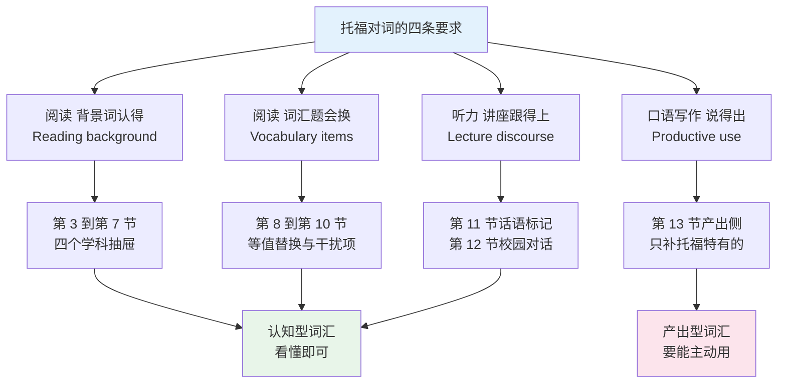
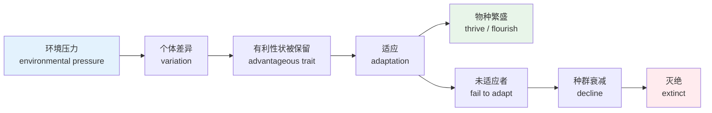
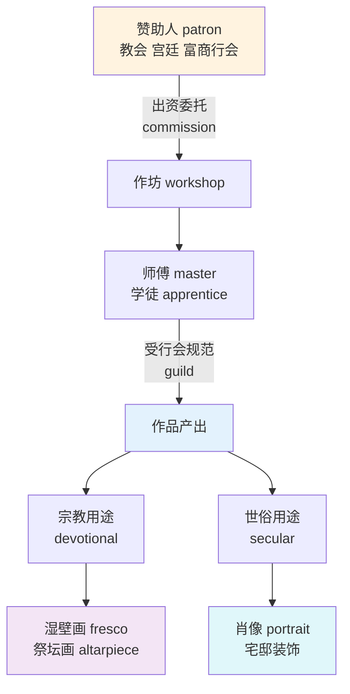
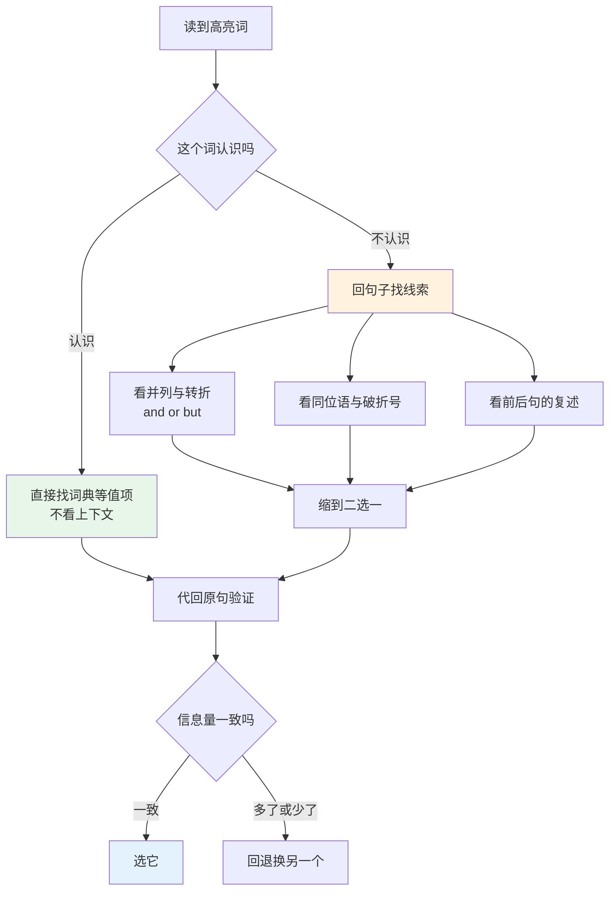
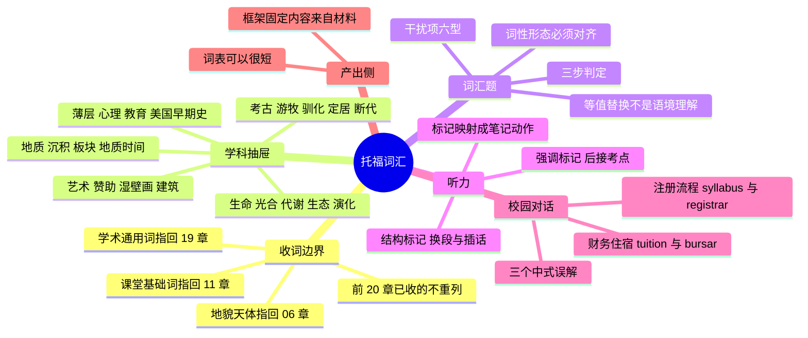

# 托福词汇：学科背景词、词汇题同义替换与听力讲座

> [!info] 本篇定位
>
> 第 21 章第五篇，也是考试专项轨道的收尾篇。
>
> 上一篇 `21.考试词汇专项/04.雅思词汇：话题词库、Task 1 选词与产出侧换词` 处理的是「话题写作要什么词」，本篇处理的是另一件事：**读一篇你完全没有背景知识的学术短文，词汇要顶到什么程度**。雅思的题材贴近社会生活，托福的题材是大学一年级通识课，两者对词的要求方向不同。
>
> 学科词在本教程里早有落点：地貌与天体在 `06.天气、自然与地理`，学科名与校园设施在 `11.学校、职场与城市社会/01.学科、学段、校园设施与课堂考试`，学术通用词在第 19 章。本篇一律不重列，只补这三处都没收、而托福文章高频出现的那一层——`sediment`、`tectonic`、`dormant`、`photosynthesis`、`metabolism`、`patronage`、`fresco`、`nomadic`、`domestication`。
>
> 读完能做三件事：在没有学科背景的情况下读懂托福级别的说明文、按等值替换的标准做对词汇题、听懂讲座里那些不带信息却决定结构的话语标记。

---

## 1. 本篇导读：托福考的是学科预期，不是词汇量

托福的阅读题材集中在美国大学通识课的范围里：地球科学、生物与生态、考古与人类学、艺术史、美国早期史、心理学与教育。这几门课在英语国家的中学阶段就铺过一遍，所以出题方默认考生见过 `sediment`、`fresco` 这类词，不把它们当生词。中文母语的自学者恰好卡在这里——学科概念本身你在中学物理化学生物课上学过，缺的只是**那个概念的英文词壳**。

这决定了托福词汇的准备方式跟四六级、考研完全不同。四六级和考研的词表是按频次统计出来的，你可以按表背；托福没有官方词表，它的词汇难度是被**题材**间接锁定的。所以本篇不做「托福核心 N 词」这种复制品，只做两件事：把学科词按学科装进抽屉，把托福独有的题型对词的要求讲清楚。

| 考试 | 词汇难度的来源 | 准备方式 |
| --- | --- | --- |
| 四六级 | 官方词表按频次划线 | 按表覆盖，见 `21.考试词汇专项/01.国内考试词表基准：课标 1600-3000 与四六级 4500-6000 的分层` |
| 考研 | 词表加熟词僻义 | 词表打底，僻义单列，见 `21.考试词汇专项/02.熟词僻义总表：从考研到 GRE` |
| 雅思 | 六大话题的产出侧换词 | 按话题建词库，见 `21.考试词汇专项/04.雅思词汇：话题词库、Task 1 选词与产出侧换词` |
| 托福 | 通识课题材的学科背景词 | 按学科补背景层，本篇 |
| GRE | 低频难词与近义群细分 | 单词表硬啃，见 `21.考试词汇专项/03.GRE 与 GMAT：低频难词、近义群细分与惯用法` |

上表最右一列说明了托福词汇为什么可以用有限的篇幅讲完：它的难点是**面**而不是**量**。地质学抽屉里真正要补的词不到四十个，补完之后同一学科的所有文章都会变得可读，因为学术说明文在一个学科内部的用词高度重复。

### 1.1 四条能力线与本篇的分工

上图右侧的两个终点是本篇最重要的区分。学科背景词与话语标记属于**认知型**：你在文章里见到 `subduction` 能反应出「板块俯冲」就够了，永远不需要自己写出这个词。词汇题的同义词组与产出侧的少量词属于**产出型**：口语第一题要能主动调出来。把两类混在一起用同一种强度去背，是托福备考里最常见的力气浪费。

### 1.2 本篇的收词标准

一个词进本篇主表，要同时满足三条：

① 它在前 20 章的任何一篇里都没有被收成词条。
② 它在托福级别的学术说明文里高频出现，且不属于某个学科的深层术语。
③ 中文母语者知道这个概念，缺的只是英文词形。

第三条把大量词挡在门外。`fresco` 满足第三条——中文母语者知道「湿壁画」这个东西，只是没记过英文；`sfumato` 不满足——那是艺术史专业内部的词，托福文章若用到会当场给出解释。托福文章的行文惯例是：**真正的专业术语会用同位语或破折号当场定义，不定义的词就是它默认你认识的词**。本篇收的正是后者。

> [!tip] 用文章自己的定义省下背词
>
> 遇到 `Trilobites — small marine arthropods that dominated the Cambrian seas — vanished abruptly` 这样的句子，破折号之间就是出题方给你的免费释义。这类词不用背，读到就地消化即可。相反，`sediment` 出现时文章绝不会解释，因为它属于默认层。判断一个生词该不该记，看它在文章里有没有被解释过。

---

## 2. 收词边界：这些词本篇不收，去哪里查

托福的学科题材跟本教程前面几章大面积交叠，交叠部分一律不重列。这一节把边界写成表，避免你在两处看到互相打架的解释。

| 词类 | 例词 | 主讲章 | 本篇的处理 |
| --- | --- | --- | --- |
| 地貌与水体 | glacier、plateau、estuary、delta、reservoir | `06.天气、自然与地理/04.山川平原海岸与水体地貌` | 不收，只在地质节列一行指回 |
| 天体与节律 | orbit、eclipse、galaxy、asteroid、axis、solstice | `06.天气、自然与地理/05.天体宇宙、自然节律与气候环境议题` | 不收，只在地质节列一行指回 |
| 极端天气与气候议题 | drought、erosion 的气象义、emission、climate change | `06.天气、自然与地理/03` 与 `06.天气、自然与地理/05` | 不收 |
| 动植物名与部位 | mammal 名录、stem、bud、petal、root | `10.动植物、颜色与感官属性/01` 与 `10.动植物、颜色与感官属性/03` | 不收，生命科学节只收过程词 |
| 学科名与学位 | biology、anthropology、bachelor、PhD | `11.学校、职场与城市社会/01.学科、学段、校园设施与课堂考试` | 不收 |
| 课堂与考试基础词 | assignment、quiz、transcript、plagiarism | `11.学校、职场与城市社会/01` | 不收，校园对话节只收行政流程词 |
| 学术通用词 | significant、adequate、derive、constitute、allocate | `19.学术通用词汇/01` 与 `19.学术通用词汇/02` | 不收 |
| 统计与研究设计 | correlation、sample size、regression、p-value | `19.学术通用词汇/03.学术研究、统计术语与论文写作词汇` | 不收 |
| 熟词僻义 | address、observe、practice、school、subject | `21.考试词汇专项/02.熟词僻义总表：从考研到 GRE` | 不收 |
| 宗教战争历史背景 | sermon、scripture、empire、feudal、colony | `08.家庭、人际与社会身份/05.历史、宗教、战争与时事背景词` | 不收，艺术史节只收赞助与工艺词 |

> [!warning] 一行指回：地貌与天体
>
> `glacier`、`plateau`、`basin`、`delta`、`estuary`、`reservoir`、`peninsula` 七个地貌词与 `orbit`、`eclipse`、`galaxy`、`asteroid`、`axis`、`tilt` 六个天体词，托福地球科学文章的出现率极高，但它们的词表、音标与搭配已在 `06.天气、自然与地理/04.山川平原海岸与水体地貌` 与 `06.天气、自然与地理/05.天体宇宙、自然节律与气候环境议题` 收全。本篇不复制。
>
> 只提醒一个读音坑：`glacier` 英式 /ˈɡlæsiə/ 与美式 /ˈɡleɪʃər/ 差别很大，托福听力用美音，第一个音节读 /ɡleɪ/，重音在前。听力里把它听成 `glazier`（玻璃工）是真实发生过的误听。

---

## 3. 地质与地球科学：沉积、板块与地质时间

托福地球科学文章的骨架永远是三条线：岩石怎么形成、地表怎么被改造、时间怎么标记。三条线各自的核心词不到十五个，补完就能读。

### 3.1 沉积与岩石

| 英文 | 英式音标 | 美式音标 | 词性 | 中文 | 搭配与说明 |
| --- | --- | --- | --- | --- | --- |
| **sediment** | /ˈsedɪmənt/ | /ˈsedɪmənt/ | n. | 沉积物；沉淀物 | U 为主；`deposit sediment`、`layers of sediment`；地质文章的绝对高频词 |
| **sedimentary** | /ˌsedɪˈmentri/ | /ˌsedɪˈmenteri/ | adj. | 沉积的 | `sedimentary rock` 三大岩类之一，与 igneous、metamorphic 并列 |
| **deposition** | /ˌdepəˈzɪʃn/ | /ˌdepəˈzɪʃn/ | n. | 沉积作用 | 与 erosion 构成一对；动词是 deposit |
| **erosion** | /ɪˈrəʊʒn/ | /ɪˈroʊʒn/ | n. | 侵蚀 | `wind erosion`、`coastal erosion`；引申义「削弱」见第 9 节 |
| **weathering** | /ˈweðərɪŋ/ | /ˈweðərɪŋ/ | n. | 风化 | 与 erosion 的分工：风化是就地崩解，侵蚀是搬走 |
| **strata** | /ˈstrɑːtə/ | /ˈstreɪtə/ | n.pl. | 岩层 | 单数 stratum /ˈstrɑːtəm/ 与 /ˈstreɪtəm/；拉丁复数，见 `02.功能词与封闭词类速查/07.不规则动词形态分组与不规则复数全表` |
| **outcrop** | /ˈaʊtkrɒp/ | /ˈaʊtkrɑːp/ | n. | 露头 | 岩层露出地表的部分；作动词是「露出」 |
| **igneous** | /ˈɪɡniəs/ | /ˈɪɡniəs/ | adj. | 火成的 | 词根 ign- 火，同族 ignite |
| **metamorphic** | /ˌmetəˈmɔːfɪk/ | /ˌmetəˈmɔːrfɪk/ | adj. | 变质的 | 与生物学的 metamorphosis 同根，见第 4 节 |
| **magma** | /ˈmæɡmə/ | /ˈmæɡmə/ | n. | 岩浆 | 地下叫 magma，喷出后叫 lava |
| **basalt** | /ˈbæsɔːlt/ | /bəˈsɔːlt/ | n. | 玄武岩 | 英美重音位置不同，听力注意 |
| **granite** | /ˈɡrænɪt/ | /ˈɡrænɪt/ | n. | 花岗岩 | 常与 basalt 对举，讲大陆地壳与海洋地壳 |
| **silt** | /sɪlt/ | /sɪlt/ | n./v. | 淤泥；淤积 | `silt up` 河道淤塞 |
| **alluvial** | /əˈluːviəl/ | /əˈluːviəl/ | adj. | 冲积的 | `alluvial plain` 冲积平原，考古文章讲早期农业时高频 |
| **sandstone** | /ˈsændstəʊn/ | /ˈsændstoʊn/ | n. | 砂岩 | 复合词，见 `15.词根、合成与缩略/04.合成词、转化词、截短词与缩略语` |
| **limestone** | /ˈlaɪmstəʊn/ | /ˈlaɪmstoʊn/ | n. | 石灰岩 | 讲溶洞、化石保存条件时出现 |

> [!example] 沉积三步在文章里的固定说法
>
> - Rivers **transport** sediment downstream, and where the current slows, **deposition** begins.
>   - 河流把沉积物向下游搬运，水流一减慢，沉积作用就开始。
> - Over millions of years these **layers** compact into **sedimentary rock**.
>   - 数百万年间，这些层层堆积压实成沉积岩。
> - **Weathering** breaks the rock apart in place; **erosion** carries the fragments away.
>   - 风化在原地把岩石分解，侵蚀把碎屑搬走。

这三句话几乎是所有托福地质文章的公共骨架。把 `transport / deposition / compact / weathering / erosion` 这五个词记成一条链，比单独记每个词有效得多——它们在文章里从来不单独出现。

### 3.2 板块与地质构造

| 英文 | 英式音标 | 美式音标 | 词性 | 中文 | 搭配与说明 |
| --- | --- | --- | --- | --- | --- |
| **tectonic** | /tekˈtɒnɪk/ | /tekˈtɑːnɪk/ | adj. | 构造的；板块的 | `tectonic plates`；`plate tectonics` 是学说名，词形带 -s 但当单数用，同类 physics、economics |
| **plate** | /pleɪt/ | /pleɪt/ | n. | 板块 | 熟词地质义；日常义「盘子」见 `09.衣食住行/03.烹饪动词、厨具餐具与口味口感` |
| **crust** | /krʌst/ | /krʌst/ | n. | 地壳 | `oceanic crust`、`continental crust`；熟词，面包皮同形 |
| **mantle** | /ˈmæntl/ | /ˈmæntl/ | n. | 地幔 | 熟词僻义型，原义是斗篷 |
| **fault** | /fɔːlt/ | /fɔːlt/ | n. | 断层 | `fault line`；熟词，日常义「过错」 |
| **rift** | /rɪft/ | /rɪft/ | n. | 裂谷；裂隙 | `rift valley` 东非大裂谷；引申义「关系破裂」 |
| **subduction** | /səbˈdʌkʃn/ | /səbˈdʌkʃn/ | n. | 俯冲 | `subduction zone`；前缀 sub- 见 `14.构词法：前缀与后缀/03.方位、时间与关系前缀` |
| **seismic** | /ˈsaɪzmɪk/ | /ˈsaɪzmɪk/ | adj. | 地震的 | `seismic activity`、`seismic wave`；名词 seismograph |
| **tremor** | /ˈtremə/ | /ˈtremər/ | n. | 震颤；小地震 | 比 earthquake 弱一档 |
| **dormant** | /ˈdɔːmənt/ | /ˈdɔːrmənt/ | adj. | 休眠的 | `a dormant volcano`；也用于种子与动物，见第 4 节；反义 active，第三档是 extinct |
| **eruption** | /ɪˈrʌpʃn/ | /ɪˈrʌpʃn/ | n. | 喷发 | 动词 erupt；`a violent eruption` |
| **crater** | /ˈkreɪtə/ | /ˈkreɪtər/ | n. | 火山口；陨石坑 | 天体文章里指撞击坑 |
| **ridge** | /rɪdʒ/ | /rɪdʒ/ | n. | 洋中脊；山脊 | 地貌义见 06 章，本行只标地质义 `mid-ocean ridge` |
| **drift** | /drɪft/ | /drɪft/ | n./v. | 漂移 | `continental drift` 大陆漂移，板块学说的前身 |
| **uplift** | /ˈʌplɪft/ | /ˈʌplɪft/ | n. | 隆起 | 名词重音在前，动词 /ʌpˈlɪft/ 重音在后，重音移位规律见 `01.词汇入门与学习方法/03.音标、词重音与词典读音体例` |

`dormant` 值得单独说。它在托福里跨三个学科出现：地质讲休眠火山，植物学讲种子休眠（`seed dormancy`），动物学讲冬眠前的代谢降低状态。三处的共同语义是「机能暂停但未消失，随时可能恢复」，跟 `extinct`（永久终结）形成硬对立。词汇题最爱考的就是这条对立——把 `dormant` 换成 `inactive` 对，换成 `dead` 错。

### 3.3 地质时间

| 英文 | 英式音标 | 美式音标 | 词性 | 中文 | 搭配与说明 |
| --- | --- | --- | --- | --- | --- |
| **epoch** | /ˈiːpɒk/ | /ˈepək/ | n. | 世；纪元 | 英美读音差别大；地质年代单位，比 period 小 |
| **era** | /ˈɪərə/ | /ˈerə/ | n. | 代 | 地质年代第二大单位；日常义「时代」 |
| **eon** | /ˈiːɒn/ | /ˈiːɑːn/ | n. | 宙 | 英式拼 aeon；日常夸张义「极长时间」 |
| **fossil** | /ˈfɒsl/ | /ˈfɑːsl/ | n. | 化石 | `fossil record` 化石记录，是「证据总和」的固定说法 |
| **fossilize** | /ˈfɒsəlaɪz/ | /ˈfɑːsəlaɪz/ | v. | 使成化石 | 英式也拼 fossilise，拼写体系见 `18.语域、英美差异与习语俚语/01.英式与美式词汇差异` |
| **extinct** | /ɪkˈstɪŋkt/ | /ɪkˈstɪŋkt/ | adj. | 灭绝的；死火山的 | 名词 extinction；`mass extinction` 大灭绝 |
| **sequence** | /ˈsiːkwəns/ | /ˈsiːkwəns/ | n. | 层序；序列 | 地质义指岩层的先后顺序 |
| **radiometric** | /ˌreɪdiəʊˈmetrɪk/ | /ˌreɪdioʊˈmetrɪk/ | adj. | 放射性测年的 | `radiometric dating`；dating 在此是「测定年代」 |
| **isotope** | /ˈaɪsətəʊp/ | /ˈaɪsətoʊp/ | n. | 同位素 | 测年法文章必现 |
| **decay** | /dɪˈkeɪ/ | /dɪˈkeɪ/ | n./v. | 衰变；腐烂 | `radioactive decay`；熟词，日常义「腐烂」 |

> [!warning] date 的地质义与日常义
>
> `date` 在托福地球科学与考古文章里几乎不表示「日期」，而是动词「测定年代」：
>
> - ✅ Researchers **dated** the ash layer to about 74,000 years ago.（测定为距今约七万四千年）
> - ✅ The site **dates from** the late Neolithic.（这个遗址可追溯到新石器晚期）
> - ❌ ~~The site dates to be 5000 years.~~（没有这个结构）
>
> `date from` 与 `date back to` 两个短语在考古文章里的出现率高于 `date` 单用。同类熟词僻义的判定流程见 `21.考试词汇专项/02.熟词僻义总表：从考研到 GRE`。

---

## 4. 生命科学：光合、代谢与生态关系

生物类文章的词分三层：过程词（怎么运转）、关系词（谁跟谁什么关系）、演化词（怎么变来的）。动植物的名录与身体部位不在本篇，见 `10.动植物、颜色与感官属性/01.动物词表` 与 `10.动植物、颜色与感官属性/03.树木花卉、植物部位与生长动词`。

### 4.1 生理过程

| 英文 | 英式音标 | 美式音标 | 词性 | 中文 | 搭配与说明 |
| --- | --- | --- | --- | --- | --- |
| **photosynthesis** | /ˌfəʊtəʊˈsɪnθəsɪs/ | /ˌfoʊtoʊˈsɪnθəsɪs/ | n. | 光合作用 | U；重音在第三音节 -syn-；形容词 photosynthetic |
| **photosynthesize** | /ˌfəʊtəʊˈsɪnθəsaɪz/ | /ˌfoʊtoʊˈsɪnθəsaɪz/ | v. | 进行光合作用 | 不及物为主 |
| **metabolism** | /məˈtæbəlɪzəm/ | /məˈtæbəlɪzəm/ | n. | 新陈代谢 | 重音在第二音节；形容词 metabolic /ˌmetəˈbɒlɪk/ 与 /ˌmetəˈbɑːlɪk/ 重音前移 |
| **respiration** | /ˌrespəˈreɪʃn/ | /ˌrespəˈreɪʃn/ | n. | 呼吸作用 | 生物义指细胞呼吸，不是喘气；医学义见 `07.人体、健康与情绪/01.身体部位、内脏器官与生理系统` |
| **chlorophyll** | /ˈklɒrəfɪl/ | /ˈklɔːrəfɪl/ | n. | 叶绿素 | 希腊词根 chloro- 绿 + phyll 叶，中间的连接元音 -o- 是希腊件的标志，见 `15.词根、合成与缩略/03.希腊词根与学科术语` |
| **stomata** | /ˈstəʊmətə/ | /ˈstoʊmətə/ | n.pl. | 气孔 | 单数 stoma；希腊复数 |
| **enzyme** | /ˈenzaɪm/ | /ˈenzaɪm/ | n. | 酶 | `enzyme activity`；不读 /ˈenzaɪmiː/ |
| **nutrient** | /ˈnjuːtriənt/ | /ˈnuːtriənt/ | n. | 养分 | 英式有 /j/ 美式没有，同类还有 new、tune |
| **glucose** | /ˈɡluːkəʊs/ | /ˈɡluːkoʊs/ | n. | 葡萄糖 | 光合作用产物，文章里常与 oxygen 并列 |
| **organism** | /ˈɔːɡənɪzəm/ | /ˈɔːrɡənɪzəm/ | n. | 生物体 | C；`single-celled organism`；托福最常用的「生物」统称 |
| **cell** | /sel/ | /sel/ | n. | 细胞 | 熟词，注意形容词 cellular 英式 /ˈseljələ/ 美式 /ˈseljələr/ |
| **tissue** | /ˈtɪʃuː/ | /ˈtɪʃuː/ | n. | 组织 | 生物义不可数偏多；日常义「纸巾」 |
| **membrane** | /ˈmembreɪn/ | /ˈmembreɪn/ | n. | 膜 | `cell membrane` |
| **germinate** | /ˈdʒɜːmɪneɪt/ | /ˈdʒɜːrmɪneɪt/ | v. | 发芽 | 名词 germination；与 sprout 的差别是前者更学术 |
| **pollination** | /ˌpɒləˈneɪʃn/ | /ˌpɑːləˈneɪʃn/ | n. | 授粉 | 动词 pollinate；`wind pollination`、`insect pollination` |
| **dormancy** | /ˈdɔːmənsi/ | /ˈdɔːrmənsi/ | n. | 休眠 | `break dormancy` 打破休眠；形容词见第 3 节 |

> [!example] 光合作用在文章里的标准句式
>
> - Plants **convert** sunlight, water, and carbon dioxide **into** glucose and oxygen.
>   - 植物把阳光、水和二氧化碳转化为葡萄糖和氧气。
> - **Chlorophyll absorbs** light most efficiently in the red and blue parts of the spectrum.
>   - 叶绿素对光谱中红光和蓝光部分的吸收效率最高。
> - Without adequate light, the rate of **photosynthesis declines sharply**.
>   - 光照不足时，光合作用的速率急剧下降。

`convert A into B` 是这一节的核心句式，也是词汇题最爱替换的位置——`convert` 的等值词是 `change` 或 `transform`，不是 `move`。趋势词 `decline`、`sharply` 的完整梯度见 `03.数字与计量词汇/04.货币、价格、折扣与统计图表趋势`。

### 4.2 生态关系

| 英文 | 英式音标 | 美式音标 | 词性 | 中文 | 搭配与说明 |
| --- | --- | --- | --- | --- | --- |
| **habitat** | /ˈhæbɪtæt/ | /ˈhæbɪtæt/ | n. | 栖息地 | `habitat loss`、`natural habitat` |
| **niche** | /niːʃ/ | /nɪtʃ/ | n. | 生态位 | 英美读音差别极大；`ecological niche`；商业义「细分市场」见 `20.专业领域词汇/06.商务、市场与管理英语：战略、增长漏斗、OKR 与供应链` |
| **predator** | /ˈpredətə/ | /ˈpredətər/ | n. | 捕食者 | 形容词 predatory /ˈpredətri/ 与 /ˈpredətɔːri/ |
| **prey** | /preɪ/ | /preɪ/ | n./v. | 猎物；捕食 | 不可数用法居多；`prey on` 捕食 |
| **forage** | /ˈfɒrɪdʒ/ | /ˈfɔːrɪdʒ/ | v./n. | 觅食 | `forage for food`；人类学文章讲采集经济时也用 |
| **graze** | /ɡreɪz/ | /ɡreɪz/ | v. | 吃草；放牧 | `grazing land` 牧场；驯化话题必现 |
| **symbiosis** | /ˌsɪmbaɪˈəʊsɪs/ | /ˌsɪmbaɪˈoʊsɪs/ | n. | 共生 | 形容词 symbiotic；`a symbiotic relationship` |
| **parasite** | /ˈpærəsaɪt/ | /ˈpærəsaɪt/ | n. | 寄生虫 | 形容词 parasitic /ˌpærəˈsɪtɪk/ 重音后移 |
| **host** | /həʊst/ | /hoʊst/ | n. | 宿主 | 熟词僻义；日常义「主人」 |
| **camouflage** | /ˈkæməflɑːʒ/ | /ˈkæməflɑːʒ/ | n./v. | 伪装 | 法语借词，词尾读 /ʒ/ |
| **mimicry** | /ˈmɪmɪkri/ | /ˈmɪmɪkri/ | n. | 拟态 | 动词 mimic 变形时在 c 后补一个 k：mimicking、mimicked，同类 panic、picnic |
| **hibernate** | /ˈhaɪbəneɪt/ | /ˈhaɪbərneɪt/ | v. | 冬眠 | 名词 hibernation；与 dormant 的差别是它专指动物 |
| **ecosystem** | /ˈiːkəʊsɪstəm/ | /ˈiːkoʊsɪstəm/ | n. | 生态系统 | 前缀 eco- |
| **species** | /ˈspiːʃiːz/ | /ˈspiːʃiːz/ | n. | 物种 | 单复同形，`one species`、`many species`；specie 是另一个词（硬币形态的钱），不是它的单数 |
| **population** | /ˌpɒpjuˈleɪʃn/ | /ˌpɑːpjuˈleɪʃn/ | n. | 种群 | 生物义指同一物种的群体，不只是「人口」 |
| **colony** | /ˈkɒləni/ | /ˈkɑːləni/ | n. | 群落；聚居群 | 生物义指蚁群蜂群；历史义「殖民地」见 `08.家庭、人际与社会身份/05.历史、宗教、战争与时事背景词` |

### 4.3 演化与适应

| 英文 | 英式音标 | 美式音标 | 词性 | 中文 | 搭配与说明 |
| --- | --- | --- | --- | --- | --- |
| **adaptation** | /ˌædæpˈteɪʃn/ | /ˌædæpˈteɪʃn/ | n. | 适应；适应性特征 | C 与 U 都有；`an adaptation to cold`；辨析 adapt/adopt 见 `16.词义辨析、搭配与短语动词/03.近形近音易混词与中式英语陷阱` |
| **trait** | /treɪt/ | /treɪt/ | n. | 性状；特征 | `inherited trait`；比 characteristic 短，托福常用 |
| **offspring** | /ˈɒfsprɪŋ/ | /ˈɔːfsprɪŋ/ | n. | 后代 | 单复同形 |
| **inherit** | /ɪnˈherɪt/ | /ɪnˈherɪt/ | v. | 遗传得到 | 形容词 inherited；与 inherent 形近义异 |
| **mutation** | /mjuːˈteɪʃn/ | /mjuːˈteɪʃn/ | n. | 突变 | 动词 mutate |
| **variation** | /ˌveəriˈeɪʃn/ | /ˌveriˈeɪʃn/ | n. | 变异；差异 | `genetic variation` |
| **vertebrate** | /ˈvɜːtɪbrət/ | /ˈvɜːrtɪbrət/ | n./adj. | 脊椎动物 | 反义 invertebrate |
| **larva** | /ˈlɑːvə/ | /ˈlɑːrvə/ | n. | 幼虫 | 复数 larvae /ˈlɑːviː/ 与 /ˈlɑːrviː/ |
| **metamorphosis** | /ˌmetəˈmɔːfəsɪs/ | /ˌmetəˈmɔːrfəsɪs/ | n. | 变态发育 | 复数 metamorphoses；与地质的 metamorphic 同根 |
| **thrive** | /θraɪv/ | /θraɪv/ | v. | 繁盛 | `thrive in warm water`；等值替换词是 flourish |
| **flourish** | /ˈflʌrɪʃ/ | /ˈflɜːrɪʃ/ | v. | 繁荣；茂盛 | 英美元音差别注意；文化史文章也高频 |
| **dominant** | /ˈdɒmɪnənt/ | /ˈdɑːmɪnənt/ | adj. | 优势的 | `the dominant species`；动词 dominate |
| **abundant** | /əˈbʌndənt/ | /əˈbʌndənt/ | adj. | 丰富的 | 名词 abundance；等值词 plentiful |
| **scarce** | /skeəs/ | /skers/ | adj. | 稀缺的 | 名词 scarcity；副词 scarcely 是半否定，见 `02.功能词与封闭词类速查/08.程度副词、频率副词与模糊限制词` |

上图是托福生物类文章最常复用的论证链，从环境压力一路推到繁盛或灭绝。文章的段落顺序几乎总是照着这条链走，所以只要认出链上的某一个词，就能预判下一段要讲什么。这比逐词精读省时间：读到 `variation` 就知道后面必然出现选择与适应，读到 `decline` 就知道结尾多半是 `extinct` 或 `recover`。

---

## 5. 考古与人类学：游牧、驯化与定居

这一块的词在中文语境里都不陌生，缺的纯是词壳。它跟前面的地质、生物两块共享 `sediment`、`strata`、`forage`，所以放在第三位讲最省力。

### 5.1 生计方式与定居

| 英文 | 英式音标 | 美式音标 | 词性 | 中文 | 搭配与说明 |
| --- | --- | --- | --- | --- | --- |
| **nomadic** | /nəʊˈmædɪk/ | /noʊˈmædɪk/ | adj. | 游牧的 | 名词 nomad /ˈnəʊmæd/ 与 /ˈnoʊmæd/；`a nomadic lifestyle`、`nomadic herders` |
| **sedentary** | /ˈsedntri/ | /ˈsednteri/ | adj. | 定居的；久坐的 | 与 nomadic 构成硬对立；健康语境义「久坐不动」 |
| **domestication** | /dəˌmestɪˈkeɪʃn/ | /dəˌmestɪˈkeɪʃn/ | n. | 驯化 | 动词 domesticate；`the domestication of wheat`；注意重音在 -ca- |
| **domesticated** | /dəˈmestɪkeɪtɪd/ | /dəˈmestɪkeɪtɪd/ | adj. | 被驯化的 | `domesticated animals` 与 wild 对立 |
| **cultivate** | /ˈkʌltɪveɪt/ | /ˈkʌltɪveɪt/ | v. | 耕种；栽培 | 名词 cultivation；引申义「培养关系」 |
| **subsistence** | /səbˈsɪstəns/ | /səbˈsɪstəns/ | n. | 生计；勉强维生 | `subsistence farming` 自给农业；`at subsistence level` |
| **surplus** | /ˈsɜːpləs/ | /ˈsɜːrpləs/ | n./adj. | 剩余；盈余 | `a food surplus` 是农业革命论证的关键词 |
| **irrigation** | /ˌɪrɪˈɡeɪʃn/ | /ˌɪrɪˈɡeɪʃn/ | n. | 灌溉 | 动词 irrigate |
| **livestock** | /ˈlaɪvstɒk/ | /ˈlaɪvstɑːk/ | n. | 牲畜 | 集合名词，作复数用 |
| **herd** | /hɜːd/ | /hɜːrd/ | n./v. | 兽群；放牧 | `herd cattle`；herder 牧人 |
| **pastoral** | /ˈpɑːstərəl/ | /ˈpæstərəl/ | adj. | 畜牧的；田园的 | 英美元音差别明显；`pastoral nomads` |
| **settlement** | /ˈsetlmənt/ | /ˈsetlmənt/ | n. | 聚落；定居点 | `a permanent settlement`；法律义「和解」见 `20.专业领域词汇/05.法律与合同英语：条款、诉讼、知识产权与开源协议` |
| **granary** | /ˈɡrænəri/ | /ˈɡrænəri/ | n. | 粮仓 | 剩余粮食储存的直接证据 |
| **staple** | /ˈsteɪpl/ | /ˈsteɪpl/ | n./adj. | 主食；主要的 | `a staple crop`；熟词，办公用品义「订书钉」 |

> [!example] 农业起源论证的三句骨架
>
> - Before **domestication**, human groups relied on hunting and **foraging**.
>   - 驯化之前，人类群体依靠狩猎与采集。
> - A reliable food **surplus** allowed populations to become **sedentary**.
>   - 稳定的粮食盈余使人群得以定居。
> - **Permanent settlements** in turn made craft specialization possible.
>   - 永久聚落反过来使手工业分工成为可能。

这三句的逻辑链是「驯化 → 盈余 → 定居 → 分工」，托福文章讲新石器革命时几乎逐字复用。链条上任一环出现，都可以据此预判上下文。

### 5.2 遗址与断代

| 英文 | 英式音标 | 美式音标 | 词性 | 中文 | 搭配与说明 |
| --- | --- | --- | --- | --- | --- |
| **artifact** | /ˈɑːtɪfækt/ | /ˈɑːrtɪfækt/ | n. | 人工制品；文物 | 英式常拼 artefact；本教程随美式，因托福用美式 |
| **excavate** | /ˈekskəveɪt/ | /ˈekskəveɪt/ | v. | 发掘 | 名词 excavation；`excavate a site` |
| **site** | /saɪt/ | /saɪt/ | n. | 遗址 | 熟词专业义；`a burial site`、`an archaeological site` |
| **shard** | /ʃɑːd/ | /ʃɑːrd/ | n. | 陶片；碎片 | 也拼 sherd；陶器断代的主要材料 |
| **pottery** | /ˈpɒtəri/ | /ˈpɑːtəri/ | n. | 陶器 | U；单件叫 a pot 或 a vessel |
| **kiln** | /kɪln/ | /kɪln/ | n. | 窑 | 词尾 -n 可不发音，读 /kɪl/ 也接受 |
| **artifactual** | /ˌɑːtɪˈfæktʃuəl/ | /ˌɑːrtɪˈfæktʃuəl/ | adj. | 器物的 | 英式拼 artefactual；出现率低于 artifact，认得即可 |
| **midden** | /ˈmɪdn/ | /ˈmɪdn/ | n. | 贝丘；垃圾堆 | `shell midden`；饮食结构的证据 |
| **stratigraphy** | /strəˈtɪɡrəfi/ | /strəˈtɪɡrəfi/ | n. | 地层学 | 与第 3 节的 strata 同根，考古断代的基本方法 |
| **radiocarbon** | /ˌreɪdiəʊˈkɑːbən/ | /ˌreɪdioʊˈkɑːrbən/ | n. | 放射性碳 | `radiocarbon dating` 碳十四测年 |
| **indigenous** | /ɪnˈdɪdʒənəs/ | /ɪnˈdɪdʒənəs/ | adj. | 本土的；原住的 | 重音在第二音节；比 native 正式且中性 |
| **hunter-gatherer** | /ˌhʌntə ˈɡæðərə/ | /ˌhʌntər ˈɡæðərər/ | n. | 狩猎采集者 | 连字符复合词，复数加在后一个词上 |
| **ritual** | /ˈrɪtʃuəl/ | /ˈrɪtʃuəl/ | n./adj. | 仪式 | 宗教背景义见 `08.家庭、人际与社会身份/05`，本行只标考古义「仪式性用途」 |
| **burial** | /ˈberiəl/ | /ˈberiəl/ | n. | 墓葬 | 动词 bury /ˈberi/，注意元音不是 /ʌ/ |

> [!warning] artifact 与 artefact 该写哪个
>
> 两个拼法都对：`artifact` 是美式，`artefact` 是英式。托福全卷用美式拼写，作文里写 `artefact` 不算错但不一致。同类还有 `analyze / analyse`、`center / centre`、`color / colour`。整套拼写差异见 `18.语域、英美差异与习语俚语/01.英式与美式词汇差异`，这里只提醒一条：**一篇作文里保持一套，不要混**。

---

## 6. 艺术史与建筑：赞助制度、湿壁画与工艺

艺术史是托福阅读里中文考生失分最集中的题材，原因不是词难，是**制度背景陌生**。文艺复兴的画家怎么接活、钱从哪来、行会做什么，这些在中文教育里几乎不讲，所以 `patronage`、`commission`、`guild` 三个词一起出现时整段就读不动了。

### 6.1 赞助与生产制度

| 英文 | 英式音标 | 美式音标 | 词性 | 中文 | 搭配与说明 |
| --- | --- | --- | --- | --- | --- |
| **patronage** | /ˈpætrənɪdʒ/ | /ˈpeɪtrənɪdʒ/ | n. | 赞助；资助制度 | 美式第一音节多读 /peɪ/；`under the patronage of`、`royal patronage` |
| **patron** | /ˈpeɪtrən/ | /ˈpeɪtrən/ | n. | 赞助人；主顾 | 英美都读 /peɪ/，与 patronage 的英式读音不一致，是常见误读点 |
| **commission** | /kəˈmɪʃn/ | /kəˈmɪʃn/ | n./v. | 委托创作；委托作品 | `commission a portrait`、`a commissioned work`；商务义「佣金」 |
| **guild** | /ɡɪld/ | /ɡɪld/ | n. | 行会 | u 不发音；`the painters' guild` |
| **apprentice** | /əˈprentɪs/ | /əˈprentɪs/ | n./v. | 学徒 | 名词 apprenticeship 学徒期 |
| **workshop** | /ˈwɜːkʃɒp/ | /ˈwɜːrkʃɑːp/ | n. | 作坊 | 艺术史义指画家的工作室与团队，不是「研讨会」 |
| **studio** | /ˈstjuːdiəʊ/ | /ˈstuːdioʊ/ | n. | 画室 | 英式有 /j/；住房义「开间公寓」见 `09.衣食住行/04.住房、房间结构、家具与家电` |
| **secular** | /ˈsekjələ/ | /ˈsekjələr/ | adj. | 世俗的 | 与 religious 对立，是艺术史分期的核心对立 |
| **devotional** | /dɪˈvəʊʃənl/ | /dɪˈvoʊʃənl/ | adj. | 宗教供奉用的 | `a devotional image` |
| **court** | /kɔːt/ | /kɔːrt/ | n. | 宫廷 | 熟词僻义；`a court painter` 宫廷画师；法律义见 `11.学校、职场与城市社会/05.城市建筑、公共设施、法律政治与证件手续` |

### 6.2 技法与材料

| 英文 | 英式音标 | 美式音标 | 词性 | 中文 | 搭配与说明 |
| --- | --- | --- | --- | --- | --- |
| **fresco** | /ˈfreskəʊ/ | /ˈfreskoʊ/ | n. | 湿壁画 | 复数 frescoes 或 frescos；意大利语借词，原义「新鲜的」，指趁灰泥未干作画 |
| **mural** | /ˈmjʊərəl/ | /ˈmjʊrəl/ | n. | 壁画 | 上位词，fresco 是 mural 的一种技法 |
| **plaster** | /ˈplɑːstə/ | /ˈplæstər/ | n./v. | 灰泥；抹灰 | 英美元音差别明显；`wet plaster` 是 fresco 的定义要件 |
| **pigment** | /ˈpɪɡmənt/ | /ˈpɪɡmənt/ | n. | 颜料 | 与 dye 的差别：pigment 不溶，dye 溶 |
| **canvas** | /ˈkænvəs/ | /ˈkænvəs/ | n. | 画布 | 不是 canvass（游说） |
| **panel** | /ˈpænl/ | /ˈpænl/ | n. | 木板画 | 艺术史义指画在木板上的作品，`a panel painting` |
| **tempera** | /ˈtempərə/ | /ˈtempərə/ | n. | 蛋彩画 | 与 oil paint 对举，讲媒介转变时出现 |
| **engraving** | /ɪnˈɡreɪvɪŋ/ | /ɪnˈɡreɪvɪŋ/ | n. | 版画；雕版 | 动词 engrave |
| **sculpture** | /ˈskʌlptʃə/ | /ˈskʌlptʃər/ | n. | 雕塑 | U 指门类，C 指单件；雕塑家 sculptor |
| **relief** | /rɪˈliːf/ | /rɪˈliːf/ | n. | 浮雕 | 熟词僻义，日常义「宽慰、救济」 |
| **perspective** | /pəˈspektɪv/ | /pərˈspektɪv/ | n. | 透视法 | `linear perspective` 线性透视；抽象义「视角」 |
| **proportion** | /prəˈpɔːʃn/ | /prəˈpɔːrʃn/ | n. | 比例 | `in proportion to` |
| **motif** | /məʊˈtiːf/ | /moʊˈtiːf/ | n. | 母题；纹样 | 重音在后，法语借词 |
| **ornate** | /ɔːˈneɪt/ | /ɔːrˈneɪt/ | adj. | 华丽繁复的 | 反义 plain、austere |
| **austere** | /ɒˈstɪə/ | /ɔːˈstɪr/ | adj. | 简朴无饰的 | 名词 austerity |
| **restore** | /rɪˈstɔː/ | /rɪˈstɔːr/ | v. | 修复 | 名词 restoration；`restore a fresco` |

### 6.3 建筑

| 英文 | 英式音标 | 美式音标 | 词性 | 中文 | 搭配与说明 |
| --- | --- | --- | --- | --- | --- |
| **facade** | /fəˈsɑːd/ | /fəˈsɑːd/ | n. | 立面 | 也拼 façade；重音在后 |
| **vault** | /vɔːlt/ | /vɔːlt/ | n. | 拱顶 | `a barrel vault` 筒形拱；金融义「金库」 |
| **arch** | /ɑːtʃ/ | /ɑːrtʃ/ | n. | 拱 | 形容词 arched |
| **column** | /ˈkɒləm/ | /ˈkɑːləm/ | n. | 柱 | n 不发音；表格义「列」 |
| **pillar** | /ˈpɪlə/ | /ˈpɪlər/ | n. | 支柱 | 与 column 的差别：column 更强调形制，pillar 更强调承重 |
| **buttress** | /ˈbʌtrɪs/ | /ˈbʌtrɪs/ | n./v. | 扶壁；支撑 | `flying buttress` 飞扶壁；动词引申义「支持论点」 |
| **dome** | /dəʊm/ | /doʊm/ | n. | 穹顶 | 形容词 domed |
| **masonry** | /ˈmeɪsnri/ | /ˈmeɪsnri/ | n. | 砌体；石工 | 工匠 mason |
| **aqueduct** | /ˈækwɪdʌkt/ | /ˈækwɪdʌkt/ | n. | 输水道 | 词根 aqua 水 + duct 导管，见 `15.词根、合成与缩略/01.高频拉丁词根（上）` |
| **timber** | /ˈtɪmbə/ | /ˈtɪmbər/ | n. | 木材 | 美式把锯好的板材叫 lumber，timber 留给未伐的林木与大截面梁料 |

上图把艺术史文章的制度背景压成一张流程图。托福讲文艺复兴的段落几乎都在这张图上取一个位置展开：讲钱从哪来就是最上面那个框，讲画家地位提升就是 `master` 从工匠向艺术家的转变，讲题材世俗化就是右下那条分支。图看懂了，`patronage`、`commission`、`guild`、`secular` 这四个词的关系就固定下来，不用一个个背释义。

---

## 7. 心理学、教育与美国早期史的薄层

这三块在托福里出现频率不低，但需要补的词很少——心理学的行为主义术语、教育研究的几个高频词、美国早期史的三四个特有概念。宗教、战争、政治体制的背景词已在 `08.家庭、人际与社会身份/05.历史、宗教、战争与时事背景词` 讲透，本节不重复。

| 英文 | 英式音标 | 美式音标 | 词性 | 中文 | 搭配与说明 |
| --- | --- | --- | --- | --- | --- |
| **cognition** | /kɒɡˈnɪʃn/ | /kɑːɡˈnɪʃn/ | n. | 认知 | 形容词 cognitive /ˈkɒɡnətɪv/ 与 /ˈkɑːɡnətɪv/ 重音前移 |
| **stimulus** | /ˈstɪmjələs/ | /ˈstɪmjələs/ | n. | 刺激 | 复数 stimuli /ˈstɪmjəlaɪ/；经济义「刺激政策」 |
| **response** | /rɪˈspɒns/ | /rɪˈspɑːns/ | n. | 反应 | `stimulus-response` 是行为主义的固定对 |
| **reinforcement** | /ˌriːɪnˈfɔːsmənt/ | /ˌriːɪnˈfɔːrsmənt/ | n. | 强化 | `positive / negative reinforcement`；动词 reinforce |
| **conditioning** | /kənˈdɪʃənɪŋ/ | /kənˈdɪʃənɪŋ/ | n. | 条件作用 | `classical conditioning` 经典条件反射 |
| **innate** | /ɪˈneɪt/ | /ɪˈneɪt/ | adj. | 天生的 | 与 acquired、learned 对立；`innate ability` |
| **acquired** | /əˈkwaɪəd/ | /əˈkwaɪərd/ | adj. | 后天习得的 | `acquired behavior` |
| **perception** | /pəˈsepʃn/ | /pərˈsepʃn/ | n. | 知觉 | 动词 perceive；认知动词群见 `13.抽象概念、评价与高频动词/04.认知动词与因果、影响、变化类实义动词` |
| **retention** | /rɪˈtenʃn/ | /rɪˈtenʃn/ | n. | 保持；记忆留存 | `memory retention`；动词 retain |
| **recall** | /rɪˈkɔːl/ | /rɪˈkɔːl/ | n./v. | 回忆；提取 | 心理学义指从记忆中提取 |
| **bias** | /ˈbaɪəs/ | /ˈbaɪəs/ | n./v. | 偏差；偏见 | 动名词 biasing 或 biassing 都有；研究设计义见 19.03 |
| **infancy** | /ˈɪnfənsi/ | /ˈɪnfənsi/ | n. | 婴儿期 | 人生阶段全表见 `08.家庭、人际与社会身份/02.人生阶段、婚恋、育儿与人生仪式` |
| **literacy** | /ˈlɪtərəsi/ | /ˈlɪtərəsi/ | n. | 识字能力 | 反义 illiteracy；引申 `digital literacy` |
| **curriculum** | /kəˈrɪkjələm/ | /kəˈrɪkjələm/ | n. | 课程体系 | 复数 curricula 或 curriculums |
| **pedagogy** | /ˈpedəɡɒdʒi/ | /ˈpedəɡoʊdʒi/ | n. | 教学法 | 形容词 pedagogical |
| **frontier** | /ˈfrʌntɪə/ | /frʌnˈtɪr/ | n. | 边疆 | 英美重音位置不同；美国史核心概念，指西进的移民边界 |
| **colonist** | /ˈkɒlənɪst/ | /ˈkɑːlənɪst/ | n. | 殖民地居民 | 与 colonizer 的语气差别：前者中性 |
| **settler** | /ˈsetlə/ | /ˈsetlər/ | n. | 定居者 | 与第 5 节的 settlement 同族 |
| **homestead** | /ˈhəʊmsted/ | /ˈhoʊmsted/ | n. | 宅地；农庄 | 美国史特有，指按法案分配的土地 |
| **suffrage** | /ˈsʌfrɪdʒ/ | /ˈsʌfrɪdʒ/ | n. | 选举权 | `women's suffrage`；不是「痛苦」，那是 suffering |
| **abolition** | /ˌæbəˈlɪʃn/ | /ˌæbəˈlɪʃn/ | n. | 废除（尤指废奴） | 动词 abolish；abolitionist 废奴主义者 |
| **census** | /ˈsensəs/ | /ˈsensəs/ | n. | 人口普查 | 不是 sensor、censor |
| **tenement** | /ˈtenəmənt/ | /ˈtenəmənt/ | n. | 廉租公寓楼 | 城市化与移民话题出现 |

> [!warning] 三组形近词，托福里真的都出现
>
> - **census**（人口普查）/ **censor**（审查）/ **sensor**（传感器）：三个词的词源分属两支，census 与 censor 同源于罗马的监察官，sensor 来自 sens- 感觉。
> - **suffrage**（选举权）/ **suffering**（痛苦）：毫无关系，前者来自拉丁 suffragium 投票。
> - **innate**（天生的）/ **inane**（空洞的）/ **innovate**（革新）：只有第一个在托福常见，另两个见到时注意别串。
>
> 完整的近形近音处理办法见 `16.词义辨析、搭配与短语动词/03.近形近音易混词与中式英语陷阱`。

---

## 8. 词汇题的机制：为什么是单词对单词

托福阅读的词汇题有一个固定形状：在文章里高亮一个词，问 `The word "X" in the passage is closest in meaning to`，给四个选项，四个都是单词或最短的短语。这个形状决定了它的解题标准跟其他所有题型都不一样。

**它考的是等值替换，不是理解上下文。** 正确选项要满足一个硬条件：把它替换进原句，句子的意思与语法都不变。这跟考研阅读的词义猜测题不同——考研常考「在本句中的含义」，允许答案是一个解释性短语；托福要的是能直接对换的那个词。

| 对比项 | 托福词汇题 | 考研词义猜测题 | GRE 填空 |
| --- | --- | --- | --- |
| 问法 | closest in meaning to | 在文中的意思是 | 选词填空 |
| 选项形态 | 单词或短语 | 常为解释性短语 | 单词 |
| 判定标准 | 能否原位替换 | 是否符合语境含义 | 是否与逻辑连接词一致 |
| 上下文依赖度 | 低，多数词典义即可 | 高 | 高 |
| 常考义项 | 词的常用义 | 熟词僻义 | 低频难词 |

上表最后一行是关键差别：托福词汇题**很少考僻义**。它高亮的词多数用的是词典第一或第二义项，难点在于你认不认得这个词，而不是你能不能从上下文推出特殊用法。这意味着托福词汇题是**可以纯靠背词表拿分**的题型，也是备考里性价比最高的部分。

### 8.1 等值替换的三个层次

不是所有同义词都能拿来替换。托福的正确选项固定落在最严的那一层。以高亮词 `prolific` 为例：

| 层次 | 关系 | 例词 | 替换后果 | 在题中的角色 |
| --- | --- | --- | --- | --- |
| 一 | 词典等值 | productive | 句意与语法都不变 | 正确选项 |
| 二 | 语境近似 | successful | 句子通顺但意思偏了 | 最强干扰项 |
| 三 | 语义相关 | famous | 只是与话题沾边 | 容易排除 |

第二层是失分的主要来源。`a prolific writer` 里的作家确实往往也 `successful`，但 `prolific` 说的是产量高，`successful` 说的是评价好——一个高产但无人问津的作家仍然 `prolific`。命题人正是靠这种「读起来也通」的选项拉开区分度。判断方法很简单：**问这个替换有没有加进原文没说的信息**。加了就是干扰项。

### 8.2 词性与形态必须对齐

等值替换还有一条形式要求：选项与高亮词的词性、单复数、时态必须能对上，否则句子直接不成立。

> - 高亮 `sustained`（过去分词作定语）→ 选项必须也是分词形，`maintained` 对，`maintenance` 不对。
> - 高亮 `abundance`（名词）→ 选项必须是名词，`plenty` 对，`abundant` 不对。
> - 高亮 `intricately`（副词）→ 选项必须是副词。

这条看似不用说，但在实际做题时它是最快的排除手段：四个选项里若有一个词性不符，不用管意思直接划掉。托福的选项设计通常会保证四个词性一致，一旦出现不一致，那多半就是送分的排除项。

---

## 9. 词汇题主表：按义域分组的等值替换

下面四组是托福词汇题的实际考查区。每一行的「等值词」列给的是能原位替换的那一个，「不等值词」列给的是最强干扰项及其偏差方向。

### 9.1 数量、规模与频率

| 英文 | 英式音标 | 美式音标 | 词性 | 中文 | 搭配与说明 |
| --- | --- | --- | --- | --- | --- |
| **prolific** | /prəˈlɪfɪk/ | /prəˈlɪfɪk/ | adj. | 多产的 | 等值 productive；干扰 successful（加了评价义）、famous（加了知名度） |
| **abundant** | /əˈbʌndənt/ | /əˈbʌndənt/ | adj. | 大量的 | 等值 plentiful；干扰 valuable |
| **scarce** | /skeəs/ | /skers/ | adj. | 稀少的 | 等值 rare、in short supply；干扰 expensive |
| **negligible** | /ˈneɡlɪdʒəbl/ | /ˈneɡlɪdʒəbl/ | adj. | 微不足道的 | 等值 insignificant；干扰 careless（那是 negligent） |
| **immense** | /ɪˈmens/ | /ɪˈmens/ | adj. | 巨大的 | 等值 enormous、huge |
| **minute** | /maɪˈnjuːt/ | /maɪˈnuːt/ | adj. | 微小的 | 等值 tiny；与「分钟」/ˈmɪnɪt/ 同形不同音，托福常考 |
| **sparse** | /spɑːs/ | /spɑːrs/ | adj. | 稀疏的 | 等值 thinly distributed；干扰 small |
| **perpetual** | /pəˈpetʃuəl/ | /pərˈpetʃuəl/ | adj. | 持续不断的 | 等值 constant、continuous |
| **intermittent** | /ˌɪntəˈmɪtənt/ | /ˌɪntərˈmɪtənt/ | adj. | 间歇的 | 等值 occasional、irregular；干扰 brief |
| **accumulate** | /əˈkjuːmjəleɪt/ | /əˈkjuːmjəleɪt/ | v. | 累积 | 等值 build up、gather；干扰 increase（少了「逐渐堆积」义） |
| **deplete** | /dɪˈpliːt/ | /dɪˈpliːt/ | v. | 耗尽 | 等值 use up、exhaust |
| **proliferate** | /prəˈlɪfəreɪt/ | /prəˈlɪfəreɪt/ | v. | 激增 | 与 prolific 同族；等值 multiply rapidly |

### 9.2 程度、性质与评价

| 英文 | 英式音标 | 美式音标 | 词性 | 中文 | 搭配与说明 |
| --- | --- | --- | --- | --- | --- |
| **rudimentary** | /ˌruːdɪˈmentri/ | /ˌruːdɪˈmenteri/ | adj. | 初步的；粗糙的 | 等值 basic、elementary；干扰 useless（加了否定评价）、primitive（偏「原始时代」） |
| **elaborate** | /ɪˈlæbərət/ | /ɪˈlæbərət/ | adj. | 精细复杂的 | 等值 complex、detailed；作动词 /ɪˈlæbəreɪt/ 是「详述」，读音不同 |
| **intricate** | /ˈɪntrɪkət/ | /ˈɪntrɪkət/ | adj. | 错综复杂的 | 等值 complicated；干扰 beautiful |
| **crucial** | /ˈkruːʃl/ | /ˈkruːʃl/ | adj. | 关键的 | 等值 essential、vital |
| **subtle** | /ˈsʌtl/ | /ˈsʌtl/ | adj. | 细微的；不易察觉的 | b 不发音；等值 slight、not obvious；干扰 clever |
| **conspicuous** | /kənˈspɪkjuəs/ | /kənˈspɪkjuəs/ | adj. | 显眼的 | 等值 noticeable、obvious；词根 spic 见 15.01 |
| **plausible** | /ˈplɔːzəbl/ | /ˈplɔːzəbl/ | adj. | 说得通的 | 等值 believable、reasonable；干扰 true（原文只说可信，没说真） |
| **feasible** | /ˈfiːzəbl/ | /ˈfiːzəbl/ | adj. | 可行的 | 等值 practical、possible；与 plausible 的差别是它讲能不能做，不讲信不信 |
| **robust** | /rəʊˈbʌst/ | /roʊˈbʌst/ | adj. | 强健的；稳固的 | 等值 strong、sturdy |
| **fragile** | /ˈfrædʒaɪl/ | /ˈfrædʒl/ | adj. | 脆弱的 | 英美词尾读音不同；等值 delicate、easily broken |
| **rigid** | /ˈrɪdʒɪd/ | /ˈrɪdʒɪd/ | adj. | 刚性的；死板的 | 等值 stiff、inflexible |
| **versatile** | /ˈvɜːsətaɪl/ | /ˈvɜːrsətl/ | adj. | 多功能的 | 英美词尾差别大；等值 adaptable、all-purpose |
| **durable** | /ˈdjʊərəbl/ | /ˈdʊrəbl/ | adj. | 耐久的 | 等值 long-lasting |
| **peculiar** | /pɪˈkjuːliə/ | /pɪˈkjuːliər/ | adj. | 特有的；奇特的 | 双义；`peculiar to` 后接对象时是「特有的」，等值 unique to，不是 strange |
| **inherent** | /ɪnˈhɪərənt/ | /ɪnˈhɪrənt/ | adj. | 内在固有的 | 等值 built-in、intrinsic；干扰 important |
| **arbitrary** | /ˈɑːbɪtrəri/ | /ˈɑːrbɪtreri/ | adj. | 任意的；武断的 | 等值 random、not based on reason |

### 9.3 变化、影响与因果

| 英文 | 英式音标 | 美式音标 | 词性 | 中文 | 搭配与说明 |
| --- | --- | --- | --- | --- | --- |
| **diminish** | /dɪˈmɪnɪʃ/ | /dɪˈmɪnɪʃ/ | v. | 减少 | 等值 reduce、decrease |
| **deteriorate** | /dɪˈtɪəriəreɪt/ | /dɪˈtɪriəreɪt/ | v. | 恶化 | 等值 worsen；干扰 change（丢了方向） |
| **impede** | /ɪmˈpiːd/ | /ɪmˈpiːd/ | v. | 阻碍 | 等值 hinder、slow down；干扰 stop（过强） |
| **facilitate** | /fəˈsɪlɪteɪt/ | /fəˈsɪlɪteɪt/ | v. | 促进 | 等值 make easier；干扰 cause（过强） |
| **trigger** | /ˈtrɪɡə/ | /ˈtrɪɡər/ | v./n. | 引发 | 等值 set off、initiate |
| **sustain** | /səˈsteɪn/ | /səˈsteɪn/ | v. | 维持；承受 | 等值 maintain；`sustain damage` 时等值 suffer |
| **alter** | /ˈɔːltə/ | /ˈɔːltər/ | v. | 改变 | 等值 change、modify；不是 alternate |
| **convert** | /kənˈvɜːt/ | /kənˈvɜːrt/ | v. | 转化 | 等值 change into、transform；名词 /ˈkɒnvɜːt/ 重音前移 |
| **displace** | /dɪsˈpleɪs/ | /dɪsˈpleɪs/ | v. | 取代；使迁移 | 等值 replace、force out |
| **disperse** | /dɪˈspɜːs/ | /dɪˈspɜːrs/ | v. | 分散 | 等值 scatter、spread out |
| **emerge** | /ɪˈmɜːdʒ/ | /ɪˈmɜːrdʒ/ | v. | 出现 | 等值 appear、come out；名词 emergence，不是 emergency |
| **persist** | /pəˈsɪst/ | /pərˈsɪst/ | v. | 持续存在 | 等值 continue、remain |
| **undermine** | /ˌʌndəˈmaɪn/ | /ˌʌndərˈmaɪn/ | v. | 削弱 | 等值 weaken；GMAT 逻辑题同词，见 21.03 |
| **compensate** | /ˈkɒmpenseɪt/ | /ˈkɑːmpenseɪt/ | v. | 补偿 | `compensate for` 等值 make up for |
| **counteract** | /ˌkaʊntərˈækt/ | /ˌkaʊntərˈækt/ | v. | 抵消 | 前缀 counter- 见 `14.构词法：前缀与后缀/02.否定与相反前缀` |
| **yield** | /jiːld/ | /jiːld/ | v./n. | 产生；产量；让步 | 三义并存；`yield results` 等值 produce，`yield to pressure` 等值 give in |

### 9.4 认识、表达与研究行为

| 英文 | 英式音标 | 美式音标 | 词性 | 中文 | 搭配与说明 |
| --- | --- | --- | --- | --- | --- |
| **speculate** | /ˈspekjuleɪt/ | /ˈspekjuleɪt/ | v. | 推测 | 等值 guess、theorize；名词 speculation |
| **postulate** | /ˈpɒstjuleɪt/ | /ˈpɑːstʃuleɪt/ | v. | 假定 | 等值 assume、propose；AWL 词，见 `19.学术通用词汇/01.学术通用词表 AWL（上）：论证与关系` |
| **discern** | /dɪˈsɜːn/ | /dɪˈsɜːrn/ | v. | 辨别出 | 等值 detect、make out |
| **attribute** | /əˈtrɪbjuːt/ | /əˈtrɪbjuːt/ | v. | 归因于 | `attribute A to B` 等值 credit A to B；名词 /ˈætrɪbjuːt/ 重音前移，义为「属性」 |
| **denote** | /dɪˈnəʊt/ | /dɪˈnoʊt/ | v. | 表示 | 等值 indicate、signify |
| **elicit** | /ɪˈlɪsɪt/ | /ɪˈlɪsɪt/ | v. | 引出（反应） | 等值 draw out、bring about；与 illicit（非法的）同音异义 |
| **corroborate** | /kəˈrɒbəreɪt/ | /kəˈrɑːbəreɪt/ | v. | 佐证 | 等值 confirm、support |
| **refute** | /rɪˈfjuːt/ | /rɪˈfjuːt/ | v. | 驳斥 | 等值 disprove；干扰 doubt（只是怀疑，没有反驳） |
| **advocate** | /ˈædvəkeɪt/ | /ˈædvəkeɪt/ | v. | 主张 | 名词 /ˈædvəkət/ 词尾弱读；等值 support、argue for |
| **concede** | /kənˈsiːd/ | /kənˈsiːd/ | v. | 承认（不情愿地） | 等值 admit；言语动词群见 `13.抽象概念、评价与高频动词/03.言语动词与转述动词群` |
| **compile** | /kəmˈpaɪl/ | /kəmˈpaɪl/ | v. | 汇编 | 等值 gather together；IT 义「编译」见 `20.专业领域词汇/01.IT 深度英语（上）：核心概念术语与其读音` |
| **replicate** | /ˈreplɪkeɪt/ | /ˈreplɪkeɪt/ | v. | 重复实验；复制 | 等值 reproduce、duplicate |
| **document** | /ˈdɒkjument/ | /ˈdɑːkjument/ | v. | 记录证明 | 熟词动词义，等值 record；托福常考这个用法 |
| **chronicle** | /ˈkrɒnɪkl/ | /ˈkrɑːnɪkl/ | v./n. | 编年记述 | 希腊词根 chrono- 时间 |

> [!example] 等值替换在真实句子里长什么样
>
> - Vermeer produced fewer than forty paintings, hardly a **prolific** output by the standards of his contemporaries.
>   - 维米尔画作不足四十幅，以同时代人的标准衡量算不上高产。
>   - 替换检验：output 是产量，`prolific` → `productive` 后句意不变；换成 `successful` 则变成「算不上成功」，与 fewer than forty 的因果关系断掉。
> - The earliest tools were **rudimentary**, little more than sharpened stones.
>   - 最早的工具很粗糙，不过是磨尖的石头。
>   - 替换检验：`rudimentary` → `basic` 与后半句「不过是磨尖的石头」严丝合缝；换成 `useless` 则与考古学的论证立场冲突，文章从不说早期工具无用。

---

## 10. 词汇题的干扰项设计与三步判定

干扰项不是随机挑的。看懂它的设计逻辑，做题时可以反过来用。

| 干扰类型 | 做法 | 例子（高亮词 → 干扰项） | 识别方法 |
| --- | --- | --- | --- |
| 加评价 | 中性词换成带褒贬的词 | prolific → successful | 问「原文有没有做评价」 |
| 加强度 | 温和词换成极端词 | impede → stop、facilitate → cause | 问「原文有没有说到这个程度」 |
| 丢方向 | 有方向的词换成无方向的 | deteriorate → change | 问「原文的变化是往哪边」 |
| 换义项 | 用这个词的另一个常见义 | minute（微小）→ short（把它当成分钟） | 代回原句看语法通不通 |
| 形近词 | 拿一个长得像的词 | negligible → careless（negligent） | 逐字母核对词形 |
| 话题相关 | 与文章主题有关但与该词无关 | fresco → religious | 问「这是词义还是话题」 |

上表的六类里，前三类占绝大多数，且都可以用同一个问题一并排除：**这个替换有没有改变原句的信息量**。加评价是多了信息，加强度是改了信息，丢方向是少了信息，三者都不满足等值。

### 10.1 三步判定流程

① **看词性与形态**。选项里词性对不上的直接划掉，通常能去掉零到一个。

② **代回原句读一遍**。不是读选项，是把选项塞进原句从句首读到句尾。读起来别扭的（搭配不成立、语法不成立）划掉。这一步能解决大部分题。

③ **对剩下的两个做信息量比对**。逐一问：它比原词多说了什么，少说了什么。多说或少说的那个是干扰项。

上图左右两条路线的效率差得很远。认识这个词时走左路，三秒可以选完，完全不需要读上下文——这也是托福词汇题被称为送分题的原因。不认识时走右路，靠句内线索缩小范围，成功率取决于句子给不给线索，给不到就只能靠排除。所以词汇题的准备重点很明确：**扩大左路的覆盖面**，让尽量多的题落在「认识」这一支。

> [!tip] 不认识时最可靠的三种句内线索
>
> - **并列**：`sparse and scattered` 中两个词同向，认识一个就能推另一个。
> - **转折**：`not ornate but austere` 中 but 保证两词反向。
> - **复述**：学术文章常在下一句用简单词把上一句重说一遍，`The pigments were fugitive; they faded within decades.` 分号后就是 fugitive 的解释。
>
> 三种线索里复述最可靠，因为学术说明文本来就有为读者复述的习惯。读到一个生词先别停，往后读一句，往往答案就在那里。

---

## 11. 听力讲座：话语标记决定你能不能跟上

托福听力的讲座是仿真的课堂录音，教授会走神、会插话、会绕回来。这些内容不带考点信息，却决定结构——听不出「这句是插话」的人会把插话当主线记，笔记就散了。

话语标记本身几乎没有难词，`back up`、`the point is` 每个词都认识。难在**它们是固定块，字面理解会偏**。`let me back up` 不是「让我后退」，是「我往回说一点」。

### 11.1 结构类标记

| 英文 | 英式音标 | 美式音标 | 词性 | 中文 | 搭配与说明 |
| --- | --- | --- | --- | --- | --- |
| **let me back up** | /let mi ˈbæk ʌp/ | /let mi ˈbæk ʌp/ | phr. | 我往回说一点 | 教授发现前面跳步了，接下来是补充前提，不是新内容 |
| **I'm getting ahead of myself** | — | — | phr. | 我说快了 | 与 back up 同一场景，常连着出现 |
| **which brings me to** | — | — | phr. | 这就说到 | 明确的换段信号，后接新分论点 |
| **moving on** | /ˈmuːvɪŋ ɒn/ | /ˈmuːvɪŋ ɑːn/ | phr. | 往下讲 | 前一部分讲完了，笔记该另起一块 |
| **as I was saying** | — | — | phr. | 接着刚才说 | 插话结束，回到主线 |
| **so much for** | — | — | phr. | 关于……就讲到这 | `So much for the causes.` 后面必转新话题 |
| **that said** | /ðæt ˈsed/ | /ðæt ˈsed/ | phr. | 话虽如此 | 转折标记，后面是让步后的真实立场 |
| **on the flip side** | — | — | phr. | 反过来看 | 口语化的 on the other hand |
| **by way of background** | — | — | phr. | 先交代点背景 | 后面一段是铺垫，不是重点 |
| **to digress for a moment** | /daɪˈɡres/ | /daɪˈɡres/ | phr. | 岔开说一句 | 明确的插话信号，这段通常不考 |
| **circle back** | /ˈsɜːkl bæk/ | /ˈsɜːrkl bæk/ | phr. | 稍后再说回来 | `I'll circle back to that` 表示这个点后面还会讲 |
| **wrap up** | /ræp ˈʌp/ | /ræp ˈʌp/ | phr. | 收尾 | `Let me wrap up with` 后接总结，必考 |

### 11.2 强调与重述类标记

| 英文 | 英式音标 | 美式音标 | 词性 | 中文 | 搭配与说明 |
| --- | --- | --- | --- | --- | --- |
| **the point is** | — | — | phr. | 重点是 | 最强的考点信号，后半句几乎必出题 |
| **more to the point** | — | — | phr. | 更关键的是 | 比前一句更重要，注意听后半 |
| **here's the thing** | — | — | phr. | 问题在于 | 口语，引出转折或关键区分 |
| **the takeaway is** | /ˈteɪkəweɪ/ | /ˈteɪkəweɪ/ | phr. | 要记住的是 | 直接给结论 |
| **in a nutshell** | /ˈnʌtʃel/ | /ˈnʌtʃel/ | phr. | 一句话说 | 后接高度概括的总结 |
| **to put it another way** | — | — | phr. | 换个说法 | 同一内容第二遍，第一遍没听懂就抓这遍 |
| **that is to say** | — | — | phr. | 也就是说 | 书面感更强的重述 |
| **keep in mind** | — | — | phr. | 记住 | 后接容易忽略的限制条件 |
| **don't get hung up on** | /hʌŋ ˈʌp/ | /hʌŋ ˈʌp/ | phr. | 别纠结于 | 明确告诉你这不是考点 |
| **for the sake of argument** | /seɪk/ | /seɪk/ | phr. | 姑且假设 | 后面是假设不是事实，态度题陷阱 |
| **bear with me** | /beə/ | /ber/ | phr. | 耐心听我说完 | 后面内容长且绕，需要坚持 |
| **suffice it to say** | /səˈfaɪs/ | /səˈfaɪs/ | phr. | 简单说就是 | 略过细节直接给结果 |
| **long story short** | — | — | phr. | 长话短说 | 后接结论 |
| **this is key** | /kiː/ | /kiː/ | phr. | 这点是关键 | 与 the point is 同级 |

> [!warning] 三个最容易被字面理解误导的标记
>
> - ❌ ~~`let me back up` = 让我支持你~~
> - ✅ `let me back up` = 我倒回去补一句
>
> - ❌ ~~`so much for the causes` = 关于原因有很多~~
> - ✅ `so much for the causes` = 原因就讲到这里
>
> - ❌ ~~`that said` = 那样说了之后~~
> - ✅ `that said` = 话虽如此（转折）
>
> 三个都是固定块，拆成单词理解一定偏。短语动词的核心意象与可分性判定见 `16.词义辨析、搭配与短语动词/05.短语动词（上）up out off down`。

### 11.3 标记与笔记的对应

| 听到的标记 | 它在说什么 | 笔记该做什么 |
| --- | --- | --- |
| the point is / this is key / the takeaway is | 这是主干信息 | 写满，尽量记全 |
| which brings me to / moving on / so much for | 结构切换 | 划一道线，另起一块 |
| to digress / don't get hung up on / for the sake of argument | 旁支或假设，不是事实 | 只留一个标记，细节不记 |
| let me back up / as I was saying / to put it another way | 重述或补前提 | 回填到上一块，不新开 |

上表把标记直接映射成笔记动作。托福听力不能回放，笔记的结构必须在听的当下就决定，没有时间事后整理。练到听见 `so much for` 手就自动划一道横线另起一块，讲座的层次就不会丢。反过来，如果每个词都记，标记的功能就浪费了——它们的价值恰恰是告诉你哪些内容**不用**记。

---

## 12. 校园对话：行政流程词

托福听力的另一半是校园对话，场景固定在选课、缴费、宿舍、图书馆、找教授这几件事上。这些场景的词在中文里对应的是「教务处」「学分」「答疑时间」，概念不陌生，词壳陌生。校园设施与课堂考试的基础词已在 `11.学校、职场与城市社会/01.学科、学段、校园设施与课堂考试` 收全，本节只补行政流程层。

### 12.1 课程与注册

| 英文 | 英式音标 | 美式音标 | 词性 | 中文 | 搭配与说明 |
| --- | --- | --- | --- | --- | --- |
| **syllabus** | /ˈsɪləbəs/ | /ˈsɪləbəs/ | n. | 课程大纲 | 复数 syllabi /ˈsɪləbaɪ/ 或 syllabuses；美国的 syllabus 含评分比例、作业截止日、办公时间，是学生手里的合同性文件 |
| **office hours** | /ˈɒfɪs aʊəz/ | /ˈɔːfɪs aʊərz/ | n.pl. | 答疑时间 | 恒用复数；`during office hours`、`stop by his office hours`；不是「上班时间」 |
| **registrar** | /ˌredʒɪˈstrɑː/ | /ˈredʒɪstrɑːr/ | n. | 教务长；注册办公室 | 英美重音位置相反，听力用美式重音在前；`the registrar's office` 办理注册、成绩单、学籍 |
| **prerequisite** | /ˌpriːˈrekwəzɪt/ | /ˌpriːˈrekwəzɪt/ | n. | 先修课 | `a prerequisite for` 后接课程名；对话里常因缺先修课选不上 |
| **enroll** | /ɪnˈrəʊl/ | /ɪnˈroʊl/ | v. | 注册选课 | 英式拼 enrol，单 l；名词美式 enrollment、英式 enrolment |
| **drop** | /drɒp/ | /drɑːp/ | v. | 退课 | `drop a class`；与 add 成对，`add/drop period` 选课调整期 |
| **withdraw** | /wɪðˈdrɔː/ | /wɪðˈdrɔː/ | v. | 退课（较晚，留记录） | 名词 withdrawal；成绩单上记 W，与 drop 的差别是它会留痕 |
| **waitlist** | /ˈweɪtlɪst/ | /ˈweɪtlɪst/ | n./v. | 候补名单 | `be waitlisted`、`get off the waitlist` |
| **credit** | /ˈkredɪt/ | /ˈkredɪt/ | n. | 学分 | `a three-credit course`、`credit hours`；熟词，金融义见 `11.学校、职场与城市社会/04.金钱银行、购物、网购与快递售后` |
| **semester** | /sɪˈmestə/ | /sɪˈmestər/ | n. | 学期 | 美国多数学校两学期制；quarter 制是三学期加暑期 |
| **section** | /ˈsekʃn/ | /ˈsekʃn/ | n. | 教学班；小班 | 大课分若干 section 由助教带；熟词僻义 |
| **seminar** | /ˈsemɪnɑː/ | /ˈsemɪnɑːr/ | n. | 研讨课 | 小班讨论式，与 lecture 对立 |
| **audit** | /ˈɔːdɪt/ | /ˈɔːdɪt/ | v. | 旁听（不计学分） | 熟词僻义，财务义「审计」见 `20.专业领域词汇/07.财报英语：三表科目、会计口径与金融熟词义项` |
| **pass/fail** | — | — | adj. | 通过或不通过计分 | `take it pass/fail` 不算 GPA |
| **curve** | /kɜːv/ | /kɜːrv/ | n./v. | 按曲线调分 | `grade on a curve`；对话里学生常问会不会 curve |
| **incomplete** | /ˌɪnkəmˈpliːt/ | /ˌɪnkəmˈpliːt/ | n. | 缓评 | 名词用法，`take an incomplete` 课程未完成但获准延期 |
| **extension** | /ɪkˈstenʃn/ | /ɪkˈstenʃn/ | n. | 延期 | `ask for an extension on the paper` 是对话高频请求 |
| **makeup** | /ˈmeɪkʌp/ | /ˈmeɪkʌp/ | adj. | 补考的；补上的 | `a makeup exam`；作名词是「化妆品」 |
| **declare** | /dɪˈkleə/ | /dɪˈkler/ | v. | 申报（专业） | `declare a major` 定专业，美国本科通常大二做 |

### 12.2 财务、住宿与设施

| 英文 | 英式音标 | 美式音标 | 词性 | 中文 | 搭配与说明 |
| --- | --- | --- | --- | --- | --- |
| **tuition** | /tjuˈɪʃn/ | /tuˈɪʃn/ | n. | 学费 | 美式无 /j/；英式 tuition 也可指「教学」，美式基本只指学费 |
| **financial aid** | /faɪˌnænʃl ˈeɪd/ | /faɪˌnænʃl ˈeɪd/ | n. | 助学金体系 | 含 grant、loan、work-study 三类 |
| **grant** | /ɡrɑːnt/ | /ɡrænt/ | n. | 无需偿还的补助 | 英美元音差别；与 loan 对立 |
| **stipend** | /ˈstaɪpend/ | /ˈstaɪpend/ | n. | 津贴 | 研究生助教助研的生活费 |
| **work-study** | /ˈwɜːk stʌdi/ | /ˈwɜːrk stʌdi/ | n. | 勤工助学 | 校内岗位，按小时计薪 |
| **bursar** | /ˈbɜːsə/ | /ˈbɜːrsər/ | n. | 财务主管 | 与 registrar 一样指人不指部门，部门要说 `the bursar's office`，那是交学费的地方 |
| **RA** | /ˌɑːr ˈeɪ/ | /ˌɑːr ˈeɪ/ | n. | 宿舍管理员 | resident assistant 的缩写，是高年级学生；也可指 research assistant，看语境 |
| **meal plan** | /ˈmiːl plæn/ | /ˈmiːl plæn/ | n. | 校内餐饮套餐 | `switch to a smaller meal plan` |
| **dining hall** | /ˈdaɪnɪŋ hɔːl/ | /ˈdaɪnɪŋ hɔːl/ | n. | 食堂 | 也说 cafeteria、dining commons |
| **reserve** | /rɪˈzɜːv/ | /rɪˈzɜːrv/ | n./v. | 指定参考书区 | `on reserve at the library` 教授指定的必读书，借期比普通藏书短得多，各校规定不同 |
| **circulation desk** | /ˌsɜːkjəˈleɪʃn/ | /ˌsɜːrkjəˈleɪʃn/ | n. | 借还台 | 图书馆对话必现 |
| **interlibrary loan** | — | — | n. | 馆际互借 | `request it through interlibrary loan` |
| **overdue** | /ˌəʊvəˈdjuː/ | /ˌoʊvərˈduː/ | adj. | 逾期的 | `an overdue book`、`overdue fine` |
| **shuttle** | /ˈʃʌtl/ | /ˈʃʌtl/ | n. | 校车 | `the campus shuttle runs every fifteen minutes` |
| **orientation** | /ˌɔːriənˈteɪʃn/ | /ˌɔːriənˈteɪʃn/ | n. | 新生入学教育 | 也指职场入职培训 |
| **career center** | — | — | n. | 就业指导中心 | 英式 careers centre |

> [!example] 校园对话的三个典型开场
>
> - I was wondering if I could get an **extension** on the paper — I've been sick all week.
>   - 我想问问论文能不能延期，我病了一整周。
> - The class is full, so they put me on the **waitlist**. Is there any chance a spot opens up?
>   - 课满了，我被放进候补名单。有没有可能空出位置？
> - I need to drop this course, but the **add/drop period** ended Friday. Do I have to **withdraw** instead?
>   - 我要退这门课，但选课调整期周五就结束了。我是不是只能办退课留记录？

三段都遵循同一个结构：说明处境 → 提出请求 → 问对方能不能办。托福口语与对话题的主线信息几乎总在第二句，第一句的处境描述往往含大量细节但不是考点。

> [!warning] 三个词的中式误解
>
> - `office hours` 不是老师的上班时间，是**专门留给学生找他的固定时段**。对话里学生说 `Are you free during your office hours?` 是完全正常的说法，不是废话。
> - `registrar` 不是「注册的人」，是**机构**（注册办公室）或**主管**（教务长）。听到 `Go talk to the registrar` 意思是去教务处办事。
> - `syllabus` 不是「教学计划」这种校方内部文件，是**发到学生手里的课程契约**。教授说 `It's on the syllabus.` 等于「这个问题大纲里写着，自己去看」，带一点不耐烦。

---

## 13. 产出侧：口语与写作真正要能主动调出来的词

托福的口语与写作对词汇的要求远低于阅读听力。评分看的是能不能把话说清楚、结构完不完整，不看你用了多难的词。用错的难词扣分，用对的常见词不扣分。所以产出侧的词表应该很短。

雅思那一篇已经处理过换词策略与产出侧词库（见 `21.考试词汇专项/04.雅思词汇：话题词库、Task 1 选词与产出侧换词`），本节只补托福独有的两处：综合口语与综合写作的**转述框架**。

| 英文 | 英式音标 | 美式音标 | 词性 | 中文 | 搭配与说明 |
| --- | --- | --- | --- | --- | --- |
| **according to** | — | — | phr. | 根据 | 转述阅读材料的默认开头，`According to the reading passage` |
| **the lecturer** | /ˈlektʃərə/ | /ˈlektʃərər/ | n. | 讲座教授 | 综合任务里指代听力方，比 the professor 略正式 |
| **cast doubt on** | /kɑːst/ | /kæst/ | phr. | 对……提出质疑 | 综合写作的核心框架，讲座通常在质疑阅读 |
| **challenge** | /ˈtʃælɪndʒ/ | /ˈtʃælɪndʒ/ | v. | 反驳 | `challenge the claim that` |
| **counter** | /ˈkaʊntə/ | /ˈkaʊntər/ | v. | 反驳 | `counter this point by arguing that` |
| **refute** | /rɪˈfjuːt/ | /rɪˈfjuːt/ | v. | 驳斥 | 语气最强，只在讲座彻底否定阅读时用 |
| **concede** | /kənˈsiːd/ | /kənˈsiːd/ | v. | 承认 | 讲座部分同意时用 |
| **elaborate on** | /ɪˈlæbəreɪt/ | /ɪˈlæbəreɪt/ | v. | 详述 | 动词读 -eɪt，与形容词 /ɪˈlæbərət/ 区分 |
| **specifically** | /spəˈsɪfɪkli/ | /spəˈsɪfɪkli/ | adv. | 具体来说 | 举例的默认连接词 |
| **for instance** | — | — | phr. | 例如 | 与 for example 完全等值，交替用避免重复 |
| **whereas** | /weərˈæz/ | /werˈæz/ | conj. | 而（对比） | 比 but 正式，综合写作对比两方立场时用 |
| **in contrast** | — | — | phr. | 相比之下 | 段间对比 |
| **rather than** | — | — | phr. | 而不是 | `rather than` 后接同形式成分 |
| **address** | /əˈdres/ | /əˈdres/ | v. | 针对；回应 | `The lecturer addresses each of the three points`；熟词僻义主表见 21.02 |

> [!example] 综合写作的三句固定框架
>
> ① The lecturer **casts doubt on** the reading passage's claim that...
> ② **Specifically**, he points out that...
> ③ This **directly challenges** the reading's assertion that...
>
> - The lecturer **casts doubt on** the reading passage's claim that the artifacts were used in rituals.
>   - 讲座对阅读中「这些器物用于仪式」的说法提出质疑。
> - **Specifically**, she points out that similar objects have been found in ordinary household refuse.
>   - 具体来说，她指出类似器物在普通家庭垃圾中也有发现。
> - This **directly challenges** the reading's assertion that such items were reserved for ceremonial use.
>   - 这直接反驳了阅读中「此类物品专用于祭祀」的论断。

三句框架里只有中间那句需要真正的内容，首尾两句是可以背下来的模板成分。这也是产出侧词表可以做得很短的原因：**框架固定，变量只在内容词**，而内容词直接来自听力材料，不需要你自己选词。

---

## 14. 自测：十二道判定题

不看前文，直接判断。答案在下一小节。

| 题号 | 题目 | 你的判断 |
| --- | --- | --- |
| 1 | `a dormant volcano` 中 dormant 的等值词是 extinct 还是 inactive | |
| 2 | `glacier` 的美式读音第一音节是 /ɡlæ/ 还是 /ɡleɪ/ | |
| 3 | `The site dates from the late Neolithic` 里 dates 是名词还是动词 | |
| 4 | `niche` 英式与美式哪个读 /nɪtʃ/ | |
| 5 | 「湿壁画」是 fresco 还是 mural | |
| 6 | `prolific` 的等值词是 productive 还是 successful | |
| 7 | `rudimentary` 的等值词是 basic 还是 useless | |
| 8 | `minute` 作「微小的」讲时重音在第一还是第二音节 | |
| 9 | `let me back up` 后面接的是新内容还是前提补充 | |
| 10 | `so much for the causes` 意思是原因很多还是原因讲完了 | |
| 11 | `office hours` 指老师的上班时间还是答疑时段 | |
| 12 | `registrar` 的美式重音在第一还是第三音节 | |

### 14.1 参考答案

> [!success] 十二题答案与要点
>
> 1. **inactive**。dormant 是「暂停但可恢复」，extinct 是「永久终结」，两者在火山语境里是相邻但不同的档位。
> 2. **/ɡleɪ/**。美式 /ˈɡleɪʃər/，英式 /ˈɡlæsiə/，托福听力用美式。
> 3. **动词**。`date from` 与 `date back to` 是考古文章的固定说法，义为「可追溯到」。
> 4. **美式**。英式 /niːʃ/ 保留法语读音，美式 /nɪtʃ/ 已英语化。
> 5. **fresco**。mural 是上位词（任何壁画），fresco 特指在未干灰泥上作画的技法。
> 6. **productive**。successful 加进了原文没有的评价义，是最强干扰项。
> 7. **basic**。useless 加了否定评价，考古文章从不说早期工具无用。
> 8. **第二音节** /maɪˈnjuːt/ 与 /maɪˈnuːt/。「分钟」是 /ˈmɪnɪt/，重音在前，两者同形不同音。
> 9. **前提补充**。教授意识到跳步了，往回补一段背景，不是新分论点。
> 10. **原因讲完了**。`so much for X` 是结束标记，后面必转新话题。
> 11. **答疑时段**。是教授专门留给学生的固定时间，不是他的工作时间。
> 12. **第一音节** /ˈredʒɪstrɑːr/。英式 /ˌredʒɪˈstrɑː/ 重音在第三音节，两者相反。

答对十题以上说明本篇的重点你已经抓住；答对六题以下建议按节重读，尤其是第 3 节的地质词与第 9 节的等值替换表，这两节的密度最高。

---

## 15. 本篇小结

上图六个分支里，左半边（边界、学科抽屉）是要花时间积累的部分，右半边（词汇题、听力、对话、产出）是可以短期见效的技巧。备考时间紧时先做右半边——词汇题的三步判定与听力标记的笔记映射，练两天就能稳定提分；学科抽屉需要按学科铺，急不来。

> [!success] 本篇核心要点回顾
>
> 1. 托福词汇的难点是**面**不是**量**：题材锁定在通识课范围内，每个学科真正要补的背景词都不到四十个，补完之后同学科的所有文章都会变得可读。
> 2. 判断一个生词该不该记，看它在文章里**有没有被解释过**。用同位语或破折号当场定义的词是出题方给的免费释义，不定义的词才是它默认你认识的那一层。
> 3. `dormant` 跨地质、植物、动物三个学科出现，共同语义是「机能暂停但未消失」，与 `extinct` 的永久终结构成硬对立，是词汇题的固定考点。
> 4. 地质文章的公共骨架是 `transport → deposition → compact` 与 `weathering / erosion` 的分工；生物文章的公共骨架是 `variation → adaptation → thrive / decline → extinct`。记链条比记单词有效。
> 5. 艺术史失分的原因不是词难而是制度陌生。`patronage`、`commission`、`guild`、`secular` 四个词构成一张关系图，图看懂了这四个词的释义就不用单独背。
> 6. 托福词汇题考**等值替换**：正确选项要能原位替换且不改变句子的信息量。干扰项的三大主流做法是加评价、加强度、丢方向，都可以用「信息量是否改变」一并排除。
> 7. 词汇题极少考熟词僻义，高亮的多是词典第一二义项。这使它成为唯一可以纯靠扩大词表拿分的题型，也是备考性价比最高的部分。
> 8. 听力话语标记的价值一半在于告诉你哪里是考点（`the point is`、`this is key`），另一半在于告诉你哪里**不用**记（`to digress`、`don't get hung up on`）。
> 9. `let me back up` 是补前提，`so much for X` 是结束标记，`that said` 是转折——三个都是固定块，拆成单词理解必偏。
> 10. 校园对话的三个中式误解：`office hours` 是答疑时段不是上班时间，`registrar` 是机构不是人的动作，`syllabus` 是发给学生的课程契约不是校方内部文件。

> [!success] 本篇练习清单
>
> - [ ] 把第 3 节地质三张表的词遮住中文读一遍，读不出音标的行单独抄出来，重点标 `strata`、`basalt`、`epoch` 三个英美读音不同的词。
> - [ ] 用第 4.3 节的演化链（variation → adaptation → thrive → decline → extinct）复述一段你熟悉的生物现象，检查五个词能否全部用上。
> - [ ] 把第 5.1 节的农业起源三句骨架背下来，然后合上文档用自己的话重写一遍，对照检查 `domestication`、`surplus`、`sedentary` 三个词的位置有没有错。
> - [ ] 照第 6 节的赞助流程图，用 `patron`、`commission`、`workshop`、`guild`、`secular` 五个词写一段一百词左右的说明，不查词典。
> - [ ] 从第 9 节四张表里各挑五个词，对每个词写出它的等值词与一个最强干扰项，写完回表核对。
> - [ ] 找一篇托福或任何英文科普文章，标出所有你判断为「文章会当场定义」的词与「默认你认识」的词，统计两类各有多少。
> - [ ] 听一段英文学术讲座，只记话语标记不记内容，听完看笔记能否还原讲座的段落结构。
> - [ ] 把第 12.1 节的注册流程词按「选课 → 调整 → 退课 → 补救」排成一条时间线，检查 `add/drop`、`waitlist`、`withdraw`、`incomplete`、`extension` 五个词的先后位置。
> - [ ] 用第 13 节的三句综合写作框架，针对任意一段「阅读主张 + 讲座反驳」的材料写一遍，检查中间那句是否真的只写了内容不写模板。

### 15.1 下一篇预告

> [!info] 下一篇：语料库检索、查词交叉验证与原版材料爬升路径
>
> 考试专项轨道到本篇为止。第 21 章的五篇都在回答同一个问题——「为了通过某个考试，我需要哪些词」。下一篇换一个问题：**没有考试了，词怎么继续长**。
>
> 答案是两件工具。一是语料库：COCA 查频次与语域，BNC 验英美偏好，Ngram 看某个拼法什么时候取代了另一个，etymonline 追词源，OneLook 反向找词。一个搭配到底自然不自然，不靠语感，靠检索式当场验。
>
> 二是材料阶梯：按生词密度给出从 Oxford Bookworms 分级读物到 Animal Farm、从 MDN 文档到 RFC 与 Designing Data-Intensive Applications 的爬升路线，每一档配一个实测生词密度的办法与换书的判断线——读到什么程度算这一档吃透了，什么信号说明该往上跳。
>
> 本篇的学科词与考试技巧，下一篇不再重复。
>
> [[22.速查附录与学习资源/01.语料库检索、查词交叉验证与原版材料爬升路径\|语料库检索、查词交叉验证与原版材料爬升路径]]
