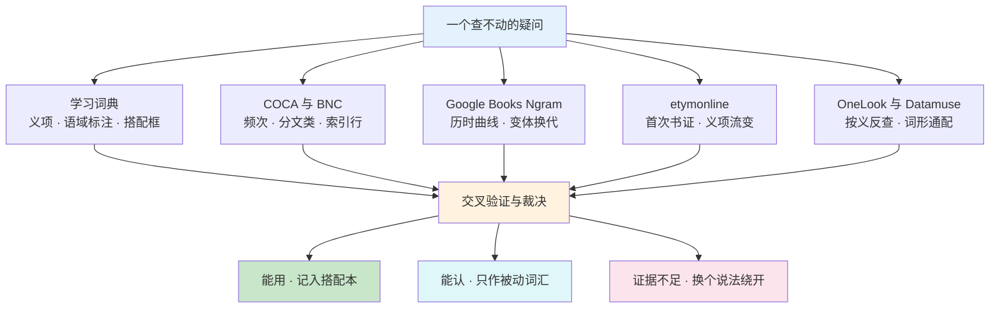
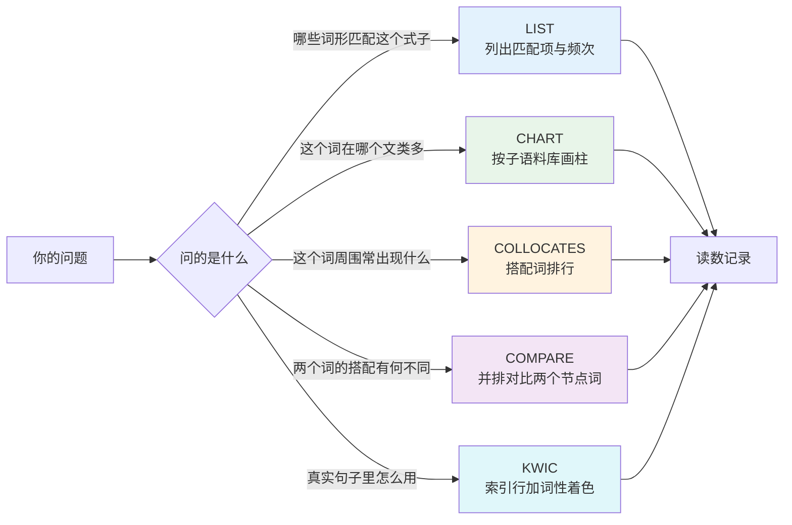
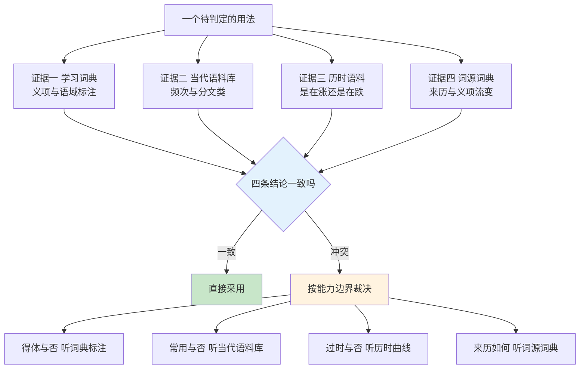
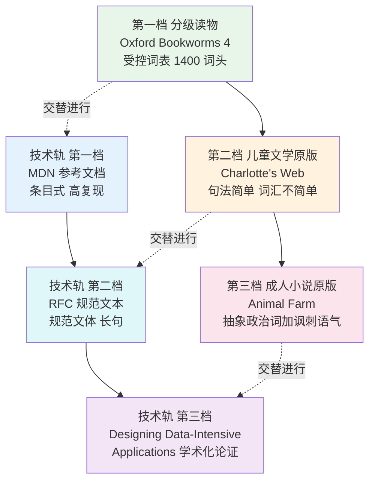
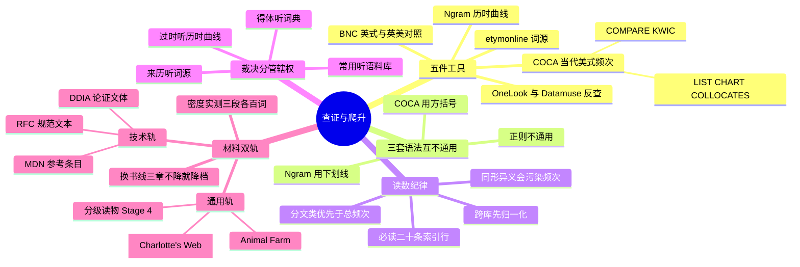

# 语料库检索、查词交叉验证与原版材料爬升路径

> [!info] 本篇定位
>
> 全书的工具篇。前面二十一章交付的是词，这一篇交付的是**在词表之外自己查证的能力**。
>
> 与三篇有直接接续关系：`01.词汇入门与学习方法/01` 给了 98% 覆盖率这个阈值，`01.词汇入门与学习方法/06` 给了三种词汇量口径，`17.固定搭配/01` 给了搭配频次自查的五步判断流程。本篇补上它们都没写的那一层——**检索式怎么写、读数怎么归一化、几个证据源打架时听谁的、以及查证能力练成之后拿什么材料往上爬**。
>
> 词典选型、语法查询资源、题库与背词软件一律不收。
>
> 读完你会有五件能立刻用的东西：一张 COCA 检索式符号表，一套 span 与排序参数的选法，一条从词源条目里剥出可信信息的读法，一个反向找词到语料验收的闭环，以及两条带判断线的材料阶梯。

---

## 1. 本篇导读：词典答不了的五类问题

学习词典的结构决定了它按**词形**排列、给**词义**。凡是问题不落在「这个词什么意思」上，词典结构上就答不了。真正卡住成年自学者的恰恰是另外五类：

| 问题类型 | 具体长什么样 | 词典答不了的原因 | 该问哪个工具 |
| --- | --- | --- | --- |
| 二选一的默认 | `make a decision` 还是 `take a decision` | 两条都收，都不标错 | 语料库频次加分文类 |
| 搭配的槽位 | `heavily` 右边通常接什么 | 词条只举一两个例子 | 语料库搭配面板 |
| 变体的换代 | `e-mail` 还是 `email`，哪年换的 | 词典只给当下形式，不给曲线 | 历时语料 Ngram |
| 名字的来历 | 后台进程为什么叫 `daemon` | 学习词典不收词源 | 词源词典 |
| 有意思没有词 | 「一整块拆不动的旧系统」英文叫什么 | 词典按词形排，不按词义排 | 反向词典 |

这五类问题共用一条纪律：**任何一个工具的输出都只是候选，不是结论**。频次高不等于得体，词源清楚不等于现代义如此，反查出来的词不等于能直接用。所以本篇的骨架是「五件工具 + 一套裁决顺序」，最后落到材料选择上。



上图左边五条支路各查各的，互不替代：词典管义项与得体度，语料库管当代真实分布，Ngram 管时间轴，词源词典管来历，反向词典管从义到形。它们汇到中间的裁决节点后，输出只有三种——可以主动用、只认不写、以及证据不够就绕开。第三种最容易被忽略：写作时**绕开一个拿不准的搭配，代价远小于用错**。

先把本篇通篇要用的元词汇立起来。这些词本身就是读工具文档、读语言学论文时的高频词，值得当词条记。

| 英文 | 英式音标 | 美式音标 | 词性 | 中文 | 搭配与说明 |
| --- | --- | --- | --- | --- | --- |
| **corpus** | /ˈkɔːpəs/ | /ˈkɔːrpəs/ | n. | 语料库 | 复数用拉丁形 corpora，不说 corpuses |
| **corpora** | /ˈkɔːpərə/ | /ˈkɔːrpərə/ | n.pl. | 语料库（复数） | 重音仍在首音节，常被误读成第二音节重读 |
| **concordance** | /kənˈkɔːdəns/ | /kənˈkɔːrdəns/ | n. | 索引行；语词索引 | a concordance line 即一条带上下文的例句行 |
| **collocate** | /ˈkɒləkeɪt/ | /ˈkɑːləkeɪt/ | n./v. | 搭配词；搭配 | 作名词时词尾弱化读 /-kət/；collocate with |
| **collocation** | /ˌkɒləˈkeɪʃn/ | /ˌkɑːləˈkeɪʃn/ | n. | 搭配 | 体系见 `16.词义辨析、搭配与短语动词/04` |
| **node** | /nəʊd/ | /noʊd/ | n. | 节点词 | 搭配检索里被查的那个中心词叫 node word |
| **span** | /spæn/ | /spæn/ | n./v. | 跨距；跨越 | a span of four words；决定往左右各看几个词 |
| **token** | /ˈtəʊkən/ | /ˈtoʊkən/ | n. | 词次 | 一段文本里每出现一次算一个 token |
| **type** | /taɪp/ | /taɪp/ | n. | 词型 | 同一个词形无论出现多少次只算一个 type |
| **lemma** | /ˈlemə/ | /ˈlemə/ | n. | 词目 | 复数 lemmas 或 lemmata；go/goes/went 同属一个 lemma |
| **wildcard** | /ˈwaɪldkɑːd/ | /ˈwaɪldkɑːrd/ | n. | 通配符 | a wildcard character；技术语境常直接说 wildcard |
| **query** | /ˈkwɪəri/ | /ˈkwɪri/ | n./v. | 查询；检索式 | 英美元音差异明显；run a query / query a database |
| **string** | /strɪŋ/ | /strɪŋ/ | n. | 字符串 | a search string；an exact string match |
| **hit** | /hɪt/ | /hɪt/ | n. | 命中条数 | 3,214 hits；也说 results 或 matches |
| **match** | /mætʃ/ | /mætʃ/ | n./v. | 匹配 | an exact match / a partial match |
| **frequency** | /ˈfriːkwənsi/ | /ˈfriːkwənsi/ | n. | 频次；频率 | raw frequency 原始频次，与归一化频次相对 |
| **raw** | /rɔː/ | /rɑː/ | adj. | 原始的；未加工的 | raw data / raw counts；不带任何换算 |
| **normalize** | /ˈnɔːməlaɪz/ | /ˈnɔːrməlaɪz/ | v. | 归一化 | 英式也拼 normalise；normalize per million words |
| **subcorpus** | /ˌsʌbˈkɔːpəs/ | /ˌsʌbˈkɔːrpəs/ | n. | 子语料库 | COCA 的 ACADEMIC 就是一个 subcorpus |
| **genre** | /ˈʒɒnrə/ | /ˈʒɑːnrə/ | n. | 文类 | 法语借词，开头是 /ʒ/ 不是 /dʒ/ |
| **register** | /ˈredʒɪstə/ | /ˈredʒɪstər/ | n. | 语域 | 语言学义项，主讲在 `18.语域、英美差异与习语俚语/02` |
| **annotate** | /ˈænəteɪt/ | /ˈænəteɪt/ | v. | 标注 | an annotated corpus 指带词性标记的语料库 |
| **tag** | /tæɡ/ | /tæɡ/ | n./v. | 标记；打标 | a part-of-speech tag；tag a word as a noun |
| **retrieval** | /rɪˈtriːvl/ | /rɪˈtriːvl/ | n. | 检索 | information retrieval；动词 retrieve |
| **citation** | /saɪˈteɪʃn/ | /saɪˈteɪʃn/ | n. | 书证；引例 | 词典学里指用来证明某义项存在的原始例句 |

`token` 与 `type` 这一对是所有词频统计的地基，中文常都译成「词」而混掉。一句 `the cat sat on the mat` 有六个 token、五个 type（`the` 出现两次）。词汇量口径的争议、覆盖率的算法，全都建在这一对区分上，细节在 `01.词汇入门与学习方法/06.词汇量自测、CEFR 对照与目标设定` 里已经拆过。

---

## 2. COCA 的五个界面与检索式语法

### 2.1 五个界面各回答一个问题

english-corpora.org 上的 COCA、BNC 以及同一批语料库共用一套界面，五个标签页的分工是固定的。选错界面是新手最常见的时间浪费。



上图的五条支路对应五种提问方式。判断一个搭配成不成立走 LIST，判断它属于哪个语域走 CHART，找一个词的搭配槽位走 COLLOCATES，比两个近义词的搭配差异走 COMPARE，确认一个用法的真实语境走 KWIC。**多数人只会用 LIST，于是只拿到频次这一个维度**，而分文类分布往往比总频次更能决定该不该用。

| 界面 | 输入 | 输出 | 最适合的问题 |
| --- | --- | --- | --- |
| LIST | 一条检索式 | 匹配到的词形列表加各自频次 | 这个组合真实存在吗，有多常见 |
| CHART | 一条检索式 | 按文类与年代分组的柱状分布 | 这是书面词还是口语词，在涨还是在跌 |
| COLLOCATES | 节点词加跨距 | 周围高频共现词排行 | 这个词后面通常接什么 |
| COMPARE | 两个节点词 | 两侧各自独占的搭配词 | 这两个近义词的搭配边界在哪 |
| KWIC | 一条检索式 | 居中对齐的索引行，按词性着色 | 真实句子的主语、时态、语域是什么样 |

### 2.2 检索式符号表

英美语料库界面用的是一套自己的记法，与 Ngram、与正则表达式都不同。混用是第二常见的时间浪费——把 Ngram 的 `_NOUN` 敲进 COCA 会一条都查不到。

| 写法 | 含义 | 示例 | 匹配到什么 |
| --- | --- | --- | --- |
| `word` | 精确词形 | `decision` | 只匹配 decision，不含 decisions |
| `*` | 任意长度通配 | `un*able` | unable、unbearable、unavailable 一类 |
| `?` | 单个字符通配 | `b?g` | big、bag、bug、bog |
| `[lemma]` | 该词目的全部形式 | `[make]` | make、makes、made、making |
| `[pos]` | 该词性的任意词 | `[nn*]` | 任意名词 |
| `word.[pos]` | 指定词性的该词 | `like.[v*]` | 作动词的 like，排除介词用法 |
| `\|` | 或 | `make\|take a decision` | 两条一起查，结果分行列出 |
| `-` | 排除某一槽位的词 | `heavily -[j*]` | heavily 右邻不是形容词的那些行 |
| `[=word]` | 该词的同义词组 | `[=strong]` | strong 的同义词群一并检索 |
| 空格 | 相邻 | `heavily dependent` | 两词紧邻的组合 |

> [!warning] 三个易踩的语法坑
>
> - **方括号里放词目不加星号，放词性要加**。`[make]` 是词目 make 的全部形式，`[nn*]` 才是「任意名词」；写成 `[make*]` 或 `[nn]` 结果都不对。
> - **通配的 `*` 不是正则的 `.*`**。`*ology` 能查到以 ology 结尾的词，但 `a.*b` 这种正则写法界面不认。
> - **多词检索默认要求严格相邻**。想允许中间插词，得用 COLLOCATES 面板设跨距，不能靠在检索式里加空格。

### 2.3 词性标记速查

界面用的是 CLAWS7 标记集，标记以词类首字母打头，后面用数字细分。查搭配时最常用的只有十几个。

| 标记 | 覆盖范围 | 典型例子 |
| --- | --- | --- |
| `[nn*]` | 普通名词全体 | decision、data |
| `[nn1]` | 单数普通名词 | decision |
| `[nn2]` | 复数普通名词 | decisions |
| `[np*]` | 专有名词 | London、Java |
| `[v*]` | 动词全体，含助动词 | is、make、made |
| `[vv*]` | 实义动词全体 | make、made、making |
| `[vvd]` | 实义动词过去式 | made |
| `[vvg]` | 实义动词 -ing 形式 | making |
| `[vvn]` | 实义动词过去分词 | made、written |
| `[j*]` | 形容词全体 | heavy、dependent |
| `[jjr]` | 比较级形容词 | heavier |
| `[r*]` | 副词全体 | heavily、very |
| `[ii]` | 介词 | on、of |
| `[at*]` | 冠词 | the、a |
| `[cc]` | 并列连词 | and、but |

`[vvn]` 是本篇后面反复要用的一个：`heavily` 的右侧搭配几乎全是过去分词，用 `heavily [vvn]` 一条式子就能把它们整批拉出来，比逐个猜快得多。

---

## 3. 案例一：make a decision 与 take a decision

### 3.1 先把问题改写成可检索的形式

「哪个对」不是一个可检索的问题。可检索的版本是三条：

1. 两个组合各自的原始频次是多少？
2. 各自集中在哪些文类？
3. 各自的主语通常是什么？

第一条走 LIST，第二条走 CHART，第三条走 KWIC。判断流程本身（倍数阈值怎么定档、频次低不等于错）在 `17.固定搭配/01.搭配强度分级与可替换边界` 里已经给过完整五步，本节只补它没写的检索式与读数细节。

### 3.2 三条式子

```text
# 一次查两个候选，结果分行给出，可直接比大小
make|take a decision

# 把动词展开成词目，覆盖 makes / made / making / took / taking
[make]|[take] a decision

# 反过来问：decision 前面最常见的动词是哪些
# 用 COLLOCATES 面板，节点词 decision，跨距设为左 1 右 0，词性限定 [vv*]
```

第二条式子比第一条更该用。只查 `make a decision` 会漏掉 `made a decision` 与 `making a decision`，而这两个形式在真实文本里的占比不低；用词目检索一次拿全，才是这个组合真实的量级。

第三条式子代表另一种提问方向：不预设候选，直接让语料库告诉你 `decision` 前面站着哪些动词。这个方向对不熟悉的名词特别有用——你根本不知道该猜哪个动词时，让排行榜给你前十个。

### 3.3 归一化：为什么不能直接比原始频次

COCA 的规模在十亿词量级，BNC 是一亿词量级。同一个组合在 COCA 里的原始频次天然比 BNC 高，这个差是语料库大小造成的，不是用法差异。跨库比较必须先归一化。

标准做法是折算成**每百万词的出现次数**（per million words，缩写 pmw）：

```text
归一化频次 = 原始频次 ÷ 语料库总词次 × 1,000,000
```

同一库内部比两个组合可以直接看原始频次；一旦跨库、跨文类、跨年代，就必须归一。CHART 界面输出的柱高本身已经是归一化过的，这也是它比 LIST 更适合做跨文类比较的原因——LIST 给原始数，CHART 给每百万词。

> [!warning] 分文类比较的陷阱
>
> COCA 各文类的子库大小并不相等，学术子库与影视字幕子库的规模不同。看到「学术里出现 300 次、口语里出现 120 次」就断言这是学术词，是把子库大小的差异读成了用法差异。**只看 CHART 的柱高，不要自己拿 LIST 的原始数做跨文类心算。**

### 3.4 读数怎么落成一条可用的结论

检索的产出不该是一个数字，而该是一条能直接指导下笔的规则。格式固定成四段：

| 字段 | `make a decision` | `take a decision` |
| --- | --- | --- |
| 量级关系 | 美式当代语料里占绝对多数 | 明显低于 make，但绝非零 |
| 文类集中处 | 各文类均匀分布 | 偏书面，新闻与官方文书居多 |
| 典型主语 | 人与机构都常见 | 以机构为主（board、committee、government） |
| 下笔规则 | 默认用它，英美通吃 | 写英式正式文书且主语是机构时可用 |

> [!example] 同类可以照这套式子自查的对
>
> - **do research** 与 ~~make research~~
>   - 后者原始频次接近于零，属于学习者造词，不是低频用法。
> - **take a photo** 与 **make a photo**
>   - 后者在英语里频次极低；德语母语者容易迁移出这个说法。
> - **give a presentation** 与 **do a presentation**
>   - 两者都成立，`do` 一侧偏口语；这类差异只能靠分文类分布看出来。
> - **conduct a survey** 与 **do a survey**
>   - 前者集中在学术子库，后者集中在口语子库，属于典型的语域分档。

轻动词加名词的完整词表在 `17.固定搭配/02.动词+名词搭配（上）make、do、have、take` 里，本节只演示怎么用检索式把这类问题变成读数。

---

## 4. 案例二：拉出 heavily 的右侧搭配

### 4.1 COLLOCATES 面板的四个参数

搭配检索的输出质量几乎完全由参数决定，四个参数中的每一个填错都会让结果失去意义。

| 参数 | 作用 | 该怎么填 |
| --- | --- | --- |
| 节点词 node | 要查搭配的中心词 | 填 `heavily`，或用 `[heavy]` 覆盖词族 |
| 跨距 span | 往左右各看几个词 | 强化副词查右侧，填左 0 右 1 |
| 词性过滤 | 只保留某类搭配词 | 填 `[j*]` 或 `[vvn]`，剔除虚词噪声 |
| 排序方式 | 按频次还是按显著性 | 见下一小节 |

跨距的默认值通常是左右各四个词，那是用来看话题共现的（查 `climate` 附近有什么话题词），不适合查紧邻搭配。**副词修饰形容词是紧邻关系，跨距必须收到 1**，否则排行榜前几名会被 `the`、`of`、`and` 这类高频虚词占满。

### 4.2 频次排序与 MI 排序给出的是两份不同的表

这是搭配检索里最值得讲清的一个机制。

**按频次排序**给出的是「最常一起出现的词」。高频虚词天然占优，所以必须配合词性过滤使用。过滤之后，它回答的是：这个词最典型的搭配是什么。

**按互信息值（mutual information，MI）排序**给出的是「最独特地一起出现的词」。MI 衡量的是两个词共现的次数相对于它们各自频次的比值——如果 B 几乎只在 A 后面出现，哪怕总共只出现二十次，MI 也会很高。它回答的是：这个词有没有专属搭档。

| 维度 | 频次排序 | MI 排序 |
| --- | --- | --- |
| 头部结果 | 常见、通用、可靠 | 罕见、专门、有时是噪声 |
| 典型用途 | 挑要背的搭配 | 找固定表达与术语 |
| 主要风险 | 被虚词淹没 | 低频组合被抬到头部，个位数频次也能高 MI |
| 补救 | 加词性过滤 | 设最小频次门槛，低于十次的直接不看 |

实用做法是**两个都跑一遍**：频次排序取前十五个用来记，MI 排序扫一眼用来发现自己没想到的固定组合，然后回频次表验证它是不是真的常用。

### 4.3 heavily 右侧的结果长什么样

用 `heavily` 作节点、跨距左 0 右 1、词性不限跑一次，结果会呈现一个非常整齐的形状：**右邻几乎全是过去分词和 -ed 形容词**，几乎没有原级形容词。这个形状本身就是一条可以带走的规律。

| 英文 | 英式音标 | 美式音标 | 词性 | 中文 | 搭配与说明 |
| --- | --- | --- | --- | --- | --- |
| **dependent** | /dɪˈpendənt/ | /dɪˈpendənt/ | adj. | 依赖的 | heavily dependent on；名词形式 dependence |
| **reliant** | /rɪˈlaɪənt/ | /rɪˈlaɪənt/ | adj. | 倚赖的 | heavily reliant on，与 dependent 近乎同义 |
| **influenced** | /ˈɪnfluənst/ | /ˈɪnfluənst/ | adj. | 受影响的 | heavily influenced by；被动式为默认形态 |
| **armed** | /ɑːmd/ | /ɑːrmd/ | adj. | 武装的 | heavily armed；新闻文类高频 |
| **guarded** | /ˈɡɑːdɪd/ | /ˈɡɑːrdɪd/ | adj. | 戒备森严的 | heavily guarded；也说 a guarded response 谨慎的回应 |
| **wooded** | /ˈwʊdɪd/ | /ˈwʊdɪd/ | adj. | 树木茂密的 | heavily wooded；描写文类专用 |
| **populated** | /ˈpɒpjuleɪtɪd/ | /ˈpɑːpjuleɪtɪd/ | adj. | 人口稠密的 | heavily populated areas；也说 densely populated |
| **indebted** | /ɪnˈdetɪd/ | /ɪnˈdetɪd/ | adj. | 负债累累的 | b 不发音；heavily indebted；另有「感激」义 |
| **criticized** | /ˈkrɪtɪsaɪzd/ | /ˈkrɪtɪsaɪzd/ | adj. | 受严厉批评的 | 英式拼 criticised；heavily criticized for |
| **regulated** | /ˈreɡjuleɪtɪd/ | /ˈreɡjuleɪtɪd/ | adj. | 受严格监管的 | a heavily regulated industry |
| **subsidized** | /ˈsʌbsɪdaɪzd/ | /ˈsʌbsɪdaɪzd/ | adj. | 受大额补贴的 | 英式拼 subsidised；名词 subsidy |
| **laden** | /ˈleɪdn/ | /ˈleɪdn/ | adj. | 满载的 | heavily laden with；旧体感，来自 lade |
| **biased** | /ˈbaɪəst/ | /ˈbaɪəst/ | adj. | 有偏的 | heavily biased towards；英式也拼 biassed |
| **invested** | /ɪnˈvestɪd/ | /ɪnˈvestɪd/ | adj. | 大量投入的 | heavily invested in；可指资金也可指情感 |
| **discounted** | /ˈdɪskaʊntɪd/ | /ˈdɪskaʊntɪd/ | adj. | 大幅打折的 | heavily discounted；名词 discount 重音在前 |
| **taxed** | /tækst/ | /tækst/ | adj. | 重税的 | heavily taxed；也说 heavily taxing 令人吃力的 |

一张这样的表比背十条孤立搭配有用得多，因为它同时给出了**槽位的形状**：`heavily` 的右槽只收「已完成的、被施加的状态」，所以 `heavily beautiful`、`heavily important` 这类组合语料库里查不到，也不该写。副词与形容词的强化搭配全表在 `17.固定搭配/05.副词+形容词强化搭配：highly、deeply、bitterly 的固定伴侣`，本节的价值是给出**自己再拉一份的方法**：换 `deeply`、`bitterly`、`widely` 重跑同一条式子，各得一张表。

> [!tip] 把搭配表压缩成一句可记的规则
>
> 拿到排行榜后别急着抄词，先看形状：右邻的词性是否集中、语义是否有共同点、有没有必配的介词。`heavily` 的规则可以压成一句——**接被动分词，多数后面还要带介词 on / by / in**。记住这一句，比记住十六个词更能防止造出错句。

---

## 5. 案例三：用 BNC 验 have a bath 与 take a bath

### 5.1 为什么这道题必须两个库一起查

COCA 收当代美式，BNC 收英式。凡是问题里带「英美偏好」四个字，单库检索都答不了——在 COCA 里查不到 `have a bath` 的高频用法，只能说明美国人不这么说，不能说明它错。

| 语料库 | 收录变体 | 规模量级 | 取材年代 | 适合回答 |
| --- | --- | --- | --- | --- |
| COCA | 当代美式 | 十亿词级 | 持续更新 | 美式现在怎么说 |
| BNC | 英式 | 一亿词级 | 二十世纪八九十年代为主 | 英式怎么说，兼看是否过时 |

BNC 的年代局限要记住：它对近三十年的新词、新用法基本无覆盖。查 `have a bath` 这类稳定的日常表达没问题，查网络新词就查不到——那不是「英国人不说」，是语料库建成时这个词还不存在。

### 5.2 两库对照的操作

```text
# 在 COCA 里跑一次
have|take a bath

# 换到 BNC，同一条式子再跑一次
have|take a bath

# 两边的原始频次不能直接比，各自换算成每百万词
# 或者直接看 CHART，柱高本身已归一化
```

### 5.3 频次里混进了别的东西

这道题的真正价值不在结论，在一个陷阱：`take a bath` 在美式口语里还有一个完全无关的引申义——**投资亏大钱**。

> [!example] 同形不同义污染频次
>
> - He **takes a bath** every night before bed.
>   - 他每晚睡前洗澡。（字面义）
> - They **took a bath** on that investment.
>   - 他们在那笔投资上亏惨了。（美式口语引申义）

两个义项共用同一个词形，检索时会被算进同一个数字。如果不读索引行就直接拿总频次下结论，会得出「美国人比英国人爱洗澡」这种荒唐推论。

**这就是 KWIC 界面存在的理由。**任何一次检索，读二十条索引行是必需动作，不是可选动作。读的时候盯三样：主语是什么、宾语是什么、上下文是不是你想问的那个场景。

### 5.4 结论与同类可自查的对

| 组合 | 英式默认 | 美式默认 | 备注 |
| --- | --- | --- | --- |
| 洗澡 | have a bath | take a bath | 美式的 take a bath 另有亏钱义 |
| 淋浴 | have a shower | take a shower | 同一分工模式 |
| 休息一下 | have a break | take a break | take 一侧英美通用度更高 |
| 小睡 | have a nap | take a nap | — |
| 看一眼 | have a look | take a look | 分工与语域见 `17.固定搭配/02` |
| 散步 | have a walk | take a walk | go for a walk 两边都常见 |

这张表的规律可以一句话概括：**英式用 have，美式用 take，动作类轻动词结构上的分工高度一致**。规律本身在 `17.固定搭配/02` 与 `18.语域、英美差异与习语俚语/01.英式与美式词汇差异` 里讲过，本节交付的是自己验证它的检索路径。

---

## 6. 案例四：Google Books Ngram 与 e-mail 到 email 的拐点

### 6.1 Ngram 量的到底是什么

Google Books Ngram Viewer 统计的是**扫描书籍语料里某个字符串占当年全部词次的比例**，按年份画成曲线。三个限定词都关键：书籍、比例、按年。

| 它能回答 | 它答不了 |
| --- | --- |
| 两个拼写变体什么时候完成换代 | 口语里怎么说 |
| 一个词是在涨还是在跌 | 一个搭配对不对 |
| 一个说法大致什么年代进入书面语 | 近几年的新词（语料有截止年份） |
| 专名什么时候开始被普通化使用 | 某个具体行业内部的用法 |

Ngram 是**历时**（diachronic）工具，COCA 与 BNC 是**共时**（synchronic）工具为主。两者的分工不重叠：想知道现在该怎么写，问 COCA；想知道什么时候变成现在这样的，问 Ngram。

| 英文 | 英式音标 | 美式音标 | 词性 | 中文 | 搭配与说明 |
| --- | --- | --- | --- | --- | --- |
| **diachronic** | /ˌdaɪəˈkrɒnɪk/ | /ˌdaɪəˈkrɑːnɪk/ | adj. | 历时的 | 跨时间轴看变化，与 synchronic 相对 |
| **synchronic** | /sɪŋˈkrɒnɪk/ | /sɪŋˈkrɑːnɪk/ | adj. | 共时的 | 只看某一时间截面的状态 |
| **smoothing** | /ˈsmuːðɪŋ/ | /ˈsmuːðɪŋ/ | n. | 平滑 | Ngram 的平滑参数，取 0 才是逐年原始值 |
| **crossover** | /ˈkrɒsəʊvə/ | /ˈkrɔːsoʊvər/ | n. | 交叉点 | 两条曲线交叉、主流形式换代的那一年 |
| **inflection point** | /ɪnˈflekʃn pɔɪnt/ | /ɪnˈflekʃn pɔɪnt/ | n. | 拐点 | 曲线由缓转陡的那个位置 |
| **supplant** | /səˈplɑːnt/ | /səˈplænt/ | v. | 取代 | 比 replace 正式；email supplanted e-mail |
| **obsolescence** | /ˌɒbsəˈlesns/ | /ˌɑːbsəˈlesns/ | n. | 淘汰；废弃 | planned obsolescence 计划性淘汰 |
| **uptake** | /ˈʌpteɪk/ | /ˈʌpteɪk/ | n. | 采用；接受度 | slow uptake of the new spelling |
| **coinage** | /ˈkɔɪnɪdʒ/ | /ˈkɔɪnɪdʒ/ | n. | 新造词；造词 | a recent coinage；动词 coin a term |
| **attest** | /əˈtest/ | /əˈtest/ | v. | 证实；有书证 | 词源学固定用被动：first attested in 1889 |
| **case-sensitive** | /ˌkeɪs ˈsensətɪv/ | /ˌkeɪs ˈsensətɪv/ | adj. | 区分大小写的 | Ngram 默认区分，COCA 默认不分 |
| **corpus size** | — | — | n. | 语料规模 | 跨库比较前必须先看这个数 |

### 6.2 Ngram 的检索式语法

Ngram 用的是**第三套语法**，与 COCA 完全不同。混用是这里最常见的错误。

| 写法 | 含义 | 示例 |
| --- | --- | --- |
| `,` | 并列多条曲线 | `e-mail,email` |
| `_NOUN` `_VERB` `_ADJ` | 限定词性 | `email_NOUN` |
| `*` | 通配，返回填空频次最高的十个 | `heavily * by` |
| `_INF` | 展开该词的全部屈折形式 | `book_INF` |
| `+` | 把多条曲线相加 | `email+e-mail` |
| `/` | 两条曲线相除，看占比 | `email/(email+e-mail)` |
| `:corpus` | 指定语料库 | `email:eng_us_2019` |
| `_START_` `_END_` | 句首句尾位置 | `_START_ However` |

### 6.3 e-mail 到 email 这条曲线怎么读

```text
# 第一步：两个变体一起画
e-mail,email

# 第二步：把平滑降到 0，看逐年原始值，避免平滑把拐点抹平几年
# 界面右侧的 smoothing 下拉框选 0

# 第三步：改看占比，把语料总量增长这个干扰因素消掉
email/(email+e-mail)

# 第四步：分别切英美语料库，看两边换代时间是否一致
e-mail,email:eng_us_2019
e-mail,email:eng_gb_2019
```

第一步画出来的图，两条线会在 2000 年代中后期交叉——`e-mail` 先于 `email` 起步、长期领先，随后被反超并持续下滑。具体交叉年份以你自己拉到的曲线为准，因为它受语料库版本、平滑参数与大小写设置三重影响，不同版本能差出一两年。

**第二步的平滑参数最值得单独说。**Ngram 默认平滑值为 3，意思是每个点取前后各三年的移动平均。移动平均会把交叉点往后拖，看拐点必须把它调到 0。

**第三步的占比写法是这个工具最被低估的用法。**扫描书籍总量本身逐年增长，绝对曲线里混着语料增长的成分；改成 `A/(A+B)` 看份额，得到的是一条纯粹的「谁占主流」曲线，从 0 爬到 1 的那个 0.5 交点就是换代年。

### 6.4 Ngram 的四个坑

> [!warning] 拿 Ngram 下结论前先过这四条
>
> - **书面滞后。**一个说法在口语里流行到进入书籍，中间隔着好几年。Ngram 上的「起点」不是这个词诞生的年份。
> - **OCR 误识。**十九世纪之前的扫描件里，长写的 s 常被识别成 f，导致早期数据不可靠。查 1800 年以前的曲线要格外谨慎。
> - **语料构成随年代变化。**不同年代被扫描进来的书，学术与通俗的比例并不一致，曲线的波动可能是语料构成变化而非语言变化。
> - **连字符分词。**`e-mail` 在分词时可能被切成三段处理，与 `email` 的计数口径未必完全对等。所以这类查询要同时看绝对曲线和占比曲线，两者结论一致才可信。

### 6.5 值得自己拉一遍的变体对

| 旧形 | 新形 | 换代大致时段 | 查证要点 |
| --- | --- | --- | --- |
| e-mail | email | 2000 年代中后期 | 连字符脱落是这类词的通例 |
| on-line | online | 1990 年代末到 2000 年代初 | 同为连字符脱落 |
| web site | website | 2000 年前后 | 分写到合写要经过连字符中间态 |
| data base | database | 1980 年代 | 技术词合写通常早于通用词 |
| cell phone | cellphone | 未完全完成 | 英式一直用 mobile phone，不参与这条演化 |
| smart phone | smartphone | 2010 年前后 | 与产品普及时间同步 |
| work flow | workflow | 1990 年代 | — |
| -ise 拼法 | -ize 拼法 | 长期并存 | 不是换代；-ize 在英式的牛津拼法里同样通行，不是干净的英美分野，见 `18.语域、英美差异与习语俚语/01` |

最后一行是个反例，专门放在这里：**不是所有变体差异都是时间轴上的换代**，有些是两种拼法长期并存，曲线永远不会交叉。看到两条平行线不交叉，先想想是不是问错了工具。

---

## 7. 案例五：etymonline 与四个技术词的来历

### 7.1 词源条目的体例怎么读

Online Etymology Dictionary（etymonline）的条目结构固定，认得五个标记就能读。

| 标记 | 读法 | 含义 |
| --- | --- | --- |
| `c.` | circa /ˈsɜːkə/ | 约，后接年份，表示首次书证的大致时间 |
| `attested` | — | 有书面证据，`first attested 1889` 指最早的书证在 1889 年 |
| `from` | — | 来源链，一路往上追到更早的语言 |
| `cognate with` | — | 同源词，与另一语言的某词共享祖先，不是借来的 |
| `sense of "X" is from` | — | 某个义项从哪一年开始出现，与词本身的年份分开记 |

最后一条最重要：**一个词的年龄和它某个义项的年龄是两回事**。`bug` 这个词非常老，但它的「程序缺陷」义只有一百多年；`mouse` 更老，「鼠标」义只有几十年。读词源条目时把这两个数字分开看，才不会得出「计算机术语原来这么古老」的错误印象。

| 英文 | 英式音标 | 美式音标 | 词性 | 中文 | 搭配与说明 |
| --- | --- | --- | --- | --- | --- |
| **etymology** | /ˌetɪˈmɒlədʒi/ | /ˌetɪˈmɑːlədʒi/ | n. | 词源；词源学 | 形容词 etymological |
| **etymon** | /ˈetɪmɒn/ | /ˈetɪmɑːn/ | n. | 词源形式 | 一个词追溯到的源词本身 |
| **cognate** | /ˈkɒɡneɪt/ | /ˈkɑːɡneɪt/ | adj./n. | 同源的；同源词 | cognate with German Hund |
| **loanword** | /ˈləʊnwɜːd/ | /ˈloʊnwɜːrd/ | n. | 借词 | 也说 borrowing；genre 就是法语借词 |
| **calque** | /kælk/ | /kælk/ | n. | 仿译词 | 逐词直译进来的词，如 loanword 本身仿自德语 |
| **doublet** | /ˈdʌblət/ | /ˈdʌblət/ | n. | 同源异形词 | 同一源头两次借入，如 fragile 与 frail |
| **derive** | /dɪˈraɪv/ | /dɪˈraɪv/ | v. | 派生自 | 固定被动：be derived from |
| **root** | /ruːt/ | /ruːt/ | n. | 词根 | 系统讲解在 `15.词根、合成与缩略/01` |
| **stem** | /stem/ | /stem/ | n. | 词干 | 加词缀之前的那一段 |
| **Proto-Indo-European** | /ˌprəʊtəʊ ˌɪndəʊ ˌjʊərəˈpiːən/ | /ˌproʊtoʊ ˌɪndoʊ ˌjʊrəˈpiːən/ | n. | 原始印欧语 | 缩写 PIE，词源链的常见终点 |
| **semantic shift** | /sɪˈmæntɪk ʃɪft/ | /sɪˈmæntɪk ʃɪft/ | n. | 语义演变 | 也说 semantic change |
| **broadening** | /ˈbrɔːdnɪŋ/ | /ˈbrɑːdnɪŋ/ | n. | 词义扩大 | 也说 generalization |
| **narrowing** | /ˈnærəʊɪŋ/ | /ˈnæroʊɪŋ/ | n. | 词义缩小 | 也说 specialization |
| **pejoration** | /ˌpiːdʒəˈreɪʃn/ | /ˌpiːdʒəˈreɪʃn/ | n. | 词义贬降 | 中性词变贬义，如 silly |
| **amelioration** | /əˌmiːliəˈreɪʃn/ | /əˌmiːliəˈreɪʃn/ | n. | 词义升格 | 贬义词变褒义，如 nice |
| **folk etymology** | — | — | n. | 民间词源 | 靠联想编出来的假来历 |
| **backronym** | /ˈbækrənɪm/ | /ˈbækrənɪm/ | n. | 逆构缩略语 | 词先有，全称是后配上去的 |
| **obsolete** | /ˌɒbsəˈliːt/ | /ˌɑːbsəˈliːt/ | adj. | 已废弃的 | 词典标 obs.，指现代已不用 |
| **archaic** | /ɑːˈkeɪɪk/ | /ɑːrˈkeɪɪk/ | adj. | 古旧的 | 比 obsolete 轻一档，仍见于文学与仿古文体 |
| **borrowing** | /ˈbɒrəʊɪŋ/ | /ˈbɑːroʊɪŋ/ | n. | 借用；借词 | a borrowing from French |

### 7.2 四个技术词的走查

| 英文 | 英式音标 | 美式音标 | 词性 | 中文 | 搭配与说明 |
| --- | --- | --- | --- | --- | --- |
| **bug** | /bʌɡ/ | /bʌɡ/ | n. | 虫子；程序缺陷 | 缺陷义的书证可追到十九世纪末的机械故障用法 |
| **debug** | /ˌdiːˈbʌɡ/ | /ˌdiːˈbʌɡ/ | v. | 调试 | 二十世纪四十年代出现；de- 表去除 |
| **patch** | /pætʃ/ | /pætʃ/ | n./v. | 补丁；打补丁 | 原义是缝在破洞上的一块布 |
| **kernel** | /ˈkɜːnl/ | /ˈkɜːrnl/ | n. | 核仁；内核 | 古英语 cyrnel，是 corn（谷粒）的指小形式 |
| **daemon** | /ˈdiːmən/ | /ˈdiːmən/ | n. | 守护进程 | 希腊语 daimōn，原义是中性的「精灵、守护灵」 |
| **demon** | /ˈdiːmən/ | /ˈdiːmən/ | n. | 恶魔 | 与 daemon 同源，英语里这个拼法带上了恶义 |
| **bootstrap** | /ˈbuːtstræp/ | /ˈbuːtstræp/ | n./v. | 靴襻；自举 | 出自「拽着自己的靴襻把自己提起来」这个荒谬意象 |
| **cache** | /kæʃ/ | /kæʃ/ | n./v. | 缓存 | 法语 cacher（藏），读音与 cash 完全相同 |

四条走查各自能带出一个不同的读法要点：

**bug 的要点是义项年龄与词龄分离。**「虫子」义很老，「机械故障」义在十九世纪末已有书证，与爱迪生相关的记载常被引作早期用例。1947 年哈佛 Mark II 机器里夹住的那只飞蛾是真实存在的实物记录，但**它不是词的起源，只是一次著名的字面兑现**——当时的人正是因为已有 bug 这个说法，才觉得夹到真虫子这件事值得记下来。中文材料里流传的「因为一只飞蛾所以叫 bug」是把因果搞反了。

**patch 的要点是隐喻的物理起点。**它的原义就是缝补用的一块布，而早期计算机上的补丁真的是物理的：在穿孔纸带或卡片上贴一小块，把打错的孔位补上。技术义与原义之间没有跨度，是直接搬过来的。这类「原义本身就是操作动作」的技术词最好记，因为不需要记隐喻，只需要记画面。

**kernel 的要点是指小后缀。**古英语 cyrnel 是 corn 加指小成分，字面就是「小谷粒」。操作系统的 kernel 是「里面那一小粒硬核」的意思，与 shell（外壳）恰好成对——**这一对词是同一个比喻的两半，一起记比分开记牢**。

**daemon 的要点是拼写选择本身携带信息。**希腊语的 daimōn 是中性的守护灵，进入基督教语境后 demon 这个拼法被专门用于恶义。后台进程这个用法早于 Unix，出自 1960 年代 MIT 的分时系统，Unix 只是沿用；保留 -ae- 的古拼法正是为了取「在后台默默做事的守护灵」这一层中性义，而不是恶魔。至于流传很广的全称 Disk And Execution Monitor，属于**逆构缩略语**：词先存在，全称是后来配上去的。

### 7.3 一条通用判据与三个反例

> [!warning] 解释太精巧的词源，先当假的
>
> 真实的词源大多平淡：某个拉丁词的过去分词、某个法语词的变体、某个古英语词加了个后缀。凡是听起来能当段子讲、有完整故事线、还带个巧妙缩写的，先默认是民间词源，再去查证。
>
> - **golf** 不是 Gentlemen Only, Ladies Forbidden 的缩写。
> - **posh** 不是 Port Out, Starboard Home 的缩写。
> - **SOS** 不是 Save Our Souls 的缩写，它是选来因为摩尔斯电码最好辨认的一串信号。
>
> 这三条的共同特征：全称对仗工整、故事有场景、传播广。真词源不长这样。

词源的价值有明确边界：**它解释来历，不判定现代义。**`nice` 的词源义是「无知的」，`awful` 的词源义是「令人敬畏的」，拿这两个词源去指导今天的用词会全错。词义翻转的完整机制在 `19.学术通用词汇/04.典故、专名转普通词与词源背景` 里讲过。所以词源的正确用法只有两个：**帮助记忆**，以及**理解一个词族内部的联系**。查完一个词源记不住的，说明这条词源对你没有记忆价值，放掉即可，不必硬编故事。

---

## 8. 案例六：OneLook 与反向找词

### 8.1 三种「想不起来」各有各的查法

| 卡住的方式 | 你手上有什么 | 查法 |
| --- | --- | --- |
| 中文有词英文没有 | 一句中文描述 | 按义反查 |
| 记得词形一部分 | 首尾字母或长度 | 通配符查 |
| 记得读音记不得拼写 | 一个近似发音 | 按音查 |

OneLook 与它背后的 Datamuse 三种都支持，这是它比翻词典快的地方——**词典按词形排序，你没有词形就进不去；反向词典按义排序，从义就能进**。

| 英文 | 英式音标 | 美式音标 | 词性 | 中文 | 搭配与说明 |
| --- | --- | --- | --- | --- | --- |
| **headword** | /ˈhedwɜːd/ | /ˈhedwɜːrd/ | n. | 词头；词条主词 | 分级读物标注的 headword count 用的就是这个词 |
| **entry** | /ˈentri/ | /ˈentri/ | n. | 词条 | a dictionary entry；一个 headword 领一条 entry |
| **sense** | /sens/ | /sens/ | n. | 义项 | sense 1, sense 2；不说 meaning 1 |
| **gloss** | /ɡlɒs/ | /ɡlɑːs/ | n./v. | 简释；加注 | 词表右列那种一行释义就叫 gloss |
| **definition** | /ˌdefɪˈnɪʃn/ | /ˌdefɪˈnɪʃn/ | n. | 定义 | 比 gloss 完整；动词 define |
| **label** | /ˈleɪbl/ | /ˈleɪbl/ | n. | 标注；标签 | a usage label，如 informal、dated、technical |
| **cross-reference** | /ˌkrɒs ˈrefrəns/ | /ˌkrɔːs ˈrefrəns/ | n./v. | 交叉引用 | see also 那一行的正式名称 |
| **thesaurus** | /θɪˈsɔːrəs/ | /θɪˈsɔːrəs/ | n. | 同义词词典 | 复数 thesauruses 或 thesauri |
| **paraphrase** | /ˈpærəfreɪz/ | /ˈpærəfreɪz/ | n./v. | 释义；改述 | 反查时输入的就是一句 paraphrase |
| **disambiguate** | /ˌdɪsæmˈbɪɡjueɪt/ | /ˌdɪsæmˈbɪɡjueɪt/ | v. | 消歧 | 名词 disambiguation |
| **synonym** | /ˈsɪnənɪm/ | /ˈsɪnənɪm/ | n. | 同义词 | 近义词说 near-synonym |
| **antonym** | /ˈæntənɪm/ | /ˈæntənɪm/ | n. | 反义词 | 体系见 `16.词义辨析、搭配与短语动词/02` |
| **hypernym** | /ˈhaɪpənɪm/ | /ˈhaɪpərnɪm/ | n. | 上位词 | vehicle 是 car 的 hypernym |
| **hyponym** | /ˈhaɪpənɪm/ | /ˈhaɪpənɪm/ | n. | 下位词 | 与 hypernym 只差 hypo- / hyper- 一个前缀，写时要当心 |

### 8.2 OneLook 的通配与反查

```text
# 通配符：* 匹配任意长度，? 匹配单个字符
*ology          以 ology 结尾的词
un*able         un 开头 able 结尾
b??d            四个字母，b 开头 d 结尾

# 按义反查：直接输入一句英文描述
a system that cannot be broken into smaller parts
fear of being left out

# 概念相关词：在词前加冒号
:database
```

按义反查输入的英文描述**写得越具体、越像定义，结果越准**。「一个词形容旧系统」这种模糊描述返回的全是噪声；「a large old software system that is hard to change piece by piece」就能把 `monolith`、`legacy system` 顶到前面。

### 8.3 Datamuse 接口：给程序员的那条路

OneLook 背后的 Datamuse 提供公开接口，可以直接 curl，也可以写进脚本批量跑。参数名短且好记：

| 参数 | 含义 | 例子 |
| --- | --- | --- |
| `ml=` | means like，按义找词 | `ml=hard+to+change` |
| `sl=` | sounds like，按音找词 | `sl=kernal` |
| `sp=` | spelled like，按词形通配 | `sp=b??d` |
| `rel_jja=` | 该形容词常修饰的名词 | `rel_jja=heavy` |
| `rel_jjb=` | 常修饰该名词的形容词 | `rel_jjb=decision` |
| `rel_bga=` | 常跟在该词后面的词 | `rel_bga=heavily` |
| `rel_bgb=` | 常出现在该词前面的词 | `rel_bgb=decision` |
| `md=f` | 附带频次元数据 | 结果里带每百万词频次 |
| `max=` | 返回条数上限 | `max=50` |

```text
# 找 heavily 后面常跟什么，带频次
https://api.datamuse.com/words?rel_bga=heavily&md=f&max=30

# 找常修饰 decision 的形容词
https://api.datamuse.com/words?rel_jjb=decision&max=30

# 拼不出来时按音找
https://api.datamuse.com/words?sl=kernal
```

`rel_bga` 与 `rel_jjb` 这两个参数实际上是一个**轻量版的搭配检索**，够用于日常写作时的快速确认。它的数据源与规模都不如 COCA，所以定位是「先粗筛，再去 COCA 精验」。

### 8.4 反查必须闭环

反向词典给的是候选，直接拿去用是最危险的一步。候选里混着三类不能用的词：语域不对的、义项偏移的、以及在当代已经很少用的。

> [!example] 五次反查演练与验收
>
> - 「一整块拆不动的旧系统」→ 候选 **monolith** / **legacy system**
>   - 验收：两个都成立，`monolith` 强调结构不可分，`legacy` 强调历史包袱。
> - 「功能越加越多最后失控」→ 候选 **feature creep** / **scope creep**
>   - 验收：前者说产品功能，后者说项目范围，分工见 `20.专业领域词汇/06`。
> - 「表面看着有道理其实站不住」→ 候选 **specious** / **plausible**
>   - 验收：`specious` 自带贬义，`plausible` 中性，不可互换。
> - 「说了等于没说的空话」→ 候选 **platitude** / **truism** / **vacuous**
>   - 验收：前两个是名词、第三个是形容词，写句子前先确认词性。
> - 「事后不追责的复盘」→ 候选 **postmortem** / **retrospective**
>   - 验收：前者偏事故，后者偏周期性回顾，读法见 `20.专业领域词汇/04`。

验收的固定三问：**这个词在 COCA 的哪个文类里高频？词典给它挂了什么语域标注？索引行里它的搭配是什么？**三问过完才允许写进自己的产出。

---

## 9. 四个证据源冲突时怎么裁决

### 9.1 每个证据源的能力边界



上图右下角四条就是裁决规则的全部。它们不是优先级排序，而是**分管辖权**：每个证据源只在自己那一栏里说了算，跨栏发言一律不采信。频次不判得体、词源不判现代义、历时曲线不判语法对错——一旦记住这三条否定式，绝大多数冲突当场就能解开。

| 证据源 | 能判定 | 不能判定 | 越权时的典型错误 |
| --- | --- | --- | --- |
| 学习词典 | 义项、语域、句法框架 | 两个都对时哪个更常用 | 「词典收了所以随便用」 |
| 当代语料库 | 真实分布、文类归属、典型搭配 | 得体与否、正式度 | 「频次高所以能写进论文」 |
| 历时语料 | 变体换代、词的兴衰 | 当代口语用法、搭配对错 | 「Ngram 上还在涨所以口语能用」 |
| 词源词典 | 来历、同源关系、义项出现顺序 | 现代词义与用法 | 「词源是这个意思所以现在也是」 |

### 9.2 三种典型冲突的解法

> [!example] 冲突一：词典收了，语料库里几乎查不到
>
> 多半是老版词典的遗留义项，或是极窄的专业用法。
>
> **解法**：看 CHART 的分文类分布。若某个专业子库里有量，判定为专业词，非专业场合不用；若全部子库都趋近于零，判定为已废弃，只作认得层。

> [!example] 冲突二：语料库里高频，词典标 informal
>
> 频次高只说明有人这么说，不说明在你的场合能说。
>
> **解法**：语域标注优先。写邮件、写文档、写论文一律照词典的标注走；口语与聊天可以用。`kinda`、`gonna` 这类词在影视字幕子库里频次极高，进不了正式文本。

> [!example] 冲突三：Ngram 曲线在涨，COCA 里几乎没有
>
> 书籍语料与当代口语语料的错位，或者一个学术术语正在书面语里扩散但没进日常语。
>
> **解法**：以目标文体为准。你要写的是技术文档就看 COCA 的学术与网页子库，要写的是聊天消息就看口语与影视子库。**永远按你的产出文体挑证据源，不按证据源的漂亮程度挑。**

### 9.3 一次完整交叉验证的记录格式

查证的结果必须落成文字，否则一周后会重查一遍。固定六栏，抄进生词本或搭配本：

| 栏目 | 填什么 |
| --- | --- |
| 待判定项 | 写成完整组合，不是单个词 |
| 词典说法 | 义项加语域标注 |
| 频次形状 | 量级关系加集中的文类 |
| 索引行观察 | 主语、宾语、时态的倾向 |
| 历时趋势 | 涨、跌、平稳，或不适用 |
| 下笔规则 | 一句话，写清什么场合用哪个 |

最后一栏是唯一必填的。前五栏是过程，第六栏才是产出——**查证的终点是一条规则，不是一堆读数**。

---

## 10. 覆盖率与生词密度：把 98% 落成一次实测

### 10.1 阈值只复述结论

无辅助读懂一般文本需要覆盖到文本词次的 98%，覆盖到 95% 时可以借上下文猜读但会吃力。这个结论的来源、研究出处与词族数对照在 `01.词汇入门与学习方法/01.英语词汇的来源、分层与学习地图` 与 `01.词汇入门与学习方法/06.词汇量自测、CEFR 对照与目标设定` 里已经完整给过，本节不重讲推导，只补一件事：**怎么在书店里、在下载完一本电子书的三分钟内，实测出这本书对你来说是几分覆盖率**。

| 英文 | 英式音标 | 美式音标 | 词性 | 中文 | 搭配与说明 |
| --- | --- | --- | --- | --- | --- |
| **coverage** | /ˈkʌvərɪdʒ/ | /ˈkʌvərɪdʒ/ | n. | 覆盖率 | lexical coverage；98% coverage threshold |
| **density** | /ˈdensəti/ | /ˈdensəti/ | n. | 密度 | unknown-word density 生词密度 |
| **excerpt** | /ˈeksɜːpt/ | /ˈeksɜːrpt/ | n. | 节选段 | 名词重音在前，动词在后 |
| **tally** | /ˈtæli/ | /ˈtæli/ | v./n. | 计数；记数 | tally the unknown words；也作「吻合」义 |
| **yardstick** | /ˈjɑːdstɪk/ | /ˈjɑːrdstɪk/ | n. | 衡量标准 | a yardstick for judging；比 standard 更口语 |
| **ambiguity** | /ˌæmbɪˈɡjuːəti/ | /ˌæmbɪˈɡjuːəti/ | n. | 歧义；不确定 | tolerance for ambiguity 是泛读的核心能力 |
| **graded reader** | — | — | n. | 分级读物 | 按 headword 数分档的改写读物 |
| **abridged** | /əˈbrɪdʒd/ | /əˈbrɪdʒd/ | adj. | 删节的 | an abridged edition |
| **unabridged** | /ˌʌnəˈbrɪdʒd/ | /ˌʌnəˈbrɪdʒd/ | adj. | 未删节的 | 原版书封面上常见这个词 |
| **adaptation** | /ˌædæpˈteɪʃn/ | /ˌædæpˈteɪʃn/ | n. | 改写本；改编 | 动词 adapt，与 adopt 的辨析见 `16.词义辨析、搭配与短语动词/03` |
| **extensive** | /ɪkˈstensɪv/ | /ɪkˈstensɪv/ | adj. | 广泛的 | extensive reading 泛读，量大不查词 |
| **intensive** | /ɪnˈtensɪv/ | /ɪnˈtensɪv/ | adj. | 密集的 | intensive reading 精读，量小逐词抠 |
| **skim** | /skɪm/ | /skɪm/ | v. | 略读 | skim through a chapter；只抓大意 |
| **scan** | /skæn/ | /skæn/ | v. | 扫读 | 找特定信息，与 skim 分工不同 |
| **glossary** | /ˈɡlɒsəri/ | /ˈɡlɑːsəri/ | n. | 词汇表 | 分级读物书末的那一份 |
| **footnote** | /ˈfʊtnəʊt/ | /ˈfʊtnoʊt/ | n. | 脚注 | 注释版原版书的加注形式 |
| **plod** | /plɒd/ | /plɑːd/ | v. | 吃力地行进 | plod through a book 硬啃一本书 |
| **bog down** | /bɒɡ/ | /bɑːɡ/ | v. | 陷住；卡住 | get bogged down in details |
| **page-turner** | /ˈpeɪdʒ tɜːnə/ | /ˈpeɪdʒ tɜːrnər/ | n. | 让人放不下的书 | 选材料时的正面信号 |
| **attrition** | /əˈtrɪʃn/ | /əˈtrɪʃn/ | n. | 消耗；流失 | reading attrition 指读到一半弃书 |

### 10.2 三段实测法的操作细则

流程本身在第一章给过，这里补的是每一步的判定细则——**细则不统一，同一本书能测出两倍差距**。

```text
第一步  从书的前中后各取一段，每段连数 100 个词次（token）
第二步  每段里数出「读到时会停顿」的词，记为该段生词数
第三步  三段生词数取平均，得到每百词生词密度
第四步  对照判断线定档
```

| 细则问题 | 怎么处理 | 理由 |
| --- | --- | --- |
| 专有名词算不算 | 不算 | 人名地名不构成词汇障碍，读几页就眼熟 |
| 同一个生词重复出现 | 只算第一次 | 重复出现的词在第二次已被上下文教会 |
| 认得但不确定的词 | 算半个 | 「会停顿」是判据，不是「完全不认识」 |
| 熟词的陌生义项 | 算一个 | 这类词最容易骗过自己，见 `21.考试词汇专项/02` |
| 数字与缩写 | 不算 | — |
| 词次怎么数 | 按空格切，标点不算 | 与语料库的 token 口径一致 |
| 取哪三段 | 避开开头第一页 | 开头往往刻意写得平易，不代表全书 |

「认得但不确定算半个」这条最容易被跳过，恰恰是让实测结果贴近真实体验的关键。一页里有十个「大概认识」的词，阅读体验与有五个完全不认识的词是一样的——都在不停打断。

### 10.3 三条判断线

| 每百词生词数 | 覆盖率 | 这本书对你是什么 | 该怎么读 |
| --- | --- | --- | --- |
| 0 到 1 | 99% 以上 | 太简单 | 泛读消遣，或者直接升档 |
| 约 2 | 约 98% | 精读甜区 | 正常读，生词进生词本 |
| 3 到 5 | 95% 到 97% | 泛读上限 | 只查反复出现的词，其余跳过 |
| 5 以上 | 低于 95% | 超纲 | 降一档，或改为逐句精读的教材式处理 |

> [!warning] 密度不是唯一判据
>
> 密度落在甜区但读起来还是很累，通常是另外两个原因：**句子长**或者**背景知识缺**。前者是语法问题，去 `02.英语基础语法`；后者换个题材就好了，与词汇量无关。
>
> 反过来，密度超过 5 却读得很顺，说明生词全集中在可跳过的描写词上——这种情况可以继续读，但要意识到自己在跳过一整类词。

### 10.4 换书判断线

| 信号 | 判定 | 动作 |
| --- | --- | --- |
| 读满三章，密度不降 | 这一档还没到 | 降一档，把这本留着 |
| 连续两本密度都在 1 以下 | 已经吃透这一档 | 升一档 |
| 每页要查五次以上词典 | 在做精读却按泛读读 | 换书或改精读流程 |
| 连续三天没打开 | 材料不合口味 | 换题材，不要换难度 |
| 读得动但记不住任何新词 | 全在用已知词滑行 | 升档或加产出练习 |

倒数第二条要单独强调：**弃书的第一原因是题材不合，不是难度太高。**成年自学者最常犯的错是拿「经典名著」硬顶，读到第三章开始拖，然后归因于词汇量不够。换成自己真感兴趣的题材，同样难度往往能一口气读完。

### 10.5 生词的三档处理

| 档 | 判定条件 | 动作 |
| --- | --- | --- |
| 查 | 影响理解主干，或已第三次遇到 | 查词典，抄进生词本，带一条语境例句 |
| 猜 | 不影响主干，上下文有线索 | 猜一个义，继续读，不查 |
| 跳 | 描写性修饰词，跳过不影响情节 | 直接跳，不做任何记录 |

判据是**这个词挡不挡路**，不是它难不难。生词本的填法与间隔重复的参数在 `01.词汇入门与学习方法/05.词汇学习方法总纲` 里有完整流程，这里只交付分档规则。

---

## 11. 通用材料阶梯：分级读物到原版小说

### 11.1 三档的定位



上图两条轨道并行，虚线表示交替进行。两条轨道练的是完全不同的词：技术轨的词高度复现、语义精确、几乎没有情绪色彩；通用轨的词分散、带语气、大量修饰。**只走技术轨的人能读懂规范文档却读不动一页小说**，因为姿态动词与描写词一个都没练到，这类词的清单在 `18.语域、英美差异与习语俚语/05.叙事文本的词汇门槛：动作、描写、对话与旧体词`。

| 档位 | 材料 | 词汇门槛 | 主要障碍 | 单次阅读量 |
| --- | --- | --- | --- | --- |
| 第一档 | Oxford Bookworms Stage 4 | 出版方标注 1400 词头 | 几乎没有，用于建立读完整本书的经验 | 一次一整章 |
| 第二档 | Charlotte's Web | 句法简单，个别词偏难 | 农场器物名与几个刻意用的高级词 | 一次三到五章 |
| 第三档 | Animal Farm | 抽象政治名词密集 | 讽刺语气与英式表达 | 一次一章 |

### 11.2 第一档：分级读物的作用与天花板

Oxford Bookworms 系列按词头数分档，出版方标注的分档是：Starter 约 250 词头，Stage 1 约 400，Stage 2 约 700，Stage 3 约 1000，Stage 4 约 1400，Stage 5 约 1800，Stage 6 约 2500。选 Stage 4 作为起跳点的理由很实际：**1400 词头恰好落在多数成年自学者已有的被动词汇之内**，密度会低到 1 以下，用来建立「我能读完一本英文书」这件事的经验。

分级读物的价值和天花板都来自同一件事：受控词表。

| 维度 | 好处 | 代价 |
| --- | --- | --- |
| 受控词表 | 密度可预测，不会卡住 | 词汇分布被人为削平，缺长尾 |
| 改写句法 | 长句被拆短，好读 | 练不到真实的从句嵌套 |
| 统一体例 | 每本厚度接近，易排计划 | 文体单一，读多了会腻 |

结论是**分级读物不该久留**。它的唯一任务是把「读完一本书」变成常规动作，任务完成就该走。判断任务完成的信号：连续两本 Stage 4 的密度都在 1 以下，且读的过程中不需要停下来。

### 11.3 第二档：Charlotte's Web 与「儿童书不等于简单词」

E. B. White 的 *Charlotte's Web*（1952）是这一档最好的跳板，理由不是它简单，而是它的**难度分布方式**特别适合过渡：句子短、时态单一、对话多，但作者刻意在关键处放了几个明显超出儿童词汇量的词，而且这些词在书里被角色反复讨论，等于自带释义。

| 英文 | 英式音标 | 美式音标 | 词性 | 中文 | 搭配与说明 |
| --- | --- | --- | --- | --- | --- |
| **runt** | /rʌnt/ | /rʌnt/ | n. | 一窝里最瘦小的一只 | 开篇的关键词；引申指弱小者，带贬义 |
| **salutation** | /ˌsæljuˈteɪʃn/ | /ˌsæljuˈteɪʃn/ | n. | 招呼语；称呼 | 书里作打招呼用；邮件开头那一行也叫这个 |
| **humble** | /ˈhʌmbl/ | /ˈhʌmbl/ | adj. | 谦逊的；卑微的 | 书中反复讨论这个词的两层义 |
| **radiant** | /ˈreɪdiənt/ | /ˈreɪdiənt/ | adj. | 光彩照人的 | radiant with joy；也有物理的「辐射的」义 |
| **versatile** | /ˈvɜːsətaɪl/ | /ˈvɜːrsətl/ | adj. | 多才多艺的；多用途的 | 英美读音差异明显，美式词尾弱读 |
| **manure** | /məˈnjʊə/ | /məˈnʊr/ | n. | 粪肥 | 农场词；英美读音差异明显 |
| **trough** | /trɒf/ | /trɔːf/ | n. | 食槽；低谷 | 拼读陷阱，gh 读 /f/；图表里的波谷也用它 |
| **spinneret** | /ˈspɪnəret/ | /ˈspɪnəret/ | n. | 吐丝器 | 织网情节的关键词 |
| **gander** | /ˈɡændə/ | /ˈɡændər/ | n. | 公鹅 | 与 goose 成对；口语 take a gander 看一眼 |
| **sedentary** | /ˈsedntri/ | /ˈsednteri/ | adj. | 久坐不动的 | 描写不常移动的状态；今天多用于 sedentary lifestyle |

这一档的读法建议：**第一遍不查词，读完再回头查**。这本书的情节推进力足够强，跳过十几个生词完全不影响理解，而回头查时你已经在上下文里见过它们两三次，记忆成本低得多。

密度目标：每百词 2 到 3 个。超过 5 说明第一档没走完，回去补两本分级读物。

### 11.4 第三档：Animal Farm 与抽象名词的密集区

Orwell 的 *Animal Farm*（1945）是从儿童文学跨到成人原版的标准跳板，理由是**它的句子仍然短，但词汇层跳了一整级**。全书篇幅不长，语法难度不高，可词汇从农场器物一路铺到政治抽象名词，正好是第 `13` 章那批抽象名词与第 `08` 章那批时事背景词的第一次实战。

| 英文 | 英式音标 | 美式音标 | 词性 | 中文 | 搭配与说明 |
| --- | --- | --- | --- | --- | --- |
| **comrade** | /ˈkɒmreɪd/ | /ˈkɑːmræd/ | n. | 同志 | 英美读音差异明显；书里的固定称呼语 |
| **rebellion** | /rɪˈbeljən/ | /rɪˈbeljən/ | n. | 起义；反叛 | rise in rebellion；动词 rebel 重音在后 |
| **decree** | /dɪˈkriː/ | /dɪˈkriː/ | n./v. | 法令；颁令 | issue a decree；法律义项见 `20.专业领域词汇/05` |
| **tyranny** | /ˈtɪrəni/ | /ˈtɪrəni/ | n. | 暴政 | 重音在首音节；tyrant 暴君重音也在前 |
| **ration** | /ˈræʃn/ | /ˈræʃn/ | n./v. | 定量；配给 | 美式也读 /ˈreɪʃn/；ration out 分配 |
| **hoof** | /huːf/ | /hʊf/ | n. | 蹄 | 复数 hooves 或 hoofs；动物身体词见 `10.动植物、颜色与感官属性/02` |
| **knacker** | /ˈnækə/ | /ˈnækər/ | n. | 屠马商 | 英式词，美式读者常需查；书里的关键情节词 |
| **windmill** | /ˈwɪndmɪl/ | /ˈwɪndmɪl/ | n. | 风车 | 全书的核心象征物 |
| **spontaneous** | /spɒnˈteɪniəs/ | /spɑːnˈteɪniəs/ | adj. | 自发的 | a spontaneous demonstration；书里带反讽 |
| **hitherto** | /ˌhɪðəˈtuː/ | /ˌhɪðərˈtuː/ | adv. | 迄今为止 | 旧体词，正式文体仍在用 |

这一档的两个门槛值得提前知道：

**门槛一是英式表达。**Orwell 是英国作者，`knacker`、`van`、`lorry` 这类词对只读过美式材料的人是陌生的。英美差异清单在 `18.语域、英美差异与习语俚语/01`，读之前扫一遍能省掉不少查词。

**门槛二是反讽。**书里那句关于「有些动物比其他动物更平等」的名句（Orwell, *Animal Farm*, 1945），字面语法完全通顺，`equal` 这种绝对形容词加比较级本身就是荒谬点。这类**靠词汇搭配的违和感来传达态度**的写法，是从「读懂字面」跨到「读懂语气」的第一课，语义梯度的机制在 `13.抽象概念、评价与高频动词/05` 里讲过。

密度目标：每百词 2 到 4 个。读完这本还想继续，说明通用轨的入门阶段已经结束，可以按兴趣自由选书。

### 11.5 三档共用的验收动作

| 时机 | 动作 | 判定 |
| --- | --- | --- |
| 读完一章 | 合上书，用英文口述这一章发生了什么 | 说不出主线即为没读懂，回读 |
| 读完半本 | 重测密度，与开头那次对比 | 应有下降，没降说明生词没在积累 |
| 读完全书 | 从生词本挑十个词，各造一句自己的话 | 造不出的退回被动词汇，下轮再见 |

---

## 12. 技术材料阶梯：MDN 到 RFC 到 DDIA

### 12.1 技术文本的词频分布与通用文本不同

技术材料能单独成轨，是因为它的词频分布形状特殊：**高频专业词反复出现，长尾极短**。一篇讲缓存的文档里，`cache`、`invalidate`、`eviction`、`stale` 会出现几十次；而一页小说里可能有二十个只出现一次的描写词。

这个差异带来两个后果，一个有利一个不利：

**有利的是覆盖率上升极快。**认下一篇文档的前二十个专业词，同一主题的后续文档密度会断崖式下降。技术阅读的投入产出比在初期非常高。

**不利的是练不到别的。**技术文本几乎不含姿态动词、情绪词、描写词与对话省音，长期只读技术材料的人，词汇结构会呈现明显的偏科。这就是双轨必须交替的原因。

| 英文 | 英式音标 | 美式音标 | 词性 | 中文 | 搭配与说明 |
| --- | --- | --- | --- | --- | --- |
| **reference** | /ˈrefrəns/ | /ˈrefrəns/ | n. | 参考手册；引用 | a reference manual；与 tutorial 是两种文体 |
| **tutorial** | /tjuːˈtɔːriəl/ | /tuːˈtɔːriəl/ | n. | 教程 | 按学习顺序组织，与 reference 的按查询组织相对 |
| **specification** | /ˌspesɪfɪˈkeɪʃn/ | /ˌspesɪfɪˈkeɪʃn/ | n. | 规范 | 常缩为 spec；文体细节见 `20.专业领域词汇/03` |
| **draft** | /drɑːft/ | /dræft/ | n./adj. | 草案；草稿 | 英美元音差异明显；a draft standard |
| **erratum** | /eˈrɑːtəm/ | /ɪˈrɑːtəm/ | n. | 勘误 | 复数 errata，规范文档的勘误页用复数 |
| **canonical** | /kəˈnɒnɪkl/ | /kəˈnɑːnɪkl/ | adj. | 权威的；标准的 | the canonical implementation；技术语境高频 |
| **authoritative** | /ɔːˈθɒrətətɪv/ | /əˈθɔːrəteɪtɪv/ | adj. | 权威的 | 英美重音与元音都不同；an authoritative source |
| **boilerplate** | /ˈbɔɪləpleɪt/ | /ˈbɔɪlərpleɪt/ | n. | 样板文字；模板代码 | 法律与代码两个语境都用 |
| **primer** | /ˈpraɪmə/ | /ˈprɪmər/ | n. | 入门读物 | 英美读音差异极大；油漆底漆义两边都读 /ˈpraɪmə(r)/ |
| **verbatim** | /vɜːˈbeɪtɪm/ | /vɜːrˈbeɪtɪm/ | adv./adj. | 逐字地 | quote verbatim；拉丁借词 |
| **rationale** | /ˌræʃəˈnɑːl/ | /ˌræʃəˈnæl/ | n. | 理据；设计理由 | 英美词尾差异明显；the rationale behind the design |
| **caveat** | /ˈkæviæt/ | /ˈkæviæt/ | n. | 附加说明；警告 | with one caveat；技术文档里常单独成段 |
| **trade-off** | /ˈtreɪd ɒf/ | /ˈtreɪd ɔːf/ | n. | 权衡取舍 | a trade-off between A and B；技术论证的核心词 |
| **invariant** | /ɪnˈveəriənt/ | /ɪnˈveriənt/ | n./adj. | 不变式；不变的 | maintain an invariant；分布式与算法文本高频 |

### 12.2 第一档：MDN 参考文档

MDN 的条目结构高度固定，这正是它适合作起点的原因——**同一套体例词在每个页面重复出现，读五个条目就全认识了**。

| 条目栏目 | 里面固定出现的词 | 读法 |
| --- | --- | --- |
| Description | takes、returns、accepts、optional | 先读这一段，通常三到五句 |
| Syntax | parameter、argument、optional、rest | 对照签名读，词都在代码旁边 |
| Return value | returns、resolves to、undefined、throws | 注意 returns 与 resolves 的区别 |
| Exceptions | throws、raises、if...is not | 条件从句密集，练 if 结构 |
| Browser compatibility | supported、partial、deprecated、non-standard | 表格为主，词量小 |
| Examples | 无固定体例 | 代码为主，可跳过英文 |

起步读法：**挑你正在用的那个 API 读它的 MDN 条目**，而不是从头翻。有真实需求驱动时，专业词的记忆成本最低。密度目标：每百词 3 个以内。超过就说明这个 API 的领域概念本身不熟，那是知识问题不是词汇问题。

### 12.3 第二档：RFC 规范文本

RFC 是文体上的一次跳档，不是词汇量上的。**它的生词密度往往比 MDN 还低，难的是句子结构与措辞的精确性**：长句、被动语态、层层限定的条件从句，以及一整套表达强制程度的固定措辞。

规范文体里 MUST、SHOULD、MAY 这套强度阶梯的读法与 normative、informative 的区分，是 `20.专业领域词汇/03.IT 深度英语（中）：设计文档、规范文体与 API 措辞` 的主讲内容，本节不重复。这里只给爬升路径：

| 步骤 | 读什么 | 目标 |
| --- | --- | --- |
| 一 | 一份短的、你已经懂原理的 RFC | 熟悉章节体例与措辞，不学新知识 |
| 二 | 同一份 RFC 的 Security Considerations 节 | 这一节句子最长、限定最多，是文体的极限 |
| 三 | 一份你不懂原理的 RFC 的前三节 | 检验能否靠文本本身建立理解 |

密度目标：每百词 2 个以内。这一档要是密度超过 4，说明卡住的其实是概念不是词，该去补技术知识。

### 12.4 第三档：Designing Data-Intensive Applications

Martin Kleppmann 的这本书（2017）是技术轨的终点档，因为它把三种文体叠在一起：**技术描述、学术论证、以及大量比喻**。前两档只要求你读懂「是什么」，这一档要求你读懂「为什么这样权衡」。

| 这本书特有的词层 | 例子 | 为什么难 |
| --- | --- | --- |
| 论证连接词 | however、nevertheless、in practice、by contrast | 决定句子之间的逻辑关系，读错整段反过来 |
| 让步与限定 | arguably、in principle、broadly speaking、strictly | 学术 hedging，见 `19.学术通用词汇/03` |
| 权衡词 | trade-off、guarantee、assumption、invariant | 技术论证的骨架词 |
| 比喻性表达 | 各章标题与开头的意象 | 字面查不到，要靠上下文还原 |

读法建议：**每章先读末尾的 Summary，再回头读正文**。Summary 用最简的措辞复述了这一章的论证链条，等于给正文提供了一份词汇预热。技术书这样读比按顺序读省力得多，因为它不是叙事文本，不存在剧透问题。

### 12.5 双轨怎么排

| 排法 | 具体安排 | 适合谁 |
| --- | --- | --- |
| 日内交替 | 白天读技术，睡前读小说 | 时间碎片多的人 |
| 周内交替 | 工作日技术，周末小说 | 需要整块时间进入状态的人 |
| 章节交替 | 读完一章技术换一章小说 | 两边材料都在推进的人 |

哪种排法都行，唯一的硬约束是**两条轨不能停掉任何一条**。只走技术轨的结果是读得懂文档读不动小说，只走通用轨的结果是读得懂小说读不懂 API 文档——这两种偏科在成年自学者里都极常见，而它们的成因完全一样：材料单一。

---

## 13. 常见误用与自查清单

| 误用 | 表现 | 修正 |
| --- | --- | --- |
| 把频次当对错 | 「COCA 里没查到所以这么说是错的」 | 先看是不是专业词、是不是新词、语料库年代够不够新 |
| 只看总频次 | 拿两个总数比大小就下结论 | 必看分文类分布，柱形比总数信息量大 |
| 跳过索引行 | 直接用数字，不看真实句子 | 每次检索固定读二十条 KWIC |
| 忽略同形异义 | `take a bath` 的两个义项被算进同一个数 | 索引行里确认义项，必要时加限定词重查 |
| 混用检索语法 | 把 `_NOUN` 敲进 COCA，把 `[nn*]` 敲进 Ngram | 记住三套语法互不通用 |
| 拿 Ngram 判口语 | 「Ngram 上还在涨所以能说」 | Ngram 只覆盖书籍，口语问 COCA 的 SPOK 子库 |
| 拿词源判现代义 | 「词源是敬畏所以 awful 是褒义」 | 词源只解释来历，现代义看词典 |
| 反查即用 | 反向词典给的词直接写进文档 | 三问验收：文类、语域标注、索引行搭配 |
| 跨库比原始频次 | 拿 COCA 的数和 BNC 的数直接比 | 先归一化成每百万词 |
| 按难度挑材料 | 挑「应该读」的经典，读不下去 | 按题材兴趣挑，难度用密度实测法卡 |
| 精读当泛读 | 一页查五次词还硬说自己在泛读 | 要么降档，要么改精读流程 |
| 密度只测一次 | 开头测完再不重测 | 读到半本重测一次，看是否下降 |

---

## 14. 本篇小结



上图把本篇压成四块：工具、语法、读数纪律、材料。中间两块是操作层，两头是判断层。真正决定查证质量的是「读数纪律」那一支——**工具人人都能打开，区别在于打开之后看不看分文类、读不读索引行**。

> [!success] 本篇核心要点回顾
>
> 1. 词典按词形排列给词义，凡是问题不落在「这个词什么意思」上，词典结构上就答不了。五类越界问题各有各的工具：二选一问频次，槽位问搭配面板，换代问历时曲线，来历问词源，有义无形问反向词典。
> 2. COCA 五个界面各回答一个问题。只用 LIST 只能拿到频次一个维度，而**分文类分布往往比总频次更能决定该不该用**。
> 3. 三套检索语法互不通用：COCA 用方括号（`[make]`、`[nn*]`），Ngram 用下划线（`_NOUN`、`_INF`），正则表达式在两边都不认。
> 4. 跨库、跨文类、跨年代比较前必须归一化成每百万词。同一库内比两个组合才可以直接看原始频次。
> 5. 搭配检索的四个参数里，**跨距和排序方式决定结果的性质**：查紧邻搭配跨距收到 1，频次排序拿常用的，MI 排序拿独特的，两个都跑一遍再交叉看。
> 6. 每次检索固定读二十条索引行，防的是同形异义污染——`take a bath` 的洗澡义与亏钱义共用一个词形，不读句子就会把两个数加在一起。
> 7. 四个证据源分管辖权，不是排优先级：得体听词典标注，常用听当代语料库，过时听历时曲线，来历听词源词典。**频次不判得体，词源不判现代义，Ngram 不判口语。**
> 8. 材料选择靠三段实测法：每段数 100 词次，专名不算，重复只算一次，认得但不确定算半个。每百词 2 个是精读甜区，3 到 5 是泛读上限，超过 5 降一档。
> 9. 换书判断线是「读满三章密度不降就降档」与「连续两本密度低于 1 就升档」。**弃书的第一原因是题材不合而非难度太高**，换题材不换难度。
> 10. 通用轨与技术轨必须交替。只走技术轨读不动小说，只走通用轨读不懂 API 文档，两种偏科的成因都是材料单一。

> [!success] 本篇练习清单
>
> - [ ] 用 `[make]|[take] a decision` 在 COCA 跑一次 LIST，再跑一次 CHART，把两次结果按第 3.4 节的四栏格式写成一条下笔规则
> - [ ] 用 COLLOCATES 面板拉一次 `deeply` 的右侧搭配（跨距左 0 右 1），与本篇的 `heavily` 表对比，写出两者槽位的差别
> - [ ] 同一条 `have|take a shower` 分别在 COCA 与 BNC 各跑一次，把两个原始频次归一化成每百万词后再比
> - [ ] 在 Ngram 里画 `web site,website`，先用默认平滑看一次，再把平滑调到 0 看一次，记下两次读到的拐点年份差多少
> - [ ] 用 `A/(A+B)` 的占比写法重画上一题，找出份额穿过 0.5 的那一年
> - [ ] 在 etymonline 上查 `bootstrap` 与 `cache`，各写一句话记下源义，并标出源义与技术义之间是直接搬用还是隐喻
> - [ ] 用 Datamuse 的 `rel_bga=widely` 拉一次右邻词表，挑三个到 COCA 里验证频次与文类
> - [ ] 对你手上正在读的一本书做一次三段实测，按第 10.2 节的七条细则处理边界情况，算出每百词密度并定档
> - [ ] 从本篇第 11.3 与 11.4 节的两张词表里各挑五个词，盖住中文列自测，答不出的进生词本
> - [ ] 挑一个你正在用的 API，读它的 MDN 条目，把 Description 与 Return value 两节的体例词抄成一张自己的速查表

### 14.1 下一篇预告

> [!info] 下一篇：标点、键盘符号英文名与缩略语场景对照表
>
> 本篇解决的是「怎么查」，下一篇解决的是**「查之前先得读得出来」**。
>
> 一份技术文档里满屏的 `*`、`^`、`~`、`` ` ``、`|`、`&`，口头讨论时全都要有名字：asterisk、caret、tilde、backtick、pipe、ampersand。破折号还分 em dash 与 en dash，与 hyphen 是三样东西；引号、括号、斜杠各有各的读法与中英体例差异。这些符号在前二十章里零覆盖，却是读代码、念命令、跟人对齐格式时绕不开的一层。
>
> 下一篇把它们连同按场景分组的缩略语对照表一起交付。缩略语只给全称与一行释义，读法一律见 `20.专业领域词汇/04`。
>
> [[22.速查附录与学习资源/02.标点、键盘符号英文名与缩略语场景对照表\|标点、键盘符号英文名与缩略语场景对照表]]
