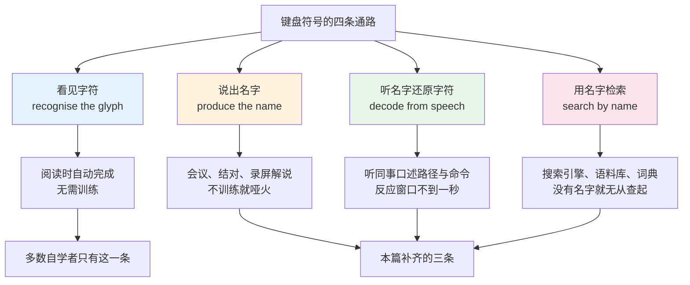
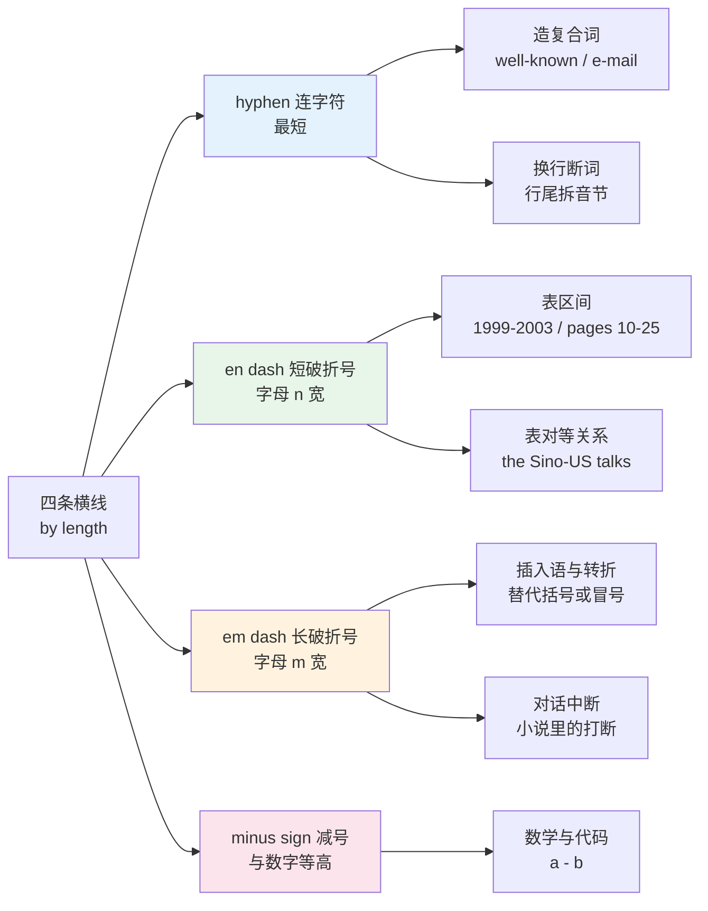
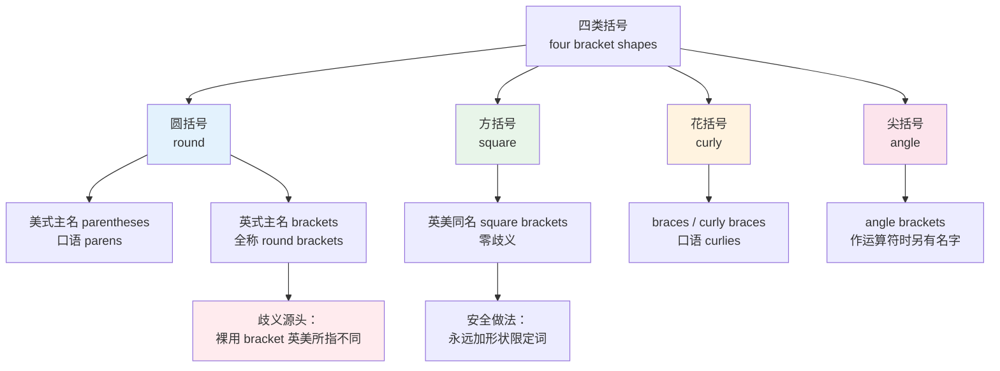
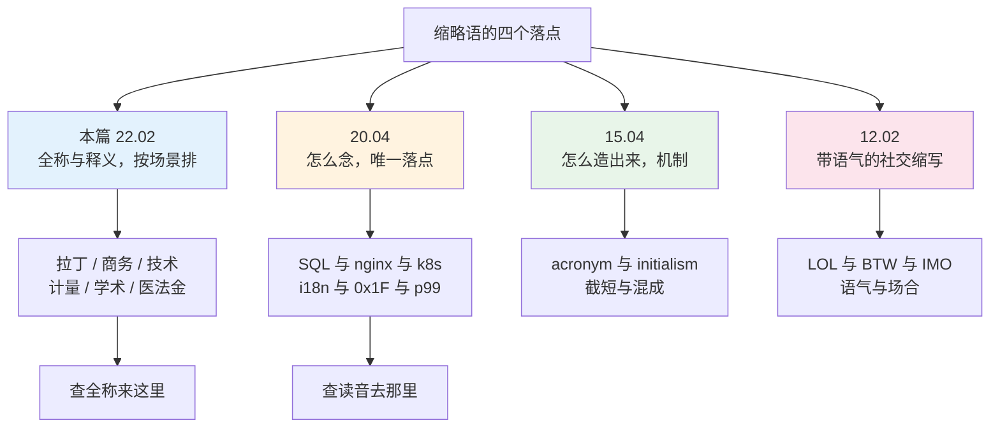
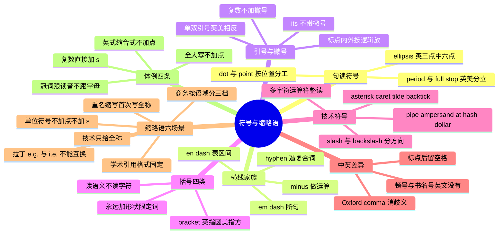

# 标点、键盘符号英文名与缩略语场景对照表

> [!info] 本篇定位
>
> 第二十二章三件工具的第二件。[[22.速查附录与学习资源/01.语料库检索、查词交叉验证与原版材料爬升路径\|语料库检索、查词交叉验证与原版材料爬升路径]] 解决「查得准不准」，本篇解决一个更早的问题：**你连它叫什么都说不出来，怎么查**。
>
> 前二十一章讲的全是由字母拼成的词。键盘上还有四十来个不是字母的东西，每一个都有英文名，而且这些名字在前面的章节里一次都没有出现过。`*` 叫 `asterisk`，`^` 叫 `caret`，`~` 叫 `tilde`，`` ` `` 叫 `backtick`，`|` 叫 `pipe`，`&` 叫 `ampersand`。这些词的共同点是：读文档时几乎见不到，一开口讲代码就绕不过去。
>
> 本篇主体是这批符号名，附带一份按场景排的缩略语对照表。缩略语这里**只给全称与一行释义**，怎么念一律见 [[20.专业领域词汇/04.IT 深度英语（下）：云原生运维、评审用语与缩略语读法\|IT 深度英语（下）：云原生运维、评审用语与缩略语读法]]；它们是怎么造出来的见 [[15.词根、合成与缩略/04.合成词、转化词、截短词与缩略语\|合成词、转化词、截短词与缩略语]]；带语气的社交缩写 `LOL`、`BTW`、`IMO` 见 [[12.科技、媒体与休闲/02.互联网、手机应用、社交媒体与网络缩写\|互联网、手机应用、社交媒体与网络缩写]]。四个落点各管一段，不重叠。
>
> 读完能做到：看着任何一行命令、正则或路径，用英文把它逐字念出来；看到任何一个缩写，说得出它的全称属于哪个场景。

---

## 1. 本篇导读：说不出名字的符号等于不认识

符号名是自学者的一个系统性盲区，原因很具体：**它们不在阅读通路上**。读英文文档时，`*` 就是一个图形，眼睛直接跳过，大脑不需要给它配一个读音。这个习惯在阅读时毫无代价，一到需要输出就全线崩塌——远程会议里让你念一段路径，屏幕共享里让你说清改哪一行，issue 里让你描述一个正则，全都卡在同一个地方。

更麻烦的是**查不到**。中文说「那个波浪线」，英文说 `that squiggly thing` 对方能懂，但你没法用它去搜索引擎里搜。搜 `tilde bash` 有几百万条结果，搜 `squiggle bash` 什么也搜不到。符号名是检索的入口词，缺了它，第二十二章第一篇讲的那一整套语料库检索方法在这里全部失效。

第三个代价出现在**听力**。同事念出 `dot slash config dot yaml`，你需要在零点几秒内把它还原成 `./config.yaml`。这条通路是单向训练不出来的：只认得字符不认得名字，听到名字就还原不出字符。

这张图把符号能力拆成四条独立通路。第一条是被动的，读得多自然就有；后三条是主动的，必须靠名字支撑。本篇的全部内容就是把后三条通路缺的那批名词补上——先给名字与音标，再给它在什么场合出现，最后给整串符号的口头念法。

### 1.1 本篇的两个部分与它们的边界

| 部分 | 覆盖范围 | 给什么 | 不给什么 |
| --- | --- | --- | --- |
| 前半：符号 | 键盘可打出的标点、运算符、排版符号与常见变音符 | 英文名、英美音标、词性、中文名、使用场合 | 各语言的语法约定（那是各语言文档的事） |
| 后半：缩略语 | 六个场景的常用缩写 | 全称、中文、典型出现位置 | 读法（见 20.04）、生成机制（见 15.04）、社交语气（见 12.02） |

后半的表格**刻意不设音标列**。缩略语的读法在全书里只有一个落点，重复排一遍只会制造两份可能互相矛盾的注音。想知道 `SQL` 念 sequel 还是三个字母、`i18n` 怎么分段、`0x1F` 怎么出口，直接去第二十章第四篇。

---

## 2. 符号名的三层：正式名、通用名、行话名

同一个符号常常有三个名字，分别属于三个不同的语域。分不清这三层，会在两个方向上出错：在正式文档里用行话名，或者在口语里用没人听得懂的正式名。

以 `#` 为例：

- **正式名** `number sign`，Unicode 给 `#` 的标准字符名就是 NUMBER SIGN，规范与标准文档里用它。另有一个冷僻别名 `octothorpe`，出自贝尔实验室推电话按键盘的年代，日常几乎没人用，说出来对方大概率听不懂。
- **通用名** 分英美——英国叫 `hash`，美国叫 `pound sign` 或 `number sign`。
- **行话名** `hash` 在编程圈通吃英美，社交媒体语境里则整体让位给 `hashtag`。

`*` 同理：正式名 `asterisk`，Unix 圈的行话名 `star`（`select star from users`）或 `splat`（`import *` 读作 `import splat`），排版里作脚注标记时叫 `asterisk` 不叫 `star`。

选名字的判据只有一条：**看听众是谁**。

| 听众 | 用哪一层 | 例 |
| --- | --- | --- |
| 写规范、写论文、教学 | 正式名 | `The asterisk denotes a required field.` |
| 口头说明、会议、结对 | 通用名 | `Type an asterisk there.` / `Hit star.` |
| 同行内部、命令行讨论 | 行话名 | `Just glob it with a star.` |
| 面向不确定的听众 | 通用名，必要时补一句形状 | `an ampersand — the and sign` |

> [!tip] 拿不准时的兜底说法
>
> 忘了名字不要卡住，英语里有一套现成的兜底句式，说出来完全不失礼：
>
> - `the sign that looks like a wave` —— 描述形状
> - `the one above the six` —— 描述键位
> - `shift plus six` —— 直接说组合键
> - `the and symbol` —— 用它的功能命名
>
> 母语者自己也常这么说。`the squiggly bracket` 指 `{`、`the pointy bracket` 指 `<`，都是真实口语。这类说法记两三个就够用，但不能拿它替代正式名——检索时必须用正式名。

---

## 3. 句读符号：period 到 ellipsis

这一组是最常见也最容易忽略的：几乎每个人都认得符号，但过半的人说不出 `;` 的英文名。注意 `period` 与 `full stop` 是英美分歧最大的一对——不是拼写差异，是**两个完全不同的词**。

| 英文 | 英式音标 | 美式音标 | 词性 | 中文 | 搭配与说明 |
| --- | --- | --- | --- | --- | --- |
| **full stop** | /ˌfʊl ˈstɒp/ | /ˌfʊl ˈstɑːp/ | n. | 句号 `.`（英式叫法） | 英式通用名；`come to a full stop` 另有「完全停下」的字面义 |
| **period** | /ˈpɪəriəd/ | /ˈpɪriəd/ | n. | 句号 `.`（美式叫法） | 美式通用名；口语 `Period.` 单独成句表示「没得商量」 |
| **dot** | /dɒt/ | /dɑːt/ | n./v. | 点 `.`（技术语境） | 域名、路径、版本号里一律读 `dot`，不读 period：`example dot com` |
| **comma** | /ˈkɒmə/ | /ˈkɑːmə/ | n. | 逗号 `,` | `serial comma` 又名 `Oxford comma`，指列举末项 and 前的那一个 |
| **semicolon** | /ˈsemiˌkəʊlən/ | /ˈsemiˌkoʊlən/ | n. | 分号 `;` | 英美主流都是主重音在第一音节；英式另有 /ˌsemiˈkəʊlən/ 一读，两读都通行 |
| **colon** | /ˈkəʊlən/ | /ˈkoʊlən/ | n. | 冒号 `:` | 与人体器官 colon（结肠）同形同音，靠语境区分 |
| **question mark** | /ˈkwestʃən mɑːk/ | /ˈkwestʃən mɑːrk/ | n. | 问号 `?` | 技术语境里也叫 `query`；URL 里读 `question mark` 不读 query |
| **exclamation mark** | /ˌekskləˈmeɪʃn mɑːk/ | /ˌekskləˈmeɪʃn mɑːrk/ | n. | 感叹号 `!`（英式） | 英式定名；美式更常说 `exclamation point` |
| **exclamation point** | /ˌekskləˈmeɪʃn pɔɪnt/ | /ˌekskləˈmeɪʃn pɔɪnt/ | n. | 感叹号 `!`（美式） | 美式定名，英式也听得懂 |
| **bang** | /bæŋ/ | /bæŋ/ | n. | 叹号 `!`（行话） | Unix 行话；`#!` 读 `shebang`，`!=` 常读 `bang equals` |
| **ellipsis** | /ɪˈlɪpsɪs/ | /ɪˈlɪpsɪs/ | n. | 省略号 `...` | 复数 `ellipses`；英文三点，中文六点，见第 13 节 |
| **suspension points** | /səˈspenʃn pɔɪnts/ | /səˈspenʃn pɔɪnts/ | n. | 省略号（排印术语） | 排印行业用词，日常一律用 ellipsis |
| **interpunct** | /ˈɪntəpʌŋkt/ | /ˈɪntərpʌŋkt/ | n. | 间隔号 `·` | 又叫 `middle dot`、`middot`；英文人名不用它，中文译名用 |
| **interrobang** | /ɪnˈterəbæŋ/ | /ɪnˈterəbæŋ/ | n. | 问叹号 `‽` | 问号与叹号合体，非正式排印符号，知道即可 |

> [!warning] period 与 full stop 不能混着用
>
> 这不是可以随手替换的同义词对，而是**成套体系的一部分**。写给英国读者的文档里出现 `period`，和在美式文档里写 `lift` 一样扎眼。
>
> - 英式全套：`full stop`、`exclamation mark`、`brackets`（指圆括号）、`square brackets`
> - 美式全套：`period`、`exclamation point`、`parentheses`、`brackets`（指方括号）
>
> 注意 `brackets` 一词在两套体系里**指的是不同的括号**，这是本篇最容易出事的一处，第 7 节单独处理。

### 3.1 dot 与 point 的分工

同样是一个点，读 `dot` 还是 `point` 由它在哪里决定，这条区分对念代码至关重要：

| 场合 | 读法 | 例 |
| --- | --- | --- |
| 域名、邮箱 | dot | `sales at example dot com` |
| 文件扩展名 | dot | `config dot yaml` |
| 路径分隔前的当前目录 | dot | `./run.sh` = `dot slash run dot s h` |
| 面向对象的成员访问 | dot | `user.name` = `user dot name` |
| 版本号分段 | dot 或 point | `1.2.3` = `one point two point three`（详见 20.04） |
| 十进制小数点 | point | `3.14` = `three point one four` |
| 句子结尾 | period / full stop | 口述文本时才需要念 |

判据很简单：**小数点读 point，其余的点读 dot**。把 `config.yaml` 念成 `config point yaml` 会让对方以为你在说一个数字。

---

## 4. 横线家族：hyphen、en dash、em dash 与 minus

英文里有四条长短不同的横线，形状接近、功能完全不同。中文只有连接号与破折号两种，映射不过来，所以这里是中文母语者的固定失分点。

这张图按**长度**排四条横线，因为它们在视觉上唯一的区别就是长度：`hyphen` 最短，`en dash` 约等于小写字母 n 的宽度，`em dash` 约等于大写 M 的宽度，`minus sign` 长度介于前两者之间但垂直位置更高，与数字对齐。功能上的分工则完全不看长度，靠的是各自的语法角色：连字符造词，短破折号表区间，长破折号断句，减号做运算。

| 英文 | 英式音标 | 美式音标 | 词性 | 中文 | 搭配与说明 |
| --- | --- | --- | --- | --- | --- |
| **hyphen** | /ˈhaɪfn/ | /ˈhaɪfn/ | n. | 连字符 `-` | 动词 `hyphenate`；`a hyphenated compound` 指带连字符的复合词 |
| **dash** | /dæʃ/ | /dæʃ/ | n./v. | 破折号 `—`（统称） | 不指明长短时的通用词；命令行选项也读 dash：`-v` = `dash v` |
| **en dash** | /ˈen dæʃ/ | /ˈen dæʃ/ | n. | 短破折号 `–` | 英式排印又叫 `en rule`；表区间与对等关系 |
| **em dash** | /ˈem dæʃ/ | /ˈem dæʃ/ | n. | 长破折号 `—` | 英式又叫 `em rule`；美式两侧不留空格，英式这个位置多改用两侧留空格的 en dash |
| **minus sign** | /ˈmaɪnəs saɪn/ | /ˈmaɪnəs saɪn/ | n. | 减号 `−` | 与 hyphen 是两个 Unicode 字符，正式排印必须区分 |
| **double dash** | /ˌdʌbl ˈdæʃ/ | /ˌdʌbl ˈdæʃ/ | n. | 双横线 `--` | 长选项前缀：`--verbose` = `dash dash verbose` |
| **underscore** | /ˈʌndəskɔː/ | /ˈʌndərskɔːr/ | n. | 下划线 `_` | 行话 `under`；标识符里的分词符，见第 9 节 |
| **overline** | /ˈəʊvəlaɪn/ | /ˈoʊvərlaɪn/ | n. | 上划线 `‾` | 数学里表循环小数与逻辑非，日常罕见 |

### 4.1 三条线的用法边界

**hyphen 造词**，把两个词粘成一个修饰单位：

> - a **well-known** author, a **state-of-the-art** system, a **three-year-old** child
>   - 一位知名作家、一套最先进的系统、一个三岁小孩。
> - The system is **well known**.
>   - 这套系统很知名。（作表语时不加连字符，因为它不再是修饰前置）

这里有一条可操作的规则：**复合修饰语只在名词前面时加连字符**。`a well-known author` 加，`the author is well known` 不加。判断方法是看这个组合是不是整体在修饰后面的名词——是就粘上，不是就分开。

**en dash 表区间与对等**：

> - The project ran **2019–2023**.
>   - 项目从 2019 年跑到 2023 年。
> - See pages **120–145**.
>   - 见第 120 至 145 页。
> - the **London–Paris** route
>   - 伦敦至巴黎的路线。（两个端点地位对等）

区间用法有一个高频错误：**已经写了 from 就不能再用 en dash**。`from 2019–2023` 是错的，要么写 `from 2019 to 2023`，要么写 `2019–2023`。同理 `between 10–20` 错，`between 10 and 20` 对。

> - ❌ ~~The survey ran from 2019–2023.~~
> - ✅ The survey ran **from 2019 to 2023**.
> - ✅ The survey ran **2019–2023**.

**em dash 断句**，功能上可以替代括号、冒号或分号：

> - The result — and this surprised everyone — was negative.
>   - 结果是阴性的，这一点出乎所有人意料。（替代括号，语气比括号强）
> - There is only one explanation — the cache was never invalidated.
>   - 只有一个解释：缓存从来没有失效过。（替代冒号）

em dash 的语气比括号重、比逗号显眼，用多了会让文本显得急促。技术写作里通常一段最多一处。

> [!warning] 中文母语者最常犯的三个横线错误
>
> - ❌ ~~e−mail~~（用了减号）／❌ ~~e—mail~~（用了长破折号）→ ✅ **e-mail**（连字符）
> - ❌ ~~2019—2023~~（区间用了长破折号）→ ✅ **2019–2023**（短破折号）
> - ❌ ~~well—known author~~ → ✅ **well-known author**
>
> 根因是中文输入法的「——」默认打出的是两个 em dash，而中文里区间与连接都用这一个符号。切换到英文写作时必须手动分辨。快捷键值得记：macOS 上 `option + -` 出 en dash，`option + shift + -` 出 em dash。

### 4.2 命令行里的横线怎么念

命令行选项全部读 `dash`，不读 hyphen：

| 写法 | 口头读法 | 说明 |
| --- | --- | --- |
| `-v` | `dash v` | 短选项，单横线加单字母 |
| `-rf` | `dash r f` | 多个短选项合并，逐字母读 |
| `--verbose` | `dash dash verbose` 或 `double dash verbose` | 长选项 |
| `--no-cache` | `dash dash no dash cache` | 中间那个也读 dash |
| `-` | `dash` 或 `stdin` | 单独一个横线常表示标准输入 |

`--` 读 `dash dash` 还是 `double dash` 两派都有，团队内统一即可。念 `-rf` 时不要读成 `dash r dash f`，那是两个独立选项 `-r -f`，含义相同但字符串不同，对方照着敲会敲错。

---

## 5. 引号：形状、层级与中英差异

引号是中英差异最隐蔽的一处：**符号长得一样，规矩完全不同**。中文的「」和英文的 `""` 在排版里是两套体系，中文的 `""` 与英文的 `""` 又是同一批字符但用法不同。

| 英文 | 英式音标 | 美式音标 | 词性 | 中文 | 搭配与说明 |
| --- | --- | --- | --- | --- | --- |
| **quotation mark** | /kwəʊˈteɪʃn mɑːk/ | /kwoʊˈteɪʃn mɑːrk/ | n. | 引号（正式名） | 常用复数 `quotation marks`；单个引号说 `a quotation mark` |
| **quote** | /kwəʊt/ | /kwoʊt/ | n./v. | 引号（口语） | 口语通用；`in quotes` 表示「加了引号的」 |
| **inverted comma** | /ɪnˌvɜːtɪd ˈkɒmə/ | /ɪnˌvɜːrtɪd ˈkɑːmə/ | n. | 引号（英式旧称） | 英式老派叫法，复数 `inverted commas`，年轻一代少用 |
| **double quote** | /ˌdʌbl ˈkwəʊt/ | /ˌdʌbl ˈkwoʊt/ | n. | 双引号 `"` | 技术语境标准叫法 |
| **single quote** | /ˌsɪŋɡl ˈkwəʊt/ | /ˌsɪŋɡl ˈkwoʊt/ | n. | 单引号 `'` | 与 apostrophe 同一个字符，功能不同 |
| **smart quotes** | /ˌsmɑːt ˈkwəʊts/ | /ˌsmɑːrt ˈkwoʊts/ | n. | 弯引号 `" "` | 又叫 `curly quotes`、`typographic quotes`；排版用 |
| **straight quotes** | /ˌstreɪt ˈkwəʊts/ | /ˌstreɪt ˈkwoʊts/ | n. | 直引号 `"` | 又叫 `dumb quotes`；代码里只能用这一种 |
| **scare quotes** | /ˌskeə ˈkwəʊts/ | /ˌsker ˈkwoʊts/ | n. | 反讽引号 | 表示「所谓的」，带质疑语气：a "solution" |
| **guillemet** | /ˈɡiːəmeɪ/ | /ˈɡiːəmeɪ/ | n. | 书名号式引号 `« »` | 法语、俄语用，英文不用，读文献时会遇到 |
| **backtick** | /ˈbæktɪk/ | /ˈbæktɪk/ | n. | 反引号 `` ` `` | 详见第 8 节，不是引号，功能完全不同 |

### 5.1 单双引号的英美分工

这是一条真实存在但常被忽略的差异：

| | 外层引号 | 内层引号 | 句末标点位置 |
| --- | --- | --- | --- |
| 美式 | 双引号 `" "` | 单引号 `' '` | 逗号句号放引号内 |
| 英式 | 单引号 `' '` 或双引号 | 与外层相反 | 逗号句号按逻辑放，多在引号外 |

> - 美式：She said, "He called it a 'feature,' not a bug."
> - 英式：She said, 'He called it a "feature", not a bug.'

美式把句末的逗号句号一律塞进引号里，哪怕逻辑上它不属于被引内容；英式按逻辑判断，属于引文的放里面，不属于的放外面。技术文档里英式的逻辑派更常见，因为把标点塞进引号会破坏代码片段——`Type "yes,"` 里的逗号会被误读成要输入的字符。

> [!tip] 技术写作一律用逻辑标点
>
> 无论英美，只要引号里是代码、命令、字面量，就把标点放到引号外面：
>
> - ✅ Type `"yes"`, then press Enter.
> - ❌ ~~Type `"yes,"` then press Enter.~~
>
> 第二种写法会让读者以为要输入 `yes,`。这条在 [[20.专业领域词汇/03.IT 深度英语（中）：设计文档、规范文体与 API 措辞\|IT 深度英语（中）：设计文档、规范文体与 API 措辞]] 讲的规范文体里是硬要求。

### 5.2 口头怎么表达引号

口语里标出引号有四种说法，语气各不相同：

| 说法 | 用在哪 | 语气 |
| --- | --- | --- |
| `quote ... unquote` | 口述引文，前后各说一次 | 中性，正式场合 |
| `quote unquote` 连读放在词前 | `a quote unquote solution` | 带反讽，等于 scare quotes |
| `in quotes` | `the word "user" in quotes` | 中性，描述屏幕内容 |
| `air quotes` | 说话时两手比划双引号 | 明显反讽，非正式 |

念代码时说 `in double quotes` 最不容易出错：`put the value in double quotes` 对方一听就知道要打 `"`。说 `quote` 单字容易被理解成「引用」这个动作而不是符号本身。

---

## 6. 撇号 apostrophe：三种用途与两个高频错误

`'` 这个字符身兼两职：作引号时叫 `single quote`，作撇号时叫 `apostrophe`。中文里没有对应符号，所以中文母语者最容易漏掉它。

| 英文 | 英式音标 | 美式音标 | 词性 | 中文 | 搭配与说明 |
| --- | --- | --- | --- | --- | --- |
| **apostrophe** | /əˈpɒstrəfi/ | /əˈpɑːstrəfi/ | n. | 撇号 `'` | 注意重音在第二音节，不是第一音节 |
| **prime** | /praɪm/ | /praɪm/ | n. | 撇 `′` | 数学变量标记 `x′` 读 `x prime`；也表英尺与角分 |
| **double prime** | /ˌdʌbl ˈpraɪm/ | /ˌdʌbl ˈpraɪm/ | n. | 双撇 `″` | 表英寸与角秒：`5′10″` 读 `five foot ten` |
| **acute accent** | /əˈkjuːt ˈæksənt/ | /əˈkjuːt ˈæksent/ | n. | 锐音符 `´` | 法语 café 上那一撇，不是撇号 |
| **grave accent** | /ˌɡrɑːv ˈæksənt/ | /ˌɡrɑːv ˈæksent/ | n. | 重音符 `` ` `` | 键盘上与 backtick 同键；这里的 grave 英美都读 /ɡrɑːv/，不读「坟墓」那个 /ɡreɪv/ |

撇号的三种用途：

① **所有格**：`the user's token`（单数）、`the users' tokens`（复数）、`James's book` 或 `James' book`（以 s 结尾的名字两种写法都通行）。

② **缩合**：`don't` = do not、`it's` = it is、`we'll` = we will、`o'clock` = of the clock。

③ **省略**：`'90s` = 1990s、`rock 'n' roll`、`walkin'` = walking（口音拼写，见 [[18.语域、英美差异与习语俚语/05.叙事文本的词汇门槛：动作、描写、对话与旧体词\|叙事文本的词汇门槛：动作、描写、对话与旧体词]]）。

> [!warning] 两个错到无法忽视的撇号问题
>
> **its 与 it's**。这是英语里被指出次数最多的错误，规则却极简单：
>
> - `its` = 它的（所有格，**不加撇号**）：`The service lost its connection.`
> - `it's` = it is 或 it has（缩合，**加撇号**）：`It's down again.`
>
> 记忆办法是把句子里的 `it's` 展开成 `it is` 读一遍，读得通就加撇号，读不通就不加。所有格代词一律不带撇号：`his`、`hers`、`ours`、`theirs`、`its` 全是一伙的。
>
> **复数不加撇号**。英语里的 `'s` 从来不表示复数：
>
> - ❌ ~~three API's~~ → ✅ three **APIs**
> - ❌ ~~in the 1990's~~ → ✅ in the **1990s**
> - ❌ ~~apple's for sale~~ → ✅ **apples** for sale
>
> 这个错误有个专门的名字叫 `greengrocer's apostrophe`（果蔬摊撇号），因为最早在菜市场的手写价签上被大量发现。

---

## 7. 括号四类：英美叫法在这里正面冲突

括号是本篇风险最高的一节。原因不是符号多，而是 **`bracket` 这个词在英美两地指的是不同的括号**。说 `put it in brackets`，英国人会打 `(...)`，美国人会打 `[...]`。这个误解在技术协作里会直接造成代码错误。

| 英文 | 英式音标 | 美式音标 | 词性 | 中文 | 搭配与说明 |
| --- | --- | --- | --- | --- | --- |
| **parenthesis** | /pəˈrenθəsɪs/ | /pəˈrenθəsɪs/ | n. | 圆括号 `(` 或 `)` | 复数 `parentheses` /pəˈrenθəsiːz/；美式正式名 |
| **parens** | /pəˈrenz/ | /pəˈrenz/ | n. | 圆括号（口语缩略） | 程序员口语高频：`wrap it in parens` |
| **round bracket** | /ˌraʊnd ˈbrækɪt/ | /ˌraʊnd ˈbrækɪt/ | n. | 圆括号 `( )` | 英式全称，最不容易被误解的说法 |
| **square bracket** | /ˌskweə ˈbrækɪt/ | /ˌskwer ˈbrækɪt/ | n. | 方括号 `[ ]` | 英美通用全称，跨团队沟通首选 |
| **bracket** | /ˈbrækɪt/ | /ˈbrækɪt/ | n. | 括号（英式指圆，美式指方） | 唯一必须加限定词才安全的括号名 |
| **brace** | /breɪs/ | /breɪs/ | n. | 花括号 `{ }` | 又叫 `curly bracket`、`curly brace`、`squiggly bracket` |
| **angle bracket** | /ˈæŋɡl brækɪt/ | /ˈæŋɡl brækɪt/ | n. | 尖括号 `< >` | 又叫 `chevron`；HTML 与泛型里高频 |
| **chevron** | /ˈʃevrən/ | /ˈʃevrən/ | n. | 尖括号（排印名） | 排印与设计语境，编程语境用 angle bracket |
| **less-than sign** | /ˈles ðən saɪn/ | /ˈles ðən saɪn/ | n. | 小于号 `<` | 作运算符时的名字，与 angle bracket 是同一字符 |
| **greater-than sign** | /ˈɡreɪtə ðən saɪn/ | /ˈɡreɪtər ðən saɪn/ | n. | 大于号 `>` | 作重定向符时读 `redirect to` 也可 |

图里把四类括号按形状排开，右侧标出每一类的主名与别名。真正的风险点只有一处，就是最下面那个红框：`bracket` 裸用时英式指圆括号、美式指方括号。图右下角的解法适用于所有跨国团队——**永远带形状限定词**，说 `round brackets` 或 `square brackets`，多两个音节换零误解。

### 7.1 括号的口头念法惯例

念一段带括号的代码，有两套惯例：

**开闭对称法**（正式、准确，适合让对方照着敲）：

> - `f(x)` = `f open paren x close paren`
> - `arr[0]` = `arr open square bracket zero close square bracket`
> - `{ }` = `open brace close brace`

**整体法**（口语、简洁，适合对方已经能看到屏幕）：

> - `f(x)` = `f of x`
> - `arr[0]` = `arr sub zero` 或 `arr index zero`
> - `List<String>` = `list of string`

第二套的关键是**读语义不读字符**。`List<String>` 念 `list open angle bracket capital S string close angle bracket` 没有人听得下去，念 `list of string` 所有人立刻懂。选哪一套的判据是：对方要照着敲就用第一套，对方只需要理解就用第二套。这条原则在第 14 节还会用到。

> [!example] 一段真实的口述
>
> 屏幕上是 `users.filter(u => u.age >= 18)`，口述给对方听：
>
> - **精确版**：`users dot filter open paren u space equals greater than space u dot age space greater than or equal to space eighteen close paren`
> - **语义版**：`users dot filter, arrow function taking u, u dot age greater than or equal to eighteen`
>
> 语义版短一半，而且对方复述回来的正确率更高。只有在对方看不到屏幕、必须逐字符敲进去时才用精确版。

---

## 8. 技术符号（上）：asterisk、caret、tilde、backtick

这四个是本篇的核心。它们在日常英语文本里出现频率极低，在技术语境里出现频率极高，绝大多数自学者从没学过它们的名字。

| 英文 | 英式音标 | 美式音标 | 词性 | 中文 | 搭配与说明 |
| --- | --- | --- | --- | --- | --- |
| **asterisk** | /ˈæstərɪsk/ | /ˈæstərɪsk/ | n./v. | 星号 `*` | 注意末尾是 -risk 不是 -rix；动词义「加星号标注」 |
| **star** | /stɑː/ | /stɑːr/ | n. | 星号（行话） | 命令行与通配符语境：`select star`、`star dot txt` |
| **splat** | /splæt/ | /splæt/ | n. | 星号（Unix 行话） | 仅限口语，指作展开运算符的 `*`：`import splat` |
| **caret** | /ˈkærət/ | /ˈkerət/ | n. | 插入符 `^` | 与 carrot（胡萝卜）同音，与 carat（克拉）同音，拼写全不同 |
| **circumflex** | /ˈsɜːkəmfleks/ | /ˈsɜːrkəmfleks/ | n. | 扬抑符 `^` | 作变音符号时的名字，如法语 ê 上那个 |
| **hat** | /hæt/ | /hæt/ | n. | 尖号（行话） | 数学与口语：`x hat` 指 `x̂`，也用来指 `^` |
| **tilde** | /ˈtɪldə/ | /ˈtɪldə/ | n. | 波浪号 `~` | 西班牙语借词；美式也读 /ˈtɪldi/ |
| **squiggle** | /ˈskwɪɡl/ | /ˈskwɪɡl/ | n. | 波浪线（俗称） | 非正式，形状描述词，不能用于检索 |
| **backtick** | /ˈbæktɪk/ | /ˈbæktɪk/ | n. | 反引号 `` ` `` | 又叫 `backquote`、`grave accent` |
| **backquote** | /ˈbækkwəʊt/ | /ˈbækkwoʊt/ | n. | 反引号（同义） | 与 backtick 完全同义，backtick 更常用 |
| **triple backtick** | /ˌtrɪpl ˈbæktɪk/ | /ˌtrɪpl ˈbæktɪk/ | n. | 三反引号 | Markdown 代码块围栏的标准说法 |
| **wildcard** | /ˈwaɪldkɑːd/ | /ˈwaɪldkɑːrd/ | n. | 通配符 | 指 `*` 与 `?` 的功能角色，不是字符名 |
| **glob** | /ɡlɒb/ | /ɡlɑːb/ | n./v. | 通配匹配 | Unix 术语；`glob pattern`、`glob the directory` |

### 8.1 四个符号各自的高频场合

**asterisk `*`** 是所有符号里语义最多的一个：

| 场合 | 含义 | 口头说法 |
| --- | --- | --- |
| 表单标签后 | 必填项 | `fields marked with an asterisk are required` |
| 正文中上标 | 脚注标记 | `see the footnote marked with an asterisk` |
| shell 通配 | 匹配任意字符串 | `star dot log` |
| 正则 | 前项零次或多次 | `a star` 或 `a asterisk` |
| Markdown | 强调与列表符 | `wrap it in double asterisks` |
| C 系语言 | 指针与解引用 | `star p` 或 `pointer to int` |
| 乘法 | 相乘 | `times` 或 `star` |
| 遮蔽敏感词 | 打码 | `bleeped out with asterisks` |

**caret `^`** 的五个用法：正则的行首锚点（`caret a` 匹配以 a 开头）、幂运算（`2^10` 读 `two to the tenth` 或 `two caret ten`）、异或（`XOR`）、编辑器里的插入位置标记、语义化版本里的兼容范围（`^1.2.3`）。念 `^` 时说 `caret` 最安全，说 `hat` 只在数学圈通行。

**tilde `~`** 的四个用法：Unix 的家目录（`~/.ssh` 读 `tilde slash dot s s h`）、表示约等于（`~500` 读 `about five hundred` 或 `approximately five hundred`）、正则里的匹配运算符、西班牙语的 ñ 与葡萄牙语的 ã 上那个变音符。注意 `~` 表约等于时**口头一般直接念意思**，不念符号名。

**backtick `` ` ``** 只有两个场合，但都极高频：Markdown 里包代码（一个包行内代码，三个开代码块）、shell 里的命令替换（现代写法已改用 `$( )`，但老脚本里还大量存在）。键盘上它与 `~` 同键，所以口语里常说 `the key under Escape`。

> [!warning] backtick 与 single quote 在 shell 里不是一回事
>
> 这两个字符长得像，功能完全相反，在命令行里混用会产生难以察觉的 bug：
>
> - `` `date` `` —— 反引号，**执行** date 命令并把输出替换进来
> - `'date'` —— 单引号，把 date 当**字面字符串**，不执行
>
> 口述命令时必须说清是哪一个：`backtick date backtick` 与 `single quote date single quote`。说 `quote date quote` 会被理解成单引号，这是远程结对时踩过最多次的坑之一。

---

## 9. 技术符号（下）：pipe、ampersand、at、hash、dollar

| 英文 | 英式音标 | 美式音标 | 词性 | 中文 | 搭配与说明 |
| --- | --- | --- | --- | --- | --- |
| **pipe** | /paɪp/ | /paɪp/ | n./v. | 竖线 `\|` | 动词义「用管道连接」：`pipe it to grep` |
| **vertical bar** | /ˌvɜːtɪkl ˈbɑː/ | /ˌvɜːrtɪkl ˈbɑːr/ | n. | 竖线（正式名） | Unicode 字符名是 VERTICAL LINE，vertical bar 是通行别名；技术口语一律说 pipe |
| **double pipe** | /ˌdʌbl ˈpaɪp/ | /ˌdʌbl ˈpaɪp/ | n. | 双竖线 `\|\|` | 逻辑或；也可读 `or or` |
| **ampersand** | /ˈæmpəsænd/ | /ˈæmpərsænd/ | n. | 与号 `&` | 词源是 `and per se and` 的连读讹变 |
| **at sign** | /ˈæt saɪn/ | /ˈæt saɪn/ | n. | 艾特符 `@` | 口语直接说 `at`；正式排印名 `commercial at` |
| **hash** | /hæʃ/ | /hæʃ/ | n. | 井号 `#`（英式与技术圈） | 英国主用；程序员圈英美通吃 |
| **pound sign** | /ˈpaʊnd saɪn/ | /ˈpaʊnd saɪn/ | n. | 井号 `#`（美式） | 美式电话语音提示的标准说法 |
| **number sign** | /ˈnʌmbə saɪn/ | /ˈnʌmbər saɪn/ | n. | 井号 `#`（美式正式） | 表编号时用：`#3` 读 `number three` |
| **hashtag** | /ˈhæʃtæɡ/ | /ˈhæʃtæɡ/ | n. | 话题标签 `#word` | 只指社交媒体的标签，不指裸的 `#` |
| **octothorpe** | /ˈɒktəθɔːp/ | /ˈɑːktəθɔːrp/ | n. | 井号（冷僻别名） | 贝尔实验室为电话按键盘造的词，Unicode 标准名仍是 NUMBER SIGN；说出来对方多半不懂 |
| **dollar sign** | /ˈdɒlə saɪn/ | /ˈdɑːlər saɪn/ | n. | 美元符 `$` | 正则行尾锚点、shell 变量前缀、模板占位 |
| **percent sign** | /pəˈsent saɪn/ | /pərˈsent saɪn/ | n. | 百分号 `%` | 取模运算、格式化占位、URL 编码前缀 |
| **section sign** | /ˈsekʃn saɪn/ | /ˈsekʃn saɪn/ | n. | 节标记 `§` | 法律条文引用：`§ 3.2` 读 `section three point two` |
| **pilcrow** | /ˈpɪlkrəʊ/ | /ˈpɪlkroʊ/ | n. | 段落标记 `¶` | 又叫 `paragraph mark`；Word 显示格式符时可见 |
| **dagger** | /ˈdæɡə/ | /ˈdæɡər/ | n. | 剑标 `†` | 第二个脚注标记，排在 asterisk 之后 |
| **double dagger** | /ˌdʌbl ˈdæɡə/ | /ˌdʌbl ˈdæɡər/ | n. | 双剑标 `‡` | 第三个脚注标记 |
| **bullet** | /ˈbʊlɪt/ | /ˈbʊlɪt/ | n. | 项目符号 `•` | `bullet point` 指列表的一项，也指要点本身 |
| **caret sign** | /ˈkærət saɪn/ | /ˈkerət saɪn/ | n. | 插入符（全称） | 与第 8 节 caret 同物，加 sign 更明确 |

### 9.1 `&` 的三个语域

`ampersand` 是一个语域敏感的符号，用错场合会显得不专业：

| 场合 | 用不用 `&` | 说明 |
| --- | --- | --- |
| 公司名 | 用 | `Johnson & Johnson`、`AT&T`——注册名的一部分，不能改成 and |
| 正式散文 | 不用 | `research and development` 不写 `research & development` |
| 表格与标题 | 可用 | 空间受限时通行 |
| 代码 | 用 | 按位与、逻辑与、取地址、HTML 实体 |
| 学术引用 | 按体例 | APA 括号内用 `&`，正文中用 `and`；MLA 一律 `and` |

口头念 `&` 一般直接说 `and`：`R & D` 念 `R and D`，`AT&T` 念 `A T and T`。只有在需要说清屏幕上是什么字符时才说 `ampersand`。

### 9.2 `#` 的英美分歧与场景分歧

`#` 是一个同时被英美差异和场景差异切开的符号：

| 场景 | 英式说法 | 美式说法 |
| --- | --- | --- |
| 电话语音提示 | `press hash` | `press pound` |
| 编号 | `number` / `no.` | `number sign` / `pound` |
| 社交媒体 | `hashtag` | `hashtag` |
| 编程注释与预处理 | `hash` | `hash` |
| 标准与规范文档 | `number sign`（冷僻别名 `octothorpe`） | `number sign`（冷僻别名 `octothorpe`） |

程序员圈已经基本统一到 `hash`，`C#` 例外——它念 `C sharp`，取的是音乐里升号的意思，不是井号。同理 `F#` 念 `F sharp`。这是符号名被产品名覆盖的典型例子。

> [!tip] 一个能立刻用上的记忆钩子
>
> 这四个符号的名字都能挂到一个熟词上：
>
> - `asterisk` ← 希腊语 `aster`（星），同族词 `astronomy`、`asteroid`、`disaster`（dis- 加 astro，字面是「星位不正」）
> - `ampersand` ← `and per se and`，「and 这个符号本身就读 and」，连读磨成一个词
> - `tilde` ← 拉丁 `titulus`（标题、标记），与 `title` 同源
> - `caret` ← 拉丁 `caret`（此处缺失），是动词 careo 的第三人称单数，校对时标「这里漏了字」
>
> `aster` 这一族的完整展开见 [[15.词根、合成与缩略/03.希腊词根与学科术语\|希腊词根与学科术语]]，把生词挂到拉丁词根上的拆解方法见 [[15.词根、合成与缩略/01.高频拉丁词根（上）\|高频拉丁词根（上）]]。挂上词族之后，这几个词就不再是孤立的生词。

---

## 10. 斜杠两支：slash 与 backslash

两条斜线的方向对中文母语者是个纯记忆问题，因为中文里没有对应的对立。

| 英文 | 英式音标 | 美式音标 | 词性 | 中文 | 搭配与说明 |
| --- | --- | --- | --- | --- | --- |
| **slash** | /slæʃ/ | /slæʃ/ | n./v. | 正斜杠 `/` | 又叫 `forward slash`；URL、Unix 路径、日期、分数 |
| **forward slash** | /ˌfɔːwəd ˈslæʃ/ | /ˌfɔːrwərd ˈslæʃ/ | n. | 正斜杠（全称） | 需要与 backslash 明确区分时用全称 |
| **backslash** | /ˈbækslæʃ/ | /ˈbækslæʃ/ | n. | 反斜杠 `\` | Windows 路径、转义字符、正则元字符 |
| **double slash** | /ˌdʌbl ˈslæʃ/ | /ˌdʌbl ˈslæʃ/ | n. | 双斜杠 `//` | URL 协议后、C 系单行注释 |
| **solidus** | /ˈsɒlɪdəs/ | /ˈsɑːlɪdəs/ | n. | 分数线（排印名） | 排印术语，复数 `solidi`，指分数中的斜线 |
| **virgule** | /ˈvɜːɡjuːl/ | /ˈvɜːrɡjuːl/ | n. | 斜线（排印名） | 排印术语，日常一律说 slash |
| **fraction bar** | /ˈfrækʃn bɑː/ | /ˈfrækʃn bɑːr/ | n. | 分数线 | 数学语境；`3/4` 读 `three quarters`，见 03.02 |
| **escape** | /ɪˈskeɪp/ | /ɪˈskeɪp/ | n./v. | 转义 | `escape the quote with a backslash` |

### 10.1 记方向的两个办法

**办法一：看字母 b**。`backslash` 里有 b，b 是 back（向后）；`\` 从左上往右下倒，像向后仰。`/` 从左下往右上，是向前。

**办法二：看键位**。`/` 在字母区右下角、问号同键；`\` 在回车键附近、竖线 `|` 同键。这条更可靠，因为它绑定的是肌肉记忆而不是形状联想。

> [!warning] 路径的斜杠不能弄反
>
> - Unix、macOS、Linux、URL：**正斜杠** `/usr/local/bin`、`https://example.com/api`
> - Windows 本地路径：**反斜杠** `C:\Users\scholar\Documents`
> - Windows 也接受正斜杠，但反过来不成立——Unix 系统里 `\` 是转义符，不是分隔符
>
> 口述路径时必须念出方向：`slash user slash local slash bin`。只说 `slash` 而不说是哪一种，在跨平台团队里必然出事。

### 10.2 `/` 表「或」时的读法

`/` 在英文正文里还有一个非技术用法：表示两项并列或二选一。

| 写法 | 读法 | 含义 |
| --- | --- | --- |
| `and/or` | `and or` 或 `and slash or` | 两者或其一 |
| `he/she` | `he or she` | 两种可能 |
| `24/7` | `twenty-four seven` | 全天候（不念 slash） |
| `km/h` | `kilometres per hour` | 每（不念 slash） |
| `w/` | `with` | 手写缩写，见第 19 节 |
| `n/a` | `not applicable` | 表格里表示不适用 |

规律是：**斜杠表「每」或表「或」时通常不念出来，直接念它代表的意思**。`km/h` 念 `slash` 会显得很生硬。表格里的 `n/a` 例外，口语常直接念 `N A`。

---

## 11. 运算、比较与逻辑符号

念公式与条件表达式的必备词。这一组的难点不在符号名，在于**多字符运算符怎么整体读**。

| 英文 | 英式音标 | 美式音标 | 词性 | 中文 | 搭配与说明 |
| --- | --- | --- | --- | --- | --- |
| **plus** | /plʌs/ | /plʌs/ | n./prep. | 加号 `+` | `a plus b`；`plus sign` 指符号本身 |
| **minus** | /ˈmaɪnəs/ | /ˈmaɪnəs/ | n./prep. | 减号 `−` | 表负数读 `negative`：`-5` 读 `negative five` |
| **times** | /taɪmz/ | /taɪmz/ | prep. | 乘 `×` | `three times four`；代码里的 `*` 也读 times |
| **divided by** | /dɪˈvaɪdɪd baɪ/ | /dɪˈvaɪdɪd baɪ/ | phr. | 除以 `÷` | `ten divided by two`；`÷` 学名 `obelus` |
| **equals** | /ˈiːkwəlz/ | /ˈiːkwəlz/ | v. | 等于 `=` | 赋值时读 `is set to` 或 `gets` 更准确 |
| **double equals** | /ˌdʌbl ˈiːkwəlz/ | /ˌdʌbl ˈiːkwəlz/ | n. | 等于比较 `==` | 也读 `equals equals` |
| **triple equals** | /ˌtrɪpl ˈiːkwəlz/ | /ˌtrɪpl ˈiːkwəlz/ | n. | 严格等于 `===` | JavaScript 语境高频 |
| **not equal to** | /ˌnɒt ˈiːkwəl tuː/ | /ˌnɑːt ˈiːkwəl tuː/ | phr. | 不等于 `!=` | 也读 `bang equals`、`not equals` |
| **less than** | /ˈles ðən/ | /ˈles ðən/ | phr. | 小于 `<` | `x is less than y` |
| **greater than** | /ˈɡreɪtə ðən/ | /ˈɡreɪtər ðən/ | phr. | 大于 `>` | `x is greater than y` |
| **less than or equal to** | /ˈles ðən ɔːr ˈiːkwəl tuː/ | /ˈles ðən ɔːr ˈiːkwəl tuː/ | phr. | 小于等于 `<=` | 完整读法较长，口语常缩为 `less or equal` |
| **plus or minus** | /ˌplʌs ɔː ˈmaɪnəs/ | /ˌplʌs ɔːr ˈmaɪnəs/ | phr. | 正负 `±` | `plus or minus three percent` |
| **caret** | /ˈkærət/ | /ˈkerət/ | n. | 幂 `^` | `2^8` 读 `two to the eighth power` 更自然 |
| **modulo** | /ˈmɒdjələʊ/ | /ˈmɑːdʒəloʊ/ | prep. | 取模 `%` | `seven mod three`；口语缩为 `mod` |
| **arrow** | /ˈærəʊ/ | /ˈeroʊ/ | n. | 箭头 `->` `=>` | `->` 读 `arrow`，`=>` 读 `fat arrow` |
| **degree sign** | /dɪˈɡriː saɪn/ | /dɪˈɡriː saɪn/ | n. | 度 `°` | `25°C` 读 `twenty-five degrees Celsius`，见 03.03 |
| **infinity** | /ɪnˈfɪnəti/ | /ɪnˈfɪnəti/ | n. | 无穷 `∞` | `approaches infinity` |
| **factorial** | /fækˈtɔːriəl/ | /fækˈtɔːriəl/ | n./adj. | 阶乘 `!` | `5!` 读 `five factorial`，不读 five bang |

> [!example] 赋值与比较的读法差别
>
> 同一个 `=`，在数学与在代码里读法不同，这是听懂技术口语的一个门槛：
>
> - 数学 `x = 5` → `x equals five`（陈述一个事实）
> - 代码 `x = 5` → `x is set to five` / `set x to five` / `x gets five`（描述一个动作）
> - 代码 `x == 5` → `x equals five` / `x double equals five`（这才是比较）
>
> 一个母语者在讲代码时说 `x equals five`，通常指的是 `==` 而不是 `=`。要表达赋值，他们会说 `assign five to x` 或 `x is set to five`。中文母语者习惯把两者都念成「x 等于 5」，在英文里会造成实质歧义。

### 11.1 一串符号的连读

多字符运算符有约定的整读法，逐字符念反而听不懂：

| 符号 | 推荐读法 | 不推荐 |
| --- | --- | --- |
| `+=` | `plus equals` | `plus equal sign` |
| `!=` | `not equals` | `exclamation equals` |
| `&&` | `and and` / `logical and` | `ampersand ampersand` |
| `\|\|` | `or or` / `logical or` | `pipe pipe` |
| `<<` | `left shift` | `less less` |
| `>>` | `right shift` | `greater greater` |
| `?.` | `optional chaining` | `question dot` |
| `??` | `nullish coalescing` | `question question` |
| `...` | `spread` / `rest` | `dot dot dot` |
| `::` | `double colon` / `scope resolution` | `colon colon` |

判据还是那条：**优先读语义，读不出语义再读字符**。`&&` 说 `logical and` 比说 `ampersand ampersand` 短，而且没有歧义。

---

## 12. 变音符号与排版符号

这一组在编程里用不上，读原版书、看文献、处理多语言数据时会遇到。不需要会打，需要认得名字。

| 英文 | 英式音标 | 美式音标 | 词性 | 中文 | 搭配与说明 |
| --- | --- | --- | --- | --- | --- |
| **diacritic** | /ˌdaɪəˈkrɪtɪk/ | /ˌdaɪəˈkrɪtɪk/ | n. | 变音符号（统称） | 也作形容词 `diacritical mark` |
| **umlaut** | /ˈʊmlaʊt/ | /ˈʊmlaʊt/ | n. | 变音点 `ü` | 德语术语；英语借词 naïve 上的两点不叫这个 |
| **diaeresis** | /daɪˈɪərɪsɪs/ | /daɪˈerəsɪs/ | n. | 分音符 `ï` | 表示两个元音分开读：naïve、coöperate |
| **cedilla** | /sɪˈdɪlə/ | /sɪˈdɪlə/ | n. | 软音符 `ç` | 法语 façade、西语；表示 c 读 /s/ |
| **macron** | /ˈmækrɒn/ | /ˈmeɪkrɑːn/ | n. | 长音符 `ā` | 拉丁语与日语罗马字标长音 |
| **caron** | /ˈkærən/ | /ˈkerən/ | n. | 抑扬符 `č` | 又叫 `háček`；捷克语、斯洛文尼亚语；开口方向与 circumflex 的扬抑符 `ˆ` 相反 |
| **ligature** | /ˈlɪɡətʃə/ | /ˈlɪɡətʃər/ | n. | 合字 `æ` `œ` | encyclopædia、œuvre；现代英语多已拆开 |
| **ditto mark** | /ˈdɪtəʊ mɑːk/ | /ˈdɪtoʊ mɑːrk/ | n. | 同上符 `〃` | 表格里表示与上一行相同 |
| **copyright sign** | /ˈkɒpiraɪt saɪn/ | /ˈkɑːpiraɪt saɪn/ | n. | 版权符 `©` | `© 2026 Acme Ltd.` |
| **registered sign** | /ˈredʒɪstəd saɪn/ | /ˈredʒɪstərd saɪn/ | n. | 注册商标符 `®` | 已注册商标才能用 |
| **trademark sign** | /ˈtreɪdmɑːk saɪn/ | /ˈtreɪdmɑːrk saɪn/ | n. | 商标符 `™` | 未注册也可用，主张商标权 |
| **bullet point** | /ˈbʊlɪt pɔɪnt/ | /ˈbʊlɪt pɔɪnt/ | n. | 项目符号条目 | 既指符号 `•` 也指那一条内容 |
| **em space** | /ˈem speɪs/ | /ˈem speɪs/ | n. | 全角空格 | 宽度等于当前字号；排印用 |
| **non-breaking space** | /ˌnɒn ˈbreɪkɪŋ speɪs/ | /ˌnɑːn ˈbreɪkɪŋ speɪs/ | n. | 不换行空格 | HTML 实体 `&nbsp;`，防止两词被拆到两行 |
| **soft hyphen** | /ˌsɒft ˈhaɪfn/ | /ˌsɔːft ˈhaɪfn/ | n. | 软连字符 | 只在需要断行时显示的连字符 |
| **tab** | /tæb/ | /tæb/ | n. | 制表符 | 全称 `tab character`、`horizontal tab` |
| **whitespace** | /ˈwaɪtspeɪs/ | /ˈwaɪtspeɪs/ | n. | 空白字符（统称） | 含空格、制表、换行；`trim whitespace` |
| **line break** | /ˈlaɪn breɪk/ | /ˈlaɪn breɪk/ | n. | 换行 | `newline`、`carriage return`、`line feed` 三者不同 |

> [!tip] 三个换行相关词的区别
>
> 处理跨平台文本文件时这三个词必须分清：
>
> - `line feed`（LF，`\n`）—— Unix、macOS、Linux 的换行
> - `carriage return`（CR，`\r`）—— 老 Mac 系统的换行
> - `CRLF`（`\r\n`）—— Windows 的换行
>
> 两个词都来自打字机：`carriage return` 是把打字车推回行首，`line feed` 是把纸卷上推一行。Windows 保留了两个动作，Unix 合成了一个。git 里的 `core.autocrlf` 配置管的就是这件事。

---

## 13. 中英标点对照：形状一样，规矩不一样

中英标点的差异不是「有没有」的问题，多数符号两边都有；问题出在**宽度、留白与用法**三处。

| 项目 | 中文 | 英文 | 常见错误 |
| --- | --- | --- | --- |
| 句号 | 。全角 | . 半角，后跟一个空格 | 中英混排时误用全角句号 |
| 逗号 | ，全角 | , 半角，后跟空格 | 英文句中用了中文逗号 |
| 顿号 | 、（并列名词间） | **没有**，一律用 comma | 英文列举里出现顿号 |
| 省略号 | ……（六点，占两字宽） | ...（三点） | 英文里打了六个点 |
| 破折号 | ——（占两字宽） | — em dash（占一字宽） | 英文里用中文破折号 |
| 书名号 | 《》 | **没有**，用斜体或引号 | `《Effective Java》` 应写 *Effective Java* |
| 引号 | 「」或"" | " " / ' ' | 中英引号混用 |
| 冒号 | ：全角 | : 半角，后跟空格 | 英文冒号后没空格 |
| 分号 | ；全角 | ; 半角 | 中文分号进了英文句 |
| 间隔号 | ·（译名用） | 无对应，用空格或连字符 | — |
| 空格 | 词间无空格 | 词间必须空格 | 英文写成中文式无空格 |
| 撇号 | 无 | ' 表所有格与缩合 | 漏写所有格撇号 |

### 13.1 三条必须记住的英文标点留白规则

① **标点后有空格，标点前没有**。`Hello, world.` 对；`Hello ,world.` 与 `Hello,world.` 都错。断句破折号是例外：美式用两侧不留空格的 em dash，英式这个位置多用两侧各留一个空格的 en dash。

② **句末一个空格就够**。老打字机时代要求句号后打两个空格，现代排版一律一个。技术文档里两个空格会被 Markdown 解析成强制换行，造成意外后果。

③ **括号内侧不留空格**。`(like this)` 对，`( like this )` 错。左括号前要有空格，右括号后要有空格（除非后面跟标点）。

> [!warning] 中英混排的空格惯例
>
> 中文与英文单词相邻时加不加空格，中文出版界没有统一标准，但技术文档圈基本形成了共识：**中文与英文、数字之间加一个半角空格**。
>
> - ✅ 用 `git rebase` 把提交挪到 main 分支上
> - ❌ ~~用`git rebase`把提交挪到main分支上~~
>
> 这条不是语法规则，是可读性惯例，与全角标点前后不加空格（因为全角标点自带留白）配合使用。本教程全文遵守这一条。

### 13.2 列举里的 Oxford comma

英文列举三项及以上时，末项 `and` 前那个逗号加不加，是英美出版界长期分歧的一处：

> - 加（Oxford comma / serial comma）：`red, white, and blue`
> - 不加：`red, white and blue`

牛津大学出版社、多数美式学术出版加，英式新闻业（含 BBC、《卫报》）多不加。技术写作**建议一律加**，因为它能消除歧义：

> - `We tested it with Chrome, Firefox and Safari.` —— Firefox 和 Safari 可能被读成一组
> - `We tested it with Chrome, Firefox, and Safari.` —— 三项并列，无歧义

歧义在列举项本身含 and 时最明显：`the CEO, a designer and a developer` 可能是两个人也可能是三个人，加上 Oxford comma 就锁死为三个人。

---

## 14. 把一串符号念出口：路径、正则与命令

前面十三节给的是单个符号的名字。真正的难点是**连成串**——一条路径、一个正则、一行命令，怎么一口气念完让对方听懂。

三条原则：

**原则一：先给整体，再给细节**。念路径先说它是什么，再逐段念。

> - ✅ `It's a YAML file under the config directory — config slash app dot yaml.`
> - ❌ ~~`c o n f i g slash a p p dot y a m l`~~（对方听到一半就丢了）

**原则二：能拼成词的段落整读，拼不成的逐字母读**。`config` 读整词，`yaml` 读 /ˈjæməl/ 整词，`ssh` 逐字母。这条与缩写读法的判据完全一致，详见 20.04。

**原则三：只在对方要照着敲时才精确到字符**。这条在第 7 节已经提过一次，值得重复：绝大多数时候对方需要的是理解而不是转录。

### 14.1 三类字符串的口述模板

| 类型 | 例 | 口述 |
| --- | --- | --- |
| Unix 路径 | `~/.ssh/config` | `tilde slash dot s s h slash config` |
| Windows 路径 | `C:\Program Files\Git` | `C colon backslash Program Files backslash Git` |
| URL | `https://api.example.com/v2/users?id=5` | `h t t p s colon slash slash api dot example dot com slash v two slash users question mark id equals five` |
| 正则 | `^\d{3}-\d{4}$` | `caret backslash d open curly three close curly dash backslash d open curly four close curly dollar` |
| 命令 | `grep -rn "TODO" src/` | `grep dash r n, TODO in double quotes, src slash` |
| 环境变量 | `$HOME` | `dollar HOME` 或 `the HOME variable` |
| 通配 | `*.log` | `star dot log` 或 `anything dot log` |

正则那一行是最难的，因为它字符密度最高。实际工作里更常见的做法是**念意思不念字符**：

> - `^\d{3}-\d{4}$` → `three digits, a dash, then four digits, anchored at both ends`
> - `[a-z]+@[a-z]+\.[a-z]{2,}` → `a rough email pattern — letters, at sign, letters, dot, at least two letters`

对方要复现时再逐字符给。这个「先意思后字符」的两段式，是技术口语里最实用的一个习惯。

> [!example] 一段完整的远程结对口述
>
> 屏幕上是这一行：`docker run -it --rm -v $(pwd):/app node:20 bash`
>
> **意思版**：`Run a Node 20 container interactively, remove it when it exits, mount the current directory at slash app, and drop into bash.`
>
> **字符版**（对方要照着敲时）：`docker space run space dash i t space dash dash r m space dash v space dollar open paren p w d close paren colon slash app space node colon twenty space bash`
>
> 先给意思版，对方说 `let me type that`，再给字符版。反过来先给字符版，对方敲完还不知道这条命令干什么。

---

## 15. 缩略语：本篇给全称，读法在别处

从这一节起转入本篇的后半部分。分工再强调一次：

这张图把缩略语这一类词在全书里的四个落点画清楚。四处各管一段，互不重复：本篇答「它是什么的缩写」，第二十章第四篇答「它怎么念」，第十五章第四篇答「这类词是怎么造出来的」，第十二章第二篇答「它带什么语气」。查的时候按问题类型选入口，不会看到四份互相矛盾的表。

下面六节的表格统一四列：**缩略语 | 全称 | 中文 | 典型出现位置**。不设音标列是刻意的——注音重复排一遍只会制造两个可能不一致的版本。

---

## 16. 拉丁缩写：读英文文献绕不过的一批

这批缩写全部来自拉丁语，在学术、法律、正式文书里高频出现。它们的共同陷阱是：**中文母语者常把 e.g. 和 i.e. 用反**。

| 缩略语 | 全称 | 中文 | 典型出现位置 |
| --- | --- | --- | --- |
| e.g. | exempli gratia | 例如 | 举例，后面跟的是**部分**例子 |
| i.e. | id est | 也就是说 | 换一种说法，后面是**全部**内容的重述 |
| etc. | et cetera | 等等 | 列举未尽；人不能用 etc.，要用 et al. |
| et al. | et alii | 及其他人 | 文献引用中的多作者省略 |
| cf. | confer | 参见、比较 | 指向对照材料，不是单纯的「见」 |
| viz. | videlicet | 即、详言之 | 引出完整列举，比 i.e. 更正式 |
| N.B. | nota bene | 请注意 | 提醒读者留意某点 |
| ibid. | ibidem | 同上 | 脚注引用与上一条同源 |
| op. cit. | opere citato | 前引书 | 引用前面已完整引过的著作 |
| ca. / c. | circa | 大约 | 标准用法限于年代：`ca. 1850` |
| vs. / v. | versus | 对 | 体育与对比用 vs.，法律案件用 v. |
| P.S. | post scriptum | 附言 | 信末补充 |
| a.m. | ante meridiem | 上午 | 时刻，见 04.01 |
| p.m. | post meridiem | 下午 | 时刻，见 04.01 |
| A.D. | anno Domini | 公元 | 传统写在年份**前**：A.D. 1066 |
| B.C. | before Christ | 公元前 | 英语词不是拉丁语，写在年份**后** |
| CE / BCE | Common Era / Before Common Era | 公元 / 公元前 | A.D. / B.C. 的宗教中立替代 |
| sic | sīc（拉丁语「如此」，本身不是缩写） | 原文如此 | 方括号内 `[sic]`，标注引文中的错误 |
| per se | per se | 本身、就其本身而言 | 不是缩写但同批借词，`not illegal per se` |
| pro rata | pro rata | 按比例 | 合同与账务，见 20.05 |

> [!warning] e.g. 与 i.e. 的判别
>
> 一句话记住：**e.g. 后面还有别的，i.e. 后面没有别的**。
>
> - `browsers (e.g. Chrome, Firefox)` —— 还有 Safari、Edge 等，只是没列
> - `the two mainstream browsers (i.e. Chrome and Safari)` —— 就这两个，列完了
>
> 用中文对应词检验：能替换成「例如」就用 e.g.，能替换成「也就是」就用 i.e.。
>
> 两处格式细节：① 两个字母后各有一个点，不能写成 `eg` 或 `ie`；② 美式惯例在 e.g. 与 i.e. 后加逗号（`e.g., Chrome`），英式常不加。同一份文档里保持一致即可。

---

## 17. 商务与办公缩略语

出现在邮件、日程、合同、会议纪要里的一批。其中一部分与第二十章第六篇的商务词汇重叠，那边讲概念，这里只给全称。

| 缩略语 | 全称 | 中文 | 典型出现位置 |
| --- | --- | --- | --- |
| ASAP | as soon as possible | 尽快 | 邮件，语气偏急，慎用于上级 |
| EOD | end of day | 当日下班前 | 截止时间，注意时区歧义 |
| EOW | end of week | 本周内 | 同上 |
| COB | close of business | 营业结束时 | 比 EOD 更正式，金融业常用 |
| TBD | to be determined | 待定 | 待确定的字段 |
| TBC | to be confirmed | 待确认 | 已有方案但未拍板 |
| TBA | to be announced | 待公布 | 已定但未对外 |
| FYI | for your information | 供参考 | 转发邮件的标准前缀 |
| FYA | for your action | 请处理 | 明确要求对方动作 |
| RSVP | répondez s'il vous plaît | 请回复 | 请柬，法语借词 |
| OOO | out of office | 不在办公室 | 自动回复与日历状态 |
| PTO | paid time off | 带薪假 | 美式；英式说 annual leave |
| WFH | work from home | 居家办公 | 日历与聊天状态 |
| 1:1 | one-on-one | 一对一会议 | 日程标题 |
| AOB | any other business | 其他事项 | 会议议程最后一项 |
| MoM | minutes of meeting | 会议纪要 | 也可能指 month-over-month |
| MoM / YoY | month-over-month / year-over-year | 环比 / 同比 | 数据报表 |
| Q1–Q4 | first to fourth quarter | 第一至第四季度 | 财报与规划，见 04.01 |
| FY | fiscal year | 财年 | `FY26` 起止月份因公司而异 |
| HQ | headquarters | 总部 | 单复数同形 |
| CC / BCC | carbon copy / blind carbon copy | 抄送 / 密送 | 邮件字段，也作动词 `cc me` |
| NDA | non-disclosure agreement | 保密协议 | 合同，见 20.05 |
| SOW | statement of work | 工作说明书 | 外包与咨询合同 |
| PO | purchase order | 采购订单 | 供应链，见 20.06 |
| RFP / RFQ | request for proposal / quotation | 招标书 / 询价单 | 采购流程 |
| KPI / OKR | key performance indicator / objectives and key results | 关键绩效指标 / 目标与关键结果 | 目标管理，见 20.06 |
| ROI | return on investment | 投资回报率 | 商业论证 |
| B2B / B2C | business-to-business / business-to-consumer | 企业对企业 / 企业对消费者 | 商业模式 |
| SME | small and medium-sized enterprise | 中小企业 | 英式政策文件；也指 subject matter expert |
| ETA | estimated time of arrival | 预计到达时间 | 从航空扩散到项目排期 |

> [!tip] 缩写在邮件里的语域
>
> 这批缩写不是都能随便用。大致分三档：
>
> - **安全档**：`FYI`、`ASAP`、`TBD`、`CC`、`ETA`——对外邮件也能用
> - **内部档**：`OOO`、`WFH`、`PTO`、`1:1`、`AOB`——公司内部通行，对外可能不懂
> - **谨慎档**：`ASAP` 对上级或客户显得催促，改说 `at your earliest convenience`；`FYA` 语气生硬，改说 `could you take a look`
>
> 判据是：缩写节省的是写的人的时间，成本落在读的人身上。对方地位越高、关系越远，缩写就该越少。

---

## 18. 技术与工程缩略语

这一节只给全称。这批词的概念含义在 [[20.专业领域词汇/01.IT 深度英语（上）：核心概念术语与其读音\|IT 深度英语（上）：核心概念术语与其读音]] 与 20.04 展开，读法在 20.04。

| 缩略语 | 全称 | 中文 | 典型出现位置 |
| --- | --- | --- | --- |
| API | application programming interface | 应用程序接口 | 无处不在 |
| CLI / GUI | command-line interface / graphical user interface | 命令行界面 / 图形界面 | 工具文档 |
| SDK | software development kit | 软件开发工具包 | 厂商文档 |
| IDE | integrated development environment | 集成开发环境 | 工具讨论 |
| OS | operating system | 操作系统 | 系统需求 |
| VM | virtual machine | 虚拟机 | 也指语言虚拟机，如 JVM |
| CPU / GPU | central / graphics processing unit | 中央处理器 / 图形处理器 | 硬件规格 |
| RAM / ROM | random-access memory / read-only memory | 随机存取存储器 / 只读存储器 | 硬件规格 |
| SSD / HDD | solid-state drive / hard disk drive | 固态硬盘 / 机械硬盘 | 硬件规格 |
| I/O | input/output | 输入输出 | 性能讨论 |
| DB | database | 数据库 | 口语与变量名 |
| SQL | structured query language | 结构化查询语言 | 数据库；读法见 20.04 |
| ORM | object-relational mapping | 对象关系映射 | 后端框架 |
| CRUD | create, read, update, delete | 增删改查 | 接口设计 |
| REST | representational state transfer | 表述性状态转移 | 接口风格 |
| RPC | remote procedure call | 远程过程调用 | 服务间通信 |
| JSON | JavaScript Object Notation | 一种数据交换格式 | 配置与接口 |
| YAML | YAML Ain't Markup Language | 一种配置格式 | 递归缩写，见 15.04 |
| XML | Extensible Markup Language | 可扩展标记语言 | 老系统与配置 |
| CSV | comma-separated values | 逗号分隔值 | 数据导出 |
| HTTP / HTTPS | Hypertext Transfer Protocol (Secure) | 超文本传输协议 | 网络 |
| URL / URI | uniform resource locator / identifier | 统一资源定位符 / 标识符 | 网络；URI 是上位概念 |
| DNS | domain name system | 域名系统 | 网络排障 |
| TCP / UDP | Transmission Control Protocol / User Datagram Protocol | 传输控制协议 / 用户数据报协议 | 网络 |
| IP | Internet Protocol | 网际协议 | 也指 intellectual property，见 20.05 |
| TLS / SSL | Transport Layer Security / Secure Sockets Layer | 传输层安全 | 证书与加密 |
| CDN | content delivery network | 内容分发网络 | 前端部署 |
| VPN | virtual private network | 虚拟专用网络 | 网络接入 |
| CI / CD | continuous integration / continuous delivery | 持续集成 / 持续交付 | 工程流程 |
| PR / MR | pull request / merge request | 合并请求 | GitHub 用 PR，GitLab 用 MR |
| SHA | secure hash algorithm | 安全散列算法 | git 提交号 |
| UUID | universally unique identifier | 通用唯一标识符 | 主键与追踪 |
| JWT | JSON Web Token | 一种令牌格式 | 认证；读法见 20.04 |
| OAuth | open authorization | 开放授权 | 第三方登录 |
| 2FA / MFA | two-factor / multi-factor authentication | 双因素 / 多因素认证 | 账号安全 |
| SLA / SLO / SLI | service level agreement / objective / indicator | 服务等级协议 / 目标 / 指标 | 可靠性，见 20.04 |
| RPO / RTO | recovery point / time objective | 恢复点 / 恢复时间目标 | 容灾，见 20.04 |
| MTTR / MTBF | mean time to repair / between failures | 平均修复时间 / 平均无故障时间 | 可靠性报表 |
| K8s | Kubernetes | 容器编排系统 | 数字缩写，见 20.04 |
| i18n / l10n | internationalization / localization | 国际化 / 本地化 | 数字缩写 |
| a11y | accessibility | 无障碍 | 前端 |
| o11y | observability | 可观测性 | 运维 |
| LGTM / PTAL | looks good to me / please take another look | 通过 / 请再看一下 | 代码评审，见 20.04 |
| WIP | work in progress | 进行中 | PR 标题前缀 |
| RTFM | read the fine manual | 去读文档 | 语气冒犯，慎用 |
| ML / LLM | machine learning / large language model | 机器学习 / 大语言模型 | AI 语境 |
| GPU / TPU | graphics / tensor processing unit | 图形 / 张量处理器 | AI 硬件 |
| OCR | optical character recognition | 光学字符识别 | 文档处理 |
| SaaS / PaaS / IaaS | software / platform / infrastructure as a service | 软件 / 平台 / 基础设施即服务 | 云服务分层 |

---

## 19. 计量、时间与地址缩略语

这一批的特点是**格式极其固定**，写错一个点或一个大小写就不专业。度量衡的完整词表见 [[03.数字与计量词汇/03.度量衡词表\|度量衡词表]]。

| 缩略语 | 全称 | 中文 | 典型出现位置 |
| --- | --- | --- | --- |
| kg / g / mg | kilogram / gram / milligram | 千克 / 克 / 毫克 | 单位符号，**不加复数 s，不加点** |
| km / m / cm / mm | kilometre / metre / centimetre / millimetre | 千米 / 米 / 厘米 / 毫米 | 英式拼 -re，美式拼 -er |
| lb / oz | pound / ounce | 磅 / 盎司 | `lb` 来自拉丁 libra，复数仍写 lb |
| ft / in | foot / inch | 英尺 / 英寸 | 也可写 `5′10″`，见第 6 节 |
| mph / km/h | miles per hour / kilometres per hour | 英里每小时 / 千米每小时 | 车速 |
| °C / °F | degrees Celsius / Fahrenheit | 摄氏度 / 华氏度 | 度数符号与字母间不留空格 |
| kB / MB / GB / TB | kilobyte / megabyte / gigabyte / terabyte | 千 / 兆 / 吉 / 太字节 | 十进制，1 kB = 1000 B |
| KiB / MiB / GiB | kibibyte / mebibyte / gibibyte | 二进制字节单位 | 1 KiB = 1024 B，读法见 20.04 |
| bps / Mbps | bits per second / megabits per second | 比特每秒 | 注意 b 是 bit，B 是 byte |
| Hz / kHz / GHz | hertz / kilohertz / gigahertz | 赫兹 | 频率；人名单位首字母大写 |
| V / A / W | volt / ampere / watt | 伏特 / 安培 / 瓦特 | 电气量，见 20.09 |
| approx. | approximately | 大约 | 正式文本用 `about` 更自然 |
| max. / min. | maximum / minimum | 最大 / 最小 | 参数表，见 20.09 |
| avg. | average | 平均 | 报表 |
| qty | quantity | 数量 | 订单与库存 |
| vol. | volume | 卷、体积 | 文献引用与规格 |
| wt. | weight | 重量 | 规格表 |
| GMT / UTC | Greenwich Mean Time / Coordinated Universal Time | 格林尼治时间 / 协调世界时 | 时区，见 04.04 |
| EST / PST / CET | Eastern / Pacific Standard Time, Central European Time | 美东 / 美西 / 欧洲中部时间 | 会议邀请 |
| DST | daylight saving time | 夏令时 | 注意是 saving 不是 savings |
| ISO 8601 | — | 日期时间国际标准 | `2026-09-07T14:30:00Z`，见 04.01 |
| Mon.–Sun. | Monday to Sunday | 周一至周日 | 英式常不加点，美式加点，见 04.01 |
| Jan.–Dec. | January to December | 一月至十二月 | 五月至七月通常不缩写 |
| St. | Street / Saint | 街 / 圣 | 靠位置区分：`St. Paul's` 对 `Oxford St.` |
| Rd. / Ave. / Blvd. | Road / Avenue / Boulevard | 路 / 大道 / 林荫道 | 地址 |
| Apt. / Ste. | apartment / suite | 公寓 / 套间 | 美式地址 |
| P.O. Box | post office box | 邮政信箱 | 地址 |
| ZIP code | Zone Improvement Plan code | 美国邮编 | 英式说 postcode |
| Ltd. / Inc. / LLC | limited / incorporated / limited liability company | 有限公司 / 股份公司 / 有限责任公司 | 公司名后缀，英式 Ltd.，美式 Inc. |
| plc | public limited company | 上市公司 | 英式，通常小写 |
| GmbH / S.A. | — | 德式 / 法西式有限公司 | 欧洲公司名，读文献会遇到 |

> [!warning] 单位符号不是缩写
>
> 国际单位制的符号有一套与普通缩写不同的规则，写错会显得外行：
>
> - **不加句点**：写 `5 kg` 不写 `5 kg.`（句末除外）
> - **不加复数 s**：写 `10 km` 不写 `10 kms`
> - **数字与符号之间留一个空格**：`5 kg` 而不是 `5kg`；`°C` 前也留空格，写 `25 °C` 或惯用的 `25°C` 都可见，同一文档统一即可
> - **大小写有意义**：`K` 是开尔文，`k` 是千；`M` 是兆，`m` 是毫；`B` 是字节，`b` 是比特
> - **人名来源的单位符号大写，全称小写**：符号 `W`，全称 `watt`；符号 `Hz`，全称 `hertz`

---

## 20. 学术、出版与文献缩略语

写论文、读文献、查引用时用到的一批。统计术语的概念含义见 [[19.学术通用词汇/03.学术研究、统计术语与论文写作词汇\|学术研究、统计术语与论文写作词汇]]。

| 缩略语 | 全称 | 中文 | 典型出现位置 |
| --- | --- | --- | --- |
| ed. / eds. | editor / editors | 编者 | 文献条目 |
| trans. | translator / translated by | 译者 | 文献条目 |
| pp. | pages | 页码（复数） | `pp. 12–34`；单页写 `p. 12` |
| vol. / no. | volume / number | 卷 / 期 | 期刊引用 |
| ch. | chapter | 章 | 书籍引用 |
| fig. / tab. | figure / table | 图 / 表 | 正文交叉引用 |
| App. | appendix | 附录 | 论文结构 |
| DOI | digital object identifier | 数字对象标识符 | 文献永久链接 |
| ISBN / ISSN | International Standard Book / Serial Number | 国际标准书号 / 刊号 | 版权页 |
| PhD / MSc / BA | Doctor of Philosophy / Master of Science / Bachelor of Arts | 博士 / 理学硕士 / 文学学士 | 学位，见 11.01 |
| et al. | et alii | 及其他人 | 三作者以上的引用 |
| n.d. | no date | 无出版日期 | 引用无日期文献 |
| rev. ed. | revised edition | 修订版 | 版本信息 |
| repr. | reprint | 重印 | 版本信息 |
| APA / MLA | American Psychological Association / Modern Language Association | 两种引用格式 | 投稿要求 |
| RCT | randomised controlled trial | 随机对照试验 | 研究方法，见 20.10 |
| SD / SE | standard deviation / standard error | 标准差 / 标准误 | 统计结果，见 19.03 |
| CI | confidence interval | 置信区间 | 统计结果；也指持续集成 |
| n | sample size | 样本量 | `n = 240`，小写斜体 |
| p | p-value | p 值 | `p < .05`，小写斜体 |
| R&D | research and development | 研发 | 机构与预算 |
| Q&A | question and answer | 问答 | 会议与文档章节 |
| TOC | table of contents | 目录 | 文档结构 |
| TL;DR | too long; didn't read | 太长不看 | 摘要式开头，非正式 |
| AKA | also known as | 又名 | 别名标注 |
| N/A | not applicable / not available | 不适用 / 无数据 | 表格空格 |
| ff. | and following (pages) | 及以下各页 | `pp. 45 ff.`；由 `f.` 双写表复数，旧式文献常见 |
| passim | passim | 各处 | 拉丁词，指散见全书 |

---

## 21. 医疗、法律与金融缩略语

三个领域各取一组高频的。概念展开分别见 20.10、20.05、20.07。

| 缩略语 | 全称 | 中文 | 典型出现位置 |
| --- | --- | --- | --- |
| BP | blood pressure | 血压 | 病历 |
| HR | heart rate | 心率 | 病历；也指 human resources |
| BMI | body mass index | 体质指数 | 体检报告 |
| Rx | recipe（拉丁「取」） | 处方 | 药房与处方笺 |
| OTC | over-the-counter | 非处方 | 药品分类 |
| bid / tid / prn | bis in die / ter in die / pro re nata | 每日两次 / 三次 / 必要时 | 用药频次，见 20.10 |
| ICU / ER | intensive care unit / emergency room | 重症监护室 / 急诊室 | 医院科室；英式急诊说 A&E |
| A&E | accident and emergency | 急诊 | 英式医院 |
| MRI / CT | magnetic resonance imaging / computed tomography | 磁共振 / 计算机断层扫描 | 影像检查 |
| CBC | complete blood count | 血常规 | 化验单 |
| ALT / AST | alanine / aspartate aminotransferase | 谷丙 / 谷草转氨酶 | 肝功指标 |
| HbA1c | haemoglobin A1c | 糖化血红蛋白 | 血糖指标 |
| IP | intellectual property | 知识产权 | 法律；也指 Internet Protocol |
| NDA | non-disclosure agreement | 保密协议 | 合同 |
| T&C | terms and conditions | 条款与条件 | 用户协议 |
| EULA | end-user licence agreement | 最终用户许可协议 | 软件安装 |
| SLA | service level agreement | 服务等级协议 | 合同与运维两栖 |
| GDPR | General Data Protection Regulation | 通用数据保护条例 | 欧盟合规，见 20.05 |
| SPDX | Software Package Data Exchange | 软件包数据交换标准 | 开源协议标识 |
| CLA / DCO | contributor licence agreement / developer certificate of origin | 贡献者许可协议 / 开发者原创声明 | 开源项目 |
| LLC / LLP | limited liability company / partnership | 有限责任公司 / 合伙 | 实体类型 |
| P&L | profit and loss | 损益 | 财报，见 20.07 |
| COGS | cost of goods sold | 销货成本 | 利润表 |
| EBITDA | earnings before interest, taxes, depreciation and amortisation | 息税折旧摊销前利润 | 利润表 |
| CAPEX / OPEX | capital / operating expenditure | 资本 / 运营支出 | 预算 |
| AR / AP | accounts receivable / payable | 应收 / 应付账款 | 资产负债表 |
| FCF | free cash flow | 自由现金流 | 现金流量表 |
| ARR / MRR | annual / monthly recurring revenue | 年 / 月度经常性收入 | SaaS 指标，见 20.08 |
| CAC / LTV | customer acquisition cost / lifetime value | 获客成本 / 生命周期价值 | SaaS 指标 |
| IPO | initial public offering | 首次公开募股 | 融资 |
| M&A | mergers and acquisitions | 并购 | 投行 |
| KYC / AML | know your customer / anti-money laundering | 客户身份识别 / 反洗钱 | 合规 |
| VAT | value-added tax | 增值税 | 英欧发票 |
| ROI / IRR | return on investment / internal rate of return | 投资回报率 / 内部收益率 | 投资论证 |

> [!warning] 一个缩写多个领域时必须先说清
>
> 本篇里出现过多次的重名缩写：
>
> - `IP` = Internet Protocol（技术）／ intellectual property（法律）
> - `CI` = continuous integration（工程）／ confidence interval（统计）
> - `HR` = human resources（人事）／ heart rate（医疗）
> - `SLA` = service level agreement，两边同义但阈值定义不同
> - `MoM` = month-over-month（数据）／ minutes of meeting（会议）
> - `SME` = small and medium-sized enterprise（政策）／ subject matter expert（项目）
>
> 处理办法是英文写作的通用规范：**首次出现写全称，括号里给缩写，此后只用缩写**。写 `intellectual property (IP)`，后文再用 `IP` 就不会被误读。这条规则在论文、规范、合同里都是硬性要求。

---

## 22. 缩写体例：句点、大小写、复数与冠词

四条格式规则，写英文文档时逐条对照。

### 22.1 加不加句点

| 类型 | 英式 | 美式 | 例 |
| --- | --- | --- | --- |
| 截去词尾（缩略） | 加点 | 加点 | `Prof.`、`etc.`、`vol.` |
| 首尾字母保留（缩合） | **不加点** | 加点 | 英 `Mr` `Dr` `Ltd`／美 `Mr.` `Dr.` `Ltd.` |
| 全大写首字母缩略 | 不加点 | 多不加点 | `NATO`、`API`、`BBC` |
| 单位符号 | 不加点 | 不加点 | `kg`、`km`、`Hz` |

英式的核心规则是：**如果缩写的最后一个字母就是原词的最后一个字母，不加点**。`Mister` → `Mr`（r 是词尾，不加点）；`Professor` → `Prof.`（f 不是词尾，加点）。美式一律加点，规则更简单。

### 22.2 大小写

- 首字母缩略词一律大写：`NASA`、`HTML`、`PDF`
- 已经词汇化的读作单词的缩略语可小写：`laser`、`radar`、`scuba`、`sonar`（这几个已经完全不再被当作缩写）
- 混合形式保留原样：`iOS`、`macOS`、`eBay`、`k8s`、`i18n`
- 单位符号按 SI 规定，见第 19 节

### 22.3 复数与所有格

| 需求 | 写法 | 说明 |
| --- | --- | --- |
| 复数 | 直接加 s | `APIs`、`URLs`、`PDFs`、`CEOs` |
| 复数（**错**） | ~~API's~~ | 撇号不表复数，见第 6 节 |
| 所有格 | 加 `'s` | `the API's response time` |
| 单位复数 | 不加 s | `10 km`、`5 kg` |
| 已含复数义的拉丁缩写 | 双写字母 | `p.` 单页 → `pp.` 多页；`l.` 单行 → `ll.` 多行 |

### 22.4 冠词选 a 还是 an

冠词跟着**读音**走，不跟着字母走。这一条在缩写上最容易翻车：

| 缩写 | 冠词 | 原因 |
| --- | --- | --- |
| an API | an | 读 /eɪ/ 开头，元音 |
| an FBI agent | an | F 读 /ef/，元音开头 |
| an SQL query | an | 逐字母派读 /es/，元音开头 |
| a SQL query | a | sequel 派读 /ˈsiːkwəl/，辅音开头 |
| a URL | a | U 读 /juː/，半元音 j 算辅音 |
| an hour | an | h 不发音，元音开头 |
| a UN resolution | a | UN 读 /juː ˈen/ |
| an MP3 file | an | M 读 /em/ |
| a JSON payload | a | JSON 读 /ˈdʒeɪsən/，辅音开头 |

`a SQL` 与 `an SQL` 两种写法都能在正式文档里见到，因为它们对应两种读法。这是全书里唯一一处**冠词能暴露作者读音**的地方，读法本身的争议见 20.04。

> [!tip] 判断冠词的操作步骤
>
> ① 把缩写按你的读法念出来 → ② 听第一个音是元音还是辅音 → ③ 元音用 an，辅音用 a。
>
> 只看字母是最常见的错误来源：`FBI` 的 F 是辅音字母，但读 /ef/ 是元音开头；`URL` 的 U 是元音字母，但读 /juː/ 是辅音开头。各字母单念时的读音连同这条冠词规则，见 [[20.专业领域词汇/04.IT 深度英语（下）：云原生运维、评审用语与缩略语读法\|IT 深度英语（下）：云原生运维、评审用语与缩略语读法]]。

---

## 23. 本篇小结

这张思维导图把本篇二十二节压成七个分支。左侧四支是符号本身，按「句读—横线—引号括号—技术」的顺序，与正文一致；右侧三支是规则层，中英差异、缩略语场景、书写体例。查的时候先定位分支再回正文对应节，比从头翻快。

> [!success] 本篇核心要点回顾
>
> 1. 符号能力有四条通路：认字符、说名字、听名字还原、用名字检索。阅读只训练第一条，后三条必须靠名字支撑，这是本篇存在的理由。
> 2. 同一符号常有正式名、通用名、行话名三层。`#` 的标准字符名是 number sign，通用名分英美（英 hash／美 pound），社交语境让位给 hashtag，octothorpe 只是个冷僻别名。选哪一层看听众。
> 3. `period` 与 `full stop` 是两个词不是两种拼写，各自带一整套体系：英式配 exclamation mark 与 brackets，美式配 exclamation point 与 parentheses。
> 4. 点读 `dot` 还是 `point` 由位置决定：小数点读 point，域名、路径、扩展名、成员访问一律读 dot。
> 5. 四条横线分工固定：hyphen 造复合词、en dash 表区间与对等、em dash 断句、minus 做运算。写了 from 就不能再用 en dash 表区间。
> 6. 复合修饰语只在名词前加连字符：`a well-known author` 加，`the author is well known` 不加。
> 7. 引号的单双层级英美相反，标点内外也相反。技术写作一律用逻辑标点，把标点放到引号外，避免破坏代码字面量。
> 8. `its` 是所有格不带撇号，`it's` 是 it is 的缩合。撇号从不表示复数，`API's` 是错的。
> 9. `bracket` 裸用时英式指圆括号、美式指方括号，是本篇风险最高的一处。跨团队沟通永远加形状限定词说 round／square。
> 10. 念带括号的表达式有两套惯例：对方要照着敲用「开闭对称法」，只需理解用「整体法」。`List<String>` 念 `list of string` 而不是逐字符。
> 11. `asterisk` 末尾是 -risk；`caret` 与 carrot 同音但拼写不同；`tilde` 来自西班牙语，与 title 同源；`backtick` 与 single quote 在 shell 里功能相反，口述时必须区分。
> 12. `&` 在公司名与代码里用，正式散文里写 and。口头念 `&` 一般直接说 and，只在描述屏幕字符时说 ampersand。
> 13. 记斜杠方向靠字母 b：backslash 有 b，b 是 back。Unix 与 URL 用正斜杠，Windows 本地路径用反斜杠。
> 14. `/` 表「每」或「或」时通常不念出来：`km/h` 念 `kilometres per hour`，`24/7` 念 `twenty-four seven`。
> 15. 代码里的 `=` 是赋值，读 `is set to`；`==` 才读 `equals`。中文母语者把两者都念成「等于」会造成实质歧义。
> 16. 多字符运算符优先读语义：`&&` 读 `logical and`，`...` 读 `spread`，`??` 读 `nullish coalescing`。
> 17. 中英标点的三大差异：英文没有顿号与书名号、英文省略号三点、英文标点后必须留空格。
> 18. 技术写作建议一律用 Oxford comma，它能在列举项本身含 and 时消除人数与项数的歧义。
> 19. `e.g.` 后面还有别的，`i.e.` 后面没有别的。能换成「例如」用 e.g.，能换成「也就是」用 i.e.。
> 20. 单位符号不是普通缩写：不加点、不加复数 s、与数字间留空格、大小写有意义（K 开尔文对 k 千，B 字节对 b 比特）。
> 21. 缩写在邮件里分三档语域。对方地位越高、关系越远，缩写用得越少；`ASAP` 对客户改说 `at your earliest convenience`。
> 22. 重名缩写靠「首次出现写全称加括号缩写」解决：`IP` 可能是网络协议也可能是知识产权，`CI` 可能是持续集成也可能是置信区间。
> 23. 英式缩写规则是「末字母即原词末字母则不加点」：`Mr` 不加点，`Prof.` 加点。美式一律加点。
> 24. 冠词跟读音不跟字母：`an FBI`、`a URL`、`an SQL`（逐字母派）与 `a SQL`（sequel 派）。冠词选择会暴露作者的读法。

> [!success] 本篇练习清单
>
> - [ ] 不看表，把键盘上除字母数字外的每一个符号指一遍并说出英文名，说不出的圈起来重记
> - [ ] 把第 4 节的四条横线各写两个例句，一句用对一句故意用错，隔天回来自己判卷
> - [ ] 找一段自己写过的英文文档，检查所有 `its` 与 `it's`，以及所有缩写复数有没有多加撇号
> - [ ] 挑三条自己项目里的真实路径（一条 Unix、一条 Windows、一条 URL），录音念一遍再回听是否能还原
> - [ ] 挑一个自己写过的正则，先用「意思版」口述一遍，再用「字符版」口述一遍，比较两者长度
> - [ ] 把第 11.1 节的十个多字符运算符挡住右列，念出语义读法
> - [ ] 把最近十封英文邮件里的缩写全部标出来，按第 17 节的三档语域分类，看有几个用错了场合
> - [ ] 找五个本篇出现过的重名缩写，在自己的文档里检查是否都做了首次全称标注
> - [ ] 给一段含 `a`／`an` 加缩写的句子逐个判断冠词，判完念出来验证第一个音是元音还是辅音
> - [ ] 用第 14 节的两段式（先意思后字符）向别人口述一条 docker 或 git 命令，看对方能否一次敲对

### 23.1 下一篇预告

> [!info] 下一篇：全书收尾，从这里反查回任意一章
>
> 本篇给的是符号与缩写的正查表——知道符号，查名字。第二十二章的最后一篇给的是反查表：知道词，查它在全书哪一章讲过。
>
> [[22.速查附录与学习资源/03.全书核心词条字母总索引\|全书核心词条字母总索引]]
>
> 那一篇是全书最后一篇，也是唯一一篇脚本生成物：A 到 Z 约 1800 条，每条一行给锚点释义加章节号并标出主讲章，例如 `run` 指向 13.02（主讲）与 16.05、02.07 两个次要落点，词根 `spect`／`spic` 指向 15.01。另设三段专项索引——词缀词根、按小品词分组的短语动词、易混词对，再加一份中文反查表（查「报销」得到 11.04，查「打折」得到 03.04）。
>
> 本篇建立的分工意识在那里会再用一次：同一个词在全书多处出现时，索引只把**主讲章**标粗，其余位置列为引用。找定义去主讲章，找用例才翻其余位置。
