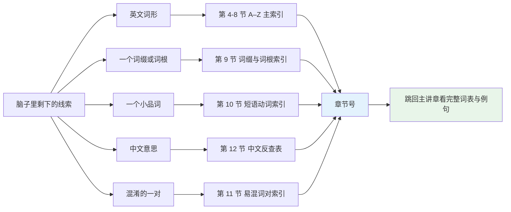
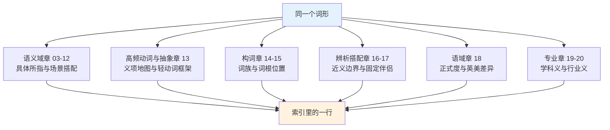
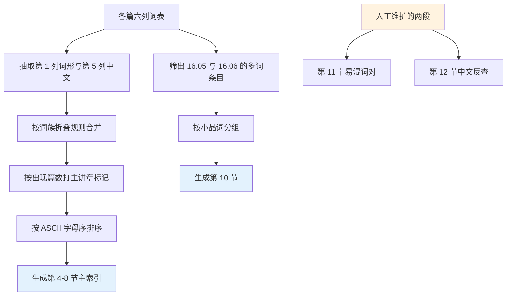
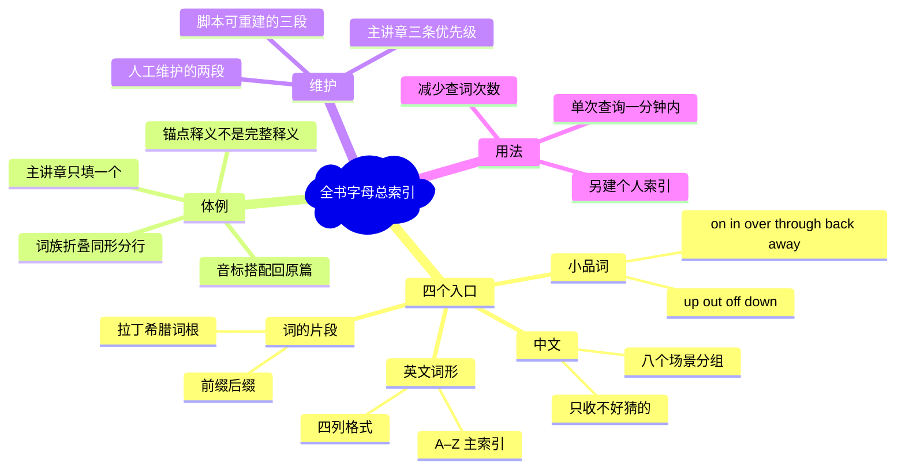

# 全书核心词条字母总索引

> [!info] 本篇定位
>
> 全书最后一篇，也是唯一一篇不教新词的文档。它把前 21 章出现过的核心词收成一张 A–Z 表，每条一句锚点释义加章节号，并标出哪一章是主讲章；另设词缀词根、短语动词按小品词、易混词对三段专项索引，以及一张中文反查表。读完这篇，你手上就多了四个反向入口：见到英文词回查主讲章，想到中文词回查英文说法，看见词缀回查词族，撞上短语动词回查小品词。前一篇 [[22.速查附录与学习资源/02.标点、键盘符号英文名与缩略语场景对照表|标点、键盘符号英文名与缩略语场景对照表]] 解决的是符号怎么念，这一篇解决的是词在哪一章。

---

## 1. 本篇导读：查得到，这本书才算落地

一套 116 篇的教程如果只能从头顺读，它就只是课本。能从任意一个词切进去，它才是工具书。前 21 章按语义域组织，好处是同类词集中、对比清楚，代价是同一个词会散在好几处：**run** 的义项地图在 13.01，短语动词 run out of 在 16.05，作为「经营」的商务义在 20.06，作为「一次程序运行」的技术义在 20.02。顺读时这四处是四次递进；回查时它们是四个互不相通的抽屉。

这篇索引就是把抽屉编号写在外面。

四段索引各自解决一类查找需求：

| 段落 | 入口是什么 | 典型场景 | 维护方式 |
| --- | --- | --- | --- |
| A–Z 主索引 | 记得英文词形 | 读到 conceive，想不起在哪一章讲过 | 脚本从各篇词表抽取 |
| 词缀与词根索引 | 记得一个片段 | 看见 spect 想找同族词 | 脚本从 14、15 章抽取 |
| 短语动词索引 | 记得小品词 | 只记得是个 「…… up」 | 脚本从 16.05、16.06 抽取 |
| 易混词对索引 | 记得「这两个词老搞混」 | affect 还是 effect | 人工维护 |
| 中文反查表 | 只记得中文 | 「报销」英语怎么说 | 人工维护 |

前三段是脚本产物：把各篇六列词表的第一列和第五列取出来，按主讲章打标，合并同形词条，输出成表。后两段脚本做不了，因为「哪两个词容易混」和「哪个中文词值得反查」都是经验判断，只能人写。

这张图的关键是最右边两格。索引本身不给音标、不给搭配、不给例句，它只负责把你送到章节号，完整信息永远在主讲章的六列词表里。这样设计是因为索引一旦开始复制内容，就会和原篇不同步：原篇改了一条搭配，索引里那条就成了错的。索引只存最不容易变的两样东西——词形和位置。

用法上有个小建议：Obsidian 里对本篇按 `Ctrl/Cmd + F` 页内搜索，比翻表快得多。索引的排版之所以坚持一条一行、词形加粗，就是为了让页内搜索的命中结果一眼能读完整行。

一次真实的查询长这样。读云服务文档时撞上这句：

> [!example] 从一句原文到一个章节号
>
> - The tenant quota is enforced at the gateway, so a burst of requests will be **throttled** rather than dropped.
>   - 租户配额在网关处强制执行，因此突发请求会被限流而不是丢弃。
>
> **throttle** 眼熟但说不准，在本篇页内搜索得到 `throttle 节流；油门 20.04 09.06`。两个章节号分别是云原生运维和交通出行，这里显然取 20.04 的技术义。跳过去看词表，才知道它在运维语境里既能指服务端主动限速，也能指客户端被限速，两种用法的介词搭配不同。
>
> 整个过程二十秒，比在词典里翻十几条义项快，也比直接猜义安全。

---

## 2. 索引体例：四列格式、章节号与主讲章标记

### 2.1 主索引的四列长什么样

主索引每条占一行，四列：

| 词条 | 锚点释义 | 主讲章 | 也出现于 |
| --- | --- | --- | --- |
| **run** | 跑；运行；经营；一次运行 | 13.01 | 13.02 / 16.05 / 20.02 / 20.06 |
| **address** | 地址；称呼；处理，应对 | 21.02 | 08.03 / 12.02 / 20.03 |
| **light** | 光；轻的；点燃 | 10.04 | 03.03 / 09.01 / 16.02 |

「锚点释义」不是完整释义，是一句能让你确认「就是这个词」的提示。它只写主讲章重点讲的那几个义项，写不下的义项由主讲章负责。**address** 那一行里「处理，应对」排在最后，是因为熟词僻义才是 21.02 收它的理由，前两个义项只是用来确认词形没认错。

「主讲章」只填一个章节号，规则是：哪一篇给了这个词最完整的处理，就填哪一篇。判断顺序是义项地图 > 词表收录 > 顺带提及。**run** 在 13.01 有整节的义项地图，在 16.05 只是 run out of 的一个成分，所以主讲章是 13.01。

「也出现于」按章节号升序排列，最多列四个，超过四个的写前三个加一个 `…`。这个上限是为了让行不换行，换行的索引没法扫。

### 2.2 章节号总表：116 篇的编号与收词范围

索引里所有章节号都指向下表。这张表本身也可以当全书目录用。

| 篇号 | 篇名 | 索引指过来的典型词 |
| --- | --- | --- |
| 01.01 | 英语词汇的来源、分层与学习地图 | ask / inquire / interrogate 三阶同义 |
| 01.02 | 自然拼读：拼写与发音对应规则 | colonel、debt、island 等拼读失效词 |
| 01.03 | 音标、词重音与词典读音体例 | record、present、conduct 重音移位 |
| 01.04 | 词性与词典标注体例：词条上的缩写怎么读 | modifier、predicate、noun phrase |
| 01.05 | 词汇学习方法总纲 | lemma、word family、retrieval |
| 01.06 | 词汇量自测、CEFR 对照与目标设定 | proficiency、threshold、attrition |
| 02.01 | 代词与限定词的词形矩阵 | either、neither、another、the other |
| 02.02 | 空间与路径介词：空间原型义到抽象义的引申 | into、through、across、along、over |
| 02.03 | of 与 to：属格网络与方向对象网络 | of、to |
| 02.04 | with、by、for、from：伴随、施事、目的与来源 | with、by、for、from |
| 02.05 | 其余介词与复合介词：语义分组与语域分层 | despite、regarding、pursuant to |
| 02.06 | 连词、情态动词、助动词与感叹词速查 | whereas、unless、ought、shall |
| 02.07 | 不规则动词形态分组与不规则复数全表 | run-ran-run、criterion-criteria |
| 02.08 | 程度副词、频率副词与模糊限制词 | fairly、rather、seldom、arguably |
| 03.01 | 基数词、序数词与数字串读法 | dozen、score、billion、ordinal |
| 03.02 | 分数、小数、百分数与数学运算读法 | numerator、decimal、squared |
| 03.03 | 度量衡词表 | metre、ounce、acre、fahrenheit |
| 03.04 | 货币、价格、折扣与统计图表趋势 | discount、surge、plateau、refund |
| 04.01 | 日历与钟点：星期、月份、四季与日期时刻读法 | fortnight、quarter past、equinox |
| 04.02 | 时段、时长、频率与时间状语词群 | duration、interval、biweekly |
| 04.03 | 节日、假期、年龄与世代词汇 | eve、anniversary、millennial |
| 04.04 | 日程、时区、准时延误与时间习语 | deadline、postpone、jet lag |
| 05.01 | 东南西北：方位词的三种形式 | northern、northward、northerly |
| 05.02 | 上下左右里外 | upward、beneath、inward、opposite |
| 05.03 | 地图、坐标、导航与行政区划 | latitude、province、municipality |
| 05.04 | 形状轮廓、大小规模与运动方向 | oval、tilt、vertical、clockwise |
| 06.01 | 基础天气词与冷热强度阶梯 | chilly、humid、scorching |
| 06.02 | 降水、风与云雾能见度 | drizzle、hail、breeze、overcast |
| 06.03 | 极端天气、自然灾害与天气预报 | blizzard、drought、evacuate |
| 06.04 | 山川平原海岸与水体地貌 | plateau、estuary、peninsula |
| 06.05 | 天体宇宙、自然节律与气候环境议题 | orbit、eclipse、emission |
| 07.01 | 身体部位、内脏器官与生理系统 | spine、liver、tendon、artery |
| 07.02 | 外貌体型、姿势动作与感官动词 | slender、crouch、glance、stare |
| 07.03 | 症状、疾病、就医科室与用药 | swollen、dizzy、prescription |
| 07.04 | 情绪梯度词群与表情体态 | irritated、furious、frown |
| 07.05 | 性格形容词、心理健康与睡眠营养体能 | stubborn、insomnia、stamina |
| 08.01 | 亲属称谓全表 | niece、cousin、in-law、sibling |
| 08.02 | 人生阶段、婚恋、育儿与人生仪式 | toddler、engagement、funeral |
| 08.03 | 称呼语、姓名、社交礼仪与人际互动动词 | surname、courtesy、apologise |
| 08.04 | 国家国籍语言、人群集合与社会身份 | citizenship、minority、crowd |
| 08.05 | 历史、宗教、战争与时事背景词 | empire、treaty、refugee |
| 09.01 | 服装鞋帽配饰 | collar、sleeve、zipper、scarf |
| 09.02 | 食材词表 | poultry、spinach、vinegar |
| 09.03 | 烹饪动词、厨具餐具与口味口感 | simmer、whisk、crispy、bland |
| 09.04 | 住房、房间结构、家具与家电 | ceiling、hallway、mortgage |
| 09.05 | 家务、日用品、垃圾回收与故障维修 | detergent、leak、plug、rubbish |
| 09.06 | 交通工具、道路出行与行李装备 | commute、pavement、luggage |
| 10.01 | 动物词表 | mammal、reptile、squirrel |
| 10.02 | 动物身体、幼崽专名、叫声与宠物照料 | paw、cub、bark、vaccinate |
| 10.03 | 树木花卉、植物部位与生长动词 | stem、blossom、wither、sprout |
| 10.04 | 颜色、材质、质地与声音气味光线 | crimson、velvet、fragrance |
| 11.01 | 学科、学段、校园设施与课堂考试 | curriculum、tuition、dormitory |
| 11.02 | 职业名称全表 | accountant、plumber、surgeon |
| 11.03 | 求职录用、公司组织与会议流程 | resume、appraisal、agenda |
| 11.04 | 金钱银行、购物、网购与快递售后 | reimburse、instalment、warranty |
| 11.05 | 城市建筑、公共设施、法律政治与证件手续 | pedestrian、municipal、visa |
| 12.01 | 电脑硬件、软件、界面操作与文件管理 | keyboard、folder、shortcut |
| 12.02 | 互联网、手机应用、社交媒体与网络缩写 | bandwidth、feed、notification |
| 12.03 | 上网与数字生活里的技术词 | encryption、subscription、sync |
| 12.04 | 体育健身、音乐影视、书籍艺术与游戏爱好 | tournament、rehearsal、plot |
| 13.01 | 高频万能动词义项地图 get take make do | get、take、make、do |
| 13.02 | 轻动词搭配 have give go come put set run | have、give、go、come、put、set |
| 13.03 | 言语动词与转述动词群 | claim、assert、imply、concede |
| 13.04 | 认知动词与因果、影响、变化类实义动词 | perceive、trigger、undermine |
| 13.05 | 抽象名词库与评价形容词梯度 | notion、tendency、mediocre |
| 14.01 | 构词法总览与词族思维 | derivation、affix、word family |
| 14.02 | 否定与相反前缀 | un-、in-、dis-、mis-、non- |
| 14.03 | 方位、时间与关系前缀 | pre-、post-、inter-、trans- |
| 14.04 | 数量、程度与规模前缀 | mono-、multi-、over-、micro- |
| 14.05 | 名词后缀家族 | -tion、-ment、-ity、-ship |
| 14.06 | 形容词、动词与副词后缀 | -able、-ous、-ify、-wise |
| 15.01 | 高频拉丁词根（上） | spect、port、dict、duc |
| 15.02 | 高频拉丁词根（下） | ject、fer、tract、scrib |
| 15.03 | 希腊词根与学科术语 | log、graph、phon、chron |
| 15.04 | 合成词、转化词、截短词与缩略语 | breakthrough、laser、app |
| 16.01 | 同义词辨析方法与高频同义词组 | big / large / huge 组 |
| 16.02 | 反义词体系、一词多义与词义引申 | light、sharp、cold 的引申 |
| 16.03 | 近形近音易混词与中式英语陷阱 | affect / effect、adapt / adopt |
| 16.04 | 语块类型与搭配体系 | collocation、chunk、binomial |
| 16.05 | 短语动词（上）up out off down | give up、work out、call off |
| 16.06 | 短语动词（下）on in over through back away | carry on、take over、get away |
| 17.01 | 搭配强度分级与可替换边界 | strong collocation、free combination |
| 17.02 | 动词+名词搭配（上）make、do、have、take | make a decision、take a risk |
| 17.03 | 动词+名词搭配（下）give、pay、hold 与商务学术动名组 | pay attention、hold a meeting |
| 17.04 | 形容词+名词搭配：强度、规模与名词偏好 | heavy rain、strong argument |
| 17.05 | 副词+形容词强化搭配：highly、deeply、bitterly 的固定伴侣 | highly likely、deeply rooted |
| 17.06 | 动词+介词固定搭配：depend on、result in、consist of | depend on、result in |
| 17.07 | 名词与形容词+介词固定搭配：reason for、aware of、responsible for | aware of、responsible for |
| 17.08 | 半固定框架与高频语块：It is worth doing 与 the more the more | It is worth doing |
| 18.01 | 英式与美式词汇差异 | lift / elevator、flat / apartment |
| 18.02 | 语域分层与英语词汇的历史层次 | ask / request、buy / purchase |
| 18.03 | 习语与谚语 | break the ice、the last straw |
| 18.04 | 俚语、网络流行语、委婉语与禁忌语 | pass away、let go、ghosting |
| 18.05 | 叙事文本的词汇门槛：动作、描写、对话与旧体词 | murmur、shrug、thou、hither |
| 19.01 | 学术通用词表 AWL（上）：论证与关系 | hypothesis、correlate、albeit |
| 19.02 | 学术通用词表 AWL（下）：过程与评价 | facilitate、constitute、robust |
| 19.03 | 学术研究、统计术语与论文写作词汇 | variance、peer review、abstract |
| 19.04 | 典故、专名转普通词与词源背景 | Achilles heel、boycott、sandwich |
| 20.01 | IT 深度英语（上）：核心概念术语与其读音 | cache、queue、schema、tuple |
| 20.02 | 计算机语境的熟词新义：日常词的技术义项地图 | commit、branch、thread、socket |
| 20.03 | IT 深度英语（中）：设计文档、规范文体与 API 措辞 | MUST、deprecate、idempotent |
| 20.04 | IT 深度英语（下）：云原生运维、评审用语与缩略语读法 | rollout、nit、SLO、canary |
| 20.05 | 法律与合同英语：条款、诉讼、知识产权与开源协议 | indemnify、liability、waiver |
| 20.06 | 商务、市场与管理英语：战略、增长漏斗、OKR 与供应链 | churn、funnel、procurement |
| 20.07 | 财报英语：三表科目、会计口径与金融熟词义项 | revenue、accrual、amortisation |
| 20.08 | 融资、估值与 SaaS 指标英语：term sheet、cap table 与税务 | dilution、runway、valuation |
| 20.09 | 硬件与 datasheet 英语：电气量、参数表体例与工程属性 | voltage、tolerance、footprint |
| 20.10 | 医学英语：解剖术语、药理、检验指标与病历论文 | dosage、chronic、biopsy |
| 21.01 | 国内考试词表基准：课标 1600-3000 与四六级 4500-6000 的分层 | 分层词表基准 |
| 21.02 | 熟词僻义总表：从考研到 GRE | address、subject、observe |
| 21.03 | GRE 与 GMAT：低频难词、近义群细分与惯用法 | laconic、obdurate、ephemeral |
| 21.04 | 雅思词汇：话题词库、Task 1 选词与产出侧换词 | detrimental、congestion |
| 21.05 | 托福词汇：学科背景词、词汇题同义替换与听力讲座 | sediment、tectonic、fresco |
| 22.01 | 语料库检索、查词交叉验证与原版材料爬升路径 | corpus、concordance、collocate |
| 22.02 | 标点、键盘符号英文名与缩略语场景对照表 | asterisk、caret、tilde |
| 22.03 | 全书核心词条字母总索引 | 本篇 |

### 2.3 索引不写音标，词表才写

索引省掉了音标、词性、搭配三列，这不是偷懒，是分工。对比一下同一个词在两处的呈现：

索引里的样子（第 4 节 C 段）：

| 词条 | 锚点释义 | 主讲章 | 也出现于 |
| --- | --- | --- | --- |
| **cache** | 缓存 | 20.01 | 12.01 / 20.04 |

主讲章 20.01 里的样子：

| 英文 | 英式音标 | 美式音标 | 词性 | 中文 | 搭配与说明 |
| --- | --- | --- | --- | --- | --- |
| **cache** | /kæʃ/ | /kæʃ/ | n./v. | 缓存；藏匿处；缓存起来 | 读作 cash 不读 ca-shay；cache hit、cache miss、invalidate the cache；与 cachet /ˈkæʃeɪ/ 完全不同词 |

索引给的是坐标，词表给的是内容。真正会读错的地方——cache 不读 /ˈkæʃeɪ/——只在主讲章里说一次，索引不复制，也就不会出现两处说法打架的情况。

下面这张六列表收的是最容易在索引里查到、但只看锚点释义会认错的词，属于索引的「例外补丁」：

| 英文 | 英式音标 | 美式音标 | 词性 | 中文 | 搭配与说明 |
| --- | --- | --- | --- | --- | --- |
| **schedule** | /ˈʃedjuːl/ | /ˈskedʒuːl/ | n./v. | 日程；安排 | 英美读音差距最大的常用词之一，索引里查到 04.04 后先核对读音 |
| **queue** | /kjuː/ | /kjuː/ | n./v. | 队列；排队 | 五个字母里四个是元音，整串只读 /kjuː/，20.01 里详解拼读失效 |
| **suite** | /swiːt/ | /swiːt/ | n. | 套间；套件 | 读同 sweet，与 suit /suːt/ 不同词，见 12.01 |
| **route** | /ruːt/ | /ruːt, raʊt/ | n./v. | 路线；路由 | 美音两读并存，网络语境多读 /raʊt/，见 20.04 |
| **data** | /ˈdeɪtə/ | /ˈdeɪtə/ | n. | 数据 | 拉丁语单数形式 datum 已极少用，19.03 讲学术语域下的单复数处理 |
| **status** | /ˈsteɪtəs/ | /ˈstætəs/ | n. | 状态；地位 | 英美元音不同，20.03 的 API 措辞里高频 |
| **niche** | /niːʃ/ | /nɪtʃ, niːʃ/ | n./adj. | 利基；小众的 | 20.06 商务义与 06.04 生态位义同形 |
| **quay** | /kiː/ | /kiː/ | n. | 码头 | 读同 key，06.04 收，属于典型拼读失效词 |

这八个词的共同点是：光看词形猜读音会猜错。索引没有音标列，所以它们在这里单独列一次，提醒你查到章节号后别跳过读音那一栏。

### 2.4 收词、折叠与排序规则

脚本按下面五条规则生成主索引，人工不改这五条的结果：

**收词范围**。只收前 21 章六列词表里出现过的词，正文散见但没进词表的不收。这样索引的每一条都保证在主讲章能查到完整字段。

**词族折叠**。同一词族只留最常用的那一个词形做条目，派生形式不单列。**decide / decision / decisive** 合并成 **decide**，锚点释义写「决定」，需要看派生的去 14.05。例外是词义已经跑远的：**economy / economic / economical** 分立三条，因为 economical 的「节约的」义项和 economy 无法互推。

**同形异义分行**。词形相同、义项无关的分成两行，用上标数字区分：**bank¹** 银行（11.04）与 **bank²** 河岸（06.04）。同形同源但引申开的不分行，一行里用分号并列，比如 **light** 的「光」和「轻的」写在一行。

**多词条目的归位**。短语动词一律不进主索引，只进第 10 节；固定搭配按中心词归位，depend on 归在 **depend** 下；习语按第一个实词归位，break the ice 归在 **break** 下并注明「见 18.03」。

**排序**。严格按 ASCII 字母序，忽略大小写与连字符。**e-mail** 排在 **email** 之后按 email 处理，**in-law** 按 inlaw 排。带撇号的所有格形式不收。

---

## 3. 一个词为什么会有三个章节号

跨章出现是这套教程的结构决定的，不是重复。同一个词在不同章承担不同任务：语义域章收它的具体义项，构词章收它的词族位置，辨析章收它和邻居的边界，专业章收它的行业义。

图里的六条支线对应索引行里的六种可能来源。以 **charge** 为例：11.04 收它的「收费」义并给 charge sb for sth 的搭配，12.01 收它的「充电」义，20.05 收它的「指控」义，21.02 把它列进熟词僻义表。四个章节号背后是四套不同的搭配，不是四次重复。

下面这些词是全书跨章次数最多的，索引里的「也出现于」列几乎都被塞满。它们值得单独用六列列出来：

| 英文 | 英式音标 | 美式音标 | 词性 | 中文 | 搭配与说明 |
| --- | --- | --- | --- | --- | --- |
| **run** | /rʌn/ | /rʌn/ | v./n. | 跑；运行；经营；一次运行 | 主讲 13.01；13.02 轻动词、16.05 run out of、20.02 一次程序运行、20.06 run a business |
| **set** | /set/ | /set/ | v./n./adj. | 放置；设定；一套；固定的 | 主讲 13.02；05.02 方位、12.01 settings、17.02 set a goal |
| **charge** | /tʃɑːdʒ/ | /tʃɑːrdʒ/ | v./n. | 收费；充电；指控 | 主讲 11.04；12.01 充电、20.05 指控、21.02 熟词僻义 |
| **address** | /əˈdres/ | /ˈædres, əˈdres/ | n./v. | 地址；称呼；处理 | 主讲 21.02；08.03 称呼语、12.02 网址、20.03 address an issue |
| **subject** | /ˈsʌbdʒɪkt/ | /ˈsʌbdʒɪkt/ | n./adj./v. | 学科；主题；使遭受 | 主讲 21.02；11.01 学科、19.03 研究对象、01.03 重音移位 |
| **light** | /laɪt/ | /laɪt/ | n./adj./v. | 光；轻的；点燃 | 主讲 10.04；03.03 重量、09.01 轻薄衣物、16.02 义项引申 |
| **order** | /ˈɔːdə/ | /ˈɔːrdər/ | n./v. | 顺序；订单；命令 | 主讲 11.04；03.01 序数、13.03 命令、20.06 采购订单 |
| **issue** | /ˈɪʃuː/ | /ˈɪʃuː/ | n./v. | 议题；发行；发放 | 主讲 13.05；11.05 社会议题、20.03 缺陷单、20.08 发行股份 |
| **account** | /əˈkaʊnt/ | /əˈkaʊnt/ | n./v. | 账户；账目；说明 | 主讲 11.04；12.02 网络账号、19.01 account for、20.07 会计科目 |
| **capital** | /ˈkæpɪtl/ | /ˈkæpɪtl/ | n./adj. | 首都；资本；大写的 | 主讲 05.03；20.07 资本、20.08 融资、22.02 大写字母 |
| **interest** | /ˈɪntrəst/ | /ˈɪntrəst/ | n./v. | 兴趣；利息；利害关系 | 主讲 12.04；11.04 利息、20.05 权益、20.08 投资回报 |
| **security** | /sɪˈkjʊərəti/ | /sɪˈkjʊrəti/ | n. | 安全；证券；保安 | 主讲 12.03；11.02 保安、20.05 担保、20.08 证券 |
| **stock** | /stɒk/ | /stɑːk/ | n./v. | 库存；股票；高汤 | 主讲 20.06；09.03 高汤、11.04 备货、20.07 股票 |
| **share** | /ʃeə/ | /ʃer/ | v./n. | 分享；份额；股份 | 主讲 12.02；03.02 份额、20.07 股份、20.08 股权稀释 |
| **board** | /bɔːd/ | /bɔːrd/ | n./v. | 板；董事会；登机 | 主讲 09.06；11.01 黑板、11.03 董事会、20.08 董事席位 |
| **term** | /tɜːm/ | /tɜːrm/ | n. | 学期；术语；条款；期限 | 主讲 11.01；20.05 合同条款、20.08 term sheet、19.03 术语 |
| **article** | /ˈɑːtɪkl/ | /ˈɑːrtɪkl/ | n. | 文章；条款；冠词 | 主讲 12.02；01.04 冠词、19.03 论文、20.05 合同条款 |
| **subscribe** | /səbˈskraɪb/ | /səbˈskraɪb/ | v. | 订阅；认购；赞同 | 主讲 12.03；15.02 scrib 词根、20.08 认购股份 |
| **commit** | /kəˈmɪt/ | /kəˈmɪt/ | v./n. | 承诺；犯下；提交 | 主讲 20.02；13.04 承诺、20.05 犯罪、15.02 mit 词根 |
| **thread** | /θred/ | /θred/ | n./v. | 线；线程；帖子串 | 主讲 20.02；09.01 缝线、12.02 讨论串 |
| **branch** | /brɑːntʃ/ | /bræntʃ/ | n./v. | 树枝；分行；分支 | 主讲 20.02；10.03 树枝、11.04 银行分行 |
| **table** | /ˈteɪbl/ | /ˈteɪbl/ | n./v. | 桌子；表格；搁置 | 主讲 09.04；19.03 表格、20.01 数据表、18.01 英美义相反 |
| **volume** | /ˈvɒljuːm/ | /ˈvɑːljuːm/ | n. | 音量；体积；卷；交易量 | 主讲 12.04；03.03 体积、20.06 成交量、20.07 销量 |
| **plant** | /plɑːnt/ | /plænt/ | n./v. | 植物；工厂；种植 | 主讲 10.03；11.05 工厂、20.06 生产基地 |
| **matter** | /ˈmætə/ | /ˈmætər/ | n./v. | 事情；物质；要紧 | 主讲 13.05；06.05 物质、20.05 案件事项 |
| **practice** | /ˈpræktɪs/ | /ˈpræktɪs/ | n./v. | 练习；惯例；执业 | 主讲 11.01；20.05 律师执业、21.02 惯例义 |
| **observe** | /əbˈzɜːv/ | /əbˈzɜːrv/ | v. | 观察；遵守；评论 | 主讲 21.02；19.03 观测、13.03 评论、20.05 遵守条款 |
| **appreciate** | /əˈpriːʃieɪt/ | /əˈpriːʃieɪt/ | v. | 感激；欣赏；意识到；升值 | 主讲 21.02；08.03 致谢、20.08 资产升值 |
| **discount** | /ˈdɪskaʊnt/ | /ˈdɪskaʊnt/ | n./v. | 折扣；打折；不重视 | 主讲 03.04；11.04 促销、21.02 不重视义 |
| **compound** | /ˈkɒmpaʊnd/ | /ˈkɑːmpaʊnd/ | n./adj./v. | 化合物；复合的；加剧 | 主讲 15.04；13.04 加剧、20.07 复利、01.03 重音移位 |

这三十个词占了索引里「也出现于」列最长的那一批。查它们的时候不要只看主讲章，因为你要找的义项很可能恰好在某个副章里。比较省事的做法是先在页内搜索里定位到这一行，看清全部章节号，再决定跳哪一篇。

---

## 4. 主索引 A–E

从这一节起是脚本产物。四列格式见 2.1，章节号对照见 2.2。短语动词、词缀、词根不在这里，分别去第 9、10 节。

### 4.1 A

A 段是全书密度最高的字母之一，原因是学术通用词表里 a- 开头的抽象动词特别多：accumulate、allocate、assess、assume 全在 19 章。

| 词条 | 锚点释义 | 主讲章 | 也出现于 |
| --- | --- | --- | --- |
| **abandon** | 放弃；遗弃 | 19.01 | 13.04 |
| **abbreviation** | 缩写 | 15.04 | 22.02 |
| **ability** | 能力 | 13.05 | 14.05 |
| **abroad** | 在国外 | 08.04 | 05.03 |
| **absorb** | 吸收 | 13.04 | 19.02 |
| **abstract** | 摘要；抽象的 | 19.03 | 20.01 |
| **abundant** | 充裕的 | 13.05 | 21.04 |
| **academic** | 学术的 | 11.01 | 19.01 |
| **accelerate** | 加速 | 13.04 | 09.06 |
| **accent** | 口音；重音 | 01.03 | 18.02 |
| **accept** | 接受 | 13.04 | 11.03 |
| **access** | 通道；访问权 | 12.01 | 11.05 / 20.02 |
| **accessory** | 配饰；附件 | 09.01 | 12.01 |
| **accommodate** | 容纳；适应 | 19.02 | 09.04 |
| **accompany** | 陪伴；伴随 | 08.03 | 12.04 |
| **accomplish** | 完成 | 13.04 | 11.03 |
| **account** | 账户；账目；说明 | 11.04 | 12.02 / 19.01 / 20.07 |
| **accountant** | 会计 | 11.02 | 20.07 |
| **accumulate** | 累积 | 19.02 | 20.07 |
| **accurate** | 准确的 | 13.05 | 19.03 |
| **accuse** | 指控 | 20.05 | 13.03 |
| **achieve** | 实现 | 13.04 | 19.01 |
| **acid** | 酸；酸性的 | 09.03 | 20.10 |
| **acknowledge** | 承认；致谢 | 13.03 | 19.03 |
| **acquire** | 获得；收购 | 19.02 | 20.08 |
| **acre** | 英亩 | 03.03 | 05.03 |
| **adapt** | 适应；改编 | 13.04 | 16.03 |
| **address** | 地址；称呼；处理 | 21.02 | 08.03 / 12.02 / 20.03 |
| **adequate** | 足够的 | 19.02 | 02.08 |
| **adjust** | 调整 | 13.04 | 12.01 |
| **administration** | 管理；政府任期 | 11.05 | 20.06 |
| **admire** | 钦佩 | 07.04 | 08.03 |
| **admit** | 承认；准入 | 13.03 | 11.01 |
| **adolescent** | 青少年 | 08.02 | 07.05 |
| **adopt** | 采用；收养 | 19.01 | 08.02 / 16.03 |
| **advance** | 前进；预付款 | 13.04 | 20.08 |
| **advantage** | 优势 | 13.05 | 21.04 |
| **advertise** | 做广告 | 20.06 | 12.02 |
| **advise** | 建议 | 13.03 | 11.03 |
| **advocate** | 提倡；拥护者 | 13.03 | 19.01 |
| **affect** | 影响 | 13.04 | 16.03 |
| **afford** | 负担得起 | 11.04 | 20.08 |
| **agenda** | 议程 | 11.03 | 20.03 |
| **aggressive** | 好斗的；进取的 | 07.05 | 20.06 |
| **agree** | 同意 | 13.03 | 17.06 |
| **agriculture** | 农业 | 11.05 | 10.03 |
| **aid** | 援助 | 08.05 | 07.03 |
| **aim** | 目标；瞄准 | 13.05 | 19.01 |
| **aisle** | 过道 | 09.06 | 11.04 |
| **alarm** | 警报；闹钟 | 04.04 | 09.05 |
| **albeit** | 尽管 | 19.01 | 02.06 |
| **alcohol** | 酒精 | 09.02 | 07.05 |
| **algorithm** | 算法 | 20.01 | 15.03 |
| **alien** | 外星的；外来的 | 06.05 | 08.04 |
| **allergy** | 过敏 | 07.03 | 20.10 |
| **alleviate** | 缓解 | 19.02 | 21.03 |
| **allocate** | 分配 | 19.02 | 20.07 / 21.01 |
| **allow** | 允许 | 13.04 | 17.02 |
| **alloy** | 合金 | 20.09 | 10.04 |
| **alter** | 改变 | 13.04 | 19.02 |
| **alternative** | 替代方案 | 13.05 | 19.01 |
| **altitude** | 海拔 | 05.03 | 06.04 |
| **aluminium** | 铝 | 10.04 | 18.01 |
| **ambiguous** | 有歧义的 | 19.01 | 20.03 |
| **ambition** | 抱负 | 07.05 | 11.03 |
| **amend** | 修订 | 20.05 | 20.03 |
| **ample** | 充裕的 | 21.03 | 13.05 |
| **amplify** | 放大 | 13.04 | 20.09 |
| **analyse** | 分析 | 19.02 | 18.01 |
| **ancestor** | 祖先 | 08.01 | 08.05 |
| **anchor** | 锚；新闻主播 | 09.06 | 12.04 |
| **ancient** | 古代的 | 08.05 | 04.03 |
| **anniversary** | 周年纪念 | 04.03 | 08.02 |
| **announce** | 宣布 | 13.03 | 11.03 |
| **annual** | 每年的 | 04.02 | 20.07 |
| **anonymous** | 匿名的 | 12.03 | 15.03 |
| **antenna** | 天线；触角 | 20.09 | 10.02 |
| **anticipate** | 预料 | 13.04 | 19.02 |
| **anxiety** | 焦虑 | 07.04 | 07.05 |
| **apologise** | 道歉 | 08.03 | 18.01 |
| **apparatus** | 器械 | 20.10 | 11.01 |
| **appeal** | 上诉；吸引力 | 20.05 | 20.06 |
| **appendix** | 附录；阑尾 | 19.03 | 07.01 |
| **appliance** | 家用电器 | 09.04 | 09.05 |
| **applicable** | 适用的 | 20.05 | 19.02 |
| **apply** | 申请；应用；涂抹 | 11.03 | 09.03 / 13.04 |
| **appoint** | 任命 | 11.03 | 04.04 |
| **appreciate** | 感激；意识到；升值 | 21.02 | 08.03 / 20.08 |
| **approach** | 方法；接近 | 19.01 | 13.04 |
| **appropriate** | 恰当的；挪用 | 19.02 | 18.02 |
| **approve** | 批准 | 11.03 | 20.03 |
| **approximate** | 近似的 | 03.02 | 19.03 |
| **arbitrary** | 任意的 | 19.01 | 20.01 |
| **architect** | 建筑师；架构师 | 11.02 | 20.01 |
| **archive** | 档案；归档 | 12.01 | 19.03 |
| **argue** | 争论；论证 | 13.03 | 19.01 |
| **arise** | 出现 | 13.04 | 02.07 |
| **arrange** | 安排 | 04.04 | 11.03 |
| **arrest** | 逮捕；阻止 | 20.05 | 21.02 |
| **arrogant** | 傲慢的 | 07.05 | 18.02 |
| **artery** | 动脉 | 07.01 | 20.10 |
| **article** | 文章；条款；冠词 | 12.02 | 01.04 / 19.03 / 20.05 |
| **artificial** | 人造的 | 10.04 | 20.01 |
| **ascend** | 上升 | 05.02 | 15.01 |
| **aspect** | 方面 | 19.01 | 15.01 |
| **assemble** | 组装；集合 | 20.09 | 08.04 |
| **assert** | 断言 | 13.03 | 19.01 |
| **assess** | 评估 | 19.02 | 11.03 |
| **asset** | 资产 | 20.07 | 20.08 |
| **assign** | 分配；赋值 | 20.02 | 11.03 |
| **assist** | 协助 | 13.04 | 11.03 |
| **associate** | 联想；同事 | 13.04 | 11.03 |
| **assume** | 假定；承担 | 13.04 | 19.01 |
| **assure** | 使确信 | 13.03 | 16.03 |
| **asterisk** | 星号 | 22.02 | 12.01 |
| **asthma** | 哮喘 | 07.03 | 20.10 |
| **atmosphere** | 大气层；气氛 | 06.05 | 12.04 |
| **atom** | 原子 | 20.09 | 11.01 |
| **attach** | 附上；附加 | 12.02 | 17.06 |
| **attain** | 达到 | 19.02 | 21.03 |
| **attempt** | 尝试 | 13.04 | 19.01 |
| **attend** | 出席；照料 | 11.03 | 11.01 |
| **attitude** | 态度 | 13.05 | 07.05 |
| **attorney** | 律师 | 20.05 | 18.01 |
| **attract** | 吸引 | 13.04 | 15.02 |
| **attribute** | 归因于；属性 | 19.02 | 01.03 / 20.01 |
| **audience** | 观众；受众 | 12.04 | 20.06 |
| **audit** | 审计 | 20.07 | 11.01 |
| **authentic** | 真实的 | 18.02 | 12.03 |
| **author** | 作者 | 12.04 | 19.03 |
| **authority** | 权威；当局 | 11.05 | 19.01 |
| **automatic** | 自动的 | 09.05 | 20.01 |
| **autonomy** | 自治 | 11.05 | 19.01 |
| **available** | 可获得的 | 13.05 | 20.03 |
| **avenue** | 大街；途径 | 11.05 | 05.03 |
| **average** | 平均 | 03.02 | 19.03 |
| **avoid** | 避免 | 13.04 | 17.02 |
| **await** | 等待 | 18.02 | 04.02 |
| **awake** | 醒着的 | 07.05 | 02.07 |
| **award** | 授予；奖项 | 12.04 | 11.03 |
| **aware** | 意识到的 | 13.04 | 17.07 |
| **awkward** | 尴尬的 | 07.04 | 08.03 |
| **axis** | 轴 | 05.03 | 19.03 |

### 4.2 B

B 段里日常物件词占多数，主讲章大量落在 09 章。**bank**、**board**、**bill** 这几个同形异义词要看清「也出现于」列。

| 词条 | 锚点释义 | 主讲章 | 也出现于 |
| --- | --- | --- | --- |
| **bachelor** | 学士；单身汉 | 11.01 | 08.02 |
| **background** | 背景 | 12.01 | 19.03 |
| **bacteria** | 细菌 | 20.10 | 02.07 |
| **badge** | 徽章；工牌 | 09.01 | 11.03 |
| **baggage** | 行李 | 09.06 | 18.01 |
| **bake** | 烘烤 | 09.03 | 09.02 |
| **balance** | 平衡；余额 | 20.07 | 07.02 / 11.04 |
| **ballot** | 选票 | 11.05 | 08.05 |
| **ban** | 禁止 | 11.05 | 13.04 |
| **bandage** | 绷带 | 07.03 | 20.10 |
| **bandwidth** | 带宽 | 12.02 | 20.04 |
| **bank¹** | 银行 | 11.04 | 20.07 |
| **bank²** | 河岸 | 06.04 | 05.03 |
| **bankrupt** | 破产的 | 20.07 | 20.08 |
| **bare** | 赤裸的；仅仅 | 07.02 | 16.03 |
| **bargain** | 讨价还价；便宜货 | 11.04 | 03.04 |
| **barrier** | 屏障；障碍 | 11.05 | 13.05 |
| **basement** | 地下室 | 09.04 | 11.05 |
| **basin** | 盆；流域 | 06.04 | 09.05 |
| **batch** | 批次；批处理 | 20.04 | 20.06 |
| **battery** | 电池 | 12.01 | 20.09 |
| **beam** | 光束；横梁 | 10.04 | 09.04 |
| **bean** | 豆 | 09.02 | 10.03 |
| **beard** | 胡须 | 07.02 | 09.01 |
| **beat** | 打；击败；节拍 | 13.04 | 02.07 / 12.04 |
| **behalf** | 代表 | 20.05 | 11.03 |
| **behave** | 举止 | 08.03 | 07.05 |
| **belief** | 信念 | 13.05 | 08.05 |
| **belly** | 腹部 | 07.01 | 10.02 |
| **belt** | 腰带；地带 | 09.01 | 05.03 |
| **bench** | 长凳；工作台 | 09.04 | 11.05 |
| **benchmark** | 基准测试 | 20.04 | 20.06 |
| **beneath** | 在下方 | 05.02 | 02.02 |
| **beneficial** | 有益的 | 19.02 | 21.04 |
| **benefit** | 好处；福利 | 11.03 | 19.01 |
| **betray** | 背叛 | 08.03 | 18.05 |
| **beverage** | 饮料 | 09.02 | 18.02 |
| **bias** | 偏见；偏置电压 | 19.03 | 20.09 |
| **bid** | 出价；投标 | 20.06 | 11.04 |
| **bilateral** | 双边的 | 08.05 | 14.04 |
| **bill** | 账单；法案；纸币 | 11.04 | 11.05 / 18.01 |
| **bind** | 捆绑；约束 | 20.05 | 02.07 |
| **biography** | 传记 | 12.04 | 15.03 |
| **biopsy** | 活检 | 20.10 | 15.03 |
| **bishop** | 主教 | 08.05 | 12.04 |
| **bitter** | 苦的；痛苦的 | 09.03 | 07.04 / 17.05 |
| **blade** | 刀刃；叶片 | 09.03 | 20.09 |
| **blame** | 责备 | 13.03 | 17.06 |
| **bland** | 清淡的；平淡的 | 09.03 | 21.03 |
| **blanket** | 毯子；全面的 | 09.04 | 20.05 |
| **bleed** | 流血 | 07.03 | 02.07 |
| **blend** | 混合 | 09.03 | 15.04 |
| **blizzard** | 暴风雪 | 06.03 | 06.02 |
| **block** | 街区；阻塞；数据块 | 11.05 | 12.03 / 20.01 |
| **blond** | 金发的 | 07.02 | 10.04 |
| **bloom** | 开花 | 10.03 | 04.01 |
| **blueprint** | 蓝图 | 20.03 | 15.04 |
| **blunt** | 钝的；直率的 | 09.03 | 18.02 |
| **blur** | 模糊 | 07.02 | 12.01 |
| **board** | 板；董事会；登机 | 09.06 | 11.01 / 11.03 / 20.08 |
| **boast** | 吹嘘 | 13.03 | 18.05 |
| **boil** | 煮沸 | 09.03 | 06.01 |
| **bold** | 大胆的；粗体的 | 07.05 | 22.02 |
| **bond** | 纽带；债券 | 08.02 | 20.07 |
| **bonus** | 奖金 | 11.03 | 20.08 |
| **booth** | 隔间；展位 | 11.04 | 20.06 |
| **border** | 边界 | 05.03 | 08.04 |
| **bother** | 打扰 | 08.03 | 07.04 |
| **bounce** | 弹跳；退信 | 12.04 | 12.02 |
| **boundary** | 边界 | 05.03 | 19.01 |
| **bow** | 鞠躬；弓 | 07.02 | 12.04 |
| **bracket** | 括号；档次 | 22.02 | 20.07 |
| **brain** | 大脑 | 07.01 | 13.04 |
| **brake** | 刹车 | 09.06 | 16.03 |
| **branch** | 树枝；分行；分支 | 20.02 | 10.03 / 11.04 |
| **brand** | 品牌 | 20.06 | 11.04 |
| **brass** | 黄铜；铜管乐器 | 10.04 | 12.04 |
| **breach** | 违约；缺口 | 20.05 | 12.03 |
| **break** | 打破；中断；休息 | 13.04 | 02.07 / 16.05 / 18.03 |
| **breed** | 繁殖；品种 | 10.02 | 02.07 |
| **breeze** | 微风 | 06.02 | 06.01 |
| **bribe** | 贿赂 | 20.05 | 11.05 |
| **brick** | 砖 | 09.04 | 10.04 |
| **brief** | 简短的；简报 | 20.03 | 19.03 |
| **brilliant** | 出色的；明亮的 | 13.05 | 18.01 |
| **brittle** | 脆的 | 20.09 | 10.04 |
| **broad** | 宽的 | 05.04 | 16.01 |
| **broadcast** | 广播 | 12.04 | 02.07 |
| **brochure** | 宣传册 | 20.06 | 11.04 |
| **broker** | 经纪人 | 20.08 | 11.02 |
| **bruise** | 淤青 | 07.03 | 10.02 |
| **brush** | 刷子；刷 | 09.05 | 09.01 |
| **bubble** | 泡沫；泡沫经济 | 09.03 | 20.08 |
| **bucket** | 桶；存储桶 | 09.05 | 20.04 |
| **budget** | 预算 | 20.07 | 11.04 |
| **buffer** | 缓冲区 | 20.01 | 20.09 |
| **bug** | 虫子；缺陷 | 20.02 | 10.01 |
| **bulb** | 灯泡；球茎 | 09.04 | 10.03 |
| **bulk** | 大批；散装 | 20.06 | 03.03 |
| **bullet** | 子弹；项目符号 | 08.05 | 22.02 |
| **bump** | 碰撞；版本号提升 | 09.06 | 20.04 |
| **bundle** | 捆；套餐 | 20.06 | 12.03 |
| **burden** | 负担 | 13.05 | 19.01 |
| **bureau** | 局；办事处 | 11.05 | 18.02 |
| **burglar** | 入室窃贼 | 20.05 | 11.05 |
| **burst** | 爆发 | 13.04 | 02.07 |
| **bury** | 埋葬 | 08.02 | 06.04 |
| **butcher** | 屠夫；肉铺 | 11.02 | 09.02 |
| **bypass** | 绕过；旁路 | 09.06 | 20.04 |

### 4.3 C

C 是全书条目最多的字母。原因有二：拉丁前缀 com-、con-、col- 派生出大量抽象动词，落在 14.03 与 19 章；商务与法律章的核心词也集中在 c-。

| 词条 | 锚点释义 | 主讲章 | 也出现于 |
| --- | --- | --- | --- |
| **cabinet** | 橱柜；内阁 | 09.04 | 11.05 |
| **cache** | 缓存 | 20.01 | 12.01 / 20.04 |
| **calculate** | 计算 | 03.02 | 19.03 |
| **calendar** | 日历 | 04.01 | 04.04 |
| **campaign** | 战役；营销活动 | 20.06 | 08.05 |
| **cancel** | 取消 | 04.04 | 11.04 |
| **candidate** | 候选人；应聘者 | 11.03 | 11.05 |
| **canvas** | 画布 | 12.04 | 20.01 |
| **capacity** | 容量；能力 | 03.03 | 20.09 |
| **capital** | 首都；资本；大写 | 05.03 | 20.07 / 20.08 / 22.02 |
| **capture** | 捕获；抓拍 | 13.04 | 20.01 |
| **carbon** | 碳 | 06.05 | 20.09 |
| **cargo** | 货物 | 09.06 | 20.06 |
| **carpenter** | 木匠 | 11.02 | 09.05 |
| **carriage** | 车厢；运费 | 09.06 | 18.01 |
| **cart** | 手推车；购物车 | 11.04 | 09.06 |
| **carve** | 雕刻；切分 | 09.03 | 12.04 |
| **cash** | 现金 | 11.04 | 20.07 |
| **casual** | 随意的；休闲的 | 09.01 | 18.02 |
| **catalogue** | 目录 | 11.04 | 20.06 |
| **catastrophe** | 大灾难 | 06.03 | 15.03 |
| **category** | 类别 | 19.01 | 12.01 |
| **cathedral** | 大教堂 | 08.05 | 11.05 |
| **cattle** | 牛群 | 10.01 | 02.07 |
| **caution** | 谨慎；警示 | 07.05 | 20.09 |
| **cave** | 洞穴 | 06.04 | 08.05 |
| **cease** | 停止 | 18.02 | 20.05 |
| **ceiling** | 天花板；上限 | 09.04 | 20.07 |
| **cell** | 细胞；单元格；牢房 | 20.10 | 19.03 / 20.05 |
| **cement** | 水泥；巩固 | 09.04 | 10.04 |
| **census** | 人口普查 | 08.04 | 19.03 |
| **certificate** | 证书 | 11.05 | 12.03 |
| **chairman** | 主席 | 11.03 | 08.03 |
| **chamber** | 室；议院 | 11.05 | 07.01 |
| **channel** | 频道；渠道 | 12.04 | 20.06 |
| **chaos** | 混乱 | 13.05 | 15.03 |
| **charge** | 收费；充电；指控 | 11.04 | 12.01 / 20.05 / 21.02 |
| **charity** | 慈善 | 11.05 | 08.05 |
| **chart** | 图表 | 03.04 | 19.03 |
| **chase** | 追赶 | 07.02 | 18.05 |
| **cheek** | 脸颊 | 07.01 | 07.02 |
| **chef** | 主厨 | 11.02 | 09.03 |
| **chemistry** | 化学 | 11.01 | 20.10 |
| **cheque** | 支票 | 11.04 | 18.01 |
| **chest** | 胸部；箱子 | 07.01 | 09.04 |
| **chew** | 咀嚼 | 09.03 | 10.02 |
| **chief** | 首要的；负责人 | 11.03 | 17.04 |
| **chilly** | 微冷的 | 06.01 | 07.04 |
| **chin** | 下巴 | 07.01 | 07.02 |
| **choke** | 窒息；堵塞 | 07.03 | 20.04 |
| **chore** | 家务杂活 | 09.05 | 04.02 |
| **chronic** | 慢性的 | 20.10 | 15.03 |
| **chunk** | 大块；语块 | 16.04 | 20.01 |
| **churn** | 客户流失 | 20.06 | 20.08 |
| **circuit** | 电路；巡回 | 20.09 | 12.04 |
| **circulate** | 流通；循环 | 07.01 | 20.07 |
| **circumstance** | 情况 | 19.01 | 14.03 |
| **cite** | 引用 | 19.03 | 15.01 |
| **citizen** | 公民 | 08.04 | 11.05 |
| **civil** | 公民的；民事的 | 20.05 | 11.05 |
| **claim** | 声称；索赔 | 13.03 | 20.05 / 19.01 |
| **clarify** | 澄清 | 13.03 | 20.03 |
| **classify** | 分类 | 19.02 | 14.06 |
| **clause** | 条款；从句 | 20.05 | 01.04 |
| **client** | 客户；客户端 | 20.06 | 20.01 |
| **cliff** | 悬崖 | 06.04 | 05.04 |
| **climate** | 气候 | 06.05 | 06.01 |
| **clinic** | 诊所 | 07.03 | 11.05 |
| **clip** | 夹子；短片；剪 | 09.05 | 12.04 |
| **cluster** | 集群；簇 | 20.04 | 19.03 |
| **coach** | 教练；长途汽车 | 12.04 | 09.06 / 18.01 |
| **coarse** | 粗糙的 | 10.04 | 16.03 |
| **coast** | 海岸 | 06.04 | 05.03 |
| **code** | 代码；法典；编码 | 20.01 | 12.01 / 20.05 |
| **coherent** | 连贯的 | 19.01 | 20.03 |
| **coincide** | 巧合；同时发生 | 19.02 | 04.02 |
| **collapse** | 崩塌；崩溃 | 06.03 | 20.04 / 20.08 |
| **colleague** | 同事 | 11.03 | 08.03 |
| **collect** | 收集 | 13.04 | 12.04 |
| **collision** | 碰撞；冲突 | 09.06 | 20.01 |
| **colonel** | 上校 | 08.05 | 01.02 |
| **column** | 柱；列；专栏 | 09.04 | 12.04 / 20.01 |
| **combine** | 结合 | 13.04 | 15.04 |
| **comfort** | 舒适；安慰 | 09.04 | 07.04 |
| **command** | 命令；指挥 | 20.01 | 13.03 |
| **comment** | 评论；注释 | 12.02 | 20.02 |
| **commercial** | 商业的；广告片 | 20.06 | 12.04 |
| **commission** | 佣金；委员会 | 20.06 | 11.05 |
| **commit** | 承诺；犯下；提交 | 20.02 | 13.04 / 20.05 |
| **commodity** | 商品；大宗商品 | 20.06 | 20.08 |
| **community** | 社区；社群 | 11.05 | 12.02 |
| **commute** | 通勤 | 09.06 | 04.02 |
| **compact** | 紧凑的；压实 | 05.04 | 20.09 |
| **companion** | 同伴 | 08.03 | 18.05 |
| **compare** | 比较 | 19.01 | 16.01 |
| **compatible** | 兼容的 | 20.01 | 20.09 |
| **compel** | 迫使 | 13.04 | 15.01 |
| **compensate** | 补偿 | 11.03 | 20.05 |
| **compete** | 竞争 | 20.06 | 12.04 |
| **compile** | 编译；汇编 | 20.01 | 19.03 |
| **complain** | 抱怨 | 13.03 | 11.04 |
| **complement** | 补足；补语 | 16.03 | 01.04 |
| **complex** | 复杂的；综合体 | 13.05 | 11.05 |
| **compliance** | 合规 | 20.05 | 20.06 |
| **component** | 组件 | 20.09 | 20.01 |
| **compose** | 组成；作曲 | 12.04 | 15.01 |
| **compound** | 化合物；复合的；加剧 | 15.04 | 01.03 / 13.04 / 20.07 |
| **comprehensive** | 全面的 | 19.02 | 11.01 |
| **compress** | 压缩 | 12.01 | 20.09 |
| **comprise** | 由…组成 | 19.02 | 17.06 |
| **compute** | 计算 | 20.01 | 03.02 |
| **conceal** | 隐藏 | 18.05 | 20.05 |
| **concede** | 承认；让步 | 13.03 | 19.01 |
| **conceive** | 构想；怀孕 | 13.04 | 08.02 |
| **concentrate** | 集中；浓缩 | 13.04 | 11.01 |
| **concept** | 概念 | 13.05 | 19.01 |
| **concern** | 关切；涉及 | 13.05 | 07.04 |
| **concise** | 简洁的 | 20.03 | 19.03 |
| **conclude** | 得出结论；缔结 | 19.01 | 20.05 |
| **concrete** | 具体的；混凝土 | 09.04 | 13.05 |
| **condemn** | 谴责 | 13.03 | 08.05 |
| **conduct** | 进行；行为；导电 | 19.03 | 01.03 / 20.09 |
| **confer** | 授予；协商 | 15.02 | 11.03 |
| **confess** | 坦白 | 13.03 | 20.05 |
| **confidence** | 信心；置信度 | 07.05 | 19.03 |
| **configure** | 配置 | 20.04 | 12.01 |
| **confine** | 限制 | 19.02 | 20.05 |
| **confirm** | 确认 | 13.03 | 11.04 |
| **conflict** | 冲突；冲突合并 | 08.05 | 01.03 / 20.02 |
| **conform** | 符合 | 19.02 | 17.06 |
| **confront** | 面对 | 13.04 | 07.04 |
| **confuse** | 混淆 | 16.03 | 13.04 |
| **congestion** | 拥堵；鼻塞 | 09.06 | 07.03 / 21.04 |
| **congress** | 国会 | 11.05 | 08.05 |
| **conjunction** | 连词；结合 | 02.06 | 01.04 |
| **connect** | 连接 | 12.02 | 20.04 |
| **conquer** | 征服 | 08.05 | 18.05 |
| **conscience** | 良心 | 07.05 | 16.03 |
| **conscious** | 有意识的 | 07.05 | 16.03 |
| **consecutive** | 连续的 | 04.02 | 19.03 |
| **consensus** | 共识 | 11.03 | 20.04 |
| **consent** | 同意；许可 | 20.05 | 12.03 |
| **consequence** | 后果 | 13.04 | 19.01 |
| **conserve** | 保护；节约 | 06.05 | 09.03 |
| **considerable** | 相当大的 | 19.02 | 02.08 |
| **consist** | 由…构成 | 17.06 | 19.02 |
| **console** | 控制台；安慰 | 20.01 | 07.04 / 12.04 |
| **conspiracy** | 阴谋 | 08.05 | 20.05 |
| **constant** | 恒定的；常量 | 20.01 | 04.02 |
| **constitute** | 构成 | 19.02 | 11.05 |
| **constrain** | 约束 | 20.03 | 19.02 |
| **construct** | 建造；建构 | 09.04 | 19.01 |
| **consult** | 咨询 | 07.03 | 11.03 |
| **consume** | 消耗；消费 | 20.06 | 09.02 |
| **contact** | 联系；触点 | 08.03 | 20.09 |
| **contain** | 容纳；含有 | 09.02 | 20.04 |
| **contemporary** | 当代的 | 04.03 | 12.04 |
| **contempt** | 蔑视 | 07.04 | 20.05 |
| **content** | 内容；满足的 | 12.02 | 01.03 / 07.04 |
| **context** | 语境；上下文 | 16.02 | 20.01 |
| **continent** | 大洲 | 05.03 | 06.04 |
| **contract** | 合同；收缩 | 20.05 | 01.03 / 07.01 |
| **contradict** | 反驳；自相矛盾 | 19.01 | 15.01 |
| **contrary** | 相反的 | 16.02 | 19.01 |
| **contrast** | 对比 | 19.01 | 12.01 |
| **contribute** | 贡献；投稿 | 19.01 | 20.02 |
| **controversy** | 争议 | 19.01 | 08.05 |
| **convenient** | 方便的 | 13.05 | 11.04 |
| **convention** | 惯例；大会 | 19.01 | 20.03 |
| **converge** | 汇聚 | 19.02 | 05.04 |
| **conversation** | 对话 | 08.03 | 13.03 |
| **convert** | 转换 | 03.03 | 12.01 |
| **convey** | 传达 | 13.03 | 15.01 |
| **convict** | 定罪；罪犯 | 20.05 | 01.03 |
| **convince** | 说服 | 13.03 | 15.01 |
| **cooperate** | 合作 | 11.03 | 14.03 |
| **coordinate** | 坐标；协调 | 05.03 | 11.03 |
| **cope** | 应对 | 13.04 | 17.06 |
| **copper** | 铜 | 10.04 | 20.09 |
| **copyright** | 版权 | 20.05 | 12.04 |
| **cord** | 绳；电线 | 09.05 | 20.09 |
| **core** | 核心；内核数 | 20.09 | 20.01 |
| **corporate** | 公司的 | 20.06 | 11.03 |
| **correlate** | 相关 | 19.03 | 19.01 |
| **corridor** | 走廊 | 09.04 | 11.05 |
| **corrupt** | 腐败的；损坏的 | 20.05 | 12.01 |
| **cotton** | 棉 | 10.04 | 09.01 |
| **council** | 议会；委员会 | 11.05 | 16.03 |
| **counsel** | 忠告；法律顾问 | 20.05 | 16.03 |
| **counter** | 柜台；计数器；反驳 | 11.04 | 13.03 / 20.01 |
| **county** | 县；郡 | 05.03 | 11.05 |
| **coupon** | 优惠券 | 11.04 | 03.04 |
| **courage** | 勇气 | 07.05 | 18.05 |
| **courtesy** | 礼貌 | 08.03 | 18.02 |
| **cousin** | 表亲 | 08.01 | 08.04 |
| **cover** | 覆盖；封面；保额 | 13.02 | 12.04 / 20.05 |
| **crack** | 裂缝；破解 | 20.09 | 12.03 |
| **craft** | 工艺；手艺 | 12.04 | 11.02 |
| **crash** | 撞车；崩溃 | 09.06 | 20.02 / 20.08 |
| **crawl** | 爬行；抓取 | 07.02 | 12.03 |
| **credential** | 凭证 | 12.03 | 11.03 |
| **credit** | 信用；学分；贷方 | 11.04 | 11.01 / 20.07 |
| **crew** | 全体船员；团队 | 11.03 | 09.06 |
| **crime** | 犯罪 | 20.05 | 11.05 |
| **crimson** | 深红色 | 10.04 | 18.05 |
| **crisis** | 危机 | 08.05 | 02.07 |
| **criterion** | 标准 | 19.03 | 02.07 |
| **critical** | 关键的；批判的 | 13.05 | 19.01 |
| **crop** | 作物；裁剪 | 10.03 | 12.01 |
| **crouch** | 蹲伏 | 07.02 | 10.02 |
| **crucial** | 至关重要的 | 19.01 | 17.05 |
| **crude** | 原始的；粗鲁的；原油 | 18.02 | 20.06 |
| **cruise** | 巡航 | 09.06 | 12.04 |
| **crust** | 面包皮；地壳 | 09.02 | 06.04 |
| **cuisine** | 菜系 | 09.03 | 18.02 |
| **cultivate** | 耕作；培养 | 10.03 | 13.04 |
| **cumulative** | 累积的 | 19.03 | 20.07 |
| **curb** | 抑制；路缘 | 13.04 | 09.06 |
| **cure** | 治愈 | 07.03 | 20.10 |
| **curiosity** | 好奇心 | 07.05 | 13.05 |
| **currency** | 货币 | 03.04 | 20.07 |
| **current** | 当前的；电流；水流 | 04.02 | 06.04 / 20.09 |
| **curriculum** | 课程体系 | 11.01 | 02.07 |
| **cursor** | 光标 | 12.01 | 20.02 |
| **curve** | 曲线 | 05.04 | 03.04 |
| **cushion** | 靠垫；缓冲 | 09.04 | 20.08 |
| **custody** | 监护权；羁押 | 20.05 | 08.02 |
| **custom** | 习俗；定制的 | 08.05 | 20.01 |
| **cynical** | 愤世嫉俗的 | 07.05 | 21.03 |

### 4.4 D

D 段的重点在 de- 与 dis- 两个前缀上，它们分别走 14.03 与 14.02。碰到不认识的 d- 开头长词，先切前缀往往比查词典快。

| 词条 | 锚点释义 | 主讲章 | 也出现于 |
| --- | --- | --- | --- |
| **daily** | 每日的 | 04.02 | 12.02 |
| **damp** | 潮湿的 | 06.01 | 09.05 |
| **dashboard** | 仪表盘 | 09.06 | 20.06 |
| **database** | 数据库 | 20.01 | 12.01 |
| **dawn** | 黎明；开始明白 | 04.01 | 18.05 |
| **deadline** | 截止期限 | 04.04 | 11.03 |
| **deaf** | 失聪的 | 07.03 | 07.02 |
| **debate** | 辩论 | 13.03 | 19.01 |
| **debit** | 借记 | 11.04 | 20.07 |
| **debris** | 碎片残骸 | 06.03 | 09.05 |
| **debt** | 债务 | 20.07 | 01.02 / 11.04 |
| **decade** | 十年 | 04.02 | 03.01 |
| **decay** | 腐烂；衰变 | 10.03 | 20.09 |
| **deceive** | 欺骗 | 13.03 | 15.01 |
| **decent** | 得体的；不错的 | 13.05 | 18.02 |
| **decimal** | 小数 | 03.02 | 20.01 |
| **decline** | 下降；婉拒 | 03.04 | 13.03 |
| **decorate** | 装饰 | 09.04 | 04.03 |
| **decrease** | 减少 | 03.04 | 19.03 |
| **dedicate** | 奉献；专用 | 20.04 | 13.04 |
| **deduct** | 扣除 | 20.07 | 15.01 |
| **deem** | 认为 | 20.05 | 18.02 |
| **default** | 默认；违约 | 20.01 | 20.07 |
| **defect** | 缺陷 | 20.03 | 20.09 |
| **defend** | 防御；辩护 | 20.05 | 12.04 |
| **deficit** | 赤字 | 20.07 | 20.08 |
| **define** | 定义 | 19.01 | 20.01 |
| **deforestation** | 森林砍伐 | 06.05 | 14.02 |
| **degree** | 度；学位；程度 | 03.03 | 11.01 / 02.08 |
| **delay** | 延误 | 04.04 | 09.06 |
| **delegate** | 代表；授权 | 11.03 | 20.06 |
| **deliberate** | 故意的；仔细考虑 | 13.05 | 01.03 |
| **delicate** | 精致的；微妙的 | 10.04 | 13.05 |
| **deliver** | 递送；交付 | 11.04 | 20.03 |
| **demand** | 需求；要求 | 20.06 | 13.03 |
| **democracy** | 民主 | 11.05 | 15.03 |
| **demolish** | 拆除 | 09.04 | 11.05 |
| **demonstrate** | 演示；证明 | 19.01 | 11.05 |
| **denote** | 表示 | 19.01 | 22.02 |
| **dense** | 密集的 | 05.04 | 06.02 |
| **dental** | 牙齿的 | 07.03 | 20.10 |
| **deny** | 否认 | 13.03 | 12.03 |
| **depart** | 出发 | 09.06 | 04.04 |
| **department** | 部门；科室 | 11.03 | 07.03 |
| **depend** | 取决于 | 17.06 | 13.04 |
| **deploy** | 部署 | 20.04 | 08.05 |
| **deposit** | 存款；沉积物 | 11.04 | 06.04 / 21.05 |
| **deprecate** | 弃用 | 20.03 | 20.04 |
| **depreciate** | 折旧；贬值 | 20.07 | 20.08 |
| **depression** | 抑郁；萧条 | 07.05 | 20.08 |
| **deprive** | 剥夺 | 19.02 | 20.05 |
| **derive** | 派生；推导 | 14.01 | 19.02 |
| **descend** | 下降；世系 | 05.02 | 08.01 |
| **describe** | 描述 | 13.03 | 15.02 |
| **desert** | 沙漠；抛弃 | 06.04 | 01.03 / 16.03 |
| **deserve** | 值得 | 13.04 | 08.03 |
| **designate** | 指定 | 20.05 | 11.03 |
| **desirable** | 可取的 | 13.05 | 21.04 |
| **despite** | 尽管 | 02.05 | 19.01 |
| **dessert** | 甜点 | 09.02 | 16.03 |
| **destination** | 目的地 | 09.06 | 05.03 |
| **detach** | 分离 | 20.04 | 14.02 |
| **detail** | 细节 | 13.05 | 20.03 |
| **detect** | 检测 | 20.09 | 07.03 |
| **deteriorate** | 恶化 | 07.03 | 21.04 |
| **determine** | 决定；测定 | 13.04 | 19.03 |
| **detrimental** | 有害的 | 21.04 | 19.02 |
| **devastate** | 摧毁 | 06.03 | 07.04 |
| **deviate** | 偏离 | 19.03 | 20.03 |
| **device** | 设备 | 12.01 | 20.09 |
| **devote** | 投入 | 13.04 | 17.06 |
| **diagnose** | 诊断 | 07.03 | 20.10 |
| **dialect** | 方言 | 18.02 | 08.04 |
| **diameter** | 直径 | 05.04 | 03.03 |
| **diet** | 饮食；节食 | 07.05 | 09.02 |
| **differentiate** | 区分 | 16.01 | 19.02 |
| **digest** | 消化；文摘 | 07.01 | 01.03 |
| **dignity** | 尊严 | 13.05 | 18.02 |
| **dilemma** | 两难 | 13.05 | 19.01 |
| **dilute** | 稀释 | 09.03 | 20.08 |
| **dimension** | 维度；尺寸 | 05.04 | 20.09 |
| **diminish** | 减少 | 19.02 | 03.04 |
| **dip** | 蘸；小幅下跌 | 09.03 | 03.04 |
| **diploma** | 文凭 | 11.01 | 11.03 |
| **directory** | 目录 | 12.01 | 20.01 |
| **disaster** | 灾难 | 06.03 | 14.02 |
| **discard** | 丢弃 | 09.05 | 20.02 |
| **discipline** | 纪律；学科 | 11.01 | 21.02 |
| **disclose** | 披露 | 20.05 | 20.08 |
| **discount** | 折扣；不重视 | 03.04 | 11.04 / 21.02 |
| **discourse** | 话语 | 19.03 | 18.02 |
| **discrepancy** | 差异 | 19.03 | 21.01 |
| **discrete** | 离散的 | 19.03 | 16.03 |
| **discretion** | 自行决定权 | 20.05 | 18.02 |
| **discriminate** | 歧视；区分 | 08.04 | 16.01 |
| **dismiss** | 解雇；驳回 | 11.03 | 20.05 |
| **disorder** | 失调；混乱 | 07.05 | 20.10 |
| **dispatch** | 派遣；发货 | 11.04 | 20.06 |
| **disperse** | 分散 | 06.02 | 19.02 |
| **displace** | 取代；使流离失所 | 08.05 | 19.02 |
| **dispose** | 处置 | 09.05 | 17.06 |
| **dispute** | 争议 | 20.05 | 13.03 |
| **disrupt** | 扰乱；颠覆 | 20.06 | 15.02 |
| **dissolve** | 溶解；解散 | 09.03 | 20.05 |
| **distinct** | 明显不同的 | 16.01 | 19.01 |
| **distort** | 扭曲 | 12.04 | 19.03 |
| **distribute** | 分配；分发 | 20.06 | 20.04 |
| **district** | 区 | 05.03 | 11.05 |
| **disturb** | 打扰 | 08.03 | 07.05 |
| **diverse** | 多样的 | 08.04 | 19.02 |
| **dividend** | 股息 | 20.07 | 20.08 |
| **doctrine** | 教义；学说 | 08.05 | 20.05 |
| **document** | 文件；记录 | 20.03 | 12.01 |
| **domain** | 领域；域名 | 12.02 | 20.01 |
| **domestic** | 国内的；家用的 | 08.04 | 09.05 |
| **dominate** | 支配 | 13.04 | 20.06 |
| **donate** | 捐赠 | 11.05 | 08.05 |
| **dormant** | 休眠的 | 21.05 | 10.03 |
| **dormitory** | 宿舍 | 11.01 | 18.01 |
| **dose** | 剂量 | 20.10 | 07.03 |
| **dough** | 面团 | 09.02 | 09.03 |
| **draft** | 草稿；起草；征兵 | 20.03 | 08.05 / 19.03 |
| **drag** | 拖动；阻力 | 12.01 | 20.09 |
| **drain** | 排水；耗尽 | 09.05 | 12.01 |
| **dramatic** | 戏剧性的；急剧的 | 03.04 | 12.04 |
| **drawer** | 抽屉 | 09.04 | 16.03 |
| **drift** | 漂移 | 06.02 | 20.04 |
| **drill** | 钻；演练 | 09.05 | 11.01 |
| **drizzle** | 毛毛雨 | 06.02 | 09.03 |
| **drought** | 干旱 | 06.03 | 06.05 |
| **drown** | 溺水 | 06.04 | 07.03 |
| **due** | 到期的；应有的 | 04.04 | 20.07 |
| **dumb** | 哑的；愚蠢的 | 07.03 | 18.04 |
| **dump** | 倾倒；转储 | 09.05 | 20.04 |
| **duplicate** | 复制；重复的 | 12.01 | 20.01 |
| **durable** | 耐用的 | 20.09 | 10.04 |
| **duration** | 时长 | 04.02 | 19.03 |
| **dusk** | 黄昏 | 04.01 | 18.05 |
| **dwell** | 居住；细想 | 18.05 | 09.04 |
| **dynamic** | 动态的；动力学 | 20.01 | 15.03 |

### 4.5 E

E 段里 e- 与 ex- 开头的词几乎都能拆前缀，见 14.03。经济与财务词集中在 20.07、20.08 两篇。

| 词条 | 锚点释义 | 主讲章 | 也出现于 |
| --- | --- | --- | --- |
| **eager** | 渴望的 | 07.04 | 17.07 |
| **earn** | 赚取；赢得 | 11.03 | 11.04 |
| **earthquake** | 地震 | 06.03 | 06.04 |
| **ease** | 缓解；容易 | 07.03 | 13.05 |
| **eclipse** | 日食月食 | 06.05 | 21.05 |
| **ecology** | 生态学 | 06.05 | 15.03 |
| **economic** | 经济的 | 20.06 | 16.03 / 19.01 |
| **economical** | 节约的 | 13.05 | 16.03 |
| **economy** | 经济；节省；简洁 | 20.06 | 20.08 / 21.02 |
| **edit** | 编辑 | 12.01 | 19.03 |
| **efficient** | 高效的 | 13.05 | 20.04 |
| **elaborate** | 详尽的；详述 | 13.03 | 01.03 |
| **elastic** | 有弹性的 | 10.04 | 20.09 |
| **elbow** | 肘部 | 07.01 | 07.02 |
| **elderly** | 年长的 | 04.03 | 08.02 |
| **elect** | 选举 | 11.05 | 08.05 |
| **elegant** | 优美的；简练的 | 12.04 | 20.03 |
| **element** | 元素；要素 | 20.01 | 19.01 |
| **eligible** | 有资格的 | 11.03 | 20.05 |
| **eliminate** | 消除 | 19.02 | 12.04 |
| **elite** | 精英 | 08.04 | 18.02 |
| **embark** | 登船；着手 | 09.06 | 19.02 |
| **embarrass** | 使尴尬 | 07.04 | 08.03 |
| **embed** | 嵌入 | 20.01 | 20.09 |
| **embrace** | 拥抱；欣然接受 | 08.03 | 13.04 |
| **emerge** | 出现 | 13.04 | 19.02 |
| **emergency** | 紧急情况 | 07.03 | 11.05 |
| **emission** | 排放 | 06.05 | 15.02 |
| **emphasise** | 强调 | 13.03 | 19.01 |
| **empire** | 帝国 | 08.05 | 11.05 |
| **empirical** | 实证的 | 19.03 | 19.01 |
| **employ** | 雇用；使用 | 11.03 | 19.02 |
| **enable** | 使能够；启用 | 13.04 | 12.01 |
| **enclose** | 附上；围住 | 20.03 | 09.04 |
| **encounter** | 遇到 | 13.04 | 18.05 |
| **encourage** | 鼓励 | 13.03 | 07.04 |
| **encrypt** | 加密 | 12.03 | 20.01 |
| **endeavour** | 努力 | 18.02 | 19.02 |
| **endorse** | 背书；代言 | 20.06 | 20.05 |
| **endure** | 忍受；持久 | 13.04 | 18.05 |
| **enforce** | 执行；强制 | 20.05 | 20.03 |
| **engage** | 参与；聘用 | 11.03 | 17.06 |
| **engine** | 发动机；引擎 | 09.06 | 20.01 |
| **enhance** | 提升 | 19.02 | 20.06 |
| **enquiry** | 询问 | 11.04 | 18.01 |
| **enrol** | 注册入学 | 11.01 | 18.01 |
| **ensure** | 确保 | 13.04 | 16.03 |
| **entail** | 需要；涉及 | 19.02 | 20.05 |
| **enterprise** | 企业；事业心 | 20.06 | 20.01 |
| **entertain** | 娱乐；招待 | 12.04 | 08.03 |
| **enthusiasm** | 热情 | 07.04 | 15.03 |
| **entitle** | 使有权利；命名 | 20.05 | 12.04 |
| **entity** | 实体 | 20.01 | 20.05 |
| **entrepreneur** | 创业者 | 20.08 | 11.02 |
| **envelope** | 信封 | 11.04 | 01.03 |
| **environment** | 环境 | 06.05 | 20.04 |
| **envy** | 嫉妒 | 07.04 | 13.05 |
| **epidemic** | 流行病 | 20.10 | 15.03 |
| **episode** | 一集；一段经历 | 12.04 | 20.10 |
| **equation** | 方程 | 03.02 | 19.03 |
| **equator** | 赤道 | 05.03 | 06.05 |
| **equip** | 装备 | 20.09 | 09.06 |
| **equity** | 股权；公平 | 20.08 | 20.07 |
| **equivalent** | 等价的 | 03.03 | 19.01 |
| **erode** | 侵蚀 | 06.04 | 20.06 |
| **erupt** | 喷发；爆发 | 06.03 | 07.04 |
| **escalate** | 升级；上报 | 20.04 | 08.05 |
| **essential** | 必需的；本质的 | 13.05 | 19.01 |
| **establish** | 建立 | 19.01 | 20.06 |
| **estate** | 地产；遗产 | 09.04 | 20.05 |
| **esteem** | 尊重 | 07.05 | 18.02 |
| **estimate** | 估计 | 03.02 | 19.03 |
| **estuary** | 河口 | 06.04 | 05.03 |
| **eternal** | 永恒的 | 04.02 | 18.05 |
| **ethic** | 伦理 | 11.05 | 19.01 |
| **ethnic** | 族群的 | 08.04 | 11.05 |
| **evacuate** | 疏散 | 06.03 | 11.05 |
| **evaluate** | 评估 | 19.02 | 11.03 |
| **evaporate** | 蒸发 | 06.02 | 09.03 |
| **eve** | 前夕 | 04.03 | 04.01 |
| **event** | 事件；活动 | 12.04 | 20.01 |
| **evident** | 明显的 | 19.01 | 15.01 |
| **evolve** | 演化 | 10.01 | 19.02 |
| **exaggerate** | 夸大 | 13.03 | 18.03 |
| **examine** | 检查；审视 | 07.03 | 19.03 |
| **exceed** | 超过 | 19.02 | 03.02 |
| **excerpt** | 摘录 | 19.03 | 12.04 |
| **exchange** | 交换；交易所 | 11.04 | 20.08 |
| **exclude** | 排除 | 19.02 | 20.05 |
| **execute** | 执行；处决 | 20.01 | 20.05 |
| **exempt** | 豁免的 | 20.05 | 20.08 |
| **exert** | 施加 | 19.02 | 13.04 |
| **exhaust** | 耗尽；排气 | 09.06 | 07.05 |
| **exhibit** | 展出；展品 | 12.04 | 20.05 |
| **exile** | 流放 | 08.05 | 18.05 |
| **expand** | 扩张 | 20.06 | 05.04 |
| **expedite** | 加快 | 20.06 | 11.04 |
| **expel** | 驱逐；开除 | 11.01 | 15.01 |
| **expenditure** | 支出 | 20.07 | 11.04 |
| **expertise** | 专业知识 | 11.03 | 19.01 |
| **expire** | 到期 | 04.04 | 12.03 |
| **explicit** | 明确的 | 19.01 | 20.03 |
| **exploit** | 利用；漏洞利用 | 12.03 | 20.06 |
| **explore** | 探索 | 13.04 | 05.03 |
| **exponential** | 指数级的 | 03.02 | 20.08 |
| **export** | 出口 | 20.06 | 01.03 / 12.01 |
| **expose** | 暴露 | 13.04 | 12.03 |
| **extend** | 延长；扩展 | 04.02 | 20.01 |
| **extent** | 程度 | 02.08 | 19.01 |
| **exterior** | 外部的 | 05.02 | 09.04 |
| **external** | 外部的 | 05.02 | 20.01 |
| **extinct** | 灭绝的 | 10.01 | 06.05 |
| **extract** | 提取；摘录 | 15.02 | 01.03 / 09.03 |
| **extreme** | 极端的 | 06.03 | 02.08 |

---

## 5. 主索引 F–J

### 5.1 F

f- 开头有一批英美差异词（faucet 与 tap、fall 与 autumn），查到条目后顺手看一眼 18.01。

| 词条 | 锚点释义 | 主讲章 | 也出现于 |
| --- | --- | --- | --- |
| **fabric** | 织物；结构 | 10.04 | 09.01 |
| **facilitate** | 促进 | 19.02 | 11.03 |
| **facility** | 设施 | 11.05 | 11.01 |
| **faculty** | 学院；全体教师；能力 | 11.01 | 21.02 |
| **fade** | 褪色；淡出 | 10.04 | 12.04 |
| **fahrenheit** | 华氏 | 03.03 | 06.01 |
| **fail** | 失败；不及格 | 11.01 | 20.04 |
| **faint** | 昏厥；微弱的 | 07.03 | 10.04 |
| **fair** | 公平的；集市；晴朗的 | 13.05 | 06.01 / 20.06 |
| **fake** | 假的；伪造 | 12.03 | 09.01 |
| **fame** | 名声 | 12.04 | 13.05 |
| **famine** | 饥荒 | 08.05 | 06.03 |
| **fancy** | 花哨的；想要 | 09.01 | 18.01 |
| **fare** | 车费 | 09.06 | 16.03 |
| **fasten** | 系紧 | 09.01 | 09.06 |
| **fatal** | 致命的 | 20.10 | 20.04 |
| **fatigue** | 疲劳；金属疲劳 | 07.05 | 20.09 |
| **faucet** | 水龙头 | 09.05 | 18.01 |
| **fault** | 过错；断层；故障 | 09.05 | 06.04 / 20.09 |
| **feasible** | 可行的 | 20.03 | 19.02 |
| **feather** | 羽毛 | 10.02 | 18.03 |
| **feature** | 特征；功能 | 20.03 | 07.02 / 12.01 |
| **federal** | 联邦的 | 11.05 | 20.05 |
| **fee** | 费用 | 11.04 | 11.01 |
| **feed** | 喂养；信息流；进料 | 12.02 | 10.02 / 20.09 |
| **fellow** | 同伴；研究员 | 08.03 | 11.01 |
| **fence** | 栅栏 | 09.04 | 12.04 |
| **ferment** | 发酵 | 09.03 | 01.03 |
| **fertile** | 肥沃的；可育的 | 10.03 | 08.02 |
| **fetch** | 取来；获取 | 12.03 | 20.02 |
| **fever** | 发烧 | 07.03 | 20.10 |
| **fibre** | 纤维；光纤 | 10.04 | 12.02 / 18.01 |
| **fiction** | 虚构作品 | 12.04 | 18.05 |
| **fierce** | 凶猛的；激烈的 | 10.02 | 20.06 |
| **figure** | 数字；人物；图；想通 | 03.01 | 16.05 / 19.03 |
| **file** | 文件；提交；锉刀 | 12.01 | 20.05 |
| **filter** | 过滤器；筛选 | 09.03 | 12.02 |
| **finance** | 财务；融资 | 20.07 | 20.08 |
| **fine** | 好的；细的；罚款 | 13.05 | 11.05 / 20.05 |
| **finite** | 有限的 | 19.03 | 14.02 |
| **firm** | 公司；坚定的 | 20.06 | 11.03 |
| **fiscal** | 财政的 | 20.07 | 11.05 |
| **fitness** | 健康；适应度 | 12.04 | 07.05 |
| **flame** | 火焰 | 10.04 | 12.02 |
| **flash** | 闪光；闪存 | 10.04 | 12.01 |
| **flat** | 平的；公寓；轮胎没气 | 05.04 | 09.04 / 18.01 |
| **flaw** | 瑕疵 | 20.03 | 19.01 |
| **flee** | 逃离 | 08.05 | 18.05 |
| **flexible** | 灵活的 | 13.05 | 11.03 |
| **flight** | 航班；飞行；一段楼梯 | 09.06 | 09.04 |
| **flip** | 翻转 | 09.03 | 12.01 |
| **float** | 漂浮；浮点数 | 06.04 | 20.01 |
| **flock** | 羊群；蜂拥 | 10.01 | 08.04 |
| **flood** | 洪水；涌入 | 06.03 | 20.06 |
| **flour** | 面粉 | 09.02 | 16.03 |
| **flow** | 流动；流程 | 06.04 | 20.03 |
| **fluctuate** | 波动 | 03.04 | 20.08 |
| **fluent** | 流利的 | 01.06 | 15.01 |
| **flush** | 冲水；脸红 | 09.05 | 07.02 |
| **foam** | 泡沫 | 10.04 | 09.03 |
| **focus** | 焦点；聚焦 | 13.04 | 12.01 |
| **fold** | 折叠；折叠面板 | 09.01 | 12.01 |
| **folder** | 文件夹 | 12.01 | 11.03 |
| **font** | 字体 | 12.01 | 22.02 |
| **footprint** | 足迹；占位面积 | 20.09 | 06.05 |
| **forecast** | 预报 | 06.03 | 20.07 |
| **foreign** | 外国的 | 08.04 | 20.06 |
| **forge** | 锻造；伪造 | 20.09 | 20.05 |
| **formal** | 正式的 | 18.02 | 09.01 |
| **format** | 格式；格式化 | 12.01 | 19.03 |
| **former** | 前者；前任的 | 04.02 | 19.01 |
| **formula** | 公式；配方 | 03.02 | 02.07 |
| **fortnight** | 两周 | 04.02 | 18.01 |
| **forum** | 论坛 | 12.02 | 11.03 |
| **fossil** | 化石 | 06.05 | 21.05 |
| **foster** | 培养；寄养 | 19.02 | 08.02 |
| **foundation** | 地基；基金会 | 09.04 | 11.05 |
| **fraction** | 分数；一小部分 | 03.02 | 19.03 |
| **fracture** | 骨折；断裂 | 07.03 | 20.09 |
| **fragile** | 易碎的 | 10.04 | 11.04 |
| **fragrance** | 香味 | 10.04 | 09.02 |
| **framework** | 框架 | 20.01 | 19.01 |
| **franchise** | 特许经营 | 20.06 | 11.05 |
| **fraud** | 欺诈 | 20.05 | 11.04 |
| **freight** | 货运 | 09.06 | 20.06 |
| **frequency** | 频率 | 04.02 | 20.09 |
| **fresco** | 湿壁画 | 21.05 | 12.04 |
| **friction** | 摩擦 | 20.09 | 08.03 |
| **fringe** | 边缘；刘海 | 07.02 | 18.02 |
| **frost** | 霜 | 06.01 | 06.02 |
| **frown** | 皱眉 | 07.04 | 07.02 |
| **fuel** | 燃料；加剧 | 09.06 | 13.04 |
| **fulfil** | 履行；满足 | 20.05 | 18.01 |
| **function** | 功能；函数 | 20.01 | 12.01 |
| **fund** | 资金；资助 | 20.08 | 11.05 |
| **fundamental** | 根本的 | 19.01 | 13.05 |
| **funnel** | 漏斗；转化漏斗 | 20.06 | 09.03 |
| **furnish** | 配备家具 | 09.04 | 20.03 |
| **fuse** | 保险丝；熔合 | 20.09 | 09.05 |
| **fuss** | 大惊小怪 | 18.04 | 08.03 |

### 5.2 G

| 词条 | 锚点释义 | 主讲章 | 也出现于 |
| --- | --- | --- | --- |
| **gadget** | 小装置 | 12.01 | 09.05 |
| **gain** | 获得；增益 | 13.04 | 20.09 |
| **gallon** | 加仑 | 03.03 | 18.01 |
| **gap** | 缺口；差距 | 05.04 | 19.01 |
| **garage** | 车库；修车行 | 09.04 | 09.06 |
| **garbage** | 垃圾 | 09.05 | 18.01 |
| **garment** | 服装 | 09.01 | 18.02 |
| **gasp** | 喘息 | 07.02 | 18.05 |
| **gather** | 聚集 | 08.04 | 19.03 |
| **gauge** | 量规；估量 | 20.09 | 03.03 |
| **gaze** | 凝视 | 07.02 | 18.05 |
| **gear** | 齿轮；装备；档位 | 09.06 | 20.09 |
| **gene** | 基因 | 20.10 | 10.01 |
| **generate** | 生成 | 20.01 | 19.02 |
| **generic** | 通用的；仿制药 | 20.01 | 20.10 |
| **generous** | 慷慨的 | 07.05 | 03.02 |
| **genre** | 体裁 | 12.04 | 18.02 |
| **genuine** | 真正的 | 13.05 | 09.01 |
| **geology** | 地质学 | 21.05 | 15.03 |
| **germ** | 细菌 | 20.10 | 07.03 |
| **gesture** | 手势 | 07.02 | 08.03 |
| **glacier** | 冰川 | 06.04 | 21.05 |
| **glance** | 瞥一眼 | 07.02 | 18.05 |
| **glare** | 怒视；刺眼强光 | 10.04 | 07.04 |
| **glimpse** | 一瞥 | 07.02 | 16.01 |
| **globe** | 地球；球体 | 05.03 | 05.04 |
| **gloomy** | 阴沉的；沮丧的 | 06.01 | 07.04 |
| **glossary** | 术语表 | 19.03 | 20.03 |
| **glue** | 胶水 | 09.05 | 12.01 |
| **govern** | 治理 | 11.05 | 20.05 |
| **grace** | 优雅；宽限期 | 12.04 | 20.05 |
| **grade** | 年级；等级；坡度 | 11.01 | 18.01 |
| **gradual** | 逐渐的 | 03.04 | 04.02 |
| **grain** | 谷物；纹理 | 09.02 | 10.04 |
| **grant** | 拨款；授予 | 11.01 | 20.05 |
| **graph** | 图表 | 03.04 | 15.03 |
| **grasp** | 抓住；领会 | 07.02 | 13.04 |
| **grateful** | 感激的 | 07.04 | 08.03 |
| **grave** | 坟墓；严重的 | 08.02 | 17.04 |
| **gravity** | 重力；严重性 | 20.09 | 06.05 |
| **graze** | 放牧；擦伤 | 10.02 | 07.03 |
| **grease** | 油脂 | 09.03 | 20.09 |
| **greenhouse** | 温室 | 06.05 | 10.03 |
| **grid** | 网格；电网 | 05.03 | 12.01 |
| **grief** | 悲痛 | 07.04 | 08.02 |
| **grin** | 咧嘴笑 | 07.02 | 18.05 |
| **grind** | 研磨 | 09.03 | 02.07 |
| **grip** | 握紧 | 07.02 | 20.09 |
| **groan** | 呻吟 | 07.02 | 18.05 |
| **grocery** | 食品杂货 | 11.04 | 09.02 |
| **gross** | 总的；毛的；恶心的 | 20.07 | 18.04 |
| **guarantee** | 保证；保修 | 11.04 | 20.05 |
| **guardian** | 监护人 | 08.02 | 20.05 |
| **guideline** | 指导原则 | 20.03 | 11.03 |
| **guilty** | 有罪的；内疚的 | 20.05 | 07.04 |
| **gulf** | 海湾；鸿沟 | 06.04 | 19.01 |
| **gut** | 肠道；直觉 | 07.01 | 18.04 |

### 5.3 H

| 词条 | 锚点释义 | 主讲章 | 也出现于 |
| --- | --- | --- | --- |
| **habitat** | 栖息地 | 10.01 | 06.05 |
| **hail** | 冰雹；招呼 | 06.02 | 09.06 |
| **hallway** | 走廊 | 09.04 | 18.01 |
| **halt** | 停止 | 20.04 | 09.06 |
| **handle** | 把手；处理；句柄 | 13.04 | 12.01 / 20.01 |
| **harass** | 骚扰 | 20.05 | 11.03 |
| **harbour** | 港口 | 06.04 | 09.06 |
| **hardware** | 硬件；五金 | 12.01 | 20.09 |
| **harm** | 伤害 | 13.04 | 07.03 |
| **harsh** | 严酷的；刺耳的 | 06.03 | 18.02 |
| **harvest** | 收获 | 10.03 | 04.01 |
| **hazard** | 危险 | 20.09 | 06.03 |
| **headline** | 头条 | 12.02 | 12.04 |
| **heal** | 愈合 | 07.03 | 20.10 |
| **heap** | 堆；堆内存 | 20.01 | 09.05 |
| **hedge** | 树篱；对冲；模糊限制 | 02.08 | 20.08 |
| **heir** | 继承人 | 20.05 | 08.01 |
| **hemisphere** | 半球 | 05.03 | 07.01 |
| **hence** | 因此 | 19.01 | 18.02 |
| **herb** | 香草；草药 | 09.02 | 20.10 |
| **heritage** | 遗产 | 08.05 | 11.05 |
| **hesitate** | 犹豫 | 07.04 | 13.03 |
| **hierarchy** | 层级 | 11.03 | 20.01 |
| **highlight** | 突出；高亮 | 12.01 | 19.03 |
| **hire** | 雇用；租用 | 11.03 | 18.01 |
| **hollow** | 空心的 | 05.04 | 10.04 |
| **honour** | 荣誉；履行 | 12.04 | 18.01 |
| **hook** | 钩子；钩挂 | 09.05 | 20.02 |
| **horizon** | 地平线；视野 | 05.03 | 19.01 |
| **horizontal** | 水平的 | 05.04 | 12.01 |
| **hormone** | 激素 | 20.10 | 07.01 |
| **hospitality** | 好客；酒店业 | 08.03 | 20.06 |
| **hostile** | 敌对的 | 08.05 | 20.08 |
| **household** | 家庭；家用的 | 08.01 | 09.05 |
| **housing** | 住房 | 09.04 | 11.05 |
| **hover** | 悬停 | 12.01 | 10.02 |
| **hub** | 枢纽；集线器 | 09.06 | 12.02 |
| **humble** | 谦逊的；简陋的 | 07.05 | 18.02 |
| **humid** | 潮湿的 | 06.01 | 06.02 |
| **humiliate** | 羞辱 | 07.04 | 08.03 |
| **hurricane** | 飓风 | 06.03 | 06.02 |
| **hydrogen** | 氢 | 20.09 | 15.03 |
| **hygiene** | 卫生 | 07.05 | 09.05 |
| **hypothesis** | 假设 | 19.03 | 02.07 |

### 5.4 I

I 段最容易出错的是 in- 前缀的双重身份：既是否定（invalid），也是「向内」（include）。判定办法在 14.02。

| 词条 | 锚点释义 | 主讲章 | 也出现于 |
| --- | --- | --- | --- |
| **iceberg** | 冰山 | 06.04 | 18.03 |
| **iconic** | 标志性的 | 12.04 | 12.01 |
| **identical** | 完全相同的 | 16.01 | 19.03 |
| **identify** | 识别 | 13.04 | 19.02 |
| **idiom** | 习语 | 18.03 | 16.04 |
| **idle** | 空闲的；闲置 | 20.04 | 07.05 |
| **ignite** | 点燃 | 09.03 | 13.04 |
| **ignore** | 忽视 | 13.04 | 20.02 |
| **illustrate** | 举例说明；插图 | 19.01 | 12.04 |
| **imitate** | 模仿 | 13.04 | 10.02 |
| **immerse** | 沉浸 | 01.05 | 09.03 |
| **immigrant** | 移民 | 08.04 | 11.05 |
| **immune** | 免疫的 | 20.10 | 07.03 |
| **impact** | 影响；冲击 | 13.04 | 19.01 |
| **impair** | 损害 | 20.10 | 19.02 |
| **impede** | 阻碍 | 19.02 | 21.03 |
| **imperative** | 必要的；祈使的 | 20.03 | 01.04 |
| **implement** | 实施；工具 | 19.02 | 20.01 |
| **implication** | 含意；影响 | 19.01 | 21.01 |
| **imply** | 暗示 | 13.03 | 19.01 |
| **import** | 进口；导入 | 20.06 | 01.03 / 12.01 |
| **impose** | 强加；征收 | 19.02 | 20.05 |
| **impress** | 使印象深刻 | 07.04 | 15.01 |
| **improvise** | 即兴发挥 | 12.04 | 18.02 |
| **impulse** | 冲动；脉冲 | 07.05 | 20.09 |
| **incentive** | 激励 | 20.06 | 21.01 |
| **incidence** | 发生率 | 19.03 | 20.10 |
| **incline** | 倾斜；倾向 | 05.04 | 13.04 |
| **incorporate** | 纳入；注册公司 | 19.02 | 20.06 |
| **incur** | 招致；产生费用 | 20.07 | 19.02 |
| **indicate** | 表明 | 19.01 | 03.04 |
| **indigenous** | 本土的 | 08.04 | 21.05 |
| **indispensable** | 不可或缺的 | 13.05 | 14.02 |
| **induce** | 引起；诱导 | 13.04 | 20.10 |
| **indulge** | 纵容 | 07.05 | 08.02 |
| **industry** | 工业；行业 | 20.06 | 11.05 |
| **inevitable** | 不可避免的 | 13.05 | 19.01 |
| **infant** | 婴儿 | 08.02 | 20.10 |
| **infect** | 感染 | 20.10 | 12.03 |
| **infer** | 推断 | 13.04 | 19.01 |
| **inflation** | 通货膨胀 | 20.07 | 03.04 |
| **inflict** | 施加痛苦 | 21.03 | 13.04 |
| **influence** | 影响 | 13.04 | 12.02 |
| **infrastructure** | 基础设施 | 11.05 | 20.04 |
| **ingredient** | 配料；要素 | 09.02 | 13.05 |
| **inherent** | 固有的 | 19.01 | 20.03 |
| **inherit** | 继承 | 08.01 | 20.01 |
| **inhibit** | 抑制 | 20.10 | 19.02 |
| **initial** | 最初的；首字母 | 04.02 | 08.03 |
| **initiate** | 发起 | 19.02 | 20.03 |
| **inject** | 注射；注入 | 20.10 | 15.02 |
| **injury** | 伤害 | 07.03 | 12.04 |
| **innovate** | 创新 | 20.06 | 19.02 |
| **input** | 输入 | 12.01 | 20.09 |
| **inquiry** | 询问；探究 | 19.03 | 18.01 |
| **insert** | 插入 | 12.01 | 20.01 |
| **insight** | 洞察 | 13.05 | 19.01 |
| **insist** | 坚持 | 13.03 | 17.06 |
| **inspect** | 检查 | 15.01 | 20.09 |
| **inspire** | 激励 | 07.04 | 12.04 |
| **install** | 安装 | 12.01 | 09.05 |
| **instalment** | 分期付款；一集 | 11.04 | 12.04 |
| **instance** | 实例；例子 | 20.01 | 19.01 |
| **instinct** | 本能 | 10.02 | 07.05 |
| **institution** | 机构；制度 | 11.05 | 19.01 |
| **instruct** | 指示；教导 | 13.03 | 11.01 |
| **instrument** | 乐器；仪器 | 12.04 | 20.09 |
| **insulate** | 绝缘；隔热 | 20.09 | 09.04 |
| **insurance** | 保险 | 11.04 | 20.05 |
| **intact** | 完好无损的 | 20.09 | 21.03 |
| **integer** | 整数 | 03.01 | 20.01 |
| **integrate** | 整合 | 19.02 | 20.04 |
| **integrity** | 正直；完整性 | 07.05 | 20.01 |
| **intellectual** | 智力的；知识产权的 | 20.05 | 11.01 |
| **intend** | 打算 | 13.04 | 20.03 |
| **intense** | 强烈的 | 02.08 | 16.03 |
| **interact** | 互动 | 08.03 | 12.01 |
| **interest** | 兴趣；利息；权益 | 12.04 | 11.04 / 20.05 / 20.08 |
| **interface** | 界面；接口 | 12.01 | 20.01 |
| **interfere** | 干涉；干扰 | 17.06 | 20.09 |
| **interim** | 临时的 | 20.07 | 11.03 |
| **intermittent** | 间歇的 | 06.02 | 20.04 |
| **internal** | 内部的 | 05.02 | 07.01 |
| **interpret** | 口译；解释 | 08.04 | 19.01 |
| **interrupt** | 打断；中断 | 08.03 | 20.09 |
| **interval** | 间隔 | 04.02 | 19.03 |
| **intervene** | 干预 | 19.02 | 20.05 |
| **intimate** | 亲密的 | 08.02 | 18.02 |
| **intranet** | 内网 | 12.02 | 14.03 |
| **intrigue** | 使好奇；密谋 | 07.04 | 18.05 |
| **intrinsic** | 内在的 | 19.01 | 20.08 |
| **intuitive** | 直觉的；符合直觉的 | 20.03 | 07.05 |
| **invade** | 入侵 | 08.05 | 12.03 |
| **inventory** | 库存；清单 | 20.06 | 20.07 |
| **invert** | 倒置 | 05.02 | 20.01 |
| **invest** | 投资 | 20.08 | 11.04 |
| **investigate** | 调查 | 19.03 | 20.05 |
| **invoice** | 发票 | 11.04 | 20.07 |
| **invoke** | 调用；援引 | 20.01 | 20.05 |
| **involve** | 涉及 | 13.04 | 19.01 |
| **irrigate** | 灌溉 | 10.03 | 06.05 |
| **isolate** | 隔离 | 20.10 | 19.03 |
| **issue** | 议题；发行；缺陷单 | 13.05 | 11.05 / 20.03 / 20.08 |
| **item** | 项目；条目 | 11.04 | 12.01 |
| **itinerary** | 行程 | 04.04 | 09.06 |

### 5.5 J

| 词条 | 锚点释义 | 主讲章 | 也出现于 |
| --- | --- | --- | --- |
| **jail** | 监狱 | 20.05 | 18.01 |
| **jar** | 罐子；不协调 | 09.03 | 10.04 |
| **jaw** | 下颌 | 07.01 | 10.02 |
| **jealous** | 嫉妒的 | 07.04 | 08.02 |
| **jet lag** | 时差反应 | 04.04 | 09.06 |
| **joint** | 关节；联合的 | 07.01 | 20.06 |
| **journal** | 期刊；日志 | 19.03 | 20.04 |
| **judicial** | 司法的 | 20.05 | 11.05 |
| **junction** | 交叉口；结 | 09.06 | 20.09 |
| **junior** | 初级的 | 11.03 | 11.01 |
| **jurisdiction** | 管辖权 | 20.05 | 11.05 |
| **justify** | 证明合理；对齐 | 19.01 | 22.02 |
| **juvenile** | 未成年的 | 20.05 | 08.02 |

---

## 6. 主索引 K–O

### 6.1 K

K 段条目少，但几乎都是高频具体名词，缺一个就会在口语里卡住。

| 词条 | 锚点释义 | 主讲章 | 也出现于 |
| --- | --- | --- | --- |
| **keen** | 热衷的；敏锐的 | 07.05 | 17.07 |
| **kettle** | 水壶 | 09.03 | 09.04 |
| **keyboard** | 键盘 | 12.01 | 22.02 |
| **kidney** | 肾 | 07.01 | 20.10 |
| **kin** | 亲属 | 08.01 | 18.02 |
| **kindergarten** | 幼儿园 | 11.01 | 08.02 |
| **kit** | 成套工具 | 09.05 | 20.09 |
| **knee** | 膝盖 | 07.01 | 07.02 |
| **knit** | 编织 | 09.01 | 12.04 |
| **knob** | 旋钮 | 09.04 | 20.09 |
| **knot** | 结；节（航速） | 09.06 | 03.03 |
| **knowledge** | 知识 | 13.05 | 11.01 |

### 6.2 L

| 词条 | 锚点释义 | 主讲章 | 也出现于 |
| --- | --- | --- | --- |
| **label** | 标签；贴标签 | 11.04 | 12.01 |
| **laboratory** | 实验室 | 11.01 | 19.03 |
| **lace** | 蕾丝；鞋带 | 09.01 | 10.04 |
| **lag** | 滞后；延迟 | 20.04 | 04.04 |
| **landlord** | 房东 | 09.04 | 11.04 |
| **landmark** | 地标；里程碑式的 | 11.05 | 05.03 |
| **landscape** | 风景；横向布局 | 06.04 | 12.01 |
| **lane** | 车道；小巷 | 09.06 | 11.05 |
| **latency** | 延迟 | 20.04 | 12.02 |
| **latitude** | 纬度；自由度 | 05.03 | 06.05 |
| **latter** | 后者 | 19.01 | 04.02 |
| **launch** | 发射；发布 | 20.06 | 06.05 |
| **laundry** | 洗衣 | 09.05 | 09.01 |
| **lawn** | 草坪 | 09.04 | 10.03 |
| **lawsuit** | 诉讼 | 20.05 | 11.05 |
| **layer** | 层 | 20.01 | 09.01 |
| **layout** | 布局 | 12.01 | 20.03 |
| **lease** | 租约 | 09.04 | 20.05 |
| **leather** | 皮革 | 10.04 | 09.01 |
| **lecture** | 讲座；训话 | 11.01 | 21.05 |
| **ledger** | 分类账 | 20.07 | 20.08 |
| **legacy** | 遗产；遗留系统 | 20.04 | 20.05 |
| **legislation** | 立法 | 20.05 | 11.05 |
| **legitimate** | 合法的；正当的 | 20.05 | 19.01 |
| **leisure** | 闲暇 | 12.04 | 18.01 |
| **lens** | 镜头 | 12.04 | 07.01 |
| **lesion** | 病灶 | 20.10 | 07.03 |
| **lever** | 杠杆 | 20.09 | 20.08 |
| **liability** | 责任；负债 | 20.05 | 20.07 |
| **liberal** | 自由的；文科的 | 11.05 | 11.01 |
| **licence** | 执照；许可证 | 11.05 | 20.05 |
| **lid** | 盖子 | 09.03 | 07.01 |
| **lifespan** | 寿命 | 10.01 | 20.09 |
| **ligament** | 韧带 | 07.01 | 20.10 |
| **lightning** | 闪电 | 06.02 | 16.03 |
| **limb** | 肢体；树枝 | 07.01 | 10.03 |
| **linen** | 亚麻 | 10.04 | 09.04 |
| **linger** | 逗留 | 18.05 | 04.02 |
| **liquid** | 液体 | 03.03 | 20.08 |
| **literacy** | 读写能力 | 11.01 | 01.06 |
| **literally** | 字面上 | 18.04 | 16.02 |
| **litter** | 垃圾；一窝幼崽 | 09.05 | 10.02 |
| **liver** | 肝 | 07.01 | 20.10 |
| **loan** | 贷款 | 11.04 | 20.08 |
| **lobby** | 大堂；游说 | 09.04 | 11.05 |
| **locate** | 定位 | 05.03 | 12.01 |
| **lodge** | 小屋；提出申诉 | 09.04 | 20.05 |
| **log** | 原木；日志；记录 | 20.04 | 15.03 |
| **logistics** | 物流 | 20.06 | 11.04 |
| **longitude** | 经度 | 05.03 | 05.04 |
| **loop** | 循环；环路 | 20.01 | 20.09 |
| **loose** | 松的 | 09.01 | 16.03 |
| **loyal** | 忠诚的 | 07.05 | 20.06 |
| **lubricate** | 润滑 | 20.09 | 09.05 |
| **luggage** | 行李 | 09.06 | 18.01 |
| **lump** | 肿块；一块 | 07.03 | 09.02 |
| **lung** | 肺 | 07.01 | 20.10 |
| **luxury** | 奢侈品 | 11.04 | 20.06 |

### 6.3 M

M 段是熟词僻义的重灾区：**matter**、**mean**、**measure**、**mount** 每个都至少两个不相通的义项。

| 词条 | 锚点释义 | 主讲章 | 也出现于 |
| --- | --- | --- | --- |
| **machinery** | 机械 | 20.09 | 11.05 |
| **magnitude** | 量级；震级 | 06.03 | 19.03 |
| **maintain** | 维持；维护；坚称 | 20.04 | 13.03 |
| **majority** | 多数 | 03.02 | 11.05 |
| **malfunction** | 故障 | 20.09 | 09.05 |
| **mall** | 购物中心 | 11.04 | 18.01 |
| **mammal** | 哺乳动物 | 10.01 | 20.10 |
| **mandate** | 授权；强制要求 | 20.05 | 11.05 |
| **manipulate** | 操纵 | 13.04 | 20.01 |
| **manual** | 手册；手动的 | 20.03 | 09.05 |
| **manufacture** | 制造 | 20.06 | 20.09 |
| **manuscript** | 手稿 | 19.03 | 15.02 |
| **margin** | 页边距；利润率 | 20.07 | 22.02 |
| **marine** | 海洋的 | 06.04 | 08.05 |
| **marital** | 婚姻的 | 08.02 | 11.05 |
| **massive** | 巨大的 | 05.04 | 17.04 |
| **mature** | 成熟的；到期 | 08.02 | 20.07 |
| **maximise** | 最大化 | 03.02 | 12.01 |
| **mayor** | 市长 | 11.05 | 08.03 |
| **meadow** | 草地 | 06.04 | 10.03 |
| **mean** | 意思是；吝啬的；平均数 | 13.03 | 19.03 / 18.01 |
| **meanwhile** | 与此同时 | 04.02 | 19.01 |
| **measure** | 测量；措施 | 03.03 | 11.05 |
| **mechanism** | 机制 | 20.09 | 19.01 |
| **mediate** | 调解 | 20.05 | 08.03 |
| **medium** | 媒介；中等的 | 12.04 | 02.07 |
| **melt** | 融化 | 06.01 | 09.03 |
| **membrane** | 膜 | 20.10 | 07.01 |
| **memorial** | 纪念的 | 04.03 | 08.05 |
| **mental** | 心理的 | 07.05 | 13.04 |
| **mentor** | 导师 | 11.03 | 19.04 |
| **merchant** | 商人 | 20.06 | 11.02 |
| **merge** | 合并 | 20.02 | 20.06 |
| **merit** | 优点；值得 | 13.05 | 19.01 |
| **mess** | 混乱 | 09.05 | 18.04 |
| **metabolism** | 新陈代谢 | 21.05 | 20.10 |
| **metaphor** | 隐喻 | 18.03 | 15.03 |
| **meter** | 仪表；米 | 03.03 | 18.01 |
| **migrate** | 迁徙；迁移 | 10.02 | 20.04 |
| **mild** | 温和的；轻微的 | 06.01 | 09.03 |
| **milestone** | 里程碑 | 20.03 | 11.03 |
| **mimic** | 模仿 | 10.02 | 13.04 |
| **mineral** | 矿物 | 06.04 | 09.02 |
| **minimal** | 最小的 | 19.02 | 20.03 |
| **ministry** | 部委 | 11.05 | 08.05 |
| **minority** | 少数；少数族群 | 08.04 | 03.02 |
| **miscellaneous** | 杂项的 | 20.07 | 11.04 |
| **misconception** | 误解 | 19.01 | 14.02 |
| **mist** | 薄雾 | 06.02 | 16.03 |
| **mitigate** | 缓解 | 20.04 | 19.02 |
| **mixture** | 混合物 | 09.03 | 10.04 |
| **mobile** | 移动的；手机 | 12.02 | 18.01 |
| **mock** | 嘲笑；模拟的 | 20.02 | 11.01 |
| **moderate** | 适度的；主持 | 02.08 | 12.02 |
| **modify** | 修改 | 12.01 | 01.04 |
| **module** | 模块 | 20.01 | 11.01 |
| **moist** | 湿润的 | 09.03 | 06.01 |
| **molecule** | 分子 | 20.09 | 20.10 |
| **momentum** | 势头；动量 | 20.06 | 20.09 |
| **monetary** | 货币的 | 20.07 | 11.05 |
| **monitor** | 显示器；监控 | 12.01 | 20.04 |
| **monopoly** | 垄断 | 20.06 | 15.03 |
| **mortgage** | 按揭贷款 | 09.04 | 11.04 |
| **motive** | 动机 | 07.05 | 20.05 |
| **mould** | 模具；霉 | 20.09 | 09.02 |
| **mount** | 安装；登上；增加 | 20.04 | 05.02 |
| **mourn** | 哀悼 | 08.02 | 07.04 |
| **municipal** | 市政的 | 11.05 | 05.03 |
| **murmur** | 低语 | 18.05 | 07.02 |
| **muscle** | 肌肉 | 07.01 | 07.05 |
| **mutual** | 相互的 | 08.03 | 20.08 |

### 6.4 N

| 词条 | 锚点释义 | 主讲章 | 也出现于 |
| --- | --- | --- | --- |
| **naive** | 天真的 | 07.05 | 18.02 |
| **narrative** | 叙事 | 18.05 | 19.03 |
| **navigate** | 导航；浏览 | 05.03 | 12.01 |
| **necessity** | 必需品 | 13.05 | 09.05 |
| **negligible** | 可忽略的 | 19.03 | 20.09 |
| **negotiate** | 谈判 | 11.03 | 20.06 |
| **nerve** | 神经；勇气 | 07.01 | 07.05 |
| **neutral** | 中立的；空档 | 08.05 | 09.06 |
| **niche** | 利基；生态位 | 20.06 | 06.04 |
| **nightmare** | 噩梦 | 07.05 | 18.03 |
| **nominal** | 名义上的 | 20.07 | 01.04 |
| **nominate** | 提名 | 11.05 | 12.04 |
| **norm** | 规范 | 19.01 | 08.03 |
| **notable** | 值得注意的 | 19.01 | 17.04 |
| **notation** | 记号法 | 03.02 | 22.02 |
| **notify** | 通知 | 12.02 | 20.03 |
| **notion** | 概念 | 13.05 | 19.01 |
| **notorious** | 臭名昭著的 | 13.05 | 16.01 |
| **novel** | 小说；新颖的 | 12.04 | 19.01 |
| **nuisance** | 讨厌的人或事 | 08.03 | 20.05 |
| **numerator** | 分子 | 03.02 | 15.01 |
| **numerous** | 众多的 | 02.08 | 14.04 |
| **nurture** | 培育 | 08.02 | 19.02 |
| **nutrition** | 营养 | 07.05 | 09.02 |

### 6.5 O

| 词条 | 锚点释义 | 主讲章 | 也出现于 |
| --- | --- | --- | --- |
| **oath** | 誓言 | 20.05 | 08.05 |
| **obedient** | 顺从的 | 07.05 | 10.02 |
| **obesity** | 肥胖 | 07.05 | 20.10 |
| **object** | 物体；对象；反对 | 20.01 | 01.03 / 13.03 |
| **obligation** | 义务 | 20.05 | 08.03 |
| **oblige** | 迫使；施恩于 | 18.02 | 20.05 |
| **obscure** | 晦涩的；遮蔽 | 21.03 | 19.01 |
| **observe** | 观察；遵守；评论 | 21.02 | 13.03 / 19.03 / 20.05 |
| **obsolete** | 过时的 | 20.04 | 20.03 |
| **obstacle** | 障碍 | 13.05 | 09.06 |
| **obtain** | 获得 | 19.02 | 18.02 |
| **obvious** | 明显的 | 13.05 | 19.01 |
| **occasion** | 场合 | 08.03 | 04.03 |
| **occupation** | 职业；占领 | 11.02 | 08.05 |
| **occur** | 发生 | 13.04 | 19.03 |
| **odd** | 奇怪的；奇数的 | 03.01 | 13.05 |
| **offence** | 冒犯；罪行 | 20.05 | 18.01 |
| **offset** | 抵消；偏移量 | 20.07 | 20.01 |
| **offspring** | 后代 | 10.02 | 08.01 |
| **omit** | 省略 | 19.03 | 20.03 |
| **onset** | 发作；开始 | 20.10 | 04.02 |
| **opaque** | 不透明的；难懂的 | 21.03 | 10.04 |
| **operate** | 操作；经营；手术 | 20.06 | 07.03 / 12.01 |
| **opponent** | 对手 | 12.04 | 11.05 |
| **opportunity** | 机会 | 11.03 | 13.05 |
| **oppose** | 反对 | 13.03 | 16.02 |
| **optimise** | 优化 | 20.04 | 12.01 |
| **option** | 选项；期权 | 12.01 | 20.08 |
| **oral** | 口头的；口腔的 | 11.01 | 20.10 |
| **orbit** | 轨道 | 06.05 | 21.05 |
| **orchard** | 果园 | 10.03 | 09.02 |
| **order** | 顺序；订单；命令 | 11.04 | 03.01 / 13.03 / 20.06 |
| **ordinary** | 普通的 | 13.05 | 18.02 |
| **organ** | 器官；管风琴 | 07.01 | 12.04 |
| **orientation** | 方向；入职培训 | 05.01 | 11.03 |
| **origin** | 起源；原点 | 19.04 | 05.03 |
| **ornament** | 装饰品 | 09.04 | 04.03 |
| **orphan** | 孤儿；孤儿进程 | 08.02 | 20.04 |
| **outbreak** | 爆发 | 20.10 | 08.05 |
| **outcome** | 结果 | 19.01 | 13.04 |
| **outdated** | 过时的 | 20.03 | 12.01 |
| **outfit** | 一套衣服；团队 | 09.01 | 18.04 |
| **outlet** | 出口；插座；专卖店 | 09.04 | 11.04 / 18.01 |
| **outline** | 提纲；轮廓 | 19.03 | 05.04 |
| **outlook** | 前景；观点 | 20.07 | 06.03 |
| **output** | 输出；产量 | 12.01 | 20.09 |
| **outrage** | 义愤 | 07.04 | 12.02 |
| **outsource** | 外包 | 20.06 | 11.03 |
| **outstanding** | 杰出的；未付的 | 20.07 | 13.05 |
| **oval** | 椭圆形 | 05.04 | 11.05 |
| **overall** | 总体的；工装裤 | 19.01 | 09.01 |
| **overdue** | 逾期的 | 04.04 | 11.04 |
| **overhead** | 间接费用；开销 | 20.07 | 20.04 |
| **overlap** | 重叠 | 05.04 | 19.03 |
| **overload** | 过载；重载 | 20.09 | 20.01 |
| **overlook** | 俯瞰；忽略 | 13.04 | 09.04 |
| **override** | 覆盖；推翻 | 20.01 | 20.05 |
| **overtime** | 加班 | 11.03 | 12.04 |
| **overwhelm** | 压倒 | 07.04 | 20.04 |
| **owe** | 欠 | 11.04 | 17.06 |
| **ownership** | 所有权 | 20.05 | 14.05 |
| **oxygen** | 氧 | 20.09 | 07.01 |

---

## 7. 主索引 P–T

### 7.1 P

P 段是 pre-、pro-、per- 三个前缀的地盘，见 14.03；同时是财务与法律词的密集区。

| 词条 | 锚点释义 | 主讲章 | 也出现于 |
| --- | --- | --- | --- |
| **pace** | 步速；节奏 | 12.04 | 20.04 |
| **package** | 包裹；软件包 | 11.04 | 20.01 |
| **paddle** | 桨；划 | 12.04 | 09.06 |
| **palm** | 手掌；棕榈 | 07.01 | 10.03 |
| **pancreas** | 胰腺 | 20.10 | 07.01 |
| **panel** | 面板；专家组 | 12.01 | 11.03 |
| **parcel** | 包裹 | 11.04 | 18.01 |
| **parliament** | 议会 | 11.05 | 08.05 |
| **partial** | 部分的；偏袒的 | 03.02 | 19.03 |
| **participate** | 参与 | 11.03 | 19.02 |
| **particle** | 微粒；小品词 | 20.09 | 16.05 |
| **passive** | 被动的；被动式 | 01.04 | 20.07 |
| **pasture** | 牧场 | 10.01 | 06.04 |
| **patch** | 补丁；修补 | 20.02 | 09.01 |
| **patent** | 专利 | 20.05 | 20.06 |
| **pathway** | 路径；通路 | 20.10 | 05.03 |
| **patience** | 耐心 | 07.05 | 16.03 |
| **patient** | 病人；耐心的 | 07.03 | 16.03 |
| **patriotic** | 爱国的 | 08.05 | 07.05 |
| **patronage** | 赞助 | 21.05 | 12.04 |
| **pattern** | 模式；花纹 | 20.01 | 10.04 |
| **pavement** | 人行道 | 09.06 | 18.01 |
| **payload** | 有效载荷 | 20.04 | 20.09 |
| **payroll** | 工资单 | 11.03 | 20.07 |
| **peak** | 峰值；山峰 | 03.04 | 06.04 |
| **peculiar** | 奇特的；特有的 | 13.05 | 19.01 |
| **pedestrian** | 行人；平庸的 | 09.06 | 11.05 |
| **peel** | 削皮 | 09.03 | 09.02 |
| **peer** | 同辈；同行；对等端 | 11.01 | 19.03 / 20.04 |
| **penalty** | 处罚；点球 | 20.05 | 12.04 |
| **pending** | 待定的 | 20.03 | 04.04 |
| **peninsula** | 半岛 | 06.04 | 05.03 |
| **pension** | 养老金 | 11.03 | 20.07 |
| **perceive** | 感知 | 13.04 | 19.01 |
| **perform** | 表演；执行 | 12.04 | 20.04 |
| **perimeter** | 周长 | 05.04 | 03.02 |
| **periodic** | 周期性的 | 04.02 | 20.09 |
| **perish** | 死亡；变质 | 18.05 | 09.02 |
| **permanent** | 永久的 | 04.02 | 11.03 |
| **permit** | 许可；许可证 | 11.05 | 01.03 |
| **perpetual** | 永久的 | 20.05 | 04.02 |
| **persist** | 坚持；持久化 | 20.01 | 13.04 |
| **perspective** | 视角；透视 | 19.01 | 15.01 |
| **persuade** | 说服 | 13.03 | 20.06 |
| **pest** | 害虫 | 10.01 | 10.03 |
| **petition** | 请愿 | 11.05 | 20.05 |
| **petrol** | 汽油 | 09.06 | 18.01 |
| **pharmacy** | 药房 | 07.03 | 20.10 |
| **phase** | 阶段；相位 | 20.03 | 20.09 |
| **phenomenon** | 现象 | 19.01 | 02.07 |
| **philosophy** | 哲学 | 11.01 | 15.03 |
| **photosynthesis** | 光合作用 | 21.05 | 10.03 |
| **physician** | 内科医生 | 11.02 | 20.10 |
| **pierce** | 刺穿 | 09.01 | 07.02 |
| **pile** | 堆 | 09.05 | 05.02 |
| **pillar** | 柱子；支柱 | 09.04 | 20.06 |
| **pinch** | 捏；一撮 | 09.03 | 07.02 |
| **pipeline** | 管道；流水线 | 20.04 | 20.06 |
| **pitch** | 音高；球场；推介 | 12.04 | 20.08 |
| **plague** | 瘟疫；困扰 | 20.10 | 08.05 |
| **plain** | 平原；朴素的 | 06.04 | 09.01 |
| **plaintiff** | 原告 | 20.05 | 16.03 |
| **plateau** | 高原；平台期 | 06.04 | 03.04 |
| **platform** | 站台；平台 | 09.06 | 20.01 |
| **pledge** | 承诺；质押 | 20.08 | 13.03 |
| **plot** | 情节；地块；绘图 | 12.04 | 19.03 |
| **plug** | 插头；插件 | 09.05 | 12.01 |
| **plumber** | 水管工 | 11.02 | 09.05 |
| **plural** | 复数的 | 02.07 | 01.04 |
| **pneumonia** | 肺炎 | 20.10 | 01.02 |
| **poll** | 民意调查；轮询 | 11.05 | 20.04 |
| **pollen** | 花粉 | 10.03 | 07.03 |
| **pollute** | 污染 | 06.05 | 11.05 |
| **portfolio** | 作品集；投资组合 | 11.03 | 20.08 |
| **portion** | 部分；一份 | 03.02 | 09.03 |
| **portray** | 描绘 | 12.04 | 18.05 |
| **posture** | 姿势 | 07.02 | 07.05 |
| **potential** | 潜在的；电位 | 13.05 | 20.09 |
| **poultry** | 家禽 | 09.02 | 10.01 |
| **pour** | 倒 | 09.03 | 06.02 |
| **poverty** | 贫困 | 11.05 | 08.04 |
| **practise** | 练习 | 11.01 | 18.01 |
| **precaution** | 预防措施 | 07.03 | 14.03 |
| **precede** | 先于 | 14.03 | 19.01 |
| **precedent** | 先例 | 20.05 | 19.01 |
| **precise** | 精确的 | 19.03 | 16.01 |
| **predator** | 捕食者 | 10.01 | 06.05 |
| **predict** | 预测 | 13.04 | 15.01 |
| **preference** | 偏好 | 13.05 | 12.01 |
| **pregnant** | 怀孕的 | 08.02 | 20.10 |
| **prejudice** | 偏见 | 08.04 | 20.05 |
| **preliminary** | 初步的 | 19.03 | 20.03 |
| **premise** | 前提；房产 | 19.01 | 20.05 |
| **premium** | 保费；高端的 | 11.04 | 20.06 |
| **prescription** | 处方 | 07.03 | 20.10 |
| **preserve** | 保存；保护区 | 09.03 | 06.05 |
| **preside** | 主持 | 11.03 | 15.01 |
| **prestige** | 声望 | 18.02 | 11.01 |
| **presume** | 推定 | 13.04 | 20.05 |
| **prevail** | 盛行；占上风 | 19.02 | 21.03 |
| **prevent** | 防止 | 13.04 | 17.06 |
| **previous** | 先前的 | 04.02 | 19.01 |
| **prey** | 猎物 | 10.01 | 16.03 |
| **principal** | 主要的；校长；本金 | 11.01 | 16.03 / 20.07 |
| **principle** | 原则 | 19.01 | 16.03 |
| **priority** | 优先级 | 20.03 | 11.03 |
| **privilege** | 特权；权限 | 12.03 | 08.04 |
| **probe** | 探针；探究 | 20.09 | 19.03 |
| **procedure** | 程序；手续 | 11.05 | 20.10 |
| **proceed** | 继续；进行 | 19.02 | 16.03 |
| **process** | 过程；进程；加工 | 20.01 | 09.02 / 19.02 |
| **procurement** | 采购 | 20.06 | 11.03 |
| **profile** | 简介；剖面；画像 | 12.02 | 19.03 |
| **profit** | 利润 | 20.07 | 20.06 |
| **profound** | 深刻的 | 19.01 | 17.05 |
| **prohibit** | 禁止 | 20.05 | 11.05 |
| **projection** | 投影；预测 | 20.07 | 05.03 |
| **prominent** | 突出的 | 19.01 | 12.04 |
| **prompt** | 提示；促使；及时的 | 20.01 | 04.04 |
| **prone** | 易于…的；俯卧的 | 07.02 | 17.07 |
| **proof** | 证据；校样 | 19.01 | 20.05 |
| **propaganda** | 宣传 | 08.05 | 12.02 |
| **property** | 财产；房产；属性 | 20.05 | 09.04 / 20.01 |
| **proportion** | 比例 | 03.02 | 19.03 |
| **proposal** | 提案 | 11.03 | 20.03 |
| **prosecute** | 起诉 | 20.05 | 15.01 |
| **prospect** | 前景；潜在客户 | 20.06 | 15.01 |
| **prosper** | 繁荣 | 20.06 | 08.05 |
| **protocol** | 协议；规程 | 12.02 | 20.10 |
| **prototype** | 原型 | 20.03 | 20.01 |
| **province** | 省 | 05.03 | 11.05 |
| **provision** | 条款；供应；计提 | 20.05 | 20.07 |
| **provoke** | 激怒；引发 | 07.04 | 15.01 |
| **proximity** | 邻近 | 05.02 | 19.02 |
| **prune** | 修剪 | 10.03 | 20.04 |
| **publish** | 出版；发布 | 12.04 | 20.04 |
| **pulse** | 脉搏；脉冲 | 07.03 | 20.09 |
| **punctual** | 准时的 | 04.04 | 07.05 |
| **purchase** | 购买 | 11.04 | 18.02 |
| **pursue** | 追求 | 13.04 | 19.02 |

### 7.2 Q

| 词条 | 锚点释义 | 主讲章 | 也出现于 |
| --- | --- | --- | --- |
| **qualify** | 取得资格；限定 | 11.03 | 21.02 |
| **qualitative** | 定性的 | 19.03 | 16.03 |
| **quantify** | 量化 | 19.03 | 03.02 |
| **quantitative** | 定量的 | 19.03 | 16.03 |
| **quarantine** | 隔离检疫 | 20.10 | 08.05 |
| **quarter** | 四分之一；季度；一刻钟 | 03.02 | 04.01 / 20.07 |
| **quay** | 码头 | 06.04 | 01.02 |
| **query** | 查询 | 20.01 | 12.03 |
| **queue** | 队列；排队 | 20.01 | 18.01 |
| **quota** | 配额 | 20.06 | 11.05 |
| **quote** | 引用；报价 | 19.03 | 20.06 |

### 7.3 R

| 词条 | 锚点释义 | 主讲章 | 也出现于 |
| --- | --- | --- | --- |
| **racket** | 球拍；喧闹 | 12.04 | 10.04 |
| **radiate** | 辐射 | 20.09 | 06.05 |
| **rag** | 抹布 | 09.05 | 18.03 |
| **rail** | 铁轨；栏杆 | 09.06 | 09.04 |
| **raise** | 举起；提出；加薪 | 13.02 | 11.03 / 16.03 |
| **random** | 随机的 | 19.03 | 20.01 |
| **range** | 范围；山脉；量程 | 05.04 | 06.04 / 20.09 |
| **rank** | 排名；军衔 | 12.04 | 08.05 |
| **ransom** | 赎金 | 20.05 | 12.03 |
| **rapid** | 快速的 | 03.04 | 16.01 |
| **rash** | 皮疹；轻率的 | 07.03 | 07.05 |
| **ratio** | 比率 | 03.02 | 20.07 |
| **rational** | 理性的；有理数的 | 07.05 | 03.02 |
| **raw** | 生的；原始的 | 09.02 | 20.01 |
| **reap** | 收割；获得 | 10.03 | 18.03 |
| **rear** | 后部的；养育 | 09.06 | 08.02 |
| **reasonable** | 合理的 | 13.05 | 20.05 |
| **rebate** | 返现 | 03.04 | 11.04 |
| **recall** | 回忆；召回 | 13.04 | 20.06 |
| **receipt** | 收据 | 11.04 | 01.02 |
| **recession** | 经济衰退 | 20.07 | 20.08 |
| **recipe** | 食谱 | 09.03 | 16.03 |
| **recipient** | 接收者 | 20.03 | 15.01 |
| **reckon** | 认为；估算 | 13.04 | 18.01 |
| **reclaim** | 回收；开垦 | 20.04 | 06.05 |
| **recognise** | 认出；承认 | 13.04 | 18.01 |
| **recommend** | 推荐 | 13.03 | 11.04 |
| **reconcile** | 调和；对账 | 20.07 | 08.03 |
| **recovery** | 恢复；复原 | 07.03 | 20.04 |
| **recruit** | 招聘 | 11.03 | 08.05 |
| **rectangle** | 长方形 | 05.04 | 03.02 |
| **recur** | 复发；重复出现 | 20.10 | 04.02 |
| **recycle** | 回收 | 09.05 | 06.05 |
| **redeem** | 兑换；救赎 | 11.04 | 08.05 |
| **redundant** | 多余的；冗余的 | 20.04 | 11.03 |
| **refer** | 提及；转诊 | 13.03 | 07.03 |
| **refine** | 精炼；改进 | 20.03 | 09.02 |
| **reflect** | 反射；反映；反思 | 13.04 | 10.04 |
| **reform** | 改革 | 11.05 | 08.05 |
| **refrain** | 克制 | 18.02 | 20.05 |
| **refresh** | 刷新 | 12.01 | 20.04 |
| **refugee** | 难民 | 08.05 | 11.05 |
| **refund** | 退款 | 11.04 | 03.04 |
| **refute** | 驳斥 | 19.01 | 13.03 |
| **regarding** | 关于 | 02.05 | 20.03 |
| **regime** | 政权；制度 | 08.05 | 20.10 |
| **region** | 地区 | 05.03 | 20.04 |
| **register** | 注册；语域；寄存器 | 18.02 | 11.01 / 20.09 |
| **regret** | 后悔 | 07.04 | 13.03 |
| **regulate** | 监管；调节 | 20.05 | 11.05 |
| **rehearse** | 排练 | 12.04 | 11.03 |
| **reimburse** | 报销 | 11.04 | 11.03 |
| **reinforce** | 加强 | 19.02 | 20.09 |
| **reject** | 拒绝 | 13.03 | 15.02 |
| **relevant** | 相关的 | 19.01 | 17.07 |
| **reliable** | 可靠的 | 13.05 | 20.04 |
| **relief** | 宽慰；救济；起伏 | 07.04 | 06.04 |
| **reluctant** | 不情愿的 | 07.04 | 17.07 |
| **remainder** | 余数；剩余部分 | 03.02 | 20.05 |
| **remedy** | 补救；疗法 | 20.05 | 07.03 |
| **reminder** | 提醒 | 04.04 | 11.04 |
| **remote** | 远程的；偏远的 | 20.04 | 11.03 |
| **render** | 渲染；使变成 | 20.01 | 13.04 |
| **renew** | 续订；更新 | 11.05 | 12.03 |
| **renovate** | 翻新 | 09.04 | 11.05 |
| **rent** | 租金；租 | 09.04 | 11.04 |
| **repay** | 偿还 | 11.04 | 20.08 |
| **repeal** | 废除 | 20.05 | 11.05 |
| **replace** | 替换 | 13.04 | 12.01 |
| **replicate** | 复制；重复实验 | 19.03 | 20.04 |
| **reptile** | 爬行动物 | 10.01 | 20.10 |
| **reputation** | 声誉 | 13.05 | 20.06 |
| **request** | 请求 | 18.02 | 20.01 |
| **require** | 要求 | 13.04 | 20.03 |
| **rescue** | 救援 | 06.03 | 11.02 |
| **research** | 研究 | 19.03 | 01.03 |
| **resemble** | 相似 | 16.01 | 07.02 |
| **reserve** | 预订；储备 | 11.04 | 20.07 |
| **reside** | 居住 | 09.04 | 20.05 |
| **residue** | 残留物 | 09.03 | 20.09 |
| **resign** | 辞职 | 11.03 | 13.03 |
| **resilient** | 有韧性的 | 07.05 | 20.04 |
| **resist** | 抵抗；电阻 | 13.04 | 20.09 |
| **resolution** | 决心；分辨率；决议 | 12.01 | 11.05 |
| **resolve** | 解决；解析 | 20.04 | 13.04 |
| **resort** | 度假村；求助于 | 12.04 | 17.06 |
| **respective** | 各自的 | 19.01 | 15.01 |
| **restore** | 恢复；还原 | 12.01 | 20.04 |
| **restrain** | 抑制 | 07.05 | 20.05 |
| **restrict** | 限制 | 19.02 | 20.05 |
| **resume** | 简历；恢复 | 11.03 | 20.04 |
| **retail** | 零售 | 11.04 | 20.06 |
| **retain** | 保留 | 19.02 | 20.06 |
| **retire** | 退休 | 11.03 | 08.02 |
| **retrieve** | 检索；取回 | 20.01 | 22.01 |
| **reveal** | 揭示 | 13.03 | 19.01 |
| **revenue** | 收入 | 20.07 | 20.08 |
| **reverse** | 反转；倒车 | 05.02 | 09.06 |
| **review** | 评审；复习；评价 | 20.04 | 11.01 / 11.04 |
| **revise** | 修订；复习 | 19.03 | 18.01 |
| **revive** | 复兴；复活 | 08.05 | 20.06 |
| **revoke** | 撤销 | 20.05 | 12.03 |
| **reward** | 奖励 | 11.03 | 10.02 |
| **rhythm** | 节奏 | 12.04 | 01.02 |
| **rib** | 肋骨 | 07.01 | 09.02 |
| **ridge** | 山脊 | 06.04 | 05.04 |
| **rigid** | 僵硬的；严格的 | 20.09 | 07.05 |
| **rigorous** | 严谨的 | 19.03 | 17.05 |
| **rinse** | 冲洗 | 09.05 | 09.03 |
| **riot** | 骚乱 | 08.05 | 11.05 |
| **ripe** | 成熟的 | 09.02 | 10.03 |
| **risk** | 风险 | 20.08 | 17.02 |
| **roast** | 烤 | 09.03 | 09.02 |
| **robust** | 稳健的；健壮的 | 19.02 | 20.04 |
| **rollback** | 回滚 | 20.04 | 20.02 |
| **rot** | 腐烂 | 10.03 | 09.02 |
| **rotate** | 旋转；轮换 | 05.04 | 20.04 |
| **route** | 路线；路由 | 09.06 | 20.04 |
| **routine** | 例行公事；例程 | 04.02 | 20.01 |
| **rubbish** | 垃圾；胡说 | 09.05 | 18.01 |
| **rug** | 地毯 | 09.04 | 10.04 |
| **ruin** | 毁坏；废墟 | 08.05 | 06.03 |
| **rural** | 农村的 | 11.05 | 16.02 |
| **rust** | 锈 | 20.09 | 10.04 |

### 7.4 S

S 是索引里最长的一段。**stock**、**share**、**subject**、**secure** 这几个词的商务义和日常义相差很远，务必看清「也出现于」。

| 词条 | 锚点释义 | 主讲章 | 也出现于 |
| --- | --- | --- | --- |
| **sacred** | 神圣的 | 08.05 | 18.02 |
| **sacrifice** | 牺牲 | 08.05 | 13.04 |
| **saddle** | 马鞍；车座 | 09.06 | 10.02 |
| **salary** | 薪水 | 11.03 | 20.07 |
| **sample** | 样本；试用装 | 19.03 | 11.04 |
| **sanction** | 制裁；批准 | 08.05 | 20.05 |
| **sanitary** | 卫生的 | 09.05 | 20.10 |
| **satellite** | 卫星 | 06.05 | 12.02 |
| **saturate** | 饱和 | 20.09 | 20.06 |
| **savings** | 存款 | 11.04 | 20.07 |
| **scale** | 规模；刻度；秤；缩放 | 05.04 | 03.03 / 20.04 |
| **scandal** | 丑闻 | 12.02 | 08.05 |
| **scarce** | 稀缺的 | 20.06 | 02.08 |
| **scatter** | 撒；散射 | 06.02 | 20.09 |
| **scent** | 气味 | 10.04 | 10.02 |
| **sceptical** | 怀疑的 | 19.01 | 18.01 |
| **schedule** | 日程；安排 | 04.04 | 11.03 / 20.03 |
| **schema** | 模式；架构定义 | 20.01 | 02.07 |
| **scholarship** | 奖学金；学术研究 | 11.01 | 14.05 |
| **scope** | 范围；作用域 | 20.03 | 20.01 |
| **scorching** | 酷热的 | 06.01 | 02.08 |
| **scratch** | 抓；划痕；从零开始 | 07.03 | 20.04 |
| **screw** | 螺丝 | 09.05 | 20.09 |
| **scrutiny** | 详细审查 | 19.01 | 20.05 |
| **seal** | 密封；印章；海豹 | 20.09 | 10.01 / 20.05 |
| **seam** | 接缝 | 09.01 | 20.09 |
| **secondary** | 中等的；次要的 | 11.01 | 19.03 |
| **sector** | 部门；扇区 | 20.06 | 20.01 |
| **secure** | 安全的；获得 | 12.03 | 19.02 |
| **sediment** | 沉积物 | 21.05 | 06.04 |
| **seed** | 种子；种子选手 | 10.03 | 12.04 |
| **seek** | 寻求 | 13.04 | 02.07 |
| **segment** | 分段；细分市场 | 20.06 | 20.01 |
| **seize** | 抓住；查封 | 07.02 | 20.05 |
| **seldom** | 很少 | 02.08 | 04.02 |
| **semester** | 学期 | 11.01 | 18.01 |
| **seminar** | 研讨课 | 11.01 | 19.03 |
| **senate** | 参议院 | 11.05 | 08.05 |
| **sensible** | 明智的 | 07.05 | 16.03 |
| **sensitive** | 敏感的 | 07.05 | 16.03 |
| **sentence** | 句子；判决 | 01.04 | 20.05 |
| **separate** | 分开的；分开 | 05.02 | 01.03 |
| **sequence** | 序列；顺序 | 20.01 | 04.02 |
| **session** | 会话；一场 | 20.01 | 11.03 |
| **settle** | 定居；解决；结算 | 13.02 | 20.07 |
| **severe** | 严重的 | 07.03 | 06.03 |
| **sew** | 缝 | 09.01 | 02.07 |
| **shallow** | 浅的 | 06.04 | 20.01 |
| **share** | 分享；份额；股份 | 12.02 | 03.02 / 20.07 / 20.08 |
| **shed** | 棚；脱落 | 09.04 | 10.02 |
| **shelter** | 庇护所 | 06.03 | 11.05 |
| **shield** | 盾；屏蔽 | 20.09 | 08.05 |
| **shift** | 转变；轮班；移位 | 11.03 | 13.04 / 20.01 |
| **shipment** | 发货 | 20.06 | 11.04 |
| **shortage** | 短缺 | 20.06 | 14.05 |
| **shortcut** | 快捷方式；捷径 | 12.01 | 09.06 |
| **shrink** | 收缩 | 09.01 | 03.04 |
| **shrug** | 耸肩 | 18.05 | 07.02 |
| **sibling** | 兄弟姐妹 | 08.01 | 20.10 |
| **siege** | 围攻 | 08.05 | 18.05 |
| **signature** | 签名；特征标志 | 11.05 | 12.03 |
| **significant** | 显著的；重要的 | 19.03 | 19.01 |
| **silicon** | 硅 | 20.09 | 10.04 |
| **simmer** | 小火慢煮 | 09.03 | 09.02 |
| **simulate** | 模拟 | 20.01 | 19.03 |
| **simultaneous** | 同时的 | 04.02 | 19.02 |
| **sincere** | 真诚的 | 08.03 | 07.05 |
| **skeleton** | 骨骼；骨架 | 07.01 | 20.03 |
| **sketch** | 草图；速写 | 12.04 | 20.03 |
| **skim** | 略读；撇去 | 09.03 | 01.05 |
| **slack** | 松弛的；余量 | 20.04 | 11.03 |
| **slaughter** | 屠宰 | 10.01 | 08.05 |
| **slender** | 苗条的 | 07.02 | 16.01 |
| **slice** | 切片 | 09.03 | 20.01 |
| **slide** | 滑动；幻灯片 | 11.03 | 12.01 |
| **slight** | 轻微的 | 02.08 | 03.04 |
| **slope** | 斜坡；斜率 | 06.04 | 03.02 |
| **smash** | 猛击；打碎 | 12.04 | 18.05 |
| **snack** | 零食 | 09.02 | 09.03 |
| **soak** | 浸泡 | 09.03 | 09.05 |
| **sober** | 清醒的；冷静的 | 07.05 | 18.02 |
| **socket** | 插座；套接字 | 09.05 | 20.01 |
| **soil** | 土壤 | 10.03 | 06.04 |
| **solemn** | 庄严的 | 18.02 | 08.05 |
| **solicit** | 征求 | 20.06 | 19.02 |
| **solid** | 固体的；结实的 | 03.03 | 10.04 |
| **solitude** | 独处 | 07.05 | 18.05 |
| **soluble** | 可溶的 | 20.09 | 09.03 |
| **sophisticated** | 复杂精密的；老练的 | 20.03 | 13.05 |
| **sovereign** | 主权的 | 08.05 | 20.05 |
| **spare** | 备用的；抽出 | 09.05 | 04.02 |
| **specify** | 明确说明 | 20.03 | 19.01 |
| **specimen** | 标本 | 19.03 | 20.10 |
| **spectrum** | 光谱；范围 | 20.09 | 15.01 |
| **speculate** | 推测；投机 | 13.04 | 20.08 |
| **sphere** | 球体；领域 | 05.04 | 19.01 |
| **spice** | 香料 | 09.02 | 09.03 |
| **spill** | 溢出；泄漏 | 09.03 | 06.05 |
| **spine** | 脊柱；书脊 | 07.01 | 12.04 |
| **spiral** | 螺旋 | 05.04 | 03.04 |
| **splash** | 溅 | 06.04 | 10.04 |
| **spoil** | 宠坏；变质 | 08.02 | 09.02 |
| **sponsor** | 赞助 | 12.04 | 20.06 |
| **spouse** | 配偶 | 08.01 | 11.05 |
| **sprint** | 冲刺；迭代周期 | 12.04 | 20.04 |
| **sprout** | 发芽 | 10.03 | 09.02 |
| **squeeze** | 挤压 | 09.03 | 07.02 |
| **stability** | 稳定性 | 20.04 | 20.08 |
| **stack** | 堆叠；栈；技术栈 | 20.01 | 09.05 |
| **staff** | 员工；五线谱 | 11.03 | 12.04 |
| **stagger** | 蹒跚；错开 | 18.05 | 20.04 |
| **stain** | 污渍；染色 | 09.05 | 20.10 |
| **stake** | 股份；利害关系 | 20.08 | 20.06 |
| **stale** | 不新鲜的；过期的 | 09.02 | 20.04 |
| **stamina** | 耐力 | 07.05 | 12.04 |
| **stance** | 立场 | 19.01 | 07.02 |
| **staple** | 主食；订书钉；主要的 | 09.02 | 11.03 |
| **starch** | 淀粉 | 09.02 | 20.10 |
| **stare** | 凝视 | 07.02 | 18.05 |
| **startle** | 使惊吓 | 07.04 | 18.05 |
| **starve** | 挨饿；饥饿等待 | 09.02 | 20.04 |
| **statement** | 陈述；对账单；语句 | 13.03 | 20.01 / 20.07 |
| **stationery** | 文具 | 11.01 | 16.03 |
| **statistics** | 统计学；统计数据 | 19.03 | 03.04 |
| **status** | 状态；地位 | 20.03 | 08.04 |
| **statute** | 法规 | 20.05 | 11.05 |
| **steady** | 平稳的 | 03.04 | 07.02 |
| **steep** | 陡峭的；急剧的 | 06.04 | 03.04 |
| **steer** | 驾驶；引导 | 09.06 | 11.03 |
| **stem** | 茎；源于 | 10.03 | 13.04 |
| **stereotype** | 刻板印象 | 08.04 | 15.03 |
| **sterile** | 无菌的；不育的 | 20.10 | 08.02 |
| **stiff** | 僵硬的 | 07.03 | 10.04 |
| **stimulate** | 刺激 | 13.04 | 20.10 |
| **stir** | 搅拌；激起 | 09.03 | 07.04 |
| **stock** | 库存；股票；高汤 | 20.06 | 09.03 / 11.04 / 20.07 |
| **storage** | 存储；仓储 | 12.01 | 20.06 |
| **strain** | 拉伤；压力；菌株 | 07.03 | 20.09 / 20.10 |
| **strategy** | 战略 | 20.06 | 15.03 |
| **stream** | 溪流；流；直播 | 06.04 | 12.04 / 20.01 |
| **strengthen** | 加强 | 14.06 | 07.05 |
| **stress** | 压力；重音；强调 | 07.05 | 01.03 / 20.09 |
| **stretch** | 伸展；一段 | 07.02 | 05.04 |
| **strict** | 严格的 | 07.05 | 20.03 |
| **stroke** | 中风；笔画；击球 | 20.10 | 12.04 |
| **structure** | 结构 | 20.03 | 09.04 |
| **struggle** | 挣扎；努力 | 13.04 | 18.05 |
| **stubborn** | 固执的 | 07.05 | 20.04 |
| **subdue** | 制伏 | 08.05 | 21.03 |
| **subject** | 学科；主题；使遭受 | 21.02 | 01.03 / 11.01 / 19.03 |
| **submit** | 提交；屈服 | 11.03 | 15.02 |
| **subscribe** | 订阅；认购 | 12.03 | 15.02 / 20.08 |
| **subsequent** | 随后的 | 19.01 | 04.02 |
| **subsidy** | 补贴 | 11.05 | 21.04 |
| **substance** | 物质；实质 | 06.05 | 19.01 |
| **substitute** | 替代品；替补 | 09.02 | 12.04 |
| **subtle** | 微妙的 | 13.05 | 01.02 |
| **suburb** | 郊区 | 11.05 | 05.03 |
| **succession** | 连续；继承 | 08.05 | 20.05 |
| **sufficient** | 足够的 | 19.02 | 02.08 |
| **suffix** | 后缀 | 14.05 | 14.01 |
| **suit** | 西装；适合；诉讼 | 09.01 | 20.05 |
| **summarise** | 总结 | 19.03 | 13.03 |
| **summit** | 峰顶；峰会 | 06.04 | 08.05 |
| **superior** | 更好的；上级 | 11.03 | 17.06 |
| **supervise** | 监督 | 11.03 | 15.01 |
| **supplement** | 补充；补品 | 19.03 | 07.05 |
| **suppress** | 压制 | 08.05 | 20.10 |
| **surge** | 激增；浪涌 | 03.04 | 20.09 |
| **surgeon** | 外科医生 | 11.02 | 20.10 |
| **surname** | 姓氏 | 08.03 | 08.04 |
| **surplus** | 盈余 | 20.07 | 20.06 |
| **surrender** | 投降 | 08.05 | 20.05 |
| **surveillance** | 监控 | 20.05 | 11.05 |
| **survey** | 调查；测量 | 19.03 | 05.03 |
| **suspect** | 怀疑；嫌疑人 | 20.05 | 01.03 |
| **suspend** | 暂停；悬挂 | 20.04 | 11.01 |
| **sustain** | 维持；承受 | 06.05 | 19.02 |
| **swallow** | 吞咽；燕子 | 07.02 | 10.01 |
| **swamp** | 沼泽；淹没 | 06.04 | 20.04 |
| **swear** | 发誓；说脏话 | 18.04 | 20.05 |
| **sweat** | 汗 | 07.03 | 12.04 |
| **swell** | 肿胀；膨胀 | 07.03 | 06.04 |
| **symmetry** | 对称 | 05.04 | 15.03 |
| **symptom** | 症状 | 07.03 | 20.10 |
| **syndrome** | 综合征 | 20.10 | 15.03 |
| **synonym** | 同义词 | 16.01 | 15.03 |
| **synthesis** | 综合；合成 | 19.02 | 15.03 |

### 7.5 T

| 词条 | 锚点释义 | 主讲章 | 也出现于 |
| --- | --- | --- | --- |
| **tackle** | 处理；擒抱 | 13.04 | 12.04 |
| **tactic** | 战术 | 20.06 | 12.04 |
| **tag** | 标签；打标签 | 12.02 | 20.02 |
| **tailor** | 裁缝；量身定制 | 11.02 | 20.06 |
| **tangible** | 有形的 | 20.07 | 19.01 |
| **tap** | 轻拍；水龙头；接入 | 09.05 | 12.01 / 18.01 |
| **tariff** | 关税 | 20.06 | 11.05 |
| **taxation** | 税收 | 20.08 | 11.05 |
| **tectonic** | 构造的 | 21.05 | 06.04 |
| **tedious** | 冗长乏味的 | 13.05 | 11.03 |
| **temper** | 脾气；调和 | 07.04 | 20.09 |
| **template** | 模板 | 20.01 | 11.03 |
| **temporary** | 临时的 | 04.02 | 11.03 |
| **tenant** | 租户；租户隔离 | 09.04 | 20.04 |
| **tendency** | 倾向 | 13.05 | 19.01 |
| **tender** | 温柔的；投标 | 20.06 | 09.02 |
| **tendon** | 肌腱 | 07.01 | 20.10 |
| **tension** | 紧张；张力 | 07.05 | 20.09 |
| **tentative** | 暂定的 | 20.03 | 04.04 |
| **tenure** | 任期；终身教职 | 11.01 | 11.03 |
| **terminal** | 终端；航站楼；晚期的 | 12.01 | 09.06 / 20.10 |
| **terminate** | 终止 | 20.05 | 20.04 |
| **terrain** | 地形 | 06.04 | 05.03 |
| **territory** | 领土；销售辖区 | 08.05 | 20.06 |
| **testify** | 作证 | 20.05 | 13.03 |
| **texture** | 质地；口感 | 10.04 | 09.03 |
| **theft** | 盗窃 | 20.05 | 11.05 |
| **theme** | 主题 | 12.04 | 12.01 |
| **theory** | 理论 | 19.01 | 11.01 |
| **therapy** | 治疗 | 07.05 | 20.10 |
| **thermal** | 热的 | 20.09 | 06.01 |
| **thesis** | 论文；论点 | 19.03 | 02.07 |
| **thorough** | 彻底的 | 19.03 | 16.03 |
| **thread** | 线；线程；帖子串 | 20.02 | 09.01 / 12.02 |
| **threshold** | 门槛；阈值 | 20.04 | 09.04 |
| **thrive** | 兴旺 | 20.06 | 10.03 |
| **throttle** | 节流；油门 | 20.04 | 09.06 |
| **thumb** | 拇指 | 07.01 | 18.03 |
| **thunder** | 雷 | 06.02 | 10.04 |
| **tidy** | 整洁的 | 09.05 | 07.05 |
| **tilt** | 倾斜 | 05.04 | 06.05 |
| **timber** | 木材 | 10.03 | 09.04 |
| **timeline** | 时间线；进度表 | 20.03 | 04.04 |
| **timid** | 胆小的 | 07.05 | 10.02 |
| **tissue** | 组织；纸巾 | 20.10 | 09.05 |
| **token** | 令牌；象征 | 12.03 | 20.01 |
| **tolerance** | 容忍；公差 | 20.09 | 08.04 |
| **toll** | 通行费；伤亡人数 | 09.06 | 06.03 |
| **topic** | 话题 | 19.03 | 12.02 |
| **torch** | 手电筒；火炬 | 09.05 | 18.01 |
| **tornado** | 龙卷风 | 06.03 | 06.02 |
| **tow** | 拖车 | 09.06 | 16.03 |
| **toxic** | 有毒的 | 06.05 | 20.10 |
| **trace** | 追踪；痕迹；链路追踪 | 20.04 | 15.02 |
| **trademark** | 商标 | 20.05 | 20.06 |
| **tragedy** | 悲剧 | 12.04 | 15.03 |
| **trail** | 小径；拖曳 | 06.04 | 12.04 |
| **trait** | 特质 | 07.05 | 10.01 |
| **transaction** | 交易；事务 | 11.04 | 20.01 |
| **transcript** | 成绩单；文字记录 | 11.01 | 15.02 |
| **transfer** | 转移；转账；换乘 | 11.04 | 09.06 / 15.02 |
| **transform** | 转变 | 13.04 | 14.03 |
| **transit** | 运输；过境 | 09.06 | 20.06 |
| **transparent** | 透明的 | 10.04 | 20.03 |
| **trauma** | 创伤 | 07.05 | 20.10 |
| **treaty** | 条约 | 08.05 | 20.05 |
| **tremble** | 颤抖 | 07.02 | 18.05 |
| **tremendous** | 巨大的 | 13.05 | 17.04 |
| **trend** | 趋势 | 03.04 | 12.02 |
| **trial** | 试验；审判 | 19.03 | 20.05 |
| **tribe** | 部落 | 08.04 | 08.05 |
| **trigger** | 触发；扳机 | 13.04 | 20.01 |
| **trim** | 修剪 | 10.03 | 20.03 |
| **triple** | 三倍的 | 03.02 | 14.04 |
| **triumph** | 胜利 | 12.04 | 18.05 |
| **troop** | 军队 | 08.05 | 08.04 |
| **tropical** | 热带的 | 06.01 | 05.03 |
| **trustee** | 受托人 | 20.05 | 20.08 |
| **tuition** | 学费；教学 | 11.01 | 18.01 |
| **tumour** | 肿瘤 | 20.10 | 07.03 |
| **tuple** | 元组 | 20.01 | 03.01 |
| **turbulence** | 湍流；动荡 | 09.06 | 20.08 |
| **turnover** | 营业额；人员流动率 | 20.07 | 11.03 |
| **tutor** | 导师；辅导 | 11.01 | 11.02 |
| **twist** | 扭转；转折 | 07.02 | 12.04 |
| **typo** | 拼写错误 | 20.03 | 15.04 |

---

## 8. 主索引 U–Z

### 8.1 U

U 段几乎被 un- 与 under- 两个前缀承包，词义能从前缀直接推的不单列，只收推不出来的（**undertake** 不是「拿到下面」，**undermine** 不是「在下面挖矿」）。

| 词条 | 锚点释义 | 主讲章 | 也出现于 |
| --- | --- | --- | --- |
| **ubiquitous** | 无处不在的 | 21.03 | 19.01 |
| **ultimate** | 最终的 | 19.01 | 04.02 |
| **unanimous** | 一致同意的 | 11.03 | 15.01 |
| **unconscious** | 无意识的；昏迷的 | 07.03 | 07.05 |
| **undergo** | 经历 | 19.02 | 07.03 |
| **undergraduate** | 本科生 | 11.01 | 14.03 |
| **underlying** | 潜在的；底层的 | 20.03 | 19.01 |
| **undermine** | 削弱 | 13.04 | 19.01 / 21.01 |
| **undertake** | 承担；着手 | 19.02 | 20.05 |
| **unemployment** | 失业 | 11.03 | 20.07 |
| **unify** | 统一 | 08.05 | 14.06 |
| **unique** | 独特的；唯一的 | 13.05 | 20.01 |
| **unit** | 单位；单元；机组 | 03.03 | 11.01 |
| **universal** | 普遍的；通用的 | 19.01 | 09.05 |
| **update** | 更新 | 12.01 | 20.04 |
| **upgrade** | 升级 | 12.01 | 09.06 |
| **uphold** | 维护；维持原判 | 20.05 | 19.02 |
| **upload** | 上传 | 12.02 | 12.01 |
| **upright** | 直立的 | 07.02 | 05.02 |
| **urban** | 城市的 | 11.05 | 16.02 |
| **urge** | 敦促；冲动 | 13.03 | 07.05 |
| **usage** | 用法；用量 | 16.04 | 20.04 |
| **utilise** | 利用 | 19.02 | 18.02 |
| **utility** | 公用事业；实用工具 | 11.05 | 20.01 |
| **utter** | 说出；完全的 | 13.03 | 18.05 |

### 8.2 V

| 词条 | 锚点释义 | 主讲章 | 也出现于 |
| --- | --- | --- | --- |
| **vacancy** | 空缺；空房 | 11.03 | 09.04 |
| **vaccinate** | 接种疫苗 | 10.02 | 20.10 |
| **vague** | 模糊的 | 20.03 | 02.08 |
| **valid** | 有效的 | 20.05 | 19.01 |
| **valuation** | 估值 | 20.08 | 20.07 |
| **valve** | 阀门；瓣膜 | 20.09 | 07.01 |
| **vanish** | 消失 | 18.05 | 13.04 |
| **vapour** | 蒸汽 | 06.02 | 03.03 |
| **variable** | 变量；可变的 | 20.01 | 19.03 |
| **variance** | 方差；差异 | 19.03 | 20.07 |
| **vary** | 变化 | 19.02 | 03.04 |
| **vault** | 金库；拱顶 | 11.04 | 12.04 |
| **vegetation** | 植被 | 10.03 | 06.04 |
| **vein** | 静脉；纹理 | 07.01 | 10.03 |
| **velocity** | 速度 | 20.09 | 03.03 |
| **vendor** | 供应商 | 20.06 | 20.04 |
| **venture** | 风险企业；冒险 | 20.08 | 20.06 |
| **venue** | 场地 | 12.04 | 11.03 |
| **verdict** | 裁决 | 20.05 | 13.03 |
| **verify** | 验证 | 20.03 | 12.03 |
| **versatile** | 多才多艺的；多用途的 | 13.05 | 09.05 |
| **vertical** | 垂直的；垂直行业 | 05.04 | 20.06 |
| **vessel** | 血管；船只；容器 | 07.01 | 09.06 |
| **veteran** | 老兵；资深的 | 08.05 | 11.03 |
| **veto** | 否决 | 11.05 | 19.04 |
| **viable** | 可行的 | 20.08 | 19.02 |
| **vibrate** | 振动 | 20.09 | 12.02 |
| **vicinity** | 附近 | 05.02 | 18.02 |
| **victim** | 受害者 | 20.05 | 06.03 |
| **vinegar** | 醋 | 09.02 | 09.03 |
| **violate** | 违反 | 20.05 | 11.05 |
| **virtual** | 虚拟的；实际上的 | 20.01 | 12.03 |
| **visa** | 签证 | 11.05 | 09.06 |
| **visible** | 可见的 | 06.02 | 20.01 |
| **vital** | 至关重要的；生命的 | 19.01 | 20.10 |
| **vocabulary** | 词汇 | 01.01 | 01.06 |
| **void** | 无效的；空 | 20.05 | 20.01 |
| **volatile** | 易变的；易失的 | 20.08 | 20.01 |
| **voltage** | 电压 | 20.09 | 12.01 |
| **volume** | 音量；体积；卷；成交量 | 12.04 | 03.03 / 20.06 / 20.07 |
| **voluntary** | 自愿的 | 11.05 | 20.05 |
| **vote** | 投票 | 11.05 | 12.02 |
| **voucher** | 代金券；凭证 | 11.04 | 20.07 |
| **vulnerable** | 脆弱的；有漏洞的 | 12.03 | 07.05 |

### 8.3 W

| 词条 | 锚点释义 | 主讲章 | 也出现于 |
| --- | --- | --- | --- |
| **wage** | 工资；发动 | 11.03 | 08.05 |
| **waist** | 腰 | 07.01 | 09.01 |
| **waiver** | 弃权声明 | 20.05 | 20.08 |
| **ward** | 病房；选区 | 07.03 | 11.05 |
| **wardrobe** | 衣柜；全部衣服 | 09.04 | 09.01 |
| **warehouse** | 仓库；数仓 | 20.06 | 20.01 |
| **warfare** | 战争 | 08.05 | 20.06 |
| **warranty** | 保修 | 11.04 | 20.05 |
| **waterproof** | 防水的 | 09.01 | 15.04 |
| **wavelength** | 波长 | 20.09 | 18.03 |
| **wealth** | 财富 | 20.08 | 11.04 |
| **weave** | 编织 | 09.01 | 02.07 |
| **weed** | 杂草 | 10.03 | 09.05 |
| **weigh** | 称重；权衡 | 03.03 | 13.04 |
| **welfare** | 福利 | 11.05 | 11.03 |
| **wheat** | 小麦 | 09.02 | 10.03 |
| **whereas** | 然而 | 02.06 | 19.01 |
| **whisper** | 低语 | 18.05 | 07.02 |
| **wholesale** | 批发 | 20.06 | 11.04 |
| **widespread** | 广泛的 | 19.01 | 06.03 |
| **width** | 宽度 | 05.04 | 03.03 |
| **wilderness** | 荒野 | 06.04 | 10.01 |
| **willing** | 愿意的 | 07.05 | 17.07 |
| **wipe** | 擦拭；抹除 | 09.05 | 20.04 |
| **wire** | 电线；连线 | 20.09 | 09.05 |
| **wireless** | 无线的 | 12.02 | 12.01 |
| **withdraw** | 取款；撤回 | 11.04 | 13.04 |
| **wither** | 枯萎 | 10.03 | 18.05 |
| **withstand** | 承受住 | 20.09 | 06.03 |
| **witness** | 目击者；见证 | 20.05 | 13.03 |
| **workflow** | 工作流 | 20.04 | 11.03 |
| **workload** | 工作负载 | 20.04 | 11.03 |
| **workshop** | 车间；工作坊 | 11.03 | 11.01 |
| **worship** | 崇拜 | 08.05 | 18.02 |
| **worthwhile** | 值得的 | 13.05 | 17.08 |
| **wound** | 伤口 | 07.03 | 20.10 |
| **wrinkle** | 皱纹；褶皱 | 07.02 | 09.01 |
| **wrist** | 手腕 | 07.01 | 09.01 |

### 8.4 X · Y · Z

三个字母合并成一节，条目太少不值得各占一节。

| 词条 | 锚点释义 | 主讲章 | 也出现于 |
| --- | --- | --- | --- |
| **xenophobia** | 排外 | 08.04 | 15.03 |
| **X-ray** | X 光 | 20.10 | 07.03 |
| **yeast** | 酵母 | 09.02 | 09.03 |
| **yield** | 产出；收益率；让行 | 20.07 | 09.06 / 10.03 |
| **youth** | 青年 | 08.02 | 04.03 |
| **zeal** | 热忱 | 18.02 | 07.04 |
| **zebra** | 斑马；斑马线 | 10.01 | 09.06 |
| **zinc** | 锌 | 20.09 | 09.02 |
| **zip** | 拉链；压缩 | 09.01 | 12.01 |
| **zone** | 区域；时区 | 05.03 | 04.04 |

---

## 9. 词缀与词根专项索引

这一段的入口是词的片段。看见一个不认识的长词，先切下前缀或后缀，在下面三张表里定位，再回主讲章看整族词。切分方法与失效边界在 [[14.构词法：前缀与后缀/01.构词法总览与词族思维|构词法总览与词族思维]]。

### 9.1 前缀

| 词缀 | 含义 | 例词 | 主讲章 |
| --- | --- | --- | --- |
| **un-** | 否定；反向动作 | unhappy、undo、unlock | 14.02 |
| **in- / im- / il- / ir-** | 否定 | invalid、impossible、illegal、irregular | 14.02 |
| **dis-** | 否定；分离 | dislike、disconnect、disperse | 14.02 |
| **non-** | 中性否定 | nonprofit、nonverbal | 14.02 |
| **mis-** | 错误 | misunderstand、misuse | 14.02 |
| **mal-** | 恶；不良 | malfunction、malnutrition | 14.02 |
| **anti-** | 反对 | antibiotic、antivirus | 14.02 |
| **counter-** | 对抗 | counterattack、counterpart | 14.02 |
| **de-** | 去除；向下 | decode、devalue、descend | 14.02 |
| **a- / an-** | 无（希腊来源） | atypical、anonymous | 14.02 |
| **pre-** | 之前 | preview、prehistoric | 14.03 |
| **post-** | 之后 | postpone、postgraduate | 14.03 |
| **ante-** | 在前 | antecedent | 14.03 |
| **fore-** | 预先 | forecast、foresee | 14.03 |
| **re-** | 再次；向后 | rewrite、recall、reverse | 14.03 |
| **inter-** | 之间 | international、interface | 14.03 |
| **intra-** | 内部 | intranet、intravenous | 14.03 |
| **trans-** | 横过；转换 | transport、transform | 14.03 |
| **sub- / sup-** | 在下；次级 | submarine、subset、support | 14.03 |
| **super- / sur-** | 在上；超过 | supervise、surface、surplus | 14.03 |
| **ex- / e-** | 向外；前任 | export、emit、ex-wife | 14.03 |
| **en- / em-** | 使成为 | enable、empower | 14.03 |
| **con- / com- / col- / cor-** | 共同 | connect、compose、collect、correlate | 14.03 |
| **pro-** | 向前；支持 | progress、proceed、pro-choice | 14.03 |
| **auto-** | 自动；自己 | automatic、autonomy | 14.03 |
| **peri-** | 周围 | perimeter、peripheral | 14.03 |
| **circum-** | 环绕 | circumstance、circumference | 14.03 |
| **mono- / uni-** | 一 | monopoly、uniform、unify | 14.04 |
| **bi- / di-** | 二 | bilingual、bilateral、dioxide | 14.04 |
| **tri-** | 三 | triangle、triple | 14.04 |
| **quad- / tetra-** | 四 | quadrant、tetrahedron | 14.04 |
| **penta- / hexa-** | 五；六 | pentagon、hexagon | 14.04 |
| **dec- / cent- / mill-** | 十；百；千 | decade、century、millennium | 14.04 |
| **multi- / poly-** | 多 | multimedia、polygon | 14.04 |
| **semi- / hemi-** | 半 | semicircle、hemisphere | 14.04 |
| **micro- / macro-** | 微；宏 | microscope、macroeconomics | 14.04 |
| **mega- / giga-** | 巨；十亿 | megabyte、gigabyte | 14.04 |
| **nano-** | 纳；极小 | nanometre、nanosecond | 14.04 |
| **over-** | 过度；越过 | overload、overlook | 14.04 |
| **under-** | 不足；在下 | underestimate、undergo | 14.04 |
| **hyper- / hypo-** | 过高；过低 | hypertension、hypothermia | 14.04 |
| **ultra-** | 超 | ultrasound、ultraviolet | 14.04 |
| **out-** | 超出；向外 | outperform、outlet | 14.04 |

### 9.2 后缀

| 词缀 | 造出什么词 | 例词 | 主讲章 |
| --- | --- | --- | --- |
| **-tion / -sion** | 抽象名词 | decision、composition | 14.05 |
| **-ment** | 动作或结果名词 | development、agreement | 14.05 |
| **-ness** | 性质名词 | happiness、awareness | 14.05 |
| **-ity / -ty** | 性质名词 | ability、safety | 14.05 |
| **-ance / -ence** | 状态名词 | performance、preference | 14.05 |
| **-ship** | 关系或身份 | relationship、ownership | 14.05 |
| **-hood** | 时期或身份 | childhood、neighbourhood | 14.05 |
| **-dom** | 领域或状态 | freedom、kingdom | 14.05 |
| **-er / -or / -ar** | 施动者 | teacher、editor、scholar | 14.05 |
| **-ist** | 从业者或信奉者 | scientist、capitalist | 14.05 |
| **-ee** | 受动者 | employee、interviewee | 14.05 |
| **-ism** | 主义或现象 | capitalism、mechanism | 14.05 |
| **-ology** | 学科 | biology、psychology | 14.05 |
| **-able / -ible** | 可…的 | readable、accessible | 14.06 |
| **-ful / -less** | 充满；缺乏 | useful、useless | 14.06 |
| **-ous / -ious** | 有…性质的 | dangerous、ambitious | 14.06 |
| **-al / -ial** | 与…相关的 | national、financial | 14.06 |
| **-ive** | 有…倾向的 | active、sensitive | 14.06 |
| **-ic / -ical** | 与…有关的 | economic、historical | 14.06 |
| **-ary / -ory** | 属于…的 | secondary、mandatory | 14.06 |
| **-ish** | 略微；带…性质 | reddish、childish | 14.06 |
| **-y** | 多…的 | rainy、cloudy | 14.06 |
| **-ize / -ise** | 使成为 | modernize、prioritise | 14.06 |
| **-ify / -fy** | 使成为 | simplify、clarify | 14.06 |
| **-en** | 使变得 | strengthen、widen | 14.06 |
| **-ate** | 使产生 | activate、facilitate | 14.06 |
| **-ly** | 副词；具…性质的 | quickly、friendly | 14.06 |
| **-wise** | 在…方面；方向 | clockwise、otherwise | 14.06 |
| **-ward(s)** | 朝…方向 | forward、eastward | 14.06 / 05.01 |

### 9.3 拉丁词根

| 词根 | 含义 | 例词 | 主讲章 |
| --- | --- | --- | --- |
| **spect / spic** | 看 | inspect、perspective、conspicuous | 15.01 |
| **vid / vis** | 看 | video、visible、supervise | 15.01 |
| **dict** | 说 | predict、dictate、contradict | 15.01 |
| **voc / vok** | 叫；声音 | vocal、invoke、provoke | 15.01 |
| **duc / duct** | 引导 | conduct、reduce、produce | 15.01 |
| **port** | 携带 | export、transport、portable | 15.01 |
| **ced / cess** | 走 | precede、process、recession | 15.01 |
| **grad / gress** | 步 | gradual、progress、aggressive | 15.01 |
| **cap / cept / ceiv** | 拿；取 | capture、accept、receive | 15.01 |
| **fac / fic / fect** | 做 | factory、efficient、effect | 15.01 |
| **pel / puls** | 推 | compel、expel、impulse | 15.01 |
| **pend / pens** | 悬挂；称量 | suspend、depend、expensive | 15.01 |
| **pos / pon** | 放置 | compose、deposit、component | 15.01 |
| **sequ / secu** | 跟随 | sequence、consequence、prosecute | 15.01 |
| **ject** | 投掷 | reject、project、inject | 15.02 |
| **fer** | 带来 | transfer、refer、confer | 15.02 |
| **tract** | 拉 | extract、attract、contract | 15.02 |
| **scrib / script** | 写 | describe、subscribe、manuscript | 15.02 |
| **mit / miss** | 送 | submit、emit、transmission | 15.02 |
| **struct** | 建造 | construct、structure、instruct | 15.02 |
| **tend / tens** | 伸展 | extend、intense、tendency | 15.02 |
| **vert / vers** | 转 | convert、reverse、diverse | 15.02 |
| **ven / vent** | 来 | convene、prevent、venture | 15.02 |
| **flu / flux** | 流 | fluent、influence、fluctuate | 15.02 |
| **cred** | 相信 | credit、credible、credential | 15.02 |
| **loc** | 地方 | locate、local、allocate | 15.02 |
| **man / manu** | 手 | manual、manufacture、manipulate | 15.02 |
| **ped** | 脚 | pedestrian、pedal、expedite | 15.02 |
| **rupt** | 破 | interrupt、bankrupt、disrupt | 15.02 |
| **sect / sec** | 切 | section、insect、dissect | 15.02 |

### 9.4 希腊词根

| 词根 | 含义 | 例词 | 主讲章 |
| --- | --- | --- | --- |
| **log / logy** | 言说；学科 | dialogue、biology、logic | 15.03 |
| **graph / gram** | 写；画 | photograph、diagram、program | 15.03 |
| **phon** | 声音 | telephone、symphony、phonetics | 15.03 |
| **chron** | 时间 | chronic、synchronise、chronology | 15.03 |
| **therm** | 热 | thermal、thermometer | 15.03 |
| **hydr** | 水 | hydrogen、dehydrate | 15.03 |
| **geo** | 地 | geography、geology | 15.03 |
| **bio** | 生命 | biology、antibiotic、biopsy | 15.03 |
| **psych** | 心理 | psychology、psychiatric | 15.03 |
| **path** | 感受；疾病 | sympathy、pathology | 15.03 |
| **tele** | 远 | telescope、telecommunication | 15.03 |
| **scop** | 观察 | microscope、telescope | 15.03 |
| **meter / metr** | 测量 | thermometer、symmetry、parameter | 15.03 |
| **morph** | 形态 | morphology、amorphous | 15.03 |
| **poly** | 多 | polygon、polymer | 15.03 |
| **dem** | 人民 | democracy、epidemic、pandemic | 15.03 |
| **cracy / crat** | 统治 | democracy、bureaucrat | 15.03 |
| **onym** | 名字 | synonym、anonymous、acronym | 15.03 |
| **phil** | 爱 | philosophy、philanthropy | 15.03 |
| **theo** | 神 | theology、atheist | 15.03 |

---

## 10. 短语动词按小品词索引

主索引里查不到短语动词，因为它们的检索线索通常不是动词而是小品词——记得「是个 …… up」比记得「是 wind 还是 wrap」容易得多。这一段按小品词分组，组内按动词字母序。语义规律与可分性规则在 [[16.词义辨析、搭配与短语动词/05.短语动词（上）up out off down|短语动词（上）up out off down]] 和 [[16.词义辨析、搭配与短语动词/06.短语动词（下）on in over through back away|短语动词（下）on in over through back away]]。

### 10.1 up：完成、增强、彻底

| 短语动词 | 中文 | 主讲章 |
| --- | --- | --- |
| **add up** | 加起来；说得通 | 16.05 |
| **back up** | 备份；支持；倒车 | 16.05 |
| **blow up** | 爆炸；放大 | 16.05 |
| **break up** | 分手；解体 | 16.05 |
| **bring up** | 提出；抚养 | 16.05 |
| **build up** | 积累 | 16.05 |
| **call up** | 打电话；征召 | 16.05 |
| **catch up** | 赶上 | 16.05 |
| **cheer up** | 振作起来 | 16.05 |
| **clean up** | 清理 | 16.05 |
| **come up with** | 想出 | 16.05 |
| **draw up** | 起草 | 16.05 |
| **end up** | 最终成为 | 16.05 |
| **fill up** | 装满 | 16.05 |
| **give up** | 放弃 | 16.05 |
| **grow up** | 长大 | 16.05 |
| **hang up** | 挂断电话 | 16.05 |
| **hold up** | 举起；耽搁 | 16.05 |
| **keep up** | 保持；跟上 | 16.05 |
| **line up** | 排队；对齐 | 16.05 |
| **look up** | 查阅；好转 | 16.05 |
| **look up to** | 敬佩 | 16.05 |
| **make up** | 编造；构成；化妆；和好 | 16.05 |
| **mess up** | 搞砸 | 16.05 |
| **open up** | 打开；敞开心扉 | 16.05 |
| **pick up** | 捡起；接人；学会 | 16.05 |
| **pile up** | 堆积 | 16.05 |
| **put up with** | 忍受 | 16.05 |
| **save up** | 攒钱 | 16.05 |
| **scale up** | 扩容 | 16.05 |
| **set up** | 建立；配置 | 16.05 |
| **show up** | 露面 | 16.05 |
| **sign up** | 注册报名 | 16.05 |
| **speed up** | 加速 | 16.05 |
| **spin up** | 启动实例 | 16.05 |
| **split up** | 拆分；分手 | 16.05 |
| **stand up** | 站起来 | 16.05 |
| **step up** | 加强；挺身而出 | 16.05 |
| **sum up** | 总结 | 16.05 |
| **take up** | 占用；开始从事 | 16.05 |
| **tidy up** | 收拾 | 16.05 |
| **turn up** | 出现；调大 | 16.05 |
| **wake up** | 醒来 | 16.05 |
| **warm up** | 热身；预热 | 16.05 |
| **wrap up** | 收尾；打包 | 16.05 |

### 10.2 out：向外、耗尽、彻底完成

| 短语动词 | 中文 | 主讲章 |
| --- | --- | --- |
| **bail out** | 纾困；跳伞脱身 | 16.05 |
| **burn out** | 精疲力竭；烧毁 | 16.05 |
| **call out** | 点名指出问题 | 16.05 |
| **carry out** | 执行 | 16.05 |
| **check out** | 结账退房；查看 | 16.05 |
| **comment out** | 注释掉 | 16.05 |
| **fan out** | 扇出；扩散 | 16.05 |
| **figure out** | 弄明白 | 16.05 |
| **fill out** | 填写表格 | 16.05 |
| **find out** | 查明 | 16.05 |
| **give out** | 分发；耗尽 | 16.05 |
| **hand out** | 分发 | 16.05 |
| **help out** | 帮忙 | 16.05 |
| **keep out** | 不准进入 | 16.05 |
| **leave out** | 遗漏 | 16.05 |
| **map out** | 规划出 | 16.05 |
| **miss out** | 错过 | 16.05 |
| **opt out** | 选择退出 | 16.05 |
| **phase out** | 逐步淘汰 | 16.05 |
| **point out** | 指出 | 16.05 |
| **pull out** | 撤出 | 16.05 |
| **put out** | 熄灭；发布 | 16.05 |
| **reach out** | 主动联系 | 16.05 |
| **roll out** | 推出；灰度发布 | 16.05 |
| **rule out** | 排除 | 16.05 |
| **run out of** | 用完 | 16.05 |
| **sell out** | 售罄；出卖 | 16.05 |
| **set out** | 出发；阐明 | 16.05 |
| **sort out** | 整理；解决 | 16.05 |
| **spell out** | 详细说明 | 16.05 |
| **stand out** | 显眼；出众 | 16.05 |
| **take out** | 取出；外带 | 16.05 |
| **throw out** | 扔掉；驳回 | 16.05 |
| **time out** | 超时 | 16.05 |
| **try out** | 试用 | 16.05 |
| **turn out** | 结果是；到场 | 16.05 |
| **watch out** | 当心 | 16.05 |
| **wear out** | 磨损；累垮 | 16.05 |
| **work out** | 锻炼；算出；结果是 | 16.05 |
| **zoom out** | 缩小视图 | 16.05 |

### 10.3 off：分离、中断、启动

| 短语动词 | 中文 | 主讲章 |
| --- | --- | --- |
| **back off** | 后退；收手 | 16.05 |
| **break off** | 中断；折断 | 16.05 |
| **call off** | 取消 | 16.05 |
| **cut off** | 切断 | 16.05 |
| **drop off** | 送下；下降；打盹 | 16.05 |
| **get off** | 下车；下班 | 16.05 |
| **hold off** | 推迟；抵挡 | 16.05 |
| **kick off** | 启动 | 16.05 |
| **knock off** | 减价；收工 | 16.05 |
| **lay off** | 裁员 | 16.05 |
| **pay off** | 还清；见成效 | 16.05 |
| **put off** | 推迟；使反感 | 16.05 |
| **round off** | 四舍五入；圆满结束 | 16.05 |
| **seal off** | 封锁 | 16.05 |
| **set off** | 出发；引发 | 16.05 |
| **shake off** | 摆脱 | 16.05 |
| **show off** | 炫耀 | 16.05 |
| **sign off** | 签字批准；下线 | 16.05 |
| **take off** | 起飞；脱下；走红 | 16.05 |
| **tell off** | 训斥 | 16.05 |
| **trade off** | 权衡取舍 | 16.05 |
| **turn off** | 关闭；使反感 | 16.05 |
| **wear off** | 逐渐消退 | 16.05 |
| **write off** | 注销；报废 | 16.05 |

### 10.4 down：向下、减少、记录

| 短语动词 | 中文 | 主讲章 |
| --- | --- | --- |
| **back down** | 让步 | 16.05 |
| **break down** | 出故障；情绪崩溃；分解 | 16.05 |
| **calm down** | 冷静下来 | 16.05 |
| **close down** | 关停 | 16.05 |
| **come down to** | 归结为 | 16.05 |
| **cut down** | 削减；砍倒 | 16.05 |
| **get down to** | 着手做 | 16.05 |
| **hand down** | 传下去；宣判 | 16.05 |
| **lay down** | 规定；放下 | 16.05 |
| **let down** | 使失望 | 16.05 |
| **narrow down** | 缩小范围 | 16.05 |
| **put down** | 放下；镇压；记下 | 16.05 |
| **scale down** | 缩减 | 16.05 |
| **settle down** | 安顿下来 | 16.05 |
| **shut down** | 关机；停业 | 16.05 |
| **slow down** | 减速 | 16.05 |
| **step down** | 辞去职务 | 16.05 |
| **track down** | 追查到 | 16.05 |
| **turn down** | 拒绝；调小 | 16.05 |
| **water down** | 冲淡；打折扣 | 16.05 |
| **write down** | 写下；减记 | 16.05 |

### 10.5 on：接触、持续、依据

| 短语动词 | 中文 | 主讲章 |
| --- | --- | --- |
| **based on** | 基于 | 16.06 |
| **carry on** | 继续 | 16.06 |
| **catch on** | 流行起来；领会 | 16.06 |
| **count on** | 指望 | 16.06 |
| **depend on** | 取决于 | 16.06 |
| **focus on** | 专注于 | 16.06 |
| **get on with** | 相处；着手 | 16.06 |
| **go on** | 继续；发生 | 16.06 |
| **hold on** | 稍等；坚持 | 16.06 |
| **insist on** | 坚持要求 | 16.06 |
| **keep on** | 继续不停 | 16.06 |
| **log on** | 登录 | 16.06 |
| **move on** | 继续前进；放下 | 16.06 |
| **pass on** | 传递；转告 | 16.06 |
| **put on** | 穿上；上演；增重 | 16.06 |
| **sign on** | 签约 | 16.06 |
| **switch on** | 打开开关 | 16.06 |
| **take on** | 承担；雇用；呈现 | 16.06 |
| **turn on** | 打开；使兴奋 | 16.06 |
| **work on** | 致力于；改进 | 16.06 |

### 10.6 in：进入、参与、屈从

| 短语动词 | 中文 | 主讲章 |
| --- | --- | --- |
| **break in** | 闯入；磨合 | 16.06 |
| **check in** | 登记入住；签到 | 16.06 |
| **drop in** | 顺道拜访 | 16.06 |
| **factor in** | 把…计算在内 | 16.06 |
| **fill in** | 填写；临时顶替 | 16.06 |
| **give in** | 屈服 | 16.06 |
| **hand in** | 上交 | 16.06 |
| **join in** | 加入 | 16.06 |
| **log in** | 登录 | 16.06 |
| **opt in** | 选择加入 | 16.06 |
| **plug in** | 插上电源 | 16.06 |
| **result in** | 导致 | 16.06 |
| **sink in** | 被理解吸收 | 16.06 |
| **step in** | 介入 | 16.06 |
| **take in** | 吸收；理解；欺骗 | 16.06 |
| **zoom in** | 放大视图 | 16.06 |

### 10.7 over：覆盖、越过、反复

| 短语动词 | 中文 | 主讲章 |
| --- | --- | --- |
| **carry over** | 结转；延续 | 16.06 |
| **get over** | 克服；恢复 | 16.06 |
| **go over** | 复习；检查 | 16.06 |
| **hand over** | 移交 | 16.06 |
| **look over** | 大致检查 | 16.06 |
| **pull over** | 靠边停车 | 16.06 |
| **roll over** | 展期；顺延 | 16.06 |
| **run over** | 碾过；快速过一遍 | 16.06 |
| **start over** | 重新开始 | 16.06 |
| **take over** | 接管 | 16.06 |
| **think over** | 仔细考虑 | 16.06 |
| **turn over** | 翻转；营业额 | 16.06 |
| **win over** | 说服争取 | 16.06 |

### 10.8 through、back、away

| 短语动词 | 中文 | 主讲章 |
| --- | --- | --- |
| **break through** | 突破 | 16.06 |
| **come through** | 挺过来；传达到 | 16.06 |
| **follow through** | 贯彻到底 | 16.06 |
| **get through** | 熬过；接通；做完 | 16.06 |
| **go through** | 经历；仔细检查 | 16.06 |
| **look through** | 浏览 | 16.06 |
| **pull through** | 康复；渡过难关 | 16.06 |
| **run through** | 快速过一遍 | 16.06 |
| **see through** | 看穿；坚持到底 | 16.06 |
| **sit through** | 耐着性子看完 | 16.06 |
| **think through** | 想透彻 | 16.06 |
| **bring back** | 带回；使想起 | 16.06 |
| **call back** | 回电 | 16.06 |
| **come back** | 回来 | 16.06 |
| **cut back** | 削减 | 16.06 |
| **fall back on** | 退而求其次 | 16.06 |
| **get back** | 取回；回到 | 16.06 |
| **give back** | 归还 | 16.06 |
| **hold back** | 阻止；隐瞒 | 16.06 |
| **look back** | 回顾 | 16.06 |
| **pay back** | 偿还；报复 | 16.06 |
| **roll back** | 回滚 | 16.06 |
| **take back** | 收回；退货 | 16.06 |
| **break away** | 脱离 | 16.06 |
| **do away with** | 废除 | 16.06 |
| **fade away** | 逐渐消失 | 16.06 |
| **get away** | 逃脱；脱身 | 16.06 |
| **give away** | 赠送；泄露 | 16.06 |
| **put away** | 收起来 | 16.06 |
| **run away** | 逃跑 | 16.06 |
| **take away** | 带走；外卖 | 16.06 |
| **throw away** | 扔掉 | 16.06 |
| **walk away** | 走开；抽身 | 16.06 |

---

## 11. 易混词对索引

这一段和下一段是人工维护的。脚本能算出「哪两个词拼写相近」，但算不出「哪两个词你会真的用错」，后者要靠改错记录积累。下表每对占两行，用六列给全字段，因为混淆常常同时发生在拼写、读音和义项三处，只给一句区别不够用。完整辨析在 [[16.词义辨析、搭配与短语动词/03.近形近音易混词与中式英语陷阱|近形近音易混词与中式英语陷阱]]。

| 英文 | 英式音标 | 美式音标 | 词性 | 中文 | 搭配与说明 |
| --- | --- | --- | --- | --- | --- |
| **affect** | /əˈfekt/ | /əˈfekt/ | v. | 影响 | 动词，重音在后；the weather affects my mood |
| **effect** | /ɪˈfekt/ | /ɪˈfekt/ | n. | 效果 | 名词为主；have an effect on、side effect；见 16.03 |
| **adapt** | /əˈdæpt/ | /əˈdæpt/ | v. | 适应；改编 | adapt to a new environment；adapt a novel for film |
| **adopt** | /əˈdɒpt/ | /əˈdɑːpt/ | v. | 采用；收养 | adopt a policy、adopt a child；两词元音不同 |
| **principal** | /ˈprɪnsəpl/ | /ˈprɪnsəpl/ | n./adj. | 校长；本金；主要的 | 记 pal 是朋友，校长是「主要的朋友」 |
| **principle** | /ˈprɪnsəpl/ | /ˈprɪnsəpl/ | n. | 原则 | 只作名词，无形容词义；同音，只能靠拼写区分 |
| **stationary** | /ˈsteɪʃənri/ | /ˈsteɪʃəneri/ | adj. | 静止的 | a 对应 stand，站着不动 |
| **stationery** | /ˈsteɪʃənri/ | /ˈsteɪʃəneri/ | n. | 文具 | e 对应 envelope，信封是文具 |
| **complement** | /ˈkɒmplɪmənt/ | /ˈkɑːmplɪmənt/ | n./v. | 补足物；补充 | complete 同源，补齐才完整；语法上指补语 |
| **compliment** | /ˈkɒmplɪmənt/ | /ˈkɑːmplɪmənt/ | n./v. | 恭维 | pay sb a compliment；i 想成 I like it |
| **desert** | /ˈdezət/ | /ˈdezərt/ | n. | 沙漠 | 重音在前；作动词「抛弃」时读 /dɪˈzɜːt/ |
| **dessert** | /dɪˈzɜːt/ | /dɪˈzɜːrt/ | n. | 甜点 | 双 s 记成 sweet stuff，重音在后 |
| **loose** | /luːs/ | /luːs/ | adj. | 松的 | 形容词，末尾清辅音 /s/ |
| **lose** | /luːz/ | /luːz/ | v. | 丢失；输 | 动词，末尾浊辅音 /z/；lose-lost-lost |
| **accept** | /əkˈsept/ | /əkˈsept/ | v. | 接受 | 动词；accept an offer |
| **except** | /ɪkˈsept/ | /ɪkˈsept/ | prep./conj. | 除…之外 | 介词；everyone except me |
| **council** | /ˈkaʊnsl/ | /ˈkaʊnsl/ | n. | 议会；委员会 | 机构，city council |
| **counsel** | /ˈkaʊnsl/ | /ˈkaʊnsl/ | n./v. | 建议；法律顾问 | 行为或人，legal counsel；同音 |
| **conscious** | /ˈkɒnʃəs/ | /ˈkɑːnʃəs/ | adj. | 有意识的 | be conscious of；反义 unconscious |
| **conscience** | /ˈkɒnʃəns/ | /ˈkɑːnʃəns/ | n. | 良心 | a guilty conscience；名词，末尾多一个 n 音 |
| **sensible** | /ˈsensəbl/ | /ˈsensəbl/ | adj. | 明智的 | 说人有判断力；a sensible decision |
| **sensitive** | /ˈsensətɪv/ | /ˈsensətɪv/ | adj. | 敏感的 | 说人或仪器易受影响；sensitive data |
| **economic** | /ˌiːkəˈnɒmɪk/ | /ˌekəˈnɑːmɪk/ | adj. | 经济的 | 与经济相关；economic growth |
| **economical** | /ˌiːkəˈnɒmɪkl/ | /ˌekəˈnɑːmɪkl/ | adj. | 节约的 | 省钱省料；an economical car；见 21.02 |
| **historic** | /hɪˈstɒrɪk/ | /hɪˈstɔːrɪk/ | adj. | 有历史意义的 | a historic moment |
| **historical** | /hɪˈstɒrɪkl/ | /hɪˈstɔːrɪkl/ | adj. | 历史上的 | historical records，中性描述 |
| **industrial** | /ɪnˈdʌstriəl/ | /ɪnˈdʌstriəl/ | adj. | 工业的 | industrial park |
| **industrious** | /ɪnˈdʌstriəs/ | /ɪnˈdʌstriəs/ | adj. | 勤勉的 | 说人；同源不同义的典型 |
| **imply** | /ɪmˈplaɪ/ | /ɪmˈplaɪ/ | v. | 暗示 | 说话人做的动作 |
| **infer** | /ɪnˈfɜː/ | /ɪnˈfɜːr/ | v. | 推断 | 听话人做的动作；方向相反，见 13.03 |
| **assure** | /əˈʃʊə/ | /əˈʃʊr/ | v. | 使某人确信 | assure sb that…，宾语是人 |
| **ensure** | /ɪnˈʃʊə/ | /ɪnˈʃʊr/ | v. | 确保某事发生 | ensure that…，宾语是事 |
| **insure** | /ɪnˈʃʊə/ | /ɪnˈʃʊr/ | v. | 投保 | insure a car against theft |
| **rise** | /raɪz/ | /raɪz/ | v./n. | 上升 | 不及物，rise-rose-risen；prices rise |
| **raise** | /reɪz/ | /reɪz/ | v./n. | 举起；提高；抚养 | 及物，raise prices；见 02.07 |
| **lie** | /laɪ/ | /laɪ/ | v. | 躺；位于 | lie-lay-lain；另有「说谎」lie-lied-lied |
| **lay** | /leɪ/ | /leɪ/ | v. | 放置；下蛋 | lay-laid-laid，及物 |
| **personal** | /ˈpɜːsənl/ | /ˈpɜːrsənl/ | adj. | 个人的 | personal information，重音在首 |
| **personnel** | /ˌpɜːsəˈnel/ | /ˌpɜːrsəˈnel/ | n. | 全体人员 | 集合名词，重音在尾 |
| **moral** | /ˈmɒrəl/ | /ˈmɔːrəl/ | adj./n. | 道德的；寓意 | moral standards |
| **morale** | /məˈrɑːl/ | /məˈræl/ | n. | 士气 | boost morale，重音在后 |
| **dairy** | /ˈdeəri/ | /ˈderi/ | n. | 乳制品 | dairy products |
| **diary** | /ˈdaɪəri/ | /ˈdaɪəri/ | n. | 日记；日程本 | 元音完全不同，别只看拼写 |
| **precede** | /prɪˈsiːd/ | /prɪˈsiːd/ | v. | 先于 | pre 是之前 |
| **proceed** | /prəˈsiːd/ | /prəˈsiːd/ | v. | 继续进行 | pro 是向前；见 15.01 |
| **discreet** | /dɪˈskriːt/ | /dɪˈskriːt/ | adj. | 谨慎的 | 说人处事低调 |
| **discrete** | /dɪˈskriːt/ | /dɪˈskriːt/ | adj. | 离散的 | 数学与工程用词；同音，靠拼写 |
| **eminent** | /ˈemɪnənt/ | /ˈemɪnənt/ | adj. | 杰出的 | an eminent scholar |
| **imminent** | /ˈɪmɪnənt/ | /ˈɪmɪnənt/ | adj. | 迫在眉睫的 | an imminent threat |
| **elicit** | /ɪˈlɪsɪt/ | /ɪˈlɪsɪt/ | v. | 引出反应 | elicit a response |
| **illicit** | /ɪˈlɪsɪt/ | /ɪˈlɪsɪt/ | adj. | 非法的 | illicit trade；同音 |
| **flour** | /ˈflaʊə/ | /ˈflaʊər/ | n. | 面粉 | 与 flower 完全同音 |
| **flower** | /ˈflaʊə/ | /ˈflaʊər/ | n. | 花 | 只能靠语境和拼写区分 |
| **patience** | /ˈpeɪʃns/ | /ˈpeɪʃns/ | n. | 耐心 | 不可数 |
| **patients** | /ˈpeɪʃnts/ | /ˈpeɪʃnts/ | n. | 病人（复数） | 同音近似，医院语境高频 |
| **through** | /θruː/ | /θruː/ | prep./adv. | 穿过 | 一个音节 |
| **thorough** | /ˈθʌrə/ | /ˈθɜːroʊ/ | adj. | 彻底的 | 两个音节，读音差别很大 |
| **later** | /ˈleɪtə/ | /ˈleɪtər/ | adv. | 稍后 | 时间 |
| **latter** | /ˈlætə/ | /ˈlætər/ | adj./n. | 后者 | 与 former 成对；元音不同 |
| **farther** | /ˈfɑːðə/ | /ˈfɑːrðər/ | adj./adv. | 更远（距离） | 物理距离优先 |
| **further** | /ˈfɜːðə/ | /ˈfɜːrðər/ | adj./adv. | 进一步（程度） | 抽象程度优先；further research |
| **continual** | /kənˈtɪnjuəl/ | /kənˈtɪnjuəl/ | adj. | 频繁反复的 | 有间断的重复 |
| **continuous** | /kənˈtɪnjuəs/ | /kənˈtɪnjuəs/ | adj. | 连续不断的 | 无间断；continuous integration |
| **classic** | /ˈklæsɪk/ | /ˈklæsɪk/ | adj./n. | 经典的 | a classic mistake |
| **classical** | /ˈklæsɪkl/ | /ˈklæsɪkl/ | adj. | 古典的 | classical music |
| **respectable** | /rɪˈspektəbl/ | /rɪˈspektəbl/ | adj. | 体面的 | 值得别人尊重 |
| **respectful** | /rɪˈspektfl/ | /rɪˈspektfl/ | adj. | 恭敬的 | 对别人表示尊重 |
| **respective** | /rɪˈspektɪv/ | /rɪˈspektɪv/ | adj. | 各自的 | their respective roles |
| **childish** | /ˈtʃaɪldɪʃ/ | /ˈtʃaɪldɪʃ/ | adj. | 幼稚的 | 贬义 |
| **childlike** | /ˈtʃaɪldlaɪk/ | /ˈtʃaɪldlaɪk/ | adj. | 天真的 | 褒义；-ish 与 -like 的褒贬分工见 14.06 |
| **envelop** | /ɪnˈveləp/ | /ɪnˈveləp/ | v. | 包围 | 动词，重音在后 |
| **envelope** | /ˈenvələʊp/ | /ˈenvəloʊp/ | n. | 信封 | 名词，重音在前 |
| **bare** | /beə/ | /ber/ | adj./v. | 赤裸的；袒露 | bare hands |
| **bear** | /beə/ | /ber/ | n./v. | 熊；承受 | bear-bore-borne；同音 |
| **brake** | /breɪk/ | /breɪk/ | n./v. | 刹车 | hit the brakes |
| **break** | /breɪk/ | /breɪk/ | v./n. | 打破；休息 | 同音，拼写靠记 |
| **prey** | /preɪ/ | /preɪ/ | n./v. | 猎物；捕食 | prey on |
| **pray** | /preɪ/ | /preɪ/ | v. | 祈祷 | pray for；同音 |
| **fare** | /feə/ | /fer/ | n. | 车费 | bus fare |
| **fair** | /feə/ | /fer/ | adj./n. | 公平的；集市 | 同音，语境区分 |

---

## 12. 中文反查表

主索引解决「见到英文找章节」，这一段解决「想到中文找英文」。收词标准只有一条：**中文很常用，但英文说法不好猜**。「苹果」不收，因为 apple 谁都会；「报销」收，因为 reimburse 猜不出来，而且中式表达 pay back money 会被理解成还私人借款。

条目按生活场景分组，组内大致按中文首字排，同组里出现频率高的适当提前。同一个中文对应多个英文说法时，把最常用的排在前面，用分号隔开。

### 12.1 钱、购物与账单

| 中文 | 英文 | 章节号 |
| --- | --- | --- |
| 报销 | reimburse；claim expenses | 11.04 |
| 保修 | warranty | 11.04 |
| 保险 | insurance | 11.04 |
| 补差价 | pay the difference | 11.04 |
| 存款 | deposit；savings | 11.04 |
| 打折 | discount；off | 03.04 |
| 到付 | cash on delivery | 11.04 |
| 定金 | deposit | 11.04 |
| 分期付款 | instalment | 11.04 |
| 发票 | invoice；receipt | 11.04 |
| 罚款 | fine；penalty | 11.05 |
| 汇率 | exchange rate | 03.04 |
| 会员费 | membership fee | 11.04 |
| 记账 | bookkeeping | 20.07 |
| 结账 | settle the bill；check out | 11.04 |
| 借记卡 | debit card | 11.04 |
| 满减 | spend-and-save offer | 11.04 |
| 抹零 | round down the total | 03.04 |
| 押金 | deposit | 09.04 |
| 优惠券 | coupon；voucher | 11.04 |
| 余额 | balance | 11.04 |
| 预算 | budget | 20.07 |
| 月供 | monthly mortgage payment | 09.04 |
| 账单 | bill；statement | 11.04 |
| 找零 | change | 11.04 |
| 涨价 | price increase；mark up | 03.04 |
| 转账 | transfer | 11.04 |
| 自动续费 | auto-renewal | 12.03 |
| 退款 | refund | 11.04 |
| 退货 | return | 11.04 |
| 快递 | delivery；courier | 11.04 |
| 运费 | shipping fee | 11.04 |
| 售后 | after-sales service | 11.04 |
| 缺货 | out of stock | 11.04 |
| 秒杀 | flash sale | 11.04 |
| 试用装 | sample | 11.04 |

### 12.2 职场、求职与会议

| 中文 | 英文 | 章节号 |
| --- | --- | --- |
| 董事会 | board；the board of directors | 11.03 |
| 裁员 | lay off；redundancy | 11.03 |
| 出差 | business trip | 11.03 |
| 转正 | pass the probation | 11.03 |
| 打卡 | clock in；check in | 11.03 |
| 调休 | take time off in lieu | 11.03 |
| 对接 | coordinate with；liaise with | 11.03 |
| 复盘 | retrospective；post-mortem | 20.04 |
| 岗位 | position；role | 11.03 |
| 工牌 | badge；staff pass | 11.03 |
| 公积金 | housing provident fund | 11.03 |
| 会议纪要 | minutes | 11.03 |
| 绩效考核 | performance appraisal | 11.03 |
| 加班 | work overtime | 11.03 |
| 简历 | CV；resume | 11.03 |
| 竞业协议 | non-compete agreement | 20.05 |
| 离职 | resign；leave the company | 11.03 |
| 猎头 | headhunter；recruiter | 11.03 |
| 汇报 | report to；present | 11.03 |
| 内推 | employee referral | 11.03 |
| 培训 | training | 11.03 |
| 跑腿 | run errands | 09.05 |
| 试用期 | probation period | 11.03 |
| 述职 | performance review | 11.03 |
| 团建 | team-building activity | 11.03 |
| 提案 | proposal | 11.03 |
| 五险一金 | social insurance and housing fund | 11.03 |
| 项目排期 | project timeline | 20.03 |
| 议程 | agenda | 11.03 |
| 涨薪 | pay rise；raise | 11.03 |
| 招聘 | recruit；hiring | 11.03 |
| 值班 | be on duty；on call | 11.03 |
| 职级 | job level；grade | 11.03 |
| 主管 | supervisor；line manager | 11.03 |
| 转岗 | transfer to another role | 11.03 |
| 诉求 | requirement；ask | 20.03 |

### 12.3 身体、就医与健康

| 中文 | 英文 | 章节号 |
| --- | --- | --- |
| 挂号 | register；book an appointment | 07.03 |
| 化验 | lab test | 20.10 |
| 忌口 | dietary restriction | 07.05 |
| 空腹 | on an empty stomach | 20.10 |
| 落枕 | stiff neck | 07.03 |
| 门诊 | outpatient clinic | 07.03 |
| 拍片子 | take an X-ray | 20.10 |
| 皮试 | skin test | 20.10 |
| 起疹子 | develop a rash | 07.03 |
| 上火 | inflammation-like symptoms | 07.03 |
| 输液 | be on a drip；IV infusion | 20.10 |
| 体检 | medical check-up | 07.03 |
| 头晕 | dizzy；light-headed | 07.03 |
| 退烧 | bring down a fever | 07.03 |
| 消炎药 | anti-inflammatory drug | 20.10 |
| 熬夜 | stay up late | 07.05 |
| 眼镜度数 | prescription strength | 07.03 |
| 药方 | prescription | 07.03 |
| 疫苗 | vaccine | 20.10 |
| 住院 | be hospitalised；be admitted | 07.03 |
| 主治医生 | attending physician | 20.10 |
| 拔牙 | have a tooth pulled | 07.03 |
| 补牙 | have a filling | 07.03 |
| 扭伤 | sprain | 07.03 |
| 过敏 | allergy；be allergic to | 07.03 |
| 酸痛 | soreness；ache | 07.03 |
| 憋气 | hold one's breath | 07.02 |
| 打嗝 | hiccup；burp | 07.02 |
| 抽筋 | cramp | 07.03 |

### 12.4 住房、家务与出行

| 中文 | 英文 | 章节号 |
| --- | --- | --- |
| 押一付三 | one month deposit and three months rent | 09.04 |
| 搬家 | move house；relocate | 09.04 |
| 采光 | natural light | 09.04 |
| 层高 | ceiling height | 09.04 |
| 拆迁 | demolition and relocation | 11.05 |
| 二手房 | second-hand property | 09.04 |
| 房东 | landlord；landlady | 09.04 |
| 户型 | floor plan | 09.04 |
| 精装修 | fully furnished and decorated | 09.04 |
| 开发商 | property developer | 09.04 |
| 物业费 | property management fee | 09.04 |
| 中介费 | agency fee | 09.04 |
| 晾衣服 | hang out the laundry | 09.05 |
| 拖地 | mop the floor | 09.05 |
| 倒垃圾 | take out the rubbish | 09.05 |
| 垃圾分类 | waste sorting | 09.05 |
| 换灯泡 | change a bulb | 09.05 |
| 跳闸 | trip the circuit breaker | 09.05 |
| 漏水 | leak | 09.05 |
| 疏通下水道 | unclog the drain | 09.05 |
| 打车 | take a taxi；hail a cab | 09.06 |
| 拼车 | carpool；ride-sharing | 09.06 |
| 堵车 | traffic jam；congestion | 09.06 |
| 高峰期 | rush hour | 09.06 |
| 换乘 | transfer；change trains | 09.06 |
| 加油 | fill up；refuel | 09.06 |
| 靠边停车 | pull over | 09.06 |
| 摇号 | licence plate lottery | 09.06 |
| 误机 | miss a flight | 09.06 |
| 值机 | check in | 09.06 |
| 托运行李 | check in luggage | 09.06 |
| 随身行李 | carry-on baggage | 09.06 |
| 中转 | transit；layover | 09.06 |
| 安检 | security check | 09.06 |
| 时差 | time difference；jet lag | 04.04 |

### 12.5 技术、办公与线上

| 中文 | 英文 | 章节号 |
| --- | --- | --- |
| 崩溃 | crash | 20.02 |
| 打包 | package；build | 20.04 |
| 灰度发布 | canary release；staged rollout | 20.04 |
| 回滚 | roll back | 20.04 |
| 兼容 | compatible | 20.01 |
| 缓存 | cache | 20.01 |
| 排期 | schedule；roadmap | 20.03 |
| 上线 | go live；ship | 20.04 |
| 死锁 | deadlock | 20.01 |
| 提测 | hand over to QA | 20.04 |
| 拉分支 | create a branch | 20.02 |
| 提交代码 | commit | 20.02 |
| 合并冲突 | merge conflict | 20.02 |
| 埋点 | instrumentation；tracking | 20.04 |
| 压测 | load test；stress test | 20.04 |
| 需求 | requirement | 20.03 |
| 兜底 | fallback | 20.04 |
| 联调 | integration testing | 20.04 |
| 抓包 | packet capture | 20.04 |
| 弹窗 | pop-up；modal | 12.01 |
| 断网 | lose connection；go offline | 12.02 |
| 内存泄漏 | memory leak | 20.01 |
| 权限 | permission；privilege | 12.03 |
| 双因素认证 | two-factor authentication | 12.03 |
| 实名认证 | identity verification | 12.03 |
| 私信 | direct message | 12.02 |
| 刷新 | refresh | 12.01 |
| 屏蔽 | block；mute | 12.02 |
| 群聊 | group chat | 12.02 |
| 收藏 | bookmark；save | 12.02 |
| 撤回 | unsend；recall | 12.02 |
| 转发 | forward；share | 12.02 |
| 置顶 | pin | 12.02 |
| 截图 | screenshot | 12.01 |
| 快捷键 | keyboard shortcut | 12.01 |
| 另存为 | save as | 12.01 |
| 压缩包 | archive；zip file | 12.01 |
| 排版 | layout；formatting | 12.01 |
| 分辨率 | resolution | 12.01 |

### 12.6 学习、学术与考试

| 中文 | 英文 | 章节号 |
| --- | --- | --- |
| 保研 | be recommended for postgraduate study | 11.01 |
| 必修课 | compulsory course | 11.01 |
| 选修课 | elective | 11.01 |
| 补考 | resit；make-up exam | 11.01 |
| 成绩单 | transcript | 11.01 |
| 挂科 | fail a course | 11.01 |
| 及格线 | pass mark | 11.01 |
| 讲义 | handout | 11.01 |
| 开卷考试 | open-book exam | 11.01 |
| 论文答辩 | thesis defence | 19.03 |
| 论文查重 | plagiarism check | 19.03 |
| 摘要 | abstract | 19.03 |
| 参考文献 | references；bibliography | 19.03 |
| 同行评议 | peer review | 19.03 |
| 引用 | cite；quote | 19.03 |
| 综述 | literature review | 19.03 |
| 变量 | variable | 19.03 |
| 对照组 | control group | 19.03 |
| 显著性 | significance | 19.03 |
| 样本量 | sample size | 19.03 |
| 置信区间 | confidence interval | 19.03 |
| 学分 | credit | 11.01 |
| 学位 | degree | 11.01 |
| 旁听 | audit a course | 11.01 |
| 导师 | supervisor；advisor | 11.01 |
| 奖学金 | scholarship | 11.01 |
| 助教 | teaching assistant | 11.01 |
| 自习 | self-study | 11.01 |

### 12.7 社会、证件与法律

| 中文 | 英文 | 章节号 |
| --- | --- | --- |
| 办证 | apply for a document | 11.05 |
| 户口 | household registration | 11.05 |
| 身份证 | ID card | 11.05 |
| 护照 | passport | 11.05 |
| 签证 | visa | 11.05 |
| 公证 | notarisation | 20.05 |
| 落户 | obtain residency | 11.05 |
| 排队叫号 | take a queue number | 11.05 |
| 违约 | breach of contract | 20.05 |
| 免责声明 | disclaimer | 20.05 |
| 知识产权 | intellectual property | 20.05 |
| 专利 | patent | 20.05 |
| 商标 | trademark | 20.05 |
| 著作权 | copyright | 20.05 |
| 开源协议 | open-source licence | 20.05 |
| 保密协议 | non-disclosure agreement | 20.05 |
| 上诉 | appeal | 20.05 |
| 起诉 | sue；file a lawsuit | 20.05 |
| 判决 | verdict；judgement | 20.05 |
| 调解 | mediation | 20.05 |
| 赔偿 | compensation；damages | 20.05 |
| 举证 | provide evidence | 20.05 |
| 罚没 | confiscate | 20.05 |
| 缓刑 | probation | 20.05 |

### 12.8 情绪、评价与人际

| 中文 | 英文 | 章节号 |
| --- | --- | --- |
| 别扭 | awkward；uncomfortable | 07.04 |
| 尴尬 | embarrassed；awkward | 07.04 |
| 焦虑 | anxious | 07.04 |
| 崩溃（情绪） | break down；fall apart | 07.04 |
| 委屈 | feel wronged | 07.04 |
| 心虚 | feel guilty；lack confidence | 07.04 |
| 内耗 | mental drain；overthinking | 07.05 |
| 社恐 | social anxiety | 07.05 |
| 拖延 | procrastinate | 07.05 |
| 靠谱 | reliable；dependable | 13.05 |
| 较真 | be a stickler for detail | 07.05 |
| 客气 | polite；formal | 08.03 |
| 见外 | be too formal with a friend | 08.03 |
| 应酬 | social obligation；entertain clients | 08.03 |
| 人情 | favour；social debt | 08.03 |
| 面子 | face；reputation | 08.03 |
| 撑场面 | keep up appearances | 08.03 |
| 帮忙 | give sb a hand；help out | 08.03 |
| 打招呼 | greet；say hello | 08.03 |
| 寒暄 | small talk | 08.03 |
| 冷场 | awkward silence | 08.03 |
| 吐槽 | complain about；roast | 18.04 |
| 拉黑 | block | 12.02 |
| 已读不回 | leave sb on read | 18.04 |
| 放鸽子 | stand sb up | 18.03 |
| 划水 | slack off | 18.04 |
| 内卷 | excessive competition | 18.04 |
| 躺平 | opt out of the rat race | 18.04 |

---

## 13. 索引怎么维护

索引最大的风险是过期：前面某一章调整了词表，索引里的章节号却还指着旧位置。避免的办法是让索引可重建，而不是手工修补。

图里左侧那条链路是可重放的：任何一篇改了词表，重跑一遍就能得到新索引，人不用管。右侧橙色那块是不可重放的，它的内容来自你自己的错误记录，脚本无从推导。这个分工决定了两件事：左侧的内容不要手工改（改了下次重建就丢），右侧的内容要单独存一份（重建时原样保留）。

### 13.1 主讲章判定的三条优先级

脚本给每个词打主讲章时按下面顺序判断，命中即停：

**第一条，看有没有专门的义项地图**。词在某篇里有独立小节讲义项分布的，那篇就是主讲章。**run** 在 13.01 有义项地图，其余篇只是用到，所以主讲章是 13.01。

**第二条，看词表收录的完整度**。都没有义项地图时，谁的六列写得最全谁就是主讲章。**reimburse** 只在 11.04 出现在词表里，11.03 只是提了一句，主讲章是 11.04。

**第三条，看语义域归属**。前两条都平手时，按词的核心义归到对应的语义域章。**glacier** 在 06.04 和 21.05 都进了词表，核心义是地貌，主讲章判给 06.04。

这三条会有判错的时候。判错的代价是你多跳一次章节，不是查不到，所以没必要为了把主讲章判到一条不差而去堆复杂规则。

### 13.2 自用扩展：把索引改成你自己的

这份索引收的是全书词条，不是你的生词。真正高频使用的用法是在它旁边再建一份个人索引，只收两类词：**查过两次以上的词**和**用错过的词**。

个人索引比全书索引短得多，通常两三百条就够，但它的命中率高出一个数量级，因为它记录的是你的实际薄弱点。三个可以直接照抄的做法：

**加一列「查询次数」**。每次因为忘了这个词而回查，就加一。数字到三还在查的，说明这个词不适合靠索引解决，要进生词本做间隔重复，方法见 [[01.词汇入门与学习方法/05.词汇学习方法总纲|词汇学习方法总纲]]。

**给易混词对加「我错在哪」列**。affect 与 effect 谁都知道区别，但你可能是每次都把名词写成 affect。写下这句，比再抄一遍定义有用。

**中文反查表按你的语料补**。第 12 节收的是通用高频，你的行业、你的生活里另有一批「中文很顺、英文卡壳」的词。发现一个补一条，写清中文、英文、你打算在什么场合用。

> [!tip] 索引的正确使用姿势
>
> 索引是用来**减少查词次数**的，不是用来记忆的。别通读索引，那是把工具书当课本读，效率极低。正确的用法是：读原版材料时遇到眼熟但想不起来的词，先在索引里定位主讲章，跳过去看完整词表和例句，再回到原文继续读。一次查询控制在一分钟内，超过一分钟说明这个词还没到「复习」阶段，先标记，读完整段再回来处理。

> [!warning] 三种索引查不到的情况
>
> - **词根本没进过词表**：全书按语义域收词，非常规词汇（人名地名、极冷僻词）不收。这类词直接查词典，方法见 [[22.速查附录与学习资源/01.语料库检索、查词交叉验证与原版材料爬升路径|语料库检索、查词交叉验证与原版材料爬升路径]]。
> - **记错了词形**：把 conscientious 记成 concientious 时，页内搜索必然落空。改用中文反查或按词根检索。
> - **要找的是搭配不是词**：想确认 make 还是 do 配 research，索引给不出答案，去 17.02 的动名搭配表。

---

## 14. 本篇小结

这张图把全篇压成四块。左上的四个入口是使用面，体例和维护是实现面，用法是纪律面。真正决定索引有没有用的是最后一块：一份从不被查询的索引，做得再全也是死的。

> [!success] 本篇核心要点回顾
>
> 1. 索引的价值在于把顺序阅读的教程变成可反查的工具书，四个入口分别对应英文词形、词的片段、小品词和中文。
> 2. 主索引四列——词条、锚点释义、主讲章、也出现于——刻意不含音标与搭配，避免与主讲章的六列词表内容重复而产生不同步。
> 3. 主讲章按「有无义项地图 > 词表完整度 > 语义域归属」三条优先级判定，判错的代价只是多跳一次章节。
> 4. 同一个词有多个章节号是分工不是重复：语义域章给具体义项，构词章给词族位置，辨析章给近义边界，专业章给行业义。
> 5. 词族折叠只保留最常用词形，但词义已经跑远的（economy 与 economical）分立条目；同形异义用上标数字分行。
> 6. 短语动词不进主索引，因为回忆线索通常是小品词而非动词，按 up、out、off、down、on、in、over、through、back、away 分组更好找。
> 7. 易混词对与中文反查表是人工维护段，脚本能算相似度但算不出「你会真的用错哪一对」，这两段的内容只能来自个人错误记录。
> 8. 索引的使用纪律是单次查询控制在一分钟内，超时就标记后继续读；反复查三次以上的词应该转入生词本做间隔重复。

> [!success] 本篇练习清单
>
> - [ ] 在本篇页内搜索三个你最近读到但记不清的词，确认能在一分钟内跳到主讲章。
> - [ ] 从第 3 节的跨章高频词里挑五个，分别打开它们的全部章节号，确认每一处讲的是不同义项。
> - [ ] 用第 9 节的词根表反查：随便挑三个 spect、port、scrib 词族的词，不查词典先猜义，再去 15.01 或 15.02 核对。
> - [ ] 按第 10 节的分组，回忆每个小品词的核心语义（up 完成、out 耗尽、off 分离、down 减少），各举两个自己常用的短语动词。
> - [ ] 在第 11 节里挑出你确实混过的五对，把「我错在哪」写成一句话，附在自己的笔记里。
> - [ ] 给第 12 节的中文反查表补 20 条你自己行业或生活里「中文顺、英文卡」的词。
> - [ ] 建一份个人索引，把最近两周查过两次以上的词收进去，加一列查询次数。
> - [ ] 读一篇原版技术文档，全程用索引而不是词典处理生词，记下索引查不到的词有几个、属于第 13 节说的哪一类。

### 14.1 全书收尾

到这里，22 个分类、116 篇文档走完了。

这套教程的结构是三条轴同时爬升：语义域从数字时间铺到专业领域，是横向覆盖；构词法与词根从表层拼写切到词源结构，是纵向深挖；语域与辨析从「认识」推到「用对」，是精度提升。三条轴各有各的读法，但共同的落点只有一个——你能在读英文技术文档和原版书时，不再每隔两行就停下来查词。

再往后没有第 117 篇，剩下的事情都在教程之外：

**开始读**。材料阶梯在 [[22.速查附录与学习资源/01.语料库检索、查词交叉验证与原版材料爬升路径|语料库检索、查词交叉验证与原版材料爬升路径]] 里给了，从生词密度合适的那一档开始，读不动就往下降一档，不必硬扛。

**开始写和说**。被动词汇转主动词汇没有捷径，只有产出。方法在 [[01.词汇入门与学习方法/05.词汇学习方法总纲|词汇学习方法总纲]]。

**定期回来查**。这份索引和前 21 章的词表就是为这个准备的。

> [!info] 从哪里重新开始
>
> 想复习整体框架，回 [[01.词汇入门与学习方法/01.英语词汇的来源、分层与学习地图|英语词汇的来源、分层与学习地图]]，那里有全书的知识地图与依赖关系。
>
> 想重新定位自己的水平，做一次 [[01.词汇入门与学习方法/06.词汇量自测、CEFR 对照与目标设定|词汇量自测、CEFR 对照与目标设定]] 里的自测，和第一次的结果比一比。
>
> 想直接进入职业相关的部分，从 [[20.专业领域词汇/01.IT 深度英语（上）：核心概念术语与其读音|IT 深度英语（上）：核心概念术语与其读音]] 起读四篇 IT 深度英语，它们和这份索引配合得最紧。
