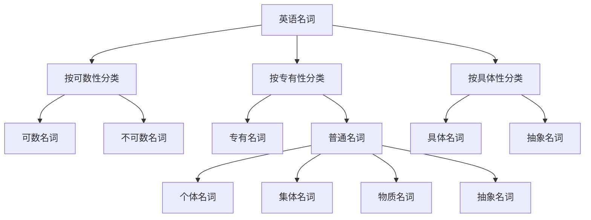
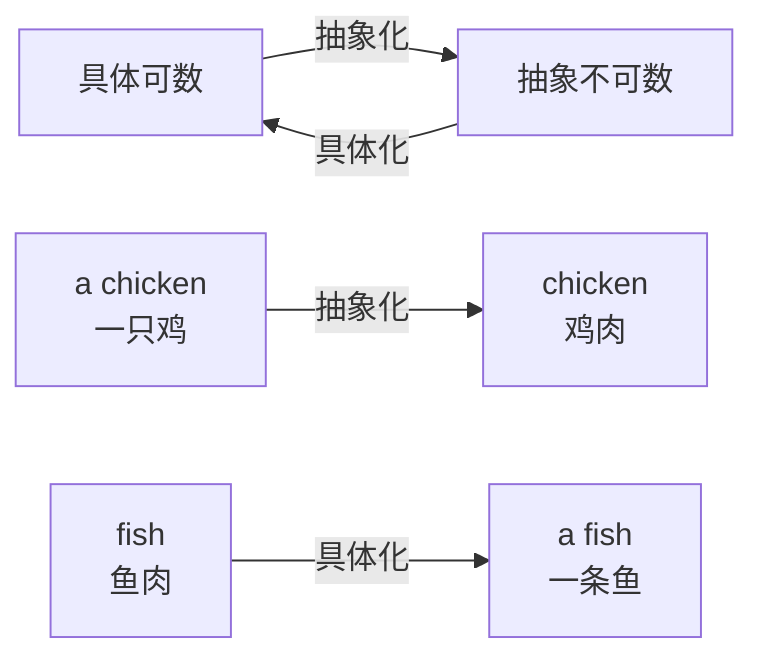
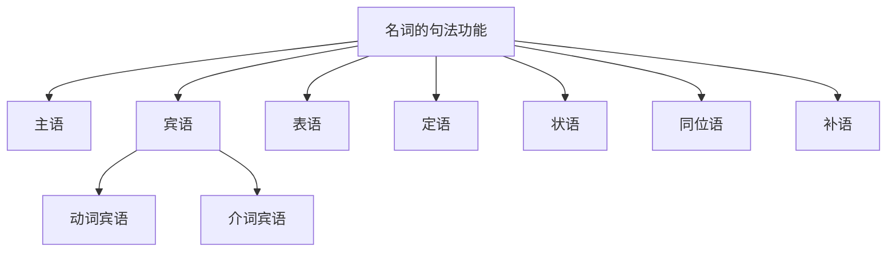

# 名词的分类与用法

> [!info] 学习目标
>
> 通过本章学习，你将掌握：
> - 英语名词的完整分类体系
> - 可数名词与不可数名词的区分与用法
> - 专有名词与普通名词的特点
> - 集体名词、物质名词、抽象名词的使用规则
> - 名词在句子中的各种功能

---

## 1. 名词概述

### 1.1 什么是名词

名词（Noun）是英语中最基础、最重要的词类之一。简单来说，**名词是用来表示人、事物、地点、概念或动作名称的词**。在任何一个完整的英语句子中，名词都扮演着不可或缺的角色。

> [!tip] 名词的本质
>
> 名词回答的是 **"What is it?"（这是什么？）** 或 **"Who is it?"（这是谁？）** 的问题。任何能够被命名、被指称的事物，在语言中都需要用名词来表达。

**名词的英文术语解析**：

| 术语 | 英文 | 词源说明 |
| --- | --- | --- |
| 名词 | Noun | 来自拉丁语 nomen，意为"名字、名称" |
| 名词性的 | Nominal | 形容词形式，表示"与名词相关的" |
| 名词化 | Nominalization | 将其他词类转换为名词的过程 |

### 1.2 名词的分类体系

英语名词的分类方式多种多样，不同的分类标准会产生不同的类别划分。下面的思维导图展示了名词的完整分类体系：

上图展示了名词的三种主要分类视角。按可数性分类是最实用的分类方式，直接影响名词与冠词、数词的搭配；按专有性分类区分了专有名词和普通名词；按具体性分类则从语义角度区分了具体名词和抽象名词。在实际学习中，这三种分类往往交叉使用。

### 1.3 各类名词的对比总览

| 分类标准 | 类别 | 定义 | 典型例词 |
| --- | --- | --- | --- |
| **按可数性** | 可数名词 | 可以用数字计数的名词 | book, apple, student |
| | 不可数名词 | 不能直接用数字计数的名词 | water, information, music |
| **按专有性** | 专有名词 | 表示特定人、地、物的专有名称 | Beijing, Shakespeare, Christmas |
| | 普通名词 | 表示一类人或事物的通用名称 | city, writer, holiday |
| **按具体性** | 具体名词 | 可以通过感官感知的事物 | table, flower, sound |
| | 抽象名词 | 表示性质、状态、动作等抽象概念 | happiness, freedom, growth |

---

## 2. 可数名词详解

### 2.1 可数名词的定义与特征

可数名词（Countable Nouns）是指那些**可以用数字直接计数**的名词。这类名词既有单数形式，也有复数形式，可以与数词（one, two, three...）及不定冠词（a, an）搭配使用。

> [!example] 可数名词的基本特征
>
> 1. **有单复数之分**：book → books, child → children
> 2. **可与数词搭配**：three books, five children
> 3. **可与不定冠词搭配**：a book, an apple
> 4. **可与 many, few, several 等搭配**：many books, few students

**判断技巧**：如果一个事物在现实中可以被分成独立的、可数的单位，那么表示这个事物的名词通常是可数名词。

### 2.2 可数名词的主要类型

可数名词涵盖了大量日常使用的词汇，主要包括以下几类：

**（1）个体名词（Individual Nouns）**

个体名词表示单独存在的人或事物，是可数名词中最常见的类型：

| 类别 | 例词 | 例句 |
| --- | --- | --- |
| 表示人 | student, teacher, doctor | **A student** is reading in the library. |
| 表示动物 | dog, cat, bird | **Two dogs** are playing in the park. |
| 表示物品 | book, pen, chair | There are **three chairs** in the room. |
| 表示地点 | city, school, country | I have visited **many cities** in China. |

**（2）某些集体名词**

部分集体名词在强调个体成员时作可数名词使用：

- **family**（家庭）→ Three **families** live in this building.（三个家庭住在这栋楼里。）
- **team**（团队）→ There are six **teams** in the competition.（比赛中有六支队伍。）
- **class**（班级）→ Our school has twenty **classes**.（我们学校有二十个班级。）

**（3）由不可数名词转化而来的可数名词**

某些不可数名词在特定语境下可以转化为可数名词，表示具体的种类或实例：

| 不可数用法 | 可数用法 | 含义变化 |
| --- | --- | --- |
| **coffee**（咖啡这种饮料） | **a coffee**（一杯咖啡） | 从物质到具体份量 |
| **paper**（纸张材料） | **a paper**（一份报纸/论文） | 从材料到具体文件 |
| **glass**（玻璃材质） | **a glass**（一个玻璃杯） | 从材料到具体物品 |
| **iron**（铁这种金属） | **an iron**（一个熨斗） | 从材料到具体器具 |

> [!warning] 注意词义变化
>
> 当不可数名词转化为可数名词时，词义往往发生变化。例如：
> - **experience**（经验，不可数）→ **an experience**（一次经历，可数）
> - **beauty**（美，不可数）→ **a beauty**（美人，可数）
> - **youth**（青春，不可数）→ **a youth**（年轻人，可数）

### 2.3 可数名词的单复数变化

可数名词的复数形式变化是英语语法的重要内容。变化规则分为规则变化和不规则变化两大类。

**（1）规则变化**

| 变化规则 | 适用情况 | 示例 |
| --- | --- | --- |
| **直接加 -s** | 一般情况 | book → books, day → days |
| **加 -es** | 以 s, x, ch, sh 结尾 | box → boxes, watch → watches |
| **变 y 为 i 加 -es** | 辅音字母 + y 结尾 | city → cities, baby → babies |
| **加 -es** | 以 o 结尾（有生命） | hero → heroes, tomato → tomatoes |
| **加 -s** | 以 o 结尾（外来词/缩写） | photo → photos, piano → pianos |
| **变 f/fe 为 v 加 -es** | 以 f 或 fe 结尾 | knife → knives, life → lives |

**（2）不规则变化**

| 变化类型 | 单数 | 复数 | 记忆方法 |
| --- | --- | --- | --- |
| **元音变化** | man | men | a → e |
| | woman | women | a → e |
| | foot | feet | oo → ee |
| | tooth | teeth | oo → ee |
| | goose | geese | oo → ee |
| | mouse | mice | ouse → ice |
| **词尾变化** | child | children | 加 -ren |
| | ox | oxen | 加 -en |
| **单复数同形** | sheep | sheep | 不变 |
| | deer | deer | 不变 |
| | fish | fish | 不变 |
| | Chinese | Chinese | 不变 |

**（3）外来词的复数**

英语中有大量来自拉丁语、希腊语的外来词，它们保留了原语言的复数形式：

| 来源 | 单数 | 复数 | 含义 |
| --- | --- | --- | --- |
| **拉丁语** | datum | data | 数据 |
| | medium | media | 媒介 |
| | formula | formulae/formulas | 公式 |
| | curriculum | curricula | 课程 |
| **希腊语** | analysis | analyses | 分析 |
| | crisis | crises | 危机 |
| | phenomenon | phenomena | 现象 |
| | criterion | criteria | 标准 |

> [!tip] 现代英语趋势
>
> 在现代英语中，许多外来词的复数形式正在逐渐英语化。例如：
> - **formulas** 比 **formulae** 更常用
> - **indexes** 比 **indices** 更常用（在商业语境中）
> - 但在学术写作中，传统复数形式仍被优先使用

### 2.4 可数名词与量词的搭配

可数名词可以与多种量词搭配，形成不同的表达方式：

| 量词类型 | 搭配方式 | 示例 |
| --- | --- | --- |
| **数词** | 数词 + 复数名词 | three books, five apples |
| **不定冠词** | a/an + 单数名词 | a book, an apple |
| **some/any** | some/any + 复数名词 | some books, any questions |
| **many/few** | many/few + 复数名词 | many students, few problems |
| **several** | several + 复数名词 | several reasons |
| **a number of** | a number of + 复数名词 | a number of people |
| **成对量词** | a pair of + 复数名词 | a pair of shoes, a pair of glasses |

---

## 3. 不可数名词详解

### 3.1 不可数名词的定义与特征

不可数名词（Uncountable Nouns / Mass Nouns）是指那些**不能直接用数字计数**的名词。这类名词表示的事物通常是连续的、无界限的，或者是抽象的概念，无法分成独立的单位来计数。

> [!example] 不可数名词的基本特征
>
> 1. **没有复数形式**：water, music, information（不说 waters, musics, informations）
> 2. **不能与数词直接搭配**：不说 two water, three music
> 3. **不能与不定冠词搭配**：不说 a water, an information
> 4. **与 much, little, a lot of 搭配**：much water, little time, a lot of information
> 5. **谓语动词用单数**：The water **is** cold. / The information **is** useful.

### 3.2 不可数名词的主要类型

不可数名词涵盖多个语义类别，掌握这些类别有助于准确识别和使用不可数名词。

**（1）物质名词（Material Nouns）**

物质名词表示无法分割成独立个体的物质或材料：

| 类别 | 例词 | 例句 |
| --- | --- | --- |
| **液体** | water, milk, juice, oil, blood | **Water** is essential for life. |
| **气体** | air, oxygen, smoke, steam | Fresh **air** is important for health. |
| **固体材料** | gold, silver, iron, wood, paper | This ring is made of **gold**. |
| **食物原料** | rice, bread, meat, cheese, butter | I had **bread** for breakfast. |
| **自然物质** | sand, snow, rain, fog, dust | The **snow** is falling heavily. |

**（2）抽象名词（Abstract Nouns）**

抽象名词表示无法通过感官直接感知的概念、性质、状态或动作：

| 类别 | 例词 | 例句 |
| --- | --- | --- |
| **情感** | love, hate, anger, fear, happiness | **Love** conquers all. |
| **品质** | honesty, courage, patience, wisdom | **Honesty** is the best policy. |
| **状态** | health, wealth, poverty, freedom | Good **health** is priceless. |
| **学科** | mathematics, physics, history | **Mathematics** is my favorite subject. |
| **活动** | homework, research, work, travel | I have a lot of **homework** to do. |

**（3）集合概念名词**

某些名词虽然表示多个个体的集合，但在英语中被视为不可数名词：

| 名词 | 含义 | 例句 |
| --- | --- | --- |
| **furniture** | 家具（总称） | The **furniture** in this room is new. |
| **luggage/baggage** | 行李（总称） | My **luggage** is very heavy. |
| **equipment** | 设备（总称） | The **equipment** needs to be updated. |
| **clothing** | 衣服（总称） | Summer **clothing** is on sale. |
| **jewelry** | 珠宝（总称） | She has a lot of **jewelry**. |
| **machinery** | 机械（总称） | The **machinery** is very expensive. |

> [!warning] 常见错误
>
> 这些集合概念名词是中国学生常犯错误的重灾区：
> - ❌ I bought many **furnitures**. → ✅ I bought a lot of **furniture**.
> - ❌ Where are my **luggages**? → ✅ Where is my **luggage**?
> - ❌ All the **equipments** are new. → ✅ All the **equipment** is new.

**（4）其他常见不可数名词**

| 名词 | 含义 | 常见搭配 |
| --- | --- | --- |
| **information** | 信息 | a piece of information |
| **advice** | 建议 | a piece of advice |
| **news** | 新闻 | a piece of news |
| **progress** | 进步 | make progress |
| **knowledge** | 知识 | a wealth of knowledge |
| **weather** | 天气 | good/bad weather |
| **traffic** | 交通 | heavy traffic |
| **fun** | 乐趣 | have fun |

### 3.3 不可数名词的量化表达

虽然不可数名词不能直接与数词搭配，但可以通过**量词**来表示具体的数量：

**（1）通用量词**

| 量词 | 适用范围 | 示例 |
| --- | --- | --- |
| **a piece of** | 信息、建议、家具等 | a piece of information, a piece of furniture |
| **a bit of** | 多种不可数名词 | a bit of advice, a bit of luck |
| **a lot of** | 多种不可数名词 | a lot of water, a lot of time |
| **some/any** | 多种不可数名词 | some water, any news |
| **much/little** | 多种不可数名词 | much money, little hope |

**（2）特定量词**

| 量词 | 适用名词 | 示例 |
| --- | --- | --- |
| **a cup/glass of** | 饮料 | a cup of tea, a glass of water |
| **a bottle of** | 液体 | a bottle of wine, a bottle of milk |
| **a bowl of** | 食物 | a bowl of rice, a bowl of soup |
| **a slice/piece of** | 食物 | a slice of bread, a piece of cake |
| **a bar of** | 条状物 | a bar of chocolate, a bar of soap |
| **a drop of** | 液体（少量） | a drop of water, a drop of blood |
| **a grain of** | 颗粒状物 | a grain of rice, a grain of sand |
| **a sheet of** | 纸张 | a sheet of paper |

**（3）表示大量的量词**

| 量词 | 含义 | 示例 |
| --- | --- | --- |
| **a great deal of** | 大量 | a great deal of money |
| **a large amount of** | 大量 | a large amount of water |
| **plenty of** | 充足的 | plenty of time |
| **a wealth of** | 丰富的 | a wealth of experience |

> [!tip] 量词的复数形式
>
> 当需要表示多个单位时，量词本身要变复数：
> - **two cups of** coffee（两杯咖啡）
> - **three pieces of** advice（三条建议）
> - **several bottles of** water（几瓶水）

### 3.4 不可数名词的特殊用法

**（1）作为泛指概念时，不可数名词可单独使用**

- **Money** is not everything.（金钱不是一切。）
- **Time** flies.（时光飞逝。）
- **Knowledge** is power.（知识就是力量。）

**（2）作为特指概念时，可与定冠词 the 搭配**

- **The water** in this river is polluted.（这条河里的水被污染了。）
- **The information** you gave me was very helpful.（你给我的信息非常有用。）
- **The advice** he offered was excellent.（他提供的建议非常好。）

**（3）某些不可数名词可与 a 搭配，表示"一种"或"一阵"**

| 表达 | 含义 | 例句 |
| --- | --- | --- |
| **a rain** | 一场雨 | We had a heavy rain last night. |
| **a snow** | 一场雪 | A heavy snow is expected tomorrow. |
| **a fog** | 一场雾 | A thick fog covered the city. |
| **a coffee** | 一杯咖啡 | I'd like a coffee, please. |

---

## 4. 可数与不可数的转换

### 4.1 同一名词的可数与不可数用法

许多英语名词既可以作可数名词，也可以作不可数名词，但含义会有所不同。掌握这种转换规律对于准确使用名词至关重要。

| 名词 | 不可数用法 | 可数用法 |
| --- | --- | --- |
| **paper** | 纸张（材料）| 报纸/论文/试卷 |
| | I need some **paper** to write on. | I read **a paper** every morning. |
| **glass** | 玻璃（材料）| 玻璃杯 |
| | The window is made of **glass**. | Give me **a glass** of water. |
| **iron** | 铁（金属）| 熨斗 |
| | The gate is made of **iron**. | I need **an iron** to press my shirt. |
| **room** | 空间/余地 | 房间 |
| | There's no **room** for doubt. | This house has five **rooms**. |
| **experience** | 经验（总称）| 经历（具体事件）|
| | She has a lot of **experience**. | It was **an unforgettable experience**. |
| **light** | 光线 | 灯 |
| | The room needs more **light**. | Turn off **the lights** before you leave. |

### 4.2 从具体到抽象的转换

上图展示了名词在可数与不可数之间转换的基本规律。当名词从具体个体抽象为一般物质或概念时，往往变为不可数；反之，当抽象概念具体化为可感知的实例时，则变为可数。这种转换在动物与其肉类、材料与其制品之间尤为常见。

**常见的具体-抽象转换：**

| 可数（具体）| 不可数（抽象）| 说明 |
| --- | --- | --- |
| **a chicken**（一只鸡）| **chicken**（鸡肉）| 动物 → 食材 |
| **a lamb**（一只羊羔）| **lamb**（羊肉）| 动物 → 食材 |
| **a cake**（一个蛋糕）| **cake**（蛋糕，作为食物）| 整体 → 物质 |
| **a stone**（一块石头）| **stone**（石料）| 个体 → 材料 |
| **a hair**（一根头发）| **hair**（头发，总称）| 个体 → 集合 |

### 4.3 判断可数与不可数的实用技巧

> [!tip] 判断方法
>
> **方法一：可分割性测试**
> - 问自己：这个事物能否被分成独立的、可数的单位？
> - 如果可以 → 可数名词
> - 如果不可以 → 不可数名词
>
> **方法二：边界清晰度测试**
> - 这个事物有没有明确的边界或形状？
> - 有明确边界 → 可数名词（如 apple, book）
> - 无明确边界 → 不可数名词（如 water, sand）
>
> **方法三：查字典确认**
> - 字典中标注 [C] = Countable（可数）
> - 字典中标注 [U] = Uncountable（不可数）
> - 字典中标注 [C, U] = 两种用法皆可

---

## 5. 专有名词与普通名词

### 5.1 专有名词的定义与特征

专有名词（Proper Nouns）是表示**特定的人、地点、机构、节日、作品等**的名称。专有名词是独一无二的，指的是世界上特定的、唯一的事物。

> [!example] 专有名词的基本特征
>
> 1. **首字母必须大写**：Beijing, Shakespeare, Monday
> 2. **通常不与冠词连用**：I live in China.（不说 I live in the China.）
> 3. **一般没有复数形式**：表示特定的唯一事物
> 4. **不能被形容词修饰为泛指**：不说 a big Beijing

### 5.2 专有名词的主要类型

| 类别 | 例词 | 说明 |
| --- | --- | --- |
| **人名** | William Shakespeare, Albert Einstein | 首字母大写 |
| **地名** | Beijing, the United States, Mount Everest | 某些地名需要定冠词 |
| **国家/民族名** | China, the Chinese, France, the French | 民族名前常加 the |
| **语言名** | English, Chinese, French | 不加冠词 |
| **星期/月份** | Monday, January, Spring | 首字母大写 |
| **节日** | Christmas, Thanksgiving, Spring Festival | 首字母大写 |
| **机构/组织** | the United Nations, Harvard University | 某些需要定冠词 |
| **书籍/电影** | "Harry Potter", "The Great Gatsby" | 通常用引号或斜体 |
| **品牌** | Apple, Nike, Coca-Cola | 首字母大写 |

### 5.3 专有名词与冠词的搭配规则

**（1）不加冠词的专有名词**

| 类型 | 示例 | 说明 |
| --- | --- | --- |
| **人名** | Tom, Mary, Dr. Smith | 直接使用 |
| **大多数国家名** | China, Japan, France | 单词构成的国名 |
| **大多数城市名** | Beijing, London, Paris | 直接使用 |
| **语言名** | English, Chinese | 直接使用 |
| **星期/月份** | Monday, January | 直接使用 |
| **大多数节日** | Christmas, Easter | 直接使用 |
| **街道名** | Wall Street, Oxford Street | 直接使用 |
| **公园名** | Central Park, Hyde Park | 直接使用 |
| **大学名（含专有词）** | Harvard University, Peking University | University 结尾 |

**（2）需要加定冠词 the 的专有名词**

| 类型 | 示例 | 规律 |
| --- | --- | --- |
| **由普通名词构成的国名** | the United States, the United Kingdom | 含有普通名词 |
| **含 Republic, Kingdom 的国名** | the People's Republic of China | 政体名词 |
| **海洋/河流/山脉** | the Pacific Ocean, the Yellow River, the Alps | 自然地理名词 |
| **群岛** | the Philippines, the British Isles | 岛屿群 |
| **某些地区名** | the Middle East, the Far East | 地区名称 |
| **报刊名** | the Times, the Washington Post | 报纸杂志 |
| **某些建筑物** | the Great Wall, the White House | 著名建筑 |
| **乐团/乐队** | the Beatles, the Rolling Stones | 乐队名 |

> [!warning] 易混淆的情况
>
> - **University of + 地名**：用 the → **the University of** Cambridge
> - **地名 + University**：不用 the → **Cambridge University**
> - **the + 姓氏复数**：表示"某某一家人" → **the Smiths**（史密斯一家）

### 5.4 普通名词的定义与分类

普通名词（Common Nouns）是表示**一类人、事物或概念的通用名称**，而非特指某一个具体事物。普通名词可以进一步分为四个子类：

| 子类 | 定义 | 例词 |
| --- | --- | --- |
| **个体名词** | 表示单独个体的名词 | student, book, apple |
| **集体名词** | 表示一群人或物的整体 | family, team, class |
| **物质名词** | 表示无法分割的物质或材料 | water, gold, air |
| **抽象名词** | 表示性质、状态、动作等抽象概念 | love, freedom, education |

---

## 6. 集体名词详解

### 6.1 集体名词的定义与特征

集体名词（Collective Nouns）是表示**由多个个体组成的群体或集合**的名词。集体名词的特殊之处在于，它既可以被看作一个整体（单数概念），也可以被看作多个个体（复数概念），这取决于说话者的视角和语境。

> [!info] 集体名词的双重性质
>
> - **强调整体**：谓语动词用**单数**
> - **强调个体成员**：谓语动词用**复数**

### 6.2 常见集体名词及其用法

**（1）可单可复的集体名词**

这类集体名词根据语境可作单数或复数理解：

| 名词 | 作单数（强调整体）| 作复数（强调个体）|
| --- | --- | --- |
| **family** | My family **is** large.（我家是个大家庭。）| My family **are** all doctors.（我家人都是医生。）|
| **team** | The team **is** winning.（这个队正在获胜。）| The team **are** having lunch.（队员们在吃午饭。）|
| **class** | The class **is** too large.（这个班太大了。）| The class **are** taking notes.（学生们在记笔记。）|
| **government** | The government **has** decided.（政府已做出决定。）| The government **are** divided.（政府成员意见不一。）|
| **committee** | The committee **meets** weekly.（委员会每周开会。）| The committee **are** arguing.（委员们在争论。）|
| **audience** | The audience **was** large.（观众很多。）| The audience **were** clapping.（观众们在鼓掌。）|
| **staff** | The staff **is** small.（员工人数少。）| The staff **are** on holiday.（员工们在度假。）|
| **crew** | The crew **is** experienced.（机组经验丰富。）| The crew **are** preparing.（机组人员在准备。）|

**（2）通常作复数的集体名词**

这类集体名词在大多数情况下视为复数，谓语动词用复数形式：

| 名词 | 含义 | 例句 |
| --- | --- | --- |
| **people** | 人们 | **People are** waiting outside. |
| **police** | 警察（总称）| **The police are** investigating the case. |
| **cattle** | 牛（总称）| **The cattle are** grazing in the field. |
| **poultry** | 家禽（总称）| **The poultry are** kept in the barn. |
| **folk** | 人们 | **Folk are** very friendly here. |
| **clergy** | 神职人员 | **The clergy are** opposed to the plan. |

> [!warning] 注意
>
> **police** 和 **cattle** 是永远作复数的集体名词：
> - ❌ The police **is** coming. → ✅ The police **are** coming.
> - ❌ The cattle **is** grazing. → ✅ The cattle **are** grazing.
>
> 如果要表示单数，需要用其他表达：
> - **a police officer**（一名警察）
> - **a head of cattle**（一头牛）

**（3）通常作单数的集体名词**

这类集体名词通常视为不可数名词，谓语动词用单数：

| 名词 | 含义 | 例句 |
| --- | --- | --- |
| **furniture** | 家具 | The **furniture is** new. |
| **machinery** | 机械 | The **machinery is** outdated. |
| **equipment** | 设备 | The **equipment is** expensive. |
| **clothing** | 衣服 | **Clothing is** sold on the second floor. |
| **luggage** | 行李 | My **luggage is** lost. |
| **jewelry** | 珠宝 | Her **jewelry is** beautiful. |

### 6.3 集体名词的量化表达

对于作不可数名词的集体名词，需要用特定的量词来表示数量：

| 集体名词 | 量词表达 | 示例 |
| --- | --- | --- |
| **furniture** | a piece of furniture | I bought **three pieces of furniture**. |
| **luggage** | a piece of luggage | I have **two pieces of luggage**. |
| **equipment** | a piece of equipment | We need **some new pieces of equipment**. |
| **clothing** | an article/item of clothing | She bought **several items of clothing**. |
| **jewelry** | a piece of jewelry | She received **a beautiful piece of jewelry**. |

---

## 7. 物质名词详解

### 7.1 物质名词的定义与特征

物质名词（Material Nouns / Mass Nouns）是表示**无法分割成独立个体的物质或材料**的名词。这些名词所表示的事物通常是连续的、均匀的，没有明确的边界或形状。

> [!example] 物质名词的特征
>
> 1. **通常不可数**：不能直接加数词
> 2. **没有复数形式**：water, gold, air 等没有复数
> 3. **与 much, little, some 搭配**：much water, little milk, some bread
> 4. **需要量词表示具体数量**：a glass of water, a piece of bread

### 7.2 物质名词的分类

| 类别 | 例词 | 例句 |
| --- | --- | --- |
| **液体** | water, milk, juice, oil, wine, beer | I need some **water**. |
| **气体** | air, oxygen, hydrogen, smoke, steam | Fresh **air** is good for health. |
| **固体材料** | iron, gold, silver, copper, steel, wood | The bridge is made of **steel**. |
| **食物** | rice, bread, meat, butter, cheese, sugar | **Rice** is the staple food in China. |
| **自然物质** | sand, snow, rain, fog, ice, soil | **Snow** covers the mountain. |
| **其他** | paper, glass, cloth, plastic, rubber | This bag is made of **plastic**. |

### 7.3 物质名词的量化表达

物质名词需要借助各种量词来表示具体数量：

**（1）容器类量词**

| 量词 | 搭配的物质名词 | 示例 |
| --- | --- | --- |
| **a cup of** | tea, coffee, milk | a cup of tea（一杯茶）|
| **a glass of** | water, juice, wine, milk | a glass of water（一杯水）|
| **a bottle of** | water, wine, beer, milk | a bottle of wine（一瓶葡萄酒）|
| **a bowl of** | rice, soup, noodles | a bowl of rice（一碗米饭）|
| **a can of** | beer, cola, soup | a can of beer（一罐啤酒）|
| **a pot of** | tea, coffee | a pot of tea（一壶茶）|
| **a jug of** | water, milk | a jug of milk（一罐牛奶）|

**（2）形状类量词**

| 量词 | 搭配的物质名词 | 示例 |
| --- | --- | --- |
| **a piece of** | bread, cake, paper, meat, furniture | a piece of bread（一片面包）|
| **a slice of** | bread, cake, cheese, pizza | a slice of pizza（一片披萨）|
| **a bar of** | chocolate, soap, gold | a bar of chocolate（一条巧克力）|
| **a loaf of** | bread | a loaf of bread（一条面包）|
| **a sheet of** | paper, glass | a sheet of paper（一张纸）|
| **a block of** | ice, wood, stone | a block of ice（一块冰）|
| **a grain of** | rice, sand, salt | a grain of sand（一粒沙子）|
| **a drop of** | water, blood, oil | a drop of water（一滴水）|

**（3）度量类量词**

| 量词 | 搭配的物质名词 | 示例 |
| --- | --- | --- |
| **a pound of** | meat, butter, flour | a pound of butter（一磅黄油）|
| **a kilogram of** | rice, sugar, flour | a kilogram of rice（一公斤大米）|
| **a liter of** | water, milk, oil | a liter of milk（一升牛奶）|
| **a ton of** | coal, steel, sand | a ton of coal（一吨煤）|

### 7.4 物质名词转化为可数名词

在特定语境下，物质名词可以转化为可数名词，表示**种类**或**具体的份量**：

| 物质名词（不可数）| 可数用法 | 含义变化 |
| --- | --- | --- |
| **coffee**（咖啡）| Two **coffees**, please. | 两杯咖啡 |
| **tea**（茶）| I'd like **a tea**. | 一杯茶 |
| **beer**（啤酒）| Three **beers**, please. | 三杯/瓶啤酒 |
| **wine**（葡萄酒）| This region produces fine **wines**. | 各种葡萄酒 |
| **cheese**（奶酪）| France is famous for its **cheeses**. | 各种奶酪 |
| **paper**（纸）| I'm writing **a paper**. | 一篇论文 |
| **glass**（玻璃）| I need **a glass**. | 一个玻璃杯 |
| **iron**（铁）| She bought **an iron**. | 一个熨斗 |

> [!tip] 转化规律
>
> 物质名词转化为可数名词时，通常有以下几种含义变化：
> 1. **材料 → 制品**：glass（玻璃）→ a glass（玻璃杯）
> 2. **物质 → 份量**：coffee（咖啡）→ a coffee（一杯咖啡）
> 3. **总称 → 种类**：wine（葡萄酒）→ wines（各种葡萄酒）

---

## 8. 抽象名词详解

### 8.1 抽象名词的定义与特征

抽象名词（Abstract Nouns）是表示**无法通过感官直接感知的性质、状态、情感、动作或概念**的名词。与具体名词不同，抽象名词所表示的事物是看不见、摸不着的。

> [!example] 抽象名词的特征
>
> 1. **表示抽象概念**：不能被感官直接感知
> 2. **通常不可数**：love, happiness, information
> 3. **可与 much, little 搭配**：much happiness, little hope
> 4. **可转化为可数名词**：表示具体实例时

### 8.2 抽象名词的分类

**（1）表示情感与心理状态**

| 例词 | 含义 | 例句 |
| --- | --- | --- |
| **love** | 爱 | **Love** is blind. |
| **hate** | 恨 | **Hate** only breeds more hate. |
| **happiness** | 幸福 | **Happiness** is a choice. |
| **sadness** | 悲伤 | She felt great **sadness**. |
| **anger** | 愤怒 | He tried to control his **anger**. |
| **fear** | 恐惧 | **Fear** of failure held him back. |
| **hope** | 希望 | There is still **hope**. |
| **joy** | 快乐 | The news brought us great **joy**. |

**（2）表示品质与特性**

| 例词 | 含义 | 例句 |
| --- | --- | --- |
| **honesty** | 诚实 | **Honesty** is the best policy. |
| **courage** | 勇气 | He showed great **courage**. |
| **patience** | 耐心 | Teaching requires a lot of **patience**. |
| **wisdom** | 智慧 | **Wisdom** comes with age. |
| **kindness** | 善良 | Her **kindness** touched everyone. |
| **beauty** | 美丽 | **Beauty** is in the eye of the beholder. |
| **strength** | 力量 | Mental **strength** is important. |
| **weakness** | 弱点 | Everyone has their **weaknesses**. |

**（3）表示状态与条件**

| 例词 | 含义 | 例句 |
| --- | --- | --- |
| **health** | 健康 | Good **health** is priceless. |
| **wealth** | 财富 | **Wealth** doesn't guarantee happiness. |
| **poverty** | 贫穷 | Many live in **poverty**. |
| **freedom** | 自由 | They fought for **freedom**. |
| **peace** | 和平 | We all want **peace**. |
| **silence** | 沉默 | **Silence** is golden. |

**（4）表示动作与过程**

| 例词 | 含义 | 例句 |
| --- | --- | --- |
| **education** | 教育 | **Education** is important. |
| **growth** | 成长 | Economic **growth** is slowing. |
| **development** | 发展 | Sustainable **development** is key. |
| **research** | 研究 | More **research** is needed. |
| **progress** | 进步 | We have made great **progress**. |
| **success** | 成功 | **Success** requires hard work. |
| **failure** | 失败 | **Failure** is the mother of success. |

**（5）表示学科与知识领域**

| 例词 | 含义 | 例句 |
| --- | --- | --- |
| **mathematics** | 数学 | **Mathematics** is difficult. |
| **physics** | 物理 | **Physics** explains how things work. |
| **history** | 历史 | **History** repeats itself. |
| **philosophy** | 哲学 | He studied **philosophy**. |
| **economics** | 经济学 | **Economics** is a social science. |

### 8.3 抽象名词转化为可数名词

某些抽象名词在表示具体实例或种类时可以转化为可数名词：

| 抽象名词（不可数）| 可数用法 | 含义变化 |
| --- | --- | --- |
| **experience**（经验）| an experience（一次经历）| 抽象 → 具体事件 |
| **beauty**（美）| a beauty（美人/美丽的事物）| 抽象 → 具体存在 |
| **youth**（青春）| a youth（年轻人）| 抽象 → 具体的人 |
| **success**（成功）| a success（成功的人或事）| 抽象 → 具体实例 |
| **failure**（失败）| a failure（失败者/失败的事）| 抽象 → 具体实例 |
| **pleasure**（愉快）| a pleasure（令人愉快的事）| 抽象 → 具体事物 |
| **surprise**（惊讶）| a surprise（令人惊讶的事）| 抽象 → 具体事件 |
| **difficulty**（困难）| difficulties（各种困难）| 抽象 → 具体问题 |

**例句对比：**

- **Experience** is the best teacher.（经验是最好的老师。）— 不可数
- It was **an unforgettable experience**.（这是一次难忘的经历。）— 可数

- **Beauty** is only skin deep.（美只是表面的。）— 不可数
- She is **a real beauty**.（她真是个美人。）— 可数

---

## 9. 名词在句子中的功能

名词是英语句子中最重要的词类之一，可以在句子中充当多种成分。

### 9.1 名词的句法功能总览

上图展示了名词在句子中的七种主要功能。其中，主语、宾语和表语是名词最常见的三种功能，几乎在每个句子中都会出现；定语、状语和同位语则是名词的修饰和补充功能；补语用于补充说明主语或宾语的状态。

### 9.2 名词作主语

主语是句子的主体，表示动作的发出者或状态的承担者。

| 名词类型 | 例句 | 分析 |
| --- | --- | --- |
| **普通名词** | **The student** is reading. | 学生在阅读。|
| **专有名词** | **Beijing** is the capital of China. | 北京是中国的首都。|
| **抽象名词** | **Honesty** is the best policy. | 诚实是最好的策略。|
| **物质名词** | **Water** is essential for life. | 水是生命必需的。|
| **集体名词** | **The team** has won the game. | 这个团队赢得了比赛。|

### 9.3 名词作宾语

宾语表示动作的承受者或对象，分为动词宾语和介词宾语。

**（1）动词宾语**

| 例句 | 分析 |
| --- | --- |
| I like **music**. | music 是 like 的宾语 |
| She bought **a book**. | a book 是 bought 的宾语 |
| He gave me **some advice**. | some advice 是间接宾语 |
| They elected him **chairman**. | chairman 是宾语补足语 |

**（2）介词宾语**

| 例句 | 分析 |
| --- | --- |
| I'm interested in **music**. | music 是介词 in 的宾语 |
| She's good at **mathematics**. | mathematics 是介词 at 的宾语 |
| The book is on **the table**. | the table 是介词 on 的宾语 |

### 9.4 名词作表语

表语说明主语的身份、特征或状态，位于连系动词之后。

| 例句 | 分析 |
| --- | --- |
| He is **a teacher**. | a teacher 说明主语 he 的身份 |
| This is **my book**. | my book 说明主语 this 的内容 |
| The problem is **money**. | money 说明问题的实质 |
| She became **a doctor**. | a doctor 说明主语变化后的身份 |

### 9.5 名词作定语

名词可以直接修饰另一个名词，形成名词定语。

| 名词定语 + 名词 | 含义 |
| --- | --- |
| **school** bus | 校车 |
| **coffee** cup | 咖啡杯 |
| **window** seat | 靠窗座位 |
| **gold** ring | 金戒指 |
| **paper** bag | 纸袋 |
| **stone** wall | 石墙 |
| **birthday** party | 生日派对 |
| **government** policy | 政府政策 |

> [!tip] 名词定语 vs 形容词定语
>
> - **名词定语**强调**材料、用途、时间**等具体信息
>   - a **gold** ring（金戒指 — 材料）
>   - a **coffee** cup（咖啡杯 — 用途）
> - **形容词定语**强调**性质、特征**
>   - a **golden** opportunity（金色的机会 — 比喻义）
>   - a **golden** sunset（金色的日落 — 颜色）

### 9.6 名词作状语

名词短语可以作时间状语或方式状语。

| 功能 | 例句 | 分析 |
| --- | --- | --- |
| **时间状语** | I saw him **last week**. | last week 表示时间 |
| | She called me **this morning**. | this morning 表示时间 |
| **方式状语** | They went there **by bus**. | by bus 表示方式 |
| | We walked **arm in arm**. | arm in arm 表示方式 |

### 9.7 名词作同位语

同位语用于解释说明前面的名词，与其指同一事物。

| 例句 | 分析 |
| --- | --- |
| **Mr. Smith**, **our teacher**, is very kind. | our teacher 是 Mr. Smith 的同位语 |
| **Beijing**, **the capital of China**, is a beautiful city. | the capital of China 是 Beijing 的同位语 |
| I have a question, **whether we should go**. | 同位语从句 |

---

## 10. 名词使用的常见错误

### 10.1 可数与不可数混淆

| 错误 | 正确 | 说明 |
| --- | --- | --- |
| ❌ I need **an information**. | ✅ I need **some information**. | information 不可数 |
| ❌ She gave me **many advices**. | ✅ She gave me **much advice**. | advice 不可数 |
| ❌ I bought **new furnitures**. | ✅ I bought **new furniture**. | furniture 不可数 |
| ❌ The **news are** good. | ✅ The **news is** good. | news 形复实单 |
| ❌ I have **many homeworks**. | ✅ I have **a lot of homework**. | homework 不可数 |

### 10.2 冠词使用错误

| 错误 | 正确 | 说明 |
| --- | --- | --- |
| ❌ I want to be **doctor**. | ✅ I want to be **a doctor**. | 可数单数需要冠词 |
| ❌ **The honesty** is important. | ✅ **Honesty** is important. | 抽象名词泛指不加冠词 |
| ❌ I live in **the China**. | ✅ I live in **China**. | 大多数国名不加冠词 |
| ❌ He plays **the basketball**. | ✅ He plays **basketball**. | 球类运动不加冠词 |

### 10.3 名词复数形式错误

| 错误 | 正确 | 说明 |
| --- | --- | --- |
| ❌ There are many **sheeps**. | ✅ There are many **sheep**. | sheep 单复数同形 |
| ❌ I saw two **childs**. | ✅ I saw two **children**. | child 的复数是 children |
| ❌ The two **womans** are sisters. | ✅ The two **women** are sisters. | woman 的复数是 women |
| ❌ I have three **foots**. | ✅ I have three **feet**. | foot 的复数是 feet |

### 10.4 集体名词谓语动词错误

| 错误 | 正确 | 说明 |
| --- | --- | --- |
| ❌ The police **is** coming. | ✅ The police **are** coming. | police 作复数 |
| ❌ The cattle **is** grazing. | ✅ The cattle **are** grazing. | cattle 作复数 |
| ❌ The furniture **are** new. | ✅ The furniture **is** new. | furniture 作单数 |

---

## 11. 本章小结

通过本章的学习，我们系统掌握了英语名词的分类体系和使用规则：

> [!success] 核心要点回顾
>
> **1. 名词分类**
> - 按可数性：可数名词 vs 不可数名词
> - 按专有性：专有名词 vs 普通名词
> - 按具体性：具体名词 vs 抽象名词
>
> **2. 可数名词**
> - 有单复数变化（规则变化 + 不规则变化）
> - 可与数词、不定冠词搭配
> - 可与 many, few, several 搭配
>
> **3. 不可数名词**
> - 没有复数形式
> - 需要量词表示数量
> - 与 much, little, some 搭配
>
> **4. 专有名词**
> - 首字母大写
> - 大多数不加冠词
> - 某些需要加定冠词
>
> **5. 集体名词**
> - 可作单数或复数（视语境而定）
> - 某些永远作复数（police, cattle）
> - 某些永远作单数（furniture, luggage）
>
> **6. 名词的句法功能**
> - 主语、宾语、表语（最常见）
> - 定语、状语、同位语、补语

---

## 12. 练习与巩固

### 练习一：判断可数与不可数

判断下列名词是可数名词（C）还是不可数名词（U）：

1. information ____
2. suggestion ____
3. furniture ____
4. news ____
5. equipment ____
6. advice ____
7. progress ____
8. knowledge ____
9. homework ____
10. luggage ____

> [!tip] 参考答案
>
> 1. U  2. C  3. U  4. U  5. U  6. U  7. U  8. U  9. U  10. U

### 练习二：选择正确的量词

用适当的量词填空：

1. a ____ of paper
2. a ____ of water
3. a ____ of bread
4. a ____ of advice
5. a ____ of furniture

> [!tip] 参考答案
>
> 1. piece/sheet  2. glass/bottle/cup  3. loaf/slice/piece  4. piece/bit  5. piece

### 练习三：改错

改正下列句子中的错误：

1. I need some informations about the project.
2. She gave me many advices.
3. The police is looking for the thief.
4. I bought two breads at the bakery.
5. His knowledge are very wide.

> [!tip] 参考答案
>
> 1. informations → information
> 2. many advices → much advice / some advice
> 3. is → are
> 4. two breads → two loaves of bread
> 5. are → is

---

> [!quote] 学习箴言
>
> "名词是语言的基石。掌握名词的分类与用法，是精通英语语法的第一步。"

---

**下一篇**：[[02.名词的数与格|名词的数与格]] — 深入学习名词的单复数变化和所有格用法
