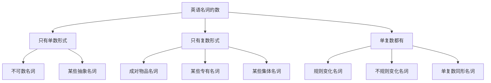
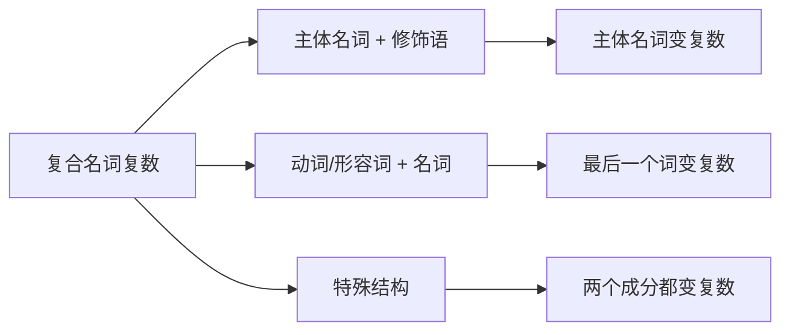
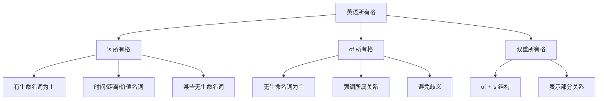
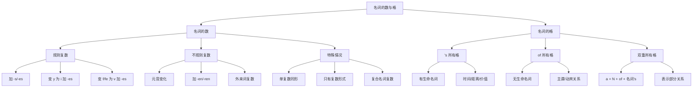

# 名词的数与格

> [!info] 学习目标
>
> 通过本章学习，你将掌握：
> - 名词复数的全部规则变化与发音规则
> - 名词复数的各类不规则变化
> - 外来词和复合名词的复数形式
> - 's 所有格的构成规则与使用场景
> - of 所有格的用法与选择原则
> - 双重所有格的结构与含义
> - 名词数与格的常见错误及避免方法

---

## 1. 名词的"数"概述

### 1.1 什么是名词的"数"

名词的"数"（Number）是英语语法中一个核心概念，指的是名词表示**一个还是多个**事物的语法范畴。英语名词有两种数的形式：**单数**（Singular）表示一个，**复数**（Plural）表示两个或两个以上。

> [!tip] 数的语法意义
>
> 名词的数不仅仅是数量概念的体现，它还会影响：
> - **动词的形式**：主谓一致（The boy runs. / The boys run.）
> - **冠词的选择**：a/an 只能用于单数（a book / books）
> - **代词的选择**：this/that 用于单数，these/those 用于复数
> - **量词的搭配**：many/few 用于复数，much/little 用于不可数

**中英术语对照**：

| 中文术语 | 英文术语 | 说明 |
| --- | --- | --- |
| 数 | Number | 名词表示数量的语法范畴 |
| 单数 | Singular | 表示一个事物 |
| 复数 | Plural | 表示两个或更多事物 |
| 单复数同形 | Unchanged Plural | 单复数形式相同 |
| 复数标记 | Plural Marker | 表示复数的词尾，通常是 -s/-es |

### 1.2 名词数的分类总览

英语名词按照"数"的特征可以分为以下几类：

上图展示了英语名词在"数"这一维度上的分类。大部分可数名词既有单数形式也有复数形式，但有些名词只有单数形式（如不可数名词），有些名词只有复数形式（如 scissors、trousers）。理解这些分类对正确使用名词至关重要。

### 1.3 名词数与冠词、动词的关系

名词的数直接影响句子中其他成分的选择：

| 名词形式 | 冠词搭配 | 动词形式 | 示例 |
| --- | --- | --- | --- |
| **单数可数名词** | a/an/the | 单数动词 | **A cat is** sleeping on the sofa. |
| **复数可数名词** | the/零冠词 | 复数动词 | **Cats are** independent animals. |
| **不可数名词** | the/零冠词 | 单数动词 | **Water is** essential for life. |

> [!warning] 常见错误
>
> 初学者常犯的错误：
> - ❌ A informations（information 是不可数名词，不能用 a）
> - ❌ Many water（water 是不可数名词，应用 much）
> - ❌ The news are good.（news 虽以 -s 结尾，但是单数名词）

---

## 2. 名词复数的规则变化

### 2.1 直接加 -s

**适用情况**：绝大多数名词直接在词尾加 -s 构成复数。

| 名词类型 | 单数 | 复数 | 例句 |
| --- | --- | --- | --- |
| 一般名词 | book | books | I have three **books**. |
| | desk | desks | There are twenty **desks** in the classroom. |
| | cup | cups | She bought two **cups**. |
| 以元音字母 + y 结尾 | boy | boys | The **boys** are playing football. |
| | day | days | We stayed there for five **days**. |
| | key | keys | I lost my **keys** yesterday. |
| 以元音字母 + o 结尾 | zoo | zoos | This city has two **zoos**. |
| | radio | radios | We need three **radios** for the event. |
| | studio | studios | The film company owns several **studios**. |

**发音规则**：

加 -s 后的发音取决于词尾的最后一个音素：

| 词尾音素 | -s 发音 | 示例 |
| --- | --- | --- |
| 清辅音 /p/, /t/, /k/, /f/, /θ/ | /s/ | cups /kʌps/, cats /kæts/, books /bʊks/ |
| 浊辅音和元音 | /z/ | dogs /dɒɡz/, boys /bɔɪz/, trees /triːz/ |

> [!example] 发音练习
>
> **清辅音结尾 → /s/**：
> - map → maps /mæps/
> - hat → hats /hæts/
> - book → books /bʊks/
>
> **浊辅音或元音结尾 → /z/**：
> - bag → bags /bæɡz/
> - pen → pens /penz/
> - shoe → shoes /ʃuːz/

### 2.2 加 -es

**适用情况**：以 **s, x, z, ch, sh** 结尾的名词加 -es。

这条规则的原因是这些辅音与 /s/ 或 /z/ 音相近，如果直接加 -s 会导致发音困难，因此加 -es 并在中间插入一个元音 /ɪ/，使发音清晰可辨。

| 词尾 | 单数 | 复数 | 发音 | 例句 |
| --- | --- | --- | --- | --- |
| **-s** | bus | buses | /ˈbʌsɪz/ | Two **buses** arrive every hour. |
| | class | classes | /ˈklɑːsɪz/ | There are three **classes** in the morning. |
| | glass | glasses | /ˈɡlɑːsɪz/ | She wears **glasses**. |
| **-x** | box | boxes | /ˈbɒksɪz/ | Pack these **boxes** carefully. |
| | tax | taxes | /ˈtæksɪz/ | The government raised **taxes**. |
| | fox | foxes | /ˈfɒksɪz/ | I saw two **foxes** in the forest. |
| **-z** | quiz | quizzes | /ˈkwɪzɪz/ | We had three **quizzes** this week. |
| | buzz | buzzes | /ˈbʌzɪz/ | The phone **buzzes** annoyed everyone. |
| **-ch** | watch | watches | /ˈwɒtʃɪz/ | He collects **watches**. |
| | church | churches | /ˈtʃɜːtʃɪz/ | There are many **churches** in Rome. |
| | beach | beaches | /ˈbiːtʃɪz/ | The **beaches** here are beautiful. |
| **-sh** | dish | dishes | /ˈdɪʃɪz/ | Please wash the **dishes**. |
| | brush | brushes | /ˈbrʌʃɪz/ | I need new **brushes** for painting. |
| | wish | wishes | /ˈwɪʃɪz/ | Best **wishes** for the New Year! |

> [!tip] 记忆口诀
>
> **"s, x, z, ch, sh，加 -es 发 /ɪz/"**
>
> 这些辅音都是"咝音"（sibilants），本身发音就接近 /s/ 或 /z/，所以需要加一个元音音节来区分单复数。

### 2.3 以辅音字母 + y 结尾：变 y 为 i 加 -es

**适用情况**：以"辅音字母 + y"结尾的名词，将 y 变为 i，再加 -es。

**判断关键**：看 y 前面的字母是元音还是辅音。
- **辅音 + y** → 变 y 为 i 加 -es
- **元音 + y** → 直接加 -s（见 2.1 节）

| 辅音 + y | 单数 | 复数 | 例句 |
| --- | --- | --- | --- |
| b + y | baby | babies | The hospital has a ward for **babies**. |
| d + y | body | bodies | The **bodies** were found in the river. |
| l + y | family | families | Three **families** live in this building. |
| n + y | penny | pennies | I found two **pennies** on the ground. |
| r + y | country | countries | He has visited many **countries**. |
| | story | stories | She told us interesting **stories**. |
| | library | libraries | The city has several public **libraries**. |
| t + y | city | cities | Beijing and Shanghai are big **cities**. |
| | party | parties | We attended two **parties** last weekend. |
| | duty | duties | These are your **duties** as a citizen. |

**对比：元音 + y（直接加 -s）**

| 元音 + y | 单数 | 复数 | 例句 |
| --- | --- | --- | --- |
| a + y | day | days | There are seven **days** in a week. |
| e + y | key | keys | Where are my **keys**? |
| | monkey | monkeys | The **monkeys** are playing in the trees. |
| o + y | boy | boys | The **boys** are running in the playground. |
| | toy | toys | Children love **toys**. |
| u + y | guy | guys | Those **guys** are my classmates. |

> [!warning] 专有名词例外
>
> 以 y 结尾的专有名词（人名、地名等）在变复数时，通常**直接加 -s**，不变 y 为 i：
> - Mary → the two **Marys**（两个叫 Mary 的人）
> - Germany → the **Germanys**（指历史上分裂的东西德）
> - Henry → the **Henrys**（亨利家族）

### 2.4 以 -o 结尾的名词

以 -o 结尾的名词复数变化是英语中相对复杂的一类，需要区分不同情况：

**（1）加 -es 的情况**

通常，表示有生命事物（人、植物、蔬菜）的 -o 结尾名词加 -es：

| 单数 | 复数 | 含义 | 例句 |
| --- | --- | --- | --- |
| hero | heroes | 英雄 | All the **heroes** were honored. |
| potato | potatoes | 土豆 | I bought some **potatoes**. |
| tomato | tomatoes | 西红柿 | The **tomatoes** are ripe. |
| echo | echoes | 回声 | We heard **echoes** in the cave. |
| Negro | Negroes | 黑人（旧称） | 注：此词现已很少使用 |
| veto | vetoes | 否决权 | The president used several **vetoes**. |
| torpedo | torpedoes | 鱼雷 | The ship was hit by two **torpedoes**. |

> [!tip] 记忆口诀
>
> **"黑人英雄爱吃西红柿土豆"**
>
> Negro, hero, tomato, potato → 这四个常用词都加 -es

**（2）加 -s 的情况**

外来词、缩写词、音乐术语以及以"元音 + o"结尾的名词通常直接加 -s：

| 类别 | 单数 | 复数 | 说明 |
| --- | --- | --- | --- |
| **外来词** | photo | photos | 来自 photograph |
| | piano | pianos | 意大利语借词 |
| | kilo | kilos | 来自 kilogram |
| | memo | memos | 来自 memorandum |
| **音乐术语** | solo | solos | 独奏 |
| | soprano | sopranos | 女高音 |
| | concerto | concertos | 协奏曲 |
| **缩写词** | auto | autos | automobile 的缩写 |
| | disco | discos | discotheque 的缩写 |
| | video | videos | 现代词汇 |
| **元音 + o** | zoo | zoos | 以 oo 结尾 |
| | radio | radios | 以 io 结尾 |
| | studio | studios | 以 io 结尾 |
| | bamboo | bamboos | 以 oo 结尾 |

**（3）两种形式都可以的名词**

有些以 -o 结尾的名词既可以加 -es，也可以加 -s，两种形式都正确：

| 单数 | 复数形式 | 使用倾向 |
| --- | --- | --- |
| volcano | volcanoes / volcanos | -es 更常见 |
| mosquito | mosquitoes / mosquitos | -es 更常见 |
| tornado | tornadoes / tornados | 两者都常用 |
| zero | zeroes / zeros | -s 更常见（尤其在美式英语） |
| cargo | cargoes / cargos | -es 更正式 |
| mango | mangoes / mangos | 两者都常用 |
| buffalo | buffaloes / buffalos | -es 更常见 |

> [!example] 实际应用示例
>
> **加 -es 的词**：
> - The **heroes** of the war were celebrated nationwide.（战争英雄受到全国表彰。）
> - These **tomatoes** are grown organically.（这些西红柿是有机种植的。）
>
> **加 -s 的词**：
> - She took hundreds of **photos** during the trip.（她在旅途中拍了数百张照片。）
> - The orchestra played two **pianos** concertos.（管弦乐队演奏了两首钢琴协奏曲。）

### 2.5 以 -f 或 -fe 结尾的名词

以 -f 或 -fe 结尾的名词复数变化也需要分情况讨论：

**（1）变 f/fe 为 v 加 -es**

大部分以 -f 或 -fe 结尾的名词需要将 f/fe 变为 v，再加 -es：

| 单数 | 复数 | 发音变化 | 例句 |
| --- | --- | --- | --- |
| wife | wives | /waɪf/ → /waɪvz/ | Both of his **wives** were teachers. |
| life | lives | /laɪf/ → /laɪvz/ | Many **lives** were lost in the disaster. |
| knife | knives | /naɪf/ → /naɪvz/ | Sharp **knives** are dangerous. |
| wolf | wolves | /wʊlf/ → /wʊlvz/ | A pack of **wolves** lives in this forest. |
| half | halves | /hɑːf/ → /hɑːvz/ | Cut the apple into two **halves**. |
| shelf | shelves | /ʃelf/ → /ʃelvz/ | Put the books on the **shelves**. |
| leaf | leaves | /liːf/ → /liːvz/ | The **leaves** turn yellow in autumn. |
| thief | thieves | /θiːf/ → /θiːvz/ | The **thieves** were caught by the police. |
| loaf | loaves | /ləʊf/ → /ləʊvz/ | She bought two **loaves** of bread. |
| calf | calves | /kɑːf/ → /kɑːvz/ | The **calves** are feeding in the field. |
| self | selves | /self/ → /selvz/ | 用于复合词如 ourselves, themselves |

> [!tip] 记忆口诀
>
> **"妻子持刀去宰狼，小偷吓得发了慌，躲在架后保己命，半片树叶遮目光"**
>
> wife, knife, wolf, thief, shelf, life, half, leaf → 这八个常用词都变 f 为 v 加 -es

**（2）直接加 -s**

有些以 -f 或 -ff 结尾的名词直接加 -s：

| 单数 | 复数 | 例句 |
| --- | --- | --- |
| roof | roofs | The **roofs** of these houses are red. |
| proof | proofs | We need more **proofs** of his theory. |
| chief | chiefs | The **chiefs** of the tribes met yesterday. |
| cliff | cliffs | The **cliffs** along the coast are magnificent. |
| belief | beliefs | Religious **beliefs** vary widely. |
| grief | griefs | She has experienced many **griefs** in life. |
| gulf | gulfs | There are several **gulfs** in this region. |
| safe | safes | The bank has many **safes**. |

**（3）两种形式都可以的名词**

| 单数 | 复数形式 | 使用倾向 |
| --- | --- | --- |
| scarf | scarves / scarfs | 两者都常用 |
| dwarf | dwarves / dwarfs | -ves 更文学化（如《魔戒》）；-fs 更日常 |
| hoof | hooves / hoofs | -ves 更常见 |
| wharf | wharves / wharfs | -ves 更常见 |
| handkerchief | handkerchieves / handkerchiefs | -fs 更常见 |

> [!warning] 注意区分
>
> - **belief**（信念）→ beliefs（直接加 -s）
> - **thief**（小偷）→ thieves（变 f 为 v 加 -es）
>
> 两个词拼写相似，复数形式却不同，需要特别记忆。

---

## 3. 名词复数的不规则变化

### 3.1 元音字母变化

有些名词的复数形式通过改变词中的元音字母来构成，这是英语从古英语继承的特征：

| 单数 | 复数 | 元音变化 | 例句 |
| --- | --- | --- | --- |
| man | men | a → e | **Men** and women should be equal. |
| woman | women | a → e, o → e | The **women** are discussing the plan. |
| foot | feet | oo → ee | My **feet** are tired from walking. |
| tooth | teeth | oo → ee | Brush your **teeth** twice a day. |
| goose | geese | oo → ee | The **geese** are flying south. |
| mouse | mice | ou → i | There are **mice** in the kitchen. |
| louse | lice | ou → i | The child had **lice** in her hair. |

**发音对比**：

| 单数发音 | 复数发音 | 变化规律 |
| --- | --- | --- |
| man /mæn/ | men /men/ | /æ/ → /e/ |
| woman /ˈwʊmən/ | women /ˈwɪmɪn/ | /ʊ/ → /ɪ/, /ə/ → /ɪ/ |
| foot /fʊt/ | feet /fiːt/ | /ʊ/ → /iː/ |
| tooth /tuːθ/ | teeth /tiːθ/ | /uː/ → /iː/ |
| goose /ɡuːs/ | geese /ɡiːs/ | /uː/ → /iː/ |
| mouse /maʊs/ | mice /maɪs/ | /aʊ/ → /aɪ/ |

> [!info] 历史背景
>
> 这些不规则复数形式源于古英语的"i-变音"（i-mutation 或 i-umlaut）现象。在古英语中，复数后缀中的 /i/ 音影响了词根元音的发音，随着语言演变，后缀消失了，但元音变化保留了下来。
>
> 例如：古英语中 foot 的复数是 fōti，词尾的 i 使 ō 变成 ē，最终演变成现代英语的 feet。

**复合词中的变化**：

含有 man 或 woman 的复合词，man/woman 部分也要变复数：

| 单数 | 复数 | 例句 |
| --- | --- | --- |
| policeman | policemen | Two **policemen** are on duty. |
| policewoman | policewomen | The **policewomen** are patrolling. |
| fireman | firemen | The **firemen** arrived quickly. |
| gentleman | gentlemen | Ladies and **gentlemen**, welcome! |
| Englishman | Englishmen | These **Englishmen** are tourists. |
| Frenchwoman | Frenchwomen | The **Frenchwomen** won the race. |

> [!warning] 例外情况
>
> 当 man 不表示"人"而是词的一部分时，直接加 -s：
> - German → **Germans**（德国人，-man 不是独立词素）
> - Roman → **Romans**（罗马人）
> - human → **humans**（人类）

### 3.2 词尾加 -en 或 -ren

这是古英语复数形式的遗留，现代英语中只保留了少数几个：

| 单数 | 复数 | 例句 |
| --- | --- | --- |
| child | children | The **children** are playing in the garden. |
| ox | oxen | The farmer has two **oxen**. |
| brother | brethren | 仅用于宗教语境：**brethren** of the church |

> [!tip] child 的历史
>
> child → children 实际上是双重复数：古英语的 cild 复数是 cildru，后来又加上了 -en 后缀变成 children。这解释了为什么 children 的变化看起来比较特殊。

### 3.3 单复数同形

有些名词的单数和复数形式完全相同：

**（1）动物类**

| 名词 | 含义 | 单数例句 | 复数例句 |
| --- | --- | --- | --- |
| sheep | 绵羊 | A **sheep** is grazing. | Five **sheep** are grazing. |
| deer | 鹿 | I saw a **deer**. | I saw three **deer**. |
| fish | 鱼 | There is a **fish** in the bowl. | There are many **fish** in the sea. |
| salmon | 鲑鱼 | The **salmon** swims upstream. | Many **salmon** swim upstream. |
| trout | 鳟鱼 | I caught a **trout**. | I caught several **trout**. |
| shrimp | 虾 | This **shrimp** is fresh. | These **shrimp** are fresh. |
| swine | 猪 | The **swine** is in the pen. | The **swine** are in the pen. |

> [!warning] fish 的特殊用法
>
> - **fish**：通常单复数同形，指同一种鱼的多条
>   - There are many **fish** in this pond.（池塘里有很多鱼。）
> - **fishes**：指不同种类的鱼
>   - The aquarium has many tropical **fishes**.（水族馆有很多种热带鱼。）

**（2）国籍名词**

以 -ese 或 -ss 结尾的国籍名词单复数同形：

| 名词 | 单数用法 | 复数用法 |
| --- | --- | --- |
| Chinese | A **Chinese** is speaking. | Many **Chinese** are here. |
| Japanese | The **Japanese** arrived. | The **Japanese** are friendly. |
| Portuguese | A **Portuguese** cook | Two **Portuguese** cooks |
| Vietnamese | A **Vietnamese** student | Several **Vietnamese** students |
| Swiss | A **Swiss** watch | **Swiss** chocolates |

**（3）其他单复数同形名词**

| 名词 | 含义 | 例句 |
| --- | --- | --- |
| aircraft | 飞机 | One **aircraft** / Several **aircraft** |
| spacecraft | 宇宙飞船 | The **spacecraft** is / are ready. |
| series | 系列 | A TV **series** / Three **series** |
| species | 物种 | One **species** / Many **species** |
| means | 方法 | A **means** / Several **means** |
| crossroads | 十字路口 | A **crossroads** / Two **crossroads** |

### 3.4 外来词的复数形式

英语从拉丁语、希腊语、法语等语言借入了大量词汇，其中许多保留了原语言的复数形式：

**（1）拉丁语来源**

| 单数 | 复数 | 含义 | 变化规则 |
| --- | --- | --- | --- |
| datum | data | 数据 | -um → -a |
| medium | media | 媒介 | -um → -a |
| curriculum | curricula | 课程 | -um → -a |
| bacterium | bacteria | 细菌 | -um → -a |
| memorandum | memoranda | 备忘录 | -um → -a |
| symposium | symposia | 研讨会 | -um → -a |
| alumnus | alumni | 男校友 | -us → -i |
| stimulus | stimuli | 刺激 | -us → -i |
| nucleus | nuclei | 核心 | -us → -i |
| radius | radii | 半径 | -us → -i |
| focus | foci | 焦点 | -us → -i |
| cactus | cacti | 仙人掌 | -us → -i |
| formula | formulae | 公式 | -a → -ae |
| antenna | antennae | 触角 | -a → -ae |
| larva | larvae | 幼虫 | -a → -ae |
| vertebra | vertebrae | 脊椎骨 | -a → -ae |

> [!tip] data 的用法争议
>
> **data** 原本是 datum 的复数形式，但在现代英语中：
> - **学术写作**：仍然作为复数使用
>   - The **data are** inconclusive.（数据是不确定的。）
> - **日常使用**：经常作为不可数名词（单数）使用
>   - The **data is** being processed.（数据正在处理中。）
>
> 两种用法都被接受，但在正式学术论文中，建议使用复数形式。

**（2）希腊语来源**

| 单数 | 复数 | 含义 | 变化规则 |
| --- | --- | --- | --- |
| analysis | analyses | 分析 | -is → -es |
| basis | bases | 基础 | -is → -es |
| crisis | crises | 危机 | -is → -es |
| thesis | theses | 论文 | -is → -es |
| hypothesis | hypotheses | 假设 | -is → -es |
| diagnosis | diagnoses | 诊断 | -is → -es |
| parenthesis | parentheses | 圆括号 | -is → -es |
| oasis | oases | 绿洲 | -is → -es |
| phenomenon | phenomena | 现象 | -on → -a |
| criterion | criteria | 标准 | -on → -a |
| automaton | automata | 自动机 | -on → -a |

**（3）法语来源**

| 单数 | 复数 | 含义 | 说明 |
| --- | --- | --- | --- |
| bureau | bureaux / bureaus | 局/办公室 | 两种形式都可 |
| plateau | plateaux / plateaus | 高原 | 两种形式都可 |
| tableau | tableaux / tableaus | 画面/场景 | 两种形式都可 |

**（4）英语化的替代形式**

许多外来词现在也接受英语化的复数形式：

| 传统复数 | 英语化复数 | 使用倾向 |
| --- | --- | --- |
| formulae | formulas | formulas 更常用于非学术语境 |
| indices | indexes | indexes 更常用于商业/计算机领域 |
| appendices | appendixes | appendices 更正式 |
| cacti | cactuses | cacti 更常用 |
| focuses | foci | focuses 在日常英语中更常见 |
| syllabi | syllabuses | 两者都常用 |

> [!example] 语境选择
>
> **学术/科学语境**：倾向使用传统复数
> - The research **hypotheses** were tested.
> - Several **phenomena** were observed.
>
> **日常/商业语境**：倾向使用英语化复数
> - We use several **indexes** to track market performance.
> - All the **formulas** are included in the spreadsheet.

---

## 4. 复合名词的复数形式

### 4.1 复合名词复数的基本规则

复合名词（Compound Nouns）由两个或多个词组合而成，其复数形式的构成有特定规则：

**核心原则**：通常在**主体名词**（中心词）上加复数标记。

### 4.2 主体名词在前的复合词

当复合名词由"名词 + 介词/副词"或"名词 + 介词短语"构成时，主体名词通常在前，需要在主体名词上加复数标记：

| 单数 | 复数 | 结构分析 | 例句 |
| --- | --- | --- | --- |
| passer-by | passers-by | passer（主体） + by | Several **passers-by** witnessed the accident. |
| mother-in-law | mothers-in-law | mother（主体） + in-law | His two **mothers-in-law** are both teachers. |
| father-in-law | fathers-in-law | father（主体） + in-law | Both **fathers-in-law** attended the wedding. |
| sister-in-law | sisters-in-law | sister（主体） + in-law | She has three **sisters-in-law**. |
| son-in-law | sons-in-law | son（主体） + in-law | Her **sons-in-law** are doctors. |
| editor-in-chief | editors-in-chief | editor（主体） + in-chief | The **editors-in-chief** met yesterday. |
| commander-in-chief | commanders-in-chief | commander（主体） + in-chief | The **commanders-in-chief** of all services |
| looker-on | lookers-on | looker（主体） + on | The **lookers-on** applauded. |
| runner-up | runners-up | runner（主体） + up | The **runners-up** received silver medals. |
| hanger-on | hangers-on | hanger（主体） + on | Political **hangers-on** surrounded him. |
| attorney general | attorneys general | attorney（主体） + general | The **attorneys general** of several states |
| court martial | courts martial | court（主体） + martial | Several **courts martial** were held. |

> [!tip] 识别主体名词
>
> **主体名词**是复合词中表达核心含义的那个词。例如：
> - **mother**-in-law（岳母/婆婆）→ 核心是 mother
> - **passer**-by（路人）→ 核心是 passer（经过的人）
> - **editor**-in-chief（主编）→ 核心是 editor
>
> 通常，主体名词是被其他成分修饰的那个词。

### 4.3 主体名词在后的复合词

当复合名词由"形容词/名词/动词 + 名词"构成时，主体名词在后，在最后的名词上加复数标记：

| 单数 | 复数 | 结构分析 | 例句 |
| --- | --- | --- | --- |
| blackboard | blackboards | black + board | Clean the **blackboards**. |
| greenhouse | greenhouses | green + house | Many **greenhouses** grow vegetables. |
| classroom | classrooms | class + room | All **classrooms** have projectors. |
| bookshelf | bookshelves | book + shelf | We need more **bookshelves**. |
| toothbrush | toothbrushes | tooth + brush | Buy new **toothbrushes**. |
| boyfriend | boyfriends | boy + friend | Her **boyfriends** were all tall. |
| sunrise | sunrises | sun + rise | Beautiful **sunrises** here. |
| handbook | handbooks | hand + book | Read the **handbooks** carefully. |
| breakthrough | breakthroughs | break + through | Scientific **breakthroughs** |
| breakdown | breakdowns | break + down | Two **breakdowns** occurred. |

> [!warning] 注意 bookshelf
>
> bookshelf（书架）的复数是 **bookshelves**，因为 shelf 的复数要变 f 为 v 加 -es。这是规则变化和复合词规则的结合。

### 4.4 由 man 或 woman 构成的复合词

当复合名词含有 man 或 woman 且表示人时，**两个成分都要变复数**：

| 单数 | 复数 | 例句 |
| --- | --- | --- |
| man doctor | men doctors | There are only two **men doctors** here. |
| woman teacher | women teachers | The **women teachers** organized the event. |
| man servant | men servants | The mansion had many **men servants**. |
| woman driver | women drivers | **Women drivers** are often safer. |
| gentleman farmer | gentlemen farmers | The **gentlemen farmers** met at the club. |

> [!example] 对比其他复合词
>
> **man/woman 在前，表示性别时，两者都变复数**：
> - a woman doctor → two **women doctors**
> - a man nurse → three **men nurses**
>
> **但 man 作为普通后缀时，只变主体词**：
> - a policeman → two **policemen**（man 是词缀，不是独立的词）
> - a fireman → three **firemen**

### 4.5 没有主体名词的复合词

有些复合词没有明确的主体名词（如由动词、副词或形容词构成），在最后加复数标记：

| 单数 | 复数 | 结构分析 | 例句 |
| --- | --- | --- | --- |
| go-between | go-betweens | 动词 + 介词 | They used **go-betweens** to communicate. |
| grown-up | grown-ups | 过去分词 + 副词 | The **grown-ups** are talking. |
| take-off | take-offs | 动词 + 副词 | Two **take-offs** were delayed. |
| stand-by | stand-bys | 动词 + 副词 | The hospital has several **stand-bys**. |
| know-it-all | know-it-alls | 短语结构 | Those **know-it-alls** are annoying. |
| forget-me-not | forget-me-nots | 短语结构 | **Forget-me-nots** bloom in spring. |
| merry-go-round | merry-go-rounds | 短语结构 | The park has two **merry-go-rounds**. |

### 4.6 复合名词复数的总结表

| 复合词类型 | 变化位置 | 示例 |
| --- | --- | --- |
| 名词 + 介词/副词 | 名词变复数 | looker-on → lookers-on |
| 名词 + 介词短语 | 名词变复数 | mother-in-law → mothers-in-law |
| 形容词/名词 + 名词 | 后一名词变复数 | blackboard → blackboards |
| 动词 + 副词/介词 | 后一成分变复数 | grown-up → grown-ups |
| man/woman + 名词 | 两者都变复数 | woman doctor → women doctors |
| 无明显主体词 | 最后加 -s | forget-me-not → forget-me-nots |

---

## 5. 只有复数形式的名词

### 5.1 成对物品名词

某些表示由两个相同部分组成的物品的名词，只有复数形式：

| 名词 | 含义 | 例句 |
| --- | --- | --- |
| **衣物类** | | |
| trousers | 裤子 | These **trousers** are too tight. |
| pants | 裤子（美式） | My **pants** need washing. |
| jeans | 牛仔裤 | Those **jeans** look great on you. |
| shorts | 短裤 | He's wearing blue **shorts**. |
| pajamas | 睡衣 | The **pajamas** are in the drawer. |
| **工具类** | | |
| scissors | 剪刀 | The **scissors** are on the desk. |
| pliers | 钳子 | Hand me the **pliers**. |
| tweezers | 镊子 | I need the **tweezers**. |
| tongs | 夹子/钳子 | Use the **tongs** to pick it up. |
| pincers | 钳子 | The **pincers** are sharp. |
| **眼镜类** | | |
| glasses | 眼镜 | Where are my **glasses**? |
| spectacles | 眼镜（正式） | His **spectacles** are old-fashioned. |
| sunglasses | 太阳镜 | I forgot my **sunglasses**. |
| goggles | 护目镜 | Wear **goggles** in the lab. |
| binoculars | 双筒望远镜 | The **binoculars** are powerful. |

**表示数量的方法**：

由于这些名词本身是复数形式，要表示数量需要使用 **a pair of**：

| 表达方式 | 例句 |
| --- | --- |
| a pair of | I bought **a pair of** jeans. |
| two pairs of | She has **two pairs of** glasses. |
| three pairs of | We need **three pairs of** scissors. |

> [!example] 主谓一致
>
> 这些名词作主语时，动词用复数形式：
> - The scissors **are** sharp.（剪刀很锋利。）
> - Your trousers **are** dirty.（你的裤子脏了。）
>
> 但用 a pair of 时，动词用单数形式：
> - **A pair of** scissors **is** on the table.（一把剪刀在桌上。）
> - **This pair of** trousers **is** mine.（这条裤子是我的。）

### 5.2 只有复数形式的其他名词

**（1）学科名词（以 -ics 结尾）**

| 名词 | 含义 | 主谓一致 |
| --- | --- | --- |
| mathematics | 数学 | Mathematics **is** my favorite subject. |
| physics | 物理 | Physics **is** difficult. |
| economics | 经济学 | Economics **is** important. |
| politics | 政治学 | Politics **is** complex. |
| statistics | 统计学 | Statistics **is** widely used. |
| linguistics | 语言学 | Linguistics **is** fascinating. |
| athletics | 体育运动 | Athletics **is** popular here. |

> [!warning] -ics 名词的特殊用法
>
> 当这些词表示**学科**时，作单数处理：
> - Mathematics **is** my major.（数学是我的专业。）
>
> 当这些词表示**具体活动或数据**时，作复数处理：
> - The statistics **show** a decline.（这些统计数据显示下降。）
> - His politics **are** questionable.（他的政治立场值得怀疑。）

**（2）表示总称的复数名词**

| 名词 | 含义 | 例句 |
| --- | --- | --- |
| belongings | 所有物 | Collect your **belongings**. |
| surroundings | 环境 | The **surroundings** are beautiful. |
| earnings | 收入 | His **earnings** have increased. |
| savings | 储蓄 | My **savings** are in the bank. |
| findings | 发现/调查结果 | The **findings** are significant. |
| proceedings | 会议记录 | The **proceedings** were published. |
| outskirts | 郊区 | We live on the **outskirts** of town. |
| remains | 遗迹/遗体 | The **remains** were discovered. |
| goods | 商品 | The **goods** were delivered. |
| clothes | 衣服 | My **clothes** are wet. |

**（3）其他只有复数形式的名词**

| 名词 | 含义 | 例句 |
| --- | --- | --- |
| thanks | 感谢 | **Thanks** for your help. |
| congratulations | 祝贺 | **Congratulations** on your success! |
| regards | 问候 | Please give my **regards** to your family. |
| riches | 财富 | **Riches** don't guarantee happiness. |
| stairs | 楼梯 | The **stairs** are steep. |
| arms | 武器 | They laid down their **arms**. |
| customs | 海关 | We went through **customs**. |
| archives | 档案馆 | The **archives** contain old documents. |
| headquarters | 总部 | The company **headquarters** is/are in Beijing. |

> [!tip] headquarters 的用法
>
> headquarters 既可以作单数也可以作复数处理：
> - The headquarters **is** in New York.（总部在纽约。）——强调整体
> - The headquarters **are** being renovated.（总部正在装修。）——强调多个部门

### 5.3 某些专有名词

**（1）地名**

| 名词 | 类型 | 主谓一致 |
| --- | --- | --- |
| the United States | 国名 | The United States **is** a large country. |
| the Netherlands | 国名 | The Netherlands **is** famous for tulips. |
| the Philippines | 国名 | The Philippines **has** many islands. |
| the Alps | 山脉 | The Alps **are** beautiful in winter. |
| the Himalayas | 山脉 | The Himalayas **are** the highest mountains. |
| the Great Lakes | 湖泊群 | The Great Lakes **are** in North America. |

**（2）机构名称**

| 名词 | 类型 | 说明 |
| --- | --- | --- |
| the United Nations | 国际组织 | 作单数：The UN **is** meeting today. |
| the Olympics | 运动会 | 作复数：The Olympics **are** held every four years. |

---

## 6. 名词的"格"概述

### 6.1 什么是名词的"格"

名词的"格"（Case）是指名词在句子中的**语法功能**所表现出的形式变化。英语名词的格变化相对简单，主要体现在**所有格**（Possessive Case）上。

| 格 | 英文术语 | 功能 | 形式特征 |
| --- | --- | --- | --- |
| 主格/宾格 | Nominative/Objective | 作主语或宾语 | 名词本身形式不变 |
| 所有格 | Possessive/Genitive | 表示所属关系 | 加 's 或 of 结构 |

> [!info] 与其他语言的对比
>
> 在德语、俄语等语言中，名词有完整的格变化系统（主格、宾格、与格、属格等），名词形式会随着语法功能而变化。
>
> 英语经过千年演变，大部分格变化已经消失，名词的主格和宾格形式相同，只有所有格保留了明显的形式标记（'s）。代词则保留了更多的格变化（I/me/my, he/him/his）。

### 6.2 英语所有格的两种形式

英语中表示所属关系主要有两种方式：

| 形式 | 名称 | 结构 | 示例 |
| --- | --- | --- | --- |
| **'s 所有格** | 撇号所有格 | 名词 + 's | the boy's book |
| **of 所有格** | of 所有格 | of + 名词 | the leg of the table |

上图展示了英语所有格的三种主要形式及其典型用法。's 所有格主要用于有生命的名词，of 所有格主要用于无生命的名词，双重所有格则是两种形式的结合。

---

## 7. 's 所有格

### 7.1 's 所有格的基本构成

**（1）单数名词：直接加 's**

| 名词 | 所有格 | 例句 |
| --- | --- | --- |
| the boy | the boy's | **The boy's** bag is blue. |
| my mother | my mother's | **My mother's** cooking is delicious. |
| the teacher | the teacher's | **The teacher's** desk is tidy. |
| Tom | Tom's | This is **Tom's** car. |
| the dog | the dog's | **The dog's** tail is wagging. |

**（2）不以 -s 结尾的复数名词：加 's**

| 名词 | 所有格 | 例句 |
| --- | --- | --- |
| children | children's | **Children's** books are colorful. |
| men | men's | This is the **men's** room. |
| women | women's | **Women's** rights are important. |
| people | people's | The **people's** choice was clear. |
| teeth | teeth's | The **teeth's** enamel is damaged. |

**（3）以 -s 结尾的复数名词：只加 '（撇号）**

| 名词 | 所有格 | 例句 |
| --- | --- | --- |
| students | students' | The **students'** dormitory is new. |
| teachers | teachers' | **Teachers'** Day is on September 10th. |
| boys | boys' | The **boys'** basketball team won. |
| girls | girls' | This is the **girls'** locker room. |
| parents | parents' | My **parents'** house is large. |

**（4）以 -s 结尾的单数名词**

对于以 -s 结尾的单数名词（尤其是人名），有两种写法：

| 写法 | 适用情况 | 示例 |
| --- | --- | --- |
| **加 's** | 更常见，发音多一个音节 | James's book /ˈdʒeɪmzɪz/ |
| **只加 '** | 传统写法，发音不变 | James' book /ˈdʒeɪmz/ |

常见例子：

| 名词 | 两种写法 | 例句 |
| --- | --- | --- |
| Charles | Charles's / Charles' | **Charles's** (or Charles') car is red. |
| boss | boss's / boss' | My **boss's** office is upstairs. |
| Jesus | Jesus's / Jesus' | **Jesus'** teachings influence millions. |
| Moses | Moses's / Moses' | **Moses'** laws are foundational. |
| Dickens | Dickens's / Dickens' | **Dickens's** novels are classic. |

> [!tip] 现代用法趋势
>
> 现代英语中，加 **'s** 是更常见的做法，因为它与发音一致：
> - James**'s** book（发音 /ˈdʒeɪmzɪz/，多一个音节）
> - the boss**'s** decision（发音 /ˈbɒsɪz/）
>
> 但在古典名字（如 Jesus, Moses, Socrates）或传统风格写作中，只加 **'** 仍然常见。

### 7.2 's 所有格的主要用法

**（1）表示有生命事物的所属关系**

这是 's 所有格最基本、最常见的用法：

| 类型 | 示例 | 例句 |
| --- | --- | --- |
| 人 | Tom's book | **Tom's** book is on the desk. |
| 动物 | the cat's paw | **The cat's** paw is soft. |
| 团体/机构 | the company's policy | **The company's** policy has changed. |
| 国家 | China's economy | **China's** economy is growing rapidly. |

**（2）表示时间**

时间名词常用 's 所有格：

| 时间单位 | 所有格 | 例句 |
| --- | --- | --- |
| today | today's | **Today's** weather is nice. |
| yesterday | yesterday's | **Yesterday's** meeting was productive. |
| tomorrow | tomorrow's | **Tomorrow's** schedule is tight. |
| a week | a week's | I need **a week's** vacation. |
| two weeks | two weeks' | We have **two weeks'** holiday. |
| a month | a month's | It took **a month's** work. |
| a year | a year's | **A year's** experience is required. |
| this morning | this morning's | **This morning's** news was shocking. |

> [!example] 时间所有格的实际应用
>
> **表示持续时间**：
> - **a day's** journey（一天的旅程）
> - **two hours'** drive（两小时的车程）
> - **three years'** work（三年的工作）
>
> **表示特定时间点**：
> - **yesterday's** newspaper（昨天的报纸）
> - **last week's** report（上周的报告）
> - **this year's** budget（今年的预算）

**（3）表示距离**

| 距离表达 | 所有格 | 例句 |
| --- | --- | --- |
| a mile | a mile's | It's **a mile's** walk from here. |
| ten minutes | ten minutes' | The station is **ten minutes'** walk away. |
| two kilometers | two kilometers' | It's **two kilometers'** distance. |

**（4）表示价值/重量**

| 表达 | 所有格 | 例句 |
| --- | --- | --- |
| a dollar | a dollar's | Give me **a dollar's** worth of candy. |
| ten pounds | ten pounds' | I bought **ten pounds'** worth of apples. |
| fifty yuan | fifty yuan's | It's **fifty yuan's** worth. |

**（5）用于某些固定表达**

| 固定表达 | 含义 | 例句 |
| --- | --- | --- |
| for God's sake | 看在上帝的份上 | **For God's sake**, be quiet! |
| for heaven's sake | 看在老天的份上 | **For heaven's sake**, hurry up! |
| for goodness' sake | 看在上天的份上 | **For goodness' sake**, listen to me! |
| a stone's throw | 一箭之遥 | The hotel is **a stone's throw** from the beach. |
| at one's wit's end | 智穷计尽 | I'm **at my wit's end** with this problem. |
| in one's mind's eye | 在想象中 | I can see it **in my mind's eye**. |
| at arm's length | 保持距离 | Keep strangers **at arm's length**. |

### 7.3 's 所有格的特殊用法

**（1）双重所有关系**

当需要表示两个人共同拥有或分别拥有时：

| 情况 | 结构 | 示例 |
| --- | --- | --- |
| **共同所有** | A and B's | **Tom and Mary's** house（汤姆和玛丽共有的房子） |
| **分别所有** | A's and B's | **Tom's and Mary's** houses（汤姆的房子和玛丽的房子） |

> [!example] 对比理解
>
> **共同所有**（只在最后一个名词后加 's）：
> - **Jack and Jill's** wedding（杰克和吉尔的婚礼——同一场婚礼）
> - **My father and mother's** bedroom（我父母的卧室——同一间）
>
> **分别所有**（每个名词后都加 's）：
> - **Jack's and Jill's** cars（杰克的车和吉尔的车——两辆不同的车）
> - **My father's and mother's** offices（我父亲的办公室和母亲的办公室——两个不同的办公室）

**（2）省略被修饰的名词**

当上下文清楚时，'s 所有格后面的名词可以省略：

| 完整形式 | 省略形式 | 语境 |
| --- | --- | --- |
| at the doctor's office | at the doctor's | 在诊所 |
| at the barber's shop | at the barber's | 在理发店 |
| at my uncle's house | at my uncle's | 在我叔叔家 |
| St. Paul's Cathedral | St. Paul's | 圣保罗大教堂 |
| Macy's Department Store | Macy's | 梅西百货 |

**常见的场所省略**：

| 省略形式 | 完整含义 | 例句 |
| --- | --- | --- |
| the butcher's | the butcher's shop | I bought meat at **the butcher's**. |
| the baker's | the baker's shop | The bread from **the baker's** is fresh. |
| the chemist's | the chemist's shop | Get medicine at **the chemist's**. |
| the dentist's | the dentist's office | I have an appointment at **the dentist's**. |
| McDonald's | McDonald's restaurant | Let's eat at **McDonald's**. |

**（3）独立所有格**

所有格可以独立使用，不接名词，表示"...的东西/地方"：

| 独立用法 | 例句 |
| --- | --- |
| 表示某人的家 | We spent Christmas at **my grandmother's**. |
| 表示某人的店铺 | I got my hair cut at **the hairdresser's**. |
| 避免重复 | My car is older than **John's** (= John's car). |
| 比较结构 | This book is **Mary's**, not **Tom's**. |

**（4）of + 名词's 结构（用于强调）**

有时为了强调或避免歧义，会使用 of + 名词's 结构：

| 结构 | 例句 | 说明 |
| --- | --- | --- |
| a friend of my father's | **A friend of my father's** visited us. | 我父亲的一个朋友（强调是众多朋友之一） |
| that car of Tom's | **That car of Tom's** is very old. | 汤姆的那辆车（强调指示） |
| this idea of yours | **This idea of yours** is brilliant. | 你的这个想法 |

> [!tip] 比较两种结构
>
> - **my father's friend**：我父亲的朋友（可能指唯一的或特定的）
> - **a friend of my father's**：我父亲的一个朋友（强调是众多朋友中的一个）
>
> 这种结构称为"双重所有格"，详见第 9 节。

---

## 8. of 所有格

### 8.1 of 所有格的基本结构

of 所有格的结构是：**被修饰词 + of + 名词**

| 结构 | 示例 | 对比 's 所有格 |
| --- | --- | --- |
| the + N1 + of + N2 | the leg of the table | —（无生命物体通常不用 's） |
| the + N1 + of + N2 | the roof of the house | —（无生命物体） |
| the + N1 + of + N2 | the title of the book | the book's title（两种都可） |

### 8.2 of 所有格的主要用法

**（1）表示无生命事物的所属关系**

无生命的事物一般使用 of 所有格：

| 类型 | 示例 | 例句 |
| --- | --- | --- |
| 物品部分 | the leg of the table | **The leg of the table** is broken. |
| 建筑部分 | the roof of the house | **The roof of the house** needs repair. |
| 书籍/文章 | the title of the book | **The title of the book** is interesting. |
| 组织/机构 | the history of the company | **The history of the company** is long. |
| 抽象概念 | the importance of education | **The importance of education** is clear. |
| 自然现象 | the beauty of nature | **The beauty of nature** is inspiring. |

**（2）表示"...中的"（部分与整体）**

| 示例 | 例句 |
| --- | --- |
| the top of the mountain | We reached **the top of the mountain**. |
| the end of the road | This is **the end of the road**. |
| the beginning of the story | **The beginning of the story** is exciting. |
| the center of the city | The hotel is in **the center of the city**. |
| the edge of the cliff | Don't stand on **the edge of the cliff**. |

**（3）表示同位关系**

of 所有格有时表示同位关系（即 of 前后的词指同一事物）：

| 示例 | 解释 | 例句 |
| --- | --- | --- |
| the city of Beijing | 北京这座城市 | **The city of Beijing** is ancient. |
| the month of May | 五月这个月份 | **The month of May** is lovely. |
| the problem of pollution | 污染这个问题 | **The problem of pollution** is serious. |
| the art of painting | 绘画这门艺术 | **The art of painting** requires patience. |
| the concept of freedom | 自由这个概念 | **The concept of freedom** varies. |

**（4）表示主谓关系（主格属格）**

of 所有格可以表示动作的执行者：

| 示例 | 解释 | 例句 |
| --- | --- | --- |
| the arrival of the guests | 客人到来 | **The arrival of the guests** surprised us. |
| the growth of the economy | 经济增长 | **The growth of the economy** is rapid. |
| the departure of the train | 火车离站 | **The departure of the train** was delayed. |
| the rise of technology | 技术崛起 | **The rise of technology** has changed our lives. |

**（5）表示动宾关系（宾格属格）**

of 所有格也可以表示动作的承受者：

| 示例 | 解释 | 例句 |
| --- | --- | --- |
| the discovery of America | 发现美洲 | **The discovery of America** was in 1492. |
| the construction of the bridge | 建造桥梁 | **The construction of the bridge** took two years. |
| the assassination of the president | 刺杀总统 | **The assassination of the president** shocked the nation. |
| the development of new products | 开发新产品 | **The development of new products** is ongoing. |

> [!warning] 注意区分主谓和动宾
>
> **主格属格**（of 后的名词是动作的发出者）：
> - the **arrival** of the guests（客人到来 → 客人是到来的主体）
> - the **growth** of the economy（经济增长 → 经济是增长的主体）
>
> **宾格属格**（of 后的名词是动作的承受者）：
> - the **discovery** of America（发现美洲 → 美洲被发现）
> - the **construction** of the bridge（建造桥梁 → 桥梁被建造）
>
> 区分方法：看 of 后的名词是发出动作还是承受动作。

### 8.3 's 所有格与 of 所有格的选择

**（1）选择原则总结**

| 情况 | 优先使用 | 示例 |
| --- | --- | --- |
| 人或动物 | 's 所有格 | the boy's toy, the dog's tail |
| 无生命物体 | of 所有格 | the door of the room |
| 时间名词 | 's 所有格 | today's news, a week's holiday |
| 距离/价值 | 's 所有格 | a mile's distance, a dollar's worth |
| 国家/城市 | 两者都可 | China's economy / the economy of China |
| 机构/组织 | 两者都可 | the company's policy / the policy of the company |
| 强调整体 | of 所有格 | the roof of the house |
| 强调所有者 | 's 所有格 | Tom's car |

**（2）两种形式都可用的情况**

某些名词两种所有格形式都可以使用，但语气略有不同：

| 's 所有格 | of 所有格 | 差异 |
| --- | --- | --- |
| the earth's surface | the surface of the earth | 后者更正式 |
| the world's population | the population of the world | 后者更正式 |
| the book's title | the title of the book | 后者更常见 |
| the ship's captain | the captain of the ship | 后者更正式 |
| nature's beauty | the beauty of nature | 后者更正式 |

**（3）必须使用 of 所有格的情况**

| 情况 | 示例 | 说明 |
| --- | --- | --- |
| 名词有较长修饰语 | the house **of the man I met yesterday** | 名词后有定语从句 |
| 避免歧义 | the love **of God**（上帝的爱/对上帝的爱） | 可能有双重理解 |
| 固定表达 | **of** one's own, at the age **of** | 习惯用法 |

**（4）必须使用 's 所有格的情况**

| 情况 | 示例 | 说明 |
| --- | --- | --- |
| 某些固定表达 | for God's sake, in one's mind's eye | 习惯用法 |
| 时间表达 | today's, yesterday's, this week's | 时间名词 |
| 独立所有格 | at the doctor's, at Mary's | 省略被修饰词 |

---

## 9. 双重所有格

### 9.1 什么是双重所有格

双重所有格（Double Genitive）是指同时使用 **of** 和 **'s**（或名词性物主代词）的结构，形式为：

**a/an/this/that/these/those/some/any + 名词 + of + 名词's / 名词性物主代词**

| 结构 | 示例 |
| --- | --- |
| a + N + of + 名词's | a friend of my father's |
| some + N + of + 名词's | some books of Tom's |
| this + N + of + 名词's | this idea of yours |
| that + N + of + 代词 | that car of mine |

### 9.2 双重所有格的用法

**（1）表示"...中的一个/一些"（部分关系）**

双重所有格强调所属物是众多中的一个或一些：

| 双重所有格 | 普通所有格 | 区别 |
| --- | --- | --- |
| **a friend of my father's** | my father's friend | 前者强调"众多朋友中的一个" |
| **some books of Tom's** | Tom's books | 前者强调"汤姆的书中的一些" |
| **two students of Mr. Wang's** | Mr. Wang's students | 前者强调"王老师众多学生中的两个" |

> [!example] 实际对比
>
> **普通所有格**：
> - I met **my father's friend**.（我见到了我父亲的朋友。）——可能指特定的那位
>
> **双重所有格**：
> - I met **a friend of my father's**.（我见到了我父亲的一个朋友。）——强调是众多朋友之一
>
> **双重所有格的隐含意义**：
> - a friend of my father's = one of my father's friends

**（2）与 this/that/these/those 搭配表示情感色彩**

双重所有格与指示词搭配时，常带有感情色彩（喜爱、厌恶、赞赏等）：

| 示例 | 情感色彩 | 例句 |
| --- | --- | --- |
| that idea of yours | 可能赞赏或批评 | **That idea of yours** is brilliant! |
| this habit of his | 可能厌烦 | **This habit of his** annoys everyone. |
| those complaints of hers | 可能不满 | I'm tired of **those complaints of hers**. |
| that book of Tom's | 可能赞赏 | **That book of Tom's** is a bestseller. |

> [!tip] 情感表达
>
> - **That temper of his** will get him into trouble.（他那脾气会给他惹麻烦的。）——暗含不满
> - **This smile of hers** always cheers me up.（她的这种微笑总让我高兴。）——暗含喜爱
> - **That stupid mistake of Tom's** cost us the game.（汤姆那个愚蠢的错误让我们输了比赛。）——暗含责备

**（3）与名词性物主代词搭配**

双重所有格中，代词必须使用名词性物主代词（mine, yours, his, hers, ours, theirs），不能使用形容词性物主代词：

| 正确 | 错误 |
| --- | --- |
| a friend of **mine** | ~~a friend of my~~ |
| that book of **yours** | ~~that book of your~~ |
| some colleagues of **his** | ~~some colleagues of him~~ |
| an idea of **ours** | ~~an idea of our~~ |

### 9.3 双重所有格与普通结构的区别

**（1）双重所有格 vs 's 所有格**

| 结构 | 含义 | 示例 |
| --- | --- | --- |
| **Tom's photo** | 汤姆的照片（可能是他拥有的，也可能是他拍的，也可能是他的肖像照） | Show me **Tom's photo**. |
| **a photo of Tom's** | 汤姆拥有的一张照片 | I found **a photo of Tom's**. |
| **a photo of Tom** | 汤姆的肖像照（照片上是汤姆） | This is **a photo of Tom** taken last year. |

> [!warning] 重要区分
>
> **a picture of the boy's**：男孩拥有的一张照片（照片属于男孩）
> **a picture of the boy**：男孩的照片（照片上是男孩的形象）
>
> 这两种结构的含义完全不同！

**（2）双重所有格 vs of 所有格**

| 结构 | 含义 |
| --- | --- |
| **the work of Shakespeare's** | 莎士比亚的作品中的一部（强调是众多作品之一） |
| **the works of Shakespeare** | 莎士比亚的作品（整体或全部） |
| **a novel of Dickens's** | 狄更斯的一部小说 |
| **the novels of Dickens** | 狄更斯的小说（作为整体） |

### 9.4 双重所有格的限制条件

双重所有格有以下使用限制：

| 限制 | 说明 | 示例 |
| --- | --- | --- |
| **of 前的名词必须是泛指** | 要用 a/an/some/any/this/that 等，不能用 the | ✅ a book of Tom's ❌ the book of Tom's |
| **of 后的名词必须是有生命的或拟人化的** | 通常指人 | ✅ a friend of Mary's ❌ a leg of the table's |
| **of 后的名词必须是确指的** | 指具体的人或物主代词 | ✅ a friend of my father's ❌ a friend of a man's |

> [!warning] 常见错误
>
> ❌ ~~the book of Tom's~~（the 是特指，不能用双重所有格）
> ✅ **a** book of Tom's 或 **Tom's** book
>
> ❌ ~~a leg of the table's~~（table 是无生命物体）
> ✅ a leg **of the table**
>
> ❌ ~~a friend of a man's~~（a man 是泛指，不够确定）
> ✅ a friend **of that man's** 或 a friend **of the man's** 的某些特定语境

---

## 10. 名词数与格的常见错误

### 10.1 复数形式的常见错误

**（1）不规则复数误用**

| 错误 | 正确 | 说明 |
| --- | --- | --- |
| ❌ childs | ✅ children | child 是不规则变化 |
| ❌ mans, womans | ✅ men, women | 元音变化，不加 -s |
| ❌ foots, tooths | ✅ feet, teeth | 元音变化 |
| ❌ mouses | ✅ mice | 不规则变化 |
| ❌ sheeps, deers | ✅ sheep, deer | 单复数同形 |

**（2）外来词复数误用**

| 错误 | 正确 | 说明 |
| --- | --- | --- |
| ❌ datums | ✅ data | 拉丁语复数 |
| ❌ phenomenons | ✅ phenomena | 希腊语复数 |
| ❌ criterions | ✅ criteria | 希腊语复数 |
| ❌ analysises | ✅ analyses | 希腊语复数 |
| ❌ bacteriums | ✅ bacteria | 拉丁语复数 |

**（3）以 -o 结尾名词的误用**

| 错误 | 正确 | 说明 |
| --- | --- | --- |
| ❌ heros | ✅ heroes | 有生命，加 -es |
| ❌ tomatos | ✅ tomatoes | 有生命，加 -es |
| ❌ photoes | ✅ photos | 外来词/缩写，加 -s |
| ❌ pianoes | ✅ pianos | 外来词，加 -s |

**（4）复合名词复数误用**

| 错误 | 正确 | 说明 |
| --- | --- | --- |
| ❌ passer-bys | ✅ passers-by | 主体名词 passer 变复数 |
| ❌ mother-in-laws | ✅ mothers-in-law | 主体名词 mother 变复数 |
| ❌ grown-up's | ✅ grown-ups | 无主体名词，最后加 -s |
| ❌ woman-doctors | ✅ women doctors | 两者都变复数 |

### 10.2 所有格的常见错误

**（1）撇号位置错误**

| 错误 | 正确 | 说明 |
| --- | --- | --- |
| ❌ student's books（表示多个学生） | ✅ students' books | 复数名词所有格 |
| ❌ childrens' toys | ✅ children's toys | children 不以 -s 结尾 |
| ❌ womens' room | ✅ women's room | women 不以 -s 结尾 |
| ❌ James book | ✅ James's book 或 James' book | 缺少撇号 |

**（2）所有格形式选择错误**

| 错误 | 正确 | 说明 |
| --- | --- | --- |
| ❌ the table's leg | ✅ the leg of the table | 无生命物体用 of |
| ❌ the book of Tom | ✅ Tom's book | 人用 's 更自然 |
| ❌ two weeks holiday | ✅ two weeks' holiday | 时间名词需要所有格 |
| ❌ a friend of my | ✅ a friend of mine | 用名词性物主代词 |

**（3）双重所有格误用**

| 错误 | 正确 | 说明 |
| --- | --- | --- |
| ❌ the book of Tom's | ✅ a book of Tom's | of 前用泛指词 |
| ❌ a friend of him | ✅ a friend of his | 用名词性物主代词 |
| ❌ a leg of the table's | ✅ a leg of the table | 无生命物体不用双重所有格 |

### 10.3 主谓一致错误

**（1）只有复数形式的名词**

| 错误 | 正确 | 说明 |
| --- | --- | --- |
| ❌ The news are good. | ✅ The news is good. | news 是单数 |
| ❌ Mathematics are difficult. | ✅ Mathematics is difficult. | 学科名词作单数 |
| ❌ The scissors is sharp. | ✅ The scissors are sharp. | 成对物品作复数 |
| ❌ A pair of scissors are... | ✅ A pair of scissors is... | pair 作主语，用单数 |

**（2）集体名词**

| 情况 | 用法 | 例句 |
| --- | --- | --- |
| 强调整体 | 单数动词 | The family **is** large. |
| 强调个体成员 | 复数动词 | The family **are** all well. |

### 10.4 错误纠正练习

**请改正以下句子中的错误**：

| 错误句子 | 正确句子 | 错误分析 |
| --- | --- | --- |
| 1. I have two brother-in-laws. | I have two **brothers-in-law**. | 复合名词复数位置错误 |
| 2. The childrens' books are on the shelf. | The **children's** books are on the shelf. | children 不以 -s 结尾 |
| 3. She bought three boxs of chocolate. | She bought three **boxes** of chocolate. | -x 结尾加 -es |
| 4. The girl's room next door is my sister. | The **girl** next door is my sister. | 句意错误，应删除 's room |
| 5. I met a friend of her yesterday. | I met a friend of **hers** yesterday. | 双重所有格用名词性物主代词 |
| 6. This is the room of my father. | This is **my father's room**. | 人用 's 更自然 |
| 7. There are many sheeps on the hill. | There are many **sheep** on the hill. | sheep 单复数同形 |
| 8. The datas show a clear trend. | The **data show** a clear trend. | data 已是复数 |
| 9. I need a two weeks vacation. | I need a **two weeks'** vacation. | 时间名词用所有格 |
| 10. Tom and Mary's cars are both red. | **Tom's and Mary's** cars are both red. | 分别所有，各加 's |

---

## 11. 名词数与格小结

### 11.1 核心知识点回顾

### 11.2 快速参考表

**复数变化规则速查**：

| 规则 | 适用情况 | 示例 |
| --- | --- | --- |
| +s | 一般情况 | book → books |
| +es | s, x, z, ch, sh 结尾 | box → boxes |
| y → ies | 辅音 + y 结尾 | city → cities |
| f/fe → ves | 大部分 f/fe 结尾 | knife → knives |
| +es | 有生命 -o 结尾 | hero → heroes |
| +s | 外来词 -o 结尾 | photo → photos |
| 元音变化 | man, foot 等 | man → men |
| 同形 | sheep, deer 等 | sheep → sheep |

**所有格选择速查**：

| 名词类型 | 推荐形式 | 示例 |
| --- | --- | --- |
| 人/动物 | 's 所有格 | Tom's book |
| 无生命物体 | of 所有格 | the leg of the table |
| 时间/距离 | 's 所有格 | today's news |
| 国家/机构 | 两者皆可 | China's economy |
| 强调部分关系 | 双重所有格 | a friend of Tom's |

### 11.3 学习建议

> [!success] 掌握名词数与格的关键
>
> 1. **分类记忆**：将不规则复数分类（元音变化、同形、外来词等）逐类记忆
> 2. **对比学习**：比较 's 所有格和 of 所有格的使用场景
> 3. **例句积累**：多记忆含有所有格的固定表达和习惯用法
> 4. **错误分析**：关注常见错误，避免在写作和口语中出现
> 5. **语境实践**：在阅读中注意名词数与格的使用，在写作中有意识地运用

---

## 12. 练习与答案

### 12.1 复数变化练习

**将下列名词变为复数形式**：

| 序号 | 单数 | 复数 |
| --- | --- | --- |
| 1 | woman | ____________ |
| 2 | tooth | ____________ |
| 3 | potato | ____________ |
| 4 | analysis | ____________ |
| 5 | mother-in-law | ____________ |
| 6 | shelf | ____________ |
| 7 | deer | ____________ |
| 8 | phenomenon | ____________ |
| 9 | passer-by | ____________ |
| 10 | datum | ____________ |

**答案**：
1. women  2. teeth  3. potatoes  4. analyses  5. mothers-in-law
6. shelves  7. deer  8. phenomena  9. passers-by  10. data

### 12.2 所有格练习

**用合适的所有格形式完成句子**：

1. This is ____________ (Tom) car.
2. The ____________ (children) playground is over there.
3. I'll be back in ____________ (two weeks) time.
4. The ____________ (roof / house) needs repairing.
5. I met ____________ (a friend / my father) yesterday.
6. ____________ (Today) newspaper has an interesting article.
7. The ____________ (girls / school) basketball team won.
8. That is ____________ (an idea / yours).
9. ____________ (The company) policy has changed.
10. The ____________ (arrival / guests) was unexpected.

**答案**：
1. Tom's  2. children's  3. two weeks'  4. roof of the house
5. a friend of my father's  6. Today's  7. girls' school's / school's girls'
8. an idea of yours  9. The company's / The company's  10. arrival of the guests

### 12.3 综合改错练习

**找出并改正句子中的错误**：

1. The childs are playing in the garden.
2. I bought two pair of scissor.
3. Mathematics are my favorite subject.
4. This is Johns' book, not mine.
5. The leg of table is broken.
6. She is a friend of me.
7. We need three day's work to finish this.
8. All the womans teacher attended the meeting.
9. The news are very exciting today.
10. A photo of my father show him as a young man.

**答案**：
1. children  2. two pairs of scissors  3. is  4. John's
5. the leg of the table / the table's leg  6. a friend of mine
7. three days'  8. women teachers  9. is  10. shows

---

> [!quote] 本章总结
>
> 名词的数与格是英语语法的基础内容，掌握好这些规则对正确使用英语至关重要。数的变化影响主谓一致和冠词选择，格的使用则决定了所属关系的表达方式。通过系统学习和大量练习，这些规则会逐渐内化为语言直觉。

---

**相关文档**：
- [[01.名词的分类与用法|上一篇：名词的分类与用法]]
- [[03.冠词的用法详解|下一篇：冠词的用法详解]]

