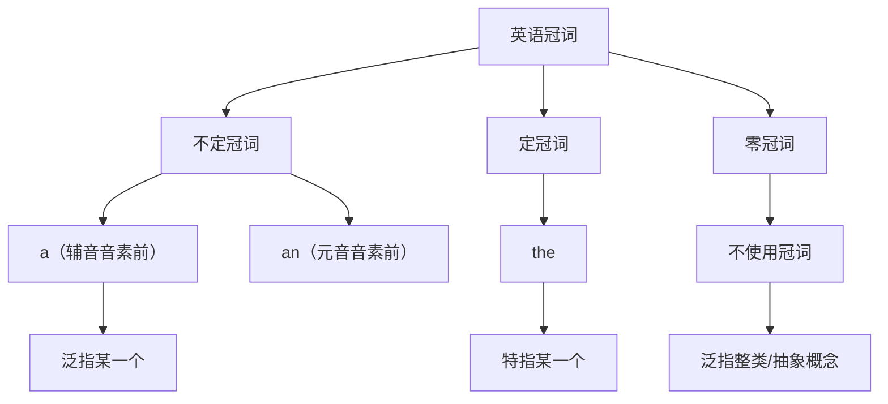
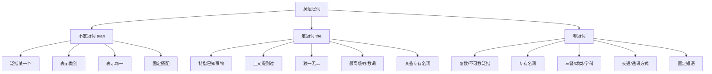

# 冠词的用法详解

> [!info] 学习目标
>
> 通过本章学习，你将掌握：
> - 不定冠词 a/an 的选择规则与基本用法
> - 定冠词 the 的核心用法与特殊场景
> - 零冠词（不用冠词）的各种情况
> - 冠词与专有名词、抽象名词的搭配
> - 冠词在固定搭配中的使用
> - 冠词使用的常见错误及避免方法

---

## 1. 冠词概述

### 1.1 什么是冠词

冠词（Article）是英语中一类特殊的限定词（Determiner），**位于名词之前，用来限定名词的意义范围**。冠词本身没有独立的词汇意义，但它能帮助听者/读者判断说话者所指的是特定的事物还是泛指的事物。

> [!tip] 冠词的本质功能
>
> 冠词回答的核心问题是：**"你说的是哪一个？"**
> - **不定冠词 a/an**：说的是"任意一个"，听者不知道具体是哪个
> - **定冠词 the**：说的是"那一个"，听者知道具体是哪个
> - **零冠词**：说的是"这类事物"或"这种概念"

**冠词的英文术语**：

| 中文术语 | 英文术语 | 说明 |
| --- | --- | --- |
| 冠词 | Article | 来自拉丁语 articulus，意为"小关节、小部分" |
| 不定冠词 | Indefinite Article | a, an；表示不确定的对象 |
| 定冠词 | Definite Article | the；表示确定的对象 |
| 零冠词 | Zero Article | 不使用冠词的情况 |

### 1.2 英语冠词体系

英语的冠词系统相对简单，只有三种情况：

上图展示了英语冠词的完整体系。不定冠词 a/an 用于泛指，定冠词 the 用于特指，零冠词用于表示类别或抽象概念。理解这三者的区别是正确使用冠词的关键。

### 1.3 冠词与其他语言的对比

| 语言 | 冠词系统 | 特点 |
| --- | --- | --- |
| **英语** | a/an, the, 零冠词 | 相对简单，无性数变化 |
| **法语** | un/une, le/la/les | 有阴阳性、单复数变化 |
| **德语** | ein/eine, der/die/das | 有阳性、阴性、中性和四个格的变化 |
| **汉语** | 无冠词 | 通过语境和量词表达类似意义 |
| **日语** | 无冠词 | 通过助词和语境表达 |

> [!warning] 中国学生的常见困难
>
> 由于汉语没有冠词系统，中国学生在使用英语冠词时常见问题包括：
> - **漏用冠词**：~~I am student.~~ → I am **a** student.
> - **多用冠词**：~~I like the music.~~（泛指音乐时）→ I like music.
> - **用错冠词**：~~I saw the dog in street.~~ → I saw **a** dog in **the** street.

---

## 2. 不定冠词 a/an

### 2.1 a 与 an 的选择规则

不定冠词有两种形式：**a** 和 **an**。选择哪一种取决于后面单词的**发音**（而非拼写）的第一个音素。

**核心规则**：
- **a**：用于以**辅音音素**开头的单词前
- **an**：用于以**元音音素**开头的单词前

> [!warning] 关键提醒
>
> 判断用 a 还是 an，要看的是**发音**，不是**字母**！
> - 字母 u 可能发 /juː/（辅音）或 /ʌ/（元音）
> - 字母 h 可能发音或不发音
> - 缩写词要看其读音

**常见情况对照表**：

| 情况 | 用 a | 用 an | 说明 |
| --- | --- | --- | --- |
| 元音字母开头 | — | an apple, an egg, an island | 大多数元音字母开头用 an |
| u 开头 | a university, a uniform, a useful book | an umbrella, an uncle, an unusual event | u 发 /juː/ 用 a，发 /ʌ/ 用 an |
| o 开头 | a one-way street, a once-in-a-lifetime chance | an orange, an opera, an only child | o 发 /wʌ/ 用 a，发 /ɒ/ 用 an |
| h 开头 | a hotel, a house, a happy day | an hour, an honest man, an honor | h 不发音用 an，发音用 a |
| 缩写词 | a UN meeting, a US citizen | an FBI agent, an MP3 player, an NBA game | 看首字母的读音 |

> [!example] 详细分析
>
> **为什么是 a university 而不是 an university？**
> - university 的发音是 /ˌjuːnɪˈvɜːsəti/
> - 第一个音素是 /j/，这是一个辅音（半元音）
> - 所以用 **a** university
>
> **为什么是 an hour 而不是 a hour？**
> - hour 的发音是 /aʊə(r)/
> - h 不发音，第一个音素是元音 /aʊ/
> - 所以用 **an** hour
>
> **为什么是 an FBI agent？**
> - FBI 读作 /ˌef biː ˈaɪ/
> - 第一个字母 F 的发音是 /ef/，以元音 /e/ 开头
> - 所以用 **an** FBI agent

### 2.2 不定冠词的基本用法

**（1）表示"一个"，泛指某一个人或事物**

这是不定冠词最基本的用法，表示所指的是某一类事物中的任意一个，听话者不知道具体是哪一个。

| 例句 | 分析 |
| --- | --- |
| I saw **a man** standing outside. | 说话者看到了一个男人，但听话者不知道是谁 |
| She is reading **a book**. | 她在读一本书，具体什么书不确定 |
| There is **a dog** in the garden. | 花园里有一只狗，是哪只狗不重要 |
| I need **a pen**. | 我需要一支笔，任意一支都可以 |

**（2）表示类别，泛指"任何一个"**

不定冠词可以用来代表某一类事物中的任何一个成员：

| 例句 | 分析 |
| --- | --- |
| **A dog** is a faithful animal. | 狗（这类动物）是忠诚的 = Dogs are faithful animals. |
| **A teacher** should be patient. | 老师（作为一种职业）应该有耐心 |
| **An elephant** never forgets. | 大象（这种动物）不会忘记 |

> [!tip] 三种泛指方式的对比
>
> 英语中表示泛指有三种方式，意义相近但语感略有不同：
>
> | 结构 | 例句 | 语感 |
> | --- | --- | --- |
> | **a/an + 单数** | **A rose** is a flower. | 强调类别中的任意个体 |
> | **the + 单数** | **The rose** is a flower. | 强调类别的典型代表 |
> | **复数（零冠词）** | **Roses** are flowers. | 强调类别整体 |

**（3）表示"每一"，相当于 per 或 every**

不定冠词可以表示"每一"的概念，常见于表示频率、价格、速度等：

| 例句 | 等同于 |
| --- | --- |
| I go to the gym three times **a week**. | three times per week |
| The car was traveling at 60 miles **an hour**. | 60 miles per hour |
| Apples are two dollars **a pound**. | two dollars per pound |
| He visits his parents once **a month**. | once per month |

**（4）用于某些数量表达**

| 表达 | 含义 | 例句 |
| --- | --- | --- |
| a lot of | 许多 | I have **a lot of** work to do. |
| a few | 一些（肯定） | I have **a few** friends here. |
| a little | 一些（肯定） | There is **a little** water left. |
| a great deal of | 大量 | He spent **a great deal of** money. |
| a number of | 若干 | **A number of** students were absent. |
| a pair of | 一双/对 | I bought **a pair of** shoes. |
| a piece of | 一片/块/条 | Give me **a piece of** paper. |

**（5）用于某些固定表达**

| 固定表达 | 含义 | 例句 |
| --- | --- | --- |
| have a cold | 感冒 | I **have a cold**. |
| have a headache | 头痛 | She **has a headache**. |
| have a good time | 玩得开心 | We **had a good time** at the party. |
| take a walk | 散步 | Let's **take a walk**. |
| take a look | 看一看 | **Take a look** at this. |
| make a mistake | 犯错 | Everyone **makes mistakes**. |
| make a decision | 做决定 | We need to **make a decision**. |
| as a result | 结果 | **As a result**, he failed the exam. |
| in a hurry | 匆忙 | I'm **in a hurry**. |
| all of a sudden | 突然 | **All of a sudden**, it started raining. |

### 2.3 不定冠词的特殊用法

**（1）用于表示身份、职业、国籍等**

在 be 动词或 become 后面，表示某人的身份、职业、国籍等时，用不定冠词：

| 例句 | 分析 |
| --- | --- |
| He is **a teacher**. | 他是一名老师 |
| She wants to become **a doctor**. | 她想成为一名医生 |
| My father is **an engineer**. | 我父亲是一名工程师 |
| I am **a Chinese**. | 我是一个中国人 |

> [!warning] 注意例外
>
> 当职业名词前有修饰语使其特指时，要用 the：
> - He is **the teacher** of this class.（他是这个班的老师——特指）
> - She became **the president** of the company.（她成为了公司的总裁——特指）

**（2）用于感叹句**

在 what 引导的感叹句中，如果中心词是可数名词单数，需要用不定冠词：

| 感叹句 | 分析 |
| --- | --- |
| **What a beautiful day** (it is)! | 多么美好的一天！ |
| **What an interesting book** (it is)! | 多么有趣的一本书！ |
| **What a clever boy** he is! | 他是多么聪明的一个男孩！ |

对比：
- What beautiful weather! （weather 是不可数名词，不用冠词）
- What lovely flowers! （flowers 是复数，不用冠词）

**（3）用于 such, quite, rather 等词后**

| 结构 | 例句 |
| --- | --- |
| such + a/an + 形容词 + 名词 | It is **such a nice day**! |
| quite + a/an + 形容词 + 名词 | It's **quite a long story**. |
| rather + a/an + 形容词 + 名词 | It was **rather a difficult question**. |

注意：so, too, how 后面的语序不同：
- so/too/how + 形容词 + a/an + 名词
- It is **so beautiful a day**!
- It was **too difficult a question** for me.
- **How interesting a book** it is!

**（4）用于 the same, the wrong 等结构**

某些表达中，of 后面需要用不定冠词：

| 表达 | 例句 |
| --- | --- |
| of a kind | They are birds **of a kind**.（同类的） |
| of a size | These shoes are **of a size**.（同样大小的） |
| of an age | The two boys are **of an age**.（同龄的） |

---

## 3. 定冠词 the

### 3.1 定冠词的发音

定冠词 the 有两种发音：

| 发音 | 使用场景 | 示例 |
| --- | --- | --- |
| /ðə/ | 辅音音素前（弱读） | the book /ðə bʊk/, the man /ðə mæn/ |
| /ðiː/ | 元音音素前 | the apple /ðiː ˈæpl/, the end /ðiː end/ |
| /ðiː/ | 强调时 | This is THE book I was talking about. |

### 3.2 定冠词的基本用法

**（1）特指已知的人或事物**

当说话者和听话者都知道所指的是哪一个时，使用定冠词：

| 例句 | 分析 |
| --- | --- |
| Please close **the door**. | 双方都知道是哪扇门 |
| I put the book on **the table**. | 特定的那张桌子 |
| **The teacher** is coming. | 双方都知道是哪位老师 |
| Where is **the bathroom**? | 特定场所的卫生间 |

**（2）上文提到过的人或事物**

第一次提到用 a/an，再次提到用 the：

| 例句 | 分析 |
| --- | --- |
| I saw **a dog** in the street. **The dog** was very friendly. | 第一次提到用 a，再次提到用 the |
| She bought **a book** yesterday. **The book** is about history. | 同上 |
| There was **a man** at the door. I opened the door and **the man** came in. | 同上 |

> [!example] 完整语篇示例
>
> Yesterday I saw **a movie**. **The movie** was about **a girl** who lived in **a small village**. **The girl** wanted to become **a famous singer**. **The village** was very beautiful, with mountains all around.
>
> 分析：每个名词第一次出现用 a/an（泛指），再次出现用 the（特指上文提到的）。

**（3）由上下文或情境确定的事物**

即使没有直接提到，如果情境使事物变得明确，也用 the：

| 例句 | 分析 |
| --- | --- |
| I went to **the bank** this morning. | 说话者常去的那家银行 |
| **The sun** is shining. | 太阳只有一个，无需先提及 |
| Turn off **the light**, please. | 房间里的那盏灯 |
| Let's go to **the park**. | 附近的/常去的那个公园 |

**（4）由后置定语限定的名词**

当名词后面有修饰成分（定语从句、介词短语、分词等）使其特指时，用 the：

| 例句 | 后置定语类型 |
| --- | --- |
| **The book** that I bought yesterday is interesting. | 定语从句 |
| **The man** in the red shirt is my uncle. | 介词短语 |
| **The girl** sitting by the window is my sister. | 现在分词短语 |
| **The letter** written by my father arrived today. | 过去分词短语 |
| **The only way** to success is hard work. | 不定式短语 |

### 3.3 定冠词表示类别

**（1）the + 单数名词：表示一类事物**

| 例句 | 分析 |
| --- | --- |
| **The computer** has changed our lives. | 计算机（作为一类发明） |
| **The whale** is the largest mammal. | 鲸鱼（作为一个物种） |
| **The telephone** was invented by Bell. | 电话（作为一项发明） |

**（2）the + 形容词：表示一类人**

"the + 形容词"可以表示一类具有某种特征的人，作主语时动词用复数：

| the + 形容词 | 含义 | 例句 |
| --- | --- | --- |
| the rich | 富人 | **The rich** are not always happy. |
| the poor | 穷人 | We should help **the poor**. |
| the young | 年轻人 | **The young** are full of energy. |
| the old | 老年人 | **The old** need our care. |
| the sick | 病人 | **The sick** should rest at home. |
| the blind | 盲人 | This school is for **the blind**. |
| the deaf | 聋人 | Sign language helps **the deaf** communicate. |
| the unemployed | 失业者 | **The unemployed** need job training. |
| the living | 活着的人 | **The living** should remember **the dead**. |
| the dead | 死者 | 同上 |

> [!warning] 注意区分
>
> - **the old**：老年人（作为一个群体）= old people
> - **the old one**：那个旧的（指具体的东西）
>
> 例如：
> - **The old** need our respect.（老年人需要我们的尊重。）
> - Give me **the old one**, not the new one.（给我那个旧的，不要新的。）

### 3.4 定冠词用于独一无二的事物

世界上独一无二的事物前用 the：

| 类别 | 例词 | 例句 |
| --- | --- | --- |
| **天体** | the sun, the moon, the earth, the sky | **The sun** rises in the east. |
| **自然界** | the world, the universe, the equator | We live on **the earth**. |
| **方位** | the east, the west, the north, the south | China is in **the east** of Asia. |
| **唯一的事物** | the internet, the environment | **The internet** connects people worldwide. |

> [!tip] 例外情况
>
> 当这些名词用于特定搭配或比喻义时，可能不用 the：
> - on earth（究竟）：What **on earth** are you doing?
> - in heaven（在天堂）：Angels live **in heaven**.

### 3.5 定冠词用于专有名词

**（1）需要用 the 的专有名词**

| 类别 | 例词 |
| --- | --- |
| **江河湖海** | the Yangtze River, the Yellow River, the Pacific Ocean, the Mediterranean Sea |
| **山脉群岛** | the Alps, the Himalayas, the Philippines, the British Isles |
| **国家（含普通名词）** | the United States, the United Kingdom, the People's Republic of China |
| **机构组织** | the United Nations, the European Union, the World Bank |
| **报刊杂志** | the Times, the New York Times, the Economist |
| **著名建筑** | the Great Wall, the White House, the Eiffel Tower |
| **历史时期** | the Middle Ages, the Renaissance, the Cold War |
| **乐器（演奏时）** | play the piano, play the violin, play the guitar |
| **姓氏复数（一家人）** | the Smiths, the Wangs, the Johnsons |

**（2）不用 the 的专有名词**

| 类别 | 例词 |
| --- | --- |
| **人名** | John, Mary, Shakespeare |
| **单独的山峰** | Mount Everest, Mount Fuji, Mount Tai |
| **单独的湖泊** | Lake Superior, West Lake |
| **单独的岛屿** | Taiwan, Hainan, Manhattan |
| **大洲** | Asia, Europe, Africa, North America |
| **国家（不含普通名词）** | China, Japan, France, Germany |
| **城市** | Beijing, New York, London, Paris |
| **街道** | Wall Street, Fifth Avenue, Oxford Street |
| **公园** | Central Park, Hyde Park |
| **大学（以人名/地名命名）** | Harvard University, Peking University |
| **节日** | Christmas, Easter, Thanksgiving |
| **语言** | English, Chinese, French |
| **三餐** | breakfast, lunch, dinner |
| **球类运动** | play football, play basketball |

> [!example] 对比理解
>
> **需要 the**：
> - the Yangtze **River**（含有普通名词 River）
> - the United **States**（含有普通名词 States）
> - the Great **Wall**（含有普通名词 Wall）
>
> **不需要 the**：
> - **Mount** Everest（Mount 在前，是固定搭配）
> - **Lake** Superior（Lake 在前，是固定搭配）
> - **Harvard** University（以人名命名，University 在后）

### 3.6 定冠词的特殊用法

**（1）用于最高级和序数词前**

| 用法 | 例句 |
| --- | --- |
| 形容词最高级 | He is **the tallest** boy in the class. |
| 副词最高级 | She runs **the fastest** of all. |
| 序数词 | This is **the first** time I've been here. |
| only, very, same 等 | You are **the only** person I trust. |

**（2）用于乐器名称前**

表示演奏乐器时，乐器名词前用 the：

| 例句 | 分析 |
| --- | --- |
| She plays **the piano** very well. | 弹钢琴 |
| He is learning **the violin**. | 学小提琴 |
| Can you play **the guitar**? | 弹吉他 |

> [!warning] 例外
>
> 在美式英语口语中，尤其在流行音乐语境下，可能省略 the：
> - He plays guitar in a rock band.（非正式）

**（3）用于某些固定短语**

| 短语 | 含义 | 例句 |
| --- | --- | --- |
| in the morning | 在早上 | I exercise **in the morning**. |
| in the afternoon | 在下午 | We have a meeting **in the afternoon**. |
| in the evening | 在晚上 | I read **in the evening**. |
| in the end | 最后 | **In the end**, we succeeded. |
| by the way | 顺便说一下 | **By the way**, where is Tom? |
| on the other hand | 另一方面 | **On the other hand**, it's too expensive. |
| at the moment | 此刻 | I'm busy **at the moment**. |
| for the time being | 暂时 | Let's keep it **for the time being**. |
| on the whole | 总的来说 | **On the whole**, it was a success. |
| in the future | 在将来 | Things will be better **in the future**. |

**（4）用于比较级结构**

| 结构 | 例句 |
| --- | --- |
| the + 比较级..., the + 比较级... | **The more** you read, **the more** you learn. |
| all the + 比较级 | I feel **all the better** for my holiday. |

---

## 4. 零冠词（不用冠词）

### 4.1 零冠词的基本用法

**（1）复数名词或不可数名词表示泛指**

当复数名词或不可数名词表示泛指（指一类事物或抽象概念）时，不用冠词：

| 例句 | 分析 |
| --- | --- |
| **Dogs** are loyal animals. | 狗（作为一类动物） |
| **Water** is essential for life. | 水（作为一种物质） |
| **Music** makes me happy. | 音乐（作为一种艺术形式） |
| I like **coffee**. | 咖啡（作为一种饮料） |
| **Children** need love and care. | 孩子们（泛指所有孩子） |

> [!tip] 泛指 vs 特指
>
> **泛指（不用 the）**：
> - I like **music**.（我喜欢音乐。——泛指音乐这种艺术）
> - **Dogs** are friendly.（狗很友好。——泛指狗这类动物）
>
> **特指（用 the）**：
> - I like **the music** in this movie.（我喜欢这部电影里的音乐。——特指）
> - **The dogs** next door are noisy.（隔壁的狗很吵。——特指）

**（2）专有名词**

大多数专有名词（人名、地名等）不用冠词：

| 类别 | 例词 | 例句 |
| --- | --- | --- |
| 人名 | Tom, Mary, Dr. Smith | **Tom** is my friend. |
| 国家名 | China, Japan, France | I come from **China**. |
| 城市名 | Beijing, New York | **Beijing** is the capital of China. |
| 大洲名 | Asia, Europe | **Asia** is the largest continent. |
| 街道名 | Wall Street, Fifth Avenue | He works on **Wall Street**. |
| 大学名 | Harvard, Oxford | She studies at **Harvard**. |

**（3）三餐名称**

| 例句 | 分析 |
| --- | --- |
| I have **breakfast** at 7:00. | 早餐（泛指这顿饭） |
| What did you have for **lunch**? | 午餐 |
| We're having **dinner** at 6:00. | 晚餐 |

> [!warning] 例外情况
>
> 当三餐名词有修饰语或特指时，需要用冠词：
> - We had **a wonderful dinner** last night.（有形容词修饰）
> - **The breakfast** (that) you made was delicious.（特指）

**（4）球类运动和棋类游戏**

| 例句 | 分析 |
| --- | --- |
| I like to play **football**. | 踢足球 |
| He plays **basketball** every day. | 打篮球 |
| Let's play **chess**. | 下象棋 |
| She is good at **tennis**. | 打网球 |

注意对比：演奏乐器用 the，球类运动不用冠词
- play **the** piano（演奏乐器）
- play football（球类运动，不用冠词）

**（5）学科和语言**

| 例句 | 分析 |
| --- | --- |
| I study **mathematics**. | 数学（学科） |
| **History** is interesting. | 历史（学科） |
| She speaks **English** well. | 英语（语言） |
| I'm learning **Chinese**. | 汉语（语言） |

**（6）节日和季节**

| 例句 | 分析 |
| --- | --- |
| **Christmas** is on December 25th. | 圣诞节 |
| We celebrate **Thanksgiving** in November. | 感恩节 |
| I love **spring**. | 春天（泛指） |
| **Winter** is cold here. | 冬天（泛指） |

> [!tip] 季节的特殊情况
>
> 季节名词可以用或不用 the，意义略有不同：
> - I like **spring**.（我喜欢春天。——泛指）
> - I like **the spring** in Beijing.（我喜欢北京的春天。——特指某地的春天）
> - **In spring**, flowers bloom.（在春天，花儿开放。——泛指）
> - **In the spring of 2020**, I graduated.（在2020年春天，我毕业了。——特指）

### 4.2 零冠词的特殊用法

**（1）表示职位、身份（用作表语或补语时）**

当名词表示独一无二的职位或身份，且用作表语或补语时，通常不用冠词：

| 例句 | 分析 |
| --- | --- |
| He was elected **president**. | 他当选总统。（职位唯一） |
| She became **captain** of the team. | 她成为队长。 |
| They made him **chairman** of the committee. | 他们任命他为委员会主席。 |

对比：
- He is **a** president.（他是一位总统。——不强调唯一性）
- He is **the** president of the company.（他是公司的总裁。——特指）

**（2）表示交通方式**

"by + 交通工具"结构中不用冠词：

| 例句 | 对比 |
| --- | --- |
| I go to work **by bus**. | I go to work **on the bus**. |
| She travels **by train**. | She is **on the train**. |
| He went there **by plane**. | He is **in the plane**. |
| We came **by car**. | We came **in a/the car**. |

> [!example] 结构对比
>
> - **by + 交通工具**（表示方式，不用冠词）
>   - by bus, by train, by plane, by car, by ship
> - **in/on + the/a + 交通工具**（表示位置，需要冠词）
>   - in the car, on the bus, on the train

**（3）表示通讯方式**

| 例句 | 分析 |
| --- | --- |
| I'll contact you **by phone**. | 通过电话 |
| Send it **by email**. | 通过邮件 |
| We communicate **by letter**. | 通过信件 |
| Pay **by credit card**. | 用信用卡支付 |

**（4）成对名词并用**

当两个名词成对出现表示整体概念时，通常不用冠词：

| 例句 | 分析 |
| --- | --- |
| **day and night** | 日日夜夜 |
| **husband and wife** | 夫妻 |
| **knife and fork** | 刀叉 |
| **father and son** | 父子 |
| **hand in hand** | 手牵手 |
| **face to face** | 面对面 |
| **arm in arm** | 挽着胳膊 |
| **step by step** | 一步一步 |
| **side by side** | 肩并肩 |
| **from beginning to end** | 从头到尾 |
| **from door to door** | 挨家挨户 |

**（5）某些固定短语中**

| 短语 | 含义 | 例句 |
| --- | --- | --- |
| at home | 在家 | I'm staying **at home** today. |
| at school | 在学校（学习） | The children are **at school**. |
| at work | 在工作 | She's **at work** now. |
| in hospital | 住院（英式） | He's **in hospital**. |
| in bed | 在床上（睡觉/休息） | She's still **in bed**. |
| in class | 在上课 | Don't talk **in class**. |
| in prison | 在坐牢 | He's **in prison** for theft. |
| go to school | 去上学 | Children **go to school** at 7. |
| go to bed | 去睡觉 | I usually **go to bed** at 10. |
| go to church | 去做礼拜 | They **go to church** on Sundays. |
| on foot | 步行 | I go to work **on foot**. |
| at first | 起初 | **At first**, I didn't understand. |
| at last | 最后 | **At last**, we arrived. |
| by chance | 偶然 | I met him **by chance**. |
| by mistake | 错误地 | I took your umbrella **by mistake**. |
| on purpose | 故意地 | He did it **on purpose**. |
| out of breath | 上气不接下气 | I was **out of breath** after running. |

> [!warning] 注意语义差别
>
> 有些短语加不加冠词意义不同：
>
> | 不加冠词 | 加冠词 |
> | --- | --- |
> | **at school**（在校学习） | **at the school**（在学校这个地点） |
> | **in hospital**（住院治病） | **in the hospital**（在医院这个地点） |
> | **go to church**（去做礼拜） | **go to the church**（去教堂这个建筑） |
> | **in bed**（在床上睡觉/休息） | **in the bed**（在那张床上） |
> | **in prison**（在服刑） | **in the prison**（在监狱这个地点） |
>
> 不加冠词强调**功能**，加冠词强调**地点**。

---

## 5. 冠词使用的常见错误

### 5.1 漏用冠词

**（1）可数名词单数泛指时漏用 a/an**

| 错误 | 正确 | 说明 |
| --- | --- | --- |
| ❌ I am student. | ✅ I am **a** student. | 可数名词单数不能裸用 |
| ❌ She has dog. | ✅ She has **a** dog. | 同上 |
| ❌ There is book on the table. | ✅ There is **a** book on the table. | 同上 |
| ❌ He wants to be doctor. | ✅ He wants to be **a** doctor. | 同上 |

**（2）特指时漏用 the**

| 错误 | 正确 | 说明 |
| --- | --- | --- |
| ❌ Please open door. | ✅ Please open **the** door. | 特定的门 |
| ❌ Sun is shining. | ✅ **The** sun is shining. | 独一无二 |
| ❌ I live on third floor. | ✅ I live on **the** third floor. | 序数词前 |

### 5.2 多用冠词

**（1）复数名词或不可数名词泛指时多用 the**

| 错误 | 正确 | 说明 |
| --- | --- | --- |
| ❌ I like **the** music. | ✅ I like music.（泛指） | 不可数名词泛指不用 the |
| ❌ **The** dogs are loyal. | ✅ Dogs are loyal.（泛指） | 复数名词泛指不用 the |
| ❌ **The** water is important. | ✅ Water is important.（泛指） | 不可数名词泛指不用 the |

**（2）专有名词前多用冠词**

| 错误 | 正确 | 说明 |
| --- | --- | --- |
| ❌ I live in **the** China. | ✅ I live in China. | 国家名不用 the |
| ❌ **The** Mount Everest is high. | ✅ Mount Everest is high. | 单独山峰不用 the |
| ❌ He goes to **the** Harvard. | ✅ He goes to Harvard. | 大学名不用 the |

**（3）固定短语中多用冠词**

| 错误 | 正确 | 说明 |
| --- | --- | --- |
| ❌ I go to work by **the** bus. | ✅ I go to work by bus. | by + 交通工具不用冠词 |
| ❌ He plays **the** football. | ✅ He plays football. | 球类运动不用冠词 |
| ❌ I had **the** lunch at noon. | ✅ I had lunch at noon. | 三餐泛指不用冠词 |

### 5.3 用错冠词

**（1）a 和 an 混淆**

| 错误 | 正确 | 说明 |
| --- | --- | --- |
| ❌ **a** hour | ✅ **an** hour | h 不发音，以元音开头 |
| ❌ **an** university | ✅ **a** university | u 发 /juː/，以辅音开头 |
| ❌ **an** European | ✅ **a** European | Eu 发 /juː/，以辅音开头 |
| ❌ **a** honest man | ✅ **an** honest man | h 不发音 |

**（2）泛指和特指混淆**

| 错误 | 正确 | 说明 |
| --- | --- | --- |
| ❌ I need **the** pen.（任意一支） | ✅ I need **a** pen. | 泛指应用 a |
| ❌ I need **a** pen you gave me. | ✅ I need **the** pen you gave me. | 特指应用 the |

### 5.4 冠词使用检查清单

在写作中，检查冠词使用时可以参考以下问题：

| 检查项目 | 问题 |
| --- | --- |
| **可数名词单数** | 是否有冠词（a/an 或 the）？ |
| **泛指 vs 特指** | 是指任意一个还是特定的那一个？ |
| **首次 vs 再次** | 是第一次提到还是上文已提到？ |
| **不可数/复数泛指** | 是否错加了 the？ |
| **专有名词** | 是否属于需要 the 的类别？ |
| **固定短语** | 是否遵循了固定搭配？ |
| **a vs an** | 后面单词的发音是元音还是辅音？ |

---

## 6. 冠词的综合练习

### 6.1 选择填空

**在空白处填入 a, an, the 或 /（零冠词）**：

1. I saw ___ elephant at the zoo. ___ elephant was very big.
2. ___ water in this bottle is clean.
3. She is ___ honest girl.
4. He plays ___ piano every day.
5. I go to ___ school by ___ bus.
6. ___ sun rises in ___ east.
7. What ___ beautiful day it is!
8. I like ___ music, especially ___ classical music.
9. He became ___ president of the company.
10. ___ United States is a large country.

**答案**：
1. an, The  2. The  3. an  4. the  5. /, /  6. The, the  7. a  8. /, /  9. / (或 the)  10. The

### 6.2 改错练习

**找出并改正以下句子中的冠词错误**：

1. I am _ student from China.
2. She plays _ violin very well.
3. He went to the school yesterday.（表示去上学）
4. I like the music. It makes me happy.（泛指音乐）
5. The Mount Fuji is in Japan.
6. I had the breakfast at 7:00.
7. She is a honest person.
8. I live in the Beijing.
9. He wants to be the teacher.
10. What the beautiful flower it is!

**答案**：
1. I am **a** student from China.
2. She plays **the** violin very well.
3. He went to **school** yesterday.（去掉 the）
4. I like **music**.（去掉 the）
5. **Mount Fuji** is in Japan.（去掉 The）
6. I had **breakfast** at 7:00.（去掉 the）
7. She is **an** honest person.
8. I live in **Beijing**.（去掉 the）
9. He wants to be **a** teacher.
10. What **a** beautiful flower it is!

### 6.3 语篇填空

**在下面的短文中填入适当的冠词或 /（零冠词）**：

Last week, I visited ___(1) museum in ___(2) New York. It was ___(3) first time I had been to ___(4) United States. ___(5) museum was very large and had many interesting exhibits. I saw ___(6) painting by ___(7) famous artist. ___(8) painting was about ___(9) life in ___(10) countryside. I spent ___(11) whole day there. In ___(12) evening, I had ___(13) dinner at ___(14) Italian restaurant. ___(15) food was delicious. I really enjoyed ___(16) trip.

**答案**：
(1) a  (2) /  (3) the  (4) the  (5) The  (6) a  (7) a  (8) The  (9) /  (10) the  (11) the  (12) the  (13) /  (14) an  (15) The  (16) the

---

## 7. 冠词用法小结

### 7.1 核心知识点回顾

### 7.2 快速参考表

| 情况 | 用法 | 示例 |
| --- | --- | --- |
| 可数名词单数泛指 | a/an | I need **a** pen. |
| 特指（双方都知道） | the | Please close **the** door. |
| 上文已提到 | the | I saw a dog. **The** dog was cute. |
| 复数/不可数名词泛指 | 零冠词 | I like **music**. |
| 独一无二的事物 | the | **The** sun is shining. |
| 最高级/序数词 | the | He is **the** tallest. |
| 乐器 | the | play **the** piano |
| 球类运动 | 零冠词 | play **football** |
| 三餐 | 零冠词 | have **breakfast** |
| 交通方式 | 零冠词 | by **bus** |
| 专有名词（多数） | 零冠词 | **China**, **Harvard** |
| 含普通名词的专有名词 | the | **the** United States |

### 7.3 学习建议

> [!success] 掌握冠词的关键
>
> 1. **理解核心概念**：泛指 vs 特指是冠词选择的核心
> 2. **记忆固定搭配**：很多冠词用法是固定的，需要记忆
> 3. **大量阅读**：通过阅读培养语感，注意母语者如何使用冠词
> 4. **刻意练习**：写作时特别注意检查冠词使用
> 5. **对比分析**：比较有冠词和无冠词的意义差别

---

> [!quote] 本章总结
>
> 冠词虽然是英语中最小的词类之一，但其使用规则复杂且重要。不定冠词 a/an 用于泛指，定冠词 the 用于特指，零冠词用于表示类别或抽象概念。掌握冠词的关键在于理解"泛指"和"特指"的区别，并熟悉各种固定用法和特殊情况。

---

**相关文档**：
- [[02.名词的数与格|上一篇：名词的数与格]]
- [[04.名词与冠词的综合应用|下一篇：名词与冠词的综合应用]]
