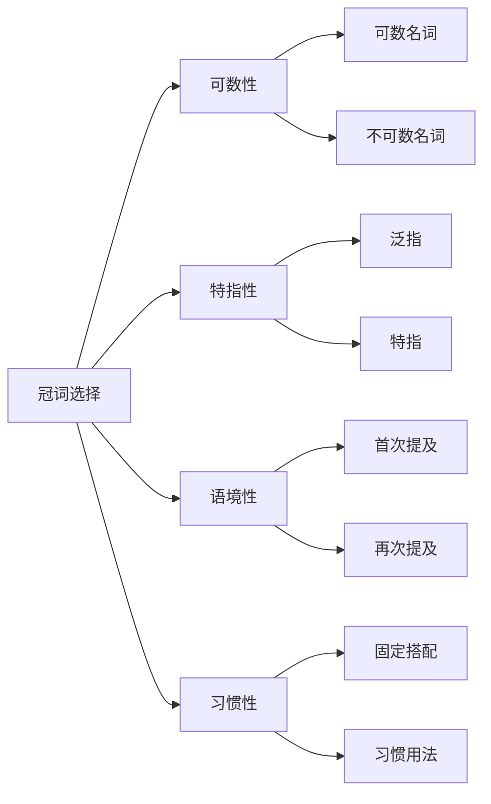
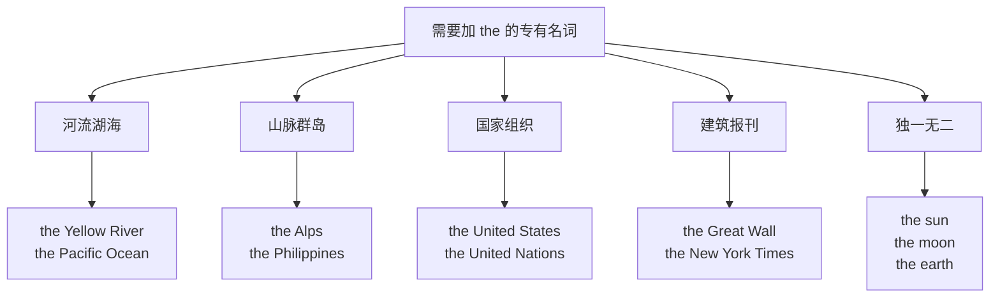
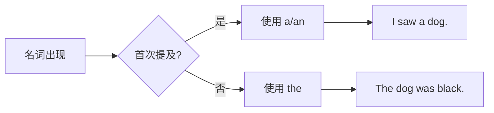
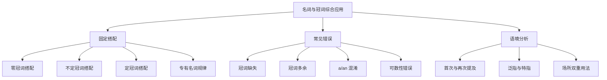

# 名词与冠词的综合应用

在前面三篇文档中，我们分别学习了名词的分类与用法、名词的数与格、冠词的用法详解。本篇将把这些知识点融会贯通，聚焦于名词与冠词在实际语境中的综合应用。掌握固定搭配规律和识别常见错误，是从"知道规则"到"正确使用"的关键一步。

> [!tip] 学习目标
>
> 完成本篇学习后，你将能够：
>
> - 熟练掌握名词与冠词的 80+ 种固定搭配
> - 识别并纠正名词冠词使用中的 15 类常见错误
> - 在写作和口语中自如运用名词与冠词的搭配规律
> - 通过语境分析判断冠词的正确选择

---

## 1. 名词与冠词搭配的核心原则

在深入学习固定搭配之前，我们需要先理解名词与冠词搭配的底层逻辑。冠词的选择并非随意，而是遵循着一套基于语义和语境的规则体系。

### 1.1 搭配决策的四维模型

选择正确的冠词需要从四个维度进行综合判断：

这四个维度相互作用，共同决定了冠词的最终选择。可数性决定了能否使用 a/an，特指性决定了是否使用 the，语境性影响首次和再次提及的处理，而习惯性则涉及那些不遵循常规规则的固定表达。

### 1.2 搭配优先级原则

当规则发生冲突时，需要遵循以下优先级顺序：

| 优先级 | 原则 | 说明 |
| --- | --- | --- |
| 最高 | 固定搭配优先 | 固定短语中的冠词用法不可更改 |
| 次高 | 语境特指优先 | 上下文明确特指时必须用 the |
| 次低 | 语义泛指优先 | 表示类别或概念时用零冠词或 a/an |
| 最低 | 默认规则 | 无特殊情况时按基本规则处理 |

> [!example] 优先级应用示例
>
> **固定搭配优先于常规规则**：
>
> - ✅ go to **school**（固定搭配，零冠词）
> - ❌ go to **the school**（除非特指某所学校）
>
> **语境特指优先于泛指**：
>
> - I bought **a book** yesterday.（首次提及，泛指）
> - **The book** is very interesting.（再次提及，特指）

---

## 2. 零冠词固定搭配

零冠词搭配是英语学习中的一大难点。这些搭配中，名词前不使用任何冠词，形成了独特的表达方式。

### 2.1 交通与通讯方式

表示交通工具和通讯方式时，介词 by 后的名词通常不加冠词：

| 搭配 | 含义 | 例句 |
| --- | --- | --- |
| by bus | 乘公共汽车 | She goes to work **by bus**. |
| by train | 乘火车 | We traveled to Paris **by train**. |
| by plane/air | 乘飞机 | They went to Japan **by plane**. |
| by car | 乘汽车 | He drives to the office **by car**. |
| by bike/bicycle | 骑自行车 | Many students come to school **by bike**. |
| by ship/sea | 乘船 | Goods are transported **by sea**. |
| by subway/metro | 乘地铁 | I prefer going **by subway**. |
| by taxi | 乘出租车 | We took a trip **by taxi**. |
| by phone | 通过电话 | Please contact me **by phone**. |
| by email | 通过邮件 | Send the document **by email**. |
| by fax | 通过传真 | The contract was sent **by fax**. |

> [!warning] 易错点提醒
>
> 当强调具体的某辆交通工具时，需要使用冠词：
>
> - I came **by bus**.（泛指乘公共汽车这种方式）
> - I came **on the bus** that leaves at 8 a.m.（特指早上8点的那班车）
> - She arrived **in a taxi**.（强调是一辆出租车）

### 2.2 一日三餐

表示一日三餐时，通常使用零冠词：

| 搭配 | 含义 | 例句 |
| --- | --- | --- |
| have breakfast | 吃早餐 | I **have breakfast** at 7 a.m. |
| have lunch | 吃午餐 | Let's **have lunch** together. |
| have dinner | 吃晚餐 | We **have dinner** at 6 p.m. |
| have supper | 吃晚饭 | They **have supper** late. |
| for breakfast | 作为早餐 | I had eggs **for breakfast**. |
| at lunch | 在午餐时 | We discussed it **at lunch**. |
| after dinner | 晚餐后 | Let's take a walk **after dinner**. |
| before breakfast | 早餐前 | He exercises **before breakfast**. |

> [!info] 需要加冠词的情况
>
> 当餐名前有形容词修饰，或特指某顿饭时，需要加冠词：
>
> - We had **a wonderful dinner** last night.（有形容词修饰）
> - **The breakfast** at this hotel is excellent.（特指某处的早餐）
> - I'll never forget **the lunch** we had in Rome.（特指某次午餐）

### 2.3 时间表达

许多时间相关的表达使用零冠词：

| 搭配 | 含义 | 例句 |
| --- | --- | --- |
| at night | 在夜间 | Owls hunt **at night**. |
| at noon | 在中午 | The meeting starts **at noon**. |
| at dawn | 在黎明 | We set off **at dawn**. |
| at dusk | 在黄昏 | The birds return **at dusk**. |
| at midnight | 在午夜 | The party ended **at midnight**. |
| by day | 在白天 | He works **by day**. |
| by night | 在夜间 | She studies **by night**. |
| day and night | 日日夜夜 | They worked **day and night**. |
| day by day | 一天天地 | She's improving **day by day**. |
| from morning to night | 从早到晚 | He works **from morning to night**. |

> [!example] 对比分析
>
> **零冠词 vs 定冠词**：
>
> | 零冠词 | 定冠词 | 区别 |
> | --- | --- | --- |
> | at night（在夜间，泛指） | in the night（在那个夜晚，特指） | 泛指 vs 特指 |
> | in spring（在春天，泛指） | in the spring of 2024（特指某年春天） | 泛指 vs 特指 |
> | at noon（在中午） | at the noon（❌ 不存在） | noon 前通常不用 the |

### 2.4 机构场所类

表示去某处进行其典型活动时，使用零冠词：

| 搭配 | 含义 | 典型活动 |
| --- | --- | --- |
| go to school | 去上学 | 学习 |
| go to church | 去做礼拜 | 宗教活动 |
| go to hospital | 去住院/看病 | 就医（英式） |
| go to prison | 入狱服刑 | 服刑 |
| go to bed | 去睡觉 | 睡眠 |
| go to class | 去上课 | 学习 |
| go to market | 去赶集 | 买卖 |
| go to sea | 当海员/出海 | 航海 |
| go to town | 进城 | 办事/购物 |
| go to work | 去上班 | 工作 |
| go to court | 出庭 | 诉讼 |

> [!warning] 英美用法差异
>
> **hospital 的用法**：
>
> - 🇬🇧 英式：go to **hospital**（去住院）
> - 🇺🇸 美式：go to **the hospital**（去医院）
>
> **university 的用法**：
>
> - 🇬🇧 英式：go to **university**（上大学）
> - 🇺🇸 美式：go to **college**（上大学）

### 2.5 对称结构

两个相对或并列的名词构成对称结构时，通常不加冠词：

| 搭配 | 含义 | 例句 |
| --- | --- | --- |
| arm in arm | 手挽手 | They walked **arm in arm**. |
| face to face | 面对面 | Let's talk **face to face**. |
| hand in hand | 手拉手 | They walked **hand in hand**. |
| shoulder to shoulder | 肩并肩 | We stood **shoulder to shoulder**. |
| side by side | 并排 | They sat **side by side**. |
| day after day | 日复一日 | He practiced **day after day**. |
| year after year | 年复一年 | Prices rise **year after year**. |
| from head to toe | 从头到脚 | She was dressed in black **from head to toe**. |
| from beginning to end | 从头到尾 | I read the book **from beginning to end**. |
| from door to door | 挨家挨户 | They went **from door to door**. |
| man to man | 坦诚地 | Let's talk **man to man**. |
| step by step | 一步一步地 | Learn it **step by step**. |

### 2.6 身份与职业

表示独一无二的职位或身份时，常用零冠词：

| 搭配 | 含义 | 例句 |
| --- | --- | --- |
| as chairman | 作为主席 | He served **as chairman** for ten years. |
| as president | 作为总统 | She was elected **as president**. |
| as captain | 作为队长 | He played **as captain**. |
| turn doctor | 成为医生 | He **turned doctor** after graduation. |
| become president | 成为总统 | She hopes to **become president**. |

> [!info] 语法说明
>
> 这类用法中，名词表示的是头衔或职务，强调的是身份属性而非具体的人。当需要强调具体某人时，则需加冠词：
>
> - He is **chairman** of the committee.（强调职务）
> - He is **the chairman** who proposed this plan.（特指某人）

---

## 3. 不定冠词固定搭配

不定冠词 a/an 在许多固定搭配中扮演重要角色，表示"一个"、"每一"或"某种"等含义。

### 3.1 频率与度量表达

| 搭配 | 含义 | 例句 |
| --- | --- | --- |
| once a day | 每天一次 | Take this medicine **once a day**. |
| twice a week | 每周两次 | I exercise **twice a week**. |
| three times a month | 每月三次 | We meet **three times a month**. |
| $50 a kilogram | 每公斤50美元 | Apples are **$5 a kilogram**. |
| 60 miles an hour | 每小时60英里 | The speed limit is **60 miles an hour**. |
| 100 yuan a day | 每天100元 | The room costs **100 yuan a day**. |

> [!tip] 记忆技巧
>
> 在这类表达中，a/an 相当于 per（每），表示单位概念：
>
> - once a day = once per day
> - $50 a kilogram = $50 per kilogram

### 3.2 固定短语中的 a/an

| 搭配 | 含义 | 例句 |
| --- | --- | --- |
| have a cold | 感冒 | I **have a cold**. |
| have a fever | 发烧 | She **has a fever**. |
| have a headache | 头疼 | He **has a headache**. |
| have a rest | 休息一下 | Let's **have a rest**. |
| have a look | 看一看 | Can I **have a look**? |
| have a try | 试一试 | Why not **have a try**? |
| have a swim | 游泳 | Let's **have a swim**. |
| have a walk | 散步 | I'd like to **have a walk**. |
| have a good time | 玩得愉快 | We **had a good time**. |
| take a bath | 洗澡 | I need to **take a bath**. |
| take a break | 休息一下 | Let's **take a break**. |
| take a seat | 请坐 | Please **take a seat**. |
| make a decision | 做决定 | We need to **make a decision**. |
| make a mistake | 犯错误 | Everyone **makes mistakes**. |
| make a living | 谋生 | He **makes a living** by teaching. |
| make a difference | 有影响 | Your help **makes a difference**. |
| as a result | 因此 | **As a result**, he failed. |
| as a matter of fact | 事实上 | **As a matter of fact**, I agree. |
| in a hurry | 匆忙地 | She left **in a hurry**. |
| in a way | 在某种程度上 | **In a way**, you're right. |
| in a word | 总之 | **In a word**, it's impossible. |
| all of a sudden | 突然 | **All of a sudden**, it started to rain. |
| a great deal of | 大量的 | She has **a great deal of** experience. |
| a number of | 若干，一些 | **A number of** students were absent. |
| a variety of | 各种各样的 | The store sells **a variety of** products. |

### 3.3 感叹句中的 a/an

在 what 引导的感叹句中，可数名词单数前必须用 a/an：

| 结构 | 例句 |
| --- | --- |
| What + a/an + adj. + 可数名词单数 + (主语 + 谓语)! | **What a beautiful day** (it is)! |
| What + adj. + 可数名词复数/不可数名词 + (主语 + 谓语)! | **What beautiful flowers** (they are)! |

> [!example] 感叹句对比
>
> - **What a clever boy** he is!（单数可数名词，用 a）
> - **What clever boys** they are!（复数可数名词，不用冠词）
> - **What beautiful weather** it is!（不可数名词，不用冠词）
> - **What an interesting story** this is!（以元音开头，用 an）

---

## 4. 定冠词固定搭配

定冠词 the 在许多固定表达中不可或缺，这些搭配需要作为整体记忆。

### 4.1 方位与地理名词

| 搭配 | 含义 | 例句 |
| --- | --- | --- |
| in the east | 在东方 | China is **in the east** of Asia. |
| in the west | 在西方 | The sun sets **in the west**. |
| in the north | 在北方 | It's cold **in the north**. |
| in the south | 在南方 | I grew up **in the south**. |
| in the middle | 在中间 | Put it **in the middle**. |
| in the center | 在中心 | The park is **in the center** of the city. |
| on the left | 在左边 | The bank is **on the left**. |
| on the right | 在右边 | Turn right, it's **on the right**. |
| at the top | 在顶部 | His name is **at the top** of the list. |
| at the bottom | 在底部 | Sign **at the bottom** of the page. |
| in the front | 在前面 | She sat **in the front** of the classroom. |
| at the back | 在后面 | He stood **at the back**. |

### 4.2 时间段表达

| 搭配 | 含义 | 例句 |
| --- | --- | --- |
| in the morning | 在上午 | I study **in the morning**. |
| in the afternoon | 在下午 | We have class **in the afternoon**. |
| in the evening | 在晚上 | Let's meet **in the evening**. |
| in the daytime | 在白天 | He sleeps **in the daytime**. |
| in the past | 在过去 | **In the past**, life was harder. |
| in the future | 在将来 | What will happen **in the future**? |
| at the moment | 此刻 | I'm busy **at the moment**. |
| at the same time | 同时 | They arrived **at the same time**. |
| for the time being | 暂时 | Let's leave it **for the time being**. |
| in the end | 最后 | **In the end**, we succeeded. |
| at the beginning | 在开始时 | **At the beginning**, it was difficult. |

> [!warning] 对比区分
>
> | 搭配 | 含义 | 对比 |
> | --- | --- | --- |
> | in the end | 最后（结果） | We succeeded **in the end**.（最终成功了） |
> | at the end | 在末尾 | Sign **at the end** of the letter.（在信的末尾签名） |
> | in the front | 在（内部的）前面 | She sat **in the front** of the car.（坐在车内前排） |
> | in front of | 在（外部的）前面 | A car stopped **in front of** the house.（车停在房子前面） |

### 4.3 最高级与序数词

形容词最高级和序数词前通常需要加 the：

| 类型 | 例句 |
| --- | --- |
| 最高级 | She is **the tallest** girl in her class. |
| 最高级 | This is **the most interesting** book I've ever read. |
| 序数词 | He was **the first** to arrive. |
| 序数词 | This is **the third** time I've called you. |
| the + only | She is **the only** person who knows the secret. |
| the + same | We're in **the same** class. |
| the + very | This is **the very** book I've been looking for. |

> [!info] 例外情况
>
> 序数词前可用 a/an 表示"又一个"、"再一个"：
>
> - Would you like **a second** cup of coffee?（再来一杯咖啡吗？）
> - He made **a third** attempt.（他又进行了一次尝试）

### 4.4 乐器名词

演奏乐器时，乐器名词前通常加 the：

| 搭配 | 含义 | 例句 |
| --- | --- | --- |
| play the piano | 弹钢琴 | She **plays the piano** beautifully. |
| play the violin | 拉小提琴 | He learned to **play the violin** at age 5. |
| play the guitar | 弹吉他 | Can you **play the guitar**? |
| play the drums | 打鼓 | My brother **plays the drums**. |
| play the flute | 吹长笛 | She **plays the flute** in the orchestra. |

> [!warning] 对比：球类运动
>
> 球类运动前不加冠词：
>
> | 乐器（加 the） | 球类（零冠词） |
> | --- | --- |
> | play **the piano** | play **football** |
> | play **the violin** | play **basketball** |
> | play **the guitar** | play **tennis** |
> | play **the drums** | play **golf** |

### 4.5 固定短语中的 the

| 搭配 | 含义 | 例句 |
| --- | --- | --- |
| by the way | 顺便说一下 | **By the way**, where is Tom? |
| on the contrary | 相反 | **On the contrary**, I agree with you. |
| on the other hand | 另一方面 | **On the other hand**, it's too expensive. |
| on the whole | 总的来说 | **On the whole**, I'm satisfied. |
| in the meantime | 与此同时 | **In the meantime**, I'll prepare lunch. |
| for the most part | 大部分情况下 | **For the most part**, they're reliable. |
| to tell the truth | 说实话 | **To tell the truth**, I don't like it. |
| to the point | 切中要害 | Your answer is **to the point**. |
| in the long run | 从长远来看 | **In the long run**, this is better. |
| at the mercy of | 任凭...摆布 | We were **at the mercy of** the weather. |

---

## 5. 专有名词的冠词规律

专有名词的冠词使用有其特殊规律，需要分类记忆。

### 5.1 需要加 the 的专有名词

| 类别 | 规则 | 例子 |
| --- | --- | --- |
| 江河湖海 | 江、河、湖、海、洋名前加 the | **the** Yangtze River, **the** Mediterranean Sea |
| 山脉群岛 | 山脉、群岛名前加 the | **the** Himalayas, **the** Philippines |
| 由普通名词构成的国名 | 含 kingdom, states, republic 等 | **the** United Kingdom, **the** People's Republic of China |
| 组织机构 | 国际组织、官方机构 | **the** United Nations, **the** World Bank |
| 报刊杂志 | 报纸、杂志名 | **the** Times, **the** Economist |
| 著名建筑 | 知名建筑物 | **the** White House, **the** Eiffel Tower |
| 独一无二事物 | 世界上独一无二的事物 | **the** sun, **the** moon, **the** sky |
| 方位+专有名词 | 方位词+地区名 | **the** Middle East, **the** Far East |
| 姓氏复数 | 表示一家人或夫妇 | **the** Smiths, **the** Johnsons |

### 5.2 不加冠词的专有名词

| 类别 | 规则 | 例子 |
| --- | --- | --- |
| 人名 | 通常不加冠词 | Einstein, Shakespeare |
| 单独的国家名 | 不含普通名词的国名 | China, Japan, France, Germany |
| 单独的山峰/岛屿 | 单座山或单个岛 | Mount Everest, Taiwan Island |
| 单独的湖泊 | 大多数湖泊 | Lake Superior, West Lake |
| 大洲、城市 | 大洲名、城市名 | Asia, Europe, Beijing, Paris |
| 街道、广场、公园 | 街道、广场、公园名 | Fifth Avenue, Times Square, Central Park |
| 大学、学院 | 多数大学名 | Harvard University, Oxford University |
| 节日 | 节日名称 | Christmas, Easter, Spring Festival |
| 语言 | 语言名称 | English, Chinese, French |
| 学科 | 学科名称 | mathematics, physics, history |

> [!example] 易混淆对比
>
> | 加 the | 不加 the | 区别 |
> | --- | --- | --- |
> | **the** Himalayas（山脉） | Mount Everest（单座山） | 山脉 vs 单山 |
> | **the** Philippines（群岛国） | Taiwan Island（单岛） | 群岛 vs 单岛 |
> | **the** Great Lakes（湖群） | Lake Michigan（单湖） | 湖群 vs 单湖 |
> | **the** United States（含普通名词） | China（单一国名） | 构成方式不同 |
> | **the** University of Cambridge | Cambridge University | 结构不同 |

---

## 6. 常见错误类型与纠正

掌握了固定搭配后，我们来系统分析名词与冠词使用中的常见错误类型，这是提高语法准确性的关键。

### 6.1 冠词缺失错误

这类错误表现为应该使用冠词的地方没有使用：

| 错误类型 | 错误示例 | 正确形式 | 分析 |
| --- | --- | --- | --- |
| 可数名词单数裸用 | ❌ She is teacher. | ✅ She is **a** teacher. | 可数名词单数前必须有限定词 |
| 特指时漏用 the | ❌ Close door, please. | ✅ Close **the** door, please. | 双方都知道的门，需特指 |
| 最高级前漏用 the | ❌ He is tallest in class. | ✅ He is **the** tallest in class. | 最高级前需加 the |
| 序数词前漏用 the | ❌ This is first time. | ✅ This is **the** first time. | 序数词前需加 the |
| 乐器前漏用 the | ❌ She plays piano. | ✅ She plays **the** piano. | 演奏乐器前需加 the |

> [!warning] 中式英语典型错误
>
> 中文是无冠词语言，中国学习者容易遗漏冠词：
>
> | 中文思维 | 错误英语 | 正确英语 |
> | --- | --- | --- |
> | 我是学生 | ❌ I am student. | ✅ I am **a** student. |
> | 苹果很好吃 | ❌ Apple is delicious. | ✅ **The** apple is delicious. / **Apples** are delicious. |
> | 太阳从东方升起 | ❌ Sun rises in east. | ✅ **The** sun rises in **the** east. |

### 6.2 冠词多余错误

这类错误表现为不该使用冠词的地方使用了冠词：

| 错误类型 | 错误示例 | 正确形式 | 分析 |
| --- | --- | --- | --- |
| 不可数名词前误用 a/an | ❌ I need **an** information. | ✅ I need **some** information. | information 不可数 |
| 复数名词泛指误用 the | ❌ **The** dogs are loyal. | ✅ Dogs are loyal. | 泛指所有狗，用零冠词 |
| 球类运动前误用 the | ❌ play **the** football | ✅ play football | 球类运动前不加冠词 |
| 固定搭配中误加冠词 | ❌ go to **the** school | ✅ go to school | 固定搭配，表上学目的 |
| 三餐前误用冠词 | ❌ have **a** breakfast | ✅ have breakfast | 三餐前通常不加冠词 |
| 抽象名词前误用冠词 | ❌ **The** happiness is important. | ✅ Happiness is important. | 抽象名词泛指时用零冠词 |
| 专有名词前误用冠词 | ❌ **The** China is large. | ✅ China is large. | 国名前通常不加 the |
| 语言/学科前误用冠词 | ❌ study **the** English | ✅ study English | 语言/学科前不加冠词 |

### 6.3 a 与 an 混淆

a 和 an 的选择取决于后面单词的发音，而非拼写：

| 错误示例 | 正确形式 | 规则说明 |
| --- | --- | --- |
| ❌ **a** hour | ✅ **an** hour | hour 发音以元音 /aʊ/ 开头 |
| ❌ **a** honest man | ✅ **an** honest man | honest 发音以元音 /ɒ/ 开头 |
| ❌ **a** honor | ✅ **an** honor | honor 发音以元音 /ɒ/ 开头 |
| ❌ **an** university | ✅ **a** university | university 发音以辅音 /juː/ 开头 |
| ❌ **an** useful tool | ✅ **a** useful tool | useful 发音以辅音 /juː/ 开头 |
| ❌ **an** European | ✅ **a** European | European 发音以辅音 /juː/ 开头 |
| ❌ **an** one-way street | ✅ **a** one-way street | one 发音以辅音 /w/ 开头 |
| ❌ **a** FBI agent | ✅ **an** FBI agent | F 发音为 /ef/，以元音开头 |

> [!tip] 记忆口诀
>
> **看发音，不看拼写**：
>
> - **h 不发音**：an hour, an honest, an honor, an heir
> - **u 发 /juː/**：a university, a uniform, a united team
> - **字母缩写看读音**：an MBA, an SOS, a UFO, an X-ray

### 6.4 a/an 与 the 误用

| 错误类型 | 错误示例 | 正确形式 | 分析 |
| --- | --- | --- | --- |
| 首次提及用 the | ❌ I saw **the** man yesterday. | ✅ I saw **a** man yesterday. | 首次提及，用不定冠词 |
| 再次提及用 a | ❌ The man waved at me. I smiled at **a** man. | ✅ I smiled at **the** man. | 再次提及，用定冠词 |
| 泛指类别用 the | ❌ **The** tiger is endangered. (误解为某只) | ✅ **The** tiger is endangered. ✅ **Tigers** are endangered. | the + 单数可表类别 |
| 独一无二用 a | ❌ **A** sun is bright. | ✅ **The** sun is bright. | 太阳独一无二 |

### 6.5 可数性判断错误

许多名词的可数性与中文思维不同：

| 错误示例 | 正确形式 | 分析 |
| --- | --- | --- |
| ❌ many **informations** | ✅ much **information** | information 不可数 |
| ❌ two **advices** | ✅ two **pieces of** advice | advice 不可数 |
| ❌ many **furnitures** | ✅ much/many pieces of **furniture** | furniture 不可数 |
| ❌ some **equipments** | ✅ some **equipment** | equipment 不可数 |
| ❌ two **breads** | ✅ two **loaves of** bread | bread 不可数 |
| ❌ three **waters** | ✅ three **glasses of** water | water 不可数 |
| ❌ several **homeworks** | ✅ several **homework assignments** | homework 不可数 |
| ❌ many **progresses** | ✅ much **progress** | progress 不可数 |
| ❌ some **knowledges** | ✅ some **knowledge** | knowledge 不可数 |
| ❌ many **news** | ✅ much **news** | news 形式上复数，实际不可数 |

> [!info] 不可数名词量化方法
>
> 使用量词短语来表达不可数名词的数量：
>
> | 名词 | 量词短语 |
> | --- | --- |
> | advice | a piece of advice, some advice |
> | information | a piece of information, some information |
> | news | a piece of news, some news |
> | bread | a loaf of bread, a slice of bread |
> | water | a glass of water, a bottle of water |
> | furniture | a piece of furniture, some furniture |
> | luggage | a piece of luggage, some luggage |
> | equipment | a piece of equipment, some equipment |

### 6.6 复数形式错误

| 错误类型 | 错误示例 | 正确形式 | 分析 |
| --- | --- | --- | --- |
| 不规则复数 | ❌ two **childs** | ✅ two **children** | child 的复数是 children |
| 不规则复数 | ❌ many **mans** | ✅ many **men** | man 的复数是 men |
| 不规则复数 | ❌ several **foots** | ✅ several **feet** | foot 的复数是 feet |
| 不规则复数 | ❌ two **mouses** | ✅ two **mice** | mouse 的复数是 mice |
| 单复数同形 | ❌ three **sheeps** | ✅ three **sheep** | sheep 单复数同形 |
| 单复数同形 | ❌ many **deers** | ✅ many **deer** | deer 单复数同形 |
| 外来词复数 | ❌ two **phenomenons** | ✅ two **phenomena** | phenomenon 源自希腊语 |
| 外来词复数 | ❌ several **criterions** | ✅ several **criteria** | criterion 源自希腊语 |
| 复合名词复数 | ❌ two **son-in-laws** | ✅ two **sons-in-law** | 主体名词变复数 |
| 复合名词复数 | ❌ three **passer-bys** | ✅ three **passers-by** | 主体名词变复数 |

---

## 7. 语境分析与冠词选择

冠词的选择往往取决于具体语境，同一个名词在不同语境中可能使用不同的冠词。

### 7.1 首次提及与再次提及

> [!example] 语篇中的冠词变化
>
> Yesterday, I bought **a** book at **a** bookstore.
> （昨天我在一家书店买了一本书。）
>
> **The** book is about history, and **the** bookstore is on Main Street.
> （这本书是关于历史的，那家书店在主街上。）
>
> I read **the** book all night and finished it this morning.
> （我整晚都在读这本书，今天早上读完了。）

### 7.2 泛指与特指的语境判断

| 语境 | 冠词选择 | 例句 | 分析 |
| --- | --- | --- | --- |
| 泛指整个类别 | 零冠词（复数） | **Dogs** are loyal animals. | 泛指所有狗 |
| 泛指整个类别 | the + 单数 | **The dog** is a loyal animal. | 泛指狗这个物种 |
| 泛指某一个 | a/an | I want to buy **a dog**. | 不特定的某只狗 |
| 特指已知的 | the | Where is **the dog**? | 双方都知道的那只狗 |
| 特指限定的 | the | **The dog** that I bought is cute. | 被定语从句限定 |

### 7.3 抽象名词的语境变化

抽象名词在不同语境中的冠词使用：

| 语境 | 例句 | 分析 |
| --- | --- | --- |
| 泛指概念 | **Life** is short. | life 作为抽象概念，零冠词 |
| 特指某人的 | **The life** of Einstein was remarkable. | 特指爱因斯坦的一生 |
| 具体化为一次经历 | We had **a wonderful life** together. | life 具体化，可数 |
| 泛指概念 | **Music** is important. | music 作为抽象概念，零冠词 |
| 特指某种音乐 | I love **the music** of Mozart. | 特指莫扎特的音乐 |

### 7.4 场所名词的双重用法

许多场所名词根据语境有两种用法：

| 名词 | 零冠词（功能性） | 加 the（具体建筑） |
| --- | --- | --- |
| school | go to **school**（去上学） | go to **the school**（去学校这个地方） |
| church | go to **church**（去做礼拜） | go to **the church**（去教堂这个建筑） |
| hospital | go to **hospital**（去住院）🇬🇧 | go to **the hospital**（去医院这个地方） |
| prison | go to **prison**（入狱服刑） | go to **the prison**（去监狱这个地方） |
| bed | go to **bed**（去睡觉） | go to **the bed**（走向那张床） |
| sea | go to **sea**（当海员） | go to **the sea**（去海边） |
| table | at **table**（在用餐） | at **the table**（在桌子旁） |

> [!example] 场所名词语境对比
>
> **school 的双重用法**：
>
> - The children go to **school** at 8 a.m.
>   （孩子们早上8点去上学。——强调上学这个活动）
>
> - Parents went to **the school** to meet the teachers.
>   （家长们去学校见老师。——强调学校这个地点）
>
> **hospital 的双重用法**（英式）：
>
> - He was sent to **hospital** after the accident.
>   （事故后他被送去住院。——强调就医）
>
> - I went to **the hospital** to visit my friend.
>   （我去医院看望朋友。——强调医院这个地点）

---

## 8. 综合练习与错误诊断

### 8.1 错误诊断练习

分析以下句子中的错误并改正：

| 序号 | 错误句子 | 错误类型 | 正确句子 |
| --- | --- | --- | --- |
| 1 | I have breakfast at the morning. | 介词错误+冠词多余 | I have breakfast **in** the morning. |
| 2 | She is a honest person. | a/an 混淆 | She is **an** honest person. |
| 3 | The Mount Everest is the highest mountain. | 专有名词冠词多余 | **Mount Everest** is the highest mountain. |
| 4 | I need an advice from you. | 不可数名词误用 | I need **some advice** from you. |
| 5 | He plays piano very well. | 乐器前漏用 the | He plays **the** piano very well. |
| 6 | She went to the school to study. | 固定搭配误用 | She went to **school** to study. |
| 7 | The happiness is what we all want. | 抽象名词误用 | **Happiness** is what we all want. |
| 8 | I saw the man yesterday. (首次提及) | a/the 误用 | I saw **a** man yesterday. |
| 9 | Two informations are not enough. | 不可数名词误用 | Two **pieces of information** are not enough. |
| 10 | He is tallest boy in his class. | 最高级前漏用 the | He is **the** tallest boy in his class. |

### 8.2 语境选择练习

根据语境选择正确的冠词（a/an/the/零冠词）：

> [!example] 练习题目与解析
>
> 1. Yesterday I met ____ old friend on ____ street.
>    - 答案：**an** old friend（首次提及）；**the** street（双方都知道的街道）
>
> 2. ____ sun rises in ____ east and sets in ____ west.
>    - 答案：**The** sun（独一无二）；**the** east/west（方位固定搭配）
>
> 3. She has ____ breakfast at 7 and goes to ____ work by ____ bus.
>    - 答案：零冠词（三餐）；零冠词（go to work）；零冠词（by bus）
>
> 4. I bought ____ book yesterday. ____ book is very interesting.
>    - 答案：**a** book（首次提及）；**The** book（再次提及）
>
> 5. ____ water is essential for ____ life.
>    - 答案：零冠词（泛指水）；零冠词（泛指生命）
>
> 6. He is ____ only child in ____ family.
>    - 答案：**the** only（the only 固定搭配）；**the** family（特指他的家庭）
>
> 7. Please close ____ window. It's cold ____ outside.
>    - 答案：**the** window（双方都知道的窗户）；零冠词（outside 副词前不用冠词）
>
> 8. ____ Chinese is ____ most widely spoken language.
>    - 答案：零冠词（语言名称）；**the** most（最高级）
>
> 9. I play ____ tennis on ____ weekends.
>    - 答案：零冠词（球类运动）；零冠词（on weekends 固定搭配）
>
> 10. She is ____ doctor at ____ hospital on Park Street.
>     - 答案：**a** doctor（职业）；**the** hospital（特指某医院）

---

## 9. 高频搭配速查表

### 9.1 零冠词搭配速查

| 类别 | 搭配列表 |
| --- | --- |
| 交通方式 | by bus, by train, by plane, by car, by bike, by ship, by subway |
| 通讯方式 | by phone, by email, by fax, by letter |
| 三餐 | have breakfast, have lunch, have dinner, for breakfast |
| 时间 | at night, at noon, at dawn, at midnight, by day, day and night |
| 机构活动 | go to school, go to church, go to hospital, go to prison, go to bed |
| 对称结构 | arm in arm, face to face, hand in hand, side by side, step by step |
| 球类运动 | play football, play basketball, play tennis, play golf |
| 语言学科 | study English, learn Chinese, teach mathematics |
| 季节 | in spring, in summer, in autumn, in winter |

### 9.2 不定冠词搭配速查

| 类别 | 搭配列表 |
| --- | --- |
| 频率表达 | once a day, twice a week, three times a month |
| 度量价格 | $5 a kilogram, 60 miles an hour, 100 yuan a day |
| have + a + n. | have a cold, have a fever, have a rest, have a look, have a try |
| take + a + n. | take a bath, take a break, take a seat, take a walk |
| make + a + n. | make a decision, make a mistake, make a living, make a difference |
| 短语 | as a result, in a hurry, in a word, all of a sudden |
| 量词 | a great deal of, a number of, a variety of, a piece of |

### 9.3 定冠词搭配速查

| 类别 | 搭配列表 |
| --- | --- |
| 方位 | in the east, in the west, on the left, on the right, in the middle |
| 时间段 | in the morning, in the afternoon, in the evening, in the past, in the future |
| 位置 | at the top, at the bottom, in the front, at the back |
| 乐器 | play the piano, play the violin, play the guitar, play the drums |
| 最高级 | the tallest, the most beautiful, the best, the worst |
| 序数词 | the first, the second, the third, the last |
| 独一无二 | the sun, the moon, the earth, the sky, the world |
| 固定短语 | by the way, on the contrary, on the other hand, in the end |

---

## 10. 本章小结

名词与冠词的综合应用是英语语法学习的重要环节。通过本篇的学习，我们掌握了以下核心内容：

### 10.1 知识框架回顾

### 10.2 学习要点总结

> [!success] 核心要点
>
> 1. **固定搭配优先**：固定搭配中的冠词用法不可更改，需要整体记忆
>
> 2. **发音决定 a/an**：选择 a 还是 an 取决于后面单词的发音，而非拼写
>
> 3. **可数性是基础**：准确判断名词的可数性是正确使用冠词的前提
>
> 4. **语境决定选择**：同一名词在不同语境中可能使用不同的冠词
>
> 5. **注意英美差异**：hospital、university 等词在英美用法上有差异

### 10.3 进阶学习建议

1. **积累固定搭配**：通过阅读积累更多名词与冠词的固定搭配
2. **语境分析练习**：在真实语篇中练习判断冠词的使用
3. **错误收集本**：记录自己常犯的冠词错误，定期复习
4. **听力模仿**：通过听力材料感受母语者的冠词使用习惯
5. **写作实践**：在写作中有意识地关注冠词的使用

---

## 参考资料

1. Swan, M. (2016). *Practical English Usage* (4th ed.). Oxford University Press.
2. Murphy, R. (2019). *English Grammar in Use* (5th ed.). Cambridge University Press.
3. Celce-Murcia, M., & Larsen-Freeman, D. (1999). *The Grammar Book* (2nd ed.). Heinle & Heinle.
4. 薄冰. (2017). 《薄冰英语语法》. 商务印书馆.
5. 张道真. (2018). 《实用英语语法》. 外语教学与研究出版社.
