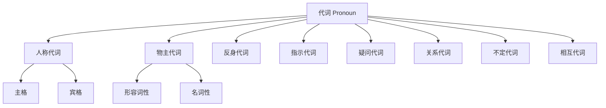
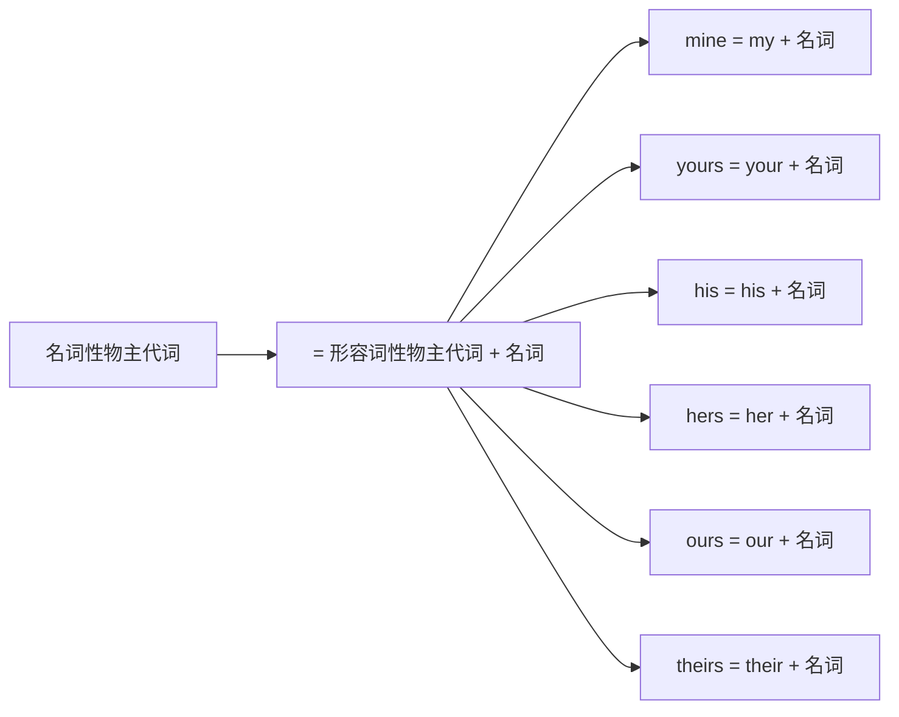
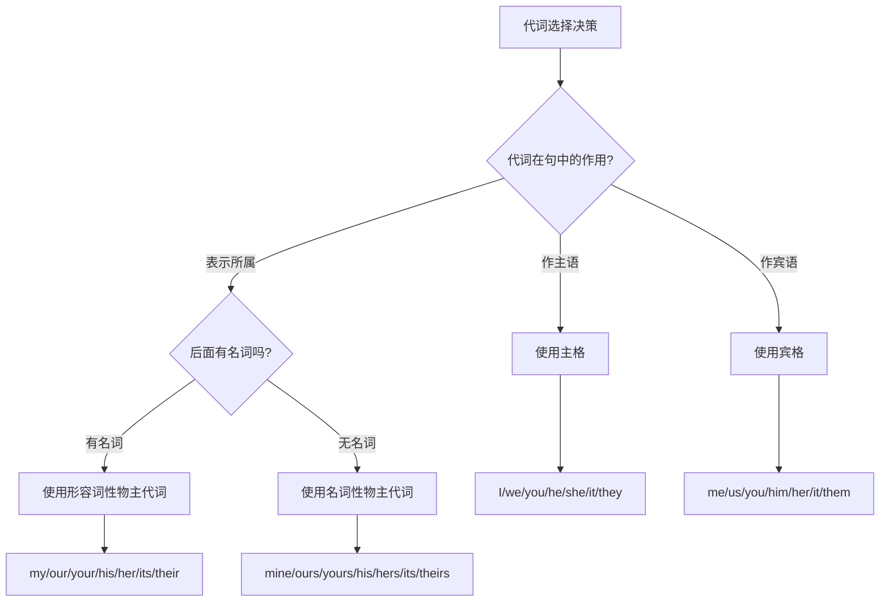
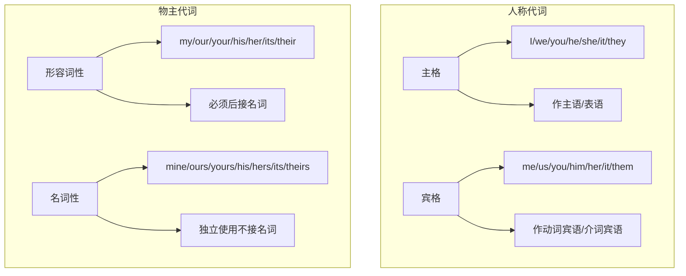

# 人称代词与物主代词

代词是英语中使用频率最高的词类之一。在日常交流中，我们几乎每句话都会用到代词。人称代词和物主代词作为代词家族的核心成员，承担着指代人物、表示所属关系的重要功能。掌握它们的正确用法，是流畅表达的基础。

## 1 代词概述

### 1.1 代词的定义与功能

代词（Pronoun）是用来**代替名词或名词短语**的词。使用代词可以避免重复，使语言更加简洁流畅。

> [!info] 为什么需要代词
>
> 观察下面两段话的对比：
>
> **不使用代词**：
> John saw John's friend. John's friend gave John a book. John thanked John's friend.
>
> **使用代词**：
> John saw his friend. His friend gave him a book. He thanked his friend.
>
> 使用代词后，句子变得自然流畅，避免了名词的重复。

代词的主要功能包括：

| 功能 | 说明 | 示例 |
| --- | --- | --- |
| 代替名词 | 避免重复已提及的名词 | The book is interesting. **It** is worth reading. |
| 指代人物 | 表明说话者、听话者或第三方 | **I** told **you** about **him**. |
| 表示所属 | 说明某物属于谁 | This is **my** pen. That one is **yours**. |
| 泛指概念 | 指代不特定的人或事物 | **Someone** is knocking at the door. |

### 1.2 代词的分类体系

英语代词可分为八大类，本章重点讲解人称代词和物主代词。



上图展示了英语代词的完整分类体系。人称代词根据在句中的语法功能分为主格和宾格两种形式；物主代词则根据使用方式分为形容词性和名词性两种形式。这些分类并非随意设定，而是由代词在句中扮演的不同角色决定的。

## 2 人称代词详解

### 2.1 人称代词的定义

人称代词（Personal Pronoun）是用来**指代人或事物**的代词，根据指代对象的不同，分为三个"人称"：

| 人称 | 定义 | 指代对象 |
| --- | --- | --- |
| 第一人称 | 说话者自己 | 我、我们 |
| 第二人称 | 听话者 | 你、你们 |
| 第三人称 | 说话者和听话者以外的人或事物 | 他、她、它、他们 |

> [!tip] 人称的概念来源
>
> "人称"这个术语来自语法学传统。在交流中，总是存在三种角色：
> - **第一人称**：正在说话的人（I/we）
> - **第二人称**：正在听话的人（you）
> - **第三人称**：被谈论的人或事物（he/she/it/they）
>
> 这种分类方式帮助我们理解语言中的指代关系。

### 2.2 人称代词的格变化

人称代词最重要的特征是**格变化**（Case）。不同于名词只在所有格时发生变化，人称代词在句中担任不同成分时，形式会发生明显变化。

#### 2.2.1 格的概念

"格"是指代词根据其在句中的语法功能而呈现的不同形式：

| 格 | 语法功能 | 回答的问题 |
| --- | --- | --- |
| 主格（Subjective Case） | 作主语 | 谁做了这件事？ |
| 宾格（Objective Case） | 作宾语 | 这件事发生在谁身上？ |

#### 2.2.2 人称代词形式总表

下表列出了所有人称代词的主格和宾格形式：

| 人称 | 数 | 主格 | 宾格 | 中文含义 |
| --- | --- | --- | --- | --- |
| 第一人称 | 单数 | I | me | 我 |
| 第一人称 | 复数 | we | us | 我们 |
| 第二人称 | 单/复数 | you | you | 你/你们 |
| 第三人称 | 单数（男） | he | him | 他 |
| 第三人称 | 单数（女） | she | her | 她 |
| 第三人称 | 单数（物） | it | it | 它 |
| 第三人称 | 复数 | they | them | 他们/她们/它们 |

> [!warning] 特别注意
>
> - **I** 永远大写，无论出现在句子的什么位置
> - **you** 的主格和宾格形式相同，单复数也相同
> - **it** 的主格和宾格形式相同
> - **her** 既是人称代词宾格，也是物主代词（后文详述）

### 2.3 主格的用法

主格代词用于代词作**主语**的情况，表示动作的执行者。

#### 2.3.1 作句子主语

最基本的用法是作为句子的主语：

```
I am a student.
我是一名学生。
[I 作主语，表示句子的主体]

She works in a hospital.
她在一家医院工作。
[She 作主语，是动作 works 的执行者]

They have finished the project.
他们已经完成了这个项目。
[They 作主语，是动作 have finished 的执行者]
```

#### 2.3.2 作表语

在正式英语中，当代词作表语（跟在 be 动词后面说明主语身份）时，应使用主格：

```
It was I who called you last night.
昨晚给你打电话的是我。
[正式用法，I 作表语]

The winner is she.
获胜者是她。
[正式用法，she 作表语]
```

> [!info] 正式与非正式用法
>
> 在日常口语中，人们常用宾格代替主格作表语：
>
> | 正式写作 | 日常口语 |
> | --- | --- |
> | It is I. | It's me. |
> | It was he who did it. | It was him who did it. |
> | This is she speaking. | This is her speaking. |
>
> 两种用法都被接受，但在正式写作或考试中，建议使用主格。

#### 2.3.3 作比较状语从句的省略主语

在 than 或 as 引导的比较结构中，如果后面省略了动词，应使用主格：

```
He is taller than I (am).
他比我高。
[完整形式是 than I am，省略 am 后保留主格 I]

She runs as fast as he (does).
她跑得和他一样快。
[完整形式是 as he does，省略 does 后保留主格 he]
```

> [!warning] 比较结构中的格选择
>
> 比较以下两句的不同含义：
>
> **I love you more than he.** = I love you more than he loves you.
> （我比他更爱你。——比较的是谁更爱你）
>
> **I love you more than him.** = I love you more than I love him.
> （我爱你胜过爱他。——比较的是我爱谁更多）
>
> 格的选择会影响句子的意思！

### 2.4 宾格的用法

宾格代词用于代词作**宾语**的情况，表示动作的承受者。

#### 2.4.1 作动词宾语

这是宾格最常见的用法：

```
The teacher praised her.
老师表扬了她。
[her 作动词 praised 的直接宾语]

I saw them at the park yesterday.
我昨天在公园看见了他们。
[them 作动词 saw 的直接宾语]

Please tell him the truth.
请告诉他真相。
[him 作动词 tell 的间接宾语，the truth 是直接宾语]
```

#### 2.4.2 作介词宾语

介词后面的代词必须用宾格：

```
This gift is for you.
这份礼物是给你的。
[you 作介词 for 的宾语]

She sat beside me.
她坐在我旁边。
[me 作介词 beside 的宾语]

The secret is between him and me.
这个秘密在他和我之间。
[him 和 me 都是介词 between 的宾语]
```

> [!warning] 常见错误：between you and I
>
> 很多人错误地说 "between you and I"，这是一个典型的**超纠正**（hypercorrection）错误。
>
> ❌ **错误**：The agreement is between you and I.
> ✅ **正确**：The agreement is between you and me.
>
> **原因**：between 是介词，介词后面必须用宾格。虽然 "you and I" 听起来更"文雅"，但在语法上是错误的。
>
> 判断方法：去掉另一个代词，只保留一个测试——你不会说 "between I"，所以也不应该说 "between you and I"。

#### 2.4.3 作动词不定式的逻辑主语

在某些句型中，宾格代词作为不定式的逻辑主语：

```
I want him to come early.
我想让他早点来。
[him 是不定式 to come 的逻辑主语]

The teacher asked us to be quiet.
老师让我们安静。
[us 是不定式 to be quiet 的逻辑主语]
```

#### 2.4.4 在感叹句中

在 what 或 how 引导的感叹句中，代词作宾语时用宾格：

```
Lucky him!
他真幸运！

Poor me!
可怜的我！
```

### 2.5 人称代词的特殊用法

#### 2.5.1 it 的特殊用法

**it** 是人称代词中用法最灵活的一个，除了指代事物外，还有多种特殊用法。

**（1）指代天气、时间、距离、环境等**

```
It is raining heavily.
正在下大雨。
[it 指天气，无实际指代意义]

It is 10 o'clock now.
现在是10点钟。
[it 指时间]

It is three miles from here to the station.
从这里到车站有三英里。
[it 指距离]

It is very quiet in the library.
图书馆里非常安静。
[it 指环境]
```

**（2）作形式主语**

当真正的主语是不定式、动名词或从句时，常用 it 作形式主语，将真正的主语后置：

```
It is important to learn English well.
学好英语很重要。
[it 是形式主语，真正主语是 to learn English well]

It is no use crying over spilt milk.
覆水难收。（为打翻的牛奶哭泣是没有用的。）
[it 是形式主语，真正主语是 crying over spilt milk]

It is obvious that he is lying.
很明显他在撒谎。
[it 是形式主语，真正主语是 that he is lying]
```

**（3）作形式宾语**

当真正的宾语是不定式或从句时，用 it 作形式宾语：

```
I find it difficult to understand him.
我发现理解他很困难。
[it 是形式宾语，真正宾语是 to understand him]

He made it clear that he would not come.
他明确表示他不会来。
[it 是形式宾语，真正宾语是 that he would not come]
```

**（4）用于强调句型**

It is/was...that/who... 构成强调句型：

```
It was Tom who broke the window.
打破窗户的是汤姆。
[强调主语 Tom]

It was yesterday that I met her.
我是昨天见到她的。
[强调时间状语 yesterday]

It was in the park that we had a picnic.
我们是在公园里野餐的。
[强调地点状语 in the park]
```

> [!tip] 如何判断是否为强调句
>
> 将 It is/was...that/who 去掉后，如果剩余部分能组成一个完整的句子，就是强调句。
>
> **原句**：It was Tom who broke the window.
> **去掉强调结构**：Tom broke the window. ✓（完整句子）
> **结论**：这是强调句。
>
> **对比**：It is important that you come early.
> **去掉结构后**：Important you come early. ✗（不完整）
> **结论**：这不是强调句，it 是形式主语。

#### 2.5.2 we/you/they 的泛指用法

这三个代词有时不指特定的人，而是泛指一般人：

```
We should protect the environment.
我们应该保护环境。
[we 泛指人类]

You never know what will happen tomorrow.
你永远不知道明天会发生什么。
[you 泛指任何人]

They say it's going to rain.
据说要下雨了。
[they 泛指人们、大家]
```

#### 2.5.3 she/he 指代拟人化事物

在文学作品或日常表达中，某些事物常被拟人化：

```
Look at my car. Isn't she beautiful?
看看我的车。她漂亮吗？
[she 指代汽车，表示喜爱]

The ship lost her anchor in the storm.
这艘船在暴风雨中失去了她的锚。
[her 指代船只，传统用法]

China has developed her own space station.
中国已经发展出了自己的空间站。
[her 指代国家]
```

> [!info] 拟人化用法的传统
>
> 以下事物传统上常用 she 指代：
> - 船只、汽车、飞机等交通工具
> - 国家、城市
> - 大自然、地球、月亮
> - 某些令人喜爱的机器或设备
>
> 这种用法源于对事物的情感联系，在现代英语中虽然不是强制性的，但仍然常见。

### 2.6 人称代词的排列顺序

当多个人称代词并列使用时，需要遵循一定的顺序。

#### 2.6.1 单数代词的顺序

单数人称代词并列时，顺序为：**第二人称 → 第三人称 → 第一人称**，即 **you → he/she → I**

```
You, he and I are in the same class.
你、他和我在同一个班级。

You and I should work together.
你和我应该一起工作。

She and I are good friends.
她和我是好朋友。
```

> [!tip] 记忆口诀
>
> **单数代词排列：二三一**（you, he/she, I）
>
> 这个顺序体现了英语的礼貌原则：先说对方（you），再说第三方（he/she），最后说自己（I）——把自己放在最后是谦虚的表现。

#### 2.6.2 复数代词的顺序

复数人称代词并列时，顺序为：**第一人称 → 第二人称 → 第三人称**，即 **we → you → they**

```
We, you and they should all participate.
我们、你们和他们都应该参与。
```

#### 2.6.3 承认错误时的例外

当承认错误或承担责任时，**第一人称放在最前面**：

```
I and Tom broke the window.
我和汤姆打破了窗户。
[承认错误，I 放在前面表示主动承担责任]

I and he were late for school.
我和他上学迟到了。
[承认过失，I 放在前面]
```

## 3 物主代词详解

### 3.1 物主代词的定义

物主代词（Possessive Pronoun）是表示**所属关系**的代词，用来说明某物属于谁。物主代词分为两种形式：

| 类型 | 功能 | 特点 |
| --- | --- | --- |
| 形容词性物主代词 | 作定语，修饰名词 | 后面必须跟名词 |
| 名词性物主代词 | 作主语、宾语、表语 | 相当于"形容词性物主代词 + 名词" |

### 3.2 物主代词形式总表

| 人称 | 数 | 形容词性 | 名词性 | 中文含义 |
| --- | --- | --- | --- | --- |
| 第一人称 | 单数 | my | mine | 我的 |
| 第一人称 | 复数 | our | ours | 我们的 |
| 第二人称 | 单/复数 | your | yours | 你的/你们的 |
| 第三人称 | 单数（男） | his | his | 他的 |
| 第三人称 | 单数（女） | her | hers | 她的 |
| 第三人称 | 单数（物） | its | its | 它的 |
| 第三人称 | 复数 | their | theirs | 他们的/她们的/它们的 |

> [!warning] 形式相同的物主代词
>
> 注意以下三个代词的形容词性和名词性形式完全相同：
> - **his**：他的（形容词性和名词性相同）
> - **its**：它的（形容词性和名词性相同，但名词性 its 极少使用）
>
> 判断方法：看后面是否跟名词
> - This is **his** book.（形容词性，后面有名词 book）
> - This book is **his**.（名词性，后面无名词）

### 3.3 形容词性物主代词的用法

形容词性物主代词作**定语**，必须放在名词前面修饰名词。

#### 3.3.1 基本用法

```
This is my book.
这是我的书。
[my 修饰名词 book]

Her hair is long and beautiful.
她的头发又长又漂亮。
[her 修饰名词 hair]

Their house is very big.
他们的房子很大。
[their 修饰名词 house]
```

#### 3.3.2 形容词性物主代词 + own + 名词

用 own 强调"自己的"，加强所属关系：

```
I want to have my own room.
我想拥有自己的房间。

She started her own business.
她开始了自己的事业。

They solved the problem in their own way.
他们用自己的方式解决了问题。
```

> [!tip] own 的两种用法
>
> **形容词用法**：my/your/his/her/our/their + own + 名词
> - This is my **own** car.（这是我自己的车。）
>
> **动词用法**：own 作动词表示"拥有"
> - I **own** a car.（我拥有一辆车。）

#### 3.3.3 不能与冠词、指示代词等连用

形容词性物主代词前面不能再加冠词（a, an, the）或指示代词（this, that）：

```
❌ 错误：This is the my book.
✅ 正确：This is my book.

❌ 错误：I met a my friend yesterday.
✅ 正确：I met a friend of mine yesterday.

❌ 错误：That her bag is very expensive.
✅ 正确：That bag of hers is very expensive.
```

### 3.4 名词性物主代词的用法

名词性物主代词相当于"形容词性物主代词 + 名词"，可以独立使用，在句中作主语、宾语或表语。



上图展示了名词性物主代词的本质——它实际上是形容词性物主代词与名词的结合体。理解这一点有助于我们正确使用名词性物主代词，避免在其后再添加名词。

#### 3.4.1 作主语

```
My car is red. Yours is blue.
我的车是红色的。你的（车）是蓝色的。
[Yours = Your car，作主语]

His room is clean, but hers is messy.
他的房间很干净，但她的（房间）很乱。
[hers = her room，作主语]

Our team won, and theirs lost.
我们的队赢了，他们的队输了。
[theirs = their team，作主语]
```

#### 3.4.2 作宾语

```
I have finished my homework. Have you finished yours?
我已经完成了我的作业。你完成你的了吗？
[yours = your homework，作宾语]

She forgot her umbrella, so I lent her mine.
她忘了带她的伞，所以我把我的借给了她。
[mine = my umbrella，作宾语]
```

#### 3.4.3 作表语

```
This book is mine, not yours.
这本书是我的，不是你的。
[mine 和 yours 都作表语]

Is this pen hers or his?
这支笔是她的还是他的？
[hers 和 his 都作表语]

The final decision is ours to make.
最终决定由我们来做。
[ours 作表语]
```

#### 3.4.4 双重所有格结构

名词性物主代词可以用在 of 后面，构成**双重所有格**：

```
a friend of mine
我的一个朋友

some books of his
他的一些书

that idea of yours
你的那个想法
```

> [!info] 双重所有格的语义区别
>
> 比较以下表达的细微差异：
>
> | 表达 | 含义 | 语义特点 |
> | --- | --- | --- |
> | my friend | 我的朋友 | 强调所属关系 |
> | a friend of mine | 我的一个朋友 | 强调是"众多朋友中的一个" |
> | a friend of my father's | 我父亲的一个朋友 | 强调是父亲众多朋友中的一个 |
>
> 双重所有格常用于表示"众多中的一个/一些"，带有部分的含义。

### 3.5 物主代词与人称代词宾格的区分

**her** 既可以是人称代词宾格，也可以是形容词性物主代词，需要根据语境判断：

```
I saw her yesterday.
我昨天看见她了。
[her 是人称代词宾格，作动词 saw 的宾语]

Her book is on the desk.
她的书在桌子上。
[her 是形容词性物主代词，修饰名词 book]

I gave her her book.
我把她的书给了她。
[第一个 her 是人称代词宾格，作间接宾语；第二个 her 是形容词性物主代词，修饰 book]
```

> [!tip] 判断 her 词性的方法
>
> - **后面跟名词** → 形容词性物主代词（"她的"）
> - **后面不跟名词** → 人称代词宾格（"她"）
>
> 例句分析：
> - I love **her** smile.（她的微笑 → 形容词性物主代词）
> - I love **her**.（爱她 → 人称代词宾格）

### 3.6 its 与 it's 的区分

这是一个极其常见的错误，必须牢记区分：

| 形式 | 词性 | 含义 | 示例 |
| --- | --- | --- | --- |
| its | 物主代词 | 它的 | The dog wagged **its** tail.（狗摇着它的尾巴。） |
| it's | 缩写形式 | it is 或 it has | **It's** raining.（正在下雨。= It is raining.） |

```
❌ 错误：The cat is licking it's paw.
✅ 正确：The cat is licking its paw.
（猫正在舔它的爪子。）

❌ 错误：Its a beautiful day.
✅ 正确：It's a beautiful day.
（今天天气真好。）
```

> [!warning] 记忆技巧
>
> **its = 它的**（无撇号，表示所属）
> **it's = it is / it has**（有撇号，是缩写）
>
> 判断方法：把 it's 还原成 it is 或 it has，如果句子通顺，就用 it's；否则用 its。
>
> - The bird is building **___** nest.
>   - 还原测试：The bird is building it is nest. ✗（不通顺）
>   - 正确答案：its

## 4 人称代词与物主代词的对照

下表综合对比了人称代词和物主代词的所有形式：

| 人称 | 数 | 主格 | 宾格 | 形容词性物主代词 | 名词性物主代词 |
| --- | --- | --- | --- | --- | --- |
| 第一人称 | 单数 | I | me | my | mine |
| 第一人称 | 复数 | we | us | our | ours |
| 第二人称 | 单/复数 | you | you | your | yours |
| 第三人称 | 单数（男） | he | him | his | his |
| 第三人称 | 单数（女） | she | her | her | hers |
| 第三人称 | 单数（物） | it | it | its | its |
| 第三人称 | 复数 | they | them | their | theirs |



上图展示了选择正确代词形式的决策流程。首先判断代词在句中的语法功能：作主语时用主格，作宾语时用宾格，表示所属时根据后面是否有名词来选择形容词性或名词性物主代词。

## 5 易混淆点与常见错误

### 5.1 主格与宾格的混用

#### 5.1.1 介词后必须用宾格

```
❌ 错误：This is a photo of he and his wife.
✅ 正确：This is a photo of him and his wife.
（这是他和他妻子的照片。）

❌ 错误：The teacher is proud of we.
✅ 正确：The teacher is proud of us.
（老师为我们感到骄傲。）
```

#### 5.1.2 动词后作宾语用宾格

```
❌ 错误：The news surprised they.
✅ 正确：The news surprised them.
（这个消息让他们很惊讶。）

❌ 错误：Please help I with my homework.
✅ 正确：Please help me with my homework.
（请帮我做作业。）
```

#### 5.1.3 比较结构中的格选择

```
❌ 不够正式：He is taller than me.
✅ 正式写作：He is taller than I (am).
（他比我高。）

注意语义差异：
She loves him more than I. = She loves him more than I love him.
（她比我更爱他。）

She loves him more than me. = She loves him more than she loves me.
（她爱他胜过爱我。）
```

### 5.2 物主代词的常见错误

#### 5.2.1 形容词性与名词性的混用

```
❌ 错误：This book is my.
✅ 正确：This book is mine.
（这本书是我的。）

❌ 错误：Mine book is on the table.
✅ 正确：My book is on the table.
（我的书在桌子上。）
```

#### 5.2.2 与冠词的错误搭配

```
❌ 错误：I met the my teacher yesterday.
✅ 正确：I met my teacher yesterday.
（我昨天见到了我的老师。）

表达"我的一个..."时使用双重所有格：
❌ 错误：I met a my friend.
✅ 正确：I met a friend of mine.
（我遇到了我的一个朋友。）
```

#### 5.2.3 its 与 it's 的混淆

```
❌ 错误：The company announced it's new policy.
✅ 正确：The company announced its new policy.
（公司宣布了它的新政策。）

❌ 错误：Its important to study hard.
✅ 正确：It's important to study hard.
（努力学习很重要。）
```

### 5.3 并列代词的顺序错误

```
❌ 错误（非认错场合）：I and you should cooperate.
✅ 正确：You and I should cooperate.
（你和我应该合作。）

❌ 错误：Me and him went to the movies.
✅ 正确：He and I went to the movies.
（他和我去看电影了。）
[并列作主语时用主格]
```

### 5.4 性别代词的误用

#### 5.4.1 he/she 的正确使用

```
❌ 错误：My sister is a doctor. He works in a hospital.
✅ 正确：My sister is a doctor. She works in a hospital.
（我姐姐是医生。她在医院工作。）
```

#### 5.4.2 单数泛指的性别问题

传统上使用 he 泛指任何人，但现代英语倾向于使用性别中立的表达：

```
传统用法：
Everyone should do his best.
每个人都应该尽力。

现代中性用法：
Everyone should do their best.
每个人都应该尽力。
[使用 they/their 作为单数泛指代词]

或者：
Everyone should do his or her best.
每个人都应该尽他或她的最大努力。
```

> [!info] 单数 they 的使用
>
> 在现代英语中，使用 **they/them/their** 指代单数的不特定人称已被广泛接受：
>
> - If **someone** calls, tell **them** I'll call back.（如果有人打电话，告诉他们我会回电。）
> - **Each student** should bring **their** own materials.（每个学生应该带自己的材料。）
>
> 这种用法避免了性别偏见，被主流风格指南（如 APA、Chicago Manual of Style）所认可。

## 6 综合练习与解析

### 6.1 填空练习

用适当的人称代词或物主代词填空：

**练习 1**：
Tom is my friend. _____ is very kind. I often visit _____ on weekends. _____ house is near _____.

**答案与解析**：
Tom is my friend. **He** is very kind. I often visit **him** on weekends. **His** house is near **mine**.
- He：作主语，用主格
- him：作动词 visit 的宾语，用宾格
- His：修饰名词 house，用形容词性物主代词
- mine：后面无名词，用名词性物主代词，= my house

**练习 2**：
Mary and _____ (I/me) went shopping yesterday. _____ (She/Her) bought a dress for _____ (she/her) mother. _____ (I/Me) bought a book for _____ (I/my/mine) brother.

**答案与解析**：
Mary and **I** went shopping yesterday. **She** bought a dress for **her** mother. **I** bought a book for **my** brother.
- I：与 Mary 并列作主语，用主格
- She：作主语，用主格
- her：修饰名词 mother，用形容词性物主代词
- I：作主语，用主格
- my：修饰名词 brother，用形容词性物主代词

**练习 3**：
This is not _____ (you/your/yours) umbrella. _____ (You/Your/Yours) is over there. Please give this one to _____ (I/me/my/mine). _____ (It/Its/It's) _____ (I/me/my/mine).

**答案与解析**：
This is not **your** umbrella. **Yours** is over there. Please give this one to **me**. **It's** **mine**.
- your：修饰名词 umbrella，用形容词性物主代词
- Yours：后面无名词，作主语，用名词性物主代词
- me：作动词 give 的间接宾语，用宾格
- It's：= It is，表示"它是"
- mine：作表语，后面无名词，用名词性物主代词

### 6.2 改错练习

找出并改正下列句子中的代词错误：

**练习 1**：
Between you and I, this plan will not work.

**错误分析**：
between 是介词，介词后应使用宾格。

**正确句子**：
Between you and **me**, this plan will not work.
（在你我之间说，这个计划行不通。）

**练习 2**：
The dog is wagging it's tail happily.

**错误分析**：
表示"它的"应使用 its（无撇号），it's 是 it is 的缩写。

**正确句子**：
The dog is wagging **its** tail happily.
（狗正高兴地摇着尾巴。）

**练习 3**：
Him and me went to the cinema last night.

**错误分析**：
并列代词作主语时应使用主格，且第三人称应放在第一人称前面。

**正确句子**：
**He and I** went to the cinema last night.
（他和我昨晚去看电影了。）

**练习 4**：
Is this book your or her?

**错误分析**：
作表语时，后面无名词，应使用名词性物主代词。

**正确句子**：
Is this book **yours** or **hers**?
（这本书是你的还是她的？）

**练习 5**：
I like mine new phone. It's better than your.

**错误分析**：
修饰名词 phone 应使用形容词性物主代词 my；后面无名词时用名词性物主代词 yours。

**正确句子**：
I like **my** new phone. It's better than **yours**.
（我喜欢我的新手机。它比你的好。）

### 6.3 翻译练习

将下列句子翻译成英语，注意代词的正确使用：

**练习 1**：这是我的笔，那支是他的。

**参考答案**：
This is my pen. That one is his.
- my pen：形容词性物主代词修饰名词
- his：名词性物主代词作表语

**练习 2**：她比我跑得快。

**参考答案**：
She runs faster than I (do).
或（口语中）：She runs faster than me.
- 正式写作中，比较结构后用主格
- 日常口语中，宾格也被接受

**练习 3**：老师让我们安静。

**参考答案**：
The teacher asked us to be quiet.
- us：作动词 asked 的宾语，同时是不定式 to be quiet 的逻辑主语

**练习 4**：我的一个朋友昨天来看我了。

**参考答案**：
A friend of mine came to see me yesterday.
- a friend of mine：双重所有格，表示"众多朋友中的一个"
- me：作动词 see 的宾语

**练习 5**：这个决定由你和他来做。

**参考答案**：
The decision is for you and him to make.
- for 是介词，后面用宾格 you 和 him

## 7 实用口语表达

### 7.1 日常对话中的代词使用

**场景一：介绍自己和他人**

```
A: Who are you?
   你是谁？

B: I'm Tom. And this is my friend, Jack. He is from Canada.
   我是汤姆。这是我的朋友杰克。他来自加拿大。

A: Nice to meet you both!
   很高兴见到你们俩！

B: Nice to meet you too. Where are you from?
   我们也很高兴见到你。你来自哪里？
```

**场景二：询问所属**

```
A: Whose book is this? Is it yours?
   这是谁的书？是你的吗？

B: No, it's not mine. Maybe it's hers.
   不，不是我的。可能是她的。

A: Let me ask her. Excuse me, is this your book?
   让我问问她。打扰一下，这是你的书吗？

C: Yes, it's mine. Thank you for finding it!
   是的，是我的。谢谢你找到它！
```

**场景三：比较与对比**

```
A: My phone is older than yours.
   我的手机比你的旧。

B: Yes, but yours works better than mine.
   是的，但你的比我的好用。

A: Really? I thought his was the best.
   真的吗？我以为他的最好。

B: No, ours are both better than his.
   不，我们俩的都比他的好。
```

### 7.2 常用固定表达

以下是一些包含人称代词和物主代词的常用表达：

| 表达 | 含义 | 示例 |
| --- | --- | --- |
| It's me. | 是我。 | A: Who's there? B: It's me. |
| Between you and me | 咱们私下说 | Between you and me, he's not very smart. |
| If I were you | 如果我是你 | If I were you, I would accept the offer. |
| make oneself at home | 不要拘束 | Please make yourself at home. |
| help yourself | 请自便 | Help yourself to some food. |
| by oneself | 独自地 | She finished the work by herself. |
| in itself | 本身 | The task is not difficult in itself. |
| for one's part | 就...而言 | For my part, I agree with the plan. |

### 7.3 书面表达中的代词使用

在正式书面语中，代词的使用需要更加规范：

**邮件开头**：
```
Dear Mr. Smith,

I am writing to you regarding the proposal you sent me last week.
我写信给您是关于您上周发给我的提案。
```

**会议纪要**：
```
The committee reviewed the report. They decided to approve it with minor modifications.
委员会审阅了报告。他们决定在小幅修改后批准。
```

**学术写作**：
```
The researcher conducted her experiment over three months. Her findings suggest that...
研究人员进行了为期三个月的实验。她的发现表明...
```

> [!tip] 学术写作中的代词使用
>
> 现代学术写作越来越接受第一人称代词（I, we）的使用：
>
> - **传统写法**：The experiment was conducted...（实验被进行...）
> - **现代写法**：We conducted the experiment...（我们进行了实验...）
>
> 使用第一人称可以使表达更加直接清晰，但具体要求因学科和期刊而异。

## 8 本章小结

### 8.1 核心要点回顾



上图总结了人称代词和物主代词的核心分类及其用法特点。人称代词根据语法功能分为主格和宾格，物主代词根据使用方式分为形容词性和名词性。掌握这些基本分类是正确使用代词的基础。

### 8.2 易错点清单

| 错误类型 | 错误示例 | 正确示例 |
| --- | --- | --- |
| 介词后用主格 | between you and I | between you and me |
| 混淆 its 与 it's | The cat lost it's toy. | The cat lost its toy. |
| 形容词性物主代词后无名词 | This is my. | This is mine. |
| 名词性物主代词后有名词 | mine book | my book |
| 并列代词顺序错误 | I and you should go. | You and I should go. |
| 与冠词连用 | a my friend | a friend of mine |

### 8.3 学习建议

1. **多读多练**：通过大量阅读英文材料，观察代词的实际用法
2. **造句练习**：用每种代词形式造句，加深理解
3. **对比记忆**：将容易混淆的代词放在一起对比记忆
4. **语境理解**：注意代词在不同语境中的使用，特别是正式与非正式场合的差异
5. **及时纠错**：发现错误后立即改正，避免形成错误习惯

> [!success] 学习成果检验
>
> 完成本章学习后，你应该能够：
>
> - [ ] 正确区分人称代词的主格和宾格
> - [ ] 根据语境选择正确的代词格
> - [ ] 区分形容词性和名词性物主代词
> - [ ] 避免 its/it's 的混淆
> - [ ] 正确排列并列代词的顺序
> - [ ] 在口语和书面语中恰当使用代词
