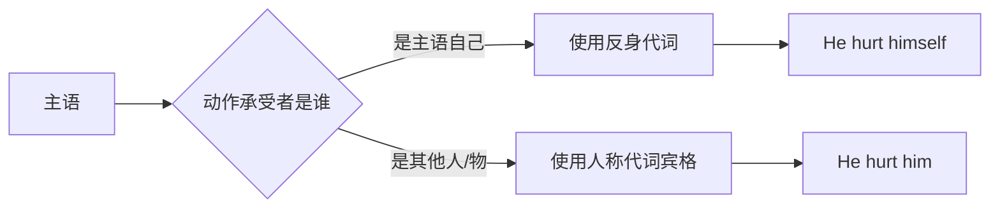
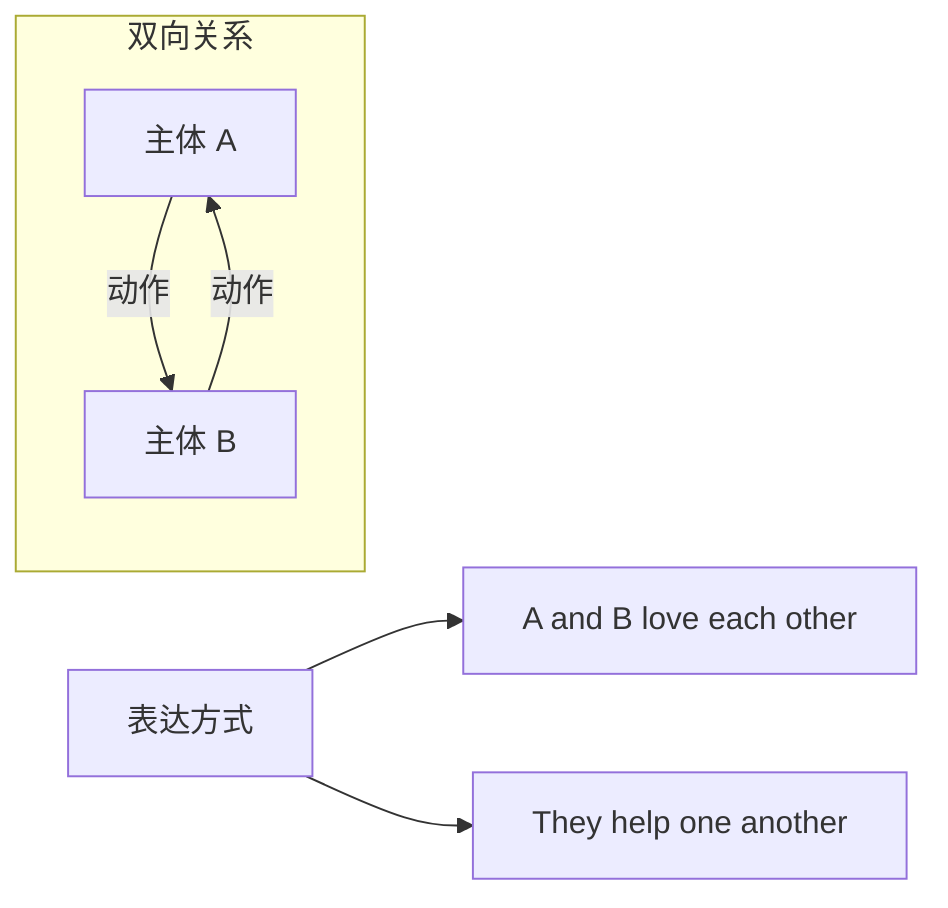
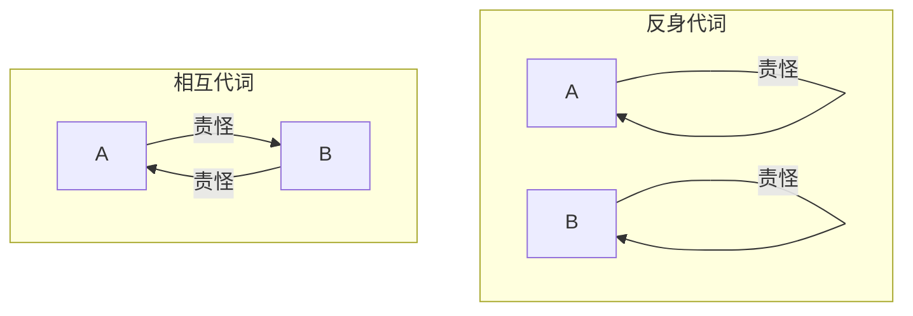
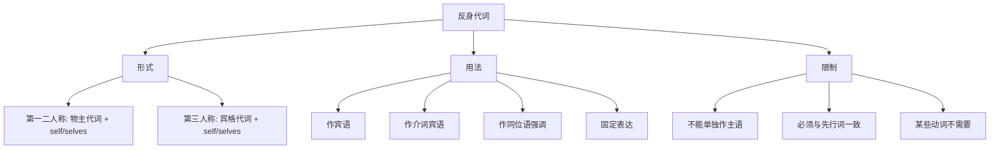

# 反身代词与相互代词

在英语代词体系中，**反身代词**（Reflexive Pronouns）和**相互代词**（Reciprocal Pronouns）是两类特殊而重要的代词。它们的共同特点是：所指代的对象与句子中的另一个成分存在某种"回指"或"互指"关系。反身代词表示动作"反射"回施动者本身，而相互代词则表达两个或多个主体之间的双向互动关系。

掌握这两类代词，不仅能让你的表达更加精准，还能帮助你理解许多英语习惯用语和固定搭配的内在逻辑。

---

## 1. 反身代词概述

### 1.1 什么是反身代词

**反身代词**是一类特殊的代词，用于表示动作的执行者和承受者是同一个人或事物。换句话说，当句子的主语对自己施加某种动作时，就需要使用反身代词来指代"自己"。

> [!info] 核心概念
>
> 反身代词的本质功能是**回指**（anaphora）——它必须在句中找到一个"先行词"（通常是主语），并与之保持人称、数、性的一致。
>
> - 动作发出者 = 动作承受者 → 使用反身代词
> - He hurt **himself**.（他伤了他自己）
> - 主语 he 和宾语 himself 指同一个人

从词源上看，反身代词由两部分构成：
- **人称代词的宾格或物主代词** + **-self（单数）/-selves（复数）**

这种构词方式直观地表达了"自己的自我"这一概念。

### 1.2 反身代词的形式

英语中共有八个反身代词，按人称和数的不同分布如下：

| 人称 | 单数 | 复数 |
| :---: | :---: | :---: |
| 第一人称 | myself（我自己） | ourselves（我们自己） |
| 第二人称 | yourself（你自己） | yourselves（你们自己） |
| 第三人称 | himself（他自己） | themselves（他们自己） |
| 第三人称 | herself（她自己） | themselves（他们自己） |
| 第三人称 | itself（它自己） | themselves（它们自己） |

> [!warning] 拼写注意事项
>
> 1. **第一、二人称**用**物主代词** + self/selves：
>    - my + self = myself
>    - your + self = yourself
>    - our + selves = ourselves
>
> 2. **第三人称**用**宾格代词** + self/selves：
>    - him + self = himself
>    - her + self = herself
>    - them + selves = themselves
>
> 3. **常见错误形式**（必须避免）：
>    - ❌ hisself（应为 himself）
>    - ❌ theirselves（应为 themselves）
>    - ❌ ourself（应为 ourselves，除非指单一集体）

### 1.3 反身代词与人称代词的对照

理解反身代词与普通人称代词的区别，是正确使用反身代词的关键：

对比以下两组例句：

| 句子 | 宾语指代 | 分析 |
| --- | --- | --- |
| Tom blamed **himself**. | Tom 自己 | 主语和宾语是同一人 |
| Tom blamed **him**. | 另一个男性 | 主语和宾语是不同人 |
| She bought **herself** a gift. | 她自己 | 为自己买礼物 |
| She bought **her** a gift. | 另一个女性 | 为别人买礼物 |

> [!example] 实际应用场景
>
> **场景一：日常对话**
>
> - A: Did you make this cake?
> - B: Yes, I made it **myself**.（是的，我自己做的）
>
> **场景二：职场邮件**
>
> - Please introduce **yourself** to the team.（请向团队介绍你自己）
>
> **场景三：文学描写**
>
> - The old man sat by **himself**, lost in thought.（老人独自坐着，陷入沉思）

---

## 2. 反身代词的六大用法

反身代词在句中可以充当多种成分，每种用法都有其特定的语境和功能。

### 2.1 用法一：作宾语（最基本用法）

当动作的执行者和承受者是同一个人或事物时，反身代词作**及物动词的宾语**。

**基本结构**：主语 + 及物动词 + 反身代词

> [!tip] 判断标准
>
> 问自己一个问题：**动作是"做给谁"的？**
> - 如果答案是"做给自己"，就用反身代词
> - 如果答案是"做给别人"，就用普通人称代词

**例句精讲**：

1. **She looked at herself in the mirror.**
   - 中文：她看着镜子中的自己。
   - 分析：look at 的动作发出者（she）和承受者（herself）是同一人。
   - 对比：She looked at her in the mirror.（她看着镜中的另一个女人）

2. **The cat is cleaning itself.**
   - 中文：猫正在给自己梳洗。
   - 分析：动物用 itself 指代自己。
   - 语法点：进行时态中反身代词的使用。

3. **We should push ourselves to do better.**
   - 中文：我们应该督促自己做得更好。
   - 分析：push 的主语和宾语都是 we/ourselves。

4. **Don't blame yourself for the mistake.**
   - 中文：不要因为这个错误而责怪你自己。
   - 分析：祈使句中，隐含主语 you 与 yourself 一致。

**常见搭配动词**：

| 动词 | 例句 | 中文 |
| --- | --- | --- |
| hurt | He hurt himself while cooking. | 他做饭时弄伤了自己。 |
| cut | I accidentally cut myself. | 我不小心割伤了自己。 |
| burn | Be careful not to burn yourself. | 小心别烫着自己。 |
| teach | She taught herself to play piano. | 她自学弹钢琴。 |
| introduce | Let me introduce myself. | 让我自我介绍一下。 |
| express | He finds it hard to express himself. | 他觉得很难表达自己。 |
| enjoy | Did you enjoy yourself at the party? | 你在派对上玩得开心吗？ |
| help | Help yourself to some cake. | 请随便吃些蛋糕。 |
| behave | The children behaved themselves well. | 孩子们表现得很好。 |

### 2.2 用法二：作介词宾语

反身代词可以作**介词的宾语**，尤其在介词短语中表示"关于自己"、"为了自己"、"靠自己"等意义。

**常见介词搭配**：

| 介词短语 | 含义 | 例句 |
| --- | --- | --- |
| by oneself | 独自地；靠自己 | She lives by herself. |
| for oneself | 为自己；亲自 | See it for yourself. |
| to oneself | 对自己；独享 | Keep it to yourself. |
| in oneself | 本身；就其本身而言 | The idea is good in itself. |
| of oneself | 自动地；自发地 | The door opened of itself. |
| beside oneself | 极度（激动/愤怒等） | He was beside himself with joy. |

**例句精讲**：

1. **I prefer to work by myself.**
   - 中文：我更喜欢独自工作。
   - 分析：by myself = alone，表示"独自"。
   - 延伸：by oneself 还可表示"靠自己的力量"。

2. **You should think for yourself, not just follow others.**
   - 中文：你应该独立思考，而不是只跟随他人。
   - 分析：for yourself 强调"为了自己"的利益或立场。

3. **This information is between ourselves.**
   - 中文：这个信息只有我们之间知道。
   - 分析：between ourselves = 仅限于我们之间，保密的意思。

4. **The machine started of itself.**
   - 中文：机器自动启动了。
   - 分析：of itself = automatically，表示无人操作。

> [!warning] 易错辨析：by oneself vs. for oneself
>
> | 短语 | 核心含义 | 例句 |
> | --- | --- | --- |
> | by oneself | 独自一人；无人帮助 | He finished the project by himself. |
> | for oneself | 亲自；为自己的利益 | You should see the movie for yourself. |
>
> - **by oneself** 强调"没有陪伴"或"没有帮助"
> - **for oneself** 强调"亲身体验"或"为己所用"

### 2.3 用法三：作同位语（强调用法）

反身代词最独特的用法之一是作**同位语**，用于**强调**主语或宾语亲自执行某动作，相当于中文的"亲自"、"本人"。

**位置规则**：
- 紧跟在被强调的名词/代词之后
- 或放在句末

**例句精讲**：

1. **The president himself will attend the meeting.**
   - 中文：总统本人将出席会议。
   - 分析：himself 强调"总统亲自"，而非派代表。
   - 位置：紧跟 the president 之后。

2. **I myself don't believe it.**
   - 中文：我本人并不相信这件事。
   - 分析：myself 强调说话者的个人立场。
   - 语序：主语 + 反身代词 + 动词。

3. **She made the dress herself.**
   - 中文：这条裙子是她亲手做的。
   - 分析：herself 放在句末，强调"亲自制作"。
   - 对比：She made the dress.（她做了这条裙子——可能有人帮忙）

4. **The work itself is not difficult, but it takes time.**
   - 中文：工作本身并不难，但需要时间。
   - 分析：itself 强调"工作这件事本身"，与其他因素区分。

> [!tip] 强调用法的识别技巧
>
> **测试方法**：删除反身代词后，句子的基本意思是否仍然完整？
>
> - ✅ The president himself will attend. → The president will attend.（意思完整，himself 是强调）
> - ❌ He hurt himself. → He hurt.（意思不完整，himself 是必需的宾语）
>
> 如果删除后句子仍通顺，说明是**强调用法**；如果不通顺，说明是**宾语用法**。

### 2.4 用法四：用于固定表达

英语中有大量包含反身代词的**固定短语和习语**，这些表达已经成为约定俗成的用法，需要整体记忆。

**高频固定表达**：

| 表达 | 含义 | 例句 |
| --- | --- | --- |
| help oneself (to) | 随便吃/用 | Help yourself to some coffee. |
| enjoy oneself | 玩得开心 | Did you enjoy yourself? |
| make oneself at home | 别拘束 | Please make yourself at home. |
| make oneself understood | 让别人理解自己 | I couldn't make myself understood in French. |
| devote oneself to | 献身于 | She devoted herself to charity work. |
| apply oneself to | 专心于 | You should apply yourself to your studies. |
| absent oneself from | 缺席 | He absented himself from the meeting. |
| pride oneself on | 以...为傲 | She prides herself on her cooking skills. |
| avail oneself of | 利用 | You should avail yourself of this opportunity. |
| content oneself with | 满足于 | He contented himself with a small apartment. |
| resign oneself to | 听任；顺从 | She resigned herself to her fate. |
| find oneself | 发现自己处于（某状态） | I found myself alone in the room. |
| lose oneself in | 沉浸于 | He lost himself in the book. |

**例句精讲**：

1. **Please help yourself to anything in the fridge.**
   - 中文：请随便吃冰箱里的任何东西。
   - 分析：help oneself to 是固定搭配，表示"自取"。
   - 用法：常用于招待客人的场景。

2. **She devoted herself entirely to her research.**
   - 中文：她全身心地投入到研究中。
   - 分析：devote oneself to 表示"献身于"。
   - 注意：to 是介词，后接名词或动名词。

3. **I couldn't make myself heard above the noise.**
   - 中文：在噪音中我无法让别人听到我说话。
   - 分析：make oneself + 过去分词，表示"使自己被..."。
   - 类似结构：make oneself understood/known。

4. **He found himself standing in front of his old school.**
   - 中文：他发现自己站在了老学校门前。
   - 分析：find oneself 表示"不知不觉发现自己..."。
   - 语法：find + 宾语 + 现在分词（宾补）。

### 2.5 用法五：用于祈使句

在祈使句中，虽然主语 you 被省略，但反身代词仍然使用 yourself/yourselves。

**例句精讲**：

1. **Behave yourself!**
   - 中文：规矩点！
   - 分析：隐含主语是 you，所以用 yourself。

2. **Don't push yourself too hard.**
   - 中文：别把自己逼得太紧。
   - 分析：否定祈使句中的反身代词用法。

3. **Make yourselves comfortable.**
   - 中文：（你们）请随意坐。
   - 分析：对多人说话时用 yourselves。

4. **Enjoy yourselves at the party!**
   - 中文：（你们）在派对上玩得开心！

### 2.6 用法六：特殊结构中的反身代词

某些特殊句型结构中，反身代词有其独特的用法规则。

**2.6.1 在比较结构中**

在 than 或 as 引导的比较从句中，反身代词用于强调比较的对象是"自己"。

- **She knows the city better than myself.**
  - 中文：她比我自己更了解这座城市。
  - 分析：myself 强调说话者本人。
  - 注意：正式语法中，than I 更规范，但口语中 than myself 也常见。

**2.6.2 在 but/except 之后**

当 but 或 except 表示"除了"时，后面可接反身代词。

- **Everyone attended the meeting but/except myself.**
  - 中文：除了我之外，所有人都参加了会议。
  - 分析：myself 作 except 的宾语。

**2.6.3 作为并列成分**

反身代词可以与其他名词或代词并列使用。

- **My colleague and myself will handle this project.**
  - 中文：我和我的同事将处理这个项目。
  - 分析：myself 与 my colleague 并列作主语。
  - 注意：正式语法中应为 "My colleague and I"，但口语和商务场合常用 myself。

---

## 3. 反身代词的语法限制

### 3.1 反身代词不能单独作主语

反身代词的本质是"回指"另一个词，因此它**不能独立作主语**，必须有先行词。

> [!warning] 常见错误
>
> - ❌ **Myself** went to the store.
> - ✅ **I** went to the store **myself**.
>
> - ❌ **Himself** is a good student.
> - ✅ **He himself** is a good student.

**例外情况**：在并列结构或特定口语场合中，反身代词可出现在主语位置：

- **John and myself will attend the conference.**
  - 这种用法在商务邮件中常见，但语法上不够规范。
  - 规范写法：John and I will attend the conference.

### 3.2 反身代词必须与先行词一致

反身代词在**人称、数、性**上必须与其先行词（通常是主语）保持一致。

| 先行词 | 正确的反身代词 | 错误示例 |
| --- | --- | --- |
| I | myself | ❌ I hurt himself |
| She | herself | ❌ She hurt themselves |
| They | themselves | ❌ They enjoyed himself |
| The dog | itself | ❌ The dog hurt himself |

**例句分析**：

1. ✅ **The children enjoyed themselves at the zoo.**
2. ❌ ~~The children enjoyed himself at the zoo.~~
3. ✅ **Each student should prepare himself or herself for the exam.**
4. ✅ **Each student should prepare themselves for the exam.**（现代用法，性别中立）

### 3.3 某些动词不需要反身代词

在英语中，有些动词本身就暗含"对自己"的意思，**不需要加反身代词**，这与汉语习惯不同。

| 动词 | 英语用法 | 汉语对应 | 错误用法 |
| --- | --- | --- | --- |
| wash | I need to **wash** before dinner. | 我需要洗洗（自己） | ❌ wash myself |
| shave | He **shaves** every morning. | 他每天早上刮胡子 | ❌ shaves himself |
| dress | She **dressed** quickly. | 她很快穿好衣服 | ❌ dressed herself |
| bathe | The baby is **bathing**. | 宝宝在洗澡 | ❌ bathing itself |
| concentrate | Please **concentrate**. | 请集中注意力 | ❌ concentrate yourself |
| relax | Just **relax**. | 放松一下 | ❌ relax yourself |
| complain | He always **complains**. | 他总是抱怨 | ❌ complains himself |

> [!tip] 何时需要反身代词？
>
> 当需要**强调**"亲自"或区分"为自己"和"为他人"时，才添加反身代词：
>
> - She **dressed** quickly.（她穿好衣服了——普通陈述）
> - She **dressed herself** despite her injury.（尽管受伤，她还是自己穿衣服——强调自己完成）
>
> - Can you **wash** before dinner?（你能饭前洗洗吗？）
> - Can you **wash yourself** properly?（你能好好把自己洗干净吗？——强调彻底/正确地洗）

### 3.4 动作指向身体部位时的用法

当动作指向身体的某个部位时，英语通常用**定冠词 the + 身体部位**，而不是反身代词。

| 中文 | 正确的英语表达 | 错误用法 |
| --- | --- | --- |
| 他摇了摇头 | He shook **his** head. | ❌ himself head |
| 她抬起手 | She raised **her** hand. | ❌ herself hand |
| 我闭上眼睛 | I closed **my** eyes. | ❌ myself eyes |
| 他们点点头 | They nodded **their** heads. | ❌ themselves heads |

但如果动作确实是"对自己施加"的（如伤害、触摸），则需要反身代词：

- **He cut himself on the broken glass.**（他被碎玻璃割伤了自己）
- **She pinched herself to make sure she wasn't dreaming.**（她掐了自己一下以确认不是在做梦）

---

## 4. 相互代词详解

### 4.1 什么是相互代词

**相互代词**（Reciprocal Pronouns）用于表示两个或多个主体之间的**双向互动关系**。英语中只有两个相互代词：

| 相互代词 | 基本含义 |
| :---: | :---: |
| **each other** | 彼此，互相（通常指两者） |
| **one another** | 彼此，互相（通常指三者或以上） |

> [!info] 相互代词的本质
>
> 相互代词表达的是一种**对称关系**：
> - A 对 B 做某事，同时 B 也对 A 做同样的事
> - "Tom and Mary love each other" = Tom loves Mary AND Mary loves Tom

### 4.2 each other 与 one another 的区分

传统语法认为：
- **each other** → 用于**两者**之间
- **one another** → 用于**三者或以上**之间

**例句对比**：

| 人数 | 传统用法 | 例句 |
| --- | --- | --- |
| 两人 | each other | Tom and Mary love **each other**. |
| 三人以上 | one another | The team members support **one another**. |

**传统用法示例**：

1. **The two sisters often argue with each other.**
   - 中文：这两姐妹经常互相争吵。
   - 分析：两个人之间，用 each other。

2. **All the students in the class help one another.**
   - 中文：班上所有学生互相帮助。
   - 分析：多人之间，用 one another。

> [!warning] 现代英语的变化
>
> 在现代英语中，**each other 和 one another 通常可以互换使用**，两者的区分已经不那么严格。许多母语者在口语和写作中不加区分地使用这两个词。
>
> **学术/正式写作**：建议遵循传统区分
> **日常交流/口语**：两者可互换
>
> 例如：
> - The three friends help **each other**. ✅（现代用法，可接受）
> - The three friends help **one another**. ✅（传统用法，更规范）

### 4.3 相互代词的语法功能

相互代词在句中可以充当以下成分：

**4.3.1 作动词宾语**

这是最常见的用法。

- **They greeted each other warmly.**
  - 中文：他们热情地互相问候。
  - 结构：主语 + 及物动词 + 相互代词

- **The couple looked at each other in surprise.**
  - 中文：这对夫妻惊讶地互相看着对方。

- **We should respect one another.**
  - 中文：我们应该互相尊重。

**4.3.2 作介词宾语**

相互代词常与介词搭配使用。

| 介词短语 | 含义 | 例句 |
| --- | --- | --- |
| with each other | 互相（一起） | They work well with each other. |
| to each other | 互相（对） | Be kind to one another. |
| from each other | 互相（从） | We can learn from each other. |
| about each other | 关于彼此 | They know nothing about each other. |
| for each other | 为彼此 | They did favors for each other. |
| at each other | 互相（看/对着） | They stared at each other. |

**例句精讲**：

1. **The two companies compete with each other.**
   - 中文：这两家公司互相竞争。
   - 分析：with each other 作介词短语修饰 compete。

2. **They sat next to each other on the plane.**
   - 中文：他们在飞机上坐在彼此旁边。
   - 分析：next to each other 表示位置关系。

3. **We should learn from one another's mistakes.**
   - 中文：我们应该从彼此的错误中学习。
   - 分析：one another's 是所有格形式。

**4.3.3 所有格形式**

相互代词可以有所有格形式：**each other's** 和 **one another's**。

- **They read each other's books.**
  - 中文：他们互相阅读对方的书。

- **The neighbors borrowed one another's tools.**
  - 中文：邻居们互相借用对方的工具。

- **We should respect each other's opinions.**
  - 中文：我们应该尊重彼此的意见。

### 4.4 相互代词与反身代词的区别

这是一个常见的混淆点。关键区别在于**动作的方向**：

| 代词类型 | 动作方向 | 例句 | 含义 |
| --- | --- | --- | --- |
| 反身代词 | 自己→自己 | They blamed **themselves**. | 他们各自责怪自己 |
| 相互代词 | A→B 且 B→A | They blamed **each other**. | 他们互相责怪对方 |

**对比例句**：

1. **反身代词**：
   - Tom and Mary introduced **themselves**.
   - 中文：Tom 和 Mary 各自自我介绍。
   - 分析：每个人介绍的是自己。

2. **相互代词**：
   - Tom and Mary introduced **each other**.
   - 中文：Tom 和 Mary 互相介绍对方。
   - 分析：Tom 介绍 Mary，Mary 介绍 Tom。

3. **反身代词**：
   - The kids hurt **themselves** while playing.
   - 中文：孩子们玩耍时弄伤了自己。
   - 分析：每个孩子伤了自己。

4. **相互代词**：
   - The kids hurt **each other** while playing.
   - 中文：孩子们玩耍时互相伤害。
   - 分析：孩子们互相弄伤对方。

> [!example] 区分练习
>
> 选择正确的代词填空：
>
> 1. The two friends often help ______.
>    - **答案**：each other（互相帮助对方）
>
> 2. The students prepared ______ for the exam.
>    - **答案**：themselves（各自为自己准备）
>
> 3. We should be honest with ______.
>    - **答案**：each other（互相坦诚）或 ourselves（对自己坦诚）——取决于语境
>
> 4. They bought ______ birthday gifts.
>    - **答案**：each other（互相买礼物给对方）或 themselves（各自给自己买礼物）——取决于语境

---

## 5. 反身代词与相互代词的综合应用

### 5.1 在不同时态中的应用

反身代词和相互代词可以用于各种时态，其形式不变。

| 时态 | 反身代词例句 | 相互代词例句 |
| --- | --- | --- |
| 一般现在时 | She teaches herself piano. | They help each other daily. |
| 一般过去时 | He hurt himself yesterday. | We met each other last year. |
| 现在进行时 | I am pushing myself harder. | They are supporting each other. |
| 现在完成时 | She has proven herself capable. | We have known each other for years. |
| 将来时 | I will challenge myself. | They will contact each other soon. |
| 过去进行时 | He was blaming himself. | They were looking at each other. |

**例句精讲**：

1. **We have known each other since childhood.**
   - 中文：我们从小就认识彼此。
   - 分析：现在完成时表示从过去延续到现在的状态。

2. **She had been pushing herself too hard before she got sick.**
   - 中文：在生病之前，她一直在逼迫自己太过努力。
   - 分析：过去完成进行时强调过去某点之前持续的动作。

3. **They will be seeing each other more often after moving to the same city.**
   - 中文：搬到同一座城市后，他们将更频繁地见面。
   - 分析：将来进行时表示将来某段时间内持续的动作。

### 5.2 在从句中的应用

反身代词的先行词通常在同一从句中，但在某些情况下可以跨从句指代。

**5.2.1 简单句中**

先行词和反身代词在同一简单句中：

- **John hurt himself.**
  - 先行词 John 和 himself 在同一句中。

**5.2.2 复合句中**

在复合句中，反身代词通常指代其所在从句的主语：

- **Mary thinks that she should push herself harder.**
  - 中文：Mary 认为她应该更加努力。
  - 分析：herself 指代从句主语 she（即 Mary）。

- **John told Mary that she should believe in herself.**
  - 中文：John 告诉 Mary 她应该相信自己。
  - 分析：herself 指代 she（Mary），不是 John。

**5.2.3 动名词短语中**

反身代词可出现在动名词短语中：

- **He admitted blaming himself for the failure.**
  - 中文：他承认为失败而责怪自己。
  - 分析：himself 指代主语 He。

- **They talked about helping each other with homework.**
  - 中文：他们谈论了互相帮助做作业的事。

### 5.3 在被动语态中的应用

反身代词在被动语态中的使用较为特殊，需要注意以下情况：

**可以使用反身代词的被动结构**：

- **The door opened by itself.**
  - 中文：门自己开了。
  - 分析：by itself 表示"自动地"。

- **The problem solved itself eventually.**
  - 中文：问题最终自行解决了。
  - 分析：这里 itself 强调无需外力干预。

**不能使用反身代词的情况**：

当被动句的主语是动作的承受者而非施动者时，不能用反身代词：

- ❌ ~~He was hurt himself.~~
- ✅ **He hurt himself.**（主动）
- ✅ **He was hurt by someone.**（被动，施动者是别人）

### 5.4 在特殊句型中的应用

**5.4.1 强调句型 It is... that...**

- **It was herself that Mary blamed, not others.**
  - 中文：Mary 责怪的是她自己，不是别人。
  - 分析：强调句中强调 herself。

**5.4.2 倒装句**

- **Never had he pushed himself so hard before.**
  - 中文：他从未如此努力地逼迫过自己。
  - 分析：否定词 never 引起的倒装。

**5.4.3 there be 句型**

- **There was nothing between ourselves.**
  - 中文：我们之间什么也没有。

---

## 6. 常见错误与辨析

### 6.1 反身代词的常见错误

| 错误类型 | 错误示例 | 正确形式 | 说明 |
| --- | --- | --- | --- |
| 形式错误 | ~~hisself~~ | himself | 第三人称用宾格 + self |
| 形式错误 | ~~theirselves~~ | themselves | 正确的复数形式 |
| 主语误用 | ~~Myself went home.~~ | I went home myself. | 反身代词不能单独作主语 |
| 人称不一致 | ~~I hurt himself.~~ | I hurt myself. | 必须与先行词一致 |
| 不必要使用 | ~~I feel myself tired.~~ | I feel tired. | feel 后不需要反身代词 |
| 遗漏反身代词 | ~~He introduced.~~ | He introduced himself. | 某些动词需要宾语 |

### 6.2 相互代词的常见错误

| 错误类型 | 错误示例 | 正确形式 | 说明 |
| --- | --- | --- | --- |
| 与反身代词混淆 | ~~They blamed themselves.~~（当表示互相责怪时） | They blamed each other. | 明确区分动作方向 |
| 主语误用 | ~~Each other helped them.~~ | They helped each other. | 相互代词不能作主语 |
| 所有格错误 | ~~each others~~ | each other's | 正确的所有格形式 |
| 单复数不当 | ~~one anothers~~ | one another's | 不变化复数 |

### 6.3 易混淆动词辨析

某些动词后是否需要反身代词，取决于具体语境：

**6.3.1 feel**

- ❌ ~~I feel myself happy.~~
- ✅ **I feel happy.**（我感到快乐）
- ✅ **I felt myself falling asleep.**（我感觉自己正在睡着——强调感知过程）

**6.3.2 hide**

- ✅ **The child hid behind the door.**（孩子躲在门后——不强调"自己"）
- ✅ **The child hid himself behind the door.**（孩子把自己藏在门后——强调藏匿动作）

**6.3.3 prepare**

- ✅ **I need to prepare for the meeting.**（我需要为会议做准备）
- ✅ **I need to prepare myself for the meeting.**（我需要让自己为会议做好准备——强调心理准备）

> [!tip] 判断方法
>
> 问自己：**是否需要强调"自己亲自"这一层含义？**
>
> - 如果只是普通描述动作 → 不加反身代词
> - 如果要强调"自己做"或区分"为自己/为他人" → 加反身代词

---

## 7. 实战练习

### 7.1 选择填空

请选择正确的代词填入空格：

1. The twins look exactly like ______.
   - A. each other B. themselves C. one another

2. She taught ______ to play the guitar.
   - A. her B. herself C. himself

3. We should be honest with ______.
   - A. ourselves B. each other C. 两者皆可

4. The machine turned ______ off automatically.
   - A. itself B. it C. themselves

5. Tom and Jerry always fight with ______.
   - A. themselves B. each other C. one another

**答案与解析**：

> [!success] 答案
>
> 1. **A. each other**
>    - 解析：双胞胎"互相"看起来像对方，是双向关系。
>
> 2. **B. herself**
>    - 解析：她"自学"，动作发出者和承受者是同一人。
>
> 3. **C. 两者皆可**
>    - 解析：
>      - ourselves = 对我们自己诚实
>      - each other = 我们互相坦诚
>      - 两种理解都成立，取决于语境。
>
> 4. **A. itself**
>    - 解析：机器"自动"关闭，强调无人操作。
>
> 5. **B. each other**
>    - 解析：Tom 和 Jerry 是两个个体，"互相"打架。虽然 one another 在现代英语中也可接受，但 each other 是两者之间的传统用法。

### 7.2 改错练习

找出下列句子中的错误并改正：

1. ~~Hisself went to the store alone.~~
2. ~~The team members support theirselves.~~
3. ~~I and myself will handle this.~~
4. ~~She feels herself tired after work.~~
5. ~~The two countries help one another with trade.~~（在传统语法中）

**答案与解析**：

> [!success] 改正
>
> 1. **He himself went to the store alone.** 或 **He went to the store by himself.**
>    - 错误：hisself 是非标准形式；反身代词不能单独作主语。
>
> 2. **The team members support themselves.**
>    - 错误：theirselves 是非标准形式，应为 themselves。
>
> 3. **I myself will handle this.** 或 **I will handle this myself.**
>    - 错误：主语位置不应用 myself 与 I 并列。
>
> 4. **She feels tired after work.**
>    - 错误：feel 作为系动词后直接接形容词，不需要反身代词。
>
> 5. **The two countries help each other with trade.**
>    - 错误（传统语法）：两者之间应用 each other。
>    - 注意：在现代英语中，这句话也可以接受。

### 7.3 翻译练习

将下列句子翻译成英语：

1. 请你们随便吃。
2. 他们已经认识彼此十年了。
3. 这个问题本身并不复杂。
4. 孩子们，规矩点！
5. 我们应该互相学习，共同进步。

**参考答案**：

> [!success] 翻译
>
> 1. **Please help yourselves.**
>    - 解析：对多人说话用 yourselves；help oneself to 表示"随便吃/用"。
>
> 2. **They have known each other for ten years.**
>    - 解析：现在完成时表示延续；两人之间用 each other。
>
> 3. **The problem itself is not complicated.** 或 **The problem is not complicated in itself.**
>    - 解析：itself 作同位语强调"问题本身"。
>
> 4. **Behave yourselves, children!**
>    - 解析：祈使句，对多个孩子说话用 yourselves。
>
> 5. **We should learn from each other and make progress together.**
>    - 解析：learn from each other = 互相学习。

---

## 8. 知识总结

### 8.1 反身代词核心要点

### 8.2 相互代词核心要点

| 项目 | 说明 |
| --- | --- |
| 成员 | each other, one another |
| 传统区分 | each other（两者），one another（三者以上） |
| 现代用法 | 两者可互换 |
| 语法功能 | 作宾语、作介词宾语、有所有格形式 |
| 与反身代词区别 | 反身 = 自己对自己；相互 = 彼此对对方 |

### 8.3 使用决策流程

> [!tip] 快速决策指南
>
> **第一步**：判断动作方向
> - 自己→自己？ → 反身代词
> - A→B 且 B→A？ → 相互代词
>
> **第二步**：确定人称和数
> - 与先行词保持一致
>
> **第三步**：检查是否必需
> - 删除代词后句子是否通顺？
> - 通顺 = 强调用法（可选）
> - 不通顺 = 必需用法

### 8.4 高频固定搭配速查

| 类别 | 搭配 | 含义 |
| --- | --- | --- |
| 反身代词 | by oneself | 独自；靠自己 |
| 反身代词 | for oneself | 亲自；为自己 |
| 反身代词 | help oneself to | 随便吃/用 |
| 反身代词 | enjoy oneself | 玩得开心 |
| 反身代词 | make oneself at home | 别拘束 |
| 反身代词 | devote oneself to | 献身于 |
| 相互代词 | with each other | 互相 |
| 相互代词 | from each other | 从彼此 |
| 相互代词 | each other's | 彼此的（所有格） |

---

## 9. 拓展阅读

### 9.1 反身代词的历史演变

反身代词在古英语中并不存在。古英语使用普通代词表示反身含义，依靠语境判断。到了中古英语时期，由于语法简化和语义明确的需要，self 逐渐与代词结合形成现代反身代词。

有趣的是，古英语和中古英语中存在 "meself"、"seolf" 等形式，这些形式在现代非标准方言中仍有遗留，如爱尔兰英语中的 "meself"。

### 9.2 方言中的反身代词变体

在不同的英语方言中，反身代词有各种变体形式：

| 标准形式 | 方言变体 | 分布地区 |
| --- | --- | --- |
| myself | meself | 爱尔兰英语、苏格兰英语 |
| himself | hisself | 美国南方方言、非裔美国英语 |
| themselves | theirselves | 多种非标准方言 |
| ourselves | usselves | 某些英国方言 |

这些变体在口语和文学作品中时有出现，了解它们有助于理解英语的多样性，但在正式写作中应避免使用。

### 9.3 反身代词的跨语言对比

不同语言处理反身含义的方式各有特点：

- **法语**：使用 se（反身代词）与动词结合，如 "se laver"（洗自己）
- **德语**：使用 sich 作为反身代词，如 "sich waschen"
- **俄语**：使用 -ся/-сь 后缀附着在动词上
- **日语**：使用"自分"（jibun）表示反身含义
- **汉语**：使用"自己"，但在许多情况下可以省略

了解这些差异有助于避免母语干扰导致的错误。

---

通过本章的学习，你应该已经掌握了反身代词和相互代词的形式、用法、限制以及常见错误。这两类代词虽然数量不多，但在日常交流和书面表达中使用频率很高。熟练运用它们，将使你的英语表达更加精准、地道。在接下来的学习中，我们将继续探讨指示代词、疑问代词和不定代词的用法。
