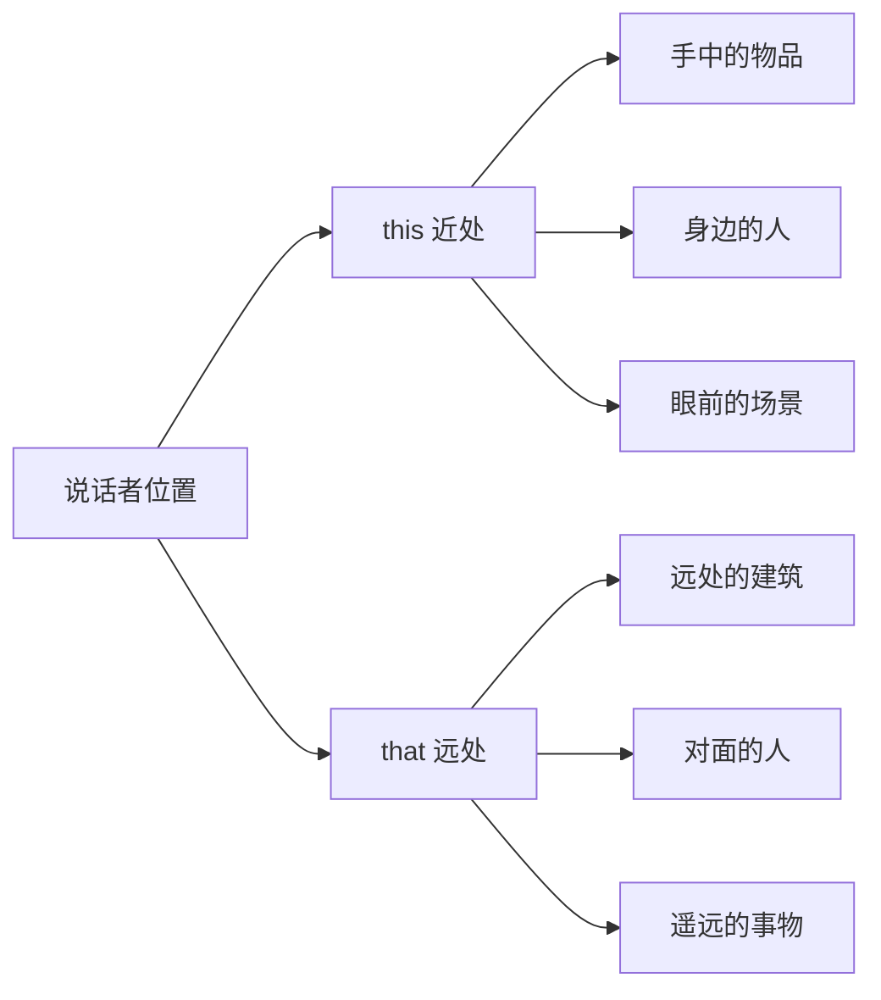
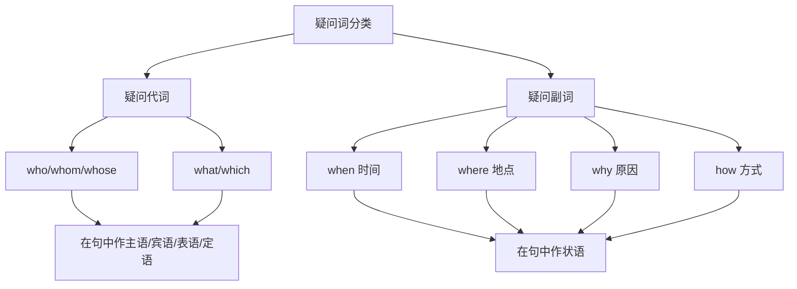
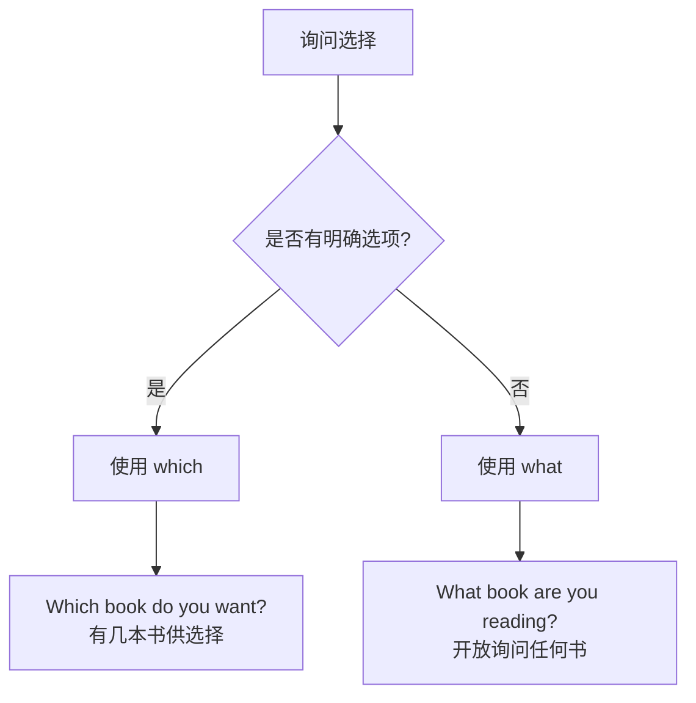
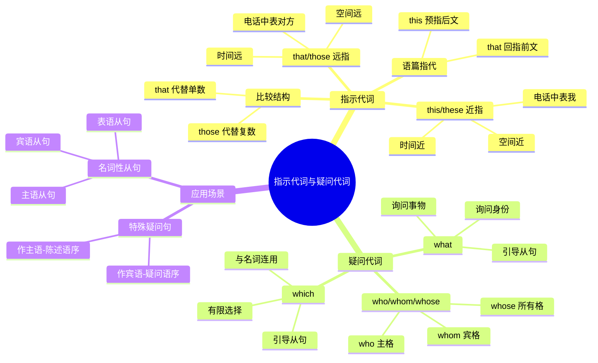

# 指示代词与疑问代词

指示代词和疑问代词是英语代词系统中两个重要的分支。指示代词用于「指向」或「标识」特定的人或事物，帮助说话者在交流中明确所指对象；疑问代词则用于构成疑问句，询问有关人、物、身份、选择等方面的信息。掌握这两类代词的用法，是提升英语表达准确性和交际能力的关键环节。

---

## 1. 指示代词概述

### 1.1 什么是指示代词

指示代词（Demonstrative Pronouns）是用来「指示」或「标明」某个特定的人、事物、概念或情境的代词。英语中的指示代词主要有四个：**this**、**that**、**these**、**those**。

> [!info] 指示代词的核心功能
>
> 指示代词的本质作用是在语境中建立「指向关系」，让听话者明确说话者所指的对象。这种指向可以是：
>
> - **空间指向**：指近处或远处的事物
> - **时间指向**：指现在或过去/将来的事件
> - **语篇指向**：指前文或后文的内容

**基础形式对照表**：

| 指示代词 | 数 | 距离 | 基本含义 |
| --- | --- | --- | --- |
| this | 单数 | 近指 | 这个 |
| that | 单数 | 远指 | 那个 |
| these | 复数 | 近指 | 这些 |
| those | 复数 | 远指 | 那些 |

### 1.2 指示代词与指示形容词的区别

指示代词和指示形容词（也称指示限定词）在形式上完全相同，但语法功能不同：

**指示代词**：独立使用，在句中充当主语、宾语或表语，直接代替名词。

```
This is my book.
这是我的书。
（this 作主语，代替具体的事物）

I don't like that.
我不喜欢那个。
（that 作宾语，代替前文提到的事物）
```

**指示形容词**：修饰名词，必须与名词连用，不能独立存在。

```
This book is mine.
这本书是我的。
（this 修饰 book，作定语）

I don't like that color.
我不喜欢那个颜色。
（that 修饰 color，作定语）
```

> [!tip] 判断技巧
>
> 判断是代词还是形容词的关键在于：**后面是否紧跟名词**。
>
> - 后面有名词 → 指示形容词（限定词）
> - 后面无名词 → 指示代词

---

## 2. This 与 That 的用法详解

### 2.1 空间距离的区分

**this** 和 **that** 最基本的区别在于表示空间距离的远近。

**this（近指）**：指说话者身边的、距离近的事物。

```
This is my new phone.
这是我的新手机。
（手机就在说话者手中或身边）

Look at this!
看这个！
（指说话者正在接触或靠近的事物）

This tastes delicious.
这个尝起来很美味。
（指正在品尝或眼前的食物）
```

**that（远指）**：指距离说话者较远的事物。

```
That is the library.
那是图书馆。
（图书馆在远处，需要指向）

What is that over there?
那边那个是什么？
（询问远处的事物）

That was a beautiful sunset.
那是一次美丽的日落。
（指已过去的、「远离」现在的场景）
```



上图展示了 this 和 that 在空间距离上的基本划分。this 用于指代近处、身边的事物，而 that 用于指代远处、需要「望向」才能看到的事物。

### 2.2 时间距离的区分

除了空间距离，this 和 that 还可以表示时间上的远近。

**this（时间近指）**：指现在、当前或即将发生的事情。

```
This is the happiest day of my life.
这是我人生中最幸福的一天。
（指「今天」，时间上离现在最近）

I'm very busy this week.
我这周非常忙。
（指当前这一周）

This summer, we're going to Japan.
今年夏天，我们要去日本。
（指即将到来的夏天）
```

**that（时间远指）**：指过去发生的或时间上较远的事情。

```
That was a wonderful party.
那是一个精彩的派对。
（派对已经结束，属于过去）

I remember that day clearly.
我清楚地记得那一天。
（指过去某一天）

In those days, life was simpler.
在那些日子里，生活更简单。
（指过去的年代）
```

> [!warning] 注意事项
>
> 在实际使用中，时间远近的判断往往取决于说话者的主观感受。同样是「上周」，如果说话者觉得时间很近，可以用 this last week（强调延续到现在）；如果觉得已经过去，则用 that。

### 2.3 电话用语中的特殊用法

在电话交谈中，this 和 that 有固定的用法：

**this**：用于自我介绍，表示「我」。

```
Hello, this is John speaking.
你好，我是约翰。

This is the customer service department.
这里是客户服务部门。
```

**that**：用于询问对方是谁。

```
Who is that?
你是谁？（电话中）

Is that Mr. Smith?
请问是史密斯先生吗？
```

> [!example] 完整电话对话示例
>
> ```
> A: Hello?
>    喂？
>
> B: Hello, this is Mary. Is that Tom?
>    你好，我是玛丽。请问是汤姆吗？
>
> A: Yes, this is Tom speaking. How can I help you?
>    是的，我是汤姆。有什么我能帮忙的吗？
> ```

### 2.4 介绍与引荐的用法

在介绍人物或事物时，this 和 that 的使用遵循「近用 this，远用 that」的原则。

**this**：介绍身边的人或正在展示的事物。

```
Mom, this is my friend, Lisa.
妈妈，这是我的朋友丽莎。
（丽莎在身边）

This is our new product.
这是我们的新产品。
（正在展示）
```

**that**：指向较远处的人或事物。

```
That is Professor Wang over there.
那边那位是王教授。
（教授在远处）

That's the restaurant I mentioned.
那就是我提到过的餐厅。
（餐厅在可见的远处）
```

### 2.5 语篇指代功能

在书面语和正式表达中，this 和 that 常用于指代前文或后文提到的内容。

**that（回指）**：指代前文提到的内容，这是更常见的用法。

```
He said he would help. That was very kind of him.
他说他会帮忙。那真是太好了。
（that 指代「他说会帮忙」这件事）

The experiment failed. That surprised everyone.
实验失败了。那让所有人都很惊讶。
（that 指代「实验失败」这件事）

She works 12 hours a day. That's why she's always tired.
她每天工作12小时。那就是她总是疲惫的原因。
（that 指代前文整个情况）
```

**this（预指或强调）**：有时用于引出后文要说的内容，或强调正在讨论的话题。

```
This is what I want to say: never give up.
这就是我想说的：永不放弃。
（this 引出后面的内容）

Remember this: honesty is the best policy.
记住这一点：诚实是上策。
（this 预指冒号后的内容）
```

> [!tip] 回指 that 与 it 的区别
>
> - **that** 通常指代前文的「事件、情况、陈述」，带有一定的强调或评价意味
> - **it** 更中性，单纯指代前文提到的具体事物或概念
>
> ```
> He passed the exam. That made his parents happy.
> 他通过了考试。那让他的父母很高兴。
> （that 强调这件事的影响）
>
> Where is my book? I can't find it.
> 我的书在哪里？我找不到它。
> （it 单纯指代 book）
> ```

---

## 3. These 与 Those 的用法详解

### 3.1 基本用法：复数形式的指示

**these** 是 **this** 的复数形式，**those** 是 **that** 的复数形式，用于指代多个人或事物。

**these（复数近指）**：

```
These are my colleagues.
这些是我的同事们。
（同事们在身边）

These books belong to the library.
这些书属于图书馆。
（书在手边或眼前）

These days, everyone uses smartphones.
如今，每个人都使用智能手机。
（指当前这段时间）
```

**those（复数远指）**：

```
Those are the mountains we climbed last year.
那些是我们去年攀登过的山。
（山在远处）

Those were the best years of my life.
那些是我人生中最美好的岁月。
（指过去的年月）

Those people over there are tourists.
那边那些人是游客。
（人们在远处）
```

### 3.2 These days 与 Those days 的对比

这两个短语在时间表达上有明确的区分：

| 短语 | 时态 | 含义 | 例句 |
| --- | --- | --- | --- |
| these days | 现在时 | 如今、现在这段时间 | These days, I prefer tea to coffee. |
| those days | 过去时 | 那些日子、往昔 | In those days, there were no computers. |

```
These days, online shopping is very popular.
如今，网上购物非常流行。
（描述现在的情况）

In those days, people wrote letters by hand.
在那些日子里，人们手写书信。
（描述过去的情况）

I was young in those days.
在那些日子里我还年轻。
（回忆过去）
```

### 3.3 Those who / Those that 结构

**those** 后面可以跟定语从句，构成「those who...」或「those that...」结构，表示「那些……的人/物」。

**those who（指人）**：

```
Those who work hard will succeed.
那些努力工作的人将会成功。

Blessed are those who help others.
帮助他人的人是有福的。

The prize goes to those who deserve it.
奖品颁给那些应得的人。
```

**those that/which（指物）**：

```
I prefer those that are handmade.
我更喜欢那些手工制作的。

The books those that deal with history are on the top shelf.
那些涉及历史的书在最上面的架子上。
```

> [!info] 语法说明
>
> 「those who...」结构相当于「the people who...」或「people who...」，但更加正式和书面化。在写作中使用这个结构可以使表达更加简洁有力。

### 3.4 比较结构中的 that 与 those

在比较句中，为了避免重复，常用 **that** 代替前面提到的单数名词，用 **those** 代替复数名词。

**that 代替单数名词**：

```
The climate of Beijing is drier than that of Shanghai.
北京的气候比上海的干燥。
（that = the climate，避免重复）

The population of China is larger than that of Japan.
中国的人口比日本的多。
（that = the population）

My phone is newer than that of my brother.
我的手机比我弟弟的新。
（that = the phone）
```

**those 代替复数名词**：

```
The streets in this city are wider than those in my hometown.
这座城市的街道比我家乡的宽。
（those = the streets）

The prices here are higher than those in the countryside.
这里的价格比农村的高。
（those = the prices）

Her grades are better than those of her classmates.
她的成绩比她同学们的好。
（those = the grades）
```

> [!warning] 常见错误
>
> ❌ The weather of London is colder than Beijing.
> （错误：比较对象不对等，weather 不能与 Beijing 比较）
>
> ✅ The weather of London is colder than that of Beijing.
> （正确：that 代替 the weather，使比较对等）

---

## 4. 指示代词的高级用法

### 4.1 情感色彩与语气表达

指示代词在口语中常带有说话者的情感倾向。

**this 表达亲近、认同或积极情感**：

```
I love this song!
我太喜欢这首歌了！
（表达热情和喜爱）

This is exactly what I need.
这正是我需要的。
（表达满意）
```

**that 表达距离感、不满或消极情感**：

```
I don't want to talk about that.
我不想谈论那件事。
（表达排斥）

That's not my problem.
那不是我的问题。
（表达推开、不愿承担）

Who told you that?
谁告诉你那个的？
（可能带有质疑语气）
```

### 4.2 强调与修辞用法

在口语和非正式文体中，this 和 that 常用于强调。

**this + 名词（引入新话题或讲故事）**：

```
So there was this guy who walked into a bar...
话说有这么个人走进一家酒吧……
（讲故事开头，吸引注意力）

I met this amazing person yesterday.
我昨天遇到了一个很棒的人。
（引入新话题，表示特别）
```

**that + 形容词（加强程度）**：

```
I didn't know she was that smart.
我不知道她那么聪明。
（that 加强程度，相当于 so）

Was the movie that good?
那部电影有那么好吗？
（that 加强程度）

It's not that difficult.
没那么难。
（that 加强程度）
```

### 4.3 固定搭配与习惯用语

指示代词在英语中形成了许多固定搭配：

| 搭配 | 含义 | 例句 |
| --- | --- | --- |
| this and that | 各种各样的事情 | We talked about this and that. |
| that's it | 就这样；正是如此 | That's it! You've got it! |
| that's that | 就这么定了；完事了 | I've made my decision, and that's that. |
| this is it | 就是这个；关键时刻到了 | This is it! The moment we've been waiting for. |
| at this / that | 听到这/那（表示反应） | At this, she burst into tears. |
| with this / that | 说完这/那（表示接续动作） | With that, he left the room. |
| like this / that | 像这样/那样 | Don't talk to me like that. |

```
We chatted about this and that for hours.
我们东拉西扯聊了好几个小时。

That's it for today's lesson.
今天的课就到这里。

I don't want to hear any excuses. You're fired, and that's that.
我不想听任何借口。你被解雇了，就这样。

She spoke harshly, and at that, he stood up and walked out.
她言辞激烈，听到那话，他站起来走了出去。
```

### 4.4 Such 作为指示代词

**such** 也可以用作指示代词，表示「这样的人/物」或「如此的程度」。

```
Such is life.
生活就是这样。

Such was his anger that he couldn't speak.
他气到说不出话来。
（such 指代前文描述的情况）

I've never seen such.
我从未见过这样的事。
（such 作宾语）
```

---

## 5. 疑问代词概述

### 5.1 什么是疑问代词

疑问代词（Interrogative Pronouns）是用来构成疑问句、询问人或事物相关信息的代词。英语中的主要疑问代词包括：**who**、**whom**、**whose**、**what**、**which**。

> [!info] 疑问代词的双重身份
>
> 疑问代词不仅用于构成特殊疑问句，还可以引导名词性从句（主语从句、宾语从句、表语从句等）。在从句中，它们既是连接词，又在从句中充当成分。

**疑问代词总览表**：

| 疑问代词 | 询问对象 | 句法功能 |
| --- | --- | --- |
| who | 人（主格） | 主语、表语 |
| whom | 人（宾格） | 宾语 |
| whose | 所有关系 | 定语、主语、宾语 |
| what | 事物、身份、性质 | 主语、宾语、表语、定语 |
| which | 有限范围内的选择 | 主语、宾语、定语 |

### 5.2 疑问代词与疑问副词的区别

疑问代词在句中充当名词性成分（主语、宾语、表语等），而疑问副词（when, where, why, how）充当状语。



上图展示了疑问代词与疑问副词的区别。疑问代词（who, whom, whose, what, which）在句中充当名词性成分，而疑问副词（when, where, why, how）则充当状语，修饰动词。

---

## 6. Who / Whom / Whose 的用法

### 6.1 Who 的用法

**who** 是主格形式，用于询问人的身份，在句中通常作主语或表语。

**作主语**：

```
Who broke the window?
谁打破了窗户？
（who 是 broke 的主语）

Who wants to go first?
谁想先去？
（who 是 wants 的主语）

Who is responsible for this project?
谁负责这个项目？
（who 是 is 的主语）
```

**作表语**：

```
Who is that man?
那个男人是谁？
（who 是表语，询问身份）

Who are you?
你是谁？
（who 是表语）

Who was the winner?
获胜者是谁？
（who 是表语）
```

> [!tip] 口语简化
>
> 在现代英语口语中，**who** 常常取代 **whom** 用作宾语，尤其在句首位置：
>
> ```
> Who did you meet?（口语常见）
> Whom did you meet?（正式/书面）
> ```

### 6.2 Whom 的用法

**whom** 是宾格形式，用于询问人，在句中作动词或介词的宾语。虽然在口语中 whom 正逐渐被 who 取代，但在正式文体中仍然重要。

**作动词宾语**：

```
Whom did you invite to the party?
你邀请了谁参加派对？
（whom 是 invite 的宾语）

Whom should I contact?
我应该联系谁？
（whom 是 contact 的宾语）
```

**作介词宾语**：

```
To whom did you give the letter?
你把信给了谁？
（whom 是 to 的宾语，正式用法）

With whom are you traveling?
你和谁一起旅行？
（whom 是 with 的宾语，正式用法）

For whom is this gift?
这份礼物是给谁的？
（whom 是 for 的宾语）
```

> [!warning] 介词位置与 who/whom 的选择
>
> 当介词位于句末时，口语中常用 who：
>
> ```
> Who did you give the letter to?（口语）
> To whom did you give the letter?（正式）
> ```
>
> 当介词位于句首（紧跟在介词后）时，必须用 whom：
>
> ```
> ✅ To whom it may concern...（致相关人士……）
> ❌ To who it may concern...（错误）
> ```

### 6.3 Whose 的用法

**whose** 用于询问所有关系，意为「谁的」。它可以：
1. 单独使用，作主语或宾语
2. 与名词连用，作定语

**单独使用**：

```
Whose is this umbrella?
这把雨伞是谁的？
（whose 作表语）

Whose are these shoes?
这些鞋是谁的？
（whose 作表语）

I found a wallet. Whose is it?
我发现了一个钱包。是谁的？
```

**修饰名词（作定语）**：

```
Whose book is this?
这是谁的书？
（whose 修饰 book）

Whose car is parked outside?
谁的车停在外面？
（whose 修饰 car）

Whose idea was it to come here?
来这里是谁的主意？
（whose 修饰 idea）
```

**在从句中**：

```
I don't know whose bag this is.
我不知道这是谁的包。
（whose 在宾语从句中作定语）

The police are trying to find out whose fingerprints these are.
警方正在努力查明这些是谁的指纹。
```

### 6.4 Who / Whom / Whose 辨析表

| 疑问代词 | 格 | 句法功能 | 例句 |
| --- | --- | --- | --- |
| who | 主格 | 主语、表语 | Who called you? |
| whom | 宾格 | 动词宾语、介词宾语 | Whom did you call? |
| whose | 所有格 | 定语、表语 | Whose phone is this? |

---

## 7. What 的用法详解

### 7.1 询问事物或抽象概念

**what** 用于询问事物、情况、性质、内容等，范围广泛，不限于特定选项。

**询问事物**：

```
What is on the table?
桌子上是什么？
（what 作主语）

What did you buy?
你买了什么？
（what 作宾语）

What happened yesterday?
昨天发生了什么？
（what 作主语）
```

**询问内容或情况**：

```
What did he say?
他说了什么？

What do you mean?
你是什么意思？

What's going on?
发生什么事了？
```

### 7.2 询问身份或职业

**what** 可以用来询问人的身份、职业、社会角色等。

```
What is your father?
你父亲是做什么的？
（询问职业）

What are you?
你是做什么的？
（询问职业/身份）

What do you do (for a living)?
你是做什么工作的？
（更常用的询问职业方式）
```

> [!info] What is... 与 Who is... 的区别
>
> - **Who is your father?** — 询问身份（姓名、是谁）
> - **What is your father?** — 询问职业或社会角色
>
> ```
> Who is he? — He is John Smith.（他叫约翰·史密斯）
> What is he? — He is a doctor.（他是医生）
> ```

### 7.3 What 作定语

**what** 可以修饰名词，作定语，询问「什么样的」或「哪种」。

```
What color do you like?
你喜欢什么颜色？

What time is it?
几点了？

What kind of music do you prefer?
你喜欢什么类型的音乐？

What size do you wear?
你穿什么尺码？

What language do they speak?
他们说什么语言？
```

### 7.4 感叹句中的 What

**what** 还可以用于感叹句，表示惊讶、赞叹等强烈情感。

**What + (a/an) + 形容词 + 名词 + (主语 + 谓语)!**

```
What a beautiful day!
多么美好的一天！

What an interesting book this is!
这是一本多么有趣的书！

What lovely flowers!
多么可爱的花！
（复数名词或不可数名词前不用冠词）

What nonsense!
真是胡说八道！
（不可数名词）
```

### 7.5 What 引导的从句

**what** 可以引导名词性从句，在从句中充当成分，同时整个从句充当主句的成分。

**主语从句**：

```
What he said surprised everyone.
他说的话让所有人都很惊讶。
（what 从句作主语）

What matters most is your attitude.
最重要的是你的态度。
（what 从句作主语）
```

**宾语从句**：

```
I don't know what you mean.
我不知道你的意思。
（what 从句作宾语）

Tell me what happened.
告诉我发生了什么。
（what 从句作宾语）
```

**表语从句**：

```
This is what I want.
这就是我想要的。
（what 从句作表语）

That's not what I meant.
那不是我的意思。
（what 从句作表语）
```

> [!example] What 从句分析示例
>
> **句子**: What you need is a good rest.
>
> **分析**:
> - **What you need** = 名词性从句，作整个句子的主语
> - **what** 在从句中作 need 的宾语
> - **is** = 系动词
> - **a good rest** = 表语
>
> **翻译**: 你需要的是好好休息一下。

---

## 8. Which 的用法详解

### 8.1 有限范围内的选择

**which** 用于在有限的范围或已知的选项中进行选择，询问「哪一个」或「哪些」。

```
Which is your bag, the red one or the blue one?
哪个是你的包，红色的还是蓝色的？
（在两个选项中选择）

Which do you prefer, tea or coffee?
你更喜欢哪个，茶还是咖啡？
（二选一）

There are three plans. Which should we choose?
有三个方案。我们应该选择哪个？
（在三个中选择）
```

### 8.2 Which 与 What 的区别

**which** 和 **what** 都可以询问事物，但使用场合不同：

| 区别点 | which | what |
| --- | --- | --- |
| 选择范围 | 有限、已知的选项 | 无限、开放的范围 |
| 语境暗示 | 暗示有明确的选项 | 不预设选项 |
| 适用情况 | 二选一或多选一 | 开放性询问 |

**对比示例**：

```
Which color do you want, red or green?
你想要哪种颜色，红色还是绿色？
（有明确选项：红或绿）

What color do you want?
你想要什么颜色？
（开放询问，任何颜色都可能）

Which subject do you like best, math, English, or science?
你最喜欢哪门学科，数学、英语还是科学？
（在三个已知科目中选择）

What subjects are you studying?
你在学什么科目？
（开放询问，不限定选项）
```



上图展示了 which 和 what 的选择逻辑。当存在明确的选项时使用 which，当进行开放性询问时使用 what。

### 8.3 Which 作定语

**which** 可以修饰名词，作定语，限定询问的范围。

```
Which way should we go?
我们应该走哪条路？

Which team won the match?
哪支队伍赢了比赛？

Which bus goes to the airport?
哪路公交车去机场？

At which station should I get off?
我应该在哪站下车？
```

### 8.4 Which 引导的从句

**which** 也可以引导名词性从句，表示「哪一个」的选择。

```
I can't decide which to buy.
我无法决定买哪个。
（which to buy 作宾语）

Which is better is hard to say.
哪个更好很难说。
（which is better 作主语）

Tell me which you prefer.
告诉我你更喜欢哪个。
（which you prefer 作宾语）

The question is which we should choose.
问题是我们应该选择哪个。
（which we should choose 作表语）
```

### 8.5 Which of... 结构

**which of + 复数名词/代词** 用于询问「其中哪一个」。

```
Which of these books is yours?
这些书中哪本是你的？

Which of you can answer this question?
你们中谁能回答这个问题？

Which of the students got the highest score?
学生中谁得了最高分？

I have two cars. Which of them do you want to borrow?
我有两辆车。你想借哪一辆？
```

---

## 9. 疑问代词在特殊疑问句中的应用

### 9.1 特殊疑问句的基本结构

特殊疑问句以疑问代词（或疑问副词）开头，询问具体信息。基本结构为：

**疑问代词 + 助动词/情态动词/be动词 + 主语 + 动词原形...?**

```
What did you do yesterday?
你昨天做了什么？
（What + did + you + do）

Who can help me?
谁能帮我？
（Who + can + help + me，who 作主语时不需要调整语序）

Which book is more interesting?
哪本书更有趣？
（Which book + is + more interesting）
```

### 9.2 疑问代词作主语的特殊情况

当疑问代词作主语时，句子保持陈述语序，不需要助动词提前。

```
Who broke the vase?
谁打破了花瓶？
（who 作主语，直接跟谓语动词 broke）

What happened?
发生了什么？
（what 作主语，直接跟谓语动词 happened）

Which costs more?
哪个更贵？
（which 作主语）

Whose bag was stolen?
谁的包被偷了？
（whose bag 作主语）
```

> [!warning] 对比：疑问代词作主语 vs 作宾语
>
> **作主语（陈述语序）**：
> ```
> Who wrote this letter?
> 谁写了这封信？
> （直接：Who + wrote + this letter）
> ```
>
> **作宾语（疑问语序）**：
> ```
> Who did you write to?
> 你写信给谁了？
> （需要助动词 did：Who + did + you + write to）
> ```

### 9.3 疑问代词与介词的位置

当疑问代词与介词搭配时，介词可以放在两个位置：

**介词后置（口语常见）**：

```
Who are you waiting for?
你在等谁？

What are you looking at?
你在看什么？

Which school did she graduate from?
她从哪所学校毕业的？
```

**介词前置（正式文体）**：

```
For whom are you waiting?
你在等候何人？

At what are you looking?
（很少使用，显得过于正式）

From which school did she graduate?
她毕业于哪所学校？
```

> [!tip] 使用建议
>
> - 日常口语：介词后置更自然
> - 正式写作：介词前置更规范
> - 注意：介词前置时，人称疑问代词必须用 whom，不能用 who

### 9.4 复杂疑问句结构

疑问代词可以与其他成分组合，形成复杂的疑问结构。

**疑问代词 + 名词**：

```
What time does the train leave?
火车几点出发？

Which way is shorter?
哪条路更近？

Whose phone is ringing?
谁的手机在响？
```

**疑问代词 + 不定式**：

```
I don't know what to do.
我不知道该做什么。

Can you tell me which to choose?
你能告诉我该选哪个吗？

She doesn't know whom to ask.
她不知道该问谁。
```

**疑问代词 + 从句**：

```
What do you think happened?
你认为发生了什么？
（do you think 是插入语）

Who do you suppose will win?
你认为谁会赢？
（do you suppose 是插入语）

Which do you believe is correct?
你认为哪个是正确的？
```

---

## 10. 疑问代词在名词性从句中的应用

### 10.1 引导主语从句

疑问代词引导的主语从句放在句首，表示「……的事/人/物」。

```
What he wants is a new computer.
他想要的是一台新电脑。
（What he wants 作主语）

Who will be the next president remains unknown.
谁将成为下一任总统仍然未知。
（Who will be the next president 作主语）

Which method is better depends on the situation.
哪种方法更好取决于具体情况。
（Which method is better 作主语）

Whose fault it was doesn't matter now.
是谁的错现在已经不重要了。
（Whose fault it was 作主语）
```

**形式主语 it**：

当主语从句较长时，常用 it 作形式主语，将真正的主语从句后置。

```
It is unclear what caused the accident.
什么导致了这场事故尚不清楚。

It doesn't matter who said it.
谁说的并不重要。

It remains to be seen which plan will work.
哪个计划会奏效还有待观察。
```

### 10.2 引导宾语从句

疑问代词引导的宾语从句作动词或介词的宾语。

**作动词宾语**：

```
I wonder what she is thinking about.
我想知道她在想什么。

Can you tell me who that man is?
你能告诉我那个人是谁吗？

I don't know which answer is correct.
我不知道哪个答案是正确的。

Please explain what you mean.
请解释一下你的意思。
```

**作介词宾语**：

```
I'm worried about what might happen.
我担心可能会发生什么。

It depends on which option you choose.
这取决于你选择哪个选项。

He was curious about whose car was parked there.
他好奇那辆停在那里的车是谁的。
```

> [!warning] 宾语从句的语序
>
> 疑问代词引导宾语从句时，从句内部使用**陈述语序**，不是疑问语序！
>
> ```
> ✅ I don't know what his name is.（陈述语序）
> ❌ I don't know what is his name.（错误的疑问语序）
>
> ✅ Can you tell me where she lives?（陈述语序）
> ❌ Can you tell me where does she live?（错误）
> ```

### 10.3 引导表语从句

疑问代词引导的表语从句跟在系动词后，说明主语的内容或性质。

```
The question is what we should do next.
问题是我们接下来应该做什么。

The problem is who will take charge.
问题是谁来负责。

That's exactly what I thought.
那正是我所想的。

This is not what I expected.
这不是我所期望的。

The challenge is which approach will be most effective.
挑战在于哪种方法最有效。
```

### 10.4 引导同位语从句

疑问代词有时引导同位语从句，解释说明前面的抽象名词。

```
The question what we should do has not been answered.
我们应该做什么这个问题还没有得到回答。

I have no idea who he is.
我不知道他是谁。
（no idea 的同位语）

The issue which policy to adopt was discussed.
应该采用哪项政策这个问题进行了讨论。
```

### 10.5 名词性从句中的时态一致

当主句是过去时态时，宾语从句通常也要使用相应的过去时态（时态呼应）。

```
I didn't know what his name was.
我不知道他叫什么名字。
（主句 didn't know，从句用 was）

She asked me who had called.
她问我是谁打来的电话。
（主句 asked，从句用 had called）

He wondered which book I had bought.
他想知道我买了哪本书。
```

> [!info] 例外情况
>
> 当从句表达的是客观真理、科学事实或习惯性动作时，可以不受主句时态限制：
>
> ```
> The teacher told us that the earth moves around the sun.
> 老师告诉我们地球绕太阳转。
> （客观真理，从句用一般现在时）
> ```

---

## 11. 疑问代词的特殊句型与惯用表达

### 11.1 What about / How about

这两个结构用于提建议或询问意见，后面可以跟名词、代词或动名词。

```
What about going to the movies?
去看电影怎么样？

How about a cup of coffee?
来杯咖啡怎么样？

What about you? Do you agree?
你呢？你同意吗？

How about meeting at 3 o'clock?
三点见面怎么样？
```

### 11.2 What if...?

**What if...?** 用于假设某种情况，询问后果或表达担忧。

```
What if it rains tomorrow?
如果明天下雨怎么办？

What if he doesn't come?
如果他不来怎么办？

What if I told you the truth?
如果我告诉你真相呢？

What if we get lost?
如果我们迷路了怎么办？
```

### 11.3 What... for?

**What... for?** 用于询问目的或原因，相当于 why。

```
What did you do that for?
你为什么那样做？

What is this button for?
这个按钮是做什么用的？

What do we need all this money for?
我们要这么多钱做什么？
```

### 11.4 Who / What... like?

这个结构用于询问人的性格或事物的特点。

```
What is she like?
她是什么样的人？（性格特点）

What does she look like?
她长什么样？（外貌）

What was the weather like?
天气怎么样？

What is your new job like?
你的新工作怎么样？
```

### 11.5 修辞性疑问句

疑问代词有时用于修辞性疑问句，不期待回答，而是加强语气。

```
Who knows?
谁知道呢？（表示没人知道）

What difference does it make?
有什么区别呢？（暗示没区别）

Who cares?
谁在乎呢？（表示没人在乎）

What can I say?
我能说什么呢？（表示无话可说）

What's the point?
有什么意义呢？（表示没意义）
```

### 11.6 常见固定搭配

| 搭配 | 含义 | 例句 |
| --- | --- | --- |
| What's up? | 怎么了？近况如何？ | Hey, what's up? |
| What's wrong? | 怎么了？出什么事了？ | What's wrong with you? |
| What's the matter? | 怎么了？ | What's the matter with the car? |
| What for? | 为什么？做什么用？ | What did you buy that for? |
| What... like? | ……怎么样？ | What was the movie like? |
| Who knows? | 谁知道呢 | Who knows what the future holds? |
| Guess what? | 你猜怎么着？ | Guess what? I got the job! |
| So what? | 那又怎样？ | So what if I'm late? |

---

## 12. 综合练习与易错点分析

### 12.1 指示代词练习

**填空练习**：用 this, that, these, those 填空。

1. ______ is my new classmate, Tom. （介绍身边的人）
2. Look at ______ birds in the sky! （远处的鸟）
3. ______ are the happiest days of my life. （现在这段时间）
4. In ______ days, there was no Internet. （过去的日子）
5. The population of India is larger than ______ of Japan. （避免重复）

**参考答案**：
1. This
2. those
3. These
4. those
5. that

### 12.2 疑问代词练习

**选择练习**：选择正确的疑问代词。

1. (Who/Whom) did you see at the party?
2. (Who/Whom) is calling, please?
3. (Whose/Who's) book is on the desk?
4. (What/Which) do you prefer, the red or the blue?
5. (What/Which) is your favorite sport?

**参考答案**：
1. Whom（或口语中用 Who）— 作宾语
2. Who — 作主语
3. Whose — 询问所有关系
4. Which — 二选一
5. What — 开放询问

### 12.3 常见错误分析

> [!warning] 易错点一：this/that 时态搭配
>
> ❌ That is a good idea. Let's do this.
> （混用 that 和 this 指代同一事物）
>
> ✅ That is a good idea. Let's do that.
> ✅ This is a good idea. Let's do this.

> [!warning] 易错点二：比较结构中遗漏 that/those
>
> ❌ The weather here is warmer than Beijing.
> （weather 不能与 Beijing 比较）
>
> ✅ The weather here is warmer than that in Beijing.

> [!warning] 易错点三：宾语从句语序错误
>
> ❌ I don't know what is he doing.
> （从句使用了疑问语序）
>
> ✅ I don't know what he is doing.
> （从句应使用陈述语序）

> [!warning] 易错点四：who 与 whom 混淆
>
> ❌ To who did you send the email?
> （介词后应用 whom）
>
> ✅ To whom did you send the email?
> ✅ Who did you send the email to?（口语可接受）

> [!warning] 易错点五：what 与 which 混用
>
> ❌ Which is your name?
> （姓名是开放性的，不是选择题）
>
> ✅ What is your name?
>
> ❌ What color do you prefer, red or blue?
> （已给出选项，应用 which）
>
> ✅ Which color do you prefer, red or blue?

---

## 13. 本章小结



本章系统讲解了英语指示代词和疑问代词的核心用法。指示代词 this/that/these/those 主要用于建立指向关系，区分远近、单复数，并在语篇中起到承上启下的连接作用。疑问代词 who/whom/whose/what/which 用于构成疑问句和引导名词性从句，各有其特定的语法功能和使用场景。

掌握这两类代词的关键在于：
1. **理解远近对立**：this/these 表近，that/those 表远
2. **区分格的变化**：who（主格）、whom（宾格）、whose（所有格）
3. **把握选择范围**：what 用于开放询问，which 用于有限选择
4. **注意从句语序**：名词性从句内部使用陈述语序

通过大量的例句和练习，熟练运用这些代词，将显著提升英语表达的准确性和自然度。
