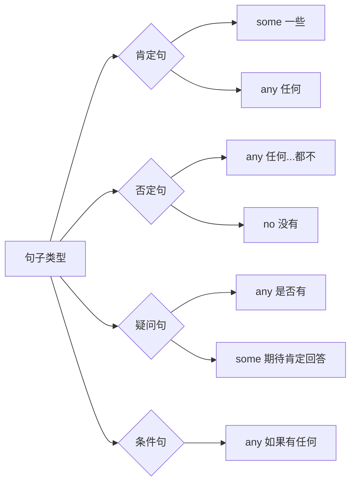
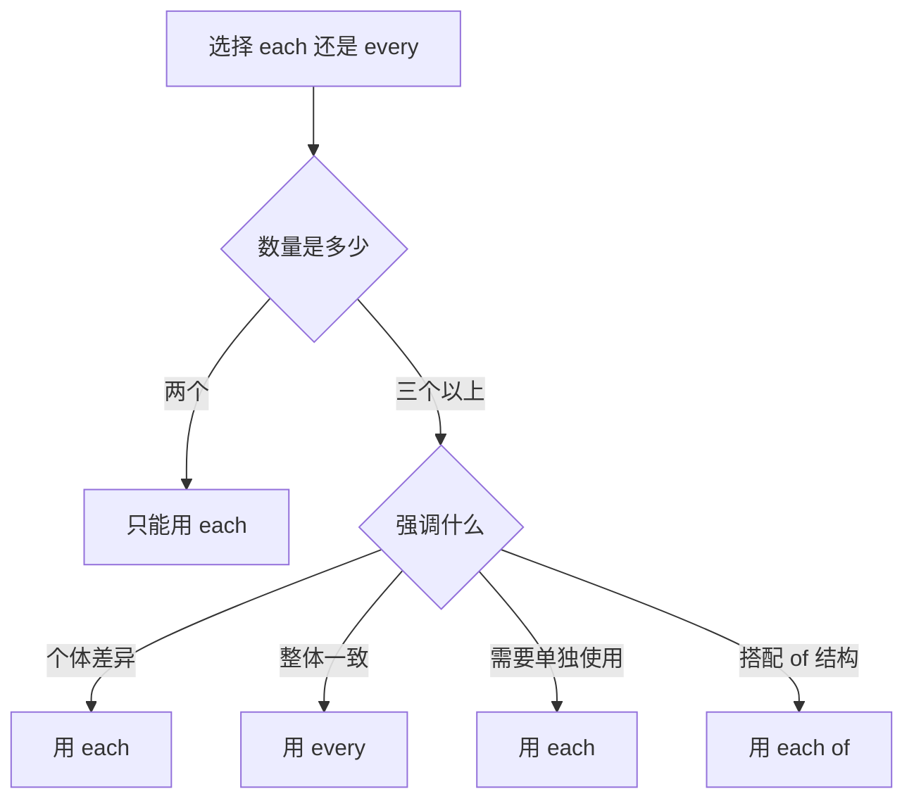
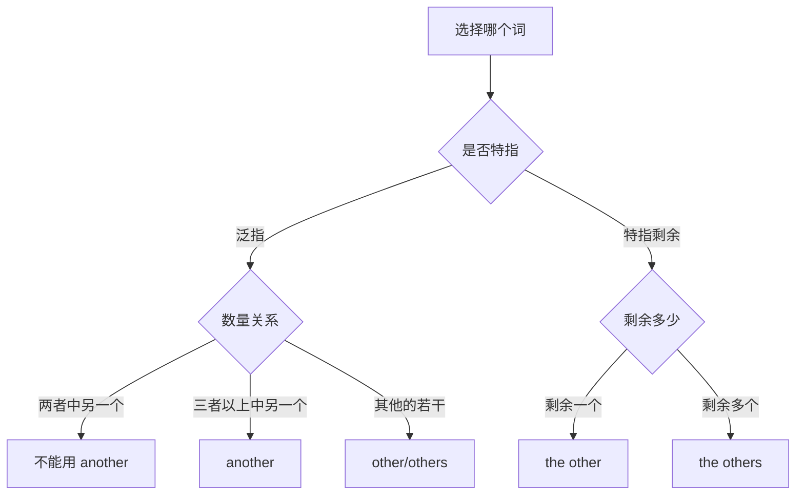
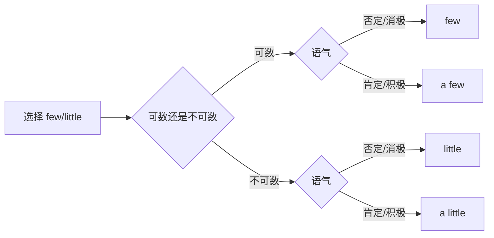
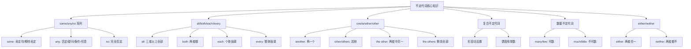

# 不定代词详解

不定代词（Indefinite Pronouns）是英语代词体系中最丰富、最灵活的一类。它们不指代特定的人或事物，而是泛指不确定的对象。掌握不定代词的用法，对于准确表达数量、范围和选择关系至关重要。

## 1. 不定代词概述

### 1.1 什么是不定代词

不定代词是指代不确定的人、事物或数量的代词。与人称代词（指代特定对象）不同，不定代词表达的是模糊的、泛化的概念。

> [!info] 核心概念
>
> 不定代词的「不定」体现在三个层面：
> - **对象不定**：不指明具体是谁或什么
> - **数量不定**：可能是一个、一些或全部
> - **范围不定**：可能涉及部分或整体

**对比示例**：

| 类型 | 例句 | 指代对象 |
| --- | --- | --- |
| 人称代词 | **He** is a teacher. | 确定的某个男性 |
| 不定代词 | **Someone** is a teacher. | 不确定的某个人 |
| 人称代词 | I bought **them**. | 确定的那些东西 |
| 不定代词 | I bought **some**. | 不确定数量的东西 |

### 1.2 不定代词的分类

英语不定代词可按功能和语义分为以下几大类：

```mermaid
flowchart TB
    A[不定代词] --> B[some/any/no 系列]
    A --> C[all/both/each/every 系列]
    A --> D[one/another/other 系列]
    A --> E[复合不定代词]
    A --> F[数量不定代词]

    B --> B1[some/something/somebody/someone]
    B --> B2[any/anything/anybody/anyone]
    B --> B3[no/nothing/nobody/no one]

    C --> C1[all 全部]
    C --> C2[both 两者都]
    C --> C3[each 每一个]
    C --> C4[every 每一个]

    D --> D1[one 一个]
    D --> D2[another 另一个]
    D --> D3[other/others 其他]
    D --> D4[the other/the others 其余]

    E --> E1[something/anything/nothing]
    E --> E2[somebody/anybody/nobody]
    E --> E3[everyone/everything]

    F --> F1[many/much 许多]
    F --> F2[few/little 少量]
    F --> F3[several 若干]
```



上图展示了不定代词的五大分类。some/any/no 系列用于表达存在与否；all/both/each/every 系列用于表达整体与个体；one/another/other 系列用于表达选择与替代；复合不定代词将不定概念与人或物结合；数量不定代词则专门表达数量多少。

### 1.3 不定代词的语法特征

不定代词在句中可充当多种成分：

| 句法功能 | 例句 | 分析 |
| --- | --- | --- |
| 主语 | **Everyone** knows the answer. | everyone 作主语 |
| 宾语 | I don't know **anything**. | anything 作宾语 |
| 表语 | The winner could be **anyone**. | anyone 作表语 |
| 定语 | **Some** students passed the exam. | some 修饰 students |
| 同位语 | We **all** agree with you. | all 作 we 的同位语 |

> [!warning] 主谓一致注意事项
>
> 不定代词作主语时，谓语动词的单复数形式需特别注意：
> - **单数谓语**：everyone, everybody, everything, anyone, anybody, anything, someone, somebody, something, no one, nobody, nothing, each, every, either, neither
> - **复数谓语**：both, few, many, several, others
> - **视情况而定**：some, any, none, all, most

---

## 2. some/any/no 系列

这是最基础也是使用频率最高的不定代词系列，表达「有/没有」的概念。

### 2.1 some 的用法

**some** 意为「一些、某些」，通常用于肯定句，表示不确定但存在的数量。

#### 2.1.1 基本用法

```
some + 可数名词复数 → 一些（人/物）
some + 不可数名词 → 一些（量）
```

**例句解析**：

1. **I have some books.**
   - 结构：主语 + 谓语 + some + 可数名词复数
   - 译文：我有一些书。
   - 分析：some books 表示数量不确定的若干本书

2. **There is some water in the bottle.**
   - 结构：There be + some + 不可数名词 + 地点状语
   - 译文：瓶子里有一些水。
   - 分析：some water 表示不确定量的水

3. **Some of the students are absent today.**
   - 结构：Some of + 限定词 + 名词复数 + 谓语
   - 译文：今天有些学生缺席了。
   - 分析：some of 表示整体中的一部分

#### 2.1.2 some 用于疑问句的特殊情况

虽然 some 通常用于肯定句，但在以下情况下可用于疑问句：

> [!tip] some 用于疑问句的场景
>
> 1. **表示请求或建议**（期待肯定回答）
> 2. **表示邀请**（希望对方接受）
> 3. **实际是肯定陈述的语气**

**例句对比**：

| 场景 | 例句 | 说明 |
| --- | --- | --- |
| 请求 | Would you like **some** coffee? | 邀请对方喝咖啡，期待接受 |
| 建议 | Why don't you buy **some** flowers? | 建议购买，语气肯定 |
| 期待肯定 | Did you get **some** sleep? | 关心对方是否休息了 |
| 普通疑问 | Do you have **any** coffee? | 单纯询问，不带预设 |

#### 2.1.3 some 表示「某一个」

当 some 修饰可数名词单数时，表示「某一个（不确定哪一个）」：

1. **Some student left this bag here.**
   - 译文：某个学生把这个包落在这里了。
   - 分析：不知道具体是哪个学生

2. **I read it in some book.**
   - 译文：我在某本书上读到过这个。
   - 分析：不记得具体是哪本书

3. **For some reason, he didn't come.**
   - 译文：由于某种原因，他没来。
   - 分析：不清楚具体什么原因

### 2.2 any 的用法

**any** 意为「任何、一些」，主要用于否定句、疑问句和条件句。

#### 2.2.1 否定句中的 any

在否定句中，any 表示「任何...都不」：

1. **I don't have any money.**
   - 结构：主语 + don't/doesn't + 动词 + any + 名词
   - 译文：我没有任何钱。
   - 分析：完全否定，一分钱都没有

2. **There aren't any mistakes in your essay.**
   - 译文：你的文章没有任何错误。
   - 分析：完全没有错误

3. **She didn't say anything.**
   - 译文：她什么都没说。
   - 分析：anything 在否定句中表示「任何事」

#### 2.2.2 疑问句中的 any

在疑问句中，any 用于询问是否存在：

1. **Do you have any questions?**
   - 译文：你有任何问题吗？
   - 分析：询问是否存在问题

2. **Is there any milk left?**
   - 译文：还有牛奶剩下吗？
   - 分析：询问是否还有

3. **Has anyone seen my keys?**
   - 译文：有人看到我的钥匙了吗？
   - 分析：anyone 询问是否有人

#### 2.2.3 肯定句中的 any

在肯定句中，any 表示「任何一个都可以」，强调无限制：

> [!example] any 在肯定句中的用法
>
> **Any** student can answer this question.
> - 译文：任何学生都能回答这个问题。
> - 含义：没有限制，随便哪个学生都行
>
> You can choose **any** color you like.
> - 译文：你可以选择任何你喜欢的颜色。
> - 含义：所有颜色都可选，没有限制

**对比 some 和 any 在肯定句中的区别**：

| 例句 | 含义 |
| --- | --- |
| Give me **some** books. | 给我一些书（不确定数量的若干本） |
| Give me **any** book. | 给我任何一本书（随便哪本都行） |

#### 2.2.4 条件句中的 any

在 if 引导的条件句中，通常用 any：

1. **If you have any problems, call me.**
   - 译文：如果你有任何问题，打电话给我。

2. **If anyone calls, take a message.**
   - 译文：如果有人打电话来，记下留言。

3. **Let me know if there's anything I can do.**
   - 译文：如果有什么我能做的，告诉我。

### 2.3 no 的用法

**no** 是完全否定词，相当于 not any，但语气更强。

#### 2.3.1 no 作定语

no 直接修饰名词，表示「没有」：

1. **I have no money.** = I don't have any money.
   - 译文：我没有钱。
   - 语气：no money 比 don't have any money 更简洁有力

2. **There is no time left.**
   - 译文：没有时间了。
   - 分析：强调时间完全没有了

3. **No students were late today.**
   - 译文：今天没有学生迟到。
   - 分析：完全否定

#### 2.3.2 no 与 not any 的区别

| 表达 | 语气 | 使用场景 |
| --- | --- | --- |
| no + 名词 | 更强、更简洁 | 正式场合、强调 |
| not any + 名词 | 较缓和 | 日常交流 |

**例句对比**：

- **No smoking.** (禁止吸烟) — 简洁有力的警示
- **You shouldn't do any smoking here.** — 较委婉的建议

#### 2.3.3 no 用于否定比较

no 可与比较级连用，表示「一点也不更...」：

1. **This is no better than that.**
   - 译文：这个一点也不比那个好。
   - 分析：否定任何程度的优势

2. **He is no taller than his sister.**
   - 译文：他一点也不比他姐姐高（两人一样不高）。
   - 注意：暗示两人都不高

3. **It's no different from the original.**
   - 译文：这与原版毫无区别。

### 2.4 some/any/no 系列对比总结



上图清晰展示了 some/any/no 在不同句型中的分布规律。肯定句主用 some（表示存在）或 any（表示任意选择）；否定句用 any 配合 not 或直接用 no；疑问句主用 any，但期待肯定回答时用 some；条件句通常用 any。

---

## 3. all/both/each/every 系列

这组不定代词用于表达「全部」与「个体」的概念，是英语中表达数量关系的核心词汇。

### 3.1 all 的用法

**all** 意为「全部、所有」，可指代三者或三者以上的人或物。

#### 3.1.1 all 的基本结构

| 结构 | 例句 | 说明 |
| --- | --- | --- |
| all + 可数复数 | all students | 所有学生 |
| all + 不可数名词 | all water | 所有的水 |
| all of + 限定词 + 名词 | all of the students | 所有的（那些）学生 |
| all of + 代词 | all of them | 他们全部 |
| 代词 + all | they all, we all | 他们/我们全部 |

#### 3.1.2 all 作主语

1. **All is well.**
   - 译文：一切都好。
   - 分析：all 指代抽象的「一切」，谓语用单数

2. **All of the students have passed the exam.**
   - 译文：所有学生都通过了考试。
   - 分析：all of the students 指具体的人，谓语用复数

3. **All that glitters is not gold.**
   - 译文：闪光的不都是金子。
   - 分析：all that... 结构，谓语用单数

#### 3.1.3 all 作同位语

all 可置于主语或宾语之后作同位语：

1. **We all agree with you.**
   - 结构：主语 + all + 谓语
   - 译文：我们都同意你的观点。

2. **They have all finished their work.**
   - 结构：主语 + 助动词 + all + 过去分词
   - 译文：他们都完成了工作。

3. **I love them all.**
   - 结构：主语 + 谓语 + 宾语 + all
   - 译文：我爱他们所有人。

> [!warning] all 的位置规则
>
> - 在实义动词之前：We **all** know this.
> - 在 be 动词之后：They are **all** here.
> - 在助动词之后：We have **all** arrived.
> - 在宾语之后：I saw them **all**.

#### 3.1.4 all 与 whole 的区别

| 词 | 位置 | 例句 | 说明 |
| --- | --- | --- | --- |
| all | 在限定词之前 | **all** the day | 强调整体中的每部分 |
| whole | 在限定词之后 | the **whole** day | 强调完整的一个单位 |

**对比**：
- **All the students** passed. (所有学生都通过了 — 强调每个人)
- **The whole class** passed. (全班都通过了 — 强调班级作为整体)

### 3.2 both 的用法

**both** 意为「两者都」，专门用于指代两个人或两件事。

#### 3.2.1 both 的基本结构

| 结构 | 例句 | 说明 |
| --- | --- | --- |
| both + 可数复数 | both books | 两本书都 |
| both of + 限定词 + 名词 | both of the books | 那两本书都 |
| both of + 代词 | both of them | 他们两个都 |
| 代词 + both | they both | 他们俩都 |
| both...and... | both A and B | A 和 B 都 |

#### 3.2.2 both 的用法示例

1. **Both answers are correct.**
   - 译文：两个答案都对。
   - 分析：both 修饰复数名词，谓语用复数

2. **Both of my parents are teachers.**
   - 译文：我的父母两人都是老师。
   - 分析：both of + 所有格 + 名词

3. **I like both of them.**
   - 译文：他们两个我都喜欢。
   - 分析：both of + 宾格代词

4. **They both speak English fluently.**
   - 译文：他们两人英语都说得很流利。
   - 分析：both 作同位语

#### 3.2.3 both...and... 结构

both...and... 连接两个并列成分，表示「既...又...」：

1. **Both Tom and Jerry are my friends.**
   - 译文：Tom 和 Jerry 都是我的朋友。
   - 语法：并列主语，谓语用复数

2. **She is both beautiful and intelligent.**
   - 译文：她既漂亮又聪明。
   - 语法：并列形容词作表语

3. **I both saw and heard it.**
   - 译文：我既看到了也听到了。
   - 语法：并列动词

> [!tip] both 的否定
>
> both 的否定不用 both...not，而用 neither 或 not...both（部分否定）：
> - **Neither** of them is right. (两个都不对)
> - **Not both** of them are right. (并非两个都对 = 至少一个不对)

### 3.3 each 的用法

**each** 意为「每一个」，强调个体，可指两个或两个以上。

#### 3.3.1 each 的基本特征

- 强调**个体性**，把每个成员单独考虑
- 谓语动词用**单数**
- 可作代词或形容词

#### 3.3.2 each 作形容词

1. **Each student has a textbook.**
   - 译文：每个学生都有一本教材。
   - 分析：each 修饰单数名词，谓语用单数

2. **Each day brings new challenges.**
   - 译文：每一天都带来新挑战。

#### 3.3.3 each 作代词

1. **Each of the students has a different opinion.**
   - 译文：每个学生都有不同的观点。
   - 分析：each of + 复数名词，谓语用单数

2. **I gave each of them a gift.**
   - 译文：我给他们每人一份礼物。

#### 3.3.4 each 作同位语

1. **They each have their own room.**
   - 译文：他们每人都有自己的房间。
   - 分析：each 作 they 的同位语

2. **We each contributed $10.**
   - 译文：我们每人捐了 10 美元。

3. **The books cost $5 each.**
   - 译文：这些书每本 5 美元。
   - 分析：each 置于句末，强调单价

### 3.4 every 的用法

**every** 意为「每一个」，强调整体，只能用于三个或三个以上。

#### 3.4.1 every 的基本特征

- 强调**整体性**，把所有成员作为一个整体考虑
- 只能作形容词，不能单独使用
- 谓语动词用**单数**
- 只用于三者或三者以上

#### 3.4.2 every 的基本用法

1. **Every student in this class is hardworking.**
   - 译文：这个班的每个学生都很勤奋。
   - 分析：强调全班作为整体都勤奋

2. **I go there every day.**
   - 译文：我每天都去那里。
   - 分析：every day 表示频率

3. **Every cloud has a silver lining.**
   - 译文：黑暗中总有一线光明。（谚语）

#### 3.4.3 every 的扩展结构

| 结构 | 例句 | 含义 |
| --- | --- | --- |
| every other + 名词 | every other day | 每隔一天 |
| every + 基数词 + 名词 | every three days | 每三天 |
| every + 序数词 + 名词 | every third day | 每第三天 |

**例句**：
1. **I water the plants every other day.**
   - 译文：我隔天给植物浇水。

2. **The bus comes every ten minutes.**
   - 译文：公交车每十分钟来一班。

3. **He visits us every third week.**
   - 译文：他每隔两周来看我们一次。

### 3.5 each 与 every 的区别

> [!info] 核心区别
>
> - **each**：强调**个体**，「每一个都单独考虑」
> - **every**：强调**整体**，「所有的每一个作为整体」

**详细对比**：

| 对比项 | each | every |
| --- | --- | --- |
| 数量要求 | 两个或以上 | 三个或以上 |
| 强调重点 | 个体差异 | 整体一致 |
| 词性 | 代词/形容词 | 仅形容词 |
| 单独使用 | 可以 | 不可以 |
| 搭配 of | each of... ✓ | every of... ✗ |

**例句对比**：

1. **Each child received a different gift.**
   - 译文：每个孩子收到了不同的礼物。
   - 分析：强调每个孩子的礼物各不相同

2. **Every child received the same gift.**
   - 译文：每个孩子都收到了同样的礼物。
   - 分析：强调所有孩子统一对待

3. **There are trees on each side of the road.** (两侧)
   - 译文：路的两边都有树。
   - 分析：道路只有两边，用 each

4. **There are trees on every side of the square.** (四侧)
   - 译文：广场的每一边都有树。
   - 分析：广场有多边，用 every



上图展示了选择 each 和 every 的决策流程。当数量为两个时只能用 each；三个以上时，根据是否强调个体差异、是否需要单独使用、是否搭配 of 结构来选择。

---

## 4. one/another/other 系列

这组不定代词用于表达选择、替代和区分关系，是日常交流中的高频词汇。

### 4.1 one 的用法

**one** 作为不定代词，意为「一个」，用于泛指或替代前文提到的可数名词。

#### 4.1.1 one 泛指「一个人」

1. **One should keep one's promise.**
   - 译文：人应该遵守诺言。
   - 分析：one 泛指任何人，正式用法

2. **One never knows what may happen.**
   - 译文：谁也不知道会发生什么。
   - 分析：one 作主语，表示泛指

> [!tip] one 的人称代词选择
>
> - **正式文体**：One should do **one's** best.
> - **非正式文体**：One should do **his/her** best.
> - **现代用法**：One should do **their** best.（性别中立）

#### 4.1.2 one 替代可数名词

one 可替代前文提到的可数名词单数，避免重复：

1. **I don't have a pen. Can you lend me one?**
   - 译文：我没有笔。你能借我一支吗？
   - 分析：one = a pen

2. **This book is too difficult. I need an easier one.**
   - 译文：这本书太难了。我需要一本更简单的。
   - 分析：one = book，前面可加形容词

3. **I like the red ones better.**
   - 译文：我更喜欢红色的那些。
   - 分析：ones = 复数形式，替代复数名词

#### 4.1.3 one 与 it 的区别

| 代词 | 含义 | 例句 |
| --- | --- | --- |
| one | 同类事物中的任意一个 | I lost my pen. I need to buy **one**. (买一支新的) |
| it | 特指前面提到的那一个 | I lost my pen. I must find **it**. (找回那支丢失的) |

**对比例句**：

- **A: I need a dictionary. B: I'll lend you one.** (任意一本)
- **A: Where is my dictionary? B: I saw it on the desk.** (特指那本)

### 4.2 another 的用法

**another** 意为「另一个」，指三者或三者以上中的另外一个。

#### 4.2.1 another 的基本用法

another = an + other，表示「再一个、又一个」：

1. **Would you like another cup of coffee?**
   - 译文：你要再来一杯咖啡吗？
   - 分析：another 表示「再一个」

2. **This shirt doesn't fit. Show me another.**
   - 译文：这件衬衫不合身。给我看另一件。
   - 分析：another 单独使用作代词

3. **I'll stay for another two weeks.**
   - 译文：我会再待两周。
   - 分析：another + 数词 + 名词复数

#### 4.2.2 another 的特殊结构

| 结构 | 例句 | 含义 |
| --- | --- | --- |
| another + 单数名词 | another chance | 另一次机会 |
| another + 数词 + 复数 | another three days | 再三天 |
| one...another | one way or another | 以这种或那种方式 |
| one after another | one after another | 一个接一个 |

**例句**：

1. **That's another matter altogether.**
   - 译文：那完全是另一回事。

2. **We need another five volunteers.**
   - 译文：我们还需要五名志愿者。

3. **The children came in one after another.**
   - 译文：孩子们一个接一个地进来。

### 4.3 other 的用法

**other** 意为「其他的」，可作形容词或代词。

#### 4.3.1 other 作形容词

other 修饰名词，表示「其他的」：

1. **Do you have any other questions?**
   - 译文：你还有其他问题吗？
   - 分析：other 修饰复数名词

2. **I'll call you some other time.**
   - 译文：我改天再给你打电话。
   - 分析：some other + 单数名词

3. **Other people may disagree.**
   - 译文：其他人可能不同意。

#### 4.3.2 others 作代词

others = other + 复数名词，单独使用：

1. **Some students like math; others prefer science.**
   - 译文：一些学生喜欢数学；其他人更喜欢科学。
   - 分析：others 指代 other students

2. **Help others and you help yourself.**
   - 译文：帮助别人就是帮助自己。
   - 分析：others 泛指「其他人」

3. **Don't worry about what others think.**
   - 译文：不要在意别人怎么想。

### 4.4 the other/the others 的用法

加上定冠词 the 后，表示「特定范围内剩余的」。

#### 4.4.1 the other

the other 表示「两者中的另一个」或「特定范围内剩余的另一个」：

1. **I have two brothers. One is a doctor; the other is a lawyer.**
   - 译文：我有两个兄弟。一个是医生；另一个是律师。
   - 分析：两者中的「另一个」

2. **She held a book in one hand and a pen in the other.**
   - 译文：她一只手拿着书，另一只手拿着笔。
   - 分析：两只手中的「另一只」

3. **The other day, I met an old friend.**
   - 译文：前几天，我遇到了一个老朋友。
   - 分析：the other day 固定搭配，意为「前几天」

#### 4.4.2 the others

the others 表示「特定范围内剩余的全部」：

1. **Some of the books are new; the others are old.**
   - 译文：一些书是新的；其余的都是旧的。
   - 分析：特定范围（这些书）中剩余的全部

2. **John and Mary stayed; the others left.**
   - 译文：John 和 Mary 留下了；其他人都离开了。
   - 分析：剩余的所有人

### 4.5 one/another/other 系列总结



**综合对比表**：

| 词 | 适用范围 | 是否特指 | 例句 |
| --- | --- | --- | --- |
| another | 三者以上中再一个 | 否 | Give me another. |
| other | 其他的（修饰名词） | 否 | other books |
| others | 其他的人/物 | 否 | Some like it; others don't. |
| the other | 两者中另一个 | 是 | one...the other |
| the others | 剩余的全部 | 是 | Some stayed; the others left. |

> [!example] 经典句型对比
>
> 1. **one...the other**（两者）
>    - I have two cats. **One** is black; **the other** is white.
>
> 2. **one...another...the other**（三者）
>    - I have three sons. **One** is a doctor, **another** is a teacher, and **the other** is an engineer.
>
> 3. **some...others...the others**（多者）
>    - **Some** students passed, **others** failed, and **the others** were absent.

---

## 5. 复合不定代词

复合不定代词由 some/any/no/every 与 -one/-body/-thing 组合而成，共 12 个。

### 5.1 复合不定代词一览表

| 前缀 | + one | + body | + thing |
| --- | --- | --- | --- |
| some | someone | somebody | something |
| any | anyone | anybody | anything |
| no | no one | nobody | nothing |
| every | everyone | everybody | everything |

> [!info] -one 与 -body 的区别
>
> - **-one** 和 **-body** 含义完全相同，可互换使用
> - **-one** 略显正式
> - **-body** 更口语化
> - 例如：someone = somebody，anyone = anybody

### 5.2 someone/somebody/something

用于肯定句，表示「某人/某物」：

1. **Someone is knocking at the door.**
   - 译文：有人在敲门。
   - 分析：someone 指不确定的某个人

2. **I have something important to tell you.**
   - 译文：我有重要的事情要告诉你。
   - 分析：something 指不确定的某事

3. **Somebody left their umbrella here.**
   - 译文：有人把雨伞落在这里了。
   - 分析：somebody 用 their 呼应（性别中立）

**something 的特殊用法**：

| 结构 | 例句 | 含义 |
| --- | --- | --- |
| something + 形容词 | something new | 新的东西 |
| something + to do | something to eat | 要吃的东西 |
| something of + 名词 | something of a problem | 有点问题 |
| something like | something like 100 people | 大约 100 人 |

### 5.3 anyone/anybody/anything

用于否定句、疑问句、条件句，或肯定句中表示「任何人/物」：

1. **Is there anyone who can help me?**
   - 译文：有谁能帮我吗？
   - 分析：疑问句中用 anyone

2. **I don't know anything about it.**
   - 译文：对此我一无所知。
   - 分析：否定句中用 anything

3. **Anyone can learn to swim.**
   - 译文：任何人都能学会游泳。
   - 分析：肯定句中表示「任何人」

4. **If anybody calls, tell them I'm out.**
   - 译文：如果有人打电话来，告诉他们我出去了。
   - 分析：条件句中用 anybody

**anything 的特殊用法**：

| 结构 | 例句 | 含义 |
| --- | --- | --- |
| anything but | anything but easy | 绝非容易 |
| if anything | If anything, it's worse. | 如果有的话，更糟 |
| or anything | tea or anything | 茶或其他什么 |
| anything like | not anything like | 一点也不像 |

### 5.4 no one/nobody/nothing

表示完全否定，相当于 not anyone/anybody/anything：

1. **No one knows the answer.**
   - 译文：没人知道答案。
   - 分析：no one = not anyone

2. **Nobody came to the party.**
   - 译文：没有人来参加派对。
   - 分析：nobody 作主语，谓语单数

3. **There is nothing in the box.**
   - 译文：盒子里什么都没有。
   - 分析：nothing 表示完全否定

> [!warning] no one 的书写
>
> - **no one**：两个词，中间有空格
> - **nobody/nothing**：一个词
> - ❌ noone（错误写法）

**nothing 的特殊用法**：

| 结构 | 例句 | 含义 |
| --- | --- | --- |
| nothing but | nothing but complaints | 除了抱怨什么都没有 |
| nothing like | nothing like the truth | 与事实毫不相符 |
| for nothing | work for nothing | 白干 |
| have nothing to do with | have nothing to do with it | 与此无关 |

### 5.5 everyone/everybody/everything

表示「每个人/一切」，强调全部：

1. **Everyone is here.**
   - 译文：大家都到了。
   - 分析：everyone 谓语用单数

2. **Everybody knows that.**
   - 译文：每个人都知道这件事。
   - 分析：everybody = everyone

3. **Everything is ready.**
   - 译文：一切都准备好了。
   - 分析：everything 作主语，谓语单数

4. **I told him everything.**
   - 译文：我把一切都告诉他了。
   - 分析：everything 作宾语

**everything 的特殊用法**：

| 结构 | 例句 | 含义 |
| --- | --- | --- |
| everything + 形容词 | everything possible | 一切可能的事 |
| mean everything | Family means everything to me. | 家庭对我意味着一切 |
| have everything | She has everything. | 她什么都有 |

### 5.6 复合不定代词的语法特点

#### 5.6.1 形容词后置

形容词修饰复合不定代词时，必须放在其后面：

| 正确 | 错误 |
| --- | --- |
| something **important** | ~~important something~~ |
| nothing **new** | ~~new nothing~~ |
| anyone **else** | ~~else anyone~~ |
| everything **possible** | ~~possible everything~~ |

**例句**：

1. **Is there anything wrong?**
   - 译文：有什么问题吗？
   - 分析：wrong 放在 anything 之后

2. **I need someone reliable.**
   - 译文：我需要一个可靠的人。
   - 分析：reliable 放在 someone 之后

3. **There's nothing special about it.**
   - 译文：它没什么特别的。
   - 分析：special 放在 nothing 之后

#### 5.6.2 谓语动词用单数

所有复合不定代词作主语时，谓语动词一律用单数：

| 例句 | 分析 |
| --- | --- |
| Everyone **is** ready. | everyone + is |
| Nobody **knows** the truth. | nobody + knows |
| Something **has** happened. | something + has |
| Everything **was** destroyed. | everything + was |

#### 5.6.3 反身代词的选择

复合不定代词的反身代词通常用 themselves（复数含义）或 himself/herself（性别明确时）：

1. **Everyone should do their best.** (现代用法，性别中立)
2. **Everyone should do his or her best.** (传统用法)
3. **Everybody introduced themselves.** (复数反身代词)

---

## 6. 数量不定代词

这类不定代词专门表达数量概念，与可数/不可数名词搭配。

### 6.1 many/much

**many** 用于可数名词，**much** 用于不可数名词，均表示「许多」。

#### 6.1.1 基本用法

| 词 | 搭配 | 例句 |
| --- | --- | --- |
| many | 可数名词复数 | many books, many students |
| much | 不可数名词 | much water, much time |

**例句**：

1. **Many people attended the meeting.**
   - 译文：许多人参加了会议。

2. **There isn't much time left.**
   - 译文：剩下的时间不多了。

3. **How many books do you have?**
   - 译文：你有多少本书？

4. **How much money do you need?**
   - 译文：你需要多少钱？

#### 6.1.2 many/much 的使用场景

> [!tip] many/much 主要用于否定句和疑问句
>
> 在肯定句中，常用 **a lot of, lots of, plenty of** 替代 many/much：
> - ❌ I have many books. (语法正确但不自然)
> - ✅ I have a lot of books. (更自然)
> - ❌ She has much money. (不自然)
> - ✅ She has a lot of money. (更自然)

**many/much 在肯定句中使用的场景**：

1. 有修饰语时：**very many, so many, too many, as many as**
   - There were **so many** people that I couldn't get in.

2. 作主语时：
   - **Many** were injured in the accident.
   - **Much** has been said about this issue.

3. 正式文体中：
   - **Much** research has been conducted on this topic.

### 6.2 few/little

**few** 用于可数名词，**little** 用于不可数名词，均表示「少量」。

#### 6.2.1 few/little 与 a few/a little 的区别

这是英语学习者最容易混淆的点之一：

| 词 | 搭配 | 含义 | 语气 |
| --- | --- | --- | --- |
| few | 可数复数 | 几乎没有 | 否定、悲观 |
| a few | 可数复数 | 有一些 | 肯定、乐观 |
| little | 不可数 | 几乎没有 | 否定、悲观 |
| a little | 不可数 | 有一点 | 肯定、乐观 |

**对比例句**：

1. **He has few friends.** (他几乎没有朋友 — 孤独)
   **He has a few friends.** (他有一些朋友 — 正面)

2. **There is little hope.** (几乎没有希望 — 绝望)
   **There is a little hope.** (还有一点希望 — 积极)

3. **Few students passed the exam.** (几乎没人通过 — 失败)
   **A few students passed the exam.** (有几个人通过 — 成功)



#### 6.2.2 quite a few/quite a little

quite a few/quite a little 意为「相当多」，与字面意思相反：

1. **Quite a few people came to the party.**
   - 译文：相当多的人来参加派对了。（不是「很少」）

2. **I've spent quite a little money on this.**
   - 译文：我在这上面花了不少钱。

### 6.3 several

**several** 意为「几个、若干」，用于可数名词复数，表示「不止两三个但不太多」：

1. **Several students were absent.**
   - 译文：有几个学生缺席。
   - 分析：比 a few 多，比 many 少

2. **I've been there several times.**
   - 译文：我去过那里好几次。

3. **Several of them are my classmates.**
   - 译文：他们中有几个是我的同学。

### 6.4 数量不定代词汇总

| 词 | 搭配 | 含义 | 例句 |
| --- | --- | --- | --- |
| many | 可数复数 | 许多 | many books |
| much | 不可数 | 许多 | much water |
| few | 可数复数 | 几乎没有 | few friends |
| a few | 可数复数 | 有一些 | a few questions |
| little | 不可数 | 几乎没有 | little money |
| a little | 不可数 | 有一点 | a little time |
| several | 可数复数 | 若干 | several people |
| a lot of | 两者皆可 | 许多 | a lot of books/water |
| plenty of | 两者皆可 | 充足的 | plenty of food |

---

## 7. either/neither

这两个不定代词专门用于表达「两者」之间的选择关系。

### 7.1 either 的用法

**either** 意为「两者中的任何一个」或「两者都」（用于否定）。

#### 7.1.1 either 表示「两者中任一」

1. **You can take either road.**
   - 译文：两条路你走哪条都行。
   - 分析：either + 单数名词

2. **Either answer is correct.**
   - 译文：两个答案都对。（任何一个都对）
   - 分析：谓语用单数

3. **Either of them is fine.**
   - 译文：他们两个谁都行。
   - 分析：either of + 复数代词

#### 7.1.2 either...or... 结构

either...or... 表示「要么...要么...」：

1. **Either you or I am wrong.**
   - 译文：要么你错了，要么我错了。
   - 分析：谓语就近原则，与 I 一致用 am

2. **You can either stay or leave.**
   - 译文：你可以留下或离开。
   - 分析：连接两个动词

3. **Either Tom or his brothers are coming.**
   - 译文：要么 Tom 来，要么他的兄弟们来。
   - 分析：就近原则，谓语与 brothers 一致

#### 7.1.3 either 用于否定句

在否定句中，either 表示「两者都不」：

1. **I don't like either of them.**
   - 译文：他们两个我都不喜欢。
   - 分析：don't + either = neither

2. **I can't speak either language.**
   - 译文：这两种语言我都不会说。

### 7.2 neither 的用法

**neither** 意为「两者都不」，本身带有否定含义。

#### 7.2.1 neither 作代词

1. **Neither of them is correct.**
   - 译文：他们两个都不对。
   - 分析：neither of + 复数代词，谓语用单数

2. **Neither answer is right.**
   - 译文：两个答案都不对。
   - 分析：neither + 单数名词

3. **I like neither.**
   - 译文：两个我都不喜欢。
   - 分析：neither 单独使用

#### 7.2.2 neither...nor... 结构

neither...nor... 表示「既不...也不...」：

1. **Neither Tom nor Jerry was invited.**
   - 译文：Tom 和 Jerry 都没被邀请。
   - 分析：就近原则，谓语与 Jerry 一致

2. **She can neither read nor write.**
   - 译文：她既不会读也不会写。
   - 分析：连接两个动词

3. **Neither you nor I am to blame.**
   - 译文：你和我都没有错。
   - 分析：就近原则，与 I 一致

#### 7.2.3 neither 表示「也不」

neither 可用于简短回答，表示「也不」：

1. **A: I don't like coffee. B: Neither do I.**
   - 译文：A: 我不喜欢咖啡。B: 我也不喜欢。
   - 分析：Neither + 助动词 + 主语

2. **A: He can't swim. B: Neither can she.**
   - 译文：A: 他不会游泳。B: 她也不会。

3. **A: I haven't finished. B: Neither have I.**
   - 译文：A: 我还没完成。B: 我也没有。

### 7.3 either/neither 对比总结

| 词 | 含义 | 例句 |
| --- | --- | --- |
| either | 两者中任一 | Either is OK. |
| either...or | 要么...要么 | Either A or B |
| not...either | 两者都不 | I don't like either. |
| neither | 两者都不 | Neither is correct. |
| neither...nor | 既不...也不 | Neither A nor B |
| Neither do I | 我也不 | 简短回答 |

> [!warning] 就近原则
>
> either...or... 和 neither...nor... 连接主语时，谓语动词与**最近的主语**保持一致：
> - Either he or I **am** responsible.
> - Neither the teacher nor the students **were** there.

---

## 8. 不定代词的常见易错点

### 8.1 主谓一致问题

不定代词作主语时，谓语动词的数是最常见的错误来源。

#### 8.1.1 永远用单数谓语的不定代词

| 不定代词 | 例句 |
| --- | --- |
| everyone/everybody | Everyone **is** here. |
| someone/somebody | Someone **has** called. |
| anyone/anybody | Anyone **is** welcome. |
| no one/nobody | Nobody **knows**. |
| everything | Everything **is** ready. |
| something | Something **is** wrong. |
| anything | Anything **is** possible. |
| nothing | Nothing **was** said. |
| each | Each **has** a role. |
| either | Either **is** fine. |
| neither | Neither **is** correct. |

#### 8.1.2 永远用复数谓语的不定代词

| 不定代词 | 例句 |
| --- | --- |
| both | Both **are** correct. |
| few | Few **understand** this. |
| many | Many **were** injured. |
| several | Several **have** arrived. |
| others | Others **disagree**. |

#### 8.1.3 根据上下文决定的不定代词

| 不定代词 | 规则 | 例句 |
| --- | --- | --- |
| some | 看指代对象 | Some **is** left. (水) / Some **are** missing. (人) |
| any | 看指代对象 | Any **is** acceptable. / Any **are** fine. |
| all | 看指代对象 | All **is** well. / All **are** present. |
| most | 看指代对象 | Most **is** done. / Most **have** left. |
| none | 传统单数，现代常用复数 | None **is**/None **are** available. |

### 8.2 否定句中的选择

> [!warning] some vs any 在否定句中
>
> - 否定句中通常用 **any**，不用 **some**
> - ❌ I don't have some money.
> - ✅ I don't have any money.
> - ❌ There aren't some mistakes.
> - ✅ There aren't any mistakes.

**例外情况**：当 some 表示「一部分」时，可用于否定句：
- I don't agree with **some** of his opinions. (我不同意他的某些观点)
- 分析：否定的是「同意」，不是「some opinions」的存在

### 8.3 双重否定的避免

英语中应避免双重否定：

| 错误 | 正确 |
| --- | --- |
| ❌ I don't have nothing. | ✅ I don't have anything. / I have nothing. |
| ❌ Nobody didn't come. | ✅ Nobody came. / Everybody came. |
| ❌ I can't see nobody. | ✅ I can't see anybody. / I can see nobody. |

### 8.4 形容词位置错误

修饰复合不定代词的形容词必须后置：

| 错误 | 正确 |
| --- | --- |
| ❌ important something | ✅ something important |
| ❌ special nothing | ✅ nothing special |
| ❌ wrong anything | ✅ anything wrong |
| ❌ else someone | ✅ someone else |

### 8.5 混淆辨析

#### 8.5.1 another vs other

| 情况 | 正确用法 |
| --- | --- |
| 单数，再一个 | another book (不用 other book) |
| 复数，其他的 | other books (不用 another books) |
| 两者中另一个 | the other (不用 another) |

#### 8.5.2 each vs every

| 情况 | 正确用法 |
| --- | --- |
| 两者 | each (不用 every) |
| 强调个体 | each (更合适) |
| 强调整体 | every (更合适) |
| 需要代词用法 | each (every 不能单独使用) |

#### 8.5.3 all vs whole

| 情况 | 正确用法 |
| --- | --- |
| 位置 | all the day / the whole day |
| 不可数名词 | all the water (不用 whole) |
| 专有名词 | the whole world / all the world |

---

## 9. 不定代词实战练习

### 9.1 选择填空

> [!example] 练习题
>
> 1. ______ of the students has submitted their homework.
>    A. Every  B. Each  C. All  D. Both
>
> 2. I don't like this shirt. Show me ______.
>    A. other  B. another  C. the other  D. others
>
> 3. There is ______ wrong with my computer.
>    A. anything  B. nothing  C. something  D. everything
>
> 4. ______ of the two answers is correct.
>    A. Neither  B. None  C. Both  D. All
>
> 5. He has two sons. One is a doctor, and ______ is a teacher.
>    A. another  B. other  C. the other  D. others

**答案解析**：

1. **B. Each** — each of + 复数名词，谓语用单数 has
2. **B. another** — 三者以上中的另一件，用 another
3. **C. something** — 肯定句中表示「某事」
4. **A. Neither** — 两者都不，用 neither
5. **C. the other** — 两者中的另一个，用 the other

### 9.2 改错练习

> [!example] 改错题
>
> 1. Everyone of the students are ready.
> 2. I don't have some questions.
> 3. There is important something I need to tell you.
> 4. Other students came late; the others arrived on time.
> 5. Either Tom or his friends is coming to the party.

**答案解析**：

1. Everyone of → Each of / Every one of；或 are → is
   - 正确：Each of the students is ready.

2. some → any
   - 正确：I don't have any questions.

3. important something → something important
   - 正确：There is something important I need to tell you.

4. Other → Some
   - 正确：Some students came late; the others arrived on time.

5. is → are（就近原则，friends 是复数）
   - 正确：Either Tom or his friends are coming to the party.

### 9.3 翻译练习

> [!example] 汉译英
>
> 1. 有人在等你。
> 2. 我两种语言都不会说。
> 3. 他们每人都有自己的电脑。
> 4. 给我另一杯咖啡。
> 5. 没有什么是不可能的。

**参考答案**：

1. **Someone is waiting for you.**
   - 分析：someone 表示「某人」，谓语单数

2. **I can speak neither language.** / **I can't speak either language.**
   - 分析：两种方式都可以，neither 或 not...either

3. **They each have their own computer.** / **Each of them has their own computer.**
   - 分析：each 作同位语或作主语

4. **Give me another cup of coffee.**
   - 分析：another 表示「再一个」

5. **Nothing is impossible.**
   - 分析：nothing 作主语，谓语单数

---

## 10. 不定代词小结

### 10.1 核心要点回顾



### 10.2 速查表

| 类别 | 词汇 | 用法要点 |
| --- | --- | --- |
| 存在与否 | some, any, no | some 肯定；any 否定/疑问；no 完全否定 |
| 整体与个体 | all, both, each, every | all/both 复数；each/every 单数 |
| 选择替代 | one, another, other, the other | another 再一个；the other 两者中另一 |
| 复合代词 | something, anyone 等 | 形容词后置；谓语单数 |
| 数量表达 | many, much, few, little | 可数/不可数区分 |
| 二选一 | either, neither | 两者专用 |

### 10.3 学习建议

> [!tip] 掌握不定代词的关键
>
> 1. **分类记忆**：按功能分组记忆，而非孤立背诵
> 2. **对比辨析**：重点掌握 each/every、another/other、few/a few 等易混淆词
> 3. **语境练习**：在真实句子中理解和运用，而非死记规则
> 4. **主谓一致**：牢记哪些代词用单数谓语、哪些用复数
> 5. **例句积累**：收集包含不定代词的地道表达

不定代词是英语中最灵活、最常用的词类之一。通过系统学习和大量练习，你将能够准确、自然地使用这些词汇，使表达更加精确、地道。

---

**相关文档**：
- [[01.人称代词与物主代词]]
- [[02.反身代词与相互代词]]
- [[03.指示代词与疑问代词]]
- [[05.数词的用法与表达]]
