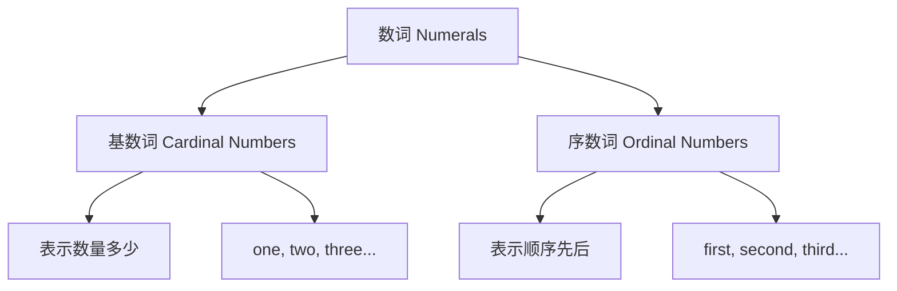
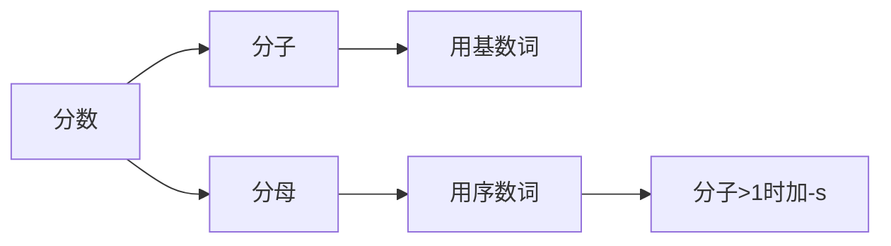
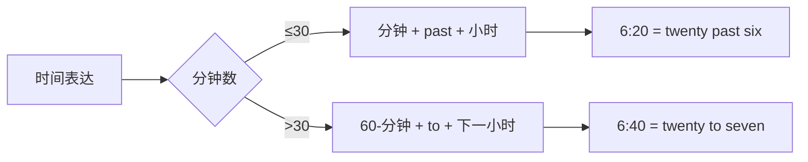
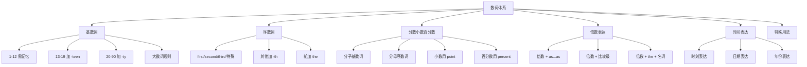

# 数词的用法与表达

数词（Numerals）是英语中用来表示数量、顺序、比例等概念的词类。虽然数词看似简单——不过是一些数字的英语表达，但实际上它涉及的规则和用法相当丰富。从基本的计数到复杂的分数、小数、倍数表达，再到日期、时间、年龄、电话号码等日常应用，数词在英语交流中无处不在。

本篇将系统讲解英语数词的各种用法，帮助你掌握从基础到进阶的数词表达技巧。

---

## 1. 数词概述与分类

### 1.1 什么是数词

数词是用来表示数目多少或顺序先后的词类。在句子中，数词可以充当主语、宾语、表语、定语、同位语等多种成分。

> [!info] 数词的核心功能
>
> 数词的主要功能是**量化**和**排序**：
> - **量化**：回答"多少"的问题（How many? How much?）
> - **排序**：回答"第几"的问题（Which one in order?）

### 1.2 数词的两大分类

英语数词分为两大类：**基数词**（Cardinal Numbers）和**序数词**（Ordinal Numbers）。



**基数词**表示事物的数量，回答 "How many?" 或 "How much?" 的问题。例如：one（一）、two（二）、three（三）、hundred（百）、thousand（千）等。

**序数词**表示事物的顺序，回答 "Which one?" 的问题。例如：first（第一）、second（第二）、third（第三）、tenth（第十）等。

| 分类 | 定义 | 常见用途 | 示例 |
| --- | --- | --- | --- |
| 基数词 | 表示数目多少 | 计数、价格、年龄、数量 | I have **three** books. |
| 序数词 | 表示顺序先后 | 日期、楼层、名次、顺序 | He lives on the **fifth** floor. |

---

## 2. 基数词详解

### 2.1 基数词的基本形式

基数词是数词的基础，掌握基数词的读写规则是学好数词的第一步。

#### 2.1.1 1-12 的基数词

这些是最基本的数词，需要逐个记忆，没有规律可循：

| 数字 | 英文 | 音标 |
| --- | --- | --- |
| 1 | one | /wʌn/ |
| 2 | two | /tuː/ |
| 3 | three | /θriː/ |
| 4 | four | /fɔːr/ |
| 5 | five | /faɪv/ |
| 6 | six | /sɪks/ |
| 7 | seven | /ˈsevən/ |
| 8 | eight | /eɪt/ |
| 9 | nine | /naɪn/ |
| 10 | ten | /ten/ |
| 11 | eleven | /ɪˈlevən/ |
| 12 | twelve | /twelv/ |

> [!tip] 记忆技巧
>
> 11 和 12 是特殊形式，不遵循 "-teen" 规则：
> - **eleven** 来自古英语 "endleofan"，意为"剩下一个（超过十）"
> - **twelve** 来自古英语 "twelf"，意为"剩下两个（超过十）"

#### 2.1.2 13-19 的基数词（-teen 结尾）

13 到 19 的数词以 **-teen** 结尾，表示"十几"：

| 数字 | 英文 | 构成规则 |
| --- | --- | --- |
| 13 | thirteen | thir- + teen（注意不是 three-teen） |
| 14 | fourteen | four + teen |
| 15 | fifteen | fif- + teen（注意不是 five-teen） |
| 16 | sixteen | six + teen |
| 17 | seventeen | seven + teen |
| 18 | eighteen | eight + teen（只有一个 t） |
| 19 | nineteen | nine + teen |

> [!warning] 拼写注意事项
>
> - **thirteen**：词根是 thir-，不是 three-
> - **fifteen**：词根是 fif-，不是 five-
> - **eighteen**：eight 本身以 t 结尾，加 -teen 后只有一个 t

#### 2.1.3 20-90 的整十数（-ty 结尾）

整十数以 **-ty** 结尾：

| 数字 | 英文 | 构成规则 |
| --- | --- | --- |
| 20 | twenty | twen- + ty |
| 30 | thirty | thir- + ty |
| 40 | forty | for- + ty（注意：没有 u） |
| 50 | fifty | fif- + ty |
| 60 | sixty | six + ty |
| 70 | seventy | seven + ty |
| 80 | eighty | eigh- + ty（只有一个 t） |
| 90 | ninety | nine + ty |

> [!warning] 常见拼写错误
>
> **forty** 是最容易拼错的数词！
> - ✅ **forty**（正确）
> - ❌ ~~fourty~~（错误）
>
> 虽然 four 有 u，但 forty 没有 u。这是英语中的历史遗留问题。

#### 2.1.4 两位数的构成（21-99）

两位数由"整十数 + 个位数"构成，中间用**连字符**连接：

| 数字 | 英文 |
| --- | --- |
| 21 | twenty-one |
| 35 | thirty-five |
| 42 | forty-two |
| 58 | fifty-eight |
| 67 | sixty-seven |
| 79 | seventy-nine |
| 84 | eighty-four |
| 99 | ninety-nine |

> [!example] 例句展示
>
> - There are **twenty-five** students in our class.
>   - 我们班有二十五名学生。
>
> - My grandmother is **eighty-three** years old.
>   - 我奶奶八十三岁了。
>
> - The book has **ninety-nine** chapters.
>   - 这本书有九十九章。

### 2.2 大数词的表达

#### 2.2.1 百、千、万、亿的表达

英语中的大数词与中文有所不同。中文使用"万"和"亿"作为基本单位，而英语使用 **thousand（千）** 和 **million（百万）** 作为基本单位。

| 英文 | 数值 | 中文对应 |
| --- | --- | --- |
| hundred | 100 | 百 |
| thousand | 1,000 | 千 |
| ten thousand | 10,000 | 万 |
| hundred thousand | 100,000 | 十万 |
| million | 1,000,000 | 百万 |
| ten million | 10,000,000 | 千万 |
| hundred million | 100,000,000 | 亿 |
| billion | 1,000,000,000 | 十亿 |
| trillion | 1,000,000,000,000 | 万亿 |

> [!info] 中英数词对照
>
> 英语每三位数一个单位（thousand → million → billion），而中文每四位数一个单位（万 → 亿）。转换时需要特别注意：
>
> | 中文 | 数值 | 英文 |
> | --- | --- | --- |
> | 一万 | 10,000 | ten thousand |
> | 十万 | 100,000 | one hundred thousand |
> | 一百万 | 1,000,000 | one million |
> | 一千万 | 10,000,000 | ten million |
> | 一亿 | 100,000,000 | one hundred million |
> | 十亿 | 1,000,000,000 | one billion |

#### 2.2.2 大数词的读法规则

大数词的读法遵循以下规则：

**规则一**：hundred、thousand、million、billion 等词在表示具体数字时**不加 -s**，前面可以加具体数字或 a/an。

```
✅ three hundred（三百）
✅ five thousand（五千）
✅ two million（两百万）
❌ three hundreds（错误）
❌ five thousands（错误）
```

**规则二**：在百位与十位（或个位）之间，英式英语用 **and** 连接，美式英语可省略。

```
156 → one hundred and fifty-six（英式）
156 → one hundred fifty-six（美式）
```

**规则三**：千位与百位之间不用 and，直接连读。

```
3,456 → three thousand four hundred and fifty-six
```

**规则四**：每三位用逗号分隔，便于识别单位。

```
1,234,567 → one million two hundred thirty-four thousand five hundred sixty-seven
```

> [!example] 大数词读法示例
>
> | 数字 | 英文读法 |
> | --- | --- |
> | 101 | one hundred and one |
> | 250 | two hundred and fifty |
> | 1,001 | one thousand and one |
> | 2,345 | two thousand three hundred and forty-five |
> | 10,500 | ten thousand five hundred |
> | 100,000 | one hundred thousand |
> | 1,000,000 | one million |
> | 1,234,567 | one million two hundred and thirty-four thousand five hundred and sixty-seven |

#### 2.2.3 大数词的复数形式

当 hundred、thousand、million 等词表示**不确定的大量**时，要用复数形式，后接 **of**：

| 表达 | 含义 | 用法 |
| --- | --- | --- |
| hundreds of | 数以百计的 | hundreds of people |
| thousands of | 数以千计的 | thousands of books |
| millions of | 数以百万计的 | millions of dollars |
| billions of | 数以十亿计的 | billions of stars |

> [!example] 对比示例
>
> **确定数量**（不加 -s）：
> - There are **three hundred** students in this school.
>   - 这所学校有三百名学生。
>
> **不确定大量**（加 -s + of）：
> - **Hundreds of** students gathered in the square.
>   - 数百名学生聚集在广场上。
>
> - The company has invested **millions of** dollars in research.
>   - 该公司在研究上投资了数百万美元。

### 2.3 基数词的句法功能

基数词在句子中可以充当多种成分：

#### 2.3.1 作主语

```
Three plus five is eight.
三加五等于八。
（Three 作主语）

Two of them are my classmates.
他们中有两个是我的同学。
（Two 作主语）
```

#### 2.3.2 作宾语

```
I need five.
我需要五个。
（five 作宾语）

Give me two, please.
请给我两个。
（two 作宾语）
```

#### 2.3.3 作表语

```
We are five in our family.
我们家有五口人。
（five 作表语）

The answer is seven.
答案是七。
（seven 作表语）
```

#### 2.3.4 作定语

```
There are twelve months in a year.
一年有十二个月。
（twelve 修饰 months）

I bought three books yesterday.
我昨天买了三本书。
（three 修饰 books）
```

#### 2.3.5 作同位语

```
You two should stay here.
你们两个应该待在这里。
（two 是 you 的同位语）

We three are best friends.
我们三个是最好的朋友。
（three 是 we 的同位语）
```

---

## 3. 序数词详解

### 3.1 序数词的基本形式

序数词表示事物的顺序，大多数序数词由基数词加后缀 **-th** 构成，但有一些特殊形式需要单独记忆。

#### 3.1.1 1-12 的序数词

| 基数词 | 序数词 | 缩写 | 说明 |
| --- | --- | --- | --- |
| one | first | 1st | 特殊形式 |
| two | second | 2nd | 特殊形式 |
| three | third | 3rd | 特殊形式 |
| four | fourth | 4th | 规则变化 |
| five | fifth | 5th | ve → f，加 -th |
| six | sixth | 6th | 规则变化 |
| seven | seventh | 7th | 规则变化 |
| eight | eighth | 8th | 只加 -h |
| nine | ninth | 9th | 去 e，加 -th |
| ten | tenth | 10th | 规则变化 |
| eleven | eleventh | 11th | 规则变化 |
| twelve | twelfth | 12th | ve → f，加 -th |

> [!warning] 需要特别记忆的序数词
>
> - **first, second, third**：这三个是完全不规则的，必须单独记忆
> - **fifth, twelfth**：-ve 变为 -f，然后加 -th
> - **eighth**：eight 本身以 t 结尾，只加 -h
> - **ninth**：nine 去掉 e，再加 -th

#### 3.1.2 13-19 的序数词

13-19 的序数词直接在基数词后加 **-th**：

| 基数词 | 序数词 | 缩写 |
| --- | --- | --- |
| thirteen | thirteenth | 13th |
| fourteen | fourteenth | 14th |
| fifteen | fifteenth | 15th |
| sixteen | sixteenth | 16th |
| seventeen | seventeenth | 17th |
| eighteen | eighteenth | 18th |
| nineteen | nineteenth | 19th |

#### 3.1.3 整十数的序数词

整十数的序数词将词尾的 **-y** 变为 **-ie**，再加 **-th**：

| 基数词 | 序数词 | 缩写 | 变化规则 |
| --- | --- | --- | --- |
| twenty | twentieth | 20th | y → ie + th |
| thirty | thirtieth | 30th | y → ie + th |
| forty | fortieth | 40th | y → ie + th |
| fifty | fiftieth | 50th | y → ie + th |
| sixty | sixtieth | 60th | y → ie + th |
| seventy | seventieth | 70th | y → ie + th |
| eighty | eightieth | 80th | y → ie + th |
| ninety | ninetieth | 90th | y → ie + th |

#### 3.1.4 两位数的序数词

两位数的序数词只需将**个位数**变为序数词，十位数保持基数词形式：

| 数字 | 序数词 | 缩写 |
| --- | --- | --- |
| 21 | twenty-first | 21st |
| 22 | twenty-second | 22nd |
| 23 | twenty-third | 23rd |
| 24 | twenty-fourth | 24th |
| 32 | thirty-second | 32nd |
| 45 | forty-fifth | 45th |
| 53 | fifty-third | 53rd |
| 99 | ninety-ninth | 99th |

> [!tip] 记忆规则
>
> 两位数的序数词规则很简单：**只变个位，不变十位**
> - 21st = twenty（基数词）+ first（序数词）
> - 32nd = thirty（基数词）+ second（序数词）
> - 45th = forty（基数词）+ fifth（序数词）

#### 3.1.5 大数的序数词

对于 hundred、thousand、million 等大数，直接在后面加 **-th**：

| 基数词 | 序数词 | 缩写 |
| --- | --- | --- |
| hundred | hundredth | 100th |
| thousand | thousandth | 1000th |
| million | millionth | 1,000,000th |
| billion | billionth | 1,000,000,000th |

复合大数的序数词只需将**最后一个数词**变为序数词：

```
101 → one hundred and first (101st)
256 → two hundred and fifty-sixth (256th)
1000 → one thousandth (1000th)
1001 → one thousand and first (1001st)
```

### 3.2 序数词的用法

#### 3.2.1 序数词前的冠词

序数词前通常要加定冠词 **the**：

```
He was the first to arrive.
他是第一个到达的。

This is the third time I've called you.
这是我第三次给你打电话了。

She lives on the fifth floor.
她住在五楼。
```

> [!info] 序数词前用 a/an 的情况
>
> 当序数词表示"又一个、再一个"的含义时，用 **a/an** 而不是 **the**：
>
> - I've read this book three times. I want to read it **a fourth** time.
>   - 这本书我读了三遍了。我想再读一遍（第四遍）。
>
> - He failed twice, but he tried **a third** time.
>   - 他失败了两次，但他又尝试了一次（第三次）。

#### 3.2.2 序数词表示日期

序数词常用于表示日期中的"日"：

```
May 1st / May the first / the first of May
五月一日

December 25th / December the twenty-fifth / the twenty-fifth of December
十二月二十五日
```

> [!example] 日期的读写对照
>
> | 书写形式 | 读法 |
> | --- | --- |
> | January 1 | January first / the first of January |
> | March 8 | March eighth / the eighth of March |
> | July 4th | July fourth / the fourth of July |
> | October 31st | October thirty-first / the thirty-first of October |

#### 3.2.3 序数词表示楼层

在表示楼层时，英式英语和美式英语有所不同：

| 楼层 | 英式英语 | 美式英语 |
| --- | --- | --- |
| 地面层 | ground floor | first floor |
| 二楼 | first floor | second floor |
| 三楼 | second floor | third floor |
| 四楼 | third floor | fourth floor |

```
英式：My office is on the third floor. (实际是四楼)
美式：My office is on the fourth floor. (实际是四楼)
```

#### 3.2.4 序数词表示世纪和年代

```
the 21st century  二十一世纪
the 20th century  二十世纪
the 19th century  十九世纪

in the 1990s / in the nineties  在二十世纪九十年代
in the 1980s / in the eighties  在二十世纪八十年代
```

#### 3.2.5 序数词表示名次

```
He came first in the race.
他在比赛中获得第一名。

Our team finished third in the competition.
我们队在比赛中获得第三名。

She ranked fifth in her class.
她在班上排名第五。
```

---

## 4. 分数、小数与百分数

### 4.1 分数的表达

英语中表达分数时，**分子用基数词，分母用序数词**。当分子大于 1 时，分母要用复数形式。

#### 4.1.1 分数的基本读法



| 分数 | 读法 | 说明 |
| --- | --- | --- |
| 1/2 | one half / a half | 特殊形式 |
| 1/3 | one third / a third | 分子为 1 |
| 2/3 | two thirds | 分母加 -s |
| 1/4 | one quarter / a quarter / one fourth | 可用 quarter |
| 3/4 | three quarters / three fourths | 分母加 -s |
| 1/5 | one fifth / a fifth | 分子为 1 |
| 2/5 | two fifths | 分母加 -s |
| 1/10 | one tenth / a tenth | 分子为 1 |
| 7/10 | seven tenths | 分母加 -s |

> [!info] 特殊分数
>
> - **1/2**：读作 **one half** 或 **a half**，不读作 ~~one second~~
> - **1/4**：可读作 **one quarter** 或 **one fourth**
> - **3/4**：可读作 **three quarters** 或 **three fourths**

#### 4.1.2 带整数的分数

当分数前有整数时，用 **and** 连接：

| 数字 | 读法 |
| --- | --- |
| 1½ | one and a half |
| 2¼ | two and a quarter |
| 3⅔ | three and two thirds |
| 5¾ | five and three quarters |

```
I've been waiting for one and a half hours.
我已经等了一个半小时。

The journey takes two and a quarter hours.
这趟旅程需要两个又四分之一小时。
```

#### 4.1.3 分数作定语

分数修饰名词时，分数与名词之间用 **of** 连接；分数作主语时，谓语动词的数由 **of 后的名词** 决定：

```
One third of the students are girls.
三分之一的学生是女生。
（students 是复数，所以用 are）

Two thirds of the water is polluted.
三分之二的水被污染了。
（water 是不可数名词，所以用 is）

Half of the apple is rotten.
这个苹果有一半烂了。
（apple 是单数，所以用 is）
```

> [!warning] 分数作主语的主谓一致
>
> 分数作主语时，谓语动词的单复数取决于 **of 后面的名词**，而不是分数本身：
> - Three fourths of the cake **is** gone.（cake 是单数）
> - Three fourths of the students **are** absent.（students 是复数）

### 4.2 小数的表达

英语中的小数用 **point** 表示小数点，小数点后的数字逐个读出：

| 小数 | 读法 |
| --- | --- |
| 0.5 | zero point five / point five |
| 0.25 | zero point two five |
| 3.14 | three point one four |
| 0.007 | zero point zero zero seven |
| 12.345 | twelve point three four five |

> [!tip] 小数读法规则
>
> 1. 小数点读作 **point**
> 2. 小数点前按正常数字读法
> 3. 小数点后的数字**逐个读出**，不组合
> 4. 小数点前的 0 可以省略不读

```
The temperature is 36.5 degrees.
温度是三十六点五度。
（读作：thirty-six point five）

Pi is approximately 3.14159.
圆周率约为 3.14159。
（读作：three point one four one five nine）
```

### 4.3 百分数的表达

百分数用 **percent** 或 **per cent** 表示（美式常用 percent，英式常用 per cent）：

| 百分数 | 读法 |
| --- | --- |
| 5% | five percent |
| 25% | twenty-five percent |
| 50% | fifty percent |
| 100% | one hundred percent |
| 0.5% | zero point five percent |
| 150% | one hundred and fifty percent |

```
About 70% of the Earth's surface is covered by water.
地球表面约 70% 被水覆盖。

The company's profits increased by 25%.
公司利润增长了 25%。

I'm 100% sure about this.
我对此百分之百确定。
```

> [!info] 百分数作主语的主谓一致
>
> 与分数相同，百分数作主语时，谓语动词的单复数取决于 **of 后面的名词**：
> - Fifty percent of the work **is** done.（work 是不可数名词）
> - Fifty percent of the workers **are** on strike.（workers 是复数）

---

## 5. 倍数的表达

倍数表达是英语中的重点和难点之一。英语中有多种表达倍数的方式，需要根据语境选择合适的句型。

### 5.1 倍数词

| 倍数 | 英文 | 用法说明 |
| --- | --- | --- |
| 一倍 | once | 常用于频率 |
| 两倍 | twice / double | twice 更常用 |
| 三倍 | three times / triple | three times 更常用 |
| 四倍 | four times / quadruple | four times 更常用 |
| N倍 | N times | N ≥ 3 时使用 |
| 一半 | half | — |

> [!warning] 注意区分"是...的几倍"和"增加几倍"
>
> 中英文在倍数表达上存在差异：
> - **A is twice as large as B** = A 是 B 的两倍大 = A 比 B 大一倍
> - 英文的 "twice" 表示"两倍"，即包含原来的量
> - 中文说"增加两倍"是指变成原来的三倍

### 5.2 倍数表达的四种句型

#### 5.2.1 句型一：倍数 + as + 形容词/副词原级 + as

这是最常用的倍数表达句型：

```
This room is twice as large as that one.
这个房间是那个房间的两倍大。

He runs three times as fast as I do.
他跑得是我的三倍快。

The new model is ten times as efficient as the old one.
新型号的效率是旧型号的十倍。
```

#### 5.2.2 句型二：倍数 + 形容词/副词比较级 + than

```
This room is twice larger than that one.
这个房间比那个房间大两倍。
（注意：这句话的实际意思是"这个房间是那个的三倍大"）

He earns three times more than I do.
他挣的钱是我的三倍多。
```

> [!warning] 句型一与句型二的区别
>
> - **twice as large as** = 是...的两倍大
> - **twice larger than** = 比...大两倍 = 是...的三倍大
>
> 在实际使用中，句型一更常用且不易产生歧义。建议优先使用 "倍数 + as...as" 句型。

#### 5.2.3 句型三：倍数 + the + 名词 + of

```
This bridge is three times the length of that one.
这座桥是那座桥长度的三倍。

The population of this city is twice the size of that city.
这座城市的人口是那座城市的两倍。
```

常用的名词：**length**（长度）、**width**（宽度）、**height**（高度）、**size**（大小）、**weight**（重量）、**age**（年龄）、**price**（价格）

#### 5.2.4 句型四：倍数 + what 从句

```
The output is now three times what it was ten years ago.
现在的产量是十年前的三倍。

The price is twice what it used to be.
价格是原来的两倍。
```

### 5.3 倍数表达的其他方式

#### 5.3.1 使用 double、triple、quadruple

```
The company doubled its profits last year.
公司去年利润翻了一番。

The population has tripled in the past decade.
过去十年人口增加了两倍（变成原来的三倍）。

We need to quadruple our efforts.
我们需要付出四倍的努力。
```

#### 5.3.2 使用 increase/grow + by + 倍数

```
Sales increased by 50%.
销售额增长了 50%。

The production grew by three times.
产量增加了两倍（变成原来的三倍）。
```

#### 5.3.3 表示减少的倍数

```
The price was reduced by half. / The price was halved.
价格减半了。

The number decreased to one third.
数量减少到原来的三分之一。

The time was cut by 75%.
时间缩短了 75%。
```

> [!example] 倍数表达综合示例
>
> 假设 A = 100, B = 50，用不同方式表达它们的关系：
>
> | 表达方式 | 例句 |
> | --- | --- |
> | as...as | A is twice as large as B. |
> | 比较级 + than | A is twice larger than B.（容易有歧义） |
> | the + 名词 + of | A is twice the size of B. |
> | what 从句 | A is twice what B is. |

---

## 6. 时间的表达

### 6.1 时刻的表达

英语中表达时刻有两种主要方式：直接读法和借助 past/to 的读法。

#### 6.1.1 直接读法

直接按"小时 + 分钟"的顺序读出：

| 时间 | 读法 |
| --- | --- |
| 6:00 | six o'clock |
| 6:05 | six oh five |
| 6:15 | six fifteen |
| 6:30 | six thirty |
| 6:45 | six forty-five |
| 6:58 | six fifty-eight |

> [!tip] 关于 o'clock
>
> **o'clock** 只用于整点时刻：
> - ✅ 6:00 → six o'clock
> - ❌ 6:30 → ~~six thirty o'clock~~

#### 6.1.2 借助 past 和 to 的读法

- **past**：用于表示"几点过几分"（分钟数 ≤ 30）
- **to**：用于表示"差几分到几点"（分钟数 > 30）

| 时间 | 读法 | 说明 |
| --- | --- | --- |
| 6:05 | five past six | 6 点过 5 分 |
| 6:10 | ten past six | 6 点过 10 分 |
| 6:15 | a quarter past six | 6 点过一刻 |
| 6:20 | twenty past six | 6 点过 20 分 |
| 6:30 | half past six | 6 点半 |
| 6:40 | twenty to seven | 差 20 分到 7 点 |
| 6:45 | a quarter to seven | 差一刻到 7 点 |
| 6:50 | ten to seven | 差 10 分到 7 点 |
| 6:55 | five to seven | 差 5 分到 7 点 |



> [!info] 特殊时间词汇
>
> - **a quarter**（一刻钟 = 15 分钟）
>   - 6:15 = a quarter past six
>   - 6:45 = a quarter to seven
>
> - **half**（半小时 = 30 分钟）
>   - 6:30 = half past six
>   - 注意：**不能说** ~~half to seven~~

#### 6.1.3 上午和下午

| 表达 | 含义 | 用法 |
| --- | --- | --- |
| a.m. / am | 上午（拉丁语 ante meridiem） | 7 a.m. = 早上 7 点 |
| p.m. / pm | 下午/晚上（拉丁语 post meridiem） | 7 p.m. = 晚上 7 点 |
| in the morning | 在早上 | at 7 in the morning |
| in the afternoon | 在下午 | at 3 in the afternoon |
| in the evening | 在晚上 | at 8 in the evening |
| at night | 在夜里 | at 11 at night |
| at noon | 在正午 | 12:00 中午 |
| at midnight | 在午夜 | 12:00 半夜 |

```
The meeting starts at 9 a.m.
会议上午九点开始。

The store closes at 10 p.m.
商店晚上十点关门。

I usually wake up at 6 in the morning.
我通常早上六点醒来。
```

### 6.2 日期的表达

#### 6.2.1 月份

| 月份 | 英文 | 缩写 |
| --- | --- | --- |
| 一月 | January | Jan. |
| 二月 | February | Feb. |
| 三月 | March | Mar. |
| 四月 | April | Apr. |
| 五月 | May | May |
| 六月 | June | Jun. |
| 七月 | July | Jul. |
| 八月 | August | Aug. |
| 九月 | September | Sept. / Sep. |
| 十月 | October | Oct. |
| 十一月 | November | Nov. |
| 十二月 | December | Dec. |

#### 6.2.2 星期

| 星期 | 英文 | 缩写 |
| --- | --- | --- |
| 星期日 | Sunday | Sun. |
| 星期一 | Monday | Mon. |
| 星期二 | Tuesday | Tue. / Tues. |
| 星期三 | Wednesday | Wed. |
| 星期四 | Thursday | Thu. / Thur. / Thurs. |
| 星期五 | Friday | Fri. |
| 星期六 | Saturday | Sat. |

#### 6.2.3 日期的写法与读法

英式和美式英语在日期表达上有所不同：

| 格式 | 英式英语 | 美式英语 |
| --- | --- | --- |
| 顺序 | 日-月-年 | 月-日-年 |
| 写法示例 | 25th December 2024 / 25/12/2024 | December 25, 2024 / 12/25/2024 |
| 读法 | the twenty-fifth of December, two thousand and twenty-four | December twenty-fifth, two thousand twenty-four |

> [!warning] 避免日期歧义
>
> **03/04/2024** 在英式和美式英语中含义不同：
> - 英式：2024 年 4 月 3 日
> - 美式：2024 年 3 月 4 日
>
> 为避免歧义，建议使用完整写法：**March 4, 2024** 或 **4th March 2024**

#### 6.2.4 年份的读法

| 年份 | 读法 | 说明 |
| --- | --- | --- |
| 1999 | nineteen ninety-nine | 前两位 + 后两位 |
| 2000 | two thousand | 特殊读法 |
| 2001 | two thousand and one | 2000 + and + 个位数 |
| 2010 | two thousand and ten / twenty ten | 两种读法都可以 |
| 2024 | two thousand and twenty-four / twenty twenty-four | 两种读法都可以 |
| 1900 | nineteen hundred | 整百年 |
| 1066 | ten sixty-six | 前两位 + 后两位 |

> [!example] 完整日期示例
>
> **2024年12月25日，星期三**
>
> 英式写法与读法：
> - 写法：Wednesday, 25th December 2024
> - 读法：Wednesday, the twenty-fifth of December, two thousand and twenty-four
>
> 美式写法与读法：
> - 写法：Wednesday, December 25, 2024
> - 读法：Wednesday, December twenty-fifth, two thousand twenty-four

### 6.3 其他时间表达

#### 6.3.1 年龄的表达

```
She is 25 years old.
她 25 岁。

He is a 30-year-old man.
他是一个 30 岁的男人。
（注意：作定语时，year 不加 s，且用连字符连接）

My daughter is in her teens.
我女儿十几岁。

He is in his early/mid/late twenties.
他二十出头/二十五六岁/快三十岁了。
```

> [!info] 年龄段的表达
>
> | 表达 | 含义 |
> | --- | --- |
> | in one's teens | 13-19 岁（十几岁） |
> | in one's twenties | 20-29 岁 |
> | in one's early thirties | 30-33 岁左右 |
> | in one's mid-thirties | 34-36 岁左右 |
> | in one's late thirties | 37-39 岁左右 |

#### 6.3.2 时间段的表达

| 表达 | 含义 |
| --- | --- |
| a moment | 片刻 |
| a while | 一会儿 |
| half an hour | 半小时 |
| an hour and a half | 一个半小时 |
| a couple of days | 两三天 |
| a few weeks | 几周 |
| several months | 几个月 |
| a decade | 十年 |
| a century | 一百年 |

```
Wait a moment, please.
请稍等片刻。

I'll be back in half an hour.
我半小时后回来。

The project will take a couple of months.
这个项目需要几个月时间。
```

---

## 7. 电话号码、房间号等的读法

### 7.1 电话号码的读法

电话号码通常逐个数字读出，0 可以读作 **zero**、**oh**（英式）或 **o**（美式）：

| 号码 | 读法 |
| --- | --- |
| 110 | one one zero / one one oh |
| 120 | one two zero / one two oh |
| 119 | one one nine |
| 12306 | one two three zero six |
| 400-123-4567 | four zero zero, one two three, four five six seven |

> [!tip] 电话号码读法技巧
>
> 1. 通常按 3-4 个数字为一组读出
> 2. 相同数字可以用 **double** 或 **triple** 表示：
>    - 233 → two double three / two three three
>    - 666 → triple six / six six six
> 3. 分隔符"-"不读出，用停顿表示

### 7.2 房间号、航班号等的读法

房间号、航班号通常也是逐个数字读出，但较大的数字也可以按照正常数字读法：

| 类型 | 号码 | 读法 |
| --- | --- | --- |
| 房间号 | Room 302 | Room three oh two / Room three zero two |
| 房间号 | Room 1208 | Room twelve oh eight / Room one two oh eight |
| 航班号 | Flight 123 | Flight one two three / Flight one twenty-three |
| 公交线路 | Bus 56 | Bus fifty-six |
| 页码 | Page 25 | Page twenty-five |
| 第...章 | Chapter 3 | Chapter three |

### 7.3 数学运算的读法

| 运算 | 符号 | 读法 |
| --- | --- | --- |
| 加 | + | plus / and |
| 减 | - | minus / take away |
| 乘 | × | times / multiplied by |
| 除 | ÷ | divided by |
| 等于 | = | equals / is / is equal to |

| 算式 | 读法 |
| --- | --- |
| 2 + 3 = 5 | Two plus three equals five. |
| 10 - 4 = 6 | Ten minus four equals six. |
| 3 × 4 = 12 | Three times four equals twelve. |
| 20 ÷ 5 = 4 | Twenty divided by five equals four. |

> [!example] 更复杂的数学表达
>
> | 表达式 | 读法 |
> | --- | --- |
> | 3² | three squared |
> | 5³ | five cubed |
> | 2⁴ | two to the fourth power / two to the power of four |
> | √9 | the square root of nine |
> | ³√8 | the cube root of eight |

---

## 8. 数词的特殊用法

### 8.1 概数表达

当不需要精确数字时，可以使用概数表达：

| 表达 | 含义 |
| --- | --- |
| about / around / approximately | 大约 |
| nearly / almost | 几乎、将近 |
| over / more than | 超过、多于 |
| under / less than / fewer than | 少于、不到 |
| or so | 左右、上下 |

```
There are about 500 students in this school.
这所学校大约有 500 名学生。

Nearly 100 people attended the meeting.
将近 100 人参加了会议。

More than 1,000 books were sold.
售出了 1000 多本书。

He is 30 or so.
他三十岁左右。
```

### 8.2 数词构成的复合形容词

数词可以与名词组合构成复合形容词，用来修饰名词。此时名词用**单数形式**，各词之间用**连字符**连接：

| 复合形容词 | 含义 | 例句 |
| --- | --- | --- |
| a five-year-old boy | 一个五岁的男孩 | — |
| a three-hour meeting | 一个三小时的会议 | — |
| a 100-meter race | 100 米赛跑 | — |
| a two-week holiday | 两周的假期 | — |
| a ten-story building | 一栋十层的建筑 | — |

> [!warning] 复合形容词中名词用单数
>
> - ✅ a **five-year**-old child（正确）
> - ❌ a ~~five-years~~-old child（错误）
>
> - ✅ a **three-hour** flight（正确）
> - ❌ a ~~three-hours~~ flight（错误）

### 8.3 数词构成的固定搭配

| 搭配 | 含义 | 例句 |
| --- | --- | --- |
| one by one | 一个接一个 | They entered one by one. |
| two by two | 两个两个地 | They walked two by two. |
| day by day | 一天天地 | He's getting better day by day. |
| step by step | 逐步地 | Learn it step by step. |
| one after another | 一个接一个 | Problems came one after another. |
| first of all | 首先 | First of all, let me introduce myself. |
| at first | 起初 | At first, I didn't understand. |
| at last | 终于 | At last, we arrived. |
| for the first time | 第一次 | I met her for the first time. |

### 8.4 数词与名词的固定搭配

某些数词与特定名词搭配形成固定表达：

| 表达 | 含义 |
| --- | --- |
| a dozen | 一打（12 个） |
| half a dozen | 半打（6 个） |
| dozens of | 几十个 |
| a score | 二十 |
| scores of | 几十个 |
| a hundred | 一百 |
| hundreds of | 数以百计的 |
| a thousand | 一千 |
| thousands of | 数以千计的 |
| a million | 一百万 |
| millions of | 数以百万计的 |

```
I bought a dozen eggs.
我买了一打鸡蛋（12 个）。

Dozens of people were waiting outside.
几十个人在外面等候。

Thousands of tourists visit this place every year.
每年有成千上万的游客参观这个地方。
```

### 8.5 表示"几十岁""几十年代"

| 表达 | 含义 |
| --- | --- |
| in one's twenties | 在某人二十多岁时 |
| in the 1990s | 在 20 世纪 90 年代 |
| in the nineties | 在九十年代 |
| in the early/mid/late 1980s | 在 80 年代初/中/末 |

```
She got married in her late twenties.
她快三十岁时结婚的。

This song was popular in the 1980s.
这首歌在 20 世纪 80 年代很流行。

The company was founded in the early 1990s.
这家公司成立于 90 年代初。
```

---

## 9. 数词的易错点与辨析

### 9.1 基数词与序数词的混淆

| 情景 | 正确用法 | 错误用法 |
| --- | --- | --- |
| 表示日期的"日" | May **1st** / May the **first** | ~~May one~~ |
| 表示楼层 | the **fifth** floor | ~~the five floor~~ |
| 表示世纪 | the **21st** century | ~~the 21 century~~ |
| 表示数量 | **five** apples | ~~fifth apples~~ |

### 9.2 hundred/thousand/million 的单复数

| 情景 | 正确用法 | 错误用法 |
| --- | --- | --- |
| 具体数字 | three **hundred** | ~~three hundreds~~ |
| 具体数字 | five **thousand** | ~~five thousands~~ |
| 不确定大量 | **hundreds of** people | ~~hundred of~~ people |
| 不确定大量 | **thousands of** books | ~~thousand of~~ books |

### 9.3 时间表达中的常见错误

| 错误表达 | 正确表达 | 说明 |
| --- | --- | --- |
| ~~half to seven~~ | half past six | half 只与 past 搭配 |
| ~~six thirty o'clock~~ | six thirty | o'clock 只用于整点 |
| ~~in afternoon~~ | in the afternoon | 需要定冠词 the |
| ~~on 2024~~ | in 2024 | 年份前用 in |

### 9.4 分数与百分数作主语的主谓一致

| 例句 | 正确性 | 说明 |
| --- | --- | --- |
| Two thirds of the water **is** polluted. | ✅ | water 不可数 |
| Two thirds of the students **are** absent. | ✅ | students 复数 |
| 50% of the work **is** done. | ✅ | work 不可数 |
| 50% of the workers **are** on strike. | ✅ | workers 复数 |

---

## 10. 综合练习

### 10.1 基数词与序数词转换

将下列基数词转换为序数词：

| 基数词 | 序数词 |
| --- | --- |
| one | ____________ |
| two | ____________ |
| three | ____________ |
| five | ____________ |
| eight | ____________ |
| nine | ____________ |
| twelve | ____________ |
| twenty | ____________ |
| twenty-one | ____________ |
| forty | ____________ |

> [!tip] 参考答案
>
> first, second, third, fifth, eighth, ninth, twelfth, twentieth, twenty-first, fortieth

### 10.2 读出下列数字

| 数字 | 读法 |
| --- | --- |
| 256 | ____________ |
| 1,001 | ____________ |
| 3.14 | ____________ |
| 2/3 | ____________ |
| 25% | ____________ |
| 1990 | ____________ |
| 6:45 | ____________ |

> [!tip] 参考答案
>
> - 256: two hundred and fifty-six
> - 1,001: one thousand and one
> - 3.14: three point one four
> - 2/3: two thirds
> - 25%: twenty-five percent
> - 1990: nineteen ninety
> - 6:45: six forty-five / a quarter to seven

### 10.3 翻译练习

将下列句子翻译成英语：

1. 这个房间是那个房间的三倍大。
2. 我们班有四十五名学生。
3. 会议将于下午三点半开始。
4. 这本书我读了三分之二。
5. 他出生于 1995 年 8 月 15 日。

> [!tip] 参考答案
>
> 1. This room is three times as large as that one.
> 2. There are forty-five students in our class.
> 3. The meeting will start at 3:30 p.m. / at half past three in the afternoon.
> 4. I've read two thirds of this book.
> 5. He was born on August 15th, 1995. / He was born on the fifteenth of August, 1995.

---

## 11. 本篇小结

本篇系统讲解了英语数词的各种用法，主要内容包括：



> [!success] 核心要点回顾
>
> 1. **基数词**表示数量，**序数词**表示顺序
> 2. 序数词前通常加 **the**，表示"又一个"时加 **a/an**
> 3. hundred/thousand/million 表示具体数字时**不加 -s**，表示概数时**加 -s + of**
> 4. 分数表达：分子用基数词，分母用序数词，分子 >1 时分母加 -s
> 5. 倍数表达首选句型：**倍数 + as + 形容词原级 + as**
> 6. 日期表达：英式（日-月-年）vs 美式（月-日-年）
> 7. 复合形容词中的名词用**单数**，用**连字符**连接

掌握数词的用法对于日常交流、考试、商务写作等场景都非常重要。建议通过大量练习巩固这些规则，尤其要注意中英文表达差异，避免直译错误。

---

**下一篇预告**：[04.形容词与副词/01.形容词的用法与位置](01.形容词的用法与位置.md)
