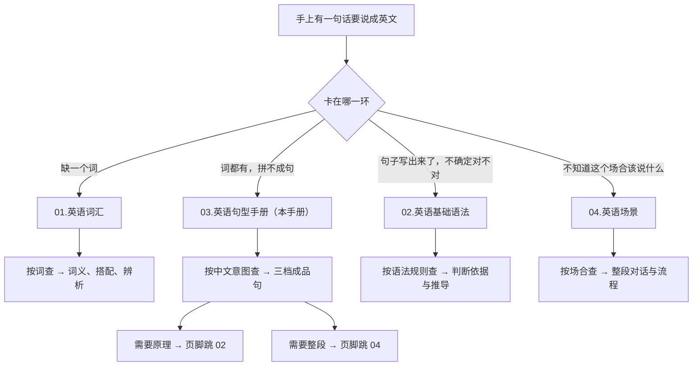
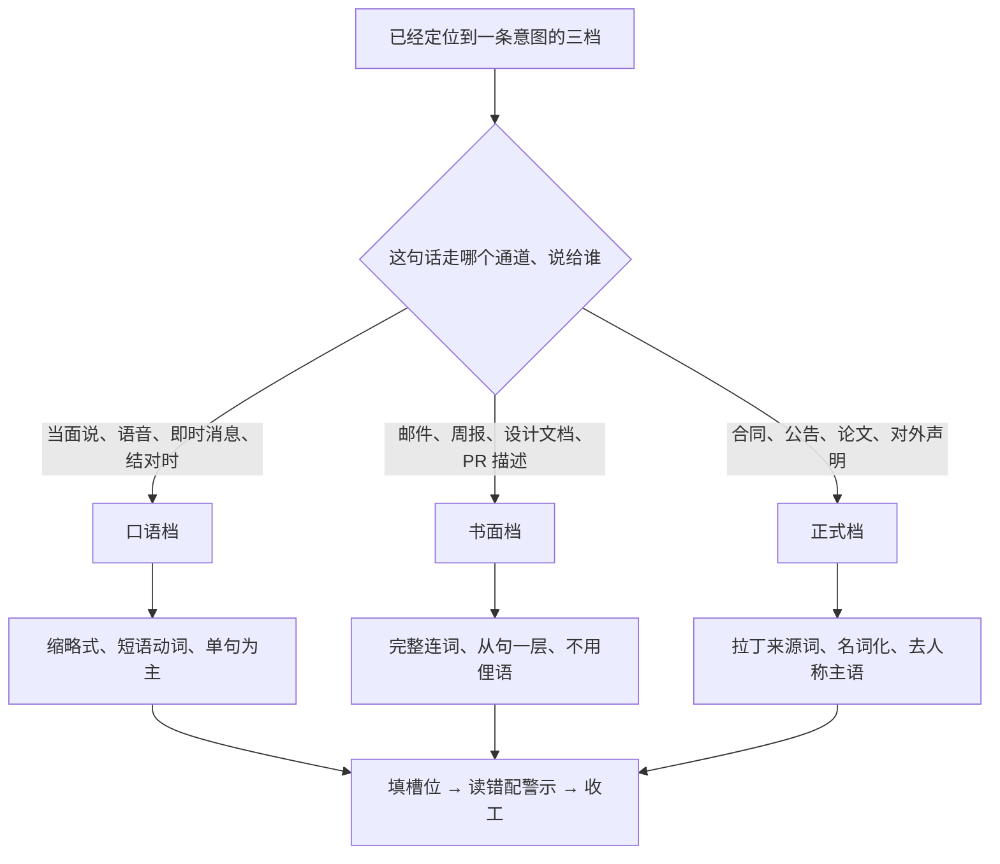
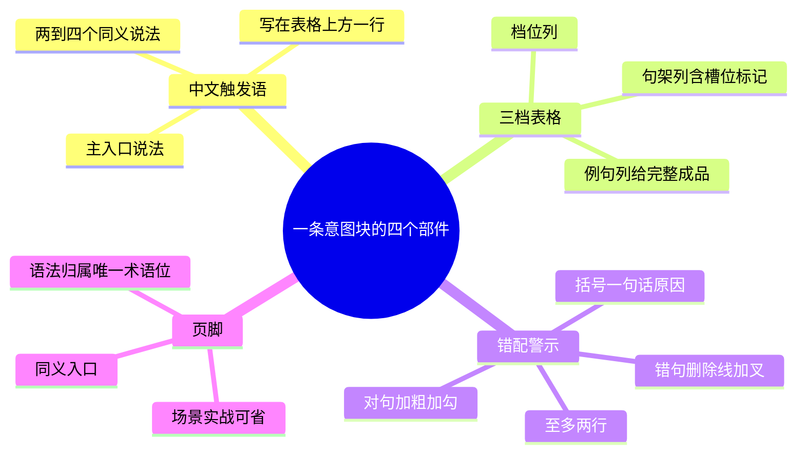
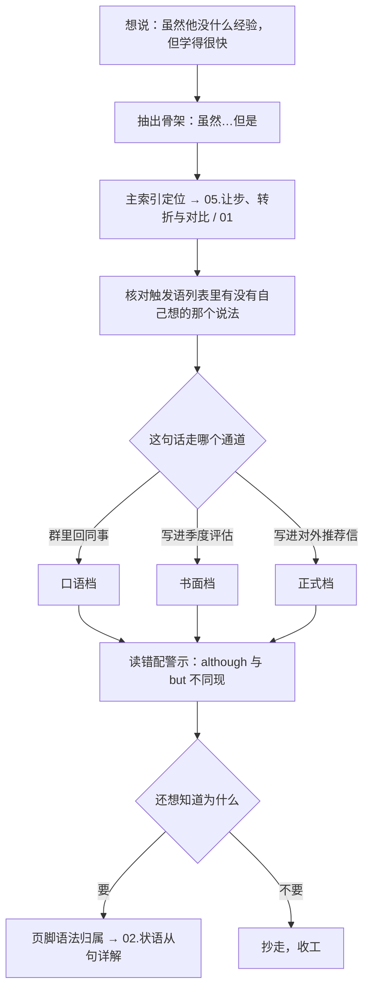
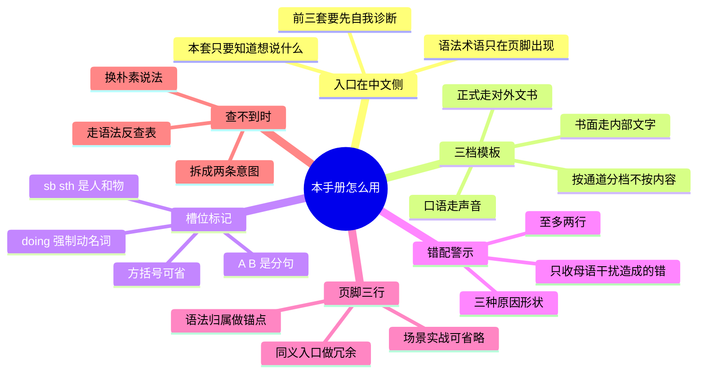

# 本手册怎么用：中文意图入口与三档模板体例

> [!info] 本篇定位
>
> 这篇不收新的句型知识，只教查法。读完能答上四个问题：一句话卡住时该翻本手册还是翻另三套；三档模板里该挑哪一档；句架里的 A、sb、doing、方括号各代表什么；页脚那两三条链接分别通向哪里。
>
> 正文用十一条真实意图块当演示，从「虽然A但是B」走一遍从查询到套用的完整流程，再给可直接复制的空白骨架与背诵顺序。本篇与 [[01.手册导航与索引/02.中文意图主索引：全部意图按功能域速查|中文意图主索引]]、[[01.手册导航与索引/03.语法类别反查表：从语法名称切回意图篇目|语法类别反查表]] 合起来是入口三件套：这篇讲怎么读，那两篇讲去哪儿找。

---

## 1. 本篇导读：从中文那一侧进门

自学者写英文时最常见的卡点不是不认识词，而是**词都认识，拼不出那个结构**。想说「他一坐下就开始改代码」，脑子里 sit、down、start、fix 全在，就是不知道「一…就…」该落成什么形状；想说「这事儿得看客户那边怎么定」，depend 这个词认得，却写不出 `It depends on what the client decides`。

这类卡点的特征是：**问题出在中文这一侧还没被翻译过去的时候**。你手里有的是一个中文意图，不是一个英文病句。手里有病句，语法书能救；手里只有中文意图，语法书救不了——因为语法书的目录是「定语从句」「虚拟语气」，你得先自己把中文意图翻译成语法术语才能查，而那一步恰恰是你卡住的地方。

本手册把目录换成中文。「一…就…」是一个词条，「看情况」是一个词条，「话虽如此」是一个词条。你想到哪个中文说法，就用哪个说法查，查到的是三个可以直接抄走的英文成品句，外加一行止损提示。

> [!tip] 一句话概括本手册的定位
>
> 前三套教程是**知识库**，回答「这是什么、为什么这样」；本手册是**检索层**，回答「这句中文英文怎么说」。检索层不重复知识库的内容，它只负责把你送到正确的成品句，需要原理时用页脚链接把你送回知识库。

这个定位带来两条设计后果，读的时候会一直遇到：

第一，**正文不出现语法术语**。你不会在小节标题里看到「让步状语从句」，只会看到「虽然但是」。术语只出现在每条意图块页脚的「语法归属」一行——那一行是给反查表用的锚点，不是给正文用的检索键。

第二，**每条意图控制在一屏之内**。中文触发语一行，三档表格一张，错配警示至多两行，页脚两到三行。写到第二屏就说明在解释原理了，那些内容属于 `02.英语基础语法`，本手册删掉换链接。

---

## 2. 入口差异：四套教程各管哪一段

同一个知识库里已经有三套英语教程，加上本手册是四套。它们不是难度递进关系，是**入口方向不同**。

| 教程 | 入口是什么 | 用它之前你得先知道 | 拿到手的是 |
| --- | --- | --- | --- |
| `01.英语词汇` | 一个词 | 自己缺哪个词 | 词义、搭配、易混辨析 |
| `02.英语基础语法` | 一条语法规则 | 自己要学哪一类结构 | 规则、推导、例外 |
| `04.英语场景` | 一个场合 | 自己身处哪个场景 | 整段对话与场景词表 |
| **`03.英语句型手册`（本手册）** | **一句中文** | **只要知道自己想说什么** | **三档成品句 + 止损提示** |

把这张表反过来读更清楚：**前三套都要求你先完成一次自我诊断**，本手册不要求。

`04.英语场景/04.从句与复合句型框架/03.状语从句九大类型` 把九类状语从句和连词表列得很全，缺的东西一样没有。但要用它，你得先判断出「我这句话需要让步状语从句」——而这个判断正是初学者做不到的那一步。本手册的做法是把判断前移到中文侧：`虽然…但是` 是一个入口，`退一步说` 是另一个，`表面上…实际上` 是第三个。它们在语法上都属于让步，但作为查询入口是三件不同的事，因为**你想到的中文不一样**。



这张分流图的关键在第一个分叉：**先判断卡点的性质，再选教程**。「词都有拼不成句」和「句子写出来了不确定对不对」是两种完全不同的状态，前者要成品，后者要判据。拿着「不确定对不对」的问题来查本手册，会失望，因为本手册不给判据；反过来，拿着「拼不成句」的问题去翻语法书，会在术语目录前面呆坐十分钟。图的右侧两条回流线说明了检索层与知识库的关系：本手册不是终点，它是**分诊台**。

> [!warning] 一个高频的入口误判
>
> 「这句话我说得对不对」和「这句话英文怎么说」经常被混为一谈。前者拿着已有的英文句子求校验，后者手上只有中文。**只有后者属于本手册**。校验请走 [[02.英语基础语法/11.实战应用/03.常见语法错误纠正|常见语法错误纠正]]。

### 2.1 四套之间的内容分工线

四套教程共用一个知识库，同一块内容只在一个地方写全，其余位置引用不重写。划界规则在大纲里已经定死，查的时候按这张表判断该翻哪边：

| 内容 | 权威版本在 | 本手册只给 |
| --- | --- | --- |
| 关系词 who / whom / whose / that / which 的选择规则 | [[02.英语基础语法/09.从句体系/01.定语从句基础\|定语从句基础]] | 可填空骨架 + 逗号要不要加的判读 |
| 虚拟语气三条时间线的谓语形态对照 | [[02.英语基础语法/10.特殊句型/02.虚拟语气详解\|虚拟语气详解]] | 按中文时间指向的口诀与成品句 |
| 倒装的语序推导、完全与部分之分 | [[02.英语基础语法/10.特殊句型/03.倒装句结构\|倒装句结构]] | 哪个词提前、助动词变不变 |
| 十六种时态的体系与互相区别 | [[02.英语基础语法/06.动词时态/05.时态综合运用与辨析\|时态综合运用与辨析]] | 一行对照：中文时间词 → 主从句各用什么时态 |
| 被动语态的构成与各时态形式 | [[02.英语基础语法/10.特殊句型/01.被动语态全解\|被动语态全解]] | 中文被字句、隐性被动的五条出路选择树 |

看懂这张表，就知道在本手册里**看不到什么**：看不到「为什么 despite 后面不能接句子」的解释，只能看到「despite 后面接名词或动名词」这一行提示加一个跳转链接。这不是内容缺失，是刻意的分工。

---

## 3. 三档模板怎么判读

每条中文意图给三档：口语、书面、正式。**这不是三个同义句，是三个使用场合不同的成品。**

把三档当同义句背是最常见的误用。`terminate` 用在微信语音里和 `commence` 用在闲聊里一样别扭，反过来把 `He's new, but he picks things up fast` 写进对外的推荐信，也会显得轻飘。查的时候顺序是：**先确定场合，再挑档，最后填槽位**。



分流的依据是**通道**而不是内容严肃程度。同一件严肃的事（项目要延期），在站会上口头说和写进给客户的正式函件里，档位完全不同；反过来，一句轻松的话写进合同附件也得升档。判断口诀：**看这句话最终以什么形式落地**——声音走口语档，公司内部文字走书面档，对外或有法律效力的文字走正式档。

### 3.1 三档的可识别特征

不必记语域理论，认这三组表面特征就够：

| 特征 | 口语档 | 书面档 | 正式档 |
| --- | --- | --- | --- |
| 缩略 | 大量用 it's、don't、we'll | 视场合，邮件里可用 | 一律全写 it is、do not |
| 动词选择 | 短语动词 put off、come up with | 中性动词 delay、propose | 拉丁来源词 postpone、propose formally |
| 句子长度 | 一句一个意思，常并列 | 一层从句 | 多层修饰、名词化短语 |
| 人称 | I、you 高频 | we、the team | 常用被动或无人称主语 |
| 连接词 | but、so、and | although、therefore | notwithstanding、accordingly |

> [!example] 同一个意思的三档落差
>
> **口语档**
> - `We had to push it back a week.`
>   - 我们只能往后推一周。
>
> **书面档**
> - `We have postponed the release by one week.`
>   - 发布已推迟一周。
>
> **正式档**
> - `The release has been deferred by one week, effective immediately.`
>   - 发布即刻起顺延一周。

三句说的是同一件事，落差全在动词和主语上：`push back` → `postpone` → `defer`，`we` → `we` → `the release`（去人称）。这条落差规律在全手册反复出现，掌握它以后，很多意图块只需要背口语档，另外两档靠 [[12.文体、语域与正式文书/01.语域升降与同义改写：同一句话的三档说法|语域升降与同义改写]] 里的五个手段现推。

### 3.2 什么时候三档不全给

少数意图天然只活在一两档里。「说不好，得看情况」在正式合同里不会出现，正式档会写成 `subject to`；反过来 `hereunder`、`without prejudice to` 这类词在口语里根本没有对应。遇到这种情况，表格里那一档会写「不适用」或直接给最接近的替代形态，并在错配警示里说明为什么不该硬凑。

---

## 4. 槽位标记约定

句架里的大写字母和小写缩写是**可替换位**，抄的时候要换成自己的内容。全手册统一这套标记，只有六个：

| 标记 | 含义 | 示例句架 | 填好之后 |
| --- | --- | --- | --- |
| `A` `B` | 可替换的**分句**（有主语有谓语） | `Although A, B.` | Although he is new, he learns fast. |
| `sb` | 人（somebody） | `remind sb to do sth` | remind Tom to update the doc |
| `sth` | 物或事（something） | `attribute sth to sth` | attribute the crash to a race condition |
| `doing` | 该位置**必须**用动名词 | `It's worth doing.` | It's worth reviewing. |
| `do` | 该位置用动词原形 | `make sb do sth` | make the job run twice |
| `[ ]` | 方括号内是**可选**成分 | `not only A [but also] B` | 括号内可整体省去 |

四条使用纪律：

- `A` 和 `B` 一定是分句，不是短语。看到 `Despite A` 这种写法说明写错了，介词后面接不了分句，正确的句架是 `Despite sth`。这条区别是本手册出现频率最高的错配来源。
- `doing` 是**强制标记**，不是「也可以用动名词」。凡标了 `doing` 的位置换成 `to do` 一律出错，例如 `worth doing` 不能写成 `worth to do`。搭配层面的原因归 `01.英语词汇`，本手册只标不解释。
- 方括号里的成分省去以后句子仍然成立，但语气会变。`not only A but also B` 省掉 `but also` 之后需要靠语调或标点补语义，写作时不建议省。
- 句架里出现的介词、冠词、连词是**固定的**，不在槽位里，抄的时候一个字母都不要改。`in the event of` 不能写成 `in event of`。

> [!warning] 槽位标记不是缩写练习
>
> ~~`Although sth, B.`~~ ❌
> **`Although A, B.`** ✅（`although` 后面必须跟完整分句，用 `A` 不用 `sth`；写成 `sth` 会诱导你把名词短语塞进去）
>
> ~~`look forward to hear from you`~~ ❌
> **`look forward to hearing from you`** ✅（句架里标了 `doing`，这个 `to` 是介词不是不定式符号）

---

## 5. 错配警示怎么读

每条意图后面至多两行错配警示，写成 warning 类型的引用块，格式固定：**错句加删除线配 ❌，对句加粗配 ✅，括号里一句话说明原因**。

三条编写纪律，也是阅读时的期待值：

- **只收「中文母语者会写出来的错」**，不收「随便一个人都会犯的错」。`although` 和 `but` 同现是中文「虽然…但是」直译造成的，收；第三人称单数漏掉 s 不收，那是 [[02.英语基础语法/10.特殊句型/06.主谓一致|主谓一致]] 的事。
- **只写一句话原因，不展开推导**。要推导请走页脚的语法归属链接。
- **至多两行**。第三行开始就是在讲原理了，讲原理的位置在 `02`。

括号里的一句话原因通常是这三种形状之一：**词性限制**（介词后面不能接句子）、**共现冲突**（两个词表达同一个逻辑关系，只能留一个）、**槽位强制**（这个位置必须动名词 / 必须原形）。见到警示时先归类，归完类记忆成本会低很多。

> [!example] 三种原因形状各一例
>
> **词性限制**
> ~~`Despite he was tired, he kept coding.`~~ ❌
> **`Despite being tired, he kept coding.`** ✅（`despite` 是介词，后面只能接名词或动名词）
>
> **共现冲突**
> ~~`Although it's late, but I'll finish this first.`~~ ❌
> **`Although it's late, I'll finish this first.`** ✅（英语一个逻辑关系只用一个连接词，中文的「虽然…但是」是成对的，英语不是）
>
> **槽位强制**
> ~~`I suggest you to restart the service.`~~ ❌
> **`I suggest restarting the service.`** ✅（`suggest` 不接「人 + to do」，只接动名词或 that 从句）

---

## 6. 页脚双链怎么读

每条意图块末尾固定两到三行页脚。它们不是装饰，是这条意图与全库其余部分的接口。

```text
同义入口：话虽如此 / 尽管如此 / 就算是这样
语法归属：[[02.英语基础语法/09.从句体系/04.状语从句详解|让步状语从句]]
场景实战：[[04.英语场景/05.高频实用表达句型框架/03.同意反对让步转折句型库|职场语境下的让步]]
```

三行各管一件事：

**同义入口**列出这条意图的其他中文说法。作用是**入口冗余**——你想到「话虽如此」也好、想到「就算是这样」也好，都能查到同一处正文。主索引里这些别名会全部列出来，但它们共指唯一的主锚点，不会出现两份内容互相打架。

**语法归属**是**唯一允许出现语法术语的位置**。它有两个用途：一是想深究原理时点进去；二是给 [[01.手册导航与索引/03.语法类别反查表：从语法名称切回意图篇目|语法类别反查表]] 提供锚点——反查表就是把全手册所有页脚的这一行反向汇总而成的，所以它不自建语法分类体系，直接沿用 `02.英语基础语法` 的章节编号作 key。

**场景实战**指向 `04.英语场景` 的对应篇目，用来看这个结构在完整对话里怎么落地。**没有恰当对应的意图，这一行直接省略**，不硬凑。



这张解剖图是本手册的最小单元。全书四千多条句架、约五百个中文入口，全部装在这个统一形状里。读第一篇时值得把这四个部件对着一条真实意图核一遍，之后翻到任何一页都不必再看说明。

> [!tip] 页脚里没有的东西
>
> 页脚**不放**词汇链接。词义辨析、搭配限制归 `01.英语词汇`，需要时在错配警示的括号里一句话带过。四套教程互链密度控制在这个程度，否则每条意图会被链接淹没。

---

## 7. 完整走查：「虽然A但是B」从中文到成品

拿一句真实要写的话走一遍：**「虽然他没什么经验，但学得很快」**。

四步：

1. **抽连接词**。中文句子里的逻辑骨架是「虽然…但是」，不是「没经验」也不是「学得快」。查的是骨架，不是内容词。
2. **定位功能域**。「虽然…但是」属于让步转折，主索引里落在 `05.让步、转折与对比 / 01`。想不起来属于哪个域，直接在主索引里搜中文四个字。
3. **核对触发语**。打开意图块，第一行列了一串同义说法，确认自己想说的那个在里面。不在，往下翻同域的其他意图块。
4. **按通道挑档，填槽位，读警示**。



流程图里唯一需要动脑的是 E 那个分叉，其余四步是机械操作。这也是本手册的设计目标：**把翻译过程中需要判断的环节压缩到一个**——挑档。挑完档，剩下的是抄。

### 7.1 虽然A但是B

中文触发语：虽然A但是B / 尽管A还是B / 就算A也B / A 归 A，B 归 B

| 档位 | 句架 | 例句 |
| --- | --- | --- |
| 口语 | A, but B. | He's new, but he picks things up fast. |
| 口语 | B [though]. （though 放句尾） | He picks things up fast, though. |
| 书面 | Although A, B. | Although he is new to the team, he picks things up quickly. |
| 书面 | Even though A, B. （事实让步，语气更重） | Even though he had no prior experience, he shipped the feature on time. |
| 书面 | While A, B. （对比意味更强） | While the approach is unconventional, it does solve the problem. |
| 正式 | Despite sth, B. / In spite of sth, B. | Despite his limited experience, he has demonstrated a rapid learning curve. |

- 他是新人，不过上手很快。
- 他上手挺快的，虽然是新人。
- 虽然他刚加入团队，但上手很快。
- 尽管他毫无相关经验，仍按期交付了这个功能。
- 这个做法虽不常规，确实解决了问题。
- 尽管经验有限，他展现出了很快的学习速度。

> [!warning] 两条止损
>
> ~~`Although he is new, but he learns fast.`~~ ❌
> **`Although he is new, he learns fast.`** ✅（一个让步关系只用一个连接词，中文的成对结构不能照搬）
>
> ~~`Despite he is new, he learns fast.`~~ ❌
> **`Despite being new, he learns fast.`** ✅（`despite` 后接名词或动名词；要接分句得换成 `despite the fact that`）

```text
同义入口：尽管…还是 / 就算…也 / 话是这么说
语法归属：[[02.英语基础语法/09.从句体系/04.状语从句详解|让步状语从句]]
场景实战：[[04.英语场景/05.高频实用表达句型框架/03.同意反对让步转折句型库|同意反对让步转折句型库]]
```

这条意图块的完整形状就是全书标准形状：触发语一行、表格一张、译文列表一段、警示至多两行、页脚三行。往下六节换六个功能域，形状一模一样，只是内容不同——这正是要演示的点。

---

## 8. 七条示范意图：同一体例在不同功能域长什么样

下面七条分别取自让步、程度、条件、时间、信息来源五个域。看的时候不必记内容，重点看**形状是否一致**——触发语一行、表格一张、译文一段、警示至多两行、页脚两到三行，一条不多一条不少。

### 8.1 话虽如此

中文触发语：话虽如此 / 尽管如此 / 就算是这样 / 话说回来

| 档位 | 句架 | 例句 |
| --- | --- | --- |
| 口语 | That said, B. | That said, we still need a fallback. |
| 口语 | Still, B. / Even so, B. | Even so, I'd keep the old endpoint for a month. |
| 书面 | Having said that, B. | Having said that, the migration cannot be delayed indefinitely. |
| 正式 | Nevertheless, B. / Nonetheless, B. | Nevertheless, the committee has decided to proceed. |

- 话虽如此，我们还是得留个兜底方案。
- 就算这样，旧接口我也会再保留一个月。
- 话说回来，迁移不能无限期拖下去。
- 尽管如此，委员会仍决定继续推进。

> [!warning] 一条止损
>
> ~~`Although that said, we still need a fallback.`~~ ❌
> **`That said, we still need a fallback.`** ✅（`that said` 本身已经承担让步，前面不再加连接词；它是句首独立成分，后面用逗号断开）

```text
同义入口：尽管如此 / 就算是这样 / 不过话说回来
语法归属：[[02.英语基础语法/05.介词与连词/03.连词的分类与用法|连词与连接副词]]
场景实战：[[04.英语场景/05.高频实用表达句型框架/03.同意反对让步转折句型库|同意反对让步转折句型库]]
```

### 8.2 表面上…实际上

中文触发语：表面上A，实际上B / 看着像A，其实B / 说是A，实则B

| 档位 | 句架 | 例句 |
| --- | --- | --- |
| 口语 | It looks like A, but actually B. | It looks like a network issue, but actually it's a DNS cache problem. |
| 书面 | On the surface A; in reality B. | On the surface the two APIs are identical; in reality they differ in error semantics. |
| 正式 | While ostensibly A, B in practice. | While ostensibly a performance fix, the change in practice altered the data model. |

- 看着像网络问题，其实是 DNS 缓存。
- 表面上两个接口一模一样，实际上错误语义不同。
- 这次改动名义上是性能优化，实际上改了数据模型。

> [!warning] 一条止损
>
> ~~`In fact it looks like a network issue, but in fact it's DNS.`~~ ❌
> **`It looks like a network issue, but actually it's DNS.`** ✅（`in fact` 和 `actually` 同现会变成两次转折；一句里只留一个「实际上」）

```text
同义入口：看着像…其实 / 说是…实则 / 名义上…事实上
语法归属：[[02.英语基础语法/04.形容词与副词/03.副词的分类与用法|评注性副词]]
```

### 8.3 太…以至于

中文触发语：太…以至于 / …得连…都 / 到了…的程度 / …得不行

| 档位 | 句架 | 例句 |
| --- | --- | --- |
| 口语 | so + adj. + (that) A | It was so cold I couldn't feel my fingers. |
| 口语 | too + adj. + to do | The log is too noisy to be useful. |
| 书面 | such + a/an + adj. + n. + that A | It was such a tight deadline that we had to cut scope. |
| 正式 | to such an extent that A | Costs rose to such an extent that the project was suspended. |

- 冷得手指都没知觉了。
- 日志太吵，根本没法看。
- 排期紧到我们不得不砍需求。
- 成本上升到项目被迫暂停的程度。

> [!warning] 两条止损
>
> ~~`It was so a tight deadline that we cut scope.`~~ ❌
> **`It was such a tight deadline that we cut scope.`** ✅（后面跟「冠词 + 形容词 + 名词」用 `such`，只跟形容词才用 `so`）
>
> ~~`The log is too noisy to be not useful.`~~ ❌
> **`The log is too noisy to be useful.`** ✅（`too…to` 本身已含否定义，再加 not 会反过来）

```text
同义入口：…得连…都 / 到了…的程度 / …得不行
语法归属：[[02.英语基础语法/09.从句体系/04.状语从句详解|结果状语从句]]
场景实战：[[04.英语场景/05.高频实用表达句型框架/04.比较对比举例总结句型库|比较对比举例总结句型库]]
```

### 8.4 要不是…就…

中文触发语：要不是A就B / 没有A的话就B / 幸亏A否则B / 亏得A

| 档位 | 句架 | 例句 |
| --- | --- | --- |
| 口语 | If it weren't for sth, B. | If it weren't for the cache, the page would take five seconds. |
| 口语 | Without sth, B. | Without that rollback script, we'd still be down. |
| 书面 | But for sth, B. | But for the on-call rotation, the outage would have gone unnoticed. |
| 正式 | Had it not been for sth, B. | Had it not been for the audit log, the root cause would have remained unknown. |

- 要不是有缓存，这页得加载五秒。
- 没有那个回滚脚本，我们现在还挂着。
- 要不是有值班轮换，这次故障根本没人发现。
- 若非有审计日志，根本查不出根因。

> [!warning] 两条止损
>
> ~~`If it wasn't for the cache, the page will take five seconds.`~~ ❌
> **`If it weren't for the cache, the page would take five seconds.`** ✅（与事实相反的假设，从句用 `were`，主句用 `would`）
>
> ~~`Had not it been for the audit log, …`~~ ❌
> **`Had it not been for the audit log, …`** ✅（倒装时 not 留在主语后面，不跟着助动词提前）

```text
同义入口：没有…的话 / 幸亏…否则 / 亏得
语法归属：[[02.英语基础语法/10.特殊句型/02.虚拟语气详解|虚拟语气与含蓄条件]]
场景实战：[[04.英语场景/03.时态与语态句型框架/03.虚拟语气完全解析|虚拟语气完全解析]]
```

### 8.5 一…就…

中文触发语：一…就… / 刚…就… / …之后马上 / 每当…就…

| 档位 | 句架 | 例句 |
| --- | --- | --- |
| 口语 | As soon as A, B. | As soon as the build turns green, I'll open the PR. |
| 口语 | The moment A, B. | The moment he sat down, he started rewriting the parser. |
| 书面 | Once A, B. | Once the migration completes, the read replica will catch up automatically. |
| 正式 | No sooner had A than B. / Hardly had A when B. | No sooner had we deployed than the error rate spiked. |

- 构建一变绿我就提 PR。
- 他一坐下就开始重写解析器。
- 迁移一旦完成，只读副本会自动追上。
- 我们刚一上线，错误率就飙了。

> [!warning] 两条止损
>
> ~~`As soon as the build will turn green, I'll open the PR.`~~ ❌
> **`As soon as the build turns green, I'll open the PR.`** ✅（时间从句用现在时表将来，主将从现）
>
> ~~`No sooner we had deployed than the error rate spiked.`~~ ❌
> **`No sooner had we deployed than the error rate spiked.`** ✅（否定词开头必须部分倒装，助动词提到主语前）

```text
同义入口：刚…就 / …之后马上 / 每当…就
语法归属：[[02.英语基础语法/10.特殊句型/03.倒装句结构|否定词提前的部分倒装]]
场景实战：[[04.英语场景/04.从句与复合句型框架/03.状语从句九大类型|状语从句九大类型]]
```

### 8.6 据说、听说

中文触发语：据说 / 听说 / 有人说 / 传闻 / 说是

| 档位 | 句架 | 例句 |
| --- | --- | --- |
| 口语 | I heard (that) A. / Word is A. | I heard they're dropping the mobile client. |
| 口语 | Apparently, A. | Apparently the vendor pushed the date again. |
| 书面 | It is said that A. / sb is said to do sth. | The library is said to handle back-pressure correctly. |
| 正式 | Reportedly A. / According to sth, A. | According to the incident report, the failover never triggered. |

- 听说他们要砍掉移动端。
- 说是供应商又改期了。
- 据说这个库能正确处理背压。
- 据事故报告，故障转移根本没触发。

> [!warning] 两条止损
>
> ~~`It is said the library handles back-pressure.`~~ ❌
> **`The library is said to handle back-pressure.`** ✅（主语提升式里主语后面接 `to do`，不接从句；两种写法二选一，不混用）
>
> ~~`According to me, the failover never triggered.`~~ ❌
> **`In my view, the failover never triggered.`** ✅（`according to` 只用于转述他人或文件，不能转述自己）

```text
同义入口：有人说 / 传闻 / 说是 / 外面在传
语法归属：[[02.英语基础语法/10.特殊句型/01.被动语态全解|被动语态与主语提升]]
场景实战：[[04.英语场景/05.高频实用表达句型框架/01.表达观点与态度的50个万能句型|表达观点与态度的万能句型]]
```

### 8.7 不但没…反而

中文触发语：不但没A反而B / 非但不A还B / 不仅没A，反倒B

| 档位 | 句架 | 例句 |
| --- | --- | --- |
| 口语 | Not only did sb not do sth, sb actually did sth. | Not only did the patch not help, it actually made things worse. |
| 口语 | Instead of doing sth, sb did sth. | Instead of dropping, latency climbed after the fix. |
| 书面 | Far from doing sth, sth did sth. | Far from reducing load, the cache layer introduced a new bottleneck. |
| 正式 | Rather than doing sth, sth has done sth. | Rather than simplifying deployment, the change has added two failure modes. |

- 那个补丁不但没管用，反而更糟了。
- 修完之后延迟不降反升。
- 缓存层非但没减轻负载，反倒引入了新瓶颈。
- 这次改动非但没简化部署，还多出两个故障点。

> [!warning] 两条止损
>
> ~~`Not only the patch didn't help, it made things worse.`~~ ❌
> **`Not only did the patch not help, it made things worse.`** ✅（`not only` 置于句首必须部分倒装，助动词提到主语前）
>
> ~~`Far from to reduce load, the cache introduced a bottleneck.`~~ ❌
> **`Far from reducing load, the cache introduced a bottleneck.`** ✅（`far from` 里的 from 是介词，后面接动名词）

```text
同义入口：非但不…还 / 不仅没…反倒 / 结果反而
语法归属：[[02.英语基础语法/10.特殊句型/03.倒装句结构|not only 置首的部分倒装]]
场景实战：[[04.英语场景/05.高频实用表达句型框架/03.同意反对让步转折句型库|同意反对让步转折句型库]]
```

七条看完，形状差异为零，差的只有内容。这就是本手册可以被「翻」而不必被「读」的原因：任何一页的信息布局都在同一个位置，眼睛不需要重新适应。

---

## 9. 查不到怎么办：三步降级

主索引收约五百条中文意图，覆盖不了全部说法。查不到时按这三步降级，不要卡在原地：

**第一步：换一个更朴素的中文说法。** 想说「这事儿八字还没一撇」，先降成「还没定下来」；想说「我先撂这儿了」，先降成「我先放着」。手册的入口按常用书面中文收录，方言、行话、修辞说法要先降解成中性说法再查。

**第二步：拆成两条更小的意图。** 「这块儿虽然能跑但迟早得重写」拆成「虽然…但是」加「迟早」，分别查完拼起来。**手册不收长句整句，只收骨架**，长句一律靠拼。

**第三步：走语法反查表绕道。** 实在拆不动，但你隐约知道「这好像是个虚拟语气」，用 [[01.手册导航与索引/03.语法类别反查表：从语法名称切回意图篇目|语法类别反查表]] 从语法名称切回意图篇目。这条路是留给已经有一点语法底子的人的备用入口。

下面三条示范意图分别属于条件、比较、人际三个域，也顺带演示「降级后能查到什么」。

### 9.1 取决于、看情况

中文触发语：取决于 / 看情况 / 视…而定 / 说不好，得看… / 要看…怎么定

| 档位 | 句架 | 例句 |
| --- | --- | --- |
| 口语 | It depends. / It depends on sth. | It depends on how big the payload is. |
| 口语 | That's up to sb. | That's up to the client team. |
| 书面 | depending on sth | The retry interval varies depending on the error type. |
| 正式 | be subject to sth / hinge on sth | The rollout is subject to security review. |

- 得看载荷有多大。
- 那得看客户端团队怎么定。
- 重试间隔随错误类型而变。
- 上线以安全评审通过为准。

> [!warning] 两条止损
>
> ~~`It depends the size of the payload.`~~ ❌
> **`It depends on the size of the payload.`** ✅（`depend` 是不及物动词，后面必须带 `on`）
>
> ~~`It depends on what will the client decide.`~~ ❌
> **`It depends on what the client decides.`** ✅（宾语从句用陈述语序，不倒装）

```text
同义入口：视…而定 / 说不好得看 / 要看…怎么定
语法归属：[[02.英语基础语法/09.从句体系/03.名词性从句详解|宾语从句的陈述语序]]
```

### 9.2 越…越…

中文触发语：越A越B / 越来越… / 越…就越…

| 档位 | 句架 | 例句 |
| --- | --- | --- |
| 口语 | The + 比较级 A, the + 比较级 B. | The bigger the batch, the slower the response. |
| 口语 | 比较级 and 比较级 | The logs are getting noisier and noisier. |
| 书面 | increasingly + adj. | The pipeline has become increasingly fragile. |

- 批次越大，响应越慢。
- 日志越来越吵。
- 这条流水线越来越脆弱。

> [!warning] 一条止损
>
> ~~`The more you retry, the more it will be slow.`~~ ❌
> **`The more you retry, the slower it gets.`** ✅（`the + 比较级` 结构里比较级必须整体前置，不能把形容词留在后面）

```text
同义入口：越来越 / 越…就越
语法归属：[[02.英语基础语法/04.形容词与副词/02.形容词的比较级与最高级|比较级的特殊结构]]
场景实战：[[04.英语场景/05.高频实用表达句型框架/04.比较对比举例总结句型库|比较对比举例总结句型库]]
```

### 9.3 我有个顾虑、这样不太行

中文触发语：我有个顾虑 / 这样不太行 / 我保留意见 / 我不太赞成

| 档位 | 句架 | 例句 |
| --- | --- | --- |
| 口语 | I'm not sure this works. | I'm not sure this works for the offline case. |
| 口语 | I'd push back on that. | I'd push back on shipping without a feature flag. |
| 书面 | I have some concerns about sth. | I have some concerns about the migration window. |
| 正式 | I would have to disagree on sth. | I would have to disagree on the proposed timeline. |

- 离线那种情况我觉得这么做不行。
- 没有开关就上线，我不太赞成。
- 我对迁移窗口有些顾虑。
- 对提议的时间表，我持保留意见。

> [!warning] 两条止损
>
> ~~`I have some concerns for the migration window.`~~ ❌
> **`I have some concerns about the migration window.`** ✅（`concern` 后面搭 `about` 或 `over`，不搭 `for`）
>
> ~~`I don't agree your plan.`~~ ❌
> **`I don't agree with your plan.`** ✅（`agree` 后面接人或方案都要带介词 `with`）

```text
同义入口：这样不太行 / 我保留意见 / 我不太赞成
语法归属：[[02.英语基础语法/07.助动词与情态动词/02.情态动词详解|情态动词的语气软化]]
场景实战：[[04.英语场景/10.职场与商务场景实战/02.会议汇报与演示场景|会议汇报与演示场景]]
```

---

## 10. 体例演示模板

### 10.1 空白骨架

自己整理笔记、或者往手册里补条目时，照抄这个骨架填空。全书每条意图都是这个形状，不多不少：

```text
### N.M 中文意图名（用最常想到的那个说法当标题）

中文触发语：主说法 / 同义说法一 / 同义说法二 / 同义说法三

| 档位 | 句架 | 例句 |
| --- | --- | --- |
| 口语 | 句架（带槽位标记） | 完整成品句 |
| 口语 | 句架 | 完整成品句 |
| 书面 | 句架 | 完整成品句 |
| 正式 | 句架 | 完整成品句 |

- 例句一的中文译文
- 例句二的中文译文
- 例句三的中文译文
- 例句四的中文译文

> [!warning] 两条止损
>
> ~~错句~~ ❌
> **对句** ✅（一句话说明原因）
>
> ~~错句~~ ❌
> **对句** ✅（一句话说明原因）

同义入口：其他中文说法
语法归属：`[[02.英语基础语法/<篇目路径>|术语名]]`
场景实战：`[[04.英语场景/<篇目路径>|篇名]]`
```

填的时候有四条硬要求：

- **例句必须是完整可用的成品句**，不是骨架的复读。表格里句架列已经给了骨架，例句列如果还写 `Although A, B` 等于什么都没给。
- **三档不能是同一句话换词**。写完检查一遍：这三句话能不能出现在同一个通道里？能，说明档没分开，重写。
- **警示只写中文母语者会犯的错**。自己没犯过、也没见同事犯过的错不收。
- **页脚链接必须指向真实存在的篇目**。没有恰当对应的那一行直接删掉，宁缺毋滥。

### 10.2 填好的样例：我建议、你最好

用一条真实意图把骨架填满，作为对照参考。

中文触发语：我建议 / 你最好 / 要不…吧 / 不如…

| 档位 | 句架 | 例句 |
| --- | --- | --- |
| 口语 | Why don't we do sth? | Why don't we split this into two PRs? |
| 口语 | You might want to do sth. | You might want to pin the version first. |
| 口语 | You'd better do sth. （带警告意味） | You'd better back up the table before you run that. |
| 书面 | I suggest doing sth. / I suggest that sb (should) do sth. | I suggest adding a retry with exponential backoff. |
| 正式 | It is recommended that sb (should) do sth. | It is recommended that the client cache the token locally. |

- 要不我们拆成两个 PR 吧？
- 你最好先把版本锁死。
- 跑那条语句之前你最好先备份表。
- 建议加一个指数退避的重试。
- 建议客户端在本地缓存该令牌。

> [!warning] 两条止损
>
> ~~`I suggest you to add a retry.`~~ ❌
> **`I suggest adding a retry.`** ✅（`suggest` 不接「人 + to do」，只接动名词或 that 从句）
>
> ~~`It is recommended that the client caches the token.`~~ ❌
> **`It is recommended that the client (should) cache the token.`** ✅（这类从句用动词原形，不随主语变位）

```text
同义入口：要不…吧 / 不如… / 你可以试试
语法归属：[[02.英语基础语法/09.从句体系/03.名词性从句详解|建议类动词后的从句形态]]
场景实战：[[04.英语场景/05.高频实用表达句型框架/02.建议请求邀请拒绝四大功能句型|建议请求邀请拒绝四大功能句型]]
```

把 10.2 和 10.1 对着看一遍，体例就吃透了。之后翻到本手册任何一页，都不必再读说明文字，直接扫触发语一行找自己想说的中文。

### 10.3 写完一条之后的三个自检问题

自建意图块最容易出的问题不是写错，是**写成了语法笔记**。写完拿这三问过一遍：

| 自检问题 | 答「否」时怎么改 |
| --- | --- |
| 中文触发语那一行，是不是我真的会想到的说法？ | 换成自己嘴里会冒出来的那个词，不要用书面术语翻译腔 |
| 三档能不能出现在同一个通道里？ | 能，说明档没分开。把口语档改得更短更口语，正式档换拉丁词并去人称 |
| 有没有超过一屏？ | 超了，说明在解释原理。删掉解释段，换成一条指向 `02` 的链接 |

第三问是最容易破防的一条。写着写着就想补一句「因为 despite 是介词所以后面不能接从句」，这句话本身没错，但它属于 [[02.英语基础语法/05.介词与连词/04.介词与连词的易混点|介词与连词的易混点]]。检索层一旦开始解释，密度就掉下来了，掉下来的检索层不如不要。

---

## 11. 背诵路线

五十篇不要从第一篇顺序背到第五十篇。按收益排序，路线是这样：

| 阶段 | 分类 | 为什么排这个位置 |
| --- | --- | --- |
| 一 | `02.中文句式转换`（6 篇） | 治母语干扰。不解决把字句、被字句、无主句、体标记这四块，后面背再多句型也会说出中式英语 |
| 二 | `11.人际功能与话轮管理`（7 篇） | 日常对话的话轮骨架，使用频率最高，也是既有三套覆盖最薄的一域 |
| 三 | `03`-`07` 五个逻辑关系域（16 篇） | 因果、条件、让步、并列、时间，写邮件和技术文档的承重结构 |
| 四 | `08`-`10`（13 篇） | 指认描述、比较数量、态度判断，按需取用，不必通背 |
| 五 | `12.文体、语域与正式文书`（5 篇） | 它教你自己升降语域，学完前面各篇的三档就不必逐条硬背 |

排在第一位的是中文句式转换，理由和直觉相反：**它不是最难的，是最赚的**。中式英语的源头集中在几个中文句式上，「饭做好了」写成 `The meal was done by me`、「把日志导出来」写成 `Take the log out`、「他走了三天了」写成 `He left three days`——这些错不是语法不会，是中文结构直接压过来了。这六篇给的是选择树，学完之后错误率下降的幅度比背一百条句型都大。

排在最后的是文体语域篇，理由也一样功利：**学会自己升降档，等于把全书三分之二的背诵量省掉**。前面每条意图给三档，如果你掌握了五个升降手段（缩略式与全写、短语动词换拉丁词、情态动词降级、被动化去人称、动词名词化），只需要背口语档，另外两档现推。所以它放最后不是因为不重要，是因为**放前面推不动**——手上没有足够多的三档实例，学不会那五个手段。

> [!tip] 每天怎么背
>
> 不要按篇背，按**意图块**背。一天三到五条，方法是：遮住表格，只看中文触发语那一行，把三档默写出来，再对照。默写不出来的档留到第二天再来，能默写出来的划掉。一条意图块平均不到一百五十字，五条是十分钟的量。

### 11.1 三种复习节奏，按用途挑一种

| 节奏 | 做法 | 适合谁 |
| --- | --- | --- |
| 输出驱动 | 平时写英文时遇到卡壳就查，查完把那条意图块记进当天清单，晚上默写一遍 | 有真实写作需求的人，命中率最高 |
| 域扫荡 | 一次锁定一个功能域，两周把这个域的意图块全过一遍，过完不再复习整域，只复习标红的 | 准备考试或集中突击的人 |
| 反查校准 | 每周从 [[01.手册导航与索引/03.语法类别反查表：从语法名称切回意图篇目\|语法类别反查表]] 随机挑一个语法名称，回想它对应哪些中文意图 | 已有语法底子、想把术语与中文说法接通的人 |

三种节奏可以混用，但**不要同时开两种**。输出驱动的问题是覆盖不全，域扫荡的问题是背了用不上，反查校准的问题是需要先有底子。挑一种跑满一个月，再换。

判断有没有背进去的标准只有一条：**下次写英文时，那句中文出现在脑子里的同时，英文成品句跟着出来，中间没有翻译动作**。中间还要翻译，说明只是认识，还没到会。

---

## 12. 三个把手册用废的方式

> [!warning] 第一种：把三档当同义句背
>
> 三档不是难度递进，是场合分工。全部当同义句记下来，用的时候随手挑一个，结果是在站会上说 `The deployment has been deferred`，在合同里写 `We had to push it back`。**查之前先确定通道，再挑档**——这是本手册唯一要求你动脑的一步，省掉它，手册就退化成普通句型书。

> [!warning] 第二种：跳过中文触发语直接背英文
>
> 本手册的价值在**中英映射**，不在英文句子本身——那些句子在任何一本句型书里都有。只背英文那一半，等于把检索层拆掉只留内容层。检查方法：看着中文触发语能想起英文，才算会；看着英文能想起中文，只是认识。

> [!warning] 第三种：遇到不懂就在本手册里找解释
>
> 本手册**刻意不解释**。为什么 `despite` 后面不能接句子、为什么否定词提前要倒装、为什么 `suggest` 不接人加不定式——这些答案在 [[02.英语基础语法/00.英语基础语法_大纲|02.英语基础语法]]；词义辨析和搭配限制在 `01.英语词汇`；整段对话怎么走在 `04.英语场景`。在本手册里翻第二屏找解释，只会浪费时间，页脚链接就是给这种时刻准备的。

第三条还有一个反向的用法值得说明：**如果某条意图你连页脚链接都不需要点，说明这条已经会了，可以从背诵清单里划掉**。手册不要求通读，它要求被查。一本被翻烂了但只用过三分之一的手册，比一本从头到尾读过一遍的手册有用得多。

---

## 13. 本篇小结



这张图是本篇的全部内容。左半边（入口、三档、槽位）是**怎么读**，右半边（警示、页脚、降级）是**读不通时怎么办**。把它记住，剩下四十九篇都不必再看说明。

> [!success] 本篇核心要点回顾
>
> 1. 四套教程的差别是入口方向：词汇从词进，语法从规则进，场景从场合进，本手册从中文意图进。
> 2. 卡点性质决定查哪一套——「词都有拼不成句」查本手册，「句子写出来不确定对不对」查语法教程。
> 3. 三档按落地通道分：声音走口语档，公司内部文字走书面档，对外或有法律效力的文字走正式档。
> 4. 三档的表面落差集中在动词选择、缩略与否、人称三处，掌握落差规律后可以只背口语档。
> 5. 槽位标记只有六个：`A`/`B` 是分句，`sb`/`sth` 是人和物，`doing` 强制动名词，`do` 用原形，方括号可省。
> 6. 错配警示至多两行，只收中文母语干扰造成的错，原因分词性限制、共现冲突、槽位强制三种形状。
> 7. 页脚三行各有分工：同义入口做入口冗余，语法归属是全书唯一的术语位也是反查表锚点，场景实战无对应时省略。
> 8. 查不到按三步降级：换朴素中文说法 → 拆成两条小意图 → 从语法反查表绕道。

> [!success] 本篇练习清单
>
> - [ ] 给一句中文「虽然这个方案成本高，但风险最小」，写出口语、书面、正式三档。
> - [ ] 给一句中文「要不是他提前发现，这次就上线了」，写出口语、书面、正式三档，并指出正式档里 not 的位置。
> - [ ] 给一句中文「日志太多了，根本看不出问题在哪」，写出口语、书面、正式三档，区分 so 与 such 的用法边界。
> - [ ] 给一句中文「听说他们下个季度要换技术栈」，写出口语、书面、正式三档，其中一档必须用主语提升式。
> - [ ] 给一句中文「这得看运维那边什么时候有窗口」，写出口语、书面、正式三档，注意宾语从句的语序。
> - [ ] 给一句中文「我建议先加个开关，不要直接全量」，写出口语、书面、正式三档，避开 suggest 的槽位陷阱。
> - [ ] 用 10.1 的空白骨架，为「顺便说一句」这条意图自建一个完整意图块，页脚链接必须指向真实存在的篇目。
> - [ ] 挑本篇任意三条意图块，遮住表格只看中文触发语默写三档，记录默写不出来的档位。

### 13.1 下一篇预告

> [!info] 下一篇
>
> [[01.手册导航与索引/02.中文意图主索引：全部意图按功能域速查\|中文意图主索引：全部意图按功能域速查]]
>
> 本篇讲了怎么读一条意图块，下一篇讲去哪儿找。主索引按 12 个功能域收全部约五百条中文意图，每条给一个代表句架加目标篇目与小节锚点；同义入口作为别名并列列出但共指唯一主锚点。附带「我要说的这句中文属于哪个域」的三步判别法，以及高频误查纠正——把「除非」查成让步、把「据说」查成把握度，这两个是最容易走错的岔路。
