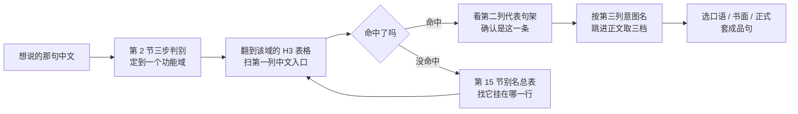
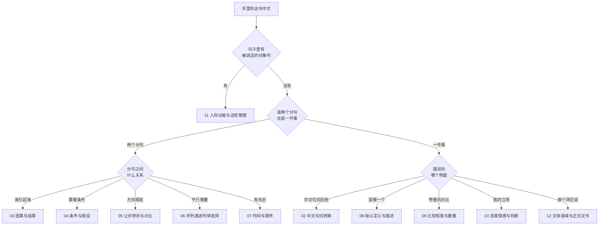
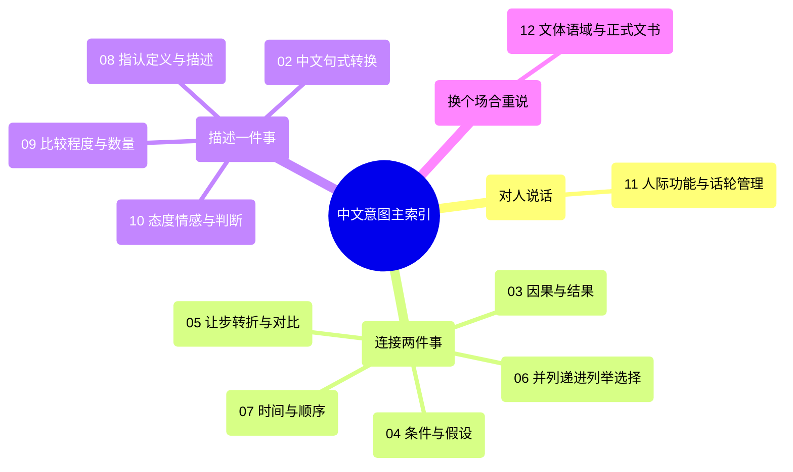
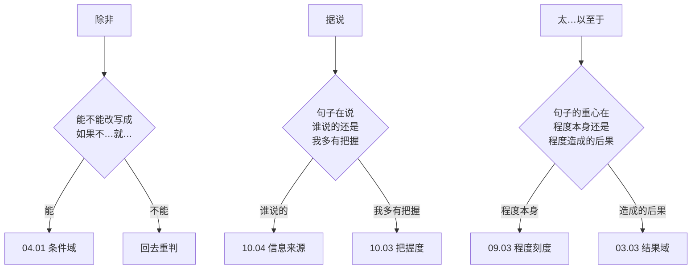
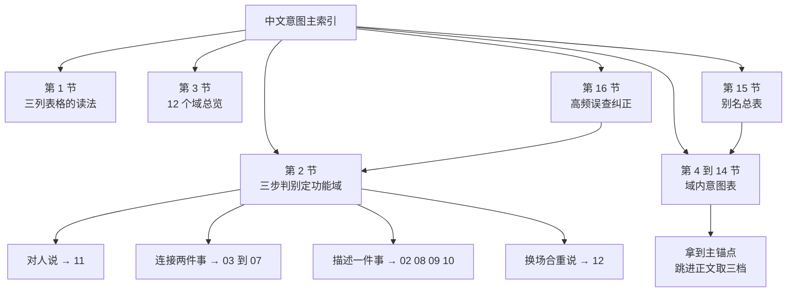

# 中文意图主索引：全部意图按功能域速查

> [!info] 本篇定位
>
> 这是全手册唯一一份从中文那一侧进的总目录。手册 `02` 到 `12` 十一个内容分类里的每一条中文意图，都能在这里查到它的代表句架和主锚点。
>
> 本篇不收任何新模板：三档成品句在各篇正文里，语法解释在 `02.英语基础语法`。这里只负责把「我想说的这句中文」变成一个可以跳过去的位置。
>
> 读完能查到：一句中文属于哪个功能域、这个域里哪一条意图管它、代表句架长什么样、跳到哪一篇的哪一个意图块。反方向从语法名称进的入口在 [[01.手册导航与索引/03.语法类别反查表：从语法名称切回意图篇目\|语法类别反查表]]。

---

## 1. 本篇导读：三列索引的读法

索引正文全部是三列表格，每个 H3 对应手册里的一篇，表格里的每一行对应那篇里的一条意图。

| 列名 | 装什么 | 怎么用 |
| --- | --- | --- |
| 中文入口 | 同一条意图的多个中文说法，用顿号并列 | 想到哪个说法就扫哪个，命中任意一个都算命中这一行 |
| 代表句架 | 这条意图最常用的那一档的骨架 | 用来确认「是这条不是隔壁那条」，不是让你直接抄的成品 |
| 主锚点意图名 | 该篇正文里这条意图块的标题 | 跳过去之后用它在页面里定位 |

三列里最容易被跳过的是第二列。它的作用不是给你句子，是给你**判别依据**——「不如」和「差得远」在中文里都表示比不上，但代表句架一个是 `A is not as adj. as B`，一个是 `A is nowhere near B`，看一眼就知道自己要的是哪条。真正要用的三档成品在正文里，索引不复制。

### 1.1 别名与主锚点的关系

同一个语义允许有多个中文入口，但它们必须指向同一处正文。索引里的处理是：多个说法写在同一行的第一列，第三列只写其中一个作为主锚点。

```text
中文入口：一…就、刚…就、…没多久就、每当…就
主锚点意图名：一…就
```

这四个说法在正文里是同一个意图块，标题叫「一…就」。索引不给「刚…就」单独开一行，因为开了就会有两处正文要维护，而两处正文迟早会不一致。入口冗余是特性，正文冗余是缺陷。

全手册的别名合并情况汇总在第 15 节，不确定某个说法归到哪一行时先查那张表。

### 1.2 锚点编号约定

第三列只写意图名，不写篇号，因为篇号已经由 H3 标题给出。完整锚点的写法是「篇号 · 意图名」：

| 写法 | 含义 |
| --- | --- |
| `05.01 · 虽然但是` | `05.让步、转折与对比` 第 01 篇里标题为「虽然但是」的意图块 |
| `10.04 · 据说` | `10.态度、情感与判断` 第 04 篇里标题为「据说」的意图块 |
| `02.03 · 下雨了` | `02.中文句式转换` 第 03 篇里标题为「下雨了」的意图块 |

每个 H3 的开头一行给出该篇的完整 wiki 链接，点进去之后用第三列的意图名在页内搜索即可。

### 1.3 查一条中文的完整链路



这条链路里有两个回头箭头值得注意。一个是判别不出功能域时不要硬猜，直接去第 15 节按说法查别名；另一个是命中之后必须看第二列再确认一次，因为中文的同一串字经常横跨两个域——「结果」既可以是因果域的结果，也可以是并列域的最后一项。确认代表句架能省掉一次跳错页的往返。

---

## 2. 我要说的这句中文属于哪个域

功能域一共 12 个，靠记忆分类不现实。可靠的做法是回答三个问题，每个问题都只需要看中文句子本身，不需要判断任何语法结构。

### 2.1 第一步：这句话是在对人说，还是在陈述事情

先看有没有明确的对话对象。「你能不能帮我看一下」「我有个顾虑」「打断一下」这类句子里有一个正在被说话的人，它们的落点在 `11.人际功能与话轮管理`，不必再往下走两步。

判据是：把句子里的第二人称去掉之后，句子还成立吗。「你最好早点走」去掉「你」就不成立，属于人际域；「他最好早点走」是在陈述建议内容，另说。

### 2.2 第二步：这句话在连接两件事，还是在描述一件事

有两个分句、并且分句之间有关系词（因为、如果、虽然、而且、当…的时候）的，属于逻辑关系域，落在 `03` 到 `07` 五个域之一。只描述一件事、一个东西、一个状态的，落在 `02`、`08` 到 `10` 与 `12`。

### 2.3 第三步：分流到具体的域

连接两件事的，按关系性质分流：

| 关系性质 | 中文标志 | 域 |
| --- | --- | --- |
| 一件事造成另一件事 | 因为、由于、导致、所以、以至于 | `03.因果与结果` |
| 一件事的成立要看另一件 | 如果、只要、除非、要不是、取决于 | `04.条件与假设` |
| 两件事方向相反 | 虽然、但是、相比之下、恰恰相反 | `05.让步、转折与对比` |
| 两件事平行堆叠 | 而且、不仅、第一第二、要么 | `06.并列、递进、列举与选择` |
| 两件事有先后 | 当…的时候、一…就、后来、花了多久 | `07.时间与顺序` |

描述一件事的，按描述侧面分流：

| 描述侧面 | 中文标志 | 域 |
| --- | --- | --- |
| 中文说法本身直译不过去 | 被、把、无主语、连动、了过着在、语气词 | `02.中文句式转换` |
| 说清楚是哪一个、是什么、在哪儿 | …的那个、是指、由…组成、看起来像、在…上 | `08.指认、定义与描述` |
| 带量的对比与刻度 | 比、越来越、太…了、大约、占三成 | `09.比较、程度与数量` |
| 说话人的立场与把握 | 我觉得、真是太、重要的是、肯定是、据说 | `10.态度、情感与判断` |
| 换一个场合重说同一句 | 邮件、规范、论文、条款 | `12.文体、语域与正式文书` |



这棵树的第一个岔口刻意放的是人际域而不是逻辑关系，原因是人际句里也全是逻辑关系。「要不是你提醒我早就忘了」在结构上是含蓄条件，但你要的是当面说给人听的那一句，落在条件域会拿到一份书面成品，语域对不上。先判对象再判结构，能挡掉最常见的一类跳错。

第二个岔口用的是分句数量而不是关系词有无。中文里大量逻辑关系不带关系词——「他没经验，学得快」两个分句之间是让步关系但一个字都没写出来。数分句比找关系词可靠。

---

## 3. 十二个功能域总览

| 域 | 篇数 | 覆盖范围 | 典型中文入口 |
| --- | --- | --- | --- |
| `02` 中文句式转换 | 6 | 母语干扰最集中的六类中文句式 | 被…了、把…放在、下雨了、我让他去、我明白了、一举两得 |
| `03` 因果与结果 | 3 | 说原因、把结果算到原因头上、从结果说起 | 因为、由于、导致、因此、以至于 |
| `04` 条件与假设 | 4 | 真实条件、反事实、含蓄条件、看情况 | 如果、只要、除非、要是就好了、取决于 |
| `05` 让步、转折与对比 | 3 | 让步六入口、软化与反预期、对比与反驳 | 虽然、尽管、话虽如此、相比之下、恰恰相反 |
| `06` 并列、递进、列举与选择 | 3 | 递进追加、列举步骤、选言排除 | 而且、不仅、第一第二、要么、除了 |
| `07` 时间与顺序 | 3 | 时间关系、时序推进、时长频率期限 | 当…的时候、一…就、终于、花了多久 |
| `08` 指认、定义与描述 | 5 | 锁定是哪一个、定义命名、构成分类、外观、方位 | …的那个人、X 是指、由…组成、看起来像、在…上 |
| `09` 比较、程度与数量 | 4 | 比较三式、变化量与极值、程度刻度、数量统计 | 比、越来越、太…了、大约、占三成 |
| `10` 态度、情感与判断 | 4 | 情绪反应、价值判断、把握度、信息来源 | 我觉得、重要的是、肯定是、据说 |
| `11` 人际功能与话轮管理 | 7 | 建议请求、澄清追问、插话改口、提问、异议、意愿、进度 | 我建议、没听清、打断一下、我有个顾虑、我打算 |
| `12` 文体、语域与正式文书 | 5 | 语域升降、邮件、技术规范、学术、法律与回指 | 换个正式说法、附件是、默认值是、本文提出、除非另有约定 |



这张图把 12 个域压成四堆，对应第 2 节三步判别的四个出口。记住这四堆比记住 12 个域号有用得多：真正需要在脑子里完成的判断只有「对人说 / 连接两件事 / 描述一件事 / 换场合」四选一，选完之后剩下的分流靠翻表完成。

`02.中文句式转换` 挂在「描述一件事」下面是个折中。它实际上横跨全部四堆——被字句可以出现在任何域的任何一句里。之所以还是把它单列成域，是因为中文母语者用它当入口的时机很明确：**当你已经想好了中文、开口却卡住的时候**。卡在被、把、无主语、连动这四处的比例远高于其他地方。

---

## 4. 域 02：中文句式转换

母语干扰的重灾区。这一域的六篇不按功能分，按中文句式本身分——入口是「我这句中文长这样」，出口是英文该用哪个结构。

### 4.1 02.01 被字句与隐性被动

目标篇目：[[02.中文句式转换/01.被字句与隐性被动：被…了、让人给…了、饭做好了\|被字句与隐性被动：被…了、让人给…了、饭做好了]]

| 中文入口 | 代表句架 | 主锚点意图名 |
| --- | --- | --- |
| 被…了、给…了、挨…了 | sth got + p.p. | 被…了 |
| 让…给…了、叫…给…了 | sth got + p.p. + by sb | 让…给…了 |
| 饭做好了、票卖完了、问题解决了 | sth is + p.p. | 饭做好了 |
| 这块儿被改过、有人动过 | sth has been + p.p. | 被改过 |
| 让雨淋了、被晒黑了 | sb got caught in sth | 让雨淋了 |
| 这事被推迟了、往后挪了 | sth has been pushed back | 被推迟了 |
| 没人通知我、谁都没告诉我 | I wasn't told about sth | 没人通知我 |
| 我手机被摔了、杯子被我打了 | I dropped sth | 换主语重写 |
| 会被认为是、容易被误解成 | sth is likely to be taken as | 被认为是 |
| 由谁做的要不要说 | sth was done by sb | by 短语留不留 |
| 正在被处理、还在改 | sth is being + p.p. | 正在被处理 |

### 4.2 02.02 把字句

目标篇目：[[02.中文句式转换/02.把字句：处置式的四条英译出路\|把字句：处置式的四条英译出路]]

| 中文入口 | 代表句架 | 主锚点意图名 |
| --- | --- | --- |
| 把 A 放在 B 上、把 A 搁 B 里 | put A on B | 把…放在 |
| 把 A 改成 B、把 A 换成 B | change A to B | 把…改成 |
| 把它弄蓝、把屏幕调暗 | make sth adj. | 把…弄成 |
| 把他气坏了、把我吓一跳 | drive sb mad | 把…气坏了 |
| 把钱花光了、把电用完了 | use sth up | 把…用完 |
| 把问题解决了、把 bug 修了 | get sth fixed | 把…解决了 |
| 把这段删掉、把文件删了 | delete sth | 把…删掉 |
| 把话说清楚、把意思讲明白 | make oneself clear | 把话说清楚 |
| 把 A 当成 B | treat A as B | 把…当成 |
| 把日志导出来 | export the logs | 把…导出来 |

### 4.3 02.03 无主句、话题优先与主语选择

目标篇目：[[02.中文句式转换/03.无主句、话题优先与主语选择：下雨了、这件事我知道\|无主句、话题优先与主语选择：下雨了、这件事我知道]]

| 中文入口 | 代表句架 | 主锚点意图名 |
| --- | --- | --- |
| 下雨了、天黑了、变冷了 | It's + doing / getting + adj. | 下雨了 |
| 有人敲门、桌上有份文件 | There's sth / sb + 地点 | 有人敲门 |
| 该走了、是时候了 | It's time to do | 该走了 |
| 不许抽烟、禁止入内 | No + doing / Do not + do | 不许抽烟 |
| 轮到你了、到我了 | It's your turn | 轮到你了 |
| 出事了、有情况 | Something's come up | 出事了 |
| 早说啊、你倒是说啊 | You should have said so | 早说啊 |
| 一般都这么做、大家都这样 | One usually does sth | 一般都这么做 |
| 这本书我看过了、这事我知道 | I've already read sth | 这本书我看过了 |
| 价格方面再谈、至于… | As for sth, … | 至于 |
| 说到 X | When it comes to X, … | 说到 |
| 他这个人啊 | As a person, he … | 他这个人啊 |
| 这件事是他干的 | It was he who did it | 强调是谁 |

### 4.4 02.04 连动式与兼语式

目标篇目：[[02.中文句式转换/04.连动式与兼语式：去买、站起来走出去、我让他去\|连动式与兼语式：去买、站起来走出去、我让他去]]

| 中文入口 | 代表句架 | 主锚点意图名 |
| --- | --- | --- |
| 去买、去拿、去看看 | go and get sth | 去买 |
| 来帮忙、过来看看 | come to help | 来帮忙 |
| 站起来走出去、拿起来就走 | stood up and walked out | 站起来走出去 |
| 笑着说、点着头听 | say sth, doing | 笑着说 |
| 我让他去、叫他别去 | have sb do sth | 我让他去 |
| 让我看看、让他知道 | Let me have a look | 让我看看 |
| 逼他、迫使他 | force sb to do | 逼他 |
| 我请人来修、找人做 | have sth done | 找人做 |
| 帮我看一下、替我跑一趟 | help sb do sth | 帮我看一下 |
| 我让 CI 跑一遍 | have CI run it | 让…跑一遍 |
| 派他去、安排他做 | assign sb to do | 派他去 |

### 4.5 02.05 「了过着在」与时态选择

目标篇目：[[02.中文句式转换/05.「了过着在」与时态选择：我吃了、他走了三天了\|「了过着在」与时态选择：我吃了、他走了三天了]]

| 中文入口 | 代表句架 | 主锚点意图名 |
| --- | --- | --- |
| 我吃了、我买了 | I had sth / I've had sth | 我吃了 |
| 我明白了、我懂了 | I see / I've got it | 我明白了 |
| 他走了、他不在了 | He's gone | 他走了 |
| 他走了三天了 | He's been away for three days | 他走了三天了 |
| 我以前去过、我尝过 | I've been to sth | 我去过 |
| 他正在写、我在忙 | He's writing sth | 我在忙 |
| 开着灯、门开着 | The light is on | 门开着 |
| 好了、行了、成了 | That's it / All set | 好了 |
| 变好了、变贵了 | sth has got + 比较级 | 变好了 |
| 快下班了 | I'm about to finish | 快…了 |
| 一直在改、改了一下午 | I've been fixing sth | 一直在改 |

### 4.6 02.06 语气词与四字格

目标篇目：[[02.中文句式转换/06.语气词与四字格：吧呢嘛啊怎么译、一举两得怎么说\|语气词与四字格：吧呢嘛啊怎么译、一举两得怎么说]]

| 中文入口 | 代表句架 | 主锚点意图名 |
| --- | --- | --- |
| …吧（提议） | Let's do sth, shall we | 吧 |
| …吧（推测） | I take it sth, right | 吧的推测义 |
| …呢（追问） | What about sth then | 呢 |
| …嘛（理所当然） | Well, sth obviously does | 嘛 |
| …啊（强调） | sth actually does | 啊 |
| 句末的「不过」 | …, though | 句末though |
| 你懂的、你知道的 | you know | 你懂的 |
| 一举两得 | kill two birds with one stone | 一举两得 |
| 因人而异 | vary from person to person | 因人而异 |
| 得不偿失 | not worth it | 得不偿失 |
| 力不从心、无能为力 | there's nothing I can do about sth | 力不从心 |
| 事半功倍 | get twice the result with half the effort | 事半功倍 |
| 迫在眉睫 | sth can't wait | 迫在眉睫 |

---

## 5. 域 03：因果与结果

三篇分管「说原因」「把账算到原因头上」「从结果说起」。介词式与名词化表达是这一域的重心，因为从句式在 `02.英语基础语法` 里已经讲透。

### 5.1 03.01 因为所以

目标篇目：[[03.因果与结果/01.因为所以：原因表达的六档梯度\|因为所以：原因表达的六档梯度]]

| 中文入口 | 代表句架 | 主锚点意图名 |
| --- | --- | --- |
| 因为…所以…、由于 | A because B | 因为所以 |
| 因为（口语，句首） | Since B, A | 既然式因为 |
| 由于、鉴于（书面） | due to sth, A | 由于 |
| 考虑到、鉴于 | Given that B, A | 考虑到 |
| 既然、既然这样 | Now that B, A | 既然 |
| 出于…的考虑 | on account of sth | 出于 |
| A 之所以…是因为… | The reason A is that B | 之所以是因为 |
| 正是因为…才… | It is because B that A | 正是因为 |
| 看…的份上、就冲这个 | seeing as B | 就冲这个 |
| 何况、再说 | especially since B | 何况 |

### 5.2 03.02 导致、引发、归因

目标篇目：[[03.因果与结果/02.导致、引发、归因：把账算在原因头上\|导致、引发、归因：把账算在原因头上]]

| 中文入口 | 代表句架 | 主锚点意图名 |
| --- | --- | --- |
| 导致、造成 | A caused B | 导致 |
| 引起、带来 | A led to B | 引起 |
| 结果造成 | A resulted in B | 结果造成 |
| 触发、引爆 | A triggered B | 触发 |
| 促成、带来（褒义） | A brought about B | 促成 |
| 是…的一个原因、助长 | A contributed to B | 是原因之一 |
| 造成…的局面 | A gave rise to B | 造成局面 |
| 归因于、归结为 | attribute A to B | 归因于 |
| 归功于、多亏 | A is credited to B | 归功于 |
| 怪谁、赖在…头上 | blame A on B | 怪谁 |
| 谁负责这事 | be responsible for sth | 谁负责 |
| 源于、出自 | A stems from B | 源于 |
| 说到底是因为、归根结底 | It comes down to sth | 归根结底 |
| 说明了、解释了 | A accounts for B | 说明了 |
| 这意味着 | This means that … | 这意味着 |
| 由此可见、由此推断 | It follows that … | 由此可见 |

### 5.3 03.03 结果、因此、以至于

目标篇目：[[03.因果与结果/03.结果、因此、以至于：从结果反推与程度致果\|结果、因此、以至于：从结果反推与程度致果]]

| 中文入口 | 代表句架 | 主锚点意图名 |
| --- | --- | --- |
| 所以、于是（口语） | A, so B | 所以 |
| 因此、故而（书面） | A. Therefore, B | 因此 |
| 结果、结果就是 | A. As a result, B | 结果是 |
| 从而、进而 | A, thereby doing B | 从而 |
| 太…以至于（形容词） | so adj. that B | 太…以至于 |
| 太…以至于（名词） | such a adj. n. that B | 太…以至于 |
| 到了…的程度 | to such an extent that B | 到了…的程度 |
| 最终、到头来 | A ended up doing B | 最终 |
| 结果反而、没想到却 | A, only to do B | 结果反而 |
| 代价是、以…为代价 | at the cost of sth | 代价是 |
| 起到…作用 | A plays a role in B | 起到作用 |
| 落得这么个下场 | A ended up adj. | 落得下场 |
| 这么一来 | That way, B | 这么一来 |

---

## 6. 域 04：条件与假设

按中文的时间指向切入，不出现条件句编号。第 04 篇「看情况」是会议里最高频、既有教程覆盖最薄的一块。

### 6.1 04.01 真实条件

目标篇目：[[04.条件与假设/01.真实条件：如果就、只要、一旦、除非、前提是\|真实条件：如果就、只要、一旦、除非、前提是]]

| 中文入口 | 代表句架 | 主锚点意图名 |
| --- | --- | --- |
| 如果…就…、要是…就… | If A, B | 如果就 |
| 只要 | as long as A, B | 只要 |
| 只要（书面） | so long as A, B | 只要 |
| 一旦、只要一 | Once A, B | 一旦 |
| …的那一刻 | The moment A, B | 一旦 |
| 除非 | unless A, B | 除非 |
| 前提是、条件是 | provided that A, B | 前提是 |
| 以…为条件 | on condition that A, B | 前提是 |
| 万一、以防 | in case A, B | 万一 |
| 万一真的（加强） | Should A, B | 万一 |
| 假设、假如说 | Assuming A, B | 假设 |
| 就当是 | Suppose A, then B | 假设 |
| 如果需要、如有必要 | if necessary | 如果需要 |
| 如果可能的话 | if possible / if at all possible | 如果可能 |
| 遇到…的情况下 | in the event of sth | 遇到的情况下 |
| 如果有的话 | if any | 如果有的话 |

### 6.2 04.02 反事实假设

目标篇目：[[04.条件与假设/02.反事实假设：要是就好了、当初要是、混合时间线\|反事实假设：要是就好了、当初要是、混合时间线]]

| 中文入口 | 代表句架 | 主锚点意图名 |
| --- | --- | --- |
| 要是…就好了（现在） | I wish sth were … | 要是就好了 |
| 但愿、真希望 | If only sth would do | 要是就好了 |
| 我要是你 | If I were you, I'd do sth | 我要是你 |
| 当初要是…就不会 | If A had done, B would have done | 当初要是 |
| 早知道、早知如此 | Had I known, I'd have done | 早知道 |
| 当初要是…现在就 | If A had done, B would be … | 混合时间线 |
| 要不是现在这样，当初就 | If A weren't …, B would have done | 混合时间线 |
| 万一真的（低概率将来） | If A were to do, B would do | 万一真的 |
| 就算当初…也不会 | Even if A had done, B wouldn't have | 就算当初 |
| 我宁可当初没 | I'd rather A hadn't done | 我宁可当初没 |
| 换成别人早就 | Anyone else would have done | 换成别人 |

### 6.3 04.03 含蓄条件与省略倒装

目标篇目：[[04.条件与假设/03.含蓄条件与省略倒装：要不是、否则、那样的话\|含蓄条件与省略倒装：要不是、否则、那样的话]]

| 中文入口 | 代表句架 | 主锚点意图名 |
| --- | --- | --- |
| 要不是、多亏了 | But for sth, A would have done | 要不是 |
| 没有…的话 | Without sth, A wouldn't do | 要不是 |
| 要不是有你 | If it weren't for sb, … | 要不是 |
| 当初要不是 | If it hadn't been for sth, … | 要不是 |
| 否则、不然 | A; otherwise B | 否则 |
| 要不然、要不就 | A, or else B | 否则 |
| 那样的话、既然如此 | If so, B | 那样的话 |
| 要是不行的话 | If not, B | 那样的话 |
| 既然是这样 | That being the case, B | 那样的话 |
| 除非出现…否则 | Barring sth, A | 排除式条件 |
| 除非有…不然 | Short of sth, A | 排除式条件 |
| 在没有…的情况下 | Absent sth, A | 排除式条件 |
| 顺利的话 | All being well, A | 顺利的话 |

### 6.4 04.04 取决与看情况

目标篇目：[[04.条件与假设/04.取决与看情况：视…而定、说不好得看\|取决与看情况：视…而定、说不好得看]]

| 中文入口 | 代表句架 | 主锚点意图名 |
| --- | --- | --- |
| 看情况、说不好 | It depends | 看情况 |
| 视…而定、要看 | depending on sth | 视而定 |
| 取决于是不是 | It depends on whether … | 取决于 |
| 受制于、以…为准 | be subject to sth | 受制于 |
| 由…决定、你说了算 | It's up to sb | 你说了算 |
| 系于、成败在于 | hinge on sth | 系于 |
| 以…为前提（正式） | be contingent on sth | 以为前提 |
| 随…变化 | vary with sth | 随变化 |
| 跟…没关系 | have nothing to do with sth | 跟没关系 |
| 跟…有关 | be related to sth | 跟有关 |
| 成正比、相关 | correlate with sth | 相关 |
| 与…一致 | be consistent with sth | 与一致 |
| 与…冲突 | conflict with sth | 冲突 |
| 对得上、能映射 | map to sth | 对得上 |
| 兼容、配得上 | be compatible with sth | 兼容 |
| 互不影响、独立 | be independent of sth | 互不影响 |

---

## 7. 域 05：让步、转折与对比

第 01 篇是让步的六个入口，第 02 篇是本手册相对既有教程的增量主体，第 03 篇管对比与反驳。

### 7.1 05.01 虽然但是

目标篇目：[[05.让步、转折与对比/01.虽然但是：让步的六种入口与语域分档\|虽然但是：让步的六种入口与语域分档]]

| 中文入口 | 代表句架 | 主锚点意图名 |
| --- | --- | --- |
| 虽然…但是… | Although A, B | 虽然但是 |
| 尽管（从句） | Though A, B | 虽然但是 |
| 明明…却… | Even though A, B | 明明却 |
| 尽管有（介词） | Despite sth, B | 尽管有 |
| 不顾、不管有 | In spite of sth, B | 尽管有 |
| 纵然有（正式） | Notwithstanding sth, B | 尽管有 |
| 就凭他那点、以他的… | For all his sth, B | 就凭 |
| 即使…也… | Even if A, B | 即使也 |
| 而（对比性让步） | while A, B | 而 |
| 不管…都、无论 | No matter how adj., B | 不管都 |
| 无论谁、无论什么 | Whoever does A, B | 无论谁 |
| 无论在哪儿 | Wherever A, B | 无论哪儿 |
| 再怎么…也 | However much A, B | 再怎么也 |
| 尽管…（倒装让步） | Adj. as A is, B | 倒装让步 |

### 7.2 05.02 话虽如此、退一步说、表面上实际上

目标篇目：[[05.让步、转折与对比/02.话虽如此、退一步说、表面上实际上：软化与反预期\|话虽如此、退一步说、表面上实际上：软化与反预期]]

| 中文入口 | 代表句架 | 主锚点意图名 |
| --- | --- | --- |
| 话虽如此 | That said, B | 话虽如此 |
| 说是这么说 | Having said that, B | 话虽如此 |
| 话说回来 | Then again, B | 话说回来 |
| 反正、不管怎么说 | Anyway, B | 反正 |
| 无论如何 | In any case, B | 反正 |
| 尽管如此我还是 | Even so, I still do sth | 尽管如此 |
| 只是有一点 | The only thing is that B | 只是有一点 |
| 可惜、美中不足 | It's a shame that B | 可惜 |
| 退一步说 | Even if we grant that A, B | 退一步说 |
| 就算真是这样 | Even assuming A, B | 退一步说 |
| 诚然 A 但是 B | Admittedly A, but B | 诚然但是 |
| 固然 A 然而 B | It's true that A, yet B | 固然然而 |
| 与其说 A 不如说 B | It's more B than A | 与其说不如说 |
| 表面上…实际上 | On the surface A, but in fact B | 表面上实际上 |
| 看着像…其实 | A may look …, but B | 表面上实际上 |
| 虽然不理想但至少 | At least B | 至少 |
| 说是这么说做起来难 | Easier said than done | 说起来容易 |
| 不但没…反而 | Far from doing A, B | 不但没反而 |
| 非但不…还 | Instead of doing A, B | 不但没反而 |
| 再怎么也要 | I'd still do sth no matter what | 再怎么也要 |

### 7.3 05.03 相比之下、恰恰相反、另一方面

目标篇目：[[05.让步、转折与对比/03.相比之下、恰恰相反、另一方面：对比与反驳\|相比之下、恰恰相反、另一方面：对比与反驳]]

| 中文入口 | 代表句架 | 主锚点意图名 |
| --- | --- | --- |
| 而、却（对比从句） | A, whereas B | 而 |
| 一个…另一个… | A, while B | 而 |
| 相比之下 | In contrast, B | 相比之下 |
| 比较起来 | By comparison, B | 相比之下 |
| 反过来 | Conversely, B | 反过来 |
| 另一方面 | On the other hand, B | 另一方面 |
| 跟…不一样 | Unlike sth, B | 跟不一样 |
| 和…相比 | Compared with sth, B | 和相比 |
| 恰恰相反 | On the contrary, B | 恰恰相反 |
| 才不是呢、差远了 | Far from it | 恰恰相反 |
| 不是 A 而是 B | not A but rather B | 不是而是 |
| 硬要说的话 | If anything, B | 硬要说的话 |
| 而不是 | instead of doing A | 而不是 |
| 与其 A 不如 B | rather than A, B | 而不是 |
| 不过、只是（轻） | A, but B | 不过 |
| 句末的「不过」 | A. B, though | 不过 |
| 然而（强） | A. However, B | 然而 |
| 尽管如此（强，书面） | A. Nevertheless, B | 然而 |
| 话虽如此（强，正式） | A. Nonetheless, B | 然而 |

---

## 8. 域 06：并列、递进、列举与选择

写邮件第二句就要用的一域。三篇分管递进追加、列举与步骤、选言与例外。

### 8.1 06.01 而且、不仅而且、更进一步

目标篇目：[[06.并列、递进、列举与选择/01.而且、不仅而且、更进一步：递进与追加\|而且、不仅而且、更进一步：递进与追加]]

| 中文入口 | 代表句架 | 主锚点意图名 |
| --- | --- | --- |
| 而且、还、又 | A and B | 而且 |
| A 和 B 都 | both A and B | 都 |
| 以及、连同 | A as well as B | 以及 |
| 不仅…而且… | not only A but also B | 不仅而且 |
| 不但…（句首倒装） | Not only does A do …, B | 不仅而且 |
| 除此之外 | Besides, B | 除此之外 |
| 另外（书面） | In addition, B | 除此之外 |
| 更重要的是 | What's more, B | 更重要的是 |
| 更关键的是 | More importantly, B | 更重要的是 |
| 再加上、在这基础上 | On top of that, B | 再加上 |
| 而且（正式） | Moreover, B | 而且的正式档 |
| 进一步说 | Furthermore, B | 而且的正式档 |
| 更别提、更不用说 | let alone doing sth | 更别提 |
| 就这一点而言也是 | for that matter | 就此而言 |
| 再说、顺带一提 | Besides, B / By the way, B | 再说 |
| 同样、也一样 | Likewise, B | 同样 |

### 8.2 06.02 第一第二最后、包括以下

目标篇目：[[06.并列、递进、列举与选择/02.第一第二最后、包括以下、按…顺序：列举与步骤\|第一第二最后、包括以下、按…顺序：列举与步骤]]

| 中文入口 | 代表句架 | 主锚点意图名 |
| --- | --- | --- |
| 第一、第二、最后 | First, … Second, … Finally, … | 第一第二 |
| 首先（正式列举） | Firstly, … Secondly, … | 第一第二 |
| 包括以下、有下面几点 | the following | 包括以下 |
| 如下所示 | as follows | 包括以下 |
| 分别是 | A and B respectively | 分别是 |
| 等等、诸如此类 | and so on / and the like | 等等 |
| 举几个例子 | to name a few | 举几个 |
| 其中包括 | including sth | 其中包括 |
| 除了这些还有别的 | among others | 其中包括 |
| 先做 X | Start by doing X | 先做 |
| 做完之后 | Once that's done, B | 做完之后 |
| 接下来（步骤） | From there, B | 接下来 |
| 最后一步 | The last thing you need to do is B | 最后一步 |
| 按…顺序 | in order of sth | 按顺序 |
| 依次 | one after another | 依次 |

### 8.3 06.03 要么要么、除了、二选一

目标篇目：[[06.并列、递进、列举与选择/03.要么要么、除了、二选一：选择、排除与例外\|要么要么、除了、二选一：选择、排除与例外]]

| 中文入口 | 代表句架 | 主锚点意图名 |
| --- | --- | --- |
| 要么…要么… | either A or B | 要么要么 |
| 或者、还是 | A or B | 要么要么 |
| 既不…也不 | neither A nor B | 既不也不 |
| 都不是 | none of them does | 既不也不 |
| 二选一、任选其一 | one or the other | 二选一 |
| 随便哪个都行 | whichever works | 二选一 |
| 除了…都（排除） | except sth | 除了排除义 |
| 除了…以外（句首） | Except for sth, B | 除了排除义 |
| 除了…之外（口语） | apart from sth | 除了排除义 |
| 除了…没别的 | other than sth | 除了排除义 |
| 除了…还（包含） | besides sth | 除了包含义 |
| 在…之外还有 | in addition to sth | 除了包含义 |
| 不包括、不含 | excluding sth | 不包括 |
| …除外（正式） | with the exception of sth | 不包括 |
| 如果有的话 | if any | 如果有的话 |
| 两种都行、怎样都行 | either way | 两种都行 |
| 以上都不是 | none of the above | 以上都不是 |

---

## 9. 域 07：时间与顺序

第 01 篇是时间关系速查，只给成品与时态一行对照；第 02、03 篇是既有教程完全没有的时序推进、时长频率与期限。

### 9.1 07.01 当…的时候、一…就、直到才

目标篇目：[[07.时间与顺序/01.当…的时候、一…就、直到才：时间关系速查\|当…的时候、一…就、直到才：时间关系速查]]

| 中文入口 | 代表句架 | 主锚点意图名 |
| --- | --- | --- |
| 当…的时候 | When A, B | 当的时候 |
| 在…期间、正当 | While A, B | 当的时候 |
| 随着、一边…一边 | As A, B | 随着 |
| 一…就、刚…就 | As soon as A, B | 一…就 |
| …的那一刻 | The moment A, B | 一…就 |
| 一…立刻就 | The instant A, B | 一…就 |
| 每当…就、每次 | Whenever A, B | 每当 |
| 每一次 | Every time A, B | 每当 |
| 在…之前 | Before A, B | 在之前 |
| 在…之后 | After A, B | 在之后 |
| 自从 | Since A, B | 自从 |
| 直到…才 | Not until A did B | 直到才 |
| 一直到…为止 | until A | 直到 |
| 到…的时候已经 | By the time A, B had done | 到的时候 |
| 下次…的时候 | Next time A, B | 下次 |
| 上次…的时候 | Last time A, B | 上次 |
| 还没…就… | Hardly had A when B | 还没就 |
| 刚…就（书面倒装） | No sooner had A than B | 还没就 |

### 9.2 07.02 起初、后来、终于、迟早

目标篇目：[[07.时间与顺序/02.起初、后来、终于、迟早：时序推进与阶段\|起初、后来、终于、迟早：时序推进与阶段]]

| 中文入口 | 代表句架 | 主锚点意图名 |
| --- | --- | --- |
| 起初、一开始 | At first, B | 起初 |
| 最初（书面） | Initially, B | 起初 |
| 后来、之后 | Later, B | 后来 |
| 随后（正式） | Subsequently, B | 后来 |
| 与此同时 | Meanwhile, B | 与此同时 |
| 在这期间 | In the meantime, B | 与此同时 |
| 终于、总算 | Finally, B | 终于 |
| 最终（经过波折） | Eventually, B | 终于 |
| 到头来 | In the end, B | 终于 |
| 从那以后 | Since then, B | 从那以后 |
| 打那时起 | From then on, B | 从那以后 |
| 自那之后一直 | Ever since, B | 从那以后 |
| 迟早、早晚 | Sooner or later, B | 迟早 |
| 必然会、肯定要 | be bound to do | 迟早 |
| 曾经有段时间 | There was a time when A | 曾经有段时间 |
| 我以前经常 | I used to do sth | 我以前经常 |
| 在此之前我从没 | I had never done sth until then | 在此之前 |

### 9.3 07.03 花了多久、每隔一次、快要了

目标篇目：[[07.时间与顺序/03.花了多久、每隔一次、快要了、到…为止：时长、频率与期限\|花了多久、每隔一次、快要了、到…为止：时长、频率与期限]]

| 中文入口 | 代表句架 | 主锚点意图名 |
| --- | --- | --- |
| 花了多久、用了多长时间 | It took sb 时间 to do sth | 花了多久 |
| 我花了三小时做 | I spent three hours doing sth | 我花了 |
| 这事要花我三小时 | sth takes me three hours | 要花多久 |
| 这个花了我三百 | sth cost me 300 | 花了多少钱 |
| 持续了、长达 | for + 时段 | 持续了 |
| 在…期间 | during sth | 在期间 |
| 整个…都 | throughout sth | 整个都 |
| 在…之内 | within + 时段 | 之内 |
| 在…这段时间里 | over the past + 时段 | 这段时间 |
| 每隔一天、每隔一个 | every other day | 每隔一次 |
| 每周一次 | once a week | 每周一次 |
| 一天两次 | twice a day | 一天两次 |
| 快要了、马上就 | be about to do | 快要了 |
| 眼看就要 | be on the verge of doing | 快要了 |
| 到…为止 | by + 时间点 | 到为止 |
| 不迟于 | no later than + 时间点 | 不迟于 |
| 自…起 | as of + 时间点 | 自起 |
| 有多久没…了 | It's been 时段 since sb did sth | 有多久没 |

---

## 10. 域 08：指认、定义与描述

想说「就是那个…」时的一整套。第 05 篇的空间方位与路径在既有三套教程里零覆盖。

### 10.1 08.01 …的那个人、那种东西

目标篇目：[[08.指认、定义与描述/01.…的那个人、那种东西：一句话锁定是哪一个\|…的那个人、那种东西：一句话锁定是哪一个]]

| 中文入口 | 代表句架 | 主锚点意图名 |
| --- | --- | --- |
| …的那个人 | the one who does sth | 的那个人 |
| 那个负责…的 | the person in charge of sth | 的那个人 |
| …的那种东西 | the kind of thing that does sth | 的那种东西 |
| 我买的那个 | the one I bought | 我买的那个 |
| 我说的那个 | the one I mentioned | 我说的那个 |
| 我去过的那个地方 | the place where sb did sth | 那个地方 |
| 我认识他的那一年 | the year when sb did sth | 那一年 |
| 这就是…的原因 | the reason why sth happens | 的原因 |
| 用来…的工具 | the tool you use to do sth | 用来的工具 |
| 我用它…的那个办法 | the way I do sth | 那个办法 |
| 其中有些 | some of which do sth | 其中有些 |
| 其中大部分 | most of whom do sth | 其中有些 |
| X，也就是那个… | X, who does sth | 补说式 |
| 这件事让我…（指整句） | …, which made sb do sth | 指代整句 |
| 他提到的那个人 | the guy he was talking about | 介词后置 |
| 谁的…的那个 | the one whose sth is … | 谁的那个 |

### 10.2 08.02 X 是指、所谓、又称

目标篇目：[[08.指认、定义与描述/02.X 是指、所谓、又称、相当于：定义与命名\|X 是指、所谓、又称、相当于：定义与命名]]

| 中文入口 | 代表句架 | 主锚点意图名 |
| --- | --- | --- |
| X 是指、X 的定义是 | X is defined as sth | X是指 |
| X 说的是 | X refers to sth | X是指 |
| 所谓的 X | the so-called X | 所谓 |
| 又称、也叫 | X is also known as Y | 又称 |
| 我们把它叫做 | We call it Y | 又称 |
| 相当于、等价于 | X is equivalent to Y | 相当于 |
| 差不多就是 | X is basically Y | 相当于 |
| 把 A 看成 B | think of A as B | 把看成 |
| 换句话说 | In other words, B | 换句话说 |
| 也就是说 | That is to say, B | 换句话说 |
| 具体来说 | Specifically, B | 具体来说 |
| 准确地说 | To be precise, B | 具体来说 |
| 举例来说 | For instance, B | 举例来说 |
| 以 X 为例 | Take X for example | 以为例 |
| 那个…（想不起单词） | the thing you use to do sth | 绕说 |
| 就是…那种感觉 | it's like doing sth | 绕说 |
| 有一种可能是 | the possibility that B | 同位名词 |

### 10.3 08.03 由…组成、分为、包括

目标篇目：[[08.指认、定义与描述/03.由…组成、分为、包括、属于：构成、分类与范围界定\|由…组成、分为、包括、属于：构成、分类与范围界定]]

| 中文入口 | 代表句架 | 主锚点意图名 |
| --- | --- | --- |
| 由…组成 | X consists of A and B | 由组成 |
| 由…构成 | X is made up of A and B | 由组成 |
| 由…构成（正式） | X is composed of A and B | 由组成 |
| 包含（正式，无 of） | X comprises A and B | 由组成 |
| 分为…类 | X is divided into three types | 分为 |
| 归为…类 | X falls into three categories | 分为 |
| 属于 | X belongs to Y | 属于 |
| 归…管 | X falls under Y | 属于 |
| 包括、含 | X includes A and B | 包括 |
| 其中包括（后置） | X, including A and B | 包括 |
| 就本文而言 | for the purposes of this document | 范围界定 |
| 仅限于 | limited to sth | 仅限于 |
| 不适用于 | does not apply to sth | 不适用于 |
| 不在…范围内 | fall outside the scope of sth | 不在范围内 |
| 就…而言 | in terms of sth | 就而言 |
| 至于…这方面 | as far as sth is concerned | 就而言 |

### 10.4 08.04 看起来像、区别在于、严格来说

目标篇目：[[08.指认、定义与描述/04.看起来像、区别在于、严格来说：外观、类比与限定\|看起来像、区别在于、严格来说：外观、类比与限定]]

| 中文入口 | 代表句架 | 主锚点意图名 |
| --- | --- | --- |
| 看起来像 | It looks like sth | 看起来像 |
| 听着像、摸着像 | It sounds like sth | 看起来像 |
| 大概有…那么大 | about the size of sth | 那么大 |
| 长得像、跟…很像 | X resembles Y | 跟很像 |
| 跟 X 差不多，只是 | similar to X except that B | 差不多只是 |
| A 和 B 的区别在于 | The difference is that B | 区别在于 |
| 不一样的地方是 | where A differs from B | 区别在于 |
| 严格来说 | Strictly speaking, B | 严格来说 |
| 广义上说 | Broadly speaking, B | 广义上说 |
| 理论上…实际上 | Technically A, but in practice B | 理论上实际上 |
| 某种意义上 | In a sense, B | 某种意义上 |
| 基本上可以算 | for all intents and purposes | 基本上算 |
| 说白了 | Put simply, B | 说白了 |

### 10.5 08.05 在…上、穿过、沿着、朝

目标篇目：[[08.指认、定义与描述/05.在…上、穿过、沿着、朝：位置、方位与路径\|在…上、穿过、沿着、朝：位置、方位与路径]]

| 中文入口 | 代表句架 | 主锚点意图名 |
| --- | --- | --- |
| 在…上面（接触） | on sth | 在上面 |
| 在…上方（不接触） | above sth | 在上方 |
| 在…正上方 | over sth | 在上方 |
| 在…里面 | in sth | 在里面 |
| 在…（地点，一个点） | at sth | 在某处 |
| 在…下面 | under sth | 在下面 |
| 在…旁边 | beside sth / next to sth | 在旁边 |
| 在…之间（两者） | between A and B | 在之间 |
| 在…之中（多者） | among sth | 在之中 |
| 穿过（内部） | through sth | 穿过 |
| 穿过（表面） | across sth | 穿过 |
| 越过（上方） | over sth | 越过 |
| 进入 | into sth | 进入 |
| 落到…上 | onto sth | 落到上 |
| 沿着、顺着 | along sth | 沿着 |
| 朝、往 | toward sth | 朝 |
| 经过、路过 | past sth | 经过 |
| 绕过、围着 | around sth | 绕过 |
| 在顶部、在底部 | at the top of sth | 在顶部 |
| 在左边、在右侧 | on the left-hand side | 在左边 |
| 在…区域内 | within the area | 在区域内 |
| 从…到… | from A to B | 从到 |

---

## 11. 域 09：比较、程度与数量

四篇分管比较三式与差额、变化量与极值、程度刻度、数量与统计描述。

### 11.1 09.01 A 比 B 更、不如、一样

目标篇目：[[09.比较、程度与数量/01.A 比 B 更、不如、一样：比较三式与差额\|A 比 B 更、不如、一样：比较三式与差额]]

| 中文入口 | 代表句架 | 主锚点意图名 |
| --- | --- | --- |
| A 比 B 更… | A is 比较级 than B | A比B更 |
| A 没有 B 那么… | A is not as adj. as B | 不如 |
| 不如、比不上 | A is less adj. than B | 不如 |
| A 跟 B 一样… | A is as adj. as B | 一样 |
| 高出…（差额前置） | A is three points higher than B | 差额 |
| 高出…（by 式） | A exceeds B by three points | 差额 |
| 超过、多于 | A exceeds B | 超过 |
| 数量上多于 | A outnumbers B | 超过 |
| 差不多一样 | A is roughly as adj. as B | 差不多一样 |
| 半斤八两 | more or less the same | 差不多一样 |
| 不相上下 | on a par with sth | 差不多一样 |
| 差得远 | A is nowhere near B | 差得远 |
| 根本比不上 | A is no match for B | 差得远 |
| 跟…完全两回事 | a far cry from sth | 差得远 |
| 我更喜欢 A | prefer A to B | 我更喜欢 |
| 我宁愿…也不 | would rather do A than do B | 我宁愿 |

### 11.2 09.02 越来越、越…越、几倍、最…之一

目标篇目：[[09.比较、程度与数量/02.越来越、越…越、几倍、最…之一：变化量与极值\|越来越、越…越、几倍、最…之一：变化量与极值]]

| 中文入口 | 代表句架 | 主锚点意图名 |
| --- | --- | --- |
| 越来越…（短形容词） | 比较级 and 比较级 | 越来越 |
| 越来越…（书面） | increasingly adj. | 越来越 |
| 逐渐、慢慢 | gradually do sth | 越来越 |
| 越…越… | The 比较级 A, the 比较级 B | 越越 |
| 是…的三倍 | A is three times as adj. as B | 几倍 |
| 比…高三倍 | A is three times 比较级 than B | 几倍 |
| 是…的三倍（名词式） | A is three times the size of B | 几倍 |
| 翻了一倍 | A has doubled | 翻倍 |
| 最…的 | the most adj. | 最的 |
| 最…之一 | one of the most adj. 复数名词 | 最之一 |
| 遥遥领先 | by far the best | 遥遥领先 |
| 仅次于 | second only to sth | 仅次于 |
| 排第几 | A ranks third | 排第几 |
| 名列前茅 | A comes in at number three | 排第几 |
| 垫底、落后 | A trails behind B | 垫底 |

### 11.3 09.03 太…以至于、够不够、有点、非常

目标篇目：[[09.比较、程度与数量/03.太…以至于、够不够、有点、非常：程度刻度\|太…以至于、够不够、有点、非常：程度刻度]]

| 中文入口 | 代表句架 | 主锚点意图名 |
| --- | --- | --- |
| 一点也不 | not adj. at all | 一点也不 |
| 丝毫不（正式） | not in the least adj. | 一点也不 |
| 稍微、略微 | slightly adj. | 稍微 |
| 有点、有那么点 | a bit adj. | 有点 |
| 有些（书面） | somewhat adj. | 有点 |
| 还行、还挺 | fairly adj. | 还挺 |
| 挺…的 | pretty adj. | 还挺 |
| 相当 | quite adj. | 相当 |
| 非常、很 | very adj. | 非常 |
| 特别、真的很 | really adj. | 非常 |
| 极其 | extremely adj. | 极其 |
| 无比、难以置信地 | incredibly adj. | 极其 |
| 完全、绝对 | absolutely adj. | 完全 |
| 彻底 | utterly adj. | 完全 |
| 太…不能 | too adj. to do sth | 太不能 |
| 够…做某事 | adj. enough to do sth | 够做 |
| 不够、达不到 | not adj. enough | 不够 |
| 差一点点、没达标 | fall short of sth | 不够 |
| 刚刚好 | just right | 刚刚好 |
| 尽可能 | as adj. as possible | 尽可能 |
| 再好不过 | couldn't be better | 再好不过 |

### 11.4 09.04 大约、超过、占三成、平均

目标篇目：[[09.比较、程度与数量/04.大约、超过、占三成、平均、分别是：数量与统计描述\|大约、超过、占三成、平均、分别是：数量与统计描述]]

| 中文入口 | 代表句架 | 主锚点意图名 |
| --- | --- | --- |
| 大约、差不多 | about 300 | 大约 |
| 大概（口语） | roughly 300 | 大约 |
| 超过、多于 | over 300 | 超过 |
| 不到、少于 | under 300 | 不到 |
| 至少 | at least 300 | 至少 |
| 至多、最多 | at most 300 | 至多 |
| 其中…（后接从句） | of which 20 are … | 其中 |
| 占三成 | A accounts for 30% of B | 占三成 |
| 构成…比例 | A makes up 30% of B | 占三成 |
| 平均 | on average | 平均 |
| 总共、一共 | in total | 总共 |
| 分别是 | A and B respectively | 分别是 |
| 三分之一 | a third of sth | 三分之一 |
| 三分之二 | two-thirds of sth | 三分之一 |
| 打八折 | 20% off | 打折 |
| 上升了（幅度） | rise by 5% | 上升了 |
| 上升到（终值） | rise to 5% | 上升到 |
| 大幅下跌 | a sharp drop in sth | 大幅下跌 |
| 趋于平稳 | level off | 趋于平稳 |
| 在…之间波动 | fluctuate between A and B | 波动 |

---

## 12. 域 10：态度、情感与判断

既有三套教程几乎无对应的一域。「据说 / 研究表明」的主锚点定在第 04 篇，把握度篇只留跳转别名。

### 12.1 10.01 我觉得、真是太、令我惊讶

目标篇目：[[10.态度、情感与判断/01.我觉得、真是太、令我惊讶：评价与情绪反应\|我觉得、真是太、令我惊讶：评价与情绪反应]]

| 中文入口 | 代表句架 | 主锚点意图名 |
| --- | --- | --- |
| 我觉得…（评价） | I find sth adj. | 我觉得 |
| 我觉得做…很难 | I find it hard to do sth | 我觉得 |
| 我把它当成 | I consider sth to be adj. | 我认为是 |
| 真是太…了 | What a adj. n. | 真是太了 |
| 多么…啊 | How adj. sth is | 真是太了 |
| 令我惊讶的是 | To my surprise, B | 令我惊讶 |
| 我很无聊（人） | I'm bored | 我很无聊 |
| 这很无聊（物） | It's boring | 这很无聊 |
| 出乎意料 | It came as a surprise | 出乎意料 |
| 意料之中 | As expected, B | 意料之中 |
| 难怪 | No wonder B | 难怪 |
| 幸好、还好 | Luckily, B | 幸好 |
| 松了口气 | I'm relieved that B | 松了口气 |
| 可惜、遗憾 | It's a pity that B | 可惜 |
| 我后悔 | I regret doing sth | 我后悔 |
| 我受不了了 | I can't stand sth | 我受不了 |
| 我很尴尬 | I felt awkward | 我很尴尬 |
| 我无所谓 | I don't mind either way | 我无所谓 |
| 我太喜欢了 | I'm really into sth | 我太喜欢了 |
| 我服了、我认输 | I give up on sth | 我服了 |

### 12.2 10.02 重要的是、关键在于、值得不值得

目标篇目：[[10.态度、情感与判断/02.重要的是、关键在于、值得不值得：价值判断与聚焦\|重要的是、关键在于、值得不值得：价值判断与聚焦]]

| 中文入口 | 代表句架 | 主锚点意图名 |
| --- | --- | --- |
| 重要的是 | What matters is B | 重要的是 |
| 关键在于 | The key to doing A is B | 关键在于 |
| 重点是 | The point is that B | 重点是 |
| 问题在于 | The problem is that B | 问题在于 |
| 我在意的是 | What I care about is B | 我在意的是 |
| 让我担心的是 | What worries me is B | 我担心的是 |
| 值得做 | sth is worth doing | 值得 |
| 不值得 | sth isn't worth the trouble | 值得 |
| 没必要、白费劲 | There's no point in doing sth | 没必要 |
| 划算、值当 | It pays to do sth | 划算 |
| 他配得上 | sb deserves sth | 配得上 |
| 必须、有必要 | It's essential that sb do sth | 有必要 |
| 势在必行 | It's imperative that sb do sth | 有必要 |
| 本来不用（做了） | sb needn't have done sth | 本来不用 |
| 本来就不用（没做） | sb didn't need to do sth | 本来不用 |

### 12.3 10.03 肯定是、八成、说不定、不可能

目标篇目：[[10.态度、情感与判断/03.肯定是、八成、说不定、不可能：把握度阶梯\|肯定是、八成、说不定、不可能：把握度阶梯]]

| 中文入口 | 代表句架 | 主锚点意图名 |
| --- | --- | --- |
| 肯定是、一定是 | It must be sth | 肯定是 |
| 必然会 | sth is bound to happen | 肯定是 |
| 八成、十有八九 | Most likely, B | 八成 |
| 十有八九会（口语） | The odds are that B | 八成 |
| 大概、可能 | It probably does | 大概 |
| 有可能 | It may do sth | 可能 |
| 说不定 | It might do sth | 说不定 |
| 保不齐 | There's a chance that B | 说不定 |
| 悬、希望不大 | There's a slim chance that B | 悬 |
| 未必、不一定 | not necessarily | 未必 |
| 这不等于说 | It doesn't follow that B | 未必 |
| 不可能 | It can't possibly be sth | 不可能 |
| 我才不信 | I'd be surprised if B | 不可能 |
| 一定是（对过去） | sb must have done sth | 一定是过去 |
| 不可能是（对过去） | sb can't have done sth | 不可能过去 |
| 本来可能（没发生） | sb could have done sth | 本来可能 |
| 差点就 | sb almost did sth | 差点就 |
| 险些 | sb came close to doing sth | 差点就 |
| 看起来像是 | It looks like B | 看起来 |
| 听着像是 | It sounds like B | 听起来 |

### 12.4 10.04 据说、研究表明、据我所知

目标篇目：[[10.态度、情感与判断/04.据说、研究表明、据我所知：信息来源与缓和语\|据说、研究表明、据我所知：信息来源与缓和语]]

| 中文入口 | 代表句架 | 主锚点意图名 |
| --- | --- | --- |
| 据说、听说 | It is said that B | 据说 |
| 据说他…（主语提升） | sb is said to do sth | 据说 |
| 人们认为 | It is believed that B | 人们认为 |
| 一般认为 | It is thought that B | 人们认为 |
| 有人说、传言 | Rumor has it that B | 传言 |
| 据报道 | Reportedly, B | 据报道 |
| 据称（未证实） | Allegedly, B | 据称 |
| 看样子、听说是 | Apparently, B | 看样子 |
| 根据…（来源） | According to sb, B | 根据 |
| 基于…（依据） | based on sth | 基于 |
| 研究表明 | Studies show that B | 研究表明 |
| 数据显示 | The data suggests that B | 研究表明 |
| 结果指出 | The results indicate that B | 研究表明 |
| 研究发现 | Researchers found that B | 研究表明 |
| 图中可见 | As the chart shows, B | 图中可见 |
| 据我所知 | As far as I know, B | 据我所知 |
| 往往、通常 | sb tends to do sth | 往往 |
| 一般来说 | Generally speaking, B | 一般来说 |
| 在某种程度上 | to some extent | 某种程度上 |
| 似乎、看上去 | sth appears to do | 似乎 |

---

## 13. 域 11：人际功能与话轮管理

七篇，全手册篇数最多的一域。第 01 篇与 `04.英语场景` 的功能句型篇有重合，礼貌原理整段让给场景教程，这里只留触发语与三档模板。

### 13.1 11.01 我建议、你最好、能不能帮我

目标篇目：[[11.人际功能与话轮管理/01.我建议、你最好、能不能帮我：建议、请求、许可与委托\|我建议、你最好、能不能帮我：建议、请求、许可与委托]]

| 中文入口 | 代表句架 | 主锚点意图名 |
| --- | --- | --- |
| 我建议 | I'd suggest doing sth | 我建议 |
| 要不要…、要不我们 | Why don't we do sth | 要不我们 |
| 不如…吧 | How about doing sth | 要不我们 |
| 你最好 | You'd better do sth | 你最好 |
| 你应该 | You should do sth | 你应该 |
| 你可以试试 | You could try doing sth | 你可以试试 |
| 能不能帮我 | Could you do sth for me | 能不能帮我 |
| 帮个忙 | Would you mind doing sth | 麻烦你 |
| 我可以…吗 | May I do sth | 我可以吗 |
| 方便的话 | Would it be all right if I did sth | 我可以吗 |
| 我想请你 | I'd like to ask you to do sth | 我想请你 |
| 你介意吗 | Do you mind if I do sth | 你介意吗 |
| 我请你（邀请） | I'd like to invite you to sth | 我请你 |
| 好的没问题 | Sure thing / Happy to | 好的没问题 |
| 婉拒 | I'd love to, but B | 婉拒 |
| 硬拒 | I'm afraid that's not going to work | 硬拒 |

### 13.2 11.02 没听清、你的意思是、我复述一下

目标篇目：[[11.人际功能与话轮管理/02.没听清、你的意思是、我复述一下：澄清、追问与确认理解\|没听清、你的意思是、我复述一下：澄清、追问与确认理解]]

| 中文入口 | 代表句架 | 主锚点意图名 |
| --- | --- | --- |
| 没听清 | Sorry? | 没听清 |
| 再说一遍 | Come again? | 没听清 |
| 说慢点 | Could you say that again more slowly | 说慢点 |
| 你的意思是 | Do you mean sth | 你的意思是 |
| 你说的 X 是指 | What do you mean by X | 你的意思是 |
| 从哪个角度说 | In what sense | 哪个角度 |
| 能详细说说吗 | Could you walk me through it | 详细说说 |
| 举个例子 | Could you give an example | 举个例子 |
| 我复述一下 | So if I'm following, B | 我复述一下 |
| 我理解对了吗 | Just to make sure I've got this right | 理解对了吗 |
| 也就是说（确认） | So you're saying B | 也就是说 |
| 我说明白了吗 | Does that make sense | 说明白了吗 |
| 有听懂的地方吗 | Am I making sense | 说明白了吗 |
| 我不太确定我懂了 | I'm not sure I follow | 我没懂 |

### 13.3 11.03 打断一下、让我想想、说回刚才

目标篇目：[[11.人际功能与话轮管理/03.打断一下、让我想想、说回刚才：插话、拖延、改口与转场\|打断一下、让我想想、说回刚才：插话、拖延、改口与转场]]

| 中文入口 | 代表句架 | 主锚点意图名 |
| --- | --- | --- |
| 打断一下 | Sorry to jump in | 打断一下 |
| 我补充一句 | Can I add something here | 我补充一句 |
| 让我说完 | Hold on, let me finish | 让我说完 |
| 你先说 | Go ahead, you first | 你先说 |
| 让我想想 | Let me think | 让我想想 |
| 怎么说呢 | How should I put this | 怎么说呢 |
| 话到嘴边说不出 | It's on the tip of my tongue | 话到嘴边 |
| 我是说 | I mean, B | 我是说 |
| 或者说、准确讲 | or rather, B | 我是说 |
| 当我没说 | Scratch that | 当我没说 |
| 我换个说法 | Let me rephrase that | 我换个说法 |
| 别误会 | Don't get me wrong | 别误会 |
| 说岔了 | That came out wrong | 说岔了 |
| 顺便说一句 | By the way, B | 顺便说 |
| 回到刚才 | Anyway, back to sth | 回到刚才 |
| 我们继续 | Let's move on | 我们继续 |

### 13.4 11.04 你…吗、什么时候、难道

目标篇目：[[11.人际功能与话轮管理/04.你…吗、什么时候、难道、你知道吗：提问、反问与间接问法\|你…吗、什么时候、难道、你知道吗：提问、反问与间接问法]]

| 中文入口 | 代表句架 | 主锚点意图名 |
| --- | --- | --- |
| 你…吗 | Do you do sth | 你吗 |
| 什么时候、在哪儿 | When does sth happen | 什么时候 |
| 为什么、怎么会 | Why does sth happen | 为什么 |
| …对吧、…是不是 | sth does, doesn't it | 对吧 |
| 是 A 还是 B | Is it A or B | 是A还是B |
| 难道不是吗 | Isn't it adj. | 难道 |
| 你不觉得吗 | Don't you think B | 难道 |
| 你知道…吗（间接） | Do you know if B | 你知道吗 |
| 能告诉我…吗 | Could you tell me what B | 能告诉我吗 |
| 我想问一下 | I was wondering if B | 我想问一下 |
| 麻烦问一下 | Would you mind telling me B | 我想问一下 |
| 从什么时候起 | Since when does sb do sth | 从什么时候起 |
| 这怎么算 | How is that adj. | 这怎么算 |
| 那又怎样 | So what | 那又怎样 |
| 谁说的 | Says who | 谁说的 |
| 到底怎么回事 | What on earth is going on | 到底怎么回事 |

### 13.5 11.05 我有个顾虑、这样不太行、恐怕要延期

目标篇目：[[11.人际功能与话轮管理/05.我有个顾虑、这样不太行、恐怕要延期：异议、负面反馈与坏消息\|我有个顾虑、这样不太行、恐怕要延期：异议、负面反馈与坏消息]]

| 中文入口 | 代表句架 | 主锚点意图名 |
| --- | --- | --- |
| 我有个顾虑 | I have some concerns about sth | 我有个顾虑 |
| 这样不太行 | I'm not sure this works | 这样不太行 |
| 我有不同意见 | I'd push back on that | 我有不同意见 |
| 我不同意（正式） | I'll have to disagree here | 我有不同意见 |
| 提前说一声 | Heads up, B | 提前说一声 |
| 恐怕要延期 | I'm afraid we're going to slip | 恐怕要延期 |
| 结果不太理想 | It didn't go as well as we'd hoped | 结果不理想 |
| 我们决定不做了 | We've decided not to move forward | 决定不做了 |
| 有个坏消息 | I've got some bad news | 坏消息 |
| 不是我决定的 | That wasn't my call | 不是我决定的 |
| 我不知情 | I wasn't aware of sth | 我不知情 |
| 我也没办法 | My hands were tied | 我也没办法 |
| 我尽力了 | I did what I could | 我尽力了 |
| 补救方案是 | What we can do is B | 补救方案 |

### 13.6 11.06 我打算、我决定、本来打算

目标篇目：[[11.人际功能与话轮管理/06.我打算、我决定、我倾向于、本来打算：意愿、计划与落空\|我打算、我决定、我倾向于、本来打算：意愿、计划与落空]]

| 中文入口 | 代表句架 | 主锚点意图名 |
| --- | --- | --- |
| 我打算、我准备 | I'm going to do sth | 我打算 |
| 那我来吧（临时决定） | I'll do sth | 我来吧 |
| 我计划 | I plan to do sth | 我计划 |
| 我有意 | I intend to do sth | 我计划 |
| 我倾向于 | I'm inclined to do sth | 我倾向于 |
| 我决定了 | I've decided to do sth | 我决定了 |
| 就这么定了 | It's settled | 就这么定了 |
| 我应该要（安排） | I'm supposed to do sth | 我应该要 |
| 我本来打算 | I was going to do sth, but B | 我本来打算 |
| 本来应该 | I was supposed to do sth | 本来应该 |
| 原计划是 | I had planned to do sth | 原计划 |
| 最后没做成 | I ended up not doing sth | 最后没做成 |
| 我改主意了 | On second thought, B | 我改主意了 |
| 想了想还是 | I've changed my mind | 我改主意了 |
| 暂定 | tentatively scheduled | 暂定 |
| 先记上、待定 | pencil it in | 暂定 |
| 可能有变 | subject to change | 可能有变 |

### 13.7 11.07 我在做、卡住了、我会、这归谁管

目标篇目：[[11.人际功能与话轮管理/07.我在做、卡住了、我会、我习惯了、这归谁管：进度、能力、习惯与职责\|我在做、卡住了、我会、我习惯了、这归谁管：进度、能力、习惯与职责]]

| 中文入口 | 代表句架 | 主锚点意图名 |
| --- | --- | --- |
| 我在做 | I'm working on sth | 我在做 |
| 做了一半 | I'm halfway through sth | 做了一半 |
| 卡住了 | I'm blocked on sth | 卡住了 |
| 在评审中 | It's in review | 在评审中 |
| 搁置了 | It's on hold | 搁置了 |
| 做完了 | I'm done with sth | 做完了 |
| 我会、我能 | I can do sth | 我会 |
| 我有能力（正式） | I'm able to do sth | 我会 |
| 我设法做到了 | I managed to do sth | 我设法做到 |
| 我擅长 | I'm good at doing sth | 我擅长 |
| 我上手了 | I'm getting the hang of it | 我上手了 |
| 我不太熟 | I'm new to this | 我不太熟 |
| 超出我能力了 | I'm out of my depth | 超出能力 |
| 我以前经常 | I used to do sth | 我以前经常 |
| 我习惯了 | I'm used to doing sth | 我习惯了 |
| 我正在适应 | I'm getting used to doing sth | 我在适应 |
| 这归谁管 | Who's in charge of sth | 这归谁管 |
| 这归…管 | sth falls under sb | 这归谁管 |
| 这是我的责任 | That's on me | 我的责任 |
| 我来负责 | I'll take ownership of sth | 我来负责 |

---

## 14. 域 12：文体、语域与正式文书

第 01 篇教读者自己升降语域，学会之后前面各篇的三档不必逐条硬背；后四篇是三种正式文体加篇章回指。

### 14.1 12.01 语域升降与同义改写

目标篇目：[[12.文体、语域与正式文书/01.语域升降与同义改写：同一句话的三档说法\|语域升降与同义改写：同一句话的三档说法]]

| 中文入口 | 代表句架 | 主锚点意图名 |
| --- | --- | --- |
| 缩略式改全写 | don't 改 do not | 缩略式 |
| 短语动词换单词 | put off 改 postpone | 短语动词换词 |
| 语气降一档 | can 改 could 改 would it be possible | 语气降级 |
| 去掉人称 | 主动改被动 | 去人称 |
| 动词改名词 | decide 改 make a decision | 名词化 |
| 换个正式说法 | I'd appreciate it if you could do sth | 升一档 |
| 换个随便点的说法 | Can you just do sth | 降一档 |
| 什么时候不该升档 | 口语场合别用 in terms of | 别升过头 |

### 14.2 12.02 邮件与消息骨架

目标篇目：[[12.文体、语域与正式文书/02.邮件与消息骨架：开场、过渡、附件、收尾\|邮件与消息骨架：开场、过渡、附件、收尾]]

| 中文入口 | 代表句架 | 主锚点意图名 |
| --- | --- | --- |
| 我写信是为了 | I'm reaching out about sth | 开场 |
| 跟进一下 | Following up on sth | 跟进 |
| 关于上次说的 | As discussed, B | 如之前所说 |
| 附件是 | Please find attached sth | 附件是 |
| 抄送某人 | Looping in sb | 抄送 |
| 有问题联系我 | Let me know if you have questions | 收尾 |
| 先谢了 | Thanks in advance | 收尾 |
| 期待回复 | Looking forward to hearing from you | 收尾 |
| 催一下 | Just checking in on sth | 催办 |
| 确认收到 | Confirming receipt of sth | 确认收到 |
| 约个会 | Would Tuesday work for you | 约会议 |
| 我请假 | I'll be out of office from A to B | 请假 |
| 工作交接 | sb will be covering for me | 交接 |
| 主题行怎么写 | Re: 项目名 + 动作 | 主题行 |

### 14.3 12.03 技术规范与 API 文档

目标篇目：[[12.文体、语域与正式文书/03.技术规范与 API 文档：默认值、返回、抛出、已弃用\|技术规范与 API 文档：默认值、返回、抛出、已弃用]]

| 中文入口 | 代表句架 | 主锚点意图名 |
| --- | --- | --- |
| 默认值是 | sth defaults to X | 默认值 |
| 返回 | sth returns X | 返回 |
| 抛出异常 | sth throws X | 抛出 |
| 优先级高于 | A takes precedence over B | 优先级 |
| 已弃用 | sth is deprecated | 已弃用 |
| 向后兼容 | sth is backward compatible | 向后兼容 |
| 行为未定义 | the behavior is undefined | 未定义 |
| 不保证顺序 | no ordering guarantee | 不保证顺序 |
| 必须（规范） | sth MUST do X | MUST |
| 应该（规范） | sth SHOULD do X | SHOULD |
| 可以（规范） | sth MAY do X | MAY |
| 不得 | sb may not do sth | 不得 |
| 无需、不要求 | sb is not required to do sth | 无需 |
| 有权 | sb is entitled to do sth | 有权 |
| 禁止 | sb is prohibited from doing sth | 禁止 |
| 复现步骤 | Steps to reproduce | 复现步骤 |
| 期望行为 | Expected behavior | 期望行为 |
| 实际行为 | Actual behavior | 实际行为 |

### 14.4 12.04 学术论证

目标篇目：[[12.文体、语域与正式文书/04.学术论证：本文提出、与前人不同、贡献与局限\|学术论证：本文提出、与前人不同、贡献与局限]]

| 中文入口 | 代表句架 | 主锚点意图名 |
| --- | --- | --- |
| 本文提出 | This paper proposes sth | 本文提出 |
| 我们主张 | We argue that B | 我们主张 |
| 我们持…观点 | We take the view that B | 我们主张 |
| 本文范围限定 | We restrict our attention to sth | 范围限定 |
| 就本研究而言 | For the purposes of this study, B | 范围限定 |
| 与前人不同 | Unlike prior work, B | 与前人不同 |
| 与 X 相反 | In contrast to X et al., B | 与前人不同 |
| 贡献有两点 | Our contribution is twofold | 声明贡献 |
| 局限在于 | A limitation of this study is that B | 承认局限 |
| 结果表明（保守） | These results suggest that B | 保守结论 |
| 有待进一步研究 | Further work is needed | 保守结论 |

### 14.5 12.05 法律条款与篇章回指

目标篇目：[[12.文体、语域与正式文书/05.法律条款与篇章回指：除非另有约定、如前所述、前者后者\|法律条款与篇章回指：除非另有约定、如前所述、前者后者]]

| 中文入口 | 代表句架 | 主锚点意图名 |
| --- | --- | --- |
| 除非另有说明 | Unless otherwise specified, B | 除非另有约定 |
| 除非另有约定 | Unless otherwise agreed, B | 除非另有约定 |
| 本协议项下 | hereunder | 本协议项下 |
| 如发生…情形 | In the event that A, B | 如发生 |
| 不影响、不损害 | without prejudice to sth | 不影响 |
| 以…为准 | A shall prevail | 以为准 |
| 自…起生效 | take effect as of 日期 | 生效 |
| 受制于（条款） | subject to sth | 受制于 |
| 为免疑义 | For the avoidance of doubt, B | 为免疑义 |
| 如前所述 | As mentioned above, B | 如前所述 |
| 如下文所述 | As mentioned below, B | 如下文 |
| 上述的 | the aforementioned sth | 上述 |
| 该项、前述 | said sth | 上述 |
| 前者…后者 | the former … the latter | 前者后者 |
| 后面会讲到 | As we will see below, B | 后面会讲到 |

---

## 15. 同义入口别名总表

下面这些说法在中文里各不相同，在英文里落到同一个意图块。索引正文把它们写在同一行，这张表把合并关系单列出来，方便反向确认。

| 别名群 | 主锚点 | 合并理由 |
| --- | --- | --- |
| 一…就、刚…就、…没多久就、每当…就、每次…都 | `07.01 · 一…就` | 都是前一件事触发后一件事，差别只在触发是一次性还是反复 |
| 太…以至于、…得连…都、到了…的程度、以至于 | `03.03 · 太…以至于` | 中文都是程度致果，英文都走 so / such / to such an extent |
| 要不是、多亏了、没有…的话、幸亏有 | `04.03 · 要不是` | 都是把一个未发生的条件当前提反推 |
| 即使…也、就算…也、哪怕…也 | `05.01 · 即使也` | 都是假设性让步，与真实让步的「虽然」分开 |
| 据说、听说、有人说、传言、外面都在说 | `10.04 · 据说` | 都是标明信息不是第一手，不是在表达把握度 |
| 越…越、越来越、逐渐、慢慢地 | `09.02 · 越来越` | 都是量随时间或随另一个量变化 |
| 虽然、尽管、明明…却、话说是这样 | `05.01 · 虽然但是` | 都是承认一个事实再转向反向结论 |
| 由于、鉴于、考虑到、出于…的考虑 | `03.01 · 由于` | 都是介词式或分词式原因，不接完整分句 |
| 看情况、说不好、得看、视…而定、要看是不是 | `04.04 · 看情况` | 都是拒绝给定论并把结论挂到条件上 |
| 而且、还、另外、除此之外、再加上 | `06.01 · 而且` | 都是在已有内容上追加同向内容 |
| 除了…都、除了…以外、除…之外没有 | `06.03 · 除了排除义` | 排除义，与包含义的「除了…还」是两条 |
| 除了…还、在…之外还有、不止 | `06.03 · 除了包含义` | 包含义，与排除义分开挂 |
| 结果是、最后、到头来、落得 | `03.03 · 结果是` | 都是从结果那一端起句 |
| 我觉得、我认为、在我看来、要我说 | `10.01 · 我觉得` | 都是标明这是个人判断 |
| 肯定是、一定是、准是、跑不了 | `10.03 · 肯定是` | 把握度尺的最高一档 |
| 说不定、保不齐、也许、没准 | `10.03 · 说不定` | 把握度尺的中低档 |
| 差点就、险些、差一点没 | `10.03 · 差点就` | 都是对已发生事实的接近程度评估 |
| 打断一下、插一句、我说两句 | `11.03 · 打断一下` | 都是争取话轮 |
| 我是说、或者说、准确讲、我换个说法 | `11.03 · 我是说` | 都是自我修正 |
| 我本来打算、原计划是、本来应该 | `11.06 · 我本来打算` | 都是计划与实际不符 |
| 值得、划算、不亏、有必要 | `10.02 · 值得` | 都是对投入产出的判断 |
| 换句话说、也就是说、我的意思是 | `08.02 · 换句话说` | 都是改述前一句 |
| 分别是、各自是 | `06.02 · 分别是` | 列举场景挂列举篇，统计数字场景另见 `09.04 · 分别是` |
| 严格来说、准确地说、确切讲 | `08.04 · 严格来说` | 都是给前面的说法加限定 |
| 反正、不管怎么说、无论如何 | `05.02 · 反正` | 都是撇开前面的争议直接给结论 |

> [!tip] 别名表的用法
>
> 这张表不是背诵材料，是查不到时的第二次尝试。查一句中文的正常顺序是「三步判别 → 域内表格」，两次都落空再翻这里。
>
> 如果一个说法在这张表里也找不到，多半是它跨了两个域，去第 16 节看看有没有对应的误查条目。

---

## 16. 高频误查纠正

中文和英文对逻辑关系的切分并不重合，有十几处切分线错位得特别厉害。下面每一条都是同一个中文说法容易被送错域的情况。

| 中文说法 | 容易查到的错误位置 | 正确主锚点 | 错位在哪儿 |
| --- | --- | --- | --- |
| 除非 | `05` 让步 | `04.01 · 除非` | 中文「除非」常和「否则」搭配，看着像转折，实际是把条件取反 |
| 据说 | `10.03` 把握度 | `10.04 · 据说` | 「据说」标的是信息来源，不是说话人的把握程度 |
| 太…以至于 | `09.03` 程度刻度 | `03.03 · 太…以至于` | 前半截是程度，整句的重心是致果，落在结果域 |
| 越…越 | `09.01` 比较三式 | `09.02 · 越越` | 比较三式管两个对象之间的高下，这条管一个量随另一个量变 |
| 一…就 | `06` 并列 | `07.01 · 一…就` | 两个动作确实并列，但英文靠时间连词表达，不是 and |
| 差点就 | `04.02` 反事实 | `10.03 · 差点就` | 「差点」说的是对已发生事实的接近度，不是在假设另一条时间线 |
| 逐渐、越来越 | `07.02` 时序推进 | `09.02 · 越来越` | 里面有时间感，但英文用比较级承担，归变化量 |
| 结果反而 | `05.03` 转折 | `03.03 · 结果反而` | 「反而」有转折味，但整句在陈述一个出乎意料的结果 |
| 不但没…反而 | `06.01` 递进 | `05.02 · 不但没反而` | 「不但」看着像递进，加了否定之后整句是反预期 |
| 把 A 看成 B | `02.02` 把字句 | `08.02 · 把看成` | 这个「把」不是处置，是认定，落在定义域 |
| 让我看看 | `11.01` 请求 | `02.04 · 让我看看` | 「让」在这里是兼语标记，不是在向对方请求许可 |
| 值得 | `09.03` 程度 | `10.02 · 值得` | 「值得」是价值判断，不是程度刻度上的一格 |
| 即使…也 | `04.01` 真实条件 | `05.01 · 即使也` | 带 if 的形式，但语义是让步，条件成立结论也不变 |
| 分别是 | `09.04` 统计 | `06.02 · 分别是` | 列举两项以上的对应关系走列举篇；纯数字对应才去统计篇 |
| 说不定 | `04.01` 假设 | `10.03 · 说不定` | 「说不定」不是在设条件，是在给一个把握度 |



三个最容易错的说法各配一个判据。「除非」的判据是能不能改写成「如果不…就…」，能改写就一定是条件；「据说」的判据是句子在交代来源还是在给把握度，两者可以同时出现（据说八成会延期），此时按主句动词落域；「太…以至于」的判据是后半截有没有内容——只有「太…了」没有后续的落程度篇，带「以至于」后续的落结果篇。

> [!warning] 误查纠正的两个反向陷阱
>
> ~~「虽然」一定在让步域~~ ❌ / **「虽然不理想但至少还能用」的重心在「至少」，主锚点是 `05.02 · 至少`** ✅（前半截的让步只是铺垫，真正要说的是后半截的退守）
>
> ~~查不到就换个近义词再查一遍~~ ❌ / **查不到先回第 2 节重判功能域** ✅（换词只会在同一个错误的域里绕圈，换域才有可能命中）

---

## 17. 本篇小结



这张图把全篇压成一条主路加两条补救路。主路是「三步判别 → 域内表 → 主锚点」，两条补救路是查不到时回别名总表、判错域时回三步判别。图里唯一的双向关系是第 16 节指回第 2 节——误查纠正本质上是判别规则的补丁，看过一遍之后三步判别的准确率会明显上去。

> [!success] 本篇核心要点回顾
>
> 1. 索引三列分别是中文入口、代表句架、主锚点意图名；第二列的作用是确认「是这条不是隔壁那条」，不是给你成品。
> 2. 同一条意图的多个中文说法写在同一行，主锚点只有一个；入口冗余是特性，正文冗余是缺陷。
> 3. 三步判别的顺序是：先看有没有被说话的对象，再看是两个分句还是一件事，最后按关系性质或描述侧面分流。
> 4. 12 个域在脑子里只需要压成四堆记：对人说、连接两件事、描述一件事、换场合重说。
> 5. 完整锚点写作「篇号 · 意图名」，篇号由 H3 标题给出，意图名就是正文里那个意图块的标题。
> 6. 查不到时的第一补救是第 15 节别名总表，第二补救是第 16 节误查纠正，都不奏效再回第 2 节重判域。
> 7. 十五条高频误查里，错得最多的是「除非」进让步域、「据说」进把握度、「太…以至于」进程度篇。
> 8. 这份索引不收模板：三档成品在各篇正文，语法解释在 `02.英语基础语法`，场景对话在 `04.英语场景`。

> [!success] 本篇练习清单
>
> - [ ] 给「除非你现在动手，否则赶不上」，先判功能域再写出三档，检查有没有误落到让步域。
> - [ ] 给「据说他八成不来了」，说清这句同时带来源和把握度时主锚点该挂哪一篇，再写出三档。
> - [ ] 给「这活儿累得我话都说不出来」，判断它落程度篇还是结果篇，写出三档。
> - [ ] 给「我本来打算今天推上去的，结果卡在评审了」，拆成两条意图各查一次，各写三档。
> - [ ] 给「让我看看你改的那段」，说清「让」和「你改的那段」分属哪两个域，写出三档。
> - [ ] 给「越早发现越好修」，判断它进比较篇还是变化量篇，写出三档。
> - [ ] 给「附件是上次说的那份，有问题随时找我」，拆成三条意图各查一次，写出三档。
> - [ ] 从第 15 节任选三个别名群，各造一句中文，验证它们确实指向同一个主锚点。

### 17.1 下一篇预告

> [!info] 反方向的入口
>
> 这份索引解决的是「我想说这句中文」。反过来的情况也存在：读到一个句子知道它是定语从句，想找手册里对应的意图篇目；或者在 `02.英语基础语法` 里看完某一章，想找配套的成品句。
>
> 下一篇给的就是这个方向的映射：[[01.手册导航与索引/03.语法类别反查表：从语法名称切回意图篇目\|语法类别反查表：从语法名称切回意图篇目]]
>
> 它直接复用 `02.英语基础语法` 的章节编号作条目 key，不自建第三套语法分类口径，每个语法类别配一个标志性句架当辨认锚点。
