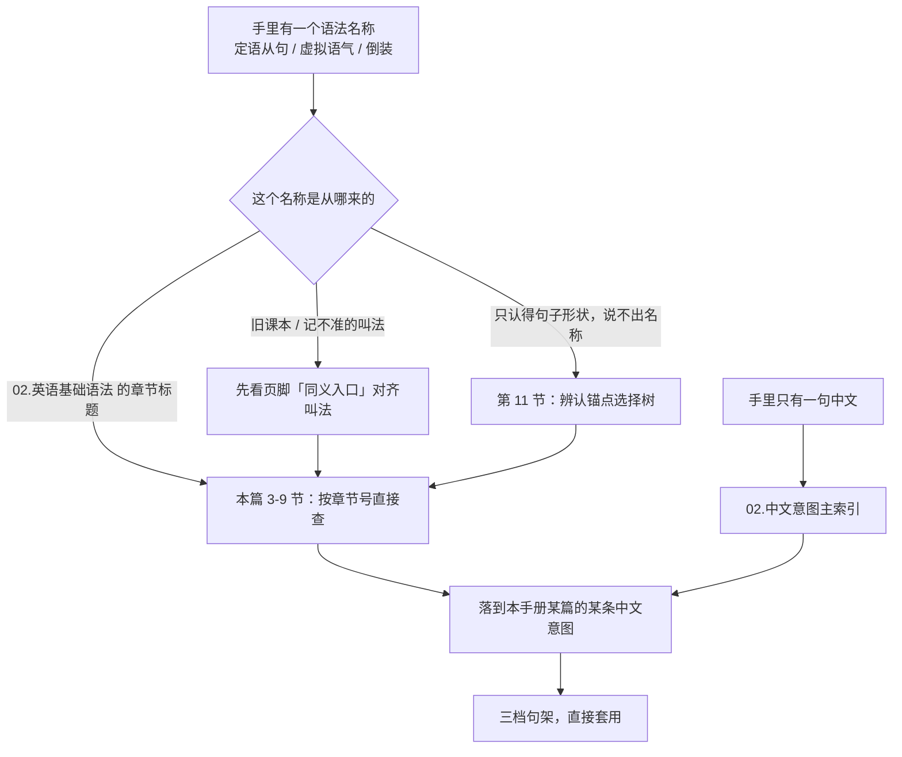
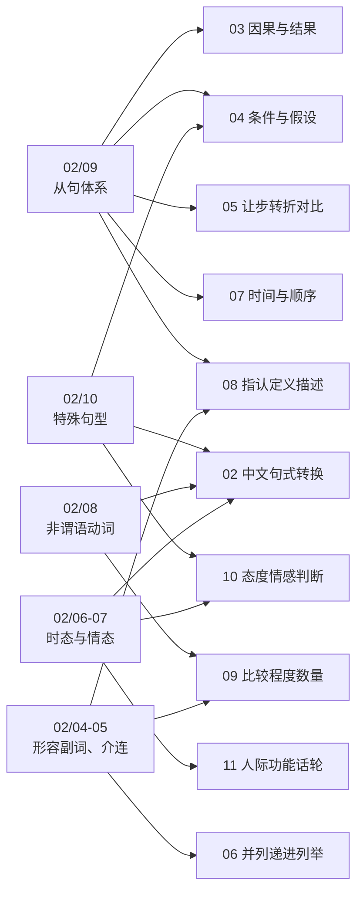
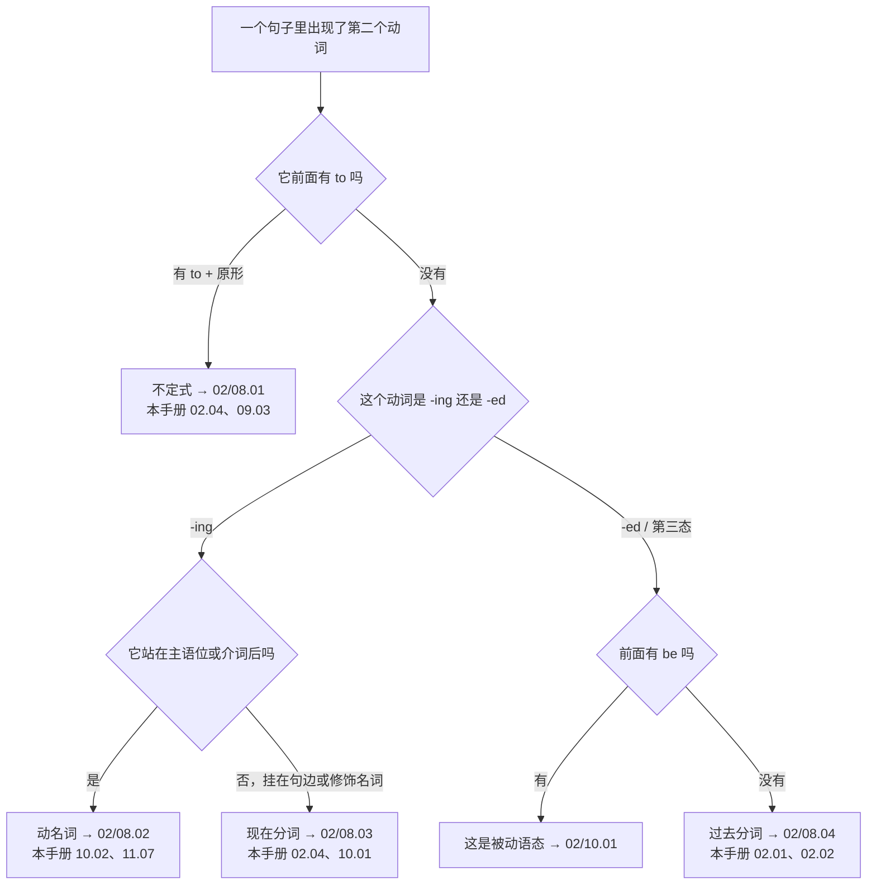
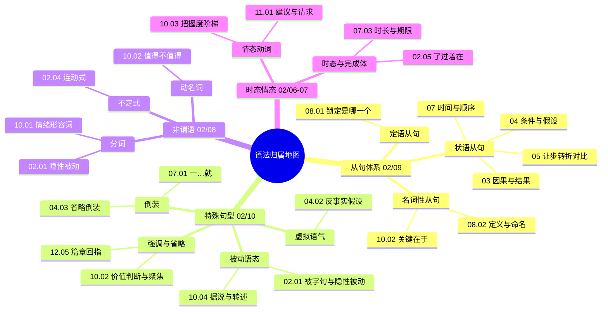
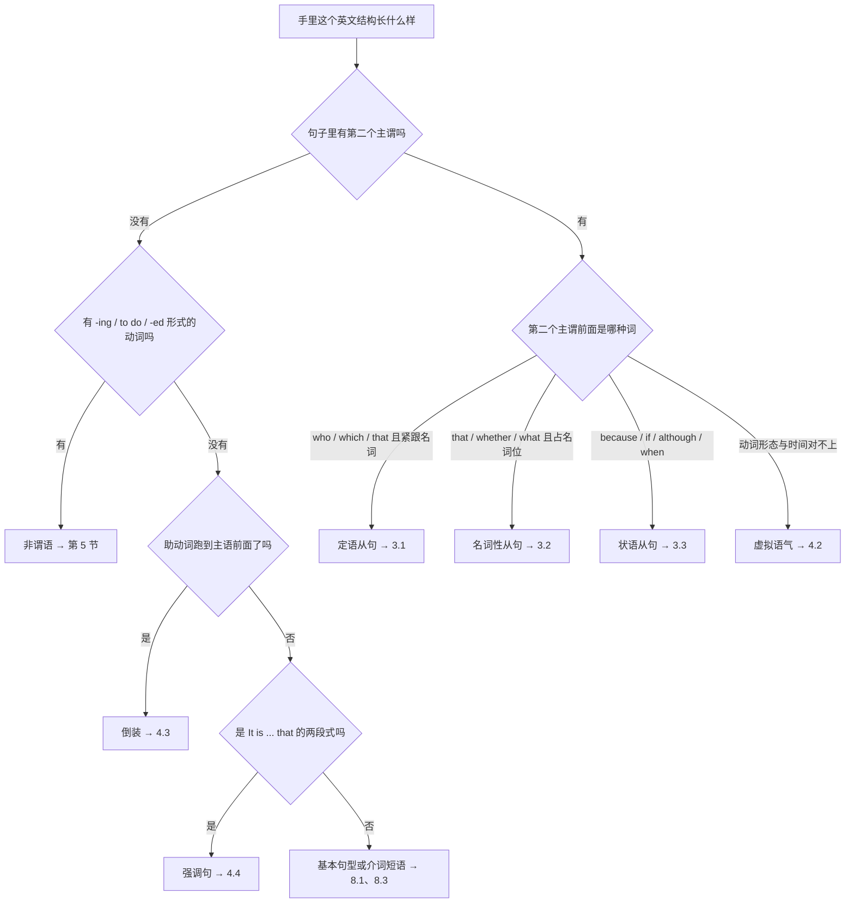
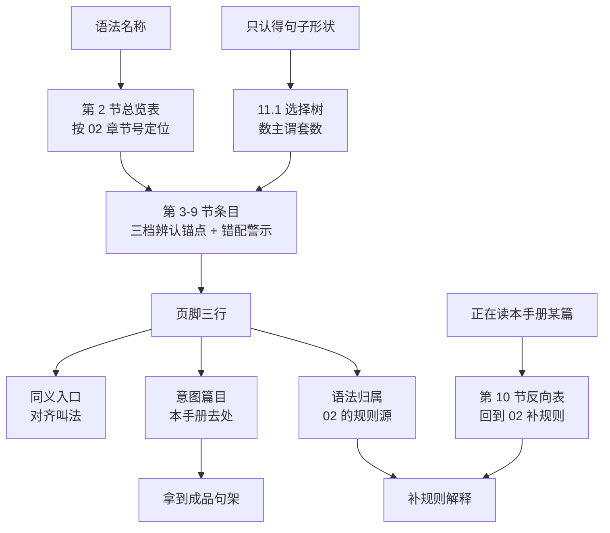

# 语法类别反查表：从语法名称切回意图篇目

> [!info] 本篇定位
>
> 本手册的正门在中文那一侧，这篇是**侧门**。它服务两种人：一种是在别处读到「非限制性定语从句」想知道本手册把它拆成了哪几条中文意图；一种是手里有一个英文句子、认得出它的形状却说不出中文入口该查什么。
>
> 收 27 个语法类别，条目 key 直接抄 `02.英语基础语法` 的章节编号，全库因此只有两套语法分类口径（`02` 一套、`04.英语场景` 一套），本篇不新造第三套。
>
> 每个类别给一个三档辨认锚点句架、一条双向映射（→ 本手册意图篇目、← `02` 的对应篇）、至多两行错配警示。读完能查到：任意一个语法名称对应本手册的哪几篇、哪几条中文入口。
>
> 与另两篇导航的分工：[[01.手册导航与索引/01.本手册怎么用：中文意图入口与三档模板体例\|本手册怎么用]] 讲体例，[[01.手册导航与索引/02.中文意图主索引：全部意图按功能域速查\|中文意图主索引]] 从中文进，本篇从术语进。三篇都不收新模板。

---

## 1. 本篇导读：什么时候从语法名称进

正常查法是从中文进。会走到本篇的只有三种情况。

| 触发情况 | 具体样子 | 本篇给你什么 |
| --- | --- | --- |
| 别处读到术语 | 语法书说「这里要用虚拟语气」 | 虚拟语气在本手册被拆成哪几条中文意图，各在哪篇 |
| 认得形状说不出中文 | 见过 `Had we known...` 但不知道中文该查什么 | 靠三档辨认锚点认出类别，再跳到意图篇目 |
| 要做交叉复习 | 学完 `02/09.从句体系` 想找配套成品句 | 该章的每一小节对应的本手册篇目清单 |

第三种情况值得多说一句：`02` 那五篇从句讲的是规则，读完知道 `whom` 什么时候用，但手上不会多出一句能直接发出去的话。本篇的映射就是把规则章节接到成品句上——读完 `02/09.从句体系/01.定语从句基础`，顺着 3.1 的映射跳到 `08.指认、定义与描述/01`，那里有 110 条可以直接套的骨架。

### 1.1 术语出现在正文里是本篇的特权

全手册有一条硬规矩：正文不许用语法术语作标题或检索键，术语只能出现在每条意图块页脚的「语法归属」那一行。本篇是唯一的例外，因为它的整个功能就是把那些页脚行汇总起来做成反向表。

后果是：**本篇不解释任何一个术语**。看到「同位语从句」不知道是什么，页脚的 `02` 链接点进去看，本篇只负责告诉你它落在本手册的哪一篇。想要术语定义，`02.英语基础语法/13.附录/01.语法术语表` 是全库唯一的定义源。

图里两条入口线最终并到同一个终点 F。这是全手册的设计前提：入口允许冗余，正文不许冗余。同一条「一…就」，从中文进和从「倒装 / `no sooner...than`」进都会落到 `07.时间与顺序/01` 的同一个小节，那里只有一份权威模板。本篇制造的是第三条入口线，不是第三份正文。

---

## 2. 反查表总览：一张表看完 02 的章节号落到哪

先给全表。列一是 `02.英语基础语法` 的章节编号与名称，列二是本手册的去处，列三是本篇的详解位置。

| `02` 章节编号 | 语法名称 | 本手册意图篇目 | 本篇 |
| --- | --- | --- | --- |
| `01/02` | 五大基本句型 | `02.03` 主语选择、`02.04` 连动兼语 | 8.3 |
| `01/03` | 疑问句与否定句 | `11.04` 提问反问间接问法 | 8.4 |
| `02/02` | 名词的数与格 | `09.04` 数量与统计、`08.03` 构成分类 | 9.3 |
| `02/03` | 冠词 | `08.02` 定义命名、`08.03` 范围界定 | 9.1 |
| `03/04` | 不定代词 | `02.03` 无主句、`06.03` 选择排除例外 | 9.2 |
| `03/05` | 数词 | `09.04` 数量与统计描述 | 7.3 |
| `04/02` | 比较级与最高级 | `09.01` 比较三式、`09.02` 变化量与极值 | 7.1 |
| `04/03` | 副词（程度、频度） | `09.03` 程度刻度、`07.03` 频率 | 7.2 |
| `05/01-02` | 介词与介词搭配 | `08.05` 位置方位路径、`03.01` 原因介词式 | 8.1 |
| `05/03` | 连词 | `06.01` 递进追加、`05.03` 对比反驳 | 8.2 |
| `06/04` | 完成时态 | `02.05` 体标记与时态、`07.03` 有多久没 | 6.2 |
| `06/05` | 时态综合辨析 | `02.05`「了过着在」、`07.01` 时间关系 | 6.1 |
| `07/02` | 情态动词 | `10.03` 把握度阶梯、`11.01` 建议请求 | 6.3 |
| `07/03` | 情态动词特殊句型 | `11.06` 意愿计划落空、`10.02` 必要性 | 6.4 |
| `08/01` | 动词不定式 | `02.04` 连动式、`09.03` 太…以至于 | 5.1 |
| `08/02` | 动名词 | `10.02` 值得不值得、`11.07` 习惯 | 5.2 |
| `08/03` | 现在分词 | `02.04` 伴随动作、`10.01` 情绪形容词 | 5.3 |
| `08/04` | 过去分词 | `02.01` 隐性被动、`02.02` 把字句结果 | 5.4 |
| `09/01-02` | 定语从句 | `08.01` 锁定是哪一个 | 3.1 |
| `09/03` | 名词性从句 | `10.02` 关键在于、`08.02` 同位定义 | 3.2 |
| `09/04` | 状语从句 | `03`-`07` 五个逻辑域全覆盖 | 3.3 |
| `10/01` | 被动语态 | `02.01` 被字句与隐性被动、`10.04` 据说 | 4.1 |
| `10/02` | 虚拟语气 | `04.02` 反事实假设、`10.02` 必要性 | 4.2 |
| `10/03` | 倒装句 | `04.03` 省略倒装、`06.01` 递进、`07.01` 一…就 | 4.3 |
| `10/04` | 强调句型 | `10.02` 价值判断与聚焦 | 4.4 |
| `10/05` | 省略与替代 | `04.03` 那样的话、`12.05` 篇章回指 | 4.5 |
| `10/06` | 主谓一致 | `06.03` 选言就近一致、`09.04` 分数主语 | 4.6 |

表里的「本手册意图篇目」用简写编号（`08.01` 指 `08.指认、定义与描述` 的第 01 篇）。完整篇名与可点击链接在下面各节的页脚里。

### 2.1 一对多与多对一都存在

映射不是一一对应。两个方向都会散开。

**一个语法类别散到多篇**：状语从句一章对应本手册五个分类十几篇，因为九类状语在中文入口上根本不是一件事——「因为」和「虽然」查的时候不会想到它们同属一章。

**多个语法类别汇到一篇**：`04.条件与假设/03.含蓄条件与省略倒装` 一篇同时挂着虚拟语气、倒装、省略三个类别的账，因为 `Had it not been for your help` 这一句里三样东西同时在场。

图里最粗的两条流是 `02/09` 和 `02/10` 往外发散，它们各自散到四五个分类。反过来看，`02.中文句式转换` 同时接收 `02/08`、`02/10`、`02/06-07` 三路输入——这正是那六篇难写的原因：中文的一个「了」字，英文那边要动时态、体、被动三套机器。

---

## 3. 从句体系（`02/09`）：三类从句的辨认锚点

### 3.1 定语从句

中文触发语：…的那个人 / …的那种东西 / 就是那个… / 我上次说的那个 / 他提到的那件事 / 其中有几个…

辨认锚点：一个名词后面直接跟一个带主谓的小句，中文里那个小句翻回来是「…的 + 名词」。

| 档位 | 句架 | 例句 |
| --- | --- | --- |
| 口语 | the + n. + [that] + sb + V ... | That's the ticket I filed yesterday. |
| 书面 | the + n. + who/which + V ... | The engineer who wrote this module has left the team. |
| 正式 | the + n. + 介词 + which + ... | The framework upon which the service depends is no longer maintained. |

> [!warning] 错配警示
>
> ❌ ~~The person which called you is waiting.~~ → ✅ **The person who called you is waiting.**（指人只能 who/that，which 只指物）
>
> ❌ ~~My brother, who lives in Berlin, is a doctor.~~ 用来指「我三个哥哥里在柏林那个」 → ✅ **My brother who lives in Berlin is a doctor.**（加逗号就变成「我只有一个哥哥，顺带说他住柏林」，逗号改的是意思不是语气）

同义入口：关系从句 / 关系代词 / relative clause / 限制性与非限制性 / 定语从句进阶里的介词前置
意图篇目：[[08.指认、定义与描述/01.…的那个人、那种东西：一句话锁定是哪一个\|…的那个人、那种东西：一句话锁定是哪一个]]
语法归属：[[02.英语基础语法/09.从句体系/01.定语从句基础\|定语从句基础]]、[[02.英语基础语法/09.从句体系/02.定语从句进阶\|定语从句进阶]]

### 3.2 名词性从句

中文触发语：问题是… / 关键在于… / 我担心的是… / 他说… / 谁来做还没定 / 这样一个事实：…

辨认锚点：一整句话被当成名词用——放在主语位、宾语位、系动词后面或名词后面补说，前面通常有 that、whether、what、who。

| 档位 | 句架 | 例句 |
| --- | --- | --- |
| 口语 | The thing is [that] ... | The thing is, nobody actually owns this service. |
| 书面 | What matters is that ... | What matters is that the rollback worked on the first try. |
| 正式 | It is essential that sb (should) do ... | It is essential that the credentials be rotated every quarter. |

> [!warning] 错配警示
>
> ❌ ~~The problem is because the cache never expires.~~ → ✅ **The problem is that the cache never expires.**（`the problem is` 后面接的是名词性从句，不是原因状语，用 that 不用 because）
>
> ❌ ~~I doubt that he will show up.~~ 表示「我怀疑他不会来」→ ✅ **I doubt whether he will show up.**（doubt 后接 whether 表怀疑，接 that 意思偏向「我不认为」，两者含义相反）

同义入口：主语从句 / 宾语从句 / 表语从句 / 同位语从句 / that 从句 / what 从句
意图篇目：[[10.态度、情感与判断/02.重要的是、关键在于、值得不值得：价值判断与聚焦\|重要的是、关键在于、值得不值得]]、[[08.指认、定义与描述/02.X 是指、所谓、又称、相当于：定义与命名\|X 是指、所谓、又称、相当于]]
语法归属：[[02.英语基础语法/09.从句体系/03.名词性从句详解\|名词性从句详解]]

### 3.3 状语从句

中文触发语：因为 / 如果 / 虽然 / 当…的时候 / 以至于 / 为了 / 像…一样 / 哪里…哪里 / 比…更

辨认锚点：一个完整的句子被一个连词挂到主句上，去掉它主句照样成立。九类状语在语法上同属一章，在本手册里分散到五个功能域。

| 档位 | 句架 | 例句 |
| --- | --- | --- |
| 口语 | A, so B / B because A | The build broke, so I reverted it. |
| 书面 | Although A, B | Although the fix is small, it touches the auth path. |
| 正式 | Given that A, B | Given that the vendor has missed two deadlines, we are reviewing the contract. |

九类状语的分流表如下，这是本篇密度最高的一张：

| 状语类型 | 中文触发语 | 本手册去处 |
| --- | --- | --- |
| 时间 | 当…的时候 / 一…就 / 直到才 / 每当 | `07.01` 时间关系速查 |
| 原因 | 因为 / 既然 / 由于 / 鉴于 | `03.01` 原因表达的六档梯度 |
| 结果 | 以至于 / 因此 / 结果是 | `03.03` 从结果反推与程度致果 |
| 条件 | 如果 / 只要 / 一旦 / 除非 | `04.01` 真实条件 |
| 让步 | 虽然 / 即使 / 不管怎样 | `05.01` 让步的六种入口 |
| 目的 | 为了 / 以免 / 省得 | `02.04` 连动式（to 不定式表目的） |
| 地点 | 哪里…哪里 / 在…的地方 | `08.05` 位置、方位与路径 |
| 方式 | 像…一样 / 按照 / 就好像 | `08.04` 外观、类比与限定 |
| 比较 | 比…更 / 越…越 / 不如 | `09.01` 比较三式、`09.02` 变化量 |

> [!warning] 错配警示
>
> ❌ ~~Although it was late, but we kept going.~~ → ✅ **Although it was late, we kept going.**（中文「虽然…但是」两个词都要，英文 although 与 but 只能留一个）
>
> ❌ ~~If the job will fail, the alert will fire.~~ → ✅ **If the job fails, the alert will fire.**（条件与时间状语从句里用现在时表将来）

同义入口：副词性从句 / 从属连词 / adverbial clause / 让步从句 / 条件从句 / 目的从句
意图篇目：分散在 `03`-`07` 五个分类，逐条见上表；总入口在 [[01.手册导航与索引/02.中文意图主索引：全部意图按功能域速查\|中文意图主索引]]
语法归属：[[02.英语基础语法/09.从句体系/04.状语从句详解\|状语从句详解]]、[[02.英语基础语法/09.从句体系/05.从句综合辨析\|从句综合辨析]]

---

## 4. 特殊句型（`02/10`）：六个类别的辨认锚点

### 4.1 被动语态

中文触发语：被…了 / 让人给…了 / 叫…给… / 饭做好了 / 票卖完了 / 没人通知我 / 据说

辨认锚点：动作的承受者站在主语位。中文这一侧有两个入口——带「被」字的显性入口，和「饭做好了」这种完全没有标记的隐性入口，后者是错句重灾区。

| 档位 | 句架 | 例句 |
| --- | --- | --- |
| 口语 | sth got + done | My phone got smashed on the way in. |
| 书面 | sth be + done [by sb] | The migration was rolled back by the on-call engineer. |
| 正式 | It is + done + that ... | It is widely believed that the outage stemmed from a config change. |

> [!warning] 错配警示
>
> ❌ ~~The incident was happened at 3 a.m.~~ → ✅ **The incident happened at 3 a.m.**（happen、occur、appear 这类不及物动词没有被动式）
>
> ❌ ~~The rice was cooked by someone.~~ 用来说「饭做好了」→ ✅ **Dinner's ready.**（中文隐性被动多数不该翻成被动句，五条出路见意图篇目的选择树）

同义入口：被动式 / passive voice / be done / get 被动 / 无施事被动
意图篇目：[[02.中文句式转换/01.被字句与隐性被动：被…了、让人给…了、饭做好了\|被字句与隐性被动]]、[[10.态度、情感与判断/04.据说、研究表明、据我所知：信息来源与缓和语\|据说、研究表明、据我所知]]
语法归属：[[02.英语基础语法/10.特殊句型/01.被动语态全解\|被动语态全解]]

### 4.2 虚拟语气

中文触发语：要是…就好了 / 当初要是 / 早知道 / 万一 / 我建议他… / 是时候该…了

辨认锚点：谓语形态和时间对不上——说现在的事用过去式，说过去的事用过去完成式，或者从句里出现光秃秃的动词原形。

| 档位 | 句架 | 例句 |
| --- | --- | --- |
| 口语 | I wish + 过去式 | I wish I had a second monitor. |
| 书面 | If + 过去完成, would have done | If we had caught it in review, we wouldn't have shipped it. |
| 正式 | It is imperative that sb (should) do | It is imperative that the report be submitted before Friday. |

> [!warning] 错配警示
>
> ❌ ~~I suggest him to rewrite the query.~~ → ✅ **I suggest that he rewrite the query.**（suggest、recommend、insist、demand 后不接 sb to do，从句用动词原形）
>
> ❌ ~~If I would have known, I would have called.~~ → ✅ **If I had known, I would have called.**（would 只能待在主句，if 从句里用过去完成式）

同义入口：假设语气 / subjunctive / 非真实条件句 / 第二条件句 / 第三条件句 / 命令式虚拟
意图篇目：[[04.条件与假设/02.反事实假设：要是就好了、当初要是、混合时间线\|反事实假设：要是就好了、当初要是]]、[[10.态度、情感与判断/02.重要的是、关键在于、值得不值得：价值判断与聚焦\|必要与不必要]]
语法归属：[[02.英语基础语法/10.特殊句型/02.虚拟语气详解\|虚拟语气详解]]

### 4.3 倒装句

中文触发语：一…就 / 决不 / 几乎没…就 / 不但…而且（放句首）/ 要是…（不带 if）/ 我也是 / 我也不

辨认锚点：助动词或系动词跑到主语前面去了。触发它的往往是句首的否定词、only 短语、so/neither，或者被删掉的 if。

| 档位 | 句架 | 例句 |
| --- | --- | --- |
| 口语 | So/Neither + 助动词 + 主语 | "I can't reproduce it." "Neither can I." |
| 书面 | No sooner had A than B | No sooner had we deployed than the alerts started firing. |
| 正式 | Had + 主语 + done, ... | Had the contract been signed earlier, the delay would have been avoided. |

> [!warning] 错配警示
>
> ❌ ~~Only after the demo we noticed the bug.~~ → ✅ **Only after the demo did we notice the bug.**（only + 状语放句首，主句要倒装）
>
> ❌ ~~Not until he called did I knew.~~ → ✅ **Not until he called did I know.**（助动词 did 已经承担了时态，后面动词回原形）

同义入口：部分倒装 / 完全倒装 / inversion / 否定前置 / 省略 if 的倒装 / so 引导的呼应式
意图篇目：[[04.条件与假设/03.含蓄条件与省略倒装：要不是、否则、那样的话\|含蓄条件与省略倒装]]、[[06.并列、递进、列举与选择/01.而且、不仅而且、更进一步：递进与追加\|不仅而且的句首倒装]]、[[07.时间与顺序/01.当…的时候、一…就、直到才：时间关系速查\|一…就的倒装式]]
语法归属：[[02.英语基础语法/10.特殊句型/03.倒装句结构\|倒装句结构]]

### 4.4 强调句型

中文触发语：正是… / 就是他 / 我确实… / 到底是谁 / 真正的问题是

辨认锚点：句子被拆成两段，把要强调的部分单独挑出来放进一个框架里；或者在实义动词前面塞一个 do/does/did。

| 档位 | 句架 | 例句 |
| --- | --- | --- |
| 口语 | do/does/did + 动词原形 | I did send it — check your spam folder. |
| 书面 | It is/was + X + that/who ... | It was the cache layer that caused the timeout. |
| 正式 | What ... is/was ... | What the audit revealed was a gap in access control. |

> [!warning] 错配警示
>
> ❌ ~~It was the cache layer which caused the timeout.~~ → ✅ **It was the cache layer that caused the timeout.**（强调句框架里只能用 that，强调人时可换 who，不能用 which）
>
> ❌ ~~It is I that am wrong.~~ 用在口语里 → ✅ **I'm the one who got it wrong.**（书面强调句在口语里显得刻意，换 the one who）

同义入口：It-cleft / 分裂句 / what-cleft / 强调结构 / do 强调式
意图篇目：[[10.态度、情感与判断/02.重要的是、关键在于、值得不值得：价值判断与聚焦\|重要的是、关键在于]]、[[03.因果与结果/01.因为所以：原因表达的六档梯度\|正是因为…才…]]
语法归属：[[02.英语基础语法/10.特殊句型/04.强调句型\|强调句型]]

### 4.5 省略与替代

中文触发语：如果是这样 / 要是不行 / 我也是 / 我不 / 前面说过的那个 / 换一个吧

辨认锚点：该出现的成分不见了，或者被 so、not、one、do、that 之类的短词顶替。中文习惯重复名词，英文习惯用替代词，这是中式英语里啰嗦感的主要来源。

| 档位 | 句架 | 例句 |
| --- | --- | --- |
| 口语 | so / not / one / do so | "Is it merged?" "I think so." |
| 书面 | If so, ... / If not, ... | If so, we can close the ticket today. |
| 正式 | that being the case / the aforementioned | That being the case, no further action is required. |

> [!warning] 错配警示
>
> ❌ ~~I think it.~~ → ✅ **I think so.**（think、hope、believe、guess 后面用 so 顶替整个从句，不用 it）
>
> ❌ ~~This laptop is faster than the laptop I had before.~~ → ✅ **This laptop is faster than the one I had before.**（同类不同个体用 one 替代，重复名词读起来很笨）

同义入口：替代 / ellipsis / substitution / so 与 not 的替代 / one 与 ones / 篇章回指
意图篇目：[[04.条件与假设/03.含蓄条件与省略倒装：要不是、否则、那样的话\|if so、if not 的回指省略]]、[[12.文体、语域与正式文书/05.法律条款与篇章回指：除非另有约定、如前所述、前者后者\|如前所述、前者后者]]
语法归属：[[02.英语基础语法/10.特殊句型/05.省略与替代\|省略与替代]]

### 4.6 主谓一致

中文触发语：（这一条不是表达意图，是查错入口）A 和 B 都… / 要么 A 要么 B / 三分之一的… / 每个人都 / 数量上有…个

辨认锚点：主语不是一个光秃秃的名词，而是带 either、neither、as well as、a number of、分数或 of 短语的复合结构，动词该用单数还是复数拿不准。

| 档位 | 句架 | 例句 |
| --- | --- | --- |
| 口语 | Either A or B + 就近的那个 | Either the tests or the linter is failing. |
| 书面 | A, as well as B, + 依 A | The backend, as well as the two clients, needs updating. |
| 正式 | 分数/百分比 of + n. + 依 n. | A third of the requests were dropped during the window. |

> [!warning] 错配警示
>
> ❌ ~~The number of open tickets are rising.~~ → ✅ **The number of open tickets is rising.**（the number of 作主语视为单数，a number of 才视为复数）
>
> ❌ ~~Neither of the two builds are reproducible.~~ 在正式文书里 → ✅ **Neither of the two builds is reproducible.**（正式书面里 neither/either 作主语用单数，口语里用复数已被广泛接受）

同义入口：主谓一致 / 数的一致 / subject-verb agreement / 就近原则 / 就远原则
意图篇目：[[06.并列、递进、列举与选择/03.要么要么、除了、二选一：选择、排除与例外\|要么要么的就近一致]]、[[09.比较、程度与数量/04.大约、超过、占三成、平均、分别是：数量与统计描述\|分数与百分比主语]]
语法归属：[[02.英语基础语法/10.特殊句型/06.主谓一致\|主谓一致]]

---

## 5. 非谓语动词（`02/08`）：一个句子里的第二个动词

### 5.1 动词不定式

中文触发语：为了 / 去做某事 / 太…以至于不能 / 足够…能 / 第一个做…的人 / 打算做

辨认锚点：`to + 动词原形`，在句子里当目的状语、宾语、定语或补语用。中文的连动式「去买瓶水」在英文里多半要走这条路。

| 档位 | 句架 | 例句 |
| --- | --- | --- |
| 口语 | ... to do ... | I came in early to clear the review queue. |
| 书面 | in order to do / so as to do | We staged the rollout in order to limit the blast radius. |
| 正式 | sth is designed/intended to do | The clause is intended to protect both parties from scope creep. |

> [!warning] 错配警示
>
> ❌ ~~He is too tired to not think clearly.~~ → ✅ **He is too tired to think clearly.**（`too...to` 本身已含否定，再加 not 会翻转成肯定）
>
> ❌ ~~I look forward to hear from you.~~ → ✅ **I look forward to hearing from you.**（这里的 to 是介词不是不定式符号，后接动名词）

同义入口：不定式 / to do / infinitive / 目的状语 / 动词后接 to do
意图篇目：[[02.中文句式转换/04.连动式与兼语式：去买、站起来走出去、我让他去\|连动式与兼语式]]、[[09.比较、程度与数量/03.太…以至于、够不够、有点、非常：程度刻度\|太…以至于、够不够]]
语法归属：[[02.英语基础语法/08.非谓语动词/01.动词不定式详解\|动词不定式详解]]

### 5.2 动名词

中文触发语：做…这件事 / 值得 / 我习惯了 / 别介意 / 期待 / 忍不住 / 一…完就

辨认锚点：`V-ing` 出现在介词后面、动词后面当宾语，或者站在主语位。它和不定式的分工是本手册页脚里被指回 `02` 次数最多的一条。

| 档位 | 句架 | 例句 |
| --- | --- | --- |
| 口语 | It's [not] worth doing | It's not worth arguing about at this point. |
| 书面 | be used to doing / look forward to doing | I'm looking forward to seeing the numbers next week. |
| 正式 | upon doing / with a view to doing | Upon receiving the notice, the tenant shall vacate the premises. |

> [!warning] 错配警示
>
> ❌ ~~This bug is worth to fix before the release.~~ → ✅ **This bug is worth fixing before the release.**（worth 后面永远接 doing，词汇教程里这是固定搭配的槽位限制）
>
> ❌ ~~I remembered locking the door, so I went back to check.~~ → ✅ **I remembered to lock the door.**（remember doing 是记得做过，remember to do 是记得去做，意思相反）

同义入口：动名词 / gerund / V-ing 作主语宾语 / 介词后接 doing / 动词后接 doing
意图篇目：[[10.态度、情感与判断/02.重要的是、关键在于、值得不值得：价值判断与聚焦\|值得不值得]]、[[11.人际功能与话轮管理/07.我在做、卡住了、我会、我习惯了、这归谁管：进度、能力、习惯与职责\|我习惯了]]
语法归属：[[02.英语基础语法/08.非谓语动词/02.动名词详解\|动名词详解]]、[[02.英语基础语法/08.非谓语动词/05.非谓语动词综合辨析\|非谓语动词综合辨析]]

### 5.3 现在分词

中文触发语：一边…一边 / 说着说着 / 因为…（不用连词）/ 令人…的 / 站起来走出去

辨认锚点：`V-ing` 不作宾语也不作主语，而是挂在句子边上表伴随、原因或时间；或者当形容词修饰物、修饰事。

| 档位 | 句架 | 例句 |
| --- | --- | --- |
| 口语 | V + V-ing（伴随） | He walked out shaking his head. |
| 书面 | Having done ..., sb did ... | Having reviewed the logs, we ruled out a network issue. |
| 正式 | 独立主格 + 主句 | Weather permitting, the field survey will start on Monday. |

> [!warning] 错配警示
>
> ❌ ~~I'm boring with this meeting.~~ → ✅ **I'm bored with this meeting.**（-ing 形容词说事物令人如何，-ed 形容词说人感觉如何）
>
> ❌ ~~Walking into the room, the lights were off.~~ → ✅ **Walking into the room, I found the lights off.**（分词的逻辑主语必须与主句主语一致，灯不会走进房间）

同义入口：现在分词 / V-ing 分词 / 分词短语 / 伴随状语 / 独立主格 / 现在分词作定语
意图篇目：[[02.中文句式转换/04.连动式与兼语式：去买、站起来走出去、我让他去\|站起来走出去]]、[[10.态度、情感与判断/01.我觉得、真是太、令我惊讶：评价与情绪反应\|-ed 与 -ing 分词形容词选边]]
语法归属：[[02.英语基础语法/08.非谓语动词/03.现在分词详解\|现在分词详解]]

### 5.4 过去分词

中文触发语：被…的 / 做完的 / 让人…的 / 把…弄好 / 我去修一下（找别人修）

辨认锚点：`V-ed` 或不规则的第三态，不带 be 却在句子里当定语、状语或宾语补足语用。中文的把字句结果义和使役义大量落到这里。

| 档位 | 句架 | 例句 |
| --- | --- | --- |
| 口语 | have/get sth done | I need to get the laptop fixed before Monday. |
| 书面 | n. + done（后置定语） | The changes proposed in the RFC are backward compatible. |
| 正式 | 独立结构 + 主句 | All things considered, the migration went about as well as expected. |

> [!warning] 错配警示
>
> ❌ ~~I will repair my laptop tomorrow.~~ 表示送去维修 → ✅ **I'll have my laptop repaired tomorrow.**（have sth done 是让别人做，自己动手才用主动式）
>
> ❌ ~~The issues mentioning above are fixed.~~ → ✅ **The issues mentioned above are fixed.**（issue 是被提到的，用过去分词）

同义入口：过去分词 / V-ed 分词 / 被动分词 / have sth done / 后置定语
意图篇目：[[02.中文句式转换/01.被字句与隐性被动：被…了、让人给…了、饭做好了\|隐性被动]]、[[02.中文句式转换/02.把字句：处置式的四条英译出路\|把字句的结果义]]
语法归属：[[02.英语基础语法/08.非谓语动词/04.过去分词详解\|过去分词详解]]

这张选择树解决的是最常见的一类困惑：看到 `-ing` 不知道它是动名词还是现在分词。判据只有一条——看它占的是名词的位置还是修饰语的位置。占名词位（主语、宾语、介词宾语）的是动名词，其余是分词。`-ed` 那一支同理，关键看前面有没有 be：有 be 是被动语态，归 `02/10.01`；没有 be 是过去分词，归 `02/08.04`。这个判断做对了，页脚该点哪条链接就定了。

---

## 6. 时态、完成体与情态（`02/06`、`02/07`）

### 6.1 时态体系

中文触发语：我吃了 / 他走了 / 我在做 / 那时候正在 / 明天这个时候 / 到下周就…了

辨认锚点：中文靠「了过着在」和时间词表时间，英文靠动词形态。两套系统不是一一对应，「了」尤其不等于过去时。

| 档位 | 句架 | 例句 |
| --- | --- | --- |
| 口语 | have/has done | I've already pushed it — pull again. |
| 书面 | had done（过去的过去） | By the time we noticed, the job had already retried twice. |
| 正式 | will have done | By the end of Q3, the team will have migrated all remaining services. |

> [!warning] 错配警示
>
> ❌ ~~I have finished it yesterday.~~ → ✅ **I finished it yesterday.**（现在完成时不与明确的过去时间点同现）
>
> ❌ ~~I know it now.~~ 表示「我明白了」→ ✅ **I see.** / **Got it.**（中文的「了」在这里是状态变化，不是完成，硬套完成时会写出 I have known）

同义入口：时态 / tense / 十六时态 / 时态呼应 / 主将从现
意图篇目：[[02.中文句式转换/05.「了过着在」与时态选择：我吃了、他走了三天了\|「了过着在」与时态选择]]、[[07.时间与顺序/01.当…的时候、一…就、直到才：时间关系速查\|主句从句各用什么时态]]
语法归属：[[02.英语基础语法/06.动词时态/05.时态综合运用与辨析\|时态综合运用与辨析]]

### 6.2 完成时态

中文触发语：已经…了 / 从…以来 / 有多久没…了 / 他走了三天了 / 一直在做

辨认锚点：句子里有 since、for、already、yet、ever、so far 这类词，或者中文里带「到目前为止」的味道。中文用一个「了」承担的三种意思在这里分叉。

| 档位 | 句架 | 例句 |
| --- | --- | --- |
| 口语 | haven't done sth in ages | I haven't touched that repo in ages. |
| 书面 | have been doing since ... | We've been running the beta since March. |
| 正式 | It has been X years since ... | It has been five years since the standard was last revised. |

> [!warning] 错配警示
>
> ❌ ~~He has left for three days.~~ → ✅ **He's been gone for three days.**（leave 是瞬间动词不能接时段，改成表状态的 be gone）
>
> ❌ ~~How long haven't you seen him?~~ → ✅ **How long has it been since you last saw him?**（「有多久没…了」不能直译成否定完成时的疑问句）

同义入口：现在完成时 / 现在完成进行时 / 过去完成时 / perfect / 完成体 / 延续性动词
意图篇目：[[02.中文句式转换/05.「了过着在」与时态选择：我吃了、他走了三天了\|他走了三天了]]、[[07.时间与顺序/03.花了多久、每隔一次、快要了、到…为止：时长、频率与期限\|有多久没…了]]
语法归属：[[02.英语基础语法/06.动词时态/04.完成时态详解\|完成时态详解]]

### 6.3 情态动词

中文触发语：肯定是 / 八成 / 说不定 / 不可能 / 应该 / 必须 / 能不能 / 可以吗

辨认锚点：must、should、may、might、can、could、will、would 这一族词后面直接跟动词原形。它们在本手册里分成两条完全不同的用途线：推测把握度和人际礼貌梯度。

| 档位 | 句架 | 例句 |
| --- | --- | --- |
| 口语 | must / might / can't be | It must be a caching issue — the numbers line up. |
| 书面 | is likely to / may well | The change may well affect downstream consumers. |
| 正式 | shall / is required to | Users shall not share credentials under any circumstances. |

> [!warning] 错配警示
>
> ❌ ~~It mustn't be him — he's on leave.~~ → ✅ **It can't be him — he's on leave.**（否定推测用 can't，mustn't 是禁止不是否定推测）
>
> ❌ ~~Can I have your name?~~ 在正式客服场景 → ✅ **Could I take your name, please?**（can 到 could 到 would it be possible 是一条礼貌梯度，场合选错档比语法错更刺耳）

同义入口：情态动词 / 助动词 / modal verb / 推测用法 / 礼貌用法 / 义务与许可
意图篇目：[[10.态度、情感与判断/03.肯定是、八成、说不定、不可能：把握度阶梯\|把握度阶梯]]、[[11.人际功能与话轮管理/01.我建议、你最好、能不能帮我：建议、请求、许可与委托\|建议、请求、许可与委托]]
语法归属：[[02.英语基础语法/07.助动词与情态动词/02.情态动词详解\|情态动词详解]]、[[02.英语基础语法/07.助动词与情态动词/01.助动词的基本用法\|助动词的基本用法]]

### 6.4 情态动词的特殊句型

中文触发语：本来应该 / 本来不必 / 早该 / 白跑一趟 / 不至于 / 我宁愿 / 还不如

辨认锚点：`情态动词 + have + 过去分词`。这一组专说「对已经发生的事作评价或后悔」，和虚拟语气紧挨着，中文入口也常常重叠。

| 档位 | 句架 | 例句 |
| --- | --- | --- |
| 口语 | should have done | You should have told me before you merged. |
| 书面 | needn't have done / didn't need to do | We needn't have rushed — the deadline moved a week. |
| 正式 | would rather do than do | We would rather defer the release than ship untested code. |

> [!warning] 错配警示
>
> ❌ ~~We didn't need to rush, but we did.~~ 想表达「白赶了」→ ✅ **We needn't have rushed.**（needn't have done 是做了才发现没必要，didn't need to do 是当时就知道没必要、通常没做）
>
> ❌ ~~I would rather to stay home.~~ → ✅ **I would rather stay home.**（would rather 后接动词原形，不带 to）

同义入口：情态动词完成式 / should have done / 对过去的推测 / 委婉与后悔 / would rather
意图篇目：[[11.人际功能与话轮管理/06.我打算、我决定、我倾向于、本来打算：意愿、计划与落空\|本来打算与计划落空]]、[[10.态度、情感与判断/03.肯定是、八成、说不定、不可能：把握度阶梯\|对过去的推断]]
语法归属：[[02.英语基础语法/07.助动词与情态动词/03.情态动词的特殊句型\|情态动词的特殊句型]]

---

## 7. 比较、程度与数量（`02/04`、`02/03`）

### 7.1 比较级与最高级

中文触发语：比…更 / 不如 / 一样 / 越来越 / 越…越 / 最…之一 / 是…的三倍 / 差得远

辨认锚点：形容词或副词带 -er/-est，或前面挂 more/most，句中常有 than、as、the。

| 档位 | 句架 | 例句 |
| --- | --- | --- |
| 口语 | A is way + 比较级 + than B | This build is way faster than the last one. |
| 书面 | one of the + 最高级 + 复数名词 | It's one of the most requested features on the board. |
| 正式 | A exceeds B by a factor of N | Throughput exceeds the previous baseline by a factor of three. |

> [!warning] 错配警示
>
> ❌ ~~The salary here is higher than Shanghai.~~ → ✅ **The salary here is higher than in Shanghai.**（比较对象要对等，薪水只能和薪水比，不能和城市比）
>
> ❌ ~~Output has increased three times.~~ 想说「翻了两番」→ ✅ **Output is three times what it was.**（英文倍数含原数，three times as much 是原来的三倍不是多出三倍）

同义入口：比较级 / 最高级 / comparative / superlative / 同级比较 / 倍数表达 / 差额比较
意图篇目：[[09.比较、程度与数量/01.A 比 B 更、不如、一样：比较三式与差额\|比较三式与差额]]、[[09.比较、程度与数量/02.越来越、越…越、几倍、最…之一：变化量与极值\|变化量与极值]]
语法归属：[[02.英语基础语法/04.形容词与副词/02.形容词的比较级与最高级\|形容词的比较级与最高级]]

### 7.2 副词：程度、频度与位置

中文触发语：有点 / 相当 / 非常 / 极其 / 一点也不 / 每周一次 / 从来不 / 已经 / 才

辨认锚点：修饰形容词、动词或整句的那个词，中文里往往是「很 / 挺 / 特别 / 老是」。位置错了句子不算错但读起来别扭，这是本类别的主要价值。

| 档位 | 句架 | 例句 |
| --- | --- | --- |
| 口语 | a bit / pretty / really | The endpoint is a bit flaky under load. |
| 书面 | fairly / considerably / rarely | Latency is considerably lower on the new nodes. |
| 正式 | markedly / substantially / seldom | Error rates declined markedly after the patch was applied. |

> [!warning] 错配警示
>
> ❌ ~~It's very perfect.~~ → ✅ **It's absolutely perfect.**（perfect、essential、impossible 这类极限形容词不接 very，接 absolutely/utterly）
>
> ❌ ~~I go always to the gym on Tuesday.~~ → ✅ **I always go to the gym on Tuesday.**（频度副词放实义动词前、be 动词后）

同义入口：副词 / 程度副词 / 频度副词 / adverb / 状语位置 / 强调副词
意图篇目：[[09.比较、程度与数量/03.太…以至于、够不够、有点、非常：程度刻度\|程度刻度]]、[[07.时间与顺序/03.花了多久、每隔一次、快要了、到…为止：时长、频率与期限\|每隔一次与频度]]
语法归属：[[02.英语基础语法/04.形容词与副词/03.副词的分类与用法\|副词的分类与用法]]

### 7.3 数词与数量表达

中文触发语：大约 / 超过 / 不到 / 占三成 / 平均 / 分别是 / 打八折 / 三分之二

辨认锚点：句子里有具体数字、分数、百分比或日期，或者有 about、over、at least 这类约量词。

| 档位 | 句架 | 例句 |
| --- | --- | --- |
| 口语 | around / over + 数量 | Around a third of the users are still on the old client. |
| 书面 | account for / on average | Mobile traffic accounts for 62% of total sessions. |
| 正式 | A and B respectively / no fewer than | The two regions reported 1,204 and 987 incidents respectively. |

> [!warning] 错配警示
>
> ❌ ~~The shop gives a 20% discount, so it's 20% off the original.~~ 中文说「打八折」时 → ✅ **20% off**（中文按付款比例说「八折」，英文按减免比例说 20% off，数字对不上）
>
> ❌ ~~Two-thirds of the budget have been spent.~~ → ✅ **Two-thirds of the budget has been spent.**（分数主语的单复数跟 of 后面的名词走，budget 是单数）

同义入口：数词 / 基数词 / 序数词 / 分数与百分比 / 约数 / 数量描述 / 统计表述
意图篇目：[[09.比较、程度与数量/04.大约、超过、占三成、平均、分别是：数量与统计描述\|数量与统计描述]]
语法归属：[[02.英语基础语法/03.代词与数词/05.数词的用法与表达\|数词的用法与表达]]

---

## 8. 介词、连词与基本句型（`02/05`、`02/01`）

### 8.1 介词与介词搭配

中文触发语：在…上 / 在…里 / 穿过 / 沿着 / 朝 / 由于 / 关于 / 到…为止 / 除了

辨认锚点：名词前面那个小词。中文的方位词在名词后面（桌子上），英文的介词在名词前面（on the table），顺序相反是错句的第一来源。

| 档位 | 句架 | 例句 |
| --- | --- | --- |
| 口语 | on / in / at + n. | It's on the second tab, under Settings. |
| 书面 | across / along / within + n. | The rollout will proceed across all regions within two weeks. |
| 正式 | pursuant to / in accordance with + n. | Access is granted in accordance with the security policy. |

> [!warning] 错配警示
>
> ❌ ~~It failed because of the config was wrong.~~ → ✅ **It failed because the config was wrong.**（because of 后接名词短语，接句子只能用 because）
>
> ❌ ~~I'll finish it in two days.~~ 想说「两天之内」→ ✅ **I'll finish it within two days.**（in two days 是两天之后，within 才是两天之内）

同义入口：介词 / 介词短语 / preposition / 方位介词 / 时间介词 / 固定搭配里的介词
意图篇目：[[08.指认、定义与描述/05.在…上、穿过、沿着、朝：位置、方位与路径\|位置、方位与路径]]、[[03.因果与结果/01.因为所以：原因表达的六档梯度\|due to、owing to 的介词式原因]]
语法归属：[[02.英语基础语法/05.介词与连词/01.介词的分类与基本用法\|介词的分类与基本用法]]、[[02.英语基础语法/05.介词与连词/02.常用介词搭配详解\|常用介词搭配详解]]

### 8.2 连词

中文触发语：而且 / 不但…而且 / 要么…要么 / 既不…也不 / 所以 / 但是 / 然后

辨认锚点：把两个成分挂在一起的那个词。并列连词接同级成分，从属连词引出从句——中文里都叫「连词」，英文里句法地位完全不同。

| 档位 | 句架 | 例句 |
| --- | --- | --- |
| 口语 | and / but / so | It's slow, but it works. |
| 书面 | not only ... but also / either ... or | Not only did the job fail, but it also swallowed the error. |
| 正式 | moreover / nevertheless / whereas | The old API remains available; nevertheless, clients should migrate. |

> [!warning] 错配警示
>
> ❌ ~~Because it was late, so we stopped.~~ → ✅ **Because it was late, we stopped.**（中文「因为…所以」成对出现，英文 because 与 so 只能留一个）
>
> ❌ ~~He is not only late, but also he forgot the file.~~ → ✅ **Not only was he late, but he also forgot the file.**（not only 放句首要倒装，also 的位置跟着主语走）

同义入口：连词 / 并列连词 / 从属连词 / conjunction / 连接副词 / 关联词
意图篇目：[[06.并列、递进、列举与选择/01.而且、不仅而且、更进一步：递进与追加\|递进与追加]]、[[05.让步、转折与对比/03.相比之下、恰恰相反、另一方面：对比与反驳\|对比与反驳]]
语法归属：[[02.英语基础语法/05.介词与连词/03.连词的分类与用法\|连词的分类与用法]]、[[02.英语基础语法/05.介词与连词/04.介词与连词的易混点\|介词与连词的易混点]]

### 8.3 五大基本句型

中文触发语：谁怎么样 / 谁做了什么 / 给某人某物 / 把某物弄成…

辨认锚点：句子的骨架。中文可以「把 X 弄成 Y」，英文这一句必须走 SVOC；中文可以「这本书我看过了」，英文必须重排成 SVO 或另找出路。

| 档位 | 句架 | 例句 |
| --- | --- | --- |
| 口语 | SVOC：make/keep + O + C | Just make the header sticky. |
| 书面 | SVOO：give/send sb sth | The vendor sent us a revised quote this morning. |
| 正式 | SVC：sth remains + 补语 | The proposal remains subject to board approval. |

> [!warning] 错配警示
>
> ❌ ~~I will explain you the design.~~ → ✅ **I'll explain the design to you.**（explain、suggest、introduce 不走双宾句型，人要用 to 引出）
>
> ❌ ~~This book I have read.~~ 作为中性陈述 → ✅ **I've read this book.**（中文话题优先，英文要重排成主谓宾，除非刻意强调）

同义入口：五大基本句型 / SVO / 双宾语 / 复合宾语 / 句子成分 / 主谓宾定状补
意图篇目：[[02.中文句式转换/03.无主句、话题优先与主语选择：下雨了、这件事我知道\|无主句与主语选择]]、[[02.中文句式转换/02.把字句：处置式的四条英译出路\|把字句的 SVOC 出路]]
语法归属：[[02.英语基础语法/01.基础入门/02.英语五大基本句型详解\|英语五大基本句型详解]]

### 8.4 疑问句与否定句

中文触发语：你…吗 / 什么时候 / 难道 / 你知道…吗 / 不是…吗 / 到底

辨认锚点：句尾问号那一类。英文里直接问要倒装，套在从句里问反而不倒装，这个反差是中式英语的高发点。

| 档位 | 句架 | 例句 |
| --- | --- | --- |
| 口语 | 陈述句 + 反义疑问 | You've seen the ticket, haven't you? |
| 书面 | Could you tell me + 陈述语序 | Could you tell me when the window opens? |
| 正式 | I was wondering whether ... | I was wondering whether you would be available on Thursday. |

> [!warning] 错配警示
>
> ❌ ~~Do you know where is the config file?~~ → ✅ **Do you know where the config file is?**（间接问句用陈述语序，不倒装）
>
> ❌ ~~"You don't have the key?" "Yes, I don't."~~ → ✅ **"No, I don't."**（英文的 yes/no 跟事实走，不跟提问者的预设走，与中文相反）

同义入口：疑问句 / 一般疑问句 / 特殊疑问句 / 反义疑问句 / 否定句 / 间接问句 / 双重否定
意图篇目：[[11.人际功能与话轮管理/04.你…吗、什么时候、难道、你知道吗：提问、反问与间接问法\|提问、反问与间接问法]]
语法归属：[[02.英语基础语法/01.基础入门/03.疑问句与否定句的构成\|疑问句与否定句的构成]]

---

## 9. 名词、冠词与代词（`02/02`、`02/03`）

### 9.1 冠词

中文触发语：（中文没有对应的词，是凭空要加的那个 a / the）一个 / 这个 / 泛指某一类东西

辨认锚点：名词前面有没有东西。中文母语者最容易整个漏掉，因为中文这一侧根本没有触发信号。

| 档位 | 句架 | 例句 |
| --- | --- | --- |
| 口语 | a / the + n. | Can you send me the link again? |
| 书面 | 零冠词 + 复数（泛指一类） | Retries mask latency problems rather than fix them. |
| 正式 | the + 单数（泛指一类） | The relational database remains the default choice for transactional workloads. |

> [!warning] 错配警示
>
> ❌ ~~I sent you email yesterday.~~ → ✅ **I sent you an email yesterday.**（可数名词单数前必须有冠词或限定词）
>
> ❌ ~~The life is short.~~ → ✅ **Life is short.**（抽象名词泛指时不加 the）

同义入口：冠词 / 定冠词 / 不定冠词 / 零冠词 / article / 特指与泛指
意图篇目：[[08.指认、定义与描述/02.X 是指、所谓、又称、相当于：定义与命名\|定义与命名里的泛指用法]]、[[08.指认、定义与描述/03.由…组成、分为、包括、属于：构成、分类与范围界定\|分类与范围界定]]
语法归属：[[02.英语基础语法/02.名词与冠词/03.冠词的用法详解\|冠词的用法详解]]

### 9.2 不定代词

中文触发语：有人 / 没人 / 大家 / 有些…有些… / 两个都 / 都不 / 其他的 / 另一个

辨认锚点：someone、anything、none、either、both、other、another 这一族。中文的「有人敲门」在英文里必须补出主语，这是无主句处理的核心手段之一。

| 档位 | 句架 | 例句 |
| --- | --- | --- |
| 口语 | someone / nobody / anything | Somebody merged it without a review. |
| 书面 | either / neither / none of | None of the retries succeeded. |
| 正式 | one / all parties concerned | One should not assume that the ordering is stable. |

> [!warning] 错配警示
>
> ❌ ~~Both of them are not available.~~ 想表达「两个都不行」→ ✅ **Neither of them is available.**（both 与 not 连用是部分否定，全否定要用 neither）
>
> ❌ ~~Another two options are worth considering.~~ 在正式文书里 → ✅ **Two other options are worth considering.**（another 后接单数或数量词组，泛指其余的用 other）

同义入口：不定代词 / indefinite pronoun / some 与 any / both 与 neither / other 与 another / 部分否定
意图篇目：[[02.中文句式转换/03.无主句、话题优先与主语选择：下雨了、这件事我知道\|无主句补主语]]、[[06.并列、递进、列举与选择/03.要么要么、除了、二选一：选择、排除与例外\|选择、排除与例外]]
语法归属：[[02.英语基础语法/03.代词与数词/04.不定代词详解\|不定代词详解]]

### 9.3 名词的数与格

中文触发语：一些…（不可数的那种）/ …的（所有格）/ 两个人的 / 三天的时间 / 一条建议

辨认锚点：名词后面要不要加 s，以及「的」字该翻成 `'s`、`of` 还是别的。中文没有可数不可数的区分，这一侧全靠死记。

| 档位 | 句架 | 例句 |
| --- | --- | --- |
| 口语 | sb's + n. | It's Kim's call, not mine. |
| 书面 | the + n. + of + n. | The scope of the change is larger than it looks. |
| 正式 | 时间所有格 / 双重所有格 | The contract requires three months' notice. |

> [!warning] 错配警示
>
> ❌ ~~I have some advices for you.~~ → ✅ **I have some advice for you.**（advice、information、feedback、progress、equipment 都不可数，没有复数）
>
> ❌ ~~a two-weeks notice~~ → ✅ **two weeks' notice** 或 **a two-week notice**（带连字符作定语时用单数，用所有格时用复数加撇号）

同义入口：名词的数 / 可数与不可数 / 所有格 / 名词所有格 / of 所有格 / 双重所有格
意图篇目：[[09.比较、程度与数量/04.大约、超过、占三成、平均、分别是：数量与统计描述\|数量表达里的单复数]]、[[08.指认、定义与描述/03.由…组成、分为、包括、属于：构成、分类与范围界定\|构成与分类]]
语法归属：[[02.英语基础语法/02.名词与冠词/02.名词的数与格\|名词的数与格]]

---

## 10. 反向查：从本手册篇目回到语法教程

前面九节是「语法名称 → 意图篇目」。这一节是反方向：正在读本手册某一篇，想知道它压着哪几个语法类别，好去 `02` 补规则。

| 本手册分类 | 主要语法归属 | `02` 章节 |
| --- | --- | --- |
| `02` 中文句式转换 | 被动、非谓语、时态、五大句型 | `10/01`、`08`、`06`、`01/02` |
| `03` 因果与结果 | 状语从句（原因、结果）、介词短语、强调句 | `09/04`、`05/01`、`10/04` |
| `04` 条件与假设 | 状语从句（条件）、虚拟语气、倒装、省略 | `09/04`、`10/02`、`10/03`、`10/05` |
| `05` 让步、转折与对比 | 状语从句（让步）、连词、介词短语 | `09/04`、`05/03`、`05/01` |
| `06` 并列、递进、列举与选择 | 并列连词、倒装、主谓一致 | `05/03`、`10/03`、`10/06` |
| `07` 时间与顺序 | 状语从句（时间）、时态、完成体、倒装 | `09/04`、`06/05`、`06/04`、`10/03` |
| `08` 指认、定义与描述 | 定语从句、同位语从句、介词、冠词 | `09/01-02`、`09/03`、`05/01`、`02/03` |
| `09` 比较、程度与数量 | 比较级最高级、副词、数词、主谓一致 | `04/02`、`04/03`、`03/05`、`10/06` |
| `10` 态度、情感与判断 | 情态动词、名词性从句、被动、分词形容词 | `07/02`、`09/03`、`10/01`、`08/03-04` |
| `11` 人际功能与话轮管理 | 情态动词、疑问句、时态、虚拟语气 | `07/02`、`01/03`、`06/05`、`10/02` |
| `12` 文体、语域与正式文书 | 被动、名词化、情态动词、省略与替代 | `10/01`、`02/01`、`07/02`、`10/05` |

### 10.1 一张地图看完两套编号的对应

这张地图的读法是从内往外：中间是 `02` 的四个大章群，外圈是本手册的落点。四个章群的散射范围差别很大——从句体系散得最开（横跨五个功能域），非谓语动词最集中（几乎全在 `02.中文句式转换` 和 `10.态度、情感与判断`）。散得开意味着该章的规则在本手册里被切碎成许多互不相干的中文入口，读 `02` 那一章时不必指望一次读完就能全用上；集中的那些反过来，一章读完基本能对应上一两篇成品。

### 10.2 三个跨类别的高频组合

有些句子同时压着三个语法类别，查任何一个都能找到它。这类句子在页脚里会出现多条「语法归属」。

| 例句 | 同时涉及 | 在本手册的落点 |
| --- | --- | --- |
| Had it not been for your help, we would have missed the deadline. | 虚拟语气 + 倒装 + 省略 if | `04.03` 含蓄条件与省略倒装 |
| Not only was the report late, but it also missed two sections. | 倒装 + 并列连词 + 主谓一致 | `06.01` 递进与追加 |
| It was not until the audit that anyone noticed the gap. | 强调句 + 否定前置 + 时间状语 | `07.01` 时间关系速查 |

---

## 11. 三个高频误查与口径统一

### 11.1 认得形状说不出名称时的选择树

最难受的一种情况：读到一个英文句子，知道它有点特别，但说不出这叫什么，也就无从查起。按句子形状走这棵树。

树的第一个岔口只问一件事：这句话里有几套主谓。这是英语句法最根本的分界，也是唯一一个不需要认识术语就能数出来的特征。数出两套以上就进从句那一支，靠第二套主谓前面挂的那个词分三类；只有一套就看动词形态和语序有没有异常。走完这棵树最多四步就能落到本篇的某一节，再从那一节的页脚跳到意图篇目。

### 11.2 三个最容易查错的语法名称

| 想查的中文 | 常被错认为 | 实际归属 | 正确去处 |
| --- | --- | --- | --- |
| 除非…否则 | 让步（因为中文里像「即使不」） | 状语从句·条件 `09/04` | `04.01` 真实条件 |
| 据说 / 听说 | 把握度（因为听起来像不确定） | 被动语态 `10/01` | `10.04` 信息来源与缓和语 |
| 太…以至于 | 让步或比较（因为有「太」） | 状语从句·结果 `09/04` | `03.03` 从结果反推与程度致果 |

第一条最常见。中文的「除非你现在动手，否则来不及」和「即使你现在动手，也来不及」形式很近，语义正好相反——前者说条件满足就有救，后者说条件满足也没救。查错了会拿到一整组 although 族的模板，套上去意思翻转。

第二条的根源是把「据说」当成说话人对真实性的态度。它不是——它是信息来源标记，权威版本在 `10.04`，`10.03` 那篇只留一个跳转别名不重复内容。

第三条是被中文的「太」误导。「太…以至于」的重心在结果不在程度，所以它归结果状语，模板是 `so...that` 和 `such...that`。纯程度没有结果的「太贵了」才归 `09.03`。

### 11.3 为什么不自建第三套分类

库里已经有两套语法分类口径：`02.英语基础语法` 按传统语法体系分十三章，`04.英语场景` 按句型框架分四章。本篇复用前者的章节编号,不新造术语,原因有三条。

第一，术语一旦有第三种叫法，交叉引用就会失效。写「含蓄条件句」和写「省略 if 的虚拟条件」指的是同一件事，读者查其中一个找不到另一个。

第二，本手册的正文本来就不用术语作检索键，术语只出现在页脚。既然页脚已经全部指向 `02` 的真实篇目，反查表照抄那些页脚即可，没有理由另起一套。

第三，`02` 的章节编号是稳定的路径标识。用 `09/04` 指代状语从句，比用任何自造名称都不容易出歧义——它直接对应一个文件。

> [!tip] 页脚链接失效时怎么办
>
> 本篇所有「语法归属」链接指向 `02.英语基础语法` 的真实文件。若某条链接点开是空白，说明 `02` 那一篇被改名或移动过，回 `02.英语基础语法/00.英语基础语法_大纲.md` 对一次章节号，再回来改本篇的链接——不要在本手册里补写那段语法解释，那是 `02` 的职责边界。

---

## 12. 本篇小结

整篇的动线只有三条，图里画全了：从术语进走 2 → 3-9 → 页脚；从句子形状进先过 11.1 的选择树再汇入同一条线;从本手册某篇回查走第 10 节。三条线的终点都是页脚那三行，页脚往左是成品句架，往右是规则解释。

> [!success] 本篇核心要点回顾
>
> 1. 本篇是全手册唯一允许用语法术语作检索键的一篇，其余各篇术语只能出现在页脚的「语法归属」行。
> 2. 条目 key 直接复用 `02.英语基础语法` 的章节编号，全库因此只有两套语法分类口径，本篇不新造第三套。
> 3. 映射不是一一对应：状语从句一章散到本手册五个分类，`04.条件与假设/03` 一篇同时挂着虚拟、倒装、省略三笔账。
> 4. 每个语法类别配三档辨认锚点，作用是在说不出术语时靠句子形状认出类别。
> 5. 非谓语的三分靠位置判断：占名词位的是动名词，挂在句边或修饰名词的是分词，`-ed` 前面有 be 的是被动语态。
> 6. 11.1 的选择树只问一个根本问题——这句话里有几套主谓，两套以上进从句支，一套进形态与语序支。
> 7. 三个高频误查：除非查成让步、据说查成把握度、太…以至于查成程度，正确归属分别是条件、被动、结果。
> 8. 第 10 节是反方向的表，供读本手册某篇时回查 `02` 补规则用。

> [!success] 本篇练习清单
>
> - [ ] 给一句中文「就是他上周提的那个方案」，写出口语、书面、正式三档，并说出它归 `02` 的哪一章。
> - [ ] 给一句中文「早知道就不改了」，写出三档，并指出它同时压着哪两个语法类别。
> - [ ] 给一句中文「一收到通知我就转发」，写出三档，其中至少一档用倒装形态。
> - [ ] 给一句中文「三分之一的请求超时了」，写出三档，注意主谓一致的判断。
> - [ ] 给一句中文「这事得让他来定」，写出三档，并说出「让」在英文里落到哪个语法类别。
> - [ ] 给一句中文「据说下周发版」，写出三档，并解释为什么它不归把握度阶梯。
> - [ ] 不看第 2 节的表，凭 11.1 的选择树判断 `Only after the rollback did the alerts stop` 属于哪一类，再对答案。
> - [ ] 挑本手册任意一篇，用第 10 节的反向表找出它的语法归属，去 `02` 读对应章节，回来核对页脚链接是否一致。

### 12.1 下一篇预告

> [!info] 下一篇
>
> 导航层三篇到此结束。从下一篇开始进入正文，第一站是全手册最能体现「中文入口」这个身份的一域。
>
> [[02.中文句式转换/01.被字句与隐性被动：被…了、让人给…了、饭做好了\|被字句与隐性被动：被…了、让人给…了、饭做好了]]
>
> 显性的「被 / 让 / 叫 / 给」和隐性的「饭做好了 / 票卖完了 / 问题解决了」是两个中文入口，产出却是五选一：`be done`、`get done`、无标记主动、`it is said that`、换主语重写。那一篇给的是选择树不是被动语态的构成规则——规则在本篇 4.1 的页脚链接里。
