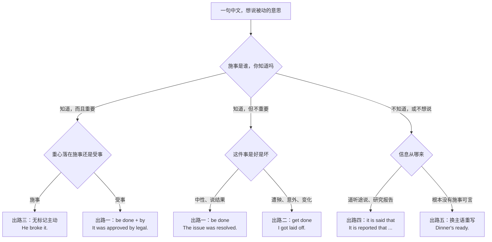
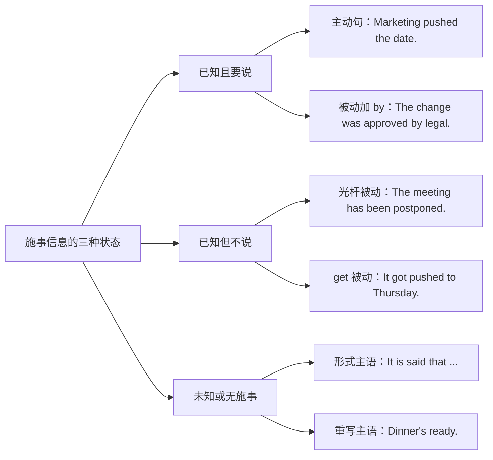
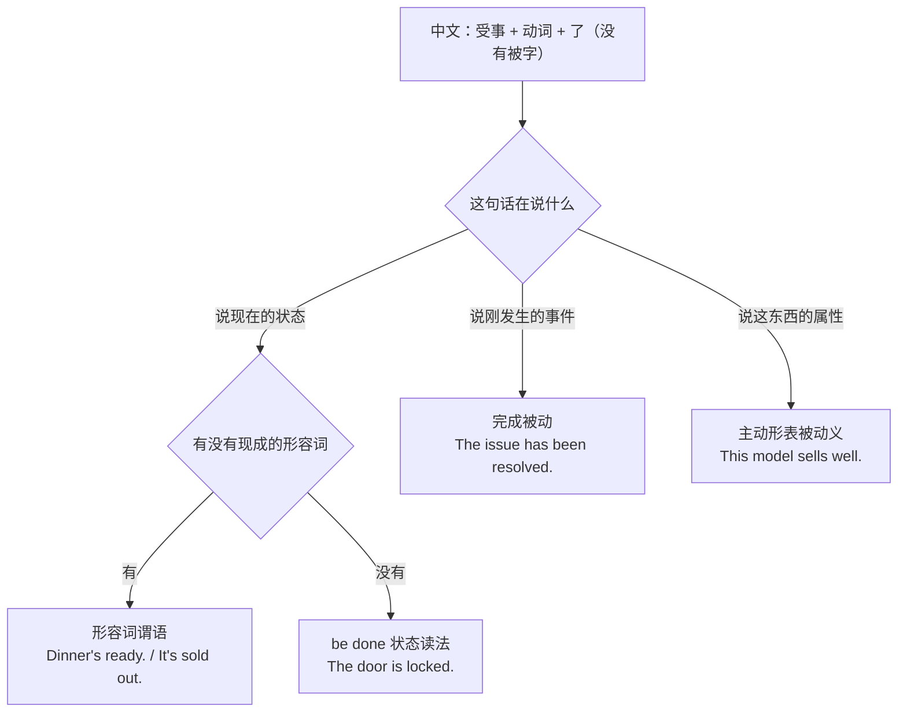
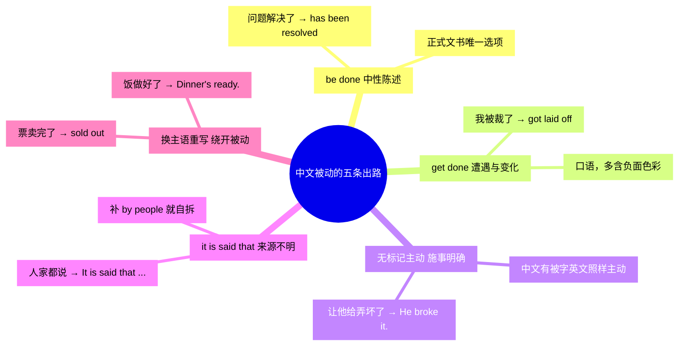

# 被字句与隐性被动：被…了、让人给…了、饭做好了

> [!info] 本篇定位
>
> 这篇收两类中文入口：一类带「被／让／叫／给」这些标记词，如「我手机被摔了」「让雨淋了」「叫人给骗了」；另一类中文里一个被动标记都没有，英文却常常要被动，如「饭做好了」「票卖完了」「问题解决了」「没人通知我」。
>
> 产出是五选一——`be done`、`get done`、无标记主动、`it is said that` 式的来源不明句、换主语重写。选哪一条不取决于中文有没有「被」字，取决于三个判断：施事是谁、施事要不要说出来、这句话的重心落在受事还是落在事件本身。
>
> 语态本身怎么构成、`by` 短语的语法地位、过去分词的形态变化，全部归 [[02.英语基础语法/10.特殊句型/01.被动语态全解|被动语态全解]]，本篇一个字不解释。同域相邻篇是 [[02.中文句式转换/02.把字句：处置式的四条英译出路|把字句：处置式的四条英译出路]]，两篇合起来覆盖中文两大特殊句式。
>
> 读完能查到：32 条中文意图、96 个分档成品句架，外加一张「中式被动六病灶」诊断表。

---

## 1. 本篇导读：中文的两个被动入口，英文的五条出路

中文母语者在被动上出错，几乎从来不是因为不会拼 `be + 过去分词`。错的是**该不该用**和**用哪一种**。

两个方向的错各占一半。一边是看见「被」就上 `be done`，写出 `I was rained.`、`This book is sold well.` 这种句子；另一边是中文没有「被」字就一律主动，把「饭做好了」写成 `I have cooked the meal.`，把「问题解决了」写成 `We solved the problem.`——语法没错，但重心全偏了：说话人想说的是**那件事现在是什么状态**，不是**谁干的**。

所以判断的起点不是中文标记词，是下面这张树。

这棵树的第一个岔口是**施事**，不是中文的「被」字。「他把杯子摔了」没有被字，施事清楚；「杯子摔了」有可能是自己掉的；「杯子被摔了」暗示有人干的但不说是谁。三句中文差一个字，英译分别走出路三、出路五、出路一。反过来，「我被雨淋了」有「被」字，但 `rain` 根本不能带人当宾语，被动式无从谈起，只能走出路五重写成 `I got caught in the rain`。

第二个岔口是**语气色彩**。`be done` 是中性的，陈述一个事实；`get done` 带遭遇感和变化感，多用在负面或意外的事情上，语域偏口语。「我被裁了」用 `I got laid off` 比 `I was laid off` 更像人话，「这份合同于三月生效」则必须用 `was executed`，不能 `got executed`。

第三个岔口是**信息来源**。中文的「据说」「听说」「人家都说」「上头的意思是」，共同点是施事泛指且不可查证，英文有一整套现成的形式主语框架接住它们。

> [!tip] 三问速判
>
> 拿不准的时候按顺序问自己三句话，通常两问之内就能定下来。
>
> 1. **施事是谁**：说得出具体人或机构吗？说得出而且重要，考虑主动或 `by` 短语；说不出，被动或重写。
> 2. **重心在哪**：这句话的话题是那个受事吗？是，受事顶到主语位；不是，别硬用被动。
> 3. **好事坏事**：遭殃、意外、状态突变，`get done` 优先；中性汇报，`be done` 优先；正式文书，`be done` 唯一。

| 中文入口 | 典型例子 | 首选出路 |
| --- | --- | --- |
| 「被」+ 及物动词 | 我手机被摔了 | 出路二 `get done` |
| 「被」+ 施事 + 动词 | 这版被安全组打回来了 | 出路一 `be done by` |
| 「让／叫／给」+ 施事 + 动词 | 让他给弄坏了 | 出路三 无标记主动 |
| 「让／叫」+ 自然力 | 让雨淋了 | 出路五 换主语重写 |
| 无标记，受事作主语 | 饭做好了、票卖完了 | 出路一或出路五 |
| 无主句 | 没人通知我、该修了 | 出路一或出路五 |
| 泛指施事 | 大家都说、有人告诉我 | 出路四 `it is said that` |

---

## 2. 五条出路各自管什么

五条出路不是同义替换，是五个不同的落点。查到中文意图之后先定出路，再在出路里挑语域档。

这张图把「施事」这一个变量拆成三态，是全篇最省事的一条判读线。已知且要说的，`by` 短语才有存在的理由；已知但不说的，光杆被动就够了，硬加 `by someone`、`by people` 反而是病句感的来源；未知或压根没有施事的，别去凑被动，换个说法。

**出路一 `be done`**：中性陈述句，把受事顶到主语位。适用面最广，正式文书里是唯一选项。汇报进度、写文档、发邮件默认走这条。`The issue has been resolved.` / `The clause was amended in 2024.`

**出路二 `get done`**：口语档，带「遭遇」和「状态突变」两层意思。`get` 承担的正是中文「被」字的那点倒霉味道和「让／叫／给」的口语味道。`I got scammed.` / `The build got broken by that merge.` 正式文书里不出现。

**出路三 无标记主动**：中文有「被」字但英文用主动更自然的一大片。判据只有一条——施事说得出来并且值得说。`He broke it.` 比 `It was broken by him.` 短、清楚、有担当。中文说「让他给弄坏了」，英文说 `He broke it.`，中间没有被动什么事。

**出路四 `it is said that`**：施事泛指到不可查证时的固定框架。`It is said / believed / reported / understood that ...`，以及主语提升式 `He is said to have left.`。这条出路的完整清单在 [[10.态度、情感与判断/04.据说、研究表明、据我所知：信息来源与缓和语|据说、研究表明、据我所知]]，本篇只收和被动直接相关的那几条。

**出路五 换主语重写**：最容易被忽略的一条，也是治「饭做好了」这类句子的正解。中文用受事作话题，英文换一个真正能当主语的东西——形容词谓语（`ready`、`sold out`、`gone`）、`there be`、`we`、`it`、或者干脆用不及物动词的主动形。`Dinner's ready.` 里没有任何被动痕迹，却完整表达了「饭（被）做好了」。

> [!warning] 出路选错的两个高频后果
>
> - ~~The problem was solved by us yesterday.~~ ❌ / **We solved the problem yesterday.** ✅（施事是「我们」，说得出也该说，被动加 `by us` 是把简单句绕远了）
> - ~~My phone was fallen.~~ ❌ / **I dropped my phone.** ✅（`fall` 不及物，没有被动式；中文「摔了」的施事是自己就直接主动）

---

## 3. 显性被动：「被」字句的六条主线

### 3.1 我手机被摔了

**中文触发语**：被摔了 / 被弄坏了 / 被砸了 / 给磕了 / 屏碎了

| 档位 | 句架 | 例句 |
| --- | --- | --- |
| 口语 | sth got + 过去分词 | My phone got dropped somewhere on the train. |
| 书面 | sth was + 过去分词 + 时间/地点状语 | The screen was cracked during shipping. |
| 正式 | sth sustained + 损害名词 | The device sustained impact damage in transit. |

- 译文：手机不知道在地铁上哪一段被摔了。／ 屏幕在运输途中裂了。／ 该设备在运输过程中受到撞击损伤。

> [!warning] 错配警示
>
> - ~~My phone was fell.~~ ❌ / **My phone got dropped.** ✅（`fall` 不及物不能变被动，要说「被摔」得换及物的 `drop`）
> - 自己摔的就别用被动：**I dropped my phone.** ✅ 中文「我手机被摔了」的「被」很多时候只是在推卸责任。

- 同义入口：被弄坏了 / 给磕了 / 摔了一下
- 语法归属：[[02.英语基础语法/10.特殊句型/01.被动语态全解|被动语态全解]]
- 场景实战：[[04.英语场景/08.出行与旅游场景实战/02.酒店入住预订与投诉场景|酒店入住预订与投诉场景]]

---

### 3.2 我被裁了

**中文触发语**：被裁了 / 被开了 / 被劝退了 / 让公司给辞了

| 档位 | 句架 | 例句 |
| --- | --- | --- |
| 口语 | sb got laid off / got let go | I got laid off in the last round. |
| 书面 | sb was made redundant / was dismissed | Two engineers were laid off after the merger. |
| 正式 | sb's employment was terminated with effect from + 日期 | His employment was terminated with effect from 30 June. |

- 译文：上一轮我被裁了。／ 合并之后有两名工程师被裁。／ 其雇佣关系自 6 月 30 日起终止。

> [!warning] 错配警示
>
> - ~~I was fired by the company.~~ 语法没错但少有人这么说 / **I got fired.** ✅（裁员语境里施事默认就是公司，`by the company` 是废话）
> - `be laid off` 是经济性裁员，`be fired` 是因过失开除，中文一个「被裁了」盖了两件事，选词别错。

- 同义入口：被解雇 / 被优化了 / 合同没续
- 语法归属：[[02.英语基础语法/10.特殊句型/01.被动语态全解|被动语态全解]]
- 场景实战：[[04.英语场景/10.职场与商务场景实战/01.求职简历面试与Offer谈判|求职简历面试与 Offer 谈判]]

---

### 3.3 他被选上了

**中文触发语**：被选上了 / 被录取了 / 被挑中了 / 中了

| 档位 | 句架 | 例句 |
| --- | --- | --- |
| 口语 | sb got picked / got in | She got picked for the pilot team. |
| 书面 | sb was selected / chosen as + 身份 | She was selected as the project lead. |
| 正式 | sb was appointed (to) + 职位 | Dr. Lin was appointed chair of the review committee. |

- 译文：她被选进了试点组。／ 她被选为项目负责人。／ 林博士获任审查委员会主席。

> [!warning] 错配警示
>
> - ~~She was selected to be the leader by everyone.~~ ❌ / **She was selected as the project lead.** ✅（`by everyone` 这种泛指施事不该出现在 `by` 后面）
> - `be appointed` 后面的职位名不加冠词：**appointed chair** ✅ / ~~appointed the chair~~ 不自然。

- 同义入口：入选了 / 拿到名额了 / 被任命
- 语法归属：[[02.英语基础语法/10.特殊句型/01.被动语态全解|被动语态全解]]
- 场景实战：[[04.英语场景/09.学习与教育场景实战/03.考试报名与学术评分场景|考试报名与学术评分场景]]

---

### 3.4 这块儿被改过

**中文触发语**：被改过 / 动过了 / 被人编辑过 / 跟原来不一样了

| 档位 | 句架 | 例句 |
| --- | --- | --- |
| 口语 | sth's been + 过去分词 | This part's been changed. |
| 书面 | sth has been modified since + 时间点 | This section has been modified since the last review. |
| 正式 | sth has been subject to subsequent revision | The clause has been subject to subsequent revision. |

- 译文：这块儿被改过。／ 这一节在上次评审之后有过修改。／ 该条款其后经过修订。

> [!warning] 错配警示
>
> - ~~This part was changed by someone.~~ ❌ / **This part's been changed.** ✅（改动留下痕迹、影响到现在，用完成被动；`by someone` 等于没说）
> - 强调「谁改的查得到」才补施事：**It was changed by whoever merged that branch.** ✅

- 同义入口：有改动 / 跟我上次看的不一样 / 被人动了
- 语法归属：[[02.英语基础语法/06.动词时态/04.完成时态详解|完成时态详解]]
- 场景实战：[[04.英语场景/03.时态与语态句型框架/02.被动语态句型框架|被动语态句型框架]]

---

### 3.5 这事被推迟了

**中文触发语**：被推迟了 / 往后挪了 / 被取消了 / 黄了

| 档位 | 句架 | 例句 |
| --- | --- | --- |
| 口语 | sth got pushed back / got called off | The demo got pushed back a week. |
| 书面 | sth has been postponed until + 时间 | The launch has been postponed until further notice. |
| 正式 | sth has been adjourned / deferred to a date to be fixed | The hearing has been adjourned to a date to be fixed. |

- 译文：演示往后推了一周。／ 上线推迟，另行通知。／ 该次聆讯延期，日期另定。

> [!warning] 错配警示
>
> - ~~The meeting was delayed to Thursday.~~ 半错 / **The meeting was moved to Thursday.** ✅（`delay` 强调拖延不指定新时间，指定了新时间用 `move`、`push`、`reschedule`）
> - `postpone` 后面接名词或动名词，不接不定式：~~postponed to launch~~ ❌ / **postponed launching** ✅。

- 同义入口：延期了 / 挪档了 / 不办了
- 语法归属：[[02.英语基础语法/10.特殊句型/01.被动语态全解|被动语态全解]]
- 场景实战：[[04.英语场景/10.职场与商务场景实战/02.会议汇报与演示场景|会议汇报与演示场景]]

---

### 3.6 我被要求…

**中文触发语**：被要求 / 上头让我 / 规定必须 / 人家不让

| 档位 | 句架 | 例句 |
| --- | --- | --- |
| 口语 | I was told to do sth | I was told to hold off on the deploy. |
| 书面 | sb was asked / required to do sth | All contractors were required to sign an NDA. |
| 正式 | sb is under an obligation to do sth | Vendors are under an obligation to disclose any conflict of interest. |

- 译文：上头让我先别上线。／ 所有外包方都被要求签保密协议。／ 供应商有义务披露任何利益冲突。

> [!warning] 错配警示
>
> - ~~I was let to know.~~ ❌ / **I was told.** ✅（`let` 没有被动式，中文的「让我知道」得换词）
> - 被动式里 `ask`、`tell`、`require` 后面的不定式 `to` 必须保留：**He was made to wait.** ✅ 而主动是 `made him wait`。

- 同义入口：被通知要 / 硬性规定 / 没得商量
- 语法归属：[[02.英语基础语法/08.非谓语动词/01.动词不定式详解|动词不定式详解]]
- 场景实战：[[04.英语场景/10.职场与商务场景实战/03.商务邮件与正式书面沟通|商务邮件与正式书面沟通]]

---

## 4. 让、叫、给：口语被动的三个变体

中文口语里「让」「叫」「给」承担的被动功能和「被」几乎一样，差别在语域和感情色彩——它们更口语、更倒霉、更带一点「摊上事了」的味道。英译时这点色彩多半落在 `get` 上，但有两类要特别小心：施事是自然力的，被动式根本不成立；施事明确的，直接主动最干净。

### 4.1 让雨淋了

**中文触发语**：让雨淋了 / 淋着了 / 被风吹了 / 让太阳晒的

| 档位 | 句架 | 例句 |
| --- | --- | --- |
| 口语 | sb got caught in sth | I got caught in the rain on the way back. |
| 书面 | sb was caught in sth without ... | We were caught in a downpour without umbrellas. |
| 正式 | sth was exposed to sth | The equipment was exposed to heavy rain overnight. |

- 译文：回来路上让雨淋了。／ 我们没带伞，赶上一场大雨。／ 该设备整夜暴露在大雨中。

> [!warning] 错配警示
>
> - ~~I was rained.~~ ❌ / **I got caught in the rain.** ✅（`rain` 不带人作宾语，也就没有对应的被动式）
> - ~~I was blown by the wind.~~ 除非人真的被吹跑了 / **The wind blew my papers everywhere.** ✅（自然力当施事时，主动句反而更准）

- 同义入口：淋成落汤鸡 / 赶上下雨了 / 让风给刮的
- 语法归属：[[02.英语基础语法/11.实战应用/03.常见语法错误纠正|常见语法错误纠正]]
- 场景实战：[[04.英语场景/06.日常生活场景实战/02.家庭家务与日常起居场景|家庭家务与日常起居场景]]

---

### 4.2 叫人给骗了

**中文触发语**：叫人给骗了 / 被坑了 / 上当了 / 让人忽悠了

| 档位 | 句架 | 例句 |
| --- | --- | --- |
| 口语 | sb got scammed / got ripped off | I got scammed on a second-hand listing. |
| 书面 | sb was misled / was deceived by sth | Customers were misled by the pricing page. |
| 正式 | sb was induced to do sth by + 手段 | The investors were induced to sign by false representations. |

- 译文：我在一个二手帖上被骗了。／ 用户被定价页面误导了。／ 投资人是在虚假陈述之下被诱使签约的。

> [!warning] 错配警示
>
> - ~~I was cheated money.~~ ❌ / **I got scammed out of 300 yuan.** ✅（「被骗走多少钱」用 `out of`，不能直接跟钱作宾语）
> - `be ripped off` 指价格上吃亏，`be scammed` 指整件事是骗局，中文一个「被坑了」盖了两层，别混用。

- 同义入口：被宰了 / 交了智商税 / 让人算计了
- 语法归属：[[02.英语基础语法/05.介词与连词/02.常用介词搭配详解|常用介词搭配详解]]
- 场景实战：[[04.英语场景/06.日常生活场景实战/03.购物超市与讨价还价场景|购物超市与讨价还价场景]]

---

### 4.3 让他给弄坏了

**中文触发语**：让他给弄坏了 / 叫他弄丢了 / 给他整没了 / 是他搞坏的

| 档位 | 句架 | 例句 |
| --- | --- | --- |
| 口语 | sb + 动词 + sth（施事明确直接主动） | He broke it. |
| 书面 | sth was + 过去分词 + by sb, not by sb else | The seal was broken by the contractor, not by us. |
| 正式 | sth was rendered + 形容词 + by + 原因 | The unit was rendered inoperable by improper handling. |

- 译文：他弄坏的。／ 封条是承包方弄破的，不是我们。／ 该机组因操作不当而无法运行。

> [!warning] 错配警示
>
> - ~~It was broken by him.~~ 除非在追责否则太绕 / **He broke it.** ✅（施事说得出并且就是重点，主动句更短更清楚）
> - 只有在需要**对比施事**（是他不是我）或**受事才是话题**（这台机器怎么了）时，才值得把 `by sb` 留下。

- 同义入口：是他干的 / 他给整坏了 / 责任在他
- 语法归属：[[02.英语基础语法/10.特殊句型/01.被动语态全解|被动语态全解]]
- 场景实战：[[04.英语场景/10.职场与商务场景实战/04.商务谈判合同与客户沟通|商务谈判合同与客户沟通]]

---

### 4.4 让人给说了一顿

**中文触发语**：让人给说了一顿 / 被批评了 / 挨骂了 / 被点名了

| 档位 | 句架 | 例句 |
| --- | --- | --- |
| 口语 | sb got told off / got chewed out for sth | I got told off for skipping the standup. |
| 书面 | sb was criticized / reprimanded for sth | He was criticized for missing the deadline twice. |
| 正式 | sb was issued a formal written warning | The employee was issued a formal written warning. |

- 译文：我没去站会，被说了一顿。／ 他因为两次错过截止日期挨了批评。／ 该员工收到一份正式书面警告。

> [!warning] 错配警示
>
> - ~~I was said by my boss.~~ ❌ / **My boss had a word with me.** ✅（`say` 不接人作宾语，「被说」得换 `tell off`、`criticize` 或整句重写）
> - 挨骂原因用 `for + 名词/动名词`，不用 `because`：**told off for being late** ✅ / ~~told off because late~~ ❌。

- 同义入口：挨了一通 / 被念叨了 / 被约谈
- 语法归属：[[02.英语基础语法/05.介词与连词/02.常用介词搭配详解|常用介词搭配详解]]
- 场景实战：[[04.英语场景/10.职场与商务场景实战/02.会议汇报与演示场景|会议汇报与演示场景]]

---

### 4.5 让人看见了

**中文触发语**：让人看见了 / 被人听见了 / 叫人撞见了 / 有人瞅见了

| 档位 | 句架 | 例句 |
| --- | --- | --- |
| 口语 | somebody + 动词 + sb + doing | Somebody saw us leaving early. |
| 书面 | sb was seen doing sth | He was seen leaving the building at nine. |
| 正式 | sb was observed to do sth | The subject was observed to leave the premises at 21:00. |

- 译文：有人看见我们提前走了。／ 有人看见他九点离开大楼。／ 该对象于 21 时离开该场所。

> [!warning] 错配警示
>
> - ~~He was seen leave the building.~~ ❌ / **He was seen leaving / He was seen to leave.** ✅（`see`、`hear`、`make` 在主动里省掉的 `to`，变被动时要还回来，或者改用 `-ing`）
> - `was seen doing` 强调看见的那个片段，`was seen to do` 强调看见了完整动作，正式文书偏后者。

- 同义入口：被逮着了 / 让人撞上了 / 有人目击
- 语法归属：[[02.英语基础语法/08.非谓语动词/05.非谓语动词综合辨析|非谓语动词综合辨析]]

---

## 5. 隐性被动：中文一个「被」字都没有

这一节是中文母语者最容易整片译错的地带。中文允许受事直接当主语而动词保持主动形——「饭做好了」「票卖完了」「问题解决了」「衣服洗了」，全是受事作话题、动词不变形。英文没有这个机制，必须显式选一条出路。

分岔的关键词是「状态、事件、属性」三选一。「饭做好了」说的是状态，`Dinner's ready` 一句话完事；「问题解决了」说的是刚发生的事件，得用完成被动 `The issue has been resolved`；「这书好卖」说的是书本身的属性，英文用主动形 `This book sells well`，加了被动反而不成句。三条路各有各的错法，逐条看。

### 5.1 饭做好了

**中文触发语**：饭做好了 / 菜齐了 / 可以开饭了 / 弄好了

| 档位 | 句架 | 例句 |
| --- | --- | --- |
| 口语 | sth's ready | Dinner's ready. |
| 书面 | sth has been prepared for + 人数/时间 | The meal has been prepared for eight. |
| 正式 | sth is now available / has been served | Refreshments are now available in the lobby. |

- 译文：饭做好了。／ 已按八人份备好餐食。／ 茶点已在大堂备妥。

> [!warning] 错配警示
>
> - ~~The rice has been cooked.~~ 语法对但像实验记录 / **Dinner's ready.** ✅（中文「好了」说的是状态，英文有现成形容词就别绕被动）
> - 同一个逻辑覆盖一大片：**It's done. / It's ready. / We're all set.** 都比对应的完成被动自然。

- 同义入口：可以吃了 / 上桌了 / 都备齐了
- 语法归属：[[02.英语基础语法/08.非谓语动词/04.过去分词详解|过去分词详解]]
- 场景实战：[[04.英语场景/06.日常生活场景实战/04.餐饮点餐外卖与聚餐场景|餐饮点餐外卖与聚餐场景]]

---

### 5.2 票卖完了

**中文触发语**：票卖完了 / 卖光了 / 没货了 / 抢没了

| 档位 | 句架 | 例句 |
| --- | --- | --- |
| 口语 | sth's sold out | The tickets are sold out. |
| 书面 | sth has sold out / is no longer available | The early-bird tickets sold out in ten minutes. |
| 正式 | sth has been fully subscribed | The allocation has been fully subscribed. |

- 译文：票卖完了。／ 早鸟票十分钟就卖光了。／ 该额度已全部认购完毕。

> [!warning] 错配警示
>
> - 主动被动两种形都对但侧重不同：**The tickets sold out in ten minutes.** ✅ 说卖的过程；**The tickets are sold out.** ✅ 说现在的状态。
> - ~~The tickets were sold out by everyone.~~ ❌（`sell out` 这种表状态的搭配后面不接 `by` 施事）

- 同义入口：售罄 / 没了 / 抢光了
- 语法归属：[[02.英语基础语法/10.特殊句型/01.被动语态全解|被动语态全解]]
- 场景实战：[[04.英语场景/06.日常生活场景实战/03.购物超市与讨价还价场景|购物超市与讨价还价场景]]

---

### 5.3 问题解决了

**中文触发语**：问题解决了 / 搞定了 / 处理完了 / 好了

| 档位 | 句架 | 例句 |
| --- | --- | --- |
| 口语 | sth's fixed / we're good now | It's fixed — try it again. |
| 书面 | the issue has been resolved in + 版本/时间 | The issue has been resolved in build 214. |
| 正式 | the deficiency has been rectified and verified | The deficiency has been rectified and independently verified. |

- 译文：修好了，你再试一下。／ 该问题已在 214 版本中修复。／ 该缺陷已整改并经独立验证。

> [!warning] 错配警示
>
> - ~~The problem was solved by us.~~ ❌ / **We've solved it.** 或 **It's been resolved.** ✅（要么承认是自己做的用主动，要么施事不重要就光杆被动，别两头占）
> - `resolve` 用于问题和争议，`solve` 用于难题和谜题，正式文档里报修复统一用 `resolve` 或 `fix`。

- 同义入口：修好了 / 没事了 / 闭环了
- 语法归属：[[02.英语基础语法/06.动词时态/04.完成时态详解|完成时态详解]]
- 场景实战：[[04.英语场景/03.时态与语态句型框架/02.被动语态句型框架|被动语态句型框架]]

---

### 5.4 这书好卖、这门锁不上

**中文触发语**：这书好卖 / 这门锁不上 / 这料子洗不坏 / 这车开着顺

| 档位 | 句架 | 例句 |
| --- | --- | --- |
| 口语 | sth + 动词 + well / easily（主动形表被动义） | This model sells well. |
| 书面 | sth doesn't + 动词 + properly | The door doesn't lock properly. |
| 正式 | sth is readily + 过去分词 | The fabric is readily washed without loss of colour. |

- 译文：这款卖得挺好。／ 这门锁不严。／ 该面料易洗且不掉色。

> [!warning] 错配警示
>
> - ~~This book is sold well.~~ ❌ / **This book sells well.** ✅（描述物本身的属性用主动形，加被动就变成在说"卖这件事被做得好"）
> - 这类主动形只在带方式副词或否定时成立：**It washes easily.** ✅ / ~~It washes.~~ 单说不成句。

- 同义入口：卖得动 / 不好使 / 经得住
- 语法归属：[[02.英语基础语法/10.特殊句型/01.被动语态全解|被动语态全解]]
- 场景实战：[[04.英语场景/06.日常生活场景实战/03.购物超市与讨价还价场景|购物超市与讨价还价场景]]

---

### 5.5 会议改到周四了

**中文触发语**：会议改到周四了 / 时间挪了 / 改期了 / 换地方了

| 档位 | 句架 | 例句 |
| --- | --- | --- |
| 口语 | sth got moved to + 时间 | The meeting got moved to Thursday. |
| 书面 | sth has been rescheduled for + 时间 | The review has been rescheduled for Thursday at ten. |
| 正式 | sth is now scheduled to take place on + 日期 | The session is now scheduled to take place on 12 March. |

- 译文：会挪到周四了。／ 评审改到周四十点。／ 该场次现定于 3 月 12 日举行。

> [!warning] 错配警示
>
> - `reschedule` 后面的时间用 `for` 或 `to`，不用 `at` 领头：**rescheduled for Thursday at ten** ✅ / ~~rescheduled at Thursday~~ ❌
> - 中文「改到」有两种：改时间用 `moved to`，改地点用 `moved from A to B`，别只写 `moved` 让人猜。

- 同义入口：换时间了 / 往后挪了 / 提前了
- 语法归属：[[02.英语基础语法/05.介词与连词/02.常用介词搭配详解|常用介词搭配详解]]
- 场景实战：[[04.英语场景/10.职场与商务场景实战/02.会议汇报与演示场景|会议汇报与演示场景]]

---

### 5.6 那事儿定下来了

**中文触发语**：定下来了 / 拍板了 / 敲定了 / 走完流程了

| 档位 | 句架 | 例句 |
| --- | --- | --- |
| 口语 | it's settled / it's a done deal | It's settled — we ship on Friday. |
| 书面 | sth has been finalized / agreed | The scope has been finalized with the client. |
| 正式 | sth has been formally approved by + 机构 | The budget has been formally approved by the board. |

- 译文：定了，周五发布。／ 范围已与客户敲定。／ 该预算已经董事会正式批准。

> [!warning] 错配警示
>
> - ~~It has been decided by us to ship on Friday.~~ ❌ / **We've decided to ship on Friday.** ✅（自己做的决定用主动，被动是在推开责任）
> - `It has been decided that ...` 只在**刻意不点名决策者**时使用，那是它唯一的存在理由。

- 同义入口：说定了 / 批下来了 / 尘埃落定
- 语法归属：[[02.英语基础语法/09.从句体系/03.名词性从句详解|名词性从句详解]]
- 场景实战：[[04.英语场景/10.职场与商务场景实战/04.商务谈判合同与客户沟通|商务谈判合同与客户沟通]]

---

### 5.7 东西还没送到

**中文触发语**：还没送到 / 快递没来 / 货没到 / 一直没收到

| 档位 | 句架 | 例句 |
| --- | --- | --- |
| 口语 | sth hasn't shown up yet | The package hasn't shown up yet. |
| 书面 | sth has not been delivered as scheduled | The order has not been delivered as scheduled. |
| 正式 | delivery of sth remains outstanding | Delivery of the remaining units remains outstanding. |

- 译文：包裹还没到。／ 订单未按期送达。／ 余下机组的交付仍未完成。

> [!warning] 错配警示
>
> - ~~I haven't been delivered the package.~~ ❌ / **The package hasn't been delivered.** 或 **I haven't received it.** ✅（被动主语得是被送的东西，人不能当 `deliver` 的被动主语）
> - 抱怨时把主语换成自己更有力：**I still haven't received it.** ✅ 比光说包裹没到更能推动对方处理。

- 同义入口：没收到 / 在路上 / 迟迟不到
- 语法归属：[[02.英语基础语法/06.动词时态/04.完成时态详解|完成时态详解]]
- 场景实战：[[04.英语场景/07.社交交际场景实战/02.电话短信与在线沟通场景|电话短信与在线沟通场景]]

---

## 6. 无主句式被动：没人通知我、该修了

中文有一整类句子连受事作主语都不做，整句就没有主语——「没人通知我」「有人动过」「该修了」「到时候告诉你」。英文必须补主语，补什么就决定了走哪条出路。

### 6.1 没人通知我

**中文触发语**：没人通知我 / 谁也没说 / 我压根不知道 / 没接到消息

| 档位 | 句架 | 例句 |
| --- | --- | --- |
| 口语 | nobody told me (that) ... | Nobody told me the time changed. |
| 书面 | sb wasn't told / was never notified of sth | I wasn't told the deadline had moved. |
| 正式 | no prior notice was given to sb | No prior notice was given to the affected users. |

- 译文：没人告诉我时间变了。／ 没人通知我截止日期改了。／ 未向受影响用户发出事先通知。

> [!warning] 错配警示
>
> - ~~No one didn't tell me.~~ ❌ / **No one told me.** ✅（英文一个否定就够，中文「没人…不…」的双重结构不能照搬）
> - `Nobody told me` 带指责语气，`I wasn't told` 中性得多。给上级写邮件时用后者。

- 同义入口：没收到通知 / 我最后一个知道 / 没人跟我说
- 语法归属：[[02.英语基础语法/03.代词与数词/04.不定代词详解|不定代词详解]]
- 场景实战：[[04.英语场景/10.职场与商务场景实战/03.商务邮件与正式书面沟通|商务邮件与正式书面沟通]]

---

### 6.2 有人动过我电脑

**中文触发语**：有人动过 / 有人碰过 / 让人翻过 / 谁进来过

| 档位 | 句架 | 例句 |
| --- | --- | --- |
| 口语 | somebody's been + 介词短语/doing | Somebody's been on my machine. |
| 书面 | sth has been accessed from + 来源 | The account has been accessed from an unknown device. |
| 正式 | unauthorized access to sth has been detected | Unauthorized access to the database has been detected. |

- 译文：有人动过我电脑。／ 该账号被一台未知设备登录过。／ 已检测到对该数据库的未授权访问。

> [!warning] 错配警示
>
> - ~~My computer was used by somebody.~~ ❌ / **Somebody's been using my computer.** ✅（`by somebody` 这种泛指施事在英文里是冗余，把它扶正成主语反而自然）
> - 「动过」留下痕迹、影响现在，用完成体；只说过去某次用一般过去时：`Someone used it last night.`

- 同义入口：被人碰了 / 有人来过 / 不是我放的
- 语法归属：[[02.英语基础语法/06.动词时态/04.完成时态详解|完成时态详解]]
- 场景实战：[[04.英语场景/07.社交交际场景实战/02.电话短信与在线沟通场景|电话短信与在线沟通场景]]

---

### 6.3 这该修了

**中文触发语**：该修了 / 得处理一下 / 这得改 / 需要弄一下

| 档位 | 句架 | 例句 |
| --- | --- | --- |
| 口语 | sth needs + doing | This needs fixing before Friday. |
| 书面 | sth needs to be + 过去分词 | The config needs to be updated on all three nodes. |
| 正式 | sth is to be rectified prior to + 事件 | All defects are to be rectified prior to handover. |

- 译文：这个周五之前得修。／ 三个节点的配置都要更新。／ 所有缺陷须在移交前整改完毕。

> [!warning] 错配警示
>
> - ~~It needs to fix.~~ ❌ / **It needs fixing. = It needs to be fixed.** ✅（主语是被修的一方，主动不定式会把意思反过来变成"它需要去修别的"）
> - 同一格式的还有 `want`、`require`、`deserve`：**The report wants checking.** ✅（英式口语），**This deserves looking into.** ✅

- 同义入口：得弄了 / 拖不下去了 / 该动手了
- 语法归属：[[02.英语基础语法/08.非谓语动词/02.动名词详解|动名词详解]]
- 场景实战：[[04.英语场景/03.时态与语态句型框架/02.被动语态句型框架|被动语态句型框架]]

---

### 6.4 到时候会通知你

**中文触发语**：到时候通知你 / 有消息告诉你 / 出结果了会说 / 等我信儿

| 档位 | 句架 | 例句 |
| --- | --- | --- |
| 口语 | I'll let you know once ... | I'll let you know once it's merged. |
| 书面 | you will be notified when ... | You will be notified once the transfer completes. |
| 正式 | notification will be issued upon + 名词 | Notification will be issued upon completion of the review. |

- 译文：合进去了我告诉你。／ 转账完成后会通知您。／ 审查结束后将发出通知。

> [!warning] 错配警示
>
> - ~~You will be noticed.~~ ❌ / **You will be notified.** ✅（`notice` 是"注意到"，`notify` 才是"通知"，一字之差意思全反）
> - 时间从句里不用将来时：~~once it will be merged~~ ❌ / **once it's merged** ✅。

- 同义入口：回头说 / 定了跟你讲 / 等通知
- 语法归属：[[02.英语基础语法/06.动词时态/02.一般将来时与过去将来时|一般将来时与过去将来时]]
- 场景实战：[[04.英语场景/10.职场与商务场景实战/03.商务邮件与正式书面沟通|商务邮件与正式书面沟通]]

---

## 7. 施事与 by 短语：留、删、换介词

`by` 短语该不该留，是被字句英译里第二容易出错的地方（第一是该不该用被动）。判据只有一条：**这个施事是不是新信息、是不是重点**。是，留；不是，删。中文的「被人」「让人」「叫人」几乎从不对应 `by someone`，因为「人」在中文里就是个泛指虚位。

| 施事的样子 | by 留不留 | 理由 |
| --- | --- | --- |
| 具体人名、团队、机构 | 留 | 新信息，读者需要知道是谁 |
| 与前文对比（是他不是我） | 留 | 对比本身就是重点 |
| someone、people、they、大家 | 删 | 泛指等于没说 |
| 语境里一看就知道（公司裁员、警察抓人） | 删 | 默认施事，说了是废话 |
| 工具、材料、原因（不是行动者） | 换介词 | 用 with、in、from、through |

### 7.1 被…（点名到人）

**中文触发语**：被…给…了 / 是…干的 / …那边打回来的 / 让…给驳了

| 档位 | 句架 | 例句 |
| --- | --- | --- |
| 口语 | sb + 动词 + sth（直接主动指名） | Marketing pushed the date. |
| 书面 | sth was + 过去分词 + by sb | The change was approved by the security team. |
| 正式 | sth was undertaken by + 机构 | The audit was undertaken by an independent firm. |

- 译文：日期是市场部要求往后推的。／ 这项变更由安全组批准。／ 该审计由一家独立机构执行。

> [!warning] 错配警示
>
> - ~~It was decided by them to cancel.~~ ❌ / **They decided to cancel.** ✅（施事既然点得出名字，主动句更短更有力）
> - 保留 `by` 的场合是**受事才是话题**：`Which change was rejected?` — `The database migration, by the security team.` ✅

- 同义入口：谁批的 / 那边定的 / 上游改的
- 语法归属：[[02.英语基础语法/10.特殊句型/01.被动语态全解|被动语态全解]]
- 场景实战：[[04.英语场景/10.职场与商务场景实战/04.商务谈判合同与客户沟通|商务谈判合同与客户沟通]]

---

### 7.2 被…弄的（工具、原因，不是人）

**中文触发语**：被…弄的 / 是…造成的 / 让…给蹭的 / 因为…坏的

| 档位 | 句架 | 例句 |
| --- | --- | --- |
| 口语 | sth got + 过去分词 + from + 原因 | The screen got scratched from the keys in my bag. |
| 书面 | sth was + 过去分词 + with + 工具 | The seal was broken with a screwdriver. |
| 正式 | sth was attributable to + 原因 | The outage was attributable to a misconfigured route. |

- 译文：屏幕是让包里的钥匙蹭花的。／ 封条是用螺丝刀撬开的。／ 这次中断源于一条配置错误的路由。

> [!warning] 错配警示
>
> - ~~The desk was covered by dust.~~ ❌ / **The desk was covered with dust.** ✅（表状态和材料用 `with`／`in`，`by` 只在真正指出动作发出者时用）
> - 一批固定搭配根本不跟 `by`：`be filled with`、`be crowded with`、`be known as/for`、`be interested in`、`be worried about`。

- 同义入口：是…蹭的 / 让…给弄的 / 因为…才这样
- 语法归属：[[02.英语基础语法/05.介词与连词/02.常用介词搭配详解|常用介词搭配详解]]
- 场景实战：[[04.英语场景/11.医疗与紧急场景实战/01.医院看病与药店购药场景|医院看病与药店购药场景]]

---

### 7.3 人家都说、有人告诉我

**中文触发语**：人家都说 / 大家都这么讲 / 有人告诉我 / 上头的意思是 / 听说

| 档位 | 句架 | 例句 |
| --- | --- | --- |
| 口语 | they say / somebody told me (that) ... | They say the office is moving next quarter. |
| 书面 | it is said / reported / believed that ... | It is reported that the release has slipped again. |
| 正式 | sb / sth is said / understood to do sth | The vendor is understood to be in breach of the agreement. |

- 译文：听说下个季度要搬办公室。／ 据报道该版本又延期了。／ 据了解该供应商已违约。

> [!warning] 错配警示
>
> - ~~It is said by people that ...~~ ❌ / **It is said that ...** ✅（这个框架的全部意义就是隐去施事，补 `by people` 等于自拆）
> - 主语提升式的时间要对齐：**He is said to have left.** ✅ 指过去；**He is said to be leaving.** ✅ 指现在或将来。

- 同义入口：据说 / 听人讲 / 传闻是 / 外面都在说
- 语法归属：[[02.英语基础语法/09.从句体系/03.名词性从句详解|名词性从句详解]]
- 场景实战：[[04.英语场景/05.高频实用表达句型框架/01.表达观点与态度的50个万能句型|表达观点与态度的 50 个万能句型]]

---

## 8. 状态还是动作：门关着与门被关上了

同一个 `be + 过去分词`，英文里可能是状态描述也可能是动作叙述，中文却分得很清：「门关着」是状态，「门被关上了」是动作。译回英文时如果不加区分，`The door was closed.` 这句话读者两种意思都能读出来，谁也不知道你想说哪个。

### 8.1 门关着

**中文触发语**：门关着 / 灯亮着 / 窗户开着 / 是锁上的

| 档位 | 句架 | 例句 |
| --- | --- | --- |
| 口语 | sth's + 形容词化的过去分词 | The door's shut. |
| 书面 | sth remains + 过去分词 | The valve remains closed during maintenance. |
| 正式 | sth is to be kept + 过去分词 at all times | The enclosure is to be kept locked at all times. |

- 译文：门关着呢。／ 检修期间该阀门保持关闭。／ 该机柜须始终保持上锁状态。

> [!warning] 错配警示
>
> - 想说纯状态就避开歧义词：**The door is shut.** ✅ 比 `The door is closed.` 更明确是状态。
> - `remain`、`stay`、`stand` 后接过去分词专门表状态：**The issue remains unresolved.** ✅

- 同义入口：是关着的 / 一直开着 / 没打开
- 语法归属：[[02.英语基础语法/08.非谓语动词/04.过去分词详解|过去分词详解]]
- 场景实战：[[04.英语场景/06.日常生活场景实战/02.家庭家务与日常起居场景|家庭家务与日常起居场景]]

---

### 8.2 门被关上了

**中文触发语**：门被关上了 / 灯让人关了 / 让人给锁了 / 谁给合上的

| 档位 | 句架 | 例句 |
| --- | --- | --- |
| 口语 | somebody + 动词 + sth | Someone shut the door. |
| 书面 | sth was + 过去分词 + 时间/施事 | The door was closed at six by the last person out. |
| 正式 | access to sth was closed off at + 时间 | Access to the corridor was closed off at 18:00. |

- 译文：有人把门关了。／ 门是六点最后走的人关的。／ 该通道于 18 时封闭。

> [!warning] 错配警示
>
> - `The door was closed.` 有歧义：既能读成状态也能读成动作。加时间点或施事就锁死成动作：**The door was closed at six.** ✅
> - 中文「让人给关了」多半只是抱怨，英文用 `Someone shut it.` 就够，不必绕被动。

- 同义入口：给合上了 / 有人关的 / 不是我关的
- 语法归属：[[02.英语基础语法/10.特殊句型/01.被动语态全解|被动语态全解]]
- 场景实战：[[04.英语场景/06.日常生活场景实战/02.家庭家务与日常起居场景|家庭家务与日常起居场景]]

---

### 8.3 正在处理中

**中文触发语**：正在弄 / 还在处理 / 在改了 / 排上了 / 走流程呢

| 档位 | 句架 | 例句 |
| --- | --- | --- |
| 口语 | sb's working on it / it's being + 过去分词 | It's being looked at right now. |
| 书面 | sth is being + 过去分词 + by sb | The report is being reviewed by legal. |
| 正式 | sth is currently under + 名词 | The application is currently under review. |

- 译文：这会儿正在看。／ 报告正由法务审阅。／ 该申请正在审核中。

> [!warning] 错配警示
>
> - ~~The report is reviewing.~~ ❌ / **The report is being reviewed.** ✅（报告是被审的一方，主动进行时会变成"报告在审别人"）
> - 完成进行没有被动式：~~has been being reviewed~~ 不用 / **has been under review since Monday** ✅ 换名词框架。

- 同义入口：在跑了 / 还没出结果 / 挂着呢
- 语法归属：[[02.英语基础语法/06.动词时态/03.进行时态详解|进行时态详解]]
- 场景实战：[[04.英语场景/10.职场与商务场景实战/02.会议汇报与演示场景|会议汇报与演示场景]]

---

## 9. 工程与职场里的被字句速查

日常工作里的被字句集中在四种事上：改动落地了、人被卷进某个流程了、东西被砍了、状态被切换了。这四类的英文说法高度固定，背下来直接用。

### 9.1 这个 bug 被修了

**中文触发语**：bug 修了 / 被修复了 / 那个问题解决了 / 补上了

| 档位 | 句架 | 例句 |
| --- | --- | --- |
| 口语 | it's fixed / it got fixed in + 版本 | It got fixed in the last patch. |
| 书面 | the bug has been fixed in + 版本 | The regression has been fixed in v2.4.1. |
| 正式 | the defect has been remediated and closed | The defect has been remediated and formally closed. |

- 译文：上一个补丁里修掉了。／ 该回归问题已在 v2.4.1 修复。／ 该缺陷已整改并正式关闭。

> [!warning] 错配警示
>
> - ~~The bug was solved.~~ ❌ / **The bug was fixed.** ✅（`solve` 配 problem 和 puzzle，bug 只跟 `fix`、`patch`、`resolve`）
> - 报修复给版本号而不是给人名：`fixed in v2.4.1` ✅ 比 `fixed by Tom` 更有信息量。

- 同义入口：修好了 / 已合入修复 / 不复现了
- 语法归属：[[02.英语基础语法/06.动词时态/04.完成时态详解|完成时态详解]]
- 场景实战：[[04.英语场景/03.时态与语态句型框架/02.被动语态句型框架|被动语态句型框架]]

---

### 9.2 代码被合进去了

**中文触发语**：合进去了 / 已经上了 / 被 merge 了 / 进主干了

| 档位 | 句架 | 例句 |
| --- | --- | --- |
| 口语 | it's merged / it's in | It's merged — should be live in an hour. |
| 书面 | the pull request has been merged into + 分支 | The pull request has been merged into main. |
| 正式 | the change set has been incorporated into + 对象 | The change set has been incorporated into the release branch. |

- 译文：合了，一小时内应该就上线。／ 该 PR 已合入主干。／ 该变更集已并入发布分支。

> [!warning] 错配警示
>
> - ~~It was merged to main.~~ 半错 / **merged into main** ✅（`merge` 的目标分支用 `into`，`to` 是把两个东西并到一起时才用）
> - 中文「上了」有歧义：合入是 `merged`，部署是 `deployed`，发布是 `released`，别一律译成 `online`。

- 同义入口：进去了 / 已入库 / 主干有了
- 语法归属：[[02.英语基础语法/05.介词与连词/02.常用介词搭配详解|常用介词搭配详解]]
- 场景实战：[[04.英语场景/10.职场与商务场景实战/02.会议汇报与演示场景|会议汇报与演示场景]]

---

### 9.3 我被拉进群了

**中文触发语**：被拉进群了 / 被 at 了 / 被抄送了 / 被叫过去了

| 档位 | 句架 | 例句 |
| --- | --- | --- |
| 口语 | I got added to ... / I got pinged | I got added to the incident channel this morning. |
| 书面 | I was copied on / included in ... | I was copied on the thread by mistake. |
| 正式 | sb has been included in the distribution list | You have been included in the distribution list for this notice. |

- 译文：今早我被拉进事故群了。／ 那个邮件线我是被误抄的。／ 您已被列入本通知的分发名单。

> [!warning] 错配警示
>
> - ~~I was at-ed.~~ ❌ / **Someone pinged me. / I got pinged.** ✅（中文的动词化外来词不能照搬成英文被动）
> - 抄送用 `copied on`（英式常用 `copied in`），不是 `copied to`：**I was copied on the email.** ✅

- 同义入口：被叫上了 / 被捎带上了 / 挂我名了
- 语法归属：[[02.英语基础语法/12.日常口语/01.口语中的语法简化|口语中的语法简化]]
- 场景实战：[[04.英语场景/07.社交交际场景实战/02.电话短信与在线沟通场景|电话短信与在线沟通场景]]

---

### 9.4 需求被砍了

**中文触发语**：需求被砍了 / 这块儿去掉了 / 被砍到下期 / 不做了

| 档位 | 句架 | 例句 |
| --- | --- | --- |
| 口语 | it got cut / it's off the table | That got cut from this sprint. |
| 书面 | the feature has been descoped from + 范围 | Two items have been descoped from this release. |
| 正式 | the requirement has been withdrawn from the agreed scope | The requirement has been withdrawn from the agreed scope. |

- 译文：那条从这个迭代里砍掉了。／ 本次发布砍掉了两项。／ 该需求已从既定范围中撤出。

> [!warning] 错配警示
>
> - ~~The requirement was deleted.~~ 太重 / **descoped / dropped / cut** ✅（`delete` 是从系统里抹掉，需求只是不做了）
> - 砍到下一期说 `pushed to the next release`，彻底不做说 `dropped`，两者别混。

- 同义入口：先不做了 / 挪到下期 / 优先级降了
- 语法归属：[[02.英语基础语法/10.特殊句型/01.被动语态全解|被动语态全解]]
- 场景实战：[[04.英语场景/10.职场与商务场景实战/02.会议汇报与演示场景|会议汇报与演示场景]]

---

## 10. 中式被动的六个病灶

前面每条意图的警示是分散的，这里把反复出现的错法收成一张诊断表。查完成品句之后扫一眼这张表，能拦住九成的翻车。

| 病灶 | 中文原句 | 直译错句 | 改法 | 根因 |
| --- | --- | --- | --- | --- |
| 不及物动词硬变被动 | 我被雨淋了 | ~~I was rained.~~ | I got caught in the rain. | 没有宾语的动词不存在被动式 |
| 泛指施事塞进 by | 有人动过我电脑 | ~~It was used by somebody.~~ | Somebody's been using it. | `by somebody` 是零信息 |
| 施事明确还用被动 | 让他给弄坏了 | ~~It was broken by him.~~ | He broke it. | 主动更短更清楚 |
| 属性描述加被动 | 这书好卖 | ~~This book is sold well.~~ | This book sells well. | 中动结构用主动形 |
| 状态句译成完成被动 | 饭做好了 | ~~The rice has been cooked.~~ | Dinner's ready. | 中文「好了」说的是状态 |
| 被动主语选错 | 我还没收到快递 | ~~I haven't been delivered it.~~ | It hasn't been delivered. | 只有被送的东西能当被动主语 |

六条里前三条是「用多了」，后三条是「用错位置」。用多了的根源是把中文的「被」字当触发器；用错位置的根源是没分清状态、事件、属性。

> [!example] 一句中文走完全流程
>
> 原句：**这个接口被人改过，但没人通知我，现在线上挂了。**
>
> 第一段「被人改过」：施事是「人」——泛指，删掉 `by`；改动的影响持续到现在——完成被动。→ `The endpoint has been changed`
>
> 第二段「没人通知我」：无主句，中性表述优先。→ `but I wasn't told`
>
> 第三段「线上挂了」：中文没有被动标记，说的是状态。→ `and now production is down`
>
> 合起来：**The endpoint has been changed, but I wasn't told, and now production is down.** ✅
>
> 三个分句分别走了出路一、出路一、出路五，中文里只有第一个带「被」字。

---

## 11. 本篇小结

这张图是全篇的骨架。五条出路中，`be done` 覆盖面最广但不是默认答案，`get done` 承接的是「被」字那点倒霉味，无标记主动治的是最普遍的过度被动，`it is said that` 只管信息来源，换主语重写专治中文的隐性被动。查一条中文意图时，先在这五个分支里定位，再回到对应小节挑语域档。

> [!success] 本篇核心要点回顾
>
> 1. 决定用不用被动的是**施事信息**，不是中文有没有「被」字——「让他给弄坏了」有被字却该用主动，「饭做好了」没被字却常要被动语义。
> 2. `be done` 是中性陈述，`get done` 带遭遇感和口语色彩，正式文书里只有前者。
> 3. `by` 短语的存在理由只有两个：施事是新信息，或者施事在与别的施事对比。泛指的「有人」「大家」「人家」一律不进 `by`。
> 4. 不及物动词没有被动式——`fall`、`rain`、`happen`、`appear`、`occur` 全部走重写路线。
> 5. 中文「好了」「完了」「齐了」说的是状态，英文优先用形容词谓语（`ready`、`done`、`sold out`、`gone`），不是完成被动。
> 6. 描述物本身属性用主动形表被动义：`sells well`、`washes easily`、`doesn't lock`，加被动即错。
> 7. `The door was closed.` 状态与动作两读，靠加时间点、施事或换 `shut`、`remains closed` 来消歧。
> 8. 只有被动作直接作用的那个东西能当被动主语，人不能当 `deliver`、`say` 这类动词的被动主语。

> [!success] 本篇练习清单
>
> - [ ] 「我电脑昨天让人给动过了」——写出口语、书面、正式三档
> - [ ] 「票早就卖完了」——写出三档，其中至少一档不用被动
> - [ ] 「这事被推到下个月了」——写出三档，注意 `delay` 与 `move` 的选择
> - [ ] 「没人跟我说要改需求」——写出三档，并说明哪一档带指责语气
> - [ ] 「屏幕是让包里钥匙蹭花的」——写出三档，注意介词不用 `by`
> - [ ] 「这批面料洗不坏」——写出三档，其中口语档必须用主动形
> - [ ] 「报告正在法务那边审」——写出三档，注意进行被动与名词框架
> - [ ] 「听说他们下季度要搬办公室」——写出三档，含一个主语提升式

---

### 11.1 下一篇预告

> [!info] 下一篇
>
> [[02.中文句式转换/02.把字句：处置式的四条英译出路\|把字句：处置式的四条英译出路]]
>
> 被字句管的是「东西怎么了」，把字句管的是「拿东西怎么办」。下一篇处理「把书放桌上」「把它改成蓝色」「把他气坏了」「把钱花光了」这五类处置义，分流到 SVO 直译、复合宾语、动词加结果状语、短语动词四条出路，并给出「把」后面那个成分到底该当宾语还是当主语的判断法。两篇合起来，中文两大特殊句式的英译就闭环了。
