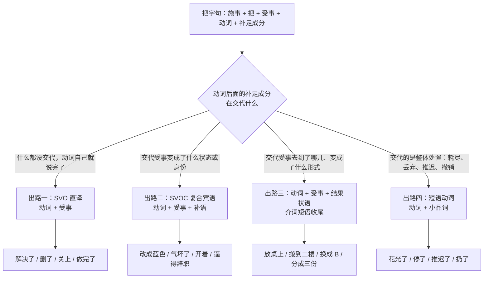
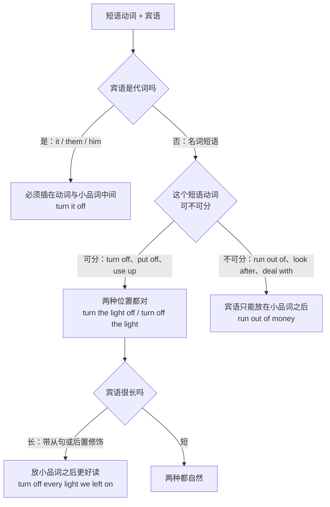
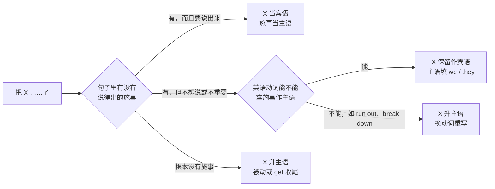
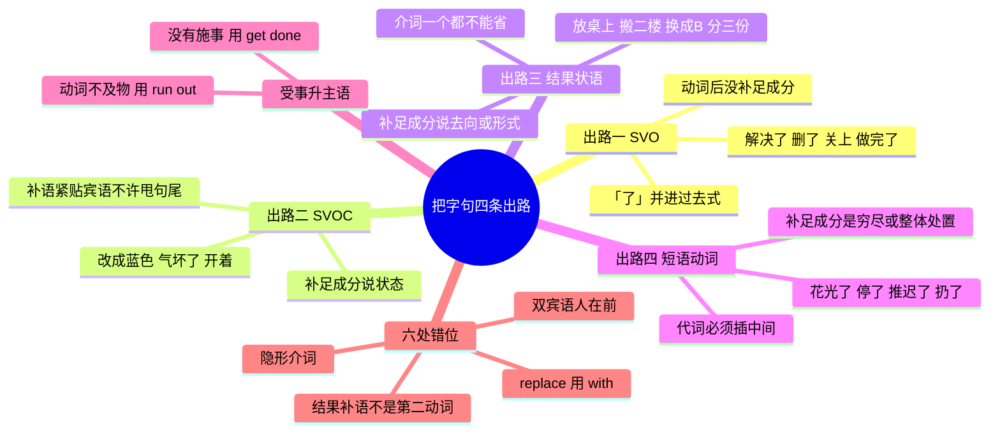

# 把字句：处置式的四条英译出路

> [!info] 本篇定位
>
> 收「把」字开头的处置句怎么说成英语，一共 31 条中文意图、93 个成品句架。入口全是中文原句：把书放桌上、把它改成蓝色、把他气坏了、把问题解决了、把钱花光了。
>
> 上一篇 [[02.中文句式转换/01.被字句与隐性被动：被…了、让人给…了、饭做好了\|被字句与隐性被动]] 管的是受事在句首、施事被推后的中文；这一篇管的是反过来的一头——施事在句首、受事被「把」提到动词前。两篇合起来是中文语序两端的对照。
>
> 读完能查到：一句把字句该走哪条英译出路、「把」后面那个成分该当宾语还是升成主语、以及照中文语序直译最容易撞上的六处错位。不解释复合宾语与短语动词的构成规则，那在 [[02.英语基础语法/01.基础入门/02.英语五大基本句型详解\|英语五大基本句型详解]]。

---

## 1. 本篇导读：五类处置义与四条出路

把字句的中文形状很整齐：**施事 + 把 + 受事 + 动词 + 补足成分**。受事被提到动词前面，动词后面留一块位置交代「结果怎样了」。

英语没有这个位置。英语的受事必须紧跟动词，「结果怎样了」只能挂在受事的后面。所以每翻一句把字句，实际做的都是同一件事：**把中文那个前置的受事送回动词右边，再决定尾巴上那块补足成分变成什么形状**。

尾巴的形状只有四种可能，就是四条出路。

四条出路不是并列的四个选项让人挑喜欢的，是四个互斥的分流口。判断走哪条，只看中文动词后面那块补足成分说的是什么：什么都没说走一，说状态走二，说去向或形式走三，说整体处置走四。

判断顺序可以压成三个问题，从上往下问，问到一个「是」就停。

| 顺序 | 问题 | 答「是」时走 | 中文样例 |
| --- | --- | --- | --- |
| 第一问 | 去掉「把」以后，动词加受事能不能单独成句 | 出路一 SVO | 把问题解决了 → 解决了问题 |
| 第二问 | 补足成分说的是受事「成了什么」 | 出路二 SVOC | 把它改成蓝色 → 它成了蓝的 |
| 第三问 | 补足成分说的是受事「到了哪儿、变成什么形式」 | 出路三 结果状语 | 把书放桌上 → 书到了桌上 |
| 兜底 | 以上都不是，整句表达的是耗尽、丢弃、推迟一类的处置 | 出路四 短语动词 | 把钱花光了 |

> [!tip] 三问的实际用法
>
> 不必每句都从头问。中文里凡是带「成」「得」「作」的（改成、气得、当作）几乎必走出路二；凡是带方位词的（放桌上、搬到二楼、写在纸上）几乎必走出路三；凡是带「光」「掉」「完」「了」这类穷尽义补语的（花光、扔掉、用完）优先试出路四的现成短语动词，试不出来再回到出路一。

大纲点名的五类处置义，跟四条出路的对应不是一对一：

| 中文原句 | 处置义 | 出路 | 成品 |
| --- | --- | --- | --- |
| 把书放桌上 | 位移 | 三 | Put the book on the table. |
| 把它改成蓝色 | 变状 | 二 | Make it blue. |
| 把他气坏了 | 致使 | 二 | It made him furious. |
| 把问题解决了 | 完成 | 一 | We fixed the problem. |
| 把钱花光了 | 穷尽 | 四 | We used up the money. |

变状与致使都落在出路二，因为它们在英语里是同一个结构：宾语后面挂一个形容词或分词。中文把它们分成「改成」和「气坏」两副面孔，英语并不区分。

---

## 2. 出路一：动词直接吃掉宾语

这条最省事——中文的「把」纯粹是把受事提前，动词后面没有任何补足成分要安置。译法是把受事放回动词右边，「把」本身不译。

### 2.1 把门关上、把盖子盖好

中文触发语：把…关上 / 把…合上 / 把…盖上 / 把…扣好

| 档位 | 句架 | 例句 |
| --- | --- | --- |
| 口语 | close / shut + sth | Shut the door on your way out. |
| 书面 | close + sth + [properly] | Please close the lid properly before you ship it. |
| 正式 | ensure that sth is closed | Ensure that all valves are closed before servicing the unit. |

> [!warning] 错配警示
>
> - ~~Take the door and close it.~~ ❌
> - **Close the door.** ✅（「把」不是一个要译出来的动词，它只是语序标记；用 take 或 bring 硬接会造出两个动作）

- 同义入口：把…带上（门）、把…掩上、把…封好
- 语法归属：[[02.英语基础语法/01.基础入门/02.英语五大基本句型详解\|英语五大基本句型详解]]
- 场景实战：[[04.英语场景/06.日常生活场景实战/02.家庭家务与日常起居场景\|家庭家务与日常起居场景]]

### 2.2 把问题解决了

中文触发语：把…解决了 / 把…搞定了 / 把…处理掉 / 把…摆平了

| 档位 | 句架 | 例句 |
| --- | --- | --- |
| 口语 | sort sth out / fix sth | I sorted it out this morning. |
| 书面 | resolve / address + sth | We resolved the timeout issue in the latest patch. |
| 正式 | sth has been resolved | The reported defect has been resolved as of build 42. |

> [!warning] 错配警示
>
> - ~~We solved the problem to be solved.~~ ❌
> - **We solved the problem.** ✅（中文「解决了」的「了」是完成体标记，不是一个要单独译出的成分，动词的过去式已经带上了它）

- 同义入口：把…处理完、把…料理好、把…办妥
- 语法归属：[[02.英语基础语法/06.动词时态/04.完成时态详解\|完成时态详解]]
- 场景实战：[[04.英语场景/10.职场与商务场景实战/02.会议汇报与演示场景\|会议汇报与演示场景]]

### 2.3 把它删了

中文触发语：把…删了 / 把…去掉 / 把…拿掉 / 把…抹掉

| 档位 | 句架 | 例句 |
| --- | --- | --- |
| 口语 | delete / drop + sth | Just delete that line. |
| 书面 | remove sth [from ...] | Remove the deprecated field from the payload. |
| 正式 | sth shall be deleted | The obsolete clause shall be deleted from the agreement. |

> [!warning] 错配警示
>
> - ~~Delete it out.~~ ❌
> - **Delete it.** ✅（中文「删掉」的「掉」是穷尽义补语，delete 本身已含穷尽，再补一个小品词是叠床架屋；take it out 是另一个意思，指从容器里取出）

- 同义入口：把…清掉、把…剔除、把…抹了
- 语法归属：[[02.英语基础语法/05.介词与连词/02.常用介词搭配详解\|常用介词搭配详解]]
- 场景实战：[[04.英语场景/07.社交交际场景实战/02.电话短信与在线沟通场景\|电话短信与在线沟通场景]]

### 2.4 把话说清楚

中文触发语：把…说清楚 / 把…讲明白 / 把…交代一下 / 把…挑明

| 档位 | 句架 | 例句 |
| --- | --- | --- |
| 口语 | spell sth out | Can you spell it out for me? |
| 书面 | clarify sth / make sth clear | I want to clarify what the deadline actually covers. |
| 正式 | set sth out explicitly | The scope of work is set out explicitly in Section 3. |

> [!warning] 错配警示
>
> - ~~Say the thing clear.~~ ❌
> - **Make it clear.** / **Spell it out.** ✅（中文「说清楚」的「清楚」是结果补语，英语要么并进动词里，要么用 make + 宾语 + 形容词，不能挂在 say 后面当光杆副词）

- 同义入口：把…讲透、把…摊开说、把…说到点子上
- 语法归属：[[02.英语基础语法/04.形容词与副词/03.副词的分类与用法\|副词的分类与用法]]
- 场景实战：[[04.英语场景/05.高频实用表达句型框架/01.表达观点与态度的50个万能句型\|表达观点与态度的50个万能句型]]

### 2.5 把活儿干完了

中文触发语：把…做完了 / 把…写完了 / 把…弄完了 / 把…赶出来了

| 档位 | 句架 | 例句 |
| --- | --- | --- |
| 口语 | finish sth / get sth done | I finished the report last night. |
| 书面 | complete sth | She completed the migration ahead of schedule. |
| 正式 | sth has been completed | The audit has been completed and signed off. |

> [!warning] 错配警示
>
> - ~~I finished to write the report.~~ ❌
> - **I finished writing the report.** / **I finished the report.** ✅（finish 后面接动词只能用动名词；接名词时不再需要动词）

- 同义入口：把…收尾了、把…结掉、把…交差了
- 语法归属：[[02.英语基础语法/08.非谓语动词/02.动名词详解\|动名词详解]]
- 场景实战：[[04.英语场景/09.学习与教育场景实战/02.图书馆作业与研究场景\|图书馆作业与研究场景]]

---

## 3. 出路二：宾语后面再挂一个补语

中文说「把 X 改成 Y」「把 X 气坏了」，动词后面那块交代的是 X 变成了什么。英语的位置是宾语的右边，挂一个形容词、名词或分词，构成动词 + 宾语 + 补语。

这条出路里中英语序差得最远：中文的补足成分跟在整句最后，英语的补语必须紧贴宾语。宾语一长，中文母语者就会下意识地把补语甩到句尾去，那是错位的头号来源。

### 3.1 把它改成蓝色

中文触发语：把…改成… / 把…弄成… / 把…调成… / 把…变成…（颜色、大小、状态）

| 档位 | 句架 | 例句 |
| --- | --- | --- |
| 口语 | make + sth + adj. | Just make it blue. |
| 书面 | change sth to + n. | Change the accent color to blue across all templates. |
| 正式 | sth shall be set to + n. | The status indicator shall be set to blue on success. |

> [!warning] 错配警示
>
> - ~~Make the button in the top right corner blue that we discussed yesterday.~~ ❌
> - **Make the button we discussed yesterday blue.** ✅（宾语太长时补语被推得离宾语太远，句子读不下去；这种时候改用 change ... to 把补语搬到介词短语里）

- 同义入口：把…设成…、把…换个颜色、把…做成…样
- 语法归属：[[02.英语基础语法/01.基础入门/02.英语五大基本句型详解\|英语五大基本句型详解]]
- 场景实战：[[04.英语场景/02.基础句型框架/01.英语五大基本句型完全解析\|英语五大基本句型完全解析]]

### 3.2 把他选成组长

中文触发语：把…选为… / 把…叫做… / 把…任命为… / 把…定为…

| 档位 | 句架 | 例句 |
| --- | --- | --- |
| 口语 | call sth + n. | We just call it the staging box. |
| 书面 | elect / name sb + n. | The team elected him team lead for the quarter. |
| 正式 | appoint sb (as) + n. | The board appointed her chair of the audit committee. |

> [!warning] 错配警示
>
> - ~~We elected him as the team lead.~~ ⚠️ 可接受但冗余
> - **We elected him team lead.** ✅（elect、name、call 后面的名词补语直接跟，不加 as；appoint 是唯一两可的，加不加 as 都行）

- 同义入口：把…定成…、把…封为…、把…列为…
- 语法归属：[[02.英语基础语法/02.名词与冠词/04.名词与冠词的综合应用\|名词与冠词的综合应用]]
- 场景实战：[[04.英语场景/10.职场与商务场景实战/02.会议汇报与演示场景\|会议汇报与演示场景]]

### 3.3 把他气坏了

中文触发语：把…气坏了 / 把…吓着了 / 把…搞糊涂了 / 把…累惨了

| 档位 | 句架 | 例句 |
| --- | --- | --- |
| 口语 | sth drives sb + adj. | That flaky test drove me crazy all afternoon. |
| 书面 | sth leaves sb + -ed | The rewrite left the whole team confused about ownership. |
| 正式 | sth causes sb considerable + n. | The outage caused customers considerable frustration. |

> [!warning] 错配警示
>
> - ~~He angried me.~~ / ~~I was very angry him.~~ ❌
> - **It made him furious.** / **He was furious with me.** ✅（中文「把他气坏了」的施事往往是一件事不是一个人，英语主语要选那件事；若真要说是人惹的，人只能进 with 短语）
> - ~~The news was very shocked.~~ ❌
> - **The news was shocking.** / **We were shocked.** ✅（-ing 描述引发情绪的事，-ed 描述感受情绪的人）

- 同义入口：把…惹毛了、把…逗乐了、把…吓一跳
- 语法归属：[[02.英语基础语法/08.非谓语动词/04.过去分词详解\|过去分词详解]]
- 场景实战：[[04.英语场景/05.高频实用表达句型框架/01.表达观点与态度的50个万能句型\|表达观点与态度的50个万能句型]]

### 3.4 把灯开着

中文触发语：把…开着 / 把…留着 / 把…空着 / 把…锁着

| 档位 | 句架 | 例句 |
| --- | --- | --- |
| 口语 | leave sth + adj./adv. | Leave the light on, I'll be right back. |
| 书面 | keep sth + adj. | Keep the connection open until the batch finishes. |
| 正式 | sth is to remain + adj. | The valve is to remain closed throughout maintenance. |

> [!warning] 错配警示
>
> - ~~Leave the door to open.~~ ❌
> - **Leave the door open.** ✅（leave 与 keep 后面接的是形容词补语，不是不定式；open 在这里是形容词「开着的」，不是动词）

- 同义入口：把…敞着、把…亮着、把…保持在…
- 语法归属：[[02.英语基础语法/04.形容词与副词/01.形容词的用法与位置\|形容词的用法与位置]]
- 场景实战：[[04.英语场景/08.出行与旅游场景实战/02.酒店入住预订与投诉场景\|酒店入住预订与投诉场景]]

### 3.5 把它设成只读

中文触发语：把…设成… / 把…配成… / 把…标记为… / 把…置为…

| 档位 | 句架 | 例句 |
| --- | --- | --- |
| 口语 | set sth to X / mark sth as X | Set it to read-only for now. |
| 书面 | configure sth as X | Configure the bucket as read-only for external users. |
| 正式 | sth shall be designated as X | The shared directory shall be designated as read-only. |

> [!warning] 错配警示
>
> - ~~Set the flag as true.~~ ❌
> - **Set the flag to true.** ✅（set 带的是 to，mark 与 designate 带的是 as；三个动词的介词不能互换）

- 同义入口：把…改成只读、把…设为默认、把…打上标记
- 语法归属：[[02.英语基础语法/05.介词与连词/02.常用介词搭配详解\|常用介词搭配详解]]

### 3.6 把他逼得辞职了

中文触发语：把…逼得… / 把…弄得不得不… / 把…推到…地步 / 把…搞得只好…

| 档位 | 句架 | 例句 |
| --- | --- | --- |
| 口语 | sth pushes sb into doing | The workload pushed him into quitting. |
| 书面 | sth drives sb to do | Repeated delays drove the client to cancel the contract. |
| 正式 | sth compels sb to do | The findings compelled the vendor to issue a recall. |

> [!warning] 错配警示
>
> - ~~The pressure forced him quit.~~ ❌
> - **The pressure forced him to quit.** ✅（force、drive、compel 后面的不定式带 to；只有 make、let、have 三个使役动词后面省 to）

- 同义入口：把…逼上绝路、把…弄得没办法、把…将了一军
- 语法归属：[[02.英语基础语法/08.非谓语动词/01.动词不定式详解\|动词不定式详解]]
- 场景实战：[[04.英语场景/10.职场与商务场景实战/04.商务谈判合同与客户沟通\|商务谈判合同与客户沟通]]

---

## 4. 出路三：动词后面跟结果状语

中文说「把书放桌上」，「桌上」是个光杆方位短语，介词是隐形的。英语这块位置必须是完整的介词短语，介词一个都不能省。

这条出路的分流依据是：补足成分交代的是受事的**去向**（到哪儿）或**形式**（变成什么形状、什么语言、什么单位），不是状态。

### 4.1 把书放桌上

中文触发语：把…放在… / 把…搁在… / 把…摆到… / 把…塞进…

| 档位 | 句架 | 例句 |
| --- | --- | --- |
| 口语 | put sth + 介词短语 | Put the book on the table. |
| 书面 | place sth + 介词短语 | Place the sample on a flat, dry surface. |
| 正式 | sth shall be placed + 介词短语 | Extinguishers shall be placed within ten metres of each exit. |

> [!warning] 错配警示
>
> - ~~Put the book the table.~~ ❌
> - **Put the book on the table.** ✅（中文「放桌上」的介词是隐形的，英语的 put 后面必须补出 on / in / under；put 是极少数不能只带宾语的及物动词之一）

- 同义入口：把…搁那儿、把…安在…、把…码在…
- 语法归属：[[02.英语基础语法/05.介词与连词/01.介词的分类与基本用法\|介词的分类与基本用法]]
- 场景实战：[[04.英语场景/06.日常生活场景实战/02.家庭家务与日常起居场景\|家庭家务与日常起居场景]]

### 4.2 把它搬到二楼

中文触发语：把…搬到… / 把…挪到… / 把…转到… / 把…迁到…

| 档位 | 句架 | 例句 |
| --- | --- | --- |
| 口语 | move sth to + 地点 | Move it up to the second floor. |
| 书面 | transfer / relocate sth to | We transferred the archive to cold storage last month. |
| 正式 | sth is to be relocated to | All records are to be relocated to the new repository by June. |

> [!warning] 错配警示
>
> - ~~Move the file into another directory it.~~ ❌
> - **Move the file to another directory.** ✅（中文可以把受事提到动词前再在句尾回指，英语的宾语只出现一次，不能前后各放一个）

- 同义入口：把…挪窝、把…倒腾到…、把…调到…
- 语法归属：[[02.英语基础语法/03.代词与数词/01.人称代词与物主代词\|人称代词与物主代词]]
- 场景实战：[[04.英语场景/08.出行与旅游场景实战/03.公共交通打车与租车场景\|公共交通打车与租车场景]]

### 4.3 把名字写在上面

中文触发语：把…写在… / 把…填在… / 把…记在… / 把…印在…

| 档位 | 句架 | 例句 |
| --- | --- | --- |
| 口语 | write sth on / in | Write your name on the top line. |
| 书面 | enter sth in + 字段 | Enter the invoice number in the reference field. |
| 正式 | sth shall be recorded in | The serial number shall be recorded in the maintenance log. |

> [!warning] 错配警示
>
> - ~~Fill your name in the form.~~ ⚠️ 意思变了
> - **Fill in your name.** / **Fill in the form.** ✅（fill in 的宾语可以是空格也可以是整张表；要说「在表上填名字」得写 write your name on the form）

- 同义入口：把…签在…、把…录进去、把…标上去
- 语法归属：[[02.英语基础语法/05.介词与连词/04.介词与连词的易混点\|介词与连词的易混点]]
- 场景实战：[[04.英语场景/08.出行与旅游场景实战/01.机场航班海关入境场景\|机场航班海关入境场景]]

### 4.4 把 A 换成 B

中文触发语：把…换成… / 把…替换为… / 把…改用… / 把…顶上

| 档位 | 句架 | 例句 |
| --- | --- | --- |
| 口语 | swap A for B | I swapped the old cable for a new one. |
| 书面 | replace A with B | Replace the deprecated call with the new API. |
| 正式 | A is replaced with B / A is superseded by B | Clause 4 is replaced with the following text. |

> [!warning] 错配警示
>
> - ~~Replace the old one to a new one.~~ ❌
> - **Replace the old one with a new one.** ✅（replace 的介词是 with，用 to 会读成「把旧的搬到新的那里去」）
> - ~~Substitute the old library with the new one.~~ ❌
> - **Substitute the new library for the old one.** ✅（substitute 的语序与 replace 相反：先说进来的那个，再用 for 说被顶掉的那个）

- 同义入口：把…替下来、把…掉包、把…改成用…
- 语法归属：[[02.英语基础语法/05.介词与连词/02.常用介词搭配详解\|常用介词搭配详解]]
- 场景实战：[[04.英语场景/06.日常生活场景实战/03.购物超市与讨价还价场景\|购物超市与讨价还价场景]]

### 4.5 把它分成三份

中文触发语：把…分成… / 把…拆成… / 把…切成… / 把…掰开

| 档位 | 句架 | 例句 |
| --- | --- | --- |
| 口语 | split sth into | Let's split the bill into three. |
| 书面 | divide sth into | Divide the dataset into a training set and a test set. |
| 正式 | sth is divided into | The document is divided into five parts and two annexes. |

> [!warning] 错配警示
>
> - ~~Divide it to three parts.~~ ❌
> - **Divide it into three parts.** ✅（分割类动词的介词是 into，表示进入新形态；to 只表示方向）

- 同义入口：把…分摊、把…剖成…、把…拆开
- 语法归属：[[02.英语基础语法/03.代词与数词/05.数词的用法与表达\|数词的用法与表达]]
- 场景实战：[[04.英语场景/06.日常生活场景实战/04.餐饮点餐外卖与聚餐场景\|餐饮点餐外卖与聚餐场景]]

### 4.6 把 CSV 转成 JSON

中文触发语：把…转成… / 把…翻译成… / 把…换算成… / 把…导成…

| 档位 | 句架 | 例句 |
| --- | --- | --- |
| 口语 | turn sth into | Can you turn this into English for me? |
| 书面 | convert sth to / into | Convert the CSV into JSON before uploading it. |
| 正式 | sth shall be converted into | All amounts shall be converted into euros at the closing rate. |

> [!warning] 错配警示
>
> - ~~Translate it to Chinese language.~~ ⚠️ 冗余
> - **Translate it into Chinese.** ✅（translate 用 into 接目标语言，语言名后面不加 language）

- 同义入口：把…改成…格式、把…折成…、把…译过来
- 语法归属：[[02.英语基础语法/05.介词与连词/02.常用介词搭配详解\|常用介词搭配详解]]
- 场景实战：[[04.英语场景/09.学习与教育场景实战/04.留学申请与校园生活场景\|留学申请与校园生活场景]]

---

## 5. 出路四：短语动词整体处置

中文带「光」「完」「掉」「起来」「下去」这类补语时，处置的是整个对象，强调的是「处置完了、没有剩余」。英语对应的多半是一个现成的短语动词，动词加小品词整体表达这层穷尽义。

这条出路最难的不是选词，是**宾语放哪儿**。

这张图解释了同一个短语动词为什么有时能拆有时不能拆。分界只有两条：代词一律插中间，长宾语一律放后面；两条都不触发时随意。不可分的那一类通常自带介词（run out **of**、deal **with**），介词后面必须直接跟宾语，插不进东西。

### 5.1 把钱花光了

中文触发语：把…花光了 / 把…用完了 / 把…耗尽了 / 把…折腾没了

| 档位 | 句架 | 例句 |
| --- | --- | --- |
| 口语 | use sth up | We used up the whole budget in two weeks. |
| 书面 | exhaust sth | The team exhausted its quota before the quarter ended. |
| 正式 | sth has been depleted | The contingency fund has been fully depleted. |

> [!warning] 错配警示
>
> - ~~I ran out the money.~~ ❌
> - **I ran out of money.** / **The money ran out.** ✅（run out of 是不可分短语动词，人当主语时 of 不能丢；钱当主语时 run out 不带宾语）

- 同义入口：把…用尽、把…掏空、把…造完了
- 语法归属：[[02.英语基础语法/05.介词与连词/03.连词的分类与用法\|连词的分类与用法]]
- 场景实战：[[04.英语场景/06.日常生活场景实战/03.购物超市与讨价还价场景\|购物超市与讨价还价场景]]

### 5.2 把服务停了

中文触发语：把…关掉 / 把…停了 / 把…断开 / 把…下线

| 档位 | 句架 | 例句 |
| --- | --- | --- |
| 口语 | turn / shut sth off | Turn the heater off before you leave. |
| 书面 | shut sth down / disable sth | Shut the service down during the migration window. |
| 正式 | sth shall be powered down | The equipment shall be powered down prior to inspection. |

> [!warning] 错配警示
>
> - ~~Turn off it.~~ ❌
> - **Turn it off.** ✅（代词宾语必须插在动词与小品词之间，这是短语动词唯一没有例外的规则）

- 同义入口：把…掐了、把…熄了、把…摘下来
- 语法归属：[[02.英语基础语法/05.介词与连词/02.常用介词搭配详解\|常用介词搭配详解]]
- 场景实战：[[04.英语场景/06.日常生活场景实战/02.家庭家务与日常起居场景\|家庭家务与日常起居场景]]

### 5.3 把会推迟了

中文触发语：把…推迟了 / 把…往后挪 / 把…延期 / 把…压后

| 档位 | 句架 | 例句 |
| --- | --- | --- |
| 口语 | put sth off / push sth back | We pushed the meeting back to Friday. |
| 书面 | postpone sth [until] | The review has been postponed until the next sprint. |
| 正式 | sth is deferred to | The hearing is deferred to a date to be confirmed. |

> [!warning] 错配警示
>
> - ~~We postponed to next week the meeting.~~ ❌
> - **We postponed the meeting until next week.** ✅（英语的宾语紧跟动词，时间状语放句尾；中文可以把时间插在动词与宾语之间，英语不行）

- 同义入口：把…拖一拖、把…缓一缓、把…改到…
- 语法归属：[[02.英语基础语法/09.从句体系/04.状语从句详解\|状语从句详解]]
- 场景实战：[[04.英语场景/10.职场与商务场景实战/03.商务邮件与正式书面沟通\|商务邮件与正式书面沟通]]

### 5.4 把它记下来

中文触发语：把…记下来 / 把…写下来 / 把…留个底 / 把…存档

| 档位 | 句架 | 例句 |
| --- | --- | --- |
| 口语 | jot sth down / write sth down | Hold on, I'll jot that down. |
| 书面 | note sth down / record sth | Note the version number down before you upgrade. |
| 正式 | sth shall be documented | Every deviation shall be documented in writing. |

> [!warning] 错配警示
>
> - ~~Write down it.~~ ❌
> - **Write it down.** ✅（同 5.2：代词插中间）

- 同义入口：把…记一笔、把…录下来、把…登记上
- 语法归属：[[02.英语基础语法/12.日常口语/02.常用口语句型\|常用口语句型]]
- 场景实战：[[04.英语场景/09.学习与教育场景实战/01.课堂讨论与提问场景\|课堂讨论与提问场景]]

### 5.5 把它扔了

中文触发语：把…扔了 / 把…丢掉 / 把…处理掉 / 把…清出去

| 档位 | 句架 | 例句 |
| --- | --- | --- |
| 口语 | throw sth away / chuck sth out | Just throw it away, it's cracked. |
| 书面 | dispose of sth | Dispose of the old batteries at a collection point. |
| 正式 | sth shall be disposed of | Confidential waste shall be disposed of by shredding. |

> [!warning] 错配警示
>
> - ~~Dispose the old files.~~ ❌
> - **Dispose of the old files.** ✅（dispose 单独用时意思是「安排、布置」，表示丢弃必须带 of）

- 同义入口：把…甩了、把…扔垃圾桶、把…销毁
- 语法归属：[[02.英语基础语法/05.介词与连词/04.介词与连词的易混点\|介词与连词的易混点]]
- 场景实战：[[04.英语场景/06.日常生活场景实战/02.家庭家务与日常起居场景\|家庭家务与日常起居场景]]

### 5.6 把资料整理一下

中文触发语：把…整理一下 / 把…理顺 / 把…归归类 / 把…收拾了

| 档位 | 句架 | 例句 |
| --- | --- | --- |
| 口语 | sort sth out / tidy sth up | I'll sort the files out tonight. |
| 书面 | organize / consolidate sth | Consolidate the three sheets into one workbook. |
| 正式 | sth is to be collated | The submissions are to be collated by the secretariat. |

> [!warning] 错配警示
>
> - ~~Sort out them into folders.~~ ❌
> - **Sort them out into folders.** ✅（sort out 可分，代词照例插中间）

- 同义入口：把…捋一遍、把…归置好、把…拾掇拾掇
- 语法归属：[[02.英语基础语法/11.实战应用/02.写作中的语法应用\|写作中的语法应用]]
- 场景实战：[[04.英语场景/09.学习与教育场景实战/02.图书馆作业与研究场景\|图书馆作业与研究场景]]

### 5.7 把订单撤了

中文触发语：把…取消 / 把…撤了 / 把…作废 / 把…叫停

| 档位 | 句架 | 例句 |
| --- | --- | --- |
| 口语 | call sth off / cancel sth | They called the whole trip off. |
| 书面 | cancel / withdraw sth | We withdrew the order before it shipped. |
| 正式 | sth is hereby rescinded | The previous instruction is hereby rescinded. |

> [!warning] 错配警示
>
> - ~~We cancelled off the meeting.~~ ❌
> - **We called the meeting off.** / **We cancelled the meeting.** ✅（call off 与 cancel 是两个完整的表达，不能拼在一起）

- 同义入口：把…黄了、把…掐掉、把…终止
- 语法归属：[[02.英语基础语法/10.特殊句型/01.被动语态全解\|被动语态全解]]
- 场景实战：[[04.英语场景/10.职场与商务场景实战/04.商务谈判合同与客户沟通\|商务谈判合同与客户沟通]]

---

## 6. 「把」后成分当宾语还是当主语

前面四条出路都默认「把」后的受事在英语里当宾语。但有一类把字句译过去以后，受事必须升成主语——中文的施事要么根本没出现，要么英语那个动词压根不接施事主语。

三条分支的分界不在中文那一侧，而在英语动词的配价上。run out、break down、go off、come loose 这一类动词天生只接受事当主语，中文却照样能说「把电池耗尽了」「把车开抛锚了」，硬按中文语序译就会造出没有的及物用法。

判断表压成三问：

| 顺序 | 问题 | 答案 | 处理 |
| --- | --- | --- | --- |
| 第一问 | 是谁做的，说得出来吗 | 说得出且要说 | 施事作主语，受事作宾语 |
| 第二问 | 说得出但不想说 | 是 | 主语填 we / they，或改被动 |
| 第三问 | 英语那个动词接不接施事主语 | 不接 | 受事升主语，动词换成不及物那一支 |

### 6.1 把它弄坏了（说得出是谁）

中文触发语：把…弄坏了 / 把…搞砸了 / 是我把…弄的 / 把…整出问题了

| 档位 | 句架 | 例句 |
| --- | --- | --- |
| 口语 | I broke sth / I messed sth up | I broke the build with that last commit. |
| 书面 | sb damaged / corrupted sth | The failed write corrupted the index file. |
| 正式 | sth was damaged by sb | The cabinet was damaged by the carrier in transit. |

> [!warning] 错配警示
>
> - ~~I made the build broken.~~ ❌
> - **I broke the build.** ✅（英语已有及物动词 break 时不必绕 make + 形容词；make sth broken 只有在强调「使之处于损坏状态」时才成立，日常表达用不上）

- 同义入口：把…整坏、把…碰坏了、把…搞出岔子
- 语法归属：[[02.英语基础语法/10.特殊句型/01.被动语态全解\|被动语态全解]]
- 场景实战：[[04.英语场景/11.医疗与紧急场景实战/01.医院看病与药店购药场景\|医院看病与药店购药场景]]

### 6.2 把它弄坏了（不说是谁）

中文触发语：把…弄坏了（没提是谁）/ 不知道谁把…了 / …让人给…了

| 档位 | 句架 | 例句 |
| --- | --- | --- |
| 口语 | sth got + done | The screen got cracked somehow. |
| 书面 | sth has been + done | The config file has been overwritten. |
| 正式 | sth was found to be + done | The seal was found to be broken on arrival. |

> [!warning] 错配警示
>
> - ~~Someone broke it, I don't know who broke it.~~ ⚠️ 啰嗦
> - **It got broken somehow.** ✅（施事说不出时用 get + 过去分词，比造一个 someone 主语再补一句自然；细分见上一篇被字句）

- 同义入口：把…碰了、把…划了、把…摔了
- 语法归属：[[02.英语基础语法/10.特殊句型/01.被动语态全解\|被动语态全解]]
- 场景实战：[[04.英语场景/03.时态与语态句型框架/02.被动语态句型框架\|被动语态句型框架]]

### 6.3 把东西用完了（英语只能拿它当主语）

中文触发语：把…用完了（东西没了）/ …见底了 / …告罄 / …到期了

| 档位 | 句架 | 例句 |
| --- | --- | --- |
| 口语 | sth ran out | The battery ran out halfway through the call. |
| 书面 | sth has run out / is exhausted | The trial period has run out. |
| 正式 | sth is no longer available | The allocation is no longer available for this fiscal year. |

> [!warning] 错配警示
>
> - ~~I ran out the battery.~~ ❌
> - **The battery ran out.** / **I drained the battery.** ✅（run out 不带宾语；确实要说是人耗掉的，得换成 drain、use up 这类及物动词）

- 同义入口：把…耗干了、把…榨没了、…没电了
- 语法归属：[[02.英语基础语法/13.附录/02.常用动词变化表\|常用动词变化表]]
- 场景实战：[[04.英语场景/08.出行与旅游场景实战/03.公共交通打车与租车场景\|公共交通打车与租车场景]]

### 6.4 把这事交给他办

中文触发语：把…交给… / 把…托付给… / 把…转给… / 把…甩给…

| 档位 | 句架 | 例句 |
| --- | --- | --- |
| 口语 | hand sth over to sb / pass sth to sb | Hand the keys over to Tom when you go. |
| 书面 | assign sth to sb / delegate sth to sb | The ticket was assigned to the platform team. |
| 正式 | sth shall be entrusted to sb | The funds shall be entrusted to an independent trustee. |

> [!warning] 错配警示
>
> - ~~Hand over him the keys.~~ ❌
> - **Hand the keys over to him.** / **Hand him the keys.** ✅（hand over 的接收方要用 to 引出；只有不带 over 的 hand 才能走双宾语语序）

- 同义入口：把…移交、把…推给…、把…划到…名下
- 语法归属：[[02.英语基础语法/01.基础入门/02.英语五大基本句型详解\|英语五大基本句型详解]]
- 场景实战：[[04.英语场景/10.职场与商务场景实战/02.会议汇报与演示场景\|会议汇报与演示场景]]

---

## 7. 中文语序直译的六处错位

前六节给的是正面的成品。这一节反过来，把照中文语序直译最常撞上的六个坑摆成对照，每一个都标出中文的哪一处诱发了它。

| 编号 | 中文原句 | 中文语序直译 | 正确成品 | 诱因 |
| --- | --- | --- | --- | --- |
| 一 | 把书放桌上 | ~~Put the book the table.~~ | Put the book on the table. | 中文方位词自带方位义，介词是隐形的 |
| 二 | 把 A 换成 B | ~~Replace A to B.~~ | Replace A with B. | 中文的「成」指向结果，诱使用 to |
| 三 | 把钥匙给他 | ~~Give the key to he.~~ / ~~Give to him the key.~~ | Give him the key. | 中文的「给」后接人，英语双宾语语序是人在前 |
| 四 | 把他打伤了 | ~~I hit and hurt him.~~ | I hurt him. / I knocked him out. | 中文的结果补语被误当成第二个并列动词 |
| 五 | 把它当朋友 | ~~Treat it as a friend to be.~~ | Treat it as a friend. | 中文的「当作」是双音节动词，诱使补足 to be |
| 六 | 把作业写完了才睡 | ~~I finished homework then I sleep.~~ | I went to bed after I finished my homework. | 中文两个小句靠语序连接，英语必须给连词 |

六处里最值得单独拆开看的是第三处和第四处。

> [!warning] 错位三：双宾语的人物顺序
>
> - ~~Give the book him.~~ ❌
> - **Give him the book.** / **Give the book to him.** ✅（不加介词时人在前物在后；人放到后面必须补 to，两种写法不能各取一半）
>
> 中文「把书给他」的语序是物在前人在后，正好跟英语的免介词式相反，直译几乎必错。

> [!warning] 错位四：结果补语不是第二个动词
>
> - ~~I hit him hurt.~~ / ~~I hit and hurt him.~~ ❌
> - **I hurt him.** / **I knocked him down.** ✅（中文「打伤」是一个动词加一个结果补语，英语要么用一个自带结果义的动词，要么用动词加小品词，不能并列两个动词）
>
> 同类的还有「看懂了」不是 see and understand 而是 understand；「听清楚了」不是 listen and clear 而是 catch。

> [!warning] 错位五：as 后面不补 to be
>
> - ~~We regard him as to be an expert.~~ ❌
> - **We regard him as an expert.** ✅（regard、treat、see、think of 后面的 as 直接接名词；consider 则两可，consider him an expert 与 consider him to be an expert 都成立）

> [!tip] 一条通用的自查动作
>
> 写完一句把字句的译文，回头数一下英语的动词个数。中文一个把字句通常只有一个真动词加一个补语，如果译文里冒出两个并列的谓语动词，多半是把中文的结果补语当成动词译了。

---

## 8. 工程日常里的把字句

程序员每天说的把字句密度很高，而且大多集中在出路三和出路四。三条最常用的单独给三档，其余压成一张速查表。

### 8.1 把日志导出来

中文触发语：把…导出来 / 把…拉下来 / 把…存一份 / 把…落盘

| 档位 | 句架 | 例句 |
| --- | --- | --- |
| 口语 | dump / pull sth | I'll dump the logs to a file and send it over. |
| 书面 | export sth to + 格式 | Export the logs to CSV and attach them to the ticket. |
| 正式 | sth shall be exported | Audit logs shall be exported nightly to the archive bucket. |

> [!warning] 错配警示
>
> - ~~Export out the logs.~~ ❌
> - **Export the logs.** ✅（export 本身含「导出」，再加 out 是重复；中文「导出来」的「出来」不译）

- 同义入口：把…倒出来、把…抓一份、把…下载下来
- 语法归属：[[02.英语基础语法/05.介词与连词/02.常用介词搭配详解\|常用介词搭配详解]]
- 场景实战：[[04.英语场景/10.职场与商务场景实战/02.会议汇报与演示场景\|会议汇报与演示场景]]

### 8.2 把这个分支合过去

中文触发语：把…合过去 / 把…并进去 / 把…同步过去 / 把…推上去

| 档位 | 句架 | 例句 |
| --- | --- | --- |
| 口语 | merge sth into | Merge your branch into main once CI is green. |
| 书面 | integrate sth into | The fix has been integrated into the release branch. |
| 正式 | sth is to be merged into | The change set is to be merged into the trunk after review. |

> [!warning] 错配警示
>
> - ~~Merge it to main.~~ ⚠️ 可听懂但不地道
> - **Merge it into main.** ✅（合并类动词用 into 表示进入目标；to 在这一语境里读起来像「搬到 main 旁边」）

- 同义入口：把…并过去、把…提交上去、把…推到远端
- 语法归属：[[02.英语基础语法/05.介词与连词/01.介词的分类与基本用法\|介词的分类与基本用法]]

### 8.3 把配置改回去

中文触发语：把…改回去 / 把…回滚 / 把…还原 / 把…退回上一版

| 档位 | 句架 | 例句 |
| --- | --- | --- |
| 口语 | put sth back / revert sth | Put the old config back for now. |
| 书面 | revert sth to | Revert the setting to its previous value and redeploy. |
| 正式 | sth shall be restored to | The system shall be restored to its last known good state. |

> [!warning] 错配警示
>
> - ~~Revert it back to the old value.~~ ⚠️ 冗余
> - **Revert it to the old value.** ✅（revert 已含「回」义，back 是赘词；put back 才需要 back）

- 同义入口：把…撤回去、把…退回去、把…复原
- 语法归属：[[02.英语基础语法/11.实战应用/03.常见语法错误纠正\|常见语法错误纠正]]

### 8.4 高频工程把字句速查

| 中文 | 出路 | 成品 |
| --- | --- | --- |
| 把镜像推上去 | 三 | Push the image to the registry. |
| 把服务重启一下 | 一 | Restart the service. |
| 把这个字段加上 | 一 | Add the field. |
| 把超时调到 30 秒 | 二 | Set the timeout to 30 seconds. |
| 把这段代码抽出来 | 四 | Pull that logic out into a helper. |
| 把这两个函数合并了 | 一 | Merge the two functions. |
| 把缓存清了 | 一 | Clear the cache. |
| 把这条注释删掉 | 一 | Drop that comment. |
| 把依赖升上去 | 三 | Bump the dependency to 3.2. |
| 把日志级别降下来 | 三 | Lower the log level to warn. |
| 把这个改动挑到发布分支 | 三 | Cherry-pick the commit onto the release branch. |
| 把测试跑一遍 | 一 | Run the tests. |
| 把这块儿注释掉 | 四 | Comment that block out. |
| 把内存吃光了 | 四 | The process used up all the memory. |
| 把请求量限住 | 一 | Throttle the request rate. |
| 把这个开关关掉 | 四 | Turn the flag off. |
| 把数据补回去 | 三 | Backfill the missing rows into the table. |
| 把权限收紧 | 一 | Tighten the permissions. |

> [!example] 一句复合把字句的走查
>
> 中文：**把昨天那个失败的任务重跑一遍，把结果导成 CSV 发给我。**
>
> 拆成两个把字句分别过三问：
>
> - 「把任务重跑一遍」——去掉「把」能成句（重跑那个任务），走出路一 → `Re-run the job that failed yesterday.`
> - 「把结果导成 CSV」——补足成分说的是形式变化，走出路三 → `export the results to CSV`
> - 两句在中文里靠停顿相连，英语要给连词 → `and send them over.`
>
> 合起来：**Re-run the job that failed yesterday, export the results to CSV, and send them over.**

---

## 9. 五类处置义总表

把前八节的分流结论收在一张表里，按中文补足成分的形状排，查的时候从左边第一列进。

| 中文补足成分的形状 | 典型中文 | 出路 | 英语骨架 | 成品 |
| --- | --- | --- | --- | --- |
| 没有补足成分 | 把问题解决了 | 一 | V + O | We resolved the issue. |
| 没有补足成分 | 把作业写完了 | 一 | V + O | I finished my homework. |
| 没有补足成分 | 把门关上 | 一 | V + O | Close the door. |
| 形容词补语 | 把它改成蓝色 | 二 | V + O + adj. | Make it blue. |
| 形容词补语 | 把灯开着 | 二 | V + O + adj. | Leave the light on. |
| 名词补语 | 把他选成组长 | 二 | V + O + n. | We elected him team lead. |
| 分词或情绪补语 | 把他气坏了 | 二 | S + made + O + adj. | It made him furious. |
| 不定式补语 | 把他逼得辞职 | 二 | V + O + to do | It drove him to quit. |
| 方位短语 | 把书放桌上 | 三 | V + O + 介词短语 | Put the book on the table. |
| 方位短语 | 把它搬到二楼 | 三 | V + O + to 地点 | Move it to the second floor. |
| 「成」引出的新形式 | 把 A 换成 B | 三 | replace A with B | Replace the cable with a new one. |
| 「成」引出的新形式 | 把它分成三份 | 三 | divide sth into | Divide it into three parts. |
| 「成」引出的新形式 | 把 CSV 转成 JSON | 三 | convert sth into | Convert the CSV into JSON. |
| 穷尽义补语（光、完） | 把钱花光了 | 四 | use sth up | We used up the money. |
| 穷尽义补语（掉、了） | 把它扔了 | 四 | throw sth away | Throw it away. |
| 处置义补语（推、撤） | 把会推迟了 | 四 | put sth off | We put the meeting off. |
| 处置义补语（关、停） | 把服务停了 | 四 | shut sth down | Shut the service down. |
| 无施事 | 把它弄坏了（没说谁） | 六 | sth got done | It got broken. |
| 英语动词不及物 | 把电池耗尽了 | 六 | sth ran out | The battery ran out. |

> [!tip] 这张表的正确用法
>
> 从「中文补足成分的形状」这一列进，不要从「典型中文」进。补足成分的形状是可以直接看出来的——有没有「成」、有没有方位词、有没有「光完掉了」，看完就知道走哪条。典型中文那一列只是例子，不可能穷举。

---

## 10. 本篇小结

这张图的五个分支对应本篇的五个决定点。前四个分支是四条出路，靠中文补足成分的形状分流；第五个分支管的是受事该不该升成主语，靠英语动词的配价决定，与中文那一侧无关。最后一支是反面清单，六处错位都是把中文语序原样搬过去造成的。

> [!success] 本篇核心要点回顾
>
> 1. 把字句的形状是「施事 + 把 + 受事 + 动词 + 补足成分」，翻译动作永远是两步：受事送回动词右边，补足成分改形状。
> 2. 走哪条出路只看补足成分说的是什么：什么都没说走 SVO，说状态走复合宾语，说去向或形式走结果状语，说穷尽或整体处置走短语动词。
> 3. 复合宾语的补语必须紧贴宾语；宾语一长就改用 change ... to 这类介词式，别把补语甩到句尾。
> 4. 中文方位词自带方位义，英语的 put、place、move 后面必须补出介词，一个都不能省。
> 5. replace 用 with、substitute 用 for、set 用 to、mark 用 as、divide 与 convert 用 into——介词是记在动词头上的，不是记在中文的「成」上。
> 6. 短语动词的代词宾语一律插在动词与小品词之间；不可分的那一类自带介词，宾语只能跟在介词后面。
> 7. 施事说不出时受事升主语，用 get + 过去分词；英语动词天生不及物（run out、break down）时受事也必须升主语。
> 8. 中文的结果补语（打伤、看懂、听清）在英语里不是第二个动词，译文里出现两个并列谓语基本就是错的。

> [!success] 本篇练习清单
>
> - [ ] 给「把窗户关上，外面在下雨」写出口语、书面、正式三档。
> - [ ] 给「把这个字段的默认值改成 0」写出三档，并说明为什么走出路二而不是出路三。
> - [ ] 给「把旧的适配器换成新的」写出三档，并写出 replace 与 substitute 两种语序的对照。
> - [ ] 给「把预算全花光了」写出三档，再写出受事升主语的那一版。
> - [ ] 给「这个 bug 把我搞了一下午」写出三档，注意主语该选事还是选人。
> - [ ] 给「把会议推到下周三，把纪要发给所有人」写出三档，注意两个小句之间要补连词。
> - [ ] 给「把它删了」写出三档，并解释为什么不能说 delete it out。
> - [ ] 从今天说过的中文里挑三句把字句，各判断走哪条出路，再写出三档。

### 10.1 下一篇预告

> [!info] 下一篇
>
> [[02.中文句式转换/03.无主句、话题优先与主语选择：下雨了、这件事我知道\|无主句、话题优先与主语选择：下雨了、这件事我知道]]
>
> 这一篇和上一篇处理的都是「受事跑到哪儿去了」，下一篇处理的是更狠的一种情况：**主语根本不在**。下雨了、该走了、有人敲门、不许抽烟、轮到你了——中文整句没有主语照样成立，英语必须补一个。补 it、there、you、one、we，还是改被动、改祈使，下一篇给选择表。
>
> 另一半讲话题优先：「这本书我看过了」「价格方面再谈」这类先提话题再评论的结构，重排成 SVO 会丢掉话题的位置感，下一篇给 as for、when it comes to、it-cleft 和被动四条保位手段。
