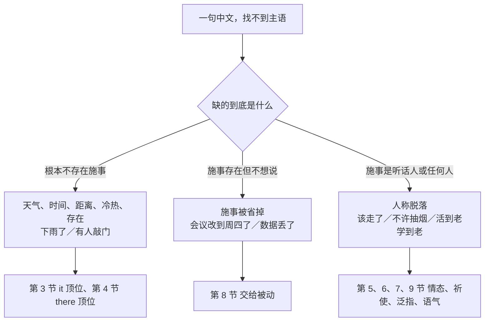
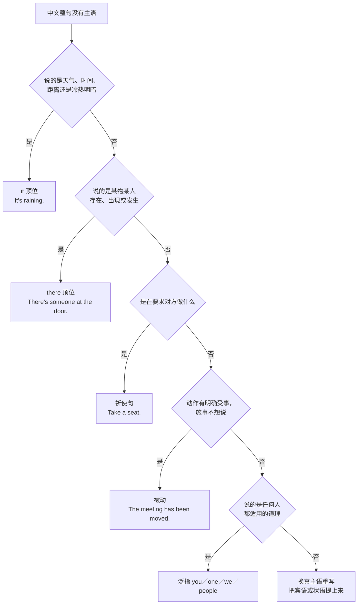
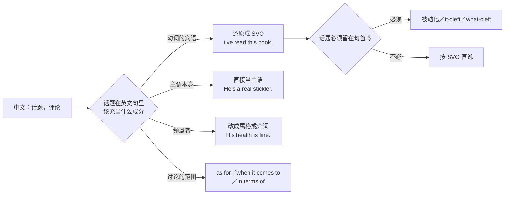
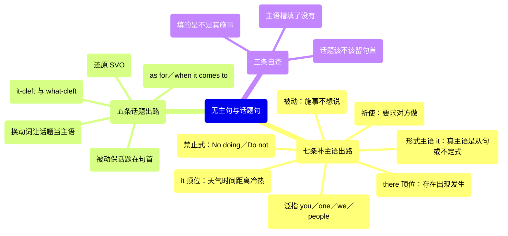

# 无主句、话题优先与主语选择：下雨了、这件事我知道

> [!info] 本篇定位
>
> 这篇收两类中文句子：一类整句找不到主语（下雨了／该走了／有人敲门／不许抽烟／轮到你了／出事了／早说啊），一类主语位置上站着的其实是话题不是施事（这本书我看过了／价格方面再谈／他这个人啊／他身体很好）。
>
> 产出是七条补主语出路加五条话题重排出路，每条给中文触发语、三档成品句架与错配警示。
>
> 与本分类另两篇的分工：施事被明说出来的「被／让／叫／给」句归 [[02.中文句式转换/01.被字句与隐性被动：被…了、让人给…了、饭做好了\|被字句与隐性被动]]，「把」字处置句归 [[02.中文句式转换/02.把字句：处置式的四条英译出路\|把字句：处置式的四条英译出路]]。本篇只管主语那个空槽怎么填。
>
> 读完能查到：任意一句没主语的中文，用哪个词顶主语位；任意一句「话题在前评论在后」的中文，怎么重排成英文能接受的语序，以及必须让话题留在句首时用什么手段。

---

## 1. 本篇导读：中文可以不给主语，英文的槽必须填

中文说「下雨了」「该走了」「轮到你了」，谁都听得懂，因为中文允许整句不出现主语。英文的主语槽是硬性的，哪怕没有任何东西可放，也得塞一个 `it` 或 `there` 把位置占住。中文母语者最典型的错句就是照搬语序，写出 `Is raining outside.` `Should go now.` `Has someone knocking at the door.` 这类少一截的句子。

麻烦的是，空槽该填什么并不唯一。「出事了」可以是 `Something's happened.`，也可以是 `There's been an accident.`，还可以是 `We've got a problem.`——选哪个取决于说话人是想报告事件、点出存在，还是把自己算进受影响的一方。这篇不解释为什么，只给判断路径和成品。

这张图把中文无主句按「缺的是什么」分成三支。第一支根本没有施事可找，英文靠虚位主语补位；第二支施事是有的，只是说话人不打算点名，英文靠被动把受事顶到主语位；第三支施事是听话人自己或者泛指的任何人，英文靠祈使或者泛指代词补出来。判错分支就会写出把「不许抽烟」译成 `Not allow smoking.` 这种既没主语又没语态的句子。

第二类问题是语序。中文的「这本书我看过了」不是倒装，是正常语序——先立一个话题，再对它作评论。英文没有这个位置，直接照译成 `This book I have read.` 会被读成刻意的文学倒装。第 10、11 两节专门处理这一类。

---

## 2. 七条出路：无主句补主语总选择表

先看总表。左列是判断依据，右列是补什么，第三列给一个最短的辨认样本。查到分支之后再去对应小节取成品。

| 判断依据 | 补什么 | 辨认样本 |
| --- | --- | --- |
| 说的是天气、时间、距离、明暗、冷热 | `it` 顶位 | It's raining. / It's almost six. |
| 说的是某人某物存在、出现、发生 | `there` 顶位 | There's someone at the door. |
| 真正的主语是一个从句或不定式，太长放不进句首 | 形式主语 `it` | It's hard to say. |
| 要求、指示、劝告听话人做某事 | 祈使句，主语脱落是英文允许的 | Take a seat. / Don't rush. |
| 禁止、告示、规章 | 祈使否定式、`No + doing`、`must not` | No smoking. / Do not enter. |
| 说的是任何人都适用的道理或经验 | 泛指 `you` / `one` / `we` / `people` / `they` | You live and learn. |
| 动作有明确受事，施事不想说或说不出 | 被动，受事升为主语 | The meeting has been moved. |
| 以上都不是，但句子里有个名词能当主语 | 换真主语重写，把宾语或状语提上来 | This place gets cold at night. |

这棵树按排除法走，顺序不能乱。先问天气时间是因为这一类最封闭，命中就不必再想；存在句排第二是因为「有…」在中文里覆盖面极广；祈使排第三是因为它是唯一允许主语真空的英文句式；被动排在祈使之后，是为了防止把「请把门关上」这种指示句误判成被动。走到最后一档「换真主语重写」的句子通常最难，也最能体现英文的表达习惯——中文说「这儿晚上冷」，英文更愿意说 `This place gets cold at night.`，让地点自己当主语。

> [!tip] 一条快速自检
>
> 写完一句英文，把主语指头指一遍：这个词在指谁或指什么？如果指不出来，看它是不是 `it` 或 `there` 这两个合法的虚位主语。如果既指不出来又不是这两个词，句子多半是从中文照搬来的。

---

## 3. 天气、时间、环境：it 顶位的一族

这一族的共同点是句子描述的是外部环境本身，没有任何实体在施事。中文习惯只说谓语，英文必须用 `it` 把主语槽占住。

### 3.1 下雨了

中文触发语：下雨了 / 下起雨来了 / 外面在下雨 / 雨下大了 / 下雪了

| 档位 | 句架 | 例句 |
| --- | --- | --- |
| 口语 | It's + doing | It's raining — take an umbrella. |
| 口语 | It's started to do | It's started to snow, so the trains will be a mess. |
| 书面 | It has been doing since ... | It has been raining steadily since early this morning. |
| 正式 | Heavy rain set in ... | Heavy rain set in shortly after midday and continued into the evening. |

> [!warning] 错配警示
>
> - ~~Is raining outside.~~ ❌ → **It's raining outside.** ✅（`outside` 是状语不是主语，主语槽仍然空着）
> - ~~The rain is downing.~~ ❌ → **It's pouring.** ✅（中文「下大雨」不拆成「雨 + 下」，英文用单个动词 `pour` 或 `bucket down`）

- 同义入口：下雨了 / 下上了 / 外头在下 / 雨越下越大
- 语法归属：[[02.英语基础语法/03.代词与数词/01.人称代词与物主代词\|it 的非指代用法]]
- 场景实战：[[04.英语场景/02.基础句型框架/03.there be 与 it 句型完全手册\|it 句型完全手册]]

---

### 3.2 天黑了

中文触发语：天黑了 / 天亮了 / 转凉了 / 天气变了 / 起风了 / 雾很大

| 档位 | 句架 | 例句 |
| --- | --- | --- |
| 口语 | It's getting + adj. | It's getting dark — we should head back. |
| 书面 | It turns + adj. + 时间状语 | It turns cold here around the end of October. |
| 正式 | Conditions + 动词 | Conditions deteriorated rapidly after nightfall. |

> [!warning] 错配警示
>
> - ~~The sky is black.~~ ❌ → **It's getting dark.** ✅（中文的「天」在这里不是天空，是环境总称，英文不给它实体主语）
> - ~~It becomes dark.~~ ❌ → **It's getting dark.** ✅（正在发生的变化用进行体，`becomes` 会读成习惯性事实）

- 同义入口：天黑了 / 快黑了 / 天要亮了 / 冷下来了 / 暖和起来了
- 语法归属：[[02.英语基础语法/06.动词时态/03.进行时态详解\|进行时表正在发生的变化]]
- 场景实战：[[04.英语场景/06.日常生活场景实战/02.家庭家务与日常起居场景\|日常起居场景]]

---

### 3.3 几点了

中文触发语：几点了 / 到点了 / 还早呢 / 快到了 / 都十一点了 / 今天几号

| 档位 | 句架 | 例句 |
| --- | --- | --- |
| 口语 | It's + 时间 | It's almost six — the standup should be over by now. |
| 口语 | What time is it? | What time is it there? I never remember the offset. |
| 书面 | It is + 时间 + and 从句 | It was already past eleven and the build still hadn't finished. |
| 正式 | As of + 时间点 | As of 09:00 UTC, the incident remains unresolved. |

> [!warning] 错配警示
>
> - ~~Now is six o'clock.~~ ❌ → **It's six o'clock.** ✅（`now` 是时间状语，不能占主语位）
> - ~~How much time is it?~~ ❌ → **What time is it?** ✅（问钟点用 `what time`，`how much time` 问的是时长）

- 同义入口：几点了 / 到点了 / 都几点了 / 还有多久 / 今天星期几
- 语法归属：[[02.英语基础语法/03.代词与数词/05.数词的用法与表达\|时间与数词的读法]]
- 场景实战：[[04.英语场景/02.基础句型框架/03.there be 与 it 句型完全手册\|it 句型完全手册]]

---

### 3.4 到公司要一个小时

中文触发语：到…要多久 / 走过去挺远的 / 离这儿不远 / 打车二十分钟 / 就几步路

| 档位 | 句架 | 例句 |
| --- | --- | --- |
| 口语 | It takes + 时长 + to do | It takes about an hour to get to the office in the morning. |
| 口语 | It's + 距离 + from A to B | It's only two stops from here to the station. |
| 书面 | It is a + 时长 + walk / drive | It's a fifteen-minute walk from the hotel to the venue. |
| 正式 | The journey requires ... | The journey from the terminal to the main campus requires approximately 40 minutes. |

> [!warning] 错配警示
>
> - ~~Go to the office needs one hour.~~ ❌ → **It takes an hour to get to the office.** ✅（中文的动词短语不能直接当主语，英文用 `it` 顶位把它挪到后面）
> - ~~It spends me an hour.~~ ❌ → **It takes me an hour.** ✅（`spend` 的主语必须是人）

- 同义入口：要多久 / 得走多久 / 离得远吗 / 多长时间能到
- 语法归属：[[02.英语基础语法/08.非谓语动词/01.动词不定式详解\|不定式作真正主语]]
- 场景实战：[[04.英语场景/08.出行与旅游场景实战/04.问路景点游览与购物场景\|问路与路程描述]]

---

### 3.5 这儿有点冷

中文触发语：有点冷 / 太吵了 / 味儿挺大 / 里面挤 / 这屋子太闷

| 档位 | 句架 | 例句 |
| --- | --- | --- |
| 口语 | It's a bit + adj. + in here | It's a bit cold in here — mind if I shut the window? |
| 口语 | It gets + adj. + 时间状语 | It gets pretty loud in this room after four. |
| 书面 | 地点 + gets / stays + adj. | The server room stays cold enough that nobody wants to sit in it. |
| 正式 | 名词 + is subject to + 名词 | The east wing is subject to considerable noise from the street. |

> [!warning] 错配警示
>
> - ~~Here is very cold.~~ ❌ → **It's really cold in here.** ✅（`here` 是地点副词，不作主语；要让地点当主语得换成 `this room`、`this place` 这类名词）
> - ~~I am cold in this room, so it is cold.~~ ❌ → **It's cold in here.** ✅（说环境不说自己，两句混在一起意思会变）

- 同义入口：有点冷 / 冻死了 / 太吵 / 闷得慌 / 味儿重
- 语法归属：[[02.英语基础语法/04.形容词与副词/01.形容词的用法与位置\|形容词作表语]]
- 场景实战：[[04.英语场景/06.日常生活场景实战/02.家庭家务与日常起居场景\|日常起居场景]]

---

### 3.6 很难说

中文触发语：很难说 / 没必要 / 值得一试 / 挺重要的 / 不奇怪 / 看来是这样

主语其实是后面那件事，中文可以整个不说，英文用 `it` 先占位，把真正的主语挪到句末。

| 档位 | 句架 | 例句 |
| --- | --- | --- |
| 口语 | It's hard to say | It's hard to say whether the fix actually helped. |
| 口语 | It's not worth doing | It's not worth rewriting the whole module for one endpoint. |
| 书面 | It is + adj. + that 从句 | It is entirely possible that the two bugs share a root cause. |
| 书面 | It seems / appears that ... | It seems the cache was never invalidated after the deploy. |
| 正式 | It is essential that sb (should) do | It is essential that every change be reviewed before merge. |

> [!warning] 错配警示
>
> - ~~Is difficult to say.~~ ❌ → **It's difficult to say.** ✅（形式主语 `it` 不能省，句首没有别的东西时尤其明显）
> - ~~It's worth to try.~~ ❌ → **It's worth trying.** ✅（`worth` 后面固定接动名词，这是搭配限制不是语法推导）

- 同义入口：很难说 / 说不好 / 犯不上 / 值得试试 / 有必要 / 没什么大不了
- 语法归属：[[02.英语基础语法/09.从句体系/03.名词性从句详解\|it 作形式主语的主语从句]]
- 场景实战：[[04.英语场景/05.高频实用表达句型框架/01.表达观点与态度的50个万能句型\|表达观点与态度]]

---

## 4. 有…、出…：there 顶位的一族

中文一个「有」字覆盖了存在、出现、发生、拥有四种意思。这一节只处理前三种——存在、出现、发生，它们对应英文的 `there be`。第四种「拥有」直接用 `have`，不在这里。

### 4.1 有人敲门

中文触发语：有人敲门 / 有人找你 / 门口有人 / 楼下有个人 / 有人在等

| 档位 | 句架 | 例句 |
| --- | --- | --- |
| 口语 | There's sb + 地点 / doing | There's someone at the door. |
| 口语 | Someone's + doing | Someone's knocking — can you get it? |
| 书面 | There is sb waiting for sb | There is a courier waiting for you at reception. |
| 正式 | A + 名词 + is present / awaiting | A representative from the vendor is awaiting your confirmation. |

> [!warning] 错配警示
>
> - ~~Have someone knocking the door.~~ ❌ → **There's someone knocking at the door.** ✅（中文的「有」在存在句里对应 `there be`，不对应 `have`）
> - ~~There is someone knock the door.~~ ❌ → **There's someone knocking at the door.** ✅（`there be` 后面接名词，动作要挂成 `-ing` 修饰语）

- 同义入口：有人敲门 / 有人来了 / 门外有人 / 有人在外面等
- 语法归属：[[02.英语基础语法/10.特殊句型/06.主谓一致\|there be 的主谓一致]]
- 场景实战：[[04.英语场景/02.基础句型框架/03.there be 与 it 句型完全手册\|there be 句型完全手册]]

---

### 4.2 出事了

中文触发语：出事了 / 出问题了 / 出岔子了 / 不对劲 / 有情况 / 坏了

| 档位 | 句架 | 例句 |
| --- | --- | --- |
| 口语 | Something's + 过去分词 / wrong | Something's wrong with the login flow. |
| 口语 | We've got a problem | We've got a problem — the migration didn't roll back cleanly. |
| 书面 | There has been + 名词 | There has been an incident affecting the payment service. |
| 正式 | An issue has arisen concerning ... | An issue has arisen concerning the integrity of the exported data. |

> [!warning] 错配警示
>
> - ~~Happened an accident.~~ ❌ → **There's been an accident.** ✅（`happen` 前面必须有主语，中文的无主语序不能照搬）
> - ~~It happened something.~~ ❌ → **Something happened.** ✅（`happen` 不带宾语，`something` 本身就是主语）

- 同义入口：出事了 / 出问题了 / 有状况 / 不太对 / 炸了
- 语法归属：[[02.英语基础语法/06.动词时态/04.完成时态详解\|现在完成时表刚发生]]
- 场景实战：[[04.英语场景/11.医疗与紧急场景实战/01.医院看病与药店购药场景\|紧急情况的表达]]

---

### 4.3 没人来

中文触发语：没人来 / 一个人也没有 / 什么都没有 / 没剩下什么 / 空的

| 档位 | 句架 | 例句 |
| --- | --- | --- |
| 口语 | Nobody + 动词 | Nobody showed up for the review. |
| 口语 | There's nothing / no one ... | There's no one in the office on Fridays. |
| 书面 | There are no + 复数名词 | There are no outstanding blockers on this ticket. |
| 正式 | No + 名词 + has been + 过去分词 | No further objections have been raised since the last meeting. |

> [!warning] 错配警示
>
> - ~~There isn't anybody didn't come.~~ ❌ → **Nobody came.** ✅（中文「没人来」是一重否定，英文只否定一次）
> - ~~There aren't any blocker.~~ ❌ → **There aren't any blockers.** ✅（`any` 后面用复数，`there be` 的数跟着后面的名词走）

- 同义入口：没人来 / 一个没有 / 都没到 / 空着呢 / 什么也没剩
- 语法归属：[[02.英语基础语法/03.代词与数词/04.不定代词详解\|nobody、nothing、none 的用法]]
- 场景实战：[[04.英语场景/10.职场与商务场景实战/02.会议汇报与演示场景\|会议汇报场景]]

---

### 4.4 有件事要说一下

中文触发语：有件事 / 有一点要注意 / 还有个问题 / 有几个地方 / 补充一句

| 档位 | 句架 | 例句 |
| --- | --- | --- |
| 口语 | There's one thing ... | There's one thing I want to flag before we ship. |
| 口语 | Quick note: ... | Quick note — the staging DB was reset last night. |
| 书面 | There are a couple of points worth raising | There are a couple of points worth raising about the rollout plan. |
| 正式 | The following matters require attention | The following matters require attention before the contract is signed. |

> [!warning] 错配警示
>
> - ~~Have a thing I want to say.~~ ❌ → **There's something I want to say.** ✅（引入一个新话题用 `there be`，`have` 会读成「我拥有一样东西」）
> - ~~There has one problem.~~ ❌ → **There's one problem.** ✅（`there` 后面永远跟 `be`，不跟 `have`）

- 同义入口：有件事 / 有个情况 / 提一句 / 还有一点 / 顺便说
- 语法归属：[[02.英语基础语法/09.从句体系/01.定语从句基础\|there be 后的定语从句]]
- 场景实战：[[04.英语场景/10.职场与商务场景实战/03.商务邮件与正式书面沟通\|商务邮件表达]]

---

### 4.5 以后会有的

中文触发语：以后会有 / 早晚会出 / 之前有过一次 / 一直都有 / 会有变化

| 档位 | 句架 | 例句 |
| --- | --- | --- |
| 口语 | There'll be ... | There'll be another window next sprint. |
| 口语 | There was one time when ... | There was one time when the whole cluster went down mid-demo. |
| 书面 | There has always been ... | There has always been some tension between speed and coverage here. |
| 正式 | There is expected to be ... | There is expected to be a further round of consultation in Q3. |

> [!warning] 错配警示
>
> - ~~Will have a chance next week.~~ ❌ → **There'll be a chance next week.** ✅（没有明确拥有者时用 `there be`）
> - ~~There will be have a meeting.~~ ❌ → **There will be a meeting.** ✅（`be` 和 `have` 只能留一个）

- 同义入口：以后会有 / 早晚有 / 曾经有过 / 一向如此 / 还会再有
- 语法归属：[[02.英语基础语法/06.动词时态/02.一般将来时与过去将来时\|将来时的存在句形态]]
- 场景实战：[[04.英语场景/02.基础句型框架/03.there be 与 it 句型完全手册\|there be 句型完全手册]]

---

## 5. 该走了、轮到你了：情态与安排类无主句

这一族的施事其实是「我们」或者「你」，中文靠语境省掉。英文补人称之外还得挑一个情态词把「该」「得」「用不着」的分量带出来。

### 5.1 该走了

中文触发语：该走了 / 该睡了 / 到时候了 / 是时候…了 / 该动手了

| 档位 | 句架 | 例句 |
| --- | --- | --- |
| 口语 | We should get going | We should get going — the last train's at eleven. |
| 口语 | It's time to do | It's time to call it a day. |
| 书面 | It is time sb did sth | It's high time we revisited the release checklist. |
| 正式 | The time has come to do | The time has come to retire the legacy endpoint. |

> [!warning] 错配警示
>
> - ~~Should go now.~~ ❌ → **We should go now.** ✅（情态动词前面的主语不能省，英文只有祈使句允许主语真空）
> - ~~It's time to went.~~ ❌ → **It's time to go.** ✅（`It's time` 后面接不定式，只有 `It's time we` 这个变体才用过去式）

- 同义入口：该走了 / 得走了 / 到点了 / 该收工了 / 是时候了
- 语法归属：[[02.英语基础语法/07.助动词与情态动词/02.情态动词详解\|should 表适宜与建议]]
- 场景实战：[[04.英语场景/07.社交交际场景实战/01.交友聚会与闲聊场景\|聚会告辞]]

---

### 5.2 轮到你了

中文触发语：轮到你了 / 该你了 / 到你上场了 / 该谁了 / 下一个是谁

| 档位 | 句架 | 例句 |
| --- | --- | --- |
| 口语 | You're up | You're up — the panel's ready for your demo. |
| 口语 | It's your turn to do | It's your turn to run the standup this week. |
| 书面 | sb is next in line to do | You're next in line to review the migration PR. |
| 正式 | The rotation now falls to sb | The on-call rotation now falls to the platform team. |

> [!warning] 错配警示
>
> - ~~Turn to you.~~ ❌ → **It's your turn.** ✅（`turn` 是名词，需要 `it` 和系动词把它撑成完整句）
> - ~~It's your turn to running it.~~ ❌ → **It's your turn to run it.** ✅（`turn to` 后面跟不定式，不跟动名词）

- 同义入口：轮到你 / 该你 / 到你了 / 你上 / 下一个你
- 语法归属：[[02.英语基础语法/03.代词与数词/01.人称代词与物主代词\|物主代词作定语]]
- 场景实战：[[04.英语场景/09.学习与教育场景实战/01.课堂讨论与提问场景\|课堂轮次表达]]

---

### 5.3 得赶紧

中文触发语：得赶紧 / 必须现在做 / 非做不可 / 拖不得了 / 越快越好

| 档位 | 句架 | 例句 |
| --- | --- | --- |
| 口语 | We need to do sth now | We need to patch this before the weekend. |
| 口语 | This can't wait | This can't wait — the queue is already backing up. |
| 书面 | sth must be done without delay | The credentials must be rotated without delay. |
| 正式 | Immediate action is required | Immediate action is required to contain the data exposure. |

> [!warning] 错配警示
>
> - ~~Must do it quickly.~~ ❌ → **We must do it quickly.** ✅（同 5.1，情态句必须补主语）
> - ~~It's must to do now.~~ ❌ → **It has to be done now.** ✅（`must` 是情态动词，不能挂在 `is` 后面当表语）

- 同义入口：得赶紧 / 马上办 / 拖不起 / 得立刻 / 越快越好
- 语法归属：[[02.英语基础语法/07.助动词与情态动词/02.情态动词详解\|must 与 have to 的分工]]
- 场景实战：[[04.英语场景/10.职场与商务场景实战/02.会议汇报与演示场景\|紧急事项汇报]]

---

### 5.4 不用管

中文触发语：不用管 / 没必要弄 / 别费劲了 / 放着就行 / 用不着改

| 档位 | 句架 | 例句 |
| --- | --- | --- |
| 口语 | Don't bother with sth | Don't bother with the linter warnings for now. |
| 口语 | You can leave it | You can leave it — I'll clean it up in the next pass. |
| 书面 | There is no need to do | There's no need to reprocess the historical records. |
| 正式 | No further action is required | No further action is required on your part. |

> [!warning] 错配警示
>
> - ~~Needn't to care it.~~ ❌ → **You don't need to worry about it.** ✅（`needn't` 后面直接跟原形，不跟 `to`）
> - ~~No need do it.~~ ❌ → **There's no need to do it.** ✅（`no need` 是名词短语，前面得有 `there is`，后面得有 `to`）

- 同义入口：不用管 / 甭理它 / 没必要 / 放着吧 / 不必弄
- 语法归属：[[02.英语基础语法/07.助动词与情态动词/02.情态动词详解\|need 的情态与实义两种用法]]
- 场景实战：[[04.英语场景/05.高频实用表达句型框架/02.建议请求邀请拒绝四大功能句型\|婉拒与免除]]

---

### 5.5 说好了

中文触发语：说好了 / 就这么定了 / 都安排好了 / 定在周三 / 已经谈妥

| 档位 | 句架 | 例句 |
| --- | --- | --- |
| 口语 | It's settled | It's settled then — Wednesday at ten. |
| 口语 | We're all set | We're all set for the demo tomorrow. |
| 书面 | sth is scheduled for + 时间 | The handover is scheduled for Wednesday morning. |
| 正式 | It has been agreed that ... | It has been agreed that the deliverables will be reviewed monthly. |

> [!warning] 错配警示
>
> - ~~Have decided.~~ ❌ → **We've decided.** ✅（完成时同样要主语）
> - ~~It's decided on Wednesday.~~ ❌ → **It's set for Wednesday.** ✅（`decide on` 是「选定某方案」，说时间安排用 `set for` 或 `scheduled for`）

- 同义入口：说好了 / 定了 / 就这样 / 安排妥了 / 谈定
- 语法归属：[[02.英语基础语法/10.特殊句型/01.被动语态全解\|被动表已完成的安排]]
- 场景实战：[[04.英语场景/10.职场与商务场景实战/04.商务谈判合同与客户沟通\|确认安排]]

---

## 6. 不许抽烟、请勿入内：禁止、指示与告示

祈使句是英文唯一允许主语空着的句式，所以这一族最省事——但中文的「不许」「请勿」「严禁」在英文里落到三种不同形态上：口头制止用祈使否定式，告示牌用 `No + doing`，规章条文用 `must not` 或 `is prohibited`。

### 6.1 不许抽烟

中文触发语：不许抽烟 / 禁止吸烟 / 别抽了 / 这儿不能抽 / 严禁明火

| 档位 | 句架 | 例句 |
| --- | --- | --- |
| 口语 | You can't do sth here | You can't smoke in here — there's a courtyard out back. |
| 告示 | No + doing | No smoking beyond this point. |
| 书面 | sth is not permitted | Smoking is not permitted anywhere on the premises. |
| 正式 | sb is prohibited from doing | Occupants are prohibited from smoking in common areas. |

> [!warning] 错配警示
>
> - ~~Not allow smoking.~~ ❌ → **Smoking is not allowed.** ✅（`allow` 要么变被动，要么补出施事，中文的无主语序不能照搬）
> - ~~No smoke.~~ ❌ → **No smoking.** ✅（告示式的 `No` 后面接动名词，`No smoke` 会读成「没有烟」）

- 同义入口：不许抽烟 / 禁烟 / 不能抽 / 严禁吸烟 / 这儿别抽
- 语法归属：[[02.英语基础语法/08.非谓语动词/02.动名词详解\|动名词在告示中的用法]]
- 场景实战：[[04.英语场景/02.基础句型框架/02.陈述疑问祈使感叹四大句式\|祈使句四大句式]]

---

### 6.2 请勿触摸

中文触发语：请勿触摸 / 闲人免进 / 非请勿入 / 请勿转载 / 严禁停车

| 档位 | 句架 | 例句 |
| --- | --- | --- |
| 告示 | Do not + 动词原形 | Do not touch the exhibits. |
| 告示 | 名词 + only | Staff only. |
| 书面 | Unauthorized + 名词 + is prohibited | Unauthorized reproduction is prohibited. |
| 正式 | Access is restricted to ... | Access to this area is restricted to authorized personnel. |

> [!warning] 错配警示
>
> - ~~Please don't touching.~~ ❌ → **Please do not touch.** ✅（祈使否定式后面永远是动词原形）
> - ~~No entry for idle people.~~ ❌ → **Staff only.** / **Authorized personnel only.** ✅（英文告示不逐字译「闲人」，用正面限定说清谁能进）

- 同义入口：请勿触摸 / 别碰 / 闲人免进 / 禁止入内 / 谢绝参观
- 语法归属：[[02.英语基础语法/10.特殊句型/05.省略与替代\|告示语的省略形态]]
- 场景实战：[[04.英语场景/08.出行与旅游场景实战/04.问路景点游览与购物场景\|景点告示阅读]]

---

### 6.3 请先填一下表

中文触发语：请先… / 麻烦你… / 先…再… / 按这个步骤 / 第一步是

| 档位 | 句架 | 例句 |
| --- | --- | --- |
| 口语 | Just + 动词原形 | Just fill this out and hand it back to me. |
| 口语 | Go ahead and + 动词原形 | Go ahead and restart the service once the config lands. |
| 书面 | Please + 动词原形 + first | Please complete the form before joining the queue. |
| 正式 | sb should first do sth | Applicants should first verify their identity through the portal. |

> [!warning] 错配警示
>
> - ~~Please you fill the form.~~ ❌ → **Please fill in the form.** ✅（祈使句里补出 `you` 会变成责备语气）
> - ~~Fill the form first, then submitting it.~~ ❌ → **Fill in the form first, then submit it.** ✅（并列的两个祈使动词形态要一致）

- 同义入口：请先 / 麻烦先 / 先做 / 按步骤 / 第一步
- 语法归属：[[02.英语基础语法/01.基础入门/02.英语五大基本句型详解\|祈使句的主语脱落]]
- 场景实战：[[04.英语场景/02.基础句型框架/02.陈述疑问祈使感叹四大句式\|祈使句四大句式]]

---

### 6.4 别忘了

中文触发语：别忘了 / 记得… / 千万要… / 到时候记着 / 别落下

| 档位 | 句架 | 例句 |
| --- | --- | --- |
| 口语 | Don't forget to do | Don't forget to bump the version before you tag. |
| 口语 | Remember to do | Remember to revoke the temporary token afterwards. |
| 书面 | Please ensure that ... | Please ensure that the backup completes before the maintenance window. |
| 正式 | Care should be taken to do | Care should be taken to preserve the original timestamps. |

> [!warning] 错配警示
>
> - ~~Don't forget doing it.~~ ❌ → **Don't forget to do it.** ✅（`forget to do` 是「忘了要做」，`forget doing` 是「忘了做过」，两个意思相反）
> - ~~Remember bump the version.~~ ❌ → **Remember to bump the version.** ✅（`remember` 后面的 `to` 不能省）

- 同义入口：别忘了 / 记着 / 千万别落 / 到时候记得 / 留神别漏
- 语法归属：[[02.英语基础语法/08.非谓语动词/05.非谓语动词综合辨析\|remember 与 forget 的双读法]]
- 场景实战：[[04.英语场景/07.社交交际场景实战/02.电话短信与在线沟通场景\|提醒与嘱托]]

---

### 6.5 小心台阶

中文触发语：小心 / 当心 / 注意… / 留神 / 慢点儿 / 看着点

| 档位 | 句架 | 例句 |
| --- | --- | --- |
| 口语 | Watch + 名词 | Watch your step — the floor's still wet. |
| 口语 | Careful with sth | Careful with that cable, it's the only one we have. |
| 告示 | Caution: + 名词 | Caution: low ceiling. |
| 正式 | Persons are advised to do | Visitors are advised to keep to the marked path. |

> [!warning] 错配警示
>
> - ~~Notice the step.~~ ❌ → **Watch your step.** ✅（`notice` 是「注意到」这个心理动作，警示用 `watch` 或 `mind`）
> - ~~Careful the cable.~~ ❌ → **Careful with the cable.** ✅（`careful` 后接对象要用 `with`）

- 同义入口：小心 / 当心 / 留神 / 注意点 / 看着点儿
- 语法归属：[[02.英语基础语法/04.形容词与副词/03.副词的分类与用法\|警示语的省略式]]
- 场景实战：[[04.英语场景/11.医疗与紧急场景实战/01.医院看病与药店购药场景\|紧急提醒]]

---

## 7. 活到老学到老：泛指主语的四个候选

中文说道理时不需要主语，英文得挑一个泛指代词。四个候选的分工是固定的：`you` 最口语、拉近距离；`we` 把说话人和听话人绑在一起；`one` 只用于正式文体，用在口语里像在念哲学书；`people` 和 `they` 指「别人」，把说话人排除在外。

### 7.1 活到老学到老

中文触发语：活到老学到老 / 人总要… / 谁都得… / 做人得… / 早晚要面对

| 档位 | 句架 | 例句 |
| --- | --- | --- |
| 口语 | You + 动词原形 | You live and learn. |
| 口语 | You've got to do sth sooner or later | You've got to face it sooner or later. |
| 书面 | One + 动词 | One learns to live with a certain amount of uncertainty. |
| 正式 | It is generally accepted that ... | It is generally accepted that skills require continual renewal. |

> [!warning] 错配警示
>
> - ~~Live to old, learn to old.~~ ❌ → **You live and learn.** / **It's never too late to learn.** ✅（四字谚语不逐字译，取现成英文对应）
> - ~~People must always learning.~~ ❌ → **People have to keep learning.** ✅（情态动词后面接原形，持续义靠 `keep doing` 带出来）

- 同义入口：活到老学到老 / 人总得学 / 学无止境 / 谁都得成长
- 语法归属：[[02.英语基础语法/03.代词与数词/04.不定代词详解\|one 与 you 的泛指用法]]
- 场景实战：[[04.英语场景/05.高频实用表达句型框架/01.表达观点与态度的50个万能句型\|表达观点]]

---

### 7.2 说起来容易做起来难

中文触发语：说起来容易 / 做起来难 / 听着简单 / 想想是这样 / 看着不难

| 档位 | 句架 | 例句 |
| --- | --- | --- |
| 口语 | Easier said than done | Migrating everything at once? Easier said than done. |
| 口语 | It sounds simple until you do it | It sounds simple until you actually try to reproduce it. |
| 书面 | sth is straightforward in principle but ... in practice | The approach is straightforward in principle but awkward in practice. |
| 正式 | The proposal is conceptually simple yet operationally demanding | The proposal is conceptually simple yet operationally demanding. |

> [!warning] 错配警示
>
> - ~~Say is easy, do is difficult.~~ ❌ → **Easier said than done.** ✅（动词不能直接当主语，何况这句有现成成语）
> - ~~It's easy to say but hard to done.~~ ❌ → **It's easy to say but hard to do.** ✅（并列的两个不定式形态要对齐）

- 同义入口：说起来容易 / 光说不练 / 听着简单 / 纸上谈兵
- 语法归属：[[02.英语基础语法/04.形容词与副词/02.形容词的比较级与最高级\|比较级构成的固定式]]
- 场景实战：[[04.英语场景/05.高频实用表达句型框架/04.比较对比举例总结句型库\|对比与总结]]

---

### 7.3 一般都这么办

中文触发语：一般都这么办 / 大家都这么说 / 通常是… / 按惯例 / 都习惯了

| 档位 | 句架 | 例句 |
| --- | --- | --- |
| 口语 | People usually do sth | People usually just restart it and move on. |
| 口语 | That's how we do it here | That's how we do it here — no formal sign-off for hotfixes. |
| 书面 | It is common practice to do | It is common practice to tag the release before deploying. |
| 正式 | Convention dictates that ... | Convention dictates that the reviewer, not the author, merges the change. |

> [!warning] 错配警示
>
> - ~~Generally do like this.~~ ❌ → **That's generally how it's done.** ✅（泛指句也要主语，`it` 加被动是最省事的填法）
> - ~~All people say so.~~ ❌ → **Everyone says so.** ✅（`all people` 是中式直译，英文用 `everyone` 或 `people`）

- 同义入口：一般这么办 / 惯例如此 / 大家都这样 / 通常是 / 老规矩
- 语法归属：[[02.英语基础语法/06.动词时态/01.一般现在时与一般过去时\|一般现在时表习惯与通则]]
- 场景实战：[[04.英语场景/10.职场与商务场景实战/02.会议汇报与演示场景\|说明惯例]]

---

### 7.4 谁都知道

中文触发语：谁都知道 / 谁也没想到 / 没人料到 / 人人都清楚 / 明摆着的事

| 档位 | 句架 | 例句 |
| --- | --- | --- |
| 口语 | Everyone knows ... | Everyone knows the estimate was optimistic. |
| 口语 | Nobody saw that coming | Nobody saw that coming — the load spiked at three in the morning. |
| 书面 | It is widely understood that ... | It is widely understood that the metric is only a proxy. |
| 正式 | It is beyond dispute that ... | It is beyond dispute that the original specification was incomplete. |

> [!warning] 错配警示
>
> - ~~Who all knows this.~~ ❌ → **Everyone knows this.** ✅（中文的疑问词泛指用法在英文里要换成 `everyone`、`anyone`）
> - ~~Everyone know it.~~ ❌ → **Everyone knows it.** ✅（`everyone` 按单数取谓语）

- 同义入口：谁都知道 / 人尽皆知 / 谁也没料到 / 明摆着 / 不用说
- 语法归属：[[02.英语基础语法/10.特殊句型/06.主谓一致\|everyone 类主语的一致]]
- 场景实战：[[04.英语场景/05.高频实用表达句型框架/01.表达观点与态度的50个万能句型\|陈述共识]]

---

## 8. 施事不明时交给被动

这一节只处理「中文整句无主语，而且句子里有明确的受事」的情形。施事被明说出来的「被／让／叫／给」句，以及「饭做好了」这类隐性被动的完整选择树，都在 [[02.中文句式转换/01.被字句与隐性被动：被…了、让人给…了、饭做好了\|被字句与隐性被动]]，这里不重复。

### 8.1 会议改到周四了

中文触发语：改到…了 / 挪到下周 / 推迟了 / 提前了 / 取消了

| 档位 | 句架 | 例句 |
| --- | --- | --- |
| 口语 | sth got moved to ... | The review got moved to Thursday. |
| 口语 | They've pushed sth back | They've pushed the launch back two weeks. |
| 书面 | sth has been rescheduled for ... | The meeting has been rescheduled for Thursday at 14:00. |
| 正式 | sth is hereby postponed until ... | The hearing is hereby postponed until further notice. |

> [!warning] 错配警示
>
> - ~~Changed the meeting to Thursday.~~ ❌ → **The meeting's been moved to Thursday.** ✅（照搬中文语序会变成祈使句，读起来像在命令对方改会议）
> - ~~The meeting was moved on Thursday.~~ ❌ → **The meeting was moved to Thursday.** ✅（`to` 表移动到的时间点，`on` 会读成「周四那天被挪走了」）

- 同义入口：改到 / 挪到 / 往后推 / 提前 / 黄了
- 语法归属：[[02.英语基础语法/10.特殊句型/01.被动语态全解\|被动语态的时态形态]]
- 场景实战：[[04.英语场景/10.职场与商务场景实战/03.商务邮件与正式书面沟通\|变更通知]]

---

### 8.2 没人通知我

中文触发语：没人通知我 / 没告诉我 / 我不知道这事 / 没人跟我说 / 我怎么不知道

| 档位 | 句架 | 例句 |
| --- | --- | --- |
| 口语 | Nobody told me | Nobody told me the schema changed. |
| 口语 | This is the first I'm hearing of it | This is the first I'm hearing of it. |
| 书面 | sb was not informed of sth | I wasn't informed of the change until after the deploy. |
| 正式 | No notification was received | No notification of the amendment was received by this office. |

> [!warning] 错配警示
>
> - ~~I am not be told.~~ ❌ → **I wasn't told.** ✅（被动里 `be` 只出现一次）
> - ~~Nobody didn't tell me.~~ ❌ → **Nobody told me.** ✅（`nobody` 已经带否定，谓语不再否定）

- 同义入口：没人通知 / 没跟我说 / 我不知情 / 没收到消息
- 语法归属：[[02.英语基础语法/10.特殊句型/01.被动语态全解\|被动语态全解]]
- 场景实战：[[04.英语场景/10.职场与商务场景实战/02.会议汇报与演示场景\|信息同步]]

---

### 8.3 这块儿一直没人管

中文触发语：没人管 / 一直搁着 / 没人维护 / 荒废了 / 没人接手

| 档位 | 句架 | 例句 |
| --- | --- | --- |
| 口语 | Nobody's been looking after sth | Nobody's been looking after that repo for a year. |
| 口语 | sth has been sitting there | That ticket's been sitting there since March. |
| 书面 | sth has been left unmaintained | The service has been left unmaintained since the team was reorganized. |
| 正式 | Responsibility for sth remains unassigned | Responsibility for the legacy gateway remains unassigned. |

> [!warning] 错配警示
>
> - ~~No people manage here.~~ ❌ → **Nobody owns this area.** ✅（中文的「管」在职责语境里是 `own` 或 `look after`，不是 `manage` 这个管理动作）
> - ~~It has left unmaintained.~~ ❌ → **It has been left unmaintained.** ✅（被动的 `been` 不能省）

- 同义入口：没人管 / 撂着 / 没人接 / 荒了 / 无人维护
- 语法归属：[[02.英语基础语法/06.动词时态/04.完成时态详解\|现在完成进行时表持续状态]]
- 场景实战：[[04.英语场景/10.职场与商务场景实战/02.会议汇报与演示场景\|职责说明]]

---

### 8.4 数据丢了

中文触发语：数据丢了 / 文件删了 / 记录没了 / 全清空了 / 覆盖掉了

| 档位 | 句架 | 例句 |
| --- | --- | --- |
| 口语 | sth's gone | The last three hours of data are gone. |
| 口语 | We lost sth | We lost everything after the last checkpoint. |
| 书面 | sth was deleted / overwritten | The staging records were overwritten during the sync. |
| 正式 | sth has been irrecoverably lost | Approximately six hours of transaction data has been irrecoverably lost. |

> [!warning] 错配警示
>
> - ~~The data was lost by accident deleted.~~ ❌ → **The data was accidentally deleted.** ✅（一个谓语只带一个动词，副词负责修饰）
> - ~~Deleted the file.~~ ❌ → **The file was deleted.** ✅（照搬中文语序会读成命令「把文件删了」）

- 同义入口：数据丢了 / 没了 / 删掉了 / 被覆盖 / 清空了
- 语法归属：[[02.英语基础语法/10.特殊句型/01.被动语态全解\|受事作主语的被动式]]
- 场景实战：技术故障描述（该场景篇尚未撰写）

---

## 9. 早说啊、慢走、别急：语气型无主句

这一族的中文里几乎没有实义信息，全部由语气承担。逐字译必定失败，只能整句换成英文里功能对等的成品。

### 9.1 早说啊

中文触发语：早说啊 / 你怎么不早说 / 早知道就… / 要是早点讲

| 档位 | 句架 | 例句 |
| --- | --- | --- |
| 口语 | You could have said so earlier | You could've said so earlier — I'd already started the rewrite. |
| 口语 | Why didn't you say something? | Why didn't you say something before I pushed it? |
| 书面 | It would have helped to know sth sooner | It would have helped to know about the constraint sooner. |
| 正式 | Earlier notice would have been appreciated | Earlier notice of the change would have been appreciated. |

> [!warning] 错配警示
>
> - ~~Early say!~~ ❌ → **You could've told me sooner.** ✅（语气型无主句没有对应结构，整句换成情态完成式）
> - ~~Why you don't say earlier?~~ ❌ → **Why didn't you say something earlier?** ✅（疑问句要用助动词提前，说的是过去要用过去式）

- 同义入口：早说啊 / 怎么不早讲 / 早知道 / 你倒是说啊
- 语法归属：[[02.英语基础语法/07.助动词与情态动词/03.情态动词的特殊句型\|情态动词加完成式表责备]]
- 场景实战：[[04.英语场景/07.社交交际场景实战/01.交友聚会与闲聊场景\|口语反应]]

---

### 9.2 慢走

中文触发语：慢走 / 路上小心 / 走好 / 注意安全 / 到了说一声

| 档位 | 句架 | 例句 |
| --- | --- | --- |
| 口语 | Take care | Take care — text me when you land. |
| 口语 | Safe travels | Safe travels, see you next week. |
| 书面 | Wishing you a safe journey | Wishing you a safe journey home. |
| 正式 | We trust you will have a pleasant journey | We trust you will have a pleasant journey and look forward to your return. |

> [!warning] 错配警示
>
> - ~~Walk slowly.~~ ❌ → **Take care.** ✅（「慢走」是告别套语，不是让对方放慢速度）
> - ~~Be careful on the road.~~ ❌ → **Drive safe.** / **Get home safe.** ✅（前者语气偏严厉，像在提醒有危险）

- 同义入口：慢走 / 路上小心 / 走好 / 一路平安 / 到了报个信
- 语法归属：[[02.英语基础语法/12.日常口语/02.常用口语句型\|告别套语]]
- 场景实战：[[04.英语场景/07.社交交际场景实战/01.交友聚会与闲聊场景\|告别场景]]

---

### 9.3 别急

中文触发语：别急 / 不着急 / 慢慢来 / 有的是时间 / 稳住

| 档位 | 句架 | 例句 |
| --- | --- | --- |
| 口语 | Take your time | Take your time, the deadline's not until Friday. |
| 口语 | No rush | No rush — whenever you get to it is fine. |
| 书面 | There is no particular urgency | There's no particular urgency on this one. |
| 正式 | sb may respond at their convenience | You may respond at your convenience. |

> [!warning] 错配警示
>
> - ~~Don't worry, no need quick.~~ ❌ → **No rush.** ✅（中文两个短句的语气英文一个词组就够）
> - ~~Slowly come.~~ ❌ → **Take your time.** ✅（「慢慢来」是安抚语，不描述速度）

- 同义入口：别急 / 不着急 / 慢慢来 / 不赶时间 / 你随意
- 语法归属：[[02.英语基础语法/12.日常口语/01.口语中的语法简化\|口语省略式]]
- 场景实战：[[04.英语场景/05.高频实用表达句型框架/02.建议请求邀请拒绝四大功能句型\|安抚与让步]]

---

### 9.4 算了

中文触发语：算了 / 就这样吧 / 不管了 / 随它去 / 拉倒

| 档位 | 句架 | 例句 |
| --- | --- | --- |
| 口语 | Never mind | Never mind, I'll figure it out myself. |
| 口语 | Let's leave it at that | Let's leave it at that and revisit next sprint. |
| 书面 | We will not pursue sth further | We won't pursue this line of investigation further. |
| 正式 | The matter will be treated as closed | The matter will be treated as closed unless new evidence emerges. |

> [!warning] 错配警示
>
> - ~~Forget it, don't care.~~ ❌ → **Never mind.** ✅（`Forget it` 语气重得多，接近「别提了」的不耐烦）
> - ~~Let it go it.~~ ❌ → **Let it go.** ✅（`let it go` 已经带宾语，不能再加一个）

- 同义入口：算了 / 就这样 / 拉倒 / 不追究了 / 随它
- 语法归属：[[02.英语基础语法/12.日常口语/02.常用口语句型\|常用口语句型]]
- 场景实战：[[04.英语场景/05.高频实用表达句型框架/03.同意反对让步转折句型库\|让步与收束]]

---

### 9.5 走吧

中文触发语：走吧 / 咱们开始 / 上吧 / 干起来 / 出发

| 档位 | 句架 | 例句 |
| --- | --- | --- |
| 口语 | Let's + 动词原形 | Let's get started. |
| 口语 | Shall we? | Everyone's here. Shall we? |
| 书面 | We may now proceed to do | We may now proceed to the next item on the agenda. |
| 正式 | The session is called to order | The session is called to order at 10:00. |

> [!warning] 错配警示
>
> - ~~Let's to go.~~ ❌ → **Let's go.** ✅（`let's` 后面直接跟原形）
> - ~~Let us go, shall us?~~ ❌ → **Let's go, shall we?** ✅（`let's` 的反义疑问固定用 `shall we`）

- 同义入口：走吧 / 开始吧 / 出发 / 咱们上 / 动手
- 语法归属：[[02.英语基础语法/01.基础入门/02.英语五大基本句型详解\|祈使句与 let 结构]]
- 场景实战：[[04.英语场景/10.职场与商务场景实战/02.会议汇报与演示场景\|会议开场]]

---

## 10. 话题优先：中文先立话题，英文先立主语

上面九节处理的是主语槽空着，这一节处理的是主语槽被占错了人。「这本书我看过了」的句首是话题不是主语，英文里没有专门的话题位，照搬会出问题。

判断方法只有一个：把句首那个成分放回句子中间，看它跟动词是什么关系。如果它是动词的承受者，那它在英文里就是宾语；如果它是动作发出者，才是主语。

这张图的关键是右半边那个二次判断。多数话题句直接还原成 SVO 就行，`I've read this book.` 完全够用。只有当上下文要求话题继续留在句首——比如前一句刚提到这本书，这一句还要接着说它——才值得动用被动或者分裂句。滥用 `As for...` 是中文母语者的通病：英文里它带有「换个话题说说别的」的转折意味，不是每个话题都要加。

### 10.1 这本书我看过了

中文触发语：这本书我看过了 / 那个文件我改完了 / 这题我会 / 这事我知道

| 档位 | 句架 | 例句 |
| --- | --- | --- |
| 口语 | I've already done sth | I've already read that one. |
| 口语 | Yeah, sth — I did it 时间 | That report? I finished it last night. |
| 书面 | sb has completed sth | I've completed the review of the design document. |
| 正式 | sth has been reviewed by sb | The specification has been reviewed by the architecture group. |

> [!warning] 错配警示
>
> - ~~This book I have read.~~ ❌ → **I've already read this book.** ✅（照搬话题位在英文里读成文学倒装，日常语境里很怪）
> - **This book, I have read it already.** 只在口语里成立，书面文本里应还原成 SVO（这种前置的使用边界见第 11.6 条）

- 同义入口：这本书我看过 / 这个我做过 / 这事我清楚 / 那份文件我处理了
- 语法归属：[[02.英语基础语法/01.基础入门/02.英语五大基本句型详解\|主谓宾语序]]
- 场景实战：[[04.英语场景/09.学习与教育场景实战/02.图书馆作业与研究场景\|阅读进度表达]]

---

### 10.2 他这个人啊

中文触发语：他这个人啊 / 这人吧 / 我这人 / 她那性格 / 这家公司啊

| 档位 | 句架 | 例句 |
| --- | --- | --- |
| 口语 | He's the kind of person who ... | He's the kind of person who reads the whole changelog. |
| 口语 | The thing about sb is that ... | The thing about him is that he never admits he's stuck. |
| 书面 | sb tends to do | She tends to over-prepare for every review. |
| 正式 | sb is characterized by 名词 | The team is characterized by an unusually low tolerance for ambiguity. |

> [!warning] 错配警示
>
> - ~~He this person, very serious.~~ ❌ → **He's a very serious person.** ✅（同指的话题和主语在英文里只留一个）
> - ~~About him, he is stubborn.~~ ❌ → **He's stubborn.** ✅（`about him` 是冗余的话题标记，英文不需要）

- 同义入口：他这人 / 这家伙 / 她那脾气 / 这公司 / 我这人吧
- 语法归属：[[02.英语基础语法/09.从句体系/01.定语从句基础\|the kind of ... who 结构]]
- 场景实战：[[04.英语场景/07.社交交际场景实战/01.交友聚会与闲聊场景\|评价他人]]

---

### 10.3 价格方面再谈

中文触发语：价格方面 / 从…来看 / 就…而言 / …这块 / 关于…

| 档位 | 句架 | 例句 |
| --- | --- | --- |
| 口语 | As for sth, ... | As for the price, we can talk about that later. |
| 口语 | When it comes to sth, ... | When it comes to latency, the new build is clearly better. |
| 书面 | In terms of sth, ... | In terms of throughput, the two designs are indistinguishable. |
| 正式 | With regard to sth, ... | With regard to the licensing terms, further clarification is required. |

> [!warning] 错配警示
>
> - ~~About the price aspect, we talk later.~~ ❌ → **We can discuss pricing later.** ✅（中文的「方面」是话题标记，多数情况下删掉即可，硬译成 `aspect` 是典型中式英语）
> - **As for me, I think it's fine.** 语法没错，但 `As for me` 带有「别人怎么想我不管」的对立感；单纯表态用 **Personally, I think it's fine.** ✅

- 同义入口：价格方面 / 就价格而言 / 说到价格 / 关于价格 / 价格这块
- 语法归属：[[02.英语基础语法/05.介词与连词/02.常用介词搭配详解\|as for、in terms of 的介词短语]]
- 场景实战：[[04.英语场景/10.职场与商务场景实战/04.商务谈判合同与客户沟通\|谈判中的议题切换]]

---

### 10.4 这事儿吧，下周再说

中文触发语：这事儿吧 / 这个问题呢 / 那件事啊 / 这单子 / 这个需求

| 档位 | 句架 | 例句 |
| --- | --- | --- |
| 口语 | Let's park sth for now | Let's park that one for now. |
| 口语 | sth can wait until ... | The refactor can wait until after the release. |
| 书面 | sth will be revisited 时间 | This item will be revisited at next month's review. |
| 正式 | Consideration of sth is deferred to ... | Consideration of the amendment is deferred to the next session. |

> [!warning] 错配警示
>
> - ~~This thing, next week say again.~~ ❌ → **Let's come back to this next week.** ✅（中文的语气词「吧」和动词「说」都不逐字译）
> - ~~We'll talk it next week.~~ ❌ → **We'll talk about it next week.** ✅（`talk` 是不及物动词，接话题要用 `about`）

- 同义入口：这事儿 / 这个先放放 / 回头再说 / 下次再议 / 缓一缓
- 语法归属：[[02.英语基础语法/06.动词时态/02.一般将来时与过去将来时\|将来时表安排]]
- 场景实战：[[04.英语场景/10.职场与商务场景实战/02.会议汇报与演示场景\|议题推迟]]

---

### 10.5 他身体很好

中文触发语：他身体很好 / 这本书封面好看 / 这台机器内存不够 / 她声音真好听

中文允许一句话里出现两个名词性成分排在动词前，第一个是话题，第二个是它的一部分。英文只能留一个主语，另一个得降级成属格、介词短语或者宾语。

| 档位 | 句架 | 例句 |
| --- | --- | --- |
| 口语 | sb + is in good + 名词 | He's in good shape for his age. |
| 口语 | sb has + 形容词 + 名词 | She has a really nice voice. |
| 书面 | 属格 + 名词 + is + adj. | His health has been fine since the surgery. |
| 书面 | sth is short on 名词 | This box is short on memory for the new build. |
| 正式 | 名词 + of sth + remains + adj. | The memory footprint of the service remains well within limits. |

> [!warning] 错配警示
>
> - ~~He body is very good.~~ ❌ → **He's in good health.** ✅（两个名词不能并排在主语位上，必须选一个）
> - ~~This machine memory is not enough.~~ ❌ → **This machine doesn't have enough memory.** ✅（换个动词把话题提成主语，比硬用属格自然）

- 同义入口：他身体好 / 她嗓子好 / 这书装帧漂亮 / 这机器配置低
- 语法归属：[[02.英语基础语法/02.名词与冠词/02.名词的数与格\|名词的所有格形式]]
- 场景实战：[[04.英语场景/11.医疗与紧急场景实战/01.医院看病与药店购药场景\|描述身体状况]]

---

### 10.6 那家店我去过一次

中文触发语：那家店我去过 / 那地方我熟 / 那条路我走过 / 上海我待过两年

地点话题比宾语话题更容易译错，因为英文里地点通常要带介词，直接提到句首会缺一个 `to` 或 `in`。

| 档位 | 句架 | 例句 |
| --- | --- | --- |
| 口语 | I've been to sth once | I've been to that place once. |
| 口语 | I know sth pretty well | I know that neighborhood pretty well. |
| 书面 | sb spent 时长 in 地点 | I spent two years in Shanghai before moving here. |
| 正式 | sb has prior familiarity with 地点 | The consultant has prior familiarity with the site. |

> [!warning] 错配警示
>
> - ~~That shop I went once.~~ ❌ → **I've been to that shop once.** ✅（`go` 接地点要带 `to`，话题前置后这个介词最容易掉）
> - ~~I have been there that shop.~~ ❌ → **I've been to that shop.** ✅（`there` 和 `that shop` 重复占同一个位置）

- 同义入口：那家店我去过 / 那儿我熟 / 我在那儿待过 / 那条路我走过
- 语法归属：[[02.英语基础语法/05.介词与连词/01.介词的分类与基本用法\|地点介词的必备性]]
- 场景实战：[[04.英语场景/08.出行与旅游场景实战/04.问路景点游览与购物场景\|地点经验描述]]

---

## 11. 把话题保在句首的五条出路

前一节的默认解法是还原 SVO。但有时候话题必须留在句首——上文刚提到它，这一句要接着说；或者段落靠这个词串起来。这一节给五条能保住句首位置的手段，按从自然到刻意排列。

### 11.1 换个动词，让话题自己当主语

中文触发语：这机器内存不够 / 这方案成本高 / 这条路走不通 / 这个包体积大

| 档位 | 句架 | 例句 |
| --- | --- | --- |
| 口语 | sth doesn't have enough 名词 | This box doesn't have enough memory. |
| 口语 | sth won't work | That approach won't work with the current schema. |
| 书面 | sth requires / costs / weighs ... | The new design requires roughly twice the storage. |
| 正式 | sth entails a substantial increase in 名词 | The proposed architecture entails a substantial increase in operating cost. |

> [!warning] 错配警示
>
> - **This plan's cost is high.** 语法正确但读着笨重 → **This plan costs a lot.** / **This plan is expensive.** ✅（让话题直接带动词，比堆属格短语自然）
> - ~~This road can't walk.~~ ❌ → **This route is a dead end.** ✅（英文的物作主语不能配需要人执行的动词）

- 同义入口：内存不够 / 成本高 / 走不通 / 体积太大 / 撑不住
- 语法归属：[[02.英语基础语法/01.基础入门/02.英语五大基本句型详解\|主谓宾与主谓补句型]]
- 场景实战：[[04.英语场景/10.职场与商务场景实战/02.会议汇报与演示场景\|方案评述]]

---

### 11.2 被动化，把话题顶到主语位

中文触发语：这个已经处理了 / 这块儿改过 / 这条规则去年就废了 / 那批货发出去了

| 档位 | 句架 | 例句 |
| --- | --- | --- |
| 口语 | sth's been + 过去分词 | That's already been handled. |
| 口语 | sth got + 过去分词 | This section got rewritten last quarter. |
| 书面 | sth was + 过去分词 + 时间 | The rule was retired at the end of last year. |
| 正式 | sth has been superseded by ... | The earlier guidance has been superseded by the revised policy. |

> [!warning] 错配警示
>
> - ~~This part someone changed.~~ ❌ → **This part has been changed.** ✅（施事不重要就别硬塞 `someone`，被动更干净）
> - ~~This has already handled.~~ ❌ → **This has already been handled.** ✅（被动漏 `been` 是最高频的一个错）

- 同义入口：处理过了 / 改过 / 废掉了 / 发出去了 / 已经弄好
- 语法归属：[[02.英语基础语法/10.特殊句型/01.被动语态全解\|被动语态全解]]
- 场景实战：[[04.英语场景/03.时态与语态句型框架/02.被动语态句型框架\|被动语态句型框架]]

---

### 11.3 as for、when it comes to：明确宣告换话题

中文触发语：至于… / 说到… / 要说… / 那…呢 / 剩下的…

| 档位 | 句架 | 例句 |
| --- | --- | --- |
| 口语 | As for sth, ... | As for the docs, nobody's touched them in months. |
| 口语 | Speaking of sth, ... | Speaking of deadlines, has anyone told the client? |
| 书面 | When it comes to sth, ... | When it comes to error handling, the two services differ sharply. |
| 正式 | As regards sth, ... | As regards the outstanding invoices, a reconciliation is under way. |

> [!warning] 错配警示
>
> - ~~As for, the price is high.~~ ❌ → **As for the price, it's high.** ✅（`as for` 后面必须跟名词，不能空着）
> - 每段都用 `As for...` 开头是通病 → 英文只在**真的换话题**时用它；同一话题继续说下去应该用代词衔接（**It's also worth noting that...**）✅

- 同义入口：至于 / 说到 / 要讲 / 那…呢 / 关于
- 语法归属：[[02.英语基础语法/05.介词与连词/02.常用介词搭配详解\|as for、as regards 的搭配]]
- 场景实战：[[04.英语场景/10.职场与商务场景实战/03.商务邮件与正式书面沟通\|邮件中的话题切换]]

---

### 11.4 it-cleft：强调话题就是那一个

中文触发语：就是他 / 是这个原因 / 我说的是这份 / 正是… / 恰恰是…

| 档位 | 句架 | 例句 |
| --- | --- | --- |
| 口语 | It's sb / sth that ... | It's the cache layer that's slowing everything down. |
| 口语 | It was sth, not sth, that ... | It was the retry logic, not the network, that caused the spike. |
| 书面 | It is precisely sth that ... | It is precisely this assumption that the benchmark fails to test. |
| 正式 | It is sth to which ... | It is this clause to which the client objects. |

> [!warning] 错配警示
>
> - ~~It is the cache which slow everything.~~ ❌ → **It's the cache that's slowing everything down.** ✅（分裂句里 `that` 后面的谓语要跟被强调成分的数与时态对齐）
> - ~~Is the cache that's slow.~~ ❌ → **It's the cache that's slow.** ✅（分裂句的 `It` 是结构必需成分）

- 同义入口：就是它 / 正是 / 恰恰是 / 我指的是 / 问题出在
- 语法归属：[[02.英语基础语法/10.特殊句型/04.强调句型\|it is ... that 强调句]]
- 场景实战：[[04.英语场景/02.基础句型框架/04.倒装句、强调句与省略句\|强调句用法]]

---

### 11.5 what-cleft：先给类别，再揭内容

中文触发语：我要说的是… / 最关键的是… / 我担心的是… / 我们缺的是…

| 档位 | 句架 | 例句 |
| --- | --- | --- |
| 口语 | What I mean is ... | What I mean is we can't ship without the migration. |
| 口语 | What worries me is ... | What worries me is that nobody has tested the rollback. |
| 书面 | What matters here is ... | What matters here is reproducibility, not raw speed. |
| 正式 | What the data indicate is ... | What the data indicate is a steady decline in retention after week three. |

> [!warning] 错配警示
>
> - ~~What I want to say is that we can't ship, is it?~~ ❌ → **What I mean is we can't ship.** ✅（`what` 从句已经是完整主语，不要再加疑问尾巴）
> - ~~What I worried is ...~~ ❌ → **What worries me is ...** ✅（`what` 在从句里作主语时，谓语要用及物形态）

- 同义入口：我的意思是 / 关键是 / 我担心的是 / 缺的是 / 重点在
- 语法归属：[[02.英语基础语法/09.从句体系/03.名词性从句详解\|what 引导的主语从句]]
- 场景实战：[[04.英语场景/05.高频实用表达句型框架/01.表达观点与态度的50个万能句型\|表达重点]]

---

### 11.6 口语前置：说出话题，再用代词接住

中文触发语：那个人啊，他… / 这份报告，我看了… / 昨天那事儿，它…

这是英文里最接近中文话题结构的一种说法，条件很严：只在口语里成立，前置成分后面必须有个代词接住它，书面文本一律还原成 SVO。

| 档位 | 句架 | 例句 |
| --- | --- | --- |
| 口语 | sth, it ... | That report, I read it twice and still don't get section four. |
| 口语 | sb, he / she ... | The new hire, she's picking things up fast. |
| 书面 | 还原成 SVO | I read the report twice and still don't understand section four. |
| 正式 | 还原成 SVO 或改用被动 | Section four of the report remains unclear after two readings. |

> [!warning] 错配警示
>
> - ~~That report, I read twice.~~ ❌ → **That report, I read it twice.** ✅（前置之后原位必须留一个代词，不能留空）
> - 正式邮件里写 `The invoice, we haven't received it.` 过于随意 → **We have not received the invoice.** ✅（书面语里应还原成 SVO）

- 同义入口：那个啊 / 这份报告呢 / 昨天那事 / 说那个人
- 语法归属：[[02.英语基础语法/12.日常口语/01.口语中的语法简化\|口语中的成分前置]]
- 场景实战：口语化表达进阶（该场景篇尚未撰写）

---

## 12. 速查总表：中文进，英文出

上面各节的成品压成一张表，扫一眼定位到小节。左列按中文原句排，中间给该用的填法，右列给最短成品。

| 中文原句 | 填法 | 最短成品 | 小节 |
| --- | --- | --- | --- |
| 下雨了 | it 顶位 | It's raining. | 3.1 |
| 天黑了 | it 顶位 | It's getting dark. | 3.2 |
| 几点了 | it 顶位 | What time is it? | 3.3 |
| 到公司要一小时 | it + take | It takes an hour to get there. | 3.4 |
| 这儿有点冷 | it + in here | It's a bit cold in here. | 3.5 |
| 很难说 | it 形式主语 | It's hard to say. | 3.6 |
| 值得一试 | it 形式主语 | It's worth a try. | 3.6 |
| 有人敲门 | there 顶位 | There's someone at the door. | 4.1 |
| 出事了 | there 顶位 | There's been an incident. | 4.2 |
| 没人来 | 否定代词作主语 | Nobody showed up. | 4.3 |
| 有件事要说 | there 顶位 | There's something I want to flag. | 4.4 |
| 以后会有的 | there 将来式 | There'll be another chance. | 4.5 |
| 该走了 | 补 we + should | We should get going. | 5.1 |
| 轮到你了 | it + turn | It's your turn. | 5.2 |
| 得赶紧 | 补 we + need to | We need to do this now. | 5.3 |
| 不用管 | 祈使否定 / no need | Don't bother. | 5.4 |
| 说好了 | it + 被动 | It's settled. | 5.5 |
| 不许抽烟 | No + doing | No smoking. | 6.1 |
| 请勿触摸 | Do not + 原形 | Do not touch. | 6.2 |
| 请先填表 | 祈使 | Please fill in the form first. | 6.3 |
| 别忘了 | 祈使 | Don't forget to do it. | 6.4 |
| 小心台阶 | 祈使省略式 | Watch your step. | 6.5 |
| 活到老学到老 | 泛指 you | You live and learn. | 7.1 |
| 说起来容易 | 现成成语 | Easier said than done. | 7.2 |
| 一般都这么办 | 泛指 people / it 被动 | That's how it's usually done. | 7.3 |
| 谁都知道 | everyone | Everyone knows that. | 7.4 |
| 会议改到周四了 | 被动 | The meeting's been moved to Thursday. | 8.1 |
| 没人通知我 | nobody / 被动 | Nobody told me. | 8.2 |
| 这块儿没人管 | nobody / 被动 | Nobody owns this. | 8.3 |
| 数据丢了 | 被动 / gone | The data's gone. | 8.4 |
| 早说啊 | 情态完成式 | You could've said so earlier. | 9.1 |
| 慢走 | 套语替换 | Take care. | 9.2 |
| 别急 | 套语替换 | No rush. | 9.3 |
| 算了 | 套语替换 | Never mind. | 9.4 |
| 走吧 | let's | Let's go. | 9.5 |
| 这本书我看过了 | 还原 SVO | I've already read it. | 10.1 |
| 他这个人啊 | 合并成一个主语 | He's the kind of person who ... | 10.2 |
| 价格方面再谈 | as for / 直接删话题标记 | We can discuss pricing later. | 10.3 |
| 这事儿下周再说 | 换动词 | Let's come back to this next week. | 10.4 |
| 他身体很好 | 属格或换动词 | He's in good health. | 10.5 |
| 那家店我去过 | 还原 SVO + 补介词 | I've been to that shop. | 10.6 |
| 这机器内存不够 | 换动词让话题当主语 | This box doesn't have enough memory. | 11.1 |
| 这个已经处理了 | 被动保话题句首 | That's already been handled. | 11.2 |
| 至于价格 | as for | As for the price, ... | 11.3 |
| 就是缓存的问题 | it-cleft | It's the cache that's the problem. | 11.4 |
| 我担心的是 | what-cleft | What worries me is ... | 11.5 |
| 那份报告，我看了两遍 | 口语前置 + 代词 | That report, I read it twice. | 11.6 |

> [!example] 一句中文走完全程
>
> 中文：**这个接口啊，昨天就改了，没人通知我。**
>
> 第一段「这个接口啊」是话题，在后面的句子里作受事 → 用被动把它保在句首（11.2）。
>
> 第二段「昨天就改了」施事不明 → 被动加时间状语（8.1）。
>
> 第三段「没人通知我」中文无主语但有明确受事 → `nobody` 作主语最直接（8.2）。
>
> 成品：**This endpoint was changed yesterday, and nobody told me.**
>
> 正式档：**The endpoint was modified yesterday without notice to the consuming teams.**

---

## 13. 本篇小结

这张图把两套出路并排放着，因为实际写句子时它们常常连着用：先判断有没有主语，补出来之后再判断补的那个词是不是该站在句首。中间那一支「换动词让话题当主语」是最值得练的一条——它不依赖任何特殊句式，只要换个动词就能让中文的话题合法地占住英文的主语位，输出的句子也最像母语者写的。

> [!success] 本篇核心要点回顾
>
> 1. 英文的主语槽是硬性的，中文可以整句不给主语，照搬语序就会写出少一截的句子。
> 2. 补什么按封闭顺序判断：天气时间距离 → `it`；存在出现发生 → `there`；要求对方 → 祈使；施事不想说 → 被动；任何人适用 → 泛指；都不是 → 换真主语重写。
> 3. `it` 有两个不同职务：一是天气时间类的虚位主语，二是真主语太长时的形式主语，后者句末必定有个从句或不定式接着。
> 4. 中文一个「有」覆盖存在、出现、发生、拥有四义，前三义用 `there be`，第四义用 `have`，混用是高频错。
> 5. 「不许抽烟」在英文里分三形态：口头制止用祈使否定，告示牌用 `No + doing`，规章用 `is prohibited`。
> 6. 泛指四个候选各有语域：`you` 口语、`we` 拉近、`one` 正式、`people`／`they` 指别人。
> 7. 话题句的默认解法是还原 SVO，`As for...` 只在真的换话题时用，每段都写它是中文母语者的通病。
> 8. 必须让话题留在句首时，按自然度排序：换动词 → 被动 → `as for` → `it-cleft` → 口语前置加代词回指。

> [!success] 本篇练习清单
>
> - [ ] 「外面雪下大了，路都白了」——写出口语、书面、正式三档。
> - [ ] 「刚才有人来找过你，没留下名字」——写出三档，注意存在句与被动的分工。
> - [ ] 「该收工了，剩下的明天弄」——写出三档，第一分句用两种不同填法各写一遍。
> - [ ] 「这块区域不许拍照，也不让带包进去」——写出告示、口语制止、规章三档。
> - [ ] 「这个改动我看过了，没问题」——先写还原 SVO 的版本，再写让话题留句首的被动版。
> - [ ] 「配置文件那块儿，一直没人维护，上次改还是去年」——写出三档，注意三个分句各自缺什么。
> - [ ] 「我担心的不是性能，是没人会用」——用 what-cleft 和 it-cleft 各写一遍，比较语气差别。
> - [ ] 「他这人啊，技术没问题，就是不爱写文档」——写出三档，处理掉中文的两处话题标记。

### 13.1 下一篇预告

> [!info] 下一篇
>
> [[02.中文句式转换/04.连动式与兼语式：去买、站起来走出去、我让他去\|连动式与兼语式：去买、站起来走出去、我让他去]]
>
> 这一篇解决的是主语的问题，下一篇解决谓语的问题：中文可以把两三个动词直接串起来说「去买」「站起来走出去」，英文必须在 `to` 不定式、`and` 并列、`-ing` 伴随和介词短语之间选一个；「我让他去」这类兼语句还要在 `make`／`let`／`have`／`get`／`ask` 的强弱梯度里挑，并决定带不带 `to`。
